openSUSE - Tested Hardware & Statistics (Desktops)
--------------------------------------------------

A project to collect tested hardware configurations for openSUSE.

Anyone can contribute to this report by the [hw-probe](https://github.com/linuxhw/hw-probe) tool:

    sudo -E hw-probe -all -upload

Please contribute! Especially if your hardware is rare.

Contents
--------

* [ Test Cases ](#test-cases)

* [ System ](#system)
  - [ OS                       ](#os)
  - [ OS Family                ](#os-family)
  - [ Kernel                   ](#kernel)
  - [ Kernel Family            ](#kernel-family)
  - [ Kernel Major Ver.        ](#kernel-major-ver)
  - [ Arch                     ](#arch)
  - [ DE                       ](#de)
  - [ Display Server           ](#display-server)
  - [ Display Manager          ](#display-manager)
  - [ OS Lang                  ](#os-lang)
  - [ Boot Mode                ](#boot-mode)
  - [ Filesystem               ](#filesystem)
  - [ Part. scheme             ](#part-scheme)
  - [ Dual Boot with Linux/BSD ](#dual-boot-with-linuxbsd)
  - [ Dual Boot (Win)          ](#dual-boot-win)

* [ Board ](#board)
  - [ Vendor                   ](#vendor)
  - [ Model                    ](#model)
  - [ Model Family             ](#model-family)
  - [ MFG Year                 ](#mfg-year)
  - [ Form Factor              ](#form-factor)
  - [ Secure Boot              ](#secure-boot)
  - [ Coreboot                 ](#coreboot)
  - [ RAM Size                 ](#ram-size)
  - [ RAM Used                 ](#ram-used)
  - [ Total Drives             ](#total-drives)
  - [ Has CD-ROM               ](#has-cd-rom)
  - [ Has Ethernet             ](#has-ethernet)
  - [ Has WiFi                 ](#has-wifi)
  - [ Has Bluetooth            ](#has-bluetooth)

* [ Location ](#location)
  - [ Country                  ](#country)
  - [ City                     ](#city)

* [ Drives ](#drives)
  - [ Drive Vendor             ](#drive-vendor)
  - [ Drive Model              ](#drive-model)
  - [ HDD Vendor               ](#hdd-vendor)
  - [ SSD Vendor               ](#ssd-vendor)
  - [ Drive Kind               ](#drive-kind)
  - [ Drive Connector          ](#drive-connector)
  - [ Drive Size               ](#drive-size)
  - [ Space Total              ](#space-total)
  - [ Space Used               ](#space-used)
  - [ Malfunc. Drives          ](#malfunc-drives)
  - [ Malfunc. Drive Vendor    ](#malfunc-drive-vendor)
  - [ Malfunc. HDD Vendor      ](#malfunc-hdd-vendor)
  - [ Malfunc. Drive Kind      ](#malfunc-drive-kind)
  - [ Failed Drives            ](#failed-drives)
  - [ Failed Drive Vendor      ](#failed-drive-vendor)
  - [ Drive Status             ](#drive-status)

* [ Storage controller ](#storage-controller)
  - [ Storage Vendor           ](#storage-vendor)
  - [ Storage Model            ](#storage-model)
  - [ Storage Kind             ](#storage-kind)

* [ Processor ](#processor)
  - [ CPU Vendor               ](#cpu-vendor)
  - [ CPU Model                ](#cpu-model)
  - [ CPU Model Family         ](#cpu-model-family)
  - [ CPU Cores                ](#cpu-cores)
  - [ CPU Sockets              ](#cpu-sockets)
  - [ CPU Threads              ](#cpu-threads)
  - [ CPU Op-Modes             ](#cpu-op-modes)
  - [ CPU Microcode            ](#cpu-microcode)
  - [ CPU Microarch            ](#cpu-microarch)

* [ Graphics ](#graphics)
  - [ GPU Vendor               ](#gpu-vendor)
  - [ GPU Model                ](#gpu-model)
  - [ GPU Combo                ](#gpu-combo)
  - [ GPU Driver               ](#gpu-driver)
  - [ GPU Memory               ](#gpu-memory)

* [ Monitor ](#monitor)
  - [ Monitor Vendor           ](#monitor-vendor)
  - [ Monitor Model            ](#monitor-model)
  - [ Monitor Resolution       ](#monitor-resolution)
  - [ Monitor Diagonal         ](#monitor-diagonal)
  - [ Monitor Width            ](#monitor-width)
  - [ Aspect Ratio             ](#aspect-ratio)
  - [ Monitor Area             ](#monitor-area)
  - [ Pixel Density            ](#pixel-density)
  - [ Multiple Monitors        ](#multiple-monitors)

* [ Network ](#network)
  - [ Net Controller Vendor    ](#net-controller-vendor)
  - [ Net Controller Model     ](#net-controller-model)
  - [ Wireless Vendor          ](#wireless-vendor)
  - [ Wireless Model           ](#wireless-model)
  - [ Ethernet Vendor          ](#ethernet-vendor)
  - [ Ethernet Model           ](#ethernet-model)
  - [ Net Controller Kind      ](#net-controller-kind)
  - [ Used Controller          ](#used-controller)
  - [ NICs                     ](#nics)
  - [ IPv6                     ](#ipv6)

* [ Bluetooth ](#bluetooth)
  - [ Bluetooth Vendor         ](#bluetooth-vendor)
  - [ Bluetooth Model          ](#bluetooth-model)

* [ Sound ](#sound)
  - [ Sound Vendor             ](#sound-vendor)
  - [ Sound Model              ](#sound-model)

* [ Memory ](#memory)
  - [ Memory Vendor            ](#memory-vendor)
  - [ Memory Model             ](#memory-model)
  - [ Memory Kind              ](#memory-kind)
  - [ Memory Form Factor       ](#memory-form-factor)
  - [ Memory Size              ](#memory-size)
  - [ Memory Speed             ](#memory-speed)

* [ Printers & scanners ](#printers--scanners)
  - [ Printer Vendor           ](#printer-vendor)
  - [ Printer Model            ](#printer-model)
  - [ Scanner Vendor           ](#scanner-vendor)
  - [ Scanner Model            ](#scanner-model)

* [ Camera ](#camera)
  - [ Camera Vendor            ](#camera-vendor)
  - [ Camera Model             ](#camera-model)

* [ Security ](#security)
  - [ Fingerprint Vendor       ](#fingerprint-vendor)
  - [ Fingerprint Model        ](#fingerprint-model)
  - [ Chipcard Vendor          ](#chipcard-vendor)
  - [ Chipcard Model           ](#chipcard-model)

* [ Unsupported ](#unsupported)
  - [ Unsupported Devices      ](#unsupported-devices)
  - [ Unsupported Device Types ](#unsupported-device-types)

Test Cases
----------

Total: 2582

| Vendor        | Model                       | Probe                                                      | Date         |
|---------------|-----------------------------|------------------------------------------------------------|--------------|
| Intel         | HM570                       | [9251ef1b3e](https://linux-hardware.org/?probe=9251ef1b3e) | Jan 03, 2026 |
| HP            | 158A                        | [cb420d2b75](https://linux-hardware.org/?probe=cb420d2b75) | Jan 03, 2026 |
| HP            | 81C9                        | [b18f2db042](https://linux-hardware.org/?probe=b18f2db042) | Dec 31, 2025 |
| ASUSTek       | PRIME B360-PLUS             | [60a56dbd2a](https://linux-hardware.org/?probe=60a56dbd2a) | Dec 30, 2025 |
| MSI           | B650 GAMING PLUS WIFI       | [a34d11be49](https://linux-hardware.org/?probe=a34d11be49) | Dec 29, 2025 |
| Gigabyte      | H81M-S2H                    | [43095dbd4f](https://linux-hardware.org/?probe=43095dbd4f) | Dec 28, 2025 |
| Gigabyte      | H81M-S2H                    | [2f7fa8db41](https://linux-hardware.org/?probe=2f7fa8db41) | Dec 28, 2025 |
| ASUSTek       | PRIME Z390-A                | [ae8965d372](https://linux-hardware.org/?probe=ae8965d372) | Dec 28, 2025 |
| HP            | 82F2                        | [f4f77bcf19](https://linux-hardware.org/?probe=f4f77bcf19) | Dec 27, 2025 |
| Gigabyte      | M57SLI-S4                   | [5e836caa12](https://linux-hardware.org/?probe=5e836caa12) | Dec 26, 2025 |
| ASRock        | 970 Pro3 R2.0               | [31be5bd9ff](https://linux-hardware.org/?probe=31be5bd9ff) | Dec 26, 2025 |
| ASUSTek       | PRIME Z390-A                | [eac61889fd](https://linux-hardware.org/?probe=eac61889fd) | Dec 24, 2025 |
| HP            | 82F2 A01                    | [3050c22944](https://linux-hardware.org/?probe=3050c22944) | Dec 21, 2025 |
| GEEKOM        | A7                          | [be7f489463](https://linux-hardware.org/?probe=be7f489463) | Dec 21, 2025 |
| Fujitsu       | D3603-A1 S26361-D3603-A1    | [ddd47fb237](https://linux-hardware.org/?probe=ddd47fb237) | Dec 20, 2025 |
| Gigabyte      | B550 AORUS ELITE            | [989e7dfa89](https://linux-hardware.org/?probe=989e7dfa89) | Dec 19, 2025 |
| Lenovo        | 3102 SDK0J40697 WIN 3305... | [eb08072d22](https://linux-hardware.org/?probe=eb08072d22) | Dec 18, 2025 |
| Medion        | B660H7-M20                  | [12b684cbb7](https://linux-hardware.org/?probe=12b684cbb7) | Dec 16, 2025 |
| ASUSTek       | Z170-A                      | [85fb7e98ba](https://linux-hardware.org/?probe=85fb7e98ba) | Dec 15, 2025 |
| ASRock        | B550M-ITX/ac                | [e43d1fdb88](https://linux-hardware.org/?probe=e43d1fdb88) | Dec 15, 2025 |
| MSI           | B450M PRO-VDH MAX           | [636639526a](https://linux-hardware.org/?probe=636639526a) | Dec 14, 2025 |
| AOpen         | i915GMt-FSA 918ET10I9C0     | [d4b63640a7](https://linux-hardware.org/?probe=d4b63640a7) | Dec 11, 2025 |
| Dell          | 077RRV A00                  | [a5886a16fe](https://linux-hardware.org/?probe=a5886a16fe) | Dec 09, 2025 |
| Fujitsu       | D3221-A1 S26361-D3221-A1    | [1662c52b74](https://linux-hardware.org/?probe=1662c52b74) | Dec 09, 2025 |
| Gigabyte      | Z490 AORUS ELITE AC 2020... | [865d12dc93](https://linux-hardware.org/?probe=865d12dc93) | Dec 09, 2025 |
| Dell          | 077RRV A00                  | [03707400ac](https://linux-hardware.org/?probe=03707400ac) | Dec 08, 2025 |
| MSI           | P67A-C45                    | [d91307c0a6](https://linux-hardware.org/?probe=d91307c0a6) | Dec 07, 2025 |
| Dell          | 042P49 A02                  | [df635dff04](https://linux-hardware.org/?probe=df635dff04) | Dec 07, 2025 |
| Fujitsu       | D3221-A1 S26361-D3221-A1    | [f1b738e2da](https://linux-hardware.org/?probe=f1b738e2da) | Dec 07, 2025 |
| ASUSTek       | Pro WS WRX90E-SAGE SE       | [f7e760bb91](https://linux-hardware.org/?probe=f7e760bb91) | Dec 07, 2025 |
| ASUSTek       | Pro WS WRX90E-SAGE SE       | [deeb928978](https://linux-hardware.org/?probe=deeb928978) | Dec 07, 2025 |
| ASUSTek       | H170-PRO                    | [224109580d](https://linux-hardware.org/?probe=224109580d) | Dec 06, 2025 |
| Intel         | HM570                       | [0d057e130a](https://linux-hardware.org/?probe=0d057e130a) | Dec 06, 2025 |
| ASRock        | X670E Pro RS                | [4e30560a70](https://linux-hardware.org/?probe=4e30560a70) | Dec 06, 2025 |
| MSI           | B450 GAMING PRO CARBON M... | [30a762aea1](https://linux-hardware.org/?probe=30a762aea1) | Dec 06, 2025 |
| Gigabyte      | H610M S2H V3 DDR4           | [a3d64d1b5c](https://linux-hardware.org/?probe=a3d64d1b5c) | Dec 06, 2025 |
| Gigabyte      | X570 AORUS MASTER           | [06c886cedb](https://linux-hardware.org/?probe=06c886cedb) | Dec 06, 2025 |
| ASRock        | B550M-ITX/ac                | [6e5f46c545](https://linux-hardware.org/?probe=6e5f46c545) | Dec 04, 2025 |
| GMKtec        | NucBox M7 Pro               | [7268fa0134](https://linux-hardware.org/?probe=7268fa0134) | Dec 04, 2025 |
| GMKtec        | NucBox M7 Pro               | [40fbc8a936](https://linux-hardware.org/?probe=40fbc8a936) | Dec 04, 2025 |
| MSI           | MAG B550M MORTAR MAX WIF... | [c6cbcaded5](https://linux-hardware.org/?probe=c6cbcaded5) | Nov 30, 2025 |
| MSI           | MPG X670E CARBON WIFI       | [34f45751b7](https://linux-hardware.org/?probe=34f45751b7) | Nov 26, 2025 |
| ASUSTek       | TUF Gaming X570-PLUS        | [2750bffe90](https://linux-hardware.org/?probe=2750bffe90) | Nov 26, 2025 |
| Gigabyte      | MFLP3AP-00\2.x              | [d4b77f3634](https://linux-hardware.org/?probe=d4b77f3634) | Nov 25, 2025 |
| ASUSTek       | M4A88TD-V EVO/USB3          | [c7aecbcdcc](https://linux-hardware.org/?probe=c7aecbcdcc) | Nov 25, 2025 |
| Gigabyte      | B760 GAMING X AX            | [786e67b566](https://linux-hardware.org/?probe=786e67b566) | Nov 24, 2025 |
| Gigabyte      | B450M S2H                   | [217076854b](https://linux-hardware.org/?probe=217076854b) | Nov 24, 2025 |
| Gigabyte      | B450M S2H                   | [0fb12cc6b9](https://linux-hardware.org/?probe=0fb12cc6b9) | Nov 24, 2025 |
| ASUSTek       | PRIME B760-PLUS             | [9441d18245](https://linux-hardware.org/?probe=9441d18245) | Nov 23, 2025 |
| Gigabyte      | Z170X-UD3-CF                | [c8831a04ff](https://linux-hardware.org/?probe=c8831a04ff) | Nov 23, 2025 |
| Shenzhen M... | AHBTB                       | [e81e919a21](https://linux-hardware.org/?probe=e81e919a21) | Nov 22, 2025 |
| MSI           | MPG X570 GAMING EDGE WIF... | [f62772f206](https://linux-hardware.org/?probe=f62772f206) | Nov 20, 2025 |
| ASUSTek       | B85M-G                      | [3a2e07fc2c](https://linux-hardware.org/?probe=3a2e07fc2c) | Nov 20, 2025 |
| ASUSTek       | B85M-G                      | [ff2a759598](https://linux-hardware.org/?probe=ff2a759598) | Nov 20, 2025 |
| ASRock        | 970 Extreme3 R2.0           | [bf27fec529](https://linux-hardware.org/?probe=bf27fec529) | Nov 18, 2025 |
| HP            | 212A                        | [3d6c11cfc6](https://linux-hardware.org/?probe=3d6c11cfc6) | Nov 16, 2025 |
| ASRock        | X870E Taichi Lite           | [29262ca50d](https://linux-hardware.org/?probe=29262ca50d) | Nov 14, 2025 |
| Dell          | 0JP3NX A01                  | [dde31b7e95](https://linux-hardware.org/?probe=dde31b7e95) | Nov 14, 2025 |
| Lenovo        | 3328 NOK                    | [ef08877633](https://linux-hardware.org/?probe=ef08877633) | Nov 13, 2025 |
| GEEKOM        | Mini IT12                   | [fb9c74432c](https://linux-hardware.org/?probe=fb9c74432c) | Nov 13, 2025 |
| MSI           | B550M PRO-VDH WIFI          | [502d5e8b92](https://linux-hardware.org/?probe=502d5e8b92) | Nov 11, 2025 |
| Intel         | DQ965GF AAD41676-402        | [2360a547a4](https://linux-hardware.org/?probe=2360a547a4) | Nov 11, 2025 |
| Intel         | DQ965GF AAD41676-402        | [bdf5979a37](https://linux-hardware.org/?probe=bdf5979a37) | Nov 11, 2025 |
| Gigabyte      | B760M AORUS ELITE AX        | [aebab3139c](https://linux-hardware.org/?probe=aebab3139c) | Nov 10, 2025 |
| ASUSTek       | ROG STRIX Z490-I GAMING     | [90c07e5402](https://linux-hardware.org/?probe=90c07e5402) | Nov 03, 2025 |
| ASUSTek       | TUF Gaming B650M-E WIFI     | [6ecd41cb9d](https://linux-hardware.org/?probe=6ecd41cb9d) | Nov 02, 2025 |
| MSI           | Z390-A PRO                  | [761014e8dc](https://linux-hardware.org/?probe=761014e8dc) | Nov 01, 2025 |
| ASUSTek       | TUF Gaming Z790-PLUS WIF... | [39b807c64d](https://linux-hardware.org/?probe=39b807c64d) | Nov 01, 2025 |
| MSI           | H81M-E33 V2                 | [dae3d11df3](https://linux-hardware.org/?probe=dae3d11df3) | Oct 30, 2025 |
| Lenovo        | 3328 NOK                    | [d94408d7ca](https://linux-hardware.org/?probe=d94408d7ca) | Oct 29, 2025 |
| Fujitsu       | D3603-A1 S26361-D3603-A1    | [4f82efc51f](https://linux-hardware.org/?probe=4f82efc51f) | Oct 29, 2025 |
| HP            | 2B52                        | [12c8aa71c7](https://linux-hardware.org/?probe=12c8aa71c7) | Oct 28, 2025 |
| Gigabyte      | H61M-S2V-B3                 | [99aac373cf](https://linux-hardware.org/?probe=99aac373cf) | Oct 28, 2025 |
| Fujitsu       | D3603-A1 S26361-D3603-A1    | [c7e9b22316](https://linux-hardware.org/?probe=c7e9b22316) | Oct 27, 2025 |
| ASRock        | FM2A55M-HD+                 | [e3c28e5f5a](https://linux-hardware.org/?probe=e3c28e5f5a) | Oct 27, 2025 |
| Dell          | 08VX12 A01                  | [bbf5578833](https://linux-hardware.org/?probe=bbf5578833) | Oct 26, 2025 |
| Unknown       | Unknown                     | [3b5341009d](https://linux-hardware.org/?probe=3b5341009d) | Oct 25, 2025 |
| Unknown       | Unknown                     | [a4c3fc243d](https://linux-hardware.org/?probe=a4c3fc243d) | Oct 25, 2025 |
| Gigabyte      | GA-MA78G-DS3H               | [414d9992e3](https://linux-hardware.org/?probe=414d9992e3) | Oct 25, 2025 |
| HP            | 1494                        | [581f19732e](https://linux-hardware.org/?probe=581f19732e) | Oct 24, 2025 |
| ASUSTek       | SABERTOOTH 990FX R2.0       | [e902d4e1de](https://linux-hardware.org/?probe=e902d4e1de) | Oct 23, 2025 |
| Dell          | OptiPlex 980                | [542307210d](https://linux-hardware.org/?probe=542307210d) | Oct 23, 2025 |
| HP            | 2129                        | [8f9c487682](https://linux-hardware.org/?probe=8f9c487682) | Oct 22, 2025 |
| HP            | 2129                        | [6b5a1f6ce0](https://linux-hardware.org/?probe=6b5a1f6ce0) | Oct 22, 2025 |
| ASUSTek       | TUF B450M-PLUS GAMING       | [af22a48c1f](https://linux-hardware.org/?probe=af22a48c1f) | Oct 22, 2025 |
| Dell          | 0NW6H5 A00                  | [771c4d5b6f](https://linux-hardware.org/?probe=771c4d5b6f) | Oct 20, 2025 |
| ASUSTek       | P8Z77-V LK                  | [6a41895e50](https://linux-hardware.org/?probe=6a41895e50) | Oct 20, 2025 |
| ASRock        | B550 Pro4                   | [6f596973a6](https://linux-hardware.org/?probe=6f596973a6) | Oct 19, 2025 |
| ASRock        | 985GM-GS3 FX                | [561fd827bb](https://linux-hardware.org/?probe=561fd827bb) | Oct 18, 2025 |
| ASUSTek       | ROG STRIX B550-F GAMING ... | [0d8e1546cb](https://linux-hardware.org/?probe=0d8e1546cb) | Oct 15, 2025 |
| HP            | 82FE 11                     | [5cf3f44137](https://linux-hardware.org/?probe=5cf3f44137) | Oct 15, 2025 |
| ASUSTek       | PRIME A320M-K               | [dd1dbf72ad](https://linux-hardware.org/?probe=dd1dbf72ad) | Oct 12, 2025 |
| AMI           | Intel                       | [c5b32834a4](https://linux-hardware.org/?probe=c5b32834a4) | Oct 10, 2025 |
| TYAN Compu... | D2568 S26361-D2568-A11      | [9fbff4383b](https://linux-hardware.org/?probe=9fbff4383b) | Oct 10, 2025 |
| Gigabyte      | B550I AORUS PRO AX          | [d40e0188ee](https://linux-hardware.org/?probe=d40e0188ee) | Oct 07, 2025 |
| ASUSTek       | PRIME H510M-A               | [dcb77b4287](https://linux-hardware.org/?probe=dcb77b4287) | Oct 06, 2025 |
| Gigabyte      | Z170-HD3P-CF                | [a3d009a218](https://linux-hardware.org/?probe=a3d009a218) | Oct 06, 2025 |
| Gigabyte      | Q77M-D2H                    | [83fc4d4889](https://linux-hardware.org/?probe=83fc4d4889) | Oct 03, 2025 |
| Intel         | B75                         | [3240605781](https://linux-hardware.org/?probe=3240605781) | Oct 03, 2025 |
| MSI           | B760M GAMING PLUS WIFI      | [214d1afcd9](https://linux-hardware.org/?probe=214d1afcd9) | Oct 01, 2025 |
| Shenzhen M... | DRBAA                       | [c3ef5a7e31](https://linux-hardware.org/?probe=c3ef5a7e31) | Sep 30, 2025 |
| HP            | 1494                        | [0760b05c0d](https://linux-hardware.org/?probe=0760b05c0d) | Sep 29, 2025 |
| ASUSTek       | SABERTOOTH 990FX R2.0       | [e95aff9224](https://linux-hardware.org/?probe=e95aff9224) | Sep 28, 2025 |
| ASUSTek       | PRIME B350-PLUS             | [ae52344360](https://linux-hardware.org/?probe=ae52344360) | Sep 25, 2025 |
| HP            | 82F2                        | [2f2bcb950d](https://linux-hardware.org/?probe=2f2bcb950d) | Sep 24, 2025 |
| MSI           | MAG X670E TOMAHAWK WIFI     | [2c32cbf17f](https://linux-hardware.org/?probe=2c32cbf17f) | Sep 24, 2025 |
| MSI           | B550M PRO-VDH WIFI          | [3306f57db4](https://linux-hardware.org/?probe=3306f57db4) | Sep 22, 2025 |
| Intel         | X99H                        | [6d0415d824](https://linux-hardware.org/?probe=6d0415d824) | Sep 21, 2025 |
| Gigabyte      | X570 I AORUS PRO WIFI       | [5e18cd8e12](https://linux-hardware.org/?probe=5e18cd8e12) | Sep 20, 2025 |
| Dell          | 0HN7XN A01                  | [2ad529409d](https://linux-hardware.org/?probe=2ad529409d) | Sep 20, 2025 |
| HP            | 304Ah                       | [00b19c8b43](https://linux-hardware.org/?probe=00b19c8b43) | Sep 20, 2025 |
| HP            | 1905                        | [ec79a286ba](https://linux-hardware.org/?probe=ec79a286ba) | Sep 18, 2025 |
| MSI           | MAG B550M MORTAR WIFI       | [00a5c08066](https://linux-hardware.org/?probe=00a5c08066) | Sep 18, 2025 |
| HP            | 805D                        | [5d7747b917](https://linux-hardware.org/?probe=5d7747b917) | Sep 15, 2025 |
| Gigabyte      | H610M S2H                   | [febfc1613e](https://linux-hardware.org/?probe=febfc1613e) | Sep 14, 2025 |
| MSI           | MPG X570 GAMING EDGE WIF... | [c838568c08](https://linux-hardware.org/?probe=c838568c08) | Sep 12, 2025 |
| Unknown       | Unknown                     | [e9d34a4276](https://linux-hardware.org/?probe=e9d34a4276) | Sep 12, 2025 |
| Gigabyte      | B650M AORUS ELITE AX        | [d624736db0](https://linux-hardware.org/?probe=d624736db0) | Sep 12, 2025 |
| MSI           | B550M PRO-VDH WIFI          | [141a9bf7eb](https://linux-hardware.org/?probe=141a9bf7eb) | Sep 11, 2025 |
| Gigabyte      | GA-78LMT-S2P                | [fee4dc0bad](https://linux-hardware.org/?probe=fee4dc0bad) | Sep 11, 2025 |
| Zillion       | H55/P55 V2.0                | [6aefb1fe8d](https://linux-hardware.org/?probe=6aefb1fe8d) | Sep 11, 2025 |
| ASUSTek       | ROG STRIX B550-F GAMING     | [6f84fd2e43](https://linux-hardware.org/?probe=6f84fd2e43) | Sep 11, 2025 |
| ECS           | A320AM4-M3D/3.x/5.x         | [8d32ae38fc](https://linux-hardware.org/?probe=8d32ae38fc) | Sep 11, 2025 |
| Gigabyte      | H61M-S2V-B3                 | [36db02a16e](https://linux-hardware.org/?probe=36db02a16e) | Sep 11, 2025 |
| Acer          | Predator G5910              | [1c729e7490](https://linux-hardware.org/?probe=1c729e7490) | Sep 10, 2025 |
| Acer          | Predator G5910              | [b1f7871ebd](https://linux-hardware.org/?probe=b1f7871ebd) | Sep 10, 2025 |
| Gigabyte      | Z97-HD3                     | [04f7730010](https://linux-hardware.org/?probe=04f7730010) | Sep 07, 2025 |
| MSI           | P67A-C45                    | [60a6161d52](https://linux-hardware.org/?probe=60a6161d52) | Sep 07, 2025 |
| Gigabyte      | Z77M-D3H-MVP                | [c2785e94dc](https://linux-hardware.org/?probe=c2785e94dc) | Sep 06, 2025 |
| ASRock        | B450 Steel Legend           | [c07093bf8a](https://linux-hardware.org/?probe=c07093bf8a) | Sep 05, 2025 |
| MSI           | A88X-G43                    | [5e2641daa9](https://linux-hardware.org/?probe=5e2641daa9) | Sep 04, 2025 |
| MSI           | PRO Z690-A DDR4             | [ebd874e31a](https://linux-hardware.org/?probe=ebd874e31a) | Sep 01, 2025 |
| ASUSTek       | PRIME B650M-K               | [f5ff0d45f6](https://linux-hardware.org/?probe=f5ff0d45f6) | Sep 01, 2025 |
| Medion        | MS-7728                     | [b3c4d05f86](https://linux-hardware.org/?probe=b3c4d05f86) | Aug 31, 2025 |
| Gigabyte      | X570 AORUS MASTER           | [c0e125d67a](https://linux-hardware.org/?probe=c0e125d67a) | Aug 29, 2025 |
| MSI           | X299 TOMAHAWK ARCTIC        | [d6fe84a329](https://linux-hardware.org/?probe=d6fe84a329) | Aug 29, 2025 |
| Lenovo        | 3132 SDK0J40697 WIN 3305... | [162c5a4355](https://linux-hardware.org/?probe=162c5a4355) | Aug 29, 2025 |
| Lenovo        | 3132 SDK0J40697 WIN 3305... | [a09e98c585](https://linux-hardware.org/?probe=a09e98c585) | Aug 29, 2025 |
| Gigabyte      | Z68XP-D3                    | [f2f708df1e](https://linux-hardware.org/?probe=f2f708df1e) | Aug 28, 2025 |
| Gigabyte      | Z68XP-D3                    | [badf7b7a8e](https://linux-hardware.org/?probe=badf7b7a8e) | Aug 28, 2025 |
| Colorful T... | BATTLE-AX B450M-HD V14      | [be96fc9817](https://linux-hardware.org/?probe=be96fc9817) | Aug 28, 2025 |
| ASUSTek       | H170 PRO GAMING             | [1e953cef0f](https://linux-hardware.org/?probe=1e953cef0f) | Aug 27, 2025 |
| HP            | 085Ch                       | [a82edd9d86](https://linux-hardware.org/?probe=a82edd9d86) | Aug 26, 2025 |
| ASUSTek       | TUF Gaming A620M-PLUS WI... | [984ab24fce](https://linux-hardware.org/?probe=984ab24fce) | Aug 24, 2025 |
| HP            | 86E9 A                      | [8b0959cde8](https://linux-hardware.org/?probe=8b0959cde8) | Aug 23, 2025 |
| ASUSTek       | PRIME B760-PLUS             | [e35621a307](https://linux-hardware.org/?probe=e35621a307) | Aug 21, 2025 |
| Gigabyte      | X870 EAGLE WIFI7            | [e600478bad](https://linux-hardware.org/?probe=e600478bad) | Aug 15, 2025 |
| Gigabyte      | B550M DS3H                  | [b074c878b9](https://linux-hardware.org/?probe=b074c878b9) | Aug 14, 2025 |
| ASRock        | B550M-ITX/ac                | [8cc4c86829](https://linux-hardware.org/?probe=8cc4c86829) | Aug 14, 2025 |
| ASRock        | B550M-ITX/ac                | [b915bed1fa](https://linux-hardware.org/?probe=b915bed1fa) | Aug 14, 2025 |
| ASUSTek       | PRIME B550M-K               | [7dee60f2a1](https://linux-hardware.org/?probe=7dee60f2a1) | Aug 14, 2025 |
| ASUSTek       | PRIME B650-PLUS             | [119ed8bf47](https://linux-hardware.org/?probe=119ed8bf47) | Aug 13, 2025 |
| ASUSTek       | G15CK                       | [2348962c1e](https://linux-hardware.org/?probe=2348962c1e) | Aug 11, 2025 |
| Gigabyte      | GA-78LMT-USB3 SEx           | [ca881fd42f](https://linux-hardware.org/?probe=ca881fd42f) | Aug 11, 2025 |
| MSI           | PRO X670-P WIFI             | [9d58c93021](https://linux-hardware.org/?probe=9d58c93021) | Aug 10, 2025 |
| ASUSTek       | P5Q                         | [fadb5d2559](https://linux-hardware.org/?probe=fadb5d2559) | Aug 10, 2025 |
| Gigabyte      | B650 AORUS ELITE AX V2      | [dbf55d508a](https://linux-hardware.org/?probe=dbf55d508a) | Aug 09, 2025 |
| Gigabyte      | B650 AORUS ELITE AX V2      | [2a0df3686c](https://linux-hardware.org/?probe=2a0df3686c) | Aug 09, 2025 |
| MSI           | MS-B1831                    | [bde9c9eb55](https://linux-hardware.org/?probe=bde9c9eb55) | Aug 07, 2025 |
| ASUSTek       | TUF Gaming X670E-PLUS WI... | [713f044850](https://linux-hardware.org/?probe=713f044850) | Aug 07, 2025 |
| ASUSTek       | TUF Gaming X670E-PLUS WI... | [ad55ecbcf6](https://linux-hardware.org/?probe=ad55ecbcf6) | Aug 06, 2025 |
| Dell          | 0PRR48 A01                  | [1347ad9df3](https://linux-hardware.org/?probe=1347ad9df3) | Aug 05, 2025 |
| MSI           | H87-G43 GAMING              | [64378f3067](https://linux-hardware.org/?probe=64378f3067) | Aug 05, 2025 |
| MSI           | 970A SLI Krait Edition      | [9aaeb08ae3](https://linux-hardware.org/?probe=9aaeb08ae3) | Aug 04, 2025 |
| MSI           | X299 RAIDER                 | [55c8894ff9](https://linux-hardware.org/?probe=55c8894ff9) | Aug 03, 2025 |
| GMKtec        | NucBox K8 Plus              | [78d52b1cf8](https://linux-hardware.org/?probe=78d52b1cf8) | Aug 02, 2025 |
| Gigabyte      | G41M-Combo                  | [bb4a47ce77](https://linux-hardware.org/?probe=bb4a47ce77) | Jul 31, 2025 |
| ASRock        | B450M-HDV R4.0              | [3e741fa20d](https://linux-hardware.org/?probe=3e741fa20d) | Jul 31, 2025 |
| TYAN Compu... | D2568 S26361-D2568-A11      | [50e23ee24b](https://linux-hardware.org/?probe=50e23ee24b) | Jul 30, 2025 |
| Gigabyte      | B450 I AORUS PRO WIFI-CF    | [b59bfbd336](https://linux-hardware.org/?probe=b59bfbd336) | Jul 30, 2025 |
| Gigabyte      | B450 I AORUS PRO WIFI-CF    | [3ff2bc01b1](https://linux-hardware.org/?probe=3ff2bc01b1) | Jul 27, 2025 |
| MSI           | MEG Z390 GODLIKE            | [32dc7c5772](https://linux-hardware.org/?probe=32dc7c5772) | Jul 24, 2025 |
| Standard      | Mini Air12                  | [a89267fe08](https://linux-hardware.org/?probe=a89267fe08) | Jul 20, 2025 |
| Dell          | 0JP3NX A01                  | [8646e4e7b2](https://linux-hardware.org/?probe=8646e4e7b2) | Jul 18, 2025 |
| Dell          | 0VC8RJ A00                  | [ed68e5c65d](https://linux-hardware.org/?probe=ed68e5c65d) | Jul 17, 2025 |
| ASUSTek       | ROG CROSSHAIR VIII HERO     | [21f41ef308](https://linux-hardware.org/?probe=21f41ef308) | Jul 17, 2025 |
| ASUSTek       | ROG Maximus X HERO          | [caf42392b2](https://linux-hardware.org/?probe=caf42392b2) | Jul 17, 2025 |
| Dell          | 0D4MD1 A00                  | [161727c01b](https://linux-hardware.org/?probe=161727c01b) | Jul 16, 2025 |
| Acer          | Aspire X1900                | [f6ecb29a33](https://linux-hardware.org/?probe=f6ecb29a33) | Jul 15, 2025 |
| ASUSTek       | TUF Gaming B650-PLUS WIF... | [b7819ecab0](https://linux-hardware.org/?probe=b7819ecab0) | Jul 15, 2025 |
| ASUSTek       | PRIME Z270M-PLUS            | [33d507b298](https://linux-hardware.org/?probe=33d507b298) | Jul 14, 2025 |
| ASUSTek       | TUF Gaming Z690-PLUS WIF... | [d6e252aae6](https://linux-hardware.org/?probe=d6e252aae6) | Jul 13, 2025 |
| Unknown       | Unknown                     | [38e082031a](https://linux-hardware.org/?probe=38e082031a) | Jul 12, 2025 |
| ASUSTek       | PRIME H610M-A WIFI          | [e45023a036](https://linux-hardware.org/?probe=e45023a036) | Jul 10, 2025 |
| MSI           | MS-B0A81                    | [94d81feeaa](https://linux-hardware.org/?probe=94d81feeaa) | Jul 10, 2025 |
| Gigabyte      | H410M H                     | [1be43d119e](https://linux-hardware.org/?probe=1be43d119e) | Jul 10, 2025 |
| Gigabyte      | H410M H                     | [3acc46261e](https://linux-hardware.org/?probe=3acc46261e) | Jul 10, 2025 |
| Gigabyte      | B450 AORUS ELITE V2         | [6424bbf1d6](https://linux-hardware.org/?probe=6424bbf1d6) | Jul 10, 2025 |
| ASUSTek       | PRIME A320M-K               | [65879b1dfe](https://linux-hardware.org/?probe=65879b1dfe) | Jul 09, 2025 |
| ASRock        | B450 Gaming K4              | [4ed2661696](https://linux-hardware.org/?probe=4ed2661696) | Jul 09, 2025 |
| ASUSTek       | TUF Gaming B650-PLUS WIF... | [fe7eeddfdd](https://linux-hardware.org/?probe=fe7eeddfdd) | Jul 09, 2025 |
| ASUSTek       | TUF Gaming B650-PLUS        | [5c22c673b8](https://linux-hardware.org/?probe=5c22c673b8) | Jul 08, 2025 |
| Gigabyte      | B450M DS3H-CF               | [5d428fd42d](https://linux-hardware.org/?probe=5d428fd42d) | Jul 08, 2025 |
| MSI           | FM2-A55M-E33                | [1e98277645](https://linux-hardware.org/?probe=1e98277645) | Jul 08, 2025 |
| HP            | 82FE 11                     | [bdb8aa08a9](https://linux-hardware.org/?probe=bdb8aa08a9) | Jul 04, 2025 |
| HP            | 82FE 11                     | [59f91a91f4](https://linux-hardware.org/?probe=59f91a91f4) | Jul 04, 2025 |
| HP            | 18E7                        | [23177af3cc](https://linux-hardware.org/?probe=23177af3cc) | Jul 03, 2025 |
| ASUSTek       | ROG STRIX B650E-F GAMING... | [98571c82f8](https://linux-hardware.org/?probe=98571c82f8) | Jul 02, 2025 |
| Gigabyte      | B550 GAMING X               | [2c4e9aab08](https://linux-hardware.org/?probe=2c4e9aab08) | Jun 28, 2025 |
| ASRock        | 970 Extreme4                | [0431634f25](https://linux-hardware.org/?probe=0431634f25) | Jun 27, 2025 |
| ASRock        | 970 Extreme4                | [1055b47ec9](https://linux-hardware.org/?probe=1055b47ec9) | Jun 27, 2025 |
| ASUSTek       | TUF Gaming B650M-PLUS WI... | [c854a86e1f](https://linux-hardware.org/?probe=c854a86e1f) | Jun 26, 2025 |
| ASRock        | FM2A88M-HD+                 | [da4dbc6faa](https://linux-hardware.org/?probe=da4dbc6faa) | Jun 25, 2025 |
| HP            | 3033h                       | [be66226e3c](https://linux-hardware.org/?probe=be66226e3c) | Jun 25, 2025 |
| HP            | 3033h                       | [1bd612ad75](https://linux-hardware.org/?probe=1bd612ad75) | Jun 25, 2025 |
| Lenovo        | 3716 SDK0R32862 WIN 3258... | [935a207dec](https://linux-hardware.org/?probe=935a207dec) | Jun 24, 2025 |
| Kllisre       | E5 F9 V1.0                  | [bf0a6b6b49](https://linux-hardware.org/?probe=bf0a6b6b49) | Jun 24, 2025 |
| ASRock        | FM2A88M-HD+                 | [7a64cec18a](https://linux-hardware.org/?probe=7a64cec18a) | Jun 23, 2025 |
| Gigabyte      | X870E AORUS ELITE WIFI7     | [56757a5e2e](https://linux-hardware.org/?probe=56757a5e2e) | Jun 20, 2025 |
| Gigabyte      | X870E AORUS ELITE WIFI7     | [eb404ce4ef](https://linux-hardware.org/?probe=eb404ce4ef) | Jun 20, 2025 |
| Gigabyte      | Q77M-D2H                    | [7b44c17fc8](https://linux-hardware.org/?probe=7b44c17fc8) | Jun 20, 2025 |
| HP            | 2129                        | [37d10001ce](https://linux-hardware.org/?probe=37d10001ce) | Jun 20, 2025 |
| ASUSTek       | PRIME B840M-A WIFI          | [f6514e8750](https://linux-hardware.org/?probe=f6514e8750) | Jun 19, 2025 |
| TYAN Compu... | D2568 S26361-D2568-A11      | [5623765282](https://linux-hardware.org/?probe=5623765282) | Jun 19, 2025 |
| MSI           | B550M PRO-VDH WIFI          | [624419e9be](https://linux-hardware.org/?probe=624419e9be) | Jun 18, 2025 |
| ASUSTek       | Maximus VII RANGER          | [4f24a28fa2](https://linux-hardware.org/?probe=4f24a28fa2) | Jun 17, 2025 |
| ASUSTek       | CROSSHAIR V FORMULA-Z       | [23fb29f251](https://linux-hardware.org/?probe=23fb29f251) | Jun 16, 2025 |
| ASUSTek       | ROG STRIX B550-E GAMING     | [6bd271b527](https://linux-hardware.org/?probe=6bd271b527) | Jun 15, 2025 |
| Gigabyte      | AB350-Gaming-CF             | [60ff5ee3c2](https://linux-hardware.org/?probe=60ff5ee3c2) | Jun 14, 2025 |
| Gigabyte      | H97M-HD3                    | [fbb6ccee12](https://linux-hardware.org/?probe=fbb6ccee12) | Jun 10, 2025 |
| ASRock        | B450 Gaming-ITX/ac          | [924045ef06](https://linux-hardware.org/?probe=924045ef06) | Jun 10, 2025 |
| MSI           | P67A-C45                    | [a5f8527ac7](https://linux-hardware.org/?probe=a5f8527ac7) | Jun 07, 2025 |
| Gigabyte      | Z890 AORUS ELITE WIFI7      | [28b9ddc6c1](https://linux-hardware.org/?probe=28b9ddc6c1) | Jun 06, 2025 |
| ASRock        | X670E PG Lightning          | [60e510d121](https://linux-hardware.org/?probe=60e510d121) | Jun 02, 2025 |
| Gigabyte      | B560M DS3H                  | [3b5c180106](https://linux-hardware.org/?probe=3b5c180106) | Jun 01, 2025 |
| Gigabyte      | Z890 AORUS ELITE WIFI7      | [dafd478d64](https://linux-hardware.org/?probe=dafd478d64) | Jun 01, 2025 |
| MSI           | Z97S SLI PLUS               | [50004f388b](https://linux-hardware.org/?probe=50004f388b) | Jun 01, 2025 |
| MSI           | Z97S SLI PLUS               | [674c5e0a99](https://linux-hardware.org/?probe=674c5e0a99) | Jun 01, 2025 |
| Shenzhen D... | MP100                       | [10bf45551d](https://linux-hardware.org/?probe=10bf45551d) | May 31, 2025 |
| SLIMBOOK      | ONE-AM5                     | [132cba2e40](https://linux-hardware.org/?probe=132cba2e40) | May 31, 2025 |
| Gigabyte      | B450 AORUS M                | [27cb93266c](https://linux-hardware.org/?probe=27cb93266c) | May 30, 2025 |
| HP            | 0B4Ch D                     | [82e9e5c85f](https://linux-hardware.org/?probe=82e9e5c85f) | May 30, 2025 |
| ASRock        | Z890 Riptide WiFi           | [7470857218](https://linux-hardware.org/?probe=7470857218) | May 30, 2025 |
| Gigabyte      | H97M-HD3                    | [e50a3f02d8](https://linux-hardware.org/?probe=e50a3f02d8) | May 29, 2025 |
| MSI           | MAG B850 TOMAHAWK MAX WI... | [662ede9f75](https://linux-hardware.org/?probe=662ede9f75) | May 29, 2025 |
| ASUSTek       | PRIME B840M-A WIFI          | [a79556481f](https://linux-hardware.org/?probe=a79556481f) | May 27, 2025 |
| Gigabyte      | H97M-HD3                    | [cebf0e792a](https://linux-hardware.org/?probe=cebf0e792a) | May 25, 2025 |
| ASUSTek       | M5A97 R2.0                  | [c609db2912](https://linux-hardware.org/?probe=c609db2912) | May 25, 2025 |
| Gigabyte      | B550I AORUS PRO AX          | [d294757d79](https://linux-hardware.org/?probe=d294757d79) | May 24, 2025 |
| ASUSTek       | TS10                        | [1e418b2484](https://linux-hardware.org/?probe=1e418b2484) | May 23, 2025 |
| ASUSTek       | M5A97 R2.0                  | [b98a67525f](https://linux-hardware.org/?probe=b98a67525f) | May 21, 2025 |
| ASUSTek       | PRIME B760M-A               | [42ab4ff277](https://linux-hardware.org/?probe=42ab4ff277) | May 21, 2025 |
| ASRock        | B650M-HDV/M.2               | [4b9f11d81b](https://linux-hardware.org/?probe=4b9f11d81b) | May 19, 2025 |
| Dell          | 0JP3NX A01                  | [1072e03dcc](https://linux-hardware.org/?probe=1072e03dcc) | May 19, 2025 |
| ASRock        | FM2A68M-HD+                 | [286dbe7da6](https://linux-hardware.org/?probe=286dbe7da6) | May 19, 2025 |
| ASRock        | FM2A68M-HD+                 | [201524de66](https://linux-hardware.org/?probe=201524de66) | May 19, 2025 |
| ASUSTek       | PRIME Z890M-PLUS WIFI       | [bd4147437c](https://linux-hardware.org/?probe=bd4147437c) | May 17, 2025 |
| TYAN Compu... | D2568 S26361-D2568-A11      | [82804d8553](https://linux-hardware.org/?probe=82804d8553) | May 17, 2025 |
| Arsenal+      | B760ARS                     | [c991a011f6](https://linux-hardware.org/?probe=c991a011f6) | May 16, 2025 |
| Biostar       | H310MHC2                    | [d6bc43b908](https://linux-hardware.org/?probe=d6bc43b908) | May 15, 2025 |
| Lenovo        | H330                        | [9c92a01f7b](https://linux-hardware.org/?probe=9c92a01f7b) | May 15, 2025 |
| ASRock        | X870E Taichi                | [e8ac340ece](https://linux-hardware.org/?probe=e8ac340ece) | May 10, 2025 |
| Dell          | 0Y7WYT A00                  | [cd240ec83c](https://linux-hardware.org/?probe=cd240ec83c) | May 09, 2025 |
| Dell          | 0D881F A06                  | [22872c56ba](https://linux-hardware.org/?probe=22872c56ba) | May 08, 2025 |
| MSI           | PRO Z790-P WIFI DDR4        | [fbf370f726](https://linux-hardware.org/?probe=fbf370f726) | May 08, 2025 |
| Medion        | TJ4125                      | [e803824d6e](https://linux-hardware.org/?probe=e803824d6e) | May 07, 2025 |
| Gigabyte      | Z890 AORUS ELITE WIFI7      | [d236be98d4](https://linux-hardware.org/?probe=d236be98d4) | May 07, 2025 |
| System76      | Meerkat meer9               | [921657a643](https://linux-hardware.org/?probe=921657a643) | May 06, 2025 |
| AZW           | MINI S 10                   | [7c88f06c2b](https://linux-hardware.org/?probe=7c88f06c2b) | May 05, 2025 |
| ASUSTek       | TUF Gaming B650-PLUS        | [05194b5fc2](https://linux-hardware.org/?probe=05194b5fc2) | May 03, 2025 |
| Gigabyte      | X670E AORUS PRO X           | [954b5f2042](https://linux-hardware.org/?probe=954b5f2042) | May 03, 2025 |
| HP            | 1905                        | [31a2c47a66](https://linux-hardware.org/?probe=31a2c47a66) | Apr 30, 2025 |
| ASRock        | X399 Professional Gaming    | [2ffd6c87bc](https://linux-hardware.org/?probe=2ffd6c87bc) | Apr 30, 2025 |
| Gigabyte      | H61M-DS2 DVI                | [4d4a3f7cb5](https://linux-hardware.org/?probe=4d4a3f7cb5) | Apr 30, 2025 |
| MSI           | H77MA-G43                   | [f335a8fb7f](https://linux-hardware.org/?probe=f335a8fb7f) | Apr 29, 2025 |
| Unknown       | Unknown                     | [d4d065fd4c](https://linux-hardware.org/?probe=d4d065fd4c) | Apr 29, 2025 |
| Gigabyte      | B650M GAMING X AX           | [f863322fc6](https://linux-hardware.org/?probe=f863322fc6) | Apr 24, 2025 |
| ASUSTek       | TUF Gaming B550M-PLUS       | [3c978cb5b5](https://linux-hardware.org/?probe=3c978cb5b5) | Apr 24, 2025 |
| Unknown       | AX6H2                       | [54db72255d](https://linux-hardware.org/?probe=54db72255d) | Apr 24, 2025 |
| Gigabyte      | B650M GAMING X AX           | [b3e74f535b](https://linux-hardware.org/?probe=b3e74f535b) | Apr 23, 2025 |
| ASRock        | B250M-HDV                   | [7fd7589be3](https://linux-hardware.org/?probe=7fd7589be3) | Apr 22, 2025 |
| Gigabyte      | Z890 AORUS ELITE WIFI7      | [c00351c8ad](https://linux-hardware.org/?probe=c00351c8ad) | Apr 20, 2025 |
| Gigabyte      | H270-HD3-CF                 | [16b6eac578](https://linux-hardware.org/?probe=16b6eac578) | Apr 19, 2025 |
| Gigabyte      | H270-HD3-CF                 | [06abf586cd](https://linux-hardware.org/?probe=06abf586cd) | Apr 19, 2025 |
| MSI           | PRO B760M-P DDR4            | [bf9d592692](https://linux-hardware.org/?probe=bf9d592692) | Apr 17, 2025 |
| MSI           | MPG Z790 CARBON WIFI        | [0485d5773a](https://linux-hardware.org/?probe=0485d5773a) | Apr 15, 2025 |
| ASUSTek       | ROG STRIX B650E-E GAMING... | [2fc4a0c685](https://linux-hardware.org/?probe=2fc4a0c685) | Apr 14, 2025 |
| Lenovo        | SHARKBAY 0B98405 STD        | [2daffcbf67](https://linux-hardware.org/?probe=2daffcbf67) | Apr 14, 2025 |
| ASRock        | B650M Pro RS WiFi           | [88592dc4bb](https://linux-hardware.org/?probe=88592dc4bb) | Apr 13, 2025 |
| ASRock        | B650M Pro RS WiFi           | [cc59c44fae](https://linux-hardware.org/?probe=cc59c44fae) | Apr 13, 2025 |
| Gigabyte      | B550 AORUS PRO              | [d70348927c](https://linux-hardware.org/?probe=d70348927c) | Apr 13, 2025 |
| ASRock        | B460M Pro4S/ac              | [928b0a094f](https://linux-hardware.org/?probe=928b0a094f) | Apr 13, 2025 |
| ASRock        | B550 Pro4                   | [54a85d2c5e](https://linux-hardware.org/?probe=54a85d2c5e) | Apr 11, 2025 |
| ASUSTek       | PRIME Z390-P                | [b00a1b4c75](https://linux-hardware.org/?probe=b00a1b4c75) | Apr 10, 2025 |
| ASUSTek       | PRIME Z390-P                | [900f23c326](https://linux-hardware.org/?probe=900f23c326) | Apr 10, 2025 |
| Gigabyte      | B650 EAGLE                  | [67cf807f4c](https://linux-hardware.org/?probe=67cf807f4c) | Apr 09, 2025 |
| Gigabyte      | B650 EAGLE                  | [09a5035acf](https://linux-hardware.org/?probe=09a5035acf) | Apr 08, 2025 |
| MSI           | PRO B760-VC WIFI 7 BULK     | [4a4d73a7fb](https://linux-hardware.org/?probe=4a4d73a7fb) | Apr 06, 2025 |
| MSI           | PRO B760-VC WIFI 7 BULK     | [26f7c76f7b](https://linux-hardware.org/?probe=26f7c76f7b) | Apr 06, 2025 |
| ASRock        | B450 Steel Legend           | [1311dcfd35](https://linux-hardware.org/?probe=1311dcfd35) | Apr 05, 2025 |
| ASUSTek       | ROG CROSSHAIR VIII HERO     | [105da9ab85](https://linux-hardware.org/?probe=105da9ab85) | Apr 04, 2025 |
| ASUSTek       | PRIME H510M-A               | [fb395be475](https://linux-hardware.org/?probe=fb395be475) | Apr 03, 2025 |
| ASRock        | B460M Pro4S/ac              | [1ddbac3345](https://linux-hardware.org/?probe=1ddbac3345) | Apr 03, 2025 |
| ASRock        | B550M Pro4                  | [4501173ba9](https://linux-hardware.org/?probe=4501173ba9) | Apr 02, 2025 |
| ASUSTek       | TUF Gaming B650-PLUS WIF... | [9ddc84f10d](https://linux-hardware.org/?probe=9ddc84f10d) | Mar 30, 2025 |
| Unknown       | Unknown                     | [125fd5297f](https://linux-hardware.org/?probe=125fd5297f) | Mar 29, 2025 |
| ASRock        | B460M Pro4S/ac              | [752814f1de](https://linux-hardware.org/?probe=752814f1de) | Mar 29, 2025 |
| Gigabyte      | GA-78LMT-S2P                | [88f890cba4](https://linux-hardware.org/?probe=88f890cba4) | Mar 28, 2025 |
| Gigabyte      | X79S-UP5                    | [9425ddca75](https://linux-hardware.org/?probe=9425ddca75) | Mar 28, 2025 |
| ASRock        | B460M Pro4S/ac              | [00a6f5145f](https://linux-hardware.org/?probe=00a6f5145f) | Mar 28, 2025 |
| ASUSTek       | Z170 PRO GAMING             | [bec25f2cf7](https://linux-hardware.org/?probe=bec25f2cf7) | Mar 27, 2025 |
| ASUSTek       | ROG CROSSHAIR VIII HERO     | [0d57678783](https://linux-hardware.org/?probe=0d57678783) | Mar 27, 2025 |
| Dell          | 0KRXWM A02                  | [c96d0a49d1](https://linux-hardware.org/?probe=c96d0a49d1) | Mar 26, 2025 |
| ASUSTek       | ROG STRIX Z370-E GAMING     | [9b6a1b5640](https://linux-hardware.org/?probe=9b6a1b5640) | Mar 25, 2025 |
| ASUSTek       | TUF Gaming Z490-PLUS        | [7c75fe7fa0](https://linux-hardware.org/?probe=7c75fe7fa0) | Mar 25, 2025 |
| ASUSTek       | PRIME Z390-P                | [b1666c0a55](https://linux-hardware.org/?probe=b1666c0a55) | Mar 25, 2025 |
| HP            | 89B4 A                      | [479fa32037](https://linux-hardware.org/?probe=479fa32037) | Mar 23, 2025 |
| ASUSTek       | M5A78L-M PLUS/USB3          | [40a476686c](https://linux-hardware.org/?probe=40a476686c) | Mar 22, 2025 |
| Dell          | 09KPNV A01                  | [0743f19a18](https://linux-hardware.org/?probe=0743f19a18) | Mar 22, 2025 |
| MSI           | MAG X670E TOMAHAWK WIFI     | [d979a1b192](https://linux-hardware.org/?probe=d979a1b192) | Mar 21, 2025 |
| ASRock        | B250M-HDV                   | [70495013b8](https://linux-hardware.org/?probe=70495013b8) | Mar 18, 2025 |
| ASUSTek       | PRIME Z390-P                | [94aafd523d](https://linux-hardware.org/?probe=94aafd523d) | Mar 17, 2025 |
| ASRock        | X570 Phantom Gaming 4 Wi... | [7f58b6a0a6](https://linux-hardware.org/?probe=7f58b6a0a6) | Mar 17, 2025 |
| Dell          | 0HHV7N A00                  | [35a6b18f28](https://linux-hardware.org/?probe=35a6b18f28) | Mar 16, 2025 |
| AZW           | Green G4 10                 | [4bc95bd791](https://linux-hardware.org/?probe=4bc95bd791) | Mar 16, 2025 |
| Gigabyte      | Z690 GAMING X DDR4          | [6482da6d66](https://linux-hardware.org/?probe=6482da6d66) | Mar 16, 2025 |
| ASUSTek       | TUF Gaming X570-PRO         | [a957faf7df](https://linux-hardware.org/?probe=a957faf7df) | Mar 15, 2025 |
| ASRock        | B760M-HDV/M.2               | [24e24fe6ae](https://linux-hardware.org/?probe=24e24fe6ae) | Mar 13, 2025 |
| Dell          | 09M8Y8 A01                  | [39b6e36fc2](https://linux-hardware.org/?probe=39b6e36fc2) | Mar 13, 2025 |
| ASUSTek       | ROG STRIX B650E-E GAMING... | [4a41b757f6](https://linux-hardware.org/?probe=4a41b757f6) | Mar 13, 2025 |
| ASUSTek       | H110M-A/M.2                 | [37433501ff](https://linux-hardware.org/?probe=37433501ff) | Mar 11, 2025 |
| Intel         | B75                         | [a14e8bb155](https://linux-hardware.org/?probe=a14e8bb155) | Mar 11, 2025 |
| ASRock        | B250M-HDV                   | [e66a0d9682](https://linux-hardware.org/?probe=e66a0d9682) | Mar 10, 2025 |
| ASUSTek       | H110M-A/M.2                 | [e4b77dd143](https://linux-hardware.org/?probe=e4b77dd143) | Mar 10, 2025 |
| Unknown       | In-S_reserve                | [f50b085721](https://linux-hardware.org/?probe=f50b085721) | Mar 08, 2025 |
| ASUSTek       | PRIME B550M-A               | [a84405188b](https://linux-hardware.org/?probe=a84405188b) | Mar 07, 2025 |
| MSI           | P67A-C45                    | [8105d42d82](https://linux-hardware.org/?probe=8105d42d82) | Mar 07, 2025 |
| HP            | 3033h                       | [1711bd8fe8](https://linux-hardware.org/?probe=1711bd8fe8) | Mar 07, 2025 |
| HP            | 3033h                       | [9a18f4fb45](https://linux-hardware.org/?probe=9a18f4fb45) | Mar 06, 2025 |
| Lenovo        | 3328 NOK                    | [b873be3e66](https://linux-hardware.org/?probe=b873be3e66) | Mar 05, 2025 |
| MSI           | MAG B550 TOMAHAWK MAX WI... | [e3547fe707](https://linux-hardware.org/?probe=e3547fe707) | Mar 05, 2025 |
| Lenovo        | 3328 NOK                    | [da98fd2218](https://linux-hardware.org/?probe=da98fd2218) | Mar 04, 2025 |
| MSI           | B150M PRO-VD                | [6e338f52af](https://linux-hardware.org/?probe=6e338f52af) | Mar 02, 2025 |
| ASUSTek       | P8P67 PRO                   | [8fff9aaaa7](https://linux-hardware.org/?probe=8fff9aaaa7) | Mar 02, 2025 |
| Gigabyte      | B365M DS3H                  | [2b3a30c506](https://linux-hardware.org/?probe=2b3a30c506) | Mar 01, 2025 |
| ASUSTek       | ROG STRIX B550-XE GAMING... | [fec1c35298](https://linux-hardware.org/?probe=fec1c35298) | Feb 28, 2025 |
| ASUSTek       | TUF Gaming Z490-PLUS        | [e4928ce40b](https://linux-hardware.org/?probe=e4928ce40b) | Feb 28, 2025 |
| MSI           | H310M PRO-M2 PLUS           | [7936870eb2](https://linux-hardware.org/?probe=7936870eb2) | Feb 26, 2025 |
| HP            | 1496                        | [c5910a7b2a](https://linux-hardware.org/?probe=c5910a7b2a) | Feb 25, 2025 |
| HP            | 1496                        | [1ddf359cf1](https://linux-hardware.org/?probe=1ddf359cf1) | Feb 25, 2025 |
| Gigabyte      | F2A88XM-HD3                 | [58fc77655e](https://linux-hardware.org/?probe=58fc77655e) | Feb 25, 2025 |
| Gigabyte      | Z370 AORUS Gaming 5-CF      | [714d262f9e](https://linux-hardware.org/?probe=714d262f9e) | Feb 25, 2025 |
| Gigabyte      | Q77M-D2H                    | [7b93063347](https://linux-hardware.org/?probe=7b93063347) | Feb 24, 2025 |
| ASRock        | Z270 Taichi                 | [8f6de47a54](https://linux-hardware.org/?probe=8f6de47a54) | Feb 23, 2025 |
| HP            | 802F                        | [6a805001d6](https://linux-hardware.org/?probe=6a805001d6) | Feb 22, 2025 |
| ASRock        | B75 Pro3-M                  | [a1e4876517](https://linux-hardware.org/?probe=a1e4876517) | Feb 20, 2025 |
| Dell          | 0H4VK7 A01                  | [756a3fdab0](https://linux-hardware.org/?probe=756a3fdab0) | Feb 19, 2025 |
| ASUSTek       | TUF Gaming X570-PLUS        | [86a38e60e3](https://linux-hardware.org/?probe=86a38e60e3) | Feb 19, 2025 |
| HP            | 8712                        | [e539060d64](https://linux-hardware.org/?probe=e539060d64) | Feb 16, 2025 |
| MSI           | B550M-A PRO                 | [8fb6d8b475](https://linux-hardware.org/?probe=8fb6d8b475) | Feb 15, 2025 |
| Biostar       | B760T-SILVER                | [0ca0c3881b](https://linux-hardware.org/?probe=0ca0c3881b) | Feb 15, 2025 |
| HP            | 0B4Ch D                     | [7e2311842a](https://linux-hardware.org/?probe=7e2311842a) | Feb 15, 2025 |
| Intel         | B75                         | [18389eb77f](https://linux-hardware.org/?probe=18389eb77f) | Feb 15, 2025 |
| Dell          | 0NW6H5 A00                  | [4fa38fe398](https://linux-hardware.org/?probe=4fa38fe398) | Feb 15, 2025 |
| MSI           | MAG Z890 TOMAHAWK WIFI      | [9df96dc194](https://linux-hardware.org/?probe=9df96dc194) | Feb 15, 2025 |
| ASUSTek       | ROG STRIX X470-F GAMING     | [0e8dc3b9fd](https://linux-hardware.org/?probe=0e8dc3b9fd) | Feb 14, 2025 |
| ASUSTek       | P6T DELUXE V2               | [a597453ec3](https://linux-hardware.org/?probe=a597453ec3) | Feb 13, 2025 |
| Gigabyte      | B550M DS3H                  | [534096de5e](https://linux-hardware.org/?probe=534096de5e) | Feb 12, 2025 |
| ASUSTek       | PRIME B650M-A WIFI          | [29821eb380](https://linux-hardware.org/?probe=29821eb380) | Feb 12, 2025 |
| Dell          | 0773VG A02                  | [9156885873](https://linux-hardware.org/?probe=9156885873) | Feb 12, 2025 |
| ASUSTek       | D320MT-K                    | [091a0ca15e](https://linux-hardware.org/?probe=091a0ca15e) | Feb 11, 2025 |
| ASRock        | Z97 Extreme6                | [99724c4337](https://linux-hardware.org/?probe=99724c4337) | Feb 11, 2025 |
| ASUSTek       | P6T DELUXE V2               | [2a00a478bc](https://linux-hardware.org/?probe=2a00a478bc) | Feb 11, 2025 |
| ASRock        | Z97 Extreme6                | [d39e075fbd](https://linux-hardware.org/?probe=d39e075fbd) | Feb 11, 2025 |
| HP            | 1497                        | [351f4c5db0](https://linux-hardware.org/?probe=351f4c5db0) | Feb 10, 2025 |
| Gigabyte      | B660M DS3H DDR4             | [d7ad369d57](https://linux-hardware.org/?probe=d7ad369d57) | Feb 10, 2025 |
| HP            | 83E1                        | [b26bd9bc95](https://linux-hardware.org/?probe=b26bd9bc95) | Feb 09, 2025 |
| Gigabyte      | Z77X-D3H                    | [93734a4200](https://linux-hardware.org/?probe=93734a4200) | Feb 09, 2025 |
| ASUSTek       | PRIME X670-P WIFI           | [d2f87f41be](https://linux-hardware.org/?probe=d2f87f41be) | Feb 08, 2025 |
| Gigabyte      | X470 AORUS GAMING 7 WIFI... | [a17e84d790](https://linux-hardware.org/?probe=a17e84d790) | Feb 08, 2025 |
| ASUSTek       | TUF Gaming X670E-PLUS       | [970862f4e3](https://linux-hardware.org/?probe=970862f4e3) | Feb 06, 2025 |
| MSI           | MPG X570 GAMING PLUS        | [75872a904a](https://linux-hardware.org/?probe=75872a904a) | Feb 06, 2025 |
| ASRock        | H81M-HDS                    | [544a4dcf55](https://linux-hardware.org/?probe=544a4dcf55) | Feb 05, 2025 |
| Gigabyte      | Z690 AERO G                 | [8366aa7308](https://linux-hardware.org/?probe=8366aa7308) | Feb 04, 2025 |
| HP            | 0B4Ch D                     | [ec48cff0a2](https://linux-hardware.org/?probe=ec48cff0a2) | Feb 04, 2025 |
| ASRock        | B450M-HDV R4.0              | [64fed2d040](https://linux-hardware.org/?probe=64fed2d040) | Feb 04, 2025 |
| Gigabyte      | X570 AORUS MASTER           | [06e12b80b2](https://linux-hardware.org/?probe=06e12b80b2) | Feb 03, 2025 |
| ASRock        | X670E Pro RS                | [1ce28a0344](https://linux-hardware.org/?probe=1ce28a0344) | Feb 03, 2025 |
| Gigabyte      | B450M DS3H-CF               | [10564dc802](https://linux-hardware.org/?probe=10564dc802) | Feb 02, 2025 |
| Gigabyte      | B450 AORUS ELITE V2         | [c460e7a5f0](https://linux-hardware.org/?probe=c460e7a5f0) | Feb 01, 2025 |
| HP            | 8883                        | [c9e8cb11b0](https://linux-hardware.org/?probe=c9e8cb11b0) | Feb 01, 2025 |
| Gigabyte      | F2A88XM-D3H                 | [0af0f1ab07](https://linux-hardware.org/?probe=0af0f1ab07) | Jan 30, 2025 |
| HP            | 82B4                        | [ba0950050a](https://linux-hardware.org/?probe=ba0950050a) | Jan 29, 2025 |
| Intel         | H61                         | [f4b3ffed2e](https://linux-hardware.org/?probe=f4b3ffed2e) | Jan 29, 2025 |
| Gigabyte      | B550I AORUS PRO AX          | [f8780101c1](https://linux-hardware.org/?probe=f8780101c1) | Jan 29, 2025 |
| ASUSTek       | ProArt X870E-CREATOR WIF... | [ee1fdca028](https://linux-hardware.org/?probe=ee1fdca028) | Jan 28, 2025 |
| HP            | 2AF7                        | [b8c3e68123](https://linux-hardware.org/?probe=b8c3e68123) | Jan 28, 2025 |
| HP            | 2AF7                        | [9182779a6f](https://linux-hardware.org/?probe=9182779a6f) | Jan 28, 2025 |
| JGINYUE       | B450M-TI/ARGB V1.0          | [362056e02f](https://linux-hardware.org/?probe=362056e02f) | Jan 28, 2025 |
| Lenovo        | 3768 SDK0T76463 WIN 3422... | [6e793185f1](https://linux-hardware.org/?probe=6e793185f1) | Jan 27, 2025 |
| Lenovo        | 1036 NO DPK                 | [c81423076d](https://linux-hardware.org/?probe=c81423076d) | Jan 27, 2025 |
| Gigabyte      | GA-880GM-USB3               | [24feba973f](https://linux-hardware.org/?probe=24feba973f) | Jan 26, 2025 |
| Gigabyte      | GA-880GM-USB3               | [9b22e505f7](https://linux-hardware.org/?probe=9b22e505f7) | Jan 26, 2025 |
| Gigabyte      | GB-BRR7H-4800               | [8bc6a27bfd](https://linux-hardware.org/?probe=8bc6a27bfd) | Jan 25, 2025 |
| AMI           | AMD                         | [c40cc685e9](https://linux-hardware.org/?probe=c40cc685e9) | Jan 24, 2025 |
| AMI           | AMD                         | [bc7271f040](https://linux-hardware.org/?probe=bc7271f040) | Jan 24, 2025 |
| ASUSTek       | PRIME B360M-K               | [0b6937eb41](https://linux-hardware.org/?probe=0b6937eb41) | Jan 24, 2025 |
| Gigabyte      | X470 AORUS GAMING 7 WIFI... | [1d845afb9d](https://linux-hardware.org/?probe=1d845afb9d) | Jan 21, 2025 |
| Gigabyte      | X470 AORUS GAMING 7 WIFI... | [e10ddcba96](https://linux-hardware.org/?probe=e10ddcba96) | Jan 21, 2025 |
| Gigabyte      | GB-BRR7H-4800               | [c55750ef08](https://linux-hardware.org/?probe=c55750ef08) | Jan 19, 2025 |
| Chatreey      | AC1-DP                      | [f14df3e83a](https://linux-hardware.org/?probe=f14df3e83a) | Jan 17, 2025 |
| Gigabyte      | GB-BRR7H-4800               | [cd82b09ef1](https://linux-hardware.org/?probe=cd82b09ef1) | Jan 17, 2025 |
| ASUSTek       | CROSSHAIR V FORMULA-Z       | [745d8e0522](https://linux-hardware.org/?probe=745d8e0522) | Jan 14, 2025 |
| Gigabyte      | GA-970A-UD3                 | [6cc428a79f](https://linux-hardware.org/?probe=6cc428a79f) | Jan 14, 2025 |
| Medion        | MS-7728                     | [f4a29fabad](https://linux-hardware.org/?probe=f4a29fabad) | Jan 12, 2025 |
| Chatreey      | AC1-DP                      | [68a2c044bd](https://linux-hardware.org/?probe=68a2c044bd) | Jan 11, 2025 |
| ASUSTek       | M5A97 R2.0                  | [f49f91ea39](https://linux-hardware.org/?probe=f49f91ea39) | Jan 11, 2025 |
| ASRock        | B650M-HDV/M.2               | [22b79af596](https://linux-hardware.org/?probe=22b79af596) | Jan 10, 2025 |
| ASRock        | B550 PG Velocita            | [2dd069cdab](https://linux-hardware.org/?probe=2dd069cdab) | Jan 09, 2025 |
| Unknown       | Unknown                     | [3be5f7b5e1](https://linux-hardware.org/?probe=3be5f7b5e1) | Jan 09, 2025 |
| HP            | 82F1                        | [0f695586e7](https://linux-hardware.org/?probe=0f695586e7) | Jan 08, 2025 |
| MSI           | Z590-A PRO                  | [fe3495b1b7](https://linux-hardware.org/?probe=fe3495b1b7) | Jan 08, 2025 |
| Gigabyte      | B550 AORUS ELITE AX V2      | [097a1c066f](https://linux-hardware.org/?probe=097a1c066f) | Jan 07, 2025 |
| ASRock        | A300M-STX                   | [7d00280570](https://linux-hardware.org/?probe=7d00280570) | Jan 04, 2025 |
| Gigabyte      | B450M DS3H WIFI-CF          | [03283c180b](https://linux-hardware.org/?probe=03283c180b) | Jan 04, 2025 |
| Gigabyte      | B450 AORUS ELITE            | [896517452f](https://linux-hardware.org/?probe=896517452f) | Jan 01, 2025 |
| Biostar       | X570GT8                     | [d6d1c90108](https://linux-hardware.org/?probe=d6d1c90108) | Dec 30, 2024 |
| MSI           | PRO Z790-S WIFI             | [45bb9b901a](https://linux-hardware.org/?probe=45bb9b901a) | Dec 29, 2024 |
| ASUSTek       | ROG STRIX Z690-F GAMING ... | [118dcfe37e](https://linux-hardware.org/?probe=118dcfe37e) | Dec 29, 2024 |
| ASUSTek       | ROG STRIX X570-I GAMING     | [2d8791ccc2](https://linux-hardware.org/?probe=2d8791ccc2) | Dec 28, 2024 |
| HP            | 2AF7                        | [86175be1e4](https://linux-hardware.org/?probe=86175be1e4) | Dec 25, 2024 |
| ASUSTek       | P5QPL-AM                    | [c3df99294f](https://linux-hardware.org/?probe=c3df99294f) | Dec 25, 2024 |
| Gigabyte      | GA-78LMT-USB3 x.x           | [2e5a903c16](https://linux-hardware.org/?probe=2e5a903c16) | Dec 24, 2024 |
| ASRock        | B250M-HDV                   | [3b8f677d39](https://linux-hardware.org/?probe=3b8f677d39) | Dec 24, 2024 |
| ASUSTek       | PRIME B360M-K               | [cfa9fb9aba](https://linux-hardware.org/?probe=cfa9fb9aba) | Dec 24, 2024 |
| ASUSTek       | P5QPL-AM                    | [9ae485f387](https://linux-hardware.org/?probe=9ae485f387) | Dec 24, 2024 |
| Dell          | 08NPPY A00                  | [f28b57cc48](https://linux-hardware.org/?probe=f28b57cc48) | Dec 23, 2024 |
| Dell          | 08NPPY A00                  | [80ca496f75](https://linux-hardware.org/?probe=80ca496f75) | Dec 23, 2024 |
| ASUSTek       | PRIME Z270-A                | [fcefd0ff40](https://linux-hardware.org/?probe=fcefd0ff40) | Dec 21, 2024 |
| HP            | 81C5 MVB                    | [77cb2466d4](https://linux-hardware.org/?probe=77cb2466d4) | Dec 21, 2024 |
| Lenovo        | ThinkServer TS140           | [8d0ead0400](https://linux-hardware.org/?probe=8d0ead0400) | Dec 18, 2024 |
| ASRock        | B450M-HDV R4.0              | [12470525ef](https://linux-hardware.org/?probe=12470525ef) | Dec 18, 2024 |
| Unknown       | Unknown                     | [0653c463df](https://linux-hardware.org/?probe=0653c463df) | Dec 17, 2024 |
| ASRock        | Z68 Pro3                    | [55f5b867fc](https://linux-hardware.org/?probe=55f5b867fc) | Dec 16, 2024 |
| MSI           | PRO Z690-A DDR4             | [c2fe7d3fe9](https://linux-hardware.org/?probe=c2fe7d3fe9) | Dec 16, 2024 |
| ASRock        | B550 PG Riptide             | [100f0afa3e](https://linux-hardware.org/?probe=100f0afa3e) | Dec 15, 2024 |
| Gigabyte      | B650 EAGLE                  | [f8bb6c67f0](https://linux-hardware.org/?probe=f8bb6c67f0) | Dec 14, 2024 |
| ASRock        | A320M-HD                    | [4f161aae09](https://linux-hardware.org/?probe=4f161aae09) | Dec 13, 2024 |
| ASRock        | Z68 Pro3                    | [a7b8905934](https://linux-hardware.org/?probe=a7b8905934) | Dec 13, 2024 |
| ASUSTek       | M3N-HT DELUXE               | [85960cdc58](https://linux-hardware.org/?probe=85960cdc58) | Dec 12, 2024 |
| Gigabyte      | B550 AORUS PRO AC           | [9d331af926](https://linux-hardware.org/?probe=9d331af926) | Dec 11, 2024 |
| HP            | 2AF7                        | [7779a1d0a0](https://linux-hardware.org/?probe=7779a1d0a0) | Dec 11, 2024 |
| Dell          | 0WV424 A00                  | [ca372688a2](https://linux-hardware.org/?probe=ca372688a2) | Dec 09, 2024 |
| ASUSTek       | ProArt X670E-CREATOR WIF... | [26cbfb371f](https://linux-hardware.org/?probe=26cbfb371f) | Dec 08, 2024 |
| MSI           | P67A-C45                    | [7ef8acc2eb](https://linux-hardware.org/?probe=7ef8acc2eb) | Dec 07, 2024 |
| Intel         | DG41MJ AAE54659-206         | [3db9ae5cb9](https://linux-hardware.org/?probe=3db9ae5cb9) | Dec 07, 2024 |
| Dell          | 0R790T A00                  | [544de4f6e5](https://linux-hardware.org/?probe=544de4f6e5) | Dec 07, 2024 |
| HP            | 81C5 MVB                    | [d7883f568b](https://linux-hardware.org/?probe=d7883f568b) | Dec 04, 2024 |
| Gigabyte      | Z490 UD                     | [93ed7e1b8b](https://linux-hardware.org/?probe=93ed7e1b8b) | Dec 03, 2024 |
| Gigabyte      | X870E AORUS ELITE WIFI7     | [b2a59cd3d4](https://linux-hardware.org/?probe=b2a59cd3d4) | Dec 01, 2024 |
| MSI           | A88X-G43                    | [ed81ddd35f](https://linux-hardware.org/?probe=ed81ddd35f) | Dec 01, 2024 |
| ASRock        | AB350M Pro4                 | [a798b1b4e5](https://linux-hardware.org/?probe=a798b1b4e5) | Dec 01, 2024 |
| ASRock        | B250M-HDV                   | [e9df8950aa](https://linux-hardware.org/?probe=e9df8950aa) | Nov 30, 2024 |
| Gigabyte      | Z390 GAMING X-CF            | [dac231b470](https://linux-hardware.org/?probe=dac231b470) | Nov 30, 2024 |
| Fujitsu       | D3230-A1 S26361-D3230-A1    | [f8b592b091](https://linux-hardware.org/?probe=f8b592b091) | Nov 27, 2024 |
| ASUSTek       | ROG STRIX TRX40-XE GAMIN... | [3198f2c816](https://linux-hardware.org/?probe=3198f2c816) | Nov 27, 2024 |
| HP            | 0B4Ch D                     | [34657f16df](https://linux-hardware.org/?probe=34657f16df) | Nov 27, 2024 |
| MSI           | B450-A PRO MAX              | [c8083abe20](https://linux-hardware.org/?probe=c8083abe20) | Nov 27, 2024 |
| ASRock        | X570 Taichi                 | [dd0b5e271f](https://linux-hardware.org/?probe=dd0b5e271f) | Nov 25, 2024 |
| Gigabyte      | B450M DS3H-CF               | [d4f6c4da0e](https://linux-hardware.org/?probe=d4f6c4da0e) | Nov 24, 2024 |
| Shenzhen M... | F7BRC                       | [d4af330a47](https://linux-hardware.org/?probe=d4af330a47) | Nov 23, 2024 |
| Philco        | DTC-A55                     | [18420c562a](https://linux-hardware.org/?probe=18420c562a) | Nov 23, 2024 |
| MSI           | B360 GAMING PRO CARBON      | [30f00266c7](https://linux-hardware.org/?probe=30f00266c7) | Nov 23, 2024 |
| MSI           | PRO Z690-A DDR4             | [e102d2434c](https://linux-hardware.org/?probe=e102d2434c) | Nov 22, 2024 |
| Gigabyte      | B550 AORUS ELITE AX         | [170159c12d](https://linux-hardware.org/?probe=170159c12d) | Nov 22, 2024 |
| ASRock        | P67 Professional            | [4c90fc0d19](https://linux-hardware.org/?probe=4c90fc0d19) | Nov 22, 2024 |
| AOpen         | i915GMt-FSA 918ET10I9C0     | [92afb6b126](https://linux-hardware.org/?probe=92afb6b126) | Nov 22, 2024 |
| MSI           | B350M GAMING PRO            | [670a45ebbf](https://linux-hardware.org/?probe=670a45ebbf) | Nov 17, 2024 |
| ASUSTek       | P8Z77-V LX2                 | [5d4b0318a0](https://linux-hardware.org/?probe=5d4b0318a0) | Nov 16, 2024 |
| MSI           | H510M-A PRO                 | [1391f30b16](https://linux-hardware.org/?probe=1391f30b16) | Nov 16, 2024 |
| HP            | 8768 A                      | [41bc97fb75](https://linux-hardware.org/?probe=41bc97fb75) | Nov 14, 2024 |
| ASUSTek       | PRIME X670-P WIFI           | [82cde68696](https://linux-hardware.org/?probe=82cde68696) | Nov 14, 2024 |
| Gigabyte      | P31-ES3G                    | [1e5662dbe7](https://linux-hardware.org/?probe=1e5662dbe7) | Nov 14, 2024 |
| Gigabyte      | Z170X-Gaming 5              | [329a323c09](https://linux-hardware.org/?probe=329a323c09) | Nov 13, 2024 |
| Gigabyte      | Z97-HD3                     | [37416e4e8a](https://linux-hardware.org/?probe=37416e4e8a) | Nov 12, 2024 |
| Gigabyte      | B550 AORUS ELITE AX V2      | [8b51722faa](https://linux-hardware.org/?probe=8b51722faa) | Nov 12, 2024 |
| Unknown       | Unknown                     | [e4bf1d127b](https://linux-hardware.org/?probe=e4bf1d127b) | Nov 12, 2024 |
| Foxconn       | 2AB1                        | [c66759c25e](https://linux-hardware.org/?probe=c66759c25e) | Nov 11, 2024 |
| ASRock        | X570 Phantom Gaming 4       | [698fca72c2](https://linux-hardware.org/?probe=698fca72c2) | Nov 10, 2024 |
| ASRock        | X570 Steel Legend           | [8da35569fd](https://linux-hardware.org/?probe=8da35569fd) | Nov 10, 2024 |
| ASRock        | X570 Phantom Gaming 4       | [06bcc1eecd](https://linux-hardware.org/?probe=06bcc1eecd) | Nov 10, 2024 |
| MSI           | PRO Z690-A WIFI             | [4b69f7cf5d](https://linux-hardware.org/?probe=4b69f7cf5d) | Nov 08, 2024 |
| MSI           | PRO Z690-A WIFI             | [3e78ebd007](https://linux-hardware.org/?probe=3e78ebd007) | Nov 08, 2024 |
| Gigabyte      | Z270P-D3-CF                 | [eb136f4faf](https://linux-hardware.org/?probe=eb136f4faf) | Nov 07, 2024 |
| Gigabyte      | X470 AORUS ULTRA GAMING-... | [6dda519942](https://linux-hardware.org/?probe=6dda519942) | Nov 07, 2024 |
| Gigabyte      | B450 I AORUS PRO WIFI-CF    | [7edfbce2b4](https://linux-hardware.org/?probe=7edfbce2b4) | Nov 05, 2024 |
| ASUSTek       | P8P67                       | [40c478d2f0](https://linux-hardware.org/?probe=40c478d2f0) | Nov 04, 2024 |
| ASUSTek       | P8P67                       | [f1d9d6265d](https://linux-hardware.org/?probe=f1d9d6265d) | Nov 04, 2024 |
| ASUSTek       | P5Q PRO TURBO               | [776c21bef3](https://linux-hardware.org/?probe=776c21bef3) | Oct 30, 2024 |
| Positivo      | DA18HV1 POSITIVO            | [c341735f00](https://linux-hardware.org/?probe=c341735f00) | Oct 29, 2024 |
| ASUSTek       | P8Z77-V LK                  | [5ef99b9e94](https://linux-hardware.org/?probe=5ef99b9e94) | Oct 29, 2024 |
| Lenovo        | 30C0 SDK0J40697 WIN 3305... | [fd756311de](https://linux-hardware.org/?probe=fd756311de) | Oct 29, 2024 |
| ASUSTek       | ROG STRIX B550-F GAMING ... | [b76f5739fb](https://linux-hardware.org/?probe=b76f5739fb) | Oct 29, 2024 |
| HP            | 3397                        | [bff622bbdc](https://linux-hardware.org/?probe=bff622bbdc) | Oct 27, 2024 |
| MSI           | PRO Z690-A DDR4             | [94a8b7f4b4](https://linux-hardware.org/?probe=94a8b7f4b4) | Oct 26, 2024 |
| ASUSTek       | ROG STRIX B550-I GAMING     | [2eb1201de2](https://linux-hardware.org/?probe=2eb1201de2) | Oct 24, 2024 |
| ASUSTek       | PRIME Z790M-PLUS            | [33ef297188](https://linux-hardware.org/?probe=33ef297188) | Oct 24, 2024 |
| ASUSTek       | ROG STRIX B650E-E GAMING... | [61223757a1](https://linux-hardware.org/?probe=61223757a1) | Oct 23, 2024 |
| ASUSTek       | P8Z77-M PRO                 | [169807fa93](https://linux-hardware.org/?probe=169807fa93) | Oct 22, 2024 |
| ASUSTek       | PRIME B550M-A               | [12592d6d18](https://linux-hardware.org/?probe=12592d6d18) | Oct 21, 2024 |
| ASUSTek       | ROG STRIX B450-F GAMING     | [ff6ad443e3](https://linux-hardware.org/?probe=ff6ad443e3) | Oct 20, 2024 |
| ASUSTek       | ROG STRIX B450-F GAMING     | [d8ac94db45](https://linux-hardware.org/?probe=d8ac94db45) | Oct 20, 2024 |
| ASUSTek       | TUF Z390-PLUS GAMING        | [d9af644b1b](https://linux-hardware.org/?probe=d9af644b1b) | Oct 20, 2024 |
| ASRock        | Z68 Pro3                    | [99b5479ffd](https://linux-hardware.org/?probe=99b5479ffd) | Oct 19, 2024 |
| HP            | 3031h                       | [4a1f4140dc](https://linux-hardware.org/?probe=4a1f4140dc) | Oct 19, 2024 |
| MSI           | X570-A PRO                  | [3afa118cca](https://linux-hardware.org/?probe=3afa118cca) | Oct 19, 2024 |
| MSI           | A68HM-E33 V2                | [dc035c1f73](https://linux-hardware.org/?probe=dc035c1f73) | Oct 18, 2024 |
| ASRock        | A320M Pro4-F                | [b1b3e21e4a](https://linux-hardware.org/?probe=b1b3e21e4a) | Oct 17, 2024 |
| MSI           | A88X-G43                    | [f2e61556e5](https://linux-hardware.org/?probe=f2e61556e5) | Oct 13, 2024 |
| Dell          | 08HPGT A01                  | [2d59485776](https://linux-hardware.org/?probe=2d59485776) | Oct 13, 2024 |
| Gigabyte      | H510M DS2V                  | [aa0a212212](https://linux-hardware.org/?probe=aa0a212212) | Oct 13, 2024 |
| MSI           | B350M GAMING PRO            | [66ad8c2e85](https://linux-hardware.org/?probe=66ad8c2e85) | Oct 12, 2024 |
| MSI           | B360 GAMING PRO CARBON      | [daf4aa5e4b](https://linux-hardware.org/?probe=daf4aa5e4b) | Oct 12, 2024 |
| ASUSTek       | B85M-E/BR                   | [09155b5aa1](https://linux-hardware.org/?probe=09155b5aa1) | Oct 11, 2024 |
| Gigabyte      | GA-990XA-UD3                | [7d81a61c55](https://linux-hardware.org/?probe=7d81a61c55) | Oct 11, 2024 |
| ASUSTek       | CM6630_CM6730_CM6830        | [65a5985998](https://linux-hardware.org/?probe=65a5985998) | Oct 11, 2024 |
| ASUSTek       | H87-PRO                     | [e4e1104b5f](https://linux-hardware.org/?probe=e4e1104b5f) | Oct 11, 2024 |
| Dell          | 084J0R A00                  | [046a21c868](https://linux-hardware.org/?probe=046a21c868) | Oct 10, 2024 |
| Dell          | 084J0R A00                  | [f6ebb721be](https://linux-hardware.org/?probe=f6ebb721be) | Oct 09, 2024 |
| ASRock        | X570 Phantom Gaming 4 Wi... | [688895d6a6](https://linux-hardware.org/?probe=688895d6a6) | Oct 08, 2024 |
| ASRock        | B550 Phantom Gaming 4       | [b1665a534c](https://linux-hardware.org/?probe=b1665a534c) | Oct 07, 2024 |
| Gigabyte      | X570 AORUS PRO              | [62adc07fb9](https://linux-hardware.org/?probe=62adc07fb9) | Oct 07, 2024 |
| Lenovo        | ThinkCentre M58 7638W65     | [0fe6ac440f](https://linux-hardware.org/?probe=0fe6ac440f) | Oct 06, 2024 |
| Gigabyte      | Z97-HD3                     | [36aa1c57ca](https://linux-hardware.org/?probe=36aa1c57ca) | Oct 06, 2024 |
| Gigabyte      | X570 AORUS ELITE WIFI       | [7144f42af3](https://linux-hardware.org/?probe=7144f42af3) | Oct 06, 2024 |
| MSI           | H310M PRO-M2 PLUS           | [2a7230a950](https://linux-hardware.org/?probe=2a7230a950) | Oct 05, 2024 |
| ASUSTek       | PRIME Z790M-PLUS            | [08670414fe](https://linux-hardware.org/?probe=08670414fe) | Oct 04, 2024 |
| ASUSTek       | PRIME B550M-A               | [b492477a44](https://linux-hardware.org/?probe=b492477a44) | Oct 04, 2024 |
| Acer          | Aspire XC600 v1.0           | [a804ec25cb](https://linux-hardware.org/?probe=a804ec25cb) | Oct 04, 2024 |
| ASUSTek       | ROG STRIX Z690-A GAMING ... | [99df17d8ec](https://linux-hardware.org/?probe=99df17d8ec) | Oct 03, 2024 |
| HP            | 843B                        | [78e41c4cf2](https://linux-hardware.org/?probe=78e41c4cf2) | Oct 01, 2024 |
| Medion        | MS-7621                     | [a020fe8c37](https://linux-hardware.org/?probe=a020fe8c37) | Oct 01, 2024 |
| ASUSTek       | Q170M-C                     | [d26257b965](https://linux-hardware.org/?probe=d26257b965) | Sep 30, 2024 |
| ASUSTek       | P8Z77-V LK                  | [c2cf58b4cb](https://linux-hardware.org/?probe=c2cf58b4cb) | Sep 30, 2024 |
| ASUSTek       | PRIME X570-P                | [a91806d831](https://linux-hardware.org/?probe=a91806d831) | Sep 29, 2024 |
| Shenzhen M... | F7BFC                       | [958d80ec53](https://linux-hardware.org/?probe=958d80ec53) | Sep 29, 2024 |
| MSI           | 760GM-P23                   | [40e69da1e5](https://linux-hardware.org/?probe=40e69da1e5) | Sep 28, 2024 |
| HP            | 8298                        | [423a0fac41](https://linux-hardware.org/?probe=423a0fac41) | Sep 26, 2024 |
| HP            | 8298                        | [0abd7f6c7a](https://linux-hardware.org/?probe=0abd7f6c7a) | Sep 26, 2024 |
| MSI           | X570-A PRO                  | [0f551ec40d](https://linux-hardware.org/?probe=0f551ec40d) | Sep 25, 2024 |
| Gigabyte      | H55M-UD2H                   | [b0cce906a3](https://linux-hardware.org/?probe=b0cce906a3) | Sep 25, 2024 |
| Gigabyte      | GA-990XA-UD3                | [ab7b5b59ba](https://linux-hardware.org/?probe=ab7b5b59ba) | Sep 24, 2024 |
| Gigabyte      | A320M-S2H-CF                | [879befd6a4](https://linux-hardware.org/?probe=879befd6a4) | Sep 21, 2024 |
| HP            | 82B4                        | [40361b82fa](https://linux-hardware.org/?probe=40361b82fa) | Sep 21, 2024 |
| Apple         | Mac-F42C88C8 Proto1         | [783d23aea5](https://linux-hardware.org/?probe=783d23aea5) | Sep 21, 2024 |
| ASUSTek       | ROG STRIX Z390-F GAMING     | [c5a9c6334d](https://linux-hardware.org/?probe=c5a9c6334d) | Sep 20, 2024 |
| Gigabyte      | B450M DS3H V2               | [0767b12df1](https://linux-hardware.org/?probe=0767b12df1) | Sep 20, 2024 |
| ASRock        | Z390M-ITX/ac                | [d012125c09](https://linux-hardware.org/?probe=d012125c09) | Sep 19, 2024 |
| Lenovo        | 30D2 SDK0J40697 WIN 3305... | [5523a8193c](https://linux-hardware.org/?probe=5523a8193c) | Sep 16, 2024 |
| ASUSTek       | TUF Gaming X570-PLUS        | [c0d2ab907a](https://linux-hardware.org/?probe=c0d2ab907a) | Sep 16, 2024 |
| Fujitsu       | D2991-A1 S26361-D2991-A1    | [4a01efc0f3](https://linux-hardware.org/?probe=4a01efc0f3) | Sep 16, 2024 |
| Dell          | 0C522T A01                  | [874c0b8f0e](https://linux-hardware.org/?probe=874c0b8f0e) | Sep 16, 2024 |
| Gigabyte      | B550M DS3H                  | [e42fc20d2e](https://linux-hardware.org/?probe=e42fc20d2e) | Sep 16, 2024 |
| Dell          | 088DT1 A01                  | [493cd642f4](https://linux-hardware.org/?probe=493cd642f4) | Sep 16, 2024 |
| HP            | 212B                        | [626c91f5c6](https://linux-hardware.org/?probe=626c91f5c6) | Sep 15, 2024 |
| ASUSTek       | Z87I-PRO                    | [eb3f43c61a](https://linux-hardware.org/?probe=eb3f43c61a) | Sep 15, 2024 |
| Lenovo        | 3769 SDK0T76463 WIN 3422... | [0c7b7888c6](https://linux-hardware.org/?probe=0c7b7888c6) | Sep 14, 2024 |
| Lenovo        | 3741 SDK0T76463 WIN 3422... | [2e0b97edbb](https://linux-hardware.org/?probe=2e0b97edbb) | Sep 14, 2024 |
| Dell          | 08HPGT A01                  | [115e048b01](https://linux-hardware.org/?probe=115e048b01) | Sep 13, 2024 |
| Gigabyte      | Z97-HD3                     | [d4b48bd314](https://linux-hardware.org/?probe=d4b48bd314) | Sep 12, 2024 |
| ASUSTek       | PRIME Z790M-PLUS            | [d4b5c60864](https://linux-hardware.org/?probe=d4b5c60864) | Sep 12, 2024 |
| ASUSTek       | PRIME B550M-A               | [607347fc6d](https://linux-hardware.org/?probe=607347fc6d) | Sep 10, 2024 |
| Gigabyte      | B450M DS3H WIFI-CF          | [1ab36c0767](https://linux-hardware.org/?probe=1ab36c0767) | Sep 09, 2024 |
| ASRock        | Z68 Pro3                    | [bb1870c7d5](https://linux-hardware.org/?probe=bb1870c7d5) | Sep 09, 2024 |
| Gigabyte      | B550M DS3H                  | [73a7de5ddb](https://linux-hardware.org/?probe=73a7de5ddb) | Sep 08, 2024 |
| MSI           | P67A-C45                    | [48d827e24e](https://linux-hardware.org/?probe=48d827e24e) | Sep 07, 2024 |
| Gigabyte      | G31M-S2L                    | [02af5a246c](https://linux-hardware.org/?probe=02af5a246c) | Sep 06, 2024 |
| Dell          | 0N4YC8 A00                  | [4ee1169d3c](https://linux-hardware.org/?probe=4ee1169d3c) | Sep 05, 2024 |
| MSI           | B450M MORTAR TITANIUM       | [c764eb69b9](https://linux-hardware.org/?probe=c764eb69b9) | Aug 31, 2024 |
| Lenovo        | 3769 SDK0T76463 WIN 3422... | [280ac629fa](https://linux-hardware.org/?probe=280ac629fa) | Aug 30, 2024 |
| ASUSTek       | H97-PLUS                    | [3f28b74929](https://linux-hardware.org/?probe=3f28b74929) | Aug 29, 2024 |
| Gigabyte      | GA-880GM-USB3               | [9c8e40a0ae](https://linux-hardware.org/?probe=9c8e40a0ae) | Aug 28, 2024 |
| Gigabyte      | Z97-HD3                     | [ad8d4cea54](https://linux-hardware.org/?probe=ad8d4cea54) | Aug 26, 2024 |
| ASUSTek       | PRIME X670-P WIFI           | [d11387efbf](https://linux-hardware.org/?probe=d11387efbf) | Aug 25, 2024 |
| Gigabyte      | B550 AORUS ELITE AX V2      | [ae21e03920](https://linux-hardware.org/?probe=ae21e03920) | Aug 25, 2024 |
| MSI           | P67A-C45                    | [cb9aa1df4e](https://linux-hardware.org/?probe=cb9aa1df4e) | Aug 24, 2024 |
| Dell          | 0M5DCD A00                  | [47a0b096ba](https://linux-hardware.org/?probe=47a0b096ba) | Aug 23, 2024 |
| MSI           | MAG B550 TOMAHAWK           | [14e3740dda](https://linux-hardware.org/?probe=14e3740dda) | Aug 22, 2024 |
| MSI           | MAG B550 TOMAHAWK           | [0bfe4993d8](https://linux-hardware.org/?probe=0bfe4993d8) | Aug 22, 2024 |
| ASUSTek       | A88XM-PLUS                  | [a2bb2feb80](https://linux-hardware.org/?probe=a2bb2feb80) | Aug 21, 2024 |
| JGINYUE       | B760M GAMING VER            | [00613c356e](https://linux-hardware.org/?probe=00613c356e) | Aug 20, 2024 |
| Lenovo        | 3741 SDK0T76463 WIN 3422... | [f6b5d49b9b](https://linux-hardware.org/?probe=f6b5d49b9b) | Aug 20, 2024 |
| ASUSTek       | ROG STRIX X570-I GAMING     | [a1e8990504](https://linux-hardware.org/?probe=a1e8990504) | Aug 19, 2024 |
| ASUSTek       | A88XM-PLUS                  | [3f0faf54dc](https://linux-hardware.org/?probe=3f0faf54dc) | Aug 18, 2024 |
| Dell          | 0HD5W2 A00                  | [ee4ee704a4](https://linux-hardware.org/?probe=ee4ee704a4) | Aug 18, 2024 |
| Gigabyte      | M57SLI-S4                   | [06658f76e8](https://linux-hardware.org/?probe=06658f76e8) | Aug 17, 2024 |
| ASUSTek       | PRIME B250M-A               | [f414f9fb5b](https://linux-hardware.org/?probe=f414f9fb5b) | Aug 17, 2024 |
| Gigabyte      | M57SLI-S4                   | [b0f6c21ecc](https://linux-hardware.org/?probe=b0f6c21ecc) | Aug 17, 2024 |
| ASRock        | B760M-C R2.0                | [2e709263d3](https://linux-hardware.org/?probe=2e709263d3) | Aug 16, 2024 |
| MSI           | MAG B460M MORTAR WIFI       | [2065377afb](https://linux-hardware.org/?probe=2065377afb) | Aug 16, 2024 |
| Lenovo        | ThinkCentre Edge71 1577N... | [e94e38b1bd](https://linux-hardware.org/?probe=e94e38b1bd) | Aug 16, 2024 |
| ASRock        | B760M-C R2.0                | [75f337d798](https://linux-hardware.org/?probe=75f337d798) | Aug 16, 2024 |
| ASUSTek       | H110M-A/M.2                 | [e91aed8d91](https://linux-hardware.org/?probe=e91aed8d91) | Aug 16, 2024 |
| ASUSTek       | TUF Gaming X670E-PLUS       | [2d5e40f8fd](https://linux-hardware.org/?probe=2d5e40f8fd) | Aug 15, 2024 |
| SYWZ          | S210H Series                | [f4929778f3](https://linux-hardware.org/?probe=f4929778f3) | Aug 14, 2024 |
| SYWZ          | S210H Series                | [fbac32fd3d](https://linux-hardware.org/?probe=fbac32fd3d) | Aug 14, 2024 |
| MSI           | A320M GRENADE               | [7f2dfe2cff](https://linux-hardware.org/?probe=7f2dfe2cff) | Aug 12, 2024 |
| Gigabyte      | 970A-UD3P                   | [05d992d68b](https://linux-hardware.org/?probe=05d992d68b) | Aug 11, 2024 |
| MSI           | MAG B550M MORTAR MAX WIF... | [40896227ba](https://linux-hardware.org/?probe=40896227ba) | Aug 11, 2024 |
| ASRock        | Z270 Taichi                 | [3b5dcf67f5](https://linux-hardware.org/?probe=3b5dcf67f5) | Aug 11, 2024 |
| ASRock        | Z270 Taichi                 | [d83bee8714](https://linux-hardware.org/?probe=d83bee8714) | Aug 11, 2024 |
| ASUSTek       | ROG STRIX B650E-F GAMING... | [5adf202eb4](https://linux-hardware.org/?probe=5adf202eb4) | Aug 10, 2024 |
| Itautec       | ST 4272 V                   | [6567458822](https://linux-hardware.org/?probe=6567458822) | Aug 10, 2024 |
| ASUSTek       | TUF Gaming B660M-E D4       | [e9f261f019](https://linux-hardware.org/?probe=e9f261f019) | Aug 10, 2024 |
| ASUSTek       | TUF Gaming B660M-E D4       | [c3ee93c64c](https://linux-hardware.org/?probe=c3ee93c64c) | Aug 10, 2024 |
| Gigabyte      | H510M H V2                  | [55881326bf](https://linux-hardware.org/?probe=55881326bf) | Aug 09, 2024 |
| ASUSTek       | TUF Gaming B760M-PLUS WI... | [c83e3c2a61](https://linux-hardware.org/?probe=c83e3c2a61) | Aug 09, 2024 |
| Lenovo        | Win8 Pro DPK TPG            | [1280f6c541](https://linux-hardware.org/?probe=1280f6c541) | Aug 09, 2024 |
| Dell          | 08NPPY A00                  | [90d98d494e](https://linux-hardware.org/?probe=90d98d494e) | Aug 09, 2024 |
| ASRock        | Z390 Extreme4               | [f6c2be6c81](https://linux-hardware.org/?probe=f6c2be6c81) | Jul 31, 2024 |
| MSI           | PRO Z690-A WIFI             | [ed51c58043](https://linux-hardware.org/?probe=ed51c58043) | Jul 31, 2024 |
| ASUSTek       | ROG STRIX B450-F GAMING     | [ccbe9d66bb](https://linux-hardware.org/?probe=ccbe9d66bb) | Jul 29, 2024 |
| MSI           | 760GM-P23                   | [a30c04cd45](https://linux-hardware.org/?probe=a30c04cd45) | Jul 28, 2024 |
| MSI           | X370 GAMING PLUS            | [d17fbd5101](https://linux-hardware.org/?probe=d17fbd5101) | Jul 28, 2024 |
| Dell          | 0NW73C A01                  | [8770974d6a](https://linux-hardware.org/?probe=8770974d6a) | Jul 28, 2024 |
| Unknown       | Unknown                     | [5e6b3b2ea1](https://linux-hardware.org/?probe=5e6b3b2ea1) | Jul 27, 2024 |
| ASRock        | B550 Phantom Gaming 4/ac    | [56df348e9a](https://linux-hardware.org/?probe=56df348e9a) | Jul 27, 2024 |
| ASRock        | B550 Phantom Gaming 4/ac    | [1099880bdb](https://linux-hardware.org/?probe=1099880bdb) | Jul 27, 2024 |
| ASUSTek       | ROG STRIX Z370-E GAMING     | [62b6bba4c9](https://linux-hardware.org/?probe=62b6bba4c9) | Jul 25, 2024 |
| ASRock        | B650M Pro RS WiFi           | [dbd13b8d3c](https://linux-hardware.org/?probe=dbd13b8d3c) | Jul 25, 2024 |
| MSI           | A520M-A PRO                 | [7217eafd23](https://linux-hardware.org/?probe=7217eafd23) | Jul 24, 2024 |
| MSI           | P67A-C45                    | [32f2434090](https://linux-hardware.org/?probe=32f2434090) | Jul 22, 2024 |
| Gigabyte      | H97N                        | [54fca016c9](https://linux-hardware.org/?probe=54fca016c9) | Jul 22, 2024 |
| Intel         | H61                         | [d7df4616f2](https://linux-hardware.org/?probe=d7df4616f2) | Jul 20, 2024 |
| HP            | 82B4                        | [2501c683d0](https://linux-hardware.org/?probe=2501c683d0) | Jul 17, 2024 |
| ASUSTek       | CROSSHAIR V FORMULA-Z       | [d3ad225b7d](https://linux-hardware.org/?probe=d3ad225b7d) | Jul 17, 2024 |
| Gigabyte      | GA-MA770-UD3                | [c61e819173](https://linux-hardware.org/?probe=c61e819173) | Jul 16, 2024 |
| ASUSTek       | PRIME H310-PLUS R2.0        | [1420a02a05](https://linux-hardware.org/?probe=1420a02a05) | Jul 13, 2024 |
| HP            | 3397                        | [2de4d4f4bb](https://linux-hardware.org/?probe=2de4d4f4bb) | Jul 12, 2024 |
| ASUSTek       | ROG STRIX B650E-E GAMING... | [0050e9851f](https://linux-hardware.org/?probe=0050e9851f) | Jul 08, 2024 |
| Acer          | WG43M                       | [0a5383935d](https://linux-hardware.org/?probe=0a5383935d) | Jul 07, 2024 |
| ASUSTek       | TUF Gaming Z490-PLUS        | [5f75fa4cd8](https://linux-hardware.org/?probe=5f75fa4cd8) | Jul 06, 2024 |
| Shenzhen M... | F6BFC                       | [e1b127fedb](https://linux-hardware.org/?probe=e1b127fedb) | Jul 06, 2024 |
| HP            | 212A                        | [5810b6b462](https://linux-hardware.org/?probe=5810b6b462) | Jul 03, 2024 |
| ASRock        | Z390M-ITX/ac                | [bf21f420fb](https://linux-hardware.org/?probe=bf21f420fb) | Jul 03, 2024 |
| ASRock        | Z270 Taichi                 | [4021694bd7](https://linux-hardware.org/?probe=4021694bd7) | Jul 02, 2024 |
| ASUSTek       | TUF Gaming Z690-PLUS D4     | [7e0f424897](https://linux-hardware.org/?probe=7e0f424897) | Jun 30, 2024 |
| Positivo      | DA18HV1 POSITIVO            | [37b412fe5f](https://linux-hardware.org/?probe=37b412fe5f) | Jun 29, 2024 |
| Gigabyte      | X670E AORUS PRO X           | [14f09f2856](https://linux-hardware.org/?probe=14f09f2856) | Jun 29, 2024 |
| Unknown       | Unknown                     | [cc7fb9a2cc](https://linux-hardware.org/?probe=cc7fb9a2cc) | Jun 28, 2024 |
| Gigabyte      | GA-78LMT-USB3               | [cb4e4e36a3](https://linux-hardware.org/?probe=cb4e4e36a3) | Jun 26, 2024 |
| Gigabyte      | GA-78LMT-USB3               | [7a634da0ca](https://linux-hardware.org/?probe=7a634da0ca) | Jun 26, 2024 |
| ASRock        | Z790 PG SONIC               | [dea83087f4](https://linux-hardware.org/?probe=dea83087f4) | Jun 26, 2024 |
| MSI           | MAG B550 TOMAHAWK           | [82f8e4c95a](https://linux-hardware.org/?probe=82f8e4c95a) | Jun 25, 2024 |
| Gigabyte      | B75M-HD3                    | [9e9ebd16d8](https://linux-hardware.org/?probe=9e9ebd16d8) | Jun 25, 2024 |
| Gigabyte      | B75M-HD3                    | [2bd6383e6f](https://linux-hardware.org/?probe=2bd6383e6f) | Jun 25, 2024 |
| ASUSTek       | P8H61                       | [dce75a0f56](https://linux-hardware.org/?probe=dce75a0f56) | Jun 25, 2024 |
| MSI           | FM2-A55M-E33                | [58dbabfe4f](https://linux-hardware.org/?probe=58dbabfe4f) | Jun 24, 2024 |
| Gigabyte      | AB350M-DS3H-CF              | [dee5faa234](https://linux-hardware.org/?probe=dee5faa234) | Jun 23, 2024 |
| MSI           | B550-A PRO[CEC]             | [fc933dc2df](https://linux-hardware.org/?probe=fc933dc2df) | Jun 23, 2024 |
| Biostar       | H81MHV3                     | [f4fbb470c2](https://linux-hardware.org/?probe=f4fbb470c2) | Jun 22, 2024 |
| ASUSTek       | PRIME B550M-A               | [6159837f76](https://linux-hardware.org/?probe=6159837f76) | Jun 21, 2024 |
| ASUSTek       | PRIME B450M-A II            | [b66ab73d20](https://linux-hardware.org/?probe=b66ab73d20) | Jun 21, 2024 |
| ASRock        | B650E Taichi Lite           | [83677646c3](https://linux-hardware.org/?probe=83677646c3) | Jun 20, 2024 |
| HP            | 1587h                       | [0a1e570736](https://linux-hardware.org/?probe=0a1e570736) | Jun 20, 2024 |
| Gigabyte      | G31M-S2L                    | [9fdc46fdc1](https://linux-hardware.org/?probe=9fdc46fdc1) | Jun 20, 2024 |
| ASUSTek       | P5KPL-AM SE                 | [e119bba3d8](https://linux-hardware.org/?probe=e119bba3d8) | Jun 20, 2024 |
| ASUSTek       | P5KPL-AM SE                 | [3d108be501](https://linux-hardware.org/?probe=3d108be501) | Jun 20, 2024 |
| Intel         | HM570                       | [f032f2d065](https://linux-hardware.org/?probe=f032f2d065) | Jun 19, 2024 |
| HPE           | ProLiant MicroServer Gen... | [c34578244d](https://linux-hardware.org/?probe=c34578244d) | Jun 19, 2024 |
| Huanan        | X99-F8 GAMING V5.0          | [afa208f023](https://linux-hardware.org/?probe=afa208f023) | Jun 19, 2024 |
| ASRock        | B450M Steel Legend          | [99a4bd02fc](https://linux-hardware.org/?probe=99a4bd02fc) | Jun 18, 2024 |
| ASRock        | 980DE3/U3S3 R2.0            | [f336a3694c](https://linux-hardware.org/?probe=f336a3694c) | Jun 18, 2024 |
| Unknown       | Unknown                     | [9c9c84de42](https://linux-hardware.org/?probe=9c9c84de42) | Jun 17, 2024 |
| ASRock        | Z390M-ITX/ac                | [f57172b283](https://linux-hardware.org/?probe=f57172b283) | Jun 16, 2024 |
| Dell          | 0PU052                      | [57c7bbb1ca](https://linux-hardware.org/?probe=57c7bbb1ca) | Jun 16, 2024 |
| HP            | 212B                        | [2b58d96653](https://linux-hardware.org/?probe=2b58d96653) | Jun 16, 2024 |
| Dell          | 0HMF7C A01                  | [fbb14e1d17](https://linux-hardware.org/?probe=fbb14e1d17) | Jun 16, 2024 |
| MACHINIST     | X99-MR9A PRO V2.1           | [cf14083450](https://linux-hardware.org/?probe=cf14083450) | Jun 16, 2024 |
| Intel         | X58                         | [c7910d9159](https://linux-hardware.org/?probe=c7910d9159) | Jun 16, 2024 |
| HP            | 212B                        | [d8743bc674](https://linux-hardware.org/?probe=d8743bc674) | Jun 15, 2024 |
| Dell          | 0NW6H5 A00                  | [3bef550041](https://linux-hardware.org/?probe=3bef550041) | Jun 15, 2024 |
| Gigabyte      | B760M AORUS ELITE AX        | [858c4c0d13](https://linux-hardware.org/?probe=858c4c0d13) | Jun 15, 2024 |
| Lenovo        | 3741 SDK0T76463 WIN 3422... | [c003b74b65](https://linux-hardware.org/?probe=c003b74b65) | Jun 15, 2024 |
| Lenovo        | 3132 SDK0J40697 WIN 3305... | [715e2d9c62](https://linux-hardware.org/?probe=715e2d9c62) | Jun 14, 2024 |
| ASUSTek       | P5KPL-AM SE                 | [c9edb14972](https://linux-hardware.org/?probe=c9edb14972) | Jun 13, 2024 |
| ASUSTek       | P5KPL-AM SE                 | [920d747441](https://linux-hardware.org/?probe=920d747441) | Jun 13, 2024 |
| Gigabyte      | G31M-S2L                    | [c73c94191f](https://linux-hardware.org/?probe=c73c94191f) | Jun 13, 2024 |
| HP            | 212A                        | [3372b6a1ed](https://linux-hardware.org/?probe=3372b6a1ed) | Jun 13, 2024 |
| Gigabyte      | GA-990FXA-D3                | [1b146cb824](https://linux-hardware.org/?probe=1b146cb824) | Jun 13, 2024 |
| Gigabyte      | GA-990FXA-D3                | [790606bc9f](https://linux-hardware.org/?probe=790606bc9f) | Jun 13, 2024 |
| ASRock        | B450M-HDV R4.0              | [d7bf828092](https://linux-hardware.org/?probe=d7bf828092) | Jun 11, 2024 |
| ASRock        | Z270M Pro4                  | [5e30fab9b5](https://linux-hardware.org/?probe=5e30fab9b5) | Jun 10, 2024 |
| Gigabyte      | B550 AORUS PRO V2           | [16438f4c7c](https://linux-hardware.org/?probe=16438f4c7c) | Jun 09, 2024 |
| Acer          | WG43M                       | [1b1aaf3187](https://linux-hardware.org/?probe=1b1aaf3187) | Jun 08, 2024 |
| Gigabyte      | H55M-UD2H                   | [0e48d854e3](https://linux-hardware.org/?probe=0e48d854e3) | Jun 08, 2024 |
| ASUSTek       | ROG STRIX Z370-E GAMING     | [b7bfc39f26](https://linux-hardware.org/?probe=b7bfc39f26) | Jun 08, 2024 |
| MSI           | P67A-C45                    | [583c078205](https://linux-hardware.org/?probe=583c078205) | Jun 07, 2024 |
| ASRock        | EP2C602-2L+/D16             | [71b56e0c28](https://linux-hardware.org/?probe=71b56e0c28) | Jun 05, 2024 |
| Dell          | 0JP3NX A00                  | [db67c945b8](https://linux-hardware.org/?probe=db67c945b8) | Jun 05, 2024 |
| MSI           | MS-B0A81                    | [fd136a4700](https://linux-hardware.org/?probe=fd136a4700) | Jun 05, 2024 |
| Gigabyte      | H55M-UD2H                   | [247e40ca4a](https://linux-hardware.org/?probe=247e40ca4a) | Jun 04, 2024 |
| Gigabyte      | X570S AORUS PRO AX          | [a9388b1de5](https://linux-hardware.org/?probe=a9388b1de5) | Jun 04, 2024 |
| ASUSTek       | PRIME B550M-K               | [371f3fd0e0](https://linux-hardware.org/?probe=371f3fd0e0) | Jun 03, 2024 |
| ASRock        | H270 Pro4                   | [c180147c81](https://linux-hardware.org/?probe=c180147c81) | Jun 03, 2024 |
| ASUSTek       | M4N68T-M LE                 | [7fa8ee163f](https://linux-hardware.org/?probe=7fa8ee163f) | Jun 03, 2024 |
| ASUSTek       | ROG STRIX B450-F GAMING     | [779625280a](https://linux-hardware.org/?probe=779625280a) | May 31, 2024 |
| ASRock        | X570 Phantom Gaming 4       | [5585219ec0](https://linux-hardware.org/?probe=5585219ec0) | May 31, 2024 |
| HP            | 81C5 MVB                    | [d18a7ae343](https://linux-hardware.org/?probe=d18a7ae343) | May 31, 2024 |
| JGINYUE       | X99 TITANIUM D4             | [30729c0381](https://linux-hardware.org/?probe=30729c0381) | May 30, 2024 |
| AFOX          | B450-MA-V2 Ver:1.31         | [6e267511b6](https://linux-hardware.org/?probe=6e267511b6) | May 30, 2024 |
| AFOX          | B450-MA-V2 Ver:1.31         | [cf2ccae064](https://linux-hardware.org/?probe=cf2ccae064) | May 30, 2024 |
| MSI           | MAG B550 TOMAHAWK           | [43eb911daa](https://linux-hardware.org/?probe=43eb911daa) | May 28, 2024 |
| ASUSTek       | TUF Gaming B560M-PLUS       | [0ad406ac8f](https://linux-hardware.org/?probe=0ad406ac8f) | May 27, 2024 |
| Gigabyte      | X670 GAMING X AX V2         | [3737e300e3](https://linux-hardware.org/?probe=3737e300e3) | May 26, 2024 |
| ASRock        | P45XE                       | [2d8c85cc0f](https://linux-hardware.org/?probe=2d8c85cc0f) | May 24, 2024 |
| Dell          | 0NW6H5 A00                  | [4fe80b4aa2](https://linux-hardware.org/?probe=4fe80b4aa2) | May 24, 2024 |
| Gigabyte      | X570 AORUS MASTER           | [68262266cc](https://linux-hardware.org/?probe=68262266cc) | May 23, 2024 |
| ASUSTek       | PRIME X570-PRO              | [06ba5497c4](https://linux-hardware.org/?probe=06ba5497c4) | May 23, 2024 |
| Gigabyte      | H87-D3H-CF                  | [0456c19028](https://linux-hardware.org/?probe=0456c19028) | May 22, 2024 |
| ASUSTek       | PRIME A320M-K               | [7353b755bd](https://linux-hardware.org/?probe=7353b755bd) | May 22, 2024 |
| Biostar       | TA970                       | [80334f21f5](https://linux-hardware.org/?probe=80334f21f5) | May 21, 2024 |
| ASUSTek       | ROG STRIX B650E-F GAMING... | [1ec3a98637](https://linux-hardware.org/?probe=1ec3a98637) | May 21, 2024 |
| Gigabyte      | Z77-DS3H                    | [f62a8f162e](https://linux-hardware.org/?probe=f62a8f162e) | May 19, 2024 |
| Intel         | H61                         | [82eb95baf1](https://linux-hardware.org/?probe=82eb95baf1) | May 19, 2024 |
| ASRock        | X570 Steel Legend           | [c3c15a60e1](https://linux-hardware.org/?probe=c3c15a60e1) | May 19, 2024 |
| Acer          | WG43M                       | [47875247e5](https://linux-hardware.org/?probe=47875247e5) | May 19, 2024 |
| ASUSTek       | PRIME B550M-K               | [f4ab4fbff4](https://linux-hardware.org/?probe=f4ab4fbff4) | May 19, 2024 |
| Gigabyte      | X670 GAMING X AX V2         | [6a88df0a1c](https://linux-hardware.org/?probe=6a88df0a1c) | May 19, 2024 |
| Gigabyte      | H87-D3H-CF                  | [a38faaee55](https://linux-hardware.org/?probe=a38faaee55) | May 19, 2024 |
| HP            | 8054                        | [8a38a141d6](https://linux-hardware.org/?probe=8a38a141d6) | May 17, 2024 |
| Gigabyte      | H110M-H DDR3-CF             | [e1d78ae74f](https://linux-hardware.org/?probe=e1d78ae74f) | May 17, 2024 |
| Intel         | H61                         | [7e84e54543](https://linux-hardware.org/?probe=7e84e54543) | May 17, 2024 |
| ASRock        | X299 Professional Gaming... | [50e9d2967d](https://linux-hardware.org/?probe=50e9d2967d) | May 16, 2024 |
| ASRock        | 890GX Pro3                  | [24eb48fe3d](https://linux-hardware.org/?probe=24eb48fe3d) | May 15, 2024 |
| MSI           | Z97 GAMING 5                | [d6693e5959](https://linux-hardware.org/?probe=d6693e5959) | May 15, 2024 |
| Lenovo        | 3741 SDK0T76463 WIN 3422... | [5fd4014ac6](https://linux-hardware.org/?probe=5fd4014ac6) | May 14, 2024 |
| ASUSTek       | TUF Gaming B560M-PLUS       | [5523c4d298](https://linux-hardware.org/?probe=5523c4d298) | May 14, 2024 |
| ASUSTek       | PRIME B550M-K               | [0dd0acc11c](https://linux-hardware.org/?probe=0dd0acc11c) | May 13, 2024 |
| ASUSTek       | M3N-HT DELUXE               | [1f1cef32a6](https://linux-hardware.org/?probe=1f1cef32a6) | May 13, 2024 |
| Gigabyte      | B550M DS3H                  | [34390c3261](https://linux-hardware.org/?probe=34390c3261) | May 12, 2024 |
| Gigabyte      | B550M DS3H                  | [3d5dfb554e](https://linux-hardware.org/?probe=3d5dfb554e) | May 12, 2024 |
| Dell          | 08HPGT A01                  | [4f65ad380e](https://linux-hardware.org/?probe=4f65ad380e) | May 10, 2024 |
| ASUSTek       | PRIME A320M-K/BR            | [0c74ef941f](https://linux-hardware.org/?probe=0c74ef941f) | May 10, 2024 |
| MSI           | B450 GAMING PLUS MAX        | [18aa30f5dc](https://linux-hardware.org/?probe=18aa30f5dc) | May 10, 2024 |
| ASUSTek       | X99-DELUXE II               | [2543540725](https://linux-hardware.org/?probe=2543540725) | May 10, 2024 |
| MSI           | MAG X670E TOMAHAWK WIFI     | [79228e9c85](https://linux-hardware.org/?probe=79228e9c85) | May 09, 2024 |
| MSI           | MAG X670E TOMAHAWK WIFI     | [2df6521692](https://linux-hardware.org/?probe=2df6521692) | May 09, 2024 |
| ASUSTek       | ROG CROSSHAIR VIII FORMU... | [ef7a0bbf47](https://linux-hardware.org/?probe=ef7a0bbf47) | May 09, 2024 |
| MSI           | Z77A-G43                    | [f7e7eb8397](https://linux-hardware.org/?probe=f7e7eb8397) | May 08, 2024 |
| MSI           | B550-A PRO                  | [acfeddfe20](https://linux-hardware.org/?probe=acfeddfe20) | May 08, 2024 |
| Gigabyte      | Z97-HD3                     | [85dee8d963](https://linux-hardware.org/?probe=85dee8d963) | May 07, 2024 |
| ASRock        | J3710M                      | [ff2b73c846](https://linux-hardware.org/?probe=ff2b73c846) | May 06, 2024 |
| Acer          | Predator PO3-630            | [7271f27dc0](https://linux-hardware.org/?probe=7271f27dc0) | May 06, 2024 |
| Lenovo        | 3741 SDK0T76463 WIN 3422... | [42a7c6fb23](https://linux-hardware.org/?probe=42a7c6fb23) | May 06, 2024 |
| ASUSTek       | PRIME B550M-K               | [4ffd873f67](https://linux-hardware.org/?probe=4ffd873f67) | May 06, 2024 |
| ASUSTek       | TUF Gaming X570-PLUS        | [29af407035](https://linux-hardware.org/?probe=29af407035) | May 05, 2024 |
| ASUSTek       | TUF Gaming B650M-E WIFI     | [e5f565474a](https://linux-hardware.org/?probe=e5f565474a) | May 05, 2024 |
| Dell          | 0NW6H5 A00                  | [3fafaee792](https://linux-hardware.org/?probe=3fafaee792) | May 05, 2024 |
| Gigabyte      | G1.Sniper B5-CF             | [ec489a912b](https://linux-hardware.org/?probe=ec489a912b) | May 05, 2024 |
| Dell          | 0NW6H5 A00                  | [ed934b8b61](https://linux-hardware.org/?probe=ed934b8b61) | May 05, 2024 |
| OEM           | X79-Turbo                   | [da79944407](https://linux-hardware.org/?probe=da79944407) | May 03, 2024 |
| Gigabyte      | B660 DS3H AC DDR4-Y1        | [fecf38db22](https://linux-hardware.org/?probe=fecf38db22) | May 02, 2024 |
| ASUSTek       | P5KPL-AM SE                 | [a1541c5122](https://linux-hardware.org/?probe=a1541c5122) | May 02, 2024 |
| HP            | 828A                        | [2c199ea595](https://linux-hardware.org/?probe=2c199ea595) | Apr 30, 2024 |
| ASUSTek       | ROG CROSSHAIR VII HERO      | [d78b88c308](https://linux-hardware.org/?probe=d78b88c308) | Apr 29, 2024 |
| ASUSTek       | ROG CROSSHAIR VII HERO      | [8b2208ed39](https://linux-hardware.org/?probe=8b2208ed39) | Apr 29, 2024 |
| ASRock        | B450M Pro4                  | [96fbd89691](https://linux-hardware.org/?probe=96fbd89691) | Apr 29, 2024 |
| Lenovo        | ThinkStation S20 4105E2G    | [4754d897eb](https://linux-hardware.org/?probe=4754d897eb) | Apr 27, 2024 |
| Lenovo        | ThinkStation S20 4105E2G    | [73705fce63](https://linux-hardware.org/?probe=73705fce63) | Apr 26, 2024 |
| ASRock        | Z390 Taichi Ultimate        | [8f95604689](https://linux-hardware.org/?probe=8f95604689) | Apr 24, 2024 |
| HP            | 158B                        | [38acb31ca9](https://linux-hardware.org/?probe=38acb31ca9) | Apr 24, 2024 |
| Lenovo        | 3741 SDK0T76463 WIN 3422... | [aa663bafa4](https://linux-hardware.org/?probe=aa663bafa4) | Apr 24, 2024 |
| Biostar       | A960D+V2                    | [e6d3b07d8e](https://linux-hardware.org/?probe=e6d3b07d8e) | Apr 23, 2024 |
| ASRock        | Z790 PG SONIC               | [6426fb59eb](https://linux-hardware.org/?probe=6426fb59eb) | Apr 22, 2024 |
| HP            | 1497                        | [067e8422b4](https://linux-hardware.org/?probe=067e8422b4) | Apr 21, 2024 |
| Gigabyte      | Z97-HD3                     | [0247606ff3](https://linux-hardware.org/?probe=0247606ff3) | Apr 21, 2024 |
| Lenovo        | 3741 SDK0T76463 WIN 3422... | [cf7eac1515](https://linux-hardware.org/?probe=cf7eac1515) | Apr 21, 2024 |
| ASUSTek       | TUF Z370-PLUS GAMING        | [542fb126b0](https://linux-hardware.org/?probe=542fb126b0) | Apr 20, 2024 |
| ASUSTek       | ROG STRIX X470-F GAMING     | [5a11f3a5ea](https://linux-hardware.org/?probe=5a11f3a5ea) | Apr 20, 2024 |
| Lenovo        | 30D9 SDK0J40697 WIN 3305... | [8a42c0cd30](https://linux-hardware.org/?probe=8a42c0cd30) | Apr 18, 2024 |
| ASUSTek       | PRIME X570-P                | [e7bc6ac35e](https://linux-hardware.org/?probe=e7bc6ac35e) | Apr 17, 2024 |
| Gigabyte      | Z370M D3H-CF                | [f14f8b8b13](https://linux-hardware.org/?probe=f14f8b8b13) | Apr 17, 2024 |
| DUEX          | H510 Ver:1.00               | [47f0cd0837](https://linux-hardware.org/?probe=47f0cd0837) | Apr 17, 2024 |
| MSI           | MPG Z390 GAMING EDGE AC     | [03831404c7](https://linux-hardware.org/?probe=03831404c7) | Apr 16, 2024 |
| ASRock        | B550 Phantom Gaming 4/ac    | [a97022d975](https://linux-hardware.org/?probe=a97022d975) | Apr 15, 2024 |
| MSI           | MAG Z590 TOMAHAWK WIFI      | [4fd674a060](https://linux-hardware.org/?probe=4fd674a060) | Apr 15, 2024 |
| Dell          | 0NW6H5 A00                  | [b70239f287](https://linux-hardware.org/?probe=b70239f287) | Apr 15, 2024 |
| Fujitsu       | D3222-A1 S26361-D3222-A1    | [74d9844cb6](https://linux-hardware.org/?probe=74d9844cb6) | Apr 14, 2024 |
| ASUSTek       | M4A77TD                     | [0382b33ed0](https://linux-hardware.org/?probe=0382b33ed0) | Apr 14, 2024 |
| Gigabyte      | P55-UD5                     | [736814c1df](https://linux-hardware.org/?probe=736814c1df) | Apr 13, 2024 |
| HP            | 8A98                        | [595bcc4bc8](https://linux-hardware.org/?probe=595bcc4bc8) | Apr 12, 2024 |
| ASUSTek       | ROG Rampage VI EXTREME      | [fb483fb3bc](https://linux-hardware.org/?probe=fb483fb3bc) | Apr 10, 2024 |
| ASUSTek       | PRIME B550M-A               | [ec1478adbe](https://linux-hardware.org/?probe=ec1478adbe) | Apr 08, 2024 |
| ASUSTek       | ROG Rampage VI EXTREME      | [0de5191161](https://linux-hardware.org/?probe=0de5191161) | Apr 08, 2024 |
| MSI           | MAG B550 TOMAHAWK           | [ea4485f45b](https://linux-hardware.org/?probe=ea4485f45b) | Apr 08, 2024 |
| Acer          | Predator PO3-630            | [8bd507c30e](https://linux-hardware.org/?probe=8bd507c30e) | Apr 08, 2024 |
| ASUSTek       | TUF Gaming X670E-PLUS WI... | [c01d2bc687](https://linux-hardware.org/?probe=c01d2bc687) | Apr 07, 2024 |
| HP            | ProLiant ML350 G6           | [3a9aaf0732](https://linux-hardware.org/?probe=3a9aaf0732) | Apr 07, 2024 |
| ASUSTek       | PRIME B660-PLUS D4          | [92dd5d1690](https://linux-hardware.org/?probe=92dd5d1690) | Apr 07, 2024 |
| MSI           | MAG B550M MORTAR WIFI       | [d6cd423d7a](https://linux-hardware.org/?probe=d6cd423d7a) | Apr 06, 2024 |
| ASUSTek       | TUF Gaming Z690-PLUS WIF... | [798958312f](https://linux-hardware.org/?probe=798958312f) | Apr 06, 2024 |
| HP            | 3048h                       | [98a7ae878b](https://linux-hardware.org/?probe=98a7ae878b) | Apr 06, 2024 |
| HP            | ProLiant ML350 G6           | [d70516fc56](https://linux-hardware.org/?probe=d70516fc56) | Apr 06, 2024 |
| ASRock        | B450M Pro4                  | [1acd0f0250](https://linux-hardware.org/?probe=1acd0f0250) | Apr 04, 2024 |
| ASUSTek       | Z97-DELUXE                  | [e2bd172da4](https://linux-hardware.org/?probe=e2bd172da4) | Apr 03, 2024 |
| ASUSTek       | PRIME B450M-A II            | [c6f0c787bf](https://linux-hardware.org/?probe=c6f0c787bf) | Apr 03, 2024 |
| Huanan        | X99-F8D PLUS V1.3           | [87853d6d1c](https://linux-hardware.org/?probe=87853d6d1c) | Apr 02, 2024 |
| Intel         | DG965RY AAD41691-301        | [7879a92b59](https://linux-hardware.org/?probe=7879a92b59) | Apr 02, 2024 |
| ASUSTek       | M5A97 R2.0                  | [bb4170e7fc](https://linux-hardware.org/?probe=bb4170e7fc) | Apr 01, 2024 |
| ASUSTek       | M5A97 R2.0                  | [9dc48f27f9](https://linux-hardware.org/?probe=9dc48f27f9) | Apr 01, 2024 |
| Gigabyte      | EP35-DS3                    | [3d93a78c1b](https://linux-hardware.org/?probe=3d93a78c1b) | Mar 31, 2024 |
| ASUSTek       | TUF Gaming Z590-PLUS        | [b08b665320](https://linux-hardware.org/?probe=b08b665320) | Mar 31, 2024 |
| Gigabyte      | X570 GAMING X               | [a2a1e8d1e6](https://linux-hardware.org/?probe=a2a1e8d1e6) | Mar 31, 2024 |
| ASUSTek       | TUF Gaming A620M-PLUS WI... | [85fdc28bdc](https://linux-hardware.org/?probe=85fdc28bdc) | Mar 30, 2024 |
| ASUSTek       | PRIME Z790-P WIFI           | [4c13a0488a](https://linux-hardware.org/?probe=4c13a0488a) | Mar 30, 2024 |
| Lenovo        | 3741 SDK0T76463 WIN 3422... | [cf27d76a8a](https://linux-hardware.org/?probe=cf27d76a8a) | Mar 29, 2024 |
| HP            | 2B4B                        | [d091c29c46](https://linux-hardware.org/?probe=d091c29c46) | Mar 28, 2024 |
| MSI           | B550M PRO-VDH WIFI          | [21456be41e](https://linux-hardware.org/?probe=21456be41e) | Mar 26, 2024 |
| Huanan        | X99-F8D PLUS V1.3           | [f21a67ba94](https://linux-hardware.org/?probe=f21a67ba94) | Mar 26, 2024 |
| Gigabyte      | 970A-UD3P                   | [b9faafe90e](https://linux-hardware.org/?probe=b9faafe90e) | Mar 25, 2024 |
| Gigabyte      | B75M-D3H                    | [5ffaeefafa](https://linux-hardware.org/?probe=5ffaeefafa) | Mar 25, 2024 |
| GEEKOM        | Mini IT11                   | [959133190b](https://linux-hardware.org/?probe=959133190b) | Mar 24, 2024 |
| MSI           | MPG Z390 GAMING EDGE AC     | [8fa61ae34a](https://linux-hardware.org/?probe=8fa61ae34a) | Mar 24, 2024 |
| ASUSTek       | PRIME B550M-K               | [c87fa27996](https://linux-hardware.org/?probe=c87fa27996) | Mar 24, 2024 |
| ASUSTek       | PRIME B550M-A               | [236956a618](https://linux-hardware.org/?probe=236956a618) | Mar 22, 2024 |
| Dell          | 0M9KCM A02                  | [e612c937ca](https://linux-hardware.org/?probe=e612c937ca) | Mar 22, 2024 |
| Gigabyte      | Z370 AORUS Gaming 7         | [a2fbfb2dca](https://linux-hardware.org/?probe=a2fbfb2dca) | Mar 21, 2024 |
| ASRock        | Z790 Riptide WiFi           | [a03071be8b](https://linux-hardware.org/?probe=a03071be8b) | Mar 21, 2024 |
| ASRock        | Z790 Riptide WiFi           | [b8d5bc7323](https://linux-hardware.org/?probe=b8d5bc7323) | Mar 21, 2024 |
| MSI           | X58 Pro                     | [4480d39e78](https://linux-hardware.org/?probe=4480d39e78) | Mar 21, 2024 |
| ASRock        | B560 Pro4                   | [a34877f66c](https://linux-hardware.org/?probe=a34877f66c) | Mar 21, 2024 |
| ASUSTek       | TUF Gaming Z490-PLUS        | [290457f38f](https://linux-hardware.org/?probe=290457f38f) | Mar 21, 2024 |
| ASUSTek       | PRIME B550M-A               | [cc74d1b5dc](https://linux-hardware.org/?probe=cc74d1b5dc) | Mar 20, 2024 |
| MSI           | X58 Pro                     | [ff22611a3e](https://linux-hardware.org/?probe=ff22611a3e) | Mar 20, 2024 |
| ASUSTek       | Pro WS W680-ACE             | [c1ef51d3b0](https://linux-hardware.org/?probe=c1ef51d3b0) | Mar 19, 2024 |
| ASUSTek       | Pro WS W680-ACE             | [2c5708d956](https://linux-hardware.org/?probe=2c5708d956) | Mar 19, 2024 |
| ASUSTek       | PRIME Z790-P WIFI           | [80f195c4c8](https://linux-hardware.org/?probe=80f195c4c8) | Mar 19, 2024 |
| ASUSTek       | PRIME H510M-A               | [3fb9e2390e](https://linux-hardware.org/?probe=3fb9e2390e) | Mar 19, 2024 |
| Dell          | 0VD5HY A07                  | [58174346f1](https://linux-hardware.org/?probe=58174346f1) | Mar 19, 2024 |
| Gigabyte      | B650 GAMING X AX V2         | [ed24ce6e59](https://linux-hardware.org/?probe=ed24ce6e59) | Mar 18, 2024 |
| HP            | 0AECh D                     | [7db236b682](https://linux-hardware.org/?probe=7db236b682) | Mar 18, 2024 |
| Dell          | 0VD5HY A07                  | [fc54b05590](https://linux-hardware.org/?probe=fc54b05590) | Mar 17, 2024 |
| Positivo      | DA18HV1 POSITIVO            | [22d2bed1a2](https://linux-hardware.org/?probe=22d2bed1a2) | Mar 16, 2024 |
| Gigabyte      | B650 GAMING X AX V2         | [7685a21ef8](https://linux-hardware.org/?probe=7685a21ef8) | Mar 16, 2024 |
| ASUSTek       | PRIME X470-PRO              | [ebbc10ff00](https://linux-hardware.org/?probe=ebbc10ff00) | Mar 15, 2024 |
| HP            | 18E5                        | [4ae7d1e99b](https://linux-hardware.org/?probe=4ae7d1e99b) | Mar 14, 2024 |
| HP            | 18E5                        | [0d777cf53f](https://linux-hardware.org/?probe=0d777cf53f) | Mar 14, 2024 |
| ASUSTek       | TUF Gaming B550M-PLUS       | [a19c2ddfef](https://linux-hardware.org/?probe=a19c2ddfef) | Mar 14, 2024 |
| ASRock        | B450M Pro4                  | [926bde922d](https://linux-hardware.org/?probe=926bde922d) | Mar 14, 2024 |
| ASUSTek       | B85-PRO GAMER               | [66f9489b1e](https://linux-hardware.org/?probe=66f9489b1e) | Mar 14, 2024 |
| HP            | 2B29                        | [0db8d7c93c](https://linux-hardware.org/?probe=0db8d7c93c) | Mar 13, 2024 |
| ASUSTek       | PRIME B550M-A               | [dd5a1134a2](https://linux-hardware.org/?probe=dd5a1134a2) | Mar 12, 2024 |
| ASUSTek       | TUF Gaming Z590-PLUS        | [bca0fc9c15](https://linux-hardware.org/?probe=bca0fc9c15) | Mar 12, 2024 |
| Gigabyte      | X670 AORUS ELITE AX         | [f520b0f2b1](https://linux-hardware.org/?probe=f520b0f2b1) | Mar 12, 2024 |
| Gigabyte      | X670 AORUS ELITE AX         | [b07e616347](https://linux-hardware.org/?probe=b07e616347) | Mar 12, 2024 |
| MSI           | Z87-G45 GAMING              | [a37652ce0a](https://linux-hardware.org/?probe=a37652ce0a) | Mar 11, 2024 |
| ASUSTek       | P8B75-V                     | [6529cfcd8e](https://linux-hardware.org/?probe=6529cfcd8e) | Mar 11, 2024 |
| Goldentec     | H61                         | [ffbe8f1ba9](https://linux-hardware.org/?probe=ffbe8f1ba9) | Mar 10, 2024 |
| Goldentec     | H61                         | [ef19e6d940](https://linux-hardware.org/?probe=ef19e6d940) | Mar 10, 2024 |
| ASRock        | X670E Taichi Carrara        | [2db4f35401](https://linux-hardware.org/?probe=2db4f35401) | Mar 09, 2024 |
| ASRock        | X670E Taichi Carrara        | [744bbe1ba9](https://linux-hardware.org/?probe=744bbe1ba9) | Mar 09, 2024 |
| ASUSTek       | ROG STRIX X570-E GAMING     | [9793665868](https://linux-hardware.org/?probe=9793665868) | Mar 08, 2024 |
| GEEKOM        | A7                          | [902477b52e](https://linux-hardware.org/?probe=902477b52e) | Mar 08, 2024 |
| MSI           | P67A-C45                    | [061c462ad8](https://linux-hardware.org/?probe=061c462ad8) | Mar 07, 2024 |
| Gigabyte      | B650 GAMING X AX            | [fc15cf0d4a](https://linux-hardware.org/?probe=fc15cf0d4a) | Mar 07, 2024 |
| ASUSTek       | TUF B450M-PLUS GAMING       | [bab57077f5](https://linux-hardware.org/?probe=bab57077f5) | Mar 06, 2024 |
| Gigabyte      | B650 GAMING X AX V2         | [57cc1b5867](https://linux-hardware.org/?probe=57cc1b5867) | Mar 04, 2024 |
| Gigabyte      | B250M-D3H-CF                | [97c41f0fd8](https://linux-hardware.org/?probe=97c41f0fd8) | Mar 04, 2024 |
| HC Technol... | HCAR5000-MI                 | [548005c028](https://linux-hardware.org/?probe=548005c028) | Mar 02, 2024 |
| Fujitsu       | D3401-A1 S26361-D3401-A1    | [146b43cf79](https://linux-hardware.org/?probe=146b43cf79) | Mar 01, 2024 |
| ASUSTek       | PRIME B450-PLUS             | [8464bee9a7](https://linux-hardware.org/?probe=8464bee9a7) | Feb 29, 2024 |
| HP            | 3031h                       | [7f8ca0e8e8](https://linux-hardware.org/?probe=7f8ca0e8e8) | Feb 29, 2024 |
| ASRock        | B550M-ITX/ac                | [2934279a7d](https://linux-hardware.org/?probe=2934279a7d) | Feb 28, 2024 |
| MSI           | B550M PRO-VDH WIFI          | [cc59cfab4f](https://linux-hardware.org/?probe=cc59cfab4f) | Feb 27, 2024 |
| ASRock        | G41M-VS3                    | [66cd1e7ed0](https://linux-hardware.org/?probe=66cd1e7ed0) | Feb 27, 2024 |
| Lenovo        | SDK0E50510 WIN              | [937873a174](https://linux-hardware.org/?probe=937873a174) | Feb 26, 2024 |
| MSI           | MAG B550M MORTAR MAX WIF... | [05d02786fd](https://linux-hardware.org/?probe=05d02786fd) | Feb 24, 2024 |
| ASUSTek       | PRIME X470-PRO              | [6102074e6a](https://linux-hardware.org/?probe=6102074e6a) | Feb 24, 2024 |
| AMD           | A88                         | [ab8c1ef202](https://linux-hardware.org/?probe=ab8c1ef202) | Feb 23, 2024 |
| Dell          | 0J3C2F A02                  | [e757c4ef0c](https://linux-hardware.org/?probe=e757c4ef0c) | Feb 21, 2024 |
| Gigabyte      | B450 AORUS ELITE            | [a0d12d4111](https://linux-hardware.org/?probe=a0d12d4111) | Feb 21, 2024 |
| ASUSTek       | A68HM-K                     | [5ba603ce75](https://linux-hardware.org/?probe=5ba603ce75) | Feb 21, 2024 |
| Gigabyte      | X670 GAMING X AX            | [384dbf14ad](https://linux-hardware.org/?probe=384dbf14ad) | Feb 20, 2024 |
| Gigabyte      | B650 GAMING X AX V2         | [5932db3438](https://linux-hardware.org/?probe=5932db3438) | Feb 17, 2024 |
| Gigabyte      | X570 AORUS ELITE WIFI       | [fcfc451cb5](https://linux-hardware.org/?probe=fcfc451cb5) | Feb 15, 2024 |
| HP            | 2B4B                        | [91ca32c021](https://linux-hardware.org/?probe=91ca32c021) | Feb 15, 2024 |
| Intel         | B75                         | [82ca8f10ac](https://linux-hardware.org/?probe=82ca8f10ac) | Feb 13, 2024 |
| Dell          | 0C522T A01                  | [aa4b8ca306](https://linux-hardware.org/?probe=aa4b8ca306) | Feb 12, 2024 |
| ASUSTek       | B250 MINING EXPERT          | [3eb8ad659a](https://linux-hardware.org/?probe=3eb8ad659a) | Feb 11, 2024 |
| ASRock        | B760M PG Lightning WiFi     | [5408218601](https://linux-hardware.org/?probe=5408218601) | Feb 11, 2024 |
| MSI           | H81I                        | [915af7cf34](https://linux-hardware.org/?probe=915af7cf34) | Feb 10, 2024 |
| Lenovo        | 3716 SDK0J40709 WIN 3259... | [645b995b49](https://linux-hardware.org/?probe=645b995b49) | Feb 10, 2024 |
| MSI           | MAG B760M MORTAR MAX WIF... | [a83f316cf2](https://linux-hardware.org/?probe=a83f316cf2) | Feb 09, 2024 |
| ASRock        | B450M Pro4 R2.0             | [7d2c7283c4](https://linux-hardware.org/?probe=7d2c7283c4) | Feb 09, 2024 |
| Lenovo        | SDK0E50510 WIN              | [525d277672](https://linux-hardware.org/?probe=525d277672) | Feb 08, 2024 |
| ASUSTek       | ROG STRIX Z390-I GAMING     | [d183396e7a](https://linux-hardware.org/?probe=d183396e7a) | Feb 08, 2024 |
| MSI           | X370 SLI PLUS               | [7e4ccc3d67](https://linux-hardware.org/?probe=7e4ccc3d67) | Feb 07, 2024 |
| ASUSTek       | PRIME H510M-A               | [a64d32594c](https://linux-hardware.org/?probe=a64d32594c) | Feb 07, 2024 |
| HP            | 8617                        | [dac67e77d7](https://linux-hardware.org/?probe=dac67e77d7) | Feb 07, 2024 |
| ASRock        | Z790 Nova WiFi              | [370e5e9a1d](https://linux-hardware.org/?probe=370e5e9a1d) | Feb 07, 2024 |
| ASUSTek       | PRIME B550M-K               | [f5c7365432](https://linux-hardware.org/?probe=f5c7365432) | Feb 07, 2024 |
| ASUSTek       | PRIME B550M-K               | [bebab5dcb0](https://linux-hardware.org/?probe=bebab5dcb0) | Feb 07, 2024 |
| Lenovo        | 3733 SDK0T76461 WIN 3422... | [7cd906021e](https://linux-hardware.org/?probe=7cd906021e) | Feb 07, 2024 |
| ASUSTek       | PRIME Z690-A                | [53aec14dee](https://linux-hardware.org/?probe=53aec14dee) | Feb 06, 2024 |
| ASUSTek       | TUF Gaming Z490-PLUS        | [8771a28384](https://linux-hardware.org/?probe=8771a28384) | Feb 05, 2024 |
| Intel         | DH87RL AAG74240-403         | [8d65745585](https://linux-hardware.org/?probe=8d65745585) | Feb 05, 2024 |
| ASRock        | B75 Pro3                    | [d15b9f0cc9](https://linux-hardware.org/?probe=d15b9f0cc9) | Feb 04, 2024 |
| HP            | 8876 11                     | [79f1a90d1b](https://linux-hardware.org/?probe=79f1a90d1b) | Feb 04, 2024 |
| ASRock        | B660-ITX                    | [3749b9145b](https://linux-hardware.org/?probe=3749b9145b) | Feb 02, 2024 |
| Intel         | B75                         | [2984342e49](https://linux-hardware.org/?probe=2984342e49) | Jan 31, 2024 |
| MSI           | Z590-A PRO                  | [21e597196f](https://linux-hardware.org/?probe=21e597196f) | Jan 31, 2024 |
| ASRock        | B660-ITX                    | [b55cc73086](https://linux-hardware.org/?probe=b55cc73086) | Jan 31, 2024 |
| ASRock        | B660-ITX                    | [f3d2ad85a3](https://linux-hardware.org/?probe=f3d2ad85a3) | Jan 31, 2024 |
| AZW           | SER V1                      | [1aa9469d3f](https://linux-hardware.org/?probe=1aa9469d3f) | Jan 29, 2024 |
| MSI           | Z590-A PRO                  | [979f9847ed](https://linux-hardware.org/?probe=979f9847ed) | Jan 28, 2024 |
| Lenovo        | 3111 SDK0J40697 WIN 3305... | [506143a770](https://linux-hardware.org/?probe=506143a770) | Jan 28, 2024 |
| HP            | ProLiant ML10 v2            | [b16f323611](https://linux-hardware.org/?probe=b16f323611) | Jan 28, 2024 |
| HP            | 0B4Ch D                     | [d41cb5632c](https://linux-hardware.org/?probe=d41cb5632c) | Jan 28, 2024 |
| Lenovo        | 3733 SDK0T76461 WIN 3422... | [bbc54bcc7c](https://linux-hardware.org/?probe=bbc54bcc7c) | Jan 27, 2024 |
| Intel         | DX58SO2 AAG10925-205        | [72de3e0837](https://linux-hardware.org/?probe=72de3e0837) | Jan 27, 2024 |
| Intel         | DX58SO2 AAG10925-205        | [91066eaecf](https://linux-hardware.org/?probe=91066eaecf) | Jan 27, 2024 |
| ASUSTek       | Crosshair IV Formula        | [637f6bd30a](https://linux-hardware.org/?probe=637f6bd30a) | Jan 27, 2024 |
| ASUSTek       | PRIME B550M-A               | [24c9592782](https://linux-hardware.org/?probe=24c9592782) | Jan 26, 2024 |
| MSI           | B450 GAMING PRO CARBON A... | [af91485fb2](https://linux-hardware.org/?probe=af91485fb2) | Jan 25, 2024 |
| MSI           | Z170A KRAIT GAMING 3X       | [ddf5524f10](https://linux-hardware.org/?probe=ddf5524f10) | Jan 25, 2024 |
| Lenovo        | 3741 SDK0T76463 WIN 3422... | [343af19ed9](https://linux-hardware.org/?probe=343af19ed9) | Jan 24, 2024 |
| ASUSTek       | PRIME Z690-P WIFI D4        | [069146509d](https://linux-hardware.org/?probe=069146509d) | Jan 24, 2024 |
| ASRock        | A320M-HDV R3.0              | [09e7370c8b](https://linux-hardware.org/?probe=09e7370c8b) | Jan 22, 2024 |
| ASUSTek       | TUF Gaming X570-PRO         | [248ddfc03e](https://linux-hardware.org/?probe=248ddfc03e) | Jan 21, 2024 |
| ASUSTek       | TUF Gaming X570-PRO         | [5e268775c9](https://linux-hardware.org/?probe=5e268775c9) | Jan 21, 2024 |
| MSI           | B450 GAMING PRO CARBON A... | [195dbfe0e7](https://linux-hardware.org/?probe=195dbfe0e7) | Jan 20, 2024 |
| MSI           | MPG Z690 CARBON WIFI        | [4b5ab9a0fd](https://linux-hardware.org/?probe=4b5ab9a0fd) | Jan 19, 2024 |
| ASUSTek       | ROG CROSSHAIR VIII HERO     | [a1e7338a13](https://linux-hardware.org/?probe=a1e7338a13) | Jan 19, 2024 |
| MSI           | B450 TOMAHAWK               | [9bed697ae6](https://linux-hardware.org/?probe=9bed697ae6) | Jan 18, 2024 |
| MSI           | B450 TOMAHAWK               | [d0f45c11a7](https://linux-hardware.org/?probe=d0f45c11a7) | Jan 18, 2024 |
| Gigabyte      | P41T-D3P                    | [3470a0f79b](https://linux-hardware.org/?probe=3470a0f79b) | Jan 18, 2024 |
| ASUSTek       | PRIME B550M-A               | [26553e1df4](https://linux-hardware.org/?probe=26553e1df4) | Jan 17, 2024 |
| ASUSTek       | TUF Gaming Z490-PLUS        | [2f5b688155](https://linux-hardware.org/?probe=2f5b688155) | Jan 16, 2024 |
| MSI           | B450M MORTAR MAX            | [c2c3082933](https://linux-hardware.org/?probe=c2c3082933) | Jan 16, 2024 |
| MSI           | PRO Z690-A                  | [57e5890900](https://linux-hardware.org/?probe=57e5890900) | Jan 15, 2024 |
| Gigabyte      | P41T-D3P                    | [1519e94620](https://linux-hardware.org/?probe=1519e94620) | Jan 15, 2024 |
| ASRock        | B450 Pro4                   | [b082a9bd9f](https://linux-hardware.org/?probe=b082a9bd9f) | Jan 14, 2024 |
| Gigabyte      | B550 AORUS ELITE            | [62295225a7](https://linux-hardware.org/?probe=62295225a7) | Jan 13, 2024 |
| Acer          | FMCP7A-ION                  | [07a359d0d4](https://linux-hardware.org/?probe=07a359d0d4) | Jan 13, 2024 |
| HP            | 1998                        | [4201d22b9a](https://linux-hardware.org/?probe=4201d22b9a) | Jan 13, 2024 |
| MSI           | X370 SLI PLUS               | [d36968c401](https://linux-hardware.org/?probe=d36968c401) | Jan 12, 2024 |
| ASUSTek       | PRIME X570-P                | [646f823fe9](https://linux-hardware.org/?probe=646f823fe9) | Jan 11, 2024 |
| ASRock        | Z270 Gaming K4              | [77c69c94d9](https://linux-hardware.org/?probe=77c69c94d9) | Jan 11, 2024 |
| ASRock        | Z270 Gaming K4              | [12996551d8](https://linux-hardware.org/?probe=12996551d8) | Jan 10, 2024 |
| Dell          | 0NDYHG A01                  | [c52a46fc31](https://linux-hardware.org/?probe=c52a46fc31) | Jan 08, 2024 |
| Lenovo        | 3741 SDK0T76463 WIN 3422... | [0e9f707dea](https://linux-hardware.org/?probe=0e9f707dea) | Jan 06, 2024 |
| Pegatron      | EVANS                       | [ae4c2b1fae](https://linux-hardware.org/?probe=ae4c2b1fae) | Jan 05, 2024 |
| MSI           | B450M MORTAR TITANIUM       | [7a3c027d62](https://linux-hardware.org/?probe=7a3c027d62) | Jan 05, 2024 |
| HP            | 8AB6 SMVB                   | [b846966b99](https://linux-hardware.org/?probe=b846966b99) | Jan 04, 2024 |
| Gigabyte      | B550 AORUS PRO              | [6b11f2a462](https://linux-hardware.org/?probe=6b11f2a462) | Jan 04, 2024 |
| HP            | 2B34                        | [cecedd0691](https://linux-hardware.org/?probe=cecedd0691) | Jan 02, 2024 |
| AZW           | MINI S 10                   | [3a1b0c6d91](https://linux-hardware.org/?probe=3a1b0c6d91) | Jan 02, 2024 |
| Gigabyte      | X670 GAMING X AX            | [6b4b87c927](https://linux-hardware.org/?probe=6b4b87c927) | Jan 01, 2024 |
| HP            | 0B4Ch D                     | [b7d97486fb](https://linux-hardware.org/?probe=b7d97486fb) | Jan 01, 2024 |
| Pegatron      | EVANS                       | [b2a67b83cd](https://linux-hardware.org/?probe=b2a67b83cd) | Jan 01, 2024 |
| Huanan        | X99-QD4 V1.0                | [00b52d9fa3](https://linux-hardware.org/?probe=00b52d9fa3) | Dec 30, 2023 |
| Gigabyte      | B650 AORUS ELITE AX         | [aa8dc3e6ae](https://linux-hardware.org/?probe=aa8dc3e6ae) | Dec 30, 2023 |
| MSI           | B550-A PRO                  | [c607e5ffec](https://linux-hardware.org/?probe=c607e5ffec) | Dec 29, 2023 |
| HP            | 0B4Ch D                     | [7b5d790450](https://linux-hardware.org/?probe=7b5d790450) | Dec 28, 2023 |
| MSI           | MPG B650 CARBON WIFI        | [cb215ce5f6](https://linux-hardware.org/?probe=cb215ce5f6) | Dec 28, 2023 |
| Intel         | B85                         | [ae03ff7103](https://linux-hardware.org/?probe=ae03ff7103) | Dec 28, 2023 |
| Gigabyte      | GA-78LMT-USB3 SEx           | [bf8bcdbc55](https://linux-hardware.org/?probe=bf8bcdbc55) | Dec 27, 2023 |
| ASUSTek       | A8N32-SLI-Deluxe            | [e6d0034f2d](https://linux-hardware.org/?probe=e6d0034f2d) | Dec 27, 2023 |
| MSI           | B150 GAMING M3              | [2b312f609c](https://linux-hardware.org/?probe=2b312f609c) | Dec 27, 2023 |
| ASUSTek       | ROG STRIX X670E-E GAMING... | [ca94325310](https://linux-hardware.org/?probe=ca94325310) | Dec 26, 2023 |
| Gigabyte      | Z97-HD3                     | [a271d8355d](https://linux-hardware.org/?probe=a271d8355d) | Dec 26, 2023 |
| Foxconn       | 2ABF                        | [d12d3a2f21](https://linux-hardware.org/?probe=d12d3a2f21) | Dec 23, 2023 |
| Lenovo        | MAHOBAY NOK                 | [51cee07e16](https://linux-hardware.org/?probe=51cee07e16) | Dec 22, 2023 |
| Gigabyte      | GA-990XA-UD3                | [f8215b7e03](https://linux-hardware.org/?probe=f8215b7e03) | Dec 21, 2023 |
| Gigabyte      | Z790 AORUS MASTER X         | [e71bed6be5](https://linux-hardware.org/?probe=e71bed6be5) | Dec 21, 2023 |
| ASUSTek       | P8H61                       | [e0b9ef0f5e](https://linux-hardware.org/?probe=e0b9ef0f5e) | Dec 18, 2023 |
| ASUSTek       | P8H61                       | [e83b933182](https://linux-hardware.org/?probe=e83b933182) | Dec 18, 2023 |
| Dell          | 09M8Y8 A01                  | [8b05ff3549](https://linux-hardware.org/?probe=8b05ff3549) | Dec 15, 2023 |
| Acer          | MCP7A                       | [12708a342e](https://linux-hardware.org/?probe=12708a342e) | Dec 14, 2023 |
| ASUSTek       | PRIME A320M-K               | [7e358e1c4b](https://linux-hardware.org/?probe=7e358e1c4b) | Dec 14, 2023 |
| Intel         | MIR1 RVP7                   | [eade46459a](https://linux-hardware.org/?probe=eade46459a) | Dec 13, 2023 |
| ASRock        | B760M PG Riptide            | [30e068aaca](https://linux-hardware.org/?probe=30e068aaca) | Dec 12, 2023 |
| Dell          | 0N4YC8 A00                  | [7b52cfdaeb](https://linux-hardware.org/?probe=7b52cfdaeb) | Dec 12, 2023 |
| Gigabyte      | GA-890FXA-UD7               | [5edcb2dcf9](https://linux-hardware.org/?probe=5edcb2dcf9) | Dec 12, 2023 |
| ASUSTek       | P8Z68-V PRO GEN3            | [76c38ed49a](https://linux-hardware.org/?probe=76c38ed49a) | Dec 11, 2023 |
| ASUSTek       | M3A78                       | [d2c14973f1](https://linux-hardware.org/?probe=d2c14973f1) | Dec 10, 2023 |
| Dell          | 09M8Y8 A01                  | [2b2da67e8f](https://linux-hardware.org/?probe=2b2da67e8f) | Dec 09, 2023 |
| HP            | 212B                        | [9a48a7f9bc](https://linux-hardware.org/?probe=9a48a7f9bc) | Dec 09, 2023 |
| Gigabyte      | AB350M-DS3H-CF              | [307525b07f](https://linux-hardware.org/?probe=307525b07f) | Dec 08, 2023 |
| MSI           | MAG B550 TOMAHAWK           | [fbe4d2ec54](https://linux-hardware.org/?probe=fbe4d2ec54) | Dec 08, 2023 |
| HP            | 3397                        | [f840ce3d4e](https://linux-hardware.org/?probe=f840ce3d4e) | Dec 08, 2023 |
| MSI           | P67A-C45                    | [65f9196217](https://linux-hardware.org/?probe=65f9196217) | Dec 07, 2023 |
| MSI           | B350 TOMAHAWK ARCTIC        | [f47146cdb9](https://linux-hardware.org/?probe=f47146cdb9) | Dec 07, 2023 |
| Gigabyte      | X570 AORUS PRO WIFI         | [a656248ef8](https://linux-hardware.org/?probe=a656248ef8) | Dec 06, 2023 |
| Dell          | 0GM819                      | [8ff7ec90b2](https://linux-hardware.org/?probe=8ff7ec90b2) | Dec 05, 2023 |
| Gigabyte      | X99-UD4-CF                  | [fa5609e17d](https://linux-hardware.org/?probe=fa5609e17d) | Dec 04, 2023 |
| AMI           | Intel                       | [7fdef1f7fc](https://linux-hardware.org/?probe=7fdef1f7fc) | Dec 04, 2023 |
| HP            | 3398                        | [0c73c22450](https://linux-hardware.org/?probe=0c73c22450) | Dec 03, 2023 |
| ASUSTek       | PRIME Z790-A WIFI           | [46a43fa59d](https://linux-hardware.org/?probe=46a43fa59d) | Dec 02, 2023 |
| ASUSTek       | M4A88T-M LE                 | [a2f1655886](https://linux-hardware.org/?probe=a2f1655886) | Dec 01, 2023 |
| MSI           | B450M-A PRO MAX             | [9accd13cb5](https://linux-hardware.org/?probe=9accd13cb5) | Nov 30, 2023 |
| ASUSTek       | M4A88T-M LE                 | [1e982d5ac9](https://linux-hardware.org/?probe=1e982d5ac9) | Nov 30, 2023 |
| ASRock        | X570 Pro4                   | [19eb0e5761](https://linux-hardware.org/?probe=19eb0e5761) | Nov 30, 2023 |
| ASUSTek       | TUF Gaming A620M-PLUS WI... | [8425b9dc62](https://linux-hardware.org/?probe=8425b9dc62) | Nov 30, 2023 |
| MSI           | MAG X570S TORPEDO MAX       | [f6e7c5e8a3](https://linux-hardware.org/?probe=f6e7c5e8a3) | Nov 29, 2023 |
| ASUSTek       | P8P67 PRO                   | [2e18955c29](https://linux-hardware.org/?probe=2e18955c29) | Nov 28, 2023 |
| PIONEERPOS    | STEALTH-ASTERIX             | [5f429c0aca](https://linux-hardware.org/?probe=5f429c0aca) | Nov 28, 2023 |
| Lenovo        | 30BC SDK0J40705 WIN 3425... | [d16f76117d](https://linux-hardware.org/?probe=d16f76117d) | Nov 28, 2023 |
| ASUSTek       | M5A78L-M LX3                | [ad30ce41a1](https://linux-hardware.org/?probe=ad30ce41a1) | Nov 27, 2023 |
| HP            | 0B4Ch D                     | [84e4d06443](https://linux-hardware.org/?probe=84e4d06443) | Nov 26, 2023 |

...

See full list of test cases in the file [Test_Cases.md](</Dist/openSUSE/Desktop/Test_Cases.md>).

System
------

OS
--

Installed operating systems

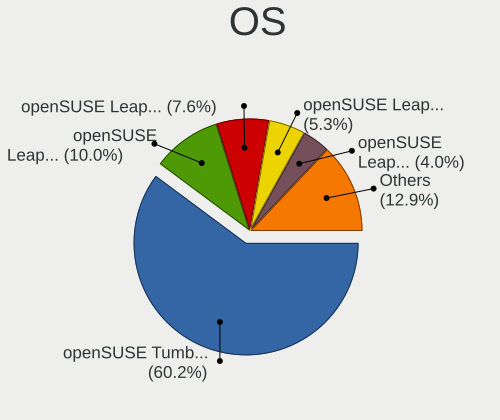

| Name                         | Desktops | Percent |
|------------------------------|----------|---------|
| openSUSE Tumbleweed-XXXXXXXX | 1041     | 60.17%  |
| openSUSE Leap-15.5           | 173      | 10%     |
| openSUSE Leap-15.6           | 131      | 7.57%   |
| openSUSE Leap-15.2           | 92       | 5.32%   |
| openSUSE Leap-15.3           | 69       | 3.99%   |
| openSUSE Leap-15.4           | 65       | 3.76%   |
| openSUSE Leap-15.1           | 56       | 3.24%   |
| openSUSE Microos-XXXXXXXX    | 50       | 2.89%   |
| openSUSE Leap-15.0           | 25       | 1.45%   |
| openSUSE Leap-16.0           | 19       | 1.1%    |
| openSUSE 13.2                | 3        | 0.17%   |
| openSUSE                     | 2        | 0.12%   |
| openSUSE Slowroll-20241202   | 1        | 0.06%   |
| openSUSE Leap-42.2           | 1        | 0.06%   |
| openSUSE Aeon-20240508       | 1        | 0.06%   |
| openSUSE 42.3                | 1        | 0.06%   |

OS Family
---------

OS without a version

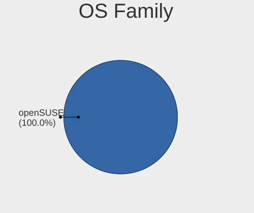

| Name     | Desktops | Percent |
|----------|----------|---------|
| openSUSE | 1648     | 100%    |

Kernel
------

Version of the Linux kernel

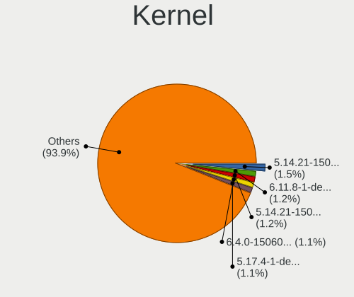

| Version                      | Desktops | Percent |
|------------------------------|----------|---------|
| 5.14.21-150500.53-default    | 32       | 1.54%   |
| 6.11.8-1-default             | 24       | 1.15%   |
| 5.14.21-150500.55.52-default | 24       | 1.15%   |
| 6.4.0-150600.23.25-default   | 23       | 1.11%   |
| 5.17.4-1-default             | 23       | 1.11%   |
| 6.5.4-1-default              | 19       | 0.91%   |
| 5.14.21-150500.55.19-default | 18       | 0.87%   |
| 4.12.14-lp151.28.44-default  | 18       | 0.87%   |
| 6.5.9-1-default              | 17       | 0.82%   |
| 5.6.0-1-default              | 17       | 0.82%   |
| 6.8.8-1-default              | 16       | 0.77%   |
| 5.14.21-150500.55.36-default | 16       | 0.77%   |
| 6.13.0-1-default             | 15       | 0.72%   |
| 6.9.3-1-default              | 14       | 0.67%   |
| 6.13.1-1-default             | 14       | 0.67%   |
| 6.15.8-1-default             | 13       | 0.63%   |
| 6.0.8-1-default              | 13       | 0.63%   |
| 5.6.2-1-default              | 13       | 0.63%   |
| 5.14.21-150500.55.39-default | 13       | 0.63%   |
| 6.9.9-1-default              | 12       | 0.58%   |
| 6.7.4-1-default              | 12       | 0.58%   |
| 6.7.2-1-default              | 12       | 0.58%   |
| 6.6.3-1-default              | 12       | 0.58%   |
| 6.6.2-1-default              | 12       | 0.58%   |
| 6.4.0-150600.23.53-default   | 12       | 0.58%   |
| 6.3.2-1-default              | 12       | 0.58%   |
| 5.3.18-lp152.63-default      | 12       | 0.58%   |
| 5.3.18-59.37-default         | 12       | 0.58%   |
| 6.8.1-1-default              | 11       | 0.53%   |
| 6.7.7-1-default              | 11       | 0.53%   |
| 6.4.0-150600.23.17-default   | 11       | 0.53%   |
| 6.3.9-1-default              | 11       | 0.53%   |
| 6.3.4-1-default              | 11       | 0.53%   |
| 6.0.12-1-default             | 11       | 0.53%   |
| 6.0.10-1-default             | 11       | 0.53%   |
| 5.19.8-1-default             | 11       | 0.53%   |
| 5.17.9-1-default             | 11       | 0.53%   |
| 5.16.11-1-default            | 11       | 0.53%   |
| 5.14.21-150500.55.65-default | 11       | 0.53%   |
| 5.14.21-150400.22-default    | 11       | 0.53%   |

Kernel Family
-------------

Linux kernel without a distro release

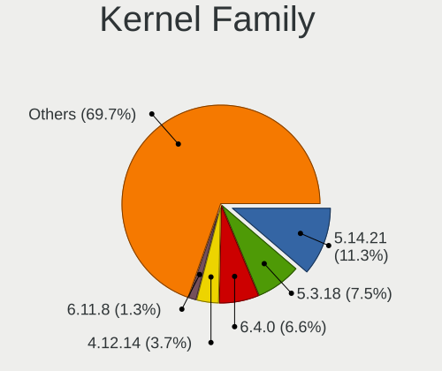

| Version | Desktops | Percent |
|---------|----------|---------|
| 5.14.21 | 223      | 11.27%  |
| 5.3.18  | 148      | 7.48%   |
| 6.4.0   | 130      | 6.57%   |
| 4.12.14 | 73       | 3.69%   |
| 6.11.8  | 26       | 1.31%   |
| 5.17.4  | 23       | 1.16%   |
| 6.5.4   | 19       | 0.96%   |
| 6.12.0  | 19       | 0.96%   |
| 6.5.9   | 18       | 0.91%   |
| 5.6.0   | 18       | 0.91%   |
| 6.8.8   | 16       | 0.81%   |
| 6.9.3   | 15       | 0.76%   |
| 6.13.0  | 15       | 0.76%   |
| 5.6.2   | 15       | 0.76%   |
| 6.13.1  | 14       | 0.71%   |
| 6.15.8  | 13       | 0.66%   |
| 6.0.8   | 13       | 0.66%   |
| 5.14.14 | 13       | 0.66%   |
| 6.9.9   | 12       | 0.61%   |
| 6.8.1   | 12       | 0.61%   |
| 6.7.4   | 12       | 0.61%   |
| 6.7.2   | 12       | 0.61%   |
| 6.6.3   | 12       | 0.61%   |
| 6.6.2   | 12       | 0.61%   |
| 6.3.2   | 12       | 0.61%   |
| 6.3.1   | 12       | 0.61%   |
| 6.0.12  | 12       | 0.61%   |
| 6.7.7   | 11       | 0.56%   |
| 6.3.9   | 11       | 0.56%   |
| 6.3.4   | 11       | 0.56%   |
| 6.0.10  | 11       | 0.56%   |
| 5.19.8  | 11       | 0.56%   |
| 5.17.9  | 11       | 0.56%   |
| 5.16.11 | 11       | 0.56%   |
| 6.9.1   | 10       | 0.51%   |
| 6.6.7   | 10       | 0.51%   |
| 6.4.6   | 10       | 0.51%   |
| 6.18.0  | 10       | 0.51%   |
| 6.14.4  | 10       | 0.51%   |
| 6.13.6  | 10       | 0.51%   |

Kernel Major Ver.
-----------------

Linux kernel major version

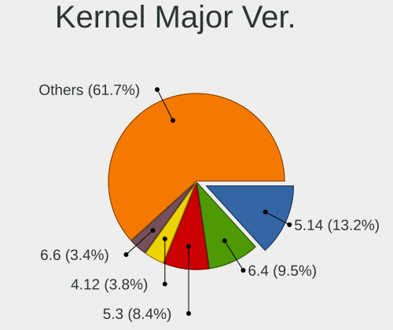

| Version | Desktops | Percent |
|---------|----------|---------|
| 5.14    | 255      | 13.25%  |
| 6.4     | 182      | 9.45%   |
| 5.3     | 162      | 8.42%   |
| 4.12    | 73       | 3.79%   |
| 6.6     | 65       | 3.38%   |
| 6.13    | 63       | 3.27%   |
| 6.3     | 58       | 3.01%   |
| 6.11    | 58       | 3.01%   |
| 6.1     | 55       | 2.86%   |
| 6.9     | 54       | 2.81%   |
| 6.0     | 54       | 2.81%   |
| 6.5     | 53       | 2.75%   |
| 5.17    | 52       | 2.7%    |
| 6.8     | 51       | 2.65%   |
| 6.7     | 50       | 2.6%    |
| 6.2     | 45       | 2.34%   |
| 5.6     | 42       | 2.18%   |
| 6.12    | 40       | 2.08%   |
| 6.15    | 39       | 2.03%   |
| 6.10    | 39       | 2.03%   |
| 6.14    | 35       | 1.82%   |
| 5.12    | 33       | 1.71%   |
| 6.17    | 30       | 1.56%   |
| 5.18    | 30       | 1.56%   |
| 5.8     | 29       | 1.51%   |
| 5.16    | 29       | 1.51%   |
| 5.10    | 27       | 1.4%    |
| 5.11    | 26       | 1.35%   |
| 6.16    | 25       | 1.3%    |
| 5.19    | 25       | 1.3%    |
| 5.13    | 21       | 1.09%   |
| 5.7     | 19       | 0.99%   |
| 6.18    | 16       | 0.83%   |
| 5.9     | 16       | 0.83%   |
| 5.15    | 16       | 0.83%   |
| 5.5     | 12       | 0.62%   |
| 5.4     | 10       | 0.52%   |
| 4.18    | 8        | 0.42%   |
| 5.2     | 7        | 0.36%   |
| 4.20    | 4        | 0.21%   |

Arch
----

OS architecture (x86_64, i586, etc.)

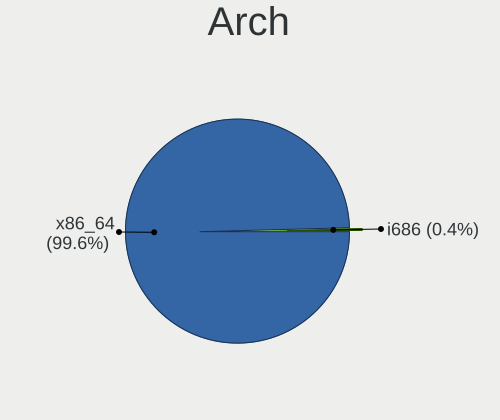

| Name   | Desktops | Percent |
|--------|----------|---------|
| x86_64 | 1641     | 99.58%  |
| i686   | 7        | 0.42%   |

DE
--

Desktop Environment

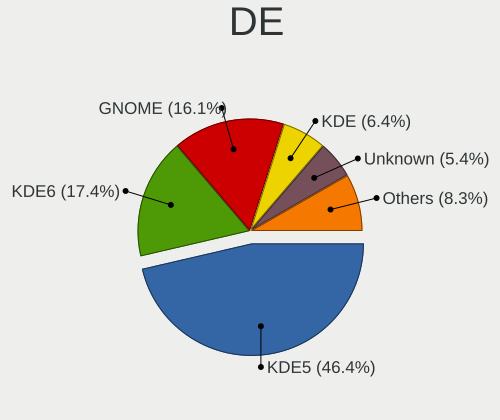

| Name          | Desktops | Percent |
|---------------|----------|---------|
| KDE5          | 805      | 46.37%  |
| KDE6          | 302      | 17.4%   |
| GNOME         | 280      | 16.13%  |
| KDE           | 111      | 6.39%   |
| Unknown       | 94       | 5.41%   |
| XFCE          | 63       | 3.63%   |
| MATE          | 14       | 0.81%   |
| X-Cinnamon    | 11       | 0.63%   |
| LXQt          | 8        | 0.46%   |
| ICEWM         | 8        | 0.46%   |
| Cinnamon      | 6        | 0.35%   |
| Budgie        | 6        | 0.35%   |
| LXDE          | 5        | 0.29%   |
| Deepin        | 4        | 0.23%   |
| KDE4          | 3        | 0.17%   |
| GNOME Classic | 3        | 0.17%   |
| WindowMaker   | 2        | 0.12%   |
| sway          | 2        | 0.12%   |
| Hyprland      | 2        | 0.12%   |
| awesome       | 2        | 0.12%   |
| Trinity       | 1        | 0.06%   |
| TDE           | 1        | 0.06%   |
| Pantheon      | 1        | 0.06%   |
| i3            | 1        | 0.06%   |
| Enlightenment | 1        | 0.06%   |

Display Server
--------------

X11 or Wayland

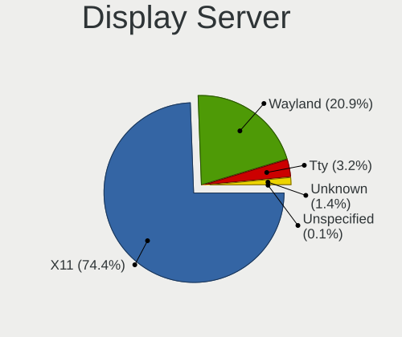

| Name        | Desktops | Percent |
|-------------|----------|---------|
| X11         | 1268     | 74.41%  |
| Wayland     | 356      | 20.89%  |
| Tty         | 55       | 3.23%   |
| Unknown     | 24       | 1.41%   |
| Unspecified | 1        | 0.06%   |

Display Manager
---------------

SDDM, LightDM, etc.

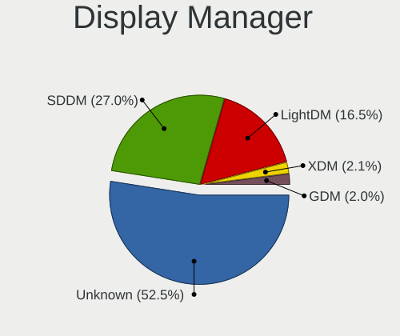

| Name    | Desktops | Percent |
|---------|----------|---------|
| Unknown | 893      | 52.47%  |
| SDDM    | 459      | 26.97%  |
| LightDM | 280      | 16.45%  |
| XDM     | 36       | 2.12%   |
| GDM     | 34       | 2%      |

OS Lang
-------

Language

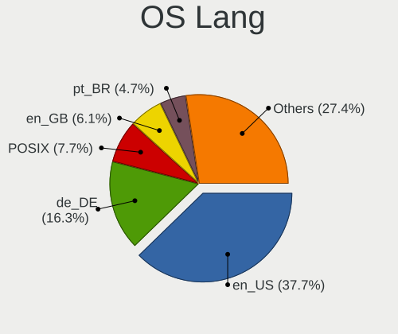

| Lang    | Desktops | Percent |
|---------|----------|---------|
| en_US   | 639      | 37.72%  |
| de_DE   | 276      | 16.29%  |
| POSIX   | 131      | 7.73%   |
| en_GB   | 104      | 6.14%   |
| pt_BR   | 80       | 4.72%   |
| Unknown | 80       | 4.72%   |
| ru_RU   | 58       | 3.42%   |
| es_ES   | 53       | 3.13%   |
| fr_FR   | 38       | 2.24%   |
| it_IT   | 30       | 1.77%   |
| pl_PL   | 27       | 1.59%   |
| nl_NL   | 27       | 1.59%   |
| pt_PT   | 12       | 0.71%   |
| fi_FI   | 7        | 0.41%   |
| en_DK   | 7        | 0.41%   |
| en_BW   | 7        | 0.41%   |
| da_DK   | 7        | 0.41%   |
| cs_CZ   | 7        | 0.41%   |
| zh_CN   | 6        | 0.35%   |
| nb_NO   | 6        | 0.35%   |
| en_AU   | 6        | 0.35%   |
| nl_BE   | 5        | 0.3%    |
| C       | 5        | 0.3%    |
| sv_SE   | 4        | 0.24%   |
| sl_SI   | 4        | 0.24%   |
| es_DO   | 4        | 0.24%   |
| es_AR   | 4        | 0.24%   |
| es_MX   | 3        | 0.18%   |
| en_IE   | 3        | 0.18%   |
| en_DE   | 3        | 0.18%   |
| en_CA   | 3        | 0.18%   |
| el_GR   | 3        | 0.18%   |
| de_AT   | 3        | 0.18%   |
| bg_BG   | 3        | 0.18%   |
| sk_SK   | 2        | 0.12%   |
| ro_RO   | 2        | 0.12%   |
| nn_NO   | 2        | 0.12%   |
| lv_LV   | 2        | 0.12%   |
| ko_KR   | 2        | 0.12%   |
| hu_HU   | 2        | 0.12%   |

Boot Mode
---------

EFI or BIOS

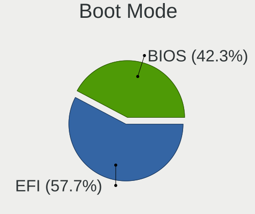

| Mode | Desktops | Percent |
|------|----------|---------|
| EFI  | 966      | 57.74%  |
| BIOS | 707      | 42.26%  |

Filesystem
----------

Type of filesystem

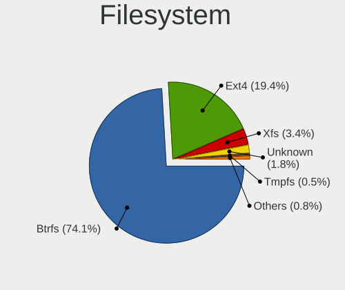

| Type    | Desktops | Percent |
|---------|----------|---------|
| Btrfs   | 1240     | 74.07%  |
| Ext4    | 325      | 19.41%  |
| Xfs     | 57       | 3.41%   |
| Unknown | 30       | 1.79%   |
| Tmpfs   | 8        | 0.48%   |
| Overlay | 8        | 0.48%   |
| Ext3    | 3        | 0.18%   |
| Ext2    | 2        | 0.12%   |
| Zfs     | 1        | 0.06%   |

Part. scheme
------------

Scheme of partitioning

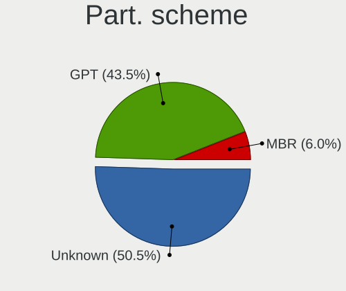

| Type    | Desktops | Percent |
|---------|----------|---------|
| Unknown | 852      | 50.5%   |
| GPT     | 734      | 43.51%  |
| MBR     | 101      | 5.99%   |

Dual Boot with Linux/BSD
------------------------

Hosting more than one Linux/BSD

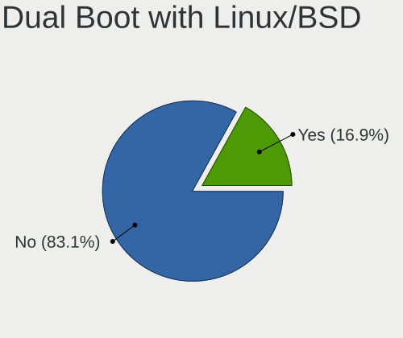

| Dual boot | Desktops | Percent |
|-----------|----------|---------|
| No        | 1407     | 83.06%  |
| Yes       | 287      | 16.94%  |

Dual Boot (Win)
---------------

Hosting Linux and Windows

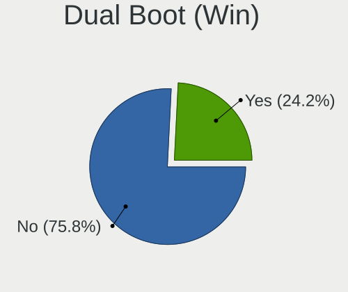

| Dual boot | Desktops | Percent |
|-----------|----------|---------|
| No        | 1295     | 77.08%  |
| Yes       | 385      | 22.92%  |

Board
-----

Vendor
------

Motherboard manufacturer

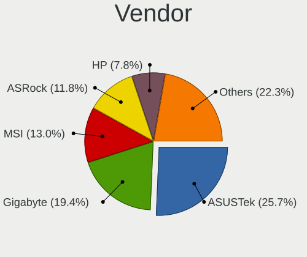

| Name                                 | Desktops | Percent |
|--------------------------------------|----------|---------|
| ASUSTek Computer                     | 423      | 25.67%  |
| Gigabyte Technology                  | 319      | 19.36%  |
| MSI                                  | 215      | 13.05%  |
| ASRock                               | 195      | 11.83%  |
| Hewlett-Packard                      | 129      | 7.83%   |
| Dell                                 | 102      | 6.19%   |
| Lenovo                               | 55       | 3.34%   |
| Intel                                | 30       | 1.82%   |
| Acer                                 | 20       | 1.21%   |
| Fujitsu                              | 18       | 1.09%   |
| Biostar                              | 18       | 1.09%   |
| Unknown                              | 14       | 0.85%   |
| Medion                               | 9        | 0.55%   |
| Pegatron                             | 8        | 0.49%   |
| Foxconn                              | 7        | 0.42%   |
| Shenzhen Meigao Electronic Equipment | 5        | 0.3%    |
| Huanan                               | 5        | 0.3%    |
| AZW                                  | 5        | 0.3%    |
| Supermicro                           | 4        | 0.24%   |
| GEEKOM                               | 4        | 0.24%   |
| Apple                                | 4        | 0.24%   |
| JGINYUE                              | 3        | 0.18%   |
| AMI                                  | 3        | 0.18%   |
| Shuttle                              | 2        | 0.12%   |
| Positivo                             | 2        | 0.12%   |
| OEM                                  | 2        | 0.12%   |
| MACHINIST                            | 2        | 0.12%   |
| Itautec                              | 2        | 0.12%   |
| HC Technology.                       | 2        | 0.12%   |
| GMKtec                               | 2        | 0.12%   |
| Fujitsu Siemens                      | 2        | 0.12%   |
| EVGA                                 | 2        | 0.12%   |
| Colorful Technology                  | 2        | 0.12%   |
| BESSTAR Tech                         | 2        | 0.12%   |
| Alienware                            | 2        | 0.12%   |
| Zillion                              | 1        | 0.06%   |
| Wortmann AG                          | 1        | 0.06%   |
| VS Company                           | 1        | 0.06%   |
| TYAN Computer                        | 1        | 0.06%   |
| SYWZ                                 | 1        | 0.06%   |

Model
-----

Motherboard model

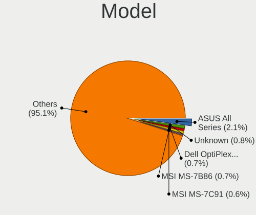

| Name                         | Desktops | Percent |
|------------------------------|----------|---------|
| ASUS All Series              | 34       | 2.06%   |
| Unknown                      | 14       | 0.85%   |
| Dell OptiPlex 9020           | 12       | 0.73%   |
| MSI MS-7B86                  | 11       | 0.67%   |
| MSI MS-7C91                  | 10       | 0.61%   |
| ASUS TUF Gaming X570-PLUS    | 10       | 0.61%   |
| MSI MS-7C37                  | 9        | 0.55%   |
| ASUS PRIME A320M-K           | 9        | 0.55%   |
| MSI MS-7C94                  | 8        | 0.49%   |
| Gigabyte X570 AORUS MASTER   | 8        | 0.49%   |
| Gigabyte B450M DS3H          | 8        | 0.49%   |
| ASRock B450M Pro4            | 8        | 0.49%   |
| MSI MS-7B89                  | 7        | 0.42%   |
| Gigabyte B550M DS3H          | 7        | 0.42%   |
| ASRock X570 Steel Legend     | 7        | 0.42%   |
| MSI MS-7A34                  | 6        | 0.36%   |
| Gigabyte B450 AORUS M        | 6        | 0.36%   |
| Gigabyte 970A-DS3P           | 6        | 0.36%   |
| ASUS M5A97 R2.0              | 6        | 0.36%   |
| ASUS CROSSHAIR V FORMULA-Z   | 6        | 0.36%   |
| MSI MS-7D25                  | 5        | 0.3%    |
| MSI MS-7C95                  | 5        | 0.3%    |
| MSI MS-7C02                  | 5        | 0.3%    |
| HP Z620 Workstation          | 5        | 0.3%    |
| HP Z440 Workstation          | 5        | 0.3%    |
| Gigabyte B550I AORUS PRO AX  | 5        | 0.3%    |
| Dell OptiPlex 7040           | 5        | 0.3%    |
| ASUS ROG STRIX B550-F GAMING | 5        | 0.3%    |
| ASUS ROG STRIX B450-F GAMING | 5        | 0.3%    |
| ASUS ROG CROSSHAIR VIII HERO | 5        | 0.3%    |
| ASUS PRIME X570-P            | 5        | 0.3%    |
| ASUS PRIME B550M-A           | 5        | 0.3%    |
| ASRock 970 Pro3 R2.0         | 5        | 0.3%    |
| MSI MS-7E12                  | 4        | 0.24%   |
| MSI MS-7C96                  | 4        | 0.24%   |
| MSI MS-7B79                  | 4        | 0.24%   |
| MSI MS-7A38                  | 4        | 0.24%   |
| MSI MS-7A33                  | 4        | 0.24%   |
| MSI MS-7721                  | 4        | 0.24%   |
| Intel H61                    | 4        | 0.24%   |

Model Family
------------

Motherboard model prefix

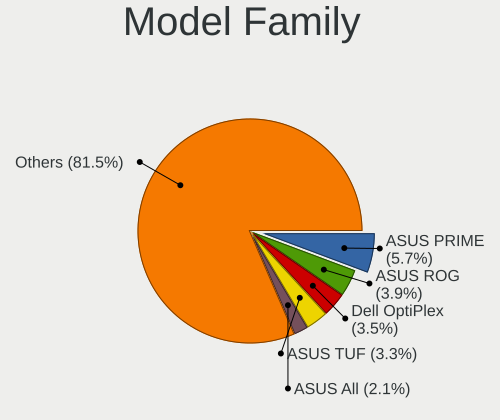

| Name                   | Desktops | Percent |
|------------------------|----------|---------|
| ASUS PRIME             | 94       | 5.7%    |
| ASUS ROG               | 65       | 3.94%   |
| Dell OptiPlex          | 58       | 3.52%   |
| ASUS TUF               | 54       | 3.28%   |
| ASUS All               | 34       | 2.06%   |
| Lenovo ThinkCentre     | 30       | 1.82%   |
| HP Compaq              | 22       | 1.33%   |
| Gigabyte X570          | 22       | 1.33%   |
| Dell Precision         | 20       | 1.21%   |
| Gigabyte B550          | 18       | 1.09%   |
| ASRock X570            | 17       | 1.03%   |
| HP EliteDesk           | 16       | 0.97%   |
| Gigabyte B450          | 15       | 0.91%   |
| ASRock B450M           | 14       | 0.85%   |
| Unknown                | 14       | 0.85%   |
| HP Pavilion            | 13       | 0.79%   |
| Gigabyte B450M         | 13       | 0.79%   |
| Fujitsu ESPRIMO        | 13       | 0.79%   |
| Acer Aspire            | 12       | 0.73%   |
| MSI MS-7B86            | 11       | 0.67%   |
| ASUS M5A78L-M          | 11       | 0.67%   |
| MSI MS-7C91            | 10       | 0.61%   |
| Gigabyte B550M         | 10       | 0.61%   |
| MSI MS-7C37            | 9        | 0.55%   |
| Dell Inspiron          | 9        | 0.55%   |
| ASUS Crosshair         | 9        | 0.55%   |
| ASRock 970             | 9        | 0.55%   |
| MSI MS-7C94            | 8        | 0.49%   |
| HP ProLiant            | 8        | 0.49%   |
| Gigabyte GA-78LMT-USB3 | 8        | 0.49%   |
| Dell XPS               | 8        | 0.49%   |
| ASRock B550            | 8        | 0.49%   |
| ASRock B450            | 8        | 0.49%   |
| MSI MS-7B89            | 7        | 0.42%   |
| Lenovo Legion          | 7        | 0.42%   |
| HP ProDesk             | 7        | 0.42%   |
| Gigabyte Z390          | 7        | 0.42%   |
| ASUS P8Z77-V           | 7        | 0.42%   |
| ASUS M5A97             | 7        | 0.42%   |
| MSI MS-7A34            | 6        | 0.36%   |

MFG Year
--------

Motherboard manufacture year

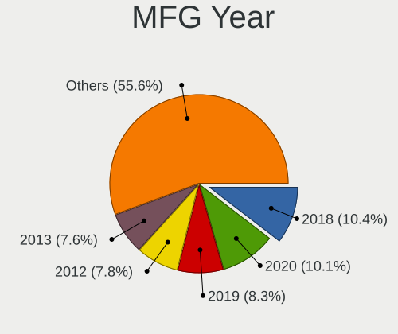

| Year | Desktops | Percent |
|------|----------|---------|
| 2018 | 172      | 10.44%  |
| 2020 | 167      | 10.13%  |
| 2019 | 137      | 8.31%   |
| 2012 | 129      | 7.83%   |
| 2013 | 126      | 7.65%   |
| 2017 | 109      | 6.61%   |
| 2022 | 96       | 5.83%   |
| 2014 | 91       | 5.52%   |
| 2011 | 86       | 5.22%   |
| 2021 | 85       | 5.16%   |
| 2015 | 73       | 4.43%   |
| 2023 | 72       | 4.37%   |
| 2016 | 65       | 3.94%   |
| 2010 | 64       | 3.88%   |
| 2009 | 56       | 3.4%    |
| 2008 | 41       | 2.49%   |
| 2024 | 38       | 2.31%   |
| 2007 | 17       | 1.03%   |
| 2006 | 12       | 0.73%   |
| 2025 | 6        | 0.36%   |
| 2005 | 3        | 0.18%   |
| 2004 | 2        | 0.12%   |
| 2003 | 1        | 0.06%   |

Form Factor
-----------

Physical design of the computer

| Name    | Desktops | Percent |
|---------|----------|---------|
| Desktop | 1648     | 100%    |

Secure Boot
-----------

Enabled or disabled

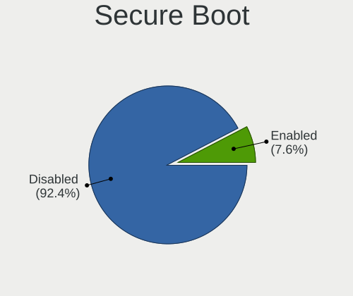

| State    | Desktops | Percent |
|----------|----------|---------|
| Disabled | 1537     | 92.37%  |
| Enabled  | 127      | 7.63%   |

Coreboot
--------

Have coreboot on board

| Used | Desktops | Percent |
|------|----------|---------|
| No   | 1646     | 99.88%  |
| Yes  | 2        | 0.12%   |

RAM Size
--------

Total RAM memory

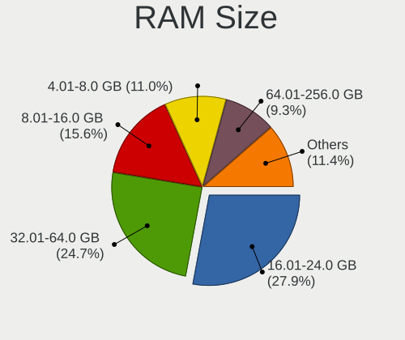

| Size in GB      | Desktops | Percent |
|-----------------|----------|---------|
| 16.01-24.0      | 469      | 27.92%  |
| 32.01-64.0      | 415      | 24.7%   |
| 8.01-16.0       | 262      | 15.6%   |
| 4.01-8.0        | 185      | 11.01%  |
| 64.01-256.0     | 157      | 9.35%   |
| 3.01-4.0        | 86       | 5.12%   |
| 24.01-32.0      | 75       | 4.46%   |
| 1.01-2.0        | 14       | 0.83%   |
| Unknown         | 9        | 0.54%   |
| 2.01-3.0        | 4        | 0.24%   |
| More than 256.0 | 3        | 0.18%   |
| 0.01-0.5        | 1        | 0.06%   |

RAM Used
--------

Used RAM memory

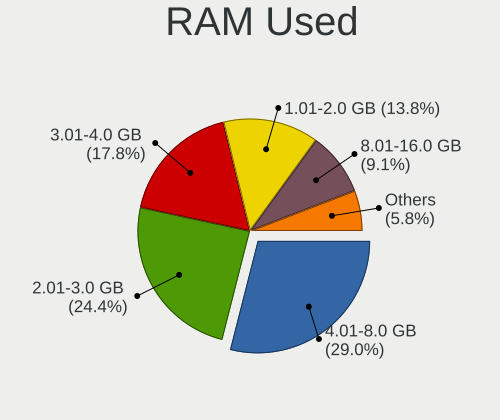

| Used GB     | Desktops | Percent |
|-------------|----------|---------|
| 4.01-8.0    | 535      | 28.97%  |
| 2.01-3.0    | 451      | 24.42%  |
| 3.01-4.0    | 329      | 17.81%  |
| 1.01-2.0    | 255      | 13.81%  |
| 8.01-16.0   | 169      | 9.15%   |
| 0.51-1.0    | 39       | 2.11%   |
| 16.01-24.0  | 30       | 1.62%   |
| 24.01-32.0  | 14       | 0.76%   |
| Unknown     | 9        | 0.49%   |
| 0.01-0.5    | 8        | 0.43%   |
| 32.01-64.0  | 7        | 0.38%   |
| 64.01-256.0 | 1        | 0.05%   |

Total Drives
------------

Number of drives on board

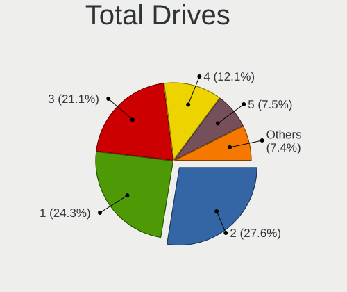

| Drives | Desktops | Percent |
|--------|----------|---------|
| 2      | 479      | 27.56%  |
| 1      | 423      | 24.34%  |
| 3      | 367      | 21.12%  |
| 4      | 211      | 12.14%  |
| 5      | 130      | 7.48%   |
| 6      | 63       | 3.62%   |
| 7      | 27       | 1.55%   |
| 10     | 9        | 0.52%   |
| 9      | 8        | 0.46%   |
| 8      | 7        | 0.4%    |
| 0      | 5        | 0.29%   |
| 13     | 4        | 0.23%   |
| 11     | 3        | 0.17%   |
| 16     | 1        | 0.06%   |
| 14     | 1        | 0.06%   |

Has CD-ROM
----------

Has CD-ROM on board

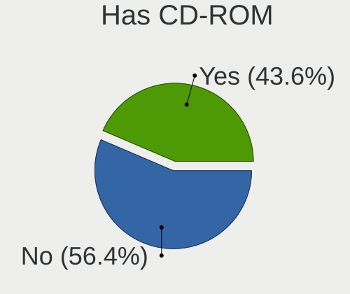

| Presented | Desktops | Percent |
|-----------|----------|---------|
| No        | 940      | 56.42%  |
| Yes       | 726      | 43.58%  |

Has Ethernet
------------

Has Ethernet on board

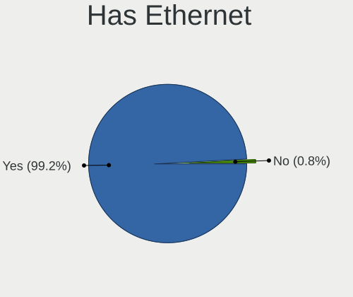

| Presented | Desktops | Percent |
|-----------|----------|---------|
| Yes       | 1634     | 99.15%  |
| No        | 14       | 0.85%   |

Has WiFi
--------

Has WiFi module

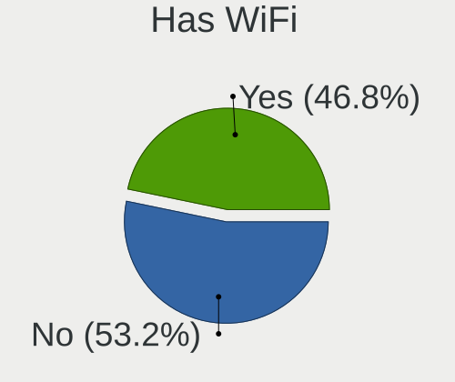

| Presented | Desktops | Percent |
|-----------|----------|---------|
| No        | 885      | 53.25%  |
| Yes       | 777      | 46.75%  |

Has Bluetooth
-------------

Has Bluetooth module

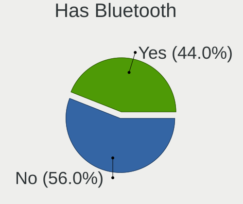

| Presented | Desktops | Percent |
|-----------|----------|---------|
| No        | 939      | 55.99%  |
| Yes       | 738      | 44.01%  |

Location
--------

Country
-------

Geographic location (country)

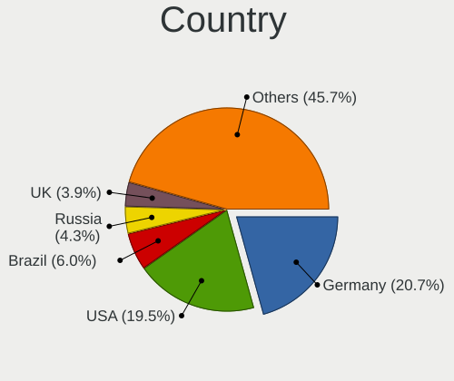

| Country         | Desktops | Percent |
|-----------------|----------|---------|
| Germany         | 343      | 20.71%  |
| USA             | 323      | 19.5%   |
| Brazil          | 99       | 5.98%   |
| Russia          | 71       | 4.29%   |
| UK              | 64       | 3.86%   |
| Italy           | 52       | 3.14%   |
| Spain           | 51       | 3.08%   |
| France          | 48       | 2.9%    |
| Canada          | 46       | 2.78%   |
| Netherlands     | 43       | 2.6%    |
| Poland          | 39       | 2.36%   |
| Australia       | 38       | 2.29%   |
| Switzerland     | 36       | 2.17%   |
| Sweden          | 23       | 1.39%   |
| Belgium         | 23       | 1.39%   |
| Austria         | 21       | 1.27%   |
| Finland         | 17       | 1.03%   |
| Czechia         | 16       | 0.97%   |
| Norway          | 15       | 0.91%   |
| Mexico          | 15       | 0.91%   |
| Romania         | 14       | 0.85%   |
| Greece          | 14       | 0.85%   |
| Argentina       | 14       | 0.85%   |
| Bulgaria        | 11       | 0.66%   |
| Portugal        | 10       | 0.6%    |
| Denmark         | 10       | 0.6%    |
| South Korea     | 9        | 0.54%   |
| Ukraine         | 8        | 0.48%   |
| Turkey          | 8        | 0.48%   |
| India           | 8        | 0.48%   |
| Croatia         | 8        | 0.48%   |
| Slovenia        | 7        | 0.42%   |
| Serbia          | 7        | 0.42%   |
| New Zealand     | 7        | 0.42%   |
| Hungary         | 7        | 0.42%   |
| Estonia         | 6        | 0.36%   |
| Chile           | 6        | 0.36%   |
| Belarus         | 6        | 0.36%   |
| The Netherlands | 5        | 0.3%    |
| South Africa    | 5        | 0.3%    |

City
----

Geographic location (city)

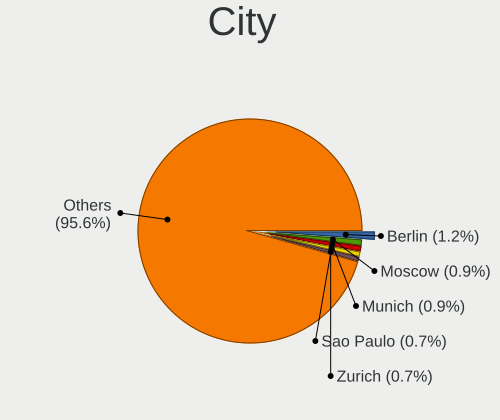

| City              | Desktops | Percent |
|-------------------|----------|---------|
| Berlin            | 21       | 1.19%   |
| Moscow            | 16       | 0.91%   |
| Munich            | 15       | 0.85%   |
| Sao Paulo         | 13       | 0.74%   |
| Zurich            | 12       | 0.68%   |
| Warsaw            | 12       | 0.68%   |
| Melbourne         | 12       | 0.68%   |
| Amsterdam         | 12       | 0.68%   |
| Sydney            | 11       | 0.63%   |
| Rio de Janeiro    | 11       | 0.63%   |
| Stuttgart         | 10       | 0.57%   |
| Littleton         | 10       | 0.57%   |
| Milan             | 9        | 0.51%   |
| Vienna            | 8        | 0.45%   |
| St Petersburg     | 8        | 0.45%   |
| Sofia             | 8        | 0.45%   |
| Prague            | 8        | 0.45%   |
| Los Angeles       | 8        | 0.45%   |
| Düsseldorf       | 8        | 0.45%   |
| Madrid            | 7        | 0.4%    |
| Leipzig           | 7        | 0.4%    |
| Hamburg           | 7        | 0.4%    |
| Frankfurt am Main | 7        | 0.4%    |
| Cologne           | 7        | 0.4%    |
| Zagreb            | 6        | 0.34%   |
| Vigo              | 6        | 0.34%   |
| Nice              | 6        | 0.34%   |
| Gothenburg        | 6        | 0.34%   |
| Dortmund          | 6        | 0.34%   |
| Tallinn           | 5        | 0.28%   |
| New York          | 5        | 0.28%   |
| Neuchatel         | 5        | 0.28%   |
| London            | 5        | 0.28%   |
| Lisbon            | 5        | 0.28%   |
| Haßfurt          | 5        | 0.28%   |
| Cleveland         | 5        | 0.28%   |
| Brisbane          | 5        | 0.28%   |
| Bremen            | 5        | 0.28%   |
| Athens            | 5        | 0.28%   |
| Winnipeg          | 4        | 0.23%   |

Drives
------

Drive Vendor
------------

Hard drive vendors

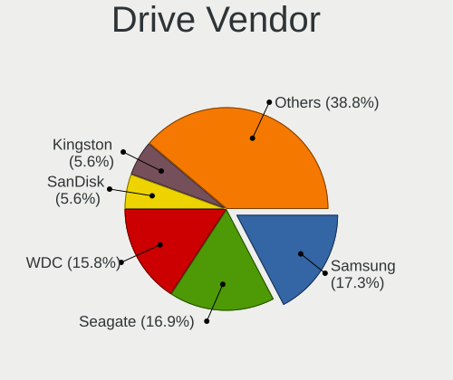

| Vendor                       | Desktops | Drives | Percent |
|------------------------------|----------|--------|---------|
| Samsung Electronics          | 616      | 1188   | 17.32%  |
| Seagate                      | 601      | 1104   | 16.9%   |
| WDC                          | 561      | 1148   | 15.78%  |
| SanDisk                      | 199      | 299    | 5.6%    |
| Kingston                     | 199      | 290    | 5.6%    |
| Toshiba                      | 174      | 246    | 4.89%   |
| Crucial                      | 167      | 257    | 4.7%    |
| Intel                        | 69       | 100    | 1.94%   |
| Hitachi                      | 68       | 92     | 1.91%   |
| Phison Electronics           | 61       | 81     | 1.72%   |
| Kingston Technology Company  | 44       | 53     | 1.24%   |
| A-DATA Technology            | 42       | 52     | 1.18%   |
| Unknown                      | 40       | 59     | 1.12%   |
| Silicon Motion               | 36       | 40     | 1.01%   |
| Micron/Crucial Technology    | 34       | 52     | 0.96%   |
| Intenso                      | 32       | 44     | 0.9%    |
| HGST                         | 32       | 53     | 0.9%    |
| SPCC                         | 30       | 37     | 0.84%   |
| PNY                          | 30       | 39     | 0.84%   |
| Micron Technology            | 29       | 37     | 0.82%   |
| MAXIO Technology (Hangzhou)  | 28       | 34     | 0.79%   |
| China                        | 28       | 47     | 0.79%   |
| SK hynix                     | 26       | 52     | 0.73%   |
| Phison                       | 23       | 33     | 0.65%   |
| ADATA Technology             | 20       | 24     | 0.56%   |
| Realtek Semiconductor        | 19       | 23     | 0.53%   |
| Hewlett-Packard              | 19       | 30     | 0.53%   |
| Patriot                      | 16       | 21     | 0.45%   |
| OCZ                          | 14       | 19     | 0.39%   |
| Corsair                      | 14       | 18     | 0.39%   |
| Maxtor                       | 12       | 15     | 0.34%   |
| Transcend                    | 11       | 13     | 0.31%   |
| XrayDisk                     | 10       | 12     | 0.28%   |
| Team                         | 10       | 15     | 0.28%   |
| GOODRAM                      | 9        | 10     | 0.25%   |
| Shenzhen Longsys Electronics | 7        | 10     | 0.2%    |
| LITEON                       | 7        | 8      | 0.2%    |
| KingSpec                     | 7        | 12     | 0.2%    |
| JMicron Technology           | 7        | 8      | 0.2%    |
| Fujitsu                      | 7        | 18     | 0.2%    |

Drive Model
-----------

Hard drive models

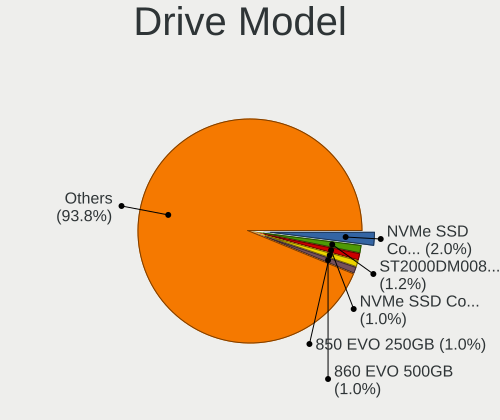

| Model                                                 | Desktops | Percent |
|-------------------------------------------------------|----------|---------|
| Samsung NVMe SSD Controller SM981/PM981/PM983 1TB     | 86       | 2%      |
| Seagate ST2000DM008-2FR102 2TB                        | 51       | 1.19%   |
| Samsung NVMe SSD Controller PM9A1/PM9A3/980PRO 1TB    | 44       | 1.02%   |
| Samsung SSD 850 EVO 250GB                             | 43       | 1%      |
| Samsung SSD 860 EVO 500GB                             | 42       | 0.98%   |
| Kingston SA400S37480G 480GB SSD                       | 39       | 0.91%   |
| Samsung SSD 860 EVO 1TB                               | 37       | 0.86%   |
| Kingston SA400S37240G 240GB SSD                       | 37       | 0.86%   |
| Seagate ST1000DM010-2EP102 1TB                        | 36       | 0.84%   |
| Samsung SSD 850 EVO 500GB                             | 31       | 0.72%   |
| Seagate ST500DM002-1BD142 500GB                       | 28       | 0.65%   |
| WDC WD10EZEX-08WN4A0 1TB                              | 26       | 0.6%    |
| Seagate ST1000DM003-1CH162 1TB                        | 25       | 0.58%   |
| Samsung SSD 840 EVO 250GB                             | 25       | 0.58%   |
| Crucial CT500MX500SSD1 500GB                          | 25       | 0.58%   |
| Seagate ST4000DM004-2CV104 4TB                        | 24       | 0.56%   |
| Toshiba DT01ACA100 1TB                                | 23       | 0.53%   |
| Silicon Motion SM2263EN/SM2263XT SSD Controller 512GB | 23       | 0.53%   |
| Seagate ST2000DM001-1ER164 2TB                        | 23       | 0.53%   |
| Unknown SD/MMC/MS PRO 2GB                             | 21       | 0.49%   |
| Kingston SV300S37A120G 120GB SSD                      | 21       | 0.49%   |
| Crucial CT1000MX500SSD1 1TB                           | 21       | 0.49%   |
| Samsung SSD 860 EVO 250GB                             | 20       | 0.46%   |
| Samsung NVMe SSD Controller SM961/PM961/SM963 1024GB  | 20       | 0.46%   |
| Phison E12 NVMe Controller 1TB                        | 20       | 0.46%   |
| WDC WDS500G2B0A-00SM50 500GB                          | 19       | 0.44%   |
| WDC WD20EZRZ-00Z5HB0 2TB                              | 18       | 0.42%   |
| Toshiba HDWD110 1TB                                   | 18       | 0.42%   |
| Seagate ST1000DM003-1ER162 1TB                        | 18       | 0.42%   |
| Samsung SSD 980 1TB                                   | 18       | 0.42%   |
| Samsung SSD 870 EVO 1TB                               | 18       | 0.42%   |
| Seagate ST1000DM003-1SB102 1TB                        | 17       | 0.4%    |
| Micron/Crucial P2 NVMe PCIe SSD 2TB                   | 17       | 0.4%    |
| MAXIO (Hangzhou) NVMe SSD Controller MAP1202 2TB      | 17       | 0.4%    |
| Toshiba DT01ACA200 2TB                                | 16       | 0.37%   |
| Seagate ST3500418AS 500GB                             | 16       | 0.37%   |
| Seagate ST2000DM001-1CH164 2TB                        | 16       | 0.37%   |
| Kingston SA400S37960G 960GB SSD                       | 16       | 0.37%   |
| Seagate Expansion 2TB                                 | 15       | 0.35%   |
| Samsung SSD 870 QVO 1TB                               | 15       | 0.35%   |

HDD Vendor
----------

Hard disk drive vendors

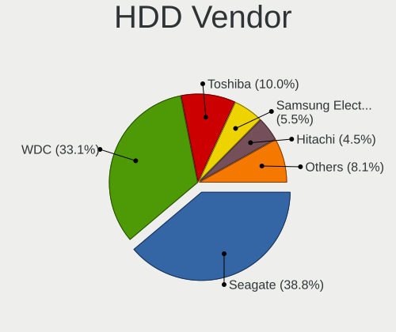

| Vendor              | Desktops | Drives | Percent |
|---------------------|----------|--------|---------|
| Seagate             | 589      | 1063   | 38.83%  |
| WDC                 | 502      | 991    | 33.09%  |
| Toshiba             | 151      | 219    | 9.95%   |
| Samsung Electronics | 84       | 126    | 5.54%   |
| Hitachi             | 68       | 92     | 4.48%   |
| HGST                | 32       | 53     | 2.11%   |
| Unknown             | 23       | 30     | 1.52%   |
| Maxtor              | 12       | 15     | 0.79%   |
| Hewlett-Packard     | 10       | 18     | 0.66%   |
| Fujitsu             | 7        | 18     | 0.46%   |
| ASMT                | 5        | 8      | 0.33%   |
| Intenso             | 4        | 9      | 0.26%   |
| WD MediaMax         | 3        | 3      | 0.2%    |
| TO Exter            | 3        | 3      | 0.2%    |
| JMicron Technology  | 3        | 3      | 0.2%    |
| Apple               | 3        | 3      | 0.2%    |
| USB3.0              | 2        | 3      | 0.13%   |
| Synology            | 2        | 2      | 0.13%   |
| Inateck             | 2        | 2      | 0.13%   |
| XrayDisk            | 1        | 1      | 0.07%   |
| USB                 | 1        | 1      | 0.07%   |
| UD0401              | 1        | 1      | 0.07%   |
| T-FORCE             | 1        | 2      | 0.07%   |
| SSK                 | 1        | 2      | 0.07%   |
| SATAFIRM            | 1        | 1      | 0.07%   |
| MaxDigital          | 1        | 1      | 0.07%   |
| MARVELL             | 1        | 1      | 0.07%   |
| LIO-ORG             | 1        | 1      | 0.07%   |
| IB-AC703            | 1        | 1      | 0.07%   |
| HGST HTS            | 1        | 1      | 0.07%   |
| ASMedia             | 1        | 1      | 0.07%   |

SSD Vendor
----------

Solid state drive vendors

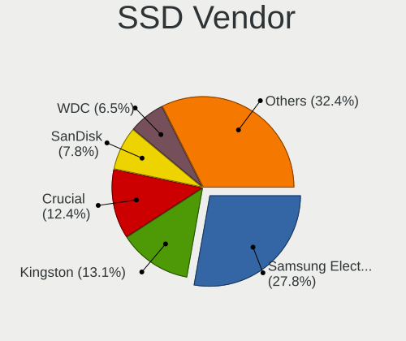

| Vendor              | Desktops | Drives | Percent |
|---------------------|----------|--------|---------|
| Samsung Electronics | 359      | 617    | 27.79%  |
| Kingston            | 169      | 237    | 13.08%  |
| Crucial             | 160      | 245    | 12.38%  |
| SanDisk             | 101      | 135    | 7.82%   |
| WDC                 | 84       | 128    | 6.5%    |
| A-DATA Technology   | 37       | 45     | 2.86%   |
| Intel               | 34       | 51     | 2.63%   |
| China               | 28       | 47     | 2.17%   |
| PNY                 | 27       | 33     | 2.09%   |
| SPCC                | 25       | 32     | 1.93%   |
| Intenso             | 24       | 29     | 1.86%   |
| Patriot             | 15       | 19     | 1.16%   |
| Toshiba             | 14       | 16     | 1.08%   |
| OCZ                 | 14       | 19     | 1.08%   |
| Micron Technology   | 13       | 18     | 1.01%   |
| Transcend           | 10       | 12     | 0.77%   |
| Team                | 10       | 15     | 0.77%   |
| Corsair             | 10       | 13     | 0.77%   |
| GOODRAM             | 8        | 9      | 0.62%   |
| XrayDisk            | 7        | 8      | 0.54%   |
| SK hynix            | 7        | 12     | 0.54%   |
| LITEON              | 7        | 8      | 0.54%   |
| KingSpec            | 7        | 12     | 0.54%   |
| Seagate             | 6        | 8      | 0.46%   |
| Hewlett-Packard     | 6        | 9      | 0.46%   |
| Apacer              | 6        | 11     | 0.46%   |
| SABRENT             | 5        | 6      | 0.39%   |
| Leven               | 5        | 5      | 0.39%   |
| Mushkin             | 4        | 7      | 0.31%   |
| Biostar             | 4        | 6      | 0.31%   |
| Apple               | 4        | 4      | 0.31%   |
| Unknown             | 4        | 6      | 0.31%   |
| LITEONIT            | 3        | 3      | 0.23%   |
| Gigabyte Technology | 3        | 5      | 0.23%   |
| Fanxiang            | 3        | 6      | 0.23%   |
| Emtec               | 3        | 4      | 0.23%   |
| Verbatim            | 2        | 2      | 0.15%   |
| StoreJet            | 2        | 2      | 0.15%   |
| Smartbuy            | 2        | 4      | 0.15%   |
| Smart               | 2        | 2      | 0.15%   |

Drive Kind
----------

HDD or SSD

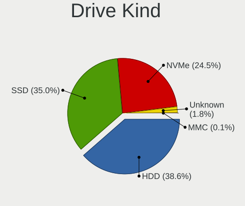

| Kind    | Desktops | Drives | Percent |
|---------|----------|--------|---------|
| HDD     | 1108     | 2675   | 38.57%  |
| SSD     | 1005     | 1916   | 34.98%  |
| NVMe    | 703      | 1271   | 24.47%  |
| Unknown | 53       | 79     | 1.84%   |
| MMC     | 4        | 4      | 0.14%   |

Drive Connector
---------------

SATA, SAS, NVMe, etc.

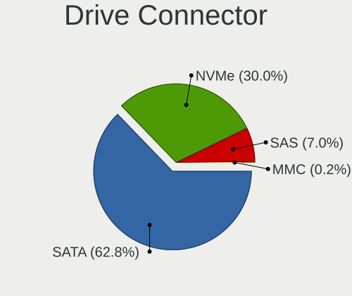

| Type | Desktops | Drives | Percent |
|------|----------|--------|---------|
| SATA | 1466     | 4379   | 62.78%  |
| NVMe | 701      | 1262   | 30.02%  |
| SAS  | 164      | 300    | 7.02%   |
| MMC  | 4        | 4      | 0.17%   |

Drive Size
----------

Size of hard drive

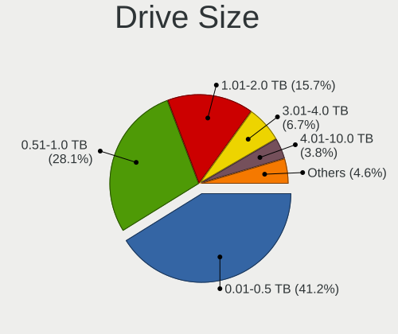

| Size in TB | Desktops | Drives | Percent |
|------------|----------|--------|---------|
| 0.01-0.5   | 1026     | 1937   | 41.16%  |
| 0.51-1.0   | 701      | 1236   | 28.12%  |
| 1.01-2.0   | 391      | 747    | 15.68%  |
| 3.01-4.0   | 166      | 296    | 6.66%   |
| 2.01-3.0   | 95       | 156    | 3.81%   |
| 4.01-10.0  | 95       | 190    | 3.81%   |
| 10.01-20.0 | 18       | 28     | 0.72%   |
| 20.01-50.0 | 1        | 1      | 0.04%   |

Space Total
-----------

Amount of disk space available on the file system

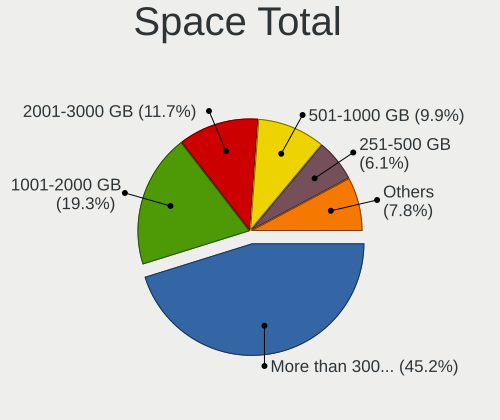

| Size in GB     | Desktops | Percent |
|----------------|----------|---------|
| More than 3000 | 787      | 45.18%  |
| 1001-2000      | 337      | 19.35%  |
| 2001-3000      | 203      | 11.65%  |
| 501-1000       | 172      | 9.87%   |
| 251-500        | 107      | 6.14%   |
| 101-250        | 64       | 3.67%   |
| Unknown        | 32       | 1.84%   |
| 51-100         | 20       | 1.15%   |
| 1-20           | 11       | 0.63%   |
| 21-50          | 9        | 0.52%   |

Space Used
----------

Amount of used disk space

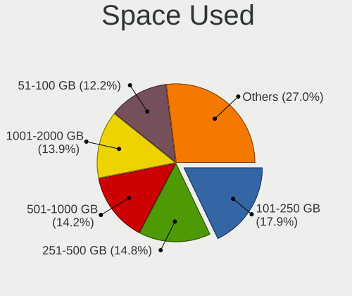

| Used GB        | Desktops | Percent |
|----------------|----------|---------|
| 101-250        | 327      | 17.88%  |
| 251-500        | 271      | 14.82%  |
| 501-1000       | 259      | 14.16%  |
| 1001-2000      | 254      | 13.89%  |
| 51-100         | 224      | 12.25%  |
| More than 3000 | 215      | 11.76%  |
| 2001-3000      | 113      | 6.18%   |
| 21-50          | 67       | 3.66%   |
| 1-20           | 67       | 3.66%   |
| Unknown        | 32       | 1.75%   |

Malfunc. Drives
---------------

Drive models with a malfunction

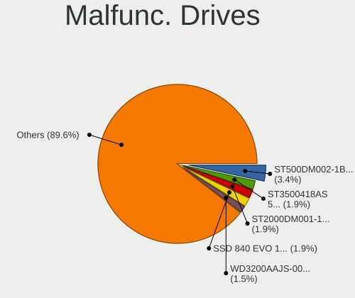

| Model                                 | Desktops | Drives | Percent |
|---------------------------------------|----------|--------|---------|
| Seagate ST500DM002-1BD142 500GB       | 9        | 12     | 3.36%   |
| Seagate ST3500418AS 500GB             | 5        | 5      | 1.87%   |
| Seagate ST2000DM001-1CH164 2TB        | 5        | 6      | 1.87%   |
| Samsung Electronics SSD 840 EVO 120GB | 5        | 7      | 1.87%   |
| WDC WD3200AAJS-00L7A0 320GB           | 4        | 4      | 1.49%   |
| Seagate ST2000DM001-1ER164 2TB        | 4        | 4      | 1.49%   |
| WDC WD10JFCX-68N6GN0 1TB              | 3        | 4      | 1.12%   |
| Samsung Electronics SSD 980 1TB       | 3        | 3      | 1.12%   |
| Samsung Electronics HD501LJ 500GB     | 3        | 4      | 1.12%   |
| Kingston SV300S37A120G 120GB SSD      | 3        | 4      | 1.12%   |
| Kingston SHFS37A120G 120GB SSD        | 3        | 4      | 1.12%   |
| WDC WD6400AAKS-22A7B2 640GB           | 2        | 2      | 0.75%   |
| WDC WD5002ABYS-02B1B0 500GB           | 2        | 3      | 0.75%   |
| WDC WD30EZRZ-00Z5HB0 3TB              | 2        | 3      | 0.75%   |
| WDC WD20EZRX-00DC0B0 2TB              | 2        | 3      | 0.75%   |
| WDC WD20EFRX-68EUZN0 2TB              | 2        | 3      | 0.75%   |
| WDC WD2002FAEX-007BA0 2TB             | 2        | 2      | 0.75%   |
| WDC WD1003FZEX-00K3CA0 1TB            | 2        | 2      | 0.75%   |
| WDC WD1002FAEX-00Z3A0 1TB             | 2        | 3      | 0.75%   |
| WD MediaMax WL5000GSA12872B 5TB       | 2        | 2      | 0.75%   |
| Seagate ST500LM012 HN-M500MBB 500GB   | 2        | 2      | 0.75%   |
| Seagate ST3250318AS 250GB             | 2        | 2      | 0.75%   |
| Seagate ST31000528AS 1TB              | 2        | 5      | 0.75%   |
| Seagate ST31000524AS 1TB              | 2        | 2      | 0.75%   |
| Seagate ST3000DM001-1ER166 3TB        | 2        | 2      | 0.75%   |
| Seagate ST2000DM008-2FR102 2TB        | 2        | 5      | 0.75%   |
| Seagate ST1000DM003-1SB102 1TB        | 2        | 3      | 0.75%   |
| Seagate ST1000DM003-1ER162 1TB        | 2        | 2      | 0.75%   |
| Seagate ST1000DM003-1CH162 1TB        | 2        | 2      | 0.75%   |
| Samsung Electronics SSD 870 EVO 1TB   | 2        | 3      | 0.75%   |
| Samsung Electronics HD322HJ 320GB     | 2        | 2      | 0.75%   |
| Samsung Electronics HD103UJ 1TB       | 2        | 2      | 0.75%   |
| Samsung Electronics HD103SJ 1TB       | 2        | 3      | 0.75%   |
| Kingston SA400S37480G 480GB SSD       | 2        | 4      | 0.75%   |
| Kingston SA400S37120G 120GB SSD       | 2        | 7      | 0.75%   |
| Hitachi HTS545050A7E380 500GB         | 2        | 2      | 0.75%   |
| XrayDisk SSD 512GB                    | 1        | 1      | 0.37%   |
| XPG GAMMIX S41 512GB                  | 1        | 1      | 0.37%   |
| WDC WDS240G2G0A-00JH30 240GB SSD      | 1        | 1      | 0.37%   |
| WDC WD800AAJS-75M0A0 80GB             | 1        | 1      | 0.37%   |

Malfunc. Drive Vendor
---------------------

Vendors of faulty drives

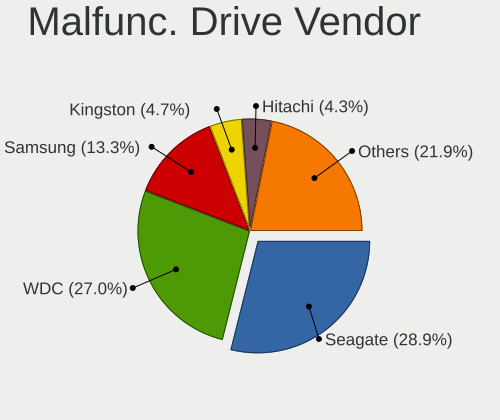

| Vendor                | Desktops | Drives | Percent |
|-----------------------|----------|--------|---------|
| Seagate               | 74       | 96     | 28.91%  |
| WDC                   | 69       | 87     | 26.95%  |
| Samsung Electronics   | 34       | 47     | 13.28%  |
| Kingston              | 12       | 21     | 4.69%   |
| Hitachi               | 11       | 14     | 4.3%    |
| Toshiba               | 10       | 16     | 3.91%   |
| Crucial               | 8        | 9      | 3.13%   |
| Maxtor                | 5        | 7      | 1.95%   |
| SanDisk               | 4        | 6      | 1.56%   |
| Intel                 | 4        | 4      | 1.56%   |
| Transcend             | 3        | 5      | 1.17%   |
| WD MediaMax           | 2        | 2      | 0.78%   |
| OCZ                   | 2        | 2      | 0.78%   |
| Micron Technology     | 2        | 2      | 0.78%   |
| XrayDisk              | 1        | 1      | 0.39%   |
| XPG                   | 1        | 1      | 0.39%   |
| TrekStor              | 1        | 1      | 0.39%   |
| SuperTalent           | 1        | 1      | 0.39%   |
| SPCC                  | 1        | 1      | 0.39%   |
| Realtek Semiconductor | 1        | 1      | 0.39%   |
| Patriot               | 1        | 1      | 0.39%   |
| KingFast              | 1        | 1      | 0.39%   |
| Intenso               | 1        | 1      | 0.39%   |
| HGST                  | 1        | 1      | 0.39%   |
| Hewlett-Packard       | 1        | 1      | 0.39%   |
| GOODRAM               | 1        | 1      | 0.39%   |
| EXRAM                 | 1        | 1      | 0.39%   |
| Corsair               | 1        | 1      | 0.39%   |
| China                 | 1        | 1      | 0.39%   |
| AGI                   | 1        | 1      | 0.39%   |

Malfunc. HDD Vendor
-------------------

Vendors of faulty HDD drives

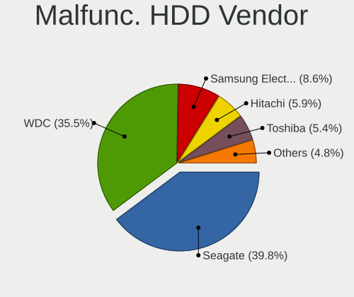

| Vendor              | Desktops | Drives | Percent |
|---------------------|----------|--------|---------|
| Seagate             | 74       | 96     | 39.78%  |
| WDC                 | 66       | 84     | 35.48%  |
| Samsung Electronics | 16       | 20     | 8.6%    |
| Hitachi             | 11       | 14     | 5.91%   |
| Toshiba             | 10       | 16     | 5.38%   |
| Maxtor              | 5        | 7      | 2.69%   |
| WD MediaMax         | 2        | 2      | 1.08%   |
| HGST                | 1        | 1      | 0.54%   |
| Hewlett-Packard     | 1        | 1      | 0.54%   |

Malfunc. Drive Kind
-------------------

Kinds of faulty drives

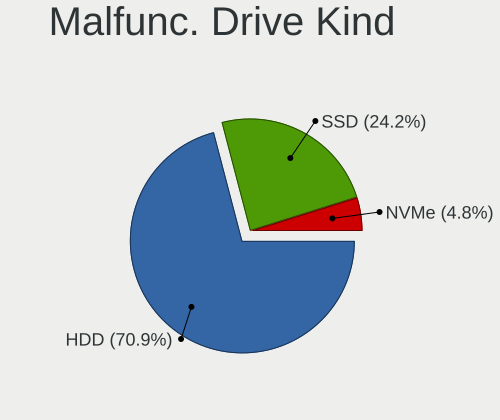

| Kind | Desktops | Drives | Percent |
|------|----------|--------|---------|
| HDD  | 161      | 241    | 70.93%  |
| SSD  | 55       | 80     | 24.23%  |
| NVMe | 11       | 13     | 4.85%   |

Failed Drives
-------------

Failed drive models

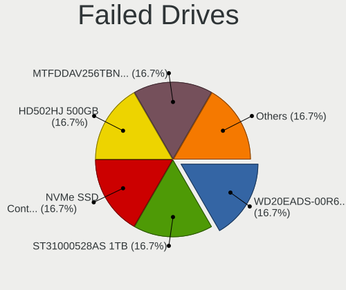

| Model                                                         | Desktops | Drives | Percent |
|---------------------------------------------------------------|----------|--------|---------|
| WDC WD20EADS-00R6B0 2TB                                       | 1        | 1      | 16.67%  |
| Seagate ST31000528AS 1TB                                      | 1        | 1      | 16.67%  |
| Samsung Electronics NVMe SSD Controller SM981/PM981/PM983 1TB | 1        | 1      | 16.67%  |
| Samsung Electronics HD502HJ 500GB                             | 1        | 5      | 16.67%  |
| Micron Technology MTFDDAV256TBN-1AR15ABHA 256GB SSD           | 1        | 1      | 16.67%  |
| Hitachi HDS721025CLA382 250GB                                 | 1        | 1      | 16.67%  |

Failed Drive Vendor
-------------------

Failed drive vendors

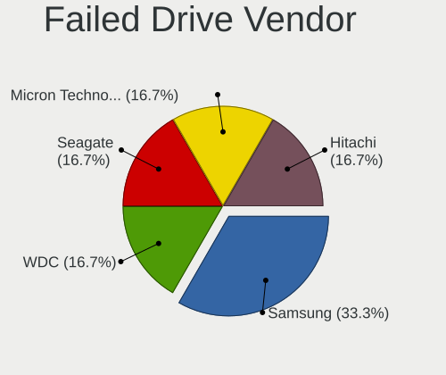

| Vendor              | Desktops | Drives | Percent |
|---------------------|----------|--------|---------|
| Samsung Electronics | 2        | 6      | 33.33%  |
| WDC                 | 1        | 1      | 16.67%  |
| Seagate             | 1        | 1      | 16.67%  |
| Micron Technology   | 1        | 1      | 16.67%  |
| Hitachi             | 1        | 1      | 16.67%  |

Drive Status
------------

Number of failed and malfunc. drives

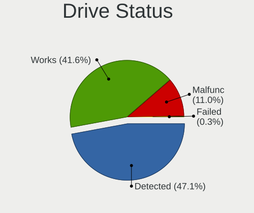

| Status   | Desktops | Drives | Percent |
|----------|----------|--------|---------|
| Detected | 904      | 3154   | 47.08%  |
| Works    | 798      | 2447   | 41.56%  |
| Malfunc  | 212      | 334    | 11.04%  |
| Failed   | 6        | 10     | 0.31%   |

Storage controller
------------------

Storage Vendor
--------------

Storage controller vendors

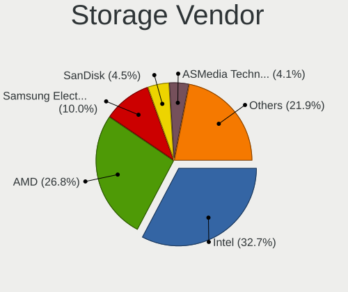

| Vendor                         | Desktops | Percent |
|--------------------------------|----------|---------|
| Intel                          | 890      | 32.72%  |
| AMD                            | 729      | 26.8%   |
| Samsung Electronics            | 272      | 10%     |
| SanDisk                        | 122      | 4.49%   |
| ASMedia Technology             | 111      | 4.08%   |
| Phison Electronics             | 86       | 3.16%   |
| Kingston Technology Company    | 76       | 2.79%   |
| Marvell Technology Group       | 60       | 2.21%   |
| Micron/Crucial Technology      | 42       | 1.54%   |
| JMicron Technology             | 42       | 1.54%   |
| Silicon Motion                 | 38       | 1.4%    |
| MAXIO Technology (Hangzhou)    | 29       | 1.07%   |
| ADATA Technology               | 25       | 0.92%   |
| Nvidia                         | 22       | 0.81%   |
| Realtek Semiconductor          | 21       | 0.77%   |
| SK hynix                       | 20       | 0.74%   |
| Micron Technology              | 16       | 0.59%   |
| Seagate Technology             | 14       | 0.51%   |
| Broadcom / LSI                 | 14       | 0.51%   |
| LSI Logic / Symbios Logic      | 12       | 0.44%   |
| Toshiba America Info Systems   | 9        | 0.33%   |
| Shenzhen Longsys Electronics   | 9        | 0.33%   |
| Adaptec                        | 9        | 0.33%   |
| Silicon Image                  | 8        | 0.29%   |
| INNOGRIT                       | 8        | 0.29%   |
| VIA Technologies               | 7        | 0.26%   |
| KIOXIA                         | 5        | 0.18%   |
| Solidigm                       | 2        | 0.07%   |
| Promise Technology             | 2        | 0.07%   |
| Netac Technology               | 2        | 0.07%   |
| Lite-On Technology             | 2        | 0.07%   |
| Hosin Global Electronics       | 2        | 0.07%   |
| Hewlett-Packard                | 2        | 0.07%   |
| TenaFe                         | 1        | 0.04%   |
| Tekram Technology              | 1        | 0.04%   |
| Solid State Storage Technology | 1        | 0.04%   |
| Shenzhen Wodposit Electronics  | 1        | 0.04%   |
| OCZ Technology Group           | 1        | 0.04%   |
| Nextorage                      | 1        | 0.04%   |
| Integrated Technology Express  | 1        | 0.04%   |

Storage Model
-------------

Storage controller models

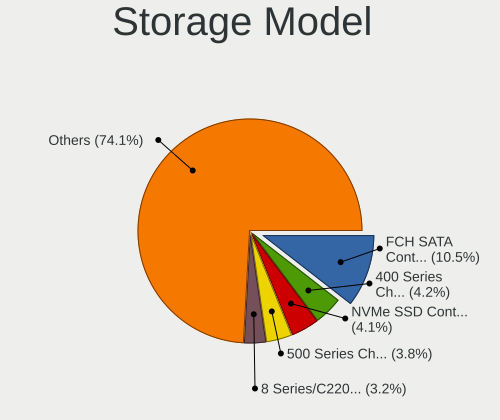

| Model                                                                          | Desktops | Percent |
|--------------------------------------------------------------------------------|----------|---------|
| AMD FCH SATA Controller [AHCI mode]                                            | 347      | 10.54%  |
| AMD 400 Series Chipset SATA Controller                                         | 139      | 4.22%   |
| Samsung NVMe SSD Controller SM981/PM981/PM983                                  | 136      | 4.13%   |
| AMD 500 Series Chipset SATA Controller                                         | 125      | 3.8%    |
| Intel 8 Series/C220 Series Chipset Family 6-port SATA Controller 1 [AHCI mode] | 105      | 3.19%   |
| ASMedia ASM1061/ASM1062 Serial ATA Controller                                  | 97       | 2.95%   |
| AMD SB7x0/SB8x0/SB9x0 IDE Controller                                           | 90       | 2.73%   |
| AMD SB7x0/SB8x0/SB9x0 SATA Controller [AHCI mode]                              | 78       | 2.37%   |
| Intel 200 Series PCH SATA controller [AHCI mode]                               | 75       | 2.28%   |
| AMD 600 Series Chipset SATA Controller                                         | 71       | 2.16%   |
| Intel Q170/Q150/B150/H170/H110/Z170/CM236 Chipset SATA Controller [AHCI Mode]  | 70       | 2.13%   |
| Intel 6 Series/C200 Series Chipset Family 6 port Desktop SATA AHCI Controller  | 68       | 2.06%   |
| Intel 7 Series/C210 Series Chipset Family 6-port SATA Controller [AHCI mode]   | 64       | 1.94%   |
| Intel SATA Controller [RAID Mode]                                              | 60       | 1.82%   |
| AMD SB7x0/SB8x0/SB9x0 SATA Controller [IDE mode]                               | 55       | 1.67%   |
| Samsung NVMe SSD Controller PM9A1/PM9A3/980PRO                                 | 50       | 1.52%   |
| Intel Cannon Lake PCH SATA AHCI Controller                                     | 46       | 1.4%    |
| Intel Alder Lake-S PCH SATA Controller [AHCI Mode]                             | 43       | 1.31%   |
| Phison E12 NVMe Controller                                                     | 36       | 1.09%   |
| AMD 300 Series Chipset SATA Controller                                         | 36       | 1.09%   |
| Intel Raptor Lake SATA AHCI Controller                                         | 33       | 1%      |
| Samsung NVMe SSD Controller 980 (DRAM-less)                                    | 32       | 0.97%   |
| AMD A320 Chipset SATA Controller [AHCI mode]                                   | 32       | 0.97%   |
| Samsung NVMe SSD Controller SM961/PM961/SM963                                  | 30       | 0.91%   |
| Silicon Motion SM2263EN/SM2263XT (DRAM-less) NVMe SSD Controllers              | 27       | 0.82%   |
| Samsung NVMe SSD Controller S4LV008[Pascal]                                    | 27       | 0.82%   |
| Intel NM10/ICH7 Family SATA Controller [IDE mode]                              | 27       | 0.82%   |
| Intel 500 Series Chipset Family SATA AHCI Controller                           | 26       | 0.79%   |
| Intel 9 Series Chipset Family SATA Controller [AHCI Mode]                      | 25       | 0.76%   |
| JMicron JMB363 SATA/IDE Controller                                             | 23       | 0.7%    |
| Kingston Company A2000 NVMe SSD [SM2263EN]                                     | 22       | 0.67%   |
| Intel Comet Lake SATA AHCI Controller                                          | 22       | 0.67%   |
| SanDisk WD SN560/SN740/SN770/SN5000 NVMe SSD                                   | 21       | 0.64%   |
| Phison E16 PCIe4 NVMe Controller                                               | 20       | 0.61%   |
| Micron/Crucial P2 [Nick P2] / P3 / P3 Plus NVMe PCIe SSD (DRAM-less)           | 20       | 0.61%   |
| AMD X370 Series Chipset SATA Controller                                        | 20       | 0.61%   |
| Sandisk WD Black SN850X NVMe SSD                                               | 19       | 0.58%   |
| MAXIO (Hangzhou) NVMe SSD Controller MAP1202 (DRAM-less)                       | 19       | 0.58%   |
| Intel SSD 660P Series                                                          | 19       | 0.58%   |
| Intel C610/X99 series chipset 6-Port SATA Controller [AHCI mode]               | 19       | 0.58%   |

Storage Kind
------------

Kind of storage controller (IDE, SATA, NVMe, SAS, ...)

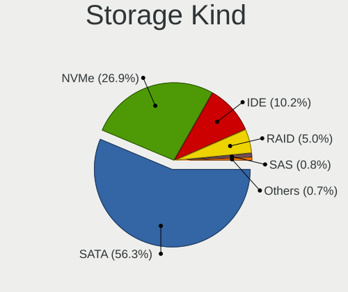

| Kind | Desktops | Percent |
|------|----------|---------|
| SATA | 1460     | 56.33%  |
| NVMe | 697      | 26.89%  |
| IDE  | 265      | 10.22%  |
| RAID | 130      | 5.02%   |
| SAS  | 22       | 0.85%   |
| SCSI | 18       | 0.69%   |

Processor
---------

CPU Vendor
----------

Processor vendors

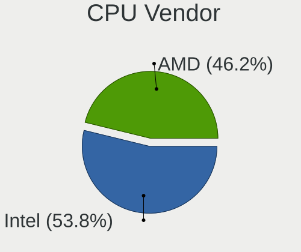

| Vendor | Desktops | Percent |
|--------|----------|---------|
| Intel  | 887      | 53.82%  |
| AMD    | 761      | 46.18%  |

CPU Model
---------

Processor models

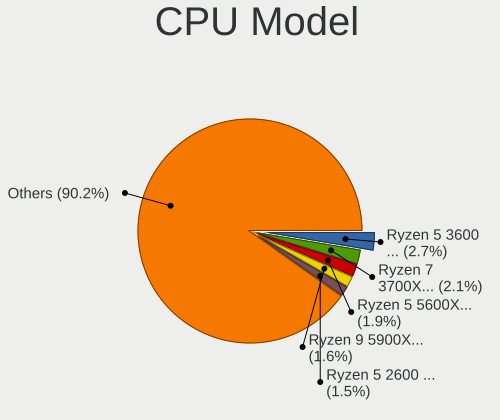

| Model                                       | Desktops | Percent |
|---------------------------------------------|----------|---------|
| AMD Ryzen 5 3600 6-Core Processor           | 44       | 2.66%   |
| AMD Ryzen 7 3700X 8-Core Processor          | 35       | 2.12%   |
| AMD Ryzen 5 5600X 6-Core Processor          | 31       | 1.88%   |
| AMD Ryzen 9 5900X 12-Core Processor         | 27       | 1.63%   |
| AMD Ryzen 5 2600 Six-Core Processor         | 25       | 1.51%   |
| AMD Ryzen 7 5800X 8-Core Processor          | 24       | 1.45%   |
| Intel Core i5-3470 CPU @ 3.20GHz            | 22       | 1.33%   |
| AMD Ryzen 5 1600 Six-Core Processor         | 21       | 1.27%   |
| Intel Core i7-3770 CPU @ 3.40GHz            | 20       | 1.21%   |
| AMD Ryzen 7 5700G with Radeon Graphics      | 20       | 1.21%   |
| AMD FX-8350 Eight-Core Processor            | 20       | 1.21%   |
| AMD Ryzen 9 3900X 12-Core Processor         | 18       | 1.09%   |
| Intel Core i7-4790 CPU @ 3.60GHz            | 17       | 1.03%   |
| AMD Ryzen 5 5600G with Radeon Graphics      | 17       | 1.03%   |
| AMD Ryzen 9 5950X 16-Core Processor         | 16       | 0.97%   |
| Intel Core i7-6700 CPU @ 3.40GHz            | 15       | 0.91%   |
| AMD Ryzen 7 2700X Eight-Core Processor      | 15       | 0.91%   |
| Intel Core i7-4770 CPU @ 3.40GHz            | 14       | 0.85%   |
| Intel Core i7-8700 CPU @ 3.20GHz            | 13       | 0.79%   |
| Intel Core i5-6500 CPU @ 3.20GHz            | 13       | 0.79%   |
| AMD Ryzen 9 7950X 16-Core Processor         | 12       | 0.73%   |
| AMD Ryzen 3 2200G with Radeon Vega Graphics | 12       | 0.73%   |
| AMD FX-6300 Six-Core Processor              | 12       | 0.73%   |
| Intel Core i9-9900K CPU @ 3.60GHz           | 11       | 0.67%   |
| Intel Core i7-4790K CPU @ 4.00GHz           | 11       | 0.67%   |
| Intel Core i3-2120 CPU @ 3.30GHz            | 11       | 0.67%   |
| AMD Ryzen 7 7800X3D 8-Core Processor        | 11       | 0.67%   |
| Intel Core i7-2600 CPU @ 3.40GHz            | 10       | 0.6%    |
| Intel Core i5-7400 CPU @ 3.00GHz            | 10       | 0.6%    |
| AMD Ryzen 7 5700X 8-Core Processor          | 10       | 0.6%    |
| Intel Core i7-8700K CPU @ 3.70GHz           | 9        | 0.54%   |
| Intel Core i7-7700 CPU @ 3.60GHz            | 9        | 0.54%   |
| Intel Core i7-6700K CPU @ 4.00GHz           | 9        | 0.54%   |
| Intel Core i5-7500 CPU @ 3.40GHz            | 9        | 0.54%   |
| Intel Core i5-4460 CPU @ 3.20GHz            | 9        | 0.54%   |
| AMD Ryzen 5 3400G with Radeon Vega Graphics | 9        | 0.54%   |
| Intel Core i7-2600K CPU @ 3.40GHz           | 8        | 0.48%   |
| Intel Core i5-4590 CPU @ 3.30GHz            | 8        | 0.48%   |
| Intel Core i5-2500 CPU @ 3.30GHz            | 8        | 0.48%   |
| Intel Core i5-2400 CPU @ 3.10GHz            | 8        | 0.48%   |

CPU Model Family
----------------

Processor model prefix

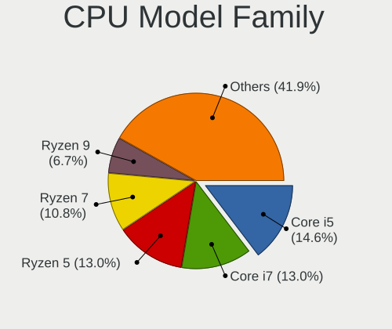

| Model                   | Desktops | Percent |
|-------------------------|----------|---------|
| Intel Core i5           | 242      | 14.65%  |
| Intel Core i7           | 215      | 13.01%  |
| AMD Ryzen 5             | 214      | 12.95%  |
| AMD Ryzen 7             | 179      | 10.84%  |
| AMD Ryzen 9             | 110      | 6.66%   |
| Other                   | 103      | 6.23%   |
| Intel Xeon              | 101      | 6.11%   |
| AMD FX                  | 77       | 4.66%   |
| Intel Core i3           | 65       | 3.93%   |
| Intel Core i9           | 34       | 2.06%   |
| Intel Pentium           | 28       | 1.69%   |
| Intel Core 2 Quad       | 24       | 1.45%   |
| AMD Ryzen 3             | 23       | 1.39%   |
| AMD Phenom II X4        | 21       | 1.27%   |
| AMD A10                 | 19       | 1.15%   |
| Intel Pentium Dual-Core | 16       | 0.97%   |
| Intel Core 2 Duo        | 16       | 0.97%   |
| AMD Phenom II X6        | 16       | 0.97%   |
| Intel Celeron           | 15       | 0.91%   |
| AMD A8                  | 14       | 0.85%   |
| AMD Athlon              | 13       | 0.79%   |
| AMD Ryzen Threadripper  | 11       | 0.67%   |
| AMD Ryzen 5 PRO         | 11       | 0.67%   |
| AMD Athlon II X2        | 9        | 0.54%   |
| Intel Atom              | 6        | 0.36%   |
| Intel Core              | 5        | 0.3%    |
| AMD Athlon 64 X2        | 5        | 0.3%    |
| AMD A4                  | 5        | 0.3%    |
| Intel Pentium Silver    | 4        | 0.24%   |
| Intel Core 2            | 4        | 0.24%   |
| AMD A6                  | 4        | 0.24%   |
| Intel Pentium Dual      | 3        | 0.18%   |
| Intel Pentium 4         | 3        | 0.18%   |
| AMD Phenom              | 3        | 0.18%   |
| AMD Athlon X4           | 3        | 0.18%   |
| AMD Athlon II X4        | 3        | 0.18%   |
| AMD Athlon II X3        | 3        | 0.18%   |
| Intel Genuine           | 2        | 0.12%   |
| AMD Turion II Neo       | 2        | 0.12%   |
| AMD Ryzen 3 PRO         | 2        | 0.12%   |

CPU Cores
---------

Number of processor cores

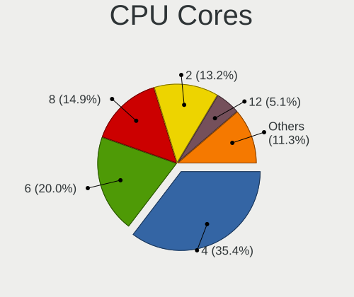

| Number  | Desktops | Percent |
|---------|----------|---------|
| 4       | 585      | 35.37%  |
| 6       | 331      | 20.01%  |
| 8       | 247      | 14.93%  |
| 2       | 219      | 13.24%  |
| 12      | 85       | 5.14%   |
| 16      | 67       | 4.05%   |
| 10      | 25       | 1.51%   |
| 3       | 22       | 1.33%   |
| 1       | 20       | 1.21%   |
| 24      | 16       | 0.97%   |
| 14      | 16       | 0.97%   |
| 20      | 10       | 0.6%    |
| 32      | 5        | 0.3%    |
| 18      | 3        | 0.18%   |
| 44      | 1        | 0.06%   |
| 28      | 1        | 0.06%   |
| Unknown | 1        | 0.06%   |

CPU Sockets
-----------

Number of sockets

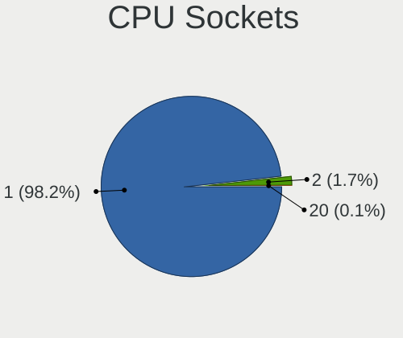

| Number | Desktops | Percent |
|--------|----------|---------|
| 1      | 1619     | 98.24%  |
| 2      | 28       | 1.7%    |
| 20     | 1        | 0.06%   |

CPU Threads
-----------

Threads per core (Hyper-Threading)

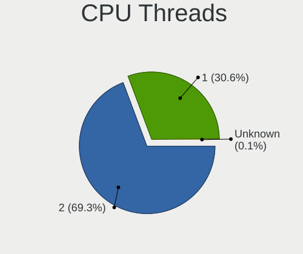

| Number  | Desktops | Percent |
|---------|----------|---------|
| 2       | 1145     | 69.31%  |
| 1       | 505      | 30.57%  |
| 12      | 1        | 0.06%   |
| Unknown | 1        | 0.06%   |

CPU Op-Modes
------------

CPU Operation Modes (32-bit, 64-bit)

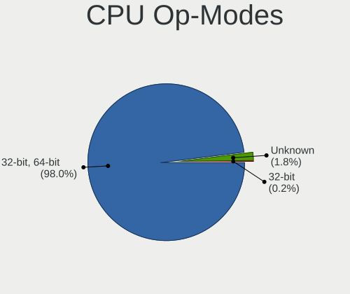

| Op mode        | Desktops | Percent |
|----------------|----------|---------|
| 32-bit, 64-bit | 1617     | 98%     |
| Unknown        | 30       | 1.82%   |
| 32-bit         | 3        | 0.18%   |

CPU Microcode
-------------

Microcode number

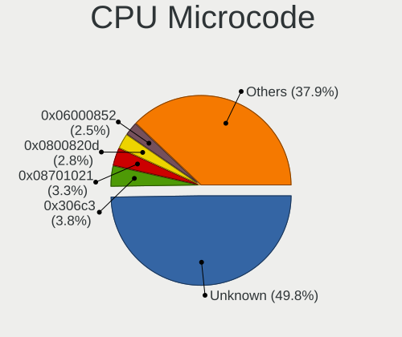

| Number     | Desktops | Percent |
|------------|----------|---------|
| Unknown    | 856      | 49.77%  |
| 0x306c3    | 65       | 3.78%   |
| 0x08701021 | 56       | 3.26%   |
| 0x0800820d | 48       | 2.79%   |
| 0x06000852 | 43       | 2.5%    |
| 0x206a7    | 39       | 2.27%   |
| 0x306a9    | 37       | 2.15%   |
| 0x506e3    | 33       | 1.92%   |
| 0x906e9    | 26       | 1.51%   |
| 0x010000c8 | 23       | 1.34%   |
| 0x08001138 | 22       | 1.28%   |
| 0x906ea    | 21       | 1.22%   |
| 0x1067a    | 21       | 1.22%   |
| 0x0a20120a | 21       | 1.22%   |
| 0x08108109 | 21       | 1.22%   |
| 0x08701013 | 19       | 1.1%    |
| 0x0a50000d | 17       | 0.99%   |
| 0x0a201009 | 17       | 0.99%   |
| 0x0a201016 | 13       | 0.76%   |
| 0x06001119 | 13       | 0.76%   |
| 0x0a50000c | 12       | 0.7%    |
| 0x08101016 | 12       | 0.7%    |
| 0x08001137 | 12       | 0.7%    |
| 0x010000dc | 12       | 0.7%    |
| 0xa0671    | 11       | 0.64%   |
| 0x306f2    | 11       | 0.64%   |
| 0x0a601203 | 11       | 0.64%   |
| 0x08701030 | 11       | 0.64%   |
| 0xa0655    | 10       | 0.58%   |
| 0x06003106 | 10       | 0.58%   |
| 0x0600063e | 9        | 0.52%   |
| 0x906ed    | 8        | 0.47%   |
| 0x206d7    | 8        | 0.47%   |
| 0xa0653    | 7        | 0.41%   |
| 0x306e4    | 7        | 0.41%   |
| 0x106e5    | 7        | 0.41%   |
| 0x08600106 | 7        | 0.41%   |
| 0x90672    | 6        | 0.35%   |
| 0x706a1    | 6        | 0.35%   |
| 0x6fb      | 6        | 0.35%   |

CPU Microarch
-------------

Microarchitecture

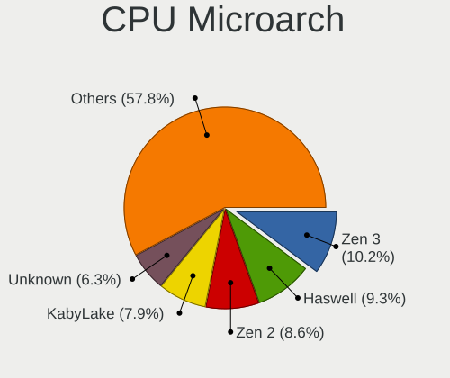

| Name              | Desktops | Percent |
|-------------------|----------|---------|
| Zen 3             | 169      | 10.21%  |
| Haswell           | 154      | 9.31%   |
| Zen 2             | 142      | 8.58%   |
| KabyLake          | 130      | 7.85%   |
| Unknown           | 104      | 6.28%   |
| IvyBridge         | 99       | 5.98%   |
| SandyBridge       | 97       | 5.86%   |
| Zen+              | 91       | 5.5%    |
| Skylake           | 84       | 5.08%   |
| Piledriver        | 84       | 5.08%   |
| Alderlake Hybrid  | 73       | 4.41%   |
| Zen               | 71       | 4.29%   |
| K10               | 60       | 3.63%   |
| Penryn            | 57       | 3.44%   |
| CometLake         | 43       | 2.6%    |
| Nehalem           | 26       | 1.57%   |
| Icelake           | 24       | 1.45%   |
| Core              | 18       | 1.09%   |
| Westmere          | 17       | 1.03%   |
| Steamroller       | 16       | 0.97%   |
| Broadwell         | 16       | 0.97%   |
| Bulldozer         | 14       | 0.85%   |
| K8 Hammer         | 10       | 0.6%    |
| Goldmont plus     | 9        | 0.54%   |
| Gracemont         | 8        | 0.48%   |
| Jaguar            | 5        | 0.3%    |
| Excavator         | 5        | 0.3%    |
| Bonnell           | 5        | 0.3%    |
| Silvermont        | 4        | 0.24%   |
| K10 Llano         | 4        | 0.24%   |
| NetBurst          | 3        | 0.18%   |
| Lunarlake Hybrid  | 3        | 0.18%   |
| Bobcat            | 3        | 0.18%   |
| TigerLake         | 2        | 0.12%   |
| Puma              | 2        | 0.12%   |
| P6                | 1        | 0.06%   |
| Meteorlake Hybrid | 1        | 0.06%   |
| Goldmont          | 1        | 0.06%   |

Graphics
--------

GPU Vendor
----------

Vendors of graphics cards

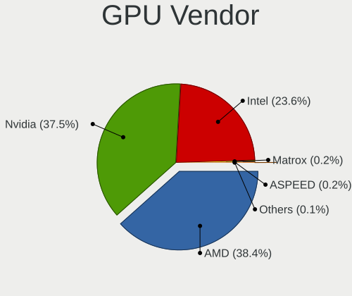

| Vendor                     | Desktops | Percent |
|----------------------------|----------|---------|
| AMD                        | 688      | 38.41%  |
| Nvidia                     | 672      | 37.52%  |
| Intel                      | 422      | 23.56%  |
| Matrox Electronics Systems | 4        | 0.22%   |
| ASPEED Technology          | 3        | 0.17%   |
| S3 Graphics                | 2        | 0.11%   |

GPU Model
---------

Graphics card models

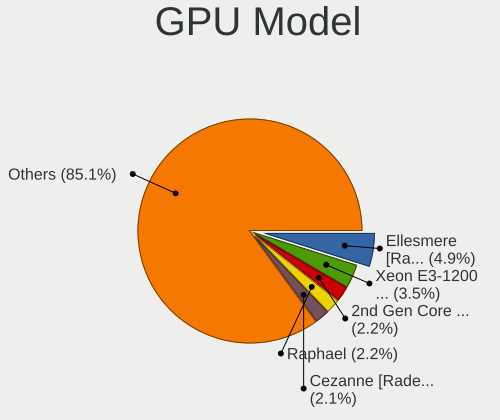

| Model                                                                       | Desktops | Percent |
|-----------------------------------------------------------------------------|----------|---------|
| AMD Ellesmere [Radeon RX 470/480/570/570X/580/580X/590]                     | 92       | 4.89%   |
| Intel Xeon E3-1200 v3/4th Gen Core Processor Integrated Graphics Controller | 66       | 3.51%   |
| Intel 2nd Generation Core Processor Family Integrated Graphics Controller   | 42       | 2.23%   |
| AMD Raphael                                                                 | 41       | 2.18%   |
| AMD Cezanne [Radeon Vega Series / Radeon Vega Mobile Series]                | 40       | 2.13%   |
| AMD Navi 10 [Radeon RX 5600 OEM/5600 XT / 5700/5700 XT]                     | 39       | 2.07%   |
| Nvidia GP107 [GeForce GTX 1050 Ti]                                          | 34       | 1.81%   |
| Intel Skylake-S GT2 [HD Graphics 530]                                       | 32       | 1.7%    |
| Intel CoffeeLake-S GT2 [UHD Graphics 630]                                   | 32       | 1.7%    |
| Intel Xeon E3-1200 v2/3rd Gen Core processor Graphics Controller            | 31       | 1.65%   |
| Nvidia GK208B [GeForce GT 710]                                              | 29       | 1.54%   |
| Intel Kaby Lake-S GT2 [HD Graphics 630]                                     | 27       | 1.43%   |
| Nvidia GP108 [GeForce GT 1030]                                              | 26       | 1.38%   |
| AMD Navi 22 [Radeon RX 6700/6700 XT/6750 XT / 6800M/6850M XT]               | 26       | 1.38%   |
| Nvidia GK208B [GeForce GT 730]                                              | 23       | 1.22%   |
| AMD Navi 23 [Radeon RX 6600/6600 XT/6600M]                                  | 23       | 1.22%   |
| AMD Picasso/Raven 2 [Radeon Vega Series / Radeon Vega Mobile Series]        | 22       | 1.17%   |
| AMD Navi 31 [Radeon RX 7900 XT/7900 XTX/7900 GRE/7900M]                     | 22       | 1.17%   |
| Nvidia GP104 [GeForce GTX 1080]                                             | 21       | 1.12%   |
| Nvidia GP104 [GeForce GTX 1070]                                             | 21       | 1.12%   |
| Nvidia TU116 [GeForce GTX 1660 SUPER]                                       | 20       | 1.06%   |
| AMD Navi 21 [Radeon RX 6800/6800 XT / 6900 XT]                              | 20       | 1.06%   |
| Nvidia GP106 [GeForce GTX 1060 6GB]                                         | 19       | 1.01%   |
| AMD Raven Ridge [Radeon Vega Series / Radeon Vega Mobile Series]            | 19       | 1.01%   |
| AMD Lexa PRO [Radeon 540/540X/550/550X / RX 540X/550/550X]                  | 19       | 1.01%   |
| Intel CometLake-S GT2 [UHD Graphics 630]                                    | 18       | 0.96%   |
| Intel 4 Series Chipset Integrated Graphics Controller                       | 18       | 0.96%   |
| AMD Navi 32 [Radeon RX 7700 XT / 7800 XT]                                   | 18       | 0.96%   |
| Nvidia GM204 [GeForce GTX 970]                                              | 17       | 0.9%    |
| Nvidia TU117 [GeForce GTX 1650]                                             | 16       | 0.85%   |
| Nvidia GP106 [GeForce GTX 1060 3GB]                                         | 16       | 0.85%   |
| Nvidia GM206 [GeForce GTX 960]                                              | 15       | 0.8%    |
| Intel Raptor Lake-S GT1 [UHD Graphics 770]                                  | 14       | 0.74%   |
| Intel Alder Lake-S GT1 [UHD Graphics 770]                                   | 13       | 0.69%   |
| Nvidia GP102 [GeForce GTX 1080 Ti]                                          | 12       | 0.64%   |
| Nvidia GM107 [GeForce GTX 750 Ti]                                           | 12       | 0.64%   |
| Nvidia GA106 [GeForce RTX 3060 Lite Hash Rate]                              | 12       | 0.64%   |
| Intel IvyBridge GT2 [HD Graphics 4000]                                      | 12       | 0.64%   |
| AMD Cedar [Radeon HD 5000/6000/7350/8350 Series]                            | 12       | 0.64%   |
| AMD Baffin [Radeon RX 460/560D / Pro 450/455/460/555/555X/560/560X]         | 12       | 0.64%   |

GPU Combo
---------

Combinations of graphics cards

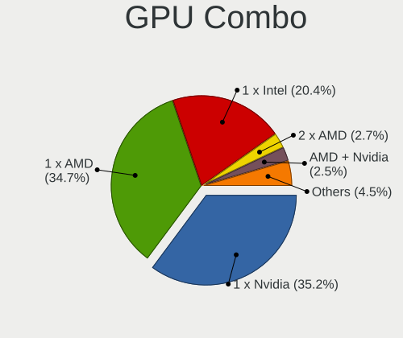

| Name               | Desktops | Percent |
|--------------------|----------|---------|
| 1 x Nvidia         | 590      | 35.16%  |
| 1 x AMD            | 582      | 34.68%  |
| 1 x Intel          | 342      | 20.38%  |
| 2 x AMD            | 46       | 2.74%   |
| AMD + Nvidia       | 42       | 2.5%    |
| Intel + Nvidia     | 29       | 1.73%   |
| Intel + AMD        | 20       | 1.19%   |
| 2 x Nvidia         | 12       | 0.72%   |
| 1 x Matrox         | 3        | 0.18%   |
| 2 x Intel          | 2        | 0.12%   |
| 1 x S3 Graphics    | 2        | 0.12%   |
| Nvidia + ASPEED    | 2        | 0.12%   |
| AMD + 2 x Nvidia   | 2        | 0.12%   |
| Other              | 1        | 0.06%   |
| Nvidia + Matrox    | 1        | 0.06%   |
| Intel + 2 x Nvidia | 1        | 0.06%   |
| 1 x ASPEED         | 1        | 0.06%   |

GPU Driver
----------

Free vs proprietary

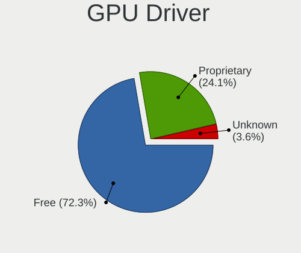

| Driver      | Desktops | Percent |
|-------------|----------|---------|
| Free        | 1220     | 72.32%  |
| Proprietary | 406      | 24.07%  |
| Unknown     | 61       | 3.62%   |

GPU Memory
----------

Total video memory

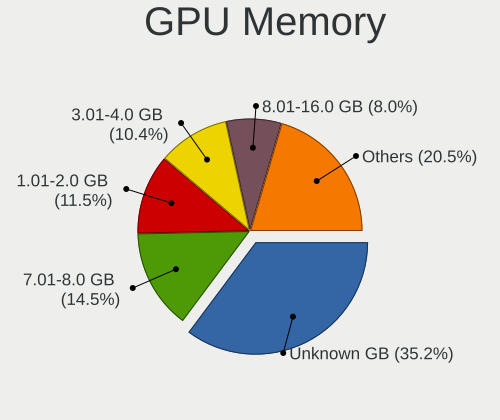

| Size in GB | Desktops | Percent |
|------------|----------|---------|
| Unknown    | 604      | 35.2%   |
| 7.01-8.0   | 248      | 14.45%  |
| 1.01-2.0   | 198      | 11.54%  |
| 3.01-4.0   | 178      | 10.37%  |
| 8.01-16.0  | 137      | 7.98%   |
| 0.01-0.5   | 125      | 7.28%   |
| 0.51-1.0   | 116      | 6.76%   |
| 5.01-6.0   | 56       | 3.26%   |
| 16.01-24.0 | 29       | 1.69%   |
| 2.01-3.0   | 23       | 1.34%   |
| 4.01-5.0   | 1        | 0.06%   |
| 24.01-32.0 | 1        | 0.06%   |

Monitor
-------

Monitor Vendor
--------------

Monitor vendors

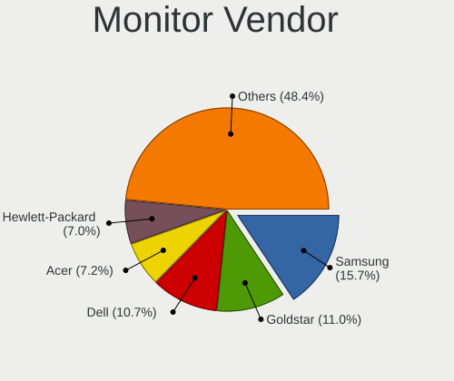

| Vendor               | Desktops | Percent |
|----------------------|----------|---------|
| Samsung Electronics  | 293      | 15.67%  |
| Goldstar             | 205      | 10.96%  |
| Dell                 | 200      | 10.7%   |
| Acer                 | 135      | 7.22%   |
| Hewlett-Packard      | 131      | 7.01%   |
| AOC                  | 104      | 5.56%   |
| Ancor Communications | 93       | 4.97%   |
| BenQ                 | 91       | 4.87%   |
| Philips              | 87       | 4.65%   |
| Iiyama               | 44       | 2.35%   |
| ASUSTek Computer     | 44       | 2.35%   |
| ViewSonic            | 35       | 1.87%   |
| Lenovo               | 28       | 1.5%    |
| Fujitsu Siemens      | 24       | 1.28%   |
| MSI                  | 23       | 1.23%   |
| Unknown              | 21       | 1.12%   |
| Eizo                 | 21       | 1.12%   |
| LG Electronics       | 15       | 0.8%    |
| Gigabyte Technology  | 15       | 0.8%    |
| Sony                 | 14       | 0.75%   |
| Sceptre Tech         | 14       | 0.75%   |
| NEC Computers        | 13       | 0.7%    |
| Medion               | 11       | 0.59%   |
| Hitachi              | 8        | 0.43%   |
| HKC                  | 7        | 0.37%   |
| Panasonic            | 6        | 0.32%   |
| HannStar             | 6        | 0.32%   |
| Vizio                | 5        | 0.27%   |
| Pixio                | 5        | 0.27%   |
| Vestel Elektronik    | 4        | 0.21%   |
| Unknown (XXX)        | 4        | 0.21%   |
| Sharp                | 4        | 0.21%   |
| MStar                | 4        | 0.21%   |
| Insignia             | 4        | 0.21%   |
| HUAWEI               | 4        | 0.21%   |
| Denver               | 4        | 0.21%   |
| Apple                | 4        | 0.21%   |
| ___                  | 3        | 0.16%   |
| UGD                  | 3        | 0.16%   |
| Toshiba              | 3        | 0.16%   |

Monitor Model
-------------

Monitor models

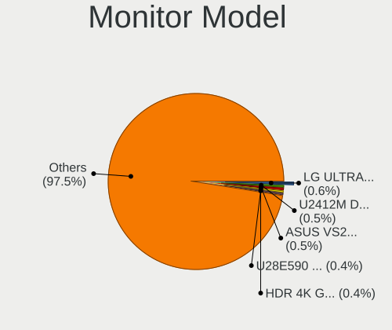

| Model                                                                 | Desktops | Percent |
|-----------------------------------------------------------------------|----------|---------|
| Goldstar LG ULTRAWIDE GSM59F1 2560x1080 670x280mm 28.6-inch           | 13       | 0.64%   |
| Dell U2412M DELA07A 1920x1200 518x324mm 24.1-inch                     | 10       | 0.49%   |
| Ancor Communications ASUS VS247 ACI249A 1920x1080 521x293mm 23.5-inch | 10       | 0.49%   |
| Samsung Electronics U28E590 SAM0C4D 3840x2160 607x345mm 27.5-inch     | 9        | 0.44%   |
| Goldstar HDR 4K GSM7707 3840x2160 600x340mm 27.2-inch                 | 9        | 0.44%   |
| Goldstar FULL HD GSM5B55 1920x1080 480x270mm 21.7-inch                | 9        | 0.44%   |
| Unknown LCD Monitor FFFF 2288x1287 2550x2550mm 142.0-inch             | 8        | 0.39%   |
| BenQ GW2760HS BNQ78CA 1920x1080 598x336mm 27.0-inch                   | 8        | 0.39%   |
| AOC 24G2W1G3 AOC2402 1920x1080 527x296mm 23.8-inch                    | 8        | 0.39%   |
| Samsung Electronics S24D330 SAM0D92 1920x1080 531x299mm 24.0-inch     | 7        | 0.34%   |
| Goldstar Ultra HD GSM5B09 3840x2160 600x340mm 27.2-inch               | 7        | 0.34%   |
| AOC 27G2G4 AOC2702 1920x1080 598x336mm 27.0-inch                      | 7        | 0.34%   |
| Ancor Communications VE228 ACI22FA 1920x1080 477x268mm 21.5-inch      | 7        | 0.34%   |
| Samsung Electronics S24F350 SAM0D20 1920x1080 521x293mm 23.5-inch     | 6        | 0.29%   |
| Samsung Electronics LF24T35 SAM707D 1920x1080 528x297mm 23.9-inch     | 6        | 0.29%   |
| Philips PHL 273V7 PHLC156 1920x1080 598x336mm 27.0-inch               | 6        | 0.29%   |
| Philips PHL 243V7 PHLC155 1920x1080 527x296mm 23.8-inch               | 6        | 0.29%   |
| Goldstar ULTRAWIDE GSM59F2 2560x1080 677x290mm 29.0-inch              | 6        | 0.29%   |
| Goldstar HDR WFHD GSM7714 2560x1080 798x334mm 34.1-inch               | 6        | 0.29%   |
| Fujitsu Siemens P19-2 FUS0552 1280x1024 376x301mm 19.0-inch           | 6        | 0.29%   |
| BenQ GW2270 BNQ78DB 1920x1080 476x268mm 21.5-inch                     | 6        | 0.29%   |
| AOC Q3279WG5B AOC3279 2560x1440 725x428mm 33.1-inch                   | 6        | 0.29%   |
| AOC 2470W AOC2470 1920x1080 521x293mm 23.5-inch                       | 6        | 0.29%   |
| Samsung Electronics C24F390 SAM0D2C 1920x1080 521x293mm 23.5-inch     | 5        | 0.24%   |
| Philips PHL 223V5 PHLC0CF 1920x1080 477x268mm 21.5-inch               | 5        | 0.24%   |
| Hewlett-Packard w2207 HWP26A9 1680x1050 473x296mm 22.0-inch           | 5        | 0.24%   |
| Goldstar LG IPS FULLHD GSM5AB8 1920x1080 480x270mm 21.7-inch          | 5        | 0.24%   |
| Goldstar HDR 4K GSM7706 3840x2160 600x340mm 27.2-inch                 | 5        | 0.24%   |
| Dell U2713HM DEL4080 2560x1440 597x336mm 27.0-inch                    | 5        | 0.24%   |
| BenQ GL2450H BNQ78A7 1920x1080 531x298mm 24.0-inch                    | 5        | 0.24%   |
| AOC 24B1W1 AOC2401 1920x1080 527x296mm 23.8-inch                      | 5        | 0.24%   |
| Acer S242HL ACR0216 1920x1080 531x299mm 24.0-inch                     | 5        | 0.24%   |
| Vestel Elektronik 40UHD_LCD_TV VES3700 3840x2160 880x500mm 39.8-inch  | 4        | 0.2%    |
| Samsung Electronics U32J59x SAM0F34 3840x2160 697x392mm 31.5-inch     | 4        | 0.2%    |
| Samsung Electronics C32R50x SAM7000 1920x1080 698x393mm 31.5-inch     | 4        | 0.2%    |
| Samsung Electronics C32F391 SAM0D34 1920x1080 698x393mm 31.5-inch     | 4        | 0.2%    |
| Samsung Electronics C27F390 SAM0D32 1920x1080 598x336mm 27.0-inch     | 4        | 0.2%    |
| Hewlett-Packard 27f HPN354B 1920x1080 598x336mm 27.0-inch             | 4        | 0.2%    |
| Hewlett-Packard 27er HWP3326 1920x1080 598x336mm 27.0-inch            | 4        | 0.2%    |
| Goldstar LG TV SSCR2 GSMC0C8 3840x2160                                | 4        | 0.2%    |

Monitor Resolution
------------------

Monitor screen resolution

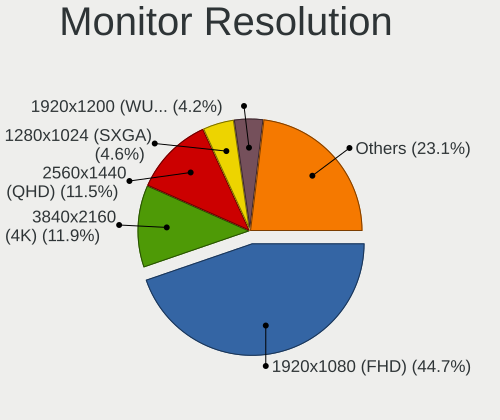

| Resolution         | Desktops | Percent |
|--------------------|----------|---------|
| 1920x1080 (FHD)    | 816      | 44.74%  |
| 3840x2160 (4K)     | 217      | 11.9%   |
| 2560x1440 (QHD)    | 210      | 11.51%  |
| 1280x1024 (SXGA)   | 83       | 4.55%   |
| 1920x1200 (WUXGA)  | 77       | 4.22%   |
| 1680x1050 (WSXGA+) | 74       | 4.06%   |
| 3440x1440          | 45       | 2.47%   |
| 1366x768 (WXGA)    | 45       | 2.47%   |
| 2560x1080          | 42       | 2.3%    |
| 1440x900 (WXGA+)   | 39       | 2.14%   |
| Unknown            | 30       | 1.64%   |
| 1600x900 (HD+)     | 28       | 1.54%   |
| 3840x1080          | 23       | 1.26%   |
| 1360x768           | 16       | 0.88%   |
| 1024x768 (XGA)     | 11       | 0.6%    |
| 1920x540           | 10       | 0.55%   |
| 2288x1287          | 8        | 0.44%   |
| 1600x1200          | 8        | 0.44%   |
| 3840x1600          | 7        | 0.38%   |
| 2560x1600          | 5        | 0.27%   |
| 1280x720 (HD)      | 4        | 0.22%   |
| 3840x1200          | 3        | 0.16%   |
| 1400x1050          | 2        | 0.11%   |
| 1280x960           | 2        | 0.11%   |
| 800x1280           | 1        | 0.05%   |
| 7680x2160          | 1        | 0.05%   |
| 7680x1440          | 1        | 0.05%   |
| 7280x2160          | 1        | 0.05%   |
| 6520x1440          | 1        | 0.05%   |
| 640x480            | 1        | 0.05%   |
| 5760x2160          | 1        | 0.05%   |
| 5520x1080          | 1        | 0.05%   |
| 5280x2160          | 1        | 0.05%   |
| 4480x1080          | 1        | 0.05%   |
| 3286x1080          | 1        | 0.05%   |
| 3200x1080          | 1        | 0.05%   |
| 2966x1200          | 1        | 0.05%   |
| 2880x1800          | 1        | 0.05%   |
| 2732x768           | 1        | 0.05%   |
| 2560x2880          | 1        | 0.05%   |

Monitor Diagonal
----------------

Diagonal size in inches

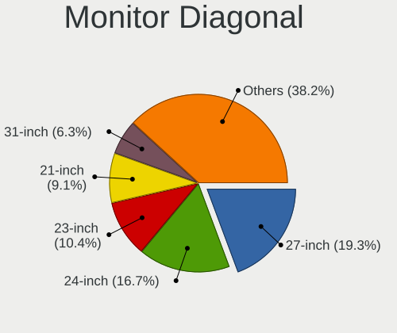

| Inches  | Desktops | Percent |
|---------|----------|---------|
| 27      | 364      | 19.33%  |
| 24      | 315      | 16.73%  |
| 23      | 195      | 10.36%  |
| 21      | 171      | 9.08%   |
| 31      | 119      | 6.32%   |
| Unknown | 101      | 5.36%   |
| 19      | 84       | 4.46%   |
| 34      | 73       | 3.88%   |
| 22      | 57       | 3.03%   |
| 18      | 52       | 2.76%   |
| 20      | 38       | 2.02%   |
| 17      | 37       | 1.96%   |
| 32      | 31       | 1.65%   |
| 84      | 26       | 1.38%   |
| 15      | 24       | 1.27%   |
| 72      | 17       | 0.9%    |
| 54      | 17       | 0.9%    |
| 40      | 16       | 0.85%   |
| 25      | 16       | 0.85%   |
| 26      | 11       | 0.58%   |
| 28      | 10       | 0.53%   |
| 63      | 9        | 0.48%   |
| 142     | 8        | 0.42%   |
| 42      | 8        | 0.42%   |
| 48      | 7        | 0.37%   |
| 65      | 6        | 0.32%   |
| 52      | 6        | 0.32%   |
| 33      | 6        | 0.32%   |
| 29      | 6        | 0.32%   |
| 74      | 5        | 0.27%   |
| 49      | 5        | 0.27%   |
| 37      | 5        | 0.27%   |
| 43      | 4        | 0.21%   |
| 12      | 4        | 0.21%   |
| 46      | 3        | 0.16%   |
| 35      | 3        | 0.16%   |
| 86      | 2        | 0.11%   |
| 58      | 2        | 0.11%   |
| 55      | 2        | 0.11%   |
| 50      | 2        | 0.11%   |

Monitor Width
-------------

Physical width

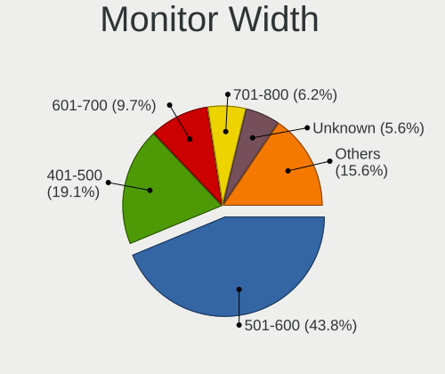

| Width in mm    | Desktops | Percent |
|----------------|----------|---------|
| 501-600        | 785      | 43.76%  |
| 401-500        | 343      | 19.12%  |
| 601-700        | 174      | 9.7%    |
| 701-800        | 112      | 6.24%   |
| Unknown        | 101      | 5.63%   |
| 1001-1500      | 62       | 3.46%   |
| 351-400        | 56       | 3.12%   |
| 301-350        | 56       | 3.12%   |
| 1501-2000      | 50       | 2.79%   |
| 801-900        | 25       | 1.39%   |
| 901-1000       | 14       | 0.78%   |
| More than 2000 | 8        | 0.45%   |
| 201-300        | 8        | 0.45%   |

Aspect Ratio
------------

Proportional relationship between the width and the height

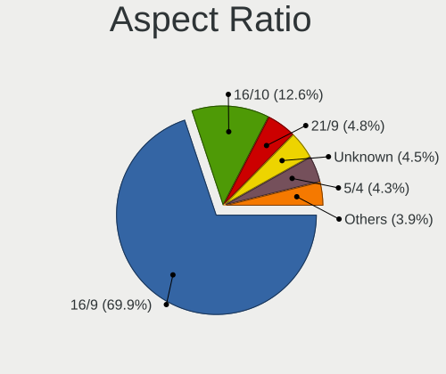

| Ratio   | Desktops | Percent |
|---------|----------|---------|
| 16/9    | 1178     | 69.91%  |
| 16/10   | 213      | 12.64%  |
| 21/9    | 81       | 4.81%   |
| Unknown | 76       | 4.51%   |
| 5/4     | 72       | 4.27%   |
| 4/3     | 31       | 1.84%   |
| 32/9    | 11       | 0.65%   |
| 1.00    | 10       | 0.59%   |
| 6/5     | 5        | 0.3%    |
| 3/2     | 4        | 0.24%   |
| 1.96    | 1        | 0.06%   |
| 0.89    | 1        | 0.06%   |
| 0.62    | 1        | 0.06%   |
| 0.56    | 1        | 0.06%   |

Monitor Area
------------

Area in inch²

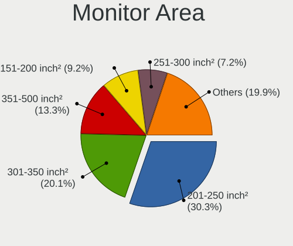

| Area in inch² | Desktops | Percent |
|----------------|----------|---------|
| 201-250        | 558      | 30.28%  |
| 301-350        | 371      | 20.13%  |
| 351-500        | 245      | 13.29%  |
| 151-200        | 170      | 9.22%   |
| 251-300        | 133      | 7.22%   |
| More than 1000 | 104      | 5.64%   |
| Unknown        | 101      | 5.48%   |
| 141-150        | 73       | 3.96%   |
| 501-1000       | 50       | 2.71%   |
| 101-110        | 23       | 1.25%   |
| 131-140        | 5        | 0.27%   |
| 71-80          | 4        | 0.22%   |
| 51-60          | 2        | 0.11%   |
| 91-100         | 2        | 0.11%   |
| 121-130        | 1        | 0.05%   |
| 111-120        | 1        | 0.05%   |

Pixel Density
-------------

Pixels per inch

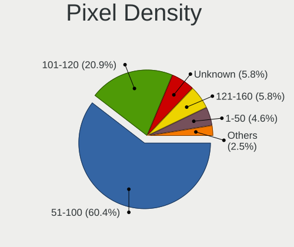

| Density | Desktops | Percent |
|---------|----------|---------|
| 51-100  | 1048     | 60.44%  |
| 101-120 | 362      | 20.88%  |
| Unknown | 101      | 5.82%   |
| 121-160 | 100      | 5.77%   |
| 1-50    | 79       | 4.56%   |
| 161-240 | 44       | 2.54%   |

Multiple Monitors
-----------------

Total monitors connected

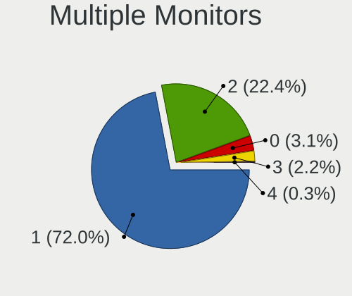

| Total | Desktops | Percent |
|-------|----------|---------|
| 1     | 1221     | 71.99%  |
| 2     | 380      | 22.41%  |
| 0     | 53       | 3.13%   |
| 3     | 37       | 2.18%   |
| 4     | 5        | 0.29%   |

Network
-------

Net Controller Vendor
---------------------

Controller vendors

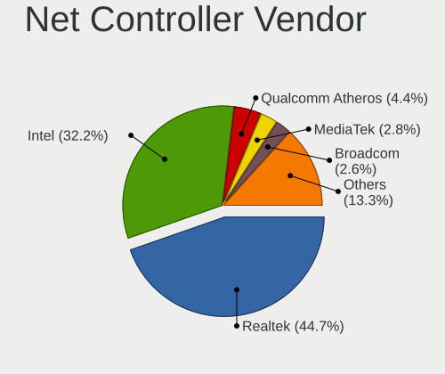

| Vendor                          | Desktops | Percent |
|---------------------------------|----------|---------|
| Realtek Semiconductor           | 1066     | 44.66%  |
| Intel                           | 769      | 32.22%  |
| Qualcomm Atheros                | 106      | 4.44%   |
| MediaTek                        | 68       | 2.85%   |
| Broadcom                        | 61       | 2.56%   |
| Ralink Technology               | 33       | 1.38%   |
| TP-Link                         | 31       | 1.3%    |
| Ralink                          | 19       | 0.8%    |
| Aquantia                        | 18       | 0.75%   |
| Nvidia                          | 17       | 0.71%   |
| ASIX Electronics                | 16       | 0.67%   |
| Microsoft                       | 13       | 0.54%   |
| NetGear                         | 11       | 0.46%   |
| D-Link System                   | 11       | 0.46%   |
| Samsung Electronics             | 10       | 0.42%   |
| Marvell Technology Group        | 9        | 0.38%   |
| D-Link                          | 9        | 0.38%   |
| ASUSTek Computer                | 9        | 0.38%   |
| AVM                             | 8        | 0.34%   |
| Edimax Technology               | 7        | 0.29%   |
| Broadcom Limited                | 6        | 0.25%   |
| Qualcomm Atheros Communications | 5        | 0.21%   |
| DisplayLink                     | 5        | 0.21%   |
| Qualcomm Technologies           | 4        | 0.17%   |
| Linksys                         | 4        | 0.17%   |
| Xiaomi                          | 3        | 0.13%   |
| OPPO Electronics                | 3        | 0.13%   |
| Microchip Technology            | 3        | 0.13%   |
| Mellanox Technologies           | 3        | 0.13%   |
| Belkin Components               | 3        | 0.13%   |
| Wacom                           | 2        | 0.08%   |
| U-Blox                          | 2        | 0.08%   |
| Texas Instruments               | 2        | 0.08%   |
| Qualcomm                        | 2        | 0.08%   |
| QinHeng Electronics             | 2        | 0.08%   |
| NetXen Incorporated             | 2        | 0.08%   |
| Motorola PCS                    | 2        | 0.08%   |
| JMicron Technology              | 2        | 0.08%   |
| Intersil                        | 2        | 0.08%   |
| Huawei Technologies             | 2        | 0.08%   |

Net Controller Model
--------------------

Controller models

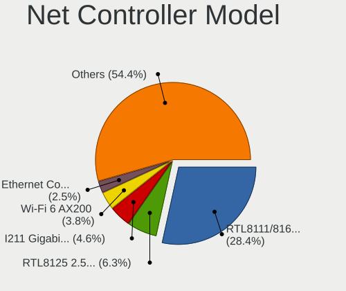

| Model                                                                          | Desktops | Percent |
|--------------------------------------------------------------------------------|----------|---------|
| Realtek RTL8111/8168/8211/8411 PCI Express Gigabit Ethernet Controller         | 789      | 28.43%  |
| Realtek RTL8125 2.5GbE Controller                                              | 175      | 6.31%   |
| Intel I211 Gigabit Network Connection                                          | 127      | 4.58%   |
| Intel Wi-Fi 6 AX200                                                            | 105      | 3.78%   |
| Intel Ethernet Connection (2) I219-V                                           | 69       | 2.49%   |
| Intel Ethernet Controller I225-V                                               | 65       | 2.34%   |
| Intel 82579LM Gigabit Network Connection (Lewisville)                          | 59       | 2.13%   |
| Intel Wi-Fi 6E(802.11ax) AX210/AX1675* 2x2 [Typhoon Peak]                      | 44       | 1.59%   |
| Intel Dual Band Wireless-AC 3168NGW [Stone Peak]                               | 40       | 1.44%   |
| Intel Ethernet Connection I217-LM                                              | 32       | 1.15%   |
| MediaTek MT7922 802.11ax PCI Express Wireless Network Adapter                  | 28       | 1.01%   |
| Intel Wi-Fi 5(802.11ac) Wireless-AC 9x6x [Thunder Peak]                        | 28       | 1.01%   |
| Intel Ethernet Connection (7) I219-V                                           | 28       | 1.01%   |
| Intel Ethernet Connection (2) I218-V                                           | 22       | 0.79%   |
| Intel 82574L Gigabit Network Connection                                        | 22       | 0.79%   |
| Intel Ethernet Connection (2) I219-LM                                          | 21       | 0.76%   |
| Realtek 802.11ac NIC                                                           | 20       | 0.72%   |
| Intel Ethernet Connection I217-V                                               | 20       | 0.72%   |
| Realtek RTL88x2bu [AC1200 Techkey]                                             | 19       | 0.68%   |
| Realtek RTL8852BE PCIe 802.11ax Wireless Network Controller                    | 18       | 0.65%   |
| MediaTek MT7921K (RZ608) Wi-Fi 6E 80MHz                                        | 18       | 0.65%   |
| Intel 82579V Gigabit Network Connection                                        | 18       | 0.65%   |
| Realtek RTL810xE PCI Express Fast Ethernet controller                          | 17       | 0.61%   |
| Intel 700 Series Chipset CNVi WiFi                                             | 17       | 0.61%   |
| Realtek RTL8821CE 802.11ac PCIe Wireless Network Adapter                       | 16       | 0.58%   |
| ASIX AX88179 Gigabit Ethernet                                                  | 16       | 0.58%   |
| Intel Wireless 7260                                                            | 15       | 0.54%   |
| Intel Alder Lake-S PCH CNVi WiFi                                               | 15       | 0.54%   |
| Realtek RTL8153 Gigabit Ethernet Adapter                                       | 14       | 0.5%    |
| Qualcomm Atheros AR9485 Wireless Network Adapter                               | 14       | 0.5%    |
| Intel I210 Gigabit Network Connection                                          | 14       | 0.5%    |
| Intel Ethernet Controller I226-V                                               | 13       | 0.47%   |
| Ralink MT7601U Wireless Adapter                                                | 12       | 0.43%   |
| Realtek RTL8822BE 802.11a/b/g/n/ac WiFi adapter                                | 11       | 0.4%    |
| Realtek RTL8188EUS 802.11n Wireless Network Adapter                            | 11       | 0.4%    |
| Intel Ethernet Connection (2) I218-LM                                          | 11       | 0.4%    |
| Intel Cannon Lake PCH CNVi WiFi                                                | 11       | 0.4%    |
| Intel Comet Lake PCH CNVi WiFi                                                 | 10       | 0.36%   |
| Intel 82567LM-3 Gigabit Network Connection                                     | 10       | 0.36%   |
| Aquantia AQtion AQC107 NBase-T/IEEE 802.3an Ethernet Controller [Atlantic 10G] | 10       | 0.36%   |

Wireless Vendor
---------------

Wireless vendors

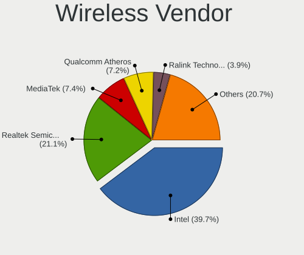

| Vendor                                | Desktops | Percent |
|---------------------------------------|----------|---------|
| Intel                                 | 332      | 39.71%  |
| Realtek Semiconductor                 | 176      | 21.05%  |
| MediaTek                              | 62       | 7.42%   |
| Qualcomm Atheros                      | 60       | 7.18%   |
| Ralink Technology                     | 33       | 3.95%   |
| TP-Link                               | 30       | 3.59%   |
| Broadcom                              | 29       | 3.47%   |
| Ralink                                | 19       | 2.27%   |
| Microsoft                             | 13       | 1.56%   |
| NetGear                               | 11       | 1.32%   |
| D-Link                                | 9        | 1.08%   |
| ASUSTek Computer                      | 9        | 1.08%   |
| AVM                                   | 8        | 0.96%   |
| Edimax Technology                     | 7        | 0.84%   |
| D-Link System                         | 7        | 0.84%   |
| Qualcomm Atheros Communications       | 5        | 0.6%    |
| Linksys                               | 4        | 0.48%   |
| Broadcom Limited                      | 4        | 0.48%   |
| Belkin Components                     | 3        | 0.36%   |
| Wacom                                 | 2        | 0.24%   |
| Qualcomm Technologies                 | 2        | 0.24%   |
| ZyXEL Communications                  | 1        | 0.12%   |
| ZyDAS                                 | 1        | 0.12%   |
| Wilocity                              | 1        | 0.12%   |
| Samsung Electronics                   | 1        | 0.12%   |
| Mercucys                              | 1        | 0.12%   |
| Marvell Technology Group              | 1        | 0.12%   |
| Intersil                              | 1        | 0.12%   |
| IMC Networks                          | 1        | 0.12%   |
| Gemtek                                | 1        | 0.12%   |
| BUFFALO                               | 1        | 0.12%   |
| 802.11g Adapter [Linksys WUSB54GC v3] | 1        | 0.12%   |

Wireless Model
--------------

Wireless models

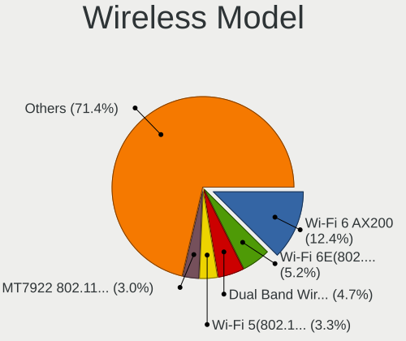

| Model                                                                | Desktops | Percent |
|----------------------------------------------------------------------|----------|---------|
| Intel Wi-Fi 6 AX200                                                  | 105      | 12.43%  |
| Intel Wi-Fi 6E(802.11ax) AX210/AX1675* 2x2 [Typhoon Peak]            | 44       | 5.21%   |
| Intel Dual Band Wireless-AC 3168NGW [Stone Peak]                     | 40       | 4.73%   |
| Intel Wi-Fi 5(802.11ac) Wireless-AC 9x6x [Thunder Peak]              | 28       | 3.31%   |
| MediaTek MT7922 802.11ax PCI Express Wireless Network Adapter        | 25       | 2.96%   |
| Realtek 802.11ac NIC                                                 | 20       | 2.37%   |
| Realtek RTL88x2bu [AC1200 Techkey]                                   | 19       | 2.25%   |
| MediaTek MT7921K (RZ608) Wi-Fi 6E 80MHz                              | 18       | 2.13%   |
| Realtek RTL8821CE 802.11ac PCIe Wireless Network Adapter             | 16       | 1.89%   |
| Intel 700 Series Chipset CNVi WiFi                                   | 16       | 1.89%   |
| Intel Wireless 7260                                                  | 15       | 1.78%   |
| Qualcomm Atheros AR9485 Wireless Network Adapter                     | 14       | 1.66%   |
| Ralink MT7601U Wireless Adapter                                      | 12       | 1.42%   |
| Realtek RTL8822BE 802.11a/b/g/n/ac WiFi adapter                      | 11       | 1.3%    |
| Realtek RTL8188EUS 802.11n Wireless Network Adapter                  | 11       | 1.3%    |
| Intel Cannon Lake PCH CNVi WiFi                                      | 11       | 1.3%    |
| Realtek RTL8852BE PCIe 802.11ax Wireless Network Controller          | 10       | 1.18%   |
| Intel Comet Lake PCH CNVi WiFi                                       | 10       | 1.18%   |
| Qualcomm Atheros AR93xx Wireless Network Adapter                     | 9        | 1.07%   |
| Intel Wireless 7265                                                  | 9        | 1.07%   |
| Intel Alder Lake-S PCH CNVi WiFi                                     | 9        | 1.07%   |
| Broadcom BCM4360 802.11ac Dual Band Wireless Network Adapter         | 9        | 1.07%   |
| Broadcom BCM4352 802.11ac Dual Band Wireless Network Adapter         | 9        | 1.07%   |
| Realtek RTL8822CE 802.11ac PCIe Wireless Network Adapter             | 8        | 0.95%   |
| Realtek RTL8812AE 802.11ac PCIe Wireless Network Adapter             | 8        | 0.95%   |
| Intel Wireless 8260                                                  | 8        | 0.95%   |
| TP-Link AC600 wireless Realtek RTL8811AU [Archer T2U Nano]           | 7        | 0.83%   |
| Realtek RTL8852CE PCIe 802.11ax Wireless Network Controller          | 7        | 0.83%   |
| Ralink RT5370 Wireless Adapter                                       | 7        | 0.83%   |
| Ralink RT2870/RT3070 Wireless Adapter                                | 7        | 0.83%   |
| Intel Wireless 3165                                                  | 7        | 0.83%   |
| Intel Tiger Lake PCH CNVi WiFi                                       | 7        | 0.83%   |
| Realtek RTL8192EU 802.11b/g/n WLAN Adapter                           | 6        | 0.71%   |
| Realtek RTL8192EE PCIe Wireless Network Adapter                      | 6        | 0.71%   |
| Realtek RTL8192CU 802.11n WLAN Adapter                               | 6        | 0.71%   |
| Realtek RTL8188FTV 802.11b/g/n 1T1R 2.4G WLAN Adapter                | 6        | 0.71%   |
| Microsoft Xbox 360 Wireless Adapter                                  | 6        | 0.71%   |
| MediaTek MT7921 802.11ax PCIe Wireless Network Adapter [Filogic 330] | 6        | 0.71%   |
| TP-Link TL-WN823N v2/v3 [Realtek RTL8192EU]                          | 5        | 0.59%   |
| Realtek RTL8821AE 802.11ac PCIe Wireless Network Adapter             | 5        | 0.59%   |

Ethernet Vendor
---------------

Ethernet vendors

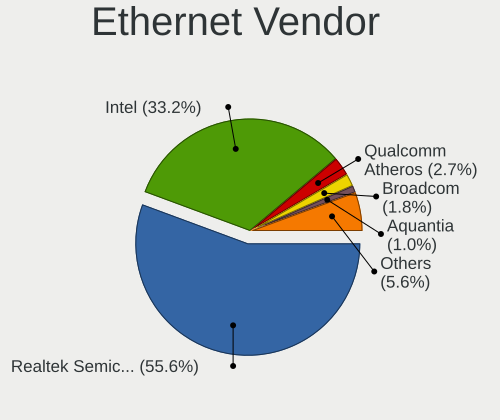

| Vendor                                 | Desktops | Percent |
|----------------------------------------|----------|---------|
| Realtek Semiconductor                  | 1011     | 55.64%  |
| Intel                                  | 604      | 33.24%  |
| Qualcomm Atheros                       | 49       | 2.7%    |
| Broadcom                               | 33       | 1.82%   |
| Aquantia                               | 18       | 0.99%   |
| Nvidia                                 | 17       | 0.94%   |
| ASIX Electronics                       | 16       | 0.88%   |
| Samsung Electronics                    | 9        | 0.5%    |
| Marvell Technology Group               | 8        | 0.44%   |
| MediaTek                               | 5        | 0.28%   |
| DisplayLink                            | 5        | 0.28%   |
| D-Link System                          | 4        | 0.22%   |
| Xiaomi                                 | 3        | 0.17%   |
| OPPO Electronics                       | 3        | 0.17%   |
| Qualcomm Technologies                  | 2        | 0.11%   |
| Qualcomm                               | 2        | 0.11%   |
| NetXen Incorporated                    | 2        | 0.11%   |
| Motorola PCS                           | 2        | 0.11%   |
| Mellanox Technologies                  | 2        | 0.11%   |
| JMicron Technology                     | 2        | 0.11%   |
| Broadcom Limited                       | 2        | 0.11%   |
| ADMtek                                 | 2        | 0.11%   |
| 3Com                                   | 2        | 0.11%   |
| VIA Technologies                       | 1        | 0.06%   |
| TP-Link                                | 1        | 0.06%   |
| TOMTOM                                 | 1        | 0.06%   |
| Suzhou Motorcomm Electronic Technology | 1        | 0.06%   |
| Sony Ericsson Mobile Communications AB | 1        | 0.06%   |
| Solarflare Communications              | 1        | 0.06%   |
| QLogic                                 | 1        | 0.06%   |
| QinHeng Electronics                    | 1        | 0.06%   |
| National Semiconductor                 | 1        | 0.06%   |
| ICS Advent                             | 1        | 0.06%   |
| Huawei Technologies                    | 1        | 0.06%   |
| Google                                 | 1        | 0.06%   |
| Foxconn / Hon Hai                      | 1        | 0.06%   |
| American Megatrends                    | 1        | 0.06%   |

Ethernet Model
--------------

Ethernet models

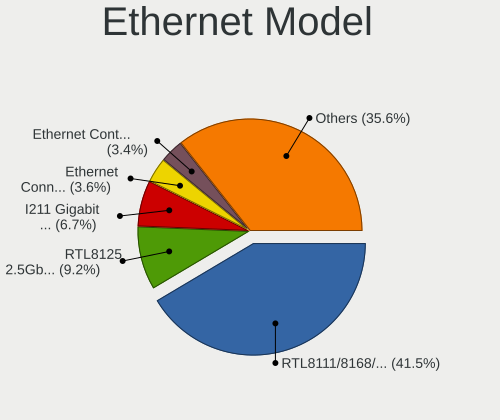

| Model                                                                          | Desktops | Percent |
|--------------------------------------------------------------------------------|----------|---------|
| Realtek RTL8111/8168/8211/8411 PCI Express Gigabit Ethernet Controller         | 789      | 41.46%  |
| Realtek RTL8125 2.5GbE Controller                                              | 175      | 9.2%    |
| Intel I211 Gigabit Network Connection                                          | 127      | 6.67%   |
| Intel Ethernet Connection (2) I219-V                                           | 69       | 3.63%   |
| Intel Ethernet Controller I225-V                                               | 65       | 3.42%   |
| Intel 82579LM Gigabit Network Connection (Lewisville)                          | 59       | 3.1%    |
| Intel Ethernet Connection I217-LM                                              | 32       | 1.68%   |
| Intel Ethernet Connection (7) I219-V                                           | 28       | 1.47%   |
| Intel Ethernet Connection (2) I218-V                                           | 22       | 1.16%   |
| Intel 82574L Gigabit Network Connection                                        | 22       | 1.16%   |
| Intel Ethernet Connection (2) I219-LM                                          | 21       | 1.1%    |
| Intel Ethernet Connection I217-V                                               | 20       | 1.05%   |
| Intel 82579V Gigabit Network Connection                                        | 18       | 0.95%   |
| Realtek RTL810xE PCI Express Fast Ethernet controller                          | 17       | 0.89%   |
| ASIX AX88179 Gigabit Ethernet                                                  | 16       | 0.84%   |
| Realtek RTL8153 Gigabit Ethernet Adapter                                       | 14       | 0.74%   |
| Intel I210 Gigabit Network Connection                                          | 14       | 0.74%   |
| Intel Ethernet Controller I226-V                                               | 13       | 0.68%   |
| Intel Ethernet Connection (2) I218-LM                                          | 11       | 0.58%   |
| Intel 82567LM-3 Gigabit Network Connection                                     | 10       | 0.53%   |
| Aquantia AQtion AQC107 NBase-T/IEEE 802.3an Ethernet Controller [Atlantic 10G] | 10       | 0.53%   |
| Qualcomm Atheros AR8121/AR8113/AR8114 Gigabit or Fast Ethernet                 | 9        | 0.47%   |
| Realtek RTL8852BE PCIe 802.11ax Wireless Network Controller                    | 8        | 0.42%   |
| Realtek RTL8169 PCI Gigabit Ethernet Controller                                | 8        | 0.42%   |
| Realtek Killer E3000 2.5GbE Controller                                         | 8        | 0.42%   |
| Qualcomm Atheros Killer E220x Gigabit Ethernet Controller                      | 8        | 0.42%   |
| Qualcomm Atheros AR8151 v2.0 Gigabit Ethernet                                  | 8        | 0.42%   |
| Intel Ethernet Connection (7) I219-LM                                          | 8        | 0.42%   |
| Intel Ethernet Connection (11) I219-V                                          | 8        | 0.42%   |
| Samsung Galaxy series, misc. (tethering mode)                                  | 7        | 0.37%   |
| Intel Ethernet Connection (5) I219-LM                                          | 7        | 0.37%   |
| Realtek RTL-8100/8101L/8139 PCI Fast Ethernet Adapter                          | 6        | 0.32%   |
| Qualcomm Atheros AR8161 Gigabit Ethernet                                       | 6        | 0.32%   |
| Intel Alder Lake-S PCH CNVi WiFi                                               | 6        | 0.32%   |
| Intel 82578DM Gigabit Network Connection                                       | 6        | 0.32%   |
| Broadcom NetXtreme BCM5764M Gigabit Ethernet PCIe                              | 6        | 0.32%   |
| Realtek Killer E2600 GbE Controller                                            | 5        | 0.26%   |
| Qualcomm Atheros Killer E2500 Gigabit Ethernet Controller                      | 5        | 0.26%   |
| Marvell Group 88E8056 PCI-E Gigabit Ethernet Controller                        | 5        | 0.26%   |
| Intel I350 Gigabit Network Connection                                          | 5        | 0.26%   |

Net Controller Kind
-------------------

Ethernet, WiFi or modem

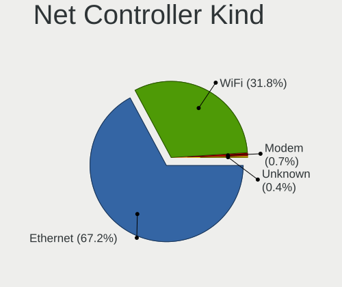

| Kind     | Desktops | Percent |
|----------|----------|---------|
| Ethernet | 1634     | 67.16%  |
| WiFi     | 774      | 31.81%  |
| Modem    | 16       | 0.66%   |
| Unknown  | 9        | 0.37%   |

Used Controller
---------------

Currently used network controller

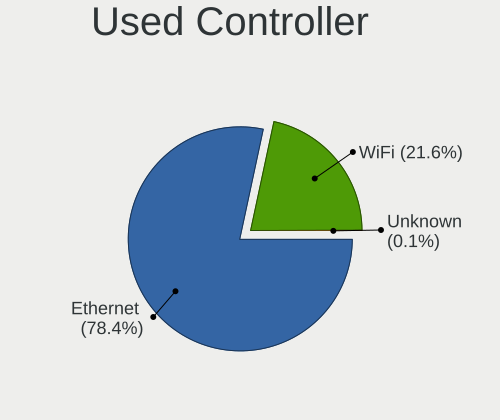

| Kind     | Desktops | Percent |
|----------|----------|---------|
| Ethernet | 1365     | 78.36%  |
| WiFi     | 376      | 21.58%  |
| Unknown  | 1        | 0.06%   |

NICs
----

Total network controllers on board

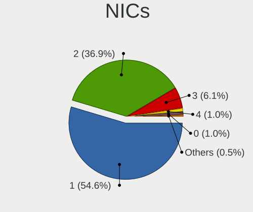

| Total | Desktops | Percent |
|-------|----------|---------|
| 1     | 909      | 54.63%  |
| 2     | 614      | 36.9%   |
| 3     | 101      | 6.07%   |
| 4     | 16       | 0.96%   |
| 0     | 16       | 0.96%   |
| 5     | 6        | 0.36%   |
| 8     | 2        | 0.12%   |

IPv6
----

IPv6 vs IPv4

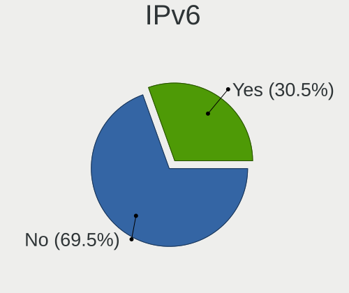

| Used | Desktops | Percent |
|------|----------|---------|
| No   | 1175     | 69.53%  |
| Yes  | 515      | 30.47%  |

Bluetooth
---------

Bluetooth Vendor
----------------

Controller vendors

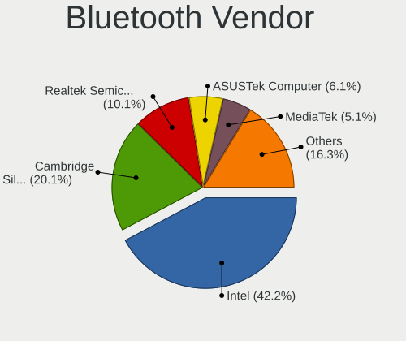

| Vendor                          | Desktops | Percent |
|---------------------------------|----------|---------|
| Intel                           | 321      | 42.24%  |
| Cambridge Silicon Radio         | 153      | 20.13%  |
| Realtek Semiconductor           | 77       | 10.13%  |
| ASUSTek Computer                | 46       | 6.05%   |
| MediaTek                        | 39       | 5.13%   |
| IMC Networks                    | 28       | 3.68%   |
| Broadcom                        | 25       | 3.29%   |
| Foxconn / Hon Hai               | 14       | 1.84%   |
| TP-Link                         | 13       | 1.71%   |
| Qualcomm Atheros Communications | 9        | 1.18%   |
| Apple                           | 8        | 1.05%   |
| Realtek                         | 5        | 0.66%   |
| Lite-On Technology              | 3        | 0.39%   |
| HTC (High Tech Computer)        | 3        | 0.39%   |
| Belkin Components               | 3        | 0.39%   |
| Integrated System Solution      | 2        | 0.26%   |
| Edimax Technology               | 2        | 0.26%   |
| SINO WEALTH                     | 1        | 0.13%   |
| Ralink                          | 1        | 0.13%   |
| Plugable                        | 1        | 0.13%   |
| Mobile Action Technology        | 1        | 0.13%   |
| Mercucys                        | 1        | 0.13%   |
| Kensington                      | 1        | 0.13%   |
| Dynex                           | 1        | 0.13%   |
| Dell                            | 1        | 0.13%   |
| Unknown                         | 1        | 0.13%   |

Bluetooth Model
---------------

Controller models

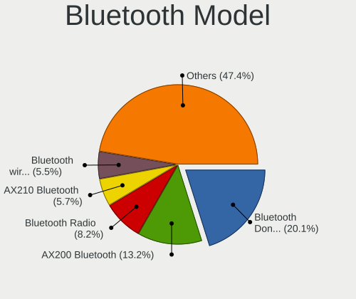

| Model                                                                | Desktops | Percent |
|----------------------------------------------------------------------|----------|---------|
| Cambridge Silicon Radio Bluetooth Dongle (HCI mode)                  | 153      | 20.13%  |
| Intel AX200 Bluetooth                                                | 100      | 13.16%  |
| Realtek Bluetooth Radio                                              | 62       | 8.16%   |
| Intel AX210 Bluetooth                                                | 43       | 5.66%   |
| Intel Bluetooth wireless interface                                   | 42       | 5.53%   |
| MediaTek Wireless_Device                                             | 39       | 5.13%   |
| Intel Wireless-AC 3168 Bluetooth                                     | 37       | 4.87%   |
| Intel Bluetooth Device                                               | 28       | 3.68%   |
| Intel AX201 Bluetooth                                                | 28       | 3.68%   |
| Intel Wireless-AC 9260 Bluetooth Adapter                             | 27       | 3.55%   |
| Intel Bluetooth 9460/9560 Jefferson Peak (JfP)                       | 16       | 2.11%   |
| IMC Networks Wireless_Device                                         | 14       | 1.84%   |
| TP-Link TP-T@- UB500 Adapter                                         | 13       | 1.71%   |
| ASUS ASUS USB-BT500                                                  | 13       | 1.71%   |
| IMC Networks Bluetooth Radio                                         | 12       | 1.58%   |
| Broadcom BCM20702A0 Bluetooth 4.0                                    | 11       | 1.45%   |
| Realtek  Bluetooth 4.2 Adapter                                       | 10       | 1.32%   |
| ASUS Broadcom BCM20702A0 Bluetooth                                   | 10       | 1.32%   |
| Foxconn / Hon Hai Wireless_Device                                    | 9        | 1.18%   |
| ASUS Bluetooth Adapter                                               | 8        | 1.05%   |
| ASUS Bluetooth Radio                                                 | 6        | 0.79%   |
| Realtek Bluetooth Radio                                              | 5        | 0.66%   |
| ASUS BCM20702A0                                                      | 5        | 0.66%   |
| Foxconn / Hon Hai Bluetooth Device                                   | 4        | 0.53%   |
| Broadcom BCM2045 Bluetooth                                           | 4        | 0.53%   |
| Apple Bluetooth Host Controller                                      | 4        | 0.53%   |
| Realtek RTL8821A Bluetooth                                           | 3        | 0.39%   |
| Qualcomm Atheros  Bluetooth Device                                   | 3        | 0.39%   |
| Qualcomm Atheros Bluetooth USB Host Controller                       | 3        | 0.39%   |
| Lite-On Bluetooth Device                                             | 3        | 0.39%   |
| HTC (High Tech Computer) Vive Hub Bluetooth 4.1 (Broadcom BCM920703) | 3        | 0.39%   |
| ASUS Bluetooth Device                                                | 3        | 0.39%   |
| Qualcomm Atheros AR9462 Bluetooth                                    | 2        | 0.26%   |
| Integrated System Solution KY-BT100 Bluetooth Adapter                | 2        | 0.26%   |
| Edimax Bluetooth Device                                              | 2        | 0.26%   |
| Broadcom Bluetooth Controller                                        | 2        | 0.26%   |
| Broadcom BCM92046DG-CL1ROM Bluetooth 2.1 Adapter                     | 2        | 0.26%   |
| Broadcom BCM43142A0 Bluetooth Device                                 | 2        | 0.26%   |
| Belkin Components F8T065BF Mini Bluetooth 4.0 Adapter                | 2        | 0.26%   |
| Apple Built-in Bluetooth 2.0+EDR HCI                                 | 2        | 0.26%   |

Sound
-----

Sound Vendor
------------

Sound card vendors

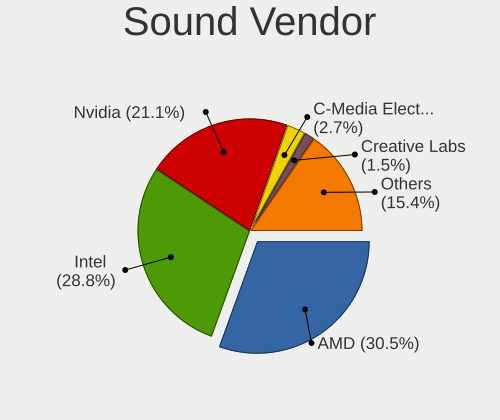

| Vendor                                       | Desktops | Percent |
|----------------------------------------------|----------|---------|
| AMD                                          | 902      | 30.52%  |
| Intel                                        | 851      | 28.8%   |
| Nvidia                                       | 623      | 21.08%  |
| C-Media Electronics                          | 81       | 2.74%   |
| Creative Labs                                | 44       | 1.49%   |
| Logitech                                     | 41       | 1.39%   |
| Texas Instruments                            | 23       | 0.78%   |
| Razer USA                                    | 23       | 0.78%   |
| ASUSTek Computer                             | 23       | 0.78%   |
| JMTek                                        | 16       | 0.54%   |
| Generalplus Technology                       | 16       | 0.54%   |
| SteelSeries ApS                              | 15       | 0.51%   |
| Kingston Technology                          | 14       | 0.47%   |
| Creative Technology                          | 14       | 0.47%   |
| Micro Star International                     | 13       | 0.44%   |
| GN Netcom                                    | 13       | 0.44%   |
| Focusrite-Novation                           | 13       | 0.44%   |
| DSEA A/S                                     | 10       | 0.34%   |
| VIA Technologies                             | 8        | 0.27%   |
| RODE Microphones                             | 8        | 0.27%   |
| Plantronics                                  | 8        | 0.27%   |
| BEHRINGER International                      | 8        | 0.27%   |
| Zoran Co. Personal Media Division (Nogatech) | 7        | 0.24%   |
| Hewlett-Packard                              | 7        | 0.24%   |
| Corsair                                      | 7        | 0.24%   |
| Sony                                         | 6        | 0.2%    |
| Samson Technologies                          | 6        | 0.2%    |
| M-Audio                                      | 6        | 0.2%    |
| FiiO Electronics Technology                  | 6        | 0.2%    |
| Thesycon Systemsoftware & Consulting         | 5        | 0.17%   |
| Yamaha                                       | 4        | 0.14%   |
| Microsoft                                    | 4        | 0.14%   |
| Jieli Technology                             | 4        | 0.14%   |
| Dell                                         | 4        | 0.14%   |
| Blue Microphones                             | 4        | 0.14%   |
| ASRock                                       | 4        | 0.14%   |
| XMOS                                         | 3        | 0.1%    |
| USB MICROPHONE                               | 3        | 0.1%    |
| ONN                                          | 3        | 0.1%    |
| Medeli Electronics                           | 3        | 0.1%    |

Sound Model
-----------

Sound card models

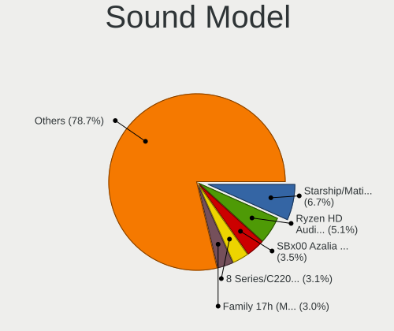

| Model                                                                      | Desktops | Percent |
|----------------------------------------------------------------------------|----------|---------|
| AMD Starship/Matisse HD Audio Controller                                   | 239      | 6.67%   |
| AMD Ryzen HD Audio Controller                                              | 182      | 5.08%   |
| AMD SBx00 Azalia (Intel HDA)                                               | 125      | 3.49%   |
| Intel 8 Series/C220 Series Chipset High Definition Audio Controller        | 110      | 3.07%   |
| AMD Family 17h (Models 00h-0fh) HD Audio Controller                        | 107      | 2.99%   |
| AMD Ellesmere HDMI Audio [Radeon RX 470/480 / 570/580/590]                 | 101      | 2.82%   |
| AMD Navi 21/23 HDMI/DP Audio Controller                                    | 89       | 2.48%   |
| Intel 6 Series/C200 Series Chipset Family High Definition Audio Controller | 83       | 2.32%   |
| Intel 200 Series PCH HD Audio                                              | 78       | 2.18%   |
| Intel 7 Series/C216 Chipset Family High Definition Audio Controller        | 75       | 2.09%   |
| Intel 100 Series/C230 Series Chipset Family HD Audio Controller            | 75       | 2.09%   |
| Intel Xeon E3-1200 v3/4th Gen Core Processor HD Audio Controller           | 65       | 1.81%   |
| AMD Renoir/Cezanne HDMI/DP Audio Controller                                | 63       | 1.76%   |
| AMD Radeon High Definition Audio Controller                                | 58       | 1.62%   |
| Nvidia GK208 HDMI/DP Audio Controller                                      | 53       | 1.48%   |
| AMD Navi 10 HDMI Audio                                                     | 53       | 1.48%   |
| Intel Cannon Lake PCH cAVS                                                 | 50       | 1.4%    |
| AMD Oland/Hainan/Cape Verde/Pitcairn HDMI Audio [Radeon HD 7000 Series]    | 49       | 1.37%   |
| AMD Navi 31 HDMI/DP Audio                                                  | 49       | 1.37%   |
| Nvidia GP104 High Definition Audio Controller                              | 47       | 1.31%   |
| AMD FCH Azalia Controller                                                  | 47       | 1.31%   |
| AMD Baffin HDMI/DP Audio [Radeon RX 550 640SP / RX 560/560X]               | 45       | 1.26%   |
| Nvidia GP107GL High Definition Audio Controller                            | 44       | 1.23%   |
| Intel Alder Lake-S HD Audio Controller                                     | 44       | 1.23%   |
| AMD Raven/Raven2/Fenghuang HDMI/DP Audio Controller                        | 40       | 1.12%   |
| Nvidia GP106 High Definition Audio Controller                              | 37       | 1.03%   |
| Nvidia TU116 High Definition Audio Controller                              | 36       | 1%      |
| Nvidia GM107 High Definition Audio Controller [GeForce 940MX]              | 30       | 0.84%   |
| Nvidia GA104 High Definition Audio Controller                              | 30       | 0.84%   |
| Intel NM10/ICH7 Family High Definition Audio Controller                    | 29       | 0.81%   |
| Intel 82801JI (ICH10 Family) HD Audio Controller                           | 29       | 0.81%   |
| Nvidia GA102 High Definition Audio Controller                              | 28       | 0.78%   |
| Intel Raptor Lake High Definition Audio Controller                         | 27       | 0.75%   |
| Intel C610/X99 series chipset HD Audio Controller                          | 26       | 0.73%   |
| Nvidia GP108 High Definition Audio Controller                              | 25       | 0.7%    |
| Intel 9 Series Chipset Family HD Audio Controller                          | 25       | 0.7%    |
| Intel C600/X79 series chipset High Definition Audio Controller             | 24       | 0.67%   |
| Nvidia TU106 High Definition Audio Controller                              | 22       | 0.61%   |
| Nvidia GM206 High Definition Audio Controller                              | 22       | 0.61%   |
| Nvidia GM204 High Definition Audio Controller                              | 22       | 0.61%   |

Memory
------

Memory Vendor
-------------

Memory module vendors

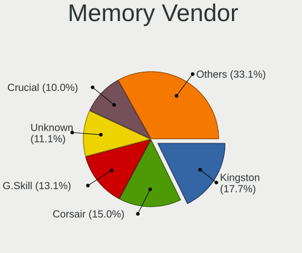

| Vendor                       | Desktops | Percent |
|------------------------------|----------|---------|
| Kingston                     | 171      | 17.74%  |
| Corsair                      | 145      | 15.04%  |
| G.Skill                      | 126      | 13.07%  |
| Unknown                      | 107      | 11.1%   |
| Crucial                      | 96       | 9.96%   |
| Samsung Electronics          | 72       | 7.47%   |
| SK hynix                     | 53       | 5.5%    |
| Micron Technology            | 48       | 4.98%   |
| Patriot                      | 18       | 1.87%   |
| Unknown                      | 17       | 1.76%   |
| Team                         | 16       | 1.66%   |
| A-DATA Technology            | 13       | 1.35%   |
| Nanya Technology             | 7        | 0.73%   |
| Ramaxel Technology           | 5        | 0.52%   |
| Elpida                       | 5        | 0.52%   |
| Avant                        | 5        | 0.52%   |
| Unknown (ABCD)               | 3        | 0.31%   |
| Silicon Power                | 3        | 0.31%   |
| PNY                          | 3        | 0.31%   |
| GOODRAM                      | 3        | 0.31%   |
| Apacer                       | 3        | 0.31%   |
| AMD                          | 3        | 0.31%   |
| Transcend                    | 2        | 0.21%   |
| Smart                        | 2        | 0.21%   |
| Patriot Memory (PDP Systems) | 2        | 0.21%   |
| Neo Forza                    | 2        | 0.21%   |
| Kingmax                      | 2        | 0.21%   |
| Hewlett-Packard              | 2        | 0.21%   |
| Exceleram                    | 2        | 0.21%   |
| Unknown (D386)               | 1        | 0.1%    |
| Unknown (B98C)               | 1        | 0.1%    |
| Unknown (89F7)               | 1        | 0.1%    |
| Unknown (0x8634)             | 1        | 0.1%    |
| Unknown (0x0E9D)             | 1        | 0.1%    |
| Unknown (0x0CC7)             | 1        | 0.1%    |
| Unknown (0x0B45)             | 1        | 0.1%    |
| Unknown (0x02BA)             | 1        | 0.1%    |
| Unknown (07FB)               | 1        | 0.1%    |
| Unifosa                      | 1        | 0.1%    |
| Teikon                       | 1        | 0.1%    |

Memory Model
------------

Memory module models

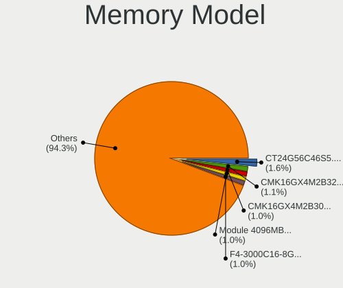

| Model                                                  | Desktops | Percent |
|--------------------------------------------------------|----------|---------|
| Unknown                                                | 17       | 1.62%   |
| Corsair RAM CMK16GX4M2B3200C16 8GB DIMM DDR4 3600MT/s  | 12       | 1.14%   |
| Corsair RAM CMK16GX4M2B3000C15 8GB DIMM DDR4 3600MT/s  | 11       | 1.05%   |
| Unknown RAM Module 4096MB DIMM 1333MT/s                | 10       | 0.95%   |
| G.Skill RAM F4-3000C16-8GISB 8GB DIMM DDR4 3200MT/s    | 10       | 0.95%   |
| Corsair RAM CMK32GX4M2B3200C16 16GB DIMM DDR4 3800MT/s | 8        | 0.76%   |
| Kingston RAM KHX1866C10D3/8G 8GB DIMM DDR3 1867MT/s    | 7        | 0.67%   |
| G.Skill RAM F4-3200C16-8GIS 8GB DIMM DDR4 3600MT/s     | 7        | 0.67%   |
| Unknown RAM Module 8GB DIMM 1333MT/s                   | 6        | 0.57%   |
| Samsung RAM M378B5173DB0-CK0 4096MB DIMM DDR3 1600MT/s | 6        | 0.57%   |
| Kingston RAM KHX3200C16D4/8GX 8GB DIMM DDR4 3733MT/s   | 6        | 0.57%   |
| Kingston RAM KHX2400C15/8G 8GB DIMM DDR4 3400MT/s      | 6        | 0.57%   |
| Kingston RAM KHX1600C9D3/4GX 4GB DIMM DDR3 1867MT/s    | 6        | 0.57%   |
| Kingston RAM KF3200C16D4/16GX 16GB DIMM DDR4 3733MT/s  | 6        | 0.57%   |
| G.Skill RAM F4-3200C16-8GVKB 8GB DIMM DDR4 4000MT/s    | 6        | 0.57%   |
| Unknown RAM Module 4GB DIMM DDR3 1333MT/s              | 5        | 0.48%   |
| Unknown RAM Module 4096MB DIMM 1600MT/s                | 5        | 0.48%   |
| Unknown RAM Module 2GB DIMM DDR2 800MT/s               | 5        | 0.48%   |
| Unknown RAM Module 2GB DIMM 1333MT/s                   | 5        | 0.48%   |
| Unknown RAM Module 2048MB DIMM 1333MT/s                | 5        | 0.48%   |
| Kingston RAM KHX3200C16D4/16GX 16GB DIMM DDR4 3600MT/s | 5        | 0.48%   |
| Kingston RAM KF3200C16D4/8GX 8GiB DIMM DDR4 3600MT/s   | 5        | 0.48%   |
| Kingston RAM KF3200C16D4/32GX 32GB DIMM DDR4 3933MT/s  | 5        | 0.48%   |
| G.Skill RAM F4-3200C16-16GVK 16GB DIMM DDR4 3600MT/s   | 5        | 0.48%   |
| Unknown RAM Module 2GB DIMM 800MT/s                    | 4        | 0.38%   |
| Unknown RAM Module 2048MB DIMM DDR2 800MT/s            | 4        | 0.38%   |
| Team RAM TEAMGROUP-UD4-3200 8GB DIMM DDR4 3800MT/s     | 4        | 0.38%   |
| Kingston RAM KHX2666C16/8G 8GiB DIMM DDR4 3466MT/s     | 4        | 0.38%   |
| Kingston RAM KHX2666C15D4/8G 8GB DIMM DDR4 3200MT/s    | 4        | 0.38%   |
| Kingston RAM KHX1600C10D3/8G 8GB DIMM DDR3 2133MT/s    | 4        | 0.38%   |
| G.Skill RAM F4-3200C16-16GIS 16GB DIMM DDR4 3600MT/s   | 4        | 0.38%   |
| Corsair RAM CMZ16GX3M2A1600C10 8GB DIMM DDR3 1600MT/s  | 4        | 0.38%   |
| Corsair RAM CMK32GX4M2Z3600C18 16GB DIMM DDR4 3800MT/s | 4        | 0.38%   |
| Corsair RAM CMK32GX4M2E3200C16 16GB DIMM DDR4 3600MT/s | 4        | 0.38%   |
| Corsair RAM CMK16GX4M2A2666C16 8GB DIMM DDR4 3400MT/s  | 4        | 0.38%   |
| Avant RAM F6451U67G1600G 4GB DIMM DDR3 1600MT/s        | 4        | 0.38%   |
| Unknown RAM Module 8192MB DIMM 1333MT/s                | 3        | 0.29%   |
| Unknown RAM Module 4GB DIMM 1600MT/s                   | 3        | 0.29%   |
| Unknown RAM Module 4GB DIMM 1333MT/s                   | 3        | 0.29%   |
| Unknown RAM Module 4096MB DIMM DDR3 1333MT/s           | 3        | 0.29%   |

Memory Kind
-----------

Memory module kinds

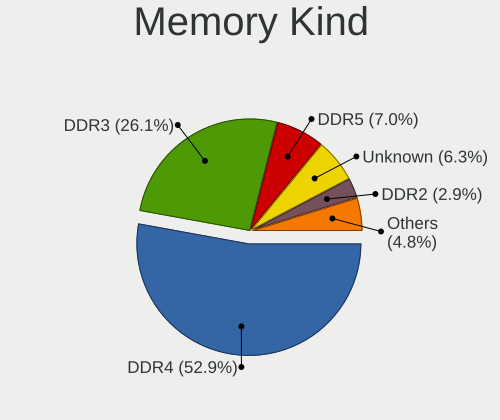

| Kind    | Desktops | Percent |
|---------|----------|---------|
| DDR4    | 452      | 52.87%  |
| DDR3    | 223      | 26.08%  |
| DDR5    | 60       | 7.02%   |
| Unknown | 54       | 6.32%   |
| DDR2    | 25       | 2.92%   |
| SDRAM   | 24       | 2.81%   |
| DDR     | 7        | 0.82%   |
| LPDDR4  | 5        | 0.58%   |
| DRAM    | 3        | 0.35%   |
| LPDDR5  | 2        | 0.23%   |

Memory Form Factor
------------------

Physical design of the memory module

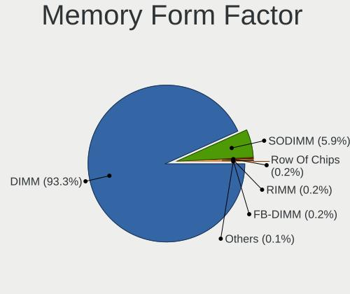

| Name         | Desktops | Percent |
|--------------|----------|---------|
| DIMM         | 791      | 93.28%  |
| SODIMM       | 50       | 5.9%    |
| Row Of Chips | 2        | 0.24%   |
| RIMM         | 2        | 0.24%   |
| FB-DIMM      | 2        | 0.24%   |
| Chip         | 1        | 0.12%   |

Memory Size
-----------

Memory module size

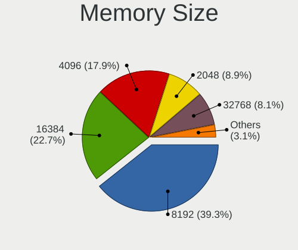

| Size  | Desktops | Percent |
|-------|----------|---------|
| 8192  | 364      | 39.31%  |
| 16384 | 210      | 22.68%  |
| 4096  | 166      | 17.93%  |
| 2048  | 82       | 8.86%   |
| 32768 | 75       | 8.1%    |
| 1024  | 20       | 2.16%   |
| 49152 | 3        | 0.32%   |
| 24576 | 3        | 0.32%   |
| 512   | 2        | 0.22%   |
| 128   | 1        | 0.11%   |

Memory Speed
------------

Memory module speed

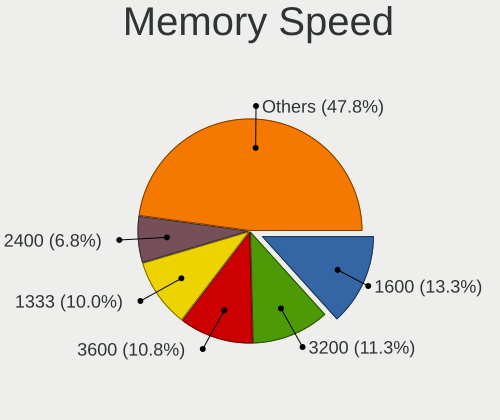

| Speed   | Desktops | Percent |
|---------|----------|---------|
| 1600    | 126      | 13.31%  |
| 3200    | 107      | 11.3%   |
| 3600    | 102      | 10.77%  |
| 1333    | 95       | 10.03%  |
| 2400    | 64       | 6.76%   |
| 2667    | 55       | 5.81%   |
| 2133    | 40       | 4.22%   |
| 800     | 30       | 3.17%   |
| 3800    | 28       | 2.96%   |
| 1867    | 19       | 2.01%   |
| 1866    | 18       | 1.9%    |
| 3000    | 17       | 1.8%    |
| 6000    | 16       | 1.69%   |
| 3400    | 16       | 1.69%   |
| 3733    | 15       | 1.58%   |
| 2666    | 14       | 1.48%   |
| 5600    | 13       | 1.37%   |
| 2933    | 12       | 1.27%   |
| 4000    | 11       | 1.16%   |
| 667     | 10       | 1.06%   |
| Unknown | 10       | 1.06%   |
| 6400    | 9        | 0.95%   |
| 1800    | 8        | 0.84%   |
| 4800    | 7        | 0.74%   |
| 3466    | 7        | 0.74%   |
| 2800    | 6        | 0.63%   |
| 1066    | 6        | 0.63%   |
| 6200    | 5        | 0.53%   |
| 3933    | 5        | 0.53%   |
| 3666    | 4        | 0.42%   |
| 3266    | 4        | 0.42%   |
| 400     | 4        | 0.42%   |
| 12800   | 3        | 0.32%   |
| 5200    | 3        | 0.32%   |
| 3866    | 3        | 0.32%   |
| 3333    | 3        | 0.32%   |
| 533     | 3        | 0.32%   |
| 7000    | 2        | 0.21%   |
| 4199    | 2        | 0.21%   |
| 3500    | 2        | 0.21%   |

Printers & scanners
-------------------

Printer Vendor
--------------

Printer device vendors

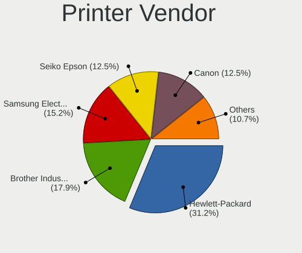

| Vendor              | Desktops | Percent |
|---------------------|----------|---------|
| Hewlett-Packard     | 35       | 31.25%  |
| Brother Industries  | 20       | 17.86%  |
| Samsung Electronics | 17       | 15.18%  |
| Seiko Epson         | 14       | 12.5%   |
| Canon               | 14       | 12.5%   |
| Prolific Technology | 2        | 1.79%   |
| Pantum              | 2        | 1.79%   |
| Kyocera             | 2        | 1.79%   |
| Xerox               | 1        | 0.89%   |
| STMicroelectronics  | 1        | 0.89%   |
| Star Micronics      | 1        | 0.89%   |
| QinHeng Electronics | 1        | 0.89%   |
| ICS Advent          | 1        | 0.89%   |
| Dell                | 1        | 0.89%   |

Printer Model
-------------

Printer device models

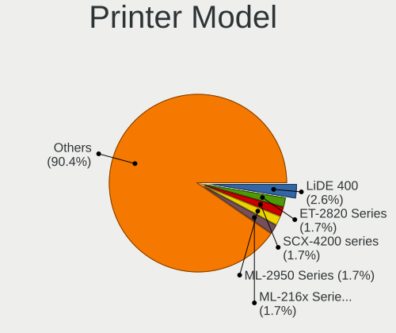

| Model                                                     | Desktops | Percent |
|-----------------------------------------------------------|----------|---------|
| Canon LiDE 400                                            | 3        | 2.61%   |
| Seiko Epson ET-2820 Series                                | 2        | 1.74%   |
| Samsung SCX-4200 series                                   | 2        | 1.74%   |
| Samsung ML-2950 Series                                    | 2        | 1.74%   |
| Samsung ML-216x Series Laser Printer                      | 2        | 1.74%   |
| Samsung ML-1865                                           | 2        | 1.74%   |
| Samsung M262x/M282x Xpress Series Laser Printer           | 2        | 1.74%   |
| Prolific PL2305 Parallel Port                             | 2        | 1.74%   |
| Kyocera FS-1030D printer                                  | 2        | 1.74%   |
| HP LaserJet 1320                                          | 2        | 1.74%   |
| HP LaserJet 1018                                          | 2        | 1.74%   |
| HP DeskJet Plus 4100 series                               | 2        | 1.74%   |
| HP DeskJet 2600 series                                    | 2        | 1.74%   |
| HP Color LaserJet CP1215                                  | 2        | 1.74%   |
| Canon LiDE 300                                            | 2        | 1.74%   |
| Brother Printer                                           | 2        | 1.74%   |
| Brother HL-L2390DW                                        | 2        | 1.74%   |
| Xerox WorkCentre 3220                                     | 1        | 0.87%   |
| STMicroelectronics LED badge -- mini LED display -- 11x44 | 1        | 0.87%   |
| Star Micronics TSP100ECO/TSP100II                         | 1        | 0.87%   |
| Seiko Epson XP-4200 Series                                | 1        | 0.87%   |
| Seiko Epson XP-4100 Series                                | 1        | 0.87%   |
| Seiko Epson XP-3200 Series                                | 1        | 0.87%   |
| Seiko Epson XP-240 Series                                 | 1        | 0.87%   |
| Seiko Epson XP-235 Series                                 | 1        | 0.87%   |
| Seiko Epson WF-4830 Series                                | 1        | 0.87%   |
| Seiko Epson Printer                                       | 1        | 0.87%   |
| Seiko Epson L1300 Series                                  | 1        | 0.87%   |
| Seiko Epson ET-3840 Series                                | 1        | 0.87%   |
| Seiko Epson ET-2720 Series                                | 1        | 0.87%   |
| Seiko Epson ET-2710 Series                                | 1        | 0.87%   |
| Seiko Epson EPSON WF-2010 Series                          | 1        | 0.87%   |
| Seiko Epson EPSON L300 Series                             | 1        | 0.87%   |
| Samsung SCX-3400 Series                                   | 1        | 0.87%   |
| Samsung Phaser 3121                                       | 1        | 0.87%   |
| Samsung ML-191x/ML-252x Laser Printer                     | 1        | 0.87%   |
| Samsung M267x 287x Series                                 | 1        | 0.87%   |
| Samsung M2070 Series                                      | 1        | 0.87%   |
| Samsung M2020 Series                                      | 1        | 0.87%   |
| Samsung CLX-6260 Series                                   | 1        | 0.87%   |

Scanner Vendor
--------------

Scanner device vendors

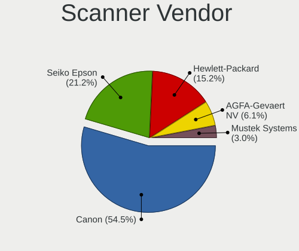

| Vendor          | Desktops | Percent |
|-----------------|----------|---------|
| Canon           | 18       | 54.55%  |
| Seiko Epson     | 7        | 21.21%  |
| Hewlett-Packard | 5        | 15.15%  |
| AGFA-Gevaert NV | 2        | 6.06%   |
| Mustek Systems  | 1        | 3.03%   |

Scanner Model
-------------

Scanner device models

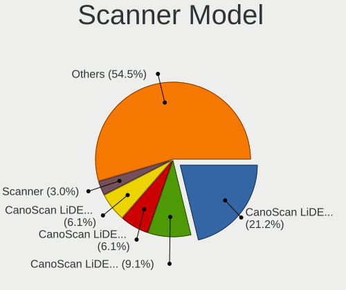

| Model                                                         | Desktops | Percent |
|---------------------------------------------------------------|----------|---------|
| Canon CanoScan LiDE 210                                       | 7        | 21.21%  |
| Canon CanoScan LiDE 110                                       | 3        | 9.09%   |
| Canon CanoScan LiDE 220                                       | 2        | 6.06%   |
| Canon CanoScan LiDE 200                                       | 2        | 6.06%   |
| Seiko Epson Scanner                                           | 1        | 3.03%   |
| Seiko Epson Perfection V37/V370                               | 1        | 3.03%   |
| Seiko Epson GT-X770 [Perfection V500]                         | 1        | 3.03%   |
| Seiko Epson GT-F730 [GT-S630/Perfection V33/V330 Photo]       | 1        | 3.03%   |
| Seiko Epson GT-F520/GT-F570 [Perfection 3590 PHOTO]           | 1        | 3.03%   |
| Seiko Epson GT-8700/GT-8700F [Perfection 1640SU/1640SU PHOTO] | 1        | 3.03%   |
| Seiko Epson GT-8300UF [Perfection 1660 PHOTO]                 | 1        | 3.03%   |
| Mustek Systems ScanExpress A3 USB                             | 1        | 3.03%   |
| HP ScanJet Pro 2500 f1                                        | 1        | 3.03%   |
| HP Scanjet G2710                                              | 1        | 3.03%   |
| HP ScanJet 7400c                                              | 1        | 3.03%   |
| HP ScanJet 5300c/5370c                                        | 1        | 3.03%   |
| HP ScanJet 3970c                                              | 1        | 3.03%   |
| Canon CanoScan N670U/N676U/LiDE 20                            | 1        | 3.03%   |
| Canon CanoScan N1240U/LiDE 30                                 | 1        | 3.03%   |
| Canon CanoScan LiDE 50/LiDE 35/LiDE 40                        | 1        | 3.03%   |
| Canon CanoScan LIDE 25                                        | 1        | 3.03%   |
| AGFA-Gevaert NV SnapScan e20                                  | 1        | 3.03%   |
| AGFA-Gevaert NV SnapScan 1212U (?)                            | 1        | 3.03%   |

Camera
------

Camera Vendor
-------------

Camera device vendors

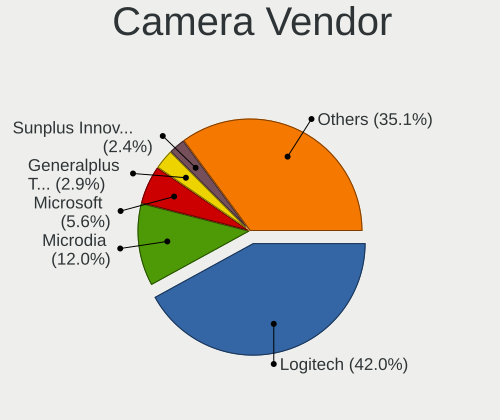

| Vendor                        | Desktops | Percent |
|-------------------------------|----------|---------|
| Logitech                      | 158      | 42.02%  |
| Microdia                      | 45       | 11.97%  |
| Microsoft                     | 21       | 5.59%   |
| Generalplus Technology        | 11       | 2.93%   |
| Sunplus Innovation Technology | 9        | 2.39%   |
| MacroSilicon                  | 9        | 2.39%   |
| Creative Technology           | 9        | 2.39%   |
| Realtek Semiconductor         | 7        | 1.86%   |
| Trust                         | 6        | 1.6%    |
| Samsung Electronics           | 6        | 1.6%    |
| Apple                         | 6        | 1.6%    |
| webcam                        | 5        | 1.33%   |
| Chicony Electronics           | 5        | 1.33%   |
| ARC International             | 5        | 1.33%   |
| Z-Star Microelectronics       | 4        | 1.06%   |
| WaveRider Communications      | 3        | 0.8%    |
| Razer USA                     | 3        | 0.8%    |
| Quanta                        | 3        | 0.8%    |
| Jieli Technology              | 3        | 0.8%    |
| Hewlett-Packard               | 3        | 0.8%    |
| Genesys Logic                 | 3        | 0.8%    |
| AVerMedia Technologies        | 3        | 0.8%    |
| Tobii Technology AB           | 2        | 0.53%   |
| SunplusIT                     | 2        | 0.53%   |
| Sonix Technology              | 2        | 0.53%   |
| SHENZHEN EMEET TECHNOLOGY     | 2        | 0.53%   |
| Philips (or NXP)              | 2        | 0.53%   |
| Oculus VR                     | 2        | 0.53%   |
| IMC Networks                  | 2        | 0.53%   |
| Huawei Technologies           | 2        | 0.53%   |
| eMeet                         | 2        | 0.53%   |
| Cubeternet                    | 2        | 0.53%   |
| Arkmicro Technologies         | 2        | 0.53%   |
| YGTek                         | 1        | 0.27%   |
| Xiongmai                      | 1        | 0.27%   |
| Xinfrared                     | 1        | 0.27%   |
| USB Cam Manufacturer          | 1        | 0.27%   |
| Unknown                       | 1        | 0.27%   |
| Sweex                         | 1        | 0.27%   |
| Suyin                         | 1        | 0.27%   |

Camera Model
------------

Camera device models

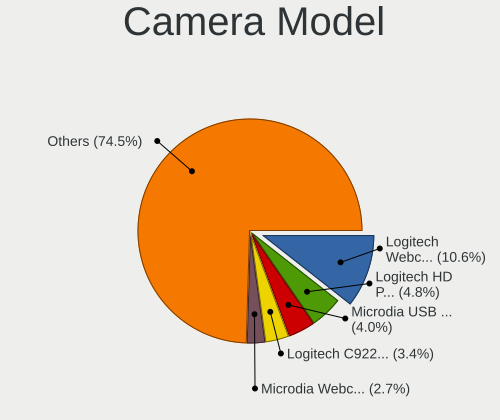

| Model                                   | Desktops | Percent |
|-----------------------------------------|----------|---------|
| Logitech Webcam C270                    | 40       | 10.61%  |
| Logitech HD Pro Webcam C920             | 18       | 4.77%   |
| Microdia USB 2.0 Camera                 | 15       | 3.98%   |
| Logitech C922 Pro Stream Webcam         | 13       | 3.45%   |
| Microdia Webcam Vitade AF               | 10       | 2.65%   |
| Logitech HD Webcam C525                 | 9        | 2.39%   |
| Logitech Logitech Webcam C925e          | 8        | 2.12%   |
| Generalplus GENERAL WEBCAM              | 7        | 1.86%   |
| Samsung Galaxy series, misc. (MTP mode) | 6        | 1.59%   |
| Microsoft LifeCam HD-3000               | 6        | 1.59%   |
| MacroSilicon USB Video                  | 6        | 1.59%   |
| Logitech C920 PRO HD Webcam             | 6        | 1.59%   |
| Logitech BRIO Ultra HD Webcam           | 6        | 1.59%   |
| webcam webcam                           | 5        | 1.33%   |
| Logitech Webcam C310                    | 5        | 1.33%   |
| Logitech HD Webcam C615                 | 5        | 1.33%   |
| ARC International Camera                | 5        | 1.33%   |
| Microdia Sonix USB 2.0 Camera           | 4        | 1.06%   |
| Microdia CyberTrack H7                  | 4        | 1.06%   |
| Microdia Camera                         | 4        | 1.06%   |
| Logitech StreamCam                      | 4        | 1.06%   |
| Logitech QuickCam Pro 9000              | 4        | 1.06%   |
| Logitech CrystalCam                     | 4        | 1.06%   |
| Logitech BRIO 4K Stream Edition         | 4        | 1.06%   |
| Logitech B525 HD Webcam                 | 4        | 1.06%   |
| Sunplus Integrated Camera               | 3        | 0.8%    |
| Sunplus Full HD webcam                  | 3        | 0.8%    |
| Razer USA Gaming Webcam [Kiyo]          | 3        | 0.8%    |
| Microdia USB Live camera                | 3        | 0.8%    |
| Logitech Webcam Pro 9000                | 3        | 0.8%    |
| Logitech Webcam C170                    | 3        | 0.8%    |
| Jieli USB PHY 2.0                       | 3        | 0.8%    |
| Creative Live! Cam Sync HD [VF0770]     | 3        | 0.8%    |
| Creative Live! Cam Sync 1080p V2        | 3        | 0.8%    |
| Apple iPhone 5/5C/5S/6/SE/7/8/X         | 3        | 0.8%    |
| Z-Star Venus USB2.0 Camera              | 2        | 0.53%   |
| Trust Full HD Webcam                    | 2        | 0.53%   |
| Tobii AB EyeChip                        | 2        | 0.53%   |
| Sunplus UHD Capture                     | 2        | 0.53%   |
| Oculus VR Quest 2                       | 2        | 0.53%   |

Security
--------

Fingerprint Vendor
------------------

Fingerprint sensor vendors

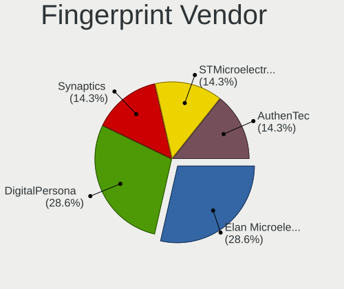

| Vendor                | Desktops | Percent |
|-----------------------|----------|---------|
| Elan Microelectronics | 2        | 28.57%  |
| DigitalPersona        | 2        | 28.57%  |
| Synaptics             | 1        | 14.29%  |
| STMicroelectronics    | 1        | 14.29%  |
| AuthenTec             | 1        | 14.29%  |

Fingerprint Model
-----------------

Fingerprint sensor models

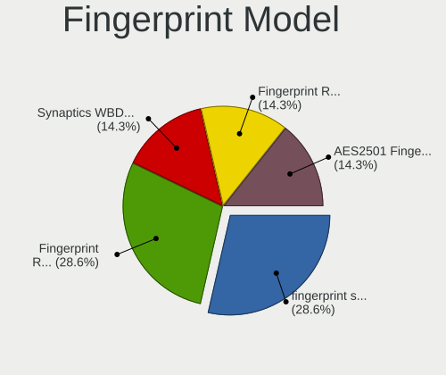

| Model                                        | Desktops | Percent |
|----------------------------------------------|----------|---------|
| Elan fingerprint sensor [FeinTech FPS00200]  | 2        | 28.57%  |
| DigitalPersona Fingerprint Reader            | 2        | 28.57%  |
| Synaptics  WBDI Fingerprint Reader - USB 052 | 1        | 14.29%  |
| STMicroelectronics Fingerprint Reader        | 1        | 14.29%  |
| AuthenTec AES2501 Fingerprint Sensor         | 1        | 14.29%  |

Chipcard Vendor
---------------

Chipcard module vendors

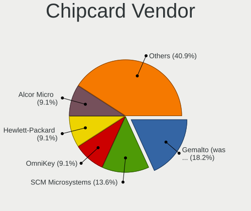

| Vendor                     | Desktops | Percent |
|----------------------------|----------|---------|
| Gemalto (was Gemplus)      | 4        | 18.18%  |
| SCM Microsystems           | 3        | 13.64%  |
| OmniKey                    | 2        | 9.09%   |
| Hewlett-Packard            | 2        | 9.09%   |
| Alcor Micro                | 2        | 9.09%   |
| Yubico.com                 | 1        | 4.55%   |
| Watchdata                  | 1        | 4.55%   |
| Reiner SCT Kartensysteme   | 1        | 4.55%   |
| Clay Logic                 | 1        | 4.55%   |
| Chicony Electronics        | 1        | 4.55%   |
| Cherry                     | 1        | 4.55%   |
| Castles Technology         | 1        | 4.55%   |
| Athena Smartcard Solutions | 1        | 4.55%   |
| Advanced Card Systems      | 1        | 4.55%   |

Chipcard Model
--------------

Chipcard module models

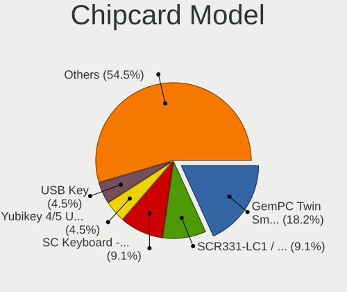

| Model                                                                      | Desktops | Percent |
|----------------------------------------------------------------------------|----------|---------|
| Gemalto (was Gemplus) GemPC Twin SmartCard Reader                          | 4        | 18.18%  |
| SCM Microsystems SCR331-LC1 / SCR3310 SmartCard Reader                     | 2        | 9.09%   |
| Hewlett-Packard SC Keyboard - Apollo (Liteon)                              | 2        | 9.09%   |
| Yubico.com Yubikey 4/5 U2F+CCID                                            | 1        | 4.55%   |
| Watchdata USB Key                                                          | 1        | 4.55%   |
| SCM Microsystems SCR3310 CLOUD 2700 R                                      | 1        | 4.55%   |
| Reiner SCT Kartensysteme cyberJack RFID basis contactless smartcard reader | 1        | 4.55%   |
| OmniKey CardMan 1021                                                       | 1        | 4.55%   |
| OmniKey 3x21 Smart Card Reader                                             | 1        | 4.55%   |
| Clay Logic Nitrokey HSM                                                    | 1        | 4.55%   |
| Chicony Electronics HP Skylab USB Smartcard Keyboard                       | 1        | 4.55%   |
| Cherry SmartCard Reader Keyboard KC 1000 SC                                | 1        | 4.55%   |
| Castles Technology EZCCID Smart Card Reader                                | 1        | 4.55%   |
| Athena Smartcard Solutions ASEDrive V3C                                    | 1        | 4.55%   |
| Alcor Micro Watchdata W 1981                                               | 1        | 4.55%   |
| Alcor Micro AU9540 Smartcard Reader                                        | 1        | 4.55%   |
| Advanced Card Systems ACR38 SmartCard Reader                               | 1        | 4.55%   |

Unsupported
-----------

Unsupported Devices
-------------------

Total unsupported devices on board

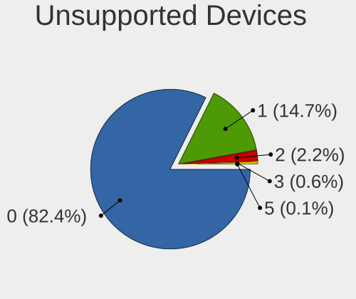

| Total | Desktops | Percent |
|-------|----------|---------|
| 0     | 1402     | 82.37%  |
| 1     | 251      | 14.75%  |
| 2     | 38       | 2.23%   |
| 3     | 10       | 0.59%   |
| 5     | 1        | 0.06%   |

Unsupported Device Types
------------------------

Types of unsupported devices

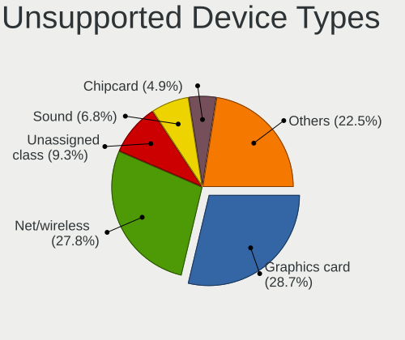

| Type                     | Desktops | Percent |
|--------------------------|----------|---------|
| Graphics card            | 93       | 28.7%   |
| Net/wireless             | 90       | 27.78%  |
| Unassigned class         | 30       | 9.26%   |
| Sound                    | 22       | 6.79%   |
| Chipcard                 | 16       | 4.94%   |
| Multimedia controller    | 12       | 3.7%    |
| Card reader              | 10       | 3.09%   |
| Communication controller | 8        | 2.47%   |
| Net/ethernet             | 7        | 2.16%   |
| Fingerprint reader       | 7        | 2.16%   |
| Storage/raid             | 6        | 1.85%   |
| Bluetooth                | 6        | 1.85%   |
| Network                  | 5        | 1.54%   |
| Firewire controller      | 5        | 1.54%   |
| Camera                   | 5        | 1.54%   |
| Storage/ide              | 2        | 0.62%   |

