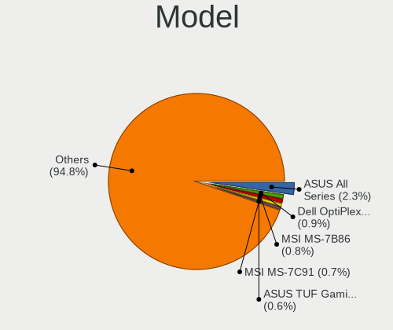
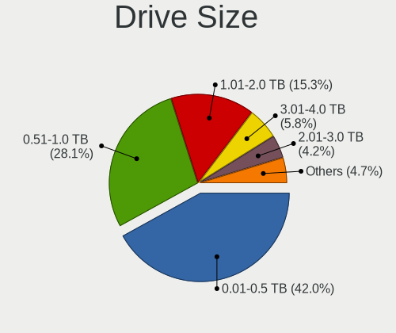
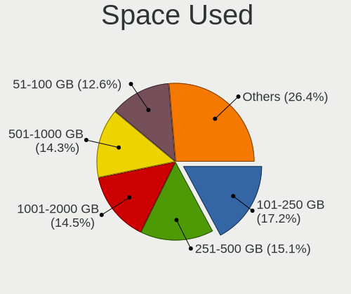
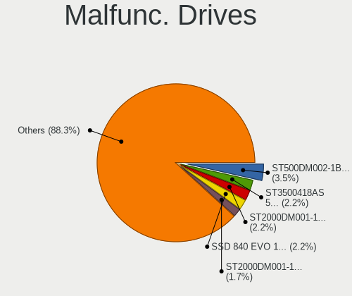
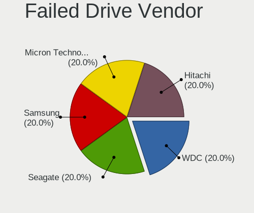
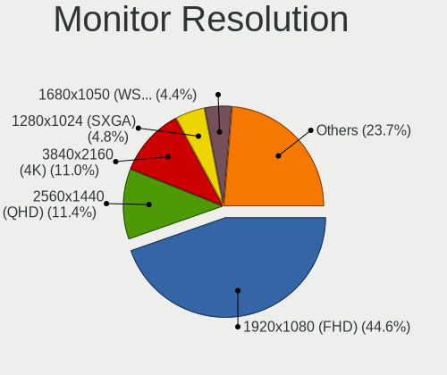
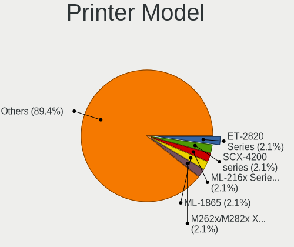
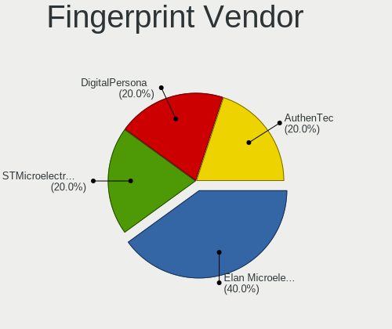
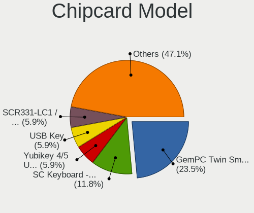

openSUSE - Tested Hardware & Statistics (Desktops)
--------------------------------------------------

A project to collect tested hardware configurations for openSUSE.

Anyone can contribute to this report by the [hw-probe](https://github.com/linuxhw/hw-probe) tool:

    sudo -E hw-probe -all -upload

Please contribute! Especially if your hardware is rare.

Contents
--------

* [ Test Cases ](#test-cases)

* [ System ](#system)
  - [ OS                       ](#os)
  - [ OS Family                ](#os-family)
  - [ Kernel                   ](#kernel)
  - [ Kernel Family            ](#kernel-family)
  - [ Kernel Major Ver.        ](#kernel-major-ver)
  - [ Arch                     ](#arch)
  - [ DE                       ](#de)
  - [ Display Server           ](#display-server)
  - [ Display Manager          ](#display-manager)
  - [ OS Lang                  ](#os-lang)
  - [ Boot Mode                ](#boot-mode)
  - [ Filesystem               ](#filesystem)
  - [ Part. scheme             ](#part-scheme)
  - [ Dual Boot with Linux/BSD ](#dual-boot-with-linuxbsd)
  - [ Dual Boot (Win)          ](#dual-boot-win)

* [ Board ](#board)
  - [ Vendor                   ](#vendor)
  - [ Model                    ](#model)
  - [ Model Family             ](#model-family)
  - [ MFG Year                 ](#mfg-year)
  - [ Form Factor              ](#form-factor)
  - [ Secure Boot              ](#secure-boot)
  - [ Coreboot                 ](#coreboot)
  - [ RAM Size                 ](#ram-size)
  - [ RAM Used                 ](#ram-used)
  - [ Total Drives             ](#total-drives)
  - [ Has CD-ROM               ](#has-cd-rom)
  - [ Has Ethernet             ](#has-ethernet)
  - [ Has WiFi                 ](#has-wifi)
  - [ Has Bluetooth            ](#has-bluetooth)

* [ Location ](#location)
  - [ Country                  ](#country)
  - [ City                     ](#city)

* [ Drives ](#drives)
  - [ Drive Vendor             ](#drive-vendor)
  - [ Drive Model              ](#drive-model)
  - [ HDD Vendor               ](#hdd-vendor)
  - [ SSD Vendor               ](#ssd-vendor)
  - [ Drive Kind               ](#drive-kind)
  - [ Drive Connector          ](#drive-connector)
  - [ Drive Size               ](#drive-size)
  - [ Space Total              ](#space-total)
  - [ Space Used               ](#space-used)
  - [ Malfunc. Drives          ](#malfunc-drives)
  - [ Malfunc. Drive Vendor    ](#malfunc-drive-vendor)
  - [ Malfunc. HDD Vendor      ](#malfunc-hdd-vendor)
  - [ Malfunc. Drive Kind      ](#malfunc-drive-kind)
  - [ Failed Drives            ](#failed-drives)
  - [ Failed Drive Vendor      ](#failed-drive-vendor)
  - [ Drive Status             ](#drive-status)

* [ Storage controller ](#storage-controller)
  - [ Storage Vendor           ](#storage-vendor)
  - [ Storage Model            ](#storage-model)
  - [ Storage Kind             ](#storage-kind)

* [ Processor ](#processor)
  - [ CPU Vendor               ](#cpu-vendor)
  - [ CPU Model                ](#cpu-model)
  - [ CPU Model Family         ](#cpu-model-family)
  - [ CPU Cores                ](#cpu-cores)
  - [ CPU Sockets              ](#cpu-sockets)
  - [ CPU Threads              ](#cpu-threads)
  - [ CPU Op-Modes             ](#cpu-op-modes)
  - [ CPU Microcode            ](#cpu-microcode)
  - [ CPU Microarch            ](#cpu-microarch)

* [ Graphics ](#graphics)
  - [ GPU Vendor               ](#gpu-vendor)
  - [ GPU Model                ](#gpu-model)
  - [ GPU Combo                ](#gpu-combo)
  - [ GPU Driver               ](#gpu-driver)
  - [ GPU Memory               ](#gpu-memory)

* [ Monitor ](#monitor)
  - [ Monitor Vendor           ](#monitor-vendor)
  - [ Monitor Model            ](#monitor-model)
  - [ Monitor Resolution       ](#monitor-resolution)
  - [ Monitor Diagonal         ](#monitor-diagonal)
  - [ Monitor Width            ](#monitor-width)
  - [ Aspect Ratio             ](#aspect-ratio)
  - [ Monitor Area             ](#monitor-area)
  - [ Pixel Density            ](#pixel-density)
  - [ Multiple Monitors        ](#multiple-monitors)

* [ Network ](#network)
  - [ Net Controller Vendor    ](#net-controller-vendor)
  - [ Net Controller Model     ](#net-controller-model)
  - [ Wireless Vendor          ](#wireless-vendor)
  - [ Wireless Model           ](#wireless-model)
  - [ Ethernet Vendor          ](#ethernet-vendor)
  - [ Ethernet Model           ](#ethernet-model)
  - [ Net Controller Kind      ](#net-controller-kind)
  - [ Used Controller          ](#used-controller)
  - [ NICs                     ](#nics)
  - [ IPv6                     ](#ipv6)

* [ Bluetooth ](#bluetooth)
  - [ Bluetooth Vendor         ](#bluetooth-vendor)
  - [ Bluetooth Model          ](#bluetooth-model)

* [ Sound ](#sound)
  - [ Sound Vendor             ](#sound-vendor)
  - [ Sound Model              ](#sound-model)

* [ Memory ](#memory)
  - [ Memory Vendor            ](#memory-vendor)
  - [ Memory Model             ](#memory-model)
  - [ Memory Kind              ](#memory-kind)
  - [ Memory Form Factor       ](#memory-form-factor)
  - [ Memory Size              ](#memory-size)
  - [ Memory Speed             ](#memory-speed)

* [ Printers & scanners ](#printers--scanners)
  - [ Printer Vendor           ](#printer-vendor)
  - [ Printer Model            ](#printer-model)
  - [ Scanner Vendor           ](#scanner-vendor)
  - [ Scanner Model            ](#scanner-model)

* [ Camera ](#camera)
  - [ Camera Vendor            ](#camera-vendor)
  - [ Camera Model             ](#camera-model)

* [ Security ](#security)
  - [ Fingerprint Vendor       ](#fingerprint-vendor)
  - [ Fingerprint Model        ](#fingerprint-model)
  - [ Chipcard Vendor          ](#chipcard-vendor)
  - [ Chipcard Model           ](#chipcard-model)

* [ Unsupported ](#unsupported)
  - [ Unsupported Devices      ](#unsupported-devices)
  - [ Unsupported Device Types ](#unsupported-device-types)

Test Cases
----------

Total: 1063

| Vendor        | Model                       | Probe                                                      | Date         |
|---------------|-----------------------------|------------------------------------------------------------|--------------|
| ASUSTek       | M5A78L-M/USB3               | [2508c5972e](https://linux-hardware.org/?probe=2508c5972e) | Dec 31, 2022 |
| Gigabyte      | W480 VISION D               | [133d8a7f70](https://linux-hardware.org/?probe=133d8a7f70) | Dec 31, 2022 |
| Acer          | Veriton N4680G              | [0053ddb3c9](https://linux-hardware.org/?probe=0053ddb3c9) | Dec 30, 2022 |
| MSI           | B450M PRO-VDH MAX           | [0447771b4f](https://linux-hardware.org/?probe=0447771b4f) | Dec 29, 2022 |
| Gigabyte      | B660M AORUS PRO AX DDR4     | [c6325d4647](https://linux-hardware.org/?probe=c6325d4647) | Dec 29, 2022 |
| ASUSTek       | M5A78L-M LX                 | [a8b80cb4f6](https://linux-hardware.org/?probe=a8b80cb4f6) | Dec 28, 2022 |
| Gigabyte      | X470 AORUS GAMING 7 WIFI... | [7e46b9fd5b](https://linux-hardware.org/?probe=7e46b9fd5b) | Dec 26, 2022 |
| Dell          | 00V62H A00                  | [dde339b7c9](https://linux-hardware.org/?probe=dde339b7c9) | Dec 26, 2022 |
| Gigabyte      | B660M AORUS PRO AX DDR4     | [7b965d8da8](https://linux-hardware.org/?probe=7b965d8da8) | Dec 25, 2022 |
| MSI           | B450M PRO-VDH MAX           | [410ac6980a](https://linux-hardware.org/?probe=410ac6980a) | Dec 25, 2022 |
| Gigabyte      | B550 AORUS PRO AC           | [83203eef25](https://linux-hardware.org/?probe=83203eef25) | Dec 24, 2022 |
| ASUSTek       | Z170 PRO GAMING             | [c17fe8cbe0](https://linux-hardware.org/?probe=c17fe8cbe0) | Dec 23, 2022 |
| Dell          | 0K071D A01                  | [49612bc7d4](https://linux-hardware.org/?probe=49612bc7d4) | Dec 21, 2022 |
| Dell          | 0K071D A01                  | [94204a7d2c](https://linux-hardware.org/?probe=94204a7d2c) | Dec 21, 2022 |
| Gigabyte      | F2A68HM-H                   | [79cf1b618f](https://linux-hardware.org/?probe=79cf1b618f) | Dec 20, 2022 |
| Dell          | 0M5DCD A00                  | [2a2f618c62](https://linux-hardware.org/?probe=2a2f618c62) | Dec 19, 2022 |
| ASUSTek       | M5A78L-M/USB3               | [533bf9eafc](https://linux-hardware.org/?probe=533bf9eafc) | Dec 19, 2022 |
| MSI           | H310M PRO-VDH PLUS          | [1212530d94](https://linux-hardware.org/?probe=1212530d94) | Dec 18, 2022 |
| ASUSTek       | SABERTOOTH Z97 MARK 2       | [c0b006673c](https://linux-hardware.org/?probe=c0b006673c) | Dec 18, 2022 |
| MSI           | H310M PRO-VDH PLUS          | [19e8973a92](https://linux-hardware.org/?probe=19e8973a92) | Dec 18, 2022 |
| Gigabyte      | Z270P-D3-CF                 | [05519b281d](https://linux-hardware.org/?probe=05519b281d) | Dec 16, 2022 |
| ASRock        | X570 Steel Legend           | [64bdae140b](https://linux-hardware.org/?probe=64bdae140b) | Dec 16, 2022 |
| Gigabyte      | B550 AORUS ELITE AX V2      | [0fe564693b](https://linux-hardware.org/?probe=0fe564693b) | Dec 16, 2022 |
| Gigabyte      | B550 AORUS ELITE V2         | [8df2e8b58c](https://linux-hardware.org/?probe=8df2e8b58c) | Dec 15, 2022 |
| ASUSTek       | Z170 PRO GAMING             | [77fcf302d4](https://linux-hardware.org/?probe=77fcf302d4) | Dec 14, 2022 |
| ASRock        | 4X4-R1000                   | [f6b7e164dc](https://linux-hardware.org/?probe=f6b7e164dc) | Dec 13, 2022 |
| ASUSTek       | PRIME Z270-A                | [ea3dbee733](https://linux-hardware.org/?probe=ea3dbee733) | Dec 13, 2022 |
| ASUSTek       | PRIME Z270-A                | [441dc6d8a0](https://linux-hardware.org/?probe=441dc6d8a0) | Dec 13, 2022 |
| ASRock        | B75M R2.0                   | [780eecc5e8](https://linux-hardware.org/?probe=780eecc5e8) | Dec 12, 2022 |
| MSI           | X470 GAMING PRO CARBON      | [947534b3be](https://linux-hardware.org/?probe=947534b3be) | Dec 09, 2022 |
| ASRock        | A320M-HD                    | [aea1c7da95](https://linux-hardware.org/?probe=aea1c7da95) | Dec 09, 2022 |
| Gigabyte      | B450 AORUS M                | [b1ac2fbabe](https://linux-hardware.org/?probe=b1ac2fbabe) | Dec 09, 2022 |
| ASUSTek       | Maximus IX HERO             | [4acc1d38e8](https://linux-hardware.org/?probe=4acc1d38e8) | Dec 08, 2022 |
| MSI           | P67A-C45                    | [44c8da681d](https://linux-hardware.org/?probe=44c8da681d) | Dec 07, 2022 |
| ASUSTek       | PRIME B350M-A               | [31ae5769eb](https://linux-hardware.org/?probe=31ae5769eb) | Dec 07, 2022 |
| ASRock        | H410M-HVS                   | [a8aa92bfed](https://linux-hardware.org/?probe=a8aa92bfed) | Dec 07, 2022 |
| ASUSTek       | B85M-E                      | [7a2d061568](https://linux-hardware.org/?probe=7a2d061568) | Dec 06, 2022 |
| MSI           | B85-G41 PC Mate             | [a54611689d](https://linux-hardware.org/?probe=a54611689d) | Dec 06, 2022 |
| MSI           | MS-B1711                    | [1fbaa02605](https://linux-hardware.org/?probe=1fbaa02605) | Dec 05, 2022 |
| Gigabyte      | B550 AORUS PRO AC           | [930b8d0ff2](https://linux-hardware.org/?probe=930b8d0ff2) | Dec 04, 2022 |
| MSI           | MAG B550 TOMAHAWK           | [f2a555fb1b](https://linux-hardware.org/?probe=f2a555fb1b) | Dec 04, 2022 |
| ASRock        | 970M Pro3                   | [8fc8a7552b](https://linux-hardware.org/?probe=8fc8a7552b) | Dec 04, 2022 |
| ASUSTek       | SABERTOOTH Z97 MARK 2       | [5326fede0a](https://linux-hardware.org/?probe=5326fede0a) | Dec 04, 2022 |
| HP            | 2B52                        | [e2e8bdd4f6](https://linux-hardware.org/?probe=e2e8bdd4f6) | Dec 03, 2022 |
| Medion        | D3F3-EM2                    | [e46ba957f0](https://linux-hardware.org/?probe=e46ba957f0) | Dec 02, 2022 |
| ASUSTek       | A8N-E                       | [a1020380dd](https://linux-hardware.org/?probe=a1020380dd) | Dec 02, 2022 |
| ASRock        | G41C-GS R2.0                | [87b13a5112](https://linux-hardware.org/?probe=87b13a5112) | Dec 02, 2022 |
| ASRock        | G41C-GS R2.0                | [82c0eb6155](https://linux-hardware.org/?probe=82c0eb6155) | Dec 02, 2022 |
| Gigabyte      | B75M-D2V                    | [ee17f7d657](https://linux-hardware.org/?probe=ee17f7d657) | Dec 02, 2022 |
| ASUSTek       | PRIME B550-PLUS             | [a4ed7efef9](https://linux-hardware.org/?probe=a4ed7efef9) | Dec 01, 2022 |
| ASUSTek       | PRIME B550-PLUS             | [5eebfea632](https://linux-hardware.org/?probe=5eebfea632) | Dec 01, 2022 |
| ASUSTek       | ROG STRIX B450-F GAMING     | [0461e6b5d2](https://linux-hardware.org/?probe=0461e6b5d2) | Dec 01, 2022 |
| ASRock        | 970 Extreme3                | [4951da34da](https://linux-hardware.org/?probe=4951da34da) | Nov 30, 2022 |
| ASUSTek       | PRIME B450M-K               | [944ade9560](https://linux-hardware.org/?probe=944ade9560) | Nov 28, 2022 |
| Gigabyte      | B85-HD3-A                   | [cc1637d7e2](https://linux-hardware.org/?probe=cc1637d7e2) | Nov 27, 2022 |
| ASUSTek       | ROG STRIX X670E-E GAMING... | [fc5f72597d](https://linux-hardware.org/?probe=fc5f72597d) | Nov 25, 2022 |
| HP            | 212B                        | [3ac96bbb45](https://linux-hardware.org/?probe=3ac96bbb45) | Nov 24, 2022 |
| MSI           | PRO H610M-B DDR4            | [ca7045ed57](https://linux-hardware.org/?probe=ca7045ed57) | Nov 24, 2022 |
| MSI           | X470 GAMING PRO CARBON      | [17b880ceb9](https://linux-hardware.org/?probe=17b880ceb9) | Nov 23, 2022 |
| MSI           | PRO H610M-B DDR4            | [a38b2f2f2a](https://linux-hardware.org/?probe=a38b2f2f2a) | Nov 22, 2022 |
| ASUSTek       | ROG STRIX H470-I GAMING     | [8b8ac358e4](https://linux-hardware.org/?probe=8b8ac358e4) | Nov 21, 2022 |
| Acer          | Veriton N4680G              | [2890235d49](https://linux-hardware.org/?probe=2890235d49) | Nov 21, 2022 |
| Acer          | Veriton N4680G              | [4f3c7d5501](https://linux-hardware.org/?probe=4f3c7d5501) | Nov 19, 2022 |
| HP            | 8055                        | [4195a9765a](https://linux-hardware.org/?probe=4195a9765a) | Nov 17, 2022 |
| MSI           | A75MA-G55                   | [b678f31b24](https://linux-hardware.org/?probe=b678f31b24) | Nov 16, 2022 |
| Gigabyte      | Z370XP SLI-CF               | [3b6d611387](https://linux-hardware.org/?probe=3b6d611387) | Nov 14, 2022 |
| Acer          | Veriton N4680G              | [3eb034e033](https://linux-hardware.org/?probe=3eb034e033) | Nov 13, 2022 |
| Gigabyte      | Z390 AORUS PRO WIFI-CF      | [18b42b8ead](https://linux-hardware.org/?probe=18b42b8ead) | Nov 13, 2022 |
| ASUSTek       | PRIME X470-PRO              | [e4470c4bda](https://linux-hardware.org/?probe=e4470c4bda) | Nov 12, 2022 |
| ASUSTek       | PRIME B550-PLUS             | [b2dbd8f602](https://linux-hardware.org/?probe=b2dbd8f602) | Nov 12, 2022 |
| ASUSTek       | PRIME B550-PLUS             | [59a0a26e78](https://linux-hardware.org/?probe=59a0a26e78) | Nov 12, 2022 |
| ASUSTek       | PRIME B550-PLUS             | [59d3c93814](https://linux-hardware.org/?probe=59d3c93814) | Nov 12, 2022 |
| ASUSTek       | PRIME B550-PLUS             | [dc0e46c7b3](https://linux-hardware.org/?probe=dc0e46c7b3) | Nov 12, 2022 |
| ASUSTek       | PRIME B550-PLUS             | [75f7a51f9e](https://linux-hardware.org/?probe=75f7a51f9e) | Nov 12, 2022 |
| MSI           | B450M BAZOOKA PLUS          | [f63b2757ea](https://linux-hardware.org/?probe=f63b2757ea) | Nov 12, 2022 |
| Gigabyte      | Z370XP SLI-CF               | [4e0b0368b8](https://linux-hardware.org/?probe=4e0b0368b8) | Nov 12, 2022 |
| ASRock        | B450 Steel Legend           | [8a5e954190](https://linux-hardware.org/?probe=8a5e954190) | Nov 10, 2022 |
| Gigabyte      | X570S AORUS PRO AX          | [776a9bc0b6](https://linux-hardware.org/?probe=776a9bc0b6) | Nov 09, 2022 |
| MSI           | B450M MORTAR MAX            | [b5470f4f19](https://linux-hardware.org/?probe=b5470f4f19) | Nov 06, 2022 |
| Acer          | Veriton N4680G              | [ec3bc58f50](https://linux-hardware.org/?probe=ec3bc58f50) | Nov 05, 2022 |
| ASUSTek       | PRIME B550-PLUS             | [c177c82021](https://linux-hardware.org/?probe=c177c82021) | Nov 05, 2022 |
| ASUSTek       | A55BM-PLUS                  | [2d2c00b163](https://linux-hardware.org/?probe=2d2c00b163) | Nov 04, 2022 |
| Acidanther... | Mac-27AD2F918AE68F61 Mac... | [7255a61579](https://linux-hardware.org/?probe=7255a61579) | Nov 03, 2022 |
| Gigabyte      | X570 GAMING X               | [b3613b84ad](https://linux-hardware.org/?probe=b3613b84ad) | Nov 02, 2022 |
| ASUSTek       | F2A55-M LK                  | [40cedc7d2c](https://linux-hardware.org/?probe=40cedc7d2c) | Nov 02, 2022 |
| Dell          | 0C522T A01                  | [efee8139b0](https://linux-hardware.org/?probe=efee8139b0) | Nov 01, 2022 |
| ASUSTek       | TUF Gaming X570-PLUS        | [0131299a9e](https://linux-hardware.org/?probe=0131299a9e) | Nov 01, 2022 |
| Gigabyte      | GA-770TA-UD3                | [4833a609c3](https://linux-hardware.org/?probe=4833a609c3) | Oct 31, 2022 |
| ASUSTek       | M5A78L-M/USB3               | [d7e9fb65d0](https://linux-hardware.org/?probe=d7e9fb65d0) | Oct 30, 2022 |
| MSI           | X58 Pro                     | [6c449246c8](https://linux-hardware.org/?probe=6c449246c8) | Oct 27, 2022 |
| ASUSTek       | TUF Gaming B560M-PLUS WI... | [9e63ba2bf9](https://linux-hardware.org/?probe=9e63ba2bf9) | Oct 23, 2022 |
| MSI           | X58 Pro                     | [96db21189e](https://linux-hardware.org/?probe=96db21189e) | Oct 22, 2022 |
| Lenovo        | 1036 SDK0K17763 WIN 1801... | [94f3d7aa9d](https://linux-hardware.org/?probe=94f3d7aa9d) | Oct 22, 2022 |
| Lenovo        | 3111 NOK                    | [185e1ca963](https://linux-hardware.org/?probe=185e1ca963) | Oct 21, 2022 |
| Fujitsu Si... | D2399 S26361-D2399          | [77a5931c66](https://linux-hardware.org/?probe=77a5931c66) | Oct 20, 2022 |
| ASUSTek       | PRIME Z690-P WIFI D4        | [e4769fb9e0](https://linux-hardware.org/?probe=e4769fb9e0) | Oct 18, 2022 |
| ASUSTek       | PRIME Z690-P WIFI D4        | [76bb60e5ee](https://linux-hardware.org/?probe=76bb60e5ee) | Oct 17, 2022 |
| MSI           | H170I PRO AC                | [ea4ecf6238](https://linux-hardware.org/?probe=ea4ecf6238) | Oct 17, 2022 |
| MSI           | A75MA-G55                   | [79c4c3b21f](https://linux-hardware.org/?probe=79c4c3b21f) | Oct 16, 2022 |
| Gigabyte      | X79-UP4                     | [f1e08df02d](https://linux-hardware.org/?probe=f1e08df02d) | Oct 16, 2022 |
| Gigabyte      | X79-UP4                     | [6ccc41cf96](https://linux-hardware.org/?probe=6ccc41cf96) | Oct 15, 2022 |
| ASUSTek       | P5P43TD PRO                 | [a29fae2a74](https://linux-hardware.org/?probe=a29fae2a74) | Oct 14, 2022 |
| ASUSTek       | H81M-K                      | [31fbbb40a0](https://linux-hardware.org/?probe=31fbbb40a0) | Oct 11, 2022 |
| ASUSTek       | PRIME H610M-A D4            | [52997332e0](https://linux-hardware.org/?probe=52997332e0) | Oct 11, 2022 |
| MSI           | Z170-A PRO                  | [50b8cde0ed](https://linux-hardware.org/?probe=50b8cde0ed) | Oct 10, 2022 |
| ASUSTek       | PRIME Z690-P WIFI D4        | [b8f7c25d91](https://linux-hardware.org/?probe=b8f7c25d91) | Oct 07, 2022 |
| MSI           | B450-A PRO MAX              | [c12ce7288b](https://linux-hardware.org/?probe=c12ce7288b) | Oct 05, 2022 |
| MSI           | B450-A PRO MAX              | [c3306965d6](https://linux-hardware.org/?probe=c3306965d6) | Oct 05, 2022 |
| Dell          | 0N4YC8 A00                  | [daec61299a](https://linux-hardware.org/?probe=daec61299a) | Oct 03, 2022 |
| MSI           | X370 XPOWER GAMING TITAN... | [9121550ca1](https://linux-hardware.org/?probe=9121550ca1) | Oct 02, 2022 |
| MSI           | B450M MORTAR MAX            | [6e3b616977](https://linux-hardware.org/?probe=6e3b616977) | Oct 02, 2022 |
| Dell          | 0N4YC8 A00                  | [bf657c61f5](https://linux-hardware.org/?probe=bf657c61f5) | Oct 02, 2022 |
| ASUSTek       | M5A97 R2.0                  | [2c82f3311d](https://linux-hardware.org/?probe=2c82f3311d) | Sep 28, 2022 |
| ASRock        | Z170 Extreme4               | [e0ae893d39](https://linux-hardware.org/?probe=e0ae893d39) | Sep 25, 2022 |
| ASUSTek       | M5A78L-M/USB3               | [a2b3fd8ea8](https://linux-hardware.org/?probe=a2b3fd8ea8) | Sep 24, 2022 |
| Lenovo        | SHARKBAY SDK0E50510 WIN     | [fd63352b24](https://linux-hardware.org/?probe=fd63352b24) | Sep 24, 2022 |
| BESSTAR Te... | F6BFC                       | [1bec04d42d](https://linux-hardware.org/?probe=1bec04d42d) | Sep 21, 2022 |
| ASUSTek       | WS C422 PRO_SE              | [e278a4ab5e](https://linux-hardware.org/?probe=e278a4ab5e) | Sep 21, 2022 |
| MSI           | X470 GAMING PLUS MAX        | [ed6f75ec9f](https://linux-hardware.org/?probe=ed6f75ec9f) | Sep 20, 2022 |
| BESSTAR Te... | F6BFC                       | [af2eb79f4c](https://linux-hardware.org/?probe=af2eb79f4c) | Sep 20, 2022 |
| MSI           | MAG Z590 TORPEDO            | [2daced0309](https://linux-hardware.org/?probe=2daced0309) | Sep 17, 2022 |
| ASUSTek       | PRIME B550-PLUS             | [43bc9e36cd](https://linux-hardware.org/?probe=43bc9e36cd) | Sep 17, 2022 |
| BESSTAR Te... | F6BFC                       | [1d4585c98a](https://linux-hardware.org/?probe=1d4585c98a) | Sep 16, 2022 |
| BESSTAR Te... | F6BFC                       | [e85965bc82](https://linux-hardware.org/?probe=e85965bc82) | Sep 16, 2022 |
| BESSTAR Te... | F6BFC                       | [0278cf2e45](https://linux-hardware.org/?probe=0278cf2e45) | Sep 16, 2022 |
| ASUSTek       | TUF Gaming X570-PLUS        | [a4dad191d2](https://linux-hardware.org/?probe=a4dad191d2) | Sep 15, 2022 |
| ASRock        | B450 Steel Legend           | [889c55b24d](https://linux-hardware.org/?probe=889c55b24d) | Sep 15, 2022 |
| ASRock        | B450 Steel Legend           | [f9c010c1a9](https://linux-hardware.org/?probe=f9c010c1a9) | Sep 14, 2022 |
| ASUSTek       | ROG STRIX X570-E GAMING     | [c0e411a96d](https://linux-hardware.org/?probe=c0e411a96d) | Sep 13, 2022 |
| MSI           | X58 Pro                     | [60406c82e8](https://linux-hardware.org/?probe=60406c82e8) | Sep 12, 2022 |
| Gigabyte      | Z77-DS3H                    | [7532844cd7](https://linux-hardware.org/?probe=7532844cd7) | Sep 11, 2022 |
| ASUSTek       | ROG STRIX X570-E GAMING     | [706514d122](https://linux-hardware.org/?probe=706514d122) | Sep 10, 2022 |
| ASUSTek       | ROG STRIX X570-E GAMING     | [921b9580f4](https://linux-hardware.org/?probe=921b9580f4) | Sep 09, 2022 |
| MSI           | P67A-C45                    | [4221289e11](https://linux-hardware.org/?probe=4221289e11) | Sep 07, 2022 |
| ASUSTek       | ROG CROSSHAIR VII HERO      | [068c169aa0](https://linux-hardware.org/?probe=068c169aa0) | Sep 07, 2022 |
| ASUSTek       | ROG CROSSHAIR VIII EXTRE... | [6e0984d7ff](https://linux-hardware.org/?probe=6e0984d7ff) | Sep 06, 2022 |
| Biostar       | H77MU3                      | [20ba4d44ed](https://linux-hardware.org/?probe=20ba4d44ed) | Sep 05, 2022 |
| ASUSTek       | Maximus VIII RANGER         | [b298d162b1](https://linux-hardware.org/?probe=b298d162b1) | Sep 04, 2022 |
| ASUSTek       | P5P43TD PRO                 | [f79c38f9ff](https://linux-hardware.org/?probe=f79c38f9ff) | Sep 02, 2022 |
| Lenovo        | 1036 SDK0K17763 WIN 1801... | [3772ec2911](https://linux-hardware.org/?probe=3772ec2911) | Sep 02, 2022 |
| ASUSTek       | Z97-PRO                     | [60865c8ded](https://linux-hardware.org/?probe=60865c8ded) | Sep 02, 2022 |
| ASRock        | B85 Pro4                    | [db3bc987b6](https://linux-hardware.org/?probe=db3bc987b6) | Aug 29, 2022 |
| ASRock        | J3355B-ITX                  | [e27f786190](https://linux-hardware.org/?probe=e27f786190) | Aug 28, 2022 |
| MSI           | P67A-C45                    | [5ffb676e01](https://linux-hardware.org/?probe=5ffb676e01) | Aug 27, 2022 |
| Gigabyte      | 965P-DS3                    | [38a4407789](https://linux-hardware.org/?probe=38a4407789) | Aug 25, 2022 |
| HP            | 802F                        | [2c52215323](https://linux-hardware.org/?probe=2c52215323) | Aug 23, 2022 |
| HP            | 802F                        | [e181d03426](https://linux-hardware.org/?probe=e181d03426) | Aug 23, 2022 |
| ASRock        | Z97 Pro3                    | [a9f2cced08](https://linux-hardware.org/?probe=a9f2cced08) | Aug 22, 2022 |
| ASRock        | Z97 Pro3                    | [9590ddbb06](https://linux-hardware.org/?probe=9590ddbb06) | Aug 22, 2022 |
| Gigabyte      | B450 AORUS M                | [68fa656563](https://linux-hardware.org/?probe=68fa656563) | Aug 21, 2022 |
| Gigabyte      | B550 VISION D-P             | [b0579e2127](https://linux-hardware.org/?probe=b0579e2127) | Aug 19, 2022 |
| Gigabyte      | B550 VISION D-P             | [8620d444d4](https://linux-hardware.org/?probe=8620d444d4) | Aug 19, 2022 |
| Gigabyte      | H81M-S2H                    | [5893f7215e](https://linux-hardware.org/?probe=5893f7215e) | Aug 19, 2022 |
| ASRock        | Z490 Phantom Gaming 4       | [7b66b20b9f](https://linux-hardware.org/?probe=7b66b20b9f) | Aug 17, 2022 |
| Dell          | 0F6X5P A00                  | [1ef086a230](https://linux-hardware.org/?probe=1ef086a230) | Aug 16, 2022 |
| ASUSTek       | M3A78-EM                    | [d9fa82e283](https://linux-hardware.org/?probe=d9fa82e283) | Aug 15, 2022 |
| ASRock        | X570 Steel Legend WiFi a... | [36a169c447](https://linux-hardware.org/?probe=36a169c447) | Aug 11, 2022 |
| ASRock        | X570 Steel Legend           | [42f35776a6](https://linux-hardware.org/?probe=42f35776a6) | Aug 10, 2022 |
| ASUSTek       | H81M-CS/BR                  | [8c2dc32c37](https://linux-hardware.org/?probe=8c2dc32c37) | Aug 09, 2022 |
| Supermicro    | X9DRi-LN4+/X9DR3-LN4+       | [169fcf7943](https://linux-hardware.org/?probe=169fcf7943) | Aug 05, 2022 |
| Gigabyte      | B85-HD3                     | [1498e07a4b](https://linux-hardware.org/?probe=1498e07a4b) | Aug 04, 2022 |
| ASRock        | J3355B-ITX                  | [99f7986364](https://linux-hardware.org/?probe=99f7986364) | Aug 02, 2022 |
| Gigabyte      | B550M DS3H                  | [15bb5d1160](https://linux-hardware.org/?probe=15bb5d1160) | Aug 02, 2022 |
| ASUSTek       | ROG CROSSHAIR VIII HERO     | [2e2f0ef440](https://linux-hardware.org/?probe=2e2f0ef440) | Jul 31, 2022 |
| ASUSTek       | PRIME X370-PRO              | [80007c0939](https://linux-hardware.org/?probe=80007c0939) | Jul 31, 2022 |
| Gigabyte      | X570 AORUS ULTRA            | [af32973765](https://linux-hardware.org/?probe=af32973765) | Jul 26, 2022 |
| Gigabyte      | W480 VISION D               | [7f2dde6f76](https://linux-hardware.org/?probe=7f2dde6f76) | Jul 25, 2022 |
| Gigabyte      | X570 I AORUS PRO WIFI       | [b874a0aa8e](https://linux-hardware.org/?probe=b874a0aa8e) | Jul 25, 2022 |
| ASUSTek       | PRIME B550M-K               | [df5bd62f9a](https://linux-hardware.org/?probe=df5bd62f9a) | Jul 23, 2022 |
| Biostar       | B450MH                      | [f69c4e3a03](https://linux-hardware.org/?probe=f69c4e3a03) | Jul 21, 2022 |
| Biostar       | B450MH                      | [79084ef4c9](https://linux-hardware.org/?probe=79084ef4c9) | Jul 21, 2022 |
| HP            | 158B                        | [017875f5a5](https://linux-hardware.org/?probe=017875f5a5) | Jul 21, 2022 |
| ASUSTek       | TUF Gaming X570-PRO         | [f2cda5634e](https://linux-hardware.org/?probe=f2cda5634e) | Jul 18, 2022 |
| MSI           | B450 GAMING PRO CARBON A... | [03d7fde009](https://linux-hardware.org/?probe=03d7fde009) | Jul 18, 2022 |
| Dell          | 0Y2YM6 A00                  | [8b5480a55e](https://linux-hardware.org/?probe=8b5480a55e) | Jul 16, 2022 |
| MSI           | MAG B550 TOMAHAWK           | [9c06bd996b](https://linux-hardware.org/?probe=9c06bd996b) | Jul 15, 2022 |
| MSI           | MAG B550 TOMAHAWK           | [9e71693839](https://linux-hardware.org/?probe=9e71693839) | Jul 15, 2022 |
| MSI           | B450M MORTAR MAX            | [ef6695e9f9](https://linux-hardware.org/?probe=ef6695e9f9) | Jul 12, 2022 |
| Acidanther... | Mac-27AD2F918AE68F61 Mac... | [fdae528732](https://linux-hardware.org/?probe=fdae528732) | Jul 12, 2022 |
| MSI           | B450M MORTAR MAX            | [ddd990405d](https://linux-hardware.org/?probe=ddd990405d) | Jul 11, 2022 |
| ASUSTek       | P5Q3                        | [5fb3e2b502](https://linux-hardware.org/?probe=5fb3e2b502) | Jul 10, 2022 |
| ASUSTek       | PRIME B550-PLUS             | [3a20826dbb](https://linux-hardware.org/?probe=3a20826dbb) | Jul 06, 2022 |
| Gigabyte      | X570 GAMING X               | [e7c2f09e51](https://linux-hardware.org/?probe=e7c2f09e51) | Jul 05, 2022 |
| ASUSTek       | ROG CROSSHAIR VII HERO      | [6cbbc0b707](https://linux-hardware.org/?probe=6cbbc0b707) | Jul 03, 2022 |
| MSI           | X399 GAMING PRO CARBON A... | [153a698b74](https://linux-hardware.org/?probe=153a698b74) | Jul 01, 2022 |
| EVGA          | X299 FTW K                  | [bde570c9f5](https://linux-hardware.org/?probe=bde570c9f5) | Jun 30, 2022 |
| ASUSTek       | M5A78L-M/USB3               | [a9ddf668c4](https://linux-hardware.org/?probe=a9ddf668c4) | Jun 28, 2022 |
| EVGA          | X299 FTW K                  | [2fac0d5ea2](https://linux-hardware.org/?probe=2fac0d5ea2) | Jun 28, 2022 |
| Dell          | 0J3C2F A03                  | [6f5f6a7417](https://linux-hardware.org/?probe=6f5f6a7417) | Jun 26, 2022 |
| Dell          | 0YNVJG A02                  | [e272328867](https://linux-hardware.org/?probe=e272328867) | Jun 26, 2022 |
| MSI           | Z87-G41 PC Mate             | [c73501602b](https://linux-hardware.org/?probe=c73501602b) | Jun 26, 2022 |
| Dell          | 0YNVJG A02                  | [9a39e5ea0d](https://linux-hardware.org/?probe=9a39e5ea0d) | Jun 26, 2022 |
| ASRock        | J3355B-ITX                  | [a00111330b](https://linux-hardware.org/?probe=a00111330b) | Jun 24, 2022 |
| MSI           | PRO B660M-A DDR4            | [1d719d4b2d](https://linux-hardware.org/?probe=1d719d4b2d) | Jun 23, 2022 |
| ASUSTek       | TUF Gaming Z590-PLUS        | [520f9b42b8](https://linux-hardware.org/?probe=520f9b42b8) | Jun 20, 2022 |
| Gigabyte      | B450 AORUS ELITE            | [b9c65b6182](https://linux-hardware.org/?probe=b9c65b6182) | Jun 18, 2022 |
| ASUSTek       | 970 PRO GAMING/AURA         | [f51215fa91](https://linux-hardware.org/?probe=f51215fa91) | Jun 18, 2022 |
| Gigabyte      | B550 AORUS ELITE AX V2      | [83733f81bd](https://linux-hardware.org/?probe=83733f81bd) | Jun 17, 2022 |
| ASUSTek       | 970 PRO GAMING/AURA         | [bde09cf3b5](https://linux-hardware.org/?probe=bde09cf3b5) | Jun 13, 2022 |
| HP            | 2129                        | [1e716f8086](https://linux-hardware.org/?probe=1e716f8086) | Jun 12, 2022 |
| HP            | 2129                        | [ad6f94da2e](https://linux-hardware.org/?probe=ad6f94da2e) | Jun 11, 2022 |
| ASUSTek       | 970 PRO GAMING/AURA         | [bca7de0216](https://linux-hardware.org/?probe=bca7de0216) | Jun 11, 2022 |
| MSI           | Z87-G45 GAMING              | [53877eebd1](https://linux-hardware.org/?probe=53877eebd1) | Jun 10, 2022 |
| HP            | 87C3                        | [1383f85e70](https://linux-hardware.org/?probe=1383f85e70) | Jun 09, 2022 |
| ASUSTek       | TUF Gaming B550M-E          | [06e496124a](https://linux-hardware.org/?probe=06e496124a) | Jun 08, 2022 |
| ASUSTek       | TUF Gaming B550M-E          | [fd421da52b](https://linux-hardware.org/?probe=fd421da52b) | Jun 08, 2022 |
| Lenovo        | 1036 SDK0K17763 WIN 1801... | [325cde32e5](https://linux-hardware.org/?probe=325cde32e5) | Jun 06, 2022 |
| Lenovo        | 1036 SDK0K17763 WIN 1801... | [6abee365c1](https://linux-hardware.org/?probe=6abee365c1) | Jun 06, 2022 |
| Gigabyte      | B85-HD3-A                   | [5a7eff8826](https://linux-hardware.org/?probe=5a7eff8826) | Jun 06, 2022 |
| ASUSTek       | ROG CROSSHAIR VII HERO      | [fab0ffc01e](https://linux-hardware.org/?probe=fab0ffc01e) | Jun 03, 2022 |
| Gigabyte      | B450 AORUS PRO WIFI-CF      | [c50bbae3e1](https://linux-hardware.org/?probe=c50bbae3e1) | Jun 02, 2022 |
| Dell          | 0YNVJG A02                  | [9b84f171eb](https://linux-hardware.org/?probe=9b84f171eb) | Jun 01, 2022 |
| MSI           | B450 TOMAHAWK               | [0020802901](https://linux-hardware.org/?probe=0020802901) | May 30, 2022 |
| ASUSTek       | ROG STRIX Z690-A GAMING ... | [11882c80d6](https://linux-hardware.org/?probe=11882c80d6) | May 30, 2022 |
| Gigabyte      | B550 AORUS PRO V2           | [7fe5175e37](https://linux-hardware.org/?probe=7fe5175e37) | May 30, 2022 |
| HP            | 212B                        | [f651b20f02](https://linux-hardware.org/?probe=f651b20f02) | May 30, 2022 |
| Gigabyte      | X570 AORUS MASTER           | [91508b9375](https://linux-hardware.org/?probe=91508b9375) | May 29, 2022 |
| Supermicro    | X9DRi-LN4+/X9DR3-LN4+       | [e2e854cde1](https://linux-hardware.org/?probe=e2e854cde1) | May 28, 2022 |
| MSI           | PRO Z690-A DDR4             | [b9f38d3572](https://linux-hardware.org/?probe=b9f38d3572) | May 28, 2022 |
| Gigabyte      | B550 AORUS ELITE AX V2      | [ea24b77e94](https://linux-hardware.org/?probe=ea24b77e94) | May 25, 2022 |
| MSI           | B450 TOMAHAWK               | [66b453536a](https://linux-hardware.org/?probe=66b453536a) | May 24, 2022 |
| ASUSTek       | M5A78L-M/USB3               | [8dcce6eadb](https://linux-hardware.org/?probe=8dcce6eadb) | May 24, 2022 |
| ASUSTek       | M5A78L-M/USB3               | [401023c3b3](https://linux-hardware.org/?probe=401023c3b3) | May 24, 2022 |
| MSI           | B450-A PRO MAX              | [0fe6809527](https://linux-hardware.org/?probe=0fe6809527) | May 20, 2022 |
| ASUSTek       | 970 PRO GAMING/AURA         | [54f43d3430](https://linux-hardware.org/?probe=54f43d3430) | May 20, 2022 |
| HP            | 8591                        | [60c5d4f8ca](https://linux-hardware.org/?probe=60c5d4f8ca) | May 19, 2022 |
| HP            | 2820h                       | [af311c3a41](https://linux-hardware.org/?probe=af311c3a41) | May 18, 2022 |
| HP            | 8591                        | [fd05ae27e7](https://linux-hardware.org/?probe=fd05ae27e7) | May 18, 2022 |
| Dell          | 03V7GF A00                  | [1be2673e23](https://linux-hardware.org/?probe=1be2673e23) | May 14, 2022 |
| ASUSTek       | TUF Gaming B550M-E          | [e01bfd360d](https://linux-hardware.org/?probe=e01bfd360d) | May 14, 2022 |
| Gigabyte      | B450M DS3H V2               | [3e9f067939](https://linux-hardware.org/?probe=3e9f067939) | May 13, 2022 |
| ASUSTek       | PRIME B550M-A WIFI II       | [2e8f888ca3](https://linux-hardware.org/?probe=2e8f888ca3) | May 11, 2022 |
| ASRock        | Z390 Extreme4               | [4142d08db8](https://linux-hardware.org/?probe=4142d08db8) | May 11, 2022 |
| Positivo      | DA18HV1 POSITIVO            | [9d5e3583e2](https://linux-hardware.org/?probe=9d5e3583e2) | May 11, 2022 |
| Gigabyte      | B560 HD3                    | [34fd3f60c4](https://linux-hardware.org/?probe=34fd3f60c4) | May 11, 2022 |
| Dell          | 0XNJ2Y A00                  | [52e1e36724](https://linux-hardware.org/?probe=52e1e36724) | May 11, 2022 |
| EVGA          | 132-YW-E178-FTW 1           | [f9b1fe2224](https://linux-hardware.org/?probe=f9b1fe2224) | May 10, 2022 |
| ASUSTek       | TUF Gaming B560M-PLUS       | [2091818d85](https://linux-hardware.org/?probe=2091818d85) | May 10, 2022 |
| Gigabyte      | X99P-SLI-CF                 | [0bec73d852](https://linux-hardware.org/?probe=0bec73d852) | May 10, 2022 |
| MSI           | B450M PRO-VDH MAX           | [feafca0464](https://linux-hardware.org/?probe=feafca0464) | May 10, 2022 |
| MSI           | B450 TOMAHAWK MAX           | [fe92976577](https://linux-hardware.org/?probe=fe92976577) | May 10, 2022 |
| ASUSTek       | ROG STRIX B550-F GAMING     | [730c246f44](https://linux-hardware.org/?probe=730c246f44) | May 10, 2022 |
| ASUSTek       | M5A78L-M/USB3               | [ace8669bdd](https://linux-hardware.org/?probe=ace8669bdd) | May 10, 2022 |
| ASUSTek       | TUF Gaming B550M-E          | [99078d316d](https://linux-hardware.org/?probe=99078d316d) | May 10, 2022 |
| Gigabyte      | B450M DS3H-CF               | [f60ba0abd7](https://linux-hardware.org/?probe=f60ba0abd7) | May 10, 2022 |
| MSI           | MAG B550 TOMAHAWK           | [9a7b248f26](https://linux-hardware.org/?probe=9a7b248f26) | May 10, 2022 |
| MSI           | X470 GAMING PLUS MAX        | [bf8ea76f0a](https://linux-hardware.org/?probe=bf8ea76f0a) | May 10, 2022 |
| ASUSTek       | TUF Gaming B550M-E          | [a3c1257116](https://linux-hardware.org/?probe=a3c1257116) | May 09, 2022 |
| Gigabyte      | Z87X-D3H-CF                 | [8caf6e2b66](https://linux-hardware.org/?probe=8caf6e2b66) | May 09, 2022 |
| ASRock        | AB350 Pro4                  | [fdc78a778b](https://linux-hardware.org/?probe=fdc78a778b) | May 09, 2022 |
| Gigabyte      | Z87X-D3H-CF                 | [4242d236c5](https://linux-hardware.org/?probe=4242d236c5) | May 09, 2022 |
| ASRock        | H97 Pro4                    | [cc42e8d5e5](https://linux-hardware.org/?probe=cc42e8d5e5) | May 09, 2022 |
| ASRock        | A88M-G                      | [d67df6ff7d](https://linux-hardware.org/?probe=d67df6ff7d) | May 09, 2022 |
| MSI           | B450M MORTAR TITANIUM       | [56c5f8cad8](https://linux-hardware.org/?probe=56c5f8cad8) | May 09, 2022 |
| Gigabyte      | Z390 AORUS MASTER-CF        | [b438c97dca](https://linux-hardware.org/?probe=b438c97dca) | May 09, 2022 |
| ASUSTek       | Z170-A                      | [bdfe0722a7](https://linux-hardware.org/?probe=bdfe0722a7) | May 09, 2022 |
| ASUSTek       | P8B75-V                     | [b4ecefaba5](https://linux-hardware.org/?probe=b4ecefaba5) | May 09, 2022 |
| ASUSTek       | TUF Gaming B550M-E WIFI     | [27b384c114](https://linux-hardware.org/?probe=27b384c114) | May 08, 2022 |
| ASUSTek       | TUF Gaming B550M-E WIFI     | [d427368abd](https://linux-hardware.org/?probe=d427368abd) | May 08, 2022 |
| Gigabyte      | X58A-UD3R                   | [0c05fbff9c](https://linux-hardware.org/?probe=0c05fbff9c) | May 07, 2022 |
| ASUSTek       | M4A785TD-V EVO              | [622ff28b28](https://linux-hardware.org/?probe=622ff28b28) | May 05, 2022 |
| MSI           | B450 TOMAHAWK               | [220979cd04](https://linux-hardware.org/?probe=220979cd04) | May 05, 2022 |
| Gigabyte      | B550 AORUS PRO V2           | [699a7ea54b](https://linux-hardware.org/?probe=699a7ea54b) | May 04, 2022 |
| ASUSTek       | CROSSHAIR V FORMULA-Z       | [e5a11e0fdd](https://linux-hardware.org/?probe=e5a11e0fdd) | May 04, 2022 |
| ASUSTek       | CROSSHAIR V FORMULA-Z       | [34dcc7bc0c](https://linux-hardware.org/?probe=34dcc7bc0c) | May 04, 2022 |
| ASUSTek       | M4A785TD-V EVO              | [aea37c880d](https://linux-hardware.org/?probe=aea37c880d) | May 04, 2022 |
| ASRock        | Z390 Extreme4               | [344c43c31a](https://linux-hardware.org/?probe=344c43c31a) | May 04, 2022 |
| Supermicro    | X9DRi-LN4+/X9DR3-LN4+       | [89def966af](https://linux-hardware.org/?probe=89def966af) | Apr 30, 2022 |
| Gigabyte      | 990FXA-UD3                  | [9b128bc47e](https://linux-hardware.org/?probe=9b128bc47e) | Apr 30, 2022 |
| PCWare        | IPX4105G Pro                | [073d789fc4](https://linux-hardware.org/?probe=073d789fc4) | Apr 29, 2022 |
| ASRock        | A320M-HDV R4.0              | [0b88a7422d](https://linux-hardware.org/?probe=0b88a7422d) | Apr 28, 2022 |
| ASUSTek       | Z170-A                      | [127862c3f7](https://linux-hardware.org/?probe=127862c3f7) | Apr 27, 2022 |
| ASUSTek       | Z170-A                      | [e2461ef9a7](https://linux-hardware.org/?probe=e2461ef9a7) | Apr 27, 2022 |
| Dell          | 0X9M3X A01                  | [29a508398a](https://linux-hardware.org/?probe=29a508398a) | Apr 22, 2022 |
| Acer          | Veriton M2631 V:1.0         | [4f27720e96](https://linux-hardware.org/?probe=4f27720e96) | Apr 21, 2022 |
| Gigabyte      | B550M AORUS ELITE           | [4521315d14](https://linux-hardware.org/?probe=4521315d14) | Apr 21, 2022 |
| Gigabyte      | B550M AORUS ELITE           | [fff2447e5a](https://linux-hardware.org/?probe=fff2447e5a) | Apr 21, 2022 |
| ASRock        | H110M-DVS R2.0              | [aa88339957](https://linux-hardware.org/?probe=aa88339957) | Apr 16, 2022 |
| Lenovo        | SHARKBAY 0B98401 WIN        | [90486ad164](https://linux-hardware.org/?probe=90486ad164) | Apr 15, 2022 |
| MSI           | MAG B550M MORTAR WIFI       | [191880e24b](https://linux-hardware.org/?probe=191880e24b) | Apr 14, 2022 |
| Intel         | D54250WYK H13922-303        | [8619f35452](https://linux-hardware.org/?probe=8619f35452) | Apr 13, 2022 |
| ASRock        | H170M Pro4                  | [a8bd162bf1](https://linux-hardware.org/?probe=a8bd162bf1) | Apr 13, 2022 |
| MSI           | B450M PRO-M2 MAX            | [0fc2a352ab](https://linux-hardware.org/?probe=0fc2a352ab) | Apr 13, 2022 |
| ASUSTek       | H81M-R                      | [34fa61f6bd](https://linux-hardware.org/?probe=34fa61f6bd) | Apr 11, 2022 |
| MSI           | H110M PRO-VH PLUS           | [a00c0b503b](https://linux-hardware.org/?probe=a00c0b503b) | Apr 06, 2022 |
| MSI           | B350M MORTAR ARCTIC         | [cf7f6c5ed4](https://linux-hardware.org/?probe=cf7f6c5ed4) | Apr 05, 2022 |
| HP            | 0A9Ch                       | [5a415a150f](https://linux-hardware.org/?probe=5a415a150f) | Apr 05, 2022 |
| Lenovo        | 1036 SDK0K17763 WIN 1801... | [eec98977a3](https://linux-hardware.org/?probe=eec98977a3) | Apr 05, 2022 |
| Shuttle       | FS35V4                      | [bfe34cde0c](https://linux-hardware.org/?probe=bfe34cde0c) | Apr 04, 2022 |
| Gigabyte      | GA-880GM-UD2H               | [0fd3382ba7](https://linux-hardware.org/?probe=0fd3382ba7) | Apr 02, 2022 |
| Supermicro    | X9DRi-LN4+/X9DR3-LN4+       | [eedbf6a10e](https://linux-hardware.org/?probe=eedbf6a10e) | Apr 02, 2022 |
| Itautec       | SM 3330 SM-3330 Padrao 0... | [47e5e82b88](https://linux-hardware.org/?probe=47e5e82b88) | Apr 01, 2022 |
| Gigabyte      | GA-770T-USB3                | [787cb334c2](https://linux-hardware.org/?probe=787cb334c2) | Mar 28, 2022 |
| ASUSTek       | H81M-R                      | [6fffff17df](https://linux-hardware.org/?probe=6fffff17df) | Mar 27, 2022 |
| Gigabyte      | B550M AORUS ELITE           | [c1e113a82d](https://linux-hardware.org/?probe=c1e113a82d) | Mar 26, 2022 |
| Gigabyte      | X570 GAMING X               | [5c424251c8](https://linux-hardware.org/?probe=5c424251c8) | Mar 24, 2022 |
| Foxconn       | 2ADA                        | [b9aec6129a](https://linux-hardware.org/?probe=b9aec6129a) | Mar 23, 2022 |
| MSI           | B450 TOMAHAWK               | [4345817b16](https://linux-hardware.org/?probe=4345817b16) | Mar 23, 2022 |
| ASUSTek       | M5A78L-M/USB3               | [3429bc98ac](https://linux-hardware.org/?probe=3429bc98ac) | Mar 22, 2022 |
| Colorful T... | A320M-K PRO YV14            | [94393a4d0a](https://linux-hardware.org/?probe=94393a4d0a) | Mar 22, 2022 |
| Pegatron      | 2AB6                        | [9e862658aa](https://linux-hardware.org/?probe=9e862658aa) | Mar 22, 2022 |
| Lenovo        | 102F SDK0J40697 WIN 3305... | [adce0625d3](https://linux-hardware.org/?probe=adce0625d3) | Mar 20, 2022 |
| Gigabyte      | B75M-D3H                    | [53ca03e8ec](https://linux-hardware.org/?probe=53ca03e8ec) | Mar 17, 2022 |
| ASUSTek       | TUF X299 MARK 2             | [651e0fb5eb](https://linux-hardware.org/?probe=651e0fb5eb) | Mar 16, 2022 |
| ASRock        | Z370 Gaming K6              | [90bedd5ff6](https://linux-hardware.org/?probe=90bedd5ff6) | Mar 14, 2022 |
| Gigabyte      | W480 VISION D               | [2e45a56117](https://linux-hardware.org/?probe=2e45a56117) | Mar 14, 2022 |
| MSI           | MEG X570 UNIFY              | [ec1783840e](https://linux-hardware.org/?probe=ec1783840e) | Mar 13, 2022 |
| ASUSTek       | TUF Gaming B550M-ZAKU       | [ef67eef250](https://linux-hardware.org/?probe=ef67eef250) | Mar 13, 2022 |
| ASRock        | H61M-S1 PLUS                | [56c15fcbf6](https://linux-hardware.org/?probe=56c15fcbf6) | Mar 12, 2022 |
| BESSTAR Te... | HM90                        | [2e7a87521b](https://linux-hardware.org/?probe=2e7a87521b) | Mar 12, 2022 |
| BESSTAR Te... | HM90                        | [a610ee6ad5](https://linux-hardware.org/?probe=a610ee6ad5) | Mar 12, 2022 |
| Gigabyte      | B460M DS3H AC               | [5a570f493c](https://linux-hardware.org/?probe=5a570f493c) | Mar 06, 2022 |
| Gigabyte      | F2A68HM-DS2                 | [455f94f1d3](https://linux-hardware.org/?probe=455f94f1d3) | Mar 04, 2022 |
| HP            | 2129                        | [a6b5f98b78](https://linux-hardware.org/?probe=a6b5f98b78) | Mar 02, 2022 |
| Gigabyte      | B550 AORUS PRO              | [37d07ec6df](https://linux-hardware.org/?probe=37d07ec6df) | Mar 02, 2022 |
| Dell          | 0M858N A01                  | [02b86c4d66](https://linux-hardware.org/?probe=02b86c4d66) | Mar 01, 2022 |
| HP            | 0B4Ch D                     | [dc25902f7e](https://linux-hardware.org/?probe=dc25902f7e) | Feb 28, 2022 |
| Intel         | DG41WV AAE90316-104         | [b6dc38eb16](https://linux-hardware.org/?probe=b6dc38eb16) | Feb 25, 2022 |
| ASUSTek       | PRIME X370-PRO              | [cd61ef5a5d](https://linux-hardware.org/?probe=cd61ef5a5d) | Feb 20, 2022 |
| MSI           | B450 TOMAHAWK               | [362c220f2d](https://linux-hardware.org/?probe=362c220f2d) | Feb 20, 2022 |
| MSI           | A55M-P33                    | [31c0a9c67c](https://linux-hardware.org/?probe=31c0a9c67c) | Feb 15, 2022 |
| Gigabyte      | B550 AORUS ELITE AX V2      | [47ff2c9673](https://linux-hardware.org/?probe=47ff2c9673) | Feb 15, 2022 |
| Gigabyte      | B450 AORUS ELITE            | [91d1953478](https://linux-hardware.org/?probe=91d1953478) | Feb 13, 2022 |
| Gigabyte      | B450 AORUS ELITE            | [119cc6c1b1](https://linux-hardware.org/?probe=119cc6c1b1) | Feb 13, 2022 |
| Gigabyte      | B550 VISION D-P             | [e995276798](https://linux-hardware.org/?probe=e995276798) | Feb 07, 2022 |
| MSI           | B450 TOMAHAWK               | [b3ff58ce92](https://linux-hardware.org/?probe=b3ff58ce92) | Feb 06, 2022 |
| ASRock        | Z68 Extreme4 Gen3           | [29ea90b598](https://linux-hardware.org/?probe=29ea90b598) | Feb 06, 2022 |
| MSI           | B450 TOMAHAWK               | [2f03547791](https://linux-hardware.org/?probe=2f03547791) | Feb 05, 2022 |
| HP            | 2B4B                        | [4205ceb454](https://linux-hardware.org/?probe=4205ceb454) | Feb 01, 2022 |
| Fujitsu       | D3120-A1 S26361-D3120-A1    | [9cc991a921](https://linux-hardware.org/?probe=9cc991a921) | Jan 29, 2022 |
| Gigabyte      | Z87X-UD3H-CF                | [533df9d207](https://linux-hardware.org/?probe=533df9d207) | Jan 28, 2022 |
| ASUSTek       | ROG STRIX X570-E GAMING     | [6423454dd8](https://linux-hardware.org/?probe=6423454dd8) | Jan 28, 2022 |
| ASUSTek       | SABERTOOTH 55i              | [5c67654acf](https://linux-hardware.org/?probe=5c67654acf) | Jan 23, 2022 |
| ASUSTek       | H97M-E                      | [394132a26d](https://linux-hardware.org/?probe=394132a26d) | Jan 22, 2022 |
| Gigabyte      | B450 AORUS M                | [76ac118b42](https://linux-hardware.org/?probe=76ac118b42) | Jan 20, 2022 |
| ASUSTek       | H81M-R                      | [ea01dd4007](https://linux-hardware.org/?probe=ea01dd4007) | Jan 18, 2022 |
| Gigabyte      | G31M-S2C                    | [88d5bd947a](https://linux-hardware.org/?probe=88d5bd947a) | Jan 17, 2022 |
| ASRock        | B450M Pro4-F                | [f55512e3bc](https://linux-hardware.org/?probe=f55512e3bc) | Jan 17, 2022 |
| ASUSTek       | PRO B460M-C                 | [31b2f44066](https://linux-hardware.org/?probe=31b2f44066) | Jan 17, 2022 |
| ASUSTek       | H81M-R                      | [cf10bab7ad](https://linux-hardware.org/?probe=cf10bab7ad) | Jan 17, 2022 |
| MSI           | P67A-C45                    | [953176b34f](https://linux-hardware.org/?probe=953176b34f) | Jan 17, 2022 |
| HP            | 18E5                        | [a06f3d3373](https://linux-hardware.org/?probe=a06f3d3373) | Jan 16, 2022 |
| Biostar       | H77MU3                      | [da779dbb31](https://linux-hardware.org/?probe=da779dbb31) | Jan 15, 2022 |
| ASUSTek       | H97M-E                      | [abf3b9c5c8](https://linux-hardware.org/?probe=abf3b9c5c8) | Jan 14, 2022 |
| ASUSTek       | H97M-E                      | [54fb155ee1](https://linux-hardware.org/?probe=54fb155ee1) | Jan 14, 2022 |
| Lenovo        | 3141 SDK0J40700 WIN 3258... | [6976b6ebbd](https://linux-hardware.org/?probe=6976b6ebbd) | Jan 14, 2022 |
| MSI           | B450 TOMAHAWK               | [6b15f755b0](https://linux-hardware.org/?probe=6b15f755b0) | Jan 12, 2022 |
| ASUSTek       | M5A99X EVO R2.0             | [894589da9f](https://linux-hardware.org/?probe=894589da9f) | Jan 11, 2022 |
| Gigabyte      | GA-770TA-UD3                | [cda49a0b67](https://linux-hardware.org/?probe=cda49a0b67) | Jan 10, 2022 |
| ASUSTek       | TUF Gaming X570-PLUS        | [4c9489e27a](https://linux-hardware.org/?probe=4c9489e27a) | Jan 10, 2022 |
| HP            | 2B29                        | [cfb166f99c](https://linux-hardware.org/?probe=cfb166f99c) | Jan 10, 2022 |
| ASUSTek       | M5A99X EVO R2.0             | [980348cf8f](https://linux-hardware.org/?probe=980348cf8f) | Jan 09, 2022 |
| ASUSTek       | Z97-K                       | [87ffc81034](https://linux-hardware.org/?probe=87ffc81034) | Jan 08, 2022 |
| Lenovo        | 312A SDK0J40697 WIN 3305... | [85fc03c636](https://linux-hardware.org/?probe=85fc03c636) | Jan 08, 2022 |
| ASUSTek       | 970 PRO GAMING/AURA         | [bfd3b013ad](https://linux-hardware.org/?probe=bfd3b013ad) | Jan 02, 2022 |
| MSI           | C847IS-P33                  | [1ea085e13d](https://linux-hardware.org/?probe=1ea085e13d) | Jan 02, 2022 |
| Dell          | 0RY007                      | [d51d13fdd1](https://linux-hardware.org/?probe=d51d13fdd1) | Dec 31, 2021 |
| ASUSTek       | 970 PRO GAMING/AURA         | [b29f429221](https://linux-hardware.org/?probe=b29f429221) | Dec 30, 2021 |
| ASUSTek       | ROG CROSSHAIR VIII HERO     | [559c6e472e](https://linux-hardware.org/?probe=559c6e472e) | Dec 30, 2021 |
| MSI           | B450 GAMING PLUS MAX        | [5f62a9d831](https://linux-hardware.org/?probe=5f62a9d831) | Dec 26, 2021 |
| ASUSTek       | PRIME B550M-A               | [81f1473127](https://linux-hardware.org/?probe=81f1473127) | Dec 26, 2021 |
| Intel         | DG965RY AAD41691-301        | [c2d30af3ce](https://linux-hardware.org/?probe=c2d30af3ce) | Dec 25, 2021 |
| Intel         | DG965RY AAD41691-301        | [586e536e6c](https://linux-hardware.org/?probe=586e536e6c) | Dec 25, 2021 |
| Pegatron      | 2AE4                        | [491f8d7813](https://linux-hardware.org/?probe=491f8d7813) | Dec 21, 2021 |
| Gigabyte      | B460M DS3H AC               | [7bde1c408f](https://linux-hardware.org/?probe=7bde1c408f) | Dec 21, 2021 |
| ASUSTek       | P8Z77-V LX                  | [6f6aeab7c1](https://linux-hardware.org/?probe=6f6aeab7c1) | Dec 20, 2021 |
| ASUSTek       | PRIME A320M-E               | [c008e360e7](https://linux-hardware.org/?probe=c008e360e7) | Dec 19, 2021 |
| MSI           | A55M-P33                    | [de87849301](https://linux-hardware.org/?probe=de87849301) | Dec 18, 2021 |
| ASUSTek       | P9X79 PRO                   | [ca4a106ccf](https://linux-hardware.org/?probe=ca4a106ccf) | Dec 18, 2021 |
| ASUSTek       | P8Z77-V LX                  | [1ff9d84c5f](https://linux-hardware.org/?probe=1ff9d84c5f) | Dec 17, 2021 |
| ASUSTek       | P8Z77-V LX                  | [a5ddb2410e](https://linux-hardware.org/?probe=a5ddb2410e) | Dec 16, 2021 |
| ASUSTek       | P8Z77-V LX                  | [e744dbe03d](https://linux-hardware.org/?probe=e744dbe03d) | Dec 15, 2021 |
| MSI           | FM2-A55M-E33                | [85e65dae6a](https://linux-hardware.org/?probe=85e65dae6a) | Dec 15, 2021 |
| MSI           | FM2-A55M-E33                | [3ff4885854](https://linux-hardware.org/?probe=3ff4885854) | Dec 15, 2021 |
| Biostar       | X370GT5                     | [40849a76de](https://linux-hardware.org/?probe=40849a76de) | Dec 14, 2021 |
| ASUSTek       | SABERTOOTH X79              | [3ad9c4f3dc](https://linux-hardware.org/?probe=3ad9c4f3dc) | Dec 14, 2021 |
| ASUSTek       | P8Z68-V                     | [8febc9ddd7](https://linux-hardware.org/?probe=8febc9ddd7) | Dec 13, 2021 |
| ASUSTek       | PRO B460M-C                 | [ff8706d7ac](https://linux-hardware.org/?probe=ff8706d7ac) | Dec 07, 2021 |
| HP            | 0A9Ch                       | [9bbd755279](https://linux-hardware.org/?probe=9bbd755279) | Dec 07, 2021 |
| HP            | 2B4B                        | [efc81a48f3](https://linux-hardware.org/?probe=efc81a48f3) | Dec 05, 2021 |
| ASUSTek       | TUF Gaming B550M-ZAKU       | [7bb538c6f0](https://linux-hardware.org/?probe=7bb538c6f0) | Dec 05, 2021 |
| ASRock        | Z68 Extreme4 Gen3           | [00a3ad4abc](https://linux-hardware.org/?probe=00a3ad4abc) | Dec 02, 2021 |
| ASUSTek       | TUF Gaming B550-PLUS        | [f6ab5c54f6](https://linux-hardware.org/?probe=f6ab5c54f6) | Nov 27, 2021 |
| ASUSTek       | PRO B460M-C                 | [b316c12d03](https://linux-hardware.org/?probe=b316c12d03) | Nov 27, 2021 |
| Dell          | 0RW199                      | [f00caa69eb](https://linux-hardware.org/?probe=f00caa69eb) | Nov 26, 2021 |
| ASUSTek       | CROSSHAIR VI HERO           | [a2761e06a4](https://linux-hardware.org/?probe=a2761e06a4) | Nov 24, 2021 |
| ASUSTek       | CROSSHAIR VI HERO           | [5bfec76970](https://linux-hardware.org/?probe=5bfec76970) | Nov 24, 2021 |
| ASUSTek       | PRIME X570-PRO              | [a6b3b8877b](https://linux-hardware.org/?probe=a6b3b8877b) | Nov 24, 2021 |
| ASUSTek       | PRIME X570-PRO              | [7546b1e030](https://linux-hardware.org/?probe=7546b1e030) | Nov 24, 2021 |
| Dell          | 0PC5F7 A03                  | [5ee25c6894](https://linux-hardware.org/?probe=5ee25c6894) | Nov 23, 2021 |
| Dell          | 0PC5F7 A03                  | [7995f7e3a8](https://linux-hardware.org/?probe=7995f7e3a8) | Nov 23, 2021 |
| ASUSTek       | K30BF_M32BF_A_F_K31BF_6     | [c31b46e5b5](https://linux-hardware.org/?probe=c31b46e5b5) | Nov 22, 2021 |
| MSI           | MEG X570 UNIFY              | [1cc474712f](https://linux-hardware.org/?probe=1cc474712f) | Nov 22, 2021 |
| ASRock        | J5040-ITX                   | [0c072ca601](https://linux-hardware.org/?probe=0c072ca601) | Nov 19, 2021 |
| ASRock        | H370M Pro4                  | [63042f539f](https://linux-hardware.org/?probe=63042f539f) | Nov 17, 2021 |
| ASUSTek       | PRIME B450M-K               | [6444d420e3](https://linux-hardware.org/?probe=6444d420e3) | Nov 16, 2021 |
| MSI           | H510I PRO WIFI              | [d50547de1f](https://linux-hardware.org/?probe=d50547de1f) | Nov 15, 2021 |
| ASUSTek       | PRIME B450M-K               | [2c7f2bbe1e](https://linux-hardware.org/?probe=2c7f2bbe1e) | Nov 14, 2021 |
| ASRock        | N68C-GS4 FX                 | [c863f2ca43](https://linux-hardware.org/?probe=c863f2ca43) | Nov 14, 2021 |
| Fujitsu       | D3220-A1 S26361-D3220-A1    | [7d1fd58f75](https://linux-hardware.org/?probe=7d1fd58f75) | Nov 14, 2021 |
| HP            | 844C                        | [2d709598d7](https://linux-hardware.org/?probe=2d709598d7) | Nov 12, 2021 |
| Gigabyte      | B85M-HD3                    | [f042aedbd9](https://linux-hardware.org/?probe=f042aedbd9) | Nov 12, 2021 |
| ASUSTek       | M4A78T-E                    | [10991ab539](https://linux-hardware.org/?probe=10991ab539) | Nov 10, 2021 |
| MSI           | B450M MORTAR MAX            | [b05955d022](https://linux-hardware.org/?probe=b05955d022) | Nov 06, 2021 |
| MSI           | X570-A PRO                  | [377a49cece](https://linux-hardware.org/?probe=377a49cece) | Nov 06, 2021 |
| MSI           | B150M MORTAR                | [58d8ce0102](https://linux-hardware.org/?probe=58d8ce0102) | Nov 05, 2021 |
| Biostar       | H77MU3                      | [620dd98d14](https://linux-hardware.org/?probe=620dd98d14) | Nov 05, 2021 |
| ASUSTek       | H87M-PLUS                   | [72e74c86fb](https://linux-hardware.org/?probe=72e74c86fb) | Nov 04, 2021 |
| ASUSTek       | H87M-PLUS                   | [bbb4e58192](https://linux-hardware.org/?probe=bbb4e58192) | Nov 04, 2021 |
| ASRock        | X570 Steel Legend           | [f761a8dfa1](https://linux-hardware.org/?probe=f761a8dfa1) | Nov 03, 2021 |
| Fujitsu       | D3120-A1 S26361-D3120-A1    | [276bfdb97e](https://linux-hardware.org/?probe=276bfdb97e) | Nov 03, 2021 |
| Gigabyte      | AB350M-DS3H-CF              | [18ac20be04](https://linux-hardware.org/?probe=18ac20be04) | Nov 03, 2021 |
| Dell          | 0KP561                      | [e0c7723977](https://linux-hardware.org/?probe=e0c7723977) | Nov 02, 2021 |
| Dell          | 0KP561                      | [904f09d033](https://linux-hardware.org/?probe=904f09d033) | Nov 02, 2021 |
| MSI           | X58 Pro                     | [e37a1a6dd3](https://linux-hardware.org/?probe=e37a1a6dd3) | Nov 01, 2021 |
| Dell          | 0PC5F7 A03                  | [7599b9831d](https://linux-hardware.org/?probe=7599b9831d) | Nov 01, 2021 |
| Dell          | 0M859N A00                  | [aadca45789](https://linux-hardware.org/?probe=aadca45789) | Nov 01, 2021 |
| ASUSTek       | TUF X299 MARK 2             | [eacc1e3f66](https://linux-hardware.org/?probe=eacc1e3f66) | Nov 01, 2021 |
| Dell          | 0PC5F7 A03                  | [e04a41fc30](https://linux-hardware.org/?probe=e04a41fc30) | Oct 31, 2021 |
| ASUSTek       | SABERTOOTH X79              | [0c14ffd402](https://linux-hardware.org/?probe=0c14ffd402) | Oct 30, 2021 |
| Dell          | 0PC5F7 A03                  | [d4c089bc2f](https://linux-hardware.org/?probe=d4c089bc2f) | Oct 30, 2021 |
| Lenovo        | 312A SDK0J40697 WIN 3305... | [66fa4360dd](https://linux-hardware.org/?probe=66fa4360dd) | Oct 27, 2021 |
| ASUSTek       | PRIME Z390-A                | [382b33add2](https://linux-hardware.org/?probe=382b33add2) | Oct 25, 2021 |
| Dell          | 0KP561                      | [08bbb7d29e](https://linux-hardware.org/?probe=08bbb7d29e) | Oct 22, 2021 |
| ASUSTek       | Maximus VIII HERO           | [9d090ad177](https://linux-hardware.org/?probe=9d090ad177) | Oct 22, 2021 |
| Dell          | 0Y2YM6 A00                  | [d9a12dc22c](https://linux-hardware.org/?probe=d9a12dc22c) | Oct 19, 2021 |
| Dell          | 0Y2YM6 A00                  | [34a55551e2](https://linux-hardware.org/?probe=34a55551e2) | Oct 19, 2021 |
| ASUSTek       | P8Z77-M PRO                 | [c3c2bded72](https://linux-hardware.org/?probe=c3c2bded72) | Oct 18, 2021 |
| Dell          | 0PC5F7 A03                  | [10b4482e0f](https://linux-hardware.org/?probe=10b4482e0f) | Oct 12, 2021 |
| Apple         | Mac-F42C88C8 Proto1         | [26e5760e58](https://linux-hardware.org/?probe=26e5760e58) | Oct 08, 2021 |
| HP            | 87D6 SMVB                   | [6db404b73c](https://linux-hardware.org/?probe=6db404b73c) | Oct 08, 2021 |
| Dell          | 0PC5F7 A03                  | [ff4e1fdb3a](https://linux-hardware.org/?probe=ff4e1fdb3a) | Oct 06, 2021 |
| HP            | 8591                        | [2de119b3d7](https://linux-hardware.org/?probe=2de119b3d7) | Oct 05, 2021 |
| Lenovo        | 364A SDK0J40700 WIN 3258... | [ce4776505f](https://linux-hardware.org/?probe=ce4776505f) | Oct 03, 2021 |
| MSI           | B450M MORTAR MAX            | [556c37ba9b](https://linux-hardware.org/?probe=556c37ba9b) | Oct 03, 2021 |
| ASRock        | M3A770DE                    | [4d966dec54](https://linux-hardware.org/?probe=4d966dec54) | Oct 03, 2021 |
| ASRock        | M3A770DE                    | [de6577e71a](https://linux-hardware.org/?probe=de6577e71a) | Oct 03, 2021 |
| Lenovo        | 312A SDK0J40697 WIN 3305... | [0e54f43704](https://linux-hardware.org/?probe=0e54f43704) | Oct 02, 2021 |
| MSI           | B450M PRO-VDH MAX           | [ad69186227](https://linux-hardware.org/?probe=ad69186227) | Oct 02, 2021 |
| ASRock        | Z68 Extreme4 Gen3           | [3cec37b610](https://linux-hardware.org/?probe=3cec37b610) | Oct 02, 2021 |
| MSI           | B450M PRO-VDH MAX           | [540dca7da7](https://linux-hardware.org/?probe=540dca7da7) | Oct 02, 2021 |
| ASUSTek       | PRIME B460M-K               | [33a2f5f274](https://linux-hardware.org/?probe=33a2f5f274) | Oct 02, 2021 |
| MSI           | Z590-A PRO                  | [3147ae8c58](https://linux-hardware.org/?probe=3147ae8c58) | Oct 01, 2021 |
| ASRock        | H110M-G/M.2                 | [fa98bc9cc1](https://linux-hardware.org/?probe=fa98bc9cc1) | Oct 01, 2021 |
| HP            | 8591                        | [16548ed5fc](https://linux-hardware.org/?probe=16548ed5fc) | Sep 30, 2021 |
| HP            | 8591                        | [187edb6508](https://linux-hardware.org/?probe=187edb6508) | Sep 30, 2021 |
| ASUSTek       | PRIME A320M-K               | [22d4ba7e2e](https://linux-hardware.org/?probe=22d4ba7e2e) | Sep 25, 2021 |
| ASUSTek       | M4A78T-E                    | [01ec64f498](https://linux-hardware.org/?probe=01ec64f498) | Sep 24, 2021 |
| ASUSTek       | M4A89GTD-PRO/USB3           | [fca13979bf](https://linux-hardware.org/?probe=fca13979bf) | Sep 22, 2021 |
| Lenovo        | 364A SDK0J40700 WIN 3258... | [db9ccd461b](https://linux-hardware.org/?probe=db9ccd461b) | Sep 22, 2021 |
| Samsung       | DT_DM500T8A SAMSUNG_SW_R... | [23cf6f38e8](https://linux-hardware.org/?probe=23cf6f38e8) | Sep 21, 2021 |
| VS Company    | G31T-M                      | [ed8bb8c0d1](https://linux-hardware.org/?probe=ed8bb8c0d1) | Sep 21, 2021 |
| ASUSTek       | AM1M-A/BR                   | [c586c22b15](https://linux-hardware.org/?probe=c586c22b15) | Sep 20, 2021 |
| MSI           | X370 SLI PLUS               | [783d480732](https://linux-hardware.org/?probe=783d480732) | Sep 16, 2021 |
| ASUSTek       | 970 PRO GAMING/AURA         | [84d5715b05](https://linux-hardware.org/?probe=84d5715b05) | Sep 16, 2021 |
| ASUSTek       | 970 PRO GAMING/AURA         | [2a08044752](https://linux-hardware.org/?probe=2a08044752) | Sep 16, 2021 |
| Alienware     | 0PGRP5 A02                  | [65615a3aaa](https://linux-hardware.org/?probe=65615a3aaa) | Sep 16, 2021 |
| Alienware     | 0PGRP5 A02                  | [158a015f26](https://linux-hardware.org/?probe=158a015f26) | Sep 15, 2021 |
| MSI           | X370 GAMING PRO             | [629a45e23d](https://linux-hardware.org/?probe=629a45e23d) | Sep 12, 2021 |
| Gigabyte      | B450M GAMING                | [e5b03fa6d6](https://linux-hardware.org/?probe=e5b03fa6d6) | Sep 10, 2021 |
| Gigabyte      | B85-HD3-A                   | [db9571e8ce](https://linux-hardware.org/?probe=db9571e8ce) | Sep 09, 2021 |
| MSI           | Z590-A PRO                  | [d4adebf878](https://linux-hardware.org/?probe=d4adebf878) | Sep 06, 2021 |
| HP            | 8056                        | [3cab8505c4](https://linux-hardware.org/?probe=3cab8505c4) | Sep 06, 2021 |
| Intel         | DG41WV AAE90316-104         | [27c162218f](https://linux-hardware.org/?probe=27c162218f) | Sep 05, 2021 |
| Gigabyte      | B85-HD3-A                   | [d181845f45](https://linux-hardware.org/?probe=d181845f45) | Sep 05, 2021 |
| ASUSTek       | P8Z68 DELUXE/GEN3           | [b0339d1206](https://linux-hardware.org/?probe=b0339d1206) | Sep 04, 2021 |
| MSI           | B450M MORTAR MAX            | [8518bcca24](https://linux-hardware.org/?probe=8518bcca24) | Sep 01, 2021 |
| ASUSTek       | CROSSHAIR VI HERO           | [3f330b3732](https://linux-hardware.org/?probe=3f330b3732) | Aug 31, 2021 |
| ASUSTek       | CROSSHAIR VI HERO           | [cf52a3a23b](https://linux-hardware.org/?probe=cf52a3a23b) | Aug 31, 2021 |
| Gigabyte      | B550 AORUS PRO AC           | [be3b65a81d](https://linux-hardware.org/?probe=be3b65a81d) | Aug 29, 2021 |
| ASRock        | B450M Pro4                  | [a13b05f65f](https://linux-hardware.org/?probe=a13b05f65f) | Aug 27, 2021 |
| Supermicro    | X10DAI                      | [078ab4c114](https://linux-hardware.org/?probe=078ab4c114) | Aug 24, 2021 |
| Foxconn       | 2ADA                        | [4a2ace789c](https://linux-hardware.org/?probe=4a2ace789c) | Aug 24, 2021 |
| Hardkernel    | ODROID-H2                   | [98bc091671](https://linux-hardware.org/?probe=98bc091671) | Aug 22, 2021 |
| MSI           | MAG B460 TORPEDO            | [593ba86c4f](https://linux-hardware.org/?probe=593ba86c4f) | Aug 18, 2021 |
| Gigabyte      | H81M-S2H                    | [63a305ffc3](https://linux-hardware.org/?probe=63a305ffc3) | Aug 18, 2021 |
| Gigabyte      | B85-HD3-A                   | [91b0fe5452](https://linux-hardware.org/?probe=91b0fe5452) | Aug 17, 2021 |
| ASUSTek       | A88X-PLUS                   | [5a126bf926](https://linux-hardware.org/?probe=5a126bf926) | Aug 17, 2021 |
| MSI           | MPG X570 GAMING EDGE WIF... | [8d58a29d27](https://linux-hardware.org/?probe=8d58a29d27) | Aug 12, 2021 |
| HP            | 212B                        | [c9d708e504](https://linux-hardware.org/?probe=c9d708e504) | Aug 11, 2021 |
| Lenovo        | SKYBAY SDK0J40705 WIN 34... | [034630b7f9](https://linux-hardware.org/?probe=034630b7f9) | Aug 11, 2021 |
| Gigabyte      | Z370M D3H-CF                | [ce1da3d925](https://linux-hardware.org/?probe=ce1da3d925) | Aug 09, 2021 |
| HP            | 8591                        | [0f34dfc82c](https://linux-hardware.org/?probe=0f34dfc82c) | Aug 06, 2021 |
| ASUSTek       | ROG STRIX Z390-H GAMING     | [ffee1e0026](https://linux-hardware.org/?probe=ffee1e0026) | Aug 03, 2021 |
| Gigabyte      | X570 I AORUS PRO WIFI       | [2637dbf19f](https://linux-hardware.org/?probe=2637dbf19f) | Aug 02, 2021 |
| ASRock        | Z68 Extreme4 Gen3           | [a740a5cb42](https://linux-hardware.org/?probe=a740a5cb42) | Aug 01, 2021 |
| ASUSTek       | 970 PRO GAMING/AURA         | [34f2f2b2a6](https://linux-hardware.org/?probe=34f2f2b2a6) | Aug 01, 2021 |
| ASUSTek       | PRIME H310M-A               | [a22aa3c48c](https://linux-hardware.org/?probe=a22aa3c48c) | Aug 01, 2021 |
| MSI           | B85M-E45                    | [0e20d4cea9](https://linux-hardware.org/?probe=0e20d4cea9) | Jul 30, 2021 |
| ASUSTek       | P8P67 DELUXE                | [fef6712b2e](https://linux-hardware.org/?probe=fef6712b2e) | Jul 27, 2021 |
| ASRock        | B560M Pro4/ac               | [84b1cb28d8](https://linux-hardware.org/?probe=84b1cb28d8) | Jul 25, 2021 |
| Gigabyte      | AB350M-DS3H-CF              | [748f864d48](https://linux-hardware.org/?probe=748f864d48) | Jul 25, 2021 |
| Gigabyte      | B250M-DS3H-CF               | [acbcbe74d7](https://linux-hardware.org/?probe=acbcbe74d7) | Jul 22, 2021 |
| ASUSTek       | ROG STRIX B450-F GAMING ... | [7cd3b13d49](https://linux-hardware.org/?probe=7cd3b13d49) | Jul 20, 2021 |
| Gigabyte      | AB350M-DS3H-CF              | [9552e2989b](https://linux-hardware.org/?probe=9552e2989b) | Jul 19, 2021 |
| Gigabyte      | Z68XP-UD4                   | [ed60f1e7f0](https://linux-hardware.org/?probe=ed60f1e7f0) | Jul 18, 2021 |
| Pegatron      | 2AE4                        | [6ccb7429e8](https://linux-hardware.org/?probe=6ccb7429e8) | Jul 18, 2021 |
| MSI           | CSM-H81M-P32                | [bb1a577dcb](https://linux-hardware.org/?probe=bb1a577dcb) | Jul 16, 2021 |
| ASRock        | Z370 Extreme4               | [2bb85ea1fa](https://linux-hardware.org/?probe=2bb85ea1fa) | Jul 16, 2021 |
| MSI           | CSM-H81M-P32                | [33a729d21a](https://linux-hardware.org/?probe=33a729d21a) | Jul 16, 2021 |
| MSI           | CSM-H81M-P32                | [898c0290c3](https://linux-hardware.org/?probe=898c0290c3) | Jul 16, 2021 |
| HP            | 8433 11                     | [b079ccb608](https://linux-hardware.org/?probe=b079ccb608) | Jul 15, 2021 |
| Dell          | 0F6X5P A00                  | [5e32689c02](https://linux-hardware.org/?probe=5e32689c02) | Jul 14, 2021 |
| HP            | 8433 11                     | [ec0b9d119c](https://linux-hardware.org/?probe=ec0b9d119c) | Jul 12, 2021 |
| MSI           | D2415 S26361-D2415-A21      | [b49400f636](https://linux-hardware.org/?probe=b49400f636) | Jul 11, 2021 |
| Dell          | 0D6H9T A00                  | [53bf6514dc](https://linux-hardware.org/?probe=53bf6514dc) | Jul 09, 2021 |
| MSI           | B350 TOMAHAWK               | [27a6ac997b](https://linux-hardware.org/?probe=27a6ac997b) | Jul 03, 2021 |
| ASRock        | X570M Pro4                  | [a00aea4331](https://linux-hardware.org/?probe=a00aea4331) | Jul 03, 2021 |
| ASUSTek       | ROG STRIX X470-I GAMING     | [734f246fde](https://linux-hardware.org/?probe=734f246fde) | Jul 02, 2021 |
| ASRock        | X570M Pro4                  | [714a2fb6ec](https://linux-hardware.org/?probe=714a2fb6ec) | Jul 02, 2021 |
| ASRock        | X300M-STX                   | [d37f7f02f3](https://linux-hardware.org/?probe=d37f7f02f3) | Jun 27, 2021 |
| HP            | 0A68h                       | [36cfa6a366](https://linux-hardware.org/?probe=36cfa6a366) | Jun 27, 2021 |
| ASUSTek       | TUF B450-PRO GAMING         | [dfc2f82575](https://linux-hardware.org/?probe=dfc2f82575) | Jun 26, 2021 |
| Gigabyte      | X570 AORUS ELITE            | [3cdc6a847c](https://linux-hardware.org/?probe=3cdc6a847c) | Jun 23, 2021 |
| MSI           | MEG Z390 GODLIKE            | [309968fda4](https://linux-hardware.org/?probe=309968fda4) | Jun 23, 2021 |
| Gigabyte      | X570 I AORUS PRO WIFI       | [d1fe43704d](https://linux-hardware.org/?probe=d1fe43704d) | Jun 22, 2021 |
| Gigabyte      | GA-78LMT-USB3               | [75e171067f](https://linux-hardware.org/?probe=75e171067f) | Jun 18, 2021 |
| ASRock        | X570 Steel Legend           | [b4a11b3e4e](https://linux-hardware.org/?probe=b4a11b3e4e) | Jun 17, 2021 |
| MSI           | MEG X570 GODLIKE            | [11b7f0e8ae](https://linux-hardware.org/?probe=11b7f0e8ae) | Jun 17, 2021 |
| Gigabyte      | GA-78LMT-USB3               | [f6d899ab00](https://linux-hardware.org/?probe=f6d899ab00) | Jun 17, 2021 |
| Gigabyte      | GA-78LMT-USB3               | [39f357041a](https://linux-hardware.org/?probe=39f357041a) | Jun 17, 2021 |
| Lenovo        | 31900058 STD                | [c05b020e55](https://linux-hardware.org/?probe=c05b020e55) | Jun 13, 2021 |
| Lenovo        | 31900058 STD                | [285f293744](https://linux-hardware.org/?probe=285f293744) | Jun 11, 2021 |
| ASUSTek       | PRIME Z370-A                | [fd3d53cf4d](https://linux-hardware.org/?probe=fd3d53cf4d) | Jun 11, 2021 |
| ASUSTek       | PRIME A320M-K               | [b47a3aad4b](https://linux-hardware.org/?probe=b47a3aad4b) | Jun 10, 2021 |
| Pegatron      | 2AD5                        | [503cffa288](https://linux-hardware.org/?probe=503cffa288) | Jun 08, 2021 |
| ASRock        | H370M Pro4                  | [5d36394bec](https://linux-hardware.org/?probe=5d36394bec) | Jun 08, 2021 |
| ASUSTek       | TUF Gaming X570-PLUS_BR     | [fc1d1cd5ec](https://linux-hardware.org/?probe=fc1d1cd5ec) | Jun 07, 2021 |
| MSI           | MAG X570 TOMAHAWK WIFI      | [a750453ba5](https://linux-hardware.org/?probe=a750453ba5) | Jun 04, 2021 |
| MSI           | MAG B550M MORTAR WIFI       | [9747ab9c9c](https://linux-hardware.org/?probe=9747ab9c9c) | Jun 04, 2021 |
| Lenovo        | 31900058 STD                | [52e4f61567](https://linux-hardware.org/?probe=52e4f61567) | Jun 04, 2021 |
| HP            | 2AA2                        | [65e7cd2d3e](https://linux-hardware.org/?probe=65e7cd2d3e) | Jun 02, 2021 |
| ASRock        | B450M Pro4                  | [0b6c4d4d7b](https://linux-hardware.org/?probe=0b6c4d4d7b) | Jun 01, 2021 |
| Gigabyte      | X570 AORUS MASTER           | [d283998378](https://linux-hardware.org/?probe=d283998378) | Jun 01, 2021 |
| ASUSTek       | ROG CROSSHAIR VIII DARK ... | [62ddf1b4f0](https://linux-hardware.org/?probe=62ddf1b4f0) | May 31, 2021 |
| Biostar       | H77MU3                      | [68732ecd4b](https://linux-hardware.org/?probe=68732ecd4b) | May 26, 2021 |
| ASUSTek       | H110M-R                     | [62b22bfb20](https://linux-hardware.org/?probe=62b22bfb20) | May 26, 2021 |
| MSI           | B250 PC MATE                | [08cc036466](https://linux-hardware.org/?probe=08cc036466) | May 25, 2021 |
| MSI           | B450 TOMAHAWK               | [eb4e8e4cc2](https://linux-hardware.org/?probe=eb4e8e4cc2) | May 25, 2021 |
| Lenovo        | 31900058 STD                | [5a88991b4a](https://linux-hardware.org/?probe=5a88991b4a) | May 24, 2021 |
| HP            | 8906 SMVB                   | [b83a47d4f0](https://linux-hardware.org/?probe=b83a47d4f0) | May 24, 2021 |
| Gigabyte      | B450 AORUS M                | [3647d11d65](https://linux-hardware.org/?probe=3647d11d65) | May 23, 2021 |
| Foxconn       | 2ADA                        | [26ad7625f4](https://linux-hardware.org/?probe=26ad7625f4) | May 22, 2021 |
| Dell          | 07T4MC A06                  | [a897526e05](https://linux-hardware.org/?probe=a897526e05) | May 20, 2021 |
| ASUSTek       | F2A55                       | [39cc2ef96b](https://linux-hardware.org/?probe=39cc2ef96b) | May 19, 2021 |
| Medion        | MS-7728                     | [e8a476fe82](https://linux-hardware.org/?probe=e8a476fe82) | May 19, 2021 |
| Foxconn       | 2ADA                        | [c1932872e1](https://linux-hardware.org/?probe=c1932872e1) | May 18, 2021 |
| ASRock        | 890GM Pro3                  | [4c10147742](https://linux-hardware.org/?probe=4c10147742) | May 15, 2021 |
| Dell          | 05GD68 A00                  | [3dc4d47c91](https://linux-hardware.org/?probe=3dc4d47c91) | May 15, 2021 |
| Dell          | 05GD68 A00                  | [b9a128aa7c](https://linux-hardware.org/?probe=b9a128aa7c) | May 15, 2021 |
| MSI           | MS-7048                     | [52c3157c62](https://linux-hardware.org/?probe=52c3157c62) | May 14, 2021 |
| MSI           | MS-7048                     | [36ff46d134](https://linux-hardware.org/?probe=36ff46d134) | May 14, 2021 |
| Fujitsu       | D3600-A1 S26361-D3600-A1    | [fc1ed40727](https://linux-hardware.org/?probe=fc1ed40727) | May 08, 2021 |
| Dell          | 0C522T A01                  | [91f5ffce1c](https://linux-hardware.org/?probe=91f5ffce1c) | May 08, 2021 |
| HP            | 2129                        | [83dfc4b9d8](https://linux-hardware.org/?probe=83dfc4b9d8) | May 07, 2021 |
| ASUSTek       | PRIME A320M-K               | [70628bdf55](https://linux-hardware.org/?probe=70628bdf55) | May 06, 2021 |
| Intel         | H61                         | [b416bb5507](https://linux-hardware.org/?probe=b416bb5507) | May 06, 2021 |
| Intel         | H61                         | [8df6e992bc](https://linux-hardware.org/?probe=8df6e992bc) | May 06, 2021 |
| ASUSTek       | 970 PRO GAMING/AURA         | [d7a971495e](https://linux-hardware.org/?probe=d7a971495e) | May 05, 2021 |
| Fujitsu       | D3600-A1 S26361-D3600-A1    | [8e97256ab2](https://linux-hardware.org/?probe=8e97256ab2) | May 04, 2021 |
| MSI           | B450 GAMING PLUS MAX        | [04436cea51](https://linux-hardware.org/?probe=04436cea51) | May 04, 2021 |
| MSI           | B450-A PRO MAX              | [973aaf91ee](https://linux-hardware.org/?probe=973aaf91ee) | May 01, 2021 |
| ASUSTek       | TUF B450-PLUS GAMING        | [757acafcf9](https://linux-hardware.org/?probe=757acafcf9) | May 01, 2021 |
| Dell          | 0KC9NP A01                  | [019f1d6c17](https://linux-hardware.org/?probe=019f1d6c17) | Apr 30, 2021 |
| ASUSTek       | 970 PRO GAMING/AURA         | [c4532f4a03](https://linux-hardware.org/?probe=c4532f4a03) | Apr 29, 2021 |
| Biostar       | TB350-BTC                   | [69ac177ac7](https://linux-hardware.org/?probe=69ac177ac7) | Apr 29, 2021 |
| ASUSTek       | B75M-A                      | [2fabbbebb9](https://linux-hardware.org/?probe=2fabbbebb9) | Apr 29, 2021 |
| ASUSTek       | B75M-A                      | [23cc5c25c3](https://linux-hardware.org/?probe=23cc5c25c3) | Apr 29, 2021 |
| ASUSTek       | TUF Gaming X570-PLUS        | [c601f4668d](https://linux-hardware.org/?probe=c601f4668d) | Apr 27, 2021 |
| ASRock        | B75M R2.0                   | [7ce74db09a](https://linux-hardware.org/?probe=7ce74db09a) | Apr 25, 2021 |
| ASRock        | H370M Pro4                  | [be75ff3da4](https://linux-hardware.org/?probe=be75ff3da4) | Apr 25, 2021 |
| MSI           | MPG X570 GAMING PLUS        | [56e74a7e11](https://linux-hardware.org/?probe=56e74a7e11) | Apr 20, 2021 |
| HP            | 844C                        | [937c6daedd](https://linux-hardware.org/?probe=937c6daedd) | Apr 19, 2021 |
| ASUSTek       | F2A55                       | [cb6cd15542](https://linux-hardware.org/?probe=cb6cd15542) | Apr 19, 2021 |
| Unknown       | Unknown                     | [2537b06002](https://linux-hardware.org/?probe=2537b06002) | Apr 18, 2021 |
| ASUSTek       | P9X79                       | [e9636d21ef](https://linux-hardware.org/?probe=e9636d21ef) | Apr 15, 2021 |
| HP            | 844C                        | [dba1b1f7fb](https://linux-hardware.org/?probe=dba1b1f7fb) | Apr 15, 2021 |
| ASRock        | H370M Pro4                  | [e6b5c6b72b](https://linux-hardware.org/?probe=e6b5c6b72b) | Apr 11, 2021 |
| ASRock        | AB350M-HDV                  | [d4844ab30d](https://linux-hardware.org/?probe=d4844ab30d) | Apr 11, 2021 |
| Gigabyte      | H81M-S2H                    | [fe5b3d8070](https://linux-hardware.org/?probe=fe5b3d8070) | Apr 11, 2021 |
| Fujitsu       | D3062-A1 S26361-D3062-A1    | [94634847c8](https://linux-hardware.org/?probe=94634847c8) | Apr 10, 2021 |
| Unknown       | Unknown                     | [5076f99ff1](https://linux-hardware.org/?probe=5076f99ff1) | Apr 07, 2021 |
| MSI           | B550M PRO-VDH WIFI          | [feb191acdd](https://linux-hardware.org/?probe=feb191acdd) | Apr 06, 2021 |
| ASRock        | FM2A78M Pro4+               | [a0412f631b](https://linux-hardware.org/?probe=a0412f631b) | Apr 05, 2021 |
| ASRock        | 970 Pro3 R2.0               | [56baf6b4ce](https://linux-hardware.org/?probe=56baf6b4ce) | Apr 05, 2021 |
| MSI           | B550M PRO-VDH WIFI          | [63a2489a5f](https://linux-hardware.org/?probe=63a2489a5f) | Apr 04, 2021 |
| Biostar       | X370GT5                     | [49d5f9d25e](https://linux-hardware.org/?probe=49d5f9d25e) | Apr 04, 2021 |
| Biostar       | A960D+                      | [92bb1238c2](https://linux-hardware.org/?probe=92bb1238c2) | Apr 03, 2021 |
| Positivo      | POS-EIH61CE POSITIVO        | [928bffa7df](https://linux-hardware.org/?probe=928bffa7df) | Apr 03, 2021 |
| ASUSTek       | TUF Gaming B550-PLUS        | [6a3cdb9e59](https://linux-hardware.org/?probe=6a3cdb9e59) | Mar 30, 2021 |
| ASUSTek       | P8Z77-V LX2                 | [5bdb7ece94](https://linux-hardware.org/?probe=5bdb7ece94) | Mar 29, 2021 |
| ASUSTek       | F2A55                       | [6028a48bee](https://linux-hardware.org/?probe=6028a48bee) | Mar 28, 2021 |
| Dell          | 0X4N41 A00                  | [370f1a16b9](https://linux-hardware.org/?probe=370f1a16b9) | Mar 28, 2021 |
| Lenovo        | ThinkCentre M72e 3598B44    | [1012458ac7](https://linux-hardware.org/?probe=1012458ac7) | Mar 24, 2021 |
| PCWare        | IPX4105G Pro                | [c2f7bea0d3](https://linux-hardware.org/?probe=c2f7bea0d3) | Mar 21, 2021 |
| Gigabyte      | Z68XP-UD4                   | [6627b90812](https://linux-hardware.org/?probe=6627b90812) | Mar 20, 2021 |
| ASUSTek       | CROSSHAIR V FORMULA-Z       | [4962bcc8e0](https://linux-hardware.org/?probe=4962bcc8e0) | Mar 19, 2021 |
| MSI           | B550M PRO-VDH WIFI          | [e6860a4c7f](https://linux-hardware.org/?probe=e6860a4c7f) | Mar 19, 2021 |
| ASRock        | H77M                        | [59a7fb13f5](https://linux-hardware.org/?probe=59a7fb13f5) | Mar 18, 2021 |
| Intel         | D525MW AAE93082-301         | [1caeea4be4](https://linux-hardware.org/?probe=1caeea4be4) | Mar 18, 2021 |
| MSI           | MPG X570 GAMING PLUS        | [e48b7f8db2](https://linux-hardware.org/?probe=e48b7f8db2) | Mar 16, 2021 |
| Dell          | 0KV3RP A00                  | [ba655d9380](https://linux-hardware.org/?probe=ba655d9380) | Mar 16, 2021 |
| Intel         | DG41WV AAE90316-104         | [af606a347f](https://linux-hardware.org/?probe=af606a347f) | Mar 15, 2021 |
| Gigabyte      | X570 AORUS MASTER           | [d751ec9c6c](https://linux-hardware.org/?probe=d751ec9c6c) | Mar 14, 2021 |
| MSI           | X470 GAMING PRO             | [d80b4b42b5](https://linux-hardware.org/?probe=d80b4b42b5) | Mar 10, 2021 |
| Gigabyte      | X399 AORUS XTREME-CF        | [56dfe79cf3](https://linux-hardware.org/?probe=56dfe79cf3) | Mar 09, 2021 |
| ASUSTek       | AM1M-A                      | [bdbb6f7cb7](https://linux-hardware.org/?probe=bdbb6f7cb7) | Mar 09, 2021 |
| MSI           | B550M PRO-VDH WIFI          | [092be03728](https://linux-hardware.org/?probe=092be03728) | Mar 08, 2021 |
| ASRock        | Z390 Taichi Ultimate        | [bfdc7b65ca](https://linux-hardware.org/?probe=bfdc7b65ca) | Mar 06, 2021 |
| Gigabyte      | B550I AORUS PRO AX          | [d80f548759](https://linux-hardware.org/?probe=d80f548759) | Mar 04, 2021 |
| MSI           | C236A WORKSTATION           | [dc9e6c2670](https://linux-hardware.org/?probe=dc9e6c2670) | Mar 03, 2021 |
| MSI           | MEG X570 GODLIKE            | [3d2e576c95](https://linux-hardware.org/?probe=3d2e576c95) | Mar 03, 2021 |
| Dell          | 09M8Y8 A01                  | [4997df5506](https://linux-hardware.org/?probe=4997df5506) | Mar 03, 2021 |
| Gigabyte      | G1.Sniper Z87               | [c9a3501b03](https://linux-hardware.org/?probe=c9a3501b03) | Mar 02, 2021 |
| Dell          | 00V62H A01                  | [e16aa381aa](https://linux-hardware.org/?probe=e16aa381aa) | Mar 01, 2021 |
| Gigabyte      | AB350-Gaming 3-CF           | [d8b6a8725d](https://linux-hardware.org/?probe=d8b6a8725d) | Mar 01, 2021 |
| Gigabyte      | AB350-Gaming 3-CF           | [c490b4be99](https://linux-hardware.org/?probe=c490b4be99) | Mar 01, 2021 |
| ASUSTek       | P8H61-M LX                  | [0c1cb15e47](https://linux-hardware.org/?probe=0c1cb15e47) | Feb 28, 2021 |
| ASUSTek       | P8H61-M LX                  | [4774dabe35](https://linux-hardware.org/?probe=4774dabe35) | Feb 28, 2021 |
| ASUSTek       | ROG STRIX X570-F GAMING     | [0752151d41](https://linux-hardware.org/?probe=0752151d41) | Feb 26, 2021 |
| ASUSTek       | TUF X470-PLUS GAMING        | [6b721d56ba](https://linux-hardware.org/?probe=6b721d56ba) | Feb 25, 2021 |
| ASUSTek       | PRIME X570-P                | [53d26490a1](https://linux-hardware.org/?probe=53d26490a1) | Feb 23, 2021 |
| ASUSTek       | ROG STRIX H470-I GAMING     | [c096245d55](https://linux-hardware.org/?probe=c096245d55) | Feb 23, 2021 |
| MSI           | C236A WORKSTATION           | [9e2effbe63](https://linux-hardware.org/?probe=9e2effbe63) | Feb 22, 2021 |
| Dell          | 0HD5W2 A01                  | [0bb8bbfe31](https://linux-hardware.org/?probe=0bb8bbfe31) | Feb 22, 2021 |
| Gigabyte      | B550 AORUS PRO V2           | [78c9f0a694](https://linux-hardware.org/?probe=78c9f0a694) | Feb 21, 2021 |
| ASUSTek       | PRIME B350M-A               | [201d0f8a0c](https://linux-hardware.org/?probe=201d0f8a0c) | Feb 20, 2021 |
| ASUSTek       | ROG STRIX X570-E GAMING     | [23e2da6146](https://linux-hardware.org/?probe=23e2da6146) | Feb 17, 2021 |
| Gigabyte      | B85M-HD3                    | [84d70bc8d9](https://linux-hardware.org/?probe=84d70bc8d9) | Feb 17, 2021 |
| Lenovo        | 1036 SDK0K17763 WIN 1801... | [e7ce5a5a00](https://linux-hardware.org/?probe=e7ce5a5a00) | Feb 14, 2021 |
| HP            | 339A                        | [9558c4f6bf](https://linux-hardware.org/?probe=9558c4f6bf) | Feb 12, 2021 |
| ASUSTek       | M5A78L-M PLUS/USB3          | [7e298b9392](https://linux-hardware.org/?probe=7e298b9392) | Feb 12, 2021 |
| HP            | 339A                        | [18aa064960](https://linux-hardware.org/?probe=18aa064960) | Feb 10, 2021 |
| Gigabyte      | X99-UD5 WIFI-CF             | [f9375b6948](https://linux-hardware.org/?probe=f9375b6948) | Feb 09, 2021 |
| Dell          | 0GY6Y8 A01                  | [e501d04080](https://linux-hardware.org/?probe=e501d04080) | Feb 09, 2021 |
| HP            | ProLiant MicroServer        | [239eccaa55](https://linux-hardware.org/?probe=239eccaa55) | Feb 08, 2021 |
| ASUSTek       | M5A78L-M PLUS/USB3          | [53dd7cd620](https://linux-hardware.org/?probe=53dd7cd620) | Feb 08, 2021 |
| ASUSTek       | P7P55 WS SUPERCOMPUTER      | [acbf8ef1e7](https://linux-hardware.org/?probe=acbf8ef1e7) | Feb 07, 2021 |
| Medion        | MS-7797                     | [687b518997](https://linux-hardware.org/?probe=687b518997) | Feb 05, 2021 |
| HP            | 339A                        | [341ab39c21](https://linux-hardware.org/?probe=341ab39c21) | Feb 04, 2021 |
| HP            | 339A                        | [9fdc79703e](https://linux-hardware.org/?probe=9fdc79703e) | Feb 04, 2021 |
| Gigabyte      | F2A88XM-D3H                 | [9875db8f64](https://linux-hardware.org/?probe=9875db8f64) | Feb 04, 2021 |
| ASUSTek       | TUF Gaming X570-PLUS        | [912c8c3983](https://linux-hardware.org/?probe=912c8c3983) | Jan 30, 2021 |
| SYWZ          | S210H Series                | [42487ac29c](https://linux-hardware.org/?probe=42487ac29c) | Jan 30, 2021 |
| ASUSTek       | ROG ZENITH II EXTREME AL... | [9a7601d2fe](https://linux-hardware.org/?probe=9a7601d2fe) | Jan 28, 2021 |
| Gigabyte      | X470 AORUS ULTRA GAMING-... | [dbe230fe3f](https://linux-hardware.org/?probe=dbe230fe3f) | Jan 22, 2021 |
| ASUSTek       | ROG STRIX X570-F GAMING     | [1e5b1ac8ca](https://linux-hardware.org/?probe=1e5b1ac8ca) | Jan 21, 2021 |
| ASUSTek       | PRIME B460M-K               | [e6a66f629c](https://linux-hardware.org/?probe=e6a66f629c) | Jan 20, 2021 |
| MSI           | B450 TOMAHAWK               | [943284255a](https://linux-hardware.org/?probe=943284255a) | Jan 20, 2021 |
| MSI           | MEG Z390 GODLIKE            | [2a84d71958](https://linux-hardware.org/?probe=2a84d71958) | Jan 19, 2021 |
| Gigabyte      | X399 AORUS XTREME-CF        | [731e0dfa98](https://linux-hardware.org/?probe=731e0dfa98) | Jan 17, 2021 |
| ASUSTek       | AM1M-A                      | [287cefb90e](https://linux-hardware.org/?probe=287cefb90e) | Jan 17, 2021 |
| ASRock        | B550 Extreme4               | [5be5613703](https://linux-hardware.org/?probe=5be5613703) | Jan 14, 2021 |
| ASUSTek       | ROG STRIX X570-E GAMING     | [9e881933fc](https://linux-hardware.org/?probe=9e881933fc) | Jan 13, 2021 |
| ASUSTek       | ROG STRIX X570-E GAMING     | [9589d96b86](https://linux-hardware.org/?probe=9589d96b86) | Jan 13, 2021 |
| Gigabyte      | F2A88XM-D3H                 | [1a25c0df1d](https://linux-hardware.org/?probe=1a25c0df1d) | Jan 13, 2021 |
| ASUSTek       | ROG STRIX X370-F GAMING     | [c48a132403](https://linux-hardware.org/?probe=c48a132403) | Jan 08, 2021 |
| ASUSTek       | ROG STRIX X370-F GAMING     | [5434ebcc83](https://linux-hardware.org/?probe=5434ebcc83) | Jan 08, 2021 |
| MSI           | B450M MORTAR MAX            | [37c9cf86aa](https://linux-hardware.org/?probe=37c9cf86aa) | Jan 07, 2021 |
| ASUSTek       | SABERTOOTH 990FX R2.0       | [920ed3109b](https://linux-hardware.org/?probe=920ed3109b) | Jan 07, 2021 |
| ASUSTek       | SABERTOOTH 990FX R2.0       | [173f6c2595](https://linux-hardware.org/?probe=173f6c2595) | Jan 07, 2021 |
| Gigabyte      | B450 AORUS PRO WIFI-CF      | [8cb9441f8e](https://linux-hardware.org/?probe=8cb9441f8e) | Jan 04, 2021 |
| ASUSTek       | P8H61-M LE/USB3             | [fca0fd3336](https://linux-hardware.org/?probe=fca0fd3336) | Jan 03, 2021 |
| ASUSTek       | M4A78T-E                    | [e2fa1223c4](https://linux-hardware.org/?probe=e2fa1223c4) | Jan 03, 2021 |
| ASUSTek       | M4A78T-E                    | [db7dfe41a5](https://linux-hardware.org/?probe=db7dfe41a5) | Jan 03, 2021 |
| ASUSTek       | P8H61-M LE/USB3             | [e649876eef](https://linux-hardware.org/?probe=e649876eef) | Jan 03, 2021 |
| ASRock        | B450M Pro4                  | [4959fff90f](https://linux-hardware.org/?probe=4959fff90f) | Dec 31, 2020 |
| ASUSTek       | P7H55-M PRO                 | [0f83d20db6](https://linux-hardware.org/?probe=0f83d20db6) | Dec 30, 2020 |
| Gigabyte      | F2A78M-D3H                  | [f098e40f89](https://linux-hardware.org/?probe=f098e40f89) | Dec 30, 2020 |
| Gigabyte      | AX370-Gaming 5              | [a26af9a455](https://linux-hardware.org/?probe=a26af9a455) | Dec 29, 2020 |
| Gigabyte      | B450M DS3H-CF               | [017a456b07](https://linux-hardware.org/?probe=017a456b07) | Dec 28, 2020 |
| Foxconn       | 2AA9                        | [ad51692f6a](https://linux-hardware.org/?probe=ad51692f6a) | Dec 26, 2020 |
| Gigabyte      | Z170X-Gaming 7              | [4dc58636c5](https://linux-hardware.org/?probe=4dc58636c5) | Dec 25, 2020 |
| Gigabyte      | X570 I AORUS PRO WIFI       | [c53b9f764c](https://linux-hardware.org/?probe=c53b9f764c) | Dec 23, 2020 |
| Fujitsu       | D3012-A1 S26361-D3012-A1    | [29c8d5d253](https://linux-hardware.org/?probe=29c8d5d253) | Dec 19, 2020 |
| ASUSTek       | M4N98TD EVO                 | [6aa0488e7e](https://linux-hardware.org/?probe=6aa0488e7e) | Dec 15, 2020 |
| ASUSTek       | M4N98TD EVO                 | [77d21986c9](https://linux-hardware.org/?probe=77d21986c9) | Dec 15, 2020 |
| Dell          | 0KC9NP A01                  | [33f50f83ff](https://linux-hardware.org/?probe=33f50f83ff) | Dec 14, 2020 |
| Gigabyte      | H81M-S2H                    | [39187348ed](https://linux-hardware.org/?probe=39187348ed) | Dec 14, 2020 |
| ASUSTek       | PRIME B550M-A               | [9fcf3d613e](https://linux-hardware.org/?probe=9fcf3d613e) | Dec 12, 2020 |
| Gigabyte      | Z68A-D3-B3                  | [78e566249b](https://linux-hardware.org/?probe=78e566249b) | Dec 08, 2020 |
| Lenovo        | 1036 SDK0K17763 WIN 1801... | [52bcd70f79](https://linux-hardware.org/?probe=52bcd70f79) | Dec 07, 2020 |
| MSI           | B450-A PRO MAX              | [1258e3dd7d](https://linux-hardware.org/?probe=1258e3dd7d) | Dec 02, 2020 |
| Gigabyte      | Z68XP-UD4                   | [b4981872ae](https://linux-hardware.org/?probe=b4981872ae) | Dec 01, 2020 |
| MSI           | B450M MORTAR TITANIUM       | [e6ae2cdc19](https://linux-hardware.org/?probe=e6ae2cdc19) | Nov 28, 2020 |
| Gigabyte      | A320M-S2H-CF                | [9490258806](https://linux-hardware.org/?probe=9490258806) | Nov 26, 2020 |
| Gigabyte      | Z68XP-UD4                   | [b2f43ea1fc](https://linux-hardware.org/?probe=b2f43ea1fc) | Nov 26, 2020 |
| ASRock        | H110M-STX                   | [e4247d95cd](https://linux-hardware.org/?probe=e4247d95cd) | Nov 19, 2020 |
| HP            | 8591                        | [829a5d77e3](https://linux-hardware.org/?probe=829a5d77e3) | Nov 18, 2020 |
| Gigabyte      | Z68A-D3-B3                  | [3bc4011c54](https://linux-hardware.org/?probe=3bc4011c54) | Nov 18, 2020 |
| ASUSTek       | M11BB                       | [ee00977530](https://linux-hardware.org/?probe=ee00977530) | Nov 17, 2020 |
| ASRock        | H110M-STX                   | [aa56dd4d67](https://linux-hardware.org/?probe=aa56dd4d67) | Nov 17, 2020 |
| MSI           | MPG X570 GAMING PRO CARB... | [37753d30ce](https://linux-hardware.org/?probe=37753d30ce) | Nov 15, 2020 |
| Medion        | MS-7848                     | [a9bc1a10b3](https://linux-hardware.org/?probe=a9bc1a10b3) | Nov 13, 2020 |
| Gigabyte      | Z390 UD                     | [681439cbb2](https://linux-hardware.org/?probe=681439cbb2) | Nov 13, 2020 |
| Gigabyte      | 970A-DS3P                   | [927e9227f3](https://linux-hardware.org/?probe=927e9227f3) | Nov 11, 2020 |
| ASUSTek       | PRIME X570-P                | [798cae3014](https://linux-hardware.org/?probe=798cae3014) | Nov 10, 2020 |
| ASUSTek       | H81M-K                      | [1f723e288a](https://linux-hardware.org/?probe=1f723e288a) | Nov 10, 2020 |
| Gigabyte      | Z170X-Gaming 3              | [03201eed9f](https://linux-hardware.org/?probe=03201eed9f) | Nov 02, 2020 |
| MSI           | MEG X570 GODLIKE            | [4a05958761](https://linux-hardware.org/?probe=4a05958761) | Nov 02, 2020 |
| MSI           | MEG X570 GODLIKE            | [edc31cec40](https://linux-hardware.org/?probe=edc31cec40) | Nov 02, 2020 |
| ASUSTek       | AM1M-A                      | [c70d54792c](https://linux-hardware.org/?probe=c70d54792c) | Nov 02, 2020 |
| MSI           | MEG X570 GODLIKE            | [0cf92f30e5](https://linux-hardware.org/?probe=0cf92f30e5) | Nov 02, 2020 |
| MSI           | MEG X570 GODLIKE            | [c03cffbb16](https://linux-hardware.org/?probe=c03cffbb16) | Nov 01, 2020 |
| Gigabyte      | 970A-DS3P                   | [7ae3293c6d](https://linux-hardware.org/?probe=7ae3293c6d) | Oct 26, 2020 |
| ASUSTek       | Z97-A                       | [8bb32c8ffd](https://linux-hardware.org/?probe=8bb32c8ffd) | Oct 25, 2020 |
| MSI           | X370 GAMING PRO             | [f4437f3968](https://linux-hardware.org/?probe=f4437f3968) | Oct 24, 2020 |
| ASRock        | Z370 Gaming K6              | [1dbe526fb7](https://linux-hardware.org/?probe=1dbe526fb7) | Oct 23, 2020 |
| MSI           | Indio                       | [71ceefd01b](https://linux-hardware.org/?probe=71ceefd01b) | Oct 22, 2020 |
| MSI           | X370 GAMING PRO             | [97a2fcb2ed](https://linux-hardware.org/?probe=97a2fcb2ed) | Oct 21, 2020 |
| Dell          | 096JG8 A01                  | [f7a82d2603](https://linux-hardware.org/?probe=f7a82d2603) | Oct 20, 2020 |
| Dell          | 096JG8 A01                  | [82b04df3cc](https://linux-hardware.org/?probe=82b04df3cc) | Oct 19, 2020 |
| Lenovo        | 1036 SDK0K17763 WIN 1801... | [0918a03f76](https://linux-hardware.org/?probe=0918a03f76) | Oct 18, 2020 |
| Lenovo        | 1036 SDK0K17763 WIN 1801... | [40e6083875](https://linux-hardware.org/?probe=40e6083875) | Oct 18, 2020 |
| MSI           | MEG Z390 GODLIKE            | [c3041be9c4](https://linux-hardware.org/?probe=c3041be9c4) | Oct 18, 2020 |
| Dell          | 096JG8 A01                  | [f8ae9e55ed](https://linux-hardware.org/?probe=f8ae9e55ed) | Oct 17, 2020 |
| ASRock        | H81M-HDS                    | [552c5a97ad](https://linux-hardware.org/?probe=552c5a97ad) | Oct 15, 2020 |
| Gigabyte      | GA-770T-D3L                 | [5ce33e265c](https://linux-hardware.org/?probe=5ce33e265c) | Oct 13, 2020 |
| ASUSTek       | P5KPL                       | [df66501d2a](https://linux-hardware.org/?probe=df66501d2a) | Oct 13, 2020 |
| ASUSTek       | H81M-K                      | [590c4967c5](https://linux-hardware.org/?probe=590c4967c5) | Oct 12, 2020 |
| Intel         | DG965RY AAD41691-301        | [22be735dca](https://linux-hardware.org/?probe=22be735dca) | Oct 11, 2020 |
| ASUSTek       | AM1M-A                      | [e7f8db7d2d](https://linux-hardware.org/?probe=e7f8db7d2d) | Oct 10, 2020 |
| ASUSTek       | H81M-K                      | [d382547b3e](https://linux-hardware.org/?probe=d382547b3e) | Oct 08, 2020 |
| MSI           | X58 Pro                     | [cba6a4e0ca](https://linux-hardware.org/?probe=cba6a4e0ca) | Oct 07, 2020 |
| ASRock        | AB350M Pro4                 | [d8f8b18b1f](https://linux-hardware.org/?probe=d8f8b18b1f) | Oct 06, 2020 |
| Gigabyte      | B450M DS3H-CF               | [78d7f53242](https://linux-hardware.org/?probe=78d7f53242) | Oct 06, 2020 |
| Dell          | 088DT1 A01                  | [cfd8413eed](https://linux-hardware.org/?probe=cfd8413eed) | Oct 05, 2020 |
| MSI           | MEG Z390 GODLIKE            | [9176d8042b](https://linux-hardware.org/?probe=9176d8042b) | Oct 04, 2020 |
| ASUSTek       | AM1M-A                      | [12f0e8aae9](https://linux-hardware.org/?probe=12f0e8aae9) | Oct 04, 2020 |
| ASUSTek       | AM1M-A                      | [c621d4658d](https://linux-hardware.org/?probe=c621d4658d) | Oct 04, 2020 |
| MSI           | B350 PC MATE                | [a7f2a8d54b](https://linux-hardware.org/?probe=a7f2a8d54b) | Oct 02, 2020 |
| Dell          | 0Y2MRG A00                  | [6f013ef36c](https://linux-hardware.org/?probe=6f013ef36c) | Sep 30, 2020 |
| Biostar       | B350GT5                     | [ff42dadca1](https://linux-hardware.org/?probe=ff42dadca1) | Sep 29, 2020 |
| DIEBOLD       | Canyon                      | [5c25833f80](https://linux-hardware.org/?probe=5c25833f80) | Sep 29, 2020 |
| Medion        | MS-7848                     | [a251bc7a5c](https://linux-hardware.org/?probe=a251bc7a5c) | Sep 28, 2020 |
| MSI           | B450M MORTAR                | [e75e5bb91f](https://linux-hardware.org/?probe=e75e5bb91f) | Sep 28, 2020 |
| ASUSTek       | M5A99FX PRO R2.0            | [bf255c3c98](https://linux-hardware.org/?probe=bf255c3c98) | Sep 28, 2020 |
| ASRock        | X570 Phantom Gaming 4       | [8987176239](https://linux-hardware.org/?probe=8987176239) | Sep 28, 2020 |
| MSI           | X370 SLI PLUS               | [b25d5e6b09](https://linux-hardware.org/?probe=b25d5e6b09) | Sep 28, 2020 |
| Acer          | Aspire M3985                | [3725c311ad](https://linux-hardware.org/?probe=3725c311ad) | Sep 28, 2020 |
| Gigabyte      | Z370M D3H-CF                | [538d697d23](https://linux-hardware.org/?probe=538d697d23) | Sep 26, 2020 |
| ASUSTek       | ROG STRIX B450-F GAMING     | [1774bd11c3](https://linux-hardware.org/?probe=1774bd11c3) | Sep 24, 2020 |
| Acer          | Aspire M3985                | [479a064f43](https://linux-hardware.org/?probe=479a064f43) | Sep 23, 2020 |
| MSI           | Z77A-G45                    | [28a219f7b8](https://linux-hardware.org/?probe=28a219f7b8) | Sep 23, 2020 |
| Acer          | Aspire M3985                | [e0595d76f8](https://linux-hardware.org/?probe=e0595d76f8) | Sep 21, 2020 |
| ASUSTek       | P5P43TD PRO                 | [f83e47f0e9](https://linux-hardware.org/?probe=f83e47f0e9) | Sep 19, 2020 |
| ASRock        | X399 Taichi                 | [785a16d818](https://linux-hardware.org/?probe=785a16d818) | Sep 18, 2020 |
| Acer          | Aspire M3985                | [ec61701cf8](https://linux-hardware.org/?probe=ec61701cf8) | Sep 15, 2020 |
| ASUSTek       | PRIME X470-PRO              | [6c0de749d5](https://linux-hardware.org/?probe=6c0de749d5) | Sep 12, 2020 |
| ASRock        | B550M-ITX/ac                | [396dd32667](https://linux-hardware.org/?probe=396dd32667) | Sep 12, 2020 |
| Medion        | MS-7848                     | [3427e264ad](https://linux-hardware.org/?probe=3427e264ad) | Sep 11, 2020 |
| Lenovo        | 3111 NOK                    | [4d68c428bf](https://linux-hardware.org/?probe=4d68c428bf) | Sep 08, 2020 |
| Acer          | Aspire M3985                | [30a468ed65](https://linux-hardware.org/?probe=30a468ed65) | Sep 08, 2020 |
| Gigabyte      | Z68X-UD3H-B3                | [e99234d123](https://linux-hardware.org/?probe=e99234d123) | Sep 06, 2020 |
| Medion        | H110H4-EM                   | [193fe3a164](https://linux-hardware.org/?probe=193fe3a164) | Sep 05, 2020 |
| Acer          | Aspire M3985                | [c557c40673](https://linux-hardware.org/?probe=c557c40673) | Sep 05, 2020 |
| Gigabyte      | MZGLKBP-00                  | [7438c8fe9b](https://linux-hardware.org/?probe=7438c8fe9b) | Sep 05, 2020 |
| Gigabyte      | MZGLKBP-00                  | [c7f8a0a39c](https://linux-hardware.org/?probe=c7f8a0a39c) | Sep 05, 2020 |
| ASUSTek       | Z87-DELUXE                  | [beeac93f6f](https://linux-hardware.org/?probe=beeac93f6f) | Sep 04, 2020 |
| Fujitsu       | D3220-A1 S26361-D3220-A1    | [81072b442a](https://linux-hardware.org/?probe=81072b442a) | Sep 04, 2020 |
| Acer          | Veriton M6620G v1.0         | [b053a10294](https://linux-hardware.org/?probe=b053a10294) | Sep 04, 2020 |
| ASUSTek       | Maximus VIII HERO           | [2dc46d052a](https://linux-hardware.org/?probe=2dc46d052a) | Sep 04, 2020 |
| ASUSTek       | Q170T                       | [a424aaa559](https://linux-hardware.org/?probe=a424aaa559) | Sep 03, 2020 |
| MSI           | B450M MORTAR TITANIUM       | [0b1a465c7e](https://linux-hardware.org/?probe=0b1a465c7e) | Sep 03, 2020 |
| Gigabyte      | B85M-HD3                    | [587f334b75](https://linux-hardware.org/?probe=587f334b75) | Sep 03, 2020 |
| Gigabyte      | B85M-HD3                    | [1cdb83831f](https://linux-hardware.org/?probe=1cdb83831f) | Sep 03, 2020 |
| ASUSTek       | ROG STRIX B350-F GAMING     | [7d08207f9e](https://linux-hardware.org/?probe=7d08207f9e) | Sep 03, 2020 |
| Gigabyte      | Z97X-SLI-CF                 | [8143531f3d](https://linux-hardware.org/?probe=8143531f3d) | Sep 03, 2020 |
| Fujitsu       | D3227-A1 S26361-D3227-A1    | [99ae7a119f](https://linux-hardware.org/?probe=99ae7a119f) | Sep 03, 2020 |
| Foxconn       | Napa HP P/N                 | [cacded6248](https://linux-hardware.org/?probe=cacded6248) | Sep 03, 2020 |
| HP            | 2B29                        | [6feb4ff797](https://linux-hardware.org/?probe=6feb4ff797) | Sep 03, 2020 |
| ASUSTek       | ROG CROSSHAIR VII HERO      | [60e951219f](https://linux-hardware.org/?probe=60e951219f) | Sep 03, 2020 |
| Gigabyte      | GA-890FXA-UD5               | [0f7250a912](https://linux-hardware.org/?probe=0f7250a912) | Sep 03, 2020 |
| Fujitsu       | D3220-A1 S26361-D3220-A1    | [aa076e6629](https://linux-hardware.org/?probe=aa076e6629) | Aug 31, 2020 |
| Gigabyte      | H81M-S2H                    | [52408e3992](https://linux-hardware.org/?probe=52408e3992) | Aug 27, 2020 |
| ASRock        | AB350M Pro4                 | [a5338ac2ec](https://linux-hardware.org/?probe=a5338ac2ec) | Aug 22, 2020 |
| ASRock        | Z390 Taichi Ultimate        | [ca2c2cb5e5](https://linux-hardware.org/?probe=ca2c2cb5e5) | Aug 22, 2020 |
| ASUSTek       | Maximus IX HERO             | [f5ccf116d1](https://linux-hardware.org/?probe=f5ccf116d1) | Aug 20, 2020 |
| ASRock        | Z77 Extreme6                | [a23bd9e79b](https://linux-hardware.org/?probe=a23bd9e79b) | Aug 19, 2020 |
| ASRock        | X570 Taichi                 | [b486cc8b6a](https://linux-hardware.org/?probe=b486cc8b6a) | Aug 19, 2020 |
| ASUSTek       | PRIME B350M-A               | [6561d27ae2](https://linux-hardware.org/?probe=6561d27ae2) | Aug 19, 2020 |
| MSI           | MAG Z490 TOMAHAWK           | [ffd532c8d8](https://linux-hardware.org/?probe=ffd532c8d8) | Aug 16, 2020 |
| Dell          | 00V62H A01                  | [8ff1d70139](https://linux-hardware.org/?probe=8ff1d70139) | Aug 13, 2020 |
| ASUSTek       | 970 PRO GAMING/AURA         | [0647358959](https://linux-hardware.org/?probe=0647358959) | Aug 11, 2020 |
| ASUSTek       | PRIME B550M-K               | [4d18520109](https://linux-hardware.org/?probe=4d18520109) | Aug 11, 2020 |
| Lenovo        | ThinkCentre M90p 5864BQ9    | [2f13897020](https://linux-hardware.org/?probe=2f13897020) | Aug 06, 2020 |
| HP            | 8648                        | [e034f483fc](https://linux-hardware.org/?probe=e034f483fc) | Aug 06, 2020 |
| ASUSTek       | P8H77-M                     | [88086cbdff](https://linux-hardware.org/?probe=88086cbdff) | Aug 03, 2020 |
| ASUSTek       | H87M-PLUS                   | [82f189206f](https://linux-hardware.org/?probe=82f189206f) | Aug 03, 2020 |
| Medion        | MS-7797                     | [203bc1dd8b](https://linux-hardware.org/?probe=203bc1dd8b) | Aug 02, 2020 |
| HP            | 158A                        | [d2e2cc626a](https://linux-hardware.org/?probe=d2e2cc626a) | Jul 31, 2020 |
| Acer          | Aspire XC-704               | [f6a89941ca](https://linux-hardware.org/?probe=f6a89941ca) | Jul 31, 2020 |
| Acer          | Aspire XC-704               | [d0ffbeade6](https://linux-hardware.org/?probe=d0ffbeade6) | Jul 30, 2020 |
| HP            | 158A                        | [9bd1ea0c74](https://linux-hardware.org/?probe=9bd1ea0c74) | Jul 30, 2020 |
| HP            | 158A                        | [42e3f4387f](https://linux-hardware.org/?probe=42e3f4387f) | Jul 25, 2020 |
| Dell          | 0F428D A00                  | [b9f7c69c36](https://linux-hardware.org/?probe=b9f7c69c36) | Jul 24, 2020 |
| Intel         | DH55PJ AAE93812-301         | [179442d724](https://linux-hardware.org/?probe=179442d724) | Jul 24, 2020 |
| Intel         | DH55PJ AAE93812-301         | [32a9208ef5](https://linux-hardware.org/?probe=32a9208ef5) | Jul 24, 2020 |
| Supermicro    | H8DM8-2                     | [1f4f0c96fa](https://linux-hardware.org/?probe=1f4f0c96fa) | Jul 17, 2020 |
| Gigabyte      | 970A-DS3P                   | [791afa1495](https://linux-hardware.org/?probe=791afa1495) | Jul 16, 2020 |
| MSI           | X99S SLI PLUS               | [8fd890832e](https://linux-hardware.org/?probe=8fd890832e) | Jul 16, 2020 |
| Dell          | 00V62H A01                  | [6d4845ef55](https://linux-hardware.org/?probe=6d4845ef55) | Jul 15, 2020 |
| Acer          | Aspire TC-780               | [c4f7bce4e6](https://linux-hardware.org/?probe=c4f7bce4e6) | Jul 12, 2020 |
| Lenovo        | 3102 SDK0J40697 WIN 3305... | [ca7a89df7f](https://linux-hardware.org/?probe=ca7a89df7f) | Jul 08, 2020 |
| Gigabyte      | X570 AORUS MASTER           | [4716a84af9](https://linux-hardware.org/?probe=4716a84af9) | Jul 03, 2020 |
| ASUSTek       | TUF Z270 MARK 2             | [e6aca4abae](https://linux-hardware.org/?probe=e6aca4abae) | Jul 01, 2020 |
| Dell          | 04GJJT A00                  | [6df3d85768](https://linux-hardware.org/?probe=6df3d85768) | Jun 30, 2020 |
| ASUSTek       | TUF Gaming X570-PLUS        | [a7476f7ffe](https://linux-hardware.org/?probe=a7476f7ffe) | Jun 29, 2020 |
| ASUSTek       | P6T SE                      | [1c5de1fdb3](https://linux-hardware.org/?probe=1c5de1fdb3) | Jun 24, 2020 |
| ASUSTek       | P6T SE                      | [b9698cae7e](https://linux-hardware.org/?probe=b9698cae7e) | Jun 24, 2020 |
| MSI           | Z170A KRAIT GAMING          | [3a071f3edd](https://linux-hardware.org/?probe=3a071f3edd) | Jun 24, 2020 |
| MSI           | Z170A KRAIT GAMING          | [158c9b2720](https://linux-hardware.org/?probe=158c9b2720) | Jun 24, 2020 |
| HP            | 1825                        | [1ce0ef2f2d](https://linux-hardware.org/?probe=1ce0ef2f2d) | Jun 23, 2020 |
| HP            | 1825                        | [489ee428d6](https://linux-hardware.org/?probe=489ee428d6) | Jun 23, 2020 |
| Lenovo        | 3106 SDK0J40697 WIN 3305... | [c6da8ae1c9](https://linux-hardware.org/?probe=c6da8ae1c9) | Jun 22, 2020 |
| ASRock        | B450M Pro4                  | [9a737dddc2](https://linux-hardware.org/?probe=9a737dddc2) | Jun 20, 2020 |
| Gigabyte      | 990FXA-UD5                  | [72d0af747c](https://linux-hardware.org/?probe=72d0af747c) | Jun 17, 2020 |
| Gigabyte      | X399 AORUS XTREME-CF        | [39db0a8a39](https://linux-hardware.org/?probe=39db0a8a39) | Jun 17, 2020 |
| MSI           | MEG Z390 GODLIKE            | [e73ed17a6f](https://linux-hardware.org/?probe=e73ed17a6f) | Jun 10, 2020 |
| MSI           | MEG Z390 GODLIKE            | [72f7dbaa26](https://linux-hardware.org/?probe=72f7dbaa26) | Jun 10, 2020 |
| HP            | 8433 11                     | [d2e448a763](https://linux-hardware.org/?probe=d2e448a763) | Jun 09, 2020 |
| Gigabyte      | 990FXA-UD5                  | [360fae2046](https://linux-hardware.org/?probe=360fae2046) | May 27, 2020 |
| Gigabyte      | 990FXA-UD5                  | [38836b62c5](https://linux-hardware.org/?probe=38836b62c5) | May 26, 2020 |
| ASRock        | 880GM-LE FX                 | [45c1c813cb](https://linux-hardware.org/?probe=45c1c813cb) | May 26, 2020 |
| ASUSTek       | PRIME Z270-P                | [22b5cb911a](https://linux-hardware.org/?probe=22b5cb911a) | May 25, 2020 |
| ASUSTek       | PRIME B350-PLUS             | [93ee9d0fdb](https://linux-hardware.org/?probe=93ee9d0fdb) | May 25, 2020 |
| Dell          | 0DR845                      | [1f3a84e812](https://linux-hardware.org/?probe=1f3a84e812) | May 25, 2020 |
| Gigabyte      | X399 AORUS XTREME-CF        | [233f8405a6](https://linux-hardware.org/?probe=233f8405a6) | May 25, 2020 |
| Gigabyte      | X570 AORUS ELITE            | [ac00b230f5](https://linux-hardware.org/?probe=ac00b230f5) | May 23, 2020 |
| Gigabyte      | H67N-USB3-B3                | [94a4ed5b7d](https://linux-hardware.org/?probe=94a4ed5b7d) | May 23, 2020 |
| Gigabyte      | H81M-S2H                    | [9c2f044bc2](https://linux-hardware.org/?probe=9c2f044bc2) | May 23, 2020 |
| Gigabyte      | H110M-S2HP-CF               | [21606791e1](https://linux-hardware.org/?probe=21606791e1) | May 19, 2020 |
| Dell          | 09M8Y8 A01                  | [3a804e8e43](https://linux-hardware.org/?probe=3a804e8e43) | May 18, 2020 |
| MSI           | X470 GAMING PLUS            | [fed539c9e2](https://linux-hardware.org/?probe=fed539c9e2) | May 18, 2020 |
| MSI           | X470 GAMING PLUS            | [5232622f02](https://linux-hardware.org/?probe=5232622f02) | May 18, 2020 |
| Gigabyte      | 970A-DS3P                   | [c12a90607f](https://linux-hardware.org/?probe=c12a90607f) | May 17, 2020 |
| MSI           | MEG Z390 GODLIKE            | [cc598bd270](https://linux-hardware.org/?probe=cc598bd270) | May 17, 2020 |
| Google        | Guado                       | [5f3d8d81f3](https://linux-hardware.org/?probe=5f3d8d81f3) | May 17, 2020 |
| HP            | 1905                        | [e70c3c026a](https://linux-hardware.org/?probe=e70c3c026a) | May 16, 2020 |
| Gigabyte      | 970A-DS3P                   | [ce3d0cc419](https://linux-hardware.org/?probe=ce3d0cc419) | May 14, 2020 |
| HP            | 822A                        | [82bed7ba0b](https://linux-hardware.org/?probe=82bed7ba0b) | May 13, 2020 |
| Dell          | 09M8Y8 A01                  | [b7320814a2](https://linux-hardware.org/?probe=b7320814a2) | May 12, 2020 |
| Gigabyte      | H110M-S2HP-CF               | [8630d54b37](https://linux-hardware.org/?probe=8630d54b37) | May 11, 2020 |
| Gigabyte      | A320MA-M.2-CF               | [bd1f929037](https://linux-hardware.org/?probe=bd1f929037) | May 10, 2020 |
| Gigabyte      | A320MA-M.2-CF               | [a654ccb289](https://linux-hardware.org/?probe=a654ccb289) | May 10, 2020 |
| MSI           | Z97 GAMING 5                | [0db6d36330](https://linux-hardware.org/?probe=0db6d36330) | May 06, 2020 |
| ASRock        | 890GM Pro3                  | [b5514f03ef](https://linux-hardware.org/?probe=b5514f03ef) | May 05, 2020 |
| HP            | 822A                        | [e0bc279762](https://linux-hardware.org/?probe=e0bc279762) | May 05, 2020 |
| ASUSTek       | M3A78                       | [879a14441e](https://linux-hardware.org/?probe=879a14441e) | Apr 29, 2020 |
| ASUSTek       | H81M-PLUS                   | [c9d4915469](https://linux-hardware.org/?probe=c9d4915469) | Apr 27, 2020 |
| ASUSTek       | H81M-PLUS                   | [1fdfd4394d](https://linux-hardware.org/?probe=1fdfd4394d) | Apr 27, 2020 |
| Gigabyte      | GA-MA790XT-UD4P             | [2c436dd9bf](https://linux-hardware.org/?probe=2c436dd9bf) | Apr 27, 2020 |
| Dell          | 097YXY A00                  | [baa8d3b29f](https://linux-hardware.org/?probe=baa8d3b29f) | Apr 27, 2020 |
| Gigabyte      | X570 AORUS PRO              | [ec1917c4e3](https://linux-hardware.org/?probe=ec1917c4e3) | Apr 23, 2020 |
| ASUSTek       | PRIME B350M-A               | [da172ed7c3](https://linux-hardware.org/?probe=da172ed7c3) | Apr 23, 2020 |
| Lenovo        | Annapurna CRB 0B98401 PR... | [8c19809e10](https://linux-hardware.org/?probe=8c19809e10) | Apr 21, 2020 |
| MSI           | B350 TOMAHAWK               | [e1944a055b](https://linux-hardware.org/?probe=e1944a055b) | Apr 19, 2020 |
| MSI           | B350 TOMAHAWK               | [15357f1dc2](https://linux-hardware.org/?probe=15357f1dc2) | Apr 19, 2020 |
| ASRock        | A320M-HDV                   | [66f9f9a7df](https://linux-hardware.org/?probe=66f9f9a7df) | Apr 16, 2020 |
| ASUSTek       | M5A78L-M/USB3               | [b6f50271de](https://linux-hardware.org/?probe=b6f50271de) | Apr 15, 2020 |
| MSI           | FM2-A55M-E33                | [2e15f64ca6](https://linux-hardware.org/?probe=2e15f64ca6) | Apr 14, 2020 |
| Lenovo        | 36E1 SDK0J40709 WIN 3259... | [31f5158c61](https://linux-hardware.org/?probe=31f5158c61) | Apr 14, 2020 |
| Gigabyte      | Z390 AORUS MASTER-CF        | [3eaeee5b22](https://linux-hardware.org/?probe=3eaeee5b22) | Apr 13, 2020 |
| Gigabyte      | GA-880GA-UD3H               | [8197dc4f8f](https://linux-hardware.org/?probe=8197dc4f8f) | Apr 13, 2020 |
| ASUSTek       | Z97-PRO GAMER               | [8ceac6a75e](https://linux-hardware.org/?probe=8ceac6a75e) | Apr 13, 2020 |
| ASUSTek       | Z97-PRO GAMER               | [6b51a788d2](https://linux-hardware.org/?probe=6b51a788d2) | Apr 13, 2020 |
| ASRock        | B450M Pro4                  | [7f112b58fe](https://linux-hardware.org/?probe=7f112b58fe) | Apr 12, 2020 |
| Gigabyte      | 970A-D3P                    | [449ab89e8c](https://linux-hardware.org/?probe=449ab89e8c) | Apr 12, 2020 |
| Gigabyte      | 970A-D3P                    | [7ac396ba62](https://linux-hardware.org/?probe=7ac396ba62) | Apr 12, 2020 |
| Dell          | 0VNP2H A00                  | [6dd524702e](https://linux-hardware.org/?probe=6dd524702e) | Apr 12, 2020 |
| Pegatron      | 2A72h                       | [43f56b437b](https://linux-hardware.org/?probe=43f56b437b) | Apr 12, 2020 |
| Biostar       | A880G+                      | [169a70380e](https://linux-hardware.org/?probe=169a70380e) | Apr 12, 2020 |
| HP            | 8433 11                     | [f79160e1f6](https://linux-hardware.org/?probe=f79160e1f6) | Apr 12, 2020 |
| ASUSTek       | M51BC                       | [c61af9649b](https://linux-hardware.org/?probe=c61af9649b) | Apr 12, 2020 |
| ASUSTek       | ROG STRIX X370-F GAMING     | [f1846c7ae8](https://linux-hardware.org/?probe=f1846c7ae8) | Apr 12, 2020 |
| ASUSTek       | H87I-PLUS                   | [c3c3ea78d0](https://linux-hardware.org/?probe=c3c3ea78d0) | Apr 12, 2020 |
| Gigabyte      | GA-770TA-UD3                | [c151f1651f](https://linux-hardware.org/?probe=c151f1651f) | Apr 12, 2020 |
| Fujitsu Si... | D1607 S26361-D1607          | [1661b7d010](https://linux-hardware.org/?probe=1661b7d010) | Apr 12, 2020 |
| Gigabyte      | 970A-D3P                    | [c03441526e](https://linux-hardware.org/?probe=c03441526e) | Apr 12, 2020 |
| Gigabyte      | 970A-D3P                    | [6ec6835b0a](https://linux-hardware.org/?probe=6ec6835b0a) | Apr 12, 2020 |
| ASRock        | A320M-HDV                   | [70bac91022](https://linux-hardware.org/?probe=70bac91022) | Apr 11, 2020 |
| ASRock        | A320M-HDV                   | [0e6f3cc091](https://linux-hardware.org/?probe=0e6f3cc091) | Apr 11, 2020 |
| HP            | 8437                        | [24e23f7e67](https://linux-hardware.org/?probe=24e23f7e67) | Apr 10, 2020 |
| Gigabyte      | Z170X-Gaming 7              | [2308221e30](https://linux-hardware.org/?probe=2308221e30) | Apr 10, 2020 |
| Gigabyte      | Z170X-Gaming 7              | [8bac27b06a](https://linux-hardware.org/?probe=8bac27b06a) | Apr 10, 2020 |
| Gigabyte      | 970A-DS3P                   | [de4d109652](https://linux-hardware.org/?probe=de4d109652) | Apr 10, 2020 |
| ASUSTek       | M5A97 LE R2.0               | [7f3d569b8b](https://linux-hardware.org/?probe=7f3d569b8b) | Apr 10, 2020 |
| ASUSTek       | M5A78L-M/USB3               | [f1545c9695](https://linux-hardware.org/?probe=f1545c9695) | Apr 10, 2020 |
| Gigabyte      | F2A85XM-D3H                 | [b6def0a686](https://linux-hardware.org/?probe=b6def0a686) | Apr 09, 2020 |
| MSI           | X370 SLI PLUS               | [a111432dee](https://linux-hardware.org/?probe=a111432dee) | Apr 09, 2020 |
| MSI           | X370 SLI PLUS               | [f7d08ce703](https://linux-hardware.org/?probe=f7d08ce703) | Apr 09, 2020 |
| ASUSTek       | M5A78L-M LX                 | [604ede218b](https://linux-hardware.org/?probe=604ede218b) | Apr 09, 2020 |
| Gigabyte      | M68MT-S2                    | [f3a49b7907](https://linux-hardware.org/?probe=f3a49b7907) | Apr 09, 2020 |
| MSI           | X370 SLI PLUS               | [844bed690b](https://linux-hardware.org/?probe=844bed690b) | Apr 09, 2020 |
| DIEBOLD       | Canyon                      | [83b52be34c](https://linux-hardware.org/?probe=83b52be34c) | Apr 09, 2020 |
| ASRock        | Z77 Extreme6                | [69895f85c2](https://linux-hardware.org/?probe=69895f85c2) | Apr 09, 2020 |
| ASRock        | B450M Pro4                  | [795e66049a](https://linux-hardware.org/?probe=795e66049a) | Apr 09, 2020 |
| ASUSTek       | TUF Gaming X570-PLUS        | [6fffa039fc](https://linux-hardware.org/?probe=6fffa039fc) | Apr 09, 2020 |
| ASRock        | X570 Phantom Gaming 4       | [71673b2f86](https://linux-hardware.org/?probe=71673b2f86) | Apr 09, 2020 |
| Gigabyte      | AX370-Gaming K7             | [cb7cfa0268](https://linux-hardware.org/?probe=cb7cfa0268) | Apr 09, 2020 |
| ASUSTek       | P8Z68-M PRO                 | [8d38bc00af](https://linux-hardware.org/?probe=8d38bc00af) | Apr 09, 2020 |
| ASUSTek       | P8Z68-M PRO                 | [8c5f7b117d](https://linux-hardware.org/?probe=8c5f7b117d) | Apr 09, 2020 |
| ASRock        | A320M-HDV R4.0              | [4902daa1c7](https://linux-hardware.org/?probe=4902daa1c7) | Apr 09, 2020 |
| ASUSTek       | PRIME B350M-A               | [203434d1a8](https://linux-hardware.org/?probe=203434d1a8) | Apr 09, 2020 |
| ASUSTek       | PRIME B350M-A               | [7eebc9f6a9](https://linux-hardware.org/?probe=7eebc9f6a9) | Apr 09, 2020 |
| Gigabyte      | B450M DS3H-CF               | [5e1b7d402f](https://linux-hardware.org/?probe=5e1b7d402f) | Apr 08, 2020 |
| ASRock        | B450 Pro4                   | [71e5855b1a](https://linux-hardware.org/?probe=71e5855b1a) | Apr 08, 2020 |
| ASUSTek       | H170 PRO GAMING             | [f9c3afb706](https://linux-hardware.org/?probe=f9c3afb706) | Apr 08, 2020 |
| MSI           | Z68MA-G45                   | [229758509f](https://linux-hardware.org/?probe=229758509f) | Apr 08, 2020 |
| Biostar       | TB250-BTC                   | [fd92f418b8](https://linux-hardware.org/?probe=fd92f418b8) | Apr 08, 2020 |
| ASUSTek       | 970 PRO GAMING/AURA         | [920263168c](https://linux-hardware.org/?probe=920263168c) | Apr 08, 2020 |
| ASUSTek       | 970 PRO GAMING/AURA         | [87c2007b42](https://linux-hardware.org/?probe=87c2007b42) | Apr 08, 2020 |
| MSI           | X370 SLI PLUS               | [aac9ecac91](https://linux-hardware.org/?probe=aac9ecac91) | Apr 08, 2020 |
| ASUSTek       | CROSSHAIR VI HERO           | [760ea332f8](https://linux-hardware.org/?probe=760ea332f8) | Apr 08, 2020 |
| MSI           | P67A-C43                    | [15193eda95](https://linux-hardware.org/?probe=15193eda95) | Apr 08, 2020 |
| MSI           | P67A-C43                    | [be8d0e4abe](https://linux-hardware.org/?probe=be8d0e4abe) | Apr 08, 2020 |
| Gigabyte      | X399 AORUS XTREME-CF        | [e1d0e412e7](https://linux-hardware.org/?probe=e1d0e412e7) | Apr 08, 2020 |
| MSI           | X370 SLI PLUS               | [883833d655](https://linux-hardware.org/?probe=883833d655) | Apr 08, 2020 |
| MSI           | X370 SLI PLUS               | [679b5cc9cb](https://linux-hardware.org/?probe=679b5cc9cb) | Apr 08, 2020 |
| Gigabyte      | H97-D3H-CF                  | [67bd6bf866](https://linux-hardware.org/?probe=67bd6bf866) | Apr 08, 2020 |
| MSI           | B350 TOMAHAWK PLUS          | [0f3d865cbd](https://linux-hardware.org/?probe=0f3d865cbd) | Apr 08, 2020 |
| Gigabyte      | B250M-D2V-CF                | [45b9a81a90](https://linux-hardware.org/?probe=45b9a81a90) | Apr 08, 2020 |
| Gigabyte      | Z170-HD3 DDR3-CF            | [de6b6acddd](https://linux-hardware.org/?probe=de6b6acddd) | Apr 08, 2020 |
| ASRock        | H97M Pro4                   | [bdd035da9e](https://linux-hardware.org/?probe=bdd035da9e) | Apr 08, 2020 |
| Lenovo        | SHARKBAY NOK                | [ca34648c4b](https://linux-hardware.org/?probe=ca34648c4b) | Apr 08, 2020 |
| Gigabyte      | X570 AORUS PRO              | [7a88b309fd](https://linux-hardware.org/?probe=7a88b309fd) | Apr 08, 2020 |
| MSI           | B450 GAMING PLUS            | [e295329f75](https://linux-hardware.org/?probe=e295329f75) | Apr 07, 2020 |
| Dell          | 09M8Y8 A01                  | [9039b2afe5](https://linux-hardware.org/?probe=9039b2afe5) | Mar 30, 2020 |
| ASRock        | H61M-DGS                    | [edd5290992](https://linux-hardware.org/?probe=edd5290992) | Mar 25, 2020 |
| HP            | 3032h                       | [9b8163360b](https://linux-hardware.org/?probe=9b8163360b) | Mar 24, 2020 |
| ASRock        | H61M-DGS                    | [0139ccfe4a](https://linux-hardware.org/?probe=0139ccfe4a) | Mar 22, 2020 |
| ASRock        | H61M-DGS                    | [118eb7eb96](https://linux-hardware.org/?probe=118eb7eb96) | Mar 22, 2020 |
| HP            | 3048h                       | [6b07a41174](https://linux-hardware.org/?probe=6b07a41174) | Mar 22, 2020 |
| Dell          | 084J0R A00                  | [f2cabfea35](https://linux-hardware.org/?probe=f2cabfea35) | Mar 17, 2020 |
| Gigabyte      | B250M-D3H-CF                | [41ce1c95ce](https://linux-hardware.org/?probe=41ce1c95ce) | Mar 10, 2020 |
| HP            | 0AE8h C                     | [b182587f12](https://linux-hardware.org/?probe=b182587f12) | Mar 07, 2020 |
| HP            | 0AE8h C                     | [b95ac0485f](https://linux-hardware.org/?probe=b95ac0485f) | Mar 07, 2020 |
| Gigabyte      | B250M-D3H-CF                | [6405e327cc](https://linux-hardware.org/?probe=6405e327cc) | Mar 06, 2020 |
| Dell          | 084J0R A00                  | [6fd4795631](https://linux-hardware.org/?probe=6fd4795631) | Mar 06, 2020 |
| Dell          | 084J0R A00                  | [b06cc1739a](https://linux-hardware.org/?probe=b06cc1739a) | Mar 06, 2020 |
| Dell          | 084J0R A00                  | [3f74c47989](https://linux-hardware.org/?probe=3f74c47989) | Mar 03, 2020 |
| Lenovo        | ThinkCentre M91p 7034W39    | [6508f3b3de](https://linux-hardware.org/?probe=6508f3b3de) | Feb 25, 2020 |
| ASUSTek       | M4A88TD-V EVO/USB3          | [4f7acb111a](https://linux-hardware.org/?probe=4f7acb111a) | Feb 24, 2020 |
| ASUSTek       | M4A88TD-V EVO/USB3          | [b7a513c4e6](https://linux-hardware.org/?probe=b7a513c4e6) | Feb 24, 2020 |
| ASUSTek       | M5A99X EVO R2.0             | [6f8a149f72](https://linux-hardware.org/?probe=6f8a149f72) | Feb 21, 2020 |
| ASUSTek       | TUF B350M-PLUS GAMING       | [c6b9727054](https://linux-hardware.org/?probe=c6b9727054) | Feb 15, 2020 |
| Dell          | 0GXM1W A00                  | [56a2970914](https://linux-hardware.org/?probe=56a2970914) | Feb 10, 2020 |
| Gigabyte      | A320M-S2H-CF                | [a7cfce1ebe](https://linux-hardware.org/?probe=a7cfce1ebe) | Feb 06, 2020 |
| ASUSTek       | PRIME B450-PLUS             | [e028d403a9](https://linux-hardware.org/?probe=e028d403a9) | Feb 05, 2020 |
| MSI           | MPG X570 GAMING PRO CARB... | [cf22e622d2](https://linux-hardware.org/?probe=cf22e622d2) | Feb 05, 2020 |
| MSI           | B350 PC MATE                | [d14ee2bdd4](https://linux-hardware.org/?probe=d14ee2bdd4) | Feb 04, 2020 |
| Medion        | MS-7848                     | [9d104875df](https://linux-hardware.org/?probe=9d104875df) | Feb 03, 2020 |
| MSI           | B450 GAMING PLUS            | [8d6516324f](https://linux-hardware.org/?probe=8d6516324f) | Jan 30, 2020 |
| MSI           | MS-7309                     | [0fffa9ba11](https://linux-hardware.org/?probe=0fffa9ba11) | Jan 26, 2020 |
| MSI           | X570-A PRO                  | [b64fcb103c](https://linux-hardware.org/?probe=b64fcb103c) | Jan 25, 2020 |
| Gigabyte      | GA-970A-D3                  | [ad451ce81e](https://linux-hardware.org/?probe=ad451ce81e) | Jan 25, 2020 |
| Gigabyte      | GA-990XA-UD3                | [c89885a42e](https://linux-hardware.org/?probe=c89885a42e) | Jan 25, 2020 |
| ASUSTek       | P8Z77-M PRO                 | [d084db3066](https://linux-hardware.org/?probe=d084db3066) | Jan 23, 2020 |
| MSI           | MS-7309                     | [9a6f3e5a8b](https://linux-hardware.org/?probe=9a6f3e5a8b) | Jan 21, 2020 |
| Medion        | MS-7848                     | [ea96168a9c](https://linux-hardware.org/?probe=ea96168a9c) | Jan 20, 2020 |
| Medion        | MS-7848                     | [67f9c1a688](https://linux-hardware.org/?probe=67f9c1a688) | Jan 20, 2020 |
| Acer          | Aspire TC-780               | [01fbbc4feb](https://linux-hardware.org/?probe=01fbbc4feb) | Jan 18, 2020 |
| Gigabyte      | 970A-DS3P                   | [87e363c1ed](https://linux-hardware.org/?probe=87e363c1ed) | Jan 10, 2020 |
| Intel         | DH87RL AAG74240-401         | [f85d4dd5e7](https://linux-hardware.org/?probe=f85d4dd5e7) | Jan 08, 2020 |
| Acer          | Aspire TC-780               | [81fd4a66b2](https://linux-hardware.org/?probe=81fd4a66b2) | Jan 06, 2020 |
| MSI           | B450M GAMING PLUS           | [c1f215d1ee](https://linux-hardware.org/?probe=c1f215d1ee) | Jan 05, 2020 |
| HP            | 1495                        | [b21c21a7ce](https://linux-hardware.org/?probe=b21c21a7ce) | Jan 04, 2020 |
| Gigabyte      | Z170-D3H-CF                 | [dedece32f6](https://linux-hardware.org/?probe=dedece32f6) | Jan 03, 2020 |
| MSI           | MS-7048                     | [4dcc71b299](https://linux-hardware.org/?probe=4dcc71b299) | Jan 02, 2020 |
| HP            | 1495                        | [adfa2d3bf5](https://linux-hardware.org/?probe=adfa2d3bf5) | Dec 31, 2019 |
| Gigabyte      | B450M DS3H-CF               | [a417810d4b](https://linux-hardware.org/?probe=a417810d4b) | Dec 27, 2019 |
| Gigabyte      | B450 AORUS M                | [c188ce2fce](https://linux-hardware.org/?probe=c188ce2fce) | Dec 21, 2019 |
| Pegatron      | 2AAE                        | [04a6d42a9c](https://linux-hardware.org/?probe=04a6d42a9c) | Dec 16, 2019 |
| Pegatron      | 2AAE                        | [e142be5f58](https://linux-hardware.org/?probe=e142be5f58) | Dec 16, 2019 |
| Gigabyte      | 970A-DS3P                   | [b815184d9d](https://linux-hardware.org/?probe=b815184d9d) | Dec 02, 2019 |
| ASUSTek       | P5B                         | [de0dc42ca0](https://linux-hardware.org/?probe=de0dc42ca0) | Dec 02, 2019 |
| Biostar       | H77MU3                      | [7ba4eeca79](https://linux-hardware.org/?probe=7ba4eeca79) | Nov 20, 2019 |
| MSI           | Z77A-G41                    | [d1d0ab7e31](https://linux-hardware.org/?probe=d1d0ab7e31) | Nov 16, 2019 |
| ASRock        | H61M-VG3                    | [6bc9ab22bf](https://linux-hardware.org/?probe=6bc9ab22bf) | Nov 11, 2019 |
| ASRock        | B450M Pro4-F                | [51675839c0](https://linux-hardware.org/?probe=51675839c0) | Nov 04, 2019 |
| ASUSTek       | CROSSHAIR V FORMULA-Z       | [71ef38cc7d](https://linux-hardware.org/?probe=71ef38cc7d) | Oct 28, 2019 |
| ASRock        | Z87 Extreme6                | [64d726ac52](https://linux-hardware.org/?probe=64d726ac52) | Oct 27, 2019 |
| ASUSTek       | Z87-K                       | [a2c50a6a82](https://linux-hardware.org/?probe=a2c50a6a82) | Oct 22, 2019 |
| ASRock        | H61M-VG3                    | [260918f990](https://linux-hardware.org/?probe=260918f990) | Oct 22, 2019 |
| ASUSTek       | Z97-A                       | [598c1572b3](https://linux-hardware.org/?probe=598c1572b3) | Oct 15, 2019 |
| Shuttle       | FP35 V10                    | [35d850590e](https://linux-hardware.org/?probe=35d850590e) | Oct 01, 2019 |
| Gigabyte      | P43-ES3G                    | [952d56c4c1](https://linux-hardware.org/?probe=952d56c4c1) | Sep 28, 2019 |
| Supermicro    | X9DA7/E                     | [9f3d443a21](https://linux-hardware.org/?probe=9f3d443a21) | Sep 17, 2019 |
| Supermicro    | X9DA7/E                     | [785db6577d](https://linux-hardware.org/?probe=785db6577d) | Sep 17, 2019 |
| Supermicro    | X9DA7/E                     | [ab89363e0f](https://linux-hardware.org/?probe=ab89363e0f) | Sep 17, 2019 |
| MSI           | MS-7048                     | [48b394b217](https://linux-hardware.org/?probe=48b394b217) | Sep 05, 2019 |
| MSI           | MS-7048                     | [cde038225b](https://linux-hardware.org/?probe=cde038225b) | Sep 05, 2019 |
| Gigabyte      | P43-ES3G                    | [c8de65a837](https://linux-hardware.org/?probe=c8de65a837) | Sep 05, 2019 |
| Gigabyte      | 970A-DS3P                   | [77ed1ace9f](https://linux-hardware.org/?probe=77ed1ace9f) | Sep 05, 2019 |
| MSI           | NF980-G65                   | [1d2ea48480](https://linux-hardware.org/?probe=1d2ea48480) | Sep 05, 2019 |
| Gigabyte      | P43-ES3G                    | [1bb0edaec6](https://linux-hardware.org/?probe=1bb0edaec6) | Sep 05, 2019 |
| Gigabyte      | P43-ES3G                    | [f9e7d5b085](https://linux-hardware.org/?probe=f9e7d5b085) | Sep 05, 2019 |
| Gigabyte      | 970A-DS3P                   | [f7937043a3](https://linux-hardware.org/?probe=f7937043a3) | Sep 05, 2019 |
| ASUSTek       | PRIME Z390M-PLUS            | [c8c1a01026](https://linux-hardware.org/?probe=c8c1a01026) | Sep 04, 2019 |
| Shuttle       | FP35 V10                    | [c0abdbed5a](https://linux-hardware.org/?probe=c0abdbed5a) | Aug 27, 2019 |
| Shuttle       | FP35 V10                    | [a5bdb01259](https://linux-hardware.org/?probe=a5bdb01259) | Aug 27, 2019 |

...

See full list of test cases in the file [Test_Cases.md](</Dist/openSUSE/Desktop/Test_Cases.md>).

System
------

OS
--

Installed operating systems

| Name                         | Desktops | Percent |
|------------------------------|----------|---------|
| openSUSE Tumbleweed-XXXXXXXX | 418      | 59.21%  |
| openSUSE Leap-15.2           | 92       | 13.03%  |
| openSUSE Leap-15.3           | 67       | 9.49%   |
| openSUSE Leap-15.1           | 56       | 7.93%   |
| openSUSE Leap-15.4           | 33       | 4.67%   |
| openSUSE Leap-15.0           | 25       | 3.54%   |
| openSUSE Microos-XXXXXXXX    | 7        | 0.99%   |
| openSUSE 13.2                | 3        | 0.42%   |
| openSUSE Leap-15.5           | 2        | 0.28%   |
| openSUSE Leap-42.2           | 1        | 0.14%   |
| openSUSE 42.3                | 1        | 0.14%   |
| openSUSE                     | 1        | 0.14%   |

OS Family
---------

OS without a version

| Name     | Desktops | Percent |
|----------|----------|---------|
| openSUSE | 673      | 100%    |

Kernel
------

Version of the Linux kernel

| Version                      | Desktops | Percent |
|------------------------------|----------|---------|
| 5.17.4-1-default             | 23       | 2.76%   |
| 4.12.14-lp151.28.44-default  | 18       | 2.16%   |
| 5.6.0-1-default              | 17       | 2.04%   |
| 6.0.8-1-default              | 13       | 1.56%   |
| 5.6.2-1-default              | 13       | 1.56%   |
| 5.3.18-lp152.63-default      | 12       | 1.44%   |
| 5.3.18-59.37-default         | 12       | 1.44%   |
| 6.0.10-1-default             | 11       | 1.32%   |
| 5.19.8-1-default             | 11       | 1.32%   |
| 5.16.11-1-default            | 11       | 1.32%   |
| 5.14.21-150400.22-default    | 11       | 1.32%   |
| 4.12.14-lp151.28.48-default  | 11       | 1.32%   |
| 6.0.12-1-default             | 10       | 1.2%    |
| 5.3.18-lp152.66-default      | 10       | 1.2%    |
| 5.3.18-lp152.36-default      | 10       | 1.2%    |
| 5.17.9-1-default             | 10       | 1.2%    |
| 5.3.18-lp152.41-default      | 9        | 1.08%   |
| 5.14.14-1-default            | 9        | 1.08%   |
| 5.11.6-1-default             | 9        | 1.08%   |
| 4.12.14-lp150.11-default     | 9        | 1.08%   |
| 5.3.18-59.19-default         | 8        | 0.96%   |
| 5.14.21-150400.24.18-default | 8        | 0.96%   |
| 4.18.15-1-default            | 8        | 0.96%   |
| 5.8.10-1-default             | 7        | 0.84%   |
| 5.8.0-1-default              | 7        | 0.84%   |
| 5.17.1-1-default             | 7        | 0.84%   |
| 5.10.7-1-default             | 7        | 0.84%   |
| 5.10.16-1-default            | 7        | 0.84%   |
| 4.12.14-lp150.12.82-default  | 7        | 0.84%   |
| 6.0.7-1-default              | 6        | 0.72%   |
| 5.8.4-1-default              | 6        | 0.72%   |
| 5.7.9-1-default              | 6        | 0.72%   |
| 5.6.12-1-default             | 6        | 0.72%   |
| 5.19.2-1-default             | 6        | 0.72%   |
| 5.16.0-1-default             | 6        | 0.72%   |
| 5.14.21-150400.24.21-default | 6        | 0.72%   |
| 5.14.21-150400.19-default    | 6        | 0.72%   |
| 5.12.9-1-default             | 6        | 0.72%   |
| 6.1.0-1-default              | 5        | 0.6%    |
| 5.3.18-lp152.95-default      | 5        | 0.6%    |

Kernel Family
-------------

Linux kernel without a distro release

| Version | Desktops | Percent |
|---------|----------|---------|
| 5.3.18  | 146      | 18.36%  |
| 4.12.14 | 73       | 9.18%   |
| 5.14.21 | 32       | 4.03%   |
| 5.17.4  | 23       | 2.89%   |
| 5.6.0   | 18       | 2.26%   |
| 5.6.2   | 15       | 1.89%   |
| 6.0.8   | 13       | 1.64%   |
| 5.14.14 | 13       | 1.64%   |
| 6.0.12  | 11       | 1.38%   |
| 6.0.10  | 11       | 1.38%   |
| 5.19.8  | 11       | 1.38%   |
| 5.16.11 | 11       | 1.38%   |
| 5.17.9  | 10       | 1.26%   |
| 5.12.4  | 10       | 1.26%   |
| 5.11.6  | 9        | 1.13%   |
| 5.3.12  | 8        | 1.01%   |
| 4.18.15 | 8        | 1.01%   |
| 5.9.1   | 7        | 0.88%   |
| 5.8.10  | 7        | 0.88%   |
| 5.8.0   | 7        | 0.88%   |
| 5.7.9   | 7        | 0.88%   |
| 5.17.1  | 7        | 0.88%   |
| 5.12.9  | 7        | 0.88%   |
| 5.10.7  | 7        | 0.88%   |
| 5.10.16 | 7        | 0.88%   |
| 6.1.0   | 6        | 0.75%   |
| 6.0.7   | 6        | 0.75%   |
| 5.8.4   | 6        | 0.75%   |
| 5.6.12  | 6        | 0.75%   |
| 5.19.2  | 6        | 0.75%   |
| 5.16.0  | 6        | 0.75%   |
| 5.14.6  | 6        | 0.75%   |
| 5.12.0  | 6        | 0.75%   |
| 5.18.9  | 5        | 0.63%   |
| 5.18.6  | 5        | 0.63%   |
| 5.18.15 | 5        | 0.63%   |
| 5.13.8  | 5        | 0.63%   |
| 5.10.1  | 5        | 0.63%   |
| 5.7.1   | 4        | 0.5%    |
| 5.5.6   | 4        | 0.5%    |

Kernel Major Ver.
-----------------

Linux kernel major version

| Version | Desktops | Percent |
|---------|----------|---------|
| 5.3     | 160      | 20.54%  |
| 4.12    | 73       | 9.37%   |
| 5.14    | 64       | 8.22%   |
| 6.0     | 52       | 6.68%   |
| 5.17    | 51       | 6.55%   |
| 5.6     | 42       | 5.39%   |
| 5.12    | 33       | 4.24%   |
| 5.18    | 30       | 3.85%   |
| 5.8     | 29       | 3.72%   |
| 5.16    | 29       | 3.72%   |
| 5.10    | 27       | 3.47%   |
| 5.11    | 26       | 3.34%   |
| 5.19    | 25       | 3.21%   |
| 5.13    | 21       | 2.7%    |
| 5.7     | 19       | 2.44%   |
| 5.9     | 16       | 2.05%   |
| 5.15    | 16       | 2.05%   |
| 5.5     | 12       | 1.54%   |
| 5.4     | 10       | 1.28%   |
| 6.1     | 8        | 1.03%   |
| 4.18    | 8        | 1.03%   |
| 5.2     | 7        | 0.9%    |
| 4.20    | 4        | 0.51%   |
| 4.17    | 4        | 0.51%   |
| 5.0     | 3        | 0.39%   |
| 4.19    | 3        | 0.39%   |
| 4.4     | 2        | 0.26%   |
| 4.3     | 2        | 0.26%   |
| 3.16    | 2        | 0.26%   |
| 5.1     | 1        | 0.13%   |

Arch
----

OS architecture (x86_64, i586, etc.)

| Name   | Desktops | Percent |
|--------|----------|---------|
| x86_64 | 670      | 99.55%  |
| i686   | 3        | 0.45%   |

DE
--

Desktop Environment

| Name          | Desktops | Percent |
|---------------|----------|---------|
| KDE5          | 364      | 51.49%  |
| KDE           | 110      | 15.56%  |
| GNOME         | 99       | 14%     |
| Unknown       | 63       | 8.91%   |
| XFCE          | 28       | 3.96%   |
| MATE          | 10       | 1.41%   |
| X-Cinnamon    | 6        | 0.85%   |
| Cinnamon      | 4        | 0.57%   |
| Budgie        | 4        | 0.57%   |
| LXQt          | 3        | 0.42%   |
| KDE4          | 3        | 0.42%   |
| ICEWM         | 3        | 0.42%   |
| WindowMaker   | 2        | 0.28%   |
| Deepin        | 2        | 0.28%   |
| awesome       | 2        | 0.28%   |
| Trinity       | 1        | 0.14%   |
| Pantheon      | 1        | 0.14%   |
| LXDE          | 1        | 0.14%   |
| GNOME Classic | 1        | 0.14%   |

Display Server
--------------

X11 or Wayland

| Name        | Desktops | Percent |
|-------------|----------|---------|
| X11         | 570      | 82.13%  |
| Wayland     | 82       | 11.82%  |
| Tty         | 21       | 3.03%   |
| Unknown     | 20       | 2.88%   |
| Unspecified | 1        | 0.14%   |

Display Manager
---------------

SDDM, LightDM, etc.

| Name    | Desktops | Percent |
|---------|----------|---------|
| Unknown | 287      | 41.47%  |
| LightDM | 237      | 34.25%  |
| SDDM    | 132      | 19.08%  |
| XDM     | 31       | 4.48%   |
| GDM     | 5        | 0.72%   |

OS Lang
-------

Language

| Lang    | Desktops | Percent |
|---------|----------|---------|
| en_US   | 223      | 31.9%   |
| de_DE   | 97       | 13.88%  |
| Unknown | 76       | 10.87%  |
| POSIX   | 63       | 9.01%   |
| en_GB   | 45       | 6.44%   |
| pt_BR   | 32       | 4.58%   |
| ru_RU   | 24       | 3.43%   |
| es_ES   | 16       | 2.29%   |
| fr_FR   | 15       | 2.15%   |
| pl_PL   | 13       | 1.86%   |
| pt_PT   | 11       | 1.57%   |
| it_IT   | 11       | 1.57%   |
| nl_NL   | 9        | 1.29%   |
| sv_SE   | 4        | 0.57%   |
| nl_BE   | 4        | 0.57%   |
| es_AR   | 4        | 0.57%   |
| nb_NO   | 3        | 0.43%   |
| fi_FI   | 3        | 0.43%   |
| es_MX   | 3        | 0.43%   |
| en_DE   | 3        | 0.43%   |
| zh_CN   | 2        | 0.29%   |
| nn_NO   | 2        | 0.29%   |
| hr_HR   | 2        | 0.29%   |
| en_IE   | 2        | 0.29%   |
| en_FI   | 2        | 0.29%   |
| en_CA   | 2        | 0.29%   |
| en_AU   | 2        | 0.29%   |
| el_GR   | 2        | 0.29%   |
| cs_CZ   | 2        | 0.29%   |
| C       | 2        | 0.29%   |
| wbp_AU  | 1        | 0.14%   |
| uk_UA   | 1        | 0.14%   |
| tr_TR   | 1        | 0.14%   |
| sl_SI   | 1        | 0.14%   |
| sk_SK   | 1        | 0.14%   |
| ru_UA   | 1        | 0.14%   |
| ro_RO   | 1        | 0.14%   |
| lv_LV   | 1        | 0.14%   |
| hu_HU   | 1        | 0.14%   |
| gsw_CH  | 1        | 0.14%   |

Boot Mode
---------

EFI or BIOS

| Mode | Desktops | Percent |
|------|----------|---------|
| EFI  | 380      | 55.88%  |
| BIOS | 300      | 44.12%  |

Filesystem
----------

Type of filesystem

| Type    | Desktops | Percent |
|---------|----------|---------|
| Btrfs   | 440      | 64.33%  |
| Ext4    | 175      | 25.58%  |
| Xfs     | 31       | 4.53%   |
| Unknown | 31       | 4.53%   |
| Overlay | 4        | 0.58%   |
| Tmpfs   | 2        | 0.29%   |
| Ext3    | 1        | 0.15%   |

Part. scheme
------------

Scheme of partitioning

| Type    | Desktops | Percent |
|---------|----------|---------|
| GPT     | 359      | 52.1%   |
| Unknown | 264      | 38.32%  |
| MBR     | 66       | 9.58%   |

Dual Boot with Linux/BSD
------------------------

Hosting more than one Linux/BSD

| Dual boot | Desktops | Percent |
|-----------|----------|---------|
| No        | 544      | 78.5%   |
| Yes       | 149      | 21.5%   |

Dual Boot (Win)
---------------

Hosting Linux and Windows

| Dual boot | Desktops | Percent |
|-----------|----------|---------|
| No        | 483      | 70.31%  |
| Yes       | 204      | 29.69%  |

Board
-----

Vendor
------

Motherboard manufacturer

| Name                | Desktops | Percent |
|---------------------|----------|---------|
| ASUSTek Computer    | 180      | 26.75%  |
| Gigabyte Technology | 132      | 19.61%  |
| MSI                 | 98       | 14.56%  |
| ASRock              | 78       | 11.59%  |
| Dell                | 46       | 6.84%   |
| Hewlett-Packard     | 45       | 6.69%   |
| Lenovo              | 20       | 2.97%   |
| Intel               | 8        | 1.19%   |
| Fujitsu             | 8        | 1.19%   |
| Biostar             | 8        | 1.19%   |
| Acer                | 7        | 1.04%   |
| Pegatron            | 6        | 0.89%   |
| Medion              | 5        | 0.74%   |
| Foxconn             | 5        | 0.74%   |
| Supermicro          | 4        | 0.59%   |
| Shuttle             | 2        | 0.3%    |
| Positivo            | 2        | 0.3%    |
| Fujitsu Siemens     | 2        | 0.3%    |
| EVGA                | 2        | 0.3%    |
| BESSTAR Tech        | 2        | 0.3%    |
| VS Company          | 1        | 0.15%   |
| SYWZ                | 1        | 0.15%   |
| Samsung Electronics | 1        | 0.15%   |
| PCWare              | 1        | 0.15%   |
| Itautec             | 1        | 0.15%   |
| Hardkernel          | 1        | 0.15%   |
| Google              | 1        | 0.15%   |
| DIEBOLD             | 1        | 0.15%   |
| Colorful Technology | 1        | 0.15%   |
| Apple               | 1        | 0.15%   |
| Alienware           | 1        | 0.15%   |
| Acidanthera         | 1        | 0.15%   |
| Unknown             | 1        | 0.15%   |

Model
-----

Motherboard model

| Name                         | Desktops | Percent |
|------------------------------|----------|---------|
| ASUS All Series              | 21       | 3.12%   |
| Dell OptiPlex 9020           | 8        | 1.19%   |
| MSI MS-7B86                  | 7        | 1.04%   |
| MSI MS-7B89                  | 6        | 0.89%   |
| ASRock B450M Pro4            | 6        | 0.89%   |
| MSI MS-7C37                  | 5        | 0.74%   |
| Gigabyte B450M DS3H          | 5        | 0.74%   |
| Gigabyte B450 AORUS M        | 5        | 0.74%   |
| Gigabyte 970A-DS3P           | 5        | 0.74%   |
| ASUS TUF Gaming X570-PLUS    | 5        | 0.74%   |
| MSI MS-7C02                  | 4        | 0.59%   |
| MSI MS-7B79                  | 4        | 0.59%   |
| MSI MS-7A34                  | 4        | 0.59%   |
| Gigabyte X570 AORUS MASTER   | 4        | 0.59%   |
| ASUS M5A78L-M/USB3           | 4        | 0.59%   |
| ASRock X570 Steel Legend     | 4        | 0.59%   |
| MSI MS-7C91                  | 3        | 0.45%   |
| MSI MS-7A38                  | 3        | 0.45%   |
| MSI MS-7A33                  | 3        | 0.45%   |
| HP Z840 Workstation          | 3        | 0.45%   |
| HP Z620 Workstation          | 3        | 0.45%   |
| HP ProLiant MicroServer      | 3        | 0.45%   |
| Dell XPS 8700                | 3        | 0.45%   |
| ASUS ROG STRIX X570-E GAMING | 3        | 0.45%   |
| ASUS ROG CROSSHAIR VII HERO  | 3        | 0.45%   |
| ASUS PRIME X370-PRO          | 3        | 0.45%   |
| ASUS PRIME B550-PLUS         | 3        | 0.45%   |
| ASUS PRIME B350M-A           | 3        | 0.45%   |
| ASUS PRIME A320M-K           | 3        | 0.45%   |
| ASUS CROSSHAIR V FORMULA-Z   | 3        | 0.45%   |
| Pegatron p2-1343w            | 2        | 0.3%    |
| MSI MS-7D09                  | 2        | 0.3%    |
| MSI MS-7C95                  | 2        | 0.3%    |
| MSI MS-7C94                  | 2        | 0.3%    |
| MSI MS-7C35                  | 2        | 0.3%    |
| MSI MS-7B78                  | 2        | 0.3%    |
| MSI MS-7850                  | 2        | 0.3%    |
| MSI MS-7673                  | 2        | 0.3%    |
| MSI MS-7522                  | 2        | 0.3%    |
| HP Z440 Workstation          | 2        | 0.3%    |

Model Family
------------

Motherboard model prefix

| Name               | Desktops | Percent |
|--------------------|----------|---------|
| ASUS PRIME         | 33       | 4.9%    |
| Dell OptiPlex      | 25       | 3.71%   |
| ASUS ROG           | 23       | 3.42%   |
| ASUS All           | 21       | 3.12%   |
| ASUS TUF           | 20       | 2.97%   |
| Lenovo ThinkCentre | 13       | 1.93%   |
| Gigabyte X570      | 12       | 1.78%   |
| Gigabyte B550      | 10       | 1.49%   |
| Gigabyte B450      | 8        | 1.19%   |
| ASUS M5A78L-M      | 8        | 1.19%   |
| ASRock B450M       | 8        | 1.19%   |
| MSI MS-7B86        | 7        | 1.04%   |
| Gigabyte B450M     | 7        | 1.04%   |
| Dell Precision     | 7        | 1.04%   |
| Dell Inspiron      | 7        | 1.04%   |
| ASRock X570        | 7        | 1.04%   |
| MSI MS-7B89        | 6        | 0.89%   |
| HP Compaq          | 6        | 0.89%   |
| Fujitsu ESPRIMO    | 6        | 0.89%   |
| MSI MS-7C37        | 5        | 0.74%   |
| Gigabyte 970A-DS3P | 5        | 0.74%   |
| Dell XPS           | 5        | 0.74%   |
| ASUS Maximus       | 5        | 0.74%   |
| ASUS CROSSHAIR     | 5        | 0.74%   |
| MSI MS-7C02        | 4        | 0.59%   |
| MSI MS-7B79        | 4        | 0.59%   |
| MSI MS-7A34        | 4        | 0.59%   |
| HP ProLiant        | 4        | 0.59%   |
| HP Pavilion        | 4        | 0.59%   |
| HP EliteDesk       | 4        | 0.59%   |
| Gigabyte Z390      | 4        | 0.59%   |
| ASUS SABERTOOTH    | 4        | 0.59%   |
| Acer Veriton       | 4        | 0.59%   |
| MSI MS-7C91        | 3        | 0.45%   |
| MSI MS-7A38        | 3        | 0.45%   |
| MSI MS-7A33        | 3        | 0.45%   |
| HP Z840            | 3        | 0.45%   |
| HP Z620            | 3        | 0.45%   |
| ASUS P8Z77-V       | 3        | 0.45%   |
| ASRock Z390        | 3        | 0.45%   |

MFG Year
--------

Motherboard manufacture year

| Year | Desktops | Percent |
|------|----------|---------|
| 2018 | 89       | 13.22%  |
| 2019 | 77       | 11.44%  |
| 2020 | 62       | 9.21%   |
| 2013 | 60       | 8.92%   |
| 2017 | 56       | 8.32%   |
| 2012 | 54       | 8.02%   |
| 2011 | 42       | 6.24%   |
| 2014 | 39       | 5.79%   |
| 2015 | 36       | 5.35%   |
| 2016 | 32       | 4.75%   |
| 2010 | 30       | 4.46%   |
| 2021 | 28       | 4.16%   |
| 2009 | 28       | 4.16%   |
| 2008 | 13       | 1.93%   |
| 2007 | 9        | 1.34%   |
| 2022 | 8        | 1.19%   |
| 2006 | 6        | 0.89%   |
| 2005 | 2        | 0.3%    |
| 2004 | 2        | 0.3%    |

Form Factor
-----------

Physical design of the computer

| Name    | Desktops | Percent |
|---------|----------|---------|
| Desktop | 673      | 100%    |

Secure Boot
-----------

Enabled or disabled

| State    | Desktops | Percent |
|----------|----------|---------|
| Disabled | 644      | 94.57%  |
| Enabled  | 37       | 5.43%   |

Coreboot
--------

Have coreboot on board

| Used | Desktops | Percent |
|------|----------|---------|
| No   | 672      | 99.85%  |
| Yes  | 1        | 0.15%   |

RAM Size
--------

Total RAM memory

| Size in GB  | Desktops | Percent |
|-------------|----------|---------|
| 16.01-24.0  | 218      | 31.87%  |
| 32.01-64.0  | 148      | 21.64%  |
| 8.01-16.0   | 127      | 18.57%  |
| 4.01-8.0    | 71       | 10.38%  |
| 64.01-256.0 | 45       | 6.58%   |
| 3.01-4.0    | 38       | 5.56%   |
| 24.01-32.0  | 23       | 3.36%   |
| Unknown     | 9        | 1.32%   |
| 1.01-2.0    | 3        | 0.44%   |
| 2.01-3.0    | 2        | 0.29%   |

RAM Used
--------

Used RAM memory

| Used GB    | Desktops | Percent |
|------------|----------|---------|
| 4.01-8.0   | 200      | 26.88%  |
| 2.01-3.0   | 181      | 24.33%  |
| 1.01-2.0   | 134      | 18.01%  |
| 3.01-4.0   | 123      | 16.53%  |
| 8.01-16.0  | 54       | 7.26%   |
| 0.51-1.0   | 23       | 3.09%   |
| 16.01-24.0 | 11       | 1.48%   |
| Unknown    | 9        | 1.21%   |
| 24.01-32.0 | 5        | 0.67%   |
| 0.01-0.5   | 3        | 0.4%    |
| 32.01-64.0 | 1        | 0.13%   |

Total Drives
------------

Number of drives on board

| Drives | Desktops | Percent |
|--------|----------|---------|
| 2      | 201      | 28.43%  |
| 3      | 156      | 22.07%  |
| 1      | 149      | 21.07%  |
| 4      | 94       | 13.3%   |
| 5      | 52       | 7.36%   |
| 6      | 32       | 4.53%   |
| 7      | 16       | 2.26%   |
| 13     | 2        | 0.28%   |
| 8      | 2        | 0.28%   |
| 16     | 1        | 0.14%   |
| 10     | 1        | 0.14%   |
| 0      | 1        | 0.14%   |

Has CD-ROM
----------

Has CD-ROM on board

| Presented | Desktops | Percent |
|-----------|----------|---------|
| No        | 347      | 51.18%  |
| Yes       | 331      | 48.82%  |

Has Ethernet
------------

Has Ethernet on board

| Presented | Desktops | Percent |
|-----------|----------|---------|
| Yes       | 668      | 99.26%  |
| No        | 5        | 0.74%   |

Has WiFi
--------

Has WiFi module

| Presented | Desktops | Percent |
|-----------|----------|---------|
| No        | 396      | 58.41%  |
| Yes       | 282      | 41.59%  |

Has Bluetooth
-------------

Has Bluetooth module

| Presented | Desktops | Percent |
|-----------|----------|---------|
| No        | 432      | 62.97%  |
| Yes       | 254      | 37.03%  |

Location
--------

Country
-------

Geographic location (country)

| Country     | Desktops | Percent |
|-------------|----------|---------|
| Germany     | 138      | 20.41%  |
| USA         | 134      | 19.82%  |
| Brazil      | 43       | 6.36%   |
| Russia      | 34       | 5.03%   |
| UK          | 25       | 3.7%    |
| Switzerland | 22       | 3.25%   |
| France      | 20       | 2.96%   |
| Spain       | 18       | 2.66%   |
| Netherlands | 17       | 2.51%   |
| Italy       | 16       | 2.37%   |
| Canada      | 16       | 2.37%   |
| Sweden      | 15       | 2.22%   |
| Poland      | 14       | 2.07%   |
| Belgium     | 11       | 1.63%   |
| Australia   | 10       | 1.48%   |
| Mexico      | 9        | 1.33%   |
| Greece      | 8        | 1.18%   |
| Finland     | 7        | 1.04%   |
| Serbia      | 6        | 0.89%   |
| Portugal    | 6        | 0.89%   |
| Norway      | 6        | 0.89%   |
| Austria     | 6        | 0.89%   |
| Ukraine     | 5        | 0.74%   |
| Czechia     | 5        | 0.74%   |
| Croatia     | 5        | 0.74%   |
| Peru        | 4        | 0.59%   |
| Israel      | 4        | 0.59%   |
| India       | 4        | 0.59%   |
| Hungary     | 4        | 0.59%   |
| Bulgaria    | 4        | 0.59%   |
| Argentina   | 4        | 0.59%   |
| Turkey      | 3        | 0.44%   |
| Slovakia    | 3        | 0.44%   |
| Romania     | 3        | 0.44%   |
| Japan       | 3        | 0.44%   |
| Vietnam     | 2        | 0.3%    |
| Thailand    | 2        | 0.3%    |
| Taiwan      | 2        | 0.3%    |
| South Korea | 2        | 0.3%    |
| Singapore   | 2        | 0.3%    |

City
----

Geographic location (city)

| City                      | Desktops | Percent |
|---------------------------|----------|---------|
| Littleton                 | 10       | 1.4%    |
| Moscow                    | 9        | 1.26%   |
| Rio de Janeiro            | 8        | 1.12%   |
| Berlin                    | 7        | 0.98%   |
| Zurich                    | 6        | 0.84%   |
| Sao Paulo                 | 6        | 0.84%   |
| Munich                    | 6        | 0.84%   |
| Sydney                    | 5        | 0.7%    |
| Neuchatel                 | 5        | 0.7%    |
| Los Angeles               | 5        | 0.7%    |
| Hafurt                  | 5        | 0.7%    |
| Gothenburg                | 5        | 0.7%    |
| Frankfurt am Main         | 5        | 0.7%    |
| Nice                      | 4        | 0.56%   |
| Lisbon                    | 4        | 0.56%   |
| Amsterdam                 | 4        | 0.56%   |
| Zagreb                    | 3        | 0.42%   |
| Waterloo                  | 3        | 0.42%   |
| Warsaw                    | 3        | 0.42%   |
| Tokyo                     | 3        | 0.42%   |
| Thessaloniki              | 3        | 0.42%   |
| St Petersburg             | 3        | 0.42%   |
| San Jose                  | 3        | 0.42%   |
| Riverton                  | 3        | 0.42%   |
| Prague                    | 3        | 0.42%   |
| Phoenix                   | 3        | 0.42%   |
| Perkasie                  | 3        | 0.42%   |
| Milan                     | 3        | 0.42%   |
| Miami                     | 3        | 0.42%   |
| Madrid                    | 3        | 0.42%   |
| Lima                      | 3        | 0.42%   |
| Knetzgau                  | 3        | 0.42%   |
| Hanau                     | 3        | 0.42%   |
| Essen                     | 3        | 0.42%   |
| Buchholz in der Nordheide | 3        | 0.42%   |
| Braslia                 | 3        | 0.42%   |
| Antwerp                   | 3        | 0.42%   |
| Vilnius                   | 2        | 0.28%   |
| Vienna                    | 2        | 0.28%   |
| Ufa                       | 2        | 0.28%   |

Drives
------

Drive Vendor
------------

Hard drive vendors

| Vendor                    | Desktops | Drives | Percent |
|---------------------------|----------|--------|---------|
| Seagate                   | 289      | 539    | 19.44%  |
| WDC                       | 279      | 524    | 18.76%  |
| Samsung Electronics       | 272      | 490    | 18.29%  |
| Toshiba                   | 82       | 109    | 5.51%   |
| Kingston                  | 79       | 109    | 5.31%   |
| Crucial                   | 73       | 100    | 4.91%   |
| Sandisk                   | 62       | 84     | 4.17%   |
| Intel                     | 31       | 42     | 2.08%   |
| Hitachi                   | 30       | 39     | 2.02%   |
| A-DATA Technology         | 22       | 29     | 1.48%   |
| Phison                    | 19       | 26     | 1.28%   |
| PNY                       | 16       | 22     | 1.08%   |
| Unknown                   | 14       | 23     | 0.94%   |
| SPCC                      | 13       | 17     | 0.87%   |
| HGST                      | 12       | 20     | 0.81%   |
| Micron Technology         | 10       | 14     | 0.67%   |
| Intenso                   | 10       | 16     | 0.67%   |
| Corsair                   | 10       | 11     | 0.67%   |
| SK hynix                  | 9        | 24     | 0.61%   |
| Silicon Motion            | 8        | 8      | 0.54%   |
| Phison Electronics        | 8        | 8      | 0.54%   |
| OCZ                       | 7        | 12     | 0.47%   |
| Hewlett-Packard           | 7        | 7      | 0.47%   |
| Micron/Crucial Technology | 6        | 12     | 0.4%    |
| Maxtor                    | 6        | 6      | 0.4%    |
| Fujitsu                   | 6        | 8      | 0.4%    |
| Transcend                 | 5        | 5      | 0.34%   |
| Patriot                   | 5        | 5      | 0.34%   |
| JMicron Technology        | 5        | 5      | 0.34%   |
| XPG                       | 4        | 4      | 0.27%   |
| Team                      | 4        | 4      | 0.27%   |
| KingSpec                  | 4        | 9      | 0.27%   |
| China                     | 4        | 4      | 0.27%   |
| SABRENT                   | 3        | 4      | 0.2%    |
| Mushkin                   | 3        | 6      | 0.2%    |
| KIOXIA                    | 3        | 3      | 0.2%    |
| GOODRAM                   | 3        | 3      | 0.2%    |
| Biostar                   | 3        | 5      | 0.2%    |
| Apacer                    | 3        | 6      | 0.2%    |
| ADATA Technology          | 3        | 4      | 0.2%    |

Drive Model
-----------

Hard drive models

| Model                            | Desktops | Percent |
|----------------------------------|----------|---------|
| Samsung SSD 860 EVO 500GB        | 30       | 1.65%   |
| Seagate ST2000DM008-2FR102 2TB   | 22       | 1.21%   |
| Samsung SSD 850 EVO 250GB        | 22       | 1.21%   |
| Samsung SSD 860 EVO 1TB          | 19       | 1.05%   |
| Samsung SSD 850 EVO 500GB        | 15       | 0.83%   |
| Seagate ST2000DM001-1ER164 2TB   | 14       | 0.77%   |
| Seagate ST1000DM003-1CH162 1TB   | 14       | 0.77%   |
| Seagate ST3500418AS 500GB        | 13       | 0.72%   |
| Seagate ST1000DM010-2EP102 1TB   | 13       | 0.72%   |
| Crucial CT500MX500SSD1 500GB     | 13       | 0.72%   |
| WDC WD10EZEX-08WN4A0 1TB         | 12       | 0.66%   |
| Seagate ST500DM002-1BD142 500GB  | 12       | 0.66%   |
| WDC WDS500G2B0A-00SM50 500GB SSD | 11       | 0.61%   |
| Samsung SSD 860 QVO 1TB          | 11       | 0.61%   |
| Kingston SA400S37240G 240GB SSD  | 11       | 0.61%   |
| Toshiba DT01ACA200 2TB           | 10       | 0.55%   |
| Toshiba DT01ACA100 1TB           | 10       | 0.55%   |
| Samsung SSD 970 EVO Plus 500GB   | 10       | 0.55%   |
| Samsung SSD 970 EVO Plus 1TB     | 10       | 0.55%   |
| Samsung SSD 970 EVO 500GB        | 10       | 0.55%   |
| Samsung SSD 860 EVO 250GB        | 10       | 0.55%   |
| Samsung SSD 840 EVO 250GB        | 10       | 0.55%   |
| Seagate ST3000DM008-2DM166 3TB   | 9        | 0.5%    |
| Seagate ST2000DM006-2DM164 2TB   | 9        | 0.5%    |
| Seagate Expansion 4TB            | 9        | 0.5%    |
| Samsung NVMe SSD Drive 1TB       | 9        | 0.5%    |
| Kingston SV300S37A120G 120GB SSD | 9        | 0.5%    |
| Kingston SA400S37480G 480GB SSD  | 9        | 0.5%    |
| Crucial CT240BX500SSD1 240GB     | 9        | 0.5%    |
| WDC WD20EZRZ-00Z5HB0 2TB         | 8        | 0.44%   |
| WDC WD20EFRX-68EUZN0 2TB         | 8        | 0.44%   |
| Unknown SD/MMC/MS PRO 64GB       | 8        | 0.44%   |
| Toshiba HDWD110 1TB              | 8        | 0.44%   |
| Seagate ST2000DM001-1CH164 2TB   | 8        | 0.44%   |
| SanDisk NVMe SSD Drive 1TB       | 8        | 0.44%   |
| Samsung SSD 850 PRO 256GB        | 8        | 0.44%   |
| WDC WD10EZEX-00BN5A0 1TB         | 7        | 0.39%   |
| Seagate ST4000DM004-2CV104 4TB   | 7        | 0.39%   |
| Seagate ST3000DM001-1CH166 3TB   | 7        | 0.39%   |
| Seagate ST2000DX002-2DV164 2TB   | 7        | 0.39%   |

HDD Vendor
----------

Hard disk drive vendors

| Vendor              | Desktops | Drives | Percent |
|---------------------|----------|--------|---------|
| Seagate             | 286      | 525    | 39.18%  |
| WDC                 | 246      | 440    | 33.7%   |
| Toshiba             | 69       | 94     | 9.45%   |
| Samsung Electronics | 46       | 71     | 6.3%    |
| Hitachi             | 30       | 39     | 4.11%   |
| HGST                | 12       | 20     | 1.64%   |
| Unknown             | 9        | 10     | 1.23%   |
| Maxtor              | 6        | 6      | 0.82%   |
| Fujitsu             | 6        | 8      | 0.82%   |
| Hewlett-Packard     | 4        | 4      | 0.55%   |
| WD MediaMax         | 2        | 2      | 0.27%   |
| JMicron Technology  | 2        | 2      | 0.27%   |
| Intenso             | 2        | 7      | 0.27%   |
| ASMT                | 2        | 3      | 0.27%   |
| USB3.0              | 1        | 1      | 0.14%   |
| USB                 | 1        | 1      | 0.14%   |
| UD0401              | 1        | 1      | 0.14%   |
| Synology            | 1        | 1      | 0.14%   |
| MaxDigital          | 1        | 1      | 0.14%   |
| Inateck             | 1        | 1      | 0.14%   |
| HGST HTS            | 1        | 1      | 0.14%   |
| ASMedia             | 1        | 1      | 0.14%   |

SSD Vendor
----------

Solid state drive vendors

| Vendor              | Desktops | Drives | Percent |
|---------------------|----------|--------|---------|
| Samsung Electronics | 168      | 278    | 31.23%  |
| Crucial             | 66       | 88     | 12.27%  |
| Kingston            | 65       | 91     | 12.08%  |
| WDC                 | 43       | 57     | 7.99%   |
| SanDisk             | 43       | 55     | 7.99%   |
| A-DATA Technology   | 17       | 22     | 3.16%   |
| PNY                 | 13       | 16     | 2.42%   |
| Intel               | 10       | 14     | 1.86%   |
| Toshiba             | 9        | 10     | 1.67%   |
| SPCC                | 9        | 13     | 1.67%   |
| Micron Technology   | 8        | 12     | 1.49%   |
| OCZ                 | 7        | 12     | 1.3%    |
| Intenso             | 6        | 6      | 1.12%   |
| Corsair             | 6        | 6      | 1.12%   |
| Patriot             | 5        | 5      | 0.93%   |
| Transcend           | 4        | 4      | 0.74%   |
| Team                | 4        | 4      | 0.74%   |
| KingSpec            | 4        | 9      | 0.74%   |
| China               | 4        | 4      | 0.74%   |
| SK hynix            | 3        | 7      | 0.56%   |
| Seagate             | 3        | 4      | 0.56%   |
| Biostar             | 3        | 5      | 0.56%   |
| Apacer              | 3        | 6      | 0.56%   |
| TO Exter            | 2        | 2      | 0.37%   |
| Smart               | 2        | 2      | 0.37%   |
| Mushkin             | 2        | 4      | 0.37%   |
| LITEONIT            | 2        | 2      | 0.37%   |
| JMicron Technology  | 2        | 2      | 0.37%   |
| GOODRAM             | 2        | 2      | 0.37%   |
| GALAX               | 2        | 2      | 0.37%   |
| Apple               | 2        | 2      | 0.37%   |
| WDC WDS2            | 1        | 1      | 0.19%   |
| Vaseky              | 1        | 1      | 0.19%   |
| Unknown             | 1        | 2      | 0.19%   |
| SuperTalent         | 1        | 1      | 0.19%   |
| Smartbuy            | 1        | 3      | 0.19%   |
| Ramsta              | 1        | 1      | 0.19%   |
| Plextor             | 1        | 1      | 0.19%   |
| Palit               | 1        | 1      | 0.19%   |
| Micro Center        | 1        | 1      | 0.19%   |

Drive Kind
----------

HDD or SSD

| Kind    | Desktops | Drives | Percent |
|---------|----------|--------|---------|
| HDD     | 529      | 1239   | 43.94%  |
| SSD     | 423      | 771    | 35.13%  |
| NVMe    | 235      | 394    | 19.52%  |
| Unknown | 16       | 27     | 1.33%   |
| MMC     | 1        | 1      | 0.08%   |

Drive Connector
---------------

SATA, SAS, NVMe, etc.

| Type | Desktops | Drives | Percent |
|------|----------|--------|---------|
| SATA | 632      | 1931   | 67.88%  |
| NVMe | 234      | 390    | 25.13%  |
| SAS  | 64       | 110    | 6.87%   |
| MMC  | 1        | 1      | 0.11%   |

Drive Size
----------

Size of hard drive

| Size in TB | Desktops | Drives | Percent |
|------------|----------|--------|---------|
| 0.01-0.5   | 481      | 912    | 43.41%  |
| 0.51-1.0   | 307      | 547    | 27.71%  |
| 1.01-2.0   | 155      | 279    | 13.99%  |
| 3.01-4.0   | 63       | 104    | 5.69%   |
| 2.01-3.0   | 57       | 76     | 5.14%   |
| 4.01-10.0  | 40       | 82     | 3.61%   |
| 10.01-20.0 | 5        | 10     | 0.45%   |

Space Total
-----------

Amount of disk space available on the file system

| Size in GB     | Desktops | Percent |
|----------------|----------|---------|
| More than 3000 | 268      | 37.91%  |
| 1001-2000      | 145      | 20.51%  |
| 2001-3000      | 95       | 13.44%  |
| 501-1000       | 78       | 11.03%  |
| 251-500        | 52       | 7.36%   |
| 101-250        | 27       | 3.82%   |
| Unknown        | 23       | 3.25%   |
| 1-20           | 7        | 0.99%   |
| 51-100         | 7        | 0.99%   |
| 21-50          | 5        | 0.71%   |

Space Used
----------

Amount of used disk space

| Used GB        | Desktops | Percent |
|----------------|----------|---------|
| 1001-2000      | 128      | 17.46%  |
| 251-500        | 122      | 16.64%  |
| 501-1000       | 120      | 16.37%  |
| 101-250        | 98       | 13.37%  |
| More than 3000 | 78       | 10.64%  |
| 51-100         | 65       | 8.87%   |
| 2001-3000      | 44       | 6%      |
| 1-20           | 33       | 4.5%    |
| Unknown        | 23       | 3.14%   |
| 21-50          | 22       | 3%      |

Malfunc. Drives
---------------

Drive models with a malfunction

| Model                                 | Desktops | Drives | Percent |
|---------------------------------------|----------|--------|---------|
| Seagate ST500DM002-1BD142 500GB       | 5        | 7      | 3.42%   |
| Seagate ST3500418AS 500GB             | 5        | 5      | 3.42%   |
| Samsung Electronics SSD 840 EVO 120GB | 4        | 5      | 2.74%   |
| Seagate ST2000DM001-1ER164 2TB        | 3        | 3      | 2.05%   |
| Seagate ST2000DM001-1CH164 2TB        | 3        | 4      | 2.05%   |
| Samsung Electronics HD501LJ 500GB     | 3        | 4      | 2.05%   |
| WDC WD6400AAKS-22A7B2 640GB           | 2        | 2      | 1.37%   |
| WDC WD20EZRX-00DC0B0 2TB              | 2        | 3      | 1.37%   |
| WDC WD10JFCX-68N6GN0 1TB              | 2        | 3      | 1.37%   |
| Seagate ST31000528AS 1TB              | 2        | 5      | 1.37%   |
| Seagate ST1000DM003-1SB102 1TB        | 2        | 2      | 1.37%   |
| Samsung Electronics HD322HJ 320GB     | 2        | 2      | 1.37%   |
| Samsung Electronics HD103SJ 1TB       | 2        | 3      | 1.37%   |
| Kingston SV300S37A120G 120GB SSD      | 2        | 3      | 1.37%   |
| Kingston SHFS37A120G 120GB SSD        | 2        | 2      | 1.37%   |
| Hitachi HTS545050A7E380 500GB         | 2        | 2      | 1.37%   |
| XPG GAMMIX S41 512GB                  | 1        | 1      | 0.68%   |
| WDC WD800AAJS-75M0A0 80GB             | 1        | 1      | 0.68%   |
| WDC WD7500AAKS-00RBA0 752GB           | 1        | 1      | 0.68%   |
| WDC WD6400BEVT-22A0RT0 640GB          | 1        | 1      | 0.68%   |
| WDC WD6400AAKS-22A7B0 640GB           | 1        | 1      | 0.68%   |
| WDC WD6400AACS-00G8B1 640GB           | 1        | 1      | 0.68%   |
| WDC WD5000BPVT-22HXZT3 500GB          | 1        | 1      | 0.68%   |
| WDC WD5000AVDS-63U7B1 500GB           | 1        | 1      | 0.68%   |
| WDC WD5000AAKX-221CA1 500GB           | 1        | 1      | 0.68%   |
| WDC WD5000AAKS-65A7B0 500GB           | 1        | 1      | 0.68%   |
| WDC WD3200AVJS-63B6A0 320GB           | 1        | 1      | 0.68%   |
| WDC WD3200AAJS-60Z0A0 320GB           | 1        | 1      | 0.68%   |
| WDC WD3200AAJS-56M0A0 320GB           | 1        | 1      | 0.68%   |
| WDC WD30EZRZ-00Z5HB0 3TB              | 1        | 1      | 0.68%   |
| WDC WD30EZRZ-00GXCB0 3TB              | 1        | 1      | 0.68%   |
| WDC WD30EFRX-68EUZN0 3TB              | 1        | 1      | 0.68%   |
| WDC WD2500BEVT-60ZCT1 250GB           | 1        | 1      | 0.68%   |
| WDC WD2500AAKX-001CA0 250GB           | 1        | 1      | 0.68%   |
| WDC WD2500AAJS-75M0A0 249GB           | 1        | 1      | 0.68%   |
| WDC WD20EFRX-68EUZN0 2TB              | 1        | 1      | 0.68%   |
| WDC WD20EARS-07MVWB0 2TB              | 1        | 1      | 0.68%   |
| WDC WD10PURX-64E5EY0 1TB              | 1        | 1      | 0.68%   |
| WDC WD10EZEX-08WN4A0 1TB              | 1        | 1      | 0.68%   |
| WDC WD10EARS-00Y5B1 1TB               | 1        | 1      | 0.68%   |

Malfunc. Drive Vendor
---------------------

Vendors of faulty drives

| Vendor              | Desktops | Drives | Percent |
|---------------------|----------|--------|---------|
| Seagate             | 46       | 55     | 32.62%  |
| WDC                 | 30       | 34     | 21.28%  |
| Samsung Electronics | 22       | 27     | 15.6%   |
| Toshiba             | 8        | 14     | 5.67%   |
| Kingston            | 6        | 9      | 4.26%   |
| Crucial             | 6        | 7      | 4.26%   |
| Hitachi             | 5        | 6      | 3.55%   |
| Maxtor              | 3        | 3      | 2.13%   |
| OCZ                 | 2        | 2      | 1.42%   |
| XPG                 | 1        | 1      | 0.71%   |
| WD MediaMax         | 1        | 1      | 0.71%   |
| SuperTalent         | 1        | 1      | 0.71%   |
| SPCC                | 1        | 1      | 0.71%   |
| SanDisk             | 1        | 1      | 0.71%   |
| Patriot             | 1        | 1      | 0.71%   |
| Micron Technology   | 1        | 1      | 0.71%   |
| KingFast            | 1        | 1      | 0.71%   |
| Intenso             | 1        | 1      | 0.71%   |
| HGST                | 1        | 1      | 0.71%   |
| Hewlett-Packard     | 1        | 1      | 0.71%   |
| GOODRAM             | 1        | 1      | 0.71%   |
| Corsair             | 1        | 1      | 0.71%   |

Malfunc. HDD Vendor
-------------------

Vendors of faulty HDD drives

| Vendor              | Desktops | Drives | Percent |
|---------------------|----------|--------|---------|
| Seagate             | 46       | 55     | 42.59%  |
| WDC                 | 30       | 34     | 27.78%  |
| Samsung Electronics | 13       | 17     | 12.04%  |
| Toshiba             | 8        | 14     | 7.41%   |
| Hitachi             | 5        | 6      | 4.63%   |
| Maxtor              | 3        | 3      | 2.78%   |
| WD MediaMax         | 1        | 1      | 0.93%   |
| HGST                | 1        | 1      | 0.93%   |
| Hewlett-Packard     | 1        | 1      | 0.93%   |

Malfunc. Drive Kind
-------------------

Kinds of faulty drives

| Kind | Desktops | Drives | Percent |
|------|----------|--------|---------|
| HDD  | 92       | 132    | 74.8%   |
| SSD  | 24       | 31     | 19.51%  |
| NVMe | 7        | 7      | 5.69%   |

Failed Drives
-------------

Failed drive models

| Model                             | Desktops | Drives | Percent |
|-----------------------------------|----------|--------|---------|
| WDC WD20EADS-00R6B0 2TB           | 1        | 1      | 33.33%  |
| Samsung Electronics HD502HJ 500GB | 1        | 3      | 33.33%  |
| Hitachi HDS721025CLA382 250GB     | 1        | 1      | 33.33%  |

Failed Drive Vendor
-------------------

Failed drive vendors

| Vendor              | Desktops | Drives | Percent |
|---------------------|----------|--------|---------|
| WDC                 | 1        | 1      | 33.33%  |
| Samsung Electronics | 1        | 3      | 33.33%  |
| Hitachi             | 1        | 1      | 33.33%  |

Drive Status
------------

Number of failed and malfunc. drives

| Status   | Desktops | Drives | Percent |
|----------|----------|--------|---------|
| Works    | 413      | 1229   | 50.67%  |
| Detected | 280      | 1028   | 34.36%  |
| Malfunc  | 119      | 170    | 14.6%   |
| Failed   | 3        | 5      | 0.37%   |

Storage controller
------------------

Storage Vendor
--------------

Storage controller vendors

| Vendor                       | Desktops | Percent |
|------------------------------|----------|---------|
| Intel                        | 352      | 33.33%  |
| AMD                          | 318      | 30.11%  |
| Samsung Electronics          | 95       | 9%      |
| ASMedia Technology           | 51       | 4.83%   |
| SanDisk                      | 39       | 3.69%   |
| Phison Electronics           | 34       | 3.22%   |
| Marvell Technology Group     | 25       | 2.37%   |
| JMicron Technology           | 23       | 2.18%   |
| Kingston Technology Company  | 18       | 1.7%    |
| Micron/Crucial Technology    | 14       | 1.33%   |
| Nvidia                       | 12       | 1.14%   |
| Silicon Motion               | 10       | 0.95%   |
| ADATA Technology             | 8        | 0.76%   |
| SK hynix                     | 7        | 0.66%   |
| Broadcom / LSI               | 6        | 0.57%   |
| Toshiba America Info Systems | 5        | 0.47%   |
| Silicon Image                | 5        | 0.47%   |
| Realtek Semiconductor        | 4        | 0.38%   |
| LSI Logic / Symbios Logic    | 4        | 0.38%   |
| Adaptec                      | 4        | 0.38%   |
| VIA Technologies             | 3        | 0.28%   |
| Seagate Technology           | 3        | 0.28%   |
| KIOXIA                       | 3        | 0.28%   |
| Shenzhen Longsys Electronics | 2        | 0.19%   |
| Promise Technology           | 2        | 0.19%   |
| Micron Technology            | 2        | 0.19%   |
| Lite-On Technology           | 2        | 0.19%   |
| Tekram Technology            | 1        | 0.09%   |
| MAXIO Technology (Hangzhou)  | 1        | 0.09%   |
| Biwin Storage Technology     | 1        | 0.09%   |
| ATTO Technology              | 1        | 0.09%   |
| 3ware                        | 1        | 0.09%   |

Storage Model
-------------

Storage controller models

| Model                                                                          | Desktops | Percent |
|--------------------------------------------------------------------------------|----------|---------|
| AMD FCH SATA Controller [AHCI mode]                                            | 195      | 14.72%  |
| AMD 400 Series Chipset SATA Controller                                         | 75       | 5.66%   |
| Samsung NVMe SSD Controller SM981/PM981/PM983                                  | 61       | 4.6%    |
| Intel 8 Series/C220 Series Chipset Family 6-port SATA Controller 1 [AHCI mode] | 49       | 3.7%    |
| ASMedia ASM1062 Serial ATA Controller                                          | 47       | 3.55%   |
| AMD SB7x0/SB8x0/SB9x0 SATA Controller [AHCI mode]                              | 45       | 3.4%    |
| AMD SB7x0/SB8x0/SB9x0 IDE Controller                                           | 44       | 3.32%   |
| AMD 500 Series Chipset SATA Controller                                         | 37       | 2.79%   |
| Intel Q170/Q150/B150/H170/H110/Z170/CM236 Chipset SATA Controller [AHCI Mode]  | 36       | 2.72%   |
| Intel 6 Series/C200 Series Chipset Family 6 port Desktop SATA AHCI Controller  | 32       | 2.42%   |
| Intel 200 Series PCH SATA controller [AHCI mode]                               | 27       | 2.04%   |
| Intel 7 Series/C210 Series Chipset Family 6-port SATA Controller [AHCI mode]   | 25       | 1.89%   |
| AMD SB7x0/SB8x0/SB9x0 SATA Controller [IDE mode]                               | 25       | 1.89%   |
| AMD 300 Series Chipset SATA Controller                                         | 24       | 1.81%   |
| Phison E12 NVMe Controller                                                     | 21       | 1.58%   |
| Intel Cannon Lake PCH SATA AHCI Controller                                     | 18       | 1.36%   |
| Intel SATA Controller [RAID mode]                                              | 16       | 1.21%   |
| AMD X370 Series Chipset SATA Controller                                        | 16       | 1.21%   |
| JMicron JMB363 SATA/IDE Controller                                             | 15       | 1.13%   |
| Samsung NVMe SSD Controller SM961/PM961/SM963                                  | 14       | 1.06%   |
| Intel SSD 660P Series                                                          | 13       | 0.98%   |
| Intel 9 Series Chipset Family SATA Controller [AHCI Mode]                      | 12       | 0.91%   |
| AMD FCH SATA Controller D                                                      | 12       | 0.91%   |
| Kingston Company A2000 NVMe SSD                                                | 11       | 0.83%   |
| Intel C610/X99 series chipset 6-Port SATA Controller [AHCI mode]               | 10       | 0.75%   |
| Intel C600/X79 series chipset 6-Port SATA AHCI Controller                      | 10       | 0.75%   |
| Intel 500 Series Chipset Family SATA AHCI Controller                           | 10       | 0.75%   |
| SanDisk WD Black 2018/SN750 / PC SN720 NVMe SSD                                | 8        | 0.6%    |
| SanDisk Non-Volatile memory controller                                         | 8        | 0.6%    |
| Samsung NVMe SSD Controller PM9A1/PM9A3/980PRO                                 | 8        | 0.6%    |
| Intel NM10/ICH7 Family SATA Controller [IDE mode]                              | 8        | 0.6%    |
| Intel Comet Lake SATA AHCI Controller                                          | 8        | 0.6%    |
| Intel C600/X79 series chipset SATA RAID Controller                             | 8        | 0.6%    |
| Intel 82801G (ICH7 Family) IDE Controller                                      | 8        | 0.6%    |
| ADATA XPG SX8200 Pro PCIe Gen3x4 M.2 2280 Solid State Drive                    | 8        | 0.6%    |
| SanDisk WD Blue SN550 NVMe SSD                                                 | 7        | 0.53%   |
| Marvell Group 88SE9215 PCIe 2.0 x1 4-port SATA 6 Gb/s Controller               | 7        | 0.53%   |
| Marvell Group 88SE9172 SATA 6Gb/s Controller                                   | 7        | 0.53%   |
| Intel C610/X99 series chipset sSATA Controller [AHCI mode]                     | 7        | 0.53%   |
| Intel Alder Lake-S PCH SATA Controller [AHCI Mode]                             | 7        | 0.53%   |

Storage Kind
------------

Kind of storage controller (IDE, SATA, NVMe, SAS, ...)

| Kind | Desktops | Percent |
|------|----------|---------|
| SATA | 608      | 59.49%  |
| NVMe | 232      | 22.7%   |
| IDE  | 123      | 12.04%  |
| RAID | 40       | 3.91%   |
| SAS  | 10       | 0.98%   |
| SCSI | 9        | 0.88%   |

Processor
---------

CPU Vendor
----------

Processor vendors

| Vendor | Desktops | Percent |
|--------|----------|---------|
| Intel  | 344      | 51.11%  |
| AMD    | 329      | 48.89%  |

CPU Model
---------

Processor models

| Model                                       | Desktops | Percent |
|---------------------------------------------|----------|---------|
| AMD Ryzen 5 3600 6-Core Processor           | 20       | 2.96%   |
| AMD Ryzen 5 2600 Six-Core Processor         | 17       | 2.51%   |
| AMD Ryzen 5 1600 Six-Core Processor         | 16       | 2.37%   |
| AMD Ryzen 7 3700X 8-Core Processor          | 15       | 2.22%   |
| AMD Ryzen 9 3900X 12-Core Processor         | 14       | 2.07%   |
| AMD Ryzen 7 2700X Eight-Core Processor      | 11       | 1.63%   |
| AMD Ryzen 5 5600X 6-Core Processor          | 11       | 1.63%   |
| AMD FX-8350 Eight-Core Processor            | 11       | 1.63%   |
| Intel Core i7-4790 CPU @ 3.60GHz            | 9        | 1.33%   |
| Intel Core i7-6700K CPU @ 4.00GHz           | 8        | 1.18%   |
| Intel Core i7-4770 CPU @ 3.40GHz            | 8        | 1.18%   |
| AMD Ryzen 9 5950X 16-Core Processor         | 8        | 1.18%   |
| AMD Ryzen 9 5900X 12-Core Processor         | 8        | 1.18%   |
| AMD Ryzen 7 5700G with Radeon Graphics      | 8        | 1.18%   |
| AMD Ryzen 5 3400G with Radeon Vega Graphics | 8        | 1.18%   |
| AMD Ryzen 3 2200G with Radeon Vega Graphics | 8        | 1.18%   |
| Intel Core i9-9900K CPU @ 3.60GHz           | 7        | 1.04%   |
| Intel Core i7-3770 CPU @ 3.40GHz            | 7        | 1.04%   |
| Intel Core i5-3470 CPU @ 3.20GHz            | 7        | 1.04%   |
| AMD FX-8320 Eight-Core Processor            | 7        | 1.04%   |
| Intel Core i5-2500 CPU @ 3.30GHz            | 6        | 0.89%   |
| AMD Ryzen 7 5800X 8-Core Processor          | 6        | 0.89%   |
| AMD Ryzen 7 1700X Eight-Core Processor      | 6        | 0.89%   |
| AMD Ryzen 7 1700 Eight-Core Processor       | 6        | 0.89%   |
| Intel Core i7-8700K CPU @ 3.70GHz           | 5        | 0.74%   |
| Intel Core i7-8700 CPU @ 3.20GHz            | 5        | 0.74%   |
| Intel Core i7-2600 CPU @ 3.40GHz            | 5        | 0.74%   |
| Intel Core i5-4460 CPU @ 3.20GHz            | 5        | 0.74%   |
| Intel Core i5-3450 CPU @ 3.10GHz            | 5        | 0.74%   |
| Intel Core i3-2100 CPU @ 3.10GHz            | 5        | 0.74%   |
| AMD Ryzen 7 1800X Eight-Core Processor      | 5        | 0.74%   |
| AMD Ryzen 5 3600X 6-Core Processor          | 5        | 0.74%   |
| AMD FX-6300 Six-Core Processor              | 5        | 0.74%   |
| Intel Core i7-6700 CPU @ 3.40GHz            | 4        | 0.59%   |
| Intel Core i7-4770K CPU @ 3.50GHz           | 4        | 0.59%   |
| Intel Core i7 CPU 860 @ 2.80GHz             | 4        | 0.59%   |
| Intel Core i5-7500 CPU @ 3.40GHz            | 4        | 0.59%   |
| Intel Core i5-6500 CPU @ 3.20GHz            | 4        | 0.59%   |
| Intel Core i5-4590 CPU @ 3.30GHz            | 4        | 0.59%   |
| Intel Core i5-4570 CPU @ 3.20GHz            | 4        | 0.59%   |

CPU Model Family
----------------

Processor model prefix

| Model                   | Desktops | Percent |
|-------------------------|----------|---------|
| Intel Core i5           | 100      | 14.81%  |
| AMD Ryzen 5             | 96       | 14.22%  |
| Intel Core i7           | 95       | 14.07%  |
| AMD Ryzen 7             | 67       | 9.93%   |
| Intel Xeon              | 39       | 5.78%   |
| AMD FX                  | 36       | 5.33%   |
| AMD Ryzen 9             | 35       | 5.19%   |
| Intel Core i3           | 26       | 3.85%   |
| Other                   | 15       | 2.22%   |
| Intel Core i9           | 15       | 2.22%   |
| AMD Phenom II X4        | 14       | 2.07%   |
| AMD Ryzen 3             | 12       | 1.78%   |
| Intel Pentium           | 11       | 1.63%   |
| Intel Core 2 Duo        | 10       | 1.48%   |
| Intel Core 2 Quad       | 8        | 1.19%   |
| AMD Phenom II X6        | 8        | 1.19%   |
| AMD A8                  | 8        | 1.19%   |
| Intel Pentium Dual-Core | 7        | 1.04%   |
| Intel Celeron           | 7        | 1.04%   |
| AMD Athlon II X2        | 7        | 1.04%   |
| AMD Athlon              | 7        | 1.04%   |
| AMD A10                 | 7        | 1.04%   |
| AMD Ryzen Threadripper  | 5        | 0.74%   |
| Intel Pentium Silver    | 4        | 0.59%   |
| AMD Ryzen 5 PRO         | 4        | 0.59%   |
| Intel Core 2            | 2        | 0.3%    |
| AMD Turion II Neo       | 2        | 0.3%    |
| AMD E2                  | 2        | 0.3%    |
| AMD Athlon II X3        | 2        | 0.3%    |
| AMD A6                  | 2        | 0.3%    |
| AMD A4                  | 2        | 0.3%    |
| Intel Pentium Gold      | 1        | 0.15%   |
| Intel Pentium Dual      | 1        | 0.15%   |
| Intel Pentium 4         | 1        | 0.15%   |
| Intel Genuine           | 1        | 0.15%   |
| Intel Atom              | 1        | 0.15%   |
| AMD Six-Core Opteron    | 1        | 0.15%   |
| AMD Sempron             | 1        | 0.15%   |
| AMD Ryzen Embedded      | 1        | 0.15%   |
| AMD Ryzen 7 PRO         | 1        | 0.15%   |

CPU Cores
---------

Number of processor cores

| Number  | Desktops | Percent |
|---------|----------|---------|
| 4       | 270      | 39.94%  |
| 6       | 129      | 19.08%  |
| 2       | 99       | 14.64%  |
| 8       | 91       | 13.46%  |
| 12      | 28       | 4.14%   |
| 16      | 20       | 2.96%   |
| 3       | 13       | 1.92%   |
| 1       | 10       | 1.48%   |
| 10      | 6        | 0.89%   |
| 24      | 3        | 0.44%   |
| 32      | 2        | 0.3%    |
| 44      | 1        | 0.15%   |
| 20      | 1        | 0.15%   |
| 18      | 1        | 0.15%   |
| 14      | 1        | 0.15%   |
| Unknown | 1        | 0.15%   |

CPU Sockets
-----------

Number of sockets

| Number | Desktops | Percent |
|--------|----------|---------|
| 1      | 658      | 97.77%  |
| 2      | 15       | 2.23%   |

CPU Threads
-----------

Threads per core (Hyper-Threading)

| Number  | Desktops | Percent |
|---------|----------|---------|
| 2       | 455      | 67.41%  |
| 1       | 219      | 32.44%  |
| Unknown | 1        | 0.15%   |

CPU Op-Modes
------------

CPU Operation Modes (32-bit, 64-bit)

| Op mode        | Desktops | Percent |
|----------------|----------|---------|
| 32-bit, 64-bit | 644      | 95.41%  |
| Unknown        | 30       | 4.44%   |
| 32-bit         | 1        | 0.15%   |

CPU Microcode
-------------

Microcode number

| Number     | Desktops | Percent |
|------------|----------|---------|
| Unknown    | 69       | 9.94%   |
| 0x306c3    | 58       | 8.36%   |
| 0x08701021 | 43       | 6.2%    |
| 0x206a7    | 36       | 5.19%   |
| 0x0800820d | 36       | 5.19%   |
| 0x306a9    | 33       | 4.76%   |
| 0x506e3    | 30       | 4.32%   |
| 0x06000852 | 27       | 3.89%   |
| 0x906e9    | 19       | 2.74%   |
| 0x08001138 | 19       | 2.74%   |
| 0x010000c8 | 19       | 2.74%   |
| 0x08701013 | 17       | 2.45%   |
| 0x0a201009 | 16       | 2.31%   |
| 0x906ea    | 15       | 2.16%   |
| 0x1067a    | 15       | 2.16%   |
| 0x08108109 | 15       | 2.16%   |
| 0x08001137 | 11       | 1.59%   |
| 0x306f2    | 9        | 1.3%    |
| 0x06001119 | 9        | 1.3%    |
| 0x010000dc | 9        | 1.3%    |
| 0xa0655    | 8        | 1.15%   |
| 0x0a50000c | 8        | 1.15%   |
| 0x0a201016 | 8        | 1.15%   |
| 0x08101016 | 8        | 1.15%   |
| 0xa0671    | 7        | 1.01%   |
| 0xa0653    | 7        | 1.01%   |
| 0x0600063e | 7        | 1.01%   |
| 0x906ed    | 6        | 0.86%   |
| 0x306e4    | 6        | 0.86%   |
| 0x206d7    | 6        | 0.86%   |
| 0x0a20120a | 6        | 0.86%   |
| 0x906ec    | 5        | 0.72%   |
| 0x90672    | 5        | 0.72%   |
| 0x706a1    | 5        | 0.72%   |
| 0x6fb      | 5        | 0.72%   |
| 0x50654    | 5        | 0.72%   |
| 0x106e5    | 5        | 0.72%   |
| 0x06003106 | 5        | 0.72%   |
| 0x010000db | 5        | 0.72%   |
| 0x106a5    | 4        | 0.58%   |

CPU Microarch
-------------

Microarchitecture

| Name             | Desktops | Percent |
|------------------|----------|---------|
| Haswell          | 75       | 11.09%  |
| Zen 2            | 69       | 10.21%  |
| Zen+             | 59       | 8.73%   |
| Zen              | 49       | 7.25%   |
| KabyLake         | 49       | 7.25%   |
| Zen 3            | 47       | 6.95%   |
| SandyBridge      | 43       | 6.36%   |
| IvyBridge        | 41       | 6.07%   |
| Skylake          | 39       | 5.77%   |
| Piledriver       | 39       | 5.77%   |
| K10              | 37       | 5.47%   |
| Penryn           | 22       | 3.25%   |
| CometLake        | 17       | 2.51%   |
| Nehalem          | 12       | 1.78%   |
| Core             | 11       | 1.63%   |
| Alderlake Hybrid | 8        | 1.18%   |
| Steamroller      | 7        | 1.04%   |
| Icelake          | 7        | 1.04%   |
| Bulldozer        | 7        | 1.04%   |
| Goldmont plus    | 6        | 0.89%   |
| K8 Hammer        | 5        | 0.74%   |
| Broadwell        | 5        | 0.74%   |
| Westmere         | 4        | 0.59%   |
| Jaguar           | 4        | 0.59%   |
| Unknown          | 3        | 0.44%   |
| Silvermont       | 2        | 0.3%    |
| K10 Llano        | 2        | 0.3%    |
| Bobcat           | 2        | 0.3%    |
| Puma             | 1        | 0.15%   |
| NetBurst         | 1        | 0.15%   |
| Goldmont         | 1        | 0.15%   |
| Excavator        | 1        | 0.15%   |
| Bonnell          | 1        | 0.15%   |

Graphics
--------

GPU Vendor
----------

Vendors of graphics cards

| Vendor                     | Desktops | Percent |
|----------------------------|----------|---------|
| AMD                        | 292      | 41.07%  |
| Nvidia                     | 266      | 37.41%  |
| Intel                      | 149      | 20.96%  |
| S3 Graphics                | 2        | 0.28%   |
| Matrox Electronics Systems | 1        | 0.14%   |
| ASPEED Technology          | 1        | 0.14%   |

GPU Model
---------

Graphics card models

| Model                                                                       | Desktops | Percent |
|-----------------------------------------------------------------------------|----------|---------|
| AMD Ellesmere [Radeon RX 470/480/570/570X/580/580X/590]                     | 59       | 7.93%   |
| Intel Xeon E3-1200 v3/4th Gen Core Processor Integrated Graphics Controller | 32       | 4.3%    |
| Intel 2nd Generation Core Processor Family Integrated Graphics Controller   | 21       | 2.82%   |
| AMD Navi 10 [Radeon RX 5600 OEM/5600 XT / 5700/5700 XT]                     | 20       | 2.69%   |
| Nvidia GP107 [GeForce GTX 1050 Ti]                                          | 16       | 2.15%   |
| Intel Xeon E3-1200 v2/3rd Gen Core processor Graphics Controller            | 14       | 1.88%   |
| AMD Picasso/Raven 2 [Radeon Vega Series / Radeon Vega Mobile Series]        | 14       | 1.88%   |
| Nvidia GP104 [GeForce GTX 1070]                                             | 13       | 1.75%   |
| Intel CoffeeLake-S GT2 [UHD Graphics 630]                                   | 13       | 1.75%   |
| Nvidia GK208B [GeForce GT 710]                                              | 12       | 1.61%   |
| Nvidia GP104 [GeForce GTX 1080]                                             | 11       | 1.48%   |
| AMD Raven Ridge [Radeon Vega Series / Radeon Vega Mobile Series]            | 11       | 1.48%   |
| AMD Cezanne [Radeon Vega Series / Radeon Vega Mobile Series]                | 11       | 1.48%   |
| Intel HD Graphics 530                                                       | 10       | 1.34%   |
| AMD Lexa PRO [Radeon 540/540X/550/550X / RX 540X/550/550X]                  | 10       | 1.34%   |
| AMD Baffin [Radeon RX 460/560D / Pro 450/455/460/555/555X/560/560X]         | 10       | 1.34%   |
| Nvidia GP106 [GeForce GTX 1060 6GB]                                         | 9        | 1.21%   |
| Nvidia GM107 [GeForce GTX 750 Ti]                                           | 9        | 1.21%   |
| Intel HD Graphics 630                                                       | 9        | 1.21%   |
| AMD Baffin [Radeon RX 550 640SP / RX 560/560X]                              | 9        | 1.21%   |
| Nvidia GK208B [GeForce GT 730]                                              | 8        | 1.08%   |
| Intel CometLake-S GT2 [UHD Graphics 630]                                    | 8        | 1.08%   |
| Nvidia GP108 [GeForce GT 1030]                                              | 7        | 0.94%   |
| Nvidia GM204 [GeForce GTX 970]                                              | 7        | 0.94%   |
| Intel 4 Series Chipset Integrated Graphics Controller                       | 7        | 0.94%   |
| AMD Turks PRO [Radeon HD 6570/7570/8550 / R5 230]                           | 7        | 0.94%   |
| AMD Navi 14 [Radeon RX 5500/5500M / Pro 5500M]                              | 7        | 0.94%   |
| Nvidia TU117 [GeForce GTX 1650]                                             | 6        | 0.81%   |
| Nvidia GP102 [GeForce GTX 1080 Ti]                                          | 6        | 0.81%   |
| Nvidia GM206 [GeForce GTX 960]                                              | 6        | 0.81%   |
| AMD Navi 22 [Radeon RX 6700/6700 XT/6750 XT / 6800M]                        | 6        | 0.81%   |
| AMD Kaveri [Radeon R7 Graphics]                                             | 6        | 0.81%   |
| AMD Cedar [Radeon HD 5000/6000/7350/8350 Series]                            | 6        | 0.81%   |
| Nvidia TU116 [GeForce GTX 1660]                                             | 5        | 0.67%   |
| Nvidia TU116 [GeForce GTX 1660 SUPER]                                       | 5        | 0.67%   |
| Nvidia TU106 [GeForce RTX 2060 Rev. A]                                      | 5        | 0.67%   |
| Nvidia GT218 [GeForce 210]                                                  | 5        | 0.67%   |
| Nvidia GP104 [GeForce GTX 1070 Ti]                                          | 5        | 0.67%   |
| Nvidia GK106 [GeForce GTX 660]                                              | 5        | 0.67%   |
| Nvidia GA102 [GeForce RTX 3090]                                             | 5        | 0.67%   |

GPU Combo
---------

Combinations of graphics cards

| Name               | Desktops | Percent |
|--------------------|----------|---------|
| 1 x AMD            | 268      | 39.41%  |
| 1 x Nvidia         | 242      | 35.59%  |
| 1 x Intel          | 121      | 17.79%  |
| 2 x AMD            | 14       | 2.06%   |
| Intel + Nvidia     | 10       | 1.47%   |
| 2 x Nvidia         | 7        | 1.03%   |
| AMD + Nvidia       | 7        | 1.03%   |
| Intel + AMD        | 4        | 0.59%   |
| 1 x S3 Graphics    | 2        | 0.29%   |
| Other              | 1        | 0.15%   |
| 2 x Intel          | 1        | 0.15%   |
| Nvidia + ASPEED    | 1        | 0.15%   |
| 1 x Matrox         | 1        | 0.15%   |
| Intel + 2 x Nvidia | 1        | 0.15%   |

GPU Driver
----------

Free vs proprietary

| Driver      | Desktops | Percent |
|-------------|----------|---------|
| Free        | 477      | 69.64%  |
| Proprietary | 193      | 28.18%  |
| Unknown     | 15       | 2.19%   |

GPU Memory
----------

Total video memory

| Size in GB | Desktops | Percent |
|------------|----------|---------|
| Unknown    | 190      | 27.34%  |
| 7.01-8.0   | 111      | 15.97%  |
| 1.01-2.0   | 106      | 15.25%  |
| 3.01-4.0   | 88       | 12.66%  |
| 0.51-1.0   | 67       | 9.64%   |
| 0.01-0.5   | 57       | 8.2%    |
| 8.01-16.0  | 32       | 4.6%    |
| 5.01-6.0   | 27       | 3.88%   |
| 2.01-3.0   | 10       | 1.44%   |
| 16.01-24.0 | 6        | 0.86%   |
| 4.01-5.0   | 1        | 0.14%   |

Monitor
-------

Monitor Vendor
--------------

Monitor vendors

| Vendor               | Desktops | Percent |
|----------------------|----------|---------|
| Samsung Electronics  | 126      | 16.26%  |
| Dell                 | 97       | 12.52%  |
| Goldstar             | 82       | 10.58%  |
| Acer                 | 57       | 7.35%   |
| Hewlett-Packard      | 55       | 7.1%    |
| Ancor Communications | 54       | 6.97%   |
| BenQ                 | 49       | 6.32%   |
| AOC                  | 39       | 5.03%   |
| Philips              | 30       | 3.87%   |
| ASUSTek Computer     | 15       | 1.94%   |
| Iiyama               | 13       | 1.68%   |
| ViewSonic            | 12       | 1.55%   |
| Lenovo               | 12       | 1.55%   |
| Fujitsu Siemens      | 12       | 1.55%   |
| LG Electronics       | 11       | 1.42%   |
| Unknown              | 9        | 1.16%   |
| Eizo                 | 7        | 0.9%    |
| Sceptre Tech         | 6        | 0.77%   |
| Vizio                | 5        | 0.65%   |
| MSI                  | 5        | 0.65%   |
| NEC Computers        | 4        | 0.52%   |
| Medion               | 4        | 0.52%   |
| Sony                 | 3        | 0.39%   |
| Panasonic            | 3        | 0.39%   |
| HKC                  | 3        | 0.39%   |
| HannStar             | 3        | 0.39%   |
| Gigabyte Technology  | 3        | 0.39%   |
| Vestel Elektronik    | 2        | 0.26%   |
| Sharp                | 2        | 0.26%   |
| RS                   | 2        | 0.26%   |
| Lite-On              | 2        | 0.26%   |
| Hyundai ImageQuest   | 2        | 0.26%   |
| HPN                  | 2        | 0.26%   |
| Hitachi              | 2        | 0.26%   |
| Element              | 2        | 0.26%   |
| DEX                  | 2        | 0.26%   |
| Arnos Instruments    | 2        | 0.26%   |
| AGO                  | 2        | 0.26%   |
| ___                  | 1        | 0.13%   |
| Unknown (AAA)        | 1        | 0.13%   |

Monitor Model
-------------

Monitor models

| Model                                                                 | Desktops | Percent |
|-----------------------------------------------------------------------|----------|---------|
| BenQ GW2760HS BNQ78CA 1920x1080 598x336mm 27.0-inch                   | 8        | 0.94%   |
| Goldstar HDR 4K GSM7707 3840x2160 600x340mm 27.2-inch                 | 6        | 0.7%    |
| Fujitsu Siemens P19-2 FUS0552 1280x1024 380x300mm 19.1-inch           | 6        | 0.7%    |
| Samsung Electronics U28E590 SAM0C4D 3840x2160 607x345mm 27.5-inch     | 5        | 0.59%   |
| BenQ GW2270 BNQ78DB 1920x1080 480x270mm 21.7-inch                     | 5        | 0.59%   |
| Samsung Electronics C32F391 SAM0D34 1920x1080 698x393mm 31.5-inch     | 4        | 0.47%   |
| Goldstar ULTRAWIDE GSM59F1 2560x1080 798x334mm 34.1-inch              | 4        | 0.47%   |
| Goldstar Ultra HD GSM5B09 3840x2160 600x340mm 27.2-inch               | 4        | 0.47%   |
| Goldstar FULL HD GSM5B55 1920x1080 480x270mm 21.7-inch                | 4        | 0.47%   |
| Dell U2713HM DEL4080 2560x1440 597x336mm 27.0-inch                    | 4        | 0.47%   |
| BenQ GW2765 BNQ78D6 2560x1440 597x336mm 27.0-inch                     | 4        | 0.47%   |
| Ancor Communications ASUS PB278 ACI27A3 2560x1440 597x336mm 27.0-inch | 4        | 0.47%   |
| Unknown LCD Monitor MCE Metz TV 1080 3840x1080                        | 3        | 0.35%   |
| Unknown LCD Monitor MCE Metz TV 1080                                  | 3        | 0.35%   |
| Samsung Electronics U32J59x SAM0F34 3840x2160 697x392mm 31.5-inch     | 3        | 0.35%   |
| Samsung Electronics U32J59x SAM0F33 3840x2160 697x392mm 31.5-inch     | 3        | 0.35%   |
| Samsung Electronics C32F391 SAM0D35 1920x1080 698x393mm 31.5-inch     | 3        | 0.35%   |
| Samsung Electronics C24F390 SAM0D2C 1920x1080 521x293mm 23.5-inch     | 3        | 0.35%   |
| Philips PHL 243V7 PHLC155 1920x1080 527x296mm 23.8-inch               | 3        | 0.35%   |
| Lenovo LT2252p Wide LEN0A0C 1680x1050 474x296mm 22.0-inch             | 3        | 0.35%   |
| Hewlett-Packard 27es HWP3326 1920x1080 598x336mm 27.0-inch            | 3        | 0.35%   |
| Goldstar ULTRAWIDE GSM76FA 2560x1080 798x334mm 34.1-inch              | 3        | 0.35%   |
| Goldstar FULL HD GSM5ABB 1920x1080 480x270mm 21.7-inch                | 3        | 0.35%   |
| Dell E2214H DELA09E 1920x1080 477x268mm 21.5-inch                     | 3        | 0.35%   |
| ASUSTek Computer VP28U AUS28B1 3840x2160 621x341mm 27.9-inch          | 3        | 0.35%   |
| AOC 2470W AOC2470 1920x1080 521x293mm 23.5-inch                       | 3        | 0.35%   |
| AOC 2460G5 AOC246A 1920x1080 531x299mm 24.0-inch                      | 3        | 0.35%   |
| Ancor Communications ASUS VS247 ACI249A 1920x1080 521x293mm 23.5-inch | 3        | 0.35%   |
| Vizio E43u-D2 VIZ1018 3840x2160 953x543mm 43.2-inch                   | 2        | 0.23%   |
| ViewSonic VX3211-2K VSCF634 2560x1440 700x390mm 31.5-inch             | 2        | 0.23%   |
| Vestel Elektronik 40UHD_LCD_TV VES3700 3840x2160 890x500mm 40.2-inch  | 2        | 0.23%   |
| Sceptre Tech Sceptre E24 SPT09B4 1920x1080 575x323mm 26.0-inch        | 2        | 0.23%   |
| Sceptre Tech Sceptre E24 SPT099D 1920x1080 521x293mm 23.5-inch        | 2        | 0.23%   |
| Samsung Electronics SyncMaster SAM0524 1920x1080 480x270mm 21.7-inch  | 2        | 0.23%   |
| Samsung Electronics SyncMaster SAM036F 1440x900 428x255mm 19.6-inch   | 2        | 0.23%   |
| Samsung Electronics SyncMaster SAM0351 1680x1050 459x296mm 21.5-inch  | 2        | 0.23%   |
| Samsung Electronics SyncMaster SAM027D 1680x1050 433x271mm 20.1-inch  | 2        | 0.23%   |
| Samsung Electronics SyncMaster SAM021C 1400x1050 408x300mm 19.9-inch  | 2        | 0.23%   |
| Samsung Electronics SMS27A850T SAM0887 2560x1440 518x324mm 24.1-inch  | 2        | 0.23%   |
| Samsung Electronics SMS23A350H SAM07D4 1920x1080 509x286mm 23.0-inch  | 2        | 0.23%   |

Monitor Resolution
------------------

Monitor screen resolution

| Resolution         | Desktops | Percent |
|--------------------|----------|---------|
| 1920x1080 (FHD)    | 344      | 45.62%  |
| 2560x1440 (QHD)    | 93       | 12.33%  |
| 3840x2160 (4K)     | 61       | 8.09%   |
| 1680x1050 (WSXGA+) | 39       | 5.17%   |
| 1280x1024 (SXGA)   | 38       | 5.04%   |
| 1920x1200 (WUXGA)  | 30       | 3.98%   |
| Unknown            | 21       | 2.79%   |
| 1440x900 (WXGA+)   | 20       | 2.65%   |
| 2560x1080          | 18       | 2.39%   |
| 3440x1440          | 16       | 2.12%   |
| 1366x768 (WXGA)    | 16       | 2.12%   |
| 3840x1080          | 14       | 1.86%   |
| 1600x900 (HD+)     | 8        | 1.06%   |
| 1024x768 (XGA)     | 7        | 0.93%   |
| 1360x768           | 5        | 0.66%   |
| 3840x1200          | 3        | 0.4%    |
| 3840x1600          | 2        | 0.27%   |
| 1920x540           | 2        | 0.27%   |
| 1400x1050          | 2        | 0.27%   |
| 1280x720 (HD)      | 2        | 0.27%   |
| 7680x1440          | 1        | 0.13%   |
| 7280x2160          | 1        | 0.13%   |
| 6520x1440          | 1        | 0.13%   |
| 640x480            | 1        | 0.13%   |
| 5760x2160          | 1        | 0.13%   |
| 5520x1080          | 1        | 0.13%   |
| 3200x1080          | 1        | 0.13%   |
| 2732x768           | 1        | 0.13%   |
| 2560x1600          | 1        | 0.13%   |
| 2048x1536          | 1        | 0.13%   |
| 1600x1200          | 1        | 0.13%   |
| 1280x960           | 1        | 0.13%   |
| 1280x768           | 1        | 0.13%   |

Monitor Diagonal
----------------

Diagonal size in inches

| Inches  | Desktops | Percent |
|---------|----------|---------|
| 27      | 155      | 20.05%  |
| 24      | 122      | 15.78%  |
| 21      | 88       | 11.38%  |
| 23      | 76       | 9.83%   |
| Unknown | 63       | 8.15%   |
| 19      | 38       | 4.92%   |
| 31      | 36       | 4.66%   |
| 22      | 28       | 3.62%   |
| 34      | 24       | 3.1%    |
| 18      | 21       | 2.72%   |
| 32      | 16       | 2.07%   |
| 20      | 16       | 2.07%   |
| 17      | 15       | 1.94%   |
| 15      | 14       | 1.81%   |
| 25      | 9        | 1.16%   |
| 72      | 6        | 0.78%   |
| 84      | 5        | 0.65%   |
| 26      | 5        | 0.65%   |
| 54      | 4        | 0.52%   |
| 40      | 4        | 0.52%   |
| 42      | 3        | 0.39%   |
| 29      | 3        | 0.39%   |
| 28      | 3        | 0.39%   |
| 12      | 3        | 0.39%   |
| 74      | 2        | 0.26%   |
| 37      | 2        | 0.26%   |
| 33      | 2        | 0.26%   |
| 69      | 1        | 0.13%   |
| 60      | 1        | 0.13%   |
| 52      | 1        | 0.13%   |
| 49      | 1        | 0.13%   |
| 48      | 1        | 0.13%   |
| 47      | 1        | 0.13%   |
| 46      | 1        | 0.13%   |
| 39      | 1        | 0.13%   |
| 35      | 1        | 0.13%   |
| 16      | 1        | 0.13%   |

Monitor Width
-------------

Physical width

| Width in mm | Desktops | Percent |
|-------------|----------|---------|
| 501-600     | 324      | 43.67%  |
| 401-500     | 161      | 21.7%   |
| Unknown     | 63       | 8.49%   |
| 601-700     | 60       | 8.09%   |
| 701-800     | 41       | 5.53%   |
| 351-400     | 30       | 4.04%   |
| 301-350     | 25       | 3.37%   |
| 1501-2000   | 14       | 1.89%   |
| 1001-1500   | 10       | 1.35%   |
| 801-900     | 8        | 1.08%   |
| 201-300     | 3        | 0.4%    |
| 901-1000    | 3        | 0.4%    |

Aspect Ratio
------------

Proportional relationship between the width and the height

| Ratio   | Desktops | Percent |
|---------|----------|---------|
| 16/9    | 466      | 66.01%  |
| 16/10   | 96       | 13.6%   |
| Unknown | 56       | 7.93%   |
| 5/4     | 32       | 4.53%   |
| 21/9    | 29       | 4.11%   |
| 4/3     | 17       | 2.41%   |
| 6/5     | 5        | 0.71%   |
| 3/2     | 3        | 0.42%   |
| 32/9    | 2        | 0.28%   |

Monitor Area
------------

Area in inch

| Area in inch | Desktops | Percent |
|----------------|----------|---------|
| 201-250        | 239      | 31.57%  |
| 301-350        | 157      | 20.74%  |
| 351-500        | 82       | 10.83%  |
| 151-200        | 77       | 10.17%  |
| Unknown        | 63       | 8.32%   |
| 251-300        | 59       | 7.79%   |
| 141-150        | 26       | 3.43%   |
| More than 1000 | 20       | 2.64%   |
| 101-110        | 13       | 1.72%   |
| 501-1000       | 13       | 1.72%   |
| 131-140        | 4        | 0.53%   |
| 71-80          | 3        | 0.4%    |
| 91-100         | 1        | 0.13%   |

Pixel Density
-------------

Pixels per inch

| Density | Desktops | Percent |
|---------|----------|---------|
| 51-100  | 430      | 59.81%  |
| 101-120 | 160      | 22.25%  |
| Unknown | 63       | 8.76%   |
| 121-160 | 34       | 4.73%   |
| 1-50    | 16       | 2.23%   |
| 161-240 | 16       | 2.23%   |

Multiple Monitors
-----------------

Total monitors connected

| Total | Desktops | Percent |
|-------|----------|---------|
| 1     | 502      | 72.65%  |
| 2     | 156      | 22.58%  |
| 0     | 22       | 3.18%   |
| 3     | 10       | 1.45%   |
| 4     | 1        | 0.14%   |

Network
-------

Net Controller Vendor
---------------------

Controller vendors

| Vendor                                 | Desktops | Percent |
|----------------------------------------|----------|---------|
| Realtek Semiconductor                  | 425      | 44.55%  |
| Intel                                  | 305      | 31.97%  |
| Qualcomm Atheros                       | 49       | 5.14%   |
| Broadcom                               | 31       | 3.25%   |
| TP-Link                                | 14       | 1.47%   |
| Ralink Technology                      | 13       | 1.36%   |
| Ralink                                 | 12       | 1.26%   |
| Nvidia                                 | 10       | 1.05%   |
| ASIX Electronics                       | 9        | 0.94%   |
| MediaTek                               | 8        | 0.84%   |
| NetGear                                | 6        | 0.63%   |
| Aquantia                               | 6        | 0.63%   |
| Edimax Technology                      | 5        | 0.52%   |
| Samsung Electronics                    | 4        | 0.42%   |
| Microsoft                              | 4        | 0.42%   |
| Qualcomm Atheros Communications        | 3        | 0.31%   |
| Marvell Technology Group               | 3        | 0.31%   |
| D-Link System                          | 3        | 0.31%   |
| D-Link                                 | 3        | 0.31%   |
| Broadcom Limited                       | 3        | 0.31%   |
| AVM                                    | 3        | 0.31%   |
| ASUSTek Computer                       | 3        | 0.31%   |
| Texas Instruments                      | 2        | 0.21%   |
| NetXen Incorporated                    | 2        | 0.21%   |
| Motorola PCS                           | 2        | 0.21%   |
| Microchip Technology                   | 2        | 0.21%   |
| Intersil                               | 2        | 0.21%   |
| DisplayLink                            | 2        | 0.21%   |
| Belkin Components                      | 2        | 0.21%   |
| ZyXEL Communications                   | 1        | 0.1%    |
| VIA Technologies                       | 1        | 0.1%    |
| TOMTOM                                 | 1        | 0.1%    |
| Sony Ericsson Mobile Communications AB | 1        | 0.1%    |
| Solarflare Communications              | 1        | 0.1%    |
| Sigma Designs                          | 1        | 0.1%    |
| ROCCAT                                 | 1        | 0.1%    |
| Mellanox Technologies                  | 1        | 0.1%    |
| Linksys                                | 1        | 0.1%    |
| JMicron Technology                     | 1        | 0.1%    |
| IMC Networks                           | 1        | 0.1%    |

Net Controller Model
--------------------

Controller models

| Model                                                             | Desktops | Percent |
|-------------------------------------------------------------------|----------|---------|
| Realtek RTL8111/8168/8411 PCI Express Gigabit Ethernet Controller | 355      | 32.6%   |
| Intel I211 Gigabit Network Connection                             | 63       | 5.79%   |
| Intel Wi-Fi 6 AX200                                               | 41       | 3.76%   |
| Realtek RTL8125 2.5GbE Controller                                 | 38       | 3.49%   |
| Intel Ethernet Connection (2) I219-V                              | 32       | 2.94%   |
| Intel 82579LM Gigabit Network Connection (Lewisville)             | 21       | 1.93%   |
| Intel Ethernet Controller I225-V                                  | 17       | 1.56%   |
| Intel Dual Band Wireless-AC 3168NGW [Stone Peak]                  | 17       | 1.56%   |
| Intel Ethernet Connection I217-LM                                 | 14       | 1.29%   |
| Intel Wireless-AC 9260                                            | 13       | 1.19%   |
| Intel Ethernet Connection (7) I219-V                              | 12       | 1.1%    |
| Intel Ethernet Connection (2) I218-V                              | 12       | 1.1%    |
| Intel I210 Gigabit Network Connection                             | 10       | 0.92%   |
| Intel Ethernet Connection I217-V                                  | 10       | 0.92%   |
| Intel Wireless 7260                                               | 9        | 0.83%   |
| Intel 82579V Gigabit Network Connection                           | 9        | 0.83%   |
| Intel 82574L Gigabit Network Connection                           | 9        | 0.83%   |
| ASIX AX88179 Gigabit Ethernet                                     | 9        | 0.83%   |
| Realtek RTL810xE PCI Express Fast Ethernet controller             | 7        | 0.64%   |
| Qualcomm Atheros AR9485 Wireless Network Adapter                  | 7        | 0.64%   |
| Intel Ethernet Connection (2) I219-LM                             | 7        | 0.64%   |
| Realtek RTL88x2bu [AC1200 Techkey]                                | 6        | 0.55%   |
| Realtek RTL8822BE 802.11a/b/g/n/ac WiFi adapter                   | 6        | 0.55%   |
| Realtek RTL8188EUS 802.11n Wireless Network Adapter               | 6        | 0.55%   |
| Intel Wireless 8260                                               | 6        | 0.55%   |
| Intel Ethernet Connection (2) I218-LM                             | 6        | 0.55%   |
| Intel 82567LM-3 Gigabit Network Connection                        | 6        | 0.55%   |
| Realtek RTL8821CE 802.11ac PCIe Wireless Network Adapter          | 5        | 0.46%   |
| Realtek RTL8153 Gigabit Ethernet Adapter                          | 5        | 0.46%   |
| MediaTek MT7921K (RZ608) Wi-Fi 6E 80MHz                           | 5        | 0.46%   |
| Intel Wi-Fi 6 AX210/AX211/AX411 160MHz                            | 5        | 0.46%   |
| Intel Ethernet Connection (11) I219-V                             | 5        | 0.46%   |
| Broadcom BCM4360 802.11ac Wireless Network Adapter                | 5        | 0.46%   |
| Realtek RTL8812AE 802.11ac PCIe Wireless Network Adapter          | 4        | 0.37%   |
| Ralink RT5370 Wireless Adapter                                    | 4        | 0.37%   |
| Ralink MT7601U Wireless Adapter                                   | 4        | 0.37%   |
| Qualcomm Atheros Killer E2500 Gigabit Ethernet Controller         | 4        | 0.37%   |
| Qualcomm Atheros Killer E220x Gigabit Ethernet Controller         | 4        | 0.37%   |
| Qualcomm Atheros AR8121/AR8113/AR8114 Gigabit or Fast Ethernet    | 4        | 0.37%   |
| Intel Tiger Lake PCH CNVi WiFi                                    | 4        | 0.37%   |

Wireless Vendor
---------------

Wireless vendors

| Vendor                          | Desktops | Percent |
|---------------------------------|----------|---------|
| Intel                           | 115      | 38.72%  |
| Realtek Semiconductor           | 59       | 19.87%  |
| Qualcomm Atheros                | 28       | 9.43%   |
| Broadcom                        | 14       | 4.71%   |
| TP-Link                         | 13       | 4.38%   |
| Ralink Technology               | 13       | 4.38%   |
| Ralink                          | 12       | 4.04%   |
| MediaTek                        | 7        | 2.36%   |
| NetGear                         | 6        | 2.02%   |
| Edimax Technology               | 5        | 1.68%   |
| Microsoft                       | 4        | 1.35%   |
| Qualcomm Atheros Communications | 3        | 1.01%   |
| AVM                             | 3        | 1.01%   |
| ASUSTek Computer                | 3        | 1.01%   |
| D-Link                          | 2        | 0.67%   |
| Broadcom Limited                | 2        | 0.67%   |
| Belkin Components               | 2        | 0.67%   |
| ZyXEL Communications            | 1        | 0.34%   |
| Linksys                         | 1        | 0.34%   |
| Intersil                        | 1        | 0.34%   |
| IMC Networks                    | 1        | 0.34%   |
| D-Link System                   | 1        | 0.34%   |
| BUFFALO                         | 1        | 0.34%   |

Wireless Model
--------------

Wireless models

| Model                                                          | Desktops | Percent |
|----------------------------------------------------------------|----------|---------|
| Intel Wi-Fi 6 AX200                                            | 41       | 13.71%  |
| Intel Dual Band Wireless-AC 3168NGW [Stone Peak]               | 17       | 5.69%   |
| Intel Wireless-AC 9260                                         | 13       | 4.35%   |
| Intel Wireless 7260                                            | 9        | 3.01%   |
| Qualcomm Atheros AR9485 Wireless Network Adapter               | 7        | 2.34%   |
| Realtek RTL88x2bu [AC1200 Techkey]                             | 6        | 2.01%   |
| Realtek RTL8822BE 802.11a/b/g/n/ac WiFi adapter                | 6        | 2.01%   |
| Realtek RTL8188EUS 802.11n Wireless Network Adapter            | 6        | 2.01%   |
| Intel Wireless 8260                                            | 6        | 2.01%   |
| Realtek RTL8821CE 802.11ac PCIe Wireless Network Adapter       | 5        | 1.67%   |
| MediaTek MT7921K (RZ608) Wi-Fi 6E 80MHz                        | 5        | 1.67%   |
| Intel Wi-Fi 6 AX210/AX211/AX411 160MHz                         | 5        | 1.67%   |
| Broadcom BCM4360 802.11ac Wireless Network Adapter             | 5        | 1.67%   |
| Realtek RTL8812AE 802.11ac PCIe Wireless Network Adapter       | 4        | 1.34%   |
| Ralink RT5370 Wireless Adapter                                 | 4        | 1.34%   |
| Ralink MT7601U Wireless Adapter                                | 4        | 1.34%   |
| Intel Tiger Lake PCH CNVi WiFi                                 | 4        | 1.34%   |
| Intel Comet Lake PCH CNVi WiFi                                 | 4        | 1.34%   |
| Intel Cannon Lake PCH CNVi WiFi                                | 4        | 1.34%   |
| Broadcom BCM4352 802.11ac Wireless Network Adapter             | 4        | 1.34%   |
| Realtek RTL8822CE 802.11ac PCIe Wireless Network Adapter       | 3        | 1%      |
| Realtek RTL8821AE 802.11ac PCIe Wireless Network Adapter       | 3        | 1%      |
| Realtek RTL8192CU 802.11n WLAN Adapter                         | 3        | 1%      |
| Realtek RTL8188EE Wireless Network Adapter                     | 3        | 1%      |
| Realtek RTL8188CUS 802.11n WLAN Adapter                        | 3        | 1%      |
| Realtek 802.11ac NIC                                           | 3        | 1%      |
| Ralink RT3090 Wireless 802.11n 1T/1R PCIe                      | 3        | 1%      |
| Qualcomm Atheros AR9271 802.11n                                | 3        | 1%      |
| Qualcomm Atheros AR93xx Wireless Network Adapter               | 3        | 1%      |
| Qualcomm Atheros AR9287 Wireless Network Adapter (PCI-Express) | 3        | 1%      |
| Qualcomm Atheros AR5212/5213/2414 Wireless Network Adapter     | 3        | 1%      |
| Microsoft Xbox 360 Wireless Adapter                            | 3        | 1%      |
| Intel Wireless 7265                                            | 3        | 1%      |
| Edimax EW-7811Un 802.11n Wireless Adapter [Realtek RTL8188CUS] | 3        | 1%      |
| TP-Link TL-WN823N v2/v3 [Realtek RTL8192EU]                    | 2        | 0.67%   |
| TP-Link TL-WN822N Version 4 RTL8192EU                          | 2        | 0.67%   |
| TP-Link TL-WN821N v5/v6 [RTL8192EU]                            | 2        | 0.67%   |
| TP-Link AC600 wireless Realtek RTL8811AU [Archer T2U Nano]     | 2        | 0.67%   |
| TP-Link 802.11ac WLAN Adapter                                  | 2        | 0.67%   |
| Realtek RTL8811AU 802.11a/b/g/n/ac WLAN Adapter                | 2        | 0.67%   |

Ethernet Vendor
---------------

Ethernet vendors

| Vendor                                 | Desktops | Percent |
|----------------------------------------|----------|---------|
| Realtek Semiconductor                  | 406      | 53.92%  |
| Intel                                  | 254      | 33.73%  |
| Qualcomm Atheros                       | 23       | 3.05%   |
| Broadcom                               | 18       | 2.39%   |
| Nvidia                                 | 10       | 1.33%   |
| ASIX Electronics                       | 9        | 1.2%    |
| Aquantia                               | 6        | 0.8%    |
| Samsung Electronics                    | 4        | 0.53%   |
| Marvell Technology Group               | 3        | 0.4%    |
| NetXen Incorporated                    | 2        | 0.27%   |
| Motorola PCS                           | 2        | 0.27%   |
| DisplayLink                            | 2        | 0.27%   |
| D-Link System                          | 2        | 0.27%   |
| VIA Technologies                       | 1        | 0.13%   |
| TP-Link                                | 1        | 0.13%   |
| Sony Ericsson Mobile Communications AB | 1        | 0.13%   |
| Solarflare Communications              | 1        | 0.13%   |
| MediaTek                               | 1        | 0.13%   |
| JMicron Technology                     | 1        | 0.13%   |
| Google                                 | 1        | 0.13%   |
| Foxconn / Hon Hai                      | 1        | 0.13%   |
| D-Link                                 | 1        | 0.13%   |
| Broadcom Limited                       | 1        | 0.13%   |
| ADMtek                                 | 1        | 0.13%   |
| 3Com                                   | 1        | 0.13%   |

Ethernet Model
--------------

Ethernet models

| Model                                                                         | Desktops | Percent |
|-------------------------------------------------------------------------------|----------|---------|
| Realtek RTL8111/8168/8411 PCI Express Gigabit Ethernet Controller             | 355      | 45.57%  |
| Intel I211 Gigabit Network Connection                                         | 63       | 8.09%   |
| Realtek RTL8125 2.5GbE Controller                                             | 38       | 4.88%   |
| Intel Ethernet Connection (2) I219-V                                          | 32       | 4.11%   |
| Intel 82579LM Gigabit Network Connection (Lewisville)                         | 21       | 2.7%    |
| Intel Ethernet Controller I225-V                                              | 17       | 2.18%   |
| Intel Ethernet Connection I217-LM                                             | 14       | 1.8%    |
| Intel Ethernet Connection (7) I219-V                                          | 12       | 1.54%   |
| Intel Ethernet Connection (2) I218-V                                          | 12       | 1.54%   |
| Intel I210 Gigabit Network Connection                                         | 10       | 1.28%   |
| Intel Ethernet Connection I217-V                                              | 10       | 1.28%   |
| Intel 82579V Gigabit Network Connection                                       | 9        | 1.16%   |
| Intel 82574L Gigabit Network Connection                                       | 9        | 1.16%   |
| ASIX AX88179 Gigabit Ethernet                                                 | 9        | 1.16%   |
| Realtek RTL810xE PCI Express Fast Ethernet controller                         | 7        | 0.9%    |
| Intel Ethernet Connection (2) I219-LM                                         | 7        | 0.9%    |
| Intel Ethernet Connection (2) I218-LM                                         | 6        | 0.77%   |
| Intel 82567LM-3 Gigabit Network Connection                                    | 6        | 0.77%   |
| Realtek RTL8153 Gigabit Ethernet Adapter                                      | 5        | 0.64%   |
| Intel Ethernet Connection (11) I219-V                                         | 5        | 0.64%   |
| Qualcomm Atheros Killer E2500 Gigabit Ethernet Controller                     | 4        | 0.51%   |
| Qualcomm Atheros Killer E220x Gigabit Ethernet Controller                     | 4        | 0.51%   |
| Qualcomm Atheros AR8121/AR8113/AR8114 Gigabit or Fast Ethernet                | 4        | 0.51%   |
| Intel I350 Gigabit Network Connection                                         | 4        | 0.51%   |
| Intel 82571EB/82571GB Gigabit Ethernet Controller D0/D1 (copper applications) | 4        | 0.51%   |
| Aquantia AQC107 NBase-T/IEEE 802.3bz Ethernet Controller [AQtion]             | 4        | 0.51%   |
| Samsung Galaxy series, misc. (tethering mode)                                 | 3        | 0.39%   |
| Realtek RTL8169 PCI Gigabit Ethernet Controller                               | 3        | 0.39%   |
| Qualcomm Atheros AR8152 v2.0 Fast Ethernet                                    | 3        | 0.39%   |
| Nvidia MCP61 Ethernet                                                         | 3        | 0.39%   |
| Marvell Group 88E8056 PCI-E Gigabit Ethernet Controller                       | 3        | 0.39%   |
| Intel Ethernet Connection (7) I219-LM                                         | 3        | 0.39%   |
| Intel 82541PI Gigabit Ethernet Controller                                     | 3        | 0.39%   |
| Broadcom NetXtreme BCM5723 Gigabit Ethernet PCIe                              | 3        | 0.39%   |
| Realtek RTL-8100/8101L/8139 PCI Fast Ethernet Adapter                         | 2        | 0.26%   |
| Realtek Killer E2600 Gigabit Ethernet Controller                              | 2        | 0.26%   |
| Qualcomm Atheros Killer E2400 Gigabit Ethernet Controller                     | 2        | 0.26%   |
| Qualcomm Atheros AR8161 Gigabit Ethernet                                      | 2        | 0.26%   |
| Qualcomm Atheros AR8151 v2.0 Gigabit Ethernet                                 | 2        | 0.26%   |
| Nvidia MCP77 Ethernet                                                         | 2        | 0.26%   |

Net Controller Kind
-------------------

Ethernet, WiFi or modem

| Kind     | Desktops | Percent |
|----------|----------|---------|
| Ethernet | 668      | 69.73%  |
| WiFi     | 281      | 29.33%  |
| Unknown  | 5        | 0.52%   |
| Modem    | 4        | 0.42%   |

Used Controller
---------------

Currently used network controller

| Kind     | Desktops | Percent |
|----------|----------|---------|
| Ethernet | 582      | 81.28%  |
| WiFi     | 133      | 18.58%  |
| Unknown  | 1        | 0.14%   |

NICs
----

Total network controllers on board

| Total | Desktops | Percent |
|-------|----------|---------|
| 1     | 396      | 58.49%  |
| 2     | 216      | 31.91%  |
| 3     | 45       | 6.65%   |
| 4     | 8        | 1.18%   |
| 0     | 8        | 1.18%   |
| 5     | 4        | 0.59%   |

IPv6
----

IPv6 vs IPv4

| Used | Desktops | Percent |
|------|----------|---------|
| No   | 568      | 82.32%  |
| Yes  | 122      | 17.68%  |

Bluetooth
---------

Bluetooth Vendor
----------------

Controller vendors

| Vendor                          | Desktops | Percent |
|---------------------------------|----------|---------|
| Intel                           | 109      | 41.92%  |
| Cambridge Silicon Radio         | 74       | 28.46%  |
| Realtek Semiconductor           | 18       | 6.92%   |
| ASUSTek Computer                | 17       | 6.54%   |
| Broadcom                        | 13       | 5%      |
| Qualcomm Atheros Communications | 5        | 1.92%   |
| MediaTek                        | 5        | 1.92%   |
| Apple                           | 4        | 1.54%   |
| IMC Networks                    | 3        | 1.15%   |
| Belkin Components               | 3        | 1.15%   |
| TP-Link                         | 2        | 0.77%   |
| HTC (High Tech Computer)        | 2        | 0.77%   |
| SINO WEALTH                     | 1        | 0.38%   |
| Realtek                         | 1        | 0.38%   |
| Mobile Action Technology        | 1        | 0.38%   |
| Lite-On Technology              | 1        | 0.38%   |
| Dell                            | 1        | 0.38%   |

Bluetooth Model
---------------

Controller models

| Model                                                                | Desktops | Percent |
|----------------------------------------------------------------------|----------|---------|
| Cambridge Silicon Radio Bluetooth Dongle (HCI mode)                  | 74       | 28.46%  |
| Intel AX200 Bluetooth                                                | 39       | 15%     |
| Intel Bluetooth wireless interface                                   | 22       | 8.46%   |
| Intel Wireless-AC 3168 Bluetooth                                     | 16       | 6.15%   |
| Intel Wireless-AC 9260 Bluetooth Adapter                             | 14       | 5.38%   |
| Realtek Bluetooth Radio                                              | 11       | 4.23%   |
| Intel AX201 Bluetooth                                                | 9        | 3.46%   |
| Broadcom BCM20702A0 Bluetooth 4.0                                    | 6        | 2.31%   |
| Realtek  Bluetooth 4.2 Adapter                                       | 5        | 1.92%   |
| MediaTek Wireless_Device                                             | 5        | 1.92%   |
| Intel Bluetooth 9460/9560 Jefferson Peak (JfP)                       | 5        | 1.92%   |
| ASUS Broadcom BCM20702A0 Bluetooth                                   | 5        | 1.92%   |
| Intel AX210 Bluetooth                                                | 4        | 1.54%   |
| ASUS Bluetooth Device                                                | 4        | 1.54%   |
| ASUS Bluetooth Adapter                                               | 4        | 1.54%   |
| Broadcom BCM2045 Bluetooth                                           | 3        | 1.15%   |
| ASUS Bluetooth Radio                                                 | 3        | 1.15%   |
| Apple Bluetooth USB Host Controller                                  | 3        | 1.15%   |
| TP-Link UB500 Adapter                                                | 2        | 0.77%   |
| Realtek RTL8821A Bluetooth                                           | 2        | 0.77%   |
| Qualcomm Atheros Bluetooth USB Host Controller                       | 2        | 0.77%   |
| IMC Networks Bluetooth Radio                                         | 2        | 0.77%   |
| HTC (High Tech Computer) Vive Hub Bluetooth 4.1 (Broadcom BCM920703) | 2        | 0.77%   |
| Belkin Components F8T065BF Mini Bluetooth 4.0 Adapter                | 2        | 0.77%   |
| SINO WEALTH RK Bluetooth Keyboar                                     | 1        | 0.38%   |
| Realtek Bluetooth Radio                                              | 1        | 0.38%   |
| Qualcomm Atheros  Bluetooth Device                                   | 1        | 0.38%   |
| Qualcomm Atheros QCA61x4 Bluetooth 4.0                               | 1        | 0.38%   |
| Qualcomm Atheros AR9462 Bluetooth                                    | 1        | 0.38%   |
| Mobile Action MA-730/MA-730G Bluetooth Adapter                       | 1        | 0.38%   |
| Lite-On Bluetooth Device                                             | 1        | 0.38%   |
| IMC Networks Wireless_Device                                         | 1        | 0.38%   |
| Dell Broadcom BCM20702A0 Bluetooth                                   | 1        | 0.38%   |
| Broadcom BCM92046DG-CL1ROM Bluetooth 2.1 Adapter                     | 1        | 0.38%   |
| Broadcom BCM43142A0 Bluetooth Device                                 | 1        | 0.38%   |
| Broadcom BCM2035 Bluetooth dongle                                    | 1        | 0.38%   |
| Broadcom 2045 Bluetooth 2.0 USB-UHE Device with trace filter         | 1        | 0.38%   |
| Belkin Components Bluetooth Mini Dongle                              | 1        | 0.38%   |
| ASUS BCM20702A0                                                      | 1        | 0.38%   |
| Apple Bluetooth HCI                                                  | 1        | 0.38%   |

Sound
-----

Sound Vendor
------------

Sound card vendors

| Vendor                      | Desktops | Percent |
|-----------------------------|----------|---------|
| AMD                         | 382      | 32.85%  |
| Intel                       | 322      | 27.69%  |
| Nvidia                      | 250      | 21.5%   |
| C-Media Electronics         | 35       | 3.01%   |
| Creative Labs               | 24       | 2.06%   |
| Logitech                    | 15       | 1.29%   |
| Texas Instruments           | 9        | 0.77%   |
| Kingston Technology         | 8        | 0.69%   |
| Generalplus Technology      | 7        | 0.6%    |
| Razer USA                   | 6        | 0.52%   |
| JMTek                       | 6        | 0.52%   |
| Creative Technology         | 6        | 0.52%   |
| ASUSTek Computer            | 6        | 0.52%   |
| SteelSeries ApS             | 5        | 0.43%   |
| Corsair                     | 5        | 0.43%   |
| Yamaha                      | 4        | 0.34%   |
| Samson Technologies         | 4        | 0.34%   |
| M-Audio                     | 4        | 0.34%   |
| Sennheiser Communications   | 3        | 0.26%   |
| RODE Microphones            | 3        | 0.26%   |
| Plantronics                 | 3        | 0.26%   |
| GN Netcom                   | 3        | 0.26%   |
| Focusrite-Novation          | 3        | 0.26%   |
| FiiO Electronics Technology | 3        | 0.26%   |
| DSEA A/S                    | 3        | 0.26%   |
| BEHRINGER International     | 3        | 0.26%   |
| VIA Technologies            | 2        | 0.17%   |
| Hewlett-Packard             | 2        | 0.17%   |
| Fry's Electronics           | 2        | 0.17%   |
| Dell                        | 2        | 0.17%   |
| Blue Microphones            | 2        | 0.17%   |
| ZOOM                        | 1        | 0.09%   |
| XMOS                        | 1        | 0.09%   |
| TerraTec Electronic         | 1        | 0.09%   |
| Tenx Technology             | 1        | 0.09%   |
| Tdlasunnic                  | 1        | 0.09%   |
| Syntek                      | 1        | 0.09%   |
| Superlux digit              | 1        | 0.09%   |
| Sony                        | 1        | 0.09%   |
| Solid State Logic           | 1        | 0.09%   |

Sound Model
-----------

Sound card models

| Model                                                                                           | Desktops | Percent |
|-------------------------------------------------------------------------------------------------|----------|---------|
| AMD Starship/Matisse HD Audio Controller                                                        | 94       | 6.61%   |
| AMD Family 17h (Models 00h-0fh) HD Audio Controller                                             | 77       | 5.41%   |
| AMD SBx00 Azalia (Intel HDA)                                                                    | 65       | 4.57%   |
| AMD Ellesmere HDMI Audio [Radeon RX 470/480 / 570/580/590]                                      | 60       | 4.22%   |
| Intel 8 Series/C220 Series Chipset High Definition Audio Controller                             | 48       | 3.38%   |
| AMD Family 17h/19h HD Audio Controller                                                          | 44       | 3.09%   |
| Intel 6 Series/C200 Series Chipset Family High Definition Audio Controller                      | 40       | 2.81%   |
| Intel 100 Series/C230 Series Chipset Family HD Audio Controller                                 | 38       | 2.67%   |
| AMD Baffin HDMI/DP Audio [Radeon RX 550 640SP / RX 560/560X]                                    | 32       | 2.25%   |
| Intel Xeon E3-1200 v3/4th Gen Core Processor HD Audio Controller                                | 31       | 2.18%   |
| Intel 7 Series/C216 Chipset Family High Definition Audio Controller                             | 28       | 1.97%   |
| Intel 200 Series PCH HD Audio                                                                   | 28       | 1.97%   |
| Nvidia GP104 High Definition Audio Controller                                                   | 27       | 1.9%    |
| AMD Navi 10 HDMI Audio                                                                          | 27       | 1.9%    |
| AMD Raven/Raven2/Fenghuang HDMI/DP Audio Controller                                             | 24       | 1.69%   |
| AMD FCH Azalia Controller                                                                       | 22       | 1.55%   |
| Nvidia GP107GL High Definition Audio Controller                                                 | 21       | 1.48%   |
| AMD Oland/Hainan/Cape Verde/Pitcairn HDMI Audio [Radeon HD 7000 Series]                         | 21       | 1.48%   |
| Intel Cannon Lake PCH cAVS                                                                      | 20       | 1.41%   |
| Nvidia GM107 High Definition Audio Controller [GeForce 940MX]                                   | 19       | 1.34%   |
| Nvidia GK208 HDMI/DP Audio Controller                                                           | 19       | 1.34%   |
| AMD Navi 21/23 HDMI/DP Audio Controller                                                         | 17       | 1.2%    |
| AMD Renoir Radeon High Definition Audio Controller                                              | 16       | 1.13%   |
| Nvidia TU116 High Definition Audio Controller                                                   | 14       | 0.98%   |
| Nvidia GP106 High Definition Audio Controller                                                   | 14       | 0.98%   |
| Intel C610/X99 series chipset HD Audio Controller                                               | 12       | 0.84%   |
| Intel 9 Series Chipset Family HD Audio Controller                                               | 12       | 0.84%   |
| Nvidia GK104 HDMI Audio Controller                                                              | 11       | 0.77%   |
| Nvidia GA102 High Definition Audio Controller                                                   | 11       | 0.77%   |
| Nvidia GM206 High Definition Audio Controller                                                   | 10       | 0.7%    |
| Intel NM10/ICH7 Family High Definition Audio Controller                                         | 10       | 0.7%    |
| Intel C600/X79 series chipset High Definition Audio Controller                                  | 10       | 0.7%    |
| AMD Turks HDMI Audio [Radeon HD 6500/6600 / 6700M Series]                                       | 10       | 0.7%    |
| Nvidia TU106 High Definition Audio Controller                                                   | 9        | 0.63%   |
| Nvidia GM204 High Definition Audio Controller                                                   | 9        | 0.63%   |
| Intel 82801JI (ICH10 Family) HD Audio Controller                                                | 9        | 0.63%   |
| Intel 5 Series/3400 Series Chipset High Definition Audio                                        | 9        | 0.63%   |
| Creative Labs CA0132 Sound Core3D [Sound Blaster Recon3D / Z-Series / Sound BlasterX AE-5 Plus] | 9        | 0.63%   |
| C-Media Electronics Audio Adapter (Unitek Y-247A)                                               | 9        | 0.63%   |
| AMD Cedar HDMI Audio [Radeon HD 5400/6300/7300 Series]                                          | 9        | 0.63%   |

Memory
------

Memory Vendor
-------------

Memory module vendors

| Vendor                                  | Desktops | Percent |
|-----------------------------------------|----------|---------|
| Kingston                                | 95       | 18.77%  |
| Unknown                                 | 67       | 13.24%  |
| Corsair                                 | 66       | 13.04%  |
| G.Skill                                 | 63       | 12.45%  |
| Crucial                                 | 60       | 11.86%  |
| Samsung Electronics                     | 37       | 7.31%   |
| SK hynix                                | 26       | 5.14%   |
| Micron Technology                       | 26       | 5.14%   |
| Patriot                                 | 12       | 2.37%   |
| Team                                    | 6        | 1.19%   |
| Nanya Technology                        | 6        | 1.19%   |
| Avant                                   | 5        | 0.99%   |
| A-DATA Technology                       | 5        | 0.99%   |
| Elpida                                  | 4        | 0.79%   |
| Transcend                               | 2        | 0.4%    |
| Smart                                   | 2        | 0.4%    |
| Ramaxel Technology                      | 2        | 0.4%    |
| AMD                                     | 2        | 0.4%    |
| Unknown (ABCD)                          | 1        | 0.2%    |
| Unknown (0x02BA)                        | 1        | 0.2%    |
| Unknown (07FB)                          | 1        | 0.2%    |
| Unifosa                                 | 1        | 0.2%    |
| TakeMS                                  | 1        | 0.2%    |
| Silicon Power Computer & Communications | 1        | 0.2%    |
| Silicon Power                           | 1        | 0.2%    |
| SanDisk                                 | 1        | 0.2%    |
| Princeton                               | 1        | 0.2%    |
| PNY                                     | 1        | 0.2%    |
| Neo Forza                               | 1        | 0.2%    |
| Kllisre                                 | 1        | 0.2%    |
| KLEVV                                   | 1        | 0.2%    |
| INNOVATION PC                           | 1        | 0.2%    |
| GeIL                                    | 1        | 0.2%    |
| Exceleram                               | 1        | 0.2%    |
| BiNFUL                                  | 1        | 0.2%    |
| ASint Technology                        | 1        | 0.2%    |
| Apacer                                  | 1        | 0.2%    |
| Unknown                                 | 1        | 0.2%    |

Memory Model
------------

Memory module models

| Model                                                   | Desktops | Percent |
|---------------------------------------------------------|----------|---------|
| Unknown RAM Module 4096MB DIMM 1333MT/s                 | 10       | 1.81%   |
| Corsair RAM CMK16GX4M2B3000C15 8GB DIMM DDR4 3200MT/s   | 9        | 1.62%   |
| Kingston RAM KHX2400C15/8G 8192MB DIMM DDR4 3400MT/s    | 6        | 1.08%   |
| G.Skill RAM F4-3000C16-8GISB 8GB DIMM DDR4 3200MT/s     | 6        | 1.08%   |
| Unknown RAM Module 4096MB DIMM 1600MT/s                 | 5        | 0.9%    |
| Unknown RAM Module 2048MB DIMM 1333MT/s                 | 5        | 0.9%    |
| Corsair RAM CMK32GX4M2B3200C16 16GB DIMM DDR4 3400MT/s  | 5        | 0.9%    |
| Corsair RAM CMK16GX4M2B3200C16 8GB DIMM DDR4 3600MT/s   | 5        | 0.9%    |
| Unknown RAM Module 2048MB DIMM DDR2 800MT/s             | 4        | 0.72%   |
| Kingston RAM KHX3200C16D4/8GX 8GB DIMM DDR4 3600MT/s    | 4        | 0.72%   |
| Kingston RAM KHX3200C16D4/16GX 16GB DIMM DDR4 3600MT/s  | 4        | 0.72%   |
| Avant RAM F6451U67G1600G 4GB DIMM DDR3 1600MT/s         | 4        | 0.72%   |
| Unknown RAM Module 8192MB DIMM 1333MT/s                 | 3        | 0.54%   |
| Unknown RAM Module 4096MB DIMM DDR3 1333MT/s            | 3        | 0.54%   |
| Unknown RAM 3000 C16 Series 8192MB DIMM DDR4 2133MT/s   | 3        | 0.54%   |
| Team RAM TEAMGROUP-UD4-3200 16GB DIMM DDR4 3800MT/s     | 3        | 0.54%   |
| Samsung RAM M378B5273DH0-CH9 4096MB DIMM DDR3 2133MT/s  | 3        | 0.54%   |
| Samsung RAM M378B5173DB0-CK0 4GB DIMM DDR3 1600MT/s     | 3        | 0.54%   |
| Samsung RAM M378B1G73DB0-CK0 8GB DIMM DDR3 2133MT/s     | 3        | 0.54%   |
| Nanya RAM NT2GC64B88G0NF-CG 2GB DIMM DDR3 1333MT/s      | 3        | 0.54%   |
| Kingston RAM KHX2666C16/8G 8GB DIMM DDR4 3466MT/s       | 3        | 0.54%   |
| Kingston RAM KHX1866C10D3/8G 8GB DIMM DDR3 2133MT/s     | 3        | 0.54%   |
| Kingston RAM KHX1600C9D3/4GX 4GB DIMM DDR3 2400MT/s     | 3        | 0.54%   |
| Kingston RAM KHX1600C10D3/8GX 8192MB DIMM DDR3 1600MT/s | 3        | 0.54%   |
| Kingston RAM KF3200C16D4/32GX 32GB DIMM DDR4 3200MT/s   | 3        | 0.54%   |
| G.Skill RAM F4-3200C16-16GVK 16GB DIMM DDR4 3600MT/s    | 3        | 0.54%   |
| Crucial RAM CT51264BD160B.C16F 4GB DIMM DDR3 1600MT/s   | 3        | 0.54%   |
| Corsair RAM CMZ16GX3M2A1600C10 8GB DIMM DDR3 1600MT/s   | 3        | 0.54%   |
| Corsair RAM CMK16GX4M2A2400C14 8GB DIMM DDR4 2800MT/s   | 3        | 0.54%   |
| Unknown RAM Module 8192MB DIMM DDR3 1600MT/s            | 2        | 0.36%   |
| Unknown RAM Module 4GB DIMM 1600MT/s                    | 2        | 0.36%   |
| Unknown RAM Module 4GB DIMM 1333MT/s                    | 2        | 0.36%   |
| Unknown RAM Module 4096MB DIMM 667MT/s                  | 2        | 0.36%   |
| Unknown RAM Module 4096MB DIMM 1066MT/s                 | 2        | 0.36%   |
| Unknown RAM Module 2048MB DIMM DDR2 667MT/s             | 2        | 0.36%   |
| Unknown RAM Module 2048MB DIMM 800MT/s                  | 2        | 0.36%   |
| Unknown RAM Module 1024MB DIMM 800MT/s                  | 2        | 0.36%   |
| SK hynix RAM HMT451U6AFR8C-PB 4GB DIMM DDR3 1600MT/s    | 2        | 0.36%   |
| SK hynix RAM HMT351U6CFR8C-PB 4096MB DIMM DDR3 1800MT/s | 2        | 0.36%   |
| SK hynix RAM HMA81GU7DJR8N-VK 8GB DIMM DDR4 2666MT/s    | 2        | 0.36%   |

Memory Kind
-----------

Memory module kinds

| Kind    | Desktops | Percent |
|---------|----------|---------|
| DDR4    | 239      | 53.95%  |
| DDR3    | 138      | 31.15%  |
| Unknown | 34       | 7.67%   |
| DDR2    | 17       | 3.84%   |
| SDRAM   | 10       | 2.26%   |
| DDR     | 3        | 0.68%   |
| LPDDR4  | 1        | 0.23%   |
| DRAM    | 1        | 0.23%   |

Memory Form Factor
------------------

Physical design of the memory module

| Name    | Desktops | Percent |
|---------|----------|---------|
| DIMM    | 418      | 94.78%  |
| SODIMM  | 19       | 4.31%   |
| RIMM    | 2        | 0.45%   |
| FB-DIMM | 2        | 0.45%   |

Memory Size
-----------

Memory module size

| Size  | Desktops | Percent |
|-------|----------|---------|
| 8192  | 200      | 41.07%  |
| 4096  | 111      | 22.79%  |
| 16384 | 86       | 17.66%  |
| 2048  | 48       | 9.86%   |
| 32768 | 26       | 5.34%   |
| 1024  | 14       | 2.87%   |
| 512   | 2        | 0.41%   |

Memory Speed
------------

Memory module speed

| Speed   | Desktops | Percent |
|---------|----------|---------|
| 1600    | 80       | 16.39%  |
| 1333    | 62       | 12.7%   |
| 3200    | 52       | 10.66%  |
| 3600    | 41       | 8.4%    |
| 2400    | 38       | 7.79%   |
| 2667    | 32       | 6.56%   |
| 2133    | 32       | 6.56%   |
| 800     | 19       | 3.89%   |
| 3466    | 13       | 2.66%   |
| 3400    | 12       | 2.46%   |
| 1867    | 12       | 2.46%   |
| 3800    | 10       | 2.05%   |
| 2666    | 10       | 2.05%   |
| 667     | 9        | 1.84%   |
| 3000    | 7        | 1.43%   |
| 1866    | 7        | 1.43%   |
| 2933    | 5        | 1.02%   |
| 2800    | 5        | 1.02%   |
| 3666    | 4        | 0.82%   |
| 1066    | 4        | 0.82%   |
| Unknown | 4        | 0.82%   |
| 3866    | 3        | 0.61%   |
| 3334    | 2        | 0.41%   |
| 3151    | 2        | 0.41%   |
| 3007    | 2        | 0.41%   |
| 1800    | 2        | 0.41%   |
| 400     | 2        | 0.41%   |
| 49926   | 1        | 0.2%    |
| 4199    | 1        | 0.2%    |
| 4133    | 1        | 0.2%    |
| 3733    | 1        | 0.2%    |
| 3500    | 1        | 0.2%    |
| 3266    | 1        | 0.2%    |
| 3100    | 1        | 0.2%    |
| 2934    | 1        | 0.2%    |
| 2733    | 1        | 0.2%    |
| 2448    | 1        | 0.2%    |
| 2048    | 1        | 0.2%    |
| 1639    | 1        | 0.2%    |
| 1200    | 1        | 0.2%    |

Printers & scanners
-------------------

Printer Vendor
--------------

Printer device vendors

| Vendor              | Desktops | Percent |
|---------------------|----------|---------|
| Hewlett-Packard     | 17       | 39.53%  |
| Samsung Electronics | 8        | 18.6%   |
| Brother Industries  | 7        | 16.28%  |
| Seiko Epson         | 4        | 9.3%    |
| Canon               | 4        | 9.3%    |
| Prolific Technology | 1        | 2.33%   |
| Pantum              | 1        | 2.33%   |
| Kyocera             | 1        | 2.33%   |

Printer Model
-------------

Printer device models

| Model                                           | Desktops | Percent |
|-------------------------------------------------|----------|---------|
| Samsung M262x/M282x Xpress Series Laser Printer | 2        | 4.55%   |
| HP Color LaserJet CP1215                        | 2        | 4.55%   |
| Seiko Epson XP-243 245 247 Series               | 1        | 2.27%   |
| Seiko Epson XP-230 Series                       | 1        | 2.27%   |
| Seiko Epson L3160 Series                        | 1        | 2.27%   |
| Seiko Epson L3150 Series                        | 1        | 2.27%   |
| Seiko Epson L1300 Series                        | 1        | 2.27%   |
| Samsung SCX-4200 series                         | 1        | 2.27%   |
| Samsung SCX-3400 Series                         | 1        | 2.27%   |
| Samsung ML-191x/ML-252x Laser Printer           | 1        | 2.27%   |
| Samsung ML-1865                                 | 1        | 2.27%   |
| Samsung M267x 287x Series                       | 1        | 2.27%   |
| Samsung M2020 Series                            | 1        | 2.27%   |
| Prolific PL2305 Parallel Port                   | 1        | 2.27%   |
| Pantum P2500W-series                            | 1        | 2.27%   |
| Kyocera FS-1030D printer                        | 1        | 2.27%   |
| HP Smart Tank Plus 550 series                   | 1        | 2.27%   |
| HP Smart Install                                | 1        | 2.27%   |
| HP OfficeJet 5200 series                        | 1        | 2.27%   |
| HP Officejet 4620 series                        | 1        | 2.27%   |
| HP LaserJet Professional P 1102w                | 1        | 2.27%   |
| HP LaserJet P1102                               | 1        | 2.27%   |
| HP LaserJet 1320                                | 1        | 2.27%   |
| HP LaserJet 1018                                | 1        | 2.27%   |
| HP ENVY 4520 series                             | 1        | 2.27%   |
| HP ENVY 4500 series                             | 1        | 2.27%   |
| HP DeskJet 6940 series                          | 1        | 2.27%   |
| HP DeskJet 5940                                 | 1        | 2.27%   |
| HP DeskJet 3830 series                          | 1        | 2.27%   |
| HP DeskJet 3630 series                          | 1        | 2.27%   |
| HP DeskJet 2620 All-in-One Printer              | 1        | 2.27%   |
| Canon TR7500 series                             | 1        | 2.27%   |
| Canon LiDE 400                                  | 1        | 2.27%   |
| Canon G3020 series                              | 1        | 2.27%   |
| Canon CanoScan LiDE 300                         | 1        | 2.27%   |
| Brother Printer                                 | 1        | 2.27%   |
| Brother MFC-J485DW                              | 1        | 2.27%   |
| Brother MFC-7360N                               | 1        | 2.27%   |
| Brother HL-L3290CDW series                      | 1        | 2.27%   |
| Brother HL-L3210CW series                       | 1        | 2.27%   |

Scanner Vendor
--------------

Scanner device vendors

| Vendor          | Desktops | Percent |
|-----------------|----------|---------|
| Canon           | 5        | 38.46%  |
| Seiko Epson     | 3        | 23.08%  |
| Hewlett-Packard | 2        | 15.38%  |
| AGFA-Gevaert NV | 2        | 15.38%  |
| Mustek Systems  | 1        | 7.69%   |

Scanner Model
-------------

Scanner device models

| Model                                               | Desktops | Percent |
|-----------------------------------------------------|----------|---------|
| Canon CanoScan LiDE 210                             | 2        | 15.38%  |
| Seiko Epson Scanner                                 | 1        | 7.69%   |
| Seiko Epson GT-X770 [Perfection V500]               | 1        | 7.69%   |
| Seiko Epson GT-F520/GT-F570 [Perfection 3590 PHOTO] | 1        | 7.69%   |
| Mustek Systems ScanExpress A3 USB                   | 1        | 7.69%   |
| HP ScanJet 5300c/5370c                              | 1        | 7.69%   |
| HP ScanJet 3970c                                    | 1        | 7.69%   |
| Canon CanoScan N670U/N676U/LiDE 20                  | 1        | 7.69%   |
| Canon CanoScan N1240U/LiDE 30                       | 1        | 7.69%   |
| Canon CanoScan LiDE 110                             | 1        | 7.69%   |
| AGFA-Gevaert NV SnapScan e20                        | 1        | 7.69%   |
| AGFA-Gevaert NV SnapScan 1212U (?)                  | 1        | 7.69%   |

Camera
------

Camera Vendor
-------------

Camera device vendors

| Vendor                        | Desktops | Percent |
|-------------------------------|----------|---------|
| Logitech                      | 79       | 53.02%  |
| Microdia                      | 17       | 11.41%  |
| Microsoft                     | 10       | 6.71%   |
| Samsung Electronics           | 4        | 2.68%   |
| Chicony Electronics           | 4        | 2.68%   |
| Z-Star Microelectronics       | 3        | 2.01%   |
| Trust                         | 2        | 1.34%   |
| Sunplus Innovation Technology | 2        | 1.34%   |
| Hewlett-Packard               | 2        | 1.34%   |
| Generalplus Technology        | 2        | 1.34%   |
| Cubeternet                    | 2        | 1.34%   |
| Arkmicro Technologies         | 2        | 1.34%   |
| ARC International             | 2        | 1.34%   |
| Unknown                       | 1        | 0.67%   |
| Tobii Technology AB           | 1        | 0.67%   |
| Sweex                         | 1        | 0.67%   |
| Sonix Technology              | 1        | 0.67%   |
| Realtek Semiconductor         | 1        | 0.67%   |
| Quanta                        | 1        | 0.67%   |
| Philips (or NXP)              | 1        | 0.67%   |
| Oculus VR                     | 1        | 0.67%   |
| MacroSilicon                  | 1        | 0.67%   |
| lihappe8                      | 1        | 0.67%   |
| IPEVO                         | 1        | 0.67%   |
| HTC (High Tech Computer)      | 1        | 0.67%   |
| HD 2MP WEBCAM                 | 1        | 0.67%   |
| Guillemot                     | 1        | 0.67%   |
| Genesys Logic                 | 1        | 0.67%   |
| Creative Technology           | 1        | 0.67%   |
| AVerMedia Technologies        | 1        | 0.67%   |
| Apple                         | 1        | 0.67%   |

Camera Model
------------

Camera device models

| Model                                 | Desktops | Percent |
|---------------------------------------|----------|---------|
| Logitech Webcam C270                  | 24       | 16%     |
| Logitech HD Pro Webcam C920           | 10       | 6.67%   |
| Microdia USB 2.0 Camera               | 6        | 4%      |
| Logitech C922 Pro Stream Webcam       | 6        | 4%      |
| Logitech Webcam C310                  | 5        | 3.33%   |
| Logitech BRIO Ultra HD Webcam         | 5        | 3.33%   |
| Samsung Galaxy A5 (MTP)               | 4        | 2.67%   |
| Microdia Webcam Vitade AF             | 4        | 2.67%   |
| Logitech HD Webcam C615               | 4        | 2.67%   |
| Logitech HD Webcam C525               | 4        | 2.67%   |
| Microdia Sonix USB 2.0 Camera         | 3        | 2%      |
| Microdia Camera                       | 3        | 2%      |
| Logitech B525 HD Webcam               | 3        | 2%      |
| Z-Star Venus USB2.0 Camera            | 2        | 1.33%   |
| Microsoft Microsoft LifeCam Cinema  | 2        | 1.33%   |
| Microsoft LifeCam VX-800              | 2        | 1.33%   |
| Microsoft LifeCam VX-700              | 2        | 1.33%   |
| Logitech Webcam Pro 9000              | 2        | 1.33%   |
| Logitech Webcam C925e                 | 2        | 1.33%   |
| Logitech Webcam C250                  | 2        | 1.33%   |
| Logitech Logi 4K Stream Edition       | 2        | 1.33%   |
| Logitech HD Webcam C910               | 2        | 1.33%   |
| Cubeternet USB2.0 Camera              | 2        | 1.33%   |
| Chicony HP WebCam                     | 2        | 1.33%   |
| Arkmicro USB2.0 PC CAMERA             | 2        | 1.33%   |
| ARC International Camera              | 2        | 1.33%   |
| Z-Star Vimicro USB Camera (Altair)    | 1        | 0.67%   |
| Unknown ET13R                         | 1        | 0.67%   |
| Trust Widescreen 3MP Webcam           | 1        | 0.67%   |
| Trust USB Camera                      | 1        | 0.67%   |
| Tobii AB EyeChip                      | 1        | 0.67%   |
| Sweex WC060 Series HD Webcam          | 1        | 0.67%   |
| Sunplus SPCA2650 AV Camera            | 1        | 0.67%   |
| Sunplus MYPIN HD Capture              | 1        | 0.67%   |
| Sonix ZZ3                             | 1        | 0.67%   |
| Realtek NexiGo N660P FHD Webcam       | 1        | 0.67%   |
| Quanta Astro HD Camera                | 1        | 0.67%   |
| Philips (or NXP) SPC 1000NC PC Camera | 1        | 0.67%   |
| Oculus VR Quest 2                     | 1        | 0.67%   |
| Microsoft LifeCam VX-500 [1357]       | 1        | 0.67%   |

Security
--------

Fingerprint Vendor
------------------

Fingerprint sensor vendors

| Vendor                | Desktops | Percent |
|-----------------------|----------|---------|
| Elan Microelectronics | 2        | 66.67%  |
| STMicroelectronics    | 1        | 33.33%  |

Fingerprint Model
-----------------

Fingerprint sensor models

| Model                                       | Desktops | Percent |
|---------------------------------------------|----------|---------|
| Elan fingerprint sensor [FeinTech FPS00200] | 2        | 66.67%  |
| STMicroelectronics Fingerprint Reader       | 1        | 33.33%  |

Chipcard Vendor
---------------

Chipcard module vendors

| Vendor                     | Desktops | Percent |
|----------------------------|----------|---------|
| Gemalto (was Gemplus)      | 4        | 40%     |
| Hewlett-Packard            | 2        | 20%     |
| Yubico.com                 | 1        | 10%     |
| Watchdata                  | 1        | 10%     |
| Clay Logic                 | 1        | 10%     |
| Athena Smartcard Solutions | 1        | 10%     |

Chipcard Model
--------------

Chipcard module models

| Model                                             | Desktops | Percent |
|---------------------------------------------------|----------|---------|
| Gemalto (was Gemplus) GemPC Twin SmartCard Reader | 4        | 40%     |
| Hewlett-Packard SC Keyboard - Apollo (Liteon)     | 2        | 20%     |
| Yubico.com Yubikey 4/5 U2F+CCID                   | 1        | 10%     |
| Watchdata USB Key                                 | 1        | 10%     |
| Clay Logic Nitrokey HSM                           | 1        | 10%     |
| Athena Smartcard Solutions ASEDrive CCID          | 1        | 10%     |

Unsupported
-----------

Unsupported Devices
-------------------

Total unsupported devices on board

| Total | Desktops | Percent |
|-------|----------|---------|
| 0     | 591      | 84.43%  |
| 1     | 88       | 12.57%  |
| 2     | 14       | 2%      |
| 3     | 6        | 0.86%   |
| 5     | 1        | 0.14%   |

Unsupported Device Types
------------------------

Types of unsupported devices

| Type                     | Desktops | Percent |
|--------------------------|----------|---------|
| Net/wireless             | 36       | 29.27%  |
| Graphics card            | 31       | 25.2%   |
| Unassigned class         | 14       | 11.38%  |
| Sound                    | 13       | 10.57%  |
| Chipcard                 | 6        | 4.88%   |
| Card reader              | 5        | 4.07%   |
| Communication controller | 4        | 3.25%   |
| Firewire controller      | 3        | 2.44%   |
| Fingerprint reader       | 3        | 2.44%   |
| Network                  | 2        | 1.63%   |
| Multimedia controller    | 2        | 1.63%   |
| Camera                   | 2        | 1.63%   |
| Net/ethernet             | 1        | 0.81%   |
| Bluetooth                | 1        | 0.81%   |

