openSUSE - Tested Hardware & Statistics (Desktops)
--------------------------------------------------

A project to collect tested hardware configurations for openSUSE.

Anyone can contribute to this report by the [hw-probe](https://github.com/linuxhw/hw-probe) tool:

    sudo -E hw-probe -all -upload

Please contribute! Especially if your hardware is rare.

Contents
--------

* [ Test Cases ](#test-cases)

* [ System ](#system)
  - [ OS                       ](#os)
  - [ OS Family                ](#os-family)
  - [ Kernel                   ](#kernel)
  - [ Kernel Family            ](#kernel-family)
  - [ Kernel Major Ver.        ](#kernel-major-ver)
  - [ Arch                     ](#arch)
  - [ DE                       ](#de)
  - [ Display Server           ](#display-server)
  - [ Display Manager          ](#display-manager)
  - [ OS Lang                  ](#os-lang)
  - [ Boot Mode                ](#boot-mode)
  - [ Filesystem               ](#filesystem)
  - [ Part. scheme             ](#part-scheme)
  - [ Dual Boot with Linux/BSD ](#dual-boot-with-linuxbsd)
  - [ Dual Boot (Win)          ](#dual-boot-win)

* [ Board ](#board)
  - [ Vendor                   ](#vendor)
  - [ Model                    ](#model)
  - [ Model Family             ](#model-family)
  - [ MFG Year                 ](#mfg-year)
  - [ Form Factor              ](#form-factor)
  - [ Secure Boot              ](#secure-boot)
  - [ Coreboot                 ](#coreboot)
  - [ RAM Size                 ](#ram-size)
  - [ RAM Used                 ](#ram-used)
  - [ Total Drives             ](#total-drives)
  - [ Has CD-ROM               ](#has-cd-rom)
  - [ Has Ethernet             ](#has-ethernet)
  - [ Has WiFi                 ](#has-wifi)
  - [ Has Bluetooth            ](#has-bluetooth)

* [ Location ](#location)
  - [ Country                  ](#country)
  - [ City                     ](#city)

* [ Drives ](#drives)
  - [ Drive Vendor             ](#drive-vendor)
  - [ Drive Model              ](#drive-model)
  - [ HDD Vendor               ](#hdd-vendor)
  - [ SSD Vendor               ](#ssd-vendor)
  - [ Drive Kind               ](#drive-kind)
  - [ Drive Connector          ](#drive-connector)
  - [ Drive Size               ](#drive-size)
  - [ Space Total              ](#space-total)
  - [ Space Used               ](#space-used)
  - [ Malfunc. Drives          ](#malfunc-drives)
  - [ Malfunc. Drive Vendor    ](#malfunc-drive-vendor)
  - [ Malfunc. HDD Vendor      ](#malfunc-hdd-vendor)
  - [ Malfunc. Drive Kind      ](#malfunc-drive-kind)
  - [ Failed Drives            ](#failed-drives)
  - [ Failed Drive Vendor      ](#failed-drive-vendor)
  - [ Drive Status             ](#drive-status)

* [ Storage controller ](#storage-controller)
  - [ Storage Vendor           ](#storage-vendor)
  - [ Storage Model            ](#storage-model)
  - [ Storage Kind             ](#storage-kind)

* [ Processor ](#processor)
  - [ CPU Vendor               ](#cpu-vendor)
  - [ CPU Model                ](#cpu-model)
  - [ CPU Model Family         ](#cpu-model-family)
  - [ CPU Cores                ](#cpu-cores)
  - [ CPU Sockets              ](#cpu-sockets)
  - [ CPU Threads              ](#cpu-threads)
  - [ CPU Op-Modes             ](#cpu-op-modes)
  - [ CPU Microcode            ](#cpu-microcode)
  - [ CPU Microarch            ](#cpu-microarch)

* [ Graphics ](#graphics)
  - [ GPU Vendor               ](#gpu-vendor)
  - [ GPU Model                ](#gpu-model)
  - [ GPU Combo                ](#gpu-combo)
  - [ GPU Driver               ](#gpu-driver)
  - [ GPU Memory               ](#gpu-memory)

* [ Monitor ](#monitor)
  - [ Monitor Vendor           ](#monitor-vendor)
  - [ Monitor Model            ](#monitor-model)
  - [ Monitor Resolution       ](#monitor-resolution)
  - [ Monitor Diagonal         ](#monitor-diagonal)
  - [ Monitor Width            ](#monitor-width)
  - [ Aspect Ratio             ](#aspect-ratio)
  - [ Monitor Area             ](#monitor-area)
  - [ Pixel Density            ](#pixel-density)
  - [ Multiple Monitors        ](#multiple-monitors)

* [ Network ](#network)
  - [ Net Controller Vendor    ](#net-controller-vendor)
  - [ Net Controller Model     ](#net-controller-model)
  - [ Wireless Vendor          ](#wireless-vendor)
  - [ Wireless Model           ](#wireless-model)
  - [ Ethernet Vendor          ](#ethernet-vendor)
  - [ Ethernet Model           ](#ethernet-model)
  - [ Net Controller Kind      ](#net-controller-kind)
  - [ Used Controller          ](#used-controller)
  - [ NICs                     ](#nics)
  - [ IPv6                     ](#ipv6)

* [ Bluetooth ](#bluetooth)
  - [ Bluetooth Vendor         ](#bluetooth-vendor)
  - [ Bluetooth Model          ](#bluetooth-model)

* [ Sound ](#sound)
  - [ Sound Vendor             ](#sound-vendor)
  - [ Sound Model              ](#sound-model)

* [ Memory ](#memory)
  - [ Memory Vendor            ](#memory-vendor)
  - [ Memory Model             ](#memory-model)
  - [ Memory Kind              ](#memory-kind)
  - [ Memory Form Factor       ](#memory-form-factor)
  - [ Memory Size              ](#memory-size)
  - [ Memory Speed             ](#memory-speed)

* [ Printers & scanners ](#printers--scanners)
  - [ Printer Vendor           ](#printer-vendor)
  - [ Printer Model            ](#printer-model)
  - [ Scanner Vendor           ](#scanner-vendor)
  - [ Scanner Model            ](#scanner-model)

* [ Camera ](#camera)
  - [ Camera Vendor            ](#camera-vendor)
  - [ Camera Model             ](#camera-model)

* [ Security ](#security)
  - [ Fingerprint Vendor       ](#fingerprint-vendor)
  - [ Fingerprint Model        ](#fingerprint-model)
  - [ Chipcard Vendor          ](#chipcard-vendor)
  - [ Chipcard Model           ](#chipcard-model)

* [ Unsupported ](#unsupported)
  - [ Unsupported Devices      ](#unsupported-devices)
  - [ Unsupported Device Types ](#unsupported-device-types)

Test Cases
----------

Total: 1541

| Vendor        | Model                       | Probe                                                      | Date         |
|---------------|-----------------------------|------------------------------------------------------------|--------------|
| ASUSTek       | TUF Gaming X570-PLUS        | [f459ffa824](https://linux-hardware.org/?probe=f459ffa824) | Nov 06, 2023 |
| HP            | 82A2                        | [1d34952ece](https://linux-hardware.org/?probe=1d34952ece) | Nov 06, 2023 |
| ASUSTek       | P8H61-M LE R2.0             | [1c86a5a6de](https://linux-hardware.org/?probe=1c86a5a6de) | Nov 05, 2023 |
| Gigabyte      | X470 AORUS ULTRA GAMING-... | [9d79aa9486](https://linux-hardware.org/?probe=9d79aa9486) | Nov 05, 2023 |
| Lenovo        | 3098 SDK0E50510 WIN         | [24e4446a67](https://linux-hardware.org/?probe=24e4446a67) | Nov 05, 2023 |
| ASUSTek       | PRIME Z490-P                | [f8a30d78d3](https://linux-hardware.org/?probe=f8a30d78d3) | Nov 04, 2023 |
| MSI           | MEG X570 UNIFY              | [89e8c02e17](https://linux-hardware.org/?probe=89e8c02e17) | Nov 03, 2023 |
| Gigabyte      | Z370 HD3P-CF                | [1a0272a4ca](https://linux-hardware.org/?probe=1a0272a4ca) | Nov 02, 2023 |
| Gigabyte      | Z370 HD3P-CF                | [8ce1afee32](https://linux-hardware.org/?probe=8ce1afee32) | Nov 02, 2023 |
| MSI           | X370 SLI PLUS               | [98208c406a](https://linux-hardware.org/?probe=98208c406a) | Nov 02, 2023 |
| Gigabyte      | B550 AORUS PRO AC           | [54a7f5d1fa](https://linux-hardware.org/?probe=54a7f5d1fa) | Nov 02, 2023 |
| Gigabyte      | B550 AORUS PRO AC           | [175020104d](https://linux-hardware.org/?probe=175020104d) | Nov 02, 2023 |
| ASUSTek       | GA35DX                      | [1a9eef3748](https://linux-hardware.org/?probe=1a9eef3748) | Nov 02, 2023 |
| ASUSTek       | P8H61-M LE R2.0             | [9893d57e1b](https://linux-hardware.org/?probe=9893d57e1b) | Nov 01, 2023 |
| ASUSTek       | M5A87                       | [b254c30981](https://linux-hardware.org/?probe=b254c30981) | Nov 01, 2023 |
| ASUSTek       | ROG STRIX X670E-E GAMING... | [d1e473a77b](https://linux-hardware.org/?probe=d1e473a77b) | Oct 31, 2023 |
| MSI           | X370 GAMING PRO             | [c8ba0de51d](https://linux-hardware.org/?probe=c8ba0de51d) | Oct 31, 2023 |
| Gigabyte      | TRX40 AORUS XTREME          | [d16f2b19b0](https://linux-hardware.org/?probe=d16f2b19b0) | Oct 30, 2023 |
| Dell          | 0KWVT8 A03                  | [b5615554ee](https://linux-hardware.org/?probe=b5615554ee) | Oct 30, 2023 |
| HP            | ProLiant ML310e Gen8        | [fa410ee23c](https://linux-hardware.org/?probe=fa410ee23c) | Oct 29, 2023 |
| HP            | ProLiant ML310e Gen8        | [16417bdac2](https://linux-hardware.org/?probe=16417bdac2) | Oct 29, 2023 |
| MSI           | MAG B650 TOMAHAWK WIFI      | [04e2b9cf4d](https://linux-hardware.org/?probe=04e2b9cf4d) | Oct 28, 2023 |
| Lenovo        | 3741 SDK0T76463 WIN 3422... | [33d021b931](https://linux-hardware.org/?probe=33d021b931) | Oct 28, 2023 |
| MSI           | MPG X570S CARBON MAX WIF... | [8b0a272a4e](https://linux-hardware.org/?probe=8b0a272a4e) | Oct 28, 2023 |
| ASUSTek       | GA35DX                      | [ae8894002e](https://linux-hardware.org/?probe=ae8894002e) | Oct 27, 2023 |
| Gigabyte      | X470 AORUS ULTRA GAMING-... | [71ba004156](https://linux-hardware.org/?probe=71ba004156) | Oct 27, 2023 |
| ASUSTek       | TUF Gaming B550-PLUS        | [a8e35b3846](https://linux-hardware.org/?probe=a8e35b3846) | Oct 27, 2023 |
| Gigabyte      | GA-990XA-UD3                | [0990fc4382](https://linux-hardware.org/?probe=0990fc4382) | Oct 26, 2023 |
| Medion        | MS-7848                     | [ab89c9cc22](https://linux-hardware.org/?probe=ab89c9cc22) | Oct 26, 2023 |
| MSI           | X370 SLI PLUS               | [926619798d](https://linux-hardware.org/?probe=926619798d) | Oct 25, 2023 |
| MSI           | X370 SLI PLUS               | [504b1a1994](https://linux-hardware.org/?probe=504b1a1994) | Oct 25, 2023 |
| ASUSTek       | PRIME H510M-A               | [1be0a39692](https://linux-hardware.org/?probe=1be0a39692) | Oct 23, 2023 |
| Gigabyte      | Z390 UD                     | [edf8acb455](https://linux-hardware.org/?probe=edf8acb455) | Oct 21, 2023 |
| ASRock        | Z270 Gaming K4              | [7de6bcb3b6](https://linux-hardware.org/?probe=7de6bcb3b6) | Oct 19, 2023 |
| Gigabyte      | B85M-D2V                    | [572daeb059](https://linux-hardware.org/?probe=572daeb059) | Oct 19, 2023 |
| ASRock        | B460M Pro4                  | [a7f97ffc51](https://linux-hardware.org/?probe=a7f97ffc51) | Oct 17, 2023 |
| ASUSTek       | TUF Gaming X570-PLUS        | [43d12d01b7](https://linux-hardware.org/?probe=43d12d01b7) | Oct 16, 2023 |
| Lenovo        | Annapurna CRB 0B98401 PR... | [e550587c85](https://linux-hardware.org/?probe=e550587c85) | Oct 14, 2023 |
| MSI           | B450 TOMAHAWK               | [729234c285](https://linux-hardware.org/?probe=729234c285) | Oct 14, 2023 |
| Gigabyte      | B650 GAMING X AX            | [551ff39482](https://linux-hardware.org/?probe=551ff39482) | Oct 14, 2023 |
| HP            | 2B4B                        | [8dc275b21d](https://linux-hardware.org/?probe=8dc275b21d) | Oct 13, 2023 |
| HP            | 3048h                       | [79350e657a](https://linux-hardware.org/?probe=79350e657a) | Oct 12, 2023 |
| ASUSTek       | ProArt X570-CREATOR WIFI    | [f33ca79691](https://linux-hardware.org/?probe=f33ca79691) | Oct 12, 2023 |
| ASUSTek       | Pro WS W480-ACE             | [110e9a1566](https://linux-hardware.org/?probe=110e9a1566) | Oct 11, 2023 |
| Lenovo        | 3741 SDK0T76463 WIN 3422... | [9ff3f35842](https://linux-hardware.org/?probe=9ff3f35842) | Oct 11, 2023 |
| Gigabyte      | F2A78M-HD2                  | [4e83b42f8d](https://linux-hardware.org/?probe=4e83b42f8d) | Oct 11, 2023 |
| Shenzhen M... | F7BFC                       | [6f2e3097a3](https://linux-hardware.org/?probe=6f2e3097a3) | Oct 10, 2023 |
| Gigabyte      | B550M DS3H                  | [4c0b8f71c3](https://linux-hardware.org/?probe=4c0b8f71c3) | Oct 10, 2023 |
| Gigabyte      | GA-A75M-D2H                 | [541d9a0542](https://linux-hardware.org/?probe=541d9a0542) | Oct 10, 2023 |
| Lenovo        | 3741 SDK0T76463 WIN 3422... | [c98952b2ee](https://linux-hardware.org/?probe=c98952b2ee) | Oct 10, 2023 |
| ASRock        | Z270 Gaming K4              | [450e9268be](https://linux-hardware.org/?probe=450e9268be) | Oct 10, 2023 |
| ASUSTek       | PRIME B560M-K               | [954eecec42](https://linux-hardware.org/?probe=954eecec42) | Oct 09, 2023 |
| ASUSTek       | P5Q3                        | [5d51aca6b2](https://linux-hardware.org/?probe=5d51aca6b2) | Oct 08, 2023 |
| ASUSTek       | P5Q3                        | [9beb6f3b26](https://linux-hardware.org/?probe=9beb6f3b26) | Oct 08, 2023 |
| Gigabyte      | F2A78M-HD2                  | [e9b2c833e0](https://linux-hardware.org/?probe=e9b2c833e0) | Oct 08, 2023 |
| Gigabyte      | B450M DS3H V2               | [4f2f37c5ba](https://linux-hardware.org/?probe=4f2f37c5ba) | Oct 08, 2023 |
| MSI           | X370 SLI PLUS               | [61ffd24590](https://linux-hardware.org/?probe=61ffd24590) | Oct 08, 2023 |
| ASUSTek       | ROG STRIX X470-F GAMING     | [7b6ad19193](https://linux-hardware.org/?probe=7b6ad19193) | Oct 07, 2023 |
| ASUSTek       | TUF Gaming B550M-PLUS WI... | [9d8e06a9bf](https://linux-hardware.org/?probe=9d8e06a9bf) | Oct 07, 2023 |
| MSI           | MAG Z490 TOMAHAWK           | [f6fc0aee5b](https://linux-hardware.org/?probe=f6fc0aee5b) | Oct 07, 2023 |
| MSI           | MAG Z490 TOMAHAWK           | [c0c10b1767](https://linux-hardware.org/?probe=c0c10b1767) | Oct 07, 2023 |
| MSI           | B450 TOMAHAWK               | [7d321bffa1](https://linux-hardware.org/?probe=7d321bffa1) | Oct 07, 2023 |
| ASUSTek       | P8H61-MX USB3               | [f542691a6b](https://linux-hardware.org/?probe=f542691a6b) | Oct 07, 2023 |
| Gigabyte      | Z68XP-UD4                   | [274ebab6c4](https://linux-hardware.org/?probe=274ebab6c4) | Oct 04, 2023 |
| MSI           | X370 SLI PLUS               | [2dd3582507](https://linux-hardware.org/?probe=2dd3582507) | Oct 04, 2023 |
| ASRock        | FM2A68M-DG3+                | [d48122086b](https://linux-hardware.org/?probe=d48122086b) | Oct 04, 2023 |
| ASUSTek       | M5A97 R2.0                  | [ab02b2a3e7](https://linux-hardware.org/?probe=ab02b2a3e7) | Oct 04, 2023 |
| Gigabyte      | GA-880GM-USB3               | [4817937b18](https://linux-hardware.org/?probe=4817937b18) | Oct 03, 2023 |
| MSI           | A320M GRENADE               | [efd92c3198](https://linux-hardware.org/?probe=efd92c3198) | Oct 02, 2023 |
| ASUSTek       | VM40B                       | [461b7d03fb](https://linux-hardware.org/?probe=461b7d03fb) | Oct 02, 2023 |
| ASRock        | 960GM/U3S3 FX               | [e2175cc32b](https://linux-hardware.org/?probe=e2175cc32b) | Sep 30, 2023 |
| Gigabyte      | A320M-S2H-CF                | [a8bea5ed82](https://linux-hardware.org/?probe=a8bea5ed82) | Sep 30, 2023 |
| Fujitsu       | D3401-A1 S26361-D3401-A1    | [5d41b45d45](https://linux-hardware.org/?probe=5d41b45d45) | Sep 30, 2023 |
| Fujitsu       | D3401-A1 S26361-D3401-A1    | [65643e78ef](https://linux-hardware.org/?probe=65643e78ef) | Sep 30, 2023 |
| ASRock        | B550M Phantom Gaming 4      | [e0158c541c](https://linux-hardware.org/?probe=e0158c541c) | Sep 29, 2023 |
| HP            | 198E                        | [a311728a5f](https://linux-hardware.org/?probe=a311728a5f) | Sep 29, 2023 |
| Fujitsu       | D3041-A1 S26361-D3041-A1    | [013801fc61](https://linux-hardware.org/?probe=013801fc61) | Sep 28, 2023 |
| ASUSTek       | PRIME B560M-K               | [ee02fff8df](https://linux-hardware.org/?probe=ee02fff8df) | Sep 28, 2023 |
| Gigabyte      | H610M H DDR4                | [c09e747a85](https://linux-hardware.org/?probe=c09e747a85) | Sep 27, 2023 |
| Acer          | Aspire TC-885 V:1.1         | [a1a8055117](https://linux-hardware.org/?probe=a1a8055117) | Sep 27, 2023 |
| MSI           | PRO Z790-A WIFI DDR4        | [74ea1c8adf](https://linux-hardware.org/?probe=74ea1c8adf) | Sep 27, 2023 |
| ASUSTek       | M5A78L-M/USB3               | [0b586071f1](https://linux-hardware.org/?probe=0b586071f1) | Sep 25, 2023 |
| MSI           | MAG B550M MORTAR            | [3887b15fd0](https://linux-hardware.org/?probe=3887b15fd0) | Sep 25, 2023 |
| MSI           | MAG X670E TOMAHAWK WIFI     | [666b064064](https://linux-hardware.org/?probe=666b064064) | Sep 24, 2023 |
| OEM           | B75 Ver:1.41                | [01109ec772](https://linux-hardware.org/?probe=01109ec772) | Sep 24, 2023 |
| HP            | 0B4Ch D                     | [f5ed151e3e](https://linux-hardware.org/?probe=f5ed151e3e) | Sep 24, 2023 |
| MSI           | B450-A PRO MAX              | [2a477b71f7](https://linux-hardware.org/?probe=2a477b71f7) | Sep 20, 2023 |
| Lenovo        | 3102 SDK0J40697 WIN 3305... | [1bd2a17c99](https://linux-hardware.org/?probe=1bd2a17c99) | Sep 19, 2023 |
| ASRock        | Z590M Pro4                  | [d63be526d2](https://linux-hardware.org/?probe=d63be526d2) | Sep 18, 2023 |
| Gigabyte      | X570 AORUS ELITE            | [1630396f5b](https://linux-hardware.org/?probe=1630396f5b) | Sep 17, 2023 |
| ANGXUN        | X99 V1.0                    | [c6c6277bf3](https://linux-hardware.org/?probe=c6c6277bf3) | Sep 17, 2023 |
| Acer          | Predator G3-710             | [aa2ac7f07c](https://linux-hardware.org/?probe=aa2ac7f07c) | Sep 16, 2023 |
| ASUSTek       | B75M-PLUS                   | [6cc800f5dc](https://linux-hardware.org/?probe=6cc800f5dc) | Sep 14, 2023 |
| Alienware     | 07JNH0 A00                  | [bd161c3850](https://linux-hardware.org/?probe=bd161c3850) | Sep 14, 2023 |
| ASRock        | H410M-HVS                   | [483bbfcc92](https://linux-hardware.org/?probe=483bbfcc92) | Sep 13, 2023 |
| HP            | 0B4Ch D                     | [de53daa0f8](https://linux-hardware.org/?probe=de53daa0f8) | Sep 12, 2023 |
| ASUSTek       | PRIME B550-PLUS             | [8fc40b8424](https://linux-hardware.org/?probe=8fc40b8424) | Sep 12, 2023 |
| Biostar       | TF570 SLI A2+               | [718a7467d0](https://linux-hardware.org/?probe=718a7467d0) | Sep 12, 2023 |
| Gigabyte      | B660M AORUS PRO AX DDR4     | [23f34b6e50](https://linux-hardware.org/?probe=23f34b6e50) | Sep 12, 2023 |
| ASUSTek       | PRIME X370-PRO              | [895c1ebe1c](https://linux-hardware.org/?probe=895c1ebe1c) | Sep 11, 2023 |
| ASUSTek       | H110M-D                     | [de229ab61f](https://linux-hardware.org/?probe=de229ab61f) | Sep 11, 2023 |
| Alienware     | 07JNH0 A00                  | [4d658a922b](https://linux-hardware.org/?probe=4d658a922b) | Sep 10, 2023 |
| ASRock        | Z77 Extreme4                | [e8567c4d41](https://linux-hardware.org/?probe=e8567c4d41) | Sep 09, 2023 |
| ASRock        | Z77 Extreme4                | [fe8d238cd4](https://linux-hardware.org/?probe=fe8d238cd4) | Sep 09, 2023 |
| Dell          | 0427JK A00                  | [d6a8fc3557](https://linux-hardware.org/?probe=d6a8fc3557) | Sep 08, 2023 |
| SLIMBOOK      | ONE-AM5                     | [0c8c554ff5](https://linux-hardware.org/?probe=0c8c554ff5) | Sep 08, 2023 |
| ASUSTek       | B75M-PLUS                   | [394dd17b98](https://linux-hardware.org/?probe=394dd17b98) | Sep 07, 2023 |
| Fujitsu       | D3236-S1 S26361-D3236-S1    | [1e743d0b2d](https://linux-hardware.org/?probe=1e743d0b2d) | Sep 06, 2023 |
| ASRock        | A320M-HDV R3.0              | [0d796a5d20](https://linux-hardware.org/?probe=0d796a5d20) | Sep 05, 2023 |
| HP            | 2129                        | [d021b12b77](https://linux-hardware.org/?probe=d021b12b77) | Sep 04, 2023 |
| ASRock        | Z490 Phantom Gaming 4/ac    | [5fa23571c9](https://linux-hardware.org/?probe=5fa23571c9) | Sep 04, 2023 |
| Unknown       | Unknown                     | [a0e83b70f5](https://linux-hardware.org/?probe=a0e83b70f5) | Sep 03, 2023 |
| HP            | 0B4Ch D                     | [1521626729](https://linux-hardware.org/?probe=1521626729) | Sep 02, 2023 |
| Alienware     | 07JNH0 A00                  | [a21f3ba335](https://linux-hardware.org/?probe=a21f3ba335) | Aug 30, 2023 |
| Huanan        | X99-ZD4 V2.1                | [2ab7a21e20](https://linux-hardware.org/?probe=2ab7a21e20) | Aug 29, 2023 |
| ASRock        | H97M Pro4                   | [a9cd91e3be](https://linux-hardware.org/?probe=a9cd91e3be) | Aug 28, 2023 |
| Gigabyte      | B75M-D3P                    | [73562af96c](https://linux-hardware.org/?probe=73562af96c) | Aug 28, 2023 |
| Biostar       | B550GTA                     | [218cce14a5](https://linux-hardware.org/?probe=218cce14a5) | Aug 26, 2023 |
| HP            | 2129                        | [7ebe21012d](https://linux-hardware.org/?probe=7ebe21012d) | Aug 26, 2023 |
| Gigabyte      | 990FXA-UD3                  | [083aa2f63c](https://linux-hardware.org/?probe=083aa2f63c) | Aug 25, 2023 |
| Biostar       | TF570 SLI A2+               | [825725cf8d](https://linux-hardware.org/?probe=825725cf8d) | Aug 25, 2023 |
| Colorful T... | A320M-K PRO YV14            | [0cf842e282](https://linux-hardware.org/?probe=0cf842e282) | Aug 24, 2023 |
| ASUSTek       | ROG STRIX B550-F GAMING     | [58d50740e7](https://linux-hardware.org/?probe=58d50740e7) | Aug 24, 2023 |
| ASRock        | B550M-ITX/ac                | [6b9175d89e](https://linux-hardware.org/?probe=6b9175d89e) | Aug 22, 2023 |
| MSI           | X470 GAMING PRO CARBON      | [a89271bc7d](https://linux-hardware.org/?probe=a89271bc7d) | Aug 22, 2023 |
| ASUSTek       | P7H55-M PRO                 | [10345216a9](https://linux-hardware.org/?probe=10345216a9) | Aug 22, 2023 |
| ASUSTek       | P5Q-PRO                     | [625ff7df38](https://linux-hardware.org/?probe=625ff7df38) | Aug 22, 2023 |
| Biostar       | TF570 SLI A2+               | [3d706eb2f3](https://linux-hardware.org/?probe=3d706eb2f3) | Aug 21, 2023 |
| ASRock        | B550M-HDV                   | [2e8b5e3b34](https://linux-hardware.org/?probe=2e8b5e3b34) | Aug 20, 2023 |
| Dell          | 0427JK A00                  | [857e3132c1](https://linux-hardware.org/?probe=857e3132c1) | Aug 19, 2023 |
| ASRock        | Z270 Pro4                   | [de0587ccf3](https://linux-hardware.org/?probe=de0587ccf3) | Aug 19, 2023 |
| ASRock        | X570 Taichi                 | [f59c0429a1](https://linux-hardware.org/?probe=f59c0429a1) | Aug 19, 2023 |
| HP            | 0B4Ch D                     | [e21dbce888](https://linux-hardware.org/?probe=e21dbce888) | Aug 17, 2023 |
| Gigabyte      | GA-MA770-UD3                | [4c36ef643e](https://linux-hardware.org/?probe=4c36ef643e) | Aug 17, 2023 |
| Unknown       | Unknown                     | [d2b1d6e9ad](https://linux-hardware.org/?probe=d2b1d6e9ad) | Aug 16, 2023 |
| Intel         | MAHOBAY                     | [cf9cfddfa5](https://linux-hardware.org/?probe=cf9cfddfa5) | Aug 16, 2023 |
| Intel         | MAHOBAY                     | [6c3b1a6ddd](https://linux-hardware.org/?probe=6c3b1a6ddd) | Aug 16, 2023 |
| Gigabyte      | Z590 VISION G               | [0954ff78e7](https://linux-hardware.org/?probe=0954ff78e7) | Aug 16, 2023 |
| ASUSTek       | M4A77TD                     | [a2c6278e77](https://linux-hardware.org/?probe=a2c6278e77) | Aug 15, 2023 |
| MSI           | B350 TOMAHAWK               | [5432051007](https://linux-hardware.org/?probe=5432051007) | Aug 15, 2023 |
| ASUSTek       | ROG STRIX B550-F GAMING     | [b62ff7f358](https://linux-hardware.org/?probe=b62ff7f358) | Aug 14, 2023 |
| Alienware     | 07JNH0 A00                  | [2f82c5eb18](https://linux-hardware.org/?probe=2f82c5eb18) | Aug 14, 2023 |
| Gigabyte      | GA-880GMA-UD2H              | [b0e10f6505](https://linux-hardware.org/?probe=b0e10f6505) | Aug 13, 2023 |
| Intel         | DX58OG AAG10926-205         | [cb3a9289f9](https://linux-hardware.org/?probe=cb3a9289f9) | Aug 13, 2023 |
| Gigabyte      | X670E AORUS MASTER          | [f0f6b13bf3](https://linux-hardware.org/?probe=f0f6b13bf3) | Aug 13, 2023 |
| Supermicro    | X9DRi-LN4+/X9DR3-LN4+       | [d1fddefbb1](https://linux-hardware.org/?probe=d1fddefbb1) | Aug 13, 2023 |
| Gigabyte      | X670E AORUS MASTER          | [5d96610622](https://linux-hardware.org/?probe=5d96610622) | Aug 12, 2023 |
| Gigabyte      | B550M AORUS PRO-P           | [a737674e04](https://linux-hardware.org/?probe=a737674e04) | Aug 12, 2023 |
| HP            | 1589                        | [1a38154020](https://linux-hardware.org/?probe=1a38154020) | Aug 12, 2023 |
| Gigabyte      | AB350-Gaming 3-CF           | [c2b7b4e760](https://linux-hardware.org/?probe=c2b7b4e760) | Aug 10, 2023 |
| Intel         | DZ77SL-50K AAG55115-300     | [0ca6c48c2f](https://linux-hardware.org/?probe=0ca6c48c2f) | Aug 09, 2023 |
| HP            | 8433 11                     | [eac08c7b54](https://linux-hardware.org/?probe=eac08c7b54) | Aug 09, 2023 |
| Lenovo        | SDK0E50510 WIN 262508147... | [badd1c22ff](https://linux-hardware.org/?probe=badd1c22ff) | Aug 09, 2023 |
| Lenovo        | SDK0E50510 WIN 262508147... | [f74262edcd](https://linux-hardware.org/?probe=f74262edcd) | Aug 09, 2023 |
| ASUSTek       | M5A78L-M/USB3               | [88c76f027a](https://linux-hardware.org/?probe=88c76f027a) | Aug 08, 2023 |
| AZW           | MINI S 10                   | [1de6b9a754](https://linux-hardware.org/?probe=1de6b9a754) | Aug 08, 2023 |
| HP            | 0B4Ch D                     | [35e4fef6c6](https://linux-hardware.org/?probe=35e4fef6c6) | Aug 07, 2023 |
| Acer          | Aspire XC-705               | [37bf6e8191](https://linux-hardware.org/?probe=37bf6e8191) | Aug 06, 2023 |
| Gigabyte      | B450M DS3H-CF               | [7637f0d91d](https://linux-hardware.org/?probe=7637f0d91d) | Aug 06, 2023 |
| HP            | 2B4B                        | [f85fada33f](https://linux-hardware.org/?probe=f85fada33f) | Aug 06, 2023 |
| ASUSTek       | Maximus V FORMULA           | [ee882ba789](https://linux-hardware.org/?probe=ee882ba789) | Aug 06, 2023 |
| ASUSTek       | PRIME A520M-K               | [ea4d9240fb](https://linux-hardware.org/?probe=ea4d9240fb) | Aug 05, 2023 |
| ASUSTek       | Z97-PRO/USB                 | [edd74878c3](https://linux-hardware.org/?probe=edd74878c3) | Aug 05, 2023 |
| HP            | 0B4Ch D                     | [297a14921c](https://linux-hardware.org/?probe=297a14921c) | Aug 04, 2023 |
| MSI           | B450 GAMING PRO CARBON A... | [420353bf79](https://linux-hardware.org/?probe=420353bf79) | Aug 04, 2023 |
| MSI           | H81M-E35 V2                 | [2e72dc6560](https://linux-hardware.org/?probe=2e72dc6560) | Aug 04, 2023 |
| HP            | ProLiant MicroServer Gen... | [fe0a1dbc45](https://linux-hardware.org/?probe=fe0a1dbc45) | Aug 04, 2023 |
| Apple         | Mac-F221BEC8                | [90aecb9ada](https://linux-hardware.org/?probe=90aecb9ada) | Aug 04, 2023 |
| ASRock        | B450M Pro4                  | [b2004d5d59](https://linux-hardware.org/?probe=b2004d5d59) | Aug 04, 2023 |
| HP            | 0B4Ch D                     | [46e96687a1](https://linux-hardware.org/?probe=46e96687a1) | Aug 04, 2023 |
| Sun Micros... | Ultra 24 50                 | [1318f4d842](https://linux-hardware.org/?probe=1318f4d842) | Aug 03, 2023 |
| Dell          | 082WXT A03                  | [27a50c4491](https://linux-hardware.org/?probe=27a50c4491) | Aug 03, 2023 |
| Dell          | 09M8Y8 A01                  | [e5649696d0](https://linux-hardware.org/?probe=e5649696d0) | Aug 03, 2023 |
| MSI           | X370 GAMING PRO             | [b684b97e44](https://linux-hardware.org/?probe=b684b97e44) | Aug 02, 2023 |
| Gigabyte      | GA-880GMA-UD2H              | [356dae8360](https://linux-hardware.org/?probe=356dae8360) | Jul 30, 2023 |
| Biostar       | A320MH                      | [8fbc21fb3e](https://linux-hardware.org/?probe=8fbc21fb3e) | Jul 29, 2023 |
| HP            | 3048h                       | [cd83e4a73a](https://linux-hardware.org/?probe=cd83e4a73a) | Jul 29, 2023 |
| HP            | 3048h                       | [56918c8bad](https://linux-hardware.org/?probe=56918c8bad) | Jul 29, 2023 |
| ASRock        | B450M Pro4 R2.0             | [07feda799a](https://linux-hardware.org/?probe=07feda799a) | Jul 28, 2023 |
| HP            | 0B4Ch D                     | [270ce3344c](https://linux-hardware.org/?probe=270ce3344c) | Jul 28, 2023 |
| MSI           | B85-G43 GAMING              | [ba47e8e20f](https://linux-hardware.org/?probe=ba47e8e20f) | Jul 27, 2023 |
| ASUSTek       | PRIME X370-PRO              | [75dec2a4a4](https://linux-hardware.org/?probe=75dec2a4a4) | Jul 27, 2023 |
| ASUSTek       | PRIME A320M-K               | [a0a79ddb19](https://linux-hardware.org/?probe=a0a79ddb19) | Jul 27, 2023 |
| ASUSTek       | TUF Gaming X570-PLUS        | [ed591a913a](https://linux-hardware.org/?probe=ed591a913a) | Jul 26, 2023 |
| Gigabyte      | B550M DS3H                  | [9d891afae0](https://linux-hardware.org/?probe=9d891afae0) | Jul 26, 2023 |
| ASUSTek       | H110M-R                     | [5300c80b7e](https://linux-hardware.org/?probe=5300c80b7e) | Jul 24, 2023 |
| HP            | 1589                        | [5c0bd1ec07](https://linux-hardware.org/?probe=5c0bd1ec07) | Jul 24, 2023 |
| Dell          | 0PTTT9 A01                  | [447b84f067](https://linux-hardware.org/?probe=447b84f067) | Jul 23, 2023 |
| ASUSTek       | ROG STRIX B550-F GAMING     | [83df4e51e4](https://linux-hardware.org/?probe=83df4e51e4) | Jul 22, 2023 |
| MSI           | X58 Pro-E                   | [01f822dec1](https://linux-hardware.org/?probe=01f822dec1) | Jul 22, 2023 |
| ASUSTek       | ROG STRIX B550-F GAMING     | [cda75b5e7a](https://linux-hardware.org/?probe=cda75b5e7a) | Jul 22, 2023 |
| ASUSTek       | Z77-A                       | [4c5a8d18b9](https://linux-hardware.org/?probe=4c5a8d18b9) | Jul 22, 2023 |
| Gigabyte      | B450M DS3H-CF               | [d8d58cb5fb](https://linux-hardware.org/?probe=d8d58cb5fb) | Jul 21, 2023 |
| Gigabyte      | GA-880GMA-UD2H              | [7b6300dfc7](https://linux-hardware.org/?probe=7b6300dfc7) | Jul 20, 2023 |
| Gigabyte      | GA-880GMA-UD2H              | [65da6837ae](https://linux-hardware.org/?probe=65da6837ae) | Jul 20, 2023 |
| Lenovo        | 312A SDK0J40697 WIN 3305... | [a2779c6ac8](https://linux-hardware.org/?probe=a2779c6ac8) | Jul 19, 2023 |
| ASUSTek       | PRIME X370-PRO              | [158ce24cd5](https://linux-hardware.org/?probe=158ce24cd5) | Jul 19, 2023 |
| Acer          | MCP7A                       | [06afe36113](https://linux-hardware.org/?probe=06afe36113) | Jul 18, 2023 |
| MSI           | B550M PRO-VDH WIFI          | [b48286d288](https://linux-hardware.org/?probe=b48286d288) | Jul 18, 2023 |
| ASUSTek       | P5B-Deluxe                  | [fe065234a9](https://linux-hardware.org/?probe=fe065234a9) | Jul 17, 2023 |
| ASUSTek       | PRIME B360-PLUS             | [295bc58365](https://linux-hardware.org/?probe=295bc58365) | Jul 17, 2023 |
| ASRock        | X570 Steel Legend           | [81db5657d9](https://linux-hardware.org/?probe=81db5657d9) | Jul 16, 2023 |
| Gigabyte      | G41MT-S2P                   | [fd05b31515](https://linux-hardware.org/?probe=fd05b31515) | Jul 16, 2023 |
| ASRock        | B450M Pro4                  | [d1aa3f2d70](https://linux-hardware.org/?probe=d1aa3f2d70) | Jul 15, 2023 |
| MSI           | A320M-A PRO MAX             | [34871aac58](https://linux-hardware.org/?probe=34871aac58) | Jul 15, 2023 |
| Gigabyte      | B550I AORUS PRO AX          | [78f620581b](https://linux-hardware.org/?probe=78f620581b) | Jul 14, 2023 |
| Gigabyte      | Z68AP-D3                    | [9760be79b1](https://linux-hardware.org/?probe=9760be79b1) | Jul 13, 2023 |
| Gigabyte      | Z68AP-D3                    | [542d77f366](https://linux-hardware.org/?probe=542d77f366) | Jul 13, 2023 |
| ASRock        | A520M-ITX/ac                | [1c7a630efb](https://linux-hardware.org/?probe=1c7a630efb) | Jul 12, 2023 |
| MSI           | B450 TOMAHAWK               | [becf9726c7](https://linux-hardware.org/?probe=becf9726c7) | Jul 11, 2023 |
| MSI           | A320M-A PRO                 | [1a540134de](https://linux-hardware.org/?probe=1a540134de) | Jul 11, 2023 |
| ASUSTek       | PRIME A320M-K/BR            | [8c2add9768](https://linux-hardware.org/?probe=8c2add9768) | Jul 10, 2023 |
| ASUSTek       | PRIME A320M-K/BR            | [2cc9f44232](https://linux-hardware.org/?probe=2cc9f44232) | Jul 10, 2023 |
| ASUSTek       | PRIME B660M-K D4            | [36b6c49552](https://linux-hardware.org/?probe=36b6c49552) | Jul 09, 2023 |
| Gigabyte      | H55M-UD2H                   | [6d96bf0f5b](https://linux-hardware.org/?probe=6d96bf0f5b) | Jul 09, 2023 |
| ASUSTek       | PRIME B660M-K D4            | [ffa5984711](https://linux-hardware.org/?probe=ffa5984711) | Jul 09, 2023 |
| ASRock        | Z390 Phantom Gaming 9       | [c00debe968](https://linux-hardware.org/?probe=c00debe968) | Jul 08, 2023 |
| ASRock        | Z390 Phantom Gaming 9       | [a72d3eff75](https://linux-hardware.org/?probe=a72d3eff75) | Jul 08, 2023 |
| Gigabyte      | H55M-UD2H                   | [f32ffc678f](https://linux-hardware.org/?probe=f32ffc678f) | Jul 07, 2023 |
| MSI           | MEG Z390 GODLIKE            | [5ee0aa7d94](https://linux-hardware.org/?probe=5ee0aa7d94) | Jul 07, 2023 |
| Dell          | 00V62H A01                  | [0d98ce8578](https://linux-hardware.org/?probe=0d98ce8578) | Jul 07, 2023 |
| ASUSTek       | PRIME B450M-GAMING/BR       | [f156a2bbfa](https://linux-hardware.org/?probe=f156a2bbfa) | Jul 06, 2023 |
| HP            | 8B3B A                      | [b003988978](https://linux-hardware.org/?probe=b003988978) | Jul 05, 2023 |
| Gigabyte      | G1.Sniper H6                | [7592c0cc37](https://linux-hardware.org/?probe=7592c0cc37) | Jul 05, 2023 |
| Gigabyte      | G1.Sniper H6                | [71505f347f](https://linux-hardware.org/?probe=71505f347f) | Jul 05, 2023 |
| ASUSTek       | TUF Gaming Z590-PLUS        | [eef5ee5c9a](https://linux-hardware.org/?probe=eef5ee5c9a) | Jul 05, 2023 |
| ASUSTek       | PRIME B450M-GAMING/BR       | [6b1beb7eeb](https://linux-hardware.org/?probe=6b1beb7eeb) | Jul 05, 2023 |
| Gigabyte      | X670E AORUS MASTER          | [427fc931a0](https://linux-hardware.org/?probe=427fc931a0) | Jul 04, 2023 |
| Gigabyte      | Z690 AERO D                 | [f42140d294](https://linux-hardware.org/?probe=f42140d294) | Jul 03, 2023 |
| ASUSTek       | P5E Deluxe                  | [895759fa79](https://linux-hardware.org/?probe=895759fa79) | Jul 01, 2023 |
| Gigabyte      | B550M AORUS PRO-P           | [d9b6645cae](https://linux-hardware.org/?probe=d9b6645cae) | Jul 01, 2023 |
| Gigabyte      | P67A-UD5-B3                 | [b763c860fa](https://linux-hardware.org/?probe=b763c860fa) | Jun 30, 2023 |
| Gigabyte      | X670E AORUS MASTER          | [70ddebe460](https://linux-hardware.org/?probe=70ddebe460) | Jun 30, 2023 |
| Gigabyte      | X670E AORUS MASTER          | [7ae106bfd6](https://linux-hardware.org/?probe=7ae106bfd6) | Jun 30, 2023 |
| HP            | 8055                        | [47536e2cde](https://linux-hardware.org/?probe=47536e2cde) | Jun 29, 2023 |
| ASRock        | 970 Pro3 R2.0               | [64e81a22a5](https://linux-hardware.org/?probe=64e81a22a5) | Jun 29, 2023 |
| ASUSTek       | PRIME X370-PRO              | [6c7621fe04](https://linux-hardware.org/?probe=6c7621fe04) | Jun 29, 2023 |
| ASUSTek       | M5A97 R2.0                  | [2dd6be0ddc](https://linux-hardware.org/?probe=2dd6be0ddc) | Jun 29, 2023 |
| HP            | 1589                        | [dcb3289360](https://linux-hardware.org/?probe=dcb3289360) | Jun 29, 2023 |
| Intel         | DG965SS AAD41678-304        | [696cd9ce01](https://linux-hardware.org/?probe=696cd9ce01) | Jun 28, 2023 |
| MSI           | B450 TOMAHAWK               | [1ef1762ac3](https://linux-hardware.org/?probe=1ef1762ac3) | Jun 28, 2023 |
| Gigabyte      | EG45M-DS2H                  | [b9b25df5a3](https://linux-hardware.org/?probe=b9b25df5a3) | Jun 27, 2023 |
| Gigabyte      | Z97-HD3                     | [731b4a6479](https://linux-hardware.org/?probe=731b4a6479) | Jun 26, 2023 |
| Gigabyte      | X570 I AORUS PRO WIFI       | [a8c0f33ffe](https://linux-hardware.org/?probe=a8c0f33ffe) | Jun 25, 2023 |
| ASUSTek       | M5A97 R2.0                  | [17c221fa68](https://linux-hardware.org/?probe=17c221fa68) | Jun 24, 2023 |
| ASUSTek       | M5A97 R2.0                  | [6c015f633b](https://linux-hardware.org/?probe=6c015f633b) | Jun 24, 2023 |
| ASUSTek       | PRIME B450M-A II            | [31d19c3462](https://linux-hardware.org/?probe=31d19c3462) | Jun 24, 2023 |
| MSI           | B550M-A PRO                 | [68b591e6d8](https://linux-hardware.org/?probe=68b591e6d8) | Jun 24, 2023 |
| HP            | 8055                        | [21f11f538d](https://linux-hardware.org/?probe=21f11f538d) | Jun 23, 2023 |
| HP            | 8055                        | [54e0de7a72](https://linux-hardware.org/?probe=54e0de7a72) | Jun 23, 2023 |
| ASRock        | A320M-HD                    | [761a478742](https://linux-hardware.org/?probe=761a478742) | Jun 22, 2023 |
| Dell          | 0NDYHG A01                  | [55873c7a70](https://linux-hardware.org/?probe=55873c7a70) | Jun 21, 2023 |
| MSI           | MAG B550 TOMAHAWK           | [5fbfa89321](https://linux-hardware.org/?probe=5fbfa89321) | Jun 21, 2023 |
| MSI           | MPG Z390 GAMING EDGE AC     | [86ee4e619f](https://linux-hardware.org/?probe=86ee4e619f) | Jun 21, 2023 |
| MSI           | MAG B550 TOMAHAWK           | [5cbbd51d7f](https://linux-hardware.org/?probe=5cbbd51d7f) | Jun 20, 2023 |
| Pegatron      | JESSE                       | [fa09a247a7](https://linux-hardware.org/?probe=fa09a247a7) | Jun 19, 2023 |
| ASUSTek       | ROG STRIX X399-E GAMING     | [405e91f460](https://linux-hardware.org/?probe=405e91f460) | Jun 19, 2023 |
| Acer          | Aspire TC-780               | [7412881615](https://linux-hardware.org/?probe=7412881615) | Jun 18, 2023 |
| ASUSTek       | M5A97 R2.0                  | [6ff9be62b8](https://linux-hardware.org/?probe=6ff9be62b8) | Jun 18, 2023 |
| ASUSTek       | P8H61-M LX                  | [23b64edd39](https://linux-hardware.org/?probe=23b64edd39) | Jun 17, 2023 |
| ASUSTek       | PRIME B550M-K               | [269309f364](https://linux-hardware.org/?probe=269309f364) | Jun 16, 2023 |
| ASUSTek       | P5Q-PRO                     | [df63208f37](https://linux-hardware.org/?probe=df63208f37) | Jun 15, 2023 |
| ASUSTek       | M5A97 R2.0                  | [f802893b92](https://linux-hardware.org/?probe=f802893b92) | Jun 15, 2023 |
| HP            | 3397                        | [e67824996f](https://linux-hardware.org/?probe=e67824996f) | Jun 14, 2023 |
| MSI           | P67A-C45                    | [4f3aa2017f](https://linux-hardware.org/?probe=4f3aa2017f) | Jun 13, 2023 |
| ASUSTek       | M5A99X EVO R2.0             | [f4f10ca549](https://linux-hardware.org/?probe=f4f10ca549) | Jun 13, 2023 |
| Fujitsu       | D2942-B1 S26361-D2942-B1    | [ed8bd3839f](https://linux-hardware.org/?probe=ed8bd3839f) | Jun 12, 2023 |
| HP            | 18E4                        | [a0d8b92e3a](https://linux-hardware.org/?probe=a0d8b92e3a) | Jun 12, 2023 |
| HP            | 2B16                        | [0f2ea937e9](https://linux-hardware.org/?probe=0f2ea937e9) | Jun 12, 2023 |
| ASUSTek       | TUF Gaming B550M-PLUS WI... | [7221d4851c](https://linux-hardware.org/?probe=7221d4851c) | Jun 11, 2023 |
| ASUSTek       | PRIME X370-PRO              | [008148f553](https://linux-hardware.org/?probe=008148f553) | Jun 11, 2023 |
| HP            | 158A                        | [ce5c3c88d4](https://linux-hardware.org/?probe=ce5c3c88d4) | Jun 11, 2023 |
| ASUSTek       | SABERTOOTH Z77              | [74e0ea4d38](https://linux-hardware.org/?probe=74e0ea4d38) | Jun 11, 2023 |
| MSI           | B550M-A PRO                 | [c8e822d0d7](https://linux-hardware.org/?probe=c8e822d0d7) | Jun 10, 2023 |
| HP            | 2B4B                        | [3ade78a07e](https://linux-hardware.org/?probe=3ade78a07e) | Jun 10, 2023 |
| HP            | 2B4B                        | [2da60252b5](https://linux-hardware.org/?probe=2da60252b5) | Jun 10, 2023 |
| ASUSTek       | M5A97 R2.0                  | [d9e9a51e48](https://linux-hardware.org/?probe=d9e9a51e48) | Jun 10, 2023 |
| ASUSTek       | PRIME X370-PRO              | [77145a587d](https://linux-hardware.org/?probe=77145a587d) | Jun 09, 2023 |
| Gigabyte      | 970A-DS3P                   | [1bae25f67b](https://linux-hardware.org/?probe=1bae25f67b) | Jun 09, 2023 |
| ASUSTek       | PRIME B350-PLUS             | [cc1f571000](https://linux-hardware.org/?probe=cc1f571000) | Jun 09, 2023 |
| Fujitsu       | D2942-B1 S26361-D2942-B1    | [9fb55abc56](https://linux-hardware.org/?probe=9fb55abc56) | Jun 08, 2023 |
| ASUSTek       | PRIME B650M-A WIFI II       | [e68e693394](https://linux-hardware.org/?probe=e68e693394) | Jun 08, 2023 |
| MSI           | H110M PRO-D                 | [ad5baed526](https://linux-hardware.org/?probe=ad5baed526) | Jun 08, 2023 |
| Gigabyte      | X99-UD4-CF                  | [a2c63b86b0](https://linux-hardware.org/?probe=a2c63b86b0) | Jun 08, 2023 |
| Lenovo        | 317C SDK0J40700 WIN 3258... | [d5d7ffe9df](https://linux-hardware.org/?probe=d5d7ffe9df) | Jun 08, 2023 |
| MSI           | P67A-C45                    | [673f3774bc](https://linux-hardware.org/?probe=673f3774bc) | Jun 07, 2023 |
| Lenovo        | 1036 SDK0K17763 WIN 1801... | [1d36e85f27](https://linux-hardware.org/?probe=1d36e85f27) | Jun 07, 2023 |
| ASUSTek       | PRIME B550M-K               | [e45ed702a4](https://linux-hardware.org/?probe=e45ed702a4) | Jun 07, 2023 |
| MSI           | B550M-A PRO                 | [5fb7d63e80](https://linux-hardware.org/?probe=5fb7d63e80) | Jun 06, 2023 |
| Lenovo        | 317C SDK0J40700 WIN 3258... | [23b41d16db](https://linux-hardware.org/?probe=23b41d16db) | Jun 06, 2023 |
| MSI           | B360M PRO-VH                | [8d150fb2b0](https://linux-hardware.org/?probe=8d150fb2b0) | Jun 05, 2023 |
| ASRock        | B450M Pro4 R2.0             | [8e0a13cdd1](https://linux-hardware.org/?probe=8e0a13cdd1) | Jun 04, 2023 |
| ASUSTek       | P5Q-PRO                     | [76cd01b045](https://linux-hardware.org/?probe=76cd01b045) | Jun 03, 2023 |
| ASUSTek       | M5A99X EVO R2.0             | [d8f3391b68](https://linux-hardware.org/?probe=d8f3391b68) | Jun 02, 2023 |
| Gigabyte      | X670E AORUS MASTER          | [976fcb80b0](https://linux-hardware.org/?probe=976fcb80b0) | Jun 01, 2023 |
| ASUSTek       | TUF Gaming B550M-PLUS WI... | [01692ad602](https://linux-hardware.org/?probe=01692ad602) | May 31, 2023 |
| ASUSTek       | Z77-A                       | [a313036ec2](https://linux-hardware.org/?probe=a313036ec2) | May 31, 2023 |
| ASUSTek       | PRIME A320M-R               | [2881299761](https://linux-hardware.org/?probe=2881299761) | May 30, 2023 |
| ASRock        | J3355B-ITX                  | [02f6d0b74b](https://linux-hardware.org/?probe=02f6d0b74b) | May 29, 2023 |
| ASRock        | 970 Pro3 R2.0               | [a9ff8334b4](https://linux-hardware.org/?probe=a9ff8334b4) | May 28, 2023 |
| ASUSTek       | Z87I-DELUXE                 | [5d683647ae](https://linux-hardware.org/?probe=5d683647ae) | May 28, 2023 |
| Gigabyte      | B85M-DS3H-A                 | [a890415f0e](https://linux-hardware.org/?probe=a890415f0e) | May 28, 2023 |
| ASUSTek       | Z77-A                       | [eb9ee9f38e](https://linux-hardware.org/?probe=eb9ee9f38e) | May 27, 2023 |
| ASUSTek       | P5QD TURBO                  | [aeb6fa2258](https://linux-hardware.org/?probe=aeb6fa2258) | May 26, 2023 |
| ASUSTek       | H110M-C/BR                  | [1c272c65dc](https://linux-hardware.org/?probe=1c272c65dc) | May 26, 2023 |
| Gigabyte      | B660M AORUS PRO AX DDR4     | [5b0dffc2c3](https://linux-hardware.org/?probe=5b0dffc2c3) | May 26, 2023 |
| ASRock        | B450M Pro4 R2.0             | [e0920f015d](https://linux-hardware.org/?probe=e0920f015d) | May 25, 2023 |
| Dell          | 0N4YC8 A00                  | [f3e564d17d](https://linux-hardware.org/?probe=f3e564d17d) | May 25, 2023 |
| ASRock        | 890GX Extreme3              | [016f2a8ada](https://linux-hardware.org/?probe=016f2a8ada) | May 24, 2023 |
| Fujitsu       | D3009-B1 S26361-D3009-B1    | [56fba05f01](https://linux-hardware.org/?probe=56fba05f01) | May 22, 2023 |
| Dell          | 0PC5F7 A03                  | [8b4b66a085](https://linux-hardware.org/?probe=8b4b66a085) | May 22, 2023 |
| Gigabyte      | A520M S2H                   | [93074475ac](https://linux-hardware.org/?probe=93074475ac) | May 22, 2023 |
| MSI           | MPG Z490 GAMING EDGE WIF... | [3fb6e257a6](https://linux-hardware.org/?probe=3fb6e257a6) | May 21, 2023 |
| Fujitsu       | D3009-B1 S26361-D3009-B1    | [d5213cca3c](https://linux-hardware.org/?probe=d5213cca3c) | May 20, 2023 |
| Dell          | 0F3KHR A01                  | [c48ab194c6](https://linux-hardware.org/?probe=c48ab194c6) | May 20, 2023 |
| HP            | 0B4Ch D                     | [5352a94049](https://linux-hardware.org/?probe=5352a94049) | May 20, 2023 |
| Gigabyte      | P55-UD3                     | [12da248164](https://linux-hardware.org/?probe=12da248164) | May 19, 2023 |
| ASUSTek       | PRIME B550M-K               | [c571a25585](https://linux-hardware.org/?probe=c571a25585) | May 19, 2023 |
| ASRock        | B450M Pro4 R2.0             | [7087600ab6](https://linux-hardware.org/?probe=7087600ab6) | May 17, 2023 |
| ASRock        | J3355B-ITX                  | [443ee2bf3a](https://linux-hardware.org/?probe=443ee2bf3a) | May 16, 2023 |
| ASRock        | Z790M-ITX WiFi              | [1560f547ad](https://linux-hardware.org/?probe=1560f547ad) | May 14, 2023 |
| HP            | 339A                        | [2ba14f8397](https://linux-hardware.org/?probe=2ba14f8397) | May 12, 2023 |
| Gigabyte      | X570S AORUS PRO AX          | [30bda7d8cb](https://linux-hardware.org/?probe=30bda7d8cb) | May 12, 2023 |
| Gigabyte      | X570 I AORUS PRO WIFI       | [3d43aab6fd](https://linux-hardware.org/?probe=3d43aab6fd) | May 12, 2023 |
| Huanan        | B75 V10.1 376               | [3293d10187](https://linux-hardware.org/?probe=3293d10187) | May 12, 2023 |
| Dell          | 0GY6Y8 A02                  | [99ad79383e](https://linux-hardware.org/?probe=99ad79383e) | May 11, 2023 |
| ASUSTek       | TUF Gaming B550M-ZAKU       | [cde6cec9c8](https://linux-hardware.org/?probe=cde6cec9c8) | May 10, 2023 |
| Gigabyte      | X570 GAMING X               | [9430b8c328](https://linux-hardware.org/?probe=9430b8c328) | May 08, 2023 |
| Lenovo        | 1036 SDK0K17763 WIN 1801... | [eeb37c9c4f](https://linux-hardware.org/?probe=eeb37c9c4f) | May 07, 2023 |
| Gigabyte      | GA-970A-UD3                 | [05c9e752a5](https://linux-hardware.org/?probe=05c9e752a5) | May 06, 2023 |
| ASUSTek       | TUF Gaming X570-PLUS        | [b661127bb7](https://linux-hardware.org/?probe=b661127bb7) | May 06, 2023 |
| ASUSTek       | P8H77-M LE                  | [2a4b061b07](https://linux-hardware.org/?probe=2a4b061b07) | May 05, 2023 |
| ASUSTek       | P8H77-M LE                  | [54417e14cf](https://linux-hardware.org/?probe=54417e14cf) | May 05, 2023 |
| HP            | 304Ah                       | [d9a160845c](https://linux-hardware.org/?probe=d9a160845c) | May 05, 2023 |
| MSI           | MEG Z390 GODLIKE            | [9ff86ca1f1](https://linux-hardware.org/?probe=9ff86ca1f1) | May 01, 2023 |
| MSI           | B365M PRO-VDH               | [82d7303d5c](https://linux-hardware.org/?probe=82d7303d5c) | May 01, 2023 |
| MSI           | MEG Z390 GODLIKE            | [9109b0a7ed](https://linux-hardware.org/?probe=9109b0a7ed) | Apr 30, 2023 |
| HP            | 1998                        | [4ba5ef1211](https://linux-hardware.org/?probe=4ba5ef1211) | Apr 30, 2023 |
| MSI           | MAG Z790 TOMAHAWK WIFI D... | [c880b8dcdd](https://linux-hardware.org/?probe=c880b8dcdd) | Apr 29, 2023 |
| ASRock        | B550M-ITX/ac                | [0295ab04a7](https://linux-hardware.org/?probe=0295ab04a7) | Apr 28, 2023 |
| Gigabyte      | Z97-HD3                     | [ec41184680](https://linux-hardware.org/?probe=ec41184680) | Apr 27, 2023 |
| ASUSTek       | A55BM-PLUS                  | [19c145fab1](https://linux-hardware.org/?probe=19c145fab1) | Apr 25, 2023 |
| ASUSTek       | M5A99X EVO R2.0             | [d73e1b6350](https://linux-hardware.org/?probe=d73e1b6350) | Apr 24, 2023 |
| ASUSTek       | H81M-C/BR                   | [46a27a7551](https://linux-hardware.org/?probe=46a27a7551) | Apr 23, 2023 |
| HP            | 8433 11                     | [e885f0469c](https://linux-hardware.org/?probe=e885f0469c) | Apr 22, 2023 |
| ASRock        | B550M-ITX/ac                | [4fad4d4a09](https://linux-hardware.org/?probe=4fad4d4a09) | Apr 21, 2023 |
| Gigabyte      | H55M-S2H                    | [f44b68cf93](https://linux-hardware.org/?probe=f44b68cf93) | Apr 16, 2023 |
| ASUSTek       | PRIME B450M-A II            | [c5f2678609](https://linux-hardware.org/?probe=c5f2678609) | Apr 15, 2023 |
| Apple         | Mac-F221BEC8                | [c4f2e4e7d8](https://linux-hardware.org/?probe=c4f2e4e7d8) | Apr 14, 2023 |
| Lenovo        | 3141 SDK0J40700 WIN 3258... | [356ff49c7c](https://linux-hardware.org/?probe=356ff49c7c) | Apr 13, 2023 |
| Gigabyte      | X570 GAMING X               | [76f2d6b30c](https://linux-hardware.org/?probe=76f2d6b30c) | Apr 13, 2023 |
| ASUSTek       | PRIME Z270-P                | [3ac19a6abf](https://linux-hardware.org/?probe=3ac19a6abf) | Apr 13, 2023 |
| ASRock        | H410M-HVS                   | [23371691ec](https://linux-hardware.org/?probe=23371691ec) | Apr 12, 2023 |
| HP            | 8433 11                     | [61c92812be](https://linux-hardware.org/?probe=61c92812be) | Apr 12, 2023 |
| MSI           | P67A-C45                    | [25a90d2595](https://linux-hardware.org/?probe=25a90d2595) | Apr 10, 2023 |
| ASRock        | X670E Pro RS                | [0f078152ca](https://linux-hardware.org/?probe=0f078152ca) | Apr 10, 2023 |
| ASUSTek       | P8Z77-V LX                  | [241572fcea](https://linux-hardware.org/?probe=241572fcea) | Apr 07, 2023 |
| Gigabyte      | B560M H                     | [7e3ef5fa45](https://linux-hardware.org/?probe=7e3ef5fa45) | Apr 06, 2023 |
| ASRock        | B450 Gaming K4              | [dcf97ad331](https://linux-hardware.org/?probe=dcf97ad331) | Apr 05, 2023 |
| ASUSTek       | PRIME B550M-K               | [9f251621b1](https://linux-hardware.org/?probe=9f251621b1) | Apr 04, 2023 |
| MSI           | X570-A PRO                  | [a03fbcf098](https://linux-hardware.org/?probe=a03fbcf098) | Apr 03, 2023 |
| MSI           | MEG Z390 GODLIKE            | [d447871547](https://linux-hardware.org/?probe=d447871547) | Apr 03, 2023 |
| Gigabyte      | X99-UD3-CF                  | [82a3b55b60](https://linux-hardware.org/?probe=82a3b55b60) | Apr 02, 2023 |
| Gigabyte      | Z390 UD                     | [fabc275714](https://linux-hardware.org/?probe=fabc275714) | Apr 01, 2023 |
| MSI           | P67A-C43                    | [f3e7913310](https://linux-hardware.org/?probe=f3e7913310) | Apr 01, 2023 |
| ASRock        | Z87 Extreme11/ac            | [283593a105](https://linux-hardware.org/?probe=283593a105) | Mar 31, 2023 |
| MSI           | 2AE0                        | [29c86e9653](https://linux-hardware.org/?probe=29c86e9653) | Mar 29, 2023 |
| Gigabyte      | X670E AORUS MASTER          | [872733b74c](https://linux-hardware.org/?probe=872733b74c) | Mar 29, 2023 |
| MSI           | 2AE0                        | [53e6254c56](https://linux-hardware.org/?probe=53e6254c56) | Mar 29, 2023 |
| ASUSTek       | A78M-A                      | [e2ee931df2](https://linux-hardware.org/?probe=e2ee931df2) | Mar 28, 2023 |
| Gigabyte      | H110M-S2PV DDR3-CF          | [022acc16f7](https://linux-hardware.org/?probe=022acc16f7) | Mar 27, 2023 |
| ASUSTek       | ROG CROSSHAIR X670E HERO    | [f78ca791e0](https://linux-hardware.org/?probe=f78ca791e0) | Mar 25, 2023 |
| HP            | 8433 11                     | [5ab010ffd4](https://linux-hardware.org/?probe=5ab010ffd4) | Mar 25, 2023 |
| MSI           | A520M-A PRO                 | [f2a2593a06](https://linux-hardware.org/?probe=f2a2593a06) | Mar 24, 2023 |
| Lenovo        | ThinkCentre Edge 91Z 707... | [2f50a76b96](https://linux-hardware.org/?probe=2f50a76b96) | Mar 22, 2023 |
| Gigabyte      | GA-970A-UD3                 | [982f47fec3](https://linux-hardware.org/?probe=982f47fec3) | Mar 22, 2023 |
| ASRock        | B550M Pro4                  | [de1c89d1b0](https://linux-hardware.org/?probe=de1c89d1b0) | Mar 21, 2023 |
| Gigabyte      | X670E AORUS MASTER          | [0c0bff4f29](https://linux-hardware.org/?probe=0c0bff4f29) | Mar 20, 2023 |
| HP            | 304Ah                       | [49adbe8acf](https://linux-hardware.org/?probe=49adbe8acf) | Mar 20, 2023 |
| Gigabyte      | H610M H DDR4                | [b7cf9d91ee](https://linux-hardware.org/?probe=b7cf9d91ee) | Mar 20, 2023 |
| Gigabyte      | B550 AORUS ELITE AX V2      | [888ec192b4](https://linux-hardware.org/?probe=888ec192b4) | Mar 19, 2023 |
| Gigabyte      | Z68XP-UD4                   | [9d5f79bbf4](https://linux-hardware.org/?probe=9d5f79bbf4) | Mar 18, 2023 |
| MSI           | Z370 GAMING PRO CARBON      | [87ba801b00](https://linux-hardware.org/?probe=87ba801b00) | Mar 17, 2023 |
| Dell          | 0PGKWF A00                  | [d03e035ed6](https://linux-hardware.org/?probe=d03e035ed6) | Mar 16, 2023 |
| Dell          | 0PGKWF A00                  | [2b34503276](https://linux-hardware.org/?probe=2b34503276) | Mar 16, 2023 |
| Wortmann      | Terra 3100                  | [126586f434](https://linux-hardware.org/?probe=126586f434) | Mar 12, 2023 |
| ASRock        | AB350M-HDV                  | [45a5fbc5e7](https://linux-hardware.org/?probe=45a5fbc5e7) | Mar 12, 2023 |
| Lenovo        | 102F SDK0J40697 WIN 3305... | [97741c600c](https://linux-hardware.org/?probe=97741c600c) | Mar 11, 2023 |
| Gigabyte      | Z97-HD3                     | [5cb06ca8ce](https://linux-hardware.org/?probe=5cb06ca8ce) | Mar 10, 2023 |
| ASRock        | H410M-HVS                   | [689186d7de](https://linux-hardware.org/?probe=689186d7de) | Mar 10, 2023 |
| MSI           | B450 TOMAHAWK MAX II        | [e72ba8b8aa](https://linux-hardware.org/?probe=e72ba8b8aa) | Mar 08, 2023 |
| MACHINIST     | X99-RS9 V2.0                | [d7ac4c2edb](https://linux-hardware.org/?probe=d7ac4c2edb) | Mar 08, 2023 |
| Gigabyte      | A520M DS3H                  | [30221f1500](https://linux-hardware.org/?probe=30221f1500) | Mar 07, 2023 |
| MSI           | P67A-C45                    | [52e013338c](https://linux-hardware.org/?probe=52e013338c) | Mar 07, 2023 |
| Acer          | Veriton X4610G              | [7f5cb2ac6a](https://linux-hardware.org/?probe=7f5cb2ac6a) | Mar 07, 2023 |
| ASUSTek       | M5A78L-M/USB3               | [4ca3d88758](https://linux-hardware.org/?probe=4ca3d88758) | Mar 07, 2023 |
| Gigabyte      | Z68XP-UD3P                  | [bfb7053ff8](https://linux-hardware.org/?probe=bfb7053ff8) | Mar 06, 2023 |
| MSI           | B550 GAMING GEN3            | [09e8aaf103](https://linux-hardware.org/?probe=09e8aaf103) | Mar 05, 2023 |
| HP            | 1905                        | [3a15a8a255](https://linux-hardware.org/?probe=3a15a8a255) | Mar 05, 2023 |
| Dell          | 0427JK A00                  | [4b47face39](https://linux-hardware.org/?probe=4b47face39) | Mar 05, 2023 |
| MSI           | X370 SLI PLUS               | [38e61e3fb5](https://linux-hardware.org/?probe=38e61e3fb5) | Mar 05, 2023 |
| MSI           | MAG B650 TOMAHAWK WIFI      | [f9a2075d54](https://linux-hardware.org/?probe=f9a2075d54) | Mar 04, 2023 |
| MSI           | X370 SLI PLUS               | [066ce423c0](https://linux-hardware.org/?probe=066ce423c0) | Mar 03, 2023 |
| MSI           | MAG X570S TORPEDO MAX       | [3edae4d4f7](https://linux-hardware.org/?probe=3edae4d4f7) | Mar 03, 2023 |
| HP            | 2B4B                        | [6fe13bec4d](https://linux-hardware.org/?probe=6fe13bec4d) | Mar 02, 2023 |
| HP            | 2B4B                        | [d97467e5aa](https://linux-hardware.org/?probe=d97467e5aa) | Mar 02, 2023 |
| MSI           | MAG B650 TOMAHAWK WIFI      | [a279108842](https://linux-hardware.org/?probe=a279108842) | Mar 02, 2023 |
| Intel         | D34010WYK H14771-303        | [5bc379ea65](https://linux-hardware.org/?probe=5bc379ea65) | Mar 01, 2023 |
| Lenovo        | Bantry CRB 31900058 STD     | [268413a47c](https://linux-hardware.org/?probe=268413a47c) | Mar 01, 2023 |
| Lenovo        | Bantry CRB 31900058 STD     | [169e938f25](https://linux-hardware.org/?probe=169e938f25) | Mar 01, 2023 |
| Sun Micros... | Ultra 24 50                 | [71b8cbeda5](https://linux-hardware.org/?probe=71b8cbeda5) | Feb 28, 2023 |
| ASUSTek       | M4A89GTD-PRO/USB3           | [0710c7be6e](https://linux-hardware.org/?probe=0710c7be6e) | Feb 28, 2023 |
| Dell          | 0427JK A00                  | [ca878d6577](https://linux-hardware.org/?probe=ca878d6577) | Feb 27, 2023 |
| ASUSTek       | Pro WS X570-ACE             | [f7d1c79daa](https://linux-hardware.org/?probe=f7d1c79daa) | Feb 24, 2023 |
| MSI           | X58 Pro                     | [22509b3e42](https://linux-hardware.org/?probe=22509b3e42) | Feb 23, 2023 |
| HP            | 2B4B                        | [92c45eb54f](https://linux-hardware.org/?probe=92c45eb54f) | Feb 21, 2023 |
| HP            | 8906 SMVB                   | [892b3930a6](https://linux-hardware.org/?probe=892b3930a6) | Feb 21, 2023 |
| Acer          | Aspire X3950                | [f5b4a3baa3](https://linux-hardware.org/?probe=f5b4a3baa3) | Feb 20, 2023 |
| Dell          | 09M8Y8 A01                  | [beabc46f67](https://linux-hardware.org/?probe=beabc46f67) | Feb 14, 2023 |
| Dell          | 09M8Y8 A01                  | [fb1ff4a6d9](https://linux-hardware.org/?probe=fb1ff4a6d9) | Feb 14, 2023 |
| ASUSTek       | AM1M-A                      | [2947200c5c](https://linux-hardware.org/?probe=2947200c5c) | Feb 14, 2023 |
| ASUSTek       | PRIME B350M-E               | [84a46ec9ce](https://linux-hardware.org/?probe=84a46ec9ce) | Feb 14, 2023 |
| ASRock        | 970 Pro3 R2.0               | [762dd6fa2e](https://linux-hardware.org/?probe=762dd6fa2e) | Feb 13, 2023 |
| ASUSTek       | M2N-SLI DELUXE              | [86026e4f54](https://linux-hardware.org/?probe=86026e4f54) | Feb 12, 2023 |
| Unknown       | Unknown                     | [df52d514c9](https://linux-hardware.org/?probe=df52d514c9) | Feb 12, 2023 |
| Sun Micros... | Ultra 24 50                 | [e1dc99210d](https://linux-hardware.org/?probe=e1dc99210d) | Feb 11, 2023 |
| ASRock        | B550M-ITX/ac                | [79204339d0](https://linux-hardware.org/?probe=79204339d0) | Feb 11, 2023 |
| MSI           | Z370 GAMING PLUS            | [9621fdeccb](https://linux-hardware.org/?probe=9621fdeccb) | Feb 11, 2023 |
| MSI           | Z370 GAMING PLUS            | [523c8db418](https://linux-hardware.org/?probe=523c8db418) | Feb 11, 2023 |
| Acer          | Veriton N4680G              | [4198835011](https://linux-hardware.org/?probe=4198835011) | Feb 10, 2023 |
| ASUSTek       | TUF Gaming B550M-PLUS       | [3b71a70207](https://linux-hardware.org/?probe=3b71a70207) | Feb 09, 2023 |
| ASRock        | X399M Taichi                | [c6bf333a82](https://linux-hardware.org/?probe=c6bf333a82) | Feb 08, 2023 |
| HP            | 1494                        | [ba7c61bf23](https://linux-hardware.org/?probe=ba7c61bf23) | Feb 07, 2023 |
| Gigabyte      | Z390 AORUS ULTRA-CF         | [70f715ffb4](https://linux-hardware.org/?probe=70f715ffb4) | Feb 06, 2023 |
| Gigabyte      | Z390 AORUS ULTRA-CF         | [f7ca9a94c5](https://linux-hardware.org/?probe=f7ca9a94c5) | Feb 06, 2023 |
| HP            | 0B54h D                     | [fa38931f1f](https://linux-hardware.org/?probe=fa38931f1f) | Feb 06, 2023 |
| ASUSTek       | PRIME H310M-A R2.0          | [4a971615e8](https://linux-hardware.org/?probe=4a971615e8) | Feb 05, 2023 |
| HP            | 845A                        | [3e744bcf5b](https://linux-hardware.org/?probe=3e744bcf5b) | Feb 05, 2023 |
| Inventec      | Z CLASS A02                 | [81c4e4ce60](https://linux-hardware.org/?probe=81c4e4ce60) | Feb 03, 2023 |
| ASUSTek       | PRIME B550-PLUS             | [fd8c9d9ccf](https://linux-hardware.org/?probe=fd8c9d9ccf) | Feb 03, 2023 |
| ASUSTek       | ROG STRIX X570-E GAMING     | [9b0a8de7a1](https://linux-hardware.org/?probe=9b0a8de7a1) | Feb 02, 2023 |
| Gigabyte      | Z690 GAMING X DDR4          | [f2636de53b](https://linux-hardware.org/?probe=f2636de53b) | Jan 31, 2023 |
| Lenovo        | 3717 SDK0J40697 WIN 3305... | [175a0fcf9a](https://linux-hardware.org/?probe=175a0fcf9a) | Jan 31, 2023 |
| ASUSTek       | CROSSHAIR V FORMULA-Z       | [32dfb5ebe2](https://linux-hardware.org/?probe=32dfb5ebe2) | Jan 31, 2023 |
| Gigabyte      | Z690 GAMING X DDR4          | [6bf8eb9c73](https://linux-hardware.org/?probe=6bf8eb9c73) | Jan 30, 2023 |
| ASRock        | X470 Master SLI             | [1746dfe4b1](https://linux-hardware.org/?probe=1746dfe4b1) | Jan 30, 2023 |
| Gigabyte      | B75M-D3H                    | [b5ca740834](https://linux-hardware.org/?probe=b5ca740834) | Jan 28, 2023 |
| Intel         | X99                         | [1fbd6cf5bd](https://linux-hardware.org/?probe=1fbd6cf5bd) | Jan 27, 2023 |
| ASRock        | B75 Pro3-M                  | [cf662e2730](https://linux-hardware.org/?probe=cf662e2730) | Jan 25, 2023 |
| ASRock        | B75 Pro3-M                  | [c2ff1b1e23](https://linux-hardware.org/?probe=c2ff1b1e23) | Jan 25, 2023 |
| ASUSTek       | PRIME B550M-A               | [723d6a91bb](https://linux-hardware.org/?probe=723d6a91bb) | Jan 24, 2023 |
| ASUSTek       | PRIME B550M-A               | [5abd524783](https://linux-hardware.org/?probe=5abd524783) | Jan 24, 2023 |
| HP            | 2B34                        | [ca97840b4b](https://linux-hardware.org/?probe=ca97840b4b) | Jan 24, 2023 |
| Biostar       | Hi-Fi A85W                  | [4da9f87ebb](https://linux-hardware.org/?probe=4da9f87ebb) | Jan 23, 2023 |
| HP            | 8399                        | [db427c8bc9](https://linux-hardware.org/?probe=db427c8bc9) | Jan 22, 2023 |
| HP            | 8399                        | [cdf9d12bb4](https://linux-hardware.org/?probe=cdf9d12bb4) | Jan 22, 2023 |
| ASUSTek       | P5K SE                      | [ffc0fa7fb5](https://linux-hardware.org/?probe=ffc0fa7fb5) | Jan 22, 2023 |
| ASUSTek       | P5K SE                      | [7933a58a32](https://linux-hardware.org/?probe=7933a58a32) | Jan 22, 2023 |
| ASUSTek       | SABERTOOTH Z97 MARK 2       | [f6b68c1767](https://linux-hardware.org/?probe=f6b68c1767) | Jan 19, 2023 |
| ASRock        | B560M Pro4                  | [6c8d492f56](https://linux-hardware.org/?probe=6c8d492f56) | Jan 19, 2023 |
| ASUSTek       | M5A97 R2.0                  | [28a15ffc38](https://linux-hardware.org/?probe=28a15ffc38) | Jan 19, 2023 |
| ASUSTek       | PRIME A320M-K               | [17fd020689](https://linux-hardware.org/?probe=17fd020689) | Jan 16, 2023 |
| Gigabyte      | G31M-S2L                    | [aae8dcf220](https://linux-hardware.org/?probe=aae8dcf220) | Jan 16, 2023 |
| ASUSTek       | TUF Gaming B550-PLUS WIF... | [64bb2953ec](https://linux-hardware.org/?probe=64bb2953ec) | Jan 15, 2023 |
| Gigabyte      | G31M-S2L                    | [6309c0f057](https://linux-hardware.org/?probe=6309c0f057) | Jan 15, 2023 |
| MSI           | P67A-C45                    | [625a573f22](https://linux-hardware.org/?probe=625a573f22) | Jan 13, 2023 |
| Dell          | 0WG261                      | [c994d9e8ee](https://linux-hardware.org/?probe=c994d9e8ee) | Jan 13, 2023 |
| Dell          | 0WG261                      | [5d1fe40a1f](https://linux-hardware.org/?probe=5d1fe40a1f) | Jan 13, 2023 |
| Apple         | Mac-F221BEC8                | [64a9cc7b90](https://linux-hardware.org/?probe=64a9cc7b90) | Jan 13, 2023 |
| Apple         | Mac-F221BEC8                | [6b20e87c33](https://linux-hardware.org/?probe=6b20e87c33) | Jan 13, 2023 |
| ASUSTek       | P5B                         | [9fd56e9b73](https://linux-hardware.org/?probe=9fd56e9b73) | Jan 08, 2023 |
| MSI           | B450M PRO-VDH MAX           | [2f2f7a3a60](https://linux-hardware.org/?probe=2f2f7a3a60) | Jan 08, 2023 |
| Gigabyte      | B650M DS3H                  | [a6d6bf8d28](https://linux-hardware.org/?probe=a6d6bf8d28) | Jan 08, 2023 |
| Gigabyte      | Z87X-D3H-CF                 | [a4b5bc192d](https://linux-hardware.org/?probe=a4b5bc192d) | Jan 06, 2023 |
| ASRock        | H410M-HVS                   | [922db531b3](https://linux-hardware.org/?probe=922db531b3) | Jan 05, 2023 |
| Dell          | 0VTJVC A00                  | [8a502c849f](https://linux-hardware.org/?probe=8a502c849f) | Jan 03, 2023 |
| Gigabyte      | GA-78LMT-USB3 R2 sex        | [138a853640](https://linux-hardware.org/?probe=138a853640) | Jan 02, 2023 |
| ASUSTek       | M5A78L-M LX V2              | [704cc86124](https://linux-hardware.org/?probe=704cc86124) | Jan 01, 2023 |
| ASUSTek       | M5A78L-M/USB3               | [2508c5972e](https://linux-hardware.org/?probe=2508c5972e) | Dec 31, 2022 |
| Gigabyte      | W480 VISION D               | [133d8a7f70](https://linux-hardware.org/?probe=133d8a7f70) | Dec 31, 2022 |
| Acer          | Veriton N4680G              | [0053ddb3c9](https://linux-hardware.org/?probe=0053ddb3c9) | Dec 30, 2022 |
| MSI           | B450M PRO-VDH MAX           | [0447771b4f](https://linux-hardware.org/?probe=0447771b4f) | Dec 29, 2022 |
| Gigabyte      | B660M AORUS PRO AX DDR4     | [c6325d4647](https://linux-hardware.org/?probe=c6325d4647) | Dec 29, 2022 |
| ASUSTek       | M5A78L-M LX                 | [a8b80cb4f6](https://linux-hardware.org/?probe=a8b80cb4f6) | Dec 28, 2022 |
| Gigabyte      | X470 AORUS GAMING 7 WIFI... | [7e46b9fd5b](https://linux-hardware.org/?probe=7e46b9fd5b) | Dec 26, 2022 |
| Dell          | 00V62H A00                  | [dde339b7c9](https://linux-hardware.org/?probe=dde339b7c9) | Dec 26, 2022 |
| Gigabyte      | B660M AORUS PRO AX DDR4     | [7b965d8da8](https://linux-hardware.org/?probe=7b965d8da8) | Dec 25, 2022 |
| MSI           | B450M PRO-VDH MAX           | [410ac6980a](https://linux-hardware.org/?probe=410ac6980a) | Dec 25, 2022 |
| Gigabyte      | B550 AORUS PRO AC           | [83203eef25](https://linux-hardware.org/?probe=83203eef25) | Dec 24, 2022 |
| ASUSTek       | Z170 PRO GAMING             | [c17fe8cbe0](https://linux-hardware.org/?probe=c17fe8cbe0) | Dec 23, 2022 |
| Dell          | 0K071D A01                  | [49612bc7d4](https://linux-hardware.org/?probe=49612bc7d4) | Dec 21, 2022 |
| Dell          | 0K071D A01                  | [94204a7d2c](https://linux-hardware.org/?probe=94204a7d2c) | Dec 21, 2022 |
| Gigabyte      | F2A68HM-H                   | [79cf1b618f](https://linux-hardware.org/?probe=79cf1b618f) | Dec 20, 2022 |
| Dell          | 0M5DCD A00                  | [2a2f618c62](https://linux-hardware.org/?probe=2a2f618c62) | Dec 19, 2022 |
| ASUSTek       | M5A78L-M/USB3               | [533bf9eafc](https://linux-hardware.org/?probe=533bf9eafc) | Dec 19, 2022 |
| MSI           | H310M PRO-VDH PLUS          | [1212530d94](https://linux-hardware.org/?probe=1212530d94) | Dec 18, 2022 |
| ASUSTek       | SABERTOOTH Z97 MARK 2       | [c0b006673c](https://linux-hardware.org/?probe=c0b006673c) | Dec 18, 2022 |
| MSI           | H310M PRO-VDH PLUS          | [19e8973a92](https://linux-hardware.org/?probe=19e8973a92) | Dec 18, 2022 |
| Gigabyte      | Z270P-D3-CF                 | [05519b281d](https://linux-hardware.org/?probe=05519b281d) | Dec 16, 2022 |
| ASRock        | X570 Steel Legend           | [64bdae140b](https://linux-hardware.org/?probe=64bdae140b) | Dec 16, 2022 |
| Gigabyte      | B550 AORUS ELITE AX V2      | [0fe564693b](https://linux-hardware.org/?probe=0fe564693b) | Dec 16, 2022 |
| Gigabyte      | B550 AORUS ELITE V2         | [8df2e8b58c](https://linux-hardware.org/?probe=8df2e8b58c) | Dec 15, 2022 |
| ASUSTek       | Z170 PRO GAMING             | [77fcf302d4](https://linux-hardware.org/?probe=77fcf302d4) | Dec 14, 2022 |
| ASRock        | 4X4-R1000                   | [f6b7e164dc](https://linux-hardware.org/?probe=f6b7e164dc) | Dec 13, 2022 |
| ASUSTek       | PRIME Z270-A                | [ea3dbee733](https://linux-hardware.org/?probe=ea3dbee733) | Dec 13, 2022 |
| ASUSTek       | PRIME Z270-A                | [441dc6d8a0](https://linux-hardware.org/?probe=441dc6d8a0) | Dec 13, 2022 |
| ASRock        | B75M R2.0                   | [780eecc5e8](https://linux-hardware.org/?probe=780eecc5e8) | Dec 12, 2022 |
| MSI           | X470 GAMING PRO CARBON      | [947534b3be](https://linux-hardware.org/?probe=947534b3be) | Dec 09, 2022 |
| ASRock        | A320M-HD                    | [aea1c7da95](https://linux-hardware.org/?probe=aea1c7da95) | Dec 09, 2022 |
| Gigabyte      | B450 AORUS M                | [b1ac2fbabe](https://linux-hardware.org/?probe=b1ac2fbabe) | Dec 09, 2022 |
| ASUSTek       | Maximus IX HERO             | [4acc1d38e8](https://linux-hardware.org/?probe=4acc1d38e8) | Dec 08, 2022 |
| MSI           | P67A-C45                    | [44c8da681d](https://linux-hardware.org/?probe=44c8da681d) | Dec 07, 2022 |
| ASUSTek       | PRIME B350M-A               | [31ae5769eb](https://linux-hardware.org/?probe=31ae5769eb) | Dec 07, 2022 |
| ASRock        | H410M-HVS                   | [a8aa92bfed](https://linux-hardware.org/?probe=a8aa92bfed) | Dec 07, 2022 |
| ASUSTek       | B85M-E                      | [7a2d061568](https://linux-hardware.org/?probe=7a2d061568) | Dec 06, 2022 |
| MSI           | B85-G41 PC Mate             | [a54611689d](https://linux-hardware.org/?probe=a54611689d) | Dec 06, 2022 |
| MSI           | MS-B1711                    | [1fbaa02605](https://linux-hardware.org/?probe=1fbaa02605) | Dec 05, 2022 |
| Gigabyte      | B550 AORUS PRO AC           | [930b8d0ff2](https://linux-hardware.org/?probe=930b8d0ff2) | Dec 04, 2022 |
| MSI           | MAG B550 TOMAHAWK           | [f2a555fb1b](https://linux-hardware.org/?probe=f2a555fb1b) | Dec 04, 2022 |
| ASRock        | 970M Pro3                   | [8fc8a7552b](https://linux-hardware.org/?probe=8fc8a7552b) | Dec 04, 2022 |
| ASUSTek       | SABERTOOTH Z97 MARK 2       | [5326fede0a](https://linux-hardware.org/?probe=5326fede0a) | Dec 04, 2022 |
| HP            | 2B52                        | [e2e8bdd4f6](https://linux-hardware.org/?probe=e2e8bdd4f6) | Dec 03, 2022 |
| Medion        | D3F3-EM2                    | [e46ba957f0](https://linux-hardware.org/?probe=e46ba957f0) | Dec 02, 2022 |
| ASUSTek       | A8N-E                       | [a1020380dd](https://linux-hardware.org/?probe=a1020380dd) | Dec 02, 2022 |
| ASRock        | G41C-GS R2.0                | [87b13a5112](https://linux-hardware.org/?probe=87b13a5112) | Dec 02, 2022 |
| ASRock        | G41C-GS R2.0                | [82c0eb6155](https://linux-hardware.org/?probe=82c0eb6155) | Dec 02, 2022 |
| Gigabyte      | B75M-D2V                    | [ee17f7d657](https://linux-hardware.org/?probe=ee17f7d657) | Dec 02, 2022 |
| ASUSTek       | PRIME B550-PLUS             | [a4ed7efef9](https://linux-hardware.org/?probe=a4ed7efef9) | Dec 01, 2022 |
| ASUSTek       | PRIME B550-PLUS             | [5eebfea632](https://linux-hardware.org/?probe=5eebfea632) | Dec 01, 2022 |
| ASUSTek       | ROG STRIX B450-F GAMING     | [0461e6b5d2](https://linux-hardware.org/?probe=0461e6b5d2) | Dec 01, 2022 |
| ASRock        | 970 Extreme3                | [4951da34da](https://linux-hardware.org/?probe=4951da34da) | Nov 30, 2022 |
| ASUSTek       | PRIME B450M-K               | [944ade9560](https://linux-hardware.org/?probe=944ade9560) | Nov 28, 2022 |
| Gigabyte      | B85-HD3-A                   | [cc1637d7e2](https://linux-hardware.org/?probe=cc1637d7e2) | Nov 27, 2022 |
| ASUSTek       | ROG STRIX X670E-E GAMING... | [fc5f72597d](https://linux-hardware.org/?probe=fc5f72597d) | Nov 25, 2022 |
| HP            | 212B                        | [3ac96bbb45](https://linux-hardware.org/?probe=3ac96bbb45) | Nov 24, 2022 |
| MSI           | PRO H610M-B DDR4            | [ca7045ed57](https://linux-hardware.org/?probe=ca7045ed57) | Nov 24, 2022 |
| MSI           | X470 GAMING PRO CARBON      | [17b880ceb9](https://linux-hardware.org/?probe=17b880ceb9) | Nov 23, 2022 |
| MSI           | PRO H610M-B DDR4            | [a38b2f2f2a](https://linux-hardware.org/?probe=a38b2f2f2a) | Nov 22, 2022 |
| ASUSTek       | ROG STRIX H470-I GAMING     | [8b8ac358e4](https://linux-hardware.org/?probe=8b8ac358e4) | Nov 21, 2022 |
| Acer          | Veriton N4680G              | [2890235d49](https://linux-hardware.org/?probe=2890235d49) | Nov 21, 2022 |
| Acer          | Veriton N4680G              | [4f3c7d5501](https://linux-hardware.org/?probe=4f3c7d5501) | Nov 19, 2022 |
| HP            | 8055                        | [4195a9765a](https://linux-hardware.org/?probe=4195a9765a) | Nov 17, 2022 |
| MSI           | A75MA-G55                   | [b678f31b24](https://linux-hardware.org/?probe=b678f31b24) | Nov 16, 2022 |
| Gigabyte      | Z370XP SLI-CF               | [3b6d611387](https://linux-hardware.org/?probe=3b6d611387) | Nov 14, 2022 |
| Acer          | Veriton N4680G              | [3eb034e033](https://linux-hardware.org/?probe=3eb034e033) | Nov 13, 2022 |
| Gigabyte      | Z390 AORUS PRO WIFI-CF      | [18b42b8ead](https://linux-hardware.org/?probe=18b42b8ead) | Nov 13, 2022 |
| ASUSTek       | PRIME X470-PRO              | [e4470c4bda](https://linux-hardware.org/?probe=e4470c4bda) | Nov 12, 2022 |
| ASUSTek       | PRIME B550-PLUS             | [b2dbd8f602](https://linux-hardware.org/?probe=b2dbd8f602) | Nov 12, 2022 |
| ASUSTek       | PRIME B550-PLUS             | [59a0a26e78](https://linux-hardware.org/?probe=59a0a26e78) | Nov 12, 2022 |
| ASUSTek       | PRIME B550-PLUS             | [59d3c93814](https://linux-hardware.org/?probe=59d3c93814) | Nov 12, 2022 |
| ASUSTek       | PRIME B550-PLUS             | [dc0e46c7b3](https://linux-hardware.org/?probe=dc0e46c7b3) | Nov 12, 2022 |
| ASUSTek       | PRIME B550-PLUS             | [75f7a51f9e](https://linux-hardware.org/?probe=75f7a51f9e) | Nov 12, 2022 |
| MSI           | B450M BAZOOKA PLUS          | [f63b2757ea](https://linux-hardware.org/?probe=f63b2757ea) | Nov 12, 2022 |
| Gigabyte      | Z370XP SLI-CF               | [4e0b0368b8](https://linux-hardware.org/?probe=4e0b0368b8) | Nov 12, 2022 |
| ASRock        | B450 Steel Legend           | [8a5e954190](https://linux-hardware.org/?probe=8a5e954190) | Nov 10, 2022 |
| Gigabyte      | X570S AORUS PRO AX          | [776a9bc0b6](https://linux-hardware.org/?probe=776a9bc0b6) | Nov 09, 2022 |
| MSI           | B450M MORTAR MAX            | [b5470f4f19](https://linux-hardware.org/?probe=b5470f4f19) | Nov 06, 2022 |
| Acer          | Veriton N4680G              | [ec3bc58f50](https://linux-hardware.org/?probe=ec3bc58f50) | Nov 05, 2022 |
| ASUSTek       | PRIME B550-PLUS             | [c177c82021](https://linux-hardware.org/?probe=c177c82021) | Nov 05, 2022 |
| ASUSTek       | A55BM-PLUS                  | [2d2c00b163](https://linux-hardware.org/?probe=2d2c00b163) | Nov 04, 2022 |
| MSI           | B350M GAMING PRO            | [7255a61579](https://linux-hardware.org/?probe=7255a61579) | Nov 03, 2022 |
| Gigabyte      | X570 GAMING X               | [b3613b84ad](https://linux-hardware.org/?probe=b3613b84ad) | Nov 02, 2022 |
| ASUSTek       | F2A55-M LK                  | [40cedc7d2c](https://linux-hardware.org/?probe=40cedc7d2c) | Nov 02, 2022 |
| Dell          | 0C522T A01                  | [efee8139b0](https://linux-hardware.org/?probe=efee8139b0) | Nov 01, 2022 |
| ASUSTek       | TUF Gaming X570-PLUS        | [0131299a9e](https://linux-hardware.org/?probe=0131299a9e) | Nov 01, 2022 |
| Gigabyte      | GA-770TA-UD3                | [4833a609c3](https://linux-hardware.org/?probe=4833a609c3) | Oct 31, 2022 |
| ASUSTek       | M5A78L-M/USB3               | [d7e9fb65d0](https://linux-hardware.org/?probe=d7e9fb65d0) | Oct 30, 2022 |
| MSI           | X58 Pro                     | [6c449246c8](https://linux-hardware.org/?probe=6c449246c8) | Oct 27, 2022 |
| ASUSTek       | TUF Gaming B560M-PLUS WI... | [9e63ba2bf9](https://linux-hardware.org/?probe=9e63ba2bf9) | Oct 23, 2022 |
| MSI           | X58 Pro                     | [96db21189e](https://linux-hardware.org/?probe=96db21189e) | Oct 22, 2022 |
| Lenovo        | 1036 SDK0K17763 WIN 1801... | [94f3d7aa9d](https://linux-hardware.org/?probe=94f3d7aa9d) | Oct 22, 2022 |
| Lenovo        | 3111 NOK                    | [185e1ca963](https://linux-hardware.org/?probe=185e1ca963) | Oct 21, 2022 |
| Fujitsu Si... | D2399 S26361-D2399          | [77a5931c66](https://linux-hardware.org/?probe=77a5931c66) | Oct 20, 2022 |
| ASUSTek       | PRIME Z690-P WIFI D4        | [e4769fb9e0](https://linux-hardware.org/?probe=e4769fb9e0) | Oct 18, 2022 |
| ASUSTek       | PRIME Z690-P WIFI D4        | [76bb60e5ee](https://linux-hardware.org/?probe=76bb60e5ee) | Oct 17, 2022 |
| MSI           | H170I PRO AC                | [ea4ecf6238](https://linux-hardware.org/?probe=ea4ecf6238) | Oct 17, 2022 |
| MSI           | A75MA-G55                   | [79c4c3b21f](https://linux-hardware.org/?probe=79c4c3b21f) | Oct 16, 2022 |
| Gigabyte      | X79-UP4                     | [f1e08df02d](https://linux-hardware.org/?probe=f1e08df02d) | Oct 16, 2022 |
| Gigabyte      | X79-UP4                     | [6ccc41cf96](https://linux-hardware.org/?probe=6ccc41cf96) | Oct 15, 2022 |
| ASUSTek       | P5P43TD PRO                 | [a29fae2a74](https://linux-hardware.org/?probe=a29fae2a74) | Oct 14, 2022 |
| ASUSTek       | H81M-K                      | [31fbbb40a0](https://linux-hardware.org/?probe=31fbbb40a0) | Oct 11, 2022 |
| ASUSTek       | PRIME H610M-A D4            | [52997332e0](https://linux-hardware.org/?probe=52997332e0) | Oct 11, 2022 |
| MSI           | Z170-A PRO                  | [50b8cde0ed](https://linux-hardware.org/?probe=50b8cde0ed) | Oct 10, 2022 |
| ASUSTek       | PRIME Z690-P WIFI D4        | [b8f7c25d91](https://linux-hardware.org/?probe=b8f7c25d91) | Oct 07, 2022 |
| MSI           | B450-A PRO MAX              | [c12ce7288b](https://linux-hardware.org/?probe=c12ce7288b) | Oct 05, 2022 |
| MSI           | B450-A PRO MAX              | [c3306965d6](https://linux-hardware.org/?probe=c3306965d6) | Oct 05, 2022 |
| Dell          | 0N4YC8 A00                  | [daec61299a](https://linux-hardware.org/?probe=daec61299a) | Oct 03, 2022 |
| MSI           | X370 XPOWER GAMING TITAN... | [9121550ca1](https://linux-hardware.org/?probe=9121550ca1) | Oct 02, 2022 |
| MSI           | B450M MORTAR MAX            | [6e3b616977](https://linux-hardware.org/?probe=6e3b616977) | Oct 02, 2022 |
| Dell          | 0N4YC8 A00                  | [bf657c61f5](https://linux-hardware.org/?probe=bf657c61f5) | Oct 02, 2022 |
| ASUSTek       | M5A97 R2.0                  | [2c82f3311d](https://linux-hardware.org/?probe=2c82f3311d) | Sep 28, 2022 |
| ASRock        | Z170 Extreme4               | [e0ae893d39](https://linux-hardware.org/?probe=e0ae893d39) | Sep 25, 2022 |
| ASUSTek       | M5A78L-M/USB3               | [a2b3fd8ea8](https://linux-hardware.org/?probe=a2b3fd8ea8) | Sep 24, 2022 |
| Lenovo        | SHARKBAY SDK0E50510 WIN     | [fd63352b24](https://linux-hardware.org/?probe=fd63352b24) | Sep 24, 2022 |
| BESSTAR Te... | F6BFC                       | [1bec04d42d](https://linux-hardware.org/?probe=1bec04d42d) | Sep 21, 2022 |
| ASUSTek       | WS C422 PRO_SE              | [e278a4ab5e](https://linux-hardware.org/?probe=e278a4ab5e) | Sep 21, 2022 |
| MSI           | X470 GAMING PLUS MAX        | [ed6f75ec9f](https://linux-hardware.org/?probe=ed6f75ec9f) | Sep 20, 2022 |
| BESSTAR Te... | F6BFC                       | [af2eb79f4c](https://linux-hardware.org/?probe=af2eb79f4c) | Sep 20, 2022 |
| MSI           | MAG Z590 TORPEDO            | [2daced0309](https://linux-hardware.org/?probe=2daced0309) | Sep 17, 2022 |
| ASUSTek       | PRIME B550-PLUS             | [43bc9e36cd](https://linux-hardware.org/?probe=43bc9e36cd) | Sep 17, 2022 |
| BESSTAR Te... | F6BFC                       | [1d4585c98a](https://linux-hardware.org/?probe=1d4585c98a) | Sep 16, 2022 |
| BESSTAR Te... | F6BFC                       | [e85965bc82](https://linux-hardware.org/?probe=e85965bc82) | Sep 16, 2022 |
| BESSTAR Te... | F6BFC                       | [0278cf2e45](https://linux-hardware.org/?probe=0278cf2e45) | Sep 16, 2022 |
| ASUSTek       | TUF Gaming X570-PLUS        | [a4dad191d2](https://linux-hardware.org/?probe=a4dad191d2) | Sep 15, 2022 |
| ASRock        | B450 Steel Legend           | [889c55b24d](https://linux-hardware.org/?probe=889c55b24d) | Sep 15, 2022 |
| ASRock        | B450 Steel Legend           | [f9c010c1a9](https://linux-hardware.org/?probe=f9c010c1a9) | Sep 14, 2022 |
| ASUSTek       | ROG STRIX X570-E GAMING     | [c0e411a96d](https://linux-hardware.org/?probe=c0e411a96d) | Sep 13, 2022 |
| MSI           | X58 Pro                     | [60406c82e8](https://linux-hardware.org/?probe=60406c82e8) | Sep 12, 2022 |
| Gigabyte      | Z77-DS3H                    | [7532844cd7](https://linux-hardware.org/?probe=7532844cd7) | Sep 11, 2022 |
| ASUSTek       | ROG STRIX X570-E GAMING     | [706514d122](https://linux-hardware.org/?probe=706514d122) | Sep 10, 2022 |
| ASUSTek       | ROG STRIX X570-E GAMING     | [921b9580f4](https://linux-hardware.org/?probe=921b9580f4) | Sep 09, 2022 |
| MSI           | P67A-C45                    | [4221289e11](https://linux-hardware.org/?probe=4221289e11) | Sep 07, 2022 |
| ASUSTek       | ROG CROSSHAIR VII HERO      | [068c169aa0](https://linux-hardware.org/?probe=068c169aa0) | Sep 07, 2022 |
| ASUSTek       | ROG CROSSHAIR VIII EXTRE... | [6e0984d7ff](https://linux-hardware.org/?probe=6e0984d7ff) | Sep 06, 2022 |
| Biostar       | H77MU3                      | [20ba4d44ed](https://linux-hardware.org/?probe=20ba4d44ed) | Sep 05, 2022 |
| ASUSTek       | Maximus VIII RANGER         | [b298d162b1](https://linux-hardware.org/?probe=b298d162b1) | Sep 04, 2022 |
| ASUSTek       | P5P43TD PRO                 | [f79c38f9ff](https://linux-hardware.org/?probe=f79c38f9ff) | Sep 02, 2022 |
| Lenovo        | 1036 SDK0K17763 WIN 1801... | [3772ec2911](https://linux-hardware.org/?probe=3772ec2911) | Sep 02, 2022 |
| ASUSTek       | Z97-PRO                     | [60865c8ded](https://linux-hardware.org/?probe=60865c8ded) | Sep 02, 2022 |
| ASRock        | B85 Pro4                    | [db3bc987b6](https://linux-hardware.org/?probe=db3bc987b6) | Aug 29, 2022 |
| ASRock        | J3355B-ITX                  | [e27f786190](https://linux-hardware.org/?probe=e27f786190) | Aug 28, 2022 |
| MSI           | P67A-C45                    | [5ffb676e01](https://linux-hardware.org/?probe=5ffb676e01) | Aug 27, 2022 |
| Gigabyte      | 965P-DS3                    | [38a4407789](https://linux-hardware.org/?probe=38a4407789) | Aug 25, 2022 |
| HP            | 802F                        | [2c52215323](https://linux-hardware.org/?probe=2c52215323) | Aug 23, 2022 |
| HP            | 802F                        | [e181d03426](https://linux-hardware.org/?probe=e181d03426) | Aug 23, 2022 |
| ASRock        | Z97 Pro3                    | [a9f2cced08](https://linux-hardware.org/?probe=a9f2cced08) | Aug 22, 2022 |
| ASRock        | Z97 Pro3                    | [9590ddbb06](https://linux-hardware.org/?probe=9590ddbb06) | Aug 22, 2022 |
| Gigabyte      | B450 AORUS M                | [68fa656563](https://linux-hardware.org/?probe=68fa656563) | Aug 21, 2022 |
| Gigabyte      | B550 VISION D-P             | [b0579e2127](https://linux-hardware.org/?probe=b0579e2127) | Aug 19, 2022 |
| Gigabyte      | B550 VISION D-P             | [8620d444d4](https://linux-hardware.org/?probe=8620d444d4) | Aug 19, 2022 |
| Gigabyte      | H81M-S2H                    | [5893f7215e](https://linux-hardware.org/?probe=5893f7215e) | Aug 19, 2022 |
| ASRock        | Z490 Phantom Gaming 4       | [7b66b20b9f](https://linux-hardware.org/?probe=7b66b20b9f) | Aug 17, 2022 |
| Dell          | 0F6X5P A00                  | [1ef086a230](https://linux-hardware.org/?probe=1ef086a230) | Aug 16, 2022 |
| ASUSTek       | M3A78-EM                    | [d9fa82e283](https://linux-hardware.org/?probe=d9fa82e283) | Aug 15, 2022 |
| ASRock        | X570 Steel Legend WiFi a... | [36a169c447](https://linux-hardware.org/?probe=36a169c447) | Aug 11, 2022 |
| ASRock        | X570 Steel Legend           | [42f35776a6](https://linux-hardware.org/?probe=42f35776a6) | Aug 10, 2022 |
| ASUSTek       | H81M-CS/BR                  | [8c2dc32c37](https://linux-hardware.org/?probe=8c2dc32c37) | Aug 09, 2022 |
| Supermicro    | X9DRi-LN4+/X9DR3-LN4+       | [169fcf7943](https://linux-hardware.org/?probe=169fcf7943) | Aug 05, 2022 |
| Gigabyte      | B85-HD3                     | [1498e07a4b](https://linux-hardware.org/?probe=1498e07a4b) | Aug 04, 2022 |
| ASRock        | J3355B-ITX                  | [99f7986364](https://linux-hardware.org/?probe=99f7986364) | Aug 02, 2022 |
| Gigabyte      | B550M DS3H                  | [15bb5d1160](https://linux-hardware.org/?probe=15bb5d1160) | Aug 02, 2022 |
| ASUSTek       | ROG CROSSHAIR VIII HERO     | [2e2f0ef440](https://linux-hardware.org/?probe=2e2f0ef440) | Jul 31, 2022 |
| ASUSTek       | PRIME X370-PRO              | [80007c0939](https://linux-hardware.org/?probe=80007c0939) | Jul 31, 2022 |
| Gigabyte      | X570 AORUS ULTRA            | [af32973765](https://linux-hardware.org/?probe=af32973765) | Jul 26, 2022 |
| Gigabyte      | W480 VISION D               | [7f2dde6f76](https://linux-hardware.org/?probe=7f2dde6f76) | Jul 25, 2022 |
| Gigabyte      | X570 I AORUS PRO WIFI       | [b874a0aa8e](https://linux-hardware.org/?probe=b874a0aa8e) | Jul 25, 2022 |
| ASUSTek       | PRIME B550M-K               | [df5bd62f9a](https://linux-hardware.org/?probe=df5bd62f9a) | Jul 23, 2022 |
| Biostar       | B450MH                      | [f69c4e3a03](https://linux-hardware.org/?probe=f69c4e3a03) | Jul 21, 2022 |
| Biostar       | B450MH                      | [79084ef4c9](https://linux-hardware.org/?probe=79084ef4c9) | Jul 21, 2022 |
| HP            | 158B                        | [017875f5a5](https://linux-hardware.org/?probe=017875f5a5) | Jul 21, 2022 |
| ASUSTek       | TUF Gaming X570-PRO         | [f2cda5634e](https://linux-hardware.org/?probe=f2cda5634e) | Jul 18, 2022 |
| MSI           | B450 GAMING PRO CARBON A... | [03d7fde009](https://linux-hardware.org/?probe=03d7fde009) | Jul 18, 2022 |
| Dell          | 0Y2YM6 A00                  | [8b5480a55e](https://linux-hardware.org/?probe=8b5480a55e) | Jul 16, 2022 |
| MSI           | MAG B550 TOMAHAWK           | [9c06bd996b](https://linux-hardware.org/?probe=9c06bd996b) | Jul 15, 2022 |
| MSI           | MAG B550 TOMAHAWK           | [9e71693839](https://linux-hardware.org/?probe=9e71693839) | Jul 15, 2022 |
| MSI           | B450M MORTAR MAX            | [ef6695e9f9](https://linux-hardware.org/?probe=ef6695e9f9) | Jul 12, 2022 |
| MSI           | B350M GAMING PRO            | [fdae528732](https://linux-hardware.org/?probe=fdae528732) | Jul 12, 2022 |
| MSI           | B450M MORTAR MAX            | [ddd990405d](https://linux-hardware.org/?probe=ddd990405d) | Jul 11, 2022 |
| ASUSTek       | P5Q3                        | [5fb3e2b502](https://linux-hardware.org/?probe=5fb3e2b502) | Jul 10, 2022 |
| ASUSTek       | PRIME B550-PLUS             | [3a20826dbb](https://linux-hardware.org/?probe=3a20826dbb) | Jul 06, 2022 |
| Gigabyte      | X570 GAMING X               | [e7c2f09e51](https://linux-hardware.org/?probe=e7c2f09e51) | Jul 05, 2022 |
| ASUSTek       | ROG CROSSHAIR VII HERO      | [6cbbc0b707](https://linux-hardware.org/?probe=6cbbc0b707) | Jul 03, 2022 |
| MSI           | X399 GAMING PRO CARBON A... | [153a698b74](https://linux-hardware.org/?probe=153a698b74) | Jul 01, 2022 |
| EVGA          | X299 FTW K                  | [bde570c9f5](https://linux-hardware.org/?probe=bde570c9f5) | Jun 30, 2022 |
| ASUSTek       | M5A78L-M/USB3               | [a9ddf668c4](https://linux-hardware.org/?probe=a9ddf668c4) | Jun 28, 2022 |
| EVGA          | X299 FTW K                  | [2fac0d5ea2](https://linux-hardware.org/?probe=2fac0d5ea2) | Jun 28, 2022 |
| Dell          | 0J3C2F A03                  | [6f5f6a7417](https://linux-hardware.org/?probe=6f5f6a7417) | Jun 26, 2022 |
| Dell          | 0YNVJG A02                  | [e272328867](https://linux-hardware.org/?probe=e272328867) | Jun 26, 2022 |
| MSI           | Z87-G41 PC Mate             | [c73501602b](https://linux-hardware.org/?probe=c73501602b) | Jun 26, 2022 |
| Dell          | 0YNVJG A02                  | [9a39e5ea0d](https://linux-hardware.org/?probe=9a39e5ea0d) | Jun 26, 2022 |
| ASRock        | J3355B-ITX                  | [a00111330b](https://linux-hardware.org/?probe=a00111330b) | Jun 24, 2022 |
| MSI           | PRO B660M-A DDR4            | [1d719d4b2d](https://linux-hardware.org/?probe=1d719d4b2d) | Jun 23, 2022 |
| ASUSTek       | TUF Gaming Z590-PLUS        | [520f9b42b8](https://linux-hardware.org/?probe=520f9b42b8) | Jun 20, 2022 |
| Gigabyte      | B450 AORUS ELITE            | [b9c65b6182](https://linux-hardware.org/?probe=b9c65b6182) | Jun 18, 2022 |
| ASUSTek       | 970 PRO GAMING/AURA         | [f51215fa91](https://linux-hardware.org/?probe=f51215fa91) | Jun 18, 2022 |
| Gigabyte      | B550 AORUS ELITE AX V2      | [83733f81bd](https://linux-hardware.org/?probe=83733f81bd) | Jun 17, 2022 |
| ASUSTek       | 970 PRO GAMING/AURA         | [bde09cf3b5](https://linux-hardware.org/?probe=bde09cf3b5) | Jun 13, 2022 |
| HP            | 2129                        | [1e716f8086](https://linux-hardware.org/?probe=1e716f8086) | Jun 12, 2022 |
| HP            | 2129                        | [ad6f94da2e](https://linux-hardware.org/?probe=ad6f94da2e) | Jun 11, 2022 |
| ASUSTek       | 970 PRO GAMING/AURA         | [bca7de0216](https://linux-hardware.org/?probe=bca7de0216) | Jun 11, 2022 |
| MSI           | Z87-G45 GAMING              | [53877eebd1](https://linux-hardware.org/?probe=53877eebd1) | Jun 10, 2022 |
| HP            | 87C3                        | [1383f85e70](https://linux-hardware.org/?probe=1383f85e70) | Jun 09, 2022 |
| ASUSTek       | TUF Gaming B550M-E          | [06e496124a](https://linux-hardware.org/?probe=06e496124a) | Jun 08, 2022 |
| ASUSTek       | TUF Gaming B550M-E          | [fd421da52b](https://linux-hardware.org/?probe=fd421da52b) | Jun 08, 2022 |
| Lenovo        | 1036 SDK0K17763 WIN 1801... | [325cde32e5](https://linux-hardware.org/?probe=325cde32e5) | Jun 06, 2022 |
| Lenovo        | 1036 SDK0K17763 WIN 1801... | [6abee365c1](https://linux-hardware.org/?probe=6abee365c1) | Jun 06, 2022 |
| Gigabyte      | B85-HD3-A                   | [5a7eff8826](https://linux-hardware.org/?probe=5a7eff8826) | Jun 06, 2022 |
| ASUSTek       | ROG CROSSHAIR VII HERO      | [fab0ffc01e](https://linux-hardware.org/?probe=fab0ffc01e) | Jun 03, 2022 |
| Gigabyte      | B450 AORUS PRO WIFI-CF      | [c50bbae3e1](https://linux-hardware.org/?probe=c50bbae3e1) | Jun 02, 2022 |
| Dell          | 0YNVJG A02                  | [9b84f171eb](https://linux-hardware.org/?probe=9b84f171eb) | Jun 01, 2022 |
| MSI           | B450 TOMAHAWK               | [0020802901](https://linux-hardware.org/?probe=0020802901) | May 30, 2022 |
| ASUSTek       | ROG STRIX Z690-A GAMING ... | [11882c80d6](https://linux-hardware.org/?probe=11882c80d6) | May 30, 2022 |
| Gigabyte      | B550 AORUS PRO V2           | [7fe5175e37](https://linux-hardware.org/?probe=7fe5175e37) | May 30, 2022 |
| HP            | 212B                        | [f651b20f02](https://linux-hardware.org/?probe=f651b20f02) | May 30, 2022 |
| Gigabyte      | X570 AORUS MASTER           | [91508b9375](https://linux-hardware.org/?probe=91508b9375) | May 29, 2022 |
| Supermicro    | X9DRi-LN4+/X9DR3-LN4+       | [e2e854cde1](https://linux-hardware.org/?probe=e2e854cde1) | May 28, 2022 |
| MSI           | PRO Z690-A DDR4             | [b9f38d3572](https://linux-hardware.org/?probe=b9f38d3572) | May 28, 2022 |
| Gigabyte      | B550 AORUS ELITE AX V2      | [ea24b77e94](https://linux-hardware.org/?probe=ea24b77e94) | May 25, 2022 |
| MSI           | B450 TOMAHAWK               | [66b453536a](https://linux-hardware.org/?probe=66b453536a) | May 24, 2022 |
| ASUSTek       | M5A78L-M/USB3               | [8dcce6eadb](https://linux-hardware.org/?probe=8dcce6eadb) | May 24, 2022 |
| ASUSTek       | M5A78L-M/USB3               | [401023c3b3](https://linux-hardware.org/?probe=401023c3b3) | May 24, 2022 |
| MSI           | B450-A PRO MAX              | [0fe6809527](https://linux-hardware.org/?probe=0fe6809527) | May 20, 2022 |
| ASUSTek       | 970 PRO GAMING/AURA         | [54f43d3430](https://linux-hardware.org/?probe=54f43d3430) | May 20, 2022 |
| HP            | 8591                        | [60c5d4f8ca](https://linux-hardware.org/?probe=60c5d4f8ca) | May 19, 2022 |
| HP            | 2820h                       | [af311c3a41](https://linux-hardware.org/?probe=af311c3a41) | May 18, 2022 |
| HP            | 8591                        | [fd05ae27e7](https://linux-hardware.org/?probe=fd05ae27e7) | May 18, 2022 |
| Dell          | 03V7GF A00                  | [1be2673e23](https://linux-hardware.org/?probe=1be2673e23) | May 14, 2022 |
| ASUSTek       | TUF Gaming B550M-E          | [e01bfd360d](https://linux-hardware.org/?probe=e01bfd360d) | May 14, 2022 |
| Gigabyte      | B450M DS3H V2               | [3e9f067939](https://linux-hardware.org/?probe=3e9f067939) | May 13, 2022 |
| ASUSTek       | PRIME B550M-A WIFI II       | [2e8f888ca3](https://linux-hardware.org/?probe=2e8f888ca3) | May 11, 2022 |
| ASRock        | Z390 Extreme4               | [4142d08db8](https://linux-hardware.org/?probe=4142d08db8) | May 11, 2022 |
| Positivo      | DA18HV1 POSITIVO            | [9d5e3583e2](https://linux-hardware.org/?probe=9d5e3583e2) | May 11, 2022 |
| Gigabyte      | B560 HD3                    | [34fd3f60c4](https://linux-hardware.org/?probe=34fd3f60c4) | May 11, 2022 |
| Dell          | 0XNJ2Y A00                  | [52e1e36724](https://linux-hardware.org/?probe=52e1e36724) | May 11, 2022 |
| EVGA          | 132-YW-E178-FTW 1           | [f9b1fe2224](https://linux-hardware.org/?probe=f9b1fe2224) | May 10, 2022 |
| ASUSTek       | TUF Gaming B560M-PLUS       | [2091818d85](https://linux-hardware.org/?probe=2091818d85) | May 10, 2022 |
| Gigabyte      | X99P-SLI-CF                 | [0bec73d852](https://linux-hardware.org/?probe=0bec73d852) | May 10, 2022 |
| MSI           | B450M PRO-VDH MAX           | [feafca0464](https://linux-hardware.org/?probe=feafca0464) | May 10, 2022 |
| MSI           | B450 TOMAHAWK MAX           | [fe92976577](https://linux-hardware.org/?probe=fe92976577) | May 10, 2022 |
| ASUSTek       | ROG STRIX B550-F GAMING     | [730c246f44](https://linux-hardware.org/?probe=730c246f44) | May 10, 2022 |
| ASUSTek       | M5A78L-M/USB3               | [ace8669bdd](https://linux-hardware.org/?probe=ace8669bdd) | May 10, 2022 |
| ASUSTek       | TUF Gaming B550M-E          | [99078d316d](https://linux-hardware.org/?probe=99078d316d) | May 10, 2022 |
| Gigabyte      | B450M DS3H-CF               | [f60ba0abd7](https://linux-hardware.org/?probe=f60ba0abd7) | May 10, 2022 |
| MSI           | MAG B550 TOMAHAWK           | [9a7b248f26](https://linux-hardware.org/?probe=9a7b248f26) | May 10, 2022 |
| MSI           | X470 GAMING PLUS MAX        | [bf8ea76f0a](https://linux-hardware.org/?probe=bf8ea76f0a) | May 10, 2022 |
| ASUSTek       | TUF Gaming B550M-E          | [a3c1257116](https://linux-hardware.org/?probe=a3c1257116) | May 09, 2022 |
| Gigabyte      | Z87X-D3H-CF                 | [8caf6e2b66](https://linux-hardware.org/?probe=8caf6e2b66) | May 09, 2022 |
| ASRock        | AB350 Pro4                  | [fdc78a778b](https://linux-hardware.org/?probe=fdc78a778b) | May 09, 2022 |
| Gigabyte      | Z87X-D3H-CF                 | [4242d236c5](https://linux-hardware.org/?probe=4242d236c5) | May 09, 2022 |
| ASRock        | H97 Pro4                    | [cc42e8d5e5](https://linux-hardware.org/?probe=cc42e8d5e5) | May 09, 2022 |
| ASRock        | A88M-G                      | [d67df6ff7d](https://linux-hardware.org/?probe=d67df6ff7d) | May 09, 2022 |
| MSI           | B450M MORTAR TITANIUM       | [56c5f8cad8](https://linux-hardware.org/?probe=56c5f8cad8) | May 09, 2022 |
| Gigabyte      | Z390 AORUS MASTER-CF        | [b438c97dca](https://linux-hardware.org/?probe=b438c97dca) | May 09, 2022 |
| ASUSTek       | Z170-A                      | [bdfe0722a7](https://linux-hardware.org/?probe=bdfe0722a7) | May 09, 2022 |
| ASUSTek       | P8B75-V                     | [b4ecefaba5](https://linux-hardware.org/?probe=b4ecefaba5) | May 09, 2022 |
| ASUSTek       | TUF Gaming B550M-E WIFI     | [27b384c114](https://linux-hardware.org/?probe=27b384c114) | May 08, 2022 |
| ASUSTek       | TUF Gaming B550M-E WIFI     | [d427368abd](https://linux-hardware.org/?probe=d427368abd) | May 08, 2022 |
| Gigabyte      | X58A-UD3R                   | [0c05fbff9c](https://linux-hardware.org/?probe=0c05fbff9c) | May 07, 2022 |
| ASUSTek       | M4A785TD-V EVO              | [622ff28b28](https://linux-hardware.org/?probe=622ff28b28) | May 05, 2022 |
| MSI           | B450 TOMAHAWK               | [220979cd04](https://linux-hardware.org/?probe=220979cd04) | May 05, 2022 |
| Gigabyte      | B550 AORUS PRO V2           | [699a7ea54b](https://linux-hardware.org/?probe=699a7ea54b) | May 04, 2022 |
| ASUSTek       | CROSSHAIR V FORMULA-Z       | [e5a11e0fdd](https://linux-hardware.org/?probe=e5a11e0fdd) | May 04, 2022 |
| ASUSTek       | CROSSHAIR V FORMULA-Z       | [34dcc7bc0c](https://linux-hardware.org/?probe=34dcc7bc0c) | May 04, 2022 |
| ASUSTek       | M4A785TD-V EVO              | [aea37c880d](https://linux-hardware.org/?probe=aea37c880d) | May 04, 2022 |
| ASRock        | Z390 Extreme4               | [344c43c31a](https://linux-hardware.org/?probe=344c43c31a) | May 04, 2022 |
| Supermicro    | X9DRi-LN4+/X9DR3-LN4+       | [89def966af](https://linux-hardware.org/?probe=89def966af) | Apr 30, 2022 |
| Gigabyte      | 990FXA-UD3                  | [9b128bc47e](https://linux-hardware.org/?probe=9b128bc47e) | Apr 30, 2022 |
| PCWare        | IPX4105G Pro                | [073d789fc4](https://linux-hardware.org/?probe=073d789fc4) | Apr 29, 2022 |
| ASRock        | A320M-HDV R4.0              | [0b88a7422d](https://linux-hardware.org/?probe=0b88a7422d) | Apr 28, 2022 |
| ASUSTek       | Z170-A                      | [127862c3f7](https://linux-hardware.org/?probe=127862c3f7) | Apr 27, 2022 |
| ASUSTek       | Z170-A                      | [e2461ef9a7](https://linux-hardware.org/?probe=e2461ef9a7) | Apr 27, 2022 |
| Dell          | 0X9M3X A01                  | [29a508398a](https://linux-hardware.org/?probe=29a508398a) | Apr 22, 2022 |
| Acer          | Veriton M2631 V:1.0         | [4f27720e96](https://linux-hardware.org/?probe=4f27720e96) | Apr 21, 2022 |
| Gigabyte      | B550M AORUS ELITE           | [4521315d14](https://linux-hardware.org/?probe=4521315d14) | Apr 21, 2022 |
| Gigabyte      | B550M AORUS ELITE           | [fff2447e5a](https://linux-hardware.org/?probe=fff2447e5a) | Apr 21, 2022 |
| ASRock        | H110M-DVS R2.0              | [aa88339957](https://linux-hardware.org/?probe=aa88339957) | Apr 16, 2022 |
| Lenovo        | SHARKBAY 0B98401 WIN        | [90486ad164](https://linux-hardware.org/?probe=90486ad164) | Apr 15, 2022 |
| MSI           | MAG B550M MORTAR WIFI       | [191880e24b](https://linux-hardware.org/?probe=191880e24b) | Apr 14, 2022 |
| Intel         | D54250WYK H13922-303        | [8619f35452](https://linux-hardware.org/?probe=8619f35452) | Apr 13, 2022 |
| ASRock        | H170M Pro4                  | [a8bd162bf1](https://linux-hardware.org/?probe=a8bd162bf1) | Apr 13, 2022 |
| MSI           | B450M PRO-M2 MAX            | [0fc2a352ab](https://linux-hardware.org/?probe=0fc2a352ab) | Apr 13, 2022 |
| ASUSTek       | H81M-R                      | [34fa61f6bd](https://linux-hardware.org/?probe=34fa61f6bd) | Apr 11, 2022 |
| MSI           | H110M PRO-VH PLUS           | [a00c0b503b](https://linux-hardware.org/?probe=a00c0b503b) | Apr 06, 2022 |
| MSI           | B350M MORTAR ARCTIC         | [cf7f6c5ed4](https://linux-hardware.org/?probe=cf7f6c5ed4) | Apr 05, 2022 |
| HP            | 0A9Ch                       | [5a415a150f](https://linux-hardware.org/?probe=5a415a150f) | Apr 05, 2022 |
| Lenovo        | 1036 SDK0K17763 WIN 1801... | [eec98977a3](https://linux-hardware.org/?probe=eec98977a3) | Apr 05, 2022 |
| Shuttle       | FS35V4                      | [bfe34cde0c](https://linux-hardware.org/?probe=bfe34cde0c) | Apr 04, 2022 |
| Gigabyte      | GA-880GM-UD2H               | [0fd3382ba7](https://linux-hardware.org/?probe=0fd3382ba7) | Apr 02, 2022 |
| Supermicro    | X9DRi-LN4+/X9DR3-LN4+       | [eedbf6a10e](https://linux-hardware.org/?probe=eedbf6a10e) | Apr 02, 2022 |
| Itautec       | SM 3330 SM-3330 Padrao 0... | [47e5e82b88](https://linux-hardware.org/?probe=47e5e82b88) | Apr 01, 2022 |
| Gigabyte      | GA-770T-USB3                | [787cb334c2](https://linux-hardware.org/?probe=787cb334c2) | Mar 28, 2022 |
| ASUSTek       | H81M-R                      | [6fffff17df](https://linux-hardware.org/?probe=6fffff17df) | Mar 27, 2022 |
| Gigabyte      | B550M AORUS ELITE           | [c1e113a82d](https://linux-hardware.org/?probe=c1e113a82d) | Mar 26, 2022 |
| Gigabyte      | X570 GAMING X               | [5c424251c8](https://linux-hardware.org/?probe=5c424251c8) | Mar 24, 2022 |
| Foxconn       | 2ADA                        | [b9aec6129a](https://linux-hardware.org/?probe=b9aec6129a) | Mar 23, 2022 |
| MSI           | B450 TOMAHAWK               | [4345817b16](https://linux-hardware.org/?probe=4345817b16) | Mar 23, 2022 |
| ASUSTek       | M5A78L-M/USB3               | [3429bc98ac](https://linux-hardware.org/?probe=3429bc98ac) | Mar 22, 2022 |
| Colorful T... | A320M-K PRO YV14            | [94393a4d0a](https://linux-hardware.org/?probe=94393a4d0a) | Mar 22, 2022 |
| Pegatron      | 2AB6                        | [9e862658aa](https://linux-hardware.org/?probe=9e862658aa) | Mar 22, 2022 |
| Lenovo        | 102F SDK0J40697 WIN 3305... | [adce0625d3](https://linux-hardware.org/?probe=adce0625d3) | Mar 20, 2022 |
| Gigabyte      | B75M-D3H                    | [53ca03e8ec](https://linux-hardware.org/?probe=53ca03e8ec) | Mar 17, 2022 |
| ASUSTek       | TUF X299 MARK 2             | [651e0fb5eb](https://linux-hardware.org/?probe=651e0fb5eb) | Mar 16, 2022 |
| ASRock        | Z370 Gaming K6              | [90bedd5ff6](https://linux-hardware.org/?probe=90bedd5ff6) | Mar 14, 2022 |
| Gigabyte      | W480 VISION D               | [2e45a56117](https://linux-hardware.org/?probe=2e45a56117) | Mar 14, 2022 |
| MSI           | MEG X570 UNIFY              | [ec1783840e](https://linux-hardware.org/?probe=ec1783840e) | Mar 13, 2022 |
| ASUSTek       | TUF Gaming B550M-ZAKU       | [ef67eef250](https://linux-hardware.org/?probe=ef67eef250) | Mar 13, 2022 |
| ASRock        | H61M-S1 PLUS                | [56c15fcbf6](https://linux-hardware.org/?probe=56c15fcbf6) | Mar 12, 2022 |
| BESSTAR Te... | HM90                        | [2e7a87521b](https://linux-hardware.org/?probe=2e7a87521b) | Mar 12, 2022 |
| BESSTAR Te... | HM90                        | [a610ee6ad5](https://linux-hardware.org/?probe=a610ee6ad5) | Mar 12, 2022 |
| Gigabyte      | B460M DS3H AC               | [5a570f493c](https://linux-hardware.org/?probe=5a570f493c) | Mar 06, 2022 |
| Gigabyte      | F2A68HM-DS2                 | [455f94f1d3](https://linux-hardware.org/?probe=455f94f1d3) | Mar 04, 2022 |
| HP            | 2129                        | [a6b5f98b78](https://linux-hardware.org/?probe=a6b5f98b78) | Mar 02, 2022 |
| Gigabyte      | B550 AORUS PRO              | [37d07ec6df](https://linux-hardware.org/?probe=37d07ec6df) | Mar 02, 2022 |
| Dell          | 0M858N A01                  | [02b86c4d66](https://linux-hardware.org/?probe=02b86c4d66) | Mar 01, 2022 |
| HP            | 0B4Ch D                     | [dc25902f7e](https://linux-hardware.org/?probe=dc25902f7e) | Feb 28, 2022 |
| Intel         | DG41WV AAE90316-104         | [b6dc38eb16](https://linux-hardware.org/?probe=b6dc38eb16) | Feb 25, 2022 |
| ASUSTek       | PRIME X370-PRO              | [cd61ef5a5d](https://linux-hardware.org/?probe=cd61ef5a5d) | Feb 20, 2022 |
| MSI           | B450 TOMAHAWK               | [362c220f2d](https://linux-hardware.org/?probe=362c220f2d) | Feb 20, 2022 |
| MSI           | A55M-P33                    | [31c0a9c67c](https://linux-hardware.org/?probe=31c0a9c67c) | Feb 15, 2022 |
| Gigabyte      | B550 AORUS ELITE AX V2      | [47ff2c9673](https://linux-hardware.org/?probe=47ff2c9673) | Feb 15, 2022 |
| Gigabyte      | B450 AORUS ELITE            | [91d1953478](https://linux-hardware.org/?probe=91d1953478) | Feb 13, 2022 |
| Gigabyte      | B450 AORUS ELITE            | [119cc6c1b1](https://linux-hardware.org/?probe=119cc6c1b1) | Feb 13, 2022 |
| Gigabyte      | B550 VISION D-P             | [e995276798](https://linux-hardware.org/?probe=e995276798) | Feb 07, 2022 |
| MSI           | B450 TOMAHAWK               | [b3ff58ce92](https://linux-hardware.org/?probe=b3ff58ce92) | Feb 06, 2022 |
| ASRock        | Z68 Extreme4 Gen3           | [29ea90b598](https://linux-hardware.org/?probe=29ea90b598) | Feb 06, 2022 |
| MSI           | B450 TOMAHAWK               | [2f03547791](https://linux-hardware.org/?probe=2f03547791) | Feb 05, 2022 |
| HP            | 2B4B                        | [4205ceb454](https://linux-hardware.org/?probe=4205ceb454) | Feb 01, 2022 |
| Fujitsu       | D3120-A1 S26361-D3120-A1    | [9cc991a921](https://linux-hardware.org/?probe=9cc991a921) | Jan 29, 2022 |
| Gigabyte      | Z87X-UD3H-CF                | [533df9d207](https://linux-hardware.org/?probe=533df9d207) | Jan 28, 2022 |
| ASUSTek       | ROG STRIX X570-E GAMING     | [6423454dd8](https://linux-hardware.org/?probe=6423454dd8) | Jan 28, 2022 |
| ASUSTek       | SABERTOOTH 55i              | [5c67654acf](https://linux-hardware.org/?probe=5c67654acf) | Jan 23, 2022 |
| ASUSTek       | H97M-E                      | [394132a26d](https://linux-hardware.org/?probe=394132a26d) | Jan 22, 2022 |
| Gigabyte      | B450 AORUS M                | [76ac118b42](https://linux-hardware.org/?probe=76ac118b42) | Jan 20, 2022 |
| ASUSTek       | H81M-R                      | [ea01dd4007](https://linux-hardware.org/?probe=ea01dd4007) | Jan 18, 2022 |
| Gigabyte      | G31M-S2C                    | [88d5bd947a](https://linux-hardware.org/?probe=88d5bd947a) | Jan 17, 2022 |
| ASRock        | B450M Pro4-F                | [f55512e3bc](https://linux-hardware.org/?probe=f55512e3bc) | Jan 17, 2022 |
| ASUSTek       | PRO B460M-C                 | [31b2f44066](https://linux-hardware.org/?probe=31b2f44066) | Jan 17, 2022 |
| ASUSTek       | H81M-R                      | [cf10bab7ad](https://linux-hardware.org/?probe=cf10bab7ad) | Jan 17, 2022 |
| MSI           | P67A-C45                    | [953176b34f](https://linux-hardware.org/?probe=953176b34f) | Jan 17, 2022 |
| HP            | 18E5                        | [a06f3d3373](https://linux-hardware.org/?probe=a06f3d3373) | Jan 16, 2022 |
| Biostar       | H77MU3                      | [da779dbb31](https://linux-hardware.org/?probe=da779dbb31) | Jan 15, 2022 |
| ASUSTek       | H97M-E                      | [abf3b9c5c8](https://linux-hardware.org/?probe=abf3b9c5c8) | Jan 14, 2022 |
| ASUSTek       | H97M-E                      | [54fb155ee1](https://linux-hardware.org/?probe=54fb155ee1) | Jan 14, 2022 |
| Lenovo        | 3141 SDK0J40700 WIN 3258... | [6976b6ebbd](https://linux-hardware.org/?probe=6976b6ebbd) | Jan 14, 2022 |
| MSI           | B450 TOMAHAWK               | [6b15f755b0](https://linux-hardware.org/?probe=6b15f755b0) | Jan 12, 2022 |
| ASUSTek       | M5A99X EVO R2.0             | [894589da9f](https://linux-hardware.org/?probe=894589da9f) | Jan 11, 2022 |
| Gigabyte      | GA-770TA-UD3                | [cda49a0b67](https://linux-hardware.org/?probe=cda49a0b67) | Jan 10, 2022 |
| ASUSTek       | TUF Gaming X570-PLUS        | [4c9489e27a](https://linux-hardware.org/?probe=4c9489e27a) | Jan 10, 2022 |
| HP            | 2B29                        | [cfb166f99c](https://linux-hardware.org/?probe=cfb166f99c) | Jan 10, 2022 |
| ASUSTek       | M5A99X EVO R2.0             | [980348cf8f](https://linux-hardware.org/?probe=980348cf8f) | Jan 09, 2022 |
| ASUSTek       | Z97-K                       | [87ffc81034](https://linux-hardware.org/?probe=87ffc81034) | Jan 08, 2022 |
| Lenovo        | 312A SDK0J40697 WIN 3305... | [85fc03c636](https://linux-hardware.org/?probe=85fc03c636) | Jan 08, 2022 |
| ASUSTek       | 970 PRO GAMING/AURA         | [bfd3b013ad](https://linux-hardware.org/?probe=bfd3b013ad) | Jan 02, 2022 |
| MSI           | C847IS-P33                  | [1ea085e13d](https://linux-hardware.org/?probe=1ea085e13d) | Jan 02, 2022 |
| Dell          | 0RY007                      | [d51d13fdd1](https://linux-hardware.org/?probe=d51d13fdd1) | Dec 31, 2021 |
| ASUSTek       | 970 PRO GAMING/AURA         | [b29f429221](https://linux-hardware.org/?probe=b29f429221) | Dec 30, 2021 |
| ASUSTek       | ROG CROSSHAIR VIII HERO     | [559c6e472e](https://linux-hardware.org/?probe=559c6e472e) | Dec 30, 2021 |
| MSI           | B450 GAMING PLUS MAX        | [5f62a9d831](https://linux-hardware.org/?probe=5f62a9d831) | Dec 26, 2021 |
| ASUSTek       | PRIME B550M-A               | [81f1473127](https://linux-hardware.org/?probe=81f1473127) | Dec 26, 2021 |
| Intel         | DG965RY AAD41691-301        | [c2d30af3ce](https://linux-hardware.org/?probe=c2d30af3ce) | Dec 25, 2021 |
| Intel         | DG965RY AAD41691-301        | [586e536e6c](https://linux-hardware.org/?probe=586e536e6c) | Dec 25, 2021 |
| Pegatron      | 2AE4                        | [491f8d7813](https://linux-hardware.org/?probe=491f8d7813) | Dec 21, 2021 |
| Gigabyte      | B460M DS3H AC               | [7bde1c408f](https://linux-hardware.org/?probe=7bde1c408f) | Dec 21, 2021 |
| ASUSTek       | P8Z77-V LX                  | [6f6aeab7c1](https://linux-hardware.org/?probe=6f6aeab7c1) | Dec 20, 2021 |
| ASUSTek       | PRIME A320M-E               | [c008e360e7](https://linux-hardware.org/?probe=c008e360e7) | Dec 19, 2021 |
| MSI           | A55M-P33                    | [de87849301](https://linux-hardware.org/?probe=de87849301) | Dec 18, 2021 |
| ASUSTek       | P9X79 PRO                   | [ca4a106ccf](https://linux-hardware.org/?probe=ca4a106ccf) | Dec 18, 2021 |
| ASUSTek       | P8Z77-V LX                  | [1ff9d84c5f](https://linux-hardware.org/?probe=1ff9d84c5f) | Dec 17, 2021 |
| ASUSTek       | P8Z77-V LX                  | [a5ddb2410e](https://linux-hardware.org/?probe=a5ddb2410e) | Dec 16, 2021 |
| ASUSTek       | P8Z77-V LX                  | [e744dbe03d](https://linux-hardware.org/?probe=e744dbe03d) | Dec 15, 2021 |
| MSI           | FM2-A55M-E33                | [85e65dae6a](https://linux-hardware.org/?probe=85e65dae6a) | Dec 15, 2021 |
| MSI           | FM2-A55M-E33                | [3ff4885854](https://linux-hardware.org/?probe=3ff4885854) | Dec 15, 2021 |
| Biostar       | X370GT5                     | [40849a76de](https://linux-hardware.org/?probe=40849a76de) | Dec 14, 2021 |
| ASUSTek       | SABERTOOTH X79              | [3ad9c4f3dc](https://linux-hardware.org/?probe=3ad9c4f3dc) | Dec 14, 2021 |
| ASUSTek       | P8Z68-V                     | [8febc9ddd7](https://linux-hardware.org/?probe=8febc9ddd7) | Dec 13, 2021 |
| ASUSTek       | PRO B460M-C                 | [ff8706d7ac](https://linux-hardware.org/?probe=ff8706d7ac) | Dec 07, 2021 |
| HP            | 0A9Ch                       | [9bbd755279](https://linux-hardware.org/?probe=9bbd755279) | Dec 07, 2021 |
| HP            | 2B4B                        | [efc81a48f3](https://linux-hardware.org/?probe=efc81a48f3) | Dec 05, 2021 |
| ASUSTek       | TUF Gaming B550M-ZAKU       | [7bb538c6f0](https://linux-hardware.org/?probe=7bb538c6f0) | Dec 05, 2021 |
| ASRock        | Z68 Extreme4 Gen3           | [00a3ad4abc](https://linux-hardware.org/?probe=00a3ad4abc) | Dec 02, 2021 |
| ASUSTek       | TUF Gaming B550-PLUS        | [f6ab5c54f6](https://linux-hardware.org/?probe=f6ab5c54f6) | Nov 27, 2021 |
| ASUSTek       | PRO B460M-C                 | [b316c12d03](https://linux-hardware.org/?probe=b316c12d03) | Nov 27, 2021 |
| Dell          | 0RW199                      | [f00caa69eb](https://linux-hardware.org/?probe=f00caa69eb) | Nov 26, 2021 |
| ASUSTek       | CROSSHAIR VI HERO           | [a2761e06a4](https://linux-hardware.org/?probe=a2761e06a4) | Nov 24, 2021 |
| ASUSTek       | CROSSHAIR VI HERO           | [5bfec76970](https://linux-hardware.org/?probe=5bfec76970) | Nov 24, 2021 |
| ASUSTek       | PRIME X570-PRO              | [a6b3b8877b](https://linux-hardware.org/?probe=a6b3b8877b) | Nov 24, 2021 |
| ASUSTek       | PRIME X570-PRO              | [7546b1e030](https://linux-hardware.org/?probe=7546b1e030) | Nov 24, 2021 |
| Dell          | 0PC5F7 A03                  | [5ee25c6894](https://linux-hardware.org/?probe=5ee25c6894) | Nov 23, 2021 |
| Dell          | 0PC5F7 A03                  | [7995f7e3a8](https://linux-hardware.org/?probe=7995f7e3a8) | Nov 23, 2021 |
| ASUSTek       | K30BF_M32BF_A_F_K31BF_6     | [c31b46e5b5](https://linux-hardware.org/?probe=c31b46e5b5) | Nov 22, 2021 |
| MSI           | MEG X570 UNIFY              | [1cc474712f](https://linux-hardware.org/?probe=1cc474712f) | Nov 22, 2021 |
| ASRock        | J5040-ITX                   | [0c072ca601](https://linux-hardware.org/?probe=0c072ca601) | Nov 19, 2021 |
| ASRock        | H370M Pro4                  | [63042f539f](https://linux-hardware.org/?probe=63042f539f) | Nov 17, 2021 |
| ASUSTek       | PRIME B450M-K               | [6444d420e3](https://linux-hardware.org/?probe=6444d420e3) | Nov 16, 2021 |
| MSI           | H510I PRO WIFI              | [d50547de1f](https://linux-hardware.org/?probe=d50547de1f) | Nov 15, 2021 |
| ASUSTek       | PRIME B450M-K               | [2c7f2bbe1e](https://linux-hardware.org/?probe=2c7f2bbe1e) | Nov 14, 2021 |
| ASRock        | N68C-GS4 FX                 | [c863f2ca43](https://linux-hardware.org/?probe=c863f2ca43) | Nov 14, 2021 |
| Fujitsu       | D3220-A1 S26361-D3220-A1    | [7d1fd58f75](https://linux-hardware.org/?probe=7d1fd58f75) | Nov 14, 2021 |
| HP            | 844C                        | [2d709598d7](https://linux-hardware.org/?probe=2d709598d7) | Nov 12, 2021 |
| Gigabyte      | B85M-HD3                    | [f042aedbd9](https://linux-hardware.org/?probe=f042aedbd9) | Nov 12, 2021 |
| ASUSTek       | M4A78T-E                    | [10991ab539](https://linux-hardware.org/?probe=10991ab539) | Nov 10, 2021 |
| MSI           | B450M MORTAR MAX            | [b05955d022](https://linux-hardware.org/?probe=b05955d022) | Nov 06, 2021 |
| MSI           | X570-A PRO                  | [377a49cece](https://linux-hardware.org/?probe=377a49cece) | Nov 06, 2021 |
| MSI           | B150M MORTAR                | [58d8ce0102](https://linux-hardware.org/?probe=58d8ce0102) | Nov 05, 2021 |
| Biostar       | H77MU3                      | [620dd98d14](https://linux-hardware.org/?probe=620dd98d14) | Nov 05, 2021 |
| ASUSTek       | H87M-PLUS                   | [72e74c86fb](https://linux-hardware.org/?probe=72e74c86fb) | Nov 04, 2021 |
| ASUSTek       | H87M-PLUS                   | [bbb4e58192](https://linux-hardware.org/?probe=bbb4e58192) | Nov 04, 2021 |
| ASRock        | X570 Steel Legend           | [f761a8dfa1](https://linux-hardware.org/?probe=f761a8dfa1) | Nov 03, 2021 |
| Fujitsu       | D3120-A1 S26361-D3120-A1    | [276bfdb97e](https://linux-hardware.org/?probe=276bfdb97e) | Nov 03, 2021 |
| Gigabyte      | AB350M-DS3H-CF              | [18ac20be04](https://linux-hardware.org/?probe=18ac20be04) | Nov 03, 2021 |
| Dell          | 0KP561                      | [e0c7723977](https://linux-hardware.org/?probe=e0c7723977) | Nov 02, 2021 |
| Dell          | 0KP561                      | [904f09d033](https://linux-hardware.org/?probe=904f09d033) | Nov 02, 2021 |
| MSI           | X58 Pro                     | [e37a1a6dd3](https://linux-hardware.org/?probe=e37a1a6dd3) | Nov 01, 2021 |
| Dell          | 0PC5F7 A03                  | [7599b9831d](https://linux-hardware.org/?probe=7599b9831d) | Nov 01, 2021 |
| Dell          | 0M859N A00                  | [aadca45789](https://linux-hardware.org/?probe=aadca45789) | Nov 01, 2021 |
| ASUSTek       | TUF X299 MARK 2             | [eacc1e3f66](https://linux-hardware.org/?probe=eacc1e3f66) | Nov 01, 2021 |
| Dell          | 0PC5F7 A03                  | [e04a41fc30](https://linux-hardware.org/?probe=e04a41fc30) | Oct 31, 2021 |
| ASUSTek       | SABERTOOTH X79              | [0c14ffd402](https://linux-hardware.org/?probe=0c14ffd402) | Oct 30, 2021 |
| Dell          | 0PC5F7 A03                  | [d4c089bc2f](https://linux-hardware.org/?probe=d4c089bc2f) | Oct 30, 2021 |
| Lenovo        | 312A SDK0J40697 WIN 3305... | [66fa4360dd](https://linux-hardware.org/?probe=66fa4360dd) | Oct 27, 2021 |
| ASUSTek       | PRIME Z390-A                | [382b33add2](https://linux-hardware.org/?probe=382b33add2) | Oct 25, 2021 |
| Dell          | 0KP561                      | [08bbb7d29e](https://linux-hardware.org/?probe=08bbb7d29e) | Oct 22, 2021 |
| ASUSTek       | Maximus VIII HERO           | [9d090ad177](https://linux-hardware.org/?probe=9d090ad177) | Oct 22, 2021 |
| Dell          | 0Y2YM6 A00                  | [d9a12dc22c](https://linux-hardware.org/?probe=d9a12dc22c) | Oct 19, 2021 |
| Dell          | 0Y2YM6 A00                  | [34a55551e2](https://linux-hardware.org/?probe=34a55551e2) | Oct 19, 2021 |
| ASUSTek       | P8Z77-M PRO                 | [c3c2bded72](https://linux-hardware.org/?probe=c3c2bded72) | Oct 18, 2021 |
| Dell          | 0PC5F7 A03                  | [10b4482e0f](https://linux-hardware.org/?probe=10b4482e0f) | Oct 12, 2021 |
| Apple         | Mac-F42C88C8 Proto1         | [26e5760e58](https://linux-hardware.org/?probe=26e5760e58) | Oct 08, 2021 |
| HP            | 87D6 SMVB                   | [6db404b73c](https://linux-hardware.org/?probe=6db404b73c) | Oct 08, 2021 |
| Dell          | 0PC5F7 A03                  | [ff4e1fdb3a](https://linux-hardware.org/?probe=ff4e1fdb3a) | Oct 06, 2021 |
| HP            | 8591                        | [2de119b3d7](https://linux-hardware.org/?probe=2de119b3d7) | Oct 05, 2021 |
| Lenovo        | 364A SDK0J40700 WIN 3258... | [ce4776505f](https://linux-hardware.org/?probe=ce4776505f) | Oct 03, 2021 |
| MSI           | B450M MORTAR MAX            | [556c37ba9b](https://linux-hardware.org/?probe=556c37ba9b) | Oct 03, 2021 |
| ASRock        | M3A770DE                    | [4d966dec54](https://linux-hardware.org/?probe=4d966dec54) | Oct 03, 2021 |
| ASRock        | M3A770DE                    | [de6577e71a](https://linux-hardware.org/?probe=de6577e71a) | Oct 03, 2021 |
| Lenovo        | 312A SDK0J40697 WIN 3305... | [0e54f43704](https://linux-hardware.org/?probe=0e54f43704) | Oct 02, 2021 |
| MSI           | B450M PRO-VDH MAX           | [ad69186227](https://linux-hardware.org/?probe=ad69186227) | Oct 02, 2021 |
| ASRock        | Z68 Extreme4 Gen3           | [3cec37b610](https://linux-hardware.org/?probe=3cec37b610) | Oct 02, 2021 |
| MSI           | B450M PRO-VDH MAX           | [540dca7da7](https://linux-hardware.org/?probe=540dca7da7) | Oct 02, 2021 |
| ASUSTek       | PRIME B460M-K               | [33a2f5f274](https://linux-hardware.org/?probe=33a2f5f274) | Oct 02, 2021 |
| MSI           | Z590-A PRO                  | [3147ae8c58](https://linux-hardware.org/?probe=3147ae8c58) | Oct 01, 2021 |
| ASRock        | H110M-G/M.2                 | [fa98bc9cc1](https://linux-hardware.org/?probe=fa98bc9cc1) | Oct 01, 2021 |
| HP            | 8591                        | [16548ed5fc](https://linux-hardware.org/?probe=16548ed5fc) | Sep 30, 2021 |
| HP            | 8591                        | [187edb6508](https://linux-hardware.org/?probe=187edb6508) | Sep 30, 2021 |
| ASUSTek       | PRIME A320M-K               | [22d4ba7e2e](https://linux-hardware.org/?probe=22d4ba7e2e) | Sep 25, 2021 |
| ASUSTek       | M4A78T-E                    | [01ec64f498](https://linux-hardware.org/?probe=01ec64f498) | Sep 24, 2021 |
| ASUSTek       | M4A89GTD-PRO/USB3           | [fca13979bf](https://linux-hardware.org/?probe=fca13979bf) | Sep 22, 2021 |
| Lenovo        | 364A SDK0J40700 WIN 3258... | [db9ccd461b](https://linux-hardware.org/?probe=db9ccd461b) | Sep 22, 2021 |
| Samsung       | DT_DM500T8A SAMSUNG_SW_R... | [23cf6f38e8](https://linux-hardware.org/?probe=23cf6f38e8) | Sep 21, 2021 |
| VS Company    | G31T-M                      | [ed8bb8c0d1](https://linux-hardware.org/?probe=ed8bb8c0d1) | Sep 21, 2021 |
| ASUSTek       | AM1M-A/BR                   | [c586c22b15](https://linux-hardware.org/?probe=c586c22b15) | Sep 20, 2021 |
| MSI           | X370 SLI PLUS               | [783d480732](https://linux-hardware.org/?probe=783d480732) | Sep 16, 2021 |
| ASUSTek       | 970 PRO GAMING/AURA         | [84d5715b05](https://linux-hardware.org/?probe=84d5715b05) | Sep 16, 2021 |
| ASUSTek       | 970 PRO GAMING/AURA         | [2a08044752](https://linux-hardware.org/?probe=2a08044752) | Sep 16, 2021 |
| Alienware     | 0PGRP5 A02                  | [65615a3aaa](https://linux-hardware.org/?probe=65615a3aaa) | Sep 16, 2021 |
| Alienware     | 0PGRP5 A02                  | [158a015f26](https://linux-hardware.org/?probe=158a015f26) | Sep 15, 2021 |
| MSI           | X370 GAMING PRO             | [629a45e23d](https://linux-hardware.org/?probe=629a45e23d) | Sep 12, 2021 |
| Gigabyte      | B450M GAMING                | [e5b03fa6d6](https://linux-hardware.org/?probe=e5b03fa6d6) | Sep 10, 2021 |
| Gigabyte      | B85-HD3-A                   | [db9571e8ce](https://linux-hardware.org/?probe=db9571e8ce) | Sep 09, 2021 |
| MSI           | Z590-A PRO                  | [d4adebf878](https://linux-hardware.org/?probe=d4adebf878) | Sep 06, 2021 |
| HP            | 8056                        | [3cab8505c4](https://linux-hardware.org/?probe=3cab8505c4) | Sep 06, 2021 |
| Intel         | DG41WV AAE90316-104         | [27c162218f](https://linux-hardware.org/?probe=27c162218f) | Sep 05, 2021 |
| Gigabyte      | B85-HD3-A                   | [d181845f45](https://linux-hardware.org/?probe=d181845f45) | Sep 05, 2021 |
| ASUSTek       | P8Z68 DELUXE/GEN3           | [b0339d1206](https://linux-hardware.org/?probe=b0339d1206) | Sep 04, 2021 |
| MSI           | B450M MORTAR MAX            | [8518bcca24](https://linux-hardware.org/?probe=8518bcca24) | Sep 01, 2021 |
| ASUSTek       | CROSSHAIR VI HERO           | [3f330b3732](https://linux-hardware.org/?probe=3f330b3732) | Aug 31, 2021 |
| ASUSTek       | CROSSHAIR VI HERO           | [cf52a3a23b](https://linux-hardware.org/?probe=cf52a3a23b) | Aug 31, 2021 |
| Gigabyte      | B550 AORUS PRO AC           | [be3b65a81d](https://linux-hardware.org/?probe=be3b65a81d) | Aug 29, 2021 |
| ASRock        | B450M Pro4                  | [a13b05f65f](https://linux-hardware.org/?probe=a13b05f65f) | Aug 27, 2021 |
| Supermicro    | X10DAI                      | [078ab4c114](https://linux-hardware.org/?probe=078ab4c114) | Aug 24, 2021 |
| Foxconn       | 2ADA                        | [4a2ace789c](https://linux-hardware.org/?probe=4a2ace789c) | Aug 24, 2021 |
| Hardkernel    | ODROID-H2                   | [98bc091671](https://linux-hardware.org/?probe=98bc091671) | Aug 22, 2021 |
| MSI           | MAG B460 TORPEDO            | [593ba86c4f](https://linux-hardware.org/?probe=593ba86c4f) | Aug 18, 2021 |
| Gigabyte      | H81M-S2H                    | [63a305ffc3](https://linux-hardware.org/?probe=63a305ffc3) | Aug 18, 2021 |
| Gigabyte      | B85-HD3-A                   | [91b0fe5452](https://linux-hardware.org/?probe=91b0fe5452) | Aug 17, 2021 |
| ASUSTek       | A88X-PLUS                   | [5a126bf926](https://linux-hardware.org/?probe=5a126bf926) | Aug 17, 2021 |
| MSI           | MPG X570 GAMING EDGE WIF... | [8d58a29d27](https://linux-hardware.org/?probe=8d58a29d27) | Aug 12, 2021 |
| HP            | 212B                        | [c9d708e504](https://linux-hardware.org/?probe=c9d708e504) | Aug 11, 2021 |
| Lenovo        | SKYBAY SDK0J40705 WIN 34... | [034630b7f9](https://linux-hardware.org/?probe=034630b7f9) | Aug 11, 2021 |
| Gigabyte      | Z370M D3H-CF                | [ce1da3d925](https://linux-hardware.org/?probe=ce1da3d925) | Aug 09, 2021 |
| HP            | 8591                        | [0f34dfc82c](https://linux-hardware.org/?probe=0f34dfc82c) | Aug 06, 2021 |
| ASUSTek       | ROG STRIX Z390-H GAMING     | [ffee1e0026](https://linux-hardware.org/?probe=ffee1e0026) | Aug 03, 2021 |
| Gigabyte      | X570 I AORUS PRO WIFI       | [2637dbf19f](https://linux-hardware.org/?probe=2637dbf19f) | Aug 02, 2021 |
| ASRock        | Z68 Extreme4 Gen3           | [a740a5cb42](https://linux-hardware.org/?probe=a740a5cb42) | Aug 01, 2021 |
| ASUSTek       | 970 PRO GAMING/AURA         | [34f2f2b2a6](https://linux-hardware.org/?probe=34f2f2b2a6) | Aug 01, 2021 |
| ASUSTek       | PRIME H310M-A               | [a22aa3c48c](https://linux-hardware.org/?probe=a22aa3c48c) | Aug 01, 2021 |
| MSI           | B85M-E45                    | [0e20d4cea9](https://linux-hardware.org/?probe=0e20d4cea9) | Jul 30, 2021 |
| ASUSTek       | P8P67 DELUXE                | [fef6712b2e](https://linux-hardware.org/?probe=fef6712b2e) | Jul 27, 2021 |
| ASRock        | B560M Pro4/ac               | [84b1cb28d8](https://linux-hardware.org/?probe=84b1cb28d8) | Jul 25, 2021 |
| Gigabyte      | AB350M-DS3H-CF              | [748f864d48](https://linux-hardware.org/?probe=748f864d48) | Jul 25, 2021 |
| Gigabyte      | B250M-DS3H-CF               | [acbcbe74d7](https://linux-hardware.org/?probe=acbcbe74d7) | Jul 22, 2021 |
| ASUSTek       | ROG STRIX B450-F GAMING ... | [7cd3b13d49](https://linux-hardware.org/?probe=7cd3b13d49) | Jul 20, 2021 |
| Gigabyte      | AB350M-DS3H-CF              | [9552e2989b](https://linux-hardware.org/?probe=9552e2989b) | Jul 19, 2021 |
| Gigabyte      | Z68XP-UD4                   | [ed60f1e7f0](https://linux-hardware.org/?probe=ed60f1e7f0) | Jul 18, 2021 |
| Pegatron      | 2AE4                        | [6ccb7429e8](https://linux-hardware.org/?probe=6ccb7429e8) | Jul 18, 2021 |
| MSI           | CSM-H81M-P32                | [bb1a577dcb](https://linux-hardware.org/?probe=bb1a577dcb) | Jul 16, 2021 |
| ASRock        | Z370 Extreme4               | [2bb85ea1fa](https://linux-hardware.org/?probe=2bb85ea1fa) | Jul 16, 2021 |
| MSI           | CSM-H81M-P32                | [33a729d21a](https://linux-hardware.org/?probe=33a729d21a) | Jul 16, 2021 |
| MSI           | CSM-H81M-P32                | [898c0290c3](https://linux-hardware.org/?probe=898c0290c3) | Jul 16, 2021 |
| HP            | 8433 11                     | [b079ccb608](https://linux-hardware.org/?probe=b079ccb608) | Jul 15, 2021 |
| Dell          | 0F6X5P A00                  | [5e32689c02](https://linux-hardware.org/?probe=5e32689c02) | Jul 14, 2021 |
| HP            | 8433 11                     | [ec0b9d119c](https://linux-hardware.org/?probe=ec0b9d119c) | Jul 12, 2021 |
| MSI           | D2415 S26361-D2415-A21      | [b49400f636](https://linux-hardware.org/?probe=b49400f636) | Jul 11, 2021 |
| Dell          | 0D6H9T A00                  | [53bf6514dc](https://linux-hardware.org/?probe=53bf6514dc) | Jul 09, 2021 |
| MSI           | B350 TOMAHAWK               | [27a6ac997b](https://linux-hardware.org/?probe=27a6ac997b) | Jul 03, 2021 |
| ASRock        | X570M Pro4                  | [a00aea4331](https://linux-hardware.org/?probe=a00aea4331) | Jul 03, 2021 |
| ASUSTek       | ROG STRIX X470-I GAMING     | [734f246fde](https://linux-hardware.org/?probe=734f246fde) | Jul 02, 2021 |
| ASRock        | X570M Pro4                  | [714a2fb6ec](https://linux-hardware.org/?probe=714a2fb6ec) | Jul 02, 2021 |
| ASRock        | X300M-STX                   | [d37f7f02f3](https://linux-hardware.org/?probe=d37f7f02f3) | Jun 27, 2021 |
| HP            | 0A68h                       | [36cfa6a366](https://linux-hardware.org/?probe=36cfa6a366) | Jun 27, 2021 |
| ASUSTek       | TUF B450-PRO GAMING         | [dfc2f82575](https://linux-hardware.org/?probe=dfc2f82575) | Jun 26, 2021 |
| Gigabyte      | X570 AORUS ELITE            | [3cdc6a847c](https://linux-hardware.org/?probe=3cdc6a847c) | Jun 23, 2021 |
| MSI           | MEG Z390 GODLIKE            | [309968fda4](https://linux-hardware.org/?probe=309968fda4) | Jun 23, 2021 |
| Gigabyte      | X570 I AORUS PRO WIFI       | [d1fe43704d](https://linux-hardware.org/?probe=d1fe43704d) | Jun 22, 2021 |
| Gigabyte      | GA-78LMT-USB3               | [75e171067f](https://linux-hardware.org/?probe=75e171067f) | Jun 18, 2021 |
| ASRock        | X570 Steel Legend           | [b4a11b3e4e](https://linux-hardware.org/?probe=b4a11b3e4e) | Jun 17, 2021 |
| MSI           | MEG X570 GODLIKE            | [11b7f0e8ae](https://linux-hardware.org/?probe=11b7f0e8ae) | Jun 17, 2021 |
| Gigabyte      | GA-78LMT-USB3               | [f6d899ab00](https://linux-hardware.org/?probe=f6d899ab00) | Jun 17, 2021 |
| Gigabyte      | GA-78LMT-USB3               | [39f357041a](https://linux-hardware.org/?probe=39f357041a) | Jun 17, 2021 |
| Lenovo        | 31900058 STD                | [c05b020e55](https://linux-hardware.org/?probe=c05b020e55) | Jun 13, 2021 |
| Lenovo        | 31900058 STD                | [285f293744](https://linux-hardware.org/?probe=285f293744) | Jun 11, 2021 |

...

See full list of test cases in the file [Test_Cases.md](</Dist/openSUSE/Desktop/Test_Cases.md>).

System
------

OS
--

Installed operating systems

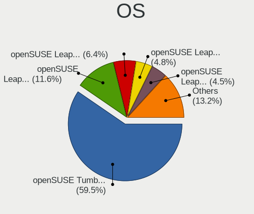

| Name                         | Desktops | Percent |
|------------------------------|----------|---------|
| openSUSE Tumbleweed-XXXXXXXX | 601      | 59.15%  |
| openSUSE Leap-15.2           | 92       | 9.06%   |
| openSUSE Leap-15.5           | 76       | 7.48%   |
| openSUSE Leap-15.3           | 69       | 6.79%   |
| openSUSE Leap-15.4           | 62       | 6.1%    |
| openSUSE Leap-15.1           | 56       | 5.51%   |
| openSUSE Microos-XXXXXXXX    | 29       | 2.85%   |
| openSUSE Leap-15.0           | 25       | 2.46%   |
| openSUSE 13.2                | 3        | 0.3%    |
| openSUSE Leap-42.2           | 1        | 0.1%    |
| openSUSE 42.3                | 1        | 0.1%    |
| openSUSE                     | 1        | 0.1%    |

OS Family
---------

OS without a version

| Name     | Desktops | Percent |
|----------|----------|---------|
| openSUSE | 968      | 100%    |

Kernel
------

Version of the Linux kernel

| Version                      | Desktops | Percent |
|------------------------------|----------|---------|
| 5.14.21-150500.53-default    | 25       | 2.06%   |
| 5.17.4-1-default             | 23       | 1.9%    |
| 6.5.4-1-default              | 19       | 1.57%   |
| 5.14.21-150500.55.19-default | 18       | 1.49%   |
| 4.12.14-lp151.28.44-default  | 18       | 1.49%   |
| 5.6.0-1-default              | 17       | 1.4%    |
| 6.0.8-1-default              | 13       | 1.07%   |
| 5.6.2-1-default              | 13       | 1.07%   |
| 6.3.2-1-default              | 12       | 0.99%   |
| 5.3.18-lp152.63-default      | 12       | 0.99%   |
| 5.3.18-59.37-default         | 12       | 0.99%   |
| 6.3.9-1-default              | 11       | 0.91%   |
| 6.0.12-1-default             | 11       | 0.91%   |
| 6.0.10-1-default             | 11       | 0.91%   |
| 5.19.8-1-default             | 11       | 0.91%   |
| 5.17.9-1-default             | 11       | 0.91%   |
| 5.16.11-1-default            | 11       | 0.91%   |
| 5.14.21-150400.22-default    | 11       | 0.91%   |
| 4.12.14-lp151.28.48-default  | 11       | 0.91%   |
| 6.5.9-1-default              | 10       | 0.83%   |
| 6.3.4-1-default              | 10       | 0.83%   |
| 6.1.8-1-default              | 10       | 0.83%   |
| 6.1.10-1-default             | 10       | 0.83%   |
| 5.3.18-lp152.66-default      | 10       | 0.83%   |
| 5.3.18-lp152.36-default      | 10       | 0.83%   |
| 6.4.6-1-default              | 9        | 0.74%   |
| 6.2.6-1-default              | 9        | 0.74%   |
| 6.2.1-1-default              | 9        | 0.74%   |
| 6.1.12-1-default             | 9        | 0.74%   |
| 5.3.18-lp152.41-default      | 9        | 0.74%   |
| 5.14.21-150500.55.7-default  | 9        | 0.74%   |
| 5.14.14-1-default            | 9        | 0.74%   |
| 5.11.6-1-default             | 9        | 0.74%   |
| 4.12.14-lp150.11-default     | 9        | 0.74%   |
| 6.4.9-1-default              | 8        | 0.66%   |
| 6.4.8-1-default              | 8        | 0.66%   |
| 6.3.1-1-default              | 8        | 0.66%   |
| 6.2.12-1-default             | 8        | 0.66%   |
| 6.1.3-1-default              | 8        | 0.66%   |
| 5.3.18-59.19-default         | 8        | 0.66%   |

Kernel Family
-------------

Linux kernel without a distro release

| Version | Desktops | Percent |
|---------|----------|---------|
| 5.3.18  | 148      | 12.81%  |
| 5.14.21 | 129      | 11.17%  |
| 4.12.14 | 73       | 6.32%   |
| 5.17.4  | 23       | 1.99%   |
| 6.5.4   | 19       | 1.65%   |
| 5.6.0   | 18       | 1.56%   |
| 5.6.2   | 15       | 1.3%    |
| 6.0.8   | 13       | 1.13%   |
| 5.14.14 | 13       | 1.13%   |
| 6.3.2   | 12       | 1.04%   |
| 6.0.12  | 12       | 1.04%   |
| 6.3.9   | 11       | 0.95%   |
| 6.3.1   | 11       | 0.95%   |
| 6.0.10  | 11       | 0.95%   |
| 5.19.8  | 11       | 0.95%   |
| 5.17.9  | 11       | 0.95%   |
| 5.16.11 | 11       | 0.95%   |
| 6.5.9   | 10       | 0.87%   |
| 6.4.6   | 10       | 0.87%   |
| 6.3.4   | 10       | 0.87%   |
| 6.1.8   | 10       | 0.87%   |
| 6.1.10  | 10       | 0.87%   |
| 5.12.4  | 10       | 0.87%   |
| 6.2.6   | 9        | 0.78%   |
| 6.2.1   | 9        | 0.78%   |
| 6.1.12  | 9        | 0.78%   |
| 5.11.6  | 9        | 0.78%   |
| 6.5.6   | 8        | 0.69%   |
| 6.4.9   | 8        | 0.69%   |
| 6.4.8   | 8        | 0.69%   |
| 6.2.12  | 8        | 0.69%   |
| 6.1.3   | 8        | 0.69%   |
| 5.3.12  | 8        | 0.69%   |
| 4.18.15 | 8        | 0.69%   |
| 6.4.11  | 7        | 0.61%   |
| 6.3.7   | 7        | 0.61%   |
| 6.2.9   | 7        | 0.61%   |
| 5.9.1   | 7        | 0.61%   |
| 5.8.10  | 7        | 0.61%   |
| 5.8.0   | 7        | 0.61%   |

Kernel Major Ver.
-----------------

Linux kernel major version

| Version | Desktops | Percent |
|---------|----------|---------|
| 5.3     | 162      | 14.39%  |
| 5.14    | 161      | 14.3%   |
| 4.12    | 73       | 6.48%   |
| 6.3     | 56       | 4.97%   |
| 6.1     | 55       | 4.88%   |
| 6.0     | 54       | 4.8%    |
| 6.4     | 53       | 4.71%   |
| 5.17    | 52       | 4.62%   |
| 6.2     | 45       | 4%      |
| 6.5     | 44       | 3.91%   |
| 5.6     | 42       | 3.73%   |
| 5.12    | 33       | 2.93%   |
| 5.18    | 30       | 2.66%   |
| 5.8     | 29       | 2.58%   |
| 5.16    | 29       | 2.58%   |
| 5.10    | 27       | 2.4%    |
| 5.11    | 26       | 2.31%   |
| 5.19    | 25       | 2.22%   |
| 5.13    | 21       | 1.87%   |
| 5.7     | 19       | 1.69%   |
| 5.9     | 16       | 1.42%   |
| 5.15    | 16       | 1.42%   |
| 5.5     | 12       | 1.07%   |
| 5.4     | 10       | 0.89%   |
| 4.18    | 8        | 0.71%   |
| 5.2     | 7        | 0.62%   |
| 4.20    | 4        | 0.36%   |
| 4.17    | 4        | 0.36%   |
| 5.0     | 3        | 0.27%   |
| 4.19    | 3        | 0.27%   |
| 4.4     | 2        | 0.18%   |
| 4.3     | 2        | 0.18%   |
| 3.16    | 2        | 0.18%   |
| 5.1     | 1        | 0.09%   |

Arch
----

OS architecture (x86_64, i586, etc.)

| Name   | Desktops | Percent |
|--------|----------|---------|
| x86_64 | 964      | 99.59%  |
| i686   | 4        | 0.41%   |

DE
--

Desktop Environment

| Name          | Desktops | Percent |
|---------------|----------|---------|
| KDE5          | 572      | 56.35%  |
| GNOME         | 164      | 16.16%  |
| KDE           | 111      | 10.94%  |
| Unknown       | 71       | 7%      |
| XFCE          | 44       | 4.33%   |
| MATE          | 11       | 1.08%   |
| X-Cinnamon    | 7        | 0.69%   |
| ICEWM         | 6        | 0.59%   |
| LXQt          | 5        | 0.49%   |
| Budgie        | 5        | 0.49%   |
| Cinnamon      | 4        | 0.39%   |
| KDE4          | 3        | 0.3%    |
| WindowMaker   | 2        | 0.2%    |
| LXDE          | 2        | 0.2%    |
| Deepin        | 2        | 0.2%    |
| awesome       | 2        | 0.2%    |
| Trinity       | 1        | 0.1%    |
| sway          | 1        | 0.1%    |
| Pantheon      | 1        | 0.1%    |
| GNOME Classic | 1        | 0.1%    |

Display Server
--------------

X11 or Wayland

| Name        | Desktops | Percent |
|-------------|----------|---------|
| X11         | 804      | 80.56%  |
| Wayland     | 148      | 14.83%  |
| Tty         | 25       | 2.51%   |
| Unknown     | 20       | 2%      |
| Unspecified | 1        | 0.1%    |

Display Manager
---------------

SDDM, LightDM, etc.

| Name    | Desktops | Percent |
|---------|----------|---------|
| Unknown | 487      | 48.85%  |
| LightDM | 258      | 25.88%  |
| SDDM    | 207      | 20.76%  |
| XDM     | 35       | 3.51%   |
| GDM     | 10       | 1%      |

OS Lang
-------

Language

| Lang    | Desktops | Percent |
|---------|----------|---------|
| en_US   | 342      | 34.2%   |
| de_DE   | 151      | 15.1%   |
| POSIX   | 85       | 8.5%    |
| Unknown | 78       | 7.8%    |
| en_GB   | 62       | 6.2%    |
| pt_BR   | 52       | 5.2%    |
| ru_RU   | 35       | 3.5%    |
| es_ES   | 31       | 3.1%    |
| fr_FR   | 19       | 1.9%    |
| it_IT   | 18       | 1.8%    |
| pl_PL   | 14       | 1.4%    |
| nl_NL   | 13       | 1.3%    |
| pt_PT   | 12       | 1.2%    |
| nl_BE   | 5        | 0.5%    |
| C       | 5        | 0.5%    |
| sv_SE   | 4        | 0.4%    |
| nb_NO   | 4        | 0.4%    |
| fi_FI   | 4        | 0.4%    |
| es_DO   | 4        | 0.4%    |
| es_AR   | 4        | 0.4%    |
| es_MX   | 3        | 0.3%    |
| en_IE   | 3        | 0.3%    |
| en_DE   | 3        | 0.3%    |
| en_AU   | 3        | 0.3%    |
| zh_CN   | 2        | 0.2%    |
| sk_SK   | 2        | 0.2%    |
| ro_RO   | 2        | 0.2%    |
| nn_NO   | 2        | 0.2%    |
| ko_KR   | 2        | 0.2%    |
| hr_HR   | 2        | 0.2%    |
| en_FI   | 2        | 0.2%    |
| en_DK   | 2        | 0.2%    |
| en_CA   | 2        | 0.2%    |
| el_GR   | 2        | 0.2%    |
| da_DK   | 2        | 0.2%    |
| cs_CZ   | 2        | 0.2%    |
| zh_TW   | 1        | 0.1%    |
| wbp_AU  | 1        | 0.1%    |
| uk_UA   | 1        | 0.1%    |
| tr_TR   | 1        | 0.1%    |

Boot Mode
---------

EFI or BIOS

| Mode | Desktops | Percent |
|------|----------|---------|
| EFI  | 542      | 55.25%  |
| BIOS | 439      | 44.75%  |

Filesystem
----------

Type of filesystem

| Type    | Desktops | Percent |
|---------|----------|---------|
| Btrfs   | 679      | 69%     |
| Ext4    | 224      | 22.76%  |
| Xfs     | 37       | 3.76%   |
| Unknown | 31       | 3.15%   |
| Overlay | 5        | 0.51%   |
| Tmpfs   | 4        | 0.41%   |
| Ext3    | 2        | 0.2%    |
| Zfs     | 1        | 0.1%    |
| Ext2    | 1        | 0.1%    |

Part. scheme
------------

Scheme of partitioning

| Type    | Desktops | Percent |
|---------|----------|---------|
| Unknown | 458      | 46.12%  |
| GPT     | 455      | 45.82%  |
| MBR     | 80       | 8.06%   |

Dual Boot with Linux/BSD
------------------------

Hosting more than one Linux/BSD

| Dual boot | Desktops | Percent |
|-----------|----------|---------|
| No        | 811      | 81.34%  |
| Yes       | 186      | 18.66%  |

Dual Boot (Win)
---------------

Hosting Linux and Windows

| Dual boot | Desktops | Percent |
|-----------|----------|---------|
| No        | 741      | 75.23%  |
| Yes       | 244      | 24.77%  |

Board
-----

Vendor
------

Motherboard manufacturer

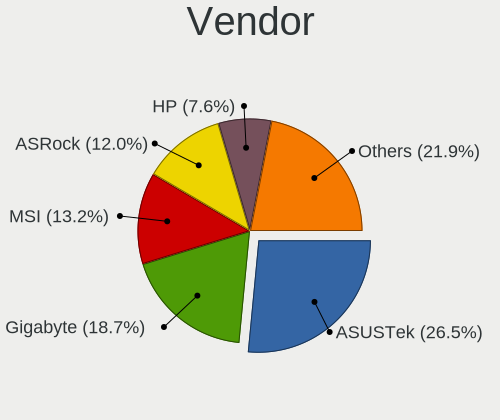

| Name                                 | Desktops | Percent |
|--------------------------------------|----------|---------|
| ASUSTek Computer                     | 260      | 26.86%  |
| Gigabyte Technology                  | 188      | 19.42%  |
| MSI                                  | 132      | 13.64%  |
| ASRock                               | 113      | 11.67%  |
| Hewlett-Packard                      | 71       | 7.33%   |
| Dell                                 | 61       | 6.3%    |
| Lenovo                               | 30       | 3.1%    |
| Intel                                | 14       | 1.45%   |
| Acer                                 | 14       | 1.45%   |
| Fujitsu                              | 12       | 1.24%   |
| Biostar                              | 12       | 1.24%   |
| Pegatron                             | 7        | 0.72%   |
| Medion                               | 6        | 0.62%   |
| Foxconn                              | 5        | 0.52%   |
| Supermicro                           | 4        | 0.41%   |
| Unknown                              | 4        | 0.41%   |
| Apple                                | 3        | 0.31%   |
| Shuttle                              | 2        | 0.21%   |
| Positivo                             | 2        | 0.21%   |
| Huanan                               | 2        | 0.21%   |
| Fujitsu Siemens                      | 2        | 0.21%   |
| EVGA                                 | 2        | 0.21%   |
| BESSTAR Tech                         | 2        | 0.21%   |
| Alienware                            | 2        | 0.21%   |
| Wortmann AG                          | 1        | 0.1%    |
| VS Company                           | 1        | 0.1%    |
| SYWZ                                 | 1        | 0.1%    |
| Sun Microsystems                     | 1        | 0.1%    |
| SLIMBOOK                             | 1        | 0.1%    |
| Shenzhen Meigao Electronic Equipment | 1        | 0.1%    |
| Samsung Electronics                  | 1        | 0.1%    |
| PCWare                               | 1        | 0.1%    |
| OEM                                  | 1        | 0.1%    |
| MACHINIST                            | 1        | 0.1%    |
| Itautec                              | 1        | 0.1%    |
| Inventec                             | 1        | 0.1%    |
| Hardkernel                           | 1        | 0.1%    |
| Google                               | 1        | 0.1%    |
| DIEBOLD                              | 1        | 0.1%    |
| Colorful Technology                  | 1        | 0.1%    |

Model
-----

Motherboard model

| Name                         | Desktops | Percent |
|------------------------------|----------|---------|
| ASUS All Series              | 25       | 2.58%   |
| Dell OptiPlex 9020           | 11       | 1.14%   |
| MSI MS-7B86                  | 9        | 0.93%   |
| ASUS TUF Gaming X570-PLUS    | 8        | 0.83%   |
| ASRock B450M Pro4            | 7        | 0.72%   |
| MSI MS-7C37                  | 6        | 0.62%   |
| MSI MS-7B89                  | 6        | 0.62%   |
| Gigabyte B450M DS3H          | 6        | 0.62%   |
| Gigabyte 970A-DS3P           | 6        | 0.62%   |
| MSI MS-7C02                  | 5        | 0.52%   |
| MSI MS-7A34                  | 5        | 0.52%   |
| Gigabyte B450 AORUS M        | 5        | 0.52%   |
| ASUS PRIME A320M-K           | 5        | 0.52%   |
| ASUS M5A97 R2.0              | 5        | 0.52%   |
| ASRock X570 Steel Legend     | 5        | 0.52%   |
| MSI MS-7C91                  | 4        | 0.41%   |
| MSI MS-7B79                  | 4        | 0.41%   |
| HP Z620 Workstation          | 4        | 0.41%   |
| Gigabyte X570 AORUS MASTER   | 4        | 0.41%   |
| Dell XPS 8700                | 4        | 0.41%   |
| ASUS ROG STRIX B550-F GAMING | 4        | 0.41%   |
| ASUS PRIME X370-PRO          | 4        | 0.41%   |
| ASUS PRIME B550-PLUS         | 4        | 0.41%   |
| ASUS M5A99X EVO R2.0         | 4        | 0.41%   |
| ASUS M5A78L-M/USB3           | 4        | 0.41%   |
| ASUS CROSSHAIR V FORMULA-Z   | 4        | 0.41%   |
| ASRock 970 Pro3 R2.0         | 4        | 0.41%   |
| Unknown                      | 4        | 0.41%   |
| MSI MS-7C95                  | 3        | 0.31%   |
| MSI MS-7C94                  | 3        | 0.31%   |
| MSI MS-7C35                  | 3        | 0.31%   |
| MSI MS-7A38                  | 3        | 0.31%   |
| MSI MS-7A33                  | 3        | 0.31%   |
| MSI MS-7522                  | 3        | 0.31%   |
| HP Z840 Workstation          | 3        | 0.31%   |
| HP ProLiant MicroServer      | 3        | 0.31%   |
| Gigabyte X570 AORUS ELITE    | 3        | 0.31%   |
| Gigabyte B550M DS3H          | 3        | 0.31%   |
| Dell XPS 8940                | 3        | 0.31%   |
| Dell OptiPlex 990            | 3        | 0.31%   |

Model Family
------------

Motherboard model prefix

| Name               | Desktops | Percent |
|--------------------|----------|---------|
| ASUS PRIME         | 55       | 5.68%   |
| Dell OptiPlex      | 32       | 3.31%   |
| ASUS ROG           | 31       | 3.2%    |
| ASUS TUF           | 27       | 2.79%   |
| ASUS All           | 25       | 2.58%   |
| Lenovo ThinkCentre | 18       | 1.86%   |
| Gigabyte X570      | 13       | 1.34%   |
| HP Compaq          | 12       | 1.24%   |
| Dell Precision     | 11       | 1.14%   |
| ASRock B450M       | 11       | 1.14%   |
| Gigabyte B550      | 10       | 1.03%   |
| MSI MS-7B86        | 9        | 0.93%   |
| Gigabyte B450M     | 9        | 0.93%   |
| ASUS M5A78L-M      | 9        | 0.93%   |
| ASRock X570        | 9        | 0.93%   |
| HP EliteDesk       | 8        | 0.83%   |
| Gigabyte B450      | 8        | 0.83%   |
| Dell XPS           | 8        | 0.83%   |
| Acer Aspire        | 8        | 0.83%   |
| HP Pavilion        | 7        | 0.72%   |
| Fujitsu ESPRIMO    | 7        | 0.72%   |
| Dell Inspiron      | 7        | 0.72%   |
| MSI MS-7C37        | 6        | 0.62%   |
| MSI MS-7B89        | 6        | 0.62%   |
| HP ProLiant        | 6        | 0.62%   |
| Gigabyte Z390      | 6        | 0.62%   |
| Gigabyte B550M     | 6        | 0.62%   |
| Gigabyte 970A-DS3P | 6        | 0.62%   |
| ASUS Maximus       | 6        | 0.62%   |
| ASUS M5A97         | 6        | 0.62%   |
| ASUS CROSSHAIR     | 6        | 0.62%   |
| ASRock 970         | 6        | 0.62%   |
| MSI MS-7C02        | 5        | 0.52%   |
| MSI MS-7A34        | 5        | 0.52%   |
| ASUS SABERTOOTH    | 5        | 0.52%   |
| Acer Veriton       | 5        | 0.52%   |
| MSI MS-7C91        | 4        | 0.41%   |
| MSI MS-7B79        | 4        | 0.41%   |
| Lenovo IdeaCentre  | 4        | 0.41%   |
| HP Z620            | 4        | 0.41%   |

MFG Year
--------

Motherboard manufacture year

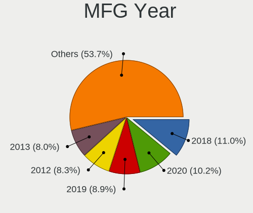

| Year | Desktops | Percent |
|------|----------|---------|
| 2018 | 115      | 11.88%  |
| 2020 | 100      | 10.33%  |
| 2013 | 92       | 9.5%    |
| 2019 | 86       | 8.88%   |
| 2012 | 82       | 8.47%   |
| 2017 | 75       | 7.75%   |
| 2011 | 57       | 5.89%   |
| 2014 | 56       | 5.79%   |
| 2021 | 50       | 5.17%   |
| 2015 | 49       | 5.06%   |
| 2010 | 45       | 4.65%   |
| 2009 | 38       | 3.93%   |
| 2016 | 36       | 3.72%   |
| 2022 | 30       | 3.1%    |
| 2008 | 20       | 2.07%   |
| 2007 | 12       | 1.24%   |
| 2023 | 10       | 1.03%   |
| 2006 | 10       | 1.03%   |
| 2005 | 3        | 0.31%   |
| 2004 | 2        | 0.21%   |

Form Factor
-----------

Physical design of the computer

| Name    | Desktops | Percent |
|---------|----------|---------|
| Desktop | 968      | 100%    |

Secure Boot
-----------

Enabled or disabled

| State    | Desktops | Percent |
|----------|----------|---------|
| Disabled | 919      | 93.78%  |
| Enabled  | 61       | 6.22%   |

Coreboot
--------

Have coreboot on board

| Used | Desktops | Percent |
|------|----------|---------|
| No   | 967      | 99.9%   |
| Yes  | 1        | 0.1%    |

RAM Size
--------

Total RAM memory

| Size in GB      | Desktops | Percent |
|-----------------|----------|---------|
| 16.01-24.0      | 305      | 30.96%  |
| 32.01-64.0      | 211      | 21.42%  |
| 8.01-16.0       | 184      | 18.68%  |
| 4.01-8.0        | 104      | 10.56%  |
| 64.01-256.0     | 66       | 6.7%    |
| 3.01-4.0        | 60       | 6.09%   |
| 24.01-32.0      | 35       | 3.55%   |
| Unknown         | 9        | 0.91%   |
| 1.01-2.0        | 6        | 0.61%   |
| More than 256.0 | 3        | 0.3%    |
| 2.01-3.0        | 2        | 0.2%    |

RAM Used
--------

Used RAM memory

| Used GB    | Desktops | Percent |
|------------|----------|---------|
| 4.01-8.0   | 284      | 26.3%   |
| 2.01-3.0   | 282      | 26.11%  |
| 3.01-4.0   | 186      | 17.22%  |
| 1.01-2.0   | 184      | 17.04%  |
| 8.01-16.0  | 82       | 7.59%   |
| 0.51-1.0   | 27       | 2.5%    |
| 16.01-24.0 | 15       | 1.39%   |
| Unknown    | 9        | 0.83%   |
| 24.01-32.0 | 7        | 0.65%   |
| 0.01-0.5   | 3        | 0.28%   |
| 32.01-64.0 | 1        | 0.09%   |

Total Drives
------------

Number of drives on board

| Drives | Desktops | Percent |
|--------|----------|---------|
| 2      | 285      | 27.94%  |
| 1      | 236      | 23.14%  |
| 3      | 205      | 20.1%   |
| 4      | 142      | 13.92%  |
| 5      | 75       | 7.35%   |
| 6      | 43       | 4.22%   |
| 7      | 19       | 1.86%   |
| 0      | 5        | 0.49%   |
| 8      | 4        | 0.39%   |
| 13     | 3        | 0.29%   |
| 16     | 1        | 0.1%    |
| 10     | 1        | 0.1%    |
| 9      | 1        | 0.1%    |

Has CD-ROM
----------

Has CD-ROM on board

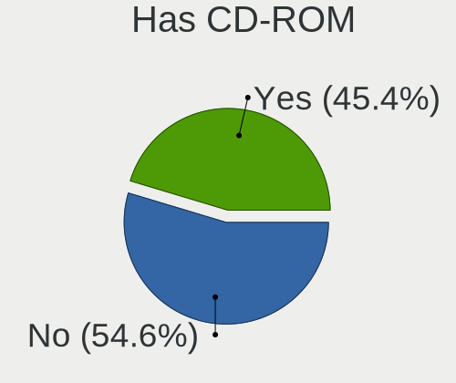

| Presented | Desktops | Percent |
|-----------|----------|---------|
| No        | 510      | 52.25%  |
| Yes       | 466      | 47.75%  |

Has Ethernet
------------

Has Ethernet on board

| Presented | Desktops | Percent |
|-----------|----------|---------|
| Yes       | 959      | 99.07%  |
| No        | 9        | 0.93%   |

Has WiFi
--------

Has WiFi module

| Presented | Desktops | Percent |
|-----------|----------|---------|
| No        | 553      | 56.66%  |
| Yes       | 423      | 43.34%  |

Has Bluetooth
-------------

Has Bluetooth module

| Presented | Desktops | Percent |
|-----------|----------|---------|
| No        | 603      | 61.41%  |
| Yes       | 379      | 38.59%  |

Location
--------

Country
-------

Geographic location (country)

| Country      | Desktops | Percent |
|--------------|----------|---------|
| Germany      | 198      | 20.35%  |
| USA          | 194      | 19.94%  |
| Brazil       | 64       | 6.58%   |
| Russia       | 48       | 4.93%   |
| UK           | 41       | 4.21%   |
| Italy        | 30       | 3.08%   |
| Switzerland  | 29       | 2.98%   |
| Spain        | 29       | 2.98%   |
| France       | 26       | 2.67%   |
| Netherlands  | 25       | 2.57%   |
| Canada       | 25       | 2.57%   |
| Australia    | 20       | 2.06%   |
| Sweden       | 19       | 1.95%   |
| Poland       | 18       | 1.85%   |
| Belgium      | 15       | 1.54%   |
| Mexico       | 10       | 1.03%   |
| Norway       | 9        | 0.92%   |
| Finland      | 9        | 0.92%   |
| Portugal     | 8        | 0.82%   |
| Greece       | 8        | 0.82%   |
| Ukraine      | 7        | 0.72%   |
| Romania      | 7        | 0.72%   |
| Bulgaria     | 7        | 0.72%   |
| Argentina    | 7        | 0.72%   |
| Serbia       | 6        | 0.62%   |
| Czechia      | 6        | 0.62%   |
| Croatia      | 6        | 0.62%   |
| Austria      | 6        | 0.62%   |
| Hungary      | 5        | 0.51%   |
| Thailand     | 4        | 0.41%   |
| South Korea  | 4        | 0.41%   |
| Slovakia     | 4        | 0.41%   |
| Singapore    | 4        | 0.41%   |
| Peru         | 4        | 0.41%   |
| Israel       | 4        | 0.41%   |
| Indonesia    | 4        | 0.41%   |
| India        | 4        | 0.41%   |
| Turkey       | 3        | 0.31%   |
| Taiwan       | 3        | 0.31%   |
| South Africa | 3        | 0.31%   |

City
----

Geographic location (city)

| City              | Desktops | Percent |
|-------------------|----------|---------|
| Berlin            | 11       | 1.06%   |
| Rio de Janeiro    | 10       | 0.97%   |
| Moscow            | 10       | 0.97%   |
| Littleton         | 10       | 0.97%   |
| Zurich            | 9        | 0.87%   |
| Sydney            | 9        | 0.87%   |
| Munich            | 8        | 0.77%   |
| Los Angeles       | 8        | 0.77%   |
| Warsaw            | 7        | 0.68%   |
| Sao Paulo         | 7        | 0.68%   |
| Stuttgart         | 6        | 0.58%   |
| Milan             | 6        | 0.58%   |
| Gothenburg        | 6        | 0.58%   |
| Frankfurt am Main | 6        | 0.58%   |
| St Petersburg     | 5        | 0.48%   |
| Nice              | 5        | 0.48%   |
| Neuchatel         | 5        | 0.48%   |
| Melbourne         | 5        | 0.48%   |
| Madrid            | 5        | 0.48%   |
| Hafurt          | 5        | 0.48%   |
| Amsterdam         | 5        | 0.48%   |
| Zagreb            | 4        | 0.39%   |
| Sofia             | 4        | 0.39%   |
| Singapore         | 4        | 0.39%   |
| Prague            | 4        | 0.39%   |
| Phoenix           | 4        | 0.39%   |
| London            | 4        | 0.39%   |
| Lisbon            | 4        | 0.39%   |
| Cologne           | 4        | 0.39%   |
| Cleveland         | 4        | 0.39%   |
| Braslia         | 4        | 0.39%   |
| Waterloo          | 3        | 0.29%   |
| Valencia          | 3        | 0.29%   |
| Tokyo             | 3        | 0.29%   |
| Thessaloniki      | 3        | 0.29%   |
| San Jose          | 3        | 0.29%   |
| Rostov-on-Don     | 3        | 0.29%   |
| Riverton          | 3        | 0.29%   |
| Perkasie          | 3        | 0.29%   |
| Naples            | 3        | 0.29%   |

Drives
------

Drive Vendor
------------

Hard drive vendors

| Vendor                      | Desktops | Drives | Percent |
|-----------------------------|----------|--------|---------|
| Seagate                     | 405      | 742    | 19.21%  |
| WDC                         | 377      | 743    | 17.88%  |
| Samsung Electronics         | 365      | 686    | 17.31%  |
| Kingston                    | 115      | 162    | 5.46%   |
| Toshiba                     | 114      | 152    | 5.41%   |
| Crucial                     | 104      | 141    | 4.93%   |
| SanDisk                     | 90       | 139    | 4.27%   |
| Hitachi                     | 49       | 59     | 2.32%   |
| Intel                       | 41       | 59     | 1.94%   |
| A-DATA Technology           | 28       | 35     | 1.33%   |
| Unknown                     | 24       | 36     | 1.14%   |
| Phison Electronics          | 22       | 27     | 1.04%   |
| SPCC                        | 21       | 27     | 1%      |
| Phison                      | 20       | 29     | 0.95%   |
| PNY                         | 18       | 25     | 0.85%   |
| Silicon Motion              | 17       | 17     | 0.81%   |
| Intenso                     | 16       | 24     | 0.76%   |
| HGST                        | 16       | 24     | 0.76%   |
| Micron Technology           | 15       | 20     | 0.71%   |
| SK hynix                    | 14       | 37     | 0.66%   |
| OCZ                         | 11       | 16     | 0.52%   |
| Micron/Crucial Technology   | 11       | 17     | 0.52%   |
| Corsair                     | 11       | 12     | 0.52%   |
| Hewlett-Packard             | 10       | 19     | 0.47%   |
| China                       | 9        | 9      | 0.43%   |
| Patriot                     | 8        | 10     | 0.38%   |
| Maxtor                      | 8        | 8      | 0.38%   |
| Kingston Technology Company | 8        | 9      | 0.38%   |
| Transcend                   | 7        | 8      | 0.33%   |
| Team                        | 6        | 9      | 0.28%   |
| Fujitsu                     | 6        | 8      | 0.28%   |
| XrayDisk                    | 5        | 5      | 0.24%   |
| Realtek Semiconductor       | 5        | 5      | 0.24%   |
| MAXIO Technology (Hangzhou) | 5        | 5      | 0.24%   |
| KingSpec                    | 5        | 10     | 0.24%   |
| JMicron Technology          | 5        | 5      | 0.24%   |
| Fanxiang                    | 5        | 8      | 0.24%   |
| XPG                         | 4        | 4      | 0.19%   |
| Mushkin                     | 4        | 8      | 0.19%   |
| Leven                       | 4        | 4      | 0.19%   |

Drive Model
-----------

Hard drive models

| Model                                               | Desktops | Percent |
|-----------------------------------------------------|----------|---------|
| Seagate ST2000DM008-2FR102 2TB                      | 34       | 1.33%   |
| Samsung SSD 860 EVO 500GB                           | 33       | 1.29%   |
| Samsung SSD 850 EVO 250GB                           | 29       | 1.13%   |
| Samsung NVMe SSD Controller SM981/PM981/PM983 1TB   | 29       | 1.13%   |
| Seagate ST1000DM010-2EP102 1TB                      | 26       | 1.02%   |
| Samsung SSD 860 EVO 1TB                             | 23       | 0.9%    |
| Kingston SA400S37240G 240GB SSD                     | 21       | 0.82%   |
| Seagate ST2000DM001-1ER164 2TB                      | 20       | 0.78%   |
| Seagate ST1000DM003-1CH162 1TB                      | 20       | 0.78%   |
| WDC WD10EZEX-08WN4A0 1TB                            | 19       | 0.74%   |
| Seagate ST500DM002-1BD142 500GB                     | 19       | 0.74%   |
| Samsung SSD 850 EVO 500GB                           | 19       | 0.74%   |
| Kingston SA400S37480G 480GB SSD                     | 19       | 0.74%   |
| Toshiba DT01ACA100 1TB                              | 17       | 0.66%   |
| Crucial CT500MX500SSD1 500GB                        | 17       | 0.66%   |
| WDC WDS500G2B0A-00SM50 500GB SSD                    | 16       | 0.62%   |
| Samsung SSD 840 EVO 250GB                           | 16       | 0.62%   |
| Seagate ST3500418AS 500GB                           | 14       | 0.55%   |
| Unknown SD/MMC/MS PRO 16GB                          | 13       | 0.51%   |
| Toshiba DT01ACA200 2TB                              | 13       | 0.51%   |
| Samsung SSD 860 EVO 250GB                           | 13       | 0.51%   |
| Kingston SV300S37A120G 120GB SSD                    | 13       | 0.51%   |
| Seagate ST2000DM006-2DM164 2TB                      | 12       | 0.47%   |
| Seagate ST1000DM003-1ER162 1TB                      | 12       | 0.47%   |
| Seagate ST4000DM004-2CV104 4TB                      | 11       | 0.43%   |
| Seagate ST3000DM008-2DM166 3TB                      | 11       | 0.43%   |
| Seagate ST2000DM001-1CH164 2TB                      | 11       | 0.43%   |
| Seagate Expansion 1TB                               | 11       | 0.43%   |
| Samsung SSD 860 QVO 1TB                             | 11       | 0.43%   |
| Samsung SSD 970 EVO Plus 500GB                      | 10       | 0.39%   |
| Samsung SSD 970 EVO Plus 1TB                        | 10       | 0.39%   |
| Samsung SSD 970 EVO 500GB                           | 10       | 0.39%   |
| Samsung SSD 840 EVO 120GB                           | 10       | 0.39%   |
| Samsung NVMe SSD Controller SM961/PM961/SM963 121GB | 10       | 0.39%   |
| Crucial CT240BX500SSD1 240GB                        | 10       | 0.39%   |
| WDC WD20EZRZ-00Z5HB0 2TB                            | 9        | 0.35%   |
| WDC WD20EFRX-68EUZN0 2TB                            | 9        | 0.35%   |
| WDC WD20EARS-00MVWB0 2TB                            | 9        | 0.35%   |
| WDC WD10EZEX-00BN5A0 1TB                            | 9        | 0.35%   |
| Toshiba HDWD110 1TB                                 | 9        | 0.35%   |

HDD Vendor
----------

Hard disk drive vendors

| Vendor              | Desktops | Drives | Percent |
|---------------------|----------|--------|---------|
| Seagate             | 399      | 720    | 39.54%  |
| WDC                 | 334      | 627    | 33.1%   |
| Toshiba             | 97       | 132    | 9.61%   |
| Samsung Electronics | 62       | 97     | 6.14%   |
| Hitachi             | 49       | 59     | 4.86%   |
| HGST                | 16       | 24     | 1.59%   |
| Unknown             | 14       | 17     | 1.39%   |
| Maxtor              | 8        | 8      | 0.79%   |
| Hewlett-Packard     | 6        | 15     | 0.59%   |
| Fujitsu             | 6        | 8      | 0.59%   |
| WD MediaMax         | 3        | 3      | 0.3%    |
| USB3.0              | 2        | 3      | 0.2%    |
| Synology            | 2        | 2      | 0.2%    |
| JMicron Technology  | 2        | 2      | 0.2%    |
| Intenso             | 2        | 7      | 0.2%    |
| ASMT                | 2        | 4      | 0.2%    |
| USB                 | 1        | 1      | 0.1%    |
| UD0401              | 1        | 1      | 0.1%    |
| SSK                 | 1        | 2      | 0.1%    |
| MaxDigital          | 1        | 1      | 0.1%    |
| HGST HTS            | 1        | 1      | 0.1%    |

SSD Vendor
----------

Solid state drive vendors

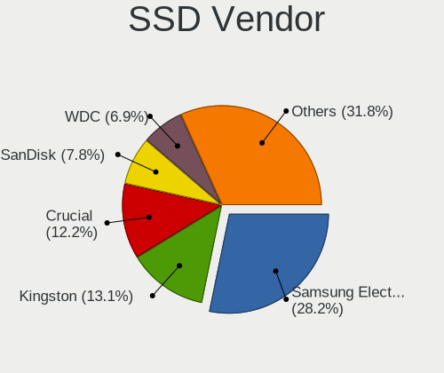

| Vendor              | Desktops | Drives | Percent |
|---------------------|----------|--------|---------|
| Samsung Electronics | 224      | 378    | 29.24%  |
| Crucial             | 97       | 129    | 12.66%  |
| Kingston            | 96       | 136    | 12.53%  |
| WDC                 | 59       | 88     | 7.7%    |
| SanDisk             | 59       | 80     | 7.7%    |
| A-DATA Technology   | 23       | 28     | 3%      |
| Intel               | 17       | 26     | 2.22%   |
| SPCC                | 16       | 22     | 2.09%   |
| PNY                 | 15       | 19     | 1.96%   |
| Toshiba             | 13       | 15     | 1.7%    |
| OCZ                 | 11       | 16     | 1.44%   |
| Intenso             | 11       | 12     | 1.44%   |
| Micron Technology   | 9        | 13     | 1.17%   |
| China               | 9        | 9      | 1.17%   |
| Patriot             | 8        | 10     | 1.04%   |
| Corsair             | 7        | 7      | 0.91%   |
| Transcend           | 6        | 7      | 0.78%   |
| Team                | 6        | 9      | 0.78%   |
| KingSpec            | 5        | 10     | 0.65%   |
| SK hynix            | 4        | 8      | 0.52%   |
| Leven               | 4        | 4      | 0.52%   |
| Biostar             | 4        | 6      | 0.52%   |
| Apacer              | 4        | 7      | 0.52%   |
| XrayDisk            | 3        | 3      | 0.39%   |
| Seagate             | 3        | 4      | 0.39%   |
| SABRENT             | 3        | 4      | 0.39%   |
| Mushkin             | 3        | 6      | 0.39%   |
| Fanxiang            | 3        | 6      | 0.39%   |
| TO Exter            | 2        | 2      | 0.26%   |
| StoreJet            | 2        | 2      | 0.26%   |
| Smartbuy            | 2        | 4      | 0.26%   |
| Smart               | 2        | 2      | 0.26%   |
| Plextor             | 2        | 4      | 0.26%   |
| LITEONIT            | 2        | 2      | 0.26%   |
| Hewlett-Packard     | 2        | 2      | 0.26%   |
| GOODRAM             | 2        | 2      | 0.26%   |
| GALAX               | 2        | 2      | 0.26%   |
| ASMedia             | 2        | 2      | 0.26%   |
| Apple               | 2        | 2      | 0.26%   |
| Zheino              | 1        | 1      | 0.13%   |

Drive Kind
----------

HDD or SSD

| Kind    | Desktops | Drives | Percent |
|---------|----------|--------|---------|
| HDD     | 726      | 1734   | 42.81%  |
| SSD     | 598      | 1114   | 35.26%  |
| NVMe    | 339      | 594    | 19.99%  |
| Unknown | 31       | 41     | 1.83%   |
| MMC     | 2        | 2      | 0.12%   |

Drive Connector
---------------

SATA, SAS, NVMe, etc.

| Type | Desktops | Drives | Percent |
|------|----------|--------|---------|
| SATA | 899      | 2724   | 67.29%  |
| NVMe | 338      | 590    | 25.3%   |
| SAS  | 97       | 169    | 7.26%   |
| MMC  | 2        | 2      | 0.15%   |

Drive Size
----------

Size of hard drive

| Size in TB | Desktops | Drives | Percent |
|------------|----------|--------|---------|
| 0.01-0.5   | 659      | 1253   | 42.85%  |
| 0.51-1.0   | 436      | 800    | 28.35%  |
| 1.01-2.0   | 229      | 413    | 14.89%  |
| 2.01-3.0   | 80       | 129    | 5.2%    |
| 3.01-4.0   | 74       | 143    | 4.81%   |
| 4.01-10.0  | 51       | 96     | 3.32%   |
| 10.01-20.0 | 9        | 14     | 0.59%   |

Space Total
-----------

Amount of disk space available on the file system

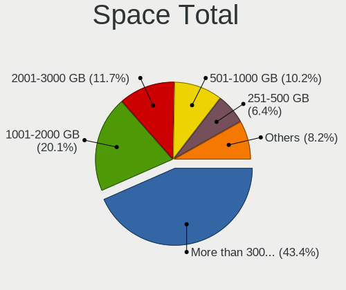

| Size in GB     | Desktops | Percent |
|----------------|----------|---------|
| More than 3000 | 415      | 40.57%  |
| 1001-2000      | 211      | 20.63%  |
| 2001-3000      | 127      | 12.41%  |
| 501-1000       | 113      | 11.05%  |
| 251-500        | 69       | 6.74%   |
| 101-250        | 37       | 3.62%   |
| Unknown        | 28       | 2.74%   |
| 51-100         | 9        | 0.88%   |
| 1-20           | 8        | 0.78%   |
| 21-50          | 6        | 0.59%   |

Space Used
----------

Amount of used disk space

| Used GB        | Desktops | Percent |
|----------------|----------|---------|
| 251-500        | 169      | 16%     |
| 1001-2000      | 168      | 15.91%  |
| 101-250        | 162      | 15.34%  |
| 501-1000       | 155      | 14.68%  |
| 51-100         | 126      | 11.93%  |
| More than 3000 | 107      | 10.13%  |
| 2001-3000      | 57       | 5.4%    |
| 1-20           | 45       | 4.26%   |
| 21-50          | 39       | 3.69%   |
| Unknown        | 28       | 2.65%   |

Malfunc. Drives
---------------

Drive models with a malfunction

| Model                                 | Desktops | Drives | Percent |
|---------------------------------------|----------|--------|---------|
| Seagate ST500DM002-1BD142 500GB       | 7        | 10     | 3.76%   |
| Seagate ST3500418AS 500GB             | 5        | 5      | 2.69%   |
| Samsung Electronics SSD 840 EVO 120GB | 5        | 6      | 2.69%   |
| Seagate ST2000DM001-1ER164 2TB        | 4        | 4      | 2.15%   |
| Seagate ST2000DM001-1CH164 2TB        | 4        | 5      | 2.15%   |
| WDC WD10JFCX-68N6GN0 1TB              | 3        | 4      | 1.61%   |
| Samsung Electronics HD501LJ 500GB     | 3        | 4      | 1.61%   |
| WDC WD6400AAKS-22A7B2 640GB           | 2        | 2      | 1.08%   |
| WDC WD20EZRX-00DC0B0 2TB              | 2        | 3      | 1.08%   |
| WDC WD20EFRX-68EUZN0 2TB              | 2        | 2      | 1.08%   |
| WD MediaMax WL5000GSA12872B 5TB       | 2        | 2      | 1.08%   |
| Seagate ST500LM012 HN-M500MBB 500GB   | 2        | 2      | 1.08%   |
| Seagate ST31000528AS 1TB              | 2        | 5      | 1.08%   |
| Seagate ST1000DM003-1SB102 1TB        | 2        | 3      | 1.08%   |
| Seagate ST1000DM003-1ER162 1TB        | 2        | 2      | 1.08%   |
| Seagate ST1000DM003-1CH162 1TB        | 2        | 2      | 1.08%   |
| Samsung Electronics HD322HJ 320GB     | 2        | 2      | 1.08%   |
| Samsung Electronics HD103SJ 1TB       | 2        | 3      | 1.08%   |
| Kingston SV300S37A120G 120GB SSD      | 2        | 3      | 1.08%   |
| Kingston SHFS37A120G 120GB SSD        | 2        | 2      | 1.08%   |
| Hitachi HTS545050A7E380 500GB         | 2        | 2      | 1.08%   |
| XPG GAMMIX S41 256GB                  | 1        | 1      | 0.54%   |
| WDC WDS240G2G0A-00JH30 240GB SSD      | 1        | 1      | 0.54%   |
| WDC WD800AAJS-75M0A0 80GB             | 1        | 1      | 0.54%   |
| WDC WD7500AAKS-00RBA0 752GB           | 1        | 1      | 0.54%   |
| WDC WD6400BEVT-22A0RT0 640GB          | 1        | 1      | 0.54%   |
| WDC WD6400AAKS-22A7B0 640GB           | 1        | 1      | 0.54%   |
| WDC WD6400AACS-00G8B1 640GB           | 1        | 1      | 0.54%   |
| WDC WD60EFRX-68MYMN1 6TB              | 1        | 1      | 0.54%   |
| WDC WD5000HHTZ-04N21V0 500GB          | 1        | 1      | 0.54%   |
| WDC WD5000BPVT-22HXZT3 500GB          | 1        | 1      | 0.54%   |
| WDC WD5000AZRX-00A8LB0 500GB          | 1        | 1      | 0.54%   |
| WDC WD5000AZLX-00K2TA0 500GB          | 1        | 1      | 0.54%   |
| WDC WD5000AVDS-63U7B1 500GB           | 1        | 1      | 0.54%   |
| WDC WD5000AAKX-221CA1 500GB           | 1        | 1      | 0.54%   |
| WDC WD5000AAKS-65A7B0 500GB           | 1        | 1      | 0.54%   |
| WDC WD40EFZX-68AWUN0 4TB              | 1        | 1      | 0.54%   |
| WDC WD3200AVJS-63B6A0 320GB           | 1        | 1      | 0.54%   |
| WDC WD3200AAJS-60Z0A0 320GB           | 1        | 1      | 0.54%   |
| WDC WD3200AAJS-56M0A0 320GB           | 1        | 1      | 0.54%   |

Malfunc. Drive Vendor
---------------------

Vendors of faulty drives

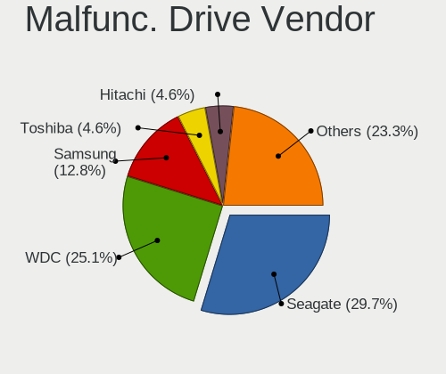

| Vendor              | Desktops | Drives | Percent |
|---------------------|----------|--------|---------|
| Seagate             | 58       | 71     | 32.4%   |
| WDC                 | 44       | 50     | 24.58%  |
| Samsung Electronics | 24       | 31     | 13.41%  |
| Toshiba             | 10       | 16     | 5.59%   |
| Hitachi             | 7        | 8      | 3.91%   |
| Crucial             | 7        | 8      | 3.91%   |
| Kingston            | 6        | 12     | 3.35%   |
| Maxtor              | 4        | 4      | 2.23%   |
| WD MediaMax         | 2        | 2      | 1.12%   |
| OCZ                 | 2        | 2      | 1.12%   |
| XPG                 | 1        | 1      | 0.56%   |
| Transcend           | 1        | 2      | 0.56%   |
| SuperTalent         | 1        | 1      | 0.56%   |
| SPCC                | 1        | 1      | 0.56%   |
| SanDisk             | 1        | 1      | 0.56%   |
| Patriot             | 1        | 1      | 0.56%   |
| Micron Technology   | 1        | 1      | 0.56%   |
| KingFast            | 1        | 1      | 0.56%   |
| Intenso             | 1        | 1      | 0.56%   |
| Intel               | 1        | 1      | 0.56%   |
| HGST                | 1        | 1      | 0.56%   |
| Hewlett-Packard     | 1        | 1      | 0.56%   |
| GOODRAM             | 1        | 1      | 0.56%   |
| EXRAM               | 1        | 1      | 0.56%   |
| Corsair             | 1        | 1      | 0.56%   |

Malfunc. HDD Vendor
-------------------

Vendors of faulty HDD drives

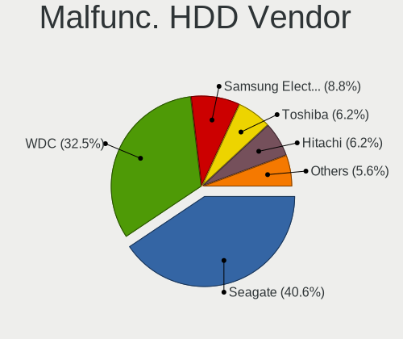

| Vendor              | Desktops | Drives | Percent |
|---------------------|----------|--------|---------|
| Seagate             | 58       | 71     | 41.73%  |
| WDC                 | 43       | 49     | 30.94%  |
| Samsung Electronics | 13       | 17     | 9.35%   |
| Toshiba             | 10       | 16     | 7.19%   |
| Hitachi             | 7        | 8      | 5.04%   |
| Maxtor              | 4        | 4      | 2.88%   |
| WD MediaMax         | 2        | 2      | 1.44%   |
| HGST                | 1        | 1      | 0.72%   |
| Hewlett-Packard     | 1        | 1      | 0.72%   |

Malfunc. Drive Kind
-------------------

Kinds of faulty drives

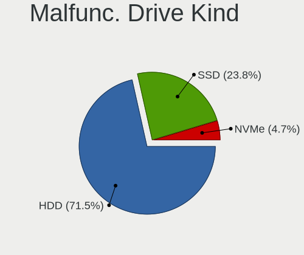

| Kind | Desktops | Drives | Percent |
|------|----------|--------|---------|
| HDD  | 119      | 169    | 75.8%   |
| SSD  | 30       | 43     | 19.11%  |
| NVMe | 8        | 8      | 5.1%    |

Failed Drives
-------------

Failed drive models

| Model                             | Desktops | Drives | Percent |
|-----------------------------------|----------|--------|---------|
| WDC WD20EADS-00R6B0 2TB           | 1        | 1      | 33.33%  |
| Samsung Electronics HD502HJ 500GB | 1        | 5      | 33.33%  |
| Hitachi HDS721025CLA382 250GB     | 1        | 1      | 33.33%  |

Failed Drive Vendor
-------------------

Failed drive vendors

| Vendor              | Desktops | Drives | Percent |
|---------------------|----------|--------|---------|
| WDC                 | 1        | 1      | 33.33%  |
| Samsung Electronics | 1        | 5      | 33.33%  |
| Hitachi             | 1        | 1      | 33.33%  |

Drive Status
------------

Number of failed and malfunc. drives

| Status   | Desktops | Drives | Percent |
|----------|----------|--------|---------|
| Works    | 516      | 1548   | 44.83%  |
| Detected | 483      | 1710   | 41.96%  |
| Malfunc  | 149      | 220    | 12.95%  |
| Failed   | 3        | 7      | 0.26%   |

Storage controller
------------------

Storage Vendor
--------------

Storage controller vendors

| Vendor                        | Desktops | Percent |
|-------------------------------|----------|---------|
| Intel                         | 513      | 33.73%  |
| AMD                           | 448      | 29.45%  |
| Samsung Electronics           | 133      | 8.74%   |
| ASMedia Technology            | 69       | 4.54%   |
| SanDisk                       | 54       | 3.55%   |
| Phison Electronics            | 47       | 3.09%   |
| Marvell Technology Group      | 37       | 2.43%   |
| JMicron Technology            | 34       | 2.24%   |
| Kingston Technology Company   | 30       | 1.97%   |
| Silicon Motion                | 19       | 1.25%   |
| Micron/Crucial Technology     | 19       | 1.25%   |
| Nvidia                        | 15       | 0.99%   |
| SK hynix                      | 11       | 0.72%   |
| Broadcom / LSI                | 9        | 0.59%   |
| Seagate Technology            | 8        | 0.53%   |
| Realtek Semiconductor         | 8        | 0.53%   |
| ADATA Technology              | 8        | 0.53%   |
| Silicon Image                 | 6        | 0.39%   |
| Micron Technology             | 6        | 0.39%   |
| MAXIO Technology (Hangzhou)   | 6        | 0.39%   |
| Adaptec                       | 6        | 0.39%   |
| Toshiba America Info Systems  | 5        | 0.33%   |
| LSI Logic / Symbios Logic     | 5        | 0.33%   |
| VIA Technologies              | 4        | 0.26%   |
| Shenzhen Longsys Electronics  | 3        | 0.2%    |
| KIOXIA                        | 3        | 0.2%    |
| INNOGRIT                      | 3        | 0.2%    |
| Solidigm                      | 2        | 0.13%   |
| Promise Technology            | 2        | 0.13%   |
| Lite-On Technology            | 2        | 0.13%   |
| Tekram Technology             | 1        | 0.07%   |
| Netac Technology              | 1        | 0.07%   |
| Integrated Technology Express | 1        | 0.07%   |
| Biwin Storage Technology      | 1        | 0.07%   |
| ATTO Technology               | 1        | 0.07%   |
| 3ware                         | 1        | 0.07%   |

Storage Model
-------------

Storage controller models

| Model                                                                                   | Desktops | Percent |
|-----------------------------------------------------------------------------------------|----------|---------|
| AMD FCH SATA Controller [AHCI mode]                                                     | 259      | 13.73%  |
| AMD 400 Series Chipset SATA Controller                                                  | 91       | 4.83%   |
| Samsung NVMe SSD Controller SM981/PM981/PM983                                           | 81       | 4.29%   |
| Intel 8 Series/C220 Series Chipset Family 6-port SATA Controller 1 [AHCI mode]          | 72       | 3.82%   |
| AMD 500 Series Chipset SATA Controller                                                  | 68       | 3.61%   |
| ASMedia ASM1062 Serial ATA Controller                                                   | 63       | 3.34%   |
| AMD SB7x0/SB8x0/SB9x0 SATA Controller [AHCI mode]                                       | 61       | 3.23%   |
| AMD SB7x0/SB8x0/SB9x0 IDE Controller                                                    | 60       | 3.18%   |
| Intel Q170/Q150/B150/H170/H110/Z170/CM236 Chipset SATA Controller [AHCI Mode]           | 43       | 2.28%   |
| Intel 6 Series/C200 Series Chipset Family 6 port Desktop SATA AHCI Controller           | 41       | 2.17%   |
| Intel 7 Series/C210 Series Chipset Family 6-port SATA Controller [AHCI mode]            | 38       | 2.01%   |
| Intel 200 Series PCH SATA controller [AHCI mode]                                        | 36       | 1.91%   |
| AMD SB7x0/SB8x0/SB9x0 SATA Controller [IDE mode]                                        | 35       | 1.86%   |
| AMD 300 Series Chipset SATA Controller                                                  | 31       | 1.64%   |
| Intel Cannon Lake PCH SATA AHCI Controller                                              | 26       | 1.38%   |
| Phison E12 NVMe Controller                                                              | 25       | 1.33%   |
| Intel SATA Controller [RAID mode]                                                       | 23       | 1.22%   |
| AMD FCH SATA Controller D                                                               | 23       | 1.22%   |
| Samsung NVMe SSD Controller SM961/PM961/SM963                                           | 20       | 1.06%   |
| JMicron JMB363 SATA/IDE Controller                                                      | 20       | 1.06%   |
| Intel 9 Series Chipset Family SATA Controller [AHCI Mode]                               | 17       | 0.9%    |
| AMD X370 Series Chipset SATA Controller                                                 | 17       | 0.9%    |
| Samsung NVMe SSD Controller PM9A1/PM9A3/980PRO                                          | 16       | 0.85%   |
| Intel 500 Series Chipset Family SATA AHCI Controller                                    | 16       | 0.85%   |
| Intel Comet Lake SATA AHCI Controller                                                   | 14       | 0.74%   |
| Intel C600/X79 series chipset 6-Port SATA AHCI Controller                               | 14       | 0.74%   |
| Intel SSD 660P Series                                                                   | 13       | 0.69%   |
| Intel Alder Lake-S PCH SATA Controller [AHCI Mode]                                      | 13       | 0.69%   |
| Kingston Company A2000 NVMe SSD SM2263EN                                                | 12       | 0.64%   |
| Intel NM10/ICH7 Family SATA Controller [IDE mode]                                       | 12       | 0.64%   |
| Intel C610/X99 series chipset 6-Port SATA Controller [AHCI mode]                        | 12       | 0.64%   |
| Intel 82801JI (ICH10 Family) SATA AHCI Controller                                       | 12       | 0.64%   |
| Samsung NVMe SSD Controller 980 (DRAM-less)                                             | 11       | 0.58%   |
| Intel C602 chipset 4-Port SATA Storage Control Unit                                     | 11       | 0.58%   |
| Intel C600/X79 series chipset SATA RAID Controller                                      | 11       | 0.58%   |
| Intel 6 Series/C200 Series Chipset Family Desktop SATA Controller (IDE mode, ports 4-5) | 11       | 0.58%   |
| Intel 6 Series/C200 Series Chipset Family Desktop SATA Controller (IDE mode, ports 0-3) | 11       | 0.58%   |
| Silicon Motion SM2262/SM2262EN SSD Controller                                           | 10       | 0.53%   |
| Phison E16 PCIe4 NVMe Controller                                                        | 10       | 0.53%   |
| Intel C610/X99 series chipset sSATA Controller [AHCI mode]                              | 10       | 0.53%   |

Storage Kind
------------

Kind of storage controller (IDE, SATA, NVMe, SAS, ...)

| Kind | Desktops | Percent |
|------|----------|---------|
| SATA | 870      | 59.39%  |
| NVMe | 336      | 22.94%  |
| IDE  | 175      | 11.95%  |
| RAID | 56       | 3.82%   |
| SAS  | 16       | 1.09%   |
| SCSI | 12       | 0.82%   |

Processor
---------

CPU Vendor
----------

Processor vendors

| Vendor | Desktops | Percent |
|--------|----------|---------|
| Intel  | 506      | 52.27%  |
| AMD    | 462      | 47.73%  |

CPU Model
---------

Processor models

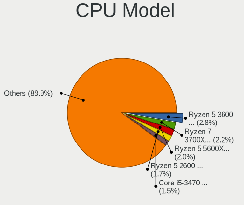

| Model                                       | Desktops | Percent |
|---------------------------------------------|----------|---------|
| AMD Ryzen 5 3600 6-Core Processor           | 25       | 2.57%   |
| AMD Ryzen 7 3700X 8-Core Processor          | 21       | 2.16%   |
| AMD Ryzen 5 2600 Six-Core Processor         | 21       | 2.16%   |
| AMD Ryzen 5 1600 Six-Core Processor         | 19       | 1.96%   |
| AMD Ryzen 5 5600X 6-Core Processor          | 18       | 1.85%   |
| AMD Ryzen 9 3900X 12-Core Processor         | 16       | 1.65%   |
| AMD FX-8350 Eight-Core Processor            | 16       | 1.65%   |
| Intel Core i5-3470 CPU @ 3.20GHz            | 14       | 1.44%   |
| AMD Ryzen 7 5700G with Radeon Graphics      | 14       | 1.44%   |
| AMD Ryzen 9 5900X 12-Core Processor         | 13       | 1.34%   |
| Intel Core i7-4790 CPU @ 3.60GHz            | 12       | 1.24%   |
| AMD Ryzen 7 2700X Eight-Core Processor      | 12       | 1.24%   |
| Intel Core i7-4770 CPU @ 3.40GHz            | 11       | 1.13%   |
| AMD Ryzen 9 5950X 16-Core Processor         | 11       | 1.13%   |
| AMD Ryzen 5 5600G with Radeon Graphics      | 11       | 1.13%   |
| AMD Ryzen 3 2200G with Radeon Vega Graphics | 11       | 1.13%   |
| Intel Core i7-3770 CPU @ 3.40GHz            | 10       | 1.03%   |
| AMD Ryzen 7 5800X 8-Core Processor          | 9        | 0.93%   |
| AMD Ryzen 5 3400G with Radeon Vega Graphics | 9        | 0.93%   |
| Intel Core i9-9900K CPU @ 3.60GHz           | 8        | 0.82%   |
| Intel Core i7-6700K CPU @ 4.00GHz           | 8        | 0.82%   |
| Intel Core i7-2600 CPU @ 3.40GHz            | 7        | 0.72%   |
| AMD Ryzen 7 1700X Eight-Core Processor      | 7        | 0.72%   |
| AMD Ryzen 7 1700 Eight-Core Processor       | 7        | 0.72%   |
| AMD FX-8320 Eight-Core Processor            | 7        | 0.72%   |
| AMD FX-6300 Six-Core Processor              | 7        | 0.72%   |
| Intel Core i7-8700K CPU @ 3.70GHz           | 6        | 0.62%   |
| Intel Core i7-8700 CPU @ 3.20GHz            | 6        | 0.62%   |
| Intel Core i7-6700 CPU @ 3.40GHz            | 6        | 0.62%   |
| Intel Core i5-7500 CPU @ 3.40GHz            | 6        | 0.62%   |
| Intel Core i5-4590 CPU @ 3.30GHz            | 6        | 0.62%   |
| Intel Core i5-4460 CPU @ 3.20GHz            | 6        | 0.62%   |
| Intel Core i5-2500 CPU @ 3.30GHz            | 6        | 0.62%   |
| Intel Core i7-4790K CPU @ 4.00GHz           | 5        | 0.51%   |
| Intel Core i5-4570 CPU @ 3.20GHz            | 5        | 0.51%   |
| Intel Core i5-3450 CPU @ 3.10GHz            | 5        | 0.51%   |
| Intel Core i5 CPU 650 @ 3.20GHz             | 5        | 0.51%   |
| Intel Core i3-2120 CPU @ 3.30GHz            | 5        | 0.51%   |
| Intel Core i3-2100 CPU @ 3.10GHz            | 5        | 0.51%   |
| AMD Ryzen 9 7950X 16-Core Processor         | 5        | 0.51%   |

CPU Model Family
----------------

Processor model prefix

| Model                   | Desktops | Percent |
|-------------------------|----------|---------|
| Intel Core i5           | 145      | 14.95%  |
| Intel Core i7           | 134      | 13.81%  |
| AMD Ryzen 5             | 134      | 13.81%  |
| AMD Ryzen 7             | 92       | 9.48%   |
| Intel Xeon              | 61       | 6.29%   |
| AMD Ryzen 9             | 55       | 5.67%   |
| AMD FX                  | 51       | 5.26%   |
| Intel Core i3           | 38       | 3.92%   |
| Other                   | 36       | 3.71%   |
| AMD Phenom II X4        | 18       | 1.86%   |
| Intel Core i9           | 17       | 1.75%   |
| AMD Ryzen 3             | 17       | 1.75%   |
| Intel Pentium           | 16       | 1.65%   |
| Intel Core 2 Quad       | 14       | 1.44%   |
| Intel Core 2 Duo        | 12       | 1.24%   |
| AMD A10                 | 12       | 1.24%   |
| AMD Phenom II X6        | 11       | 1.13%   |
| AMD Athlon              | 11       | 1.13%   |
| Intel Celeron           | 10       | 1.03%   |
| Intel Pentium Dual-Core | 9        | 0.93%   |
| AMD Athlon II X2        | 9        | 0.93%   |
| AMD Ryzen Threadripper  | 8        | 0.82%   |
| AMD A8                  | 8        | 0.82%   |
| Intel Pentium Silver    | 4        | 0.41%   |
| AMD Ryzen 5 PRO         | 4        | 0.41%   |
| AMD A6                  | 4        | 0.41%   |
| Intel Core 2            | 3        | 0.31%   |
| Intel Atom              | 3        | 0.31%   |
| AMD Athlon II X3        | 3        | 0.31%   |
| AMD A4                  | 3        | 0.31%   |
| Intel Pentium 4         | 2        | 0.21%   |
| AMD Turion II Neo       | 2        | 0.21%   |
| AMD Ryzen 3 PRO         | 2        | 0.21%   |
| AMD E2                  | 2        | 0.21%   |
| AMD Athlon X4           | 2        | 0.21%   |
| AMD Athlon 64 X2        | 2        | 0.21%   |
| Intel Pentium Gold      | 1        | 0.1%    |
| Intel Pentium Dual      | 1        | 0.1%    |
| Intel Genuine           | 1        | 0.1%    |
| AMD Six-Core Opteron    | 1        | 0.1%    |

CPU Cores
---------

Number of processor cores

| Number  | Desktops | Percent |
|---------|----------|---------|
| 4       | 377      | 38.83%  |
| 6       | 187      | 19.26%  |
| 2       | 145      | 14.93%  |
| 8       | 132      | 13.59%  |
| 12      | 42       | 4.33%   |
| 16      | 32       | 3.3%    |
| 3       | 18       | 1.85%   |
| 1       | 14       | 1.44%   |
| 24      | 7        | 0.72%   |
| 10      | 7        | 0.72%   |
| 32      | 3        | 0.31%   |
| 14      | 3        | 0.31%   |
| 44      | 1        | 0.1%    |
| 20      | 1        | 0.1%    |
| 18      | 1        | 0.1%    |
| Unknown | 1        | 0.1%    |

CPU Sockets
-----------

Number of sockets

| Number | Desktops | Percent |
|--------|----------|---------|
| 1      | 950      | 98.14%  |
| 2      | 18       | 1.86%   |

CPU Threads
-----------

Threads per core (Hyper-Threading)

| Number  | Desktops | Percent |
|---------|----------|---------|
| 2       | 657      | 67.73%  |
| 1       | 312      | 32.16%  |
| Unknown | 1        | 0.1%    |

CPU Op-Modes
------------

CPU Operation Modes (32-bit, 64-bit)

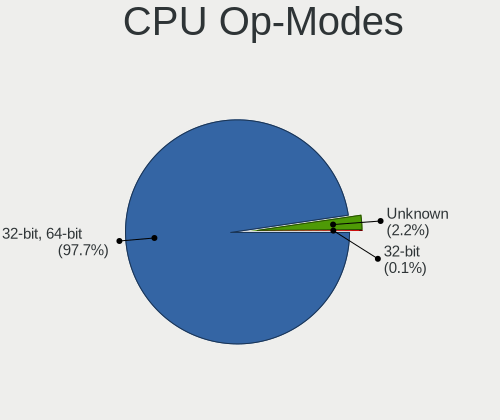

| Op mode        | Desktops | Percent |
|----------------|----------|---------|
| 32-bit, 64-bit | 939      | 96.8%   |
| Unknown        | 30       | 3.09%   |
| 32-bit         | 1        | 0.1%    |

CPU Microcode
-------------

Microcode number

| Number     | Desktops | Percent |
|------------|----------|---------|
| Unknown    | 220      | 21.93%  |
| 0x306c3    | 61       | 6.08%   |
| 0x08701021 | 53       | 5.28%   |
| 0x0800820d | 45       | 4.49%   |
| 0x206a7    | 38       | 3.79%   |
| 0x306a9    | 37       | 3.69%   |
| 0x06000852 | 37       | 3.69%   |
| 0x506e3    | 30       | 2.99%   |
| 0x010000c8 | 23       | 2.29%   |
| 0x906e9    | 22       | 2.19%   |
| 0x08001138 | 21       | 2.09%   |
| 0x0a20120a | 20       | 1.99%   |
| 0x906ea    | 19       | 1.89%   |
| 0x1067a    | 19       | 1.89%   |
| 0x08108109 | 19       | 1.89%   |
| 0x0a201009 | 17       | 1.69%   |
| 0x08701013 | 17       | 1.69%   |
| 0x0a50000d | 14       | 1.4%    |
| 0x0a50000c | 12       | 1.2%    |
| 0x08001137 | 12       | 1.2%    |
| 0x06001119 | 12       | 1.2%    |
| 0x0a201016 | 11       | 1.1%    |
| 0x08101016 | 11       | 1.1%    |
| 0x010000dc | 11       | 1.1%    |
| 0xa0671    | 10       | 1%      |
| 0xa0655    | 10       | 1%      |
| 0x306f2    | 10       | 1%      |
| 0x06003106 | 9        | 0.9%    |
| 0x906ed    | 8        | 0.8%    |
| 0x206d7    | 8        | 0.8%    |
| 0x0a601203 | 8        | 0.8%    |
| 0x0600063e | 8        | 0.8%    |
| 0xa0653    | 7        | 0.7%    |
| 0x306e4    | 7        | 0.7%    |
| 0x106e5    | 7        | 0.7%    |
| 0x90672    | 6        | 0.6%    |
| 0x6fb      | 6        | 0.6%    |
| 0x08600106 | 6        | 0.6%    |
| 0x906ec    | 5        | 0.5%    |
| 0x706a1    | 5        | 0.5%    |

CPU Microarch
-------------

Microarchitecture

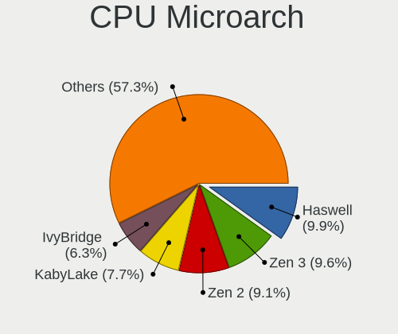

| Name             | Desktops | Percent |
|------------------|----------|---------|
| Haswell          | 108      | 11.12%  |
| Zen 2            | 87       | 8.96%   |
| Zen 3            | 86       | 8.86%   |
| Zen+             | 72       | 7.42%   |
| KabyLake         | 71       | 7.31%   |
| IvyBridge        | 66       | 6.8%    |
| Zen              | 62       | 6.39%   |
| SandyBridge      | 58       | 5.97%   |
| Piledriver       | 55       | 5.66%   |
| K10              | 48       | 4.94%   |
| Skylake          | 44       | 4.53%   |
| Penryn           | 34       | 3.5%    |
| CometLake        | 25       | 2.57%   |
| Nehalem          | 19       | 1.96%   |
| Unknown          | 18       | 1.85%   |
| Alderlake Hybrid | 16       | 1.65%   |
| Icelake          | 15       | 1.54%   |
| Core             | 13       | 1.34%   |
| Westmere         | 11       | 1.13%   |
| Steamroller      | 11       | 1.13%   |
| Bulldozer        | 9        | 0.93%   |
| Broadwell        | 7        | 0.72%   |
| K8 Hammer        | 6        | 0.62%   |
| Goldmont plus    | 6        | 0.62%   |
| Jaguar           | 5        | 0.51%   |
| K10 Llano        | 3        | 0.31%   |
| Bonnell          | 3        | 0.31%   |
| Bobcat           | 3        | 0.31%   |
| Silvermont       | 2        | 0.21%   |
| NetBurst         | 2        | 0.21%   |
| Gracemont        | 2        | 0.21%   |
| Excavator        | 2        | 0.21%   |
| Puma             | 1        | 0.1%    |
| Goldmont         | 1        | 0.1%    |

Graphics
--------

GPU Vendor
----------

Vendors of graphics cards

| Vendor                     | Desktops | Percent |
|----------------------------|----------|---------|
| AMD                        | 407      | 39.1%   |
| Nvidia                     | 405      | 38.9%   |
| Intel                      | 223      | 21.42%  |
| Matrox Electronics Systems | 3        | 0.29%   |
| S3 Graphics                | 2        | 0.19%   |
| ASPEED Technology          | 1        | 0.1%    |

GPU Model
---------

Graphics card models

| Model                                                                       | Desktops | Percent |
|-----------------------------------------------------------------------------|----------|---------|
| AMD Ellesmere [Radeon RX 470/480/570/570X/580/580X/590]                     | 70       | 6.4%    |
| Intel Xeon E3-1200 v3/4th Gen Core Processor Integrated Graphics Controller | 50       | 4.57%   |
| Intel 2nd Generation Core Processor Family Integrated Graphics Controller   | 25       | 2.29%   |
| AMD Cezanne [Radeon Vega Series / Radeon Vega Mobile Series]                | 25       | 2.29%   |
| AMD Navi 10 [Radeon RX 5600 OEM/5600 XT / 5700/5700 XT]                     | 24       | 2.19%   |
| Intel Xeon E3-1200 v2/3rd Gen Core processor Graphics Controller            | 21       | 1.92%   |
| Nvidia GP107 [GeForce GTX 1050 Ti]                                          | 20       | 1.83%   |
| AMD Picasso/Raven 2 [Radeon Vega Series / Radeon Vega Mobile Series]        | 18       | 1.65%   |
| Nvidia GK208B [GeForce GT 710]                                              | 16       | 1.46%   |
| Intel CoffeeLake-S GT2 [UHD Graphics 630]                                   | 16       | 1.46%   |
| AMD Raven Ridge [Radeon Vega Series / Radeon Vega Mobile Series]            | 16       | 1.46%   |
| Nvidia GP104 [GeForce GTX 1080]                                             | 15       | 1.37%   |
| Nvidia GP108 [GeForce GT 1030]                                              | 14       | 1.28%   |
| Nvidia GP106 [GeForce GTX 1060 6GB]                                         | 14       | 1.28%   |
| Nvidia GP104 [GeForce GTX 1070]                                             | 14       | 1.28%   |
| AMD Lexa PRO [Radeon 540/540X/550/550X / RX 540X/550/550X]                  | 14       | 1.28%   |
| Nvidia GK208B [GeForce GT 730]                                              | 13       | 1.19%   |
| Nvidia GP106 [GeForce GTX 1060 3GB]                                         | 12       | 1.1%    |
| Intel HD Graphics 530                                                       | 12       | 1.1%    |
| AMD Baffin [Radeon RX 460/560D / Pro 450/455/460/555/555X/560/560X]         | 12       | 1.1%    |
| Nvidia TU116 [GeForce GTX 1660 SUPER]                                       | 11       | 1.01%   |
| Nvidia GM204 [GeForce GTX 970]                                              | 11       | 1.01%   |
| Nvidia GM107 [GeForce GTX 750 Ti]                                           | 11       | 1.01%   |
| Intel HD Graphics 630                                                       | 11       | 1.01%   |
| Intel CometLake-S GT2 [UHD Graphics 630]                                    | 11       | 1.01%   |
| AMD Navi 22 [Radeon RX 6700/6700 XT/6750 XT / 6800M/6850M XT]               | 10       | 0.91%   |
| Nvidia TU117 [GeForce GTX 1650]                                             | 9        | 0.82%   |
| Nvidia GM206 [GeForce GTX 960]                                              | 9        | 0.82%   |
| Intel 4 Series Chipset Integrated Graphics Controller                       | 9        | 0.82%   |
| AMD Turks PRO [Radeon HD 6570/7570/8550 / R5 230]                           | 9        | 0.82%   |
| AMD Raphael                                                                 | 9        | 0.82%   |
| AMD Baffin [Radeon RX 550 640SP / RX 560/560X]                              | 9        | 0.82%   |
| Nvidia GP102 [GeForce GTX 1080 Ti]                                          | 8        | 0.73%   |
| AMD Navi 23 [Radeon RX 6600/6600 XT/6600M]                                  | 8        | 0.73%   |
| AMD Navi 21 [Radeon RX 6800/6800 XT / 6900 XT]                              | 8        | 0.73%   |
| AMD Navi 14 [Radeon RX 5500/5500M / Pro 5500M]                              | 8        | 0.73%   |
| AMD Kaveri [Radeon R7 Graphics]                                             | 8        | 0.73%   |
| Nvidia GK106 [GeForce GTX 660]                                              | 7        | 0.64%   |
| Intel RocketLake-S GT1 [UHD Graphics 750]                                   | 7        | 0.64%   |
| AMD Oland PRO [Radeon R7 240/340 / Radeon 520]                              | 7        | 0.64%   |

GPU Combo
---------

Combinations of graphics cards

| Name               | Desktops | Percent |
|--------------------|----------|---------|
| 1 x Nvidia         | 361      | 36.8%   |
| 1 x AMD            | 356      | 36.29%  |
| 1 x Intel          | 175      | 17.84%  |
| 2 x AMD            | 24       | 2.45%   |
| Intel + Nvidia     | 18       | 1.83%   |
| AMD + Nvidia       | 17       | 1.73%   |
| Intel + AMD        | 11       | 1.12%   |
| 2 x Nvidia         | 9        | 0.92%   |
| 1 x S3 Graphics    | 2        | 0.2%    |
| 1 x Matrox         | 2        | 0.2%    |
| Other              | 1        | 0.1%    |
| 2 x Intel          | 1        | 0.1%    |
| Nvidia + Matrox    | 1        | 0.1%    |
| Nvidia + ASPEED    | 1        | 0.1%    |
| Intel + 2 x Nvidia | 1        | 0.1%    |
| AMD + 2 x Nvidia   | 1        | 0.1%    |

GPU Driver
----------

Free vs proprietary

| Driver      | Desktops | Percent |
|-------------|----------|---------|
| Free        | 698      | 70.72%  |
| Proprietary | 266      | 26.95%  |
| Unknown     | 23       | 2.33%   |

GPU Memory
----------

Total video memory

| Size in GB | Desktops | Percent |
|------------|----------|---------|
| Unknown    | 293      | 29.21%  |
| 7.01-8.0   | 146      | 14.56%  |
| 1.01-2.0   | 146      | 14.56%  |
| 3.01-4.0   | 123      | 12.26%  |
| 0.51-1.0   | 88       | 8.77%   |
| 0.01-0.5   | 83       | 8.28%   |
| 8.01-16.0  | 55       | 5.48%   |
| 5.01-6.0   | 37       | 3.69%   |
| 2.01-3.0   | 18       | 1.79%   |
| 16.01-24.0 | 12       | 1.2%    |
| 4.01-5.0   | 1        | 0.1%    |
| 24.01-32.0 | 1        | 0.1%    |

Monitor
-------

Monitor Vendor
--------------

Monitor vendors

| Vendor               | Desktops | Percent |
|----------------------|----------|---------|
| Samsung Electronics  | 175      | 15.89%  |
| Dell                 | 129      | 11.72%  |
| Goldstar             | 120      | 10.9%   |
| Acer                 | 82       | 7.45%   |
| Hewlett-Packard      | 80       | 7.27%   |
| Ancor Communications | 70       | 6.36%   |
| BenQ                 | 61       | 5.54%   |
| AOC                  | 57       | 5.18%   |
| Philips              | 45       | 4.09%   |
| ASUSTek Computer     | 22       | 2%      |
| ViewSonic            | 18       | 1.63%   |
| Iiyama               | 18       | 1.63%   |
| Fujitsu Siemens      | 17       | 1.54%   |
| Unknown              | 16       | 1.45%   |
| Lenovo               | 16       | 1.45%   |
| LG Electronics       | 13       | 1.18%   |
| Eizo                 | 11       | 1%      |
| Sony                 | 8        | 0.73%   |
| MSI                  | 8        | 0.73%   |
| Medion               | 7        | 0.64%   |
| Sceptre Tech         | 6        | 0.54%   |
| Panasonic            | 6        | 0.54%   |
| NEC Computers        | 6        | 0.54%   |
| Vizio                | 5        | 0.45%   |
| Gigabyte Technology  | 5        | 0.45%   |
| Pixio                | 4        | 0.36%   |
| Insignia             | 4        | 0.36%   |
| Hitachi              | 4        | 0.36%   |
| Vestel Elektronik    | 3        | 0.27%   |
| UGD                  | 3        | 0.27%   |
| Sharp                | 3        | 0.27%   |
| HUAWEI               | 3        | 0.27%   |
| HKC                  | 3        | 0.27%   |
| HannStar             | 3        | 0.27%   |
| AGO                  | 3        | 0.27%   |
| ___                  | 2        | 0.18%   |
| SKY                  | 2        | 0.18%   |
| RS                   | 2        | 0.18%   |
| MStar                | 2        | 0.18%   |
| Lite-On              | 2        | 0.18%   |

Monitor Model
-------------

Monitor models

| Model                                                                   | Desktops | Percent |
|-------------------------------------------------------------------------|----------|---------|
| Goldstar LG ULTRAWIDE GSM59F1 2560x1080 800x340mm 34.2-inch             | 9        | 0.75%   |
| Goldstar FULL HD GSM5B55 1920x1080 480x270mm 21.7-inch                  | 8        | 0.66%   |
| BenQ GW2760HS BNQ78CA 1920x1080 598x336mm 27.0-inch                     | 8        | 0.66%   |
| Unknown LCD Monitor FFFF 2288x1287 2550x2550mm 142.0-inch               | 6        | 0.5%    |
| Samsung Electronics U28E590 SAM0C4D 3840x2160 610x350mm 27.7-inch       | 6        | 0.5%    |
| Fujitsu Siemens P19-2 FUS0552 1280x1024 376x301mm 19.0-inch             | 6        | 0.5%    |
| Goldstar Ultra HD GSM5B09 3840x2160 600x340mm 27.2-inch                 | 5        | 0.42%   |
| BenQ GW2270 BNQ78DB 1920x1080 476x268mm 21.5-inch                       | 5        | 0.42%   |
| Ancor Communications VE228 ACI22FA 1920x1080 477x268mm 21.5-inch        | 5        | 0.42%   |
| Samsung Electronics U32J59x SAM0F34 3840x2160 697x392mm 31.5-inch       | 4        | 0.33%   |
| Samsung Electronics S24F350 SAM0D20 1920x1080 521x293mm 23.5-inch       | 4        | 0.33%   |
| Samsung Electronics C32F391 SAM0D34 1920x1080 698x393mm 31.5-inch       | 4        | 0.33%   |
| Samsung Electronics C24F390 SAM0D2C 1920x1080 521x293mm 23.5-inch       | 4        | 0.33%   |
| Philips PHL 273V7 PHLC156 1920x1080 598x336mm 27.0-inch                 | 4        | 0.33%   |
| Philips PHL 243V7 PHLC155 1920x1080 530x300mm 24.0-inch                 | 4        | 0.33%   |
| Goldstar HDR WFHD GSM7714 2560x1080 798x334mm 34.1-inch                 | 4        | 0.33%   |
| Dell U2713HM DEL4080 2560x1440 597x336mm 27.0-inch                      | 4        | 0.33%   |
| Dell U2412M DELA07A 1920x1200 518x324mm 24.1-inch                       | 4        | 0.33%   |
| BenQ GW2765 BNQ78D6 2560x1440 600x340mm 27.2-inch                       | 4        | 0.33%   |
| AOC Q3279WG5B AOC3279 2560x1440 725x428mm 33.1-inch                     | 4        | 0.33%   |
| AOC 2470W1M AOC2470 1920x1080 527x296mm 23.8-inch                       | 4        | 0.33%   |
| Ancor Communications ASUS VS247 ACI249A 1920x1080 521x293mm 23.5-inch   | 4        | 0.33%   |
| Ancor Communications ASUS PB278 ACI27A3 2560x1440 597x336mm 27.0-inch   | 4        | 0.33%   |
| Vestel Elektronik 42 FHD_LCD-TV VES3700 1920x540                        | 3        | 0.25%   |
| Unknown LCD Monitor MCE Metz TV 1080 3840x1080                          | 3        | 0.25%   |
| Unknown LCD Monitor MCE Metz TV 1080                                    | 3        | 0.25%   |
| Samsung Electronics U32J59x SAM0F33 3840x2160 697x392mm 31.5-inch       | 3        | 0.25%   |
| Samsung Electronics SA300/SA350 SAM0788 1366x768 410x230mm 18.5-inch    | 3        | 0.25%   |
| Samsung Electronics S24D330 SAM0D92 1920x1080 530x300mm 24.0-inch       | 3        | 0.25%   |
| Samsung Electronics LCD Monitor SAM0F14 3840x2160 1872x1053mm 84.6-inch | 3        | 0.25%   |
| Samsung Electronics C32F391 SAM0D35 1920x1080 698x393mm 31.5-inch       | 3        | 0.25%   |
| Philips PHL 223V5 PHLC0CF 1920x1080 477x268mm 21.5-inch                 | 3        | 0.25%   |
| Lenovo LT2252p Wide LEN0A0C 1680x1050 474x296mm 22.0-inch               | 3        | 0.25%   |
| Hewlett-Packard 27f HPN354B 1920x1080 598x336mm 27.0-inch               | 3        | 0.25%   |
| Hewlett-Packard 27es HWP3326 1920x1080 598x336mm 27.0-inch              | 3        | 0.25%   |
| Goldstar ULTRAWIDE GSM76FA 2560x1080 531x298mm 24.0-inch                | 3        | 0.25%   |
| Goldstar HDR 4K GSM7707 3840x2160 600x340mm 27.2-inch                   | 3        | 0.25%   |
| Goldstar HDR 4K GSM7706 3840x2160 600x340mm 27.2-inch                   | 3        | 0.25%   |
| Goldstar FULL HD GSM5ABB 1920x1080 480x270mm 21.7-inch                  | 3        | 0.25%   |
| Goldstar 27GL650F GSM5B71 1920x1080 530x300mm 24.0-inch                 | 3        | 0.25%   |

Monitor Resolution
------------------

Monitor screen resolution

| Resolution         | Desktops | Percent |
|--------------------|----------|---------|
| 1920x1080 (FHD)    | 486      | 45.21%  |
| 2560x1440 (QHD)    | 120      | 11.16%  |
| 3840x2160 (4K)     | 97       | 9.02%   |
| 1280x1024 (SXGA)   | 62       | 5.77%   |
| 1680x1050 (WSXGA+) | 52       | 4.84%   |
| 1920x1200 (WUXGA)  | 42       | 3.91%   |
| 1440x900 (WXGA+)   | 26       | 2.42%   |
| 2560x1080          | 25       | 2.33%   |
| 1366x768 (WXGA)    | 25       | 2.33%   |
| Unknown            | 24       | 2.23%   |
| 3440x1440          | 22       | 2.05%   |
| 3840x1080          | 17       | 1.58%   |
| 1600x900 (HD+)     | 16       | 1.49%   |
| 1360x768           | 10       | 0.93%   |
| 1024x768 (XGA)     | 8        | 0.74%   |
| 2288x1287          | 6        | 0.56%   |
| 1920x540           | 6        | 0.56%   |
| 3840x1600          | 4        | 0.37%   |
| 2560x1600          | 4        | 0.37%   |
| 3840x1200          | 3        | 0.28%   |
| 1600x1200          | 3        | 0.28%   |
| 1400x1050          | 2        | 0.19%   |
| 1280x720 (HD)      | 2        | 0.19%   |
| 7680x1440          | 1        | 0.09%   |
| 7280x2160          | 1        | 0.09%   |
| 6520x1440          | 1        | 0.09%   |
| 640x480            | 1        | 0.09%   |
| 5760x2160          | 1        | 0.09%   |
| 5520x1080          | 1        | 0.09%   |
| 5280x2160          | 1        | 0.09%   |
| 3200x1080          | 1        | 0.09%   |
| 2732x768           | 1        | 0.09%   |
| 2048x1536          | 1        | 0.09%   |
| 2048x1152          | 1        | 0.09%   |
| 1280x960           | 1        | 0.09%   |
| 1280x768           | 1        | 0.09%   |

Monitor Diagonal
----------------

Diagonal size in inches

| Inches  | Desktops | Percent |
|---------|----------|---------|
| 27      | 204      | 18.5%   |
| 24      | 172      | 15.59%  |
| 21      | 126      | 11.42%  |
| 23      | 108      | 9.79%   |
| Unknown | 79       | 7.16%   |
| 19      | 56       | 5.08%   |
| 31      | 53       | 4.81%   |
| 34      | 37       | 3.35%   |
| 22      | 37       | 3.35%   |
| 18      | 30       | 2.72%   |
| 17      | 26       | 2.36%   |
| 20      | 23       | 2.09%   |
| 32      | 19       | 1.72%   |
| 15      | 17       | 1.54%   |
| 84      | 12       | 1.09%   |
| 72      | 11       | 1%      |
| 40      | 11       | 1%      |
| 25      | 11       | 1%      |
| 54      | 10       | 0.91%   |
| 26      | 7        | 0.63%   |
| 142     | 6        | 0.54%   |
| 42      | 5        | 0.45%   |
| 29      | 5        | 0.45%   |
| 37      | 4        | 0.36%   |
| 33      | 4        | 0.36%   |
| 28      | 4        | 0.36%   |
| 12      | 4        | 0.36%   |
| 74      | 2        | 0.18%   |
| 65      | 2        | 0.18%   |
| 49      | 2        | 0.18%   |
| 48      | 2        | 0.18%   |
| 43      | 2        | 0.18%   |
| 35      | 2        | 0.18%   |
| 30      | 2        | 0.18%   |
| 69      | 1        | 0.09%   |
| 60      | 1        | 0.09%   |
| 52      | 1        | 0.09%   |
| 46      | 1        | 0.09%   |
| 41      | 1        | 0.09%   |
| 39      | 1        | 0.09%   |

Monitor Width
-------------

Physical width

| Width in mm    | Desktops | Percent |
|----------------|----------|---------|
| 501-600        | 440      | 41.59%  |
| 401-500        | 229      | 21.64%  |
| 601-700        | 87       | 8.22%   |
| Unknown        | 79       | 7.47%   |
| 701-800        | 59       | 5.58%   |
| 351-400        | 43       | 4.06%   |
| 301-350        | 39       | 3.69%   |
| 1501-2000      | 26       | 2.46%   |
| 1001-1500      | 19       | 1.8%    |
| 801-900        | 18       | 1.7%    |
| 901-1000       | 8        | 0.76%   |
| More than 2000 | 6        | 0.57%   |
| 201-300        | 5        | 0.47%   |

Aspect Ratio
------------

Proportional relationship between the width and the height

| Ratio   | Desktops | Percent |
|---------|----------|---------|
| 16/9    | 668      | 66.73%  |
| 16/10   | 131      | 13.09%  |
| Unknown | 64       | 6.39%   |
| 5/4     | 53       | 5.29%   |
| 21/9    | 44       | 4.4%    |
| 4/3     | 21       | 2.1%    |
| 1.00    | 6        | 0.6%    |
| 6/5     | 5        | 0.5%    |
| 32/9    | 4        | 0.4%    |
| 3/2     | 4        | 0.4%    |
| 1.96    | 1        | 0.1%    |

Monitor Area
------------

Area in inch

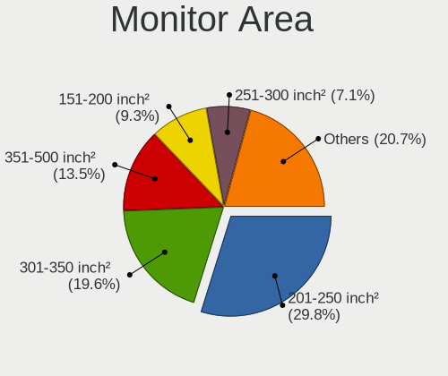

| Area in inch | Desktops | Percent |
|----------------|----------|---------|
| 201-250        | 336      | 31.14%  |
| 301-350        | 207      | 19.18%  |
| 351-500        | 124      | 11.49%  |
| 151-200        | 117      | 10.84%  |
| Unknown        | 79       | 7.32%   |
| 251-300        | 75       | 6.95%   |
| More than 1000 | 45       | 4.17%   |
| 141-150        | 43       | 3.99%   |
| 501-1000       | 27       | 2.5%    |
| 101-110        | 16       | 1.48%   |
| 71-80          | 4        | 0.37%   |
| 131-140        | 4        | 0.37%   |
| 51-60          | 1        | 0.09%   |
| 91-100         | 1        | 0.09%   |

Pixel Density
-------------

Pixels per inch

| Density | Desktops | Percent |
|---------|----------|---------|
| 51-100  | 606      | 59.24%  |
| 101-120 | 236      | 23.07%  |
| Unknown | 79       | 7.72%   |
| 121-160 | 47       | 4.59%   |
| 1-50    | 38       | 3.71%   |
| 161-240 | 17       | 1.66%   |

Multiple Monitors
-----------------

Total monitors connected

| Total | Desktops | Percent |
|-------|----------|---------|
| 1     | 723      | 72.3%   |
| 2     | 227      | 22.7%   |
| 0     | 31       | 3.1%    |
| 3     | 17       | 1.7%    |
| 4     | 2        | 0.2%    |

Network
-------

Net Controller Vendor
---------------------

Controller vendors

| Vendor                                 | Desktops | Percent |
|----------------------------------------|----------|---------|
| Realtek Semiconductor                  | 628      | 45.64%  |
| Intel                                  | 424      | 30.81%  |
| Qualcomm Atheros                       | 65       | 4.72%   |
| Broadcom                               | 47       | 3.42%   |
| TP-Link                                | 21       | 1.53%   |
| Ralink Technology                      | 21       | 1.53%   |
| MediaTek                               | 19       | 1.38%   |
| Ralink                                 | 14       | 1.02%   |
| Nvidia                                 | 12       | 0.87%   |
| ASIX Electronics                       | 10       | 0.73%   |
| Aquantia                               | 9        | 0.65%   |
| Samsung Electronics                    | 7        | 0.51%   |
| NetGear                                | 7        | 0.51%   |
| Microsoft                              | 6        | 0.44%   |
| D-Link                                 | 6        | 0.44%   |
| Marvell Technology Group               | 5        | 0.36%   |
| Edimax Technology                      | 5        | 0.36%   |
| D-Link System                          | 5        | 0.36%   |
| ASUSTek Computer                       | 5        | 0.36%   |
| AVM                                    | 4        | 0.29%   |
| Qualcomm Atheros Communications        | 3        | 0.22%   |
| Linksys                                | 3        | 0.22%   |
| DisplayLink                            | 3        | 0.22%   |
| Broadcom Limited                       | 3        | 0.22%   |
| Belkin Components                      | 3        | 0.22%   |
| Xiaomi                                 | 2        | 0.15%   |
| Texas Instruments                      | 2        | 0.15%   |
| NetXen Incorporated                    | 2        | 0.15%   |
| Motorola PCS                           | 2        | 0.15%   |
| Microchip Technology                   | 2        | 0.15%   |
| JMicron Technology                     | 2        | 0.15%   |
| Intersil                               | 2        | 0.15%   |
| ZyXEL Communications                   | 1        | 0.07%   |
| Wacom                                  | 1        | 0.07%   |
| VIA Technologies                       | 1        | 0.07%   |
| VeriFone                               | 1        | 0.07%   |
| U-Blox                                 | 1        | 0.07%   |
| TOMTOM                                 | 1        | 0.07%   |
| Sony Ericsson Mobile Communications AB | 1        | 0.07%   |
| Solarflare Communications              | 1        | 0.07%   |

Net Controller Model
--------------------

Controller models

| Model                                                             | Desktops | Percent |
|-------------------------------------------------------------------|----------|---------|
| Realtek RTL8111/8168/8411 PCI Express Gigabit Ethernet Controller | 514      | 32.7%   |
| Intel I211 Gigabit Network Connection                             | 77       | 4.9%    |
| Realtek RTL8125 2.5GbE Controller                                 | 60       | 3.82%   |
| Intel Wi-Fi 6 AX200                                               | 54       | 3.44%   |
| Intel Ethernet Connection (2) I219-V                              | 37       | 2.35%   |
| Intel 82579LM Gigabit Network Connection (Lewisville)             | 36       | 2.29%   |
| Intel Ethernet Controller I225-V                                  | 29       | 1.84%   |
| Intel Dual Band Wireless-AC 3168NGW [Stone Peak]                  | 22       | 1.4%    |
| Intel Ethernet Connection I217-LM                                 | 20       | 1.27%   |
| Intel Wireless-AC 9260                                            | 19       | 1.21%   |
| Intel Wi-Fi 6 AX210/AX211/AX411 160MHz                            | 17       | 1.08%   |
| Intel Ethernet Connection (7) I219-V                              | 17       | 1.08%   |
| Intel Ethernet Connection (2) I218-V                              | 16       | 1.02%   |
| Intel 82574L Gigabit Network Connection                           | 14       | 0.89%   |
| Intel Ethernet Connection I217-V                                  | 13       | 0.83%   |
| Intel 82579V Gigabit Network Connection                           | 12       | 0.76%   |
| Realtek RTL88x2bu [AC1200 Techkey]                                | 11       | 0.7%    |
| Intel I210 Gigabit Network Connection                             | 11       | 0.7%    |
| Intel Wireless 7260                                               | 10       | 0.64%   |
| ASIX AX88179 Gigabit Ethernet                                     | 10       | 0.64%   |
| Realtek RTL8822BE 802.11a/b/g/n/ac WiFi adapter                   | 9        | 0.57%   |
| Qualcomm Atheros AR9485 Wireless Network Adapter                  | 9        | 0.57%   |
| Realtek RTL8821CE 802.11ac PCIe Wireless Network Adapter          | 8        | 0.51%   |
| Realtek RTL8153 Gigabit Ethernet Adapter                          | 8        | 0.51%   |
| Intel Ethernet Connection (2) I219-LM                             | 8        | 0.51%   |
| Realtek RTL8812AE 802.11ac PCIe Wireless Network Adapter          | 7        | 0.45%   |
| Realtek RTL810xE PCI Express Fast Ethernet controller             | 7        | 0.45%   |
| MediaTek MT7921K (RZ608) Wi-Fi 6E 80MHz                           | 7        | 0.45%   |
| Intel Ethernet Connection (11) I219-V                             | 7        | 0.45%   |
| Intel Comet Lake PCH CNVi WiFi                                    | 7        | 0.45%   |
| Intel Cannon Lake PCH CNVi WiFi                                   | 7        | 0.45%   |
| Intel 82567LM-3 Gigabit Network Connection                        | 7        | 0.45%   |
| Broadcom BCM4360 802.11ac Dual Band Wireless Network Adapter      | 7        | 0.45%   |
| Broadcom BCM4352 802.11ac Dual Band Wireless Network Adapter      | 7        | 0.45%   |
| Realtek RTL8188EUS 802.11n Wireless Network Adapter               | 6        | 0.38%   |
| Realtek RTL8169 PCI Gigabit Ethernet Controller                   | 6        | 0.38%   |
| Realtek 802.11ac NIC                                              | 6        | 0.38%   |
| Ralink RT5370 Wireless Adapter                                    | 6        | 0.38%   |
| Ralink MT7601U Wireless Adapter                                   | 6        | 0.38%   |
| Qualcomm Atheros Killer E220x Gigabit Ethernet Controller         | 6        | 0.38%   |

Wireless Vendor
---------------

Wireless vendors

| Vendor                                | Desktops | Percent |
|---------------------------------------|----------|---------|
| Intel                                 | 168      | 37.17%  |
| Realtek Semiconductor                 | 95       | 21.02%  |
| Qualcomm Atheros                      | 38       | 8.41%   |
| Broadcom                              | 24       | 5.31%   |
| Ralink Technology                     | 21       | 4.65%   |
| TP-Link                               | 20       | 4.42%   |
| MediaTek                              | 18       | 3.98%   |
| Ralink                                | 14       | 3.1%    |
| NetGear                               | 7        | 1.55%   |
| Microsoft                             | 6        | 1.33%   |
| D-Link                                | 6        | 1.33%   |
| Edimax Technology                     | 5        | 1.11%   |
| ASUSTek Computer                      | 5        | 1.11%   |
| AVM                                   | 4        | 0.88%   |
| Qualcomm Atheros Communications       | 3        | 0.66%   |
| Linksys                               | 3        | 0.66%   |
| D-Link System                         | 3        | 0.66%   |
| Belkin Components                     | 3        | 0.66%   |
| Broadcom Limited                      | 2        | 0.44%   |
| ZyXEL Communications                  | 1        | 0.22%   |
| Wacom                                 | 1        | 0.22%   |
| Samsung Electronics                   | 1        | 0.22%   |
| Intersil                              | 1        | 0.22%   |
| IMC Networks                          | 1        | 0.22%   |
| BUFFALO                               | 1        | 0.22%   |
| 802.11g Adapter [Linksys WUSB54GC v3] | 1        | 0.22%   |

Wireless Model
--------------

Wireless models

| Model                                                                                         | Desktops | Percent |
|-----------------------------------------------------------------------------------------------|----------|---------|
| Intel Wi-Fi 6 AX200                                                                           | 54       | 11.82%  |
| Intel Dual Band Wireless-AC 3168NGW [Stone Peak]                                              | 22       | 4.81%   |
| Intel Wireless-AC 9260                                                                        | 19       | 4.16%   |
| Intel Wi-Fi 6 AX210/AX211/AX411 160MHz                                                        | 17       | 3.72%   |
| Realtek RTL88x2bu [AC1200 Techkey]                                                            | 11       | 2.41%   |
| Intel Wireless 7260                                                                           | 10       | 2.19%   |
| Realtek RTL8822BE 802.11a/b/g/n/ac WiFi adapter                                               | 9        | 1.97%   |
| Qualcomm Atheros AR9485 Wireless Network Adapter                                              | 9        | 1.97%   |
| Realtek RTL8821CE 802.11ac PCIe Wireless Network Adapter                                      | 8        | 1.75%   |
| Realtek RTL8812AE 802.11ac PCIe Wireless Network Adapter                                      | 7        | 1.53%   |
| MediaTek MT7921K (RZ608) Wi-Fi 6E 80MHz                                                       | 7        | 1.53%   |
| Intel Comet Lake PCH CNVi WiFi                                                                | 7        | 1.53%   |
| Intel Cannon Lake PCH CNVi WiFi                                                               | 7        | 1.53%   |
| Broadcom BCM4360 802.11ac Dual Band Wireless Network Adapter                                  | 7        | 1.53%   |
| Broadcom BCM4352 802.11ac Dual Band Wireless Network Adapter                                  | 7        | 1.53%   |
| Realtek RTL8188EUS 802.11n Wireless Network Adapter                                           | 6        | 1.31%   |
| Realtek 802.11ac NIC                                                                          | 6        | 1.31%   |
| Ralink RT5370 Wireless Adapter                                                                | 6        | 1.31%   |
| Ralink MT7601U Wireless Adapter                                                               | 6        | 1.31%   |
| Intel Wireless 8260                                                                           | 6        | 1.31%   |
| Realtek RTL8821AE 802.11ac PCIe Wireless Network Adapter                                      | 5        | 1.09%   |
| Qualcomm Atheros AR93xx Wireless Network Adapter                                              | 5        | 1.09%   |
| MediaTek MT7922 802.11ax PCI Express Wireless Network Adapter                                 | 5        | 1.09%   |
| MediaTek MT7921 802.11ax PCI Express Wireless Network Adapter                                 | 5        | 1.09%   |
| Intel Wireless 7265                                                                           | 5        | 1.09%   |
| Intel Tiger Lake PCH CNVi WiFi                                                                | 5        | 1.09%   |
| Realtek RTL8822CE 802.11ac PCIe Wireless Network Adapter                                      | 4        | 0.88%   |
| Realtek RTL8192CU 802.11n WLAN Adapter                                                        | 4        | 0.88%   |
| Realtek RTL8188CUS 802.11n WLAN Adapter                                                       | 4        | 0.88%   |
| TP-Link TL-WN823N v2/v3 [Realtek RTL8192EU]                                                   | 3        | 0.66%   |
| TP-Link Archer T4U ver.3                                                                      | 3        | 0.66%   |
| TP-Link AC600 wireless Realtek RTL8811AU [Archer T2U Nano]                                    | 3        | 0.66%   |
| Realtek RTL8852BE PCIe 802.11ax Wireless Network Controller                                   | 3        | 0.66%   |
| Realtek RTL8811AU 802.11a/b/g/n/ac WLAN Adapter                                               | 3        | 0.66%   |
| Realtek RTL8192EU 802.11b/g/n WLAN Adapter                                                    | 3        | 0.66%   |
| Realtek RTL8192CE PCIe Wireless Network Adapter                                               | 3        | 0.66%   |
| Realtek RTL8188FTV 802.11b/g/n 1T1R 2.4G WLAN Adapter                                         | 3        | 0.66%   |
| Realtek RTL8188EE Wireless Network Adapter                                                    | 3        | 0.66%   |
| Realtek RTL8188CE 802.11b/g/n WiFi Adapter                                                    | 3        | 0.66%   |
| Realtek Realtek 8812AU/8821AU 802.11ac WLAN Adapter [USB Wireless Dual-Band Adapter 2.4/5Ghz] | 3        | 0.66%   |

Ethernet Vendor
---------------

Ethernet vendors

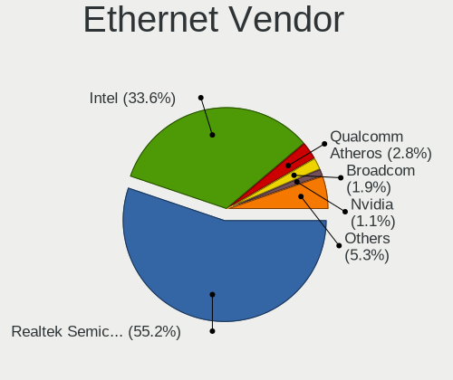

| Vendor                                 | Desktops | Percent |
|----------------------------------------|----------|---------|
| Realtek Semiconductor                  | 595      | 56.13%  |
| Intel                                  | 343      | 32.36%  |
| Qualcomm Atheros                       | 30       | 2.83%   |
| Broadcom                               | 24       | 2.26%   |
| Nvidia                                 | 12       | 1.13%   |
| ASIX Electronics                       | 10       | 0.94%   |
| Aquantia                               | 9        | 0.85%   |
| Samsung Electronics                    | 6        | 0.57%   |
| Marvell Technology Group               | 5        | 0.47%   |
| DisplayLink                            | 3        | 0.28%   |
| Xiaomi                                 | 2        | 0.19%   |
| NetXen Incorporated                    | 2        | 0.19%   |
| Motorola PCS                           | 2        | 0.19%   |
| JMicron Technology                     | 2        | 0.19%   |
| D-Link System                          | 2        | 0.19%   |
| VIA Technologies                       | 1        | 0.09%   |
| TP-Link                                | 1        | 0.09%   |
| Sony Ericsson Mobile Communications AB | 1        | 0.09%   |
| Solarflare Communications              | 1        | 0.09%   |
| OPPO Electronics                       | 1        | 0.09%   |
| National Semiconductor                 | 1        | 0.09%   |
| MediaTek                               | 1        | 0.09%   |
| Huawei Technologies                    | 1        | 0.09%   |
| Google                                 | 1        | 0.09%   |
| Foxconn / Hon Hai                      | 1        | 0.09%   |
| Broadcom Limited                       | 1        | 0.09%   |
| ADMtek                                 | 1        | 0.09%   |
| 3Com                                   | 1        | 0.09%   |

Ethernet Model
--------------

Ethernet models

| Model                                                                         | Desktops | Percent |
|-------------------------------------------------------------------------------|----------|---------|
| Realtek RTL8111/8168/8411 PCI Express Gigabit Ethernet Controller             | 514      | 46.81%  |
| Intel I211 Gigabit Network Connection                                         | 77       | 7.01%   |
| Realtek RTL8125 2.5GbE Controller                                             | 60       | 5.46%   |
| Intel Ethernet Connection (2) I219-V                                          | 37       | 3.37%   |
| Intel 82579LM Gigabit Network Connection (Lewisville)                         | 36       | 3.28%   |
| Intel Ethernet Controller I225-V                                              | 29       | 2.64%   |
| Intel Ethernet Connection I217-LM                                             | 20       | 1.82%   |
| Intel Ethernet Connection (7) I219-V                                          | 17       | 1.55%   |
| Intel Ethernet Connection (2) I218-V                                          | 16       | 1.46%   |
| Intel 82574L Gigabit Network Connection                                       | 14       | 1.28%   |
| Intel Ethernet Connection I217-V                                              | 13       | 1.18%   |
| Intel 82579V Gigabit Network Connection                                       | 12       | 1.09%   |
| Intel I210 Gigabit Network Connection                                         | 11       | 1%      |
| ASIX AX88179 Gigabit Ethernet                                                 | 10       | 0.91%   |
| Realtek RTL8153 Gigabit Ethernet Adapter                                      | 8        | 0.73%   |
| Intel Ethernet Connection (2) I219-LM                                         | 8        | 0.73%   |
| Realtek RTL810xE PCI Express Fast Ethernet controller                         | 7        | 0.64%   |
| Intel Ethernet Connection (11) I219-V                                         | 7        | 0.64%   |
| Intel 82567LM-3 Gigabit Network Connection                                    | 7        | 0.64%   |
| Realtek RTL8169 PCI Gigabit Ethernet Controller                               | 6        | 0.55%   |
| Qualcomm Atheros Killer E220x Gigabit Ethernet Controller                     | 6        | 0.55%   |
| Qualcomm Atheros AR8121/AR8113/AR8114 Gigabit or Fast Ethernet                | 6        | 0.55%   |
| Intel Ethernet Connection (2) I218-LM                                         | 6        | 0.55%   |
| Realtek RTL-8100/8101L/8139 PCI Fast Ethernet Adapter                         | 5        | 0.46%   |
| Aquantia AQC107 NBase-T/IEEE 802.3bz Ethernet Controller [AQtion]             | 5        | 0.46%   |
| Samsung Galaxy series, misc. (tethering mode)                                 | 4        | 0.36%   |
| Realtek Killer E2600 Gigabit Ethernet Controller                              | 4        | 0.36%   |
| Qualcomm Atheros Killer E2500 Gigabit Ethernet Controller                     | 4        | 0.36%   |
| Marvell Group 88E8056 PCI-E Gigabit Ethernet Controller                       | 4        | 0.36%   |
| Intel I350 Gigabit Network Connection                                         | 4        | 0.36%   |
| Intel Ethernet Connection (7) I219-LM                                         | 4        | 0.36%   |
| Intel 82578DM Gigabit Network Connection                                      | 4        | 0.36%   |
| Intel 82571EB/82571GB Gigabit Ethernet Controller D0/D1 (copper applications) | 4        | 0.36%   |
| Broadcom NetXtreme BCM5764M Gigabit Ethernet PCIe                             | 4        | 0.36%   |
| Qualcomm Atheros AR8161 Gigabit Ethernet                                      | 3        | 0.27%   |
| Qualcomm Atheros AR8152 v2.0 Fast Ethernet                                    | 3        | 0.27%   |
| Qualcomm Atheros AR8151 v2.0 Gigabit Ethernet                                 | 3        | 0.27%   |
| Nvidia MCP61 Ethernet                                                         | 3        | 0.27%   |
| Nvidia MCP55 Ethernet                                                         | 3        | 0.27%   |
| Intel Ethernet Connection (17) I219-V                                         | 3        | 0.27%   |

Net Controller Kind
-------------------

Ethernet, WiFi or modem

| Kind     | Desktops | Percent |
|----------|----------|---------|
| Ethernet | 959      | 68.7%   |
| WiFi     | 422      | 30.23%  |
| Modem    | 9        | 0.64%   |
| Unknown  | 6        | 0.43%   |

Used Controller
---------------

Currently used network controller

| Kind     | Desktops | Percent |
|----------|----------|---------|
| Ethernet | 814      | 79.49%  |
| WiFi     | 209      | 20.41%  |
| Unknown  | 1        | 0.1%    |

NICs
----

Total network controllers on board

| Total | Desktops | Percent |
|-------|----------|---------|
| 1     | 572      | 58.79%  |
| 2     | 320      | 32.89%  |
| 3     | 56       | 5.76%   |
| 0     | 12       | 1.23%   |
| 4     | 9        | 0.92%   |
| 5     | 4        | 0.41%   |

IPv6
----

IPv6 vs IPv4

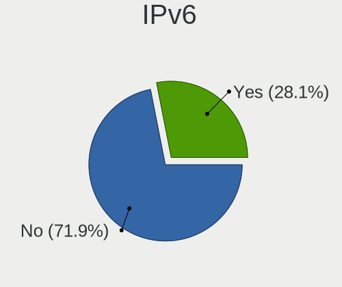

| Used | Desktops | Percent |
|------|----------|---------|
| No   | 767      | 77.16%  |
| Yes  | 227      | 22.84%  |

Bluetooth
---------

Bluetooth Vendor
----------------

Controller vendors

| Vendor                          | Desktops | Percent |
|---------------------------------|----------|---------|
| Intel                           | 159      | 40.87%  |
| Cambridge Silicon Radio         | 102      | 26.22%  |
| Realtek Semiconductor           | 33       | 8.48%   |
| ASUSTek Computer                | 28       | 7.2%    |
| Broadcom                        | 18       | 4.63%   |
| MediaTek                        | 11       | 2.83%   |
| IMC Networks                    | 8        | 2.06%   |
| Qualcomm Atheros Communications | 6        | 1.54%   |
| Apple                           | 6        | 1.54%   |
| TP-Link                         | 3        | 0.77%   |
| Lite-On Technology              | 3        | 0.77%   |
| Belkin Components               | 3        | 0.77%   |
| HTC (High Tech Computer)        | 2        | 0.51%   |
| SINO WEALTH                     | 1        | 0.26%   |
| Realtek                         | 1        | 0.26%   |
| Mobile Action Technology        | 1        | 0.26%   |
| Kensington                      | 1        | 0.26%   |
| Integrated System Solution      | 1        | 0.26%   |
| Foxconn / Hon Hai               | 1        | 0.26%   |
| Dell                            | 1        | 0.26%   |

Bluetooth Model
---------------

Controller models

| Model                                                                | Desktops | Percent |
|----------------------------------------------------------------------|----------|---------|
| Cambridge Silicon Radio Bluetooth Dongle (HCI mode)                  | 102      | 26.22%  |
| Intel AX200 Bluetooth                                                | 51       | 13.11%  |
| Intel Bluetooth wireless interface                                   | 27       | 6.94%   |
| Realtek Bluetooth Radio                                              | 22       | 5.66%   |
| Intel Wireless-AC 9260 Bluetooth Adapter                             | 20       | 5.14%   |
| Intel Wireless-AC 3168 Bluetooth                                     | 20       | 5.14%   |
| Intel AX210 Bluetooth                                                | 16       | 4.11%   |
| Intel AX201 Bluetooth                                                | 13       | 3.34%   |
| MediaTek Wireless_Device                                             | 11       | 2.83%   |
| Intel Bluetooth 9460/9560 Jefferson Peak (JfP)                       | 9        | 2.31%   |
| Broadcom BCM20702A0 Bluetooth 4.0                                    | 8        | 2.06%   |
| Realtek  Bluetooth 4.2 Adapter                                       | 7        | 1.8%    |
| ASUS Broadcom BCM20702A0 Bluetooth                                   | 7        | 1.8%    |
| ASUS ASUS USB-BT500                                                  | 7        | 1.8%    |
| ASUS Bluetooth Radio                                                 | 5        | 1.29%   |
| IMC Networks Wireless_Device                                         | 4        | 1.03%   |
| ASUS Bluetooth Adapter                                               | 4        | 1.03%   |
| ASUS BCM20702A0                                                      | 4        | 1.03%   |
| TP-Link UB500 Adapter                                                | 3        | 0.77%   |
| Realtek RTL8821A Bluetooth                                           | 3        | 0.77%   |
| Qualcomm Atheros Bluetooth USB Host Controller                       | 3        | 0.77%   |
| Lite-On Bluetooth Device                                             | 3        | 0.77%   |
| Intel Bluetooth Device                                               | 3        | 0.77%   |
| IMC Networks Bluetooth Radio                                         | 3        | 0.77%   |
| Broadcom BCM2045 Bluetooth                                           | 3        | 0.77%   |
| Apple Bluetooth Host Controller                                      | 3        | 0.77%   |
| HTC (High Tech Computer) Vive Hub Bluetooth 4.1 (Broadcom BCM920703) | 2        | 0.51%   |
| Broadcom Bluetooth Controller                                        | 2        | 0.51%   |
| Belkin Components F8T065BF Mini Bluetooth 4.0 Adapter                | 2        | 0.51%   |
| Apple Built-in Bluetooth 2.0+EDR HCI                                 | 2        | 0.51%   |
| SINO WEALTH RK Bluetooth Keyboar                                     | 1        | 0.26%   |
| Realtek RTL8822BE Bluetooth 4.2 Adapter                              | 1        | 0.26%   |
| Realtek Bluetooth Radio                                              | 1        | 0.26%   |
| Qualcomm Atheros  Bluetooth Device                                   | 1        | 0.26%   |
| Qualcomm Atheros QCA61x4 Bluetooth 4.0                               | 1        | 0.26%   |
| Qualcomm Atheros AR9462 Bluetooth                                    | 1        | 0.26%   |
| Mobile Action MA-730/MA-730G Bluetooth Adapter                       | 1        | 0.26%   |
| Kensington Bluetooth EDR Dongle                                      | 1        | 0.26%   |
| Integrated System Solution KY-BT100 Bluetooth Adapter                | 1        | 0.26%   |
| IMC Networks BCM20702A0                                              | 1        | 0.26%   |

Sound
-----

Sound Vendor
------------

Sound card vendors

| Vendor                                       | Desktops | Percent |
|----------------------------------------------|----------|---------|
| AMD                                          | 542      | 31.59%  |
| Intel                                        | 481      | 28.03%  |
| Nvidia                                       | 376      | 21.91%  |
| C-Media Electronics                          | 48       | 2.8%    |
| Creative Labs                                | 28       | 1.63%   |
| Logitech                                     | 23       | 1.34%   |
| Texas Instruments                            | 12       | 0.7%    |
| Razer USA                                    | 12       | 0.7%    |
| Kingston Technology                          | 10       | 0.58%   |
| JMTek                                        | 9        | 0.52%   |
| Generalplus Technology                       | 9        | 0.52%   |
| ASUSTek Computer                             | 9        | 0.52%   |
| GN Netcom                                    | 7        | 0.41%   |
| Creative Technology                          | 7        | 0.41%   |
| SteelSeries ApS                              | 6        | 0.35%   |
| Sennheiser Communications                    | 6        | 0.35%   |
| RODE Microphones                             | 6        | 0.35%   |
| Micro Star International                     | 6        | 0.35%   |
| Corsair                                      | 6        | 0.35%   |
| BEHRINGER International                      | 6        | 0.35%   |
| M-Audio                                      | 5        | 0.29%   |
| Yamaha                                       | 4        | 0.23%   |
| VIA Technologies                             | 4        | 0.23%   |
| Samson Technologies                          | 4        | 0.23%   |
| Plantronics                                  | 4        | 0.23%   |
| Focusrite-Novation                           | 4        | 0.23%   |
| FiiO Electronics Technology                  | 4        | 0.23%   |
| ONN                                          | 3        | 0.17%   |
| DSEA A/S                                     | 3        | 0.17%   |
| Blue Microphones                             | 3        | 0.17%   |
| Zoran Co. Personal Media Division (Nogatech) | 2        | 0.12%   |
| Thesycon Systemsoftware & Consulting         | 2        | 0.12%   |
| TerraTec Electronic                          | 2        | 0.12%   |
| Tenx Technology                              | 2        | 0.12%   |
| Sony                                         | 2        | 0.12%   |
| Solid State Logic                            | 2        | 0.12%   |
| Jieli Technology                             | 2        | 0.12%   |
| HiBy                                         | 2        | 0.12%   |
| Hewlett-Packard                              | 2        | 0.12%   |
| Giga-Byte Technology                         | 2        | 0.12%   |

Sound Model
-----------

Sound card models

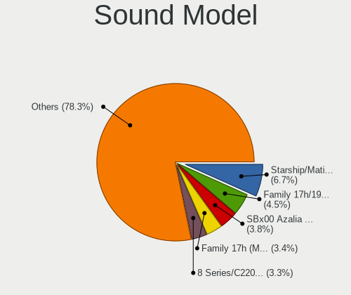

| Model                                                                      | Desktops | Percent |
|----------------------------------------------------------------------------|----------|---------|
| AMD Starship/Matisse HD Audio Controller                                   | 131      | 6.26%   |
| AMD SBx00 Azalia (Intel HDA)                                               | 90       | 4.3%    |
| AMD Family 17h (Models 00h-0fh) HD Audio Controller                        | 89       | 4.25%   |
| AMD Family 17h/19h HD Audio Controller                                     | 84       | 4.01%   |
| Intel 8 Series/C220 Series Chipset High Definition Audio Controller        | 74       | 3.54%   |
| AMD Ellesmere HDMI Audio [Radeon RX 470/480 / 570/580/590]                 | 74       | 3.54%   |
| Intel 6 Series/C200 Series Chipset Family High Definition Audio Controller | 51       | 2.44%   |
| Intel Xeon E3-1200 v3/4th Gen Core Processor HD Audio Controller           | 49       | 2.34%   |
| Intel 7 Series/C216 Chipset Family High Definition Audio Controller        | 46       | 2.2%    |
| Intel 100 Series/C230 Series Chipset Family HD Audio Controller            | 45       | 2.15%   |
| AMD Baffin HDMI/DP Audio [Radeon RX 550 640SP / RX 560/560X]               | 39       | 1.86%   |
| Intel 200 Series PCH HD Audio                                              | 37       | 1.77%   |
| AMD Renoir Radeon High Definition Audio Controller                         | 35       | 1.67%   |
| Nvidia GP104 High Definition Audio Controller                              | 33       | 1.58%   |
| AMD Raven/Raven2/Fenghuang HDMI/DP Audio Controller                        | 33       | 1.58%   |
| AMD Navi 21/23 HDMI/DP Audio Controller                                    | 33       | 1.58%   |
| AMD Navi 10 HDMI Audio                                                     | 33       | 1.58%   |
| AMD Oland/Hainan/Cape Verde/Pitcairn HDMI Audio [Radeon HD 7000 Series]    | 31       | 1.48%   |
| AMD FCH Azalia Controller                                                  | 31       | 1.48%   |
| Intel Cannon Lake PCH cAVS                                                 | 29       | 1.39%   |
| Nvidia GK208 HDMI/DP Audio Controller                                      | 28       | 1.34%   |
| Nvidia GP106 High Definition Audio Controller                              | 27       | 1.29%   |
| Nvidia GP107GL High Definition Audio Controller                            | 26       | 1.24%   |
| Nvidia GM107 High Definition Audio Controller [GeForce 940MX]              | 25       | 1.19%   |
| Nvidia TU116 High Definition Audio Controller                              | 24       | 1.15%   |
| Intel 82801JI (ICH10 Family) HD Audio Controller                           | 18       | 0.86%   |
| Intel C600/X79 series chipset High Definition Audio Controller             | 17       | 0.81%   |
| Intel 9 Series Chipset Family HD Audio Controller                          | 17       | 0.81%   |
| Intel 5 Series/3400 Series Chipset High Definition Audio                   | 17       | 0.81%   |
| Nvidia GA102 High Definition Audio Controller                              | 16       | 0.76%   |
| Intel NM10/ICH7 Family High Definition Audio Controller                    | 15       | 0.72%   |
| Intel C610/X99 series chipset HD Audio Controller                          | 15       | 0.72%   |
| Intel Alder Lake-S HD Audio Controller                                     | 15       | 0.72%   |
| Nvidia GM206 High Definition Audio Controller                              | 14       | 0.67%   |
| Nvidia TU106 High Definition Audio Controller                              | 13       | 0.62%   |
| Nvidia GP108 High Definition Audio Controller                              | 13       | 0.62%   |
| Nvidia GM204 High Definition Audio Controller                              | 13       | 0.62%   |
| Nvidia GK104 HDMI Audio Controller                                         | 13       | 0.62%   |
| Intel Comet Lake PCH cAVS                                                  | 13       | 0.62%   |
| AMD Turks HDMI Audio [Radeon HD 6500/6600 / 6700M Series]                  | 13       | 0.62%   |

Memory
------

Memory Vendor
-------------

Memory module vendors

| Vendor                                  | Desktops | Percent |
|-----------------------------------------|----------|---------|
| Kingston                                | 110      | 17.38%  |
| Corsair                                 | 95       | 15.01%  |
| G.Skill                                 | 80       | 12.64%  |
| Unknown                                 | 79       | 12.48%  |
| Crucial                                 | 68       | 10.74%  |
| Samsung Electronics                     | 45       | 7.11%   |
| SK hynix                                | 35       | 5.53%   |
| Micron Technology                       | 33       | 5.21%   |
| Patriot                                 | 14       | 2.21%   |
| Team                                    | 11       | 1.74%   |
| Nanya Technology                        | 7        | 1.11%   |
| A-DATA Technology                       | 6        | 0.95%   |
| Avant                                   | 5        | 0.79%   |
| Ramaxel Technology                      | 4        | 0.63%   |
| Elpida                                  | 4        | 0.63%   |
| Unknown                                 | 3        | 0.47%   |
| Transcend                               | 2        | 0.32%   |
| Smart                                   | 2        | 0.32%   |
| PNY                                     | 2        | 0.32%   |
| GOODRAM                                 | 2        | 0.32%   |
| Exceleram                               | 2        | 0.32%   |
| Apacer                                  | 2        | 0.32%   |
| AMD                                     | 2        | 0.32%   |
| Unknown (ABCD)                          | 1        | 0.16%   |
| Unknown (0x02BA)                        | 1        | 0.16%   |
| Unknown (07FB)                          | 1        | 0.16%   |
| Unifosa                                 | 1        | 0.16%   |
| TakeMS                                  | 1        | 0.16%   |
| Silicon Power Computer & Communications | 1        | 0.16%   |
| Silicon Power                           | 1        | 0.16%   |
| SanDisk                                 | 1        | 0.16%   |
| Princeton                               | 1        | 0.16%   |
| Patriot Memory (PDP Systems)            | 1        | 0.16%   |
| Neo Forza                               | 1        | 0.16%   |
| Kllisre                                 | 1        | 0.16%   |
| KLEVV                                   | 1        | 0.16%   |
| Kingmax                                 | 1        | 0.16%   |
| INNOVATION PC                           | 1        | 0.16%   |
| Hewlett-Packard                         | 1        | 0.16%   |
| GeIL                                    | 1        | 0.16%   |

Memory Model
------------

Memory module models

| Model                                                   | Desktops | Percent |
|---------------------------------------------------------|----------|---------|
| Unknown RAM Module 4096MB DIMM 1333MT/s                 | 10       | 1.45%   |
| Corsair RAM CMK16GX4M2B3000C15 8GB DIMM DDR4 3533MT/s   | 9        | 1.3%    |
| G.Skill RAM F4-3000C16-8GISB 8GB DIMM DDR4 3200MT/s     | 8        | 1.16%   |
| Corsair RAM CMK16GX4M2B3200C16 8GB DIMM DDR4 3600MT/s   | 8        | 1.16%   |
| Samsung RAM M378B5173DB0-CK0 4GB DIMM DDR3 1600MT/s     | 6        | 0.87%   |
| Kingston RAM KHX2400C15/8G 8GB DIMM DDR4 3400MT/s       | 6        | 0.87%   |
| Unknown RAM Module 4096MB DIMM 1600MT/s                 | 5        | 0.72%   |
| Unknown RAM Module 2048MB DIMM 1333MT/s                 | 5        | 0.72%   |
| Kingston RAM KHX3200C16D4/16GX 16GB DIMM DDR4 3600MT/s  | 5        | 0.72%   |
| Corsair RAM CMK32GX4M2B3200C16 16GB DIMM DDR4 3400MT/s  | 5        | 0.72%   |
| Unknown RAM Module 2048MB DIMM DDR2 800MT/s             | 4        | 0.58%   |
| Kingston RAM KHX3200C16D4/8GX 8GB DIMM DDR4 3733MT/s    | 4        | 0.58%   |
| Kingston RAM KHX1866C10D3/8G 8GB DIMM DDR3 2133MT/s     | 4        | 0.58%   |
| Kingston RAM KF3200C16D4/32GX 32GB DIMM DDR4 3933MT/s   | 4        | 0.58%   |
| G.Skill RAM F4-3200C16-8GVKB 8GB DIMM DDR4 3866MT/s     | 4        | 0.58%   |
| Corsair RAM CMZ16GX3M2A1600C10 8GB DIMM DDR3 1600MT/s   | 4        | 0.58%   |
| Corsair RAM CMK16GX4M2A2666C16 8GB DIMM DDR4 3400MT/s   | 4        | 0.58%   |
| Avant RAM F6451U67G1600G 4GB DIMM DDR3 1600MT/s         | 4        | 0.58%   |
| Unknown RAM Module 8GB DIMM 1333MT/s                    | 3        | 0.43%   |
| Unknown RAM Module 8192MB DIMM 1333MT/s                 | 3        | 0.43%   |
| Unknown RAM Module 4096MB DIMM DDR3 1333MT/s            | 3        | 0.43%   |
| Unknown RAM 3000 C16 Series 8192MB DIMM DDR4 2133MT/s   | 3        | 0.43%   |
| Team RAM TEAMGROUP-UD4-3200 16GB DIMM DDR4 3800MT/s     | 3        | 0.43%   |
| SK hynix RAM HMT451U6AFR8C-PB 4GB DIMM DDR3 1600MT/s    | 3        | 0.43%   |
| Samsung RAM M378B5273DH0-CH9 4096MB DIMM DDR3 2133MT/s  | 3        | 0.43%   |
| Samsung RAM M378B1G73DB0-CK0 8GB DIMM DDR3 2133MT/s     | 3        | 0.43%   |
| Nanya RAM NT2GC64B88G0NF-CG 2GB DIMM DDR3 1333MT/s      | 3        | 0.43%   |
| Micron RAM 8JTF51264AZ-1G6E1 4GB DIMM DDR3 1600MT/s     | 3        | 0.43%   |
| Micron RAM 4JTF25664AZ-1G6E1 2GB DIMM DDR3 1600MT/s     | 3        | 0.43%   |
| Kingston RAM KHX2666C16/8G 8GB DIMM DDR4 3466MT/s       | 3        | 0.43%   |
| Kingston RAM KHX1600C9D3/4GX 4GB DIMM DDR3 1600MT/s     | 3        | 0.43%   |
| Kingston RAM KHX1600C10D3/8GX 8192MB DIMM DDR3 1600MT/s | 3        | 0.43%   |
| G.Skill RAM F4-3200C16-16GVK 16GB DIMM DDR4 3600MT/s    | 3        | 0.43%   |
| Crucial RAM CT51264BD160B.C16F 4GB DIMM DDR3 1600MT/s   | 3        | 0.43%   |
| Corsair RAM CMK64GX4M2E3200C16 32GB DIMM DDR4 3200MT/s  | 3        | 0.43%   |
| Corsair RAM CMK32GX4M2Z3600C18 16GB DIMM DDR4 3800MT/s  | 3        | 0.43%   |
| Corsair RAM CMK16GX4M2A2400C14 8GB DIMM DDR4 2800MT/s   | 3        | 0.43%   |
| Unknown                                                 | 3        | 0.43%   |
| Unknown RAM Module 8192MB DIMM DDR3 1600MT/s            | 2        | 0.29%   |
| Unknown RAM Module 4GB DIMM DDR3 1333MT/s               | 2        | 0.29%   |

Memory Kind
-----------

Memory module kinds

| Kind    | Desktops | Percent |
|---------|----------|---------|
| DDR4    | 296      | 53.72%  |
| DDR3    | 170      | 30.85%  |
| Unknown | 38       | 6.9%    |
| DDR2    | 20       | 3.63%   |
| SDRAM   | 12       | 2.18%   |
| DDR5    | 6        | 1.09%   |
| DDR     | 5        | 0.91%   |
| DRAM    | 3        | 0.54%   |
| LPDDR4  | 1        | 0.18%   |

Memory Form Factor
------------------

Physical design of the memory module

| Name    | Desktops | Percent |
|---------|----------|---------|
| DIMM    | 518      | 94.7%   |
| SODIMM  | 25       | 4.57%   |
| RIMM    | 2        | 0.37%   |
| FB-DIMM | 2        | 0.37%   |

Memory Size
-----------

Memory module size

| Size  | Desktops | Percent |
|-------|----------|---------|
| 8192  | 249      | 41.02%  |
| 4096  | 133      | 21.91%  |
| 16384 | 114      | 18.78%  |
| 2048  | 57       | 9.39%   |
| 32768 | 34       | 5.6%    |
| 1024  | 17       | 2.8%    |
| 512   | 2        | 0.33%   |
| 49152 | 1        | 0.16%   |

Memory Speed
------------

Memory module speed

| Speed   | Desktops | Percent |
|---------|----------|---------|
| 1600    | 98       | 16.09%  |
| 1333    | 74       | 12.15%  |
| 3200    | 66       | 10.84%  |
| 3600    | 49       | 8.05%   |
| 2400    | 44       | 7.22%   |
| 2667    | 36       | 5.91%   |
| 2133    | 32       | 5.25%   |
| 800     | 21       | 3.45%   |
| 3400    | 16       | 2.63%   |
| 1867    | 15       | 2.46%   |
| 3800    | 11       | 1.81%   |
| 3000    | 10       | 1.64%   |
| 2933    | 10       | 1.64%   |
| 2666    | 10       | 1.64%   |
| 667     | 10       | 1.64%   |
| 3533    | 9        | 1.48%   |
| 1866    | 8        | 1.31%   |
| 3733    | 6        | 0.99%   |
| 3666    | 6        | 0.99%   |
| 2800    | 6        | 0.99%   |
| 1800    | 6        | 0.99%   |
| 3866    | 5        | 0.82%   |
| 1066    | 5        | 0.82%   |
| 3933    | 4        | 0.66%   |
| 3466    | 4        | 0.66%   |
| Unknown | 4        | 0.66%   |
| 4800    | 3        | 0.49%   |
| 533     | 3        | 0.49%   |
| 3334    | 2        | 0.33%   |
| 3151    | 2        | 0.33%   |
| 3007    | 2        | 0.33%   |
| 2473    | 2        | 0.33%   |
| 2048    | 2        | 0.33%   |
| 400     | 2        | 0.33%   |
| 49926   | 1        | 0.16%   |
| 7000    | 1        | 0.16%   |
| 6800    | 1        | 0.16%   |
| 6400    | 1        | 0.16%   |
| 5600    | 1        | 0.16%   |
| 4199    | 1        | 0.16%   |

Printers & scanners
-------------------

Printer Vendor
--------------

Printer device vendors

| Vendor              | Desktops | Percent |
|---------------------|----------|---------|
| Hewlett-Packard     | 22       | 34.38%  |
| Seiko Epson         | 10       | 15.63%  |
| Brother Industries  | 10       | 15.63%  |
| Samsung Electronics | 9        | 14.06%  |
| Canon               | 7        | 10.94%  |
| Pantum              | 2        | 3.13%   |
| Xerox               | 1        | 1.56%   |
| Star Micronics      | 1        | 1.56%   |
| Prolific Technology | 1        | 1.56%   |
| Kyocera             | 1        | 1.56%   |

Printer Model
-------------

Printer device models

| Model                                           | Desktops | Percent |
|-------------------------------------------------|----------|---------|
| Samsung M262x/M282x Xpress Series Laser Printer | 2        | 3.08%   |
| HP LaserJet 1018                                | 2        | 3.08%   |
| HP Color LaserJet CP1215                        | 2        | 3.08%   |
| Canon LiDE 400                                  | 2        | 3.08%   |
| Brother Printer                                 | 2        | 3.08%   |
| Xerox WorkCentre 3220                           | 1        | 1.54%   |
| Star Micronics TSP100ECO/TSP100II               | 1        | 1.54%   |
| Seiko Epson XP-4200 Series                      | 1        | 1.54%   |
| Seiko Epson XP-4100 Series                      | 1        | 1.54%   |
| Seiko Epson XP-240 Series                       | 1        | 1.54%   |
| Seiko Epson XP-235 Series                       | 1        | 1.54%   |
| Seiko Epson WF-4830 Series                      | 1        | 1.54%   |
| Seiko Epson L300 Series                         | 1        | 1.54%   |
| Seiko Epson L1300 Series                        | 1        | 1.54%   |
| Seiko Epson ET-3840 Series                      | 1        | 1.54%   |
| Seiko Epson ET-2820 Series                      | 1        | 1.54%   |
| Seiko Epson ET-2720 Series                      | 1        | 1.54%   |
| Seiko Epson ET-2710 Series                      | 1        | 1.54%   |
| Samsung SCX-4200 series                         | 1        | 1.54%   |
| Samsung SCX-3400 Series                         | 1        | 1.54%   |
| Samsung Phaser 3121                             | 1        | 1.54%   |
| Samsung ML-191x/ML-252x Laser Printer           | 1        | 1.54%   |
| Samsung ML-1865                                 | 1        | 1.54%   |
| Samsung M267x 287x Series                       | 1        | 1.54%   |
| Samsung M2020 Series                            | 1        | 1.54%   |
| Prolific PL2305 Parallel Port                   | 1        | 1.54%   |
| Pantum P2500W-series                            | 1        | 1.54%   |
| Pantum P2200-series                             | 1        | 1.54%   |
| Kyocera FS-1030D printer                        | 1        | 1.54%   |
| HP Smart Tank Plus 550 series                   | 1        | 1.54%   |
| HP Smart Install                                | 1        | 1.54%   |
| HP Officejet J4680                              | 1        | 1.54%   |
| HP OfficeJet 5200 series                        | 1        | 1.54%   |
| HP Officejet 4620 series                        | 1        | 1.54%   |
| HP LaserJet Professional P 1102w                | 1        | 1.54%   |
| HP LaserJet P1102                               | 1        | 1.54%   |
| HP LaserJet 1320                                | 1        | 1.54%   |
| HP LaserJet 1200                                | 1        | 1.54%   |
| HP ENVY Pro 6400 series                         | 1        | 1.54%   |
| HP ENVY 4520 series                             | 1        | 1.54%   |

Scanner Vendor
--------------

Scanner device vendors

| Vendor          | Desktops | Percent |
|-----------------|----------|---------|
| Canon           | 9        | 42.86%  |
| Seiko Epson     | 6        | 28.57%  |
| Hewlett-Packard | 3        | 14.29%  |
| AGFA-Gevaert NV | 2        | 9.52%   |
| Mustek Systems  | 1        | 4.76%   |

Scanner Model
-------------

Scanner device models

| Model                                                         | Desktops | Percent |
|---------------------------------------------------------------|----------|---------|
| Canon CanoScan LiDE 210                                       | 4        | 19.05%  |
| Canon CanoScan LiDE 110                                       | 2        | 9.52%   |
| Seiko Epson Scanner                                           | 1        | 4.76%   |
| Seiko Epson GT-X770 [Perfection V500]                         | 1        | 4.76%   |
| Seiko Epson GT-F730 [GT-S630/Perfection V33/V330 Photo]       | 1        | 4.76%   |
| Seiko Epson GT-F520/GT-F570 [Perfection 3590 PHOTO]           | 1        | 4.76%   |
| Seiko Epson GT-8700/GT-8700F [Perfection 1640SU/1640SU PHOTO] | 1        | 4.76%   |
| Seiko Epson GT-8300UF [Perfection 1660 PHOTO]                 | 1        | 4.76%   |
| Mustek Systems ScanExpress A3 USB                             | 1        | 4.76%   |
| HP Scanjet G2710                                              | 1        | 4.76%   |
| HP ScanJet 5300c/5370c                                        | 1        | 4.76%   |
| HP ScanJet 3970c                                              | 1        | 4.76%   |
| Canon CanoScan N670U/N676U/LiDE 20                            | 1        | 4.76%   |
| Canon CanoScan N1240U/LiDE 30                                 | 1        | 4.76%   |
| Canon CanoScan LiDE 220                                       | 1        | 4.76%   |
| AGFA-Gevaert NV SnapScan e20                                  | 1        | 4.76%   |
| AGFA-Gevaert NV SnapScan 1212U (?)                            | 1        | 4.76%   |

Camera
------

Camera Vendor
-------------

Camera device vendors

| Vendor                        | Desktops | Percent |
|-------------------------------|----------|---------|
| Logitech                      | 99       | 46.92%  |
| Microdia                      | 27       | 12.8%   |
| Microsoft                     | 13       | 6.16%   |
| Generalplus Technology        | 6        | 2.84%   |
| Chicony Electronics           | 5        | 2.37%   |
| Z-Star Microelectronics       | 4        | 1.9%    |
| Trust                         | 4        | 1.9%    |
| Samsung Electronics           | 4        | 1.9%    |
| ARC International             | 4        | 1.9%    |
| Apple                         | 4        | 1.9%    |
| Sunplus Innovation Technology | 3        | 1.42%   |
| Realtek Semiconductor         | 3        | 1.42%   |
| Creative Technology           | 3        | 1.42%   |
| Hewlett-Packard               | 2        | 0.95%   |
| HD 2MP WEBCAM                 | 2        | 0.95%   |
| Cubeternet                    | 2        | 0.95%   |
| Arkmicro Technologies         | 2        | 0.95%   |
| Unknown                       | 1        | 0.47%   |
| Tobii Technology AB           | 1        | 0.47%   |
| Sweex                         | 1        | 0.47%   |
| Suyin                         | 1        | 0.47%   |
| Sonix Technology              | 1        | 0.47%   |
| Razer USA                     | 1        | 0.47%   |
| Quanta                        | 1        | 0.47%   |
| Philips (or NXP)              | 1        | 0.47%   |
| Owon                          | 1        | 0.47%   |
| OmniVision Technologies       | 1        | 0.47%   |
| Oculus VR                     | 1        | 0.47%   |
| MacroSilicon                  | 1        | 0.47%   |
| lihappe8                      | 1        | 0.47%   |
| IPEVO                         | 1        | 0.47%   |
| Intel                         | 1        | 0.47%   |
| Huawei Technologies           | 1        | 0.47%   |
| HTC (High Tech Computer)      | 1        | 0.47%   |
| Guillemot                     | 1        | 0.47%   |
| Genesys Logic                 | 1        | 0.47%   |
| eMeet                         | 1        | 0.47%   |
| Cisco Systems                 | 1        | 0.47%   |
| Canon                         | 1        | 0.47%   |
| AVerMedia Technologies        | 1        | 0.47%   |

Camera Model
------------

Camera device models

| Model                                   | Desktops | Percent |
|-----------------------------------------|----------|---------|
| Logitech Webcam C270                    | 27       | 12.74%  |
| Logitech HD Pro Webcam C920             | 12       | 5.66%   |
| Microdia Webcam Vitade AF               | 7        | 3.3%    |
| Microdia USB 2.0 Camera                 | 7        | 3.3%    |
| Logitech C922 Pro Stream Webcam         | 7        | 3.3%    |
| Logitech Webcam C310                    | 5        | 2.36%   |
| Logitech HD Webcam C615                 | 5        | 2.36%   |
| Logitech HD Webcam C525                 | 5        | 2.36%   |
| Logitech BRIO Ultra HD Webcam           | 5        | 2.36%   |
| Samsung Galaxy series, misc. (MTP mode) | 4        | 1.89%   |
| ARC International Camera                | 4        | 1.89%   |
| Microsoft LifeCam HD-3000               | 3        | 1.42%   |
| Microdia Sonix USB 2.0 Camera           | 3        | 1.42%   |
| Microdia Rapoo camera                   | 3        | 1.42%   |
| Microdia Camera                         | 3        | 1.42%   |
| Logitech Webcam Pro 9000                | 3        | 1.42%   |
| Logitech Webcam C925e                   | 3        | 1.42%   |
| Logitech BRIO 4K Stream Edition         | 3        | 1.42%   |
| Logitech B525 HD Webcam                 | 3        | 1.42%   |
| Generalplus GENERAL WEBCAM              | 3        | 1.42%   |
| Apple iPhone 5/5C/5S/6/SE/7/8/X         | 3        | 1.42%   |
| Z-Star Venus USB2.0 Camera              | 2        | 0.94%   |
| Sunplus MTD Camera                      | 2        | 0.94%   |
| Microsoft Microsoft LifeCam Cinema    | 2        | 0.94%   |
| Microsoft LifeCam VX-800                | 2        | 0.94%   |
| Microsoft LifeCam VX-700                | 2        | 0.94%   |
| Microdia PC-LM1E                        | 2        | 0.94%   |
| Logitech Webcam C250                    | 2        | 0.94%   |
| Logitech HD Webcam C910                 | 2        | 0.94%   |
| Logitech CrystalCam                     | 2        | 0.94%   |
| Logitech C920 PRO HD Webcam             | 2        | 0.94%   |
| Logitech C505 HD Webcam                 | 2        | 0.94%   |
| HD 2MP WEBCAM HD 2MP WEBCAM             | 2        | 0.94%   |
| Generalplus WEB CAM                     | 2        | 0.94%   |
| Cubeternet USB2.0 Camera                | 2        | 0.94%   |
| Creative VF0530 Live! Cam Chat IM       | 2        | 0.94%   |
| Chicony HP Webcam                       | 2        | 0.94%   |
| Arkmicro USB2.0 PC CAMERA               | 2        | 0.94%   |
| Z-Star Integrated Camera                | 1        | 0.47%   |
| Z-Star A4 TECH USB2.0 PC Camera E       | 1        | 0.47%   |

Security
--------

Fingerprint Vendor
------------------

Fingerprint sensor vendors

| Vendor                | Desktops | Percent |
|-----------------------|----------|---------|
| Elan Microelectronics | 2        | 40%     |
| STMicroelectronics    | 1        | 20%     |
| DigitalPersona        | 1        | 20%     |
| AuthenTec             | 1        | 20%     |

Fingerprint Model
-----------------

Fingerprint sensor models

| Model                                       | Desktops | Percent |
|---------------------------------------------|----------|---------|
| Elan fingerprint sensor [FeinTech FPS00200] | 2        | 40%     |
| STMicroelectronics Fingerprint Reader       | 1        | 20%     |
| DigitalPersona Fingerprint Reader           | 1        | 20%     |
| AuthenTec AES2501 Fingerprint Sensor        | 1        | 20%     |

Chipcard Vendor
---------------

Chipcard module vendors

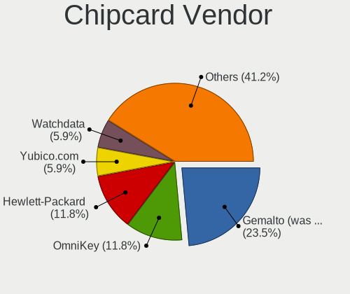

| Vendor                     | Desktops | Percent |
|----------------------------|----------|---------|
| Gemalto (was Gemplus)      | 4        | 36.36%  |
| Hewlett-Packard            | 2        | 18.18%  |
| Yubico.com                 | 1        | 9.09%   |
| Watchdata                  | 1        | 9.09%   |
| Clay Logic                 | 1        | 9.09%   |
| Castles Technology         | 1        | 9.09%   |
| Athena Smartcard Solutions | 1        | 9.09%   |

Chipcard Model
--------------

Chipcard module models

| Model                                             | Desktops | Percent |
|---------------------------------------------------|----------|---------|
| Gemalto (was Gemplus) GemPC Twin SmartCard Reader | 4        | 36.36%  |
| Hewlett-Packard SC Keyboard - Apollo (Liteon)     | 2        | 18.18%  |
| Yubico.com Yubikey 4/5 U2F+CCID                   | 1        | 9.09%   |
| Watchdata USB Key                                 | 1        | 9.09%   |
| Clay Logic Nitrokey HSM                           | 1        | 9.09%   |
| Castles Technology EZCCID Smart Card Reader       | 1        | 9.09%   |
| Athena Smartcard Solutions ASEDrive CCID          | 1        | 9.09%   |

Unsupported
-----------

Unsupported Devices
-------------------

Total unsupported devices on board

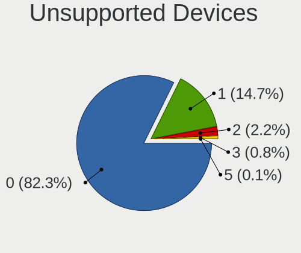

| Total | Desktops | Percent |
|-------|----------|---------|
| 0     | 850      | 84.41%  |
| 1     | 126      | 12.51%  |
| 2     | 22       | 2.18%   |
| 3     | 8        | 0.79%   |
| 5     | 1        | 0.1%    |

Unsupported Device Types
------------------------

Types of unsupported devices

| Type                     | Desktops | Percent |
|--------------------------|----------|---------|
| Graphics card            | 51       | 28.98%  |
| Net/wireless             | 50       | 28.41%  |
| Unassigned class         | 18       | 10.23%  |
| Sound                    | 16       | 9.09%   |
| Chipcard                 | 7        | 3.98%   |
| Card reader              | 7        | 3.98%   |
| Multimedia controller    | 5        | 2.84%   |
| Fingerprint reader       | 5        | 2.84%   |
| Communication controller | 5        | 2.84%   |
| Firewire controller      | 4        | 2.27%   |
| Camera                   | 3        | 1.7%    |
| Network                  | 2        | 1.14%   |
| Bluetooth                | 2        | 1.14%   |
| Net/ethernet             | 1        | 0.57%   |

