openSUSE - Tested Hardware & Statistics (Desktops)
--------------------------------------------------

A project to collect tested hardware configurations for openSUSE.

Anyone can contribute to this report by the [hw-probe](https://github.com/linuxhw/hw-probe) tool:

    sudo -E hw-probe -all -upload

Please contribute! Especially if your hardware is rare.

Contents
--------

* [ Test Cases ](#test-cases)

* [ System ](#system)
  - [ OS                       ](#os)
  - [ OS Family                ](#os-family)
  - [ Kernel                   ](#kernel)
  - [ Kernel Family            ](#kernel-family)
  - [ Kernel Major Ver.        ](#kernel-major-ver)
  - [ Arch                     ](#arch)
  - [ DE                       ](#de)
  - [ Display Server           ](#display-server)
  - [ Display Manager          ](#display-manager)
  - [ OS Lang                  ](#os-lang)
  - [ Boot Mode                ](#boot-mode)
  - [ Filesystem               ](#filesystem)
  - [ Part. scheme             ](#part-scheme)
  - [ Dual Boot with Linux/BSD ](#dual-boot-with-linuxbsd)
  - [ Dual Boot (Win)          ](#dual-boot-win)

* [ Board ](#board)
  - [ Vendor                   ](#vendor)
  - [ Model                    ](#model)
  - [ Model Family             ](#model-family)
  - [ MFG Year                 ](#mfg-year)
  - [ Form Factor              ](#form-factor)
  - [ Secure Boot              ](#secure-boot)
  - [ Coreboot                 ](#coreboot)
  - [ RAM Size                 ](#ram-size)
  - [ RAM Used                 ](#ram-used)
  - [ Total Drives             ](#total-drives)
  - [ Has CD-ROM               ](#has-cd-rom)
  - [ Has Ethernet             ](#has-ethernet)
  - [ Has WiFi                 ](#has-wifi)
  - [ Has Bluetooth            ](#has-bluetooth)

* [ Location ](#location)
  - [ Country                  ](#country)
  - [ City                     ](#city)

* [ Drives ](#drives)
  - [ Drive Vendor             ](#drive-vendor)
  - [ Drive Model              ](#drive-model)
  - [ HDD Vendor               ](#hdd-vendor)
  - [ SSD Vendor               ](#ssd-vendor)
  - [ Drive Kind               ](#drive-kind)
  - [ Drive Connector          ](#drive-connector)
  - [ Drive Size               ](#drive-size)
  - [ Space Total              ](#space-total)
  - [ Space Used               ](#space-used)
  - [ Malfunc. Drives          ](#malfunc-drives)
  - [ Malfunc. Drive Vendor    ](#malfunc-drive-vendor)
  - [ Malfunc. HDD Vendor      ](#malfunc-hdd-vendor)
  - [ Malfunc. Drive Kind      ](#malfunc-drive-kind)
  - [ Failed Drives            ](#failed-drives)
  - [ Failed Drive Vendor      ](#failed-drive-vendor)
  - [ Drive Status             ](#drive-status)

* [ Storage controller ](#storage-controller)
  - [ Storage Vendor           ](#storage-vendor)
  - [ Storage Model            ](#storage-model)
  - [ Storage Kind             ](#storage-kind)

* [ Processor ](#processor)
  - [ CPU Vendor               ](#cpu-vendor)
  - [ CPU Model                ](#cpu-model)
  - [ CPU Model Family         ](#cpu-model-family)
  - [ CPU Cores                ](#cpu-cores)
  - [ CPU Sockets              ](#cpu-sockets)
  - [ CPU Threads              ](#cpu-threads)
  - [ CPU Op-Modes             ](#cpu-op-modes)
  - [ CPU Microcode            ](#cpu-microcode)
  - [ CPU Microarch            ](#cpu-microarch)

* [ Graphics ](#graphics)
  - [ GPU Vendor               ](#gpu-vendor)
  - [ GPU Model                ](#gpu-model)
  - [ GPU Combo                ](#gpu-combo)
  - [ GPU Driver               ](#gpu-driver)
  - [ GPU Memory               ](#gpu-memory)

* [ Monitor ](#monitor)
  - [ Monitor Vendor           ](#monitor-vendor)
  - [ Monitor Model            ](#monitor-model)
  - [ Monitor Resolution       ](#monitor-resolution)
  - [ Monitor Diagonal         ](#monitor-diagonal)
  - [ Monitor Width            ](#monitor-width)
  - [ Aspect Ratio             ](#aspect-ratio)
  - [ Monitor Area             ](#monitor-area)
  - [ Pixel Density            ](#pixel-density)
  - [ Multiple Monitors        ](#multiple-monitors)

* [ Network ](#network)
  - [ Net Controller Vendor    ](#net-controller-vendor)
  - [ Net Controller Model     ](#net-controller-model)
  - [ Wireless Vendor          ](#wireless-vendor)
  - [ Wireless Model           ](#wireless-model)
  - [ Ethernet Vendor          ](#ethernet-vendor)
  - [ Ethernet Model           ](#ethernet-model)
  - [ Net Controller Kind      ](#net-controller-kind)
  - [ Used Controller          ](#used-controller)
  - [ NICs                     ](#nics)
  - [ IPv6                     ](#ipv6)

* [ Bluetooth ](#bluetooth)
  - [ Bluetooth Vendor         ](#bluetooth-vendor)
  - [ Bluetooth Model          ](#bluetooth-model)

* [ Sound ](#sound)
  - [ Sound Vendor             ](#sound-vendor)
  - [ Sound Model              ](#sound-model)

* [ Memory ](#memory)
  - [ Memory Vendor            ](#memory-vendor)
  - [ Memory Model             ](#memory-model)
  - [ Memory Kind              ](#memory-kind)
  - [ Memory Form Factor       ](#memory-form-factor)
  - [ Memory Size              ](#memory-size)
  - [ Memory Speed             ](#memory-speed)

* [ Printers & scanners ](#printers--scanners)
  - [ Printer Vendor           ](#printer-vendor)
  - [ Printer Model            ](#printer-model)
  - [ Scanner Vendor           ](#scanner-vendor)
  - [ Scanner Model            ](#scanner-model)

* [ Camera ](#camera)
  - [ Camera Vendor            ](#camera-vendor)
  - [ Camera Model             ](#camera-model)

* [ Security ](#security)
  - [ Fingerprint Vendor       ](#fingerprint-vendor)
  - [ Fingerprint Model        ](#fingerprint-model)
  - [ Chipcard Vendor          ](#chipcard-vendor)
  - [ Chipcard Model           ](#chipcard-model)

* [ Unsupported ](#unsupported)
  - [ Unsupported Devices      ](#unsupported-devices)
  - [ Unsupported Device Types ](#unsupported-device-types)

Test Cases
----------

Total: 1843

| Vendor        | Model                       | Probe                                                      | Date         |
|---------------|-----------------------------|------------------------------------------------------------|--------------|
| MSI           | Z77A-G43                    | [f7e7eb8397](https://linux-hardware.org/?probe=f7e7eb8397) | May 08, 2024 |
| MSI           | B550-A PRO                  | [acfeddfe20](https://linux-hardware.org/?probe=acfeddfe20) | May 08, 2024 |
| Gigabyte      | Z97-HD3                     | [85dee8d963](https://linux-hardware.org/?probe=85dee8d963) | May 07, 2024 |
| ASRock        | J3710M                      | [ff2b73c846](https://linux-hardware.org/?probe=ff2b73c846) | May 06, 2024 |
| Acer          | Predator PO3-630            | [7271f27dc0](https://linux-hardware.org/?probe=7271f27dc0) | May 06, 2024 |
| Lenovo        | 3741 SDK0T76463 WIN 3422... | [42a7c6fb23](https://linux-hardware.org/?probe=42a7c6fb23) | May 06, 2024 |
| ASUSTek       | PRIME B550M-K               | [4ffd873f67](https://linux-hardware.org/?probe=4ffd873f67) | May 06, 2024 |
| ASUSTek       | TUF Gaming X570-PLUS        | [29af407035](https://linux-hardware.org/?probe=29af407035) | May 05, 2024 |
| ASUSTek       | TUF Gaming B650M-E WIFI     | [e5f565474a](https://linux-hardware.org/?probe=e5f565474a) | May 05, 2024 |
| Dell          | 0NW6H5 A00                  | [3fafaee792](https://linux-hardware.org/?probe=3fafaee792) | May 05, 2024 |
| Gigabyte      | G1.Sniper B5-CF             | [ec489a912b](https://linux-hardware.org/?probe=ec489a912b) | May 05, 2024 |
| Dell          | 0NW6H5 A00                  | [ed934b8b61](https://linux-hardware.org/?probe=ed934b8b61) | May 05, 2024 |
| OEM           | X79-Turbo                   | [da79944407](https://linux-hardware.org/?probe=da79944407) | May 03, 2024 |
| Gigabyte      | B660 DS3H AC DDR4-Y1        | [fecf38db22](https://linux-hardware.org/?probe=fecf38db22) | May 02, 2024 |
| ASUSTek       | P5KPL-AM SE                 | [a1541c5122](https://linux-hardware.org/?probe=a1541c5122) | May 02, 2024 |
| HP            | 828A                        | [2c199ea595](https://linux-hardware.org/?probe=2c199ea595) | Apr 30, 2024 |
| ASUSTek       | ROG CROSSHAIR VII HERO      | [d78b88c308](https://linux-hardware.org/?probe=d78b88c308) | Apr 29, 2024 |
| ASUSTek       | ROG CROSSHAIR VII HERO      | [8b2208ed39](https://linux-hardware.org/?probe=8b2208ed39) | Apr 29, 2024 |
| ASRock        | B450M Pro4                  | [96fbd89691](https://linux-hardware.org/?probe=96fbd89691) | Apr 29, 2024 |
| Lenovo        | ThinkStation S20 4105E2G    | [4754d897eb](https://linux-hardware.org/?probe=4754d897eb) | Apr 27, 2024 |
| Lenovo        | ThinkStation S20 4105E2G    | [73705fce63](https://linux-hardware.org/?probe=73705fce63) | Apr 26, 2024 |
| ASRock        | Z390 Taichi Ultimate        | [8f95604689](https://linux-hardware.org/?probe=8f95604689) | Apr 24, 2024 |
| HP            | 158B                        | [38acb31ca9](https://linux-hardware.org/?probe=38acb31ca9) | Apr 24, 2024 |
| Lenovo        | 3741 SDK0T76463 WIN 3422... | [aa663bafa4](https://linux-hardware.org/?probe=aa663bafa4) | Apr 24, 2024 |
| Biostar       | A960D+V2                    | [e6d3b07d8e](https://linux-hardware.org/?probe=e6d3b07d8e) | Apr 23, 2024 |
| ASRock        | Z790 PG SONIC               | [6426fb59eb](https://linux-hardware.org/?probe=6426fb59eb) | Apr 22, 2024 |
| HP            | 1497                        | [067e8422b4](https://linux-hardware.org/?probe=067e8422b4) | Apr 21, 2024 |
| Gigabyte      | Z97-HD3                     | [0247606ff3](https://linux-hardware.org/?probe=0247606ff3) | Apr 21, 2024 |
| Lenovo        | 3741 SDK0T76463 WIN 3422... | [cf7eac1515](https://linux-hardware.org/?probe=cf7eac1515) | Apr 21, 2024 |
| ASUSTek       | TUF Z370-PLUS GAMING        | [542fb126b0](https://linux-hardware.org/?probe=542fb126b0) | Apr 20, 2024 |
| ASUSTek       | ROG STRIX X470-F GAMING     | [5a11f3a5ea](https://linux-hardware.org/?probe=5a11f3a5ea) | Apr 20, 2024 |
| Lenovo        | 30D9 SDK0J40697 WIN 3305... | [8a42c0cd30](https://linux-hardware.org/?probe=8a42c0cd30) | Apr 18, 2024 |
| ASUSTek       | PRIME X570-P                | [e7bc6ac35e](https://linux-hardware.org/?probe=e7bc6ac35e) | Apr 17, 2024 |
| Gigabyte      | Z370M D3H-CF                | [f14f8b8b13](https://linux-hardware.org/?probe=f14f8b8b13) | Apr 17, 2024 |
| DUEX          | H510 Ver:1.00               | [47f0cd0837](https://linux-hardware.org/?probe=47f0cd0837) | Apr 17, 2024 |
| MSI           | MPG Z390 GAMING EDGE AC     | [03831404c7](https://linux-hardware.org/?probe=03831404c7) | Apr 16, 2024 |
| ASRock        | B550 Phantom Gaming 4/ac    | [a97022d975](https://linux-hardware.org/?probe=a97022d975) | Apr 15, 2024 |
| MSI           | MAG Z590 TOMAHAWK WIFI      | [4fd674a060](https://linux-hardware.org/?probe=4fd674a060) | Apr 15, 2024 |
| Dell          | 0NW6H5 A00                  | [b70239f287](https://linux-hardware.org/?probe=b70239f287) | Apr 15, 2024 |
| Fujitsu       | D3222-A1 S26361-D3222-A1    | [74d9844cb6](https://linux-hardware.org/?probe=74d9844cb6) | Apr 14, 2024 |
| ASUSTek       | M4A77TD                     | [0382b33ed0](https://linux-hardware.org/?probe=0382b33ed0) | Apr 14, 2024 |
| Gigabyte      | P55-UD5                     | [736814c1df](https://linux-hardware.org/?probe=736814c1df) | Apr 13, 2024 |
| HP            | 8A98                        | [595bcc4bc8](https://linux-hardware.org/?probe=595bcc4bc8) | Apr 12, 2024 |
| ASUSTek       | ROG Rampage VI EXTREME      | [fb483fb3bc](https://linux-hardware.org/?probe=fb483fb3bc) | Apr 10, 2024 |
| ASUSTek       | PRIME B550M-A               | [ec1478adbe](https://linux-hardware.org/?probe=ec1478adbe) | Apr 08, 2024 |
| ASUSTek       | ROG Rampage VI EXTREME      | [0de5191161](https://linux-hardware.org/?probe=0de5191161) | Apr 08, 2024 |
| MSI           | MAG B550 TOMAHAWK           | [ea4485f45b](https://linux-hardware.org/?probe=ea4485f45b) | Apr 08, 2024 |
| Acer          | Predator PO3-630            | [8bd507c30e](https://linux-hardware.org/?probe=8bd507c30e) | Apr 08, 2024 |
| ASUSTek       | TUF Gaming X670E-PLUS WI... | [c01d2bc687](https://linux-hardware.org/?probe=c01d2bc687) | Apr 07, 2024 |
| HP            | ProLiant ML350 G6           | [3a9aaf0732](https://linux-hardware.org/?probe=3a9aaf0732) | Apr 07, 2024 |
| ASUSTek       | PRIME B660-PLUS D4          | [92dd5d1690](https://linux-hardware.org/?probe=92dd5d1690) | Apr 07, 2024 |
| MSI           | MAG B550M MORTAR WIFI       | [d6cd423d7a](https://linux-hardware.org/?probe=d6cd423d7a) | Apr 06, 2024 |
| ASUSTek       | TUF Gaming Z690-PLUS WIF... | [798958312f](https://linux-hardware.org/?probe=798958312f) | Apr 06, 2024 |
| HP            | 3048h                       | [98a7ae878b](https://linux-hardware.org/?probe=98a7ae878b) | Apr 06, 2024 |
| HP            | ProLiant ML350 G6           | [d70516fc56](https://linux-hardware.org/?probe=d70516fc56) | Apr 06, 2024 |
| ASRock        | B450M Pro4                  | [1acd0f0250](https://linux-hardware.org/?probe=1acd0f0250) | Apr 04, 2024 |
| ASUSTek       | Z97-DELUXE                  | [e2bd172da4](https://linux-hardware.org/?probe=e2bd172da4) | Apr 03, 2024 |
| ASUSTek       | PRIME B450M-A II            | [c6f0c787bf](https://linux-hardware.org/?probe=c6f0c787bf) | Apr 03, 2024 |
| Huanan        | X99-F8D PLUS V1.3           | [87853d6d1c](https://linux-hardware.org/?probe=87853d6d1c) | Apr 02, 2024 |
| Intel         | DG965RY AAD41691-301        | [7879a92b59](https://linux-hardware.org/?probe=7879a92b59) | Apr 02, 2024 |
| ASUSTek       | M5A97 R2.0                  | [bb4170e7fc](https://linux-hardware.org/?probe=bb4170e7fc) | Apr 01, 2024 |
| ASUSTek       | M5A97 R2.0                  | [9dc48f27f9](https://linux-hardware.org/?probe=9dc48f27f9) | Apr 01, 2024 |
| Gigabyte      | EP35-DS3                    | [3d93a78c1b](https://linux-hardware.org/?probe=3d93a78c1b) | Mar 31, 2024 |
| ASUSTek       | TUF Gaming Z590-PLUS        | [b08b665320](https://linux-hardware.org/?probe=b08b665320) | Mar 31, 2024 |
| Gigabyte      | X570 GAMING X               | [a2a1e8d1e6](https://linux-hardware.org/?probe=a2a1e8d1e6) | Mar 31, 2024 |
| ASUSTek       | TUF Gaming A620M-PLUS WI... | [85fdc28bdc](https://linux-hardware.org/?probe=85fdc28bdc) | Mar 30, 2024 |
| ASUSTek       | PRIME Z790-P WIFI           | [4c13a0488a](https://linux-hardware.org/?probe=4c13a0488a) | Mar 30, 2024 |
| Lenovo        | 3741 SDK0T76463 WIN 3422... | [cf27d76a8a](https://linux-hardware.org/?probe=cf27d76a8a) | Mar 29, 2024 |
| HP            | 2B4B                        | [d091c29c46](https://linux-hardware.org/?probe=d091c29c46) | Mar 28, 2024 |
| MSI           | B550M PRO-VDH WIFI          | [21456be41e](https://linux-hardware.org/?probe=21456be41e) | Mar 26, 2024 |
| Huanan        | X99-F8D PLUS V1.3           | [f21a67ba94](https://linux-hardware.org/?probe=f21a67ba94) | Mar 26, 2024 |
| Gigabyte      | 970A-UD3P                   | [b9faafe90e](https://linux-hardware.org/?probe=b9faafe90e) | Mar 25, 2024 |
| Gigabyte      | B75M-D3H                    | [5ffaeefafa](https://linux-hardware.org/?probe=5ffaeefafa) | Mar 25, 2024 |
| GEEKOM        | Mini IT11                   | [959133190b](https://linux-hardware.org/?probe=959133190b) | Mar 24, 2024 |
| MSI           | MPG Z390 GAMING EDGE AC     | [8fa61ae34a](https://linux-hardware.org/?probe=8fa61ae34a) | Mar 24, 2024 |
| ASUSTek       | PRIME B550M-K               | [c87fa27996](https://linux-hardware.org/?probe=c87fa27996) | Mar 24, 2024 |
| ASUSTek       | PRIME B550M-A               | [236956a618](https://linux-hardware.org/?probe=236956a618) | Mar 22, 2024 |
| Dell          | 0M9KCM A02                  | [e612c937ca](https://linux-hardware.org/?probe=e612c937ca) | Mar 22, 2024 |
| Gigabyte      | Z370 AORUS Gaming 7         | [a2fbfb2dca](https://linux-hardware.org/?probe=a2fbfb2dca) | Mar 21, 2024 |
| ASRock        | Z790 Riptide WiFi           | [a03071be8b](https://linux-hardware.org/?probe=a03071be8b) | Mar 21, 2024 |
| ASRock        | Z790 Riptide WiFi           | [b8d5bc7323](https://linux-hardware.org/?probe=b8d5bc7323) | Mar 21, 2024 |
| MSI           | X58 Pro                     | [4480d39e78](https://linux-hardware.org/?probe=4480d39e78) | Mar 21, 2024 |
| ASRock        | B560 Pro4                   | [a34877f66c](https://linux-hardware.org/?probe=a34877f66c) | Mar 21, 2024 |
| ASUSTek       | TUF Gaming Z490-PLUS        | [290457f38f](https://linux-hardware.org/?probe=290457f38f) | Mar 21, 2024 |
| ASUSTek       | PRIME B550M-A               | [cc74d1b5dc](https://linux-hardware.org/?probe=cc74d1b5dc) | Mar 20, 2024 |
| MSI           | X58 Pro                     | [ff22611a3e](https://linux-hardware.org/?probe=ff22611a3e) | Mar 20, 2024 |
| ASUSTek       | Pro WS W680-ACE             | [c1ef51d3b0](https://linux-hardware.org/?probe=c1ef51d3b0) | Mar 19, 2024 |
| ASUSTek       | Pro WS W680-ACE             | [2c5708d956](https://linux-hardware.org/?probe=2c5708d956) | Mar 19, 2024 |
| ASUSTek       | PRIME Z790-P WIFI           | [80f195c4c8](https://linux-hardware.org/?probe=80f195c4c8) | Mar 19, 2024 |
| ASUSTek       | PRIME H510M-A               | [3fb9e2390e](https://linux-hardware.org/?probe=3fb9e2390e) | Mar 19, 2024 |
| Dell          | 0VD5HY A07                  | [58174346f1](https://linux-hardware.org/?probe=58174346f1) | Mar 19, 2024 |
| Gigabyte      | B650 GAMING X AX V2         | [ed24ce6e59](https://linux-hardware.org/?probe=ed24ce6e59) | Mar 18, 2024 |
| HP            | 0AECh D                     | [7db236b682](https://linux-hardware.org/?probe=7db236b682) | Mar 18, 2024 |
| Dell          | 0VD5HY A07                  | [fc54b05590](https://linux-hardware.org/?probe=fc54b05590) | Mar 17, 2024 |
| Positivo      | DA18HV1 POSITIVO            | [22d2bed1a2](https://linux-hardware.org/?probe=22d2bed1a2) | Mar 16, 2024 |
| Gigabyte      | B650 GAMING X AX V2         | [7685a21ef8](https://linux-hardware.org/?probe=7685a21ef8) | Mar 16, 2024 |
| ASUSTek       | PRIME X470-PRO              | [ebbc10ff00](https://linux-hardware.org/?probe=ebbc10ff00) | Mar 15, 2024 |
| HP            | 18E5                        | [4ae7d1e99b](https://linux-hardware.org/?probe=4ae7d1e99b) | Mar 14, 2024 |
| HP            | 18E5                        | [0d777cf53f](https://linux-hardware.org/?probe=0d777cf53f) | Mar 14, 2024 |
| ASUSTek       | TUF Gaming B550M-PLUS       | [a19c2ddfef](https://linux-hardware.org/?probe=a19c2ddfef) | Mar 14, 2024 |
| ASRock        | B450M Pro4                  | [926bde922d](https://linux-hardware.org/?probe=926bde922d) | Mar 14, 2024 |
| ASUSTek       | B85-PRO GAMER               | [66f9489b1e](https://linux-hardware.org/?probe=66f9489b1e) | Mar 14, 2024 |
| HP            | 2B29                        | [0db8d7c93c](https://linux-hardware.org/?probe=0db8d7c93c) | Mar 13, 2024 |
| ASUSTek       | PRIME B550M-A               | [dd5a1134a2](https://linux-hardware.org/?probe=dd5a1134a2) | Mar 12, 2024 |
| ASUSTek       | TUF Gaming Z590-PLUS        | [bca0fc9c15](https://linux-hardware.org/?probe=bca0fc9c15) | Mar 12, 2024 |
| Gigabyte      | X670 AORUS ELITE AX         | [f520b0f2b1](https://linux-hardware.org/?probe=f520b0f2b1) | Mar 12, 2024 |
| Gigabyte      | X670 AORUS ELITE AX         | [b07e616347](https://linux-hardware.org/?probe=b07e616347) | Mar 12, 2024 |
| MSI           | Z87-G45 GAMING              | [a37652ce0a](https://linux-hardware.org/?probe=a37652ce0a) | Mar 11, 2024 |
| ASUSTek       | P8B75-V                     | [6529cfcd8e](https://linux-hardware.org/?probe=6529cfcd8e) | Mar 11, 2024 |
| Goldentec     | H61                         | [ffbe8f1ba9](https://linux-hardware.org/?probe=ffbe8f1ba9) | Mar 10, 2024 |
| Goldentec     | H61                         | [ef19e6d940](https://linux-hardware.org/?probe=ef19e6d940) | Mar 10, 2024 |
| ASRock        | X670E Taichi Carrara        | [2db4f35401](https://linux-hardware.org/?probe=2db4f35401) | Mar 09, 2024 |
| ASRock        | X670E Taichi Carrara        | [744bbe1ba9](https://linux-hardware.org/?probe=744bbe1ba9) | Mar 09, 2024 |
| ASUSTek       | ROG STRIX X570-E GAMING     | [9793665868](https://linux-hardware.org/?probe=9793665868) | Mar 08, 2024 |
| GEEKOM        | A7                          | [902477b52e](https://linux-hardware.org/?probe=902477b52e) | Mar 08, 2024 |
| MSI           | P67A-C45                    | [061c462ad8](https://linux-hardware.org/?probe=061c462ad8) | Mar 07, 2024 |
| Gigabyte      | B650 GAMING X AX            | [fc15cf0d4a](https://linux-hardware.org/?probe=fc15cf0d4a) | Mar 07, 2024 |
| ASUSTek       | TUF B450M-PLUS GAMING       | [bab57077f5](https://linux-hardware.org/?probe=bab57077f5) | Mar 06, 2024 |
| Gigabyte      | B650 GAMING X AX V2         | [57cc1b5867](https://linux-hardware.org/?probe=57cc1b5867) | Mar 04, 2024 |
| Gigabyte      | B250M-D3H-CF                | [97c41f0fd8](https://linux-hardware.org/?probe=97c41f0fd8) | Mar 04, 2024 |
| HC Technol... | HCAR5000-MI                 | [548005c028](https://linux-hardware.org/?probe=548005c028) | Mar 02, 2024 |
| Fujitsu       | D3401-A1 S26361-D3401-A1    | [146b43cf79](https://linux-hardware.org/?probe=146b43cf79) | Mar 01, 2024 |
| ASUSTek       | PRIME B450-PLUS             | [8464bee9a7](https://linux-hardware.org/?probe=8464bee9a7) | Feb 29, 2024 |
| HP            | 3031h                       | [7f8ca0e8e8](https://linux-hardware.org/?probe=7f8ca0e8e8) | Feb 29, 2024 |
| ASRock        | B550M-ITX/ac                | [2934279a7d](https://linux-hardware.org/?probe=2934279a7d) | Feb 28, 2024 |
| MSI           | B550M PRO-VDH WIFI          | [cc59cfab4f](https://linux-hardware.org/?probe=cc59cfab4f) | Feb 27, 2024 |
| ASRock        | G41M-VS3                    | [66cd1e7ed0](https://linux-hardware.org/?probe=66cd1e7ed0) | Feb 27, 2024 |
| Lenovo        | SDK0E50510 WIN              | [937873a174](https://linux-hardware.org/?probe=937873a174) | Feb 26, 2024 |
| MSI           | MAG B550M MORTAR MAX WIF... | [05d02786fd](https://linux-hardware.org/?probe=05d02786fd) | Feb 24, 2024 |
| ASUSTek       | PRIME X470-PRO              | [6102074e6a](https://linux-hardware.org/?probe=6102074e6a) | Feb 24, 2024 |
| AMD           | A88                         | [ab8c1ef202](https://linux-hardware.org/?probe=ab8c1ef202) | Feb 23, 2024 |
| Dell          | 0J3C2F A02                  | [e757c4ef0c](https://linux-hardware.org/?probe=e757c4ef0c) | Feb 21, 2024 |
| Gigabyte      | B450 AORUS ELITE            | [a0d12d4111](https://linux-hardware.org/?probe=a0d12d4111) | Feb 21, 2024 |
| ASUSTek       | A68HM-K                     | [5ba603ce75](https://linux-hardware.org/?probe=5ba603ce75) | Feb 21, 2024 |
| Gigabyte      | X670 GAMING X AX            | [384dbf14ad](https://linux-hardware.org/?probe=384dbf14ad) | Feb 20, 2024 |
| Gigabyte      | B650 GAMING X AX V2         | [5932db3438](https://linux-hardware.org/?probe=5932db3438) | Feb 17, 2024 |
| Gigabyte      | X570 AORUS ELITE WIFI       | [fcfc451cb5](https://linux-hardware.org/?probe=fcfc451cb5) | Feb 15, 2024 |
| HP            | 2B4B                        | [91ca32c021](https://linux-hardware.org/?probe=91ca32c021) | Feb 15, 2024 |
| Intel         | B75                         | [82ca8f10ac](https://linux-hardware.org/?probe=82ca8f10ac) | Feb 13, 2024 |
| Dell          | 0C522T A01                  | [aa4b8ca306](https://linux-hardware.org/?probe=aa4b8ca306) | Feb 12, 2024 |
| ASUSTek       | B250 MINING EXPERT          | [3eb8ad659a](https://linux-hardware.org/?probe=3eb8ad659a) | Feb 11, 2024 |
| ASRock        | B760M PG Lightning WiFi     | [5408218601](https://linux-hardware.org/?probe=5408218601) | Feb 11, 2024 |
| MSI           | H81I                        | [915af7cf34](https://linux-hardware.org/?probe=915af7cf34) | Feb 10, 2024 |
| Lenovo        | 3716 SDK0J40709 WIN 3259... | [645b995b49](https://linux-hardware.org/?probe=645b995b49) | Feb 10, 2024 |
| MSI           | MAG B760M MORTAR MAX WIF... | [a83f316cf2](https://linux-hardware.org/?probe=a83f316cf2) | Feb 09, 2024 |
| ASRock        | B450M Pro4 R2.0             | [7d2c7283c4](https://linux-hardware.org/?probe=7d2c7283c4) | Feb 09, 2024 |
| Lenovo        | SDK0E50510 WIN              | [525d277672](https://linux-hardware.org/?probe=525d277672) | Feb 08, 2024 |
| ASUSTek       | ROG STRIX Z390-I GAMING     | [d183396e7a](https://linux-hardware.org/?probe=d183396e7a) | Feb 08, 2024 |
| MSI           | X370 SLI PLUS               | [7e4ccc3d67](https://linux-hardware.org/?probe=7e4ccc3d67) | Feb 07, 2024 |
| ASUSTek       | PRIME H510M-A               | [a64d32594c](https://linux-hardware.org/?probe=a64d32594c) | Feb 07, 2024 |
| HP            | 8617                        | [dac67e77d7](https://linux-hardware.org/?probe=dac67e77d7) | Feb 07, 2024 |
| ASRock        | Z790 Nova WiFi              | [370e5e9a1d](https://linux-hardware.org/?probe=370e5e9a1d) | Feb 07, 2024 |
| ASUSTek       | PRIME B550M-K               | [f5c7365432](https://linux-hardware.org/?probe=f5c7365432) | Feb 07, 2024 |
| ASUSTek       | PRIME B550M-K               | [bebab5dcb0](https://linux-hardware.org/?probe=bebab5dcb0) | Feb 07, 2024 |
| Lenovo        | 3733 SDK0T76461 WIN 3422... | [7cd906021e](https://linux-hardware.org/?probe=7cd906021e) | Feb 07, 2024 |
| ASUSTek       | PRIME Z690-A                | [53aec14dee](https://linux-hardware.org/?probe=53aec14dee) | Feb 06, 2024 |
| ASUSTek       | TUF Gaming Z490-PLUS        | [8771a28384](https://linux-hardware.org/?probe=8771a28384) | Feb 05, 2024 |
| Intel         | DH87RL AAG74240-403         | [8d65745585](https://linux-hardware.org/?probe=8d65745585) | Feb 05, 2024 |
| ASRock        | B75 Pro3                    | [d15b9f0cc9](https://linux-hardware.org/?probe=d15b9f0cc9) | Feb 04, 2024 |
| HP            | 8876 11                     | [79f1a90d1b](https://linux-hardware.org/?probe=79f1a90d1b) | Feb 04, 2024 |
| ASRock        | B660-ITX                    | [3749b9145b](https://linux-hardware.org/?probe=3749b9145b) | Feb 02, 2024 |
| Intel         | B75                         | [2984342e49](https://linux-hardware.org/?probe=2984342e49) | Jan 31, 2024 |
| MSI           | Z590-A PRO                  | [21e597196f](https://linux-hardware.org/?probe=21e597196f) | Jan 31, 2024 |
| ASRock        | B660-ITX                    | [b55cc73086](https://linux-hardware.org/?probe=b55cc73086) | Jan 31, 2024 |
| ASRock        | B660-ITX                    | [f3d2ad85a3](https://linux-hardware.org/?probe=f3d2ad85a3) | Jan 31, 2024 |
| AZW           | SER V1                      | [1aa9469d3f](https://linux-hardware.org/?probe=1aa9469d3f) | Jan 29, 2024 |
| MSI           | Z590-A PRO                  | [979f9847ed](https://linux-hardware.org/?probe=979f9847ed) | Jan 28, 2024 |
| Lenovo        | 3111 SDK0J40697 WIN 3305... | [506143a770](https://linux-hardware.org/?probe=506143a770) | Jan 28, 2024 |
| HP            | ProLiant ML10 v2            | [b16f323611](https://linux-hardware.org/?probe=b16f323611) | Jan 28, 2024 |
| HP            | 0B4Ch D                     | [d41cb5632c](https://linux-hardware.org/?probe=d41cb5632c) | Jan 28, 2024 |
| Lenovo        | 3733 SDK0T76461 WIN 3422... | [bbc54bcc7c](https://linux-hardware.org/?probe=bbc54bcc7c) | Jan 27, 2024 |
| Intel         | DX58SO2 AAG10925-205        | [72de3e0837](https://linux-hardware.org/?probe=72de3e0837) | Jan 27, 2024 |
| Intel         | DX58SO2 AAG10925-205        | [91066eaecf](https://linux-hardware.org/?probe=91066eaecf) | Jan 27, 2024 |
| ASUSTek       | Crosshair IV Formula        | [637f6bd30a](https://linux-hardware.org/?probe=637f6bd30a) | Jan 27, 2024 |
| ASUSTek       | PRIME B550M-A               | [24c9592782](https://linux-hardware.org/?probe=24c9592782) | Jan 26, 2024 |
| MSI           | B450 GAMING PRO CARBON A... | [af91485fb2](https://linux-hardware.org/?probe=af91485fb2) | Jan 25, 2024 |
| MSI           | Z170A KRAIT GAMING 3X       | [ddf5524f10](https://linux-hardware.org/?probe=ddf5524f10) | Jan 25, 2024 |
| Lenovo        | 3741 SDK0T76463 WIN 3422... | [343af19ed9](https://linux-hardware.org/?probe=343af19ed9) | Jan 24, 2024 |
| ASUSTek       | PRIME Z690-P WIFI D4        | [069146509d](https://linux-hardware.org/?probe=069146509d) | Jan 24, 2024 |
| ASRock        | A320M-HDV R3.0              | [09e7370c8b](https://linux-hardware.org/?probe=09e7370c8b) | Jan 22, 2024 |
| ASUSTek       | TUF Gaming X570-PRO         | [248ddfc03e](https://linux-hardware.org/?probe=248ddfc03e) | Jan 21, 2024 |
| ASUSTek       | TUF Gaming X570-PRO         | [5e268775c9](https://linux-hardware.org/?probe=5e268775c9) | Jan 21, 2024 |
| MSI           | B450 GAMING PRO CARBON A... | [195dbfe0e7](https://linux-hardware.org/?probe=195dbfe0e7) | Jan 20, 2024 |
| MSI           | MPG Z690 CARBON WIFI        | [4b5ab9a0fd](https://linux-hardware.org/?probe=4b5ab9a0fd) | Jan 19, 2024 |
| ASUSTek       | ROG CROSSHAIR VIII HERO     | [a1e7338a13](https://linux-hardware.org/?probe=a1e7338a13) | Jan 19, 2024 |
| MSI           | B450 TOMAHAWK               | [9bed697ae6](https://linux-hardware.org/?probe=9bed697ae6) | Jan 18, 2024 |
| MSI           | B450 TOMAHAWK               | [d0f45c11a7](https://linux-hardware.org/?probe=d0f45c11a7) | Jan 18, 2024 |
| Gigabyte      | P41T-D3P                    | [3470a0f79b](https://linux-hardware.org/?probe=3470a0f79b) | Jan 18, 2024 |
| ASUSTek       | PRIME B550M-A               | [26553e1df4](https://linux-hardware.org/?probe=26553e1df4) | Jan 17, 2024 |
| ASUSTek       | TUF Gaming Z490-PLUS        | [2f5b688155](https://linux-hardware.org/?probe=2f5b688155) | Jan 16, 2024 |
| MSI           | B450M MORTAR MAX            | [c2c3082933](https://linux-hardware.org/?probe=c2c3082933) | Jan 16, 2024 |
| MSI           | PRO Z690-A                  | [57e5890900](https://linux-hardware.org/?probe=57e5890900) | Jan 15, 2024 |
| Gigabyte      | P41T-D3P                    | [1519e94620](https://linux-hardware.org/?probe=1519e94620) | Jan 15, 2024 |
| ASRock        | B450 Pro4                   | [b082a9bd9f](https://linux-hardware.org/?probe=b082a9bd9f) | Jan 14, 2024 |
| Gigabyte      | B550 AORUS ELITE            | [62295225a7](https://linux-hardware.org/?probe=62295225a7) | Jan 13, 2024 |
| Acer          | FMCP7A-ION                  | [07a359d0d4](https://linux-hardware.org/?probe=07a359d0d4) | Jan 13, 2024 |
| HP            | 1998                        | [4201d22b9a](https://linux-hardware.org/?probe=4201d22b9a) | Jan 13, 2024 |
| MSI           | X370 SLI PLUS               | [d36968c401](https://linux-hardware.org/?probe=d36968c401) | Jan 12, 2024 |
| ASUSTek       | PRIME X570-P                | [646f823fe9](https://linux-hardware.org/?probe=646f823fe9) | Jan 11, 2024 |
| ASRock        | Z270 Gaming K4              | [77c69c94d9](https://linux-hardware.org/?probe=77c69c94d9) | Jan 11, 2024 |
| ASRock        | Z270 Gaming K4              | [12996551d8](https://linux-hardware.org/?probe=12996551d8) | Jan 10, 2024 |
| Dell          | 0NDYHG A01                  | [c52a46fc31](https://linux-hardware.org/?probe=c52a46fc31) | Jan 08, 2024 |
| Lenovo        | 3741 SDK0T76463 WIN 3422... | [0e9f707dea](https://linux-hardware.org/?probe=0e9f707dea) | Jan 06, 2024 |
| Pegatron      | EVANS                       | [ae4c2b1fae](https://linux-hardware.org/?probe=ae4c2b1fae) | Jan 05, 2024 |
| MSI           | B450M MORTAR TITANIUM       | [7a3c027d62](https://linux-hardware.org/?probe=7a3c027d62) | Jan 05, 2024 |
| HP            | 8AB6 SMVB                   | [b846966b99](https://linux-hardware.org/?probe=b846966b99) | Jan 04, 2024 |
| Gigabyte      | B550 AORUS PRO              | [6b11f2a462](https://linux-hardware.org/?probe=6b11f2a462) | Jan 04, 2024 |
| HP            | 2B34                        | [cecedd0691](https://linux-hardware.org/?probe=cecedd0691) | Jan 02, 2024 |
| AZW           | MINI S 10                   | [3a1b0c6d91](https://linux-hardware.org/?probe=3a1b0c6d91) | Jan 02, 2024 |
| Gigabyte      | X670 GAMING X AX            | [6b4b87c927](https://linux-hardware.org/?probe=6b4b87c927) | Jan 01, 2024 |
| HP            | 0B4Ch D                     | [b7d97486fb](https://linux-hardware.org/?probe=b7d97486fb) | Jan 01, 2024 |
| Pegatron      | EVANS                       | [b2a67b83cd](https://linux-hardware.org/?probe=b2a67b83cd) | Jan 01, 2024 |
| Huanan        | X99-QD4 V1.0                | [00b52d9fa3](https://linux-hardware.org/?probe=00b52d9fa3) | Dec 30, 2023 |
| Gigabyte      | B650 AORUS ELITE AX         | [aa8dc3e6ae](https://linux-hardware.org/?probe=aa8dc3e6ae) | Dec 30, 2023 |
| MSI           | B550-A PRO                  | [c607e5ffec](https://linux-hardware.org/?probe=c607e5ffec) | Dec 29, 2023 |
| HP            | 0B4Ch D                     | [7b5d790450](https://linux-hardware.org/?probe=7b5d790450) | Dec 28, 2023 |
| MSI           | MPG B650 CARBON WIFI        | [cb215ce5f6](https://linux-hardware.org/?probe=cb215ce5f6) | Dec 28, 2023 |
| Intel         | B85                         | [ae03ff7103](https://linux-hardware.org/?probe=ae03ff7103) | Dec 28, 2023 |
| Gigabyte      | GA-78LMT-USB3 SEx           | [bf8bcdbc55](https://linux-hardware.org/?probe=bf8bcdbc55) | Dec 27, 2023 |
| ASUSTek       | A8N32-SLI-Deluxe            | [e6d0034f2d](https://linux-hardware.org/?probe=e6d0034f2d) | Dec 27, 2023 |
| MSI           | B150 GAMING M3              | [2b312f609c](https://linux-hardware.org/?probe=2b312f609c) | Dec 27, 2023 |
| ASUSTek       | ROG STRIX X670E-E GAMING... | [ca94325310](https://linux-hardware.org/?probe=ca94325310) | Dec 26, 2023 |
| Gigabyte      | Z97-HD3                     | [a271d8355d](https://linux-hardware.org/?probe=a271d8355d) | Dec 26, 2023 |
| Foxconn       | 2ABF                        | [d12d3a2f21](https://linux-hardware.org/?probe=d12d3a2f21) | Dec 23, 2023 |
| Lenovo        | MAHOBAY NOK                 | [51cee07e16](https://linux-hardware.org/?probe=51cee07e16) | Dec 22, 2023 |
| Gigabyte      | GA-990XA-UD3                | [f8215b7e03](https://linux-hardware.org/?probe=f8215b7e03) | Dec 21, 2023 |
| Gigabyte      | Z790 AORUS MASTER X         | [e71bed6be5](https://linux-hardware.org/?probe=e71bed6be5) | Dec 21, 2023 |
| ASUSTek       | P8H61                       | [e0b9ef0f5e](https://linux-hardware.org/?probe=e0b9ef0f5e) | Dec 18, 2023 |
| ASUSTek       | P8H61                       | [e83b933182](https://linux-hardware.org/?probe=e83b933182) | Dec 18, 2023 |
| Dell          | 09M8Y8 A01                  | [8b05ff3549](https://linux-hardware.org/?probe=8b05ff3549) | Dec 15, 2023 |
| Acer          | MCP7A                       | [12708a342e](https://linux-hardware.org/?probe=12708a342e) | Dec 14, 2023 |
| ASUSTek       | PRIME A320M-K               | [7e358e1c4b](https://linux-hardware.org/?probe=7e358e1c4b) | Dec 14, 2023 |
| Intel         | MIR1 RVP7                   | [eade46459a](https://linux-hardware.org/?probe=eade46459a) | Dec 13, 2023 |
| ASRock        | B760M PG Riptide            | [30e068aaca](https://linux-hardware.org/?probe=30e068aaca) | Dec 12, 2023 |
| Dell          | 0N4YC8 A00                  | [7b52cfdaeb](https://linux-hardware.org/?probe=7b52cfdaeb) | Dec 12, 2023 |
| Gigabyte      | GA-890FXA-UD7               | [5edcb2dcf9](https://linux-hardware.org/?probe=5edcb2dcf9) | Dec 12, 2023 |
| ASUSTek       | P8Z68-V PRO GEN3            | [76c38ed49a](https://linux-hardware.org/?probe=76c38ed49a) | Dec 11, 2023 |
| ASUSTek       | M3A78                       | [d2c14973f1](https://linux-hardware.org/?probe=d2c14973f1) | Dec 10, 2023 |
| Dell          | 09M8Y8 A01                  | [2b2da67e8f](https://linux-hardware.org/?probe=2b2da67e8f) | Dec 09, 2023 |
| HP            | 212B                        | [9a48a7f9bc](https://linux-hardware.org/?probe=9a48a7f9bc) | Dec 09, 2023 |
| Gigabyte      | AB350M-DS3H-CF              | [307525b07f](https://linux-hardware.org/?probe=307525b07f) | Dec 08, 2023 |
| MSI           | MAG B550 TOMAHAWK           | [fbe4d2ec54](https://linux-hardware.org/?probe=fbe4d2ec54) | Dec 08, 2023 |
| HP            | 3397                        | [f840ce3d4e](https://linux-hardware.org/?probe=f840ce3d4e) | Dec 08, 2023 |
| MSI           | P67A-C45                    | [65f9196217](https://linux-hardware.org/?probe=65f9196217) | Dec 07, 2023 |
| MSI           | B350 TOMAHAWK ARCTIC        | [f47146cdb9](https://linux-hardware.org/?probe=f47146cdb9) | Dec 07, 2023 |
| Gigabyte      | X570 AORUS PRO WIFI         | [a656248ef8](https://linux-hardware.org/?probe=a656248ef8) | Dec 06, 2023 |
| Dell          | 0GM819                      | [8ff7ec90b2](https://linux-hardware.org/?probe=8ff7ec90b2) | Dec 05, 2023 |
| Gigabyte      | X99-UD4-CF                  | [fa5609e17d](https://linux-hardware.org/?probe=fa5609e17d) | Dec 04, 2023 |
| AMI           | Intel                       | [7fdef1f7fc](https://linux-hardware.org/?probe=7fdef1f7fc) | Dec 04, 2023 |
| HP            | 3398                        | [0c73c22450](https://linux-hardware.org/?probe=0c73c22450) | Dec 03, 2023 |
| ASUSTek       | PRIME Z790-A WIFI           | [46a43fa59d](https://linux-hardware.org/?probe=46a43fa59d) | Dec 02, 2023 |
| ASUSTek       | M4A88T-M LE                 | [a2f1655886](https://linux-hardware.org/?probe=a2f1655886) | Dec 01, 2023 |
| MSI           | B450M-A PRO MAX             | [9accd13cb5](https://linux-hardware.org/?probe=9accd13cb5) | Nov 30, 2023 |
| ASUSTek       | M4A88T-M LE                 | [1e982d5ac9](https://linux-hardware.org/?probe=1e982d5ac9) | Nov 30, 2023 |
| ASRock        | X570 Pro4                   | [19eb0e5761](https://linux-hardware.org/?probe=19eb0e5761) | Nov 30, 2023 |
| ASUSTek       | TUF Gaming A620M-PLUS WI... | [8425b9dc62](https://linux-hardware.org/?probe=8425b9dc62) | Nov 30, 2023 |
| MSI           | MAG X570S TORPEDO MAX       | [f6e7c5e8a3](https://linux-hardware.org/?probe=f6e7c5e8a3) | Nov 29, 2023 |
| ASUSTek       | P8P67 PRO                   | [2e18955c29](https://linux-hardware.org/?probe=2e18955c29) | Nov 28, 2023 |
| PIONEERPOS    | STEALTH-ASTERIX             | [5f429c0aca](https://linux-hardware.org/?probe=5f429c0aca) | Nov 28, 2023 |
| Lenovo        | 30BC SDK0J40705 WIN 3425... | [d16f76117d](https://linux-hardware.org/?probe=d16f76117d) | Nov 28, 2023 |
| ASUSTek       | M5A78L-M LX3                | [ad30ce41a1](https://linux-hardware.org/?probe=ad30ce41a1) | Nov 27, 2023 |
| HP            | 0B4Ch D                     | [84e4d06443](https://linux-hardware.org/?probe=84e4d06443) | Nov 26, 2023 |
| ASUSTek       | PRIME Z490-P                | [6dcba67a12](https://linux-hardware.org/?probe=6dcba67a12) | Nov 26, 2023 |
| ASUSTek       | Pro WS X570-ACE             | [f181be5be1](https://linux-hardware.org/?probe=f181be5be1) | Nov 26, 2023 |
| HP            | 0B4Ch D                     | [8104fc2789](https://linux-hardware.org/?probe=8104fc2789) | Nov 26, 2023 |
| HP            | 212B                        | [90bc0d4d2d](https://linux-hardware.org/?probe=90bc0d4d2d) | Nov 25, 2023 |
| ASUSTek       | PRIME B550M-K               | [186ea5595b](https://linux-hardware.org/?probe=186ea5595b) | Nov 25, 2023 |
| ASUSTek       | PRIME X670-P                | [7c781203b3](https://linux-hardware.org/?probe=7c781203b3) | Nov 25, 2023 |
| MSI           | PRO Z690-A DDR4             | [628b7eba64](https://linux-hardware.org/?probe=628b7eba64) | Nov 25, 2023 |
| MSI           | PRO Z690-A DDR4             | [46424acb59](https://linux-hardware.org/?probe=46424acb59) | Nov 25, 2023 |
| HP            | 8055                        | [cf59a6d111](https://linux-hardware.org/?probe=cf59a6d111) | Nov 24, 2023 |
| ASUSTek       | M3A78                       | [c4895d59da](https://linux-hardware.org/?probe=c4895d59da) | Nov 23, 2023 |
| Gigabyte      | X570 AORUS PRO              | [6b22ebc1d6](https://linux-hardware.org/?probe=6b22ebc1d6) | Nov 23, 2023 |
| Biostar       | TF570 SLI A2+               | [50eb6f63d8](https://linux-hardware.org/?probe=50eb6f63d8) | Nov 23, 2023 |
| Biostar       | TF570 SLI A2+               | [052c9cc626](https://linux-hardware.org/?probe=052c9cc626) | Nov 23, 2023 |
| HC Technol... | HCAR5000-MI                 | [718e30ca5e](https://linux-hardware.org/?probe=718e30ca5e) | Nov 22, 2023 |
| ASRock        | B250M-HDV                   | [1d8de35042](https://linux-hardware.org/?probe=1d8de35042) | Nov 21, 2023 |
| Dell          | 0WN7Y6 A01                  | [ec7c6f22d3](https://linux-hardware.org/?probe=ec7c6f22d3) | Nov 20, 2023 |
| Gigabyte      | Z97-HD3                     | [4949cbc96a](https://linux-hardware.org/?probe=4949cbc96a) | Nov 19, 2023 |
| Gigabyte      | Z97-HD3                     | [36ce4210e3](https://linux-hardware.org/?probe=36ce4210e3) | Nov 19, 2023 |
| ASUSTek       | M3A78                       | [a6392d3aae](https://linux-hardware.org/?probe=a6392d3aae) | Nov 19, 2023 |
| Dell          | 0HD5W2 A01                  | [1274649a8b](https://linux-hardware.org/?probe=1274649a8b) | Nov 19, 2023 |
| Gigabyte      | B85M-D3V Plus-SI            | [7771038ba5](https://linux-hardware.org/?probe=7771038ba5) | Nov 19, 2023 |
| Gigabyte      | B85M-D3V Plus-SI            | [0e5665d3c6](https://linux-hardware.org/?probe=0e5665d3c6) | Nov 18, 2023 |
| ASRock        | Z270 Gaming K4              | [6a19659d85](https://linux-hardware.org/?probe=6a19659d85) | Nov 18, 2023 |
| ASRock        | 960GM/U3S3 FX               | [0640663504](https://linux-hardware.org/?probe=0640663504) | Nov 18, 2023 |
| HP            | 845A                        | [ecda0525f3](https://linux-hardware.org/?probe=ecda0525f3) | Nov 17, 2023 |
| Gigabyte      | GA-78LMT-USB3 SEx           | [a7540248a1](https://linux-hardware.org/?probe=a7540248a1) | Nov 16, 2023 |
| HP            | 87C3                        | [1c76b1e942](https://linux-hardware.org/?probe=1c76b1e942) | Nov 16, 2023 |
| Gigabyte      | B85M-DS3H-A                 | [5cdf728f08](https://linux-hardware.org/?probe=5cdf728f08) | Nov 15, 2023 |
| ASRock        | B450 Steel Legend           | [fdd574a6ac](https://linux-hardware.org/?probe=fdd574a6ac) | Nov 15, 2023 |
| ASRock        | J3710M                      | [0cb1ebf230](https://linux-hardware.org/?probe=0cb1ebf230) | Nov 14, 2023 |
| ASRock        | J3710M                      | [5b0fe5e0b3](https://linux-hardware.org/?probe=5b0fe5e0b3) | Nov 14, 2023 |
| ASUSTek       | TUF Gaming B550M-PLUS       | [68e581186c](https://linux-hardware.org/?probe=68e581186c) | Nov 11, 2023 |
| Gigabyte      | X570 AORUS ELITE            | [3da6776443](https://linux-hardware.org/?probe=3da6776443) | Nov 11, 2023 |
| ASUSTek       | ROG STRIX X670E-E GAMING... | [b0bf1f1ac1](https://linux-hardware.org/?probe=b0bf1f1ac1) | Nov 11, 2023 |
| Gigabyte      | H410M H V3                  | [6406ede8d4](https://linux-hardware.org/?probe=6406ede8d4) | Nov 11, 2023 |
| Gigabyte      | GA-78LMT-USB3 SEx           | [cea741ce3e](https://linux-hardware.org/?probe=cea741ce3e) | Nov 10, 2023 |
| ASRock        | A320M-HDV R4.0              | [9222374410](https://linux-hardware.org/?probe=9222374410) | Nov 09, 2023 |
| Dell          | 03KWTV A00                  | [6927bdc467](https://linux-hardware.org/?probe=6927bdc467) | Nov 09, 2023 |
| Gigabyte      | X570 AORUS MASTER           | [c4f7fd2835](https://linux-hardware.org/?probe=c4f7fd2835) | Nov 08, 2023 |
| MSI           | Z790 GAMING PRO WIFI        | [44fcbf488b](https://linux-hardware.org/?probe=44fcbf488b) | Nov 08, 2023 |
| ASUSTek       | TUF Gaming X570-PLUS        | [f459ffa824](https://linux-hardware.org/?probe=f459ffa824) | Nov 06, 2023 |
| HP            | 82A2                        | [1d34952ece](https://linux-hardware.org/?probe=1d34952ece) | Nov 06, 2023 |
| ASUSTek       | P8H61-M LE R2.0             | [1c86a5a6de](https://linux-hardware.org/?probe=1c86a5a6de) | Nov 05, 2023 |
| Gigabyte      | X470 AORUS ULTRA GAMING-... | [9d79aa9486](https://linux-hardware.org/?probe=9d79aa9486) | Nov 05, 2023 |
| Lenovo        | 3098 SDK0E50510 WIN         | [24e4446a67](https://linux-hardware.org/?probe=24e4446a67) | Nov 05, 2023 |
| ASUSTek       | PRIME Z490-P                | [f8a30d78d3](https://linux-hardware.org/?probe=f8a30d78d3) | Nov 04, 2023 |
| MSI           | MEG X570 UNIFY              | [89e8c02e17](https://linux-hardware.org/?probe=89e8c02e17) | Nov 03, 2023 |
| Gigabyte      | Z370 HD3P-CF                | [1a0272a4ca](https://linux-hardware.org/?probe=1a0272a4ca) | Nov 02, 2023 |
| Gigabyte      | Z370 HD3P-CF                | [8ce1afee32](https://linux-hardware.org/?probe=8ce1afee32) | Nov 02, 2023 |
| MSI           | X370 SLI PLUS               | [98208c406a](https://linux-hardware.org/?probe=98208c406a) | Nov 02, 2023 |
| Gigabyte      | B550 AORUS PRO AC           | [54a7f5d1fa](https://linux-hardware.org/?probe=54a7f5d1fa) | Nov 02, 2023 |
| Gigabyte      | B550 AORUS PRO AC           | [175020104d](https://linux-hardware.org/?probe=175020104d) | Nov 02, 2023 |
| ASUSTek       | GA35DX                      | [1a9eef3748](https://linux-hardware.org/?probe=1a9eef3748) | Nov 02, 2023 |
| ASUSTek       | P8H61-M LE R2.0             | [9893d57e1b](https://linux-hardware.org/?probe=9893d57e1b) | Nov 01, 2023 |
| ASUSTek       | M5A87                       | [b254c30981](https://linux-hardware.org/?probe=b254c30981) | Nov 01, 2023 |
| ASUSTek       | ROG STRIX X670E-E GAMING... | [d1e473a77b](https://linux-hardware.org/?probe=d1e473a77b) | Oct 31, 2023 |
| MSI           | X370 GAMING PRO             | [c8ba0de51d](https://linux-hardware.org/?probe=c8ba0de51d) | Oct 31, 2023 |
| Gigabyte      | TRX40 AORUS XTREME          | [d16f2b19b0](https://linux-hardware.org/?probe=d16f2b19b0) | Oct 30, 2023 |
| Dell          | 0KWVT8 A03                  | [b5615554ee](https://linux-hardware.org/?probe=b5615554ee) | Oct 30, 2023 |
| HP            | ProLiant ML310e Gen8        | [fa410ee23c](https://linux-hardware.org/?probe=fa410ee23c) | Oct 29, 2023 |
| HP            | ProLiant ML310e Gen8        | [16417bdac2](https://linux-hardware.org/?probe=16417bdac2) | Oct 29, 2023 |
| MSI           | MAG B650 TOMAHAWK WIFI      | [04e2b9cf4d](https://linux-hardware.org/?probe=04e2b9cf4d) | Oct 28, 2023 |
| Lenovo        | 3741 SDK0T76463 WIN 3422... | [33d021b931](https://linux-hardware.org/?probe=33d021b931) | Oct 28, 2023 |
| MSI           | MPG X570S CARBON MAX WIF... | [8b0a272a4e](https://linux-hardware.org/?probe=8b0a272a4e) | Oct 28, 2023 |
| ASUSTek       | GA35DX                      | [ae8894002e](https://linux-hardware.org/?probe=ae8894002e) | Oct 27, 2023 |
| Gigabyte      | X470 AORUS ULTRA GAMING-... | [71ba004156](https://linux-hardware.org/?probe=71ba004156) | Oct 27, 2023 |
| ASUSTek       | TUF Gaming B550-PLUS        | [a8e35b3846](https://linux-hardware.org/?probe=a8e35b3846) | Oct 27, 2023 |
| Gigabyte      | GA-990XA-UD3                | [0990fc4382](https://linux-hardware.org/?probe=0990fc4382) | Oct 26, 2023 |
| Medion        | MS-7848                     | [ab89c9cc22](https://linux-hardware.org/?probe=ab89c9cc22) | Oct 26, 2023 |
| MSI           | X370 SLI PLUS               | [926619798d](https://linux-hardware.org/?probe=926619798d) | Oct 25, 2023 |
| MSI           | X370 SLI PLUS               | [504b1a1994](https://linux-hardware.org/?probe=504b1a1994) | Oct 25, 2023 |
| ASUSTek       | PRIME H510M-A               | [1be0a39692](https://linux-hardware.org/?probe=1be0a39692) | Oct 23, 2023 |
| Gigabyte      | Z390 UD                     | [edf8acb455](https://linux-hardware.org/?probe=edf8acb455) | Oct 21, 2023 |
| ASRock        | Z270 Gaming K4              | [7de6bcb3b6](https://linux-hardware.org/?probe=7de6bcb3b6) | Oct 19, 2023 |
| Gigabyte      | B85M-D2V                    | [572daeb059](https://linux-hardware.org/?probe=572daeb059) | Oct 19, 2023 |
| ASRock        | B460M Pro4                  | [a7f97ffc51](https://linux-hardware.org/?probe=a7f97ffc51) | Oct 17, 2023 |
| ASUSTek       | TUF Gaming X570-PLUS        | [43d12d01b7](https://linux-hardware.org/?probe=43d12d01b7) | Oct 16, 2023 |
| Lenovo        | Annapurna CRB 0B98401 PR... | [e550587c85](https://linux-hardware.org/?probe=e550587c85) | Oct 14, 2023 |
| MSI           | B450 TOMAHAWK               | [729234c285](https://linux-hardware.org/?probe=729234c285) | Oct 14, 2023 |
| Gigabyte      | B650 GAMING X AX            | [551ff39482](https://linux-hardware.org/?probe=551ff39482) | Oct 14, 2023 |
| HP            | 2B4B                        | [8dc275b21d](https://linux-hardware.org/?probe=8dc275b21d) | Oct 13, 2023 |
| HP            | 3048h                       | [79350e657a](https://linux-hardware.org/?probe=79350e657a) | Oct 12, 2023 |
| ASUSTek       | ProArt X570-CREATOR WIFI    | [f33ca79691](https://linux-hardware.org/?probe=f33ca79691) | Oct 12, 2023 |
| ASUSTek       | Pro WS W480-ACE             | [110e9a1566](https://linux-hardware.org/?probe=110e9a1566) | Oct 11, 2023 |
| Lenovo        | 3741 SDK0T76463 WIN 3422... | [9ff3f35842](https://linux-hardware.org/?probe=9ff3f35842) | Oct 11, 2023 |
| Gigabyte      | F2A78M-HD2                  | [4e83b42f8d](https://linux-hardware.org/?probe=4e83b42f8d) | Oct 11, 2023 |
| Shenzhen M... | F7BFC                       | [6f2e3097a3](https://linux-hardware.org/?probe=6f2e3097a3) | Oct 10, 2023 |
| Gigabyte      | B550M DS3H                  | [4c0b8f71c3](https://linux-hardware.org/?probe=4c0b8f71c3) | Oct 10, 2023 |
| Gigabyte      | GA-A75M-D2H                 | [541d9a0542](https://linux-hardware.org/?probe=541d9a0542) | Oct 10, 2023 |
| Lenovo        | 3741 SDK0T76463 WIN 3422... | [c98952b2ee](https://linux-hardware.org/?probe=c98952b2ee) | Oct 10, 2023 |
| ASRock        | Z270 Gaming K4              | [450e9268be](https://linux-hardware.org/?probe=450e9268be) | Oct 10, 2023 |
| ASUSTek       | PRIME B560M-K               | [954eecec42](https://linux-hardware.org/?probe=954eecec42) | Oct 09, 2023 |
| ASUSTek       | P5Q3                        | [5d51aca6b2](https://linux-hardware.org/?probe=5d51aca6b2) | Oct 08, 2023 |
| ASUSTek       | P5Q3                        | [9beb6f3b26](https://linux-hardware.org/?probe=9beb6f3b26) | Oct 08, 2023 |
| Gigabyte      | F2A78M-HD2                  | [e9b2c833e0](https://linux-hardware.org/?probe=e9b2c833e0) | Oct 08, 2023 |
| Gigabyte      | B450M DS3H V2               | [4f2f37c5ba](https://linux-hardware.org/?probe=4f2f37c5ba) | Oct 08, 2023 |
| MSI           | X370 SLI PLUS               | [61ffd24590](https://linux-hardware.org/?probe=61ffd24590) | Oct 08, 2023 |
| ASUSTek       | ROG STRIX X470-F GAMING     | [7b6ad19193](https://linux-hardware.org/?probe=7b6ad19193) | Oct 07, 2023 |
| ASUSTek       | TUF Gaming B550M-PLUS WI... | [9d8e06a9bf](https://linux-hardware.org/?probe=9d8e06a9bf) | Oct 07, 2023 |
| MSI           | MAG Z490 TOMAHAWK           | [f6fc0aee5b](https://linux-hardware.org/?probe=f6fc0aee5b) | Oct 07, 2023 |
| MSI           | MAG Z490 TOMAHAWK           | [c0c10b1767](https://linux-hardware.org/?probe=c0c10b1767) | Oct 07, 2023 |
| MSI           | B450 TOMAHAWK               | [7d321bffa1](https://linux-hardware.org/?probe=7d321bffa1) | Oct 07, 2023 |
| ASUSTek       | P8H61-MX USB3               | [f542691a6b](https://linux-hardware.org/?probe=f542691a6b) | Oct 07, 2023 |
| Gigabyte      | Z68XP-UD4                   | [274ebab6c4](https://linux-hardware.org/?probe=274ebab6c4) | Oct 04, 2023 |
| MSI           | X370 SLI PLUS               | [2dd3582507](https://linux-hardware.org/?probe=2dd3582507) | Oct 04, 2023 |
| ASRock        | FM2A68M-DG3+                | [d48122086b](https://linux-hardware.org/?probe=d48122086b) | Oct 04, 2023 |
| ASUSTek       | M5A97 R2.0                  | [ab02b2a3e7](https://linux-hardware.org/?probe=ab02b2a3e7) | Oct 04, 2023 |
| Gigabyte      | GA-880GM-USB3               | [4817937b18](https://linux-hardware.org/?probe=4817937b18) | Oct 03, 2023 |
| MSI           | A320M GRENADE               | [efd92c3198](https://linux-hardware.org/?probe=efd92c3198) | Oct 02, 2023 |
| ASUSTek       | VM40B                       | [461b7d03fb](https://linux-hardware.org/?probe=461b7d03fb) | Oct 02, 2023 |
| ASRock        | 960GM/U3S3 FX               | [e2175cc32b](https://linux-hardware.org/?probe=e2175cc32b) | Sep 30, 2023 |
| Gigabyte      | A320M-S2H-CF                | [a8bea5ed82](https://linux-hardware.org/?probe=a8bea5ed82) | Sep 30, 2023 |
| Fujitsu       | D3401-A1 S26361-D3401-A1    | [5d41b45d45](https://linux-hardware.org/?probe=5d41b45d45) | Sep 30, 2023 |
| Fujitsu       | D3401-A1 S26361-D3401-A1    | [65643e78ef](https://linux-hardware.org/?probe=65643e78ef) | Sep 30, 2023 |
| ASRock        | B550M Phantom Gaming 4      | [e0158c541c](https://linux-hardware.org/?probe=e0158c541c) | Sep 29, 2023 |
| HP            | 198E                        | [a311728a5f](https://linux-hardware.org/?probe=a311728a5f) | Sep 29, 2023 |
| Fujitsu       | D3041-A1 S26361-D3041-A1    | [013801fc61](https://linux-hardware.org/?probe=013801fc61) | Sep 28, 2023 |
| ASUSTek       | PRIME B560M-K               | [ee02fff8df](https://linux-hardware.org/?probe=ee02fff8df) | Sep 28, 2023 |
| Gigabyte      | H610M H DDR4                | [c09e747a85](https://linux-hardware.org/?probe=c09e747a85) | Sep 27, 2023 |
| Acer          | Aspire TC-885 V:1.1         | [a1a8055117](https://linux-hardware.org/?probe=a1a8055117) | Sep 27, 2023 |
| MSI           | PRO Z790-A WIFI DDR4        | [74ea1c8adf](https://linux-hardware.org/?probe=74ea1c8adf) | Sep 27, 2023 |
| ASUSTek       | M5A78L-M/USB3               | [0b586071f1](https://linux-hardware.org/?probe=0b586071f1) | Sep 25, 2023 |
| MSI           | MAG B550M MORTAR            | [3887b15fd0](https://linux-hardware.org/?probe=3887b15fd0) | Sep 25, 2023 |
| MSI           | MAG X670E TOMAHAWK WIFI     | [666b064064](https://linux-hardware.org/?probe=666b064064) | Sep 24, 2023 |
| OEM           | B75 Ver:1.41                | [01109ec772](https://linux-hardware.org/?probe=01109ec772) | Sep 24, 2023 |
| HP            | 0B4Ch D                     | [f5ed151e3e](https://linux-hardware.org/?probe=f5ed151e3e) | Sep 24, 2023 |
| MSI           | B450-A PRO MAX              | [2a477b71f7](https://linux-hardware.org/?probe=2a477b71f7) | Sep 20, 2023 |
| Lenovo        | 3102 SDK0J40697 WIN 3305... | [1bd2a17c99](https://linux-hardware.org/?probe=1bd2a17c99) | Sep 19, 2023 |
| ASRock        | Z590M Pro4                  | [d63be526d2](https://linux-hardware.org/?probe=d63be526d2) | Sep 18, 2023 |
| Gigabyte      | X570 AORUS ELITE            | [1630396f5b](https://linux-hardware.org/?probe=1630396f5b) | Sep 17, 2023 |
| ANGXUN        | X99 V1.0                    | [c6c6277bf3](https://linux-hardware.org/?probe=c6c6277bf3) | Sep 17, 2023 |
| Acer          | Predator G3-710             | [aa2ac7f07c](https://linux-hardware.org/?probe=aa2ac7f07c) | Sep 16, 2023 |
| ASUSTek       | B75M-PLUS                   | [6cc800f5dc](https://linux-hardware.org/?probe=6cc800f5dc) | Sep 14, 2023 |
| Alienware     | 07JNH0 A00                  | [bd161c3850](https://linux-hardware.org/?probe=bd161c3850) | Sep 14, 2023 |
| ASRock        | H410M-HVS                   | [483bbfcc92](https://linux-hardware.org/?probe=483bbfcc92) | Sep 13, 2023 |
| HP            | 0B4Ch D                     | [de53daa0f8](https://linux-hardware.org/?probe=de53daa0f8) | Sep 12, 2023 |
| ASUSTek       | PRIME B550-PLUS             | [8fc40b8424](https://linux-hardware.org/?probe=8fc40b8424) | Sep 12, 2023 |
| Biostar       | TF570 SLI A2+               | [718a7467d0](https://linux-hardware.org/?probe=718a7467d0) | Sep 12, 2023 |
| Gigabyte      | B660M AORUS PRO AX DDR4     | [23f34b6e50](https://linux-hardware.org/?probe=23f34b6e50) | Sep 12, 2023 |
| ASUSTek       | PRIME X370-PRO              | [895c1ebe1c](https://linux-hardware.org/?probe=895c1ebe1c) | Sep 11, 2023 |
| ASUSTek       | H110M-D                     | [de229ab61f](https://linux-hardware.org/?probe=de229ab61f) | Sep 11, 2023 |
| Alienware     | 07JNH0 A00                  | [4d658a922b](https://linux-hardware.org/?probe=4d658a922b) | Sep 10, 2023 |
| ASRock        | Z77 Extreme4                | [e8567c4d41](https://linux-hardware.org/?probe=e8567c4d41) | Sep 09, 2023 |
| ASRock        | Z77 Extreme4                | [fe8d238cd4](https://linux-hardware.org/?probe=fe8d238cd4) | Sep 09, 2023 |
| Dell          | 0427JK A00                  | [d6a8fc3557](https://linux-hardware.org/?probe=d6a8fc3557) | Sep 08, 2023 |
| SLIMBOOK      | ONE-AM5                     | [0c8c554ff5](https://linux-hardware.org/?probe=0c8c554ff5) | Sep 08, 2023 |
| ASUSTek       | B75M-PLUS                   | [394dd17b98](https://linux-hardware.org/?probe=394dd17b98) | Sep 07, 2023 |
| Fujitsu       | D3236-S1 S26361-D3236-S1    | [1e743d0b2d](https://linux-hardware.org/?probe=1e743d0b2d) | Sep 06, 2023 |
| ASRock        | A320M-HDV R3.0              | [0d796a5d20](https://linux-hardware.org/?probe=0d796a5d20) | Sep 05, 2023 |
| HP            | 2129                        | [d021b12b77](https://linux-hardware.org/?probe=d021b12b77) | Sep 04, 2023 |
| ASRock        | Z490 Phantom Gaming 4/ac    | [5fa23571c9](https://linux-hardware.org/?probe=5fa23571c9) | Sep 04, 2023 |
| Unknown       | Unknown                     | [a0e83b70f5](https://linux-hardware.org/?probe=a0e83b70f5) | Sep 03, 2023 |
| HP            | 0B4Ch D                     | [1521626729](https://linux-hardware.org/?probe=1521626729) | Sep 02, 2023 |
| Alienware     | 07JNH0 A00                  | [a21f3ba335](https://linux-hardware.org/?probe=a21f3ba335) | Aug 30, 2023 |
| Huanan        | X99-ZD4 V2.1                | [2ab7a21e20](https://linux-hardware.org/?probe=2ab7a21e20) | Aug 29, 2023 |
| ASRock        | H97M Pro4                   | [a9cd91e3be](https://linux-hardware.org/?probe=a9cd91e3be) | Aug 28, 2023 |
| Gigabyte      | B75M-D3P                    | [73562af96c](https://linux-hardware.org/?probe=73562af96c) | Aug 28, 2023 |
| Biostar       | B550GTA                     | [218cce14a5](https://linux-hardware.org/?probe=218cce14a5) | Aug 26, 2023 |
| HP            | 2129                        | [7ebe21012d](https://linux-hardware.org/?probe=7ebe21012d) | Aug 26, 2023 |
| Gigabyte      | 990FXA-UD3                  | [083aa2f63c](https://linux-hardware.org/?probe=083aa2f63c) | Aug 25, 2023 |
| Biostar       | TF570 SLI A2+               | [825725cf8d](https://linux-hardware.org/?probe=825725cf8d) | Aug 25, 2023 |
| Colorful T... | A320M-K PRO YV14            | [0cf842e282](https://linux-hardware.org/?probe=0cf842e282) | Aug 24, 2023 |
| ASUSTek       | ROG STRIX B550-F GAMING     | [58d50740e7](https://linux-hardware.org/?probe=58d50740e7) | Aug 24, 2023 |
| ASRock        | B550M-ITX/ac                | [6b9175d89e](https://linux-hardware.org/?probe=6b9175d89e) | Aug 22, 2023 |
| MSI           | X470 GAMING PRO CARBON      | [a89271bc7d](https://linux-hardware.org/?probe=a89271bc7d) | Aug 22, 2023 |
| ASUSTek       | P7H55-M PRO                 | [10345216a9](https://linux-hardware.org/?probe=10345216a9) | Aug 22, 2023 |
| ASUSTek       | P5Q-PRO                     | [625ff7df38](https://linux-hardware.org/?probe=625ff7df38) | Aug 22, 2023 |
| Biostar       | TF570 SLI A2+               | [3d706eb2f3](https://linux-hardware.org/?probe=3d706eb2f3) | Aug 21, 2023 |
| ASRock        | B550M-HDV                   | [2e8b5e3b34](https://linux-hardware.org/?probe=2e8b5e3b34) | Aug 20, 2023 |
| Dell          | 0427JK A00                  | [857e3132c1](https://linux-hardware.org/?probe=857e3132c1) | Aug 19, 2023 |
| ASRock        | Z270 Pro4                   | [de0587ccf3](https://linux-hardware.org/?probe=de0587ccf3) | Aug 19, 2023 |
| ASRock        | X570 Taichi                 | [f59c0429a1](https://linux-hardware.org/?probe=f59c0429a1) | Aug 19, 2023 |
| HP            | 0B4Ch D                     | [e21dbce888](https://linux-hardware.org/?probe=e21dbce888) | Aug 17, 2023 |
| Gigabyte      | GA-MA770-UD3                | [4c36ef643e](https://linux-hardware.org/?probe=4c36ef643e) | Aug 17, 2023 |
| Unknown       | Unknown                     | [d2b1d6e9ad](https://linux-hardware.org/?probe=d2b1d6e9ad) | Aug 16, 2023 |
| Intel         | MAHOBAY                     | [cf9cfddfa5](https://linux-hardware.org/?probe=cf9cfddfa5) | Aug 16, 2023 |
| Intel         | MAHOBAY                     | [6c3b1a6ddd](https://linux-hardware.org/?probe=6c3b1a6ddd) | Aug 16, 2023 |
| Gigabyte      | Z590 VISION G               | [0954ff78e7](https://linux-hardware.org/?probe=0954ff78e7) | Aug 16, 2023 |
| ASUSTek       | M4A77TD                     | [a2c6278e77](https://linux-hardware.org/?probe=a2c6278e77) | Aug 15, 2023 |
| MSI           | B350 TOMAHAWK               | [5432051007](https://linux-hardware.org/?probe=5432051007) | Aug 15, 2023 |
| ASUSTek       | ROG STRIX B550-F GAMING     | [b62ff7f358](https://linux-hardware.org/?probe=b62ff7f358) | Aug 14, 2023 |
| Alienware     | 07JNH0 A00                  | [2f82c5eb18](https://linux-hardware.org/?probe=2f82c5eb18) | Aug 14, 2023 |
| Gigabyte      | GA-880GMA-UD2H              | [b0e10f6505](https://linux-hardware.org/?probe=b0e10f6505) | Aug 13, 2023 |
| Intel         | DX58OG AAG10926-205         | [cb3a9289f9](https://linux-hardware.org/?probe=cb3a9289f9) | Aug 13, 2023 |
| Gigabyte      | X670E AORUS MASTER          | [f0f6b13bf3](https://linux-hardware.org/?probe=f0f6b13bf3) | Aug 13, 2023 |
| Supermicro    | X9DRi-LN4+/X9DR3-LN4+       | [d1fddefbb1](https://linux-hardware.org/?probe=d1fddefbb1) | Aug 13, 2023 |
| Gigabyte      | X670E AORUS MASTER          | [5d96610622](https://linux-hardware.org/?probe=5d96610622) | Aug 12, 2023 |
| Gigabyte      | B550M AORUS PRO-P           | [a737674e04](https://linux-hardware.org/?probe=a737674e04) | Aug 12, 2023 |
| HP            | 1589                        | [1a38154020](https://linux-hardware.org/?probe=1a38154020) | Aug 12, 2023 |
| Gigabyte      | AB350-Gaming 3-CF           | [c2b7b4e760](https://linux-hardware.org/?probe=c2b7b4e760) | Aug 10, 2023 |
| Intel         | DZ77SL-50K AAG55115-300     | [0ca6c48c2f](https://linux-hardware.org/?probe=0ca6c48c2f) | Aug 09, 2023 |
| HP            | 8433 11                     | [eac08c7b54](https://linux-hardware.org/?probe=eac08c7b54) | Aug 09, 2023 |
| Lenovo        | SDK0E50510 WIN 262508147... | [badd1c22ff](https://linux-hardware.org/?probe=badd1c22ff) | Aug 09, 2023 |
| Lenovo        | SDK0E50510 WIN 262508147... | [f74262edcd](https://linux-hardware.org/?probe=f74262edcd) | Aug 09, 2023 |
| ASUSTek       | M5A78L-M/USB3               | [88c76f027a](https://linux-hardware.org/?probe=88c76f027a) | Aug 08, 2023 |
| AZW           | MINI S 10                   | [1de6b9a754](https://linux-hardware.org/?probe=1de6b9a754) | Aug 08, 2023 |
| HP            | 0B4Ch D                     | [35e4fef6c6](https://linux-hardware.org/?probe=35e4fef6c6) | Aug 07, 2023 |
| Acer          | Aspire XC-705               | [37bf6e8191](https://linux-hardware.org/?probe=37bf6e8191) | Aug 06, 2023 |
| Gigabyte      | B450M DS3H-CF               | [7637f0d91d](https://linux-hardware.org/?probe=7637f0d91d) | Aug 06, 2023 |
| HP            | 2B4B                        | [f85fada33f](https://linux-hardware.org/?probe=f85fada33f) | Aug 06, 2023 |
| ASUSTek       | Maximus V FORMULA           | [ee882ba789](https://linux-hardware.org/?probe=ee882ba789) | Aug 06, 2023 |
| ASUSTek       | PRIME A520M-K               | [ea4d9240fb](https://linux-hardware.org/?probe=ea4d9240fb) | Aug 05, 2023 |
| ASUSTek       | Z97-PRO/USB                 | [edd74878c3](https://linux-hardware.org/?probe=edd74878c3) | Aug 05, 2023 |
| HP            | 0B4Ch D                     | [297a14921c](https://linux-hardware.org/?probe=297a14921c) | Aug 04, 2023 |
| MSI           | B450 GAMING PRO CARBON A... | [420353bf79](https://linux-hardware.org/?probe=420353bf79) | Aug 04, 2023 |
| MSI           | H81M-E35 V2                 | [2e72dc6560](https://linux-hardware.org/?probe=2e72dc6560) | Aug 04, 2023 |
| HP            | ProLiant MicroServer Gen... | [fe0a1dbc45](https://linux-hardware.org/?probe=fe0a1dbc45) | Aug 04, 2023 |
| Apple         | Mac-F221BEC8                | [90aecb9ada](https://linux-hardware.org/?probe=90aecb9ada) | Aug 04, 2023 |
| ASRock        | B450M Pro4                  | [b2004d5d59](https://linux-hardware.org/?probe=b2004d5d59) | Aug 04, 2023 |
| HP            | 0B4Ch D                     | [46e96687a1](https://linux-hardware.org/?probe=46e96687a1) | Aug 04, 2023 |
| Sun Micros... | Ultra 24 50                 | [1318f4d842](https://linux-hardware.org/?probe=1318f4d842) | Aug 03, 2023 |
| Dell          | 082WXT A03                  | [27a50c4491](https://linux-hardware.org/?probe=27a50c4491) | Aug 03, 2023 |
| Dell          | 09M8Y8 A01                  | [e5649696d0](https://linux-hardware.org/?probe=e5649696d0) | Aug 03, 2023 |
| MSI           | X370 GAMING PRO             | [b684b97e44](https://linux-hardware.org/?probe=b684b97e44) | Aug 02, 2023 |
| Gigabyte      | GA-880GMA-UD2H              | [356dae8360](https://linux-hardware.org/?probe=356dae8360) | Jul 30, 2023 |
| Biostar       | A320MH                      | [8fbc21fb3e](https://linux-hardware.org/?probe=8fbc21fb3e) | Jul 29, 2023 |
| HP            | 3048h                       | [cd83e4a73a](https://linux-hardware.org/?probe=cd83e4a73a) | Jul 29, 2023 |
| HP            | 3048h                       | [56918c8bad](https://linux-hardware.org/?probe=56918c8bad) | Jul 29, 2023 |
| ASRock        | B450M Pro4 R2.0             | [07feda799a](https://linux-hardware.org/?probe=07feda799a) | Jul 28, 2023 |
| HP            | 0B4Ch D                     | [270ce3344c](https://linux-hardware.org/?probe=270ce3344c) | Jul 28, 2023 |
| MSI           | B85-G43 GAMING              | [ba47e8e20f](https://linux-hardware.org/?probe=ba47e8e20f) | Jul 27, 2023 |
| ASUSTek       | PRIME X370-PRO              | [75dec2a4a4](https://linux-hardware.org/?probe=75dec2a4a4) | Jul 27, 2023 |
| ASUSTek       | PRIME A320M-K               | [a0a79ddb19](https://linux-hardware.org/?probe=a0a79ddb19) | Jul 27, 2023 |
| ASUSTek       | TUF Gaming X570-PLUS        | [ed591a913a](https://linux-hardware.org/?probe=ed591a913a) | Jul 26, 2023 |
| Gigabyte      | B550M DS3H                  | [9d891afae0](https://linux-hardware.org/?probe=9d891afae0) | Jul 26, 2023 |
| ASUSTek       | H110M-R                     | [5300c80b7e](https://linux-hardware.org/?probe=5300c80b7e) | Jul 24, 2023 |
| HP            | 1589                        | [5c0bd1ec07](https://linux-hardware.org/?probe=5c0bd1ec07) | Jul 24, 2023 |
| Dell          | 0PTTT9 A01                  | [447b84f067](https://linux-hardware.org/?probe=447b84f067) | Jul 23, 2023 |
| ASUSTek       | ROG STRIX B550-F GAMING     | [83df4e51e4](https://linux-hardware.org/?probe=83df4e51e4) | Jul 22, 2023 |
| MSI           | X58 Pro-E                   | [01f822dec1](https://linux-hardware.org/?probe=01f822dec1) | Jul 22, 2023 |
| ASUSTek       | ROG STRIX B550-F GAMING     | [cda75b5e7a](https://linux-hardware.org/?probe=cda75b5e7a) | Jul 22, 2023 |
| ASUSTek       | Z77-A                       | [4c5a8d18b9](https://linux-hardware.org/?probe=4c5a8d18b9) | Jul 22, 2023 |
| Gigabyte      | B450M DS3H-CF               | [d8d58cb5fb](https://linux-hardware.org/?probe=d8d58cb5fb) | Jul 21, 2023 |
| Gigabyte      | GA-880GMA-UD2H              | [7b6300dfc7](https://linux-hardware.org/?probe=7b6300dfc7) | Jul 20, 2023 |
| Gigabyte      | GA-880GMA-UD2H              | [65da6837ae](https://linux-hardware.org/?probe=65da6837ae) | Jul 20, 2023 |
| Lenovo        | 312A SDK0J40697 WIN 3305... | [a2779c6ac8](https://linux-hardware.org/?probe=a2779c6ac8) | Jul 19, 2023 |
| ASUSTek       | PRIME X370-PRO              | [158ce24cd5](https://linux-hardware.org/?probe=158ce24cd5) | Jul 19, 2023 |
| Acer          | MCP7A                       | [06afe36113](https://linux-hardware.org/?probe=06afe36113) | Jul 18, 2023 |
| MSI           | B550M PRO-VDH WIFI          | [b48286d288](https://linux-hardware.org/?probe=b48286d288) | Jul 18, 2023 |
| ASUSTek       | P5B-Deluxe                  | [fe065234a9](https://linux-hardware.org/?probe=fe065234a9) | Jul 17, 2023 |
| ASUSTek       | PRIME B360-PLUS             | [295bc58365](https://linux-hardware.org/?probe=295bc58365) | Jul 17, 2023 |
| ASRock        | X570 Steel Legend           | [81db5657d9](https://linux-hardware.org/?probe=81db5657d9) | Jul 16, 2023 |
| Gigabyte      | G41MT-S2P                   | [fd05b31515](https://linux-hardware.org/?probe=fd05b31515) | Jul 16, 2023 |
| ASRock        | B450M Pro4                  | [d1aa3f2d70](https://linux-hardware.org/?probe=d1aa3f2d70) | Jul 15, 2023 |
| MSI           | A320M-A PRO MAX             | [34871aac58](https://linux-hardware.org/?probe=34871aac58) | Jul 15, 2023 |
| Gigabyte      | B550I AORUS PRO AX          | [78f620581b](https://linux-hardware.org/?probe=78f620581b) | Jul 14, 2023 |
| Gigabyte      | Z68AP-D3                    | [9760be79b1](https://linux-hardware.org/?probe=9760be79b1) | Jul 13, 2023 |
| Gigabyte      | Z68AP-D3                    | [542d77f366](https://linux-hardware.org/?probe=542d77f366) | Jul 13, 2023 |
| ASRock        | A520M-ITX/ac                | [1c7a630efb](https://linux-hardware.org/?probe=1c7a630efb) | Jul 12, 2023 |
| MSI           | B450 TOMAHAWK               | [becf9726c7](https://linux-hardware.org/?probe=becf9726c7) | Jul 11, 2023 |
| MSI           | A320M-A PRO                 | [1a540134de](https://linux-hardware.org/?probe=1a540134de) | Jul 11, 2023 |
| ASUSTek       | PRIME A320M-K/BR            | [8c2add9768](https://linux-hardware.org/?probe=8c2add9768) | Jul 10, 2023 |
| ASUSTek       | PRIME A320M-K/BR            | [2cc9f44232](https://linux-hardware.org/?probe=2cc9f44232) | Jul 10, 2023 |
| ASUSTek       | PRIME B660M-K D4            | [36b6c49552](https://linux-hardware.org/?probe=36b6c49552) | Jul 09, 2023 |
| Gigabyte      | H55M-UD2H                   | [6d96bf0f5b](https://linux-hardware.org/?probe=6d96bf0f5b) | Jul 09, 2023 |
| ASUSTek       | PRIME B660M-K D4            | [ffa5984711](https://linux-hardware.org/?probe=ffa5984711) | Jul 09, 2023 |
| ASRock        | Z390 Phantom Gaming 9       | [c00debe968](https://linux-hardware.org/?probe=c00debe968) | Jul 08, 2023 |
| ASRock        | Z390 Phantom Gaming 9       | [a72d3eff75](https://linux-hardware.org/?probe=a72d3eff75) | Jul 08, 2023 |
| Gigabyte      | H55M-UD2H                   | [f32ffc678f](https://linux-hardware.org/?probe=f32ffc678f) | Jul 07, 2023 |
| MSI           | MEG Z390 GODLIKE            | [5ee0aa7d94](https://linux-hardware.org/?probe=5ee0aa7d94) | Jul 07, 2023 |
| Dell          | 00V62H A01                  | [0d98ce8578](https://linux-hardware.org/?probe=0d98ce8578) | Jul 07, 2023 |
| ASUSTek       | PRIME B450M-GAMING/BR       | [f156a2bbfa](https://linux-hardware.org/?probe=f156a2bbfa) | Jul 06, 2023 |
| HP            | 8B3B A                      | [b003988978](https://linux-hardware.org/?probe=b003988978) | Jul 05, 2023 |
| Gigabyte      | G1.Sniper H6                | [7592c0cc37](https://linux-hardware.org/?probe=7592c0cc37) | Jul 05, 2023 |
| Gigabyte      | G1.Sniper H6                | [71505f347f](https://linux-hardware.org/?probe=71505f347f) | Jul 05, 2023 |
| ASUSTek       | TUF Gaming Z590-PLUS        | [eef5ee5c9a](https://linux-hardware.org/?probe=eef5ee5c9a) | Jul 05, 2023 |
| ASUSTek       | PRIME B450M-GAMING/BR       | [6b1beb7eeb](https://linux-hardware.org/?probe=6b1beb7eeb) | Jul 05, 2023 |
| Gigabyte      | X670E AORUS MASTER          | [427fc931a0](https://linux-hardware.org/?probe=427fc931a0) | Jul 04, 2023 |
| Gigabyte      | Z690 AERO D                 | [f42140d294](https://linux-hardware.org/?probe=f42140d294) | Jul 03, 2023 |
| ASUSTek       | P5E Deluxe                  | [895759fa79](https://linux-hardware.org/?probe=895759fa79) | Jul 01, 2023 |
| Gigabyte      | B550M AORUS PRO-P           | [d9b6645cae](https://linux-hardware.org/?probe=d9b6645cae) | Jul 01, 2023 |
| Gigabyte      | P67A-UD5-B3                 | [b763c860fa](https://linux-hardware.org/?probe=b763c860fa) | Jun 30, 2023 |
| Gigabyte      | X670E AORUS MASTER          | [70ddebe460](https://linux-hardware.org/?probe=70ddebe460) | Jun 30, 2023 |
| Gigabyte      | X670E AORUS MASTER          | [7ae106bfd6](https://linux-hardware.org/?probe=7ae106bfd6) | Jun 30, 2023 |
| HP            | 8055                        | [47536e2cde](https://linux-hardware.org/?probe=47536e2cde) | Jun 29, 2023 |
| ASRock        | 970 Pro3 R2.0               | [64e81a22a5](https://linux-hardware.org/?probe=64e81a22a5) | Jun 29, 2023 |
| ASUSTek       | PRIME X370-PRO              | [6c7621fe04](https://linux-hardware.org/?probe=6c7621fe04) | Jun 29, 2023 |
| ASUSTek       | M5A97 R2.0                  | [2dd6be0ddc](https://linux-hardware.org/?probe=2dd6be0ddc) | Jun 29, 2023 |
| HP            | 1589                        | [dcb3289360](https://linux-hardware.org/?probe=dcb3289360) | Jun 29, 2023 |
| Intel         | DG965SS AAD41678-304        | [696cd9ce01](https://linux-hardware.org/?probe=696cd9ce01) | Jun 28, 2023 |
| MSI           | B450 TOMAHAWK               | [1ef1762ac3](https://linux-hardware.org/?probe=1ef1762ac3) | Jun 28, 2023 |
| Gigabyte      | EG45M-DS2H                  | [b9b25df5a3](https://linux-hardware.org/?probe=b9b25df5a3) | Jun 27, 2023 |
| Gigabyte      | Z97-HD3                     | [731b4a6479](https://linux-hardware.org/?probe=731b4a6479) | Jun 26, 2023 |
| Gigabyte      | X570 I AORUS PRO WIFI       | [a8c0f33ffe](https://linux-hardware.org/?probe=a8c0f33ffe) | Jun 25, 2023 |
| ASUSTek       | M5A97 R2.0                  | [17c221fa68](https://linux-hardware.org/?probe=17c221fa68) | Jun 24, 2023 |
| ASUSTek       | M5A97 R2.0                  | [6c015f633b](https://linux-hardware.org/?probe=6c015f633b) | Jun 24, 2023 |
| ASUSTek       | PRIME B450M-A II            | [31d19c3462](https://linux-hardware.org/?probe=31d19c3462) | Jun 24, 2023 |
| MSI           | B550M-A PRO                 | [68b591e6d8](https://linux-hardware.org/?probe=68b591e6d8) | Jun 24, 2023 |
| HP            | 8055                        | [21f11f538d](https://linux-hardware.org/?probe=21f11f538d) | Jun 23, 2023 |
| HP            | 8055                        | [54e0de7a72](https://linux-hardware.org/?probe=54e0de7a72) | Jun 23, 2023 |
| ASRock        | A320M-HD                    | [761a478742](https://linux-hardware.org/?probe=761a478742) | Jun 22, 2023 |
| Dell          | 0NDYHG A01                  | [55873c7a70](https://linux-hardware.org/?probe=55873c7a70) | Jun 21, 2023 |
| MSI           | MAG B550 TOMAHAWK           | [5fbfa89321](https://linux-hardware.org/?probe=5fbfa89321) | Jun 21, 2023 |
| MSI           | MPG Z390 GAMING EDGE AC     | [86ee4e619f](https://linux-hardware.org/?probe=86ee4e619f) | Jun 21, 2023 |
| MSI           | MAG B550 TOMAHAWK           | [5cbbd51d7f](https://linux-hardware.org/?probe=5cbbd51d7f) | Jun 20, 2023 |
| Pegatron      | JESSE                       | [fa09a247a7](https://linux-hardware.org/?probe=fa09a247a7) | Jun 19, 2023 |
| ASUSTek       | ROG STRIX X399-E GAMING     | [405e91f460](https://linux-hardware.org/?probe=405e91f460) | Jun 19, 2023 |
| Acer          | Aspire TC-780               | [7412881615](https://linux-hardware.org/?probe=7412881615) | Jun 18, 2023 |
| ASUSTek       | M5A97 R2.0                  | [6ff9be62b8](https://linux-hardware.org/?probe=6ff9be62b8) | Jun 18, 2023 |
| ASUSTek       | P8H61-M LX                  | [23b64edd39](https://linux-hardware.org/?probe=23b64edd39) | Jun 17, 2023 |
| ASUSTek       | PRIME B550M-K               | [269309f364](https://linux-hardware.org/?probe=269309f364) | Jun 16, 2023 |
| ASUSTek       | P5Q-PRO                     | [df63208f37](https://linux-hardware.org/?probe=df63208f37) | Jun 15, 2023 |
| ASUSTek       | M5A97 R2.0                  | [f802893b92](https://linux-hardware.org/?probe=f802893b92) | Jun 15, 2023 |
| HP            | 3397                        | [e67824996f](https://linux-hardware.org/?probe=e67824996f) | Jun 14, 2023 |
| MSI           | P67A-C45                    | [4f3aa2017f](https://linux-hardware.org/?probe=4f3aa2017f) | Jun 13, 2023 |
| ASUSTek       | M5A99X EVO R2.0             | [f4f10ca549](https://linux-hardware.org/?probe=f4f10ca549) | Jun 13, 2023 |
| Fujitsu       | D2942-B1 S26361-D2942-B1    | [ed8bd3839f](https://linux-hardware.org/?probe=ed8bd3839f) | Jun 12, 2023 |
| HP            | 18E4                        | [a0d8b92e3a](https://linux-hardware.org/?probe=a0d8b92e3a) | Jun 12, 2023 |
| HP            | 2B16                        | [0f2ea937e9](https://linux-hardware.org/?probe=0f2ea937e9) | Jun 12, 2023 |
| ASUSTek       | TUF Gaming B550M-PLUS WI... | [7221d4851c](https://linux-hardware.org/?probe=7221d4851c) | Jun 11, 2023 |
| ASUSTek       | PRIME X370-PRO              | [008148f553](https://linux-hardware.org/?probe=008148f553) | Jun 11, 2023 |
| HP            | 158A                        | [ce5c3c88d4](https://linux-hardware.org/?probe=ce5c3c88d4) | Jun 11, 2023 |
| ASUSTek       | SABERTOOTH Z77              | [74e0ea4d38](https://linux-hardware.org/?probe=74e0ea4d38) | Jun 11, 2023 |
| MSI           | B550M-A PRO                 | [c8e822d0d7](https://linux-hardware.org/?probe=c8e822d0d7) | Jun 10, 2023 |
| HP            | 2B4B                        | [3ade78a07e](https://linux-hardware.org/?probe=3ade78a07e) | Jun 10, 2023 |
| HP            | 2B4B                        | [2da60252b5](https://linux-hardware.org/?probe=2da60252b5) | Jun 10, 2023 |
| ASUSTek       | M5A97 R2.0                  | [d9e9a51e48](https://linux-hardware.org/?probe=d9e9a51e48) | Jun 10, 2023 |
| ASUSTek       | PRIME X370-PRO              | [77145a587d](https://linux-hardware.org/?probe=77145a587d) | Jun 09, 2023 |
| Gigabyte      | 970A-DS3P                   | [1bae25f67b](https://linux-hardware.org/?probe=1bae25f67b) | Jun 09, 2023 |
| ASUSTek       | PRIME B350-PLUS             | [cc1f571000](https://linux-hardware.org/?probe=cc1f571000) | Jun 09, 2023 |
| Fujitsu       | D2942-B1 S26361-D2942-B1    | [9fb55abc56](https://linux-hardware.org/?probe=9fb55abc56) | Jun 08, 2023 |
| ASUSTek       | PRIME B650M-A WIFI II       | [e68e693394](https://linux-hardware.org/?probe=e68e693394) | Jun 08, 2023 |
| MSI           | H110M PRO-D                 | [ad5baed526](https://linux-hardware.org/?probe=ad5baed526) | Jun 08, 2023 |
| Gigabyte      | X99-UD4-CF                  | [a2c63b86b0](https://linux-hardware.org/?probe=a2c63b86b0) | Jun 08, 2023 |
| Lenovo        | 317C SDK0J40700 WIN 3258... | [d5d7ffe9df](https://linux-hardware.org/?probe=d5d7ffe9df) | Jun 08, 2023 |
| MSI           | P67A-C45                    | [673f3774bc](https://linux-hardware.org/?probe=673f3774bc) | Jun 07, 2023 |
| Lenovo        | 1036 SDK0K17763 WIN 1801... | [1d36e85f27](https://linux-hardware.org/?probe=1d36e85f27) | Jun 07, 2023 |
| ASUSTek       | PRIME B550M-K               | [e45ed702a4](https://linux-hardware.org/?probe=e45ed702a4) | Jun 07, 2023 |
| MSI           | B550M-A PRO                 | [5fb7d63e80](https://linux-hardware.org/?probe=5fb7d63e80) | Jun 06, 2023 |
| Lenovo        | 317C SDK0J40700 WIN 3258... | [23b41d16db](https://linux-hardware.org/?probe=23b41d16db) | Jun 06, 2023 |
| MSI           | B360M PRO-VH                | [8d150fb2b0](https://linux-hardware.org/?probe=8d150fb2b0) | Jun 05, 2023 |
| ASRock        | B450M Pro4 R2.0             | [8e0a13cdd1](https://linux-hardware.org/?probe=8e0a13cdd1) | Jun 04, 2023 |
| ASUSTek       | P5Q-PRO                     | [76cd01b045](https://linux-hardware.org/?probe=76cd01b045) | Jun 03, 2023 |
| ASUSTek       | M5A99X EVO R2.0             | [d8f3391b68](https://linux-hardware.org/?probe=d8f3391b68) | Jun 02, 2023 |
| Gigabyte      | X670E AORUS MASTER          | [976fcb80b0](https://linux-hardware.org/?probe=976fcb80b0) | Jun 01, 2023 |
| ASUSTek       | TUF Gaming B550M-PLUS WI... | [01692ad602](https://linux-hardware.org/?probe=01692ad602) | May 31, 2023 |
| ASUSTek       | Z77-A                       | [a313036ec2](https://linux-hardware.org/?probe=a313036ec2) | May 31, 2023 |
| ASUSTek       | PRIME A320M-R               | [2881299761](https://linux-hardware.org/?probe=2881299761) | May 30, 2023 |
| ASRock        | J3355B-ITX                  | [02f6d0b74b](https://linux-hardware.org/?probe=02f6d0b74b) | May 29, 2023 |
| ASRock        | 970 Pro3 R2.0               | [a9ff8334b4](https://linux-hardware.org/?probe=a9ff8334b4) | May 28, 2023 |
| ASUSTek       | Z87I-DELUXE                 | [5d683647ae](https://linux-hardware.org/?probe=5d683647ae) | May 28, 2023 |
| Gigabyte      | B85M-DS3H-A                 | [a890415f0e](https://linux-hardware.org/?probe=a890415f0e) | May 28, 2023 |
| ASUSTek       | Z77-A                       | [eb9ee9f38e](https://linux-hardware.org/?probe=eb9ee9f38e) | May 27, 2023 |
| ASUSTek       | P5QD TURBO                  | [aeb6fa2258](https://linux-hardware.org/?probe=aeb6fa2258) | May 26, 2023 |
| ASUSTek       | H110M-C/BR                  | [1c272c65dc](https://linux-hardware.org/?probe=1c272c65dc) | May 26, 2023 |
| Gigabyte      | B660M AORUS PRO AX DDR4     | [5b0dffc2c3](https://linux-hardware.org/?probe=5b0dffc2c3) | May 26, 2023 |
| ASRock        | B450M Pro4 R2.0             | [e0920f015d](https://linux-hardware.org/?probe=e0920f015d) | May 25, 2023 |
| Dell          | 0N4YC8 A00                  | [f3e564d17d](https://linux-hardware.org/?probe=f3e564d17d) | May 25, 2023 |
| ASRock        | 890GX Extreme3              | [016f2a8ada](https://linux-hardware.org/?probe=016f2a8ada) | May 24, 2023 |
| Fujitsu       | D3009-B1 S26361-D3009-B1    | [56fba05f01](https://linux-hardware.org/?probe=56fba05f01) | May 22, 2023 |
| Dell          | 0PC5F7 A03                  | [8b4b66a085](https://linux-hardware.org/?probe=8b4b66a085) | May 22, 2023 |
| Gigabyte      | A520M S2H                   | [93074475ac](https://linux-hardware.org/?probe=93074475ac) | May 22, 2023 |
| MSI           | MPG Z490 GAMING EDGE WIF... | [3fb6e257a6](https://linux-hardware.org/?probe=3fb6e257a6) | May 21, 2023 |
| Fujitsu       | D3009-B1 S26361-D3009-B1    | [d5213cca3c](https://linux-hardware.org/?probe=d5213cca3c) | May 20, 2023 |
| Dell          | 0F3KHR A01                  | [c48ab194c6](https://linux-hardware.org/?probe=c48ab194c6) | May 20, 2023 |
| HP            | 0B4Ch D                     | [5352a94049](https://linux-hardware.org/?probe=5352a94049) | May 20, 2023 |
| Gigabyte      | P55-UD3                     | [12da248164](https://linux-hardware.org/?probe=12da248164) | May 19, 2023 |
| ASUSTek       | PRIME B550M-K               | [c571a25585](https://linux-hardware.org/?probe=c571a25585) | May 19, 2023 |
| ASRock        | B450M Pro4 R2.0             | [7087600ab6](https://linux-hardware.org/?probe=7087600ab6) | May 17, 2023 |
| ASRock        | J3355B-ITX                  | [443ee2bf3a](https://linux-hardware.org/?probe=443ee2bf3a) | May 16, 2023 |
| ASRock        | Z790M-ITX WiFi              | [1560f547ad](https://linux-hardware.org/?probe=1560f547ad) | May 14, 2023 |
| HP            | 339A                        | [2ba14f8397](https://linux-hardware.org/?probe=2ba14f8397) | May 12, 2023 |
| Gigabyte      | X570S AORUS PRO AX          | [30bda7d8cb](https://linux-hardware.org/?probe=30bda7d8cb) | May 12, 2023 |
| Gigabyte      | X570 I AORUS PRO WIFI       | [3d43aab6fd](https://linux-hardware.org/?probe=3d43aab6fd) | May 12, 2023 |
| Huanan        | B75 V10.1 376               | [3293d10187](https://linux-hardware.org/?probe=3293d10187) | May 12, 2023 |
| Dell          | 0GY6Y8 A02                  | [99ad79383e](https://linux-hardware.org/?probe=99ad79383e) | May 11, 2023 |
| ASUSTek       | TUF Gaming B550M-ZAKU       | [cde6cec9c8](https://linux-hardware.org/?probe=cde6cec9c8) | May 10, 2023 |
| Gigabyte      | X570 GAMING X               | [9430b8c328](https://linux-hardware.org/?probe=9430b8c328) | May 08, 2023 |
| Lenovo        | 1036 SDK0K17763 WIN 1801... | [eeb37c9c4f](https://linux-hardware.org/?probe=eeb37c9c4f) | May 07, 2023 |
| Gigabyte      | GA-970A-UD3                 | [05c9e752a5](https://linux-hardware.org/?probe=05c9e752a5) | May 06, 2023 |
| ASUSTek       | TUF Gaming X570-PLUS        | [b661127bb7](https://linux-hardware.org/?probe=b661127bb7) | May 06, 2023 |
| ASUSTek       | P8H77-M LE                  | [2a4b061b07](https://linux-hardware.org/?probe=2a4b061b07) | May 05, 2023 |
| ASUSTek       | P8H77-M LE                  | [54417e14cf](https://linux-hardware.org/?probe=54417e14cf) | May 05, 2023 |
| HP            | 304Ah                       | [d9a160845c](https://linux-hardware.org/?probe=d9a160845c) | May 05, 2023 |
| MSI           | MEG Z390 GODLIKE            | [9ff86ca1f1](https://linux-hardware.org/?probe=9ff86ca1f1) | May 01, 2023 |
| MSI           | B365M PRO-VDH               | [82d7303d5c](https://linux-hardware.org/?probe=82d7303d5c) | May 01, 2023 |
| MSI           | MEG Z390 GODLIKE            | [9109b0a7ed](https://linux-hardware.org/?probe=9109b0a7ed) | Apr 30, 2023 |
| HP            | 1998                        | [4ba5ef1211](https://linux-hardware.org/?probe=4ba5ef1211) | Apr 30, 2023 |
| MSI           | MAG Z790 TOMAHAWK WIFI D... | [c880b8dcdd](https://linux-hardware.org/?probe=c880b8dcdd) | Apr 29, 2023 |
| ASRock        | B550M-ITX/ac                | [0295ab04a7](https://linux-hardware.org/?probe=0295ab04a7) | Apr 28, 2023 |
| Gigabyte      | Z97-HD3                     | [ec41184680](https://linux-hardware.org/?probe=ec41184680) | Apr 27, 2023 |
| ASUSTek       | A55BM-PLUS                  | [19c145fab1](https://linux-hardware.org/?probe=19c145fab1) | Apr 25, 2023 |
| ASUSTek       | M5A99X EVO R2.0             | [d73e1b6350](https://linux-hardware.org/?probe=d73e1b6350) | Apr 24, 2023 |
| ASUSTek       | H81M-C/BR                   | [46a27a7551](https://linux-hardware.org/?probe=46a27a7551) | Apr 23, 2023 |
| HP            | 8433 11                     | [e885f0469c](https://linux-hardware.org/?probe=e885f0469c) | Apr 22, 2023 |
| ASRock        | B550M-ITX/ac                | [4fad4d4a09](https://linux-hardware.org/?probe=4fad4d4a09) | Apr 21, 2023 |
| Gigabyte      | H55M-S2H                    | [f44b68cf93](https://linux-hardware.org/?probe=f44b68cf93) | Apr 16, 2023 |
| ASUSTek       | PRIME B450M-A II            | [c5f2678609](https://linux-hardware.org/?probe=c5f2678609) | Apr 15, 2023 |
| Apple         | Mac-F221BEC8                | [c4f2e4e7d8](https://linux-hardware.org/?probe=c4f2e4e7d8) | Apr 14, 2023 |
| Lenovo        | 3141 SDK0J40700 WIN 3258... | [356ff49c7c](https://linux-hardware.org/?probe=356ff49c7c) | Apr 13, 2023 |
| Gigabyte      | X570 GAMING X               | [76f2d6b30c](https://linux-hardware.org/?probe=76f2d6b30c) | Apr 13, 2023 |
| ASUSTek       | PRIME Z270-P                | [3ac19a6abf](https://linux-hardware.org/?probe=3ac19a6abf) | Apr 13, 2023 |
| ASRock        | H410M-HVS                   | [23371691ec](https://linux-hardware.org/?probe=23371691ec) | Apr 12, 2023 |
| HP            | 8433 11                     | [61c92812be](https://linux-hardware.org/?probe=61c92812be) | Apr 12, 2023 |
| MSI           | P67A-C45                    | [25a90d2595](https://linux-hardware.org/?probe=25a90d2595) | Apr 10, 2023 |
| ASRock        | X670E Pro RS                | [0f078152ca](https://linux-hardware.org/?probe=0f078152ca) | Apr 10, 2023 |
| ASUSTek       | P8Z77-V LX                  | [241572fcea](https://linux-hardware.org/?probe=241572fcea) | Apr 07, 2023 |
| Gigabyte      | B560M H                     | [7e3ef5fa45](https://linux-hardware.org/?probe=7e3ef5fa45) | Apr 06, 2023 |
| ASRock        | B450 Gaming K4              | [dcf97ad331](https://linux-hardware.org/?probe=dcf97ad331) | Apr 05, 2023 |
| ASUSTek       | PRIME B550M-K               | [9f251621b1](https://linux-hardware.org/?probe=9f251621b1) | Apr 04, 2023 |
| MSI           | X570-A PRO                  | [a03fbcf098](https://linux-hardware.org/?probe=a03fbcf098) | Apr 03, 2023 |
| MSI           | MEG Z390 GODLIKE            | [d447871547](https://linux-hardware.org/?probe=d447871547) | Apr 03, 2023 |
| Gigabyte      | X99-UD3-CF                  | [82a3b55b60](https://linux-hardware.org/?probe=82a3b55b60) | Apr 02, 2023 |
| Gigabyte      | Z390 UD                     | [fabc275714](https://linux-hardware.org/?probe=fabc275714) | Apr 01, 2023 |
| MSI           | P67A-C43                    | [f3e7913310](https://linux-hardware.org/?probe=f3e7913310) | Apr 01, 2023 |
| ASRock        | Z87 Extreme11/ac            | [283593a105](https://linux-hardware.org/?probe=283593a105) | Mar 31, 2023 |
| MSI           | 2AE0                        | [29c86e9653](https://linux-hardware.org/?probe=29c86e9653) | Mar 29, 2023 |
| Gigabyte      | X670E AORUS MASTER          | [872733b74c](https://linux-hardware.org/?probe=872733b74c) | Mar 29, 2023 |
| MSI           | 2AE0                        | [53e6254c56](https://linux-hardware.org/?probe=53e6254c56) | Mar 29, 2023 |
| ASUSTek       | A78M-A                      | [e2ee931df2](https://linux-hardware.org/?probe=e2ee931df2) | Mar 28, 2023 |
| Gigabyte      | H110M-S2PV DDR3-CF          | [022acc16f7](https://linux-hardware.org/?probe=022acc16f7) | Mar 27, 2023 |
| ASUSTek       | ROG CROSSHAIR X670E HERO    | [f78ca791e0](https://linux-hardware.org/?probe=f78ca791e0) | Mar 25, 2023 |
| HP            | 8433 11                     | [5ab010ffd4](https://linux-hardware.org/?probe=5ab010ffd4) | Mar 25, 2023 |
| MSI           | A520M-A PRO                 | [f2a2593a06](https://linux-hardware.org/?probe=f2a2593a06) | Mar 24, 2023 |
| Lenovo        | ThinkCentre Edge 91Z 707... | [2f50a76b96](https://linux-hardware.org/?probe=2f50a76b96) | Mar 22, 2023 |
| Gigabyte      | GA-970A-UD3                 | [982f47fec3](https://linux-hardware.org/?probe=982f47fec3) | Mar 22, 2023 |
| ASRock        | B550M Pro4                  | [de1c89d1b0](https://linux-hardware.org/?probe=de1c89d1b0) | Mar 21, 2023 |
| Gigabyte      | X670E AORUS MASTER          | [0c0bff4f29](https://linux-hardware.org/?probe=0c0bff4f29) | Mar 20, 2023 |
| HP            | 304Ah                       | [49adbe8acf](https://linux-hardware.org/?probe=49adbe8acf) | Mar 20, 2023 |
| Gigabyte      | H610M H DDR4                | [b7cf9d91ee](https://linux-hardware.org/?probe=b7cf9d91ee) | Mar 20, 2023 |
| Gigabyte      | B550 AORUS ELITE AX V2      | [888ec192b4](https://linux-hardware.org/?probe=888ec192b4) | Mar 19, 2023 |
| Gigabyte      | Z68XP-UD4                   | [9d5f79bbf4](https://linux-hardware.org/?probe=9d5f79bbf4) | Mar 18, 2023 |
| MSI           | Z370 GAMING PRO CARBON      | [87ba801b00](https://linux-hardware.org/?probe=87ba801b00) | Mar 17, 2023 |
| Dell          | 0PGKWF A00                  | [d03e035ed6](https://linux-hardware.org/?probe=d03e035ed6) | Mar 16, 2023 |
| Dell          | 0PGKWF A00                  | [2b34503276](https://linux-hardware.org/?probe=2b34503276) | Mar 16, 2023 |
| Wortmann      | Terra 3100                  | [126586f434](https://linux-hardware.org/?probe=126586f434) | Mar 12, 2023 |
| ASRock        | AB350M-HDV                  | [45a5fbc5e7](https://linux-hardware.org/?probe=45a5fbc5e7) | Mar 12, 2023 |
| Lenovo        | 102F SDK0J40697 WIN 3305... | [97741c600c](https://linux-hardware.org/?probe=97741c600c) | Mar 11, 2023 |
| Gigabyte      | Z97-HD3                     | [5cb06ca8ce](https://linux-hardware.org/?probe=5cb06ca8ce) | Mar 10, 2023 |
| ASRock        | H410M-HVS                   | [689186d7de](https://linux-hardware.org/?probe=689186d7de) | Mar 10, 2023 |
| MSI           | B450 TOMAHAWK MAX II        | [e72ba8b8aa](https://linux-hardware.org/?probe=e72ba8b8aa) | Mar 08, 2023 |
| MACHINIST     | X99-RS9 V2.0                | [d7ac4c2edb](https://linux-hardware.org/?probe=d7ac4c2edb) | Mar 08, 2023 |
| Gigabyte      | A520M DS3H                  | [30221f1500](https://linux-hardware.org/?probe=30221f1500) | Mar 07, 2023 |
| MSI           | P67A-C45                    | [52e013338c](https://linux-hardware.org/?probe=52e013338c) | Mar 07, 2023 |
| Acer          | Veriton X4610G              | [7f5cb2ac6a](https://linux-hardware.org/?probe=7f5cb2ac6a) | Mar 07, 2023 |
| ASUSTek       | M5A78L-M/USB3               | [4ca3d88758](https://linux-hardware.org/?probe=4ca3d88758) | Mar 07, 2023 |
| Gigabyte      | Z68XP-UD3P                  | [bfb7053ff8](https://linux-hardware.org/?probe=bfb7053ff8) | Mar 06, 2023 |
| MSI           | B550 GAMING GEN3            | [09e8aaf103](https://linux-hardware.org/?probe=09e8aaf103) | Mar 05, 2023 |
| HP            | 1905                        | [3a15a8a255](https://linux-hardware.org/?probe=3a15a8a255) | Mar 05, 2023 |
| Dell          | 0427JK A00                  | [4b47face39](https://linux-hardware.org/?probe=4b47face39) | Mar 05, 2023 |
| MSI           | X370 SLI PLUS               | [38e61e3fb5](https://linux-hardware.org/?probe=38e61e3fb5) | Mar 05, 2023 |
| MSI           | MAG B650 TOMAHAWK WIFI      | [f9a2075d54](https://linux-hardware.org/?probe=f9a2075d54) | Mar 04, 2023 |
| MSI           | X370 SLI PLUS               | [066ce423c0](https://linux-hardware.org/?probe=066ce423c0) | Mar 03, 2023 |
| MSI           | MAG X570S TORPEDO MAX       | [3edae4d4f7](https://linux-hardware.org/?probe=3edae4d4f7) | Mar 03, 2023 |
| HP            | 2B4B                        | [6fe13bec4d](https://linux-hardware.org/?probe=6fe13bec4d) | Mar 02, 2023 |
| HP            | 2B4B                        | [d97467e5aa](https://linux-hardware.org/?probe=d97467e5aa) | Mar 02, 2023 |
| MSI           | MAG B650 TOMAHAWK WIFI      | [a279108842](https://linux-hardware.org/?probe=a279108842) | Mar 02, 2023 |
| Intel         | D34010WYK H14771-303        | [5bc379ea65](https://linux-hardware.org/?probe=5bc379ea65) | Mar 01, 2023 |
| Lenovo        | Bantry CRB 31900058 STD     | [268413a47c](https://linux-hardware.org/?probe=268413a47c) | Mar 01, 2023 |
| Lenovo        | Bantry CRB 31900058 STD     | [169e938f25](https://linux-hardware.org/?probe=169e938f25) | Mar 01, 2023 |
| Sun Micros... | Ultra 24 50                 | [71b8cbeda5](https://linux-hardware.org/?probe=71b8cbeda5) | Feb 28, 2023 |
| ASUSTek       | M4A89GTD-PRO/USB3           | [0710c7be6e](https://linux-hardware.org/?probe=0710c7be6e) | Feb 28, 2023 |
| Dell          | 0427JK A00                  | [ca878d6577](https://linux-hardware.org/?probe=ca878d6577) | Feb 27, 2023 |
| ASUSTek       | Pro WS X570-ACE             | [f7d1c79daa](https://linux-hardware.org/?probe=f7d1c79daa) | Feb 24, 2023 |
| MSI           | X58 Pro                     | [22509b3e42](https://linux-hardware.org/?probe=22509b3e42) | Feb 23, 2023 |
| HP            | 2B4B                        | [92c45eb54f](https://linux-hardware.org/?probe=92c45eb54f) | Feb 21, 2023 |
| HP            | 8906 SMVB                   | [892b3930a6](https://linux-hardware.org/?probe=892b3930a6) | Feb 21, 2023 |
| Acer          | Aspire X3950                | [f5b4a3baa3](https://linux-hardware.org/?probe=f5b4a3baa3) | Feb 20, 2023 |
| Dell          | 09M8Y8 A01                  | [beabc46f67](https://linux-hardware.org/?probe=beabc46f67) | Feb 14, 2023 |
| Dell          | 09M8Y8 A01                  | [fb1ff4a6d9](https://linux-hardware.org/?probe=fb1ff4a6d9) | Feb 14, 2023 |
| ASUSTek       | AM1M-A                      | [2947200c5c](https://linux-hardware.org/?probe=2947200c5c) | Feb 14, 2023 |
| ASUSTek       | PRIME B350M-E               | [84a46ec9ce](https://linux-hardware.org/?probe=84a46ec9ce) | Feb 14, 2023 |
| ASRock        | 970 Pro3 R2.0               | [762dd6fa2e](https://linux-hardware.org/?probe=762dd6fa2e) | Feb 13, 2023 |
| ASUSTek       | M2N-SLI DELUXE              | [86026e4f54](https://linux-hardware.org/?probe=86026e4f54) | Feb 12, 2023 |
| Unknown       | Unknown                     | [df52d514c9](https://linux-hardware.org/?probe=df52d514c9) | Feb 12, 2023 |
| Sun Micros... | Ultra 24 50                 | [e1dc99210d](https://linux-hardware.org/?probe=e1dc99210d) | Feb 11, 2023 |
| ASRock        | B550M-ITX/ac                | [79204339d0](https://linux-hardware.org/?probe=79204339d0) | Feb 11, 2023 |
| MSI           | Z370 GAMING PLUS            | [9621fdeccb](https://linux-hardware.org/?probe=9621fdeccb) | Feb 11, 2023 |
| MSI           | Z370 GAMING PLUS            | [523c8db418](https://linux-hardware.org/?probe=523c8db418) | Feb 11, 2023 |
| Acer          | Veriton N4680G              | [4198835011](https://linux-hardware.org/?probe=4198835011) | Feb 10, 2023 |
| ASUSTek       | TUF Gaming B550M-PLUS       | [3b71a70207](https://linux-hardware.org/?probe=3b71a70207) | Feb 09, 2023 |
| ASRock        | X399M Taichi                | [c6bf333a82](https://linux-hardware.org/?probe=c6bf333a82) | Feb 08, 2023 |
| HP            | 1494                        | [ba7c61bf23](https://linux-hardware.org/?probe=ba7c61bf23) | Feb 07, 2023 |
| Gigabyte      | Z390 AORUS ULTRA-CF         | [70f715ffb4](https://linux-hardware.org/?probe=70f715ffb4) | Feb 06, 2023 |
| Gigabyte      | Z390 AORUS ULTRA-CF         | [f7ca9a94c5](https://linux-hardware.org/?probe=f7ca9a94c5) | Feb 06, 2023 |
| HP            | 0B54h D                     | [fa38931f1f](https://linux-hardware.org/?probe=fa38931f1f) | Feb 06, 2023 |
| ASUSTek       | PRIME H310M-A R2.0          | [4a971615e8](https://linux-hardware.org/?probe=4a971615e8) | Feb 05, 2023 |
| HP            | 845A                        | [3e744bcf5b](https://linux-hardware.org/?probe=3e744bcf5b) | Feb 05, 2023 |
| Inventec      | Z CLASS A02                 | [81c4e4ce60](https://linux-hardware.org/?probe=81c4e4ce60) | Feb 03, 2023 |
| ASUSTek       | PRIME B550-PLUS             | [fd8c9d9ccf](https://linux-hardware.org/?probe=fd8c9d9ccf) | Feb 03, 2023 |
| ASUSTek       | ROG STRIX X570-E GAMING     | [9b0a8de7a1](https://linux-hardware.org/?probe=9b0a8de7a1) | Feb 02, 2023 |
| Gigabyte      | Z690 GAMING X DDR4          | [f2636de53b](https://linux-hardware.org/?probe=f2636de53b) | Jan 31, 2023 |
| Lenovo        | 3717 SDK0J40697 WIN 3305... | [175a0fcf9a](https://linux-hardware.org/?probe=175a0fcf9a) | Jan 31, 2023 |
| ASUSTek       | CROSSHAIR V FORMULA-Z       | [32dfb5ebe2](https://linux-hardware.org/?probe=32dfb5ebe2) | Jan 31, 2023 |
| Gigabyte      | Z690 GAMING X DDR4          | [6bf8eb9c73](https://linux-hardware.org/?probe=6bf8eb9c73) | Jan 30, 2023 |
| ASRock        | X470 Master SLI             | [1746dfe4b1](https://linux-hardware.org/?probe=1746dfe4b1) | Jan 30, 2023 |
| Gigabyte      | B75M-D3H                    | [b5ca740834](https://linux-hardware.org/?probe=b5ca740834) | Jan 28, 2023 |
| Intel         | X99                         | [1fbd6cf5bd](https://linux-hardware.org/?probe=1fbd6cf5bd) | Jan 27, 2023 |
| ASRock        | B75 Pro3-M                  | [cf662e2730](https://linux-hardware.org/?probe=cf662e2730) | Jan 25, 2023 |
| ASRock        | B75 Pro3-M                  | [c2ff1b1e23](https://linux-hardware.org/?probe=c2ff1b1e23) | Jan 25, 2023 |
| ASUSTek       | PRIME B550M-A               | [723d6a91bb](https://linux-hardware.org/?probe=723d6a91bb) | Jan 24, 2023 |
| ASUSTek       | PRIME B550M-A               | [5abd524783](https://linux-hardware.org/?probe=5abd524783) | Jan 24, 2023 |
| HP            | 2B34                        | [ca97840b4b](https://linux-hardware.org/?probe=ca97840b4b) | Jan 24, 2023 |
| Biostar       | Hi-Fi A85W                  | [4da9f87ebb](https://linux-hardware.org/?probe=4da9f87ebb) | Jan 23, 2023 |
| HP            | 8399                        | [db427c8bc9](https://linux-hardware.org/?probe=db427c8bc9) | Jan 22, 2023 |
| HP            | 8399                        | [cdf9d12bb4](https://linux-hardware.org/?probe=cdf9d12bb4) | Jan 22, 2023 |
| ASUSTek       | P5K SE                      | [ffc0fa7fb5](https://linux-hardware.org/?probe=ffc0fa7fb5) | Jan 22, 2023 |
| ASUSTek       | P5K SE                      | [7933a58a32](https://linux-hardware.org/?probe=7933a58a32) | Jan 22, 2023 |
| ASUSTek       | SABERTOOTH Z97 MARK 2       | [f6b68c1767](https://linux-hardware.org/?probe=f6b68c1767) | Jan 19, 2023 |
| ASRock        | B560M Pro4                  | [6c8d492f56](https://linux-hardware.org/?probe=6c8d492f56) | Jan 19, 2023 |
| ASUSTek       | M5A97 R2.0                  | [28a15ffc38](https://linux-hardware.org/?probe=28a15ffc38) | Jan 19, 2023 |
| ASUSTek       | PRIME A320M-K               | [17fd020689](https://linux-hardware.org/?probe=17fd020689) | Jan 16, 2023 |
| Gigabyte      | G31M-S2L                    | [aae8dcf220](https://linux-hardware.org/?probe=aae8dcf220) | Jan 16, 2023 |
| ASUSTek       | TUF Gaming B550-PLUS WIF... | [64bb2953ec](https://linux-hardware.org/?probe=64bb2953ec) | Jan 15, 2023 |
| Gigabyte      | G31M-S2L                    | [6309c0f057](https://linux-hardware.org/?probe=6309c0f057) | Jan 15, 2023 |
| MSI           | P67A-C45                    | [625a573f22](https://linux-hardware.org/?probe=625a573f22) | Jan 13, 2023 |
| Dell          | 0WG261                      | [c994d9e8ee](https://linux-hardware.org/?probe=c994d9e8ee) | Jan 13, 2023 |
| Dell          | 0WG261                      | [5d1fe40a1f](https://linux-hardware.org/?probe=5d1fe40a1f) | Jan 13, 2023 |
| Apple         | Mac-F221BEC8                | [64a9cc7b90](https://linux-hardware.org/?probe=64a9cc7b90) | Jan 13, 2023 |
| Apple         | Mac-F221BEC8                | [6b20e87c33](https://linux-hardware.org/?probe=6b20e87c33) | Jan 13, 2023 |
| ASUSTek       | P5B                         | [9fd56e9b73](https://linux-hardware.org/?probe=9fd56e9b73) | Jan 08, 2023 |
| MSI           | B450M PRO-VDH MAX           | [2f2f7a3a60](https://linux-hardware.org/?probe=2f2f7a3a60) | Jan 08, 2023 |
| Gigabyte      | B650M DS3H                  | [a6d6bf8d28](https://linux-hardware.org/?probe=a6d6bf8d28) | Jan 08, 2023 |
| Gigabyte      | Z87X-D3H-CF                 | [a4b5bc192d](https://linux-hardware.org/?probe=a4b5bc192d) | Jan 06, 2023 |
| ASRock        | H410M-HVS                   | [922db531b3](https://linux-hardware.org/?probe=922db531b3) | Jan 05, 2023 |
| Dell          | 0VTJVC A00                  | [8a502c849f](https://linux-hardware.org/?probe=8a502c849f) | Jan 03, 2023 |
| Gigabyte      | GA-78LMT-USB3 R2 sex        | [138a853640](https://linux-hardware.org/?probe=138a853640) | Jan 02, 2023 |
| ASUSTek       | M5A78L-M LX V2              | [704cc86124](https://linux-hardware.org/?probe=704cc86124) | Jan 01, 2023 |
| ASUSTek       | M5A78L-M/USB3               | [2508c5972e](https://linux-hardware.org/?probe=2508c5972e) | Dec 31, 2022 |
| Gigabyte      | W480 VISION D               | [133d8a7f70](https://linux-hardware.org/?probe=133d8a7f70) | Dec 31, 2022 |
| Acer          | Veriton N4680G              | [0053ddb3c9](https://linux-hardware.org/?probe=0053ddb3c9) | Dec 30, 2022 |
| MSI           | B450M PRO-VDH MAX           | [0447771b4f](https://linux-hardware.org/?probe=0447771b4f) | Dec 29, 2022 |
| Gigabyte      | B660M AORUS PRO AX DDR4     | [c6325d4647](https://linux-hardware.org/?probe=c6325d4647) | Dec 29, 2022 |
| ASUSTek       | M5A78L-M LX                 | [a8b80cb4f6](https://linux-hardware.org/?probe=a8b80cb4f6) | Dec 28, 2022 |
| Gigabyte      | X470 AORUS GAMING 7 WIFI... | [7e46b9fd5b](https://linux-hardware.org/?probe=7e46b9fd5b) | Dec 26, 2022 |
| Dell          | 00V62H A00                  | [dde339b7c9](https://linux-hardware.org/?probe=dde339b7c9) | Dec 26, 2022 |
| Gigabyte      | B660M AORUS PRO AX DDR4     | [7b965d8da8](https://linux-hardware.org/?probe=7b965d8da8) | Dec 25, 2022 |
| MSI           | B450M PRO-VDH MAX           | [410ac6980a](https://linux-hardware.org/?probe=410ac6980a) | Dec 25, 2022 |
| Gigabyte      | B550 AORUS PRO AC           | [83203eef25](https://linux-hardware.org/?probe=83203eef25) | Dec 24, 2022 |
| ASUSTek       | Z170 PRO GAMING             | [c17fe8cbe0](https://linux-hardware.org/?probe=c17fe8cbe0) | Dec 23, 2022 |
| Dell          | 0K071D A01                  | [49612bc7d4](https://linux-hardware.org/?probe=49612bc7d4) | Dec 21, 2022 |
| Dell          | 0K071D A01                  | [94204a7d2c](https://linux-hardware.org/?probe=94204a7d2c) | Dec 21, 2022 |
| Gigabyte      | F2A68HM-H                   | [79cf1b618f](https://linux-hardware.org/?probe=79cf1b618f) | Dec 20, 2022 |
| Dell          | 0M5DCD A00                  | [2a2f618c62](https://linux-hardware.org/?probe=2a2f618c62) | Dec 19, 2022 |
| ASUSTek       | M5A78L-M/USB3               | [533bf9eafc](https://linux-hardware.org/?probe=533bf9eafc) | Dec 19, 2022 |
| MSI           | H310M PRO-VDH PLUS          | [1212530d94](https://linux-hardware.org/?probe=1212530d94) | Dec 18, 2022 |
| ASUSTek       | SABERTOOTH Z97 MARK 2       | [c0b006673c](https://linux-hardware.org/?probe=c0b006673c) | Dec 18, 2022 |
| MSI           | H310M PRO-VDH PLUS          | [19e8973a92](https://linux-hardware.org/?probe=19e8973a92) | Dec 18, 2022 |
| Gigabyte      | Z270P-D3-CF                 | [05519b281d](https://linux-hardware.org/?probe=05519b281d) | Dec 16, 2022 |
| ASRock        | X570 Steel Legend           | [64bdae140b](https://linux-hardware.org/?probe=64bdae140b) | Dec 16, 2022 |
| Gigabyte      | B550 AORUS ELITE AX V2      | [0fe564693b](https://linux-hardware.org/?probe=0fe564693b) | Dec 16, 2022 |
| Gigabyte      | B550 AORUS ELITE V2         | [8df2e8b58c](https://linux-hardware.org/?probe=8df2e8b58c) | Dec 15, 2022 |
| ASUSTek       | Z170 PRO GAMING             | [77fcf302d4](https://linux-hardware.org/?probe=77fcf302d4) | Dec 14, 2022 |
| ASRock        | 4X4-R1000                   | [f6b7e164dc](https://linux-hardware.org/?probe=f6b7e164dc) | Dec 13, 2022 |
| ASUSTek       | PRIME Z270-A                | [ea3dbee733](https://linux-hardware.org/?probe=ea3dbee733) | Dec 13, 2022 |
| ASUSTek       | PRIME Z270-A                | [441dc6d8a0](https://linux-hardware.org/?probe=441dc6d8a0) | Dec 13, 2022 |
| ASRock        | B75M R2.0                   | [780eecc5e8](https://linux-hardware.org/?probe=780eecc5e8) | Dec 12, 2022 |
| MSI           | X470 GAMING PRO CARBON      | [947534b3be](https://linux-hardware.org/?probe=947534b3be) | Dec 09, 2022 |
| ASRock        | A320M-HD                    | [aea1c7da95](https://linux-hardware.org/?probe=aea1c7da95) | Dec 09, 2022 |
| Gigabyte      | B450 AORUS M                | [b1ac2fbabe](https://linux-hardware.org/?probe=b1ac2fbabe) | Dec 09, 2022 |
| ASUSTek       | Maximus IX HERO             | [4acc1d38e8](https://linux-hardware.org/?probe=4acc1d38e8) | Dec 08, 2022 |
| MSI           | P67A-C45                    | [44c8da681d](https://linux-hardware.org/?probe=44c8da681d) | Dec 07, 2022 |
| ASUSTek       | PRIME B350M-A               | [31ae5769eb](https://linux-hardware.org/?probe=31ae5769eb) | Dec 07, 2022 |
| ASRock        | H410M-HVS                   | [a8aa92bfed](https://linux-hardware.org/?probe=a8aa92bfed) | Dec 07, 2022 |
| ASUSTek       | B85M-E                      | [7a2d061568](https://linux-hardware.org/?probe=7a2d061568) | Dec 06, 2022 |
| MSI           | B85-G41 PC Mate             | [a54611689d](https://linux-hardware.org/?probe=a54611689d) | Dec 06, 2022 |
| MSI           | MS-B1711                    | [1fbaa02605](https://linux-hardware.org/?probe=1fbaa02605) | Dec 05, 2022 |
| Gigabyte      | B550 AORUS PRO AC           | [930b8d0ff2](https://linux-hardware.org/?probe=930b8d0ff2) | Dec 04, 2022 |
| MSI           | MAG B550 TOMAHAWK           | [f2a555fb1b](https://linux-hardware.org/?probe=f2a555fb1b) | Dec 04, 2022 |
| ASRock        | 970M Pro3                   | [8fc8a7552b](https://linux-hardware.org/?probe=8fc8a7552b) | Dec 04, 2022 |
| ASUSTek       | SABERTOOTH Z97 MARK 2       | [5326fede0a](https://linux-hardware.org/?probe=5326fede0a) | Dec 04, 2022 |
| HP            | 2B52                        | [e2e8bdd4f6](https://linux-hardware.org/?probe=e2e8bdd4f6) | Dec 03, 2022 |
| Medion        | D3F3-EM2                    | [e46ba957f0](https://linux-hardware.org/?probe=e46ba957f0) | Dec 02, 2022 |
| ASUSTek       | A8N-E                       | [a1020380dd](https://linux-hardware.org/?probe=a1020380dd) | Dec 02, 2022 |
| ASRock        | G41C-GS R2.0                | [87b13a5112](https://linux-hardware.org/?probe=87b13a5112) | Dec 02, 2022 |
| ASRock        | G41C-GS R2.0                | [82c0eb6155](https://linux-hardware.org/?probe=82c0eb6155) | Dec 02, 2022 |
| Gigabyte      | B75M-D2V                    | [ee17f7d657](https://linux-hardware.org/?probe=ee17f7d657) | Dec 02, 2022 |
| ASUSTek       | PRIME B550-PLUS             | [a4ed7efef9](https://linux-hardware.org/?probe=a4ed7efef9) | Dec 01, 2022 |
| ASUSTek       | PRIME B550-PLUS             | [5eebfea632](https://linux-hardware.org/?probe=5eebfea632) | Dec 01, 2022 |
| ASUSTek       | ROG STRIX B450-F GAMING     | [0461e6b5d2](https://linux-hardware.org/?probe=0461e6b5d2) | Dec 01, 2022 |
| ASRock        | 970 Extreme3                | [4951da34da](https://linux-hardware.org/?probe=4951da34da) | Nov 30, 2022 |
| ASUSTek       | PRIME B450M-K               | [944ade9560](https://linux-hardware.org/?probe=944ade9560) | Nov 28, 2022 |
| Gigabyte      | B85-HD3-A                   | [cc1637d7e2](https://linux-hardware.org/?probe=cc1637d7e2) | Nov 27, 2022 |
| ASUSTek       | ROG STRIX X670E-E GAMING... | [fc5f72597d](https://linux-hardware.org/?probe=fc5f72597d) | Nov 25, 2022 |
| HP            | 212B                        | [3ac96bbb45](https://linux-hardware.org/?probe=3ac96bbb45) | Nov 24, 2022 |
| MSI           | PRO H610M-B DDR4            | [ca7045ed57](https://linux-hardware.org/?probe=ca7045ed57) | Nov 24, 2022 |
| MSI           | X470 GAMING PRO CARBON      | [17b880ceb9](https://linux-hardware.org/?probe=17b880ceb9) | Nov 23, 2022 |
| MSI           | PRO H610M-B DDR4            | [a38b2f2f2a](https://linux-hardware.org/?probe=a38b2f2f2a) | Nov 22, 2022 |
| ASUSTek       | ROG STRIX H470-I GAMING     | [8b8ac358e4](https://linux-hardware.org/?probe=8b8ac358e4) | Nov 21, 2022 |
| Acer          | Veriton N4680G              | [2890235d49](https://linux-hardware.org/?probe=2890235d49) | Nov 21, 2022 |
| Acer          | Veriton N4680G              | [4f3c7d5501](https://linux-hardware.org/?probe=4f3c7d5501) | Nov 19, 2022 |
| HP            | 8055                        | [4195a9765a](https://linux-hardware.org/?probe=4195a9765a) | Nov 17, 2022 |
| MSI           | A75MA-G55                   | [b678f31b24](https://linux-hardware.org/?probe=b678f31b24) | Nov 16, 2022 |
| Gigabyte      | Z370XP SLI-CF               | [3b6d611387](https://linux-hardware.org/?probe=3b6d611387) | Nov 14, 2022 |
| Acer          | Veriton N4680G              | [3eb034e033](https://linux-hardware.org/?probe=3eb034e033) | Nov 13, 2022 |
| Gigabyte      | Z390 AORUS PRO WIFI-CF      | [18b42b8ead](https://linux-hardware.org/?probe=18b42b8ead) | Nov 13, 2022 |
| ASUSTek       | PRIME X470-PRO              | [e4470c4bda](https://linux-hardware.org/?probe=e4470c4bda) | Nov 12, 2022 |
| ASUSTek       | PRIME B550-PLUS             | [b2dbd8f602](https://linux-hardware.org/?probe=b2dbd8f602) | Nov 12, 2022 |
| ASUSTek       | PRIME B550-PLUS             | [59a0a26e78](https://linux-hardware.org/?probe=59a0a26e78) | Nov 12, 2022 |
| ASUSTek       | PRIME B550-PLUS             | [59d3c93814](https://linux-hardware.org/?probe=59d3c93814) | Nov 12, 2022 |
| ASUSTek       | PRIME B550-PLUS             | [dc0e46c7b3](https://linux-hardware.org/?probe=dc0e46c7b3) | Nov 12, 2022 |
| ASUSTek       | PRIME B550-PLUS             | [75f7a51f9e](https://linux-hardware.org/?probe=75f7a51f9e) | Nov 12, 2022 |
| MSI           | B450M BAZOOKA PLUS          | [f63b2757ea](https://linux-hardware.org/?probe=f63b2757ea) | Nov 12, 2022 |
| Gigabyte      | Z370XP SLI-CF               | [4e0b0368b8](https://linux-hardware.org/?probe=4e0b0368b8) | Nov 12, 2022 |
| ASRock        | B450 Steel Legend           | [8a5e954190](https://linux-hardware.org/?probe=8a5e954190) | Nov 10, 2022 |
| Gigabyte      | X570S AORUS PRO AX          | [776a9bc0b6](https://linux-hardware.org/?probe=776a9bc0b6) | Nov 09, 2022 |
| MSI           | B450M MORTAR MAX            | [b5470f4f19](https://linux-hardware.org/?probe=b5470f4f19) | Nov 06, 2022 |
| Acer          | Veriton N4680G              | [ec3bc58f50](https://linux-hardware.org/?probe=ec3bc58f50) | Nov 05, 2022 |
| ASUSTek       | PRIME B550-PLUS             | [c177c82021](https://linux-hardware.org/?probe=c177c82021) | Nov 05, 2022 |
| ASUSTek       | A55BM-PLUS                  | [2d2c00b163](https://linux-hardware.org/?probe=2d2c00b163) | Nov 04, 2022 |
| MSI           | B350M GAMING PRO            | [7255a61579](https://linux-hardware.org/?probe=7255a61579) | Nov 03, 2022 |
| Gigabyte      | X570 GAMING X               | [b3613b84ad](https://linux-hardware.org/?probe=b3613b84ad) | Nov 02, 2022 |
| ASUSTek       | F2A55-M LK                  | [40cedc7d2c](https://linux-hardware.org/?probe=40cedc7d2c) | Nov 02, 2022 |
| Dell          | 0C522T A01                  | [efee8139b0](https://linux-hardware.org/?probe=efee8139b0) | Nov 01, 2022 |
| ASUSTek       | TUF Gaming X570-PLUS        | [0131299a9e](https://linux-hardware.org/?probe=0131299a9e) | Nov 01, 2022 |
| Gigabyte      | GA-770TA-UD3                | [4833a609c3](https://linux-hardware.org/?probe=4833a609c3) | Oct 31, 2022 |
| ASUSTek       | M5A78L-M/USB3               | [d7e9fb65d0](https://linux-hardware.org/?probe=d7e9fb65d0) | Oct 30, 2022 |
| MSI           | X58 Pro                     | [6c449246c8](https://linux-hardware.org/?probe=6c449246c8) | Oct 27, 2022 |
| ASUSTek       | TUF Gaming B560M-PLUS WI... | [9e63ba2bf9](https://linux-hardware.org/?probe=9e63ba2bf9) | Oct 23, 2022 |
| MSI           | X58 Pro                     | [96db21189e](https://linux-hardware.org/?probe=96db21189e) | Oct 22, 2022 |
| Lenovo        | 1036 SDK0K17763 WIN 1801... | [94f3d7aa9d](https://linux-hardware.org/?probe=94f3d7aa9d) | Oct 22, 2022 |
| Lenovo        | 3111 NOK                    | [185e1ca963](https://linux-hardware.org/?probe=185e1ca963) | Oct 21, 2022 |
| Fujitsu Si... | D2399 S26361-D2399          | [77a5931c66](https://linux-hardware.org/?probe=77a5931c66) | Oct 20, 2022 |
| ASUSTek       | PRIME Z690-P WIFI D4        | [e4769fb9e0](https://linux-hardware.org/?probe=e4769fb9e0) | Oct 18, 2022 |
| ASUSTek       | PRIME Z690-P WIFI D4        | [76bb60e5ee](https://linux-hardware.org/?probe=76bb60e5ee) | Oct 17, 2022 |
| MSI           | H170I PRO AC                | [ea4ecf6238](https://linux-hardware.org/?probe=ea4ecf6238) | Oct 17, 2022 |
| MSI           | A75MA-G55                   | [79c4c3b21f](https://linux-hardware.org/?probe=79c4c3b21f) | Oct 16, 2022 |
| Gigabyte      | X79-UP4                     | [f1e08df02d](https://linux-hardware.org/?probe=f1e08df02d) | Oct 16, 2022 |
| Gigabyte      | X79-UP4                     | [6ccc41cf96](https://linux-hardware.org/?probe=6ccc41cf96) | Oct 15, 2022 |
| ASUSTek       | P5P43TD PRO                 | [a29fae2a74](https://linux-hardware.org/?probe=a29fae2a74) | Oct 14, 2022 |
| ASUSTek       | H81M-K                      | [31fbbb40a0](https://linux-hardware.org/?probe=31fbbb40a0) | Oct 11, 2022 |
| ASUSTek       | PRIME H610M-A D4            | [52997332e0](https://linux-hardware.org/?probe=52997332e0) | Oct 11, 2022 |
| MSI           | Z170-A PRO                  | [50b8cde0ed](https://linux-hardware.org/?probe=50b8cde0ed) | Oct 10, 2022 |
| ASUSTek       | PRIME Z690-P WIFI D4        | [b8f7c25d91](https://linux-hardware.org/?probe=b8f7c25d91) | Oct 07, 2022 |
| MSI           | B450-A PRO MAX              | [c12ce7288b](https://linux-hardware.org/?probe=c12ce7288b) | Oct 05, 2022 |
| MSI           | B450-A PRO MAX              | [c3306965d6](https://linux-hardware.org/?probe=c3306965d6) | Oct 05, 2022 |
| Dell          | 0N4YC8 A00                  | [daec61299a](https://linux-hardware.org/?probe=daec61299a) | Oct 03, 2022 |
| MSI           | X370 XPOWER GAMING TITAN... | [9121550ca1](https://linux-hardware.org/?probe=9121550ca1) | Oct 02, 2022 |
| MSI           | B450M MORTAR MAX            | [6e3b616977](https://linux-hardware.org/?probe=6e3b616977) | Oct 02, 2022 |
| Dell          | 0N4YC8 A00                  | [bf657c61f5](https://linux-hardware.org/?probe=bf657c61f5) | Oct 02, 2022 |
| ASUSTek       | M5A97 R2.0                  | [2c82f3311d](https://linux-hardware.org/?probe=2c82f3311d) | Sep 28, 2022 |
| ASRock        | Z170 Extreme4               | [e0ae893d39](https://linux-hardware.org/?probe=e0ae893d39) | Sep 25, 2022 |
| ASUSTek       | M5A78L-M/USB3               | [a2b3fd8ea8](https://linux-hardware.org/?probe=a2b3fd8ea8) | Sep 24, 2022 |
| Lenovo        | SHARKBAY SDK0E50510 WIN     | [fd63352b24](https://linux-hardware.org/?probe=fd63352b24) | Sep 24, 2022 |
| BESSTAR Te... | F6BFC                       | [1bec04d42d](https://linux-hardware.org/?probe=1bec04d42d) | Sep 21, 2022 |
| ASUSTek       | WS C422 PRO_SE              | [e278a4ab5e](https://linux-hardware.org/?probe=e278a4ab5e) | Sep 21, 2022 |
| MSI           | X470 GAMING PLUS MAX        | [ed6f75ec9f](https://linux-hardware.org/?probe=ed6f75ec9f) | Sep 20, 2022 |
| BESSTAR Te... | F6BFC                       | [af2eb79f4c](https://linux-hardware.org/?probe=af2eb79f4c) | Sep 20, 2022 |
| MSI           | MAG Z590 TORPEDO            | [2daced0309](https://linux-hardware.org/?probe=2daced0309) | Sep 17, 2022 |
| ASUSTek       | PRIME B550-PLUS             | [43bc9e36cd](https://linux-hardware.org/?probe=43bc9e36cd) | Sep 17, 2022 |
| BESSTAR Te... | F6BFC                       | [1d4585c98a](https://linux-hardware.org/?probe=1d4585c98a) | Sep 16, 2022 |
| BESSTAR Te... | F6BFC                       | [e85965bc82](https://linux-hardware.org/?probe=e85965bc82) | Sep 16, 2022 |
| BESSTAR Te... | F6BFC                       | [0278cf2e45](https://linux-hardware.org/?probe=0278cf2e45) | Sep 16, 2022 |
| ASUSTek       | TUF Gaming X570-PLUS        | [a4dad191d2](https://linux-hardware.org/?probe=a4dad191d2) | Sep 15, 2022 |
| ASRock        | B450 Steel Legend           | [889c55b24d](https://linux-hardware.org/?probe=889c55b24d) | Sep 15, 2022 |
| ASRock        | B450 Steel Legend           | [f9c010c1a9](https://linux-hardware.org/?probe=f9c010c1a9) | Sep 14, 2022 |
| ASUSTek       | ROG STRIX X570-E GAMING     | [c0e411a96d](https://linux-hardware.org/?probe=c0e411a96d) | Sep 13, 2022 |
| MSI           | X58 Pro                     | [60406c82e8](https://linux-hardware.org/?probe=60406c82e8) | Sep 12, 2022 |
| Gigabyte      | Z77-DS3H                    | [7532844cd7](https://linux-hardware.org/?probe=7532844cd7) | Sep 11, 2022 |
| ASUSTek       | ROG STRIX X570-E GAMING     | [706514d122](https://linux-hardware.org/?probe=706514d122) | Sep 10, 2022 |
| ASUSTek       | ROG STRIX X570-E GAMING     | [921b9580f4](https://linux-hardware.org/?probe=921b9580f4) | Sep 09, 2022 |
| MSI           | P67A-C45                    | [4221289e11](https://linux-hardware.org/?probe=4221289e11) | Sep 07, 2022 |
| ASUSTek       | ROG CROSSHAIR VII HERO      | [068c169aa0](https://linux-hardware.org/?probe=068c169aa0) | Sep 07, 2022 |
| ASUSTek       | ROG CROSSHAIR VIII EXTRE... | [6e0984d7ff](https://linux-hardware.org/?probe=6e0984d7ff) | Sep 06, 2022 |
| Biostar       | H77MU3                      | [20ba4d44ed](https://linux-hardware.org/?probe=20ba4d44ed) | Sep 05, 2022 |
| ASUSTek       | Maximus VIII RANGER         | [b298d162b1](https://linux-hardware.org/?probe=b298d162b1) | Sep 04, 2022 |
| ASUSTek       | P5P43TD PRO                 | [f79c38f9ff](https://linux-hardware.org/?probe=f79c38f9ff) | Sep 02, 2022 |
| Lenovo        | 1036 SDK0K17763 WIN 1801... | [3772ec2911](https://linux-hardware.org/?probe=3772ec2911) | Sep 02, 2022 |
| ASUSTek       | Z97-PRO                     | [60865c8ded](https://linux-hardware.org/?probe=60865c8ded) | Sep 02, 2022 |
| ASRock        | B85 Pro4                    | [db3bc987b6](https://linux-hardware.org/?probe=db3bc987b6) | Aug 29, 2022 |
| ASRock        | J3355B-ITX                  | [e27f786190](https://linux-hardware.org/?probe=e27f786190) | Aug 28, 2022 |
| MSI           | P67A-C45                    | [5ffb676e01](https://linux-hardware.org/?probe=5ffb676e01) | Aug 27, 2022 |
| Gigabyte      | 965P-DS3                    | [38a4407789](https://linux-hardware.org/?probe=38a4407789) | Aug 25, 2022 |
| HP            | 802F                        | [2c52215323](https://linux-hardware.org/?probe=2c52215323) | Aug 23, 2022 |
| HP            | 802F                        | [e181d03426](https://linux-hardware.org/?probe=e181d03426) | Aug 23, 2022 |
| ASRock        | Z97 Pro3                    | [a9f2cced08](https://linux-hardware.org/?probe=a9f2cced08) | Aug 22, 2022 |
| ASRock        | Z97 Pro3                    | [9590ddbb06](https://linux-hardware.org/?probe=9590ddbb06) | Aug 22, 2022 |
| Gigabyte      | B450 AORUS M                | [68fa656563](https://linux-hardware.org/?probe=68fa656563) | Aug 21, 2022 |
| Gigabyte      | B550 VISION D-P             | [b0579e2127](https://linux-hardware.org/?probe=b0579e2127) | Aug 19, 2022 |
| Gigabyte      | B550 VISION D-P             | [8620d444d4](https://linux-hardware.org/?probe=8620d444d4) | Aug 19, 2022 |
| Gigabyte      | H81M-S2H                    | [5893f7215e](https://linux-hardware.org/?probe=5893f7215e) | Aug 19, 2022 |
| ASRock        | Z490 Phantom Gaming 4       | [7b66b20b9f](https://linux-hardware.org/?probe=7b66b20b9f) | Aug 17, 2022 |
| Dell          | 0F6X5P A00                  | [1ef086a230](https://linux-hardware.org/?probe=1ef086a230) | Aug 16, 2022 |
| ASUSTek       | M3A78-EM                    | [d9fa82e283](https://linux-hardware.org/?probe=d9fa82e283) | Aug 15, 2022 |
| ASRock        | X570 Steel Legend WiFi a... | [36a169c447](https://linux-hardware.org/?probe=36a169c447) | Aug 11, 2022 |
| ASRock        | X570 Steel Legend           | [42f35776a6](https://linux-hardware.org/?probe=42f35776a6) | Aug 10, 2022 |
| ASUSTek       | H81M-CS/BR                  | [8c2dc32c37](https://linux-hardware.org/?probe=8c2dc32c37) | Aug 09, 2022 |
| Supermicro    | X9DRi-LN4+/X9DR3-LN4+       | [169fcf7943](https://linux-hardware.org/?probe=169fcf7943) | Aug 05, 2022 |
| Gigabyte      | B85-HD3                     | [1498e07a4b](https://linux-hardware.org/?probe=1498e07a4b) | Aug 04, 2022 |
| ASRock        | J3355B-ITX                  | [99f7986364](https://linux-hardware.org/?probe=99f7986364) | Aug 02, 2022 |
| Gigabyte      | B550M DS3H                  | [15bb5d1160](https://linux-hardware.org/?probe=15bb5d1160) | Aug 02, 2022 |
| ASUSTek       | ROG CROSSHAIR VIII HERO     | [2e2f0ef440](https://linux-hardware.org/?probe=2e2f0ef440) | Jul 31, 2022 |
| ASUSTek       | PRIME X370-PRO              | [80007c0939](https://linux-hardware.org/?probe=80007c0939) | Jul 31, 2022 |
| Gigabyte      | X570 AORUS ULTRA            | [af32973765](https://linux-hardware.org/?probe=af32973765) | Jul 26, 2022 |
| Gigabyte      | W480 VISION D               | [7f2dde6f76](https://linux-hardware.org/?probe=7f2dde6f76) | Jul 25, 2022 |
| Gigabyte      | X570 I AORUS PRO WIFI       | [b874a0aa8e](https://linux-hardware.org/?probe=b874a0aa8e) | Jul 25, 2022 |
| ASUSTek       | PRIME B550M-K               | [df5bd62f9a](https://linux-hardware.org/?probe=df5bd62f9a) | Jul 23, 2022 |
| Biostar       | B450MH                      | [f69c4e3a03](https://linux-hardware.org/?probe=f69c4e3a03) | Jul 21, 2022 |
| Biostar       | B450MH                      | [79084ef4c9](https://linux-hardware.org/?probe=79084ef4c9) | Jul 21, 2022 |
| HP            | 158B                        | [017875f5a5](https://linux-hardware.org/?probe=017875f5a5) | Jul 21, 2022 |
| ASUSTek       | TUF Gaming X570-PRO         | [f2cda5634e](https://linux-hardware.org/?probe=f2cda5634e) | Jul 18, 2022 |
| MSI           | B450 GAMING PRO CARBON A... | [03d7fde009](https://linux-hardware.org/?probe=03d7fde009) | Jul 18, 2022 |
| Dell          | 0Y2YM6 A00                  | [8b5480a55e](https://linux-hardware.org/?probe=8b5480a55e) | Jul 16, 2022 |
| MSI           | MAG B550 TOMAHAWK           | [9c06bd996b](https://linux-hardware.org/?probe=9c06bd996b) | Jul 15, 2022 |
| MSI           | MAG B550 TOMAHAWK           | [9e71693839](https://linux-hardware.org/?probe=9e71693839) | Jul 15, 2022 |
| MSI           | B450M MORTAR MAX            | [ef6695e9f9](https://linux-hardware.org/?probe=ef6695e9f9) | Jul 12, 2022 |
| MSI           | B350M GAMING PRO            | [fdae528732](https://linux-hardware.org/?probe=fdae528732) | Jul 12, 2022 |
| MSI           | B450M MORTAR MAX            | [ddd990405d](https://linux-hardware.org/?probe=ddd990405d) | Jul 11, 2022 |
| ASUSTek       | P5Q3                        | [5fb3e2b502](https://linux-hardware.org/?probe=5fb3e2b502) | Jul 10, 2022 |
| ASUSTek       | PRIME B550-PLUS             | [3a20826dbb](https://linux-hardware.org/?probe=3a20826dbb) | Jul 06, 2022 |
| Gigabyte      | X570 GAMING X               | [e7c2f09e51](https://linux-hardware.org/?probe=e7c2f09e51) | Jul 05, 2022 |
| ASUSTek       | ROG CROSSHAIR VII HERO      | [6cbbc0b707](https://linux-hardware.org/?probe=6cbbc0b707) | Jul 03, 2022 |
| MSI           | X399 GAMING PRO CARBON A... | [153a698b74](https://linux-hardware.org/?probe=153a698b74) | Jul 01, 2022 |
| EVGA          | X299 FTW K                  | [bde570c9f5](https://linux-hardware.org/?probe=bde570c9f5) | Jun 30, 2022 |
| ASUSTek       | M5A78L-M/USB3               | [a9ddf668c4](https://linux-hardware.org/?probe=a9ddf668c4) | Jun 28, 2022 |
| EVGA          | X299 FTW K                  | [2fac0d5ea2](https://linux-hardware.org/?probe=2fac0d5ea2) | Jun 28, 2022 |
| Dell          | 0J3C2F A03                  | [6f5f6a7417](https://linux-hardware.org/?probe=6f5f6a7417) | Jun 26, 2022 |
| Dell          | 0YNVJG A02                  | [e272328867](https://linux-hardware.org/?probe=e272328867) | Jun 26, 2022 |
| MSI           | Z87-G41 PC Mate             | [c73501602b](https://linux-hardware.org/?probe=c73501602b) | Jun 26, 2022 |
| Dell          | 0YNVJG A02                  | [9a39e5ea0d](https://linux-hardware.org/?probe=9a39e5ea0d) | Jun 26, 2022 |
| ASRock        | J3355B-ITX                  | [a00111330b](https://linux-hardware.org/?probe=a00111330b) | Jun 24, 2022 |
| MSI           | PRO B660M-A DDR4            | [1d719d4b2d](https://linux-hardware.org/?probe=1d719d4b2d) | Jun 23, 2022 |
| ASUSTek       | TUF Gaming Z590-PLUS        | [520f9b42b8](https://linux-hardware.org/?probe=520f9b42b8) | Jun 20, 2022 |
| Gigabyte      | B450 AORUS ELITE            | [b9c65b6182](https://linux-hardware.org/?probe=b9c65b6182) | Jun 18, 2022 |
| ASUSTek       | 970 PRO GAMING/AURA         | [f51215fa91](https://linux-hardware.org/?probe=f51215fa91) | Jun 18, 2022 |
| Gigabyte      | B550 AORUS ELITE AX V2      | [83733f81bd](https://linux-hardware.org/?probe=83733f81bd) | Jun 17, 2022 |
| ASUSTek       | 970 PRO GAMING/AURA         | [bde09cf3b5](https://linux-hardware.org/?probe=bde09cf3b5) | Jun 13, 2022 |
| HP            | 2129                        | [1e716f8086](https://linux-hardware.org/?probe=1e716f8086) | Jun 12, 2022 |
| HP            | 2129                        | [ad6f94da2e](https://linux-hardware.org/?probe=ad6f94da2e) | Jun 11, 2022 |
| ASUSTek       | 970 PRO GAMING/AURA         | [bca7de0216](https://linux-hardware.org/?probe=bca7de0216) | Jun 11, 2022 |
| MSI           | Z87-G45 GAMING              | [53877eebd1](https://linux-hardware.org/?probe=53877eebd1) | Jun 10, 2022 |
| HP            | 87C3                        | [1383f85e70](https://linux-hardware.org/?probe=1383f85e70) | Jun 09, 2022 |
| ASUSTek       | TUF Gaming B550M-E          | [06e496124a](https://linux-hardware.org/?probe=06e496124a) | Jun 08, 2022 |
| ASUSTek       | TUF Gaming B550M-E          | [fd421da52b](https://linux-hardware.org/?probe=fd421da52b) | Jun 08, 2022 |
| Lenovo        | 1036 SDK0K17763 WIN 1801... | [325cde32e5](https://linux-hardware.org/?probe=325cde32e5) | Jun 06, 2022 |
| Lenovo        | 1036 SDK0K17763 WIN 1801... | [6abee365c1](https://linux-hardware.org/?probe=6abee365c1) | Jun 06, 2022 |
| Gigabyte      | B85-HD3-A                   | [5a7eff8826](https://linux-hardware.org/?probe=5a7eff8826) | Jun 06, 2022 |
| ASUSTek       | ROG CROSSHAIR VII HERO      | [fab0ffc01e](https://linux-hardware.org/?probe=fab0ffc01e) | Jun 03, 2022 |
| Gigabyte      | B450 AORUS PRO WIFI-CF      | [c50bbae3e1](https://linux-hardware.org/?probe=c50bbae3e1) | Jun 02, 2022 |
| Dell          | 0YNVJG A02                  | [9b84f171eb](https://linux-hardware.org/?probe=9b84f171eb) | Jun 01, 2022 |
| MSI           | B450 TOMAHAWK               | [0020802901](https://linux-hardware.org/?probe=0020802901) | May 30, 2022 |
| ASUSTek       | ROG STRIX Z690-A GAMING ... | [11882c80d6](https://linux-hardware.org/?probe=11882c80d6) | May 30, 2022 |
| Gigabyte      | B550 AORUS PRO V2           | [7fe5175e37](https://linux-hardware.org/?probe=7fe5175e37) | May 30, 2022 |
| HP            | 212B                        | [f651b20f02](https://linux-hardware.org/?probe=f651b20f02) | May 30, 2022 |
| Gigabyte      | X570 AORUS MASTER           | [91508b9375](https://linux-hardware.org/?probe=91508b9375) | May 29, 2022 |
| Supermicro    | X9DRi-LN4+/X9DR3-LN4+       | [e2e854cde1](https://linux-hardware.org/?probe=e2e854cde1) | May 28, 2022 |
| MSI           | PRO Z690-A DDR4             | [b9f38d3572](https://linux-hardware.org/?probe=b9f38d3572) | May 28, 2022 |
| Gigabyte      | B550 AORUS ELITE AX V2      | [ea24b77e94](https://linux-hardware.org/?probe=ea24b77e94) | May 25, 2022 |
| MSI           | B450 TOMAHAWK               | [66b453536a](https://linux-hardware.org/?probe=66b453536a) | May 24, 2022 |

...

See full list of test cases in the file [Test_Cases.md](</Dist/openSUSE/Desktop/Test_Cases.md>).

System
------

OS
--

Installed operating systems

| Name                         | Desktops | Percent |
|------------------------------|----------|---------|
| openSUSE Tumbleweed-XXXXXXXX | 723      | 59.46%  |
| openSUSE Leap-15.5           | 139      | 11.43%  |
| openSUSE Leap-15.2           | 92       | 7.57%   |
| openSUSE Leap-15.3           | 69       | 5.67%   |
| openSUSE Leap-15.4           | 65       | 5.35%   |
| openSUSE Leap-15.1           | 56       | 4.61%   |
| openSUSE Microos-XXXXXXXX    | 38       | 3.13%   |
| openSUSE Leap-15.0           | 25       | 2.06%   |
| openSUSE 13.2                | 3        | 0.25%   |
| openSUSE Leap-15.6           | 2        | 0.16%   |
| openSUSE                     | 2        | 0.16%   |
| openSUSE Leap-42.2           | 1        | 0.08%   |
| openSUSE 42.3                | 1        | 0.08%   |

OS Family
---------

OS without a version

| Name     | Desktops | Percent |
|----------|----------|---------|
| openSUSE | 1159     | 100%    |

Kernel
------

Version of the Linux kernel

| Version                      | Desktops | Percent |
|------------------------------|----------|---------|
| 5.14.21-150500.53-default    | 30       | 2.06%   |
| 5.14.21-150500.55.52-default | 24       | 1.65%   |
| 5.17.4-1-default             | 23       | 1.58%   |
| 6.5.4-1-default              | 19       | 1.3%    |
| 5.14.21-150500.55.19-default | 18       | 1.23%   |
| 4.12.14-lp151.28.44-default  | 18       | 1.23%   |
| 6.5.9-1-default              | 17       | 1.17%   |
| 5.6.0-1-default              | 17       | 1.17%   |
| 5.14.21-150500.55.36-default | 15       | 1.03%   |
| 6.0.8-1-default              | 13       | 0.89%   |
| 5.6.2-1-default              | 13       | 0.89%   |
| 5.14.21-150500.55.39-default | 13       | 0.89%   |
| 6.7.4-1-default              | 12       | 0.82%   |
| 6.7.2-1-default              | 12       | 0.82%   |
| 6.6.2-1-default              | 12       | 0.82%   |
| 6.3.2-1-default              | 12       | 0.82%   |
| 5.3.18-lp152.63-default      | 12       | 0.82%   |
| 5.3.18-59.37-default         | 12       | 0.82%   |
| 6.8.1-1-default              | 11       | 0.75%   |
| 6.7.7-1-default              | 11       | 0.75%   |
| 6.6.3-1-default              | 11       | 0.75%   |
| 6.3.9-1-default              | 11       | 0.75%   |
| 6.0.12-1-default             | 11       | 0.75%   |
| 6.0.10-1-default             | 11       | 0.75%   |
| 5.19.8-1-default             | 11       | 0.75%   |
| 5.17.9-1-default             | 11       | 0.75%   |
| 5.16.11-1-default            | 11       | 0.75%   |
| 5.14.21-150400.22-default    | 11       | 0.75%   |
| 4.12.14-lp151.28.48-default  | 11       | 0.75%   |
| 6.6.7-1-default              | 10       | 0.69%   |
| 6.3.4-1-default              | 10       | 0.69%   |
| 6.1.8-1-default              | 10       | 0.69%   |
| 6.1.10-1-default             | 10       | 0.69%   |
| 5.3.18-lp152.66-default      | 10       | 0.69%   |
| 5.3.18-lp152.36-default      | 10       | 0.69%   |
| 6.4.6-1-default              | 9        | 0.62%   |
| 6.2.6-1-default              | 9        | 0.62%   |
| 6.2.1-1-default              | 9        | 0.62%   |
| 6.1.12-1-default             | 9        | 0.62%   |
| 5.3.18-lp152.41-default      | 9        | 0.62%   |

Kernel Family
-------------

Linux kernel without a distro release

| Version | Desktops | Percent |
|---------|----------|---------|
| 5.14.21 | 190      | 13.73%  |
| 5.3.18  | 148      | 10.69%  |
| 4.12.14 | 73       | 5.27%   |
| 5.17.4  | 23       | 1.66%   |
| 6.5.4   | 19       | 1.37%   |
| 6.5.9   | 18       | 1.3%    |
| 5.6.0   | 18       | 1.3%    |
| 5.6.2   | 15       | 1.08%   |
| 6.0.8   | 13       | 0.94%   |
| 5.14.14 | 13       | 0.94%   |
| 6.8.1   | 12       | 0.87%   |
| 6.7.4   | 12       | 0.87%   |
| 6.7.2   | 12       | 0.87%   |
| 6.6.2   | 12       | 0.87%   |
| 6.3.2   | 12       | 0.87%   |
| 6.3.1   | 12       | 0.87%   |
| 6.0.12  | 12       | 0.87%   |
| 6.7.7   | 11       | 0.79%   |
| 6.6.3   | 11       | 0.79%   |
| 6.3.9   | 11       | 0.79%   |
| 6.0.10  | 11       | 0.79%   |
| 5.19.8  | 11       | 0.79%   |
| 5.17.9  | 11       | 0.79%   |
| 5.16.11 | 11       | 0.79%   |
| 6.6.7   | 10       | 0.72%   |
| 6.4.6   | 10       | 0.72%   |
| 6.3.4   | 10       | 0.72%   |
| 6.1.8   | 10       | 0.72%   |
| 6.1.10  | 10       | 0.72%   |
| 5.12.4  | 10       | 0.72%   |
| 6.2.6   | 9        | 0.65%   |
| 6.2.1   | 9        | 0.65%   |
| 6.1.12  | 9        | 0.65%   |
| 5.11.6  | 9        | 0.65%   |
| 6.8.8   | 8        | 0.58%   |
| 6.6.1   | 8        | 0.58%   |
| 6.5.6   | 8        | 0.58%   |
| 6.4.9   | 8        | 0.58%   |
| 6.4.8   | 8        | 0.58%   |
| 6.2.12  | 8        | 0.58%   |

Kernel Major Ver.
-----------------

Linux kernel major version

| Version | Desktops | Percent |
|---------|----------|---------|
| 5.14    | 222      | 16.49%  |
| 5.3     | 162      | 12.04%  |
| 4.12    | 73       | 5.42%   |
| 6.6     | 61       | 4.53%   |
| 6.3     | 57       | 4.23%   |
| 6.4     | 55       | 4.09%   |
| 6.1     | 55       | 4.09%   |
| 6.0     | 54       | 4.01%   |
| 6.5     | 53       | 3.94%   |
| 5.17    | 52       | 3.86%   |
| 6.7     | 50       | 3.71%   |
| 6.2     | 45       | 3.34%   |
| 5.6     | 42       | 3.12%   |
| 6.8     | 36       | 2.67%   |
| 5.12    | 33       | 2.45%   |
| 5.18    | 30       | 2.23%   |
| 5.8     | 29       | 2.15%   |
| 5.16    | 29       | 2.15%   |
| 5.10    | 27       | 2.01%   |
| 5.11    | 26       | 1.93%   |
| 5.19    | 25       | 1.86%   |
| 5.13    | 21       | 1.56%   |
| 5.7     | 19       | 1.41%   |
| 5.9     | 16       | 1.19%   |
| 5.15    | 16       | 1.19%   |
| 5.5     | 12       | 0.89%   |
| 5.4     | 10       | 0.74%   |
| 4.18    | 8        | 0.59%   |
| 5.2     | 7        | 0.52%   |
| 4.20    | 4        | 0.3%    |
| 4.17    | 4        | 0.3%    |
| 5.0     | 3        | 0.22%   |
| 4.19    | 3        | 0.22%   |
| 4.4     | 2        | 0.15%   |
| 4.3     | 2        | 0.15%   |
| 3.16    | 2        | 0.15%   |
| 5.1     | 1        | 0.07%   |

Arch
----

OS architecture (x86_64, i586, etc.)

| Name   | Desktops | Percent |
|--------|----------|---------|
| x86_64 | 1155     | 99.65%  |
| i686   | 4        | 0.35%   |

DE
--

Desktop Environment

| Name          | Desktops | Percent |
|---------------|----------|---------|
| KDE5          | 687      | 56.36%  |
| GNOME         | 205      | 16.82%  |
| KDE           | 111      | 9.11%   |
| Unknown       | 76       | 6.23%   |
| XFCE          | 48       | 3.94%   |
| KDE6          | 33       | 2.71%   |
| MATE          | 12       | 0.98%   |
| X-Cinnamon    | 10       | 0.82%   |
| ICEWM         | 6        | 0.49%   |
| LXQt          | 5        | 0.41%   |
| Budgie        | 5        | 0.41%   |
| Cinnamon      | 4        | 0.33%   |
| KDE4          | 3        | 0.25%   |
| WindowMaker   | 2        | 0.16%   |
| LXDE          | 2        | 0.16%   |
| GNOME Classic | 2        | 0.16%   |
| Deepin        | 2        | 0.16%   |
| awesome       | 2        | 0.16%   |
| Trinity       | 1        | 0.08%   |
| sway          | 1        | 0.08%   |
| Pantheon      | 1        | 0.08%   |
| i3            | 1        | 0.08%   |

Display Server
--------------

X11 or Wayland

| Name        | Desktops | Percent |
|-------------|----------|---------|
| X11         | 930      | 77.95%  |
| Wayland     | 207      | 17.35%  |
| Tty         | 33       | 2.77%   |
| Unknown     | 22       | 1.84%   |
| Unspecified | 1        | 0.08%   |

Display Manager
---------------

SDDM, LightDM, etc.

| Name    | Desktops | Percent |
|---------|----------|---------|
| Unknown | 617      | 51.63%  |
| SDDM    | 267      | 22.34%  |
| LightDM | 262      | 21.92%  |
| XDM     | 36       | 3.01%   |
| GDM     | 13       | 1.09%   |

OS Lang
-------

Language

| Lang    | Desktops | Percent |
|---------|----------|---------|
| en_US   | 438      | 36.71%  |
| de_DE   | 185      | 15.51%  |
| POSIX   | 95       | 7.96%   |
| Unknown | 78       | 6.54%   |
| en_GB   | 74       | 6.2%    |
| pt_BR   | 57       | 4.78%   |
| ru_RU   | 42       | 3.52%   |
| es_ES   | 36       | 3.02%   |
| fr_FR   | 26       | 2.18%   |
| it_IT   | 19       | 1.59%   |
| pl_PL   | 17       | 1.42%   |
| nl_NL   | 17       | 1.42%   |
| pt_PT   | 12       | 1.01%   |
| nl_BE   | 5        | 0.42%   |
| fi_FI   | 5        | 0.42%   |
| C       | 5        | 0.42%   |
| sv_SE   | 4        | 0.34%   |
| nb_NO   | 4        | 0.34%   |
| es_DO   | 4        | 0.34%   |
| es_AR   | 4        | 0.34%   |
| en_AU   | 4        | 0.34%   |
| zh_CN   | 3        | 0.25%   |
| es_MX   | 3        | 0.25%   |
| en_IE   | 3        | 0.25%   |
| en_DK   | 3        | 0.25%   |
| en_DE   | 3        | 0.25%   |
| en_CA   | 3        | 0.25%   |
| cs_CZ   | 3        | 0.25%   |
| sk_SK   | 2        | 0.17%   |
| ro_RO   | 2        | 0.17%   |
| nn_NO   | 2        | 0.17%   |
| ko_KR   | 2        | 0.17%   |
| hr_HR   | 2        | 0.17%   |
| en_FI   | 2        | 0.17%   |
| el_GR   | 2        | 0.17%   |
| da_DK   | 2        | 0.17%   |
| zh_TW   | 1        | 0.08%   |
| wbp_AU  | 1        | 0.08%   |
| uk_UA   | 1        | 0.08%   |
| tr_TR   | 1        | 0.08%   |

Boot Mode
---------

EFI or BIOS

| Mode | Desktops | Percent |
|------|----------|---------|
| EFI  | 663      | 56.52%  |
| BIOS | 510      | 43.48%  |

Filesystem
----------

Type of filesystem

| Type    | Desktops | Percent |
|---------|----------|---------|
| Btrfs   | 842      | 71.3%   |
| Ext4    | 250      | 21.17%  |
| Xfs     | 44       | 3.73%   |
| Unknown | 30       | 2.54%   |
| Overlay | 6        | 0.51%   |
| Tmpfs   | 4        | 0.34%   |
| Ext3    | 2        | 0.17%   |
| Ext2    | 2        | 0.17%   |
| Zfs     | 1        | 0.08%   |

Part. scheme
------------

Scheme of partitioning

| Type    | Desktops | Percent |
|---------|----------|---------|
| Unknown | 583      | 49.12%  |
| GPT     | 522      | 43.98%  |
| MBR     | 82       | 6.91%   |

Dual Boot with Linux/BSD
------------------------

Hosting more than one Linux/BSD

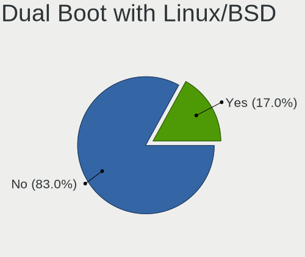

| Dual boot | Desktops | Percent |
|-----------|----------|---------|
| No        | 989      | 82.9%   |
| Yes       | 204      | 17.1%   |

Dual Boot (Win)
---------------

Hosting Linux and Windows

| Dual boot | Desktops | Percent |
|-----------|----------|---------|
| No        | 900      | 76.34%  |
| Yes       | 279      | 23.66%  |

Board
-----

Vendor
------

Motherboard manufacturer

| Name                                 | Desktops | Percent |
|--------------------------------------|----------|---------|
| ASUSTek Computer                     | 308      | 26.57%  |
| Gigabyte Technology                  | 218      | 18.81%  |
| MSI                                  | 157      | 13.55%  |
| ASRock                               | 134      | 11.56%  |
| Hewlett-Packard                      | 91       | 7.85%   |
| Dell                                 | 73       | 6.3%    |
| Lenovo                               | 39       | 3.36%   |
| Intel                                | 19       | 1.64%   |
| Acer                                 | 16       | 1.38%   |
| Fujitsu                              | 14       | 1.21%   |
| Biostar                              | 13       | 1.12%   |
| Pegatron                             | 8        | 0.69%   |
| Medion                               | 6        | 0.52%   |
| Foxconn                              | 6        | 0.52%   |
| Supermicro                           | 4        | 0.35%   |
| Huanan                               | 4        | 0.35%   |
| Unknown                              | 4        | 0.35%   |
| AZW                                  | 3        | 0.26%   |
| Apple                                | 3        | 0.26%   |
| Shuttle                              | 2        | 0.17%   |
| Positivo                             | 2        | 0.17%   |
| OEM                                  | 2        | 0.17%   |
| HC Technology.                       | 2        | 0.17%   |
| GEEKOM                               | 2        | 0.17%   |
| Fujitsu Siemens                      | 2        | 0.17%   |
| EVGA                                 | 2        | 0.17%   |
| BESSTAR Tech                         | 2        | 0.17%   |
| Alienware                            | 2        | 0.17%   |
| Wortmann AG                          | 1        | 0.09%   |
| VS Company                           | 1        | 0.09%   |
| SYWZ                                 | 1        | 0.09%   |
| Sun Microsystems                     | 1        | 0.09%   |
| SLIMBOOK                             | 1        | 0.09%   |
| Shenzhen Meigao Electronic Equipment | 1        | 0.09%   |
| Samsung Electronics                  | 1        | 0.09%   |
| PIONEERPOS                           | 1        | 0.09%   |
| PCWare                               | 1        | 0.09%   |
| MACHINIST                            | 1        | 0.09%   |
| Itautec                              | 1        | 0.09%   |
| Inventec                             | 1        | 0.09%   |

Model
-----

Motherboard model

| Name                         | Desktops | Percent |
|------------------------------|----------|---------|
| ASUS All Series              | 27       | 2.33%   |
| Dell OptiPlex 9020           | 12       | 1.04%   |
| MSI MS-7B86                  | 9        | 0.78%   |
| ASUS TUF Gaming X570-PLUS    | 8        | 0.69%   |
| ASRock B450M Pro4            | 8        | 0.69%   |
| MSI MS-7B89                  | 7        | 0.6%    |
| MSI MS-7C91                  | 6        | 0.52%   |
| MSI MS-7C37                  | 6        | 0.52%   |
| MSI MS-7A34                  | 6        | 0.52%   |
| Gigabyte B450M DS3H          | 6        | 0.52%   |
| Gigabyte 970A-DS3P           | 6        | 0.52%   |
| ASUS PRIME A320M-K           | 6        | 0.52%   |
| ASUS M5A97 R2.0              | 6        | 0.52%   |
| MSI MS-7C94                  | 5        | 0.43%   |
| MSI MS-7C02                  | 5        | 0.43%   |
| Gigabyte X570 AORUS MASTER   | 5        | 0.43%   |
| Gigabyte B450 AORUS M        | 5        | 0.43%   |
| ASRock X570 Steel Legend     | 5        | 0.43%   |
| MSI MS-7C95                  | 4        | 0.35%   |
| MSI MS-7B79                  | 4        | 0.35%   |
| HP Z620 Workstation          | 4        | 0.35%   |
| HP Z440 Workstation          | 4        | 0.35%   |
| Gigabyte X570 AORUS ELITE    | 4        | 0.35%   |
| Dell XPS 8700                | 4        | 0.35%   |
| ASUS ROG STRIX B550-F GAMING | 4        | 0.35%   |
| ASUS ROG CROSSHAIR VII HERO  | 4        | 0.35%   |
| ASUS PRIME X570-P            | 4        | 0.35%   |
| ASUS PRIME X470-PRO          | 4        | 0.35%   |
| ASUS PRIME X370-PRO          | 4        | 0.35%   |
| ASUS PRIME B550-PLUS         | 4        | 0.35%   |
| ASUS M5A99X EVO R2.0         | 4        | 0.35%   |
| ASUS M5A78L-M/USB3           | 4        | 0.35%   |
| ASUS CROSSHAIR V FORMULA-Z   | 4        | 0.35%   |
| ASRock 970 Pro3 R2.0         | 4        | 0.35%   |
| Unknown                      | 4        | 0.35%   |
| MSI MS-7D25                  | 3        | 0.26%   |
| MSI MS-7D09                  | 3        | 0.26%   |
| MSI MS-7C35                  | 3        | 0.26%   |
| MSI MS-7B17                  | 3        | 0.26%   |
| MSI MS-7A38                  | 3        | 0.26%   |

Model Family
------------

Motherboard model prefix

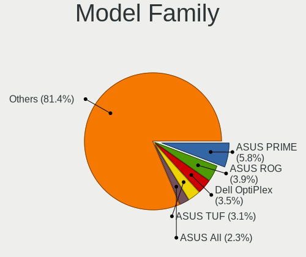

| Name                   | Desktops | Percent |
|------------------------|----------|---------|
| ASUS PRIME             | 69       | 5.95%   |
| Dell OptiPlex          | 40       | 3.45%   |
| ASUS TUF               | 37       | 3.19%   |
| ASUS ROG               | 37       | 3.19%   |
| ASUS All               | 27       | 2.33%   |
| Lenovo ThinkCentre     | 22       | 1.9%    |
| Gigabyte X570          | 17       | 1.47%   |
| HP Compaq              | 16       | 1.38%   |
| Dell Precision         | 14       | 1.21%   |
| ASRock B450M           | 13       | 1.12%   |
| HP EliteDesk           | 12       | 1.04%   |
| Gigabyte B550          | 12       | 1.04%   |
| ASUS M5A78L-M          | 10       | 0.86%   |
| ASRock X570            | 10       | 0.86%   |
| MSI MS-7B86            | 9        | 0.78%   |
| Gigabyte B450M         | 9        | 0.78%   |
| Gigabyte B450          | 9        | 0.78%   |
| Fujitsu ESPRIMO        | 9        | 0.78%   |
| Acer Aspire            | 9        | 0.78%   |
| HP ProLiant            | 8        | 0.69%   |
| Dell XPS               | 8        | 0.69%   |
| MSI MS-7B89            | 7        | 0.6%    |
| HP Pavilion            | 7        | 0.6%    |
| Dell Inspiron          | 7        | 0.6%    |
| ASUS M5A97             | 7        | 0.6%    |
| ASUS Crosshair         | 7        | 0.6%    |
| MSI MS-7C91            | 6        | 0.52%   |
| MSI MS-7C37            | 6        | 0.52%   |
| MSI MS-7A34            | 6        | 0.52%   |
| Gigabyte Z390          | 6        | 0.52%   |
| Gigabyte B550M         | 6        | 0.52%   |
| Gigabyte 970A-DS3P     | 6        | 0.52%   |
| ASUS Maximus           | 6        | 0.52%   |
| ASRock 970             | 6        | 0.52%   |
| MSI MS-7C94            | 5        | 0.43%   |
| MSI MS-7C02            | 5        | 0.43%   |
| Lenovo IdeaCentre      | 5        | 0.43%   |
| HP OMEN                | 5        | 0.43%   |
| Gigabyte GA-78LMT-USB3 | 5        | 0.43%   |
| ASUS SABERTOOTH        | 5        | 0.43%   |

MFG Year
--------

Motherboard manufacture year

| Year | Desktops | Percent |
|------|----------|---------|
| 2018 | 131      | 11.3%   |
| 2020 | 121      | 10.44%  |
| 2019 | 98       | 8.46%   |
| 2013 | 98       | 8.46%   |
| 2012 | 96       | 8.28%   |
| 2017 | 88       | 7.59%   |
| 2021 | 68       | 5.87%   |
| 2014 | 66       | 5.69%   |
| 2011 | 63       | 5.44%   |
| 2015 | 60       | 5.18%   |
| 2010 | 51       | 4.4%    |
| 2022 | 49       | 4.23%   |
| 2016 | 42       | 3.62%   |
| 2009 | 42       | 3.62%   |
| 2023 | 30       | 2.59%   |
| 2008 | 24       | 2.07%   |
| 2007 | 14       | 1.21%   |
| 2006 | 10       | 0.86%   |
| 2024 | 3        | 0.26%   |
| 2005 | 3        | 0.26%   |
| 2004 | 2        | 0.17%   |

Form Factor
-----------

Physical design of the computer

| Name    | Desktops | Percent |
|---------|----------|---------|
| Desktop | 1159     | 100%    |

Secure Boot
-----------

Enabled or disabled

| State    | Desktops | Percent |
|----------|----------|---------|
| Disabled | 1090     | 93%     |
| Enabled  | 82       | 7%      |

Coreboot
--------

Have coreboot on board

| Used | Desktops | Percent |
|------|----------|---------|
| No   | 1158     | 99.91%  |
| Yes  | 1        | 0.09%   |

RAM Size
--------

Total RAM memory

| Size in GB      | Desktops | Percent |
|-----------------|----------|---------|
| 16.01-24.0      | 350      | 29.64%  |
| 32.01-64.0      | 274      | 23.2%   |
| 8.01-16.0       | 208      | 17.61%  |
| 4.01-8.0        | 128      | 10.84%  |
| 64.01-256.0     | 91       | 7.71%   |
| 3.01-4.0        | 69       | 5.84%   |
| 24.01-32.0      | 38       | 3.22%   |
| Unknown         | 9        | 0.76%   |
| 1.01-2.0        | 8        | 0.68%   |
| More than 256.0 | 3        | 0.25%   |
| 2.01-3.0        | 3        | 0.25%   |

RAM Used
--------

Used RAM memory

| Used GB    | Desktops | Percent |
|------------|----------|---------|
| 4.01-8.0   | 350      | 27.07%  |
| 2.01-3.0   | 332      | 25.68%  |
| 3.01-4.0   | 222      | 17.17%  |
| 1.01-2.0   | 216      | 16.71%  |
| 8.01-16.0  | 102      | 7.89%   |
| 0.51-1.0   | 30       | 2.32%   |
| 16.01-24.0 | 17       | 1.31%   |
| 24.01-32.0 | 9        | 0.7%    |
| Unknown    | 9        | 0.7%    |
| 0.01-0.5   | 5        | 0.39%   |
| 32.01-64.0 | 1        | 0.08%   |

Total Drives
------------

Number of drives on board

| Drives | Desktops | Percent |
|--------|----------|---------|
| 2      | 343      | 27.98%  |
| 1      | 288      | 23.49%  |
| 3      | 251      | 20.47%  |
| 4      | 160      | 13.05%  |
| 5      | 95       | 7.75%   |
| 6      | 49       | 4%      |
| 7      | 19       | 1.55%   |
| 8      | 5        | 0.41%   |
| 0      | 5        | 0.41%   |
| 9      | 4        | 0.33%   |
| 13     | 3        | 0.24%   |
| 10     | 3        | 0.24%   |
| 16     | 1        | 0.08%   |

Has CD-ROM
----------

Has CD-ROM on board

| Presented | Desktops | Percent |
|-----------|----------|---------|
| No        | 622      | 53.12%  |
| Yes       | 549      | 46.88%  |

Has Ethernet
------------

Has Ethernet on board

| Presented | Desktops | Percent |
|-----------|----------|---------|
| Yes       | 1149     | 99.14%  |
| No        | 10       | 0.86%   |

Has WiFi
--------

Has WiFi module

| Presented | Desktops | Percent |
|-----------|----------|---------|
| No        | 647      | 55.3%   |
| Yes       | 523      | 44.7%   |

Has Bluetooth
-------------

Has Bluetooth module

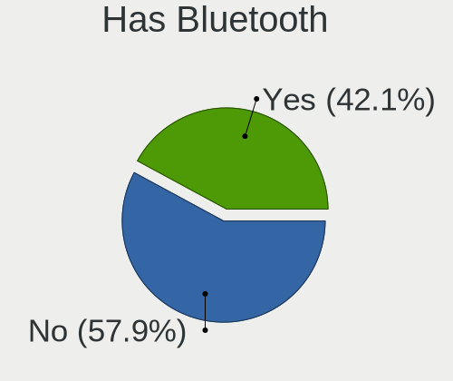

| Presented | Desktops | Percent |
|-----------|----------|---------|
| No        | 692      | 58.69%  |
| Yes       | 487      | 41.31%  |

Location
--------

Country
-------

Geographic location (country)

| Country      | Desktops | Percent |
|--------------|----------|---------|
| USA          | 240      | 20.6%   |
| Germany      | 237      | 20.34%  |
| Brazil       | 72       | 6.18%   |
| Russia       | 56       | 4.81%   |
| UK           | 47       | 4.03%   |
| Italy        | 35       | 3%      |
| France       | 34       | 2.92%   |
| Spain        | 33       | 2.83%   |
| Canada       | 33       | 2.83%   |
| Switzerland  | 30       | 2.58%   |
| Netherlands  | 27       | 2.32%   |
| Poland       | 23       | 1.97%   |
| Australia    | 23       | 1.97%   |
| Sweden       | 19       | 1.63%   |
| Belgium      | 19       | 1.63%   |
| Austria      | 13       | 1.12%   |
| Mexico       | 11       | 0.94%   |
| Greece       | 11       | 0.94%   |
| Finland      | 11       | 0.94%   |
| Norway       | 10       | 0.86%   |
| Romania      | 9        | 0.77%   |
| Portugal     | 9        | 0.77%   |
| Argentina    | 9        | 0.77%   |
| Ukraine      | 8        | 0.69%   |
| Bulgaria     | 8        | 0.69%   |
| Serbia       | 7        | 0.6%    |
| Czechia      | 7        | 0.6%    |
| Croatia      | 6        | 0.52%   |
| South Korea  | 5        | 0.43%   |
| India        | 5        | 0.43%   |
| Hungary      | 5        | 0.43%   |
| Thailand     | 4        | 0.34%   |
| South Africa | 4        | 0.34%   |
| Slovakia     | 4        | 0.34%   |
| Singapore    | 4        | 0.34%   |
| Peru         | 4        | 0.34%   |
| New Zealand  | 4        | 0.34%   |
| Israel       | 4        | 0.34%   |
| Indonesia    | 4        | 0.34%   |
| Colombia     | 4        | 0.34%   |

City
----

Geographic location (city)

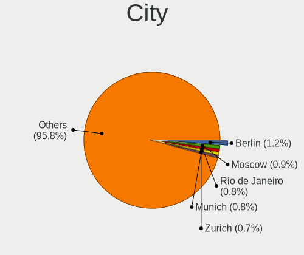

| City              | Desktops | Percent |
|-------------------|----------|---------|
| Berlin            | 13       | 1.05%   |
| Rio de Janeiro    | 11       | 0.89%   |
| Moscow            | 11       | 0.89%   |
| Zurich            | 10       | 0.81%   |
| Munich            | 10       | 0.81%   |
| Littleton         | 10       | 0.81%   |
| Sydney            | 9        | 0.73%   |
| Sao Paulo         | 9        | 0.73%   |
| Los Angeles       | 8        | 0.64%   |
| Warsaw            | 7        | 0.56%   |
| Milan             | 7        | 0.56%   |
| Melbourne         | 7        | 0.56%   |
| Stuttgart         | 6        | 0.48%   |
| St Petersburg     | 6        | 0.48%   |
| Gothenburg        | 6        | 0.48%   |
| Frankfurt am Main | 6        | 0.48%   |
| Sofia             | 5        | 0.4%    |
| Nice              | 5        | 0.4%    |
| Neuchatel         | 5        | 0.4%    |
| Madrid            | 5        | 0.4%    |
| Hafurt          | 5        | 0.4%    |
| Hamburg           | 5        | 0.4%    |
| Cologne           | 5        | 0.4%    |
| Amsterdam         | 5        | 0.4%    |
| Zagreb            | 4        | 0.32%   |
| Vienna            | 4        | 0.32%   |
| Valencia          | 4        | 0.32%   |
| Singapore         | 4        | 0.32%   |
| Prague            | 4        | 0.32%   |
| Phoenix           | 4        | 0.32%   |
| London            | 4        | 0.32%   |
| Lisbon            | 4        | 0.32%   |
| Essen             | 4        | 0.32%   |
| Cleveland         | 4        | 0.32%   |
| Bremen            | 4        | 0.32%   |
| Braslia         | 4        | 0.32%   |
| Winnipeg          | 3        | 0.24%   |
| Waterloo          | 3        | 0.24%   |
| Tokyo             | 3        | 0.24%   |
| Thessaloniki      | 3        | 0.24%   |

Drives
------

Drive Vendor
------------

Hard drive vendors

| Vendor                      | Desktops | Drives | Percent |
|-----------------------------|----------|--------|---------|
| Seagate                     | 453      | 837    | 17.95%  |
| Samsung Electronics         | 445      | 838    | 17.63%  |
| WDC                         | 428      | 869    | 16.96%  |
| Kingston                    | 137      | 197    | 5.43%   |
| Toshiba                     | 129      | 178    | 5.11%   |
| SanDisk                     | 123      | 186    | 4.87%   |
| Crucial                     | 121      | 167    | 4.79%   |
| Hitachi                     | 57       | 70     | 2.26%   |
| Intel                       | 48       | 67     | 1.9%    |
| Phison Electronics          | 33       | 39     | 1.31%   |
| A-DATA Technology           | 32       | 39     | 1.27%   |
| Unknown                     | 28       | 43     | 1.11%   |
| SPCC                        | 25       | 31     | 0.99%   |
| Silicon Motion              | 24       | 25     | 0.95%   |
| PNY                         | 22       | 29     | 0.87%   |
| Intenso                     | 22       | 31     | 0.87%   |
| Micron Technology           | 21       | 27     | 0.83%   |
| Phison                      | 20       | 30     | 0.79%   |
| HGST                        | 20       | 38     | 0.79%   |
| SK hynix                    | 18       | 41     | 0.71%   |
| Micron/Crucial Technology   | 17       | 24     | 0.67%   |
| China                       | 16       | 27     | 0.63%   |
| Kingston Technology Company | 15       | 18     | 0.59%   |
| MAXIO Technology (Hangzhou) | 13       | 15     | 0.52%   |
| Hewlett-Packard             | 13       | 22     | 0.52%   |
| OCZ                         | 11       | 16     | 0.44%   |
| Corsair                     | 11       | 12     | 0.44%   |
| Patriot                     | 10       | 14     | 0.4%    |
| Transcend                   | 8        | 9      | 0.32%   |
| Realtek Semiconductor       | 8        | 11     | 0.32%   |
| Maxtor                      | 8        | 8      | 0.32%   |
| ADATA Technology            | 8        | 9      | 0.32%   |
| XrayDisk                    | 7        | 7      | 0.28%   |
| Team                        | 7        | 10     | 0.28%   |
| KingSpec                    | 6        | 11     | 0.24%   |
| JMicron Technology          | 6        | 6      | 0.24%   |
| GOODRAM                     | 6        | 6      | 0.24%   |
| Fujitsu                     | 6        | 9      | 0.24%   |
| SABRENT                     | 5        | 6      | 0.2%    |
| Leven                       | 5        | 5      | 0.2%    |

Drive Model
-----------

Hard drive models

| Model                                                 | Desktops | Percent |
|-------------------------------------------------------|----------|---------|
| Samsung NVMe SSD Controller SM981/PM981/PM983 1TB     | 55       | 1.8%    |
| Seagate ST2000DM008-2FR102 2TB                        | 38       | 1.25%   |
| Samsung SSD 860 EVO 500GB                             | 35       | 1.15%   |
| Samsung SSD 850 EVO 250GB                             | 32       | 1.05%   |
| Samsung SSD 860 EVO 1TB                               | 30       | 0.98%   |
| Seagate ST1000DM010-2EP102 1TB                        | 27       | 0.88%   |
| Kingston SA400S37480G 480GB SSD                       | 25       | 0.82%   |
| Kingston SA400S37240G 240GB SSD                       | 25       | 0.82%   |
| Seagate ST500DM002-1BD142 500GB                       | 22       | 0.72%   |
| Samsung SSD 850 EVO 500GB                             | 22       | 0.72%   |
| Seagate ST1000DM003-1CH162 1TB                        | 21       | 0.69%   |
| WDC WD10EZEX-08WN4A0 1TB                              | 20       | 0.66%   |
| Seagate ST2000DM001-1ER164 2TB                        | 20       | 0.66%   |
| Crucial CT500MX500SSD1 500GB                          | 20       | 0.66%   |
| Samsung NVMe SSD Controller PM9A1/PM9A3/980PRO 1TB    | 19       | 0.62%   |
| Toshiba DT01ACA100 1TB                                | 18       | 0.59%   |
| WDC WDS500G2B0A-00SM50 500GB SSD                      | 17       | 0.56%   |
| Seagate ST4000DM004-2CV104 4TB                        | 17       | 0.56%   |
| Samsung SSD 840 EVO 250GB                             | 17       | 0.56%   |
| Unknown SD/MMC/MS PRO 128GB                           | 15       | 0.49%   |
| Seagate ST3500418AS 500GB                             | 15       | 0.49%   |
| Seagate ST2000DM006-2DM164 2TB                        | 14       | 0.46%   |
| Seagate ST1000DM003-1ER162 1TB                        | 14       | 0.46%   |
| Samsung SSD 860 EVO 250GB                             | 14       | 0.46%   |
| Kingston SV300S37A120G 120GB SSD                      | 14       | 0.46%   |
| WDC WD20EZRZ-00Z5HB0 2TB                              | 13       | 0.43%   |
| Toshiba HDWD110 1TB                                   | 13       | 0.43%   |
| Toshiba DT01ACA200 2TB                                | 13       | 0.43%   |
| Seagate ST2000DM001-1CH164 2TB                        | 13       | 0.43%   |
| Samsung SSD 860 QVO 1TB                               | 13       | 0.43%   |
| Silicon Motion SM2263EN/SM2263XT SSD Controller 256GB | 12       | 0.39%   |
| Seagate ST1000DM003-1SB102 1TB                        | 12       | 0.39%   |
| Seagate Expansion 2TB                                 | 12       | 0.39%   |
| Samsung NVMe SSD Controller SM961/PM961/SM963 1TB     | 12       | 0.39%   |
| Phison E12 NVMe Controller 2TB                        | 12       | 0.39%   |
| Seagate ST3000DM008-2DM166 3TB                        | 11       | 0.36%   |
| Samsung SSD 870 EVO 1TB                               | 11       | 0.36%   |
| Samsung SSD 850 PRO 256GB                             | 11       | 0.36%   |
| Samsung SSD 840 EVO 120GB                             | 11       | 0.36%   |
| WDC WD20EFRX-68EUZN0 2TB                              | 10       | 0.33%   |

HDD Vendor
----------

Hard disk drive vendors

| Vendor              | Desktops | Drives | Percent |
|---------------------|----------|--------|---------|
| Seagate             | 444      | 811    | 38.41%  |
| WDC                 | 381      | 737    | 32.96%  |
| Toshiba             | 111      | 157    | 9.6%    |
| Samsung Electronics | 72       | 107    | 6.23%   |
| Hitachi             | 57       | 70     | 4.93%   |
| HGST                | 20       | 38     | 1.73%   |
| Unknown             | 16       | 21     | 1.38%   |
| Maxtor              | 8        | 8      | 0.69%   |
| Hewlett-Packard     | 7        | 16     | 0.61%   |
| Fujitsu             | 6        | 9      | 0.52%   |
| SABRENT             | 5        | 6      | 0.43%   |
| JMicron Technology  | 5        | 5      | 0.43%   |
| WD MediaMax         | 3        | 3      | 0.26%   |
| ASMT                | 3        | 5      | 0.26%   |
| USB3.0              | 2        | 3      | 0.17%   |
| TO Exter            | 2        | 2      | 0.17%   |
| Synology            | 2        | 2      | 0.17%   |
| Intenso             | 2        | 7      | 0.17%   |
| XrayDisk            | 1        | 1      | 0.09%   |
| USB                 | 1        | 1      | 0.09%   |
| UD0401              | 1        | 1      | 0.09%   |
| MaxDigital          | 1        | 1      | 0.09%   |
| MARVELL             | 1        | 1      | 0.09%   |
| Inateck             | 1        | 1      | 0.09%   |
| IB-AC703            | 1        | 1      | 0.09%   |
| HGST HTS            | 1        | 1      | 0.09%   |
| ASMedia             | 1        | 1      | 0.09%   |
| Apple               | 1        | 1      | 0.09%   |

SSD Vendor
----------

Solid state drive vendors

| Vendor              | Desktops | Drives | Percent |
|---------------------|----------|--------|---------|
| Samsung Electronics | 264      | 448    | 28.98%  |
| Crucial             | 114      | 155    | 12.51%  |
| Kingston            | 113      | 160    | 12.4%   |
| SanDisk             | 72       | 96     | 7.9%    |
| WDC                 | 66       | 103    | 7.24%   |
| A-DATA Technology   | 27       | 32     | 2.96%   |
| Intel               | 21       | 31     | 2.31%   |
| SPCC                | 20       | 26     | 2.2%    |
| PNY                 | 19       | 23     | 2.09%   |
| Intenso             | 17       | 19     | 1.87%   |
| China               | 16       | 27     | 1.76%   |
| Toshiba             | 13       | 15     | 1.43%   |
| OCZ                 | 11       | 16     | 1.21%   |
| Micron Technology   | 10       | 14     | 1.1%    |
| Patriot             | 9        | 13     | 0.99%   |
| Transcend           | 7        | 8      | 0.77%   |
| Team                | 7        | 10     | 0.77%   |
| Corsair             | 7        | 7      | 0.77%   |
| SK hynix            | 6        | 10     | 0.66%   |
| KingSpec            | 6        | 11     | 0.66%   |
| XrayDisk            | 5        | 5      | 0.55%   |
| Leven               | 5        | 5      | 0.55%   |
| GOODRAM             | 5        | 5      | 0.55%   |
| Biostar             | 4        | 6      | 0.44%   |
| Apacer              | 4        | 8      | 0.44%   |
| Seagate             | 3        | 4      | 0.33%   |
| Mushkin             | 3        | 6      | 0.33%   |
| LITEONIT            | 3        | 3      | 0.33%   |
| LITEON              | 3        | 3      | 0.33%   |
| Hewlett-Packard     | 3        | 3      | 0.33%   |
| Fanxiang            | 3        | 6      | 0.33%   |
| Apple               | 3        | 3      | 0.33%   |
| StoreJet            | 2        | 2      | 0.22%   |
| Smartbuy            | 2        | 4      | 0.22%   |
| Smart               | 2        | 2      | 0.22%   |
| Plextor             | 2        | 4      | 0.22%   |
| GALAX               | 2        | 2      | 0.22%   |
| AMD                 | 2        | 3      | 0.22%   |
| Zheino              | 1        | 1      | 0.11%   |
| XSTAR               | 1        | 1      | 0.11%   |

Drive Kind
----------

HDD or SSD

| Kind    | Desktops | Drives | Percent |
|---------|----------|--------|---------|
| HDD     | 834      | 2017   | 41.14%  |
| SSD     | 713      | 1336   | 35.18%  |
| NVMe    | 439      | 784    | 21.66%  |
| Unknown | 39       | 56     | 1.92%   |
| MMC     | 2        | 2      | 0.1%    |

Drive Connector
---------------

SATA, SAS, NVMe, etc.

| Type | Desktops | Drives | Percent |
|------|----------|--------|---------|
| SATA | 1058     | 3202   | 65.47%  |
| NVMe | 439      | 782    | 27.17%  |
| SAS  | 117      | 209    | 7.24%   |
| MMC  | 2        | 2      | 0.12%   |

Drive Size
----------

Size of hard drive

| Size in TB | Desktops | Drives | Percent |
|------------|----------|--------|---------|
| 0.01-0.5   | 754      | 1425   | 41.82%  |
| 0.51-1.0   | 507      | 934    | 28.12%  |
| 1.01-2.0   | 279      | 528    | 15.47%  |
| 3.01-4.0   | 103      | 195    | 5.71%   |
| 2.01-3.0   | 81       | 136    | 4.49%   |
| 4.01-10.0  | 64       | 114    | 3.55%   |
| 10.01-20.0 | 15       | 21     | 0.83%   |

Space Total
-----------

Amount of disk space available on the file system

| Size in GB     | Desktops | Percent |
|----------------|----------|---------|
| More than 3000 | 520      | 42.28%  |
| 1001-2000      | 245      | 19.92%  |
| 2001-3000      | 154      | 12.52%  |
| 501-1000       | 124      | 10.08%  |
| 251-500        | 83       | 6.75%   |
| 101-250        | 46       | 3.74%   |
| Unknown        | 30       | 2.44%   |
| 51-100         | 12       | 0.98%   |
| 1-20           | 9        | 0.73%   |
| 21-50          | 7        | 0.57%   |

Space Used
----------

Amount of used disk space

| Used GB        | Desktops | Percent |
|----------------|----------|---------|
| 101-250        | 209      | 16.38%  |
| 251-500        | 205      | 16.07%  |
| 501-1000       | 189      | 14.81%  |
| 1001-2000      | 184      | 14.42%  |
| 51-100         | 154      | 12.07%  |
| More than 3000 | 136      | 10.66%  |
| 2001-3000      | 68       | 5.33%   |
| 21-50          | 51       | 4%      |
| 1-20           | 50       | 3.92%   |
| Unknown        | 30       | 2.35%   |

Malfunc. Drives
---------------

Drive models with a malfunction

| Model                                 | Desktops | Drives | Percent |
|---------------------------------------|----------|--------|---------|
| Seagate ST500DM002-1BD142 500GB       | 8        | 11     | 4.06%   |
| Seagate ST3500418AS 500GB             | 5        | 5      | 2.54%   |
| Samsung Electronics SSD 840 EVO 120GB | 5        | 7      | 2.54%   |
| Seagate ST2000DM001-1ER164 2TB        | 4        | 4      | 2.03%   |
| Seagate ST2000DM001-1CH164 2TB        | 4        | 5      | 2.03%   |
| WDC WD10JFCX-68N6GN0 1TB              | 3        | 4      | 1.52%   |
| Samsung Electronics HD501LJ 500GB     | 3        | 4      | 1.52%   |
| WDC WD6400AAKS-22A7B2 640GB           | 2        | 2      | 1.02%   |
| WDC WD30EZRZ-00Z5HB0 3TB              | 2        | 3      | 1.02%   |
| WDC WD20EZRX-00DC0B0 2TB              | 2        | 3      | 1.02%   |
| WDC WD20EFRX-68EUZN0 2TB              | 2        | 2      | 1.02%   |
| WD MediaMax WL5000GSA12872B 5TB       | 2        | 2      | 1.02%   |
| Seagate ST500LM012 HN-M500MBB 500GB   | 2        | 2      | 1.02%   |
| Seagate ST31000528AS 1TB              | 2        | 5      | 1.02%   |
| Seagate ST1000DM003-1SB102 1TB        | 2        | 3      | 1.02%   |
| Seagate ST1000DM003-1ER162 1TB        | 2        | 2      | 1.02%   |
| Seagate ST1000DM003-1CH162 1TB        | 2        | 2      | 1.02%   |
| Samsung Electronics HD322HJ 320GB     | 2        | 2      | 1.02%   |
| Samsung Electronics HD103SJ 1TB       | 2        | 3      | 1.02%   |
| Kingston SV300S37A120G 120GB SSD      | 2        | 3      | 1.02%   |
| Kingston SHFS37A120G 120GB SSD        | 2        | 2      | 1.02%   |
| Kingston SA400S37120G 120GB SSD       | 2        | 7      | 1.02%   |
| Hitachi HTS545050A7E380 500GB         | 2        | 2      | 1.02%   |
| XrayDisk SSD 512GB                    | 1        | 1      | 0.51%   |
| XPG GAMMIX S41 256GB                  | 1        | 1      | 0.51%   |
| WDC WDS240G2G0A-00JH30 240GB SSD      | 1        | 1      | 0.51%   |
| WDC WD800AAJS-75M0A0 80GB             | 1        | 1      | 0.51%   |
| WDC WD7500AAKS-00RBA0 752GB           | 1        | 1      | 0.51%   |
| WDC WD6400BEVT-22A0RT0 640GB          | 1        | 1      | 0.51%   |
| WDC WD6400AAKS-22A7B0 640GB           | 1        | 1      | 0.51%   |
| WDC WD6400AACS-00G8B1 640GB           | 1        | 1      | 0.51%   |
| WDC WD60EFRX-68MYMN1 6TB              | 1        | 1      | 0.51%   |
| WDC WD5000HHTZ-04N21V0 500GB          | 1        | 1      | 0.51%   |
| WDC WD5000BPVT-22HXZT3 500GB          | 1        | 1      | 0.51%   |
| WDC WD5000AZRX-00A8LB0 500GB          | 1        | 1      | 0.51%   |
| WDC WD5000AZLX-00K2TA0 500GB          | 1        | 1      | 0.51%   |
| WDC WD5000AVDS-63U7B1 500GB           | 1        | 1      | 0.51%   |
| WDC WD5000AAKX-221CA1 500GB           | 1        | 1      | 0.51%   |
| WDC WD5000AAKS-65A7B0 500GB           | 1        | 1      | 0.51%   |
| WDC WD40EFZX-68AWUN0 4TB              | 1        | 1      | 0.51%   |

Malfunc. Drive Vendor
---------------------

Vendors of faulty drives

| Vendor              | Desktops | Drives | Percent |
|---------------------|----------|--------|---------|
| Seagate             | 59       | 72     | 31.22%  |
| WDC                 | 48       | 55     | 25.4%   |
| Samsung Electronics | 24       | 34     | 12.7%   |
| Toshiba             | 10       | 16     | 5.29%   |
| Hitachi             | 8        | 10     | 4.23%   |
| Kingston            | 7        | 13     | 3.7%    |
| Crucial             | 7        | 8      | 3.7%    |
| Maxtor              | 4        | 4      | 2.12%   |
| WD MediaMax         | 2        | 2      | 1.06%   |
| Transcend           | 2        | 3      | 1.06%   |
| OCZ                 | 2        | 2      | 1.06%   |
| XrayDisk            | 1        | 1      | 0.53%   |
| XPG                 | 1        | 1      | 0.53%   |
| SuperTalent         | 1        | 1      | 0.53%   |
| SPCC                | 1        | 1      | 0.53%   |
| SanDisk             | 1        | 1      | 0.53%   |
| Patriot             | 1        | 1      | 0.53%   |
| Micron Technology   | 1        | 1      | 0.53%   |
| KingFast            | 1        | 1      | 0.53%   |
| Intenso             | 1        | 1      | 0.53%   |
| Intel               | 1        | 1      | 0.53%   |
| HGST                | 1        | 1      | 0.53%   |
| Hewlett-Packard     | 1        | 1      | 0.53%   |
| GOODRAM             | 1        | 1      | 0.53%   |
| EXRAM               | 1        | 1      | 0.53%   |
| Corsair             | 1        | 1      | 0.53%   |
| China               | 1        | 1      | 0.53%   |

Malfunc. HDD Vendor
-------------------

Vendors of faulty HDD drives

| Vendor              | Desktops | Drives | Percent |
|---------------------|----------|--------|---------|
| Seagate             | 59       | 72     | 41.26%  |
| WDC                 | 45       | 52     | 31.47%  |
| Samsung Electronics | 13       | 17     | 9.09%   |
| Toshiba             | 10       | 16     | 6.99%   |
| Hitachi             | 8        | 10     | 5.59%   |
| Maxtor              | 4        | 4      | 2.8%    |
| WD MediaMax         | 2        | 2      | 1.4%    |
| HGST                | 1        | 1      | 0.7%    |
| Hewlett-Packard     | 1        | 1      | 0.7%    |

Malfunc. Drive Kind
-------------------

Kinds of faulty drives

| Kind | Desktops | Drives | Percent |
|------|----------|--------|---------|
| HDD  | 122      | 175    | 73.94%  |
| SSD  | 35       | 52     | 21.21%  |
| NVMe | 8        | 8      | 4.85%   |

Failed Drives
-------------

Failed drive models

| Model                             | Desktops | Drives | Percent |
|-----------------------------------|----------|--------|---------|
| WDC WD20EADS-00R6B0 2TB           | 1        | 1      | 33.33%  |
| Samsung Electronics HD502HJ 500GB | 1        | 5      | 33.33%  |
| Hitachi HDS721025CLA382 250GB     | 1        | 1      | 33.33%  |

Failed Drive Vendor
-------------------

Failed drive vendors

| Vendor              | Desktops | Drives | Percent |
|---------------------|----------|--------|---------|
| WDC                 | 1        | 1      | 33.33%  |
| Samsung Electronics | 1        | 5      | 33.33%  |
| Hitachi             | 1        | 1      | 33.33%  |

Drive Status
------------

Number of failed and malfunc. drives

| Status   | Desktops | Drives | Percent |
|----------|----------|--------|---------|
| Detected | 616      | 2194   | 45.39%  |
| Works    | 581      | 1759   | 42.82%  |
| Malfunc  | 157      | 235    | 11.57%  |
| Failed   | 3        | 7      | 0.22%   |

Storage controller
------------------

Storage Vendor
--------------

Storage controller vendors

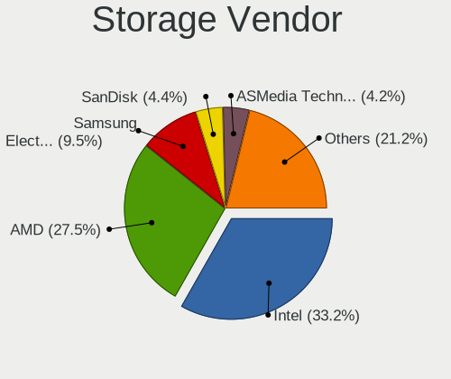

| Vendor                        | Desktops | Percent |
|-------------------------------|----------|---------|
| Intel                         | 623      | 33.33%  |
| AMD                           | 524      | 28.04%  |
| Samsung Electronics           | 178      | 9.52%   |
| ASMedia Technology            | 80       | 4.28%   |
| Sandisk                       | 73       | 3.91%   |
| Phison Electronics            | 57       | 3.05%   |
| Marvell Technology Group      | 44       | 2.35%   |
| Kingston Technology Company   | 42       | 2.25%   |
| JMicron Technology            | 39       | 2.09%   |
| Silicon Motion                | 26       | 1.39%   |
| Micron/Crucial Technology     | 25       | 1.34%   |
| Nvidia                        | 17       | 0.91%   |
| MAXIO Technology (Hangzhou)   | 14       | 0.75%   |
| SK hynix                      | 13       | 0.7%    |
| ADATA Technology              | 13       | 0.7%    |
| Realtek Semiconductor         | 11       | 0.59%   |
| Micron Technology             | 11       | 0.59%   |
| Broadcom / LSI                | 11       | 0.59%   |
| Seagate Technology            | 10       | 0.54%   |
| LSI Logic / Symbios Logic     | 8        | 0.43%   |
| Silicon Image                 | 7        | 0.37%   |
| Toshiba America Info Systems  | 6        | 0.32%   |
| INNOGRIT                      | 6        | 0.32%   |
| Adaptec                       | 6        | 0.32%   |
| VIA Technologies              | 4        | 0.21%   |
| KIOXIA                        | 4        | 0.21%   |
| Shenzhen Longsys Electronics  | 3        | 0.16%   |
| Solidigm                      | 2        | 0.11%   |
| Promise Technology            | 2        | 0.11%   |
| Lite-On Technology            | 2        | 0.11%   |
| Tekram Technology             | 1        | 0.05%   |
| Netac Technology              | 1        | 0.05%   |
| Integrated Technology Express | 1        | 0.05%   |
| Hosin Global Electronics      | 1        | 0.05%   |
| Biwin Storage Technology      | 1        | 0.05%   |
| ATTO Technology               | 1        | 0.05%   |
| 3ware                         | 1        | 0.05%   |
| Unknown                       | 1        | 0.05%   |

Storage Model
-------------

Storage controller models

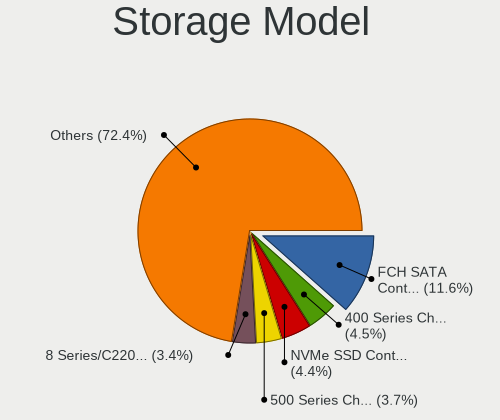

| Model                                                                          | Desktops | Percent |
|--------------------------------------------------------------------------------|----------|---------|
| AMD FCH SATA Controller [AHCI mode]                                            | 277      | 12.05%  |
| Samsung NVMe SSD Controller SM981/PM981/PM983                                  | 107      | 4.66%   |
| AMD 400 Series Chipset SATA Controller                                         | 107      | 4.66%   |
| Intel 8 Series/C220 Series Chipset Family 6-port SATA Controller 1 [AHCI mode] | 83       | 3.61%   |
| AMD 500 Series Chipset SATA Controller                                         | 83       | 3.61%   |
| ASMedia ASM1061/ASM1062 Serial ATA Controller                                  | 72       | 3.13%   |
| AMD SB7x0/SB8x0/SB9x0 IDE Controller                                           | 69       | 3%      |
| AMD SB7x0/SB8x0/SB9x0 SATA Controller [AHCI mode]                              | 65       | 2.83%   |
| Intel Q170/Q150/B150/H170/H110/Z170/CM236 Chipset SATA Controller [AHCI Mode]  | 50       | 2.18%   |
| Intel 6 Series/C200 Series Chipset Family 6 port Desktop SATA AHCI Controller  | 47       | 2.05%   |
| Intel 7 Series/C210 Series Chipset Family 6-port SATA Controller [AHCI mode]   | 46       | 2%      |
| Intel 200 Series PCH SATA controller [AHCI mode]                               | 46       | 2%      |
| Intel SATA Controller [RAID Mode]                                              | 43       | 1.87%   |
| AMD SB7x0/SB8x0/SB9x0 SATA Controller [IDE mode]                               | 42       | 1.83%   |
| AMD 300 Series Chipset SATA Controller                                         | 32       | 1.39%   |
| Intel Cannon Lake PCH SATA AHCI Controller                                     | 31       | 1.35%   |
| Phison E12 NVMe Controller                                                     | 28       | 1.22%   |
| AMD 600 Series Chipset SATA Controller                                         | 27       | 1.17%   |
| Samsung NVMe SSD Controller PM9A1/PM9A3/980PRO                                 | 26       | 1.13%   |
| AMD FCH SATA Controller D                                                      | 25       | 1.09%   |
| Intel Alder Lake-S PCH SATA Controller [AHCI Mode]                             | 24       | 1.04%   |
| JMicron JMB363 SATA/IDE Controller                                             | 23       | 1%      |
| Samsung NVMe SSD Controller SM961/PM961/SM963                                  | 22       | 0.96%   |
| Intel 500 Series Chipset Family SATA AHCI Controller                           | 21       | 0.91%   |
| Intel 9 Series Chipset Family SATA Controller [AHCI Mode]                      | 18       | 0.78%   |
| AMD X370 Series Chipset SATA Controller                                        | 18       | 0.78%   |
| Intel NM10/ICH7 Family SATA Controller [IDE mode]                              | 17       | 0.74%   |
| Silicon Motion SM2263EN/SM2263XT (DRAM-less) NVMe SSD Controllers              | 16       | 0.7%    |
| Kingston Company A2000 NVMe SSD SM2263EN                                       | 16       | 0.7%    |
| Samsung NVMe SSD Controller 980 (DRAM-less)                                    | 15       | 0.65%   |
| Intel SSD 660P Series                                                          | 15       | 0.65%   |
| Intel Comet Lake SATA AHCI Controller                                          | 15       | 0.65%   |
| Intel C610/X99 series chipset 6-Port SATA Controller [AHCI mode]               | 14       | 0.61%   |
| Intel C600/X79 series chipset 6-Port SATA AHCI Controller                      | 14       | 0.61%   |
| Intel 82801JI (ICH10 Family) SATA AHCI Controller                              | 14       | 0.61%   |
| Phison E16 PCIe4 NVMe Controller                                               | 13       | 0.57%   |
| Micron/Crucial P2 [Nick P2] / P3 / P3 Plus NVMe PCIe SSD (DRAM-less)           | 13       | 0.57%   |
| Intel Raptor Lake SATA AHCI Controller                                         | 13       | 0.57%   |
| Intel C610/X99 series chipset sSATA Controller [AHCI mode]                     | 13       | 0.57%   |
| Intel C602 chipset 4-Port SATA Storage Control Unit                            | 12       | 0.52%   |

Storage Kind
------------

Kind of storage controller (IDE, SATA, NVMe, SAS, ...)

| Kind | Desktops | Percent |
|------|----------|---------|
| SATA | 1035     | 57.92%  |
| NVMe | 437      | 24.45%  |
| IDE  | 200      | 11.19%  |
| RAID | 83       | 4.64%   |
| SAS  | 19       | 1.06%   |
| SCSI | 13       | 0.73%   |

Processor
---------

CPU Vendor
----------

Processor vendors

| Vendor | Desktops | Percent |
|--------|----------|---------|
| Intel  | 617      | 53.24%  |
| AMD    | 542      | 46.76%  |

CPU Model
---------

Processor models

| Model                                       | Desktops | Percent |
|---------------------------------------------|----------|---------|
| AMD Ryzen 5 3600 6-Core Processor           | 30       | 2.58%   |
| AMD Ryzen 7 3700X 8-Core Processor          | 27       | 2.32%   |
| AMD Ryzen 5 2600 Six-Core Processor         | 22       | 1.89%   |
| AMD Ryzen 5 5600X 6-Core Processor          | 21       | 1.81%   |
| AMD Ryzen 5 1600 Six-Core Processor         | 20       | 1.72%   |
| AMD FX-8350 Eight-Core Processor            | 18       | 1.55%   |
| Intel Core i5-3470 CPU @ 3.20GHz            | 17       | 1.46%   |
| AMD Ryzen 7 5700G with Radeon Graphics      | 17       | 1.46%   |
| AMD Ryzen 9 5900X 12-Core Processor         | 16       | 1.38%   |
| AMD Ryzen 9 3900X 12-Core Processor         | 16       | 1.38%   |
| AMD Ryzen 7 5800X 8-Core Processor          | 14       | 1.2%    |
| Intel Core i7-4790 CPU @ 3.60GHz            | 13       | 1.12%   |
| AMD Ryzen 7 2700X Eight-Core Processor      | 13       | 1.12%   |
| AMD Ryzen 5 5600G with Radeon Graphics      | 13       | 1.12%   |
| Intel Core i7-3770 CPU @ 3.40GHz            | 12       | 1.03%   |
| Intel Core i7-4770 CPU @ 3.40GHz            | 11       | 0.95%   |
| AMD Ryzen 9 5950X 16-Core Processor         | 11       | 0.95%   |
| AMD Ryzen 3 2200G with Radeon Vega Graphics | 11       | 0.95%   |
| Intel Core i9-9900K CPU @ 3.60GHz           | 10       | 0.86%   |
| Intel Core i7-8700 CPU @ 3.20GHz            | 9        | 0.77%   |
| Intel Core i7-6700K CPU @ 4.00GHz           | 9        | 0.77%   |
| Intel Core i7-6700 CPU @ 3.40GHz            | 9        | 0.77%   |
| AMD Ryzen 5 3400G with Radeon Vega Graphics | 9        | 0.77%   |
| Intel Core i7-2600 CPU @ 3.40GHz            | 8        | 0.69%   |
| Intel Core i5-4460 CPU @ 3.20GHz            | 8        | 0.69%   |
| Intel Core i5-2500 CPU @ 3.30GHz            | 8        | 0.69%   |
| AMD Ryzen 7 1700 Eight-Core Processor       | 8        | 0.69%   |
| AMD FX-6300 Six-Core Processor              | 8        | 0.69%   |
| Intel Core i7-8700K CPU @ 3.70GHz           | 7        | 0.6%    |
| Intel Core i5-7500 CPU @ 3.40GHz            | 7        | 0.6%    |
| Intel Core i5-6500 CPU @ 3.20GHz            | 7        | 0.6%    |
| Intel Core i5-4590 CPU @ 3.30GHz            | 7        | 0.6%    |
| AMD Ryzen 9 7950X 16-Core Processor         | 7        | 0.6%    |
| AMD Ryzen 9 3950X 16-Core Processor         | 7        | 0.6%    |
| AMD Ryzen 7 1700X Eight-Core Processor      | 7        | 0.6%    |
| AMD FX-8320 Eight-Core Processor            | 7        | 0.6%    |
| Intel Core i7-4790K CPU @ 4.00GHz           | 6        | 0.52%   |
| Intel Core i5-4570 CPU @ 3.20GHz            | 6        | 0.52%   |
| Intel Core i3-2100 CPU @ 3.10GHz            | 6        | 0.52%   |
| Intel Core 2 Quad CPU Q6600 @ 2.40GHz       | 6        | 0.52%   |

CPU Model Family
----------------

Processor model prefix

| Model                   | Desktops | Percent |
|-------------------------|----------|---------|
| Intel Core i5           | 171      | 14.73%  |
| Intel Core i7           | 154      | 13.26%  |
| AMD Ryzen 5             | 152      | 13.09%  |
| AMD Ryzen 7             | 124      | 10.68%  |
| Intel Xeon              | 75       | 6.46%   |
| AMD Ryzen 9             | 66       | 5.68%   |
| Other                   | 62       | 5.34%   |
| AMD FX                  | 59       | 5.08%   |
| Intel Core i3           | 43       | 3.7%    |
| Intel Core i9           | 23       | 1.98%   |
| Intel Pentium           | 19       | 1.64%   |
| Intel Core 2 Quad       | 18       | 1.55%   |
| AMD Ryzen 3             | 18       | 1.55%   |
| AMD Phenom II X4        | 18       | 1.55%   |
| Intel Core 2 Duo        | 14       | 1.21%   |
| AMD A10                 | 13       | 1.12%   |
| Intel Celeron           | 12       | 1.03%   |
| AMD Athlon              | 12       | 1.03%   |
| AMD Phenom II X6        | 11       | 0.95%   |
| Intel Pentium Dual-Core | 10       | 0.86%   |
| AMD A8                  | 10       | 0.86%   |
| AMD Athlon II X2        | 9        | 0.78%   |
| AMD Ryzen Threadripper  | 8        | 0.69%   |
| AMD Ryzen 5 PRO         | 6        | 0.52%   |
| Intel Atom              | 5        | 0.43%   |
| Intel Pentium Silver    | 4        | 0.34%   |
| AMD A6                  | 4        | 0.34%   |
| AMD A4                  | 4        | 0.34%   |
| Intel Core 2            | 3        | 0.26%   |
| AMD Athlon II X3        | 3        | 0.26%   |
| Intel Pentium 4         | 2        | 0.17%   |
| AMD Turion II Neo       | 2        | 0.17%   |
| AMD Ryzen 3 PRO         | 2        | 0.17%   |
| AMD Phenom              | 2        | 0.17%   |
| AMD E2                  | 2        | 0.17%   |
| AMD Athlon X4           | 2        | 0.17%   |
| AMD Athlon II X4        | 2        | 0.17%   |
| AMD Athlon 64 X2        | 2        | 0.17%   |
| AMD Athlon 64           | 2        | 0.17%   |
| Intel Pentium Gold      | 1        | 0.09%   |

CPU Cores
---------

Number of processor cores

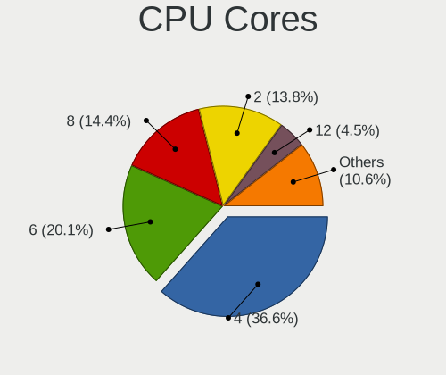

| Number  | Desktops | Percent |
|---------|----------|---------|
| 4       | 438      | 37.66%  |
| 6       | 221      | 19%     |
| 8       | 174      | 14.96%  |
| 2       | 161      | 13.84%  |
| 12      | 48       | 4.13%   |
| 16      | 46       | 3.96%   |
| 3       | 19       | 1.63%   |
| 1       | 17       | 1.46%   |
| 10      | 12       | 1.03%   |
| 24      | 11       | 0.95%   |
| 14      | 7        | 0.6%    |
| 32      | 3        | 0.26%   |
| 20      | 2        | 0.17%   |
| 44      | 1        | 0.09%   |
| 28      | 1        | 0.09%   |
| 18      | 1        | 0.09%   |
| Unknown | 1        | 0.09%   |

CPU Sockets
-----------

Number of sockets

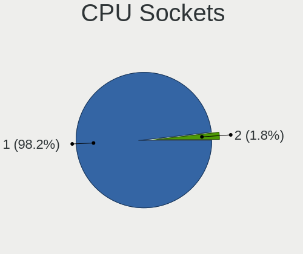

| Number | Desktops | Percent |
|--------|----------|---------|
| 1      | 1136     | 98.02%  |
| 2      | 23       | 1.98%   |

CPU Threads
-----------

Threads per core (Hyper-Threading)

| Number  | Desktops | Percent |
|---------|----------|---------|
| 2       | 802      | 69.02%  |
| 1       | 359      | 30.9%   |
| Unknown | 1        | 0.09%   |

CPU Op-Modes
------------

CPU Operation Modes (32-bit, 64-bit)

| Op mode        | Desktops | Percent |
|----------------|----------|---------|
| 32-bit, 64-bit | 1130     | 97.33%  |
| Unknown        | 30       | 2.58%   |
| 32-bit         | 1        | 0.09%   |

CPU Microcode
-------------

Microcode number

| Number     | Desktops | Percent |
|------------|----------|---------|
| Unknown    | 367      | 30.41%  |
| 0x306c3    | 64       | 5.3%    |
| 0x08701021 | 56       | 4.64%   |
| 0x0800820d | 48       | 3.98%   |
| 0x06000852 | 41       | 3.4%    |
| 0x206a7    | 39       | 3.23%   |
| 0x306a9    | 37       | 3.07%   |
| 0x506e3    | 33       | 2.73%   |
| 0x906e9    | 23       | 1.91%   |
| 0x010000c8 | 23       | 1.91%   |
| 0x08001138 | 22       | 1.82%   |
| 0x1067a    | 21       | 1.74%   |
| 0x906ea    | 20       | 1.66%   |
| 0x0a20120a | 20       | 1.66%   |
| 0x08108109 | 20       | 1.66%   |
| 0x08701013 | 19       | 1.57%   |
| 0x0a201009 | 17       | 1.41%   |
| 0x0a50000d | 16       | 1.33%   |
| 0x0a201016 | 13       | 1.08%   |
| 0x06001119 | 13       | 1.08%   |
| 0x0a50000c | 12       | 0.99%   |
| 0x08101016 | 12       | 0.99%   |
| 0x08001137 | 12       | 0.99%   |
| 0xa0671    | 11       | 0.91%   |
| 0x0a601203 | 11       | 0.91%   |
| 0x010000dc | 11       | 0.91%   |
| 0xa0655    | 10       | 0.83%   |
| 0x306f2    | 10       | 0.83%   |
| 0x08701030 | 10       | 0.83%   |
| 0x06003106 | 9        | 0.75%   |
| 0x0600063e | 9        | 0.75%   |
| 0x906ed    | 8        | 0.66%   |
| 0x206d7    | 8        | 0.66%   |
| 0xa0653    | 7        | 0.58%   |
| 0x306e4    | 7        | 0.58%   |
| 0x106e5    | 7        | 0.58%   |
| 0x08600106 | 7        | 0.58%   |
| 0x90672    | 6        | 0.5%    |
| 0x706a1    | 6        | 0.5%    |
| 0x6fb      | 6        | 0.5%    |

CPU Microarch
-------------

Microarchitecture

| Name             | Desktops | Percent |
|------------------|----------|---------|
| Haswell          | 122      | 10.5%   |
| Zen 2            | 105      | 9.04%   |
| Zen 3            | 104      | 8.95%   |
| KabyLake         | 86       | 7.4%    |
| Zen+             | 80       | 6.88%   |
| IvyBridge        | 74       | 6.37%   |
| SandyBridge      | 70       | 6.02%   |
| Zen              | 64       | 5.51%   |
| Piledriver       | 64       | 5.51%   |
| Skylake          | 54       | 4.65%   |
| K10              | 50       | 4.3%    |
| Penryn           | 39       | 3.36%   |
| Unknown          | 38       | 3.27%   |
| Alderlake Hybrid | 36       | 3.1%    |
| CometLake        | 28       | 2.41%   |
| Nehalem          | 22       | 1.89%   |
| IceLake          | 21       | 1.81%   |
| Core             | 15       | 1.29%   |
| Westmere         | 13       | 1.12%   |
| Steamroller      | 11       | 0.95%   |
| Broadwell        | 11       | 0.95%   |
| Bulldozer        | 10       | 0.86%   |
| K8 Hammer        | 7        | 0.6%    |
| Goldmont plus    | 7        | 0.6%    |
| Jaguar           | 5        | 0.43%   |
| Bonnell          | 5        | 0.43%   |
| Silvermont       | 3        | 0.26%   |
| K10 Llano        | 3        | 0.26%   |
| Gracemont        | 3        | 0.26%   |
| Excavator        | 3        | 0.26%   |
| Bobcat           | 3        | 0.26%   |
| Puma             | 2        | 0.17%   |
| NetBurst         | 2        | 0.17%   |
| TigerLake        | 1        | 0.09%   |
| Goldmont         | 1        | 0.09%   |

Graphics
--------

GPU Vendor
----------

Vendors of graphics cards

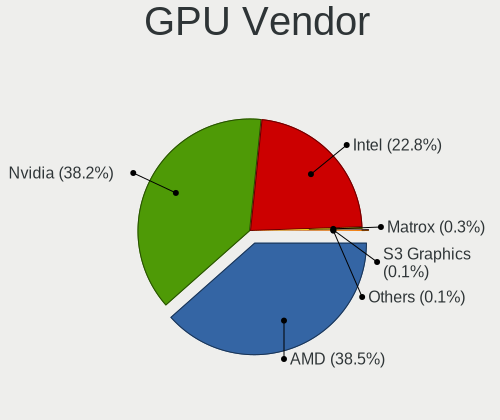

| Vendor                     | Desktops | Percent |
|----------------------------|----------|---------|
| AMD                        | 489      | 38.93%  |
| Nvidia                     | 480      | 38.22%  |
| Intel                      | 280      | 22.29%  |
| Matrox Electronics Systems | 4        | 0.32%   |
| S3 Graphics                | 2        | 0.16%   |
| ASPEED Technology          | 1        | 0.08%   |

GPU Model
---------

Graphics card models

| Model                                                                       | Desktops | Percent |
|-----------------------------------------------------------------------------|----------|---------|
| AMD Ellesmere [Radeon RX 470/480/570/570X/580/580X/590]                     | 77       | 5.83%   |
| Intel Xeon E3-1200 v3/4th Gen Core Processor Integrated Graphics Controller | 59       | 4.47%   |
| AMD Navi 10 [Radeon RX 5600 OEM/5600 XT / 5700/5700 XT]                     | 31       | 2.35%   |
| AMD Cezanne [Radeon Vega Series / Radeon Vega Mobile Series]                | 29       | 2.2%    |
| Intel 2nd Generation Core Processor Family Integrated Graphics Controller   | 27       | 2.05%   |
| Intel Xeon E3-1200 v2/3rd Gen Core processor Graphics Controller            | 24       | 1.82%   |
| Nvidia GP107 [GeForce GTX 1050 Ti]                                          | 23       | 1.74%   |
| Intel CoffeeLake-S GT2 [UHD Graphics 630]                                   | 20       | 1.52%   |
| AMD Picasso/Raven 2 [Radeon Vega Series / Radeon Vega Mobile Series]        | 20       | 1.52%   |
| Nvidia GK208B [GeForce GT 710]                                              | 19       | 1.44%   |
| Intel HD Graphics 530                                                       | 19       | 1.44%   |
| AMD Raphael                                                                 | 19       | 1.44%   |
| Nvidia GP108 [GeForce GT 1030]                                              | 18       | 1.36%   |
| Nvidia GP104 [GeForce GTX 1080]                                             | 18       | 1.36%   |
| AMD Lexa PRO [Radeon 540/540X/550/550X / RX 540X/550/550X]                  | 17       | 1.29%   |
| Nvidia GP104 [GeForce GTX 1070]                                             | 16       | 1.21%   |
| Intel HD Graphics 630                                                       | 16       | 1.21%   |
| AMD Raven Ridge [Radeon Vega Series / Radeon Vega Mobile Series]            | 16       | 1.21%   |
| Nvidia GP106 [GeForce GTX 1060 6GB]                                         | 15       | 1.14%   |
| Nvidia GK208B [GeForce GT 730]                                              | 15       | 1.14%   |
| Nvidia GM204 [GeForce GTX 970]                                              | 14       | 1.06%   |
| Nvidia TU116 [GeForce GTX 1660 SUPER]                                       | 13       | 0.98%   |
| Nvidia GP106 [GeForce GTX 1060 3GB]                                         | 13       | 0.98%   |
| AMD Navi 22 [Radeon RX 6700/6700 XT/6750 XT / 6800M/6850M XT]               | 13       | 0.98%   |
| Nvidia GM107 [GeForce GTX 750 Ti]                                           | 12       | 0.91%   |
| Intel CometLake-S GT2 [UHD Graphics 630]                                    | 12       | 0.91%   |
| Intel 4 Series Chipset Integrated Graphics Controller                       | 12       | 0.91%   |
| AMD Baffin [Radeon RX 460/560D / Pro 450/455/460/555/555X/560/560X]         | 12       | 0.91%   |
| AMD Navi 31 [Radeon RX 7900 XT/7900 XTX/7900M]                              | 11       | 0.83%   |
| AMD Navi 23 [Radeon RX 6600/6600 XT/6600M]                                  | 11       | 0.83%   |
| AMD Navi 21 [Radeon RX 6800/6800 XT / 6900 XT]                              | 11       | 0.83%   |
| Nvidia TU117 [GeForce GTX 1650]                                             | 10       | 0.76%   |
| Nvidia GP102 [GeForce GTX 1080 Ti]                                          | 10       | 0.76%   |
| Nvidia GM206 [GeForce GTX 960]                                              | 10       | 0.76%   |
| Intel IvyBridge GT2 [HD Graphics 4000]                                      | 10       | 0.76%   |
| Intel RocketLake-S GT1 [UHD Graphics 750]                                   | 9        | 0.68%   |
| AMD Turks PRO [Radeon HD 6570/7570/8550 / R5 230]                           | 9        | 0.68%   |
| AMD Navi 14 [Radeon RX 5500/5500M / Pro 5500M]                              | 9        | 0.68%   |
| AMD Cedar [Radeon HD 5000/6000/7350/8350 Series]                            | 9        | 0.68%   |
| AMD Baffin [Radeon RX 550 640SP / RX 560/560X]                              | 9        | 0.68%   |

GPU Combo
---------

Combinations of graphics cards

| Name               | Desktops | Percent |
|--------------------|----------|---------|
| 1 x Nvidia         | 424      | 35.96%  |
| 1 x AMD            | 422      | 35.79%  |
| 1 x Intel          | 224      | 19%     |
| 2 x AMD            | 28       | 2.37%   |
| AMD + Nvidia       | 26       | 2.21%   |
| Intel + Nvidia     | 19       | 1.61%   |
| Intel + AMD        | 13       | 1.1%    |
| 2 x Nvidia         | 11       | 0.93%   |
| 1 x Matrox         | 3        | 0.25%   |
| 1 x S3 Graphics    | 2        | 0.17%   |
| AMD + 2 x Nvidia   | 2        | 0.17%   |
| Other              | 1        | 0.08%   |
| 2 x Intel          | 1        | 0.08%   |
| Nvidia + Matrox    | 1        | 0.08%   |
| Nvidia + ASPEED    | 1        | 0.08%   |
| Intel + 2 x Nvidia | 1        | 0.08%   |

GPU Driver
----------

Free vs proprietary

| Driver      | Desktops | Percent |
|-------------|----------|---------|
| Free        | 841      | 70.85%  |
| Proprietary | 316      | 26.62%  |
| Unknown     | 30       | 2.53%   |

GPU Memory
----------

Total video memory

| Size in GB | Desktops | Percent |
|------------|----------|---------|
| Unknown    | 376      | 31.15%  |
| 7.01-8.0   | 181      | 15%     |
| 1.01-2.0   | 161      | 13.34%  |
| 3.01-4.0   | 139      | 11.52%  |
| 0.01-0.5   | 97       | 8.04%   |
| 0.51-1.0   | 96       | 7.95%   |
| 8.01-16.0  | 77       | 6.38%   |
| 5.01-6.0   | 41       | 3.4%    |
| 2.01-3.0   | 19       | 1.57%   |
| 16.01-24.0 | 18       | 1.49%   |
| 4.01-5.0   | 1        | 0.08%   |
| 24.01-32.0 | 1        | 0.08%   |

Monitor
-------

Monitor Vendor
--------------

Monitor vendors

| Vendor               | Desktops | Percent |
|----------------------|----------|---------|
| Samsung Electronics  | 212      | 16.15%  |
| Dell                 | 153      | 11.65%  |
| Goldstar             | 141      | 10.74%  |
| Acer                 | 101      | 7.69%   |
| Hewlett-Packard      | 89       | 6.78%   |
| Ancor Communications | 80       | 6.09%   |
| AOC                  | 71       | 5.41%   |
| BenQ                 | 70       | 5.33%   |
| Philips              | 52       | 3.96%   |
| ASUSTek Computer     | 28       | 2.13%   |
| ViewSonic            | 26       | 1.98%   |
| Iiyama               | 25       | 1.9%    |
| Unknown              | 20       | 1.52%   |
| Fujitsu Siemens      | 19       | 1.45%   |
| Lenovo               | 17       | 1.29%   |
| LG Electronics       | 14       | 1.07%   |
| Sony                 | 11       | 0.84%   |
| Eizo                 | 11       | 0.84%   |
| MSI                  | 10       | 0.76%   |
| Sceptre Tech         | 9        | 0.69%   |
| Gigabyte Technology  | 9        | 0.69%   |
| NEC Computers        | 8        | 0.61%   |
| Medion               | 8        | 0.61%   |
| Panasonic            | 6        | 0.46%   |
| Vizio                | 5        | 0.38%   |
| Hitachi              | 5        | 0.38%   |
| Pixio                | 4        | 0.3%    |
| Insignia             | 4        | 0.3%    |
| ___                  | 3        | 0.23%   |
| Vestel Elektronik    | 3        | 0.23%   |
| UGD                  | 3        | 0.23%   |
| Sharp                | 3        | 0.23%   |
| MStar                | 3        | 0.23%   |
| HUAWEI               | 3        | 0.23%   |
| HKC                  | 3        | 0.23%   |
| HannStar             | 3        | 0.23%   |
| AGO                  | 3        | 0.23%   |
| Unknown (XXX)        | 2        | 0.15%   |
| SKY                  | 2        | 0.15%   |
| RTK                  | 2        | 0.15%   |

Monitor Model
-------------

Monitor models

| Model                                                                   | Desktops | Percent |
|-------------------------------------------------------------------------|----------|---------|
| Goldstar ULTRAWIDE GSM59F1 2560x1080 673x284mm 28.8-inch                | 11       | 0.76%   |
| Goldstar FULL HD GSM5B55 1920x1080 480x270mm 21.7-inch                  | 9        | 0.63%   |
| BenQ GW2760HS BNQ78CA 1920x1080 598x336mm 27.0-inch                     | 8        | 0.56%   |
| Unknown LCD Monitor FFFF 2288x1287 2550x2550mm 142.0-inch               | 7        | 0.49%   |
| Ancor Communications ASUS VS247 ACI249A 1920x1080 521x293mm 23.5-inch   | 7        | 0.49%   |
| Samsung Electronics U28E590 SAM0C4D 3840x2160 607x345mm 27.5-inch       | 6        | 0.42%   |
| Fujitsu Siemens P19-2 FUS0552 1280x1024 376x301mm 19.0-inch             | 6        | 0.42%   |
| BenQ GW2270 BNQ78DB 1920x1080 476x268mm 21.5-inch                       | 6        | 0.42%   |
| Ancor Communications VE228 ACI22FA 1920x1080 477x268mm 21.5-inch        | 6        | 0.42%   |
| Samsung Electronics S24F350 SAM0D20 1920x1080 521x293mm 23.5-inch       | 5        | 0.35%   |
| Goldstar Ultra HD GSM5B09 3840x2160 600x340mm 27.2-inch                 | 5        | 0.35%   |
| Goldstar HDR 4K GSM7707 3840x2160 600x340mm 27.2-inch                   | 5        | 0.35%   |
| AOC Q3279WG5B AOC3279 2560x1440 725x428mm 33.1-inch                     | 5        | 0.35%   |
| AOC 27G2G3 AOC2702 1920x1080 598x336mm 27.0-inch                        | 5        | 0.35%   |
| AOC 2470W AOC2470 1920x1080 521x293mm 23.5-inch                         | 5        | 0.35%   |
| Acer S242HL ACR0216 1920x1080 531x299mm 24.0-inch                       | 5        | 0.35%   |
| Samsung Electronics U32J59x SAM0F34 3840x2160 697x392mm 31.5-inch       | 4        | 0.28%   |
| Samsung Electronics S24D330 SAM0D92 1920x1080 531x299mm 24.0-inch       | 4        | 0.28%   |
| Samsung Electronics C32F391 SAM0D34 1920x1080 698x393mm 31.5-inch       | 4        | 0.28%   |
| Samsung Electronics C24F390 SAM0D2C 1920x1080 521x293mm 23.5-inch       | 4        | 0.28%   |
| Philips PHL 273V7 PHLC156 1920x1080 598x336mm 27.0-inch                 | 4        | 0.28%   |
| Philips PHL 243V7 PHLC155 1920x1080 527x296mm 23.8-inch                 | 4        | 0.28%   |
| Goldstar HDR WFHD GSM7714 2560x1080 798x334mm 34.1-inch                 | 4        | 0.28%   |
| Dell U2713HM DEL4080 2560x1440 600x340mm 27.2-inch                      | 4        | 0.28%   |
| Dell U2412M DELA07A 1920x1200 518x324mm 24.1-inch                       | 4        | 0.28%   |
| BenQ GW2765 BNQ78D6 2560x1440 597x336mm 27.0-inch                       | 4        | 0.28%   |
| Ancor Communications ASUS VP228 ACI22C3 1920x1080 476x268mm 21.5-inch   | 4        | 0.28%   |
| Ancor Communications ASUS PB278 ACI27A3 1920x1080 597x336mm 27.0-inch   | 4        | 0.28%   |
| ViewSonic VG2755-2K VSC4E37 2560x1440 597x336mm 27.0-inch               | 3        | 0.21%   |
| Vestel Elektronik 22W_LCD_TV VES3700 1920x540                           | 3        | 0.21%   |
| Unknown LCD Monitor MCE Metz TV 1080 3840x1080                          | 3        | 0.21%   |
| Unknown LCD Monitor MCE Metz TV 1080                                    | 3        | 0.21%   |
| Sceptre Tech E24 SPT099D 1920x1080 530x300mm 24.0-inch                  | 3        | 0.21%   |
| Samsung Electronics U32J59x SAM0F33 3840x2160 697x392mm 31.5-inch       | 3        | 0.21%   |
| Samsung Electronics U28D590 SAM0B80 3840x2160 607x345mm 27.5-inch       | 3        | 0.21%   |
| Samsung Electronics SA300/SA350 SAM0788 1366x768 410x230mm 18.5-inch    | 3        | 0.21%   |
| Samsung Electronics LCD Monitor SAM0F14 3840x2160 1872x1053mm 84.6-inch | 3        | 0.21%   |
| Samsung Electronics C32R50x SAM7000 1920x1080 698x393mm 31.5-inch       | 3        | 0.21%   |
| Samsung Electronics C32F391 SAM0D35 1920x1080 698x393mm 31.5-inch       | 3        | 0.21%   |
| Philips PHL 223V5 PHLC0CF 1920x1080 477x268mm 21.5-inch                 | 3        | 0.21%   |

Monitor Resolution
------------------

Monitor screen resolution

| Resolution         | Desktops | Percent |
|--------------------|----------|---------|
| 1920x1080 (FHD)    | 571      | 44.44%  |
| 2560x1440 (QHD)    | 146      | 11.36%  |
| 3840x2160 (4K)     | 134      | 10.43%  |
| 1280x1024 (SXGA)   | 68       | 5.29%   |
| 1680x1050 (WSXGA+) | 55       | 4.28%   |
| 1920x1200 (WUXGA)  | 50       | 3.89%   |
| 1366x768 (WXGA)    | 31       | 2.41%   |
| 1440x900 (WXGA+)   | 30       | 2.33%   |
| 2560x1080          | 29       | 2.26%   |
| Unknown            | 28       | 2.18%   |
| 3440x1440          | 27       | 2.1%    |
| 1600x900 (HD+)     | 22       | 1.71%   |
| 3840x1080          | 19       | 1.48%   |
| 1360x768           | 10       | 0.78%   |
| 1024x768 (XGA)     | 10       | 0.78%   |
| 1920x540           | 8        | 0.62%   |
| 2288x1287          | 7        | 0.54%   |
| 2560x1600          | 5        | 0.39%   |
| 1600x1200          | 5        | 0.39%   |
| 3840x1600          | 4        | 0.31%   |
| 3840x1200          | 3        | 0.23%   |
| 1280x720 (HD)      | 3        | 0.23%   |
| 1400x1050          | 2        | 0.16%   |
| 1280x960           | 2        | 0.16%   |
| 800x1280           | 1        | 0.08%   |
| 7680x2160          | 1        | 0.08%   |
| 7680x1440          | 1        | 0.08%   |
| 7280x2160          | 1        | 0.08%   |
| 6520x1440          | 1        | 0.08%   |
| 640x480            | 1        | 0.08%   |
| 5760x2160          | 1        | 0.08%   |
| 5520x1080          | 1        | 0.08%   |
| 5280x2160          | 1        | 0.08%   |
| 4480x1080          | 1        | 0.08%   |
| 3286x1080          | 1        | 0.08%   |
| 3200x1080          | 1        | 0.08%   |
| 2732x768           | 1        | 0.08%   |
| 2048x1536          | 1        | 0.08%   |
| 2048x1152          | 1        | 0.08%   |
| 1280x768           | 1        | 0.08%   |

Monitor Diagonal
----------------

Diagonal size in inches

| Inches  | Desktops | Percent |
|---------|----------|---------|
| 27      | 247      | 18.73%  |
| 24      | 205      | 15.54%  |
| 21      | 143      | 10.84%  |
| 23      | 132      | 10.01%  |
| Unknown | 91       | 6.9%    |
| 31      | 69       | 5.23%   |
| 19      | 65       | 4.93%   |
| 34      | 46       | 3.49%   |
| 22      | 40       | 3.03%   |
| 18      | 36       | 2.73%   |
| 20      | 29       | 2.2%    |
| 17      | 29       | 2.2%    |
| 32      | 24       | 1.82%   |
| 15      | 19       | 1.44%   |
| 72      | 15       | 1.14%   |
| 84      | 13       | 0.99%   |
| 54      | 13       | 0.99%   |
| 40      | 12       | 0.91%   |
| 25      | 12       | 0.91%   |
| 26      | 8        | 0.61%   |
| 142     | 7        | 0.53%   |
| 42      | 6        | 0.45%   |
| 29      | 6        | 0.45%   |
| 33      | 5        | 0.38%   |
| 37      | 4        | 0.3%    |
| 28      | 4        | 0.3%    |
| 12      | 4        | 0.3%    |
| 65      | 3        | 0.23%   |
| 49      | 3        | 0.23%   |
| 48      | 3        | 0.23%   |
| 43      | 3        | 0.23%   |
| 74      | 2        | 0.15%   |
| 55      | 2        | 0.15%   |
| 52      | 2        | 0.15%   |
| 36      | 2        | 0.15%   |
| 35      | 2        | 0.15%   |
| 30      | 2        | 0.15%   |
| 69      | 1        | 0.08%   |
| 60      | 1        | 0.08%   |
| 58      | 1        | 0.08%   |

Monitor Width
-------------

Physical width

| Width in mm    | Desktops | Percent |
|----------------|----------|---------|
| 501-600        | 530      | 41.9%   |
| 401-500        | 265      | 20.95%  |
| 601-700        | 108      | 8.54%   |
| Unknown        | 91       | 7.19%   |
| 701-800        | 76       | 6.01%   |
| 351-400        | 47       | 3.72%   |
| 301-350        | 44       | 3.48%   |
| 1501-2000      | 31       | 2.45%   |
| 1001-1500      | 31       | 2.45%   |
| 801-900        | 19       | 1.5%    |
| 901-1000       | 10       | 0.79%   |
| More than 2000 | 7        | 0.55%   |
| 201-300        | 6        | 0.47%   |

Aspect Ratio
------------

Proportional relationship between the width and the height

| Ratio   | Desktops | Percent |
|---------|----------|---------|
| 16/9    | 808      | 67.96%  |
| 16/10   | 148      | 12.45%  |
| Unknown | 71       | 5.97%   |
| 5/4     | 60       | 5.05%   |
| 21/9    | 53       | 4.46%   |
| 4/3     | 24       | 2.02%   |
| 1.00    | 8        | 0.67%   |
| 32/9    | 6        | 0.5%    |
| 6/5     | 5        | 0.42%   |
| 3/2     | 4        | 0.34%   |
| 1.96    | 1        | 0.08%   |
| 0.62    | 1        | 0.08%   |

Monitor Area
------------

Area in inch

| Area in inch | Desktops | Percent |
|----------------|----------|---------|
| 201-250        | 394      | 30.54%  |
| 301-350        | 251      | 19.46%  |
| 351-500        | 155      | 12.02%  |
| 151-200        | 134      | 10.39%  |
| Unknown        | 91       | 7.05%   |
| 251-300        | 88       | 6.82%   |
| More than 1000 | 60       | 4.65%   |
| 141-150        | 52       | 4.03%   |
| 501-1000       | 35       | 2.71%   |
| 101-110        | 19       | 1.47%   |
| 131-140        | 5        | 0.39%   |
| 71-80          | 4        | 0.31%   |
| 51-60          | 1        | 0.08%   |
| 91-100         | 1        | 0.08%   |

Pixel Density
-------------

Pixels per inch

| Density | Desktops | Percent |
|---------|----------|---------|
| 51-100  | 728      | 59.19%  |
| 101-120 | 276      | 22.44%  |
| Unknown | 91       | 7.4%    |
| 121-160 | 60       | 4.88%   |
| 1-50    | 48       | 3.9%    |
| 161-240 | 27       | 2.2%    |

Multiple Monitors
-----------------

Total monitors connected

| Total | Desktops | Percent |
|-------|----------|---------|
| 1     | 864      | 72.24%  |
| 2     | 265      | 22.16%  |
| 0     | 39       | 3.26%   |
| 3     | 25       | 2.09%   |
| 4     | 3        | 0.25%   |

Network
-------

Net Controller Vendor
---------------------

Controller vendors

| Vendor                          | Desktops | Percent |
|---------------------------------|----------|---------|
| Realtek Semiconductor           | 745      | 44.85%  |
| Intel                           | 528      | 31.79%  |
| Qualcomm Atheros                | 75       | 4.52%   |
| Broadcom                        | 53       | 3.19%   |
| MediaTek                        | 30       | 1.81%   |
| Ralink Technology               | 24       | 1.44%   |
| TP-Link                         | 23       | 1.38%   |
| Ralink                          | 16       | 0.96%   |
| Nvidia                          | 14       | 0.84%   |
| Aquantia                        | 12       | 0.72%   |
| ASIX Electronics                | 11       | 0.66%   |
| ASUSTek Computer                | 9        | 0.54%   |
| Samsung Electronics             | 8        | 0.48%   |
| Microsoft                       | 8        | 0.48%   |
| NetGear                         | 7        | 0.42%   |
| Marvell Technology Group        | 7        | 0.42%   |
| D-Link System                   | 7        | 0.42%   |
| AVM                             | 7        | 0.42%   |
| D-Link                          | 6        | 0.36%   |
| Edimax Technology               | 5        | 0.3%    |
| Qualcomm Atheros Communications | 4        | 0.24%   |
| Linksys                         | 4        | 0.24%   |
| DisplayLink                     | 4        | 0.24%   |
| Broadcom Limited                | 4        | 0.24%   |
| Belkin Components               | 3        | 0.18%   |
| Xiaomi                          | 2        | 0.12%   |
| Texas Instruments               | 2        | 0.12%   |
| OPPO Electronics                | 2        | 0.12%   |
| NetXen Incorporated             | 2        | 0.12%   |
| Motorola PCS                    | 2        | 0.12%   |
| Microchip Technology            | 2        | 0.12%   |
| JMicron Technology              | 2        | 0.12%   |
| Intersil                        | 2        | 0.12%   |
| ADMtek                          | 2        | 0.12%   |
| ZyXEL Communications            | 1        | 0.06%   |
| Wilocity                        | 1        | 0.06%   |
| Wacom                           | 1        | 0.06%   |
| VIA Technologies                | 1        | 0.06%   |
| VeriFone                        | 1        | 0.06%   |
| U-Blox                          | 1        | 0.06%   |

Net Controller Model
--------------------

Controller models

| Model                                                                  | Desktops | Percent |
|------------------------------------------------------------------------|----------|---------|
| Realtek RTL8111/8168/8211/8411 PCI Express Gigabit Ethernet Controller | 582      | 30.55%  |
| Realtek RTL8125 2.5GbE Controller                                      | 95       | 4.99%   |
| Intel I211 Gigabit Network Connection                                  | 90       | 4.72%   |
| Intel Wi-Fi 6 AX200                                                    | 63       | 3.31%   |
| Intel Ethernet Connection (2) I219-V                                   | 47       | 2.47%   |
| Intel 82579LM Gigabit Network Connection (Lewisville)                  | 45       | 2.36%   |
| Intel Ethernet Controller I225-V                                       | 37       | 1.94%   |
| Intel Dual Band Wireless-AC 3168NGW [Stone Peak]                       | 26       | 1.36%   |
| Intel Wi-Fi 6E(802.11ax) AX210/AX1675* 2x2 [Typhoon Peak]              | 25       | 1.31%   |
| Intel Ethernet Connection I217-LM                                      | 25       | 1.31%   |
| Intel Wi-Fi 5(802.11ac) Wireless-AC 9x6x [Thunder Peak]                | 21       | 1.1%    |
| Intel Ethernet Connection (7) I219-V                                   | 21       | 1.1%    |
| Intel 82574L Gigabit Network Connection                                | 19       | 1%      |
| Intel Ethernet Connection (2) I218-V                                   | 18       | 0.94%   |
| Intel Ethernet Connection I217-V                                       | 16       | 0.84%   |
| Intel 82579V Gigabit Network Connection                                | 14       | 0.73%   |
| Realtek RTL88x2bu [AC1200 Techkey]                                     | 12       | 0.63%   |
| Intel I210 Gigabit Network Connection                                  | 12       | 0.63%   |
| MediaTek MT7922 802.11ax PCI Express Wireless Network Adapter          | 11       | 0.58%   |
| Intel Wireless 7260                                                    | 11       | 0.58%   |
| ASIX AX88179 Gigabit Ethernet                                          | 11       | 0.58%   |
| Realtek RTL8153 Gigabit Ethernet Adapter                               | 10       | 0.52%   |
| Realtek RTL810xE PCI Express Fast Ethernet controller                  | 10       | 0.52%   |
| Qualcomm Atheros AR9485 Wireless Network Adapter                       | 10       | 0.52%   |
| Intel Ethernet Connection (2) I219-LM                                  | 10       | 0.52%   |
| Realtek RTL8822BE 802.11a/b/g/n/ac WiFi adapter                        | 9        | 0.47%   |
| Realtek RTL8821CE 802.11ac PCIe Wireless Network Adapter               | 9        | 0.47%   |
| MediaTek MT7921K (RZ608) Wi-Fi 6E 80MHz                                | 9        | 0.47%   |
| Intel Cannon Lake PCH CNVi WiFi                                        | 9        | 0.47%   |
| Realtek 802.11ac NIC                                                   | 8        | 0.42%   |
| Intel Ethernet Connection (2) I218-LM                                  | 8        | 0.42%   |
| Intel Ethernet Connection (11) I219-V                                  | 8        | 0.42%   |
| Intel Comet Lake PCH CNVi WiFi                                         | 8        | 0.42%   |
| Intel 82567LM-3 Gigabit Network Connection                             | 8        | 0.42%   |
| Broadcom BCM4352 802.11ac Dual Band Wireless Network Adapter           | 8        | 0.42%   |
| Realtek RTL8852BE PCIe 802.11ax Wireless Network Controller            | 7        | 0.37%   |
| Realtek RTL8822CE 802.11ac PCIe Wireless Network Adapter               | 7        | 0.37%   |
| Realtek RTL8812AE 802.11ac PCIe Wireless Network Adapter               | 7        | 0.37%   |
| Realtek RTL8188EUS 802.11n Wireless Network Adapter                    | 7        | 0.37%   |
| Ralink RT5370 Wireless Adapter                                         | 7        | 0.37%   |

Wireless Vendor
---------------

Wireless vendors

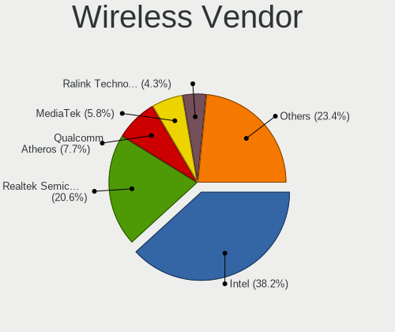

| Vendor                                | Desktops | Percent |
|---------------------------------------|----------|---------|
| Intel                                 | 213      | 37.97%  |
| Realtek Semiconductor                 | 117      | 20.86%  |
| Qualcomm Atheros                      | 44       | 7.84%   |
| MediaTek                              | 29       | 5.17%   |
| Broadcom                              | 26       | 4.63%   |
| Ralink Technology                     | 24       | 4.28%   |
| TP-Link                               | 22       | 3.92%   |
| Ralink                                | 16       | 2.85%   |
| ASUSTek Computer                      | 9        | 1.6%    |
| Microsoft                             | 8        | 1.43%   |
| NetGear                               | 7        | 1.25%   |
| AVM                                   | 7        | 1.25%   |
| D-Link                                | 6        | 1.07%   |
| Edimax Technology                     | 5        | 0.89%   |
| Qualcomm Atheros Communications       | 4        | 0.71%   |
| Linksys                               | 4        | 0.71%   |
| D-Link System                         | 4        | 0.71%   |
| Broadcom Limited                      | 3        | 0.53%   |
| Belkin Components                     | 3        | 0.53%   |
| ZyXEL Communications                  | 1        | 0.18%   |
| Wilocity                              | 1        | 0.18%   |
| Wacom                                 | 1        | 0.18%   |
| Samsung Electronics                   | 1        | 0.18%   |
| Qualcomm Technologies                 | 1        | 0.18%   |
| Intersil                              | 1        | 0.18%   |
| IMC Networks                          | 1        | 0.18%   |
| Gemtek                                | 1        | 0.18%   |
| BUFFALO                               | 1        | 0.18%   |
| 802.11g Adapter [Linksys WUSB54GC v3] | 1        | 0.18%   |

Wireless Model
--------------

Wireless models

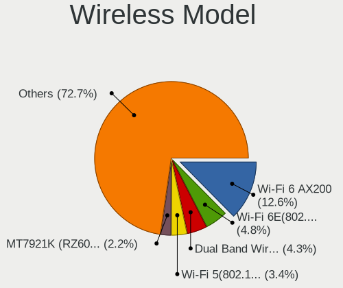

| Model                                                                                         | Desktops | Percent |
|-----------------------------------------------------------------------------------------------|----------|---------|
| Intel Wi-Fi 6 AX200                                                                           | 63       | 11.11%  |
| Intel Dual Band Wireless-AC 3168NGW [Stone Peak]                                              | 26       | 4.59%   |
| Intel Wi-Fi 6E(802.11ax) AX210/AX1675* 2x2 [Typhoon Peak]                                     | 25       | 4.41%   |
| Intel Wi-Fi 5(802.11ac) Wireless-AC 9x6x [Thunder Peak]                                       | 21       | 3.7%    |
| Realtek RTL88x2bu [AC1200 Techkey]                                                            | 12       | 2.12%   |
| MediaTek MT7922 802.11ax PCI Express Wireless Network Adapter                                 | 11       | 1.94%   |
| Intel Wireless 7260                                                                           | 11       | 1.94%   |
| Qualcomm Atheros AR9485 Wireless Network Adapter                                              | 10       | 1.76%   |
| Realtek RTL8822BE 802.11a/b/g/n/ac WiFi adapter                                               | 9        | 1.59%   |
| Realtek RTL8821CE 802.11ac PCIe Wireless Network Adapter                                      | 9        | 1.59%   |
| MediaTek MT7921K (RZ608) Wi-Fi 6E 80MHz                                                       | 9        | 1.59%   |
| Intel Cannon Lake PCH CNVi WiFi                                                               | 9        | 1.59%   |
| Realtek 802.11ac NIC                                                                          | 8        | 1.41%   |
| Intel Comet Lake PCH CNVi WiFi                                                                | 8        | 1.41%   |
| Broadcom BCM4352 802.11ac Dual Band Wireless Network Adapter                                  | 8        | 1.41%   |
| Realtek RTL8852BE PCIe 802.11ax Wireless Network Controller                                   | 7        | 1.23%   |
| Realtek RTL8822CE 802.11ac PCIe Wireless Network Adapter                                      | 7        | 1.23%   |
| Realtek RTL8812AE 802.11ac PCIe Wireless Network Adapter                                      | 7        | 1.23%   |
| Realtek RTL8188EUS 802.11n Wireless Network Adapter                                           | 7        | 1.23%   |
| Ralink RT5370 Wireless Adapter                                                                | 7        | 1.23%   |
| Intel Wireless 8260                                                                           | 7        | 1.23%   |
| Intel Tiger Lake PCH CNVi WiFi                                                                | 7        | 1.23%   |
| Intel Raptor Lake-S PCH CNVi WiFi                                                             | 7        | 1.23%   |
| Intel Alder Lake-S PCH CNVi WiFi                                                              | 7        | 1.23%   |
| Broadcom BCM4360 802.11ac Dual Band Wireless Network Adapter                                  | 7        | 1.23%   |
| Ralink MT7601U Wireless Adapter                                                               | 6        | 1.06%   |
| Qualcomm Atheros AR93xx Wireless Network Adapter                                              | 6        | 1.06%   |
| Realtek RTL8821AE 802.11ac PCIe Wireless Network Adapter                                      | 5        | 0.88%   |
| Ralink RT2870/RT3070 Wireless Adapter                                                         | 5        | 0.88%   |
| MediaTek MT7921 802.11ax PCI Express Wireless Network Adapter                                 | 5        | 0.88%   |
| Intel Wireless 7265                                                                           | 5        | 0.88%   |
| TP-Link TL-WN823N v2/v3 [Realtek RTL8192EU]                                                   | 4        | 0.71%   |
| TP-Link AC600 wireless Realtek RTL8811AU [Archer T2U Nano]                                    | 4        | 0.71%   |
| Realtek RTL8811AU 802.11a/b/g/n/ac WLAN Adapter                                               | 4        | 0.71%   |
| Realtek RTL8192CU 802.11n WLAN Adapter                                                        | 4        | 0.71%   |
| Realtek RTL8192CE PCIe Wireless Network Adapter                                               | 4        | 0.71%   |
| Realtek RTL8188FTV 802.11b/g/n 1T1R 2.4G WLAN Adapter                                         | 4        | 0.71%   |
| Realtek RTL8188CUS 802.11n WLAN Adapter                                                       | 4        | 0.71%   |
| Realtek Realtek 8812AU/8821AU 802.11ac WLAN Adapter [USB Wireless Dual-Band Adapter 2.4/5Ghz] | 4        | 0.71%   |
| Ralink RT3090 Wireless 802.11n 1T/1R PCIe                                                     | 4        | 0.71%   |

Ethernet Vendor
---------------

Ethernet vendors

| Vendor                                 | Desktops | Percent |
|----------------------------------------|----------|---------|
| Realtek Semiconductor                  | 706      | 55.55%  |
| Intel                                  | 420      | 33.04%  |
| Qualcomm Atheros                       | 34       | 2.68%   |
| Broadcom                               | 28       | 2.2%    |
| Nvidia                                 | 14       | 1.1%    |
| Aquantia                               | 12       | 0.94%   |
| ASIX Electronics                       | 11       | 0.87%   |
| Samsung Electronics                    | 7        | 0.55%   |
| Marvell Technology Group               | 7        | 0.55%   |
| DisplayLink                            | 4        | 0.31%   |
| D-Link System                          | 3        | 0.24%   |
| Xiaomi                                 | 2        | 0.16%   |
| OPPO Electronics                       | 2        | 0.16%   |
| NetXen Incorporated                    | 2        | 0.16%   |
| Motorola PCS                           | 2        | 0.16%   |
| JMicron Technology                     | 2        | 0.16%   |
| ADMtek                                 | 2        | 0.16%   |
| VIA Technologies                       | 1        | 0.08%   |
| TP-Link                                | 1        | 0.08%   |
| TOMTOM                                 | 1        | 0.08%   |
| Sony Ericsson Mobile Communications AB | 1        | 0.08%   |
| Solarflare Communications              | 1        | 0.08%   |
| QLogic                                 | 1        | 0.08%   |
| National Semiconductor                 | 1        | 0.08%   |
| MediaTek                               | 1        | 0.08%   |
| Huawei Technologies                    | 1        | 0.08%   |
| Google                                 | 1        | 0.08%   |
| Foxconn / Hon Hai                      | 1        | 0.08%   |
| Broadcom Limited                       | 1        | 0.08%   |
| 3Com                                   | 1        | 0.08%   |

Ethernet Model
--------------

Ethernet models

| Model                                                                          | Desktops | Percent |
|--------------------------------------------------------------------------------|----------|---------|
| Realtek RTL8111/8168/8211/8411 PCI Express Gigabit Ethernet Controller         | 582      | 44.06%  |
| Realtek RTL8125 2.5GbE Controller                                              | 95       | 7.19%   |
| Intel I211 Gigabit Network Connection                                          | 90       | 6.81%   |
| Intel Ethernet Connection (2) I219-V                                           | 47       | 3.56%   |
| Intel 82579LM Gigabit Network Connection (Lewisville)                          | 45       | 3.41%   |
| Intel Ethernet Controller I225-V                                               | 37       | 2.8%    |
| Intel Ethernet Connection I217-LM                                              | 25       | 1.89%   |
| Intel Ethernet Connection (7) I219-V                                           | 21       | 1.59%   |
| Intel 82574L Gigabit Network Connection                                        | 19       | 1.44%   |
| Intel Ethernet Connection (2) I218-V                                           | 18       | 1.36%   |
| Intel Ethernet Connection I217-V                                               | 16       | 1.21%   |
| Intel 82579V Gigabit Network Connection                                        | 14       | 1.06%   |
| Intel I210 Gigabit Network Connection                                          | 12       | 0.91%   |
| ASIX AX88179 Gigabit Ethernet                                                  | 11       | 0.83%   |
| Realtek RTL8153 Gigabit Ethernet Adapter                                       | 10       | 0.76%   |
| Realtek RTL810xE PCI Express Fast Ethernet controller                          | 10       | 0.76%   |
| Intel Ethernet Connection (2) I219-LM                                          | 10       | 0.76%   |
| Intel Ethernet Connection (2) I218-LM                                          | 8        | 0.61%   |
| Intel Ethernet Connection (11) I219-V                                          | 8        | 0.61%   |
| Intel 82567LM-3 Gigabit Network Connection                                     | 8        | 0.61%   |
| Aquantia AQtion AQC107 NBase-T/IEEE 802.3an Ethernet Controller [Atlantic 10G] | 7        | 0.53%   |
| Realtek RTL8169 PCI Gigabit Ethernet Controller                                | 6        | 0.45%   |
| Qualcomm Atheros Killer E220x Gigabit Ethernet Controller                      | 6        | 0.45%   |
| Qualcomm Atheros AR8121/AR8113/AR8114 Gigabit or Fast Ethernet                 | 6        | 0.45%   |
| Samsung Galaxy series, misc. (tethering mode)                                  | 5        | 0.38%   |
| Realtek RTL-8100/8101L/8139 PCI Fast Ethernet Adapter                          | 5        | 0.38%   |
| Realtek Killer E3000 2.5GbE Controller                                         | 5        | 0.38%   |
| Realtek Killer E2600 GbE Controller                                            | 5        | 0.38%   |
| Qualcomm Atheros Killer E2500 Gigabit Ethernet Controller                      | 5        | 0.38%   |
| Intel Ethernet Controller I226-V                                               | 5        | 0.38%   |
| Intel Ethernet Connection (7) I219-LM                                          | 5        | 0.38%   |
| Intel Ethernet Connection (14) I219-V                                          | 5        | 0.38%   |
| Broadcom NetXtreme BCM5764M Gigabit Ethernet PCIe                              | 5        | 0.38%   |
| Qualcomm Atheros AR8152 v2.0 Fast Ethernet                                     | 4        | 0.3%    |
| Marvell Group 88E8056 PCI-E Gigabit Ethernet Controller                        | 4        | 0.3%    |
| Intel I350 Gigabit Network Connection                                          | 4        | 0.3%    |
| Intel Ethernet Connection (17) I219-V                                          | 4        | 0.3%    |
| Intel 82578DM Gigabit Network Connection                                       | 4        | 0.3%    |
| Intel 82571EB/82571GB Gigabit Ethernet Controller D0/D1 (copper applications)  | 4        | 0.3%    |
| Intel 82566DM-2 Gigabit Network Connection                                     | 4        | 0.3%    |

Net Controller Kind
-------------------

Ethernet, WiFi or modem

| Kind     | Desktops | Percent |
|----------|----------|---------|
| Ethernet | 1149     | 68.19%  |
| WiFi     | 521      | 30.92%  |
| Modem    | 9        | 0.53%   |
| Unknown  | 6        | 0.36%   |

Used Controller
---------------

Currently used network controller

| Kind     | Desktops | Percent |
|----------|----------|---------|
| Ethernet | 973      | 79.49%  |
| WiFi     | 251      | 20.51%  |

NICs
----

Total network controllers on board

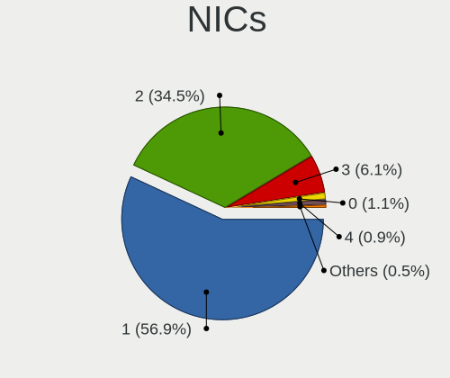

| Total | Desktops | Percent |
|-------|----------|---------|
| 1     | 667      | 57.25%  |
| 2     | 399      | 34.25%  |
| 3     | 71       | 6.09%   |
| 0     | 13       | 1.12%   |
| 4     | 9        | 0.77%   |
| 5     | 5        | 0.43%   |
| 8     | 1        | 0.09%   |

IPv6
----

IPv6 vs IPv4

| Used | Desktops | Percent |
|------|----------|---------|
| No   | 885      | 74.43%  |
| Yes  | 304      | 25.57%  |

Bluetooth
---------

Bluetooth Vendor
----------------

Controller vendors

| Vendor                          | Desktops | Percent |
|---------------------------------|----------|---------|
| Intel                           | 203      | 40.68%  |
| Cambridge Silicon Radio         | 122      | 24.45%  |
| Realtek Semiconductor           | 50       | 10.02%  |
| ASUSTek Computer                | 33       | 6.61%   |
| Broadcom                        | 21       | 4.21%   |
| MediaTek                        | 18       | 3.61%   |
| IMC Networks                    | 12       | 2.4%    |
| TP-Link                         | 8        | 1.6%    |
| Qualcomm Atheros Communications | 7        | 1.4%    |
| Apple                           | 6        | 1.2%    |
| Realtek                         | 3        | 0.6%    |
| Lite-On Technology              | 3        | 0.6%    |
| Belkin Components               | 3        | 0.6%    |
| Integrated System Solution      | 2        | 0.4%    |
| HTC (High Tech Computer)        | 2        | 0.4%    |
| Foxconn / Hon Hai               | 2        | 0.4%    |
| SINO WEALTH                     | 1        | 0.2%    |
| Mobile Action Technology        | 1        | 0.2%    |
| Kensington                      | 1        | 0.2%    |
| Dell                            | 1        | 0.2%    |

Bluetooth Model
---------------

Controller models

| Model                                                                | Desktops | Percent |
|----------------------------------------------------------------------|----------|---------|
| Cambridge Silicon Radio Bluetooth Dongle (HCI mode)                  | 122      | 24.45%  |
| Intel AX200 Bluetooth                                                | 60       | 12.02%  |
| Realtek Bluetooth Radio                                              | 35       | 7.01%   |
| Intel AX210 Bluetooth                                                | 25       | 5.01%   |
| Intel Wireless-AC 3168 Bluetooth                                     | 24       | 4.81%   |
| Intel Wireless-AC 9260 Bluetooth Adapter                             | 22       | 4.41%   |
| Intel Bluetooth wireless interface                                   | 20       | 4.01%   |
| Intel AX201 Bluetooth                                                | 20       | 4.01%   |
| MediaTek Wireless_Device                                             | 18       | 3.61%   |
| Intel Bluetooth Device                                               | 12       | 2.4%    |
| Intel Bluetooth 9460/9560 Jefferson Peak (JfP)                       | 11       | 2.2%    |
| Intel AX211 Bluetooth                                                | 9        | 1.8%    |
| Broadcom BCM20702A0 Bluetooth 4.0                                    | 9        | 1.8%    |
| TP-Link UB500 Adapter                                                | 8        | 1.6%    |
| IMC Networks Wireless_Device                                         | 8        | 1.6%    |
| ASUS ASUS USB-BT500                                                  | 8        | 1.6%    |
| ASUS Broadcom BCM20702A0 Bluetooth                                   | 7        | 1.4%    |
| Realtek 802.11ac WLAN Adapter                                        | 6        | 1.2%    |
| ASUS Bluetooth Adapter                                               | 6        | 1.2%    |
| Realtek  Bluetooth 4.2 Adapter                                       | 5        | 1%      |
| ASUS Bluetooth Radio                                                 | 5        | 1%      |
| ASUS BCM20702A0                                                      | 5        | 1%      |
| Realtek RTL8821A Bluetooth                                           | 3        | 0.6%    |
| Realtek Bluetooth Radio                                              | 3        | 0.6%    |
| Qualcomm Atheros Bluetooth USB Host Controller                       | 3        | 0.6%    |
| Lite-On Bluetooth Device                                             | 3        | 0.6%    |
| IMC Networks Bluetooth Radio                                         | 3        | 0.6%    |
| Broadcom BCM2045 Bluetooth                                           | 3        | 0.6%    |
| Apple Bluetooth Host Controller                                      | 3        | 0.6%    |
| Qualcomm Atheros  Bluetooth Device                                   | 2        | 0.4%    |
| Integrated System Solution KY-BT100 Bluetooth Adapter                | 2        | 0.4%    |
| HTC (High Tech Computer) Vive Hub Bluetooth 4.1 (Broadcom BCM920703) | 2        | 0.4%    |
| Broadcom Bluetooth Controller                                        | 2        | 0.4%    |
| Broadcom BCM92046DG-CL1ROM Bluetooth 2.1 Adapter                     | 2        | 0.4%    |
| Broadcom BCM43142A0 Bluetooth Device                                 | 2        | 0.4%    |
| Belkin Components F8T065BF Mini Bluetooth 4.0 Adapter                | 2        | 0.4%    |
| ASUS Bluetooth Device                                                | 2        | 0.4%    |
| Apple Built-in Bluetooth 2.0+EDR HCI                                 | 2        | 0.4%    |
| SINO WEALTH RK Bluetooth Keyboar                                     | 1        | 0.2%    |
| Realtek RTL8822BE Bluetooth 4.2 Adapter                              | 1        | 0.2%    |

Sound
-----

Sound Vendor
------------

Sound card vendors

| Vendor                                       | Desktops | Percent |
|----------------------------------------------|----------|---------|
| AMD                                          | 643      | 31.32%  |
| Intel                                        | 585      | 28.49%  |
| Nvidia                                       | 449      | 21.87%  |
| C-Media Electronics                          | 54       | 2.63%   |
| Creative Labs                                | 33       | 1.61%   |
| Logitech                                     | 24       | 1.17%   |
| Razer USA                                    | 17       | 0.83%   |
| Texas Instruments                            | 15       | 0.73%   |
| JMTek                                        | 12       | 0.58%   |
| ASUSTek Computer                             | 12       | 0.58%   |
| Generalplus Technology                       | 11       | 0.54%   |
| Kingston Technology                          | 10       | 0.49%   |
| Micro Star International                     | 9        | 0.44%   |
| GN Netcom                                    | 9        | 0.44%   |
| SteelSeries ApS                              | 8        | 0.39%   |
| Creative Technology                          | 8        | 0.39%   |
| RODE Microphones                             | 7        | 0.34%   |
| Focusrite-Novation                           | 7        | 0.34%   |
| DSEA A/S                                     | 7        | 0.34%   |
| Plantronics                                  | 6        | 0.29%   |
| M-Audio                                      | 6        | 0.29%   |
| Corsair                                      | 6        | 0.29%   |
| BEHRINGER International                      | 6        | 0.29%   |
| VIA Technologies                             | 5        | 0.24%   |
| Samson Technologies                          | 5        | 0.24%   |
| Yamaha                                       | 4        | 0.19%   |
| FiiO Electronics Technology                  | 4        | 0.19%   |
| Thesycon Systemsoftware & Consulting         | 3        | 0.15%   |
| Sony                                         | 3        | 0.15%   |
| ONN                                          | 3        | 0.15%   |
| Hewlett-Packard                              | 3        | 0.15%   |
| Harman International                         | 3        | 0.15%   |
| BR25                                         | 3        | 0.15%   |
| Blue Microphones                             | 3        | 0.15%   |
| Zoran Co. Personal Media Division (Nogatech) | 2        | 0.1%    |
| TerraTec Electronic                          | 2        | 0.1%    |
| Tenx Technology                              | 2        | 0.1%    |
| Stadium USB microphone                       | 2        | 0.1%    |
| Solid State Logic                            | 2        | 0.1%    |
| Sennheiser Communications                    | 2        | 0.1%    |

Sound Model
-----------

Sound card models

| Model                                                                      | Desktops | Percent |
|----------------------------------------------------------------------------|----------|---------|
| AMD Starship/Matisse HD Audio Controller                                   | 157      | 6.28%   |
| AMD Family 17h/19h HD Audio Controller                                     | 113      | 4.52%   |
| AMD SBx00 Azalia (Intel HDA)                                               | 100      | 4%      |
| AMD Family 17h (Models 00h-0fh) HD Audio Controller                        | 96       | 3.84%   |
| Intel 8 Series/C220 Series Chipset High Definition Audio Controller        | 86       | 3.44%   |
| AMD Ellesmere HDMI Audio [Radeon RX 470/480 / 570/580/590]                 | 84       | 3.36%   |
| Intel Xeon E3-1200 v3/4th Gen Core Processor HD Audio Controller           | 57       | 2.28%   |
| Intel 6 Series/C200 Series Chipset Family High Definition Audio Controller | 57       | 2.28%   |
| Intel 7 Series/C216 Chipset Family High Definition Audio Controller        | 56       | 2.24%   |
| Intel 100 Series/C230 Series Chipset Family HD Audio Controller            | 52       | 2.08%   |
| AMD Navi 21/23 HDMI/DP Audio Controller                                    | 47       | 1.88%   |
| Intel 200 Series PCH HD Audio                                              | 46       | 1.84%   |
| AMD Renoir Radeon High Definition Audio Controller                         | 45       | 1.8%    |
| AMD Navi 10 HDMI Audio                                                     | 42       | 1.68%   |
| AMD Baffin HDMI/DP Audio [Radeon RX 550 640SP / RX 560/560X]               | 42       | 1.68%   |
| Nvidia GP104 High Definition Audio Controller                              | 37       | 1.48%   |
| Intel Cannon Lake PCH cAVS                                                 | 35       | 1.4%    |
| AMD Raven/Raven2/Fenghuang HDMI/DP Audio Controller                        | 35       | 1.4%    |
| AMD Oland/Hainan/Cape Verde/Pitcairn HDMI Audio [Radeon HD 7000 Series]    | 34       | 1.36%   |
| AMD FCH Azalia Controller                                                  | 34       | 1.36%   |
| Nvidia GK208 HDMI/DP Audio Controller                                      | 33       | 1.32%   |
| Nvidia GP106 High Definition Audio Controller                              | 29       | 1.16%   |
| Nvidia GP107GL High Definition Audio Controller                            | 28       | 1.12%   |
| Nvidia TU116 High Definition Audio Controller                              | 27       | 1.08%   |
| Nvidia GM107 High Definition Audio Controller [GeForce 940MX]              | 27       | 1.08%   |
| Intel Alder Lake-S HD Audio Controller                                     | 26       | 1.04%   |
| Nvidia GA102 High Definition Audio Controller                              | 22       | 0.88%   |
| AMD Rembrandt Radeon High Definition Audio Controller                      | 22       | 0.88%   |
| Intel 82801JI (ICH10 Family) HD Audio Controller                           | 21       | 0.84%   |
| Intel C600/X79 series chipset High Definition Audio Controller             | 20       | 0.8%    |
| Nvidia GA104 High Definition Audio Controller                              | 19       | 0.76%   |
| Intel NM10/ICH7 Family High Definition Audio Controller                    | 19       | 0.76%   |
| Intel C610/X99 series chipset HD Audio Controller                          | 19       | 0.76%   |
| Nvidia GM204 High Definition Audio Controller                              | 18       | 0.72%   |
| Intel Tiger Lake-H HD Audio Controller                                     | 18       | 0.72%   |
| Intel 9 Series Chipset Family HD Audio Controller                          | 18       | 0.72%   |
| Intel 5 Series/3400 Series Chipset High Definition Audio                   | 18       | 0.72%   |
| AMD Navi 31 HDMI/DP Audio                                                  | 18       | 0.72%   |
| Nvidia GP108 High Definition Audio Controller                              | 17       | 0.68%   |
| Nvidia GM206 High Definition Audio Controller                              | 16       | 0.64%   |

Memory
------

Memory Vendor
-------------

Memory module vendors

| Vendor                                  | Desktops | Percent |
|-----------------------------------------|----------|---------|
| Kingston                                | 120      | 16.9%   |
| Corsair                                 | 110      | 15.49%  |
| G.Skill                                 | 93       | 13.1%   |
| Unknown                                 | 88       | 12.39%  |
| Crucial                                 | 74       | 10.42%  |
| Samsung Electronics                     | 51       | 7.18%   |
| SK hynix                                | 39       | 5.49%   |
| Micron Technology                       | 33       | 4.65%   |
| Patriot                                 | 14       | 1.97%   |
| Team                                    | 12       | 1.69%   |
| Nanya Technology                        | 7        | 0.99%   |
| A-DATA Technology                       | 7        | 0.99%   |
| Avant                                   | 5        | 0.7%    |
| Unknown                                 | 5        | 0.7%    |
| Ramaxel Technology                      | 4        | 0.56%   |
| Elpida                                  | 4        | 0.56%   |
| Unknown (ABCD)                          | 2        | 0.28%   |
| Transcend                               | 2        | 0.28%   |
| Smart                                   | 2        | 0.28%   |
| Silicon Power                           | 2        | 0.28%   |
| PNY                                     | 2        | 0.28%   |
| Hewlett-Packard                         | 2        | 0.28%   |
| GOODRAM                                 | 2        | 0.28%   |
| Exceleram                               | 2        | 0.28%   |
| Apacer                                  | 2        | 0.28%   |
| AMD                                     | 2        | 0.28%   |
| Unknown (B98C)                          | 1        | 0.14%   |
| Unknown (0x8634)                        | 1        | 0.14%   |
| Unknown (0x0B45)                        | 1        | 0.14%   |
| Unknown (0x02BA)                        | 1        | 0.14%   |
| Unknown (07FB)                          | 1        | 0.14%   |
| Unifosa                                 | 1        | 0.14%   |
| TakeMS                                  | 1        | 0.14%   |
| Silicon Power Computer & Communications | 1        | 0.14%   |
| SGS/Thomson                             | 1        | 0.14%   |
| SanDisk                                 | 1        | 0.14%   |
| Princeton                               | 1        | 0.14%   |
| Patriot Memory (PDP Systems)            | 1        | 0.14%   |
| Neo Forza                               | 1        | 0.14%   |
| Lexar                                   | 1        | 0.14%   |

Memory Model
------------

Memory module models

| Model                                                  | Desktops | Percent |
|--------------------------------------------------------|----------|---------|
| Unknown RAM Module 4096MB DIMM 1333MT/s                | 10       | 1.29%   |
| Corsair RAM CMK16GX4M2B3200C16 8GB DIMM DDR4 3600MT/s  | 9        | 1.16%   |
| Corsair RAM CMK16GX4M2B3000C15 8GB DIMM DDR4 3600MT/s  | 9        | 1.16%   |
| G.Skill RAM F4-3000C16-8GISB 8192MB DIMM DDR4 3200MT/s | 8        | 1.03%   |
| Samsung RAM M378B5173DB0-CK0 4GB DIMM DDR3 1600MT/s    | 6        | 0.77%   |
| Kingston RAM KHX2400C15/8G 8GB DIMM DDR4 3400MT/s      | 6        | 0.77%   |
| G.Skill RAM F4-3200C16-8GIS 8GB DIMM DDR4 3200MT/s     | 6        | 0.77%   |
| Unknown RAM Module 8GB DIMM 1333MT/s                   | 5        | 0.65%   |
| Unknown RAM Module 4096MB DIMM 1600MT/s                | 5        | 0.65%   |
| Unknown RAM Module 2048MB DIMM 1333MT/s                | 5        | 0.65%   |
| Kingston RAM KHX3200C16D4/16GX 16GB DIMM DDR4 3600MT/s | 5        | 0.65%   |
| Corsair RAM CMK32GX4M2B3200C16 16GB DIMM DDR4 3800MT/s | 5        | 0.65%   |
| Unknown                                                | 5        | 0.65%   |
| Unknown RAM Module 2048MB DIMM DDR2 800MT/s            | 4        | 0.52%   |
| Kingston RAM KHX3200C16D4/8GX 8GB DIMM DDR4 3733MT/s   | 4        | 0.52%   |
| Kingston RAM KHX2666C16/8G 8GB DIMM DDR4 3466MT/s      | 4        | 0.52%   |
| Kingston RAM KHX1866C10D3/8G 8GB DIMM DDR3 2133MT/s    | 4        | 0.52%   |
| Kingston RAM KHX1600C9D3/4GX 4GB DIMM DDR3 1600MT/s    | 4        | 0.52%   |
| Kingston RAM KF3200C16D4/32GX 32GB DIMM DDR4 3933MT/s  | 4        | 0.52%   |
| G.Skill RAM F4-3200C16-8GVKB 8GB DIMM DDR4 3866MT/s    | 4        | 0.52%   |
| G.Skill RAM F4-3200C16-16GVK 16GB DIMM DDR4 3600MT/s   | 4        | 0.52%   |
| Corsair RAM CMZ16GX3M2A1600C10 8GB DIMM DDR3 1600MT/s  | 4        | 0.52%   |
| Corsair RAM CMK16GX4M2A2666C16 8GB DIMM DDR4 3400MT/s  | 4        | 0.52%   |
| Avant RAM F6451U67G1600G 4GB DIMM DDR3 1600MT/s        | 4        | 0.52%   |
| Unknown RAM Module 8192MB DIMM 1333MT/s                | 3        | 0.39%   |
| Unknown RAM Module 4GB DIMM DDR3 1333MT/s              | 3        | 0.39%   |
| Unknown RAM Module 4096MB DIMM DDR3 1333MT/s           | 3        | 0.39%   |
| Unknown RAM Module 2GB DIMM DDR2 800MT/s               | 3        | 0.39%   |
| Unknown RAM Module 2GB DIMM 1333MT/s                   | 3        | 0.39%   |
| Unknown RAM 3000 C16 Series 8192MB DIMM DDR4 2133MT/s  | 3        | 0.39%   |
| Team RAM TEAMGROUP-UD4-3200 8GB DIMM DDR4 3800MT/s     | 3        | 0.39%   |
| SK hynix RAM HMT451U6AFR8C-PB 4GB DIMM DDR3 1600MT/s   | 3        | 0.39%   |
| Samsung RAM M378B5273DH0-CH9 4096MB DIMM DDR3 2133MT/s | 3        | 0.39%   |
| Samsung RAM M378B1G73DB0-CK0 8192MB DIMM DDR3 2133MT/s | 3        | 0.39%   |
| Nanya RAM NT2GC64B88G0NF-CG 2GB DIMM DDR3 1333MT/s     | 3        | 0.39%   |
| Micron RAM 8JTF51264AZ-1G6E1 4GB DIMM DDR3 1600MT/s    | 3        | 0.39%   |
| Micron RAM 4JTF25664AZ-1G6E1 2GB DIMM DDR3 1600MT/s    | 3        | 0.39%   |
| Kingston RAM KHX1600C10D3/8GX 8GB DIMM DDR3 1600MT/s   | 3        | 0.39%   |
| Kingston RAM KF3200C16D4/8GX 8192MB DIMM DDR4 3600MT/s | 3        | 0.39%   |
| G.Skill RAM F4-3200C16-16GIS 16GB DIMM DDR4 3600MT/s   | 3        | 0.39%   |

Memory Kind
-----------

Memory module kinds

| Kind    | Desktops | Percent |
|---------|----------|---------|
| DDR4    | 335      | 53.86%  |
| DDR3    | 181      | 29.1%   |
| Unknown | 42       | 6.75%   |
| DDR2    | 23       | 3.7%    |
| DDR5    | 17       | 2.73%   |
| SDRAM   | 13       | 2.09%   |
| DDR     | 6        | 0.96%   |
| DRAM    | 3        | 0.48%   |
| LPDDR4  | 2        | 0.32%   |

Memory Form Factor
------------------

Physical design of the memory module

| Name    | Desktops | Percent |
|---------|----------|---------|
| DIMM    | 580      | 94%     |
| SODIMM  | 33       | 5.35%   |
| RIMM    | 2        | 0.32%   |
| FB-DIMM | 2        | 0.32%   |

Memory Size
-----------

Memory module size

| Size  | Desktops | Percent |
|-------|----------|---------|
| 8192  | 271      | 39.74%  |
| 16384 | 142      | 20.82%  |
| 4096  | 141      | 20.67%  |
| 2048  | 65       | 9.53%   |
| 32768 | 41       | 6.01%   |
| 1024  | 18       | 2.64%   |
| 512   | 2        | 0.29%   |
| 49152 | 1        | 0.15%   |
| 24576 | 1        | 0.15%   |

Memory Speed
------------

Memory module speed

| Speed   | Desktops | Percent |
|---------|----------|---------|
| 1600    | 102      | 14.89%  |
| 1333    | 80       | 11.68%  |
| 3200    | 79       | 11.53%  |
| 3600    | 66       | 9.64%   |
| 2400    | 52       | 7.59%   |
| 2667    | 42       | 6.13%   |
| 2133    | 34       | 4.96%   |
| 800     | 25       | 3.65%   |
| 3800    | 18       | 2.63%   |
| 1867    | 15       | 2.19%   |
| 3400    | 12       | 1.75%   |
| 3000    | 10       | 1.46%   |
| 2666    | 10       | 1.46%   |
| 1866    | 10       | 1.46%   |
| 667     | 10       | 1.46%   |
| 2933    | 9        | 1.31%   |
| 3733    | 7        | 1.02%   |
| 3666    | 7        | 1.02%   |
| 1800    | 7        | 1.02%   |
| 3866    | 6        | 0.88%   |
| 5600    | 5        | 0.73%   |
| 3466    | 5        | 0.73%   |
| 2800    | 5        | 0.73%   |
| 1066    | 5        | 0.73%   |
| Unknown | 5        | 0.73%   |
| 6400    | 4        | 0.58%   |
| 4800    | 4        | 0.58%   |
| 3933    | 4        | 0.58%   |
| 533     | 3        | 0.44%   |
| 400     | 3        | 0.44%   |
| 3334    | 2        | 0.29%   |
| 3266    | 2        | 0.29%   |
| 3151    | 2        | 0.29%   |
| 3066    | 2        | 0.29%   |
| 3007    | 2        | 0.29%   |
| 2473    | 2        | 0.29%   |
| 2048    | 2        | 0.29%   |
| 49926   | 1        | 0.15%   |
| 12800   | 1        | 0.15%   |
| 7000    | 1        | 0.15%   |

Printers & scanners
-------------------

Printer Vendor
--------------

Printer device vendors

| Vendor              | Desktops | Percent |
|---------------------|----------|---------|
| Hewlett-Packard     | 24       | 32%     |
| Brother Industries  | 15       | 20%     |
| Seiko Epson         | 10       | 13.33%  |
| Samsung Electronics | 10       | 13.33%  |
| Canon               | 8        | 10.67%  |
| Prolific Technology | 2        | 2.67%   |
| Pantum              | 2        | 2.67%   |
| Xerox               | 1        | 1.33%   |
| STMicroelectronics  | 1        | 1.33%   |
| Star Micronics      | 1        | 1.33%   |
| Kyocera             | 1        | 1.33%   |

Printer Model
-------------

Printer device models

| Model                                                     | Desktops | Percent |
|-----------------------------------------------------------|----------|---------|
| Samsung M262x/M282x Xpress Series Laser Printer           | 2        | 2.63%   |
| Prolific PL2305 Parallel Port                             | 2        | 2.63%   |
| HP LaserJet 1018                                          | 2        | 2.63%   |
| HP Color LaserJet CP1215                                  | 2        | 2.63%   |
| Canon LiDE 400                                            | 2        | 2.63%   |
| Brother Printer                                           | 2        | 2.63%   |
| Brother HL-L2390DW                                        | 2        | 2.63%   |
| Xerox WorkCentre 3220                                     | 1        | 1.32%   |
| STMicroelectronics LED badge -- mini LED display -- 11x44 | 1        | 1.32%   |
| Star Micronics TSP100ECO/TSP100II                         | 1        | 1.32%   |
| Seiko Epson XP-4200 Series                                | 1        | 1.32%   |
| Seiko Epson XP-4100 Series                                | 1        | 1.32%   |
| Seiko Epson XP-240 Series                                 | 1        | 1.32%   |
| Seiko Epson XP-235 Series                                 | 1        | 1.32%   |
| Seiko Epson WF-4830 Series                                | 1        | 1.32%   |
| Seiko Epson L300 Series                                   | 1        | 1.32%   |
| Seiko Epson L1300 Series                                  | 1        | 1.32%   |
| Seiko Epson ET-3840 Series                                | 1        | 1.32%   |
| Seiko Epson ET-2820 Series                                | 1        | 1.32%   |
| Seiko Epson ET-2720 Series                                | 1        | 1.32%   |
| Seiko Epson ET-2710 Series                                | 1        | 1.32%   |
| Samsung SCX-4200 series                                   | 1        | 1.32%   |
| Samsung SCX-3400 Series                                   | 1        | 1.32%   |
| Samsung Phaser 3121                                       | 1        | 1.32%   |
| Samsung ML-191x/ML-252x Laser Printer                     | 1        | 1.32%   |
| Samsung ML-1865                                           | 1        | 1.32%   |
| Samsung M267x 287x Series                                 | 1        | 1.32%   |
| Samsung M2070 Series                                      | 1        | 1.32%   |
| Samsung M2020 Series                                      | 1        | 1.32%   |
| Pantum P2500W-series                                      | 1        | 1.32%   |
| Pantum P2200-series                                       | 1        | 1.32%   |
| Kyocera FS-1030D printer                                  | 1        | 1.32%   |
| HP Smart Tank Plus 550 series                             | 1        | 1.32%   |
| HP Officejet J4680                                        | 1        | 1.32%   |
| HP OfficeJet 5200 series                                  | 1        | 1.32%   |
| HP Officejet 4620 series                                  | 1        | 1.32%   |
| HP LaserJet Professional P1606dn                          | 1        | 1.32%   |
| HP LaserJet Professional P 1102w                          | 1        | 1.32%   |
| HP LaserJet P1102                                         | 1        | 1.32%   |
| HP LaserJet 1320                                          | 1        | 1.32%   |

Scanner Vendor
--------------

Scanner device vendors

| Vendor          | Desktops | Percent |
|-----------------|----------|---------|
| Canon           | 9        | 42.86%  |
| Seiko Epson     | 6        | 28.57%  |
| Hewlett-Packard | 3        | 14.29%  |
| AGFA-Gevaert NV | 2        | 9.52%   |
| Mustek Systems  | 1        | 4.76%   |

Scanner Model
-------------

Scanner device models

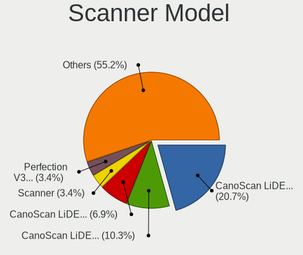

| Model                                                         | Desktops | Percent |
|---------------------------------------------------------------|----------|---------|
| Canon CanoScan LiDE 210                                       | 4        | 19.05%  |
| Canon CanoScan LiDE 110                                       | 2        | 9.52%   |
| Seiko Epson Scanner                                           | 1        | 4.76%   |
| Seiko Epson GT-X770 [Perfection V500]                         | 1        | 4.76%   |
| Seiko Epson GT-F730 [GT-S630/Perfection V33/V330 Photo]       | 1        | 4.76%   |
| Seiko Epson GT-F520/GT-F570 [Perfection 3590 PHOTO]           | 1        | 4.76%   |
| Seiko Epson GT-8700/GT-8700F [Perfection 1640SU/1640SU PHOTO] | 1        | 4.76%   |
| Seiko Epson GT-8300UF [Perfection 1660 PHOTO]                 | 1        | 4.76%   |
| Mustek Systems ScanExpress A3 USB                             | 1        | 4.76%   |
| HP Scanjet G2710                                              | 1        | 4.76%   |
| HP ScanJet 5300c/5370c                                        | 1        | 4.76%   |
| HP ScanJet 3970c                                              | 1        | 4.76%   |
| Canon CanoScan N670U/N676U/LiDE 20                            | 1        | 4.76%   |
| Canon CanoScan N1240U/LiDE 30                                 | 1        | 4.76%   |
| Canon CanoScan LiDE 220                                       | 1        | 4.76%   |
| AGFA-Gevaert NV SnapScan e20                                  | 1        | 4.76%   |
| AGFA-Gevaert NV SnapScan 1212U (?)                            | 1        | 4.76%   |

Camera
------

Camera Vendor
-------------

Camera device vendors

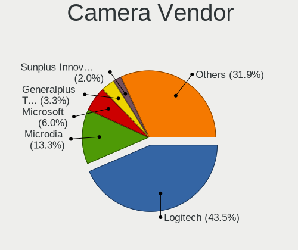

| Vendor                        | Desktops | Percent |
|-------------------------------|----------|---------|
| Logitech                      | 113      | 45.2%   |
| Microdia                      | 33       | 13.2%   |
| Microsoft                     | 16       | 6.4%    |
| Generalplus Technology        | 9        | 3.6%    |
| Trust                         | 5        | 2%      |
| Sunplus Innovation Technology | 5        | 2%      |
| Chicony Electronics           | 5        | 2%      |
| Z-Star Microelectronics       | 4        | 1.6%    |
| Samsung Electronics           | 4        | 1.6%    |
| Realtek Semiconductor         | 4        | 1.6%    |
| Creative Technology           | 4        | 1.6%    |
| ARC International             | 4        | 1.6%    |
| Apple                         | 4        | 1.6%    |
| MacroSilicon                  | 3        | 1.2%    |
| 2M UVC CAMERA                 | 3        | 1.2%    |
| Oculus VR                     | 2        | 0.8%    |
| Hewlett-Packard               | 2        | 0.8%    |
| Genesys Logic                 | 2        | 0.8%    |
| Cubeternet                    | 2        | 0.8%    |
| Arkmicro Technologies         | 2        | 0.8%    |
| WaveRider Communications      | 1        | 0.4%    |
| Unknown                       | 1        | 0.4%    |
| Tobii Technology AB           | 1        | 0.4%    |
| Sweex                         | 1        | 0.4%    |
| Suyin                         | 1        | 0.4%    |
| Sonix Technology              | 1        | 0.4%    |
| Razer USA                     | 1        | 0.4%    |
| Quanta                        | 1        | 0.4%    |
| Philips (or NXP)              | 1        | 0.4%    |
| Owon                          | 1        | 0.4%    |
| OmniVision Technologies       | 1        | 0.4%    |
| lihappe8                      | 1        | 0.4%    |
| Jieli Technology              | 1        | 0.4%    |
| IPEVO                         | 1        | 0.4%    |
| Intel                         | 1        | 0.4%    |
| Huawei Technologies           | 1        | 0.4%    |
| HTC (High Tech Computer)      | 1        | 0.4%    |
| Guillemot                     | 1        | 0.4%    |
| eMeet                         | 1        | 0.4%    |
| Cisco Systems                 | 1        | 0.4%    |

Camera Model
------------

Camera device models

| Model                                   | Desktops | Percent |
|-----------------------------------------|----------|---------|
| Logitech Webcam C270                    | 30       | 11.95%  |
| Microdia USB 2.0 Camera                 | 15       | 5.98%   |
| Logitech HD Pro Webcam C920             | 14       | 5.58%   |
| Logitech C922 Pro Stream Webcam         | 9        | 3.59%   |
| Microdia Webcam Vitade AF               | 7        | 2.79%   |
| Logitech HD Webcam C525                 | 6        | 2.39%   |
| Logitech BRIO Ultra HD Webcam           | 6        | 2.39%   |
| Generalplus CAMERA - UVC                | 6        | 2.39%   |
| Logitech Webcam C310                    | 5        | 1.99%   |
| Logitech HD Webcam C615                 | 5        | 1.99%   |
| Samsung Galaxy series, misc. (MTP mode) | 4        | 1.59%   |
| Microsoft LifeCam HD-3000               | 4        | 1.59%   |
| Microdia Camera                         | 4        | 1.59%   |
| Logitech CrystalCam                     | 4        | 1.59%   |
| Logitech B525 HD Webcam                 | 4        | 1.59%   |
| ARC International Camera                | 4        | 1.59%   |
| Microdia USB Live camera                | 3        | 1.2%    |
| Microdia Sonix USB 2.0 Camera           | 3        | 1.2%    |
| Logitech Webcam Pro 9000                | 3        | 1.2%    |
| Logitech Webcam C925e                   | 3        | 1.2%    |
| Logitech C920 PRO HD Webcam             | 3        | 1.2%    |
| Logitech BRIO 4K Stream Edition         | 3        | 1.2%    |
| Apple iPhone 5/5C/5S/6/SE/7/8/X         | 3        | 1.2%    |
| 2M UVC CAMERA NexiGo N60 FHD Webcam     | 3        | 1.2%    |
| Z-Star Venus USB2.0 Camera              | 2        | 0.8%    |
| Sunplus PC Camera                       | 2        | 0.8%    |
| Sunplus Full HD webcam                  | 2        | 0.8%    |
| Oculus VR Quest                         | 2        | 0.8%    |
| Microsoft Microsoft LifeCam Cinema    | 2        | 0.8%    |
| Microsoft LifeCam VX-800                | 2        | 0.8%    |
| Microsoft LifeCam VX-700                | 2        | 0.8%    |
| MacroSilicon USB3. 0 capture            | 2        | 0.8%    |
| Logitech Webcam C250                    | 2        | 0.8%    |
| Logitech HD Webcam C910                 | 2        | 0.8%    |
| Logitech C505 HD Webcam                 | 2        | 0.8%    |
| Generalplus GENERAL WEBCAM              | 2        | 0.8%    |
| Cubeternet USB2.0 Camera                | 2        | 0.8%    |
| Creative VF0530 Live! Cam Chat IM       | 2        | 0.8%    |
| Chicony HP Webcam                       | 2        | 0.8%    |
| Arkmicro USB2.0 PC CAMERA               | 2        | 0.8%    |

Security
--------

Fingerprint Vendor
------------------

Fingerprint sensor vendors

| Vendor                | Desktops | Percent |
|-----------------------|----------|---------|
| Elan Microelectronics | 2        | 40%     |
| STMicroelectronics    | 1        | 20%     |
| DigitalPersona        | 1        | 20%     |
| AuthenTec             | 1        | 20%     |

Fingerprint Model
-----------------

Fingerprint sensor models

| Model                                       | Desktops | Percent |
|---------------------------------------------|----------|---------|
| Elan fingerprint sensor [FeinTech FPS00200] | 2        | 40%     |
| STMicroelectronics Fingerprint Reader       | 1        | 20%     |
| DigitalPersona Fingerprint Reader           | 1        | 20%     |
| AuthenTec AES2501 Fingerprint Sensor        | 1        | 20%     |

Chipcard Vendor
---------------

Chipcard module vendors

| Vendor                     | Desktops | Percent |
|----------------------------|----------|---------|
| Gemalto (was Gemplus)      | 4        | 28.57%  |
| Hewlett-Packard            | 2        | 14.29%  |
| Yubico.com                 | 1        | 7.14%   |
| Watchdata                  | 1        | 7.14%   |
| SCM Microsystems           | 1        | 7.14%   |
| OmniKey                    | 1        | 7.14%   |
| Clay Logic                 | 1        | 7.14%   |
| CHERRY                     | 1        | 7.14%   |
| Castles Technology         | 1        | 7.14%   |
| Athena Smartcard Solutions | 1        | 7.14%   |

Chipcard Model
--------------

Chipcard module models

| Model                                                  | Desktops | Percent |
|--------------------------------------------------------|----------|---------|
| Gemalto (was Gemplus) GemPC Twin SmartCard Reader      | 4        | 28.57%  |
| Hewlett-Packard SC Keyboard - Apollo (Liteon)          | 2        | 14.29%  |
| Yubico.com Yubikey 4/5 U2F+CCID                        | 1        | 7.14%   |
| Watchdata USB Key                                      | 1        | 7.14%   |
| SCM Microsystems SCR331-LC1 / SCR3310 SmartCard Reader | 1        | 7.14%   |
| OmniKey 3x21 Smart Card Reader                         | 1        | 7.14%   |
| Clay Logic Nitrokey HSM                                | 1        | 7.14%   |
| CHERRY SmartCard Reader Keyboard KC 1000 SC            | 1        | 7.14%   |
| Castles Technology EZCCID Smart Card Reader            | 1        | 7.14%   |
| Athena Smartcard Solutions ASEDrive CCID               | 1        | 7.14%   |

Unsupported
-----------

Unsupported Devices
-------------------

Total unsupported devices on board

| Total | Desktops | Percent |
|-------|----------|---------|
| 0     | 1000     | 83.19%  |
| 1     | 163      | 13.56%  |
| 2     | 28       | 2.33%   |
| 3     | 10       | 0.83%   |
| 5     | 1        | 0.08%   |

Unsupported Device Types
------------------------

Types of unsupported devices

| Type                     | Desktops | Percent |
|--------------------------|----------|---------|
| Net/wireless             | 68       | 30.49%  |
| Graphics card            | 62       | 27.8%   |
| Unassigned class         | 23       | 10.31%  |
| Sound                    | 17       | 7.62%   |
| Chipcard                 | 9        | 4.04%   |
| Multimedia controller    | 8        | 3.59%   |
| Card reader              | 7        | 3.14%   |
| Communication controller | 6        | 2.69%   |
| Fingerprint reader       | 5        | 2.24%   |
| Firewire controller      | 4        | 1.79%   |
| Storage/raid             | 3        | 1.35%   |
| Network                  | 3        | 1.35%   |
| Camera                   | 3        | 1.35%   |
| Bluetooth                | 3        | 1.35%   |
| Net/ethernet             | 2        | 0.9%    |

