openSUSE - Tested Hardware & Statistics (Notebooks)
---------------------------------------------------

A project to collect tested hardware configurations for openSUSE.

Anyone can contribute to this report by the [hw-probe](https://github.com/linuxhw/hw-probe) tool:

    sudo -E hw-probe -all -upload

Please contribute! Especially if your hardware is rare.

Contents
--------

* [ Test Cases ](#test-cases)

* [ System ](#system)
  - [ OS                       ](#os)
  - [ OS Family                ](#os-family)
  - [ Kernel                   ](#kernel)
  - [ Kernel Family            ](#kernel-family)
  - [ Kernel Major Ver.        ](#kernel-major-ver)
  - [ Arch                     ](#arch)
  - [ DE                       ](#de)
  - [ Display Server           ](#display-server)
  - [ Display Manager          ](#display-manager)
  - [ OS Lang                  ](#os-lang)
  - [ Boot Mode                ](#boot-mode)
  - [ Filesystem               ](#filesystem)
  - [ Part. scheme             ](#part-scheme)
  - [ Dual Boot with Linux/BSD ](#dual-boot-with-linuxbsd)
  - [ Dual Boot (Win)          ](#dual-boot-win)

* [ Board ](#board)
  - [ Vendor                   ](#vendor)
  - [ Model                    ](#model)
  - [ Model Family             ](#model-family)
  - [ MFG Year                 ](#mfg-year)
  - [ Form Factor              ](#form-factor)
  - [ Secure Boot              ](#secure-boot)
  - [ Coreboot                 ](#coreboot)
  - [ RAM Size                 ](#ram-size)
  - [ RAM Used                 ](#ram-used)
  - [ Total Drives             ](#total-drives)
  - [ Has CD-ROM               ](#has-cd-rom)
  - [ Has Ethernet             ](#has-ethernet)
  - [ Has WiFi                 ](#has-wifi)
  - [ Has Bluetooth            ](#has-bluetooth)

* [ Location ](#location)
  - [ Country                  ](#country)
  - [ City                     ](#city)

* [ Drives ](#drives)
  - [ Drive Vendor             ](#drive-vendor)
  - [ Drive Model              ](#drive-model)
  - [ HDD Vendor               ](#hdd-vendor)
  - [ SSD Vendor               ](#ssd-vendor)
  - [ Drive Kind               ](#drive-kind)
  - [ Drive Connector          ](#drive-connector)
  - [ Drive Size               ](#drive-size)
  - [ Space Total              ](#space-total)
  - [ Space Used               ](#space-used)
  - [ Malfunc. Drives          ](#malfunc-drives)
  - [ Malfunc. Drive Vendor    ](#malfunc-drive-vendor)
  - [ Malfunc. HDD Vendor      ](#malfunc-hdd-vendor)
  - [ Malfunc. Drive Kind      ](#malfunc-drive-kind)
  - [ Failed Drives            ](#failed-drives)
  - [ Failed Drive Vendor      ](#failed-drive-vendor)
  - [ Drive Status             ](#drive-status)

* [ Storage controller ](#storage-controller)
  - [ Storage Vendor           ](#storage-vendor)
  - [ Storage Model            ](#storage-model)
  - [ Storage Kind             ](#storage-kind)

* [ Processor ](#processor)
  - [ CPU Vendor               ](#cpu-vendor)
  - [ CPU Model                ](#cpu-model)
  - [ CPU Model Family         ](#cpu-model-family)
  - [ CPU Cores                ](#cpu-cores)
  - [ CPU Sockets              ](#cpu-sockets)
  - [ CPU Threads              ](#cpu-threads)
  - [ CPU Op-Modes             ](#cpu-op-modes)
  - [ CPU Microcode            ](#cpu-microcode)
  - [ CPU Microarch            ](#cpu-microarch)

* [ Graphics ](#graphics)
  - [ GPU Vendor               ](#gpu-vendor)
  - [ GPU Model                ](#gpu-model)
  - [ GPU Combo                ](#gpu-combo)
  - [ GPU Driver               ](#gpu-driver)
  - [ GPU Memory               ](#gpu-memory)

* [ Monitor ](#monitor)
  - [ Monitor Vendor           ](#monitor-vendor)
  - [ Monitor Model            ](#monitor-model)
  - [ Monitor Resolution       ](#monitor-resolution)
  - [ Monitor Diagonal         ](#monitor-diagonal)
  - [ Monitor Width            ](#monitor-width)
  - [ Aspect Ratio             ](#aspect-ratio)
  - [ Monitor Area             ](#monitor-area)
  - [ Pixel Density            ](#pixel-density)
  - [ Multiple Monitors        ](#multiple-monitors)

* [ Network ](#network)
  - [ Net Controller Vendor    ](#net-controller-vendor)
  - [ Net Controller Model     ](#net-controller-model)
  - [ Wireless Vendor          ](#wireless-vendor)
  - [ Wireless Model           ](#wireless-model)
  - [ Ethernet Vendor          ](#ethernet-vendor)
  - [ Ethernet Model           ](#ethernet-model)
  - [ Net Controller Kind      ](#net-controller-kind)
  - [ Used Controller          ](#used-controller)
  - [ NICs                     ](#nics)
  - [ IPv6                     ](#ipv6)

* [ Bluetooth ](#bluetooth)
  - [ Bluetooth Vendor         ](#bluetooth-vendor)
  - [ Bluetooth Model          ](#bluetooth-model)

* [ Sound ](#sound)
  - [ Sound Vendor             ](#sound-vendor)
  - [ Sound Model              ](#sound-model)

* [ Memory ](#memory)
  - [ Memory Vendor            ](#memory-vendor)
  - [ Memory Model             ](#memory-model)
  - [ Memory Kind              ](#memory-kind)
  - [ Memory Form Factor       ](#memory-form-factor)
  - [ Memory Size              ](#memory-size)
  - [ Memory Speed             ](#memory-speed)

* [ Printers & scanners ](#printers--scanners)
  - [ Printer Vendor           ](#printer-vendor)
  - [ Printer Model            ](#printer-model)
  - [ Scanner Vendor           ](#scanner-vendor)
  - [ Scanner Model            ](#scanner-model)

* [ Camera ](#camera)
  - [ Camera Vendor            ](#camera-vendor)
  - [ Camera Model             ](#camera-model)

* [ Security ](#security)
  - [ Fingerprint Vendor       ](#fingerprint-vendor)
  - [ Fingerprint Model        ](#fingerprint-model)
  - [ Chipcard Vendor          ](#chipcard-vendor)
  - [ Chipcard Model           ](#chipcard-model)

* [ Unsupported ](#unsupported)
  - [ Unsupported Devices      ](#unsupported-devices)
  - [ Unsupported Device Types ](#unsupported-device-types)

Test Cases
----------

Total: 3300

| Vendor        | Model                       | Probe                                                      | Date         |
|---------------|-----------------------------|------------------------------------------------------------|--------------|
| Lenovo        | Unknown                     | [bcc2862f42](https://linux-hardware.org/?probe=bcc2862f42) | Jan 03, 2026 |
| Lenovo        | Unknown                     | [680abec869](https://linux-hardware.org/?probe=680abec869) | Jan 03, 2026 |
| Acer          | Aspire A515-41G             | [f47905d4de](https://linux-hardware.org/?probe=f47905d4de) | Jan 03, 2026 |
| Dell          | Latitude 5591               | [bc2c35fb4c](https://linux-hardware.org/?probe=bc2c35fb4c) | Jan 01, 2026 |
| Acer          | Predator PHN14-51           | [181f423b8d](https://linux-hardware.org/?probe=181f423b8d) | Dec 31, 2025 |
| HP            | OmniBook 5 Laptop 16-ag1... | [61d4742971](https://linux-hardware.org/?probe=61d4742971) | Dec 30, 2025 |
| Acer          | Predator PHN14-51           | [05d0a2008b](https://linux-hardware.org/?probe=05d0a2008b) | Dec 29, 2025 |
| HUAWEI        | MCLG-XX                     | [3090557392](https://linux-hardware.org/?probe=3090557392) | Dec 28, 2025 |
| Lenovo        | ThinkPad SL 2746EHG         | [5244ca87d3](https://linux-hardware.org/?probe=5244ca87d3) | Dec 28, 2025 |
| ASUSTek       | ASUS EXPERTBOOK B1500CEA... | [44dc2e4b0c](https://linux-hardware.org/?probe=44dc2e4b0c) | Dec 28, 2025 |
| Dell          | XPS 13 9370                 | [627cce2a13](https://linux-hardware.org/?probe=627cce2a13) | Dec 27, 2025 |
| HP            | Victus by Laptop 16-d1xx... | [65b44c0614](https://linux-hardware.org/?probe=65b44c0614) | Dec 27, 2025 |
| Dell          | Inspiron 5570               | [5ac7197385](https://linux-hardware.org/?probe=5ac7197385) | Dec 27, 2025 |
| Dell          | Inspiron 15 3511            | [3d847acb0d](https://linux-hardware.org/?probe=3d847acb0d) | Dec 27, 2025 |
| Chuwi         | CoreBook X                  | [78a49fcdc4](https://linux-hardware.org/?probe=78a49fcdc4) | Dec 25, 2025 |
| HP            | Pavilion Gaming Laptop 1... | [b799c89739](https://linux-hardware.org/?probe=b799c89739) | Dec 24, 2025 |
| HP            | Victus by Gaming Laptop ... | [ac87958f10](https://linux-hardware.org/?probe=ac87958f10) | Dec 24, 2025 |
| Acer          | Swift SF314-41              | [53341c13f4](https://linux-hardware.org/?probe=53341c13f4) | Dec 23, 2025 |
| Lenovo        | ThinkPad SL 2746EHG         | [378aecab98](https://linux-hardware.org/?probe=378aecab98) | Dec 21, 2025 |
| Acer          | Nitro AN517-51              | [6aeb2d3986](https://linux-hardware.org/?probe=6aeb2d3986) | Dec 20, 2025 |
| Sony          | VPCCW1S1R                   | [f71d59a1a5](https://linux-hardware.org/?probe=f71d59a1a5) | Dec 19, 2025 |
| Apple         | MacBookPro14,1              | [7a1faff87f](https://linux-hardware.org/?probe=7a1faff87f) | Dec 18, 2025 |
| HP            | ZBook Power G7 Mobile Wo... | [bb4aa90012](https://linux-hardware.org/?probe=bb4aa90012) | Dec 18, 2025 |
| HP            | Laptop 15s-eq0xxx           | [987eb21e32](https://linux-hardware.org/?probe=987eb21e32) | Dec 18, 2025 |
| Dynabook      | TECRA A50-EC                | [7eecb4e11a](https://linux-hardware.org/?probe=7eecb4e11a) | Dec 18, 2025 |
| MSI           | GT72S 6QD                   | [31df30217c](https://linux-hardware.org/?probe=31df30217c) | Dec 17, 2025 |
| Dynabook      | TECRA A50-EC                | [8985ace477](https://linux-hardware.org/?probe=8985ace477) | Dec 17, 2025 |
| ASUSTek       | ROG Strix G713PV_G713PV     | [908e4fdcb1](https://linux-hardware.org/?probe=908e4fdcb1) | Dec 16, 2025 |
| ASUSTek       | ROG Strix G713PV_G713PV     | [c157287e3a](https://linux-hardware.org/?probe=c157287e3a) | Dec 16, 2025 |
| Acer          | Swift SF314-41              | [e6c4dc9a96](https://linux-hardware.org/?probe=e6c4dc9a96) | Dec 14, 2025 |
| Lenovo        | IdeaPad 1 15AMN7 82VG       | [5acd9fce6c](https://linux-hardware.org/?probe=5acd9fce6c) | Dec 14, 2025 |
| Dell          | Latitude 5591               | [f86a5f6f2f](https://linux-hardware.org/?probe=f86a5f6f2f) | Dec 09, 2025 |
| MSI           | GT72S 6QD                   | [2b5bdee59a](https://linux-hardware.org/?probe=2b5bdee59a) | Dec 09, 2025 |
| Lenovo        | G50-45 80E3                 | [4ae42b6784](https://linux-hardware.org/?probe=4ae42b6784) | Dec 08, 2025 |
| Dell          | Inspiron 3179               | [6730afb4ec](https://linux-hardware.org/?probe=6730afb4ec) | Dec 08, 2025 |
| Acer          | Aspire A515-54              | [6c291f3297](https://linux-hardware.org/?probe=6c291f3297) | Dec 06, 2025 |
| HP            | Victus by Gaming Laptop ... | [82093be73c](https://linux-hardware.org/?probe=82093be73c) | Dec 03, 2025 |
| HP            | Victus by Gaming Laptop ... | [574baa8a6e](https://linux-hardware.org/?probe=574baa8a6e) | Dec 03, 2025 |
| Lenovo        | IdeaPad 110-15IBR 80W2      | [b9696cacf4](https://linux-hardware.org/?probe=b9696cacf4) | Dec 02, 2025 |
| Lenovo        | IdeaPad 110-15IBR 80W2      | [1de55db875](https://linux-hardware.org/?probe=1de55db875) | Dec 02, 2025 |
| HP            | Pavilion Gaming Laptop 1... | [bedd4b48de](https://linux-hardware.org/?probe=bedd4b48de) | Nov 30, 2025 |
| Dell          | Latitude 3570               | [bd8b4fe50b](https://linux-hardware.org/?probe=bd8b4fe50b) | Nov 29, 2025 |
| Dell          | Latitude 3570               | [a7fc554195](https://linux-hardware.org/?probe=a7fc554195) | Nov 29, 2025 |
| Lenovo        | ThinkPad T480 20L6S68A00    | [815e16d0f4](https://linux-hardware.org/?probe=815e16d0f4) | Nov 29, 2025 |
| HP            | Pavilion Gaming Laptop 1... | [72b7b6fb4a](https://linux-hardware.org/?probe=72b7b6fb4a) | Nov 28, 2025 |
| SLIMBOOK      | PROX-AMD5                   | [51f7c2102c](https://linux-hardware.org/?probe=51f7c2102c) | Nov 27, 2025 |
| Standard      | Unknown                     | [93129aab96](https://linux-hardware.org/?probe=93129aab96) | Nov 27, 2025 |
| Lenovo        | IdeaPad Gaming 3 15ARH05... | [9b6723f901](https://linux-hardware.org/?probe=9b6723f901) | Nov 26, 2025 |
| Lenovo        | G50-45 80E3                 | [d98cbee5e0](https://linux-hardware.org/?probe=d98cbee5e0) | Nov 25, 2025 |
| Lenovo        | Legion Pro 7 16IRX9H 83D... | [e9da8ebd4f](https://linux-hardware.org/?probe=e9da8ebd4f) | Nov 24, 2025 |
| Dell          | Latitude 7490               | [e7a267e05e](https://linux-hardware.org/?probe=e7a267e05e) | Nov 24, 2025 |
| Dell          | Latitude 7490               | [c5eb23afd7](https://linux-hardware.org/?probe=c5eb23afd7) | Nov 24, 2025 |
| Lenovo        | ThinkPad T460 20FMS1RY01    | [20a18e43ae](https://linux-hardware.org/?probe=20a18e43ae) | Nov 23, 2025 |
| Standard      | Unknown                     | [06d0c019ff](https://linux-hardware.org/?probe=06d0c019ff) | Nov 23, 2025 |
| MSI           | Thin GF63 12UCX             | [08eaf8cfa6](https://linux-hardware.org/?probe=08eaf8cfa6) | Nov 23, 2025 |
| Lenovo        | IdeaPad Slim 3 14ARP10 8... | [6406bb4946](https://linux-hardware.org/?probe=6406bb4946) | Nov 22, 2025 |
| Lenovo        | IdeaPad Z510 20287          | [493f860637](https://linux-hardware.org/?probe=493f860637) | Nov 22, 2025 |
| Lenovo        | Z50-70 20354                | [9da51aadeb](https://linux-hardware.org/?probe=9da51aadeb) | Nov 22, 2025 |
| ASUSTek       | X555UQ                      | [976df60f39](https://linux-hardware.org/?probe=976df60f39) | Nov 22, 2025 |
| Dell          | Precision 3591              | [40ce38eb1c](https://linux-hardware.org/?probe=40ce38eb1c) | Nov 21, 2025 |
| HP            | ENVY Laptop 17-cg0xxx       | [ac571d1d9c](https://linux-hardware.org/?probe=ac571d1d9c) | Nov 18, 2025 |
| Acer          | Aspire AL14-51M             | [7d84b32efa](https://linux-hardware.org/?probe=7d84b32efa) | Nov 18, 2025 |
| Clevo         | W24xCZ                      | [4231df0d37](https://linux-hardware.org/?probe=4231df0d37) | Nov 17, 2025 |
| Dell          | Precision 3551              | [e049748353](https://linux-hardware.org/?probe=e049748353) | Nov 17, 2025 |
| ASUSTek       | ASUS Vivobook 16 M1607KA... | [beb6a99bba](https://linux-hardware.org/?probe=beb6a99bba) | Nov 17, 2025 |
| HP            | Pavilion Gaming Laptop 1... | [d7ac7f6f50](https://linux-hardware.org/?probe=d7ac7f6f50) | Nov 16, 2025 |
| HP            | Pavilion Aero Laptop 13-... | [c4cc4854bc](https://linux-hardware.org/?probe=c4cc4854bc) | Nov 15, 2025 |
| Lenovo        | ThinkPad SL 2746EHG         | [2dbd8cf1eb](https://linux-hardware.org/?probe=2dbd8cf1eb) | Nov 15, 2025 |
| ASUSTek       | Vivobook Go E1504FA_E150... | [d31c237d71](https://linux-hardware.org/?probe=d31c237d71) | Nov 15, 2025 |
| Dell          | Latitude 5430               | [5c32302806](https://linux-hardware.org/?probe=5c32302806) | Nov 15, 2025 |
| HP            | Victus by Gaming Laptop ... | [b6c2c1cf82](https://linux-hardware.org/?probe=b6c2c1cf82) | Nov 15, 2025 |
| Lenovo        | V580c 20160                 | [b5adf6124e](https://linux-hardware.org/?probe=b5adf6124e) | Nov 14, 2025 |
| Lenovo        | ThinkPad X1 Carbon Gen 1... | [dc56e6aa62](https://linux-hardware.org/?probe=dc56e6aa62) | Nov 13, 2025 |
| TUXEDO        | InfinityBook Pro AMD Gen... | [a538a6b25d](https://linux-hardware.org/?probe=a538a6b25d) | Nov 12, 2025 |
| Lenovo        | ThinkPad S1 Yoga 12 20DK... | [1659201ff8](https://linux-hardware.org/?probe=1659201ff8) | Nov 12, 2025 |
| HP            | Pavilion Aero Laptop 13-... | [843383f32d](https://linux-hardware.org/?probe=843383f32d) | Nov 10, 2025 |
| Apple         | MacBookPro8,1               | [8b9f8ae841](https://linux-hardware.org/?probe=8b9f8ae841) | Nov 08, 2025 |
| Acer          | Aspire V5-591G              | [8e2caf0825](https://linux-hardware.org/?probe=8e2caf0825) | Nov 06, 2025 |
| HP            | Pavilion Gaming Laptop 1... | [933e823c56](https://linux-hardware.org/?probe=933e823c56) | Nov 06, 2025 |
| Toshiba       | Satellite C45-A             | [ae89bbeb4b](https://linux-hardware.org/?probe=ae89bbeb4b) | Nov 06, 2025 |
| Lenovo        | B40-45 20394                | [de7da8f3ff](https://linux-hardware.org/?probe=de7da8f3ff) | Nov 06, 2025 |
| Dell          | Latitude 9420               | [b154b71181](https://linux-hardware.org/?probe=b154b71181) | Nov 05, 2025 |
| Dell          | Latitude 9430               | [4103afd533](https://linux-hardware.org/?probe=4103afd533) | Nov 03, 2025 |
| Packard Be... | EasyNote TS44HR             | [e53e5077f8](https://linux-hardware.org/?probe=e53e5077f8) | Nov 02, 2025 |
| Dell          | Precision 5560              | [87bc5dfb84](https://linux-hardware.org/?probe=87bc5dfb84) | Nov 01, 2025 |
| HP            | ENVY Laptop 15t-ep000       | [8f11a9c650](https://linux-hardware.org/?probe=8f11a9c650) | Oct 30, 2025 |
| Lenovo        | ThinkPad E14 Gen 2 20TA0... | [0871eb8d23](https://linux-hardware.org/?probe=0871eb8d23) | Oct 29, 2025 |
| Dell          | Precision 7510              | [8d39f1697c](https://linux-hardware.org/?probe=8d39f1697c) | Oct 29, 2025 |
| HP            | ZBook 14u G6                | [d1fc5e7734](https://linux-hardware.org/?probe=d1fc5e7734) | Oct 29, 2025 |
| Lenovo        | ThinkPad T580 20LAS2VU00    | [ee19d46a3e](https://linux-hardware.org/?probe=ee19d46a3e) | Oct 28, 2025 |
| Lenovo        | ThinkPad E14 Gen 3 20YD0... | [f8368acf87](https://linux-hardware.org/?probe=f8368acf87) | Oct 27, 2025 |
| Acer          | Aspire E1-771               | [d5a00765ff](https://linux-hardware.org/?probe=d5a00765ff) | Oct 26, 2025 |
| HP            | Notebook                    | [9cc0dfb600](https://linux-hardware.org/?probe=9cc0dfb600) | Oct 26, 2025 |
| Fujitsu       | LIFEBOOK E736               | [4a1aa73700](https://linux-hardware.org/?probe=4a1aa73700) | Oct 25, 2025 |
| Framework     | Laptop 13 (AMD Ryzen 704... | [d29eed1f5b](https://linux-hardware.org/?probe=d29eed1f5b) | Oct 25, 2025 |
| Lenovo        | ThinkPad X280 20KES1L700    | [510533364d](https://linux-hardware.org/?probe=510533364d) | Oct 24, 2025 |
| Dell          | XPS 9320                    | [8d15801c29](https://linux-hardware.org/?probe=8d15801c29) | Oct 22, 2025 |
| Lenovo        | G50-30 80G0                 | [b1c3d988a2](https://linux-hardware.org/?probe=b1c3d988a2) | Oct 21, 2025 |
| Lenovo        | G50-30 80G0                 | [1baff10cf5](https://linux-hardware.org/?probe=1baff10cf5) | Oct 21, 2025 |
| MSI           | GT72S 6QD                   | [366f31c55e](https://linux-hardware.org/?probe=366f31c55e) | Oct 19, 2025 |
| Lenovo        | ThinkPad SL 2746EHG         | [5ee6cd2270](https://linux-hardware.org/?probe=5ee6cd2270) | Oct 17, 2025 |
| TUXEDO        | InfinityBook Pro Gen7 (M... | [b116173d3a](https://linux-hardware.org/?probe=b116173d3a) | Oct 17, 2025 |
| TUXEDO        | InfinityBook Pro Gen7 (M... | [3b6565e269](https://linux-hardware.org/?probe=3b6565e269) | Oct 17, 2025 |
| HP            | ZBook Firefly 14 inch G8... | [6551e6f098](https://linux-hardware.org/?probe=6551e6f098) | Oct 15, 2025 |
| MSI           | GT72S 6QD                   | [36fdf21914](https://linux-hardware.org/?probe=36fdf21914) | Oct 14, 2025 |
| Dell          | Latitude 5591               | [b0ef0ca78b](https://linux-hardware.org/?probe=b0ef0ca78b) | Oct 13, 2025 |
| Dell          | Latitude 5591               | [d727b8f8ec](https://linux-hardware.org/?probe=d727b8f8ec) | Oct 13, 2025 |
| HONOR         | BMH-WDX9                    | [637d27e7de](https://linux-hardware.org/?probe=637d27e7de) | Oct 12, 2025 |
| Lenovo        | ThinkPad T510 4384FF3       | [124f3d3389](https://linux-hardware.org/?probe=124f3d3389) | Oct 11, 2025 |
| HUAWEI        | MCLG-XX                     | [aa8db64c91](https://linux-hardware.org/?probe=aa8db64c91) | Oct 11, 2025 |
| ASUSTek       | VivoBook_ASUSLaptop X513... | [4e333720a7](https://linux-hardware.org/?probe=4e333720a7) | Oct 10, 2025 |
| Lenovo        | G50-80 80E5                 | [fc2ed3abe7](https://linux-hardware.org/?probe=fc2ed3abe7) | Oct 09, 2025 |
| XMG           | P870TM_TM1                  | [aa2c238848](https://linux-hardware.org/?probe=aa2c238848) | Oct 09, 2025 |
| Acer          | Aspire V5-591G              | [380cc0df99](https://linux-hardware.org/?probe=380cc0df99) | Oct 09, 2025 |
| Lenovo        | ThinkPad X280 20KF0020US    | [833385b60d](https://linux-hardware.org/?probe=833385b60d) | Oct 09, 2025 |
| Lenovo        | ThinkPad X280 20KF0020US    | [adb6273e67](https://linux-hardware.org/?probe=adb6273e67) | Oct 09, 2025 |
| ASUSTek       | G750JS                      | [7d3acdb389](https://linux-hardware.org/?probe=7d3acdb389) | Oct 08, 2025 |
| Dell          | Inspiron 3780               | [c63b60dbae](https://linux-hardware.org/?probe=c63b60dbae) | Oct 08, 2025 |
| Dell          | Inspiron 3780               | [b755016abb](https://linux-hardware.org/?probe=b755016abb) | Oct 08, 2025 |
| Lenovo        | Yoga Slim 7 15ILL9 83HM     | [0e5d68df5c](https://linux-hardware.org/?probe=0e5d68df5c) | Oct 07, 2025 |
| Dell          | Precision M4800             | [9a9a5cef65](https://linux-hardware.org/?probe=9a9a5cef65) | Oct 04, 2025 |
| Lenovo        | ThinkBook 14-IML 20RV       | [819d601027](https://linux-hardware.org/?probe=819d601027) | Oct 04, 2025 |
| Lenovo        | ThinkBook 14-IML 20RV       | [401413928a](https://linux-hardware.org/?probe=401413928a) | Oct 04, 2025 |
| Lenovo        | ThinkPad P14s Gen 6 AMD ... | [58f60824e1](https://linux-hardware.org/?probe=58f60824e1) | Oct 03, 2025 |
| Lenovo        | ThinkPad SL 2746EHG         | [35758963bb](https://linux-hardware.org/?probe=35758963bb) | Oct 03, 2025 |
| HP            | EliteBook 8460p             | [c6c83d8109](https://linux-hardware.org/?probe=c6c83d8109) | Oct 01, 2025 |
| Lenovo        | ThinkPad T480s 20L8S0AC0... | [b6224537ab](https://linux-hardware.org/?probe=b6224537ab) | Sep 30, 2025 |
| ASUSTek       | UX390UAK                    | [f217e27b6e](https://linux-hardware.org/?probe=f217e27b6e) | Sep 30, 2025 |
| Dell          | Precision 3580              | [905ae1a14d](https://linux-hardware.org/?probe=905ae1a14d) | Sep 30, 2025 |
| ASUSTek       | ProArt P16 H7606WV_H7606... | [9704804f20](https://linux-hardware.org/?probe=9704804f20) | Sep 30, 2025 |
| ASUSTek       | VivoBook_ASUSLaptop K360... | [db14039bcc](https://linux-hardware.org/?probe=db14039bcc) | Sep 28, 2025 |
| HP            | EliteBook 8440p             | [49d7df7ffe](https://linux-hardware.org/?probe=49d7df7ffe) | Sep 28, 2025 |
| Acer          | Aspire E3-111               | [f7d8f1fb57](https://linux-hardware.org/?probe=f7d8f1fb57) | Sep 27, 2025 |
| Acer          | Aspire E3-111               | [4280ac029f](https://linux-hardware.org/?probe=4280ac029f) | Sep 27, 2025 |
| Lenovo        | ThinkPad SL 2746EHG         | [2e3cab13b9](https://linux-hardware.org/?probe=2e3cab13b9) | Sep 27, 2025 |
| ASUSTek       | ROG Zephyrus G16 GA605WI... | [bbf0a74ce5](https://linux-hardware.org/?probe=bbf0a74ce5) | Sep 27, 2025 |
| Acer          | Predator PH315-55           | [3eb08b5a44](https://linux-hardware.org/?probe=3eb08b5a44) | Sep 27, 2025 |
| ASUSTek       | ROG Flow X13 GV301QH_GV3... | [09679a44e2](https://linux-hardware.org/?probe=09679a44e2) | Sep 27, 2025 |
| ASUSTek       | ROG Flow X13 GV301QH_GV3... | [350473ad18](https://linux-hardware.org/?probe=350473ad18) | Sep 26, 2025 |
| Lenovo        | ThinkPad T14 Gen 5 21MCC... | [be240cf665](https://linux-hardware.org/?probe=be240cf665) | Sep 23, 2025 |
| Dell          | Inspiron 15 3535            | [65411566c6](https://linux-hardware.org/?probe=65411566c6) | Sep 21, 2025 |
| Dell          | Inspiron 15 3535            | [5044d2f79f](https://linux-hardware.org/?probe=5044d2f79f) | Sep 21, 2025 |
| ASUSTek       | ROG Flow X13 GV301QH_GV3... | [c1d4e2814b](https://linux-hardware.org/?probe=c1d4e2814b) | Sep 19, 2025 |
| HP            | Compaq 615                  | [004b94514c](https://linux-hardware.org/?probe=004b94514c) | Sep 16, 2025 |
| Lenovo        | IdeaPad Slim 3 15AMN8 82... | [56044a6de1](https://linux-hardware.org/?probe=56044a6de1) | Sep 16, 2025 |
| ASUSTek       | Q302LAB                     | [38491c798c](https://linux-hardware.org/?probe=38491c798c) | Sep 15, 2025 |
| Lenovo        | ThinkPad X260 20F5S16B00    | [753e1e6745](https://linux-hardware.org/?probe=753e1e6745) | Sep 15, 2025 |
| Dell          | Precision M4800             | [b40a7236ef](https://linux-hardware.org/?probe=b40a7236ef) | Sep 13, 2025 |
| Acer          | Aspire A315-44P             | [bcaf81697b](https://linux-hardware.org/?probe=bcaf81697b) | Sep 11, 2025 |
| ASUSTek       | ASUS TUF Gaming A15 FA50... | [e931a92249](https://linux-hardware.org/?probe=e931a92249) | Sep 08, 2025 |
| ASUSTek       | VivoBook_ASUSLaptop X160... | [f31cdea7b1](https://linux-hardware.org/?probe=f31cdea7b1) | Sep 07, 2025 |
| Dell          | Inspiron 7520               | [ec8d171969](https://linux-hardware.org/?probe=ec8d171969) | Sep 07, 2025 |
| Fujitsu       | LIFEBOOK E736               | [ec0420de8b](https://linux-hardware.org/?probe=ec0420de8b) | Sep 06, 2025 |
| Fujitsu       | LIFEBOOK E736               | [30878641fc](https://linux-hardware.org/?probe=30878641fc) | Sep 06, 2025 |
| HP            | Victus by Laptop 16-e0xx... | [14b3b34dd2](https://linux-hardware.org/?probe=14b3b34dd2) | Sep 05, 2025 |
| Lenovo        | ThinkPad T440 20B7S00H01    | [25473d79fc](https://linux-hardware.org/?probe=25473d79fc) | Sep 04, 2025 |
| Lenovo        | IdeaPad 5 15ARE05 81YQ      | [5285ec943a](https://linux-hardware.org/?probe=5285ec943a) | Sep 03, 2025 |
| ASUSTek       | VivoBook_ASUSLaptop X160... | [4266cd296a](https://linux-hardware.org/?probe=4266cd296a) | Sep 03, 2025 |
| ASUSTek       | VivoBook_ASUSLaptop X160... | [901f5d63e6](https://linux-hardware.org/?probe=901f5d63e6) | Sep 03, 2025 |
| Dell          | System Vostro 3750          | [30b80b2df2](https://linux-hardware.org/?probe=30b80b2df2) | Sep 03, 2025 |
| ASUSTek       | ASUS Zenbook S 14 UX5406... | [2713ffdca5](https://linux-hardware.org/?probe=2713ffdca5) | Sep 02, 2025 |
| Lenovo        | ThinkBook 13s-IWL 20R9      | [e5b9005e65](https://linux-hardware.org/?probe=e5b9005e65) | Sep 02, 2025 |
| Dell          | Latitude 7390               | [07028b910c](https://linux-hardware.org/?probe=07028b910c) | Sep 01, 2025 |
| HP            | 255 G8 Notebook PC          | [92b7dba0b4](https://linux-hardware.org/?probe=92b7dba0b4) | Aug 30, 2025 |
| Lenovo        | ThinkPad SL 2746EHG         | [b2858bf034](https://linux-hardware.org/?probe=b2858bf034) | Aug 29, 2025 |
| Lenovo        | ThinkPad X270 W10DG 20K5... | [83794f0456](https://linux-hardware.org/?probe=83794f0456) | Aug 28, 2025 |
| Google        | Eve                         | [d498fe654b](https://linux-hardware.org/?probe=d498fe654b) | Aug 25, 2025 |
| Google        | Eve                         | [887a9961fa](https://linux-hardware.org/?probe=887a9961fa) | Aug 25, 2025 |
| Acer          | TravelMate 7730             | [49d07d9496](https://linux-hardware.org/?probe=49d07d9496) | Aug 24, 2025 |
| Acer          | TravelMate 7730             | [0b9300c4fb](https://linux-hardware.org/?probe=0b9300c4fb) | Aug 24, 2025 |
| HP            | 250 G7 Notebook PC          | [01fce0a6fe](https://linux-hardware.org/?probe=01fce0a6fe) | Aug 23, 2025 |
| Pegatron      | A15                         | [bf8f291606](https://linux-hardware.org/?probe=bf8f291606) | Aug 20, 2025 |
| Lenovo        | ThinkPad X1 Carbon Gen 1... | [902cc0aee3](https://linux-hardware.org/?probe=902cc0aee3) | Aug 17, 2025 |
| Toshiba       | dynabook Satellite B552/... | [369bd41c30](https://linux-hardware.org/?probe=369bd41c30) | Aug 17, 2025 |
| HP            | Notebook                    | [06d4654444](https://linux-hardware.org/?probe=06d4654444) | Aug 16, 2025 |
| ASRock        | X600-ITX                    | [045e3c153d](https://linux-hardware.org/?probe=045e3c153d) | Aug 14, 2025 |
| Apple         | MacBookPro7,1               | [15fe9095c1](https://linux-hardware.org/?probe=15fe9095c1) | Aug 14, 2025 |
| HP            | Laptop 17-cp2xxx            | [c3af29688a](https://linux-hardware.org/?probe=c3af29688a) | Aug 13, 2025 |
| Framework     | Laptop 16 (AMD Ryzen 704... | [02b01c2bb8](https://linux-hardware.org/?probe=02b01c2bb8) | Aug 13, 2025 |
| MSI           | GT72S 6QD                   | [aaddd71917](https://linux-hardware.org/?probe=aaddd71917) | Aug 10, 2025 |
| Notebook      | W65_W67RB                   | [f596c7fb1c](https://linux-hardware.org/?probe=f596c7fb1c) | Aug 10, 2025 |
| Lenovo        | Legion Pro 7 16IRX9H 83D... | [7db966d3ed](https://linux-hardware.org/?probe=7db966d3ed) | Aug 08, 2025 |
| Apple         | MacBook9,1                  | [97d856c908](https://linux-hardware.org/?probe=97d856c908) | Aug 07, 2025 |
| ASUSTek       | Vivobook Go E1504GAB_E15... | [6615204bf8](https://linux-hardware.org/?probe=6615204bf8) | Aug 07, 2025 |
| ASUSTek       | Vivobook Go E1504GAB_E15... | [933ebd8306](https://linux-hardware.org/?probe=933ebd8306) | Aug 06, 2025 |
| MSI           | GT72S 6QD                   | [8e222e5244](https://linux-hardware.org/?probe=8e222e5244) | Aug 06, 2025 |
| Dell          | Inspiron 5759               | [7d8eaa7360](https://linux-hardware.org/?probe=7d8eaa7360) | Aug 06, 2025 |
| Lenovo        | ThinkPad T14s Gen 3 21CQ... | [649e80ef35](https://linux-hardware.org/?probe=649e80ef35) | Aug 06, 2025 |
| ASUSTek       | ASUS TUF Gaming A14 FA40... | [5e6f51f800](https://linux-hardware.org/?probe=5e6f51f800) | Aug 05, 2025 |
| HP            | ENVY Laptop 17-cg0xxx       | [a01548fb6b](https://linux-hardware.org/?probe=a01548fb6b) | Aug 05, 2025 |
| Lenovo        | ThinkBook 15 G2 ITL 20VE    | [123e894aae](https://linux-hardware.org/?probe=123e894aae) | Aug 04, 2025 |
| Lenovo        | IdeaPad 110-15ISK 80UD      | [d882d2e10d](https://linux-hardware.org/?probe=d882d2e10d) | Aug 03, 2025 |
| Chuwi         | GemiBook Plus               | [ad2f4db6de](https://linux-hardware.org/?probe=ad2f4db6de) | Aug 03, 2025 |
| HP            | EliteBook 8540w             | [04cf265847](https://linux-hardware.org/?probe=04cf265847) | Aug 03, 2025 |
| Lenovo        | IdeaPad 1 15IAU7 82VY       | [50b20410a2](https://linux-hardware.org/?probe=50b20410a2) | Aug 03, 2025 |
| Lenovo        | LOQ 16APH8 82XU             | [cc22e231a5](https://linux-hardware.org/?probe=cc22e231a5) | Aug 02, 2025 |
| Acer          | Aspire V5-573PG             | [648e6f1408](https://linux-hardware.org/?probe=648e6f1408) | Aug 02, 2025 |
| HP            | EliteBook 840 G2            | [7492e38b9f](https://linux-hardware.org/?probe=7492e38b9f) | Aug 01, 2025 |
| ASUSTek       | Vivobook Go E1504GAB_E15... | [49004a7575](https://linux-hardware.org/?probe=49004a7575) | Aug 01, 2025 |
| TUXEDO        | InfinityBook Pro Gen8 (M... | [574dc13e9c](https://linux-hardware.org/?probe=574dc13e9c) | Jul 30, 2025 |
| Unknown       | E142                        | [5dc79c499d](https://linux-hardware.org/?probe=5dc79c499d) | Jul 30, 2025 |
| Lenovo        | ThinkPad T480 20L6S14801    | [4c49a480cf](https://linux-hardware.org/?probe=4c49a480cf) | Jul 30, 2025 |
| HP            | EliteBook 840 G2            | [b562032942](https://linux-hardware.org/?probe=b562032942) | Jul 30, 2025 |
| Lenovo        | ThinkPad T480 20L6S14801    | [c5289fd0d4](https://linux-hardware.org/?probe=c5289fd0d4) | Jul 29, 2025 |
| Toshiba       | PORTEGE R700                | [e8d7049eb2](https://linux-hardware.org/?probe=e8d7049eb2) | Jul 29, 2025 |
| Chuwi         | HeroBook Pro                | [782713a538](https://linux-hardware.org/?probe=782713a538) | Jul 27, 2025 |
| ASUSTek       | VivoBook_ASUSLaptop X712... | [06190e5180](https://linux-hardware.org/?probe=06190e5180) | Jul 26, 2025 |
| ASUSTek       | Vivobook Go E1504FA_E150... | [b5b6ecb9ce](https://linux-hardware.org/?probe=b5b6ecb9ce) | Jul 20, 2025 |
| HP            | 255 G5                      | [04e512c767](https://linux-hardware.org/?probe=04e512c767) | Jul 20, 2025 |
| Dell          | Latitude 5410               | [edf9d71e4f](https://linux-hardware.org/?probe=edf9d71e4f) | Jul 20, 2025 |
| ASUSTek       | Vivobook Go E1504FA_E150... | [3ace74dc32](https://linux-hardware.org/?probe=3ace74dc32) | Jul 20, 2025 |
| HP            | EliteBook 850 G2            | [939c8c9afd](https://linux-hardware.org/?probe=939c8c9afd) | Jul 19, 2025 |
| HP            | EliteBook 850 G2            | [c1e047f676](https://linux-hardware.org/?probe=c1e047f676) | Jul 18, 2025 |
| Lenovo        | LOQ 15APH8 82XT             | [198dedf0b5](https://linux-hardware.org/?probe=198dedf0b5) | Jul 17, 2025 |
| Lenovo        | LOQ 15APH8 82XT             | [0595f6a8df](https://linux-hardware.org/?probe=0595f6a8df) | Jul 17, 2025 |
| Apple         | MacBookPro12,1              | [28b1dbb3ba](https://linux-hardware.org/?probe=28b1dbb3ba) | Jul 17, 2025 |
| Lenovo        | ThinkPad SL 2746EHG         | [4aab9e61ba](https://linux-hardware.org/?probe=4aab9e61ba) | Jul 16, 2025 |
| Lenovo        | ThinkPad P53 20QQS0CJ00     | [b5ee27d894](https://linux-hardware.org/?probe=b5ee27d894) | Jul 15, 2025 |
| Wortmann      | 1220571_1470066             | [a1088bc7a2](https://linux-hardware.org/?probe=a1088bc7a2) | Jul 14, 2025 |
| ASUSTek       | ZenBook UX434IQ_Q407IQ      | [e729f1f2a7](https://linux-hardware.org/?probe=e729f1f2a7) | Jul 13, 2025 |
| Eii           | Hampoo Reserved             | [9ef935d4b3](https://linux-hardware.org/?probe=9ef935d4b3) | Jul 13, 2025 |
| Lenovo        | ThinkPad T480 20L6S01W00    | [e408cdc339](https://linux-hardware.org/?probe=e408cdc339) | Jul 12, 2025 |
| Lenovo        | ThinkPad X280 20KES1L700    | [5694fee339](https://linux-hardware.org/?probe=5694fee339) | Jul 11, 2025 |
| ASUSTek       | N76VB                       | [5665da57de](https://linux-hardware.org/?probe=5665da57de) | Jul 11, 2025 |
| ASUSTek       | ROG Strix G531GT_G531GT     | [454920735b](https://linux-hardware.org/?probe=454920735b) | Jul 10, 2025 |
| Acer          | Swift SF514-52T             | [e4d121fbe2](https://linux-hardware.org/?probe=e4d121fbe2) | Jul 08, 2025 |
| Lenovo        | ThinkPad X280 20KES1L700    | [1c42358e98](https://linux-hardware.org/?probe=1c42358e98) | Jul 06, 2025 |
| Lenovo        | ThinkPad T15p Gen 1 20TM... | [ea30422919](https://linux-hardware.org/?probe=ea30422919) | Jul 05, 2025 |
| ASUSTek       | VivoBook_ASUSLaptop M140... | [986b765a9a](https://linux-hardware.org/?probe=986b765a9a) | Jul 03, 2025 |
| HP            | Pavilion Gaming Laptop 1... | [bfc51e0846](https://linux-hardware.org/?probe=bfc51e0846) | Jul 01, 2025 |
| Infinix       | ZERO BOOK 13                | [51e86cb65b](https://linux-hardware.org/?probe=51e86cb65b) | Jun 30, 2025 |
| HP            | ENVY Laptop 17-ae1xx        | [ff3b311468](https://linux-hardware.org/?probe=ff3b311468) | Jun 29, 2025 |
| ASUSTek       | ASUS TUF Gaming F15 FX50... | [d2ecd40334](https://linux-hardware.org/?probe=d2ecd40334) | Jun 29, 2025 |
| Acer          | Aspire F5-573G              | [8a675d7922](https://linux-hardware.org/?probe=8a675d7922) | Jun 26, 2025 |
| ADVAN         | 1405                        | [63e8c5aecd](https://linux-hardware.org/?probe=63e8c5aecd) | Jun 26, 2025 |
| Toshiba       | Satellite Pro C70-B         | [89e337bda2](https://linux-hardware.org/?probe=89e337bda2) | Jun 25, 2025 |
| HP            | ENVY Laptop 15t-ep000       | [5a059a0d96](https://linux-hardware.org/?probe=5a059a0d96) | Jun 25, 2025 |
| ASUSTek       | VivoBook_ASUSLaptop M150... | [ec061ad626](https://linux-hardware.org/?probe=ec061ad626) | Jun 24, 2025 |
| ASUSTek       | VivoBook_ASUSLaptop M150... | [22c0341efe](https://linux-hardware.org/?probe=22c0341efe) | Jun 22, 2025 |
| MSI           | Prestige 16 AI Evo B1MG     | [69bf1fa623](https://linux-hardware.org/?probe=69bf1fa623) | Jun 22, 2025 |
| Lenovo        | IdeaPad 3 15ITL6 82H8       | [8457e2dbea](https://linux-hardware.org/?probe=8457e2dbea) | Jun 22, 2025 |
| Apple         | MacBookPro11,1              | [b635a4de2b](https://linux-hardware.org/?probe=b635a4de2b) | Jun 19, 2025 |
| Lenovo        | ThinkBook 15 G2 ARE 20VG    | [2680b2a79a](https://linux-hardware.org/?probe=2680b2a79a) | Jun 18, 2025 |
| Lenovo        | ThinkPad L470 W10DG 20JV... | [520801be48](https://linux-hardware.org/?probe=520801be48) | Jun 16, 2025 |
| Lenovo        | ThinkPad P14s Gen 4 21K5... | [ee845a4809](https://linux-hardware.org/?probe=ee845a4809) | Jun 16, 2025 |
| HP            | EliteBook 840 G3            | [ebefe180af](https://linux-hardware.org/?probe=ebefe180af) | Jun 15, 2025 |
| Lenovo        | ThinkPad SL 2746EHG         | [e4d39c2a86](https://linux-hardware.org/?probe=e4d39c2a86) | Jun 13, 2025 |
| Lenovo        | ThinkPad SL 2746EHG         | [9cfc12a7c5](https://linux-hardware.org/?probe=9cfc12a7c5) | Jun 09, 2025 |
| Lenovo        | BS145-15IIL 82HB            | [beec1b6d70](https://linux-hardware.org/?probe=beec1b6d70) | Jun 09, 2025 |
| Acer          | Aspire A515-45G             | [92df7af45a](https://linux-hardware.org/?probe=92df7af45a) | Jun 08, 2025 |
| Lenovo        | BS145-15IIL 82HB            | [d0a37c6c65](https://linux-hardware.org/?probe=d0a37c6c65) | Jun 08, 2025 |
| Acer          | Aspire A515-45G             | [428c786207](https://linux-hardware.org/?probe=428c786207) | Jun 08, 2025 |
| Acer          | Swift SF314-59              | [84f52bcf55](https://linux-hardware.org/?probe=84f52bcf55) | Jun 07, 2025 |
| HP            | ZBook Fury 17 G7 Mobile ... | [0f471383c9](https://linux-hardware.org/?probe=0f471383c9) | Jun 07, 2025 |
| HP            | ZBook Fury 17 G7 Mobile ... | [47873e8f04](https://linux-hardware.org/?probe=47873e8f04) | Jun 06, 2025 |
| Google        | Yahiko                      | [8741239001](https://linux-hardware.org/?probe=8741239001) | Jun 05, 2025 |
| Dell          | Latitude E6440              | [24cd69cdf5](https://linux-hardware.org/?probe=24cd69cdf5) | Jun 05, 2025 |
| Acer          | Nitro AN517-51              | [34e5d91ed5](https://linux-hardware.org/?probe=34e5d91ed5) | Jun 04, 2025 |
| Apple         | MacBookAir6,2               | [1dda9c4581](https://linux-hardware.org/?probe=1dda9c4581) | Jun 04, 2025 |
| Lenovo        | ThinkPad X270 20HMS10600    | [c831c3cead](https://linux-hardware.org/?probe=c831c3cead) | Jun 03, 2025 |
| Teclast       | F15S                        | [9a37296be9](https://linux-hardware.org/?probe=9a37296be9) | Jun 02, 2025 |
| ASUSTek       | VivoBook_ASUSLaptop M740... | [c67f858d22](https://linux-hardware.org/?probe=c67f858d22) | Jun 01, 2025 |
| Lenovo        | IdeaPad Gaming 3 15IMH05... | [ea5b3df04e](https://linux-hardware.org/?probe=ea5b3df04e) | Jun 01, 2025 |
| Acer          | Aspire A315-42              | [87b9912feb](https://linux-hardware.org/?probe=87b9912feb) | May 31, 2025 |
| HP            | ProBook 470 G3              | [c1d6c4f809](https://linux-hardware.org/?probe=c1d6c4f809) | May 31, 2025 |
| Lenovo        | Legion 5 Pro 16ACH6H 82J... | [d066fc8df1](https://linux-hardware.org/?probe=d066fc8df1) | May 30, 2025 |
| HP            | G62                         | [6a0322a5ab](https://linux-hardware.org/?probe=6a0322a5ab) | May 30, 2025 |
| Lenovo        | ThinkPad T15g Gen 2i 20Y... | [472364fe12](https://linux-hardware.org/?probe=472364fe12) | May 29, 2025 |
| HP            | Laptop 15-dw1xxx            | [73222cb7e6](https://linux-hardware.org/?probe=73222cb7e6) | May 27, 2025 |
| Lenovo        | IdeaPad 3 15ITL6 82H8       | [ca04c881bb](https://linux-hardware.org/?probe=ca04c881bb) | May 26, 2025 |
| Apple         | MacBookAir6,2               | [e6bb0c3107](https://linux-hardware.org/?probe=e6bb0c3107) | May 25, 2025 |
| Apple         | MacBookPro8,3               | [251c21229b](https://linux-hardware.org/?probe=251c21229b) | May 25, 2025 |
| Lenovo        | ThinkPad T480 20L6S68A00    | [95533caccc](https://linux-hardware.org/?probe=95533caccc) | May 24, 2025 |
| HP            | 255 G8 Notebook PC          | [176dd8ed6a](https://linux-hardware.org/?probe=176dd8ed6a) | May 24, 2025 |
| Lenovo        | Yoga Pro 7 14ASP9 83HN      | [5d8aa2463a](https://linux-hardware.org/?probe=5d8aa2463a) | May 23, 2025 |
| Lenovo        | IdeaPad 1 15ALC7 82R4       | [275d587d13](https://linux-hardware.org/?probe=275d587d13) | May 23, 2025 |
| HP            | ZBook 17 G2                 | [d7c905999c](https://linux-hardware.org/?probe=d7c905999c) | May 23, 2025 |
| HP            | Laptop 15-dw3xxx            | [0ea38b915d](https://linux-hardware.org/?probe=0ea38b915d) | May 23, 2025 |
| Acer          | Aspire F5-573G              | [d3683cf05d](https://linux-hardware.org/?probe=d3683cf05d) | May 22, 2025 |
| ASUSTek       | N53SV                       | [fa1af0b957](https://linux-hardware.org/?probe=fa1af0b957) | May 22, 2025 |
| Dell          | Inspiron 3501               | [9ea72e9a01](https://linux-hardware.org/?probe=9ea72e9a01) | May 22, 2025 |
| Dell          | Latitude 5480               | [f2c47647f0](https://linux-hardware.org/?probe=f2c47647f0) | May 21, 2025 |
| Lenovo        | ThinkPad T480 20L6S68S00    | [678a3ecebb](https://linux-hardware.org/?probe=678a3ecebb) | May 19, 2025 |
| Lenovo        | ThinkPad L15 Gen 3 21C30... | [5d14688c39](https://linux-hardware.org/?probe=5d14688c39) | May 19, 2025 |
| Lenovo        | ThinkPad X230 2325B21       | [c0a027c63b](https://linux-hardware.org/?probe=c0a027c63b) | May 19, 2025 |
| ASUSTek       | ROG Strix G513IC_G513IC     | [66c4a486b4](https://linux-hardware.org/?probe=66c4a486b4) | May 17, 2025 |
| Lenovo        | ThinkPad T14p Gen 2 21KU... | [ed50e54647](https://linux-hardware.org/?probe=ed50e54647) | May 17, 2025 |
| Acer          | Aspire A515-45              | [baddcc4175](https://linux-hardware.org/?probe=baddcc4175) | May 16, 2025 |
| Dell          | Latitude 7480               | [b57836fc86](https://linux-hardware.org/?probe=b57836fc86) | May 15, 2025 |
| Dell          | Inspiron 3421               | [c781e53d6a](https://linux-hardware.org/?probe=c781e53d6a) | May 15, 2025 |
| HP            | Laptop 17-cp0xxx            | [3e38029f8f](https://linux-hardware.org/?probe=3e38029f8f) | May 14, 2025 |
| Acer          | Aspire A315-54K             | [33da7a53e9](https://linux-hardware.org/?probe=33da7a53e9) | May 13, 2025 |
| HP            | Pavilion 14                 | [98590594d5](https://linux-hardware.org/?probe=98590594d5) | May 13, 2025 |
| Lenovo        | ThinkPad T480s 20L8002TM... | [387cc8f2e3](https://linux-hardware.org/?probe=387cc8f2e3) | May 13, 2025 |
| Lenovo        | ThinkPad P14s Gen 4 21K6... | [f1d57b5fb1](https://linux-hardware.org/?probe=f1d57b5fb1) | May 13, 2025 |
| HP            | Pavilion Gaming Laptop 1... | [df0cfdaf43](https://linux-hardware.org/?probe=df0cfdaf43) | May 13, 2025 |
| Lenovo        | ThinkPad X390 20Q1S43P21    | [c6973ce0ef](https://linux-hardware.org/?probe=c6973ce0ef) | May 13, 2025 |
| Acer          | Aspire VN7-792G             | [d51b370004](https://linux-hardware.org/?probe=d51b370004) | May 12, 2025 |
| HP            | Laptop 17-cp0xxx            | [f56f7582e0](https://linux-hardware.org/?probe=f56f7582e0) | May 12, 2025 |
| Lenovo        | ThinkPad A285 20MXS07200    | [4a364e3b39](https://linux-hardware.org/?probe=4a364e3b39) | May 12, 2025 |
| Dell          | Latitude 5510               | [01d8e7ba4f](https://linux-hardware.org/?probe=01d8e7ba4f) | May 11, 2025 |
| Lenovo        | ThinkPad T520 4242CF2       | [825dbe48ff](https://linux-hardware.org/?probe=825dbe48ff) | May 10, 2025 |
| Lenovo        | ThinkPad T520 4242CF2       | [fb42a5952b](https://linux-hardware.org/?probe=fb42a5952b) | May 10, 2025 |
| Toshiba       | Satellite C55-B             | [341b696924](https://linux-hardware.org/?probe=341b696924) | May 10, 2025 |
| Lenovo        | Y520-15IKBN 80WK            | [96e68c1355](https://linux-hardware.org/?probe=96e68c1355) | May 08, 2025 |
| Acer          | Aspire A317-51              | [488e181822](https://linux-hardware.org/?probe=488e181822) | May 07, 2025 |
| HP            | Laptop 17-ca0xxx            | [932baf58b5](https://linux-hardware.org/?probe=932baf58b5) | May 07, 2025 |
| ILLEGEAR      | RAVEN SE                    | [0d1bb89bfc](https://linux-hardware.org/?probe=0d1bb89bfc) | May 07, 2025 |
| Lenovo        | ThinkPad P16v Gen 2 21KX... | [c2e0b784c1](https://linux-hardware.org/?probe=c2e0b784c1) | May 06, 2025 |
| Lenovo        | ThinkPad T530 2394BE6       | [c2642ee258](https://linux-hardware.org/?probe=c2642ee258) | May 06, 2025 |
| Apple         | MacBookPro11,2              | [7fc5f40e67](https://linux-hardware.org/?probe=7fc5f40e67) | May 06, 2025 |
| Apple         | MacBookPro11,2              | [321fb57b34](https://linux-hardware.org/?probe=321fb57b34) | May 06, 2025 |
| ILLEGEAR      | RAVEN SE                    | [fcb99b57fa](https://linux-hardware.org/?probe=fcb99b57fa) | May 06, 2025 |
| Lenovo        | ThinkPad L15 Gen 3 21C30... | [26e3605672](https://linux-hardware.org/?probe=26e3605672) | May 05, 2025 |
| Lenovo        | ThinkPad SL 2746EHG         | [3ede3ed669](https://linux-hardware.org/?probe=3ede3ed669) | May 05, 2025 |
| Lenovo        | ThinkPad X13 Gen 4 21J3C... | [a067166c1f](https://linux-hardware.org/?probe=a067166c1f) | May 05, 2025 |
| ASUSTek       | VivoBook_ASUSLaptop K650... | [d4bff54d53](https://linux-hardware.org/?probe=d4bff54d53) | May 03, 2025 |
| Lenovo        | IdeaPad 3 15ITL6 82H8       | [ebd0e1b2f9](https://linux-hardware.org/?probe=ebd0e1b2f9) | May 02, 2025 |
| HP            | Laptop 15-da0xxx            | [153a3ae913](https://linux-hardware.org/?probe=153a3ae913) | May 02, 2025 |
| Dell          | Precision 7750              | [5c448f63d9](https://linux-hardware.org/?probe=5c448f63d9) | May 01, 2025 |
| ASUSTek       | ASUS Zenbook S 14 UX5406... | [55bd845ae4](https://linux-hardware.org/?probe=55bd845ae4) | May 01, 2025 |
| ASUSTek       | ASUS Zenbook S 14 UX5406... | [9ee4c34448](https://linux-hardware.org/?probe=9ee4c34448) | May 01, 2025 |
| A-DATA Tec... | XENIAXe15TI7G11GXELX        | [72b9613889](https://linux-hardware.org/?probe=72b9613889) | Apr 30, 2025 |
| ASUSTek       | VivoBook_ASUSLaptop K650... | [9e4b571751](https://linux-hardware.org/?probe=9e4b571751) | Apr 29, 2025 |
| GPU Compan... | GWTN141-10                  | [4a3702a1da](https://linux-hardware.org/?probe=4a3702a1da) | Apr 25, 2025 |
| HP            | 255 G8 Notebook PC          | [a359d82f38](https://linux-hardware.org/?probe=a359d82f38) | Apr 24, 2025 |
| Lenovo        | ThinkBook 14 G3 ACL 21A2    | [4ce999e211](https://linux-hardware.org/?probe=4ce999e211) | Apr 24, 2025 |
| Acer          | Aspire 7741                 | [2af5d6fd28](https://linux-hardware.org/?probe=2af5d6fd28) | Apr 23, 2025 |
| Lenovo        | ThinkPad T460s 20F9S1DS0... | [3304cc6881](https://linux-hardware.org/?probe=3304cc6881) | Apr 23, 2025 |
| Lenovo        | IdeaPad 1 15ALC7 82R4       | [3f2ccfac34](https://linux-hardware.org/?probe=3f2ccfac34) | Apr 22, 2025 |
| Notebook      | P65_P67RGRERA               | [ef8e273aa3](https://linux-hardware.org/?probe=ef8e273aa3) | Apr 22, 2025 |
| Dell          | Latitude 7490               | [cda3860cfc](https://linux-hardware.org/?probe=cda3860cfc) | Apr 21, 2025 |
| Dell          | Latitude 7490               | [6f91980e28](https://linux-hardware.org/?probe=6f91980e28) | Apr 20, 2025 |
| Dell          | Latitude 5510               | [70eec9a754](https://linux-hardware.org/?probe=70eec9a754) | Apr 20, 2025 |
| Dell          | Latitude 5510               | [73223cc9a4](https://linux-hardware.org/?probe=73223cc9a4) | Apr 19, 2025 |
| Lenovo        | ThinkPad T480s 20L8S6NY1... | [561894a441](https://linux-hardware.org/?probe=561894a441) | Apr 19, 2025 |
| HP            | Laptop 15s-eq1xxx           | [6c87b2991b](https://linux-hardware.org/?probe=6c87b2991b) | Apr 19, 2025 |
| Lenovo        | ThinkPad X1 Carbon Gen 1... | [39638273af](https://linux-hardware.org/?probe=39638273af) | Apr 18, 2025 |
| Lenovo        | ThinkPad T430 2351C45       | [379a8144ac](https://linux-hardware.org/?probe=379a8144ac) | Apr 18, 2025 |
| ASUSTek       | VivoBook_ASUSLaptop X509... | [3850d00dff](https://linux-hardware.org/?probe=3850d00dff) | Apr 17, 2025 |
| Lenovo        | IdeaPad 1 15ALC7 82R4       | [51b9da5852](https://linux-hardware.org/?probe=51b9da5852) | Apr 17, 2025 |
| ASUSTek       | Zenbook S 13 UX5304VA_UX... | [a98e8baf79](https://linux-hardware.org/?probe=a98e8baf79) | Apr 16, 2025 |
| Dell          | XPS 15 9550                 | [382b40072e](https://linux-hardware.org/?probe=382b40072e) | Apr 13, 2025 |
| Avell High... | C75 RTX MUV / G1750 RTX ... | [a143ebf49f](https://linux-hardware.org/?probe=a143ebf49f) | Apr 13, 2025 |
| Lenovo        | ThinkPad P15s Gen 2i 20W... | [98775ed3ff](https://linux-hardware.org/?probe=98775ed3ff) | Apr 13, 2025 |
| Lenovo        | ThinkPad SL 2746EHG         | [01d505e12e](https://linux-hardware.org/?probe=01d505e12e) | Apr 13, 2025 |
| AMI           | Unknown                     | [cf55781b77](https://linux-hardware.org/?probe=cf55781b77) | Apr 12, 2025 |
| ASUSTek       | Vivobook Go E1504FA_E150... | [c2b1e754c7](https://linux-hardware.org/?probe=c2b1e754c7) | Apr 12, 2025 |
| ASUSTek       | Vivobook Go E1504FA_E150... | [9b1ee92621](https://linux-hardware.org/?probe=9b1ee92621) | Apr 12, 2025 |
| Lenovo        | ThinkPad SL 2746EHG         | [7452528b1f](https://linux-hardware.org/?probe=7452528b1f) | Apr 11, 2025 |
| Lenovo        | ThinkPad T480 20L50000PB    | [565d57e8e2](https://linux-hardware.org/?probe=565d57e8e2) | Apr 09, 2025 |
| Lenovo        | ThinkPad T14 Gen 3 21AHC... | [e044fe6e34](https://linux-hardware.org/?probe=e044fe6e34) | Apr 08, 2025 |
| Dell          | System Inspiron N7110       | [b02db47dad](https://linux-hardware.org/?probe=b02db47dad) | Apr 07, 2025 |
| Lenovo        | IdeaPad 5 15ARE05 81YQ      | [7236d19185](https://linux-hardware.org/?probe=7236d19185) | Apr 06, 2025 |
| Lenovo        | ThinkPad T14s Gen 2i 20W... | [8c0b5c4ed2](https://linux-hardware.org/?probe=8c0b5c4ed2) | Apr 04, 2025 |
| Lenovo        | ThinkPad T460 20FMS1RY01    | [a6d668832a](https://linux-hardware.org/?probe=a6d668832a) | Apr 04, 2025 |
| Dell          | Latitude E6540              | [1b4ffe7bc0](https://linux-hardware.org/?probe=1b4ffe7bc0) | Apr 03, 2025 |
| Lenovo        | ThinkPad T460 20FMS1RY01    | [3eaa08c52a](https://linux-hardware.org/?probe=3eaa08c52a) | Apr 03, 2025 |
| Lenovo        | G50-70 20351                | [0269909edd](https://linux-hardware.org/?probe=0269909edd) | Apr 02, 2025 |
| Dell          | Precision 3510              | [ad3d8067e5](https://linux-hardware.org/?probe=ad3d8067e5) | Apr 02, 2025 |
| MSI           | Prestige 15 A11SC           | [4b52ab6037](https://linux-hardware.org/?probe=4b52ab6037) | Apr 01, 2025 |
| Apple         | MacBookAir7,2               | [85199ec4e2](https://linux-hardware.org/?probe=85199ec4e2) | Mar 30, 2025 |
| Apple         | MacBookAir7,2               | [a89716b50d](https://linux-hardware.org/?probe=a89716b50d) | Mar 30, 2025 |
| HP            | EliteBook 865 16 inch G1... | [5910d9beef](https://linux-hardware.org/?probe=5910d9beef) | Mar 29, 2025 |
| Lenovo        | ThinkPad SL 2746EHG         | [3ca45c70ac](https://linux-hardware.org/?probe=3ca45c70ac) | Mar 28, 2025 |
| HP            | ZBook Firefly 14 inch G1... | [5c91fb7cc1](https://linux-hardware.org/?probe=5c91fb7cc1) | Mar 28, 2025 |
| Dell          | Precision 7680              | [4a01666c7c](https://linux-hardware.org/?probe=4a01666c7c) | Mar 28, 2025 |
| ASUSTek       | ProArt P16 H7606WI_H7606... | [8572d0900d](https://linux-hardware.org/?probe=8572d0900d) | Mar 28, 2025 |
| HP            | Pavilion 17                 | [71adce8b76](https://linux-hardware.org/?probe=71adce8b76) | Mar 27, 2025 |
| ASUSTek       | ProArt P16 H7606WI_H7606... | [5dafd5ce5b](https://linux-hardware.org/?probe=5dafd5ce5b) | Mar 27, 2025 |
| ASUSTek       | VivoBook_ASUSLaptop M350... | [99a5ea2e21](https://linux-hardware.org/?probe=99a5ea2e21) | Mar 26, 2025 |
| Lenovo        | ThinkPad T410 25375V7       | [d38f5c6b65](https://linux-hardware.org/?probe=d38f5c6b65) | Mar 25, 2025 |
| Lenovo        | ThinkPad T440 20B7S0N104    | [c137b713d4](https://linux-hardware.org/?probe=c137b713d4) | Mar 24, 2025 |
| VALE          | Notebook Classic C150       | [7fff17ecdd](https://linux-hardware.org/?probe=7fff17ecdd) | Mar 23, 2025 |
| VALE          | Notebook Classic C150       | [52703c9457](https://linux-hardware.org/?probe=52703c9457) | Mar 22, 2025 |
| Dell          | Latitude 5320               | [38d0e2826d](https://linux-hardware.org/?probe=38d0e2826d) | Mar 22, 2025 |
| Lenovo        | ThinkPad X1 Carbon Gen 1... | [21da5a7ab6](https://linux-hardware.org/?probe=21da5a7ab6) | Mar 21, 2025 |
| Wortmann      | 1220747_1470402             | [6bf897d164](https://linux-hardware.org/?probe=6bf897d164) | Mar 20, 2025 |
| HP            | EliteBook 630 13.3 inch ... | [9ae1c60c90](https://linux-hardware.org/?probe=9ae1c60c90) | Mar 20, 2025 |
| HP            | 245 G6                      | [846b76e667](https://linux-hardware.org/?probe=846b76e667) | Mar 20, 2025 |
| Dell          | Latitude E6320              | [0cb3dea019](https://linux-hardware.org/?probe=0cb3dea019) | Mar 20, 2025 |
| Acer          | Aspire E1-570               | [33494cb75e](https://linux-hardware.org/?probe=33494cb75e) | Mar 19, 2025 |
| HP            | Laptop 15-fd0xxx            | [7f6b8d9403](https://linux-hardware.org/?probe=7f6b8d9403) | Mar 18, 2025 |
| Dell          | Latitude 7650               | [1d9a0b2230](https://linux-hardware.org/?probe=1d9a0b2230) | Mar 17, 2025 |
| Lenovo        | ThinkPad W520 4282A34       | [ff2833eb02](https://linux-hardware.org/?probe=ff2833eb02) | Mar 17, 2025 |
| Lenovo        | Yoga Pro 9 16IMH9 83DN      | [920accbe89](https://linux-hardware.org/?probe=920accbe89) | Mar 16, 2025 |
| Lenovo        | ThinkPad Edge E540 20C60... | [2f13efb2b5](https://linux-hardware.org/?probe=2f13efb2b5) | Mar 16, 2025 |
| Lenovo        | ThinkPad SL 2746EHG         | [0ddf481ee1](https://linux-hardware.org/?probe=0ddf481ee1) | Mar 16, 2025 |
| HP            | Laptop 15-fd0xxx            | [b86d377fc0](https://linux-hardware.org/?probe=b86d377fc0) | Mar 16, 2025 |
| Lenovo        | ThinkPad T480 20L6S68A00    | [f0340dd822](https://linux-hardware.org/?probe=f0340dd822) | Mar 16, 2025 |
| Echips Imp... | Echips Arctic [F141UL]      | [00e7b609fe](https://linux-hardware.org/?probe=00e7b609fe) | Mar 15, 2025 |
| Dell          | Latitude 5320               | [64faed4d82](https://linux-hardware.org/?probe=64faed4d82) | Mar 15, 2025 |
| HP            | Pavilion dv6                | [8431313212](https://linux-hardware.org/?probe=8431313212) | Mar 15, 2025 |
| Lenovo        | G50-70 20351                | [7e37792e72](https://linux-hardware.org/?probe=7e37792e72) | Mar 14, 2025 |
| ASUSTek       | VivoBook_ASUSLaptop M350... | [d71548a779](https://linux-hardware.org/?probe=d71548a779) | Mar 14, 2025 |
| Fujitsu       | LIFEBOOK E736               | [ffd9130782](https://linux-hardware.org/?probe=ffd9130782) | Mar 14, 2025 |
| Fujitsu       | LIFEBOOK E736               | [bf0927315a](https://linux-hardware.org/?probe=bf0927315a) | Mar 14, 2025 |
| Lenovo        | ThinkPad P16s Gen 2 21HL... | [15d57867a8](https://linux-hardware.org/?probe=15d57867a8) | Mar 13, 2025 |
| Medion        | Major X10                   | [e376f7283e](https://linux-hardware.org/?probe=e376f7283e) | Mar 12, 2025 |
| Lenovo        | ThinkPad E14 Gen 4 21EB0... | [7591143b10](https://linux-hardware.org/?probe=7591143b10) | Mar 11, 2025 |
| HP            | EliteBook 840 G6            | [49ab4bfa3c](https://linux-hardware.org/?probe=49ab4bfa3c) | Mar 11, 2025 |
| Dell          | Latitude 5320               | [4e99647865](https://linux-hardware.org/?probe=4e99647865) | Mar 09, 2025 |
| ASUSTek       | VivoBook_ASUSLaptop E410... | [77d97fb3fe](https://linux-hardware.org/?probe=77d97fb3fe) | Mar 09, 2025 |
| ASUSTek       | ASUS EXPERTBOOK B1400CEA... | [46d40863cc](https://linux-hardware.org/?probe=46d40863cc) | Mar 05, 2025 |
| Samsung       | 960XGK                      | [976d1e6660](https://linux-hardware.org/?probe=976d1e6660) | Mar 05, 2025 |
| HP            | Victus by Gaming Laptop ... | [7a48302e90](https://linux-hardware.org/?probe=7a48302e90) | Mar 05, 2025 |
| ASUSTek       | ASUS Zenbook 14 UX3405MA... | [b82da9bc5f](https://linux-hardware.org/?probe=b82da9bc5f) | Mar 04, 2025 |
| Samsung       | RV411                       | [302b7a4414](https://linux-hardware.org/?probe=302b7a4414) | Mar 04, 2025 |
| Lenovo        | ThinkPad E14 Gen 6 21M70... | [a66b6dccb4](https://linux-hardware.org/?probe=a66b6dccb4) | Mar 04, 2025 |
| Dell          | Latitude 3500               | [e1766e2db9](https://linux-hardware.org/?probe=e1766e2db9) | Mar 03, 2025 |
| HP            | EliteBook 8460p             | [9a9873975e](https://linux-hardware.org/?probe=9a9873975e) | Mar 03, 2025 |
| HP            | 245 G6                      | [a856a5a8ab](https://linux-hardware.org/?probe=a856a5a8ab) | Mar 02, 2025 |
| HP            | EliteBook 2570p             | [ae0d5cbf76](https://linux-hardware.org/?probe=ae0d5cbf76) | Mar 02, 2025 |
| Lenovo        | G500 20236                  | [4b1676cff3](https://linux-hardware.org/?probe=4b1676cff3) | Mar 02, 2025 |
| HP            | Pavilion 17                 | [7ee2acf6bd](https://linux-hardware.org/?probe=7ee2acf6bd) | Mar 01, 2025 |
| MSI           | Modern 15 A11M              | [45e6fa6988](https://linux-hardware.org/?probe=45e6fa6988) | Feb 28, 2025 |
| Dell          | Precision 3551              | [98127bce57](https://linux-hardware.org/?probe=98127bce57) | Feb 28, 2025 |
| Dell          | Precision 3551              | [f6fea72f17](https://linux-hardware.org/?probe=f6fea72f17) | Feb 28, 2025 |
| ASUSTek       | ASUS Zenbook 14 UX3405MA... | [d1a54e2686](https://linux-hardware.org/?probe=d1a54e2686) | Feb 28, 2025 |
| ASUSTek       | X556UA                      | [0c0aa75a9f](https://linux-hardware.org/?probe=0c0aa75a9f) | Feb 27, 2025 |
| Lenovo        | ThinkPad X230 2306CTO       | [4953521b03](https://linux-hardware.org/?probe=4953521b03) | Feb 27, 2025 |
| Lenovo        | ThinkPad X13 Gen 5 21LUC... | [36bd941805](https://linux-hardware.org/?probe=36bd941805) | Feb 27, 2025 |
| HP            | EliteBook 850 G8 Noteboo... | [373b1c30e9](https://linux-hardware.org/?probe=373b1c30e9) | Feb 26, 2025 |
| ASUSTek       | Vivobook Go E1504GAB_E15... | [81361131a3](https://linux-hardware.org/?probe=81361131a3) | Feb 25, 2025 |
| ASUSTek       | Vivobook Go E1504GAB_E15... | [a274de3943](https://linux-hardware.org/?probe=a274de3943) | Feb 25, 2025 |
| HP            | EliteBook 840 G6            | [69acbea958](https://linux-hardware.org/?probe=69acbea958) | Feb 25, 2025 |
| HP            | ProBook 4530s               | [1dc13d5976](https://linux-hardware.org/?probe=1dc13d5976) | Feb 25, 2025 |
| Dell          | Latitude 5320               | [23e765b417](https://linux-hardware.org/?probe=23e765b417) | Feb 25, 2025 |
| Apple         | MacBookAir6,2               | [0b89ed35c9](https://linux-hardware.org/?probe=0b89ed35c9) | Feb 25, 2025 |
| Acer          | Aspire A317-51              | [921c5109a2](https://linux-hardware.org/?probe=921c5109a2) | Feb 24, 2025 |
| Acer          | Aspire A317-51              | [c244bc70b5](https://linux-hardware.org/?probe=c244bc70b5) | Feb 24, 2025 |
| Acer          | Aspire 4741                 | [dc42bcbcfe](https://linux-hardware.org/?probe=dc42bcbcfe) | Feb 23, 2025 |
| Acer          | Aspire AL14-51M             | [f5cef83761](https://linux-hardware.org/?probe=f5cef83761) | Feb 23, 2025 |
| SLIMBOOK      | ELEMENTAL 14-I13            | [44e4594ef4](https://linux-hardware.org/?probe=44e4594ef4) | Feb 23, 2025 |
| ASUSTek       | N550JK                      | [2e4f33ddfc](https://linux-hardware.org/?probe=2e4f33ddfc) | Feb 22, 2025 |
| Lenovo        | IdeaPad 5 Pro 16ARH7 82S... | [18fb8db6d1](https://linux-hardware.org/?probe=18fb8db6d1) | Feb 22, 2025 |
| ASUSTek       | X556UA                      | [66bcf22a57](https://linux-hardware.org/?probe=66bcf22a57) | Feb 22, 2025 |
| Alienware     | m15                         | [ac954d38c2](https://linux-hardware.org/?probe=ac954d38c2) | Feb 22, 2025 |
| HP            | 250 15.6 inch G9 Noteboo... | [d90b3b05dd](https://linux-hardware.org/?probe=d90b3b05dd) | Feb 21, 2025 |
| Lenovo        | ThinkBook 13s-IWL 20R9      | [1805a756b7](https://linux-hardware.org/?probe=1805a756b7) | Feb 21, 2025 |
| Medion        | Major X10                   | [858f978015](https://linux-hardware.org/?probe=858f978015) | Feb 21, 2025 |
| Infinix       | ZERO BOOK 13                | [9fe405df04](https://linux-hardware.org/?probe=9fe405df04) | Feb 21, 2025 |
| Acer          | Aspire 4741                 | [0fab7be2d0](https://linux-hardware.org/?probe=0fab7be2d0) | Feb 21, 2025 |
| Lenovo        | ThinkPad SL 2746EHG         | [bc89d3c42e](https://linux-hardware.org/?probe=bc89d3c42e) | Feb 20, 2025 |
| ASUSTek       | ZenBook UX425IA_UM425IA     | [4c2a66c06b](https://linux-hardware.org/?probe=4c2a66c06b) | Feb 19, 2025 |
| HP            | EliteBook 850 G3            | [48e47c62c3](https://linux-hardware.org/?probe=48e47c62c3) | Feb 19, 2025 |
| ASUSTek       | VivoBook 15_ASUS Laptop ... | [c71a5cc2a0](https://linux-hardware.org/?probe=c71a5cc2a0) | Feb 18, 2025 |
| ASUSTek       | VivoBook 15_ASUS Laptop ... | [1103fe9481](https://linux-hardware.org/?probe=1103fe9481) | Feb 18, 2025 |
| Acer          | Aspire V5-552P              | [8336de3362](https://linux-hardware.org/?probe=8336de3362) | Feb 16, 2025 |
| Lenovo        | ThinkPad S1 Yoga 12 20DK... | [a38a017528](https://linux-hardware.org/?probe=a38a017528) | Feb 16, 2025 |
| TUXEDO        | Sirius 16 Gen2              | [1436251ce2](https://linux-hardware.org/?probe=1436251ce2) | Feb 16, 2025 |
| Dell          | Latitude E5470              | [c3579aa515](https://linux-hardware.org/?probe=c3579aa515) | Feb 16, 2025 |
| Acer          | Aspire E1-522               | [58bf5cc684](https://linux-hardware.org/?probe=58bf5cc684) | Feb 15, 2025 |
| Framework     | Laptop 16 (AMD Ryzen 704... | [e3b8299d32](https://linux-hardware.org/?probe=e3b8299d32) | Feb 15, 2025 |
| HP            | Pavilion 17                 | [86989902b8](https://linux-hardware.org/?probe=86989902b8) | Feb 15, 2025 |
| Dell          | Inspiron 5748               | [bd5333494b](https://linux-hardware.org/?probe=bd5333494b) | Feb 14, 2025 |
| Lenovo        | Y520-15IKBN 80WK            | [0e671c910a](https://linux-hardware.org/?probe=0e671c910a) | Feb 12, 2025 |
| Dell          | Inspiron 5770               | [516b063345](https://linux-hardware.org/?probe=516b063345) | Feb 12, 2025 |
| Dell          | Latitude 7450               | [ae8c58e357](https://linux-hardware.org/?probe=ae8c58e357) | Feb 11, 2025 |
| Dell          | Latitude 7450               | [8804d60637](https://linux-hardware.org/?probe=8804d60637) | Feb 11, 2025 |
| HP            | Pavilion Notebook 15-bc5... | [096a3bf7cc](https://linux-hardware.org/?probe=096a3bf7cc) | Feb 11, 2025 |
| HP            | EliteBook 850 G3            | [894fcad7d2](https://linux-hardware.org/?probe=894fcad7d2) | Feb 10, 2025 |
| Apple         | MacBookAir6,2               | [7239900b9e](https://linux-hardware.org/?probe=7239900b9e) | Feb 09, 2025 |
| HP            | EliteBook 840 G6            | [274a91d230](https://linux-hardware.org/?probe=274a91d230) | Feb 09, 2025 |
| Lenovo        | ThinkPad X270 W10DG 20K6... | [2729224cea](https://linux-hardware.org/?probe=2729224cea) | Feb 09, 2025 |
| ASUSTek       | N550JK                      | [bf501043c9](https://linux-hardware.org/?probe=bf501043c9) | Feb 08, 2025 |
| ASUSTek       | ASUS EXPERTBOOK B1400CEA... | [d308014e1e](https://linux-hardware.org/?probe=d308014e1e) | Feb 08, 2025 |
| Dell          | Latitude 7490               | [4ca69d2fe3](https://linux-hardware.org/?probe=4ca69d2fe3) | Feb 07, 2025 |
| Toshiba       | Satellite L775D             | [3625408ffb](https://linux-hardware.org/?probe=3625408ffb) | Feb 06, 2025 |
| Infinix       | YL51A5                      | [814493cfbe](https://linux-hardware.org/?probe=814493cfbe) | Feb 04, 2025 |
| Lenovo        | ThinkPad T14 Gen 4 21HES... | [3e57c745a9](https://linux-hardware.org/?probe=3e57c745a9) | Feb 04, 2025 |
| Lenovo        | ThinkPad T480s 20L8S8K30... | [5208e0a52d](https://linux-hardware.org/?probe=5208e0a52d) | Feb 03, 2025 |
| HP            | 250 15.6 inch G10 Notebo... | [0e972b3696](https://linux-hardware.org/?probe=0e972b3696) | Feb 02, 2025 |
| Lenovo        | IdeaPad 5 Pro 14ACN6 82L... | [22fb824751](https://linux-hardware.org/?probe=22fb824751) | Feb 01, 2025 |
| TUXEDO        | InfinityBook Pro Intel G... | [5571150dd3](https://linux-hardware.org/?probe=5571150dd3) | Jan 31, 2025 |
| ReachingTe... | DreamQuest Pro 2022         | [26215a2298](https://linux-hardware.org/?probe=26215a2298) | Jan 31, 2025 |
| HP            | 250 15.6 inch G10 Notebo... | [139170fe1e](https://linux-hardware.org/?probe=139170fe1e) | Jan 31, 2025 |
| ASUSTek       | VivoBook_ASUSLaptop M140... | [e7e304efe0](https://linux-hardware.org/?probe=e7e304efe0) | Jan 30, 2025 |
| Lenovo        | ThinkPad T480 20L6S68A00    | [68a4aae115](https://linux-hardware.org/?probe=68a4aae115) | Jan 30, 2025 |
| Acer          | Nitro AN517-51              | [ea998b937e](https://linux-hardware.org/?probe=ea998b937e) | Jan 30, 2025 |
| Lenovo        | ThinkPad T14 Gen 3 21AJS... | [c985609a4a](https://linux-hardware.org/?probe=c985609a4a) | Jan 29, 2025 |
| Apple         | MacBookPro12,1              | [345e00cbf3](https://linux-hardware.org/?probe=345e00cbf3) | Jan 28, 2025 |
| Lenovo        | ThinkPad T480 20L6S68A00    | [7295603105](https://linux-hardware.org/?probe=7295603105) | Jan 27, 2025 |
| Dell          | Latitude 7490               | [364d2769e4](https://linux-hardware.org/?probe=364d2769e4) | Jan 27, 2025 |
| ASUSTek       | VivoBook_ASUSLaptop M140... | [67b8cca52d](https://linux-hardware.org/?probe=67b8cca52d) | Jan 26, 2025 |
| Apple         | MacBookPro12,1              | [ecbc053b77](https://linux-hardware.org/?probe=ecbc053b77) | Jan 25, 2025 |
| Lenovo        | ThinkPad T480 20L6S68A00    | [0c50e7e1f6](https://linux-hardware.org/?probe=0c50e7e1f6) | Jan 25, 2025 |
| Lenovo        | ThinkPad W530 24475HU       | [9a044acca7](https://linux-hardware.org/?probe=9a044acca7) | Jan 23, 2025 |
| Lenovo        | IdeaPad Slim 3 15ABR8 82... | [8f90a95ee4](https://linux-hardware.org/?probe=8f90a95ee4) | Jan 23, 2025 |
| Acer          | Swift SF514-54T             | [53a2bf5388](https://linux-hardware.org/?probe=53a2bf5388) | Jan 23, 2025 |
| Apple         | MacBookPro12,1              | [cb5a93705a](https://linux-hardware.org/?probe=cb5a93705a) | Jan 22, 2025 |
| Fujitsu       | LIFEBOOK E736               | [99bb2f73e4](https://linux-hardware.org/?probe=99bb2f73e4) | Jan 21, 2025 |
| HP            | Pavilion 14                 | [fd4f7f6375](https://linux-hardware.org/?probe=fd4f7f6375) | Jan 21, 2025 |
| Nexstgo       | VAIO SE14                   | [89d38c2fe2](https://linux-hardware.org/?probe=89d38c2fe2) | Jan 19, 2025 |
| Infinix       | YL51A5                      | [3d15396290](https://linux-hardware.org/?probe=3d15396290) | Jan 19, 2025 |
| Lenovo        | IdeaPad 1 15ALC7 82R4       | [284de96bec](https://linux-hardware.org/?probe=284de96bec) | Jan 18, 2025 |
| Lenovo        | IdeaPad 1 15ALC7 82R4       | [b2f12e4a8e](https://linux-hardware.org/?probe=b2f12e4a8e) | Jan 18, 2025 |
| HP            | ZBook Fury 16 G9 Mobile ... | [d4ddb44966](https://linux-hardware.org/?probe=d4ddb44966) | Jan 18, 2025 |
| Lenovo        | IdeaPad Pro 5 14AHP9 83D... | [0a32b0350f](https://linux-hardware.org/?probe=0a32b0350f) | Jan 18, 2025 |
| Lenovo        | ThinkPad SL 2746EHG         | [08a59f4340](https://linux-hardware.org/?probe=08a59f4340) | Jan 17, 2025 |
| ASUSTek       | N550JK                      | [888e722160](https://linux-hardware.org/?probe=888e722160) | Jan 15, 2025 |
| Lenovo        | G570 4334                   | [f0ba2c6a10](https://linux-hardware.org/?probe=f0ba2c6a10) | Jan 14, 2025 |
| Fujitsu       | LIFEBOOK E736               | [87f3bbe44d](https://linux-hardware.org/?probe=87f3bbe44d) | Jan 14, 2025 |
| Dell          | Inspiron 16 7640 2-in-1     | [146d76ec04](https://linux-hardware.org/?probe=146d76ec04) | Jan 14, 2025 |
| Google        | Cave                        | [506ddc9979](https://linux-hardware.org/?probe=506ddc9979) | Jan 13, 2025 |
| HP            | ZBook Fury 16 G9 Mobile ... | [89e2b721ec](https://linux-hardware.org/?probe=89e2b721ec) | Jan 13, 2025 |
| Medion        | Major X10                   | [5093e4abc5](https://linux-hardware.org/?probe=5093e4abc5) | Jan 13, 2025 |
| Lenovo        | ThinkBook 16 G7 IML 21MS    | [78f4cab3ce](https://linux-hardware.org/?probe=78f4cab3ce) | Jan 13, 2025 |
| Dell          | Latitude 7370               | [6a2a5f3841](https://linux-hardware.org/?probe=6a2a5f3841) | Jan 12, 2025 |
| Dell          | Precision 5560              | [bde1af8ba4](https://linux-hardware.org/?probe=bde1af8ba4) | Jan 12, 2025 |
| ASUSTek       | ASUS TUF Gaming A16 FA61... | [a1fc659565](https://linux-hardware.org/?probe=a1fc659565) | Jan 12, 2025 |
| Lenovo        | IdeaPad Slim 3 15ABR8 82... | [d6c0aea805](https://linux-hardware.org/?probe=d6c0aea805) | Jan 11, 2025 |
| ASUSTek       | N53SV                       | [4aff319db5](https://linux-hardware.org/?probe=4aff319db5) | Jan 11, 2025 |
| ASUSTek       | VivoBook_ASUSLaptop K660... | [563e295f2b](https://linux-hardware.org/?probe=563e295f2b) | Jan 11, 2025 |
| HP            | Laptop 15-fd0xxx            | [19df2581ca](https://linux-hardware.org/?probe=19df2581ca) | Jan 11, 2025 |
| HP            | Laptop 15-fd0xxx            | [15b8b42c0a](https://linux-hardware.org/?probe=15b8b42c0a) | Jan 11, 2025 |
| Toshiba       | Satellite Pro L70-A         | [83dcddadd8](https://linux-hardware.org/?probe=83dcddadd8) | Jan 11, 2025 |
| Acer          | Aspire AL14-51M             | [9a3874d78b](https://linux-hardware.org/?probe=9a3874d78b) | Jan 10, 2025 |
| HP            | Laptop 15-fd0xxx            | [0f5b96ee55](https://linux-hardware.org/?probe=0f5b96ee55) | Jan 09, 2025 |
| HP            | Laptop 15-fd0xxx            | [1c5f007af4](https://linux-hardware.org/?probe=1c5f007af4) | Jan 08, 2025 |
| Dell          | Latitude E5430 non-vPro     | [7fe479b5d7](https://linux-hardware.org/?probe=7fe479b5d7) | Jan 08, 2025 |
| Lenovo        | IdeaPad 3 15IIL05 81WE      | [5ea80e9289](https://linux-hardware.org/?probe=5ea80e9289) | Jan 07, 2025 |
| HP            | EliteBook 840 G3            | [83a5d94914](https://linux-hardware.org/?probe=83a5d94914) | Jan 07, 2025 |
| Framework     | Laptop 16 (AMD Ryzen 704... | [d4d643e3fc](https://linux-hardware.org/?probe=d4d643e3fc) | Jan 06, 2025 |
| ASUSTek       | ASUS Vivobook Pro 15 N65... | [7b915687fc](https://linux-hardware.org/?probe=7b915687fc) | Jan 06, 2025 |
| ASUSTek       | ASUS Vivobook Pro 15 N65... | [6ccd45a853](https://linux-hardware.org/?probe=6ccd45a853) | Jan 06, 2025 |
| Medion        | S6445 MD61489               | [7b72635681](https://linux-hardware.org/?probe=7b72635681) | Jan 05, 2025 |
| Infinix       | YL51A5                      | [17846f874a](https://linux-hardware.org/?probe=17846f874a) | Jan 05, 2025 |
| Dell          | Precision 5570              | [f2f2ed487a](https://linux-hardware.org/?probe=f2f2ed487a) | Jan 05, 2025 |
| Dell          | Precision 5570              | [ac97f0b0c6](https://linux-hardware.org/?probe=ac97f0b0c6) | Jan 05, 2025 |
| ASUSTek       | TUF Gaming FX505GT_FX505... | [4690fd028c](https://linux-hardware.org/?probe=4690fd028c) | Jan 01, 2025 |
| MSI           | Summit A16 AI+ A3HMTG       | [b064d5d8aa](https://linux-hardware.org/?probe=b064d5d8aa) | Jan 01, 2025 |
| Lenovo        | G570 4334                   | [3348b2741c](https://linux-hardware.org/?probe=3348b2741c) | Dec 30, 2024 |
| Lenovo        | ThinkBook 15 G2 ARE 20VG    | [79ccf16681](https://linux-hardware.org/?probe=79ccf16681) | Dec 30, 2024 |
| Lenovo        | G570 4334                   | [e3535c8fe8](https://linux-hardware.org/?probe=e3535c8fe8) | Dec 30, 2024 |
| Lenovo        | ThinkPad SL 2746EHG         | [c058e70d59](https://linux-hardware.org/?probe=c058e70d59) | Dec 30, 2024 |
| HP            | Laptop 17-cp0xxx            | [008153aaec](https://linux-hardware.org/?probe=008153aaec) | Dec 30, 2024 |
| ASUSTek       | X751SA                      | [11d8d9b891](https://linux-hardware.org/?probe=11d8d9b891) | Dec 30, 2024 |
| Acer          | Aspire A315-44P             | [cb17e760e0](https://linux-hardware.org/?probe=cb17e760e0) | Dec 29, 2024 |
| HP            | EliteBook 8470p             | [7eb67d9141](https://linux-hardware.org/?probe=7eb67d9141) | Dec 29, 2024 |
| ASUSTek       | X751SA                      | [2f216406f5](https://linux-hardware.org/?probe=2f216406f5) | Dec 28, 2024 |
| Lenovo        | IdeaPad 320-15AST 80XV      | [ee6916b202](https://linux-hardware.org/?probe=ee6916b202) | Dec 28, 2024 |
| Toshiba       | Satellite Pro L70-A         | [ea36b0013b](https://linux-hardware.org/?probe=ea36b0013b) | Dec 27, 2024 |
| Lenovo        | ThinkPad T16 Gen 3 21MN0... | [de8cfa5271](https://linux-hardware.org/?probe=de8cfa5271) | Dec 26, 2024 |
| HP            | EliteBook 840 G6            | [00cc148a0c](https://linux-hardware.org/?probe=00cc148a0c) | Dec 25, 2024 |
| HP            | EliteBook 840 G6            | [42a4a782de](https://linux-hardware.org/?probe=42a4a782de) | Dec 25, 2024 |
| Dell          | Inspiron 5748               | [b2fd13a760](https://linux-hardware.org/?probe=b2fd13a760) | Dec 25, 2024 |
| Dell          | Latitude E5550              | [2512980572](https://linux-hardware.org/?probe=2512980572) | Dec 25, 2024 |
| Lenovo        | ThinkBook 14 G6 IRL 21KG    | [bc6c76d79b](https://linux-hardware.org/?probe=bc6c76d79b) | Dec 25, 2024 |
| Lenovo        | ThinkPad T480 20L6SA0X00    | [89c4986258](https://linux-hardware.org/?probe=89c4986258) | Dec 25, 2024 |
| Lenovo        | ThinkPad T14s Gen 1 20UH... | [482027069e](https://linux-hardware.org/?probe=482027069e) | Dec 23, 2024 |
| HONOR         | BRI-XX                      | [ae2d835788](https://linux-hardware.org/?probe=ae2d835788) | Dec 22, 2024 |
| HP            | ZBook Fury 16 G9 Mobile ... | [bb06bc1384](https://linux-hardware.org/?probe=bb06bc1384) | Dec 22, 2024 |
| HP            | ProBook 445R G6             | [6a6dd0b802](https://linux-hardware.org/?probe=6a6dd0b802) | Dec 21, 2024 |
| Lenovo        | Legion 9 16IRX9 83G0        | [96010200a2](https://linux-hardware.org/?probe=96010200a2) | Dec 20, 2024 |
| Lenovo        | Legion 9 16IRX9 83G0        | [334c2447f9](https://linux-hardware.org/?probe=334c2447f9) | Dec 20, 2024 |
| Acer          | Swift SF314-54G             | [3f7732cb40](https://linux-hardware.org/?probe=3f7732cb40) | Dec 19, 2024 |
| Acer          | Swift SF314-54G             | [c2b2b94ff9](https://linux-hardware.org/?probe=c2b2b94ff9) | Dec 19, 2024 |
| ASUSTek       | VivoBook_ASUSLaptop X513... | [7ce6a920fc](https://linux-hardware.org/?probe=7ce6a920fc) | Dec 17, 2024 |
| Dell          | Inspiron 15 3525            | [53c39cb514](https://linux-hardware.org/?probe=53c39cb514) | Dec 15, 2024 |
| Toshiba       | Satellite U400              | [c38b4b8f12](https://linux-hardware.org/?probe=c38b4b8f12) | Dec 15, 2024 |
| Toshiba       | Satellite U400              | [0df632ce9a](https://linux-hardware.org/?probe=0df632ce9a) | Dec 15, 2024 |
| Dell          | Latitude 7400               | [79148dd5e2](https://linux-hardware.org/?probe=79148dd5e2) | Dec 14, 2024 |
| Lenovo        | IdeaPad Slim 3 15ABR8 82... | [2ff0334ff1](https://linux-hardware.org/?probe=2ff0334ff1) | Dec 14, 2024 |
| ASUSTek       | VivoBook_ASUSLaptop X540... | [188828cb26](https://linux-hardware.org/?probe=188828cb26) | Dec 14, 2024 |
| Dell          | Latitude 7490               | [94a563e506](https://linux-hardware.org/?probe=94a563e506) | Dec 13, 2024 |
| Razer         | Blade                       | [e4e19a2914](https://linux-hardware.org/?probe=e4e19a2914) | Dec 13, 2024 |
| Lenovo        | ThinkPad SL 2746EHG         | [af38d9b12e](https://linux-hardware.org/?probe=af38d9b12e) | Dec 12, 2024 |
| HP            | EliteBook 2560p             | [8638d65417](https://linux-hardware.org/?probe=8638d65417) | Dec 12, 2024 |
| Dell          | Latitude 7280               | [71afb40829](https://linux-hardware.org/?probe=71afb40829) | Dec 12, 2024 |
| Dell          | Latitude 7280               | [811c5c9b51](https://linux-hardware.org/?probe=811c5c9b51) | Dec 12, 2024 |
| Dell          | Latitude 5500               | [089651bb7e](https://linux-hardware.org/?probe=089651bb7e) | Dec 12, 2024 |
| ASUSTek       | X556UA                      | [12e9edd8a6](https://linux-hardware.org/?probe=12e9edd8a6) | Dec 11, 2024 |
| Lenovo        | ThinkPad T480 20L6S68A00    | [562b867ec6](https://linux-hardware.org/?probe=562b867ec6) | Dec 11, 2024 |
| Infinix       | ZERO BOOK 13                | [fa51c92790](https://linux-hardware.org/?probe=fa51c92790) | Dec 11, 2024 |
| HP            | Laptop 15-gw0xxx            | [cbf590d898](https://linux-hardware.org/?probe=cbf590d898) | Dec 11, 2024 |
| HP            | Laptop 15-gw0xxx            | [fc18ca43fa](https://linux-hardware.org/?probe=fc18ca43fa) | Dec 11, 2024 |
| Lenovo        | Legion 7 16IRX9 83FD        | [100ba1f308](https://linux-hardware.org/?probe=100ba1f308) | Dec 10, 2024 |
| Lenovo        | Y520-15IKBN 80WK            | [23c377735b](https://linux-hardware.org/?probe=23c377735b) | Dec 09, 2024 |
| Dell          | Latitude 7400               | [77befeb4ea](https://linux-hardware.org/?probe=77befeb4ea) | Dec 09, 2024 |
| ASUSTek       | ASUS TUF Gaming A15 FA50... | [dc2afedb8a](https://linux-hardware.org/?probe=dc2afedb8a) | Dec 08, 2024 |
| Dell          | Inspiron 15-3567            | [31df2faf94](https://linux-hardware.org/?probe=31df2faf94) | Dec 07, 2024 |
| HP            | EliteBook 845 G8 Noteboo... | [a81500a8d6](https://linux-hardware.org/?probe=a81500a8d6) | Dec 06, 2024 |
| Acer          | Aspire E5-576G              | [aeb8a7cb0e](https://linux-hardware.org/?probe=aeb8a7cb0e) | Dec 05, 2024 |
| Dell          | XPS 13 9310                 | [cf504cfd50](https://linux-hardware.org/?probe=cf504cfd50) | Dec 05, 2024 |
| Toshiba       | Satellite S55-C             | [d7586c9caa](https://linux-hardware.org/?probe=d7586c9caa) | Dec 05, 2024 |
| Dell          | Inspiron 15-3567            | [8abc9fa20f](https://linux-hardware.org/?probe=8abc9fa20f) | Dec 05, 2024 |
| Apple         | MacBookPro12,1              | [efe73932c5](https://linux-hardware.org/?probe=efe73932c5) | Dec 04, 2024 |
| Acer          | Aspire One 522              | [6890064fd0](https://linux-hardware.org/?probe=6890064fd0) | Dec 04, 2024 |
| Dell          | Inspiron 3583               | [21db2dc4ce](https://linux-hardware.org/?probe=21db2dc4ce) | Dec 03, 2024 |
| Acer          | Aspire One 522              | [0fddde7f57](https://linux-hardware.org/?probe=0fddde7f57) | Dec 03, 2024 |
| ASUSTek       | TUF Gaming FX505DT_FX505... | [010553b978](https://linux-hardware.org/?probe=010553b978) | Dec 03, 2024 |
| Lenovo        | Legion 5 Pro 16ITH6H 82J... | [215d0f836c](https://linux-hardware.org/?probe=215d0f836c) | Dec 02, 2024 |
| ASUSTek       | TUF Gaming FX505DT_FX505... | [ce23ae6c58](https://linux-hardware.org/?probe=ce23ae6c58) | Dec 01, 2024 |
| Lenovo        | ThinkPad P52 20MAS25B1F     | [03a115af9d](https://linux-hardware.org/?probe=03a115af9d) | Dec 01, 2024 |
| Lenovo        | ThinkPad E14 Gen 2 20T7S... | [eedc1ae95c](https://linux-hardware.org/?probe=eedc1ae95c) | Nov 28, 2024 |
| Lenovo        | ThinkPad T480 20L6SK2C00    | [1e4ff70d80](https://linux-hardware.org/?probe=1e4ff70d80) | Nov 28, 2024 |
| Lenovo        | ThinkPad T480 20L6SK2C00    | [985704d466](https://linux-hardware.org/?probe=985704d466) | Nov 28, 2024 |
| Lenovo        | ThinkPad T450s 20BXCTO1W... | [245f980110](https://linux-hardware.org/?probe=245f980110) | Nov 27, 2024 |
| Lenovo        | ThinkPad T16 Gen 3 21MN0... | [a0bb7e53d0](https://linux-hardware.org/?probe=a0bb7e53d0) | Nov 27, 2024 |
| Razer         | Blade                       | [e04499fb11](https://linux-hardware.org/?probe=e04499fb11) | Nov 24, 2024 |
| ASUSTek       | GL752VW                     | [4df66d6d25](https://linux-hardware.org/?probe=4df66d6d25) | Nov 23, 2024 |
| Acer          | Aspire A315-56              | [d52da57ed4](https://linux-hardware.org/?probe=d52da57ed4) | Nov 22, 2024 |
| Acer          | Aspire A315-56              | [8bcaa93bb4](https://linux-hardware.org/?probe=8bcaa93bb4) | Nov 22, 2024 |
| Lenovo        | ThinkBook 14 G3 ACL 21A2    | [ee736ff9b2](https://linux-hardware.org/?probe=ee736ff9b2) | Nov 21, 2024 |
| Toshiba       | Satellite Pro C50-A-1L6     | [aef1b82a78](https://linux-hardware.org/?probe=aef1b82a78) | Nov 20, 2024 |
| Acer          | Aspire ES1-731              | [1679b3abd5](https://linux-hardware.org/?probe=1679b3abd5) | Nov 20, 2024 |
| Infinix       | Y4 Max                      | [6d4386c347](https://linux-hardware.org/?probe=6d4386c347) | Nov 19, 2024 |
| HP            | 15                          | [5eaa43788f](https://linux-hardware.org/?probe=5eaa43788f) | Nov 18, 2024 |
| HP            | EliteBook 840 G1            | [775a4e3d49](https://linux-hardware.org/?probe=775a4e3d49) | Nov 17, 2024 |
| HP            | EliteBook 840 G1            | [cd9cf7bf34](https://linux-hardware.org/?probe=cd9cf7bf34) | Nov 17, 2024 |
| Lenovo        | ThinkPad E16 Gen 1 21JNS... | [fd6a5da806](https://linux-hardware.org/?probe=fd6a5da806) | Nov 17, 2024 |
| Acer          | Aspire A317-54              | [bf63a85231](https://linux-hardware.org/?probe=bf63a85231) | Nov 16, 2024 |
| Medion        | E15433                      | [d8fa665bcd](https://linux-hardware.org/?probe=d8fa665bcd) | Nov 15, 2024 |
| Lenovo        | ThinkPad L450 20DT0003MH    | [64603771ce](https://linux-hardware.org/?probe=64603771ce) | Nov 14, 2024 |
| HP            | Pavilion Laptop 15-cw1xx... | [3c549a908f](https://linux-hardware.org/?probe=3c549a908f) | Nov 14, 2024 |
| Positivo      | C8256AI-14                  | [509c3d8d69](https://linux-hardware.org/?probe=509c3d8d69) | Nov 14, 2024 |
| HP            | EliteBook 850 G5            | [3c3ef88749](https://linux-hardware.org/?probe=3c3ef88749) | Nov 13, 2024 |
| Lenovo        | ThinkPad T480 20L6S68A00    | [5dd8147a6b](https://linux-hardware.org/?probe=5dd8147a6b) | Nov 12, 2024 |
| HP            | Laptop 15s-eq1xxx           | [2ca5d70008](https://linux-hardware.org/?probe=2ca5d70008) | Nov 12, 2024 |
| Schenker      | XMG PRO 16 Studio (M24)     | [3863c274d8](https://linux-hardware.org/?probe=3863c274d8) | Nov 12, 2024 |
| Schenker      | XMG PRO 16 Studio (M24)     | [ecdba16ed1](https://linux-hardware.org/?probe=ecdba16ed1) | Nov 12, 2024 |
| Medion        | E15433                      | [05ec29cd01](https://linux-hardware.org/?probe=05ec29cd01) | Nov 11, 2024 |
| Lenovo        | Yoga Pro 14s ASP9 83HN      | [59d0ece152](https://linux-hardware.org/?probe=59d0ece152) | Nov 11, 2024 |
| Lenovo        | ThinkPad E16 Gen 1 21JNS... | [5695b15dac](https://linux-hardware.org/?probe=5695b15dac) | Nov 10, 2024 |
| HP            | OMEN by Laptop 15-ce0xx     | [386e8d6e8c](https://linux-hardware.org/?probe=386e8d6e8c) | Nov 10, 2024 |
| HP            | Pavilion Gaming Laptop 1... | [b5fbe784ce](https://linux-hardware.org/?probe=b5fbe784ce) | Nov 09, 2024 |
| Lenovo        | ThinkPad E15 Gen 3 20YHS... | [d808945b67](https://linux-hardware.org/?probe=d808945b67) | Nov 07, 2024 |
| ASUSTek       | ASUS EXPERTBOOK B1400CEA... | [2c197b5dba](https://linux-hardware.org/?probe=2c197b5dba) | Nov 07, 2024 |
| MSI           | Modern 15 B7M               | [50c6507ed8](https://linux-hardware.org/?probe=50c6507ed8) | Nov 07, 2024 |
| TUXEDO        | InfinityBook Pro Intel G... | [6dab5c3afe](https://linux-hardware.org/?probe=6dab5c3afe) | Nov 06, 2024 |
| Acer          | Aspire AL14-51M             | [8ff6a7a1cd](https://linux-hardware.org/?probe=8ff6a7a1cd) | Nov 05, 2024 |
| Acer          | Aspire AL14-51M             | [50b858616d](https://linux-hardware.org/?probe=50b858616d) | Nov 05, 2024 |
| Toshiba       | Satellite C55D-A            | [aa4ba3a227](https://linux-hardware.org/?probe=aa4ba3a227) | Nov 04, 2024 |
| Pegatron      | A15                         | [537f5599a8](https://linux-hardware.org/?probe=537f5599a8) | Nov 04, 2024 |
| Acer          | Aspire A314-42P             | [3b985cceae](https://linux-hardware.org/?probe=3b985cceae) | Nov 03, 2024 |
| ASUSTek       | ROG Zephyrus G16 GU603VV... | [d0fedae2fd](https://linux-hardware.org/?probe=d0fedae2fd) | Nov 02, 2024 |
| Lenovo        | ThinkPad T440s 20ARA1BSP... | [cb3caddfea](https://linux-hardware.org/?probe=cb3caddfea) | Nov 01, 2024 |
| HONOR         | BMH-WDX9                    | [c500bafec7](https://linux-hardware.org/?probe=c500bafec7) | Nov 01, 2024 |
| Lenovo        | ThinkPad W520 4282A34       | [9c2a644e93](https://linux-hardware.org/?probe=9c2a644e93) | Nov 01, 2024 |
| Lenovo        | Yoga Pro 14s ASP9 83HN      | [414716466d](https://linux-hardware.org/?probe=414716466d) | Oct 30, 2024 |
| Dell          | Inspiron 510m               | [5be797c401](https://linux-hardware.org/?probe=5be797c401) | Oct 28, 2024 |
| Dell          | Inspiron 510m               | [64a3a63aa6](https://linux-hardware.org/?probe=64a3a63aa6) | Oct 28, 2024 |
| MSI           | Katana 15 B13VEK            | [ad04a387f4](https://linux-hardware.org/?probe=ad04a387f4) | Oct 27, 2024 |
| Lenovo        | IdeaPad 330-15AST 81D6      | [b592bf3e31](https://linux-hardware.org/?probe=b592bf3e31) | Oct 26, 2024 |
| HP            | Notebook                    | [14ae1d2eda](https://linux-hardware.org/?probe=14ae1d2eda) | Oct 26, 2024 |
| HP            | Notebook                    | [f50f582dd0](https://linux-hardware.org/?probe=f50f582dd0) | Oct 26, 2024 |
| Lenovo        | ThinkPad X240 20ALA0NCJP    | [da905b3fdf](https://linux-hardware.org/?probe=da905b3fdf) | Oct 25, 2024 |
| Alienware     | x17 R2                      | [ead78bb072](https://linux-hardware.org/?probe=ead78bb072) | Oct 24, 2024 |
| ASUSTek       | ASUS EXPERTBOOK B1400CEA... | [c8c74572b4](https://linux-hardware.org/?probe=c8c74572b4) | Oct 24, 2024 |
| HP            | 15                          | [600bf00568](https://linux-hardware.org/?probe=600bf00568) | Oct 24, 2024 |
| Lenovo        | ThinkPad P14s Gen 5 AMD ... | [6771ee78ce](https://linux-hardware.org/?probe=6771ee78ce) | Oct 23, 2024 |
| Lenovo        | ThinkPad X240 20ALA0NCJP    | [ca3a28a903](https://linux-hardware.org/?probe=ca3a28a903) | Oct 23, 2024 |
| Google        | Candy                       | [2ee49236e0](https://linux-hardware.org/?probe=2ee49236e0) | Oct 23, 2024 |
| Lenovo        | IdeaPad 3 15ABA7 82RN       | [c393ac5f48](https://linux-hardware.org/?probe=c393ac5f48) | Oct 23, 2024 |
| ASUSTek       | Vivobook Go E1504GA_E150... | [a90ce8d899](https://linux-hardware.org/?probe=a90ce8d899) | Oct 23, 2024 |
| Alienware     | x17 R2                      | [9e6b5acd94](https://linux-hardware.org/?probe=9e6b5acd94) | Oct 22, 2024 |
| HP            | Pavilion 17                 | [e9fa4efce7](https://linux-hardware.org/?probe=e9fa4efce7) | Oct 20, 2024 |
| Dell          | Latitude 5510               | [5b7ffc59c4](https://linux-hardware.org/?probe=5b7ffc59c4) | Oct 20, 2024 |
| Wortmann      | 1220717_1470362             | [079ab5b33d](https://linux-hardware.org/?probe=079ab5b33d) | Oct 20, 2024 |
| Dell          | Vostro 15 3510              | [29c3d00679](https://linux-hardware.org/?probe=29c3d00679) | Oct 19, 2024 |
| Acer          | Aspire E5-573               | [52f3006e15](https://linux-hardware.org/?probe=52f3006e15) | Oct 18, 2024 |
| Lenovo        | ThinkPad T14 Gen 1 20UES... | [db6240abe4](https://linux-hardware.org/?probe=db6240abe4) | Oct 18, 2024 |
| Lenovo        | ThinkPad T16 Gen 2 21HH0... | [8adcd5ebfb](https://linux-hardware.org/?probe=8adcd5ebfb) | Oct 16, 2024 |
| Lenovo        | ThinkPad T460 20FN003LGE    | [2ab3d1b003](https://linux-hardware.org/?probe=2ab3d1b003) | Oct 13, 2024 |
| HP            | Victus by Gaming Laptop ... | [22f5d5656a](https://linux-hardware.org/?probe=22f5d5656a) | Oct 13, 2024 |
| Lenovo        | ThinkPad P14s Gen 3 21J5... | [c2b7075752](https://linux-hardware.org/?probe=c2b7075752) | Oct 12, 2024 |
| Acer          | Aspire E5-573G              | [5849ebaf14](https://linux-hardware.org/?probe=5849ebaf14) | Oct 12, 2024 |
| Sony          | SVE1712C5E                  | [0651450fd6](https://linux-hardware.org/?probe=0651450fd6) | Oct 12, 2024 |
| HP            | EliteBook 845 14 inch G1... | [54873dd543](https://linux-hardware.org/?probe=54873dd543) | Oct 11, 2024 |
| ASUSTek       | VivoBook_ASUSLaptop X513... | [e4750ebdbd](https://linux-hardware.org/?probe=e4750ebdbd) | Oct 11, 2024 |
| ASUSTek       | VivoBook_ASUSLaptop X513... | [514b67b5e4](https://linux-hardware.org/?probe=514b67b5e4) | Oct 11, 2024 |
| Acer          | Aspire A517-51              | [5111cb29f6](https://linux-hardware.org/?probe=5111cb29f6) | Oct 11, 2024 |
| Lenovo        | ThinkPad T470s 20HGS09L1... | [fe2f58f57e](https://linux-hardware.org/?probe=fe2f58f57e) | Oct 11, 2024 |
| Samsung       | 550XED                      | [aa44e7c959](https://linux-hardware.org/?probe=aa44e7c959) | Oct 11, 2024 |
| Samsung       | 550XED                      | [80d9bb413f](https://linux-hardware.org/?probe=80d9bb413f) | Oct 11, 2024 |
| Lenovo        | ThinkPad E16 Gen 1 21JNS... | [ecb9cea693](https://linux-hardware.org/?probe=ecb9cea693) | Oct 11, 2024 |
| Lenovo        | LOQ 15APH8 82XT             | [c5b7de1f56](https://linux-hardware.org/?probe=c5b7de1f56) | Oct 10, 2024 |
| MSI           | Raider GE78HX SmartTP 13... | [0e81f2c4f0](https://linux-hardware.org/?probe=0e81f2c4f0) | Oct 10, 2024 |
| Apple         | MacBookPro11,3              | [371b8d2d01](https://linux-hardware.org/?probe=371b8d2d01) | Oct 09, 2024 |
| Dell          | Precision 5530              | [19bfbd7cdb](https://linux-hardware.org/?probe=19bfbd7cdb) | Oct 09, 2024 |
| HP            | 2230s                       | [c75480284b](https://linux-hardware.org/?probe=c75480284b) | Oct 08, 2024 |
| HP            | 2230s                       | [8beefca2cb](https://linux-hardware.org/?probe=8beefca2cb) | Oct 08, 2024 |
| Acer          | Aspire A515-54              | [cb6a0fb6b2](https://linux-hardware.org/?probe=cb6a0fb6b2) | Oct 08, 2024 |
| Lenovo        | IdeaPad 3 15ALC6 82MF       | [746a5763bf](https://linux-hardware.org/?probe=746a5763bf) | Oct 08, 2024 |
| HP            | EliteBook 2570p             | [4167d934bb](https://linux-hardware.org/?probe=4167d934bb) | Oct 07, 2024 |
| Acer          | Aspire A315-58              | [55f15d5c81](https://linux-hardware.org/?probe=55f15d5c81) | Oct 07, 2024 |
| Dell          | G15 5530                    | [10ffd756e1](https://linux-hardware.org/?probe=10ffd756e1) | Oct 07, 2024 |
| Dell          | Inspiron 14 5420            | [d8efb3a203](https://linux-hardware.org/?probe=d8efb3a203) | Oct 07, 2024 |
| Lenovo        | ThinkPad P14s Gen 4 21K6... | [98df7ce1e0](https://linux-hardware.org/?probe=98df7ce1e0) | Oct 07, 2024 |
| HP            | 650                         | [905f6c797a](https://linux-hardware.org/?probe=905f6c797a) | Oct 06, 2024 |
| Dell          | G15 5530                    | [ed22a9795e](https://linux-hardware.org/?probe=ed22a9795e) | Oct 05, 2024 |
| Acer          | Swift SF314-56G             | [2bbadf63d0](https://linux-hardware.org/?probe=2bbadf63d0) | Oct 05, 2024 |
| HP            | 650                         | [27e7b4c24c](https://linux-hardware.org/?probe=27e7b4c24c) | Oct 04, 2024 |
| ASUSTek       | VivoBook_ASUSLaptop M160... | [c0753ecbb0](https://linux-hardware.org/?probe=c0753ecbb0) | Oct 04, 2024 |
| Avell         | 145                         | [bbc1c79572](https://linux-hardware.org/?probe=bbc1c79572) | Oct 03, 2024 |
| Lenovo        | ThinkPad T490 20N2000LSP    | [34c10e27fb](https://linux-hardware.org/?probe=34c10e27fb) | Oct 03, 2024 |
| Apple         | MacBookAir7,2               | [e5084d28dd](https://linux-hardware.org/?probe=e5084d28dd) | Oct 03, 2024 |
| Apple         | MacBookPro14,2              | [72082f6569](https://linux-hardware.org/?probe=72082f6569) | Oct 02, 2024 |
| Dell          | Latitude 7300               | [307f867fd2](https://linux-hardware.org/?probe=307f867fd2) | Oct 02, 2024 |
| Dell          | Latitude 7300               | [f7d7fa3792](https://linux-hardware.org/?probe=f7d7fa3792) | Oct 02, 2024 |
| HP            | EliteBook 2530p             | [d75b4282e9](https://linux-hardware.org/?probe=d75b4282e9) | Oct 01, 2024 |
| MSI           | Bravo 15 A4DCR              | [b5e329d643](https://linux-hardware.org/?probe=b5e329d643) | Oct 01, 2024 |
| Lenovo        | ThinkPad T440s 20ARA1BSP... | [0c4962e22d](https://linux-hardware.org/?probe=0c4962e22d) | Oct 01, 2024 |
| HP            | Pavilion g6                 | [810492a8e1](https://linux-hardware.org/?probe=810492a8e1) | Sep 30, 2024 |
| Lenovo        | ThinkPad X250 20CM004UGE    | [f8dbc06182](https://linux-hardware.org/?probe=f8dbc06182) | Sep 30, 2024 |
| HP            | EliteBook 2530p             | [52857f0cec](https://linux-hardware.org/?probe=52857f0cec) | Sep 30, 2024 |
| Lenovo        | ThinkPad T470 20HDCTO1WW    | [43f1954eac](https://linux-hardware.org/?probe=43f1954eac) | Sep 29, 2024 |
| Lenovo        | ThinkPad T470 20HDCTO1WW    | [811375e3ab](https://linux-hardware.org/?probe=811375e3ab) | Sep 29, 2024 |
| Apple         | MacBookPro14,3              | [d159b869bf](https://linux-hardware.org/?probe=d159b869bf) | Sep 29, 2024 |
| Apple         | MacBookPro14,3              | [0f3ef459af](https://linux-hardware.org/?probe=0f3ef459af) | Sep 29, 2024 |
| Emdoor        | AG958                       | [17ced8f305](https://linux-hardware.org/?probe=17ced8f305) | Sep 28, 2024 |
| HUAWEI        | CREM-WXX9                   | [ad69ef1f81](https://linux-hardware.org/?probe=ad69ef1f81) | Sep 27, 2024 |
| Dell          | Latitude E6320              | [5200f5e53a](https://linux-hardware.org/?probe=5200f5e53a) | Sep 27, 2024 |
| ASUSTek       | VivoBook_ASUSLaptop M360... | [9807a87520](https://linux-hardware.org/?probe=9807a87520) | Sep 26, 2024 |
| Google        | Candy                       | [1fd06c93d2](https://linux-hardware.org/?probe=1fd06c93d2) | Sep 26, 2024 |
| ASUSTek       | N75SL                       | [20a792d09d](https://linux-hardware.org/?probe=20a792d09d) | Sep 25, 2024 |
| Dell          | Latitude E6320              | [b62b3bf011](https://linux-hardware.org/?probe=b62b3bf011) | Sep 23, 2024 |
| HP            | Pavilion 17                 | [fa382cf68a](https://linux-hardware.org/?probe=fa382cf68a) | Sep 22, 2024 |
| HP            | Pavilion 17                 | [107d30d461](https://linux-hardware.org/?probe=107d30d461) | Sep 22, 2024 |
| TUXEDO        | InfinityBook S 14 v5        | [7a8109a1aa](https://linux-hardware.org/?probe=7a8109a1aa) | Sep 21, 2024 |
| Echips Imp... | Echips Arctic [F141UL]      | [eea4cde373](https://linux-hardware.org/?probe=eea4cde373) | Sep 21, 2024 |
| HP            | ProBook 4530s               | [d80120206b](https://linux-hardware.org/?probe=d80120206b) | Sep 18, 2024 |
| Lenovo        | ThinkPad P52 20MAS25B1F     | [53438d2ab8](https://linux-hardware.org/?probe=53438d2ab8) | Sep 18, 2024 |
| Lenovo        | IdeaPad 510-15ISK 80SR      | [26254c11a6](https://linux-hardware.org/?probe=26254c11a6) | Sep 18, 2024 |
| HP            | ENVY Laptop 17-cr0xxx       | [06497c9c50](https://linux-hardware.org/?probe=06497c9c50) | Sep 17, 2024 |
| Acer          | Aspire A315-59              | [013be1b290](https://linux-hardware.org/?probe=013be1b290) | Sep 16, 2024 |
| HP            | EliteBook 850 G1            | [d4775a99f9](https://linux-hardware.org/?probe=d4775a99f9) | Sep 16, 2024 |
| HP            | EliteBook 840 G6            | [0c2e0900d2](https://linux-hardware.org/?probe=0c2e0900d2) | Sep 15, 2024 |
| HUAWEI        | FLMH-XX                     | [9685dbfdc8](https://linux-hardware.org/?probe=9685dbfdc8) | Sep 15, 2024 |
| Lenovo        | IdeaPad Gaming 3 15IHU6 ... | [fa47254387](https://linux-hardware.org/?probe=fa47254387) | Sep 15, 2024 |
| Lenovo        | ThinkPad T480 20L6SJPJ00    | [ac38116df7](https://linux-hardware.org/?probe=ac38116df7) | Sep 15, 2024 |
| Notebook      | NLx0MU                      | [b2f408a54b](https://linux-hardware.org/?probe=b2f408a54b) | Sep 12, 2024 |
| MSI           | GP60 2OD                    | [67bea0cc3a](https://linux-hardware.org/?probe=67bea0cc3a) | Sep 12, 2024 |
| HP            | ENVY Laptop 17-cr0xxx       | [6cd5814619](https://linux-hardware.org/?probe=6cd5814619) | Sep 12, 2024 |
| ASUSTek       | UX390UAK                    | [470d1f4a43](https://linux-hardware.org/?probe=470d1f4a43) | Sep 12, 2024 |
| ASUSTek       | UX390UAK                    | [284c1bc958](https://linux-hardware.org/?probe=284c1bc958) | Sep 12, 2024 |
| Lenovo        | Legion Pro 5 16IRX8 82WK    | [5996ac2bac](https://linux-hardware.org/?probe=5996ac2bac) | Sep 11, 2024 |
| Dell          | Inspiron 3583               | [35acec26c2](https://linux-hardware.org/?probe=35acec26c2) | Sep 07, 2024 |
| HP            | Laptop 15s-fq5xxx           | [47144b3c90](https://linux-hardware.org/?probe=47144b3c90) | Sep 06, 2024 |
| Lenovo        | IdeaPad Slim 5 16AHP9 83... | [4edb703ebb](https://linux-hardware.org/?probe=4edb703ebb) | Sep 06, 2024 |
| HP            | Laptop 15s-fq5xxx           | [33d63d920b](https://linux-hardware.org/?probe=33d63d920b) | Sep 06, 2024 |
| Lenovo        | IdeaPad 530S-14IKB 81EU     | [ffa315e87c](https://linux-hardware.org/?probe=ffa315e87c) | Sep 05, 2024 |
| HP            | Pavilion g6                 | [f3bedec4ea](https://linux-hardware.org/?probe=f3bedec4ea) | Sep 05, 2024 |
| Sony          | VPCEH11FX                   | [76b181ca5c](https://linux-hardware.org/?probe=76b181ca5c) | Sep 03, 2024 |
| Acer          | Nitro AN517-51              | [8479755366](https://linux-hardware.org/?probe=8479755366) | Sep 02, 2024 |
| ASUSTek       | GL553VD                     | [bdaf9d87ea](https://linux-hardware.org/?probe=bdaf9d87ea) | Sep 01, 2024 |
| ASUSTek       | TUF Gaming FX505DU_FX95D... | [97e3fa911e](https://linux-hardware.org/?probe=97e3fa911e) | Sep 01, 2024 |
| Lenovo        | ThinkPad T14s Gen 1 20UH... | [5b0d4b477f](https://linux-hardware.org/?probe=5b0d4b477f) | Aug 31, 2024 |
| Lenovo        | ThinkPad T14s Gen 1 20UH... | [a838c7531c](https://linux-hardware.org/?probe=a838c7531c) | Aug 31, 2024 |
| HP            | EliteBook 845 14 inch G1... | [335972007d](https://linux-hardware.org/?probe=335972007d) | Aug 31, 2024 |
| ASUSTek       | VivoBook_ASUSLaptop K360... | [16656b68d9](https://linux-hardware.org/?probe=16656b68d9) | Aug 29, 2024 |
| Dell          | Latitude 7490               | [df0cac96b2](https://linux-hardware.org/?probe=df0cac96b2) | Aug 29, 2024 |
| Dell          | Latitude 7490               | [ee622e957a](https://linux-hardware.org/?probe=ee622e957a) | Aug 29, 2024 |
| Acer          | Nitro AN517-51              | [33ffbac3ac](https://linux-hardware.org/?probe=33ffbac3ac) | Aug 29, 2024 |
| Alienware     | M17xR4                      | [88ac52fe8d](https://linux-hardware.org/?probe=88ac52fe8d) | Aug 28, 2024 |
| Toshiba       | Satellite C45-A             | [1a81d7fa5c](https://linux-hardware.org/?probe=1a81d7fa5c) | Aug 26, 2024 |
| Lenovo        | ThinkPad X13 Gen 3 21BQA... | [ec631b8044](https://linux-hardware.org/?probe=ec631b8044) | Aug 26, 2024 |
| HP            | EliteBook 840 G6            | [d64269a41e](https://linux-hardware.org/?probe=d64269a41e) | Aug 26, 2024 |
| Acer          | Nitro AN515-42              | [a4ad90766e](https://linux-hardware.org/?probe=a4ad90766e) | Aug 26, 2024 |
| Lenovo        | Z710 20250                  | [b199061083](https://linux-hardware.org/?probe=b199061083) | Aug 25, 2024 |
| Lenovo        | Z710 20250                  | [4f5bbb6201](https://linux-hardware.org/?probe=4f5bbb6201) | Aug 25, 2024 |
| Acer          | Aspire A317-54              | [a730c0cefe](https://linux-hardware.org/?probe=a730c0cefe) | Aug 24, 2024 |
| Acer          | Aspire A317-54              | [1977bdf5cf](https://linux-hardware.org/?probe=1977bdf5cf) | Aug 24, 2024 |
| Lenovo        | ThinkPad X1 Carbon Gen 9... | [3e3d4c490f](https://linux-hardware.org/?probe=3e3d4c490f) | Aug 22, 2024 |
| Lenovo        | ThinkPad X1 Carbon Gen 9... | [e3bcd67d9c](https://linux-hardware.org/?probe=e3bcd67d9c) | Aug 22, 2024 |
| ASUSTek       | GL752VW                     | [7b575fa627](https://linux-hardware.org/?probe=7b575fa627) | Aug 21, 2024 |
| Dell          | Latitude 9430               | [4ac646d0d0](https://linux-hardware.org/?probe=4ac646d0d0) | Aug 21, 2024 |
| Dell          | Precision 3541              | [1c2a5e45f3](https://linux-hardware.org/?probe=1c2a5e45f3) | Aug 21, 2024 |
| Lenovo        | ThinkPad T16 Gen 2 21K7C... | [ad00735fac](https://linux-hardware.org/?probe=ad00735fac) | Aug 21, 2024 |
| HP            | EliteBook 840 G6            | [517209d8cc](https://linux-hardware.org/?probe=517209d8cc) | Aug 20, 2024 |
| Toshiba       | Satellite R945              | [4e4ca76ccf](https://linux-hardware.org/?probe=4e4ca76ccf) | Aug 19, 2024 |
| Gigabyte      | A7 K1                       | [330a543617](https://linux-hardware.org/?probe=330a543617) | Aug 18, 2024 |
| HP            | Laptop 15-dy5xxx            | [9cf3fc6e44](https://linux-hardware.org/?probe=9cf3fc6e44) | Aug 18, 2024 |
| HP            | Laptop 15-dy5xxx            | [eac5423ed7](https://linux-hardware.org/?probe=eac5423ed7) | Aug 18, 2024 |
| HP            | OMEN by Gaming Laptop 16... | [7e888f8c9e](https://linux-hardware.org/?probe=7e888f8c9e) | Aug 17, 2024 |
| Lenovo        | IdeaPad 3 15ITL6 82MD       | [3864206d01](https://linux-hardware.org/?probe=3864206d01) | Aug 17, 2024 |
| ASUSTek       | ASUS Vivobook S 14 M5406... | [c4fef6d124](https://linux-hardware.org/?probe=c4fef6d124) | Aug 16, 2024 |
| Lenovo        | IdeaPad 3 15ITL6 82MD       | [1f09456a76](https://linux-hardware.org/?probe=1f09456a76) | Aug 15, 2024 |
| Samsung       | 960XGK                      | [cdf44a1d17](https://linux-hardware.org/?probe=cdf44a1d17) | Aug 15, 2024 |
| HP            | Victus by Laptop 16-d1xx... | [ebb90795e6](https://linux-hardware.org/?probe=ebb90795e6) | Aug 15, 2024 |
| HP            | EliteBook 840 G6            | [197efdfd09](https://linux-hardware.org/?probe=197efdfd09) | Aug 14, 2024 |
| HP            | ZBook 17 G3                 | [d30aae10af](https://linux-hardware.org/?probe=d30aae10af) | Aug 14, 2024 |
| Acer          | Nitro AN515-45              | [54a3435959](https://linux-hardware.org/?probe=54a3435959) | Aug 14, 2024 |
| Dell          | Precision 3541              | [c5f2dba49c](https://linux-hardware.org/?probe=c5f2dba49c) | Aug 13, 2024 |
| ASUSTek       | ASUS EXPERTBOOK B1400CEA... | [c670222db7](https://linux-hardware.org/?probe=c670222db7) | Aug 12, 2024 |
| Toshiba       | Satellite M40X              | [64195764a9](https://linux-hardware.org/?probe=64195764a9) | Aug 11, 2024 |
| ASUSTek       | ROG Strix G512LV_G512LV     | [c458e7afeb](https://linux-hardware.org/?probe=c458e7afeb) | Aug 11, 2024 |
| HP            | ZBook 17 G3                 | [79077815da](https://linux-hardware.org/?probe=79077815da) | Aug 11, 2024 |
| Lenovo        | ThinkPad T480 20L6SK2E0N    | [874d542798](https://linux-hardware.org/?probe=874d542798) | Aug 11, 2024 |
| HP            | ZBook 17                    | [283449f61f](https://linux-hardware.org/?probe=283449f61f) | Aug 10, 2024 |
| ASUSTek       | ASUS TUF Gaming A15 FA50... | [6eb6d37a34](https://linux-hardware.org/?probe=6eb6d37a34) | Aug 10, 2024 |
| HP            | Laptop 15-gw0xxx            | [d087631352](https://linux-hardware.org/?probe=d087631352) | Aug 10, 2024 |
| Dell          | G5 5505                     | [c0bc033ada](https://linux-hardware.org/?probe=c0bc033ada) | Aug 09, 2024 |
| Dell          | Precision 7560              | [1c315d083a](https://linux-hardware.org/?probe=1c315d083a) | Aug 09, 2024 |
| HP            | Pavilion g7                 | [fb41962065](https://linux-hardware.org/?probe=fb41962065) | Aug 08, 2024 |
| HP            | Laptop 14-fq1xxx            | [0106285288](https://linux-hardware.org/?probe=0106285288) | Aug 08, 2024 |
| Lenovo        | Yoga Slim 7 Pro 14ACH5 O... | [f5b7613e5f](https://linux-hardware.org/?probe=f5b7613e5f) | Aug 06, 2024 |
| Dell          | Latitude 5500               | [485418a281](https://linux-hardware.org/?probe=485418a281) | Aug 05, 2024 |
| MSI           | Alpha 15 A3DDK              | [c40e59e663](https://linux-hardware.org/?probe=c40e59e663) | Aug 05, 2024 |
| Panasonic     | FZ40-1                      | [5efd2ae3b1](https://linux-hardware.org/?probe=5efd2ae3b1) | Aug 05, 2024 |
| Panasonic     | FZ40-1                      | [a8cf31fa9e](https://linux-hardware.org/?probe=a8cf31fa9e) | Aug 05, 2024 |
| MSI           | Alpha 15 A3DDK              | [022db633e9](https://linux-hardware.org/?probe=022db633e9) | Aug 03, 2024 |
| Dell          | Latitude 7400               | [830e4194f2](https://linux-hardware.org/?probe=830e4194f2) | Aug 02, 2024 |
| HP            | EliteBook 845 G8 Noteboo... | [ca42d2caea](https://linux-hardware.org/?probe=ca42d2caea) | Aug 01, 2024 |
| HP            | Laptop 17-cp1xxx            | [64461ea28c](https://linux-hardware.org/?probe=64461ea28c) | Aug 01, 2024 |
| ASUSTek       | VivoBook_ASUSLaptop M150... | [32d11d630e](https://linux-hardware.org/?probe=32d11d630e) | Aug 01, 2024 |
| HP            | ZBook Firefly 14 inch G1... | [1fe5d5a958](https://linux-hardware.org/?probe=1fe5d5a958) | Jul 31, 2024 |
| Lenovo        | ThinkPad T480 20L6S4KR06    | [b2cba3f872](https://linux-hardware.org/?probe=b2cba3f872) | Jul 31, 2024 |
| Lenovo        | ThinkPad T14s Gen 1 20UH... | [b1a07486dd](https://linux-hardware.org/?probe=b1a07486dd) | Jul 31, 2024 |
| HP            | Laptop 15s-eq0xxx           | [db857a7338](https://linux-hardware.org/?probe=db857a7338) | Jul 31, 2024 |
| HP            | ProBook 650 G8 Notebook ... | [fbcb71709e](https://linux-hardware.org/?probe=fbcb71709e) | Jul 30, 2024 |
| Dell          | Latitude 5320               | [ab0a7c1046](https://linux-hardware.org/?probe=ab0a7c1046) | Jul 30, 2024 |
| HP            | Laptop 17-cp1xxx            | [c27f226417](https://linux-hardware.org/?probe=c27f226417) | Jul 30, 2024 |
| HP            | Laptop 15s-fq2xxx           | [3eee89f1db](https://linux-hardware.org/?probe=3eee89f1db) | Jul 30, 2024 |
| HUAWEI        | RLEF-XX                     | [2169ee13f7](https://linux-hardware.org/?probe=2169ee13f7) | Jul 29, 2024 |
| ASUSTek       | TUF Gaming FX505GT_FX505... | [8ec0bcd37b](https://linux-hardware.org/?probe=8ec0bcd37b) | Jul 28, 2024 |
| Lenovo        | IdeaPad Gaming 3 15IHU6 ... | [1c6b17833f](https://linux-hardware.org/?probe=1c6b17833f) | Jul 27, 2024 |
| Alienware     | x15 R1                      | [e917bd3115](https://linux-hardware.org/?probe=e917bd3115) | Jul 25, 2024 |
| Lenovo        | ThinkPad T480 20L6S68A00    | [fa5820cb94](https://linux-hardware.org/?probe=fa5820cb94) | Jul 25, 2024 |
| Fujitsu       | LIFEBOOK E756               | [83394cc331](https://linux-hardware.org/?probe=83394cc331) | Jul 24, 2024 |
| Dell          | Latitude 5320               | [937747e0cd](https://linux-hardware.org/?probe=937747e0cd) | Jul 24, 2024 |
| HP            | EliteBook 850 G7 Noteboo... | [d32f73f43c](https://linux-hardware.org/?probe=d32f73f43c) | Jul 24, 2024 |
| Valve         | Jupiter                     | [86399982cc](https://linux-hardware.org/?probe=86399982cc) | Jul 20, 2024 |
| Dell          | Latitude 7490               | [08ca656ad8](https://linux-hardware.org/?probe=08ca656ad8) | Jul 20, 2024 |
| Dell          | Latitude 7490               | [618941109f](https://linux-hardware.org/?probe=618941109f) | Jul 20, 2024 |
| Chuwi         | FreeBook                    | [c0a077d454](https://linux-hardware.org/?probe=c0a077d454) | Jul 19, 2024 |
| Dell          | Latitude E6510              | [7bdf8e1d08](https://linux-hardware.org/?probe=7bdf8e1d08) | Jul 18, 2024 |
| Lenovo        | ThinkPad E16 Gen 2 21M5C... | [8b8ec83665](https://linux-hardware.org/?probe=8b8ec83665) | Jul 17, 2024 |
| ASUSTek       | TUF Gaming FX505DT_FX505... | [10cf68e11c](https://linux-hardware.org/?probe=10cf68e11c) | Jul 17, 2024 |
| ASUSTek       | TUF Gaming FX505DT_FX505... | [a23af86159](https://linux-hardware.org/?probe=a23af86159) | Jul 17, 2024 |
| SLIMBOOK      | EXCALIBUR-16-AMD8           | [3f8a6d3226](https://linux-hardware.org/?probe=3f8a6d3226) | Jul 17, 2024 |
| HP            | 15                          | [382f3aa7d4](https://linux-hardware.org/?probe=382f3aa7d4) | Jul 15, 2024 |
| Apple         | MacBookAir6,2               | [c57020bf53](https://linux-hardware.org/?probe=c57020bf53) | Jul 14, 2024 |
| ASUSTek       | T100TA                      | [fa3fbd0395](https://linux-hardware.org/?probe=fa3fbd0395) | Jul 12, 2024 |
| ASUSTek       | T100TA                      | [c0bf6bd622](https://linux-hardware.org/?probe=c0bf6bd622) | Jul 12, 2024 |
| ASUSTek       | VivoBook_ASUSLaptop M360... | [cda722f1de](https://linux-hardware.org/?probe=cda722f1de) | Jul 12, 2024 |
| ASUSTek       | ROG Zephyrus G14 GA401IU... | [fce5b7123b](https://linux-hardware.org/?probe=fce5b7123b) | Jul 11, 2024 |
| ASUSTek       | ASUS TUF Gaming F15 FX50... | [07242cb583](https://linux-hardware.org/?probe=07242cb583) | Jul 11, 2024 |
| ASUSTek       | ASUS TUF Gaming A16 FA61... | [e3f7eb350c](https://linux-hardware.org/?probe=e3f7eb350c) | Jul 09, 2024 |
| Lenovo        | ThinkPad T480 20L6S68A00    | [bd5250ba29](https://linux-hardware.org/?probe=bd5250ba29) | Jul 09, 2024 |
| HUAWEI        | CREF-XX                     | [eba6610b80](https://linux-hardware.org/?probe=eba6610b80) | Jul 08, 2024 |
| Dell          | Precision M6800             | [63f70ee6fc](https://linux-hardware.org/?probe=63f70ee6fc) | Jul 08, 2024 |
| HP            | Laptop 14-dk1xxx            | [984c7a103a](https://linux-hardware.org/?probe=984c7a103a) | Jul 08, 2024 |
| Samsung       | 340XAA/350XAA/550XAA        | [6bb78285d7](https://linux-hardware.org/?probe=6bb78285d7) | Jul 08, 2024 |
| HP            | ZBook Firefly 14 inch G1... | [a732acd70b](https://linux-hardware.org/?probe=a732acd70b) | Jul 05, 2024 |
| Lenovo        | ThinkPad X1 Carbon Gen 1... | [8dffe570b0](https://linux-hardware.org/?probe=8dffe570b0) | Jul 04, 2024 |
| Framework     | Laptop 13 (AMD Ryzen 704... | [64ffb533b1](https://linux-hardware.org/?probe=64ffb533b1) | Jul 02, 2024 |
| Notebook      | NKx0Kx                      | [b61f1206a6](https://linux-hardware.org/?probe=b61f1206a6) | Jul 01, 2024 |
| PC Special... | Elimina Iv 15               | [a48b631721](https://linux-hardware.org/?probe=a48b631721) | Jun 30, 2024 |
| Acer          | Aspire A515-54              | [8d693dcbf1](https://linux-hardware.org/?probe=8d693dcbf1) | Jun 28, 2024 |
| HP            | ZBook Firefly 14 inch G8... | [5e5b324a08](https://linux-hardware.org/?probe=5e5b324a08) | Jun 27, 2024 |
| Lenovo        | ThinkPad T470p 20J6003DG... | [ab192cfff2](https://linux-hardware.org/?probe=ab192cfff2) | Jun 27, 2024 |
| Dell          | XPS 15 9560                 | [35e993f1fc](https://linux-hardware.org/?probe=35e993f1fc) | Jun 26, 2024 |
| System76      | Galago Pro                  | [4d5b529ebf](https://linux-hardware.org/?probe=4d5b529ebf) | Jun 26, 2024 |
| Lenovo        | ThinkPad T480 20L6S68A00    | [5633eaa101](https://linux-hardware.org/?probe=5633eaa101) | Jun 25, 2024 |
| Inter Sale... | NID-11125DE                 | [ad493324a9](https://linux-hardware.org/?probe=ad493324a9) | Jun 23, 2024 |
| ASUSTek       | ASUS TUF Gaming F15 FX50... | [7fdf0f1e50](https://linux-hardware.org/?probe=7fdf0f1e50) | Jun 23, 2024 |
| Acer          | Aspire E1-571               | [554884bafe](https://linux-hardware.org/?probe=554884bafe) | Jun 23, 2024 |
| Dell          | Inspiron 5502               | [67990e04f0](https://linux-hardware.org/?probe=67990e04f0) | Jun 23, 2024 |
| Samsung       | R530/R730                   | [02dfdcedc8](https://linux-hardware.org/?probe=02dfdcedc8) | Jun 22, 2024 |
| Samsung       | R530/R730                   | [d4f6ab2a15](https://linux-hardware.org/?probe=d4f6ab2a15) | Jun 22, 2024 |
| Dell          | Precision M4700             | [d82cdd4c23](https://linux-hardware.org/?probe=d82cdd4c23) | Jun 22, 2024 |
| Dell          | Precision M4700             | [8b9f9895c2](https://linux-hardware.org/?probe=8b9f9895c2) | Jun 21, 2024 |
| Acer          | Swift SFX14-41G             | [2995bf268e](https://linux-hardware.org/?probe=2995bf268e) | Jun 21, 2024 |
| Dell          | Precision M6800             | [2b23b6d430](https://linux-hardware.org/?probe=2b23b6d430) | Jun 21, 2024 |
| Dell          | Precision M6800             | [1438b07511](https://linux-hardware.org/?probe=1438b07511) | Jun 21, 2024 |
| HP            | Pavilion Gaming Laptop 1... | [4769f15308](https://linux-hardware.org/?probe=4769f15308) | Jun 20, 2024 |
| HP            | ENVY 14                     | [c0be266fe2](https://linux-hardware.org/?probe=c0be266fe2) | Jun 18, 2024 |
| HP            | ENVY 14                     | [0838fecf0e](https://linux-hardware.org/?probe=0838fecf0e) | Jun 18, 2024 |
| Dell          | Inspiron 5502               | [10e4447596](https://linux-hardware.org/?probe=10e4447596) | Jun 18, 2024 |
| Razer         | Blade 15 (2022) - RZ09-0... | [496223d46d](https://linux-hardware.org/?probe=496223d46d) | Jun 18, 2024 |
| Toshiba       | Satellite P855              | [e3c736f4b8](https://linux-hardware.org/?probe=e3c736f4b8) | Jun 18, 2024 |
| HP            | Laptop 15s-fq0xxx           | [d406bb46f8](https://linux-hardware.org/?probe=d406bb46f8) | Jun 18, 2024 |
| Acer          | Aspire 6920                 | [02ad653359](https://linux-hardware.org/?probe=02ad653359) | Jun 17, 2024 |
| Notebook      | NS50_70MU                   | [dcd8f923f3](https://linux-hardware.org/?probe=dcd8f923f3) | Jun 16, 2024 |
| Toshiba       | Satellite P855              | [71b541e230](https://linux-hardware.org/?probe=71b541e230) | Jun 16, 2024 |
| HP            | ENVY Laptop 17-ae1xx        | [e3e68fbf69](https://linux-hardware.org/?probe=e3e68fbf69) | Jun 15, 2024 |
| ASUSTek       | ZenBook UX425IA_UM425IA     | [f50752193a](https://linux-hardware.org/?probe=f50752193a) | Jun 15, 2024 |
| HP            | Pavilion Notebook           | [d206663ba5](https://linux-hardware.org/?probe=d206663ba5) | Jun 14, 2024 |
| Framework     | Laptop 13 (AMD Ryzen 704... | [ed8e04ad1f](https://linux-hardware.org/?probe=ed8e04ad1f) | Jun 12, 2024 |
| Acer          | Aspire E5-552               | [de63cc3364](https://linux-hardware.org/?probe=de63cc3364) | Jun 12, 2024 |
| MSI           | Creator M14 A13VE           | [e75e7f1f73](https://linux-hardware.org/?probe=e75e7f1f73) | Jun 12, 2024 |
| Wortmann      | TERRA_MOBILE_1512/1712      | [925af4ca04](https://linux-hardware.org/?probe=925af4ca04) | Jun 11, 2024 |
| Wortmann      | TERRA_MOBILE_1512/1712      | [b80c7ef54c](https://linux-hardware.org/?probe=b80c7ef54c) | Jun 11, 2024 |
| Dell          | Precision M4800             | [c73aa7e615](https://linux-hardware.org/?probe=c73aa7e615) | Jun 11, 2024 |
| HP            | Victus by Laptop 16-e0xx... | [c9b9a5f54b](https://linux-hardware.org/?probe=c9b9a5f54b) | Jun 10, 2024 |
| SLIMBOOK      | EXCALIBUR-16-AMD7           | [5b9182e0c0](https://linux-hardware.org/?probe=5b9182e0c0) | Jun 10, 2024 |
| Dell          | Inspiron 3493               | [d62f8ebd78](https://linux-hardware.org/?probe=d62f8ebd78) | Jun 09, 2024 |
| Acer          | Aspire A315-44P             | [a6300b245c](https://linux-hardware.org/?probe=a6300b245c) | Jun 08, 2024 |
| HP            | Victus by Gaming Laptop ... | [39216d7b67](https://linux-hardware.org/?probe=39216d7b67) | Jun 06, 2024 |
| ASUSTek       | ROG Strix G713RW_G713RW     | [1b37e8f5f9](https://linux-hardware.org/?probe=1b37e8f5f9) | Jun 06, 2024 |
| HP            | Victus by Gaming Laptop ... | [bd8df104f0](https://linux-hardware.org/?probe=bd8df104f0) | Jun 06, 2024 |
| Acer          | Nitro AN515-58              | [a815a896fb](https://linux-hardware.org/?probe=a815a896fb) | Jun 05, 2024 |
| HP            | Pavilion Gaming Laptop 1... | [4f7d20b4da](https://linux-hardware.org/?probe=4f7d20b4da) | Jun 04, 2024 |
| Apple         | MacBookPro9,1               | [992174cd5e](https://linux-hardware.org/?probe=992174cd5e) | Jun 04, 2024 |
| Dell          | Precision M4500             | [b04b051024](https://linux-hardware.org/?probe=b04b051024) | Jun 04, 2024 |
| ASUSTek       | VivoBook_ASUSLaptop M360... | [19b496cedf](https://linux-hardware.org/?probe=19b496cedf) | Jun 04, 2024 |
| System76      | Galago Pro                  | [85ae0bfb0d](https://linux-hardware.org/?probe=85ae0bfb0d) | Jun 03, 2024 |
| LG Electro... | P1-J331P                    | [a24862e047](https://linux-hardware.org/?probe=a24862e047) | Jun 02, 2024 |
| LG Electro... | P1-J331P                    | [948cbb9a59](https://linux-hardware.org/?probe=948cbb9a59) | Jun 02, 2024 |
| HP            | 247 G8                      | [944d1d01e0](https://linux-hardware.org/?probe=944d1d01e0) | Jun 02, 2024 |
| Toshiba       | Satellite C670-12E          | [7c2e80d713](https://linux-hardware.org/?probe=7c2e80d713) | Jun 01, 2024 |
| ASUSTek       | UX303LAB                    | [b64b7b3f0f](https://linux-hardware.org/?probe=b64b7b3f0f) | Jun 01, 2024 |
| Lenovo        | B50-70 80EU                 | [185a04dd7e](https://linux-hardware.org/?probe=185a04dd7e) | Jun 01, 2024 |
| Apple         | MacBookPro8,1               | [805ca1382c](https://linux-hardware.org/?probe=805ca1382c) | May 31, 2024 |
| Digibras      | NH4CU03                     | [ed38e31a5a](https://linux-hardware.org/?probe=ed38e31a5a) | May 31, 2024 |
| Lenovo        | ThinkPad X1 Extreme 2nd ... | [37cfe7a8b1](https://linux-hardware.org/?probe=37cfe7a8b1) | May 30, 2024 |
| Lenovo        | IdeaPad S145-15AST 81N3     | [ce453ef020](https://linux-hardware.org/?probe=ce453ef020) | May 30, 2024 |
| Dell          | Latitude 3420               | [01c6b6be4b](https://linux-hardware.org/?probe=01c6b6be4b) | May 30, 2024 |
| Apple         | MacBookPro5,5               | [cd7d53020b](https://linux-hardware.org/?probe=cd7d53020b) | May 29, 2024 |
| Lenovo        | Legion Pro 7 16ARX8H 82W... | [5028f23eed](https://linux-hardware.org/?probe=5028f23eed) | May 28, 2024 |
| Lenovo        | ThinkBook 13x G4 IMH 21K... | [ce50ac6f09](https://linux-hardware.org/?probe=ce50ac6f09) | May 28, 2024 |
| Lenovo        | ThinkPad X240 20AMS39F0E    | [8c697fb84c](https://linux-hardware.org/?probe=8c697fb84c) | May 28, 2024 |
| Lenovo        | ThinkPad L15 Gen 3 21C30... | [54446d7877](https://linux-hardware.org/?probe=54446d7877) | May 28, 2024 |
| HP            | Laptop 15-ra0xx             | [0be312cffc](https://linux-hardware.org/?probe=0be312cffc) | May 28, 2024 |
| HP            | Laptop 15-dy5xxx            | [35c64c4906](https://linux-hardware.org/?probe=35c64c4906) | May 27, 2024 |
| Dell          | XPS 13 9300                 | [8eb4271be9](https://linux-hardware.org/?probe=8eb4271be9) | May 27, 2024 |
| HP            | Pavilion Gaming Laptop 1... | [14a14a76f1](https://linux-hardware.org/?probe=14a14a76f1) | May 26, 2024 |
| ASUSTek       | VivoBook_ASUSLaptop X705... | [aa9d0999c0](https://linux-hardware.org/?probe=aa9d0999c0) | May 26, 2024 |
| ASUSTek       | VivoBook_ASUSLaptop X160... | [621c3eb0bf](https://linux-hardware.org/?probe=621c3eb0bf) | May 26, 2024 |
| Dell          | Precision 7510              | [2732302a98](https://linux-hardware.org/?probe=2732302a98) | May 23, 2024 |
| Dell          | Precision 7510              | [f1f16c7457](https://linux-hardware.org/?probe=f1f16c7457) | May 23, 2024 |
| MSI           | Raider GE76 12UGS           | [170df74736](https://linux-hardware.org/?probe=170df74736) | May 23, 2024 |
| ASUSTek       | Zenbook UM3402YAR_UM3402... | [a2e639d9d5](https://linux-hardware.org/?probe=a2e639d9d5) | May 23, 2024 |
| HP            | ZBook 17 G3                 | [4ef68996e8](https://linux-hardware.org/?probe=4ef68996e8) | May 22, 2024 |
| SLIMBOOK      | EXCALIBUR-16-AMD7           | [aa1f7ff9ac](https://linux-hardware.org/?probe=aa1f7ff9ac) | May 21, 2024 |
| Apple         | MacBookPro8,1               | [77575f6126](https://linux-hardware.org/?probe=77575f6126) | May 20, 2024 |
| MSI           | Bravo 15 C7VE               | [fe445ba56f](https://linux-hardware.org/?probe=fe445ba56f) | May 19, 2024 |
| HP            | EliteBook 840 G3            | [ad7c6b6a36](https://linux-hardware.org/?probe=ad7c6b6a36) | May 19, 2024 |
| HP            | ProBook 6570b               | [4a36e6ae44](https://linux-hardware.org/?probe=4a36e6ae44) | May 18, 2024 |
| Lenovo        | Yoga Slim 7 ProX 14ARH7 ... | [71b182358a](https://linux-hardware.org/?probe=71b182358a) | May 18, 2024 |
| Gigabyte      | A7 K1                       | [fe2372e753](https://linux-hardware.org/?probe=fe2372e753) | May 18, 2024 |
| HP            | Dragonfly 13.5 inch G4 N... | [39e774051a](https://linux-hardware.org/?probe=39e774051a) | May 16, 2024 |
| Lenovo        | ThinkPad X1 Carbon 2nd 2... | [37000360b7](https://linux-hardware.org/?probe=37000360b7) | May 16, 2024 |
| ILLEGEAR      | RAVEN SE                    | [faac458723](https://linux-hardware.org/?probe=faac458723) | May 15, 2024 |
| Dell          | Vostro 5471                 | [2391d98e36](https://linux-hardware.org/?probe=2391d98e36) | May 15, 2024 |
| ASUSTek       | VivoBook_ASUSLaptop M360... | [9eb87e99e4](https://linux-hardware.org/?probe=9eb87e99e4) | May 15, 2024 |
| Dell          | Latitude 7400               | [3cb313cca0](https://linux-hardware.org/?probe=3cb313cca0) | May 15, 2024 |
| Dell          | Precision M4600             | [71e2d58ad1](https://linux-hardware.org/?probe=71e2d58ad1) | May 14, 2024 |
| Dell          | Precision 5540              | [1ac194f562](https://linux-hardware.org/?probe=1ac194f562) | May 14, 2024 |
| Dell          | XPS 13 9380                 | [c455fe7d68](https://linux-hardware.org/?probe=c455fe7d68) | May 14, 2024 |
| Lenovo        | ThinkBook 14 G2 ARE 20VF    | [10dff4042c](https://linux-hardware.org/?probe=10dff4042c) | May 14, 2024 |
| Dell          | Latitude 5401               | [43de298407](https://linux-hardware.org/?probe=43de298407) | May 14, 2024 |
| ILLEGEAR      | RAVEN SE                    | [97f3382524](https://linux-hardware.org/?probe=97f3382524) | May 14, 2024 |
| SGIN          | N156                        | [5ccf86b267](https://linux-hardware.org/?probe=5ccf86b267) | May 13, 2024 |
| Lenovo        | IdeaPad 5 Pro 14ARH7 82S... | [e7a8669eac](https://linux-hardware.org/?probe=e7a8669eac) | May 13, 2024 |
| PC Special... | Standard                    | [858e8eb153](https://linux-hardware.org/?probe=858e8eb153) | May 12, 2024 |
| Dell          | Inspiron 15 3520            | [8b28ea60c4](https://linux-hardware.org/?probe=8b28ea60c4) | May 11, 2024 |
| Acer          | Aspire V3-572P              | [36a52c0bd0](https://linux-hardware.org/?probe=36a52c0bd0) | May 10, 2024 |
| Lenovo        | ThinkPad T480 20L6S68A00    | [8395192b6e](https://linux-hardware.org/?probe=8395192b6e) | May 09, 2024 |
| ASUSTek       | VivoBook_ASUSLaptop X160... | [fce74afc84](https://linux-hardware.org/?probe=fce74afc84) | May 09, 2024 |
| MSI           | Bravo 15 C7VE               | [72ac11794b](https://linux-hardware.org/?probe=72ac11794b) | May 09, 2024 |
| Apple         | MacBookAir6,2               | [dc5b4c6be8](https://linux-hardware.org/?probe=dc5b4c6be8) | May 09, 2024 |
| ASUSTek       | VivoBook_ASUSLaptop K360... | [91ed38bf6d](https://linux-hardware.org/?probe=91ed38bf6d) | May 08, 2024 |
| Dell          | Precision 5560              | [9ad14a0547](https://linux-hardware.org/?probe=9ad14a0547) | May 08, 2024 |
| ASUSTek       | VivoBook_ASUSLaptop K650... | [dd5fb659cb](https://linux-hardware.org/?probe=dd5fb659cb) | May 08, 2024 |
| Dell          | Precision 5560              | [c9f03ecb24](https://linux-hardware.org/?probe=c9f03ecb24) | May 07, 2024 |
| Dell          | Latitude 3420               | [f0412b645c](https://linux-hardware.org/?probe=f0412b645c) | May 06, 2024 |
| Lenovo        | ThinkPad X200s 74695GU      | [9ea7304023](https://linux-hardware.org/?probe=9ea7304023) | May 06, 2024 |
| Lenovo        | IdeaPad 5 Pro 16ACH6 82L... | [94542ba081](https://linux-hardware.org/?probe=94542ba081) | May 05, 2024 |
| ASUSTek       | ROG Strix G513RC_G513RC     | [c41b2ac54b](https://linux-hardware.org/?probe=c41b2ac54b) | May 04, 2024 |
| Lenovo        | ThinkPad W510 4391W3V       | [dbf17c46bd](https://linux-hardware.org/?probe=dbf17c46bd) | May 04, 2024 |
| Apple         | MacBookPro9,2               | [7cf91d002b](https://linux-hardware.org/?probe=7cf91d002b) | May 04, 2024 |
| Acer          | Predator PHN16-71           | [8721113032](https://linux-hardware.org/?probe=8721113032) | May 04, 2024 |
| Lenovo        | ThinkBook 14 G6+ AHP 21L... | [bc762dbbd9](https://linux-hardware.org/?probe=bc762dbbd9) | May 02, 2024 |
| Lenovo        | B590 20206                  | [9c08740bb5](https://linux-hardware.org/?probe=9c08740bb5) | May 02, 2024 |
| ASUSTek       | TUF Gaming FX505DU_FX95D... | [c179f8fa01](https://linux-hardware.org/?probe=c179f8fa01) | May 01, 2024 |
| ASUSTek       | TUF Gaming FX505DU_FX95D... | [fd7c9392ce](https://linux-hardware.org/?probe=fd7c9392ce) | May 01, 2024 |
| Dell          | Inspiron 5559               | [8a00241444](https://linux-hardware.org/?probe=8a00241444) | May 01, 2024 |
| Medion        | P662X                       | [3689ca2476](https://linux-hardware.org/?probe=3689ca2476) | May 01, 2024 |
| Dell          | G5 5505                     | [190d435401](https://linux-hardware.org/?probe=190d435401) | May 01, 2024 |
| Wortmann      | TERRA_MOBILE_1749           | [cdfcbe795b](https://linux-hardware.org/?probe=cdfcbe795b) | May 01, 2024 |
| Lenovo        | ThinkPad L560 20F2S1P800    | [1718b0bf00](https://linux-hardware.org/?probe=1718b0bf00) | May 01, 2024 |
| Dell          | Latitude 7490               | [5e80dec6c8](https://linux-hardware.org/?probe=5e80dec6c8) | May 01, 2024 |
| Dell          | Inspiron 5748               | [43d176db3e](https://linux-hardware.org/?probe=43d176db3e) | Apr 29, 2024 |
| Acer          | Aspire 7741                 | [69f109864f](https://linux-hardware.org/?probe=69f109864f) | Apr 28, 2024 |
| Apple         | MacBookPro10,1              | [404e775920](https://linux-hardware.org/?probe=404e775920) | Apr 28, 2024 |
| Acer          | Swift SF314-43              | [eeb771fb99](https://linux-hardware.org/?probe=eeb771fb99) | Apr 28, 2024 |
| Lenovo        | ThinkPad L520 786035U       | [711272241a](https://linux-hardware.org/?probe=711272241a) | Apr 28, 2024 |
| HP            | EliteBook 830 G5            | [055d3d55a1](https://linux-hardware.org/?probe=055d3d55a1) | Apr 28, 2024 |
| Lenovo        | ThinkPad X13s Gen 1 21BY... | [93cbc84be7](https://linux-hardware.org/?probe=93cbc84be7) | Apr 26, 2024 |
| ASUSTek       | N751JK                      | [1d2d8c3d7a](https://linux-hardware.org/?probe=1d2d8c3d7a) | Apr 25, 2024 |
| Lenovo        | U31-70 80M5                 | [2a4ad09169](https://linux-hardware.org/?probe=2a4ad09169) | Apr 25, 2024 |
| Lenovo        | G510 20238                  | [ec99c46757](https://linux-hardware.org/?probe=ec99c46757) | Apr 25, 2024 |
| Dell          | Precision 3561              | [347e3ff8f6](https://linux-hardware.org/?probe=347e3ff8f6) | Apr 24, 2024 |
| HP            | Pavilion Gaming Laptop 1... | [d0dab98dcc](https://linux-hardware.org/?probe=d0dab98dcc) | Apr 24, 2024 |
| ASUSTek       | F9E                         | [18bf0f692e](https://linux-hardware.org/?probe=18bf0f692e) | Apr 23, 2024 |
| Dell          | Latitude 3420               | [918db208c4](https://linux-hardware.org/?probe=918db208c4) | Apr 23, 2024 |
| Acer          | Aspire 5750G                | [a35bd4ad42](https://linux-hardware.org/?probe=a35bd4ad42) | Apr 23, 2024 |
| HP            | Pavilion Laptop 15-cs0xx... | [d50544d577](https://linux-hardware.org/?probe=d50544d577) | Apr 23, 2024 |
| Lenovo        | ThinkPad P15 Gen 1 20SU0... | [3ccc4413fb](https://linux-hardware.org/?probe=3ccc4413fb) | Apr 22, 2024 |
| HP            | EliteBook 840 G6            | [6bebd095f0](https://linux-hardware.org/?probe=6bebd095f0) | Apr 22, 2024 |
| Lenovo        | Legion 5 Pro 16ACH6 82JS    | [8b5161f4ab](https://linux-hardware.org/?probe=8b5161f4ab) | Apr 22, 2024 |
| Apple         | MacBookPro8,1               | [ddba50f6df](https://linux-hardware.org/?probe=ddba50f6df) | Apr 22, 2024 |
| Dell          | Latitude 7490               | [5c2a2e98b4](https://linux-hardware.org/?probe=5c2a2e98b4) | Apr 22, 2024 |
| Lenovo        | ThinkPad X1 Carbon 2nd 2... | [62d4436d4e](https://linux-hardware.org/?probe=62d4436d4e) | Apr 21, 2024 |
| Lenovo        | ThinkPad X1 Carbon Gen 8... | [3639d72221](https://linux-hardware.org/?probe=3639d72221) | Apr 21, 2024 |
| HP            | EliteBook 840 G6            | [8bcd83b05a](https://linux-hardware.org/?probe=8bcd83b05a) | Apr 21, 2024 |
| Acer          | Swift SF314-512             | [2a5722f801](https://linux-hardware.org/?probe=2a5722f801) | Apr 21, 2024 |
| Lenovo        | IdeaPad Gaming 3 15ACH6 ... | [8cff3fe858](https://linux-hardware.org/?probe=8cff3fe858) | Apr 20, 2024 |

...

See full list of test cases in the file [Test_Cases.md](</Dist/openSUSE/Notebook/Test_Cases.md>).

System
------

OS
--

Installed operating systems

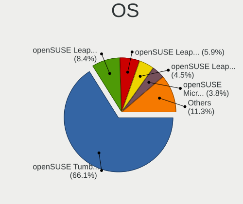

| Name                         | Notebooks | Percent |
|------------------------------|-----------|---------|
| openSUSE Tumbleweed-XXXXXXXX | 1475      | 66.08%  |
| openSUSE Leap-15.5           | 188       | 8.42%   |
| openSUSE Leap-15.6           | 131       | 5.87%   |
| openSUSE Leap-15.2           | 101       | 4.53%   |
| openSUSE Microos-XXXXXXXX    | 85        | 3.81%   |
| openSUSE Leap-15.4           | 67        | 3%      |
| openSUSE Leap-15.3           | 60        | 2.69%   |
| openSUSE Leap-15.1           | 59        | 2.64%   |
| openSUSE Leap-16.0           | 25        | 1.12%   |
| openSUSE Leap-15.0           | 21        | 0.94%   |
| openSUSE Slowroll-20250601   | 2         | 0.09%   |
| openSUSE Leap-42.3           | 2         | 0.09%   |
| openSUSE Leap-42.2           | 2         | 0.09%   |
| openSUSE 42.3                | 2         | 0.09%   |
| openSUSE 13.2                | 2         | 0.09%   |
| openSUSE                     | 2         | 0.09%   |
| openSUSE Slowroll-20250701   | 1         | 0.04%   |
| openSUSE Slowroll-20250501   | 1         | 0.04%   |
| openSUSE Slowroll-20250402   | 1         | 0.04%   |
| openSUSE Aeon-20240725       | 1         | 0.04%   |
| openSUSE Aeon-20240624       | 1         | 0.04%   |
| openSUSE Aeon-20240510       | 1         | 0.04%   |
| openSUSE 20240715            | 1         | 0.04%   |
| openSUSE 13.1                | 1         | 0.04%   |

OS Family
---------

OS without a version

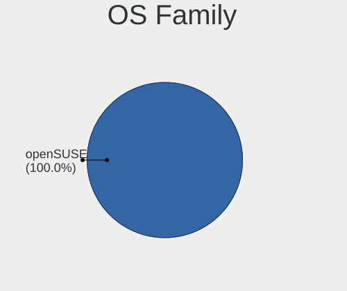

| Name     | Notebooks | Percent |
|----------|-----------|---------|
| openSUSE | 2170      | 100%    |

Kernel
------

Version of the Linux kernel

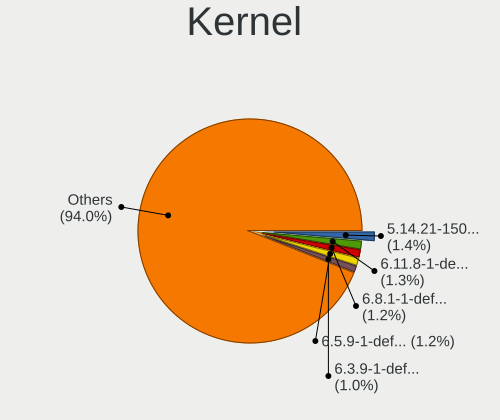

| Version                      | Notebooks | Percent |
|------------------------------|-----------|---------|
| 5.14.21-150500.53-default    | 36        | 1.38%   |
| 6.11.8-1-default             | 33        | 1.26%   |
| 6.8.1-1-default              | 31        | 1.19%   |
| 6.5.9-1-default              | 31        | 1.19%   |
| 6.3.9-1-default              | 26        | 0.99%   |
| 5.17.4-1-default             | 26        | 0.99%   |
| 4.12.14-lp151.28.44-default  | 24        | 0.92%   |
| 6.8.8-1-default              | 21        | 0.8%    |
| 6.6.6-1-default              | 21        | 0.8%    |
| 6.5.4-1-default              | 21        | 0.8%    |
| 6.4.0-150600.23.25-default   | 21        | 0.8%    |
| 6.8.7-1-default              | 20        | 0.77%   |
| 6.7.4-1-default              | 20        | 0.77%   |
| 6.2.12-1-default             | 20        | 0.77%   |
| 6.11.0-1-default             | 20        | 0.77%   |
| 5.14.21-150500.55.52-default | 20        | 0.77%   |
| 5.14.21-150500.55.19-default | 19        | 0.73%   |
| 6.7.7-1-default              | 18        | 0.69%   |
| 6.6.7-1-default              | 18        | 0.69%   |
| 6.14.4-1-default             | 18        | 0.69%   |
| 6.0.8-1-default              | 18        | 0.69%   |
| 5.14.21-150500.55.39-default | 18        | 0.69%   |
| 6.12.6-1-default             | 17        | 0.65%   |
| 6.7.2-1-default              | 16        | 0.61%   |
| 6.6.2-1-default              | 16        | 0.61%   |
| 6.6.11-1-default             | 16        | 0.61%   |
| 6.5.6-1-default              | 16        | 0.61%   |
| 6.4.11-1-default             | 16        | 0.61%   |
| 6.3.2-1-default              | 16        | 0.61%   |
| 6.14.6-1-default             | 16        | 0.61%   |
| 6.2.9-1-default              | 15        | 0.57%   |
| 6.1.12-1-default             | 15        | 0.57%   |
| 5.19.2-1-default             | 15        | 0.57%   |
| 5.14.21-150500.55.36-default | 15        | 0.57%   |
| 4.18.15-1-default            | 15        | 0.57%   |
| 6.9.1-1-default              | 14        | 0.54%   |
| 6.5.3-1-default              | 14        | 0.54%   |
| 6.4.0-150600.23.17-default   | 14        | 0.54%   |
| 6.1.8-1-default              | 14        | 0.54%   |
| 5.14.21-150500.55.49-default | 14        | 0.54%   |

Kernel Family
-------------

Linux kernel without a distro release

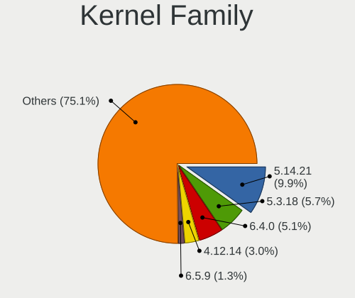

| Version | Notebooks | Percent |
|---------|-----------|---------|
| 5.14.21 | 250       | 9.87%   |
| 5.3.18  | 144       | 5.68%   |
| 6.4.0   | 128       | 5.05%   |
| 4.12.14 | 75        | 2.96%   |
| 6.5.9   | 33        | 1.3%    |
| 6.11.8  | 33        | 1.3%    |
| 6.8.1   | 31        | 1.22%   |
| 6.3.9   | 26        | 1.03%   |
| 5.17.4  | 26        | 1.03%   |
| 6.12.0  | 25        | 0.99%   |
| 6.8.8   | 21        | 0.83%   |
| 6.6.6   | 21        | 0.83%   |
| 6.5.4   | 21        | 0.83%   |
| 6.8.7   | 20        | 0.79%   |
| 6.7.4   | 20        | 0.79%   |
| 6.2.12  | 20        | 0.79%   |
| 6.11.0  | 20        | 0.79%   |
| 6.7.7   | 18        | 0.71%   |
| 6.6.7   | 18        | 0.71%   |
| 6.14.4  | 18        | 0.71%   |
| 6.0.8   | 18        | 0.71%   |
| 6.6.11  | 17        | 0.67%   |
| 6.14.6  | 17        | 0.67%   |
| 6.12.6  | 17        | 0.67%   |
| 6.7.2   | 16        | 0.63%   |
| 6.6.2   | 16        | 0.63%   |
| 6.5.6   | 16        | 0.63%   |
| 6.4.11  | 16        | 0.63%   |
| 6.3.2   | 16        | 0.63%   |
| 6.3.1   | 16        | 0.63%   |
| 6.15.8  | 16        | 0.63%   |
| 6.2.9   | 15        | 0.59%   |
| 6.1.12  | 15        | 0.59%   |
| 5.19.2  | 15        | 0.59%   |
| 4.18.15 | 15        | 0.59%   |
| 6.9.1   | 14        | 0.55%   |
| 6.5.3   | 14        | 0.55%   |
| 6.1.8   | 14        | 0.55%   |
| 5.6.0   | 14        | 0.55%   |
| 6.9.7   | 13        | 0.51%   |

Kernel Major Ver.
-----------------

Linux kernel major version

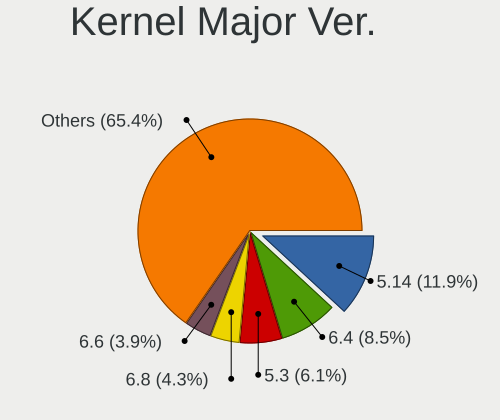

| Version | Notebooks | Percent |
|---------|-----------|---------|
| 5.14    | 293       | 11.89%  |
| 6.4     | 209       | 8.48%   |
| 5.3     | 151       | 6.13%   |
| 6.8     | 105       | 4.26%   |
| 6.6     | 96        | 3.89%   |
| 6.5     | 92        | 3.73%   |
| 6.3     | 87        | 3.53%   |
| 6.11    | 86        | 3.49%   |
| 6.7     | 85        | 3.45%   |
| 6.0     | 78        | 3.16%   |
| 6.1     | 75        | 3.04%   |
| 4.12    | 75        | 3.04%   |
| 6.2     | 74        | 3%      |
| 6.13    | 69        | 2.8%    |
| 6.12    | 63        | 2.56%   |
| 6.14    | 62        | 2.52%   |
| 6.9     | 60        | 2.43%   |
| 5.17    | 57        | 2.31%   |
| 6.15    | 50        | 2.03%   |
| 6.10    | 48        | 1.95%   |
| 6.17    | 47        | 1.91%   |
| 5.16    | 41        | 1.66%   |
| 5.8     | 38        | 1.54%   |
| 5.6     | 37        | 1.5%    |
| 5.19    | 36        | 1.46%   |
| 5.18    | 35        | 1.42%   |
| 5.15    | 35        | 1.42%   |
| 5.10    | 35        | 1.42%   |
| 5.12    | 30        | 1.22%   |
| 5.11    | 29        | 1.18%   |
| 6.16    | 26        | 1.05%   |
| 5.13    | 23        | 0.93%   |
| 5.5     | 21        | 0.85%   |
| 5.9     | 19        | 0.77%   |
| 4.18    | 19        | 0.77%   |
| 5.7     | 17        | 0.69%   |
| 6.18    | 14        | 0.57%   |
| 5.4     | 11        | 0.45%   |
| 5.0     | 8         | 0.32%   |
| 4.4     | 7         | 0.28%   |

Arch
----

OS architecture (x86_64, i586, etc.)

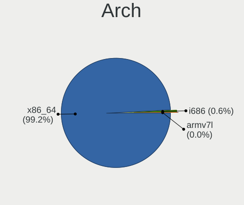

| Name    | Notebooks | Percent |
|---------|-----------|---------|
| x86_64  | 2153      | 99.17%  |
| i686    | 14        | 0.64%   |
| aarch64 | 3         | 0.14%   |
| armv7l  | 1         | 0.05%   |

DE
--

Desktop Environment

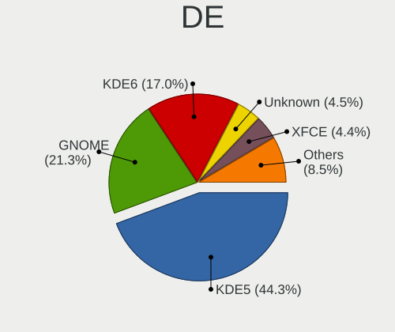

| Name          | Notebooks | Percent |
|---------------|-----------|---------|
| KDE5          | 1001      | 44.33%  |
| GNOME         | 482       | 21.35%  |
| KDE6          | 383       | 16.96%  |
| Unknown       | 101       | 4.47%   |
| XFCE          | 99        | 4.38%   |
| KDE           | 97        | 4.3%    |
| MATE          | 15        | 0.66%   |
| X-Cinnamon    | 11        | 0.49%   |
| Cinnamon      | 11        | 0.49%   |
| LXQt          | 9         | 0.4%    |
| ICEWM         | 9         | 0.4%    |
| Hyprland      | 7         | 0.31%   |
| KDE4          | 6         | 0.27%   |
| LXDE          | 5         | 0.22%   |
| sway          | 4         | 0.18%   |
| i3            | 4         | 0.18%   |
| Deepin        | 3         | 0.13%   |
| GNOME Classic | 2         | 0.09%   |
| Trinity       | 1         | 0.04%   |
| plasma5       | 1         | 0.04%   |
| niri          | 1         | 0.04%   |
| LeftWM        | 1         | 0.04%   |
| Herbstluftwm  | 1         | 0.04%   |
| default       | 1         | 0.04%   |
| custom        | 1         | 0.04%   |
| Budgie        | 1         | 0.04%   |
| AsterDE       | 1         | 0.04%   |

Display Server
--------------

X11 or Wayland

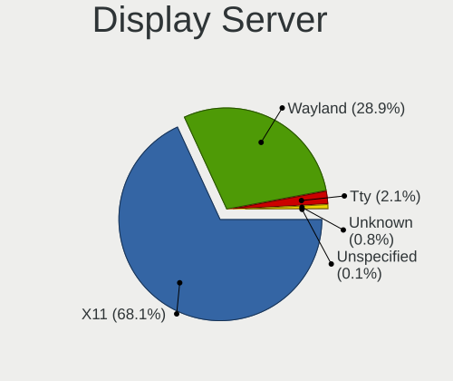

| Name        | Notebooks | Percent |
|-------------|-----------|---------|
| X11         | 1523      | 68.11%  |
| Wayland     | 647       | 28.94%  |
| Tty         | 47        | 2.1%    |
| Unknown     | 17        | 0.76%   |
| Unspecified | 2         | 0.09%   |

Display Manager
---------------

SDDM, LightDM, etc.

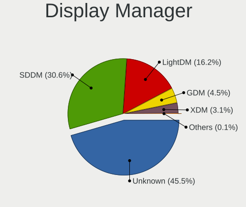

| Name    | Notebooks | Percent |
|---------|-----------|---------|
| Unknown | 1018      | 45.53%  |
| SDDM    | 684       | 30.59%  |
| LightDM | 362       | 16.19%  |
| GDM     | 100       | 4.47%   |
| XDM     | 69        | 3.09%   |
| GREETD  | 3         | 0.13%   |

OS Lang
-------

Language

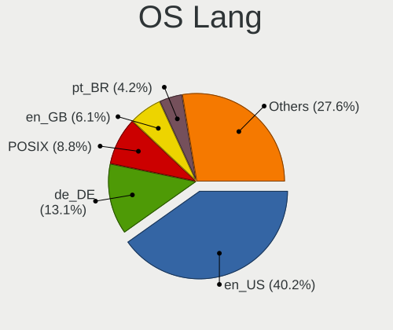

| Lang    | Notebooks | Percent |
|---------|-----------|---------|
| en_US   | 892       | 40.18%  |
| de_DE   | 290       | 13.06%  |
| POSIX   | 195       | 8.78%   |
| en_GB   | 136       | 6.13%   |
| pt_BR   | 94        | 4.23%   |
| es_ES   | 93        | 4.19%   |
| Unknown | 93        | 4.19%   |
| ru_RU   | 73        | 3.29%   |
| it_IT   | 61        | 2.75%   |
| fr_FR   | 54        | 2.43%   |
| pl_PL   | 35        | 1.58%   |
| cs_CZ   | 19        | 0.86%   |
| nl_NL   | 18        | 0.81%   |
| hu_HU   | 17        | 0.77%   |
| zh_CN   | 15        | 0.68%   |
| en_DK   | 12        | 0.54%   |
| pt_PT   | 10        | 0.45%   |
| ja_JP   | 9         | 0.41%   |
| tr_TR   | 8         | 0.36%   |
| bg_BG   | 7         | 0.32%   |
| C       | 6         | 0.27%   |
| fi_FI   | 5         | 0.23%   |
| es_MX   | 5         | 0.23%   |
| en_IN   | 5         | 0.23%   |
| sv_SE   | 4         | 0.18%   |
| sk_SK   | 4         | 0.18%   |
| nb_NO   | 4         | 0.18%   |
| en_IE   | 4         | 0.18%   |
| uk_UA   | 3         | 0.14%   |
| ro_RO   | 3         | 0.14%   |
| id_ID   | 3         | 0.14%   |
| de_AT   | 3         | 0.14%   |
| vi_VN   | 2         | 0.09%   |
| sl_SI   | 2         | 0.09%   |
| nn_NO   | 2         | 0.09%   |
| es_AR   | 2         | 0.09%   |
| en_PH   | 2         | 0.09%   |
| en_DE   | 2         | 0.09%   |
| en_BW   | 2         | 0.09%   |
| en_AU   | 2         | 0.09%   |

Boot Mode
---------

EFI or BIOS

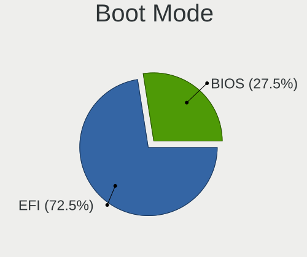

| Mode | Notebooks | Percent |
|------|-----------|---------|
| EFI  | 1597      | 72.52%  |
| BIOS | 605       | 27.48%  |

Filesystem
----------

Type of filesystem

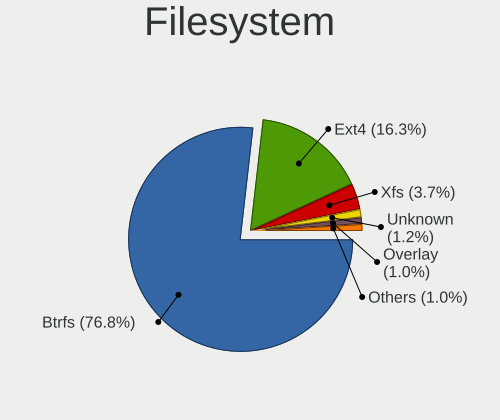

| Type     | Notebooks | Percent |
|----------|-----------|---------|
| Btrfs    | 1692      | 76.8%   |
| Ext4     | 360       | 16.34%  |
| Xfs      | 82        | 3.72%   |
| Unknown  | 26        | 1.18%   |
| Overlay  | 21        | 0.95%   |
| Tmpfs    | 13        | 0.59%   |
| Ext2     | 4         | 0.18%   |
| Ext3     | 3         | 0.14%   |
| Reiserfs | 1         | 0.05%   |
| F2fs     | 1         | 0.05%   |

Part. scheme
------------

Scheme of partitioning

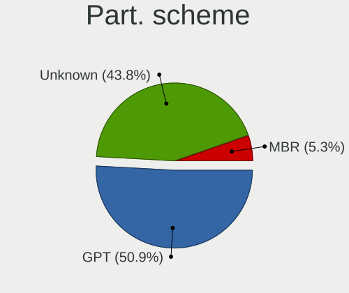

| Type    | Notebooks | Percent |
|---------|-----------|---------|
| GPT     | 1125      | 50.86%  |
| Unknown | 969       | 43.81%  |
| MBR     | 118       | 5.33%   |

Dual Boot with Linux/BSD
------------------------

Hosting more than one Linux/BSD

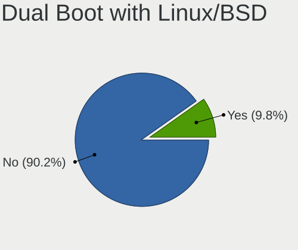

| Dual boot | Notebooks | Percent |
|-----------|-----------|---------|
| No        | 1980      | 90.21%  |
| Yes       | 215       | 9.79%   |

Dual Boot (Win)
---------------

Hosting Linux and Windows

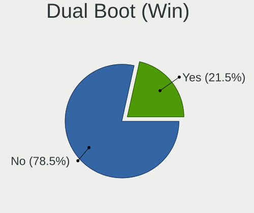

| Dual boot | Notebooks | Percent |
|-----------|-----------|---------|
| No        | 1724      | 78.47%  |
| Yes       | 473       | 21.53%  |

Board
-----

Vendor
------

Motherboard manufacturer

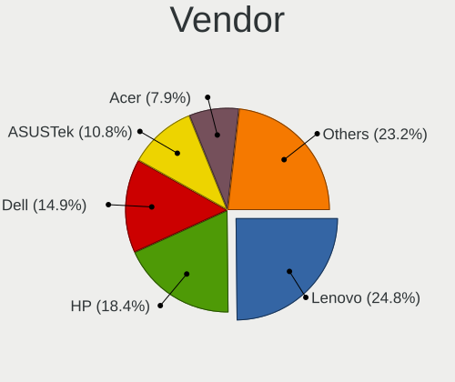

| Name                   | Notebooks | Percent |
|------------------------|-----------|---------|
| Lenovo                 | 539       | 24.84%  |
| Hewlett-Packard        | 399       | 18.39%  |
| Dell                   | 323       | 14.88%  |
| ASUSTek Computer       | 234       | 10.78%  |
| Acer                   | 172       | 7.93%   |
| Apple                  | 71        | 3.27%   |
| MSI                    | 59        | 2.72%   |
| Toshiba                | 41        | 1.89%   |
| TUXEDO                 | 30        | 1.38%   |
| HUAWEI                 | 25        | 1.15%   |
| Samsung Electronics    | 23        | 1.06%   |
| Sony                   | 21        | 0.97%   |
| Fujitsu                | 17        | 0.78%   |
| Alienware              | 16        | 0.74%   |
| Medion                 | 14        | 0.65%   |
| Notebook               | 12        | 0.55%   |
| Framework              | 11        | 0.51%   |
| Google                 | 10        | 0.46%   |
| Unknown                | 9         | 0.41%   |
| Wortmann AG            | 7         | 0.32%   |
| SLIMBOOK               | 7         | 0.32%   |
| Schenker               | 6         | 0.28%   |
| Chuwi                  | 6         | 0.28%   |
| Razer                  | 5         | 0.23%   |
| LG Electronics         | 5         | 0.23%   |
| Fujitsu Siemens        | 5         | 0.23%   |
| Clevo                  | 5         | 0.23%   |
| Timi                   | 4         | 0.18%   |
| System76               | 4         | 0.18%   |
| HONOR                  | 4         | 0.18%   |
| Gigabyte Technology    | 4         | 0.18%   |
| Semp Toshiba           | 3         | 0.14%   |
| Positivo               | 3         | 0.14%   |
| PC Specialist          | 3         | 0.14%   |
| Panasonic              | 3         | 0.14%   |
| Infinix                | 3         | 0.14%   |
| GPU Company            | 3         | 0.14%   |
| Gateway                | 3         | 0.14%   |
| Dynabook               | 3         | 0.14%   |
| Avell High Performance | 3         | 0.14%   |

Model
-----

Motherboard model

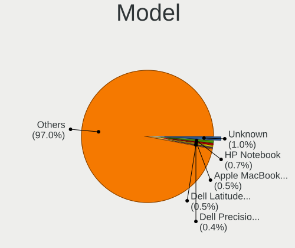

| Name                                       | Notebooks | Percent |
|--------------------------------------------|-----------|---------|
| Unknown                                    | 21        | 0.97%   |
| HP Notebook                                | 15        | 0.69%   |
| Apple MacBookPro9,2                        | 11        | 0.51%   |
| Dell Latitude 7490                         | 10        | 0.46%   |
| Dell Precision 5530                        | 8         | 0.37%   |
| Apple MacBookPro8,1                        | 8         | 0.37%   |
| HP Pavilion dv6                            | 7         | 0.32%   |
| HP Laptop 17-ca0xxx                        | 7         | 0.32%   |
| HP EliteBook 840 G6                        | 7         | 0.32%   |
| HP Pavilion g6                             | 6         | 0.28%   |
| HP Pavilion dv7                            | 6         | 0.28%   |
| Apple MacBookPro12,1                       | 6         | 0.28%   |
| Apple MacBookAir6,2                        | 6         | 0.28%   |
| Samsung 550XDA                             | 5         | 0.23%   |
| Lenovo ThinkBook 14 G3 ACL 21A2            | 5         | 0.23%   |
| Lenovo IdeaPad 3 15ITL6 82H8               | 5         | 0.23%   |
| HP Laptop 15s-eq2xxx                       | 5         | 0.23%   |
| HP EliteBook 8460p                         | 5         | 0.23%   |
| HP EliteBook 840 G3                        | 5         | 0.23%   |
| Framework Laptop 13 (AMD Ryzen 7040Series) | 5         | 0.23%   |
| Dell XPS 15 9560                           | 5         | 0.23%   |
| Dell Latitude 5591                         | 5         | 0.23%   |
| Acer Swift SF314-43                        | 5         | 0.23%   |
| TUXEDO Pulse 15 Gen1                       | 4         | 0.18%   |
| Lenovo ThinkBook 15 G2 ITL 20VE            | 4         | 0.18%   |
| Lenovo IdeaPad Gaming 3 15ARH05 82EY       | 4         | 0.18%   |
| Lenovo IdeaPad 5 14ARE05 81YM              | 4         | 0.18%   |
| Lenovo G50-45 80E3                         | 4         | 0.18%   |
| HUAWEI BOHK-WAX9X                          | 4         | 0.18%   |
| HP ZBook 15 G3                             | 4         | 0.18%   |
| HP Victus by Gaming Laptop 15-fb0xxx       | 4         | 0.18%   |
| HP ProBook 4530s                           | 4         | 0.18%   |
| HP Pavilion Laptop 15-cw1xxx               | 4         | 0.18%   |
| HP Pavilion 17                             | 4         | 0.18%   |
| HP OMEN Laptop 15-en0xxx                   | 4         | 0.18%   |
| HP OMEN by Laptop                          | 4         | 0.18%   |
| HP Laptop 15s-eq1xxx                       | 4         | 0.18%   |
| HP Laptop 15-fd0xxx                        | 4         | 0.18%   |
| HP Laptop 15-bs0xx                         | 4         | 0.18%   |
| HP EliteBook 845 G8 Notebook PC            | 4         | 0.18%   |

Model Family
------------

Motherboard model prefix

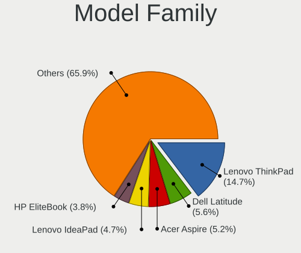

| Name                | Notebooks | Percent |
|---------------------|-----------|---------|
| Lenovo ThinkPad     | 318       | 14.65%  |
| Dell Latitude       | 122       | 5.62%   |
| Acer Aspire         | 113       | 5.21%   |
| Lenovo IdeaPad      | 103       | 4.75%   |
| HP EliteBook        | 83        | 3.82%   |
| Dell Inspiron       | 78        | 3.59%   |
| ASUS VivoBook       | 69        | 3.18%   |
| HP Laptop           | 68        | 3.13%   |
| HP Pavilion         | 67        | 3.09%   |
| Dell Precision      | 51        | 2.35%   |
| HP ProBook          | 39        | 1.8%    |
| Dell XPS            | 37        | 1.71%   |
| Toshiba Satellite   | 35        | 1.61%   |
| HP ZBook            | 33        | 1.52%   |
| ASUS ASUS           | 31        | 1.43%   |
| ASUS ROG            | 29        | 1.34%   |
| Acer Swift          | 23        | 1.06%   |
| Lenovo ThinkBook    | 22        | 1.01%   |
| Unknown             | 21        | 0.97%   |
| Lenovo Legion       | 20        | 0.92%   |
| ASUS Zenbook        | 19        | 0.88%   |
| HP OMEN             | 17        | 0.78%   |
| Acer Nitro          | 17        | 0.78%   |
| Lenovo Yoga         | 16        | 0.74%   |
| HP ENVY             | 16        | 0.74%   |
| HP Notebook         | 15        | 0.69%   |
| Fujitsu LIFEBOOK    | 15        | 0.69%   |
| HP Victus           | 13        | 0.6%    |
| Dell Vostro         | 13        | 0.6%    |
| Apple MacBookPro9   | 13        | 0.6%    |
| ASUS TUF            | 12        | 0.55%   |
| TUXEDO InfinityBook | 11        | 0.51%   |
| HP Compaq           | 11        | 0.51%   |
| Framework Laptop    | 11        | 0.51%   |
| Apple MacBookPro8   | 11        | 0.51%   |
| Acer Predator       | 9         | 0.41%   |
| HP 250              | 8         | 0.37%   |
| MSI Modern          | 7         | 0.32%   |
| Apple MacBookPro11  | 7         | 0.32%   |
| Acer TravelMate     | 7         | 0.32%   |

MFG Year
--------

Motherboard manufacture year

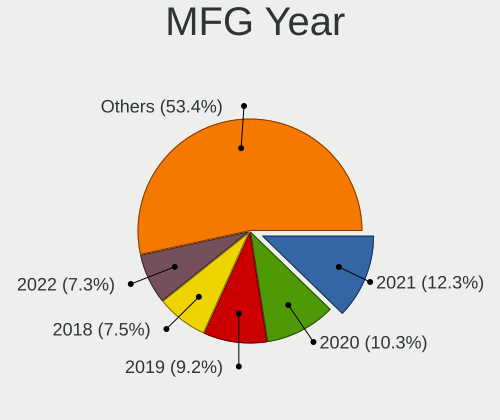

| Year | Notebooks | Percent |
|------|-----------|---------|
| 2021 | 266       | 12.26%  |
| 2020 | 223       | 10.28%  |
| 2019 | 200       | 9.22%   |
| 2018 | 163       | 7.51%   |
| 2022 | 159       | 7.33%   |
| 2017 | 132       | 6.08%   |
| 2012 | 129       | 5.94%   |
| 2013 | 128       | 5.9%    |
| 2023 | 123       | 5.67%   |
| 2015 | 104       | 4.79%   |
| 2016 | 103       | 4.75%   |
| 2011 | 99        | 4.56%   |
| 2014 | 89        | 4.1%    |
| 2024 | 66        | 3.04%   |
| 2010 | 65        | 3%      |
| 2008 | 49        | 2.26%   |
| 2009 | 40        | 1.84%   |
| 2007 | 14        | 0.65%   |
| 2025 | 7         | 0.32%   |
| 2006 | 6         | 0.28%   |
| 2005 | 3         | 0.14%   |
| 2004 | 1         | 0.05%   |
| 2000 | 1         | 0.05%   |

Form Factor
-----------

Physical design of the computer

| Name     | Notebooks | Percent |
|----------|-----------|---------|
| Notebook | 2170      | 100%    |

Secure Boot
-----------

Enabled or disabled

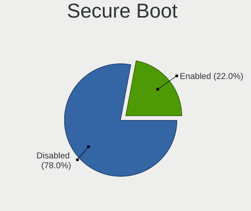

| State    | Notebooks | Percent |
|----------|-----------|---------|
| Disabled | 1726      | 77.96%  |
| Enabled  | 488       | 22.04%  |

Coreboot
--------

Have coreboot on board

| Used | Notebooks | Percent |
|------|-----------|---------|
| No   | 2152      | 99.17%  |
| Yes  | 18        | 0.83%   |

RAM Size
--------

Total RAM memory

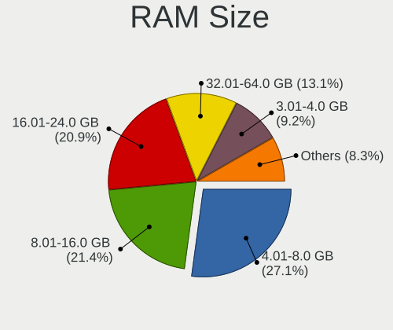

| Size in GB  | Notebooks | Percent |
|-------------|-----------|---------|
| 4.01-8.0    | 598       | 27.13%  |
| 8.01-16.0   | 471       | 21.37%  |
| 16.01-24.0  | 461       | 20.92%  |
| 32.01-64.0  | 288       | 13.07%  |
| 3.01-4.0    | 203       | 9.21%   |
| 24.01-32.0  | 70        | 3.18%   |
| 64.01-256.0 | 58        | 2.63%   |
| 1.01-2.0    | 31        | 1.41%   |
| 2.01-3.0    | 18        | 0.82%   |
| 0.51-1.0    | 4         | 0.18%   |
| 0.01-0.5    | 2         | 0.09%   |

RAM Used
--------

Used RAM memory

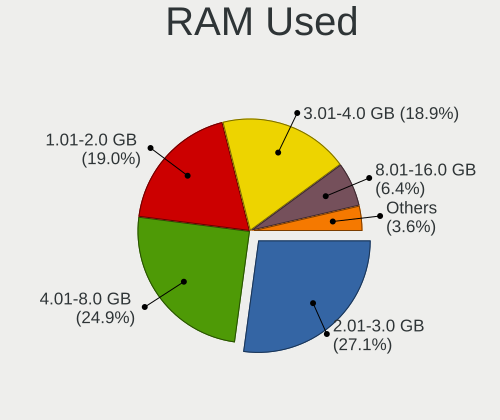

| Used GB    | Notebooks | Percent |
|------------|-----------|---------|
| 2.01-3.0   | 649       | 27.14%  |
| 4.01-8.0   | 595       | 24.88%  |
| 1.01-2.0   | 455       | 19.03%  |
| 3.01-4.0   | 451       | 18.86%  |
| 8.01-16.0  | 154       | 6.44%   |
| 0.51-1.0   | 55        | 2.3%    |
| 16.01-24.0 | 20        | 0.84%   |
| 0.01-0.5   | 11        | 0.46%   |
| 24.01-32.0 | 1         | 0.04%   |

Total Drives
------------

Number of drives on board

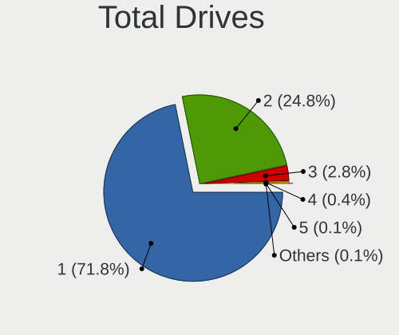

| Drives | Notebooks | Percent |
|--------|-----------|---------|
| 1      | 1584      | 71.84%  |
| 2      | 546       | 24.76%  |
| 3      | 62        | 2.81%   |
| 4      | 8         | 0.36%   |
| 5      | 3         | 0.14%   |
| 0      | 2         | 0.09%   |

Has CD-ROM
----------

Has CD-ROM on board

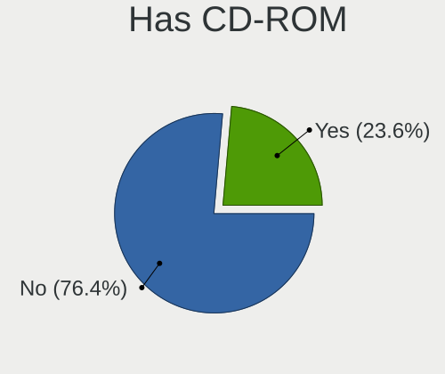

| Presented | Notebooks | Percent |
|-----------|-----------|---------|
| No        | 1667      | 76.4%   |
| Yes       | 515       | 23.6%   |

Has Ethernet
------------

Has Ethernet on board

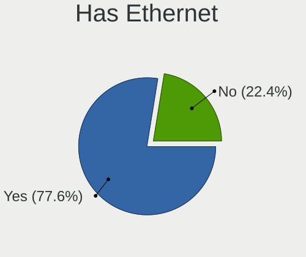

| Presented | Notebooks | Percent |
|-----------|-----------|---------|
| Yes       | 1693      | 77.55%  |
| No        | 490       | 22.45%  |

Has WiFi
--------

Has WiFi module

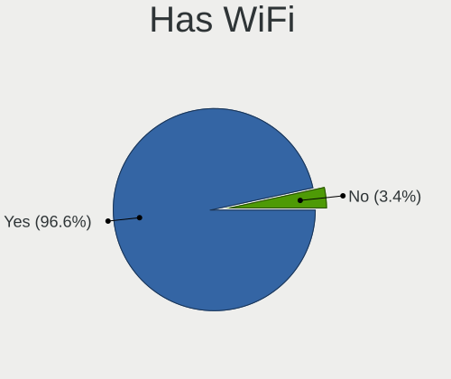

| Presented | Notebooks | Percent |
|-----------|-----------|---------|
| Yes       | 2099      | 96.59%  |
| No        | 74        | 3.41%   |

Has Bluetooth
-------------

Has Bluetooth module

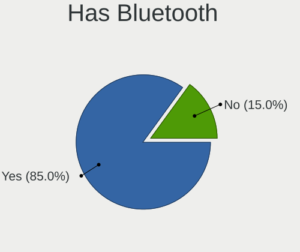

| Presented | Notebooks | Percent |
|-----------|-----------|---------|
| Yes       | 1867      | 85.02%  |
| No        | 329       | 14.98%  |

Location
--------

Country
-------

Geographic location (country)

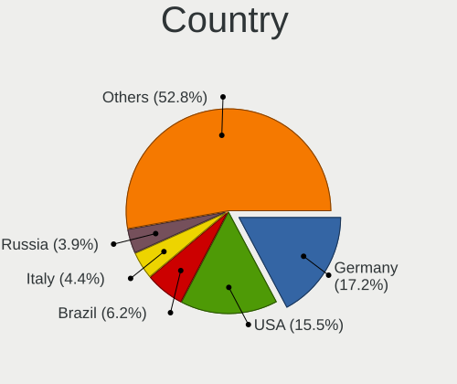

| Country      | Notebooks | Percent |
|--------------|-----------|---------|
| Germany      | 375       | 17.2%   |
| USA          | 337       | 15.46%  |
| Brazil       | 136       | 6.24%   |
| Italy        | 96        | 4.4%    |
| Russia       | 85        | 3.9%    |
| France       | 83        | 3.81%   |
| UK           | 75        | 3.44%   |
| Netherlands  | 66        | 3.03%   |
| Poland       | 57        | 2.61%   |
| Spain        | 53        | 2.43%   |
| Canada       | 52        | 2.39%   |
| India        | 46        | 2.11%   |
| Czechia      | 38        | 1.74%   |
| Mexico       | 35        | 1.61%   |
| Sweden       | 33        | 1.51%   |
| Switzerland  | 32        | 1.47%   |
| Belgium      | 30        | 1.38%   |
| Hungary      | 29        | 1.33%   |
| China        | 28        | 1.28%   |
| Turkey       | 27        | 1.24%   |
| Romania      | 27        | 1.24%   |
| Austria      | 25        | 1.15%   |
| Australia    | 24        | 1.1%    |
| Portugal     | 18        | 0.83%   |
| Finland      | 18        | 0.83%   |
| Bulgaria     | 18        | 0.83%   |
| Japan        | 15        | 0.69%   |
| Chile        | 15        | 0.69%   |
| Argentina    | 15        | 0.69%   |
| Norway       | 14        | 0.64%   |
| Indonesia    | 14        | 0.64%   |
| Greece       | 14        | 0.64%   |
| Ukraine      | 12        | 0.55%   |
| Serbia       | 11        | 0.5%    |
| Belarus      | 11        | 0.5%    |
| Vietnam      | 10        | 0.46%   |
| South Africa | 10        | 0.46%   |
| Denmark      | 10        | 0.46%   |
| Slovenia     | 8         | 0.37%   |
| Philippines  | 8         | 0.37%   |

City
----

Geographic location (city)

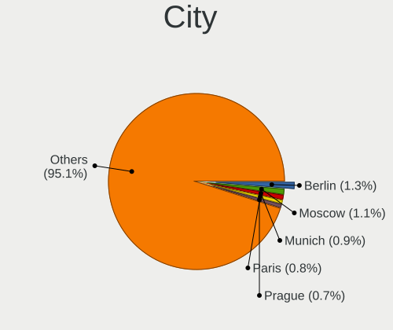

| City              | Notebooks | Percent |
|-------------------|-----------|---------|
| Berlin            | 30        | 1.3%    |
| Moscow            | 26        | 1.12%   |
| Munich            | 22        | 0.95%   |
| Paris             | 18        | 0.78%   |
| Prague            | 17        | 0.73%   |
| Vienna            | 16        | 0.69%   |
| Warsaw            | 15        | 0.65%   |
| Sao Paulo         | 15        | 0.65%   |
| Milan             | 15        | 0.65%   |
| Hamburg           | 14        | 0.6%    |
| Rio de Janeiro    | 13        | 0.56%   |
| Frankfurt am Main | 13        | 0.56%   |
| Budapest          | 13        | 0.56%   |
| Amsterdam         | 13        | 0.56%   |
| St Petersburg     | 11        | 0.47%   |
| Sofia             | 11        | 0.47%   |
| Rome              | 10        | 0.43%   |
| Bengaluru         | 10        | 0.43%   |
| Santiago          | 9         | 0.39%   |
| Mesa              | 9         | 0.39%   |
| Sydney            | 8         | 0.35%   |
| Stockholm         | 8         | 0.35%   |
| Madrid            | 8         | 0.35%   |
| Leipzig           | 8         | 0.35%   |
| Essen             | 8         | 0.35%   |
| Belgrade          | 8         | 0.35%   |
| Zurich            | 7         | 0.3%    |
| Recife            | 7         | 0.3%    |
| Nuremberg         | 7         | 0.3%    |
| Minsk             | 7         | 0.3%    |
| Mexico City       | 7         | 0.3%    |
| Los Angeles       | 7         | 0.3%    |
| Jakarta           | 7         | 0.3%    |
| Izmir             | 7         | 0.3%    |
| Istanbul          | 7         | 0.3%    |
| Helsinki          | 7         | 0.3%    |
| Denver            | 7         | 0.3%    |
| Cologne           | 7         | 0.3%    |
| Buenos Aires      | 7         | 0.3%    |
| Barcelona         | 7         | 0.3%    |

Drives
------

Drive Vendor
------------

Hard drive vendors

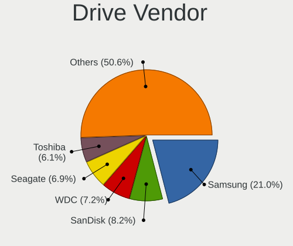

| Vendor                         | Notebooks | Drives | Percent |
|--------------------------------|-----------|--------|---------|
| Samsung Electronics            | 581       | 790    | 20.98%  |
| SanDisk                        | 228       | 301    | 8.23%   |
| WDC                            | 199       | 255    | 7.19%   |
| Seagate                        | 192       | 252    | 6.93%   |
| Toshiba                        | 169       | 192    | 6.1%    |
| SK hynix                       | 157       | 188    | 5.67%   |
| Kingston                       | 131       | 159    | 4.73%   |
| Micron Technology              | 113       | 129    | 4.08%   |
| Unknown                        | 102       | 122    | 3.68%   |
| Crucial                        | 95        | 126    | 3.43%   |
| Intel                          | 91        | 104    | 3.29%   |
| KIOXIA                         | 57        | 76     | 2.06%   |
| HGST                           | 55        | 72     | 1.99%   |
| Hitachi                        | 37        | 41     | 1.34%   |
| Apple                          | 30        | 34     | 1.08%   |
| Phison Electronics             | 29        | 39     | 1.05%   |
| Micron/Crucial Technology      | 29        | 39     | 1.05%   |
| China                          | 29        | 32     | 1.05%   |
| Kingston Technology Company    | 28        | 32     | 1.01%   |
| A-DATA Technology              | 28        | 36     | 1.01%   |
| Silicon Motion                 | 22        | 26     | 0.79%   |
| MAXIO Technology (Hangzhou)    | 22        | 28     | 0.79%   |
| SPCC                           | 19        | 24     | 0.69%   |
| Intenso                        | 16        | 33     | 0.58%   |
| LITEON                         | 15        | 20     | 0.54%   |
| Transcend                      | 13        | 14     | 0.47%   |
| PNY                            | 13        | 17     | 0.47%   |
| ADATA Technology               | 11        | 12     | 0.4%    |
| Realtek Semiconductor          | 10        | 11     | 0.36%   |
| Phison                         | 10        | 13     | 0.36%   |
| LITEONIT                       | 10        | 12     | 0.36%   |
| Unknown                        | 10        | 10     | 0.36%   |
| Shenzhen Longsys Electronics   | 9         | 14     | 0.33%   |
| JMicron Technology             | 9         | 9      | 0.33%   |
| Solid State Storage Technology | 8         | 10     | 0.29%   |
| Lenovo                         | 7         | 9      | 0.25%   |
| Fujitsu                        | 7         | 8      | 0.25%   |
| Union Memory (Shenzhen)        | 6         | 7      | 0.22%   |
| Solid State Storage            | 6         | 7      | 0.22%   |
| Hewlett-Packard                | 6         | 9      | 0.22%   |

Drive Model
-----------

Hard drive models

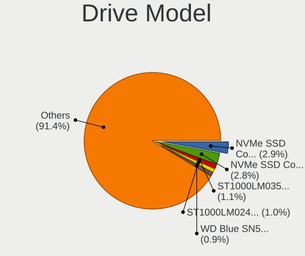

| Model                                                | Notebooks | Percent |
|------------------------------------------------------|-----------|---------|
| Samsung NVMe SSD Controller PM9A1/PM9A3/980PRO 1TB   | 83        | 2.85%   |
| Samsung NVMe SSD Controller SM981/PM981/PM983 1TB    | 80        | 2.75%   |
| Seagate ST1000LM035-1RK172 1TB                       | 33        | 1.13%   |
| Seagate ST1000LM024 HN-M101MBB 1TB                   | 28        | 0.96%   |
| Sandisk WD Blue SN550 NVMe SSD 1024GB                | 27        | 0.93%   |
| HGST HTS721010A9E630 1TB                             | 27        | 0.93%   |
| Intel SSD 660P Series 512GB                          | 23        | 0.79%   |
| Toshiba MQ04ABF100 1TB                               | 22        | 0.76%   |
| Samsung SSD 860 EVO 500GB                            | 22        | 0.76%   |
| Toshiba MQ01ABD100 1TB                               | 20        | 0.69%   |
| Sandisk WD Black SN750 / PC SN730 NVMe SSD 500GB     | 19        | 0.65%   |
| Kingston SA400S37480G 480GB SSD                      | 19        | 0.65%   |
| Micron/Crucial P2 NVMe PCIe SSD 2TB                  | 17        | 0.58%   |
| Kingston SA400S37120G 120GB SSD                      | 17        | 0.58%   |
| Unknown MMC Card  128GB                              | 16        | 0.55%   |
| Crucial CT500MX500SSD1 500GB                         | 16        | 0.55%   |
| Unknown MMC Card  32GB                               | 15        | 0.52%   |
| Toshiba XG6 NVMe SSD Controller 1024GB               | 15        | 0.52%   |
| Kingston SA400S37240G 240GB SSD                      | 14        | 0.48%   |
| Unknown MMC Card  64GB                               | 13        | 0.45%   |
| Samsung SSD 860 EVO 1TB                              | 13        | 0.45%   |
| KIOXIA KBG40ZNV256G 256GB                            | 13        | 0.45%   |
| Crucial CT240BX500SSD1 240GB                         | 13        | 0.45%   |
| Crucial CT1000MX500SSD1 1TB                          | 13        | 0.45%   |
| SK hynix BC501 NVMe Solid State Drive 512GB          | 12        | 0.41%   |
| Sandisk WD Black SN850 1TB                           | 12        | 0.41%   |
| Samsung SSD 870 EVO 1TB                              | 12        | 0.41%   |
| Samsung SSD 850 EVO 250GB                            | 12        | 0.41%   |
| Samsung NVMe SSD Controller SM961/PM961/SM963 1024GB | 12        | 0.41%   |
| Intel SSD Pro 7600p/760p/E 6100p Series 256GB        | 12        | 0.41%   |
| Seagate ST1000LM048-2E7172 1TB                       | 11        | 0.38%   |
| MAXIO (Hangzhou) NVMe SSD Controller MAP1202 2TB     | 11        | 0.38%   |
| Kingston Company OM3PDP3 NVMe SSD 256GB              | 11        | 0.38%   |
| Unknown MMC Card  16GB                               | 10        | 0.34%   |
| Seagate ST2000LM015-2E8174 2TB                       | 10        | 0.34%   |
| Samsung NVMe SSD Drive 512GB                         | 10        | 0.34%   |
| Phison PS5013 E13 NVMe Controller 500GB              | 10        | 0.34%   |
| Micron 2400_MTFDKBA512QFM 512GB                      | 10        | 0.34%   |
| Unknown                                              | 10        | 0.34%   |
| WDC WDS500G2B0A-00SM50 500GB                         | 9         | 0.31%   |

HDD Vendor
----------

Hard disk drive vendors

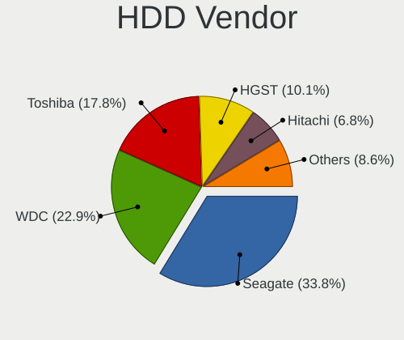

| Vendor              | Notebooks | Drives | Percent |
|---------------------|-----------|--------|---------|
| Seagate             | 184       | 238    | 33.76%  |
| WDC                 | 125       | 155    | 22.94%  |
| Toshiba             | 97        | 106    | 17.8%   |
| HGST                | 55        | 72     | 10.09%  |
| Hitachi             | 37        | 41     | 6.79%   |
| Samsung Electronics | 14        | 20     | 2.57%   |
| Fujitsu             | 7         | 8      | 1.28%   |
| JMicron Technology  | 6         | 6      | 1.1%    |
| Unknown             | 5         | 5      | 0.92%   |
| Apple               | 5         | 5      | 0.92%   |
| SSK                 | 2         | 2      | 0.37%   |
| ASMT                | 2         | 3      | 0.37%   |
| USB3.0              | 1         | 1      | 0.18%   |
| TO Exter            | 1         | 1      | 0.18%   |
| Magnetic Data       | 1         | 2      | 0.18%   |
| Intenso             | 1         | 1      | 0.18%   |
| External            | 1         | 1      | 0.18%   |
| AXAGON              | 1         | 1      | 0.18%   |

SSD Vendor
----------

Solid state drive vendors

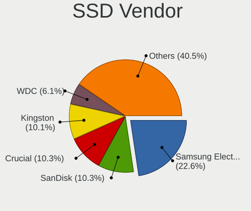

| Vendor              | Notebooks | Drives | Percent |
|---------------------|-----------|--------|---------|
| Samsung Electronics | 197       | 256    | 22.64%  |
| SanDisk             | 90        | 117    | 10.34%  |
| Crucial             | 90        | 121    | 10.34%  |
| Kingston            | 88        | 105    | 10.11%  |
| WDC                 | 53        | 64     | 6.09%   |
| China               | 29        | 32     | 3.33%   |
| SK hynix            | 25        | 32     | 2.87%   |
| Toshiba             | 23        | 27     | 2.64%   |
| Apple               | 22        | 24     | 2.53%   |
| Micron Technology   | 20        | 24     | 2.3%    |
| SPCC                | 18        | 23     | 2.07%   |
| A-DATA Technology   | 18        | 22     | 2.07%   |
| LITEON              | 15        | 20     | 1.72%   |
| Intenso             | 15        | 27     | 1.72%   |
| Intel               | 15        | 18     | 1.72%   |
| Transcend           | 12        | 13     | 1.38%   |
| PNY                 | 11        | 14     | 1.26%   |
| LITEONIT            | 10        | 12     | 1.15%   |
| GOODRAM             | 6         | 6      | 0.69%   |
| Patriot             | 5         | 5      | 0.57%   |
| Hewlett-Packard     | 5         | 8      | 0.57%   |
| Unknown             | 5         | 5      | 0.57%   |
| Team                | 4         | 4      | 0.46%   |
| Plextor             | 4         | 5      | 0.46%   |
| KingSpec            | 4         | 4      | 0.46%   |
| Gigabyte Technology | 4         | 5      | 0.46%   |
| Wibtek              | 3         | 3      | 0.34%   |
| Timetec             | 3         | 4      | 0.34%   |
| SABRENT             | 3         | 3      | 0.34%   |
| Pioneer             | 3         | 14     | 0.34%   |
| Phison              | 3         | 3      | 0.34%   |
| OCZ                 | 3         | 3      | 0.34%   |
| Lexar               | 3         | 4      | 0.34%   |
| FORESEE             | 3         | 3      | 0.34%   |
| Verbatim            | 2         | 2      | 0.23%   |
| Seagate             | 2         | 2      | 0.23%   |
| NGFF                | 2         | 2      | 0.23%   |
| Netac               | 2         | 3      | 0.23%   |
| HS-SSD-C100         | 2         | 2      | 0.23%   |
| Fanxiang            | 2         | 2      | 0.23%   |

Drive Kind
----------

HDD or SSD

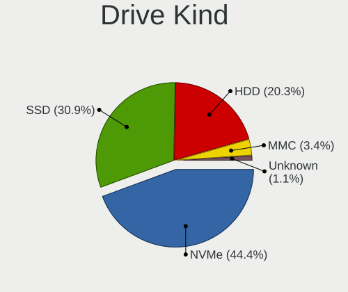

| Kind    | Notebooks | Drives | Percent |
|---------|-----------|--------|---------|
| NVMe    | 1157      | 1607   | 44.38%  |
| SSD     | 806       | 1091   | 30.92%  |
| HDD     | 528       | 668    | 20.25%  |
| MMC     | 88        | 105    | 3.38%   |
| Unknown | 28        | 37     | 1.07%   |

Drive Connector
---------------

SATA, SAS, NVMe, etc.

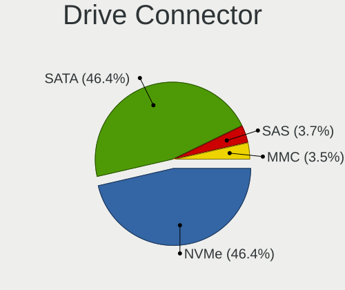

| Type | Notebooks | Drives | Percent |
|------|-----------|--------|---------|
| NVMe | 1156      | 1596   | 46.41%  |
| SATA | 1156      | 1691   | 46.41%  |
| SAS  | 91        | 116    | 3.65%   |
| MMC  | 88        | 105    | 3.53%   |

Drive Size
----------

Size of hard drive

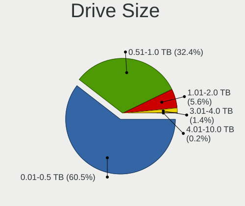

| Size in TB | Notebooks | Drives | Percent |
|------------|-----------|--------|---------|
| 0.01-0.5   | 800       | 1067   | 60.47%  |
| 0.51-1.0   | 428       | 579    | 32.35%  |
| 1.01-2.0   | 74        | 90     | 5.59%   |
| 3.01-4.0   | 18        | 20     | 1.36%   |
| 4.01-10.0  | 3         | 3      | 0.23%   |

Space Total
-----------

Amount of disk space available on the file system

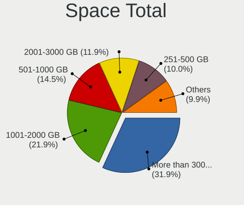

| Size in GB     | Notebooks | Percent |
|----------------|-----------|---------|
| More than 3000 | 723       | 31.86%  |
| 1001-2000      | 496       | 21.86%  |
| 501-1000       | 328       | 14.46%  |
| 2001-3000      | 270       | 11.9%   |
| 251-500        | 227       | 10%     |
| 101-250        | 146       | 6.43%   |
| 51-100         | 33        | 1.45%   |
| Unknown        | 18        | 0.79%   |
| 21-50          | 15        | 0.66%   |
| 1-20           | 13        | 0.57%   |

Space Used
----------

Amount of used disk space

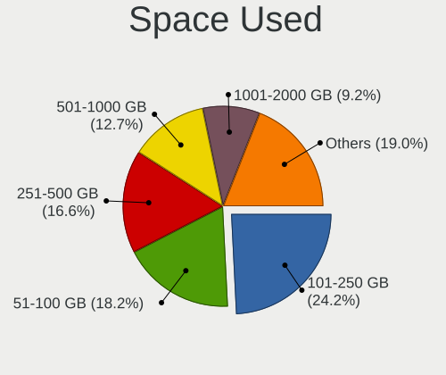

| Used GB        | Notebooks | Percent |
|----------------|-----------|---------|
| 101-250        | 580       | 24.21%  |
| 51-100         | 437       | 18.24%  |
| 251-500        | 398       | 16.61%  |
| 501-1000       | 304       | 12.69%  |
| 1001-2000      | 221       | 9.22%   |
| 1-20           | 138       | 5.76%   |
| 21-50          | 108       | 4.51%   |
| More than 3000 | 98        | 4.09%   |
| 2001-3000      | 92        | 3.84%   |
| Unknown        | 18        | 0.75%   |
| 0              | 2         | 0.08%   |

Malfunc. Drives
---------------

Drive models with a malfunction

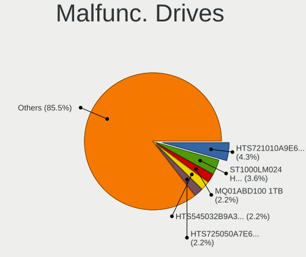

| Model                                                         | Notebooks | Drives | Percent |
|---------------------------------------------------------------|-----------|--------|---------|
| HGST HTS721010A9E630 1TB                                      | 6         | 6      | 4.35%   |
| Seagate ST1000LM024 HN-M101MBB 1TB                            | 5         | 5      | 3.62%   |
| Toshiba MQ01ABD100 1TB                                        | 3         | 3      | 2.17%   |
| Hitachi HTS545032B9A300 320GB                                 | 3         | 3      | 2.17%   |
| HGST HTS725050A7E630 500GB                                    | 3         | 4      | 2.17%   |
| SK hynix BC711 HFM512GD3JX013N 512GB                          | 2         | 2      | 1.45%   |
| Seagate ST500LM021-1KJ152 500GB                               | 2         | 2      | 1.45%   |
| Seagate ST1000LM035-1RK172 1TB                                | 2         | 2      | 1.45%   |
| SanDisk SD8SN8U-256G-1006 256GB SSD                           | 2         | 2      | 1.45%   |
| Samsung Electronics SSD 870 EVO 1TB                           | 2         | 2      | 1.45%   |
| Samsung Electronics NVMe SSD Controller SM981/PM981/PM983 1TB | 2         | 3      | 1.45%   |
| Micron/Crucial Technology P1 NVMe PCIe SSD[Frampton] 1TB      | 2         | 2      | 1.45%   |
| Kingston SMS200S3240G 240GB SSD                               | 2         | 2      | 1.45%   |
| Hitachi HTS547575A9E384 752GB                                 | 2         | 2      | 1.45%   |
| WDC WDS480G2G0A-00JH30 480GB SSD                              | 1         | 1      | 0.72%   |
| WDC WDS4 80G2G0A-00JH30 480GB SSD                             | 1         | 1      | 0.72%   |
| WDC WD5000LPVX-00V0TT0 500GB                                  | 1         | 1      | 0.72%   |
| WDC WD3200BEVT-75A23T0 320GB                                  | 1         | 1      | 0.72%   |
| WDC WD3200BEVT-22A23T0 320GB                                  | 1         | 1      | 0.72%   |
| WDC WD2500BEVT-22A23T0 250GB                                  | 1         | 1      | 0.72%   |
| WDC WD2500BEKT-75A25T0 250GB                                  | 1         | 1      | 0.72%   |
| WDC WD10SPZX-75Z10T2 1TB                                      | 1         | 1      | 0.72%   |
| WDC WD10SPZX-60Z10T0 1TB                                      | 1         | 1      | 0.72%   |
| WDC WD10SPZX-21Z10T0 1TB                                      | 1         | 1      | 0.72%   |
| WDC WD Blue SA510 2.5 500GB                                   | 1         | 1      | 0.72%   |
| Transcend TS128GSSD340 128GB                                  | 1         | 1      | 0.72%   |
| Toshiba THNSNJ256G8NY 256GB SSD                               | 1         | 1      | 0.72%   |
| Toshiba MQ02ABD100H 1TB                                       | 1         | 2      | 0.72%   |
| Toshiba MQ01ABF050 500GB                                      | 1         | 1      | 0.72%   |
| Toshiba MQ01ABD050 500GB                                      | 1         | 1      | 0.72%   |
| Toshiba MQ01ABD032 320GB                                      | 1         | 1      | 0.72%   |
| Toshiba MK6476GSX 640GB                                       | 1         | 1      | 0.72%   |
| Toshiba MK6465GSX 640GB                                       | 1         | 1      | 0.72%   |
| Toshiba MK6008GAH 64GB                                        | 1         | 1      | 0.72%   |
| Toshiba MK5075GSX 500GB                                       | 1         | 1      | 0.72%   |
| Toshiba MK5065GSXF 500GB                                      | 1         | 1      | 0.72%   |
| Toshiba MK5065GSX 500GB                                       | 1         | 1      | 0.72%   |
| Toshiba MK5056GSY 500GB                                       | 1         | 1      | 0.72%   |
| Toshiba MK5055GSX 500GB                                       | 1         | 3      | 0.72%   |
| Toshiba MK3265GSX 320GB                                       | 1         | 1      | 0.72%   |

Malfunc. Drive Vendor
---------------------

Vendors of faulty drives

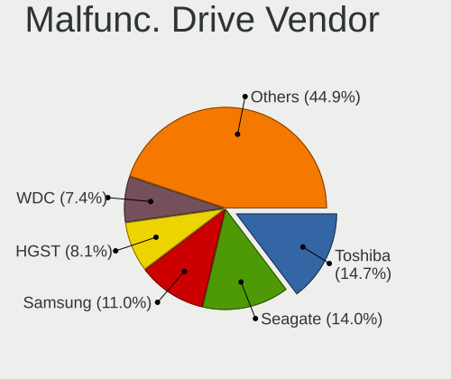

| Vendor                    | Notebooks | Drives | Percent |
|---------------------------|-----------|--------|---------|
| Toshiba                   | 20        | 24     | 14.71%  |
| Seagate                   | 19        | 20     | 13.97%  |
| Samsung Electronics       | 15        | 18     | 11.03%  |
| HGST                      | 11        | 13     | 8.09%   |
| WDC                       | 10        | 10     | 7.35%   |
| Hitachi                   | 10        | 11     | 7.35%   |
| Intel                     | 7         | 8      | 5.15%   |
| SK hynix                  | 6         | 7      | 4.41%   |
| SanDisk                   | 5         | 5      | 3.68%   |
| Kingston                  | 5         | 6      | 3.68%   |
| Crucial                   | 5         | 5      | 3.68%   |
| LITEONIT                  | 3         | 4      | 2.21%   |
| Micron/Crucial Technology | 2         | 2      | 1.47%   |
| Fujitsu                   | 2         | 3      | 1.47%   |
| WDC WDS4                  | 1         | 1      | 0.74%   |
| Transcend                 | 1         | 1      | 0.74%   |
| Silicon Motion            | 1         | 1      | 0.74%   |
| Phison Electronics        | 1         | 1      | 0.74%   |
| Phison                    | 1         | 1      | 0.74%   |
| Patriot                   | 1         | 1      | 0.74%   |
| Micron Technology         | 1         | 1      | 0.74%   |
| Lite-On Technology        | 1         | 2      | 0.74%   |
| LEQIXIANG                 | 1         | 1      | 0.74%   |
| Lenovo                    | 1         | 1      | 0.74%   |
| HUSKY                     | 1         | 1      | 0.74%   |
| Corsair                   | 1         | 1      | 0.74%   |
| Biwin Storage Technology  | 1         | 1      | 0.74%   |
| Apple                     | 1         | 1      | 0.74%   |
| Apacer                    | 1         | 1      | 0.74%   |
| A-DATA Technology         | 1         | 2      | 0.74%   |

Malfunc. HDD Vendor
-------------------

Vendors of faulty HDD drives

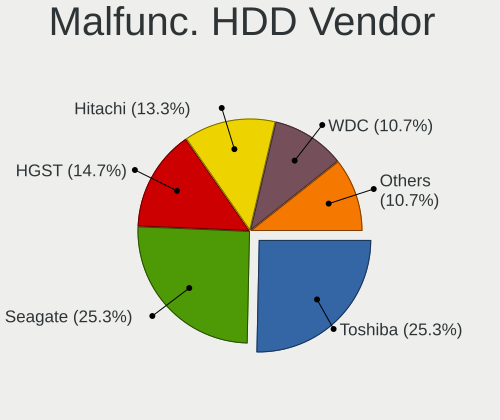

| Vendor              | Notebooks | Drives | Percent |
|---------------------|-----------|--------|---------|
| Toshiba             | 19        | 23     | 25.33%  |
| Seagate             | 19        | 20     | 25.33%  |
| HGST                | 11        | 13     | 14.67%  |
| Hitachi             | 10        | 11     | 13.33%  |
| WDC                 | 8         | 8      | 10.67%  |
| Samsung Electronics | 5         | 7      | 6.67%   |
| Fujitsu             | 2         | 3      | 2.67%   |
| Apple               | 1         | 1      | 1.33%   |

Malfunc. Drive Kind
-------------------

Kinds of faulty drives

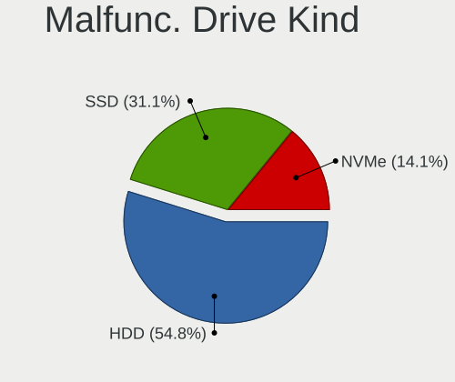

| Kind | Notebooks | Drives | Percent |
|------|-----------|--------|---------|
| HDD  | 74        | 86     | 54.81%  |
| SSD  | 42        | 46     | 31.11%  |
| NVMe | 19        | 22     | 14.07%  |

Failed Drives
-------------

Failed drive models

| Model                           | Notebooks | Drives | Percent |
|---------------------------------|-----------|--------|---------|
| Samsung Electronics SSD 980 1TB | 1         | 1      | 100%    |

Failed Drive Vendor
-------------------

Failed drive vendors

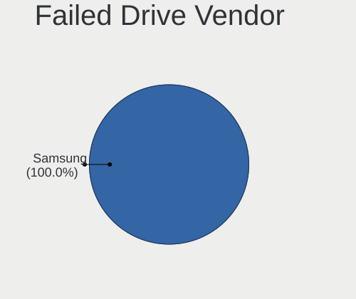

| Vendor              | Notebooks | Drives | Percent |
|---------------------|-----------|--------|---------|
| Samsung Electronics | 1         | 1      | 100%    |

Drive Status
------------

Number of failed and malfunc. drives

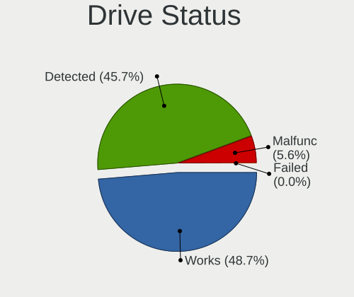

| Status   | Notebooks | Drives | Percent |
|----------|-----------|--------|---------|
| Works    | 1137      | 1629   | 48.67%  |
| Detected | 1067      | 1724   | 45.68%  |
| Malfunc  | 131       | 154    | 5.61%   |
| Failed   | 1         | 1      | 0.04%   |

Storage controller
------------------

Storage Vendor
--------------

Storage controller vendors

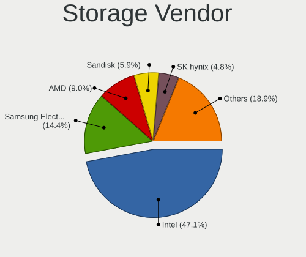

| Vendor                                  | Notebooks | Percent |
|-----------------------------------------|-----------|---------|
| Intel                                   | 1301      | 47.09%  |
| Samsung Electronics                     | 399       | 14.44%  |
| AMD                                     | 248       | 8.98%   |
| Sandisk                                 | 162       | 5.86%   |
| SK hynix                                | 132       | 4.78%   |
| Micron Technology                       | 94        | 3.4%    |
| Kingston Technology Company             | 72        | 2.61%   |
| KIOXIA                                  | 55        | 1.99%   |
| Toshiba America Info Systems            | 53        | 1.92%   |
| Phison Electronics                      | 40        | 1.45%   |
| Micron/Crucial Technology               | 33        | 1.19%   |
| Silicon Motion                          | 24        | 0.87%   |
| MAXIO Technology (Hangzhou)             | 21        | 0.76%   |
| ADATA Technology                        | 21        | 0.76%   |
| Solid State Storage Technology          | 15        | 0.54%   |
| Realtek Semiconductor                   | 13        | 0.47%   |
| Nvidia                                  | 13        | 0.47%   |
| Shenzhen Longsys Electronics            | 10        | 0.36%   |
| Union Memory (Shenzhen)                 | 8         | 0.29%   |
| Seagate Technology                      | 8         | 0.29%   |
| Solidigm                                | 7         | 0.25%   |
| Yangtze Memory Technologies             | 6         | 0.22%   |
| Marvell Technology Group                | 6         | 0.22%   |
| Lenovo                                  | 6         | 0.22%   |
| Shenzhen Unionmemory Information System | 4         | 0.14%   |
| Apple                                   | 3         | 0.11%   |
| Lite-On Technology                      | 2         | 0.07%   |
| VIA Technologies                        | 1         | 0.04%   |
| TenaFe                                  | 1         | 0.04%   |
| Silicon Integrated Systems [SiS]        | 1         | 0.04%   |
| INNOGRIT                                | 1         | 0.04%   |
| Biwin Storage Technology                | 1         | 0.04%   |
| ASMedia Technology                      | 1         | 0.04%   |
| Unknown                                 | 1         | 0.04%   |

Storage Model
-------------

Storage controller models

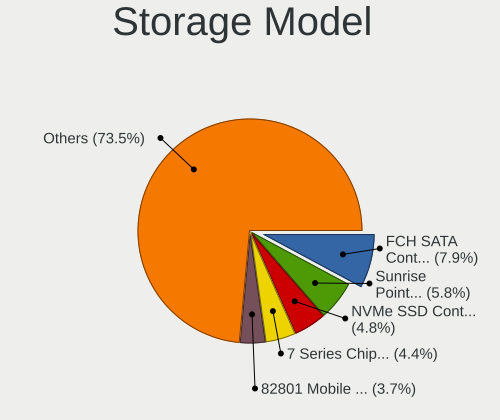

| Model                                                                          | Notebooks | Percent |
|--------------------------------------------------------------------------------|-----------|---------|
| AMD FCH SATA Controller [AHCI mode]                                            | 229       | 7.85%   |
| Intel Sunrise Point-LP SATA Controller [AHCI mode]                             | 168       | 5.76%   |
| Samsung NVMe SSD Controller SM981/PM981/PM983                                  | 139       | 4.77%   |
| Intel 7 Series Chipset Family 6-port SATA Controller [AHCI mode]               | 128       | 4.39%   |
| Intel 82801 Mobile SATA Controller [RAID mode]                                 | 108       | 3.7%    |
| Intel Volume Management Device NVMe RAID Controller                            | 106       | 3.63%   |
| Samsung NVMe SSD Controller PM9A1/PM9A3/980PRO                                 | 91        | 3.12%   |
| Intel 6 Series/C200 Series Chipset Family 6 port Mobile SATA AHCI Controller   | 90        | 3.09%   |
| Samsung NVMe SSD Controller 980 (DRAM-less)                                    | 84        | 2.88%   |
| Intel 8 Series SATA Controller 1 [AHCI mode]                                   | 68        | 2.33%   |
| Intel 8 Series/C220 Series Chipset Family 6-port SATA Controller 1 [AHCI mode] | 67        | 2.3%    |
| Intel Cannon Lake Mobile PCH SATA AHCI Controller                              | 63        | 2.16%   |
| Intel Tiger Lake-LP SATA Controller                                            | 54        | 1.85%   |
| Intel Wildcat Point-LP SATA Controller [AHCI Mode]                             | 52        | 1.78%   |
| SK hynix Gold P31/BC711/PC711 NVMe Solid State Drive                           | 50        | 1.71%   |
| Intel HM170/QM170 Chipset SATA Controller [AHCI Mode]                          | 47        | 1.61%   |
| SanDisk Ultra 3D / WD PC SN530, IX SN530, Blue SN550 NVMe SSD (DRAM-less)      | 36        | 1.23%   |
| Intel 82801IBM/IEM (ICH9M/ICH9M-E) 4 port SATA Controller [AHCI mode]          | 35        | 1.2%    |
| KIOXIA NVMe SSD Controller BG4 (DRAM-less)                                     | 33        | 1.13%   |
| Intel 5 Series/3400 Series Chipset 6 port SATA AHCI Controller                 | 30        | 1.03%   |
| Intel SSD 660P Series                                                          | 29        | 0.99%   |
| SanDisk Extreme Pro / WD Black SN750 / PC SN730 / Red SN700 NVMe SSD           | 28        | 0.96%   |
| Intel Alder Lake-P SATA AHCI Controller                                        | 28        | 0.96%   |
| Samsung NVMe SSD Controller SM961/PM961/SM963                                  | 26        | 0.89%   |
| SanDisk WD SN560/SN740/SN770/SN5000 NVMe SSD                                   | 25        | 0.86%   |
| Intel Comet Lake SATA AHCI Controller                                          | 25        | 0.86%   |
| Intel Celeron/Pentium Silver Processor SATA Controller                         | 25        | 0.86%   |
| Toshiba America Info Systems XG6 NVMe SSD Controller                           | 24        | 0.82%   |
| Micron 2450 NVMe SSD [HendrixV] (DRAM-less)                                    | 24        | 0.82%   |
| Intel Cannon Point-LP SATA Controller [AHCI Mode]                              | 24        | 0.82%   |
| Intel 5 Series/3400 Series Chipset 4 port SATA AHCI Controller                 | 24        | 0.82%   |
| Micron 2400 NVMe SSD (DRAM-less)                                               | 23        | 0.79%   |
| SK hynix Platinum P41/PC801 NVMe Solid State Drive                             | 21        | 0.72%   |
| Intel SSD 670p Series [Keystone Harbor]                                        | 20        | 0.69%   |
| Samsung NVMe SSD Controller PM9B1 (DRAM-less)                                  | 19        | 0.65%   |
| Micron/Crucial P2 [Nick P2] / P3 / P3 Plus NVMe PCIe SSD (DRAM-less)           | 19        | 0.65%   |
| Intel Q170/Q150/B150/H170/H110/Z170/CM236 Chipset SATA Controller [AHCI Mode]  | 19        | 0.65%   |
| SK hynix BC501 NVMe Solid State Drive                                          | 18        | 0.62%   |
| Samsung NVMe SSD Controller S4LV008[Pascal]                                    | 17        | 0.58%   |
| Intel SSD DC P4101/Pro 7600p/760p/E 6100p Series                               | 16        | 0.55%   |

Storage Kind
------------

Kind of storage controller (IDE, SATA, NVMe, SAS, ...)

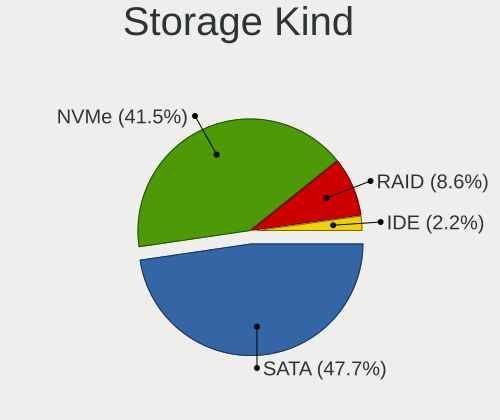

| Kind | Notebooks | Percent |
|------|-----------|---------|
| SATA | 1322      | 47.69%  |
| NVMe | 1151      | 41.52%  |
| RAID | 238       | 8.59%   |
| IDE  | 61        | 2.2%    |

Processor
---------

CPU Vendor
----------

Processor vendors

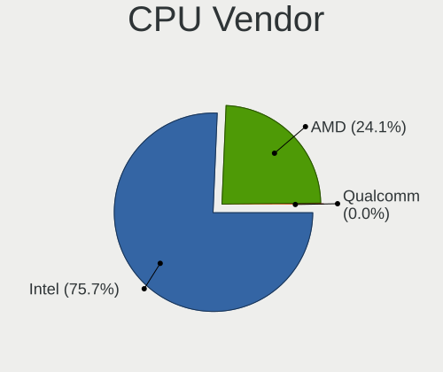

| Vendor   | Notebooks | Percent |
|----------|-----------|---------|
| Intel    | 1642      | 75.67%  |
| AMD      | 524       | 24.15%  |
| ARM      | 3         | 0.14%   |
| Qualcomm | 1         | 0.05%   |

CPU Model
---------

Processor models

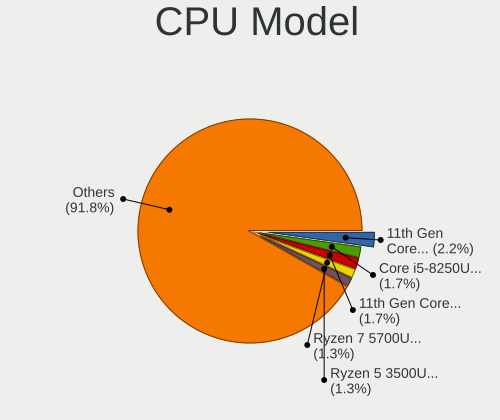

| Model                                         | Notebooks | Percent |
|-----------------------------------------------|-----------|---------|
| Intel 11th Gen Core i7-1165G7 @ 2.80GHz       | 48        | 2.21%   |
| Intel Core i5-8250U CPU @ 1.60GHz             | 36        | 1.66%   |
| Intel 11th Gen Core i5-1135G7 @ 2.40GHz       | 36        | 1.66%   |
| AMD Ryzen 7 5700U with Radeon Graphics        | 29        | 1.34%   |
| AMD Ryzen 5 3500U with Radeon Vega Mobile Gfx | 29        | 1.34%   |
| Intel Core i5-6200U CPU @ 2.30GHz             | 28        | 1.29%   |
| AMD Ryzen 5 5500U with Radeon Graphics        | 28        | 1.29%   |
| Intel Core i7-9750H CPU @ 2.60GHz             | 25        | 1.15%   |
| Intel Core i7-8565U CPU @ 1.80GHz             | 25        | 1.15%   |
| Intel Core i5-7200U CPU @ 2.50GHz             | 25        | 1.15%   |
| Intel Core i5-8265U CPU @ 1.60GHz             | 24        | 1.11%   |
| Intel Core i7-8550U CPU @ 1.80GHz             | 23        | 1.06%   |
| Intel Core i5-3210M CPU @ 2.50GHz             | 23        | 1.06%   |
| Intel Core i7-7700HQ CPU @ 2.80GHz            | 22        | 1.01%   |
| Intel Core i7-6700HQ CPU @ 2.60GHz            | 22        | 1.01%   |
| Intel Core i5-8350U CPU @ 1.70GHz             | 21        | 0.97%   |
| Intel Core i7-8750H CPU @ 2.20GHz             | 19        | 0.88%   |
| Intel Core i5-3230M CPU @ 2.60GHz             | 19        | 0.88%   |
| Intel 11th Gen Core i7-11800H @ 2.30GHz       | 19        | 0.88%   |
| AMD Ryzen 7 5800H with Radeon Graphics        | 19        | 0.88%   |
| AMD Ryzen 7 4800H with Radeon Graphics        | 19        | 0.88%   |
| Intel Core i5-6300U CPU @ 2.40GHz             | 18        | 0.83%   |
| Intel Core i5-4210U CPU @ 1.70GHz             | 18        | 0.83%   |
| Intel 12th Gen Core i5-1235U                  | 18        | 0.83%   |
| AMD Ryzen 5 5600H with Radeon Graphics        | 17        | 0.78%   |
| Intel Core i7-7500U CPU @ 2.70GHz             | 16        | 0.74%   |
| Intel Core i7-6500U CPU @ 2.50GHz             | 16        | 0.74%   |
| Intel Celeron N4020 CPU @ 1.10GHz             | 16        | 0.74%   |
| Intel Core i7-6600U CPU @ 2.60GHz             | 15        | 0.69%   |
| Intel Core i5-3320M CPU @ 2.60GHz             | 15        | 0.69%   |
| Intel Core i5-10210U CPU @ 1.60GHz            | 15        | 0.69%   |
| Intel 12th Gen Core i7-1260P                  | 15        | 0.69%   |
| Intel 11th Gen Core i3-1115G4 @ 3.00GHz       | 15        | 0.69%   |
| Intel Core i7-2670QM CPU @ 2.20GHz            | 14        | 0.65%   |
| Intel Core i7-10510U CPU @ 1.80GHz            | 14        | 0.65%   |
| Intel Core i5-5200U CPU @ 2.20GHz             | 14        | 0.65%   |
| Intel Core i5-4200U CPU @ 1.60GHz             | 14        | 0.65%   |
| Intel 12th Gen Core i7-12700H                 | 14        | 0.65%   |
| AMD Ryzen 7 PRO 4750U with Radeon Graphics    | 14        | 0.65%   |
| AMD Ryzen 5 4500U with Radeon Graphics        | 14        | 0.65%   |

CPU Model Family
----------------

Processor model prefix

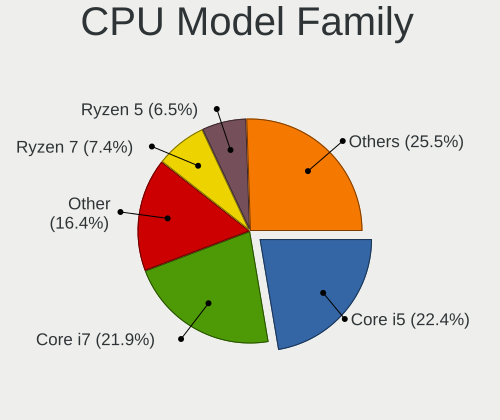

| Model                   | Notebooks | Percent |
|-------------------------|-----------|---------|
| Intel Core i5           | 485       | 22.35%  |
| Intel Core i7           | 475       | 21.89%  |
| Other                   | 355       | 16.36%  |
| AMD Ryzen 7             | 161       | 7.42%   |
| AMD Ryzen 5             | 140       | 6.45%   |
| Intel Core i3           | 117       | 5.39%   |
| Intel Core 2 Duo        | 57        | 2.63%   |
| Intel Celeron           | 56        | 2.58%   |
| AMD Ryzen 7 PRO         | 35        | 1.61%   |
| AMD Ryzen 9             | 31        | 1.43%   |
| AMD Ryzen 3             | 30        | 1.38%   |
| Intel Core              | 27        | 1.24%   |
| Intel Pentium           | 24        | 1.11%   |
| AMD A6                  | 21        | 0.97%   |
| AMD A8                  | 14        | 0.65%   |
| Intel Xeon              | 13        | 0.6%    |
| Intel Atom              | 12        | 0.55%   |
| AMD Ryzen 5 PRO         | 11        | 0.51%   |
| AMD A10                 | 11        | 0.51%   |
| Intel Pentium Silver    | 10        | 0.46%   |
| Intel Pentium Dual-Core | 8         | 0.37%   |
| AMD A4                  | 8         | 0.37%   |
| Intel Core i9           | 7         | 0.32%   |
| Intel Core m3           | 6         | 0.28%   |
| AMD E2                  | 5         | 0.23%   |
| AMD E1                  | 5         | 0.23%   |
| AMD Athlon X2           | 5         | 0.23%   |
| AMD Athlon              | 5         | 0.23%   |
| Intel Core 2            | 4         | 0.18%   |
| AMD E                   | 4         | 0.18%   |
| Intel Pentium M         | 3         | 0.14%   |
| AMD A12                 | 3         | 0.14%   |
| Intel Pentium Dual      | 2         | 0.09%   |
| Intel Genuine           | 2         | 0.09%   |
| AMD Ryzen 3 PRO         | 2         | 0.09%   |
| AMD C-50                | 2         | 0.09%   |
| AMD Athlon II           | 2         | 0.09%   |
| Intel Pentium III       | 1         | 0.05%   |
| Intel Pentium Gold      | 1         | 0.05%   |
| Intel Core m5           | 1         | 0.05%   |

CPU Cores
---------

Number of processor cores

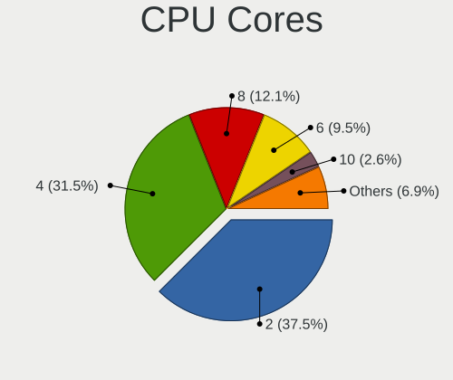

| Number | Notebooks | Percent |
|--------|-----------|---------|
| 2      | 815       | 37.51%  |
| 4      | 684       | 31.48%  |
| 8      | 262       | 12.06%  |
| 6      | 206       | 9.48%   |
| 10     | 57        | 2.62%   |
| 12     | 50        | 2.3%    |
| 14     | 41        | 1.89%   |
| 16     | 23        | 1.06%   |
| 1      | 23        | 1.06%   |
| 24     | 10        | 0.46%   |
| 20     | 2         | 0.09%   |

CPU Sockets
-----------

Number of sockets

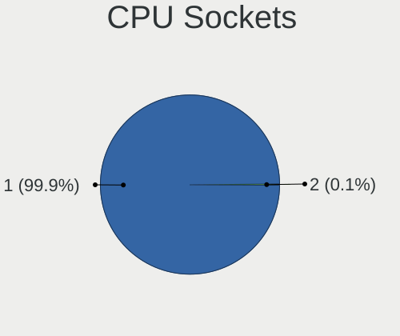

| Number | Notebooks | Percent |
|--------|-----------|---------|
| 1      | 2168      | 99.91%  |
| 2      | 2         | 0.09%   |

CPU Threads
-----------

Threads per core (Hyper-Threading)

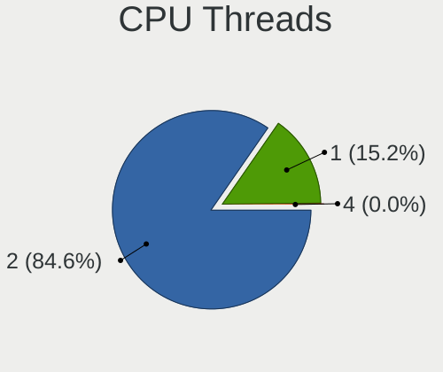

| Number | Notebooks | Percent |
|--------|-----------|---------|
| 2      | 1841      | 84.64%  |
| 1      | 330       | 15.17%  |
| 8      | 3         | 0.14%   |
| 4      | 1         | 0.05%   |

CPU Op-Modes
------------

CPU Operation Modes (32-bit, 64-bit)

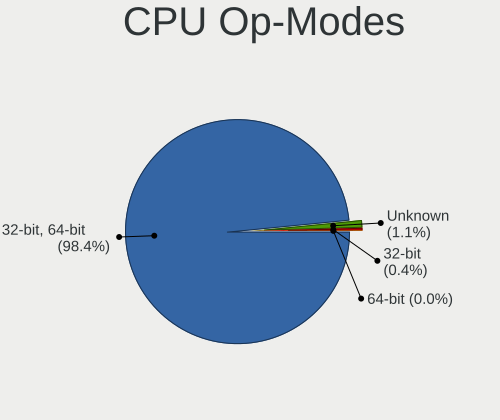

| Op mode        | Notebooks | Percent |
|----------------|-----------|---------|
| 32-bit, 64-bit | 2140      | 98.44%  |
| Unknown        | 24        | 1.1%    |
| 32-bit         | 9         | 0.41%   |
| 64-bit         | 1         | 0.05%   |

CPU Microcode
-------------

Microcode number

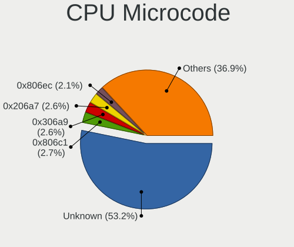

| Number     | Notebooks | Percent |
|------------|-----------|---------|
| Unknown    | 1189      | 53.2%   |
| 0x806c1    | 60        | 2.68%   |
| 0x306a9    | 58        | 2.6%    |
| 0x206a7    | 57        | 2.55%   |
| 0x806ec    | 46        | 2.06%   |
| 0x406e3    | 46        | 2.06%   |
| 0x906ea    | 44        | 1.97%   |
| 0x0a50000c | 44        | 1.97%   |
| 0x806ea    | 38        | 1.7%    |
| 0x306c3    | 38        | 1.7%    |
| 0x806e9    | 36        | 1.61%   |
| 0x40651    | 33        | 1.48%   |
| 0x08608103 | 32        | 1.43%   |
| 0x306d4    | 31        | 1.39%   |
| 0x08108109 | 28        | 1.25%   |
| 0x08600106 | 25        | 1.12%   |
| 0x506e3    | 23        | 1.03%   |
| 0x20655    | 21        | 0.94%   |
| 0x08600104 | 21        | 0.94%   |
| 0x08108102 | 21        | 0.94%   |
| 0x906e9    | 20        | 0.89%   |
| 0x1067a    | 20        | 0.89%   |
| 0x0a404102 | 17        | 0.76%   |
| 0x906a3    | 16        | 0.72%   |
| 0x806d1    | 14        | 0.63%   |
| 0x706e5    | 14        | 0.63%   |
| 0x806eb    | 13        | 0.58%   |
| 0x06006705 | 13        | 0.58%   |
| 0x0a50000d | 12        | 0.54%   |
| 0x08608102 | 12        | 0.54%   |
| 0x6fd      | 9         | 0.4%    |
| 0x706a8    | 8         | 0.36%   |
| 0x07030105 | 8         | 0.36%   |
| 0x06001119 | 8         | 0.36%   |
| 0xa0652    | 7         | 0.31%   |
| 0x10676    | 7         | 0.31%   |
| 0x0a404101 | 7         | 0.31%   |
| 0x08600103 | 7         | 0.31%   |
| 0x0810100b | 7         | 0.31%   |
| 0x906ed    | 6         | 0.27%   |

CPU Microarch
-------------

Microarchitecture

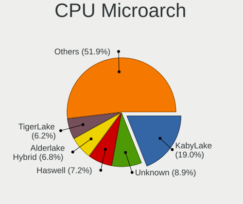

| Name              | Notebooks | Percent |
|-------------------|-----------|---------|
| KabyLake          | 412       | 18.97%  |
| Unknown           | 194       | 8.93%   |
| Haswell           | 157       | 7.23%   |
| Alderlake Hybrid  | 148       | 6.81%   |
| TigerLake         | 134       | 6.17%   |
| Skylake           | 134       | 6.17%   |
| IvyBridge         | 124       | 5.71%   |
| SandyBridge       | 117       | 5.39%   |
| Zen 3             | 92        | 4.24%   |
| Zen 2             | 85        | 3.91%   |
| Zen+              | 65        | 2.99%   |
| Broadwell         | 65        | 2.99%   |
| Icelake           | 58        | 2.67%   |
| Westmere          | 55        | 2.53%   |
| Penryn            | 52        | 2.39%   |
| CometLake         | 34        | 1.57%   |
| Excavator         | 31        | 1.43%   |
| Goldmont plus     | 27        | 1.24%   |
| Core              | 22        | 1.01%   |
| Zen               | 20        | 0.92%   |
| Silvermont        | 20        | 0.92%   |
| Meteorlake Hybrid | 19        | 0.87%   |
| Puma              | 15        | 0.69%   |
| Piledriver        | 10        | 0.46%   |
| K10 Llano         | 10        | 0.46%   |
| Gracemont         | 8         | 0.37%   |
| Tremont           | 7         | 0.32%   |
| Jaguar            | 7         | 0.32%   |
| Bonnell           | 7         | 0.32%   |
| Bobcat            | 7         | 0.32%   |
| Lunarlake Hybrid  | 6         | 0.28%   |
| K8 & K10 hybrid   | 6         | 0.28%   |
| Goldmont          | 6         | 0.28%   |
| P6                | 5         | 0.23%   |
| Nehalem           | 5         | 0.23%   |
| K10               | 4         | 0.18%   |
| Steamroller       | 3         | 0.14%   |
| K8 Hammer         | 1         | 0.05%   |

Graphics
--------

GPU Vendor
----------

Vendors of graphics cards

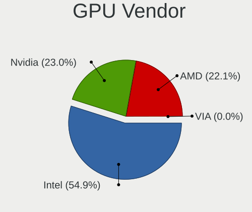

| Vendor           | Notebooks | Percent |
|------------------|-----------|---------|
| Intel            | 1535      | 54.88%  |
| Nvidia           | 643       | 22.99%  |
| AMD              | 618       | 22.1%   |
| VIA Technologies | 1         | 0.04%   |

GPU Model
---------

Graphics card models

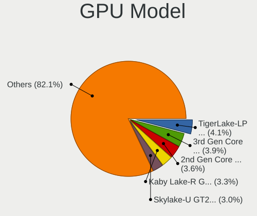

| Model                                                                                 | Notebooks | Percent |
|---------------------------------------------------------------------------------------|-----------|---------|
| Intel TigerLake-LP GT2 [Iris Xe Graphics]                                             | 117       | 4.07%   |
| Intel 3rd Gen Core processor Graphics Controller                                      | 113       | 3.93%   |
| Intel 2nd Generation Core Processor Family Integrated Graphics Controller             | 104       | 3.62%   |
| Intel Kaby Lake-R GT2 [UHD Graphics 620]                                              | 94        | 3.27%   |
| Intel Skylake-U GT2 [HD Graphics 520]                                                 | 87        | 3.03%   |
| AMD Renoir [Radeon Vega Series / Radeon Vega Mobile Series]                           | 85        | 2.96%   |
| Intel CoffeeLake-H GT2 [UHD Graphics 630]                                             | 84        | 2.92%   |
| Intel Haswell-ULT Integrated Graphics Controller                                      | 76        | 2.64%   |
| Intel 4th Gen Core Processor Integrated Graphics Controller                           | 71        | 2.47%   |
| Intel WhiskeyLake-U GT2 [UHD Graphics 620]                                            | 70        | 2.43%   |
| AMD Picasso/Raven 2 [Radeon Vega Series / Radeon Vega Mobile Series]                  | 68        | 2.37%   |
| Intel Kaby Lake-U GT2 [HD Graphics 620]                                               | 67        | 2.33%   |
| AMD Lucienne                                                                          | 66        | 2.3%    |
| AMD Cezanne [Radeon Vega Series / Radeon Vega Mobile Series]                          | 66        | 2.3%    |
| Intel Alder Lake-P GT2 [Iris Xe Graphics]                                             | 50        | 1.74%   |
| Intel Broadwell-U GT2 [HD Graphics 5500]                                              | 48        | 1.67%   |
| Intel Core Processor Integrated Graphics Controller                                   | 43        | 1.5%    |
| Intel CometLake-U GT2 [UHD Graphics]                                                  | 43        | 1.5%    |
| Intel Raptor Lake-P [Iris Xe Graphics]                                                | 36        | 1.25%   |
| AMD Rembrandt [Radeon 680M]                                                           | 36        | 1.25%   |
| Intel Skylake-H GT2 [HD Graphics 530]                                                 | 34        | 1.18%   |
| Nvidia TU117M [GeForce GTX 1650 Mobile / Max-Q]                                       | 33        | 1.15%   |
| Intel CometLake-H GT2 [UHD Graphics]                                                  | 31        | 1.08%   |
| Intel Kaby Lake-H GT2 [HD Graphics 630]                                               | 29        | 1.01%   |
| Intel TigerLake-H GT1 [UHD Graphics]                                                  | 28        | 0.97%   |
| Nvidia GP107M [GeForce GTX 1050 Mobile]                                               | 26        | 0.9%    |
| Intel Mobile 4 Series Chipset Integrated Graphics Controller                          | 26        | 0.9%    |
| AMD Phoenix1                                                                          | 26        | 0.9%    |
| Nvidia GA106M [GeForce RTX 3060 Mobile / Max-Q]                                       | 25        | 0.87%   |
| Intel Alder Lake-UP3 GT2 [Iris Xe Graphics]                                           | 24        | 0.83%   |
| AMD Barcelo                                                                           | 23        | 0.8%    |
| AMD Topaz XT [Radeon R7 M260/M265 / M340/M360 / M440/M445 / 530/535 / 620/625 Mobile] | 21        | 0.73%   |
| Nvidia GA107M [GeForce RTX 3050 Ti Mobile]                                            | 20        | 0.7%    |
| Intel GeminiLake [UHD Graphics 600]                                                   | 20        | 0.7%    |
| Nvidia GA107M [GeForce RTX 3050 Mobile]                                               | 19        | 0.66%   |
| AMD Stoney [Radeon R2/R3/R4/R5 Graphics]                                              | 19        | 0.66%   |
| Nvidia TU116M [GeForce GTX 1660 Ti Mobile]                                            | 18        | 0.63%   |
| Intel Iris Plus Graphics G1 (Ice Lake)                                                | 18        | 0.63%   |
| Nvidia GP108M [GeForce MX150]                                                         | 17        | 0.59%   |
| Nvidia AD107M [GeForce RTX 4060 Max-Q / Mobile]                                       | 17        | 0.59%   |

GPU Combo
---------

Combinations of graphics cards

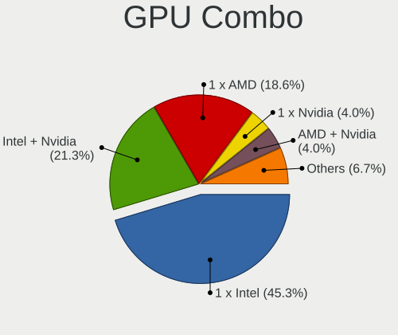

| Name               | Notebooks | Percent |
|--------------------|-----------|---------|
| 1 x Intel          | 986       | 45.33%  |
| Intel + Nvidia     | 463       | 21.29%  |
| 1 x AMD            | 404       | 18.57%  |
| 1 x Nvidia         | 88        | 4.05%   |
| AMD + Nvidia       | 88        | 4.05%   |
| Intel + AMD        | 74        | 3.4%    |
| 2 x AMD            | 52        | 2.39%   |
| 2 x Intel          | 9         | 0.41%   |
| Other              | 6         | 0.28%   |
| 2 x Nvidia         | 3         | 0.14%   |
| 1 x VIA            | 1         | 0.05%   |
| Intel + 2 x Nvidia | 1         | 0.05%   |

GPU Driver
----------

Free vs proprietary

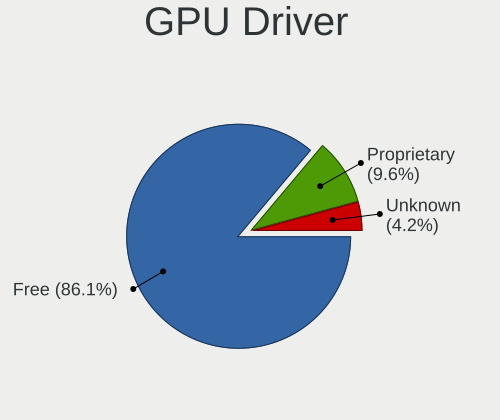

| Driver      | Notebooks | Percent |
|-------------|-----------|---------|
| Free        | 1894      | 86.13%  |
| Proprietary | 212       | 9.64%   |
| Unknown     | 93        | 4.23%   |

GPU Memory
----------

Total video memory

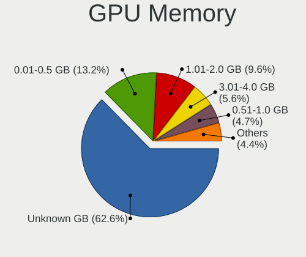

| Size in GB | Notebooks | Percent |
|------------|-----------|---------|
| Unknown    | 1387      | 62.65%  |
| 0.01-0.5   | 292       | 13.19%  |
| 1.01-2.0   | 212       | 9.58%   |
| 3.01-4.0   | 123       | 5.56%   |
| 0.51-1.0   | 103       | 4.65%   |
| 7.01-8.0   | 48        | 2.17%   |
| 5.01-6.0   | 33        | 1.49%   |
| 8.01-16.0  | 12        | 0.54%   |
| 2.01-3.0   | 4         | 0.18%   |

Monitor
-------

Monitor Vendor
--------------

Monitor vendors

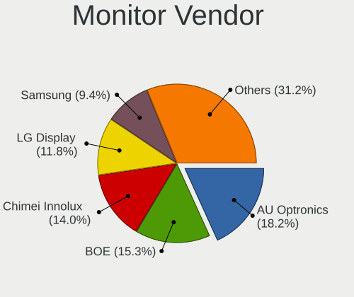

| Vendor                  | Notebooks | Percent |
|-------------------------|-----------|---------|
| AU Optronics            | 475       | 18.23%  |
| BOE                     | 400       | 15.35%  |
| Chimei Innolux          | 366       | 14.04%  |
| LG Display              | 307       | 11.78%  |
| Samsung Electronics     | 245       | 9.4%    |
| Dell                    | 79        | 3.03%   |
| Goldstar                | 74        | 2.84%   |
| Apple                   | 74        | 2.84%   |
| Sharp                   | 71        | 2.72%   |
| Lenovo                  | 65        | 2.49%   |
| PANDA                   | 44        | 1.69%   |
| Chi Mei Optoelectronics | 35        | 1.34%   |
| InfoVision              | 29        | 1.11%   |
| Hewlett-Packard         | 24        | 0.92%   |
| CSO                     | 24        | 0.92%   |
| BenQ                    | 24        | 0.92%   |
| AOC                     | 22        | 0.84%   |
| Acer                    | 22        | 0.84%   |
| Philips                 | 20        | 0.77%   |
| Ancor Communications    | 11        | 0.42%   |
| Sony                    | 10        | 0.38%   |
| Iiyama                  | 10        | 0.38%   |
| ASUSTek Computer        | 10        | 0.38%   |
| LG Philips              | 9         | 0.35%   |
| ViewSonic               | 7         | 0.27%   |
| TMX                     | 7         | 0.27%   |
| Pixio                   | 7         | 0.27%   |
| Fujitsu Siemens         | 7         | 0.27%   |
| CSOT                    | 7         | 0.27%   |
| HKC                     | 6         | 0.23%   |
| Eizo                    | 6         | 0.23%   |
| CSW                     | 5         | 0.19%   |
| Vizio                   | 4         | 0.15%   |
| Unknown                 | 4         | 0.15%   |
| Toshiba                 | 4         | 0.15%   |
| MSI                     | 4         | 0.15%   |
| KDB                     | 4         | 0.15%   |
| HUAWEI                  | 4         | 0.15%   |
| HannStar                | 4         | 0.15%   |
| CPT                     | 4         | 0.15%   |

Monitor Model
-------------

Monitor models

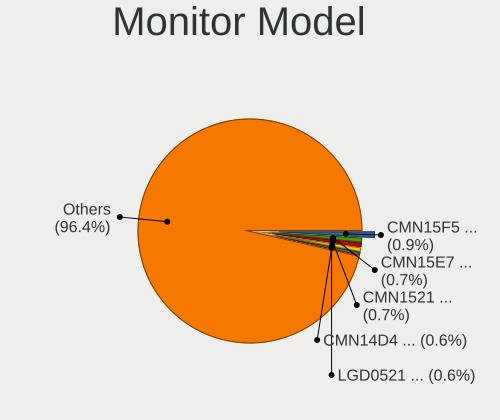

| Model                                                                 | Notebooks | Percent |
|-----------------------------------------------------------------------|-----------|---------|
| Chimei Innolux LCD Monitor CMN15F5 1920x1080 344x193mm 15.5-inch      | 25        | 0.95%   |
| Chimei Innolux LCD Monitor CMN15E7 1920x1080 344x193mm 15.5-inch      | 19        | 0.72%   |
| Chimei Innolux LCD Monitor CMN1521 1920x1080 344x193mm 15.5-inch      | 18        | 0.68%   |
| Chimei Innolux LCD Monitor CMN14D4 1920x1080 309x173mm 13.9-inch      | 17        | 0.64%   |
| LG Display LCD Monitor LGD0521 1920x1080 309x174mm 14.0-inch          | 15        | 0.57%   |
| AU Optronics LCD Monitor AUO403D 1920x1080 309x174mm 14.0-inch        | 15        | 0.57%   |
| AU Optronics LCD Monitor AUO38ED 1920x1080 344x193mm 15.5-inch        | 14        | 0.53%   |
| AU Optronics LCD Monitor AUO21ED 1920x1080 344x193mm 15.5-inch        | 14        | 0.53%   |
| Chimei Innolux LCD Monitor CMN1735 1920x1080 381x214mm 17.2-inch      | 11        | 0.42%   |
| BOE LCD Monitor BOE0812 1920x1080 344x194mm 15.5-inch                 | 11        | 0.42%   |
| Samsung Electronics LCD Monitor SEC5441 1280x800 331x207mm 15.4-inch  | 10        | 0.38%   |
| Samsung Electronics LCD Monitor SDC4161 1920x1080 344x194mm 15.5-inch | 10        | 0.38%   |
| Chimei Innolux LCD Monitor CMN15C3 1920x1080 344x193mm 15.5-inch      | 10        | 0.38%   |
| AU Optronics LCD Monitor AUO219D 1920x1080 381x214mm 17.2-inch        | 10        | 0.38%   |
| AU Optronics LCD Monitor AUO106C 1366x768 276x155mm 12.5-inch         | 10        | 0.38%   |
| PANDA LCD Monitor NCP004D 1920x1080 344x194mm 15.5-inch               | 9         | 0.34%   |
| PANDA LCD Monitor NCP002D 1920x1080 344x194mm 15.5-inch               | 9         | 0.34%   |
| Chimei Innolux LCD Monitor CMN15D5 1920x1080 344x193mm 15.5-inch      | 9         | 0.34%   |
| AU Optronics LCD Monitor AUO61ED 1920x1080 344x194mm 15.5-inch        | 9         | 0.34%   |
| AU Optronics LCD Monitor AUO22EC 1366x768 344x193mm 15.5-inch         | 9         | 0.34%   |
| Samsung Electronics LCD Monitor SDC4171 2880x1800 302x189mm 14.0-inch | 8         | 0.3%    |
| LG Display LCD Monitor LGD046F 1920x1080 344x194mm 15.5-inch          | 8         | 0.3%    |
| Goldstar HDR WFHD GSM7714 2560x1080 798x334mm 34.1-inch               | 8         | 0.3%    |
| Chimei Innolux LCD Monitor CMN14C3 1366x768 309x173mm 13.9-inch       | 8         | 0.3%    |
| BOE LCD Monitor BOE084E 1920x1080 382x215mm 17.3-inch                 | 8         | 0.3%    |
| AU Optronics LCD Monitor AUO23ED 1920x1080 344x193mm 15.5-inch        | 8         | 0.3%    |
| Pixio U29I WAM2900 2560x1080 690x260mm 29.0-inch                      | 7         | 0.26%   |
| LG Display LCD Monitor LGD05E5 1920x1080 344x194mm 15.5-inch          | 7         | 0.26%   |
| Lenovo LCD Monitor LEN40B1 1600x900 345x194mm 15.6-inch               | 7         | 0.26%   |
| Chimei Innolux LCD Monitor CMN15E8 1920x1080 344x193mm 15.5-inch      | 7         | 0.26%   |
| Chimei Innolux LCD Monitor CMN15E6 1366x768 344x193mm 15.5-inch       | 7         | 0.26%   |
| Chimei Innolux LCD Monitor CMN15C4 1920x1080 344x193mm 15.5-inch      | 7         | 0.26%   |
| BOE LCD Monitor BOE08D7 1920x1080 309x174mm 14.0-inch                 | 7         | 0.26%   |
| BOE LCD Monitor BOE0675 1366x768 344x194mm 15.5-inch                  | 7         | 0.26%   |
| BOE LCD Monitor BOE0660 1600x900 382x215mm 17.3-inch                  | 7         | 0.26%   |
| AU Optronics LCD Monitor AUO573D 1920x1080 309x174mm 14.0-inch        | 7         | 0.26%   |
| AU Optronics LCD Monitor AUO323D 1920x1080 309x174mm 14.0-inch        | 7         | 0.26%   |
| AU Optronics LCD Monitor AUO243D 1920x1080 309x173mm 13.9-inch        | 7         | 0.26%   |
| AU Optronics LCD Monitor AUO139E 1600x900 382x214mm 17.2-inch         | 7         | 0.26%   |
| AU Optronics LCD Monitor AUO109D 1920x1080 381x214mm 17.2-inch        | 7         | 0.26%   |

Monitor Resolution
------------------

Monitor screen resolution

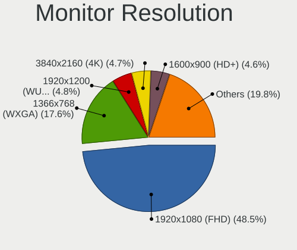

| Resolution         | Notebooks | Percent |
|--------------------|-----------|---------|
| 1920x1080 (FHD)    | 1195      | 48.48%  |
| 1366x768 (WXGA)    | 433       | 17.57%  |
| 1920x1200 (WUXGA)  | 119       | 4.83%   |
| 3840x2160 (4K)     | 116       | 4.71%   |
| 1600x900 (HD+)     | 113       | 4.58%   |
| 2560x1440 (QHD)    | 88        | 3.57%   |
| 2560x1600          | 65        | 2.64%   |
| 1280x800 (WXGA)    | 61        | 2.47%   |
| 2880x1800          | 46        | 1.87%   |
| 1440x900 (WXGA+)   | 39        | 1.58%   |
| 2560x1080          | 31        | 1.26%   |
| 1680x1050 (WSXGA+) | 18        | 0.73%   |
| 3440x1440          | 17        | 0.69%   |
| 1280x1024 (SXGA)   | 12        | 0.49%   |
| 3840x2400          | 11        | 0.45%   |
| 2256x1504          | 8         | 0.32%   |
| 2160x1440          | 8         | 0.32%   |
| 3200x1800 (QHD+)   | 7         | 0.28%   |
| 3200x2000          | 6         | 0.24%   |
| 3072x1920          | 5         | 0.2%    |
| 2240x1400          | 5         | 0.2%    |
| 1024x768 (XGA)     | 5         | 0.2%    |
| 1024x600           | 5         | 0.2%    |
| Unknown            | 5         | 0.2%    |
| 3840x1600          | 4         | 0.16%   |
| 2520x1680          | 4         | 0.16%   |
| 3840x1080          | 3         | 0.12%   |
| 3456x2160          | 3         | 0.12%   |
| 1920x540           | 3         | 0.12%   |
| 1600x1200          | 3         | 0.12%   |
| 2880x1920          | 2         | 0.08%   |
| 2160x1350          | 2         | 0.08%   |
| 1600x2560          | 2         | 0.08%   |
| 1360x768           | 2         | 0.08%   |
| 1280x720 (HD)      | 2         | 0.08%   |
| 8960x2160          | 1         | 0.04%   |
| 800x1280           | 1         | 0.04%   |
| 4480x1440          | 1         | 0.04%   |
| 3840x2560          | 1         | 0.04%   |
| 3840x1200          | 1         | 0.04%   |

Monitor Diagonal
----------------

Diagonal size in inches

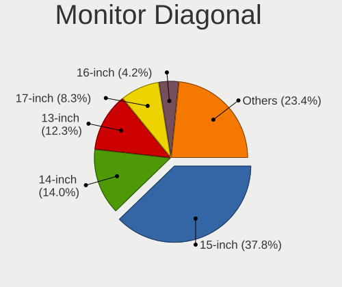

| Inches  | Notebooks | Percent |
|---------|-----------|---------|
| 15      | 984       | 37.76%  |
| 14      | 366       | 14.04%  |
| 13      | 321       | 12.32%  |
| 17      | 217       | 8.33%   |
| 16      | 109       | 4.18%   |
| 27      | 98        | 3.76%   |
| 24      | 82        | 3.15%   |
| 12      | 70        | 2.69%   |
| 21      | 69        | 2.65%   |
| 23      | 52        | 2%      |
| 31      | 31        | 1.19%   |
| 34      | 27        | 1.04%   |
| 84      | 16        | 0.61%   |
| 11      | 16        | 0.61%   |
| Unknown | 14        | 0.54%   |
| 22      | 12        | 0.46%   |
| 19      | 12        | 0.46%   |
| 18      | 12        | 0.46%   |
| 29      | 9         | 0.35%   |
| 63      | 8         | 0.31%   |
| 25      | 7         | 0.27%   |
| 20      | 7         | 0.27%   |
| 26      | 6         | 0.23%   |
| 72      | 5         | 0.19%   |
| 37      | 5         | 0.19%   |
| 32      | 5         | 0.19%   |
| 10      | 5         | 0.19%   |
| 49      | 4         | 0.15%   |
| 28      | 4         | 0.15%   |
| 86      | 3         | 0.12%   |
| 54      | 3         | 0.12%   |
| 52      | 3         | 0.12%   |
| 40      | 3         | 0.12%   |
| 43      | 2         | 0.08%   |
| 38      | 2         | 0.08%   |
| 35      | 2         | 0.08%   |
| 33      | 2         | 0.08%   |
| 8       | 2         | 0.08%   |
| 142     | 1         | 0.04%   |
| 75      | 1         | 0.04%   |

Monitor Width
-------------

Physical width

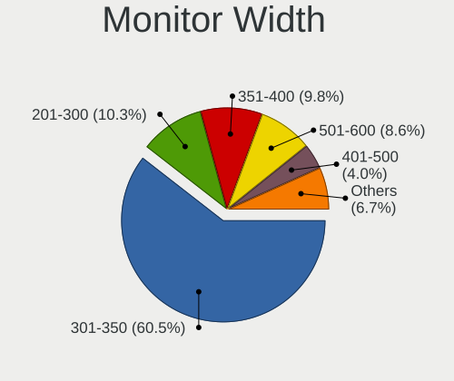

| Width in mm    | Notebooks | Percent |
|----------------|-----------|---------|
| 301-350        | 1564      | 60.53%  |
| 201-300        | 266       | 10.29%  |
| 351-400        | 253       | 9.79%   |
| 501-600        | 223       | 8.63%   |
| 401-500        | 104       | 4.02%   |
| 601-700        | 58        | 2.24%   |
| 701-800        | 35        | 1.35%   |
| 1001-1500      | 26        | 1.01%   |
| 1501-2000      | 23        | 0.89%   |
| Unknown        | 14        | 0.54%   |
| 801-900        | 12        | 0.46%   |
| 101-200        | 3         | 0.12%   |
| More than 2000 | 1         | 0.04%   |
| 901-1000       | 1         | 0.04%   |
| 1-100          | 1         | 0.04%   |

Aspect Ratio
------------

Proportional relationship between the width and the height

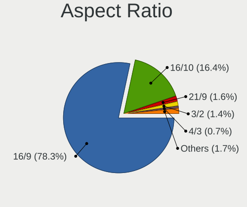

| Ratio   | Notebooks | Percent |
|---------|-----------|---------|
| 16/9    | 1791      | 78.35%  |
| 16/10   | 375       | 16.4%   |
| 21/9    | 36        | 1.57%   |
| 3/2     | 31        | 1.36%   |
| 4/3     | 15        | 0.66%   |
| 5/4     | 12        | 0.52%   |
| 2.65    | 7         | 0.31%   |
| Unknown | 5         | 0.22%   |
| 32/9    | 4         | 0.17%   |
| 0.56    | 3         | 0.13%   |
| 6/5     | 1         | 0.04%   |
| 3.73    | 1         | 0.04%   |
| 3.40    | 1         | 0.04%   |
| 3.20    | 1         | 0.04%   |
| 1.00    | 1         | 0.04%   |
| 0.67    | 1         | 0.04%   |
| 0.62    | 1         | 0.04%   |

Monitor Area
------------

Area in inch²

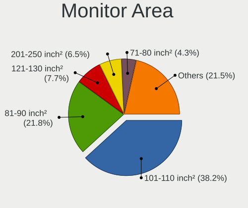

| Area in inch² | Notebooks | Percent |
|----------------|-----------|---------|
| 101-110        | 991       | 38.19%  |
| 81-90          | 567       | 21.85%  |
| 121-130        | 200       | 7.71%   |
| 201-250        | 169       | 6.51%   |
| 71-80          | 111       | 4.28%   |
| 301-350        | 102       | 3.93%   |
| 111-120        | 96        | 3.7%    |
| 351-500        | 70        | 2.7%    |
| 61-70          | 65        | 2.5%    |
| More than 1000 | 46        | 1.77%   |
| 251-300        | 44        | 1.7%    |
| 151-200        | 34        | 1.31%   |
| 51-60          | 17        | 0.66%   |
| 131-140        | 17        | 0.66%   |
| 141-150        | 15        | 0.58%   |
| 501-1000       | 15        | 0.58%   |
| Unknown        | 14        | 0.54%   |
| 91-100         | 13        | 0.5%    |
| 41-50          | 6         | 0.23%   |
| 1-40           | 3         | 0.12%   |

Pixel Density
-------------

Pixels per inch

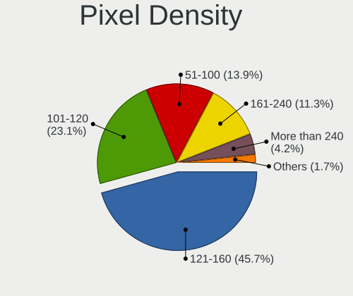

| Density       | Notebooks | Percent |
|---------------|-----------|---------|
| 121-160       | 1160      | 45.71%  |
| 101-120       | 586       | 23.09%  |
| 51-100        | 353       | 13.91%  |
| 161-240       | 288       | 11.35%  |
| More than 240 | 107       | 4.22%   |
| 1-50          | 30        | 1.18%   |
| Unknown       | 14        | 0.55%   |

Multiple Monitors
-----------------

Total monitors connected

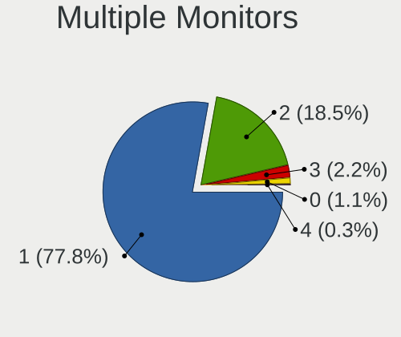

| Total | Notebooks | Percent |
|-------|-----------|---------|
| 1     | 1733      | 77.82%  |
| 2     | 413       | 18.55%  |
| 3     | 50        | 2.25%   |
| 0     | 25        | 1.12%   |
| 4     | 6         | 0.27%   |

Network
-------

Net Controller Vendor
---------------------

Controller vendors

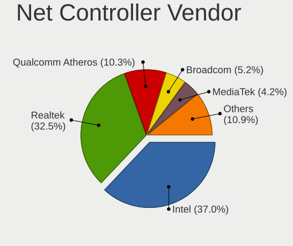

| Vendor                                 | Notebooks | Percent |
|----------------------------------------|-----------|---------|
| Intel                                  | 1249      | 37.04%  |
| Realtek Semiconductor                  | 1096      | 32.5%   |
| Qualcomm Atheros                       | 347       | 10.29%  |
| Broadcom                               | 174       | 5.16%   |
| MediaTek                               | 140       | 4.15%   |
| Broadcom Limited                       | 42        | 1.25%   |
| ASIX Electronics                       | 39        | 1.16%   |
| Shenzhen Goodix Technology             | 20        | 0.59%   |
| Marvell Technology Group               | 20        | 0.59%   |
| Qualcomm                               | 18        | 0.53%   |
| TP-Link                                | 17        | 0.5%    |
| Lenovo                                 | 17        | 0.5%    |
| Dell                                   | 17        | 0.5%    |
| Sierra Wireless                        | 16        | 0.47%   |
| Ralink                                 | 16        | 0.47%   |
| Ralink Technology                      | 15        | 0.44%   |
| DisplayLink                            | 14        | 0.42%   |
| Nvidia                                 | 12        | 0.36%   |
| Ericsson Business Mobile Networks      | 8         | 0.24%   |
| Hewlett-Packard                        | 7         | 0.21%   |
| Cypress Semiconductor                  | 7         | 0.21%   |
| Xiaomi                                 | 6         | 0.18%   |
| ASUSTek Computer                       | 6         | 0.18%   |
| Samsung Electronics                    | 5         | 0.15%   |
| Qualcomm Technologies                  | 5         | 0.15%   |
| Huawei Technologies                    | 5         | 0.15%   |
| U-Blox                                 | 4         | 0.12%   |
| Quectel Wireless Solutions             | 4         | 0.12%   |
| ICS Advent                             | 4         | 0.12%   |
| D-Link                                 | 4         | 0.12%   |
| Motorola PCS                           | 3         | 0.09%   |
| Fibocom                                | 3         | 0.09%   |
| Edimax Technology                      | 3         | 0.09%   |
| Suzhou Motorcomm Electronic Technology | 2         | 0.06%   |
| Qualcomm Atheros Communications        | 2         | 0.06%   |
| Linksys                                | 2         | 0.06%   |
| JMicron Technology                     | 2         | 0.06%   |
| HMD Global                             | 2         | 0.06%   |
| ZTE WCDMA Technologies MSM             | 1         | 0.03%   |
| VIA Technologies                       | 1         | 0.03%   |

Net Controller Model
--------------------

Controller models

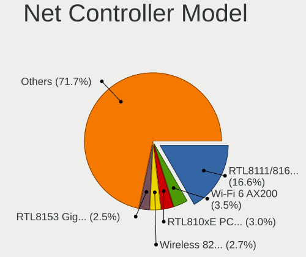

| Model                                                                  | Notebooks | Percent |
|------------------------------------------------------------------------|-----------|---------|
| Realtek RTL8111/8168/8211/8411 PCI Express Gigabit Ethernet Controller | 685       | 16.65%  |
| Intel Wi-Fi 6 AX200                                                    | 143       | 3.48%   |
| Realtek RTL810xE PCI Express Fast Ethernet controller                  | 123       | 2.99%   |
| Intel Wireless 8265 / 8275                                             | 110       | 2.67%   |
| Realtek RTL8153 Gigabit Ethernet Adapter                               | 104       | 2.53%   |
| Intel Wi-Fi 6 AX201                                                    | 104       | 2.53%   |
| Qualcomm Atheros QCA9377 802.11ac Wireless Network Adapter             | 84        | 2.04%   |
| Intel Alder Lake-P PCH CNVi WiFi                                       | 82        | 1.99%   |
| Realtek RTL8821CE 802.11ac PCIe Wireless Network Adapter               | 78        | 1.9%    |
| Intel Wireless 8260                                                    | 76        | 1.85%   |
| Realtek RTL8822CE 802.11ac PCIe Wireless Network Adapter               | 68        | 1.65%   |
| Intel 82579LM Gigabit Network Connection (Lewisville)                  | 67        | 1.63%   |
| MediaTek MT7921 802.11ax PCIe Wireless Network Adapter [Filogic 330]   | 61        | 1.48%   |
| Intel Wireless 7265                                                    | 58        | 1.41%   |
| Intel Wireless 7260                                                    | 58        | 1.41%   |
| Intel Ethernet Connection (4) I219-LM                                  | 55        | 1.34%   |
| Qualcomm Atheros QCA6174 802.11ac Wireless Network Adapter             | 50        | 1.22%   |
| Intel Centrino Advanced-N 6205 [Taylor Peak]                           | 47        | 1.14%   |
| Qualcomm Atheros QCA9565 / AR9565 Wireless Network Adapter             | 46        | 1.12%   |
| MediaTek MT7922 802.11ax PCI Express Wireless Network Adapter          | 44        | 1.07%   |
| Intel Wi-Fi 6E(802.11ax) AX210/AX1675* 2x2 [Typhoon Peak]              | 43        | 1.04%   |
| Intel Raptor Lake PCH CNVi WiFi                                        | 37        | 0.9%    |
| Intel Cannon Lake PCH CNVi WiFi                                        | 37        | 0.9%    |
| Qualcomm Atheros AR9485 Wireless Network Adapter                       | 36        | 0.87%   |
| Intel Cannon Point-LP CNVi [Wireless-AC]                               | 35        | 0.85%   |
| ASIX AX88179 Gigabit Ethernet                                          | 34        | 0.83%   |
| Intel Comet Lake PCH-LP CNVi WiFi                                      | 32        | 0.78%   |
| Qualcomm Atheros AR9285 Wireless Network Adapter (PCI-Express)         | 30        | 0.73%   |
| Intel Wi-Fi 5(802.11ac) Wireless-AC 9x6x [Thunder Peak]                | 30        | 0.73%   |
| Intel Ethernet Connection I219-LM                                      | 30        | 0.73%   |
| Realtek RTL8723BE PCIe Wireless Network Adapter                        | 27        | 0.66%   |
| Intel Comet Lake PCH CNVi WiFi                                         | 27        | 0.66%   |
| Broadcom BCM43142 802.11b/g/n                                          | 27        | 0.66%   |
| Intel Tiger Lake PCH CNVi WiFi                                         | 26        | 0.63%   |
| Intel Ethernet Connection I217-LM                                      | 26        | 0.63%   |
| Broadcom BCM4313 802.11bgn Wireless Network Adapter                    | 26        | 0.63%   |
| Realtek RTL8125 2.5GbE Controller                                      | 24        | 0.58%   |
| Intel Ethernet Connection (4) I219-V                                   | 24        | 0.58%   |
| Broadcom NetXtreme BCM57765 Gigabit Ethernet PCIe                      | 24        | 0.58%   |
| Broadcom BCM4331 802.11a/b/g/n                                         | 24        | 0.58%   |

Wireless Vendor
---------------

Wireless vendors

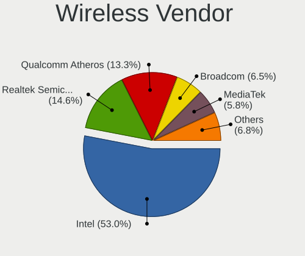

| Vendor                                | Notebooks | Percent |
|---------------------------------------|-----------|---------|
| Intel                                 | 1167      | 53.02%  |
| Realtek Semiconductor                 | 321       | 14.58%  |
| Qualcomm Atheros                      | 292       | 13.27%  |
| Broadcom                              | 143       | 6.5%    |
| MediaTek                              | 128       | 5.82%   |
| Broadcom Limited                      | 30        | 1.36%   |
| Qualcomm                              | 17        | 0.77%   |
| Sierra Wireless                       | 16        | 0.73%   |
| Ralink                                | 16        | 0.73%   |
| Ralink Technology                     | 15        | 0.68%   |
| Dell                                  | 14        | 0.64%   |
| TP-Link                               | 7         | 0.32%   |
| ASUSTek Computer                      | 6         | 0.27%   |
| Quectel Wireless Solutions            | 4         | 0.18%   |
| D-Link                                | 4         | 0.18%   |
| Qualcomm Technologies                 | 3         | 0.14%   |
| Fibocom                               | 3         | 0.14%   |
| Edimax Technology                     | 3         | 0.14%   |
| Qualcomm Atheros Communications       | 2         | 0.09%   |
| Xiaomi                                | 1         | 0.05%   |
| Sitecom Europe                        | 1         | 0.05%   |
| Realtek                               | 1         | 0.05%   |
| NetGear                               | 1         | 0.05%   |
| Micro Star International              | 1         | 0.05%   |
| Linksys                               | 1         | 0.05%   |
| Hewlett-Packard                       | 1         | 0.05%   |
| Belkin Components                     | 1         | 0.05%   |
| AVM                                   | 1         | 0.05%   |
| 802.11g Adapter [Linksys WUSB54GC v3] | 1         | 0.05%   |

Wireless Model
--------------

Wireless models

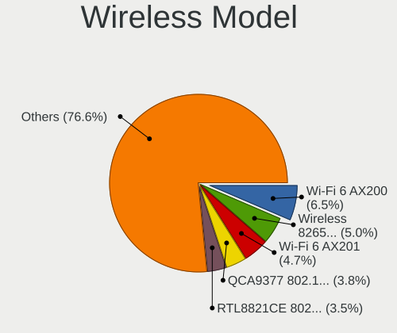

| Model                                                                | Notebooks | Percent |
|----------------------------------------------------------------------|-----------|---------|
| Intel Wi-Fi 6 AX200                                                  | 143       | 6.46%   |
| Intel Wireless 8265 / 8275                                           | 110       | 4.97%   |
| Intel Wi-Fi 6 AX201                                                  | 104       | 4.7%    |
| Qualcomm Atheros QCA9377 802.11ac Wireless Network Adapter           | 84        | 3.79%   |
| Realtek RTL8821CE 802.11ac PCIe Wireless Network Adapter             | 78        | 3.52%   |
| Intel Wireless 8260                                                  | 76        | 3.43%   |
| Realtek RTL8822CE 802.11ac PCIe Wireless Network Adapter             | 68        | 3.07%   |
| MediaTek MT7921 802.11ax PCIe Wireless Network Adapter [Filogic 330] | 61        | 2.75%   |
| Intel Wireless 7265                                                  | 58        | 2.62%   |
| Intel Wireless 7260                                                  | 58        | 2.62%   |
| Qualcomm Atheros QCA6174 802.11ac Wireless Network Adapter           | 50        | 2.26%   |
| Intel Alder Lake-P PCH CNVi WiFi                                     | 48        | 2.17%   |
| Intel Centrino Advanced-N 6205 [Taylor Peak]                         | 47        | 2.12%   |
| Qualcomm Atheros QCA9565 / AR9565 Wireless Network Adapter           | 46        | 2.08%   |
| Intel Wi-Fi 6E(802.11ax) AX210/AX1675* 2x2 [Typhoon Peak]            | 43        | 1.94%   |
| MediaTek MT7922 802.11ax PCI Express Wireless Network Adapter        | 37        | 1.67%   |
| Intel Raptor Lake PCH CNVi WiFi                                      | 37        | 1.67%   |
| Intel Cannon Lake PCH CNVi WiFi                                      | 37        | 1.67%   |
| Qualcomm Atheros AR9485 Wireless Network Adapter                     | 36        | 1.63%   |
| Intel Cannon Point-LP CNVi [Wireless-AC]                             | 35        | 1.58%   |
| Intel Comet Lake PCH-LP CNVi WiFi                                    | 32        | 1.44%   |
| Qualcomm Atheros AR9285 Wireless Network Adapter (PCI-Express)       | 30        | 1.35%   |
| Intel Wi-Fi 5(802.11ac) Wireless-AC 9x6x [Thunder Peak]              | 30        | 1.35%   |
| Realtek RTL8723BE PCIe Wireless Network Adapter                      | 27        | 1.22%   |
| Intel Comet Lake PCH CNVi WiFi                                       | 27        | 1.22%   |
| Broadcom BCM43142 802.11b/g/n                                        | 27        | 1.22%   |
| Intel Tiger Lake PCH CNVi WiFi                                       | 26        | 1.17%   |
| Broadcom BCM4313 802.11bgn Wireless Network Adapter                  | 26        | 1.17%   |
| Broadcom BCM4331 802.11a/b/g/n                                       | 24        | 1.08%   |
| Intel Wireless 3165                                                  | 22        | 0.99%   |
| Intel Centrino Ultimate-N 6300                                       | 22        | 0.99%   |
| Qualcomm Atheros AR9462 Wireless Network Adapter                     | 20        | 0.9%    |
| Realtek RTL8852BE PCIe 802.11ax Wireless Network Controller          | 19        | 0.86%   |
| Intel Wireless 3160                                                  | 19        | 0.86%   |
| Intel Meteor Lake PCH CNVi WiFi                                      | 18        | 0.81%   |
| Realtek RTL8852AE 802.11ax PCIe Wireless Network Adapter             | 17        | 0.77%   |
| Realtek RTL8822BE 802.11a/b/g/n/ac WiFi adapter                      | 17        | 0.77%   |
| Intel Centrino Advanced-N 6235                                       | 17        | 0.77%   |
| Realtek RTL8188CE 802.11b/g/n WiFi Adapter                           | 16        | 0.72%   |
| Qualcomm QCNFA765 Wireless Network Adapter                           | 14        | 0.63%   |

Ethernet Vendor
---------------

Ethernet vendors

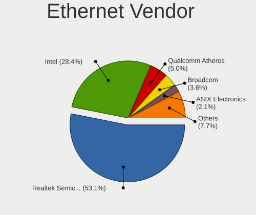

| Vendor                                 | Notebooks | Percent |
|----------------------------------------|-----------|---------|
| Realtek Semiconductor                  | 964       | 53.11%  |
| Intel                                  | 516       | 28.43%  |
| Qualcomm Atheros                       | 91        | 5.01%   |
| Broadcom                               | 65        | 3.58%   |
| ASIX Electronics                       | 39        | 2.15%   |
| Marvell Technology Group               | 20        | 1.1%    |
| Lenovo                                 | 17        | 0.94%   |
| DisplayLink                            | 14        | 0.77%   |
| Nvidia                                 | 12        | 0.66%   |
| MediaTek                               | 12        | 0.66%   |
| Broadcom Limited                       | 12        | 0.66%   |
| TP-Link                                | 10        | 0.55%   |
| Cypress Semiconductor                  | 7         | 0.39%   |
| Xiaomi                                 | 5         | 0.28%   |
| Samsung Electronics                    | 4         | 0.22%   |
| ICS Advent                             | 4         | 0.22%   |
| Huawei Technologies                    | 4         | 0.22%   |
| Motorola PCS                           | 3         | 0.17%   |
| Suzhou Motorcomm Electronic Technology | 2         | 0.11%   |
| Qualcomm Technologies                  | 2         | 0.11%   |
| JMicron Technology                     | 2         | 0.11%   |
| HMD Global                             | 2         | 0.11%   |
| VIA Technologies                       | 1         | 0.06%   |
| Sony Ericsson Mobile Communications AB | 1         | 0.06%   |
| Silicon Integrated Systems [SiS]       | 1         | 0.06%   |
| Qualcomm                               | 1         | 0.06%   |
| MosChip Semiconductor                  | 1         | 0.06%   |
| LSI                                    | 1         | 0.06%   |
| Linksys                                | 1         | 0.06%   |
| Hewlett-Packard                        | 1         | 0.06%   |

Ethernet Model
--------------

Ethernet models

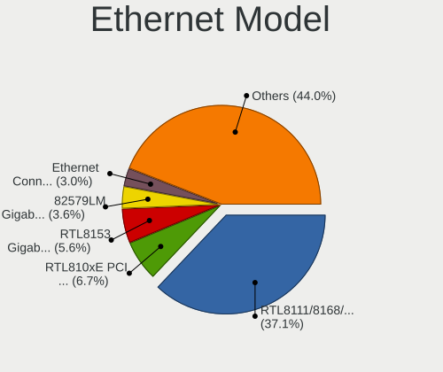

| Model                                                                  | Notebooks | Percent |
|------------------------------------------------------------------------|-----------|---------|
| Realtek RTL8111/8168/8211/8411 PCI Express Gigabit Ethernet Controller | 685       | 37.07%  |
| Realtek RTL810xE PCI Express Fast Ethernet controller                  | 123       | 6.66%   |
| Realtek RTL8153 Gigabit Ethernet Adapter                               | 104       | 5.63%   |
| Intel 82579LM Gigabit Network Connection (Lewisville)                  | 67        | 3.63%   |
| Intel Ethernet Connection (4) I219-LM                                  | 55        | 2.98%   |
| Intel Alder Lake-P PCH CNVi WiFi                                       | 34        | 1.84%   |
| ASIX AX88179 Gigabit Ethernet                                          | 34        | 1.84%   |
| Intel Ethernet Connection I219-LM                                      | 30        | 1.62%   |
| Intel Ethernet Connection I217-LM                                      | 26        | 1.41%   |
| Realtek RTL8125 2.5GbE Controller                                      | 24        | 1.3%    |
| Intel Ethernet Connection (4) I219-V                                   | 24        | 1.3%    |
| Broadcom NetXtreme BCM57765 Gigabit Ethernet PCIe                      | 24        | 1.3%    |
| Intel Ethernet Connection I218-LM                                      | 23        | 1.24%   |
| Intel 82577LM Gigabit Network Connection                               | 22        | 1.19%   |
| Intel Ethernet Connection (7) I219-LM                                  | 21        | 1.14%   |
| Intel Ethernet Connection I219-V                                       | 19        | 1.03%   |
| Intel Ethernet Connection (3) I218-LM                                  | 19        | 1.03%   |
| Qualcomm Atheros Killer E2500 Gigabit Ethernet Controller              | 15        | 0.81%   |
| Qualcomm Atheros AR8151 v2.0 Gigabit Ethernet                          | 13        | 0.7%    |
| Intel Ethernet Connection (6) I219-V                                   | 13        | 0.7%    |
| Realtek Killer E2600 GbE Controller                                    | 12        | 0.65%   |
| Qualcomm Atheros QCA8171 Gigabit Ethernet                              | 12        | 0.65%   |
| Intel Ethernet Connection (2) I219-LM                                  | 12        | 0.65%   |
| Intel Ethernet Connection (13) I219-V                                  | 12        | 0.65%   |
| Nvidia MCP79 Ethernet                                                  | 11        | 0.6%    |
| Intel Ethernet Connection (6) I219-LM                                  | 10        | 0.54%   |
| Intel Ethernet Connection (16) I219-LM                                 | 10        | 0.54%   |
| Intel Ethernet Connection (10) I219-LM                                 | 10        | 0.54%   |
| Broadcom NetLink BCM57785 Gigabit Ethernet PCIe                        | 10        | 0.54%   |
| Realtek RTL8152 Fast Ethernet Adapter                                  | 9         | 0.49%   |
| Realtek Killer E3000 2.5GbE Controller                                 | 9         | 0.49%   |
| Intel Ethernet Connection I217-V                                       | 9         | 0.49%   |
| Intel Ethernet Connection (16) I219-V                                  | 9         | 0.49%   |
| TP-Link UE300 10/100/1000 LAN (ethernet mode) [Realtek RTL8153]        | 8         | 0.43%   |
| Qualcomm Atheros AR8161 Gigabit Ethernet                               | 8         | 0.43%   |
| Intel 82579V Gigabit Network Connection                                | 8         | 0.43%   |
| Intel 82567LM Gigabit Network Connection                               | 8         | 0.43%   |
| Realtek USB 10/100/1G/2.5 LAN                                          | 7         | 0.38%   |
| Qualcomm Atheros Killer E2400 Gigabit Ethernet Controller              | 7         | 0.38%   |
| Qualcomm Atheros AR8152 v2.0 Fast Ethernet                             | 7         | 0.38%   |

Net Controller Kind
-------------------

Ethernet, WiFi or modem

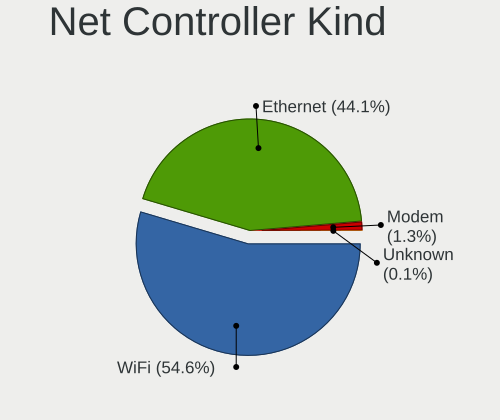

| Kind     | Notebooks | Percent |
|----------|-----------|---------|
| WiFi     | 2097      | 54.6%   |
| Ethernet | 1692      | 44.05%  |
| Modem    | 50        | 1.3%    |
| Unknown  | 2         | 0.05%   |

Used Controller
---------------

Currently used network controller

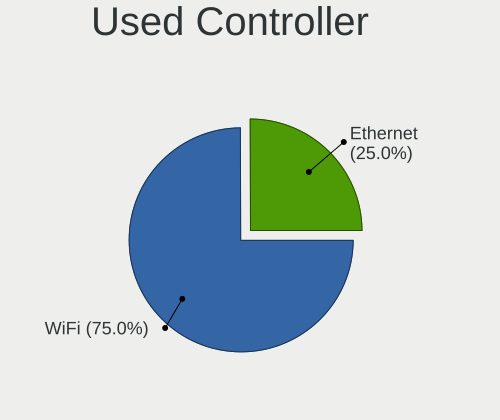

| Kind     | Notebooks | Percent |
|----------|-----------|---------|
| WiFi     | 1751      | 74.96%  |
| Ethernet | 585       | 25.04%  |

NICs
----

Total network controllers on board

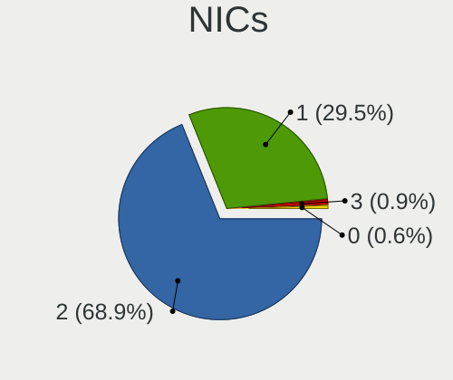

| Total | Notebooks | Percent |
|-------|-----------|---------|
| 2     | 1497      | 68.92%  |
| 1     | 641       | 29.51%  |
| 3     | 20        | 0.92%   |
| 0     | 14        | 0.64%   |

IPv6
----

IPv6 vs IPv4

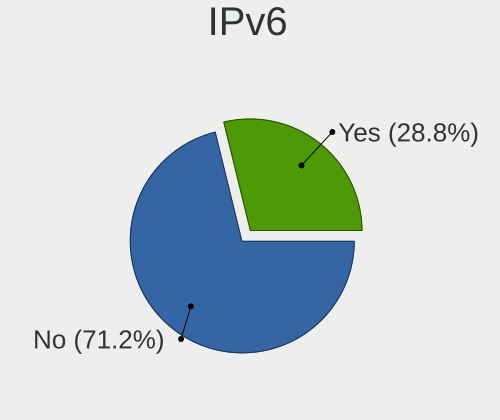

| Used | Notebooks | Percent |
|------|-----------|---------|
| No   | 1583      | 71.18%  |
| Yes  | 641       | 28.82%  |

Bluetooth
---------

Bluetooth Vendor
----------------

Controller vendors

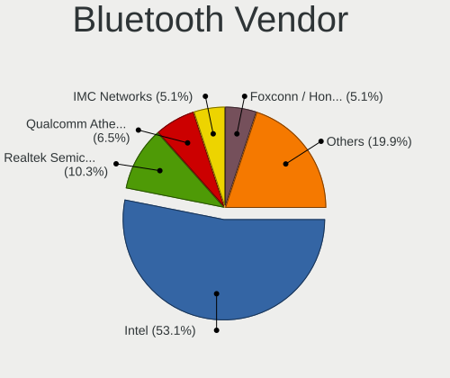

| Vendor                          | Notebooks | Percent |
|---------------------------------|-----------|---------|
| Intel                           | 999       | 53.11%  |
| Realtek Semiconductor           | 194       | 10.31%  |
| Qualcomm Atheros Communications | 123       | 6.54%   |
| IMC Networks                    | 95        | 5.05%   |
| Foxconn / Hon Hai               | 95        | 5.05%   |
| Lite-On Technology              | 87        | 4.63%   |
| Broadcom                        | 73        | 3.88%   |
| Apple                           | 67        | 3.56%   |
| MediaTek                        | 27        | 1.44%   |
| Hewlett-Packard                 | 22        | 1.17%   |
| Dell                            | 21        | 1.12%   |
| Cambridge Silicon Radio         | 13        | 0.69%   |
| Realtek                         | 11        | 0.58%   |
| Toshiba                         | 10        | 0.53%   |
| USI                             | 9         | 0.48%   |
| Foxconn International           | 8         | 0.43%   |
| Ralink                          | 6         | 0.32%   |
| ASUSTek Computer                | 3         | 0.16%   |
| Alps Electric                   | 3         | 0.16%   |
| TP-Link                         | 2         | 0.11%   |
| Taiyo Yuden                     | 2         | 0.11%   |
| Smart Modular Technologies      | 2         | 0.11%   |
| Ralink Technology               | 2         | 0.11%   |
| Unknown                         | 1         | 0.05%   |
| Qcom                            | 1         | 0.05%   |
| Opticis                         | 1         | 0.05%   |
| Micro Star International        | 1         | 0.05%   |
| Integrated System Solution      | 1         | 0.05%   |
| Fujitsu                         | 1         | 0.05%   |
| Edimax Technology               | 1         | 0.05%   |

Bluetooth Model
---------------

Controller models

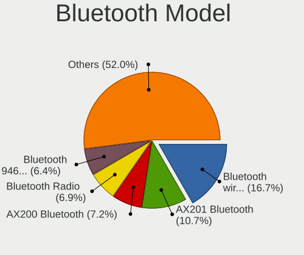

| Model                                               | Notebooks | Percent |
|-----------------------------------------------------|-----------|---------|
| Intel Bluetooth wireless interface                  | 315       | 16.71%  |
| Intel AX201 Bluetooth                               | 202       | 10.72%  |
| Intel AX200 Bluetooth                               | 136       | 7.21%   |
| Realtek Bluetooth Radio                             | 131       | 6.95%   |
| Intel Bluetooth 9460/9560 Jefferson Peak (JfP)      | 120       | 6.37%   |
| Intel Bluetooth Device                              | 112       | 5.94%   |
| Qualcomm Atheros  Bluetooth Device                  | 61        | 3.24%   |
| Realtek  Bluetooth 4.2 Adapter                      | 47        | 2.49%   |
| Intel AX210 Bluetooth                               | 41        | 2.18%   |
| IMC Networks Wireless_Device                        | 40        | 2.12%   |
| Apple Bluetooth Host Controller                     | 39        | 2.07%   |
| IMC Networks Bluetooth Radio                        | 30        | 1.59%   |
| Lite-On Qualcomm Atheros QCA9377 Bluetooth          | 28        | 1.49%   |
| Intel Centrino Bluetooth Wireless Transceiver       | 28        | 1.49%   |
| MediaTek Wireless_Device                            | 27        | 1.43%   |
| Intel Wireless-AC 9260 Bluetooth Adapter            | 26        | 1.38%   |
| Foxconn / Hon Hai Wireless_Device                   | 26        | 1.38%   |
| Qualcomm Atheros QCA61x4 Bluetooth 4.0              | 25        | 1.33%   |
| Apple Bluetooth USB Host Controller                 | 24        | 1.27%   |
| Foxconn / Hon Hai Bluetooth Device                  | 23        | 1.22%   |
| Lite-On Wireless_Device                             | 20        | 1.06%   |
| Foxconn / Hon Hai MediaTek Bluetooth Adapter        | 19        | 1.01%   |
| Qualcomm Atheros AR3011 Bluetooth                   | 18        | 0.95%   |
| Broadcom BCM2045B (BDC-2.1)                         | 18        | 0.95%   |
| Lite-On Bluetooth Device                            | 16        | 0.85%   |
| IMC Networks Bluetooth Device                       | 14        | 0.74%   |
| HP Broadcom 2070 Bluetooth Combo                    | 14        | 0.74%   |
| Intel Wireless-AC 3168 Bluetooth                    | 13        | 0.69%   |
| Cambridge Silicon Radio Bluetooth Dongle (HCI mode) | 13        | 0.69%   |
| Realtek Bluetooth Radio                             | 11        | 0.58%   |
| Qualcomm Atheros AR3012 Bluetooth 4.0               | 11        | 0.58%   |
| Lite-On Atheros AR3012 Bluetooth                    | 10        | 0.53%   |
| Broadcom BCM20702 Bluetooth 4.0 [ThinkPad]          | 10        | 0.53%   |
| USI Bluetooth Device                                | 8         | 0.42%   |
| Foxconn International BCM43142A0 Bluetooth module   | 8         | 0.42%   |
| Dell DW375 Bluetooth Module                         | 8         | 0.42%   |
| Broadcom BCM2070 Bluetooth 2.1 + EDR                | 7         | 0.37%   |
| Realtek RTL8723B Bluetooth                          | 6         | 0.32%   |
| Ralink RT3290 Bluetooth                             | 6         | 0.32%   |
| Intel Centrino Advanced-N 6230 Bluetooth adapter    | 6         | 0.32%   |

Sound
-----

Sound Vendor
------------

Sound card vendors

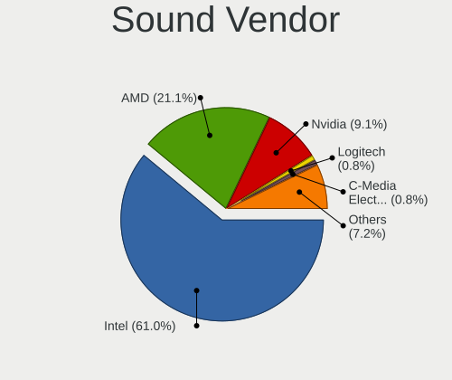

| Vendor                                       | Notebooks | Percent |
|----------------------------------------------|-----------|---------|
| Intel                                        | 1619      | 61%     |
| AMD                                          | 559       | 21.06%  |
| Nvidia                                       | 241       | 9.08%   |
| Logitech                                     | 22        | 0.83%   |
| C-Media Electronics                          | 22        | 0.83%   |
| Lenovo                                       | 21        | 0.79%   |
| Realtek Semiconductor                        | 18        | 0.68%   |
| Texas Instruments                            | 14        | 0.53%   |
| Hewlett-Packard                              | 11        | 0.41%   |
| GN Netcom                                    | 10        | 0.38%   |
| ASUSTek Computer                             | 10        | 0.38%   |
| JMTek                                        | 8         | 0.3%    |
| Plantronics                                  | 7         | 0.26%   |
| Creative Technology                          | 7         | 0.26%   |
| Kingston Technology                          | 5         | 0.19%   |
| Conexant Systems                             | 5         | 0.19%   |
| No brand                                     | 4         | 0.15%   |
| Generalplus Technology                       | 4         | 0.15%   |
| DSEA A/S                                     | 4         | 0.15%   |
| SteelSeries ApS                              | 3         | 0.11%   |
| Razer USA                                    | 3         | 0.11%   |
| M-Audio                                      | 3         | 0.11%   |
| BEHRINGER International                      | 3         | 0.11%   |
| Yamaha                                       | 2         | 0.08%   |
| Walmart                                      | 2         | 0.08%   |
| SAVITECH                                     | 2         | 0.08%   |
| RODE Microphones                             | 2         | 0.08%   |
| Huawei Technologies                          | 2         | 0.08%   |
| Focusrite-Novation                           | 2         | 0.08%   |
| FiiO Electronics Technology                  | 2         | 0.08%   |
| ESS Technology                               | 2         | 0.08%   |
| Corsair                                      | 2         | 0.08%   |
| Apple                                        | 2         | 0.08%   |
| Zoran Co. Personal Media Division (Nogatech) | 1         | 0.04%   |
| ZOOM                                         | 1         | 0.04%   |
| VIA Technologies                             | 1         | 0.04%   |
| Specialix                                    | 1         | 0.04%   |
| SPACE TOUCH                                  | 1         | 0.04%   |
| Sony                                         | 1         | 0.04%   |
| Silicon Integrated Systems [SiS]             | 1         | 0.04%   |

Sound Model
-----------

Sound card models

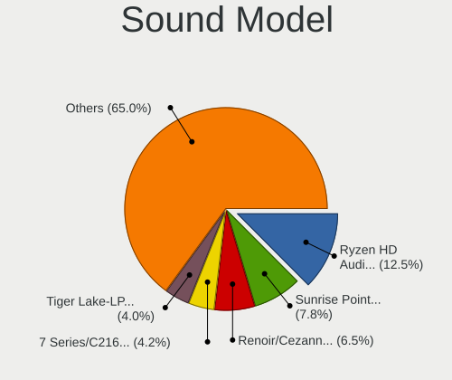

| Model                                                                      | Notebooks | Percent |
|----------------------------------------------------------------------------|-----------|---------|
| AMD Ryzen HD Audio Controller                                              | 420       | 12.53%  |
| Intel Sunrise Point-LP HD Audio                                            | 263       | 7.84%   |
| AMD Renoir/Cezanne HDMI/DP Audio Controller                                | 217       | 6.47%   |
| Intel 7 Series/C216 Chipset Family High Definition Audio Controller        | 141       | 4.21%   |
| Intel Tiger Lake-LP Smart Sound Technology Audio Controller                | 134       | 4%      |
| Intel Alder Lake PCH-P High Definition Audio Controller                    | 99        | 2.95%   |
| Intel 6 Series/C200 Series Chipset Family High Definition Audio Controller | 99        | 2.95%   |
| Intel Cannon Lake PCH cAVS                                                 | 93        | 2.77%   |
| AMD Radeon High Definition Audio Controller                                | 87        | 2.59%   |
| Intel 8 Series/C220 Series Chipset High Definition Audio Controller        | 80        | 2.39%   |
| Intel Haswell-ULT HD Audio Controller                                      | 77        | 2.3%    |
| Intel 8 Series HD Audio Controller                                         | 77        | 2.3%    |
| AMD Raven/Raven2/Fenghuang HDMI/DP Audio Controller                        | 76        | 2.27%   |
| Intel Cannon Point-LP High Definition Audio Controller                     | 70        | 2.09%   |
| Intel Xeon E3-1200 v3/4th Gen Core Processor HD Audio Controller           | 66        | 1.97%   |
| Intel Wildcat Point-LP High Definition Audio Controller                    | 64        | 1.91%   |
| Intel Broadwell-U Audio Controller                                         | 64        | 1.91%   |
| Intel 5 Series/3400 Series Chipset High Definition Audio                   | 60        | 1.79%   |
| AMD FCH Azalia Controller                                                  | 46        | 1.37%   |
| Intel Comet Lake PCH-LP cAVS                                               | 44        | 1.31%   |
| Intel 100 Series/C230 Series Chipset Family HD Audio Controller            | 42        | 1.25%   |
| Intel Raptor Lake-P/U/H cAVS                                               | 41        | 1.22%   |
| Intel 82801I (ICH9 Family) HD Audio Controller                             | 39        | 1.16%   |
| Intel Tiger Lake-H HD Audio Controller                                     | 35        | 1.04%   |
| Intel Comet Lake PCH cAVS                                                  | 34        | 1.01%   |
| AMD Kabini HDMI/DP Audio                                                   | 34        | 1.01%   |
| Intel CM238 HD Audio Controller                                            | 31        | 0.92%   |
| AMD Family 15h (Models 60h-6fh) Audio Controller                           | 31        | 0.92%   |
| Intel Ice Lake-LP Smart Sound Technology Audio Controller                  | 27        | 0.81%   |
| Intel Celeron/Pentium Silver Processor High Definition Audio               | 27        | 0.81%   |
| Nvidia TU107 GeForce GTX 1650 High Definition Audio Controller             | 22        | 0.66%   |
| Intel Meteor Lake-P HD Audio Controller                                    | 21        | 0.63%   |
| AMD High Definition Audio Controller                                       | 19        | 0.57%   |
| Nvidia GP107GL High Definition Audio Controller                            | 18        | 0.54%   |
| Nvidia GF108 High Definition Audio Controller                              | 18        | 0.54%   |
| Nvidia GA107 High Definition Audio Controller                              | 18        | 0.54%   |
| Realtek Semiconductor USB Audio                                            | 17        | 0.51%   |
| AMD SBx00 Azalia (Intel HDA)                                               | 17        | 0.51%   |
| Intel 82801H (ICH8 Family) HD Audio Controller                             | 16        | 0.48%   |
| Nvidia GA104 High Definition Audio Controller                              | 15        | 0.45%   |

Memory
------

Memory Vendor
-------------

Memory module vendors

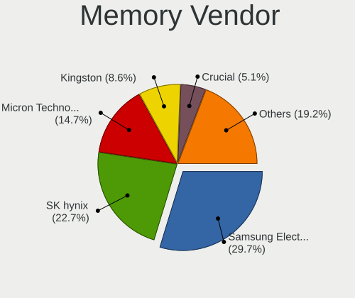

| Vendor                                  | Notebooks | Percent |
|-----------------------------------------|-----------|---------|
| Samsung Electronics                     | 456       | 29.71%  |
| SK hynix                                | 348       | 22.67%  |
| Micron Technology                       | 225       | 14.66%  |
| Kingston                                | 132       | 8.6%    |
| Crucial                                 | 79        | 5.15%   |
| Unknown                                 | 59        | 3.84%   |
| A-DATA Technology                       | 31        | 2.02%   |
| Corsair                                 | 28        | 1.82%   |
| Ramaxel Technology                      | 25        | 1.63%   |
| Unknown                                 | 22        | 1.43%   |
| Elpida                                  | 18        | 1.17%   |
| G.Skill                                 | 16        | 1.04%   |
| Unknown (ABCD)                          | 13        | 0.85%   |
| Smart                                   | 13        | 0.85%   |
| Nanya Technology                        | 11        | 0.72%   |
| Team                                    | 8         | 0.52%   |
| GOODRAM                                 | 8         | 0.52%   |
| Transcend                               | 4         | 0.26%   |
| Patriot                                 | 4         | 0.26%   |
| Qimonda                                 | 3         | 0.2%    |
| Wilk                                    | 2         | 0.13%   |
| Timetec                                 | 2         | 0.13%   |
| Teikon                                  | 2         | 0.13%   |
| Smart Brazil                            | 2         | 0.13%   |
| Lexar                                   | 2         | 0.13%   |
| ChangXin Memory                         | 2         | 0.13%   |
| Avant                                   | 2         | 0.13%   |
| AMD                                     | 2         | 0.13%   |
| Unknown (0x0FC4)                        | 1         | 0.07%   |
| Toshiba                                 | 1         | 0.07%   |
| Smart Modular                           | 1         | 0.07%   |
| Silicon Power Computer & Communications | 1         | 0.07%   |
| Silicon Power                           | 1         | 0.07%   |
| PUSKILL                                 | 1         | 0.07%   |
| pqi                                     | 1         | 0.07%   |
| PNY                                     | 1         | 0.07%   |
| Neo Forza                               | 1         | 0.07%   |
| Lexar Co Limited                        | 1         | 0.07%   |
| Kingmax                                 | 1         | 0.07%   |
| HT Micron                               | 1         | 0.07%   |

Memory Model
------------

Memory module models

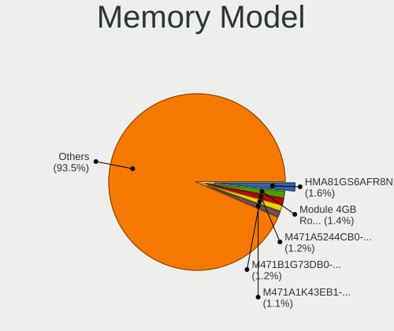

| Model                                                            | Notebooks | Percent |
|------------------------------------------------------------------|-----------|---------|
| SK hynix RAM HMA81GS6AFR8N-UH 8GB SODIMM DDR4 2667MT/s           | 26        | 1.61%   |
| Unknown                                                          | 22        | 1.36%   |
| Samsung RAM M471A5244CB0-CTD 4GB SODIMM DDR4 3266MT/s            | 20        | 1.24%   |
| Samsung RAM M471B1G73DB0-YK0 8GB SODIMM DDR3 1600MT/s            | 19        | 1.18%   |
| Samsung RAM M471A1K43EB1-CWE 8GB SODIMM DDR4 3200MT/s            | 18        | 1.11%   |
| Samsung RAM M471A1K43DB1-CWE 8GB SODIMM DDR4 3200MT/s            | 17        | 1.05%   |
| Samsung RAM M471A1G44AB0-CWE 8GiB SODIMM DDR4 3200MT/s           | 17        | 1.05%   |
| SK hynix RAM HMAA1GS6CJR6N-XN 8GB SODIMM DDR4 3200MT/s           | 16        | 0.99%   |
| Samsung RAM M471B5173QH0-YK0 4GB SODIMM DDR3 1600MT/s            | 14        | 0.87%   |
| SK hynix RAM HMT451S6BFR8A-PB 4GB SODIMM DDR3 1600MT/s           | 13        | 0.8%    |
| Samsung RAM M471B5273DH0-CH9 4GB SODIMM DDR3 1600MT/s            | 13        | 0.8%    |
| Samsung RAM M471B5173DB0-YK0 4GB SODIMM DDR3 1600MT/s            | 13        | 0.8%    |
| Samsung RAM M471A2K43CB1-CRC 16GB SODIMM DDR4 2667MT/s           | 13        | 0.8%    |
| Samsung RAM M471A1K43DB1-CTD 8GB SODIMM DDR4 2667MT/s            | 12        | 0.74%   |
| Unknown (ABCD) RAM 123456789012345678 2GB SODIMM LPDDR4 2400MT/s | 11        | 0.68%   |
| Samsung RAM M471A5244CB0-CWE 4GB SODIMM DDR4 3200MT/s            | 11        | 0.68%   |
| Samsung RAM M471A1K43CB1-CRC 8GB SODIMM DDR4 8400MT/s            | 11        | 0.68%   |
| Micron RAM 4ATF1G64HZ-3G2F1 8GB SODIMM DDR4 3200MT/s             | 11        | 0.68%   |
| SK hynix RAM HMA81GS6CJR8N-VK 8GB SODIMM DDR4 2667MT/s           | 10        | 0.62%   |
| SK hynix RAM HMA41GS6AFR8N-TF 8GB SODIMM DDR4 2667MT/s           | 10        | 0.62%   |
| Samsung RAM M471A5244CB0-CRC 4GB SODIMM DDR4 2667MT/s            | 10        | 0.62%   |
| Micron RAM 4ATS2G64HZ-3G2B1 16GB SODIMM DDR4 3200MT/s            | 10        | 0.62%   |
| Micron RAM 4ATF1G64HZ-3G2E1 8GB SODIMM DDR4 3200MT/s             | 10        | 0.62%   |
| SK hynix RAM HMAA1GS6CJR6N-XN 8GB Row Of Chips DDR4 3200MT/s     | 9         | 0.56%   |
| SK hynix RAM HMA851S6AFR6N-UH 4GB SODIMM DDR4 2667MT/s           | 9         | 0.56%   |
| Samsung RAM M471B5273DH0-CK0 4GB SODIMM DDR3 2400MT/s            | 9         | 0.56%   |
| Samsung RAM M471A2K43DB1-CWE 16GB SODIMM DDR4 3200MT/s           | 9         | 0.56%   |
| Samsung RAM M471A2K43CB1-CTD 16GB SODIMM DDR4 8400MT/s           | 9         | 0.56%   |
| Samsung RAM M471A1G44AB0-CWE 8GB Row Of Chips DDR4 3200MT/s      | 9         | 0.56%   |
| Micron RAM 8ATF1G64HZ-3G2R1 8GB SODIMM DDR4 3200MT/s             | 9         | 0.56%   |
| Micron RAM 8ATF1G64HZ-3G2J1 8GB SODIMM DDR4 3200MT/s             | 9         | 0.56%   |
| Micron RAM 8ATF1G64HZ-2G6E1 8GB SODIMM DDR4 2667MT/s             | 9         | 0.56%   |
| SK hynix RAM Module 4GB SODIMM DDR3 1600MT/s                     | 8         | 0.5%    |
| SK hynix RAM HMA851S6JJR6N-VK 4GB SODIMM DDR4 2667MT/s           | 8         | 0.5%    |
| SK hynix RAM HMA81GS6JJR8N-VK 8GB SODIMM DDR4 2667MT/s           | 8         | 0.5%    |
| Samsung RAM M471B1G73QH0-YK0 8GB SODIMM DDR3 1600MT/s            | 8         | 0.5%    |
| SK hynix RAM HMT41GS6BFR8A-PB 8GB SODIMM DDR3 2667MT/s           | 7         | 0.43%   |
| SK hynix RAM HMA82GS6AFR8N-UH 16GB SODIMM DDR4 2667MT/s          | 7         | 0.43%   |
| Samsung RAM Module 16GB SODIMM DDR4 3200MT/s                     | 7         | 0.43%   |
| Samsung RAM M471B1G73EB0-YK0 8192MB SODIMM DDR3 1600MT/s         | 7         | 0.43%   |

Memory Kind
-----------

Memory module kinds

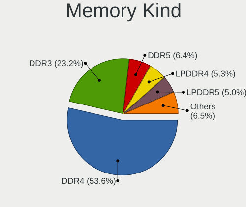

| Kind    | Notebooks | Percent |
|---------|-----------|---------|
| DDR4    | 687       | 53.59%  |
| DDR3    | 298       | 23.24%  |
| DDR5    | 82        | 6.4%    |
| LPDDR4  | 68        | 5.3%    |
| LPDDR5  | 64        | 4.99%   |
| DDR2    | 31        | 2.42%   |
| LPDDR3  | 27        | 2.11%   |
| SDRAM   | 17        | 1.33%   |
| DDR     | 5         | 0.39%   |
| Unknown | 2         | 0.16%   |
| DRAM    | 1         | 0.08%   |

Memory Form Factor
------------------

Physical design of the memory module

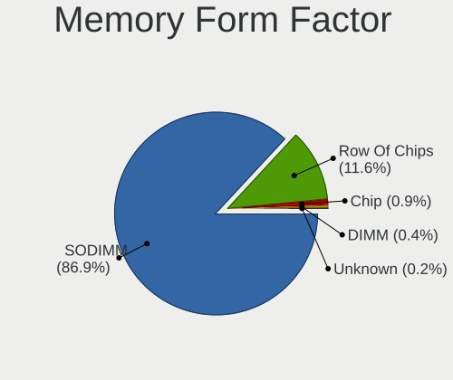

| Name         | Notebooks | Percent |
|--------------|-----------|---------|
| SODIMM       | 1128      | 86.9%   |
| Row Of Chips | 150       | 11.56%  |
| Chip         | 12        | 0.92%   |
| DIMM         | 5         | 0.39%   |
| Unknown      | 3         | 0.23%   |

Memory Size
-----------

Memory module size

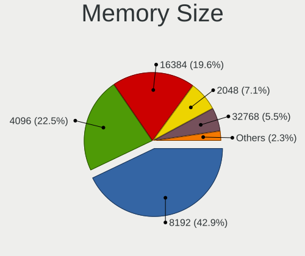

| Size  | Notebooks | Percent |
|-------|-----------|---------|
| 8192  | 611       | 42.91%  |
| 4096  | 321       | 22.54%  |
| 16384 | 279       | 19.59%  |
| 2048  | 101       | 7.09%   |
| 32768 | 79        | 5.55%   |
| 1024  | 26        | 1.83%   |
| 49152 | 2         | 0.14%   |
| 512   | 2         | 0.14%   |
| 3072  | 1         | 0.07%   |
| 1536  | 1         | 0.07%   |
| 128   | 1         | 0.07%   |

Memory Speed
------------

Memory module speed

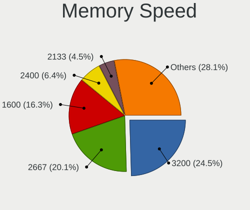

| Speed   | Notebooks | Percent |
|---------|-----------|---------|
| 3200    | 343       | 24.54%  |
| 2667    | 281       | 20.1%   |
| 1600    | 228       | 16.31%  |
| 2400    | 90        | 6.44%   |
| 2133    | 63        | 4.51%   |
| 5600    | 44        | 3.15%   |
| 1334    | 40        | 2.86%   |
| 4800    | 37        | 2.65%   |
| 6400    | 34        | 2.43%   |
| 4267    | 26        | 1.86%   |
| 1333    | 23        | 1.65%   |
| 8400    | 20        | 1.43%   |
| 3266    | 20        | 1.43%   |
| 7500    | 18        | 1.29%   |
| 4266    | 15        | 1.07%   |
| 1867    | 14        | 1%      |
| 667     | 14        | 1%      |
| 1067    | 13        | 0.93%   |
| Unknown | 13        | 0.93%   |
| 800     | 9         | 0.64%   |
| 2048    | 8         | 0.57%   |
| 975     | 7         | 0.5%    |
| 8533    | 6         | 0.43%   |
| 4199    | 6         | 0.43%   |
| 3733    | 4         | 0.29%   |
| 7467    | 3         | 0.21%   |
| 2933    | 3         | 0.21%   |
| 1066    | 3         | 0.21%   |
| 533     | 3         | 0.21%   |
| 333     | 2         | 0.14%   |
| 12800   | 1         | 0.07%   |
| 8000    | 1         | 0.07%   |
| 6000    | 1         | 0.07%   |
| 5500    | 1         | 0.07%   |
| 2267    | 1         | 0.07%   |
| 1777    | 1         | 0.07%   |
| 1639    | 1         | 0.07%   |
| 100     | 1         | 0.07%   |

Printers & scanners
-------------------

Printer Vendor
--------------

Printer device vendors

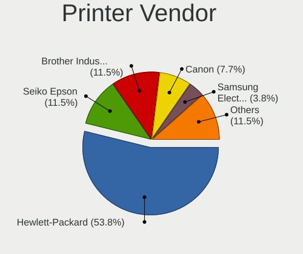

| Vendor                | Notebooks | Percent |
|-----------------------|-----------|---------|
| Hewlett-Packard       | 14        | 53.85%  |
| Seiko Epson           | 3         | 11.54%  |
| Brother Industries    | 3         | 11.54%  |
| Canon                 | 2         | 7.69%   |
| STMicroelectronics    | 1         | 3.85%   |
| Samsung Electronics   | 1         | 3.85%   |
| Prolific Technology   | 1         | 3.85%   |
| Lexmark International | 1         | 3.85%   |

Printer Model
-------------

Printer device models

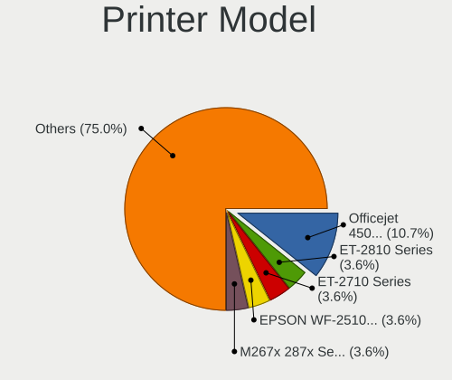

| Model                                                    | Notebooks | Percent |
|----------------------------------------------------------|-----------|---------|
| HP Officejet 4500 G510g-m                                | 3         | 10.71%  |
| STMicroelectronics YICHIP3121 Virtual ComPort in FS Mode | 1         | 3.57%   |
| Seiko Epson ET-2810 Series                               | 1         | 3.57%   |
| Seiko Epson ET-2710 Series                               | 1         | 3.57%   |
| Seiko Epson EPSON WF-2510 Series                         | 1         | 3.57%   |
| Samsung M267x 287x Series                                | 1         | 3.57%   |
| Prolific PL2305 Parallel Port                            | 1         | 3.57%   |
| Lexmark International MC3224dwe                          | 1         | 3.57%   |
| HP Officejet Pro 6230                                    | 1         | 3.57%   |
| HP Officejet 7110 series                                 | 1         | 3.57%   |
| HP OfficeJet 6950                                        | 1         | 3.57%   |
| HP OfficeJet 3830 series                                 | 1         | 3.57%   |
| HP LaserJet P2035                                        | 1         | 3.57%   |
| HP LaserJet CM1415fnw                                    | 1         | 3.57%   |
| HP LaserJet 1020                                         | 1         | 3.57%   |
| HP Deskjet Ink Advant K209a-z                            | 1         | 3.57%   |
| HP DeskJet F300 series                                   | 1         | 3.57%   |
| HP DeskJet 5940                                          | 1         | 3.57%   |
| HP DeskJet 4100 series                                   | 1         | 3.57%   |
| HP DeskJet 2700 series                                   | 1         | 3.57%   |
| Canon LiDE 400                                           | 1         | 3.57%   |
| Canon LiDE 300                                           | 1         | 3.57%   |
| Brother MFC-L3770CDW                                     | 1         | 3.57%   |
| Brother HL-L5200DW series                                | 1         | 3.57%   |
| Brother DCP-T520W                                        | 1         | 3.57%   |
| Brother DCP-L2530DW series                               | 1         | 3.57%   |

Scanner Vendor
--------------

Scanner device vendors

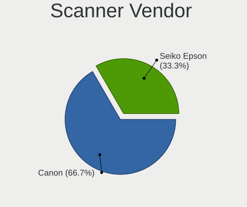

| Vendor      | Notebooks | Percent |
|-------------|-----------|---------|
| Canon       | 3         | 75%     |
| Seiko Epson | 1         | 25%     |

Scanner Model
-------------

Scanner device models

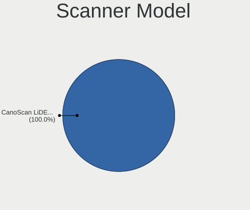

| Model                                            | Notebooks | Percent |
|--------------------------------------------------|-----------|---------|
| Canon CanoScan LiDE 210                          | 2         | 50%     |
| Seiko Epson GT-X900 [Perfection V700/V750 Photo] | 1         | 25%     |
| Canon CanoScan N670U/N676U/LiDE 20               | 1         | 25%     |

Camera
------

Camera Vendor
-------------

Camera device vendors

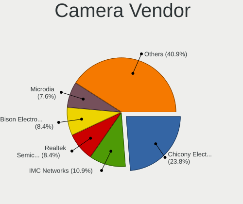

| Vendor                                 | Notebooks | Percent |
|----------------------------------------|-----------|---------|
| Chicony Electronics                    | 471       | 23.78%  |
| IMC Networks                           | 216       | 10.9%   |
| Realtek Semiconductor                  | 166       | 8.38%   |
| Bison Electronics                      | 166       | 8.38%   |
| Microdia                               | 151       | 7.62%   |
| Quanta                                 | 124       | 6.26%   |
| Sunplus Innovation Technology          | 111       | 5.6%    |
| Luxvisions Innotech Limited            | 85        | 4.29%   |
| Cheng Uei Precision Industry (Foxlink) | 71        | 3.58%   |
| Syntek                                 | 65        | 3.28%   |
| Apple                                  | 49        | 2.47%   |
| Lite-On Technology                     | 43        | 2.17%   |
| Suyin                                  | 41        | 2.07%   |
| Sonix Technology                       | 27        | 1.36%   |
| Logitech                               | 22        | 1.11%   |
| ShineTech                              | 16        | 0.81%   |
| Silicon Motion                         | 14        | 0.71%   |
| Alcor Micro                            | 14        | 0.71%   |
| Acer                                   | 14        | 0.71%   |
| Primax Electronics                     | 10        | 0.5%    |
| Lenovo                                 | 10        | 0.5%    |
| Ricoh                                  | 9         | 0.45%   |
| Samsung Electronics                    | 7         | 0.35%   |
| Microsoft                              | 5         | 0.25%   |
| Importek                               | 5         | 0.25%   |
| SunplusIT                              | 4         | 0.2%    |
| kingcome                               | 4         | 0.2%    |
| Generalplus Technology                 | 4         | 0.2%    |
| ALi                                    | 4         | 0.2%    |
| Unknown                                | 3         | 0.15%   |
| Y Media                                | 2         | 0.1%    |
| Trust                                  | 2         | 0.1%    |
| Sunplus Technology                     | 2         | 0.1%    |
| Shine-optics                           | 2         | 0.1%    |
| Razer USA                              | 2         | 0.1%    |
| LG Electronics                         | 2         | 0.1%    |
| HRY                                    | 2         | 0.1%    |
| DX-231115-J                            | 2         | 0.1%    |
| DigiTech                               | 2         | 0.1%    |
| BillionPixels                          | 2         | 0.1%    |

Camera Model
------------

Camera device models

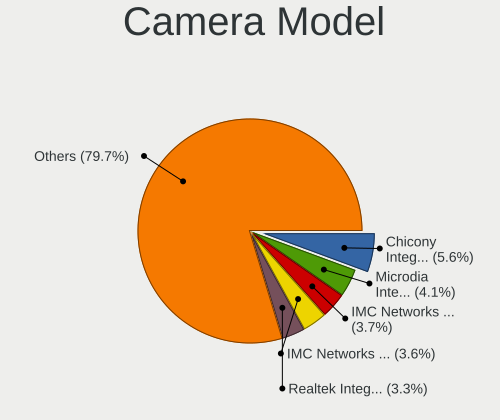

| Model                                                | Notebooks | Percent |
|------------------------------------------------------|-----------|---------|
| Chicony Integrated Camera                            | 112       | 5.63%   |
| Microdia Integrated_Webcam_HD                        | 81        | 4.07%   |
| IMC Networks USB2.0 HD UVC WebCam                    | 74        | 3.72%   |
| IMC Networks Integrated Camera                       | 71        | 3.57%   |
| Realtek Integrated_Webcam_HD                         | 66        | 3.32%   |
| Syntek Integrated Camera                             | 48        | 2.41%   |
| Bison Integrated Camera                              | 46        | 2.31%   |
| Chicony HD WebCam                                    | 44        | 2.21%   |
| Sunplus Integrated_Webcam_HD                         | 34        | 1.71%   |
| Chicony Integrated Camera (1280x720@30)              | 25        | 1.26%   |
| Luxvisions Innotech Limited Integrated Camera        | 24        | 1.21%   |
| Chicony HP HD Camera                                 | 24        | 1.21%   |
| Quanta HP HD Camera                                  | 21        | 1.06%   |
| Quanta HD User Facing                                | 21        | 1.06%   |
| Apple FaceTime HD Camera                             | 21        | 1.06%   |
| Bison HD Webcam                                      | 20        | 1.01%   |
| IMC Networks USB2.0 VGA UVC WebCam                   | 19        | 0.96%   |
| Chicony HD User Facing                               | 19        | 0.96%   |
| Quanta HP TrueVision HD Camera                       | 18        | 0.9%    |
| Luxvisions Innotech Limited HP TrueVision HD Camera  | 18        | 0.9%    |
| Lite-On Integrated Camera                            | 18        | 0.9%    |
| Microdia Integrated Webcam                           | 15        | 0.75%   |
| Luxvisions Innotech Limited HP Wide Vision HD Camera | 15        | 0.75%   |
| Chicony Chicony USB2.0 Camera                        | 15        | 0.75%   |
| Apple Built-in iSight                                | 14        | 0.7%    |
| Sonix USB2.0 HD UVC WebCam                           | 13        | 0.65%   |
| Chicony TOSHIBA Web Camera - HD                      | 13        | 0.65%   |
| Chicony HP TrueVision HD Camera                      | 13        | 0.65%   |
| Sunplus HD WebCam                                    | 12        | 0.6%    |
| Quanta VGA WebCam                                    | 12        | 0.6%    |
| Quanta HD Webcam                                     | 12        | 0.6%    |
| Chicony HP HD Webcam                                 | 12        | 0.6%    |
| Bison SunplusIT Integrated Camera                    | 12        | 0.6%    |
| Bison BisonCam,NB Pro                                | 12        | 0.6%    |
| Realtek USB Camera                                   | 11        | 0.55%   |
| Chicony Integrated IR Camera                         | 11        | 0.55%   |
| Chicony HP Webcam                                    | 11        | 0.55%   |
| Realtek Integrated Webcam HD                         | 10        | 0.5%    |
| Luxvisions Innotech Limited HP HD Camera             | 10        | 0.5%    |
| Cheng Uei Precision Industry (Foxlink) HP HD Camera  | 10        | 0.5%    |

Security
--------

Fingerprint Vendor
------------------

Fingerprint sensor vendors

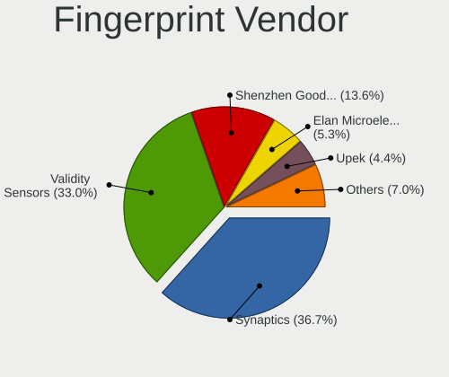

| Vendor                     | Notebooks | Percent |
|----------------------------|-----------|---------|
| Synaptics                  | 151       | 36.65%  |
| Validity Sensors           | 136       | 33.01%  |
| Shenzhen Goodix Technology | 56        | 13.59%  |
| Elan Microelectronics      | 22        | 5.34%   |
| Upek                       | 18        | 4.37%   |
| AuthenTec                  | 17        | 4.13%   |
| LighTuning Technology      | 8         | 1.94%   |
| Focal-systems.Corp         | 3         | 0.73%   |
| Next Biometrics            | 1         | 0.24%   |

Fingerprint Model
-----------------

Fingerprint sensor models

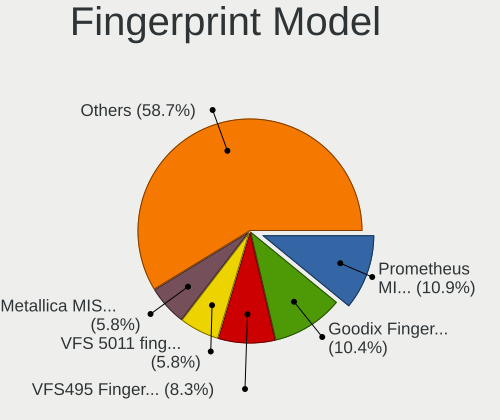

| Model                                                                      | Notebooks | Percent |
|----------------------------------------------------------------------------|-----------|---------|
| Synaptics Prometheus MIS Touch Fingerprint Reader                          | 45        | 10.92%  |
| Shenzhen Goodix  FingerPrint Device                                        | 43        | 10.44%  |
| Validity Sensors VFS495 Fingerprint Reader                                 | 34        | 8.25%   |
| Validity Sensors VFS 5011 fingerprint sensor                               | 24        | 5.83%   |
| Synaptics Metallica MIS Touch Fingerprint Reader                           | 24        | 5.83%   |
| Synaptics FS7604 Touch Fingerprint Sensor with PurePrint                   | 23        | 5.58%   |
| Upek Biometric Touchchip/Touchstrip Fingerprint Sensor                     | 18        | 4.37%   |
| Synaptics UWP WBDI Device                                                  | 16        | 3.88%   |
| Validity Sensors Synaptics WBDI                                            | 15        | 3.64%   |
| Elan ELAN:ARM-M4                                                           | 15        | 3.64%   |
| Validity Sensors VFS5011 Fingerprint Reader                                | 11        | 2.67%   |
| Synaptics Fingerprint reader [HP G6]                                       | 11        | 2.67%   |
| Validity Sensors VFS7500 Touch Fingerprint Sensor                          | 10        | 2.43%   |
| Shenzhen Goodix Fingerprint Reader                                         | 9         | 2.18%   |
| Validity Sensors VFS471 Fingerprint Reader                                 | 8         | 1.94%   |
| Validity Sensors VFS491                                                    | 7         | 1.7%    |
| Elan ELAN:Fingerprint                                                      | 7         | 1.7%    |
| AuthenTec AES2810                                                          | 7         | 1.7%    |
| Validity Sensors Fingerprint scanner                                       | 6         | 1.46%   |
| Synaptics Prometheus Fingerprint Reader                                    | 6         | 1.46%   |
| LighTuning EgisTec Touch Fingerprint Sensor                                | 6         | 1.46%   |
| Validity Sensors VFS451 Fingerprint Reader                                 | 5         | 1.21%   |
| Validity Sensors Synaptics VFS7552 Touch Fingerprint Sensor with PurePrint | 5         | 1.21%   |
| Validity Sensors Swipe Fingerprint Sensor                                  | 5         | 1.21%   |
| Synaptics WBDI Device                                                      | 4         | 0.97%   |
| Synaptics  FS7604 Touch Fingerprint Sensor with PurePrint                  | 4         | 0.97%   |
| Synaptics Metallica MOH Touch Fingerprint Reader                           | 4         | 0.97%   |
| Shenzhen Goodix FingerPrint                                                | 4         | 0.97%   |
| Unknown                                                                    | 4         | 0.97%   |
| Synaptics WBDI Fingerprint Reader USB 086                                  | 3         | 0.73%   |
| Synaptics WBDI                                                             | 3         | 0.73%   |
| Focal-systems.Corp FT9201Fingerprint.                                      | 3         | 0.73%   |
| AuthenTec AES2550 Fingerprint Sensor                                       | 3         | 0.73%   |
| AuthenTec AES1600                                                          | 3         | 0.73%   |
| Validity Sensors VFS7552 Touch Fingerprint Sensor                          | 2         | 0.49%   |
| Validity Sensors VFS301 Fingerprint Reader                                 | 2         | 0.49%   |
| LighTuning ES603 Swipe Fingerprint Sensor                                  | 2         | 0.49%   |
| AuthenTec AES2501 Fingerprint Sensor                                       | 2         | 0.49%   |
| AuthenTec AES1660 Fingerprint Sensor                                       | 2         | 0.49%   |
| Validity Sensors VFS300 Fingerprint Reader                                 | 1         | 0.24%   |

Chipcard Vendor
---------------

Chipcard module vendors

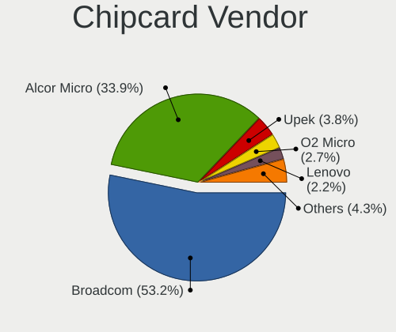

| Vendor                    | Notebooks | Percent |
|---------------------------|-----------|---------|
| Broadcom                  | 99        | 53.23%  |
| Alcor Micro               | 63        | 33.87%  |
| Upek                      | 7         | 3.76%   |
| O2 Micro                  | 5         | 2.69%   |
| Lenovo                    | 4         | 2.15%   |
| Gemalto (was Gemplus)     | 3         | 1.61%   |
| Advanced Card Systems     | 2         | 1.08%   |
| Hewlett-Packard           | 1         | 0.54%   |
| Fujitsu Siemens Computers | 1         | 0.54%   |
| Chicony Electronics       | 1         | 0.54%   |

Chipcard Model
--------------

Chipcard module models

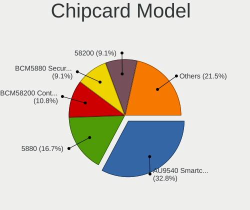

| Model                                                                        | Notebooks | Percent |
|------------------------------------------------------------------------------|-----------|---------|
| Alcor Micro AU9540 Smartcard Reader                                          | 61        | 32.8%   |
| Broadcom 5880                                                                | 31        | 16.67%  |
| Broadcom BCM58200 ControlVault 3 (FingerPrint sensor + Contacted SmartCard)  | 20        | 10.75%  |
| Broadcom BCM5880 Secure Applications Processor                               | 17        | 9.14%   |
| Broadcom 58200                                                               | 17        | 9.14%   |
| Broadcom BCM5880 Secure Applications Processor with fingerprint swipe sensor | 12        | 6.45%   |
| Upek TouchChip Fingerprint Coprocessor (WBF advanced mode)                   | 7         | 3.76%   |
| O2 Micro OZ776 CCID Smartcard Reader                                         | 5         | 2.69%   |
| Lenovo Integrated Smart Card Reader                                          | 4         | 2.15%   |
| Gemalto (was Gemplus) GemPC Twin SmartCard Reader                            | 2         | 1.08%   |
| Broadcom BCM5880 Secure Applications Processor with fingerprint touch sensor | 2         | 1.08%   |
| Hewlett-Packard SC Keyboard - Apollo (Liteon)                                | 1         | 0.54%   |
| Gemalto (was Gemplus) Prox SU USB PC Link Reader                             | 1         | 0.54%   |
| Fujitsu Siemens Computers Keyboard KB100 SCR eSIG                            | 1         | 0.54%   |
| Chicony Electronics HP Skylab USB Smartcard Keyboard                         | 1         | 0.54%   |
| Alcor Micro Watchdata W 1981                                                 | 1         | 0.54%   |
| Alcor Micro EMV Smartcard Reader                                             | 1         | 0.54%   |
| Advanced Card Systems ACR39U                                                 | 1         | 0.54%   |
| Advanced Card Systems ACR1252 Dual Reader                                    | 1         | 0.54%   |

Unsupported
-----------

Unsupported Devices
-------------------

Total unsupported devices on board

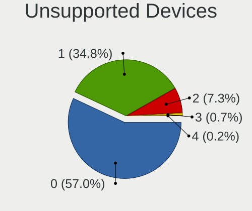

| Total | Notebooks | Percent |
|-------|-----------|---------|
| 0     | 1276      | 56.99%  |
| 1     | 779       | 34.79%  |
| 2     | 164       | 7.32%   |
| 3     | 16        | 0.71%   |
| 4     | 4         | 0.18%   |

Unsupported Device Types
------------------------

Types of unsupported devices

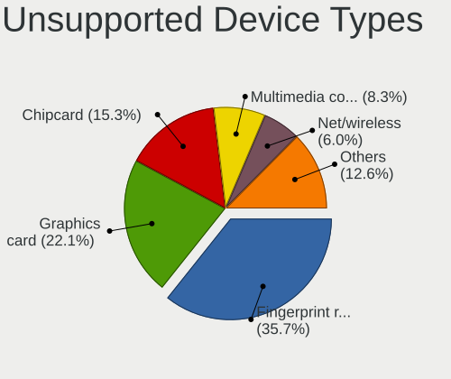

| Type                     | Notebooks | Percent |
|--------------------------|-----------|---------|
| Fingerprint reader       | 409       | 35.72%  |
| Graphics card            | 253       | 22.1%   |
| Chipcard                 | 175       | 15.28%  |
| Multimedia controller    | 95        | 8.3%    |
| Net/wireless             | 69        | 6.03%   |
| Camera                   | 49        | 4.28%   |
| Sound                    | 23        | 2.01%   |
| Card reader              | 17        | 1.48%   |
| Bluetooth                | 16        | 1.4%    |
| Storage                  | 10        | 0.87%   |
| Net/ethernet             | 10        | 0.87%   |
| Communication controller | 8         | 0.7%    |
| Network                  | 5         | 0.44%   |
| Modem                    | 4         | 0.35%   |
| Unassigned class         | 1         | 0.09%   |
| Flash memory             | 1         | 0.09%   |

