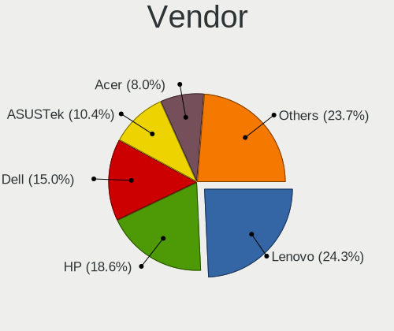
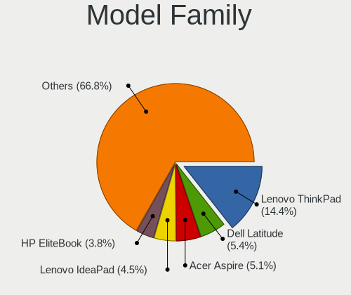
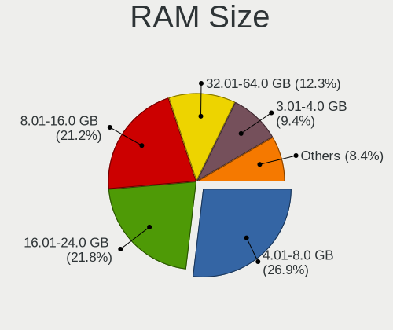
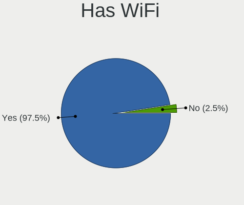
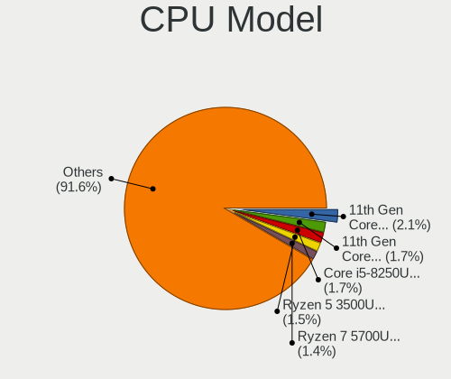
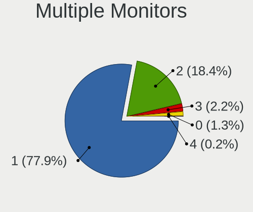
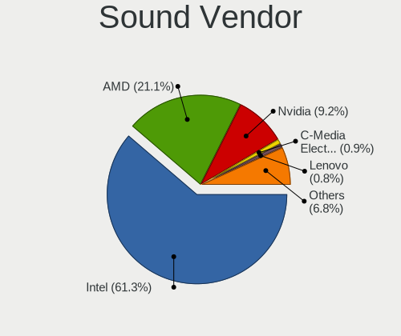
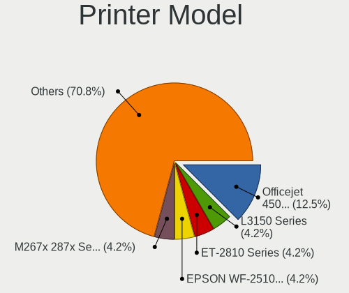
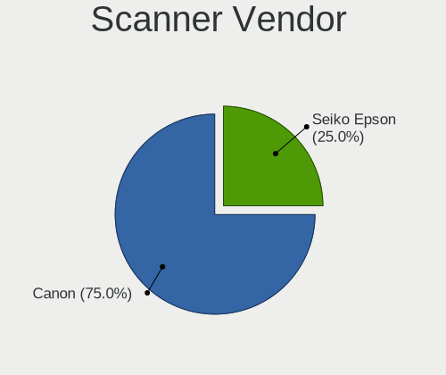

openSUSE - Tested Hardware & Statistics (Notebooks)
---------------------------------------------------

A project to collect tested hardware configurations for openSUSE.

Anyone can contribute to this report by the [hw-probe](https://github.com/linuxhw/hw-probe) tool:

    sudo -E hw-probe -all -upload

Please contribute! Especially if your hardware is rare.

Contents
--------

* [ Test Cases ](#test-cases)

* [ System ](#system)
  - [ OS                       ](#os)
  - [ OS Family                ](#os-family)
  - [ Kernel                   ](#kernel)
  - [ Kernel Family            ](#kernel-family)
  - [ Kernel Major Ver.        ](#kernel-major-ver)
  - [ Arch                     ](#arch)
  - [ DE                       ](#de)
  - [ Display Server           ](#display-server)
  - [ Display Manager          ](#display-manager)
  - [ OS Lang                  ](#os-lang)
  - [ Boot Mode                ](#boot-mode)
  - [ Filesystem               ](#filesystem)
  - [ Part. scheme             ](#part-scheme)
  - [ Dual Boot with Linux/BSD ](#dual-boot-with-linuxbsd)
  - [ Dual Boot (Win)          ](#dual-boot-win)

* [ Board ](#board)
  - [ Vendor                   ](#vendor)
  - [ Model                    ](#model)
  - [ Model Family             ](#model-family)
  - [ MFG Year                 ](#mfg-year)
  - [ Form Factor              ](#form-factor)
  - [ Secure Boot              ](#secure-boot)
  - [ Coreboot                 ](#coreboot)
  - [ RAM Size                 ](#ram-size)
  - [ RAM Used                 ](#ram-used)
  - [ Total Drives             ](#total-drives)
  - [ Has CD-ROM               ](#has-cd-rom)
  - [ Has Ethernet             ](#has-ethernet)
  - [ Has WiFi                 ](#has-wifi)
  - [ Has Bluetooth            ](#has-bluetooth)

* [ Location ](#location)
  - [ Country                  ](#country)
  - [ City                     ](#city)

* [ Drives ](#drives)
  - [ Drive Vendor             ](#drive-vendor)
  - [ Drive Model              ](#drive-model)
  - [ HDD Vendor               ](#hdd-vendor)
  - [ SSD Vendor               ](#ssd-vendor)
  - [ Drive Kind               ](#drive-kind)
  - [ Drive Connector          ](#drive-connector)
  - [ Drive Size               ](#drive-size)
  - [ Space Total              ](#space-total)
  - [ Space Used               ](#space-used)
  - [ Malfunc. Drives          ](#malfunc-drives)
  - [ Malfunc. Drive Vendor    ](#malfunc-drive-vendor)
  - [ Malfunc. HDD Vendor      ](#malfunc-hdd-vendor)
  - [ Malfunc. Drive Kind      ](#malfunc-drive-kind)
  - [ Failed Drives            ](#failed-drives)
  - [ Failed Drive Vendor      ](#failed-drive-vendor)
  - [ Drive Status             ](#drive-status)

* [ Storage controller ](#storage-controller)
  - [ Storage Vendor           ](#storage-vendor)
  - [ Storage Model            ](#storage-model)
  - [ Storage Kind             ](#storage-kind)

* [ Processor ](#processor)
  - [ CPU Vendor               ](#cpu-vendor)
  - [ CPU Model                ](#cpu-model)
  - [ CPU Model Family         ](#cpu-model-family)
  - [ CPU Cores                ](#cpu-cores)
  - [ CPU Sockets              ](#cpu-sockets)
  - [ CPU Threads              ](#cpu-threads)
  - [ CPU Op-Modes             ](#cpu-op-modes)
  - [ CPU Microcode            ](#cpu-microcode)
  - [ CPU Microarch            ](#cpu-microarch)

* [ Graphics ](#graphics)
  - [ GPU Vendor               ](#gpu-vendor)
  - [ GPU Model                ](#gpu-model)
  - [ GPU Combo                ](#gpu-combo)
  - [ GPU Driver               ](#gpu-driver)
  - [ GPU Memory               ](#gpu-memory)

* [ Monitor ](#monitor)
  - [ Monitor Vendor           ](#monitor-vendor)
  - [ Monitor Model            ](#monitor-model)
  - [ Monitor Resolution       ](#monitor-resolution)
  - [ Monitor Diagonal         ](#monitor-diagonal)
  - [ Monitor Width            ](#monitor-width)
  - [ Aspect Ratio             ](#aspect-ratio)
  - [ Monitor Area             ](#monitor-area)
  - [ Pixel Density            ](#pixel-density)
  - [ Multiple Monitors        ](#multiple-monitors)

* [ Network ](#network)
  - [ Net Controller Vendor    ](#net-controller-vendor)
  - [ Net Controller Model     ](#net-controller-model)
  - [ Wireless Vendor          ](#wireless-vendor)
  - [ Wireless Model           ](#wireless-model)
  - [ Ethernet Vendor          ](#ethernet-vendor)
  - [ Ethernet Model           ](#ethernet-model)
  - [ Net Controller Kind      ](#net-controller-kind)
  - [ Used Controller          ](#used-controller)
  - [ NICs                     ](#nics)
  - [ IPv6                     ](#ipv6)

* [ Bluetooth ](#bluetooth)
  - [ Bluetooth Vendor         ](#bluetooth-vendor)
  - [ Bluetooth Model          ](#bluetooth-model)

* [ Sound ](#sound)
  - [ Sound Vendor             ](#sound-vendor)
  - [ Sound Model              ](#sound-model)

* [ Memory ](#memory)
  - [ Memory Vendor            ](#memory-vendor)
  - [ Memory Model             ](#memory-model)
  - [ Memory Kind              ](#memory-kind)
  - [ Memory Form Factor       ](#memory-form-factor)
  - [ Memory Size              ](#memory-size)
  - [ Memory Speed             ](#memory-speed)

* [ Printers & scanners ](#printers--scanners)
  - [ Printer Vendor           ](#printer-vendor)
  - [ Printer Model            ](#printer-model)
  - [ Scanner Vendor           ](#scanner-vendor)
  - [ Scanner Model            ](#scanner-model)

* [ Camera ](#camera)
  - [ Camera Vendor            ](#camera-vendor)
  - [ Camera Model             ](#camera-model)

* [ Security ](#security)
  - [ Fingerprint Vendor       ](#fingerprint-vendor)
  - [ Fingerprint Model        ](#fingerprint-model)
  - [ Chipcard Vendor          ](#chipcard-vendor)
  - [ Chipcard Model           ](#chipcard-model)

* [ Unsupported ](#unsupported)
  - [ Unsupported Devices      ](#unsupported-devices)
  - [ Unsupported Device Types ](#unsupported-device-types)

Test Cases
----------

Total: 2088

| Vendor        | Model                       | Probe                                                      | Date         |
|---------------|-----------------------------|------------------------------------------------------------|--------------|
| ASUSTek       | UX331UN                     | [9b0463c9de](https://linux-hardware.org/?probe=9b0463c9de) | Feb 02, 2024 |
| Apple         | MacBookAir4,2               | [2952e00ccb](https://linux-hardware.org/?probe=2952e00ccb) | Feb 02, 2024 |
| Apple         | MacBookAir4,2               | [3173c9ba14](https://linux-hardware.org/?probe=3173c9ba14) | Feb 02, 2024 |
| HP            | EliteBook 845 G8 Noteboo... | [7516b63802](https://linux-hardware.org/?probe=7516b63802) | Feb 02, 2024 |
| Unknown       | Unknown                     | [2037e9d75f](https://linux-hardware.org/?probe=2037e9d75f) | Feb 02, 2024 |
| Unknown       | Unknown                     | [b85ea144b7](https://linux-hardware.org/?probe=b85ea144b7) | Feb 01, 2024 |
| HP            | EliteBook 845 G8 Noteboo... | [d58a0bc20e](https://linux-hardware.org/?probe=d58a0bc20e) | Jan 30, 2024 |
| MSI           | Thin GF63 12HW              | [5c79e92eb3](https://linux-hardware.org/?probe=5c79e92eb3) | Jan 30, 2024 |
| Dell          | Studio 1747                 | [b43d9b4a13](https://linux-hardware.org/?probe=b43d9b4a13) | Jan 29, 2024 |
| Dell          | Latitude 3420               | [100cfc0b60](https://linux-hardware.org/?probe=100cfc0b60) | Jan 29, 2024 |
| Dell          | Studio 1747                 | [9fe0b059bc](https://linux-hardware.org/?probe=9fe0b059bc) | Jan 29, 2024 |
| SLIMBOOK      | PROX15-AMD                  | [694185365c](https://linux-hardware.org/?probe=694185365c) | Jan 29, 2024 |
| Lenovo        | ThinkPad T490 20N3001EGE    | [5681d42b6e](https://linux-hardware.org/?probe=5681d42b6e) | Jan 29, 2024 |
| TUXEDO        | Aura 15 Gen1                | [017a27b28f](https://linux-hardware.org/?probe=017a27b28f) | Jan 29, 2024 |
| Lenovo        | ThinkPad T490 20N3001EGE    | [d8866aae44](https://linux-hardware.org/?probe=d8866aae44) | Jan 29, 2024 |
| Dell          | Latitude E6530              | [185381cc95](https://linux-hardware.org/?probe=185381cc95) | Jan 28, 2024 |
| Acer          | Aspire A317-32              | [9baf9646df](https://linux-hardware.org/?probe=9baf9646df) | Jan 27, 2024 |
| Lenovo        | ThinkPad E14 20RAS1S600     | [8544584b30](https://linux-hardware.org/?probe=8544584b30) | Jan 27, 2024 |
| Acer          | Nitro AN515-42              | [a2166aa476](https://linux-hardware.org/?probe=a2166aa476) | Jan 26, 2024 |
| Acer          | Swift SFG14-72              | [a9239eecc8](https://linux-hardware.org/?probe=a9239eecc8) | Jan 25, 2024 |
| TUXEDO        | InfinityBook Pro Gen8 (M... | [b1abb90a3f](https://linux-hardware.org/?probe=b1abb90a3f) | Jan 25, 2024 |
| HP            | EliteBook 845 G8 Noteboo... | [18c1105b43](https://linux-hardware.org/?probe=18c1105b43) | Jan 24, 2024 |
| HP            | Laptop 15s-eq1xxx           | [667112adce](https://linux-hardware.org/?probe=667112adce) | Jan 24, 2024 |
| ASUSTek       | ASUS TUF Gaming A17 FA70... | [1504d8c4a7](https://linux-hardware.org/?probe=1504d8c4a7) | Jan 23, 2024 |
| Lenovo        | ThinkPad X1 Carbon Gen 1... | [ad914958b8](https://linux-hardware.org/?probe=ad914958b8) | Jan 23, 2024 |
| Lenovo        | ThinkPad T470 W10DG 20JN... | [6dd363b754](https://linux-hardware.org/?probe=6dd363b754) | Jan 22, 2024 |
| Samsung       | 700T                        | [7268026aa6](https://linux-hardware.org/?probe=7268026aa6) | Jan 21, 2024 |
| Lenovo        | ThinkPad X280 20KEA03YCL    | [6d4961e126](https://linux-hardware.org/?probe=6d4961e126) | Jan 21, 2024 |
| Lenovo        | IdeaPad 3 15ITL6 82MD       | [48653c026b](https://linux-hardware.org/?probe=48653c026b) | Jan 20, 2024 |
| HP            | Pavilion dv6                | [d112cda80d](https://linux-hardware.org/?probe=d112cda80d) | Jan 20, 2024 |
| Dell          | Latitude E6400              | [b2765b0e50](https://linux-hardware.org/?probe=b2765b0e50) | Jan 19, 2024 |
| Acer          | Swift SFG14-72              | [e37657c021](https://linux-hardware.org/?probe=e37657c021) | Jan 19, 2024 |
| HP            | Pavilion Laptop 15-eg2xx... | [4a2d568004](https://linux-hardware.org/?probe=4a2d568004) | Jan 19, 2024 |
| Acer          | Aspire E1-570G              | [2c6c50ecd4](https://linux-hardware.org/?probe=2c6c50ecd4) | Jan 18, 2024 |
| Framework     | Laptop 13 (AMD Ryzen 704... | [1a9602bf0b](https://linux-hardware.org/?probe=1a9602bf0b) | Jan 17, 2024 |
| Dell          | Latitude 5591               | [b91323a39b](https://linux-hardware.org/?probe=b91323a39b) | Jan 17, 2024 |
| MECHREVO      | WUJIE 14                    | [70a728ef39](https://linux-hardware.org/?probe=70a728ef39) | Jan 17, 2024 |
| HP            | 255 G8 Notebook PC          | [667df4a998](https://linux-hardware.org/?probe=667df4a998) | Jan 17, 2024 |
| TUXEDO        | Aura 15 Gen2                | [28a227c7d1](https://linux-hardware.org/?probe=28a227c7d1) | Jan 16, 2024 |
| TUXEDO        | Pulse 15 Gen2               | [1ec6103b31](https://linux-hardware.org/?probe=1ec6103b31) | Jan 16, 2024 |
| TUXEDO        | Aura 15 Gen2                | [96e3e7f937](https://linux-hardware.org/?probe=96e3e7f937) | Jan 16, 2024 |
| Apple         | MacBookPro5,3               | [faacc152f3](https://linux-hardware.org/?probe=faacc152f3) | Jan 15, 2024 |
| HP            | EliteBook 830 13 inch G1... | [d462837d11](https://linux-hardware.org/?probe=d462837d11) | Jan 15, 2024 |
| HP            | Notebook                    | [9742d3ad6f](https://linux-hardware.org/?probe=9742d3ad6f) | Jan 12, 2024 |
| Dell          | Latitude 5431               | [45d7b96fb3](https://linux-hardware.org/?probe=45d7b96fb3) | Jan 12, 2024 |
| HP            | Laptop 15-dy2xxx            | [4dc1a2b98c](https://linux-hardware.org/?probe=4dc1a2b98c) | Jan 11, 2024 |
| HP            | EliteBook 2540p             | [088dbf4c2f](https://linux-hardware.org/?probe=088dbf4c2f) | Jan 10, 2024 |
| A-DATA Tec... | XENIA 15                    | [6cf5d66e62](https://linux-hardware.org/?probe=6cf5d66e62) | Jan 10, 2024 |
| Lenovo        | ThinkPad T530 2394W19       | [0dff2ac4a3](https://linux-hardware.org/?probe=0dff2ac4a3) | Jan 10, 2024 |
| Dell          | Latitude XT2                | [70d16bb0e5](https://linux-hardware.org/?probe=70d16bb0e5) | Jan 09, 2024 |
| HP            | Laptop 15s-eq2xxx           | [2e0223d4eb](https://linux-hardware.org/?probe=2e0223d4eb) | Jan 09, 2024 |
| Acer          | Aspire A515-54G             | [39f576ef78](https://linux-hardware.org/?probe=39f576ef78) | Jan 09, 2024 |
| Acer          | Swift SF314-43              | [fbd53e189d](https://linux-hardware.org/?probe=fbd53e189d) | Jan 08, 2024 |
| Lenovo        | ThinkPad P53 20QNCTO1WW     | [a304de1339](https://linux-hardware.org/?probe=a304de1339) | Jan 06, 2024 |
| ASUSTek       | VivoBook_ASUSLaptop M540... | [5fdb8bdac3](https://linux-hardware.org/?probe=5fdb8bdac3) | Jan 06, 2024 |
| Lenovo        | ThinkPad T470 W10DG 20JN... | [e340939ad8](https://linux-hardware.org/?probe=e340939ad8) | Jan 06, 2024 |
| Lenovo        | ThinkPad P14s Gen 1 20Y1... | [f6c39e3e76](https://linux-hardware.org/?probe=f6c39e3e76) | Jan 05, 2024 |
| Acer          | Aspire A317-32              | [806a8b59fb](https://linux-hardware.org/?probe=806a8b59fb) | Jan 05, 2024 |
| ASUSTek       | Vivobook Go E1504GAB_E15... | [fecea30437](https://linux-hardware.org/?probe=fecea30437) | Jan 05, 2024 |
| ASUSTek       | Vivobook Go E1504GAB_E15... | [c372db6437](https://linux-hardware.org/?probe=c372db6437) | Jan 05, 2024 |
| Lenovo        | ThinkPad X1 Nano Gen 3 2... | [ac8dc5cc8a](https://linux-hardware.org/?probe=ac8dc5cc8a) | Jan 05, 2024 |
| Lenovo        | ThinkPad T470 20HES3JR02    | [97d7161e3c](https://linux-hardware.org/?probe=97d7161e3c) | Jan 04, 2024 |
| ASUSTek       | UX510UXK                    | [17be26f2de](https://linux-hardware.org/?probe=17be26f2de) | Jan 04, 2024 |
| MSI           | GT60                        | [387a256e4a](https://linux-hardware.org/?probe=387a256e4a) | Jan 04, 2024 |
| Alienware     | m16 R1 AMD                  | [134a43f7ee](https://linux-hardware.org/?probe=134a43f7ee) | Jan 04, 2024 |
| Dell          | Latitude 3420               | [2a844ff0bf](https://linux-hardware.org/?probe=2a844ff0bf) | Jan 03, 2024 |
| Apple         | MacBook5,1                  | [2c8c483194](https://linux-hardware.org/?probe=2c8c483194) | Jan 03, 2024 |
| Dell          | Latitude 5590               | [d14e55a5ed](https://linux-hardware.org/?probe=d14e55a5ed) | Jan 03, 2024 |
| Lenovo        | ThinkPad P14s Gen 4 21HF... | [1504d9c050](https://linux-hardware.org/?probe=1504d9c050) | Jan 03, 2024 |
| HP            | ProBook 430 G1              | [7f61fa84aa](https://linux-hardware.org/?probe=7f61fa84aa) | Jan 02, 2024 |
| Timi          | RedmiBook Pro 14S           | [08718e205b](https://linux-hardware.org/?probe=08718e205b) | Jan 01, 2024 |
| HP            | Laptop 15s-eq2xxx           | [2f1b4ada4b](https://linux-hardware.org/?probe=2f1b4ada4b) | Jan 01, 2024 |
| Dell          | Latitude 3420               | [775325daa6](https://linux-hardware.org/?probe=775325daa6) | Dec 31, 2023 |
| Alienware     | M17xR3                      | [ed05d87c74](https://linux-hardware.org/?probe=ed05d87c74) | Dec 31, 2023 |
| Dell          | Inspiron 7460               | [1085eef155](https://linux-hardware.org/?probe=1085eef155) | Dec 30, 2023 |
| Dell          | Inspiron 3443               | [0c56a0465b](https://linux-hardware.org/?probe=0c56a0465b) | Dec 29, 2023 |
| ASUSTek       | Vivobook Go E1504GAB_E15... | [6fa8529cff](https://linux-hardware.org/?probe=6fa8529cff) | Dec 29, 2023 |
| ASUSTek       | G750JS                      | [1164f5c600](https://linux-hardware.org/?probe=1164f5c600) | Dec 29, 2023 |
| HP            | EliteBook 8560p             | [16a5247446](https://linux-hardware.org/?probe=16a5247446) | Dec 28, 2023 |
| HP            | EliteBook 8560p             | [82f94ea967](https://linux-hardware.org/?probe=82f94ea967) | Dec 28, 2023 |
| ASUSTek       | ROG Flow X13 GV301QE_GV3... | [2a7878eaed](https://linux-hardware.org/?probe=2a7878eaed) | Dec 28, 2023 |
| Lenovo        | ThinkPad A275 20KDS01T00    | [424a79de6b](https://linux-hardware.org/?probe=424a79de6b) | Dec 28, 2023 |
| HP            | 250 G8 Notebook PC          | [255c0c95bc](https://linux-hardware.org/?probe=255c0c95bc) | Dec 28, 2023 |
| Lenovo        | IdeaPad S340-15IML 81NA     | [1594f8077b](https://linux-hardware.org/?probe=1594f8077b) | Dec 27, 2023 |
| Lenovo        | IdeaPad 3 15ITL6 82H8       | [87e63ff33e](https://linux-hardware.org/?probe=87e63ff33e) | Dec 27, 2023 |
| Lenovo        | ThinkPad E14 Gen 2 20TBS... | [626b056720](https://linux-hardware.org/?probe=626b056720) | Dec 27, 2023 |
| Dell          | Latitude 5591               | [99b2702a06](https://linux-hardware.org/?probe=99b2702a06) | Dec 27, 2023 |
| HP            | Victus by Laptop 16-e0xx... | [f91e53f3e0](https://linux-hardware.org/?probe=f91e53f3e0) | Dec 26, 2023 |
| Dell          | Latitude 3420               | [d17deb16ca](https://linux-hardware.org/?probe=d17deb16ca) | Dec 26, 2023 |
| ASUSTek       | Zenbook UM3402YAR_UM3402... | [4fb309a12a](https://linux-hardware.org/?probe=4fb309a12a) | Dec 26, 2023 |
| ASUSTek       | ROG Strix G713RW_G713RW     | [7a7f4ca17a](https://linux-hardware.org/?probe=7a7f4ca17a) | Dec 25, 2023 |
| Dell          | Latitude E4310              | [41f607e5e5](https://linux-hardware.org/?probe=41f607e5e5) | Dec 23, 2023 |
| Acer          | Nitro AN515-51              | [52a7a4d6d8](https://linux-hardware.org/?probe=52a7a4d6d8) | Dec 23, 2023 |
| ASUSTek       | Vivobook Go E1504GAB_E15... | [1947533de1](https://linux-hardware.org/?probe=1947533de1) | Dec 23, 2023 |
| Dell          | System XPS L322X            | [6b050ff1c8](https://linux-hardware.org/?probe=6b050ff1c8) | Dec 23, 2023 |
| HUAWEI        | KLVL-WXXW                   | [75c61bce6d](https://linux-hardware.org/?probe=75c61bce6d) | Dec 22, 2023 |
| ASUSTek       | Vivobook Go E1504GAB_E15... | [e7c2d69943](https://linux-hardware.org/?probe=e7c2d69943) | Dec 22, 2023 |
| Medion        | S17403                      | [167acdd156](https://linux-hardware.org/?probe=167acdd156) | Dec 22, 2023 |
| Dell          | Latitude 7420               | [f2b2511de1](https://linux-hardware.org/?probe=f2b2511de1) | Dec 21, 2023 |
| Acer          | TravelMate P215-41-G2       | [476ef9075c](https://linux-hardware.org/?probe=476ef9075c) | Dec 21, 2023 |
| Lenovo        | ThinkPad T14 Gen 2i 20W1... | [972314af13](https://linux-hardware.org/?probe=972314af13) | Dec 21, 2023 |
| Dell          | Latitude 3420               | [35a3241602](https://linux-hardware.org/?probe=35a3241602) | Dec 20, 2023 |
| Wortmann      | TERRA_MOBILE_1529H          | [49f1bedb5a](https://linux-hardware.org/?probe=49f1bedb5a) | Dec 20, 2023 |
| ASUSTek       | VivoBook_ASUSLaptop E510... | [2e42798435](https://linux-hardware.org/?probe=2e42798435) | Dec 20, 2023 |
| MSI           | Thin GF63 12HW              | [28287138f4](https://linux-hardware.org/?probe=28287138f4) | Dec 19, 2023 |
| System76      | Lemur Pro                   | [85b70f2fdb](https://linux-hardware.org/?probe=85b70f2fdb) | Dec 18, 2023 |
| Dell          | Inspiron 7375               | [52f641256c](https://linux-hardware.org/?probe=52f641256c) | Dec 18, 2023 |
| Dell          | XPS 15 7590                 | [7e2afccdd6](https://linux-hardware.org/?probe=7e2afccdd6) | Dec 18, 2023 |
| Lenovo        | ThinkPad T14 Gen 2i 20W1... | [74dc75b3b8](https://linux-hardware.org/?probe=74dc75b3b8) | Dec 18, 2023 |
| Lenovo        | ThinkPad E14 20RA004YUS     | [35e29203d7](https://linux-hardware.org/?probe=35e29203d7) | Dec 17, 2023 |
| System76      | Lemur Pro                   | [6ec95bc2bc](https://linux-hardware.org/?probe=6ec95bc2bc) | Dec 17, 2023 |
| Apple         | MacBookPro5,3               | [8143805d8a](https://linux-hardware.org/?probe=8143805d8a) | Dec 17, 2023 |
| Samsung       | 550XDA                      | [10ec283ed4](https://linux-hardware.org/?probe=10ec283ed4) | Dec 17, 2023 |
| System76      | Bonobo WS                   | [22f5ef6fce](https://linux-hardware.org/?probe=22f5ef6fce) | Dec 16, 2023 |
| Lenovo        | ThinkPad X1 Extreme 2nd ... | [d8a98a209a](https://linux-hardware.org/?probe=d8a98a209a) | Dec 15, 2023 |
| Dell          | G15 5515                    | [259739c8b5](https://linux-hardware.org/?probe=259739c8b5) | Dec 14, 2023 |
| Samsung       | 355V4C/355V4X/355V5C/355... | [b949261978](https://linux-hardware.org/?probe=b949261978) | Dec 13, 2023 |
| Lenovo        | ThinkPad X13 Gen 2a 20XH... | [c71041fa59](https://linux-hardware.org/?probe=c71041fa59) | Dec 12, 2023 |
| HP            | 250 15.6 inch G9 Noteboo... | [48475b71d7](https://linux-hardware.org/?probe=48475b71d7) | Dec 11, 2023 |
| HP            | 255 G5                      | [9001fa872f](https://linux-hardware.org/?probe=9001fa872f) | Dec 11, 2023 |
| HP            | 255 G5                      | [d7df759d96](https://linux-hardware.org/?probe=d7df759d96) | Dec 11, 2023 |
| Dell          | Precision 5530              | [eee9114e4b](https://linux-hardware.org/?probe=eee9114e4b) | Dec 10, 2023 |
| ASUSTek       | ROG Zephyrus M16 GU604VZ... | [e8383035b9](https://linux-hardware.org/?probe=e8383035b9) | Dec 10, 2023 |
| HP            | Compaq 515                  | [025d4116ed](https://linux-hardware.org/?probe=025d4116ed) | Dec 09, 2023 |
| Dell          | Latitude 5591               | [1961ebb904](https://linux-hardware.org/?probe=1961ebb904) | Dec 07, 2023 |
| Dell          | Latitude 5591               | [b9f6d020e8](https://linux-hardware.org/?probe=b9f6d020e8) | Dec 07, 2023 |
| Lenovo        | IdeaPad 5 14ALC05 82LM      | [9d717185fb](https://linux-hardware.org/?probe=9d717185fb) | Dec 07, 2023 |
| System76      | Lemur Pro                   | [c8313d9e6f](https://linux-hardware.org/?probe=c8313d9e6f) | Dec 07, 2023 |
| Samsung       | 550XDA                      | [6501dce45c](https://linux-hardware.org/?probe=6501dce45c) | Dec 07, 2023 |
| Lenovo        | IdeaPad Gaming 3 15ARH05... | [70394fdace](https://linux-hardware.org/?probe=70394fdace) | Dec 05, 2023 |
| ASUSTek       | X550CA                      | [a0912ee339](https://linux-hardware.org/?probe=a0912ee339) | Dec 05, 2023 |
| HP            | Victus by Gaming Laptop ... | [44542d3f3a](https://linux-hardware.org/?probe=44542d3f3a) | Dec 04, 2023 |
| HP            | ZBook 15 G3                 | [db4ce11de0](https://linux-hardware.org/?probe=db4ce11de0) | Dec 04, 2023 |
| Medion        | Unknown                     | [8fce2ae281](https://linux-hardware.org/?probe=8fce2ae281) | Dec 03, 2023 |
| Medion        | Unknown                     | [c99fd8f0b0](https://linux-hardware.org/?probe=c99fd8f0b0) | Dec 03, 2023 |
| Valve         | Jupiter                     | [c7865c15b0](https://linux-hardware.org/?probe=c7865c15b0) | Dec 02, 2023 |
| HP            | Victus by Gaming Laptop ... | [e9e9db4763](https://linux-hardware.org/?probe=e9e9db4763) | Dec 02, 2023 |
| HP            | ZBook 15 G3                 | [c9b71f256a](https://linux-hardware.org/?probe=c9b71f256a) | Dec 02, 2023 |
| HP            | Notebook                    | [0a554c91b1](https://linux-hardware.org/?probe=0a554c91b1) | Dec 01, 2023 |
| Lenovo        | ThinkPad E14 Gen 3 20YD0... | [dcbc9946d8](https://linux-hardware.org/?probe=dcbc9946d8) | Dec 01, 2023 |
| Lenovo        | ThinkPad E14 Gen 3 20YD0... | [95221dfaaf](https://linux-hardware.org/?probe=95221dfaaf) | Dec 01, 2023 |
| Lenovo        | IdeaPad 5 Pro 16ARH7 82S... | [4ba2fc285f](https://linux-hardware.org/?probe=4ba2fc285f) | Nov 30, 2023 |
| Lenovo        | IdeaPad 5 Pro 16ARH7 82S... | [0f9a06cc9f](https://linux-hardware.org/?probe=0f9a06cc9f) | Nov 30, 2023 |
| Lenovo        | ThinkPad W510 4391W3V       | [bfa4423c0f](https://linux-hardware.org/?probe=bfa4423c0f) | Nov 30, 2023 |
| Dell          | Latitude E5470              | [7b9aba2d2c](https://linux-hardware.org/?probe=7b9aba2d2c) | Nov 30, 2023 |
| Dell          | Latitude E5470              | [83a0b4f237](https://linux-hardware.org/?probe=83a0b4f237) | Nov 30, 2023 |
| HP            | Notebook                    | [93464a0904](https://linux-hardware.org/?probe=93464a0904) | Nov 30, 2023 |
| Lenovo        | ThinkPad E14 Gen 2 20TA0... | [499e463561](https://linux-hardware.org/?probe=499e463561) | Nov 30, 2023 |
| Samsung       | 550XDA                      | [5778304f73](https://linux-hardware.org/?probe=5778304f73) | Nov 30, 2023 |
| Dell          | Latitude 7290               | [c9068c7692](https://linux-hardware.org/?probe=c9068c7692) | Nov 30, 2023 |
| Dell          | Latitude 7290               | [c75434aea3](https://linux-hardware.org/?probe=c75434aea3) | Nov 30, 2023 |
| Acer          | Aspire A317-32              | [02b205724a](https://linux-hardware.org/?probe=02b205724a) | Nov 29, 2023 |
| Lenovo        | IdeaPad S145-15IIL 82DJ     | [1eda316922](https://linux-hardware.org/?probe=1eda316922) | Nov 28, 2023 |
| Lenovo        | Y520-15IKBN 80WK            | [b46ec04a69](https://linux-hardware.org/?probe=b46ec04a69) | Nov 27, 2023 |
| Lenovo        | Y520-15IKBN 80WK            | [d3122d678f](https://linux-hardware.org/?probe=d3122d678f) | Nov 27, 2023 |
| HP            | Pavilion 13 x360 PC         | [088789a558](https://linux-hardware.org/?probe=088789a558) | Nov 27, 2023 |
| HP            | Pavilion 13 x360 PC         | [fa45cae3d1](https://linux-hardware.org/?probe=fa45cae3d1) | Nov 27, 2023 |
| ASUSTek       | ASUS TUF Gaming F15 FX50... | [4256ad6b53](https://linux-hardware.org/?probe=4256ad6b53) | Nov 27, 2023 |
| ASUSTek       | Zenbook UM3402YAR_UM3402... | [f5c438ff75](https://linux-hardware.org/?probe=f5c438ff75) | Nov 26, 2023 |
| Lenovo        | Legion Pro 5 16ARX8 82WM    | [312776837c](https://linux-hardware.org/?probe=312776837c) | Nov 26, 2023 |
| HP            | Laptop 15-bs0xx             | [e9bfd98ad2](https://linux-hardware.org/?probe=e9bfd98ad2) | Nov 26, 2023 |
| IBM           | ThinkPad T42 2373CS8        | [79787555b2](https://linux-hardware.org/?probe=79787555b2) | Nov 26, 2023 |
| TUXEDO        | Pulse 15 Gen1               | [c828f995fb](https://linux-hardware.org/?probe=c828f995fb) | Nov 26, 2023 |
| TUXEDO        | Pulse 15 Gen1               | [f9d2e880ee](https://linux-hardware.org/?probe=f9d2e880ee) | Nov 26, 2023 |
| Apple         | MacBookPro8,1               | [eb9615352b](https://linux-hardware.org/?probe=eb9615352b) | Nov 25, 2023 |
| Dell          | Inspiron 5468               | [3422c91458](https://linux-hardware.org/?probe=3422c91458) | Nov 24, 2023 |
| Lenovo        | ThinkPad X260 20F6CTO1WW    | [a67fd8af5c](https://linux-hardware.org/?probe=a67fd8af5c) | Nov 24, 2023 |
| ASUSTek       | VivoBook_ASUSLaptop X712... | [ec55afa142](https://linux-hardware.org/?probe=ec55afa142) | Nov 23, 2023 |
| NEC Comput... | PC-NS100C1W-P2              | [10175626ab](https://linux-hardware.org/?probe=10175626ab) | Nov 23, 2023 |
| Acer          | Aspire A515-45G             | [1ec9d0635f](https://linux-hardware.org/?probe=1ec9d0635f) | Nov 23, 2023 |
| Dell          | Inspiron 5502               | [eb86dc0b36](https://linux-hardware.org/?probe=eb86dc0b36) | Nov 22, 2023 |
| System76      | Lemur Pro                   | [45a6298cb5](https://linux-hardware.org/?probe=45a6298cb5) | Nov 22, 2023 |
| ASUSTek       | ROG Strix G513QC_G513QC     | [748ea9f21b](https://linux-hardware.org/?probe=748ea9f21b) | Nov 21, 2023 |
| Acer          | Aspire F5-573G              | [e28d68acd6](https://linux-hardware.org/?probe=e28d68acd6) | Nov 21, 2023 |
| Acer          | Aspire F5-573G              | [d3f91d31f6](https://linux-hardware.org/?probe=d3f91d31f6) | Nov 21, 2023 |
| MSI           | Modern 14 C12M              | [072fdd8676](https://linux-hardware.org/?probe=072fdd8676) | Nov 21, 2023 |
| ASUSTek       | VivoBook_ASUSLaptop M150... | [243ff5e0c9](https://linux-hardware.org/?probe=243ff5e0c9) | Nov 21, 2023 |
| Fujitsu       | LIFEBOOK E736               | [eb2c46c2cc](https://linux-hardware.org/?probe=eb2c46c2cc) | Nov 21, 2023 |
| HP            | 650                         | [ee76251969](https://linux-hardware.org/?probe=ee76251969) | Nov 20, 2023 |
| HP            | Notebook                    | [7ca0f11e6f](https://linux-hardware.org/?probe=7ca0f11e6f) | Nov 19, 2023 |
| HUAWEI        | BOHK-WAX9X                  | [d45c2fd452](https://linux-hardware.org/?probe=d45c2fd452) | Nov 17, 2023 |
| HP            | Pavilion Laptop 15-cw1xx... | [e35c170bf2](https://linux-hardware.org/?probe=e35c170bf2) | Nov 17, 2023 |
| Samsung       | 550XDA                      | [a823e2b0a5](https://linux-hardware.org/?probe=a823e2b0a5) | Nov 16, 2023 |
| MSI           | PRO H610M-G DDR4            | [5955e4e776](https://linux-hardware.org/?probe=5955e4e776) | Nov 15, 2023 |
| Unknown       | Unknown                     | [d169a02b18](https://linux-hardware.org/?probe=d169a02b18) | Nov 14, 2023 |
| Dell          | Latitude E6410              | [1e9606e755](https://linux-hardware.org/?probe=1e9606e755) | Nov 14, 2023 |
| Lenovo        | V15 G2 ALC 82KD             | [e3926c718f](https://linux-hardware.org/?probe=e3926c718f) | Nov 14, 2023 |
| Dell          | XPS 15 9560                 | [b806051ada](https://linux-hardware.org/?probe=b806051ada) | Nov 14, 2023 |
| MSI           | PRO H610M-G DDR4            | [f41807e01e](https://linux-hardware.org/?probe=f41807e01e) | Nov 14, 2023 |
| Lenovo        | V15 G2 ALC 82KD             | [917ab5dcf0](https://linux-hardware.org/?probe=917ab5dcf0) | Nov 14, 2023 |
| ASUSTek       | ROG Zephyrus M16 GU604VZ... | [242621dab3](https://linux-hardware.org/?probe=242621dab3) | Nov 13, 2023 |
| Dell          | Latitude 7420               | [dcbc2d6415](https://linux-hardware.org/?probe=dcbc2d6415) | Nov 13, 2023 |
| NEC Comput... | PC-NS100C1W-P2              | [3f3c22657c](https://linux-hardware.org/?probe=3f3c22657c) | Nov 12, 2023 |
| NEC Comput... | PC-NS100C1W-P2              | [d1ccec297d](https://linux-hardware.org/?probe=d1ccec297d) | Nov 12, 2023 |
| Acer          | Predator PH315-54           | [836439ab9f](https://linux-hardware.org/?probe=836439ab9f) | Nov 12, 2023 |
| HP            | Pavilion dv9500             | [1cbc855f91](https://linux-hardware.org/?probe=1cbc855f91) | Nov 12, 2023 |
| Dell          | Latitude 7440               | [5c19a02292](https://linux-hardware.org/?probe=5c19a02292) | Nov 11, 2023 |
| ASUSTek       | ROG Strix G513QY_G513QY     | [5ceb1cfa6d](https://linux-hardware.org/?probe=5ceb1cfa6d) | Nov 11, 2023 |
| Samsung       | 550XDA                      | [036d014b91](https://linux-hardware.org/?probe=036d014b91) | Nov 10, 2023 |
| HP            | EliteBook 840 G6            | [7ef5d16bc5](https://linux-hardware.org/?probe=7ef5d16bc5) | Nov 10, 2023 |
| HP            | ProBook 4430s               | [47b4ab5ae1](https://linux-hardware.org/?probe=47b4ab5ae1) | Nov 10, 2023 |
| HP            | ProBook 4430s               | [69a5aa0675](https://linux-hardware.org/?probe=69a5aa0675) | Nov 10, 2023 |
| Lenovo        | Yoga Pro 9 16IRP8 83BY      | [906f638c34](https://linux-hardware.org/?probe=906f638c34) | Nov 10, 2023 |
| Dynabook      | PORTEGE X30L-K              | [161674ce4a](https://linux-hardware.org/?probe=161674ce4a) | Nov 10, 2023 |
| MSI           | Katana GF66 12UD            | [acc81a52a0](https://linux-hardware.org/?probe=acc81a52a0) | Nov 09, 2023 |
| Chuwi         | GemiBook XPro               | [3803995d49](https://linux-hardware.org/?probe=3803995d49) | Nov 09, 2023 |
| Lenovo        | ThinkPad L14 Gen 4 21H5C... | [0a9d218a26](https://linux-hardware.org/?probe=0a9d218a26) | Nov 08, 2023 |
| Lenovo        | ThinkPad E14 Gen 5 21JR0... | [e736653169](https://linux-hardware.org/?probe=e736653169) | Nov 08, 2023 |
| Lenovo        | ThinkPad W541 20EGS1LB00    | [7a31e185b9](https://linux-hardware.org/?probe=7a31e185b9) | Nov 07, 2023 |
| ASUSTek       | ROG Zephyrus M16 GU604VZ... | [680fae0bef](https://linux-hardware.org/?probe=680fae0bef) | Nov 07, 2023 |
| HP            | EliteBook 850 G6            | [0d00c42688](https://linux-hardware.org/?probe=0d00c42688) | Nov 06, 2023 |
| Lenovo        | IdeaPad S340-15IWL 81N8     | [d40cc6e0a4](https://linux-hardware.org/?probe=d40cc6e0a4) | Nov 05, 2023 |
| Lenovo        | ThinkPad T490 20N2000LSP    | [55e3cdf0cc](https://linux-hardware.org/?probe=55e3cdf0cc) | Nov 05, 2023 |
| Google        | Phaser360                   | [dbd0db9b7e](https://linux-hardware.org/?probe=dbd0db9b7e) | Nov 05, 2023 |
| Lenovo        | ThinkPad T470 W10DG 20JN... | [263a417420](https://linux-hardware.org/?probe=263a417420) | Nov 05, 2023 |
| Fujitsu       | LIFEBOOK E736               | [a2b93486a9](https://linux-hardware.org/?probe=a2b93486a9) | Nov 05, 2023 |
| Notebook      | NL5xRU                      | [6dd04cca75](https://linux-hardware.org/?probe=6dd04cca75) | Nov 05, 2023 |
| Lenovo        | ThinkPad L570 W10DG 20JR... | [ebf86ce161](https://linux-hardware.org/?probe=ebf86ce161) | Nov 04, 2023 |
| Lenovo        | ThinkPad L570 W10DG 20JR... | [5eada91f48](https://linux-hardware.org/?probe=5eada91f48) | Nov 04, 2023 |
| Lenovo        | ThinkPad E14 Gen 5 21JR0... | [d1d65399a0](https://linux-hardware.org/?probe=d1d65399a0) | Nov 03, 2023 |
| Acer          | Aspire VN7-591G             | [f446da83f1](https://linux-hardware.org/?probe=f446da83f1) | Nov 03, 2023 |
| Dell          | Inspiron 5547               | [e14eb66450](https://linux-hardware.org/?probe=e14eb66450) | Nov 03, 2023 |
| Dell          | Latitude E6420              | [cdef3b5f1c](https://linux-hardware.org/?probe=cdef3b5f1c) | Nov 02, 2023 |
| Lenovo        | Legion 5 Pro 16ITH6H 82J... | [137dba2261](https://linux-hardware.org/?probe=137dba2261) | Nov 02, 2023 |
| HP            | Pavilion Gaming Laptop 1... | [f72ba9e16b](https://linux-hardware.org/?probe=f72ba9e16b) | Nov 01, 2023 |
| Lenovo        | ThinkPad P1 Gen 5 21DDS0... | [ce44ee3f62](https://linux-hardware.org/?probe=ce44ee3f62) | Oct 31, 2023 |
| ASUSTek       | VivoBook_ASUSLaptop X515... | [2eaf76ce92](https://linux-hardware.org/?probe=2eaf76ce92) | Oct 31, 2023 |
| Acer          | Swift SF314-41              | [1bdd8f14ad](https://linux-hardware.org/?probe=1bdd8f14ad) | Oct 31, 2023 |
| Apple         | MacBookPro11,4              | [4d6c2166c8](https://linux-hardware.org/?probe=4d6c2166c8) | Oct 30, 2023 |
| ASUSTek       | ASUS TUF Dash F15 FX517Z... | [d5debf7011](https://linux-hardware.org/?probe=d5debf7011) | Oct 30, 2023 |
| Dell          | Inspiron N4050              | [7d5dc09b04](https://linux-hardware.org/?probe=7d5dc09b04) | Oct 30, 2023 |
| Samsung       | Galaxy Book Go 5G           | [8f202d5648](https://linux-hardware.org/?probe=8f202d5648) | Oct 29, 2023 |
| Acer          | Aspire V3-571               | [6aa696ac55](https://linux-hardware.org/?probe=6aa696ac55) | Oct 28, 2023 |
| HP            | ProBook 455 15.6 inch G9... | [1b5677de0e](https://linux-hardware.org/?probe=1b5677de0e) | Oct 26, 2023 |
| ASUSTek       | ZenBook UX434FL             | [139d1a74ed](https://linux-hardware.org/?probe=139d1a74ed) | Oct 25, 2023 |
| Dell          | Precision M4700             | [0b95109eba](https://linux-hardware.org/?probe=0b95109eba) | Oct 25, 2023 |
| HP            | OMEN by Gaming Laptop 16... | [39e846913d](https://linux-hardware.org/?probe=39e846913d) | Oct 25, 2023 |
| Lenovo        | ThinkPad P52 20MAS0WG00     | [e7e16a6ac8](https://linux-hardware.org/?probe=e7e16a6ac8) | Oct 25, 2023 |
| MSI           | CX61 0OC/CX61 0OD/CX61 0... | [99c1b311f1](https://linux-hardware.org/?probe=99c1b311f1) | Oct 25, 2023 |
| Acer          | Aspire 5738                 | [0abcd8d89e](https://linux-hardware.org/?probe=0abcd8d89e) | Oct 24, 2023 |
| Acer          | Aspire 5738                 | [fb6910c3c6](https://linux-hardware.org/?probe=fb6910c3c6) | Oct 24, 2023 |
| Lenovo        | IdeaPad 5 Pro 14ARH7 82S... | [819d596b2e](https://linux-hardware.org/?probe=819d596b2e) | Oct 24, 2023 |
| HP            | EliteBook 840 G4            | [a6d732c859](https://linux-hardware.org/?probe=a6d732c859) | Oct 24, 2023 |
| Samsung       | 340XAA/350XAA/550XAA        | [48d2114a2e](https://linux-hardware.org/?probe=48d2114a2e) | Oct 22, 2023 |
| Lenovo        | Unknown                     | [8681ebe19c](https://linux-hardware.org/?probe=8681ebe19c) | Oct 22, 2023 |
| HUAWEI        | KLVL-WXXW                   | [b615345fa6](https://linux-hardware.org/?probe=b615345fa6) | Oct 21, 2023 |
| Samsung       | Galaxy Book Go 5G           | [db58c6b2e8](https://linux-hardware.org/?probe=db58c6b2e8) | Oct 21, 2023 |
| MSI           | Crosshair 15 B12UEZ         | [746189a3d8](https://linux-hardware.org/?probe=746189a3d8) | Oct 20, 2023 |
| Lenovo        | B570e HuronRiver Platfor... | [6a5182fc9c](https://linux-hardware.org/?probe=6a5182fc9c) | Oct 20, 2023 |
| Dell          | Latitude 5440               | [fa85c56dcb](https://linux-hardware.org/?probe=fa85c56dcb) | Oct 18, 2023 |
| HP            | Pavilion Gaming Laptop 1... | [d63ed71e40](https://linux-hardware.org/?probe=d63ed71e40) | Oct 17, 2023 |
| Lenovo        | ThinkPad P52 20MAS0WG00     | [edfeee597d](https://linux-hardware.org/?probe=edfeee597d) | Oct 17, 2023 |
| HP            | Pavilion dv7                | [81b0ac96b9](https://linux-hardware.org/?probe=81b0ac96b9) | Oct 17, 2023 |
| Unknown       | Unknown                     | [07b00a195f](https://linux-hardware.org/?probe=07b00a195f) | Oct 16, 2023 |
| HP            | ProBook 6560b               | [3567f55849](https://linux-hardware.org/?probe=3567f55849) | Oct 15, 2023 |
| HP            | Pavilion dv7                | [dc34e61e94](https://linux-hardware.org/?probe=dc34e61e94) | Oct 15, 2023 |
| Lenovo        | ThinkPad T14s Gen 3 21BR... | [d8cc0d7855](https://linux-hardware.org/?probe=d8cc0d7855) | Oct 15, 2023 |
| HP            | Pavilion Gaming Laptop 1... | [6e4a6a34cd](https://linux-hardware.org/?probe=6e4a6a34cd) | Oct 15, 2023 |
| Lenovo        | ThinkPad T14s Gen 3 21BR... | [5586f17a5a](https://linux-hardware.org/?probe=5586f17a5a) | Oct 15, 2023 |
| ASUSTek       | ROG Strix G713QE_G713QE     | [398445f93d](https://linux-hardware.org/?probe=398445f93d) | Oct 14, 2023 |
| HP            | ProBook 4535s               | [e52e92c95b](https://linux-hardware.org/?probe=e52e92c95b) | Oct 14, 2023 |
| TUXEDO        | Polaris Intel Gen3 (TGL)    | [62688a7965](https://linux-hardware.org/?probe=62688a7965) | Oct 14, 2023 |
| Cube          | i18-BL                      | [0f2e9b2870](https://linux-hardware.org/?probe=0f2e9b2870) | Oct 14, 2023 |
| HP            | Laptop 15s-du4xxx           | [8bec0ea3db](https://linux-hardware.org/?probe=8bec0ea3db) | Oct 14, 2023 |
| HP            | EliteBook 830 13 inch G1... | [e9ced529e2](https://linux-hardware.org/?probe=e9ced529e2) | Oct 14, 2023 |
| Lenovo        | ThinkPad T400 27658JG       | [3b3b7832c9](https://linux-hardware.org/?probe=3b3b7832c9) | Oct 11, 2023 |
| ASUSTek       | ROG Strix G713QE_G713QE     | [5e8749954f](https://linux-hardware.org/?probe=5e8749954f) | Oct 11, 2023 |
| Toshiba       | dynabook B452/22F           | [61777cd92a](https://linux-hardware.org/?probe=61777cd92a) | Oct 10, 2023 |
| Acer          | Aspire one                  | [302dc95903](https://linux-hardware.org/?probe=302dc95903) | Oct 09, 2023 |
| Lenovo        | ThinkPad X270 W10DG 20K6... | [814f6c5c52](https://linux-hardware.org/?probe=814f6c5c52) | Oct 09, 2023 |
| Toshiba       | Satellite C660D             | [1106658f2c](https://linux-hardware.org/?probe=1106658f2c) | Oct 09, 2023 |
| ASUSTek       | ROG Strix G713RW_G713RW     | [a5d3c4e894](https://linux-hardware.org/?probe=a5d3c4e894) | Oct 09, 2023 |
| Lenovo        | G40-45 80E1                 | [d773c4faf0](https://linux-hardware.org/?probe=d773c4faf0) | Oct 09, 2023 |
| ASUSTek       | Q550LF                      | [f666ae77d0](https://linux-hardware.org/?probe=f666ae77d0) | Oct 06, 2023 |
| Acer          | Aspire A317-53              | [523e4c1ed6](https://linux-hardware.org/?probe=523e4c1ed6) | Oct 05, 2023 |
| Dell          | Precision M6500             | [18605f38d4](https://linux-hardware.org/?probe=18605f38d4) | Oct 05, 2023 |
| HP            | Laptop 15-db1xxx            | [d4ef6588b3](https://linux-hardware.org/?probe=d4ef6588b3) | Oct 04, 2023 |
| Dell          | Inspiron 5547               | [06d30a9c8d](https://linux-hardware.org/?probe=06d30a9c8d) | Oct 03, 2023 |
| Acer          | TravelMate 5730             | [5b95d4de2f](https://linux-hardware.org/?probe=5b95d4de2f) | Oct 03, 2023 |
| Lenovo        | IdeaPad Gaming 3 15ACH6 ... | [001368f3a9](https://linux-hardware.org/?probe=001368f3a9) | Oct 03, 2023 |
| Lenovo        | ThinkPad X390 20Q1S5K400    | [4d9d1bf62a](https://linux-hardware.org/?probe=4d9d1bf62a) | Oct 02, 2023 |
| Lenovo        | ThinkPad W510 4391W3V       | [411e8279da](https://linux-hardware.org/?probe=411e8279da) | Oct 01, 2023 |
| Lenovo        | ThinkPad L570 W10DG 20JR... | [bb5a34d03f](https://linux-hardware.org/?probe=bb5a34d03f) | Oct 01, 2023 |
| HUAWEI        | NBD-WXX9                    | [c8a525522f](https://linux-hardware.org/?probe=c8a525522f) | Sep 30, 2023 |
| Lenovo        | ThinkPad L570 W10DG 20JR... | [a343a1c573](https://linux-hardware.org/?probe=a343a1c573) | Sep 30, 2023 |
| Acer          | Aspire E1-570G              | [17584cef15](https://linux-hardware.org/?probe=17584cef15) | Sep 28, 2023 |
| Lenovo        | ThinkPad X13 Gen 2i 20WK... | [49090587ce](https://linux-hardware.org/?probe=49090587ce) | Sep 28, 2023 |
| Lenovo        | ThinkBook 15 G2 ITL 20VE    | [6fc52a277a](https://linux-hardware.org/?probe=6fc52a277a) | Sep 28, 2023 |
| Lenovo        | ThinkPad X200 74591P0       | [9a3f695f09](https://linux-hardware.org/?probe=9a3f695f09) | Sep 27, 2023 |
| Lenovo        | ThinkPad L570 W10DG 20JR... | [0f2958c5a1](https://linux-hardware.org/?probe=0f2958c5a1) | Sep 27, 2023 |
| MSI           | Bravo 15 C7VE               | [844b7f2a1c](https://linux-hardware.org/?probe=844b7f2a1c) | Sep 27, 2023 |
| Lenovo        | ThinkPad X1 Nano Gen 3 2... | [1903f91b48](https://linux-hardware.org/?probe=1903f91b48) | Sep 25, 2023 |
| Acer          | Aspire S3                   | [4b2b76bdb3](https://linux-hardware.org/?probe=4b2b76bdb3) | Sep 24, 2023 |
| Acer          | Aspire S3                   | [723a872112](https://linux-hardware.org/?probe=723a872112) | Sep 24, 2023 |
| Lenovo        | IdeaPad S145-15API 81V7     | [eb82ffb863](https://linux-hardware.org/?probe=eb82ffb863) | Sep 24, 2023 |
| HP            | Laptop 15s-eq2xxx           | [092bb813b4](https://linux-hardware.org/?probe=092bb813b4) | Sep 24, 2023 |
| Dell          | Latitude 5440               | [255072aece](https://linux-hardware.org/?probe=255072aece) | Sep 24, 2023 |
| ASUSTek       | X510UAR                     | [f94566dde6](https://linux-hardware.org/?probe=f94566dde6) | Sep 23, 2023 |
| Lenovo        | ThinkPad W510 4391W3V       | [ddac5bba05](https://linux-hardware.org/?probe=ddac5bba05) | Sep 23, 2023 |
| HP            | 15                          | [6d6b8bd8e3](https://linux-hardware.org/?probe=6d6b8bd8e3) | Sep 23, 2023 |
| Alienware     | m15 R3                      | [d9628d131b](https://linux-hardware.org/?probe=d9628d131b) | Sep 22, 2023 |
| HP            | ENVY 17                     | [4f6463148f](https://linux-hardware.org/?probe=4f6463148f) | Sep 22, 2023 |
| Lenovo        | ThinkPad W500 40624DG       | [9bdd448e89](https://linux-hardware.org/?probe=9bdd448e89) | Sep 22, 2023 |
| Medion        | E6224                       | [a6087c2bdf](https://linux-hardware.org/?probe=a6087c2bdf) | Sep 22, 2023 |
| HUAWEI        | KPL-W0X                     | [efafe71bd6](https://linux-hardware.org/?probe=efafe71bd6) | Sep 21, 2023 |
| HP            | Laptop 14s-dq3xxx           | [a1356bddb2](https://linux-hardware.org/?probe=a1356bddb2) | Sep 21, 2023 |
| HP            | ProBook 6560b               | [a7eae64ec7](https://linux-hardware.org/?probe=a7eae64ec7) | Sep 20, 2023 |
| Lenovo        | IdeaPad 3 15ADA05 81W1      | [5fac0d7732](https://linux-hardware.org/?probe=5fac0d7732) | Sep 20, 2023 |
| Dell          | Inspiron 16 5620            | [0f12c482a1](https://linux-hardware.org/?probe=0f12c482a1) | Sep 20, 2023 |
| Lenovo        | ThinkPad E550 20DF0040US    | [358b39a74a](https://linux-hardware.org/?probe=358b39a74a) | Sep 19, 2023 |
| ASUSTek       | X510UAR                     | [b962cd9626](https://linux-hardware.org/?probe=b962cd9626) | Sep 19, 2023 |
| ASUSTek       | VivoBook_ASUSLaptop X515... | [4398558915](https://linux-hardware.org/?probe=4398558915) | Sep 19, 2023 |
| Lenovo        | B490 37722QP                | [d68a92e72a](https://linux-hardware.org/?probe=d68a92e72a) | Sep 19, 2023 |
| Lenovo        | B490 37722QP                | [8b335d6bb0](https://linux-hardware.org/?probe=8b335d6bb0) | Sep 19, 2023 |
| Dell          | Latitude 5414               | [83589aaff4](https://linux-hardware.org/?probe=83589aaff4) | Sep 19, 2023 |
| MSI           | Thin GF63 12HW              | [39a50dc7e8](https://linux-hardware.org/?probe=39a50dc7e8) | Sep 18, 2023 |
| HP            | Laptop 17-bs1xx             | [2b11e9d8f5](https://linux-hardware.org/?probe=2b11e9d8f5) | Sep 18, 2023 |
| Lenovo        | IdeaPad 3 15ITL6 82H8       | [4126504e2a](https://linux-hardware.org/?probe=4126504e2a) | Sep 17, 2023 |
| HP            | ZBook Fury 16 G9 Mobile ... | [f74d2ae164](https://linux-hardware.org/?probe=f74d2ae164) | Sep 16, 2023 |
| HP            | Pavilion Gaming Laptop 1... | [76ca0d67e1](https://linux-hardware.org/?probe=76ca0d67e1) | Sep 16, 2023 |
| Lenovo        | ThinkPad W510 4391W3V       | [0379270fb2](https://linux-hardware.org/?probe=0379270fb2) | Sep 15, 2023 |
| Acer          | Nitro AN515-57              | [8e044378bd](https://linux-hardware.org/?probe=8e044378bd) | Sep 15, 2023 |
| Dell          | Latitude 5501               | [1608104990](https://linux-hardware.org/?probe=1608104990) | Sep 14, 2023 |
| MSI           | Thin GF63 12HW              | [79e6e5fc48](https://linux-hardware.org/?probe=79e6e5fc48) | Sep 14, 2023 |
| Acer          | Swift SF314-511             | [4714deba45](https://linux-hardware.org/?probe=4714deba45) | Sep 14, 2023 |
| Alienware     | x14                         | [4fc435cc67](https://linux-hardware.org/?probe=4fc435cc67) | Sep 12, 2023 |
| Dell          | Inspiron 16 5620            | [4de6e83768](https://linux-hardware.org/?probe=4de6e83768) | Sep 11, 2023 |
| Dell          | Precision 7540              | [ced1086a24](https://linux-hardware.org/?probe=ced1086a24) | Sep 09, 2023 |
| Dell          | Latitude 5431               | [41e4734fc7](https://linux-hardware.org/?probe=41e4734fc7) | Sep 09, 2023 |
| ASUSTek       | ASUS TUF Gaming F15 FX50... | [97fc2d4d2c](https://linux-hardware.org/?probe=97fc2d4d2c) | Sep 09, 2023 |
| HP            | 15                          | [189b38b9ac](https://linux-hardware.org/?probe=189b38b9ac) | Sep 08, 2023 |
| Dell          | Latitude 5431               | [b2d976a088](https://linux-hardware.org/?probe=b2d976a088) | Sep 08, 2023 |
| Dell          | XPS 15 9500                 | [e006d88ce8](https://linux-hardware.org/?probe=e006d88ce8) | Sep 08, 2023 |
| Panasonic     | CF-C2CUGZXKM                | [d34f211b22](https://linux-hardware.org/?probe=d34f211b22) | Sep 07, 2023 |
| Lenovo        | ThinkPad E14 Gen 3 20YD0... | [2eae1044fc](https://linux-hardware.org/?probe=2eae1044fc) | Sep 07, 2023 |
| Panasonic     | CF-C2CUGZXKM                | [098294fb47](https://linux-hardware.org/?probe=098294fb47) | Sep 07, 2023 |
| Lenovo        | IdeaPad Y580 2099           | [d0db961274](https://linux-hardware.org/?probe=d0db961274) | Sep 07, 2023 |
| HP            | ProBook 4530s               | [782493cb7d](https://linux-hardware.org/?probe=782493cb7d) | Sep 06, 2023 |
| HP            | ProBook 4540s               | [be4077d1c0](https://linux-hardware.org/?probe=be4077d1c0) | Sep 06, 2023 |
| Sony          | SVF1521A7EB                 | [8b130feb09](https://linux-hardware.org/?probe=8b130feb09) | Sep 06, 2023 |
| Panasonic     | CF-C2CUGZXKM                | [12ed8aee3f](https://linux-hardware.org/?probe=12ed8aee3f) | Sep 05, 2023 |
| Panasonic     | CF-C2CUGZXKM                | [fdcab89946](https://linux-hardware.org/?probe=fdcab89946) | Sep 05, 2023 |
| Lenovo        | ThinkPad E14 Gen 3 20YD0... | [8253da4d01](https://linux-hardware.org/?probe=8253da4d01) | Sep 04, 2023 |
| Acer          | Aspire A515-51              | [91bc08d933](https://linux-hardware.org/?probe=91bc08d933) | Sep 03, 2023 |
| Alienware     | m15 R7                      | [3d070813ea](https://linux-hardware.org/?probe=3d070813ea) | Sep 03, 2023 |
| Apple         | MacBookPro8,2               | [8ed88aa6f1](https://linux-hardware.org/?probe=8ed88aa6f1) | Sep 03, 2023 |
| Medion        | S15449                      | [7e8cd1a434](https://linux-hardware.org/?probe=7e8cd1a434) | Sep 02, 2023 |
| Apple         | MacBook5,1                  | [78037f5e38](https://linux-hardware.org/?probe=78037f5e38) | Sep 02, 2023 |
| Acer          | Aspire 5715Z                | [22c3bee6fa](https://linux-hardware.org/?probe=22c3bee6fa) | Sep 02, 2023 |
| Dell          | Precision 7560              | [d9d73d82f2](https://linux-hardware.org/?probe=d9d73d82f2) | Sep 01, 2023 |
| Lenovo        | ThinkPad E14 Gen 2 20TA0... | [318dc8ce55](https://linux-hardware.org/?probe=318dc8ce55) | Sep 01, 2023 |
| Acer          | Aspire A317-32              | [0a46c781fc](https://linux-hardware.org/?probe=0a46c781fc) | Sep 01, 2023 |
| Lenovo        | ThinkPad T420 42364A1       | [968cd5e999](https://linux-hardware.org/?probe=968cd5e999) | Aug 31, 2023 |
| Acer          | Predator PH315-52           | [fd3c900751](https://linux-hardware.org/?probe=fd3c900751) | Aug 31, 2023 |
| HP            | OMEN by Gaming Laptop 16... | [b68a6514c4](https://linux-hardware.org/?probe=b68a6514c4) | Aug 30, 2023 |
| ASUSTek       | UX303LN                     | [43e624c0b4](https://linux-hardware.org/?probe=43e624c0b4) | Aug 30, 2023 |
| HP            | Laptop 15-da1xxx            | [ad844f1a8c](https://linux-hardware.org/?probe=ad844f1a8c) | Aug 30, 2023 |
| HP            | Laptop 15-da1xxx            | [0c279f8cf0](https://linux-hardware.org/?probe=0c279f8cf0) | Aug 30, 2023 |
| Lenovo        | ThinkPad T470p 20J60014P... | [7690eb9089](https://linux-hardware.org/?probe=7690eb9089) | Aug 30, 2023 |
| Framework     | Laptop (13th Gen Intel C... | [704a62ef33](https://linux-hardware.org/?probe=704a62ef33) | Aug 29, 2023 |
| Framework     | Laptop (13th Gen Intel C... | [beb1174dde](https://linux-hardware.org/?probe=beb1174dde) | Aug 29, 2023 |
| Apple         | MacBookPro9,2               | [11d516749d](https://linux-hardware.org/?probe=11d516749d) | Aug 28, 2023 |
| Apple         | MacBookPro9,2               | [960039f680](https://linux-hardware.org/?probe=960039f680) | Aug 28, 2023 |
| Dell          | Inspiron 5502               | [b2ecdef159](https://linux-hardware.org/?probe=b2ecdef159) | Aug 27, 2023 |
| ASUSTek       | ASUS EXPERTBOOK B1400CEA... | [08ec98196f](https://linux-hardware.org/?probe=08ec98196f) | Aug 27, 2023 |
| HUAWEI        | CREF-XX                     | [c5b6554c6b](https://linux-hardware.org/?probe=c5b6554c6b) | Aug 26, 2023 |
| Dell          | Vostro 1450                 | [1aad0f5aa3](https://linux-hardware.org/?probe=1aad0f5aa3) | Aug 26, 2023 |
| Dell          | Latitude E6440              | [b2f6ae2fdd](https://linux-hardware.org/?probe=b2f6ae2fdd) | Aug 26, 2023 |
| Dell          | Latitude E6440              | [1a9a8b3267](https://linux-hardware.org/?probe=1a9a8b3267) | Aug 26, 2023 |
| Lenovo        | ThinkPad P50 20EQS5C701     | [adb5d31da7](https://linux-hardware.org/?probe=adb5d31da7) | Aug 25, 2023 |
| Dell          | XPS 13 9360                 | [f5e13ec783](https://linux-hardware.org/?probe=f5e13ec783) | Aug 25, 2023 |
| Dell          | Latitude 3440               | [ec46985a7b](https://linux-hardware.org/?probe=ec46985a7b) | Aug 24, 2023 |
| Samsung       | 355V4C/355V4X/355V5C/355... | [b141917712](https://linux-hardware.org/?probe=b141917712) | Aug 23, 2023 |
| Lenovo        | ThinkPad T440s 20AQ005TU... | [28c491dd90](https://linux-hardware.org/?probe=28c491dd90) | Aug 23, 2023 |
| Fujitsu       | LIFEBOOK E736               | [e5e47ca15c](https://linux-hardware.org/?probe=e5e47ca15c) | Aug 23, 2023 |
| Lenovo        | ThinkPad T480s 20L8S4GU0... | [1a86753f1c](https://linux-hardware.org/?probe=1a86753f1c) | Aug 20, 2023 |
| Acer          | Aspire ES1-520              | [99cdeba16c](https://linux-hardware.org/?probe=99cdeba16c) | Aug 20, 2023 |
| HP            | EliteBook 845 G8 Noteboo... | [58eff7a9fb](https://linux-hardware.org/?probe=58eff7a9fb) | Aug 20, 2023 |
| HP            | Laptop 17-ca0xxx            | [60545dcc97](https://linux-hardware.org/?probe=60545dcc97) | Aug 19, 2023 |
| Lenovo        | IdeaPad 330-15IKB 81DE      | [6249529a81](https://linux-hardware.org/?probe=6249529a81) | Aug 18, 2023 |
| Lenovo        | ThinkPad X270 20HMS12K00    | [a58174338d](https://linux-hardware.org/?probe=a58174338d) | Aug 18, 2023 |
| Apple         | MacBookPro8,2               | [2c42cc3ebb](https://linux-hardware.org/?probe=2c42cc3ebb) | Aug 18, 2023 |
| Dell          | Latitude 5414               | [0716b41629](https://linux-hardware.org/?probe=0716b41629) | Aug 18, 2023 |
| Unknown       | Toshiba AC100 / Dynabook... | [98629bd8c4](https://linux-hardware.org/?probe=98629bd8c4) | Aug 17, 2023 |
| Lenovo        | K14 Gen 1 21CUS02600        | [6fedf0eae5](https://linux-hardware.org/?probe=6fedf0eae5) | Aug 17, 2023 |
| Dell          | Latitude 7290               | [eb12e0d829](https://linux-hardware.org/?probe=eb12e0d829) | Aug 17, 2023 |
| Dell          | Latitude 5414               | [74b8020613](https://linux-hardware.org/?probe=74b8020613) | Aug 16, 2023 |
| HP            | Laptop 17-cp0xxx            | [620d12291b](https://linux-hardware.org/?probe=620d12291b) | Aug 15, 2023 |
| Toshiba       | Satellite Pro C70-A         | [dbb00fe95b](https://linux-hardware.org/?probe=dbb00fe95b) | Aug 15, 2023 |
| ASUSTek       | ROG Strix G712LV_G712LV     | [488d5ee081](https://linux-hardware.org/?probe=488d5ee081) | Aug 15, 2023 |
| Dell          | Latitude 5414               | [de4295d568](https://linux-hardware.org/?probe=de4295d568) | Aug 15, 2023 |
| Acer          | Aspire A517-53G             | [ceebf749ba](https://linux-hardware.org/?probe=ceebf749ba) | Aug 14, 2023 |
| Acer          | Aspire E5-571G              | [f523831970](https://linux-hardware.org/?probe=f523831970) | Aug 14, 2023 |
| Dell          | Inspiron 3505               | [53717914de](https://linux-hardware.org/?probe=53717914de) | Aug 14, 2023 |
| ASUSTek       | ASUS TUF Dash F15 FX516P... | [e2fadc37f2](https://linux-hardware.org/?probe=e2fadc37f2) | Aug 14, 2023 |
| HP            | EliteBook 840 G3            | [66bcc74be2](https://linux-hardware.org/?probe=66bcc74be2) | Aug 13, 2023 |
| HP            | EliteBook 845 G9            | [cf6dfa50ef](https://linux-hardware.org/?probe=cf6dfa50ef) | Aug 12, 2023 |
| HP            | EliteBook 845 G8 Noteboo... | [d3d3ef7119](https://linux-hardware.org/?probe=d3d3ef7119) | Aug 12, 2023 |
| Samsung       | 300E5M/300E5L               | [9aa2cd7b81](https://linux-hardware.org/?probe=9aa2cd7b81) | Aug 12, 2023 |
| Dell          | G7 7790                     | [b5062f0928](https://linux-hardware.org/?probe=b5062f0928) | Aug 12, 2023 |
| MSI           | Sword 17 A11UD              | [8ad81394c8](https://linux-hardware.org/?probe=8ad81394c8) | Aug 11, 2023 |
| Samsung       | 355V4C/355V4X/355V5C/355... | [6f722400c2](https://linux-hardware.org/?probe=6f722400c2) | Aug 11, 2023 |
| Acer          | Aspire V5-471P              | [cbd4a63b2e](https://linux-hardware.org/?probe=cbd4a63b2e) | Aug 10, 2023 |
| SLIMBOOK      | PROX-AMD5                   | [f20a32551b](https://linux-hardware.org/?probe=f20a32551b) | Aug 10, 2023 |
| Lenovo        | ThinkBook 16p Gen 2 20YM    | [f4dd9cbbbd](https://linux-hardware.org/?probe=f4dd9cbbbd) | Aug 10, 2023 |
| ASUSTek       | ROG Zephyrus Duo 16 GX65... | [45c782fc7e](https://linux-hardware.org/?probe=45c782fc7e) | Aug 10, 2023 |
| HP            | OMEN by Laptop              | [fdbe025351](https://linux-hardware.org/?probe=fdbe025351) | Aug 09, 2023 |
| ASUSTek       | K75VJ                       | [7d1e95601c](https://linux-hardware.org/?probe=7d1e95601c) | Aug 09, 2023 |
| HP            | EliteBook 845 G9            | [1ff8d81e4e](https://linux-hardware.org/?probe=1ff8d81e4e) | Aug 09, 2023 |
| Dell          | Precision 7740              | [954d8472e5](https://linux-hardware.org/?probe=954d8472e5) | Aug 09, 2023 |
| GPU Compan... | GWNR71517                   | [3fea8d650e](https://linux-hardware.org/?probe=3fea8d650e) | Aug 08, 2023 |
| Notebook      | NLx0MU                      | [bb99f6f69e](https://linux-hardware.org/?probe=bb99f6f69e) | Aug 07, 2023 |
| Dell          | Vostro 5471                 | [f4beee823e](https://linux-hardware.org/?probe=f4beee823e) | Aug 07, 2023 |
| Lenovo        | ThinkPad X1 Carbon 7th 2... | [b1d5aab527](https://linux-hardware.org/?probe=b1d5aab527) | Aug 06, 2023 |
| HP            | Laptop 14-dq1xxx            | [f8f4442b09](https://linux-hardware.org/?probe=f8f4442b09) | Aug 05, 2023 |
| HP            | 470 G7 Notebook PC          | [7e4a9b4618](https://linux-hardware.org/?probe=7e4a9b4618) | Aug 04, 2023 |
| Lenovo        | ThinkPad P15s Gen 1 20T4... | [a9072f3117](https://linux-hardware.org/?probe=a9072f3117) | Aug 04, 2023 |
| Apple         | MacBookPro8,2               | [573e7f6ad0](https://linux-hardware.org/?probe=573e7f6ad0) | Aug 03, 2023 |
| HP            | ProBook 455 15.6 inch G9... | [8fb651def8](https://linux-hardware.org/?probe=8fb651def8) | Aug 02, 2023 |
| Toshiba       | QOSMIO X775                 | [6a4cd21dbf](https://linux-hardware.org/?probe=6a4cd21dbf) | Aug 02, 2023 |
| Toshiba       | QOSMIO X775                 | [982148fe9c](https://linux-hardware.org/?probe=982148fe9c) | Aug 02, 2023 |
| Schenker      | XMG FOCUS (Mid 2021)        | [d7fa14789f](https://linux-hardware.org/?probe=d7fa14789f) | Aug 01, 2023 |
| Lenovo        | ThinkPad X270 20HMS12K00    | [bc84705e8f](https://linux-hardware.org/?probe=bc84705e8f) | Aug 01, 2023 |
| Lenovo        | ThinkPad P1 20MD001VUS      | [f353e39414](https://linux-hardware.org/?probe=f353e39414) | Jul 31, 2023 |
| Lenovo        | ThinkPad T560 20FH001TUS    | [8cb9cf099a](https://linux-hardware.org/?probe=8cb9cf099a) | Jul 31, 2023 |
| Lenovo        | ThinkPad T440p 20AN009FG... | [f2cc6379cc](https://linux-hardware.org/?probe=f2cc6379cc) | Jul 30, 2023 |
| HP            | 255 G7 Notebook PC          | [9d93bef2df](https://linux-hardware.org/?probe=9d93bef2df) | Jul 30, 2023 |
| Positivo B... | VJFE59F11X-B0411H           | [24c271e6fd](https://linux-hardware.org/?probe=24c271e6fd) | Jul 30, 2023 |
| Positivo B... | VJFE59F11X-B0411H           | [bb2245d195](https://linux-hardware.org/?probe=bb2245d195) | Jul 30, 2023 |
| HONOR         | BMH-WCX9                    | [c098429c68](https://linux-hardware.org/?probe=c098429c68) | Jul 29, 2023 |
| win elemen... | MoreFine S500+              | [7d5b443b84](https://linux-hardware.org/?probe=7d5b443b84) | Jul 29, 2023 |
| HP            | 250 G3                      | [49b5a143cf](https://linux-hardware.org/?probe=49b5a143cf) | Jul 28, 2023 |
| Sony          | Unknown                     | [80613731cb](https://linux-hardware.org/?probe=80613731cb) | Jul 28, 2023 |
| Acer          | Aspire A315-24P             | [6799c4be4a](https://linux-hardware.org/?probe=6799c4be4a) | Jul 27, 2023 |
| Lenovo        | ThinkPad W541 20EF000NUS    | [af1671633e](https://linux-hardware.org/?probe=af1671633e) | Jul 27, 2023 |
| Lenovo        | ThinkPad T560 20FH001TUS    | [0cb1602cad](https://linux-hardware.org/?probe=0cb1602cad) | Jul 26, 2023 |
| Apple         | MacBookPro8,2               | [10db13c772](https://linux-hardware.org/?probe=10db13c772) | Jul 26, 2023 |
| Acer          | Aspire E5-774G              | [1568ba2843](https://linux-hardware.org/?probe=1568ba2843) | Jul 25, 2023 |
| Lenovo        | ThinkPad T560 20FH001TUS    | [533c44b02e](https://linux-hardware.org/?probe=533c44b02e) | Jul 24, 2023 |
| Apple         | MacBookPro8,1               | [d3ba6058c7](https://linux-hardware.org/?probe=d3ba6058c7) | Jul 24, 2023 |
| Lenovo        | ThinkPad X1 Carbon 7th 2... | [fd2add1e0f](https://linux-hardware.org/?probe=fd2add1e0f) | Jul 24, 2023 |
| Lenovo        | ThinkPad E15 Gen 2 20T80... | [b7c7b058b7](https://linux-hardware.org/?probe=b7c7b058b7) | Jul 23, 2023 |
| MSI           | Cyborg 15 A13VE             | [edf7b092ec](https://linux-hardware.org/?probe=edf7b092ec) | Jul 23, 2023 |
| MSI           | Cyborg 15 A13VE             | [421c2ff6b0](https://linux-hardware.org/?probe=421c2ff6b0) | Jul 23, 2023 |
| HP            | Laptop 14s-dq1xxx           | [405387be09](https://linux-hardware.org/?probe=405387be09) | Jul 23, 2023 |
| HUAWEI        | KLVL-WXXW                   | [f0dcdf797e](https://linux-hardware.org/?probe=f0dcdf797e) | Jul 23, 2023 |
| HUAWEI        | KLVL-WXXW                   | [49fc9fb8ce](https://linux-hardware.org/?probe=49fc9fb8ce) | Jul 23, 2023 |
| Lenovo        | ThinkPad L15 Gen 1 20U8S... | [c741f10f18](https://linux-hardware.org/?probe=c741f10f18) | Jul 23, 2023 |
| Medion        | E6224                       | [c33b8a1fb1](https://linux-hardware.org/?probe=c33b8a1fb1) | Jul 22, 2023 |
| Dell          | Latitude E5530 non-vPro     | [2c2c4bdcf2](https://linux-hardware.org/?probe=2c2c4bdcf2) | Jul 21, 2023 |
| MSI           | GL72 6QF                    | [0484bc209c](https://linux-hardware.org/?probe=0484bc209c) | Jul 21, 2023 |
| Razer         | Blade 15 Base Model (Mid... | [d2d53e7406](https://linux-hardware.org/?probe=d2d53e7406) | Jul 21, 2023 |
| Sony          | Unknown                     | [427e52d6a6](https://linux-hardware.org/?probe=427e52d6a6) | Jul 20, 2023 |
| Lenovo        | IdeaPad 330-15IKB 81DE      | [2f067394f6](https://linux-hardware.org/?probe=2f067394f6) | Jul 19, 2023 |
| Dell          | XPS L501X                   | [0879ff6b9d](https://linux-hardware.org/?probe=0879ff6b9d) | Jul 18, 2023 |
| HP            | EliteBook 845 G8 Noteboo... | [af9244e836](https://linux-hardware.org/?probe=af9244e836) | Jul 18, 2023 |
| Lenovo        | ThinkPad E480 20KN005CRT    | [722170f1f3](https://linux-hardware.org/?probe=722170f1f3) | Jul 17, 2023 |
| Acer          | Aspire A515-51G             | [0236d26da7](https://linux-hardware.org/?probe=0236d26da7) | Jul 17, 2023 |
| Alienware     | m16 R1 AMD                  | [7ca76c0d32](https://linux-hardware.org/?probe=7ca76c0d32) | Jul 17, 2023 |
| ASUSTek       | ZenBook UX482EA_UX482EA     | [52d550e878](https://linux-hardware.org/?probe=52d550e878) | Jul 17, 2023 |
| Lenovo        | IdeaPad 3 15ITL6 82H8       | [4c3185f447](https://linux-hardware.org/?probe=4c3185f447) | Jul 17, 2023 |
| Medion        | E6224                       | [4ffae87044](https://linux-hardware.org/?probe=4ffae87044) | Jul 17, 2023 |
| Apple         | MacBookPro9,2               | [553bd7c29e](https://linux-hardware.org/?probe=553bd7c29e) | Jul 16, 2023 |
| Acer          | Swift SF314-511             | [d9270dc2df](https://linux-hardware.org/?probe=d9270dc2df) | Jul 16, 2023 |
| Lenovo        | B5400 80B6QB0               | [7108435241](https://linux-hardware.org/?probe=7108435241) | Jul 15, 2023 |
| Lenovo        | ThinkPad W510 4391W3V       | [01b8ada2a7](https://linux-hardware.org/?probe=01b8ada2a7) | Jul 15, 2023 |
| Samsung       | 355V4C/355V4X/355V5C/355... | [6b351b341e](https://linux-hardware.org/?probe=6b351b341e) | Jul 15, 2023 |
| Acer          | Predator PH16-71            | [1917d24a87](https://linux-hardware.org/?probe=1917d24a87) | Jul 15, 2023 |
| Alienware     | m17 R5 AMD                  | [a2bb315c61](https://linux-hardware.org/?probe=a2bb315c61) | Jul 14, 2023 |
| Lenovo        | ThinkPad T530 2394W19       | [874f8b41a7](https://linux-hardware.org/?probe=874f8b41a7) | Jul 14, 2023 |
| HP            | OMEN by Gaming Laptop 16... | [9bee6805c0](https://linux-hardware.org/?probe=9bee6805c0) | Jul 13, 2023 |
| Acer          | Swift SF314-511             | [35373c9acf](https://linux-hardware.org/?probe=35373c9acf) | Jul 13, 2023 |
| HP            | EliteBook 845 G8 Noteboo... | [e56a404324](https://linux-hardware.org/?probe=e56a404324) | Jul 13, 2023 |
| Lenovo        | IdeaPad S145-15IKB 81XM     | [480fe73577](https://linux-hardware.org/?probe=480fe73577) | Jul 12, 2023 |
| ASUSTek       | X550LD                      | [bc78a01502](https://linux-hardware.org/?probe=bc78a01502) | Jul 12, 2023 |
| ASUSTek       | X550LD                      | [c01febb128](https://linux-hardware.org/?probe=c01febb128) | Jul 12, 2023 |
| Lenovo        | ThinkPad T480 20L5CTO1WW    | [458df6678a](https://linux-hardware.org/?probe=458df6678a) | Jul 12, 2023 |
| Dell          | Vostro 3400                 | [93d94feca6](https://linux-hardware.org/?probe=93d94feca6) | Jul 11, 2023 |
| ASUSTek       | K53SM                       | [7aac135bc0](https://linux-hardware.org/?probe=7aac135bc0) | Jul 11, 2023 |
| VALE          | Notebook Classic C140       | [90f5732595](https://linux-hardware.org/?probe=90f5732595) | Jul 11, 2023 |
| Lenovo        | ThinkPad T14 Gen 2i 20W0... | [a52e535dcb](https://linux-hardware.org/?probe=a52e535dcb) | Jul 11, 2023 |
| Dell          | Latitude E5410              | [8d980136c2](https://linux-hardware.org/?probe=8d980136c2) | Jul 10, 2023 |
| Medion        | Akoya P2214T                | [341fc04e6c](https://linux-hardware.org/?probe=341fc04e6c) | Jul 10, 2023 |
| Lenovo        | V15-IGL 82C3                | [9f920e8a7e](https://linux-hardware.org/?probe=9f920e8a7e) | Jul 10, 2023 |
| HP            | Notebook                    | [a1c37a6a4b](https://linux-hardware.org/?probe=a1c37a6a4b) | Jul 09, 2023 |
| Apple         | MacBookPro9,2               | [5d91f63280](https://linux-hardware.org/?probe=5d91f63280) | Jul 09, 2023 |
| Dell          | XPS 13 9350                 | [9fc07d1102](https://linux-hardware.org/?probe=9fc07d1102) | Jul 08, 2023 |
| ASUSTek       | ROG Strix G513IM_G513IM     | [f94c183910](https://linux-hardware.org/?probe=f94c183910) | Jul 08, 2023 |
| Dell          | Inspiron 7720               | [dde4874147](https://linux-hardware.org/?probe=dde4874147) | Jul 08, 2023 |
| Lenovo        | IdeaPad 330-15IKB 81DE      | [7cbaa33271](https://linux-hardware.org/?probe=7cbaa33271) | Jul 07, 2023 |
| ASUSTek       | ROG Strix G513IM_G513IM     | [bb2f259ef6](https://linux-hardware.org/?probe=bb2f259ef6) | Jul 07, 2023 |
| Timi          | RedmiBook Pro 14S           | [54262c3aeb](https://linux-hardware.org/?probe=54262c3aeb) | Jul 07, 2023 |
| Lenovo        | 20RD001FHV                  | [79166ca12f](https://linux-hardware.org/?probe=79166ca12f) | Jul 07, 2023 |
| Medion        | Akoya P2214T                | [e2c31b421a](https://linux-hardware.org/?probe=e2c31b421a) | Jul 07, 2023 |
| Lenovo        | 20RD001FHV                  | [de3ed49995](https://linux-hardware.org/?probe=de3ed49995) | Jul 07, 2023 |
| Toshiba       | dynabook Satellite B552/... | [f459621198](https://linux-hardware.org/?probe=f459621198) | Jul 06, 2023 |
| Notebook      | NLx0MU                      | [b3530f3e0e](https://linux-hardware.org/?probe=b3530f3e0e) | Jul 05, 2023 |
| Acer          | Swift SF114-33              | [e3bd5bf60f](https://linux-hardware.org/?probe=e3bd5bf60f) | Jul 05, 2023 |
| Acer          | Nitro AN515-58              | [40b7950cb2](https://linux-hardware.org/?probe=40b7950cb2) | Jul 05, 2023 |
| Acer          | Nitro AN515-58              | [73435e5646](https://linux-hardware.org/?probe=73435e5646) | Jul 05, 2023 |
| Lenovo        | IdeaPad 3 15ITL6 82H8       | [9561990119](https://linux-hardware.org/?probe=9561990119) | Jul 03, 2023 |
| Dell          | Latitude E6510              | [bc2c3c520a](https://linux-hardware.org/?probe=bc2c3c520a) | Jul 02, 2023 |
| SLIMBOOK      | PROX-AMD5                   | [f91dbee23b](https://linux-hardware.org/?probe=f91dbee23b) | Jul 02, 2023 |
| ASUSTek       | Zenbook UM3402YAR_UM3402... | [57f5458dfa](https://linux-hardware.org/?probe=57f5458dfa) | Jul 02, 2023 |
| ASUSTek       | VivoBook_ASUSLaptop E510... | [27c53e1152](https://linux-hardware.org/?probe=27c53e1152) | Jul 01, 2023 |
| Lenovo        | ThinkPad T530 2394W19       | [a1fc2e0020](https://linux-hardware.org/?probe=a1fc2e0020) | Jul 01, 2023 |
| HP            | OMEN by Laptop              | [3702fd669f](https://linux-hardware.org/?probe=3702fd669f) | Jul 01, 2023 |
| HP            | OMEN by Laptop              | [10dc1c07c8](https://linux-hardware.org/?probe=10dc1c07c8) | Jul 01, 2023 |
| HP            | ProBook 455 G6              | [f4b853f43e](https://linux-hardware.org/?probe=f4b853f43e) | Jul 01, 2023 |
| ASUSTek       | VivoBook_ASUSLaptop X160... | [a203a588f9](https://linux-hardware.org/?probe=a203a588f9) | Jun 30, 2023 |
| Maibenben     | MaiBook X series            | [5e11bea093](https://linux-hardware.org/?probe=5e11bea093) | Jun 30, 2023 |
| Apple         | MacBookAir7,1               | [70ce1e280f](https://linux-hardware.org/?probe=70ce1e280f) | Jun 30, 2023 |
| Apple         | MacBookAir7,1               | [b5e0044759](https://linux-hardware.org/?probe=b5e0044759) | Jun 30, 2023 |
| Apple         | MacBookPro12,1              | [6cc649e9ba](https://linux-hardware.org/?probe=6cc649e9ba) | Jun 29, 2023 |
| Lenovo        | ThinkPad X200 7458AH8       | [a81af2d7e2](https://linux-hardware.org/?probe=a81af2d7e2) | Jun 29, 2023 |
| Acer          | Aspire V3-571G              | [9d4c4f5506](https://linux-hardware.org/?probe=9d4c4f5506) | Jun 29, 2023 |
| ASUSTek       | VivoBook 15_ASUS Laptop ... | [6a29eda577](https://linux-hardware.org/?probe=6a29eda577) | Jun 28, 2023 |
| ASUSTek       | VivoBook 15_ASUS Laptop ... | [bf4abd6e9e](https://linux-hardware.org/?probe=bf4abd6e9e) | Jun 28, 2023 |
| Lenovo        | ThinkPad X1 Carbon Gen 8... | [3ea9e41d03](https://linux-hardware.org/?probe=3ea9e41d03) | Jun 28, 2023 |
| Lenovo        | ThinkPad A485 20MUCTO1WW    | [465cc8968f](https://linux-hardware.org/?probe=465cc8968f) | Jun 27, 2023 |
| ASUSTek       | VivoBook_ASUSLaptop X570... | [fce3ec0379](https://linux-hardware.org/?probe=fce3ec0379) | Jun 27, 2023 |
| Lenovo        | IdeaPad 5 15ALC05 82LN      | [97b1fc630a](https://linux-hardware.org/?probe=97b1fc630a) | Jun 25, 2023 |
| Apple         | MacBookPro5,2               | [32ab15a1eb](https://linux-hardware.org/?probe=32ab15a1eb) | Jun 25, 2023 |
| Acer          | Aspire A317-53              | [1fe3acdf83](https://linux-hardware.org/?probe=1fe3acdf83) | Jun 25, 2023 |
| Lenovo        | ThinkPad X13 Gen 2a 20XH... | [71f17d4d74](https://linux-hardware.org/?probe=71f17d4d74) | Jun 24, 2023 |
| Lenovo        | XiaoXinPro 16 ARP8 83AS     | [ebfe7d469a](https://linux-hardware.org/?probe=ebfe7d469a) | Jun 24, 2023 |
| ASUSTek       | K53TK                       | [905653d393](https://linux-hardware.org/?probe=905653d393) | Jun 24, 2023 |
| ASUSTek       | ROG Strix G513RC_G513RC     | [1d6a241c9e](https://linux-hardware.org/?probe=1d6a241c9e) | Jun 23, 2023 |
| Lenovo        | IdeaPad 5 15ARE05 81YQ      | [fed92425f3](https://linux-hardware.org/?probe=fed92425f3) | Jun 23, 2023 |
| Lenovo        | ThinkBook 15 G4 IAP 21DJ    | [e3ded6b5e4](https://linux-hardware.org/?probe=e3ded6b5e4) | Jun 19, 2023 |
| Lenovo        | G50-45 80E3                 | [1f1209bd20](https://linux-hardware.org/?probe=1f1209bd20) | Jun 19, 2023 |
| Notebook      | NLx0MU                      | [733af664a4](https://linux-hardware.org/?probe=733af664a4) | Jun 18, 2023 |
| ASUSTek       | ROG Zephyrus Duo 15 SE G... | [34610e62fe](https://linux-hardware.org/?probe=34610e62fe) | Jun 18, 2023 |
| ASUSTek       | ROG Zephyrus Duo 15 SE G... | [bd4abe1a68](https://linux-hardware.org/?probe=bd4abe1a68) | Jun 18, 2023 |
| HP            | EliteBook 840 G5            | [7c7742bf5a](https://linux-hardware.org/?probe=7c7742bf5a) | Jun 18, 2023 |
| HP            | Laptop 17-bs0xx             | [bbb32d23be](https://linux-hardware.org/?probe=bbb32d23be) | Jun 17, 2023 |
| HONOR         | BMH-WCX9                    | [da0a4b3bf0](https://linux-hardware.org/?probe=da0a4b3bf0) | Jun 16, 2023 |
| Fujitsu Si... | ESPRIMO Mobile V6555        | [0210669ff3](https://linux-hardware.org/?probe=0210669ff3) | Jun 15, 2023 |
| Lenovo        | ThinkBook 15 G3 ACL 21A4    | [940ab1af2a](https://linux-hardware.org/?probe=940ab1af2a) | Jun 15, 2023 |
| Lenovo        | ThinkBook 15 G3 ACL 21A4    | [4d81fc8320](https://linux-hardware.org/?probe=4d81fc8320) | Jun 15, 2023 |
| ASUSTek       | ROG Strix G733ZW_G733ZW     | [cb6681d609](https://linux-hardware.org/?probe=cb6681d609) | Jun 14, 2023 |
| Lenovo        | ThinkPad T14s Gen 3 21CQ... | [9b67ef406b](https://linux-hardware.org/?probe=9b67ef406b) | Jun 14, 2023 |
| HP            | ProBook 430 G1              | [b972bb9890](https://linux-hardware.org/?probe=b972bb9890) | Jun 14, 2023 |
| Gigabyte      | AORUS 17X AXF               | [3715cf9513](https://linux-hardware.org/?probe=3715cf9513) | Jun 14, 2023 |
| HP            | Laptop 17-bs0xx             | [1cddf187c5](https://linux-hardware.org/?probe=1cddf187c5) | Jun 13, 2023 |
| Samsung       | 355V4C/355V4X/355V5C/355... | [fdc4101cba](https://linux-hardware.org/?probe=fdc4101cba) | Jun 13, 2023 |
| HP            | Pavilion Gaming Laptop 1... | [3f3cbfd7fe](https://linux-hardware.org/?probe=3f3cbfd7fe) | Jun 12, 2023 |
| HP            | Laptop 15s-eq2xxx           | [5f4978fc61](https://linux-hardware.org/?probe=5f4978fc61) | Jun 12, 2023 |
| HP            | Pavilion Laptop 15-cw1xx... | [effdc6a5a3](https://linux-hardware.org/?probe=effdc6a5a3) | Jun 12, 2023 |
| Lenovo        | ThinkPad T450 20BU000BIX    | [d82c175e3e](https://linux-hardware.org/?probe=d82c175e3e) | Jun 10, 2023 |
| Notebook      | NS50_70MU                   | [87b818815c](https://linux-hardware.org/?probe=87b818815c) | Jun 10, 2023 |
| HP            | Pavilion Gaming Laptop 1... | [758afab931](https://linux-hardware.org/?probe=758afab931) | Jun 10, 2023 |
| Acer          | Aspire F5-573G              | [5648ca2620](https://linux-hardware.org/?probe=5648ca2620) | Jun 09, 2023 |
| Acer          | Aspire F5-573G              | [30dbebd931](https://linux-hardware.org/?probe=30dbebd931) | Jun 09, 2023 |
| Apple         | MacBookPro11,4              | [6d70667d42](https://linux-hardware.org/?probe=6d70667d42) | Jun 09, 2023 |
| Gigabyte      | AORUS 17X AXF               | [685ba556b4](https://linux-hardware.org/?probe=685ba556b4) | Jun 09, 2023 |
| ASUSTek       | G771JW                      | [6d989f49b6](https://linux-hardware.org/?probe=6d989f49b6) | Jun 09, 2023 |
| Dell          | Precision 5540              | [0e925c8b3c](https://linux-hardware.org/?probe=0e925c8b3c) | Jun 08, 2023 |
| Lenovo        | Legion 5 Pro 16ARH7H 82R... | [f6fddfcd65](https://linux-hardware.org/?probe=f6fddfcd65) | Jun 07, 2023 |
| MSI           | CreatorPro X17 A12UKS       | [ee827c186c](https://linux-hardware.org/?probe=ee827c186c) | Jun 07, 2023 |
| Gigabyte      | AORUS 17X AXF               | [87bd8323b6](https://linux-hardware.org/?probe=87bd8323b6) | Jun 07, 2023 |
| HP            | EliteBook 845 G8 Noteboo... | [2508cbfdd2](https://linux-hardware.org/?probe=2508cbfdd2) | Jun 06, 2023 |
| MSI           | Stealth 15M B12UE           | [acae4ee06e](https://linux-hardware.org/?probe=acae4ee06e) | Jun 06, 2023 |
| Sony          | VPCEH25EN                   | [2b47c1b9a5](https://linux-hardware.org/?probe=2b47c1b9a5) | Jun 05, 2023 |
| Acer          | Aspire F5-573G              | [b4f165f28d](https://linux-hardware.org/?probe=b4f165f28d) | Jun 05, 2023 |
| Acer          | Aspire F5-573G              | [e0ce9df73c](https://linux-hardware.org/?probe=e0ce9df73c) | Jun 05, 2023 |
| Acer          | Aspire 3820                 | [edbf91844a](https://linux-hardware.org/?probe=edbf91844a) | Jun 04, 2023 |
| Dell          | Inspiron N4030              | [4d82d8bf8b](https://linux-hardware.org/?probe=4d82d8bf8b) | Jun 04, 2023 |
| Lenovo        | ThinkPad X1 Carbon 6th 2... | [cdbebd8a7e](https://linux-hardware.org/?probe=cdbebd8a7e) | Jun 04, 2023 |
| Fujitsu       | LIFEBOOK A357               | [a8baa03316](https://linux-hardware.org/?probe=a8baa03316) | Jun 03, 2023 |
| MSI           | Modern 14 B5M               | [25ffe9ad37](https://linux-hardware.org/?probe=25ffe9ad37) | Jun 03, 2023 |
| HUAWEI        | CREM-WXX9                   | [75ba9fba2f](https://linux-hardware.org/?probe=75ba9fba2f) | Jun 03, 2023 |
| Dell          | G15 5520                    | [5880c98c54](https://linux-hardware.org/?probe=5880c98c54) | Jun 02, 2023 |
| HP            | OMEN Laptop 15-en0xxx       | [ab7c62da47](https://linux-hardware.org/?probe=ab7c62da47) | Jun 02, 2023 |
| Panasonic     | CF-SX2JDHYS                 | [2bcfc48199](https://linux-hardware.org/?probe=2bcfc48199) | Jun 02, 2023 |
| Dell          | Inspiron 3501               | [2cf19f7b32](https://linux-hardware.org/?probe=2cf19f7b32) | Jun 02, 2023 |
| Lenovo        | IdeaPad S340-15IWL 81N8     | [71c2818f01](https://linux-hardware.org/?probe=71c2818f01) | Jun 01, 2023 |
| Apple         | MacBook5,1                  | [bb8f972443](https://linux-hardware.org/?probe=bb8f972443) | May 31, 2023 |
| Lenovo        | IdeaPad 110-15ACL 80TJ      | [c75d4298dc](https://linux-hardware.org/?probe=c75d4298dc) | May 30, 2023 |
| HP            | Laptop 15-bs1xx             | [5bd3cb3a3a](https://linux-hardware.org/?probe=5bd3cb3a3a) | May 29, 2023 |
| Acer          | Aspire V3-571G              | [d3afe375cf](https://linux-hardware.org/?probe=d3afe375cf) | May 28, 2023 |
| Acer          | Nitro AN517-54              | [4feb3e3196](https://linux-hardware.org/?probe=4feb3e3196) | May 27, 2023 |
| ASUSTek       | VivoBook_ASUSLaptop X580... | [0f3f548ff0](https://linux-hardware.org/?probe=0f3f548ff0) | May 27, 2023 |
| Dell          | Latitude 3440               | [1d32fe235f](https://linux-hardware.org/?probe=1d32fe235f) | May 26, 2023 |
| HP            | OMEN Laptop 15-ek0xxx       | [f4de9c8a5f](https://linux-hardware.org/?probe=f4de9c8a5f) | May 26, 2023 |
| HP            | Laptop 17-cn0xxx            | [c8c9f63237](https://linux-hardware.org/?probe=c8c9f63237) | May 25, 2023 |
| Acer          | Aspire A314-22              | [776f5c2411](https://linux-hardware.org/?probe=776f5c2411) | May 25, 2023 |
| Acer          | Aspire A314-22              | [e2110ab5da](https://linux-hardware.org/?probe=e2110ab5da) | May 25, 2023 |
| Lenovo        | ThinkPad P15 Gen 1 20ST0... | [61b85cdced](https://linux-hardware.org/?probe=61b85cdced) | May 24, 2023 |
| Lenovo        | ThinkPad P15 Gen 1 20ST0... | [b167237d46](https://linux-hardware.org/?probe=b167237d46) | May 24, 2023 |
| Apple         | MacBookPro8,1               | [585b85e476](https://linux-hardware.org/?probe=585b85e476) | May 23, 2023 |
| Apple         | MacBookPro8,1               | [ca5f5ee7bf](https://linux-hardware.org/?probe=ca5f5ee7bf) | May 23, 2023 |
| HP            | ENVY m6 Notebook            | [f133543500](https://linux-hardware.org/?probe=f133543500) | May 23, 2023 |
| Acer          | Aspire A315-43              | [926421c6be](https://linux-hardware.org/?probe=926421c6be) | May 22, 2023 |
| HP            | ENVY m6 Notebook            | [c903e06758](https://linux-hardware.org/?probe=c903e06758) | May 22, 2023 |
| HP            | EliteBook 830 G5            | [b34371b4ba](https://linux-hardware.org/?probe=b34371b4ba) | May 21, 2023 |
| Lenovo        | IdeaPad Gaming 3 15ARH05... | [87bf7a95c8](https://linux-hardware.org/?probe=87bf7a95c8) | May 21, 2023 |
| Lenovo        | Slim 7 16IAH7 82VB          | [a6e8e03e74](https://linux-hardware.org/?probe=a6e8e03e74) | May 21, 2023 |
| ASUSTek       | VivoBook_ASUSLaptop X509... | [1f6220f21a](https://linux-hardware.org/?probe=1f6220f21a) | May 19, 2023 |
| Dell          | XPS 15 9550                 | [c2f9737977](https://linux-hardware.org/?probe=c2f9737977) | May 19, 2023 |
| Lenovo        | ThinkPad T480s 20L8S8EG0... | [0735cab104](https://linux-hardware.org/?probe=0735cab104) | May 18, 2023 |
| HP            | Laptop 15s-fq2xxx           | [ad17e04f3b](https://linux-hardware.org/?probe=ad17e04f3b) | May 17, 2023 |
| Dell          | Inspiron 3501               | [74c412b40a](https://linux-hardware.org/?probe=74c412b40a) | May 16, 2023 |
| MSI           | Stealth 15M B12UE           | [8517139acb](https://linux-hardware.org/?probe=8517139acb) | May 16, 2023 |
| Dell          | Latitude 5320               | [c33be8e25c](https://linux-hardware.org/?probe=c33be8e25c) | May 16, 2023 |
| Dell          | Latitude 5320               | [5e8463c682](https://linux-hardware.org/?probe=5e8463c682) | May 16, 2023 |
| Dell          | Latitude 5320               | [093e6a63c8](https://linux-hardware.org/?probe=093e6a63c8) | May 16, 2023 |
| SLIMBOOK      | PROX-AMD5                   | [7d44c65f86](https://linux-hardware.org/?probe=7d44c65f86) | May 16, 2023 |
| Lenovo        | ThinkPad X1 Carbon Gen 9... | [61499d189f](https://linux-hardware.org/?probe=61499d189f) | May 15, 2023 |
| HP            | EliteBook 830 G5            | [a438db6a33](https://linux-hardware.org/?probe=a438db6a33) | May 15, 2023 |
| HP            | Victus by Gaming Laptop ... | [2dc2bdd057](https://linux-hardware.org/?probe=2dc2bdd057) | May 14, 2023 |
| HP            | EliteBook 850 G8 Noteboo... | [6335ace28b](https://linux-hardware.org/?probe=6335ace28b) | May 14, 2023 |
| HP            | OMEN Laptop 15-en0xxx       | [8d819952c9](https://linux-hardware.org/?probe=8d819952c9) | May 14, 2023 |
| Dell          | Latitude E5530 non-vPro     | [aa5dc9770e](https://linux-hardware.org/?probe=aa5dc9770e) | May 13, 2023 |
| Dell          | Latitude E5530 non-vPro     | [51c66f0f57](https://linux-hardware.org/?probe=51c66f0f57) | May 13, 2023 |
| Lenovo        | ThinkPad L540 20AUS01H00    | [d39599a293](https://linux-hardware.org/?probe=d39599a293) | May 12, 2023 |
| Apple         | MacBookPro11,3              | [17282aeeb3](https://linux-hardware.org/?probe=17282aeeb3) | May 11, 2023 |
| HP            | Laptop 14s-cf0xxx           | [6d0f055f82](https://linux-hardware.org/?probe=6d0f055f82) | May 11, 2023 |
| HP            | Laptop 14s-cf0xxx           | [7f90473be2](https://linux-hardware.org/?probe=7f90473be2) | May 11, 2023 |
| Apple         | MacBookPro9,2               | [165d6e12b4](https://linux-hardware.org/?probe=165d6e12b4) | May 11, 2023 |
| Lenovo        | ThinkPad T530 23926CU       | [4e7cab81f3](https://linux-hardware.org/?probe=4e7cab81f3) | May 11, 2023 |
| Lenovo        | ThinkPad W541 20EF001UGE    | [29c8170a0e](https://linux-hardware.org/?probe=29c8170a0e) | May 10, 2023 |
| Apple         | MacBookPro9,2               | [49e9002825](https://linux-hardware.org/?probe=49e9002825) | May 10, 2023 |
| Lenovo        | V15-ADA 82C7                | [8eae6560cb](https://linux-hardware.org/?probe=8eae6560cb) | May 10, 2023 |
| Lenovo        | ThinkPad T570 20HAS0UU00    | [c0ad43f440](https://linux-hardware.org/?probe=c0ad43f440) | May 09, 2023 |
| Acer          | Aspire E5-553G              | [922a392eee](https://linux-hardware.org/?probe=922a392eee) | May 09, 2023 |
| Lenovo        | ThinkPad T570 20HAS0UU00    | [f3572c500c](https://linux-hardware.org/?probe=f3572c500c) | May 09, 2023 |
| Acer          | Aspire A315-53              | [c74bb83ac9](https://linux-hardware.org/?probe=c74bb83ac9) | May 08, 2023 |
| Lenovo        | ThinkPad T410 2522K3U       | [55756e1659](https://linux-hardware.org/?probe=55756e1659) | May 07, 2023 |
| Acer          | Aspire 5742G                | [2a321db63e](https://linux-hardware.org/?probe=2a321db63e) | May 07, 2023 |
| Lenovo        | ThinkPad X201 3680HTG       | [9cb4890df2](https://linux-hardware.org/?probe=9cb4890df2) | May 06, 2023 |
| Maibenben     | MaiBook M                   | [aaad2fda16](https://linux-hardware.org/?probe=aaad2fda16) | May 06, 2023 |
| Maibenben     | MaiBook M                   | [c6b9cf8729](https://linux-hardware.org/?probe=c6b9cf8729) | May 05, 2023 |
| ASUSTek       | K42Jc                       | [98d7593057](https://linux-hardware.org/?probe=98d7593057) | May 05, 2023 |
| Lenovo        | ThinkPad E14 Gen 2 20TA0... | [f9a56b49f3](https://linux-hardware.org/?probe=f9a56b49f3) | May 05, 2023 |
| ASUSTek       | ASUS TUF Gaming A15 FA50... | [ab21408c4c](https://linux-hardware.org/?probe=ab21408c4c) | May 03, 2023 |
| Apple         | MacBook5,1                  | [99870f2da6](https://linux-hardware.org/?probe=99870f2da6) | May 02, 2023 |
| HP            | Pavilion Gaming Laptop 1... | [e9bd630708](https://linux-hardware.org/?probe=e9bd630708) | May 01, 2023 |
| Apple         | MacBookPro6,2               | [0cb8947c84](https://linux-hardware.org/?probe=0cb8947c84) | Apr 30, 2023 |
| HP            | Pavilion Gaming Laptop 1... | [9876205c45](https://linux-hardware.org/?probe=9876205c45) | Apr 30, 2023 |
| HP            | Pavilion Laptop 15-eh1xx... | [fcd7a6a42b](https://linux-hardware.org/?probe=fcd7a6a42b) | Apr 30, 2023 |
| HP            | Pavilion Laptop 15-eh1xx... | [c36b7b72de](https://linux-hardware.org/?probe=c36b7b72de) | Apr 29, 2023 |
| Lenovo        | ThinkPad P50 20EQS5C701     | [e84690f2d5](https://linux-hardware.org/?probe=e84690f2d5) | Apr 29, 2023 |
| Dell          | Inspiron 15-3567            | [33e30c562d](https://linux-hardware.org/?probe=33e30c562d) | Apr 29, 2023 |
| Acer          | Aspire V3-772               | [a1584c31ec](https://linux-hardware.org/?probe=a1584c31ec) | Apr 28, 2023 |
| Acer          | Aspire V3-772               | [5f191f449f](https://linux-hardware.org/?probe=5f191f449f) | Apr 28, 2023 |
| MSI           | Stealth 15M B12UE           | [ca70475f8a](https://linux-hardware.org/?probe=ca70475f8a) | Apr 28, 2023 |
| Lenovo        | Legion Y540-15IRH-PG0 81... | [0e403fcd17](https://linux-hardware.org/?probe=0e403fcd17) | Apr 27, 2023 |
| Acer          | Aspire E1-572G              | [6c35501215](https://linux-hardware.org/?probe=6c35501215) | Apr 27, 2023 |
| Lenovo        | IdeaPad 3 15ITL6 82H8       | [5c5fece872](https://linux-hardware.org/?probe=5c5fece872) | Apr 27, 2023 |
| Lenovo        | QIWY3                       | [a7c04857e4](https://linux-hardware.org/?probe=a7c04857e4) | Apr 27, 2023 |
| Dell          | Inspiron 3501               | [29d2a588e0](https://linux-hardware.org/?probe=29d2a588e0) | Apr 27, 2023 |
| ASUSTek       | N750JV                      | [3ec3c7aa7b](https://linux-hardware.org/?probe=3ec3c7aa7b) | Apr 26, 2023 |
| ASUSTek       | N750JV                      | [53c0f79af9](https://linux-hardware.org/?probe=53c0f79af9) | Apr 26, 2023 |
| Lenovo        | Legion Y540-15IRH-PG0 81... | [018ade4782](https://linux-hardware.org/?probe=018ade4782) | Apr 26, 2023 |
| Acer          | Nitro AN515-51              | [48e88f7bd1](https://linux-hardware.org/?probe=48e88f7bd1) | Apr 25, 2023 |
| Apple         | MacBookAir7,2               | [2ccfcd2b27](https://linux-hardware.org/?probe=2ccfcd2b27) | Apr 25, 2023 |
| HP            | ENVY Laptop 16-h0xxx        | [45199e8296](https://linux-hardware.org/?probe=45199e8296) | Apr 25, 2023 |
| Notebook      | W54_55_94_95_97AU,AUQ       | [f4e4c58948](https://linux-hardware.org/?probe=f4e4c58948) | Apr 23, 2023 |
| Google        | Kefka                       | [2802d83837](https://linux-hardware.org/?probe=2802d83837) | Apr 23, 2023 |
| ASUSTek       | GL703VM                     | [f3c76b5075](https://linux-hardware.org/?probe=f3c76b5075) | Apr 23, 2023 |
| Lenovo        | ThinkPad T460s 20F9005CM... | [2aa36b9cfd](https://linux-hardware.org/?probe=2aa36b9cfd) | Apr 22, 2023 |
| Allview       | Allbook J                   | [96a3d7d3ef](https://linux-hardware.org/?probe=96a3d7d3ef) | Apr 22, 2023 |
| Gateway       | NV55C                       | [e77192c3b1](https://linux-hardware.org/?probe=e77192c3b1) | Apr 20, 2023 |
| HP            | Laptop 17-ca0xxx            | [50f90c0b1f](https://linux-hardware.org/?probe=50f90c0b1f) | Apr 20, 2023 |
| MSI           | Vector GP76 12UHSO          | [e299a6ed8e](https://linux-hardware.org/?probe=e299a6ed8e) | Apr 20, 2023 |
| Dell          | Latitude 7410               | [36e2aea9ea](https://linux-hardware.org/?probe=36e2aea9ea) | Apr 19, 2023 |
| Lenovo        | G50-45 80E3                 | [1943314777](https://linux-hardware.org/?probe=1943314777) | Apr 19, 2023 |
| Lenovo        | ThinkPad T16 Gen 1 21BVC... | [69b2b1c95f](https://linux-hardware.org/?probe=69b2b1c95f) | Apr 19, 2023 |
| Lenovo        | ThinkPad T440s 20AQ006HU... | [17b3242021](https://linux-hardware.org/?probe=17b3242021) | Apr 18, 2023 |
| Allview       | Allbook J                   | [4ff8627338](https://linux-hardware.org/?probe=4ff8627338) | Apr 18, 2023 |
| ASUSTek       | VivoBook_ASUSLaptop X515... | [482a8c29cc](https://linux-hardware.org/?probe=482a8c29cc) | Apr 16, 2023 |
| Lenovo        | G50-45 80E3                 | [55309d71c2](https://linux-hardware.org/?probe=55309d71c2) | Apr 16, 2023 |
| Toshiba       | Satellite C45-A             | [3fd496c5f8](https://linux-hardware.org/?probe=3fd496c5f8) | Apr 16, 2023 |
| ASUSTek       | VivoBook_ASUSLaptop M340... | [0dfc78d12a](https://linux-hardware.org/?probe=0dfc78d12a) | Apr 15, 2023 |
| HP            | Mini 210-1000               | [e8b0b26e10](https://linux-hardware.org/?probe=e8b0b26e10) | Apr 15, 2023 |
| Acer          | Aspire A317-53              | [11b817e884](https://linux-hardware.org/?probe=11b817e884) | Apr 15, 2023 |
| Lenovo        | ThinkPad X201 3680HTG       | [f7029b5f3b](https://linux-hardware.org/?probe=f7029b5f3b) | Apr 14, 2023 |
| ASUSTek       | GL502VM                     | [4d31e0eb90](https://linux-hardware.org/?probe=4d31e0eb90) | Apr 13, 2023 |
| HP            | Pavilion Gaming Laptop 1... | [bba5f185af](https://linux-hardware.org/?probe=bba5f185af) | Apr 13, 2023 |
| Apple         | MacBookPro8,1               | [6e34f5a7b8](https://linux-hardware.org/?probe=6e34f5a7b8) | Apr 13, 2023 |
| SLIMBOOK      | PROX-AMD5                   | [dc40d51336](https://linux-hardware.org/?probe=dc40d51336) | Apr 12, 2023 |
| ASUSTek       | TP500LAG                    | [ae048d3165](https://linux-hardware.org/?probe=ae048d3165) | Apr 12, 2023 |
| MSI           | Stealth 14Studio A13VF      | [8297ce2712](https://linux-hardware.org/?probe=8297ce2712) | Apr 11, 2023 |
| MSI           | Stealth 14Studio A13VF      | [e3fc8c8f43](https://linux-hardware.org/?probe=e3fc8c8f43) | Apr 11, 2023 |
| MSI           | Vector GP76 12UHSO          | [6037aee790](https://linux-hardware.org/?probe=6037aee790) | Apr 11, 2023 |
| ASUSTek       | TP500LAG                    | [b67954cc59](https://linux-hardware.org/?probe=b67954cc59) | Apr 10, 2023 |
| Gigabyte      | G5 KF                       | [5bd37d599e](https://linux-hardware.org/?probe=5bd37d599e) | Apr 09, 2023 |
| Lenovo        | ThinkPad Edge E431 62779... | [19fd2b6d0d](https://linux-hardware.org/?probe=19fd2b6d0d) | Apr 09, 2023 |
| Acer          | Aspire A317-53              | [7dc7e5e5c3](https://linux-hardware.org/?probe=7dc7e5e5c3) | Apr 09, 2023 |
| Lenovo        | ThinkPad Edge E431 62779... | [bc402eee2e](https://linux-hardware.org/?probe=bc402eee2e) | Apr 09, 2023 |
| HP            | Pavilion Gaming Laptop 1... | [1ab81a719b](https://linux-hardware.org/?probe=1ab81a719b) | Apr 08, 2023 |
| Dell          | Latitude 5431               | [d85ac2917b](https://linux-hardware.org/?probe=d85ac2917b) | Apr 07, 2023 |
| ASUSTek       | ROG Strix G513QY_G513QY     | [f1398d5ada](https://linux-hardware.org/?probe=f1398d5ada) | Apr 05, 2023 |
| HP            | ProBook 645 G4              | [dad967cc87](https://linux-hardware.org/?probe=dad967cc87) | Apr 05, 2023 |
| HP            | ProBook 645 G4              | [0f75295895](https://linux-hardware.org/?probe=0f75295895) | Apr 05, 2023 |
| Dell          | Precision 5530              | [bf568860cb](https://linux-hardware.org/?probe=bf568860cb) | Apr 04, 2023 |
| Lenovo        | Unknown                     | [4216d2969c](https://linux-hardware.org/?probe=4216d2969c) | Apr 04, 2023 |
| HP            | EliteBook 865 16 inch G9... | [6906a8d309](https://linux-hardware.org/?probe=6906a8d309) | Apr 03, 2023 |
| Apple         | MacBookPro11,3              | [c3f0c2a691](https://linux-hardware.org/?probe=c3f0c2a691) | Mar 30, 2023 |
| Apple         | MacBookPro11,3              | [cdb78d0527](https://linux-hardware.org/?probe=cdb78d0527) | Mar 30, 2023 |
| ASUSTek       | ROG Strix G513RW_G513RW     | [6de889ae8a](https://linux-hardware.org/?probe=6de889ae8a) | Mar 29, 2023 |
| ASUSTek       | N550JX                      | [a505a62a71](https://linux-hardware.org/?probe=a505a62a71) | Mar 28, 2023 |
| Fujitsu       | LIFEBOOK U938               | [e972904a83](https://linux-hardware.org/?probe=e972904a83) | Mar 28, 2023 |
| HP            | Compaq 6730s                | [8d4cea5a81](https://linux-hardware.org/?probe=8d4cea5a81) | Mar 28, 2023 |
| MSI           | Bravo 15 B5DD               | [6dac36ba2d](https://linux-hardware.org/?probe=6dac36ba2d) | Mar 28, 2023 |
| MSI           | Delta 15 A5EFK              | [6f4e3ec28b](https://linux-hardware.org/?probe=6f4e3ec28b) | Mar 28, 2023 |
| MSI           | Delta 15 A5EFK              | [9dd1b67b2f](https://linux-hardware.org/?probe=9dd1b67b2f) | Mar 28, 2023 |
| Lenovo        | G580 20157                  | [98df8e769b](https://linux-hardware.org/?probe=98df8e769b) | Mar 26, 2023 |
| MSI           | GT72 2QE                    | [438f4cb9d9](https://linux-hardware.org/?probe=438f4cb9d9) | Mar 26, 2023 |
| Packard Be... | EasyNote TE11HC             | [6c942c5a39](https://linux-hardware.org/?probe=6c942c5a39) | Mar 26, 2023 |
| HP            | ProBook 645 G4              | [6a03f43f29](https://linux-hardware.org/?probe=6a03f43f29) | Mar 25, 2023 |
| Purism        | Librem 13 v2                | [ef5cf3e08f](https://linux-hardware.org/?probe=ef5cf3e08f) | Mar 25, 2023 |
| Lenovo        | ThinkPad T460s 20F9005CM... | [640a9ac505](https://linux-hardware.org/?probe=640a9ac505) | Mar 24, 2023 |
| ASUSTek       | Zephyrus M GU502GW_GU502... | [b618258a5c](https://linux-hardware.org/?probe=b618258a5c) | Mar 22, 2023 |
| Dell          | Latitude D530               | [92cf04edba](https://linux-hardware.org/?probe=92cf04edba) | Mar 21, 2023 |
| HP            | Pavilion Gaming Laptop 1... | [7b772c82ca](https://linux-hardware.org/?probe=7b772c82ca) | Mar 21, 2023 |
| HP            | Pavilion Gaming Laptop 1... | [bd045deb23](https://linux-hardware.org/?probe=bd045deb23) | Mar 21, 2023 |
| ASUSTek       | Zephyrus M GU502GW_GU502... | [c87a678cf5](https://linux-hardware.org/?probe=c87a678cf5) | Mar 21, 2023 |
| Lenovo        | LEGION5PRO-16ACH6H 82JQ     | [4f3cbedf85](https://linux-hardware.org/?probe=4f3cbedf85) | Mar 20, 2023 |
| Dell          | XPS 15 9570                 | [729a1432a0](https://linux-hardware.org/?probe=729a1432a0) | Mar 19, 2023 |
| Lenovo        | IdeaPad 3 15ITL6 82H8       | [9cdd00c854](https://linux-hardware.org/?probe=9cdd00c854) | Mar 18, 2023 |
| Lenovo        | IdeaPad 5 14ARE05 81YM      | [f35715c399](https://linux-hardware.org/?probe=f35715c399) | Mar 18, 2023 |
| ASUSTek       | VivoBook_ASUSLaptop M340... | [2cb5e6ce4f](https://linux-hardware.org/?probe=2cb5e6ce4f) | Mar 16, 2023 |
| Lenovo        | IdeaPad 3 15ALC6 82KU       | [5d43e434bc](https://linux-hardware.org/?probe=5d43e434bc) | Mar 16, 2023 |
| Lenovo        | IdeaPad Y700-17ISK 80Q0     | [92d818d184](https://linux-hardware.org/?probe=92d818d184) | Mar 16, 2023 |
| Lenovo        | IdeaPad Y700-17ISK 80Q0     | [60114cc9c8](https://linux-hardware.org/?probe=60114cc9c8) | Mar 16, 2023 |
| TUXEDO        | Pulse 15 Gen1               | [4a47120f89](https://linux-hardware.org/?probe=4a47120f89) | Mar 15, 2023 |
| HP            | EliteBook 820 G4            | [bc12f3e2e4](https://linux-hardware.org/?probe=bc12f3e2e4) | Mar 14, 2023 |
| HP            | Pavilion Laptop 15-cs0xx... | [2b69e73996](https://linux-hardware.org/?probe=2b69e73996) | Mar 14, 2023 |
| Lenovo        | ThinkPad Edge E530 3259H... | [74348d01f3](https://linux-hardware.org/?probe=74348d01f3) | Mar 13, 2023 |
| Lenovo        | Legion 5 15ARH7H 82RD       | [8dc295e39b](https://linux-hardware.org/?probe=8dc295e39b) | Mar 13, 2023 |
| Lenovo        | ThinkPad T520 42435GG       | [fac1ee2528](https://linux-hardware.org/?probe=fac1ee2528) | Mar 12, 2023 |
| Acer          | Swift SF314-43              | [8f3c49d011](https://linux-hardware.org/?probe=8f3c49d011) | Mar 12, 2023 |
| HP            | Laptop 15s-fq5xxx           | [5bf763c288](https://linux-hardware.org/?probe=5bf763c288) | Mar 11, 2023 |
| Jumper        | EZbook                      | [ed607c4113](https://linux-hardware.org/?probe=ed607c4113) | Mar 11, 2023 |
| ASUSTek       | VivoBook_ASUSLaptop E510... | [54e498fb2e](https://linux-hardware.org/?probe=54e498fb2e) | Mar 10, 2023 |
| HP            | ProBook 6460b               | [4374107e07](https://linux-hardware.org/?probe=4374107e07) | Mar 10, 2023 |
| HP            | ProBook 6460b               | [7a01d6124d](https://linux-hardware.org/?probe=7a01d6124d) | Mar 10, 2023 |
| Acer          | Aspire V3-772               | [661125aac2](https://linux-hardware.org/?probe=661125aac2) | Mar 10, 2023 |
| Dell          | Vostro 5490                 | [d524e6c586](https://linux-hardware.org/?probe=d524e6c586) | Mar 10, 2023 |
| Dell          | Vostro 5490                 | [2d75f5ea8b](https://linux-hardware.org/?probe=2d75f5ea8b) | Mar 10, 2023 |
| HP            | EliteBook 845 G8 Noteboo... | [1490c281bd](https://linux-hardware.org/?probe=1490c281bd) | Mar 07, 2023 |
| ASUSTek       | VivoBook_ASUSLaptop E510... | [9b1357d5c0](https://linux-hardware.org/?probe=9b1357d5c0) | Mar 06, 2023 |
| Acer          | Aspire A314-35              | [3e4fdfbb73](https://linux-hardware.org/?probe=3e4fdfbb73) | Mar 05, 2023 |
| Lenovo        | ThinkPad T14 Gen 3 21AJS... | [daefae334b](https://linux-hardware.org/?probe=daefae334b) | Mar 04, 2023 |
| SLIMBOOK      | PROX-AMD5                   | [19bd4c1e4e](https://linux-hardware.org/?probe=19bd4c1e4e) | Mar 04, 2023 |
| Acer          | Aspire A314-35              | [587096ec48](https://linux-hardware.org/?probe=587096ec48) | Mar 03, 2023 |
| HP            | ZBook Power G7 Mobile Wo... | [e87ce2454c](https://linux-hardware.org/?probe=e87ce2454c) | Mar 02, 2023 |
| HP            | Pavilion Plus Laptop 14-... | [5cb58db69b](https://linux-hardware.org/?probe=5cb58db69b) | Mar 02, 2023 |
| Lenovo        | IdeaPad 320-15IKB 81BG      | [d008353c16](https://linux-hardware.org/?probe=d008353c16) | Mar 01, 2023 |
| Apple         | MacBook5,1                  | [0242801bbc](https://linux-hardware.org/?probe=0242801bbc) | Mar 01, 2023 |
| Notebook      | PCx0Dx                      | [0f19d5c037](https://linux-hardware.org/?probe=0f19d5c037) | Mar 01, 2023 |
| HP            | ProBook 4540s               | [a52b9c7637](https://linux-hardware.org/?probe=a52b9c7637) | Feb 27, 2023 |
| HP            | ProBook 4540s               | [45e989b539](https://linux-hardware.org/?probe=45e989b539) | Feb 27, 2023 |
| HP            | Notebook                    | [ee2645efa8](https://linux-hardware.org/?probe=ee2645efa8) | Feb 27, 2023 |
| ASUSTek       | X541NA                      | [8c0dc3ba82](https://linux-hardware.org/?probe=8c0dc3ba82) | Feb 27, 2023 |
| HP            | Notebook                    | [0d838134b7](https://linux-hardware.org/?probe=0d838134b7) | Feb 27, 2023 |
| AXDIA Inte... | WINDESK9 3G v2              | [49282044d3](https://linux-hardware.org/?probe=49282044d3) | Feb 26, 2023 |
| HP            | ENVY Laptop 13-ah0xxx       | [c3156c3f23](https://linux-hardware.org/?probe=c3156c3f23) | Feb 26, 2023 |
| Dell          | Inspiron 5502               | [2c490934fb](https://linux-hardware.org/?probe=2c490934fb) | Feb 24, 2023 |
| HP            | Compaq 6720s                | [48cbefb8f6](https://linux-hardware.org/?probe=48cbefb8f6) | Feb 23, 2023 |
| HP            | Compaq 6720s                | [0dac92bb9d](https://linux-hardware.org/?probe=0dac92bb9d) | Feb 23, 2023 |
| Dell          | XPS 9320                    | [896a21551e](https://linux-hardware.org/?probe=896a21551e) | Feb 22, 2023 |
| Lenovo        | IdeaPad Y900-17ISK 80Q1     | [d852e3306a](https://linux-hardware.org/?probe=d852e3306a) | Feb 20, 2023 |
| SK hynix      | HyBook                      | [494c1a322d](https://linux-hardware.org/?probe=494c1a322d) | Feb 20, 2023 |
| HP            | ProBook 4540s               | [079a5f512d](https://linux-hardware.org/?probe=079a5f512d) | Feb 20, 2023 |
| ASUSTek       | G771JW                      | [e5b5f4792c](https://linux-hardware.org/?probe=e5b5f4792c) | Feb 19, 2023 |
| ASUSTek       | G771JW                      | [c73a9b9ee2](https://linux-hardware.org/?probe=c73a9b9ee2) | Feb 19, 2023 |
| Lenovo        | IdeaPad 5 Pro 16ARH7 82S... | [19bdc55bfd](https://linux-hardware.org/?probe=19bdc55bfd) | Feb 19, 2023 |
| Lenovo        | ThinkPad W510 4391W3V       | [f4065623e5](https://linux-hardware.org/?probe=f4065623e5) | Feb 18, 2023 |
| ASUSTek       | ASUSPRO P5440FA_P5440FA     | [5fb2330e71](https://linux-hardware.org/?probe=5fb2330e71) | Feb 18, 2023 |
| Lenovo        | Legion 5 Pro 16ARH7H 82R... | [8942075e7b](https://linux-hardware.org/?probe=8942075e7b) | Feb 18, 2023 |
| Lenovo        | ThinkPad T14 Gen 2i 20W1... | [76c8c6f7ba](https://linux-hardware.org/?probe=76c8c6f7ba) | Feb 17, 2023 |
| ASUSTek       | ASUSPRO P5440FA_P5440FA     | [9497d288f6](https://linux-hardware.org/?probe=9497d288f6) | Feb 17, 2023 |
| ASUSTek       | ROG Strix G513QY_G513QY     | [4a5c7432ae](https://linux-hardware.org/?probe=4a5c7432ae) | Feb 17, 2023 |
| Google        | Lillipup                    | [af7451beff](https://linux-hardware.org/?probe=af7451beff) | Feb 14, 2023 |
| HUAWEI        | BOHK-WAX9X                  | [9b84a7339e](https://linux-hardware.org/?probe=9b84a7339e) | Feb 13, 2023 |
| HUAWEI        | BOHK-WAX9X                  | [20428fc0ed](https://linux-hardware.org/?probe=20428fc0ed) | Feb 13, 2023 |
| HP            | ProBook 6460b               | [5436445da0](https://linux-hardware.org/?probe=5436445da0) | Feb 13, 2023 |
| HP            | ProBook 6460b               | [ba14b45543](https://linux-hardware.org/?probe=ba14b45543) | Feb 13, 2023 |
| Acer          | Aspire A314-35              | [0a6d50bc2a](https://linux-hardware.org/?probe=0a6d50bc2a) | Feb 13, 2023 |
| Acer          | Aspire A314-35              | [75980f2f55](https://linux-hardware.org/?probe=75980f2f55) | Feb 13, 2023 |
| Samsung       | 550XDA                      | [0c3e0dd389](https://linux-hardware.org/?probe=0c3e0dd389) | Feb 13, 2023 |
| Toshiba       | PORTEGE Z830                | [a384bb740c](https://linux-hardware.org/?probe=a384bb740c) | Feb 11, 2023 |
| ASUSTek       | ASUS TUF Dash F15 FX517Z... | [df97c92c82](https://linux-hardware.org/?probe=df97c92c82) | Feb 11, 2023 |
| Dell          | Precision 5570              | [8398c80e6b](https://linux-hardware.org/?probe=8398c80e6b) | Feb 11, 2023 |
| ASUSTek       | ZenBook UX325UA_UM325UA     | [92cbb2e876](https://linux-hardware.org/?probe=92cbb2e876) | Feb 11, 2023 |
| ASUSTek       | VivoBook_ASUSLaptop X515... | [2f721ad33a](https://linux-hardware.org/?probe=2f721ad33a) | Feb 10, 2023 |
| Dell          | Latitude 5421               | [e7c6fbfeb8](https://linux-hardware.org/?probe=e7c6fbfeb8) | Feb 09, 2023 |
| Unknown       | M-140BI5                    | [a07b2a4444](https://linux-hardware.org/?probe=a07b2a4444) | Feb 09, 2023 |
| Schenker      | VIA 15                      | [8096682644](https://linux-hardware.org/?probe=8096682644) | Feb 09, 2023 |
| Lenovo        | ThinkPad T440s 20ARS2V90... | [a2e7b3b9b7](https://linux-hardware.org/?probe=a2e7b3b9b7) | Feb 08, 2023 |
| Lenovo        | IdeaPad S145-15API 81V7     | [acbbbca6e7](https://linux-hardware.org/?probe=acbbbca6e7) | Feb 08, 2023 |
| HUAWEI        | BOHK-WAX9X                  | [3b6bf45c6b](https://linux-hardware.org/?probe=3b6bf45c6b) | Feb 07, 2023 |
| TUXEDO        | InfinityBook S 15/17 Gen... | [9b92561723](https://linux-hardware.org/?probe=9b92561723) | Feb 06, 2023 |
| Medion        | P6624                       | [5a31124376](https://linux-hardware.org/?probe=5a31124376) | Feb 06, 2023 |
| Lenovo        | Flex 2-14D 20376            | [16f0d33c85](https://linux-hardware.org/?probe=16f0d33c85) | Feb 06, 2023 |
| Dell          | Latitude E7470              | [88a8b69cc3](https://linux-hardware.org/?probe=88a8b69cc3) | Feb 05, 2023 |
| Lenovo        | ThinkPad P50 20EN001SUS     | [bbe182e4c2](https://linux-hardware.org/?probe=bbe182e4c2) | Feb 04, 2023 |
| ASUSTek       | ROG Strix G713QE_G713QE     | [f05a20fe00](https://linux-hardware.org/?probe=f05a20fe00) | Feb 01, 2023 |
| HP            | Laptop 15s-fq5xxx           | [bd22f26ad1](https://linux-hardware.org/?probe=bd22f26ad1) | Jan 31, 2023 |
| HP            | Laptop 15s-fq5xxx           | [28ea3cafe8](https://linux-hardware.org/?probe=28ea3cafe8) | Jan 31, 2023 |
| HP            | ProBook 650 G1              | [fc09442b7c](https://linux-hardware.org/?probe=fc09442b7c) | Jan 30, 2023 |
| HP            | ProBook 650 G1              | [b78602c91d](https://linux-hardware.org/?probe=b78602c91d) | Jan 30, 2023 |
| Lenovo        | ThinkPad Edge E431 62779... | [8d7c1dbf4d](https://linux-hardware.org/?probe=8d7c1dbf4d) | Jan 30, 2023 |
| Lenovo        | ThinkPad W510 4391W3V       | [78d987fedf](https://linux-hardware.org/?probe=78d987fedf) | Jan 30, 2023 |
| Lenovo        | ThinkPad W510 4391W3V       | [a178301183](https://linux-hardware.org/?probe=a178301183) | Jan 30, 2023 |
| HP            | Pavilion dv7                | [b61ed06b1e](https://linux-hardware.org/?probe=b61ed06b1e) | Jan 30, 2023 |
| Toshiba       | Satellite L500              | [327e2d4e3e](https://linux-hardware.org/?probe=327e2d4e3e) | Jan 28, 2023 |
| HUAWEI        | KLVL-WXXW                   | [f20e47b9d7](https://linux-hardware.org/?probe=f20e47b9d7) | Jan 28, 2023 |
| Lenovo        | ThinkPad T14 Gen 3 21AJS... | [de71656929](https://linux-hardware.org/?probe=de71656929) | Jan 27, 2023 |
| Lenovo        | ThinkPad R500 2718WA3       | [2bb86279a8](https://linux-hardware.org/?probe=2bb86279a8) | Jan 27, 2023 |
| MSI           | Stealth 15M B12UE           | [463c397bb0](https://linux-hardware.org/?probe=463c397bb0) | Jan 26, 2023 |
| MSI           | Stealth 15M B12UE           | [ff3fd2b8f1](https://linux-hardware.org/?probe=ff3fd2b8f1) | Jan 26, 2023 |
| Fujitsu       | LIFEBOOK U7511              | [7b9b00eccb](https://linux-hardware.org/?probe=7b9b00eccb) | Jan 24, 2023 |
| Acer          | Swift SFX16-52G             | [62e1cc77f9](https://linux-hardware.org/?probe=62e1cc77f9) | Jan 23, 2023 |
| HP            | Pavilion dv4                | [9fd79086c8](https://linux-hardware.org/?probe=9fd79086c8) | Jan 22, 2023 |
| Lenovo        | ThinkPad E15 20RD0019RT     | [282161cc92](https://linux-hardware.org/?probe=282161cc92) | Jan 22, 2023 |
| Lenovo        | ThinkPad E15 20RD0019RT     | [8d235b1b8d](https://linux-hardware.org/?probe=8d235b1b8d) | Jan 22, 2023 |
| Acer          | Predator PH315-52           | [5e28e4cbdc](https://linux-hardware.org/?probe=5e28e4cbdc) | Jan 21, 2023 |
| Dell          | Latitude 9420               | [4b847961df](https://linux-hardware.org/?probe=4b847961df) | Jan 21, 2023 |
| Fujitsu       | LIFEBOOK P1630              | [5ee218deb4](https://linux-hardware.org/?probe=5ee218deb4) | Jan 21, 2023 |
| Lenovo        | IdeaPad Y700-15ISK 80NV     | [bd51c2a953](https://linux-hardware.org/?probe=bd51c2a953) | Jan 20, 2023 |
| Medion        | P6624                       | [344d427f44](https://linux-hardware.org/?probe=344d427f44) | Jan 20, 2023 |
| Lenovo        | IdeaPad 330-15IKB 81FD      | [31698019a3](https://linux-hardware.org/?probe=31698019a3) | Jan 20, 2023 |
| ASUSTek       | X555LF                      | [7220c25a3b](https://linux-hardware.org/?probe=7220c25a3b) | Jan 20, 2023 |
| ASUSTek       | Zenbook UX3402ZA_UX3402Z... | [e7548596d1](https://linux-hardware.org/?probe=e7548596d1) | Jan 19, 2023 |
| TUXEDO        | Pulse 15 Gen1               | [1f56f8cb21](https://linux-hardware.org/?probe=1f56f8cb21) | Jan 19, 2023 |
| Lenovo        | IdeaPad S145-15IWL 81S9     | [890980b6a9](https://linux-hardware.org/?probe=890980b6a9) | Jan 19, 2023 |
| ASUSTek       | X556UQK                     | [b0716d3518](https://linux-hardware.org/?probe=b0716d3518) | Jan 19, 2023 |
| Lenovo        | ThinkPad X1 Carbon 7th 2... | [004b2669ef](https://linux-hardware.org/?probe=004b2669ef) | Jan 18, 2023 |
| Fujitsu       | LIFEBOOK P1630              | [5a9662e39b](https://linux-hardware.org/?probe=5a9662e39b) | Jan 17, 2023 |
| HP            | ProBook 4540s               | [3f9e3a1cbb](https://linux-hardware.org/?probe=3f9e3a1cbb) | Jan 17, 2023 |
| Acer          | Aspire E5-573G              | [9dba648ced](https://linux-hardware.org/?probe=9dba648ced) | Jan 17, 2023 |
| HP            | ProBook 4540s               | [7b9cd1b51c](https://linux-hardware.org/?probe=7b9cd1b51c) | Jan 16, 2023 |
| HP            | EliteBook 840 G8 Noteboo... | [9b874af8a4](https://linux-hardware.org/?probe=9b874af8a4) | Jan 16, 2023 |
| HP            | Pavilion dv7                | [ae33b4bb24](https://linux-hardware.org/?probe=ae33b4bb24) | Jan 16, 2023 |
| Lenovo        | Unknown                     | [9bfcd0f555](https://linux-hardware.org/?probe=9bfcd0f555) | Jan 14, 2023 |
| Dell          | Latitude 5414               | [bc4fdb0971](https://linux-hardware.org/?probe=bc4fdb0971) | Jan 13, 2023 |
| ASUSTek       | G56JR                       | [3665659d26](https://linux-hardware.org/?probe=3665659d26) | Jan 13, 2023 |
| HP            | Laptop 15-ef2xxx            | [e8bf140d81](https://linux-hardware.org/?probe=e8bf140d81) | Jan 12, 2023 |
| Lenovo        | IdeaPad L340-15IRH Gamin... | [a5ea710efd](https://linux-hardware.org/?probe=a5ea710efd) | Jan 11, 2023 |
| HP            | ENVY 15                     | [bff59f1d42](https://linux-hardware.org/?probe=bff59f1d42) | Jan 08, 2023 |
| MSI           | Stealth 15M B12UE           | [c272167e6a](https://linux-hardware.org/?probe=c272167e6a) | Jan 08, 2023 |
| Dell          | Inspiron 7577               | [da3dc83a74](https://linux-hardware.org/?probe=da3dc83a74) | Jan 07, 2023 |
| SLIMBOOK      | PROX-AMD5                   | [be1be100c9](https://linux-hardware.org/?probe=be1be100c9) | Jan 07, 2023 |
| Dell          | G7 7790                     | [ffaafd92cf](https://linux-hardware.org/?probe=ffaafd92cf) | Jan 05, 2023 |
| Dell          | Latitude 5430               | [4e8033e0f6](https://linux-hardware.org/?probe=4e8033e0f6) | Jan 05, 2023 |
| Maibenben     | MaiBook M                   | [6b475a50fc](https://linux-hardware.org/?probe=6b475a50fc) | Jan 05, 2023 |
| Dell          | Inspiron 15 3525            | [e11b38ed14](https://linux-hardware.org/?probe=e11b38ed14) | Jan 05, 2023 |
| Apple         | MacBook5,1                  | [ed1bc83961](https://linux-hardware.org/?probe=ed1bc83961) | Jan 04, 2023 |
| Dell          | G3 3579                     | [becea24616](https://linux-hardware.org/?probe=becea24616) | Jan 04, 2023 |
| MSI           | Stealth 15M B12UE           | [9e01a37071](https://linux-hardware.org/?probe=9e01a37071) | Jan 04, 2023 |
| HP            | Dev One Notebook PC         | [092aa8fe44](https://linux-hardware.org/?probe=092aa8fe44) | Jan 01, 2023 |
| HP            | Laptop 15s-fq5xxx           | [a8ce1c44a8](https://linux-hardware.org/?probe=a8ce1c44a8) | Jan 01, 2023 |
| Lenovo        | ThinkPad P16s Gen 1 21BT... | [b68fa80860](https://linux-hardware.org/?probe=b68fa80860) | Dec 31, 2022 |
| Lenovo        | IdeaPad S340-14API 81NB     | [270ba62d9d](https://linux-hardware.org/?probe=270ba62d9d) | Dec 31, 2022 |
| Intel Clie... | LAPRC710                    | [47e562afc7](https://linux-hardware.org/?probe=47e562afc7) | Dec 31, 2022 |
| HP            | Victus by Laptop 16-e0xx... | [60989ad0c4](https://linux-hardware.org/?probe=60989ad0c4) | Dec 31, 2022 |
| Dell          | XPS 9320                    | [c7a7749a95](https://linux-hardware.org/?probe=c7a7749a95) | Dec 30, 2022 |
| Dell          | XPS 9320                    | [458727c26e](https://linux-hardware.org/?probe=458727c26e) | Dec 30, 2022 |
| ASUSTek       | Zenbook UX3402ZA_UX3402Z... | [250104c525](https://linux-hardware.org/?probe=250104c525) | Dec 29, 2022 |
| HP            | OMEN Laptop 15-en0xxx       | [23fe358945](https://linux-hardware.org/?probe=23fe358945) | Dec 29, 2022 |
| Lenovo        | IdeaPad 320-15IKB 81BG      | [442fcdba27](https://linux-hardware.org/?probe=442fcdba27) | Dec 26, 2022 |
| Lenovo        | IdeaPad 320-15IKB 81BG      | [4ad973e635](https://linux-hardware.org/?probe=4ad973e635) | Dec 26, 2022 |
| HP            | EliteBook 840 G4            | [1c5b59d2e4](https://linux-hardware.org/?probe=1c5b59d2e4) | Dec 26, 2022 |
| HP            | EliteBook 840 G4            | [730469b496](https://linux-hardware.org/?probe=730469b496) | Dec 26, 2022 |
| SLIMBOOK      | PROX-AMD5                   | [2ef0101186](https://linux-hardware.org/?probe=2ef0101186) | Dec 25, 2022 |
| ASUSTek       | ZenBook UX535LI_UX535LI     | [cc51ba5d49](https://linux-hardware.org/?probe=cc51ba5d49) | Dec 24, 2022 |
| ASUSTek       | ZenBook UX535LI_UX535LI     | [660e3a6511](https://linux-hardware.org/?probe=660e3a6511) | Dec 24, 2022 |
| Dell          | Inspiron 3593               | [a640541ee0](https://linux-hardware.org/?probe=a640541ee0) | Dec 24, 2022 |
| Dell          | Inspiron 15 7510            | [d5702b0c66](https://linux-hardware.org/?probe=d5702b0c66) | Dec 24, 2022 |
| Sony          | SVS1311N9ES                 | [5c1a4bed5b](https://linux-hardware.org/?probe=5c1a4bed5b) | Dec 24, 2022 |
| HP            | Pavilion 17                 | [0adc0d708b](https://linux-hardware.org/?probe=0adc0d708b) | Dec 23, 2022 |
| Dell          | Vostro 3501                 | [8a3788aa78](https://linux-hardware.org/?probe=8a3788aa78) | Dec 23, 2022 |
| Lenovo        | Y50-70 Touch 20349          | [b26dc749a5](https://linux-hardware.org/?probe=b26dc749a5) | Dec 23, 2022 |
| Dell          | Vostro 3501                 | [258dc5c40d](https://linux-hardware.org/?probe=258dc5c40d) | Dec 23, 2022 |
| Schenker      | VIA 15 Pro                  | [b1a40c91d2](https://linux-hardware.org/?probe=b1a40c91d2) | Dec 22, 2022 |
| Schenker      | VIA 15 Pro                  | [75efe6fb52](https://linux-hardware.org/?probe=75efe6fb52) | Dec 22, 2022 |
| Acer          | Nitro AN515-51              | [9dca0f7674](https://linux-hardware.org/?probe=9dca0f7674) | Dec 22, 2022 |
| ASUSTek       | VivoBook_ASUSLaptop X421... | [3a505870ba](https://linux-hardware.org/?probe=3a505870ba) | Dec 22, 2022 |
| Razer         | Blade 15 (2022) - RZ09-0... | [13e778509f](https://linux-hardware.org/?probe=13e778509f) | Dec 22, 2022 |
| Dell          | Latitude 5510               | [b4f32be15b](https://linux-hardware.org/?probe=b4f32be15b) | Dec 22, 2022 |
| Multilaser    | MLSH1H LINUX                | [70695e9f3b](https://linux-hardware.org/?probe=70695e9f3b) | Dec 21, 2022 |
| HP            | Pavilion Laptop 15-cs2xx... | [5ea57fb331](https://linux-hardware.org/?probe=5ea57fb331) | Dec 21, 2022 |
| Lenovo        | IdeaPad S145-15API 81UT     | [6ec5c4fc19](https://linux-hardware.org/?probe=6ec5c4fc19) | Dec 21, 2022 |
| Dell          | XPS 9320                    | [ce5835b58d](https://linux-hardware.org/?probe=ce5835b58d) | Dec 20, 2022 |
| HP            | Pavilion Laptop 15-cs2xx... | [a4549398af](https://linux-hardware.org/?probe=a4549398af) | Dec 20, 2022 |
| HUAWEI        | BOD-WXX9                    | [da35f3ec23](https://linux-hardware.org/?probe=da35f3ec23) | Dec 19, 2022 |
| Dell          | Latitude 5590               | [83e177278e](https://linux-hardware.org/?probe=83e177278e) | Dec 17, 2022 |
| Fujitsu Si... | LIFEBOOK E8310              | [5fca69ae89](https://linux-hardware.org/?probe=5fca69ae89) | Dec 17, 2022 |
| Acer          | Aspire E1-572G              | [adc5196d64](https://linux-hardware.org/?probe=adc5196d64) | Dec 17, 2022 |
| Lenovo        | 1S20UDCT01WWPF1ARBNP 29U... | [b5e9681592](https://linux-hardware.org/?probe=b5e9681592) | Dec 17, 2022 |
| HP            | Pavilion Laptop 15-cs2xx... | [665bd04471](https://linux-hardware.org/?probe=665bd04471) | Dec 16, 2022 |
| Lenovo        | ThinkPad X1 Carbon 4th 2... | [143d2059a6](https://linux-hardware.org/?probe=143d2059a6) | Dec 16, 2022 |
| ASUSTek       | VivoBook_ASUSLaptop X513... | [f5a317963c](https://linux-hardware.org/?probe=f5a317963c) | Dec 15, 2022 |
| Dell          | Precision 7760              | [cbe51e9db3](https://linux-hardware.org/?probe=cbe51e9db3) | Dec 15, 2022 |
| HP            | Pavilion Laptop 15-cs2xx... | [1d57f3ab30](https://linux-hardware.org/?probe=1d57f3ab30) | Dec 15, 2022 |
| HP            | Pavilion Laptop 15-cs2xx... | [a1d6879fab](https://linux-hardware.org/?probe=a1d6879fab) | Dec 15, 2022 |
| ASUSTek       | VivoBook 15_ASUS Laptop ... | [f18b9184ca](https://linux-hardware.org/?probe=f18b9184ca) | Dec 15, 2022 |
| Irbis         | NB264                       | [d137aad605](https://linux-hardware.org/?probe=d137aad605) | Dec 14, 2022 |
| Lenovo        | ThinkPad X1 Carbon 4th 2... | [4a3ac966fc](https://linux-hardware.org/?probe=4a3ac966fc) | Dec 13, 2022 |
| Lenovo        | ThinkPad T440s 20AQ004EU... | [8d04dfe3a5](https://linux-hardware.org/?probe=8d04dfe3a5) | Dec 12, 2022 |
| Acer          | Predator PH315-52           | [b5d4116615](https://linux-hardware.org/?probe=b5d4116615) | Dec 11, 2022 |
| Acer          | Predator PH315-52           | [144f698515](https://linux-hardware.org/?probe=144f698515) | Dec 11, 2022 |
| Fujitsu Si... | LIFEBOOK E8310              | [e4fe543570](https://linux-hardware.org/?probe=e4fe543570) | Dec 10, 2022 |
| ASUSTek       | VivoBook_ASUSLaptop X515... | [c715acf0ea](https://linux-hardware.org/?probe=c715acf0ea) | Dec 10, 2022 |
| Dell          | Inspiron 3593               | [62212b2baa](https://linux-hardware.org/?probe=62212b2baa) | Dec 08, 2022 |
| Lenovo        | Legion 5 15ARH05 82B5       | [29c71a771b](https://linux-hardware.org/?probe=29c71a771b) | Dec 08, 2022 |
| HP            | ZBook 15 G6                 | [57a9a5fbf8](https://linux-hardware.org/?probe=57a9a5fbf8) | Dec 07, 2022 |
| ASUSTek       | ZenBook UX533FD_UX533FD     | [799ba39d5e](https://linux-hardware.org/?probe=799ba39d5e) | Dec 06, 2022 |
| Dell          | Inspiron 3593               | [6fc850bb3e](https://linux-hardware.org/?probe=6fc850bb3e) | Dec 06, 2022 |
| Dell          | Latitude E5400              | [ab5b64fe8a](https://linux-hardware.org/?probe=ab5b64fe8a) | Dec 05, 2022 |
| Apple         | MacBookPro9,2               | [5827ea2fa5](https://linux-hardware.org/?probe=5827ea2fa5) | Dec 05, 2022 |
| Apple         | MacBookPro9,2               | [7f8dcdb666](https://linux-hardware.org/?probe=7f8dcdb666) | Dec 05, 2022 |
| HP            | Pavilion 13 x360 PC         | [50bcdd33eb](https://linux-hardware.org/?probe=50bcdd33eb) | Dec 04, 2022 |
| HP            | EliteBook 845 G8 Noteboo... | [a41d7dbfb1](https://linux-hardware.org/?probe=a41d7dbfb1) | Nov 29, 2022 |
| HP            | EliteBook 8460p             | [ffe997080f](https://linux-hardware.org/?probe=ffe997080f) | Nov 28, 2022 |
| HUAWEI        | BOHK-WAX9X                  | [4c6d3faf86](https://linux-hardware.org/?probe=4c6d3faf86) | Nov 28, 2022 |
| HUAWEI        | BOHK-WAX9X                  | [cd98ebccb9](https://linux-hardware.org/?probe=cd98ebccb9) | Nov 28, 2022 |
| Lenovo        | ThinkPad X260 20F6005HUS    | [6418eda1a9](https://linux-hardware.org/?probe=6418eda1a9) | Nov 27, 2022 |
| ASUSTek       | Z450LA                      | [ffd2220d21](https://linux-hardware.org/?probe=ffd2220d21) | Nov 25, 2022 |
| MSI           | GE72VR 7RF                  | [a034af6b70](https://linux-hardware.org/?probe=a034af6b70) | Nov 25, 2022 |
| Dell          | Inspiron 14 Plus 7420       | [a35ca4bbbe](https://linux-hardware.org/?probe=a35ca4bbbe) | Nov 24, 2022 |
| Dell          | Latitude E5570              | [ed2e9cfb4f](https://linux-hardware.org/?probe=ed2e9cfb4f) | Nov 24, 2022 |
| HP            | Pavilion 15                 | [b0d1e2e0ba](https://linux-hardware.org/?probe=b0d1e2e0ba) | Nov 24, 2022 |
| Lenovo        | IdeaPad Gaming 3 15IHU6 ... | [96a68d5d80](https://linux-hardware.org/?probe=96a68d5d80) | Nov 24, 2022 |
| Schenker      | XMG FUSION 15 (XFU15L19)    | [eaab6a8319](https://linux-hardware.org/?probe=eaab6a8319) | Nov 23, 2022 |
| SLIMBOOK      | PROX-AMD5                   | [9758f3268e](https://linux-hardware.org/?probe=9758f3268e) | Nov 23, 2022 |
| Dell          | Latitude 5401               | [f964652e0c](https://linux-hardware.org/?probe=f964652e0c) | Nov 22, 2022 |
| Timi          | TM1612                      | [abd08d53c7](https://linux-hardware.org/?probe=abd08d53c7) | Nov 22, 2022 |
| HP            | ZBook Studio 15.6 inch G... | [07210e29c5](https://linux-hardware.org/?probe=07210e29c5) | Nov 21, 2022 |
| TUXEDO        | XMG FUSION 15 (XFU15L19)    | [d9a74ee60a](https://linux-hardware.org/?probe=d9a74ee60a) | Nov 20, 2022 |
| Acer          | Aspire A317-51              | [43c8f9b08b](https://linux-hardware.org/?probe=43c8f9b08b) | Nov 19, 2022 |
| Acer          | Aspire A317-51              | [a4a3dabbb4](https://linux-hardware.org/?probe=a4a3dabbb4) | Nov 19, 2022 |
| ASUSTek       | Zenbook UM6702RA_RM6702R... | [05c9ad6f4a](https://linux-hardware.org/?probe=05c9ad6f4a) | Nov 19, 2022 |
| Dell          | Latitude 5414               | [a408bec327](https://linux-hardware.org/?probe=a408bec327) | Nov 18, 2022 |
| Apple         | MacBook5,1                  | [7139ac864a](https://linux-hardware.org/?probe=7139ac864a) | Nov 17, 2022 |
| HP            | Laptop 15-ef2xxx            | [371368cfe7](https://linux-hardware.org/?probe=371368cfe7) | Nov 16, 2022 |
| HP            | Compaq 6830s                | [074c3a8b43](https://linux-hardware.org/?probe=074c3a8b43) | Nov 14, 2022 |
| HP            | Notebook                    | [b0d1cd283f](https://linux-hardware.org/?probe=b0d1cd283f) | Nov 14, 2022 |
| HP            | Notebook                    | [95ecccf4c7](https://linux-hardware.org/?probe=95ecccf4c7) | Nov 14, 2022 |
| SLIMBOOK      | PROX14                      | [a109c5bf52](https://linux-hardware.org/?probe=a109c5bf52) | Nov 14, 2022 |
| ASUSTek       | VivoBook_ASUSLaptop X513... | [57368a1129](https://linux-hardware.org/?probe=57368a1129) | Nov 12, 2022 |
| Lenovo        | ThinkPad T530 2394D56       | [3d44b768e5](https://linux-hardware.org/?probe=3d44b768e5) | Nov 12, 2022 |
| Toshiba       | IS 1422+                    | [0c948c9926](https://linux-hardware.org/?probe=0c948c9926) | Nov 11, 2022 |
| HP            | EliteBook 855 G7 Noteboo... | [969fa6c183](https://linux-hardware.org/?probe=969fa6c183) | Nov 11, 2022 |
| Intel         | (R) Education Tablet        | [13286af46e](https://linux-hardware.org/?probe=13286af46e) | Nov 10, 2022 |
| HP            | ZBook 17                    | [e866fa1319](https://linux-hardware.org/?probe=e866fa1319) | Nov 09, 2022 |
| Lenovo        | B50-80 80LT                 | [c16106686d](https://linux-hardware.org/?probe=c16106686d) | Nov 08, 2022 |
| Dell          | Inspiron 3593               | [be071c7456](https://linux-hardware.org/?probe=be071c7456) | Nov 08, 2022 |
| HP            | ZBook 17                    | [af26e94623](https://linux-hardware.org/?probe=af26e94623) | Nov 08, 2022 |
| Lenovo        | ThinkPad X1 Extreme Gen ... | [e13f29fc81](https://linux-hardware.org/?probe=e13f29fc81) | Nov 07, 2022 |
| Dell          | Inspiron 7577               | [3f80a8a4c4](https://linux-hardware.org/?probe=3f80a8a4c4) | Nov 06, 2022 |
| ASUSTek       | VivoBook_ASUSLaptop X515... | [db62973b36](https://linux-hardware.org/?probe=db62973b36) | Nov 06, 2022 |
| HP            | Pavilion Laptop 15-cs2xx... | [912bfcc57e](https://linux-hardware.org/?probe=912bfcc57e) | Nov 06, 2022 |
| Dell          | Inspiron 5505               | [0f119b6000](https://linux-hardware.org/?probe=0f119b6000) | Nov 06, 2022 |
| Dell          | Inspiron 5505               | [e872fcb5f7](https://linux-hardware.org/?probe=e872fcb5f7) | Nov 06, 2022 |
| SLIMBOOK      | PROX-AMD5                   | [7590df932b](https://linux-hardware.org/?probe=7590df932b) | Nov 05, 2022 |
| HP            | Pavilion Laptop 15-cs2xx... | [99e32a37ff](https://linux-hardware.org/?probe=99e32a37ff) | Nov 04, 2022 |
| Lenovo        | G50-45 80E3                 | [011d776675](https://linux-hardware.org/?probe=011d776675) | Nov 04, 2022 |
| SLIMBOOK      | PROX-AMD5                   | [442942f712](https://linux-hardware.org/?probe=442942f712) | Nov 04, 2022 |
| HP            | Notebook                    | [27d097b522](https://linux-hardware.org/?probe=27d097b522) | Nov 01, 2022 |
| Lenovo        | ThinkPad W510 431965U       | [56dd93206a](https://linux-hardware.org/?probe=56dd93206a) | Oct 29, 2022 |
| Acer          | Extensa 215-54              | [0fe46d7655](https://linux-hardware.org/?probe=0fe46d7655) | Oct 29, 2022 |
| Dell          | Vostro 3580                 | [74a79dbdb6](https://linux-hardware.org/?probe=74a79dbdb6) | Oct 29, 2022 |
| Lenovo        | ThinkPad X1 Carbon Gen 1... | [6314ec0dd1](https://linux-hardware.org/?probe=6314ec0dd1) | Oct 28, 2022 |
| Lenovo        | ThinkPad X1 Carbon Gen 1... | [dcd40f9f78](https://linux-hardware.org/?probe=dcd40f9f78) | Oct 28, 2022 |
| ASUSTek       | VivoBook_ASUSLaptop X509... | [033cc83715](https://linux-hardware.org/?probe=033cc83715) | Oct 28, 2022 |
| Dell          | Latitude E6430              | [cb4eb1f556](https://linux-hardware.org/?probe=cb4eb1f556) | Oct 28, 2022 |
| Lenovo        | Unknown                     | [6a3e704d70](https://linux-hardware.org/?probe=6a3e704d70) | Oct 27, 2022 |
| Dell          | Latitude 9420               | [a601281b46](https://linux-hardware.org/?probe=a601281b46) | Oct 27, 2022 |
| Lenovo        | ThinkPad W510 4391W3V       | [a943d9879c](https://linux-hardware.org/?probe=a943d9879c) | Oct 26, 2022 |
| ASUSTek       | ASUS EXPERTBOOK L1500CDA... | [3d86f7ccac](https://linux-hardware.org/?probe=3d86f7ccac) | Oct 25, 2022 |
| Fujitsu       | LIFEBOOK E746               | [4c699ac628](https://linux-hardware.org/?probe=4c699ac628) | Oct 21, 2022 |
| SLIMBOOK      | PROX-AMD5                   | [5e59c8933b](https://linux-hardware.org/?probe=5e59c8933b) | Oct 20, 2022 |
| HP            | ZBook 17                    | [6dc9848327](https://linux-hardware.org/?probe=6dc9848327) | Oct 20, 2022 |
| Sony          | VPCEL3S1R                   | [5c37559c2d](https://linux-hardware.org/?probe=5c37559c2d) | Oct 20, 2022 |
| Dell          | Inspiron 7577               | [46b9d8c126](https://linux-hardware.org/?probe=46b9d8c126) | Oct 19, 2022 |
| HP            | ZBook 15 G3                 | [a078a2f2ae](https://linux-hardware.org/?probe=a078a2f2ae) | Oct 19, 2022 |
| Lenovo        | ThinkBook 14 G3 ACL 21A2    | [a66d2944a8](https://linux-hardware.org/?probe=a66d2944a8) | Oct 18, 2022 |
| MSI           | GE70 2PE                    | [ff621f681e](https://linux-hardware.org/?probe=ff621f681e) | Oct 17, 2022 |
| Dell          | Inspiron 7577               | [8b1714d48d](https://linux-hardware.org/?probe=8b1714d48d) | Oct 17, 2022 |
| Lenovo        | ThinkPad P15s Gen 2i 20W... | [2dd0b46420](https://linux-hardware.org/?probe=2dd0b46420) | Oct 16, 2022 |
| Lenovo        | ThinkPad T14 Gen 2a 20XK... | [b11fa8e1dd](https://linux-hardware.org/?probe=b11fa8e1dd) | Oct 16, 2022 |
| MSI           | Prestige 14 A11SCS          | [e552920463](https://linux-hardware.org/?probe=e552920463) | Oct 13, 2022 |
| ASUSTek       | ZenBook UX425IA_UM425IA     | [61eb97192e](https://linux-hardware.org/?probe=61eb97192e) | Oct 12, 2022 |
| Toshiba       | Satellite P55t-A            | [60d52e85a0](https://linux-hardware.org/?probe=60d52e85a0) | Oct 12, 2022 |
| Lenovo        | ThinkPad T430 2347DS3       | [970542656e](https://linux-hardware.org/?probe=970542656e) | Oct 11, 2022 |
| Intel         | (R) Education Tablet        | [9d1756d283](https://linux-hardware.org/?probe=9d1756d283) | Oct 09, 2022 |
| Gateway       | NV54 Series                 | [88b57ed4e4](https://linux-hardware.org/?probe=88b57ed4e4) | Oct 09, 2022 |
| ASUSTek       | F3Sv                        | [042104bbc2](https://linux-hardware.org/?probe=042104bbc2) | Oct 08, 2022 |
| Toshiba       | Satellite L350              | [79268bac9b](https://linux-hardware.org/?probe=79268bac9b) | Oct 06, 2022 |
| Toshiba       | Satellite L350              | [cf2e5dae86](https://linux-hardware.org/?probe=cf2e5dae86) | Oct 06, 2022 |
| Lenovo        | IdeaPad 5 14ARE05 81YM      | [b07d3b7b7f](https://linux-hardware.org/?probe=b07d3b7b7f) | Oct 05, 2022 |
| Lenovo        | ThinkPad T470 20HES0FW00    | [33a0cb05e8](https://linux-hardware.org/?probe=33a0cb05e8) | Oct 04, 2022 |
| Acer          | S50-54                      | [7680195105](https://linux-hardware.org/?probe=7680195105) | Oct 04, 2022 |
| Dell          | Latitude 3340               | [100b89b0a9](https://linux-hardware.org/?probe=100b89b0a9) | Oct 04, 2022 |
| Dell          | Vostro 3560                 | [79f922d367](https://linux-hardware.org/?probe=79f922d367) | Oct 02, 2022 |
| Acer          | S50-54                      | [a7ff4f9792](https://linux-hardware.org/?probe=a7ff4f9792) | Oct 02, 2022 |

...

See full list of test cases in the file [Test_Cases.md](</Dist/openSUSE/Notebook/Test_Cases.md>).

System
------

OS
--

Installed operating systems

| Name                         | Notebooks | Percent |
|------------------------------|-----------|---------|
| openSUSE Tumbleweed-XXXXXXXX | 935       | 66.27%  |
| openSUSE Leap-15.5           | 106       | 7.51%   |
| openSUSE Leap-15.2           | 101       | 7.16%   |
| openSUSE Leap-15.4           | 66        | 4.68%   |
| openSUSE Leap-15.3           | 59        | 4.18%   |
| openSUSE Leap-15.1           | 59        | 4.18%   |
| openSUSE Microos-XXXXXXXX    | 50        | 3.54%   |
| openSUSE Leap-15.0           | 21        | 1.49%   |
| openSUSE Leap-15.6           | 3         | 0.21%   |
| openSUSE Leap-42.3           | 2         | 0.14%   |
| openSUSE Leap-42.2           | 2         | 0.14%   |
| openSUSE 42.3                | 2         | 0.14%   |
| openSUSE 13.2                | 2         | 0.14%   |
| openSUSE                     | 2         | 0.14%   |
| openSUSE 13.1                | 1         | 0.07%   |

OS Family
---------

OS without a version

| Name     | Notebooks | Percent |
|----------|-----------|---------|
| openSUSE | 1382      | 100%    |

Kernel
------

Version of the Linux kernel

| Version                      | Notebooks | Percent |
|------------------------------|-----------|---------|
| 6.5.9-1-default              | 30        | 1.84%   |
| 5.14.21-150500.53-default    | 29        | 1.78%   |
| 6.3.9-1-default              | 26        | 1.6%    |
| 5.17.4-1-default             | 26        | 1.6%    |
| 4.12.14-lp151.28.44-default  | 24        | 1.47%   |
| 6.6.6-1-default              | 21        | 1.29%   |
| 6.5.4-1-default              | 21        | 1.29%   |
| 6.2.12-1-default             | 19        | 1.17%   |
| 5.14.21-150500.55.19-default | 19        | 1.17%   |
| 6.0.8-1-default              | 18        | 1.11%   |
| 6.6.7-1-default              | 17        | 1.04%   |
| 5.14.21-150500.55.39-default | 17        | 1.04%   |
| 6.6.2-1-default              | 16        | 0.98%   |
| 6.5.6-1-default              | 16        | 0.98%   |
| 6.4.11-1-default             | 16        | 0.98%   |
| 6.3.2-1-default              | 16        | 0.98%   |
| 6.2.9-1-default              | 15        | 0.92%   |
| 6.1.12-1-default             | 15        | 0.92%   |
| 5.19.2-1-default             | 15        | 0.92%   |
| 5.14.21-150500.55.36-default | 15        | 0.92%   |
| 4.18.15-1-default            | 15        | 0.92%   |
| 6.6.11-1-default             | 14        | 0.86%   |
| 6.5.3-1-default              | 14        | 0.86%   |
| 6.1.8-1-default              | 14        | 0.86%   |
| 6.3.4-1-default              | 13        | 0.8%    |
| 5.6.0-1-default              | 13        | 0.8%    |
| 5.3.18-lp152.57-default      | 13        | 0.8%    |
| 6.4.9-1-default              | 12        | 0.74%   |
| 6.4.6-1-default              | 12        | 0.74%   |
| 6.0.12-1-default             | 12        | 0.74%   |
| 5.17.1-1-default             | 12        | 0.74%   |
| 5.14.21-150400.22-default    | 12        | 0.74%   |
| 6.4.3-1-default              | 11        | 0.68%   |
| 6.3.7-1-default              | 11        | 0.68%   |
| 6.2.10-1-default             | 11        | 0.68%   |
| 6.0.10-1-default             | 11        | 0.68%   |
| 5.8.4-1-default              | 11        | 0.68%   |
| 6.4.8-1-default              | 10        | 0.61%   |
| 6.4.12-1-default             | 10        | 0.61%   |
| 6.3.1-1-default              | 10        | 0.61%   |

Kernel Family
-------------

Linux kernel without a distro release

| Version | Notebooks | Percent |
|---------|-----------|---------|
| 5.14.21 | 169       | 10.66%  |
| 5.3.18  | 143       | 9.02%   |
| 4.12.14 | 75        | 4.73%   |
| 6.5.9   | 30        | 1.89%   |
| 6.3.9   | 26        | 1.64%   |
| 5.17.4  | 26        | 1.64%   |
| 6.6.6   | 21        | 1.32%   |
| 6.5.4   | 21        | 1.32%   |
| 6.2.12  | 19        | 1.2%    |
| 6.0.8   | 18        | 1.13%   |
| 6.6.7   | 17        | 1.07%   |
| 6.6.2   | 16        | 1.01%   |
| 6.5.6   | 16        | 1.01%   |
| 6.4.11  | 16        | 1.01%   |
| 6.3.2   | 16        | 1.01%   |
| 6.3.1   | 16        | 1.01%   |
| 6.2.9   | 15        | 0.95%   |
| 6.1.12  | 15        | 0.95%   |
| 5.19.2  | 15        | 0.95%   |
| 4.18.15 | 15        | 0.95%   |
| 6.6.11  | 14        | 0.88%   |
| 6.5.3   | 14        | 0.88%   |
| 6.1.8   | 14        | 0.88%   |
| 5.6.0   | 14        | 0.88%   |
| 6.3.4   | 13        | 0.82%   |
| 5.17.1  | 13        | 0.82%   |
| 6.4.9   | 12        | 0.76%   |
| 6.4.6   | 12        | 0.76%   |
| 6.1.10  | 12        | 0.76%   |
| 6.0.12  | 12        | 0.76%   |
| 5.8.4   | 12        | 0.76%   |
| 6.4.3   | 11        | 0.69%   |
| 6.3.7   | 11        | 0.69%   |
| 6.2.10  | 11        | 0.69%   |
| 6.0.10  | 11        | 0.69%   |
| 5.14.14 | 11        | 0.69%   |
| 6.4.8   | 10        | 0.63%   |
| 6.4.12  | 10        | 0.63%   |
| 6.2.6   | 10        | 0.63%   |
| 6.1.1   | 10        | 0.63%   |

Kernel Major Ver.
-----------------

Linux kernel major version

| Version | Notebooks | Percent |
|---------|-----------|---------|
| 5.14    | 212       | 13.75%  |
| 5.3     | 150       | 9.73%   |
| 6.6     | 91        | 5.9%    |
| 6.5     | 89        | 5.77%   |
| 6.3     | 87        | 5.64%   |
| 6.4     | 84        | 5.45%   |
| 6.0     | 78        | 5.06%   |
| 6.1     | 75        | 4.86%   |
| 4.12    | 75        | 4.86%   |
| 6.2     | 73        | 4.73%   |
| 5.17    | 57        | 3.7%    |
| 5.16    | 41        | 2.66%   |
| 5.8     | 38        | 2.46%   |
| 5.6     | 37        | 2.4%    |
| 5.19    | 35        | 2.27%   |
| 5.18    | 35        | 2.27%   |
| 5.15    | 35        | 2.27%   |
| 5.10    | 35        | 2.27%   |
| 5.11    | 30        | 1.95%   |
| 5.12    | 29        | 1.88%   |
| 5.13    | 23        | 1.49%   |
| 5.5     | 21        | 1.36%   |
| 5.9     | 19        | 1.23%   |
| 4.18    | 19        | 1.23%   |
| 5.7     | 17        | 1.1%    |
| 5.4     | 11        | 0.71%   |
| 6.7     | 8         | 0.52%   |
| 5.0     | 8         | 0.52%   |
| 4.4     | 7         | 0.45%   |
| 4.17    | 6         | 0.39%   |
| 5.2     | 5         | 0.32%   |
| 5.1     | 4         | 0.26%   |
| 4.3     | 2         | 0.13%   |
| 3.16    | 2         | 0.13%   |
| 6.8     | 1         | 0.06%   |
| 4.20    | 1         | 0.06%   |
| 4.16    | 1         | 0.06%   |
| 3.12    | 1         | 0.06%   |

Arch
----

OS architecture (x86_64, i586, etc.)

| Name    | Notebooks | Percent |
|---------|-----------|---------|
| x86_64  | 1367      | 98.84%  |
| i686    | 13        | 0.94%   |
| aarch64 | 2         | 0.14%   |
| armv7l  | 1         | 0.07%   |

DE
--

Desktop Environment

| Name          | Notebooks | Percent |
|---------------|-----------|---------|
| KDE5          | 812       | 57.26%  |
| GNOME         | 298       | 21.02%  |
| KDE           | 97        | 6.84%   |
| XFCE          | 72        | 5.08%   |
| Unknown       | 70        | 4.94%   |
| MATE          | 11        | 0.78%   |
| Cinnamon      | 10        | 0.71%   |
| X-Cinnamon    | 9         | 0.63%   |
| KDE4          | 6         | 0.42%   |
| LXQt          | 5         | 0.35%   |
| LXDE          | 5         | 0.35%   |
| i3            | 4         | 0.28%   |
| sway          | 3         | 0.21%   |
| ICEWM         | 3         | 0.21%   |
| Hyprland      | 3         | 0.21%   |
| GNOME Classic | 2         | 0.14%   |
| Deepin        | 2         | 0.14%   |
| Trinity       | 1         | 0.07%   |
| plasma5       | 1         | 0.07%   |
| Herbstluftwm  | 1         | 0.07%   |
| default       | 1         | 0.07%   |
| custom        | 1         | 0.07%   |
| Budgie        | 1         | 0.07%   |

Display Server
--------------

X11 or Wayland

| Name        | Notebooks | Percent |
|-------------|-----------|---------|
| X11         | 1054      | 74.28%  |
| Wayland     | 335       | 23.61%  |
| Tty         | 15        | 1.06%   |
| Unknown     | 14        | 0.99%   |
| Unspecified | 1         | 0.07%   |

Display Manager
---------------

SDDM, LightDM, etc.

| Name    | Notebooks | Percent |
|---------|-----------|---------|
| Unknown | 608       | 42.73%  |
| SDDM    | 373       | 26.21%  |
| LightDM | 333       | 23.4%   |
| XDM     | 67        | 4.71%   |
| GDM     | 40        | 2.81%   |
| GREETD  | 2         | 0.14%   |

OS Lang
-------

Language

| Lang    | Notebooks | Percent |
|---------|-----------|---------|
| en_US   | 527       | 37.32%  |
| de_DE   | 184       | 13.03%  |
| POSIX   | 122       | 8.64%   |
| Unknown | 93        | 6.59%   |
| en_GB   | 83        | 5.88%   |
| pt_BR   | 62        | 4.39%   |
| es_ES   | 54        | 3.82%   |
| ru_RU   | 53        | 3.75%   |
| it_IT   | 42        | 2.97%   |
| fr_FR   | 35        | 2.48%   |
| pl_PL   | 20        | 1.42%   |
| cs_CZ   | 16        | 1.13%   |
| nl_NL   | 13        | 0.92%   |
| zh_CN   | 12        | 0.85%   |
| hu_HU   | 12        | 0.85%   |
| pt_PT   | 8         | 0.57%   |
| ja_JP   | 6         | 0.42%   |
| en_IN   | 5         | 0.35%   |
| bg_BG   | 5         | 0.35%   |
| fi_FI   | 4         | 0.28%   |
| es_MX   | 4         | 0.28%   |
| en_DK   | 4         | 0.28%   |
| C       | 4         | 0.28%   |
| en_IE   | 3         | 0.21%   |
| vi_VN   | 2         | 0.14%   |
| tr_TR   | 2         | 0.14%   |
| sv_SE   | 2         | 0.14%   |
| sk_SK   | 2         | 0.14%   |
| nn_NO   | 2         | 0.14%   |
| nb_NO   | 2         | 0.14%   |
| es_AR   | 2         | 0.14%   |
| en_PH   | 2         | 0.14%   |
| en_DE   | 2         | 0.14%   |
| en_AU   | 2         | 0.14%   |
| de_AT   | 2         | 0.14%   |
| uk_UA   | 1         | 0.07%   |
| szl_PL  | 1         | 0.07%   |
| ru_UA   | 1         | 0.07%   |
| ro_RO   | 1         | 0.07%   |
| ko_KR   | 1         | 0.07%   |

Boot Mode
---------

EFI or BIOS

| Mode | Notebooks | Percent |
|------|-----------|---------|
| EFI  | 1006      | 72.17%  |
| BIOS | 388       | 27.83%  |

Filesystem
----------

Type of filesystem

| Type     | Notebooks | Percent |
|----------|-----------|---------|
| Btrfs    | 1037      | 74.23%  |
| Ext4     | 261       | 18.68%  |
| Xfs      | 50        | 3.58%   |
| Unknown  | 27        | 1.93%   |
| Overlay  | 13        | 0.93%   |
| Tmpfs    | 4         | 0.29%   |
| Ext3     | 2         | 0.14%   |
| Reiserfs | 1         | 0.07%   |
| F2fs     | 1         | 0.07%   |
| Ext2     | 1         | 0.07%   |

Part. scheme
------------

Scheme of partitioning

| Type    | Notebooks | Percent |
|---------|-----------|---------|
| GPT     | 743       | 52.92%  |
| Unknown | 564       | 40.17%  |
| MBR     | 97        | 6.91%   |

Dual Boot with Linux/BSD
------------------------

Hosting more than one Linux/BSD

| Dual boot | Notebooks | Percent |
|-----------|-----------|---------|
| No        | 1255      | 89.51%  |
| Yes       | 147       | 10.49%  |

Dual Boot (Win)
---------------

Hosting Linux and Windows

| Dual boot | Notebooks | Percent |
|-----------|-----------|---------|
| No        | 1062      | 76.02%  |
| Yes       | 335       | 23.98%  |

Board
-----

Vendor
------

Motherboard manufacturer

| Name                   | Notebooks | Percent |
|------------------------|-----------|---------|
| Lenovo                 | 339       | 24.53%  |
| Hewlett-Packard        | 259       | 18.74%  |
| Dell                   | 210       | 15.2%   |
| ASUSTek Computer       | 137       | 9.91%   |
| Acer                   | 109       | 7.89%   |
| MSI                    | 41        | 2.97%   |
| Apple                  | 41        | 2.97%   |
| Toshiba                | 26        | 1.88%   |
| TUXEDO                 | 24        | 1.74%   |
| HUAWEI                 | 21        | 1.52%   |
| Samsung Electronics    | 17        | 1.23%   |
| Sony                   | 15        | 1.09%   |
| Fujitsu                | 15        | 1.09%   |
| Alienware              | 11        | 0.8%    |
| Notebook               | 8         | 0.58%   |
| Medion                 | 8         | 0.58%   |
| Unknown                | 8         | 0.58%   |
| Google                 | 5         | 0.36%   |
| Fujitsu Siemens        | 5         | 0.36%   |
| Timi                   | 4         | 0.29%   |
| SLIMBOOK               | 4         | 0.29%   |
| Schenker               | 4         | 0.29%   |
| Razer                  | 3         | 0.22%   |
| LG Electronics         | 3         | 0.22%   |
| Gigabyte Technology    | 3         | 0.22%   |
| Gateway                | 3         | 0.22%   |
| Framework              | 3         | 0.22%   |
| Clevo                  | 3         | 0.22%   |
| Avell High Performance | 3         | 0.22%   |
| Wortmann AG            | 2         | 0.14%   |
| System76               | 2         | 0.14%   |
| Semp Toshiba           | 2         | 0.14%   |
| Purism                 | 2         | 0.14%   |
| Positivo               | 2         | 0.14%   |
| Panasonic              | 2         | 0.14%   |
| Multilaser             | 2         | 0.14%   |
| Maibenben              | 2         | 0.14%   |
| Jumper                 | 2         | 0.14%   |
| Intel Client Systems   | 2         | 0.14%   |
| Intel                  | 2         | 0.14%   |

Model
-----

Motherboard model

| Name                                 | Notebooks | Percent |
|--------------------------------------|-----------|---------|
| Unknown                              | 17        | 1.23%   |
| HP Notebook                          | 12        | 0.87%   |
| Apple MacBookPro9,2                  | 9         | 0.65%   |
| Dell Precision 5530                  | 7         | 0.51%   |
| HP Pavilion dv7                      | 6         | 0.43%   |
| HP Pavilion dv6                      | 6         | 0.43%   |
| Samsung 550XDA                       | 5         | 0.36%   |
| HP Laptop 17-ca0xxx                  | 5         | 0.36%   |
| HP Laptop 15s-eq2xxx                 | 5         | 0.36%   |
| Dell XPS 15 9560                     | 5         | 0.36%   |
| Dell Latitude 7490                   | 5         | 0.36%   |
| Apple MacBookPro8,1                  | 5         | 0.36%   |
| Acer Swift SF314-43                  | 5         | 0.36%   |
| TUXEDO Pulse 15 Gen1                 | 4         | 0.29%   |
| Lenovo IdeaPad 5 14ARE05 81YM        | 4         | 0.29%   |
| Lenovo IdeaPad 3 15ITL6 82H8         | 4         | 0.29%   |
| Lenovo G50-45 80E3                   | 4         | 0.29%   |
| HUAWEI BOHK-WAX9X                    | 4         | 0.29%   |
| HP Pavilion g6                       | 4         | 0.29%   |
| HP OMEN Laptop 15-en0xxx             | 4         | 0.29%   |
| HP OMEN by Laptop                    | 4         | 0.29%   |
| HP Laptop 15-bs0xx                   | 4         | 0.29%   |
| Dell Latitude E7470                  | 4         | 0.29%   |
| Acer Predator PH315-52               | 4         | 0.29%   |
| Lenovo ThinkBook 14 G3 ACL 21A2      | 3         | 0.22%   |
| Lenovo IdeaPad Y700-15ISK 80NV       | 3         | 0.22%   |
| Lenovo IdeaPad S145-15API 81V7       | 3         | 0.22%   |
| Lenovo IdeaPad Gaming 3 15ARH05 82EY | 3         | 0.22%   |
| HUAWEI KLVL-WXXW                     | 3         | 0.22%   |
| HP ZBook 15 G3                       | 3         | 0.22%   |
| HP Victus by Laptop 16-e0xxx         | 3         | 0.22%   |
| HP ProBook 4540s                     | 3         | 0.22%   |
| HP EliteBook 840 G6                  | 3         | 0.22%   |
| HP EliteBook 840 G5                  | 3         | 0.22%   |
| HP EliteBook 840 G4                  | 3         | 0.22%   |
| HP Compaq Presario CQ40              | 3         | 0.22%   |
| Dell XPS 15 9550                     | 3         | 0.22%   |
| Dell XPS 15 9510                     | 3         | 0.22%   |
| Dell XPS 13 9360                     | 3         | 0.22%   |
| Dell Latitude E6430                  | 3         | 0.22%   |

Model Family
------------

Motherboard model prefix

| Name                | Notebooks | Percent |
|---------------------|-----------|---------|
| Lenovo ThinkPad     | 204       | 14.76%  |
| Dell Latitude       | 75        | 5.43%   |
| Acer Aspire         | 70        | 5.07%   |
| Lenovo IdeaPad      | 66        | 4.78%   |
| Dell Inspiron       | 54        | 3.91%   |
| HP EliteBook        | 49        | 3.55%   |
| HP Pavilion         | 46        | 3.33%   |
| HP Laptop           | 40        | 2.89%   |
| ASUS VivoBook       | 34        | 2.46%   |
| Dell XPS            | 30        | 2.17%   |
| HP ProBook          | 27        | 1.95%   |
| Dell Precision      | 23        | 1.66%   |
| Toshiba Satellite   | 21        | 1.52%   |
| HP ZBook            | 20        | 1.45%   |
| ASUS ROG            | 19        | 1.37%   |
| Unknown             | 17        | 1.23%   |
| HP OMEN             | 15        | 1.09%   |
| Acer Swift          | 15        | 1.09%   |
| Fujitsu LIFEBOOK    | 14        | 1.01%   |
| ASUS ZenBook        | 14        | 1.01%   |
| ASUS ASUS           | 14        | 1.01%   |
| HP Notebook         | 12        | 0.87%   |
| Dell Vostro         | 11        | 0.8%    |
| Lenovo Yoga         | 10        | 0.72%   |
| HP ENVY             | 10        | 0.72%   |
| HP Compaq           | 10        | 0.72%   |
| Acer Nitro          | 10        | 0.72%   |
| Lenovo Legion       | 9         | 0.65%   |
| Apple MacBookPro9   | 9         | 0.65%   |
| Lenovo ThinkBook    | 8         | 0.58%   |
| ASUS TUF            | 7         | 0.51%   |
| Apple MacBookPro8   | 7         | 0.51%   |
| TUXEDO InfinityBook | 6         | 0.43%   |
| Dell G3             | 6         | 0.43%   |
| Acer Predator       | 6         | 0.43%   |
| TUXEDO Pulse        | 5         | 0.36%   |
| Samsung 550XDA      | 5         | 0.36%   |
| MSI Modern          | 5         | 0.36%   |
| HP Victus           | 5         | 0.36%   |
| HP 250              | 5         | 0.36%   |

MFG Year
--------

Motherboard manufacture year

| Year | Notebooks | Percent |
|------|-----------|---------|
| 2021 | 178       | 12.88%  |
| 2020 | 155       | 11.22%  |
| 2019 | 130       | 9.41%   |
| 2018 | 107       | 7.74%   |
| 2017 | 102       | 7.38%   |
| 2022 | 96        | 6.95%   |
| 2012 | 94        | 6.8%    |
| 2013 | 76        | 5.5%    |
| 2016 | 70        | 5.07%   |
| 2015 | 68        | 4.92%   |
| 2014 | 65        | 4.7%    |
| 2011 | 63        | 4.56%   |
| 2010 | 50        | 3.62%   |
| 2008 | 41        | 2.97%   |
| 2023 | 40        | 2.89%   |
| 2009 | 29        | 2.1%    |
| 2007 | 13        | 0.94%   |
| 2005 | 2         | 0.14%   |
| 2006 | 1         | 0.07%   |
| 2004 | 1         | 0.07%   |
| 2000 | 1         | 0.07%   |

Form Factor
-----------

Physical design of the computer

| Name     | Notebooks | Percent |
|----------|-----------|---------|
| Notebook | 1382      | 100%    |

Secure Boot
-----------

Enabled or disabled

| State    | Notebooks | Percent |
|----------|-----------|---------|
| Disabled | 1100      | 78.13%  |
| Enabled  | 308       | 21.88%  |

Coreboot
--------

Have coreboot on board

| Used | Notebooks | Percent |
|------|-----------|---------|
| No   | 1371      | 99.2%   |
| Yes  | 11        | 0.8%    |

RAM Size
--------

Total RAM memory

| Size in GB  | Notebooks | Percent |
|-------------|-----------|---------|
| 4.01-8.0    | 400       | 28.59%  |
| 16.01-24.0  | 294       | 21.02%  |
| 8.01-16.0   | 293       | 20.94%  |
| 32.01-64.0  | 164       | 11.72%  |
| 3.01-4.0    | 140       | 10.01%  |
| 64.01-256.0 | 35        | 2.5%    |
| 24.01-32.0  | 28        | 2%      |
| 1.01-2.0    | 28        | 2%      |
| 2.01-3.0    | 11        | 0.79%   |
| 0.51-1.0    | 4         | 0.29%   |
| 0.01-0.5    | 2         | 0.14%   |

RAM Used
--------

Used RAM memory

| Used GB    | Notebooks | Percent |
|------------|-----------|---------|
| 2.01-3.0   | 413       | 27.37%  |
| 4.01-8.0   | 334       | 22.13%  |
| 1.01-2.0   | 322       | 21.34%  |
| 3.01-4.0   | 281       | 18.62%  |
| 8.01-16.0  | 95        | 6.3%    |
| 0.51-1.0   | 45        | 2.98%   |
| 0.01-0.5   | 10        | 0.66%   |
| 16.01-24.0 | 8         | 0.53%   |
| 24.01-32.0 | 1         | 0.07%   |

Total Drives
------------

Number of drives on board

| Drives | Notebooks | Percent |
|--------|-----------|---------|
| 1      | 994       | 70.85%  |
| 2      | 360       | 25.66%  |
| 3      | 42        | 2.99%   |
| 4      | 3         | 0.21%   |
| 5      | 2         | 0.14%   |
| 0      | 2         | 0.14%   |

Has CD-ROM
----------

Has CD-ROM on board

| Presented | Notebooks | Percent |
|-----------|-----------|---------|
| No        | 1034      | 74.44%  |
| Yes       | 355       | 25.56%  |

Has Ethernet
------------

Has Ethernet on board

| Presented | Notebooks | Percent |
|-----------|-----------|---------|
| Yes       | 1095      | 78.95%  |
| No        | 292       | 21.05%  |

Has WiFi
--------

Has WiFi module

| Presented | Notebooks | Percent |
|-----------|-----------|---------|
| Yes       | 1365      | 98.7%   |
| No        | 18        | 1.3%    |

Has Bluetooth
-------------

Has Bluetooth module

| Presented | Notebooks | Percent |
|-----------|-----------|---------|
| Yes       | 1158      | 83.19%  |
| No        | 234       | 16.81%  |

Location
--------

Country
-------

Geographic location (country)

| Country      | Notebooks | Percent |
|--------------|-----------|---------|
| Germany      | 240       | 17.32%  |
| USA          | 198       | 14.29%  |
| Brazil       | 96        | 6.93%   |
| Italy        | 68        | 4.91%   |
| Russia       | 61        | 4.4%    |
| France       | 55        | 3.97%   |
| Netherlands  | 50        | 3.61%   |
| UK           | 38        | 2.74%   |
| Poland       | 35        | 2.53%   |
| Spain        | 31        | 2.24%   |
| India        | 31        | 2.24%   |
| Canada       | 31        | 2.24%   |
| Czechia      | 27        | 1.95%   |
| China        | 22        | 1.59%   |
| Switzerland  | 20        | 1.44%   |
| Mexico       | 20        | 1.44%   |
| Hungary      | 20        | 1.44%   |
| Belgium      | 19        | 1.37%   |
| Austria      | 19        | 1.37%   |
| Sweden       | 18        | 1.3%    |
| Romania      | 16        | 1.15%   |
| Bulgaria     | 15        | 1.08%   |
| Australia    | 15        | 1.08%   |
| Turkey       | 13        | 0.94%   |
| Portugal     | 13        | 0.94%   |
| Norway       | 12        | 0.87%   |
| Finland      | 12        | 0.87%   |
| Argentina    | 12        | 0.87%   |
| Chile        | 11        | 0.79%   |
| Ukraine      | 10        | 0.72%   |
| Greece       | 9         | 0.65%   |
| Serbia       | 8         | 0.58%   |
| Indonesia    | 8         | 0.58%   |
| Vietnam      | 7         | 0.51%   |
| South Africa | 7         | 0.51%   |
| Peru         | 7         | 0.51%   |
| Japan        | 7         | 0.51%   |
| Belarus      | 7         | 0.51%   |
| Colombia     | 6         | 0.43%   |
| Luxembourg   | 5         | 0.36%   |

City
----

Geographic location (city)

| City              | Notebooks | Percent |
|-------------------|-----------|---------|
| Berlin            | 21        | 1.44%   |
| Moscow            | 18        | 1.23%   |
| Sao Paulo         | 13        | 0.89%   |
| Vienna            | 12        | 0.82%   |
| Prague            | 12        | 0.82%   |
| Paris             | 12        | 0.82%   |
| Budapest          | 12        | 0.82%   |
| Munich            | 11        | 0.75%   |
| St Petersburg     | 10        | 0.69%   |
| Rio de Janeiro    | 10        | 0.69%   |
| Hamburg           | 10        | 0.69%   |
| Milan             | 9         | 0.62%   |
| Amsterdam         | 9         | 0.62%   |
| Warsaw            | 8         | 0.55%   |
| Sofia             | 8         | 0.55%   |
| Bengaluru         | 8         | 0.55%   |
| Rome              | 7         | 0.48%   |
| Frankfurt am Main | 7         | 0.48%   |
| Belgrade          | 7         | 0.48%   |
| Santiago          | 6         | 0.41%   |
| Mesa              | 6         | 0.41%   |
| Istanbul          | 6         | 0.41%   |
| Buenos Aires      | 6         | 0.41%   |
| Barcelona         | 6         | 0.41%   |
| Zurich            | 5         | 0.34%   |
| The Hague         | 5         | 0.34%   |
| Stockholm         | 5         | 0.34%   |
| Rotterdam         | 5         | 0.34%   |
| Riverton          | 5         | 0.34%   |
| Poznan            | 5         | 0.34%   |
| Montreal          | 5         | 0.34%   |
| Mexico City       | 5         | 0.34%   |
| Jakarta           | 5         | 0.34%   |
| Essen             | 5         | 0.34%   |
| Denver            | 5         | 0.34%   |
| Bucharest         | 5         | 0.34%   |
| Athens            | 5         | 0.34%   |
| Winnipeg          | 4         | 0.27%   |
| Sydney            | 4         | 0.27%   |
| Schrobenhausen    | 4         | 0.27%   |

Drives
------

Drive Vendor
------------

Hard drive vendors

| Vendor                         | Notebooks | Drives | Percent |
|--------------------------------|-----------|--------|---------|
| Samsung Electronics            | 382       | 494    | 21.66%  |
| WDC                            | 155       | 188    | 8.79%   |
| Seagate                        | 139       | 182    | 7.88%   |
| Sandisk                        | 128       | 160    | 7.26%   |
| Toshiba                        | 118       | 137    | 6.69%   |
| SK hynix                       | 97        | 115    | 5.5%    |
| Kingston                       | 95        | 117    | 5.39%   |
| Crucial                        | 70        | 88     | 3.97%   |
| Unknown                        | 62        | 74     | 3.51%   |
| Intel                          | 57        | 63     | 3.23%   |
| Micron Technology              | 54        | 61     | 3.06%   |
| HGST                           | 39        | 51     | 2.21%   |
| Hitachi                        | 28        | 32     | 1.59%   |
| KIOXIA                         | 27        | 32     | 1.53%   |
| China                          | 19        | 22     | 1.08%   |
| A-DATA Technology              | 18        | 23     | 1.02%   |
| Phison Electronics             | 15        | 22     | 0.85%   |
| Micron/Crucial Technology      | 15        | 17     | 0.85%   |
| Kingston Technology Company    | 15        | 15     | 0.85%   |
| Silicon Motion                 | 14        | 15     | 0.79%   |
| Apple                          | 13        | 15     | 0.74%   |
| LITEON                         | 11        | 12     | 0.62%   |
| Intenso                        | 11        | 15     | 0.62%   |
| SPCC                           | 10        | 15     | 0.57%   |
| PNY                            | 10        | 13     | 0.57%   |
| Transcend                      | 7         | 8      | 0.4%    |
| Fujitsu                        | 7         | 8      | 0.4%    |
| Solid State Storage Technology | 6         | 7      | 0.34%   |
| Phison                         | 6         | 7      | 0.34%   |
| Hewlett-Packard                | 6         | 8      | 0.34%   |
| ADATA Technology               | 6         | 7      | 0.34%   |
| Realtek Semiconductor          | 5         | 6      | 0.28%   |
| Patriot                        | 5         | 5      | 0.28%   |
| LITEONIT                       | 5         | 5      | 0.28%   |
| JMicron Technology             | 5         | 5      | 0.28%   |
| GOODRAM                        | 5         | 5      | 0.28%   |
| Gigabyte Technology            | 5         | 7      | 0.28%   |
| Unknown                        | 5         | 5      | 0.28%   |
| Team                           | 4         | 4      | 0.23%   |
| Lenovo                         | 4         | 6      | 0.23%   |

Drive Model
-----------

Hard drive models

| Model                                               | Notebooks | Percent |
|-----------------------------------------------------|-----------|---------|
| Samsung NVMe SSD Controller SM981/PM981/PM983 1TB   | 45        | 2.44%   |
| Samsung NVMe SSD Controller PM9A1/PM9A3/980PRO 2TB  | 42        | 2.28%   |
| Seagate ST1000LM024 HN-M101MBB 1TB                  | 25        | 1.36%   |
| Seagate ST1000LM035-1RK172 1TB                      | 22        | 1.19%   |
| Sandisk WD Blue SN550 NVMe SSD 512GB                | 20        | 1.08%   |
| HGST HTS721010A9E630 1TB                            | 18        | 0.98%   |
| Samsung SSD 860 EVO 500GB                           | 17        | 0.92%   |
| Toshiba MQ01ABD100 1TB                              | 16        | 0.87%   |
| Kingston SA400S37480G 480GB SSD                     | 15        | 0.81%   |
| Toshiba MQ04ABF100 1TB                              | 14        | 0.76%   |
| Kingston SA400S37120G 120GB SSD                     | 13        | 0.7%    |
| Intel SSD 660P Series 1024GB                        | 13        | 0.7%    |
| Unknown MMC Card  128GB                             | 11        | 0.6%    |
| Sandisk WD Black SN850 1024GB                       | 11        | 0.6%    |
| Sandisk WD Black SN750 / PC SN730 NVMe SSD 512GB    | 11        | 0.6%    |
| Samsung SSD 860 EVO 1TB                             | 11        | 0.6%    |
| Micron/Crucial P2 NVMe PCIe SSD 1TB                 | 11        | 0.6%    |
| Crucial CT500MX500SSD1 500GB                        | 11        | 0.6%    |
| Unknown MMC Card  32GB                              | 10        | 0.54%   |
| Samsung NVMe SSD Drive 512GB                        | 10        | 0.54%   |
| Seagate ST2000LM015-2E8174 2TB                      | 9         | 0.49%   |
| Samsung SSD 850 EVO 250GB                           | 9         | 0.49%   |
| WDC WD10SPZX-24Z10 1TB                              | 8         | 0.43%   |
| KIOXIA KBG40ZNV256G 256GB                           | 8         | 0.43%   |
| Kingston SA400S37240G 240GB SSD                     | 8         | 0.43%   |
| Crucial CT240BX500SSD1 240GB                        | 8         | 0.43%   |
| Crucial CT1000MX500SSD1 1TB                         | 8         | 0.43%   |
| WDC WDS500G2B0A-00SM50 500GB SSD                    | 7         | 0.38%   |
| WDC WD10SPZX-60Z10T0 1TB                            | 7         | 0.38%   |
| Unknown MMC Card  64GB                              | 7         | 0.38%   |
| SK hynix BC511 256GB                                | 7         | 0.38%   |
| SK hynix BC501 NVMe Solid State Drive 512GB         | 7         | 0.38%   |
| Seagate ST1000LM048-2E7172 1TB                      | 7         | 0.38%   |
| Samsung SSD 850 PRO 256GB                           | 7         | 0.38%   |
| Samsung NVMe SSD Controller SM961/PM961/SM963 256GB | 7         | 0.38%   |
| Kingston Company OM3PDP3 NVMe SSD 256GB             | 7         | 0.38%   |
| HGST HTS725050A7E630 500GB                          | 7         | 0.38%   |
| Toshiba MQ01ABF050 500GB                            | 6         | 0.33%   |
| SK hynix HFM512GD3JX013N 512GB                      | 6         | 0.33%   |
| Samsung SSD 970 EVO Plus 1TB                        | 6         | 0.33%   |

HDD Vendor
----------

Hard disk drive vendors

| Vendor              | Notebooks | Drives | Percent |
|---------------------|-----------|--------|---------|
| Seagate             | 134       | 173    | 32.92%  |
| WDC                 | 102       | 125    | 25.06%  |
| Toshiba             | 69        | 76     | 16.95%  |
| HGST                | 39        | 51     | 9.58%   |
| Hitachi             | 28        | 32     | 6.88%   |
| Samsung Electronics | 12        | 17     | 2.95%   |
| Fujitsu             | 7         | 8      | 1.72%   |
| Unknown             | 3         | 3      | 0.74%   |
| JMicron Technology  | 3         | 3      | 0.74%   |
| Apple               | 3         | 3      | 0.74%   |
| SSK                 | 2         | 2      | 0.49%   |
| TO Exter            | 1         | 1      | 0.25%   |
| Magnetic Data       | 1         | 2      | 0.25%   |
| Intenso             | 1         | 1      | 0.25%   |
| AXAGON              | 1         | 1      | 0.25%   |
| ASMT                | 1         | 1      | 0.25%   |

SSD Vendor
----------

Solid state drive vendors

| Vendor              | Notebooks | Drives | Percent |
|---------------------|-----------|--------|---------|
| Samsung Electronics | 145       | 168    | 25.17%  |
| Crucial             | 65        | 83     | 11.28%  |
| Kingston            | 62        | 74     | 10.76%  |
| SanDisk             | 61        | 77     | 10.59%  |
| WDC                 | 29        | 31     | 5.03%   |
| China               | 19        | 22     | 3.3%    |
| Toshiba             | 17        | 20     | 2.95%   |
| SK hynix            | 17        | 23     | 2.95%   |
| Micron Technology   | 12        | 16     | 2.08%   |
| LITEON              | 11        | 12     | 1.91%   |
| Intel               | 11        | 12     | 1.91%   |
| Intenso             | 10        | 14     | 1.74%   |
| A-DATA Technology   | 10        | 12     | 1.74%   |
| SPCC                | 9         | 14     | 1.56%   |
| Apple               | 9         | 11     | 1.56%   |
| PNY                 | 8         | 10     | 1.39%   |
| Transcend           | 6         | 7      | 1.04%   |
| Patriot             | 5         | 5      | 0.87%   |
| LITEONIT            | 5         | 5      | 0.87%   |
| Hewlett-Packard     | 5         | 7      | 0.87%   |
| GOODRAM             | 5         | 5      | 0.87%   |
| Unknown             | 4         | 4      | 0.69%   |
| Team                | 3         | 3      | 0.52%   |
| Plextor             | 3         | 4      | 0.52%   |
| Pioneer             | 3         | 14     | 0.52%   |
| Gigabyte Technology | 3         | 4      | 0.52%   |
| Wibtek              | 2         | 2      | 0.35%   |
| Seagate             | 2         | 2      | 0.35%   |
| SABRENT             | 2         | 2      | 0.35%   |
| Phison              | 2         | 2      | 0.35%   |
| KingSpec            | 2         | 2      | 0.35%   |
| FORESEE             | 2         | 2      | 0.35%   |
| XrayDisk            | 1         | 1      | 0.17%   |
| WDC WDS             | 1         | 2      | 0.17%   |
| VSP-128G            | 1         | 1      | 0.17%   |
| VISIPRO             | 1         | 1      | 0.17%   |
| Unknown             | 1         | 1      | 0.17%   |
| sobetter            | 1         | 1      | 0.17%   |
| Smartbuy            | 1         | 1      | 0.17%   |
| ShanDianZhe         | 1         | 1      | 0.17%   |

Drive Kind
----------

HDD or SSD

| Kind    | Notebooks | Drives | Percent |
|---------|-----------|--------|---------|
| NVMe    | 675       | 899    | 40.25%  |
| SSD     | 535       | 697    | 31.9%   |
| HDD     | 397       | 499    | 23.67%  |
| MMC     | 57        | 66     | 3.4%    |
| Unknown | 13        | 17     | 0.78%   |

Drive Connector
---------------

SATA, SAS, NVMe, etc.

| Type | Notebooks | Drives | Percent |
|------|-----------|--------|---------|
| SATA | 802       | 1150   | 50.6%   |
| NVMe | 675       | 897    | 42.59%  |
| MMC  | 57        | 66     | 3.6%    |
| SAS  | 51        | 65     | 3.22%   |

Drive Size
----------

Size of hard drive

| Size in TB | Notebooks | Drives | Percent |
|------------|-----------|--------|---------|
| 0.01-0.5   | 557       | 726    | 60.54%  |
| 0.51-1.0   | 311       | 407    | 33.8%   |
| 1.01-2.0   | 46        | 56     | 5%      |
| 3.01-4.0   | 3         | 3      | 0.33%   |
| 4.01-10.0  | 2         | 3      | 0.22%   |
| 2.01-3.0   | 1         | 1      | 0.11%   |

Space Total
-----------

Amount of disk space available on the file system

| Size in GB     | Notebooks | Percent |
|----------------|-----------|---------|
| More than 3000 | 399       | 27.69%  |
| 1001-2000      | 336       | 23.32%  |
| 501-1000       | 224       | 15.54%  |
| 2001-3000      | 171       | 11.87%  |
| 251-500        | 156       | 10.83%  |
| 101-250        | 96        | 6.66%   |
| 51-100         | 23        | 1.6%    |
| Unknown        | 15        | 1.04%   |
| 1-20           | 11        | 0.76%   |
| 21-50          | 10        | 0.69%   |

Space Used
----------

Amount of used disk space

| Used GB        | Notebooks | Percent |
|----------------|-----------|---------|
| 101-250        | 363       | 24.04%  |
| 51-100         | 273       | 18.08%  |
| 251-500        | 257       | 17.02%  |
| 501-1000       | 181       | 11.99%  |
| 1001-2000      | 150       | 9.93%   |
| 1-20           | 95        | 6.29%   |
| 21-50          | 72        | 4.77%   |
| 2001-3000      | 53        | 3.51%   |
| More than 3000 | 49        | 3.25%   |
| Unknown        | 15        | 0.99%   |
| 0              | 2         | 0.13%   |

Malfunc. Drives
---------------

Drive models with a malfunction

| Model                                               | Notebooks | Drives | Percent |
|-----------------------------------------------------|-----------|--------|---------|
| Seagate ST1000LM024 HN-M101MBB 1TB                  | 5         | 5      | 4.9%    |
| Toshiba MQ01ABD100 1TB                              | 3         | 3      | 2.94%   |
| HGST HTS725050A7E630 500GB                          | 3         | 3      | 2.94%   |
| Seagate ST500LM021-1KJ152 500GB                     | 2         | 2      | 1.96%   |
| Seagate ST1000LM035-1RK172 1TB                      | 2         | 2      | 1.96%   |
| SanDisk SD8SN8U-256G-1006 256GB SSD                 | 2         | 2      | 1.96%   |
| Kingston SMS200S3240G 240GB SSD                     | 2         | 2      | 1.96%   |
| Hitachi HTS547575A9E384 752GB                       | 2         | 2      | 1.96%   |
| HGST HTS721010A9E630 1TB                            | 2         | 2      | 1.96%   |
| WDC WDS480G2G0A-00JH30 480GB SSD                    | 1         | 1      | 0.98%   |
| WDC WD5000LPVX-00V0TT0 500GB                        | 1         | 1      | 0.98%   |
| WDC WD3200BEVT-75A23T0 320GB                        | 1         | 1      | 0.98%   |
| WDC WD3200BEVT-22A23T0 320GB                        | 1         | 1      | 0.98%   |
| WDC WD2500BEKT-75A25T0 250GB                        | 1         | 1      | 0.98%   |
| WDC WD10SPZX-75Z10T2 1TB                            | 1         | 1      | 0.98%   |
| WDC WD10SPZX-60Z10T0 1TB                            | 1         | 1      | 0.98%   |
| Transcend TS128GSSD340 128GB                        | 1         | 1      | 0.98%   |
| Toshiba THNSNJ256G8NY 256GB SSD                     | 1         | 1      | 0.98%   |
| Toshiba MQ02ABD100H 1TB                             | 1         | 2      | 0.98%   |
| Toshiba MQ01ABF050 500GB                            | 1         | 1      | 0.98%   |
| Toshiba MQ01ABD032 320GB                            | 1         | 1      | 0.98%   |
| Toshiba MK6465GSX 640GB                             | 1         | 1      | 0.98%   |
| Toshiba MK6008GAH 64GB                              | 1         | 1      | 0.98%   |
| Toshiba MK5075GSX 500GB                             | 1         | 1      | 0.98%   |
| Toshiba MK5065GSXF 500GB                            | 1         | 1      | 0.98%   |
| Toshiba MK5056GSY 500GB                             | 1         | 1      | 0.98%   |
| Toshiba MK5055GSX 500GB                             | 1         | 3      | 0.98%   |
| Toshiba MK3259GSXP 320GB                            | 1         | 1      | 0.98%   |
| Toshiba MK2552GSX 250GB                             | 1         | 1      | 0.98%   |
| Toshiba MK1059GSMP 1TB                              | 1         | 2      | 0.98%   |
| SK hynix HFS128G39TND-N210A 128GB SSD               | 1         | 1      | 0.98%   |
| SK hynix HFS032G34MNC-2200A 32GB SSD                | 1         | 1      | 0.98%   |
| SK hynix BC711 HFM512GD3JX013N 512GB                | 1         | 1      | 0.98%   |
| Silicon Motion SM2262/SM2262EN SSD Controller 480GB | 1         | 1      | 0.98%   |
| Seagate ST9500325AS 500GB                           | 1         | 1      | 0.98%   |
| Seagate ST9320325AS 320GB                           | 1         | 1      | 0.98%   |
| Seagate ST9100824AS 100GB                           | 1         | 1      | 0.98%   |
| Seagate ST750LM022 HN-M750MBB 752GB                 | 1         | 1      | 0.98%   |
| Seagate ST500LT012-1DG142 500GB                     | 1         | 1      | 0.98%   |
| Seagate ST500LM000-SSHD-8GB                         | 1         | 1      | 0.98%   |

Malfunc. Drive Vendor
---------------------

Vendors of faulty drives

| Vendor                   | Notebooks | Drives | Percent |
|--------------------------|-----------|--------|---------|
| Seagate                  | 18        | 19     | 17.82%  |
| Toshiba                  | 16        | 20     | 15.84%  |
| Samsung Electronics      | 13        | 15     | 12.87%  |
| WDC                      | 7         | 7      | 6.93%   |
| Hitachi                  | 7         | 8      | 6.93%   |
| HGST                     | 6         | 6      | 5.94%   |
| Intel                    | 5         | 5      | 4.95%   |
| SanDisk                  | 4         | 4      | 3.96%   |
| Kingston                 | 4         | 5      | 3.96%   |
| SK hynix                 | 3         | 3      | 2.97%   |
| LITEONIT                 | 3         | 3      | 2.97%   |
| Crucial                  | 3         | 3      | 2.97%   |
| Fujitsu                  | 2         | 3      | 1.98%   |
| Transcend                | 1         | 1      | 0.99%   |
| Silicon Motion           | 1         | 1      | 0.99%   |
| Phison                   | 1         | 1      | 0.99%   |
| Patriot                  | 1         | 1      | 0.99%   |
| Micron Technology        | 1         | 1      | 0.99%   |
| LEQIXIANG                | 1         | 1      | 0.99%   |
| Corsair                  | 1         | 1      | 0.99%   |
| Biwin Storage Technology | 1         | 1      | 0.99%   |
| Apple                    | 1         | 1      | 0.99%   |
| A-DATA Technology        | 1         | 2      | 0.99%   |

Malfunc. HDD Vendor
-------------------

Vendors of faulty HDD drives

| Vendor              | Notebooks | Drives | Percent |
|---------------------|-----------|--------|---------|
| Seagate             | 18        | 19     | 30%     |
| Toshiba             | 15        | 19     | 25%     |
| Hitachi             | 7         | 8      | 11.67%  |
| WDC                 | 6         | 6      | 10%     |
| HGST                | 6         | 6      | 10%     |
| Samsung Electronics | 5         | 7      | 8.33%   |
| Fujitsu             | 2         | 3      | 3.33%   |
| Apple               | 1         | 1      | 1.67%   |

Malfunc. Drive Kind
-------------------

Kinds of faulty drives

| Kind | Notebooks | Drives | Percent |
|------|-----------|--------|---------|
| HDD  | 60        | 69     | 59.41%  |
| SSD  | 31        | 33     | 30.69%  |
| NVMe | 10        | 10     | 9.9%    |

Failed Drives
-------------

Failed drive models

| Model                           | Notebooks | Drives | Percent |
|---------------------------------|-----------|--------|---------|
| Samsung Electronics SSD 980 1TB | 1         | 1      | 100%    |

Failed Drive Vendor
-------------------

Failed drive vendors

| Vendor              | Notebooks | Drives | Percent |
|---------------------|-----------|--------|---------|
| Samsung Electronics | 1         | 1      | 100%    |

Drive Status
------------

Number of failed and malfunc. drives

| Status   | Notebooks | Drives | Percent |
|----------|-----------|--------|---------|
| Works    | 767       | 1104   | 51.48%  |
| Detected | 625       | 961    | 41.95%  |
| Malfunc  | 97        | 112    | 6.51%   |
| Failed   | 1         | 1      | 0.07%   |

Storage controller
------------------

Storage Vendor
--------------

Storage controller vendors

| Vendor                                  | Notebooks | Percent |
|-----------------------------------------|-----------|---------|
| Intel                                   | 879       | 50.03%  |
| Samsung Electronics                     | 244       | 13.89%  |
| AMD                                     | 176       | 10.02%  |
| SanDisk                                 | 93        | 5.29%   |
| SK hynix                                | 79        | 4.5%    |
| Kingston Technology Company             | 49        | 2.79%   |
| Micron Technology                       | 43        | 2.45%   |
| Toshiba America Info Systems            | 36        | 2.05%   |
| KIOXIA                                  | 26        | 1.48%   |
| Phison Electronics                      | 23        | 1.31%   |
| Micron/Crucial Technology               | 19        | 1.08%   |
| Silicon Motion                          | 16        | 0.91%   |
| ADATA Technology                        | 14        | 0.8%    |
| Nvidia                                  | 11        | 0.63%   |
| Solid State Storage Technology          | 9         | 0.51%   |
| Realtek Semiconductor                   | 8         | 0.46%   |
| Union Memory (Shenzhen)                 | 6         | 0.34%   |
| Yangtze Memory Technologies             | 5         | 0.28%   |
| Shenzhen Longsys Electronics            | 3         | 0.17%   |
| Seagate Technology                      | 3         | 0.17%   |
| MAXIO Technology (Hangzhou)             | 3         | 0.17%   |
| Lenovo                                  | 3         | 0.17%   |
| VIA Technologies                        | 1         | 0.06%   |
| Solidigm                                | 1         | 0.06%   |
| Silicon Integrated Systems [SiS]        | 1         | 0.06%   |
| Shenzhen Unionmemory Information System | 1         | 0.06%   |
| Marvell Technology Group                | 1         | 0.06%   |
| Lite-On Technology                      | 1         | 0.06%   |
| INNOGRIT                                | 1         | 0.06%   |
| Biwin Storage Technology                | 1         | 0.06%   |
| Apple                                   | 1         | 0.06%   |

Storage Model
-------------

Storage controller models

| Model                                                                          | Notebooks | Percent |
|--------------------------------------------------------------------------------|-----------|---------|
| AMD FCH SATA Controller [AHCI mode]                                            | 159       | 8.6%    |
| Intel Sunrise Point-LP SATA Controller [AHCI mode]                             | 125       | 6.76%   |
| Samsung NVMe SSD Controller SM981/PM981/PM983                                  | 105       | 5.68%   |
| Intel 7 Series Chipset Family 6-port SATA Controller [AHCI mode]               | 92        | 4.98%   |
| Intel 82801 Mobile SATA Controller [RAID mode]                                 | 71        | 3.84%   |
| Intel Volume Management Device NVMe RAID Controller                            | 64        | 3.46%   |
| Intel 6 Series/C200 Series Chipset Family 6 port Mobile SATA AHCI Controller   | 62        | 3.35%   |
| Samsung NVMe SSD Controller 980 (DRAM-less)                                    | 52        | 2.81%   |
| Intel 8 Series/C220 Series Chipset Family 6-port SATA Controller 1 [AHCI mode] | 51        | 2.76%   |
| Samsung NVMe SSD Controller PM9A1/PM9A3/980PRO                                 | 50        | 2.7%    |
| Intel 8 Series SATA Controller 1 [AHCI mode]                                   | 48        | 2.6%    |
| Intel Cannon Lake Mobile PCH SATA AHCI Controller                              | 46        | 2.49%   |
| Intel HM170/QM170 Chipset SATA Controller [AHCI Mode]                          | 38        | 2.06%   |
| SK hynix Gold P31/BC711/PC711 NVMe Solid State Drive                           | 34        | 1.84%   |
| Intel Wildcat Point-LP SATA Controller [AHCI Mode]                             | 34        | 1.84%   |
| Intel Tiger Lake-LP SATA Controller                                            | 30        | 1.62%   |
| SanDisk Ultra 3D / WD Blue SN550 NVMe SSD                                      | 28        | 1.51%   |
| Intel 82801IBM/IEM (ICH9M/ICH9M-E) 4 port SATA Controller [AHCI mode]          | 26        | 1.41%   |
| Intel 5 Series/3400 Series Chipset 6 port SATA AHCI Controller                 | 25        | 1.35%   |
| Samsung NVMe SSD Controller SM961/PM961/SM963                                  | 21        | 1.14%   |
| Intel SSD 660P Series                                                          | 21        | 1.14%   |
| SanDisk Extreme Pro / WD Black SN750 / PC SN730 / Red SN700 NVMe SSD           | 20        | 1.08%   |
| KIOXIA NVMe SSD Controller BG4 (DRAM-less)                                     | 19        | 1.03%   |
| Intel Comet Lake SATA AHCI Controller                                          | 16        | 0.87%   |
| Intel Celeron/Pentium Silver Processor SATA Controller                         | 16        | 0.87%   |
| Toshiba America Info Systems XG6 NVMe SSD Controller                           | 14        | 0.76%   |
| Intel Cannon Point-LP SATA Controller [AHCI Mode]                              | 14        | 0.76%   |
| SK hynix BC501 NVMe Solid State Drive                                          | 13        | 0.7%    |
| Micron 2450 NVMe SSD [HendrixV] (DRAM-less)                                    | 13        | 0.7%    |
| Intel 82801HM/HEM (ICH8M/ICH8M-E) IDE Controller                               | 13        | 0.7%    |
| Intel 5 Series/3400 Series Chipset 4 port SATA AHCI Controller                 | 13        | 0.7%    |
| Micron/Crucial P2 [Nick P2] / P3 / P3 Plus NVMe PCIe SSD (DRAM-less)           | 12        | 0.65%   |
| AMD SB7x0/SB8x0/SB9x0 SATA Controller [AHCI mode]                              | 12        | 0.65%   |
| SanDisk WD PC SN810 / Black SN850 NVMe SSD                                     | 11        | 0.59%   |
| Kingston Company OM3PDP3 NVMe SSD                                              | 11        | 0.59%   |
| Kingston Company NV1 NVMe SSD SM2263XT (DRAM-less)                             | 11        | 0.59%   |
| Intel Q170/Q150/B150/H170/H110/Z170/CM236 Chipset SATA Controller [AHCI Mode]  | 11        | 0.59%   |
| Intel 82801HM/HEM (ICH8M/ICH8M-E) SATA Controller [AHCI mode]                  | 11        | 0.59%   |
| SK hynix BC511 NVMe SSD                                                        | 10        | 0.54%   |
| Intel SSD 670p Series [Keystone Harbor]                                        | 10        | 0.54%   |

Storage Kind
------------

Kind of storage controller (IDE, SATA, NVMe, SAS, ...)

| Kind | Notebooks | Percent |
|------|-----------|---------|
| SATA | 905       | 51.13%  |
| NVMe | 673       | 38.02%  |
| RAID | 143       | 8.08%   |
| IDE  | 49        | 2.77%   |

Processor
---------

CPU Vendor
----------

Processor vendors

| Vendor   | Notebooks | Percent |
|----------|-----------|---------|
| Intel    | 1052      | 76.12%  |
| AMD      | 327       | 23.66%  |
| ARM      | 2         | 0.14%   |
| Qualcomm | 1         | 0.07%   |

CPU Model
---------

Processor models

| Model                                         | Notebooks | Percent |
|-----------------------------------------------|-----------|---------|
| Intel 11th Gen Core i7-1165G7 @ 2.80GHz       | 30        | 2.17%   |
| Intel Core i5-8250U CPU @ 1.60GHz             | 26        | 1.88%   |
| Intel 11th Gen Core i5-1135G7 @ 2.40GHz       | 26        | 1.88%   |
| AMD Ryzen 5 3500U with Radeon Vega Mobile Gfx | 25        | 1.81%   |
| AMD Ryzen 5 5500U with Radeon Graphics        | 22        | 1.59%   |
| Intel Core i5-7200U CPU @ 2.50GHz             | 21        | 1.52%   |
| Intel Core i7-9750H CPU @ 2.60GHz             | 20        | 1.45%   |
| Intel Core i7-8565U CPU @ 1.80GHz             | 19        | 1.37%   |
| Intel Core i7-7700HQ CPU @ 2.80GHz            | 19        | 1.37%   |
| Intel Core i5-6200U CPU @ 2.30GHz             | 19        | 1.37%   |
| Intel Core i7-6700HQ CPU @ 2.60GHz            | 18        | 1.3%    |
| Intel Core i5-8265U CPU @ 1.60GHz             | 18        | 1.3%    |
| AMD Ryzen 7 5700U with Radeon Graphics        | 18        | 1.3%    |
| AMD Ryzen 7 4800H with Radeon Graphics        | 16        | 1.16%   |
| Intel Core i7-8750H CPU @ 2.20GHz             | 15        | 1.09%   |
| Intel Core i7-8550U CPU @ 1.80GHz             | 15        | 1.09%   |
| Intel Core i5-3230M CPU @ 2.60GHz             | 15        | 1.09%   |
| AMD Ryzen 7 5800H with Radeon Graphics        | 15        | 1.09%   |
| Intel Core i7-7500U CPU @ 2.70GHz             | 14        | 1.01%   |
| Intel Core i5-6300U CPU @ 2.40GHz             | 14        | 1.01%   |
| Intel Core i5-3210M CPU @ 2.50GHz             | 14        | 1.01%   |
| Intel Core i7-10510U CPU @ 1.80GHz            | 13        | 0.94%   |
| Intel Core i5-4200U CPU @ 1.60GHz             | 13        | 0.94%   |
| Intel 11th Gen Core i7-11800H @ 2.30GHz       | 13        | 0.94%   |
| Intel Core i7-6500U CPU @ 2.50GHz             | 12        | 0.87%   |
| AMD Ryzen 7 PRO 4750U with Radeon Graphics    | 12        | 0.87%   |
| Intel Core i7-6600U CPU @ 2.60GHz             | 11        | 0.8%    |
| Intel Core i5-3320M CPU @ 2.60GHz             | 11        | 0.8%    |
| Intel 11th Gen Core i3-1115G4 @ 3.00GHz       | 11        | 0.8%    |
| Intel Core i5-4210U CPU @ 1.70GHz             | 10        | 0.72%   |
| AMD Ryzen 5 4500U with Radeon Graphics        | 10        | 0.72%   |
| Intel Core i7-2670QM CPU @ 2.20GHz            | 9         | 0.65%   |
| Intel Core i5-5200U CPU @ 2.20GHz             | 9         | 0.65%   |
| Intel Celeron N4020 CPU @ 1.10GHz             | 9         | 0.65%   |
| AMD Ryzen 7 6800H with Radeon Graphics        | 9         | 0.65%   |
| Intel Core i7-8650U CPU @ 1.90GHz             | 8         | 0.58%   |
| Intel Core i7-10750H CPU @ 2.60GHz            | 8         | 0.58%   |
| Intel Core i5-8350U CPU @ 1.70GHz             | 8         | 0.58%   |
| Intel Core i5-2520M CPU @ 2.50GHz             | 8         | 0.58%   |
| Intel Core i5-2450M CPU @ 2.50GHz             | 8         | 0.58%   |

CPU Model Family
----------------

Processor model prefix

| Model                   | Notebooks | Percent |
|-------------------------|-----------|---------|
| Intel Core i7           | 344       | 24.89%  |
| Intel Core i5           | 314       | 22.72%  |
| Other                   | 189       | 13.68%  |
| AMD Ryzen 5             | 94        | 6.8%    |
| AMD Ryzen 7             | 89        | 6.44%   |
| Intel Core i3           | 74        | 5.35%   |
| Intel Core 2 Duo        | 44        | 3.18%   |
| Intel Celeron           | 33        | 2.39%   |
| AMD Ryzen 9             | 22        | 1.59%   |
| AMD Ryzen 7 PRO         | 21        | 1.52%   |
| AMD Ryzen 3             | 18        | 1.3%    |
| Intel Pentium           | 16        | 1.16%   |
| AMD A6                  | 11        | 0.8%    |
| AMD A8                  | 10        | 0.72%   |
| Intel Xeon              | 9         | 0.65%   |
| Intel Atom              | 9         | 0.65%   |
| AMD Ryzen 5 PRO         | 8         | 0.58%   |
| Intel Pentium Silver    | 7         | 0.51%   |
| AMD A10                 | 7         | 0.51%   |
| Intel Pentium Dual-Core | 6         | 0.43%   |
| AMD A4                  | 5         | 0.36%   |
| AMD E2                  | 4         | 0.29%   |
| AMD E                   | 4         | 0.29%   |
| AMD Athlon X2           | 4         | 0.29%   |
| Intel Core m3           | 3         | 0.22%   |
| Intel Core i9           | 3         | 0.22%   |
| Intel Core 2            | 3         | 0.22%   |
| AMD E1                  | 3         | 0.22%   |
| AMD Athlon              | 3         | 0.22%   |
| Intel Pentium M         | 2         | 0.14%   |
| Intel Pentium Dual      | 2         | 0.14%   |
| Intel Genuine           | 2         | 0.14%   |
| AMD Ryzen 3 PRO         | 2         | 0.14%   |
| AMD Athlon II           | 2         | 0.14%   |
| AMD A12                 | 2         | 0.14%   |
| Intel Pentium III       | 1         | 0.07%   |
| Intel Pentium Gold      | 1         | 0.07%   |
| Intel Core M            | 1         | 0.07%   |
| Intel Core 2 Extreme    | 1         | 0.07%   |
| Intel Core              | 1         | 0.07%   |

CPU Cores
---------

Number of processor cores

| Number | Notebooks | Percent |
|--------|-----------|---------|
| 2      | 564       | 40.75%  |
| 4      | 444       | 32.08%  |
| 8      | 150       | 10.84%  |
| 6      | 133       | 9.61%   |
| 10     | 24        | 1.73%   |
| 12     | 22        | 1.59%   |
| 1      | 22        | 1.59%   |
| 14     | 18        | 1.3%    |
| 16     | 4         | 0.29%   |
| 24     | 3         | 0.22%   |

CPU Sockets
-----------

Number of sockets

| Number | Notebooks | Percent |
|--------|-----------|---------|
| 1      | 1381      | 99.93%  |
| 2      | 1         | 0.07%   |

CPU Threads
-----------

Threads per core (Hyper-Threading)

| Number | Notebooks | Percent |
|--------|-----------|---------|
| 2      | 1163      | 83.97%  |
| 1      | 218       | 15.74%  |
| 8      | 3         | 0.22%   |
| 4      | 1         | 0.07%   |

CPU Op-Modes
------------

CPU Operation Modes (32-bit, 64-bit)

| Op mode        | Notebooks | Percent |
|----------------|-----------|---------|
| 32-bit, 64-bit | 1353      | 97.62%  |
| Unknown        | 24        | 1.73%   |
| 32-bit         | 8         | 0.58%   |
| 64-bit         | 1         | 0.07%   |

CPU Microcode
-------------

Microcode number

| Number     | Notebooks | Percent |
|------------|-----------|---------|
| Unknown    | 419       | 29.63%  |
| 0x806c1    | 56        | 3.96%   |
| 0x306a9    | 56        | 3.96%   |
| 0x206a7    | 56        | 3.96%   |
| 0x406e3    | 45        | 3.18%   |
| 0x806ec    | 44        | 3.11%   |
| 0x906ea    | 41        | 2.9%    |
| 0x0a50000c | 41        | 2.9%    |
| 0x306c3    | 38        | 2.69%   |
| 0x806ea    | 37        | 2.62%   |
| 0x806e9    | 36        | 2.55%   |
| 0x40651    | 33        | 2.33%   |
| 0x306d4    | 30        | 2.12%   |
| 0x08608103 | 30        | 2.12%   |
| 0x08600106 | 25        | 1.77%   |
| 0x08108109 | 25        | 1.77%   |
| 0x506e3    | 22        | 1.56%   |
| 0x08600104 | 21        | 1.49%   |
| 0x08108102 | 21        | 1.49%   |
| 0x906e9    | 19        | 1.34%   |
| 0x20655    | 19        | 1.34%   |
| 0x1067a    | 18        | 1.27%   |
| 0x906a3    | 16        | 1.13%   |
| 0x0a404102 | 16        | 1.13%   |
| 0x806eb    | 13        | 0.92%   |
| 0x806d1    | 12        | 0.85%   |
| 0x706e5    | 12        | 0.85%   |
| 0x0a50000d | 12        | 0.85%   |
| 0x08608102 | 12        | 0.85%   |
| 0x06006705 | 11        | 0.78%   |
| 0x6fd      | 9         | 0.64%   |
| 0x706a8    | 8         | 0.57%   |
| 0x07030105 | 8         | 0.57%   |
| 0xa0652    | 7         | 0.5%    |
| 0x10676    | 7         | 0.5%    |
| 0x0a404101 | 7         | 0.5%    |
| 0x08600103 | 7         | 0.5%    |
| 0x0810100b | 7         | 0.5%    |
| 0x906ed    | 6         | 0.42%   |
| 0x06001119 | 6         | 0.42%   |

CPU Microarch
-------------

Microarchitecture

| Name              | Notebooks | Percent |
|-------------------|-----------|---------|
| KabyLake          | 284       | 20.55%  |
| Haswell           | 106       | 7.67%   |
| Skylake           | 91        | 6.58%   |
| IvyBridge         | 90        | 6.51%   |
| Unknown           | 88        | 6.37%   |
| TigerLake         | 86        | 6.22%   |
| SandyBridge       | 80        | 5.79%   |
| Zen 2             | 63        | 4.56%   |
| Alderlake Hybrid  | 63        | 4.56%   |
| Zen 3             | 57        | 4.12%   |
| Zen+              | 48        | 3.47%   |
| Broadwell         | 40        | 2.89%   |
| Penryn            | 39        | 2.82%   |
| Westmere          | 37        | 2.68%   |
| IceLake           | 35        | 2.53%   |
| Excavator         | 21        | 1.52%   |
| Core              | 19        | 1.37%   |
| CometLake         | 19        | 1.37%   |
| Goldmont plus     | 18        | 1.3%    |
| Zen               | 17        | 1.23%   |
| Puma              | 11        | 0.8%    |
| Silvermont        | 9         | 0.65%   |
| Piledriver        | 7         | 0.51%   |
| Bonnell           | 7         | 0.51%   |
| K10 Llano         | 6         | 0.43%   |
| Bobcat            | 6         | 0.43%   |
| Nehalem           | 5         | 0.36%   |
| K8 & K10 hybrid   | 5         | 0.36%   |
| Tremont           | 4         | 0.29%   |
| P6                | 4         | 0.29%   |
| K10               | 4         | 0.29%   |
| Steamroller       | 3         | 0.22%   |
| Jaguar            | 3         | 0.22%   |
| Goldmont          | 3         | 0.22%   |
| Gracemont         | 2         | 0.14%   |
| Meteorlake Hybrid | 1         | 0.07%   |
| K8 Hammer         | 1         | 0.07%   |

Graphics
--------

GPU Vendor
----------

Vendors of graphics cards

| Vendor           | Notebooks | Percent |
|------------------|-----------|---------|
| Intel            | 970       | 54.01%  |
| Nvidia           | 431       | 24%     |
| AMD              | 394       | 21.94%  |
| VIA Technologies | 1         | 0.06%   |

GPU Model
---------

Graphics card models

| Model                                                                                 | Notebooks | Percent |
|---------------------------------------------------------------------------------------|-----------|---------|
| Intel 3rd Gen Core processor Graphics Controller                                      | 83        | 4.48%   |
| Intel TigerLake-LP GT2 [Iris Xe Graphics]                                             | 73        | 3.94%   |
| Intel 2nd Generation Core Processor Family Integrated Graphics Controller             | 70        | 3.78%   |
| AMD Renoir [Radeon RX Vega 6 (Ryzen 4000/5000 Mobile Series)]                         | 63        | 3.4%    |
| Intel Skylake GT2 [HD Graphics 520]                                                   | 61        | 3.3%    |
| Intel UHD Graphics 620                                                                | 58        | 3.13%   |
| Intel CoffeeLake-H GT2 [UHD Graphics 630]                                             | 56        | 3.03%   |
| Intel HD Graphics 620                                                                 | 53        | 2.86%   |
| AMD Picasso/Raven 2 [Radeon Vega Series / Radeon Vega Mobile Series]                  | 50        | 2.7%    |
| Intel Haswell-ULT Integrated Graphics Controller                                      | 49        | 2.65%   |
| Intel 4th Gen Core Processor Integrated Graphics Controller                           | 49        | 2.65%   |
| AMD Cezanne [Radeon Vega Series / Radeon Vega Mobile Series]                          | 48        | 2.59%   |
| AMD Lucienne                                                                          | 46        | 2.49%   |
| Intel WhiskeyLake-U GT2 [UHD Graphics 620]                                            | 45        | 2.43%   |
| Intel HD Graphics 5500                                                                | 30        | 1.62%   |
| Intel Alder Lake-P GT2 [Iris Xe Graphics]                                             | 30        | 1.62%   |
| Intel Core Processor Integrated Graphics Controller                                   | 29        | 1.57%   |
| Intel CometLake-U GT2 [UHD Graphics]                                                  | 29        | 1.57%   |
| Intel HD Graphics 530                                                                 | 25        | 1.35%   |
| Intel HD Graphics 630                                                                 | 24        | 1.3%    |
| AMD Rembrandt [Radeon 680M]                                                           | 22        | 1.19%   |
| Nvidia GA106M [GeForce RTX 3060 Mobile / Max-Q]                                       | 19        | 1.03%   |
| Nvidia GP107M [GeForce GTX 1050 Mobile]                                               | 18        | 0.97%   |
| Intel Mobile 4 Series Chipset Integrated Graphics Controller                          | 18        | 0.97%   |
| Nvidia TU117M [GeForce GTX 1650 Mobile / Max-Q]                                       | 17        | 0.92%   |
| Nvidia GA107M [GeForce RTX 3050 Ti Mobile]                                            | 17        | 0.92%   |
| Intel TigerLake-H GT1 [UHD Graphics]                                                  | 17        | 0.92%   |
| Intel CometLake-H GT2 [UHD Graphics]                                                  | 17        | 0.92%   |
| AMD Topaz XT [Radeon R7 M260/M265 / M340/M360 / M440/M445 / 530/535 / 620/625 Mobile] | 16        | 0.86%   |
| Nvidia GM107M [GeForce GTX 960M]                                                      | 14        | 0.76%   |
| Intel Iris Plus Graphics G1 (Ice Lake)                                                | 14        | 0.76%   |
| AMD Raven Ridge [Radeon Vega Series / Radeon Vega Mobile Series]                      | 14        | 0.76%   |
| Nvidia TU116M [GeForce GTX 1660 Ti Mobile]                                            | 13        | 0.7%    |
| Intel Tiger Lake-LP GT2 [UHD Graphics G4]                                             | 13        | 0.7%    |
| Intel GeminiLake [UHD Graphics 600]                                                   | 13        | 0.7%    |
| Nvidia GP107M [GeForce GTX 1050 Ti Mobile]                                            | 12        | 0.65%   |
| Intel Raptor Lake-P [Iris Xe Graphics]                                                | 12        | 0.65%   |
| AMD Stoney [Radeon R2/R3/R4/R5 Graphics]                                              | 12        | 0.65%   |
| Nvidia TU117M [GeForce GTX 1650 Ti Mobile]                                            | 11        | 0.59%   |
| Intel Alder Lake-UP3 GT2 [Iris Xe Graphics]                                           | 11        | 0.59%   |

GPU Combo
---------

Combinations of graphics cards

| Name           | Notebooks | Percent |
|----------------|-----------|---------|
| 1 x Intel      | 602       | 43.47%  |
| Intel + Nvidia | 309       | 22.31%  |
| 1 x AMD        | 258       | 18.63%  |
| 1 x Nvidia     | 65        | 4.69%   |
| AMD + Nvidia   | 54        | 3.9%    |
| Intel + AMD    | 50        | 3.61%   |
| 2 x AMD        | 32        | 2.31%   |
| 2 x Intel      | 6         | 0.43%   |
| Other          | 5         | 0.36%   |
| 2 x Nvidia     | 3         | 0.22%   |
| 1 x VIA        | 1         | 0.07%   |

GPU Driver
----------

Free vs proprietary

| Driver      | Notebooks | Percent |
|-------------|-----------|---------|
| Free        | 1191      | 85.19%  |
| Proprietary | 186       | 13.3%   |
| Unknown     | 21        | 1.5%    |

GPU Memory
----------

Total video memory

| Size in GB | Notebooks | Percent |
|------------|-----------|---------|
| Unknown    | 825       | 58.64%  |
| 0.01-0.5   | 203       | 14.43%  |
| 1.01-2.0   | 157       | 11.16%  |
| 3.01-4.0   | 81        | 5.76%   |
| 0.51-1.0   | 76        | 5.4%    |
| 7.01-8.0   | 27        | 1.92%   |
| 5.01-6.0   | 26        | 1.85%   |
| 8.01-16.0  | 10        | 0.71%   |
| 2.01-3.0   | 2         | 0.14%   |

Monitor
-------

Monitor Vendor
--------------

Monitor vendors

| Vendor                  | Notebooks | Percent |
|-------------------------|-----------|---------|
| AU Optronics            | 304       | 18.3%   |
| BOE                     | 245       | 14.75%  |
| Chimei Innolux          | 244       | 14.69%  |
| LG Display              | 206       | 12.4%   |
| Samsung Electronics     | 153       | 9.21%   |
| Dell                    | 60        | 3.61%   |
| Sharp                   | 51        | 3.07%   |
| Goldstar                | 46        | 2.77%   |
| Apple                   | 43        | 2.59%   |
| Lenovo                  | 36        | 2.17%   |
| PANDA                   | 26        | 1.57%   |
| InfoVision              | 21        | 1.26%   |
| Chi Mei Optoelectronics | 21        | 1.26%   |
| Hewlett-Packard         | 19        | 1.14%   |
| BenQ                    | 15        | 0.9%    |
| CSO                     | 14        | 0.84%   |
| AOC                     | 13        | 0.78%   |
| Acer                    | 13        | 0.78%   |
| Philips                 | 10        | 0.6%    |
| Ancor Communications    | 10        | 0.6%    |
| Sony                    | 8         | 0.48%   |
| LG Philips              | 8         | 0.48%   |
| Iiyama                  | 8         | 0.48%   |
| TMX                     | 6         | 0.36%   |
| Pixio                   | 5         | 0.3%    |
| ViewSonic               | 4         | 0.24%   |
| Unknown                 | 4         | 0.24%   |
| Toshiba                 | 4         | 0.24%   |
| Fujitsu Siemens         | 4         | 0.24%   |
| CPT                     | 4         | 0.24%   |
| HUAWEI                  | 3         | 0.18%   |
| HKC                     | 3         | 0.18%   |
| Eizo                    | 3         | 0.18%   |
| ASUSTek Computer        | 3         | 0.18%   |
| Vizio                   | 2         | 0.12%   |
| STA                     | 2         | 0.12%   |
| Sceptre Tech            | 2         | 0.12%   |
| Insignia                | 2         | 0.12%   |
| InnoLux Display         | 2         | 0.12%   |
| IBM                     | 2         | 0.12%   |

Monitor Model
-------------

Monitor models

| Model                                                                 | Notebooks | Percent |
|-----------------------------------------------------------------------|-----------|---------|
| Chimei Innolux LCD Monitor CMN15F5 1920x1080 344x193mm 15.5-inch      | 16        | 0.95%   |
| Chimei Innolux LCD Monitor CMN1521 1920x1080 344x193mm 15.5-inch      | 13        | 0.77%   |
| Chimei Innolux LCD Monitor CMN14D4 1920x1080 309x173mm 13.9-inch      | 13        | 0.77%   |
| AU Optronics LCD Monitor AUO21ED 1920x1080 344x193mm 15.5-inch        | 12        | 0.71%   |
| Chimei Innolux LCD Monitor CMN15E7 1920x1080 344x193mm 15.5-inch      | 10        | 0.59%   |
| BOE LCD Monitor BOE0812 1920x1080 344x194mm 15.5-inch                 | 10        | 0.59%   |
| LG Display LCD Monitor LGD0521 1920x1080 309x174mm 14.0-inch          | 9         | 0.53%   |
| Chimei Innolux LCD Monitor CMN15D5 1920x1080 344x193mm 15.5-inch      | 9         | 0.53%   |
| AU Optronics LCD Monitor AUO38ED 1920x1080 344x193mm 15.5-inch        | 9         | 0.53%   |
| AU Optronics LCD Monitor AUO106C 1366x768 276x155mm 12.5-inch         | 9         | 0.53%   |
| Chimei Innolux LCD Monitor CMN1735 1920x1080 382x215mm 17.3-inch      | 8         | 0.47%   |
| Chimei Innolux LCD Monitor CMN15C3 1920x1080 344x193mm 15.5-inch      | 8         | 0.47%   |
| AU Optronics LCD Monitor AUO403D 1920x1080 309x174mm 14.0-inch        | 8         | 0.47%   |
| Samsung Electronics LCD Monitor SEC5441 1366x768 344x194mm 15.5-inch  | 7         | 0.42%   |
| Goldstar HDR WFHD GSM7714 2560x1080 798x334mm 34.1-inch               | 7         | 0.42%   |
| Chimei Innolux LCD Monitor CMN15E6 1366x768 344x193mm 15.5-inch       | 7         | 0.42%   |
| Chimei Innolux LCD Monitor CMN14C3 1366x768 309x173mm 13.9-inch       | 7         | 0.42%   |
| AU Optronics LCD Monitor AUO573D 1920x1080 309x174mm 14.0-inch        | 7         | 0.42%   |
| AU Optronics LCD Monitor AUO23ED 1920x1080 344x194mm 15.5-inch        | 7         | 0.42%   |
| AU Optronics LCD Monitor AUO219D 1920x1080 381x214mm 17.2-inch        | 7         | 0.42%   |
| Sharp LCD Monitor SHP148D 3840x2160 344x194mm 15.5-inch               | 6         | 0.36%   |
| Samsung Electronics LCD Monitor SDC4171 2880x1800 302x189mm 14.0-inch | 6         | 0.36%   |
| LG Display LCD Monitor LGD02DC 1366x768 344x194mm 15.5-inch           | 6         | 0.36%   |
| Chimei Innolux LCD Monitor CMN15E8 1920x1080 344x193mm 15.5-inch      | 6         | 0.36%   |
| BOE LCD Monitor BOE08D7 1920x1080 309x174mm 14.0-inch                 | 6         | 0.36%   |
| AU Optronics LCD Monitor AUO22EC 1366x768 344x193mm 15.5-inch         | 6         | 0.36%   |
| Pixio U29I WAM2900 2560x1080 690x260mm 29.0-inch                      | 5         | 0.3%    |
| PANDA LCD Monitor NCP004D 1920x1080 344x194mm 15.5-inch               | 5         | 0.3%    |
| PANDA LCD Monitor NCP002D 1920x1080 344x194mm 15.5-inch               | 5         | 0.3%    |
| LG Display LCD Monitor LGD046F 1920x1080 345x194mm 15.6-inch          | 5         | 0.3%    |
| LG Display LCD Monitor LGD039F 1366x768 345x194mm 15.6-inch           | 5         | 0.3%    |
| Lenovo LCD Monitor LEN40B1 1600x900 344x193mm 15.5-inch               | 5         | 0.3%    |
| Goldstar ULTRAWIDE GSM59F1 2560x1080 673x284mm 28.8-inch              | 5         | 0.3%    |
| Chimei Innolux LCD Monitor CMN1482 1600x900 309x174mm 14.0-inch       | 5         | 0.3%    |
| BOE LCD Monitor BOE0893 2160x1440 296x197mm 14.0-inch                 | 5         | 0.3%    |
| BOE LCD Monitor BOE0757 1366x768 344x194mm 15.5-inch                  | 5         | 0.3%    |
| BOE LCD Monitor BOE0687 1920x1080 344x193mm 15.5-inch                 | 5         | 0.3%    |
| BOE LCD Monitor BOE0675 1366x768 344x194mm 15.5-inch                  | 5         | 0.3%    |
| AU Optronics LCD Monitor AUO82ED 1920x1080 344x194mm 15.5-inch        | 5         | 0.3%    |
| AU Optronics LCD Monitor AUO139E 1600x900 382x214mm 17.2-inch         | 5         | 0.3%    |

Monitor Resolution
------------------

Monitor screen resolution

| Resolution         | Notebooks | Percent |
|--------------------|-----------|---------|
| 1920x1080 (FHD)    | 772       | 49.11%  |
| 1366x768 (WXGA)    | 307       | 19.53%  |
| 3840x2160 (4K)     | 79        | 5.03%   |
| 1600x900 (HD+)     | 75        | 4.77%   |
| 2560x1440 (QHD)    | 55        | 3.5%    |
| 1920x1200 (WUXGA)  | 48        | 3.05%   |
| 1280x800 (WXGA)    | 48        | 3.05%   |
| 2560x1600          | 26        | 1.65%   |
| 1440x900 (WXGA+)   | 24        | 1.53%   |
| 2560x1080          | 22        | 1.4%    |
| 2880x1800          | 20        | 1.27%   |
| 1680x1050 (WSXGA+) | 15        | 0.95%   |
| 1280x1024 (SXGA)   | 9         | 0.57%   |
| 2160x1440          | 7         | 0.45%   |
| 3440x1440          | 6         | 0.38%   |
| 3200x1800 (QHD+)   | 6         | 0.38%   |
| 3840x2400          | 5         | 0.32%   |
| 1024x768 (XGA)     | 5         | 0.32%   |
| 1024x600           | 5         | 0.32%   |
| 3200x2000          | 3         | 0.19%   |
| 2520x1680          | 3         | 0.19%   |
| 2256x1504          | 3         | 0.19%   |
| Unknown            | 3         | 0.19%   |
| 3840x1080          | 2         | 0.13%   |
| 3456x2160          | 2         | 0.13%   |
| 2240x1400          | 2         | 0.13%   |
| 1920x540           | 2         | 0.13%   |
| 1600x1200          | 2         | 0.13%   |
| 1360x768           | 2         | 0.13%   |
| 8960x2160          | 1         | 0.06%   |
| 800x1280           | 1         | 0.06%   |
| 4480x1440          | 1         | 0.06%   |
| 3840x2560          | 1         | 0.06%   |
| 3840x1600          | 1         | 0.06%   |
| 3840x1100          | 1         | 0.06%   |
| 2288x1287          | 1         | 0.06%   |
| 2200x1650          | 1         | 0.06%   |
| 2160x1350          | 1         | 0.06%   |
| 2048x1536          | 1         | 0.06%   |
| 1920x515           | 1         | 0.06%   |

Monitor Diagonal
----------------

Diagonal size in inches

| Inches  | Notebooks | Percent |
|---------|-----------|---------|
| 15      | 663       | 39.89%  |
| 14      | 223       | 13.42%  |
| 13      | 202       | 12.15%  |
| 17      | 136       | 8.18%   |
| 27      | 65        | 3.91%   |
| 12      | 48        | 2.89%   |
| 24      | 46        | 2.77%   |
| 21      | 44        | 2.65%   |
| 16      | 40        | 2.41%   |
| 23      | 39        | 2.35%   |
| 34      | 20        | 1.2%    |
| 31      | 15        | 0.9%    |
| 11      | 13        | 0.78%   |
| 19      | 9         | 0.54%   |
| Unknown | 9         | 0.54%   |
| 84      | 8         | 0.48%   |
| 22      | 8         | 0.48%   |
| 18      | 8         | 0.48%   |
| 29      | 6         | 0.36%   |
| 20      | 6         | 0.36%   |
| 26      | 5         | 0.3%    |
| 72      | 4         | 0.24%   |
| 28      | 4         | 0.24%   |
| 25      | 4         | 0.24%   |
| 10      | 4         | 0.24%   |
| 86      | 3         | 0.18%   |
| 54      | 3         | 0.18%   |
| 49      | 3         | 0.18%   |
| 37      | 3         | 0.18%   |
| 32      | 3         | 0.18%   |
| 52      | 2         | 0.12%   |
| 40      | 2         | 0.12%   |
| 38      | 2         | 0.12%   |
| 8       | 2         | 0.12%   |
| 142     | 1         | 0.06%   |
| 75      | 1         | 0.06%   |
| 60      | 1         | 0.06%   |
| 58      | 1         | 0.06%   |
| 48      | 1         | 0.06%   |
| 43      | 1         | 0.06%   |

Monitor Width
-------------

Physical width

| Width in mm    | Notebooks | Percent |
|----------------|-----------|---------|
| 301-350        | 997       | 60.64%  |
| 201-300        | 165       | 10.04%  |
| 351-400        | 160       | 9.73%   |
| 501-600        | 143       | 8.7%    |
| 401-500        | 71        | 4.32%   |
| 601-700        | 35        | 2.13%   |
| 701-800        | 23        | 1.4%    |
| 1001-1500      | 14        | 0.85%   |
| 1501-2000      | 13        | 0.79%   |
| Unknown        | 9         | 0.55%   |
| 801-900        | 8         | 0.49%   |
| 101-200        | 3         | 0.18%   |
| More than 2000 | 1         | 0.06%   |
| 901-1000       | 1         | 0.06%   |
| 1-100          | 1         | 0.06%   |

Aspect Ratio
------------

Proportional relationship between the width and the height

| Ratio   | Notebooks | Percent |
|---------|-----------|---------|
| 16/9    | 1189      | 81.72%  |
| 16/10   | 184       | 12.65%  |
| 21/9    | 24        | 1.65%   |
| 3/2     | 18        | 1.24%   |
| 4/3     | 12        | 0.82%   |
| 5/4     | 9         | 0.62%   |
| 2.65    | 5         | 0.34%   |
| 0.56    | 3         | 0.21%   |
| Unknown | 3         | 0.21%   |
| 32/9    | 2         | 0.14%   |
| 6/5     | 1         | 0.07%   |
| 3.73    | 1         | 0.07%   |
| 3.40    | 1         | 0.07%   |
| 1.00    | 1         | 0.07%   |
| 0.67    | 1         | 0.07%   |
| 0.62    | 1         | 0.07%   |

Monitor Area
------------

Area in inch

| Area in inch | Notebooks | Percent |
|----------------|-----------|---------|
| 101-110        | 668       | 40.44%  |
| 81-90          | 352       | 21.31%  |
| 121-130        | 123       | 7.45%   |
| 201-250        | 106       | 6.42%   |
| 71-80          | 69        | 4.18%   |
| 301-350        | 67        | 4.06%   |
| 61-70          | 45        | 2.72%   |
| 351-500        | 41        | 2.48%   |
| 151-200        | 30        | 1.82%   |
| 111-120        | 29        | 1.76%   |
| More than 1000 | 27        | 1.63%   |
| 251-300        | 26        | 1.57%   |
| 51-60          | 14        | 0.85%   |
| 131-140        | 14        | 0.85%   |
| 141-150        | 10        | 0.61%   |
| 501-1000       | 9         | 0.54%   |
| Unknown        | 9         | 0.54%   |
| 41-50          | 5         | 0.3%    |
| 91-100         | 5         | 0.3%    |
| 1-40           | 3         | 0.18%   |

Pixel Density
-------------

Pixels per inch

| Density       | Notebooks | Percent |
|---------------|-----------|---------|
| 121-160       | 741       | 45.77%  |
| 101-120       | 392       | 24.21%  |
| 51-100        | 247       | 15.26%  |
| 161-240       | 147       | 9.08%   |
| More than 240 | 65        | 4.01%   |
| 1-50          | 18        | 1.11%   |
| Unknown       | 9         | 0.56%   |

Multiple Monitors
-----------------

Total monitors connected

| Total | Notebooks | Percent |
|-------|-----------|---------|
| 1     | 1086      | 76.75%  |
| 2     | 269       | 19.01%  |
| 3     | 36        | 2.54%   |
| 0     | 21        | 1.48%   |
| 4     | 3         | 0.21%   |

Network
-------

Net Controller Vendor
---------------------

Controller vendors

| Vendor                                 | Notebooks | Percent |
|----------------------------------------|-----------|---------|
| Intel                                  | 804       | 37.03%  |
| Realtek Semiconductor                  | 715       | 32.93%  |
| Qualcomm Atheros                       | 245       | 11.29%  |
| Broadcom                               | 120       | 5.53%   |
| MediaTek                               | 62        | 2.86%   |
| Broadcom Limited                       | 24        | 1.11%   |
| ASIX Electronics                       | 17        | 0.78%   |
| Marvell Technology Group               | 15        | 0.69%   |
| Ralink                                 | 14        | 0.64%   |
| TP-Link                                | 12        | 0.55%   |
| Sierra Wireless                        | 12        | 0.55%   |
| Ralink Technology                      | 11        | 0.51%   |
| Nvidia                                 | 11        | 0.51%   |
| Lenovo                                 | 11        | 0.51%   |
| DisplayLink                            | 10        | 0.46%   |
| Dell                                   | 10        | 0.46%   |
| Ericsson Business Mobile Networks      | 8         | 0.37%   |
| Qualcomm                               | 7         | 0.32%   |
| Hewlett-Packard                        | 6         | 0.28%   |
| Huawei Technologies                    | 5         | 0.23%   |
| Cypress Semiconductor                  | 5         | 0.23%   |
| Xiaomi                                 | 4         | 0.18%   |
| Samsung Electronics                    | 4         | 0.18%   |
| U-Blox                                 | 3         | 0.14%   |
| ICS Advent                             | 3         | 0.14%   |
| Edimax Technology                      | 3         | 0.14%   |
| D-Link                                 | 3         | 0.14%   |
| Qualcomm Technologies                  | 2         | 0.09%   |
| HMD Global                             | 2         | 0.09%   |
| Fibocom                                | 2         | 0.09%   |
| ZTE WCDMA Technologies MSM             | 1         | 0.05%   |
| VIA Technologies                       | 1         | 0.05%   |
| VEX                                    | 1         | 0.05%   |
| Sony Ericsson Mobile Communications AB | 1         | 0.05%   |
| Silicon Integrated Systems [SiS]       | 1         | 0.05%   |
| Realtek                                | 1         | 0.05%   |
| Quectel Wireless Solutions             | 1         | 0.05%   |
| Qualcomm Atheros Communications        | 1         | 0.05%   |
| Motorola PCS                           | 1         | 0.05%   |
| MosChip Semiconductor                  | 1         | 0.05%   |

Net Controller Model
--------------------

Controller models

| Model                                                                  | Notebooks | Percent |
|------------------------------------------------------------------------|-----------|---------|
| Realtek RTL8111/8168/8211/8411 PCI Express Gigabit Ethernet Controller | 466       | 17.6%   |
| Intel Wi-Fi 6 AX200                                                    | 108       | 4.08%   |
| Realtek RTL810xE PCI Express Fast Ethernet controller                  | 83        | 3.13%   |
| Intel Wireless 8265 / 8275                                             | 73        | 2.76%   |
| Intel Wi-Fi 6 AX201                                                    | 66        | 2.49%   |
| Qualcomm Atheros QCA9377 802.11ac Wireless Network Adapter             | 64        | 2.42%   |
| Realtek RTL8153 Gigabit Ethernet Adapter                               | 61        | 2.3%    |
| Intel Wireless 8260                                                    | 52        | 1.96%   |
| Realtek RTL8822CE 802.11ac PCIe Wireless Network Adapter               | 51        | 1.93%   |
| Intel 82579LM Gigabit Network Connection (Lewisville)                  | 48        | 1.81%   |
| Realtek RTL8821CE 802.11ac PCIe Wireless Network Adapter               | 45        | 1.7%    |
| Intel Wireless 7260                                                    | 44        | 1.66%   |
| Intel Alder Lake-P PCH CNVi WiFi                                       | 42        | 1.59%   |
| Qualcomm Atheros QCA6174 802.11ac Wireless Network Adapter             | 36        | 1.36%   |
| Intel Wireless 7265                                                    | 35        | 1.32%   |
| Intel Centrino Advanced-N 6205 [Taylor Peak]                           | 34        | 1.28%   |
| MediaTek MT7921 802.11ax PCI Express Wireless Network Adapter          | 32        | 1.21%   |
| Qualcomm Atheros QCA9565 / AR9565 Wireless Network Adapter             | 31        | 1.17%   |
| Intel Ethernet Connection (4) I219-LM                                  | 31        | 1.17%   |
| Intel Cannon Lake PCH CNVi WiFi                                        | 26        | 0.98%   |
| Intel Wi-Fi 5(802.11ac) Wireless-AC 9x6x [Thunder Peak]                | 25        | 0.94%   |
| Intel Ethernet Connection I219-LM                                      | 25        | 0.94%   |
| Qualcomm Atheros AR9485 Wireless Network Adapter                       | 23        | 0.87%   |
| Intel Comet Lake PCH-LP CNVi WiFi                                      | 23        | 0.87%   |
| Realtek RTL8723BE PCIe Wireless Network Adapter                        | 22        | 0.83%   |
| Broadcom BCM4313 802.11bgn Wireless Network Adapter                    | 22        | 0.83%   |
| Intel Cannon Point-LP CNVi [Wireless-AC]                               | 21        | 0.79%   |
| Qualcomm Atheros AR9285 Wireless Network Adapter (PCI-Express)         | 20        | 0.76%   |
| Intel Wi-Fi 6E(802.11ax) AX210/AX1675* 2x2 [Typhoon Peak]              | 20        | 0.76%   |
| Intel Ethernet Connection I217-LM                                      | 18        | 0.68%   |
| MediaTek MT7922 802.11ax PCI Express Wireless Network Adapter          | 17        | 0.64%   |
| Intel Tiger Lake PCH CNVi WiFi                                         | 17        | 0.64%   |
| Intel Centrino Ultimate-N 6300                                         | 17        | 0.64%   |
| Broadcom BCM43142 802.11b/g/n                                          | 17        | 0.64%   |
| Realtek RTL8125 2.5GbE Controller                                      | 16        | 0.6%    |
| Intel 82577LM Gigabit Network Connection                               | 16        | 0.6%    |
| Broadcom NetXtreme BCM57765 Gigabit Ethernet PCIe                      | 16        | 0.6%    |
| Broadcom BCM4331 802.11a/b/g/n                                         | 16        | 0.6%    |
| Intel Wireless 3165                                                    | 15        | 0.57%   |
| Intel Ethernet Connection (4) I219-V                                   | 15        | 0.57%   |

Wireless Vendor
---------------

Wireless vendors

| Vendor                                | Notebooks | Percent |
|---------------------------------------|-----------|---------|
| Intel                                 | 779       | 54.48%  |
| Qualcomm Atheros                      | 205       | 14.34%  |
| Realtek Semiconductor                 | 199       | 13.92%  |
| Broadcom                              | 100       | 6.99%   |
| MediaTek                              | 58        | 4.06%   |
| Ralink                                | 14        | 0.98%   |
| Broadcom Limited                      | 13        | 0.91%   |
| Sierra Wireless                       | 12        | 0.84%   |
| Ralink Technology                     | 11        | 0.77%   |
| Dell                                  | 8         | 0.56%   |
| Qualcomm                              | 6         | 0.42%   |
| TP-Link                               | 3         | 0.21%   |
| Edimax Technology                     | 3         | 0.21%   |
| D-Link                                | 3         | 0.21%   |
| Qualcomm Technologies                 | 2         | 0.14%   |
| Fibocom                               | 2         | 0.14%   |
| Xiaomi                                | 1         | 0.07%   |
| Realtek                               | 1         | 0.07%   |
| Quectel Wireless Solutions            | 1         | 0.07%   |
| Qualcomm Atheros Communications       | 1         | 0.07%   |
| Micro Star International              | 1         | 0.07%   |
| Linksys                               | 1         | 0.07%   |
| Hewlett-Packard                       | 1         | 0.07%   |
| Ericsson Business Mobile Networks     | 1         | 0.07%   |
| Belkin Components                     | 1         | 0.07%   |
| AVM                                   | 1         | 0.07%   |
| ASUSTek Computer                      | 1         | 0.07%   |
| 802.11g Adapter [Linksys WUSB54GC v3] | 1         | 0.07%   |

Wireless Model
--------------

Wireless models

| Model                                                          | Notebooks | Percent |
|----------------------------------------------------------------|-----------|---------|
| Intel Wi-Fi 6 AX200                                            | 108       | 7.51%   |
| Intel Wireless 8265 / 8275                                     | 73        | 5.07%   |
| Intel Wi-Fi 6 AX201                                            | 66        | 4.59%   |
| Qualcomm Atheros QCA9377 802.11ac Wireless Network Adapter     | 64        | 4.45%   |
| Intel Wireless 8260                                            | 52        | 3.61%   |
| Realtek RTL8822CE 802.11ac PCIe Wireless Network Adapter       | 51        | 3.54%   |
| Realtek RTL8821CE 802.11ac PCIe Wireless Network Adapter       | 45        | 3.13%   |
| Intel Wireless 7260                                            | 44        | 3.06%   |
| Intel Alder Lake-P PCH CNVi WiFi                               | 42        | 2.92%   |
| Qualcomm Atheros QCA6174 802.11ac Wireless Network Adapter     | 36        | 2.5%    |
| Intel Wireless 7265                                            | 35        | 2.43%   |
| Intel Centrino Advanced-N 6205 [Taylor Peak]                   | 34        | 2.36%   |
| MediaTek MT7921 802.11ax PCI Express Wireless Network Adapter  | 32        | 2.22%   |
| Qualcomm Atheros QCA9565 / AR9565 Wireless Network Adapter     | 31        | 2.15%   |
| Intel Cannon Lake PCH CNVi WiFi                                | 26        | 1.81%   |
| Intel Wi-Fi 5(802.11ac) Wireless-AC 9x6x [Thunder Peak]        | 25        | 1.74%   |
| Qualcomm Atheros AR9485 Wireless Network Adapter               | 23        | 1.6%    |
| Intel Comet Lake PCH-LP CNVi WiFi                              | 23        | 1.6%    |
| Realtek RTL8723BE PCIe Wireless Network Adapter                | 22        | 1.53%   |
| Broadcom BCM4313 802.11bgn Wireless Network Adapter            | 22        | 1.53%   |
| Intel Cannon Point-LP CNVi [Wireless-AC]                       | 21        | 1.46%   |
| Qualcomm Atheros AR9285 Wireless Network Adapter (PCI-Express) | 20        | 1.39%   |
| Intel Wi-Fi 6E(802.11ax) AX210/AX1675* 2x2 [Typhoon Peak]      | 20        | 1.39%   |
| MediaTek MT7922 802.11ax PCI Express Wireless Network Adapter  | 17        | 1.18%   |
| Intel Tiger Lake PCH CNVi WiFi                                 | 17        | 1.18%   |
| Intel Centrino Ultimate-N 6300                                 | 17        | 1.18%   |
| Broadcom BCM43142 802.11b/g/n                                  | 17        | 1.18%   |
| Broadcom BCM4331 802.11a/b/g/n                                 | 16        | 1.11%   |
| Intel Wireless 3165                                            | 15        | 1.04%   |
| Qualcomm Atheros AR9462 Wireless Network Adapter               | 14        | 0.97%   |
| Intel Comet Lake PCH CNVi WiFi                                 | 14        | 0.97%   |
| Intel Centrino Advanced-N 6235                                 | 14        | 0.97%   |
| Intel Wireless 3160                                            | 13        | 0.9%    |
| Realtek RTL8852AE 802.11ax PCIe Wireless Network Adapter       | 12        | 0.83%   |
| Intel Raptor Lake PCH CNVi WiFi                                | 12        | 0.83%   |
| Intel Dual Band Wireless-AC 3168NGW [Stone Peak]               | 11        | 0.76%   |
| Intel Dual Band Wireless-AC 3165 Plus Bluetooth                | 10        | 0.69%   |
| Intel Centrino Advanced-N 6200                                 | 10        | 0.69%   |
| Broadcom BCM4322 802.11a/b/g/n Wireless LAN Controller         | 10        | 0.69%   |
| Realtek RTL8822BE 802.11a/b/g/n/ac WiFi adapter                | 9         | 0.63%   |

Ethernet Vendor
---------------

Ethernet vendors

| Vendor                                 | Notebooks | Percent |
|----------------------------------------|-----------|---------|
| Realtek Semiconductor                  | 635       | 54.18%  |
| Intel                                  | 313       | 26.71%  |
| Qualcomm Atheros                       | 62        | 5.29%   |
| Broadcom                               | 44        | 3.75%   |
| ASIX Electronics                       | 17        | 1.45%   |
| Marvell Technology Group               | 15        | 1.28%   |
| Nvidia                                 | 11        | 0.94%   |
| Lenovo                                 | 11        | 0.94%   |
| Broadcom Limited                       | 11        | 0.94%   |
| DisplayLink                            | 10        | 0.85%   |
| TP-Link                                | 9         | 0.77%   |
| Cypress Semiconductor                  | 5         | 0.43%   |
| Samsung Electronics                    | 4         | 0.34%   |
| MediaTek                               | 4         | 0.34%   |
| Huawei Technologies                    | 4         | 0.34%   |
| Xiaomi                                 | 3         | 0.26%   |
| ICS Advent                             | 3         | 0.26%   |
| HMD Global                             | 2         | 0.17%   |
| ZTE WCDMA Technologies MSM             | 1         | 0.09%   |
| VIA Technologies                       | 1         | 0.09%   |
| Sony Ericsson Mobile Communications AB | 1         | 0.09%   |
| Silicon Integrated Systems [SiS]       | 1         | 0.09%   |
| Qualcomm                               | 1         | 0.09%   |
| Motorola PCS                           | 1         | 0.09%   |
| MosChip Semiconductor                  | 1         | 0.09%   |
| JMicron Technology                     | 1         | 0.09%   |
| Hewlett-Packard                        | 1         | 0.09%   |

Ethernet Model
--------------

Ethernet models

| Model                                                                  | Notebooks | Percent |
|------------------------------------------------------------------------|-----------|---------|
| Realtek RTL8111/8168/8211/8411 PCI Express Gigabit Ethernet Controller | 466       | 39.32%  |
| Realtek RTL810xE PCI Express Fast Ethernet controller                  | 83        | 7%      |
| Realtek RTL8153 Gigabit Ethernet Adapter                               | 61        | 5.15%   |
| Intel 82579LM Gigabit Network Connection (Lewisville)                  | 48        | 4.05%   |
| Intel Ethernet Connection (4) I219-LM                                  | 31        | 2.62%   |
| Intel Ethernet Connection I219-LM                                      | 25        | 2.11%   |
| Intel Ethernet Connection I217-LM                                      | 18        | 1.52%   |
| Realtek RTL8125 2.5GbE Controller                                      | 16        | 1.35%   |
| Intel 82577LM Gigabit Network Connection                               | 16        | 1.35%   |
| Broadcom NetXtreme BCM57765 Gigabit Ethernet PCIe                      | 16        | 1.35%   |
| Intel Ethernet Connection (4) I219-V                                   | 15        | 1.27%   |
| ASIX AX88179 Gigabit Ethernet                                          | 15        | 1.27%   |
| Intel Ethernet Connection I218-LM                                      | 14        | 1.18%   |
| Intel Ethernet Connection (7) I219-LM                                  | 14        | 1.18%   |
| Intel Ethernet Connection I219-V                                       | 12        | 1.01%   |
| Intel Ethernet Connection (3) I218-LM                                  | 12        | 1.01%   |
| Qualcomm Atheros Killer E2500 Gigabit Ethernet Controller              | 11        | 0.93%   |
| Nvidia MCP79 Ethernet                                                  | 10        | 0.84%   |
| Intel Ethernet Connection I217-V                                       | 9         | 0.76%   |
| Intel Ethernet Connection (6) I219-V                                   | 9         | 0.76%   |
| Intel Ethernet Connection (13) I219-V                                  | 9         | 0.76%   |
| TP-Link UE300 10/100/1000 LAN (ethernet mode) [Realtek RTL8153]        | 7         | 0.59%   |
| Qualcomm Atheros AR8151 v2.0 Gigabit Ethernet                          | 7         | 0.59%   |
| Intel Ethernet Connection (2) I219-LM                                  | 7         | 0.59%   |
| Intel Ethernet Connection (16) I219-LM                                 | 7         | 0.59%   |
| Broadcom NetLink BCM57785 Gigabit Ethernet PCIe                        | 7         | 0.59%   |
| Realtek RTL8152 Fast Ethernet Adapter                                  | 6         | 0.51%   |
| Realtek Killer E2600 GbE Controller                                    | 6         | 0.51%   |
| Qualcomm Atheros QCA8171 Gigabit Ethernet                              | 6         | 0.51%   |
| Qualcomm Atheros Killer E2400 Gigabit Ethernet Controller              | 6         | 0.51%   |
| Intel Ethernet Connection (10) I219-LM                                 | 6         | 0.51%   |
| Intel 82579V Gigabit Network Connection                                | 6         | 0.51%   |
| Realtek Killer E3000 2.5GbE Controller                                 | 5         | 0.42%   |
| Qualcomm Atheros Killer E220x Gigabit Ethernet Controller              | 5         | 0.42%   |
| Qualcomm Atheros AR8162 Fast Ethernet                                  | 5         | 0.42%   |
| Qualcomm Atheros AR8152 v2.0 Fast Ethernet                             | 5         | 0.42%   |
| Intel Ethernet Connection (10) I219-V                                  | 5         | 0.42%   |
| Intel 82567LM Gigabit Network Connection                               | 5         | 0.42%   |
| Cypress K38231_03                                                      | 5         | 0.42%   |
| Broadcom Limited NetLink BCM57780 Gigabit Ethernet PCIe                | 5         | 0.42%   |

Net Controller Kind
-------------------

Ethernet, WiFi or modem

| Kind     | Notebooks | Percent |
|----------|-----------|---------|
| WiFi     | 1364      | 54.96%  |
| Ethernet | 1094      | 44.08%  |
| Modem    | 22        | 0.89%   |
| Unknown  | 2         | 0.08%   |

Used Controller
---------------

Currently used network controller

| Kind     | Notebooks | Percent |
|----------|-----------|---------|
| WiFi     | 1134      | 75.8%   |
| Ethernet | 362       | 24.2%   |

NICs
----

Total network controllers on board

| Total | Notebooks | Percent |
|-------|-----------|---------|
| 2     | 999       | 72.23%  |
| 1     | 363       | 26.25%  |
| 3     | 12        | 0.87%   |
| 0     | 9         | 0.65%   |

IPv6
----

IPv6 vs IPv4

| Used | Notebooks | Percent |
|------|-----------|---------|
| No   | 1070      | 76.1%   |
| Yes  | 336       | 23.9%   |

Bluetooth
---------

Bluetooth Vendor
----------------

Controller vendors

| Vendor                          | Notebooks | Percent |
|---------------------------------|-----------|---------|
| Intel                           | 623       | 53.43%  |
| Realtek Semiconductor           | 118       | 10.12%  |
| Qualcomm Atheros Communications | 92        | 7.89%   |
| Lite-On Technology              | 62        | 5.32%   |
| IMC Networks                    | 49        | 4.2%    |
| Foxconn / Hon Hai               | 49        | 4.2%    |
| Broadcom                        | 49        | 4.2%    |
| Apple                           | 40        | 3.43%   |
| Hewlett-Packard                 | 15        | 1.29%   |
| Dell                            | 14        | 1.2%    |
| Realtek                         | 10        | 0.86%   |
| Cambridge Silicon Radio         | 8         | 0.69%   |
| Toshiba                         | 6         | 0.51%   |
| MediaTek                        | 6         | 0.51%   |
| Ralink                          | 5         | 0.43%   |
| Foxconn International           | 3         | 0.26%   |
| USI                             | 2         | 0.17%   |
| Taiyo Yuden                     | 2         | 0.17%   |
| Smart Modular Technologies      | 2         | 0.17%   |
| Alps Electric                   | 2         | 0.17%   |
| Unknown                         | 1         | 0.09%   |
| TP-Link                         | 1         | 0.09%   |
| Ralink Technology               | 1         | 0.09%   |
| Qcom                            | 1         | 0.09%   |
| Opticis                         | 1         | 0.09%   |
| Micro Star International        | 1         | 0.09%   |
| Integrated System Solution      | 1         | 0.09%   |
| Edimax Technology               | 1         | 0.09%   |
| ASUSTek Computer                | 1         | 0.09%   |

Bluetooth Model
---------------

Controller models

| Model                                                                               | Notebooks | Percent |
|-------------------------------------------------------------------------------------|-----------|---------|
| Intel Bluetooth wireless interface                                                  | 211       | 18.05%  |
| Intel AX201 Bluetooth                                                               | 117       | 10.01%  |
| Intel AX200 Bluetooth                                                               | 104       | 8.9%    |
| Realtek Bluetooth Radio                                                             | 82        | 7.01%   |
| Intel Bluetooth 9460/9560 Jefferson Peak (JfP)                                      | 74        | 6.33%   |
| Intel Bluetooth Device                                                              | 47        | 4.02%   |
| Qualcomm Atheros  Bluetooth Device                                                  | 46        | 3.93%   |
| Realtek  Bluetooth 4.2 Adapter                                                      | 29        | 2.48%   |
| Apple Bluetooth Host Controller                                                     | 25        | 2.14%   |
| Intel Wireless-AC 9260 Bluetooth Adapter                                            | 22        | 1.88%   |
| Intel Centrino Bluetooth Wireless Transceiver                                       | 21        | 1.8%    |
| Qualcomm Atheros QCA61x4 Bluetooth 4.0                                              | 19        | 1.63%   |
| Lite-On Qualcomm Atheros QCA9377 Bluetooth                                          | 19        | 1.63%   |
| Intel AX210 Bluetooth                                                               | 19        | 1.63%   |
| Foxconn / Hon Hai Wireless_Device                                                   | 19        | 1.63%   |
| IMC Networks Wireless_Device                                                        | 17        | 1.45%   |
| IMC Networks Bluetooth Radio                                                        | 17        | 1.45%   |
| Broadcom BCM2045B (BDC-2.1)                                                         | 14        | 1.2%    |
| Lite-On Wireless_Device                                                             | 13        | 1.11%   |
| Qualcomm Atheros AR3011 Bluetooth                                                   | 12        | 1.03%   |
| Apple Bluetooth USB Host Controller                                                 | 12        | 1.03%   |
| Lite-On Bluetooth Device                                                            | 11        | 0.94%   |
| Realtek Bluetooth Radio                                                             | 10        | 0.86%   |
| Intel Wireless-AC 3168 Bluetooth                                                    | 10        | 0.86%   |
| IMC Networks Bluetooth Device                                                       | 10        | 0.86%   |
| Foxconn / Hon Hai Bluetooth Device                                                  | 10        | 0.86%   |
| Qualcomm Atheros AR3012 Bluetooth 4.0                                               | 9         | 0.77%   |
| Lite-On Atheros AR3012 Bluetooth                                                    | 9         | 0.77%   |
| HP Broadcom 2070 Bluetooth Combo                                                    | 9         | 0.77%   |
| Cambridge Silicon Radio Bluetooth Dongle (HCI mode)                                 | 8         | 0.68%   |
| MediaTek Wireless_Device                                                            | 6         | 0.51%   |
| Realtek RTL8723B Bluetooth                                                          | 5         | 0.43%   |
| Ralink RT3290 Bluetooth                                                             | 5         | 0.43%   |
| Foxconn / Hon Hai Foxconn T77H114 BCM2070 [Single-Chip Bluetooth 2.1 + EDR Adapter] | 5         | 0.43%   |
| Dell BCM20702A0 Bluetooth Module                                                    | 5         | 0.43%   |
| Qualcomm Atheros AR9462 Bluetooth                                                   | 4         | 0.34%   |
| HP Bluetooth 2.0 Interface [Broadcom BCM2045]                                       | 4         | 0.34%   |
| Foxconn / Hon Hai BCM20702A0                                                        | 4         | 0.34%   |
| Dell Wireless 365 Bluetooth                                                         | 4         | 0.34%   |
| Dell DW375 Bluetooth Module                                                         | 4         | 0.34%   |

Sound
-----

Sound Vendor
------------

Sound card vendors

| Vendor                                          | Notebooks | Percent |
|-------------------------------------------------|-----------|---------|
| Intel                                           | 1033      | 61.52%  |
| AMD                                             | 348       | 20.73%  |
| Nvidia                                          | 153       | 9.11%   |
| C-Media Electronics                             | 16        | 0.95%   |
| Lenovo                                          | 14        | 0.83%   |
| Realtek Semiconductor                           | 13        | 0.77%   |
| Texas Instruments                               | 10        | 0.6%    |
| Logitech                                        | 10        | 0.6%    |
| JMTek                                           | 6         | 0.36%   |
| GN Netcom                                       | 5         | 0.3%    |
| ASUSTek Computer                                | 5         | 0.3%    |
| Plantronics                                     | 4         | 0.24%   |
| Kingston Technology                             | 4         | 0.24%   |
| Generalplus Technology                          | 4         | 0.24%   |
| Creative Technology                             | 4         | 0.24%   |
| Razer USA                                       | 3         | 0.18%   |
| M-Audio                                         | 3         | 0.18%   |
| Hewlett-Packard                                 | 3         | 0.18%   |
| Conexant Systems                                | 3         | 0.18%   |
| BEHRINGER International                         | 3         | 0.18%   |
| Yamaha                                          | 2         | 0.12%   |
| SteelSeries ApS                                 | 2         | 0.12%   |
| SAVITECH                                        | 2         | 0.12%   |
| RODE Microphones                                | 2         | 0.12%   |
| No brand                                        | 2         | 0.12%   |
| Focusrite-Novation                              | 2         | 0.12%   |
| ESS Technology                                  | 2         | 0.12%   |
| ZOOM                                            | 1         | 0.06%   |
| VIA Technologies                                | 1         | 0.06%   |
| Specialix                                       | 1         | 0.06%   |
| Sony                                            | 1         | 0.06%   |
| Silicon Integrated Systems [SiS]                | 1         | 0.06%   |
| Philips (or NXP)                                | 1         | 0.06%   |
| Medeli Electronics                              | 1         | 0.06%   |
| Licensed by Sony Computer Entertainment America | 1         | 0.06%   |
| LG Electronics                                  | 1         | 0.06%   |
| iSoft Silicon                                   | 1         | 0.06%   |
| Huawei Technologies                             | 1         | 0.06%   |
| GYROCOM C&C                                     | 1         | 0.06%   |
| FiiO Electronics Technology                     | 1         | 0.06%   |

Sound Model
-----------

Sound card models

| Model                                                                      | Notebooks | Percent |
|----------------------------------------------------------------------------|-----------|---------|
| AMD Family 17h/19h HD Audio Controller                                     | 252       | 11.92%  |
| Intel Sunrise Point-LP HD Audio                                            | 179       | 8.47%   |
| AMD Renoir Radeon High Definition Audio Controller                         | 147       | 6.95%   |
| Intel 7 Series/C216 Chipset Family High Definition Audio Controller        | 102       | 4.82%   |
| Intel Tiger Lake-LP Smart Sound Technology Audio Controller                | 86        | 4.07%   |
| Intel 6 Series/C200 Series Chipset Family High Definition Audio Controller | 67        | 3.17%   |
| Intel Cannon Lake PCH cAVS                                                 | 65        | 3.07%   |
| AMD Raven/Raven2/Fenghuang HDMI/DP Audio Controller                        | 61        | 2.89%   |
| Intel 8 Series/C220 Series Chipset High Definition Audio Controller        | 57        | 2.7%    |
| Intel Haswell-ULT HD Audio Controller                                      | 49        | 2.32%   |
| Intel 8 Series HD Audio Controller                                         | 49        | 2.32%   |
| Intel Alder Lake PCH-P High Definition Audio Controller                    | 48        | 2.27%   |
| Intel Xeon E3-1200 v3/4th Gen Core Processor HD Audio Controller           | 45        | 2.13%   |
| Intel Cannon Point-LP High Definition Audio Controller                     | 45        | 2.13%   |
| Intel 5 Series/3400 Series Chipset High Definition Audio                   | 42        | 1.99%   |
| Intel Wildcat Point-LP High Definition Audio Controller                    | 39        | 1.84%   |
| Intel Broadwell-U Audio Controller                                         | 39        | 1.84%   |
| AMD FCH Azalia Controller                                                  | 31        | 1.47%   |
| Intel Comet Lake PCH-LP cAVS                                               | 30        | 1.42%   |
| Intel 82801I (ICH9 Family) HD Audio Controller                             | 29        | 1.37%   |
| Intel 100 Series/C230 Series Chipset Family HD Audio Controller            | 29        | 1.37%   |
| Intel CM238 HD Audio Controller                                            | 25        | 1.18%   |
| AMD Kabini HDMI/DP Audio                                                   | 23        | 1.09%   |
| AMD Rembrandt Radeon High Definition Audio Controller                      | 22        | 1.04%   |
| Intel Tiger Lake-H HD Audio Controller                                     | 21        | 0.99%   |
| AMD Family 15h (Models 60h-6fh) Audio Controller                           | 21        | 0.99%   |
| Intel Comet Lake PCH cAVS                                                  | 19        | 0.9%    |
| Intel Celeron/Pentium Silver Processor High Definition Audio               | 18        | 0.85%   |
| Nvidia Audio device                                                        | 17        | 0.8%    |
| Intel Ice Lake-LP Smart Sound Technology Audio Controller                  | 17        | 0.8%    |
| AMD SBx00 Azalia (Intel HDA)                                               | 15        | 0.71%   |
| Nvidia GP107GL High Definition Audio Controller                            | 13        | 0.61%   |
| Nvidia GF108 High Definition Audio Controller                              | 13        | 0.61%   |
| Intel Raptor Lake-P/U/H cAVS                                               | 13        | 0.61%   |
| Intel 82801H (ICH8 Family) HD Audio Controller                             | 13        | 0.61%   |
| Realtek Semiconductor USB Audio                                            | 12        | 0.57%   |
| Nvidia TU107 GeForce GTX 1650 High Definition Audio Controller             | 12        | 0.57%   |
| AMD High Definition Audio Controller                                       | 12        | 0.57%   |
| Nvidia GA104 High Definition Audio Controller                              | 11        | 0.52%   |
| Nvidia MCP79 High Definition Audio                                         | 10        | 0.47%   |

Memory
------

Memory Vendor
-------------

Memory module vendors

| Vendor                                  | Notebooks | Percent |
|-----------------------------------------|-----------|---------|
| Samsung Electronics                     | 318       | 30.26%  |
| SK hynix                                | 242       | 23.03%  |
| Micron Technology                       | 142       | 13.51%  |
| Kingston                                | 95        | 9.04%   |
| Crucial                                 | 50        | 4.76%   |
| Unknown                                 | 40        | 3.81%   |
| Corsair                                 | 22        | 2.09%   |
| Ramaxel Technology                      | 19        | 1.81%   |
| A-DATA Technology                       | 19        | 1.81%   |
| Elpida                                  | 15        | 1.43%   |
| G.Skill                                 | 14        | 1.33%   |
| Smart                                   | 10        | 0.95%   |
| Unknown (ABCD)                          | 8         | 0.76%   |
| Unknown                                 | 8         | 0.76%   |
| Team                                    | 6         | 0.57%   |
| Nanya Technology                        | 6         | 0.57%   |
| GOODRAM                                 | 6         | 0.57%   |
| Transcend                               | 3         | 0.29%   |
| Qimonda                                 | 3         | 0.29%   |
| Patriot                                 | 3         | 0.29%   |
| Teikon                                  | 2         | 0.19%   |
| Lexar                                   | 2         | 0.19%   |
| ChangXin Memory                         | 2         | 0.19%   |
| AMD                                     | 2         | 0.19%   |
| Toshiba                                 | 1         | 0.1%    |
| Timetec                                 | 1         | 0.1%    |
| Smart Modular                           | 1         | 0.1%    |
| Smart Brazil                            | 1         | 0.1%    |
| Silicon Power Computer & Communications | 1         | 0.1%    |
| PUSKILL                                 | 1         | 0.1%    |
| pqi                                     | 1         | 0.1%    |
| PNY                                     | 1         | 0.1%    |
| Lexar Co Limited                        | 1         | 0.1%    |
| Kingmax                                 | 1         | 0.1%    |
| HT Micron                               | 1         | 0.1%    |
| Avant                                   | 1         | 0.1%    |
| ASint Technology                        | 1         | 0.1%    |
| 2B0B00000000                            | 1         | 0.1%    |

Memory Model
------------

Memory module models

| Model                                                               | Notebooks | Percent |
|---------------------------------------------------------------------|-----------|---------|
| SK hynix RAM HMA81GS6AFR8N-UH 8GB SODIMM DDR4 2667MT/s              | 18        | 1.63%   |
| Samsung RAM M471B1G73DB0-YK0 8GB SODIMM DDR3 1600MT/s               | 15        | 1.36%   |
| Samsung RAM M471A5244CB0-CTD 4096MB SODIMM DDR4 3266MT/s            | 15        | 1.36%   |
| Samsung RAM M471B5173QH0-YK0 4096MB SODIMM DDR3 1600MT/s            | 13        | 1.18%   |
| Samsung RAM M471A1K43DB1-CWE 8GB SODIMM DDR4 3200MT/s               | 13        | 1.18%   |
| SK hynix RAM HMAA1GS6CJR6N-XN 8GB SODIMM DDR4 3200MT/s              | 12        | 1.09%   |
| Samsung RAM M471B5273DH0-CH9 4GB SODIMM DDR3 1334MT/s               | 12        | 1.09%   |
| Samsung RAM M471A1G44AB0-CWE 8GB SODIMM DDR4 3200MT/s               | 12        | 1.09%   |
| Samsung RAM M471B5173DB0-YK0 4GB SODIMM DDR3 1600MT/s               | 11        | 1%      |
| Samsung RAM M471A2K43CB1-CRC 16GB SODIMM DDR4 2667MT/s              | 11        | 1%      |
| Samsung RAM M471A1K43EB1-CWE 8GB SODIMM DDR4 3200MT/s               | 11        | 1%      |
| Samsung RAM M471A1K43DB1-CTD 8GB SODIMM DDR4 2667MT/s               | 11        | 1%      |
| SK hynix RAM HMA41GS6AFR8N-TF 8GB SODIMM DDR4 2667MT/s              | 10        | 0.91%   |
| Samsung RAM M471A1G44AB0-CWE 8GB Row Of Chips DDR4 3200MT/s         | 9         | 0.82%   |
| SK hynix RAM HMT451S6BFR8A-PB 4GB SODIMM DDR3 1600MT/s              | 8         | 0.72%   |
| Samsung RAM M471B5273DH0-CK0 4GB SODIMM DDR3 1600MT/s               | 8         | 0.72%   |
| Samsung RAM M471A5244CB0-CRC 4GB SODIMM DDR4 2667MT/s               | 8         | 0.72%   |
| Samsung RAM M471A2K43CB1-CTD 16GB SODIMM DDR4 8400MT/s              | 8         | 0.72%   |
| Micron RAM 4ATF1G64HZ-3G2E1 8GB SODIMM DDR4 3200MT/s                | 8         | 0.72%   |
| Unknown                                                             | 8         | 0.72%   |
| SK hynix RAM HMT41GS6BFR8A-PB 8GB SODIMM DDR3 1600MT/s              | 7         | 0.63%   |
| SK hynix RAM HMA851S6AFR6N-UH 4GB SODIMM DDR4 2667MT/s              | 7         | 0.63%   |
| SK hynix RAM HMA81GS6CJR8N-VK 8GB SODIMM DDR4 2667MT/s              | 7         | 0.63%   |
| Samsung RAM M471A5244CB0-CWE 4GB SODIMM DDR4 3200MT/s               | 7         | 0.63%   |
| Samsung RAM M471A2G44AM0-CWE 16GB SODIMM DDR4 3200MT/s              | 7         | 0.63%   |
| Micron RAM 8ATF1G64HZ-2G6E1 8GB SODIMM DDR4 2667MT/s                | 7         | 0.63%   |
| Micron RAM 4ATS2G64HZ-3G2B1 16GB SODIMM DDR4 3200MT/s               | 7         | 0.63%   |
| Micron RAM 4ATF51264HZ-2G3B1 4GB SODIMM DDR4 3200MT/s               | 7         | 0.63%   |
| Unknown (ABCD) RAM 123456789012345678 2048MB SODIMM LPDDR4 2400MT/s | 6         | 0.54%   |
| SK hynix RAM HMAA1GS6CJR6N-XN 8GB Row Of Chips DDR4 3200MT/s        | 6         | 0.54%   |
| SK hynix RAM HMA851S6JJR6N-VK 4GB SODIMM DDR4 2667MT/s              | 6         | 0.54%   |
| SK hynix RAM HMA82GS6AFR8N-UH 16GB SODIMM DDR4 2667MT/s             | 6         | 0.54%   |
| Samsung RAM M471B1G73QH0-YK0 8GB SODIMM DDR3 1600MT/s               | 6         | 0.54%   |
| Samsung RAM M471B1G73EB0-YK0 8GB SODIMM DDR3 1600MT/s               | 6         | 0.54%   |
| Samsung RAM M471A2K43DB1-CWE 16GB SODIMM DDR4 3200MT/s              | 6         | 0.54%   |
| Micron RAM 8ATF1G64HZ-3G2J1 8GB SODIMM DDR4 3200MT/s                | 6         | 0.54%   |
| Micron RAM 16JSF51264HZ-1G4D1 4096MB SODIMM DDR3 1334MT/s           | 6         | 0.54%   |
| SK hynix RAM Module 4GB SODIMM DDR3 1600MT/s                        | 5         | 0.45%   |
| SK hynix RAM HMT425S6AFR6A-PB 2GB SODIMM DDR3 3200MT/s              | 5         | 0.45%   |
| SK hynix RAM HMT41GS6AFR8A-PB 8GB SODIMM DDR3 1600MT/s              | 5         | 0.45%   |

Memory Kind
-----------

Memory module kinds

| Kind    | Notebooks | Percent |
|---------|-----------|---------|
| DDR4    | 477       | 54.76%  |
| DDR3    | 236       | 27.1%   |
| LPDDR4  | 47        | 5.4%    |
| DDR5    | 29        | 3.33%   |
| DDR2    | 25        | 2.87%   |
| LPDDR5  | 22        | 2.53%   |
| LPDDR3  | 18        | 2.07%   |
| SDRAM   | 11        | 1.26%   |
| DDR     | 4         | 0.46%   |
| DRAM    | 1         | 0.11%   |
| Unknown | 1         | 0.11%   |

Memory Form Factor
------------------

Physical design of the memory module

| Name         | Notebooks | Percent |
|--------------|-----------|---------|
| SODIMM       | 781       | 88.15%  |
| Row Of Chips | 90        | 10.16%  |
| Chip         | 10        | 1.13%   |
| DIMM         | 4         | 0.45%   |
| Unknown      | 1         | 0.11%   |

Memory Size
-----------

Memory module size

| Size  | Notebooks | Percent |
|-------|-----------|---------|
| 8192  | 412       | 42.3%   |
| 4096  | 245       | 25.15%  |
| 16384 | 173       | 17.76%  |
| 2048  | 81        | 8.32%   |
| 32768 | 41        | 4.21%   |
| 1024  | 21        | 2.16%   |
| 128   | 1         | 0.1%    |

Memory Speed
------------

Memory module speed

| Speed   | Notebooks | Percent |
|---------|-----------|---------|
| 3200    | 215       | 22.56%  |
| 2667    | 205       | 21.51%  |
| 1600    | 176       | 18.47%  |
| 2400    | 67        | 7.03%   |
| 2133    | 48        | 5.04%   |
| 1334    | 42        | 4.41%   |
| 4800    | 24        | 2.52%   |
| 6400    | 21        | 2.2%    |
| 1333    | 21        | 2.2%    |
| 3266    | 15        | 1.57%   |
| 4267    | 14        | 1.47%   |
| 4266    | 14        | 1.47%   |
| 667     | 12        | 1.26%   |
| 1867    | 10        | 1.05%   |
| 1067    | 10        | 1.05%   |
| Unknown | 10        | 1.05%   |
| 8400    | 8         | 0.84%   |
| 2048    | 6         | 0.63%   |
| 975     | 6         | 0.63%   |
| 5600    | 5         | 0.52%   |
| 800     | 5         | 0.52%   |
| 3733    | 4         | 0.42%   |
| 4199    | 3         | 0.31%   |
| 1066    | 3         | 0.31%   |
| 533     | 3         | 0.31%   |
| 2933    | 2         | 0.21%   |
| 333     | 2         | 0.21%   |
| 1777    | 1         | 0.1%    |
| 100     | 1         | 0.1%    |

Printers & scanners
-------------------

Printer Vendor
--------------

Printer device vendors

| Vendor                | Notebooks | Percent |
|-----------------------|-----------|---------|
| Hewlett-Packard       | 10        | 62.5%   |
| Seiko Epson           | 2         | 12.5%   |
| Samsung Electronics   | 1         | 6.25%   |
| Prolific Technology   | 1         | 6.25%   |
| Lexmark International | 1         | 6.25%   |
| Brother Industries    | 1         | 6.25%   |

Printer Model
-------------

Printer device models

| Model                           | Notebooks | Percent |
|---------------------------------|-----------|---------|
| HP Officejet 4500 G510g-m       | 2         | 12.5%   |
| Seiko Epson WF-2510 Series      | 1         | 6.25%   |
| Seiko Epson L3150 Series        | 1         | 6.25%   |
| Samsung M267x 287x Series       | 1         | 6.25%   |
| Prolific PL2305 Parallel Port   | 1         | 6.25%   |
| Lexmark International MC3224dwe | 1         | 6.25%   |
| HP Officejet Pro 6230           | 1         | 6.25%   |
| HP Officejet 7110 series        | 1         | 6.25%   |
| HP OfficeJet 3830 series        | 1         | 6.25%   |
| HP LaserJet CM1415fnw           | 1         | 6.25%   |
| HP LaserJet 1020                | 1         | 6.25%   |
| HP Deskjet Ink Advant K209a-z   | 1         | 6.25%   |
| HP DeskJet 4100 series          | 1         | 6.25%   |
| HP DeskJet 2700 series          | 1         | 6.25%   |
| Brother DCP-L2530DW series      | 1         | 6.25%   |

Scanner Vendor
--------------

Scanner device vendors

| Vendor      | Notebooks | Percent |
|-------------|-----------|---------|
| Canon       | 3         | 75%     |
| Seiko Epson | 1         | 25%     |

Scanner Model
-------------

Scanner device models

| Model                                            | Notebooks | Percent |
|--------------------------------------------------|-----------|---------|
| Canon CanoScan LiDE 210                          | 2         | 50%     |
| Seiko Epson GT-X900 [Perfection V700/V750 Photo] | 1         | 25%     |
| Canon CanoScan N670U/N676U/LiDE 20               | 1         | 25%     |

Camera
------

Camera Vendor
-------------

Camera device vendors

| Vendor                                 | Notebooks | Percent |
|----------------------------------------|-----------|---------|
| Chicony Electronics                    | 326       | 25.87%  |
| IMC Networks                           | 143       | 11.35%  |
| Microdia                               | 104       | 8.25%   |
| Realtek Semiconductor                  | 103       | 8.17%   |
| Bison Electronics                      | 81        | 6.43%   |
| Quanta                                 | 78        | 6.19%   |
| Sunplus Innovation Technology          | 71        | 5.63%   |
| Cheng Uei Precision Industry (Foxlink) | 46        | 3.65%   |
| Luxvisions Innotech Limited            | 39        | 3.1%    |
| Syntek                                 | 38        | 3.02%   |
| Apple                                  | 35        | 2.78%   |
| Acer                                   | 32        | 2.54%   |
| Lite-On Technology                     | 29        | 2.3%    |
| Suyin                                  | 27        | 2.14%   |
| Sonix Technology                       | 12        | 0.95%   |
| Silicon Motion                         | 12        | 0.95%   |
| Logitech                               | 10        | 0.79%   |
| Lenovo                                 | 9         | 0.71%   |
| Alcor Micro                            | 9         | 0.71%   |
| Primax Electronics                     | 6         | 0.48%   |
| Ricoh                                  | 5         | 0.4%    |
| Samsung Electronics                    | 3         | 0.24%   |
| Generalplus Technology                 | 3         | 0.24%   |
| Y Media                                | 2         | 0.16%   |
| SunplusIT                              | 2         | 0.16%   |
| LG Electronics                         | 2         | 0.16%   |
| Importek                               | 2         | 0.16%   |
| ALi                                    | 2         | 0.16%   |
| 8SSC21D67422V1SR3AV5KW1                | 2         | 0.16%   |
| Z-Star Microelectronics                | 1         | 0.08%   |
| webcamvendor                           | 1         | 0.08%   |
| vivo                                   | 1         | 0.08%   |
| USB Camera CS                          | 1         | 0.08%   |
| Unknown (3730304233333731323245)       | 1         | 0.08%   |
| Trust                                  | 1         | 0.08%   |
| Tripath Technology                     | 1         | 0.08%   |
| Tobii Technology AB                    | 1         | 0.08%   |
| ShineTech                              | 1         | 0.08%   |
| Shine-optics                           | 1         | 0.08%   |
| Razer USA                              | 1         | 0.08%   |

Camera Model
------------

Camera device models

| Model                                                | Notebooks | Percent |
|------------------------------------------------------|-----------|---------|
| Chicony Integrated Camera                            | 76        | 6.02%   |
| Microdia Integrated_Webcam_HD                        | 56        | 4.43%   |
| IMC Networks Integrated Camera                       | 50        | 3.96%   |
| Realtek Integrated_Webcam_HD                         | 46        | 3.64%   |
| IMC Networks USB2.0 HD UVC WebCam                    | 44        | 3.48%   |
| Chicony HD Webcam                                    | 41        | 3.25%   |
| Syntek Integrated Camera                             | 26        | 2.06%   |
| Bison Integrated Camera                              | 24        | 1.9%    |
| Sunplus Integrated_Webcam_HD                         | 23        | 1.82%   |
| Chicony HP HD Camera                                 | 19        | 1.5%    |
| Quanta HD User Facing                                | 15        | 1.19%   |
| Chicony Integrated Camera (1280x720@30)              | 14        | 1.11%   |
| Apple FaceTime HD Camera                             | 14        | 1.11%   |
| Quanta HP HD Camera                                  | 13        | 1.03%   |
| Chicony HD User Facing                               | 13        | 1.03%   |
| Luxvisions Innotech Limited HP TrueVision HD Camera  | 12        | 0.95%   |
| Lite-On Integrated Camera                            | 12        | 0.95%   |
| IMC Networks USB2.0 VGA UVC WebCam                   | 12        | 0.95%   |
| Chicony USB2.0 Camera                                | 12        | 0.95%   |
| Apple Built-in iSight                                | 12        | 0.95%   |
| Realtek USB Camera                                   | 11        | 0.87%   |
| Chicony HP HD Webcam                                 | 11        | 0.87%   |
| Quanta HP TrueVision HD Camera                       | 10        | 0.79%   |
| Microdia Integrated Webcam                           | 10        | 0.79%   |
| Bison HD Webcam                                      | 10        | 0.79%   |
| Quanta VGA WebCam                                    | 9         | 0.71%   |
| Luxvisions Innotech Limited HP Wide Vision HD Camera | 9         | 0.71%   |
| Acer Integrated Camera                               | 9         | 0.71%   |
| Sunplus HD WebCam                                    | 8         | 0.63%   |
| Chicony USB 2.0 Camera                               | 8         | 0.63%   |
| Bison BisonCam,NB Pro                                | 8         | 0.63%   |
| Chicony Lenovo EasyCamera                            | 7         | 0.55%   |
| Chicony HP Webcam                                    | 7         | 0.55%   |
| Chicony HP TrueVision HD Camera                      | 7         | 0.55%   |
| Chicony FJ Camera                                    | 7         | 0.55%   |
| Bison EasyCamera                                     | 7         | 0.55%   |
| Sonix USB2.0 HD UVC WebCam                           | 6         | 0.48%   |
| Realtek USB2.0 HD UVC WebCam                         | 6         | 0.48%   |
| Realtek HD WebCam                                    | 6         | 0.48%   |
| Luxvisions Innotech Limited Integrated Camera        | 6         | 0.48%   |

Security
--------

Fingerprint Vendor
------------------

Fingerprint sensor vendors

| Vendor                     | Notebooks | Percent |
|----------------------------|-----------|---------|
| Validity Sensors           | 102       | 38.2%   |
| Synaptics                  | 86        | 32.21%  |
| Shenzhen Goodix Technology | 40        | 14.98%  |
| Upek                       | 13        | 4.87%   |
| AuthenTec                  | 12        | 4.49%   |
| Elan Microelectronics      | 9         | 3.37%   |
| LighTuning Technology      | 3         | 1.12%   |
| Focal-systems.Corp         | 2         | 0.75%   |

Fingerprint Model
-----------------

Fingerprint sensor models

| Model                                                                      | Notebooks | Percent |
|----------------------------------------------------------------------------|-----------|---------|
| Synaptics Prometheus MIS Touch Fingerprint Reader                          | 31        | 11.61%  |
| Shenzhen Goodix  FingerPrint Device                                        | 31        | 11.61%  |
| Validity Sensors VFS495 Fingerprint Reader                                 | 25        | 9.36%   |
| Validity Sensors VFS 5011 fingerprint sensor                               | 17        | 6.37%   |
| Upek Biometric Touchchip/Touchstrip Fingerprint Sensor                     | 13        | 4.87%   |
| Validity Sensors Synaptics WBDI                                            | 12        | 4.49%   |
| Synaptics FS7604 Touch Fingerprint Sensor with PurePrint                   | 11        | 4.12%   |
| Validity Sensors VFS7500 Touch Fingerprint Sensor                          | 9         | 3.37%   |
| Synaptics Metallica MIS Touch Fingerprint Reader                           | 9         | 3.37%   |
| Validity Sensors VFS5011 Fingerprint Reader                                | 8         | 3%      |
| Synaptics Fingerprint reader [HP G6]                                       | 8         | 3%      |
| Shenzhen Goodix Fingerprint Reader                                         | 7         | 2.62%   |
| Elan ELAN:ARM-M4                                                           | 7         | 2.62%   |
| Validity Sensors VFS471 Fingerprint Reader                                 | 5         | 1.87%   |
| Validity Sensors Swipe Fingerprint Sensor                                  | 5         | 1.87%   |
| Validity Sensors Fingerprint scanner                                       | 5         | 1.87%   |
| Validity Sensors VFS491                                                    | 4         | 1.5%    |
| Validity Sensors Synaptics VFS7552 Touch Fingerprint Sensor with PurePrint | 4         | 1.5%    |
| Synaptics UWP WBDI Device                                                  | 4         | 1.5%    |
| Synaptics  FS7604 Touch Fingerprint Sensor with PurePrint                  | 4         | 1.5%    |
| Synaptics Metallica MOH Touch Fingerprint Reader                           | 4         | 1.5%    |
| Validity Sensors VFS451 Fingerprint Reader                                 | 3         | 1.12%   |
| Synaptics WBDI Device                                                      | 3         | 1.12%   |
| Synaptics WBDI                                                             | 3         | 1.12%   |
| AuthenTec AES2810                                                          | 3         | 1.12%   |
| AuthenTec AES2550 Fingerprint Sensor                                       | 3         | 1.12%   |
| Unknown                                                                    | 3         | 1.12%   |
| Validity Sensors VFS7552 Touch Fingerprint Sensor                          | 2         | 0.75%   |
| Validity Sensors VFS301 Fingerprint Reader                                 | 2         | 0.75%   |
| Synaptics WBDI Fingerprint Reader USB 086                                  | 2         | 0.75%   |
| Shenzhen Goodix FingerPrint                                                | 2         | 0.75%   |
| LighTuning ES603 Swipe Fingerprint Sensor                                  | 2         | 0.75%   |
| Focal-systems.Corp FT9201Fingerprint.                                  | 2         | 0.75%   |
| Elan ELAN:Fingerprint                                                      | 2         | 0.75%   |
| AuthenTec AES2501 Fingerprint Sensor                                       | 2         | 0.75%   |
| AuthenTec AES1660 Fingerprint Sensor                                       | 2         | 0.75%   |
| AuthenTec AES1600                                                          | 2         | 0.75%   |
| Validity Sensors VFS300 Fingerprint Reader                                 | 1         | 0.37%   |
| Synaptics UWP WBDI                                                         | 1         | 0.37%   |
| Synaptics TouchPad                                                         | 1         | 0.37%   |

Chipcard Vendor
---------------

Chipcard module vendors

| Vendor                    | Notebooks | Percent |
|---------------------------|-----------|---------|
| Broadcom                  | 53        | 45.3%   |
| Alcor Micro               | 49        | 41.88%  |
| Upek                      | 5         | 4.27%   |
| O2 Micro                  | 3         | 2.56%   |
| Lenovo                    | 2         | 1.71%   |
| Gemalto (was Gemplus)     | 2         | 1.71%   |
| Hewlett-Packard           | 1         | 0.85%   |
| Fujitsu Siemens Computers | 1         | 0.85%   |
| Advanced Card Systems     | 1         | 0.85%   |

Chipcard Model
--------------

Chipcard module models

| Model                                                                        | Notebooks | Percent |
|------------------------------------------------------------------------------|-----------|---------|
| Alcor Micro AU9540 Smartcard Reader                                          | 47        | 40.17%  |
| Broadcom 5880                                                                | 18        | 15.38%  |
| Broadcom 58200                                                               | 18        | 15.38%  |
| Broadcom BCM5880 Secure Applications Processor with fingerprint swipe sensor | 9         | 7.69%   |
| Broadcom BCM5880 Secure Applications Processor                               | 7         | 5.98%   |
| Upek TouchChip Fingerprint Coprocessor (WBF advanced mode)                   | 5         | 4.27%   |
| O2 Micro OZ776 CCID Smartcard Reader                                         | 3         | 2.56%   |
| Lenovo Integrated Smart Card Reader                                          | 2         | 1.71%   |
| Hewlett-Packard SC Keyboard - Apollo (Liteon)                                | 1         | 0.85%   |
| Gemalto (was Gemplus) Prox SU USB PC Link Reader                             | 1         | 0.85%   |
| Gemalto (was Gemplus) GemPC Twin SmartCard Reader                            | 1         | 0.85%   |
| Fujitsu Siemens Computers Keyboard KB100 SCR eSIG                            | 1         | 0.85%   |
| Broadcom BCM5880 Secure Applications Processor with fingerprint touch sensor | 1         | 0.85%   |
| Alcor Micro Watchdata W 1981                                                 | 1         | 0.85%   |
| Alcor Micro EMV Smartcard Reader                                             | 1         | 0.85%   |
| Advanced Card Systems ACR1252 Dual Reader                                    | 1         | 0.85%   |

Unsupported
-----------

Unsupported Devices
-------------------

Total unsupported devices on board

| Total | Notebooks | Percent |
|-------|-----------|---------|
| 0     | 828       | 58.23%  |
| 1     | 478       | 33.61%  |
| 2     | 103       | 7.24%   |
| 3     | 10        | 0.7%    |
| 4     | 3         | 0.21%   |

Unsupported Device Types
------------------------

Types of unsupported devices

| Type                     | Notebooks | Percent |
|--------------------------|-----------|---------|
| Fingerprint reader       | 265       | 37.32%  |
| Graphics card            | 158       | 22.25%  |
| Chipcard                 | 109       | 15.35%  |
| Multimedia controller    | 52        | 7.32%   |
| Net/wireless             | 37        | 5.21%   |
| Camera                   | 27        | 3.8%    |
| Sound                    | 15        | 2.11%   |
| Bluetooth                | 12        | 1.69%   |
| Storage                  | 8         | 1.13%   |
| Card reader              | 8         | 1.13%   |
| Net/ethernet             | 6         | 0.85%   |
| Network                  | 4         | 0.56%   |
| Modem                    | 4         | 0.56%   |
| Communication controller | 3         | 0.42%   |
| Unassigned class         | 1         | 0.14%   |
| Flash memory             | 1         | 0.14%   |

