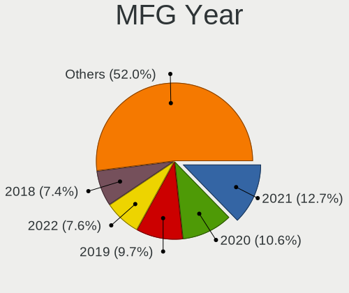
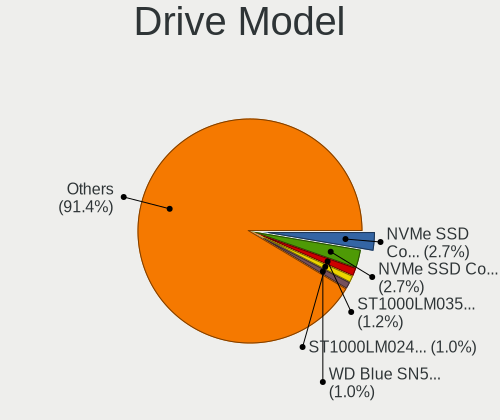
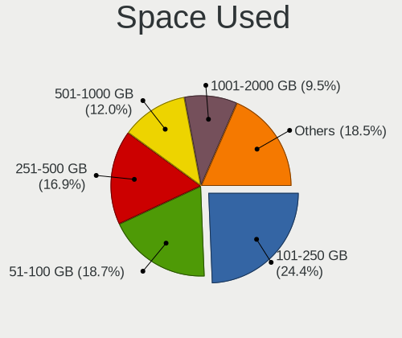
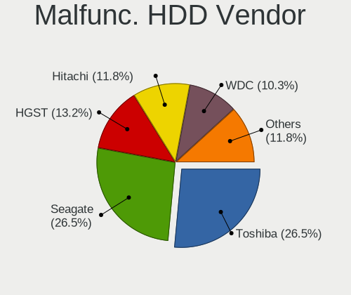
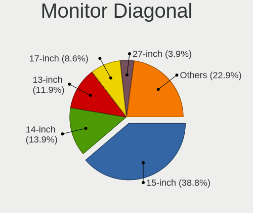
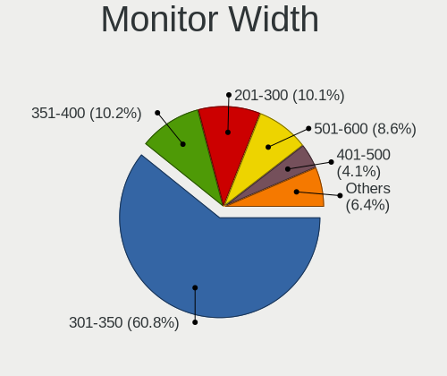

openSUSE - Tested Hardware & Statistics (Notebooks)
---------------------------------------------------

A project to collect tested hardware configurations for openSUSE.

Anyone can contribute to this report by the [hw-probe](https://github.com/linuxhw/hw-probe) tool:

    sudo -E hw-probe -all -upload

Please contribute! Especially if your hardware is rare.

Contents
--------

* [ Test Cases ](#test-cases)

* [ System ](#system)
  - [ OS                       ](#os)
  - [ OS Family                ](#os-family)
  - [ Kernel                   ](#kernel)
  - [ Kernel Family            ](#kernel-family)
  - [ Kernel Major Ver.        ](#kernel-major-ver)
  - [ Arch                     ](#arch)
  - [ DE                       ](#de)
  - [ Display Server           ](#display-server)
  - [ Display Manager          ](#display-manager)
  - [ OS Lang                  ](#os-lang)
  - [ Boot Mode                ](#boot-mode)
  - [ Filesystem               ](#filesystem)
  - [ Part. scheme             ](#part-scheme)
  - [ Dual Boot with Linux/BSD ](#dual-boot-with-linuxbsd)
  - [ Dual Boot (Win)          ](#dual-boot-win)

* [ Board ](#board)
  - [ Vendor                   ](#vendor)
  - [ Model                    ](#model)
  - [ Model Family             ](#model-family)
  - [ MFG Year                 ](#mfg-year)
  - [ Form Factor              ](#form-factor)
  - [ Secure Boot              ](#secure-boot)
  - [ Coreboot                 ](#coreboot)
  - [ RAM Size                 ](#ram-size)
  - [ RAM Used                 ](#ram-used)
  - [ Total Drives             ](#total-drives)
  - [ Has CD-ROM               ](#has-cd-rom)
  - [ Has Ethernet             ](#has-ethernet)
  - [ Has WiFi                 ](#has-wifi)
  - [ Has Bluetooth            ](#has-bluetooth)

* [ Location ](#location)
  - [ Country                  ](#country)
  - [ City                     ](#city)

* [ Drives ](#drives)
  - [ Drive Vendor             ](#drive-vendor)
  - [ Drive Model              ](#drive-model)
  - [ HDD Vendor               ](#hdd-vendor)
  - [ SSD Vendor               ](#ssd-vendor)
  - [ Drive Kind               ](#drive-kind)
  - [ Drive Connector          ](#drive-connector)
  - [ Drive Size               ](#drive-size)
  - [ Space Total              ](#space-total)
  - [ Space Used               ](#space-used)
  - [ Malfunc. Drives          ](#malfunc-drives)
  - [ Malfunc. Drive Vendor    ](#malfunc-drive-vendor)
  - [ Malfunc. HDD Vendor      ](#malfunc-hdd-vendor)
  - [ Malfunc. Drive Kind      ](#malfunc-drive-kind)
  - [ Failed Drives            ](#failed-drives)
  - [ Failed Drive Vendor      ](#failed-drive-vendor)
  - [ Drive Status             ](#drive-status)

* [ Storage controller ](#storage-controller)
  - [ Storage Vendor           ](#storage-vendor)
  - [ Storage Model            ](#storage-model)
  - [ Storage Kind             ](#storage-kind)

* [ Processor ](#processor)
  - [ CPU Vendor               ](#cpu-vendor)
  - [ CPU Model                ](#cpu-model)
  - [ CPU Model Family         ](#cpu-model-family)
  - [ CPU Cores                ](#cpu-cores)
  - [ CPU Sockets              ](#cpu-sockets)
  - [ CPU Threads              ](#cpu-threads)
  - [ CPU Op-Modes             ](#cpu-op-modes)
  - [ CPU Microcode            ](#cpu-microcode)
  - [ CPU Microarch            ](#cpu-microarch)

* [ Graphics ](#graphics)
  - [ GPU Vendor               ](#gpu-vendor)
  - [ GPU Model                ](#gpu-model)
  - [ GPU Combo                ](#gpu-combo)
  - [ GPU Driver               ](#gpu-driver)
  - [ GPU Memory               ](#gpu-memory)

* [ Monitor ](#monitor)
  - [ Monitor Vendor           ](#monitor-vendor)
  - [ Monitor Model            ](#monitor-model)
  - [ Monitor Resolution       ](#monitor-resolution)
  - [ Monitor Diagonal         ](#monitor-diagonal)
  - [ Monitor Width            ](#monitor-width)
  - [ Aspect Ratio             ](#aspect-ratio)
  - [ Monitor Area             ](#monitor-area)
  - [ Pixel Density            ](#pixel-density)
  - [ Multiple Monitors        ](#multiple-monitors)

* [ Network ](#network)
  - [ Net Controller Vendor    ](#net-controller-vendor)
  - [ Net Controller Model     ](#net-controller-model)
  - [ Wireless Vendor          ](#wireless-vendor)
  - [ Wireless Model           ](#wireless-model)
  - [ Ethernet Vendor          ](#ethernet-vendor)
  - [ Ethernet Model           ](#ethernet-model)
  - [ Net Controller Kind      ](#net-controller-kind)
  - [ Used Controller          ](#used-controller)
  - [ NICs                     ](#nics)
  - [ IPv6                     ](#ipv6)

* [ Bluetooth ](#bluetooth)
  - [ Bluetooth Vendor         ](#bluetooth-vendor)
  - [ Bluetooth Model          ](#bluetooth-model)

* [ Sound ](#sound)
  - [ Sound Vendor             ](#sound-vendor)
  - [ Sound Model              ](#sound-model)

* [ Memory ](#memory)
  - [ Memory Vendor            ](#memory-vendor)
  - [ Memory Model             ](#memory-model)
  - [ Memory Kind              ](#memory-kind)
  - [ Memory Form Factor       ](#memory-form-factor)
  - [ Memory Size              ](#memory-size)
  - [ Memory Speed             ](#memory-speed)

* [ Printers & scanners ](#printers--scanners)
  - [ Printer Vendor           ](#printer-vendor)
  - [ Printer Model            ](#printer-model)
  - [ Scanner Vendor           ](#scanner-vendor)
  - [ Scanner Model            ](#scanner-model)

* [ Camera ](#camera)
  - [ Camera Vendor            ](#camera-vendor)
  - [ Camera Model             ](#camera-model)

* [ Security ](#security)
  - [ Fingerprint Vendor       ](#fingerprint-vendor)
  - [ Fingerprint Model        ](#fingerprint-model)
  - [ Chipcard Vendor          ](#chipcard-vendor)
  - [ Chipcard Model           ](#chipcard-model)

* [ Unsupported ](#unsupported)
  - [ Unsupported Devices      ](#unsupported-devices)
  - [ Unsupported Device Types ](#unsupported-device-types)

Test Cases
----------

Total: 2776

| Vendor        | Model                       | Probe                                                      | Date         |
|---------------|-----------------------------|------------------------------------------------------------|--------------|
| ASUSTek       | ASUS Vivobook Pro 15 N65... | [7b915687fc](https://linux-hardware.org/?probe=7b915687fc) | Jan 06, 2025 |
| ASUSTek       | ASUS Vivobook Pro 15 N65... | [6ccd45a853](https://linux-hardware.org/?probe=6ccd45a853) | Jan 06, 2025 |
| Medion        | S6445 MD61489               | [7b72635681](https://linux-hardware.org/?probe=7b72635681) | Jan 05, 2025 |
| Infinix       | YL51A5                      | [17846f874a](https://linux-hardware.org/?probe=17846f874a) | Jan 05, 2025 |
| Dell          | Precision 5570              | [f2f2ed487a](https://linux-hardware.org/?probe=f2f2ed487a) | Jan 05, 2025 |
| Dell          | Precision 5570              | [ac97f0b0c6](https://linux-hardware.org/?probe=ac97f0b0c6) | Jan 05, 2025 |
| ASUSTek       | TUF Gaming FX505GT_FX505... | [4690fd028c](https://linux-hardware.org/?probe=4690fd028c) | Jan 01, 2025 |
| MSI           | Summit A16 AI+ A3HMTG       | [b064d5d8aa](https://linux-hardware.org/?probe=b064d5d8aa) | Jan 01, 2025 |
| Lenovo        | G570 4334                   | [3348b2741c](https://linux-hardware.org/?probe=3348b2741c) | Dec 30, 2024 |
| Lenovo        | ThinkBook 15 G2 ARE 20VG    | [79ccf16681](https://linux-hardware.org/?probe=79ccf16681) | Dec 30, 2024 |
| Lenovo        | G570 4334                   | [e3535c8fe8](https://linux-hardware.org/?probe=e3535c8fe8) | Dec 30, 2024 |
| Lenovo        | ThinkPad SL 2746EHG         | [c058e70d59](https://linux-hardware.org/?probe=c058e70d59) | Dec 30, 2024 |
| HP            | Laptop 17-cp0xxx            | [008153aaec](https://linux-hardware.org/?probe=008153aaec) | Dec 30, 2024 |
| ASUSTek       | X751SA                      | [11d8d9b891](https://linux-hardware.org/?probe=11d8d9b891) | Dec 30, 2024 |
| Acer          | Aspire A315-44P             | [cb17e760e0](https://linux-hardware.org/?probe=cb17e760e0) | Dec 29, 2024 |
| HP            | EliteBook 8470p             | [7eb67d9141](https://linux-hardware.org/?probe=7eb67d9141) | Dec 29, 2024 |
| ASUSTek       | X751SA                      | [2f216406f5](https://linux-hardware.org/?probe=2f216406f5) | Dec 28, 2024 |
| Lenovo        | IdeaPad 320-15AST 80XV      | [ee6916b202](https://linux-hardware.org/?probe=ee6916b202) | Dec 28, 2024 |
| Toshiba       | Satellite Pro L70-A         | [ea36b0013b](https://linux-hardware.org/?probe=ea36b0013b) | Dec 27, 2024 |
| Lenovo        | ThinkPad T16 Gen 3 21MN0... | [de8cfa5271](https://linux-hardware.org/?probe=de8cfa5271) | Dec 26, 2024 |
| HP            | EliteBook 840 G6            | [00cc148a0c](https://linux-hardware.org/?probe=00cc148a0c) | Dec 25, 2024 |
| HP            | EliteBook 840 G6            | [42a4a782de](https://linux-hardware.org/?probe=42a4a782de) | Dec 25, 2024 |
| Dell          | Inspiron 5748               | [b2fd13a760](https://linux-hardware.org/?probe=b2fd13a760) | Dec 25, 2024 |
| Dell          | Latitude E5550              | [2512980572](https://linux-hardware.org/?probe=2512980572) | Dec 25, 2024 |
| Lenovo        | ThinkBook 14 G6 IRL 21KG    | [bc6c76d79b](https://linux-hardware.org/?probe=bc6c76d79b) | Dec 25, 2024 |
| Lenovo        | ThinkPad T480 20L6SA0X00    | [89c4986258](https://linux-hardware.org/?probe=89c4986258) | Dec 25, 2024 |
| Lenovo        | ThinkPad T14s Gen 1 20UH... | [482027069e](https://linux-hardware.org/?probe=482027069e) | Dec 23, 2024 |
| HONOR         | BRI-XX                      | [ae2d835788](https://linux-hardware.org/?probe=ae2d835788) | Dec 22, 2024 |
| HP            | ZBook Fury 16 G9 Mobile ... | [bb06bc1384](https://linux-hardware.org/?probe=bb06bc1384) | Dec 22, 2024 |
| HP            | ProBook 445R G6             | [6a6dd0b802](https://linux-hardware.org/?probe=6a6dd0b802) | Dec 21, 2024 |
| Lenovo        | Legion 9 16IRX9 83G0        | [96010200a2](https://linux-hardware.org/?probe=96010200a2) | Dec 20, 2024 |
| Lenovo        | Legion 9 16IRX9 83G0        | [334c2447f9](https://linux-hardware.org/?probe=334c2447f9) | Dec 20, 2024 |
| Acer          | Swift SF314-54G             | [3f7732cb40](https://linux-hardware.org/?probe=3f7732cb40) | Dec 19, 2024 |
| Acer          | Swift SF314-54G             | [c2b2b94ff9](https://linux-hardware.org/?probe=c2b2b94ff9) | Dec 19, 2024 |
| ASUSTek       | VivoBook_ASUSLaptop X513... | [7ce6a920fc](https://linux-hardware.org/?probe=7ce6a920fc) | Dec 17, 2024 |
| Dell          | Inspiron 15 3525            | [53c39cb514](https://linux-hardware.org/?probe=53c39cb514) | Dec 15, 2024 |
| Toshiba       | Satellite U400              | [c38b4b8f12](https://linux-hardware.org/?probe=c38b4b8f12) | Dec 15, 2024 |
| Toshiba       | Satellite U400              | [0df632ce9a](https://linux-hardware.org/?probe=0df632ce9a) | Dec 15, 2024 |
| Dell          | Latitude 7400               | [79148dd5e2](https://linux-hardware.org/?probe=79148dd5e2) | Dec 14, 2024 |
| Lenovo        | IdeaPad Slim 3 15ABR8 82... | [2ff0334ff1](https://linux-hardware.org/?probe=2ff0334ff1) | Dec 14, 2024 |
| ASUSTek       | VivoBook_ASUSLaptop X540... | [188828cb26](https://linux-hardware.org/?probe=188828cb26) | Dec 14, 2024 |
| Dell          | Latitude 7490               | [94a563e506](https://linux-hardware.org/?probe=94a563e506) | Dec 13, 2024 |
| Razer         | Blade                       | [e4e19a2914](https://linux-hardware.org/?probe=e4e19a2914) | Dec 13, 2024 |
| Lenovo        | ThinkPad SL 2746EHG         | [af38d9b12e](https://linux-hardware.org/?probe=af38d9b12e) | Dec 12, 2024 |
| HP            | EliteBook 2560p             | [8638d65417](https://linux-hardware.org/?probe=8638d65417) | Dec 12, 2024 |
| Dell          | Latitude 7280               | [71afb40829](https://linux-hardware.org/?probe=71afb40829) | Dec 12, 2024 |
| Dell          | Latitude 7280               | [811c5c9b51](https://linux-hardware.org/?probe=811c5c9b51) | Dec 12, 2024 |
| Dell          | Latitude 5500               | [089651bb7e](https://linux-hardware.org/?probe=089651bb7e) | Dec 12, 2024 |
| ASUSTek       | X556UA                      | [12e9edd8a6](https://linux-hardware.org/?probe=12e9edd8a6) | Dec 11, 2024 |
| Lenovo        | ThinkPad T480 20L6S68A00    | [562b867ec6](https://linux-hardware.org/?probe=562b867ec6) | Dec 11, 2024 |
| Infinix       | ZERO BOOK 13                | [fa51c92790](https://linux-hardware.org/?probe=fa51c92790) | Dec 11, 2024 |
| HP            | Laptop 15-gw0xxx            | [cbf590d898](https://linux-hardware.org/?probe=cbf590d898) | Dec 11, 2024 |
| HP            | Laptop 15-gw0xxx            | [fc18ca43fa](https://linux-hardware.org/?probe=fc18ca43fa) | Dec 11, 2024 |
| Lenovo        | Legion 7 16IRX9 83FD        | [100ba1f308](https://linux-hardware.org/?probe=100ba1f308) | Dec 10, 2024 |
| Lenovo        | Y520-15IKBN 80WK            | [23c377735b](https://linux-hardware.org/?probe=23c377735b) | Dec 09, 2024 |
| Dell          | Latitude 7400               | [77befeb4ea](https://linux-hardware.org/?probe=77befeb4ea) | Dec 09, 2024 |
| ASUSTek       | ASUS TUF Gaming A15 FA50... | [dc2afedb8a](https://linux-hardware.org/?probe=dc2afedb8a) | Dec 08, 2024 |
| Dell          | Inspiron 15-3567            | [31df2faf94](https://linux-hardware.org/?probe=31df2faf94) | Dec 07, 2024 |
| HP            | EliteBook 845 G8 Noteboo... | [a81500a8d6](https://linux-hardware.org/?probe=a81500a8d6) | Dec 06, 2024 |
| Acer          | Aspire E5-576G              | [aeb8a7cb0e](https://linux-hardware.org/?probe=aeb8a7cb0e) | Dec 05, 2024 |
| Dell          | XPS 13 9310                 | [cf504cfd50](https://linux-hardware.org/?probe=cf504cfd50) | Dec 05, 2024 |
| Toshiba       | Satellite S55-C             | [d7586c9caa](https://linux-hardware.org/?probe=d7586c9caa) | Dec 05, 2024 |
| Dell          | Inspiron 15-3567            | [8abc9fa20f](https://linux-hardware.org/?probe=8abc9fa20f) | Dec 05, 2024 |
| Apple         | MacBookPro12,1              | [efe73932c5](https://linux-hardware.org/?probe=efe73932c5) | Dec 04, 2024 |
| Acer          | Aspire One 522              | [6890064fd0](https://linux-hardware.org/?probe=6890064fd0) | Dec 04, 2024 |
| Dell          | Inspiron 3583               | [21db2dc4ce](https://linux-hardware.org/?probe=21db2dc4ce) | Dec 03, 2024 |
| Acer          | Aspire One 522              | [0fddde7f57](https://linux-hardware.org/?probe=0fddde7f57) | Dec 03, 2024 |
| ASUSTek       | TUF Gaming FX505DT_FX505... | [010553b978](https://linux-hardware.org/?probe=010553b978) | Dec 03, 2024 |
| Lenovo        | Legion 5 Pro 16ITH6H 82J... | [215d0f836c](https://linux-hardware.org/?probe=215d0f836c) | Dec 02, 2024 |
| ASUSTek       | TUF Gaming FX505DT_FX505... | [ce23ae6c58](https://linux-hardware.org/?probe=ce23ae6c58) | Dec 01, 2024 |
| Lenovo        | ThinkPad P52 20MAS25B1F     | [03a115af9d](https://linux-hardware.org/?probe=03a115af9d) | Dec 01, 2024 |
| Lenovo        | ThinkPad E14 Gen 2 20T7S... | [eedc1ae95c](https://linux-hardware.org/?probe=eedc1ae95c) | Nov 28, 2024 |
| Lenovo        | ThinkPad T480 20L6SK2C00    | [1e4ff70d80](https://linux-hardware.org/?probe=1e4ff70d80) | Nov 28, 2024 |
| Lenovo        | ThinkPad T480 20L6SK2C00    | [985704d466](https://linux-hardware.org/?probe=985704d466) | Nov 28, 2024 |
| Lenovo        | ThinkPad T450s 20BXCTO1W... | [245f980110](https://linux-hardware.org/?probe=245f980110) | Nov 27, 2024 |
| Lenovo        | ThinkPad T16 Gen 3 21MN0... | [a0bb7e53d0](https://linux-hardware.org/?probe=a0bb7e53d0) | Nov 27, 2024 |
| Razer         | Blade                       | [e04499fb11](https://linux-hardware.org/?probe=e04499fb11) | Nov 24, 2024 |
| ASUSTek       | GL752VW                     | [4df66d6d25](https://linux-hardware.org/?probe=4df66d6d25) | Nov 23, 2024 |
| Acer          | Aspire A315-56              | [d52da57ed4](https://linux-hardware.org/?probe=d52da57ed4) | Nov 22, 2024 |
| Acer          | Aspire A315-56              | [8bcaa93bb4](https://linux-hardware.org/?probe=8bcaa93bb4) | Nov 22, 2024 |
| Lenovo        | ThinkBook 14 G3 ACL 21A2    | [ee736ff9b2](https://linux-hardware.org/?probe=ee736ff9b2) | Nov 21, 2024 |
| Toshiba       | Satellite Pro C50-A-1L6     | [aef1b82a78](https://linux-hardware.org/?probe=aef1b82a78) | Nov 20, 2024 |
| Acer          | Aspire ES1-731              | [1679b3abd5](https://linux-hardware.org/?probe=1679b3abd5) | Nov 20, 2024 |
| Infinix       | Y4 Max                      | [6d4386c347](https://linux-hardware.org/?probe=6d4386c347) | Nov 19, 2024 |
| HP            | 15                          | [5eaa43788f](https://linux-hardware.org/?probe=5eaa43788f) | Nov 18, 2024 |
| HP            | EliteBook 840 G1            | [775a4e3d49](https://linux-hardware.org/?probe=775a4e3d49) | Nov 17, 2024 |
| HP            | EliteBook 840 G1            | [cd9cf7bf34](https://linux-hardware.org/?probe=cd9cf7bf34) | Nov 17, 2024 |
| Lenovo        | ThinkPad E16 Gen 1 21JNS... | [fd6a5da806](https://linux-hardware.org/?probe=fd6a5da806) | Nov 17, 2024 |
| Acer          | Aspire A317-54              | [bf63a85231](https://linux-hardware.org/?probe=bf63a85231) | Nov 16, 2024 |
| Medion        | E15433                      | [d8fa665bcd](https://linux-hardware.org/?probe=d8fa665bcd) | Nov 15, 2024 |
| Lenovo        | ThinkPad L450 20DT0003MH    | [64603771ce](https://linux-hardware.org/?probe=64603771ce) | Nov 14, 2024 |
| HP            | Pavilion Laptop 15-cw1xx... | [3c549a908f](https://linux-hardware.org/?probe=3c549a908f) | Nov 14, 2024 |
| Positivo      | C8256AI-14                  | [509c3d8d69](https://linux-hardware.org/?probe=509c3d8d69) | Nov 14, 2024 |
| HP            | EliteBook 850 G5            | [3c3ef88749](https://linux-hardware.org/?probe=3c3ef88749) | Nov 13, 2024 |
| Lenovo        | ThinkPad T480 20L6S68A00    | [5dd8147a6b](https://linux-hardware.org/?probe=5dd8147a6b) | Nov 12, 2024 |
| HP            | Laptop 15s-eq1xxx           | [2ca5d70008](https://linux-hardware.org/?probe=2ca5d70008) | Nov 12, 2024 |
| Schenker      | XMG PRO 16 Studio (M24)     | [3863c274d8](https://linux-hardware.org/?probe=3863c274d8) | Nov 12, 2024 |
| Schenker      | XMG PRO 16 Studio (M24)     | [ecdba16ed1](https://linux-hardware.org/?probe=ecdba16ed1) | Nov 12, 2024 |
| Medion        | E15433                      | [05ec29cd01](https://linux-hardware.org/?probe=05ec29cd01) | Nov 11, 2024 |
| Lenovo        | Yoga Pro 14s ASP9 83HN      | [59d0ece152](https://linux-hardware.org/?probe=59d0ece152) | Nov 11, 2024 |
| Lenovo        | ThinkPad E16 Gen 1 21JNS... | [5695b15dac](https://linux-hardware.org/?probe=5695b15dac) | Nov 10, 2024 |
| HP            | OMEN by Laptop 15-ce0xx     | [386e8d6e8c](https://linux-hardware.org/?probe=386e8d6e8c) | Nov 10, 2024 |
| HP            | Pavilion Gaming Laptop 1... | [b5fbe784ce](https://linux-hardware.org/?probe=b5fbe784ce) | Nov 09, 2024 |
| Lenovo        | ThinkPad E15 Gen 3 20YHS... | [d808945b67](https://linux-hardware.org/?probe=d808945b67) | Nov 07, 2024 |
| ASUSTek       | ASUS EXPERTBOOK B1400CEA... | [2c197b5dba](https://linux-hardware.org/?probe=2c197b5dba) | Nov 07, 2024 |
| MSI           | Modern 15 B7M               | [50c6507ed8](https://linux-hardware.org/?probe=50c6507ed8) | Nov 07, 2024 |
| TUXEDO        | InfinityBook Pro Intel G... | [6dab5c3afe](https://linux-hardware.org/?probe=6dab5c3afe) | Nov 06, 2024 |
| Acer          | Aspire AL14-51M             | [8ff6a7a1cd](https://linux-hardware.org/?probe=8ff6a7a1cd) | Nov 05, 2024 |
| Acer          | Aspire AL14-51M             | [50b858616d](https://linux-hardware.org/?probe=50b858616d) | Nov 05, 2024 |
| Toshiba       | Satellite C55D-A            | [aa4ba3a227](https://linux-hardware.org/?probe=aa4ba3a227) | Nov 04, 2024 |
| Pegatron      | A15                         | [537f5599a8](https://linux-hardware.org/?probe=537f5599a8) | Nov 04, 2024 |
| Acer          | Aspire A314-42P             | [3b985cceae](https://linux-hardware.org/?probe=3b985cceae) | Nov 03, 2024 |
| ASUSTek       | ROG Zephyrus G16 GU603VV... | [d0fedae2fd](https://linux-hardware.org/?probe=d0fedae2fd) | Nov 02, 2024 |
| Lenovo        | ThinkPad T440s 20ARA1BSP... | [cb3caddfea](https://linux-hardware.org/?probe=cb3caddfea) | Nov 01, 2024 |
| HONOR         | BMH-WDX9                    | [c500bafec7](https://linux-hardware.org/?probe=c500bafec7) | Nov 01, 2024 |
| Lenovo        | ThinkPad W520 4282A34       | [9c2a644e93](https://linux-hardware.org/?probe=9c2a644e93) | Nov 01, 2024 |
| Lenovo        | Yoga Pro 14s ASP9 83HN      | [414716466d](https://linux-hardware.org/?probe=414716466d) | Oct 30, 2024 |
| Dell          | Inspiron 510m               | [5be797c401](https://linux-hardware.org/?probe=5be797c401) | Oct 28, 2024 |
| Dell          | Inspiron 510m               | [64a3a63aa6](https://linux-hardware.org/?probe=64a3a63aa6) | Oct 28, 2024 |
| MSI           | Katana 15 B13VEK            | [ad04a387f4](https://linux-hardware.org/?probe=ad04a387f4) | Oct 27, 2024 |
| Lenovo        | IdeaPad 330-15AST 81D6      | [b592bf3e31](https://linux-hardware.org/?probe=b592bf3e31) | Oct 26, 2024 |
| HP            | Notebook                    | [14ae1d2eda](https://linux-hardware.org/?probe=14ae1d2eda) | Oct 26, 2024 |
| HP            | Notebook                    | [f50f582dd0](https://linux-hardware.org/?probe=f50f582dd0) | Oct 26, 2024 |
| Lenovo        | ThinkPad X240 20ALA0NCJP    | [da905b3fdf](https://linux-hardware.org/?probe=da905b3fdf) | Oct 25, 2024 |
| Alienware     | x17 R2                      | [ead78bb072](https://linux-hardware.org/?probe=ead78bb072) | Oct 24, 2024 |
| ASUSTek       | ASUS EXPERTBOOK B1400CEA... | [c8c74572b4](https://linux-hardware.org/?probe=c8c74572b4) | Oct 24, 2024 |
| HP            | 15                          | [600bf00568](https://linux-hardware.org/?probe=600bf00568) | Oct 24, 2024 |
| Lenovo        | ThinkPad P14s Gen 5 AMD ... | [6771ee78ce](https://linux-hardware.org/?probe=6771ee78ce) | Oct 23, 2024 |
| Lenovo        | ThinkPad X240 20ALA0NCJP    | [ca3a28a903](https://linux-hardware.org/?probe=ca3a28a903) | Oct 23, 2024 |
| Google        | Candy                       | [2ee49236e0](https://linux-hardware.org/?probe=2ee49236e0) | Oct 23, 2024 |
| Lenovo        | IdeaPad 3 15ABA7 82RN       | [c393ac5f48](https://linux-hardware.org/?probe=c393ac5f48) | Oct 23, 2024 |
| ASUSTek       | Vivobook Go E1504GA_E150... | [a90ce8d899](https://linux-hardware.org/?probe=a90ce8d899) | Oct 23, 2024 |
| Alienware     | x17 R2                      | [9e6b5acd94](https://linux-hardware.org/?probe=9e6b5acd94) | Oct 22, 2024 |
| HP            | Pavilion 17                 | [e9fa4efce7](https://linux-hardware.org/?probe=e9fa4efce7) | Oct 20, 2024 |
| Dell          | Latitude 5510               | [5b7ffc59c4](https://linux-hardware.org/?probe=5b7ffc59c4) | Oct 20, 2024 |
| Wortmann      | 1220717_1470362             | [079ab5b33d](https://linux-hardware.org/?probe=079ab5b33d) | Oct 20, 2024 |
| Dell          | Vostro 15 3510              | [29c3d00679](https://linux-hardware.org/?probe=29c3d00679) | Oct 19, 2024 |
| Acer          | Aspire E5-573               | [52f3006e15](https://linux-hardware.org/?probe=52f3006e15) | Oct 18, 2024 |
| Lenovo        | ThinkPad T14 Gen 1 20UES... | [db6240abe4](https://linux-hardware.org/?probe=db6240abe4) | Oct 18, 2024 |
| Lenovo        | ThinkPad T16 Gen 2 21HH0... | [8adcd5ebfb](https://linux-hardware.org/?probe=8adcd5ebfb) | Oct 16, 2024 |
| Lenovo        | ThinkPad T460 20FN003LGE    | [2ab3d1b003](https://linux-hardware.org/?probe=2ab3d1b003) | Oct 13, 2024 |
| HP            | Victus by Gaming Laptop ... | [22f5d5656a](https://linux-hardware.org/?probe=22f5d5656a) | Oct 13, 2024 |
| Lenovo        | ThinkPad P14s Gen 3 21J5... | [c2b7075752](https://linux-hardware.org/?probe=c2b7075752) | Oct 12, 2024 |
| Acer          | Aspire E5-573G              | [5849ebaf14](https://linux-hardware.org/?probe=5849ebaf14) | Oct 12, 2024 |
| Sony          | SVE1712C5E                  | [0651450fd6](https://linux-hardware.org/?probe=0651450fd6) | Oct 12, 2024 |
| HP            | EliteBook 845 14 inch G1... | [54873dd543](https://linux-hardware.org/?probe=54873dd543) | Oct 11, 2024 |
| ASUSTek       | VivoBook_ASUSLaptop X513... | [e4750ebdbd](https://linux-hardware.org/?probe=e4750ebdbd) | Oct 11, 2024 |
| ASUSTek       | VivoBook_ASUSLaptop X513... | [514b67b5e4](https://linux-hardware.org/?probe=514b67b5e4) | Oct 11, 2024 |
| Acer          | Aspire A517-51              | [5111cb29f6](https://linux-hardware.org/?probe=5111cb29f6) | Oct 11, 2024 |
| Lenovo        | ThinkPad T470s 20HGS09L1... | [fe2f58f57e](https://linux-hardware.org/?probe=fe2f58f57e) | Oct 11, 2024 |
| Samsung       | 550XED                      | [aa44e7c959](https://linux-hardware.org/?probe=aa44e7c959) | Oct 11, 2024 |
| Samsung       | 550XED                      | [80d9bb413f](https://linux-hardware.org/?probe=80d9bb413f) | Oct 11, 2024 |
| Lenovo        | ThinkPad E16 Gen 1 21JNS... | [ecb9cea693](https://linux-hardware.org/?probe=ecb9cea693) | Oct 11, 2024 |
| Lenovo        | LOQ 15APH8 82XT             | [c5b7de1f56](https://linux-hardware.org/?probe=c5b7de1f56) | Oct 10, 2024 |
| MSI           | Raider GE78HX SmartTP 13... | [0e81f2c4f0](https://linux-hardware.org/?probe=0e81f2c4f0) | Oct 10, 2024 |
| Apple         | MacBookPro11,3              | [371b8d2d01](https://linux-hardware.org/?probe=371b8d2d01) | Oct 09, 2024 |
| Dell          | Precision 5530              | [19bfbd7cdb](https://linux-hardware.org/?probe=19bfbd7cdb) | Oct 09, 2024 |
| HP            | 2230s                       | [c75480284b](https://linux-hardware.org/?probe=c75480284b) | Oct 08, 2024 |
| HP            | 2230s                       | [8beefca2cb](https://linux-hardware.org/?probe=8beefca2cb) | Oct 08, 2024 |
| Acer          | Aspire A515-54              | [cb6a0fb6b2](https://linux-hardware.org/?probe=cb6a0fb6b2) | Oct 08, 2024 |
| Lenovo        | IdeaPad 3 15ALC6 82MF       | [746a5763bf](https://linux-hardware.org/?probe=746a5763bf) | Oct 08, 2024 |
| HP            | EliteBook 2570p             | [4167d934bb](https://linux-hardware.org/?probe=4167d934bb) | Oct 07, 2024 |
| Acer          | Aspire A315-58              | [55f15d5c81](https://linux-hardware.org/?probe=55f15d5c81) | Oct 07, 2024 |
| Dell          | G15 5530                    | [10ffd756e1](https://linux-hardware.org/?probe=10ffd756e1) | Oct 07, 2024 |
| Dell          | Inspiron 14 5420            | [d8efb3a203](https://linux-hardware.org/?probe=d8efb3a203) | Oct 07, 2024 |
| Lenovo        | ThinkPad P14s Gen 4 21K6... | [98df7ce1e0](https://linux-hardware.org/?probe=98df7ce1e0) | Oct 07, 2024 |
| HP            | 650                         | [905f6c797a](https://linux-hardware.org/?probe=905f6c797a) | Oct 06, 2024 |
| Dell          | G15 5530                    | [ed22a9795e](https://linux-hardware.org/?probe=ed22a9795e) | Oct 05, 2024 |
| Acer          | Swift SF314-56G             | [2bbadf63d0](https://linux-hardware.org/?probe=2bbadf63d0) | Oct 05, 2024 |
| HP            | 650                         | [27e7b4c24c](https://linux-hardware.org/?probe=27e7b4c24c) | Oct 04, 2024 |
| ASUSTek       | VivoBook_ASUSLaptop M160... | [c0753ecbb0](https://linux-hardware.org/?probe=c0753ecbb0) | Oct 04, 2024 |
| Avell         | 145                         | [bbc1c79572](https://linux-hardware.org/?probe=bbc1c79572) | Oct 03, 2024 |
| Lenovo        | ThinkPad T490 20N2000LSP    | [34c10e27fb](https://linux-hardware.org/?probe=34c10e27fb) | Oct 03, 2024 |
| Apple         | MacBookAir7,2               | [e5084d28dd](https://linux-hardware.org/?probe=e5084d28dd) | Oct 03, 2024 |
| Apple         | MacBookPro14,2              | [72082f6569](https://linux-hardware.org/?probe=72082f6569) | Oct 02, 2024 |
| Dell          | Latitude 7300               | [307f867fd2](https://linux-hardware.org/?probe=307f867fd2) | Oct 02, 2024 |
| Dell          | Latitude 7300               | [f7d7fa3792](https://linux-hardware.org/?probe=f7d7fa3792) | Oct 02, 2024 |
| HP            | EliteBook 2530p             | [d75b4282e9](https://linux-hardware.org/?probe=d75b4282e9) | Oct 01, 2024 |
| MSI           | Bravo 15 A4DCR              | [b5e329d643](https://linux-hardware.org/?probe=b5e329d643) | Oct 01, 2024 |
| Lenovo        | ThinkPad T440s 20ARA1BSP... | [0c4962e22d](https://linux-hardware.org/?probe=0c4962e22d) | Oct 01, 2024 |
| HP            | Pavilion g6                 | [810492a8e1](https://linux-hardware.org/?probe=810492a8e1) | Sep 30, 2024 |
| Lenovo        | ThinkPad X250 20CM004UGE    | [f8dbc06182](https://linux-hardware.org/?probe=f8dbc06182) | Sep 30, 2024 |
| HP            | EliteBook 2530p             | [52857f0cec](https://linux-hardware.org/?probe=52857f0cec) | Sep 30, 2024 |
| Lenovo        | ThinkPad T470 20HDCTO1WW    | [43f1954eac](https://linux-hardware.org/?probe=43f1954eac) | Sep 29, 2024 |
| Lenovo        | ThinkPad T470 20HDCTO1WW    | [811375e3ab](https://linux-hardware.org/?probe=811375e3ab) | Sep 29, 2024 |
| Apple         | MacBookPro14,3              | [d159b869bf](https://linux-hardware.org/?probe=d159b869bf) | Sep 29, 2024 |
| Apple         | MacBookPro14,3              | [0f3ef459af](https://linux-hardware.org/?probe=0f3ef459af) | Sep 29, 2024 |
| Emdoor        | AG958                       | [17ced8f305](https://linux-hardware.org/?probe=17ced8f305) | Sep 28, 2024 |
| HUAWEI        | CREM-WXX9                   | [ad69ef1f81](https://linux-hardware.org/?probe=ad69ef1f81) | Sep 27, 2024 |
| Dell          | Latitude E6320              | [5200f5e53a](https://linux-hardware.org/?probe=5200f5e53a) | Sep 27, 2024 |
| ASUSTek       | VivoBook_ASUSLaptop M360... | [9807a87520](https://linux-hardware.org/?probe=9807a87520) | Sep 26, 2024 |
| Google        | Candy                       | [1fd06c93d2](https://linux-hardware.org/?probe=1fd06c93d2) | Sep 26, 2024 |
| ASUSTek       | N75SL                       | [20a792d09d](https://linux-hardware.org/?probe=20a792d09d) | Sep 25, 2024 |
| Dell          | Latitude E6320              | [b62b3bf011](https://linux-hardware.org/?probe=b62b3bf011) | Sep 23, 2024 |
| HP            | Pavilion 17                 | [fa382cf68a](https://linux-hardware.org/?probe=fa382cf68a) | Sep 22, 2024 |
| HP            | Pavilion 17                 | [107d30d461](https://linux-hardware.org/?probe=107d30d461) | Sep 22, 2024 |
| TUXEDO        | InfinityBook S 14 v5        | [7a8109a1aa](https://linux-hardware.org/?probe=7a8109a1aa) | Sep 21, 2024 |
| Echips Imp... | Echips Arctic [F141UL]      | [eea4cde373](https://linux-hardware.org/?probe=eea4cde373) | Sep 21, 2024 |
| HP            | ProBook 4530s               | [d80120206b](https://linux-hardware.org/?probe=d80120206b) | Sep 18, 2024 |
| Lenovo        | ThinkPad P52 20MAS25B1F     | [53438d2ab8](https://linux-hardware.org/?probe=53438d2ab8) | Sep 18, 2024 |
| Lenovo        | IdeaPad 510-15ISK 80SR      | [26254c11a6](https://linux-hardware.org/?probe=26254c11a6) | Sep 18, 2024 |
| HP            | ENVY Laptop 17-cr0xxx       | [06497c9c50](https://linux-hardware.org/?probe=06497c9c50) | Sep 17, 2024 |
| Acer          | Aspire A315-59              | [013be1b290](https://linux-hardware.org/?probe=013be1b290) | Sep 16, 2024 |
| HP            | EliteBook 850 G1            | [d4775a99f9](https://linux-hardware.org/?probe=d4775a99f9) | Sep 16, 2024 |
| HP            | EliteBook 840 G6            | [0c2e0900d2](https://linux-hardware.org/?probe=0c2e0900d2) | Sep 15, 2024 |
| HUAWEI        | FLMH-XX                     | [9685dbfdc8](https://linux-hardware.org/?probe=9685dbfdc8) | Sep 15, 2024 |
| Lenovo        | IdeaPad Gaming 3 15IHU6 ... | [fa47254387](https://linux-hardware.org/?probe=fa47254387) | Sep 15, 2024 |
| Lenovo        | ThinkPad T480 20L6SJPJ00    | [ac38116df7](https://linux-hardware.org/?probe=ac38116df7) | Sep 15, 2024 |
| Notebook      | NLx0MU                      | [b2f408a54b](https://linux-hardware.org/?probe=b2f408a54b) | Sep 12, 2024 |
| MSI           | GP60 2OD                    | [67bea0cc3a](https://linux-hardware.org/?probe=67bea0cc3a) | Sep 12, 2024 |
| HP            | ENVY Laptop 17-cr0xxx       | [6cd5814619](https://linux-hardware.org/?probe=6cd5814619) | Sep 12, 2024 |
| ASUSTek       | UX390UAK                    | [470d1f4a43](https://linux-hardware.org/?probe=470d1f4a43) | Sep 12, 2024 |
| ASUSTek       | UX390UAK                    | [284c1bc958](https://linux-hardware.org/?probe=284c1bc958) | Sep 12, 2024 |
| Lenovo        | Legion Pro 5 16IRX8 82WK    | [5996ac2bac](https://linux-hardware.org/?probe=5996ac2bac) | Sep 11, 2024 |
| Dell          | Inspiron 3583               | [35acec26c2](https://linux-hardware.org/?probe=35acec26c2) | Sep 07, 2024 |
| HP            | Laptop 15s-fq5xxx           | [47144b3c90](https://linux-hardware.org/?probe=47144b3c90) | Sep 06, 2024 |
| Lenovo        | IdeaPad Slim 5 16AHP9 83... | [4edb703ebb](https://linux-hardware.org/?probe=4edb703ebb) | Sep 06, 2024 |
| HP            | Laptop 15s-fq5xxx           | [33d63d920b](https://linux-hardware.org/?probe=33d63d920b) | Sep 06, 2024 |
| Lenovo        | IdeaPad 530S-14IKB 81EU     | [ffa315e87c](https://linux-hardware.org/?probe=ffa315e87c) | Sep 05, 2024 |
| HP            | Pavilion g6                 | [f3bedec4ea](https://linux-hardware.org/?probe=f3bedec4ea) | Sep 05, 2024 |
| Sony          | VPCEH11FX                   | [76b181ca5c](https://linux-hardware.org/?probe=76b181ca5c) | Sep 03, 2024 |
| Acer          | Nitro AN517-51              | [8479755366](https://linux-hardware.org/?probe=8479755366) | Sep 02, 2024 |
| ASUSTek       | GL553VD                     | [bdaf9d87ea](https://linux-hardware.org/?probe=bdaf9d87ea) | Sep 01, 2024 |
| ASUSTek       | TUF Gaming FX505DU_FX95D... | [97e3fa911e](https://linux-hardware.org/?probe=97e3fa911e) | Sep 01, 2024 |
| Lenovo        | ThinkPad T14s Gen 1 20UH... | [5b0d4b477f](https://linux-hardware.org/?probe=5b0d4b477f) | Aug 31, 2024 |
| Lenovo        | ThinkPad T14s Gen 1 20UH... | [a838c7531c](https://linux-hardware.org/?probe=a838c7531c) | Aug 31, 2024 |
| HP            | EliteBook 845 14 inch G1... | [335972007d](https://linux-hardware.org/?probe=335972007d) | Aug 31, 2024 |
| ASUSTek       | VivoBook_ASUSLaptop K360... | [16656b68d9](https://linux-hardware.org/?probe=16656b68d9) | Aug 29, 2024 |
| Dell          | Latitude 7490               | [df0cac96b2](https://linux-hardware.org/?probe=df0cac96b2) | Aug 29, 2024 |
| Dell          | Latitude 7490               | [ee622e957a](https://linux-hardware.org/?probe=ee622e957a) | Aug 29, 2024 |
| Acer          | Nitro AN517-51              | [33ffbac3ac](https://linux-hardware.org/?probe=33ffbac3ac) | Aug 29, 2024 |
| Alienware     | M17xR4                      | [88ac52fe8d](https://linux-hardware.org/?probe=88ac52fe8d) | Aug 28, 2024 |
| Toshiba       | Satellite C45-A             | [1a81d7fa5c](https://linux-hardware.org/?probe=1a81d7fa5c) | Aug 26, 2024 |
| Lenovo        | ThinkPad X13 Gen 3 21BQA... | [ec631b8044](https://linux-hardware.org/?probe=ec631b8044) | Aug 26, 2024 |
| HP            | EliteBook 840 G6            | [d64269a41e](https://linux-hardware.org/?probe=d64269a41e) | Aug 26, 2024 |
| Acer          | Nitro AN515-42              | [a4ad90766e](https://linux-hardware.org/?probe=a4ad90766e) | Aug 26, 2024 |
| Lenovo        | Z710 20250                  | [b199061083](https://linux-hardware.org/?probe=b199061083) | Aug 25, 2024 |
| Lenovo        | Z710 20250                  | [4f5bbb6201](https://linux-hardware.org/?probe=4f5bbb6201) | Aug 25, 2024 |
| Acer          | Aspire A317-54              | [a730c0cefe](https://linux-hardware.org/?probe=a730c0cefe) | Aug 24, 2024 |
| Acer          | Aspire A317-54              | [1977bdf5cf](https://linux-hardware.org/?probe=1977bdf5cf) | Aug 24, 2024 |
| Lenovo        | ThinkPad X1 Carbon Gen 9... | [3e3d4c490f](https://linux-hardware.org/?probe=3e3d4c490f) | Aug 22, 2024 |
| Lenovo        | ThinkPad X1 Carbon Gen 9... | [e3bcd67d9c](https://linux-hardware.org/?probe=e3bcd67d9c) | Aug 22, 2024 |
| ASUSTek       | GL752VW                     | [7b575fa627](https://linux-hardware.org/?probe=7b575fa627) | Aug 21, 2024 |
| Dell          | Latitude 9430               | [4ac646d0d0](https://linux-hardware.org/?probe=4ac646d0d0) | Aug 21, 2024 |
| Dell          | Precision 3541              | [1c2a5e45f3](https://linux-hardware.org/?probe=1c2a5e45f3) | Aug 21, 2024 |
| Lenovo        | ThinkPad T16 Gen 2 21K7C... | [ad00735fac](https://linux-hardware.org/?probe=ad00735fac) | Aug 21, 2024 |
| HP            | EliteBook 840 G6            | [517209d8cc](https://linux-hardware.org/?probe=517209d8cc) | Aug 20, 2024 |
| Toshiba       | Satellite R945              | [4e4ca76ccf](https://linux-hardware.org/?probe=4e4ca76ccf) | Aug 19, 2024 |
| Gigabyte      | A7 K1                       | [330a543617](https://linux-hardware.org/?probe=330a543617) | Aug 18, 2024 |
| HP            | Laptop 15-dy5xxx            | [9cf3fc6e44](https://linux-hardware.org/?probe=9cf3fc6e44) | Aug 18, 2024 |
| HP            | Laptop 15-dy5xxx            | [eac5423ed7](https://linux-hardware.org/?probe=eac5423ed7) | Aug 18, 2024 |
| HP            | OMEN by Gaming Laptop 16... | [7e888f8c9e](https://linux-hardware.org/?probe=7e888f8c9e) | Aug 17, 2024 |
| Lenovo        | IdeaPad 3 15ITL6 82MD       | [3864206d01](https://linux-hardware.org/?probe=3864206d01) | Aug 17, 2024 |
| ASUSTek       | ASUS Vivobook S 14 M5406... | [c4fef6d124](https://linux-hardware.org/?probe=c4fef6d124) | Aug 16, 2024 |
| Lenovo        | IdeaPad 3 15ITL6 82MD       | [1f09456a76](https://linux-hardware.org/?probe=1f09456a76) | Aug 15, 2024 |
| Samsung       | 960XGK                      | [cdf44a1d17](https://linux-hardware.org/?probe=cdf44a1d17) | Aug 15, 2024 |
| HP            | Victus by Laptop 16-d1xx... | [ebb90795e6](https://linux-hardware.org/?probe=ebb90795e6) | Aug 15, 2024 |
| HP            | EliteBook 840 G6            | [197efdfd09](https://linux-hardware.org/?probe=197efdfd09) | Aug 14, 2024 |
| HP            | ZBook 17 G3                 | [d30aae10af](https://linux-hardware.org/?probe=d30aae10af) | Aug 14, 2024 |
| Acer          | Nitro AN515-45              | [54a3435959](https://linux-hardware.org/?probe=54a3435959) | Aug 14, 2024 |
| Dell          | Precision 3541              | [c5f2dba49c](https://linux-hardware.org/?probe=c5f2dba49c) | Aug 13, 2024 |
| ASUSTek       | ASUS EXPERTBOOK B1400CEA... | [c670222db7](https://linux-hardware.org/?probe=c670222db7) | Aug 12, 2024 |
| Toshiba       | Satellite M40X              | [64195764a9](https://linux-hardware.org/?probe=64195764a9) | Aug 11, 2024 |
| ASUSTek       | ROG Strix G512LV_G512LV     | [c458e7afeb](https://linux-hardware.org/?probe=c458e7afeb) | Aug 11, 2024 |
| HP            | ZBook 17 G3                 | [79077815da](https://linux-hardware.org/?probe=79077815da) | Aug 11, 2024 |
| Lenovo        | ThinkPad T480 20L6SK2E0N    | [874d542798](https://linux-hardware.org/?probe=874d542798) | Aug 11, 2024 |
| HP            | ZBook 17                    | [283449f61f](https://linux-hardware.org/?probe=283449f61f) | Aug 10, 2024 |
| ASUSTek       | ASUS TUF Gaming A15 FA50... | [6eb6d37a34](https://linux-hardware.org/?probe=6eb6d37a34) | Aug 10, 2024 |
| HP            | Laptop 15-gw0xxx            | [d087631352](https://linux-hardware.org/?probe=d087631352) | Aug 10, 2024 |
| Dell          | G5 5505                     | [c0bc033ada](https://linux-hardware.org/?probe=c0bc033ada) | Aug 09, 2024 |
| Dell          | Precision 7560              | [1c315d083a](https://linux-hardware.org/?probe=1c315d083a) | Aug 09, 2024 |
| HP            | Pavilion g7                 | [fb41962065](https://linux-hardware.org/?probe=fb41962065) | Aug 08, 2024 |
| HP            | Laptop 14-fq1xxx            | [0106285288](https://linux-hardware.org/?probe=0106285288) | Aug 08, 2024 |
| Lenovo        | Yoga Slim 7 Pro 14ACH5 O... | [f5b7613e5f](https://linux-hardware.org/?probe=f5b7613e5f) | Aug 06, 2024 |
| Dell          | Latitude 5500               | [485418a281](https://linux-hardware.org/?probe=485418a281) | Aug 05, 2024 |
| MSI           | Alpha 15 A3DDK              | [c40e59e663](https://linux-hardware.org/?probe=c40e59e663) | Aug 05, 2024 |
| Panasonic     | FZ40-1                      | [5efd2ae3b1](https://linux-hardware.org/?probe=5efd2ae3b1) | Aug 05, 2024 |
| Panasonic     | FZ40-1                      | [a8cf31fa9e](https://linux-hardware.org/?probe=a8cf31fa9e) | Aug 05, 2024 |
| MSI           | Alpha 15 A3DDK              | [022db633e9](https://linux-hardware.org/?probe=022db633e9) | Aug 03, 2024 |
| Dell          | Latitude 7400               | [830e4194f2](https://linux-hardware.org/?probe=830e4194f2) | Aug 02, 2024 |
| HP            | EliteBook 845 G8 Noteboo... | [ca42d2caea](https://linux-hardware.org/?probe=ca42d2caea) | Aug 01, 2024 |
| HP            | Laptop 17-cp1xxx            | [64461ea28c](https://linux-hardware.org/?probe=64461ea28c) | Aug 01, 2024 |
| ASUSTek       | VivoBook_ASUSLaptop M150... | [32d11d630e](https://linux-hardware.org/?probe=32d11d630e) | Aug 01, 2024 |
| HP            | ZBook Firefly 14 inch G1... | [1fe5d5a958](https://linux-hardware.org/?probe=1fe5d5a958) | Jul 31, 2024 |
| Lenovo        | ThinkPad T480 20L6S4KR06    | [b2cba3f872](https://linux-hardware.org/?probe=b2cba3f872) | Jul 31, 2024 |
| Lenovo        | ThinkPad T14s Gen 1 20UH... | [b1a07486dd](https://linux-hardware.org/?probe=b1a07486dd) | Jul 31, 2024 |
| HP            | Laptop 15s-eq0xxx           | [db857a7338](https://linux-hardware.org/?probe=db857a7338) | Jul 31, 2024 |
| HP            | ProBook 650 G8 Notebook ... | [fbcb71709e](https://linux-hardware.org/?probe=fbcb71709e) | Jul 30, 2024 |
| Dell          | Latitude 5320               | [ab0a7c1046](https://linux-hardware.org/?probe=ab0a7c1046) | Jul 30, 2024 |
| HP            | Laptop 17-cp1xxx            | [c27f226417](https://linux-hardware.org/?probe=c27f226417) | Jul 30, 2024 |
| HP            | Laptop 15s-fq2xxx           | [3eee89f1db](https://linux-hardware.org/?probe=3eee89f1db) | Jul 30, 2024 |
| HUAWEI        | RLEF-XX                     | [2169ee13f7](https://linux-hardware.org/?probe=2169ee13f7) | Jul 29, 2024 |
| ASUSTek       | TUF Gaming FX505GT_FX505... | [8ec0bcd37b](https://linux-hardware.org/?probe=8ec0bcd37b) | Jul 28, 2024 |
| Lenovo        | IdeaPad Gaming 3 15IHU6 ... | [1c6b17833f](https://linux-hardware.org/?probe=1c6b17833f) | Jul 27, 2024 |
| Alienware     | x15 R1                      | [e917bd3115](https://linux-hardware.org/?probe=e917bd3115) | Jul 25, 2024 |
| Lenovo        | ThinkPad T480 20L6S68A00    | [fa5820cb94](https://linux-hardware.org/?probe=fa5820cb94) | Jul 25, 2024 |
| Fujitsu       | LIFEBOOK E756               | [83394cc331](https://linux-hardware.org/?probe=83394cc331) | Jul 24, 2024 |
| Dell          | Latitude 5320               | [937747e0cd](https://linux-hardware.org/?probe=937747e0cd) | Jul 24, 2024 |
| HP            | EliteBook 850 G7 Noteboo... | [d32f73f43c](https://linux-hardware.org/?probe=d32f73f43c) | Jul 24, 2024 |
| Valve         | Jupiter                     | [86399982cc](https://linux-hardware.org/?probe=86399982cc) | Jul 20, 2024 |
| Dell          | Latitude 7490               | [08ca656ad8](https://linux-hardware.org/?probe=08ca656ad8) | Jul 20, 2024 |
| Dell          | Latitude 7490               | [618941109f](https://linux-hardware.org/?probe=618941109f) | Jul 20, 2024 |
| Chuwi         | FreeBook                    | [c0a077d454](https://linux-hardware.org/?probe=c0a077d454) | Jul 19, 2024 |
| Dell          | Latitude E6510              | [7bdf8e1d08](https://linux-hardware.org/?probe=7bdf8e1d08) | Jul 18, 2024 |
| Lenovo        | ThinkPad E16 Gen 2 21M5C... | [8b8ec83665](https://linux-hardware.org/?probe=8b8ec83665) | Jul 17, 2024 |
| ASUSTek       | TUF Gaming FX505DT_FX505... | [10cf68e11c](https://linux-hardware.org/?probe=10cf68e11c) | Jul 17, 2024 |
| ASUSTek       | TUF Gaming FX505DT_FX505... | [a23af86159](https://linux-hardware.org/?probe=a23af86159) | Jul 17, 2024 |
| SLIMBOOK      | EXCALIBUR-16-AMD8           | [3f8a6d3226](https://linux-hardware.org/?probe=3f8a6d3226) | Jul 17, 2024 |
| HP            | 15                          | [382f3aa7d4](https://linux-hardware.org/?probe=382f3aa7d4) | Jul 15, 2024 |
| Apple         | MacBookAir6,2               | [c57020bf53](https://linux-hardware.org/?probe=c57020bf53) | Jul 14, 2024 |
| ASUSTek       | T100TA                      | [fa3fbd0395](https://linux-hardware.org/?probe=fa3fbd0395) | Jul 12, 2024 |
| ASUSTek       | T100TA                      | [c0bf6bd622](https://linux-hardware.org/?probe=c0bf6bd622) | Jul 12, 2024 |
| ASUSTek       | VivoBook_ASUSLaptop M360... | [cda722f1de](https://linux-hardware.org/?probe=cda722f1de) | Jul 12, 2024 |
| ASUSTek       | ROG Zephyrus G14 GA401IU... | [fce5b7123b](https://linux-hardware.org/?probe=fce5b7123b) | Jul 11, 2024 |
| ASUSTek       | ASUS TUF Gaming F15 FX50... | [07242cb583](https://linux-hardware.org/?probe=07242cb583) | Jul 11, 2024 |
| ASUSTek       | ASUS TUF Gaming A16 FA61... | [e3f7eb350c](https://linux-hardware.org/?probe=e3f7eb350c) | Jul 09, 2024 |
| Lenovo        | ThinkPad T480 20L6S68A00    | [bd5250ba29](https://linux-hardware.org/?probe=bd5250ba29) | Jul 09, 2024 |
| HUAWEI        | CREF-XX                     | [eba6610b80](https://linux-hardware.org/?probe=eba6610b80) | Jul 08, 2024 |
| Dell          | Precision M6800             | [63f70ee6fc](https://linux-hardware.org/?probe=63f70ee6fc) | Jul 08, 2024 |
| HP            | Laptop 14-dk1xxx            | [984c7a103a](https://linux-hardware.org/?probe=984c7a103a) | Jul 08, 2024 |
| Samsung       | 340XAA/350XAA/550XAA        | [6bb78285d7](https://linux-hardware.org/?probe=6bb78285d7) | Jul 08, 2024 |
| HP            | ZBook Firefly 14 inch G1... | [a732acd70b](https://linux-hardware.org/?probe=a732acd70b) | Jul 05, 2024 |
| Lenovo        | ThinkPad X1 Carbon Gen 1... | [8dffe570b0](https://linux-hardware.org/?probe=8dffe570b0) | Jul 04, 2024 |
| Framework     | Laptop 13 (AMD Ryzen 704... | [64ffb533b1](https://linux-hardware.org/?probe=64ffb533b1) | Jul 02, 2024 |
| Notebook      | NKx0Kx                      | [b61f1206a6](https://linux-hardware.org/?probe=b61f1206a6) | Jul 01, 2024 |
| PC Special... | Elimina Iv 15               | [a48b631721](https://linux-hardware.org/?probe=a48b631721) | Jun 30, 2024 |
| Acer          | Aspire A515-54              | [8d693dcbf1](https://linux-hardware.org/?probe=8d693dcbf1) | Jun 28, 2024 |
| HP            | ZBook Firefly 14 inch G8... | [5e5b324a08](https://linux-hardware.org/?probe=5e5b324a08) | Jun 27, 2024 |
| Lenovo        | ThinkPad T470p 20J6003DG... | [ab192cfff2](https://linux-hardware.org/?probe=ab192cfff2) | Jun 27, 2024 |
| Dell          | XPS 15 9560                 | [35e993f1fc](https://linux-hardware.org/?probe=35e993f1fc) | Jun 26, 2024 |
| System76      | Galago Pro                  | [4d5b529ebf](https://linux-hardware.org/?probe=4d5b529ebf) | Jun 26, 2024 |
| Lenovo        | ThinkPad T480 20L6S68A00    | [5633eaa101](https://linux-hardware.org/?probe=5633eaa101) | Jun 25, 2024 |
| Inter Sale... | NID-11125DE                 | [ad493324a9](https://linux-hardware.org/?probe=ad493324a9) | Jun 23, 2024 |
| ASUSTek       | ASUS TUF Gaming F15 FX50... | [7fdf0f1e50](https://linux-hardware.org/?probe=7fdf0f1e50) | Jun 23, 2024 |
| Acer          | Aspire E1-571               | [554884bafe](https://linux-hardware.org/?probe=554884bafe) | Jun 23, 2024 |
| Dell          | Inspiron 5502               | [67990e04f0](https://linux-hardware.org/?probe=67990e04f0) | Jun 23, 2024 |
| Samsung       | R530/R730                   | [02dfdcedc8](https://linux-hardware.org/?probe=02dfdcedc8) | Jun 22, 2024 |
| Samsung       | R530/R730                   | [d4f6ab2a15](https://linux-hardware.org/?probe=d4f6ab2a15) | Jun 22, 2024 |
| Dell          | Precision M4700             | [d82cdd4c23](https://linux-hardware.org/?probe=d82cdd4c23) | Jun 22, 2024 |
| Dell          | Precision M4700             | [8b9f9895c2](https://linux-hardware.org/?probe=8b9f9895c2) | Jun 21, 2024 |
| Acer          | Swift SFX14-41G             | [2995bf268e](https://linux-hardware.org/?probe=2995bf268e) | Jun 21, 2024 |
| Dell          | Precision M6800             | [2b23b6d430](https://linux-hardware.org/?probe=2b23b6d430) | Jun 21, 2024 |
| Dell          | Precision M6800             | [1438b07511](https://linux-hardware.org/?probe=1438b07511) | Jun 21, 2024 |
| HP            | Pavilion Gaming Laptop 1... | [4769f15308](https://linux-hardware.org/?probe=4769f15308) | Jun 20, 2024 |
| HP            | ENVY 14                     | [c0be266fe2](https://linux-hardware.org/?probe=c0be266fe2) | Jun 18, 2024 |
| HP            | ENVY 14                     | [0838fecf0e](https://linux-hardware.org/?probe=0838fecf0e) | Jun 18, 2024 |
| Dell          | Inspiron 5502               | [10e4447596](https://linux-hardware.org/?probe=10e4447596) | Jun 18, 2024 |
| Razer         | Blade 15 (2022) - RZ09-0... | [496223d46d](https://linux-hardware.org/?probe=496223d46d) | Jun 18, 2024 |
| Toshiba       | Satellite P855              | [e3c736f4b8](https://linux-hardware.org/?probe=e3c736f4b8) | Jun 18, 2024 |
| HP            | Laptop 15s-fq0xxx           | [d406bb46f8](https://linux-hardware.org/?probe=d406bb46f8) | Jun 18, 2024 |
| Acer          | Aspire 6920                 | [02ad653359](https://linux-hardware.org/?probe=02ad653359) | Jun 17, 2024 |
| Notebook      | NS50_70MU                   | [dcd8f923f3](https://linux-hardware.org/?probe=dcd8f923f3) | Jun 16, 2024 |
| Toshiba       | Satellite P855              | [71b541e230](https://linux-hardware.org/?probe=71b541e230) | Jun 16, 2024 |
| HP            | ENVY Laptop 17-ae1xx        | [e3e68fbf69](https://linux-hardware.org/?probe=e3e68fbf69) | Jun 15, 2024 |
| ASUSTek       | ZenBook UX425IA_UM425IA     | [f50752193a](https://linux-hardware.org/?probe=f50752193a) | Jun 15, 2024 |
| HP            | Pavilion Notebook           | [d206663ba5](https://linux-hardware.org/?probe=d206663ba5) | Jun 14, 2024 |
| Framework     | Laptop 13 (AMD Ryzen 704... | [ed8e04ad1f](https://linux-hardware.org/?probe=ed8e04ad1f) | Jun 12, 2024 |
| Acer          | Aspire E5-552               | [de63cc3364](https://linux-hardware.org/?probe=de63cc3364) | Jun 12, 2024 |
| MSI           | Creator M14 A13VE           | [e75e7f1f73](https://linux-hardware.org/?probe=e75e7f1f73) | Jun 12, 2024 |
| Wortmann      | TERRA_MOBILE_1512/1712      | [925af4ca04](https://linux-hardware.org/?probe=925af4ca04) | Jun 11, 2024 |
| Wortmann      | TERRA_MOBILE_1512/1712      | [b80c7ef54c](https://linux-hardware.org/?probe=b80c7ef54c) | Jun 11, 2024 |
| Dell          | Precision M4800             | [c73aa7e615](https://linux-hardware.org/?probe=c73aa7e615) | Jun 11, 2024 |
| HP            | Victus by Laptop 16-e0xx... | [c9b9a5f54b](https://linux-hardware.org/?probe=c9b9a5f54b) | Jun 10, 2024 |
| SLIMBOOK      | EXCALIBUR-16-AMD7           | [5b9182e0c0](https://linux-hardware.org/?probe=5b9182e0c0) | Jun 10, 2024 |
| Dell          | Inspiron 3493               | [d62f8ebd78](https://linux-hardware.org/?probe=d62f8ebd78) | Jun 09, 2024 |
| Acer          | Aspire A315-44P             | [a6300b245c](https://linux-hardware.org/?probe=a6300b245c) | Jun 08, 2024 |
| HP            | Victus by Gaming Laptop ... | [39216d7b67](https://linux-hardware.org/?probe=39216d7b67) | Jun 06, 2024 |
| ASUSTek       | ROG Strix G713RW_G713RW     | [1b37e8f5f9](https://linux-hardware.org/?probe=1b37e8f5f9) | Jun 06, 2024 |
| HP            | Victus by Gaming Laptop ... | [bd8df104f0](https://linux-hardware.org/?probe=bd8df104f0) | Jun 06, 2024 |
| Acer          | Nitro AN515-58              | [a815a896fb](https://linux-hardware.org/?probe=a815a896fb) | Jun 05, 2024 |
| HP            | Pavilion Gaming Laptop 1... | [4f7d20b4da](https://linux-hardware.org/?probe=4f7d20b4da) | Jun 04, 2024 |
| Apple         | MacBookPro9,1               | [992174cd5e](https://linux-hardware.org/?probe=992174cd5e) | Jun 04, 2024 |
| Dell          | Precision M4500             | [b04b051024](https://linux-hardware.org/?probe=b04b051024) | Jun 04, 2024 |
| ASUSTek       | VivoBook_ASUSLaptop M360... | [19b496cedf](https://linux-hardware.org/?probe=19b496cedf) | Jun 04, 2024 |
| System76      | Galago Pro                  | [85ae0bfb0d](https://linux-hardware.org/?probe=85ae0bfb0d) | Jun 03, 2024 |
| LG Electro... | P1-J331P                    | [a24862e047](https://linux-hardware.org/?probe=a24862e047) | Jun 02, 2024 |
| LG Electro... | P1-J331P                    | [948cbb9a59](https://linux-hardware.org/?probe=948cbb9a59) | Jun 02, 2024 |
| HP            | 247 G8                      | [944d1d01e0](https://linux-hardware.org/?probe=944d1d01e0) | Jun 02, 2024 |
| Toshiba       | Satellite C670-12E          | [7c2e80d713](https://linux-hardware.org/?probe=7c2e80d713) | Jun 01, 2024 |
| ASUSTek       | UX303LAB                    | [b64b7b3f0f](https://linux-hardware.org/?probe=b64b7b3f0f) | Jun 01, 2024 |
| Lenovo        | B50-70 80EU                 | [185a04dd7e](https://linux-hardware.org/?probe=185a04dd7e) | Jun 01, 2024 |
| Apple         | MacBookPro8,1               | [805ca1382c](https://linux-hardware.org/?probe=805ca1382c) | May 31, 2024 |
| Digibras      | NH4CU03                     | [ed38e31a5a](https://linux-hardware.org/?probe=ed38e31a5a) | May 31, 2024 |
| Lenovo        | ThinkPad X1 Extreme 2nd ... | [37cfe7a8b1](https://linux-hardware.org/?probe=37cfe7a8b1) | May 30, 2024 |
| Lenovo        | IdeaPad S145-15AST 81N3     | [ce453ef020](https://linux-hardware.org/?probe=ce453ef020) | May 30, 2024 |
| Dell          | Latitude 3420               | [01c6b6be4b](https://linux-hardware.org/?probe=01c6b6be4b) | May 30, 2024 |
| Apple         | MacBookPro5,5               | [cd7d53020b](https://linux-hardware.org/?probe=cd7d53020b) | May 29, 2024 |
| Lenovo        | Legion Pro 7 16ARX8H 82W... | [5028f23eed](https://linux-hardware.org/?probe=5028f23eed) | May 28, 2024 |
| Lenovo        | ThinkBook 13x G4 IMH 21K... | [ce50ac6f09](https://linux-hardware.org/?probe=ce50ac6f09) | May 28, 2024 |
| Lenovo        | ThinkPad X240 20AMS39F0E    | [8c697fb84c](https://linux-hardware.org/?probe=8c697fb84c) | May 28, 2024 |
| Lenovo        | ThinkPad L15 Gen 3 21C30... | [54446d7877](https://linux-hardware.org/?probe=54446d7877) | May 28, 2024 |
| HP            | Laptop 15-ra0xx             | [0be312cffc](https://linux-hardware.org/?probe=0be312cffc) | May 28, 2024 |
| HP            | Laptop 15-dy5xxx            | [35c64c4906](https://linux-hardware.org/?probe=35c64c4906) | May 27, 2024 |
| Dell          | XPS 13 9300                 | [8eb4271be9](https://linux-hardware.org/?probe=8eb4271be9) | May 27, 2024 |
| HP            | Pavilion Gaming Laptop 1... | [14a14a76f1](https://linux-hardware.org/?probe=14a14a76f1) | May 26, 2024 |
| ASUSTek       | VivoBook_ASUSLaptop X705... | [aa9d0999c0](https://linux-hardware.org/?probe=aa9d0999c0) | May 26, 2024 |
| ASUSTek       | VivoBook_ASUSLaptop X160... | [621c3eb0bf](https://linux-hardware.org/?probe=621c3eb0bf) | May 26, 2024 |
| Dell          | Precision 7510              | [2732302a98](https://linux-hardware.org/?probe=2732302a98) | May 23, 2024 |
| Dell          | Precision 7510              | [f1f16c7457](https://linux-hardware.org/?probe=f1f16c7457) | May 23, 2024 |
| MSI           | Raider GE76 12UGS           | [170df74736](https://linux-hardware.org/?probe=170df74736) | May 23, 2024 |
| ASUSTek       | Zenbook UM3402YAR_UM3402... | [a2e639d9d5](https://linux-hardware.org/?probe=a2e639d9d5) | May 23, 2024 |
| HP            | ZBook 17 G3                 | [4ef68996e8](https://linux-hardware.org/?probe=4ef68996e8) | May 22, 2024 |
| SLIMBOOK      | EXCALIBUR-16-AMD7           | [aa1f7ff9ac](https://linux-hardware.org/?probe=aa1f7ff9ac) | May 21, 2024 |
| Apple         | MacBookPro8,1               | [77575f6126](https://linux-hardware.org/?probe=77575f6126) | May 20, 2024 |
| MSI           | Bravo 15 C7VE               | [fe445ba56f](https://linux-hardware.org/?probe=fe445ba56f) | May 19, 2024 |
| HP            | EliteBook 840 G3            | [ad7c6b6a36](https://linux-hardware.org/?probe=ad7c6b6a36) | May 19, 2024 |
| HP            | ProBook 6570b               | [4a36e6ae44](https://linux-hardware.org/?probe=4a36e6ae44) | May 18, 2024 |
| Lenovo        | Yoga Slim 7 ProX 14ARH7 ... | [71b182358a](https://linux-hardware.org/?probe=71b182358a) | May 18, 2024 |
| Gigabyte      | A7 K1                       | [fe2372e753](https://linux-hardware.org/?probe=fe2372e753) | May 18, 2024 |
| HP            | Dragonfly 13.5 inch G4 N... | [39e774051a](https://linux-hardware.org/?probe=39e774051a) | May 16, 2024 |
| Lenovo        | ThinkPad X1 Carbon 2nd 2... | [37000360b7](https://linux-hardware.org/?probe=37000360b7) | May 16, 2024 |
| ILLEGEAR      | RAVEN SE                    | [faac458723](https://linux-hardware.org/?probe=faac458723) | May 15, 2024 |
| Dell          | Vostro 5471                 | [2391d98e36](https://linux-hardware.org/?probe=2391d98e36) | May 15, 2024 |
| ASUSTek       | VivoBook_ASUSLaptop M360... | [9eb87e99e4](https://linux-hardware.org/?probe=9eb87e99e4) | May 15, 2024 |
| Dell          | Latitude 7400               | [3cb313cca0](https://linux-hardware.org/?probe=3cb313cca0) | May 15, 2024 |
| Dell          | Precision M4600             | [71e2d58ad1](https://linux-hardware.org/?probe=71e2d58ad1) | May 14, 2024 |
| Dell          | Precision 5540              | [1ac194f562](https://linux-hardware.org/?probe=1ac194f562) | May 14, 2024 |
| Dell          | XPS 13 9380                 | [c455fe7d68](https://linux-hardware.org/?probe=c455fe7d68) | May 14, 2024 |
| Lenovo        | ThinkBook 14 G2 ARE 20VF    | [10dff4042c](https://linux-hardware.org/?probe=10dff4042c) | May 14, 2024 |
| Dell          | Latitude 5401               | [43de298407](https://linux-hardware.org/?probe=43de298407) | May 14, 2024 |
| ILLEGEAR      | RAVEN SE                    | [97f3382524](https://linux-hardware.org/?probe=97f3382524) | May 14, 2024 |
| SGIN          | N156                        | [5ccf86b267](https://linux-hardware.org/?probe=5ccf86b267) | May 13, 2024 |
| Lenovo        | IdeaPad 5 Pro 14ARH7 82S... | [e7a8669eac](https://linux-hardware.org/?probe=e7a8669eac) | May 13, 2024 |
| PC Special... | Standard                    | [858e8eb153](https://linux-hardware.org/?probe=858e8eb153) | May 12, 2024 |
| Dell          | Inspiron 15 3520            | [8b28ea60c4](https://linux-hardware.org/?probe=8b28ea60c4) | May 11, 2024 |
| Acer          | Aspire V3-572P              | [36a52c0bd0](https://linux-hardware.org/?probe=36a52c0bd0) | May 10, 2024 |
| Lenovo        | ThinkPad T480 20L6S68A00    | [8395192b6e](https://linux-hardware.org/?probe=8395192b6e) | May 09, 2024 |
| ASUSTek       | VivoBook_ASUSLaptop X160... | [fce74afc84](https://linux-hardware.org/?probe=fce74afc84) | May 09, 2024 |
| MSI           | Bravo 15 C7VE               | [72ac11794b](https://linux-hardware.org/?probe=72ac11794b) | May 09, 2024 |
| Apple         | MacBookAir6,2               | [dc5b4c6be8](https://linux-hardware.org/?probe=dc5b4c6be8) | May 09, 2024 |
| ASUSTek       | VivoBook_ASUSLaptop K360... | [91ed38bf6d](https://linux-hardware.org/?probe=91ed38bf6d) | May 08, 2024 |
| Dell          | Precision 5560              | [9ad14a0547](https://linux-hardware.org/?probe=9ad14a0547) | May 08, 2024 |
| ASUSTek       | VivoBook_ASUSLaptop K650... | [dd5fb659cb](https://linux-hardware.org/?probe=dd5fb659cb) | May 08, 2024 |
| Dell          | Precision 5560              | [c9f03ecb24](https://linux-hardware.org/?probe=c9f03ecb24) | May 07, 2024 |
| Dell          | Latitude 3420               | [f0412b645c](https://linux-hardware.org/?probe=f0412b645c) | May 06, 2024 |
| Lenovo        | ThinkPad X200s 74695GU      | [9ea7304023](https://linux-hardware.org/?probe=9ea7304023) | May 06, 2024 |
| Lenovo        | IdeaPad 5 Pro 16ACH6 82L... | [94542ba081](https://linux-hardware.org/?probe=94542ba081) | May 05, 2024 |
| ASUSTek       | ROG Strix G513RC_G513RC     | [c41b2ac54b](https://linux-hardware.org/?probe=c41b2ac54b) | May 04, 2024 |
| Lenovo        | ThinkPad W510 4391W3V       | [dbf17c46bd](https://linux-hardware.org/?probe=dbf17c46bd) | May 04, 2024 |
| Apple         | MacBookPro9,2               | [7cf91d002b](https://linux-hardware.org/?probe=7cf91d002b) | May 04, 2024 |
| Acer          | Predator PHN16-71           | [8721113032](https://linux-hardware.org/?probe=8721113032) | May 04, 2024 |
| Lenovo        | ThinkBook 14 G6+ AHP 21L... | [bc762dbbd9](https://linux-hardware.org/?probe=bc762dbbd9) | May 02, 2024 |
| Lenovo        | B590 20206                  | [9c08740bb5](https://linux-hardware.org/?probe=9c08740bb5) | May 02, 2024 |
| ASUSTek       | TUF Gaming FX505DU_FX95D... | [c179f8fa01](https://linux-hardware.org/?probe=c179f8fa01) | May 01, 2024 |
| ASUSTek       | TUF Gaming FX505DU_FX95D... | [fd7c9392ce](https://linux-hardware.org/?probe=fd7c9392ce) | May 01, 2024 |
| Dell          | Inspiron 5559               | [8a00241444](https://linux-hardware.org/?probe=8a00241444) | May 01, 2024 |
| Medion        | P662X                       | [3689ca2476](https://linux-hardware.org/?probe=3689ca2476) | May 01, 2024 |
| Dell          | G5 5505                     | [190d435401](https://linux-hardware.org/?probe=190d435401) | May 01, 2024 |
| Wortmann      | TERRA_MOBILE_1749           | [cdfcbe795b](https://linux-hardware.org/?probe=cdfcbe795b) | May 01, 2024 |
| Lenovo        | ThinkPad L560 20F2S1P800    | [1718b0bf00](https://linux-hardware.org/?probe=1718b0bf00) | May 01, 2024 |
| Dell          | Latitude 7490               | [5e80dec6c8](https://linux-hardware.org/?probe=5e80dec6c8) | May 01, 2024 |
| Dell          | Inspiron 5748               | [43d176db3e](https://linux-hardware.org/?probe=43d176db3e) | Apr 29, 2024 |
| Acer          | Aspire 7741                 | [69f109864f](https://linux-hardware.org/?probe=69f109864f) | Apr 28, 2024 |
| Apple         | MacBookPro10,1              | [404e775920](https://linux-hardware.org/?probe=404e775920) | Apr 28, 2024 |
| Acer          | Swift SF314-43              | [eeb771fb99](https://linux-hardware.org/?probe=eeb771fb99) | Apr 28, 2024 |
| Lenovo        | ThinkPad L520 786035U       | [711272241a](https://linux-hardware.org/?probe=711272241a) | Apr 28, 2024 |
| HP            | EliteBook 830 G5            | [055d3d55a1](https://linux-hardware.org/?probe=055d3d55a1) | Apr 28, 2024 |
| Lenovo        | ThinkPad X13s Gen 1 21BY... | [93cbc84be7](https://linux-hardware.org/?probe=93cbc84be7) | Apr 26, 2024 |
| ASUSTek       | N751JK                      | [1d2d8c3d7a](https://linux-hardware.org/?probe=1d2d8c3d7a) | Apr 25, 2024 |
| Lenovo        | U31-70 80M5                 | [2a4ad09169](https://linux-hardware.org/?probe=2a4ad09169) | Apr 25, 2024 |
| Lenovo        | G510 20238                  | [ec99c46757](https://linux-hardware.org/?probe=ec99c46757) | Apr 25, 2024 |
| Dell          | Precision 3561              | [347e3ff8f6](https://linux-hardware.org/?probe=347e3ff8f6) | Apr 24, 2024 |
| HP            | Pavilion Gaming Laptop 1... | [d0dab98dcc](https://linux-hardware.org/?probe=d0dab98dcc) | Apr 24, 2024 |
| ASUSTek       | F9E                         | [18bf0f692e](https://linux-hardware.org/?probe=18bf0f692e) | Apr 23, 2024 |
| Dell          | Latitude 3420               | [918db208c4](https://linux-hardware.org/?probe=918db208c4) | Apr 23, 2024 |
| Acer          | Aspire 5750G                | [a35bd4ad42](https://linux-hardware.org/?probe=a35bd4ad42) | Apr 23, 2024 |
| HP            | Pavilion Laptop 15-cs0xx... | [d50544d577](https://linux-hardware.org/?probe=d50544d577) | Apr 23, 2024 |
| Lenovo        | ThinkPad P15 Gen 1 20SU0... | [3ccc4413fb](https://linux-hardware.org/?probe=3ccc4413fb) | Apr 22, 2024 |
| HP            | EliteBook 840 G6            | [6bebd095f0](https://linux-hardware.org/?probe=6bebd095f0) | Apr 22, 2024 |
| Lenovo        | Legion 5 Pro 16ACH6 82JS    | [8b5161f4ab](https://linux-hardware.org/?probe=8b5161f4ab) | Apr 22, 2024 |
| Apple         | MacBookPro8,1               | [ddba50f6df](https://linux-hardware.org/?probe=ddba50f6df) | Apr 22, 2024 |
| Dell          | Latitude 7490               | [5c2a2e98b4](https://linux-hardware.org/?probe=5c2a2e98b4) | Apr 22, 2024 |
| Lenovo        | ThinkPad X1 Carbon 2nd 2... | [62d4436d4e](https://linux-hardware.org/?probe=62d4436d4e) | Apr 21, 2024 |
| Lenovo        | ThinkPad X1 Carbon Gen 8... | [3639d72221](https://linux-hardware.org/?probe=3639d72221) | Apr 21, 2024 |
| HP            | EliteBook 840 G6            | [8bcd83b05a](https://linux-hardware.org/?probe=8bcd83b05a) | Apr 21, 2024 |
| Acer          | Swift SF314-512             | [2a5722f801](https://linux-hardware.org/?probe=2a5722f801) | Apr 21, 2024 |
| Lenovo        | IdeaPad Gaming 3 15ACH6 ... | [8cff3fe858](https://linux-hardware.org/?probe=8cff3fe858) | Apr 20, 2024 |
| Dell          | Latitude 3420               | [711edc1751](https://linux-hardware.org/?probe=711edc1751) | Apr 18, 2024 |
| HP            | ZBook 14u G6                | [6ceedde566](https://linux-hardware.org/?probe=6ceedde566) | Apr 18, 2024 |
| ASUSTek       | X55A                        | [92b3966e51](https://linux-hardware.org/?probe=92b3966e51) | Apr 18, 2024 |
| Lenovo        | ThinkPad T490 20N3SBU219    | [f9900101cc](https://linux-hardware.org/?probe=f9900101cc) | Apr 17, 2024 |
| LG Electro... | 16Z90P-G.AA75A              | [cba767dbe8](https://linux-hardware.org/?probe=cba767dbe8) | Apr 17, 2024 |
| Chuwi         | MiniBook X                  | [f3d26ec489](https://linux-hardware.org/?probe=f3d26ec489) | Apr 17, 2024 |
| ASUSTek       | VivoBook_ASUSLaptop M150... | [7597455fe9](https://linux-hardware.org/?probe=7597455fe9) | Apr 16, 2024 |
| ASUSTek       | N751JK                      | [39bb3da888](https://linux-hardware.org/?probe=39bb3da888) | Apr 16, 2024 |
| ASUSTek       | VivoBook_ASUSLaptop X515... | [d4e5c0b729](https://linux-hardware.org/?probe=d4e5c0b729) | Apr 16, 2024 |
| AXIOO         | NEON RNE                    | [a9f58cb42f](https://linux-hardware.org/?probe=a9f58cb42f) | Apr 16, 2024 |
| AXIOO         | NEON RNE                    | [e650f6d340](https://linux-hardware.org/?probe=e650f6d340) | Apr 16, 2024 |
| Sony          | SVE14A16FBW                 | [7f4b9fd407](https://linux-hardware.org/?probe=7f4b9fd407) | Apr 16, 2024 |
| Acer          | Aspire V3-572P              | [8664247893](https://linux-hardware.org/?probe=8664247893) | Apr 15, 2024 |
| Sony          | VPCCB4Q1E                   | [0aac47ae91](https://linux-hardware.org/?probe=0aac47ae91) | Apr 15, 2024 |
| Lenovo        | ThinkPad T480 20L6S68A00    | [d480b5dc92](https://linux-hardware.org/?probe=d480b5dc92) | Apr 15, 2024 |
| HP            | Laptop 17-ca0xxx            | [8a4f14c3c5](https://linux-hardware.org/?probe=8a4f14c3c5) | Apr 14, 2024 |
| PC Special... | Standard                    | [568cb066aa](https://linux-hardware.org/?probe=568cb066aa) | Apr 14, 2024 |
| Dell          | Inspiron 15 5510            | [6f93eb6232](https://linux-hardware.org/?probe=6f93eb6232) | Apr 14, 2024 |
| Acer          | Aspire V3-572P              | [541e26e0da](https://linux-hardware.org/?probe=541e26e0da) | Apr 13, 2024 |
| Lenovo        | ThinkPad T14s Gen 4 21F8... | [b29f521f01](https://linux-hardware.org/?probe=b29f521f01) | Apr 12, 2024 |
| HP            | Pavilion Laptop 15-cs0xx... | [40addd8c40](https://linux-hardware.org/?probe=40addd8c40) | Apr 12, 2024 |
| HP            | ProBook 650 G1              | [bea5a5fbf0](https://linux-hardware.org/?probe=bea5a5fbf0) | Apr 10, 2024 |
| HP            | EliteBook 2730p             | [843cd11924](https://linux-hardware.org/?probe=843cd11924) | Apr 10, 2024 |
| Fujitsu       | CELSIUS H780                | [f5dc0c7623](https://linux-hardware.org/?probe=f5dc0c7623) | Apr 10, 2024 |
| Dell          | Precision M4800             | [e0cd62ded2](https://linux-hardware.org/?probe=e0cd62ded2) | Apr 10, 2024 |
| Lenovo        | ThinkPad W510 4391W3V       | [9cf97a6441](https://linux-hardware.org/?probe=9cf97a6441) | Apr 09, 2024 |
| HP            | Victus by Gaming Laptop ... | [75b15c6330](https://linux-hardware.org/?probe=75b15c6330) | Apr 09, 2024 |
| Dell          | Precision 3561              | [6bc6a2a9d9](https://linux-hardware.org/?probe=6bc6a2a9d9) | Apr 09, 2024 |
| Dell          | Latitude E7240              | [08dd3e8b44](https://linux-hardware.org/?probe=08dd3e8b44) | Apr 09, 2024 |
| Framework     | Laptop 13 (AMD Ryzen 704... | [31a1ed634f](https://linux-hardware.org/?probe=31a1ed634f) | Apr 09, 2024 |
| ASUSTek       | K55VD                       | [8cc1b30bd1](https://linux-hardware.org/?probe=8cc1b30bd1) | Apr 09, 2024 |
| ASUSTek       | ROG Strix G513QY_G513QY     | [d856b1bbba](https://linux-hardware.org/?probe=d856b1bbba) | Apr 08, 2024 |
| Lenovo        | ThinkPad L13 Gen 2 20VJS... | [747b239a5e](https://linux-hardware.org/?probe=747b239a5e) | Apr 08, 2024 |
| Dell          | Latitude E7450              | [80c9756b52](https://linux-hardware.org/?probe=80c9756b52) | Apr 08, 2024 |
| HP            | Pavilion Laptop 15-cw1xx... | [a896a98b68](https://linux-hardware.org/?probe=a896a98b68) | Apr 07, 2024 |
| HP            | Pavilion Laptop 15-cw1xx... | [a372d941e8](https://linux-hardware.org/?probe=a372d941e8) | Apr 07, 2024 |
| Timi          | RedmiBook Pro 14S           | [31ba113e59](https://linux-hardware.org/?probe=31ba113e59) | Apr 06, 2024 |
| Acer          | Aspire V3-572P              | [e4cc62041e](https://linux-hardware.org/?probe=e4cc62041e) | Apr 06, 2024 |
| Acer          | Aspire V3-572P              | [8f10a9f724](https://linux-hardware.org/?probe=8f10a9f724) | Apr 06, 2024 |
| MSI           | Summit E13FlipEvo A11MT     | [3c1bd6247c](https://linux-hardware.org/?probe=3c1bd6247c) | Apr 06, 2024 |
| Dell          | Latitude 5411               | [c4b5b0e4e2](https://linux-hardware.org/?probe=c4b5b0e4e2) | Apr 06, 2024 |
| Lenovo        | B5400 80B6QB0               | [a4b339c03e](https://linux-hardware.org/?probe=a4b339c03e) | Apr 05, 2024 |
| Dell          | Latitude 5411               | [5b71370c46](https://linux-hardware.org/?probe=5b71370c46) | Apr 05, 2024 |
| HP            | Laptop 15-dw3xxx            | [e009d9dd56](https://linux-hardware.org/?probe=e009d9dd56) | Apr 05, 2024 |
| HP            | Pavilion Laptop 14-ec1xx... | [2e54390ec0](https://linux-hardware.org/?probe=2e54390ec0) | Apr 03, 2024 |
| ASUSTek       | ROG Strix G731GU_G731GU     | [8dfb911855](https://linux-hardware.org/?probe=8dfb911855) | Apr 03, 2024 |
| HP            | ProBook 4530s               | [1afc60a478](https://linux-hardware.org/?probe=1afc60a478) | Apr 03, 2024 |
| Dell          | Latitude 3420               | [b25404125f](https://linux-hardware.org/?probe=b25404125f) | Apr 03, 2024 |
| Lenovo        | ThinkPad T14 Gen 3 21AJS... | [708291ee28](https://linux-hardware.org/?probe=708291ee28) | Apr 02, 2024 |
| MSI           | GE75 Raider 10SF            | [9abe5807cf](https://linux-hardware.org/?probe=9abe5807cf) | Apr 02, 2024 |
| HP            | Laptop 17-cp0xxx            | [05643228c4](https://linux-hardware.org/?probe=05643228c4) | Apr 02, 2024 |
| Lenovo        | ThinkPad E15 Gen 3 20YG0... | [effac14d53](https://linux-hardware.org/?probe=effac14d53) | Apr 02, 2024 |
| Lenovo        | ThinkPad L15 Gen 3 21C3C... | [c93fd72584](https://linux-hardware.org/?probe=c93fd72584) | Apr 01, 2024 |
| HP            | ZBook 15 G3                 | [871f096cb4](https://linux-hardware.org/?probe=871f096cb4) | Apr 01, 2024 |
| Clevo         | W240HU/W250HUQ              | [d9af69f439](https://linux-hardware.org/?probe=d9af69f439) | Apr 01, 2024 |
| HP            | Laptop 15s-eq2xxx           | [70b2aa3d03](https://linux-hardware.org/?probe=70b2aa3d03) | Mar 31, 2024 |
| Toshiba       | Satellite C50-A-12K         | [ccda000bd9](https://linux-hardware.org/?probe=ccda000bd9) | Mar 31, 2024 |
| HP            | Laptop 17-by3xxx            | [a027e6d87b](https://linux-hardware.org/?probe=a027e6d87b) | Mar 31, 2024 |
| Lenovo        | Legion Pro 5 16ARX8 82WM    | [18e0911b3a](https://linux-hardware.org/?probe=18e0911b3a) | Mar 31, 2024 |
| Apple         | MacBookAir4,2               | [9dce51f88e](https://linux-hardware.org/?probe=9dce51f88e) | Mar 31, 2024 |
| Acer          | Swift SF514-54T             | [5bced3bdd2](https://linux-hardware.org/?probe=5bced3bdd2) | Mar 30, 2024 |
| HP            | ZBook 15u G4                | [3ef68ce7c8](https://linux-hardware.org/?probe=3ef68ce7c8) | Mar 29, 2024 |
| Apple         | MacBookPro9,1               | [a5715d4c3e](https://linux-hardware.org/?probe=a5715d4c3e) | Mar 28, 2024 |
| Lenovo        | ThinkBook 15 G2 ITL 20VE    | [953610ee17](https://linux-hardware.org/?probe=953610ee17) | Mar 28, 2024 |
| Lenovo        | ThinkPad X1 Extreme 20MF... | [8a0cc4298d](https://linux-hardware.org/?probe=8a0cc4298d) | Mar 28, 2024 |
| Lenovo        | V14 G3 IAP 82TS             | [fd2f12c510](https://linux-hardware.org/?probe=fd2f12c510) | Mar 28, 2024 |
| Lenovo        | ThinkPad X1 Extreme 20MF... | [70acca3c58](https://linux-hardware.org/?probe=70acca3c58) | Mar 27, 2024 |
| Lenovo        | ThinkPad T16 Gen 1 21BWS... | [b0c568a57a](https://linux-hardware.org/?probe=b0c568a57a) | Mar 27, 2024 |
| Lenovo        | ThinkPad T16 Gen 1 21BWS... | [d055521ca4](https://linux-hardware.org/?probe=d055521ca4) | Mar 27, 2024 |
| Dell          | Latitude 5430               | [85d5f988c9](https://linux-hardware.org/?probe=85d5f988c9) | Mar 26, 2024 |
| Dell          | Venue 11 Pro 7130 vPro      | [2315863014](https://linux-hardware.org/?probe=2315863014) | Mar 26, 2024 |
| Apple         | MacBookPro8,1               | [343977b6e1](https://linux-hardware.org/?probe=343977b6e1) | Mar 26, 2024 |
| Lenovo        | ThinkPad X1 Nano Gen 3 2... | [aba0acd44f](https://linux-hardware.org/?probe=aba0acd44f) | Mar 26, 2024 |
| Toshiba       | Satellite L655              | [d9c0898fe1](https://linux-hardware.org/?probe=d9c0898fe1) | Mar 26, 2024 |
| Apple         | MacBookPro8,1               | [3bb66ab23c](https://linux-hardware.org/?probe=3bb66ab23c) | Mar 26, 2024 |
| Toshiba       | Satellite L655              | [a30029d9ed](https://linux-hardware.org/?probe=a30029d9ed) | Mar 26, 2024 |
| ASUSTek       | GL553VD                     | [4ff584a0d8](https://linux-hardware.org/?probe=4ff584a0d8) | Mar 25, 2024 |
| Medion        | E6232                       | [15ab49b13b](https://linux-hardware.org/?probe=15ab49b13b) | Mar 25, 2024 |
| Dynabook      | Satellite Pro C50-G-101     | [298381401f](https://linux-hardware.org/?probe=298381401f) | Mar 25, 2024 |
| Dell          | Vostro 3520                 | [233178d530](https://linux-hardware.org/?probe=233178d530) | Mar 25, 2024 |
| Dell          | Latitude E7440              | [cc5ef95d09](https://linux-hardware.org/?probe=cc5ef95d09) | Mar 24, 2024 |
| Lenovo        | B590 20206                  | [d3e9088b43](https://linux-hardware.org/?probe=d3e9088b43) | Mar 23, 2024 |
| Lenovo        | B590 20206                  | [36c66318b0](https://linux-hardware.org/?probe=36c66318b0) | Mar 22, 2024 |
| HP            | ProBook 4545s               | [d377f5f133](https://linux-hardware.org/?probe=d377f5f133) | Mar 21, 2024 |
| Dell          | G7 7790                     | [6488d5dbe5](https://linux-hardware.org/?probe=6488d5dbe5) | Mar 21, 2024 |
| Dell          | Precision 5520              | [8d942977e2](https://linux-hardware.org/?probe=8d942977e2) | Mar 20, 2024 |
| HP            | 650                         | [f00b383a45](https://linux-hardware.org/?probe=f00b383a45) | Mar 20, 2024 |
| Lenovo        | ThinkPad S5-S540 20B3007... | [6a76956698](https://linux-hardware.org/?probe=6a76956698) | Mar 19, 2024 |
| Dell          | G7 7790                     | [58718acc5f](https://linux-hardware.org/?probe=58718acc5f) | Mar 19, 2024 |
| HP            | ProBook 635 Aero G8 Note... | [96e1c92c7f](https://linux-hardware.org/?probe=96e1c92c7f) | Mar 19, 2024 |
| HP            | ProBook 650 G3              | [546158e937](https://linux-hardware.org/?probe=546158e937) | Mar 18, 2024 |
| HP            | 15                          | [baf68c5fa1](https://linux-hardware.org/?probe=baf68c5fa1) | Mar 18, 2024 |
| Lenovo        | ThinkPad X270 W10DG 20K6... | [153f16ac8d](https://linux-hardware.org/?probe=153f16ac8d) | Mar 18, 2024 |
| Dell          | XPS 9320                    | [8e33c8b2a6](https://linux-hardware.org/?probe=8e33c8b2a6) | Mar 18, 2024 |
| Lenovo        | ThinkBook 15 G4 IAP 21DJ    | [0e826ebda8](https://linux-hardware.org/?probe=0e826ebda8) | Mar 17, 2024 |
| Lenovo        | ThinkPad E14 Gen 3 20YD0... | [642984d668](https://linux-hardware.org/?probe=642984d668) | Mar 17, 2024 |
| Framework     | Laptop 13 (AMD Ryzen 704... | [664d7ed4b2](https://linux-hardware.org/?probe=664d7ed4b2) | Mar 17, 2024 |
| ASUSTek       | VivoBook_ASUSLaptop K340... | [dabfa8c2b3](https://linux-hardware.org/?probe=dabfa8c2b3) | Mar 16, 2024 |
| Acer          | Aspire 5745                 | [512b58fc90](https://linux-hardware.org/?probe=512b58fc90) | Mar 16, 2024 |
| HP            | 15                          | [e0ef11bdb3](https://linux-hardware.org/?probe=e0ef11bdb3) | Mar 15, 2024 |
| Lenovo        | ThinkPad E550 20DF00D0GE    | [7d8bd6efb8](https://linux-hardware.org/?probe=7d8bd6efb8) | Mar 15, 2024 |
| Acer          | Nitro AN515-52              | [08be28ac58](https://linux-hardware.org/?probe=08be28ac58) | Mar 15, 2024 |
| Apple         | MacBookPro9,2               | [174ace72e6](https://linux-hardware.org/?probe=174ace72e6) | Mar 15, 2024 |
| Lenovo        | ThinkPad E15 20RD005HUS     | [19a5380b1f](https://linux-hardware.org/?probe=19a5380b1f) | Mar 14, 2024 |
| Lenovo        | ThinkPad P52 20MAS25B1F     | [44bb5690d8](https://linux-hardware.org/?probe=44bb5690d8) | Mar 14, 2024 |
| Acer          | Aspire F5-573G              | [88c712b08c](https://linux-hardware.org/?probe=88c712b08c) | Mar 12, 2024 |
| Lenovo        | Legion 5 15ACH6 82JW        | [d48824b8c0](https://linux-hardware.org/?probe=d48824b8c0) | Mar 12, 2024 |
| Schenker      | KEY (E23)                   | [f555bec75a](https://linux-hardware.org/?probe=f555bec75a) | Mar 12, 2024 |
| Lenovo        | Y520-15IKBN 80WK            | [1e7f921f12](https://linux-hardware.org/?probe=1e7f921f12) | Mar 12, 2024 |
| HP            | Laptop 15s-fq2xxx           | [2cbb5c3c0d](https://linux-hardware.org/?probe=2cbb5c3c0d) | Mar 11, 2024 |
| Acer          | TravelMate P215-54          | [a8e5c041ef](https://linux-hardware.org/?probe=a8e5c041ef) | Mar 11, 2024 |
| Dell          | Latitude E6330              | [98ef64e2ee](https://linux-hardware.org/?probe=98ef64e2ee) | Mar 11, 2024 |
| Lenovo        | IdeaPad 3 15ARE05 81W4      | [b7cd7e8cc4](https://linux-hardware.org/?probe=b7cd7e8cc4) | Mar 10, 2024 |
| Medion        | E4253 MD61110               | [58e65139f8](https://linux-hardware.org/?probe=58e65139f8) | Mar 10, 2024 |
| MSI           | Bravo 15 C7VE               | [f804a72847](https://linux-hardware.org/?probe=f804a72847) | Mar 10, 2024 |
| Google        | Osiris                      | [63af5b0ca2](https://linux-hardware.org/?probe=63af5b0ca2) | Mar 10, 2024 |
| HP            | 250 G7 Notebook PC          | [55f76326e3](https://linux-hardware.org/?probe=55f76326e3) | Mar 10, 2024 |
| ASUSTek       | VivoBook_ASUSLaptop M150... | [3529da3bcf](https://linux-hardware.org/?probe=3529da3bcf) | Mar 10, 2024 |
| HP            | EliteBook 8570w             | [4b83d77529](https://linux-hardware.org/?probe=4b83d77529) | Mar 10, 2024 |
| Lenovo        | ThinkPad T490 20N3S5DV00    | [4e73bc74c4](https://linux-hardware.org/?probe=4e73bc74c4) | Mar 09, 2024 |
| Acer          | Aspire V3-772               | [e7e568da74](https://linux-hardware.org/?probe=e7e568da74) | Mar 08, 2024 |
| HP            | Pavilion Gaming Laptop 1... | [41254913e2](https://linux-hardware.org/?probe=41254913e2) | Mar 08, 2024 |
| HP            | ProBook 650 G2              | [c99a1426a1](https://linux-hardware.org/?probe=c99a1426a1) | Mar 07, 2024 |
| MSI           | GL73 8RC                    | [18e3ecc518](https://linux-hardware.org/?probe=18e3ecc518) | Mar 06, 2024 |
| MSI           | GL73 8RC                    | [7081f4b3e7](https://linux-hardware.org/?probe=7081f4b3e7) | Mar 06, 2024 |
| MSI           | GE75 Raider 10SF            | [e5dc2ed61d](https://linux-hardware.org/?probe=e5dc2ed61d) | Mar 06, 2024 |
| System76      | Oryx Pro                    | [f00bf86716](https://linux-hardware.org/?probe=f00bf86716) | Mar 06, 2024 |
| MSI           | Bravo 15 C7VE               | [0ab92b4e2b](https://linux-hardware.org/?probe=0ab92b4e2b) | Mar 05, 2024 |
| Lenovo        | IdeaPad S340-15IIL 81VW     | [66f2f3a361](https://linux-hardware.org/?probe=66f2f3a361) | Mar 04, 2024 |
| Lenovo        | IdeaPad S340-15IIL 81VW     | [3ab9b49b3e](https://linux-hardware.org/?probe=3ab9b49b3e) | Mar 04, 2024 |
| Framework     | Laptop 13 (AMD Ryzen 704... | [698fff5e0e](https://linux-hardware.org/?probe=698fff5e0e) | Mar 04, 2024 |
| MSI           | Katana GF66 11UE            | [95b3dd2821](https://linux-hardware.org/?probe=95b3dd2821) | Mar 03, 2024 |
| Lenovo        | ThinkPad P1 Gen 5 21DDS0... | [c161ffb448](https://linux-hardware.org/?probe=c161ffb448) | Mar 03, 2024 |
| Lenovo        | ThinkPad X250 20CLS5KN00    | [51414251c8](https://linux-hardware.org/?probe=51414251c8) | Mar 03, 2024 |
| Lenovo        | ThinkPad E15 20RD005HUS     | [761e11bc9b](https://linux-hardware.org/?probe=761e11bc9b) | Mar 03, 2024 |
| Dell          | XPS 9320                    | [037c343f1f](https://linux-hardware.org/?probe=037c343f1f) | Mar 02, 2024 |
| Acer          | Aspire A315-58              | [6286320fc9](https://linux-hardware.org/?probe=6286320fc9) | Mar 02, 2024 |
| Lenovo        | IdeaPad Gaming 3 15ACH6 ... | [668074ddb5](https://linux-hardware.org/?probe=668074ddb5) | Mar 01, 2024 |
| Dell          | Latitude 7300               | [21fe8b5d70](https://linux-hardware.org/?probe=21fe8b5d70) | Feb 29, 2024 |
| Acer          | Aspire 5742Z                | [22ba0ca014](https://linux-hardware.org/?probe=22ba0ca014) | Feb 29, 2024 |
| HP            | Pavilion dv9500             | [233bd911e6](https://linux-hardware.org/?probe=233bd911e6) | Feb 28, 2024 |
| Lenovo        | ThinkPad L530 24814YG       | [41599a23c0](https://linux-hardware.org/?probe=41599a23c0) | Feb 28, 2024 |
| HP            | Pavilion dv9500             | [8c5ec97398](https://linux-hardware.org/?probe=8c5ec97398) | Feb 27, 2024 |
| HP            | ZBook 15u G4                | [4466964009](https://linux-hardware.org/?probe=4466964009) | Feb 27, 2024 |
| Apple         | MacBookPro8,2               | [23265115bc](https://linux-hardware.org/?probe=23265115bc) | Feb 27, 2024 |
| Dell          | Precision M4500             | [9eb2dd262d](https://linux-hardware.org/?probe=9eb2dd262d) | Feb 26, 2024 |
| Toshiba       | IS 1413G                    | [3ac5348400](https://linux-hardware.org/?probe=3ac5348400) | Feb 26, 2024 |
| Toshiba       | Satellite P855              | [cb7eb1810c](https://linux-hardware.org/?probe=cb7eb1810c) | Feb 26, 2024 |
| Samsung       | 355V4C/355V4X/355V5C/355... | [cded833645](https://linux-hardware.org/?probe=cded833645) | Feb 25, 2024 |
| Dell          | XPS 9315                    | [51c636a3d6](https://linux-hardware.org/?probe=51c636a3d6) | Feb 25, 2024 |
| HP            | 250 G7 Notebook PC          | [cb5be60420](https://linux-hardware.org/?probe=cb5be60420) | Feb 25, 2024 |
| Lenovo        | Yoga Pro 9 16IRP8 83BY      | [e47b7e1355](https://linux-hardware.org/?probe=e47b7e1355) | Feb 24, 2024 |
| HP            | Laptop 17-cp0xxx            | [85f840ba85](https://linux-hardware.org/?probe=85f840ba85) | Feb 24, 2024 |
| Dell          | Precision M4500             | [f6cefd913d](https://linux-hardware.org/?probe=f6cefd913d) | Feb 24, 2024 |
| ASUSTek       | X751LX                      | [702ddba05b](https://linux-hardware.org/?probe=702ddba05b) | Feb 24, 2024 |
| Samsung       | 940XFG                      | [faf2ae8b83](https://linux-hardware.org/?probe=faf2ae8b83) | Feb 22, 2024 |
| Dell          | Latitude 3420               | [fae61757cb](https://linux-hardware.org/?probe=fae61757cb) | Feb 21, 2024 |
| HP            | Laptop 17z-ca200            | [1dbf9d63d5](https://linux-hardware.org/?probe=1dbf9d63d5) | Feb 21, 2024 |
| ASUSTek       | ASUS TUF Gaming A16 FA61... | [897c32603b](https://linux-hardware.org/?probe=897c32603b) | Feb 21, 2024 |
| Lenovo        | ThinkPad T480s 20L8S9TL0... | [74ee273be6](https://linux-hardware.org/?probe=74ee273be6) | Feb 20, 2024 |
| HP            | Laptop 17-ca0xxx            | [53b9eb5912](https://linux-hardware.org/?probe=53b9eb5912) | Feb 20, 2024 |
| Alienware     | 17                          | [99fe55256a](https://linux-hardware.org/?probe=99fe55256a) | Feb 20, 2024 |
| Acer          | Aspire A315-51              | [3e89cd8ab4](https://linux-hardware.org/?probe=3e89cd8ab4) | Feb 19, 2024 |
| Lenovo        | V14 G3 IAP 82TS             | [c4d2285111](https://linux-hardware.org/?probe=c4d2285111) | Feb 19, 2024 |
| HP            | 650                         | [545ac746a7](https://linux-hardware.org/?probe=545ac746a7) | Feb 18, 2024 |
| Apple         | MacBookPro9,2               | [84b7e698ac](https://linux-hardware.org/?probe=84b7e698ac) | Feb 18, 2024 |
| HP            | Laptop 14s-dq3xxx           | [fc0eb603fc](https://linux-hardware.org/?probe=fc0eb603fc) | Feb 18, 2024 |
| Lenovo        | ThinkPad L15 Gen 3 21C3C... | [ee273e9e4a](https://linux-hardware.org/?probe=ee273e9e4a) | Feb 18, 2024 |
| Framework     | Laptop (13th Gen Intel C... | [689aa217b1](https://linux-hardware.org/?probe=689aa217b1) | Feb 17, 2024 |
| HP            | EliteBook 840 G4            | [9c9b70ead5](https://linux-hardware.org/?probe=9c9b70ead5) | Feb 16, 2024 |
| HP            | EliteBook 840 G4            | [669babc5a9](https://linux-hardware.org/?probe=669babc5a9) | Feb 16, 2024 |
| Apple         | MacBookPro8,1               | [300632fc70](https://linux-hardware.org/?probe=300632fc70) | Feb 16, 2024 |
| Apple         | MacBookPro8,1               | [9fc9b01aab](https://linux-hardware.org/?probe=9fc9b01aab) | Feb 16, 2024 |
| HP            | Pavilion Laptop 15-eg2xx... | [abad5d722f](https://linux-hardware.org/?probe=abad5d722f) | Feb 15, 2024 |
| Dell          | Latitude 3420               | [1014ac877a](https://linux-hardware.org/?probe=1014ac877a) | Feb 15, 2024 |
| HP            | Laptop 17-by4xxx            | [da2d377df1](https://linux-hardware.org/?probe=da2d377df1) | Feb 15, 2024 |
| HP            | Laptop 17-by4xxx            | [414ad9cbf6](https://linux-hardware.org/?probe=414ad9cbf6) | Feb 15, 2024 |
| Lenovo        | ThinkPad T480 20L6S68A00    | [f116cb1689](https://linux-hardware.org/?probe=f116cb1689) | Feb 14, 2024 |
| Sony          | SVF14215CBB                 | [0bf2ba1658](https://linux-hardware.org/?probe=0bf2ba1658) | Feb 14, 2024 |
| Lenovo        | ThinkBook 14p Gen 3 21EJ    | [e29e2d42d4](https://linux-hardware.org/?probe=e29e2d42d4) | Feb 13, 2024 |
| GPU Compan... | GWNR71517                   | [5a5fa1b9fb](https://linux-hardware.org/?probe=5a5fa1b9fb) | Feb 13, 2024 |
| Acer          | Nitro AN515-55              | [5bac3d126b](https://linux-hardware.org/?probe=5bac3d126b) | Feb 13, 2024 |
| HP            | EliteBook 8560p             | [748b126968](https://linux-hardware.org/?probe=748b126968) | Feb 12, 2024 |
| Lenovo        | ThinkPad E495 20NE000JMX    | [efcec1dc1e](https://linux-hardware.org/?probe=efcec1dc1e) | Feb 12, 2024 |
| ASUSTek       | VivoBook_ASUSLaptop M650... | [d83aac3c35](https://linux-hardware.org/?probe=d83aac3c35) | Feb 11, 2024 |
| Dell          | XPS 9320                    | [abcc44aafb](https://linux-hardware.org/?probe=abcc44aafb) | Feb 10, 2024 |
| ASUSTek       | VivoBook_ASUSLaptop X705... | [d916f30fdc](https://linux-hardware.org/?probe=d916f30fdc) | Feb 10, 2024 |
| Dell          | Latitude 3420               | [edc46ecc90](https://linux-hardware.org/?probe=edc46ecc90) | Feb 10, 2024 |
| Dell          | Inspiron 5566               | [5a5a1c2f79](https://linux-hardware.org/?probe=5a5a1c2f79) | Feb 09, 2024 |
| Lenovo        | ThinkPad X270 W10DG 20K6... | [f4930d0549](https://linux-hardware.org/?probe=f4930d0549) | Feb 09, 2024 |
| Lenovo        | Legion Slim 7 16APH8 82Y... | [a4af776a05](https://linux-hardware.org/?probe=a4af776a05) | Feb 09, 2024 |
| ASUSTek       | EP121                       | [8ba2122ce6](https://linux-hardware.org/?probe=8ba2122ce6) | Feb 08, 2024 |
| Lenovo        | ThinkPad T470 20HES20V02    | [58ebcebabd](https://linux-hardware.org/?probe=58ebcebabd) | Feb 08, 2024 |
| Lenovo        | ThinkPad P16v Gen 1 21FC... | [6224aaa1ae](https://linux-hardware.org/?probe=6224aaa1ae) | Feb 08, 2024 |
| Dell          | XPS 9320                    | [d3c02bfe1c](https://linux-hardware.org/?probe=d3c02bfe1c) | Feb 07, 2024 |
| Lenovo        | Legion 5 Pro 16ACH6H 82J... | [c8567d0dcc](https://linux-hardware.org/?probe=c8567d0dcc) | Feb 06, 2024 |
| HP            | Pavilion Gaming Laptop 1... | [71337384fc](https://linux-hardware.org/?probe=71337384fc) | Feb 06, 2024 |
| HP            | Pavilion Gaming Laptop 1... | [737d829c3d](https://linux-hardware.org/?probe=737d829c3d) | Feb 06, 2024 |
| Lenovo        | ThinkPad T480 20L6S68A00    | [41402a4115](https://linux-hardware.org/?probe=41402a4115) | Feb 06, 2024 |
| MSI           | GE75 Raider 10SF            | [0aa29022e4](https://linux-hardware.org/?probe=0aa29022e4) | Feb 06, 2024 |
| Lenovo        | IdeaPad 3 15ALC6 82MF       | [7055651f1b](https://linux-hardware.org/?probe=7055651f1b) | Feb 06, 2024 |
| Google        | Lulu                        | [4eb0a88435](https://linux-hardware.org/?probe=4eb0a88435) | Feb 05, 2024 |
| Dell          | Precision 5510              | [09ac1961f1](https://linux-hardware.org/?probe=09ac1961f1) | Feb 05, 2024 |
| HP            | EliteBook 8460p             | [91197e4fa0](https://linux-hardware.org/?probe=91197e4fa0) | Feb 05, 2024 |
| HP            | ProBook 6570b               | [e1cd57f73e](https://linux-hardware.org/?probe=e1cd57f73e) | Feb 05, 2024 |
| Dell          | Latitude 7390               | [46c14b258f](https://linux-hardware.org/?probe=46c14b258f) | Feb 04, 2024 |
| Dell          | Latitude 7390               | [5232fdc6c1](https://linux-hardware.org/?probe=5232fdc6c1) | Feb 04, 2024 |
| HP            | 15                          | [76a7f84f97](https://linux-hardware.org/?probe=76a7f84f97) | Feb 04, 2024 |
| HP            | Pavilion dv6                | [ff65c97afd](https://linux-hardware.org/?probe=ff65c97afd) | Feb 03, 2024 |
| Toshiba       | Satellite P775              | [6090c64187](https://linux-hardware.org/?probe=6090c64187) | Feb 03, 2024 |
| HP            | EliteBook 8760w             | [19f0839fc2](https://linux-hardware.org/?probe=19f0839fc2) | Feb 03, 2024 |
| ASUSTek       | UX331UN                     | [9b0463c9de](https://linux-hardware.org/?probe=9b0463c9de) | Feb 02, 2024 |
| Apple         | MacBookAir4,2               | [2952e00ccb](https://linux-hardware.org/?probe=2952e00ccb) | Feb 02, 2024 |
| Apple         | MacBookAir4,2               | [3173c9ba14](https://linux-hardware.org/?probe=3173c9ba14) | Feb 02, 2024 |
| HP            | EliteBook 845 G8 Noteboo... | [7516b63802](https://linux-hardware.org/?probe=7516b63802) | Feb 02, 2024 |
| Unknown       | Unknown                     | [2037e9d75f](https://linux-hardware.org/?probe=2037e9d75f) | Feb 02, 2024 |
| Unknown       | Unknown                     | [b85ea144b7](https://linux-hardware.org/?probe=b85ea144b7) | Feb 01, 2024 |
| HP            | EliteBook 845 G8 Noteboo... | [d58a0bc20e](https://linux-hardware.org/?probe=d58a0bc20e) | Jan 30, 2024 |
| MSI           | Thin GF63 12HW              | [5c79e92eb3](https://linux-hardware.org/?probe=5c79e92eb3) | Jan 30, 2024 |
| Dell          | Studio 1747                 | [b43d9b4a13](https://linux-hardware.org/?probe=b43d9b4a13) | Jan 29, 2024 |
| Dell          | Latitude 3420               | [100cfc0b60](https://linux-hardware.org/?probe=100cfc0b60) | Jan 29, 2024 |
| Dell          | Studio 1747                 | [9fe0b059bc](https://linux-hardware.org/?probe=9fe0b059bc) | Jan 29, 2024 |
| SLIMBOOK      | PROX15-AMD                  | [694185365c](https://linux-hardware.org/?probe=694185365c) | Jan 29, 2024 |
| Lenovo        | ThinkPad T490 20N3001EGE    | [5681d42b6e](https://linux-hardware.org/?probe=5681d42b6e) | Jan 29, 2024 |
| TUXEDO        | Aura 15 Gen1                | [017a27b28f](https://linux-hardware.org/?probe=017a27b28f) | Jan 29, 2024 |
| Lenovo        | ThinkPad T490 20N3001EGE    | [d8866aae44](https://linux-hardware.org/?probe=d8866aae44) | Jan 29, 2024 |
| Dell          | Latitude E6530              | [185381cc95](https://linux-hardware.org/?probe=185381cc95) | Jan 28, 2024 |
| Acer          | Aspire A317-32              | [9baf9646df](https://linux-hardware.org/?probe=9baf9646df) | Jan 27, 2024 |
| Lenovo        | ThinkPad E14 20RAS1S600     | [8544584b30](https://linux-hardware.org/?probe=8544584b30) | Jan 27, 2024 |
| Acer          | Nitro AN515-42              | [a2166aa476](https://linux-hardware.org/?probe=a2166aa476) | Jan 26, 2024 |
| Acer          | Swift SFG14-72              | [a9239eecc8](https://linux-hardware.org/?probe=a9239eecc8) | Jan 25, 2024 |
| TUXEDO        | InfinityBook Pro Gen8 (M... | [b1abb90a3f](https://linux-hardware.org/?probe=b1abb90a3f) | Jan 25, 2024 |
| HP            | EliteBook 845 G8 Noteboo... | [18c1105b43](https://linux-hardware.org/?probe=18c1105b43) | Jan 24, 2024 |
| HP            | Laptop 15s-eq1xxx           | [667112adce](https://linux-hardware.org/?probe=667112adce) | Jan 24, 2024 |
| ASUSTek       | ASUS TUF Gaming A17 FA70... | [1504d8c4a7](https://linux-hardware.org/?probe=1504d8c4a7) | Jan 23, 2024 |
| Lenovo        | ThinkPad X1 Carbon Gen 1... | [ad914958b8](https://linux-hardware.org/?probe=ad914958b8) | Jan 23, 2024 |
| Lenovo        | ThinkPad T470 W10DG 20JN... | [6dd363b754](https://linux-hardware.org/?probe=6dd363b754) | Jan 22, 2024 |
| Samsung       | 700T                        | [7268026aa6](https://linux-hardware.org/?probe=7268026aa6) | Jan 21, 2024 |
| Lenovo        | ThinkPad X280 20KEA03YCL    | [6d4961e126](https://linux-hardware.org/?probe=6d4961e126) | Jan 21, 2024 |
| Lenovo        | IdeaPad 3 15ITL6 82MD       | [48653c026b](https://linux-hardware.org/?probe=48653c026b) | Jan 20, 2024 |
| HP            | Pavilion dv6                | [d112cda80d](https://linux-hardware.org/?probe=d112cda80d) | Jan 20, 2024 |
| Dell          | Latitude E6400              | [b2765b0e50](https://linux-hardware.org/?probe=b2765b0e50) | Jan 19, 2024 |
| Acer          | Swift SFG14-72              | [e37657c021](https://linux-hardware.org/?probe=e37657c021) | Jan 19, 2024 |
| HP            | Pavilion Laptop 15-eg2xx... | [4a2d568004](https://linux-hardware.org/?probe=4a2d568004) | Jan 19, 2024 |
| Acer          | Aspire E1-570G              | [2c6c50ecd4](https://linux-hardware.org/?probe=2c6c50ecd4) | Jan 18, 2024 |
| Framework     | Laptop 13 (AMD Ryzen 704... | [1a9602bf0b](https://linux-hardware.org/?probe=1a9602bf0b) | Jan 17, 2024 |
| Dell          | Latitude 5591               | [b91323a39b](https://linux-hardware.org/?probe=b91323a39b) | Jan 17, 2024 |
| MECHREVO      | WUJIE 14                    | [70a728ef39](https://linux-hardware.org/?probe=70a728ef39) | Jan 17, 2024 |
| HP            | 255 G8 Notebook PC          | [667df4a998](https://linux-hardware.org/?probe=667df4a998) | Jan 17, 2024 |
| TUXEDO        | Aura 15 Gen2                | [28a227c7d1](https://linux-hardware.org/?probe=28a227c7d1) | Jan 16, 2024 |
| TUXEDO        | Pulse 15 Gen2               | [1ec6103b31](https://linux-hardware.org/?probe=1ec6103b31) | Jan 16, 2024 |
| TUXEDO        | Aura 15 Gen2                | [96e3e7f937](https://linux-hardware.org/?probe=96e3e7f937) | Jan 16, 2024 |
| Apple         | MacBookPro5,3               | [faacc152f3](https://linux-hardware.org/?probe=faacc152f3) | Jan 15, 2024 |
| HP            | EliteBook 830 13 inch G1... | [d462837d11](https://linux-hardware.org/?probe=d462837d11) | Jan 15, 2024 |
| HP            | Notebook                    | [9742d3ad6f](https://linux-hardware.org/?probe=9742d3ad6f) | Jan 12, 2024 |
| Dell          | Latitude 5431               | [45d7b96fb3](https://linux-hardware.org/?probe=45d7b96fb3) | Jan 12, 2024 |
| HP            | Laptop 15-dy2xxx            | [4dc1a2b98c](https://linux-hardware.org/?probe=4dc1a2b98c) | Jan 11, 2024 |
| HP            | EliteBook 2540p             | [088dbf4c2f](https://linux-hardware.org/?probe=088dbf4c2f) | Jan 10, 2024 |
| A-DATA Tec... | XENIA 15                    | [6cf5d66e62](https://linux-hardware.org/?probe=6cf5d66e62) | Jan 10, 2024 |
| Lenovo        | ThinkPad T530 2394W19       | [0dff2ac4a3](https://linux-hardware.org/?probe=0dff2ac4a3) | Jan 10, 2024 |
| Dell          | Latitude XT2                | [70d16bb0e5](https://linux-hardware.org/?probe=70d16bb0e5) | Jan 09, 2024 |
| HP            | Laptop 15s-eq2xxx           | [2e0223d4eb](https://linux-hardware.org/?probe=2e0223d4eb) | Jan 09, 2024 |
| Acer          | Aspire A515-54G             | [39f576ef78](https://linux-hardware.org/?probe=39f576ef78) | Jan 09, 2024 |
| Acer          | Swift SF314-43              | [fbd53e189d](https://linux-hardware.org/?probe=fbd53e189d) | Jan 08, 2024 |
| Lenovo        | ThinkPad P53 20QNCTO1WW     | [a304de1339](https://linux-hardware.org/?probe=a304de1339) | Jan 06, 2024 |
| ASUSTek       | VivoBook_ASUSLaptop M540... | [5fdb8bdac3](https://linux-hardware.org/?probe=5fdb8bdac3) | Jan 06, 2024 |
| Lenovo        | ThinkPad T470 W10DG 20JN... | [e340939ad8](https://linux-hardware.org/?probe=e340939ad8) | Jan 06, 2024 |
| Lenovo        | ThinkPad P14s Gen 1 20Y1... | [f6c39e3e76](https://linux-hardware.org/?probe=f6c39e3e76) | Jan 05, 2024 |
| Acer          | Aspire A317-32              | [806a8b59fb](https://linux-hardware.org/?probe=806a8b59fb) | Jan 05, 2024 |
| ASUSTek       | Vivobook Go E1504GAB_E15... | [fecea30437](https://linux-hardware.org/?probe=fecea30437) | Jan 05, 2024 |
| ASUSTek       | Vivobook Go E1504GAB_E15... | [c372db6437](https://linux-hardware.org/?probe=c372db6437) | Jan 05, 2024 |
| Lenovo        | ThinkPad X1 Nano Gen 3 2... | [ac8dc5cc8a](https://linux-hardware.org/?probe=ac8dc5cc8a) | Jan 05, 2024 |
| Lenovo        | ThinkPad T470 20HES3JR02    | [97d7161e3c](https://linux-hardware.org/?probe=97d7161e3c) | Jan 04, 2024 |
| ASUSTek       | UX510UXK                    | [17be26f2de](https://linux-hardware.org/?probe=17be26f2de) | Jan 04, 2024 |
| MSI           | GT60                        | [387a256e4a](https://linux-hardware.org/?probe=387a256e4a) | Jan 04, 2024 |
| Alienware     | m16 R1 AMD                  | [134a43f7ee](https://linux-hardware.org/?probe=134a43f7ee) | Jan 04, 2024 |
| Dell          | Latitude 3420               | [2a844ff0bf](https://linux-hardware.org/?probe=2a844ff0bf) | Jan 03, 2024 |
| Apple         | MacBook5,1                  | [2c8c483194](https://linux-hardware.org/?probe=2c8c483194) | Jan 03, 2024 |
| Dell          | Latitude 5590               | [d14e55a5ed](https://linux-hardware.org/?probe=d14e55a5ed) | Jan 03, 2024 |
| Lenovo        | ThinkPad P14s Gen 4 21HF... | [1504d9c050](https://linux-hardware.org/?probe=1504d9c050) | Jan 03, 2024 |
| HP            | ProBook 430 G1              | [7f61fa84aa](https://linux-hardware.org/?probe=7f61fa84aa) | Jan 02, 2024 |
| Timi          | RedmiBook Pro 14S           | [08718e205b](https://linux-hardware.org/?probe=08718e205b) | Jan 01, 2024 |
| HP            | Laptop 15s-eq2xxx           | [2f1b4ada4b](https://linux-hardware.org/?probe=2f1b4ada4b) | Jan 01, 2024 |
| Dell          | Latitude 3420               | [775325daa6](https://linux-hardware.org/?probe=775325daa6) | Dec 31, 2023 |
| Alienware     | M17xR3                      | [ed05d87c74](https://linux-hardware.org/?probe=ed05d87c74) | Dec 31, 2023 |
| Dell          | Inspiron 7460               | [1085eef155](https://linux-hardware.org/?probe=1085eef155) | Dec 30, 2023 |
| Dell          | Inspiron 3443               | [0c56a0465b](https://linux-hardware.org/?probe=0c56a0465b) | Dec 29, 2023 |
| ASUSTek       | Vivobook Go E1504GAB_E15... | [6fa8529cff](https://linux-hardware.org/?probe=6fa8529cff) | Dec 29, 2023 |
| ASUSTek       | G750JS                      | [1164f5c600](https://linux-hardware.org/?probe=1164f5c600) | Dec 29, 2023 |
| HP            | EliteBook 8560p             | [16a5247446](https://linux-hardware.org/?probe=16a5247446) | Dec 28, 2023 |
| HP            | EliteBook 8560p             | [82f94ea967](https://linux-hardware.org/?probe=82f94ea967) | Dec 28, 2023 |
| ASUSTek       | ROG Flow X13 GV301QE_GV3... | [2a7878eaed](https://linux-hardware.org/?probe=2a7878eaed) | Dec 28, 2023 |
| Lenovo        | ThinkPad A275 20KDS01T00    | [424a79de6b](https://linux-hardware.org/?probe=424a79de6b) | Dec 28, 2023 |
| HP            | 250 G8 Notebook PC          | [255c0c95bc](https://linux-hardware.org/?probe=255c0c95bc) | Dec 28, 2023 |
| Lenovo        | IdeaPad S340-15IML 81NA     | [1594f8077b](https://linux-hardware.org/?probe=1594f8077b) | Dec 27, 2023 |
| Lenovo        | IdeaPad 3 15ITL6 82H8       | [87e63ff33e](https://linux-hardware.org/?probe=87e63ff33e) | Dec 27, 2023 |
| Lenovo        | ThinkPad E14 Gen 2 20TBS... | [626b056720](https://linux-hardware.org/?probe=626b056720) | Dec 27, 2023 |
| Dell          | Latitude 5591               | [99b2702a06](https://linux-hardware.org/?probe=99b2702a06) | Dec 27, 2023 |
| HP            | Victus by Laptop 16-e0xx... | [f91e53f3e0](https://linux-hardware.org/?probe=f91e53f3e0) | Dec 26, 2023 |
| Dell          | Latitude 3420               | [d17deb16ca](https://linux-hardware.org/?probe=d17deb16ca) | Dec 26, 2023 |
| ASUSTek       | Zenbook UM3402YAR_UM3402... | [4fb309a12a](https://linux-hardware.org/?probe=4fb309a12a) | Dec 26, 2023 |
| ASUSTek       | ROG Strix G713RW_G713RW     | [7a7f4ca17a](https://linux-hardware.org/?probe=7a7f4ca17a) | Dec 25, 2023 |
| Dell          | Latitude E4310              | [41f607e5e5](https://linux-hardware.org/?probe=41f607e5e5) | Dec 23, 2023 |
| Acer          | Nitro AN515-51              | [52a7a4d6d8](https://linux-hardware.org/?probe=52a7a4d6d8) | Dec 23, 2023 |
| ASUSTek       | Vivobook Go E1504GAB_E15... | [1947533de1](https://linux-hardware.org/?probe=1947533de1) | Dec 23, 2023 |
| Dell          | System XPS L322X            | [6b050ff1c8](https://linux-hardware.org/?probe=6b050ff1c8) | Dec 23, 2023 |
| HUAWEI        | KLVL-WXXW                   | [75c61bce6d](https://linux-hardware.org/?probe=75c61bce6d) | Dec 22, 2023 |
| ASUSTek       | Vivobook Go E1504GAB_E15... | [e7c2d69943](https://linux-hardware.org/?probe=e7c2d69943) | Dec 22, 2023 |
| Medion        | S17403                      | [167acdd156](https://linux-hardware.org/?probe=167acdd156) | Dec 22, 2023 |
| Dell          | Latitude 7420               | [f2b2511de1](https://linux-hardware.org/?probe=f2b2511de1) | Dec 21, 2023 |
| Acer          | TravelMate P215-41-G2       | [476ef9075c](https://linux-hardware.org/?probe=476ef9075c) | Dec 21, 2023 |
| Lenovo        | ThinkPad T14 Gen 2i 20W1... | [972314af13](https://linux-hardware.org/?probe=972314af13) | Dec 21, 2023 |
| Dell          | Latitude 3420               | [35a3241602](https://linux-hardware.org/?probe=35a3241602) | Dec 20, 2023 |
| Wortmann      | TERRA_MOBILE_1529H          | [49f1bedb5a](https://linux-hardware.org/?probe=49f1bedb5a) | Dec 20, 2023 |
| ASUSTek       | VivoBook_ASUSLaptop E510... | [2e42798435](https://linux-hardware.org/?probe=2e42798435) | Dec 20, 2023 |
| MSI           | Thin GF63 12HW              | [28287138f4](https://linux-hardware.org/?probe=28287138f4) | Dec 19, 2023 |
| System76      | Lemur Pro                   | [85b70f2fdb](https://linux-hardware.org/?probe=85b70f2fdb) | Dec 18, 2023 |
| Dell          | Inspiron 7375               | [52f641256c](https://linux-hardware.org/?probe=52f641256c) | Dec 18, 2023 |
| Dell          | XPS 15 7590                 | [7e2afccdd6](https://linux-hardware.org/?probe=7e2afccdd6) | Dec 18, 2023 |
| Lenovo        | ThinkPad T14 Gen 2i 20W1... | [74dc75b3b8](https://linux-hardware.org/?probe=74dc75b3b8) | Dec 18, 2023 |
| Lenovo        | ThinkPad E14 20RA004YUS     | [35e29203d7](https://linux-hardware.org/?probe=35e29203d7) | Dec 17, 2023 |
| System76      | Lemur Pro                   | [6ec95bc2bc](https://linux-hardware.org/?probe=6ec95bc2bc) | Dec 17, 2023 |
| Apple         | MacBookPro5,3               | [8143805d8a](https://linux-hardware.org/?probe=8143805d8a) | Dec 17, 2023 |
| Samsung       | 550XDA                      | [10ec283ed4](https://linux-hardware.org/?probe=10ec283ed4) | Dec 17, 2023 |
| System76      | Bonobo WS                   | [22f5ef6fce](https://linux-hardware.org/?probe=22f5ef6fce) | Dec 16, 2023 |
| Lenovo        | ThinkPad X1 Extreme 2nd ... | [d8a98a209a](https://linux-hardware.org/?probe=d8a98a209a) | Dec 15, 2023 |
| Dell          | G15 5515                    | [259739c8b5](https://linux-hardware.org/?probe=259739c8b5) | Dec 14, 2023 |
| Samsung       | 355V4C/355V4X/355V5C/355... | [b949261978](https://linux-hardware.org/?probe=b949261978) | Dec 13, 2023 |
| Lenovo        | ThinkPad X13 Gen 2a 20XH... | [c71041fa59](https://linux-hardware.org/?probe=c71041fa59) | Dec 12, 2023 |
| HP            | 250 15.6 inch G9 Noteboo... | [48475b71d7](https://linux-hardware.org/?probe=48475b71d7) | Dec 11, 2023 |
| HP            | 255 G5                      | [9001fa872f](https://linux-hardware.org/?probe=9001fa872f) | Dec 11, 2023 |
| HP            | 255 G5                      | [d7df759d96](https://linux-hardware.org/?probe=d7df759d96) | Dec 11, 2023 |
| Dell          | Precision 5530              | [eee9114e4b](https://linux-hardware.org/?probe=eee9114e4b) | Dec 10, 2023 |
| ASUSTek       | ROG Zephyrus M16 GU604VZ... | [e8383035b9](https://linux-hardware.org/?probe=e8383035b9) | Dec 10, 2023 |
| HP            | Compaq 515                  | [025d4116ed](https://linux-hardware.org/?probe=025d4116ed) | Dec 09, 2023 |
| Dell          | Latitude 5591               | [1961ebb904](https://linux-hardware.org/?probe=1961ebb904) | Dec 07, 2023 |
| Dell          | Latitude 5591               | [b9f6d020e8](https://linux-hardware.org/?probe=b9f6d020e8) | Dec 07, 2023 |
| Lenovo        | IdeaPad 5 14ALC05 82LM      | [9d717185fb](https://linux-hardware.org/?probe=9d717185fb) | Dec 07, 2023 |
| System76      | Lemur Pro                   | [c8313d9e6f](https://linux-hardware.org/?probe=c8313d9e6f) | Dec 07, 2023 |
| Samsung       | 550XDA                      | [6501dce45c](https://linux-hardware.org/?probe=6501dce45c) | Dec 07, 2023 |
| Lenovo        | IdeaPad Gaming 3 15ARH05... | [70394fdace](https://linux-hardware.org/?probe=70394fdace) | Dec 05, 2023 |
| ASUSTek       | X550CA                      | [a0912ee339](https://linux-hardware.org/?probe=a0912ee339) | Dec 05, 2023 |
| HP            | Victus by Gaming Laptop ... | [44542d3f3a](https://linux-hardware.org/?probe=44542d3f3a) | Dec 04, 2023 |
| HP            | ZBook 15 G3                 | [db4ce11de0](https://linux-hardware.org/?probe=db4ce11de0) | Dec 04, 2023 |
| Medion        | Unknown                     | [8fce2ae281](https://linux-hardware.org/?probe=8fce2ae281) | Dec 03, 2023 |
| Medion        | Unknown                     | [c99fd8f0b0](https://linux-hardware.org/?probe=c99fd8f0b0) | Dec 03, 2023 |
| Valve         | Jupiter                     | [c7865c15b0](https://linux-hardware.org/?probe=c7865c15b0) | Dec 02, 2023 |
| HP            | Victus by Gaming Laptop ... | [e9e9db4763](https://linux-hardware.org/?probe=e9e9db4763) | Dec 02, 2023 |
| HP            | ZBook 15 G3                 | [c9b71f256a](https://linux-hardware.org/?probe=c9b71f256a) | Dec 02, 2023 |
| HP            | Notebook                    | [0a554c91b1](https://linux-hardware.org/?probe=0a554c91b1) | Dec 01, 2023 |
| Lenovo        | ThinkPad E14 Gen 3 20YD0... | [dcbc9946d8](https://linux-hardware.org/?probe=dcbc9946d8) | Dec 01, 2023 |
| Lenovo        | ThinkPad E14 Gen 3 20YD0... | [95221dfaaf](https://linux-hardware.org/?probe=95221dfaaf) | Dec 01, 2023 |
| Lenovo        | IdeaPad 5 Pro 16ARH7 82S... | [4ba2fc285f](https://linux-hardware.org/?probe=4ba2fc285f) | Nov 30, 2023 |
| Lenovo        | IdeaPad 5 Pro 16ARH7 82S... | [0f9a06cc9f](https://linux-hardware.org/?probe=0f9a06cc9f) | Nov 30, 2023 |
| Lenovo        | ThinkPad W510 4391W3V       | [bfa4423c0f](https://linux-hardware.org/?probe=bfa4423c0f) | Nov 30, 2023 |
| Dell          | Latitude E5470              | [7b9aba2d2c](https://linux-hardware.org/?probe=7b9aba2d2c) | Nov 30, 2023 |
| Dell          | Latitude E5470              | [83a0b4f237](https://linux-hardware.org/?probe=83a0b4f237) | Nov 30, 2023 |
| HP            | Notebook                    | [93464a0904](https://linux-hardware.org/?probe=93464a0904) | Nov 30, 2023 |
| Lenovo        | ThinkPad E14 Gen 2 20TA0... | [499e463561](https://linux-hardware.org/?probe=499e463561) | Nov 30, 2023 |
| Samsung       | 550XDA                      | [5778304f73](https://linux-hardware.org/?probe=5778304f73) | Nov 30, 2023 |
| Dell          | Latitude 7290               | [c9068c7692](https://linux-hardware.org/?probe=c9068c7692) | Nov 30, 2023 |
| Dell          | Latitude 7290               | [c75434aea3](https://linux-hardware.org/?probe=c75434aea3) | Nov 30, 2023 |
| Acer          | Aspire A317-32              | [02b205724a](https://linux-hardware.org/?probe=02b205724a) | Nov 29, 2023 |
| Lenovo        | IdeaPad S145-15IIL 82DJ     | [1eda316922](https://linux-hardware.org/?probe=1eda316922) | Nov 28, 2023 |
| Lenovo        | Y520-15IKBN 80WK            | [b46ec04a69](https://linux-hardware.org/?probe=b46ec04a69) | Nov 27, 2023 |
| Lenovo        | Y520-15IKBN 80WK            | [d3122d678f](https://linux-hardware.org/?probe=d3122d678f) | Nov 27, 2023 |
| HP            | Pavilion 13 x360 PC         | [088789a558](https://linux-hardware.org/?probe=088789a558) | Nov 27, 2023 |
| HP            | Pavilion 13 x360 PC         | [fa45cae3d1](https://linux-hardware.org/?probe=fa45cae3d1) | Nov 27, 2023 |
| ASUSTek       | ASUS TUF Gaming F15 FX50... | [4256ad6b53](https://linux-hardware.org/?probe=4256ad6b53) | Nov 27, 2023 |
| ASUSTek       | Zenbook UM3402YAR_UM3402... | [f5c438ff75](https://linux-hardware.org/?probe=f5c438ff75) | Nov 26, 2023 |
| Lenovo        | Legion Pro 5 16ARX8 82WM    | [312776837c](https://linux-hardware.org/?probe=312776837c) | Nov 26, 2023 |
| HP            | Laptop 15-bs0xx             | [e9bfd98ad2](https://linux-hardware.org/?probe=e9bfd98ad2) | Nov 26, 2023 |
| IBM           | ThinkPad T42 2373CS8        | [79787555b2](https://linux-hardware.org/?probe=79787555b2) | Nov 26, 2023 |
| TUXEDO        | Pulse 15 Gen1               | [c828f995fb](https://linux-hardware.org/?probe=c828f995fb) | Nov 26, 2023 |
| TUXEDO        | Pulse 15 Gen1               | [f9d2e880ee](https://linux-hardware.org/?probe=f9d2e880ee) | Nov 26, 2023 |
| Apple         | MacBookPro8,1               | [eb9615352b](https://linux-hardware.org/?probe=eb9615352b) | Nov 25, 2023 |
| Dell          | Inspiron 5468               | [3422c91458](https://linux-hardware.org/?probe=3422c91458) | Nov 24, 2023 |
| Lenovo        | ThinkPad X260 20F6CTO1WW    | [a67fd8af5c](https://linux-hardware.org/?probe=a67fd8af5c) | Nov 24, 2023 |
| ASUSTek       | VivoBook_ASUSLaptop X712... | [ec55afa142](https://linux-hardware.org/?probe=ec55afa142) | Nov 23, 2023 |
| NEC Comput... | PC-NS100C1W-P2              | [10175626ab](https://linux-hardware.org/?probe=10175626ab) | Nov 23, 2023 |
| Acer          | Aspire A515-45G             | [1ec9d0635f](https://linux-hardware.org/?probe=1ec9d0635f) | Nov 23, 2023 |
| Dell          | Inspiron 5502               | [eb86dc0b36](https://linux-hardware.org/?probe=eb86dc0b36) | Nov 22, 2023 |
| System76      | Lemur Pro                   | [45a6298cb5](https://linux-hardware.org/?probe=45a6298cb5) | Nov 22, 2023 |
| ASUSTek       | ROG Strix G513QC_G513QC     | [748ea9f21b](https://linux-hardware.org/?probe=748ea9f21b) | Nov 21, 2023 |
| Acer          | Aspire F5-573G              | [e28d68acd6](https://linux-hardware.org/?probe=e28d68acd6) | Nov 21, 2023 |
| Acer          | Aspire F5-573G              | [d3f91d31f6](https://linux-hardware.org/?probe=d3f91d31f6) | Nov 21, 2023 |
| MSI           | Modern 14 C12M              | [072fdd8676](https://linux-hardware.org/?probe=072fdd8676) | Nov 21, 2023 |
| ASUSTek       | VivoBook_ASUSLaptop M150... | [243ff5e0c9](https://linux-hardware.org/?probe=243ff5e0c9) | Nov 21, 2023 |
| Fujitsu       | LIFEBOOK E736               | [eb2c46c2cc](https://linux-hardware.org/?probe=eb2c46c2cc) | Nov 21, 2023 |
| HP            | 650                         | [ee76251969](https://linux-hardware.org/?probe=ee76251969) | Nov 20, 2023 |
| HP            | Notebook                    | [7ca0f11e6f](https://linux-hardware.org/?probe=7ca0f11e6f) | Nov 19, 2023 |
| HUAWEI        | BOHK-WAX9X                  | [d45c2fd452](https://linux-hardware.org/?probe=d45c2fd452) | Nov 17, 2023 |
| HP            | Pavilion Laptop 15-cw1xx... | [e35c170bf2](https://linux-hardware.org/?probe=e35c170bf2) | Nov 17, 2023 |
| Samsung       | 550XDA                      | [a823e2b0a5](https://linux-hardware.org/?probe=a823e2b0a5) | Nov 16, 2023 |
| MSI           | PRO H610M-G DDR4            | [5955e4e776](https://linux-hardware.org/?probe=5955e4e776) | Nov 15, 2023 |
| Unknown       | Unknown                     | [d169a02b18](https://linux-hardware.org/?probe=d169a02b18) | Nov 14, 2023 |
| Dell          | Latitude E6410              | [1e9606e755](https://linux-hardware.org/?probe=1e9606e755) | Nov 14, 2023 |
| Lenovo        | V15 G2 ALC 82KD             | [e3926c718f](https://linux-hardware.org/?probe=e3926c718f) | Nov 14, 2023 |
| Dell          | XPS 15 9560                 | [b806051ada](https://linux-hardware.org/?probe=b806051ada) | Nov 14, 2023 |
| MSI           | PRO H610M-G DDR4            | [f41807e01e](https://linux-hardware.org/?probe=f41807e01e) | Nov 14, 2023 |
| Lenovo        | V15 G2 ALC 82KD             | [917ab5dcf0](https://linux-hardware.org/?probe=917ab5dcf0) | Nov 14, 2023 |
| ASUSTek       | ROG Zephyrus M16 GU604VZ... | [242621dab3](https://linux-hardware.org/?probe=242621dab3) | Nov 13, 2023 |
| Dell          | Latitude 7420               | [dcbc2d6415](https://linux-hardware.org/?probe=dcbc2d6415) | Nov 13, 2023 |
| NEC Comput... | PC-NS100C1W-P2              | [3f3c22657c](https://linux-hardware.org/?probe=3f3c22657c) | Nov 12, 2023 |
| NEC Comput... | PC-NS100C1W-P2              | [d1ccec297d](https://linux-hardware.org/?probe=d1ccec297d) | Nov 12, 2023 |
| Acer          | Predator PH315-54           | [836439ab9f](https://linux-hardware.org/?probe=836439ab9f) | Nov 12, 2023 |
| HP            | Pavilion dv9500             | [1cbc855f91](https://linux-hardware.org/?probe=1cbc855f91) | Nov 12, 2023 |
| Dell          | Latitude 7440               | [5c19a02292](https://linux-hardware.org/?probe=5c19a02292) | Nov 11, 2023 |
| ASUSTek       | ROG Strix G513QY_G513QY     | [5ceb1cfa6d](https://linux-hardware.org/?probe=5ceb1cfa6d) | Nov 11, 2023 |
| Samsung       | 550XDA                      | [036d014b91](https://linux-hardware.org/?probe=036d014b91) | Nov 10, 2023 |
| HP            | EliteBook 840 G6            | [7ef5d16bc5](https://linux-hardware.org/?probe=7ef5d16bc5) | Nov 10, 2023 |
| HP            | ProBook 4430s               | [47b4ab5ae1](https://linux-hardware.org/?probe=47b4ab5ae1) | Nov 10, 2023 |
| HP            | ProBook 4430s               | [69a5aa0675](https://linux-hardware.org/?probe=69a5aa0675) | Nov 10, 2023 |
| Lenovo        | Yoga Pro 9 16IRP8 83BY      | [906f638c34](https://linux-hardware.org/?probe=906f638c34) | Nov 10, 2023 |
| Dynabook      | PORTEGE X30L-K              | [161674ce4a](https://linux-hardware.org/?probe=161674ce4a) | Nov 10, 2023 |
| MSI           | Katana GF66 12UD            | [acc81a52a0](https://linux-hardware.org/?probe=acc81a52a0) | Nov 09, 2023 |
| Chuwi         | GemiBook XPro               | [3803995d49](https://linux-hardware.org/?probe=3803995d49) | Nov 09, 2023 |
| Lenovo        | ThinkPad L14 Gen 4 21H5C... | [0a9d218a26](https://linux-hardware.org/?probe=0a9d218a26) | Nov 08, 2023 |
| Lenovo        | ThinkPad E14 Gen 5 21JR0... | [e736653169](https://linux-hardware.org/?probe=e736653169) | Nov 08, 2023 |
| Lenovo        | ThinkPad W541 20EGS1LB00    | [7a31e185b9](https://linux-hardware.org/?probe=7a31e185b9) | Nov 07, 2023 |
| ASUSTek       | ROG Zephyrus M16 GU604VZ... | [680fae0bef](https://linux-hardware.org/?probe=680fae0bef) | Nov 07, 2023 |
| HP            | EliteBook 850 G6            | [0d00c42688](https://linux-hardware.org/?probe=0d00c42688) | Nov 06, 2023 |
| Lenovo        | IdeaPad S340-15IWL 81N8     | [d40cc6e0a4](https://linux-hardware.org/?probe=d40cc6e0a4) | Nov 05, 2023 |
| Lenovo        | ThinkPad T490 20N2000LSP    | [55e3cdf0cc](https://linux-hardware.org/?probe=55e3cdf0cc) | Nov 05, 2023 |
| Google        | Phaser360                   | [dbd0db9b7e](https://linux-hardware.org/?probe=dbd0db9b7e) | Nov 05, 2023 |
| Lenovo        | ThinkPad T470 W10DG 20JN... | [263a417420](https://linux-hardware.org/?probe=263a417420) | Nov 05, 2023 |
| Fujitsu       | LIFEBOOK E736               | [a2b93486a9](https://linux-hardware.org/?probe=a2b93486a9) | Nov 05, 2023 |
| Notebook      | NL5xRU                      | [6dd04cca75](https://linux-hardware.org/?probe=6dd04cca75) | Nov 05, 2023 |
| Lenovo        | ThinkPad L570 W10DG 20JR... | [ebf86ce161](https://linux-hardware.org/?probe=ebf86ce161) | Nov 04, 2023 |
| Lenovo        | ThinkPad L570 W10DG 20JR... | [5eada91f48](https://linux-hardware.org/?probe=5eada91f48) | Nov 04, 2023 |
| Lenovo        | ThinkPad E14 Gen 5 21JR0... | [d1d65399a0](https://linux-hardware.org/?probe=d1d65399a0) | Nov 03, 2023 |
| Acer          | Aspire VN7-591G             | [f446da83f1](https://linux-hardware.org/?probe=f446da83f1) | Nov 03, 2023 |
| Dell          | Inspiron 5547               | [e14eb66450](https://linux-hardware.org/?probe=e14eb66450) | Nov 03, 2023 |
| Dell          | Latitude E6420              | [cdef3b5f1c](https://linux-hardware.org/?probe=cdef3b5f1c) | Nov 02, 2023 |
| Lenovo        | Legion 5 Pro 16ITH6H 82J... | [137dba2261](https://linux-hardware.org/?probe=137dba2261) | Nov 02, 2023 |
| HP            | Pavilion Gaming Laptop 1... | [f72ba9e16b](https://linux-hardware.org/?probe=f72ba9e16b) | Nov 01, 2023 |
| Lenovo        | ThinkPad P1 Gen 5 21DDS0... | [ce44ee3f62](https://linux-hardware.org/?probe=ce44ee3f62) | Oct 31, 2023 |
| ASUSTek       | VivoBook_ASUSLaptop X515... | [2eaf76ce92](https://linux-hardware.org/?probe=2eaf76ce92) | Oct 31, 2023 |
| Acer          | Swift SF314-41              | [1bdd8f14ad](https://linux-hardware.org/?probe=1bdd8f14ad) | Oct 31, 2023 |
| Apple         | MacBookPro11,4              | [4d6c2166c8](https://linux-hardware.org/?probe=4d6c2166c8) | Oct 30, 2023 |
| ASUSTek       | ASUS TUF Dash F15 FX517Z... | [d5debf7011](https://linux-hardware.org/?probe=d5debf7011) | Oct 30, 2023 |
| Dell          | Inspiron N4050              | [7d5dc09b04](https://linux-hardware.org/?probe=7d5dc09b04) | Oct 30, 2023 |
| Samsung       | Galaxy Book Go 5G           | [8f202d5648](https://linux-hardware.org/?probe=8f202d5648) | Oct 29, 2023 |
| Acer          | Aspire V3-571               | [6aa696ac55](https://linux-hardware.org/?probe=6aa696ac55) | Oct 28, 2023 |
| HP            | ProBook 455 15.6 inch G9... | [1b5677de0e](https://linux-hardware.org/?probe=1b5677de0e) | Oct 26, 2023 |
| ASUSTek       | ZenBook UX434FL             | [139d1a74ed](https://linux-hardware.org/?probe=139d1a74ed) | Oct 25, 2023 |
| Dell          | Precision M4700             | [0b95109eba](https://linux-hardware.org/?probe=0b95109eba) | Oct 25, 2023 |
| HP            | OMEN by Gaming Laptop 16... | [39e846913d](https://linux-hardware.org/?probe=39e846913d) | Oct 25, 2023 |
| Lenovo        | ThinkPad P52 20MAS0WG00     | [e7e16a6ac8](https://linux-hardware.org/?probe=e7e16a6ac8) | Oct 25, 2023 |
| MSI           | CX61 0OC/CX61 0OD/CX61 0... | [99c1b311f1](https://linux-hardware.org/?probe=99c1b311f1) | Oct 25, 2023 |
| Acer          | Aspire 5738                 | [0abcd8d89e](https://linux-hardware.org/?probe=0abcd8d89e) | Oct 24, 2023 |
| Acer          | Aspire 5738                 | [fb6910c3c6](https://linux-hardware.org/?probe=fb6910c3c6) | Oct 24, 2023 |
| Lenovo        | IdeaPad 5 Pro 14ARH7 82S... | [819d596b2e](https://linux-hardware.org/?probe=819d596b2e) | Oct 24, 2023 |
| HP            | EliteBook 840 G4            | [a6d732c859](https://linux-hardware.org/?probe=a6d732c859) | Oct 24, 2023 |
| Samsung       | 340XAA/350XAA/550XAA        | [48d2114a2e](https://linux-hardware.org/?probe=48d2114a2e) | Oct 22, 2023 |
| Lenovo        | Unknown                     | [8681ebe19c](https://linux-hardware.org/?probe=8681ebe19c) | Oct 22, 2023 |
| HUAWEI        | KLVL-WXXW                   | [b615345fa6](https://linux-hardware.org/?probe=b615345fa6) | Oct 21, 2023 |
| Samsung       | Galaxy Book Go 5G           | [db58c6b2e8](https://linux-hardware.org/?probe=db58c6b2e8) | Oct 21, 2023 |
| MSI           | Crosshair 15 B12UEZ         | [746189a3d8](https://linux-hardware.org/?probe=746189a3d8) | Oct 20, 2023 |
| Lenovo        | B570e HuronRiver Platfor... | [6a5182fc9c](https://linux-hardware.org/?probe=6a5182fc9c) | Oct 20, 2023 |
| Dell          | Latitude 5440               | [fa85c56dcb](https://linux-hardware.org/?probe=fa85c56dcb) | Oct 18, 2023 |
| HP            | Pavilion Gaming Laptop 1... | [d63ed71e40](https://linux-hardware.org/?probe=d63ed71e40) | Oct 17, 2023 |
| Lenovo        | ThinkPad P52 20MAS0WG00     | [edfeee597d](https://linux-hardware.org/?probe=edfeee597d) | Oct 17, 2023 |
| HP            | Pavilion dv7                | [81b0ac96b9](https://linux-hardware.org/?probe=81b0ac96b9) | Oct 17, 2023 |
| Unknown       | Unknown                     | [07b00a195f](https://linux-hardware.org/?probe=07b00a195f) | Oct 16, 2023 |
| HP            | ProBook 6560b               | [3567f55849](https://linux-hardware.org/?probe=3567f55849) | Oct 15, 2023 |
| HP            | Pavilion dv7                | [dc34e61e94](https://linux-hardware.org/?probe=dc34e61e94) | Oct 15, 2023 |
| Lenovo        | ThinkPad T14s Gen 3 21BR... | [d8cc0d7855](https://linux-hardware.org/?probe=d8cc0d7855) | Oct 15, 2023 |
| HP            | Pavilion Gaming Laptop 1... | [6e4a6a34cd](https://linux-hardware.org/?probe=6e4a6a34cd) | Oct 15, 2023 |
| Lenovo        | ThinkPad T14s Gen 3 21BR... | [5586f17a5a](https://linux-hardware.org/?probe=5586f17a5a) | Oct 15, 2023 |
| ASUSTek       | ROG Strix G713QE_G713QE     | [398445f93d](https://linux-hardware.org/?probe=398445f93d) | Oct 14, 2023 |
| HP            | ProBook 4535s               | [e52e92c95b](https://linux-hardware.org/?probe=e52e92c95b) | Oct 14, 2023 |
| TUXEDO        | Polaris Intel Gen3 (TGL)    | [62688a7965](https://linux-hardware.org/?probe=62688a7965) | Oct 14, 2023 |
| Cube          | i18-BL                      | [0f2e9b2870](https://linux-hardware.org/?probe=0f2e9b2870) | Oct 14, 2023 |
| HP            | Laptop 15s-du4xxx           | [8bec0ea3db](https://linux-hardware.org/?probe=8bec0ea3db) | Oct 14, 2023 |
| HP            | EliteBook 830 13 inch G1... | [e9ced529e2](https://linux-hardware.org/?probe=e9ced529e2) | Oct 14, 2023 |
| Lenovo        | ThinkPad T400 27658JG       | [3b3b7832c9](https://linux-hardware.org/?probe=3b3b7832c9) | Oct 11, 2023 |
| ASUSTek       | ROG Strix G713QE_G713QE     | [5e8749954f](https://linux-hardware.org/?probe=5e8749954f) | Oct 11, 2023 |
| Toshiba       | dynabook B452/22F           | [61777cd92a](https://linux-hardware.org/?probe=61777cd92a) | Oct 10, 2023 |
| Acer          | Aspire one                  | [302dc95903](https://linux-hardware.org/?probe=302dc95903) | Oct 09, 2023 |
| Lenovo        | ThinkPad X270 W10DG 20K6... | [814f6c5c52](https://linux-hardware.org/?probe=814f6c5c52) | Oct 09, 2023 |
| Toshiba       | Satellite C660D             | [1106658f2c](https://linux-hardware.org/?probe=1106658f2c) | Oct 09, 2023 |
| ASUSTek       | ROG Strix G713RW_G713RW     | [a5d3c4e894](https://linux-hardware.org/?probe=a5d3c4e894) | Oct 09, 2023 |
| Lenovo        | G40-45 80E1                 | [d773c4faf0](https://linux-hardware.org/?probe=d773c4faf0) | Oct 09, 2023 |
| ASUSTek       | Q550LF                      | [f666ae77d0](https://linux-hardware.org/?probe=f666ae77d0) | Oct 06, 2023 |
| Acer          | Aspire A317-53              | [523e4c1ed6](https://linux-hardware.org/?probe=523e4c1ed6) | Oct 05, 2023 |
| Dell          | Precision M6500             | [18605f38d4](https://linux-hardware.org/?probe=18605f38d4) | Oct 05, 2023 |
| HP            | Laptop 15-db1xxx            | [d4ef6588b3](https://linux-hardware.org/?probe=d4ef6588b3) | Oct 04, 2023 |
| Dell          | Inspiron 5547               | [06d30a9c8d](https://linux-hardware.org/?probe=06d30a9c8d) | Oct 03, 2023 |
| Acer          | TravelMate 5730             | [5b95d4de2f](https://linux-hardware.org/?probe=5b95d4de2f) | Oct 03, 2023 |
| Lenovo        | IdeaPad Gaming 3 15ACH6 ... | [001368f3a9](https://linux-hardware.org/?probe=001368f3a9) | Oct 03, 2023 |
| Lenovo        | ThinkPad X390 20Q1S5K400    | [4d9d1bf62a](https://linux-hardware.org/?probe=4d9d1bf62a) | Oct 02, 2023 |
| Lenovo        | ThinkPad W510 4391W3V       | [411e8279da](https://linux-hardware.org/?probe=411e8279da) | Oct 01, 2023 |
| Lenovo        | ThinkPad L570 W10DG 20JR... | [bb5a34d03f](https://linux-hardware.org/?probe=bb5a34d03f) | Oct 01, 2023 |
| HUAWEI        | NBD-WXX9                    | [c8a525522f](https://linux-hardware.org/?probe=c8a525522f) | Sep 30, 2023 |
| Lenovo        | ThinkPad L570 W10DG 20JR... | [a343a1c573](https://linux-hardware.org/?probe=a343a1c573) | Sep 30, 2023 |
| Acer          | Aspire E1-570G              | [17584cef15](https://linux-hardware.org/?probe=17584cef15) | Sep 28, 2023 |
| Lenovo        | ThinkPad X13 Gen 2i 20WK... | [49090587ce](https://linux-hardware.org/?probe=49090587ce) | Sep 28, 2023 |
| Lenovo        | ThinkBook 15 G2 ITL 20VE    | [6fc52a277a](https://linux-hardware.org/?probe=6fc52a277a) | Sep 28, 2023 |
| Lenovo        | ThinkPad X200 74591P0       | [9a3f695f09](https://linux-hardware.org/?probe=9a3f695f09) | Sep 27, 2023 |
| Lenovo        | ThinkPad L570 W10DG 20JR... | [0f2958c5a1](https://linux-hardware.org/?probe=0f2958c5a1) | Sep 27, 2023 |
| MSI           | Bravo 15 C7VE               | [844b7f2a1c](https://linux-hardware.org/?probe=844b7f2a1c) | Sep 27, 2023 |
| Lenovo        | ThinkPad X1 Nano Gen 3 2... | [1903f91b48](https://linux-hardware.org/?probe=1903f91b48) | Sep 25, 2023 |
| Acer          | Aspire S3                   | [4b2b76bdb3](https://linux-hardware.org/?probe=4b2b76bdb3) | Sep 24, 2023 |
| Acer          | Aspire S3                   | [723a872112](https://linux-hardware.org/?probe=723a872112) | Sep 24, 2023 |
| Lenovo        | IdeaPad S145-15API 81V7     | [eb82ffb863](https://linux-hardware.org/?probe=eb82ffb863) | Sep 24, 2023 |
| HP            | Laptop 15s-eq2xxx           | [092bb813b4](https://linux-hardware.org/?probe=092bb813b4) | Sep 24, 2023 |
| Dell          | Latitude 5440               | [255072aece](https://linux-hardware.org/?probe=255072aece) | Sep 24, 2023 |
| ASUSTek       | X510UAR                     | [f94566dde6](https://linux-hardware.org/?probe=f94566dde6) | Sep 23, 2023 |
| Lenovo        | ThinkPad W510 4391W3V       | [ddac5bba05](https://linux-hardware.org/?probe=ddac5bba05) | Sep 23, 2023 |
| HP            | 15                          | [6d6b8bd8e3](https://linux-hardware.org/?probe=6d6b8bd8e3) | Sep 23, 2023 |
| Alienware     | m15 R3                      | [d9628d131b](https://linux-hardware.org/?probe=d9628d131b) | Sep 22, 2023 |
| HP            | ENVY 17                     | [4f6463148f](https://linux-hardware.org/?probe=4f6463148f) | Sep 22, 2023 |
| Lenovo        | ThinkPad W500 40624DG       | [9bdd448e89](https://linux-hardware.org/?probe=9bdd448e89) | Sep 22, 2023 |
| Medion        | E6224                       | [a6087c2bdf](https://linux-hardware.org/?probe=a6087c2bdf) | Sep 22, 2023 |
| HUAWEI        | KPL-W0X                     | [efafe71bd6](https://linux-hardware.org/?probe=efafe71bd6) | Sep 21, 2023 |
| HP            | Laptop 14s-dq3xxx           | [a1356bddb2](https://linux-hardware.org/?probe=a1356bddb2) | Sep 21, 2023 |
| HP            | ProBook 6560b               | [a7eae64ec7](https://linux-hardware.org/?probe=a7eae64ec7) | Sep 20, 2023 |
| Lenovo        | IdeaPad 3 15ADA05 81W1      | [5fac0d7732](https://linux-hardware.org/?probe=5fac0d7732) | Sep 20, 2023 |
| Dell          | Inspiron 16 5620            | [0f12c482a1](https://linux-hardware.org/?probe=0f12c482a1) | Sep 20, 2023 |
| Lenovo        | ThinkPad E550 20DF0040US    | [358b39a74a](https://linux-hardware.org/?probe=358b39a74a) | Sep 19, 2023 |
| ASUSTek       | X510UAR                     | [b962cd9626](https://linux-hardware.org/?probe=b962cd9626) | Sep 19, 2023 |
| ASUSTek       | VivoBook_ASUSLaptop X515... | [4398558915](https://linux-hardware.org/?probe=4398558915) | Sep 19, 2023 |
| Lenovo        | B490 37722QP                | [d68a92e72a](https://linux-hardware.org/?probe=d68a92e72a) | Sep 19, 2023 |

...

See full list of test cases in the file [Test_Cases.md](</Dist/openSUSE/Notebook/Test_Cases.md>).

System
------

OS
--

Installed operating systems

| Name                         | Notebooks | Percent |
|------------------------------|-----------|---------|
| openSUSE Tumbleweed-XXXXXXXX | 1240      | 65.64%  |
| openSUSE Leap-15.5           | 181       | 9.58%   |
| openSUSE Leap-15.2           | 101       | 5.35%   |
| openSUSE Microos-XXXXXXXX    | 75        | 3.97%   |
| openSUSE Leap-15.6           | 71        | 3.76%   |
| openSUSE Leap-15.4           | 67        | 3.55%   |
| openSUSE Leap-15.3           | 59        | 3.12%   |
| openSUSE Leap-15.1           | 59        | 3.12%   |
| openSUSE Leap-15.0           | 21        | 1.11%   |
| openSUSE Leap-42.3           | 2         | 0.11%   |
| openSUSE Leap-42.2           | 2         | 0.11%   |
| openSUSE 42.3                | 2         | 0.11%   |
| openSUSE 13.2                | 2         | 0.11%   |
| openSUSE                     | 2         | 0.11%   |
| openSUSE Aeon-20240725       | 1         | 0.05%   |
| openSUSE Aeon-20240624       | 1         | 0.05%   |
| openSUSE Aeon-20240510       | 1         | 0.05%   |
| openSUSE 20240715            | 1         | 0.05%   |
| openSUSE 13.1                | 1         | 0.05%   |

OS Family
---------

OS without a version

| Name     | Notebooks | Percent |
|----------|-----------|---------|
| openSUSE | 1850      | 100%    |

Kernel
------

Version of the Linux kernel

| Version                      | Notebooks | Percent |
|------------------------------|-----------|---------|
| 5.14.21-150500.53-default    | 35        | 1.6%    |
| 6.8.1-1-default              | 31        | 1.41%   |
| 6.11.8-1-default             | 31        | 1.41%   |
| 6.5.9-1-default              | 30        | 1.37%   |
| 6.3.9-1-default              | 26        | 1.19%   |
| 5.17.4-1-default             | 26        | 1.19%   |
| 4.12.14-lp151.28.44-default  | 24        | 1.09%   |
| 6.8.8-1-default              | 21        | 0.96%   |
| 6.6.6-1-default              | 21        | 0.96%   |
| 6.5.4-1-default              | 21        | 0.96%   |
| 6.4.0-150600.23.25-default   | 21        | 0.96%   |
| 6.8.7-1-default              | 20        | 0.91%   |
| 6.7.4-1-default              | 20        | 0.91%   |
| 6.11.0-1-default             | 20        | 0.91%   |
| 5.14.21-150500.55.52-default | 20        | 0.91%   |
| 6.2.12-1-default             | 19        | 0.87%   |
| 5.14.21-150500.55.19-default | 19        | 0.87%   |
| 6.7.7-1-default              | 18        | 0.82%   |
| 6.6.7-1-default              | 18        | 0.82%   |
| 6.0.8-1-default              | 18        | 0.82%   |
| 5.14.21-150500.55.39-default | 18        | 0.82%   |
| 6.7.2-1-default              | 16        | 0.73%   |
| 6.6.2-1-default              | 16        | 0.73%   |
| 6.6.11-1-default             | 16        | 0.73%   |
| 6.5.6-1-default              | 16        | 0.73%   |
| 6.4.11-1-default             | 16        | 0.73%   |
| 6.3.2-1-default              | 16        | 0.73%   |
| 6.12.6-1-default             | 16        | 0.73%   |
| 6.2.9-1-default              | 15        | 0.68%   |
| 6.1.12-1-default             | 15        | 0.68%   |
| 5.19.2-1-default             | 15        | 0.68%   |
| 5.14.21-150500.55.36-default | 15        | 0.68%   |
| 4.18.15-1-default            | 15        | 0.68%   |
| 6.9.1-1-default              | 14        | 0.64%   |
| 6.5.3-1-default              | 14        | 0.64%   |
| 6.4.0-150600.23.17-default   | 14        | 0.64%   |
| 6.1.8-1-default              | 14        | 0.64%   |
| 5.14.21-150500.55.49-default | 14        | 0.64%   |
| 6.9.7-1-default              | 13        | 0.59%   |
| 6.9.3-1-default              | 13        | 0.59%   |

Kernel Family
-------------

Linux kernel without a distro release

| Version | Notebooks | Percent |
|---------|-----------|---------|
| 5.14.21 | 243       | 11.36%  |
| 5.3.18  | 143       | 6.69%   |
| 4.12.14 | 75        | 3.51%   |
| 6.4.0   | 71        | 3.32%   |
| 6.8.1   | 31        | 1.45%   |
| 6.5.9   | 31        | 1.45%   |
| 6.11.8  | 31        | 1.45%   |
| 6.3.9   | 26        | 1.22%   |
| 5.17.4  | 26        | 1.22%   |
| 6.8.8   | 21        | 0.98%   |
| 6.6.6   | 21        | 0.98%   |
| 6.5.4   | 21        | 0.98%   |
| 6.8.7   | 20        | 0.94%   |
| 6.7.4   | 20        | 0.94%   |
| 6.11.0  | 20        | 0.94%   |
| 6.2.12  | 19        | 0.89%   |
| 6.7.7   | 18        | 0.84%   |
| 6.6.7   | 18        | 0.84%   |
| 6.0.8   | 18        | 0.84%   |
| 6.6.11  | 17        | 0.79%   |
| 6.7.2   | 16        | 0.75%   |
| 6.6.2   | 16        | 0.75%   |
| 6.5.6   | 16        | 0.75%   |
| 6.4.11  | 16        | 0.75%   |
| 6.3.2   | 16        | 0.75%   |
| 6.3.1   | 16        | 0.75%   |
| 6.12.6  | 16        | 0.75%   |
| 6.2.9   | 15        | 0.7%    |
| 6.1.12  | 15        | 0.7%    |
| 5.19.2  | 15        | 0.7%    |
| 4.18.15 | 15        | 0.7%    |
| 6.9.1   | 14        | 0.65%   |
| 6.5.3   | 14        | 0.65%   |
| 6.1.8   | 14        | 0.65%   |
| 5.6.0   | 14        | 0.65%   |
| 6.9.7   | 13        | 0.61%   |
| 6.9.3   | 13        | 0.61%   |
| 6.3.4   | 13        | 0.61%   |
| 6.1.10  | 13        | 0.61%   |
| 5.17.1  | 13        | 0.61%   |

Kernel Major Ver.
-----------------

Linux kernel major version

| Version | Notebooks | Percent |
|---------|-----------|---------|
| 5.14    | 286       | 13.76%  |
| 6.4     | 152       | 7.31%   |
| 5.3     | 150       | 7.22%   |
| 6.8     | 104       | 5%      |
| 6.6     | 95        | 4.57%   |
| 6.5     | 90        | 4.33%   |
| 6.3     | 87        | 4.19%   |
| 6.7     | 85        | 4.09%   |
| 6.11    | 84        | 4.04%   |
| 6.0     | 78        | 3.75%   |
| 6.1     | 75        | 3.61%   |
| 4.12    | 75        | 3.61%   |
| 6.2     | 73        | 3.51%   |
| 6.9     | 60        | 2.89%   |
| 5.17    | 57        | 2.74%   |
| 6.10    | 48        | 2.31%   |
| 5.16    | 41        | 1.97%   |
| 5.8     | 38        | 1.83%   |
| 5.6     | 37        | 1.78%   |
| 5.19    | 36        | 1.73%   |
| 5.18    | 35        | 1.68%   |
| 5.15    | 35        | 1.68%   |
| 5.10    | 35        | 1.68%   |
| 5.12    | 30        | 1.44%   |
| 5.11    | 29        | 1.4%    |
| 5.13    | 23        | 1.11%   |
| 5.5     | 21        | 1.01%   |
| 5.9     | 19        | 0.91%   |
| 4.18    | 19        | 0.91%   |
| 5.7     | 17        | 0.82%   |
| 6.12    | 16        | 0.77%   |
| 5.4     | 11        | 0.53%   |
| 5.0     | 8         | 0.38%   |
| 4.4     | 7         | 0.34%   |
| 4.17    | 6         | 0.29%   |
| 5.2     | 5         | 0.24%   |
| 5.1     | 4         | 0.19%   |
| 4.3     | 2         | 0.1%    |
| 3.16    | 2         | 0.1%    |
| 4.20    | 1         | 0.05%   |

Arch
----

OS architecture (x86_64, i586, etc.)

| Name    | Notebooks | Percent |
|---------|-----------|---------|
| x86_64  | 1833      | 99.03%  |
| i686    | 14        | 0.76%   |
| aarch64 | 3         | 0.16%   |
| armv7l  | 1         | 0.05%   |

DE
--

Desktop Environment

| Name          | Notebooks | Percent |
|---------------|-----------|---------|
| KDE5          | 952       | 49.64%  |
| GNOME         | 420       | 21.9%   |
| KDE6          | 176       | 9.18%   |
| Unknown       | 102       | 5.32%   |
| KDE           | 97        | 5.06%   |
| XFCE          | 90        | 4.69%   |
| MATE          | 12        | 0.63%   |
| X-Cinnamon    | 10        | 0.52%   |
| Cinnamon      | 10        | 0.52%   |
| LXQt          | 7         | 0.36%   |
| KDE4          | 6         | 0.31%   |
| ICEWM         | 6         | 0.31%   |
| LXDE          | 5         | 0.26%   |
| Hyprland      | 5         | 0.26%   |
| sway          | 4         | 0.21%   |
| i3            | 4         | 0.21%   |
| Deepin        | 3         | 0.16%   |
| GNOME Classic | 2         | 0.1%    |
| Trinity       | 1         | 0.05%   |
| plasma5       | 1         | 0.05%   |
| Herbstluftwm  | 1         | 0.05%   |
| default       | 1         | 0.05%   |
| custom        | 1         | 0.05%   |
| Budgie        | 1         | 0.05%   |
| AsterDE       | 1         | 0.05%   |

Display Server
--------------

X11 or Wayland

| Name        | Notebooks | Percent |
|-------------|-----------|---------|
| X11         | 1348      | 70.72%  |
| Wayland     | 512       | 26.86%  |
| Tty         | 29        | 1.52%   |
| Unknown     | 16        | 0.84%   |
| Unspecified | 1         | 0.05%   |

Display Manager
---------------

SDDM, LightDM, etc.

| Name    | Notebooks | Percent |
|---------|-----------|---------|
| Unknown | 861       | 45.15%  |
| SDDM    | 547       | 28.68%  |
| LightDM | 349       | 18.3%   |
| GDM     | 79        | 4.14%   |
| XDM     | 69        | 3.62%   |
| GREETD  | 2         | 0.1%    |

OS Lang
-------

Language

| Lang    | Notebooks | Percent |
|---------|-----------|---------|
| en_US   | 729       | 38.57%  |
| de_DE   | 261       | 13.81%  |
| POSIX   | 170       | 8.99%   |
| en_GB   | 115       | 6.08%   |
| Unknown | 93        | 4.92%   |
| pt_BR   | 82        | 4.34%   |
| es_ES   | 73        | 3.86%   |
| ru_RU   | 65        | 3.44%   |
| it_IT   | 56        | 2.96%   |
| fr_FR   | 43        | 2.28%   |
| pl_PL   | 28        | 1.48%   |
| cs_CZ   | 18        | 0.95%   |
| nl_NL   | 17        | 0.9%    |
| hu_HU   | 16        | 0.85%   |
| zh_CN   | 14        | 0.74%   |
| pt_PT   | 10        | 0.53%   |
| en_DK   | 10        | 0.53%   |
| ja_JP   | 7         | 0.37%   |
| tr_TR   | 6         | 0.32%   |
| fi_FI   | 5         | 0.26%   |
| en_IN   | 5         | 0.26%   |
| C       | 5         | 0.26%   |
| bg_BG   | 5         | 0.26%   |
| es_MX   | 4         | 0.21%   |
| sv_SE   | 3         | 0.16%   |
| sk_SK   | 3         | 0.16%   |
| ro_RO   | 3         | 0.16%   |
| nb_NO   | 3         | 0.16%   |
| en_IE   | 3         | 0.16%   |
| vi_VN   | 2         | 0.11%   |
| uk_UA   | 2         | 0.11%   |
| nn_NO   | 2         | 0.11%   |
| id_ID   | 2         | 0.11%   |
| es_AR   | 2         | 0.11%   |
| en_PH   | 2         | 0.11%   |
| en_DE   | 2         | 0.11%   |
| en_AU   | 2         | 0.11%   |
| de_AT   | 2         | 0.11%   |
| szl_PL  | 1         | 0.05%   |
| sl_SI   | 1         | 0.05%   |

Boot Mode
---------

EFI or BIOS

| Mode | Notebooks | Percent |
|------|-----------|---------|
| EFI  | 1354      | 72.41%  |
| BIOS | 516       | 27.59%  |

Filesystem
----------

Type of filesystem

| Type     | Notebooks | Percent |
|----------|-----------|---------|
| Btrfs    | 1437      | 76.76%  |
| Ext4     | 309       | 16.51%  |
| Xfs      | 64        | 3.42%   |
| Unknown  | 26        | 1.39%   |
| Overlay  | 17        | 0.91%   |
| Tmpfs    | 12        | 0.64%   |
| Ext3     | 3         | 0.16%   |
| Ext2     | 2         | 0.11%   |
| Reiserfs | 1         | 0.05%   |
| F2fs     | 1         | 0.05%   |

Part. scheme
------------

Scheme of partitioning

| Type    | Notebooks | Percent |
|---------|-----------|---------|
| GPT     | 957       | 50.8%   |
| Unknown | 816       | 43.31%  |
| MBR     | 111       | 5.89%   |

Dual Boot with Linux/BSD
------------------------

Hosting more than one Linux/BSD

| Dual boot | Notebooks | Percent |
|-----------|-----------|---------|
| No        | 1688      | 90.12%  |
| Yes       | 185       | 9.88%   |

Dual Boot (Win)
---------------

Hosting Linux and Windows

| Dual boot | Notebooks | Percent |
|-----------|-----------|---------|
| No        | 1451      | 77.59%  |
| Yes       | 419       | 22.41%  |

Board
-----

Vendor
------

Motherboard manufacturer

| Name                   | Notebooks | Percent |
|------------------------|-----------|---------|
| Lenovo                 | 449       | 24.27%  |
| Hewlett-Packard        | 345       | 18.65%  |
| Dell                   | 277       | 14.97%  |
| ASUSTek Computer       | 192       | 10.38%  |
| Acer                   | 148       | 8%      |
| Apple                  | 56        | 3.03%   |
| MSI                    | 54        | 2.92%   |
| Toshiba                | 37        | 2%      |
| TUXEDO                 | 26        | 1.41%   |
| HUAWEI                 | 24        | 1.3%    |
| Samsung Electronics    | 22        | 1.19%   |
| Sony                   | 20        | 1.08%   |
| Fujitsu                | 17        | 0.92%   |
| Alienware              | 15        | 0.81%   |
| Medion                 | 13        | 0.7%    |
| Notebook               | 10        | 0.54%   |
| Google                 | 8         | 0.43%   |
| Unknown                | 8         | 0.43%   |
| Framework              | 7         | 0.38%   |
| SLIMBOOK               | 6         | 0.32%   |
| Schenker               | 6         | 0.32%   |
| Wortmann AG            | 5         | 0.27%   |
| Razer                  | 5         | 0.27%   |
| LG Electronics         | 5         | 0.27%   |
| Fujitsu Siemens        | 5         | 0.27%   |
| Timi                   | 4         | 0.22%   |
| System76               | 4         | 0.22%   |
| HONOR                  | 4         | 0.22%   |
| Gigabyte Technology    | 4         | 0.22%   |
| Clevo                  | 4         | 0.22%   |
| Semp Toshiba           | 3         | 0.16%   |
| Positivo               | 3         | 0.16%   |
| PC Specialist          | 3         | 0.16%   |
| Panasonic              | 3         | 0.16%   |
| Infinix                | 3         | 0.16%   |
| Gateway                | 3         | 0.16%   |
| Chuwi                  | 3         | 0.16%   |
| Avell High Performance | 3         | 0.16%   |
| Purism                 | 2         | 0.11%   |
| Multilaser             | 2         | 0.11%   |

Model
-----

Motherboard model

| Name                                       | Notebooks | Percent |
|--------------------------------------------|-----------|---------|
| Unknown                                    | 17        | 0.92%   |
| HP Notebook                                | 13        | 0.7%    |
| Apple MacBookPro9,2                        | 11        | 0.59%   |
| Dell Precision 5530                        | 8         | 0.43%   |
| Dell Latitude 7490                         | 8         | 0.43%   |
| HP EliteBook 840 G6                        | 7         | 0.38%   |
| Apple MacBookPro8,1                        | 7         | 0.38%   |
| HP Pavilion g6                             | 6         | 0.32%   |
| HP Pavilion dv7                            | 6         | 0.32%   |
| HP Pavilion dv6                            | 6         | 0.32%   |
| HP Laptop 17-ca0xxx                        | 6         | 0.32%   |
| Samsung 550XDA                             | 5         | 0.27%   |
| HP Laptop 15s-eq2xxx                       | 5         | 0.27%   |
| Dell XPS 15 9560                           | 5         | 0.27%   |
| Acer Swift SF314-43                        | 5         | 0.27%   |
| TUXEDO Pulse 15 Gen1                       | 4         | 0.22%   |
| Lenovo ThinkBook 14 G3 ACL 21A2            | 4         | 0.22%   |
| Lenovo IdeaPad 5 14ARE05 81YM              | 4         | 0.22%   |
| Lenovo IdeaPad 3 15ITL6 82H8               | 4         | 0.22%   |
| Lenovo G50-45 80E3                         | 4         | 0.22%   |
| HUAWEI BOHK-WAX9X                          | 4         | 0.22%   |
| HP ZBook 15 G3                             | 4         | 0.22%   |
| HP Pavilion Laptop 15-cw1xxx               | 4         | 0.22%   |
| HP OMEN Laptop 15-en0xxx                   | 4         | 0.22%   |
| HP OMEN by Laptop                          | 4         | 0.22%   |
| HP Laptop 15-bs0xx                         | 4         | 0.22%   |
| HP EliteBook 845 G8 Notebook PC            | 4         | 0.22%   |
| HP EliteBook 840 G4                        | 4         | 0.22%   |
| Framework Laptop 13 (AMD Ryzen 7040Series) | 4         | 0.22%   |
| Dell Latitude E7470                        | 4         | 0.22%   |
| ASUS Zenbook UM3402YAR_UM3402YA            | 4         | 0.22%   |
| Acer Predator PH315-52                     | 4         | 0.22%   |
| Lenovo Y520-15IKBN 80WK                    | 3         | 0.16%   |
| Lenovo ThinkBook 15 G2 ITL 20VE            | 3         | 0.16%   |
| Lenovo IdeaPad Y700-15ISK 80NV             | 3         | 0.16%   |
| Lenovo IdeaPad S145-15API 81V7             | 3         | 0.16%   |
| Lenovo IdeaPad Gaming 3 15ARH05 82EY       | 3         | 0.16%   |
| Lenovo IdeaPad Gaming 3 15ACH6 82K2        | 3         | 0.16%   |
| HUAWEI KLVL-WXXW                           | 3         | 0.16%   |
| HP Victus by Laptop 16-e0xxx               | 3         | 0.16%   |

Model Family
------------

Motherboard model prefix

| Name                | Notebooks | Percent |
|---------------------|-----------|---------|
| Lenovo ThinkPad     | 266       | 14.38%  |
| Dell Latitude       | 100       | 5.41%   |
| Acer Aspire         | 95        | 5.14%   |
| Lenovo IdeaPad      | 84        | 4.54%   |
| HP EliteBook        | 70        | 3.78%   |
| Dell Inspiron       | 66        | 3.57%   |
| HP Pavilion         | 60        | 3.24%   |
| HP Laptop           | 58        | 3.14%   |
| ASUS VivoBook       | 53        | 2.86%   |
| Dell Precision      | 42        | 2.27%   |
| HP ProBook          | 37        | 2%      |
| Dell XPS            | 35        | 1.89%   |
| Toshiba Satellite   | 32        | 1.73%   |
| HP ZBook            | 28        | 1.51%   |
| ASUS ROG            | 24        | 1.3%    |
| ASUS ASUS           | 23        | 1.24%   |
| Acer Swift          | 20        | 1.08%   |
| Lenovo Legion       | 19        | 1.03%   |
| Lenovo ThinkBook    | 17        | 0.92%   |
| HP OMEN             | 17        | 0.92%   |
| Acer Nitro          | 17        | 0.92%   |
| Unknown             | 17        | 0.92%   |
| ASUS ZenBook        | 16        | 0.86%   |
| Fujitsu LIFEBOOK    | 15        | 0.81%   |
| Lenovo Yoga         | 13        | 0.7%    |
| HP Notebook         | 13        | 0.7%    |
| HP ENVY             | 13        | 0.7%    |
| Dell Vostro         | 13        | 0.7%    |
| Apple MacBookPro9   | 13        | 0.7%    |
| ASUS TUF            | 12        | 0.65%   |
| HP Compaq           | 10        | 0.54%   |
| HP Victus           | 9         | 0.49%   |
| Apple MacBookPro8   | 9         | 0.49%   |
| TUXEDO InfinityBook | 8         | 0.43%   |
| Framework Laptop    | 7         | 0.38%   |
| Acer Predator       | 7         | 0.38%   |
| MSI Modern          | 6         | 0.32%   |
| HP 250              | 6         | 0.32%   |
| Dell G3             | 6         | 0.32%   |
| Apple MacBookPro5   | 6         | 0.32%   |

MFG Year
--------

Motherboard manufacture year

| Year | Notebooks | Percent |
|------|-----------|---------|
| 2021 | 235       | 12.7%   |
| 2020 | 196       | 10.59%  |
| 2019 | 179       | 9.68%   |
| 2022 | 141       | 7.62%   |
| 2018 | 137       | 7.41%   |
| 2012 | 118       | 6.38%   |
| 2017 | 117       | 6.32%   |
| 2013 | 105       | 5.68%   |
| 2023 | 96        | 5.19%   |
| 2015 | 88        | 4.76%   |
| 2011 | 88        | 4.76%   |
| 2016 | 80        | 4.32%   |
| 2014 | 80        | 4.32%   |
| 2010 | 59        | 3.19%   |
| 2008 | 47        | 2.54%   |
| 2009 | 34        | 1.84%   |
| 2024 | 28        | 1.51%   |
| 2007 | 15        | 0.81%   |
| 2005 | 3         | 0.16%   |
| 2006 | 2         | 0.11%   |
| 2004 | 1         | 0.05%   |
| 2000 | 1         | 0.05%   |

Form Factor
-----------

Physical design of the computer

| Name     | Notebooks | Percent |
|----------|-----------|---------|
| Notebook | 1850      | 100%    |

Secure Boot
-----------

Enabled or disabled

| State    | Notebooks | Percent |
|----------|-----------|---------|
| Disabled | 1486      | 78.62%  |
| Enabled  | 404       | 21.38%  |

Coreboot
--------

Have coreboot on board

| Used | Notebooks | Percent |
|------|-----------|---------|
| No   | 1834      | 99.14%  |
| Yes  | 16        | 0.86%   |

RAM Size
--------

Total RAM memory

| Size in GB  | Notebooks | Percent |
|-------------|-----------|---------|
| 4.01-8.0    | 505       | 26.88%  |
| 16.01-24.0  | 409       | 21.77%  |
| 8.01-16.0   | 399       | 21.23%  |
| 32.01-64.0  | 232       | 12.35%  |
| 3.01-4.0    | 176       | 9.37%   |
| 24.01-32.0  | 58        | 3.09%   |
| 64.01-256.0 | 48        | 2.55%   |
| 1.01-2.0    | 31        | 1.65%   |
| 2.01-3.0    | 15        | 0.8%    |
| 0.51-1.0    | 4         | 0.21%   |
| 0.01-0.5    | 2         | 0.11%   |

RAM Used
--------

Used RAM memory

| Used GB    | Notebooks | Percent |
|------------|-----------|---------|
| 2.01-3.0   | 562       | 27.79%  |
| 4.01-8.0   | 482       | 23.84%  |
| 1.01-2.0   | 405       | 20.03%  |
| 3.01-4.0   | 376       | 18.6%   |
| 8.01-16.0  | 121       | 5.98%   |
| 0.51-1.0   | 51        | 2.52%   |
| 16.01-24.0 | 13        | 0.64%   |
| 0.01-0.5   | 11        | 0.54%   |
| 24.01-32.0 | 1         | 0.05%   |

Total Drives
------------

Number of drives on board

| Drives | Notebooks | Percent |
|--------|-----------|---------|
| 1      | 1329      | 70.8%   |
| 2      | 483       | 25.73%  |
| 3      | 56        | 2.98%   |
| 4      | 5         | 0.27%   |
| 5      | 2         | 0.11%   |
| 0      | 2         | 0.11%   |

Has CD-ROM
----------

Has CD-ROM on board

| Presented | Notebooks | Percent |
|-----------|-----------|---------|
| No        | 1405      | 75.58%  |
| Yes       | 454       | 24.42%  |

Has Ethernet
------------

Has Ethernet on board

| Presented | Notebooks | Percent |
|-----------|-----------|---------|
| Yes       | 1450      | 78.08%  |
| No        | 407       | 21.92%  |

Has WiFi
--------

Has WiFi module

| Presented | Notebooks | Percent |
|-----------|-----------|---------|
| Yes       | 1806      | 97.52%  |
| No        | 46        | 2.48%   |

Has Bluetooth
-------------

Has Bluetooth module

| Presented | Notebooks | Percent |
|-----------|-----------|---------|
| Yes       | 1570      | 84%     |
| No        | 299       | 16%     |

Location
--------

Country
-------

Geographic location (country)

| Country      | Notebooks | Percent |
|--------------|-----------|---------|
| Germany      | 329       | 17.74%  |
| USA          | 274       | 14.77%  |
| Brazil       | 121       | 6.52%   |
| Italy        | 86        | 4.64%   |
| Russia       | 77        | 4.15%   |
| France       | 67        | 3.61%   |
| UK           | 62        | 3.34%   |
| Netherlands  | 61        | 3.29%   |
| Poland       | 50        | 2.7%    |
| Spain        | 46        | 2.48%   |
| Canada       | 44        | 2.37%   |
| India        | 42        | 2.26%   |
| Czechia      | 35        | 1.89%   |
| Belgium      | 27        | 1.46%   |
| Sweden       | 26        | 1.4%    |
| Mexico       | 26        | 1.4%    |
| Romania      | 25        | 1.35%   |
| Turkey       | 24        | 1.29%   |
| Switzerland  | 24        | 1.29%   |
| Hungary      | 24        | 1.29%   |
| China        | 23        | 1.24%   |
| Austria      | 22        | 1.19%   |
| Australia    | 20        | 1.08%   |
| Portugal     | 18        | 0.97%   |
| Bulgaria     | 16        | 0.86%   |
| Finland      | 14        | 0.75%   |
| Norway       | 13        | 0.7%    |
| Greece       | 13        | 0.7%    |
| Indonesia    | 12        | 0.65%   |
| Chile        | 12        | 0.65%   |
| Argentina    | 12        | 0.65%   |
| Ukraine      | 11        | 0.59%   |
| Serbia       | 11        | 0.59%   |
| Japan        | 11        | 0.59%   |
| Vietnam      | 10        | 0.54%   |
| Belarus      | 10        | 0.54%   |
| Colombia     | 8         | 0.43%   |
| South Africa | 7         | 0.38%   |
| Peru         | 7         | 0.38%   |
| Slovenia     | 6         | 0.32%   |

City
----

Geographic location (city)

| City              | Notebooks | Percent |
|-------------------|-----------|---------|
| Berlin            | 28        | 1.43%   |
| Moscow            | 24        | 1.22%   |
| Munich            | 19        | 0.97%   |
| Prague            | 15        | 0.76%   |
| Paris             | 15        | 0.76%   |
| Warsaw            | 14        | 0.71%   |
| Vienna            | 14        | 0.71%   |
| Sao Paulo         | 14        | 0.71%   |
| Rio de Janeiro    | 12        | 0.61%   |
| Milan             | 12        | 0.61%   |
| Hamburg           | 12        | 0.61%   |
| Budapest          | 12        | 0.61%   |
| Amsterdam         | 12        | 0.61%   |
| St Petersburg     | 11        | 0.56%   |
| Frankfurt am Main | 10        | 0.51%   |
| Sofia             | 9         | 0.46%   |
| Bengaluru         | 9         | 0.46%   |
| Rome              | 8         | 0.41%   |
| Mesa              | 8         | 0.41%   |
| Belgrade          | 8         | 0.41%   |
| Minsk             | 7         | 0.36%   |
| Leipzig           | 7         | 0.36%   |
| Istanbul          | 7         | 0.36%   |
| Essen             | 7         | 0.36%   |
| Denver            | 7         | 0.36%   |
| Athens            | 7         | 0.36%   |
| Zurich            | 6         | 0.31%   |
| Stockholm         | 6         | 0.31%   |
| Santiago          | 6         | 0.31%   |
| Recife            | 6         | 0.31%   |
| Porto             | 6         | 0.31%   |
| Montreal          | 6         | 0.31%   |
| Melbourne         | 6         | 0.31%   |
| Madrid            | 6         | 0.31%   |
| Jakarta           | 6         | 0.31%   |
| Helsinki          | 6         | 0.31%   |
| Dresden           | 6         | 0.31%   |
| Buenos Aires      | 6         | 0.31%   |
| Bucharest         | 6         | 0.31%   |
| Barcelona         | 6         | 0.31%   |

Drives
------

Drive Vendor
------------

Hard drive vendors

| Vendor                         | Notebooks | Drives | Percent |
|--------------------------------|-----------|--------|---------|
| Samsung Electronics            | 497       | 654    | 21%     |
| Sandisk                        | 182       | 240    | 7.69%   |
| WDC                            | 179       | 230    | 7.56%   |
| Seagate                        | 174       | 225    | 7.35%   |
| Toshiba                        | 150       | 172    | 6.34%   |
| SK hynix                       | 137       | 161    | 5.79%   |
| Kingston                       | 119       | 144    | 5.03%   |
| Micron Technology              | 91        | 102    | 3.84%   |
| Unknown                        | 88        | 102    | 3.72%   |
| Crucial                        | 80        | 105    | 3.38%   |
| Intel                          | 77        | 85     | 3.25%   |
| HGST                           | 49        | 63     | 2.07%   |
| KIOXIA                         | 46        | 59     | 1.94%   |
| Hitachi                        | 33        | 37     | 1.39%   |
| Kingston Technology Company    | 27        | 30     | 1.14%   |
| China                          | 26        | 29     | 1.1%    |
| Phison Electronics             | 23        | 31     | 0.97%   |
| A-DATA Technology              | 23        | 30     | 0.97%   |
| Silicon Motion                 | 22        | 25     | 0.93%   |
| Micron/Crucial Technology      | 22        | 25     | 0.93%   |
| Apple                          | 20        | 22     | 0.84%   |
| SPCC                           | 16        | 21     | 0.68%   |
| Intenso                        | 16        | 24     | 0.68%   |
| Transcend                      | 13        | 14     | 0.55%   |
| MAXIO Technology (Hangzhou)    | 13        | 15     | 0.55%   |
| LITEON                         | 13        | 16     | 0.55%   |
| PNY                            | 10        | 14     | 0.42%   |
| ADATA Technology               | 10        | 11     | 0.42%   |
| LITEONIT                       | 9         | 9      | 0.38%   |
| Shenzhen Longsys Electronics   | 8         | 10     | 0.34%   |
| JMicron Technology             | 8         | 8      | 0.34%   |
| Unknown                        | 8         | 8      | 0.34%   |
| Solid State Storage Technology | 7         | 9      | 0.3%    |
| Fujitsu                        | 7         | 8      | 0.3%    |
| Union Memory (Shenzhen)        | 6         | 6      | 0.25%   |
| Realtek Semiconductor          | 6         | 7      | 0.25%   |
| Phison                         | 6         | 7      | 0.25%   |
| Lenovo                         | 6         | 8      | 0.25%   |
| Hewlett-Packard                | 6         | 9      | 0.25%   |
| Gigabyte Technology            | 6         | 8      | 0.25%   |

Drive Model
-----------

Hard drive models

| Model                                                | Notebooks | Percent |
|------------------------------------------------------|-----------|---------|
| Samsung NVMe SSD Controller SM981/PM981/PM983 512GB  | 66        | 2.67%   |
| Samsung NVMe SSD Controller PM9A1/PM9A3/980PRO 512GB | 66        | 2.67%   |
| Seagate ST1000LM035-1RK172 1TB                       | 30        | 1.21%   |
| Seagate ST1000LM024 HN-M101MBB 1TB                   | 25        | 1.01%   |
| Sandisk WD Blue SN550 NVMe SSD 256GB                 | 25        | 1.01%   |
| HGST HTS721010A9E630 1TB                             | 24        | 0.97%   |
| Toshiba MQ04ABF100 1TB                               | 21        | 0.85%   |
| Samsung SSD 860 EVO 500GB                            | 21        | 0.85%   |
| Intel SSD 660P Series 1024GB                         | 20        | 0.81%   |
| Toshiba MQ01ABD100 1TB                               | 17        | 0.69%   |
| Kingston SA400S37480G 480GB SSD                      | 17        | 0.69%   |
| Kingston SA400S37120G 120GB SSD                      | 16        | 0.65%   |
| Micron/Crucial P2 NVMe PCIe SSD 500GB                | 14        | 0.57%   |
| Crucial CT500MX500SSD1 500GB                         | 14        | 0.57%   |
| Unknown MMC Card  32GB                               | 13        | 0.53%   |
| Sandisk WD Black SN750 / PC SN730 NVMe SSD 512GB     | 13        | 0.53%   |
| Sandisk WD Black SN850 2TB                           | 12        | 0.49%   |
| Samsung SSD 860 EVO 1TB                              | 12        | 0.49%   |
| KIOXIA KBG40ZNV256G 256GB                            | 12        | 0.49%   |
| Kingston SA400S37240G 240GB SSD                      | 12        | 0.49%   |
| Crucial CT240BX500SSD1 240GB                         | 12        | 0.49%   |
| Unknown MMC Card  128GB                              | 11        | 0.45%   |
| Toshiba XG6 NVMe SSD Controller 1024GB               | 11        | 0.45%   |
| Samsung SSD 870 EVO 1TB                              | 11        | 0.45%   |
| Samsung SSD 850 EVO 250GB                            | 11        | 0.45%   |
| Kingston Company OM3PDP3 NVMe SSD 512GB              | 11        | 0.45%   |
| Unknown MMC Card  64GB                               | 10        | 0.4%    |
| SK hynix BC501 NVMe Solid State Drive 512GB          | 10        | 0.4%    |
| Seagate ST2000LM015-2E8174 2TB                       | 10        | 0.4%    |
| Seagate ST1000LM048-2E7172 1TB                       | 10        | 0.4%    |
| Samsung NVMe SSD Drive 512GB                         | 10        | 0.4%    |
| Samsung NVMe SSD Controller SM961/PM961/SM963 256GB  | 10        | 0.4%    |
| Intel SSD Pro 7600p/760p/E 6100p Series 512GB        | 10        | 0.4%    |
| Crucial CT1000MX500SSD1 1TB                          | 10        | 0.4%    |
| WDC WD10SPZX-24Z10 1TB                               | 9         | 0.36%   |
| SK hynix BC511 512GB                                 | 9         | 0.36%   |
| Micron 2400_MTFDKBA512QFM 512GB                      | 9         | 0.36%   |
| WDC WD10SPZX-60Z10T0 1TB                             | 8         | 0.32%   |
| Unknown MMC Card  16GB                               | 8         | 0.32%   |
| HGST HTS725050A7E630 500GB                           | 8         | 0.32%   |

HDD Vendor
----------

Hard disk drive vendors

| Vendor              | Notebooks | Drives | Percent |
|---------------------|-----------|--------|---------|
| Seagate             | 167       | 212    | 33.74%  |
| WDC                 | 116       | 144    | 23.43%  |
| Toshiba             | 88        | 97     | 17.78%  |
| HGST                | 49        | 63     | 9.9%    |
| Hitachi             | 33        | 37     | 6.67%   |
| Samsung Electronics | 13        | 19     | 2.63%   |
| Fujitsu             | 7         | 8      | 1.41%   |
| JMicron Technology  | 5         | 5      | 1.01%   |
| Apple               | 5         | 5      | 1.01%   |
| Unknown             | 3         | 3      | 0.61%   |
| SABRENT             | 2         | 2      | 0.4%    |
| ASMT                | 2         | 2      | 0.4%    |
| TO Exter            | 1         | 1      | 0.2%    |
| Magnetic Data       | 1         | 2      | 0.2%    |
| Intenso             | 1         | 1      | 0.2%    |
| External            | 1         | 1      | 0.2%    |
| AXAGON              | 1         | 1      | 0.2%    |

SSD Vendor
----------

Solid state drive vendors

| Vendor              | Notebooks | Drives | Percent |
|---------------------|-----------|--------|---------|
| Samsung Electronics | 181       | 215    | 24.17%  |
| Kingston            | 80        | 94     | 10.68%  |
| SanDisk             | 78        | 101    | 10.41%  |
| Crucial             | 75        | 100    | 10.01%  |
| WDC                 | 41        | 50     | 5.47%   |
| China               | 26        | 29     | 3.47%   |
| SK hynix            | 22        | 29     | 2.94%   |
| Micron Technology   | 20        | 24     | 2.67%   |
| Toshiba             | 18        | 22     | 2.4%    |
| SPCC                | 15        | 20     | 2%      |
| Intenso             | 15        | 22     | 2%      |
| Apple               | 14        | 16     | 1.87%   |
| LITEON              | 13        | 16     | 1.74%   |
| Intel               | 13        | 14     | 1.74%   |
| A-DATA Technology   | 13        | 16     | 1.74%   |
| Transcend           | 12        | 13     | 1.6%    |
| LITEONIT            | 9         | 9      | 1.2%    |
| PNY                 | 8         | 11     | 1.07%   |
| Patriot             | 5         | 5      | 0.67%   |
| Hewlett-Packard     | 5         | 8      | 0.67%   |
| GOODRAM             | 5         | 5      | 0.67%   |
| Unknown             | 5         | 5      | 0.67%   |
| KingSpec            | 4         | 4      | 0.53%   |
| Gigabyte Technology | 4         | 5      | 0.53%   |
| Wibtek              | 3         | 3      | 0.4%    |
| Team                | 3         | 3      | 0.4%    |
| Plextor             | 3         | 4      | 0.4%    |
| Pioneer             | 3         | 14     | 0.4%    |
| OCZ                 | 3         | 3      | 0.4%    |
| FORESEE             | 3         | 3      | 0.4%    |
| Seagate             | 2         | 2      | 0.27%   |
| Phison              | 2         | 2      | 0.27%   |
| Fanxiang            | 2         | 2      | 0.27%   |
| Dogfish             | 2         | 2      | 0.27%   |
| Apacer              | 2         | 2      | 0.27%   |
| XrayDisk            | 1         | 1      | 0.13%   |
| WDC WDS4            | 1         | 1      | 0.13%   |
| WDC WDS             | 1         | 2      | 0.13%   |
| VSP-128G            | 1         | 1      | 0.13%   |
| VISIPRO             | 1         | 1      | 0.13%   |

Drive Kind
----------

HDD or SSD

| Kind    | Notebooks | Drives | Percent |
|---------|-----------|--------|---------|
| NVMe    | 962       | 1305   | 42.98%  |
| SSD     | 695       | 915    | 31.05%  |
| HDD     | 482       | 603    | 21.54%  |
| MMC     | 76        | 87     | 3.4%    |
| Unknown | 23        | 30     | 1.03%   |

Drive Connector
---------------

SATA, SAS, NVMe, etc.

| Type | Notebooks | Drives | Percent |
|------|-----------|--------|---------|
| SATA | 1016      | 1457   | 47.74%  |
| NVMe | 961       | 1299   | 45.16%  |
| MMC  | 76        | 87     | 3.57%   |
| SAS  | 75        | 97     | 3.52%   |

Drive Size
----------

Size of hard drive

| Size in TB | Notebooks | Drives | Percent |
|------------|-----------|--------|---------|
| 0.01-0.5   | 702       | 920    | 60.31%  |
| 0.51-1.0   | 386       | 510    | 33.16%  |
| 1.01-2.0   | 61        | 72     | 5.24%   |
| 4.01-10.0  | 6         | 7      | 0.52%   |
| 3.01-4.0   | 5         | 5      | 0.43%   |
| 10.01-20.0 | 4         | 4      | 0.34%   |

Space Total
-----------

Amount of disk space available on the file system

| Size in GB     | Notebooks | Percent |
|----------------|-----------|---------|
| More than 3000 | 592       | 30.72%  |
| 1001-2000      | 443       | 22.99%  |
| 501-1000       | 278       | 14.43%  |
| 2001-3000      | 226       | 11.73%  |
| 251-500        | 192       | 9.96%   |
| 101-250        | 124       | 6.43%   |
| 51-100         | 30        | 1.56%   |
| Unknown        | 17        | 0.88%   |
| 1-20           | 13        | 0.67%   |
| 21-50          | 12        | 0.62%   |

Space Used
----------

Amount of used disk space

| Used GB        | Notebooks | Percent |
|----------------|-----------|---------|
| 101-250        | 493       | 24.36%  |
| 51-100         | 379       | 18.73%  |
| 251-500        | 343       | 16.95%  |
| 501-1000       | 243       | 12.01%  |
| 1001-2000      | 192       | 9.49%   |
| 1-20           | 119       | 5.88%   |
| 21-50          | 91        | 4.5%    |
| More than 3000 | 75        | 3.71%   |
| 2001-3000      | 70        | 3.46%   |
| Unknown        | 17        | 0.84%   |
| 0              | 2         | 0.1%    |

Malfunc. Drives
---------------

Drive models with a malfunction

| Model                                 | Notebooks | Drives | Percent |
|---------------------------------------|-----------|--------|---------|
| Seagate ST1000LM024 HN-M101MBB 1TB    | 5         | 5      | 4.17%   |
| HGST HTS721010A9E630 1TB              | 5         | 5      | 4.17%   |
| Toshiba MQ01ABD100 1TB                | 3         | 3      | 2.5%    |
| HGST HTS725050A7E630 500GB            | 3         | 4      | 2.5%    |
| SK hynix BC711 HFM512GD3JX013N 512GB  | 2         | 2      | 1.67%   |
| Seagate ST500LM021-1KJ152 500GB       | 2         | 2      | 1.67%   |
| Seagate ST1000LM035-1RK172 1TB        | 2         | 2      | 1.67%   |
| SanDisk SD8SN8U-256G-1006 256GB SSD   | 2         | 2      | 1.67%   |
| Samsung Electronics SSD 870 EVO 1TB   | 2         | 2      | 1.67%   |
| Kingston SMS200S3240G 240GB SSD       | 2         | 2      | 1.67%   |
| Hitachi HTS547575A9E384 752GB         | 2         | 2      | 1.67%   |
| WDC WDS480G2G0A-00JH30 480GB SSD      | 1         | 1      | 0.83%   |
| WDC WDS4 80G2G0A-00JH30 480GB SSD     | 1         | 1      | 0.83%   |
| WDC WD5000LPVX-00V0TT0 500GB          | 1         | 1      | 0.83%   |
| WDC WD3200BEVT-75A23T0 320GB          | 1         | 1      | 0.83%   |
| WDC WD3200BEVT-22A23T0 320GB          | 1         | 1      | 0.83%   |
| WDC WD2500BEKT-75A25T0 250GB          | 1         | 1      | 0.83%   |
| WDC WD10SPZX-75Z10T2 1TB              | 1         | 1      | 0.83%   |
| WDC WD10SPZX-60Z10T0 1TB              | 1         | 1      | 0.83%   |
| WDC WD10SPZX-21Z10T0 1TB              | 1         | 1      | 0.83%   |
| WDC WD Blue SA510 2.5 500GB           | 1         | 1      | 0.83%   |
| Transcend TS128GSSD340 128GB          | 1         | 1      | 0.83%   |
| Toshiba THNSNJ256G8NY 256GB SSD       | 1         | 1      | 0.83%   |
| Toshiba MQ02ABD100H 1TB               | 1         | 2      | 0.83%   |
| Toshiba MQ01ABF050 500GB              | 1         | 1      | 0.83%   |
| Toshiba MQ01ABD032 320GB              | 1         | 1      | 0.83%   |
| Toshiba MK6476GSX 640GB               | 1         | 1      | 0.83%   |
| Toshiba MK6465GSX 640GB               | 1         | 1      | 0.83%   |
| Toshiba MK6008GAH 64GB                | 1         | 1      | 0.83%   |
| Toshiba MK5075GSX 500GB               | 1         | 1      | 0.83%   |
| Toshiba MK5065GSXF 500GB              | 1         | 1      | 0.83%   |
| Toshiba MK5065GSX 500GB               | 1         | 1      | 0.83%   |
| Toshiba MK5056GSY 500GB               | 1         | 1      | 0.83%   |
| Toshiba MK5055GSX 500GB               | 1         | 3      | 0.83%   |
| Toshiba MK3265GSX 320GB               | 1         | 1      | 0.83%   |
| Toshiba MK3259GSXP 320GB              | 1         | 1      | 0.83%   |
| Toshiba MK2552GSX 250GB               | 1         | 1      | 0.83%   |
| Toshiba MK1059GSMP 1TB                | 1         | 2      | 0.83%   |
| SK hynix PC711 HFS512GDE9X073N 512GB  | 1         | 1      | 0.83%   |
| SK hynix HFS256G39TND-N210A 256GB SSD | 1         | 1      | 0.83%   |

Malfunc. Drive Vendor
---------------------

Vendors of faulty drives

| Vendor                   | Notebooks | Drives | Percent |
|--------------------------|-----------|--------|---------|
| Toshiba                  | 19        | 23     | 15.97%  |
| Seagate                  | 18        | 19     | 15.13%  |
| Samsung Electronics      | 14        | 16     | 11.76%  |
| WDC                      | 9         | 9      | 7.56%   |
| HGST                     | 9         | 10     | 7.56%   |
| Hitachi                  | 8         | 9      | 6.72%   |
| SK hynix                 | 6         | 6      | 5.04%   |
| Intel                    | 6         | 6      | 5.04%   |
| SanDisk                  | 4         | 4      | 3.36%   |
| Kingston                 | 4         | 5      | 3.36%   |
| Crucial                  | 4         | 4      | 3.36%   |
| LITEONIT                 | 3         | 3      | 2.52%   |
| Fujitsu                  | 2         | 3      | 1.68%   |
| WDC WDS4                 | 1         | 1      | 0.84%   |
| Transcend                | 1         | 1      | 0.84%   |
| Silicon Motion           | 1         | 1      | 0.84%   |
| Phison                   | 1         | 1      | 0.84%   |
| Patriot                  | 1         | 1      | 0.84%   |
| Micron Technology        | 1         | 1      | 0.84%   |
| Lite-On Technology       | 1         | 2      | 0.84%   |
| LEQIXIANG                | 1         | 1      | 0.84%   |
| Corsair                  | 1         | 1      | 0.84%   |
| Biwin Storage Technology | 1         | 1      | 0.84%   |
| Apple                    | 1         | 1      | 0.84%   |
| Apacer                   | 1         | 1      | 0.84%   |
| A-DATA Technology        | 1         | 2      | 0.84%   |

Malfunc. HDD Vendor
-------------------

Vendors of faulty HDD drives

| Vendor              | Notebooks | Drives | Percent |
|---------------------|-----------|--------|---------|
| Toshiba             | 18        | 22     | 26.47%  |
| Seagate             | 18        | 19     | 26.47%  |
| HGST                | 9         | 10     | 13.24%  |
| Hitachi             | 8         | 9      | 11.76%  |
| WDC                 | 7         | 7      | 10.29%  |
| Samsung Electronics | 5         | 7      | 7.35%   |
| Fujitsu             | 2         | 3      | 2.94%   |
| Apple               | 1         | 1      | 1.47%   |

Malfunc. Drive Kind
-------------------

Kinds of faulty drives

| Kind | Notebooks | Drives | Percent |
|------|-----------|--------|---------|
| HDD  | 68        | 78     | 57.14%  |
| SSD  | 37        | 39     | 31.09%  |
| NVMe | 14        | 15     | 11.76%  |

Failed Drives
-------------

Failed drive models

| Model                           | Notebooks | Drives | Percent |
|---------------------------------|-----------|--------|---------|
| Samsung Electronics SSD 980 1TB | 1         | 1      | 100%    |

Failed Drive Vendor
-------------------

Failed drive vendors

| Vendor              | Notebooks | Drives | Percent |
|---------------------|-----------|--------|---------|
| Samsung Electronics | 1         | 1      | 100%    |

Drive Status
------------

Number of failed and malfunc. drives

| Status   | Notebooks | Drives | Percent |
|----------|-----------|--------|---------|
| Works    | 974       | 1401   | 48.94%  |
| Detected | 900       | 1406   | 45.23%  |
| Malfunc  | 115       | 132    | 5.78%   |
| Failed   | 1         | 1      | 0.05%   |

Storage controller
------------------

Storage Vendor
--------------

Storage controller vendors

| Vendor                                  | Notebooks | Percent |
|-----------------------------------------|-----------|---------|
| Intel                                   | 1142      | 48.29%  |
| Samsung Electronics                     | 326       | 13.78%  |
| AMD                                     | 219       | 9.26%   |
| SanDisk                                 | 130       | 5.5%    |
| SK hynix                                | 115       | 4.86%   |
| Micron Technology                       | 72        | 3.04%   |
| Kingston Technology Company             | 67        | 2.83%   |
| Toshiba America Info Systems            | 48        | 2.03%   |
| KIOXIA                                  | 45        | 1.9%    |
| Phison Electronics                      | 31        | 1.31%   |
| Micron/Crucial Technology               | 26        | 1.1%    |
| Silicon Motion                          | 24        | 1.01%   |
| ADATA Technology                        | 20        | 0.85%   |
| Solid State Storage Technology          | 13        | 0.55%   |
| MAXIO Technology (Hangzhou)             | 13        | 0.55%   |
| Nvidia                                  | 12        | 0.51%   |
| Shenzhen Longsys Electronics            | 9         | 0.38%   |
| Realtek Semiconductor                   | 9         | 0.38%   |
| Union Memory (Shenzhen)                 | 8         | 0.34%   |
| Yangtze Memory Technologies             | 6         | 0.25%   |
| Solidigm                                | 6         | 0.25%   |
| Seagate Technology                      | 6         | 0.25%   |
| Lenovo                                  | 5         | 0.21%   |
| Shenzhen Unionmemory Information System | 3         | 0.13%   |
| Marvell Technology Group                | 2         | 0.08%   |
| Lite-On Technology                      | 2         | 0.08%   |
| VIA Technologies                        | 1         | 0.04%   |
| Silicon Integrated Systems [SiS]        | 1         | 0.04%   |
| INNOGRIT                                | 1         | 0.04%   |
| Biwin Storage Technology                | 1         | 0.04%   |
| Apple                                   | 1         | 0.04%   |
| Unknown                                 | 1         | 0.04%   |

Storage Model
-------------

Storage controller models

| Model                                                                          | Notebooks | Percent |
|--------------------------------------------------------------------------------|-----------|---------|
| AMD FCH SATA Controller [AHCI mode]                                            | 201       | 8.05%   |
| Intel Sunrise Point-LP SATA Controller [AHCI mode]                             | 149       | 5.97%   |
| Samsung NVMe SSD Controller SM981/PM981/PM983                                  | 126       | 5.05%   |
| Intel 7 Series Chipset Family 6-port SATA Controller [AHCI mode]               | 117       | 4.69%   |
| Intel Volume Management Device NVMe RAID Controller                            | 94        | 3.77%   |
| Intel 82801 Mobile SATA Controller [RAID mode]                                 | 91        | 3.65%   |
| Intel 6 Series/C200 Series Chipset Family 6 port Mobile SATA AHCI Controller   | 79        | 3.17%   |
| Samsung NVMe SSD Controller PM9A1/PM9A3/980PRO                                 | 74        | 2.96%   |
| Samsung NVMe SSD Controller 980 (DRAM-less)                                    | 71        | 2.84%   |
| Intel 8 Series/C220 Series Chipset Family 6-port SATA Controller 1 [AHCI mode] | 61        | 2.44%   |
| Intel 8 Series SATA Controller 1 [AHCI mode]                                   | 60        | 2.4%    |
| Intel Cannon Lake Mobile PCH SATA AHCI Controller                              | 57        | 2.28%   |
| SK hynix Gold P31/BC711/PC711 NVMe Solid State Drive                           | 48        | 1.92%   |
| Intel Wildcat Point-LP SATA Controller [AHCI Mode]                             | 46        | 1.84%   |
| Intel Tiger Lake-LP SATA Controller                                            | 45        | 1.8%    |
| Intel HM170/QM170 Chipset SATA Controller [AHCI Mode]                          | 43        | 1.72%   |
| SanDisk Ultra 3D / WD PC SN530, IX SN530, Blue SN550 NVMe SSD (DRAM-less)      | 33        | 1.32%   |
| Intel 82801IBM/IEM (ICH9M/ICH9M-E) 4 port SATA Controller [AHCI mode]          | 33        | 1.32%   |
| KIOXIA NVMe SSD Controller BG4 (DRAM-less)                                     | 30        | 1.2%    |
| Intel SSD 660P Series                                                          | 28        | 1.12%   |
| Intel 5 Series/3400 Series Chipset 6 port SATA AHCI Controller                 | 26        | 1.04%   |
| Samsung NVMe SSD Controller SM961/PM961/SM963                                  | 24        | 0.96%   |
| Intel Cannon Point-LP SATA Controller [AHCI Mode]                              | 23        | 0.92%   |
| Micron 2450 NVMe SSD [HendrixV] (DRAM-less)                                    | 22        | 0.88%   |
| SanDisk Extreme Pro / WD Black SN750 / PC SN730 / Red SN700 NVMe SSD           | 21        | 0.84%   |
| Intel Comet Lake SATA AHCI Controller                                          | 21        | 0.84%   |
| Intel Celeron/Pentium Silver Processor SATA Controller                         | 21        | 0.84%   |
| Intel Alder Lake-P SATA AHCI Controller                                        | 21        | 0.84%   |
| Toshiba America Info Systems XG6 NVMe SSD Controller                           | 20        | 0.8%    |
| Intel 5 Series/3400 Series Chipset 4 port SATA AHCI Controller                 | 20        | 0.8%    |
| Intel Q170/Q150/B150/H170/H110/Z170/CM236 Chipset SATA Controller [AHCI Mode]  | 17        | 0.68%   |
| SK hynix BC501 NVMe Solid State Drive                                          | 16        | 0.64%   |
| Intel 82801HM/HEM (ICH8M/ICH8M-E) IDE Controller                               | 16        | 0.64%   |
| SanDisk WD Black SN770 / PC SN740 256GB / PC SN560 (DRAM-less) NVMe SSD        | 15        | 0.6%    |
| Micron/Crucial P2 [Nick P2] / P3 / P3 Plus NVMe PCIe SSD (DRAM-less)           | 15        | 0.6%    |
| Micron 2400 NVMe SSD (DRAM-less)                                               | 15        | 0.6%    |
| Kingston Company OM3PDP3 NVMe SSD                                              | 15        | 0.6%    |
| Intel SSD 670p Series [Keystone Harbor]                                        | 15        | 0.6%    |
| SK hynix Platinum P41/PC801 NVMe Solid State Drive                             | 14        | 0.56%   |
| Intel Tiger Lake SATA AHCI Controller                                          | 14        | 0.56%   |

Storage Kind
------------

Kind of storage controller (IDE, SATA, NVMe, SAS, ...)

| Kind | Notebooks | Percent |
|------|-----------|---------|
| SATA | 1161      | 48.8%   |
| NVMe | 959       | 40.31%  |
| RAID | 200       | 8.41%   |
| IDE  | 59        | 2.48%   |

Processor
---------

CPU Vendor
----------

Processor vendors

| Vendor   | Notebooks | Percent |
|----------|-----------|---------|
| Intel    | 1404      | 75.89%  |
| AMD      | 442       | 23.89%  |
| ARM      | 3         | 0.16%   |
| Qualcomm | 1         | 0.05%   |

CPU Model
---------

Processor models

| Model                                         | Notebooks | Percent |
|-----------------------------------------------|-----------|---------|
| Intel 11th Gen Core i7-1165G7 @ 2.80GHz       | 39        | 2.11%   |
| Intel 11th Gen Core i5-1135G7 @ 2.40GHz       | 32        | 1.73%   |
| Intel Core i5-8250U CPU @ 1.60GHz             | 31        | 1.68%   |
| AMD Ryzen 5 3500U with Radeon Vega Mobile Gfx | 27        | 1.46%   |
| AMD Ryzen 7 5700U with Radeon Graphics        | 26        | 1.41%   |
| AMD Ryzen 5 5500U with Radeon Graphics        | 26        | 1.41%   |
| Intel Core i7-9750H CPU @ 2.60GHz             | 25        | 1.35%   |
| Intel Core i5-6200U CPU @ 2.30GHz             | 25        | 1.35%   |
| Intel Core i5-7200U CPU @ 2.50GHz             | 24        | 1.3%    |
| Intel Core i7-8565U CPU @ 1.80GHz             | 23        | 1.24%   |
| Intel Core i5-8265U CPU @ 1.60GHz             | 23        | 1.24%   |
| Intel Core i7-7700HQ CPU @ 2.80GHz            | 22        | 1.19%   |
| Intel Core i5-3210M CPU @ 2.50GHz             | 20        | 1.08%   |
| Intel Core i7-6700HQ CPU @ 2.60GHz            | 19        | 1.03%   |
| Intel Core i7-8750H CPU @ 2.20GHz             | 18        | 0.97%   |
| Intel Core i7-8550U CPU @ 1.80GHz             | 18        | 0.97%   |
| Intel 11th Gen Core i7-11800H @ 2.30GHz       | 18        | 0.97%   |
| Intel Core i5-3230M CPU @ 2.60GHz             | 17        | 0.92%   |
| AMD Ryzen 7 5800H with Radeon Graphics        | 17        | 0.92%   |
| Intel 12th Gen Core i5-1235U                  | 16        | 0.86%   |
| AMD Ryzen 7 4800H with Radeon Graphics        | 16        | 0.86%   |
| Intel Core i7-7500U CPU @ 2.70GHz             | 15        | 0.81%   |
| Intel Core i5-6300U CPU @ 2.40GHz             | 15        | 0.81%   |
| Intel Core i5-4210U CPU @ 1.70GHz             | 15        | 0.81%   |
| AMD Ryzen 5 5600H with Radeon Graphics        | 15        | 0.81%   |
| Intel Core i7-10510U CPU @ 1.80GHz            | 14        | 0.76%   |
| Intel Core i5-8350U CPU @ 1.70GHz             | 14        | 0.76%   |
| Intel 11th Gen Core i3-1115G4 @ 3.00GHz       | 14        | 0.76%   |
| AMD Ryzen 7 PRO 4750U with Radeon Graphics    | 14        | 0.76%   |
| Intel Core i7-6600U CPU @ 2.60GHz             | 13        | 0.7%    |
| Intel Core i5-4200U CPU @ 1.60GHz             | 13        | 0.7%    |
| Intel Celeron N4020 CPU @ 1.10GHz             | 13        | 0.7%    |
| AMD Ryzen 7 6800H with Radeon Graphics        | 13        | 0.7%    |
| Intel Core i7-6500U CPU @ 2.50GHz             | 12        | 0.65%   |
| Intel Core i7-2670QM CPU @ 2.20GHz            | 12        | 0.65%   |
| Intel Core i5-5200U CPU @ 2.20GHz             | 12        | 0.65%   |
| Intel Core i5-3320M CPU @ 2.60GHz             | 12        | 0.65%   |
| Intel Core i7-8850H CPU @ 2.60GHz             | 11        | 0.59%   |
| Intel Core i5-7300U CPU @ 2.60GHz             | 11        | 0.59%   |
| Intel Core i5-2520M CPU @ 2.50GHz             | 11        | 0.59%   |

CPU Model Family
----------------

Processor model prefix

| Model                   | Notebooks | Percent |
|-------------------------|-----------|---------|
| Intel Core i7           | 424       | 22.92%  |
| Intel Core i5           | 415       | 22.43%  |
| Other                   | 295       | 15.95%  |
| AMD Ryzen 7             | 135       | 7.3%    |
| AMD Ryzen 5             | 119       | 6.43%   |
| Intel Core i3           | 97        | 5.24%   |
| Intel Core 2 Duo        | 54        | 2.92%   |
| Intel Celeron           | 45        | 2.43%   |
| AMD Ryzen 7 PRO         | 30        | 1.62%   |
| AMD Ryzen 9             | 27        | 1.46%   |
| AMD Ryzen 3             | 26        | 1.41%   |
| Intel Pentium           | 22        | 1.19%   |
| AMD A6                  | 16        | 0.86%   |
| AMD A8                  | 13        | 0.7%    |
| Intel Xeon              | 11        | 0.59%   |
| Intel Atom              | 10        | 0.54%   |
| AMD Ryzen 5 PRO         | 10        | 0.54%   |
| AMD A10                 | 9         | 0.49%   |
| Intel Pentium Silver    | 8         | 0.43%   |
| Intel Pentium Dual-Core | 8         | 0.43%   |
| Intel Core              | 8         | 0.43%   |
| AMD A4                  | 8         | 0.43%   |
| Intel Core i9           | 6         | 0.32%   |
| AMD Athlon              | 5         | 0.27%   |
| Intel Core 2            | 4         | 0.22%   |
| AMD E2                  | 4         | 0.22%   |
| AMD E1                  | 4         | 0.22%   |
| AMD E                   | 4         | 0.22%   |
| AMD Athlon X2           | 4         | 0.22%   |
| Intel Pentium M         | 3         | 0.16%   |
| Intel Core m3           | 3         | 0.16%   |
| Intel Pentium Dual      | 2         | 0.11%   |
| Intel Genuine           | 2         | 0.11%   |
| AMD Ryzen 3 PRO         | 2         | 0.11%   |
| AMD C-50                | 2         | 0.11%   |
| AMD Athlon II           | 2         | 0.11%   |
| AMD A12                 | 2         | 0.11%   |
| Intel Pentium III       | 1         | 0.05%   |
| Intel Pentium Gold      | 1         | 0.05%   |
| Intel Core M            | 1         | 0.05%   |

CPU Cores
---------

Number of processor cores

| Number | Notebooks | Percent |
|--------|-----------|---------|
| 2      | 713       | 38.48%  |
| 4      | 582       | 31.41%  |
| 8      | 217       | 11.71%  |
| 6      | 177       | 9.55%   |
| 10     | 49        | 2.64%   |
| 12     | 37        | 2%      |
| 14     | 33        | 1.78%   |
| 1      | 23        | 1.24%   |
| 16     | 12        | 0.65%   |
| 24     | 9         | 0.49%   |
| 20     | 1         | 0.05%   |

CPU Sockets
-----------

Number of sockets

| Number | Notebooks | Percent |
|--------|-----------|---------|
| 1      | 1849      | 99.95%  |
| 2      | 1         | 0.05%   |

CPU Threads
-----------

Threads per core (Hyper-Threading)

| Number | Notebooks | Percent |
|--------|-----------|---------|
| 2      | 1568      | 84.57%  |
| 1      | 282       | 15.21%  |
| 8      | 3         | 0.16%   |
| 4      | 1         | 0.05%   |

CPU Op-Modes
------------

CPU Operation Modes (32-bit, 64-bit)

| Op mode        | Notebooks | Percent |
|----------------|-----------|---------|
| 32-bit, 64-bit | 1820      | 98.17%  |
| Unknown        | 24        | 1.29%   |
| 32-bit         | 9         | 0.49%   |
| 64-bit         | 1         | 0.05%   |

CPU Microcode
-------------

Microcode number

| Number     | Notebooks | Percent |
|------------|-----------|---------|
| Unknown    | 868       | 45.59%  |
| 0x806c1    | 60        | 3.15%   |
| 0x306a9    | 58        | 3.05%   |
| 0x206a7    | 57        | 2.99%   |
| 0x806ec    | 46        | 2.42%   |
| 0x406e3    | 46        | 2.42%   |
| 0x906ea    | 44        | 2.31%   |
| 0x0a50000c | 44        | 2.31%   |
| 0x806ea    | 38        | 2%      |
| 0x306c3    | 38        | 2%      |
| 0x806e9    | 36        | 1.89%   |
| 0x40651    | 33        | 1.73%   |
| 0x306d4    | 31        | 1.63%   |
| 0x08608103 | 31        | 1.63%   |
| 0x08108109 | 27        | 1.42%   |
| 0x08600106 | 25        | 1.31%   |
| 0x506e3    | 23        | 1.21%   |
| 0x08600104 | 21        | 1.1%    |
| 0x08108102 | 21        | 1.1%    |
| 0x906e9    | 20        | 1.05%   |
| 0x20655    | 20        | 1.05%   |
| 0x1067a    | 19        | 1%      |
| 0x0a404102 | 17        | 0.89%   |
| 0x906a3    | 16        | 0.84%   |
| 0x806d1    | 14        | 0.74%   |
| 0x806eb    | 13        | 0.68%   |
| 0x706e5    | 13        | 0.68%   |
| 0x0a50000d | 12        | 0.63%   |
| 0x08608102 | 12        | 0.63%   |
| 0x06006705 | 12        | 0.63%   |
| 0x6fd      | 9         | 0.47%   |
| 0x706a8    | 8         | 0.42%   |
| 0x07030105 | 8         | 0.42%   |
| 0xa0652    | 7         | 0.37%   |
| 0x10676    | 7         | 0.37%   |
| 0x0a404101 | 7         | 0.37%   |
| 0x08600103 | 7         | 0.37%   |
| 0x0810100b | 7         | 0.37%   |
| 0x06001119 | 7         | 0.37%   |
| 0x906ed    | 6         | 0.32%   |

CPU Microarch
-------------

Microarchitecture

| Name              | Notebooks | Percent |
|-------------------|-----------|---------|
| KabyLake          | 363       | 19.62%  |
| Unknown           | 140       | 7.57%   |
| Haswell           | 135       | 7.3%    |
| Alderlake Hybrid  | 122       | 6.59%   |
| TigerLake         | 114       | 6.16%   |
| IvyBridge         | 113       | 6.11%   |
| Skylake           | 110       | 5.95%   |
| SandyBridge       | 104       | 5.62%   |
| Zen 3             | 83        | 4.49%   |
| Zen 2             | 76        | 4.11%   |
| Zen+              | 62        | 3.35%   |
| Broadwell         | 55        | 2.97%   |
| Icelake           | 52        | 2.81%   |
| Penryn            | 49        | 2.65%   |
| Westmere          | 47        | 2.54%   |
| Excavator         | 27        | 1.46%   |
| CometLake         | 26        | 1.41%   |
| Goldmont plus     | 23        | 1.24%   |
| Core              | 22        | 1.19%   |
| Zen               | 18        | 0.97%   |
| Silvermont        | 14        | 0.76%   |
| Puma              | 12        | 0.65%   |
| Piledriver        | 9         | 0.49%   |
| Meteorlake Hybrid | 8         | 0.43%   |
| K10 Llano         | 8         | 0.43%   |
| Bonnell           | 7         | 0.38%   |
| Bobcat            | 7         | 0.38%   |
| Jaguar            | 6         | 0.32%   |
| Gracemont         | 6         | 0.32%   |
| Tremont           | 5         | 0.27%   |
| P6                | 5         | 0.27%   |
| Nehalem           | 5         | 0.27%   |
| K8 & K10 hybrid   | 5         | 0.27%   |
| K10               | 4         | 0.22%   |
| Goldmont          | 4         | 0.22%   |
| Steamroller       | 3         | 0.16%   |
| K8 Hammer         | 1         | 0.05%   |

Graphics
--------

GPU Vendor
----------

Vendors of graphics cards

| Vendor           | Notebooks | Percent |
|------------------|-----------|---------|
| Intel            | 1306      | 54.39%  |
| Nvidia           | 569       | 23.7%   |
| AMD              | 525       | 21.87%  |
| VIA Technologies | 1         | 0.04%   |

GPU Model
---------

Graphics card models

| Model                                                                                 | Notebooks | Percent |
|---------------------------------------------------------------------------------------|-----------|---------|
| Intel 3rd Gen Core processor Graphics Controller                                      | 102       | 4.13%   |
| Intel TigerLake-LP GT2 [Iris Xe Graphics]                                             | 98        | 3.97%   |
| Intel 2nd Generation Core Processor Family Integrated Graphics Controller             | 92        | 3.73%   |
| AMD Renoir [Radeon Vega Series / Radeon Vega Mobile Series]                           | 76        | 3.08%   |
| Intel CoffeeLake-H GT2 [UHD Graphics 630]                                             | 75        | 3.04%   |
| Intel UHD Graphics 620                                                                | 74        | 3%      |
| Intel Skylake GT2 [HD Graphics 520]                                                   | 73        | 2.96%   |
| Intel HD Graphics 620                                                                 | 65        | 2.63%   |
| Intel WhiskeyLake-U GT2 [UHD Graphics 620]                                            | 64        | 2.59%   |
| AMD Picasso/Raven 2 [Radeon Vega Series / Radeon Vega Mobile Series]                  | 64        | 2.59%   |
| Intel Haswell-ULT Integrated Graphics Controller                                      | 63        | 2.55%   |
| Intel 4th Gen Core Processor Integrated Graphics Controller                           | 63        | 2.55%   |
| AMD Cezanne [Radeon Vega Series / Radeon Vega Mobile Series]                          | 60        | 2.43%   |
| AMD Lucienne                                                                          | 59        | 2.39%   |
| Intel Alder Lake-P GT2 [Iris Xe Graphics]                                             | 44        | 1.78%   |
| Intel HD Graphics 5500                                                                | 43        | 1.74%   |
| Intel Core Processor Integrated Graphics Controller                                   | 37        | 1.5%    |
| Intel CometLake-U GT2 [UHD Graphics]                                                  | 36        | 1.46%   |
| Intel HD Graphics 530                                                                 | 30        | 1.22%   |
| Nvidia TU117M [GeForce GTX 1650 Mobile / Max-Q]                                       | 29        | 1.18%   |
| Intel HD Graphics 630                                                                 | 29        | 1.18%   |
| AMD Rembrandt [Radeon 680M]                                                           | 29        | 1.18%   |
| Intel Raptor Lake-P [Iris Xe Graphics]                                                | 28        | 1.13%   |
| Intel TigerLake-H GT1 [UHD Graphics]                                                  | 27        | 1.09%   |
| Nvidia GP107M [GeForce GTX 1050 Mobile]                                               | 25        | 1.01%   |
| Intel Mobile 4 Series Chipset Integrated Graphics Controller                          | 25        | 1.01%   |
| Nvidia GA106M [GeForce RTX 3060 Mobile / Max-Q]                                       | 24        | 0.97%   |
| Intel CometLake-H GT2 [UHD Graphics]                                                  | 24        | 0.97%   |
| Intel Alder Lake-UP3 GT2 [Iris Xe Graphics]                                           | 23        | 0.93%   |
| Nvidia GA107M [GeForce RTX 3050 Ti Mobile]                                            | 20        | 0.81%   |
| AMD Barcelo                                                                           | 20        | 0.81%   |
| AMD Topaz XT [Radeon R7 M260/M265 / M340/M360 / M440/M445 / 530/535 / 620/625 Mobile] | 18        | 0.73%   |
| Nvidia TU116M [GeForce GTX 1660 Ti Mobile]                                            | 17        | 0.69%   |
| Nvidia GP108M [GeForce MX150]                                                         | 17        | 0.69%   |
| Intel GeminiLake [UHD Graphics 600]                                                   | 17        | 0.69%   |
| AMD Stoney [Radeon R2/R3/R4/R5 Graphics]                                              | 17        | 0.69%   |
| Intel Tiger Lake-LP GT2 [UHD Graphics G4]                                             | 16        | 0.65%   |
| Intel Iris Plus Graphics G1 (Ice Lake)                                                | 16        | 0.65%   |
| AMD Phoenix1                                                                          | 16        | 0.65%   |
| Nvidia GM107M [GeForce GTX 960M]                                                      | 15        | 0.61%   |

GPU Combo
---------

Combinations of graphics cards

| Name           | Notebooks | Percent |
|----------------|-----------|---------|
| 1 x Intel      | 820       | 44.2%   |
| Intel + Nvidia | 413       | 22.26%  |
| 1 x AMD        | 345       | 18.6%   |
| 1 x Nvidia     | 79        | 4.26%   |
| AMD + Nvidia   | 75        | 4.04%   |
| Intel + AMD    | 63        | 3.4%    |
| 2 x AMD        | 42        | 2.26%   |
| 2 x Intel      | 8         | 0.43%   |
| Other          | 6         | 0.32%   |
| 2 x Nvidia     | 3         | 0.16%   |
| 1 x VIA        | 1         | 0.05%   |

GPU Driver
----------

Free vs proprietary

| Driver      | Notebooks | Percent |
|-------------|-----------|---------|
| Free        | 1582      | 84.51%  |
| Proprietary | 236       | 12.61%  |
| Unknown     | 54        | 2.88%   |

GPU Memory
----------

Total video memory

| Size in GB | Notebooks | Percent |
|------------|-----------|---------|
| Unknown    | 1145      | 60.81%  |
| 0.01-0.5   | 255       | 13.54%  |
| 1.01-2.0   | 195       | 10.36%  |
| 3.01-4.0   | 111       | 5.89%   |
| 0.51-1.0   | 92        | 4.89%   |
| 7.01-8.0   | 38        | 2.02%   |
| 5.01-6.0   | 33        | 1.75%   |
| 8.01-16.0  | 11        | 0.58%   |
| 2.01-3.0   | 3         | 0.16%   |

Monitor
-------

Monitor Vendor
--------------

Monitor vendors

| Vendor                  | Notebooks | Percent |
|-------------------------|-----------|---------|
| AU Optronics            | 399       | 18.01%  |
| BOE                     | 340       | 15.35%  |
| Chimei Innolux          | 320       | 14.45%  |
| LG Display              | 272       | 12.28%  |
| Samsung Electronics     | 203       | 9.16%   |
| Dell                    | 68        | 3.07%   |
| Sharp                   | 65        | 2.93%   |
| Goldstar                | 61        | 2.75%   |
| Apple                   | 59        | 2.66%   |
| Lenovo                  | 50        | 2.26%   |
| PANDA                   | 41        | 1.85%   |
| Chi Mei Optoelectronics | 29        | 1.31%   |
| InfoVision              | 28        | 1.26%   |
| CSO                     | 24        | 1.08%   |
| Hewlett-Packard         | 23        | 1.04%   |
| BenQ                    | 21        | 0.95%   |
| AOC                     | 18        | 0.81%   |
| Acer                    | 17        | 0.77%   |
| Philips                 | 16        | 0.72%   |
| Ancor Communications    | 11        | 0.5%    |
| Sony                    | 9         | 0.41%   |
| LG Philips              | 9         | 0.41%   |
| Iiyama                  | 8         | 0.36%   |
| TMX                     | 7         | 0.32%   |
| ASUSTek Computer        | 7         | 0.32%   |
| Pixio                   | 6         | 0.27%   |
| ViewSonic               | 5         | 0.23%   |
| HKC                     | 5         | 0.23%   |
| Fujitsu Siemens         | 5         | 0.23%   |
| Vizio                   | 4         | 0.18%   |
| Unknown                 | 4         | 0.18%   |
| Toshiba                 | 4         | 0.18%   |
| Eizo                    | 4         | 0.18%   |
| CPT                     | 4         | 0.18%   |
| MSI                     | 3         | 0.14%   |
| KDB                     | 3         | 0.14%   |
| InnoLux Display         | 3         | 0.14%   |
| HUAWEI                  | 3         | 0.14%   |
| Vestel Elektronik       | 2         | 0.09%   |
| STA                     | 2         | 0.09%   |

Monitor Model
-------------

Monitor models

| Model                                                                 | Notebooks | Percent |
|-----------------------------------------------------------------------|-----------|---------|
| Chimei Innolux LCD Monitor CMN15F5 1920x1080 344x193mm 15.5-inch      | 22        | 0.98%   |
| Chimei Innolux LCD Monitor CMN15E7 1920x1080 344x193mm 15.5-inch      | 17        | 0.76%   |
| Chimei Innolux LCD Monitor CMN1521 1920x1080 344x193mm 15.5-inch      | 17        | 0.76%   |
| Chimei Innolux LCD Monitor CMN14D4 1920x1080 309x173mm 13.9-inch      | 15        | 0.67%   |
| LG Display LCD Monitor LGD0521 1920x1080 309x174mm 14.0-inch          | 13        | 0.58%   |
| AU Optronics LCD Monitor AUO403D 1920x1080 309x174mm 14.0-inch        | 13        | 0.58%   |
| AU Optronics LCD Monitor AUO38ED 1920x1080 344x193mm 15.5-inch        | 13        | 0.58%   |
| AU Optronics LCD Monitor AUO21ED 1920x1080 344x193mm 15.5-inch        | 12        | 0.53%   |
| Chimei Innolux LCD Monitor CMN1735 1920x1080 382x215mm 17.3-inch      | 11        | 0.49%   |
| Chimei Innolux LCD Monitor CMN15C3 1920x1080 344x193mm 15.5-inch      | 10        | 0.45%   |
| BOE LCD Monitor BOE0812 1920x1080 344x194mm 15.5-inch                 | 10        | 0.45%   |
| PANDA LCD Monitor NCP004D 1920x1080 344x194mm 15.5-inch               | 9         | 0.4%    |
| Chimei Innolux LCD Monitor CMN15D5 1920x1080 344x193mm 15.5-inch      | 9         | 0.4%    |
| AU Optronics LCD Monitor AUO22EC 1366x768 344x193mm 15.5-inch         | 9         | 0.4%    |
| AU Optronics LCD Monitor AUO219D 1920x1080 381x214mm 17.2-inch        | 9         | 0.4%    |
| AU Optronics LCD Monitor AUO106C 1366x768 277x156mm 12.5-inch         | 9         | 0.4%    |
| Samsung Electronics LCD Monitor SEC5441 1280x800 286x179mm 13.3-inch  | 8         | 0.36%   |
| Samsung Electronics LCD Monitor SDC4171 2880x1800 302x189mm 14.0-inch | 8         | 0.36%   |
| PANDA LCD Monitor NCP002D 1920x1080 344x194mm 15.5-inch               | 8         | 0.36%   |
| Goldstar HDR WFHD GSM7714 2560x1080 798x334mm 34.1-inch               | 8         | 0.36%   |
| AU Optronics LCD Monitor AUO23ED 1920x1080 344x194mm 15.5-inch        | 8         | 0.36%   |
| LG Display LCD Monitor LGD046F 1920x1080 344x194mm 15.5-inch          | 7         | 0.31%   |
| Chimei Innolux LCD Monitor CMN15E8 1920x1080 344x193mm 15.5-inch      | 7         | 0.31%   |
| Chimei Innolux LCD Monitor CMN15E6 1366x768 344x193mm 15.5-inch       | 7         | 0.31%   |
| Chimei Innolux LCD Monitor CMN14C3 1366x768 309x173mm 13.9-inch       | 7         | 0.31%   |
| BOE LCD Monitor BOE08D7 1920x1080 309x174mm 14.0-inch                 | 7         | 0.31%   |
| AU Optronics LCD Monitor AUO573D 1920x1080 309x174mm 14.0-inch        | 7         | 0.31%   |
| AU Optronics LCD Monitor AUO323D 1920x1080 309x174mm 14.0-inch        | 7         | 0.31%   |
| AU Optronics LCD Monitor AUO139E 1600x900 382x214mm 17.2-inch         | 7         | 0.31%   |
| Sharp LCD Monitor SHP148D 3840x2160 344x194mm 15.5-inch               | 6         | 0.27%   |
| Pixio U29I WAM2900 2560x1080 690x260mm 29.0-inch                      | 6         | 0.27%   |
| LG Display LCD Monitor LGD02DC 1366x768 344x194mm 15.5-inch           | 6         | 0.27%   |
| Lenovo LCD Monitor LEN40B1 1600x900 344x193mm 15.5-inch               | 6         | 0.27%   |
| InfoVision LCD Monitor IVO057D 1920x1080 309x174mm 14.0-inch          | 6         | 0.27%   |
| Chimei Innolux LCD Monitor CMN15DB 1366x768 344x193mm 15.5-inch       | 6         | 0.27%   |
| Chimei Innolux LCD Monitor CMN15C4 1920x1080 344x193mm 15.5-inch      | 6         | 0.27%   |
| Chimei Innolux LCD Monitor CMN1482 1600x900 309x174mm 14.0-inch       | 6         | 0.27%   |
| BOE LCD Monitor BOE0BCA 2256x1504 285x190mm 13.5-inch                 | 6         | 0.27%   |
| BOE LCD Monitor BOE084E 1920x1080 382x215mm 17.3-inch                 | 6         | 0.27%   |
| BOE LCD Monitor BOE0757 1366x768 344x194mm 15.5-inch                  | 6         | 0.27%   |

Monitor Resolution
------------------

Monitor screen resolution

| Resolution         | Notebooks | Percent |
|--------------------|-----------|---------|
| 1920x1080 (FHD)    | 1035      | 49.45%  |
| 1366x768 (WXGA)    | 374       | 17.87%  |
| 1600x900 (HD+)     | 101       | 4.83%   |
| 3840x2160 (4K)     | 100       | 4.78%   |
| 1920x1200 (WUXGA)  | 82        | 3.92%   |
| 2560x1440 (QHD)    | 74        | 3.54%   |
| 1280x800 (WXGA)    | 59        | 2.82%   |
| 2560x1600          | 48        | 2.29%   |
| 2880x1800          | 32        | 1.53%   |
| 1440x900 (WXGA+)   | 32        | 1.53%   |
| 2560x1080          | 24        | 1.15%   |
| 1680x1050 (WSXGA+) | 17        | 0.81%   |
| 1280x1024 (SXGA)   | 12        | 0.57%   |
| 3440x1440          | 10        | 0.48%   |
| 3840x2400          | 8         | 0.38%   |
| 2256x1504          | 8         | 0.38%   |
| 2160x1440          | 7         | 0.33%   |
| 3200x1800 (QHD+)   | 6         | 0.29%   |
| 1024x768 (XGA)     | 5         | 0.24%   |
| 1024x600           | 5         | 0.24%   |
| 3200x2000          | 4         | 0.19%   |
| 3072x1920          | 4         | 0.19%   |
| 2520x1680          | 4         | 0.19%   |
| Unknown            | 4         | 0.19%   |
| 3456x2160          | 3         | 0.14%   |
| 2240x1400          | 3         | 0.14%   |
| 1920x540           | 3         | 0.14%   |
| 1600x1200          | 3         | 0.14%   |
| 3840x1600          | 2         | 0.1%    |
| 3840x1080          | 2         | 0.1%    |
| 2160x1350          | 2         | 0.1%    |
| 1360x768           | 2         | 0.1%    |
| 1280x720 (HD)      | 2         | 0.1%    |
| 8960x2160          | 1         | 0.05%   |
| 800x1280           | 1         | 0.05%   |
| 4480x1440          | 1         | 0.05%   |
| 3840x2560          | 1         | 0.05%   |
| 3840x1100          | 1         | 0.05%   |
| 2880x1920          | 1         | 0.05%   |
| 2880x1620          | 1         | 0.05%   |

Monitor Diagonal
----------------

Diagonal size in inches

| Inches  | Notebooks | Percent |
|---------|-----------|---------|
| 15      | 860       | 38.79%  |
| 14      | 308       | 13.89%  |
| 13      | 264       | 11.91%  |
| 17      | 191       | 8.62%   |
| 27      | 87        | 3.92%   |
| 16      | 82        | 3.7%    |
| 24      | 64        | 2.89%   |
| 12      | 60        | 2.71%   |
| 21      | 56        | 2.53%   |
| 23      | 46        | 2.07%   |
| 31      | 27        | 1.22%   |
| 34      | 24        | 1.08%   |
| 11      | 15        | 0.68%   |
| 19      | 12        | 0.54%   |
| Unknown | 12        | 0.54%   |
| 84      | 11        | 0.5%    |
| 18      | 11        | 0.5%    |
| 22      | 9         | 0.41%   |
| 29      | 7         | 0.32%   |
| 20      | 7         | 0.32%   |
| 72      | 5         | 0.23%   |
| 26      | 5         | 0.23%   |
| 25      | 5         | 0.23%   |
| 10      | 5         | 0.23%   |
| 37      | 4         | 0.18%   |
| 32      | 4         | 0.18%   |
| 28      | 4         | 0.18%   |
| 86      | 3         | 0.14%   |
| 54      | 3         | 0.14%   |
| 52      | 3         | 0.14%   |
| 49      | 3         | 0.14%   |
| 40      | 2         | 0.09%   |
| 38      | 2         | 0.09%   |
| 35      | 2         | 0.09%   |
| 8       | 2         | 0.09%   |
| 142     | 1         | 0.05%   |
| 75      | 1         | 0.05%   |
| 74      | 1         | 0.05%   |
| 60      | 1         | 0.05%   |
| 58      | 1         | 0.05%   |

Monitor Width
-------------

Physical width

| Width in mm    | Notebooks | Percent |
|----------------|-----------|---------|
| 301-350        | 1335      | 60.76%  |
| 351-400        | 223       | 10.15%  |
| 201-300        | 221       | 10.06%  |
| 501-600        | 188       | 8.56%   |
| 401-500        | 89        | 4.05%   |
| 601-700        | 50        | 2.28%   |
| 701-800        | 29        | 1.32%   |
| 1501-2000      | 18        | 0.82%   |
| 1001-1500      | 16        | 0.73%   |
| Unknown        | 12        | 0.55%   |
| 801-900        | 10        | 0.46%   |
| 101-200        | 3         | 0.14%   |
| More than 2000 | 1         | 0.05%   |
| 901-1000       | 1         | 0.05%   |
| 1-100          | 1         | 0.05%   |

Aspect Ratio
------------

Proportional relationship between the width and the height

| Ratio   | Notebooks | Percent |
|---------|-----------|---------|
| 16/9    | 1551      | 79.91%  |
| 16/10   | 286       | 14.73%  |
| 21/9    | 30        | 1.55%   |
| 3/2     | 27        | 1.39%   |
| 4/3     | 13        | 0.67%   |
| 5/4     | 12        | 0.62%   |
| 2.65    | 6         | 0.31%   |
| Unknown | 4         | 0.21%   |
| 32/9    | 3         | 0.15%   |
| 0.56    | 3         | 0.15%   |
| 6/5     | 1         | 0.05%   |
| 3.73    | 1         | 0.05%   |
| 3.40    | 1         | 0.05%   |
| 1.00    | 1         | 0.05%   |
| 0.67    | 1         | 0.05%   |
| 0.62    | 1         | 0.05%   |

Monitor Area
------------

Area in inch

| Area in inch | Notebooks | Percent |
|----------------|-----------|---------|
| 101-110        | 870       | 39.44%  |
| 81-90          | 472       | 21.4%   |
| 121-130        | 175       | 7.93%   |
| 201-250        | 131       | 5.94%   |
| 71-80          | 92        | 4.17%   |
| 301-350        | 89        | 4.03%   |
| 111-120        | 66        | 2.99%   |
| 351-500        | 61        | 2.77%   |
| 61-70          | 56        | 2.54%   |
| 151-200        | 38        | 1.72%   |
| 251-300        | 36        | 1.63%   |
| More than 1000 | 33        | 1.5%    |
| 51-60          | 16        | 0.73%   |
| 131-140        | 16        | 0.73%   |
| 141-150        | 14        | 0.63%   |
| Unknown        | 12        | 0.54%   |
| 501-1000       | 10        | 0.45%   |
| 91-100         | 10        | 0.45%   |
| 41-50          | 6         | 0.27%   |
| 1-40           | 3         | 0.14%   |

Pixel Density
-------------

Pixels per inch

| Density       | Notebooks | Percent |
|---------------|-----------|---------|
| 121-160       | 1008      | 46.73%  |
| 101-120       | 501       | 23.23%  |
| 51-100        | 308       | 14.28%  |
| 161-240       | 222       | 10.29%  |
| More than 240 | 85        | 3.94%   |
| 1-50          | 21        | 0.97%   |
| Unknown       | 12        | 0.56%   |

Multiple Monitors
-----------------

Total monitors connected

| Total | Notebooks | Percent |
|-------|-----------|---------|
| 1     | 1475      | 77.92%  |
| 2     | 348       | 18.38%  |
| 3     | 42        | 2.22%   |
| 0     | 24        | 1.27%   |
| 4     | 4         | 0.21%   |

Network
-------

Net Controller Vendor
---------------------

Controller vendors

| Vendor                                 | Notebooks | Percent |
|----------------------------------------|-----------|---------|
| Intel                                  | 1078      | 37.48%  |
| Realtek Semiconductor                  | 953       | 33.14%  |
| Qualcomm Atheros                       | 305       | 10.61%  |
| Broadcom                               | 149       | 5.18%   |
| MediaTek                               | 102       | 3.55%   |
| Broadcom Limited                       | 33        | 1.15%   |
| ASIX Electronics                       | 26        | 0.9%    |
| Marvell Technology Group               | 18        | 0.63%   |
| Sierra Wireless                        | 16        | 0.56%   |
| TP-Link                                | 15        | 0.52%   |
| Ralink                                 | 15        | 0.52%   |
| Qualcomm                               | 14        | 0.49%   |
| Dell                                   | 14        | 0.49%   |
| Ralink Technology                      | 13        | 0.45%   |
| Lenovo                                 | 13        | 0.45%   |
| Nvidia                                 | 12        | 0.42%   |
| DisplayLink                            | 11        | 0.38%   |
| Ericsson Business Mobile Networks      | 8         | 0.28%   |
| Hewlett-Packard                        | 7         | 0.24%   |
| Cypress Semiconductor                  | 6         | 0.21%   |
| Xiaomi                                 | 5         | 0.17%   |
| Samsung Electronics                    | 5         | 0.17%   |
| Huawei Technologies                    | 5         | 0.17%   |
| Qualcomm Technologies                  | 4         | 0.14%   |
| ICS Advent                             | 4         | 0.14%   |
| D-Link                                 | 4         | 0.14%   |
| U-Blox                                 | 3         | 0.1%    |
| Edimax Technology                      | 3         | 0.1%    |
| ASUSTek Computer                       | 3         | 0.1%    |
| Quectel Wireless Solutions             | 2         | 0.07%   |
| Qualcomm Atheros Communications        | 2         | 0.07%   |
| JMicron Technology                     | 2         | 0.07%   |
| HMD Global                             | 2         | 0.07%   |
| Fibocom                                | 2         | 0.07%   |
| ZTE WCDMA Technologies MSM             | 1         | 0.03%   |
| VIA Technologies                       | 1         | 0.03%   |
| VEX                                    | 1         | 0.03%   |
| Suzhou Motorcomm Electronic Technology | 1         | 0.03%   |
| Sony Ericsson Mobile Communications AB | 1         | 0.03%   |
| Sitecom Europe                         | 1         | 0.03%   |

Net Controller Model
--------------------

Controller models

| Model                                                                  | Notebooks | Percent |
|------------------------------------------------------------------------|-----------|---------|
| Realtek RTL8111/8168/8211/8411 PCI Express Gigabit Ethernet Controller | 605       | 17.23%  |
| Intel Wi-Fi 6 AX200                                                    | 134       | 3.82%   |
| Realtek RTL810xE PCI Express Fast Ethernet controller                  | 105       | 2.99%   |
| Intel Wireless 8265 / 8275                                             | 96        | 2.73%   |
| Intel Wi-Fi 6 AX201                                                    | 88        | 2.51%   |
| Realtek RTL8153 Gigabit Ethernet Adapter                               | 84        | 2.39%   |
| Qualcomm Atheros QCA9377 802.11ac Wireless Network Adapter             | 74        | 2.11%   |
| Intel Alder Lake-P PCH CNVi WiFi                                       | 72        | 2.05%   |
| Realtek RTL8821CE 802.11ac PCIe Wireless Network Adapter               | 65        | 1.85%   |
| Realtek RTL8822CE 802.11ac PCIe Wireless Network Adapter               | 64        | 1.82%   |
| Intel Wireless 8260                                                    | 62        | 1.77%   |
| Intel 82579LM Gigabit Network Connection (Lewisville)                  | 59        | 1.68%   |
| Intel Wireless 7260                                                    | 55        | 1.57%   |
| Intel Wireless 7265                                                    | 50        | 1.42%   |
| MediaTek MT7921 802.11ax PCI Express Wireless Network Adapter          | 46        | 1.31%   |
| Intel Ethernet Connection (4) I219-LM                                  | 45        | 1.28%   |
| Intel Centrino Advanced-N 6205 [Taylor Peak]                           | 42        | 1.2%    |
| Qualcomm Atheros QCA6174 802.11ac Wireless Network Adapter             | 41        | 1.17%   |
| Qualcomm Atheros QCA9565 / AR9565 Wireless Network Adapter             | 38        | 1.08%   |
| Qualcomm Atheros AR9485 Wireless Network Adapter                       | 35        | 1%      |
| Intel Cannon Lake PCH CNVi WiFi                                        | 35        | 1%      |
| MediaTek MT7922 802.11ax PCI Express Wireless Network Adapter          | 34        | 0.97%   |
| Intel Cannon Point-LP CNVi [Wireless-AC]                               | 32        | 0.91%   |
| Intel Wi-Fi 6E(802.11ax) AX210/AX1675* 2x2 [Typhoon Peak]              | 31        | 0.88%   |
| Intel Wi-Fi 5(802.11ac) Wireless-AC 9x6x [Thunder Peak]                | 29        | 0.83%   |
| Intel Raptor Lake PCH CNVi WiFi                                        | 28        | 0.8%    |
| Intel Comet Lake PCH-LP CNVi WiFi                                      | 28        | 0.8%    |
| Intel Ethernet Connection I219-LM                                      | 26        | 0.74%   |
| Qualcomm Atheros AR9285 Wireless Network Adapter (PCI-Express)         | 25        | 0.71%   |
| Intel Tiger Lake PCH CNVi WiFi                                         | 25        | 0.71%   |
| Broadcom BCM4313 802.11bgn Wireless Network Adapter                    | 24        | 0.68%   |
| Realtek RTL8723BE PCIe Wireless Network Adapter                        | 23        | 0.66%   |
| Realtek RTL8125 2.5GbE Controller                                      | 23        | 0.66%   |
| Intel Ethernet Connection I217-LM                                      | 23        | 0.66%   |
| ASIX AX88179 Gigabit Ethernet                                          | 23        | 0.66%   |
| Broadcom NetXtreme BCM57765 Gigabit Ethernet PCIe                      | 22        | 0.63%   |
| Broadcom BCM4331 802.11a/b/g/n                                         | 22        | 0.63%   |
| Intel Ethernet Connection I218-LM                                      | 21        | 0.6%    |
| Broadcom BCM43142 802.11b/g/n                                          | 21        | 0.6%    |
| Intel Comet Lake PCH CNVi WiFi                                         | 20        | 0.57%   |

Wireless Vendor
---------------

Wireless vendors

| Vendor                                | Notebooks | Percent |
|---------------------------------------|-----------|---------|
| Intel                                 | 1038      | 54.69%  |
| Realtek Semiconductor                 | 274       | 14.44%  |
| Qualcomm Atheros                      | 252       | 13.28%  |
| Broadcom                              | 124       | 6.53%   |
| MediaTek                              | 84        | 4.43%   |
| Broadcom Limited                      | 21        | 1.11%   |
| Sierra Wireless                       | 16        | 0.84%   |
| Ralink                                | 15        | 0.79%   |
| Ralink Technology                     | 13        | 0.68%   |
| Qualcomm                              | 13        | 0.68%   |
| Dell                                  | 12        | 0.63%   |
| TP-Link                               | 6         | 0.32%   |
| Qualcomm Technologies                 | 4         | 0.21%   |
| D-Link                                | 4         | 0.21%   |
| Edimax Technology                     | 3         | 0.16%   |
| ASUSTek Computer                      | 3         | 0.16%   |
| Quectel Wireless Solutions            | 2         | 0.11%   |
| Qualcomm Atheros Communications       | 2         | 0.11%   |
| Fibocom                               | 2         | 0.11%   |
| Xiaomi                                | 1         | 0.05%   |
| Sitecom Europe                        | 1         | 0.05%   |
| Realtek                               | 1         | 0.05%   |
| NetGear                               | 1         | 0.05%   |
| Micro Star International              | 1         | 0.05%   |
| Linksys                               | 1         | 0.05%   |
| Hewlett-Packard                       | 1         | 0.05%   |
| Belkin Components                     | 1         | 0.05%   |
| AVM                                   | 1         | 0.05%   |
| 802.11g Adapter [Linksys WUSB54GC v3] | 1         | 0.05%   |

Wireless Model
--------------

Wireless models

| Model                                                          | Notebooks | Percent |
|----------------------------------------------------------------|-----------|---------|
| Intel Wi-Fi 6 AX200                                            | 134       | 7.01%   |
| Intel Wireless 8265 / 8275                                     | 96        | 5.02%   |
| Intel Wi-Fi 6 AX201                                            | 88        | 4.6%    |
| Qualcomm Atheros QCA9377 802.11ac Wireless Network Adapter     | 74        | 3.87%   |
| Intel Alder Lake-P PCH CNVi WiFi                               | 70        | 3.66%   |
| Realtek RTL8821CE 802.11ac PCIe Wireless Network Adapter       | 65        | 3.4%    |
| Realtek RTL8822CE 802.11ac PCIe Wireless Network Adapter       | 64        | 3.35%   |
| Intel Wireless 8260                                            | 62        | 3.24%   |
| Intel Wireless 7260                                            | 55        | 2.88%   |
| Intel Wireless 7265                                            | 50        | 2.62%   |
| MediaTek MT7921 802.11ax PCI Express Wireless Network Adapter  | 46        | 2.41%   |
| Intel Centrino Advanced-N 6205 [Taylor Peak]                   | 42        | 2.2%    |
| Qualcomm Atheros QCA6174 802.11ac Wireless Network Adapter     | 41        | 2.15%   |
| Qualcomm Atheros QCA9565 / AR9565 Wireless Network Adapter     | 38        | 1.99%   |
| Qualcomm Atheros AR9485 Wireless Network Adapter               | 35        | 1.83%   |
| Intel Cannon Lake PCH CNVi WiFi                                | 35        | 1.83%   |
| Intel Cannon Point-LP CNVi [Wireless-AC]                       | 32        | 1.67%   |
| Intel Wi-Fi 6E(802.11ax) AX210/AX1675* 2x2 [Typhoon Peak]      | 31        | 1.62%   |
| Intel Wi-Fi 5(802.11ac) Wireless-AC 9x6x [Thunder Peak]        | 29        | 1.52%   |
| Intel Raptor Lake PCH CNVi WiFi                                | 28        | 1.47%   |
| Intel Comet Lake PCH-LP CNVi WiFi                              | 28        | 1.47%   |
| Qualcomm Atheros AR9285 Wireless Network Adapter (PCI-Express) | 25        | 1.31%   |
| Intel Tiger Lake PCH CNVi WiFi                                 | 25        | 1.31%   |
| Broadcom BCM4313 802.11bgn Wireless Network Adapter            | 24        | 1.26%   |
| Realtek RTL8723BE PCIe Wireless Network Adapter                | 23        | 1.2%    |
| Broadcom BCM4331 802.11a/b/g/n                                 | 22        | 1.15%   |
| Broadcom BCM43142 802.11b/g/n                                  | 21        | 1.1%    |
| MediaTek MT7922 802.11ax PCI Express Wireless Network Adapter  | 20        | 1.05%   |
| Intel Comet Lake PCH CNVi WiFi                                 | 20        | 1.05%   |
| Intel Centrino Ultimate-N 6300                                 | 18        | 0.94%   |
| Qualcomm Atheros AR9462 Wireless Network Adapter               | 17        | 0.89%   |
| Intel Wireless 3160                                            | 17        | 0.89%   |
| Realtek RTL8852AE 802.11ax PCIe Wireless Network Adapter       | 16        | 0.84%   |
| Intel Centrino Advanced-N 6235                                 | 16        | 0.84%   |
| Intel Wireless 3165                                            | 15        | 0.78%   |
| Realtek RTL8822BE 802.11a/b/g/n/ac WiFi adapter                | 14        | 0.73%   |
| Realtek RTL8188CE 802.11b/g/n WiFi Adapter                     | 14        | 0.73%   |
| Intel Dual Band Wireless-AC 3168NGW [Stone Peak]               | 13        | 0.68%   |
| Intel PRO/Wireless 5100 AGN [Shiloh] Network Connection        | 12        | 0.63%   |
| Intel Dual Band Wireless-AC 3165 Plus Bluetooth                | 12        | 0.63%   |

Ethernet Vendor
---------------

Ethernet vendors

| Vendor                                 | Notebooks | Percent |
|----------------------------------------|-----------|---------|
| Realtek Semiconductor                  | 841       | 54.26%  |
| Intel                                  | 418       | 26.97%  |
| Qualcomm Atheros                       | 82        | 5.29%   |
| Broadcom                               | 56        | 3.61%   |
| ASIX Electronics                       | 26        | 1.68%   |
| MediaTek                               | 18        | 1.16%   |
| Marvell Technology Group               | 18        | 1.16%   |
| Lenovo                                 | 13        | 0.84%   |
| Nvidia                                 | 12        | 0.77%   |
| Broadcom Limited                       | 12        | 0.77%   |
| DisplayLink                            | 11        | 0.71%   |
| TP-Link                                | 9         | 0.58%   |
| Cypress Semiconductor                  | 6         | 0.39%   |
| Xiaomi                                 | 4         | 0.26%   |
| ICS Advent                             | 4         | 0.26%   |
| Huawei Technologies                    | 4         | 0.26%   |
| Samsung Electronics                    | 3         | 0.19%   |
| JMicron Technology                     | 2         | 0.13%   |
| HMD Global                             | 2         | 0.13%   |
| VIA Technologies                       | 1         | 0.06%   |
| Suzhou Motorcomm Electronic Technology | 1         | 0.06%   |
| Sony Ericsson Mobile Communications AB | 1         | 0.06%   |
| Silicon Integrated Systems [SiS]       | 1         | 0.06%   |
| Qualcomm                               | 1         | 0.06%   |
| Motorola PCS                           | 1         | 0.06%   |
| MosChip Semiconductor                  | 1         | 0.06%   |
| LSI                                    | 1         | 0.06%   |
| Hewlett-Packard                        | 1         | 0.06%   |

Ethernet Model
--------------

Ethernet models

| Model                                                                  | Notebooks | Percent |
|------------------------------------------------------------------------|-----------|---------|
| Realtek RTL8111/8168/8211/8411 PCI Express Gigabit Ethernet Controller | 605       | 38.56%  |
| Realtek RTL810xE PCI Express Fast Ethernet controller                  | 105       | 6.69%   |
| Realtek RTL8153 Gigabit Ethernet Adapter                               | 84        | 5.35%   |
| Intel 82579LM Gigabit Network Connection (Lewisville)                  | 59        | 3.76%   |
| Intel Ethernet Connection (4) I219-LM                                  | 45        | 2.87%   |
| Intel Ethernet Connection I219-LM                                      | 26        | 1.66%   |
| Realtek RTL8125 2.5GbE Controller                                      | 23        | 1.47%   |
| Intel Ethernet Connection I217-LM                                      | 23        | 1.47%   |
| ASIX AX88179 Gigabit Ethernet                                          | 23        | 1.47%   |
| Broadcom NetXtreme BCM57765 Gigabit Ethernet PCIe                      | 22        | 1.4%    |
| Intel Ethernet Connection I218-LM                                      | 21        | 1.34%   |
| Intel Ethernet Connection (7) I219-LM                                  | 18        | 1.15%   |
| Intel Ethernet Connection (4) I219-V                                   | 18        | 1.15%   |
| Intel 82577LM Gigabit Network Connection                               | 18        | 1.15%   |
| Intel Ethernet Connection (3) I218-LM                                  | 17        | 1.08%   |
| Intel Ethernet Connection I219-V                                       | 15        | 0.96%   |
| MediaTek MT7922 802.11ax PCI Express Wireless Network Adapter          | 14        | 0.89%   |
| Qualcomm Atheros Killer E2500 Gigabit Ethernet Controller              | 13        | 0.83%   |
| Intel Ethernet Connection (6) I219-V                                   | 13        | 0.83%   |
| Realtek Killer E2600 GbE Controller                                    | 11        | 0.7%    |
| Qualcomm Atheros AR8151 v2.0 Gigabit Ethernet                          | 11        | 0.7%    |
| Nvidia MCP79 Ethernet                                                  | 11        | 0.7%    |
| Intel Ethernet Connection (2) I219-LM                                  | 11        | 0.7%    |
| Intel Ethernet Connection (13) I219-V                                  | 11        | 0.7%    |
| Realtek Killer E3000 2.5GbE Controller                                 | 9         | 0.57%   |
| Qualcomm Atheros QCA8171 Gigabit Ethernet                              | 9         | 0.57%   |
| Intel Ethernet Connection I217-V                                       | 9         | 0.57%   |
| Intel Ethernet Connection (16) I219-LM                                 | 9         | 0.57%   |
| Broadcom NetLink BCM57785 Gigabit Ethernet PCIe                        | 9         | 0.57%   |
| Intel Ethernet Connection (6) I219-LM                                  | 8         | 0.51%   |
| Intel 82579V Gigabit Network Connection                                | 8         | 0.51%   |
| Intel 82567LM Gigabit Network Connection                               | 8         | 0.51%   |
| TP-Link UE300 10/100/1000 LAN (ethernet mode) [Realtek RTL8153]        | 7         | 0.45%   |
| Realtek RTL8152 Fast Ethernet Adapter                                  | 7         | 0.45%   |
| Qualcomm Atheros AR8161 Gigabit Ethernet                               | 7         | 0.45%   |
| Qualcomm Atheros AR8152 v2.0 Fast Ethernet                             | 7         | 0.45%   |
| Intel Ethernet Connection (10) I219-LM                                 | 7         | 0.45%   |
| Qualcomm Atheros Killer E2400 Gigabit Ethernet Controller              | 6         | 0.38%   |
| Qualcomm Atheros Killer E220x Gigabit Ethernet Controller              | 6         | 0.38%   |
| Intel Ethernet Connection (16) I219-V                                  | 6         | 0.38%   |

Net Controller Kind
-------------------

Ethernet, WiFi or modem

| Kind     | Notebooks | Percent |
|----------|-----------|---------|
| WiFi     | 1804      | 54.92%  |
| Ethernet | 1450      | 44.14%  |
| Modem    | 29        | 0.88%   |
| Unknown  | 2         | 0.06%   |

Used Controller
---------------

Currently used network controller

| Kind     | Notebooks | Percent |
|----------|-----------|---------|
| WiFi     | 1504      | 75.54%  |
| Ethernet | 487       | 24.46%  |

NICs
----

Total network controllers on board

| Total | Notebooks | Percent |
|-------|-----------|---------|
| 2     | 1312      | 70.84%  |
| 1     | 511       | 27.59%  |
| 3     | 15        | 0.81%   |
| 0     | 14        | 0.76%   |

IPv6
----

IPv6 vs IPv4

| Used | Notebooks | Percent |
|------|-----------|---------|
| No   | 1383      | 73.1%   |
| Yes  | 509       | 26.9%   |

Bluetooth
---------

Bluetooth Vendor
----------------

Controller vendors

| Vendor                          | Notebooks | Percent |
|---------------------------------|-----------|---------|
| Intel                           | 853       | 53.95%  |
| Realtek Semiconductor           | 167       | 10.56%  |
| Qualcomm Atheros Communications | 108       | 6.83%   |
| Foxconn / Hon Hai               | 78        | 4.93%   |
| IMC Networks                    | 74        | 4.68%   |
| Lite-On Technology              | 73        | 4.62%   |
| Broadcom                        | 61        | 3.86%   |
| Apple                           | 54        | 3.42%   |
| Dell                            | 20        | 1.27%   |
| Hewlett-Packard                 | 19        | 1.2%    |
| MediaTek                        | 13        | 0.82%   |
| Realtek                         | 11        | 0.7%    |
| Cambridge Silicon Radio         | 10        | 0.63%   |
| Toshiba                         | 8         | 0.51%   |
| Ralink                          | 6         | 0.38%   |
| USI                             | 5         | 0.32%   |
| Foxconn International           | 4         | 0.25%   |
| Taiyo Yuden                     | 2         | 0.13%   |
| Smart Modular Technologies      | 2         | 0.13%   |
| ASUSTek Computer                | 2         | 0.13%   |
| Alps Electric                   | 2         | 0.13%   |
| Unknown                         | 1         | 0.06%   |
| TP-Link                         | 1         | 0.06%   |
| Ralink Technology               | 1         | 0.06%   |
| Qcom                            | 1         | 0.06%   |
| Opticis                         | 1         | 0.06%   |
| Micro Star International        | 1         | 0.06%   |
| Integrated System Solution      | 1         | 0.06%   |
| Fujitsu                         | 1         | 0.06%   |
| Edimax Technology               | 1         | 0.06%   |

Bluetooth Model
---------------

Controller models

| Model                                                                               | Notebooks | Percent |
|-------------------------------------------------------------------------------------|-----------|---------|
| Intel Bluetooth wireless interface                                                  | 270       | 17.03%  |
| Intel AX201 Bluetooth                                                               | 170       | 10.73%  |
| Intel AX200 Bluetooth                                                               | 128       | 8.08%   |
| Intel Bluetooth 9460/9560 Jefferson Peak (JfP)                                      | 108       | 6.81%   |
| Realtek Bluetooth Radio                                                             | 97        | 6.12%   |
| Intel AX211 Bluetooth                                                               | 80        | 5.05%   |
| Qualcomm Atheros  Bluetooth Device                                                  | 53        | 3.34%   |
| Realtek  Bluetooth 4.2 Adapter                                                      | 41        | 2.59%   |
| Apple Bluetooth Host Controller                                                     | 31        | 1.96%   |
| Intel AX210 Bluetooth                                                               | 30        | 1.89%   |
| IMC Networks Wireless_Device                                                        | 30        | 1.89%   |
| Intel Wireless-AC 9260 Bluetooth Adapter                                            | 25        | 1.58%   |
| Intel Centrino Bluetooth Wireless Transceiver                                       | 25        | 1.58%   |
| IMC Networks Bluetooth Radio                                                        | 25        | 1.58%   |
| Lite-On Qualcomm Atheros QCA9377 Bluetooth                                          | 24        | 1.51%   |
| Qualcomm Atheros QCA61x4 Bluetooth 4.0                                              | 23        | 1.45%   |
| Foxconn / Hon Hai Wireless_Device                                                   | 21        | 1.32%   |
| Apple Bluetooth USB Host Controller                                                 | 19        | 1.2%    |
| Foxconn / Hon Hai Bluetooth Device                                                  | 18        | 1.14%   |
| Lite-On Wireless_Device                                                             | 17        | 1.07%   |
| Broadcom BCM2045B (BDC-2.1)                                                         | 16        | 1.01%   |
| Realtek 802.11ac WLAN Adapter                                                       | 15        | 0.95%   |
| Qualcomm Atheros AR3011 Bluetooth                                                   | 15        | 0.95%   |
| Foxconn / Hon Hai MediaTek Bluetooth Adapter                                        | 14        | 0.88%   |
| MediaTek Wireless_Device                                                            | 13        | 0.82%   |
| Intel Wireless-AC 3168 Bluetooth                                                    | 12        | 0.76%   |
| Realtek Bluetooth Radio                                                             | 11        | 0.69%   |
| Lite-On Bluetooth Device                                                            | 11        | 0.69%   |
| IMC Networks Bluetooth Device                                                       | 11        | 0.69%   |
| HP Broadcom 2070 Bluetooth Combo                                                    | 11        | 0.69%   |
| Qualcomm Atheros AR3012 Bluetooth 4.0                                               | 10        | 0.63%   |
| Cambridge Silicon Radio Bluetooth Dongle (HCI mode)                                 | 10        | 0.63%   |
| Lite-On Atheros AR3012 Bluetooth                                                    | 9         | 0.57%   |
| Dell DW375 Bluetooth Module                                                         | 8         | 0.5%    |
| Ralink RT3290 Bluetooth                                                             | 6         | 0.38%   |
| Intel Centrino Advanced-N 6230 Bluetooth adapter                                    | 6         | 0.38%   |
| HP Bluetooth 2.0 Interface [Broadcom BCM2045]                                       | 6         | 0.38%   |
| Broadcom HP Portable SoftSailing                                                    | 6         | 0.38%   |
| Realtek RTL8723B Bluetooth                                                          | 5         | 0.32%   |
| Foxconn / Hon Hai Foxconn T77H114 BCM2070 [Single-Chip Bluetooth 2.1 + EDR Adapter] | 5         | 0.32%   |

Sound
-----

Sound Vendor
------------

Sound card vendors

| Vendor                           | Notebooks | Percent |
|----------------------------------|-----------|---------|
| Intel                            | 1383      | 61.3%   |
| AMD                              | 475       | 21.05%  |
| Nvidia                           | 207       | 9.18%   |
| C-Media Electronics              | 20        | 0.89%   |
| Lenovo                           | 17        | 0.75%   |
| Logitech                         | 16        | 0.71%   |
| Realtek Semiconductor            | 15        | 0.66%   |
| Texas Instruments                | 12        | 0.53%   |
| Hewlett-Packard                  | 8         | 0.35%   |
| GN Netcom                        | 8         | 0.35%   |
| ASUSTek Computer                 | 8         | 0.35%   |
| Plantronics                      | 6         | 0.27%   |
| JMTek                            | 6         | 0.27%   |
| Creative Technology              | 6         | 0.27%   |
| Kingston Technology              | 5         | 0.22%   |
| Conexant Systems                 | 5         | 0.22%   |
| Generalplus Technology           | 4         | 0.18%   |
| Razer USA                        | 3         | 0.13%   |
| M-Audio                          | 3         | 0.13%   |
| DSEA A/S                         | 3         | 0.13%   |
| BEHRINGER International          | 3         | 0.13%   |
| Yamaha                           | 2         | 0.09%   |
| SteelSeries ApS                  | 2         | 0.09%   |
| SAVITECH                         | 2         | 0.09%   |
| RODE Microphones                 | 2         | 0.09%   |
| No brand                         | 2         | 0.09%   |
| Huawei Technologies              | 2         | 0.09%   |
| Focusrite-Novation               | 2         | 0.09%   |
| ESS Technology                   | 2         | 0.09%   |
| Corsair                          | 2         | 0.09%   |
| ZOOM                             | 1         | 0.04%   |
| Walmart                          | 1         | 0.04%   |
| VIA Technologies                 | 1         | 0.04%   |
| Specialix                        | 1         | 0.04%   |
| Sony                             | 1         | 0.04%   |
| Silicon Integrated Systems [SiS] | 1         | 0.04%   |
| Samson Technologies              | 1         | 0.04%   |
| Philips (or NXP)                 | 1         | 0.04%   |
| Other World Computing            | 1         | 0.04%   |
| Medeli Electronics               | 1         | 0.04%   |

Sound Model
-----------

Sound card models

| Model                                                                      | Notebooks | Percent |
|----------------------------------------------------------------------------|-----------|---------|
| AMD Family 17h/19h/1ah HD Audio Controller                                 | 350       | 12.33%  |
| Intel Sunrise Point-LP HD Audio                                            | 219       | 7.72%   |
| AMD Renoir Radeon High Definition Audio Controller                         | 193       | 6.8%    |
| Intel 7 Series/C216 Chipset Family High Definition Audio Controller        | 129       | 4.55%   |
| Intel Tiger Lake-LP Smart Sound Technology Audio Controller                | 114       | 4.02%   |
| Intel 6 Series/C200 Series Chipset Family High Definition Audio Controller | 87        | 3.07%   |
| Intel Cannon Lake PCH cAVS                                                 | 84        | 2.96%   |
| Intel Alder Lake PCH-P High Definition Audio Controller                    | 82        | 2.89%   |
| Intel 8 Series/C220 Series Chipset High Definition Audio Controller        | 71        | 2.5%    |
| AMD Raven/Raven2/Fenghuang HDMI/DP Audio Controller                        | 71        | 2.5%    |
| Intel Haswell-ULT HD Audio Controller                                      | 64        | 2.26%   |
| Intel Cannon Point-LP High Definition Audio Controller                     | 64        | 2.26%   |
| Intel 8 Series HD Audio Controller                                         | 64        | 2.26%   |
| Intel Xeon E3-1200 v3/4th Gen Core Processor HD Audio Controller           | 58        | 2.04%   |
| Intel Wildcat Point-LP High Definition Audio Controller                    | 54        | 1.9%    |
| Intel Broadwell-U Audio Controller                                         | 54        | 1.9%    |
| Intel 5 Series/3400 Series Chipset High Definition Audio                   | 52        | 1.83%   |
| AMD Rembrandt Radeon High Definition Audio Controller                      | 50        | 1.76%   |
| AMD FCH Azalia Controller                                                  | 39        | 1.37%   |
| Intel Comet Lake PCH-LP cAVS                                               | 37        | 1.3%    |
| Intel 82801I (ICH9 Family) HD Audio Controller                             | 37        | 1.3%    |
| Intel 100 Series/C230 Series Chipset Family HD Audio Controller            | 36        | 1.27%   |
| Intel Tiger Lake-H HD Audio Controller                                     | 33        | 1.16%   |
| Intel Raptor Lake-P/U/H cAVS                                               | 31        | 1.09%   |
| Intel CM238 HD Audio Controller                                            | 31        | 1.09%   |
| AMD Kabini HDMI/DP Audio                                                   | 28        | 0.99%   |
| AMD Family 15h (Models 60h-6fh) Audio Controller                           | 27        | 0.95%   |
| Intel Comet Lake PCH cAVS                                                  | 26        | 0.92%   |
| Intel Ice Lake-LP Smart Sound Technology Audio Controller                  | 23        | 0.81%   |
| Intel Celeron/Pentium Silver Processor High Definition Audio               | 23        | 0.81%   |
| Nvidia TU107 GeForce GTX 1650 High Definition Audio Controller             | 20        | 0.7%    |
| Nvidia GA107 High Definition Audio Controller                              | 17        | 0.6%    |
| AMD High Definition Audio Controller                                       | 17        | 0.6%    |
| Nvidia GP107GL High Definition Audio Controller                            | 16        | 0.56%   |
| Intel 82801H (ICH8 Family) HD Audio Controller                             | 16        | 0.56%   |
| AMD SBx00 Azalia (Intel HDA)                                               | 16        | 0.56%   |
| Nvidia GF108 High Definition Audio Controller                              | 15        | 0.53%   |
| Realtek Semiconductor USB Audio                                            | 14        | 0.49%   |
| Nvidia GA104 High Definition Audio Controller                              | 14        | 0.49%   |
| Nvidia GK107 HDMI Audio Controller                                         | 13        | 0.46%   |

Memory
------

Memory Vendor
-------------

Memory module vendors

| Vendor                                  | Notebooks | Percent |
|-----------------------------------------|-----------|---------|
| Samsung Electronics                     | 392       | 29.56%  |
| SK hynix                                | 306       | 23.08%  |
| Micron Technology                       | 190       | 14.33%  |
| Kingston                                | 115       | 8.67%   |
| Crucial                                 | 67        | 5.05%   |
| Unknown                                 | 51        | 3.85%   |
| Corsair                                 | 26        | 1.96%   |
| Ramaxel Technology                      | 24        | 1.81%   |
| A-DATA Technology                       | 23        | 1.73%   |
| Elpida                                  | 16        | 1.21%   |
| Unknown                                 | 16        | 1.21%   |
| G.Skill                                 | 15        | 1.13%   |
| Unknown (ABCD)                          | 11        | 0.83%   |
| Nanya Technology                        | 11        | 0.83%   |
| Smart                                   | 10        | 0.75%   |
| Team                                    | 8         | 0.6%    |
| GOODRAM                                 | 7         | 0.53%   |
| Transcend                               | 4         | 0.3%    |
| Qimonda                                 | 3         | 0.23%   |
| Patriot                                 | 3         | 0.23%   |
| Teikon                                  | 2         | 0.15%   |
| Smart Brazil                            | 2         | 0.15%   |
| Lexar                                   | 2         | 0.15%   |
| ChangXin Memory                         | 2         | 0.15%   |
| Avant                                   | 2         | 0.15%   |
| AMD                                     | 2         | 0.15%   |
| Toshiba                                 | 1         | 0.08%   |
| Timetec                                 | 1         | 0.08%   |
| Smart Modular                           | 1         | 0.08%   |
| Silicon Power Computer & Communications | 1         | 0.08%   |
| Silicon Power                           | 1         | 0.08%   |
| PUSKILL                                 | 1         | 0.08%   |
| pqi                                     | 1         | 0.08%   |
| PNY                                     | 1         | 0.08%   |
| Neo Forza                               | 1         | 0.08%   |
| Lexar Co Limited                        | 1         | 0.08%   |
| Kingmax                                 | 1         | 0.08%   |
| HT Micron                               | 1         | 0.08%   |
| Goldkey                                 | 1         | 0.08%   |
| ASint Technology                        | 1         | 0.08%   |

Memory Model
------------

Memory module models

| Model                                                            | Notebooks | Percent |
|------------------------------------------------------------------|-----------|---------|
| SK hynix RAM HMA81GS6AFR8N-UH 8GB SODIMM DDR4 2667MT/s           | 21        | 1.51%   |
| Samsung RAM M471A5244CB0-CTD 4GB SODIMM DDR4 3266MT/s            | 17        | 1.22%   |
| Samsung RAM M471B1G73DB0-YK0 8GB SODIMM DDR3 1600MT/s            | 16        | 1.15%   |
| Samsung RAM M471A1G44AB0-CWE 8GB SODIMM DDR4 3200MT/s            | 16        | 1.15%   |
| Unknown                                                          | 16        | 1.15%   |
| Samsung RAM M471A1K43EB1-CWE 8GB SODIMM DDR4 3200MT/s            | 15        | 1.08%   |
| Samsung RAM M471A1K43DB1-CWE 8GB SODIMM DDR4 3200MT/s            | 15        | 1.08%   |
| SK hynix RAM HMAA1GS6CJR6N-XN 8GB SODIMM DDR4 3200MT/s           | 14        | 1%      |
| Samsung RAM M471B5173QH0-YK0 4GB SODIMM DDR3 1600MT/s            | 14        | 1%      |
| Samsung RAM M471B5273DH0-CH9 4GB SODIMM DDR3 1334MT/s            | 13        | 0.93%   |
| Samsung RAM M471B5173DB0-YK0 4GB SODIMM DDR3 1600MT/s            | 12        | 0.86%   |
| Samsung RAM M471A2K43CB1-CRC 16GB SODIMM DDR4 2667MT/s           | 12        | 0.86%   |
| Samsung RAM M471A1K43DB1-CTD 8GB SODIMM DDR4 2667MT/s            | 12        | 0.86%   |
| SK hynix RAM HMA41GS6AFR8N-TF 8GB SODIMM DDR4 2667MT/s           | 10        | 0.72%   |
| Micron RAM 4ATF1G64HZ-3G2E1 8GB SODIMM DDR4 3200MT/s             | 10        | 0.72%   |
| Unknown (ABCD) RAM 123456789012345678 2GB SODIMM LPDDR3 2400MT/s | 9         | 0.65%   |
| SK hynix RAM HMT451S6BFR8A-PB 4096MB SODIMM DDR3 1600MT/s        | 9         | 0.65%   |
| SK hynix RAM HMT41GS6BFR8A-PB 8GB SODIMM DDR3 1600MT/s           | 9         | 0.65%   |
| SK hynix RAM HMA851S6AFR6N-UH 4GB SODIMM DDR4 2667MT/s           | 9         | 0.65%   |
| Samsung RAM M471A5244CB0-CWE 4096MB SODIMM DDR4 3200MT/s         | 9         | 0.65%   |
| Samsung RAM M471A5244CB0-CRC 4GB SODIMM DDR4 2667MT/s            | 9         | 0.65%   |
| Samsung RAM M471A2K43CB1-CTD 16GB SODIMM DDR4 8400MT/s           | 9         | 0.65%   |
| Samsung RAM M471A1K43CB1-CRC 8GB SODIMM DDR4 2667MT/s            | 9         | 0.65%   |
| Samsung RAM M471A1G44AB0-CWE 8GB Row Of Chips DDR4 3200MT/s      | 9         | 0.65%   |
| Micron RAM 8ATF1G64HZ-2G6E1 8GB SODIMM DDR4 2667MT/s             | 9         | 0.65%   |
| SK hynix RAM HMAA1GS6CJR6N-XN 8GB Row Of Chips DDR4 3200MT/s     | 8         | 0.57%   |
| SK hynix RAM HMA81GS6CJR8N-VK 8GB SODIMM DDR4 2667MT/s           | 8         | 0.57%   |
| Samsung RAM M471B5273DH0-CK0 4GB SODIMM DDR3 2400MT/s            | 8         | 0.57%   |
| Samsung RAM M471B1G73QH0-YK0 8GB SODIMM DDR3 1600MT/s            | 8         | 0.57%   |
| Micron RAM 8ATF1G64HZ-3G2R1 8GB SODIMM DDR4 3200MT/s             | 8         | 0.57%   |
| Micron RAM 8ATF1G64HZ-3G2J1 8GB SODIMM DDR4 3200MT/s             | 8         | 0.57%   |
| Micron RAM 4ATS2G64HZ-3G2B1 16GB SODIMM DDR4 3200MT/s            | 8         | 0.57%   |
| SK hynix RAM Module 4GB SODIMM DDR3 1600MT/s                     | 7         | 0.5%    |
| SK hynix RAM HMA81GS6JJR8N-VK 8GB SODIMM DDR4 2667MT/s           | 7         | 0.5%    |
| Samsung RAM M471B1G73EB0-YK0 8GB SODIMM DDR3 1600MT/s            | 7         | 0.5%    |
| Samsung RAM M471A2K43DB1-CWE 16GB SODIMM DDR4 3200MT/s           | 7         | 0.5%    |
| Samsung RAM M471A2G44AM0-CWE 16GB SODIMM DDR4 3200MT/s           | 7         | 0.5%    |
| Samsung RAM M471A2G43BB2-CWE 16GB SODIMM DDR4 3200MT/s           | 7         | 0.5%    |
| Samsung RAM M471A1K43CB1-CTD 8GB SODIMM DDR4 2667MT/s            | 7         | 0.5%    |
| Micron RAM 4ATF51264HZ-2G6E1 4GB SODIMM DDR4 2667MT/s            | 7         | 0.5%    |

Memory Kind
-----------

Memory module kinds

| Kind    | Notebooks | Percent |
|---------|-----------|---------|
| DDR4    | 605       | 54.9%   |
| DDR3    | 266       | 24.14%  |
| LPDDR4  | 62        | 5.63%   |
| DDR5    | 57        | 5.17%   |
| LPDDR5  | 41        | 3.72%   |
| DDR2    | 29        | 2.63%   |
| LPDDR3  | 20        | 1.81%   |
| SDRAM   | 14        | 1.27%   |
| DDR     | 5         | 0.45%   |
| Unknown | 2         | 0.18%   |
| DRAM    | 1         | 0.09%   |

Memory Form Factor
------------------

Physical design of the memory module

| Name         | Notebooks | Percent |
|--------------|-----------|---------|
| SODIMM       | 978       | 87.48%  |
| Row Of Chips | 124       | 11.09%  |
| Chip         | 11        | 0.98%   |
| DIMM         | 4         | 0.36%   |
| Unknown      | 1         | 0.09%   |

Memory Size
-----------

Memory module size

| Size  | Notebooks | Percent |
|-------|-----------|---------|
| 8192  | 531       | 43.28%  |
| 4096  | 275       | 22.41%  |
| 16384 | 242       | 19.72%  |
| 2048  | 92        | 7.5%    |
| 32768 | 58        | 4.73%   |
| 1024  | 25        | 2.04%   |
| 512   | 2         | 0.16%   |
| 3072  | 1         | 0.08%   |
| 128   | 1         | 0.08%   |

Memory Speed
------------

Memory module speed

| Speed   | Notebooks | Percent |
|---------|-----------|---------|
| 3200    | 287       | 23.92%  |
| 2667    | 260       | 21.67%  |
| 1600    | 193       | 16.08%  |
| 2400    | 84        | 7%      |
| 2133    | 53        | 4.42%   |
| 1334    | 48        | 4%      |
| 4800    | 32        | 2.67%   |
| 6400    | 27        | 2.25%   |
| 5600    | 25        | 2.08%   |
| 1333    | 24        | 2%      |
| 4267    | 23        | 1.92%   |
| 3266    | 17        | 1.42%   |
| 4266    | 14        | 1.17%   |
| 667     | 14        | 1.17%   |
| 7500    | 12        | 1%      |
| Unknown | 12        | 1%      |
| 1067    | 11        | 0.92%   |
| 1867    | 10        | 0.83%   |
| 8400    | 9         | 0.75%   |
| 2048    | 8         | 0.67%   |
| 975     | 7         | 0.58%   |
| 800     | 7         | 0.58%   |
| 4199    | 4         | 0.33%   |
| 3733    | 4         | 0.33%   |
| 1066    | 3         | 0.25%   |
| 533     | 3         | 0.25%   |
| 2933    | 2         | 0.17%   |
| 333     | 2         | 0.17%   |
| 8533    | 1         | 0.08%   |
| 5500    | 1         | 0.08%   |
| 2267    | 1         | 0.08%   |
| 1777    | 1         | 0.08%   |
| 100     | 1         | 0.08%   |

Printers & scanners
-------------------

Printer Vendor
--------------

Printer device vendors

| Vendor                | Notebooks | Percent |
|-----------------------|-----------|---------|
| Hewlett-Packard       | 14        | 60.87%  |
| Seiko Epson           | 3         | 13.04%  |
| STMicroelectronics    | 1         | 4.35%   |
| Samsung Electronics   | 1         | 4.35%   |
| Prolific Technology   | 1         | 4.35%   |
| Lexmark International | 1         | 4.35%   |
| Canon                 | 1         | 4.35%   |
| Brother Industries    | 1         | 4.35%   |

Printer Model
-------------

Printer device models

| Model                                                    | Notebooks | Percent |
|----------------------------------------------------------|-----------|---------|
| HP Officejet 4500 G510g-m                                | 3         | 12.5%   |
| STMicroelectronics YICHIP3121 Virtual ComPort in FS Mode | 1         | 4.17%   |
| Seiko Epson L3150 Series                                 | 1         | 4.17%   |
| Seiko Epson ET-2810 Series                               | 1         | 4.17%   |
| Seiko Epson EPSON WF-2510 Series                         | 1         | 4.17%   |
| Samsung M267x 287x Series                                | 1         | 4.17%   |
| Prolific PL2305 Parallel Port                            | 1         | 4.17%   |
| Lexmark International MC3224dwe                          | 1         | 4.17%   |
| HP Officejet Pro 6230                                    | 1         | 4.17%   |
| HP Officejet 7110 series                                 | 1         | 4.17%   |
| HP OfficeJet 6950                                        | 1         | 4.17%   |
| HP OfficeJet 3830 series                                 | 1         | 4.17%   |
| HP LaserJet CM1415fnw                                    | 1         | 4.17%   |
| HP LaserJet 1020                                         | 1         | 4.17%   |
| HP HP LaserJet P2035                                     | 1         | 4.17%   |
| HP Deskjet Ink Advant K209a-z                            | 1         | 4.17%   |
| HP DeskJet F300 series                                   | 1         | 4.17%   |
| HP DeskJet 4100 series                                   | 1         | 4.17%   |
| HP DeskJet 2700 series                                   | 1         | 4.17%   |
| Canon CanoScan LiDE 300                                  | 1         | 4.17%   |
| Brother HL-L5200DW series                                | 1         | 4.17%   |
| Brother DCP-L2530DW series                               | 1         | 4.17%   |

Scanner Vendor
--------------

Scanner device vendors

| Vendor      | Notebooks | Percent |
|-------------|-----------|---------|
| Canon       | 3         | 75%     |
| Seiko Epson | 1         | 25%     |

Scanner Model
-------------

Scanner device models

| Model                                            | Notebooks | Percent |
|--------------------------------------------------|-----------|---------|
| Canon CanoScan LiDE 210                          | 2         | 50%     |
| Seiko Epson GT-X900 [Perfection V700/V750 Photo] | 1         | 25%     |
| Canon CanoScan N670U/N676U/LiDE 20               | 1         | 25%     |

Camera
------

Camera Vendor
-------------

Camera device vendors

| Vendor                                 | Notebooks | Percent |
|----------------------------------------|-----------|---------|
| Chicony Electronics                    | 412       | 24.38%  |
| IMC Networks                           | 181       | 10.71%  |
| Realtek Semiconductor                  | 139       | 8.22%   |
| Microdia                               | 132       | 7.81%   |
| Bison Electronics                      | 114       | 6.75%   |
| Quanta                                 | 110       | 6.51%   |
| Sunplus Innovation Technology          | 100       | 5.92%   |
| Luxvisions Innotech Limited            | 64        | 3.79%   |
| Cheng Uei Precision Industry (Foxlink) | 61        | 3.61%   |
| Syntek                                 | 54        | 3.2%    |
| Apple                                  | 44        | 2.6%    |
| Lite-On Technology                     | 39        | 2.31%   |
| Acer                                   | 38        | 2.25%   |
| Suyin                                  | 37        | 2.19%   |
| Sonix Technology                       | 23        | 1.36%   |
| Logitech                               | 15        | 0.89%   |
| Silicon Motion                         | 13        | 0.77%   |
| Alcor Micro                            | 13        | 0.77%   |
| Primax Electronics                     | 9         | 0.53%   |
| Lenovo                                 | 9         | 0.53%   |
| Ricoh                                  | 8         | 0.47%   |
| ShineTech                              | 7         | 0.41%   |
| Samsung Electronics                    | 5         | 0.3%    |
| Importek                               | 4         | 0.24%   |
| Generalplus Technology                 | 4         | 0.24%   |
| SunplusIT                              | 3         | 0.18%   |
| Microsoft                              | 3         | 0.18%   |
| ALi                                    | 3         | 0.18%   |
| Y Media                                | 2         | 0.12%   |
| Shine-optics                           | 2         | 0.12%   |
| LG Electronics                         | 2         | 0.12%   |
| kingcome                               | 2         | 0.12%   |
| icSpring                               | 2         | 0.12%   |
| HRY                                    | 2         | 0.12%   |
| DX-230705-A                            | 2         | 0.12%   |
| DigiTech                               | 2         | 0.12%   |
| Unknown                                | 2         | 0.12%   |
| Z-Star Microelectronics                | 1         | 0.06%   |
| vivo                                   | 1         | 0.06%   |
| ValueHD                                | 1         | 0.06%   |

Camera Model
------------

Camera device models

| Model                                                | Notebooks | Percent |
|------------------------------------------------------|-----------|---------|
| Chicony Integrated Camera                            | 101       | 5.95%   |
| Microdia Integrated_Webcam_HD                        | 73        | 4.3%    |
| IMC Networks Integrated Camera                       | 62        | 3.65%   |
| IMC Networks USB2.0 HD UVC WebCam                    | 59        | 3.48%   |
| Realtek Integrated_Webcam_HD                         | 57        | 3.36%   |
| Syntek Integrated Camera                             | 38        | 2.24%   |
| Bison Integrated Camera                              | 37        | 2.18%   |
| Chicony HD WebCam                                    | 35        | 2.06%   |
| Sunplus Integrated_Webcam_HD                         | 31        | 1.83%   |
| Chicony HP HD Camera                                 | 23        | 1.36%   |
| Quanta HP HD Camera                                  | 19        | 1.12%   |
| Quanta HD User Facing                                | 19        | 1.12%   |
| Apple FaceTime HD Camera                             | 19        | 1.12%   |
| Chicony Integrated Camera (1280x720@30)              | 18        | 1.06%   |
| Luxvisions Innotech Limited HP TrueVision HD Camera  | 17        | 1%      |
| Chicony HD User Facing                               | 17        | 1%      |
| Quanta HP TrueVision HD Camera                       | 16        | 0.94%   |
| Luxvisions Innotech Limited Integrated Camera        | 16        | 0.94%   |
| IMC Networks USB2.0 VGA UVC WebCam                   | 16        | 0.94%   |
| Bison HD Webcam                                      | 16        | 0.94%   |
| Lite-On Integrated Camera                            | 15        | 0.88%   |
| Chicony USB2.0 Camera                                | 14        | 0.82%   |
| Microdia Integrated Webcam                           | 13        | 0.77%   |
| Apple Built-in iSight                                | 13        | 0.77%   |
| Sunplus HD WebCam                                    | 12        | 0.71%   |
| Chicony HP HD Webcam                                 | 12        | 0.71%   |
| Sonix USB2.0 HD UVC WebCam                           | 11        | 0.65%   |
| Chicony TOSHIBA Web Camera - HD                      | 11        | 0.65%   |
| Acer Integrated Camera                               | 11        | 0.65%   |
| Acer BisonCam,NB Pro                                 | 11        | 0.65%   |
| Realtek Integrated Webcam HD                         | 10        | 0.59%   |
| Quanta VGA WebCam                                    | 10        | 0.59%   |
| Luxvisions Innotech Limited HP Wide Vision HD Camera | 10        | 0.59%   |
| Chicony USB 2.0 Camera                               | 10        | 0.59%   |
| Chicony Integrated IR Camera                         | 10        | 0.59%   |
| Realtek USB Camera                                   | 9         | 0.53%   |
| Quanta ACER HD User Facing                           | 9         | 0.53%   |
| Chicony HP TrueVision HD Camera                      | 9         | 0.53%   |
| Bison SunplusIT Integrated Camera                    | 9         | 0.53%   |
| Bison EasyCamera                                     | 9         | 0.53%   |

Security
--------

Fingerprint Vendor
------------------

Fingerprint sensor vendors

| Vendor                     | Notebooks | Percent |
|----------------------------|-----------|---------|
| Validity Sensors           | 125       | 34.72%  |
| Synaptics                  | 124       | 34.44%  |
| Shenzhen Goodix Technology | 51        | 14.17%  |
| Upek                       | 17        | 4.72%   |
| AuthenTec                  | 17        | 4.72%   |
| Elan Microelectronics      | 16        | 4.44%   |
| LighTuning Technology      | 6         | 1.67%   |
| Focal-systems.Corp         | 3         | 0.83%   |
| Next Biometrics            | 1         | 0.28%   |

Fingerprint Model
-----------------

Fingerprint sensor models

| Model                                                                      | Notebooks | Percent |
|----------------------------------------------------------------------------|-----------|---------|
| Synaptics Prometheus MIS Touch Fingerprint Reader                          | 41        | 11.39%  |
| Shenzhen Goodix  Fingerprint Device                                        | 38        | 10.56%  |
| Validity Sensors VFS495 Fingerprint Reader                                 | 31        | 8.61%   |
| Validity Sensors VFS 5011 fingerprint sensor                               | 23        | 6.39%   |
| Synaptics FS7604 Touch Fingerprint Sensor with PurePrint                   | 18        | 5%      |
| Upek Biometric Touchchip/Touchstrip Fingerprint Sensor                     | 17        | 4.72%   |
| Synaptics Metallica MIS Touch Fingerprint Reader                           | 17        | 4.72%   |
| Validity Sensors Synaptics WBDI                                            | 15        | 4.17%   |
| Elan ELAN:ARM-M4                                                           | 12        | 3.33%   |
| Validity Sensors VFS5011 Fingerprint Reader                                | 10        | 2.78%   |
| Synaptics Fingerprint reader [HP G6]                                       | 10        | 2.78%   |
| Validity Sensors VFS7500 Touch Fingerprint Sensor                          | 9         | 2.5%    |
| Synaptics UWP WBDI Device                                                  | 9         | 2.5%    |
| Shenzhen Goodix Fingerprint Reader                                         | 9         | 2.5%    |
| Validity Sensors VFS491                                                    | 7         | 1.94%   |
| AuthenTec AES2810                                                          | 7         | 1.94%   |
| Validity Sensors VFS471 Fingerprint Reader                                 | 6         | 1.67%   |
| Validity Sensors Synaptics VFS7552 Touch Fingerprint Sensor with PurePrint | 5         | 1.39%   |
| Validity Sensors Swipe Fingerprint Sensor                                  | 5         | 1.39%   |
| Validity Sensors Fingerprint scanner                                       | 5         | 1.39%   |
| Synaptics Prometheus Fingerprint Reader                                    | 5         | 1.39%   |
| Synaptics  FS7604 Touch Fingerprint Sensor with PurePrint                  | 4         | 1.11%   |
| Synaptics Metallica MOH Touch Fingerprint Reader                           | 4         | 1.11%   |
| Shenzhen Goodix FingerPrint                                                | 4         | 1.11%   |
| LighTuning EgisTec Touch Fingerprint Sensor                                | 4         | 1.11%   |
| Unknown                                                                    | 4         | 1.11%   |
| Validity Sensors VFS451 Fingerprint Reader                                 | 3         | 0.83%   |
| Synaptics WBDI Device                                                      | 3         | 0.83%   |
| Synaptics WBDI                                                             | 3         | 0.83%   |
| Focal-systems.Corp FT9201Fingerprint.                                  | 3         | 0.83%   |
| Elan ELAN:Fingerprint                                                      | 3         | 0.83%   |
| AuthenTec AES2550 Fingerprint Sensor                                       | 3         | 0.83%   |
| AuthenTec AES1600                                                          | 3         | 0.83%   |
| Validity Sensors VFS7552 Touch Fingerprint Sensor                          | 2         | 0.56%   |
| Validity Sensors VFS301 Fingerprint Reader                                 | 2         | 0.56%   |
| Synaptics WBDI Fingerprint Reader USB 086                                  | 2         | 0.56%   |
| LighTuning ES603 Swipe Fingerprint Sensor                                  | 2         | 0.56%   |
| AuthenTec AES2501 Fingerprint Sensor                                       | 2         | 0.56%   |
| AuthenTec AES1660 Fingerprint Sensor                                       | 2         | 0.56%   |
| Validity Sensors VFS300 Fingerprint Reader                                 | 1         | 0.28%   |

Chipcard Vendor
---------------

Chipcard module vendors

| Vendor                    | Notebooks | Percent |
|---------------------------|-----------|---------|
| Broadcom                  | 79        | 50.64%  |
| Alcor Micro               | 59        | 37.82%  |
| Upek                      | 5         | 3.21%   |
| O2 Micro                  | 5         | 3.21%   |
| Lenovo                    | 3         | 1.92%   |
| Gemalto (was Gemplus)     | 2         | 1.28%   |
| Hewlett-Packard           | 1         | 0.64%   |
| Fujitsu Siemens Computers | 1         | 0.64%   |
| Advanced Card Systems     | 1         | 0.64%   |

Chipcard Model
--------------

Chipcard module models

| Model                                                                        | Notebooks | Percent |
|------------------------------------------------------------------------------|-----------|---------|
| Alcor Micro AU9540 Smartcard Reader                                          | 57        | 36.54%  |
| Broadcom 58200                                                               | 29        | 18.59%  |
| Broadcom 5880                                                                | 23        | 14.74%  |
| Broadcom BCM5880 Secure Applications Processor                               | 14        | 8.97%   |
| Broadcom BCM5880 Secure Applications Processor with fingerprint swipe sensor | 11        | 7.05%   |
| Upek TouchChip Fingerprint Coprocessor (WBF advanced mode)                   | 5         | 3.21%   |
| O2 Micro OZ776 CCID Smartcard Reader                                         | 5         | 3.21%   |
| Lenovo Integrated Smart Card Reader                                          | 3         | 1.92%   |
| Broadcom BCM5880 Secure Applications Processor with fingerprint touch sensor | 2         | 1.28%   |
| Hewlett-Packard SC Keyboard - Apollo (Liteon)                                | 1         | 0.64%   |
| Gemalto (was Gemplus) Prox SU USB PC Link Reader                             | 1         | 0.64%   |
| Gemalto (was Gemplus) GemPC Twin SmartCard Reader                            | 1         | 0.64%   |
| Fujitsu Siemens Computers Keyboard KB100 SCR eSIG                            | 1         | 0.64%   |
| Alcor Micro Watchdata W 1981                                                 | 1         | 0.64%   |
| Alcor Micro EMV Smartcard Reader                                             | 1         | 0.64%   |
| Advanced Card Systems ACR1252 Dual Reader                                    | 1         | 0.64%   |

Unsupported
-----------

Unsupported Devices
-------------------

Total unsupported devices on board

| Total | Notebooks | Percent |
|-------|-----------|---------|
| 0     | 1085      | 57.05%  |
| 1     | 655       | 34.44%  |
| 2     | 143       | 7.52%   |
| 3     | 15        | 0.79%   |
| 4     | 4         | 0.21%   |

Unsupported Device Types
------------------------

Types of unsupported devices

| Type                     | Notebooks | Percent |
|--------------------------|-----------|---------|
| Fingerprint reader       | 357       | 36.35%  |
| Graphics card            | 227       | 23.12%  |
| Chipcard                 | 147       | 14.97%  |
| Multimedia controller    | 77        | 7.84%   |
| Net/wireless             | 57        | 5.8%    |
| Camera                   | 39        | 3.97%   |
| Sound                    | 20        | 2.04%   |
| Bluetooth                | 14        | 1.43%   |
| Card reader              | 11        | 1.12%   |
| Storage                  | 10        | 1.02%   |
| Net/ethernet             | 9         | 0.92%   |
| Network                  | 5         | 0.51%   |
| Modem                    | 4         | 0.41%   |
| Communication controller | 3         | 0.31%   |
| Unassigned class         | 1         | 0.1%    |
| Flash memory             | 1         | 0.1%    |

