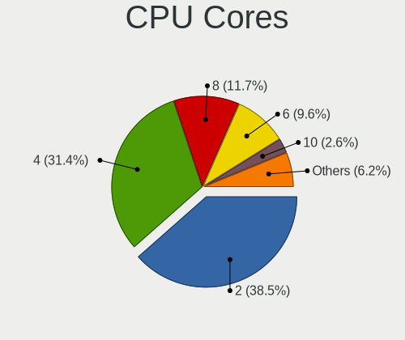
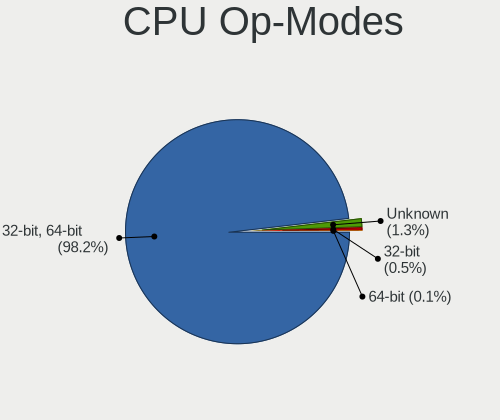
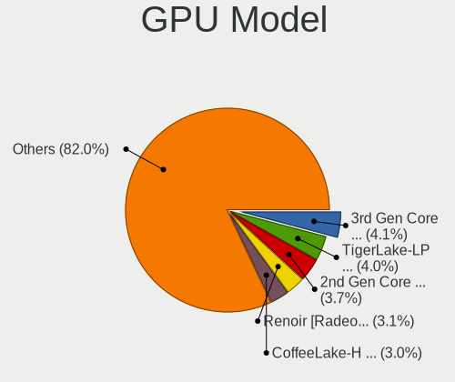
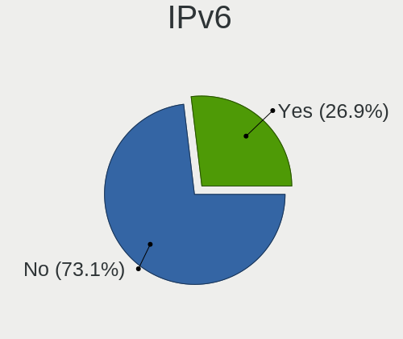
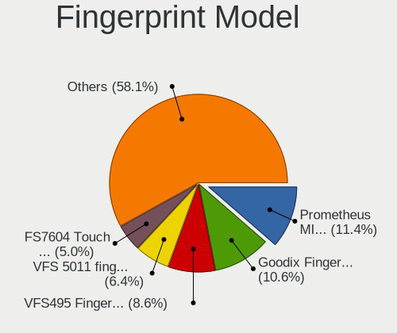

openSUSE - Tested Hardware & Statistics (Notebooks)
---------------------------------------------------

A project to collect tested hardware configurations for openSUSE.

Anyone can contribute to this report by the [hw-probe](https://github.com/linuxhw/hw-probe) tool:

    sudo -E hw-probe -all -upload

Please contribute! Especially if your hardware is rare.

Contents
--------

* [ Test Cases ](#test-cases)

* [ System ](#system)
  - [ OS                       ](#os)
  - [ OS Family                ](#os-family)
  - [ Kernel                   ](#kernel)
  - [ Kernel Family            ](#kernel-family)
  - [ Kernel Major Ver.        ](#kernel-major-ver)
  - [ Arch                     ](#arch)
  - [ DE                       ](#de)
  - [ Display Server           ](#display-server)
  - [ Display Manager          ](#display-manager)
  - [ OS Lang                  ](#os-lang)
  - [ Boot Mode                ](#boot-mode)
  - [ Filesystem               ](#filesystem)
  - [ Part. scheme             ](#part-scheme)
  - [ Dual Boot with Linux/BSD ](#dual-boot-with-linuxbsd)
  - [ Dual Boot (Win)          ](#dual-boot-win)

* [ Board ](#board)
  - [ Vendor                   ](#vendor)
  - [ Model                    ](#model)
  - [ Model Family             ](#model-family)
  - [ MFG Year                 ](#mfg-year)
  - [ Form Factor              ](#form-factor)
  - [ Secure Boot              ](#secure-boot)
  - [ Coreboot                 ](#coreboot)
  - [ RAM Size                 ](#ram-size)
  - [ RAM Used                 ](#ram-used)
  - [ Total Drives             ](#total-drives)
  - [ Has CD-ROM               ](#has-cd-rom)
  - [ Has Ethernet             ](#has-ethernet)
  - [ Has WiFi                 ](#has-wifi)
  - [ Has Bluetooth            ](#has-bluetooth)

* [ Location ](#location)
  - [ Country                  ](#country)
  - [ City                     ](#city)

* [ Drives ](#drives)
  - [ Drive Vendor             ](#drive-vendor)
  - [ Drive Model              ](#drive-model)
  - [ HDD Vendor               ](#hdd-vendor)
  - [ SSD Vendor               ](#ssd-vendor)
  - [ Drive Kind               ](#drive-kind)
  - [ Drive Connector          ](#drive-connector)
  - [ Drive Size               ](#drive-size)
  - [ Space Total              ](#space-total)
  - [ Space Used               ](#space-used)
  - [ Malfunc. Drives          ](#malfunc-drives)
  - [ Malfunc. Drive Vendor    ](#malfunc-drive-vendor)
  - [ Malfunc. HDD Vendor      ](#malfunc-hdd-vendor)
  - [ Malfunc. Drive Kind      ](#malfunc-drive-kind)
  - [ Failed Drives            ](#failed-drives)
  - [ Failed Drive Vendor      ](#failed-drive-vendor)
  - [ Drive Status             ](#drive-status)

* [ Storage controller ](#storage-controller)
  - [ Storage Vendor           ](#storage-vendor)
  - [ Storage Model            ](#storage-model)
  - [ Storage Kind             ](#storage-kind)

* [ Processor ](#processor)
  - [ CPU Vendor               ](#cpu-vendor)
  - [ CPU Model                ](#cpu-model)
  - [ CPU Model Family         ](#cpu-model-family)
  - [ CPU Cores                ](#cpu-cores)
  - [ CPU Sockets              ](#cpu-sockets)
  - [ CPU Threads              ](#cpu-threads)
  - [ CPU Op-Modes             ](#cpu-op-modes)
  - [ CPU Microcode            ](#cpu-microcode)
  - [ CPU Microarch            ](#cpu-microarch)

* [ Graphics ](#graphics)
  - [ GPU Vendor               ](#gpu-vendor)
  - [ GPU Model                ](#gpu-model)
  - [ GPU Combo                ](#gpu-combo)
  - [ GPU Driver               ](#gpu-driver)
  - [ GPU Memory               ](#gpu-memory)

* [ Monitor ](#monitor)
  - [ Monitor Vendor           ](#monitor-vendor)
  - [ Monitor Model            ](#monitor-model)
  - [ Monitor Resolution       ](#monitor-resolution)
  - [ Monitor Diagonal         ](#monitor-diagonal)
  - [ Monitor Width            ](#monitor-width)
  - [ Aspect Ratio             ](#aspect-ratio)
  - [ Monitor Area             ](#monitor-area)
  - [ Pixel Density            ](#pixel-density)
  - [ Multiple Monitors        ](#multiple-monitors)

* [ Network ](#network)
  - [ Net Controller Vendor    ](#net-controller-vendor)
  - [ Net Controller Model     ](#net-controller-model)
  - [ Wireless Vendor          ](#wireless-vendor)
  - [ Wireless Model           ](#wireless-model)
  - [ Ethernet Vendor          ](#ethernet-vendor)
  - [ Ethernet Model           ](#ethernet-model)
  - [ Net Controller Kind      ](#net-controller-kind)
  - [ Used Controller          ](#used-controller)
  - [ NICs                     ](#nics)
  - [ IPv6                     ](#ipv6)

* [ Bluetooth ](#bluetooth)
  - [ Bluetooth Vendor         ](#bluetooth-vendor)
  - [ Bluetooth Model          ](#bluetooth-model)

* [ Sound ](#sound)
  - [ Sound Vendor             ](#sound-vendor)
  - [ Sound Model              ](#sound-model)

* [ Memory ](#memory)
  - [ Memory Vendor            ](#memory-vendor)
  - [ Memory Model             ](#memory-model)
  - [ Memory Kind              ](#memory-kind)
  - [ Memory Form Factor       ](#memory-form-factor)
  - [ Memory Size              ](#memory-size)
  - [ Memory Speed             ](#memory-speed)

* [ Printers & scanners ](#printers--scanners)
  - [ Printer Vendor           ](#printer-vendor)
  - [ Printer Model            ](#printer-model)
  - [ Scanner Vendor           ](#scanner-vendor)
  - [ Scanner Model            ](#scanner-model)

* [ Camera ](#camera)
  - [ Camera Vendor            ](#camera-vendor)
  - [ Camera Model             ](#camera-model)

* [ Security ](#security)
  - [ Fingerprint Vendor       ](#fingerprint-vendor)
  - [ Fingerprint Model        ](#fingerprint-model)
  - [ Chipcard Vendor          ](#chipcard-vendor)
  - [ Chipcard Model           ](#chipcard-model)

* [ Unsupported ](#unsupported)
  - [ Unsupported Devices      ](#unsupported-devices)
  - [ Unsupported Device Types ](#unsupported-device-types)

Test Cases
----------

Total: 1058

| Vendor        | Model                       | Probe                                                      | Date         |
|---------------|-----------------------------|------------------------------------------------------------|--------------|
| HP            | Laptop 17-ca0xxx            | [10eb959775](https://linux-hardware.org/?probe=10eb959775) | Apr 30, 2022 |
| Fujitsu       | LIFEBOOK S762               | [e168087bf0](https://linux-hardware.org/?probe=e168087bf0) | Apr 28, 2022 |
| Fujitsu       | LIFEBOOK S762               | [c258235d05](https://linux-hardware.org/?probe=c258235d05) | Apr 28, 2022 |
| HUAWEI        | BOM-WXX9                    | [c07e06f794](https://linux-hardware.org/?probe=c07e06f794) | Apr 27, 2022 |
| Acer          | Aspire 3810TZ               | [cba19ea352](https://linux-hardware.org/?probe=cba19ea352) | Apr 27, 2022 |
| Lenovo        | IdeaPad 330-15IKB 81FE      | [593ee8ccf3](https://linux-hardware.org/?probe=593ee8ccf3) | Apr 27, 2022 |
| Lenovo        | ThinkPad X201 Tablet 083... | [e3ece9d899](https://linux-hardware.org/?probe=e3ece9d899) | Apr 26, 2022 |
| HP            | Laptop 15s-eq2xxx           | [981d5e03b3](https://linux-hardware.org/?probe=981d5e03b3) | Apr 25, 2022 |
| HP            | Laptop 15s-eq2xxx           | [0b3a1039fb](https://linux-hardware.org/?probe=0b3a1039fb) | Apr 25, 2022 |
| ASUSTek       | VivoBook_ASUSLaptop X512... | [44c8507975](https://linux-hardware.org/?probe=44c8507975) | Apr 24, 2022 |
| ASUSTek       | VivoBook_ASUSLaptop X512... | [19ef63f944](https://linux-hardware.org/?probe=19ef63f944) | Apr 24, 2022 |
| Acer          | Extensa 2519                | [ae1a90a282](https://linux-hardware.org/?probe=ae1a90a282) | Apr 21, 2022 |
| HP            | Notebook                    | [65e86d0311](https://linux-hardware.org/?probe=65e86d0311) | Apr 21, 2022 |
| Lenovo        | ThinkPad L420 7829BH2       | [726f69890c](https://linux-hardware.org/?probe=726f69890c) | Apr 17, 2022 |
| Lenovo        | ThinkPad X13 Gen 1 20UGS... | [80572def69](https://linux-hardware.org/?probe=80572def69) | Apr 14, 2022 |
| Lenovo        | IdeaPad 320-15ABR 80XS      | [b80dc08588](https://linux-hardware.org/?probe=b80dc08588) | Apr 14, 2022 |
| Dell          | System Inspiron N7110       | [aa67c47f23](https://linux-hardware.org/?probe=aa67c47f23) | Apr 13, 2022 |
| Dell          | Precision 5530              | [3c4cc67cc4](https://linux-hardware.org/?probe=3c4cc67cc4) | Apr 13, 2022 |
| HP            | OMEN by Laptop              | [3775d7e528](https://linux-hardware.org/?probe=3775d7e528) | Apr 13, 2022 |
| Lenovo        | IdeaPad 3 15ITL6 82H8       | [27cda229cc](https://linux-hardware.org/?probe=27cda229cc) | Apr 12, 2022 |
| MSI           | Modern 15 A4M               | [a5837a7f35](https://linux-hardware.org/?probe=a5837a7f35) | Apr 11, 2022 |
| MSI           | Modern 15 A4M               | [085aa2eabf](https://linux-hardware.org/?probe=085aa2eabf) | Apr 10, 2022 |
| Lenovo        | ThinkPad T460 20FMS25902    | [8645c57fcc](https://linux-hardware.org/?probe=8645c57fcc) | Apr 09, 2022 |
| HP            | Laptop 17-ca0xxx            | [00d95f7a3a](https://linux-hardware.org/?probe=00d95f7a3a) | Apr 09, 2022 |
| Toshiba       | Satellite C55Dt-B           | [7e54067e6a](https://linux-hardware.org/?probe=7e54067e6a) | Apr 08, 2022 |
| Toshiba       | Satellite C55Dt-B           | [c40867ec67](https://linux-hardware.org/?probe=c40867ec67) | Apr 08, 2022 |
| HP            | Laptop 17-ca0xxx            | [9a2939bd71](https://linux-hardware.org/?probe=9a2939bd71) | Apr 08, 2022 |
| Lenovo        | ThinkPad T460 20FMS25902    | [ff290845fe](https://linux-hardware.org/?probe=ff290845fe) | Apr 08, 2022 |
| ASUSTek       | N551JW                      | [3ddfbf37e2](https://linux-hardware.org/?probe=3ddfbf37e2) | Apr 08, 2022 |
| ASUSTek       | VivoBook_ASUSLaptop X435... | [d49b3ef408](https://linux-hardware.org/?probe=d49b3ef408) | Apr 08, 2022 |
| LG Electro... | C400-G.BC22P1               | [652cd5fc07](https://linux-hardware.org/?probe=652cd5fc07) | Apr 06, 2022 |
| LG Electro... | C400-G.BC22P1               | [1f6514f558](https://linux-hardware.org/?probe=1f6514f558) | Apr 06, 2022 |
| HP            | Victus by Laptop 16-e0xx... | [191c569aa7](https://linux-hardware.org/?probe=191c569aa7) | Apr 05, 2022 |
| Acer          | TravelMate P215-41-G2       | [065554d2ad](https://linux-hardware.org/?probe=065554d2ad) | Apr 04, 2022 |
| Acer          | TravelMate P215-41-G2       | [4e35add210](https://linux-hardware.org/?probe=4e35add210) | Apr 04, 2022 |
| HUAWEI        | KPL-W0X                     | [c1419a6f3c](https://linux-hardware.org/?probe=c1419a6f3c) | Apr 03, 2022 |
| Lenovo        | ThinkPad T14s Gen 1 20UJ... | [ff7f2845b0](https://linux-hardware.org/?probe=ff7f2845b0) | Apr 01, 2022 |
| HUAWEI        | HVY-WXX9                    | [6eb9c66f7d](https://linux-hardware.org/?probe=6eb9c66f7d) | Mar 31, 2022 |
| Dell          | Precision 5540              | [26060f12a6](https://linux-hardware.org/?probe=26060f12a6) | Mar 27, 2022 |
| Lenovo        | ThinkPad E550 20DF0030US    | [8392d5c3fe](https://linux-hardware.org/?probe=8392d5c3fe) | Mar 27, 2022 |
| ASUSTek       | ROG Zephyrus G15 GA503QM... | [4599ef9d23](https://linux-hardware.org/?probe=4599ef9d23) | Mar 26, 2022 |
| Acer          | Swift SF314-43              | [b632c4a0c5](https://linux-hardware.org/?probe=b632c4a0c5) | Mar 20, 2022 |
| Acer          | Aspire E1-571               | [ef43a1dac3](https://linux-hardware.org/?probe=ef43a1dac3) | Mar 20, 2022 |
| Dell          | XPS 15 9560                 | [73734bbce5](https://linux-hardware.org/?probe=73734bbce5) | Mar 19, 2022 |
| ASUSTek       | ROG Zephyrus G15 GA503QM... | [16b2681039](https://linux-hardware.org/?probe=16b2681039) | Mar 19, 2022 |
| Lenovo        | Yoga Slim 7 15IIL05 82AA    | [161ca16bc2](https://linux-hardware.org/?probe=161ca16bc2) | Mar 19, 2022 |
| ASUSTek       | ZenBook UX325SA_UM325SA     | [05c0be34be](https://linux-hardware.org/?probe=05c0be34be) | Mar 18, 2022 |
| Acer          | Aspire A315-41              | [704438d05e](https://linux-hardware.org/?probe=704438d05e) | Mar 13, 2022 |
| Acer          | Aspire A315-41              | [571547ee1d](https://linux-hardware.org/?probe=571547ee1d) | Mar 13, 2022 |
| Dell          | Latitude E7470              | [7ce09d403d](https://linux-hardware.org/?probe=7ce09d403d) | Mar 13, 2022 |
| Dell          | Latitude E7470              | [0d9c88498d](https://linux-hardware.org/?probe=0d9c88498d) | Mar 13, 2022 |
| Dell          | Latitude E7470              | [31b0bbe97f](https://linux-hardware.org/?probe=31b0bbe97f) | Mar 13, 2022 |
| Dell          | Latitude 7480               | [cbff798f89](https://linux-hardware.org/?probe=cbff798f89) | Mar 11, 2022 |
| Dell          | Latitude 7480               | [02e748e3ac](https://linux-hardware.org/?probe=02e748e3ac) | Mar 11, 2022 |
| HP            | OMEN Laptop 15-en0xxx       | [c9b7431269](https://linux-hardware.org/?probe=c9b7431269) | Mar 10, 2022 |
| ASUSTek       | VivoBook_ASUSLaptop X513... | [f118a17b6e](https://linux-hardware.org/?probe=f118a17b6e) | Mar 08, 2022 |
| Unknown       | Unknown                     | [dc2ae12852](https://linux-hardware.org/?probe=dc2ae12852) | Mar 07, 2022 |
| Unknown       | Unknown                     | [1b5e705cf1](https://linux-hardware.org/?probe=1b5e705cf1) | Mar 07, 2022 |
| Lenovo        | Yoga Slim 7 15IIL05 82AA    | [1eaa06bf11](https://linux-hardware.org/?probe=1eaa06bf11) | Mar 06, 2022 |
| Acer          | Swift SF314-59              | [d549055064](https://linux-hardware.org/?probe=d549055064) | Mar 05, 2022 |
| Lenovo        | ThinkPad E580 20KS001RGE    | [4ccce94591](https://linux-hardware.org/?probe=4ccce94591) | Mar 03, 2022 |
| Dell          | XPS 15 9550                 | [f4a068f57c](https://linux-hardware.org/?probe=f4a068f57c) | Feb 27, 2022 |
| LG Electro... | C400-G.BC22P1               | [fb656318f6](https://linux-hardware.org/?probe=fb656318f6) | Feb 27, 2022 |
| Lenovo        | ThinkPad T14s Gen 1 20UH... | [f904e185fb](https://linux-hardware.org/?probe=f904e185fb) | Feb 25, 2022 |
| ASUSTek       | 1101HA                      | [f8f8968f19](https://linux-hardware.org/?probe=f8f8968f19) | Feb 22, 2022 |
| HP            | EliteBook 835 G8 Noteboo... | [4a18cd9a94](https://linux-hardware.org/?probe=4a18cd9a94) | Feb 22, 2022 |
| Lenovo        | Yoga Slim 7 14ARE05 82A2    | [100666467c](https://linux-hardware.org/?probe=100666467c) | Feb 20, 2022 |
| Lenovo        | ThinkPad L14 Gen 1 20U6S... | [450f779085](https://linux-hardware.org/?probe=450f779085) | Feb 20, 2022 |
| Lenovo        | Yoga Slim 7 Pro 14ACH5 O... | [24ec19a092](https://linux-hardware.org/?probe=24ec19a092) | Feb 17, 2022 |
| MSI           | CX600                       | [bbd815a6e9](https://linux-hardware.org/?probe=bbd815a6e9) | Feb 17, 2022 |
| Apple         | MacBookPro8,1               | [983c62bf72](https://linux-hardware.org/?probe=983c62bf72) | Feb 17, 2022 |
| LG Electro... | C400-G.BC22P1               | [e202260efb](https://linux-hardware.org/?probe=e202260efb) | Feb 14, 2022 |
| Dell          | Latitude E6410              | [787eacd33c](https://linux-hardware.org/?probe=787eacd33c) | Feb 13, 2022 |
| Lenovo        | Legion 7 15IMH05 81YT       | [33abf3e568](https://linux-hardware.org/?probe=33abf3e568) | Feb 11, 2022 |
| Dell          | XPS 15 9510                 | [8c571a917d](https://linux-hardware.org/?probe=8c571a917d) | Feb 10, 2022 |
| Lenovo        | ThinkPad E590 20NB0012MX    | [92a33a8f31](https://linux-hardware.org/?probe=92a33a8f31) | Feb 10, 2022 |
| Lenovo        | IdeaPad 3 14IML05 81WA      | [95b53bcaf7](https://linux-hardware.org/?probe=95b53bcaf7) | Feb 08, 2022 |
| HP            | Victus by Laptop 16-e0xx... | [70122a3cd0](https://linux-hardware.org/?probe=70122a3cd0) | Feb 07, 2022 |
| Lenovo        | ThinkPad T14s Gen 1 20UJ... | [34a6010fb2](https://linux-hardware.org/?probe=34a6010fb2) | Feb 07, 2022 |
| TUXEDO        | Stellaris Intel Gen3 (TG... | [8337edfc91](https://linux-hardware.org/?probe=8337edfc91) | Feb 07, 2022 |
| Dell          | XPS 17 9710                 | [1b0a32e129](https://linux-hardware.org/?probe=1b0a32e129) | Feb 06, 2022 |
| ASUSTek       | ROG Strix G713QE_G713QE     | [af586bb69e](https://linux-hardware.org/?probe=af586bb69e) | Feb 05, 2022 |
| Acer          | Nitro AN515-52              | [51a06ffad3](https://linux-hardware.org/?probe=51a06ffad3) | Feb 05, 2022 |
| Acer          | Aspire VN7-792G             | [20e910e73b](https://linux-hardware.org/?probe=20e910e73b) | Feb 05, 2022 |
| ASUSTek       | ZenBook S UX391UA           | [a19b0282f2](https://linux-hardware.org/?probe=a19b0282f2) | Feb 04, 2022 |
| Lenovo        | IdeaPad 3 14IML05 81WA      | [340ecf86ab](https://linux-hardware.org/?probe=340ecf86ab) | Feb 01, 2022 |
| Apple         | MacBookPro8,1               | [1615c253fc](https://linux-hardware.org/?probe=1615c253fc) | Feb 01, 2022 |
| Apple         | MacBookPro8,1               | [0591806d5c](https://linux-hardware.org/?probe=0591806d5c) | Jan 31, 2022 |
| Corporativ... | MB40II5                     | [ba6bc223c3](https://linux-hardware.org/?probe=ba6bc223c3) | Jan 31, 2022 |
| HUAWEI        | KPL-W0X                     | [af71ad30ed](https://linux-hardware.org/?probe=af71ad30ed) | Jan 30, 2022 |
| HP            | Laptop 17-ca0xxx            | [373b062fd0](https://linux-hardware.org/?probe=373b062fd0) | Jan 30, 2022 |
| Corporativ... | MB40II5                     | [3c62692a0f](https://linux-hardware.org/?probe=3c62692a0f) | Jan 30, 2022 |
| HP            | Compaq 6830s                | [f82216de53](https://linux-hardware.org/?probe=f82216de53) | Jan 26, 2022 |
| HP            | Compaq 6830s                | [fe7ef8a290](https://linux-hardware.org/?probe=fe7ef8a290) | Jan 26, 2022 |
| MSI           | Pulse GL66 11UDK            | [06d5ba6ef3](https://linux-hardware.org/?probe=06d5ba6ef3) | Jan 26, 2022 |
| Getac         | V200-G2                     | [6d9b456d5f](https://linux-hardware.org/?probe=6d9b456d5f) | Jan 24, 2022 |
| Lenovo        | IdeaPad S145-15IWL 81MV     | [c07dc3a8ee](https://linux-hardware.org/?probe=c07dc3a8ee) | Jan 24, 2022 |
| Acer          | Aspire F5-572G              | [7dbefa64bc](https://linux-hardware.org/?probe=7dbefa64bc) | Jan 23, 2022 |
| Lenovo        | Legion S7 15ACH6 82K8       | [3060acc083](https://linux-hardware.org/?probe=3060acc083) | Jan 22, 2022 |
| HUAWEI        | KPL-W0X                     | [110f581748](https://linux-hardware.org/?probe=110f581748) | Jan 22, 2022 |
| HUAWEI        | HKD-WXX                     | [170a3c500e](https://linux-hardware.org/?probe=170a3c500e) | Jan 21, 2022 |
| HUAWEI        | HKD-WXX                     | [a8eefb04f1](https://linux-hardware.org/?probe=a8eefb04f1) | Jan 21, 2022 |
| Lenovo        | IdeaPad S145-15IWL 81MV     | [d195d57aa4](https://linux-hardware.org/?probe=d195d57aa4) | Jan 21, 2022 |
| Sony          | VPCYB15AB                   | [1d7c8aa76a](https://linux-hardware.org/?probe=1d7c8aa76a) | Jan 21, 2022 |
| Notebook      | PCx0Dx                      | [07b8344de7](https://linux-hardware.org/?probe=07b8344de7) | Jan 21, 2022 |
| Notebook      | PCx0Dx                      | [3bdae5c5ac](https://linux-hardware.org/?probe=3bdae5c5ac) | Jan 21, 2022 |
| Acer          | Nitro AN515-45              | [a30f5fabcd](https://linux-hardware.org/?probe=a30f5fabcd) | Jan 18, 2022 |
| Toshiba       | Satellite C660D             | [99d2f2253d](https://linux-hardware.org/?probe=99d2f2253d) | Jan 11, 2022 |
| HP            | ENVY 15                     | [30b86e16bf](https://linux-hardware.org/?probe=30b86e16bf) | Jan 10, 2022 |
| Razer         | Blade 15 Base Model (Mid... | [af7d37f35c](https://linux-hardware.org/?probe=af7d37f35c) | Jan 10, 2022 |
| Dell          | Latitude XT2                | [65adc4cb22](https://linux-hardware.org/?probe=65adc4cb22) | Jan 09, 2022 |
| Razer         | Blade 17 (Mid 2021) - RZ... | [4a33da1bc1](https://linux-hardware.org/?probe=4a33da1bc1) | Jan 06, 2022 |
| Notebook      | NL5xRU                      | [39b60e131a](https://linux-hardware.org/?probe=39b60e131a) | Jan 05, 2022 |
| Dell          | XPS 13 9343                 | [c7bf784225](https://linux-hardware.org/?probe=c7bf784225) | Jan 04, 2022 |
| Lenovo        | Yoga Slim 7 14ITL05 82A3    | [896b348390](https://linux-hardware.org/?probe=896b348390) | Jan 03, 2022 |
| Toshiba       | AS 1301                     | [8617f80de9](https://linux-hardware.org/?probe=8617f80de9) | Jan 01, 2022 |
| TUXEDO        | Unknown                     | [6a29278e3f](https://linux-hardware.org/?probe=6a29278e3f) | Dec 31, 2021 |
| Fujitsu       | LIFEBOOK E746               | [86da0c348f](https://linux-hardware.org/?probe=86da0c348f) | Dec 30, 2021 |
| HP            | EliteBook 8460p             | [e9cf5c0353](https://linux-hardware.org/?probe=e9cf5c0353) | Dec 29, 2021 |
| Dell          | XPS 15 9510                 | [5f594735cc](https://linux-hardware.org/?probe=5f594735cc) | Dec 28, 2021 |
| Dell          | Studio 1737                 | [6b5362714f](https://linux-hardware.org/?probe=6b5362714f) | Dec 27, 2021 |
| ASUSTek       | TUF Gaming FX705DY_FX705... | [e62e9c50d0](https://linux-hardware.org/?probe=e62e9c50d0) | Dec 26, 2021 |
| Lenovo        | ThinkPad E14 Gen 3 20Y70... | [a1b975a4e1](https://linux-hardware.org/?probe=a1b975a4e1) | Dec 26, 2021 |
| Notebook      | NL5xRU                      | [f74478e98e](https://linux-hardware.org/?probe=f74478e98e) | Dec 25, 2021 |
| Lenovo        | ThinkPad L512 44444WG       | [113b39ddbc](https://linux-hardware.org/?probe=113b39ddbc) | Dec 25, 2021 |
| Acer          | Aspire E1-571               | [8b94542162](https://linux-hardware.org/?probe=8b94542162) | Dec 22, 2021 |
| Acer          | Aspire E1-571               | [842eae5b1d](https://linux-hardware.org/?probe=842eae5b1d) | Dec 22, 2021 |
| Avell High... | A62 LIV                     | [b2108dd133](https://linux-hardware.org/?probe=b2108dd133) | Dec 21, 2021 |
| Dell          | Inspiron N4030              | [f5b5166d80](https://linux-hardware.org/?probe=f5b5166d80) | Dec 20, 2021 |
| HP            | Pavilion dv6                | [bb01b911cd](https://linux-hardware.org/?probe=bb01b911cd) | Dec 17, 2021 |
| Google        | Pantheon                    | [8b1d8783ad](https://linux-hardware.org/?probe=8b1d8783ad) | Dec 17, 2021 |
| Lenovo        | ThinkPad E15 20RD0015UK     | [0fca0b679f](https://linux-hardware.org/?probe=0fca0b679f) | Dec 16, 2021 |
| Acer          | Aspire E1-571               | [27923678bd](https://linux-hardware.org/?probe=27923678bd) | Dec 16, 2021 |
| Lenovo        | ThinkPad S3 Yoga 14 20DM... | [452044c67e](https://linux-hardware.org/?probe=452044c67e) | Dec 15, 2021 |
| Lenovo        | ThinkPad S3 Yoga 14 20DM... | [4dc9e683af](https://linux-hardware.org/?probe=4dc9e683af) | Dec 15, 2021 |
| Lenovo        | IdeaPad Slim 1-14AST-05 ... | [696d4a24cd](https://linux-hardware.org/?probe=696d4a24cd) | Dec 13, 2021 |
| Lenovo        | IdeaPad Slim 1-14AST-05 ... | [3d396a7f28](https://linux-hardware.org/?probe=3d396a7f28) | Dec 13, 2021 |
| HP            | EliteBook 845 G8 Noteboo... | [68bef1611d](https://linux-hardware.org/?probe=68bef1611d) | Dec 13, 2021 |
| Lenovo        | ThinkPad T14 Gen 1 20UES... | [ecc22ad350](https://linux-hardware.org/?probe=ecc22ad350) | Dec 12, 2021 |
| Dell          | Inspiron 15 3510            | [7d97420d98](https://linux-hardware.org/?probe=7d97420d98) | Dec 11, 2021 |
| ASUSTek       | VivoBook_ASUSLaptop X513... | [176194b06f](https://linux-hardware.org/?probe=176194b06f) | Dec 10, 2021 |
| Google        | Kip                         | [0e5291c891](https://linux-hardware.org/?probe=0e5291c891) | Dec 09, 2021 |
| Google        | Kip                         | [9bbfc62162](https://linux-hardware.org/?probe=9bbfc62162) | Dec 09, 2021 |
| HP            | ZBook Fury 15 G7 Mobile ... | [543d2dfef7](https://linux-hardware.org/?probe=543d2dfef7) | Dec 07, 2021 |
| MSI           | CX61 0OC/CX61 0OD/CX61 0... | [4d4c80773b](https://linux-hardware.org/?probe=4d4c80773b) | Dec 07, 2021 |
| Lenovo        | G500 20236                  | [dab30215a2](https://linux-hardware.org/?probe=dab30215a2) | Dec 05, 2021 |
| Acer          | Aspire A315-21              | [b6e4b7efdc](https://linux-hardware.org/?probe=b6e4b7efdc) | Dec 04, 2021 |
| Lenovo        | ThinkPad E495 20NE001GGE    | [31e9125d85](https://linux-hardware.org/?probe=31e9125d85) | Dec 03, 2021 |
| Lenovo        | ThinkPad E495 20NE001GGE    | [3b230e73b3](https://linux-hardware.org/?probe=3b230e73b3) | Dec 03, 2021 |
| Lenovo        | IdeaPad 5 14ARE05 81YM      | [7b1d555cc3](https://linux-hardware.org/?probe=7b1d555cc3) | Dec 03, 2021 |
| Lenovo        | B41-80 80LG                 | [96e84134f0](https://linux-hardware.org/?probe=96e84134f0) | Dec 03, 2021 |
| HP            | Victus by Laptop 16-e0xx... | [c68a7d50dc](https://linux-hardware.org/?probe=c68a7d50dc) | Dec 02, 2021 |
| HP            | Victus by Laptop 16-e0xx... | [49055ba417](https://linux-hardware.org/?probe=49055ba417) | Dec 01, 2021 |
| Dell          | Vostro 5471                 | [3da13c5e1b](https://linux-hardware.org/?probe=3da13c5e1b) | Nov 30, 2021 |
| Lenovo        | Yoga 14sARH 2021 82LB       | [8e84498214](https://linux-hardware.org/?probe=8e84498214) | Nov 30, 2021 |
| HP            | OMEN by Laptop              | [4dec490a3f](https://linux-hardware.org/?probe=4dec490a3f) | Nov 29, 2021 |
| Toshiba       | Satellite C660              | [e4f4713ac2](https://linux-hardware.org/?probe=e4f4713ac2) | Nov 29, 2021 |
| Apple         | MacBookPro9,2               | [65ba69012d](https://linux-hardware.org/?probe=65ba69012d) | Nov 28, 2021 |
| HUAWEI        | KLVL-WXX9                   | [34898be259](https://linux-hardware.org/?probe=34898be259) | Nov 28, 2021 |
| HUAWEI        | KPL-W0X                     | [403ada1042](https://linux-hardware.org/?probe=403ada1042) | Nov 28, 2021 |
| Lenovo        | Yoga 14sARH 2021 82LB       | [906d652496](https://linux-hardware.org/?probe=906d652496) | Nov 28, 2021 |
| HUAWEI        | KPL-W0X                     | [b58c73a493](https://linux-hardware.org/?probe=b58c73a493) | Nov 28, 2021 |
| Lenovo        | ThinkPad X1 Carbon 4th 2... | [a74aec830e](https://linux-hardware.org/?probe=a74aec830e) | Nov 27, 2021 |
| Lenovo        | ThinkPad T490s 20NYS1XK0... | [aef7318ff6](https://linux-hardware.org/?probe=aef7318ff6) | Nov 27, 2021 |
| Lenovo        | ThinkPad X1 Carbon 4th 2... | [af530bb7c7](https://linux-hardware.org/?probe=af530bb7c7) | Nov 27, 2021 |
| Lenovo        | Yoga 14sARH 2021 82LB       | [27a4935e65](https://linux-hardware.org/?probe=27a4935e65) | Nov 26, 2021 |
| HP            | EliteBook 840 G7 Noteboo... | [9ae82b251b](https://linux-hardware.org/?probe=9ae82b251b) | Nov 26, 2021 |
| Acer          | Aspire E1-772G              | [d49a3f3160](https://linux-hardware.org/?probe=d49a3f3160) | Nov 26, 2021 |
| Dell          | Precision M4800             | [c81b76f119](https://linux-hardware.org/?probe=c81b76f119) | Nov 25, 2021 |
| MSI           | CX61 0OC/CX61 0OD/CX61 0... | [4eb53d4335](https://linux-hardware.org/?probe=4eb53d4335) | Nov 25, 2021 |
| Toshiba       | Satellite C660              | [995eaf8345](https://linux-hardware.org/?probe=995eaf8345) | Nov 25, 2021 |
| HP            | EliteBook 8460p             | [8278dcbd86](https://linux-hardware.org/?probe=8278dcbd86) | Nov 23, 2021 |
| Lenovo        | IdeaPad 320-15IKB 80XL      | [933eda02dc](https://linux-hardware.org/?probe=933eda02dc) | Nov 21, 2021 |
| Lenovo        | G50-45 80E3                 | [43f110e082](https://linux-hardware.org/?probe=43f110e082) | Nov 20, 2021 |
| HP            | ZBook Fury 15 G7 Mobile ... | [a7af7ed3fa](https://linux-hardware.org/?probe=a7af7ed3fa) | Nov 19, 2021 |
| HP            | ZBook Fury 15 G7 Mobile ... | [4f96b5ad58](https://linux-hardware.org/?probe=4f96b5ad58) | Nov 19, 2021 |
| Samsung       | 355V4C/356V4C/3445VC/354... | [6d345c2500](https://linux-hardware.org/?probe=6d345c2500) | Nov 18, 2021 |
| Lenovo        | ThinkPad E495 20NES01600    | [aacc57f134](https://linux-hardware.org/?probe=aacc57f134) | Nov 17, 2021 |
| Fujitsu       | LIFEBOOK E782               | [f2e77fa439](https://linux-hardware.org/?probe=f2e77fa439) | Nov 17, 2021 |
| Lenovo        | IdeaPad 3 17ADA05 81W2      | [ce05c5de33](https://linux-hardware.org/?probe=ce05c5de33) | Nov 15, 2021 |
| HP            | Pavilion dv6                | [30c1df8961](https://linux-hardware.org/?probe=30c1df8961) | Nov 13, 2021 |
| Samsung       | 550XDA                      | [69fe372895](https://linux-hardware.org/?probe=69fe372895) | Nov 12, 2021 |
| Samsung       | 550XDA                      | [61a4dbe6b6](https://linux-hardware.org/?probe=61a4dbe6b6) | Nov 12, 2021 |
| Dell          | Latitude E5440              | [310f365903](https://linux-hardware.org/?probe=310f365903) | Nov 10, 2021 |
| Acer          | Aspire E1-772G              | [ec97cd08d4](https://linux-hardware.org/?probe=ec97cd08d4) | Nov 09, 2021 |
| Acer          | Aspire E1-772G              | [be0c106296](https://linux-hardware.org/?probe=be0c106296) | Nov 09, 2021 |
| Lenovo        | IdeaPad Gaming 3 15ARH05... | [be3123eae1](https://linux-hardware.org/?probe=be3123eae1) | Nov 09, 2021 |
| Lenovo        | IdeaPad Gaming 3 15ARH05... | [cf717529eb](https://linux-hardware.org/?probe=cf717529eb) | Nov 09, 2021 |
| Lenovo        | IdeaPad 330-15IKB 81DC      | [9a632ea5d1](https://linux-hardware.org/?probe=9a632ea5d1) | Nov 08, 2021 |
| Lenovo        | IdeaPad S340-15IML 81NA     | [90fbcc38c3](https://linux-hardware.org/?probe=90fbcc38c3) | Nov 08, 2021 |
| Dell          | G3 3590                     | [aa237dfc61](https://linux-hardware.org/?probe=aa237dfc61) | Nov 06, 2021 |
| Acer          | Aspire 5820TG               | [d8ae1a4109](https://linux-hardware.org/?probe=d8ae1a4109) | Nov 03, 2021 |
| Acer          | Aspire 5820TG               | [c79617751e](https://linux-hardware.org/?probe=c79617751e) | Nov 03, 2021 |
| Dell          | Precision 7530              | [6a1961e13d](https://linux-hardware.org/?probe=6a1961e13d) | Nov 03, 2021 |
| Lenovo        | ThinkPad Edge E430 3254T... | [f9fbde199a](https://linux-hardware.org/?probe=f9fbde199a) | Nov 02, 2021 |
| HP            | ZBook 14 G2                 | [ffb40f821b](https://linux-hardware.org/?probe=ffb40f821b) | Oct 30, 2021 |
| ASUSTek       | X751LK                      | [b2cda34b7e](https://linux-hardware.org/?probe=b2cda34b7e) | Oct 30, 2021 |
| Lenovo        | ThinkPad E560 20EV000NIV    | [65eac6abc6](https://linux-hardware.org/?probe=65eac6abc6) | Oct 27, 2021 |
| Lenovo        | Yoga 710-11IKB 80V6         | [2b89909a49](https://linux-hardware.org/?probe=2b89909a49) | Oct 25, 2021 |
| Acer          | Aspire E1-772G              | [2ffccc532e](https://linux-hardware.org/?probe=2ffccc532e) | Oct 24, 2021 |
| Acer          | Nitro AN515-54              | [b6be115eec](https://linux-hardware.org/?probe=b6be115eec) | Oct 23, 2021 |
| Acer          | Aspire 5560                 | [39fd26f895](https://linux-hardware.org/?probe=39fd26f895) | Oct 22, 2021 |
| Dell          | Latitude 7420               | [a4ff2480e6](https://linux-hardware.org/?probe=a4ff2480e6) | Oct 22, 2021 |
| TUXEDO        | Aura 15 Gen1                | [627c62ae00](https://linux-hardware.org/?probe=627c62ae00) | Oct 21, 2021 |
| HP            | ProBook 650 G1              | [20be8bd8e7](https://linux-hardware.org/?probe=20be8bd8e7) | Oct 21, 2021 |
| Lenovo        | IdeaPad S340-15IML 81NA     | [849c03d63c](https://linux-hardware.org/?probe=849c03d63c) | Oct 21, 2021 |
| Acer          | Swift SF314-43              | [ef2da9ecca](https://linux-hardware.org/?probe=ef2da9ecca) | Oct 21, 2021 |
| Lenovo        | ThinkPad T14 Gen 2i 20W0... | [d111902eac](https://linux-hardware.org/?probe=d111902eac) | Oct 18, 2021 |
| Medion        | E6436 MD61150               | [1edd4700fd](https://linux-hardware.org/?probe=1edd4700fd) | Oct 17, 2021 |
| Medion        | E6436 MD61150               | [2eaa34b93e](https://linux-hardware.org/?probe=2eaa34b93e) | Oct 17, 2021 |
| HUAWEI        | KPL-W0X                     | [9bea49d841](https://linux-hardware.org/?probe=9bea49d841) | Oct 17, 2021 |
| HUAWEI        | KPL-W0X                     | [a2b9e18a6d](https://linux-hardware.org/?probe=a2b9e18a6d) | Oct 17, 2021 |
| HP            | Laptop 15s-eq0xxx           | [fc4da04b79](https://linux-hardware.org/?probe=fc4da04b79) | Oct 16, 2021 |
| Lenovo        | ThinkPad E15 20RD0015UK     | [d1cdbd537e](https://linux-hardware.org/?probe=d1cdbd537e) | Oct 13, 2021 |
| HP            | Laptop 17-ca1xxx            | [ae1811a242](https://linux-hardware.org/?probe=ae1811a242) | Oct 13, 2021 |
| HP            | ZHAN 66 Pro A 14 G3         | [d3fdfb0745](https://linux-hardware.org/?probe=d3fdfb0745) | Oct 13, 2021 |
| Lenovo        | ThinkPad T490s 20NYS1XK0... | [d3700d8667](https://linux-hardware.org/?probe=d3700d8667) | Oct 13, 2021 |
| Lenovo        | ThinkPad L15 Gen 1 20U4S... | [3bb6121afa](https://linux-hardware.org/?probe=3bb6121afa) | Oct 13, 2021 |
| ASUSTek       | X550CL                      | [15e808f714](https://linux-hardware.org/?probe=15e808f714) | Oct 10, 2021 |
| Lenovo        | ThinkPad E560 20EV000NIV    | [4bb69f9fcc](https://linux-hardware.org/?probe=4bb69f9fcc) | Oct 10, 2021 |
| Acer          | Nitro AN515-45              | [778b409af2](https://linux-hardware.org/?probe=778b409af2) | Oct 09, 2021 |
| HUAWEI        | NBLK-WAX9X                  | [eb4d7c93c0](https://linux-hardware.org/?probe=eb4d7c93c0) | Oct 07, 2021 |
| Lenovo        | ThinkPad L14 Gen 1 20U50... | [4206d52561](https://linux-hardware.org/?probe=4206d52561) | Oct 07, 2021 |
| Lenovo        | ThinkPad L14 Gen 1 20U50... | [8e94483caf](https://linux-hardware.org/?probe=8e94483caf) | Oct 07, 2021 |
| Acer          | Nitro AN515-45              | [8758f75501](https://linux-hardware.org/?probe=8758f75501) | Oct 07, 2021 |
| Lenovo        | ThinkPad X1 Carbon Gen 9... | [f3c6229102](https://linux-hardware.org/?probe=f3c6229102) | Oct 06, 2021 |
| Acer          | Nitro AN515-45              | [c439170645](https://linux-hardware.org/?probe=c439170645) | Oct 05, 2021 |
| Lenovo        | IdeaPad S145-15AST 81N3     | [a9f8d1f512](https://linux-hardware.org/?probe=a9f8d1f512) | Oct 05, 2021 |
| HP            | G61                         | [98ef6e48b5](https://linux-hardware.org/?probe=98ef6e48b5) | Oct 03, 2021 |
| Google        | Pantheon                    | [72ded95fab](https://linux-hardware.org/?probe=72ded95fab) | Oct 02, 2021 |
| HUAWEI        | HVY-WXX9                    | [f0b874d4f2](https://linux-hardware.org/?probe=f0b874d4f2) | Oct 02, 2021 |
| Lenovo        | ThinkPad E14 Gen 3 20Y7C... | [eabcfa676f](https://linux-hardware.org/?probe=eabcfa676f) | Oct 02, 2021 |
| HUAWEI        | KPL-W0X                     | [f7d98dc0a7](https://linux-hardware.org/?probe=f7d98dc0a7) | Oct 02, 2021 |
| Lenovo        | ThinkPad W530 24475HU       | [b8973b3b0a](https://linux-hardware.org/?probe=b8973b3b0a) | Oct 02, 2021 |
| Lenovo        | ThinkPad T550 20CJS1VD01    | [390b9a8a74](https://linux-hardware.org/?probe=390b9a8a74) | Oct 01, 2021 |
| HP            | EliteBook Folio 9470m       | [101371762b](https://linux-hardware.org/?probe=101371762b) | Oct 01, 2021 |
| MSI           | GP63 Leopard 8RD            | [21189bb3e0](https://linux-hardware.org/?probe=21189bb3e0) | Oct 01, 2021 |
| HUAWEI        | KPL-W0X                     | [7024087dbd](https://linux-hardware.org/?probe=7024087dbd) | Sep 26, 2021 |
| HUAWEI        | KPL-W0X                     | [b1c787f5e6](https://linux-hardware.org/?probe=b1c787f5e6) | Sep 26, 2021 |
| Dell          | XPS 13 9310                 | [39d644c56a](https://linux-hardware.org/?probe=39d644c56a) | Sep 26, 2021 |
| Lenovo        | ThinkPad L420 7827AW9       | [6c7308609b](https://linux-hardware.org/?probe=6c7308609b) | Sep 26, 2021 |
| Dell          | Inspiron N4010              | [82ad91793d](https://linux-hardware.org/?probe=82ad91793d) | Sep 25, 2021 |
| Timi          | A35S                        | [c10b3fac0b](https://linux-hardware.org/?probe=c10b3fac0b) | Sep 22, 2021 |
| Lenovo        | Yoga 710-11IKB 80V6         | [59490b03a0](https://linux-hardware.org/?probe=59490b03a0) | Sep 21, 2021 |
| Dell          | Precision M6700             | [0d8cf3bf1c](https://linux-hardware.org/?probe=0d8cf3bf1c) | Sep 21, 2021 |
| ASUSTek       | TUF Gaming FA706IU_FA706... | [9e88464633](https://linux-hardware.org/?probe=9e88464633) | Sep 20, 2021 |
| Google        | Pantheon                    | [eaa5a17c4b](https://linux-hardware.org/?probe=eaa5a17c4b) | Sep 19, 2021 |
| Medion        | S15449                      | [8f1110e14a](https://linux-hardware.org/?probe=8f1110e14a) | Sep 18, 2021 |
| HP            | ZBook 17                    | [df2e227740](https://linux-hardware.org/?probe=df2e227740) | Sep 18, 2021 |
| HP            | OMEN Laptop 15-en1014AX     | [8ff619f5f3](https://linux-hardware.org/?probe=8ff619f5f3) | Sep 17, 2021 |
| HP            | OMEN Laptop 15-en1014AX     | [57dc237470](https://linux-hardware.org/?probe=57dc237470) | Sep 17, 2021 |
| HP            | EliteBook 840 G7 Noteboo... | [385fd35a7e](https://linux-hardware.org/?probe=385fd35a7e) | Sep 16, 2021 |
| MSI           | CX61 0OC/CX61 0OD/CX61 0... | [47d1d04589](https://linux-hardware.org/?probe=47d1d04589) | Sep 16, 2021 |
| MSI           | CX61 0OC/CX61 0OD/CX61 0... | [5f33450a0d](https://linux-hardware.org/?probe=5f33450a0d) | Sep 16, 2021 |
| Lenovo        | ThinkPad T14s Gen 1 20UJ... | [66385493ae](https://linux-hardware.org/?probe=66385493ae) | Sep 15, 2021 |
| MSI           | Modern 15 A4M               | [1b2e6b06a0](https://linux-hardware.org/?probe=1b2e6b06a0) | Sep 14, 2021 |
| Dell          | Inspiron 3521               | [1e2e03c85c](https://linux-hardware.org/?probe=1e2e03c85c) | Sep 14, 2021 |
| MSI           | Modern 15 A4M               | [dabdf47bdf](https://linux-hardware.org/?probe=dabdf47bdf) | Sep 13, 2021 |
| Medion        | S15449                      | [03b29809eb](https://linux-hardware.org/?probe=03b29809eb) | Sep 11, 2021 |
| MSI           | GE72 7RD                    | [d02699b3f9](https://linux-hardware.org/?probe=d02699b3f9) | Sep 11, 2021 |
| Dell          | Precision M3800             | [5dba4d3bce](https://linux-hardware.org/?probe=5dba4d3bce) | Sep 07, 2021 |
| Samsung       | 355V4C/356V4C/3445VC/354... | [9a46145cf4](https://linux-hardware.org/?probe=9a46145cf4) | Sep 06, 2021 |
| Medion        | S15449                      | [4b79c908d7](https://linux-hardware.org/?probe=4b79c908d7) | Sep 05, 2021 |
| Lenovo        | ThinkPad X270 20HN0016GE    | [cecb5eb453](https://linux-hardware.org/?probe=cecb5eb453) | Sep 05, 2021 |
| Samsung       | 355V4C/356V4C/3445VC/354... | [3eb77262b0](https://linux-hardware.org/?probe=3eb77262b0) | Sep 04, 2021 |
| Acer          | Aspire A517-52G             | [2d3edcffdd](https://linux-hardware.org/?probe=2d3edcffdd) | Sep 04, 2021 |
| Lenovo        | ThinkPad T14s Gen 1 20UJ... | [82785cc5a8](https://linux-hardware.org/?probe=82785cc5a8) | Sep 03, 2021 |
| Dell          | Inspiron 3593               | [5f9f37c33b](https://linux-hardware.org/?probe=5f9f37c33b) | Aug 30, 2021 |
| Medion        | S15449                      | [a0c8d15a30](https://linux-hardware.org/?probe=a0c8d15a30) | Aug 28, 2021 |
| Lenovo        | ThinkPad X1 Carbon 4th 2... | [44d0412dd3](https://linux-hardware.org/?probe=44d0412dd3) | Aug 27, 2021 |
| Samsung       | 600B4B/600B5B               | [200275bbd6](https://linux-hardware.org/?probe=200275bbd6) | Aug 27, 2021 |
| Dell          | Precision M6700             | [191db00b83](https://linux-hardware.org/?probe=191db00b83) | Aug 26, 2021 |
| Lenovo        | V330-15IKB 81AX             | [4b5a1af4dd](https://linux-hardware.org/?probe=4b5a1af4dd) | Aug 26, 2021 |
| ASUSTek       | VivoBook_ASUSLaptop X515... | [62c96ffa5b](https://linux-hardware.org/?probe=62c96ffa5b) | Aug 25, 2021 |
| ASUSTek       | VivoBook_ASUSLaptop X515... | [516b9ff2ed](https://linux-hardware.org/?probe=516b9ff2ed) | Aug 25, 2021 |
| Lenovo        | G500 20236                  | [73a5085a79](https://linux-hardware.org/?probe=73a5085a79) | Aug 24, 2021 |
| Dell          | Latitude 5480               | [a2110d9601](https://linux-hardware.org/?probe=a2110d9601) | Aug 24, 2021 |
| Lenovo        | Yoga 3 Pro-1370 80HE        | [e59555689c](https://linux-hardware.org/?probe=e59555689c) | Aug 23, 2021 |
| Medion        | S15449                      | [adf11d6583](https://linux-hardware.org/?probe=adf11d6583) | Aug 22, 2021 |
| Lenovo        | ThinkPad L420 7827AW9       | [d18b84f4e1](https://linux-hardware.org/?probe=d18b84f4e1) | Aug 22, 2021 |
| Lenovo        | ThinkPad L420 7827AW9       | [7e1de8f6ba](https://linux-hardware.org/?probe=7e1de8f6ba) | Aug 22, 2021 |
| HP            | Laptop 15s-eq1xxx           | [90446b95e6](https://linux-hardware.org/?probe=90446b95e6) | Aug 21, 2021 |
| Lenovo        | IdeaPad 3 15ADA05 81W1      | [18d79e5a84](https://linux-hardware.org/?probe=18d79e5a84) | Aug 21, 2021 |
| Dell          | Latitude 5480               | [64e1f3e16c](https://linux-hardware.org/?probe=64e1f3e16c) | Aug 19, 2021 |
| Lenovo        | ThinkPad T61 8895W9U        | [424c5f3e75](https://linux-hardware.org/?probe=424c5f3e75) | Aug 19, 2021 |
| ASUSTek       | ROG Zephyrus G14 GA401QM... | [4e946ccb36](https://linux-hardware.org/?probe=4e946ccb36) | Aug 15, 2021 |
| HP            | ProBook 450 G6              | [c206f3c985](https://linux-hardware.org/?probe=c206f3c985) | Aug 13, 2021 |
| Dell          | Inspiron 3521               | [c68ce33d52](https://linux-hardware.org/?probe=c68ce33d52) | Aug 11, 2021 |
| Dell          | Inspiron 3521               | [9a422a10d3](https://linux-hardware.org/?probe=9a422a10d3) | Aug 11, 2021 |
| Dell          | Inspiron 7460               | [f954aa3826](https://linux-hardware.org/?probe=f954aa3826) | Aug 10, 2021 |
| Samsung       | 600B4B/600B5B               | [0a650b495e](https://linux-hardware.org/?probe=0a650b495e) | Aug 09, 2021 |
| Lenovo        | ThinkPad T460 20FMS75800    | [1a1c3f469d](https://linux-hardware.org/?probe=1a1c3f469d) | Aug 07, 2021 |
| Lenovo        | ThinkPad X1 Carbon 4th 2... | [5953bc46ad](https://linux-hardware.org/?probe=5953bc46ad) | Aug 06, 2021 |
| Lenovo        | ThinkPad X1 Carbon 4th 2... | [fafaeed466](https://linux-hardware.org/?probe=fafaeed466) | Aug 06, 2021 |
| Samsung       | 355V4C/356V4C/3445VC/354... | [d9f27fb531](https://linux-hardware.org/?probe=d9f27fb531) | Aug 06, 2021 |
| ASUSTek       | ASUS TUF Gaming A15 FA50... | [77e5c1027c](https://linux-hardware.org/?probe=77e5c1027c) | Aug 06, 2021 |
| Dell          | Inspiron 5770               | [0061c42395](https://linux-hardware.org/?probe=0061c42395) | Aug 02, 2021 |
| Lenovo        | ThinkPad P50 20EN0005GE     | [25a6865386](https://linux-hardware.org/?probe=25a6865386) | Aug 01, 2021 |
| Lenovo        | ThinkPad SL510 2847CSG      | [505d87d58a](https://linux-hardware.org/?probe=505d87d58a) | Jul 30, 2021 |
| Lenovo        | ThinkPad SL510 2847CSG      | [09c0faf429](https://linux-hardware.org/?probe=09c0faf429) | Jul 30, 2021 |
| HP            | ZBook 15 G6                 | [617fd327a3](https://linux-hardware.org/?probe=617fd327a3) | Jul 28, 2021 |
| HP            | Pavilion Gaming Laptop 1... | [3c2fc847b2](https://linux-hardware.org/?probe=3c2fc847b2) | Jul 28, 2021 |
| Lenovo        | IdeaPad Z510 20287          | [818166936a](https://linux-hardware.org/?probe=818166936a) | Jul 24, 2021 |
| Lenovo        | IdeaPad S145-15API 81V7     | [2640930f28](https://linux-hardware.org/?probe=2640930f28) | Jul 23, 2021 |
| HP            | Stream Notebook PC 11       | [a612aa5d15](https://linux-hardware.org/?probe=a612aa5d15) | Jul 20, 2021 |
| Dell          | Inspiron 5570               | [2803a67fa3](https://linux-hardware.org/?probe=2803a67fa3) | Jul 20, 2021 |
| Lenovo        | IdeaPad Slim 1-14AST-05 ... | [61ac3fb728](https://linux-hardware.org/?probe=61ac3fb728) | Jul 20, 2021 |
| Lenovo        | IdeaPad Slim 1-14AST-05 ... | [52642a99c5](https://linux-hardware.org/?probe=52642a99c5) | Jul 19, 2021 |
| Dell          | Inspiron 3442               | [8814bd2240](https://linux-hardware.org/?probe=8814bd2240) | Jul 18, 2021 |
| Avell High... | A62 LIV                     | [a1398c199a](https://linux-hardware.org/?probe=a1398c199a) | Jul 17, 2021 |
| Avell High... | A62 LIV                     | [2e01a9aa5b](https://linux-hardware.org/?probe=2e01a9aa5b) | Jul 17, 2021 |
| Dell          | G3 3590                     | [5526842a03](https://linux-hardware.org/?probe=5526842a03) | Jul 16, 2021 |
| Toshiba       | Satellite L850              | [1697c7eaf6](https://linux-hardware.org/?probe=1697c7eaf6) | Jul 15, 2021 |
| ASUSTek       | X550CL                      | [5f38d7af14](https://linux-hardware.org/?probe=5f38d7af14) | Jul 14, 2021 |
| Intel Clie... | A60 MUV                     | [f2c8c49a38](https://linux-hardware.org/?probe=f2c8c49a38) | Jul 11, 2021 |
| Gateway       | NE56R                       | [94fe19c4ee](https://linux-hardware.org/?probe=94fe19c4ee) | Jul 10, 2021 |
| Lenovo        | Yoga 710-11IKB 80V6         | [8b4e2829d2](https://linux-hardware.org/?probe=8b4e2829d2) | Jul 10, 2021 |
| Lenovo        | ThinkPad T450s 20BWA06J0... | [e4cd39ef75](https://linux-hardware.org/?probe=e4cd39ef75) | Jul 09, 2021 |
| Lenovo        | ThinkPad T450s 20BWA06J0... | [5565f4e4fe](https://linux-hardware.org/?probe=5565f4e4fe) | Jul 09, 2021 |
| Fujitsu       | LIFEBOOK E754               | [e7923c27f1](https://linux-hardware.org/?probe=e7923c27f1) | Jul 08, 2021 |
| MSI           | Prestige 14 A11SCS          | [8c1215643e](https://linux-hardware.org/?probe=8c1215643e) | Jul 07, 2021 |
| MSI           | Prestige 14 A11SCS          | [8f329afe05](https://linux-hardware.org/?probe=8f329afe05) | Jul 07, 2021 |
| Clevo         | Modified by dsanke          | [98eeef735f](https://linux-hardware.org/?probe=98eeef735f) | Jul 07, 2021 |
| Sony          | VPCP11S1R                   | [185fd7ceef](https://linux-hardware.org/?probe=185fd7ceef) | Jul 05, 2021 |
| ASUSTek       | X550CL                      | [dab518f39c](https://linux-hardware.org/?probe=dab518f39c) | Jul 04, 2021 |
| ASUSTek       | TUF Gaming FX505DY_FX505... | [c19ad895a0](https://linux-hardware.org/?probe=c19ad895a0) | Jul 02, 2021 |
| Gateway       | NE56R                       | [06b945a761](https://linux-hardware.org/?probe=06b945a761) | Jul 02, 2021 |
| Lenovo        | ThinkPad T580 20L9S0D100    | [e7f9397916](https://linux-hardware.org/?probe=e7f9397916) | Jul 02, 2021 |
| ASUSTek       | G771JW                      | [8e6c4ddee8](https://linux-hardware.org/?probe=8e6c4ddee8) | Jun 24, 2021 |
| Lenovo        | ThinkPad E560 20EV000NIV    | [1095a648a0](https://linux-hardware.org/?probe=1095a648a0) | Jun 23, 2021 |
| Lenovo        | IdeaPad S540-14API 81NH     | [003f0d1c2a](https://linux-hardware.org/?probe=003f0d1c2a) | Jun 21, 2021 |
| HP            | EliteBook 840 G3            | [8db2c9c6d8](https://linux-hardware.org/?probe=8db2c9c6d8) | Jun 18, 2021 |
| HP            | ZBook Studio G4             | [231843ea67](https://linux-hardware.org/?probe=231843ea67) | Jun 17, 2021 |
| HP            | ZBook Studio G4             | [4e20cbff63](https://linux-hardware.org/?probe=4e20cbff63) | Jun 17, 2021 |
| HP            | ZBook 17 G2                 | [3342d4d378](https://linux-hardware.org/?probe=3342d4d378) | Jun 17, 2021 |
| Lenovo        | ThinkPad T580 20LAS2BH00    | [bbedefdee0](https://linux-hardware.org/?probe=bbedefdee0) | Jun 16, 2021 |
| Dell          | XPS 17 9700                 | [2773858bd8](https://linux-hardware.org/?probe=2773858bd8) | Jun 15, 2021 |
| ASUSTek       | ASUS TUF Gaming A15 FA50... | [d8ad69d368](https://linux-hardware.org/?probe=d8ad69d368) | Jun 15, 2021 |
| HP            | OMEN by HP Laptop 15-dc1... | [0c01b21401](https://linux-hardware.org/?probe=0c01b21401) | Jun 15, 2021 |
| Lenovo        | ThinkPad T580 20LAS2BH00    | [9674952e07](https://linux-hardware.org/?probe=9674952e07) | Jun 11, 2021 |
| Lenovo        | ThinkPad T580 20LAS2BH00    | [b39699b009](https://linux-hardware.org/?probe=b39699b009) | Jun 11, 2021 |
| HP            | ZBook Studio G4             | [3eb6cb2692](https://linux-hardware.org/?probe=3eb6cb2692) | Jun 10, 2021 |
| HP            | ProBook 450 G6              | [18f1d91786](https://linux-hardware.org/?probe=18f1d91786) | Jun 09, 2021 |
| Lenovo        | IdeaPad Slim 1-14AST-05 ... | [396457505a](https://linux-hardware.org/?probe=396457505a) | Jun 09, 2021 |
| Fujitsu Si... | AMILO Li 1718               | [28837b4881](https://linux-hardware.org/?probe=28837b4881) | Jun 08, 2021 |
| Unknown       | Unknown                     | [3c6ccf834d](https://linux-hardware.org/?probe=3c6ccf834d) | Jun 08, 2021 |
| Dell          | XPS 13 9310                 | [5456739d8f](https://linux-hardware.org/?probe=5456739d8f) | Jun 08, 2021 |
| Dell          | Studio 1747                 | [b612af8225](https://linux-hardware.org/?probe=b612af8225) | Jun 06, 2021 |
| Sony          | VPCSB15GB                   | [43a9d38ca0](https://linux-hardware.org/?probe=43a9d38ca0) | Jun 03, 2021 |
| MSI           | CR500                       | [76d2d77034](https://linux-hardware.org/?probe=76d2d77034) | Jun 03, 2021 |
| Lenovo        | ThinkPad E560 20EV000NIV    | [6b168c2c19](https://linux-hardware.org/?probe=6b168c2c19) | Jun 03, 2021 |
| Lenovo        | IdeaPad 330-15ARR 81D2      | [c1492eba42](https://linux-hardware.org/?probe=c1492eba42) | Jun 02, 2021 |
| Lenovo        | IdeaPad 330S-15ARR 81FB     | [7cfb53e5f2](https://linux-hardware.org/?probe=7cfb53e5f2) | Jun 01, 2021 |
| Lenovo        | IdeaPad S340-15IML 81NA     | [6670e1c145](https://linux-hardware.org/?probe=6670e1c145) | Jun 01, 2021 |
| Lenovo        | IdeaPad S145-15API 81V7     | [13d155653f](https://linux-hardware.org/?probe=13d155653f) | May 31, 2021 |
| Lenovo        | ThinkPad T480 20L5CTO1WW    | [bba3bc97b7](https://linux-hardware.org/?probe=bba3bc97b7) | May 31, 2021 |
| MSI           | CR500                       | [b1d00d1444](https://linux-hardware.org/?probe=b1d00d1444) | May 30, 2021 |
| HUAWEI        | BOHK-WAX9X                  | [430907546b](https://linux-hardware.org/?probe=430907546b) | May 29, 2021 |
| Lenovo        | V145-15AST 81MT             | [30e8995988](https://linux-hardware.org/?probe=30e8995988) | May 27, 2021 |
| Lenovo        | IdeaPad S340-15IML 81NA     | [ee9233be38](https://linux-hardware.org/?probe=ee9233be38) | May 26, 2021 |
| HP            | ZBook 17 G2                 | [5e10971a64](https://linux-hardware.org/?probe=5e10971a64) | May 25, 2021 |
| Lenovo        | IdeaPad 3 15IIL05 81WE      | [c374a3888d](https://linux-hardware.org/?probe=c374a3888d) | May 25, 2021 |
| ASUSTek       | X55CR                       | [53842e648e](https://linux-hardware.org/?probe=53842e648e) | May 25, 2021 |
| ASUSTek       | X55CR                       | [46fdd93818](https://linux-hardware.org/?probe=46fdd93818) | May 25, 2021 |
| Unknown       | Unknown                     | [3a60f39bd3](https://linux-hardware.org/?probe=3a60f39bd3) | May 24, 2021 |
| HP            | ProBook 430 G2              | [7222fb4719](https://linux-hardware.org/?probe=7222fb4719) | May 21, 2021 |
| Sony          | VGN-Z570AN                  | [13d58b8d90](https://linux-hardware.org/?probe=13d58b8d90) | May 21, 2021 |
| Sony          | VGN-Z570AN                  | [e6c7882e05](https://linux-hardware.org/?probe=e6c7882e05) | May 21, 2021 |
| HP            | ProBook 430 G2              | [ab0f931a48](https://linux-hardware.org/?probe=ab0f931a48) | May 20, 2021 |
| HP            | ProBook 430 G2              | [037da9eb75](https://linux-hardware.org/?probe=037da9eb75) | May 20, 2021 |
| TongFang      | GK7CP6S                     | [6a28a7c1dc](https://linux-hardware.org/?probe=6a28a7c1dc) | May 19, 2021 |
| Lenovo        | IdeaPad 3 15IIL05 81WE      | [5ef431904d](https://linux-hardware.org/?probe=5ef431904d) | May 19, 2021 |
| MSI           | GS60 6QE                    | [93c6fd8911](https://linux-hardware.org/?probe=93c6fd8911) | May 18, 2021 |
| MSI           | GS60 6QE                    | [41fe777475](https://linux-hardware.org/?probe=41fe777475) | May 18, 2021 |
| Samsung       | 355V4C/356V4C/3445VC/354... | [e24846bb38](https://linux-hardware.org/?probe=e24846bb38) | May 13, 2021 |
| Lenovo        | ThinkPad E15 20RD0015UK     | [3e4a6bf39d](https://linux-hardware.org/?probe=3e4a6bf39d) | May 13, 2021 |
| HP            | EliteBook 8570p             | [2c31a6309e](https://linux-hardware.org/?probe=2c31a6309e) | May 12, 2021 |
| HP            | EliteBook 8570p             | [6d330f71d0](https://linux-hardware.org/?probe=6d330f71d0) | May 12, 2021 |
| HP            | Pavilion Laptop 15-eg0xx... | [fa7a27adcc](https://linux-hardware.org/?probe=fa7a27adcc) | May 08, 2021 |
| HP            | Pavilion Laptop 15-eg0xx... | [cdd5bbfeac](https://linux-hardware.org/?probe=cdd5bbfeac) | May 08, 2021 |
| Acer          | Aspire A315-53              | [c6c7e723aa](https://linux-hardware.org/?probe=c6c7e723aa) | May 06, 2021 |
| Dell          | Inspiron 5584               | [1da876ea0b](https://linux-hardware.org/?probe=1da876ea0b) | May 06, 2021 |
| Lenovo        | IdeaPad 3 15IIL05 81WE      | [9f3d5a596e](https://linux-hardware.org/?probe=9f3d5a596e) | May 06, 2021 |
| Lenovo        | IdeaPad 3 15IIL05 81WE      | [8832a1c6a4](https://linux-hardware.org/?probe=8832a1c6a4) | May 06, 2021 |
| Dell          | Inspiron 5584               | [0216a041d2](https://linux-hardware.org/?probe=0216a041d2) | May 05, 2021 |
| HP            | Pavilion Gaming Laptop 1... | [48ff783788](https://linux-hardware.org/?probe=48ff783788) | May 05, 2021 |
| Lenovo        | ThinkPad P1 20MD001VUS      | [88cf699587](https://linux-hardware.org/?probe=88cf699587) | May 05, 2021 |
| Lenovo        | ThinkPad P1 20MD001VUS      | [60bb3d59fc](https://linux-hardware.org/?probe=60bb3d59fc) | May 05, 2021 |
| Lenovo        | IdeaPad 3 15IIL05 81WE      | [1e4047ebfd](https://linux-hardware.org/?probe=1e4047ebfd) | May 04, 2021 |
| Lenovo        | IdeaPad 3 15IIL05 81WE      | [9290015e87](https://linux-hardware.org/?probe=9290015e87) | May 04, 2021 |
| Apple         | MacBookPro10,2              | [ff18f266ee](https://linux-hardware.org/?probe=ff18f266ee) | May 03, 2021 |
| Samsung       | 355V4C/356V4C/3445VC/354... | [fb381f8b94](https://linux-hardware.org/?probe=fb381f8b94) | May 02, 2021 |
| HP            | Laptop 17-ca3xxx            | [7d1f6e5b43](https://linux-hardware.org/?probe=7d1f6e5b43) | May 02, 2021 |
| HP            | EliteBook 850 G1            | [3b4a1bc3e2](https://linux-hardware.org/?probe=3b4a1bc3e2) | May 02, 2021 |
| HP            | EliteBook 850 G1            | [fc52a3f2d4](https://linux-hardware.org/?probe=fc52a3f2d4) | May 02, 2021 |
| ASUSTek       | VivoBook 12_ASUS Laptop ... | [184bedf2fd](https://linux-hardware.org/?probe=184bedf2fd) | May 01, 2021 |
| HP            | ZHAN 99 G2 Mobile Workst... | [8647f6f8fb](https://linux-hardware.org/?probe=8647f6f8fb) | Apr 29, 2021 |
| HP            | ZHAN 99 G2 Mobile Workst... | [eabcee3a53](https://linux-hardware.org/?probe=eabcee3a53) | Apr 29, 2021 |
| Lenovo        | IdeaPad 330S-15ARR 81FB     | [aa0795e1e6](https://linux-hardware.org/?probe=aa0795e1e6) | Apr 27, 2021 |
| HP            | 240 G4 Notebook PC          | [85a3f96dff](https://linux-hardware.org/?probe=85a3f96dff) | Apr 25, 2021 |
| Lenovo        | IdeaPad S340-14IIL 81VV     | [ba9e285166](https://linux-hardware.org/?probe=ba9e285166) | Apr 25, 2021 |
| HP            | Unknown                     | [3dd52a6acf](https://linux-hardware.org/?probe=3dd52a6acf) | Apr 23, 2021 |
| HP            | Unknown                     | [49c7da4fad](https://linux-hardware.org/?probe=49c7da4fad) | Apr 23, 2021 |
| Lenovo        | ThinkPad T440s 20ARS2V90... | [7be9af227c](https://linux-hardware.org/?probe=7be9af227c) | Apr 18, 2021 |
| Dell          | Latitude E6420              | [b2f0f9b23c](https://linux-hardware.org/?probe=b2f0f9b23c) | Apr 18, 2021 |
| HP            | Pavilion 13 x360 PC         | [7ccf096e4a](https://linux-hardware.org/?probe=7ccf096e4a) | Apr 17, 2021 |
| Acer          | Aspire ES1-571              | [3792bb0bf3](https://linux-hardware.org/?probe=3792bb0bf3) | Apr 17, 2021 |
| Acer          | Aspire A315-42              | [7e049ba30b](https://linux-hardware.org/?probe=7e049ba30b) | Apr 16, 2021 |
| HP            | Pavilion Power Laptop 15... | [5f88124a0c](https://linux-hardware.org/?probe=5f88124a0c) | Apr 15, 2021 |
| Acer          | Aspire A315-42              | [476fc0355e](https://linux-hardware.org/?probe=476fc0355e) | Apr 15, 2021 |
| ASUSTek       | ASUS TUF Gaming A15 FA50... | [530547c053](https://linux-hardware.org/?probe=530547c053) | Apr 14, 2021 |
| TUXEDO        | Pulse 15 Gen1               | [3d6835b04f](https://linux-hardware.org/?probe=3d6835b04f) | Apr 13, 2021 |
| HP            | Pavilion dx6500             | [091cc2c616](https://linux-hardware.org/?probe=091cc2c616) | Apr 13, 2021 |
| HP            | Pavilion dx6500             | [6ad0d5c87f](https://linux-hardware.org/?probe=6ad0d5c87f) | Apr 13, 2021 |
| Dell          | G5 5505                     | [d30b0357a0](https://linux-hardware.org/?probe=d30b0357a0) | Apr 11, 2021 |
| Lenovo        | ThinkPad X250 20CLS2KS21    | [52fd4680aa](https://linux-hardware.org/?probe=52fd4680aa) | Apr 10, 2021 |
| Dell          | Latitude E6420              | [620600db82](https://linux-hardware.org/?probe=620600db82) | Apr 08, 2021 |
| Lenovo        | ThinkPad X250 20CLS4AY00    | [5b761f712e](https://linux-hardware.org/?probe=5b761f712e) | Apr 03, 2021 |
| HUAWEI        | KLVL-WXX9                   | [bf86f4dfa1](https://linux-hardware.org/?probe=bf86f4dfa1) | Apr 03, 2021 |
| ASUSTek       | ROG Zephyrus G14 GA401IV... | [3358e4b359](https://linux-hardware.org/?probe=3358e4b359) | Apr 01, 2021 |
| HP            | TouchSmart tx2              | [51cc41d135](https://linux-hardware.org/?probe=51cc41d135) | Mar 31, 2021 |
| HP            | Pavilion dv7                | [8eb4894b9e](https://linux-hardware.org/?probe=8eb4894b9e) | Mar 25, 2021 |
| HP            | Pavilion dv7                | [ef8feb65ba](https://linux-hardware.org/?probe=ef8feb65ba) | Mar 25, 2021 |
| Apple         | MacBook6,1                  | [4474ef8fd2](https://linux-hardware.org/?probe=4474ef8fd2) | Mar 24, 2021 |
| ASUSTek       | VivoBook_ASUSLaptop X532... | [1a538b0e45](https://linux-hardware.org/?probe=1a538b0e45) | Mar 24, 2021 |
| Apple         | MacBookPro5,4               | [84c838c78b](https://linux-hardware.org/?probe=84c838c78b) | Mar 23, 2021 |
| ASUSTek       | X550CL                      | [8ff51bb8d7](https://linux-hardware.org/?probe=8ff51bb8d7) | Mar 20, 2021 |
| MSI           | GE72MVR 7RG                 | [fe56099096](https://linux-hardware.org/?probe=fe56099096) | Mar 19, 2021 |
| Dell          | Inspiron 7577               | [25f556cacf](https://linux-hardware.org/?probe=25f556cacf) | Mar 18, 2021 |
| Toshiba       | Satellite L50-B             | [b345b644ae](https://linux-hardware.org/?probe=b345b644ae) | Mar 18, 2021 |
| Lenovo        | ThinkPad L14 Gen 1 20U50... | [5693298e90](https://linux-hardware.org/?probe=5693298e90) | Mar 18, 2021 |
| HP            | ZHAN 99 G2 Mobile Workst... | [d16fc044eb](https://linux-hardware.org/?probe=d16fc044eb) | Mar 18, 2021 |
| Dell          | Inspiron 3437               | [89e37758ef](https://linux-hardware.org/?probe=89e37758ef) | Mar 18, 2021 |
| Lenovo        | Y530-15ICH 81FV             | [d78560a596](https://linux-hardware.org/?probe=d78560a596) | Mar 17, 2021 |
| Lenovo        | ThinkPad X230 2325Y12       | [46765cb661](https://linux-hardware.org/?probe=46765cb661) | Mar 17, 2021 |
| TUXEDO        | InfinityBook Pro 15 v5      | [9ea982b860](https://linux-hardware.org/?probe=9ea982b860) | Mar 17, 2021 |
| HP            | Pavilion g6                 | [5576cd981b](https://linux-hardware.org/?probe=5576cd981b) | Mar 17, 2021 |
| HP            | Compaq nc6320 (EV073AV)     | [8831d828d8](https://linux-hardware.org/?probe=8831d828d8) | Mar 15, 2021 |
| Lenovo        | ThinkPad X230 23252QG       | [8a22ce4b29](https://linux-hardware.org/?probe=8a22ce4b29) | Mar 15, 2021 |
| Fujitsu       | LIFEBOOK U904               | [a0527d56b7](https://linux-hardware.org/?probe=a0527d56b7) | Mar 15, 2021 |
| HP            | Pavilion dv6                | [4a453f1ebe](https://linux-hardware.org/?probe=4a453f1ebe) | Mar 14, 2021 |
| ASUSTek       | GL702ZC                     | [1d220bf375](https://linux-hardware.org/?probe=1d220bf375) | Mar 14, 2021 |
| Fujitsu       | LIFEBOOK U904               | [c7ed631bf8](https://linux-hardware.org/?probe=c7ed631bf8) | Mar 14, 2021 |
| HP            | Compaq nc6320 (EV073AV)     | [525432010d](https://linux-hardware.org/?probe=525432010d) | Mar 14, 2021 |
| HP            | EliteBook 2170p             | [dc06698753](https://linux-hardware.org/?probe=dc06698753) | Mar 10, 2021 |
| GPD           | P2 MAX                      | [931b98f992](https://linux-hardware.org/?probe=931b98f992) | Mar 09, 2021 |
| Acer          | Nitro AN515-52              | [332460236a](https://linux-hardware.org/?probe=332460236a) | Mar 09, 2021 |
| ASUSTek       | GL702ZC                     | [b866314500](https://linux-hardware.org/?probe=b866314500) | Mar 09, 2021 |
| HP            | Pavilion dv7                | [beb467ccfc](https://linux-hardware.org/?probe=beb467ccfc) | Mar 09, 2021 |
| HP            | Pavilion dv7                | [fdc816ac9d](https://linux-hardware.org/?probe=fdc816ac9d) | Mar 08, 2021 |
| Lenovo        | ThinkPad T470p 20J6S07H0... | [817ac13484](https://linux-hardware.org/?probe=817ac13484) | Mar 05, 2021 |
| eMachines     | eM250                       | [e20e648698](https://linux-hardware.org/?probe=e20e648698) | Mar 04, 2021 |
| HP            | Pavilion 13 x360 PC         | [07884897cf](https://linux-hardware.org/?probe=07884897cf) | Mar 03, 2021 |
| Dell          | Inspiron 15 7000 Gaming     | [97a7246099](https://linux-hardware.org/?probe=97a7246099) | Mar 01, 2021 |
| Dell          | Inspiron 15 7000 Gaming     | [b1e186207c](https://linux-hardware.org/?probe=b1e186207c) | Feb 28, 2021 |
| Acer          | Aspire F5-573               | [5775ef3368](https://linux-hardware.org/?probe=5775ef3368) | Feb 28, 2021 |
| Dell          | Inspiron 7720               | [99e1b83bfe](https://linux-hardware.org/?probe=99e1b83bfe) | Feb 27, 2021 |
| Toshiba       | Satellite L50-B             | [c4ab183609](https://linux-hardware.org/?probe=c4ab183609) | Feb 24, 2021 |
| Toshiba       | Satellite L50-B             | [55c54121f8](https://linux-hardware.org/?probe=55c54121f8) | Feb 24, 2021 |
| Lenovo        | ThinkPad E15 Gen 2 20TD0... | [da96b2ec5b](https://linux-hardware.org/?probe=da96b2ec5b) | Feb 23, 2021 |
| Lenovo        | IdeaPad L340-15IRH Gamin... | [b845d0167a](https://linux-hardware.org/?probe=b845d0167a) | Feb 23, 2021 |
| ASUSTek       | ROG Zephyrus G14 GA401IU... | [e035f59c6a](https://linux-hardware.org/?probe=e035f59c6a) | Feb 21, 2021 |
| Dell          | Inspiron 15-7569            | [d799eb63af](https://linux-hardware.org/?probe=d799eb63af) | Feb 20, 2021 |
| HP            | EliteBook 840 G5            | [7dcd57c137](https://linux-hardware.org/?probe=7dcd57c137) | Feb 19, 2021 |
| HP            | EliteBook 840 G5            | [cbae4fb440](https://linux-hardware.org/?probe=cbae4fb440) | Feb 19, 2021 |
| Dell          | Latitude 5410               | [36cd56e406](https://linux-hardware.org/?probe=36cd56e406) | Feb 18, 2021 |
| Fujitsu       | LIFEBOOK U904               | [b09217db26](https://linux-hardware.org/?probe=b09217db26) | Feb 17, 2021 |
| MSI           | Modern 14 B4MW              | [c2317efc1b](https://linux-hardware.org/?probe=c2317efc1b) | Feb 17, 2021 |
| Acer          | Aspire E1-571               | [a8e268d923](https://linux-hardware.org/?probe=a8e268d923) | Feb 16, 2021 |
| HP            | EliteBook 2170p             | [36d10d9091](https://linux-hardware.org/?probe=36d10d9091) | Feb 16, 2021 |
| ASUSTek       | GL702ZC                     | [8730756c6f](https://linux-hardware.org/?probe=8730756c6f) | Feb 16, 2021 |
| Lenovo        | ThinkPad T440s 20AQ004EU... | [0d7d1cd59b](https://linux-hardware.org/?probe=0d7d1cd59b) | Feb 15, 2021 |
| Lenovo        | ThinkPad T440s 20AQ004EU... | [558fb81545](https://linux-hardware.org/?probe=558fb81545) | Feb 15, 2021 |
| Acer          | Swift SF713-51              | [360047a033](https://linux-hardware.org/?probe=360047a033) | Feb 14, 2021 |
| Acer          | Swift SF713-51              | [e55e93d19b](https://linux-hardware.org/?probe=e55e93d19b) | Feb 14, 2021 |
| LG Electro... | A410-K.BE43P1               | [71c77b5268](https://linux-hardware.org/?probe=71c77b5268) | Feb 13, 2021 |
| Dell          | Inspiron 5570               | [75561fa634](https://linux-hardware.org/?probe=75561fa634) | Feb 12, 2021 |
| Lenovo        | ThinkPad T430 2349G5U       | [6bb830586f](https://linux-hardware.org/?probe=6bb830586f) | Feb 10, 2021 |
| Apple         | MacBookPro9,2               | [910505a3c0](https://linux-hardware.org/?probe=910505a3c0) | Feb 08, 2021 |
| Acer          | Aspire ES1-311              | [5511d26806](https://linux-hardware.org/?probe=5511d26806) | Feb 08, 2021 |
| Lenovo        | ThinkPad T14s Gen 1 20UH... | [f0a8cd5fb0](https://linux-hardware.org/?probe=f0a8cd5fb0) | Feb 07, 2021 |
| Dell          | Latitude E5440              | [421629b6e9](https://linux-hardware.org/?probe=421629b6e9) | Feb 07, 2021 |
| Apple         | MacBookPro9,2               | [90e18c25ab](https://linux-hardware.org/?probe=90e18c25ab) | Feb 06, 2021 |
| Dell          | Inspiron 7560               | [fdf7ad81a5](https://linux-hardware.org/?probe=fdf7ad81a5) | Feb 06, 2021 |
| Apple         | MacBookPro9,2               | [dc673343b8](https://linux-hardware.org/?probe=dc673343b8) | Feb 05, 2021 |
| Lenovo        | IdeaPad 1 14ADA05 82GW      | [33884c9c5e](https://linux-hardware.org/?probe=33884c9c5e) | Feb 02, 2021 |
| Lenovo        | ThinkPad E14 Gen 2 20T7S... | [3f400fbc08](https://linux-hardware.org/?probe=3f400fbc08) | Jan 31, 2021 |
| Lenovo        | ThinkPad T440p 20AW000DU... | [de820119f3](https://linux-hardware.org/?probe=de820119f3) | Jan 30, 2021 |
| Lenovo        | ThinkPad T440p 20AW000DU... | [64009e7697](https://linux-hardware.org/?probe=64009e7697) | Jan 30, 2021 |
| HP            | ENVY Laptop 13-ad0xx        | [32ba9cc321](https://linux-hardware.org/?probe=32ba9cc321) | Jan 29, 2021 |
| ASUSTek       | VivoBook_ASUSLaptop X532... | [669b3a7aeb](https://linux-hardware.org/?probe=669b3a7aeb) | Jan 28, 2021 |
| MSI           | CX61 0OC/CX61 0OD/CX61 0... | [8979084ee6](https://linux-hardware.org/?probe=8979084ee6) | Jan 28, 2021 |
| MSI           | CX61 0OC/CX61 0OD/CX61 0... | [a848a82e0f](https://linux-hardware.org/?probe=a848a82e0f) | Jan 28, 2021 |
| Lenovo        | IdeaPad 1 14ADA05 82GW      | [08cd8ecdec](https://linux-hardware.org/?probe=08cd8ecdec) | Jan 28, 2021 |
| Lenovo        | ThinkPad T520 42434XG       | [d708b7e7aa](https://linux-hardware.org/?probe=d708b7e7aa) | Jan 28, 2021 |
| Lenovo        | IdeaPad S145-15IIL 81W8     | [d08be30217](https://linux-hardware.org/?probe=d08be30217) | Jan 28, 2021 |
| HP            | Pavilion 15                 | [197732fcc8](https://linux-hardware.org/?probe=197732fcc8) | Jan 27, 2021 |
| Dell          | Precision 5510              | [f548cf6034](https://linux-hardware.org/?probe=f548cf6034) | Jan 27, 2021 |
| HP            | Laptop 15s-eq0xxx           | [54264c66a9](https://linux-hardware.org/?probe=54264c66a9) | Jan 25, 2021 |
| Dell          | Inspiron 5584               | [473419d486](https://linux-hardware.org/?probe=473419d486) | Jan 24, 2021 |
| Lenovo        | IdeaPad Y700-15ISK 80NV     | [276ba45744](https://linux-hardware.org/?probe=276ba45744) | Jan 24, 2021 |
| Lenovo        | ThinkPad T14 Gen 1 20UD0... | [9577ce9e95](https://linux-hardware.org/?probe=9577ce9e95) | Jan 23, 2021 |
| Lenovo        | ThinkPad T14 Gen 1 20UD0... | [befc13b460](https://linux-hardware.org/?probe=befc13b460) | Jan 23, 2021 |
| Apple         | MacBook4,1                  | [4417dfc23c](https://linux-hardware.org/?probe=4417dfc23c) | Jan 23, 2021 |
| AWOW          | AK41                        | [0099268358](https://linux-hardware.org/?probe=0099268358) | Jan 22, 2021 |
| Dell          | Precision 5510              | [023ebcd846](https://linux-hardware.org/?probe=023ebcd846) | Jan 21, 2021 |
| AWOW          | AK41                        | [4d7b00a26a](https://linux-hardware.org/?probe=4d7b00a26a) | Jan 21, 2021 |
| ASUSTek       | X550CC                      | [47394ea94e](https://linux-hardware.org/?probe=47394ea94e) | Jan 20, 2021 |
| Dell          | Latitude E6330              | [1b405e3de5](https://linux-hardware.org/?probe=1b405e3de5) | Jan 20, 2021 |
| ASUSTek       | GL702ZC                     | [662efa6f54](https://linux-hardware.org/?probe=662efa6f54) | Jan 18, 2021 |
| ASUSTek       | GL702ZC                     | [ba6a149cba](https://linux-hardware.org/?probe=ba6a149cba) | Jan 17, 2021 |
| Acer          | Nitro AN515-52              | [f5873c65c2](https://linux-hardware.org/?probe=f5873c65c2) | Jan 17, 2021 |
| GPD           | P2 MAX                      | [cdc2c0ab67](https://linux-hardware.org/?probe=cdc2c0ab67) | Jan 17, 2021 |
| GPD           | P2 MAX                      | [bb15abf7cc](https://linux-hardware.org/?probe=bb15abf7cc) | Jan 17, 2021 |
| MSI           | CX61 0OC/CX61 0OD/CX61 0... | [61c89bab1c](https://linux-hardware.org/?probe=61c89bab1c) | Jan 17, 2021 |
| MSI           | CX61 0OC/CX61 0OD/CX61 0... | [982c8b880f](https://linux-hardware.org/?probe=982c8b880f) | Jan 15, 2021 |
| MSI           | CX61 0OC/CX61 0OD/CX61 0... | [9653fa1329](https://linux-hardware.org/?probe=9653fa1329) | Jan 13, 2021 |
| MSI           | CX61 0OC/CX61 0OD/CX61 0... | [d24c4d68cf](https://linux-hardware.org/?probe=d24c4d68cf) | Jan 13, 2021 |
| MSI           | CX61 0OC/CX61 0OD/CX61 0... | [584cab6a25](https://linux-hardware.org/?probe=584cab6a25) | Jan 12, 2021 |
| ASUSTek       | TUF Gaming FX505DY_FX505... | [1f95699c20](https://linux-hardware.org/?probe=1f95699c20) | Jan 09, 2021 |
| MSI           | CX61 0OC/CX61 0OD/CX61 0... | [dac1516ffb](https://linux-hardware.org/?probe=dac1516ffb) | Jan 08, 2021 |
| MSI           | CX61 0OC/CX61 0OD/CX61 0... | [723781a22c](https://linux-hardware.org/?probe=723781a22c) | Jan 08, 2021 |
| Acer          | Aspire V3-571G              | [e652f92378](https://linux-hardware.org/?probe=e652f92378) | Jan 07, 2021 |
| MSI           | CX61 0OC/CX61 0OD/CX61 0... | [de95129728](https://linux-hardware.org/?probe=de95129728) | Jan 06, 2021 |
| Dell          | Latitude 5500               | [7d60998274](https://linux-hardware.org/?probe=7d60998274) | Jan 06, 2021 |
| Lenovo        | ThinkPad P52 20M9000FUS     | [7ab1590d7e](https://linux-hardware.org/?probe=7ab1590d7e) | Jan 06, 2021 |
| HP            | Pavilion 13 x360 PC         | [c58d695292](https://linux-hardware.org/?probe=c58d695292) | Jan 05, 2021 |
| HP            | Pavilion 13 x360 PC         | [01a22aa387](https://linux-hardware.org/?probe=01a22aa387) | Jan 05, 2021 |
| Toshiba       | Satellite C55-C             | [ecaae6f562](https://linux-hardware.org/?probe=ecaae6f562) | Jan 05, 2021 |
| Samsung       | 600B4B/600B5B               | [d10da192a2](https://linux-hardware.org/?probe=d10da192a2) | Jan 05, 2021 |
| MSI           | CX61 0OC/CX61 0OD/CX61 0... | [99b4ebffcd](https://linux-hardware.org/?probe=99b4ebffcd) | Jan 05, 2021 |
| HP            | EliteBook 8570p             | [387e3e274b](https://linux-hardware.org/?probe=387e3e274b) | Jan 03, 2021 |
| HP            | EliteBook 855 G7 Noteboo... | [b3380ee509](https://linux-hardware.org/?probe=b3380ee509) | Jan 02, 2021 |
| TUXEDO        | InfinityBook S 14 v5        | [0871fe4bec](https://linux-hardware.org/?probe=0871fe4bec) | Dec 31, 2020 |
| Dell          | G5 5505                     | [cb7704238a](https://linux-hardware.org/?probe=cb7704238a) | Dec 30, 2020 |
| HP            | Compaq Presario CQ40        | [13ff1292c7](https://linux-hardware.org/?probe=13ff1292c7) | Dec 30, 2020 |
| HP            | EliteBook 745 G3            | [ec6c4665e1](https://linux-hardware.org/?probe=ec6c4665e1) | Dec 29, 2020 |
| HP            | EliteBook 745 G3            | [50225c105a](https://linux-hardware.org/?probe=50225c105a) | Dec 29, 2020 |
| TUXEDO        | InfinityBook S 14 v5        | [863c8e53fd](https://linux-hardware.org/?probe=863c8e53fd) | Dec 29, 2020 |
| HP            | Compaq Presario CQ40        | [f2648edd87](https://linux-hardware.org/?probe=f2648edd87) | Dec 29, 2020 |
| Timi          | RedmiBook 14 II             | [6d6ce6a47a](https://linux-hardware.org/?probe=6d6ce6a47a) | Dec 29, 2020 |
| Lenovo        | XiaoXinAir-14ARE 2020 81... | [c9a2d0d9e0](https://linux-hardware.org/?probe=c9a2d0d9e0) | Dec 28, 2020 |
| Lenovo        | ThinkPad L13 20R3000FUK     | [7c4b844573](https://linux-hardware.org/?probe=7c4b844573) | Dec 27, 2020 |
| Apple         | MacBookPro6,2               | [7632dd97e8](https://linux-hardware.org/?probe=7632dd97e8) | Dec 26, 2020 |
| Apple         | MacBookPro6,2               | [a5e258cfae](https://linux-hardware.org/?probe=a5e258cfae) | Dec 26, 2020 |
| MSI           | CX61 0OC/CX61 0OD/CX61 0... | [e562cd93f2](https://linux-hardware.org/?probe=e562cd93f2) | Dec 24, 2020 |
| ASUSTek       | TUF Gaming FA506II_FA506... | [e28d350fac](https://linux-hardware.org/?probe=e28d350fac) | Dec 24, 2020 |
| Apple         | MacBook4,1                  | [221e3821a1](https://linux-hardware.org/?probe=221e3821a1) | Dec 24, 2020 |
| Apple         | MacBook4,1                  | [accbd420d8](https://linux-hardware.org/?probe=accbd420d8) | Dec 24, 2020 |
| Dell          | Latitude 7480               | [9a51d2e113](https://linux-hardware.org/?probe=9a51d2e113) | Dec 23, 2020 |
| HP            | Pavilion 13 x360 PC         | [b46f9e804f](https://linux-hardware.org/?probe=b46f9e804f) | Dec 22, 2020 |
| MSI           | CX61 0OC/CX61 0OD/CX61 0... | [cf6dee8d6e](https://linux-hardware.org/?probe=cf6dee8d6e) | Dec 21, 2020 |
| MSI           | GP63 Leopard 8RD            | [4f476e69a3](https://linux-hardware.org/?probe=4f476e69a3) | Dec 21, 2020 |
| HP            | Pavilion g6                 | [af0a1de63a](https://linux-hardware.org/?probe=af0a1de63a) | Dec 21, 2020 |
| Dell          | Inspiron N7110              | [41232d1a8c](https://linux-hardware.org/?probe=41232d1a8c) | Dec 21, 2020 |
| Dell          | Inspiron N7010              | [b7513785e3](https://linux-hardware.org/?probe=b7513785e3) | Dec 21, 2020 |
| Lenovo        | Yoga Slim 9 14ITL5 82D1     | [be0654391c](https://linux-hardware.org/?probe=be0654391c) | Dec 21, 2020 |
| Dell          | Inspiron N7110              | [f7787e5ece](https://linux-hardware.org/?probe=f7787e5ece) | Dec 21, 2020 |
| Toshiba       | Satellite A300              | [368421d531](https://linux-hardware.org/?probe=368421d531) | Dec 19, 2020 |
| MSI           | CX61 0OC/CX61 0OD/CX61 0... | [fdf3bc6048](https://linux-hardware.org/?probe=fdf3bc6048) | Dec 18, 2020 |
| ASUSTek       | E402SA                      | [001ece7df9](https://linux-hardware.org/?probe=001ece7df9) | Dec 17, 2020 |
| Acer          | Swift SF314-42              | [4b0a1f2102](https://linux-hardware.org/?probe=4b0a1f2102) | Dec 16, 2020 |
| MSI           | CX61 0OC/CX61 0OD/CX61 0... | [d2f4b7d2b4](https://linux-hardware.org/?probe=d2f4b7d2b4) | Dec 15, 2020 |
| MSI           | CX61 0OC/CX61 0OD/CX61 0... | [9141e97a7e](https://linux-hardware.org/?probe=9141e97a7e) | Dec 09, 2020 |
| Lenovo        | ThinkPad P1 20MDCTO1WW      | [fe7fe2c552](https://linux-hardware.org/?probe=fe7fe2c552) | Dec 09, 2020 |
| ASUSTek       | X751BP                      | [041d93ba5a](https://linux-hardware.org/?probe=041d93ba5a) | Dec 08, 2020 |
| MSI           | CX61 0OC/CX61 0OD/CX61 0... | [bf0a2cc252](https://linux-hardware.org/?probe=bf0a2cc252) | Dec 08, 2020 |
| Dell          | Latitude E6420              | [c6a1affe56](https://linux-hardware.org/?probe=c6a1affe56) | Dec 07, 2020 |
| MSI           | CX61 0OC/CX61 0OD/CX61 0... | [55838a41cc](https://linux-hardware.org/?probe=55838a41cc) | Dec 07, 2020 |
| MSI           | CX61 0OC/CX61 0OD/CX61 0... | [65974e771d](https://linux-hardware.org/?probe=65974e771d) | Dec 06, 2020 |
| Dell          | Latitude 5500               | [26de745c7b](https://linux-hardware.org/?probe=26de745c7b) | Dec 04, 2020 |
| Lenovo        | Legion 5 15ARH05H 82B1      | [b15edec421](https://linux-hardware.org/?probe=b15edec421) | Dec 04, 2020 |
| Lenovo        | Legion 5 15ARH05H 82B1      | [29990e0165](https://linux-hardware.org/?probe=29990e0165) | Dec 04, 2020 |
| Lenovo        | ThinkPad X220 4291H77       | [488a1f2842](https://linux-hardware.org/?probe=488a1f2842) | Dec 02, 2020 |
| MSI           | CX61 0OC/CX61 0OD/CX61 0... | [6dd200e8ca](https://linux-hardware.org/?probe=6dd200e8ca) | Dec 02, 2020 |
| Acer          | Aspire A315-22              | [6db45d962d](https://linux-hardware.org/?probe=6db45d962d) | Nov 28, 2020 |
| Lenovo        | ThinkPad X220 4291H77       | [d06c7034a5](https://linux-hardware.org/?probe=d06c7034a5) | Nov 28, 2020 |
| Medion        | E6436 MD61150               | [85e5393938](https://linux-hardware.org/?probe=85e5393938) | Nov 28, 2020 |
| Fujitsu       | LIFEBOOK E782               | [c7389a19c5](https://linux-hardware.org/?probe=c7389a19c5) | Nov 27, 2020 |
| HP            | Laptop 15s-eq0xxx           | [11f0840021](https://linux-hardware.org/?probe=11f0840021) | Nov 26, 2020 |
| ASUSTek       | TUF Gaming FX505DD_FX505... | [e6e07bc4ca](https://linux-hardware.org/?probe=e6e07bc4ca) | Nov 23, 2020 |
| ASUSTek       | TUF Gaming FX505DD_FX505... | [153f531838](https://linux-hardware.org/?probe=153f531838) | Nov 23, 2020 |
| Dell          | Latitude E6420              | [d910629864](https://linux-hardware.org/?probe=d910629864) | Nov 23, 2020 |
| ASUSTek       | X550CL                      | [d54fd9f77c](https://linux-hardware.org/?probe=d54fd9f77c) | Nov 22, 2020 |
| MSI           | CX61 0OC/CX61 0OD/CX61 0... | [8c9d59bee6](https://linux-hardware.org/?probe=8c9d59bee6) | Nov 22, 2020 |
| Lenovo        | ThinkPad T470 20HD005QRT    | [b265ff82a7](https://linux-hardware.org/?probe=b265ff82a7) | Nov 21, 2020 |
| ASUSTek       | TUF Gaming FX505DT_FX505... | [2ce0bde22b](https://linux-hardware.org/?probe=2ce0bde22b) | Nov 21, 2020 |
| ASUSTek       | TUF Gaming FX505DD_FX505... | [aadffad4fe](https://linux-hardware.org/?probe=aadffad4fe) | Nov 21, 2020 |
| ASUSTek       | TUF Gaming FX505DD_FX505... | [18c6c7fff3](https://linux-hardware.org/?probe=18c6c7fff3) | Nov 21, 2020 |
| HP            | Pavilion 13 x360 PC         | [94f959ba8c](https://linux-hardware.org/?probe=94f959ba8c) | Nov 20, 2020 |
| HP            | Pavilion 13 x360 PC         | [8be48f6dc1](https://linux-hardware.org/?probe=8be48f6dc1) | Nov 20, 2020 |
| MSI           | CX61 0OC/CX61 0OD/CX61 0... | [58f6c4acfd](https://linux-hardware.org/?probe=58f6c4acfd) | Nov 19, 2020 |
| MSI           | CX61 0OC/CX61 0OD/CX61 0... | [868c6d0ac8](https://linux-hardware.org/?probe=868c6d0ac8) | Nov 19, 2020 |
| HP            | Pavilion 13 x360 PC         | [586b7e62f4](https://linux-hardware.org/?probe=586b7e62f4) | Nov 19, 2020 |
| Toshiba       | Satellite L755              | [4017529960](https://linux-hardware.org/?probe=4017529960) | Nov 18, 2020 |
| Samsung       | 270E5J/2570EJ               | [67f0af0f7f](https://linux-hardware.org/?probe=67f0af0f7f) | Nov 18, 2020 |
| HP            | Pavilion dv6                | [15406baef7](https://linux-hardware.org/?probe=15406baef7) | Nov 16, 2020 |
| Lenovo        | IdeaPad S145-14API 81UV     | [7558b24484](https://linux-hardware.org/?probe=7558b24484) | Nov 16, 2020 |
| Toshiba       | Satellite L755              | [ae2bf477b5](https://linux-hardware.org/?probe=ae2bf477b5) | Nov 15, 2020 |
| MSI           | CX61 0OC/CX61 0OD/CX61 0... | [557a08c441](https://linux-hardware.org/?probe=557a08c441) | Nov 14, 2020 |
| MSI           | CX61 0OC/CX61 0OD/CX61 0... | [f28ce88e15](https://linux-hardware.org/?probe=f28ce88e15) | Nov 14, 2020 |
| Toshiba       | Satellite L755              | [20867fff5f](https://linux-hardware.org/?probe=20867fff5f) | Nov 14, 2020 |
| HP            | Compaq 6730s                | [8e9654126d](https://linux-hardware.org/?probe=8e9654126d) | Nov 13, 2020 |
| Acer          | Aspire A515-51G             | [a974b51962](https://linux-hardware.org/?probe=a974b51962) | Nov 11, 2020 |
| Lenovo        | ThinkPad X250 20CM002XUS    | [7ecf2bb4cb](https://linux-hardware.org/?probe=7ecf2bb4cb) | Nov 10, 2020 |
| MSI           | CX61 0OC/CX61 0OD/CX61 0... | [d15204df2d](https://linux-hardware.org/?probe=d15204df2d) | Nov 09, 2020 |
| MSI           | CX61 0OC/CX61 0OD/CX61 0... | [b37f7cbf70](https://linux-hardware.org/?probe=b37f7cbf70) | Nov 09, 2020 |
| Toshiba       | Satellite Pro R50-B         | [418e9ce805](https://linux-hardware.org/?probe=418e9ce805) | Nov 06, 2020 |
| Toshiba       | Satellite Pro R50-B         | [7780f8f320](https://linux-hardware.org/?probe=7780f8f320) | Nov 06, 2020 |
| HP            | Compaq Presario CQ40        | [7ef796213b](https://linux-hardware.org/?probe=7ef796213b) | Nov 05, 2020 |
| Lenovo        | ThinkPad X1 Carbon 4th 2... | [543c444fdf](https://linux-hardware.org/?probe=543c444fdf) | Nov 05, 2020 |
| Apple         | MacBookPro11,4              | [e459ac1163](https://linux-hardware.org/?probe=e459ac1163) | Nov 04, 2020 |
| Apple         | MacBookPro11,4              | [df989b8919](https://linux-hardware.org/?probe=df989b8919) | Nov 04, 2020 |
| MSI           | CX61 0OC/CX61 0OD/CX61 0... | [edaddfcc1c](https://linux-hardware.org/?probe=edaddfcc1c) | Nov 03, 2020 |
| HP            | Laptop 17-ca0xxx            | [f646128c4d](https://linux-hardware.org/?probe=f646128c4d) | Nov 03, 2020 |
| Dell          | Vostro 3480                 | [e18329ea2d](https://linux-hardware.org/?probe=e18329ea2d) | Oct 29, 2020 |
| Fujitsu       | LIFEBOOK E752               | [15ada8a75b](https://linux-hardware.org/?probe=15ada8a75b) | Oct 26, 2020 |
| MSI           | GP63 Leopard 8RD            | [87156c3444](https://linux-hardware.org/?probe=87156c3444) | Oct 26, 2020 |
| TUXEDO        | P95xER                      | [6e28e69609](https://linux-hardware.org/?probe=6e28e69609) | Oct 25, 2020 |
| Acer          | Aspire E5-574               | [437ac5ad4e](https://linux-hardware.org/?probe=437ac5ad4e) | Oct 24, 2020 |
| Acer          | Aspire E5-574               | [5e455f940a](https://linux-hardware.org/?probe=5e455f940a) | Oct 24, 2020 |
| Toshiba       | Satellite L755              | [90734d5c73](https://linux-hardware.org/?probe=90734d5c73) | Oct 24, 2020 |
| Toshiba       | Satellite L755              | [cf1f315c84](https://linux-hardware.org/?probe=cf1f315c84) | Oct 24, 2020 |
| Acer          | Swift SF314-42              | [05cd9cefbc](https://linux-hardware.org/?probe=05cd9cefbc) | Oct 22, 2020 |
| HP            | EliteBook 840 G2            | [3b00a26eab](https://linux-hardware.org/?probe=3b00a26eab) | Oct 22, 2020 |
| MSI           | CX61 0OC/CX61 0OD/CX61 0... | [590f2fba66](https://linux-hardware.org/?probe=590f2fba66) | Oct 21, 2020 |
| HP            | EliteBook 840 G6            | [47c1ff9096](https://linux-hardware.org/?probe=47c1ff9096) | Oct 19, 2020 |
| Lenovo        | ThinkPad X1 Carbon 4th 2... | [17f7e8d132](https://linux-hardware.org/?probe=17f7e8d132) | Oct 18, 2020 |
| Lenovo        | ThinkPad X1 Carbon 4th 2... | [63383b4515](https://linux-hardware.org/?probe=63383b4515) | Oct 18, 2020 |
| Acer          | Swift SF314-42              | [af76b4c0d4](https://linux-hardware.org/?probe=af76b4c0d4) | Oct 18, 2020 |
| Lenovo        | B50-80 80EW                 | [c6bf9e5376](https://linux-hardware.org/?probe=c6bf9e5376) | Oct 17, 2020 |
| Apple         | MacBookPro6,1               | [28a0d93efb](https://linux-hardware.org/?probe=28a0d93efb) | Oct 17, 2020 |
| HP            | Pavilion 13 x360 PC         | [85dac77cdb](https://linux-hardware.org/?probe=85dac77cdb) | Oct 15, 2020 |
| Acer          | Aspire A315-53              | [94a0b2c0a4](https://linux-hardware.org/?probe=94a0b2c0a4) | Oct 14, 2020 |
| ASUSTek       | UX430UAR                    | [41467f30ea](https://linux-hardware.org/?probe=41467f30ea) | Oct 13, 2020 |
| ASUSTek       | UX430UAR                    | [41a02f4df8](https://linux-hardware.org/?probe=41a02f4df8) | Oct 13, 2020 |
| Lenovo        | ThinkPad X260 20F5S04206    | [147c40fe70](https://linux-hardware.org/?probe=147c40fe70) | Oct 12, 2020 |
| HP            | Pavilion Notebook           | [5c94f87831](https://linux-hardware.org/?probe=5c94f87831) | Oct 11, 2020 |
| Lenovo        | IdeaPad 510-15ISK 80SR      | [6b9b35b851](https://linux-hardware.org/?probe=6b9b35b851) | Oct 11, 2020 |
| MSI           | CX61 0OC/CX61 0OD/CX61 0... | [af9c8e27b2](https://linux-hardware.org/?probe=af9c8e27b2) | Oct 10, 2020 |
| ASUSTek       | GL702ZC                     | [9fef193c0d](https://linux-hardware.org/?probe=9fef193c0d) | Oct 10, 2020 |
| MSI           | CX61 0OC/CX61 0OD/CX61 0... | [6a9812543f](https://linux-hardware.org/?probe=6a9812543f) | Oct 10, 2020 |
| Acer          | Aspire A515-51G             | [be8091856c](https://linux-hardware.org/?probe=be8091856c) | Oct 09, 2020 |
| Acer          | Aspire V5-531               | [48f7d7f5b3](https://linux-hardware.org/?probe=48f7d7f5b3) | Oct 08, 2020 |
| HP            | Laptop 15-bs0xx             | [b0244dd7f4](https://linux-hardware.org/?probe=b0244dd7f4) | Oct 08, 2020 |
| Lenovo        | ThinkPad E455 20DE001PUS    | [72367b4dd9](https://linux-hardware.org/?probe=72367b4dd9) | Oct 06, 2020 |
| Lenovo        | ThinkPad E480 20KNCTO1WW    | [68001e5aec](https://linux-hardware.org/?probe=68001e5aec) | Oct 06, 2020 |
| Lenovo        | ThinkPad L440 20ASS0YD00    | [4a8710ce59](https://linux-hardware.org/?probe=4a8710ce59) | Oct 06, 2020 |
| TUXEDO        | Unknown                     | [809434c279](https://linux-hardware.org/?probe=809434c279) | Oct 06, 2020 |
| Lenovo        | ThinkPad X230 2325CTO       | [c1812f8ee0](https://linux-hardware.org/?probe=c1812f8ee0) | Oct 05, 2020 |
| Lenovo        | ThinkPad X230 2325CTO       | [4e98739f72](https://linux-hardware.org/?probe=4e98739f72) | Oct 05, 2020 |
| ASUSTek       | UX305UA                     | [1b6b28e7e6](https://linux-hardware.org/?probe=1b6b28e7e6) | Oct 05, 2020 |
| ASUSTek       | GL702ZC                     | [660657b197](https://linux-hardware.org/?probe=660657b197) | Oct 04, 2020 |
| MSI           | CX61 0OC/CX61 0OD/CX61 0... | [464ec89a3c](https://linux-hardware.org/?probe=464ec89a3c) | Oct 03, 2020 |
| MSI           | CX61 0OC/CX61 0OD/CX61 0... | [b018e6ad7b](https://linux-hardware.org/?probe=b018e6ad7b) | Oct 03, 2020 |
| HP            | ProBook 650 G2              | [f04b6dbdc5](https://linux-hardware.org/?probe=f04b6dbdc5) | Oct 02, 2020 |
| HP            | ProBook 650 G2              | [7b826236e8](https://linux-hardware.org/?probe=7b826236e8) | Oct 02, 2020 |
| MSI           | CX61 0OC/CX61 0OD/CX61 0... | [ca02ec9a9c](https://linux-hardware.org/?probe=ca02ec9a9c) | Oct 01, 2020 |
| ASUSTek       | ROG Zephyrus G14 GA401IV... | [dec1a01b1c](https://linux-hardware.org/?probe=dec1a01b1c) | Sep 29, 2020 |
| MSI           | CX61 0OC/CX61 0OD/CX61 0... | [efaa5da34d](https://linux-hardware.org/?probe=efaa5da34d) | Sep 29, 2020 |
| ASUSTek       | TP500LNG                    | [853486a1ed](https://linux-hardware.org/?probe=853486a1ed) | Sep 29, 2020 |
| HP            | Pavilion 14                 | [b7ad284c72](https://linux-hardware.org/?probe=b7ad284c72) | Sep 28, 2020 |
| HP            | ENVY TS 17                  | [31ac683c51](https://linux-hardware.org/?probe=31ac683c51) | Sep 28, 2020 |
| MSI           | CX61 0OC/CX61 0OD/CX61 0... | [2d2c9eddc1](https://linux-hardware.org/?probe=2d2c9eddc1) | Sep 28, 2020 |
| MSI           | CX61 0OC/CX61 0OD/CX61 0... | [5ce89b7b88](https://linux-hardware.org/?probe=5ce89b7b88) | Sep 28, 2020 |
| MSI           | CX61 0OC/CX61 0OD/CX61 0... | [d126741364](https://linux-hardware.org/?probe=d126741364) | Sep 27, 2020 |
| Dell          | Inspiron 5735               | [64f6f73e96](https://linux-hardware.org/?probe=64f6f73e96) | Sep 27, 2020 |
| Lenovo        | Yoga 2 13 20344             | [de7e888efe](https://linux-hardware.org/?probe=de7e888efe) | Sep 26, 2020 |
| MSI           | CX61 0OC/CX61 0OD/CX61 0... | [5506b0a2db](https://linux-hardware.org/?probe=5506b0a2db) | Sep 26, 2020 |
| Dell          | Inspiron 3476               | [021351472c](https://linux-hardware.org/?probe=021351472c) | Sep 26, 2020 |
| MSI           | GE60 2OC\2OD\2OE            | [e91fd2f3d9](https://linux-hardware.org/?probe=e91fd2f3d9) | Sep 25, 2020 |
| Acer          | Aspire V5-531G              | [463ec8471b](https://linux-hardware.org/?probe=463ec8471b) | Sep 25, 2020 |
| Toshiba       | Satellite C70-C-1EN         | [e1b2b13424](https://linux-hardware.org/?probe=e1b2b13424) | Sep 23, 2020 |
| MSI           | CX61 0OC/CX61 0OD/CX61 0... | [9a835bd31f](https://linux-hardware.org/?probe=9a835bd31f) | Sep 22, 2020 |
| Dell          | Inspiron 5735               | [4343a14229](https://linux-hardware.org/?probe=4343a14229) | Sep 20, 2020 |
| Toshiba       | Satellite L670              | [1e4f6b645b](https://linux-hardware.org/?probe=1e4f6b645b) | Sep 20, 2020 |
| MSI           | CX61 0OC/CX61 0OD/CX61 0... | [301b5e3d6f](https://linux-hardware.org/?probe=301b5e3d6f) | Sep 20, 2020 |
| MSI           | CX61 0OC/CX61 0OD/CX61 0... | [cf73af4d9b](https://linux-hardware.org/?probe=cf73af4d9b) | Sep 18, 2020 |
| Lenovo        | ThinkPad E15 20RD0015UK     | [15597f8e5d](https://linux-hardware.org/?probe=15597f8e5d) | Sep 17, 2020 |
| Lenovo        | G470 20078                  | [2a2e9cbf77](https://linux-hardware.org/?probe=2a2e9cbf77) | Sep 17, 2020 |
| Getac         | B300-X                      | [713028c9f2](https://linux-hardware.org/?probe=713028c9f2) | Sep 15, 2020 |
| HP            | EliteBook 8440p             | [0a1a558ff3](https://linux-hardware.org/?probe=0a1a558ff3) | Sep 15, 2020 |
| Dell          | Inspiron N7010              | [3740871df1](https://linux-hardware.org/?probe=3740871df1) | Sep 15, 2020 |
| Getac         | B300-X                      | [d2ab548f1b](https://linux-hardware.org/?probe=d2ab548f1b) | Sep 14, 2020 |
| Acer          | Aspire A515-51G             | [4abfa0e2df](https://linux-hardware.org/?probe=4abfa0e2df) | Sep 14, 2020 |
| Acer          | Aspire A515-51G             | [696c116447](https://linux-hardware.org/?probe=696c116447) | Sep 14, 2020 |
| Sony          | SVE1713A1EW                 | [917ef2cbe2](https://linux-hardware.org/?probe=917ef2cbe2) | Sep 13, 2020 |
| PC Special... | PB50_70RF,RD,RC             | [09ec5e57d4](https://linux-hardware.org/?probe=09ec5e57d4) | Sep 12, 2020 |
| Sony          | SVE1713A1EW                 | [24f31c53b9](https://linux-hardware.org/?probe=24f31c53b9) | Sep 12, 2020 |
| Sony          | SVE1713A1EW                 | [0f1ea77022](https://linux-hardware.org/?probe=0f1ea77022) | Sep 12, 2020 |
| Acer          | Aspire E5-571               | [ac39bbd6df](https://linux-hardware.org/?probe=ac39bbd6df) | Sep 12, 2020 |
| MSI           | CX61 0OC/CX61 0OD/CX61 0... | [1fe779d344](https://linux-hardware.org/?probe=1fe779d344) | Sep 10, 2020 |
| HP            | OMEN by HP Laptop 15-ce0... | [ec6560fe23](https://linux-hardware.org/?probe=ec6560fe23) | Sep 10, 2020 |
| MSI           | CX61 0OC/CX61 0OD/CX61 0... | [e39c67b09c](https://linux-hardware.org/?probe=e39c67b09c) | Sep 09, 2020 |
| Lenovo        | ThinkPad E550 20DF0030US    | [9e0a307f29](https://linux-hardware.org/?probe=9e0a307f29) | Sep 09, 2020 |
| Lenovo        | G470 20078                  | [b8114428e2](https://linux-hardware.org/?probe=b8114428e2) | Sep 08, 2020 |
| Lenovo        | G470 20078                  | [519a7da2bb](https://linux-hardware.org/?probe=519a7da2bb) | Sep 08, 2020 |
| MSI           | CX61 0OC/CX61 0OD/CX61 0... | [a8d6e19d2e](https://linux-hardware.org/?probe=a8d6e19d2e) | Sep 07, 2020 |
| MSI           | GE75 Raider 10SE            | [47cac38d7d](https://linux-hardware.org/?probe=47cac38d7d) | Sep 07, 2020 |
| Sony          | SVE1713A1EW                 | [7d6b5fed76](https://linux-hardware.org/?probe=7d6b5fed76) | Sep 06, 2020 |
| MSI           | CX72 7QL                    | [82d46ea58e](https://linux-hardware.org/?probe=82d46ea58e) | Sep 06, 2020 |
| Acer          | Aspire A515-51G             | [c9d6ce6954](https://linux-hardware.org/?probe=c9d6ce6954) | Sep 05, 2020 |
| MSI           | CX61 0OC/CX61 0OD/CX61 0... | [6f5a36ea4f](https://linux-hardware.org/?probe=6f5a36ea4f) | Sep 04, 2020 |
| HP            | ZBook 15 G3                 | [acc6c85624](https://linux-hardware.org/?probe=acc6c85624) | Sep 04, 2020 |
| Dell          | Inspiron 15 7000 Gaming     | [189ae44f9f](https://linux-hardware.org/?probe=189ae44f9f) | Sep 03, 2020 |
| Dell          | Inspiron 7560               | [20a60a8911](https://linux-hardware.org/?probe=20a60a8911) | Sep 03, 2020 |
| Apple         | MacBookPro12,1              | [a1b06858c1](https://linux-hardware.org/?probe=a1b06858c1) | Sep 03, 2020 |
| Apple         | MacBookPro12,1              | [ffec166d37](https://linux-hardware.org/?probe=ffec166d37) | Sep 03, 2020 |
| Fujitsu       | LIFEBOOK E780               | [16a287dd22](https://linux-hardware.org/?probe=16a287dd22) | Sep 03, 2020 |
| HP            | Notebook                    | [26f93c6c00](https://linux-hardware.org/?probe=26f93c6c00) | Sep 03, 2020 |
| Dell          | Precision 7530              | [f29b68b736](https://linux-hardware.org/?probe=f29b68b736) | Sep 03, 2020 |
| Apple         | MacBookAir7,2               | [0aa5884d7b](https://linux-hardware.org/?probe=0aa5884d7b) | Sep 03, 2020 |
| Acer          | Aspire E5-575G              | [3a78126d85](https://linux-hardware.org/?probe=3a78126d85) | Sep 02, 2020 |
| Lenovo        | ThinkPad P51s 20HB001VUS    | [3e441411e1](https://linux-hardware.org/?probe=3e441411e1) | Sep 02, 2020 |
| Dell          | Inspiron MP061              | [b511687204](https://linux-hardware.org/?probe=b511687204) | Sep 02, 2020 |
| Apple         | MacBook5,1                  | [9dd7e128bd](https://linux-hardware.org/?probe=9dd7e128bd) | Sep 02, 2020 |
| Lenovo        | ThinkPad X220 42915D0       | [1ff043896e](https://linux-hardware.org/?probe=1ff043896e) | Aug 31, 2020 |
| Lenovo        | ThinkPad E550 20DF0030US    | [37bbe8cb64](https://linux-hardware.org/?probe=37bbe8cb64) | Aug 29, 2020 |
| MSI           | CX61 0OC/CX61 0OD/CX61 0... | [340b2b3c18](https://linux-hardware.org/?probe=340b2b3c18) | Aug 29, 2020 |
| MSI           | CX61 0OC/CX61 0OD/CX61 0... | [5df8071d8f](https://linux-hardware.org/?probe=5df8071d8f) | Aug 26, 2020 |
| MSI           | CX61 0OC/CX61 0OD/CX61 0... | [2ebf27f053](https://linux-hardware.org/?probe=2ebf27f053) | Aug 25, 2020 |
| MSI           | CX61 0OC/CX61 0OD/CX61 0... | [01556df387](https://linux-hardware.org/?probe=01556df387) | Aug 21, 2020 |
| Dell          | Studio 1535                 | [c549336288](https://linux-hardware.org/?probe=c549336288) | Aug 21, 2020 |
| MSI           | CX61 0OC/CX61 0OD/CX61 0... | [ce7c7a1056](https://linux-hardware.org/?probe=ce7c7a1056) | Aug 20, 2020 |
| Acer          | Aspire F5-573               | [476e4c575c](https://linux-hardware.org/?probe=476e4c575c) | Aug 19, 2020 |
| ASUSTek       | GL702ZC                     | [f685b1bfc0](https://linux-hardware.org/?probe=f685b1bfc0) | Aug 18, 2020 |
| Notebook      | W65_67SR                    | [0966030821](https://linux-hardware.org/?probe=0966030821) | Aug 15, 2020 |
| ASUSTek       | VivoBook_ASUSLaptop X512... | [2151fb7ccb](https://linux-hardware.org/?probe=2151fb7ccb) | Aug 15, 2020 |
| Dell          | Inspiron 15 7000 Gaming     | [d0ab2c60e8](https://linux-hardware.org/?probe=d0ab2c60e8) | Aug 09, 2020 |
| MSI           | CX61 0OC/CX61 0OD/CX61 0... | [066a5b8697](https://linux-hardware.org/?probe=066a5b8697) | Aug 09, 2020 |
| Dell          | Vostro 5481                 | [3794f3f8f0](https://linux-hardware.org/?probe=3794f3f8f0) | Aug 07, 2020 |
| MSI           | CX61 0OC/CX61 0OD/CX61 0... | [f2834ba5c8](https://linux-hardware.org/?probe=f2834ba5c8) | Aug 07, 2020 |
| Lenovo        | ThinkPad X220 4286CTO       | [9847ca63a8](https://linux-hardware.org/?probe=9847ca63a8) | Aug 07, 2020 |
| Dell          | Vostro 5481                 | [0dacee6e34](https://linux-hardware.org/?probe=0dacee6e34) | Aug 07, 2020 |
| HP            | ProBook 440 G7              | [b2d1e5272e](https://linux-hardware.org/?probe=b2d1e5272e) | Aug 07, 2020 |
| Dell          | XPS 13 9360                 | [2f78aa8493](https://linux-hardware.org/?probe=2f78aa8493) | Aug 05, 2020 |
| MSI           | CX61 0OC/CX61 0OD/CX61 0... | [54250d4281](https://linux-hardware.org/?probe=54250d4281) | Jul 29, 2020 |
| Dell          | Inspiron 15 7000 Gaming     | [9c0919dd52](https://linux-hardware.org/?probe=9c0919dd52) | Jul 27, 2020 |
| Dell          | Inspiron 15 7000 Gaming     | [bc6da7e5cd](https://linux-hardware.org/?probe=bc6da7e5cd) | Jul 27, 2020 |
| Sony          | VPCEA36FM                   | [f2855a01a1](https://linux-hardware.org/?probe=f2855a01a1) | Jul 27, 2020 |
| Lenovo        | ThinkPad E480 20KNCTO1WW    | [da55e699e4](https://linux-hardware.org/?probe=da55e699e4) | Jul 26, 2020 |
| HP            | EliteBook 8470p             | [2de50effb2](https://linux-hardware.org/?probe=2de50effb2) | Jul 26, 2020 |
| Intel         | HuronRiver Platform         | [9f2f3cf146](https://linux-hardware.org/?probe=9f2f3cf146) | Jul 24, 2020 |
| Lenovo        | ThinkPad T470 20HDS07V00    | [3f62c519df](https://linux-hardware.org/?probe=3f62c519df) | Jul 24, 2020 |
| HP            | Compaq Presario CQ40        | [7e1b486eb2](https://linux-hardware.org/?probe=7e1b486eb2) | Jul 24, 2020 |
| Lenovo        | ThinkPad E15 20RD0015UK     | [979bc8c77b](https://linux-hardware.org/?probe=979bc8c77b) | Jul 24, 2020 |
| Lenovo        | G50-45 80E3                 | [6a787a1cc4](https://linux-hardware.org/?probe=6a787a1cc4) | Jul 23, 2020 |
| Lenovo        | G50-45 80E3                 | [f2d63dc608](https://linux-hardware.org/?probe=f2d63dc608) | Jul 23, 2020 |
| HP            | EliteBook 8470p             | [c85723b6bf](https://linux-hardware.org/?probe=c85723b6bf) | Jul 23, 2020 |
| MSI           | PS42 Modern 8MO             | [157ac56bd2](https://linux-hardware.org/?probe=157ac56bd2) | Jul 22, 2020 |
| Dell          | Inspiron 5758               | [2c59c5feae](https://linux-hardware.org/?probe=2c59c5feae) | Jul 22, 2020 |
| ASUSTek       | GL702ZC                     | [d6263e655e](https://linux-hardware.org/?probe=d6263e655e) | Jul 15, 2020 |
| HP            | Laptop 17-by3xxx            | [bd1f7deab1](https://linux-hardware.org/?probe=bd1f7deab1) | Jul 13, 2020 |
| Dell          | XPS 13 9380                 | [bd6fb8f94d](https://linux-hardware.org/?probe=bd6fb8f94d) | Jul 12, 2020 |
| ASUSTek       | GL702ZC                     | [1c2d33f3dd](https://linux-hardware.org/?probe=1c2d33f3dd) | Jul 08, 2020 |
| Lenovo        | ThinkPad T480 20L5CTO1WW    | [44811124c1](https://linux-hardware.org/?probe=44811124c1) | Jul 07, 2020 |
| Lenovo        | ThinkPad T480 20L5CTO1WW    | [ba70326adf](https://linux-hardware.org/?probe=ba70326adf) | Jul 07, 2020 |
| Dell          | Latitude E5500              | [5a4a6865e9](https://linux-hardware.org/?probe=5a4a6865e9) | Jul 07, 2020 |
| Acer          | TravelMate 5760             | [2bbfccb24d](https://linux-hardware.org/?probe=2bbfccb24d) | Jul 07, 2020 |
| Dell          | Inspiron 3493               | [0294320e66](https://linux-hardware.org/?probe=0294320e66) | Jul 06, 2020 |
| Dell          | Inspiron 3493               | [6a3eaf2f8f](https://linux-hardware.org/?probe=6a3eaf2f8f) | Jul 06, 2020 |
| Lenovo        | ThinkPad T460s 20F9CTO1W... | [787070a084](https://linux-hardware.org/?probe=787070a084) | Jul 05, 2020 |
| Lenovo        | ThinkPad E595 20NFS0TD00    | [d8181cb8db](https://linux-hardware.org/?probe=d8181cb8db) | Jul 04, 2020 |
| Alienware     | 17 R4                       | [719e71f732](https://linux-hardware.org/?probe=719e71f732) | Jul 01, 2020 |
| MSI           | CX61 0OC/CX61 0OD/CX61 0... | [0fda2e9856](https://linux-hardware.org/?probe=0fda2e9856) | Jul 01, 2020 |
| TUXEDO        | P7xxTM1                     | [226ea64896](https://linux-hardware.org/?probe=226ea64896) | Jul 01, 2020 |
| Dell          | G3 3779                     | [18b8e33919](https://linux-hardware.org/?probe=18b8e33919) | Jun 29, 2020 |
| HUAWEI        | WRT-WX9                     | [2b773dd71e](https://linux-hardware.org/?probe=2b773dd71e) | Jun 26, 2020 |
| HP            | Pavilion g6                 | [10a72d3850](https://linux-hardware.org/?probe=10a72d3850) | Jun 23, 2020 |
| HP            | Pavilion g6                 | [ee2cb0568d](https://linux-hardware.org/?probe=ee2cb0568d) | Jun 23, 2020 |
| ASUSTek       | VivoBook_ASUSLaptop X420... | [b53cc32ed0](https://linux-hardware.org/?probe=b53cc32ed0) | Jun 19, 2020 |
| GPD           | P2 MAX                      | [8786ccb6b6](https://linux-hardware.org/?probe=8786ccb6b6) | Jun 17, 2020 |
| Toshiba       | Satellite L770D-10M         | [6d5d87e5a8](https://linux-hardware.org/?probe=6d5d87e5a8) | Jun 17, 2020 |
| Acer          | Nitro AN515-52              | [37b7bdbe2b](https://linux-hardware.org/?probe=37b7bdbe2b) | Jun 17, 2020 |
| ASUSTek       | GL702ZC                     | [12bfc396d3](https://linux-hardware.org/?probe=12bfc396d3) | Jun 17, 2020 |
| HP            | Pavilion dv7                | [28d1971a03](https://linux-hardware.org/?probe=28d1971a03) | Jun 16, 2020 |
| HP            | Pavilion g6                 | [21f3e34ec6](https://linux-hardware.org/?probe=21f3e34ec6) | Jun 15, 2020 |
| MSI           | CX61 0OC/CX61 0OD/CX61 0... | [b046b17452](https://linux-hardware.org/?probe=b046b17452) | Jun 15, 2020 |
| MSI           | CX61 0OC/CX61 0OD/CX61 0... | [649259b9cd](https://linux-hardware.org/?probe=649259b9cd) | Jun 14, 2020 |
| MSI           | CX61 0OC/CX61 0OD/CX61 0... | [61f5160d16](https://linux-hardware.org/?probe=61f5160d16) | Jun 11, 2020 |
| Samsung       | 670Z5E                      | [8fb4ff4340](https://linux-hardware.org/?probe=8fb4ff4340) | Jun 07, 2020 |
| Acer          | Aspire V5-531G              | [7852c6c036](https://linux-hardware.org/?probe=7852c6c036) | Jun 06, 2020 |
| MSI           | CX61 0OC/CX61 0OD/CX61 0... | [956bc457a6](https://linux-hardware.org/?probe=956bc457a6) | Jun 06, 2020 |
| HP            | Laptop 15-bs0xx             | [61499ab087](https://linux-hardware.org/?probe=61499ab087) | Jun 04, 2020 |
| Sony          | VPCF136FM                   | [9f5c7c160a](https://linux-hardware.org/?probe=9f5c7c160a) | Jun 04, 2020 |
| Acer          | Aspire V5-572G              | [4a67c5fabb](https://linux-hardware.org/?probe=4a67c5fabb) | Jun 03, 2020 |
| Sony          | VPCF136FM                   | [902c0018a6](https://linux-hardware.org/?probe=902c0018a6) | Jun 02, 2020 |
| MSI           | CX61 0OC/CX61 0OD/CX61 0... | [89db325aba](https://linux-hardware.org/?probe=89db325aba) | Jun 01, 2020 |
| Acer          | Aspire V5-572G              | [bc4f3efb0d](https://linux-hardware.org/?probe=bc4f3efb0d) | May 31, 2020 |
| ASUSTek       | X555LF                      | [23d44fcba6](https://linux-hardware.org/?probe=23d44fcba6) | May 29, 2020 |
| HP            | Laptop 15-db1xxx            | [3d95f1786b](https://linux-hardware.org/?probe=3d95f1786b) | May 28, 2020 |
| Toshiba       | Satellite L770D-10M         | [45d7d93e61](https://linux-hardware.org/?probe=45d7d93e61) | May 27, 2020 |
| GPD           | P2 MAX                      | [0ab7631fa0](https://linux-hardware.org/?probe=0ab7631fa0) | May 27, 2020 |
| Acer          | Nitro AN515-52              | [00fcd3136e](https://linux-hardware.org/?probe=00fcd3136e) | May 27, 2020 |
| Lenovo        | ThinkPad E480 20KNCTO1WW    | [eb3cbc3a64](https://linux-hardware.org/?probe=eb3cbc3a64) | May 27, 2020 |
| ASUSTek       | GL702ZC                     | [408b01ac63](https://linux-hardware.org/?probe=408b01ac63) | May 26, 2020 |
| Dell          | Latitude E6430              | [e426c3856f](https://linux-hardware.org/?probe=e426c3856f) | May 26, 2020 |
| Dell          | Latitude E6430              | [283564ebb3](https://linux-hardware.org/?probe=283564ebb3) | May 26, 2020 |
| Lenovo        | ThinkPad 13 2nd Gen 20J1... | [7408a95129](https://linux-hardware.org/?probe=7408a95129) | May 25, 2020 |
| Acer          | Nitro AN515-52              | [b4796fcbb2](https://linux-hardware.org/?probe=b4796fcbb2) | May 25, 2020 |
| ASUSTek       | GL702ZC                     | [9805d6e311](https://linux-hardware.org/?probe=9805d6e311) | May 25, 2020 |
| LG Electro... | R480-L.BA35P1               | [6b4ed50aaa](https://linux-hardware.org/?probe=6b4ed50aaa) | May 23, 2020 |
| LG Electro... | R480-L.BA35P1               | [df4dde0e58](https://linux-hardware.org/?probe=df4dde0e58) | May 23, 2020 |
| LG Electro... | R480-L.BA35P1               | [88db654611](https://linux-hardware.org/?probe=88db654611) | May 23, 2020 |
| Lenovo        | ThinkPad T440p 20AWA0K60... | [977a7bcf23](https://linux-hardware.org/?probe=977a7bcf23) | May 22, 2020 |
| Dell          | XPS 13 9380                 | [8d76dd8eef](https://linux-hardware.org/?probe=8d76dd8eef) | May 21, 2020 |
| HP            | 255 G7 Notebook PC          | [e814103098](https://linux-hardware.org/?probe=e814103098) | May 21, 2020 |
| Acer          | Aspire V5-572G              | [d919340bf8](https://linux-hardware.org/?probe=d919340bf8) | May 18, 2020 |
| ASUSTek       | GL702ZC                     | [786f385151](https://linux-hardware.org/?probe=786f385151) | May 17, 2020 |
| Toshiba       | Satellite L770D-10M         | [0535faa68f](https://linux-hardware.org/?probe=0535faa68f) | May 16, 2020 |
| GPD           | P2 MAX                      | [21f999efbb](https://linux-hardware.org/?probe=21f999efbb) | May 16, 2020 |
| Toshiba       | Satellite L770D-10M         | [2af8e25e81](https://linux-hardware.org/?probe=2af8e25e81) | May 16, 2020 |
| Acer          | Nitro AN515-52              | [44c92d0b7b](https://linux-hardware.org/?probe=44c92d0b7b) | May 16, 2020 |
| ASUSTek       | GL702ZC                     | [0b2ab34e82](https://linux-hardware.org/?probe=0b2ab34e82) | May 16, 2020 |
| MSI           | CX61 0OC/CX61 0OD/CX61 0... | [165186b3a3](https://linux-hardware.org/?probe=165186b3a3) | May 15, 2020 |
| HP            | EliteBook 840 G5            | [393e86ed93](https://linux-hardware.org/?probe=393e86ed93) | May 14, 2020 |
| Lenovo        | ThinkPad E580 20KS006HRT    | [64456da757](https://linux-hardware.org/?probe=64456da757) | May 13, 2020 |
| MSI           | CX61 0OC/CX61 0OD/CX61 0... | [bdc6974a8c](https://linux-hardware.org/?probe=bdc6974a8c) | May 09, 2020 |
| VIT           | P2402                       | [bacbeb66bd](https://linux-hardware.org/?probe=bacbeb66bd) | May 07, 2020 |
| MSI           | GP63 Leopard 8RD            | [ca70500bf9](https://linux-hardware.org/?probe=ca70500bf9) | May 06, 2020 |
| HP            | EliteBook 820 G1            | [4962abc204](https://linux-hardware.org/?probe=4962abc204) | May 02, 2020 |
| MSI           | CX61 0OC/CX61 0OD/CX61 0... | [5aa952482d](https://linux-hardware.org/?probe=5aa952482d) | Apr 29, 2020 |
| MSI           | GP63 Leopard 8RD            | [2ed9349bee](https://linux-hardware.org/?probe=2ed9349bee) | Apr 28, 2020 |
| HP            | EliteBook 840 G2            | [a993b13c5d](https://linux-hardware.org/?probe=a993b13c5d) | Apr 26, 2020 |
| HP            | EliteBook 840 G2            | [8ea2e9ac3e](https://linux-hardware.org/?probe=8ea2e9ac3e) | Apr 26, 2020 |
| ASUSTek       | VivoBook S15 X530UN         | [c375b7a861](https://linux-hardware.org/?probe=c375b7a861) | Apr 20, 2020 |
| Acer          | Aspire A315-21G             | [7f9e52f0dd](https://linux-hardware.org/?probe=7f9e52f0dd) | Apr 20, 2020 |
| Acer          | Aspire A315-21G             | [4409c8dae5](https://linux-hardware.org/?probe=4409c8dae5) | Apr 20, 2020 |
| HP            | EliteBook 840 G6            | [b177ca5c0c](https://linux-hardware.org/?probe=b177ca5c0c) | Apr 19, 2020 |
| HP            | EliteBook 840 G6            | [ace8e5ae82](https://linux-hardware.org/?probe=ace8e5ae82) | Apr 19, 2020 |
| HP            | EliteBook 840 G6            | [91f5cf26b2](https://linux-hardware.org/?probe=91f5cf26b2) | Apr 19, 2020 |
| HP            | EliteBook 840 G6            | [d0dd5b9cfe](https://linux-hardware.org/?probe=d0dd5b9cfe) | Apr 19, 2020 |
| Dell          | Inspiron N5110              | [3be039900b](https://linux-hardware.org/?probe=3be039900b) | Apr 17, 2020 |
| Dell          | Inspiron N5110              | [cf6e400de0](https://linux-hardware.org/?probe=cf6e400de0) | Apr 17, 2020 |
| Dell          | Inspiron N5110              | [bb8bd669f6](https://linux-hardware.org/?probe=bb8bd669f6) | Apr 17, 2020 |
| Dell          | Inspiron N5110              | [f1caefcea5](https://linux-hardware.org/?probe=f1caefcea5) | Apr 17, 2020 |
| Lenovo        | B590 627439G                | [59e71f4410](https://linux-hardware.org/?probe=59e71f4410) | Apr 16, 2020 |
| Dell          | G3 3579                     | [c848be61e8](https://linux-hardware.org/?probe=c848be61e8) | Apr 13, 2020 |
| Lenovo        | ThinkPad W530 2441CTO       | [a913562de7](https://linux-hardware.org/?probe=a913562de7) | Apr 13, 2020 |
| INFORLANDI... | W65_67SB                    | [f88042cc1e](https://linux-hardware.org/?probe=f88042cc1e) | Apr 13, 2020 |
| Wortmann      | TERRA_MOBILE_1541H          | [46b44d2d1f](https://linux-hardware.org/?probe=46b44d2d1f) | Apr 12, 2020 |
| HP            | Pavilion g7                 | [ec17054123](https://linux-hardware.org/?probe=ec17054123) | Apr 12, 2020 |
| Toshiba       | Satellite PRO C50-A-1E2     | [a44876e76a](https://linux-hardware.org/?probe=a44876e76a) | Apr 12, 2020 |
| Fujitsu       | STYLISTIC Q704              | [5b2382d913](https://linux-hardware.org/?probe=5b2382d913) | Apr 12, 2020 |
| Lenovo        | IdeaPad 320-15AST 80XV      | [c2b4d12ecb](https://linux-hardware.org/?probe=c2b4d12ecb) | Apr 11, 2020 |
| Samsung       | RC530/RC730                 | [1163ced908](https://linux-hardware.org/?probe=1163ced908) | Apr 11, 2020 |
| MSI           | CX61 0OC/CX61 0OD/CX61 0... | [6c4d9ea6a4](https://linux-hardware.org/?probe=6c4d9ea6a4) | Apr 11, 2020 |
| HP            | Mini 110-3100               | [a32c0db8bb](https://linux-hardware.org/?probe=a32c0db8bb) | Apr 11, 2020 |
| MSI           | CX61 0OC/CX61 0OD/CX61 0... | [adda5b22b9](https://linux-hardware.org/?probe=adda5b22b9) | Apr 10, 2020 |
| MSI           | CX61 0OC/CX61 0OD/CX61 0... | [c1c96a3d28](https://linux-hardware.org/?probe=c1c96a3d28) | Apr 10, 2020 |
| MSI           | GP63 Leopard 8RD            | [dbc7cba0cc](https://linux-hardware.org/?probe=dbc7cba0cc) | Apr 10, 2020 |
| MSI           | CX61 0OC/CX61 0OD/CX61 0... | [2c9a2c0d60](https://linux-hardware.org/?probe=2c9a2c0d60) | Apr 10, 2020 |
| MSI           | CX61 0OC/CX61 0OD/CX61 0... | [3f450dbde4](https://linux-hardware.org/?probe=3f450dbde4) | Apr 10, 2020 |
| Dell          | Latitude 5591               | [0a0cc321d5](https://linux-hardware.org/?probe=0a0cc321d5) | Apr 10, 2020 |
| Samsung       | 550P5C/550P7C               | [adefc91f0e](https://linux-hardware.org/?probe=adefc91f0e) | Apr 10, 2020 |
| HP            | Pavilion dv7                | [df53228775](https://linux-hardware.org/?probe=df53228775) | Apr 10, 2020 |
| MSI           | CX61 0OC/CX61 0OD/CX61 0... | [1e1bd1cd27](https://linux-hardware.org/?probe=1e1bd1cd27) | Apr 10, 2020 |
| MSI           | CX61 0OC/CX61 0OD/CX61 0... | [4b8bcfdb15](https://linux-hardware.org/?probe=4b8bcfdb15) | Apr 10, 2020 |
| Acer          | Aspire A315-42G             | [e050431a72](https://linux-hardware.org/?probe=e050431a72) | Apr 09, 2020 |
| Acer          | Aspire A315-42G             | [13a642b394](https://linux-hardware.org/?probe=13a642b394) | Apr 09, 2020 |
| MSI           | CX61 0OC/CX61 0OD/CX61 0... | [cfe520ccf6](https://linux-hardware.org/?probe=cfe520ccf6) | Apr 09, 2020 |
| Lenovo        | G505s 20255                 | [2a111894bc](https://linux-hardware.org/?probe=2a111894bc) | Apr 09, 2020 |
| Dell          | Latitude D830               | [cc47f16b64](https://linux-hardware.org/?probe=cc47f16b64) | Apr 09, 2020 |
| Dell          | Latitude 7490               | [8a74d273d0](https://linux-hardware.org/?probe=8a74d273d0) | Apr 09, 2020 |
| Dell          | Latitude 7490               | [7686b505a0](https://linux-hardware.org/?probe=7686b505a0) | Apr 09, 2020 |
| Dell          | Latitude 7490               | [301e4f513d](https://linux-hardware.org/?probe=301e4f513d) | Apr 09, 2020 |
| Dell          | Latitude E7470              | [93d4dad940](https://linux-hardware.org/?probe=93d4dad940) | Apr 09, 2020 |
| HP            | ProBook 450 G4              | [9c62a9edc6](https://linux-hardware.org/?probe=9c62a9edc6) | Apr 09, 2020 |
| HP            | EliteBook 820 G3            | [09cb57d443](https://linux-hardware.org/?probe=09cb57d443) | Apr 09, 2020 |
| Lenovo        | ThinkPad T430 2349U2B       | [dfe214cf55](https://linux-hardware.org/?probe=dfe214cf55) | Apr 09, 2020 |
| Alienware     | M17xR4                      | [22c3a84e72](https://linux-hardware.org/?probe=22c3a84e72) | Apr 09, 2020 |
| Alienware     | M17xR4                      | [79268d2666](https://linux-hardware.org/?probe=79268d2666) | Apr 09, 2020 |
| HP            | Pavilion dv6                | [eeeb5268a7](https://linux-hardware.org/?probe=eeeb5268a7) | Apr 09, 2020 |
| ASUSTek       | VivoBook_ASUSLaptop X530... | [e3305723fe](https://linux-hardware.org/?probe=e3305723fe) | Apr 09, 2020 |
| Dell          | Latitude E5470              | [5fff3b8e03](https://linux-hardware.org/?probe=5fff3b8e03) | Apr 09, 2020 |
| Lenovo        | ThinkPad T480s 20L7S1KW0... | [085f62e0a8](https://linux-hardware.org/?probe=085f62e0a8) | Apr 09, 2020 |
| Dell          | Latitude E5470              | [fff9fa808d](https://linux-hardware.org/?probe=fff9fa808d) | Apr 09, 2020 |
| Fujitsu Si... | LIFEBOOK S7210              | [83ef7b016e](https://linux-hardware.org/?probe=83ef7b016e) | Apr 08, 2020 |
| ASUSTek       | 1001PX                      | [4426bd9af5](https://linux-hardware.org/?probe=4426bd9af5) | Apr 08, 2020 |
| Lenovo        | ThinkPad X220 4290Y11       | [f622084192](https://linux-hardware.org/?probe=f622084192) | Apr 08, 2020 |
| ASUSTek       | UX410UAK                    | [3f0d2696e4](https://linux-hardware.org/?probe=3f0d2696e4) | Apr 08, 2020 |
| Lenovo        | ThinkPad T480 20L6S42000    | [7f490a4d94](https://linux-hardware.org/?probe=7f490a4d94) | Apr 08, 2020 |
| Toshiba       | Satellite L770D-10M         | [0fbcc1478f](https://linux-hardware.org/?probe=0fbcc1478f) | Apr 08, 2020 |
| GPD           | P2 MAX                      | [1b618772c1](https://linux-hardware.org/?probe=1b618772c1) | Apr 08, 2020 |
| TUXEDO        | N550RC                      | [b50e24e527](https://linux-hardware.org/?probe=b50e24e527) | Apr 08, 2020 |
| HP            | Pavilion 14                 | [553c8e139a](https://linux-hardware.org/?probe=553c8e139a) | Apr 08, 2020 |
| Toshiba       | Satellite C855-112          | [dea24965ac](https://linux-hardware.org/?probe=dea24965ac) | Apr 08, 2020 |
| ASUSTek       | GL702ZC                     | [61d485d89a](https://linux-hardware.org/?probe=61d485d89a) | Apr 08, 2020 |
| Acer          | Nitro AN515-52              | [c043b205ae](https://linux-hardware.org/?probe=c043b205ae) | Apr 08, 2020 |
| ASUSTek       | GL702ZC                     | [6d53521870](https://linux-hardware.org/?probe=6d53521870) | Apr 08, 2020 |
| Toshiba       | Satellite L770D-10M         | [2de171c7fb](https://linux-hardware.org/?probe=2de171c7fb) | Apr 08, 2020 |
| GPD           | P2 MAX                      | [4d0fb79b80](https://linux-hardware.org/?probe=4d0fb79b80) | Apr 08, 2020 |
| TUXEDO        | Unknown                     | [8d0e8f5126](https://linux-hardware.org/?probe=8d0e8f5126) | Apr 08, 2020 |
| HP            | ProBook 430 G5              | [5e34c7a85f](https://linux-hardware.org/?probe=5e34c7a85f) | Apr 08, 2020 |
| TUXEDO        | InfinityBook Pro 15 v4      | [f54ee99e6a](https://linux-hardware.org/?probe=f54ee99e6a) | Apr 08, 2020 |
| Dell          | Latitude 7490               | [9c06654165](https://linux-hardware.org/?probe=9c06654165) | Apr 08, 2020 |
| Lenovo        | Y520-15IKBN 80WK            | [75cee4eeef](https://linux-hardware.org/?probe=75cee4eeef) | Apr 08, 2020 |
| Lenovo        | ThinkPad T430 2347AY1       | [c7fc66b597](https://linux-hardware.org/?probe=c7fc66b597) | Apr 08, 2020 |
| Dell          | Latitude E6540              | [9bdff8de57](https://linux-hardware.org/?probe=9bdff8de57) | Apr 08, 2020 |
| HP            | ZBook 15 G2                 | [20bae8e7d6](https://linux-hardware.org/?probe=20bae8e7d6) | Apr 08, 2020 |
| Lenovo        | ThinkPad X230 2324BY9       | [e43f702fe4](https://linux-hardware.org/?probe=e43f702fe4) | Apr 08, 2020 |
| HP            | ZBook 15 G2                 | [854dc319d2](https://linux-hardware.org/?probe=854dc319d2) | Apr 08, 2020 |
| Alienware     | 15 R3                       | [1dd275f40d](https://linux-hardware.org/?probe=1dd275f40d) | Apr 08, 2020 |
| Dell          | G3 3579                     | [9840978cb6](https://linux-hardware.org/?probe=9840978cb6) | Apr 08, 2020 |
| Dell          | G3 3579                     | [b6c46e50e0](https://linux-hardware.org/?probe=b6c46e50e0) | Apr 07, 2020 |
| Lenovo        | B5400 80B6QB0               | [dba34bea34](https://linux-hardware.org/?probe=dba34bea34) | Apr 05, 2020 |
| HP            | ProBook 4525s               | [746859c0f4](https://linux-hardware.org/?probe=746859c0f4) | Apr 03, 2020 |
| HP            | EliteBook 840 G1            | [fab2eb42eb](https://linux-hardware.org/?probe=fab2eb42eb) | Mar 29, 2020 |
| Dell          | XPS 13 9360                 | [3e514aac2e](https://linux-hardware.org/?probe=3e514aac2e) | Mar 27, 2020 |
| TUXEDO        | N550RC                      | [2c0dd0c2e9](https://linux-hardware.org/?probe=2c0dd0c2e9) | Mar 21, 2020 |
| TUXEDO        | N550RC                      | [232a6aad9d](https://linux-hardware.org/?probe=232a6aad9d) | Mar 21, 2020 |
| HP            | ProBook 455R G6             | [7f6e3de32a](https://linux-hardware.org/?probe=7f6e3de32a) | Mar 13, 2020 |
| Lenovo        | ThinkPad E15 20RD0015UK     | [bebb5084ad](https://linux-hardware.org/?probe=bebb5084ad) | Mar 10, 2020 |
| Lenovo        | ThinkPad X1 Carbon 5th 2... | [705ca70058](https://linux-hardware.org/?probe=705ca70058) | Mar 09, 2020 |
| Lenovo        | ThinkPad X1 Carbon 7th 2... | [fd92dc4a6f](https://linux-hardware.org/?probe=fd92dc4a6f) | Mar 05, 2020 |
| Lenovo        | ThinkPad X1 Carbon 5th 2... | [062aafac3c](https://linux-hardware.org/?probe=062aafac3c) | Mar 04, 2020 |
| Lenovo        | ThinkPad X1 Carbon 5th 2... | [ca1035af23](https://linux-hardware.org/?probe=ca1035af23) | Mar 04, 2020 |
| ASUSTek       | X555DG                      | [f9862b1f7c](https://linux-hardware.org/?probe=f9862b1f7c) | Mar 04, 2020 |
| Lenovo        | ThinkPad X1 Carbon 5th 2... | [77ec20275f](https://linux-hardware.org/?probe=77ec20275f) | Mar 03, 2020 |
| Avell High... | C75 RTX MUV / G1750 RTX ... | [aefada807a](https://linux-hardware.org/?probe=aefada807a) | Mar 03, 2020 |
| HP            | Laptop 14-bs0xx             | [7dddec34d1](https://linux-hardware.org/?probe=7dddec34d1) | Mar 02, 2020 |
| HP            | EliteBook 2760p             | [4d734200ca](https://linux-hardware.org/?probe=4d734200ca) | Feb 28, 2020 |
| HP            | Notebook                    | [1865870145](https://linux-hardware.org/?probe=1865870145) | Feb 20, 2020 |
| Dell          | Inspiron 7590               | [4721a058dc](https://linux-hardware.org/?probe=4721a058dc) | Feb 17, 2020 |
| Apple         | MacBookPro11,4              | [ee0d1bd0f0](https://linux-hardware.org/?probe=ee0d1bd0f0) | Feb 14, 2020 |
| Dell          | Inspiron 7590               | [d9fa3cadcf](https://linux-hardware.org/?probe=d9fa3cadcf) | Feb 12, 2020 |
| Lenovo        | ThinkPad E480 20KNCTO1WW    | [0a9d342aea](https://linux-hardware.org/?probe=0a9d342aea) | Feb 10, 2020 |
| Dell          | Precision 5530              | [354c8ce45c](https://linux-hardware.org/?probe=354c8ce45c) | Feb 10, 2020 |
| HP            | ProBook 455R G6             | [033c41dee0](https://linux-hardware.org/?probe=033c41dee0) | Feb 08, 2020 |
| HP            | ProBook 450 G6              | [c7efebb161](https://linux-hardware.org/?probe=c7efebb161) | Feb 07, 2020 |
| ASUSTek       | N552VX                      | [6d9d2e1d9a](https://linux-hardware.org/?probe=6d9d2e1d9a) | Feb 05, 2020 |
| Lenovo        | ThinkPad T470 20HD005QRT    | [1864afd83f](https://linux-hardware.org/?probe=1864afd83f) | Feb 03, 2020 |
| Dell          | Precision 5530              | [520e69cfef](https://linux-hardware.org/?probe=520e69cfef) | Feb 03, 2020 |
| Gigabyte      | P57V6                       | [2bf3a4def3](https://linux-hardware.org/?probe=2bf3a4def3) | Feb 02, 2020 |
| Dell          | Precision 5530              | [b28c9b7db5](https://linux-hardware.org/?probe=b28c9b7db5) | Feb 01, 2020 |
| Dell          | Precision 5530              | [767587099c](https://linux-hardware.org/?probe=767587099c) | Feb 01, 2020 |
| Apple         | MacBookPro9,2               | [2bdbda4097](https://linux-hardware.org/?probe=2bdbda4097) | Jan 30, 2020 |
| Dell          | XPS 15 9560                 | [8797b7d1e4](https://linux-hardware.org/?probe=8797b7d1e4) | Jan 26, 2020 |
| HP            | ZBook 15 G2                 | [8e4ad9d2fa](https://linux-hardware.org/?probe=8e4ad9d2fa) | Jan 26, 2020 |
| HP            | ZBook 15 G2                 | [66748a7f1a](https://linux-hardware.org/?probe=66748a7f1a) | Jan 23, 2020 |
| HP            | ZBook 15 G2                 | [156a16a3ed](https://linux-hardware.org/?probe=156a16a3ed) | Jan 18, 2020 |
| HP            | ZBook 15 G2                 | [ae2a302f82](https://linux-hardware.org/?probe=ae2a302f82) | Jan 18, 2020 |
| HP            | ZBook 15 G2                 | [b82d9542a2](https://linux-hardware.org/?probe=b82d9542a2) | Jan 18, 2020 |
| HP            | ZBook 15 G2                 | [9476f77eb8](https://linux-hardware.org/?probe=9476f77eb8) | Jan 18, 2020 |
| Dell          | XPS 15 7590                 | [332eeae951](https://linux-hardware.org/?probe=332eeae951) | Jan 17, 2020 |
| Lenovo        | IdeaPad 320-15ABR 80XS      | [f5aba6eadf](https://linux-hardware.org/?probe=f5aba6eadf) | Jan 06, 2020 |
| ASUSTek       | G53SX                       | [3708f559ac](https://linux-hardware.org/?probe=3708f559ac) | Jan 02, 2020 |
| MSI           | GE62 6QD                    | [f83c53aee9](https://linux-hardware.org/?probe=f83c53aee9) | Dec 13, 2019 |
| Lenovo        | ThinkPad T440s 20AQS0110... | [7d62d9cb36](https://linux-hardware.org/?probe=7d62d9cb36) | Dec 06, 2019 |
| Dell          | Studio 1747                 | [2daf1225e6](https://linux-hardware.org/?probe=2daf1225e6) | Dec 04, 2019 |
| Dell          | Studio 1747                 | [dfba5a95c8](https://linux-hardware.org/?probe=dfba5a95c8) | Dec 04, 2019 |
| Positivo      | C14CR21                     | [e1d0023466](https://linux-hardware.org/?probe=e1d0023466) | Dec 02, 2019 |
| Positivo      | C14CR21                     | [a7ccde40eb](https://linux-hardware.org/?probe=a7ccde40eb) | Dec 02, 2019 |
| HP            | Pavilion dv7                | [4a75772380](https://linux-hardware.org/?probe=4a75772380) | Nov 20, 2019 |
| Lenovo        | ThinkPad T470 20HD005QRT    | [403acf7be3](https://linux-hardware.org/?probe=403acf7be3) | Nov 16, 2019 |
| Fujitsu       | LIFEBOOK U904               | [ac370f7595](https://linux-hardware.org/?probe=ac370f7595) | Oct 26, 2019 |
| Samsung       | 600B4B/600B5B               | [699b05c05c](https://linux-hardware.org/?probe=699b05c05c) | Oct 17, 2019 |
| Sony          | VPCEH1L0E                   | [852f6763d1](https://linux-hardware.org/?probe=852f6763d1) | Oct 16, 2019 |
| Lenovo        | ThinkPad T410 2537W6J       | [1f25447907](https://linux-hardware.org/?probe=1f25447907) | Oct 09, 2019 |
| Lenovo        | Z70-80 80FG                 | [7de283f437](https://linux-hardware.org/?probe=7de283f437) | Oct 04, 2019 |
| ASUSTek       | Q304UA                      | [28127ecc18](https://linux-hardware.org/?probe=28127ecc18) | Sep 24, 2019 |
| Alienware     | Area-51m A00                | [ba3ace6663](https://linux-hardware.org/?probe=ba3ace6663) | Sep 18, 2019 |
| ASUSTek       | N552VX                      | [b1f3efc698](https://linux-hardware.org/?probe=b1f3efc698) | Sep 18, 2019 |
| HP            | 250 G6 Notebook PC          | [9e13d444d1](https://linux-hardware.org/?probe=9e13d444d1) | Sep 10, 2019 |
| Fujitsu Si... | LIFEBOOK E Series           | [66d6816956](https://linux-hardware.org/?probe=66d6816956) | Sep 09, 2019 |
| Acer          | Aspire ES1-512              | [6b82a86df6](https://linux-hardware.org/?probe=6b82a86df6) | Sep 08, 2019 |
| Dell          | Inspiron 510m               | [9f8625218f](https://linux-hardware.org/?probe=9f8625218f) | Sep 05, 2019 |
| Alienware     | 17 R4                       | [b87866b902](https://linux-hardware.org/?probe=b87866b902) | Aug 26, 2019 |
| Acer          | Aspire ES1-512              | [11727f9491](https://linux-hardware.org/?probe=11727f9491) | Aug 19, 2019 |
| Acer          | Aspire ES1-512              | [b998963e7a](https://linux-hardware.org/?probe=b998963e7a) | Aug 19, 2019 |
| Acer          | Aspire ES1-512              | [80df58f615](https://linux-hardware.org/?probe=80df58f615) | Aug 17, 2019 |
| MSI           | GP62MVR 7RFX                | [fc438ad704](https://linux-hardware.org/?probe=fc438ad704) | Aug 17, 2019 |
| Acer          | Aspire ES1-512              | [6a08c4afd1](https://linux-hardware.org/?probe=6a08c4afd1) | Aug 17, 2019 |
| Dell          | Precision M4600             | [1b31aa3c16](https://linux-hardware.org/?probe=1b31aa3c16) | Aug 08, 2019 |
| Alienware     | 17 R4                       | [d16688a0fb](https://linux-hardware.org/?probe=d16688a0fb) | Aug 01, 2019 |
| Dell          | Vostro 3500                 | [6722706fa2](https://linux-hardware.org/?probe=6722706fa2) | Jul 27, 2019 |
| Lenovo        | ThinkPad T440s 20AQ006LZ... | [4e682ac524](https://linux-hardware.org/?probe=4e682ac524) | Jul 24, 2019 |
| HP            | Laptop 15-bw0xx             | [3c7bec7806](https://linux-hardware.org/?probe=3c7bec7806) | Jul 24, 2019 |
| ASUSTek       | X751LA                      | [211126ac11](https://linux-hardware.org/?probe=211126ac11) | Jul 10, 2019 |
| ASUSTek       | X751LA                      | [0c979bcbce](https://linux-hardware.org/?probe=0c979bcbce) | Jul 07, 2019 |
| Dell          | Vostro 3500                 | [32667c409c](https://linux-hardware.org/?probe=32667c409c) | Jun 16, 2019 |
| ASUSTek       | X556URK                     | [1ac09da8a9](https://linux-hardware.org/?probe=1ac09da8a9) | Jun 07, 2019 |
| ASUSTek       | X751LA                      | [c298c8af78](https://linux-hardware.org/?probe=c298c8af78) | Jun 04, 2019 |
| ASUSTek       | X751LA                      | [6eae302570](https://linux-hardware.org/?probe=6eae302570) | Jun 04, 2019 |
| ASUSTek       | X751LA                      | [33de79aadb](https://linux-hardware.org/?probe=33de79aadb) | Jun 04, 2019 |
| Dell          | Latitude E5440              | [9f82b5b96b](https://linux-hardware.org/?probe=9f82b5b96b) | Jun 04, 2019 |
| ASUSTek       | G750JZ                      | [d728d85332](https://linux-hardware.org/?probe=d728d85332) | May 29, 2019 |
| Lenovo        | ThinkPad X270 20HN0016GE    | [5e61c7e6ce](https://linux-hardware.org/?probe=5e61c7e6ce) | May 16, 2019 |
| Dell          | XPS 15 9560                 | [733b0f04d5](https://linux-hardware.org/?probe=733b0f04d5) | May 14, 2019 |
| Lenovo        | ThinkPad T430 2349KQ3       | [e70e5228b2](https://linux-hardware.org/?probe=e70e5228b2) | May 11, 2019 |
| Acer          | Aspire E5-571G              | [5658b8d546](https://linux-hardware.org/?probe=5658b8d546) | May 08, 2019 |
| Lenovo        | ThinkPad L470 20J4003SRI    | [1db1e753e3](https://linux-hardware.org/?probe=1db1e753e3) | May 08, 2019 |
| Acer          | Aspire A517-51              | [4863e51684](https://linux-hardware.org/?probe=4863e51684) | May 07, 2019 |
| Lenovo        | ThinkPad T440s 20ARS0820... | [3c5436e23d](https://linux-hardware.org/?probe=3c5436e23d) | May 07, 2019 |
| Lenovo        | ThinkPad X201 36802T4       | [e9acd76c2c](https://linux-hardware.org/?probe=e9acd76c2c) | May 07, 2019 |
| Lenovo        | ThinkPad X201 36802T4       | [660bd709d0](https://linux-hardware.org/?probe=660bd709d0) | May 06, 2019 |
| Dell          | Precision 5530              | [3741b719fc](https://linux-hardware.org/?probe=3741b719fc) | May 06, 2019 |
| HP            | ZBook 15u G3                | [ddcf6b4a8c](https://linux-hardware.org/?probe=ddcf6b4a8c) | May 06, 2019 |
| Dell          | Latitude 7290               | [3e31be830b](https://linux-hardware.org/?probe=3e31be830b) | May 06, 2019 |
| Alienware     | 15 R3                       | [3c817b6ab2](https://linux-hardware.org/?probe=3c817b6ab2) | May 06, 2019 |
| HP            | Laptop 15-bs0xx             | [bb14e24b3e](https://linux-hardware.org/?probe=bb14e24b3e) | Apr 21, 2019 |
| Fujitsu       | LIFEBOOK U904               | [c6f56a5676](https://linux-hardware.org/?probe=c6f56a5676) | Apr 14, 2019 |
| Sony          | VPCEH10EB                   | [c7976f47c1](https://linux-hardware.org/?probe=c7976f47c1) | Apr 11, 2019 |
| HP            | 246 G6 Notebook PC          | [a20d6015a9](https://linux-hardware.org/?probe=a20d6015a9) | Mar 27, 2019 |
| Acer          | TravelMate 5520             | [5aafe28787](https://linux-hardware.org/?probe=5aafe28787) | Mar 19, 2019 |
| Lenovo        | G580 20150                  | [29af14298e](https://linux-hardware.org/?probe=29af14298e) | Mar 11, 2019 |
| Acer          | Aspire VN7-571G             | [f379c6adaa](https://linux-hardware.org/?probe=f379c6adaa) | Feb 04, 2019 |
| Clevo         | M660SR                      | [f9dbf18b84](https://linux-hardware.org/?probe=f9dbf18b84) | Jan 15, 2019 |
| HP            | 625                         | [db9ca8067d](https://linux-hardware.org/?probe=db9ca8067d) | Dec 10, 2018 |
| ASUSTek       | N55SL                       | [4bc4cee1b4](https://linux-hardware.org/?probe=4bc4cee1b4) | Nov 29, 2018 |
| ASUSTek       | N55SL                       | [13d9ae4033](https://linux-hardware.org/?probe=13d9ae4033) | Nov 29, 2018 |
| Alienware     | 17 R5                       | [aca7993158](https://linux-hardware.org/?probe=aca7993158) | Nov 17, 2018 |
| HP            | 625                         | [2cb2571422](https://linux-hardware.org/?probe=2cb2571422) | Nov 16, 2018 |
| HP            | 625                         | [2005aa22ef](https://linux-hardware.org/?probe=2005aa22ef) | Nov 16, 2018 |
| HP            | ProBook 450 G5              | [ed26759047](https://linux-hardware.org/?probe=ed26759047) | Nov 13, 2018 |
| HP            | ProBook 450 G5              | [4fedef928e](https://linux-hardware.org/?probe=4fedef928e) | Nov 11, 2018 |
| HP            | ProBook 450 G5              | [06fcb29b9e](https://linux-hardware.org/?probe=06fcb29b9e) | Nov 11, 2018 |
| Toshiba       | Satellite C70-C-1EN         | [1210e42382](https://linux-hardware.org/?probe=1210e42382) | Nov 09, 2018 |
| Toshiba       | Satellite C70-C-1EN         | [5a8faa96a2](https://linux-hardware.org/?probe=5a8faa96a2) | Nov 09, 2018 |
| AMD           | Seattle                     | [0e8dd5c86d](https://linux-hardware.org/?probe=0e8dd5c86d) | Nov 05, 2018 |
| HP            | Pavilion dv2000 (RE178AV... | [bc5d100bbf](https://linux-hardware.org/?probe=bc5d100bbf) | Nov 03, 2018 |
| HP            | Pavilion dv2000 (RE178AV... | [2bdc1cf734](https://linux-hardware.org/?probe=2bdc1cf734) | Nov 03, 2018 |
| HP            | Laptop 17-ca0xxx            | [df493e1543](https://linux-hardware.org/?probe=df493e1543) | Nov 03, 2018 |
| Acer          | Aspire 5830TG               | [7fa8e3a5e5](https://linux-hardware.org/?probe=7fa8e3a5e5) | Nov 01, 2018 |
| Acer          | Aspire V5-591G              | [3ca8e77bae](https://linux-hardware.org/?probe=3ca8e77bae) | Oct 31, 2018 |
| Dell          | Latitude E6540              | [7cac84bba6](https://linux-hardware.org/?probe=7cac84bba6) | Oct 29, 2018 |
| Lenovo        | ThinkPad X220 4291CN2       | [990275357c](https://linux-hardware.org/?probe=990275357c) | Oct 27, 2018 |
| Lenovo        | IdeaPad Y700-15ISK 80NV     | [890de967ad](https://linux-hardware.org/?probe=890de967ad) | Oct 26, 2018 |
| Lenovo        | ThinkPad X1 Carbon 4th 2... | [01bed504ba](https://linux-hardware.org/?probe=01bed504ba) | Oct 26, 2018 |
| MSI           | GE60 0NC\0ND                | [4500f40ba8](https://linux-hardware.org/?probe=4500f40ba8) | Oct 26, 2018 |
| MSI           | GE60 0NC\0ND                | [50d4655cc8](https://linux-hardware.org/?probe=50d4655cc8) | Oct 26, 2018 |
| Fujitsu       | LIFEBOOK AH532/G21          | [c7b7755676](https://linux-hardware.org/?probe=c7b7755676) | Oct 26, 2018 |
| Lenovo        | ThinkPad X250 20CL001LGE    | [9bc4c22e68](https://linux-hardware.org/?probe=9bc4c22e68) | Oct 26, 2018 |
| HP            | Laptop 15-bs0xx             | [31261d00b1](https://linux-hardware.org/?probe=31261d00b1) | Oct 26, 2018 |
| HP            | Laptop 15-bs0xx             | [03e68192ad](https://linux-hardware.org/?probe=03e68192ad) | Oct 26, 2018 |
| HP            | Notebook                    | [3520522add](https://linux-hardware.org/?probe=3520522add) | Oct 26, 2018 |
| HP            | ZBook 15                    | [4dadc69efa](https://linux-hardware.org/?probe=4dadc69efa) | Oct 26, 2018 |
| HP            | ZBook 15u G3                | [fd1c0c441e](https://linux-hardware.org/?probe=fd1c0c441e) | Oct 26, 2018 |
| Lenovo        | ThinkPad Edge E431 62771... | [c843257cd9](https://linux-hardware.org/?probe=c843257cd9) | Oct 26, 2018 |
| Lenovo        | ThinkPad Edge E431 62771... | [b79afee742](https://linux-hardware.org/?probe=b79afee742) | Oct 26, 2018 |
| ASUSTek       | K501UW                      | [c1cab21124](https://linux-hardware.org/?probe=c1cab21124) | Oct 26, 2018 |
| HP            | ZBook 15u G3                | [f30fd4ac51](https://linux-hardware.org/?probe=f30fd4ac51) | Oct 26, 2018 |
| HP            | ZBook 15u G3                | [940f35c5a8](https://linux-hardware.org/?probe=940f35c5a8) | Oct 26, 2018 |
| Lenovo        | ThinkPad X250 20CL001DGE    | [4814408fb2](https://linux-hardware.org/?probe=4814408fb2) | Oct 26, 2018 |
| Lenovo        | ThinkPad W530 2447KD9       | [652b5e7253](https://linux-hardware.org/?probe=652b5e7253) | Oct 26, 2018 |
| Acer          | Nitro AN515-53              | [4a98d61c58](https://linux-hardware.org/?probe=4a98d61c58) | Aug 05, 2018 |
| Lenovo        | ThinkPad X240 20AMS0KG00    | [1069f23a4c](https://linux-hardware.org/?probe=1069f23a4c) | Jul 03, 2018 |
| ASUSTek       | N752VX                      | [2e12c0bdb2](https://linux-hardware.org/?probe=2e12c0bdb2) | Jun 22, 2018 |
| Lenovo        | ThinkPad T470 20HES0FX00    | [c86ab1a622](https://linux-hardware.org/?probe=c86ab1a622) | Jun 21, 2018 |
| Dell          | Latitude E6540              | [94b47912b8](https://linux-hardware.org/?probe=94b47912b8) | Jun 21, 2018 |
| Fujitsu       | LIFEBOOK U728               | [711524d55e](https://linux-hardware.org/?probe=711524d55e) | Jun 21, 2018 |
| Toshiba       | TECRA A50-A                 | [550460aaac](https://linux-hardware.org/?probe=550460aaac) | Mar 03, 2018 |
| MSI           | GE70 2PC                    | [d94ac7cf9e](https://linux-hardware.org/?probe=d94ac7cf9e) | Feb 18, 2018 |
| Toshiba       | Satellite PRO L770-116      | [a41af6606a](https://linux-hardware.org/?probe=a41af6606a) | Apr 09, 2017 |
| HP            | Compaq 2510p                | [a6b9d66aa2](https://linux-hardware.org/?probe=a6b9d66aa2) | Dec 19, 2015 |
| HP            | Slate 500                   | [1a52dd9daa](https://linux-hardware.org/?probe=1a52dd9daa) | Dec 19, 2015 |
| Dell          | Latitude E6440              | [ea1b5da2e7](https://linux-hardware.org/?probe=ea1b5da2e7) | Dec 07, 2015 |
| Lenovo        | G570 20079                  | [9dcac2957f](https://linux-hardware.org/?probe=9dcac2957f) | Nov 28, 2015 |

System
------

OS
--

Installed operating systems

| Name                         | Notebooks | Percent |
|------------------------------|-----------|---------|
| openSUSE Leap-15.2           | 99        | 13.87%  |
| openSUSE Leap-15.1           | 58        | 8.12%   |
| openSUSE Leap-15.3           | 52        | 7.28%   |
| openSUSE Leap-15.0           | 21        | 2.94%   |
| openSUSE 20200405            | 12        | 1.68%   |
| openSUSE 20181022            | 10        | 1.4%    |
| openSUSE 20210916            | 6         | 0.84%   |
| openSUSE 20211124            | 4         | 0.56%   |
| openSUSE 20210524            | 4         | 0.56%   |
| openSUSE 20200829            | 4         | 0.56%   |
| openSUSE 20200615            | 4         | 0.56%   |
| openSUSE 20200523            | 4         | 0.56%   |
| openSUSE Tumbleweed-20210316 | 3         | 0.42%   |
| openSUSE Tumbleweed-20200128 | 3         | 0.42%   |
| openSUSE 20211107            | 3         | 0.42%   |
| openSUSE 20211016            | 3         | 0.42%   |
| openSUSE 20210817            | 3         | 0.42%   |
| openSUSE 20210810            | 3         | 0.42%   |
| openSUSE 20210114            | 3         | 0.42%   |
| openSUSE 20200717            | 3         | 0.42%   |
| openSUSE 20200408            | 3         | 0.42%   |
| openSUSE 20190502            | 3         | 0.42%   |
| openSUSE 20181029            | 3         | 0.42%   |
| openSUSE Tumbleweed-20220324 | 2         | 0.28%   |
| openSUSE Tumbleweed-20220128 | 2         | 0.28%   |
| openSUSE Tumbleweed-20220103 | 2         | 0.28%   |
| openSUSE Tumbleweed-20211201 | 2         | 0.28%   |
| openSUSE Tumbleweed-20210522 | 2         | 0.28%   |
| openSUSE Tumbleweed-20210312 | 2         | 0.28%   |
| openSUSE Tumbleweed-20210104 | 2         | 0.28%   |
| openSUSE Tumbleweed-20201030 | 2         | 0.28%   |
| openSUSE Tumbleweed-20201009 | 2         | 0.28%   |
| openSUSE Tumbleweed-20200528 | 2         | 0.28%   |
| openSUSE Tumbleweed-20200523 | 2         | 0.28%   |
| openSUSE Tumbleweed-20200520 | 2         | 0.28%   |
| openSUSE Tumbleweed-20200519 | 2         | 0.28%   |
| openSUSE Tumbleweed-20190921 | 2         | 0.28%   |
| openSUSE Tumbleweed-20190916 | 2         | 0.28%   |
| openSUSE Leap-42.3           | 2         | 0.28%   |
| openSUSE Leap-42.2           | 2         | 0.28%   |
| openSUSE Leap-15.4           | 2         | 0.28%   |
| openSUSE 20220425            | 2         | 0.28%   |
| openSUSE 20220410            | 2         | 0.28%   |
| openSUSE 20220406            | 2         | 0.28%   |
| openSUSE 20220403            | 2         | 0.28%   |
| openSUSE 20220324            | 2         | 0.28%   |
| openSUSE 20220311            | 2         | 0.28%   |
| openSUSE 20220221            | 2         | 0.28%   |
| openSUSE 20220218            | 2         | 0.28%   |
| openSUSE 20220204            | 2         | 0.28%   |
| openSUSE 20220122            | 2         | 0.28%   |
| openSUSE 20220107            | 2         | 0.28%   |
| openSUSE 20211215            | 2         | 0.28%   |
| openSUSE 20211207            | 2         | 0.28%   |
| openSUSE 20211110            | 2         | 0.28%   |
| openSUSE 20211012            | 2         | 0.28%   |
| openSUSE 20210929            | 2         | 0.28%   |
| openSUSE 20210910            | 2         | 0.28%   |
| openSUSE 20210718            | 2         | 0.28%   |
| openSUSE 20210704            | 2         | 0.28%   |

OS Family
---------

OS without a version

| Name     | Notebooks | Percent |
|----------|-----------|---------|
| openSUSE | 610       | 100%    |

Kernel
------

Version of the Linux kernel

| Version                     | Notebooks | Percent |
|-----------------------------|-----------|---------|
| 4.12.14-lp151.28.44-default | 24        | 3.3%    |
| 4.18.15-1-default           | 15        | 2.06%   |
| 5.3.18-lp152.57-default     | 13        | 1.79%   |
| 5.6.0-1-default             | 12        | 1.65%   |
| 5.6.12-1-default            | 11        | 1.51%   |
| 5.17.1-1-default            | 11        | 1.51%   |
| 5.8.4-1-default             | 10        | 1.37%   |
| 5.11.6-1-default            | 10        | 1.37%   |
| 5.8.7-1-default             | 9         | 1.24%   |
| 5.3.18-lp152.50-default     | 9         | 1.24%   |
| 5.3.18-lp152.63-default     | 8         | 1.1%    |
| 5.3.18-lp152.47-default     | 8         | 1.1%    |
| 5.3.18-59.27-default        | 8         | 1.1%    |
| 5.10.7-1-default            | 8         | 1.1%    |
| 5.8.14-1-default            | 7         | 0.96%   |
| 5.6.14-1-default            | 7         | 0.96%   |
| 5.16.11-1-default           | 7         | 0.96%   |
| 5.15.5-1-default            | 7         | 0.96%   |
| 5.15.3-1-default            | 7         | 0.96%   |
| 5.15.12-1-default           | 7         | 0.96%   |
| 5.14.2-1-default            | 7         | 0.96%   |
| 5.13.8-1-default            | 7         | 0.96%   |
| 5.10.16-1-default           | 7         | 0.96%   |
| 5.7.7-1-default             | 6         | 0.82%   |
| 5.6.2-1-default             | 6         | 0.82%   |
| 5.3.18-lp152.41-default     | 6         | 0.82%   |
| 5.17.4-1-default            | 6         | 0.82%   |
| 5.16.15-1-default           | 6         | 0.82%   |
| 5.15.8-1-default            | 6         | 0.82%   |
| 5.14.6-1-default            | 6         | 0.82%   |
| 5.14.14-1-default           | 6         | 0.82%   |
| 5.12.4-1-default            | 6         | 0.82%   |
| 5.11.4-1-default            | 6         | 0.82%   |
| 4.12.14-lp150.12.58-default | 6         | 0.82%   |
| 5.9.14-1-default            | 5         | 0.69%   |
| 5.7.1-1-default             | 5         | 0.69%   |
| 5.3.18-lp152.60-default     | 5         | 0.69%   |
| 5.3.18-lp152.36-default     | 5         | 0.69%   |
| 5.3.18-lp152.19-default     | 5         | 0.69%   |
| 5.3.18-59.37-default        | 5         | 0.69%   |
| 5.3.18-59.19-default        | 5         | 0.69%   |
| 5.3.18-59.16-default        | 5         | 0.69%   |
| 5.3.18-57-default           | 5         | 0.69%   |
| 5.16.4-1-default            | 5         | 0.69%   |
| 5.16.1-1-default            | 5         | 0.69%   |
| 5.14.1-1-default            | 5         | 0.69%   |
| 4.12.14-lp151.28.52-default | 5         | 0.69%   |
| 4.12.14-lp151.28.36-default | 5         | 0.69%   |
| 5.9.1-1-default             | 4         | 0.55%   |
| 5.8.10-1-default            | 4         | 0.55%   |
| 5.8.0-1-default             | 4         | 0.55%   |
| 5.7.11-1-default            | 4         | 0.55%   |
| 5.5.7-1-default             | 4         | 0.55%   |
| 5.4.14-1-default            | 4         | 0.55%   |
| 5.4.13-1-default            | 4         | 0.55%   |
| 5.3.18-lp152.75-default     | 4         | 0.55%   |
| 5.3.18-lp152.66-default     | 4         | 0.55%   |
| 5.3.18-lp152.44-default     | 4         | 0.55%   |
| 5.16.8-1-default            | 4         | 0.55%   |
| 5.16.2-1-default            | 4         | 0.55%   |

Kernel Family
-------------

Linux kernel without a distro release

| Version | Notebooks | Percent |
|---------|-----------|---------|
| 5.3.18  | 133       | 18.89%  |
| 4.12.14 | 74        | 10.51%  |
| 4.18.15 | 15        | 2.13%   |
| 5.6.0   | 13        | 1.85%   |
| 5.17.1  | 12        | 1.7%    |
| 5.8.4   | 11        | 1.56%   |
| 5.6.12  | 11        | 1.56%   |
| 5.11.6  | 11        | 1.56%   |
| 5.14.14 | 10        | 1.42%   |
| 5.8.7   | 9         | 1.28%   |
| 5.14.6  | 9         | 1.28%   |
| 5.10.7  | 9         | 1.28%   |
| 5.12.4  | 8         | 1.14%   |
| 5.8.14  | 7         | 0.99%   |
| 5.6.14  | 7         | 0.99%   |
| 5.16.11 | 7         | 0.99%   |
| 5.15.5  | 7         | 0.99%   |
| 5.15.3  | 7         | 0.99%   |
| 5.15.12 | 7         | 0.99%   |
| 5.14.2  | 7         | 0.99%   |
| 5.13.8  | 7         | 0.99%   |
| 5.10.16 | 7         | 0.99%   |
| 5.9.1   | 6         | 0.85%   |
| 5.7.7   | 6         | 0.85%   |
| 5.6.2   | 6         | 0.85%   |
| 5.17.4  | 6         | 0.85%   |
| 5.16.15 | 6         | 0.85%   |
| 5.15.8  | 6         | 0.85%   |
| 5.14.11 | 6         | 0.85%   |
| 5.12.9  | 6         | 0.85%   |
| 5.11.4  | 6         | 0.85%   |
| 5.9.14  | 5         | 0.71%   |
| 5.8.0   | 5         | 0.71%   |
| 5.7.1   | 5         | 0.71%   |
| 5.5.7   | 5         | 0.71%   |
| 5.4.14  | 5         | 0.71%   |
| 5.16.4  | 5         | 0.71%   |
| 5.16.1  | 5         | 0.71%   |
| 5.16.0  | 5         | 0.71%   |
| 5.14.1  | 5         | 0.71%   |
| 5.8.10  | 4         | 0.57%   |
| 5.7.11  | 4         | 0.57%   |
| 5.4.13  | 4         | 0.57%   |
| 5.16.8  | 4         | 0.57%   |
| 5.16.2  | 4         | 0.57%   |
| 5.15.7  | 4         | 0.57%   |
| 5.15.6  | 4         | 0.57%   |
| 5.14.9  | 4         | 0.57%   |
| 5.13.0  | 4         | 0.57%   |
| 5.12.13 | 4         | 0.57%   |
| 5.12.0  | 4         | 0.57%   |
| 5.11.12 | 4         | 0.57%   |
| 5.10.9  | 4         | 0.57%   |
| 5.10.4  | 4         | 0.57%   |
| 5.10.12 | 4         | 0.57%   |
| 5.10.1  | 4         | 0.57%   |
| 5.9.8   | 3         | 0.43%   |
| 5.8.2   | 3         | 0.43%   |
| 5.8.12  | 3         | 0.43%   |
| 5.7.9   | 3         | 0.43%   |

Kernel Major Ver.
-----------------

Linux kernel major version

| Version | Notebooks | Percent |
|---------|-----------|---------|
| 5.3     | 140       | 20.59%  |
| 4.12    | 74        | 10.88%  |
| 5.14    | 45        | 6.62%   |
| 5.16    | 41        | 6.03%   |
| 5.8     | 40        | 5.88%   |
| 5.6     | 39        | 5.74%   |
| 5.15    | 36        | 5.29%   |
| 5.10    | 35        | 5.15%   |
| 5.11    | 30        | 4.41%   |
| 5.12    | 29        | 4.26%   |
| 5.13    | 23        | 3.38%   |
| 5.17    | 22        | 3.24%   |
| 5.7     | 21        | 3.09%   |
| 5.9     | 19        | 2.79%   |
| 5.5     | 19        | 2.79%   |
| 4.18    | 19        | 2.79%   |
| 5.4     | 11        | 1.62%   |
| 5.0     | 8         | 1.18%   |
| 4.4     | 7         | 1.03%   |
| 4.17    | 6         | 0.88%   |
| 5.2     | 5         | 0.74%   |
| 5.1     | 4         | 0.59%   |
| 4.3     | 2         | 0.29%   |
| 3.16    | 2         | 0.29%   |
| 4.20    | 1         | 0.15%   |
| 4.16    | 1         | 0.15%   |
| 3.12    | 1         | 0.15%   |

Arch
----

OS architecture (x86_64, i586, etc.)

| Name    | Notebooks | Percent |
|---------|-----------|---------|
| x86_64  | 600       | 98.2%   |
| i686    | 10        | 1.64%   |
| aarch64 | 1         | 0.16%   |

DE
--

Desktop Environment

| Name          | Notebooks | Percent |
|---------------|-----------|---------|
| KDE5          | 306       | 48.42%  |
| GNOME         | 106       | 16.77%  |
| KDE           | 96        | 15.19%  |
| Unknown       | 48        | 7.59%   |
| XFCE          | 41        | 6.49%   |
| MATE          | 7         | 1.11%   |
| KDE4          | 6         | 0.95%   |
| X-Cinnamon    | 5         | 0.79%   |
| LXQt          | 4         | 0.63%   |
| LXDE          | 3         | 0.47%   |
| Cinnamon      | 3         | 0.47%   |
| plasma5       | 1         | 0.16%   |
| ICEWM         | 1         | 0.16%   |
| Herbstluftwm  | 1         | 0.16%   |
| GNOME Classic | 1         | 0.16%   |
| default       | 1         | 0.16%   |
| custom        | 1         | 0.16%   |
| Budgie        | 1         | 0.16%   |

Display Server
--------------

X11 or Wayland

| Name        | Notebooks | Percent |
|-------------|-----------|---------|
| X11         | 519       | 82.38%  |
| Wayland     | 99        | 15.71%  |
| Unknown     | 9         | 1.43%   |
| Tty         | 2         | 0.32%   |
| Unspecified | 1         | 0.16%   |

Display Manager
---------------

SDDM, LightDM, etc.

| Name    | Notebooks | Percent |
|---------|-----------|---------|
| LightDM | 256       | 40.7%   |
| Unknown | 205       | 32.59%  |
| SDDM    | 125       | 19.87%  |
| XDM     | 42        | 6.68%   |
| GDM     | 1         | 0.16%   |

OS Lang
-------

Language

| Lang    | Notebooks | Percent |
|---------|-----------|---------|
| en_US   | 184       | 29.35%  |
| Unknown | 89        | 14.19%  |
| de_DE   | 74        | 11.8%   |
| POSIX   | 55        | 8.77%   |
| en_GB   | 38        | 6.06%   |
| ru_RU   | 30        | 4.78%   |
| pt_BR   | 27        | 4.31%   |
| es_ES   | 22        | 3.51%   |
| fr_FR   | 17        | 2.71%   |
| it_IT   | 14        | 2.23%   |
| pl_PL   | 10        | 1.59%   |
| pt_PT   | 7         | 1.12%   |
| nl_NL   | 7         | 1.12%   |
| zh_CN   | 5         | 0.8%    |
| hu_HU   | 5         | 0.8%    |
| cs_CZ   | 5         | 0.8%    |
| en_IN   | 4         | 0.64%   |
| fi_FI   | 3         | 0.48%   |
| sv_SE   | 2         | 0.32%   |
| es_MX   | 2         | 0.32%   |
| es_AR   | 2         | 0.32%   |
| en_PH   | 2         | 0.32%   |
| en_IE   | 2         | 0.32%   |
| de_AT   | 2         | 0.32%   |
| C       | 2         | 0.32%   |
| vi_VN   | 1         | 0.16%   |
| tr_TR   | 1         | 0.16%   |
| szl_PL  | 1         | 0.16%   |
| sk_SK   | 1         | 0.16%   |
| ru_UA   | 1         | 0.16%   |
| nb_NO   | 1         | 0.16%   |
| ko_KR   | 1         | 0.16%   |
| ja_JP   | 1         | 0.16%   |
| hr_HR   | 1         | 0.16%   |
| es_VE   | 1         | 0.16%   |
| en_NL   | 1         | 0.16%   |
| en_DE   | 1         | 0.16%   |
| en_CH   | 1         | 0.16%   |
| en_AU   | 1         | 0.16%   |
| en_001  | 1         | 0.16%   |
| cv_RU   | 1         | 0.16%   |
| bg_BG   | 1         | 0.16%   |

Boot Mode
---------

EFI or BIOS

| Mode | Notebooks | Percent |
|------|-----------|---------|
| EFI  | 420       | 68.18%  |
| BIOS | 196       | 31.82%  |

Filesystem
----------

Type of filesystem

| Type     | Notebooks | Percent |
|----------|-----------|---------|
| Btrfs    | 418       | 67.64%  |
| Ext4     | 134       | 21.68%  |
| Xfs      | 28        | 4.53%   |
| Unknown  | 27        | 4.37%   |
| Overlay  | 7         | 1.13%   |
| Reiserfs | 1         | 0.16%   |
| F2fs     | 1         | 0.16%   |
| Ext3     | 1         | 0.16%   |
| Ext2     | 1         | 0.16%   |

Part. scheme
------------

Scheme of partitioning

| Type    | Notebooks | Percent |
|---------|-----------|---------|
| GPT     | 359       | 57.9%   |
| Unknown | 185       | 29.84%  |
| MBR     | 76        | 12.26%  |

Dual Boot with Linux/BSD
------------------------

Hosting more than one Linux/BSD

| Dual boot | Notebooks | Percent |
|-----------|-----------|---------|
| No        | 554       | 89.35%  |
| Yes       | 66        | 10.65%  |

Dual Boot (Win)
---------------

Hosting Linux and Windows

| Dual boot | Notebooks | Percent |
|-----------|-----------|---------|
| No        | 428       | 69.14%  |
| Yes       | 191       | 30.86%  |

Board
-----

Vendor
------

Motherboard manufacturer

| Name                   | Notebooks | Percent |
|------------------------|-----------|---------|
| Lenovo                 | 152       | 24.92%  |
| Hewlett-Packard        | 120       | 19.67%  |
| Dell                   | 101       | 16.56%  |
| ASUSTek Computer       | 50        | 8.2%    |
| Acer                   | 47        | 7.7%    |
| MSI                    | 19        | 3.11%   |
| Toshiba                | 16        | 2.62%   |
| Apple                  | 14        | 2.3%    |
| TUXEDO                 | 12        | 1.97%   |
| HUAWEI                 | 10        | 1.64%   |
| Fujitsu                | 10        | 1.64%   |
| Sony                   | 9         | 1.48%   |
| Samsung Electronics    | 7         | 1.15%   |
| Alienware              | 4         | 0.66%   |
| Fujitsu Siemens        | 3         | 0.49%   |
| Avell High Performance | 3         | 0.49%   |
| Timi                   | 2         | 0.33%   |
| Razer                  | 2         | 0.33%   |
| Notebook               | 2         | 0.33%   |
| Medion                 | 2         | 0.33%   |
| LG Electronics         | 2         | 0.33%   |
| Google                 | 2         | 0.33%   |
| Getac                  | 2         | 0.33%   |
| Clevo                  | 2         | 0.33%   |
| Wortmann AG            | 1         | 0.16%   |
| VIT                    | 1         | 0.16%   |
| TongFang               | 1         | 0.16%   |
| Semp Toshiba           | 1         | 0.16%   |
| Positivo               | 1         | 0.16%   |
| PC Specialist          | 1         | 0.16%   |
| Intel Client Systems   | 1         | 0.16%   |
| Intel                  | 1         | 0.16%   |
| INFORLANDIA            | 1         | 0.16%   |
| GPD                    | 1         | 0.16%   |
| Gigabyte Technology    | 1         | 0.16%   |
| Gateway                | 1         | 0.16%   |
| eMachines              | 1         | 0.16%   |
| Corporativo Lanix      | 1         | 0.16%   |
| AWOW                   | 1         | 0.16%   |
| AMD                    | 1         | 0.16%   |
| Unknown                | 1         | 0.16%   |

Model
-----

Motherboard model

| Name                                     | Notebooks | Percent |
|------------------------------------------|-----------|---------|
| Dell Precision 5530                      | 5         | 0.82%   |
| Unknown                                  | 5         | 0.82%   |
| HP Pavilion dv7                          | 4         | 0.66%   |
| HP Pavilion dv6                          | 4         | 0.66%   |
| HP Notebook                              | 4         | 0.66%   |
| HP Laptop 17-ca0xxx                      | 4         | 0.66%   |
| Dell Latitude 7490                       | 4         | 0.66%   |
| HP Pavilion g6                           | 3         | 0.49%   |
| HP Laptop 15-bs0xx                       | 3         | 0.49%   |
| HP Compaq Presario CQ40                  | 3         | 0.49%   |
| Dell XPS 15 9560                         | 3         | 0.49%   |
| Dell Latitude E7470                      | 3         | 0.49%   |
| Lenovo ThinkPad X270 20HN0016GE          | 2         | 0.33%   |
| Lenovo ThinkPad T480 20L5CTO1WW          | 2         | 0.33%   |
| Lenovo IdeaPad Y700-15ISK 80NV           | 2         | 0.33%   |
| Lenovo IdeaPad 320-15ABR 80XS            | 2         | 0.33%   |
| HUAWEI KPL-W0X                           | 2         | 0.33%   |
| HUAWEI KLVL-WXX9                         | 2         | 0.33%   |
| HP ZBook 15 G2                           | 2         | 0.33%   |
| HP ProBook 450 G6                        | 2         | 0.33%   |
| HP Pavilion 13 x360 PC                   | 2         | 0.33%   |
| HP OMEN by Laptop                        | 2         | 0.33%   |
| HP Laptop 15s-eq0xxx                     | 2         | 0.33%   |
| HP EliteBook 8570p                       | 2         | 0.33%   |
| HP EliteBook 840 G7 Notebook PC          | 2         | 0.33%   |
| HP EliteBook 840 G6                      | 2         | 0.33%   |
| HP EliteBook 840 G5                      | 2         | 0.33%   |
| HP EliteBook 840 G2                      | 2         | 0.33%   |
| HP EliteBook 2170p                       | 2         | 0.33%   |
| Dell XPS 15 9510                         | 2         | 0.33%   |
| Dell XPS 13 9380                         | 2         | 0.33%   |
| Dell XPS 13 9360                         | 2         | 0.33%   |
| Dell XPS 13 9310                         | 2         | 0.33%   |
| Dell Precision 7530                      | 2         | 0.33%   |
| Dell Latitude E6540                      | 2         | 0.33%   |
| Dell Latitude E6420                      | 2         | 0.33%   |
| Dell Latitude E5470                      | 2         | 0.33%   |
| Dell Latitude E5440                      | 2         | 0.33%   |
| Dell Latitude 7480                       | 2         | 0.33%   |
| Dell Inspiron 7560                       | 2         | 0.33%   |
| Dell Inspiron 5584                       | 2         | 0.33%   |
| Dell Inspiron 5570                       | 2         | 0.33%   |
| Dell Inspiron 15 7000 Gaming             | 2         | 0.33%   |
| Dell G3 3590                             | 2         | 0.33%   |
| Dell G3 3579                             | 2         | 0.33%   |
| Avell High Performance A62 LIV           | 2         | 0.33%   |
| ASUS TUF Gaming FX505DY_FX505DY          | 2         | 0.33%   |
| ASUS ASUS TUF Gaming A15 FA506IV_FA506IV | 2         | 0.33%   |
| Apple MacBookPro9,2                      | 2         | 0.33%   |
| Apple MacBook4,1                         | 2         | 0.33%   |
| Acer Swift SF314-43                      | 2         | 0.33%   |
| Acer Nitro AN515-52                      | 2         | 0.33%   |
| Acer Aspire E1-571                       | 2         | 0.33%   |
| Acer Aspire A515-51G                     | 2         | 0.33%   |
| Wortmann AG TERRA_MOBILE_1541H           | 1         | 0.16%   |
| VIT P2402                                | 1         | 0.16%   |
| TUXEDO Stellaris Intel Gen3 (TGL)        | 1         | 0.16%   |
| TUXEDO Pulse 15 Gen1                     | 1         | 0.16%   |
| TUXEDO P95xER                            | 1         | 0.16%   |
| TUXEDO P7xxTM1                           | 1         | 0.16%   |

Model Family
------------

Motherboard model prefix

| Name                       | Notebooks | Percent |
|----------------------------|-----------|---------|
| Lenovo ThinkPad            | 96        | 15.74%  |
| Acer Aspire                | 33        | 5.41%   |
| Dell Latitude              | 30        | 4.92%   |
| Dell Inspiron              | 30        | 4.92%   |
| Lenovo IdeaPad             | 29        | 4.75%   |
| HP EliteBook               | 26        | 4.26%   |
| HP Pavilion                | 22        | 3.61%   |
| HP Laptop                  | 17        | 2.79%   |
| Toshiba Satellite          | 15        | 2.46%   |
| Dell XPS                   | 15        | 2.46%   |
| Dell Precision             | 13        | 2.13%   |
| HP ZBook                   | 11        | 1.8%    |
| HP ProBook                 | 11        | 1.8%    |
| Lenovo Yoga                | 9         | 1.48%   |
| Fujitsu LIFEBOOK           | 9         | 1.48%   |
| ASUS VivoBook              | 9         | 1.48%   |
| HP Compaq                  | 7         | 1.15%   |
| ASUS TUF                   | 7         | 1.15%   |
| HP OMEN                    | 6         | 0.98%   |
| Dell G3                    | 5         | 0.82%   |
| ASUS ROG                   | 5         | 0.82%   |
| Acer Swift                 | 5         | 0.82%   |
| Acer Nitro                 | 5         | 0.82%   |
| Unknown                    | 5         | 0.82%   |
| HP Notebook                | 4         | 0.66%   |
| Dell Vostro                | 4         | 0.66%   |
| TUXEDO InfinityBook        | 3         | 0.49%   |
| HP ENVY                    | 3         | 0.49%   |
| ASUS ASUS                  | 3         | 0.49%   |
| Acer TravelMate            | 3         | 0.49%   |
| Razer Blade                | 2         | 0.33%   |
| MSI Modern                 | 2         | 0.33%   |
| MSI GE60                   | 2         | 0.33%   |
| Lenovo Legion              | 2         | 0.33%   |
| HUAWEI KPL-W0X             | 2         | 0.33%   |
| HUAWEI KLVL-WXX9           | 2         | 0.33%   |
| Fujitsu Siemens LIFEBOOK   | 2         | 0.33%   |
| Dell Studio                | 2         | 0.33%   |
| Avell High Performance A62 | 2         | 0.33%   |
| ASUS ZenBook               | 2         | 0.33%   |
| Apple MacBookPro9          | 2         | 0.33%   |
| Apple MacBookPro6          | 2         | 0.33%   |
| Apple MacBook4             | 2         | 0.33%   |
| Wortmann AG TERRA          | 1         | 0.16%   |
| VIT P2402                  | 1         | 0.16%   |
| TUXEDO Stellaris           | 1         | 0.16%   |
| TUXEDO Pulse               | 1         | 0.16%   |
| TUXEDO P95xER              | 1         | 0.16%   |
| TUXEDO P7xxTM1             | 1         | 0.16%   |
| TUXEDO N550RC              | 1         | 0.16%   |
| TUXEDO Aura                | 1         | 0.16%   |
| Toshiba TECRA              | 1         | 0.16%   |
| TongFang GK7CP6S           | 1         | 0.16%   |
| Timi RedmiBook             | 1         | 0.16%   |
| Timi A35S                  | 1         | 0.16%   |
| Sony VPCYB15AB             | 1         | 0.16%   |
| Sony VPCSB15GB             | 1         | 0.16%   |
| Sony VPCP11S1R             | 1         | 0.16%   |
| Sony VPCF136FM             | 1         | 0.16%   |
| Sony VPCEH1L0E             | 1         | 0.16%   |

MFG Year
--------

Motherboard manufacture year

| Year | Notebooks | Percent |
|------|-----------|---------|
| 2020 | 69        | 11.31%  |
| 2018 | 65        | 10.66%  |
| 2019 | 64        | 10.49%  |
| 2017 | 61        | 10%     |
| 2012 | 46        | 7.54%   |
| 2021 | 41        | 6.72%   |
| 2015 | 41        | 6.72%   |
| 2016 | 39        | 6.39%   |
| 2014 | 39        | 6.39%   |
| 2011 | 39        | 6.39%   |
| 2013 | 36        | 5.9%    |
| 2010 | 25        | 4.1%    |
| 2008 | 21        | 3.44%   |
| 2009 | 13        | 2.13%   |
| 2007 | 7         | 1.15%   |
| 2005 | 2         | 0.33%   |
| 2006 | 1         | 0.16%   |
| 2000 | 1         | 0.16%   |

Form Factor
-----------

Physical design of the computer

| Name     | Notebooks | Percent |
|----------|-----------|---------|
| Notebook | 610       | 100%    |

Secure Boot
-----------

Enabled or disabled

| State    | Notebooks | Percent |
|----------|-----------|---------|
| Disabled | 499       | 80.35%  |
| Enabled  | 122       | 19.65%  |

Coreboot
--------

Have coreboot on board

| Used | Notebooks | Percent |
|------|-----------|---------|
| No   | 607       | 99.51%  |
| Yes  | 3         | 0.49%   |

RAM Size
--------

Total RAM memory

| Size in GB  | Notebooks | Percent |
|-------------|-----------|---------|
| 4.01-8.0    | 197       | 31.88%  |
| 8.01-16.0   | 130       | 21.04%  |
| 16.01-24.0  | 126       | 20.39%  |
| 3.01-4.0    | 71        | 11.49%  |
| 32.01-64.0  | 53        | 8.58%   |
| 1.01-2.0    | 16        | 2.59%   |
| 64.01-256.0 | 9         | 1.46%   |
| 2.01-3.0    | 7         | 1.13%   |
| 24.01-32.0  | 6         | 0.97%   |
| 0.51-1.0    | 2         | 0.32%   |
| 0.01-0.5    | 1         | 0.16%   |

RAM Used
--------

Used RAM memory

| Used GB    | Notebooks | Percent |
|------------|-----------|---------|
| 2.01-3.0   | 190       | 28.27%  |
| 1.01-2.0   | 167       | 24.85%  |
| 4.01-8.0   | 129       | 19.2%   |
| 3.01-4.0   | 110       | 16.37%  |
| 8.01-16.0  | 36        | 5.36%   |
| 0.51-1.0   | 30        | 4.46%   |
| 0.01-0.5   | 6         | 0.89%   |
| 16.01-24.0 | 3         | 0.45%   |
| 24.01-32.0 | 1         | 0.15%   |

Total Drives
------------

Number of drives on board

| Drives | Notebooks | Percent |
|--------|-----------|---------|
| 1      | 419       | 67.8%   |
| 2      | 180       | 29.13%  |
| 3      | 17        | 2.75%   |
| 4      | 1         | 0.16%   |
| 0      | 1         | 0.16%   |

Has CD-ROM
----------

Has CD-ROM on board

| Presented | Notebooks | Percent |
|-----------|-----------|---------|
| No        | 423       | 68.89%  |
| Yes       | 191       | 31.11%  |

Has Ethernet
------------

Has Ethernet on board

| Presented | Notebooks | Percent |
|-----------|-----------|---------|
| Yes       | 514       | 84.12%  |
| No        | 97        | 15.88%  |

Has WiFi
--------

Has WiFi module

| Presented | Notebooks | Percent |
|-----------|-----------|---------|
| Yes       | 605       | 99.02%  |
| No        | 6         | 0.98%   |

Has Bluetooth
-------------

Has Bluetooth module

| Presented | Notebooks | Percent |
|-----------|-----------|---------|
| Yes       | 488       | 79.22%  |
| No        | 128       | 20.78%  |

Location
--------

Country
-------

Geographic location (country)

| Country      | Notebooks | Percent |
|--------------|-----------|---------|
| Germany      | 105       | 17.16%  |
| USA          | 79        | 12.91%  |
| Brazil       | 43        | 7.03%   |
| Russia       | 35        | 5.72%   |
| France       | 30        | 4.9%    |
| Netherlands  | 26        | 4.25%   |
| Italy        | 26        | 4.25%   |
| UK           | 17        | 2.78%   |
| Spain        | 16        | 2.61%   |
| India        | 16        | 2.61%   |
| Poland       | 15        | 2.45%   |
| Austria      | 15        | 2.45%   |
| China        | 12        | 1.96%   |
| Switzerland  | 11        | 1.8%    |
| Mexico       | 11        | 1.8%    |
| Czechia      | 11        | 1.8%    |
| Canada       | 9         | 1.47%   |
| Belgium      | 9         | 1.47%   |
| Portugal     | 8         | 1.31%   |
| Hungary      | 8         | 1.31%   |
| Sweden       | 7         | 1.14%   |
| Norway       | 7         | 1.14%   |
| Ukraine      | 6         | 0.98%   |
| Romania      | 6         | 0.98%   |
| Turkey       | 5         | 0.82%   |
| Finland      | 5         | 0.82%   |
| Australia    | 5         | 0.82%   |
| Luxembourg   | 4         | 0.65%   |
| Argentina    | 4         | 0.65%   |
| Serbia       | 3         | 0.49%   |
| Philippines  | 3         | 0.49%   |
| Nicaragua    | 3         | 0.49%   |
| Ireland      | 3         | 0.49%   |
| Iran         | 3         | 0.49%   |
| Chile        | 3         | 0.49%   |
| Belarus      | 3         | 0.49%   |
| Vietnam      | 2         | 0.33%   |
| Thailand     | 2         | 0.33%   |
| Singapore    | 2         | 0.33%   |
| Peru         | 2         | 0.33%   |
| Indonesia    | 2         | 0.33%   |
| Greece       | 2         | 0.33%   |
| Denmark      | 2         | 0.33%   |
| Croatia      | 2         | 0.33%   |
| Costa Rica   | 2         | 0.33%   |
| Colombia     | 2         | 0.33%   |
| Bulgaria     | 2         | 0.33%   |
| Venezuela    | 1         | 0.16%   |
| Uzbekistan   | 1         | 0.16%   |
| Uruguay      | 1         | 0.16%   |
| Sudan        | 1         | 0.16%   |
| South Korea  | 1         | 0.16%   |
| South Africa | 1         | 0.16%   |
| Slovakia     | 1         | 0.16%   |
| Puerto Rico  | 1         | 0.16%   |
| New Zealand  | 1         | 0.16%   |
| Morocco      | 1         | 0.16%   |
| Lithuania    | 1         | 0.16%   |
| Kenya        | 1         | 0.16%   |
| Kazakhstan   | 1         | 0.16%   |

City
----

Geographic location (city)

| City           | Notebooks | Percent |
|----------------|-----------|---------|
| Moscow         | 13        | 1.99%   |
| Vienna         | 11        | 1.68%   |
| Berlin         | 11        | 1.68%   |
| Bengaluru      | 7         | 1.07%   |
| Sao Paulo      | 6         | 0.92%   |
| Amsterdam      | 6         | 0.92%   |
| St Petersburg  | 5         | 0.77%   |
| Rio de Janeiro | 5         | 0.77%   |
| Joplin         | 5         | 0.77%   |
| The Hague      | 4         | 0.61%   |
| Prague         | 4         | 0.61%   |
| Paris          | 4         | 0.61%   |
| Neuchatel      | 4         | 0.61%   |
| Munich         | 4         | 0.61%   |
| Denver         | 4         | 0.61%   |
| Cologne        | 4         | 0.61%   |
| Barcelona      | 4         | 0.61%   |
| Warsaw         | 3         | 0.46%   |
| Schrobenhausen | 3         | 0.46%   |
| Rome           | 3         | 0.46%   |
| Padova         | 3         | 0.46%   |
| Nuremberg      | 3         | 0.46%   |
| Montreal       | 3         | 0.46%   |
| Melbourne      | 3         | 0.46%   |
| Managua        | 3         | 0.46%   |
| Katowice       | 3         | 0.46%   |
| Hamburg        | 3         | 0.46%   |
| Dresden        | 3         | 0.46%   |
| Budapest       | 3         | 0.46%   |
| Belgrade       | 3         | 0.46%   |
| Antwerp        | 3         | 0.46%   |
| Zurich         | 2         | 0.31%   |
| Wroclaw        | 2         | 0.31%   |
| Tours          | 2         | 0.31%   |
| Titusville     | 2         | 0.31%   |
| Tehran         | 2         | 0.31%   |
| Stuttgart      | 2         | 0.31%   |
| Somerville     | 2         | 0.31%   |
| Sofia          | 2         | 0.31%   |
| San Juan       | 2         | 0.31%   |
| San Jose       | 2         | 0.31%   |
| Rutigliano     | 2         | 0.31%   |
| Puebla City    | 2         | 0.31%   |
| Porto          | 2         | 0.31%   |
| Portland       | 2         | 0.31%   |
| Northeim       | 2         | 0.31%   |
| Mnster     | 2         | 0.31%   |
| Milan          | 2         | 0.31%   |
| Luxembourg     | 2         | 0.31%   |
| Leipzig        | 2         | 0.31%   |
| Lehrte         | 2         | 0.31%   |
| Joo Pessoa | 2         | 0.31%   |
| Jesenice       | 2         | 0.31%   |
| Jakarta        | 2         | 0.31%   |
| Huenfeld       | 2         | 0.31%   |
| Houston        | 2         | 0.31%   |
| Halle          | 2         | 0.31%   |
| Groningen      | 2         | 0.31%   |
| Gttingen     | 2         | 0.31%   |
| Gerbstedt      | 2         | 0.31%   |

Drives
------

Drive Vendor
------------

Hard drive vendors

| Vendor                  | Notebooks | Drives | Percent |
|-------------------------|-----------|--------|---------|
| Samsung Electronics     | 169       | 221    | 21.31%  |
| WDC                     | 91        | 108    | 11.48%  |
| Seagate                 | 85        | 121    | 10.72%  |
| Toshiba                 | 63        | 79     | 7.94%   |
| Kingston                | 52        | 60     | 6.56%   |
| SanDisk                 | 44        | 54     | 5.55%   |
| SK Hynix                | 35        | 42     | 4.41%   |
| Crucial                 | 32        | 47     | 4.04%   |
| HGST                    | 30        | 37     | 3.78%   |
| Unknown                 | 24        | 30     | 3.03%   |
| Intel                   | 23        | 24     | 2.9%    |
| Hitachi                 | 17        | 18     | 2.14%   |
| Micron Technology       | 14        | 20     | 1.77%   |
| LITEON                  | 9         | 10     | 1.13%   |
| China                   | 8         | 9      | 1.01%   |
| A-DATA Technology       | 8         | 14     | 1.01%   |
| Silicon Motion          | 6         | 7      | 0.76%   |
| Fujitsu                 | 6         | 6      | 0.76%   |
| Intenso                 | 5         | 5      | 0.63%   |
| Apple                   | 5         | 6      | 0.63%   |
| Transcend               | 4         | 5      | 0.5%    |
| PNY                     | 4         | 4      | 0.5%    |
| Phison                  | 4         | 5      | 0.5%    |
| LITEONIT                | 4         | 4      | 0.5%    |
| KIOXIA                  | 4         | 4      | 0.5%    |
| XPG                     | 3         | 5      | 0.38%   |
| PLEXTOR                 | 3         | 4      | 0.38%   |
| Lenovo                  | 3         | 5      | 0.38%   |
| GOODRAM                 | 3         | 3      | 0.38%   |
| YMTC                    | 2         | 2      | 0.25%   |
| Team                    | 2         | 2      | 0.25%   |
| SPCC                    | 2         | 2      | 0.25%   |
| SABRENT                 | 2         | 2      | 0.25%   |
| Pioneer                 | 2         | 4      | 0.25%   |
| Gigabyte Technology     | 2         | 3      | 0.25%   |
| FORESEE                 | 2         | 2      | 0.25%   |
| Yangtze Memory          | 1         | 1      | 0.13%   |
| Union Memory (Shenzhen) | 1         | 1      | 0.13%   |
| Union Memory            | 1         | 1      | 0.13%   |
| TO Exter                | 1         | 1      | 0.13%   |
| SSSTC                   | 1         | 1      | 0.13%   |
| sobetter                | 1         | 1      | 0.13%   |
| ShanDianZhe             | 1         | 2      | 0.13%   |
| S3+                     | 1         | 1      | 0.13%   |
| Phison Electronics      | 1         | 5      | 0.13%   |
| OYEN                    | 1         | 1      | 0.13%   |
| OCZ                     | 1         | 1      | 0.13%   |
| MyDigitalSSD            | 1         | 1      | 0.13%   |
| Mushkin                 | 1         | 1      | 0.13%   |
| MAXTOR                  | 1         | 1      | 0.13%   |
| Magnetic Data           | 1         | 2      | 0.13%   |
| JMicron                 | 1         | 1      | 0.13%   |
| ICY BOX                 | 1         | 1      | 0.13%   |
| Corsair                 | 1         | 1      | 0.13%   |
| ASMT                    | 1         | 1      | 0.13%   |
| Advantech               | 1         | 1      | 0.13%   |
| ADATA Technology        | 1         | 1      | 0.13%   |

Drive Model
-----------

Hard drive models

| Model                                 | Notebooks | Percent |
|---------------------------------------|-----------|---------|
| Seagate ST1000LM024 HN-M101MBB 1TB    | 16        | 1.95%   |
| HGST HTS721010A9E630 1TB              | 14        | 1.7%    |
| Seagate ST1000LM035-1RK172 1TB        | 12        | 1.46%   |
| Samsung SSD 860 EVO 500GB             | 8         | 0.97%   |
| Toshiba MQ01ABD100 1TB                | 7         | 0.85%   |
| Samsung SSD 850 EVO 250GB             | 7         | 0.85%   |
| Samsung NVMe SSD Drive 512GB          | 7         | 0.85%   |
| Kingston SA400S37120G 120GB SSD       | 7         | 0.85%   |
| Toshiba MQ04ABF100 1TB                | 6         | 0.73%   |
| Seagate ST2000LM015-2E8174 2TB        | 6         | 0.73%   |
| HGST HTS725050A7E630 500GB            | 6         | 0.73%   |
| WDC WDS500G2B0A-00SM50 500GB SSD      | 5         | 0.61%   |
| Seagate ST1000LM048-2E7172 1TB        | 5         | 0.61%   |
| Samsung SSD 860 EVO 1TB               | 5         | 0.61%   |
| Samsung SSD 850 PRO 256GB             | 5         | 0.61%   |
| Samsung NVMe SSD Drive 500GB          | 5         | 0.61%   |
| Kingston SA400S37240G 240GB SSD       | 5         | 0.61%   |
| Crucial CT500MX500SSD1 500GB          | 5         | 0.61%   |
| WDC WD10SPZX-60Z10T0 1TB              | 4         | 0.49%   |
| Toshiba NVMe SSD Drive 512GB          | 4         | 0.49%   |
| Seagate ST500LM021-1KJ152 500GB       | 4         | 0.49%   |
| Seagate ST2000LM007-1R8174 2TB        | 4         | 0.49%   |
| Seagate ST1000LX015-1U7172 1TB        | 4         | 0.49%   |
| SanDisk SSD U110 16GB                 | 4         | 0.49%   |
| Samsung SSD 970 EVO Plus 1TB          | 4         | 0.49%   |
| Samsung SSD 970 EVO 500GB             | 4         | 0.49%   |
| Samsung NVMe SSD Drive 1TB            | 4         | 0.49%   |
| Samsung MZVLB512HAJQ-000L7 512GB      | 4         | 0.49%   |
| Kingston SA400S37480G 480GB SSD       | 4         | 0.49%   |
| Crucial CT1000MX500SSD1 1TB           | 4         | 0.49%   |
| WDC WDS480G2G0A-00JH30 480GB SSD      | 3         | 0.36%   |
| WDC WD10SPZX-21Z10T0 1TB              | 3         | 0.36%   |
| WDC WD10JPVX-22JC3T0 1TB              | 3         | 0.36%   |
| Unknown SD/MMC/MS PRO 16GB            | 3         | 0.36%   |
| Unknown MMC Card  128GB               | 3         | 0.36%   |
| Toshiba MQ01ABF050 500GB              | 3         | 0.36%   |
| SK Hynix NVMe SSD Drive 256GB         | 3         | 0.36%   |
| SK Hynix HFS256G39TND-N210A 256GB SSD | 3         | 0.36%   |
| Silicon Motion NVMe SSD Drive 512GB   | 3         | 0.36%   |
| Seagate ST9500325AS 500GB             | 3         | 0.36%   |
| Seagate ST750LX003-1AC154 752GB       | 3         | 0.36%   |
| Seagate ST500LT012-1DG142 500GB       | 3         | 0.36%   |
| Seagate ST500LM000-1EJ162 500GB       | 3         | 0.36%   |
| Seagate ST2000LM003 HN-M201RAD 2TB    | 3         | 0.36%   |
| Seagate ST1000LM049-2GH172 1TB        | 3         | 0.36%   |
| SanDisk SSD PLUS 480GB                | 3         | 0.36%   |
| SanDisk SD8SN8U-256G-1006 256GB SSD   | 3         | 0.36%   |
| Samsung SSD 970 EVO Plus 500GB        | 3         | 0.36%   |
| Samsung SSD 970 EVO 1TB               | 3         | 0.36%   |
| Samsung SSD 860 QVO 1TB               | 3         | 0.36%   |
| Samsung SSD 850 EVO 1TB               | 3         | 0.36%   |
| Samsung SSD 840 EVO 250GB             | 3         | 0.36%   |
| Samsung MZVLB512HBJQ-000H1 512GB      | 3         | 0.36%   |
| Samsung HM250HI 250GB                 | 3         | 0.36%   |
| Kingston RBUSNS8154P3512GJ 512GB      | 3         | 0.36%   |
| Intel NVMe SSD Drive 512GB            | 3         | 0.36%   |
| Hitachi HTS547575A9E384 752GB         | 3         | 0.36%   |
| HGST HTS541010A9E680 1TB              | 3         | 0.36%   |
| Crucial CT240BX500SSD1 240GB          | 3         | 0.36%   |
| Crucial CT1000MX500SSD4 1TB           | 3         | 0.36%   |

HDD Vendor
----------

Hard disk drive vendors

| Vendor              | Notebooks | Drives | Percent |
|---------------------|-----------|--------|---------|
| Seagate             | 83        | 118    | 34.3%   |
| WDC                 | 55        | 68     | 22.73%  |
| Toshiba             | 34        | 39     | 14.05%  |
| HGST                | 30        | 37     | 12.4%   |
| Hitachi             | 17        | 18     | 7.02%   |
| Samsung Electronics | 10        | 13     | 4.13%   |
| Fujitsu             | 6         | 6      | 2.48%   |
| Unknown             | 3         | 3      | 1.24%   |
| SABRENT             | 2         | 2      | 0.83%   |
| Magnetic Data       | 1         | 2      | 0.41%   |
| Apple               | 1         | 1      | 0.41%   |

SSD Vendor
----------

Solid state drive vendors

| Vendor              | Notebooks | Drives | Percent |
|---------------------|-----------|--------|---------|
| Samsung Electronics | 81        | 93     | 27.27%  |
| SanDisk             | 40        | 48     | 13.47%  |
| Kingston            | 35        | 39     | 11.78%  |
| Crucial             | 29        | 44     | 9.76%   |
| WDC                 | 16        | 18     | 5.39%   |
| SK Hynix            | 12        | 16     | 4.04%   |
| LITEON              | 9         | 10     | 3.03%   |
| Toshiba             | 8         | 11     | 2.69%   |
| Intel               | 8         | 8      | 2.69%   |
| China               | 8         | 9      | 2.69%   |
| Micron Technology   | 5         | 10     | 1.68%   |
| Intenso             | 5         | 5      | 1.68%   |
| LITEONIT            | 4         | 4      | 1.35%   |
| Apple               | 4         | 5      | 1.35%   |
| A-DATA Technology   | 4         | 6      | 1.35%   |
| Transcend           | 3         | 4      | 1.01%   |
| PLEXTOR             | 3         | 4      | 1.01%   |
| GOODRAM             | 3         | 3      | 1.01%   |
| Seagate             | 2         | 2      | 0.67%   |
| PNY                 | 2         | 2      | 0.67%   |
| Pioneer             | 2         | 4      | 0.67%   |
| TO Exter            | 1         | 1      | 0.34%   |
| Team                | 1         | 1      | 0.34%   |
| SPCC                | 1         | 1      | 0.34%   |
| ShanDianZhe         | 1         | 1      | 0.34%   |
| S3+                 | 1         | 1      | 0.34%   |
| OCZ                 | 1         | 1      | 0.34%   |
| MyDigitalSSD        | 1         | 1      | 0.34%   |
| Mushkin             | 1         | 1      | 0.34%   |
| MAXTOR              | 1         | 1      | 0.34%   |
| JMicron             | 1         | 1      | 0.34%   |
| FORESEE             | 1         | 1      | 0.34%   |
| Corsair             | 1         | 1      | 0.34%   |
| ASMT                | 1         | 1      | 0.34%   |
| Advantech           | 1         | 1      | 0.34%   |

Drive Kind
----------

HDD or SSD

| Kind    | Notebooks | Drives | Percent |
|---------|-----------|--------|---------|
| SSD     | 277       | 359    | 36.3%   |
| HDD     | 235       | 307    | 30.8%   |
| NVMe    | 225       | 304    | 29.49%  |
| MMC     | 22        | 27     | 2.88%   |
| Unknown | 4         | 4      | 0.52%   |

Drive Connector
---------------

SATA, SAS, NVMe, etc.

| Type | Notebooks | Drives | Percent |
|------|-----------|--------|---------|
| SATA | 436       | 651    | 62.11%  |
| NVMe | 225       | 304    | 32.05%  |
| MMC  | 22        | 27     | 3.13%   |
| SAS  | 19        | 19     | 2.71%   |

Drive Size
----------

Size of hard drive

| Size in TB | Notebooks | Drives | Percent |
|------------|-----------|--------|---------|
| 0.01-0.5   | 306       | 405    | 61.69%  |
| 0.51-1.0   | 164       | 230    | 33.06%  |
| 1.01-2.0   | 23        | 28     | 4.64%   |
| 3.01-4.0   | 2         | 2      | 0.4%    |
| 4.01-10.0  | 1         | 1      | 0.2%    |

Space Total
-----------

Amount of disk space available on the file system

| Size in GB     | Notebooks | Percent |
|----------------|-----------|---------|
| 1001-2000      | 143       | 22.48%  |
| More than 3000 | 130       | 20.44%  |
| 501-1000       | 109       | 17.14%  |
| 251-500        | 82        | 12.89%  |
| 2001-3000      | 79        | 12.42%  |
| 101-250        | 57        | 8.96%   |
| 51-100         | 14        | 2.2%    |
| Unknown        | 10        | 1.57%   |
| 1-20           | 8         | 1.26%   |
| 21-50          | 4         | 0.63%   |

Space Used
----------

Amount of used disk space

| Used GB        | Notebooks | Percent |
|----------------|-----------|---------|
| 101-250        | 157       | 23.72%  |
| 251-500        | 134       | 20.24%  |
| 51-100         | 92        | 13.9%   |
| 501-1000       | 85        | 12.84%  |
| 1001-2000      | 67        | 10.12%  |
| 1-20           | 41        | 6.19%   |
| 21-50          | 38        | 5.74%   |
| 2001-3000      | 21        | 3.17%   |
| More than 3000 | 17        | 2.57%   |
| Unknown        | 10        | 1.51%   |

Malfunc. Drives
---------------

Drive models with a malfunction

| Model                                            | Notebooks | Drives | Percent |
|--------------------------------------------------|-----------|--------|---------|
| Seagate ST1000LM024 HN-M101MBB 1TB               | 3         | 3      | 4.11%   |
| HGST HTS725050A7E630 500GB                       | 3         | 3      | 4.11%   |
| Toshiba MQ01ABD100 1TB                           | 2         | 2      | 2.74%   |
| SanDisk SD8SN8U-256G-1006 256GB SSD              | 2         | 2      | 2.74%   |
| Hitachi HTS547575A9E384 752GB                    | 2         | 2      | 2.74%   |
| HGST HTS721010A9E630 1TB                         | 2         | 2      | 2.74%   |
| WDC WD5000LPVX-00V0TT0 500GB                     | 1         | 1      | 1.37%   |
| WDC WD3200BEVT-22A23T0 320GB                     | 1         | 1      | 1.37%   |
| WDC WD2500BEKT-75A25T0 250GB                     | 1         | 1      | 1.37%   |
| WDC WD10SPZX-75Z10T2 1TB                         | 1         | 1      | 1.37%   |
| Transcend TS128GSSD340 128GB                     | 1         | 1      | 1.37%   |
| Toshiba THNSNJ256G8NY 256GB SSD                  | 1         | 1      | 1.37%   |
| Toshiba MQ02ABD100H 1TB                          | 1         | 3      | 1.37%   |
| Toshiba MQ01ABD032 320GB                         | 1         | 1      | 1.37%   |
| Toshiba MK6008GAH 64GB                           | 1         | 1      | 1.37%   |
| Toshiba MK5075GSX 500GB                          | 1         | 1      | 1.37%   |
| Toshiba MK5065GSXF 500GB                         | 1         | 1      | 1.37%   |
| Toshiba MK5056GSY 500GB                          | 1         | 1      | 1.37%   |
| Toshiba MK3259GSXP 320GB                         | 1         | 1      | 1.37%   |
| Toshiba MK2552GSX 250GB                          | 1         | 1      | 1.37%   |
| Toshiba MK1059GSMP 1TB                           | 1         | 2      | 1.37%   |
| SK Hynix HFS256G39TND-N210A 256GB SSD            | 1         | 1      | 1.37%   |
| SK Hynix HFS128G39TND-N210A 128GB SSD            | 1         | 1      | 1.37%   |
| SK Hynix HFS032G34MNC-2200A 32GB SSD             | 1         | 1      | 1.37%   |
| Seagate ST9500325AS 500GB                        | 1         | 1      | 1.37%   |
| Seagate ST9100824AS 100GB                        | 1         | 1      | 1.37%   |
| Seagate ST500LM021-1KJ152 500GB                  | 1         | 1      | 1.37%   |
| Seagate ST500LM000-SSHD-8GB                      | 1         | 1      | 1.37%   |
| Seagate ST500LM000-1EJ162 500GB                  | 1         | 1      | 1.37%   |
| Seagate ST1000LM044 HN-M101SAD 1TB               | 1         | 2      | 1.37%   |
| Seagate ST1000LM035-1RK172 1TB                   | 1         | 1      | 1.37%   |
| SanDisk SSD U100 24GB                            | 1         | 1      | 1.37%   |
| SanDisk SD7UB3Q256G1001 256GB SSD                | 1         | 1      | 1.37%   |
| Samsung Electronics SSD PM851 M.2 2280 256GB     | 1         | 1      | 1.37%   |
| Samsung Electronics SSD 870 EVO 1TB              | 1         | 1      | 1.37%   |
| Samsung Electronics SSD 850 EVO 1TB              | 1         | 1      | 1.37%   |
| Samsung Electronics SSD 840 EVO 250GB            | 1         | 1      | 1.37%   |
| Samsung Electronics MZNTY256HDHP-000H1 256GB SSD | 1         | 1      | 1.37%   |
| Samsung Electronics HS12RJF 120GB                | 1         | 1      | 1.37%   |
| Samsung Electronics HN-M500MBB 500GB             | 1         | 1      | 1.37%   |
| Samsung Electronics HM641JI 640GB                | 1         | 1      | 1.37%   |
| Samsung Electronics HM250HI 250GB                | 1         | 1      | 1.37%   |
| Samsung Electronics HM160HI 160GB                | 1         | 1      | 1.37%   |
| Samsung Electronics HM120JI 120GB                | 1         | 2      | 1.37%   |
| Phison 311CD0512GB                               | 1         | 1      | 1.37%   |
| LITEONIT LMT-256M3M 256GB SSD                    | 1         | 1      | 1.37%   |
| LITEONIT LAT-256M2S 256GB SSD                    | 1         | 1      | 1.37%   |
| Kingston SUV300S37A240G 240GB SSD                | 1         | 2      | 1.37%   |
| Kingston SMS200S3240G 240GB SSD                  | 1         | 1      | 1.37%   |
| Kingston SHFS37A240G 240GB SSD                   | 1         | 1      | 1.37%   |
| Intel SSDSC2BF240A5L 240GB                       | 1         | 1      | 1.37%   |
| Intel SSDSC2BF180A4H 180GB                       | 1         | 1      | 1.37%   |
| Intel SSDPEKKW256G7 256GB                        | 1         | 1      | 1.37%   |
| Hitachi HTS725050A9A364 500GB                    | 1         | 1      | 1.37%   |
| Hitachi HTS545050B9A300 500GB                    | 1         | 1      | 1.37%   |
| Hitachi HTS545032B9A300 320GB                    | 1         | 1      | 1.37%   |
| Hitachi HTS543232A7A384 320GB                    | 1         | 1      | 1.37%   |
| HGST HTS725032A7E630 320GB                       | 1         | 1      | 1.37%   |
| Fujitsu MHZ2250BH G2 250GB                       | 1         | 1      | 1.37%   |
| Fujitsu MHZ2160BH G2 160GB                       | 1         | 1      | 1.37%   |

Malfunc. Drive Vendor
---------------------

Vendors of faulty drives

| Vendor              | Notebooks | Drives | Percent |
|---------------------|-----------|--------|---------|
| Toshiba             | 12        | 15     | 16.67%  |
| Seagate             | 10        | 11     | 13.89%  |
| Samsung Electronics | 10        | 12     | 13.89%  |
| Hitachi             | 6         | 6      | 8.33%   |
| HGST                | 6         | 6      | 8.33%   |
| WDC                 | 4         | 4      | 5.56%   |
| SanDisk             | 4         | 4      | 5.56%   |
| SK Hynix            | 3         | 3      | 4.17%   |
| Kingston            | 3         | 4      | 4.17%   |
| Intel               | 3         | 3      | 4.17%   |
| LITEONIT            | 2         | 2      | 2.78%   |
| Fujitsu             | 2         | 2      | 2.78%   |
| Crucial             | 2         | 2      | 2.78%   |
| Transcend           | 1         | 1      | 1.39%   |
| Phison              | 1         | 1      | 1.39%   |
| Corsair             | 1         | 1      | 1.39%   |
| Apple               | 1         | 1      | 1.39%   |
| A-DATA Technology   | 1         | 2      | 1.39%   |

Malfunc. HDD Vendor
-------------------

Vendors of faulty HDD drives

| Vendor              | Notebooks | Drives | Percent |
|---------------------|-----------|--------|---------|
| Toshiba             | 11        | 14     | 24.44%  |
| Seagate             | 10        | 11     | 22.22%  |
| Hitachi             | 6         | 6      | 13.33%  |
| HGST                | 6         | 6      | 13.33%  |
| Samsung Electronics | 5         | 7      | 11.11%  |
| WDC                 | 4         | 4      | 8.89%   |
| Fujitsu             | 2         | 2      | 4.44%   |
| Apple               | 1         | 1      | 2.22%   |

Malfunc. Drive Kind
-------------------

Kinds of faulty drives

| Kind | Notebooks | Drives | Percent |
|------|-----------|--------|---------|
| HDD  | 45        | 51     | 62.5%   |
| SSD  | 24        | 26     | 33.33%  |
| NVMe | 3         | 3      | 4.17%   |

Failed Drives
-------------

Failed drive models

Zero info for selected period =(

Failed Drive Vendor
-------------------

Failed drive vendors

Zero info for selected period =(

Drive Status
------------

Number of failed and malfunc. drives

| Status   | Notebooks | Drives | Percent |
|----------|-----------|--------|---------|
| Works    | 387       | 583    | 57.5%   |
| Detected | 217       | 338    | 32.24%  |
| Malfunc  | 69        | 80     | 10.25%  |

Storage controller
------------------

Storage Vendor
--------------

Storage controller vendors

| Vendor                           | Notebooks | Percent |
|----------------------------------|-----------|---------|
| Intel                            | 423       | 57.47%  |
| Samsung Electronics              | 85        | 11.55%  |
| AMD                              | 82        | 11.14%  |
| Sandisk                          | 24        | 3.26%   |
| Toshiba America Info Systems     | 23        | 3.13%   |
| SK Hynix                         | 22        | 2.99%   |
| Kingston Technology Company      | 17        | 2.31%   |
| Phison Electronics               | 9         | 1.22%   |
| Micron Technology                | 9         | 1.22%   |
| Silicon Motion                   | 7         | 0.95%   |
| ADATA Technology                 | 5         | 0.68%   |
| Realtek Semiconductor            | 4         | 0.54%   |
| Nvidia                           | 4         | 0.54%   |
| KIOXIA                           | 4         | 0.54%   |
| Union Memory (Shenzhen)          | 3         | 0.41%   |
| Micron/Crucial Technology        | 3         | 0.41%   |
| Lenovo                           | 3         | 0.41%   |
| Yangtze Memory Technologies      | 2         | 0.27%   |
| VIA Technologies                 | 1         | 0.14%   |
| Solid State Storage Technology   | 1         | 0.14%   |
| Silicon Integrated Systems [SiS] | 1         | 0.14%   |
| Shenzhen Longsys Electronics     | 1         | 0.14%   |
| Seagate Technology               | 1         | 0.14%   |
| Marvell Technology Group         | 1         | 0.14%   |
| Lite-On Technology               | 1         | 0.14%   |

Storage Model
-------------

Storage controller models

| Model                                                                            | Notebooks | Percent |
|----------------------------------------------------------------------------------|-----------|---------|
| AMD FCH SATA Controller [AHCI mode]                                              | 72        | 9.39%   |
| Intel Sunrise Point-LP SATA Controller [AHCI mode]                               | 62        | 8.08%   |
| Intel 7 Series Chipset Family 6-port SATA Controller [AHCI mode]                 | 52        | 6.78%   |
| Samsung NVMe SSD Controller SM981/PM981/PM983                                    | 49        | 6.39%   |
| Intel 6 Series/C200 Series Chipset Family 6 port Mobile SATA AHCI Controller     | 34        | 4.43%   |
| Intel 82801 Mobile SATA Controller [RAID mode]                                   | 28        | 3.65%   |
| Intel HM170/QM170 Chipset SATA Controller [AHCI Mode]                            | 27        | 3.52%   |
| Intel 8 Series/C220 Series Chipset Family 6-port SATA Controller 1 [AHCI mode]   | 27        | 3.52%   |
| Intel 8 Series SATA Controller 1 [AHCI mode]                                     | 26        | 3.39%   |
| Intel Cannon Lake Mobile PCH SATA AHCI Controller                                | 24        | 3.13%   |
| Intel Wildcat Point-LP SATA Controller [AHCI Mode]                               | 23        | 3%      |
| Samsung NVMe SSD Controller 980                                                  | 14        | 1.83%   |
| Intel 82801IBM/IEM (ICH9M/ICH9M-E) 4 port SATA Controller [AHCI mode]            | 14        | 1.83%   |
| Intel 5 Series/3400 Series Chipset 6 port SATA AHCI Controller                   | 13        | 1.69%   |
| Samsung NVMe SSD Controller SM961/PM961/SM963                                    | 10        | 1.3%    |
| Sandisk WD Black SN750 / PC SN730 NVMe SSD                                       | 9         | 1.17%   |
| Micron Non-Volatile memory controller                                            | 9         | 1.17%   |
| Intel Comet Lake SATA AHCI Controller                                            | 9         | 1.17%   |
| Intel Cannon Point-LP SATA Controller [AHCI Mode]                                | 9         | 1.17%   |
| Toshiba America Info Systems XG6 NVMe SSD Controller                             | 8         | 1.04%   |
| Sandisk WD Blue SN550 NVMe SSD                                                   | 8         | 1.04%   |
| Samsung NVMe SSD Controller PM9A1/PM9A3/980PRO                                   | 8         | 1.04%   |
| SK Hynix Gold P31 SSD                                                            | 7         | 0.91%   |
| Intel Volume Management Device NVMe RAID Controller                              | 7         | 0.91%   |
| Intel SSD 660P Series                                                            | 7         | 0.91%   |
| Intel 82801HM/HEM (ICH8M/ICH8M-E) IDE Controller                                 | 7         | 0.91%   |
| AMD SB7x0/SB8x0/SB9x0 SATA Controller [AHCI mode]                                | 7         | 0.91%   |
| SK Hynix BC501 NVMe Solid State Drive                                            | 6         | 0.78%   |
| Phison E12 NVMe Controller                                                       | 6         | 0.78%   |
| Kingston Company Company Non-Volatile memory controller                          | 6         | 0.78%   |
| Intel 82801HM/HEM (ICH8M/ICH8M-E) SATA Controller [AHCI mode]                    | 6         | 0.78%   |
| Intel 5 Series/3400 Series Chipset 4 port SATA AHCI Controller                   | 6         | 0.78%   |
| Toshiba America Info Systems Toshiba America Info Non-Volatile memory controller | 5         | 0.65%   |
| Kingston Company U-SNS8154P3 NVMe SSD                                            | 5         | 0.65%   |
| Intel SSD 600P Series                                                            | 5         | 0.65%   |
| Intel Q170/Q150/B150/H170/H110/Z170/CM236 Chipset SATA Controller [AHCI Mode]    | 5         | 0.65%   |
| Intel Ice Lake-LP SATA Controller [AHCI mode]                                    | 5         | 0.65%   |
| Toshiba America Info Systems BG3 NVMe SSD Controller                             | 4         | 0.52%   |
| Silicon Motion SM2263EN/SM2263XT SSD Controller                                  | 4         | 0.52%   |
| Nvidia MCP79 AHCI Controller                                                     | 4         | 0.52%   |
| KIOXIA Non-Volatile memory controller                                            | 4         | 0.52%   |
| Intel Tiger Lake-LP SATA Controller [AHCI mode]                                  | 4         | 0.52%   |
| Intel 400 Series Chipset Family SATA AHCI Controller                             | 4         | 0.52%   |
| Union Memory (Shenzhen) Non-Volatile memory controller                           | 3         | 0.39%   |
| Toshiba America Info Systems XG4 NVMe SSD Controller                             | 3         | 0.39%   |
| Toshiba America Info Systems NVMe Controller                                     | 3         | 0.39%   |
| SK Hynix PC401 NVMe Solid State Drive 256GB                                      | 3         | 0.39%   |
| SK Hynix Non-Volatile memory controller                                          | 3         | 0.39%   |
| SK Hynix BC511                                                                   | 3         | 0.39%   |
| Silicon Motion SM2262/SM2262EN SSD Controller                                    | 3         | 0.39%   |
| Sandisk Non-Volatile memory controller                                           | 3         | 0.39%   |
| Samsung Electronics SATA controller                                              | 3         | 0.39%   |
| Realtek Realtek Non-Volatile memory controller                                   | 3         | 0.39%   |
| Phison PS5013 E13 NVMe Controller                                                | 3         | 0.39%   |
| Lenovo Non-Volatile memory controller                                            | 3         | 0.39%   |
| Kingston Company A2000 NVMe SSD                                                  | 3         | 0.39%   |
| Intel Celeron/Pentium Silver Processor SATA Controller                           | 3         | 0.39%   |
| AMD SB7x0/SB8x0/SB9x0 IDE Controller                                             | 3         | 0.39%   |
| ADATA XPG SX8200 Pro PCIe Gen3x4 M.2 2280 Solid State Drive                      | 3         | 0.39%   |
| Yangtze Memory Non-Volatile memory controller                                    | 2         | 0.26%   |

Storage Kind
------------

Kind of storage controller (IDE, SATA, NVMe, SAS, ...)

| Kind | Notebooks | Percent |
|------|-----------|---------|
| SATA | 454       | 60.78%  |
| NVMe | 225       | 30.12%  |
| RAID | 37        | 4.95%   |
| IDE  | 31        | 4.15%   |

Processor
---------

CPU Vendor
----------

Processor vendors

| Vendor | Notebooks | Percent |
|--------|-----------|---------|
| Intel  | 482       | 79.02%  |
| AMD    | 127       | 20.82%  |
| ARM    | 1         | 0.16%   |

CPU Model
---------

Processor models

| Model                                         | Notebooks | Percent |
|-----------------------------------------------|-----------|---------|
| Intel Core i5-7200U CPU @ 2.50GHz             | 15        | 2.46%   |
| Intel Core i5-8250U CPU @ 1.60GHz             | 13        | 2.13%   |
| Intel Core i7-7700HQ CPU @ 2.80GHz            | 12        | 1.97%   |
| Intel Core i7-6700HQ CPU @ 2.60GHz            | 12        | 1.97%   |
| Intel Core i7-8550U CPU @ 1.80GHz             | 11        | 1.8%    |
| Intel Core i5-8265U CPU @ 1.60GHz             | 11        | 1.8%    |
| Intel Core i7-7500U CPU @ 2.70GHz             | 10        | 1.64%   |
| Intel Core i5-6200U CPU @ 2.30GHz             | 10        | 1.64%   |
| AMD Ryzen 5 3500U with Radeon Vega Mobile Gfx | 10        | 1.64%   |
| Intel Core i7-8750H CPU @ 2.20GHz             | 9         | 1.48%   |
| Intel Core i7-8565U CPU @ 1.80GHz             | 9         | 1.48%   |
| Intel Core i7-9750H CPU @ 2.60GHz             | 8         | 1.31%   |
| Intel Core i7-10510U CPU @ 1.80GHz            | 8         | 1.31%   |
| Intel Core i5-5200U CPU @ 2.20GHz             | 8         | 1.31%   |
| Intel Core i5-3320M CPU @ 2.60GHz             | 8         | 1.31%   |
| Intel 11th Gen Core i7-1165G7 @ 2.80GHz       | 8         | 1.31%   |
| AMD Ryzen 7 4800H with Radeon Graphics        | 8         | 1.31%   |
| Intel Core i7-6500U CPU @ 2.50GHz             | 7         | 1.15%   |
| Intel Core i5-6300U CPU @ 2.40GHz             | 7         | 1.15%   |
| Intel Core i5-2520M CPU @ 2.50GHz             | 7         | 1.15%   |
| AMD Ryzen 7 PRO 4750U with Radeon Graphics    | 7         | 1.15%   |
| Intel Core i7-8650U CPU @ 1.90GHz             | 6         | 0.98%   |
| Intel Core i5-4210U CPU @ 1.70GHz             | 6         | 0.98%   |
| Intel Core i5-4200U CPU @ 1.60GHz             | 6         | 0.98%   |
| Intel Core i5-3230M CPU @ 2.60GHz             | 6         | 0.98%   |
| Intel Core i5-2450M CPU @ 2.50GHz             | 6         | 0.98%   |
| Intel Core i5-2410M CPU @ 2.30GHz             | 6         | 0.98%   |
| AMD Ryzen 7 5800H with Radeon Graphics        | 6         | 0.98%   |
| AMD Ryzen 5 3550H with Radeon Vega Mobile Gfx | 6         | 0.98%   |
| Intel Core i7-8850H CPU @ 2.60GHz             | 5         | 0.82%   |
| Intel Core i7-6600U CPU @ 2.60GHz             | 5         | 0.82%   |
| Intel Core i7-4600U CPU @ 2.10GHz             | 5         | 0.82%   |
| Intel Core i7-2670QM CPU @ 2.20GHz            | 5         | 0.82%   |
| Intel Core i5-3210M CPU @ 2.50GHz             | 5         | 0.82%   |
| Intel Core i5 CPU M 520 @ 2.40GHz             | 5         | 0.82%   |
| Intel Core i3-3110M CPU @ 2.40GHz             | 5         | 0.82%   |
| Intel 11th Gen Core i7-11800H @ 2.30GHz       | 5         | 0.82%   |
| Intel 11th Gen Core i5-1135G7 @ 2.40GHz       | 5         | 0.82%   |
| AMD Ryzen 5 4500U with Radeon Graphics        | 5         | 0.82%   |
| Intel Core i7-3520M CPU @ 2.90GHz             | 4         | 0.66%   |
| Intel Core i5-5300U CPU @ 2.30GHz             | 4         | 0.66%   |
| Intel Core i5-4300M CPU @ 2.60GHz             | 4         | 0.66%   |
| Intel Core i3-1005G1 CPU @ 1.20GHz            | 4         | 0.66%   |
| AMD Ryzen 7 4700U with Radeon Graphics        | 4         | 0.66%   |
| AMD Ryzen 5 5500U with Radeon Graphics        | 4         | 0.66%   |
| AMD Ryzen 5 4600H with Radeon Graphics        | 4         | 0.66%   |
| AMD Ryzen 5 2500U with Radeon Vega Mobile Gfx | 4         | 0.66%   |
| Intel Core i7-5600U CPU @ 2.60GHz             | 3         | 0.49%   |
| Intel Core i7-5500U CPU @ 2.40GHz             | 3         | 0.49%   |
| Intel Core i7-4810MQ CPU @ 2.80GHz            | 3         | 0.49%   |
| Intel Core i7-4800MQ CPU @ 2.70GHz            | 3         | 0.49%   |
| Intel Core i7-4510U CPU @ 2.00GHz             | 3         | 0.49%   |
| Intel Core i7-2620M CPU @ 2.70GHz             | 3         | 0.49%   |
| Intel Core i7-10750H CPU @ 2.60GHz            | 3         | 0.49%   |
| Intel Core i7 CPU M 620 @ 2.67GHz             | 3         | 0.49%   |
| Intel Core i5-9300H CPU @ 2.40GHz             | 3         | 0.49%   |
| Intel Core i5-8350U CPU @ 1.70GHz             | 3         | 0.49%   |
| Intel Core i3-2310M CPU @ 2.10GHz             | 3         | 0.49%   |
| Intel Core 2 Duo CPU T8300 @ 2.40GHz          | 3         | 0.49%   |
| Intel 11th Gen Core i7-1185G7 @ 3.00GHz       | 3         | 0.49%   |

CPU Model Family
----------------

Processor model prefix

| Model                          | Notebooks | Percent |
|--------------------------------|-----------|---------|
| Intel Core i7                  | 191       | 31.31%  |
| Intel Core i5                  | 170       | 27.87%  |
| AMD Ryzen 5                    | 36        | 5.9%    |
| Other                          | 33        | 5.41%   |
| Intel Core i3                  | 33        | 5.41%   |
| AMD Ryzen 7                    | 24        | 3.93%   |
| Intel Core 2 Duo               | 23        | 3.77%   |
| Intel Celeron                  | 13        | 2.13%   |
| AMD Ryzen 7 PRO                | 9         | 1.48%   |
| Intel Pentium                  | 8         | 1.31%   |
| AMD A6                         | 7         | 1.15%   |
| AMD Ryzen 9                    | 6         | 0.98%   |
| AMD Ryzen 3                    | 6         | 0.98%   |
| Intel Atom                     | 5         | 0.82%   |
| AMD A8                         | 5         | 0.82%   |
| AMD A10                        | 5         | 0.82%   |
| Intel Xeon                     | 3         | 0.49%   |
| Intel Pentium Dual-Core        | 3         | 0.49%   |
| Intel Core 2                   | 3         | 0.49%   |
| AMD Athlon                     | 3         | 0.49%   |
| Intel Genuine                  | 2         | 0.33%   |
| AMD Ryzen 5 PRO                | 2         | 0.33%   |
| AMD E2                         | 2         | 0.33%   |
| AMD E                          | 2         | 0.33%   |
| AMD Athlon X2                  | 2         | 0.33%   |
| AMD Athlon II                  | 2         | 0.33%   |
| AMD A12                        | 2         | 0.33%   |
| Intel Pentium M                | 1         | 0.16%   |
| Intel Pentium III              | 1         | 0.16%   |
| Intel Core m3                  | 1         | 0.16%   |
| Intel Core M                   | 1         | 0.16%   |
| AMD Turion X2 Dual-Core Mobile | 1         | 0.16%   |
| AMD Ryzen 3 PRO                | 1         | 0.16%   |
| AMD PRO A8                     | 1         | 0.16%   |
| AMD C-50                       | 1         | 0.16%   |
| AMD Athlon 64 X2               | 1         | 0.16%   |
| AMD A4                         | 1         | 0.16%   |

CPU Cores
---------

Number of processor cores

| Number | Notebooks | Percent |
|--------|-----------|---------|
| 2      | 308       | 50.49%  |
| 4      | 199       | 32.62%  |
| 6      | 49        | 8.03%   |
| 8      | 45        | 7.38%   |
| 1      | 9         | 1.48%   |

CPU Sockets
-----------

Number of sockets

| Number | Notebooks | Percent |
|--------|-----------|---------|
| 1      | 609       | 99.84%  |
| 2      | 1         | 0.16%   |

CPU Threads
-----------

Threads per core (Hyper-Threading)

| Number | Notebooks | Percent |
|--------|-----------|---------|
| 2      | 500       | 81.83%  |
| 1      | 110       | 18%     |
| 4      | 1         | 0.16%   |

CPU Op-Modes
------------

CPU Operation Modes (32-bit, 64-bit)

| Op mode        | Notebooks | Percent |
|----------------|-----------|---------|
| 32-bit, 64-bit | 585       | 95.28%  |
| Unknown        | 23        | 3.75%   |
| 32-bit         | 6         | 0.98%   |

CPU Microcode
-------------

Microcode number

| Number     | Notebooks | Percent |
|------------|-----------|---------|
| Unknown    | 44        | 7.13%   |
| 0x306a9    | 43        | 6.97%   |
| 0x206a7    | 43        | 6.97%   |
| 0x806ea    | 31        | 5.02%   |
| 0x906ea    | 30        | 4.86%   |
| 0x406e3    | 30        | 4.86%   |
| 0x806e9    | 27        | 4.38%   |
| 0x40651    | 26        | 4.21%   |
| 0x306c3    | 26        | 4.21%   |
| 0x306d4    | 25        | 4.05%   |
| 0x806ec    | 24        | 3.89%   |
| 0x806c1    | 17        | 2.76%   |
| 0x506e3    | 16        | 2.59%   |
| 0x20655    | 15        | 2.43%   |
| 0x08600106 | 15        | 2.43%   |
| 0x906e9    | 14        | 2.27%   |
| 0x08600104 | 14        | 2.27%   |
| 0x08108102 | 13        | 2.11%   |
| 0x0a50000c | 12        | 1.94%   |
| 0x1067a    | 11        | 1.78%   |
| 0x06006705 | 11        | 1.78%   |
| 0x806eb    | 9         | 1.46%   |
| 0x08108109 | 9         | 1.46%   |
| 0x706e5    | 8         | 1.3%    |
| 0x6fd      | 8         | 1.3%    |
| 0x806d1    | 6         | 0.97%   |
| 0xa0652    | 5         | 0.81%   |
| 0x10676    | 5         | 0.81%   |
| 0x08600103 | 5         | 0.81%   |
| 0x0810100b | 5         | 0.81%   |
| 0x06001119 | 5         | 0.81%   |
| 0x30678    | 4         | 0.65%   |
| 0x08608103 | 4         | 0.65%   |
| 0x906ed    | 3         | 0.49%   |
| 0x6f6      | 3         | 0.49%   |
| 0x20652    | 3         | 0.49%   |
| 0x106c2    | 3         | 0.49%   |
| 0x0600611a | 3         | 0.49%   |
| 0x03000027 | 3         | 0.49%   |
| 0x02000057 | 3         | 0.49%   |
| 0x706a8    | 2         | 0.32%   |
| 0x706a1    | 2         | 0.32%   |
| 0x106e5    | 2         | 0.32%   |
| 0x106ca    | 2         | 0.32%   |
| 0x08608102 | 2         | 0.32%   |
| 0x08600102 | 2         | 0.32%   |
| 0x08101007 | 2         | 0.32%   |
| 0x07030105 | 2         | 0.32%   |
| 0x05000119 | 2         | 0.32%   |
| 0x010000c8 | 2         | 0.32%   |
| 0x6fb      | 1         | 0.16%   |
| 0x6e8      | 1         | 0.16%   |
| 0x6d6      | 1         | 0.16%   |
| 0x681      | 1         | 0.16%   |
| 0x506c9    | 1         | 0.16%   |
| 0x406c4    | 1         | 0.16%   |
| 0x40661    | 1         | 0.16%   |
| 0x306a8    | 1         | 0.16%   |
| 0x0a50000b | 1         | 0.16%   |
| 0x08200103 | 1         | 0.16%   |

CPU Microarch
-------------

Microarchitecture

| Name            | Notebooks | Percent |
|-----------------|-----------|---------|
| KabyLake        | 152       | 24.92%  |
| Haswell         | 57        | 9.34%   |
| IvyBridge       | 50        | 8.2%    |
| Skylake         | 48        | 7.87%   |
| SandyBridge     | 44        | 7.21%   |
| Zen 2           | 36        | 5.9%    |
| Broadwell       | 25        | 4.1%    |
| Zen+            | 23        | 3.77%   |
| Westmere        | 19        | 3.11%   |
| TigerLake       | 18        | 2.95%   |
| Penryn          | 18        | 2.95%   |
| Excavator       | 16        | 2.62%   |
| Zen 3           | 14        | 2.3%    |
| IceLake         | 14        | 2.3%    |
| Core            | 12        | 1.97%   |
| Zen             | 9         | 1.48%   |
| Unknown         | 7         | 1.15%   |
| Silvermont      | 5         | 0.82%   |
| Piledriver      | 5         | 0.82%   |
| CometLake       | 5         | 0.82%   |
| Bonnell         | 5         | 0.82%   |
| K10 Llano       | 4         | 0.66%   |
| Goldmont plus   | 4         | 0.66%   |
| Bobcat          | 4         | 0.66%   |
| Puma            | 3         | 0.49%   |
| P6              | 3         | 0.49%   |
| K8 & K10 hybrid | 3         | 0.49%   |
| Nehalem         | 2         | 0.33%   |
| K10             | 2         | 0.33%   |
| Steamroller     | 1         | 0.16%   |
| K8 Hammer       | 1         | 0.16%   |
| Goldmont        | 1         | 0.16%   |

Graphics
--------

GPU Vendor
----------

Vendors of graphics cards

| Vendor           | Notebooks | Percent |
|------------------|-----------|---------|
| Intel            | 440       | 55.07%  |
| Nvidia           | 188       | 23.53%  |
| AMD              | 170       | 21.28%  |
| VIA Technologies | 1         | 0.13%   |

GPU Model
---------

Graphics card models

| Model                                                                                 | Notebooks | Percent |
|---------------------------------------------------------------------------------------|-----------|---------|
| Intel 3rd Gen Core processor Graphics Controller                                      | 44        | 5.33%   |
| Intel 2nd Generation Core Processor Family Integrated Graphics Controller             | 36        | 4.36%   |
| AMD Renoir                                                                            | 36        | 4.36%   |
| Intel UHD Graphics 620                                                                | 33        | 4%      |
| Intel Skylake GT2 [HD Graphics 520]                                                   | 31        | 3.76%   |
| Intel HD Graphics 620                                                                 | 29        | 3.52%   |
| Intel CoffeeLake-H GT2 [UHD Graphics 630]                                             | 28        | 3.39%   |
| Intel Haswell-ULT Integrated Graphics Controller                                      | 27        | 3.27%   |
| Intel 4th Gen Core Processor Integrated Graphics Controller                           | 27        | 3.27%   |
| AMD Picasso/Raven 2 [Radeon Vega Series / Radeon Vega Mobile Series]                  | 24        | 2.91%   |
| Intel WhiskeyLake-U GT2 [UHD Graphics 620]                                            | 22        | 2.67%   |
| Intel HD Graphics 5500                                                                | 20        | 2.42%   |
| Intel TigerLake-LP GT2 [Iris Xe Graphics]                                             | 17        | 2.06%   |
| Intel HD Graphics 630                                                                 | 16        | 1.94%   |
| Intel HD Graphics 530                                                                 | 16        | 1.94%   |
| Intel Core Processor Integrated Graphics Controller                                   | 16        | 1.94%   |
| AMD Cezanne                                                                           | 14        | 1.7%    |
| Intel CometLake-U GT2 [UHD Graphics]                                                  | 12        | 1.45%   |
| AMD Stoney [Radeon R2/R3/R4/R5 Graphics]                                              | 11        | 1.33%   |
| Nvidia GP107M [GeForce GTX 1050 Mobile]                                               | 10        | 1.21%   |
| AMD Topaz XT [Radeon R7 M260/M265 / M340/M360 / M440/M445 / 530/535 / 620/625 Mobile] | 9         | 1.09%   |
| Nvidia GM107M [GeForce GTX 960M]                                                      | 8         | 0.97%   |
| Intel Mobile 4 Series Chipset Integrated Graphics Controller                          | 8         | 0.97%   |
| Nvidia GP108M [GeForce MX150]                                                         | 7         | 0.85%   |
| Nvidia GP107M [GeForce GTX 1050 Ti Mobile]                                            | 7         | 0.85%   |
| Intel Mobile GM965/GL960 Integrated Graphics Controller (secondary)                   | 7         | 0.85%   |
| Intel Mobile GM965/GL960 Integrated Graphics Controller (primary)                     | 7         | 0.85%   |
| AMD Raven Ridge [Radeon Vega Series / Radeon Vega Mobile Series]                      | 7         | 0.85%   |
| Nvidia TU116M [GeForce GTX 1660 Ti Mobile]                                            | 6         | 0.73%   |
| Nvidia GP107GLM [Quadro P1000 Mobile]                                                 | 6         | 0.73%   |
| Nvidia GM108M [GeForce 940MX]                                                         | 6         | 0.73%   |
| Nvidia GM107M [GeForce GTX 950M]                                                      | 6         | 0.73%   |
| Nvidia GA106M [GeForce RTX 3060 Mobile / Max-Q]                                       | 6         | 0.73%   |
| Intel Iris Plus Graphics G1 (Ice Lake)                                                | 6         | 0.73%   |
| AMD Lucienne                                                                          | 6         | 0.73%   |
| Nvidia TU117M [GeForce GTX 1650 Mobile / Max-Q]                                       | 5         | 0.61%   |
| Nvidia TU106M [GeForce RTX 2060 Mobile]                                               | 5         | 0.61%   |
| Nvidia GP106M [GeForce GTX 1060 Mobile]                                               | 5         | 0.61%   |
| Nvidia GF117M [GeForce 610M/710M/810M/820M / GT 620M/625M/630M/720M]                  | 5         | 0.61%   |
| Nvidia GA107M [GeForce RTX 3050 Ti Mobile]                                            | 5         | 0.61%   |
| AMD Wani [Radeon R5/R6/R7 Graphics]                                                   | 5         | 0.61%   |
| AMD Sun XT [Radeon HD 8670A/8670M/8690M / R5 M330 / M430 / Radeon 520 Mobile]         | 5         | 0.61%   |
| Nvidia GP107M [GeForce GTX 1050 3 GB Max-Q]                                           | 4         | 0.48%   |
| Nvidia GM108M [GeForce 840M]                                                          | 4         | 0.48%   |
| Nvidia GM107M [GeForce GTX 850M]                                                      | 4         | 0.48%   |
| Intel TigerLake-H GT1 [UHD Graphics]                                                  | 4         | 0.48%   |
| Intel Mobile 945GM/GMS/GME, 943/940GML Express Integrated Graphics Controller         | 4         | 0.48%   |
| Intel GeminiLake [UHD Graphics 600]                                                   | 4         | 0.48%   |
| Intel CometLake-H GT2 [UHD Graphics]                                                  | 4         | 0.48%   |
| Intel Atom Processor Z36xxx/Z37xxx Series Graphics & Display                          | 4         | 0.48%   |
| AMD Whistler [Radeon HD 6730M/6770M/7690M XT]                                         | 4         | 0.48%   |
| Nvidia TU117M [GeForce GTX 1650 Ti Mobile]                                            | 3         | 0.36%   |
| Nvidia GP104M [GeForce GTX 1070 Mobile]                                               | 3         | 0.36%   |
| Nvidia GM108M [GeForce MX130]                                                         | 3         | 0.36%   |
| Nvidia GK106GLM [Quadro K2100M]                                                       | 3         | 0.36%   |
| Nvidia GA104M [GeForce RTX 3070 Mobile / Max-Q]                                       | 3         | 0.36%   |
| Nvidia C79 [GeForce 9400M]                                                            | 3         | 0.36%   |
| Intel Mobile 945GM/GMS, 943/940GML Express Integrated Graphics Controller             | 3         | 0.36%   |
| AMD Thames [Radeon HD 7500M/7600M Series]                                             | 3         | 0.36%   |
| AMD Seymour [Radeon HD 6400M/7400M Series]                                            | 3         | 0.36%   |

GPU Combo
---------

Combinations of graphics cards

| Name           | Notebooks | Percent |
|----------------|-----------|---------|
| 1 x Intel      | 270       | 44.26%  |
| Intel + Nvidia | 138       | 22.62%  |
| 1 x AMD        | 106       | 17.38%  |
| 1 x Nvidia     | 29        | 4.75%   |
| Intel + AMD    | 29        | 4.75%   |
| AMD + Nvidia   | 20        | 3.28%   |
| 2 x AMD        | 15        | 2.46%   |
| Other          | 2         | 0.33%   |
| 1 x VIA        | 1         | 0.16%   |

GPU Driver
----------

Free vs proprietary

| Driver      | Notebooks | Percent |
|-------------|-----------|---------|
| Free        | 524       | 84.79%  |
| Proprietary | 84        | 13.59%  |
| Unknown     | 10        | 1.62%   |

GPU Memory
----------

Total video memory

| Size in GB | Notebooks | Percent |
|------------|-----------|---------|
| Unknown    | 361       | 58.32%  |
| 0.01-0.5   | 88        | 14.22%  |
| 1.01-2.0   | 78        | 12.6%   |
| 0.51-1.0   | 36        | 5.82%   |
| 3.01-4.0   | 33        | 5.33%   |
| 5.01-6.0   | 15        | 2.42%   |
| 7.01-8.0   | 7         | 1.13%   |
| 2.01-3.0   | 1         | 0.16%   |

Monitor
-------

Monitor Vendor
--------------

Monitor vendors

| Vendor                  | Notebooks | Percent |
|-------------------------|-----------|---------|
| AU Optronics            | 133       | 17.95%  |
| LG Display              | 121       | 16.33%  |
| Chimei Innolux          | 104       | 14.04%  |
| BOE                     | 78        | 10.53%  |
| Samsung Electronics     | 75        | 10.12%  |
| Dell                    | 29        | 3.91%   |
| Sharp                   | 24        | 3.24%   |
| Goldstar                | 21        | 2.83%   |
| Lenovo                  | 20        | 2.7%    |
| Apple                   | 15        | 2.02%   |
| Hewlett-Packard         | 12        | 1.62%   |
| Chi Mei Optoelectronics | 11        | 1.48%   |
| PANDA                   | 10        | 1.35%   |
| InfoVision              | 8         | 1.08%   |
| BenQ                    | 8         | 1.08%   |
| AOC                     | 8         | 1.08%   |
| LG Philips              | 7         | 0.94%   |
| Philips                 | 6         | 0.81%   |
| Ancor Communications    | 6         | 0.81%   |
| Unknown                 | 4         | 0.54%   |
| Iiyama                  | 4         | 0.54%   |
| CPT                     | 4         | 0.54%   |
| CSO                     | 3         | 0.4%    |
| Vizio                   | 2         | 0.27%   |
| Toshiba                 | 2         | 0.27%   |
| TMX                     | 2         | 0.27%   |
| Sony                    | 2         | 0.27%   |
| GDH                     | 2         | 0.27%   |
| Fujitsu Siemens         | 2         | 0.27%   |
| DENON                   | 2         | 0.27%   |
| Acer                    | 2         | 0.27%   |
| ___                     | 1         | 0.13%   |
| Seiko/Epson             | 1         | 0.13%   |
| Sceptre Tech            | 1         | 0.13%   |
| RTK                     | 1         | 0.13%   |
| PZG                     | 1         | 0.13%   |
| Pixio                   | 1         | 0.13%   |
| Panasonic               | 1         | 0.13%   |
| InnoLux Display         | 1         | 0.13%   |
| HUAWEI                  | 1         | 0.13%   |
| Hitachi                 | 1         | 0.13%   |
| Eizo                    | 1         | 0.13%   |
| CMN                     | 1         | 0.13%   |
| BIZ                     | 1         | 0.13%   |
| ASUSTek Computer        | 1         | 0.13%   |

Monitor Model
-------------

Monitor models

| Model                                                                 | Notebooks | Percent |
|-----------------------------------------------------------------------|-----------|---------|
| AU Optronics LCD Monitor AUO21ED 1920x1080 344x194mm 15.5-inch        | 8         | 1.05%   |
| LG Display LCD Monitor LGD0521 1920x1080 309x174mm 14.0-inch          | 6         | 0.79%   |
| Chimei Innolux LCD Monitor CMN14D4 1920x1080 309x173mm 13.9-inch      | 6         | 0.79%   |
| PANDA LCD Monitor NCP002D 1920x1080 344x194mm 15.5-inch               | 5         | 0.66%   |
| LG Display LCD Monitor LGD02DC 1366x768 344x194mm 15.5-inch           | 5         | 0.66%   |
| Chimei Innolux LCD Monitor CMN15F5 1920x1080 344x193mm 15.5-inch      | 5         | 0.66%   |
| Chimei Innolux LCD Monitor CMN15D5 1920x1080 344x193mm 15.5-inch      | 5         | 0.66%   |
| Chimei Innolux LCD Monitor CMN14C3 1366x768 309x173mm 13.9-inch       | 5         | 0.66%   |
| LG Display LCD Monitor LGD046F 1920x1080 344x194mm 15.5-inch          | 4         | 0.53%   |
| LG Display LCD Monitor LGD02D8 1366x768 277x156mm 12.5-inch           | 4         | 0.53%   |
| Dell U2410 DELF017 1920x1200 518x324mm 24.1-inch                      | 4         | 0.53%   |
| Chimei Innolux LCD Monitor CMN1735 1920x1080 382x215mm 17.3-inch      | 4         | 0.53%   |
| Chimei Innolux LCD Monitor CMN15E8 1920x1080 344x193mm 15.5-inch      | 4         | 0.53%   |
| Chimei Innolux LCD Monitor CMN1490 1366x768 309x173mm 13.9-inch       | 4         | 0.53%   |
| Chimei Innolux LCD Monitor CMN1482 1600x900 309x174mm 14.0-inch       | 4         | 0.53%   |
| BOE LCD Monitor BOE0812 1920x1080 344x194mm 15.5-inch                 | 4         | 0.53%   |
| BOE LCD Monitor BOE0687 1920x1080 344x193mm 15.5-inch                 | 4         | 0.53%   |
| BOE LCD Monitor BOE0675 1366x768 344x194mm 15.5-inch                  | 4         | 0.53%   |
| BOE LCD Monitor BOE0660 1600x900 382x215mm 17.3-inch                  | 4         | 0.53%   |
| AU Optronics LCD Monitor AUO403D 1920x1080 309x174mm 14.0-inch        | 4         | 0.53%   |
| AU Optronics LCD Monitor AUO38ED 1920x1080 344x193mm 15.5-inch        | 4         | 0.53%   |
| AU Optronics LCD Monitor AUO139E 1600x900 382x214mm 17.2-inch         | 4         | 0.53%   |
| AU Optronics LCD Monitor AUO109D 1920x1080 381x214mm 17.2-inch        | 4         | 0.53%   |
| Sharp LCD Monitor SHP148D 3840x2160 344x194mm 15.5-inch               | 3         | 0.39%   |
| Samsung Electronics LCD Monitor SEC544B 1600x900 382x214mm 17.2-inch  | 3         | 0.39%   |
| Samsung Electronics LCD Monitor SEC5441 1366x768 309x174mm 14.0-inch  | 3         | 0.39%   |
| Samsung Electronics LCD Monitor SEC314C 1920x1080 340x190mm 15.3-inch | 3         | 0.39%   |
| LG Philips LCD Monitor LPLDB00 1280x800 331x207mm 15.4-inch           | 3         | 0.39%   |
| Lenovo LCD Monitor LEN40B1 1600x900 345x194mm 15.6-inch               | 3         | 0.39%   |
| Goldstar HDR WFHD GSM7714 2560x1080 798x334mm 34.1-inch               | 3         | 0.39%   |
| Chimei Innolux LCD Monitor CMN1747 1920x1080 381x214mm 17.2-inch      | 3         | 0.39%   |
| Chimei Innolux LCD Monitor CMN15E6 1366x768 344x193mm 15.5-inch       | 3         | 0.39%   |
| Chimei Innolux LCD Monitor CMN15DB 1366x768 344x193mm 15.5-inch       | 3         | 0.39%   |
| Chimei Innolux LCD Monitor CMN15C3 1920x1080 344x193mm 15.5-inch      | 3         | 0.39%   |
| BOE LCD Monitor BOE08D7 1920x1080 309x174mm 14.0-inch                 | 3         | 0.39%   |
| BOE LCD Monitor BOE06EE 1920x1080 309x173mm 13.9-inch                 | 3         | 0.39%   |
| AU Optronics LCD Monitor AUO61ED 1920x1080 344x194mm 15.5-inch        | 3         | 0.39%   |
| AU Optronics LCD Monitor AUO46EC 1366x768 344x193mm 15.5-inch         | 3         | 0.39%   |
| AU Optronics LCD Monitor AUO243D 1920x1080 309x174mm 14.0-inch        | 3         | 0.39%   |
| AU Optronics LCD Monitor AUO219D 1920x1080 381x214mm 17.2-inch        | 3         | 0.39%   |
| AU Optronics LCD Monitor AUO11ED 1920x1080 344x193mm 15.5-inch        | 3         | 0.39%   |
| AU Optronics LCD Monitor AUO106C 1366x768 277x156mm 12.5-inch         | 3         | 0.39%   |
| Ancor Communications ASUS VE278 ACI27F6 1920x1080 598x336mm 27.0-inch | 3         | 0.39%   |
| Unknown LCD Monitor Dell S2716DG                                      | 2         | 0.26%   |
| Sony Nvidia Defaul t Flat Panel SNY06FA 1600x900 360x200mm 16.2-inch  | 2         | 0.26%   |
| Sharp LCD Monitor SHP14F9 1920x1200 288x180mm 13.4-inch               | 2         | 0.26%   |
| Sharp LCD Monitor SHP14D0 3840x2400 336x210mm 15.6-inch               | 2         | 0.26%   |
| Sharp LCD Monitor SHP149A 1920x1080 344x194mm 15.5-inch               | 2         | 0.26%   |
| Sharp LCD Monitor SHP1476 3840x2160 346x194mm 15.6-inch               | 2         | 0.26%   |
| Sharp LCD Monitor SHP1453 1920x1080 346x194mm 15.6-inch               | 2         | 0.26%   |
| Samsung Electronics U28E590 SAM0C4C 3840x2160 608x345mm 27.5-inch     | 2         | 0.26%   |
| Samsung Electronics S22F350 SAM0D1A 1920x1080 477x268mm 21.5-inch     | 2         | 0.26%   |
| Samsung Electronics LCD Monitor SEC5541 1366x768 344x193mm 15.5-inch  | 2         | 0.26%   |
| Samsung Electronics LCD Monitor SEC5142 1280x800 303x190mm 14.1-inch  | 2         | 0.26%   |
| Samsung Electronics LCD Monitor SEC3953 1366x768 256x144mm 11.6-inch  | 2         | 0.26%   |
| Samsung Electronics LCD Monitor SEC3859 1366x768 293x165mm 13.2-inch  | 2         | 0.26%   |
| Samsung Electronics LCD Monitor SEC324C 1600x900 310x174mm 14.0-inch  | 2         | 0.26%   |
| Samsung Electronics LCD Monitor SAM0B60 1920x1080 887x500mm 40.1-inch | 2         | 0.26%   |
| PANDA LCD Monitor NCP004D 1920x1080 344x194mm 15.5-inch               | 2         | 0.26%   |
| LG Display LCD Monitor LGD062E 1920x1080 344x194mm 15.5-inch          | 2         | 0.26%   |

Monitor Resolution
------------------

Monitor screen resolution

| Resolution         | Notebooks | Percent |
|--------------------|-----------|---------|
| 1920x1080 (FHD)    | 328       | 46.59%  |
| 1366x768 (WXGA)    | 156       | 22.16%  |
| 1600x900 (HD+)     | 47        | 6.68%   |
| 3840x2160 (4K)     | 37        | 5.26%   |
| 2560x1440 (QHD)    | 26        | 3.69%   |
| 1280x800 (WXGA)    | 25        | 3.55%   |
| 1920x1200 (WUXGA)  | 17        | 2.41%   |
| 1680x1050 (WSXGA+) | 8         | 1.14%   |
| 1440x900 (WXGA+)   | 8         | 1.14%   |
| 1280x1024 (SXGA)   | 6         | 0.85%   |
| 3200x1800 (QHD+)   | 5         | 0.71%   |
| 2560x1080          | 5         | 0.71%   |
| 1024x768 (XGA)     | 4         | 0.57%   |
| 3840x2400          | 3         | 0.43%   |
| 2880x1800          | 3         | 0.43%   |
| 2560x1600          | 3         | 0.43%   |
| 2160x1440          | 3         | 0.43%   |
| 1024x600           | 3         | 0.43%   |
| Unknown            | 3         | 0.43%   |
| 1360x768           | 2         | 0.28%   |
| 8960x2160          | 1         | 0.14%   |
| 4480x1440          | 1         | 0.14%   |
| 3840x2560          | 1         | 0.14%   |
| 3840x1080          | 1         | 0.14%   |
| 3456x2160          | 1         | 0.14%   |
| 3440x1440          | 1         | 0.14%   |
| 2520x1680          | 1         | 0.14%   |
| 2288x1287          | 1         | 0.14%   |
| 2048x1536          | 1         | 0.14%   |
| 1280x960           | 1         | 0.14%   |
| 1280x720 (HD)      | 1         | 0.14%   |
| 1152x864           | 1         | 0.14%   |

Monitor Diagonal
----------------

Diagonal size in inches

| Inches  | Notebooks | Percent |
|---------|-----------|---------|
| 15      | 291       | 39.06%  |
| 14      | 102       | 13.69%  |
| 13      | 85        | 11.41%  |
| 17      | 68        | 9.13%   |
| 27      | 31        | 4.16%   |
| 12      | 30        | 4.03%   |
| 21      | 26        | 3.49%   |
| 24      | 19        | 2.55%   |
| 23      | 19        | 2.55%   |
| 31      | 6         | 0.81%   |
| 26      | 6         | 0.81%   |
| 19      | 6         | 0.81%   |
| 11      | 6         | 0.81%   |
| Unknown | 6         | 0.81%   |
| 34      | 5         | 0.67%   |
| 18      | 5         | 0.67%   |
| 84      | 4         | 0.54%   |
| 22      | 4         | 0.54%   |
| 54      | 3         | 0.4%    |
| 25      | 3         | 0.4%    |
| 16      | 3         | 0.4%    |
| 72      | 2         | 0.27%   |
| 32      | 2         | 0.27%   |
| 29      | 2         | 0.27%   |
| 10      | 2         | 0.27%   |
| 142     | 1         | 0.13%   |
| 60      | 1         | 0.13%   |
| 52      | 1         | 0.13%   |
| 48      | 1         | 0.13%   |
| 37      | 1         | 0.13%   |
| 28      | 1         | 0.13%   |
| 20      | 1         | 0.13%   |
| 9       | 1         | 0.13%   |
| 8       | 1         | 0.13%   |

Monitor Width
-------------

Physical width

| Width in mm    | Notebooks | Percent |
|----------------|-----------|---------|
| 301-350        | 426       | 57.65%  |
| 351-400        | 81        | 10.96%  |
| 201-300        | 78        | 10.55%  |
| 501-600        | 70        | 9.47%   |
| 401-500        | 40        | 5.41%   |
| 601-700        | 15        | 2.03%   |
| 701-800        | 7         | 0.95%   |
| 1501-2000      | 6         | 0.81%   |
| 1001-1500      | 6         | 0.81%   |
| Unknown        | 6         | 0.81%   |
| 101-200        | 2         | 0.27%   |
| More than 2000 | 1         | 0.14%   |
| 801-900        | 1         | 0.14%   |

Aspect Ratio
------------

Proportional relationship between the width and the height

| Ratio   | Notebooks | Percent |
|---------|-----------|---------|
| 16/9    | 544       | 85.27%  |
| 16/10   | 63        | 9.87%   |
| 4/3     | 8         | 1.25%   |
| 3/2     | 8         | 1.25%   |
| 5/4     | 5         | 0.78%   |
| 21/9    | 5         | 0.78%   |
| Unknown | 3         | 0.47%   |
| 2.65    | 1         | 0.16%   |
| 1.00    | 1         | 0.16%   |

Monitor Area
------------

Area in inch

| Area in inch | Notebooks | Percent |
|----------------|-----------|---------|
| 101-110        | 292       | 39.3%   |
| 81-90          | 156       | 21%     |
| 121-130        | 62        | 8.34%   |
| 201-250        | 54        | 7.27%   |
| 301-350        | 34        | 4.58%   |
| 71-80          | 30        | 4.04%   |
| 61-70          | 29        | 3.9%    |
| 351-500        | 15        | 2.02%   |
| 151-200        | 14        | 1.88%   |
| More than 1000 | 13        | 1.75%   |
| 251-300        | 12        | 1.62%   |
| 51-60          | 6         | 0.81%   |
| 141-150        | 6         | 0.81%   |
| Unknown        | 6         | 0.81%   |
| 131-140        | 5         | 0.67%   |
| 91-100         | 4         | 0.54%   |
| 41-50          | 3         | 0.4%    |
| 1-40           | 1         | 0.13%   |
| 501-1000       | 1         | 0.13%   |

Pixel Density
-------------

Pixels per inch

| Density       | Notebooks | Percent |
|---------------|-----------|---------|
| 121-160       | 324       | 44.88%  |
| 101-120       | 196       | 27.15%  |
| 51-100        | 112       | 15.51%  |
| 161-240       | 49        | 6.79%   |
| More than 240 | 27        | 3.74%   |
| 1-50          | 8         | 1.11%   |
| Unknown       | 6         | 0.83%   |

Multiple Monitors
-----------------

Total monitors connected

| Total | Notebooks | Percent |
|-------|-----------|---------|
| 1     | 476       | 75.68%  |
| 2     | 123       | 19.55%  |
| 3     | 17        | 2.7%    |
| 0     | 11        | 1.75%   |
| 4     | 2         | 0.32%   |

Network
-------

Net Controller Vendor
---------------------

Controller vendors

| Vendor                            | Notebooks | Percent |
|-----------------------------------|-----------|---------|
| Intel                             | 362       | 37.17%  |
| Realtek Semiconductor             | 317       | 32.55%  |
| Qualcomm Atheros                  | 123       | 12.63%  |
| Broadcom                          | 55        | 5.65%   |
| MediaTek                          | 13        | 1.33%   |
| Broadcom Limited                  | 13        | 1.33%   |
| Marvell Technology Group          | 10        | 1.03%   |
| Ralink                            | 8         | 0.82%   |
| Ralink Technology                 | 7         | 0.72%   |
| ASIX Electronics                  | 7         | 0.72%   |
| Sierra Wireless                   | 6         | 0.62%   |
| Ericsson Business Mobile Networks | 5         | 0.51%   |
| TP-Link                           | 4         | 0.41%   |
| Nvidia                            | 4         | 0.41%   |
| Lenovo                            | 4         | 0.41%   |
| Hewlett-Packard                   | 4         | 0.41%   |
| DisplayLink                       | 3         | 0.31%   |
| Dell                              | 3         | 0.31%   |
| Xiaomi                            | 2         | 0.21%   |
| Samsung Electronics               | 2         | 0.21%   |
| ICS Advent                        | 2         | 0.21%   |
| HMD Global                        | 2         | 0.21%   |
| D-Link                            | 2         | 0.21%   |
| VIA Technologies                  | 1         | 0.1%    |
| VEX                               | 1         | 0.1%    |
| Silicon Integrated Systems [SiS]  | 1         | 0.1%    |
| Realtek                           | 1         | 0.1%    |
| Qualcomm Atheros Communications   | 1         | 0.1%    |
| Qualcomm                          | 1         | 0.1%    |
| Motorola PCS                      | 1         | 0.1%    |
| MosChip Semiconductor             | 1         | 0.1%    |
| Meizu                             | 1         | 0.1%    |
| Manta                             | 1         | 0.1%    |
| Linksys                           | 1         | 0.1%    |
| JMicron Technology                | 1         | 0.1%    |
| Edimax Technology                 | 1         | 0.1%    |
| Cypress Semiconductor             | 1         | 0.1%    |
| Atmel                             | 1         | 0.1%    |
| Arduino SA                        | 1         | 0.1%    |

Net Controller Model
--------------------

Controller models

| Model                                                             | Notebooks | Percent |
|-------------------------------------------------------------------|-----------|---------|
| Realtek RTL8111/8168/8411 PCI Express Gigabit Ethernet Controller | 213       | 17.63%  |
| Intel Wi-Fi 6 AX200                                               | 48        | 3.97%   |
| Realtek RTL810xE PCI Express Fast Ethernet controller             | 46        | 3.81%   |
| Intel Wireless 8265 / 8275                                        | 39        | 3.23%   |
| Intel 82579LM Gigabit Network Connection (Lewisville)             | 34        | 2.81%   |
| Qualcomm Atheros QCA9377 802.11ac Wireless Network Adapter        | 33        | 2.73%   |
| Intel Wireless 7260                                               | 30        | 2.48%   |
| Intel Wireless 7265                                               | 25        | 2.07%   |
| Realtek RTL8153 Gigabit Ethernet Adapter                          | 24        | 1.99%   |
| Intel Wireless 8260                                               | 22        | 1.82%   |
| Intel Centrino Advanced-N 6205 [Taylor Peak]                      | 22        | 1.82%   |
| Qualcomm Atheros QCA6174 802.11ac Wireless Network Adapter        | 21        | 1.74%   |
| Realtek RTL8821CE 802.11ac PCIe Wireless Network Adapter          | 20        | 1.66%   |
| Realtek RTL8822CE 802.11ac PCIe Wireless Network Adapter          | 18        | 1.49%   |
| Intel Wireless-AC 9260                                            | 17        | 1.41%   |
| Intel Wi-Fi 6 AX201                                               | 16        | 1.32%   |
| Qualcomm Atheros AR9485 Wireless Network Adapter                  | 15        | 1.24%   |
| Intel Ethernet Connection (4) I219-LM                             | 15        | 1.24%   |
| Broadcom BCM4313 802.11bgn Wireless Network Adapter               | 14        | 1.16%   |
| Realtek RTL8723BE PCIe Wireless Network Adapter                   | 13        | 1.08%   |
| Qualcomm Atheros QCA9565 / AR9565 Wireless Network Adapter        | 13        | 1.08%   |
| Qualcomm Atheros AR9285 Wireless Network Adapter (PCI-Express)    | 11        | 0.91%   |
| Intel Ethernet Connection I217-LM                                 | 11        | 0.91%   |
| Intel Ethernet Connection (4) I219-V                              | 11        | 0.91%   |
| Intel Centrino Ultimate-N 6300                                    | 11        | 0.91%   |
| Intel Cannon Lake PCH CNVi WiFi                                   | 11        | 0.91%   |
| Intel Ethernet Connection I219-LM                                 | 10        | 0.83%   |
| Intel Ethernet Connection I218-LM                                 | 10        | 0.83%   |
| Intel Centrino Advanced-N 6235                                    | 10        | 0.83%   |
| Intel Cannon Point-LP CNVi [Wireless-AC]                          | 10        | 0.83%   |
| Intel Ethernet Connection (3) I218-LM                             | 9         | 0.75%   |
| MEDIATEK MT7921 802.11ax PCI Express Wireless Network Adapter     | 8         | 0.66%   |
| Intel Wireless 3160                                               | 8         | 0.66%   |
| Intel Dual Band Wireless-AC 3168NGW [Stone Peak]                  | 8         | 0.66%   |
| Intel Comet Lake PCH-LP CNVi WiFi                                 | 8         | 0.66%   |
| Intel 82577LM Gigabit Network Connection                          | 8         | 0.66%   |
| Broadcom BCM43142 802.11b/g/n                                     | 8         | 0.66%   |
| Qualcomm Atheros AR9462 Wireless Network Adapter                  | 7         | 0.58%   |
| Intel Ethernet Connection I219-V                                  | 7         | 0.58%   |
| Qualcomm Atheros Killer E2500 Gigabit Ethernet Controller         | 6         | 0.5%    |
| Intel Wireless 3165                                               | 6         | 0.5%    |
| Intel Dual Band Wireless-AC 3165 Plus Bluetooth                   | 6         | 0.5%    |
| Realtek RTL8852AE 802.11ax PCIe Wireless Network Adapter          | 5         | 0.41%   |
| Realtek RTL8188CE 802.11b/g/n WiFi Adapter                        | 5         | 0.41%   |
| Qualcomm Atheros Killer E2400 Gigabit Ethernet Controller         | 5         | 0.41%   |
| Intel Tiger Lake PCH CNVi WiFi                                    | 5         | 0.41%   |
| Intel Ice Lake-LP PCH CNVi WiFi                                   | 5         | 0.41%   |
| Intel Ethernet Connection I217-V                                  | 5         | 0.41%   |
| Intel Ethernet Connection (7) I219-LM                             | 5         | 0.41%   |
| Intel Comet Lake PCH CNVi WiFi                                    | 5         | 0.41%   |
| Broadcom BCM4331 802.11a/b/g/n                                    | 5         | 0.41%   |
| Broadcom BCM4312 802.11b/g LP-PHY                                 | 5         | 0.41%   |
| ASIX AX88179 Gigabit Ethernet                                     | 5         | 0.41%   |
| Realtek RTL8723DE Wireless Network Adapter                        | 4         | 0.33%   |
| Qualcomm Atheros AR8152 v2.0 Fast Ethernet                        | 4         | 0.33%   |
| Qualcomm Atheros AR8151 v2.0 Gigabit Ethernet                     | 4         | 0.33%   |
| Nvidia MCP79 Ethernet                                             | 4         | 0.33%   |
| Intel PRO/Wireless 5100 AGN [Shiloh] Network Connection           | 4         | 0.33%   |
| Intel PRO/Wireless 3945ABG [Golan] Network Connection             | 4         | 0.33%   |
| Intel Ethernet Connection (6) I219-V                              | 4         | 0.33%   |

Wireless Vendor
---------------

Wireless vendors

| Vendor                          | Notebooks | Percent |
|---------------------------------|-----------|---------|
| Intel                           | 353       | 55.16%  |
| Qualcomm Atheros                | 102       | 15.94%  |
| Realtek Semiconductor           | 85        | 13.28%  |
| Broadcom                        | 49        | 7.66%   |
| MEDIATEK                        | 9         | 1.41%   |
| Ralink                          | 8         | 1.25%   |
| Broadcom Limited                | 8         | 1.25%   |
| Ralink Technology               | 7         | 1.09%   |
| Sierra Wireless                 | 6         | 0.94%   |
| Dell                            | 2         | 0.31%   |
| D-Link                          | 2         | 0.31%   |
| Xiaomi                          | 1         | 0.16%   |
| TP-Link                         | 1         | 0.16%   |
| Realtek                         | 1         | 0.16%   |
| Qualcomm Atheros Communications | 1         | 0.16%   |
| Qualcomm                        | 1         | 0.16%   |
| Linksys                         | 1         | 0.16%   |
| Lenovo                          | 1         | 0.16%   |
| Hewlett-Packard                 | 1         | 0.16%   |
| Edimax Technology               | 1         | 0.16%   |

Wireless Model
--------------

Wireless models

| Model                                                          | Notebooks | Percent |
|----------------------------------------------------------------|-----------|---------|
| Intel Wi-Fi 6 AX200                                            | 48        | 7.42%   |
| Intel Wireless 8265 / 8275                                     | 39        | 6.03%   |
| Qualcomm Atheros QCA9377 802.11ac Wireless Network Adapter     | 33        | 5.1%    |
| Intel Wireless 7260                                            | 30        | 4.64%   |
| Intel Wireless 7265                                            | 25        | 3.86%   |
| Intel Wireless 8260                                            | 22        | 3.4%    |
| Intel Centrino Advanced-N 6205 [Taylor Peak]                   | 22        | 3.4%    |
| Qualcomm Atheros QCA6174 802.11ac Wireless Network Adapter     | 21        | 3.25%   |
| Realtek RTL8821CE 802.11ac PCIe Wireless Network Adapter       | 20        | 3.09%   |
| Realtek RTL8822CE 802.11ac PCIe Wireless Network Adapter       | 18        | 2.78%   |
| Intel Wireless-AC 9260                                         | 17        | 2.63%   |
| Intel Wi-Fi 6 AX201                                            | 16        | 2.47%   |
| Qualcomm Atheros AR9485 Wireless Network Adapter               | 15        | 2.32%   |
| Broadcom BCM4313 802.11bgn Wireless Network Adapter            | 14        | 2.16%   |
| Realtek RTL8723BE PCIe Wireless Network Adapter                | 13        | 2.01%   |
| Qualcomm Atheros QCA9565 / AR9565 Wireless Network Adapter     | 13        | 2.01%   |
| Qualcomm Atheros AR9285 Wireless Network Adapter (PCI-Express) | 11        | 1.7%    |
| Intel Centrino Ultimate-N 6300                                 | 11        | 1.7%    |
| Intel Cannon Lake PCH CNVi WiFi                                | 11        | 1.7%    |
| Intel Centrino Advanced-N 6235                                 | 10        | 1.55%   |
| Intel Cannon Point-LP CNVi [Wireless-AC]                       | 10        | 1.55%   |
| MEDIATEK MT7921 802.11ax PCI Express Wireless Network Adapter  | 8         | 1.24%   |
| Intel Wireless 3160                                            | 8         | 1.24%   |
| Intel Dual Band Wireless-AC 3168NGW [Stone Peak]               | 8         | 1.24%   |
| Intel Comet Lake PCH-LP CNVi WiFi                              | 8         | 1.24%   |
| Broadcom BCM43142 802.11b/g/n                                  | 8         | 1.24%   |
| Qualcomm Atheros AR9462 Wireless Network Adapter               | 7         | 1.08%   |
| Intel Wireless 3165                                            | 6         | 0.93%   |
| Intel Dual Band Wireless-AC 3165 Plus Bluetooth                | 6         | 0.93%   |
| Realtek RTL8852AE 802.11ax PCIe Wireless Network Adapter       | 5         | 0.77%   |
| Realtek RTL8188CE 802.11b/g/n WiFi Adapter                     | 5         | 0.77%   |
| Intel Tiger Lake PCH CNVi WiFi                                 | 5         | 0.77%   |
| Intel Ice Lake-LP PCH CNVi WiFi                                | 5         | 0.77%   |
| Intel Comet Lake PCH CNVi WiFi                                 | 5         | 0.77%   |
| Broadcom BCM4331 802.11a/b/g/n                                 | 5         | 0.77%   |
| Broadcom BCM4312 802.11b/g LP-PHY                              | 5         | 0.77%   |
| Realtek RTL8723DE Wireless Network Adapter                     | 4         | 0.62%   |
| Intel PRO/Wireless 5100 AGN [Shiloh] Network Connection        | 4         | 0.62%   |
| Intel PRO/Wireless 3945ABG [Golan] Network Connection          | 4         | 0.62%   |
| Intel Centrino Wireless-N 2230                                 | 4         | 0.62%   |
| Intel Centrino Wireless-N 1000 [Condor Peak]                   | 4         | 0.62%   |
| Intel Centrino Advanced-N 6200                                 | 4         | 0.62%   |
| Broadcom BCM43224 802.11a/b/g/n                                | 4         | 0.62%   |
| Realtek RTL8822BE 802.11a/b/g/n/ac WiFi adapter                | 3         | 0.46%   |
| Realtek RTL8191SEvB Wireless LAN Controller                    | 3         | 0.46%   |
| Realtek RTL8188FTV 802.11b/g/n 1T1R 2.4G WLAN Adapter          | 3         | 0.46%   |
| Ralink RT3090 Wireless 802.11n 1T/1R PCIe                      | 3         | 0.46%   |
| Intel WiFi Link 5100                                           | 3         | 0.46%   |
| Intel Wi-Fi 6 AX210/AX211/AX411 160MHz                         | 3         | 0.46%   |
| Intel PRO/Wireless 4965 AG or AGN [Kedron] Network Connection  | 3         | 0.46%   |
| Intel Gemini Lake PCH CNVi WiFi                                | 3         | 0.46%   |
| Intel Centrino Wireless-N 1030 [Rainbow Peak]                  | 3         | 0.46%   |
| Broadcom Limited BCM4352 802.11ac Wireless Network Adapter     | 3         | 0.46%   |
| Broadcom BCM43228 802.11a/b/g/n                                | 3         | 0.46%   |
| Broadcom BCM4322 802.11a/b/g/n Wireless LAN Controller         | 3         | 0.46%   |
| Sierra Wireless MC8305 Modem                                   | 2         | 0.31%   |
| Sierra Wireless EM7305 Modem                                   | 2         | 0.31%   |
| Realtek RTL8723AE PCIe Wireless Network Adapter                | 2         | 0.31%   |
| Realtek RTL8192CU 802.11n WLAN Adapter                         | 2         | 0.31%   |
| Realtek RTL8188EUS 802.11n Wireless Network Adapter            | 2         | 0.31%   |

Ethernet Vendor
---------------

Ethernet vendors

| Vendor                           | Notebooks | Percent |
|----------------------------------|-----------|---------|
| Realtek Semiconductor            | 288       | 52.94%  |
| Intel                            | 155       | 28.49%  |
| Qualcomm Atheros                 | 35        | 6.43%   |
| Broadcom                         | 14        | 2.57%   |
| Marvell Technology Group         | 10        | 1.84%   |
| ASIX Electronics                 | 7         | 1.29%   |
| Broadcom Limited                 | 5         | 0.92%   |
| Nvidia                           | 4         | 0.74%   |
| MediaTek                         | 4         | 0.74%   |
| TP-Link                          | 3         | 0.55%   |
| Lenovo                           | 3         | 0.55%   |
| DisplayLink                      | 3         | 0.55%   |
| ICS Advent                       | 2         | 0.37%   |
| HMD Global                       | 2         | 0.37%   |
| Xiaomi                           | 1         | 0.18%   |
| VIA Technologies                 | 1         | 0.18%   |
| Silicon Integrated Systems [SiS] | 1         | 0.18%   |
| Samsung Electronics              | 1         | 0.18%   |
| Motorola PCS                     | 1         | 0.18%   |
| MosChip Semiconductor            | 1         | 0.18%   |
| JMicron Technology               | 1         | 0.18%   |
| Hewlett-Packard                  | 1         | 0.18%   |
| Cypress Semiconductor            | 1         | 0.18%   |

Ethernet Model
--------------

Ethernet models

| Model                                                                          | Notebooks | Percent |
|--------------------------------------------------------------------------------|-----------|---------|
| Realtek RTL8111/8168/8411 PCI Express Gigabit Ethernet Controller              | 213       | 39.01%  |
| Realtek RTL810xE PCI Express Fast Ethernet controller                          | 46        | 8.42%   |
| Intel 82579LM Gigabit Network Connection (Lewisville)                          | 34        | 6.23%   |
| Realtek RTL8153 Gigabit Ethernet Adapter                                       | 24        | 4.4%    |
| Intel Ethernet Connection (4) I219-LM                                          | 15        | 2.75%   |
| Intel Ethernet Connection I217-LM                                              | 11        | 2.01%   |
| Intel Ethernet Connection (4) I219-V                                           | 11        | 2.01%   |
| Intel Ethernet Connection I219-LM                                              | 10        | 1.83%   |
| Intel Ethernet Connection I218-LM                                              | 10        | 1.83%   |
| Intel Ethernet Connection (3) I218-LM                                          | 9         | 1.65%   |
| Intel 82577LM Gigabit Network Connection                                       | 8         | 1.47%   |
| Intel Ethernet Connection I219-V                                               | 7         | 1.28%   |
| Qualcomm Atheros Killer E2500 Gigabit Ethernet Controller                      | 6         | 1.1%    |
| Qualcomm Atheros Killer E2400 Gigabit Ethernet Controller                      | 5         | 0.92%   |
| Intel Ethernet Connection I217-V                                               | 5         | 0.92%   |
| Intel Ethernet Connection (7) I219-LM                                          | 5         | 0.92%   |
| ASIX AX88179 Gigabit Ethernet                                                  | 5         | 0.92%   |
| Qualcomm Atheros AR8152 v2.0 Fast Ethernet                                     | 4         | 0.73%   |
| Qualcomm Atheros AR8151 v2.0 Gigabit Ethernet                                  | 4         | 0.73%   |
| Nvidia MCP79 Ethernet                                                          | 4         | 0.73%   |
| Intel Ethernet Connection (6) I219-V                                           | 4         | 0.73%   |
| Broadcom NetLink BCM57785 Gigabit Ethernet PCIe                                | 4         | 0.73%   |
| TP-Link USB 10/100/1000 LAN                                                    | 3         | 0.55%   |
| Qualcomm Atheros QCA8171 Gigabit Ethernet                                      | 3         | 0.55%   |
| MediaTek NOA N2                                                                | 3         | 0.55%   |
| Marvell Group Yukon Optima 88E8059 [PCIe Gigabit Ethernet Controller with AVB] | 3         | 0.55%   |
| Broadcom NetXtreme BCM57765 Gigabit Ethernet PCIe                              | 3         | 0.55%   |
| Realtek RTL8125 2.5GbE Controller                                              | 2         | 0.37%   |
| Qualcomm Atheros QCA8172 Fast Ethernet                                         | 2         | 0.37%   |
| Qualcomm Atheros Killer E220x Gigabit Ethernet Controller                      | 2         | 0.37%   |
| Qualcomm Atheros AR8161 Gigabit Ethernet                                       | 2         | 0.37%   |
| Qualcomm Atheros AR8132 Fast Ethernet                                          | 2         | 0.37%   |
| Qualcomm Atheros AR8131 Gigabit Ethernet                                       | 2         | 0.37%   |
| Marvell Group 88E8058 PCI-E Gigabit Ethernet Controller                        | 2         | 0.37%   |
| Lenovo ThinkPad TBT 3 Dock                                                     | 2         | 0.37%   |
| Intel WiMAX Connection 2400m                                                   | 2         | 0.37%   |
| Intel Ethernet Connection I218-V                                               | 2         | 0.37%   |
| Intel Ethernet Connection (2) I219-LM                                          | 2         | 0.37%   |
| Intel Ethernet Connection (10) I219-V                                          | 2         | 0.37%   |
| Intel Ethernet Connection (10) I219-LM                                         | 2         | 0.37%   |
| Intel 82579V Gigabit Network Connection                                        | 2         | 0.37%   |
| Intel 82567LM Gigabit Network Connection                                       | 2         | 0.37%   |
| Intel 82566MM Gigabit Network Connection                                       | 2         | 0.37%   |
| ICS Advent DM9601 Fast Ethernet Adapter                                        | 2         | 0.37%   |
| HMD Global Android                                                             | 2         | 0.37%   |
| Broadcom NetXtreme BCM5764M Gigabit Ethernet PCIe                              | 2         | 0.37%   |
| ASIX AX88772                                                                   | 2         | 0.37%   |
| Xiaomi Mi/Redmi series (RNDIS)                                                 | 1         | 0.18%   |
| VIA VT6102/VT6103 [Rhine-II]                                                   | 1         | 0.18%   |
| Silicon Integrated Systems [SiS] 191 Gigabit Ethernet Adapter                  | 1         | 0.18%   |
| Samsung GT-I9070 (network tethering, USB debugging enabled)                    | 1         | 0.18%   |
| Realtek RTL8152 Fast Ethernet Adapter                                          | 1         | 0.18%   |
| Realtek RTL-8100/8101L/8139 PCI Fast Ethernet Adapter                          | 1         | 0.18%   |
| Realtek Realtek Ethernet controller                                            | 1         | 0.18%   |
| Realtek Killer E3000 2.5GbE Controller                                         | 1         | 0.18%   |
| Realtek Killer E2600 Gigabit Ethernet Controller                               | 1         | 0.18%   |
| Qualcomm Atheros AR8162 Fast Ethernet                                          | 1         | 0.18%   |
| Qualcomm Atheros AR8152 v1.1 Fast Ethernet                                     | 1         | 0.18%   |
| Qualcomm Atheros AR8151 v1.0 Gigabit Ethernet                                  | 1         | 0.18%   |
| Motorola PCS moto g(30)                                                        | 1         | 0.18%   |

Net Controller Kind
-------------------

Ethernet, WiFi or modem

| Kind     | Notebooks | Percent |
|----------|-----------|---------|
| WiFi     | 606       | 53.39%  |
| Ethernet | 514       | 45.29%  |
| Modem    | 13        | 1.15%   |
| Unknown  | 2         | 0.18%   |

Used Controller
---------------

Currently used network controller

| Kind     | Notebooks | Percent |
|----------|-----------|---------|
| WiFi     | 574       | 57.17%  |
| Ethernet | 426       | 42.43%  |
| Modem    | 4         | 0.4%    |

NICs
----

Total network controllers on board

| Total | Notebooks | Percent |
|-------|-----------|---------|
| 2     | 479       | 78.4%   |
| 1     | 128       | 20.95%  |
| 3     | 4         | 0.65%   |

IPv6
----

IPv6 vs IPv4

| Used | Notebooks | Percent |
|------|-----------|---------|
| No   | 538       | 86.91%  |
| Yes  | 81        | 13.09%  |

Bluetooth
---------

Bluetooth Vendor
----------------

Controller vendors

| Vendor                          | Notebooks | Percent |
|---------------------------------|-----------|---------|
| Intel                           | 258       | 52.33%  |
| Qualcomm Atheros Communications | 50        | 10.14%  |
| Realtek Semiconductor           | 44        | 8.92%   |
| Lite-On Technology              | 31        | 6.29%   |
| Broadcom                        | 23        | 4.67%   |
| IMC Networks                    | 18        | 3.65%   |
| Foxconn / Hon Hai               | 18        | 3.65%   |
| Apple                           | 14        | 2.84%   |
| Dell                            | 7         | 1.42%   |
| Hewlett-Packard                 | 6         | 1.22%   |
| Realtek                         | 5         | 1.01%   |
| Toshiba                         | 4         | 0.81%   |
| Cambridge Silicon Radio         | 4         | 0.81%   |
| Unknown                         | 2         | 0.41%   |
| Foxconn International           | 2         | 0.41%   |
| USI                             | 1         | 0.2%    |
| Ralink Technology               | 1         | 0.2%    |
| Ralink                          | 1         | 0.2%    |
| Qcom                            | 1         | 0.2%    |
| Integrated System Solution      | 1         | 0.2%    |
| ASUSTek Computer                | 1         | 0.2%    |
| Alps Electric                   | 1         | 0.2%    |

Bluetooth Model
---------------

Controller models

| Model                                                                               | Notebooks | Percent |
|-------------------------------------------------------------------------------------|-----------|---------|
| Intel Bluetooth wireless interface                                                  | 114       | 23.03%  |
| Intel AX200 Bluetooth                                                               | 44        | 8.89%   |
| Intel Bluetooth Device                                                              | 34        | 6.87%   |
| Realtek Bluetooth Radio                                                             | 26        | 5.25%   |
| Qualcomm Atheros  Bluetooth Device                                                  | 25        | 5.05%   |
| Intel Bluetooth 9460/9560 Jefferson Peak (JfP)                                      | 25        | 5.05%   |
| Lite-On Bluetooth Device                                                            | 15        | 3.03%   |
| Intel Wireless-AC 9260 Bluetooth Adapter                                            | 15        | 3.03%   |
| Realtek  Bluetooth 4.2 Adapter                                                      | 14        | 2.83%   |
| Intel Centrino Bluetooth Wireless Transceiver                                       | 14        | 2.83%   |
| Qualcomm Atheros QCA61x4 Bluetooth 4.0                                              | 11        | 2.22%   |
| Apple Bluetooth Host Controller                                                     | 9         | 1.82%   |
| IMC Networks Bluetooth Radio                                                        | 8         | 1.62%   |
| Intel Wireless-AC 3168 Bluetooth                                                    | 7         | 1.41%   |
| Qualcomm Atheros AR3011 Bluetooth                                                   | 6         | 1.21%   |
| Broadcom BCM2045B (BDC-2.1)                                                         | 6         | 1.21%   |
| Realtek Bluetooth Radio                                                             | 5         | 1.01%   |
| Qualcomm Atheros AR3012 Bluetooth 4.0                                               | 5         | 1.01%   |
| Lite-On Atheros AR3012 Bluetooth                                                    | 5         | 1.01%   |
| IMC Networks Wireless_Device                                                        | 4         | 0.81%   |
| Foxconn / Hon Hai Foxconn T77H114 BCM2070 [Single-Chip Bluetooth 2.1 + EDR Adapter] | 4         | 0.81%   |
| Foxconn / Hon Hai Bluetooth Device                                                  | 4         | 0.81%   |
| Foxconn / Hon Hai BCM20702A0                                                        | 4         | 0.81%   |
| Cambridge Silicon Radio Bluetooth Dongle (HCI mode)                                 | 4         | 0.81%   |
| Broadcom BCM20702 Bluetooth 4.0 [ThinkPad]                                          | 4         | 0.81%   |
| Lite-On Wireless_Device                                                             | 3         | 0.61%   |
| Lite-On Qualcomm Atheros Bluetooth                                                  | 3         | 0.61%   |
| Lite-On Bluetooth Radio                                                             | 3         | 0.61%   |
| Intel Centrino Advanced-N 6230 Bluetooth adapter                                    | 3         | 0.61%   |
| Intel AX210 Bluetooth                                                               | 3         | 0.61%   |
| HP Broadcom 2070 Bluetooth Combo                                                    | 3         | 0.61%   |
| Dell Wireless 365 Bluetooth                                                         | 3         | 0.61%   |
| Broadcom BCM2070 Bluetooth 2.1 + EDR                                                | 3         | 0.61%   |
| Apple Bluetooth USB Host Controller                                                 | 3         | 0.61%   |
| Realtek RTL8723B Bluetooth                                                          | 2         | 0.4%    |
| Qualcomm Atheros AR9462 Bluetooth                                                   | 2         | 0.4%    |
| IMC Networks Bluetooth Device                                                       | 2         | 0.4%    |
| IMC Networks Bluetooth                                                              | 2         | 0.4%    |
| HP Bluetooth 2.0 Interface [Broadcom BCM2045]                                       | 2         | 0.4%    |
| Foxconn International BCM43142A0 Bluetooth module                                   | 2         | 0.4%    |
| Foxconn / Hon Hai Bluetooth USB Host Controller                                     | 2         | 0.4%    |
| Foxconn / Hon Hai Acer Bluetooth module                                             | 2         | 0.4%    |
| Dell DW375 Bluetooth Module                                                         | 2         | 0.4%    |
| Broadcom HP Portable Bumble Bee                                                     | 2         | 0.4%    |
| Broadcom BCM43142A0 Bluetooth Device                                                | 2         | 0.4%    |
| Apple Bluetooth HCI                                                                 | 2         | 0.4%    |
| USI Bluetooth Module BCM92070                                                       | 1         | 0.2%    |
| Unknown CSR8510 A10                                                                 | 1         | 0.2%    |
| Unknown Bluetooth Device                                                            | 1         | 0.2%    |
| Toshiba Integrated Bluetooth (Taiyo Yuden)                                          | 1         | 0.2%    |
| Toshiba Bluetooth Radio                                                             | 1         | 0.2%    |
| Toshiba BCM43142A0                                                                  | 1         | 0.2%    |
| Toshiba Atheros AR3012 Bluetooth                                                    | 1         | 0.2%    |
| Realtek RTL8822BE Bluetooth 4.2 Adapter                                             | 1         | 0.2%    |
| Realtek RTL8821A Bluetooth                                                          | 1         | 0.2%    |
| Ralink CSR BS8510                                                                   | 1         | 0.2%    |
| Ralink RT3290 Bluetooth                                                             | 1         | 0.2%    |
| Qualcomm Atheros Bluetooth USB Host Controller                                      | 1         | 0.2%    |
| Qcom Broadcom Bluetooth USB                                                         | 1         | 0.2%    |
| Lite-On Broadcom BCM43142A0 Bluetooth Device                                        | 1         | 0.2%    |

Sound
-----

Sound Vendor
------------

Sound card vendors

| Vendor                                          | Notebooks | Percent |
|-------------------------------------------------|-----------|---------|
| Intel                                           | 473       | 64.18%  |
| AMD                                             | 141       | 19.13%  |
| Nvidia                                          | 56        | 7.6%    |
| Realtek Semiconductor                           | 9         | 1.22%   |
| C-Media Electronics                             | 6         | 0.81%   |
| Lenovo                                          | 4         | 0.54%   |
| Texas Instruments                               | 3         | 0.41%   |
| Logitech                                        | 3         | 0.41%   |
| JMTek                                           | 3         | 0.41%   |
| Hewlett-Packard                                 | 3         | 0.41%   |
| GN Netcom                                       | 3         | 0.41%   |
| Creative Technology                             | 3         | 0.41%   |
| SAVITECH                                        | 2         | 0.27%   |
| Razer USA                                       | 2         | 0.27%   |
| Plantronics                                     | 2         | 0.27%   |
| ESS Technology                                  | 2         | 0.27%   |
| BEHRINGER International                         | 2         | 0.27%   |
| ZOOM                                            | 1         | 0.14%   |
| Yamaha                                          | 1         | 0.14%   |
| VIA Technologies                                | 1         | 0.14%   |
| Silicon Integrated Systems [SiS]                | 1         | 0.14%   |
| RODE Microphones                                | 1         | 0.14%   |
| Philips (or NXP)                                | 1         | 0.14%   |
| No brand                                        | 1         | 0.14%   |
| M-Audio                                         | 1         | 0.14%   |
| Licensed by Sony Computer Entertainment America | 1         | 0.14%   |
| LG Electronics                                  | 1         | 0.14%   |
| iSoft Silicon                                   | 1         | 0.14%   |
| Huawei Technologies                             | 1         | 0.14%   |
| GYROCOM C&C                                     | 1         | 0.14%   |
| Generalplus Technology                          | 1         | 0.14%   |
| Focusrite-Novation                              | 1         | 0.14%   |
| FiiO Electronics Technology                     | 1         | 0.14%   |
| Dell                                            | 1         | 0.14%   |
| Corsair                                         | 1         | 0.14%   |
| Conexant Systems                                | 1         | 0.14%   |
| Apple                                           | 1         | 0.14%   |

Sound Model
-----------

Sound card models

| Model                                                                      | Notebooks | Percent |
|----------------------------------------------------------------------------|-----------|---------|
| Intel Sunrise Point-LP HD Audio                                            | 97        | 10.48%  |
| AMD Family 17h/19h HD Audio Controller                                     | 84        | 9.07%   |
| Intel 7 Series/C216 Chipset Family High Definition Audio Controller        | 56        | 6.05%   |
| AMD Renoir Radeon High Definition Audio Controller                         | 49        | 5.29%   |
| Intel 6 Series/C200 Series Chipset Family High Definition Audio Controller | 38        | 4.1%    |
| Intel Cannon Lake PCH cAVS                                                 | 33        | 3.56%   |
| Intel 8 Series/C220 Series Chipset High Definition Audio Controller        | 29        | 3.13%   |
| AMD Raven/Raven2/Fenghuang HDMI/DP Audio Controller                        | 28        | 3.02%   |
| Intel Haswell-ULT HD Audio Controller                                      | 27        | 2.92%   |
| Intel 8 Series HD Audio Controller                                         | 27        | 2.92%   |
| Intel Wildcat Point-LP High Definition Audio Controller                    | 25        | 2.7%    |
| Intel Broadwell-U Audio Controller                                         | 25        | 2.7%    |
| Intel Xeon E3-1200 v3/4th Gen Core Processor HD Audio Controller           | 23        | 2.48%   |
| Intel Cannon Point-LP High Definition Audio Controller                     | 22        | 2.38%   |
| Intel 5 Series/3400 Series Chipset High Definition Audio                   | 21        | 2.27%   |
| Intel Tiger Lake-LP Smart Sound Technology Audio Controller                | 18        | 1.94%   |
| Intel 100 Series/C230 Series Chipset Family HD Audio Controller            | 17        | 1.84%   |
| Intel CM238 HD Audio Controller                                            | 16        | 1.73%   |
| AMD Family 15h (Models 60h-6fh) Audio Controller                           | 16        | 1.73%   |
| Intel 82801I (ICH9 Family) HD Audio Controller                             | 14        | 1.51%   |
| AMD FCH Azalia Controller                                                  | 14        | 1.51%   |
| Intel Comet Lake PCH-LP cAVS                                               | 13        | 1.4%    |
| AMD High Definition Audio Controller                                       | 11        | 1.19%   |
| Nvidia GP107GL High Definition Audio Controller                            | 9         | 0.97%   |
| AMD SBx00 Azalia (Intel HDA)                                               | 9         | 0.97%   |
| Realtek Semiconductor USB Audio                                            | 8         | 0.86%   |
| Intel Ice Lake-LP Smart Sound Technology Audio Controller                  | 8         | 0.86%   |
| AMD Kabini HDMI/DP Audio                                                   | 8         | 0.86%   |
| Intel 82801H (ICH8 Family) HD Audio Controller                             | 7         | 0.76%   |
| Nvidia GK107 HDMI Audio Controller                                         | 6         | 0.65%   |
| Intel Tiger Lake-H HD Audio Controller                                     | 6         | 0.65%   |
| Intel NM10/ICH7 Family High Definition Audio Controller                    | 6         | 0.65%   |
| Nvidia TU116 High Definition Audio Controller                              | 5         | 0.54%   |
| Nvidia GF108 High Definition Audio Controller                              | 5         | 0.54%   |
| Nvidia Audio device                                                        | 5         | 0.54%   |
| Intel Comet Lake PCH cAVS                                                  | 5         | 0.54%   |
| AMD Trinity HDMI Audio Controller                                          | 5         | 0.54%   |
| Nvidia MCP79 High Definition Audio                                         | 4         | 0.43%   |
| Nvidia GT216 HDMI Audio Controller                                         | 4         | 0.43%   |
| Intel Celeron/Pentium Silver Processor High Definition Audio               | 4         | 0.43%   |
| Intel Atom Processor Z36xxx/Z37xxx Series High Definition Audio Controller | 4         | 0.43%   |
| AMD Turks HDMI Audio [Radeon HD 6500/6600 / 6700M Series]                  | 4         | 0.43%   |
| AMD RV710/730 HDMI Audio [Radeon HD 4000 series]                           | 4         | 0.43%   |
| AMD BeaverCreek HDMI Audio [Radeon HD 6500D and 6400G-6600G series]        | 4         | 0.43%   |
| Nvidia High Definition Audio Controller                                    | 3         | 0.32%   |
| Hewlett-Packard USB Audio                                                  | 3         | 0.32%   |
| SAVITECH ODAC-revB                                                         | 2         | 0.22%   |
| Nvidia TU107 GeForce GTX 1650 High Definition Audio Controller             | 2         | 0.22%   |
| Nvidia TU106 High Definition Audio Controller                              | 2         | 0.22%   |
| Nvidia GP104 High Definition Audio Controller                              | 2         | 0.22%   |
| Nvidia GM107 High Definition Audio Controller [GeForce 940MX]              | 2         | 0.22%   |
| Nvidia GF119 HDMI Audio Controller                                         | 2         | 0.22%   |
| Logitech Headset H390                                                      | 2         | 0.22%   |
| Lenovo ThinkPad Thunderbolt 3 Dock USB Audio                               | 2         | 0.22%   |
| Intel US15W/US15X/US15L/UL11L SCH [Poulsbo] HD Audio Controller            | 2         | 0.22%   |
| Intel 200 Series PCH HD Audio                                              | 2         | 0.22%   |
| C-Media Electronics CM108 Audio Controller                                 | 2         | 0.22%   |
| C-Media Electronics Blue Snowball                                          | 2         | 0.22%   |
| BEHRINGER International UMC202HD 192k                                      | 2         | 0.22%   |
| AMD Wrestler HDMI Audio                                                    | 2         | 0.22%   |

Memory
------

Memory Vendor
-------------

Memory module vendors

| Vendor              | Notebooks | Percent |
|---------------------|-----------|---------|
| Samsung Electronics | 181       | 32.97%  |
| SK Hynix            | 124       | 22.59%  |
| Micron Technology   | 62        | 11.29%  |
| Kingston            | 51        | 9.29%   |
| Unknown             | 31        | 5.65%   |
| Crucial             | 20        | 3.64%   |
| Corsair             | 14        | 2.55%   |
| Ramaxel Technology  | 13        | 2.37%   |
| Elpida              | 12        | 2.19%   |
| A-DATA Technology   | 12        | 2.19%   |
| G.Skill             | 6         | 1.09%   |
| Smart               | 4         | 0.73%   |
| GOODRAM             | 3         | 0.55%   |
| Patriot             | 2         | 0.36%   |
| Nanya Technology    | 2         | 0.36%   |
| Unknown (ABCD)      | 1         | 0.18%   |
| Transcend           | 1         | 0.18%   |
| Teikon              | 1         | 0.18%   |
| Team                | 1         | 0.18%   |
| Smart Modular       | 1         | 0.18%   |
| SMART Brazil        | 1         | 0.18%   |
| Qimonda             | 1         | 0.18%   |
| pqi                 | 1         | 0.18%   |
| Lexar               | 1         | 0.18%   |
| HT Micron           | 1         | 0.18%   |
| ChangXin Memory     | 1         | 0.18%   |
| ASint Technology    | 1         | 0.18%   |

Memory Model
------------

Memory module models

| Model                                                        | Notebooks | Percent |
|--------------------------------------------------------------|-----------|---------|
| Samsung RAM M471B1G73DB0-YK0 8GB SODIMM DDR3 1600MT/s        | 12        | 2.08%   |
| SK Hynix RAM HMA81GS6AFR8N-UH 8GB SODIMM DDR4 2667MT/s       | 11        | 1.9%    |
| Samsung RAM M471B5273DH0-CH9 4096MB SODIMM DDR3 1334MT/s     | 10        | 1.73%   |
| Samsung RAM M471A5244CB0-CTD 4096MB SODIMM DDR4 3266MT/s     | 10        | 1.73%   |
| Samsung RAM M471B5173QH0-YK0 4GB SODIMM DDR3 1600MT/s        | 8         | 1.38%   |
| Samsung RAM M471A2K43CB1-CRC 16GB SODIMM DDR4 2667MT/s       | 7         | 1.21%   |
| SK Hynix RAM HMT41GS6BFR8A-PB 8192MB SODIMM DDR3 1600MT/s    | 6         | 1.04%   |
| SK Hynix RAM HMA81GS6CJR8N-VK 8192MB SODIMM DDR4 2667MT/s    | 6         | 1.04%   |
| SK Hynix RAM HMA41GS6AFR8N-TF 8GB SODIMM DDR4 2667MT/s       | 6         | 1.04%   |
| Samsung RAM M471B5273DH0-CK0 4GB SODIMM DDR3 1600MT/s        | 6         | 1.04%   |
| Samsung RAM M471A5244CB0-CRC 4GB SODIMM DDR4 2667MT/s        | 6         | 1.04%   |
| SK Hynix RAM HMT451S6BFR8A-PB 4096MB SODIMM DDR3 1600MT/s    | 5         | 0.87%   |
| SK Hynix RAM HMT425S6AFR6A-PB 2GB SODIMM DDR3 1600MT/s       | 5         | 0.87%   |
| SK Hynix RAM HMT351S6CFR8C-PB 4GB SODIMM DDR3 1600MT/s       | 5         | 0.87%   |
| SK Hynix RAM HMA851S6AFR6N-UH 4096MB SODIMM DDR4 2667MT/s    | 5         | 0.87%   |
| Samsung RAM M471B5173DB0-YK0 4096MB SODIMM DDR3 1600MT/s     | 5         | 0.87%   |
| Samsung RAM M471B1G73EB0-YK0 8192MB SODIMM DDR3 1600MT/s     | 5         | 0.87%   |
| Samsung RAM M471A2K43CB1-CTD 16GB SODIMM DDR4 2667MT/s       | 5         | 0.87%   |
| Samsung RAM M471A1K43DB1-CTD 8GB SODIMM DDR4 2667MT/s        | 5         | 0.87%   |
| Samsung RAM M471A1K43CB1-CRC 8GB SODIMM DDR4 2667MT/s        | 5         | 0.87%   |
| Micron RAM 4ATF1G64HZ-3G2E1 8GB SODIMM DDR4 3200MT/s         | 5         | 0.87%   |
| Micron RAM 16JSF51264HZ-1G4D1 4GB SODIMM DDR3 1334MT/s       | 5         | 0.87%   |
| Unknown RAM Module 4096MB SODIMM DDR3                        | 4         | 0.69%   |
| SK Hynix RAM HMA851S6JJR6N-VK 4GB SODIMM DDR4 2667MT/s       | 4         | 0.69%   |
| Samsung RAM M471B5273CH0-CH9 4GB SODIMM DDR3 1334MT/s        | 4         | 0.69%   |
| Samsung RAM M471A5244CB0-CWE 4GB SODIMM DDR4 3200MT/s        | 4         | 0.69%   |
| Samsung RAM M471A4G43MB1-CTD 32GB SODIMM DDR4 2667MT/s       | 4         | 0.69%   |
| Samsung RAM M471A1K43DB1-CWE 8192MB SODIMM DDR4 3200MT/s     | 4         | 0.69%   |
| Samsung RAM M471A1K43CB1-CTD 8192MB SODIMM DDR4 2667MT/s     | 4         | 0.69%   |
| Micron RAM 8ATF1G64HZ-3G2J1 8192MB SODIMM DDR4 3200MT/s      | 4         | 0.69%   |
| Micron RAM 8ATF1G64HZ-2G6E1 8GB SODIMM DDR4 2667MT/s         | 4         | 0.69%   |
| SK Hynix RAM Module 4GB SODIMM DDR3 1600MT/s                 | 3         | 0.52%   |
| SK Hynix RAM HMT351S6EFR8A-PB 4GB SODIMM DDR3 1600MT/s       | 3         | 0.52%   |
| SK Hynix RAM HMT351S6CFR8C-H9 4096MB SODIMM DDR3 1334MT/s    | 3         | 0.52%   |
| SK Hynix RAM HMA82GS6AFR8N-UH 16384MB SODIMM DDR4 2667MT/s   | 3         | 0.52%   |
| Samsung RAM M471B1G73QH0-YK0 8GB SODIMM DDR3 1600MT/s        | 3         | 0.52%   |
| Samsung RAM M471A2K43DB1-CWE 16GB SODIMM DDR4 3200MT/s       | 3         | 0.52%   |
| Samsung RAM M471A1K43BB0-CPB 8GB SODIMM DDR4 2133MT/s        | 3         | 0.52%   |
| Samsung RAM M471A1G44AB0-CWE 8GB Row Of Chips DDR4 3200MT/s  | 3         | 0.52%   |
| Samsung RAM M471A1G44AB0-CWE 8192MB SODIMM DDR4 3200MT/s     | 3         | 0.52%   |
| Samsung RAM M4 70T5663QZ3-CF7 2GB SODIMM DDR2 2048MT/s       | 3         | 0.52%   |
| Samsung RAM K4E6E304EB-EGCF 4GB Row Of Chips LPDDR3 1867MT/s | 3         | 0.52%   |
| Micron RAM 4ATF51264HZ-2G3B1 4GB SODIMM DDR4 2400MT/s        | 3         | 0.52%   |
| Kingston RAM KHX2666C15S4/16G 16GB SODIMM DDR4 2667MT/s      | 3         | 0.52%   |
| G.Skill RAM F4-2400C16-16GRS 16GB SODIMM DDR4 2667MT/s       | 3         | 0.52%   |
| Elpida RAM EDJ8416E6MB-GN-F 4GB Chip DDR3 1600MT/s           | 3         | 0.52%   |
| Corsair RAM CMSX8GX3M1A1600C10 8GB SODIMM DDR3 1600MT/s      | 3         | 0.52%   |
| Unknown RAM Module 4096MB SODIMM DDR3 1333MT/s               | 2         | 0.35%   |
| Unknown RAM Module 2048MB SODIMM DDR2 667MT/s                | 2         | 0.35%   |
| Unknown RAM Module 1024MB SODIMM DDR2                        | 2         | 0.35%   |
| Smart RAM SH564568FH8NWPHSFG 2048MB SODIMM DDR3 1333MT/s     | 2         | 0.35%   |
| SK Hynix RAM Module 8GB SODIMM DDR4 2667MT/s                 | 2         | 0.35%   |
| SK Hynix RAM Module 8192MB SODIMM DDR4 2667MT/s              | 2         | 0.35%   |
| SK Hynix RAM HYMP125S64CP8-S6 2048MB SODIMM SDRAM            | 2         | 0.35%   |
| SK Hynix RAM HMT41GS6AFR8A-PB 8192MB SODIMM DDR3 1600MT/s    | 2         | 0.35%   |
| SK Hynix RAM HMT351S6CFR8C-H9 4GB SODIMM DDR3 1333MT/s       | 2         | 0.35%   |
| SK Hynix RAM HMT351S6BFR8C-H9 4096MB SODIMM DDR3 1333MT/s    | 2         | 0.35%   |
| SK Hynix RAM HMA851S6DJR6N-XN 4GB SODIMM DDR4 3200MT/s       | 2         | 0.35%   |
| SK Hynix RAM HMA851S6CJR6N-VK 4GB Row Of Chips DDR4 2667MT/s | 2         | 0.35%   |
| SK Hynix RAM HMA81GS6JJR8N-VK 8GB SODIMM DDR4 2667MT/s       | 2         | 0.35%   |

Memory Kind
-----------

Memory module kinds

| Kind    | Notebooks | Percent |
|---------|-----------|---------|
| DDR4    | 230       | 50.33%  |
| DDR3    | 159       | 34.79%  |
| LPDDR4  | 20        | 4.38%   |
| DDR2    | 18        | 3.94%   |
| LPDDR3  | 15        | 3.28%   |
| SDRAM   | 10        | 2.19%   |
| DDR     | 3         | 0.66%   |
| DRAM    | 1         | 0.22%   |
| Unknown | 1         | 0.22%   |

Memory Form Factor
------------------

Physical design of the memory module

| Name         | Notebooks | Percent |
|--------------|-----------|---------|
| SODIMM       | 412       | 89.96%  |
| Row Of Chips | 38        | 8.3%    |
| Chip         | 7         | 1.53%   |
| DIMM         | 1         | 0.22%   |

Memory Size
-----------

Memory module size

| Size  | Notebooks | Percent |
|-------|-----------|---------|
| 8192  | 193       | 38.52%  |
| 4096  | 167       | 33.33%  |
| 16384 | 63        | 12.57%  |
| 2048  | 56        | 11.18%  |
| 1024  | 13        | 2.59%   |
| 32768 | 8         | 1.6%    |
| 128   | 1         | 0.2%    |

Memory Speed
------------

Memory module speed

| Speed   | Notebooks | Percent |
|---------|-----------|---------|
| 2667    | 130       | 26.1%   |
| 1600    | 118       | 23.69%  |
| 3200    | 57        | 11.45%  |
| 2400    | 39        | 7.83%   |
| 1334    | 31        | 6.22%   |
| 2133    | 29        | 5.82%   |
| 1333    | 15        | 3.01%   |
| 3266    | 10        | 2.01%   |
| 667     | 9         | 1.81%   |
| 4267    | 8         | 1.61%   |
| 1867    | 8         | 1.61%   |
| 1067    | 8         | 1.61%   |
| Unknown | 8         | 1.61%   |
| 2048    | 5         | 1%      |
| 975     | 5         | 1%      |
| 4266    | 4         | 0.8%    |
| 4199    | 3         | 0.6%    |
| 800     | 3         | 0.6%    |
| 3733    | 2         | 0.4%    |
| 533     | 2         | 0.4%    |
| 333     | 2         | 0.4%    |
| 1066    | 1         | 0.2%    |
| 100     | 1         | 0.2%    |

Printers & scanners
-------------------

Printer Vendor
--------------

Printer device vendors

| Vendor              | Notebooks | Percent |
|---------------------|-----------|---------|
| Hewlett-Packard     | 4         | 66.67%  |
| Seiko Epson         | 1         | 16.67%  |
| Prolific Technology | 1         | 16.67%  |

Printer Model
-------------

Printer device models

| Model                         | Notebooks | Percent |
|-------------------------------|-----------|---------|
| Seiko Epson ET-2710 Series    | 1         | 16.67%  |
| Prolific PL2305 Parallel Port | 1         | 16.67%  |
| HP Officejet 4500 G510g-m     | 1         | 16.67%  |
| HP LaserJet 1020              | 1         | 16.67%  |
| HP Deskjet Ink Advant K209a-z | 1         | 16.67%  |
| HP DeskJet 2700 series        | 1         | 16.67%  |

Scanner Vendor
--------------

Scanner device vendors

| Vendor | Notebooks | Percent |
|--------|-----------|---------|
| Canon  | 1         | 100%    |

Scanner Model
-------------

Scanner device models

| Model                   | Notebooks | Percent |
|-------------------------|-----------|---------|
| Canon CanoScan LiDE 210 | 1         | 100%    |

Camera
------

Camera Vendor
-------------

Camera device vendors

| Vendor                                 | Notebooks | Percent |
|----------------------------------------|-----------|---------|
| Chicony Electronics                    | 162       | 29.62%  |
| IMC Networks                           | 59        | 10.79%  |
| Acer                                   | 57        | 10.42%  |
| Realtek Semiconductor                  | 55        | 10.05%  |
| Microdia                               | 48        | 8.78%   |
| Sunplus Innovation Technology          | 36        | 6.58%   |
| Quanta                                 | 25        | 4.57%   |
| Cheng Uei Precision Industry (Foxlink) | 22        | 4.02%   |
| Lite-On Technology                     | 13        | 2.38%   |
| Apple                                  | 12        | 2.19%   |
| Suyin                                  | 11        | 2.01%   |
| Syntek                                 | 10        | 1.83%   |
| Luxvisions Innotech Limited            | 8         | 1.46%   |
| Silicon Motion                         | 6         | 1.1%    |
| Lenovo                                 | 4         | 0.73%   |
| Ricoh                                  | 3         | 0.55%   |
| Logitech                               | 3         | 0.55%   |
| Primax Electronics                     | 2         | 0.37%   |
| Unknown (3730304231393931305153)       | 1         | 0.18%   |
| Tobii Technology AB                    | 1         | 0.18%   |
| Sonix Technology                       | 1         | 0.18%   |
| Samsung Electronics                    | 1         | 0.18%   |
| LG Electronics                         | 1         | 0.18%   |
| Importek                               | 1         | 0.18%   |
| Generalplus Technology                 | 1         | 0.18%   |
| Creative Technology                    | 1         | 0.18%   |
| ALi                                    | 1         | 0.18%   |
| Alcor Micro                            | 1         | 0.18%   |
| 8SSC20F27145V1SR19P0BEK                | 1         | 0.18%   |

Camera Model
------------

Camera device models

| Model                                                                    | Notebooks | Percent |
|--------------------------------------------------------------------------|-----------|---------|
| Chicony Integrated Camera                                                | 36        | 6.55%   |
| Microdia Integrated_Webcam_HD                                            | 22        | 4%      |
| IMC Networks Integrated Camera                                           | 21        | 3.82%   |
| Sunplus Integrated_Webcam_HD                                             | 16        | 2.91%   |
| Realtek Integrated_Webcam_HD                                             | 16        | 2.91%   |
| IMC Networks USB2.0 HD UVC WebCam                                        | 16        | 2.91%   |
| Chicony HD Webcam                                                        | 16        | 2.91%   |
| Acer Integrated Camera                                                   | 16        | 2.91%   |
| Chicony HP HD Camera                                                     | 13        | 2.36%   |
| Chicony Integrated Camera (1280x720@30)                                  | 9         | 1.64%   |
| Realtek Integrated Webcam HD                                             | 8         | 1.45%   |
| Chicony HP HD Webcam                                                     | 8         | 1.45%   |
| Acer HD Webcam                                                           | 8         | 1.45%   |
| Lite-On Integrated Camera                                                | 7         | 1.27%   |
| Acer BisonCam, NB Pro                                                    | 7         | 1.27%   |
| Realtek USB Camera                                                       | 6         | 1.09%   |
| Chicony USB2.0 Camera                                                    | 6         | 1.09%   |
| Chicony TOSHIBA Web Camera - HD                                          | 6         | 1.09%   |
| Acer EasyCamera                                                          | 6         | 1.09%   |
| Syntek Integrated Camera                                                 | 5         | 0.91%   |
| Realtek USB2.0 HD UVC WebCam                                             | 5         | 0.91%   |
| Quanta VGA WebCam                                                        | 5         | 0.91%   |
| Quanta HD User Facing                                                    | 5         | 0.91%   |
| Microdia Integrated Webcam                                               | 5         | 0.91%   |
| Chicony USB 2.0 Camera                                                   | 5         | 0.91%   |
| Chicony Lenovo Integrated Camera (0.3MP)                                 | 5         | 0.91%   |
| Chicony Lenovo EasyCamera                                                | 5         | 0.91%   |
| Chicony CNF9055 Toshiba Webcam                                           | 5         | 0.91%   |
| Apple Built-in iSight                                                    | 5         | 0.91%   |
| Quanta HP HD Camera                                                      | 4         | 0.73%   |
| Luxvisions Innotech Limited HP TrueVision HD Camera                      | 4         | 0.73%   |
| Chicony VGA Webcam                                                       | 4         | 0.73%   |
| Chicony HP TrueVision HD                                                 | 4         | 0.73%   |
| Chicony FJ Camera                                                        | 4         | 0.73%   |
| Sunplus Integrated Camera                                                | 3         | 0.55%   |
| Sunplus HP TrueVision HD Camera                                          | 3         | 0.55%   |
| Sunplus HD WebCam                                                        | 3         | 0.55%   |
| Realtek Integrated Webcam                                                | 3         | 0.55%   |
| Realtek HP Wide Vision HD Camera                                         | 3         | 0.55%   |
| Quanta HP Webcam                                                         | 3         | 0.55%   |
| Microdia Laptop_Integrated_Webcam_2M                                     | 3         | 0.55%   |
| Lite-On HP HD Camera                                                     | 3         | 0.55%   |
| IMC Networks USB2.0 VGA UVC WebCam                                       | 3         | 0.55%   |
| IMC Networks HD Camera                                                   | 3         | 0.55%   |
| IMC Networks EasyCamera                                                  | 3         | 0.55%   |
| Chicony HP HD Webcam [Fixed]                                             | 3         | 0.55%   |
| Chicony HD User Facing                                                   | 3         | 0.55%   |
| Cheng Uei Precision Industry (Foxlink) HP TrueVision HD Camera           | 3         | 0.55%   |
| Cheng Uei Precision Industry (Foxlink) HP EliteBook integrated HD Webcam | 3         | 0.55%   |
| Apple FaceTime HD Camera                                                 | 3         | 0.55%   |
| Acer SunplusIT Integrated Camera                                         | 3         | 0.55%   |
| Acer HP TrueVision HD Webcam                                             | 3         | 0.55%   |
| Acer BisonCam,NB Pro                                                     | 3         | 0.55%   |
| Syntek USB Camera Device                                                 | 2         | 0.36%   |
| Syntek Lenovo EasyCamera                                                 | 2         | 0.36%   |
| Suyin Sony Visual Communication Camera                                   | 2         | 0.36%   |
| Sunplus Laptop_Integrated_Webcam_HD                                      | 2         | 0.36%   |
| Sunplus ASUS Webcam                                                      | 2         | 0.36%   |
| Sunplus 1.3M HD WebCam                                                   | 2         | 0.36%   |
| Realtek Lenovo EasyCamera                                                | 2         | 0.36%   |

Security
--------

Fingerprint Vendor
------------------

Fingerprint sensor vendors

| Vendor                     | Notebooks | Percent |
|----------------------------|-----------|---------|
| Validity Sensors           | 61        | 45.86%  |
| Synaptics                  | 40        | 30.08%  |
| Shenzhen Goodix Technology | 16        | 12.03%  |
| Upek                       | 7         | 5.26%   |
| AuthenTec                  | 5         | 3.76%   |
| Elan Microelectronics      | 3         | 2.26%   |
| LighTuning Technology      | 1         | 0.75%   |

Fingerprint Model
-----------------

Fingerprint sensor models

| Model                                                                      | Notebooks | Percent |
|----------------------------------------------------------------------------|-----------|---------|
| Validity Sensors VFS495 Fingerprint Reader                                 | 17        | 12.78%  |
| Shenzhen Goodix  Fingerprint Device                                        | 11        | 8.27%   |
| Validity Sensors VFS 5011 fingerprint sensor                               | 10        | 7.52%   |
| Unknown                                                                    | 10        | 7.52%   |
| Synaptics Prometheus MIS Touch Fingerprint Reader                          | 9         | 6.77%   |
| Validity Sensors Synaptics WBDI                                            | 8         | 6.02%   |
| Upek Biometric Touchchip/Touchstrip Fingerprint Sensor                     | 7         | 5.26%   |
| Synaptics  VFS7552 Touch Fingerprint Sensor with PurePrint                 | 6         | 4.51%   |
| Validity Sensors VFS5011 Fingerprint Reader                                | 5         | 3.76%   |
| Validity Sensors VFS7500 Touch Fingerprint Sensor                          | 4         | 3.01%   |
| Validity Sensors Fingerprint scanner                                       | 4         | 3.01%   |
| Synaptics Metallica MOH Touch Fingerprint Reader                           | 4         | 3.01%   |
| Shenzhen Goodix Fingerprint Reader                                         | 4         | 3.01%   |
| Validity Sensors VFS491                                                    | 3         | 2.26%   |
| Synaptics WBDI Device                                                      | 3         | 2.26%   |
| Synaptics  FS7604 Touch Fingerprint Sensor with PurePrint                  | 3         | 2.26%   |
| Synaptics Metallica MIS Touch Fingerprint Reader                           | 3         | 2.26%   |
| Validity Sensors VFS471 Fingerprint Reader                                 | 2         | 1.5%    |
| Validity Sensors VFS451 Fingerprint Reader                                 | 2         | 1.5%    |
| Validity Sensors Synaptics VFS7552 Touch Fingerprint Sensor with PurePrint | 2         | 1.5%    |
| Validity Sensors Swipe Fingerprint Sensor                                  | 2         | 1.5%    |
| Elan ELAN:ARM-M4                                                           | 2         | 1.5%    |
| AuthenTec AES2550 Fingerprint Sensor                                       | 2         | 1.5%    |
| Validity Sensors VFS7552 Touch Fingerprint Sensor                          | 1         | 0.75%   |
| Validity Sensors VFS300 Fingerprint Reader                                 | 1         | 0.75%   |
| Synaptics  WBDI Fingerprint Reader - USB 052                               | 1         | 0.75%   |
| Synaptics  WBDI                                                            | 1         | 0.75%   |
| Shenzhen Goodix FingerPrint                                                | 1         | 0.75%   |
| LighTuning ES603 Swipe Fingerprint Sensor                                  | 1         | 0.75%   |
| Elan ELAN:Fingerprint                                                      | 1         | 0.75%   |
| AuthenTec AES2501 Fingerprint Sensor                                       | 1         | 0.75%   |
| AuthenTec AES1660 Fingerprint Sensor                                       | 1         | 0.75%   |
| AuthenTec AES1600                                                          | 1         | 0.75%   |

Chipcard Vendor
---------------

Chipcard module vendors

| Vendor                | Notebooks | Percent |
|-----------------------|-----------|---------|
| Alcor Micro           | 25        | 42.37%  |
| Broadcom              | 23        | 38.98%  |
| Upek                  | 4         | 6.78%   |
| O2 Micro              | 3         | 5.08%   |
| Gemalto (was Gemplus) | 2         | 3.39%   |
| Lenovo                | 1         | 1.69%   |
| Hewlett-Packard       | 1         | 1.69%   |

Chipcard Model
--------------

Chipcard module models

| Model                                                                        | Notebooks | Percent |
|------------------------------------------------------------------------------|-----------|---------|
| Alcor Micro AU9540 Smartcard Reader                                          | 23        | 38.98%  |
| Broadcom 5880                                                                | 11        | 18.64%  |
| Broadcom BCM5880 Secure Applications Processor with fingerprint swipe sensor | 6         | 10.17%  |
| Upek TouchChip Fingerprint Coprocessor (WBF advanced mode)                   | 4         | 6.78%   |
| Broadcom BCM5880 Secure Applications Processor                               | 4         | 6.78%   |
| O2 Micro OZ776 CCID Smartcard Reader                                         | 3         | 5.08%   |
| Broadcom 58200                                                               | 2         | 3.39%   |
| Lenovo Integrated Smart Card Reader                                          | 1         | 1.69%   |
| Hewlett-Packard SC Keyboard - Apollo (Liteon)                                | 1         | 1.69%   |
| Gemalto (was Gemplus) Prox SU USB PC Link Reader                             | 1         | 1.69%   |
| Gemalto (was Gemplus) GemPC Twin SmartCard Reader                            | 1         | 1.69%   |
| Alcor Micro Watchdata W 1981                                                 | 1         | 1.69%   |
| Alcor Micro EMV Smartcard Reader                                             | 1         | 1.69%   |

Unsupported
-----------

Unsupported Devices
-------------------

Total unsupported devices on board

| Total | Notebooks | Percent |
|-------|-----------|---------|
| 0     | 370       | 59.11%  |
| 1     | 200       | 31.95%  |
| 2     | 49        | 7.83%   |
| 3     | 6         | 0.96%   |
| 4     | 1         | 0.16%   |

Unsupported Device Types
------------------------

Types of unsupported devices

| Type                     | Notebooks | Percent |
|--------------------------|-----------|---------|
| Fingerprint reader       | 132       | 42.44%  |
| Graphics card            | 60        | 19.29%  |
| Chipcard                 | 55        | 17.68%  |
| Net/wireless             | 18        | 5.79%   |
| Multimedia controller    | 14        | 4.5%    |
| Camera                   | 9         | 2.89%   |
| Storage                  | 6         | 1.93%   |
| Sound                    | 6         | 1.93%   |
| Bluetooth                | 4         | 1.29%   |
| Net/ethernet             | 2         | 0.64%   |
| Communication controller | 2         | 0.64%   |
| Card reader              | 2         | 0.64%   |
| Flash memory             | 1         | 0.32%   |

