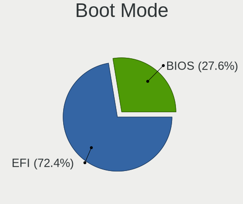
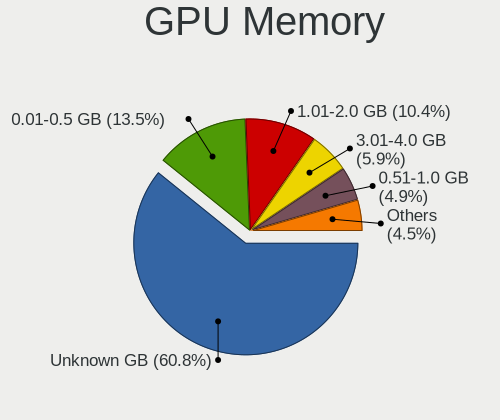
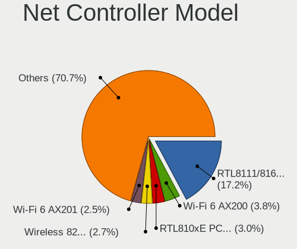
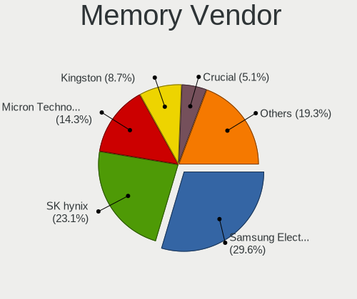
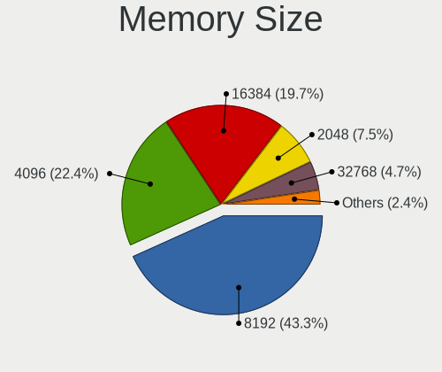
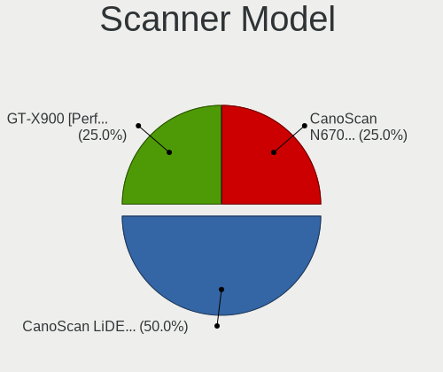
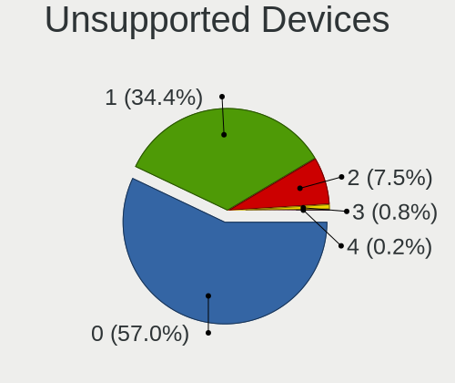

openSUSE - Tested Hardware & Statistics (Notebooks)
---------------------------------------------------

A project to collect tested hardware configurations for openSUSE.

Anyone can contribute to this report by the [hw-probe](https://github.com/linuxhw/hw-probe) tool:

    sudo -E hw-probe -all -upload

Please contribute! Especially if your hardware is rare.

Contents
--------

* [ Test Cases ](#test-cases)

* [ System ](#system)
  - [ OS                       ](#os)
  - [ OS Family                ](#os-family)
  - [ Kernel                   ](#kernel)
  - [ Kernel Family            ](#kernel-family)
  - [ Kernel Major Ver.        ](#kernel-major-ver)
  - [ Arch                     ](#arch)
  - [ DE                       ](#de)
  - [ Display Server           ](#display-server)
  - [ Display Manager          ](#display-manager)
  - [ OS Lang                  ](#os-lang)
  - [ Boot Mode                ](#boot-mode)
  - [ Filesystem               ](#filesystem)
  - [ Part. scheme             ](#part-scheme)
  - [ Dual Boot with Linux/BSD ](#dual-boot-with-linuxbsd)
  - [ Dual Boot (Win)          ](#dual-boot-win)

* [ Board ](#board)
  - [ Vendor                   ](#vendor)
  - [ Model                    ](#model)
  - [ Model Family             ](#model-family)
  - [ MFG Year                 ](#mfg-year)
  - [ Form Factor              ](#form-factor)
  - [ Secure Boot              ](#secure-boot)
  - [ Coreboot                 ](#coreboot)
  - [ RAM Size                 ](#ram-size)
  - [ RAM Used                 ](#ram-used)
  - [ Total Drives             ](#total-drives)
  - [ Has CD-ROM               ](#has-cd-rom)
  - [ Has Ethernet             ](#has-ethernet)
  - [ Has WiFi                 ](#has-wifi)
  - [ Has Bluetooth            ](#has-bluetooth)

* [ Location ](#location)
  - [ Country                  ](#country)
  - [ City                     ](#city)

* [ Drives ](#drives)
  - [ Drive Vendor             ](#drive-vendor)
  - [ Drive Model              ](#drive-model)
  - [ HDD Vendor               ](#hdd-vendor)
  - [ SSD Vendor               ](#ssd-vendor)
  - [ Drive Kind               ](#drive-kind)
  - [ Drive Connector          ](#drive-connector)
  - [ Drive Size               ](#drive-size)
  - [ Space Total              ](#space-total)
  - [ Space Used               ](#space-used)
  - [ Malfunc. Drives          ](#malfunc-drives)
  - [ Malfunc. Drive Vendor    ](#malfunc-drive-vendor)
  - [ Malfunc. HDD Vendor      ](#malfunc-hdd-vendor)
  - [ Malfunc. Drive Kind      ](#malfunc-drive-kind)
  - [ Failed Drives            ](#failed-drives)
  - [ Failed Drive Vendor      ](#failed-drive-vendor)
  - [ Drive Status             ](#drive-status)

* [ Storage controller ](#storage-controller)
  - [ Storage Vendor           ](#storage-vendor)
  - [ Storage Model            ](#storage-model)
  - [ Storage Kind             ](#storage-kind)

* [ Processor ](#processor)
  - [ CPU Vendor               ](#cpu-vendor)
  - [ CPU Model                ](#cpu-model)
  - [ CPU Model Family         ](#cpu-model-family)
  - [ CPU Cores                ](#cpu-cores)
  - [ CPU Sockets              ](#cpu-sockets)
  - [ CPU Threads              ](#cpu-threads)
  - [ CPU Op-Modes             ](#cpu-op-modes)
  - [ CPU Microcode            ](#cpu-microcode)
  - [ CPU Microarch            ](#cpu-microarch)

* [ Graphics ](#graphics)
  - [ GPU Vendor               ](#gpu-vendor)
  - [ GPU Model                ](#gpu-model)
  - [ GPU Combo                ](#gpu-combo)
  - [ GPU Driver               ](#gpu-driver)
  - [ GPU Memory               ](#gpu-memory)

* [ Monitor ](#monitor)
  - [ Monitor Vendor           ](#monitor-vendor)
  - [ Monitor Model            ](#monitor-model)
  - [ Monitor Resolution       ](#monitor-resolution)
  - [ Monitor Diagonal         ](#monitor-diagonal)
  - [ Monitor Width            ](#monitor-width)
  - [ Aspect Ratio             ](#aspect-ratio)
  - [ Monitor Area             ](#monitor-area)
  - [ Pixel Density            ](#pixel-density)
  - [ Multiple Monitors        ](#multiple-monitors)

* [ Network ](#network)
  - [ Net Controller Vendor    ](#net-controller-vendor)
  - [ Net Controller Model     ](#net-controller-model)
  - [ Wireless Vendor          ](#wireless-vendor)
  - [ Wireless Model           ](#wireless-model)
  - [ Ethernet Vendor          ](#ethernet-vendor)
  - [ Ethernet Model           ](#ethernet-model)
  - [ Net Controller Kind      ](#net-controller-kind)
  - [ Used Controller          ](#used-controller)
  - [ NICs                     ](#nics)
  - [ IPv6                     ](#ipv6)

* [ Bluetooth ](#bluetooth)
  - [ Bluetooth Vendor         ](#bluetooth-vendor)
  - [ Bluetooth Model          ](#bluetooth-model)

* [ Sound ](#sound)
  - [ Sound Vendor             ](#sound-vendor)
  - [ Sound Model              ](#sound-model)

* [ Memory ](#memory)
  - [ Memory Vendor            ](#memory-vendor)
  - [ Memory Model             ](#memory-model)
  - [ Memory Kind              ](#memory-kind)
  - [ Memory Form Factor       ](#memory-form-factor)
  - [ Memory Size              ](#memory-size)
  - [ Memory Speed             ](#memory-speed)

* [ Printers & scanners ](#printers--scanners)
  - [ Printer Vendor           ](#printer-vendor)
  - [ Printer Model            ](#printer-model)
  - [ Scanner Vendor           ](#scanner-vendor)
  - [ Scanner Model            ](#scanner-model)

* [ Camera ](#camera)
  - [ Camera Vendor            ](#camera-vendor)
  - [ Camera Model             ](#camera-model)

* [ Security ](#security)
  - [ Fingerprint Vendor       ](#fingerprint-vendor)
  - [ Fingerprint Model        ](#fingerprint-model)
  - [ Chipcard Vendor          ](#chipcard-vendor)
  - [ Chipcard Model           ](#chipcard-model)

* [ Unsupported ](#unsupported)
  - [ Unsupported Devices      ](#unsupported-devices)
  - [ Unsupported Device Types ](#unsupported-device-types)

Test Cases
----------

Total: 1232

| Vendor        | Model                       | Probe                                                      | Date         |
|---------------|-----------------------------|------------------------------------------------------------|--------------|
| Lenovo        | ThinkPad P16s Gen 1 21BT... | [b68fa80860](https://linux-hardware.org/?probe=b68fa80860) | Dec 31, 2022 |
| Lenovo        | IdeaPad S340-14API 81NB     | [270ba62d9d](https://linux-hardware.org/?probe=270ba62d9d) | Dec 31, 2022 |
| Intel Clie... | LAPRC710                    | [47e562afc7](https://linux-hardware.org/?probe=47e562afc7) | Dec 31, 2022 |
| HP            | Victus by Laptop 16-e0xx... | [60989ad0c4](https://linux-hardware.org/?probe=60989ad0c4) | Dec 31, 2022 |
| Dell          | XPS 9320                    | [c7a7749a95](https://linux-hardware.org/?probe=c7a7749a95) | Dec 30, 2022 |
| Dell          | XPS 9320                    | [458727c26e](https://linux-hardware.org/?probe=458727c26e) | Dec 30, 2022 |
| ASUSTek       | Zenbook UX3402ZA_UX3402Z... | [250104c525](https://linux-hardware.org/?probe=250104c525) | Dec 29, 2022 |
| HP            | OMEN Laptop 15-en0xxx       | [23fe358945](https://linux-hardware.org/?probe=23fe358945) | Dec 29, 2022 |
| Lenovo        | IdeaPad 320-15IKB 81BG      | [442fcdba27](https://linux-hardware.org/?probe=442fcdba27) | Dec 26, 2022 |
| Lenovo        | IdeaPad 320-15IKB 81BG      | [4ad973e635](https://linux-hardware.org/?probe=4ad973e635) | Dec 26, 2022 |
| HP            | EliteBook 840 G4            | [1c5b59d2e4](https://linux-hardware.org/?probe=1c5b59d2e4) | Dec 26, 2022 |
| HP            | EliteBook 840 G4            | [730469b496](https://linux-hardware.org/?probe=730469b496) | Dec 26, 2022 |
| SLIMBOOK      | PROX-AMD5                   | [2ef0101186](https://linux-hardware.org/?probe=2ef0101186) | Dec 25, 2022 |
| ASUSTek       | ZenBook UX535LI_UX535LI     | [cc51ba5d49](https://linux-hardware.org/?probe=cc51ba5d49) | Dec 24, 2022 |
| ASUSTek       | ZenBook UX535LI_UX535LI     | [660e3a6511](https://linux-hardware.org/?probe=660e3a6511) | Dec 24, 2022 |
| Dell          | Inspiron 3593               | [a640541ee0](https://linux-hardware.org/?probe=a640541ee0) | Dec 24, 2022 |
| Dell          | Inspiron 15 7510            | [d5702b0c66](https://linux-hardware.org/?probe=d5702b0c66) | Dec 24, 2022 |
| Sony          | SVS1311N9ES                 | [5c1a4bed5b](https://linux-hardware.org/?probe=5c1a4bed5b) | Dec 24, 2022 |
| HP            | Pavilion 17                 | [0adc0d708b](https://linux-hardware.org/?probe=0adc0d708b) | Dec 23, 2022 |
| Dell          | Vostro 3501                 | [8a3788aa78](https://linux-hardware.org/?probe=8a3788aa78) | Dec 23, 2022 |
| Lenovo        | Y50-70 Touch 20349          | [b26dc749a5](https://linux-hardware.org/?probe=b26dc749a5) | Dec 23, 2022 |
| Dell          | Vostro 3501                 | [258dc5c40d](https://linux-hardware.org/?probe=258dc5c40d) | Dec 23, 2022 |
| Schenker      | VIA 15 Pro                  | [b1a40c91d2](https://linux-hardware.org/?probe=b1a40c91d2) | Dec 22, 2022 |
| Schenker      | VIA 15 Pro                  | [75efe6fb52](https://linux-hardware.org/?probe=75efe6fb52) | Dec 22, 2022 |
| Acer          | Nitro AN515-51              | [9dca0f7674](https://linux-hardware.org/?probe=9dca0f7674) | Dec 22, 2022 |
| ASUSTek       | VivoBook_ASUSLaptop X421... | [3a505870ba](https://linux-hardware.org/?probe=3a505870ba) | Dec 22, 2022 |
| Razer         | Blade 15 (2022) - RZ09-0... | [13e778509f](https://linux-hardware.org/?probe=13e778509f) | Dec 22, 2022 |
| Dell          | Latitude 5510               | [b4f32be15b](https://linux-hardware.org/?probe=b4f32be15b) | Dec 22, 2022 |
| Multilaser    | MLSH1H LINUX                | [70695e9f3b](https://linux-hardware.org/?probe=70695e9f3b) | Dec 21, 2022 |
| HP            | Pavilion Laptop 15-cs2xx... | [5ea57fb331](https://linux-hardware.org/?probe=5ea57fb331) | Dec 21, 2022 |
| Lenovo        | IdeaPad S145-15API 81UT     | [6ec5c4fc19](https://linux-hardware.org/?probe=6ec5c4fc19) | Dec 21, 2022 |
| Dell          | XPS 9320                    | [ce5835b58d](https://linux-hardware.org/?probe=ce5835b58d) | Dec 20, 2022 |
| HP            | Pavilion Laptop 15-cs2xx... | [a4549398af](https://linux-hardware.org/?probe=a4549398af) | Dec 20, 2022 |
| HUAWEI        | BOD-WXX9                    | [da35f3ec23](https://linux-hardware.org/?probe=da35f3ec23) | Dec 19, 2022 |
| Dell          | Latitude 5590               | [83e177278e](https://linux-hardware.org/?probe=83e177278e) | Dec 17, 2022 |
| Fujitsu Si... | LIFEBOOK E8310              | [5fca69ae89](https://linux-hardware.org/?probe=5fca69ae89) | Dec 17, 2022 |
| Acer          | Aspire E1-572G              | [adc5196d64](https://linux-hardware.org/?probe=adc5196d64) | Dec 17, 2022 |
| Lenovo        | 1S20UDCT01WWPF1ARBNP 29U... | [b5e9681592](https://linux-hardware.org/?probe=b5e9681592) | Dec 17, 2022 |
| HP            | Pavilion Laptop 15-cs2xx... | [665bd04471](https://linux-hardware.org/?probe=665bd04471) | Dec 16, 2022 |
| Lenovo        | ThinkPad X1 Carbon 4th 2... | [143d2059a6](https://linux-hardware.org/?probe=143d2059a6) | Dec 16, 2022 |
| ASUSTek       | VivoBook_ASUSLaptop X513... | [f5a317963c](https://linux-hardware.org/?probe=f5a317963c) | Dec 15, 2022 |
| Dell          | Precision 7760              | [cbe51e9db3](https://linux-hardware.org/?probe=cbe51e9db3) | Dec 15, 2022 |
| HP            | Pavilion Laptop 15-cs2xx... | [1d57f3ab30](https://linux-hardware.org/?probe=1d57f3ab30) | Dec 15, 2022 |
| HP            | Pavilion Laptop 15-cs2xx... | [a1d6879fab](https://linux-hardware.org/?probe=a1d6879fab) | Dec 15, 2022 |
| ASUSTek       | VivoBook 15_ASUS Laptop ... | [f18b9184ca](https://linux-hardware.org/?probe=f18b9184ca) | Dec 15, 2022 |
| Irbis         | NB264                       | [d137aad605](https://linux-hardware.org/?probe=d137aad605) | Dec 14, 2022 |
| Lenovo        | ThinkPad X1 Carbon 4th 2... | [4a3ac966fc](https://linux-hardware.org/?probe=4a3ac966fc) | Dec 13, 2022 |
| Lenovo        | ThinkPad T440s 20AQ004EU... | [8d04dfe3a5](https://linux-hardware.org/?probe=8d04dfe3a5) | Dec 12, 2022 |
| Acer          | Predator PH315-52           | [b5d4116615](https://linux-hardware.org/?probe=b5d4116615) | Dec 11, 2022 |
| Acer          | Predator PH315-52           | [144f698515](https://linux-hardware.org/?probe=144f698515) | Dec 11, 2022 |
| Fujitsu Si... | LIFEBOOK E8310              | [e4fe543570](https://linux-hardware.org/?probe=e4fe543570) | Dec 10, 2022 |
| ASUSTek       | VivoBook_ASUSLaptop X515... | [c715acf0ea](https://linux-hardware.org/?probe=c715acf0ea) | Dec 10, 2022 |
| Dell          | Inspiron 3593               | [62212b2baa](https://linux-hardware.org/?probe=62212b2baa) | Dec 08, 2022 |
| Lenovo        | Legion 5 15ARH05 82B5       | [29c71a771b](https://linux-hardware.org/?probe=29c71a771b) | Dec 08, 2022 |
| HP            | ZBook 15 G6                 | [57a9a5fbf8](https://linux-hardware.org/?probe=57a9a5fbf8) | Dec 07, 2022 |
| ASUSTek       | ZenBook UX533FD_UX533FD     | [799ba39d5e](https://linux-hardware.org/?probe=799ba39d5e) | Dec 06, 2022 |
| Dell          | Inspiron 3593               | [6fc850bb3e](https://linux-hardware.org/?probe=6fc850bb3e) | Dec 06, 2022 |
| Dell          | Latitude E5400              | [ab5b64fe8a](https://linux-hardware.org/?probe=ab5b64fe8a) | Dec 05, 2022 |
| Apple         | MacBookPro9,2               | [5827ea2fa5](https://linux-hardware.org/?probe=5827ea2fa5) | Dec 05, 2022 |
| Apple         | MacBookPro9,2               | [7f8dcdb666](https://linux-hardware.org/?probe=7f8dcdb666) | Dec 05, 2022 |
| HP            | Pavilion 13 x360 PC         | [50bcdd33eb](https://linux-hardware.org/?probe=50bcdd33eb) | Dec 04, 2022 |
| HP            | EliteBook 845 G8 Noteboo... | [a41d7dbfb1](https://linux-hardware.org/?probe=a41d7dbfb1) | Nov 29, 2022 |
| HP            | EliteBook 8460p             | [ffe997080f](https://linux-hardware.org/?probe=ffe997080f) | Nov 28, 2022 |
| HUAWEI        | BOHK-WAX9X                  | [4c6d3faf86](https://linux-hardware.org/?probe=4c6d3faf86) | Nov 28, 2022 |
| HUAWEI        | BOHK-WAX9X                  | [cd98ebccb9](https://linux-hardware.org/?probe=cd98ebccb9) | Nov 28, 2022 |
| Lenovo        | ThinkPad X260 20F6005HUS    | [6418eda1a9](https://linux-hardware.org/?probe=6418eda1a9) | Nov 27, 2022 |
| ASUSTek       | Z450LA                      | [ffd2220d21](https://linux-hardware.org/?probe=ffd2220d21) | Nov 25, 2022 |
| MSI           | GE72VR 7RF                  | [a034af6b70](https://linux-hardware.org/?probe=a034af6b70) | Nov 25, 2022 |
| Dell          | Inspiron 14 Plus 7420       | [a35ca4bbbe](https://linux-hardware.org/?probe=a35ca4bbbe) | Nov 24, 2022 |
| Dell          | Latitude E5570              | [ed2e9cfb4f](https://linux-hardware.org/?probe=ed2e9cfb4f) | Nov 24, 2022 |
| HP            | Pavilion 15                 | [b0d1e2e0ba](https://linux-hardware.org/?probe=b0d1e2e0ba) | Nov 24, 2022 |
| Lenovo        | IdeaPad Gaming 3 15IHU6 ... | [96a68d5d80](https://linux-hardware.org/?probe=96a68d5d80) | Nov 24, 2022 |
| Schenker      | XMG FUSION 15 (XFU15L19)    | [eaab6a8319](https://linux-hardware.org/?probe=eaab6a8319) | Nov 23, 2022 |
| SLIMBOOK      | PROX-AMD5                   | [9758f3268e](https://linux-hardware.org/?probe=9758f3268e) | Nov 23, 2022 |
| Dell          | Latitude 5401               | [f964652e0c](https://linux-hardware.org/?probe=f964652e0c) | Nov 22, 2022 |
| Timi          | TM1612                      | [abd08d53c7](https://linux-hardware.org/?probe=abd08d53c7) | Nov 22, 2022 |
| HP            | ZBook Studio 15.6 inch G... | [07210e29c5](https://linux-hardware.org/?probe=07210e29c5) | Nov 21, 2022 |
| TUXEDO        | XMG FUSION 15 (XFU15L19)    | [d9a74ee60a](https://linux-hardware.org/?probe=d9a74ee60a) | Nov 20, 2022 |
| Acer          | Aspire A317-51              | [43c8f9b08b](https://linux-hardware.org/?probe=43c8f9b08b) | Nov 19, 2022 |
| Acer          | Aspire A317-51              | [a4a3dabbb4](https://linux-hardware.org/?probe=a4a3dabbb4) | Nov 19, 2022 |
| ASUSTek       | Zenbook UM6702RA_RM6702R... | [05c9ad6f4a](https://linux-hardware.org/?probe=05c9ad6f4a) | Nov 19, 2022 |
| Dell          | Latitude 5414               | [a408bec327](https://linux-hardware.org/?probe=a408bec327) | Nov 18, 2022 |
| Apple         | MacBook5,1                  | [7139ac864a](https://linux-hardware.org/?probe=7139ac864a) | Nov 17, 2022 |
| HP            | Laptop 15-ef2xxx            | [371368cfe7](https://linux-hardware.org/?probe=371368cfe7) | Nov 16, 2022 |
| HP            | Compaq 6830s                | [074c3a8b43](https://linux-hardware.org/?probe=074c3a8b43) | Nov 14, 2022 |
| HP            | Notebook                    | [b0d1cd283f](https://linux-hardware.org/?probe=b0d1cd283f) | Nov 14, 2022 |
| HP            | Notebook                    | [95ecccf4c7](https://linux-hardware.org/?probe=95ecccf4c7) | Nov 14, 2022 |
| SLIMBOOK      | PROX14                      | [a109c5bf52](https://linux-hardware.org/?probe=a109c5bf52) | Nov 14, 2022 |
| ASUSTek       | VivoBook_ASUSLaptop X513... | [57368a1129](https://linux-hardware.org/?probe=57368a1129) | Nov 12, 2022 |
| Lenovo        | ThinkPad T530 2394D56       | [3d44b768e5](https://linux-hardware.org/?probe=3d44b768e5) | Nov 12, 2022 |
| Toshiba       | IS 1422+                    | [0c948c9926](https://linux-hardware.org/?probe=0c948c9926) | Nov 11, 2022 |
| HP            | EliteBook 855 G7 Noteboo... | [969fa6c183](https://linux-hardware.org/?probe=969fa6c183) | Nov 11, 2022 |
| Intel         | (R) Education Tablet        | [13286af46e](https://linux-hardware.org/?probe=13286af46e) | Nov 10, 2022 |
| HP            | ZBook 17                    | [e866fa1319](https://linux-hardware.org/?probe=e866fa1319) | Nov 09, 2022 |
| Lenovo        | B50-80 80LT                 | [c16106686d](https://linux-hardware.org/?probe=c16106686d) | Nov 08, 2022 |
| Dell          | Inspiron 3593               | [be071c7456](https://linux-hardware.org/?probe=be071c7456) | Nov 08, 2022 |
| HP            | ZBook 17                    | [af26e94623](https://linux-hardware.org/?probe=af26e94623) | Nov 08, 2022 |
| Lenovo        | ThinkPad X1 Extreme Gen ... | [e13f29fc81](https://linux-hardware.org/?probe=e13f29fc81) | Nov 07, 2022 |
| Dell          | Inspiron 7577               | [3f80a8a4c4](https://linux-hardware.org/?probe=3f80a8a4c4) | Nov 06, 2022 |
| ASUSTek       | VivoBook_ASUSLaptop X515... | [db62973b36](https://linux-hardware.org/?probe=db62973b36) | Nov 06, 2022 |
| HP            | Pavilion Laptop 15-cs2xx... | [912bfcc57e](https://linux-hardware.org/?probe=912bfcc57e) | Nov 06, 2022 |
| Dell          | Inspiron 5505               | [0f119b6000](https://linux-hardware.org/?probe=0f119b6000) | Nov 06, 2022 |
| Dell          | Inspiron 5505               | [e872fcb5f7](https://linux-hardware.org/?probe=e872fcb5f7) | Nov 06, 2022 |
| SLIMBOOK      | PROX-AMD5                   | [7590df932b](https://linux-hardware.org/?probe=7590df932b) | Nov 05, 2022 |
| HP            | Pavilion Laptop 15-cs2xx... | [99e32a37ff](https://linux-hardware.org/?probe=99e32a37ff) | Nov 04, 2022 |
| Lenovo        | G50-45 80E3                 | [011d776675](https://linux-hardware.org/?probe=011d776675) | Nov 04, 2022 |
| SLIMBOOK      | PROX-AMD5                   | [442942f712](https://linux-hardware.org/?probe=442942f712) | Nov 04, 2022 |
| HP            | Notebook                    | [27d097b522](https://linux-hardware.org/?probe=27d097b522) | Nov 01, 2022 |
| Lenovo        | ThinkPad W510 431965U       | [56dd93206a](https://linux-hardware.org/?probe=56dd93206a) | Oct 29, 2022 |
| Acer          | Extensa 215-54              | [0fe46d7655](https://linux-hardware.org/?probe=0fe46d7655) | Oct 29, 2022 |
| Dell          | Vostro 3580                 | [74a79dbdb6](https://linux-hardware.org/?probe=74a79dbdb6) | Oct 29, 2022 |
| Lenovo        | ThinkPad X1 Carbon Gen 1... | [6314ec0dd1](https://linux-hardware.org/?probe=6314ec0dd1) | Oct 28, 2022 |
| Lenovo        | ThinkPad X1 Carbon Gen 1... | [dcd40f9f78](https://linux-hardware.org/?probe=dcd40f9f78) | Oct 28, 2022 |
| ASUSTek       | VivoBook_ASUSLaptop X509... | [033cc83715](https://linux-hardware.org/?probe=033cc83715) | Oct 28, 2022 |
| Dell          | Latitude E6430              | [cb4eb1f556](https://linux-hardware.org/?probe=cb4eb1f556) | Oct 28, 2022 |
| Lenovo        | Unknown                     | [6a3e704d70](https://linux-hardware.org/?probe=6a3e704d70) | Oct 27, 2022 |
| Dell          | Latitude 9420               | [a601281b46](https://linux-hardware.org/?probe=a601281b46) | Oct 27, 2022 |
| Lenovo        | ThinkPad W510 4391W3V       | [a943d9879c](https://linux-hardware.org/?probe=a943d9879c) | Oct 26, 2022 |
| ASUSTek       | ASUS EXPERTBOOK L1500CDA... | [3d86f7ccac](https://linux-hardware.org/?probe=3d86f7ccac) | Oct 25, 2022 |
| Fujitsu       | LIFEBOOK E746               | [4c699ac628](https://linux-hardware.org/?probe=4c699ac628) | Oct 21, 2022 |
| SLIMBOOK      | PROX-AMD5                   | [5e59c8933b](https://linux-hardware.org/?probe=5e59c8933b) | Oct 20, 2022 |
| HP            | ZBook 17                    | [6dc9848327](https://linux-hardware.org/?probe=6dc9848327) | Oct 20, 2022 |
| Sony          | VPCEL3S1R                   | [5c37559c2d](https://linux-hardware.org/?probe=5c37559c2d) | Oct 20, 2022 |
| Dell          | Inspiron 7577               | [46b9d8c126](https://linux-hardware.org/?probe=46b9d8c126) | Oct 19, 2022 |
| HP            | ZBook 15 G3                 | [a078a2f2ae](https://linux-hardware.org/?probe=a078a2f2ae) | Oct 19, 2022 |
| Lenovo        | ThinkBook 14 G3 ACL 21A2    | [a66d2944a8](https://linux-hardware.org/?probe=a66d2944a8) | Oct 18, 2022 |
| MSI           | GE70 2PE                    | [ff621f681e](https://linux-hardware.org/?probe=ff621f681e) | Oct 17, 2022 |
| Dell          | Inspiron 7577               | [8b1714d48d](https://linux-hardware.org/?probe=8b1714d48d) | Oct 17, 2022 |
| Lenovo        | ThinkPad P15s Gen 2i 20W... | [2dd0b46420](https://linux-hardware.org/?probe=2dd0b46420) | Oct 16, 2022 |
| Lenovo        | ThinkPad T14 Gen 2a 20XK... | [b11fa8e1dd](https://linux-hardware.org/?probe=b11fa8e1dd) | Oct 16, 2022 |
| MSI           | Prestige 14 A11SCS          | [e552920463](https://linux-hardware.org/?probe=e552920463) | Oct 13, 2022 |
| ASUSTek       | ZenBook UX425IA_UM425IA     | [61eb97192e](https://linux-hardware.org/?probe=61eb97192e) | Oct 12, 2022 |
| Toshiba       | Satellite P55t-A            | [60d52e85a0](https://linux-hardware.org/?probe=60d52e85a0) | Oct 12, 2022 |
| Lenovo        | ThinkPad T430 2347DS3       | [970542656e](https://linux-hardware.org/?probe=970542656e) | Oct 11, 2022 |
| Intel         | (R) Education Tablet        | [9d1756d283](https://linux-hardware.org/?probe=9d1756d283) | Oct 09, 2022 |
| Gateway       | NV54 Series                 | [88b57ed4e4](https://linux-hardware.org/?probe=88b57ed4e4) | Oct 09, 2022 |
| ASUSTek       | F3Sv                        | [042104bbc2](https://linux-hardware.org/?probe=042104bbc2) | Oct 08, 2022 |
| Toshiba       | Satellite L350              | [79268bac9b](https://linux-hardware.org/?probe=79268bac9b) | Oct 06, 2022 |
| Toshiba       | Satellite L350              | [cf2e5dae86](https://linux-hardware.org/?probe=cf2e5dae86) | Oct 06, 2022 |
| Lenovo        | IdeaPad 5 14ARE05 81YM      | [b07d3b7b7f](https://linux-hardware.org/?probe=b07d3b7b7f) | Oct 05, 2022 |
| Lenovo        | ThinkPad T470 20HES0FW00    | [33a0cb05e8](https://linux-hardware.org/?probe=33a0cb05e8) | Oct 04, 2022 |
| Acer          | S50-54                      | [7680195105](https://linux-hardware.org/?probe=7680195105) | Oct 04, 2022 |
| Dell          | Latitude 3340               | [100b89b0a9](https://linux-hardware.org/?probe=100b89b0a9) | Oct 04, 2022 |
| Dell          | Vostro 3560                 | [79f922d367](https://linux-hardware.org/?probe=79f922d367) | Oct 02, 2022 |
| Acer          | S50-54                      | [a7ff4f9792](https://linux-hardware.org/?probe=a7ff4f9792) | Oct 02, 2022 |
| Dell          | Vostro 3560                 | [59c14fb5c0](https://linux-hardware.org/?probe=59c14fb5c0) | Oct 02, 2022 |
| Dell          | Latitude E5250              | [6116460e52](https://linux-hardware.org/?probe=6116460e52) | Sep 27, 2022 |
| HP            | ZBook 17 G2                 | [d6d9af3173](https://linux-hardware.org/?probe=d6d9af3173) | Sep 26, 2022 |
| HP            | ZBook 17 G2                 | [ff70118578](https://linux-hardware.org/?probe=ff70118578) | Sep 26, 2022 |
| Lenovo        | ThinkPad E14 Gen 4 21EB0... | [6c0c9c0037](https://linux-hardware.org/?probe=6c0c9c0037) | Sep 25, 2022 |
| Lenovo        | K14 Gen 1 21CUS02600        | [911a73323d](https://linux-hardware.org/?probe=911a73323d) | Sep 24, 2022 |
| Timi          | A35S                        | [a57a688f31](https://linux-hardware.org/?probe=a57a688f31) | Sep 21, 2022 |
| Dell          | Latitude 7400               | [466bd310ef](https://linux-hardware.org/?probe=466bd310ef) | Sep 21, 2022 |
| Acer          | Aspire A515-45              | [5b0c60618f](https://linux-hardware.org/?probe=5b0c60618f) | Sep 20, 2022 |
| Dell          | Inspiron 5515               | [a7f0e24464](https://linux-hardware.org/?probe=a7f0e24464) | Sep 20, 2022 |
| Dell          | Inspiron 3542               | [7f7ef47d4b](https://linux-hardware.org/?probe=7f7ef47d4b) | Sep 20, 2022 |
| Lenovo        | ThinkPad T14s Gen 1 20UJ... | [167d69530f](https://linux-hardware.org/?probe=167d69530f) | Sep 19, 2022 |
| Lenovo        | ThinkPad T14s Gen 1 20UJ... | [d3b972d870](https://linux-hardware.org/?probe=d3b972d870) | Sep 19, 2022 |
| Acer          | Predator PH315-52           | [959330d9c1](https://linux-hardware.org/?probe=959330d9c1) | Sep 19, 2022 |
| HP            | EliteBook 8470p             | [337ccff161](https://linux-hardware.org/?probe=337ccff161) | Sep 15, 2022 |
| ASUSTek       | X55CR                       | [43b77d436c](https://linux-hardware.org/?probe=43b77d436c) | Sep 14, 2022 |
| Apple         | MacBookPro8,2               | [a30032ef92](https://linux-hardware.org/?probe=a30032ef92) | Sep 11, 2022 |
| Apple         | MacBookPro8,2               | [0645f03606](https://linux-hardware.org/?probe=0645f03606) | Sep 11, 2022 |
| Lenovo        | ThinkPad W510 4391W3V       | [cae551826b](https://linux-hardware.org/?probe=cae551826b) | Sep 10, 2022 |
| MSI           | Modern 14 B5M               | [b11b5bcba5](https://linux-hardware.org/?probe=b11b5bcba5) | Sep 09, 2022 |
| Lenovo        | ThinkPad T14 Gen 1 20S00... | [ea53dc8c02](https://linux-hardware.org/?probe=ea53dc8c02) | Sep 07, 2022 |
| SLIMBOOK      | PROX-AMD5                   | [492849d42d](https://linux-hardware.org/?probe=492849d42d) | Sep 07, 2022 |
| Dell          | Precision 5530              | [d588e96ddc](https://linux-hardware.org/?probe=d588e96ddc) | Sep 07, 2022 |
| Lenovo        | IdeaPad 5 Pro 16ACH6 82L... | [f0ce37ab5a](https://linux-hardware.org/?probe=f0ce37ab5a) | Sep 06, 2022 |
| HP            | 250 G8 Notebook PC          | [312e65fd07](https://linux-hardware.org/?probe=312e65fd07) | Sep 05, 2022 |
| HUAWEI        | KLVD-WXX9                   | [ede97805ec](https://linux-hardware.org/?probe=ede97805ec) | Sep 02, 2022 |
| Lenovo        | ThinkPad T14 Gen 1 20S1S... | [e5ae0e72ca](https://linux-hardware.org/?probe=e5ae0e72ca) | Sep 02, 2022 |
| Samsung       | 550XBE/350XBE               | [0104e26464](https://linux-hardware.org/?probe=0104e26464) | Sep 02, 2022 |
| ASUSTek       | VivoBook_ASUSLaptop X421... | [dea9852124](https://linux-hardware.org/?probe=dea9852124) | Sep 02, 2022 |
| ASUSTek       | Zenbook UX3402ZA_UX3402Z... | [68170e253f](https://linux-hardware.org/?probe=68170e253f) | Sep 01, 2022 |
| Notebook      | N24_25JU                    | [50f570f3d9](https://linux-hardware.org/?probe=50f570f3d9) | Aug 31, 2022 |
| Positivo      | W942SW_SW1                  | [bec76a1474](https://linux-hardware.org/?probe=bec76a1474) | Aug 30, 2022 |
| HP            | ZBook 17                    | [98e643f5af](https://linux-hardware.org/?probe=98e643f5af) | Aug 30, 2022 |
| Positivo      | W942SW_SW1                  | [62dcad10f0](https://linux-hardware.org/?probe=62dcad10f0) | Aug 29, 2022 |
| Google        | Eldrid                      | [6a0c6eb1de](https://linux-hardware.org/?probe=6a0c6eb1de) | Aug 27, 2022 |
| Lenovo        | ThinkPad T460s 20F9004NU... | [04f9f63255](https://linux-hardware.org/?probe=04f9f63255) | Aug 26, 2022 |
| Eluktronic... | MAX-17                      | [0a454665e0](https://linux-hardware.org/?probe=0a454665e0) | Aug 25, 2022 |
| Lenovo        | IdeaPad L340-15IRH Gamin... | [8021bbb58b](https://linux-hardware.org/?probe=8021bbb58b) | Aug 24, 2022 |
| HP            | Laptop 17-ca0xxx            | [c956ba84ed](https://linux-hardware.org/?probe=c956ba84ed) | Aug 22, 2022 |
| ASUSTek       | ROG Strix G513QY_G513QY     | [a80c24ae6b](https://linux-hardware.org/?probe=a80c24ae6b) | Aug 21, 2022 |
| HP            | ProBook 640 G1              | [a69a02f102](https://linux-hardware.org/?probe=a69a02f102) | Aug 20, 2022 |
| Dell          | XPS 15 9530                 | [9e6a3e80b4](https://linux-hardware.org/?probe=9e6a3e80b4) | Aug 19, 2022 |
| Lenovo        | Z51-70 80K6                 | [f10fe1f561](https://linux-hardware.org/?probe=f10fe1f561) | Aug 18, 2022 |
| Notebook      | NLx0MU                      | [0e2658915d](https://linux-hardware.org/?probe=0e2658915d) | Aug 17, 2022 |
| Lenovo        | ThinkPad T450 20BUS0EW1F    | [88ad38d9f7](https://linux-hardware.org/?probe=88ad38d9f7) | Aug 17, 2022 |
| Lenovo        | ThinkPad T450 20BUS0EW1F    | [73b611ea50](https://linux-hardware.org/?probe=73b611ea50) | Aug 17, 2022 |
| HP            | Pavilion Notebook           | [a05b95b836](https://linux-hardware.org/?probe=a05b95b836) | Aug 15, 2022 |
| HP            | Pavilion Notebook           | [aea2bfde6a](https://linux-hardware.org/?probe=aea2bfde6a) | Aug 15, 2022 |
| HP            | Victus by Laptop 16-e0xx... | [fd64b105a4](https://linux-hardware.org/?probe=fd64b105a4) | Aug 14, 2022 |
| HP            | Victus by Laptop 16-e0xx... | [73f2db9159](https://linux-hardware.org/?probe=73f2db9159) | Aug 14, 2022 |
| ASUSTek       | ZenBook UX431DA_UM431DA     | [b3df3a51e0](https://linux-hardware.org/?probe=b3df3a51e0) | Aug 14, 2022 |
| ASUSTek       | ZenBook UX431DA_UM431DA     | [2043908eed](https://linux-hardware.org/?probe=2043908eed) | Aug 14, 2022 |
| Dell          | Latitude E6430              | [91a44f9b39](https://linux-hardware.org/?probe=91a44f9b39) | Aug 13, 2022 |
| Dell          | Latitude E6430              | [864ad41c22](https://linux-hardware.org/?probe=864ad41c22) | Aug 13, 2022 |
| Lenovo        | ThinkBook 16p Gen 2 20YM    | [b1498c810e](https://linux-hardware.org/?probe=b1498c810e) | Aug 12, 2022 |
| HP            | Laptop 17-by1xxx            | [1be4a11102](https://linux-hardware.org/?probe=1be4a11102) | Aug 09, 2022 |
| SLIMBOOK      | PROX-AMD5                   | [119cdc7bf8](https://linux-hardware.org/?probe=119cdc7bf8) | Aug 07, 2022 |
| Lenovo        | ThinkBook 14 G3 ACL 21A2    | [0aada24b1e](https://linux-hardware.org/?probe=0aada24b1e) | Aug 07, 2022 |
| Lenovo        | ThinkBook 16p Gen 2 20YM    | [054c0beb4f](https://linux-hardware.org/?probe=054c0beb4f) | Aug 07, 2022 |
| Acer          | Aspire 4732Z                | [73027b2cca](https://linux-hardware.org/?probe=73027b2cca) | Aug 07, 2022 |
| Valve         | Jupiter                     | [37f87e94fc](https://linux-hardware.org/?probe=37f87e94fc) | Aug 07, 2022 |
| Lenovo        | ThinkBook 14 G3 ACL 21A2    | [6880ac8488](https://linux-hardware.org/?probe=6880ac8488) | Aug 06, 2022 |
| SLIMBOOK      | PROX-AMD5                   | [ec98a546e1](https://linux-hardware.org/?probe=ec98a546e1) | Aug 06, 2022 |
| Unknown       | Unknown                     | [904bd1db44](https://linux-hardware.org/?probe=904bd1db44) | Aug 06, 2022 |
| Acer          | Aspire A515-45              | [ddd717c7e6](https://linux-hardware.org/?probe=ddd717c7e6) | Aug 05, 2022 |
| Lenovo        | ThinkPad X1 Carbon 6th 2... | [ae030e58fb](https://linux-hardware.org/?probe=ae030e58fb) | Jul 31, 2022 |
| Dell          | Inspiron 13-7359            | [24fa962b0b](https://linux-hardware.org/?probe=24fa962b0b) | Jul 28, 2022 |
| Lenovo        | ThinkPad W510 431965U       | [ab6b15eef4](https://linux-hardware.org/?probe=ab6b15eef4) | Jul 28, 2022 |
| Unknown       | Unknown                     | [4d9a472691](https://linux-hardware.org/?probe=4d9a472691) | Jul 27, 2022 |
| Unknown       | Unknown                     | [ded9f7587a](https://linux-hardware.org/?probe=ded9f7587a) | Jul 27, 2022 |
| Lenovo        | ThinkPad W510 431965U       | [8ba9959c19](https://linux-hardware.org/?probe=8ba9959c19) | Jul 27, 2022 |
| TUXEDO        | Pulse 15 Gen1               | [56c2008bb6](https://linux-hardware.org/?probe=56c2008bb6) | Jul 25, 2022 |
| Unknown       | Unknown                     | [0c4182ee0a](https://linux-hardware.org/?probe=0c4182ee0a) | Jul 23, 2022 |
| Unknown       | Unknown                     | [7a29580deb](https://linux-hardware.org/?probe=7a29580deb) | Jul 23, 2022 |
| Notebook      | NLx0MU                      | [7cb795f428](https://linux-hardware.org/?probe=7cb795f428) | Jul 22, 2022 |
| Lenovo        | ThinkPad L15 Gen 2 20X30... | [5a6d4e8ba4](https://linux-hardware.org/?probe=5a6d4e8ba4) | Jul 21, 2022 |
| Lenovo        | ThinkBook 15 G2 ITL 20VE    | [7b128b9e7a](https://linux-hardware.org/?probe=7b128b9e7a) | Jul 19, 2022 |
| Lenovo        | ThinkPad Edge 0328A11       | [4305889043](https://linux-hardware.org/?probe=4305889043) | Jul 17, 2022 |
| Toshiba       | Satellite L500              | [5ac3a7aa95](https://linux-hardware.org/?probe=5ac3a7aa95) | Jul 17, 2022 |
| ASUSTek       | Zenbook UX3402ZA_UX3402Z... | [0f1dd0317a](https://linux-hardware.org/?probe=0f1dd0317a) | Jul 17, 2022 |
| Dell          | Inspiron 5584               | [b6d23c8307](https://linux-hardware.org/?probe=b6d23c8307) | Jul 16, 2022 |
| HP            | Pavilion g6                 | [556c813157](https://linux-hardware.org/?probe=556c813157) | Jul 16, 2022 |
| ASUSTek       | Zenbook UX3402ZA_UX3402Z... | [95b0d6d487](https://linux-hardware.org/?probe=95b0d6d487) | Jul 14, 2022 |
| Jumper        | EZbook                      | [2515427610](https://linux-hardware.org/?probe=2515427610) | Jul 12, 2022 |
| ASUSTek       | ROG Zephyrus G14 GA401QM... | [e7b17323df](https://linux-hardware.org/?probe=e7b17323df) | Jul 10, 2022 |
| Dell          | XPS 15 9510                 | [d8f1865db2](https://linux-hardware.org/?probe=d8f1865db2) | Jul 08, 2022 |
| Lenovo        | ThinkPad T14 Gen 1 20UD0... | [42cc0cf38e](https://linux-hardware.org/?probe=42cc0cf38e) | Jul 07, 2022 |
| Purism        | Librem 15 v3                | [1e39d0bba8](https://linux-hardware.org/?probe=1e39d0bba8) | Jul 06, 2022 |
| Dell          | XPS 15 9570                 | [2311c99a80](https://linux-hardware.org/?probe=2311c99a80) | Jul 06, 2022 |
| Multilaser    | PC150                       | [b6fcf6d507](https://linux-hardware.org/?probe=b6fcf6d507) | Jul 04, 2022 |
| Lenovo        | K14 Gen 1 21CUS02600        | [80fbf3aee4](https://linux-hardware.org/?probe=80fbf3aee4) | Jul 02, 2022 |
| TUXEDO        | Pulse 15 Gen1               | [9de0586493](https://linux-hardware.org/?probe=9de0586493) | Jul 01, 2022 |
| TUXEDO        | Pulse 15 Gen1               | [8c7b7c1b45](https://linux-hardware.org/?probe=8c7b7c1b45) | Jul 01, 2022 |
| HP            | ProBook 455 G8 Notebook ... | [bec2a7697f](https://linux-hardware.org/?probe=bec2a7697f) | Jun 30, 2022 |
| HP            | ENVY TS 17                  | [7b5d021513](https://linux-hardware.org/?probe=7b5d021513) | Jun 29, 2022 |
| Framework     | Laptop                      | [d4cd42f3af](https://linux-hardware.org/?probe=d4cd42f3af) | Jun 28, 2022 |
| Apple         | MacBook7,1                  | [2818c11c12](https://linux-hardware.org/?probe=2818c11c12) | Jun 28, 2022 |
| ASUSTek       | ASUS EXPERTBOOK B1500CEA... | [f1b7197958](https://linux-hardware.org/?probe=f1b7197958) | Jun 25, 2022 |
| ASUSTek       | VivoBook_ASUSLaptop X321... | [d2925f529c](https://linux-hardware.org/?probe=d2925f529c) | Jun 25, 2022 |
| Acer          | Swift SFX14-41G             | [c3c9ce7e40](https://linux-hardware.org/?probe=c3c9ce7e40) | Jun 23, 2022 |
| HP            | Pavilion Laptop 14-bf0xx    | [9a2d492e07](https://linux-hardware.org/?probe=9a2d492e07) | Jun 22, 2022 |
| ASUSTek       | VivoBook_ASUSLaptop X340... | [d98df1e3c5](https://linux-hardware.org/?probe=d98df1e3c5) | Jun 22, 2022 |
| ASUSTek       | VivoBook_ASUSLaptop X340... | [8adbb8b56a](https://linux-hardware.org/?probe=8adbb8b56a) | Jun 22, 2022 |
| Apple         | MacBook5,1                  | [28147965c3](https://linux-hardware.org/?probe=28147965c3) | Jun 21, 2022 |
| ASUSTek       | ROG Strix G713QE_G713QE     | [ff63b72fd2](https://linux-hardware.org/?probe=ff63b72fd2) | Jun 19, 2022 |
| HP            | Pavilion 13 x360 PC         | [3bc36209d6](https://linux-hardware.org/?probe=3bc36209d6) | Jun 19, 2022 |
| ASUSTek       | ROG Strix G713QE_G713QE     | [3ec9bac70f](https://linux-hardware.org/?probe=3ec9bac70f) | Jun 17, 2022 |
| Lenovo        | IdeaPad Gaming 3 15IMH05... | [cc0719c813](https://linux-hardware.org/?probe=cc0719c813) | Jun 16, 2022 |
| HP            | ProBook 455 G8 Notebook ... | [52276b3971](https://linux-hardware.org/?probe=52276b3971) | Jun 16, 2022 |
| Clevo         | P7xxTM(1)                   | [48afb16c13](https://linux-hardware.org/?probe=48afb16c13) | Jun 16, 2022 |
| HP            | Laptop 15s-eq0xxx           | [74770880f9](https://linux-hardware.org/?probe=74770880f9) | Jun 15, 2022 |
| Apple         | MacBook7,1                  | [f14133e69e](https://linux-hardware.org/?probe=f14133e69e) | Jun 14, 2022 |
| MSI           | Raider GE76 12UH            | [c29e79e22d](https://linux-hardware.org/?probe=c29e79e22d) | Jun 12, 2022 |
| MSI           | Raider GE76 12UH            | [02e4c63249](https://linux-hardware.org/?probe=02e4c63249) | Jun 12, 2022 |
| HP            | Laptop 17-ca0xxx            | [a1069bbb9d](https://linux-hardware.org/?probe=a1069bbb9d) | Jun 12, 2022 |
| HP            | ZBook Fury 15.6 inch G8 ... | [fd45495f2a](https://linux-hardware.org/?probe=fd45495f2a) | Jun 12, 2022 |
| HP            | Mini 210-1000               | [8746b5b684](https://linux-hardware.org/?probe=8746b5b684) | Jun 10, 2022 |
| HP            | Mini 210-1000               | [65b65f1319](https://linux-hardware.org/?probe=65b65f1319) | Jun 08, 2022 |
| Samsung       | 935XDB                      | [497a2424e0](https://linux-hardware.org/?probe=497a2424e0) | Jun 07, 2022 |
| Samsung       | 935XDB                      | [3cde44fcf1](https://linux-hardware.org/?probe=3cde44fcf1) | Jun 07, 2022 |
| Apple         | MacBookPro5,5               | [0970e891ee](https://linux-hardware.org/?probe=0970e891ee) | Jun 07, 2022 |
| Apple         | MacBookPro5,5               | [3b33a1b625](https://linux-hardware.org/?probe=3b33a1b625) | Jun 07, 2022 |
| Toshiba       | Satellite L500              | [b4b4831c86](https://linux-hardware.org/?probe=b4b4831c86) | Jun 05, 2022 |
| ASUSTek       | G771JW                      | [b6c03572a0](https://linux-hardware.org/?probe=b6c03572a0) | May 31, 2022 |
| Lenovo        | ThinkPad T410 25223FG       | [aae8744a5c](https://linux-hardware.org/?probe=aae8744a5c) | May 31, 2022 |
| ASUSTek       | ROG Strix G513QY_G513QY     | [50927f5cae](https://linux-hardware.org/?probe=50927f5cae) | May 30, 2022 |
| Dell          | Latitude 7320               | [63c6f252ab](https://linux-hardware.org/?probe=63c6f252ab) | May 30, 2022 |
| Acer          | Swift SF314-43              | [640f9226a1](https://linux-hardware.org/?probe=640f9226a1) | May 26, 2022 |
| HP            | EliteBook 855 G8 Noteboo... | [86242183ee](https://linux-hardware.org/?probe=86242183ee) | May 24, 2022 |
| Lenovo        | ThinkBook 16p Gen 2 20YM    | [f2c3a907b7](https://linux-hardware.org/?probe=f2c3a907b7) | May 24, 2022 |
| HP            | EliteBook 840 G4            | [2864dc6f0a](https://linux-hardware.org/?probe=2864dc6f0a) | May 19, 2022 |
| Dell          | Latitude 5430 Rugged        | [c32e65738e](https://linux-hardware.org/?probe=c32e65738e) | May 18, 2022 |
| Dell          | XPS 15 9560                 | [d1575ec23a](https://linux-hardware.org/?probe=d1575ec23a) | May 17, 2022 |
| HP            | 250 G3                      | [73dbcb9953](https://linux-hardware.org/?probe=73dbcb9953) | May 17, 2022 |
| HP            | 250 G3                      | [a12d6710cf](https://linux-hardware.org/?probe=a12d6710cf) | May 16, 2022 |
| Lenovo        | ThinkPad T410 25223FG       | [0f70996b58](https://linux-hardware.org/?probe=0f70996b58) | May 15, 2022 |
| Lenovo        | ThinkPad T470 W10DG 20JN... | [5fad688f56](https://linux-hardware.org/?probe=5fad688f56) | May 14, 2022 |
| Lenovo        | ThinkPad T470 20HES1RB06    | [0d115ce977](https://linux-hardware.org/?probe=0d115ce977) | May 14, 2022 |
| Notebook      | NB50TJ1_TK1                 | [8789da25ba](https://linux-hardware.org/?probe=8789da25ba) | May 14, 2022 |
| ASUSTek       | ASUS BR1100CKA BR1100CKA... | [74d92cc46f](https://linux-hardware.org/?probe=74d92cc46f) | May 11, 2022 |
| LG Electro... | 15Z995-U.ARS5U1             | [4efbc907db](https://linux-hardware.org/?probe=4efbc907db) | May 11, 2022 |
| HP            | ENVY Laptop 13-ba1xxx       | [2591f59c80](https://linux-hardware.org/?probe=2591f59c80) | May 11, 2022 |
| Sony          | VPCF23S1E                   | [5eb4b61ffb](https://linux-hardware.org/?probe=5eb4b61ffb) | May 10, 2022 |
| Lenovo        | ThinkPad E15 Gen 3 20YGC... | [b1d92dcb4e](https://linux-hardware.org/?probe=b1d92dcb4e) | May 10, 2022 |
| HP            | Notebook                    | [afe98a811e](https://linux-hardware.org/?probe=afe98a811e) | May 10, 2022 |
| Lenovo        | IdeaPad 5 14ARE05 81YM      | [d2b0694da5](https://linux-hardware.org/?probe=d2b0694da5) | May 10, 2022 |
| Dell          | Latitude 7490               | [0069680215](https://linux-hardware.org/?probe=0069680215) | May 10, 2022 |
| Monster       | HUMA H4 V3.1                | [38372af132](https://linux-hardware.org/?probe=38372af132) | May 10, 2022 |
| Lenovo        | ThinkPad E555 20DH000WGE    | [75920152df](https://linux-hardware.org/?probe=75920152df) | May 10, 2022 |
| Clevo         | P7xxTM(1)                   | [fdebb20557](https://linux-hardware.org/?probe=fdebb20557) | May 10, 2022 |
| HP            | EliteBook 820 G3            | [015ede2e58](https://linux-hardware.org/?probe=015ede2e58) | May 09, 2022 |
| Lenovo        | ThinkPad T495s 20QJ0012U... | [2add3d77c6](https://linux-hardware.org/?probe=2add3d77c6) | May 09, 2022 |
| Clevo         | W55xEU                      | [7bdef594e1](https://linux-hardware.org/?probe=7bdef594e1) | May 09, 2022 |
| HP            | Pavilion dv6                | [165c15d078](https://linux-hardware.org/?probe=165c15d078) | May 09, 2022 |
| HP            | ZHAN 66 Pro 14 G4 Notebo... | [f0b122c199](https://linux-hardware.org/?probe=f0b122c199) | May 09, 2022 |
| TUXEDO        | InfinityBook S 15 Gen6      | [cc53668d3f](https://linux-hardware.org/?probe=cc53668d3f) | May 09, 2022 |
| Dell          | XPS 15 9550                 | [de90425a28](https://linux-hardware.org/?probe=de90425a28) | May 09, 2022 |
| HP            | Pavilion 13 x360 PC         | [78b977ea42](https://linux-hardware.org/?probe=78b977ea42) | May 07, 2022 |
| Samsung       | 550XDA                      | [a616d83a41](https://linux-hardware.org/?probe=a616d83a41) | May 07, 2022 |
| Apple         | MacBookPro9,2               | [e281a8eee2](https://linux-hardware.org/?probe=e281a8eee2) | May 06, 2022 |
| ASUSTek       | X540LJ                      | [74341c3077](https://linux-hardware.org/?probe=74341c3077) | May 05, 2022 |
| HP            | EliteBook 2560p             | [c275c52e93](https://linux-hardware.org/?probe=c275c52e93) | May 04, 2022 |
| HP            | EliteBook 2560p             | [799038a9eb](https://linux-hardware.org/?probe=799038a9eb) | May 04, 2022 |
| HP            | Laptop 17-ca0xxx            | [899a0e8999](https://linux-hardware.org/?probe=899a0e8999) | May 04, 2022 |
| Lenovo        | ThinkPad P50 20EQS0VV0C     | [4ce87e4da1](https://linux-hardware.org/?probe=4ce87e4da1) | May 04, 2022 |
| Lenovo        | ThinkPad T410 25223FG       | [584ec1055a](https://linux-hardware.org/?probe=584ec1055a) | May 03, 2022 |
| Lenovo        | ThinkPad T410 25223FG       | [2e4fdc00b2](https://linux-hardware.org/?probe=2e4fdc00b2) | May 03, 2022 |
| HP            | Laptop 17-ca0xxx            | [10eb959775](https://linux-hardware.org/?probe=10eb959775) | Apr 30, 2022 |
| Fujitsu       | LIFEBOOK S762               | [e168087bf0](https://linux-hardware.org/?probe=e168087bf0) | Apr 28, 2022 |
| Fujitsu       | LIFEBOOK S762               | [c258235d05](https://linux-hardware.org/?probe=c258235d05) | Apr 28, 2022 |
| HUAWEI        | BOM-WXX9                    | [c07e06f794](https://linux-hardware.org/?probe=c07e06f794) | Apr 27, 2022 |
| Acer          | Aspire 3810TZ               | [cba19ea352](https://linux-hardware.org/?probe=cba19ea352) | Apr 27, 2022 |
| Lenovo        | IdeaPad 330-15IKB 81FE      | [593ee8ccf3](https://linux-hardware.org/?probe=593ee8ccf3) | Apr 27, 2022 |
| Lenovo        | ThinkPad X201 Tablet 083... | [e3ece9d899](https://linux-hardware.org/?probe=e3ece9d899) | Apr 26, 2022 |
| HP            | Laptop 15s-eq2xxx           | [981d5e03b3](https://linux-hardware.org/?probe=981d5e03b3) | Apr 25, 2022 |
| HP            | Laptop 15s-eq2xxx           | [0b3a1039fb](https://linux-hardware.org/?probe=0b3a1039fb) | Apr 25, 2022 |
| ASUSTek       | VivoBook_ASUSLaptop X512... | [44c8507975](https://linux-hardware.org/?probe=44c8507975) | Apr 24, 2022 |
| ASUSTek       | VivoBook_ASUSLaptop X512... | [19ef63f944](https://linux-hardware.org/?probe=19ef63f944) | Apr 24, 2022 |
| Acer          | Extensa 2519                | [ae1a90a282](https://linux-hardware.org/?probe=ae1a90a282) | Apr 21, 2022 |
| HP            | Notebook                    | [65e86d0311](https://linux-hardware.org/?probe=65e86d0311) | Apr 21, 2022 |
| Lenovo        | ThinkPad L420 7829BH2       | [726f69890c](https://linux-hardware.org/?probe=726f69890c) | Apr 17, 2022 |
| Lenovo        | ThinkPad X13 Gen 1 20UGS... | [80572def69](https://linux-hardware.org/?probe=80572def69) | Apr 14, 2022 |
| Lenovo        | IdeaPad 320-15ABR 80XS      | [b80dc08588](https://linux-hardware.org/?probe=b80dc08588) | Apr 14, 2022 |
| Dell          | System Inspiron N7110       | [aa67c47f23](https://linux-hardware.org/?probe=aa67c47f23) | Apr 13, 2022 |
| Dell          | Precision 5530              | [3c4cc67cc4](https://linux-hardware.org/?probe=3c4cc67cc4) | Apr 13, 2022 |
| HP            | OMEN by Laptop              | [3775d7e528](https://linux-hardware.org/?probe=3775d7e528) | Apr 13, 2022 |
| Lenovo        | IdeaPad 3 15ITL6 82H8       | [27cda229cc](https://linux-hardware.org/?probe=27cda229cc) | Apr 12, 2022 |
| MSI           | Modern 15 A4M               | [a5837a7f35](https://linux-hardware.org/?probe=a5837a7f35) | Apr 11, 2022 |
| MSI           | Modern 15 A4M               | [085aa2eabf](https://linux-hardware.org/?probe=085aa2eabf) | Apr 10, 2022 |
| Lenovo        | ThinkPad T460 20FMS25902    | [8645c57fcc](https://linux-hardware.org/?probe=8645c57fcc) | Apr 09, 2022 |
| HP            | Laptop 17-ca0xxx            | [00d95f7a3a](https://linux-hardware.org/?probe=00d95f7a3a) | Apr 09, 2022 |
| Toshiba       | Satellite C55Dt-B           | [7e54067e6a](https://linux-hardware.org/?probe=7e54067e6a) | Apr 08, 2022 |
| Toshiba       | Satellite C55Dt-B           | [c40867ec67](https://linux-hardware.org/?probe=c40867ec67) | Apr 08, 2022 |
| HP            | Laptop 17-ca0xxx            | [9a2939bd71](https://linux-hardware.org/?probe=9a2939bd71) | Apr 08, 2022 |
| Lenovo        | ThinkPad T460 20FMS25902    | [ff290845fe](https://linux-hardware.org/?probe=ff290845fe) | Apr 08, 2022 |
| ASUSTek       | N551JW                      | [3ddfbf37e2](https://linux-hardware.org/?probe=3ddfbf37e2) | Apr 08, 2022 |
| ASUSTek       | VivoBook_ASUSLaptop X435... | [d49b3ef408](https://linux-hardware.org/?probe=d49b3ef408) | Apr 08, 2022 |
| LG Electro... | C400-G.BC22P1               | [652cd5fc07](https://linux-hardware.org/?probe=652cd5fc07) | Apr 06, 2022 |
| HP            | Victus by Laptop 16-e0xx... | [191c569aa7](https://linux-hardware.org/?probe=191c569aa7) | Apr 05, 2022 |
| Acer          | TravelMate P215-41-G2       | [065554d2ad](https://linux-hardware.org/?probe=065554d2ad) | Apr 04, 2022 |
| Acer          | TravelMate P215-41-G2       | [4e35add210](https://linux-hardware.org/?probe=4e35add210) | Apr 04, 2022 |
| HUAWEI        | KPL-W0X                     | [c1419a6f3c](https://linux-hardware.org/?probe=c1419a6f3c) | Apr 03, 2022 |
| Lenovo        | ThinkPad T14s Gen 1 20UJ... | [ff7f2845b0](https://linux-hardware.org/?probe=ff7f2845b0) | Apr 01, 2022 |
| HUAWEI        | HVY-WXX9                    | [6eb9c66f7d](https://linux-hardware.org/?probe=6eb9c66f7d) | Mar 31, 2022 |
| Dell          | Precision 5540              | [26060f12a6](https://linux-hardware.org/?probe=26060f12a6) | Mar 27, 2022 |
| Lenovo        | ThinkPad E550 20DF0030US    | [8392d5c3fe](https://linux-hardware.org/?probe=8392d5c3fe) | Mar 27, 2022 |
| ASUSTek       | ROG Zephyrus G15 GA503QM... | [4599ef9d23](https://linux-hardware.org/?probe=4599ef9d23) | Mar 26, 2022 |
| Acer          | Swift SF314-43              | [b632c4a0c5](https://linux-hardware.org/?probe=b632c4a0c5) | Mar 20, 2022 |
| Acer          | Aspire E1-571               | [ef43a1dac3](https://linux-hardware.org/?probe=ef43a1dac3) | Mar 20, 2022 |
| Dell          | XPS 15 9560                 | [73734bbce5](https://linux-hardware.org/?probe=73734bbce5) | Mar 19, 2022 |
| ASUSTek       | ROG Zephyrus G15 GA503QM... | [16b2681039](https://linux-hardware.org/?probe=16b2681039) | Mar 19, 2022 |
| Lenovo        | Yoga Slim 7 15IIL05 82AA    | [161ca16bc2](https://linux-hardware.org/?probe=161ca16bc2) | Mar 19, 2022 |
| ASUSTek       | ZenBook UX325SA_UM325SA     | [05c0be34be](https://linux-hardware.org/?probe=05c0be34be) | Mar 18, 2022 |
| Acer          | Aspire A315-41              | [704438d05e](https://linux-hardware.org/?probe=704438d05e) | Mar 13, 2022 |
| Acer          | Aspire A315-41              | [571547ee1d](https://linux-hardware.org/?probe=571547ee1d) | Mar 13, 2022 |
| Dell          | Latitude E7470              | [7ce09d403d](https://linux-hardware.org/?probe=7ce09d403d) | Mar 13, 2022 |
| Dell          | Latitude E7470              | [0d9c88498d](https://linux-hardware.org/?probe=0d9c88498d) | Mar 13, 2022 |
| Dell          | Latitude E7470              | [31b0bbe97f](https://linux-hardware.org/?probe=31b0bbe97f) | Mar 13, 2022 |
| Dell          | Latitude 7480               | [cbff798f89](https://linux-hardware.org/?probe=cbff798f89) | Mar 11, 2022 |
| Dell          | Latitude 7480               | [02e748e3ac](https://linux-hardware.org/?probe=02e748e3ac) | Mar 11, 2022 |
| HP            | OMEN Laptop 15-en0xxx       | [c9b7431269](https://linux-hardware.org/?probe=c9b7431269) | Mar 10, 2022 |
| ASUSTek       | VivoBook_ASUSLaptop X513... | [f118a17b6e](https://linux-hardware.org/?probe=f118a17b6e) | Mar 08, 2022 |
| Unknown       | Unknown                     | [dc2ae12852](https://linux-hardware.org/?probe=dc2ae12852) | Mar 07, 2022 |
| Unknown       | Unknown                     | [1b5e705cf1](https://linux-hardware.org/?probe=1b5e705cf1) | Mar 07, 2022 |
| Lenovo        | Yoga Slim 7 15IIL05 82AA    | [1eaa06bf11](https://linux-hardware.org/?probe=1eaa06bf11) | Mar 06, 2022 |
| Acer          | Swift SF314-59              | [d549055064](https://linux-hardware.org/?probe=d549055064) | Mar 05, 2022 |
| Lenovo        | ThinkPad E580 20KS001RGE    | [4ccce94591](https://linux-hardware.org/?probe=4ccce94591) | Mar 03, 2022 |
| Dell          | XPS 15 9550                 | [f4a068f57c](https://linux-hardware.org/?probe=f4a068f57c) | Feb 27, 2022 |
| LG Electro... | C400-G.BC22P1               | [fb656318f6](https://linux-hardware.org/?probe=fb656318f6) | Feb 27, 2022 |
| Lenovo        | ThinkPad T14s Gen 1 20UH... | [f904e185fb](https://linux-hardware.org/?probe=f904e185fb) | Feb 25, 2022 |
| ASUSTek       | 1101HA                      | [f8f8968f19](https://linux-hardware.org/?probe=f8f8968f19) | Feb 22, 2022 |
| HP            | EliteBook 835 G8 Noteboo... | [4a18cd9a94](https://linux-hardware.org/?probe=4a18cd9a94) | Feb 22, 2022 |
| Lenovo        | Yoga Slim 7 14ARE05 82A2    | [100666467c](https://linux-hardware.org/?probe=100666467c) | Feb 20, 2022 |
| Lenovo        | ThinkPad L14 Gen 1 20U6S... | [450f779085](https://linux-hardware.org/?probe=450f779085) | Feb 20, 2022 |
| Lenovo        | Yoga Slim 7 Pro 14ACH5 O... | [24ec19a092](https://linux-hardware.org/?probe=24ec19a092) | Feb 17, 2022 |
| MSI           | CX600                       | [bbd815a6e9](https://linux-hardware.org/?probe=bbd815a6e9) | Feb 17, 2022 |
| Apple         | MacBookPro8,1               | [983c62bf72](https://linux-hardware.org/?probe=983c62bf72) | Feb 17, 2022 |
| LG Electro... | C400-G.BC22P1               | [e202260efb](https://linux-hardware.org/?probe=e202260efb) | Feb 14, 2022 |
| Dell          | Latitude E6410              | [787eacd33c](https://linux-hardware.org/?probe=787eacd33c) | Feb 13, 2022 |
| Lenovo        | Legion 7 15IMH05 81YT       | [33abf3e568](https://linux-hardware.org/?probe=33abf3e568) | Feb 11, 2022 |
| Dell          | XPS 15 9510                 | [8c571a917d](https://linux-hardware.org/?probe=8c571a917d) | Feb 10, 2022 |
| Lenovo        | ThinkPad E590 20NB0012MX    | [92a33a8f31](https://linux-hardware.org/?probe=92a33a8f31) | Feb 10, 2022 |
| Lenovo        | IdeaPad 3 14IML05 81WA      | [95b53bcaf7](https://linux-hardware.org/?probe=95b53bcaf7) | Feb 08, 2022 |
| HP            | Victus by Laptop 16-e0xx... | [70122a3cd0](https://linux-hardware.org/?probe=70122a3cd0) | Feb 07, 2022 |
| Lenovo        | ThinkPad T14s Gen 1 20UJ... | [34a6010fb2](https://linux-hardware.org/?probe=34a6010fb2) | Feb 07, 2022 |
| TUXEDO        | Stellaris Intel Gen3 (TG... | [8337edfc91](https://linux-hardware.org/?probe=8337edfc91) | Feb 07, 2022 |
| Dell          | XPS 17 9710                 | [1b0a32e129](https://linux-hardware.org/?probe=1b0a32e129) | Feb 06, 2022 |
| ASUSTek       | ROG Strix G713QE_G713QE     | [af586bb69e](https://linux-hardware.org/?probe=af586bb69e) | Feb 05, 2022 |
| Acer          | Nitro AN515-52              | [51a06ffad3](https://linux-hardware.org/?probe=51a06ffad3) | Feb 05, 2022 |
| Acer          | Aspire VN7-792G             | [20e910e73b](https://linux-hardware.org/?probe=20e910e73b) | Feb 05, 2022 |
| ASUSTek       | ZenBook S UX391UA           | [a19b0282f2](https://linux-hardware.org/?probe=a19b0282f2) | Feb 04, 2022 |
| Lenovo        | IdeaPad 3 14IML05 81WA      | [340ecf86ab](https://linux-hardware.org/?probe=340ecf86ab) | Feb 01, 2022 |
| Apple         | MacBookPro8,1               | [1615c253fc](https://linux-hardware.org/?probe=1615c253fc) | Feb 01, 2022 |
| Apple         | MacBookPro8,1               | [0591806d5c](https://linux-hardware.org/?probe=0591806d5c) | Jan 31, 2022 |
| Corporativ... | MB40II5                     | [ba6bc223c3](https://linux-hardware.org/?probe=ba6bc223c3) | Jan 31, 2022 |
| HUAWEI        | KPL-W0X                     | [af71ad30ed](https://linux-hardware.org/?probe=af71ad30ed) | Jan 30, 2022 |
| HP            | Laptop 17-ca0xxx            | [373b062fd0](https://linux-hardware.org/?probe=373b062fd0) | Jan 30, 2022 |
| Corporativ... | MB40II5                     | [3c62692a0f](https://linux-hardware.org/?probe=3c62692a0f) | Jan 30, 2022 |
| HP            | Compaq 6830s                | [f82216de53](https://linux-hardware.org/?probe=f82216de53) | Jan 26, 2022 |
| HP            | Compaq 6830s                | [fe7ef8a290](https://linux-hardware.org/?probe=fe7ef8a290) | Jan 26, 2022 |
| MSI           | Pulse GL66 11UDK            | [06d5ba6ef3](https://linux-hardware.org/?probe=06d5ba6ef3) | Jan 26, 2022 |
| Getac         | V200-G2                     | [6d9b456d5f](https://linux-hardware.org/?probe=6d9b456d5f) | Jan 24, 2022 |
| Lenovo        | IdeaPad S145-15IWL 81MV     | [c07dc3a8ee](https://linux-hardware.org/?probe=c07dc3a8ee) | Jan 24, 2022 |
| Acer          | Aspire F5-572G              | [7dbefa64bc](https://linux-hardware.org/?probe=7dbefa64bc) | Jan 23, 2022 |
| Lenovo        | Legion S7 15ACH6 82K8       | [3060acc083](https://linux-hardware.org/?probe=3060acc083) | Jan 22, 2022 |
| HUAWEI        | HKD-WXX                     | [170a3c500e](https://linux-hardware.org/?probe=170a3c500e) | Jan 21, 2022 |
| HUAWEI        | HKD-WXX                     | [a8eefb04f1](https://linux-hardware.org/?probe=a8eefb04f1) | Jan 21, 2022 |
| Lenovo        | IdeaPad S145-15IWL 81MV     | [d195d57aa4](https://linux-hardware.org/?probe=d195d57aa4) | Jan 21, 2022 |
| Sony          | VPCYB15AB                   | [1d7c8aa76a](https://linux-hardware.org/?probe=1d7c8aa76a) | Jan 21, 2022 |
| Notebook      | PCx0Dx                      | [07b8344de7](https://linux-hardware.org/?probe=07b8344de7) | Jan 21, 2022 |
| Notebook      | PCx0Dx                      | [3bdae5c5ac](https://linux-hardware.org/?probe=3bdae5c5ac) | Jan 21, 2022 |
| Acer          | Nitro AN515-45              | [a30f5fabcd](https://linux-hardware.org/?probe=a30f5fabcd) | Jan 18, 2022 |
| Toshiba       | Satellite C660D             | [99d2f2253d](https://linux-hardware.org/?probe=99d2f2253d) | Jan 11, 2022 |
| HP            | ENVY 15                     | [30b86e16bf](https://linux-hardware.org/?probe=30b86e16bf) | Jan 10, 2022 |
| Razer         | Blade 15 Base Model (Mid... | [af7d37f35c](https://linux-hardware.org/?probe=af7d37f35c) | Jan 10, 2022 |
| Dell          | Latitude XT2                | [65adc4cb22](https://linux-hardware.org/?probe=65adc4cb22) | Jan 09, 2022 |
| Razer         | Blade 17 (Mid 2021) - RZ... | [4a33da1bc1](https://linux-hardware.org/?probe=4a33da1bc1) | Jan 06, 2022 |
| Notebook      | NL5xRU                      | [39b60e131a](https://linux-hardware.org/?probe=39b60e131a) | Jan 05, 2022 |
| Dell          | XPS 13 9343                 | [c7bf784225](https://linux-hardware.org/?probe=c7bf784225) | Jan 04, 2022 |
| Lenovo        | Yoga Slim 7 14ITL05 82A3    | [896b348390](https://linux-hardware.org/?probe=896b348390) | Jan 03, 2022 |
| Toshiba       | AS 1301                     | [8617f80de9](https://linux-hardware.org/?probe=8617f80de9) | Jan 01, 2022 |
| TUXEDO        | Unknown                     | [6a29278e3f](https://linux-hardware.org/?probe=6a29278e3f) | Dec 31, 2021 |
| Fujitsu       | LIFEBOOK E746               | [86da0c348f](https://linux-hardware.org/?probe=86da0c348f) | Dec 30, 2021 |
| HP            | EliteBook 8460p             | [e9cf5c0353](https://linux-hardware.org/?probe=e9cf5c0353) | Dec 29, 2021 |
| Dell          | XPS 15 9510                 | [5f594735cc](https://linux-hardware.org/?probe=5f594735cc) | Dec 28, 2021 |
| Dell          | Studio 1737                 | [6b5362714f](https://linux-hardware.org/?probe=6b5362714f) | Dec 27, 2021 |
| ASUSTek       | TUF Gaming FX705DY_FX705... | [e62e9c50d0](https://linux-hardware.org/?probe=e62e9c50d0) | Dec 26, 2021 |
| Lenovo        | ThinkPad E14 Gen 3 20Y70... | [a1b975a4e1](https://linux-hardware.org/?probe=a1b975a4e1) | Dec 26, 2021 |
| Notebook      | NL5xRU                      | [f74478e98e](https://linux-hardware.org/?probe=f74478e98e) | Dec 25, 2021 |
| Lenovo        | ThinkPad L512 44444WG       | [113b39ddbc](https://linux-hardware.org/?probe=113b39ddbc) | Dec 25, 2021 |
| Acer          | Aspire E1-571               | [8b94542162](https://linux-hardware.org/?probe=8b94542162) | Dec 22, 2021 |
| Avell High... | A62 LIV                     | [b2108dd133](https://linux-hardware.org/?probe=b2108dd133) | Dec 21, 2021 |
| Dell          | Inspiron N4030              | [f5b5166d80](https://linux-hardware.org/?probe=f5b5166d80) | Dec 20, 2021 |
| HP            | Pavilion dv6                | [bb01b911cd](https://linux-hardware.org/?probe=bb01b911cd) | Dec 17, 2021 |
| Google        | Pantheon                    | [8b1d8783ad](https://linux-hardware.org/?probe=8b1d8783ad) | Dec 17, 2021 |
| Lenovo        | ThinkPad E15 20RD0015UK     | [0fca0b679f](https://linux-hardware.org/?probe=0fca0b679f) | Dec 16, 2021 |
| Acer          | Aspire E1-571               | [27923678bd](https://linux-hardware.org/?probe=27923678bd) | Dec 16, 2021 |
| Lenovo        | ThinkPad S3 Yoga 14 20DM... | [452044c67e](https://linux-hardware.org/?probe=452044c67e) | Dec 15, 2021 |
| Lenovo        | ThinkPad S3 Yoga 14 20DM... | [4dc9e683af](https://linux-hardware.org/?probe=4dc9e683af) | Dec 15, 2021 |
| Lenovo        | IdeaPad Slim 1-14AST-05 ... | [696d4a24cd](https://linux-hardware.org/?probe=696d4a24cd) | Dec 13, 2021 |
| Lenovo        | IdeaPad Slim 1-14AST-05 ... | [3d396a7f28](https://linux-hardware.org/?probe=3d396a7f28) | Dec 13, 2021 |
| HP            | EliteBook 845 G8 Noteboo... | [68bef1611d](https://linux-hardware.org/?probe=68bef1611d) | Dec 13, 2021 |
| Lenovo        | ThinkPad T14 Gen 1 20UES... | [ecc22ad350](https://linux-hardware.org/?probe=ecc22ad350) | Dec 12, 2021 |
| Dell          | Inspiron 15 3510            | [7d97420d98](https://linux-hardware.org/?probe=7d97420d98) | Dec 11, 2021 |
| ASUSTek       | VivoBook_ASUSLaptop X513... | [176194b06f](https://linux-hardware.org/?probe=176194b06f) | Dec 10, 2021 |
| Google        | Kip                         | [0e5291c891](https://linux-hardware.org/?probe=0e5291c891) | Dec 09, 2021 |
| Google        | Kip                         | [9bbfc62162](https://linux-hardware.org/?probe=9bbfc62162) | Dec 09, 2021 |
| HP            | ZBook Fury 15 G7 Mobile ... | [543d2dfef7](https://linux-hardware.org/?probe=543d2dfef7) | Dec 07, 2021 |
| MSI           | CX61 0OC/CX61 0OD/CX61 0... | [4d4c80773b](https://linux-hardware.org/?probe=4d4c80773b) | Dec 07, 2021 |
| Lenovo        | G500 20236                  | [dab30215a2](https://linux-hardware.org/?probe=dab30215a2) | Dec 05, 2021 |
| Acer          | Aspire A315-21              | [b6e4b7efdc](https://linux-hardware.org/?probe=b6e4b7efdc) | Dec 04, 2021 |
| Lenovo        | ThinkPad E495 20NE001GGE    | [31e9125d85](https://linux-hardware.org/?probe=31e9125d85) | Dec 03, 2021 |
| Lenovo        | ThinkPad E495 20NE001GGE    | [3b230e73b3](https://linux-hardware.org/?probe=3b230e73b3) | Dec 03, 2021 |
| Lenovo        | IdeaPad 5 14ARE05 81YM      | [7b1d555cc3](https://linux-hardware.org/?probe=7b1d555cc3) | Dec 03, 2021 |
| Lenovo        | B41-80 80LG                 | [96e84134f0](https://linux-hardware.org/?probe=96e84134f0) | Dec 03, 2021 |
| HP            | Victus by Laptop 16-e0xx... | [c68a7d50dc](https://linux-hardware.org/?probe=c68a7d50dc) | Dec 02, 2021 |
| HP            | Victus by Laptop 16-e0xx... | [49055ba417](https://linux-hardware.org/?probe=49055ba417) | Dec 01, 2021 |
| Dell          | Vostro 5471                 | [3da13c5e1b](https://linux-hardware.org/?probe=3da13c5e1b) | Nov 30, 2021 |
| Lenovo        | Yoga 14sARH 2021 82LB       | [8e84498214](https://linux-hardware.org/?probe=8e84498214) | Nov 30, 2021 |
| HP            | OMEN by Laptop              | [4dec490a3f](https://linux-hardware.org/?probe=4dec490a3f) | Nov 29, 2021 |
| Toshiba       | Satellite C660              | [e4f4713ac2](https://linux-hardware.org/?probe=e4f4713ac2) | Nov 29, 2021 |
| Apple         | MacBookPro9,2               | [65ba69012d](https://linux-hardware.org/?probe=65ba69012d) | Nov 28, 2021 |
| HUAWEI        | KLVL-WXX9                   | [34898be259](https://linux-hardware.org/?probe=34898be259) | Nov 28, 2021 |
| HUAWEI        | KPL-W0X                     | [403ada1042](https://linux-hardware.org/?probe=403ada1042) | Nov 28, 2021 |
| HUAWEI        | KPL-W0X                     | [b58c73a493](https://linux-hardware.org/?probe=b58c73a493) | Nov 28, 2021 |
| Lenovo        | ThinkPad X1 Carbon 4th 2... | [a74aec830e](https://linux-hardware.org/?probe=a74aec830e) | Nov 27, 2021 |
| Lenovo        | ThinkPad T490s 20NYS1XK0... | [aef7318ff6](https://linux-hardware.org/?probe=aef7318ff6) | Nov 27, 2021 |
| Lenovo        | ThinkPad X1 Carbon 4th 2... | [af530bb7c7](https://linux-hardware.org/?probe=af530bb7c7) | Nov 27, 2021 |
| Lenovo        | Yoga 14sARH 2021 82LB       | [27a4935e65](https://linux-hardware.org/?probe=27a4935e65) | Nov 26, 2021 |
| HP            | EliteBook 840 G7 Noteboo... | [9ae82b251b](https://linux-hardware.org/?probe=9ae82b251b) | Nov 26, 2021 |
| Acer          | Aspire E1-772G              | [d49a3f3160](https://linux-hardware.org/?probe=d49a3f3160) | Nov 26, 2021 |
| Dell          | Precision M4800             | [c81b76f119](https://linux-hardware.org/?probe=c81b76f119) | Nov 25, 2021 |
| MSI           | CX61 0OC/CX61 0OD/CX61 0... | [4eb53d4335](https://linux-hardware.org/?probe=4eb53d4335) | Nov 25, 2021 |
| Toshiba       | Satellite C660              | [995eaf8345](https://linux-hardware.org/?probe=995eaf8345) | Nov 25, 2021 |
| HP            | EliteBook 8460p             | [8278dcbd86](https://linux-hardware.org/?probe=8278dcbd86) | Nov 23, 2021 |
| Lenovo        | IdeaPad 320-15IKB 80XL      | [933eda02dc](https://linux-hardware.org/?probe=933eda02dc) | Nov 21, 2021 |
| Lenovo        | G50-45 80E3                 | [43f110e082](https://linux-hardware.org/?probe=43f110e082) | Nov 20, 2021 |
| HP            | ZBook Fury 15 G7 Mobile ... | [4f96b5ad58](https://linux-hardware.org/?probe=4f96b5ad58) | Nov 19, 2021 |
| Samsung       | 355V4C/356V4C/3445VC/354... | [6d345c2500](https://linux-hardware.org/?probe=6d345c2500) | Nov 18, 2021 |
| Lenovo        | ThinkPad E495 20NES01600    | [aacc57f134](https://linux-hardware.org/?probe=aacc57f134) | Nov 17, 2021 |
| Fujitsu       | LIFEBOOK E782               | [f2e77fa439](https://linux-hardware.org/?probe=f2e77fa439) | Nov 17, 2021 |
| Lenovo        | IdeaPad 3 17ADA05 81W2      | [ce05c5de33](https://linux-hardware.org/?probe=ce05c5de33) | Nov 15, 2021 |
| HP            | Pavilion dv6                | [30c1df8961](https://linux-hardware.org/?probe=30c1df8961) | Nov 13, 2021 |
| Samsung       | 550XDA                      | [69fe372895](https://linux-hardware.org/?probe=69fe372895) | Nov 12, 2021 |
| Samsung       | 550XDA                      | [61a4dbe6b6](https://linux-hardware.org/?probe=61a4dbe6b6) | Nov 12, 2021 |
| Dell          | Latitude E5440              | [310f365903](https://linux-hardware.org/?probe=310f365903) | Nov 10, 2021 |
| Acer          | Aspire E1-772G              | [ec97cd08d4](https://linux-hardware.org/?probe=ec97cd08d4) | Nov 09, 2021 |
| Lenovo        | IdeaPad Gaming 3 15ARH05... | [be3123eae1](https://linux-hardware.org/?probe=be3123eae1) | Nov 09, 2021 |
| Lenovo        | IdeaPad Gaming 3 15ARH05... | [cf717529eb](https://linux-hardware.org/?probe=cf717529eb) | Nov 09, 2021 |
| Lenovo        | IdeaPad 330-15IKB 81DC      | [9a632ea5d1](https://linux-hardware.org/?probe=9a632ea5d1) | Nov 08, 2021 |
| Lenovo        | IdeaPad S340-15IML 81NA     | [90fbcc38c3](https://linux-hardware.org/?probe=90fbcc38c3) | Nov 08, 2021 |
| Dell          | G3 3590                     | [aa237dfc61](https://linux-hardware.org/?probe=aa237dfc61) | Nov 06, 2021 |
| Acer          | Aspire 5820TG               | [d8ae1a4109](https://linux-hardware.org/?probe=d8ae1a4109) | Nov 03, 2021 |
| Acer          | Aspire 5820TG               | [c79617751e](https://linux-hardware.org/?probe=c79617751e) | Nov 03, 2021 |
| Dell          | Precision 7530              | [6a1961e13d](https://linux-hardware.org/?probe=6a1961e13d) | Nov 03, 2021 |
| Lenovo        | ThinkPad Edge E430 3254T... | [f9fbde199a](https://linux-hardware.org/?probe=f9fbde199a) | Nov 02, 2021 |
| HP            | ZBook 14 G2                 | [ffb40f821b](https://linux-hardware.org/?probe=ffb40f821b) | Oct 30, 2021 |
| ASUSTek       | X751LK                      | [b2cda34b7e](https://linux-hardware.org/?probe=b2cda34b7e) | Oct 30, 2021 |
| Lenovo        | ThinkPad E560 20EV000NIV    | [65eac6abc6](https://linux-hardware.org/?probe=65eac6abc6) | Oct 27, 2021 |
| Lenovo        | Yoga 710-11IKB 80V6         | [2b89909a49](https://linux-hardware.org/?probe=2b89909a49) | Oct 25, 2021 |
| Acer          | Aspire E1-772G              | [2ffccc532e](https://linux-hardware.org/?probe=2ffccc532e) | Oct 24, 2021 |
| Acer          | Nitro AN515-54              | [b6be115eec](https://linux-hardware.org/?probe=b6be115eec) | Oct 23, 2021 |
| Acer          | Aspire 5560                 | [39fd26f895](https://linux-hardware.org/?probe=39fd26f895) | Oct 22, 2021 |
| Dell          | Latitude 7420               | [a4ff2480e6](https://linux-hardware.org/?probe=a4ff2480e6) | Oct 22, 2021 |
| TUXEDO        | Aura 15 Gen1                | [627c62ae00](https://linux-hardware.org/?probe=627c62ae00) | Oct 21, 2021 |
| HP            | ProBook 650 G1              | [20be8bd8e7](https://linux-hardware.org/?probe=20be8bd8e7) | Oct 21, 2021 |
| Lenovo        | IdeaPad S340-15IML 81NA     | [849c03d63c](https://linux-hardware.org/?probe=849c03d63c) | Oct 21, 2021 |
| Acer          | Swift SF314-43              | [ef2da9ecca](https://linux-hardware.org/?probe=ef2da9ecca) | Oct 21, 2021 |
| Lenovo        | ThinkPad T14 Gen 2i 20W0... | [d111902eac](https://linux-hardware.org/?probe=d111902eac) | Oct 18, 2021 |
| Medion        | E6436 MD61150               | [1edd4700fd](https://linux-hardware.org/?probe=1edd4700fd) | Oct 17, 2021 |
| Medion        | E6436 MD61150               | [2eaa34b93e](https://linux-hardware.org/?probe=2eaa34b93e) | Oct 17, 2021 |
| HP            | Laptop 15s-eq0xxx           | [fc4da04b79](https://linux-hardware.org/?probe=fc4da04b79) | Oct 16, 2021 |
| Lenovo        | ThinkPad E15 20RD0015UK     | [d1cdbd537e](https://linux-hardware.org/?probe=d1cdbd537e) | Oct 13, 2021 |
| HP            | Laptop 17-ca1xxx            | [ae1811a242](https://linux-hardware.org/?probe=ae1811a242) | Oct 13, 2021 |
| HP            | ZHAN 66 Pro A 14 G3         | [d3fdfb0745](https://linux-hardware.org/?probe=d3fdfb0745) | Oct 13, 2021 |
| Lenovo        | ThinkPad T490s 20NYS1XK0... | [d3700d8667](https://linux-hardware.org/?probe=d3700d8667) | Oct 13, 2021 |
| Lenovo        | ThinkPad L15 Gen 1 20U4S... | [3bb6121afa](https://linux-hardware.org/?probe=3bb6121afa) | Oct 13, 2021 |
| ASUSTek       | X550CL                      | [15e808f714](https://linux-hardware.org/?probe=15e808f714) | Oct 10, 2021 |
| Lenovo        | ThinkPad E560 20EV000NIV    | [4bb69f9fcc](https://linux-hardware.org/?probe=4bb69f9fcc) | Oct 10, 2021 |
| Acer          | Nitro AN515-45              | [778b409af2](https://linux-hardware.org/?probe=778b409af2) | Oct 09, 2021 |
| HUAWEI        | NBLK-WAX9X                  | [eb4d7c93c0](https://linux-hardware.org/?probe=eb4d7c93c0) | Oct 07, 2021 |
| Lenovo        | ThinkPad L14 Gen 1 20U50... | [4206d52561](https://linux-hardware.org/?probe=4206d52561) | Oct 07, 2021 |
| Lenovo        | ThinkPad L14 Gen 1 20U50... | [8e94483caf](https://linux-hardware.org/?probe=8e94483caf) | Oct 07, 2021 |
| Lenovo        | ThinkPad X1 Carbon Gen 9... | [f3c6229102](https://linux-hardware.org/?probe=f3c6229102) | Oct 06, 2021 |
| Acer          | Nitro AN515-45              | [c439170645](https://linux-hardware.org/?probe=c439170645) | Oct 05, 2021 |
| Lenovo        | IdeaPad S145-15AST 81N3     | [a9f8d1f512](https://linux-hardware.org/?probe=a9f8d1f512) | Oct 05, 2021 |
| HP            | G61                         | [98ef6e48b5](https://linux-hardware.org/?probe=98ef6e48b5) | Oct 03, 2021 |
| Google        | Pantheon                    | [72ded95fab](https://linux-hardware.org/?probe=72ded95fab) | Oct 02, 2021 |
| HUAWEI        | HVY-WXX9                    | [f0b874d4f2](https://linux-hardware.org/?probe=f0b874d4f2) | Oct 02, 2021 |
| Lenovo        | ThinkPad E14 Gen 3 20Y7C... | [eabcfa676f](https://linux-hardware.org/?probe=eabcfa676f) | Oct 02, 2021 |
| Lenovo        | ThinkPad W530 24475HU       | [b8973b3b0a](https://linux-hardware.org/?probe=b8973b3b0a) | Oct 02, 2021 |
| Lenovo        | ThinkPad T550 20CJS1VD01    | [390b9a8a74](https://linux-hardware.org/?probe=390b9a8a74) | Oct 01, 2021 |
| HP            | EliteBook Folio 9470m       | [101371762b](https://linux-hardware.org/?probe=101371762b) | Oct 01, 2021 |
| MSI           | GP63 Leopard 8RD            | [21189bb3e0](https://linux-hardware.org/?probe=21189bb3e0) | Oct 01, 2021 |
| HUAWEI        | KPL-W0X                     | [7024087dbd](https://linux-hardware.org/?probe=7024087dbd) | Sep 26, 2021 |
| HUAWEI        | KPL-W0X                     | [b1c787f5e6](https://linux-hardware.org/?probe=b1c787f5e6) | Sep 26, 2021 |
| Dell          | XPS 13 9310                 | [39d644c56a](https://linux-hardware.org/?probe=39d644c56a) | Sep 26, 2021 |
| Lenovo        | ThinkPad L420 7827AW9       | [6c7308609b](https://linux-hardware.org/?probe=6c7308609b) | Sep 26, 2021 |
| Dell          | Inspiron N4010              | [82ad91793d](https://linux-hardware.org/?probe=82ad91793d) | Sep 25, 2021 |
| Timi          | A35S                        | [c10b3fac0b](https://linux-hardware.org/?probe=c10b3fac0b) | Sep 22, 2021 |
| Lenovo        | Yoga 710-11IKB 80V6         | [59490b03a0](https://linux-hardware.org/?probe=59490b03a0) | Sep 21, 2021 |
| Dell          | Precision M6700             | [0d8cf3bf1c](https://linux-hardware.org/?probe=0d8cf3bf1c) | Sep 21, 2021 |
| ASUSTek       | TUF Gaming FA706IU_FA706... | [9e88464633](https://linux-hardware.org/?probe=9e88464633) | Sep 20, 2021 |
| Google        | Pantheon                    | [eaa5a17c4b](https://linux-hardware.org/?probe=eaa5a17c4b) | Sep 19, 2021 |
| Medion        | S15449                      | [8f1110e14a](https://linux-hardware.org/?probe=8f1110e14a) | Sep 18, 2021 |
| HP            | ZBook 17                    | [df2e227740](https://linux-hardware.org/?probe=df2e227740) | Sep 18, 2021 |
| HP            | OMEN Laptop 15-en1014AX     | [8ff619f5f3](https://linux-hardware.org/?probe=8ff619f5f3) | Sep 17, 2021 |
| HP            | OMEN Laptop 15-en1014AX     | [57dc237470](https://linux-hardware.org/?probe=57dc237470) | Sep 17, 2021 |
| HP            | EliteBook 840 G7 Noteboo... | [385fd35a7e](https://linux-hardware.org/?probe=385fd35a7e) | Sep 16, 2021 |
| MSI           | CX61 0OC/CX61 0OD/CX61 0... | [47d1d04589](https://linux-hardware.org/?probe=47d1d04589) | Sep 16, 2021 |
| MSI           | CX61 0OC/CX61 0OD/CX61 0... | [5f33450a0d](https://linux-hardware.org/?probe=5f33450a0d) | Sep 16, 2021 |
| Lenovo        | ThinkPad T14s Gen 1 20UJ... | [66385493ae](https://linux-hardware.org/?probe=66385493ae) | Sep 15, 2021 |
| MSI           | Modern 15 A4M               | [1b2e6b06a0](https://linux-hardware.org/?probe=1b2e6b06a0) | Sep 14, 2021 |
| Dell          | Inspiron 3521               | [1e2e03c85c](https://linux-hardware.org/?probe=1e2e03c85c) | Sep 14, 2021 |
| MSI           | Modern 15 A4M               | [dabdf47bdf](https://linux-hardware.org/?probe=dabdf47bdf) | Sep 13, 2021 |
| Medion        | S15449                      | [03b29809eb](https://linux-hardware.org/?probe=03b29809eb) | Sep 11, 2021 |
| MSI           | GE72 7RD                    | [d02699b3f9](https://linux-hardware.org/?probe=d02699b3f9) | Sep 11, 2021 |
| Dell          | Precision M3800             | [5dba4d3bce](https://linux-hardware.org/?probe=5dba4d3bce) | Sep 07, 2021 |
| Samsung       | 355V4C/356V4C/3445VC/354... | [9a46145cf4](https://linux-hardware.org/?probe=9a46145cf4) | Sep 06, 2021 |
| Lenovo        | ThinkPad X270 20HN0016GE    | [cecb5eb453](https://linux-hardware.org/?probe=cecb5eb453) | Sep 05, 2021 |
| Samsung       | 355V4C/356V4C/3445VC/354... | [3eb77262b0](https://linux-hardware.org/?probe=3eb77262b0) | Sep 04, 2021 |
| Acer          | Aspire A517-52G             | [2d3edcffdd](https://linux-hardware.org/?probe=2d3edcffdd) | Sep 04, 2021 |
| Lenovo        | ThinkPad T14s Gen 1 20UJ... | [82785cc5a8](https://linux-hardware.org/?probe=82785cc5a8) | Sep 03, 2021 |
| Dell          | Inspiron 3593               | [5f9f37c33b](https://linux-hardware.org/?probe=5f9f37c33b) | Aug 30, 2021 |
| Medion        | S15449                      | [a0c8d15a30](https://linux-hardware.org/?probe=a0c8d15a30) | Aug 28, 2021 |
| Lenovo        | ThinkPad X1 Carbon 4th 2... | [44d0412dd3](https://linux-hardware.org/?probe=44d0412dd3) | Aug 27, 2021 |
| Samsung       | 600B4B/600B5B               | [200275bbd6](https://linux-hardware.org/?probe=200275bbd6) | Aug 27, 2021 |
| Dell          | Precision M6700             | [191db00b83](https://linux-hardware.org/?probe=191db00b83) | Aug 26, 2021 |
| Lenovo        | V330-15IKB 81AX             | [4b5a1af4dd](https://linux-hardware.org/?probe=4b5a1af4dd) | Aug 26, 2021 |
| ASUSTek       | VivoBook_ASUSLaptop X515... | [62c96ffa5b](https://linux-hardware.org/?probe=62c96ffa5b) | Aug 25, 2021 |
| ASUSTek       | VivoBook_ASUSLaptop X515... | [516b9ff2ed](https://linux-hardware.org/?probe=516b9ff2ed) | Aug 25, 2021 |
| Lenovo        | G500 20236                  | [73a5085a79](https://linux-hardware.org/?probe=73a5085a79) | Aug 24, 2021 |
| Dell          | Latitude 5480               | [a2110d9601](https://linux-hardware.org/?probe=a2110d9601) | Aug 24, 2021 |
| Lenovo        | Yoga 3 Pro-1370 80HE        | [e59555689c](https://linux-hardware.org/?probe=e59555689c) | Aug 23, 2021 |
| Medion        | S15449                      | [adf11d6583](https://linux-hardware.org/?probe=adf11d6583) | Aug 22, 2021 |
| Lenovo        | ThinkPad L420 7827AW9       | [d18b84f4e1](https://linux-hardware.org/?probe=d18b84f4e1) | Aug 22, 2021 |
| Lenovo        | ThinkPad L420 7827AW9       | [7e1de8f6ba](https://linux-hardware.org/?probe=7e1de8f6ba) | Aug 22, 2021 |
| HP            | Laptop 15s-eq1xxx           | [90446b95e6](https://linux-hardware.org/?probe=90446b95e6) | Aug 21, 2021 |
| Lenovo        | IdeaPad 3 15ADA05 81W1      | [18d79e5a84](https://linux-hardware.org/?probe=18d79e5a84) | Aug 21, 2021 |
| Dell          | Latitude 5480               | [64e1f3e16c](https://linux-hardware.org/?probe=64e1f3e16c) | Aug 19, 2021 |
| Lenovo        | ThinkPad T61 8895W9U        | [424c5f3e75](https://linux-hardware.org/?probe=424c5f3e75) | Aug 19, 2021 |
| ASUSTek       | ROG Zephyrus G14 GA401QM... | [4e946ccb36](https://linux-hardware.org/?probe=4e946ccb36) | Aug 15, 2021 |
| HP            | ProBook 450 G6              | [c206f3c985](https://linux-hardware.org/?probe=c206f3c985) | Aug 13, 2021 |
| Dell          | Inspiron 3521               | [c68ce33d52](https://linux-hardware.org/?probe=c68ce33d52) | Aug 11, 2021 |
| Dell          | Inspiron 3521               | [9a422a10d3](https://linux-hardware.org/?probe=9a422a10d3) | Aug 11, 2021 |
| Dell          | Inspiron 7460               | [f954aa3826](https://linux-hardware.org/?probe=f954aa3826) | Aug 10, 2021 |
| Samsung       | 600B4B/600B5B               | [0a650b495e](https://linux-hardware.org/?probe=0a650b495e) | Aug 09, 2021 |
| Lenovo        | ThinkPad T460 20FMS75800    | [1a1c3f469d](https://linux-hardware.org/?probe=1a1c3f469d) | Aug 07, 2021 |
| Lenovo        | ThinkPad X1 Carbon 4th 2... | [5953bc46ad](https://linux-hardware.org/?probe=5953bc46ad) | Aug 06, 2021 |
| Lenovo        | ThinkPad X1 Carbon 4th 2... | [fafaeed466](https://linux-hardware.org/?probe=fafaeed466) | Aug 06, 2021 |
| ASUSTek       | ASUS TUF Gaming A15 FA50... | [77e5c1027c](https://linux-hardware.org/?probe=77e5c1027c) | Aug 06, 2021 |
| Dell          | Inspiron 5770               | [0061c42395](https://linux-hardware.org/?probe=0061c42395) | Aug 02, 2021 |
| Lenovo        | ThinkPad P50 20EN0005GE     | [25a6865386](https://linux-hardware.org/?probe=25a6865386) | Aug 01, 2021 |
| Lenovo        | ThinkPad SL510 2847CSG      | [505d87d58a](https://linux-hardware.org/?probe=505d87d58a) | Jul 30, 2021 |
| Lenovo        | ThinkPad SL510 2847CSG      | [09c0faf429](https://linux-hardware.org/?probe=09c0faf429) | Jul 30, 2021 |
| HP            | ZBook 15 G6                 | [617fd327a3](https://linux-hardware.org/?probe=617fd327a3) | Jul 28, 2021 |
| HP            | Pavilion Gaming Laptop 1... | [3c2fc847b2](https://linux-hardware.org/?probe=3c2fc847b2) | Jul 28, 2021 |
| Lenovo        | IdeaPad Z510 20287          | [818166936a](https://linux-hardware.org/?probe=818166936a) | Jul 24, 2021 |
| Lenovo        | IdeaPad S145-15API 81V7     | [2640930f28](https://linux-hardware.org/?probe=2640930f28) | Jul 23, 2021 |
| HP            | Stream Notebook PC 11       | [a612aa5d15](https://linux-hardware.org/?probe=a612aa5d15) | Jul 20, 2021 |
| Dell          | Inspiron 5570               | [2803a67fa3](https://linux-hardware.org/?probe=2803a67fa3) | Jul 20, 2021 |
| Lenovo        | IdeaPad Slim 1-14AST-05 ... | [61ac3fb728](https://linux-hardware.org/?probe=61ac3fb728) | Jul 20, 2021 |
| Lenovo        | IdeaPad Slim 1-14AST-05 ... | [52642a99c5](https://linux-hardware.org/?probe=52642a99c5) | Jul 19, 2021 |
| Dell          | Inspiron 3442               | [8814bd2240](https://linux-hardware.org/?probe=8814bd2240) | Jul 18, 2021 |
| Avell High... | A62 LIV                     | [a1398c199a](https://linux-hardware.org/?probe=a1398c199a) | Jul 17, 2021 |
| Avell High... | A62 LIV                     | [2e01a9aa5b](https://linux-hardware.org/?probe=2e01a9aa5b) | Jul 17, 2021 |
| Dell          | G3 3590                     | [5526842a03](https://linux-hardware.org/?probe=5526842a03) | Jul 16, 2021 |
| Toshiba       | Satellite L850              | [1697c7eaf6](https://linux-hardware.org/?probe=1697c7eaf6) | Jul 15, 2021 |
| Intel Clie... | A60 MUV                     | [f2c8c49a38](https://linux-hardware.org/?probe=f2c8c49a38) | Jul 11, 2021 |
| Gateway       | NE56R                       | [94fe19c4ee](https://linux-hardware.org/?probe=94fe19c4ee) | Jul 10, 2021 |
| Lenovo        | Yoga 710-11IKB 80V6         | [8b4e2829d2](https://linux-hardware.org/?probe=8b4e2829d2) | Jul 10, 2021 |
| Lenovo        | ThinkPad T450s 20BWA06J0... | [e4cd39ef75](https://linux-hardware.org/?probe=e4cd39ef75) | Jul 09, 2021 |
| Lenovo        | ThinkPad T450s 20BWA06J0... | [5565f4e4fe](https://linux-hardware.org/?probe=5565f4e4fe) | Jul 09, 2021 |
| Fujitsu       | LIFEBOOK E754               | [e7923c27f1](https://linux-hardware.org/?probe=e7923c27f1) | Jul 08, 2021 |
| MSI           | Prestige 14 A11SCS          | [8c1215643e](https://linux-hardware.org/?probe=8c1215643e) | Jul 07, 2021 |
| MSI           | Prestige 14 A11SCS          | [8f329afe05](https://linux-hardware.org/?probe=8f329afe05) | Jul 07, 2021 |
| Clevo         | P7xxTM(1)                   | [98eeef735f](https://linux-hardware.org/?probe=98eeef735f) | Jul 07, 2021 |
| Sony          | VPCP11S1R                   | [185fd7ceef](https://linux-hardware.org/?probe=185fd7ceef) | Jul 05, 2021 |
| ASUSTek       | TUF Gaming FX505DY_FX505... | [c19ad895a0](https://linux-hardware.org/?probe=c19ad895a0) | Jul 02, 2021 |
| Gateway       | NE56R                       | [06b945a761](https://linux-hardware.org/?probe=06b945a761) | Jul 02, 2021 |
| Lenovo        | ThinkPad T580 20L9S0D100    | [e7f9397916](https://linux-hardware.org/?probe=e7f9397916) | Jul 02, 2021 |
| ASUSTek       | G771JW                      | [8e6c4ddee8](https://linux-hardware.org/?probe=8e6c4ddee8) | Jun 24, 2021 |
| Lenovo        | IdeaPad S540-14API 81NH     | [003f0d1c2a](https://linux-hardware.org/?probe=003f0d1c2a) | Jun 21, 2021 |
| HP            | EliteBook 840 G3            | [8db2c9c6d8](https://linux-hardware.org/?probe=8db2c9c6d8) | Jun 18, 2021 |
| HP            | ZBook Studio G4             | [231843ea67](https://linux-hardware.org/?probe=231843ea67) | Jun 17, 2021 |
| HP            | ZBook Studio G4             | [4e20cbff63](https://linux-hardware.org/?probe=4e20cbff63) | Jun 17, 2021 |
| HP            | ZBook 17 G2                 | [3342d4d378](https://linux-hardware.org/?probe=3342d4d378) | Jun 17, 2021 |
| Lenovo        | ThinkPad T580 20LAS2BH00    | [bbedefdee0](https://linux-hardware.org/?probe=bbedefdee0) | Jun 16, 2021 |
| Dell          | XPS 17 9700                 | [2773858bd8](https://linux-hardware.org/?probe=2773858bd8) | Jun 15, 2021 |
| ASUSTek       | ASUS TUF Gaming A15 FA50... | [d8ad69d368](https://linux-hardware.org/?probe=d8ad69d368) | Jun 15, 2021 |
| HP            | OMEN by Laptop 15-dc1xxx    | [0c01b21401](https://linux-hardware.org/?probe=0c01b21401) | Jun 15, 2021 |
| Lenovo        | ThinkPad T580 20LAS2BH00    | [9674952e07](https://linux-hardware.org/?probe=9674952e07) | Jun 11, 2021 |
| Lenovo        | ThinkPad T580 20LAS2BH00    | [b39699b009](https://linux-hardware.org/?probe=b39699b009) | Jun 11, 2021 |
| HP            | ZBook Studio G4             | [3eb6cb2692](https://linux-hardware.org/?probe=3eb6cb2692) | Jun 10, 2021 |
| HP            | ProBook 450 G6              | [18f1d91786](https://linux-hardware.org/?probe=18f1d91786) | Jun 09, 2021 |
| Lenovo        | IdeaPad Slim 1-14AST-05 ... | [396457505a](https://linux-hardware.org/?probe=396457505a) | Jun 09, 2021 |
| Fujitsu Si... | AMILO Li 1718               | [28837b4881](https://linux-hardware.org/?probe=28837b4881) | Jun 08, 2021 |
| Unknown       | Unknown                     | [3c6ccf834d](https://linux-hardware.org/?probe=3c6ccf834d) | Jun 08, 2021 |
| Dell          | XPS 13 9310                 | [5456739d8f](https://linux-hardware.org/?probe=5456739d8f) | Jun 08, 2021 |
| Dell          | Studio 1747                 | [b612af8225](https://linux-hardware.org/?probe=b612af8225) | Jun 06, 2021 |
| Sony          | VPCSB15GB                   | [43a9d38ca0](https://linux-hardware.org/?probe=43a9d38ca0) | Jun 03, 2021 |
| MSI           | CR500                       | [76d2d77034](https://linux-hardware.org/?probe=76d2d77034) | Jun 03, 2021 |
| Lenovo        | ThinkPad E560 20EV000NIV    | [6b168c2c19](https://linux-hardware.org/?probe=6b168c2c19) | Jun 03, 2021 |
| Lenovo        | IdeaPad 330-15ARR 81D2      | [c1492eba42](https://linux-hardware.org/?probe=c1492eba42) | Jun 02, 2021 |
| Lenovo        | IdeaPad 330S-15ARR 81FB     | [7cfb53e5f2](https://linux-hardware.org/?probe=7cfb53e5f2) | Jun 01, 2021 |
| Lenovo        | IdeaPad S340-15IML 81NA     | [6670e1c145](https://linux-hardware.org/?probe=6670e1c145) | Jun 01, 2021 |
| Lenovo        | IdeaPad S145-15API 81V7     | [13d155653f](https://linux-hardware.org/?probe=13d155653f) | May 31, 2021 |
| Lenovo        | ThinkPad T480 20L5CTO1WW    | [bba3bc97b7](https://linux-hardware.org/?probe=bba3bc97b7) | May 31, 2021 |
| MSI           | CR500                       | [b1d00d1444](https://linux-hardware.org/?probe=b1d00d1444) | May 30, 2021 |
| HUAWEI        | BOHK-WAX9X                  | [430907546b](https://linux-hardware.org/?probe=430907546b) | May 29, 2021 |
| Lenovo        | V145-15AST 81MT             | [30e8995988](https://linux-hardware.org/?probe=30e8995988) | May 27, 2021 |
| Lenovo        | IdeaPad S340-15IML 81NA     | [ee9233be38](https://linux-hardware.org/?probe=ee9233be38) | May 26, 2021 |
| HP            | ZBook 17 G2                 | [5e10971a64](https://linux-hardware.org/?probe=5e10971a64) | May 25, 2021 |
| Lenovo        | IdeaPad 3 15IIL05 81WE      | [c374a3888d](https://linux-hardware.org/?probe=c374a3888d) | May 25, 2021 |
| ASUSTek       | X55CR                       | [53842e648e](https://linux-hardware.org/?probe=53842e648e) | May 25, 2021 |
| ASUSTek       | X55CR                       | [46fdd93818](https://linux-hardware.org/?probe=46fdd93818) | May 25, 2021 |
| Unknown       | Unknown                     | [3a60f39bd3](https://linux-hardware.org/?probe=3a60f39bd3) | May 24, 2021 |
| HP            | ProBook 430 G2              | [7222fb4719](https://linux-hardware.org/?probe=7222fb4719) | May 21, 2021 |
| Sony          | VGN-Z570AN                  | [13d58b8d90](https://linux-hardware.org/?probe=13d58b8d90) | May 21, 2021 |
| Sony          | VGN-Z570AN                  | [e6c7882e05](https://linux-hardware.org/?probe=e6c7882e05) | May 21, 2021 |
| HP            | ProBook 430 G2              | [ab0f931a48](https://linux-hardware.org/?probe=ab0f931a48) | May 20, 2021 |
| HP            | ProBook 430 G2              | [037da9eb75](https://linux-hardware.org/?probe=037da9eb75) | May 20, 2021 |
| TongFang      | GK7CP6S                     | [6a28a7c1dc](https://linux-hardware.org/?probe=6a28a7c1dc) | May 19, 2021 |
| Lenovo        | IdeaPad 3 15IIL05 81WE      | [5ef431904d](https://linux-hardware.org/?probe=5ef431904d) | May 19, 2021 |
| MSI           | GS60 6QE                    | [93c6fd8911](https://linux-hardware.org/?probe=93c6fd8911) | May 18, 2021 |
| MSI           | GS60 6QE                    | [41fe777475](https://linux-hardware.org/?probe=41fe777475) | May 18, 2021 |
| Samsung       | 355V4C/356V4C/3445VC/354... | [e24846bb38](https://linux-hardware.org/?probe=e24846bb38) | May 13, 2021 |
| HP            | EliteBook 8570p             | [2c31a6309e](https://linux-hardware.org/?probe=2c31a6309e) | May 12, 2021 |
| HP            | EliteBook 8570p             | [6d330f71d0](https://linux-hardware.org/?probe=6d330f71d0) | May 12, 2021 |
| HP            | Pavilion Laptop 15-eg0xx... | [fa7a27adcc](https://linux-hardware.org/?probe=fa7a27adcc) | May 08, 2021 |
| HP            | Pavilion Laptop 15-eg0xx... | [cdd5bbfeac](https://linux-hardware.org/?probe=cdd5bbfeac) | May 08, 2021 |
| Acer          | Aspire A315-53              | [c6c7e723aa](https://linux-hardware.org/?probe=c6c7e723aa) | May 06, 2021 |
| Dell          | Inspiron 5584               | [1da876ea0b](https://linux-hardware.org/?probe=1da876ea0b) | May 06, 2021 |
| Lenovo        | IdeaPad 3 15IIL05 81WE      | [9f3d5a596e](https://linux-hardware.org/?probe=9f3d5a596e) | May 06, 2021 |
| Dell          | Inspiron 5584               | [0216a041d2](https://linux-hardware.org/?probe=0216a041d2) | May 05, 2021 |
| HP            | Pavilion Gaming Laptop 1... | [48ff783788](https://linux-hardware.org/?probe=48ff783788) | May 05, 2021 |
| Lenovo        | ThinkPad P1 20MD001VUS      | [88cf699587](https://linux-hardware.org/?probe=88cf699587) | May 05, 2021 |
| Lenovo        | ThinkPad P1 20MD001VUS      | [60bb3d59fc](https://linux-hardware.org/?probe=60bb3d59fc) | May 05, 2021 |
| Lenovo        | IdeaPad 3 15IIL05 81WE      | [1e4047ebfd](https://linux-hardware.org/?probe=1e4047ebfd) | May 04, 2021 |
| Lenovo        | IdeaPad 3 15IIL05 81WE      | [9290015e87](https://linux-hardware.org/?probe=9290015e87) | May 04, 2021 |
| Apple         | MacBookPro10,2              | [ff18f266ee](https://linux-hardware.org/?probe=ff18f266ee) | May 03, 2021 |
| Samsung       | 355V4C/356V4C/3445VC/354... | [fb381f8b94](https://linux-hardware.org/?probe=fb381f8b94) | May 02, 2021 |
| HP            | Laptop 17-ca3xxx            | [7d1f6e5b43](https://linux-hardware.org/?probe=7d1f6e5b43) | May 02, 2021 |
| HP            | EliteBook 850 G1            | [3b4a1bc3e2](https://linux-hardware.org/?probe=3b4a1bc3e2) | May 02, 2021 |
| HP            | EliteBook 850 G1            | [fc52a3f2d4](https://linux-hardware.org/?probe=fc52a3f2d4) | May 02, 2021 |
| ASUSTek       | VivoBook 12_ASUS Laptop ... | [184bedf2fd](https://linux-hardware.org/?probe=184bedf2fd) | May 01, 2021 |
| HP            | ZHAN 99 G2 Mobile Workst... | [8647f6f8fb](https://linux-hardware.org/?probe=8647f6f8fb) | Apr 29, 2021 |
| Lenovo        | IdeaPad 330S-15ARR 81FB     | [aa0795e1e6](https://linux-hardware.org/?probe=aa0795e1e6) | Apr 27, 2021 |
| HP            | 240 G4 Notebook PC          | [85a3f96dff](https://linux-hardware.org/?probe=85a3f96dff) | Apr 25, 2021 |
| Lenovo        | IdeaPad S340-14IIL 81VV     | [ba9e285166](https://linux-hardware.org/?probe=ba9e285166) | Apr 25, 2021 |
| HP            | Unknown                     | [3dd52a6acf](https://linux-hardware.org/?probe=3dd52a6acf) | Apr 23, 2021 |
| HP            | Unknown                     | [49c7da4fad](https://linux-hardware.org/?probe=49c7da4fad) | Apr 23, 2021 |
| Lenovo        | ThinkPad T440s 20ARS2V90... | [7be9af227c](https://linux-hardware.org/?probe=7be9af227c) | Apr 18, 2021 |
| Dell          | Latitude E6420              | [b2f0f9b23c](https://linux-hardware.org/?probe=b2f0f9b23c) | Apr 18, 2021 |
| HP            | Pavilion 13 x360 PC         | [7ccf096e4a](https://linux-hardware.org/?probe=7ccf096e4a) | Apr 17, 2021 |
| Acer          | Aspire ES1-571              | [3792bb0bf3](https://linux-hardware.org/?probe=3792bb0bf3) | Apr 17, 2021 |
| Acer          | Aspire A315-42              | [7e049ba30b](https://linux-hardware.org/?probe=7e049ba30b) | Apr 16, 2021 |
| HP            | Pavilion Power Laptop 15... | [5f88124a0c](https://linux-hardware.org/?probe=5f88124a0c) | Apr 15, 2021 |
| Acer          | Aspire A315-42              | [476fc0355e](https://linux-hardware.org/?probe=476fc0355e) | Apr 15, 2021 |
| ASUSTek       | ASUS TUF Gaming A15 FA50... | [530547c053](https://linux-hardware.org/?probe=530547c053) | Apr 14, 2021 |
| TUXEDO        | Pulse 15 Gen1               | [3d6835b04f](https://linux-hardware.org/?probe=3d6835b04f) | Apr 13, 2021 |
| HP            | Pavilion dx6500             | [091cc2c616](https://linux-hardware.org/?probe=091cc2c616) | Apr 13, 2021 |
| HP            | Pavilion dx6500             | [6ad0d5c87f](https://linux-hardware.org/?probe=6ad0d5c87f) | Apr 13, 2021 |
| Dell          | G5 5505                     | [d30b0357a0](https://linux-hardware.org/?probe=d30b0357a0) | Apr 11, 2021 |
| Lenovo        | ThinkPad X250 20CLS2KS21    | [52fd4680aa](https://linux-hardware.org/?probe=52fd4680aa) | Apr 10, 2021 |
| Lenovo        | ThinkPad X250 20CLS4AY00    | [5b761f712e](https://linux-hardware.org/?probe=5b761f712e) | Apr 03, 2021 |
| HUAWEI        | KLVL-WXX9                   | [bf86f4dfa1](https://linux-hardware.org/?probe=bf86f4dfa1) | Apr 03, 2021 |
| ASUSTek       | ROG Zephyrus G14 GA401IV... | [3358e4b359](https://linux-hardware.org/?probe=3358e4b359) | Apr 01, 2021 |
| HP            | TouchSmart tx2              | [51cc41d135](https://linux-hardware.org/?probe=51cc41d135) | Mar 31, 2021 |
| HP            | Pavilion dv7                | [8eb4894b9e](https://linux-hardware.org/?probe=8eb4894b9e) | Mar 25, 2021 |
| Apple         | MacBook6,1                  | [4474ef8fd2](https://linux-hardware.org/?probe=4474ef8fd2) | Mar 24, 2021 |
| ASUSTek       | VivoBook_ASUSLaptop X532... | [1a538b0e45](https://linux-hardware.org/?probe=1a538b0e45) | Mar 24, 2021 |
| Apple         | MacBookPro5,4               | [84c838c78b](https://linux-hardware.org/?probe=84c838c78b) | Mar 23, 2021 |
| MSI           | GE72MVR 7RG                 | [fe56099096](https://linux-hardware.org/?probe=fe56099096) | Mar 19, 2021 |
| Dell          | Inspiron 7577               | [25f556cacf](https://linux-hardware.org/?probe=25f556cacf) | Mar 18, 2021 |
| Toshiba       | Satellite L50-B             | [b345b644ae](https://linux-hardware.org/?probe=b345b644ae) | Mar 18, 2021 |
| Lenovo        | ThinkPad L14 Gen 1 20U50... | [5693298e90](https://linux-hardware.org/?probe=5693298e90) | Mar 18, 2021 |
| HP            | ZHAN 99 G2 Mobile Workst... | [d16fc044eb](https://linux-hardware.org/?probe=d16fc044eb) | Mar 18, 2021 |
| Dell          | Inspiron 3437               | [89e37758ef](https://linux-hardware.org/?probe=89e37758ef) | Mar 18, 2021 |
| Lenovo        | Y530-15ICH 81FV             | [d78560a596](https://linux-hardware.org/?probe=d78560a596) | Mar 17, 2021 |
| Lenovo        | ThinkPad X230 2325Y12       | [46765cb661](https://linux-hardware.org/?probe=46765cb661) | Mar 17, 2021 |
| TUXEDO        | InfinityBook Pro 15 v5      | [9ea982b860](https://linux-hardware.org/?probe=9ea982b860) | Mar 17, 2021 |
| HP            | Pavilion g6                 | [5576cd981b](https://linux-hardware.org/?probe=5576cd981b) | Mar 17, 2021 |
| HP            | Compaq nc6320 (EV073AV)     | [8831d828d8](https://linux-hardware.org/?probe=8831d828d8) | Mar 15, 2021 |
| Lenovo        | ThinkPad X230 23252QG       | [8a22ce4b29](https://linux-hardware.org/?probe=8a22ce4b29) | Mar 15, 2021 |
| Fujitsu       | LIFEBOOK U904               | [a0527d56b7](https://linux-hardware.org/?probe=a0527d56b7) | Mar 15, 2021 |
| HP            | Pavilion dv6                | [4a453f1ebe](https://linux-hardware.org/?probe=4a453f1ebe) | Mar 14, 2021 |
| ASUSTek       | GL702ZC                     | [1d220bf375](https://linux-hardware.org/?probe=1d220bf375) | Mar 14, 2021 |
| HP            | Compaq nc6320 (EV073AV)     | [525432010d](https://linux-hardware.org/?probe=525432010d) | Mar 14, 2021 |
| HP            | EliteBook 2170p             | [dc06698753](https://linux-hardware.org/?probe=dc06698753) | Mar 10, 2021 |
| GPD           | P2 MAX                      | [931b98f992](https://linux-hardware.org/?probe=931b98f992) | Mar 09, 2021 |
| Acer          | Nitro AN515-52              | [332460236a](https://linux-hardware.org/?probe=332460236a) | Mar 09, 2021 |
| HP            | Pavilion dv7                | [beb467ccfc](https://linux-hardware.org/?probe=beb467ccfc) | Mar 09, 2021 |
| HP            | Pavilion dv7                | [fdc816ac9d](https://linux-hardware.org/?probe=fdc816ac9d) | Mar 08, 2021 |
| Lenovo        | ThinkPad T470p 20J6S07H0... | [817ac13484](https://linux-hardware.org/?probe=817ac13484) | Mar 05, 2021 |
| eMachines     | eM250                       | [e20e648698](https://linux-hardware.org/?probe=e20e648698) | Mar 04, 2021 |
| HP            | Pavilion 13 x360 PC         | [07884897cf](https://linux-hardware.org/?probe=07884897cf) | Mar 03, 2021 |
| Dell          | Inspiron 15 7000 Gaming     | [97a7246099](https://linux-hardware.org/?probe=97a7246099) | Mar 01, 2021 |
| Dell          | Inspiron 15 7000 Gaming     | [b1e186207c](https://linux-hardware.org/?probe=b1e186207c) | Feb 28, 2021 |
| Acer          | Aspire F5-573               | [5775ef3368](https://linux-hardware.org/?probe=5775ef3368) | Feb 28, 2021 |
| Dell          | System Inspiron 7720        | [99e1b83bfe](https://linux-hardware.org/?probe=99e1b83bfe) | Feb 27, 2021 |
| Toshiba       | Satellite L50-B             | [c4ab183609](https://linux-hardware.org/?probe=c4ab183609) | Feb 24, 2021 |
| Toshiba       | Satellite L50-B             | [55c54121f8](https://linux-hardware.org/?probe=55c54121f8) | Feb 24, 2021 |
| Lenovo        | ThinkPad E15 Gen 2 20TD0... | [da96b2ec5b](https://linux-hardware.org/?probe=da96b2ec5b) | Feb 23, 2021 |
| Lenovo        | IdeaPad L340-15IRH Gamin... | [b845d0167a](https://linux-hardware.org/?probe=b845d0167a) | Feb 23, 2021 |
| ASUSTek       | ROG Zephyrus G14 GA401IU... | [e035f59c6a](https://linux-hardware.org/?probe=e035f59c6a) | Feb 21, 2021 |
| Dell          | Inspiron 15-7569            | [d799eb63af](https://linux-hardware.org/?probe=d799eb63af) | Feb 20, 2021 |
| HP            | EliteBook 840 G5            | [7dcd57c137](https://linux-hardware.org/?probe=7dcd57c137) | Feb 19, 2021 |
| HP            | EliteBook 840 G5            | [cbae4fb440](https://linux-hardware.org/?probe=cbae4fb440) | Feb 19, 2021 |
| Dell          | Latitude 5410               | [36cd56e406](https://linux-hardware.org/?probe=36cd56e406) | Feb 18, 2021 |
| Fujitsu       | LIFEBOOK U904               | [b09217db26](https://linux-hardware.org/?probe=b09217db26) | Feb 17, 2021 |
| MSI           | Modern 14 B4MW              | [c2317efc1b](https://linux-hardware.org/?probe=c2317efc1b) | Feb 17, 2021 |
| Acer          | Aspire E1-571               | [a8e268d923](https://linux-hardware.org/?probe=a8e268d923) | Feb 16, 2021 |
| HP            | EliteBook 2170p             | [36d10d9091](https://linux-hardware.org/?probe=36d10d9091) | Feb 16, 2021 |
| ASUSTek       | GL702ZC                     | [8730756c6f](https://linux-hardware.org/?probe=8730756c6f) | Feb 16, 2021 |
| Lenovo        | ThinkPad T440s 20AQ004EU... | [0d7d1cd59b](https://linux-hardware.org/?probe=0d7d1cd59b) | Feb 15, 2021 |
| Lenovo        | ThinkPad T440s 20AQ004EU... | [558fb81545](https://linux-hardware.org/?probe=558fb81545) | Feb 15, 2021 |
| Acer          | Swift SF713-51              | [360047a033](https://linux-hardware.org/?probe=360047a033) | Feb 14, 2021 |
| Acer          | Swift SF713-51              | [e55e93d19b](https://linux-hardware.org/?probe=e55e93d19b) | Feb 14, 2021 |
| LG Electro... | A410-K.BE43P1               | [71c77b5268](https://linux-hardware.org/?probe=71c77b5268) | Feb 13, 2021 |
| Dell          | Inspiron 5570               | [75561fa634](https://linux-hardware.org/?probe=75561fa634) | Feb 12, 2021 |
| Lenovo        | ThinkPad T430 2349G5U       | [6bb830586f](https://linux-hardware.org/?probe=6bb830586f) | Feb 10, 2021 |
| Apple         | MacBookPro9,2               | [910505a3c0](https://linux-hardware.org/?probe=910505a3c0) | Feb 08, 2021 |
| Acer          | Aspire ES1-311              | [5511d26806](https://linux-hardware.org/?probe=5511d26806) | Feb 08, 2021 |
| Lenovo        | ThinkPad T14s Gen 1 20UH... | [f0a8cd5fb0](https://linux-hardware.org/?probe=f0a8cd5fb0) | Feb 07, 2021 |
| Dell          | Latitude E5440              | [421629b6e9](https://linux-hardware.org/?probe=421629b6e9) | Feb 07, 2021 |
| Apple         | MacBookPro9,2               | [90e18c25ab](https://linux-hardware.org/?probe=90e18c25ab) | Feb 06, 2021 |
| Dell          | Inspiron 7560               | [fdf7ad81a5](https://linux-hardware.org/?probe=fdf7ad81a5) | Feb 06, 2021 |
| Apple         | MacBookPro9,2               | [dc673343b8](https://linux-hardware.org/?probe=dc673343b8) | Feb 05, 2021 |
| Lenovo        | IdeaPad 1 14ADA05 82GW      | [33884c9c5e](https://linux-hardware.org/?probe=33884c9c5e) | Feb 02, 2021 |
| Lenovo        | ThinkPad E14 Gen 2 20T7S... | [3f400fbc08](https://linux-hardware.org/?probe=3f400fbc08) | Jan 31, 2021 |
| Lenovo        | ThinkPad T440p 20AW000DU... | [de820119f3](https://linux-hardware.org/?probe=de820119f3) | Jan 30, 2021 |
| Lenovo        | ThinkPad T440p 20AW000DU... | [64009e7697](https://linux-hardware.org/?probe=64009e7697) | Jan 30, 2021 |
| HP            | ENVY Laptop 13-ad0xx        | [32ba9cc321](https://linux-hardware.org/?probe=32ba9cc321) | Jan 29, 2021 |
| ASUSTek       | VivoBook_ASUSLaptop X532... | [669b3a7aeb](https://linux-hardware.org/?probe=669b3a7aeb) | Jan 28, 2021 |
| Lenovo        | IdeaPad 1 14ADA05 82GW      | [08cd8ecdec](https://linux-hardware.org/?probe=08cd8ecdec) | Jan 28, 2021 |
| Lenovo        | ThinkPad T520 42434XG       | [d708b7e7aa](https://linux-hardware.org/?probe=d708b7e7aa) | Jan 28, 2021 |
| Lenovo        | IdeaPad S145-15IIL 81W8     | [d08be30217](https://linux-hardware.org/?probe=d08be30217) | Jan 28, 2021 |
| HP            | Pavilion 15                 | [197732fcc8](https://linux-hardware.org/?probe=197732fcc8) | Jan 27, 2021 |
| Dell          | Precision 5510              | [f548cf6034](https://linux-hardware.org/?probe=f548cf6034) | Jan 27, 2021 |
| HP            | Laptop 15s-eq0xxx           | [54264c66a9](https://linux-hardware.org/?probe=54264c66a9) | Jan 25, 2021 |
| Dell          | Inspiron 5584               | [473419d486](https://linux-hardware.org/?probe=473419d486) | Jan 24, 2021 |
| Lenovo        | IdeaPad Y700-15ISK 80NV     | [276ba45744](https://linux-hardware.org/?probe=276ba45744) | Jan 24, 2021 |
| Lenovo        | ThinkPad T14 Gen 1 20UD0... | [9577ce9e95](https://linux-hardware.org/?probe=9577ce9e95) | Jan 23, 2021 |
| Lenovo        | ThinkPad T14 Gen 1 20UD0... | [befc13b460](https://linux-hardware.org/?probe=befc13b460) | Jan 23, 2021 |
| Apple         | MacBook4,1                  | [4417dfc23c](https://linux-hardware.org/?probe=4417dfc23c) | Jan 23, 2021 |
| AWOW          | AK41                        | [0099268358](https://linux-hardware.org/?probe=0099268358) | Jan 22, 2021 |
| Dell          | Precision 5510              | [023ebcd846](https://linux-hardware.org/?probe=023ebcd846) | Jan 21, 2021 |
| AWOW          | AK41                        | [4d7b00a26a](https://linux-hardware.org/?probe=4d7b00a26a) | Jan 21, 2021 |
| ASUSTek       | X550CC                      | [47394ea94e](https://linux-hardware.org/?probe=47394ea94e) | Jan 20, 2021 |
| Dell          | Latitude E6330              | [1b405e3de5](https://linux-hardware.org/?probe=1b405e3de5) | Jan 20, 2021 |
| ASUSTek       | GL702ZC                     | [ba6a149cba](https://linux-hardware.org/?probe=ba6a149cba) | Jan 17, 2021 |
| Acer          | Nitro AN515-52              | [f5873c65c2](https://linux-hardware.org/?probe=f5873c65c2) | Jan 17, 2021 |
| GPD           | P2 MAX                      | [cdc2c0ab67](https://linux-hardware.org/?probe=cdc2c0ab67) | Jan 17, 2021 |
| MSI           | CX61 0OC/CX61 0OD/CX61 0... | [9653fa1329](https://linux-hardware.org/?probe=9653fa1329) | Jan 13, 2021 |
| ASUSTek       | TUF Gaming FX505DY_FX505... | [1f95699c20](https://linux-hardware.org/?probe=1f95699c20) | Jan 09, 2021 |
| Acer          | Aspire V3-571G              | [e652f92378](https://linux-hardware.org/?probe=e652f92378) | Jan 07, 2021 |
| Dell          | Latitude 5500               | [7d60998274](https://linux-hardware.org/?probe=7d60998274) | Jan 06, 2021 |
| Lenovo        | ThinkPad P52 20M9000FUS     | [7ab1590d7e](https://linux-hardware.org/?probe=7ab1590d7e) | Jan 06, 2021 |
| HP            | Pavilion 13 x360 PC         | [c58d695292](https://linux-hardware.org/?probe=c58d695292) | Jan 05, 2021 |
| HP            | Pavilion 13 x360 PC         | [01a22aa387](https://linux-hardware.org/?probe=01a22aa387) | Jan 05, 2021 |
| Toshiba       | Satellite C55-C             | [ecaae6f562](https://linux-hardware.org/?probe=ecaae6f562) | Jan 05, 2021 |
| Samsung       | 600B4B/600B5B               | [d10da192a2](https://linux-hardware.org/?probe=d10da192a2) | Jan 05, 2021 |
| HP            | EliteBook 8570p             | [387e3e274b](https://linux-hardware.org/?probe=387e3e274b) | Jan 03, 2021 |
| HP            | EliteBook 855 G7 Noteboo... | [b3380ee509](https://linux-hardware.org/?probe=b3380ee509) | Jan 02, 2021 |
| TUXEDO        | InfinityBook S 14 v5        | [0871fe4bec](https://linux-hardware.org/?probe=0871fe4bec) | Dec 31, 2020 |
| Dell          | G5 5505                     | [cb7704238a](https://linux-hardware.org/?probe=cb7704238a) | Dec 30, 2020 |
| HP            | Compaq Presario CQ40        | [13ff1292c7](https://linux-hardware.org/?probe=13ff1292c7) | Dec 30, 2020 |
| HP            | EliteBook 745 G3            | [ec6c4665e1](https://linux-hardware.org/?probe=ec6c4665e1) | Dec 29, 2020 |
| HP            | EliteBook 745 G3            | [50225c105a](https://linux-hardware.org/?probe=50225c105a) | Dec 29, 2020 |
| TUXEDO        | InfinityBook S 14 v5        | [863c8e53fd](https://linux-hardware.org/?probe=863c8e53fd) | Dec 29, 2020 |
| HP            | Compaq Presario CQ40        | [f2648edd87](https://linux-hardware.org/?probe=f2648edd87) | Dec 29, 2020 |
| Timi          | RedmiBook 14 II             | [6d6ce6a47a](https://linux-hardware.org/?probe=6d6ce6a47a) | Dec 29, 2020 |
| Lenovo        | XiaoXinAir-14ARE 2020 81... | [c9a2d0d9e0](https://linux-hardware.org/?probe=c9a2d0d9e0) | Dec 28, 2020 |
| Lenovo        | ThinkPad L13 20R3000FUK     | [7c4b844573](https://linux-hardware.org/?probe=7c4b844573) | Dec 27, 2020 |
| Apple         | MacBookPro6,2               | [7632dd97e8](https://linux-hardware.org/?probe=7632dd97e8) | Dec 26, 2020 |
| Apple         | MacBookPro6,2               | [a5e258cfae](https://linux-hardware.org/?probe=a5e258cfae) | Dec 26, 2020 |
| ASUSTek       | TUF Gaming FA506II_FA506... | [e28d350fac](https://linux-hardware.org/?probe=e28d350fac) | Dec 24, 2020 |
| Apple         | MacBook4,1                  | [221e3821a1](https://linux-hardware.org/?probe=221e3821a1) | Dec 24, 2020 |
| Apple         | MacBook4,1                  | [accbd420d8](https://linux-hardware.org/?probe=accbd420d8) | Dec 24, 2020 |
| Dell          | Latitude 7480               | [9a51d2e113](https://linux-hardware.org/?probe=9a51d2e113) | Dec 23, 2020 |
| HP            | Pavilion 13 x360 PC         | [b46f9e804f](https://linux-hardware.org/?probe=b46f9e804f) | Dec 22, 2020 |
| MSI           | GP63 Leopard 8RD            | [4f476e69a3](https://linux-hardware.org/?probe=4f476e69a3) | Dec 21, 2020 |
| HP            | Pavilion g6                 | [af0a1de63a](https://linux-hardware.org/?probe=af0a1de63a) | Dec 21, 2020 |
| Dell          | System Inspiron N7110       | [41232d1a8c](https://linux-hardware.org/?probe=41232d1a8c) | Dec 21, 2020 |
| Dell          | Inspiron N7010              | [b7513785e3](https://linux-hardware.org/?probe=b7513785e3) | Dec 21, 2020 |
| Lenovo        | Yoga Slim 9 14ITL5 82D1     | [be0654391c](https://linux-hardware.org/?probe=be0654391c) | Dec 21, 2020 |
| Dell          | System Inspiron N7110       | [f7787e5ece](https://linux-hardware.org/?probe=f7787e5ece) | Dec 21, 2020 |
| Toshiba       | Satellite A300              | [368421d531](https://linux-hardware.org/?probe=368421d531) | Dec 19, 2020 |
| ASUSTek       | E402SA                      | [001ece7df9](https://linux-hardware.org/?probe=001ece7df9) | Dec 17, 2020 |
| Acer          | Swift SF314-42              | [4b0a1f2102](https://linux-hardware.org/?probe=4b0a1f2102) | Dec 16, 2020 |
| Lenovo        | ThinkPad P1 20MDCTO1WW      | [fe7fe2c552](https://linux-hardware.org/?probe=fe7fe2c552) | Dec 09, 2020 |
| ASUSTek       | X751BP                      | [041d93ba5a](https://linux-hardware.org/?probe=041d93ba5a) | Dec 08, 2020 |
| MSI           | CX61 0OC/CX61 0OD/CX61 0... | [bf0a2cc252](https://linux-hardware.org/?probe=bf0a2cc252) | Dec 08, 2020 |
| Dell          | Latitude E6420              | [c6a1affe56](https://linux-hardware.org/?probe=c6a1affe56) | Dec 07, 2020 |
| Dell          | Latitude 5500               | [26de745c7b](https://linux-hardware.org/?probe=26de745c7b) | Dec 04, 2020 |
| Lenovo        | Legion 5 15ARH05H 82B1      | [b15edec421](https://linux-hardware.org/?probe=b15edec421) | Dec 04, 2020 |
| Lenovo        | Legion 5 15ARH05H 82B1      | [29990e0165](https://linux-hardware.org/?probe=29990e0165) | Dec 04, 2020 |
| Lenovo        | ThinkPad X220 4291H77       | [488a1f2842](https://linux-hardware.org/?probe=488a1f2842) | Dec 02, 2020 |
| MSI           | CX61 0OC/CX61 0OD/CX61 0... | [6dd200e8ca](https://linux-hardware.org/?probe=6dd200e8ca) | Dec 02, 2020 |
| Acer          | Aspire A315-22              | [6db45d962d](https://linux-hardware.org/?probe=6db45d962d) | Nov 28, 2020 |
| Lenovo        | ThinkPad X220 4291H77       | [d06c7034a5](https://linux-hardware.org/?probe=d06c7034a5) | Nov 28, 2020 |
| Medion        | E6436 MD61150               | [85e5393938](https://linux-hardware.org/?probe=85e5393938) | Nov 28, 2020 |
| Fujitsu       | LIFEBOOK E782               | [c7389a19c5](https://linux-hardware.org/?probe=c7389a19c5) | Nov 27, 2020 |
| HP            | Laptop 15s-eq0xxx           | [11f0840021](https://linux-hardware.org/?probe=11f0840021) | Nov 26, 2020 |
| ASUSTek       | TUF Gaming FX505DD_FX505... | [e6e07bc4ca](https://linux-hardware.org/?probe=e6e07bc4ca) | Nov 23, 2020 |
| Dell          | Latitude E6420              | [d910629864](https://linux-hardware.org/?probe=d910629864) | Nov 23, 2020 |
| ASUSTek       | X550CL                      | [d54fd9f77c](https://linux-hardware.org/?probe=d54fd9f77c) | Nov 22, 2020 |
| Lenovo        | ThinkPad T470 20HD005QRT    | [b265ff82a7](https://linux-hardware.org/?probe=b265ff82a7) | Nov 21, 2020 |
| ASUSTek       | TUF Gaming FX505DT_FX505... | [2ce0bde22b](https://linux-hardware.org/?probe=2ce0bde22b) | Nov 21, 2020 |
| ASUSTek       | TUF Gaming FX505DD_FX505... | [18c6c7fff3](https://linux-hardware.org/?probe=18c6c7fff3) | Nov 21, 2020 |
| HP            | Pavilion 13 x360 PC         | [94f959ba8c](https://linux-hardware.org/?probe=94f959ba8c) | Nov 20, 2020 |
| Toshiba       | Satellite L755              | [4017529960](https://linux-hardware.org/?probe=4017529960) | Nov 18, 2020 |
| Samsung       | 270E5J/2570EJ               | [67f0af0f7f](https://linux-hardware.org/?probe=67f0af0f7f) | Nov 18, 2020 |
| HP            | Pavilion dv6                | [15406baef7](https://linux-hardware.org/?probe=15406baef7) | Nov 16, 2020 |
| Lenovo        | IdeaPad S145-14API 81UV     | [7558b24484](https://linux-hardware.org/?probe=7558b24484) | Nov 16, 2020 |
| Toshiba       | Satellite L755              | [ae2bf477b5](https://linux-hardware.org/?probe=ae2bf477b5) | Nov 15, 2020 |
| HP            | Compaq 6730s                | [8e9654126d](https://linux-hardware.org/?probe=8e9654126d) | Nov 13, 2020 |
| Acer          | Aspire A515-51G             | [a974b51962](https://linux-hardware.org/?probe=a974b51962) | Nov 11, 2020 |
| Lenovo        | ThinkPad X250 20CM002XUS    | [7ecf2bb4cb](https://linux-hardware.org/?probe=7ecf2bb4cb) | Nov 10, 2020 |
| Toshiba       | Satellite Pro R50-B         | [418e9ce805](https://linux-hardware.org/?probe=418e9ce805) | Nov 06, 2020 |
| Toshiba       | Satellite Pro R50-B         | [7780f8f320](https://linux-hardware.org/?probe=7780f8f320) | Nov 06, 2020 |
| HP            | Compaq Presario CQ40        | [7ef796213b](https://linux-hardware.org/?probe=7ef796213b) | Nov 05, 2020 |
| Lenovo        | ThinkPad X1 Carbon 4th 2... | [543c444fdf](https://linux-hardware.org/?probe=543c444fdf) | Nov 05, 2020 |
| Apple         | MacBookPro11,4              | [e459ac1163](https://linux-hardware.org/?probe=e459ac1163) | Nov 04, 2020 |
| Apple         | MacBookPro11,4              | [df989b8919](https://linux-hardware.org/?probe=df989b8919) | Nov 04, 2020 |
| HP            | Laptop 17-ca0xxx            | [f646128c4d](https://linux-hardware.org/?probe=f646128c4d) | Nov 03, 2020 |
| Dell          | Vostro 3480                 | [e18329ea2d](https://linux-hardware.org/?probe=e18329ea2d) | Oct 29, 2020 |
| Fujitsu       | LIFEBOOK E752               | [15ada8a75b](https://linux-hardware.org/?probe=15ada8a75b) | Oct 26, 2020 |
| MSI           | GP63 Leopard 8RD            | [87156c3444](https://linux-hardware.org/?probe=87156c3444) | Oct 26, 2020 |
| TUXEDO        | P95xER                      | [6e28e69609](https://linux-hardware.org/?probe=6e28e69609) | Oct 25, 2020 |
| Acer          | Aspire E5-574               | [437ac5ad4e](https://linux-hardware.org/?probe=437ac5ad4e) | Oct 24, 2020 |
| Acer          | Aspire E5-574               | [5e455f940a](https://linux-hardware.org/?probe=5e455f940a) | Oct 24, 2020 |
| Toshiba       | Satellite L755              | [cf1f315c84](https://linux-hardware.org/?probe=cf1f315c84) | Oct 24, 2020 |
| Acer          | Swift SF314-42              | [05cd9cefbc](https://linux-hardware.org/?probe=05cd9cefbc) | Oct 22, 2020 |
| HP            | EliteBook 840 G2            | [3b00a26eab](https://linux-hardware.org/?probe=3b00a26eab) | Oct 22, 2020 |
| HP            | EliteBook 840 G6            | [47c1ff9096](https://linux-hardware.org/?probe=47c1ff9096) | Oct 19, 2020 |
| Acer          | Swift SF314-42              | [af76b4c0d4](https://linux-hardware.org/?probe=af76b4c0d4) | Oct 18, 2020 |
| Lenovo        | B50-80 80EW                 | [c6bf9e5376](https://linux-hardware.org/?probe=c6bf9e5376) | Oct 17, 2020 |
| Apple         | MacBookPro6,1               | [28a0d93efb](https://linux-hardware.org/?probe=28a0d93efb) | Oct 17, 2020 |
| HP            | Pavilion 13 x360 PC         | [85dac77cdb](https://linux-hardware.org/?probe=85dac77cdb) | Oct 15, 2020 |
| Acer          | Aspire A315-53              | [94a0b2c0a4](https://linux-hardware.org/?probe=94a0b2c0a4) | Oct 14, 2020 |
| ASUSTek       | UX430UAR                    | [41467f30ea](https://linux-hardware.org/?probe=41467f30ea) | Oct 13, 2020 |
| ASUSTek       | UX430UAR                    | [41a02f4df8](https://linux-hardware.org/?probe=41a02f4df8) | Oct 13, 2020 |
| Lenovo        | ThinkPad X260 20F5S04206    | [147c40fe70](https://linux-hardware.org/?probe=147c40fe70) | Oct 12, 2020 |
| HP            | Pavilion Notebook           | [5c94f87831](https://linux-hardware.org/?probe=5c94f87831) | Oct 11, 2020 |
| Lenovo        | IdeaPad 510-15ISK 80SR      | [6b9b35b851](https://linux-hardware.org/?probe=6b9b35b851) | Oct 11, 2020 |
| Acer          | Aspire A515-51G             | [be8091856c](https://linux-hardware.org/?probe=be8091856c) | Oct 09, 2020 |
| Acer          | Aspire V5-531               | [48f7d7f5b3](https://linux-hardware.org/?probe=48f7d7f5b3) | Oct 08, 2020 |
| HP            | Laptop 15-bs0xx             | [b0244dd7f4](https://linux-hardware.org/?probe=b0244dd7f4) | Oct 08, 2020 |
| Lenovo        | ThinkPad E455 20DE001PUS    | [72367b4dd9](https://linux-hardware.org/?probe=72367b4dd9) | Oct 06, 2020 |
| Lenovo        | ThinkPad E480 20KNCTO1WW    | [68001e5aec](https://linux-hardware.org/?probe=68001e5aec) | Oct 06, 2020 |
| Lenovo        | ThinkPad L440 20ASS0YD00    | [4a8710ce59](https://linux-hardware.org/?probe=4a8710ce59) | Oct 06, 2020 |
| TUXEDO        | Unknown                     | [809434c279](https://linux-hardware.org/?probe=809434c279) | Oct 06, 2020 |
| Lenovo        | ThinkPad X230 2325CTO       | [c1812f8ee0](https://linux-hardware.org/?probe=c1812f8ee0) | Oct 05, 2020 |
| Lenovo        | ThinkPad X230 2325CTO       | [4e98739f72](https://linux-hardware.org/?probe=4e98739f72) | Oct 05, 2020 |
| ASUSTek       | UX305UA                     | [1b6b28e7e6](https://linux-hardware.org/?probe=1b6b28e7e6) | Oct 05, 2020 |
| HP            | ProBook 650 G2              | [f04b6dbdc5](https://linux-hardware.org/?probe=f04b6dbdc5) | Oct 02, 2020 |
| HP            | ProBook 650 G2              | [7b826236e8](https://linux-hardware.org/?probe=7b826236e8) | Oct 02, 2020 |
| ASUSTek       | ROG Zephyrus G14 GA401IV... | [dec1a01b1c](https://linux-hardware.org/?probe=dec1a01b1c) | Sep 29, 2020 |
| ASUSTek       | TP500LNG                    | [853486a1ed](https://linux-hardware.org/?probe=853486a1ed) | Sep 29, 2020 |
| HP            | Pavilion 14                 | [b7ad284c72](https://linux-hardware.org/?probe=b7ad284c72) | Sep 28, 2020 |
| HP            | ENVY TS 17                  | [31ac683c51](https://linux-hardware.org/?probe=31ac683c51) | Sep 28, 2020 |
| Dell          | Inspiron 5735               | [64f6f73e96](https://linux-hardware.org/?probe=64f6f73e96) | Sep 27, 2020 |
| Lenovo        | Yoga 2 13 20344             | [de7e888efe](https://linux-hardware.org/?probe=de7e888efe) | Sep 26, 2020 |
| Dell          | Inspiron 3476               | [021351472c](https://linux-hardware.org/?probe=021351472c) | Sep 26, 2020 |
| MSI           | GE60 2OC\2OD\2OE            | [e91fd2f3d9](https://linux-hardware.org/?probe=e91fd2f3d9) | Sep 25, 2020 |
| Acer          | Aspire V5-531G              | [463ec8471b](https://linux-hardware.org/?probe=463ec8471b) | Sep 25, 2020 |
| Toshiba       | Satellite C70-C-1EN         | [e1b2b13424](https://linux-hardware.org/?probe=e1b2b13424) | Sep 23, 2020 |
| Dell          | Inspiron 5735               | [4343a14229](https://linux-hardware.org/?probe=4343a14229) | Sep 20, 2020 |
| Toshiba       | Satellite L670              | [1e4f6b645b](https://linux-hardware.org/?probe=1e4f6b645b) | Sep 20, 2020 |
| Lenovo        | ThinkPad E15 20RD0015UK     | [15597f8e5d](https://linux-hardware.org/?probe=15597f8e5d) | Sep 17, 2020 |
| Lenovo        | G470 20078                  | [2a2e9cbf77](https://linux-hardware.org/?probe=2a2e9cbf77) | Sep 17, 2020 |
| Getac         | B300-X                      | [713028c9f2](https://linux-hardware.org/?probe=713028c9f2) | Sep 15, 2020 |
| HP            | EliteBook 8440p             | [0a1a558ff3](https://linux-hardware.org/?probe=0a1a558ff3) | Sep 15, 2020 |
| Dell          | Inspiron N7010              | [3740871df1](https://linux-hardware.org/?probe=3740871df1) | Sep 15, 2020 |
| Getac         | B300-X                      | [d2ab548f1b](https://linux-hardware.org/?probe=d2ab548f1b) | Sep 14, 2020 |
| Sony          | SVE1713A1EW                 | [917ef2cbe2](https://linux-hardware.org/?probe=917ef2cbe2) | Sep 13, 2020 |
| PC Special... | PB50_70RF,RD,RC             | [09ec5e57d4](https://linux-hardware.org/?probe=09ec5e57d4) | Sep 12, 2020 |
| Sony          | SVE1713A1EW                 | [24f31c53b9](https://linux-hardware.org/?probe=24f31c53b9) | Sep 12, 2020 |
| Acer          | Aspire E5-571               | [ac39bbd6df](https://linux-hardware.org/?probe=ac39bbd6df) | Sep 12, 2020 |
| HP            | OMEN by Laptop 15-ce0xx     | [ec6560fe23](https://linux-hardware.org/?probe=ec6560fe23) | Sep 10, 2020 |
| Lenovo        | ThinkPad E550 20DF0030US    | [9e0a307f29](https://linux-hardware.org/?probe=9e0a307f29) | Sep 09, 2020 |
| Lenovo        | G470 20078                  | [b8114428e2](https://linux-hardware.org/?probe=b8114428e2) | Sep 08, 2020 |
| Lenovo        | G470 20078                  | [519a7da2bb](https://linux-hardware.org/?probe=519a7da2bb) | Sep 08, 2020 |
| MSI           | GE75 Raider 10SE            | [47cac38d7d](https://linux-hardware.org/?probe=47cac38d7d) | Sep 07, 2020 |
| Sony          | SVE1713A1EW                 | [7d6b5fed76](https://linux-hardware.org/?probe=7d6b5fed76) | Sep 06, 2020 |
| MSI           | CX72 7QL                    | [82d46ea58e](https://linux-hardware.org/?probe=82d46ea58e) | Sep 06, 2020 |
| Acer          | Aspire A515-51G             | [c9d6ce6954](https://linux-hardware.org/?probe=c9d6ce6954) | Sep 05, 2020 |
| HP            | ZBook 15 G3                 | [acc6c85624](https://linux-hardware.org/?probe=acc6c85624) | Sep 04, 2020 |
| Dell          | Inspiron 15 7000 Gaming     | [189ae44f9f](https://linux-hardware.org/?probe=189ae44f9f) | Sep 03, 2020 |
| Dell          | Inspiron 7560               | [20a60a8911](https://linux-hardware.org/?probe=20a60a8911) | Sep 03, 2020 |
| Apple         | MacBookPro12,1              | [a1b06858c1](https://linux-hardware.org/?probe=a1b06858c1) | Sep 03, 2020 |
| Apple         | MacBookPro12,1              | [ffec166d37](https://linux-hardware.org/?probe=ffec166d37) | Sep 03, 2020 |
| Fujitsu       | LIFEBOOK E780               | [16a287dd22](https://linux-hardware.org/?probe=16a287dd22) | Sep 03, 2020 |
| HP            | Notebook                    | [26f93c6c00](https://linux-hardware.org/?probe=26f93c6c00) | Sep 03, 2020 |
| Dell          | Precision 7530              | [f29b68b736](https://linux-hardware.org/?probe=f29b68b736) | Sep 03, 2020 |
| Apple         | MacBookAir7,2               | [0aa5884d7b](https://linux-hardware.org/?probe=0aa5884d7b) | Sep 03, 2020 |
| Acer          | Aspire E5-575G              | [3a78126d85](https://linux-hardware.org/?probe=3a78126d85) | Sep 02, 2020 |
| Lenovo        | ThinkPad P51s 20HB001VUS    | [3e441411e1](https://linux-hardware.org/?probe=3e441411e1) | Sep 02, 2020 |
| Dell          | Inspiron MP061              | [b511687204](https://linux-hardware.org/?probe=b511687204) | Sep 02, 2020 |
| Apple         | MacBook5,1                  | [9dd7e128bd](https://linux-hardware.org/?probe=9dd7e128bd) | Sep 02, 2020 |
| Lenovo        | ThinkPad X220 42915D0       | [1ff043896e](https://linux-hardware.org/?probe=1ff043896e) | Aug 31, 2020 |
| Lenovo        | ThinkPad E550 20DF0030US    | [37bbe8cb64](https://linux-hardware.org/?probe=37bbe8cb64) | Aug 29, 2020 |
| Dell          | Studio 1535                 | [c549336288](https://linux-hardware.org/?probe=c549336288) | Aug 21, 2020 |
| Acer          | Aspire F5-573               | [476e4c575c](https://linux-hardware.org/?probe=476e4c575c) | Aug 19, 2020 |
| ASUSTek       | GL702ZC                     | [f685b1bfc0](https://linux-hardware.org/?probe=f685b1bfc0) | Aug 18, 2020 |
| Notebook      | W65_67SR                    | [0966030821](https://linux-hardware.org/?probe=0966030821) | Aug 15, 2020 |
| ASUSTek       | VivoBook_ASUSLaptop X512... | [2151fb7ccb](https://linux-hardware.org/?probe=2151fb7ccb) | Aug 15, 2020 |
| Dell          | Vostro 5481                 | [3794f3f8f0](https://linux-hardware.org/?probe=3794f3f8f0) | Aug 07, 2020 |
| Lenovo        | ThinkPad X220 4286CTO       | [9847ca63a8](https://linux-hardware.org/?probe=9847ca63a8) | Aug 07, 2020 |
| Dell          | Vostro 5481                 | [0dacee6e34](https://linux-hardware.org/?probe=0dacee6e34) | Aug 07, 2020 |
| HP            | ProBook 440 G7              | [b2d1e5272e](https://linux-hardware.org/?probe=b2d1e5272e) | Aug 07, 2020 |
| Dell          | XPS 13 9360                 | [2f78aa8493](https://linux-hardware.org/?probe=2f78aa8493) | Aug 05, 2020 |
| Dell          | Inspiron 15 7000 Gaming     | [bc6da7e5cd](https://linux-hardware.org/?probe=bc6da7e5cd) | Jul 27, 2020 |
| Sony          | VPCEA36FM                   | [f2855a01a1](https://linux-hardware.org/?probe=f2855a01a1) | Jul 27, 2020 |
| HP            | EliteBook 8470p             | [2de50effb2](https://linux-hardware.org/?probe=2de50effb2) | Jul 26, 2020 |
| Intel         | HuronRiver Platform         | [9f2f3cf146](https://linux-hardware.org/?probe=9f2f3cf146) | Jul 24, 2020 |
| Lenovo        | ThinkPad T470 20HDS07V00    | [3f62c519df](https://linux-hardware.org/?probe=3f62c519df) | Jul 24, 2020 |
| HP            | Compaq Presario CQ40        | [7e1b486eb2](https://linux-hardware.org/?probe=7e1b486eb2) | Jul 24, 2020 |
| Lenovo        | G50-45 80E3                 | [6a787a1cc4](https://linux-hardware.org/?probe=6a787a1cc4) | Jul 23, 2020 |
| Lenovo        | G50-45 80E3                 | [f2d63dc608](https://linux-hardware.org/?probe=f2d63dc608) | Jul 23, 2020 |
| HP            | EliteBook 8470p             | [c85723b6bf](https://linux-hardware.org/?probe=c85723b6bf) | Jul 23, 2020 |
| MSI           | PS42 Modern 8MO             | [157ac56bd2](https://linux-hardware.org/?probe=157ac56bd2) | Jul 22, 2020 |
| Dell          | Inspiron 5758               | [2c59c5feae](https://linux-hardware.org/?probe=2c59c5feae) | Jul 22, 2020 |
| HP            | Laptop 17-by3xxx            | [bd1f7deab1](https://linux-hardware.org/?probe=bd1f7deab1) | Jul 13, 2020 |
| Dell          | XPS 13 9380                 | [bd6fb8f94d](https://linux-hardware.org/?probe=bd6fb8f94d) | Jul 12, 2020 |
| Lenovo        | ThinkPad T480 20L5CTO1WW    | [44811124c1](https://linux-hardware.org/?probe=44811124c1) | Jul 07, 2020 |
| Lenovo        | ThinkPad T480 20L5CTO1WW    | [ba70326adf](https://linux-hardware.org/?probe=ba70326adf) | Jul 07, 2020 |
| Dell          | Latitude E5500              | [5a4a6865e9](https://linux-hardware.org/?probe=5a4a6865e9) | Jul 07, 2020 |
| Acer          | TravelMate 5760             | [2bbfccb24d](https://linux-hardware.org/?probe=2bbfccb24d) | Jul 07, 2020 |
| Dell          | Inspiron 3493               | [0294320e66](https://linux-hardware.org/?probe=0294320e66) | Jul 06, 2020 |
| Dell          | Inspiron 3493               | [6a3eaf2f8f](https://linux-hardware.org/?probe=6a3eaf2f8f) | Jul 06, 2020 |
| Lenovo        | ThinkPad T460s 20F9CTO1W... | [787070a084](https://linux-hardware.org/?probe=787070a084) | Jul 05, 2020 |
| Lenovo        | ThinkPad E595 20NFS0TD00    | [d8181cb8db](https://linux-hardware.org/?probe=d8181cb8db) | Jul 04, 2020 |
| Alienware     | 17 R4                       | [719e71f732](https://linux-hardware.org/?probe=719e71f732) | Jul 01, 2020 |
| TUXEDO        | P7xxTM1                     | [226ea64896](https://linux-hardware.org/?probe=226ea64896) | Jul 01, 2020 |
| Dell          | G3 3779                     | [18b8e33919](https://linux-hardware.org/?probe=18b8e33919) | Jun 29, 2020 |
| HUAWEI        | WRT-WX9                     | [2b773dd71e](https://linux-hardware.org/?probe=2b773dd71e) | Jun 26, 2020 |
| HP            | Pavilion g6                 | [10a72d3850](https://linux-hardware.org/?probe=10a72d3850) | Jun 23, 2020 |
| ASUSTek       | VivoBook_ASUSLaptop X420... | [b53cc32ed0](https://linux-hardware.org/?probe=b53cc32ed0) | Jun 19, 2020 |
| GPD           | P2 MAX                      | [8786ccb6b6](https://linux-hardware.org/?probe=8786ccb6b6) | Jun 17, 2020 |
| Toshiba       | Satellite L770D-10M         | [6d5d87e5a8](https://linux-hardware.org/?probe=6d5d87e5a8) | Jun 17, 2020 |
| Acer          | Nitro AN515-52              | [37b7bdbe2b](https://linux-hardware.org/?probe=37b7bdbe2b) | Jun 17, 2020 |
| HP            | Pavilion dv7                | [28d1971a03](https://linux-hardware.org/?probe=28d1971a03) | Jun 16, 2020 |
| HP            | Pavilion g6                 | [21f3e34ec6](https://linux-hardware.org/?probe=21f3e34ec6) | Jun 15, 2020 |
| Samsung       | 670Z5E                      | [8fb4ff4340](https://linux-hardware.org/?probe=8fb4ff4340) | Jun 07, 2020 |
| Acer          | Aspire V5-531G              | [7852c6c036](https://linux-hardware.org/?probe=7852c6c036) | Jun 06, 2020 |
| HP            | Laptop 15-bs0xx             | [61499ab087](https://linux-hardware.org/?probe=61499ab087) | Jun 04, 2020 |
| Sony          | VPCF136FM                   | [9f5c7c160a](https://linux-hardware.org/?probe=9f5c7c160a) | Jun 04, 2020 |
| Acer          | Aspire V5-572G              | [4a67c5fabb](https://linux-hardware.org/?probe=4a67c5fabb) | Jun 03, 2020 |
| Sony          | VPCF136FM                   | [902c0018a6](https://linux-hardware.org/?probe=902c0018a6) | Jun 02, 2020 |
| ASUSTek       | X555LF                      | [23d44fcba6](https://linux-hardware.org/?probe=23d44fcba6) | May 29, 2020 |
| HP            | Laptop 15-db1xxx            | [3d95f1786b](https://linux-hardware.org/?probe=3d95f1786b) | May 28, 2020 |
| Toshiba       | Satellite L770D-10M         | [45d7d93e61](https://linux-hardware.org/?probe=45d7d93e61) | May 27, 2020 |
| GPD           | P2 MAX                      | [0ab7631fa0](https://linux-hardware.org/?probe=0ab7631fa0) | May 27, 2020 |

...

See full list of test cases in the file [Test_Cases.md](</Dist/openSUSE/Notebook/Test_Cases.md>).

System
------

OS
--

Installed operating systems

| Name                         | Notebooks | Percent |
|------------------------------|-----------|---------|
| openSUSE Tumbleweed-XXXXXXXX | 536       | 64.04%  |
| openSUSE Leap-15.2           | 101       | 12.07%  |
| openSUSE Leap-15.1           | 59        | 7.05%   |
| openSUSE Leap-15.3           | 58        | 6.93%   |
| openSUSE Leap-15.4           | 39        | 4.66%   |
| openSUSE Leap-15.0           | 21        | 2.51%   |
| openSUSE Microos-XXXXXXXX    | 13        | 1.55%   |
| openSUSE Leap-42.3           | 2         | 0.24%   |
| openSUSE Leap-42.2           | 2         | 0.24%   |
| openSUSE 13.2                | 2         | 0.24%   |
| openSUSE                     | 2         | 0.24%   |
| openSUSE 42.3                | 1         | 0.12%   |
| openSUSE 13.1                | 1         | 0.12%   |

OS Family
---------

OS without a version

| Name     | Notebooks | Percent |
|----------|-----------|---------|
| openSUSE | 818       | 100%    |

Kernel
------

Version of the Linux kernel

| Version                      | Notebooks | Percent |
|------------------------------|-----------|---------|
| 5.17.4-1-default             | 26        | 2.72%   |
| 4.12.14-lp151.28.44-default  | 24        | 2.51%   |
| 6.0.8-1-default              | 18        | 1.88%   |
| 5.19.2-1-default             | 15        | 1.57%   |
| 4.18.15-1-default            | 15        | 1.57%   |
| 5.6.0-1-default              | 13        | 1.36%   |
| 5.3.18-lp152.57-default      | 13        | 1.36%   |
| 6.0.12-1-default             | 12        | 1.25%   |
| 5.17.1-1-default             | 12        | 1.25%   |
| 5.14.21-150400.22-default    | 12        | 1.25%   |
| 5.8.4-1-default              | 11        | 1.15%   |
| 6.0.3-1-default              | 10        | 1.04%   |
| 6.0.10-1-default             | 10        | 1.04%   |
| 5.18.6-1-default             | 10        | 1.04%   |
| 5.3.18-lp152.63-default      | 9         | 0.94%   |
| 5.3.18-lp152.50-default      | 9         | 0.94%   |
| 5.14.21-150400.24.21-default | 9         | 0.94%   |
| 5.11.6-1-default             | 9         | 0.94%   |
| 6.0.6-1-default              | 8         | 0.84%   |
| 5.6.12-1-default             | 8         | 0.84%   |
| 5.3.18-lp152.47-default      | 8         | 0.84%   |
| 5.3.18-59.27-default         | 8         | 0.84%   |
| 5.17.9-1-default             | 8         | 0.84%   |
| 5.10.7-1-default             | 8         | 0.84%   |
| 5.8.7-1-default              | 7         | 0.73%   |
| 5.16.11-1-default            | 7         | 0.73%   |
| 5.15.5-1-default             | 7         | 0.73%   |
| 5.15.12-1-default            | 7         | 0.73%   |
| 5.14.6-1-default             | 7         | 0.73%   |
| 5.14.2-1-default             | 7         | 0.73%   |
| 5.13.8-1-default             | 7         | 0.73%   |
| 5.10.16-1-default            | 7         | 0.73%   |
| 6.0.1-1-default              | 6         | 0.63%   |
| 5.8.14-1-default             | 6         | 0.63%   |
| 5.6.14-1-default             | 6         | 0.63%   |
| 5.3.18-lp152.41-default      | 6         | 0.63%   |
| 5.15.8-1-default             | 6         | 0.63%   |
| 5.15.3-1-default             | 6         | 0.63%   |
| 5.14.14-1-default            | 6         | 0.63%   |
| 5.12.4-1-default             | 6         | 0.63%   |

Kernel Family
-------------

Linux kernel without a distro release

| Version | Notebooks | Percent |
|---------|-----------|---------|
| 5.3.18  | 141       | 15.16%  |
| 4.12.14 | 75        | 8.06%   |
| 5.14.21 | 39        | 4.19%   |
| 5.17.4  | 26        | 2.8%    |
| 6.0.8   | 18        | 1.94%   |
| 5.19.2  | 15        | 1.61%   |
| 4.18.15 | 15        | 1.61%   |
| 5.6.0   | 14        | 1.51%   |
| 5.17.1  | 13        | 1.4%    |
| 6.0.12  | 12        | 1.29%   |
| 5.8.4   | 12        | 1.29%   |
| 6.0.3   | 10        | 1.08%   |
| 6.0.10  | 10        | 1.08%   |
| 5.18.6  | 10        | 1.08%   |
| 5.14.6  | 10        | 1.08%   |
| 5.14.14 | 10        | 1.08%   |
| 5.11.6  | 10        | 1.08%   |
| 5.12.4  | 9         | 0.97%   |
| 5.10.7  | 9         | 0.97%   |
| 6.0.6   | 8         | 0.86%   |
| 5.6.12  | 8         | 0.86%   |
| 5.17.9  | 8         | 0.86%   |
| 5.8.7   | 7         | 0.75%   |
| 5.16.11 | 7         | 0.75%   |
| 5.15.5  | 7         | 0.75%   |
| 5.15.12 | 7         | 0.75%   |
| 5.14.2  | 7         | 0.75%   |
| 5.13.8  | 7         | 0.75%   |
| 5.12.9  | 7         | 0.75%   |
| 5.10.16 | 7         | 0.75%   |
| 6.0.1   | 6         | 0.65%   |
| 5.9.1   | 6         | 0.65%   |
| 5.8.14  | 6         | 0.65%   |
| 5.6.14  | 6         | 0.65%   |
| 5.18.9  | 6         | 0.65%   |
| 5.16.0  | 6         | 0.65%   |
| 5.15.8  | 6         | 0.65%   |
| 5.15.3  | 6         | 0.65%   |
| 5.11.4  | 6         | 0.65%   |
| 6.0.7   | 5         | 0.54%   |

Kernel Major Ver.
-----------------

Linux kernel major version

| Version | Notebooks | Percent |
|---------|-----------|---------|
| 5.3     | 148       | 16.34%  |
| 5.14    | 81        | 8.94%   |
| 6.0     | 76        | 8.39%   |
| 4.12    | 75        | 8.28%   |
| 5.17    | 57        | 6.29%   |
| 5.16    | 41        | 4.53%   |
| 5.8     | 38        | 4.19%   |
| 5.6     | 37        | 4.08%   |
| 5.19    | 35        | 3.86%   |
| 5.18    | 35        | 3.86%   |
| 5.15    | 35        | 3.86%   |
| 5.10    | 35        | 3.86%   |
| 5.11    | 30        | 3.31%   |
| 5.12    | 29        | 3.2%    |
| 5.13    | 23        | 2.54%   |
| 5.5     | 20        | 2.21%   |
| 5.9     | 19        | 2.1%    |
| 4.18    | 19        | 2.1%    |
| 5.7     | 17        | 1.88%   |
| 5.4     | 11        | 1.21%   |
| 6.1     | 8         | 0.88%   |
| 5.0     | 8         | 0.88%   |
| 4.4     | 7         | 0.77%   |
| 4.17    | 6         | 0.66%   |
| 5.2     | 5         | 0.55%   |
| 5.1     | 4         | 0.44%   |
| 4.3     | 2         | 0.22%   |
| 3.16    | 2         | 0.22%   |
| 4.20    | 1         | 0.11%   |
| 4.16    | 1         | 0.11%   |
| 3.12    | 1         | 0.11%   |

Arch
----

OS architecture (x86_64, i586, etc.)

| Name    | Notebooks | Percent |
|---------|-----------|---------|
| x86_64  | 807       | 98.53%  |
| i686    | 11        | 1.34%   |
| aarch64 | 1         | 0.12%   |

DE
--

Desktop Environment

| Name          | Notebooks | Percent |
|---------------|-----------|---------|
| KDE5          | 448       | 53.08%  |
| GNOME         | 147       | 17.42%  |
| KDE           | 96        | 11.37%  |
| Unknown       | 55        | 6.52%   |
| XFCE          | 49        | 5.81%   |
| MATE          | 9         | 1.07%   |
| X-Cinnamon    | 8         | 0.95%   |
| Cinnamon      | 7         | 0.83%   |
| KDE4          | 6         | 0.71%   |
| LXQt          | 5         | 0.59%   |
| LXDE          | 3         | 0.36%   |
| i3            | 2         | 0.24%   |
| sway          | 1         | 0.12%   |
| plasma5       | 1         | 0.12%   |
| ICEWM         | 1         | 0.12%   |
| Herbstluftwm  | 1         | 0.12%   |
| GNOME Classic | 1         | 0.12%   |
| default       | 1         | 0.12%   |
| Deepin        | 1         | 0.12%   |
| custom        | 1         | 0.12%   |
| Budgie        | 1         | 0.12%   |

Display Server
--------------

X11 or Wayland

| Name        | Notebooks | Percent |
|-------------|-----------|---------|
| X11         | 679       | 80.45%  |
| Wayland     | 149       | 17.65%  |
| Unknown     | 10        | 1.18%   |
| Tty         | 5         | 0.59%   |
| Unspecified | 1         | 0.12%   |

Display Manager
---------------

SDDM, LightDM, etc.

| Name    | Notebooks | Percent |
|---------|-----------|---------|
| Unknown | 294       | 34.88%  |
| LightDM | 290       | 34.4%   |
| SDDM    | 201       | 23.84%  |
| XDM     | 55        | 6.52%   |
| GDM     | 3         | 0.36%   |

OS Lang
-------

Language

| Lang    | Notebooks | Percent |
|---------|-----------|---------|
| en_US   | 283       | 33.61%  |
| de_DE   | 91        | 10.81%  |
| Unknown | 89        | 10.57%  |
| POSIX   | 80        | 9.5%    |
| en_GB   | 55        | 6.53%   |
| ru_RU   | 38        | 4.51%   |
| pt_BR   | 38        | 4.51%   |
| es_ES   | 28        | 3.33%   |
| it_IT   | 24        | 2.85%   |
| fr_FR   | 20        | 2.38%   |
| pl_PL   | 11        | 1.31%   |
| nl_NL   | 10        | 1.19%   |
| zh_CN   | 7         | 0.83%   |
| pt_PT   | 7         | 0.83%   |
| cs_CZ   | 7         | 0.83%   |
| hu_HU   | 6         | 0.71%   |
| fi_FI   | 4         | 0.48%   |
| en_IN   | 4         | 0.48%   |
| C       | 4         | 0.48%   |
| es_MX   | 3         | 0.36%   |
| bg_BG   | 3         | 0.36%   |
| sv_SE   | 2         | 0.24%   |
| nn_NO   | 2         | 0.24%   |
| es_AR   | 2         | 0.24%   |
| en_PH   | 2         | 0.24%   |
| en_IE   | 2         | 0.24%   |
| en_AU   | 2         | 0.24%   |
| de_AT   | 2         | 0.24%   |
| vi_VN   | 1         | 0.12%   |
| tr_TR   | 1         | 0.12%   |
| szl_PL  | 1         | 0.12%   |
| sk_SK   | 1         | 0.12%   |
| ru_UA   | 1         | 0.12%   |
| nb_NO   | 1         | 0.12%   |
| ko_KR   | 1         | 0.12%   |
| ja_JP   | 1         | 0.12%   |
| hr_HR   | 1         | 0.12%   |
| es_VE   | 1         | 0.12%   |
| en_NL   | 1         | 0.12%   |
| en_DE   | 1         | 0.12%   |

Boot Mode
---------

EFI or BIOS

| Mode | Notebooks | Percent |
|------|-----------|---------|
| EFI  | 572       | 69.17%  |
| BIOS | 255       | 30.83%  |

Filesystem
----------

Type of filesystem

| Type     | Notebooks | Percent |
|----------|-----------|---------|
| Btrfs    | 579       | 70.01%  |
| Ext4     | 170       | 20.56%  |
| Xfs      | 37        | 4.47%   |
| Unknown  | 27        | 3.26%   |
| Overlay  | 10        | 1.21%   |
| Reiserfs | 1         | 0.12%   |
| F2fs     | 1         | 0.12%   |
| Ext3     | 1         | 0.12%   |
| Ext2     | 1         | 0.12%   |

Part. scheme
------------

Scheme of partitioning

| Type    | Notebooks | Percent |
|---------|-----------|---------|
| GPT     | 479       | 57.57%  |
| Unknown | 267       | 32.09%  |
| MBR     | 86        | 10.34%  |

Dual Boot with Linux/BSD
------------------------

Hosting more than one Linux/BSD

| Dual boot | Notebooks | Percent |
|-----------|-----------|---------|
| No        | 727       | 87.27%  |
| Yes       | 106       | 12.73%  |

Dual Boot (Win)
---------------

Hosting Linux and Windows

| Dual boot | Notebooks | Percent |
|-----------|-----------|---------|
| No        | 595       | 71.69%  |
| Yes       | 235       | 28.31%  |

Board
-----

Vendor
------

Motherboard manufacturer

| Name                   | Notebooks | Percent |
|------------------------|-----------|---------|
| Lenovo                 | 200       | 24.45%  |
| Hewlett-Packard        | 157       | 19.19%  |
| Dell                   | 137       | 16.75%  |
| ASUSTek Computer       | 73        | 8.92%   |
| Acer                   | 58        | 7.09%   |
| MSI                    | 23        | 2.81%   |
| Apple                  | 21        | 2.57%   |
| Toshiba                | 19        | 2.32%   |
| TUXEDO                 | 16        | 1.96%   |
| HUAWEI                 | 13        | 1.59%   |
| Sony                   | 12        | 1.47%   |
| Fujitsu                | 10        | 1.22%   |
| Samsung Electronics    | 9         | 1.1%    |
| Notebook               | 5         | 0.61%   |
| Fujitsu Siemens        | 4         | 0.49%   |
| Alienware              | 4         | 0.49%   |
| Unknown                | 4         | 0.49%   |
| Timi                   | 3         | 0.37%   |
| Razer                  | 3         | 0.37%   |
| LG Electronics         | 3         | 0.37%   |
| Clevo                  | 3         | 0.37%   |
| Avell High Performance | 3         | 0.37%   |
| SLIMBOOK               | 2         | 0.24%   |
| Semp Toshiba           | 2         | 0.24%   |
| Schenker               | 2         | 0.24%   |
| Positivo               | 2         | 0.24%   |
| Multilaser             | 2         | 0.24%   |
| Medion                 | 2         | 0.24%   |
| Intel Client Systems   | 2         | 0.24%   |
| Intel                  | 2         | 0.24%   |
| Google                 | 2         | 0.24%   |
| Getac                  | 2         | 0.24%   |
| Gateway                | 2         | 0.24%   |
| Wortmann AG            | 1         | 0.12%   |
| VIT                    | 1         | 0.12%   |
| Valve                  | 1         | 0.12%   |
| TongFang               | 1         | 0.12%   |
| Purism                 | 1         | 0.12%   |
| PC Specialist          | 1         | 0.12%   |
| Monster                | 1         | 0.12%   |

Model
-----

Motherboard model

| Name                            | Notebooks | Percent |
|---------------------------------|-----------|---------|
| Unknown                         | 9         | 1.1%    |
| HP Notebook                     | 7         | 0.86%   |
| Dell Precision 5530             | 6         | 0.73%   |
| HP Pavilion dv6                 | 5         | 0.61%   |
| Dell Latitude 7490              | 5         | 0.61%   |
| Apple MacBookPro9,2             | 5         | 0.61%   |
| HP Pavilion g6                  | 4         | 0.49%   |
| HP Pavilion dv7                 | 4         | 0.49%   |
| HP Laptop 17-ca0xxx             | 4         | 0.49%   |
| Dell XPS 15 9560                | 4         | 0.49%   |
| TUXEDO Pulse 15 Gen1            | 3         | 0.37%   |
| Lenovo ThinkBook 14 G3 ACL 21A2 | 3         | 0.37%   |
| Lenovo IdeaPad 5 14ARE05 81YM   | 3         | 0.37%   |
| HP Laptop 15-bs0xx              | 3         | 0.37%   |
| HP Compaq Presario CQ40         | 3         | 0.37%   |
| Dell XPS 15 9510                | 3         | 0.37%   |
| Dell Latitude E7470             | 3         | 0.37%   |
| Dell Latitude E6430             | 3         | 0.37%   |
| Dell Inspiron 5584              | 3         | 0.37%   |
| Dell Inspiron 3593              | 3         | 0.37%   |
| Acer Swift SF314-43             | 3         | 0.37%   |
| Samsung 550XDA                  | 2         | 0.24%   |
| Lenovo ThinkPad X270 20HN0016GE | 2         | 0.24%   |
| Lenovo ThinkPad T480 20L5CTO1WW | 2         | 0.24%   |
| Lenovo IdeaPad Y700-15ISK 80NV  | 2         | 0.24%   |
| Lenovo IdeaPad 320-15ABR 80XS   | 2         | 0.24%   |
| Lenovo G50-45 80E3              | 2         | 0.24%   |
| HUAWEI KPL-W0X                  | 2         | 0.24%   |
| HUAWEI KLVL-WXX9                | 2         | 0.24%   |
| HUAWEI BOHK-WAX9X               | 2         | 0.24%   |
| HP ZBook 17 G2                  | 2         | 0.24%   |
| HP ZBook 17                     | 2         | 0.24%   |
| HP ZBook 15 G6                  | 2         | 0.24%   |
| HP ZBook 15 G3                  | 2         | 0.24%   |
| HP ZBook 15 G2                  | 2         | 0.24%   |
| HP Victus by Laptop 16-e0xxx    | 2         | 0.24%   |
| HP ProBook 450 G6               | 2         | 0.24%   |
| HP Pavilion Notebook            | 2         | 0.24%   |
| HP Pavilion Laptop 15-cs2xxx    | 2         | 0.24%   |
| HP Pavilion 15                  | 2         | 0.24%   |

Model Family
------------

Motherboard model prefix

| Name                     | Notebooks | Percent |
|--------------------------|-----------|---------|
| Lenovo ThinkPad          | 123       | 15.04%  |
| Dell Latitude            | 45        | 5.5%    |
| Dell Inspiron            | 38        | 4.65%   |
| Lenovo IdeaPad           | 37        | 4.52%   |
| Acer Aspire              | 37        | 4.52%   |
| HP EliteBook             | 35        | 4.28%   |
| HP Pavilion              | 30        | 3.67%   |
| Dell XPS                 | 21        | 2.57%   |
| HP Laptop                | 19        | 2.32%   |
| Toshiba Satellite        | 18        | 2.2%    |
| HP ZBook                 | 17        | 2.08%   |
| ASUS VivoBook            | 17        | 2.08%   |
| Dell Precision           | 15        | 1.83%   |
| HP ProBook               | 13        | 1.59%   |
| Lenovo Yoga              | 9         | 1.1%    |
| Fujitsu LIFEBOOK         | 9         | 1.1%    |
| Unknown                  | 9         | 1.1%    |
| ASUS ZenBook             | 8         | 0.98%   |
| ASUS ROG                 | 8         | 0.98%   |
| HP OMEN                  | 7         | 0.86%   |
| HP Notebook              | 7         | 0.86%   |
| HP Compaq                | 7         | 0.86%   |
| Dell Vostro              | 7         | 0.86%   |
| ASUS TUF                 | 7         | 0.86%   |
| Acer Swift               | 7         | 0.86%   |
| ASUS ASUS                | 6         | 0.73%   |
| Acer Nitro               | 6         | 0.73%   |
| Lenovo ThinkBook         | 5         | 0.61%   |
| HP ENVY                  | 5         | 0.61%   |
| Dell G3                  | 5         | 0.61%   |
| Apple MacBookPro9        | 5         | 0.61%   |
| TUXEDO InfinityBook      | 4         | 0.49%   |
| TUXEDO Pulse             | 3         | 0.37%   |
| Razer Blade              | 3         | 0.37%   |
| MSI Modern               | 3         | 0.37%   |
| Lenovo Legion            | 3         | 0.37%   |
| Fujitsu Siemens LIFEBOOK | 3         | 0.37%   |
| Dell System              | 3         | 0.37%   |
| Acer TravelMate          | 3         | 0.37%   |
| Samsung 550XDA           | 2         | 0.24%   |

MFG Year
--------

Motherboard manufacture year

| Year | Notebooks | Percent |
|------|-----------|---------|
| 2020 | 98        | 11.98%  |
| 2021 | 91        | 11.12%  |
| 2019 | 85        | 10.39%  |
| 2018 | 76        | 9.29%   |
| 2017 | 74        | 9.05%   |
| 2012 | 58        | 7.09%   |
| 2015 | 54        | 6.6%    |
| 2013 | 49        | 5.99%   |
| 2014 | 43        | 5.26%   |
| 2011 | 43        | 5.26%   |
| 2016 | 42        | 5.13%   |
| 2010 | 31        | 3.79%   |
| 2008 | 25        | 3.06%   |
| 2009 | 20        | 2.44%   |
| 2022 | 17        | 2.08%   |
| 2007 | 8         | 0.98%   |
| 2005 | 2         | 0.24%   |
| 2006 | 1         | 0.12%   |
| 2000 | 1         | 0.12%   |

Form Factor
-----------

Physical design of the computer

| Name     | Notebooks | Percent |
|----------|-----------|---------|
| Notebook | 818       | 100%    |

Secure Boot
-----------

Enabled or disabled

| State    | Notebooks | Percent |
|----------|-----------|---------|
| Disabled | 662       | 79.38%  |
| Enabled  | 172       | 20.62%  |

Coreboot
--------

Have coreboot on board

| Used | Notebooks | Percent |
|------|-----------|---------|
| No   | 814       | 99.51%  |
| Yes  | 4         | 0.49%   |

RAM Size
--------

Total RAM memory

| Size in GB  | Notebooks | Percent |
|-------------|-----------|---------|
| 4.01-8.0    | 251       | 30.39%  |
| 8.01-16.0   | 175       | 21.19%  |
| 16.01-24.0  | 173       | 20.94%  |
| 3.01-4.0    | 88        | 10.65%  |
| 32.01-64.0  | 83        | 10.05%  |
| 1.01-2.0    | 18        | 2.18%   |
| 24.01-32.0  | 13        | 1.57%   |
| 64.01-256.0 | 12        | 1.45%   |
| 2.01-3.0    | 9         | 1.09%   |
| 0.51-1.0    | 3         | 0.36%   |
| 0.01-0.5    | 1         | 0.12%   |

RAM Used
--------

Used RAM memory

| Used GB    | Notebooks | Percent |
|------------|-----------|---------|
| 2.01-3.0   | 229       | 25.82%  |
| 1.01-2.0   | 215       | 24.24%  |
| 4.01-8.0   | 198       | 22.32%  |
| 3.01-4.0   | 146       | 16.46%  |
| 8.01-16.0  | 55        | 6.2%    |
| 0.51-1.0   | 34        | 3.83%   |
| 0.01-0.5   | 6         | 0.68%   |
| 16.01-24.0 | 3         | 0.34%   |
| 24.01-32.0 | 1         | 0.11%   |

Total Drives
------------

Number of drives on board

| Drives | Notebooks | Percent |
|--------|-----------|---------|
| 1      | 578       | 69.98%  |
| 2      | 223       | 27%     |
| 3      | 22        | 2.66%   |
| 4      | 2         | 0.24%   |
| 0      | 1         | 0.12%   |

Has CD-ROM
----------

Has CD-ROM on board

| Presented | Notebooks | Percent |
|-----------|-----------|---------|
| No        | 587       | 71.32%  |
| Yes       | 236       | 28.68%  |

Has Ethernet
------------

Has Ethernet on board

| Presented | Notebooks | Percent |
|-----------|-----------|---------|
| Yes       | 672       | 82.05%  |
| No        | 147       | 17.95%  |

Has WiFi
--------

Has WiFi module

| Presented | Notebooks | Percent |
|-----------|-----------|---------|
| Yes       | 808       | 98.66%  |
| No        | 11        | 1.34%   |

Has Bluetooth
-------------

Has Bluetooth module

| Presented | Notebooks | Percent |
|-----------|-----------|---------|
| Yes       | 667       | 80.85%  |
| No        | 158       | 19.15%  |

Location
--------

Country
-------

Geographic location (country)

| Country      | Notebooks | Percent |
|--------------|-----------|---------|
| Germany      | 131       | 15.98%  |
| USA          | 110       | 13.41%  |
| Brazil       | 56        | 6.83%   |
| Russia       | 40        | 4.88%   |
| Italy        | 40        | 4.88%   |
| France       | 40        | 4.88%   |
| Netherlands  | 36        | 4.39%   |
| UK           | 25        | 3.05%   |
| India        | 21        | 2.56%   |
| Spain        | 19        | 2.32%   |
| Poland       | 19        | 2.32%   |
| Canada       | 17        | 2.07%   |
| Czechia      | 16        | 1.95%   |
| Austria      | 16        | 1.95%   |
| China        | 15        | 1.83%   |
| Mexico       | 14        | 1.71%   |
| Switzerland  | 13        | 1.59%   |
| Belgium      | 12        | 1.46%   |
| Sweden       | 11        | 1.34%   |
| Portugal     | 10        | 1.22%   |
| Hungary      | 10        | 1.22%   |
| Norway       | 9         | 1.1%    |
| Australia    | 9         | 1.1%    |
| Ukraine      | 8         | 0.98%   |
| Romania      | 8         | 0.98%   |
| Finland      | 8         | 0.98%   |
| Turkey       | 7         | 0.85%   |
| Chile        | 7         | 0.85%   |
| Bulgaria     | 7         | 0.85%   |
| Belarus      | 6         | 0.73%   |
| Serbia       | 5         | 0.61%   |
| Luxembourg   | 4         | 0.49%   |
| Indonesia    | 4         | 0.49%   |
| Argentina    | 4         | 0.49%   |
| South Africa | 3         | 0.37%   |
| Philippines  | 3         | 0.37%   |
| Peru         | 3         | 0.37%   |
| Nicaragua    | 3         | 0.37%   |
| Ireland      | 3         | 0.37%   |
| Iran         | 3         | 0.37%   |

City
----

Geographic location (city)

| City              | Notebooks | Percent |
|-------------------|-----------|---------|
| Moscow            | 13        | 1.51%   |
| Berlin            | 13        | 1.51%   |
| Vienna            | 11        | 1.28%   |
| Paris             | 10        | 1.16%   |
| Prague            | 8         | 0.93%   |
| Sao Paulo         | 7         | 0.81%   |
| Milan             | 7         | 0.81%   |
| Bengaluru         | 7         | 0.81%   |
| Amsterdam         | 7         | 0.81%   |
| St Petersburg     | 6         | 0.7%    |
| Munich            | 6         | 0.7%    |
| Budapest          | 6         | 0.7%    |
| Warsaw            | 5         | 0.58%   |
| Sofia             | 5         | 0.58%   |
| Rome              | 5         | 0.58%   |
| Riverton          | 5         | 0.58%   |
| Rio de Janeiro    | 5         | 0.58%   |
| Montreal          | 5         | 0.58%   |
| Hamburg           | 5         | 0.58%   |
| Belgrade          | 5         | 0.58%   |
| Zurich            | 4         | 0.46%   |
| The Hague         | 4         | 0.46%   |
| Schrobenhausen    | 4         | 0.46%   |
| Santiago          | 4         | 0.46%   |
| Neuchatel         | 4         | 0.46%   |
| Minsk             | 4         | 0.46%   |
| Mexico City       | 4         | 0.46%   |
| Halle             | 4         | 0.46%   |
| Winter Park       | 3         | 0.35%   |
| Recife            | 3         | 0.35%   |
| Porto             | 3         | 0.35%   |
| Mesa              | 3         | 0.35%   |
| Melbourne         | 3         | 0.35%   |
| Managua           | 3         | 0.35%   |
| Madrid            | 3         | 0.35%   |
| Los Angeles       | 3         | 0.35%   |
| Leipzig           | 3         | 0.35%   |
| Jakarta           | 3         | 0.35%   |
| Frankfurt am Main | 3         | 0.35%   |
| Cologne           | 3         | 0.35%   |

Drives
------

Drive Vendor
------------

Hard drive vendors

| Vendor                      | Notebooks | Drives | Percent |
|-----------------------------|-----------|--------|---------|
| Samsung Electronics         | 233       | 298    | 22.19%  |
| WDC                         | 108       | 132    | 10.29%  |
| Seagate                     | 97        | 128    | 9.24%   |
| Toshiba                     | 79        | 93     | 7.52%   |
| SanDisk                     | 70        | 84     | 6.67%   |
| Kingston                    | 62        | 72     | 5.9%    |
| SK hynix                    | 56        | 66     | 5.33%   |
| Crucial                     | 39        | 51     | 3.71%   |
| Unknown                     | 35        | 42     | 3.33%   |
| Intel                       | 33        | 34     | 3.14%   |
| HGST                        | 33        | 43     | 3.14%   |
| Hitachi                     | 21        | 23     | 2%      |
| Micron Technology           | 18        | 23     | 1.71%   |
| China                       | 11        | 12     | 1.05%   |
| A-DATA Technology           | 11        | 16     | 1.05%   |
| LITEON                      | 10        | 11     | 0.95%   |
| Silicon Motion              | 9         | 10     | 0.86%   |
| KIOXIA                      | 9         | 9      | 0.86%   |
| PNY                         | 7         | 9      | 0.67%   |
| Kingston Technology Company | 7         | 7      | 0.67%   |
| Intenso                     | 6         | 6      | 0.57%   |
| Fujitsu                     | 6         | 7      | 0.57%   |
| Apple                       | 5         | 6      | 0.48%   |
| Transcend                   | 4         | 5      | 0.38%   |
| Phison                      | 4         | 5      | 0.38%   |
| LITEONIT                    | 4         | 4      | 0.38%   |
| Hewlett-Packard             | 4         | 6      | 0.38%   |
| GOODRAM                     | 4         | 4      | 0.38%   |
| XPG                         | 3         | 5      | 0.29%   |
| UMIS                        | 3         | 4      | 0.29%   |
| Team                        | 3         | 3      | 0.29%   |
| Plextor                     | 3         | 4      | 0.29%   |
| Pioneer                     | 3         | 8      | 0.29%   |
| Lenovo                      | 3         | 5      | 0.29%   |
| Gigabyte Technology         | 3         | 4      | 0.29%   |
| YMTC                        | 2         | 3      | 0.19%   |
| Union Memory (Shenzhen)     | 2         | 2      | 0.19%   |
| SPCC                        | 2         | 2      | 0.19%   |
| SABRENT                     | 2         | 2      | 0.19%   |
| Phison Electronics          | 2         | 6      | 0.19%   |

Drive Model
-----------

Hard drive models

| Model                                               | Notebooks | Percent |
|-----------------------------------------------------|-----------|---------|
| Seagate ST1000LM024 HN-M101MBB 1TB                  | 19        | 1.73%   |
| HGST HTS721010A9E630 1TB                            | 16        | 1.46%   |
| Seagate ST1000LM035-1RK172 1TB                      | 13        | 1.19%   |
| Samsung NVMe SSD Controller SM981/PM981/PM983 500GB | 13        | 1.19%   |
| Toshiba MQ04ABF100 1TB                              | 11        | 1%      |
| Samsung SSD 860 EVO 500GB                           | 11        | 1%      |
| Toshiba MQ01ABD100 1TB                              | 10        | 0.91%   |
| Samsung NVMe SSD Drive 512GB                        | 10        | 0.91%   |
| Seagate ST2000LM015-2E8174 2TB                      | 7         | 0.64%   |
| Seagate ST1000LM048-2E7172 1TB                      | 7         | 0.64%   |
| Samsung SSD 860 EVO 1TB                             | 7         | 0.64%   |
| Samsung SSD 850 EVO 250GB                           | 7         | 0.64%   |
| Kingston SA400S37120G 120GB SSD                     | 7         | 0.64%   |
| HGST HTS725050A7E630 500GB                          | 7         | 0.64%   |
| Crucial CT500MX500SSD1 500GB                        | 7         | 0.64%   |
| Samsung SSD 970 EVO Plus 1TB                        | 6         | 0.55%   |
| Samsung NVMe SSD Drive 500GB                        | 6         | 0.55%   |
| Kingston SA400S37480G 480GB SSD                     | 6         | 0.55%   |
| Kingston SA400S37240G 240GB SSD                     | 6         | 0.55%   |
| WDC WDS500G2B0A-00SM50 500GB SSD                    | 5         | 0.46%   |
| Unknown MMC Card  32GB                              | 5         | 0.46%   |
| Unknown MMC Card  128GB                             | 5         | 0.46%   |
| SK hynix NVMe SSD Drive 512GB                       | 5         | 0.46%   |
| Sandisk WD Black SN750 / PC SN730 NVMe SSD 512GB    | 5         | 0.46%   |
| Samsung SSD 970 EVO 500GB                           | 5         | 0.46%   |
| Samsung SSD 850 PRO 256GB                           | 5         | 0.46%   |
| Samsung SSD 850 EVO 1TB                             | 5         | 0.46%   |
| Samsung NVMe SSD Drive 1TB                          | 5         | 0.46%   |
| Samsung NVMe SSD Controller PM9A1/PM9A3/980PRO 2TB  | 5         | 0.46%   |
| WDC WDS480G2G0A-00JH30 480GB SSD                    | 4         | 0.36%   |
| WDC WD10SPZX-60Z10T0 1TB                            | 4         | 0.36%   |
| WDC WD10SPZX-24Z10 1TB                              | 4         | 0.36%   |
| WDC WD10SPZX-21Z10T0 1TB                            | 4         | 0.36%   |
| WDC WD10JPVX-22JC3T0 1TB                            | 4         | 0.36%   |
| Toshiba NVMe SSD Drive 512GB                        | 4         | 0.36%   |
| Seagate ST500LT012-1DG142 500GB                     | 4         | 0.36%   |
| Seagate ST500LM021-1KJ152 500GB                     | 4         | 0.36%   |
| Seagate ST2000LM007-1R8174 2TB                      | 4         | 0.36%   |
| Seagate ST2000LM003 HN-M201RAD 2TB                  | 4         | 0.36%   |
| Seagate ST1000LX015-1U7172 1TB                      | 4         | 0.36%   |

HDD Vendor
----------

Hard disk drive vendors

| Vendor              | Notebooks | Drives | Percent |
|---------------------|-----------|--------|---------|
| Seagate             | 95        | 125    | 33.1%   |
| WDC                 | 66        | 84     | 23%     |
| Toshiba             | 48        | 53     | 16.72%  |
| HGST                | 33        | 43     | 11.5%   |
| Hitachi             | 21        | 23     | 7.32%   |
| Samsung Electronics | 10        | 13     | 3.48%   |
| Fujitsu             | 6         | 7      | 2.09%   |
| Unknown             | 3         | 3      | 1.05%   |
| Pioneer             | 2         | 7      | 0.7%    |
| Magnetic Data       | 1         | 2      | 0.35%   |
| ASMT                | 1         | 1      | 0.35%   |
| Apple               | 1         | 1      | 0.35%   |

SSD Vendor
----------

Solid state drive vendors

| Vendor              | Notebooks | Drives | Percent |
|---------------------|-----------|--------|---------|
| Samsung Electronics | 102       | 118    | 27.95%  |
| SanDisk             | 47        | 55     | 12.88%  |
| Kingston            | 39        | 44     | 10.68%  |
| Crucial             | 34        | 46     | 9.32%   |
| WDC                 | 19        | 20     | 5.21%   |
| SK hynix            | 14        | 19     | 3.84%   |
| China               | 11        | 12     | 3.01%   |
| LITEON              | 10        | 11     | 2.74%   |
| Toshiba             | 9         | 12     | 2.47%   |
| Micron Technology   | 8         | 12     | 2.19%   |
| Intel               | 8         | 8      | 2.19%   |
| Intenso             | 6         | 6      | 1.64%   |
| A-DATA Technology   | 6         | 8      | 1.64%   |
| PNY                 | 5         | 6      | 1.37%   |
| LITEONIT            | 4         | 4      | 1.1%    |
| GOODRAM             | 4         | 4      | 1.1%    |
| Apple               | 4         | 5      | 1.1%    |
| Transcend           | 3         | 4      | 0.82%   |
| Plextor             | 3         | 4      | 0.82%   |
| Hewlett-Packard     | 3         | 5      | 0.82%   |
| Team                | 2         | 2      | 0.55%   |
| Seagate             | 2         | 2      | 0.55%   |
| Unknown             | 2         | 2      | 0.55%   |
| WDC WDS             | 1         | 1      | 0.27%   |
| VISIPRO             | 1         | 1      | 0.27%   |
| TO Exter            | 1         | 1      | 0.27%   |
| SPCC                | 1         | 1      | 0.27%   |
| ShanDianZhe         | 1         | 1      | 0.27%   |
| S3+                 | 1         | 1      | 0.27%   |
| Pioneer             | 1         | 1      | 0.27%   |
| Patriot             | 1         | 1      | 0.27%   |
| OCZ                 | 1         | 1      | 0.27%   |
| MyDigitalSSD        | 1         | 1      | 0.27%   |
| Mushkin             | 1         | 1      | 0.27%   |
| Maxtor              | 1         | 1      | 0.27%   |
| LEQIXIANG           | 1         | 1      | 0.27%   |
| JMicron Technology  | 1         | 1      | 0.27%   |
| Gigabyte Technology | 1         | 1      | 0.27%   |
| FORESEE             | 1         | 1      | 0.27%   |
| Corsair             | 1         | 1      | 0.27%   |

Drive Kind
----------

HDD or SSD

| Kind    | Notebooks | Drives | Percent |
|---------|-----------|--------|---------|
| NVMe    | 353       | 456    | 34.81%  |
| SSD     | 342       | 429    | 33.73%  |
| HDD     | 280       | 362    | 27.61%  |
| MMC     | 33        | 39     | 3.25%   |
| Unknown | 6         | 6      | 0.59%   |

Drive Connector
---------------

SATA, SAS, NVMe, etc.

| Type | Notebooks | Drives | Percent |
|------|-----------|--------|---------|
| SATA | 533       | 773    | 56.52%  |
| NVMe | 351       | 453    | 37.22%  |
| MMC  | 33        | 39     | 3.5%    |
| SAS  | 26        | 27     | 2.76%   |

Drive Size
----------

Size of hard drive

| Size in TB | Notebooks | Drives | Percent |
|------------|-----------|--------|---------|
| 0.01-0.5   | 374       | 491    | 61.61%  |
| 0.51-1.0   | 202       | 264    | 33.28%  |
| 1.01-2.0   | 27        | 32     | 4.45%   |
| 3.01-4.0   | 3         | 3      | 0.49%   |
| 4.01-10.0  | 1         | 1      | 0.16%   |

Space Total
-----------

Amount of disk space available on the file system

| Size in GB     | Notebooks | Percent |
|----------------|-----------|---------|
| 1001-2000      | 200       | 23.47%  |
| More than 3000 | 192       | 22.54%  |
| 501-1000       | 146       | 17.14%  |
| 2001-3000      | 107       | 12.56%  |
| 251-500        | 100       | 11.74%  |
| 101-250        | 66        | 7.75%   |
| 51-100         | 18        | 2.11%   |
| Unknown        | 11        | 1.29%   |
| 1-20           | 7         | 0.82%   |
| 21-50          | 5         | 0.59%   |

Space Used
----------

Amount of used disk space

| Used GB        | Notebooks | Percent |
|----------------|-----------|---------|
| 101-250        | 207       | 23.28%  |
| 251-500        | 177       | 19.91%  |
| 51-100         | 140       | 15.75%  |
| 501-1000       | 112       | 12.6%   |
| 1001-2000      | 87        | 9.79%   |
| 1-20           | 55        | 6.19%   |
| 21-50          | 44        | 4.95%   |
| 2001-3000      | 31        | 3.49%   |
| More than 3000 | 25        | 2.81%   |
| Unknown        | 11        | 1.24%   |

Malfunc. Drives
---------------

Drive models with a malfunction

| Model                                 | Notebooks | Drives | Percent |
|---------------------------------------|-----------|--------|---------|
| Seagate ST1000LM024 HN-M101MBB 1TB    | 3         | 3      | 3.75%   |
| HGST HTS725050A7E630 500GB            | 3         | 3      | 3.75%   |
| Toshiba MQ01ABD100 1TB                | 2         | 2      | 2.5%    |
| SanDisk SD8SN8U-256G-1006 256GB SSD   | 2         | 2      | 2.5%    |
| Kingston SMS200S3240G 240GB SSD       | 2         | 2      | 2.5%    |
| Hitachi HTS547575A9E384 752GB         | 2         | 2      | 2.5%    |
| HGST HTS721010A9E630 1TB              | 2         | 2      | 2.5%    |
| WDC WDS480G2G0A-00JH30 480GB SSD      | 1         | 1      | 1.25%   |
| WDC WD5000LPVX-00V0TT0 500GB          | 1         | 1      | 1.25%   |
| WDC WD3200BEVT-75A23T0 320GB          | 1         | 1      | 1.25%   |
| WDC WD3200BEVT-22A23T0 320GB          | 1         | 1      | 1.25%   |
| WDC WD2500BEKT-75A25T0 250GB          | 1         | 1      | 1.25%   |
| WDC WD10SPZX-75Z10T2 1TB              | 1         | 1      | 1.25%   |
| Transcend TS128GSSD340 128GB          | 1         | 1      | 1.25%   |
| Toshiba THNSNJ256G8NY 256GB SSD       | 1         | 1      | 1.25%   |
| Toshiba MQ02ABD100H 1TB               | 1         | 2      | 1.25%   |
| Toshiba MQ01ABD032 320GB              | 1         | 1      | 1.25%   |
| Toshiba MK6465GSX 640GB               | 1         | 1      | 1.25%   |
| Toshiba MK6008GAH 64GB                | 1         | 1      | 1.25%   |
| Toshiba MK5075GSX 500GB               | 1         | 1      | 1.25%   |
| Toshiba MK5065GSXF 500GB              | 1         | 1      | 1.25%   |
| Toshiba MK5056GSY 500GB               | 1         | 1      | 1.25%   |
| Toshiba MK5055GSX 500GB               | 1         | 2      | 1.25%   |
| Toshiba MK3259GSXP 320GB              | 1         | 1      | 1.25%   |
| Toshiba MK2552GSX 250GB               | 1         | 1      | 1.25%   |
| Toshiba MK1059GSMP 1TB                | 1         | 2      | 1.25%   |
| SK hynix HFS128G39TND-N210A 128GB SSD | 1         | 1      | 1.25%   |
| SK hynix HFS032G34MNC-2200A 32GB SSD  | 1         | 1      | 1.25%   |
| Seagate ST9500325AS 500GB             | 1         | 1      | 1.25%   |
| Seagate ST9320325AS 320GB             | 1         | 1      | 1.25%   |
| Seagate ST9100824AS 100GB             | 1         | 1      | 1.25%   |
| Seagate ST500LT012-1DG142 500GB       | 1         | 1      | 1.25%   |
| Seagate ST500LM021-1KJ152 500GB       | 1         | 1      | 1.25%   |
| Seagate ST500LM000-SSHD-8GB           | 1         | 1      | 1.25%   |
| Seagate ST500LM000-1EJ162 500GB       | 1         | 1      | 1.25%   |
| Seagate ST320LT007-9ZV142 320GB       | 1         | 1      | 1.25%   |
| Seagate ST1000LM044 HN-M101SAD 1TB    | 1         | 2      | 1.25%   |
| Seagate ST1000LM035-1RK172 1TB        | 1         | 1      | 1.25%   |
| SanDisk SSD U100 24GB                 | 1         | 1      | 1.25%   |
| SanDisk SD7UB3Q256G1001 256GB SSD     | 1         | 1      | 1.25%   |

Malfunc. Drive Vendor
---------------------

Vendors of faulty drives

| Vendor              | Notebooks | Drives | Percent |
|---------------------|-----------|--------|---------|
| Toshiba             | 14        | 17     | 17.72%  |
| Seagate             | 13        | 14     | 16.46%  |
| Samsung Electronics | 9         | 11     | 11.39%  |
| WDC                 | 6         | 6      | 7.59%   |
| HGST                | 6         | 6      | 7.59%   |
| Hitachi             | 5         | 5      | 6.33%   |
| SanDisk             | 4         | 4      | 5.06%   |
| Kingston            | 4         | 5      | 5.06%   |
| Intel               | 4         | 4      | 5.06%   |
| SK hynix            | 2         | 2      | 2.53%   |
| LITEONIT            | 2         | 2      | 2.53%   |
| Fujitsu             | 2         | 3      | 2.53%   |
| Crucial             | 2         | 2      | 2.53%   |
| Transcend           | 1         | 1      | 1.27%   |
| Phison              | 1         | 1      | 1.27%   |
| LEQIXIANG           | 1         | 1      | 1.27%   |
| Corsair             | 1         | 1      | 1.27%   |
| Apple               | 1         | 1      | 1.27%   |
| A-DATA Technology   | 1         | 2      | 1.27%   |

Malfunc. HDD Vendor
-------------------

Vendors of faulty HDD drives

| Vendor              | Notebooks | Drives | Percent |
|---------------------|-----------|--------|---------|
| Toshiba             | 13        | 16     | 26.53%  |
| Seagate             | 13        | 14     | 26.53%  |
| HGST                | 6         | 6      | 12.24%  |
| WDC                 | 5         | 5      | 10.2%   |
| Hitachi             | 5         | 5      | 10.2%   |
| Samsung Electronics | 4         | 6      | 8.16%   |
| Fujitsu             | 2         | 3      | 4.08%   |
| Apple               | 1         | 1      | 2.04%   |

Malfunc. Drive Kind
-------------------

Kinds of faulty drives

| Kind | Notebooks | Drives | Percent |
|------|-----------|--------|---------|
| HDD  | 49        | 56     | 62.03%  |
| SSD  | 26        | 28     | 32.91%  |
| NVMe | 4         | 4      | 5.06%   |

Failed Drives
-------------

Failed drive models

Zero info for selected period =(

Failed Drive Vendor
-------------------

Failed drive vendors

Zero info for selected period =(

Drive Status
------------

Number of failed and malfunc. drives

| Status   | Notebooks | Drives | Percent |
|----------|-----------|--------|---------|
| Works    | 506       | 731    | 56.6%   |
| Detected | 312       | 473    | 34.9%   |
| Malfunc  | 76        | 88     | 8.5%    |

Storage controller
------------------

Storage Vendor
--------------

Storage controller vendors

| Vendor                           | Notebooks | Percent |
|----------------------------------|-----------|---------|
| Intel                            | 554       | 54.58%  |
| Samsung Electronics              | 129       | 12.71%  |
| AMD                              | 108       | 10.64%  |
| SanDisk                          | 47        | 4.63%   |
| SK hynix                         | 41        | 4.04%   |
| Kingston Technology Company      | 31        | 3.05%   |
| Toshiba America Info Systems     | 25        | 2.46%   |
| Silicon Motion                   | 11        | 1.08%   |
| Micron Technology                | 11        | 1.08%   |
| Phison Electronics               | 10        | 0.99%   |
| KIOXIA                           | 8         | 0.79%   |
| Nvidia                           | 7         | 0.69%   |
| ADATA Technology                 | 6         | 0.59%   |
| Union Memory (Shenzhen)          | 4         | 0.39%   |
| Realtek Semiconductor            | 4         | 0.39%   |
| Micron/Crucial Technology        | 4         | 0.39%   |
| Solid State Storage Technology   | 3         | 0.3%    |
| Lenovo                           | 3         | 0.3%    |
| Yangtze Memory Technologies      | 2         | 0.2%    |
| VIA Technologies                 | 1         | 0.1%    |
| Silicon Integrated Systems [SiS] | 1         | 0.1%    |
| Shenzhen Longsys Electronics     | 1         | 0.1%    |
| Seagate Technology               | 1         | 0.1%    |
| MAXIO Technology (Hangzhou)      | 1         | 0.1%    |
| Marvell Technology Group         | 1         | 0.1%    |
| Lite-On Technology               | 1         | 0.1%    |

Storage Model
-------------

Storage controller models

| Model                                                                          | Notebooks | Percent |
|--------------------------------------------------------------------------------|-----------|---------|
| AMD FCH SATA Controller [AHCI mode]                                            | 97        | 9.1%    |
| Intel Sunrise Point-LP SATA Controller [AHCI mode]                             | 77        | 7.22%   |
| Samsung NVMe SSD Controller SM981/PM981/PM983                                  | 73        | 6.85%   |
| Intel 7 Series Chipset Family 6-port SATA Controller [AHCI mode]               | 61        | 5.72%   |
| Intel 82801 Mobile SATA Controller [RAID mode]                                 | 38        | 3.56%   |
| Intel 6 Series/C200 Series Chipset Family 6 port Mobile SATA AHCI Controller   | 38        | 3.56%   |
| Intel 8 Series/C220 Series Chipset Family 6-port SATA Controller 1 [AHCI mode] | 35        | 3.28%   |
| Intel 8 Series SATA Controller 1 [AHCI mode]                                   | 33        | 3.1%    |
| Intel Cannon Lake Mobile PCH SATA AHCI Controller                              | 32        | 3%      |
| Intel HM170/QM170 Chipset SATA Controller [AHCI Mode]                          | 31        | 2.91%   |
| Intel Wildcat Point-LP SATA Controller [AHCI Mode]                             | 27        | 2.53%   |
| Intel Volume Management Device NVMe RAID Controller                            | 27        | 2.53%   |
| Samsung NVMe SSD Controller 980                                                | 21        | 1.97%   |
| SK hynix Gold P31/PC711 NVMe Solid State Drive                                 | 19        | 1.78%   |
| Intel 82801IBM/IEM (ICH9M/ICH9M-E) 4 port SATA Controller [AHCI mode]          | 17        | 1.59%   |
| Intel 5 Series/3400 Series Chipset 6 port SATA AHCI Controller                 | 16        | 1.5%    |
| Samsung NVMe SSD Controller SM961/PM961/SM963                                  | 15        | 1.41%   |
| SanDisk WD Black SN750 / PC SN730 NVMe SSD                                     | 14        | 1.31%   |
| Samsung NVMe SSD Controller PM9A1/PM9A3/980PRO                                 | 14        | 1.31%   |
| Intel Tiger Lake-LP SATA Controller                                            | 14        | 1.31%   |
| Intel Cannon Point-LP SATA Controller [AHCI Mode]                              | 13        | 1.22%   |
| SanDisk WD Blue SN550 NVMe SSD                                                 | 12        | 1.13%   |
| Kingston Company Company Non-Volatile memory controller                        | 12        | 1.13%   |
| Micron Non-Volatile memory controller                                          | 11        | 1.03%   |
| Intel SSD 660P Series                                                          | 11        | 1.03%   |
| Intel Comet Lake SATA AHCI Controller                                          | 11        | 1.03%   |
| Toshiba America Info Systems XG6 NVMe SSD Controller                           | 10        | 0.94%   |
| SK hynix BC501 NVMe Solid State Drive                                          | 9         | 0.84%   |
| Intel Ice Lake-LP SATA Controller [AHCI mode]                                  | 9         | 0.84%   |
| Intel 82801HM/HEM (ICH8M/ICH8M-E) IDE Controller                               | 9         | 0.84%   |
| Intel Celeron/Pentium Silver Processor SATA Controller                         | 8         | 0.75%   |
| Intel 82801HM/HEM (ICH8M/ICH8M-E) SATA Controller [AHCI mode]                  | 8         | 0.75%   |
| Intel 5 Series/3400 Series Chipset 4 port SATA AHCI Controller                 | 8         | 0.75%   |
| AMD SB7x0/SB8x0/SB9x0 SATA Controller [AHCI mode]                              | 8         | 0.75%   |
| Phison E12 NVMe Controller                                                     | 7         | 0.66%   |
| KIOXIA NVMe SSD Controller BG4                                                 | 7         | 0.66%   |
| Kingston Company OM3PDP3 NVMe SSD                                              | 7         | 0.66%   |
| Intel Q170/Q150/B150/H170/H110/Z170/CM236 Chipset SATA Controller [AHCI Mode]  | 7         | 0.66%   |
| Silicon Motion SM2263EN/SM2263XT SSD Controller                                | 6         | 0.56%   |
| SanDisk Non-Volatile memory controller                                         | 6         | 0.56%   |

Storage Kind
------------

Kind of storage controller (IDE, SATA, NVMe, SAS, ...)

| Kind | Notebooks | Percent |
|------|-----------|---------|
| SATA | 584       | 56.37%  |
| NVMe | 348       | 33.59%  |
| RAID | 67        | 6.47%   |
| IDE  | 37        | 3.57%   |

Processor
---------

CPU Vendor
----------

Processor vendors

| Vendor | Notebooks | Percent |
|--------|-----------|---------|
| Intel  | 639       | 78.12%  |
| AMD    | 178       | 21.76%  |
| ARM    | 1         | 0.12%   |

CPU Model
---------

Processor models

| Model                                         | Notebooks | Percent |
|-----------------------------------------------|-----------|---------|
| Intel Core i7-7700HQ CPU @ 2.80GHz            | 15        | 1.83%   |
| Intel Core i5-7200U CPU @ 2.50GHz             | 15        | 1.83%   |
| Intel 11th Gen Core i7-1165G7 @ 2.80GHz       | 15        | 1.83%   |
| Intel Core i7-8565U CPU @ 1.80GHz             | 14        | 1.71%   |
| Intel Core i5-8265U CPU @ 1.60GHz             | 14        | 1.71%   |
| Intel Core i5-8250U CPU @ 1.60GHz             | 14        | 1.71%   |
| Intel Core i5-6200U CPU @ 2.30GHz             | 14        | 1.71%   |
| Intel 11th Gen Core i5-1135G7 @ 2.40GHz       | 14        | 1.71%   |
| Intel Core i7-6700HQ CPU @ 2.60GHz            | 13        | 1.59%   |
| AMD Ryzen 5 3500U with Radeon Vega Mobile Gfx | 13        | 1.59%   |
| Intel Core i7-9750H CPU @ 2.60GHz             | 12        | 1.47%   |
| Intel Core i7-8550U CPU @ 1.80GHz             | 12        | 1.47%   |
| AMD Ryzen 7 4800H with Radeon Graphics        | 11        | 1.34%   |
| Intel Core i7-8750H CPU @ 2.20GHz             | 10        | 1.22%   |
| Intel Core i7-7500U CPU @ 2.70GHz             | 10        | 1.22%   |
| Intel Core i7-10510U CPU @ 1.80GHz            | 10        | 1.22%   |
| Intel Core i5-6300U CPU @ 2.40GHz             | 10        | 1.22%   |
| AMD Ryzen 7 PRO 4750U with Radeon Graphics    | 10        | 1.22%   |
| Intel Core i7-6500U CPU @ 2.50GHz             | 9         | 1.1%    |
| Intel Core i5-4200U CPU @ 1.60GHz             | 9         | 1.1%    |
| Intel Core i5-3320M CPU @ 2.60GHz             | 9         | 1.1%    |
| Intel Core i5-5200U CPU @ 2.20GHz             | 8         | 0.98%   |
| Intel Core i5-3230M CPU @ 2.60GHz             | 8         | 0.98%   |
| Intel Core i5-3210M CPU @ 2.50GHz             | 8         | 0.98%   |
| AMD Ryzen 5 5500U with Radeon Graphics        | 8         | 0.98%   |
| AMD Ryzen 5 4500U with Radeon Graphics        | 8         | 0.98%   |
| Intel Core i5-2520M CPU @ 2.50GHz             | 7         | 0.86%   |
| Intel 11th Gen Core i7-11800H @ 2.30GHz       | 7         | 0.86%   |
| AMD Ryzen 7 5800H with Radeon Graphics        | 7         | 0.86%   |
| Intel Core i7-8850H CPU @ 2.60GHz             | 6         | 0.73%   |
| Intel Core i7-8650U CPU @ 1.90GHz             | 6         | 0.73%   |
| Intel Core i7-6600U CPU @ 2.60GHz             | 6         | 0.73%   |
| Intel Core i7-2670QM CPU @ 2.20GHz            | 6         | 0.73%   |
| Intel Core i7-10750H CPU @ 2.60GHz            | 6         | 0.73%   |
| Intel Core i5-5300U CPU @ 2.30GHz             | 6         | 0.73%   |
| Intel Core i5-4210U CPU @ 1.70GHz             | 6         | 0.73%   |
| Intel Core i5-2450M CPU @ 2.50GHz             | 6         | 0.73%   |
| Intel Core i5-2410M CPU @ 2.30GHz             | 6         | 0.73%   |
| Intel 11th Gen Core i7-1185G7 @ 3.00GHz       | 6         | 0.73%   |
| AMD Ryzen 7 5700U with Radeon Graphics        | 6         | 0.73%   |

CPU Model Family
----------------

Processor model prefix

| Model                          | Notebooks | Percent |
|--------------------------------|-----------|---------|
| Intel Core i7                  | 240       | 29.34%  |
| Intel Core i5                  | 207       | 25.31%  |
| Other                          | 71        | 8.68%   |
| AMD Ryzen 5                    | 51        | 6.23%   |
| Intel Core i3                  | 44        | 5.38%   |
| AMD Ryzen 7                    | 39        | 4.77%   |
| Intel Core 2 Duo               | 30        | 3.67%   |
| Intel Celeron                  | 19        | 2.32%   |
| AMD Ryzen 7 PRO                | 15        | 1.83%   |
| AMD Ryzen 9                    | 10        | 1.22%   |
| Intel Pentium                  | 9         | 1.1%    |
| Intel Atom                     | 7         | 0.86%   |
| AMD Ryzen 3                    | 7         | 0.86%   |
| AMD A8                         | 7         | 0.86%   |
| AMD A6                         | 7         | 0.86%   |
| Intel Xeon                     | 5         | 0.61%   |
| Intel Pentium Dual-Core        | 5         | 0.61%   |
| AMD A10                        | 5         | 0.61%   |
| AMD Ryzen 5 PRO                | 4         | 0.49%   |
| AMD A4                         | 4         | 0.49%   |
| Intel Core 2                   | 3         | 0.37%   |
| AMD E2                         | 3         | 0.37%   |
| AMD E                          | 3         | 0.37%   |
| AMD Athlon                     | 3         | 0.37%   |
| Intel Genuine                  | 2         | 0.24%   |
| Intel Core m3                  | 2         | 0.24%   |
| AMD Athlon X2                  | 2         | 0.24%   |
| AMD Athlon II                  | 2         | 0.24%   |
| AMD A12                        | 2         | 0.24%   |
| Intel Pentium Silver           | 1         | 0.12%   |
| Intel Pentium M                | 1         | 0.12%   |
| Intel Pentium III              | 1         | 0.12%   |
| Intel Pentium Dual             | 1         | 0.12%   |
| Intel Core M                   | 1         | 0.12%   |
| AMD Turion X2 Dual-Core Mobile | 1         | 0.12%   |
| AMD Ryzen 3 PRO                | 1         | 0.12%   |
| AMD PRO A8                     | 1         | 0.12%   |
| AMD C-50                       | 1         | 0.12%   |
| AMD Athlon 64 X2               | 1         | 0.12%   |

CPU Cores
---------

Number of processor cores

| Number | Notebooks | Percent |
|--------|-----------|---------|
| 2      | 376       | 45.97%  |
| 4      | 274       | 33.5%   |
| 6      | 74        | 9.05%   |
| 8      | 73        | 8.92%   |
| 1      | 12        | 1.47%   |
| 12     | 5         | 0.61%   |
| 14     | 3         | 0.37%   |
| 10     | 1         | 0.12%   |

CPU Sockets
-----------

Number of sockets

| Number | Notebooks | Percent |
|--------|-----------|---------|
| 1      | 817       | 99.88%  |
| 2      | 1         | 0.12%   |

CPU Threads
-----------

Threads per core (Hyper-Threading)

| Number | Notebooks | Percent |
|--------|-----------|---------|
| 2      | 676       | 82.54%  |
| 1      | 142       | 17.34%  |
| 8      | 1         | 0.12%   |

CPU Op-Modes
------------

CPU Operation Modes (32-bit, 64-bit)

| Op mode        | Notebooks | Percent |
|----------------|-----------|---------|
| 32-bit, 64-bit | 793       | 96.47%  |
| Unknown        | 23        | 2.8%    |
| 32-bit         | 6         | 0.73%   |

CPU Microcode
-------------

Microcode number

| Number     | Notebooks | Percent |
|------------|-----------|---------|
| Unknown    | 70        | 8.44%   |
| 0x306a9    | 52        | 6.27%   |
| 0x206a7    | 50        | 6.03%   |
| 0x806c1    | 42        | 5.07%   |
| 0x406e3    | 41        | 4.95%   |
| 0x906ea    | 36        | 4.34%   |
| 0x806ec    | 34        | 4.1%    |
| 0x806ea    | 34        | 4.1%    |
| 0x806e9    | 32        | 3.86%   |
| 0x306c3    | 32        | 3.86%   |
| 0x40651    | 30        | 3.62%   |
| 0x306d4    | 28        | 3.38%   |
| 0x0a50000c | 24        | 2.9%    |
| 0x08600106 | 21        | 2.53%   |
| 0x506e3    | 19        | 2.29%   |
| 0x906e9    | 18        | 2.17%   |
| 0x20655    | 18        | 2.17%   |
| 0x08600104 | 16        | 1.93%   |
| 0x1067a    | 15        | 1.81%   |
| 0x08108102 | 15        | 1.81%   |
| 0x806eb    | 13        | 1.57%   |
| 0x706e5    | 12        | 1.45%   |
| 0x08108109 | 12        | 1.45%   |
| 0x08608103 | 11        | 1.33%   |
| 0x06006705 | 11        | 1.33%   |
| 0x806d1    | 10        | 1.21%   |
| 0x6fd      | 9         | 1.09%   |
| 0x906a3    | 8         | 0.97%   |
| 0xa0652    | 7         | 0.84%   |
| 0x706a8    | 6         | 0.72%   |
| 0x10676    | 6         | 0.72%   |
| 0x0810100b | 6         | 0.72%   |
| 0x906ed    | 5         | 0.6%    |
| 0x08600103 | 5         | 0.6%    |
| 0x06001119 | 5         | 0.6%    |
| 0x30678    | 4         | 0.48%   |
| 0x20652    | 4         | 0.48%   |
| 0x08608102 | 4         | 0.48%   |
| 0x706a1    | 3         | 0.36%   |
| 0x6f6      | 3         | 0.36%   |

CPU Microarch
-------------

Microarchitecture

| Name             | Notebooks | Percent |
|------------------|-----------|---------|
| KabyLake         | 191       | 23.35%  |
| Haswell          | 72        | 8.8%    |
| Skylake          | 62        | 7.58%   |
| IvyBridge        | 60        | 7.33%   |
| SandyBridge      | 50        | 6.11%   |
| Zen 2            | 48        | 5.87%   |
| TigerLake        | 42        | 5.13%   |
| Zen+             | 29        | 3.55%   |
| Broadwell        | 29        | 3.55%   |
| Zen 3            | 28        | 3.42%   |
| Penryn           | 25        | 3.06%   |
| Westmere         | 24        | 2.93%   |
| IceLake          | 22        | 2.69%   |
| Unknown          | 19        | 2.32%   |
| Excavator        | 17        | 2.08%   |
| Core             | 15        | 1.83%   |
| Zen              | 10        | 1.22%   |
| Goldmont plus    | 9         | 1.1%    |
| Alderlake Hybrid | 9         | 1.1%    |
| CometLake        | 8         | 0.98%   |
| Silvermont       | 6         | 0.73%   |
| Bonnell          | 6         | 0.73%   |
| Puma             | 5         | 0.61%   |
| Piledriver       | 5         | 0.61%   |
| Bobcat           | 5         | 0.61%   |
| K10 Llano        | 4         | 0.49%   |
| P6               | 3         | 0.37%   |
| Nehalem          | 3         | 0.37%   |
| K8 & K10 hybrid  | 3         | 0.37%   |
| Steamroller      | 2         | 0.24%   |
| K10              | 2         | 0.24%   |
| Jaguar           | 2         | 0.24%   |
| Tremont          | 1         | 0.12%   |
| K8 Hammer        | 1         | 0.12%   |
| Goldmont         | 1         | 0.12%   |

Graphics
--------

GPU Vendor
----------

Vendors of graphics cards

| Vendor           | Notebooks | Percent |
|------------------|-----------|---------|
| Intel            | 583       | 54.74%  |
| Nvidia           | 255       | 23.94%  |
| AMD              | 226       | 21.22%  |
| VIA Technologies | 1         | 0.09%   |

GPU Model
---------

Graphics card models

| Model                                                                                 | Notebooks | Percent |
|---------------------------------------------------------------------------------------|-----------|---------|
| Intel 3rd Gen Core processor Graphics Controller                                      | 53        | 4.84%   |
| AMD Renoir                                                                            | 48        | 4.38%   |
| Intel Skylake GT2 [HD Graphics 520]                                                   | 41        | 3.74%   |
| Intel 2nd Generation Core Processor Family Integrated Graphics Controller             | 41        | 3.74%   |
| Intel TigerLake-LP GT2 [Iris Xe Graphics]                                             | 39        | 3.56%   |
| Intel UHD Graphics 620                                                                | 37        | 3.38%   |
| Intel CoffeeLake-H GT2 [UHD Graphics 630]                                             | 37        | 3.38%   |
| Intel HD Graphics 620                                                                 | 35        | 3.2%    |
| Intel Haswell-ULT Integrated Graphics Controller                                      | 34        | 3.11%   |
| Intel 4th Gen Core Processor Integrated Graphics Controller                           | 33        | 3.01%   |
| Intel WhiskeyLake-U GT2 [UHD Graphics 620]                                            | 32        | 2.92%   |
| AMD Picasso/Raven 2 [Radeon Vega Series / Radeon Vega Mobile Series]                  | 30        | 2.74%   |
| AMD Cezanne [Radeon Vega Series / Radeon Vega Mobile Series]                          | 27        | 2.47%   |
| Intel HD Graphics 5500                                                                | 24        | 2.19%   |
| Intel HD Graphics 630                                                                 | 20        | 1.83%   |
| Intel HD Graphics 530                                                                 | 19        | 1.74%   |
| Intel Core Processor Integrated Graphics Controller                                   | 18        | 1.64%   |
| Intel CometLake-U GT2 [UHD Graphics]                                                  | 17        | 1.55%   |
| AMD Lucienne                                                                          | 15        | 1.37%   |
| Nvidia GP107M [GeForce GTX 1050 Mobile]                                               | 14        | 1.28%   |
| Intel Mobile 4 Series Chipset Integrated Graphics Controller                          | 12        | 1.1%    |
| AMD Stoney [Radeon R2/R3/R4/R5 Graphics]                                              | 12        | 1.1%    |
| AMD Topaz XT [Radeon R7 M260/M265 / M340/M360 / M440/M445 / 530/535 / 620/625 Mobile] | 10        | 0.91%   |
| Nvidia TU116M [GeForce GTX 1660 Ti Mobile]                                            | 9         | 0.82%   |
| Nvidia GP107M [GeForce GTX 1050 Ti Mobile]                                            | 9         | 0.82%   |
| Nvidia GM107M [GeForce GTX 960M]                                                      | 9         | 0.82%   |
| Intel Iris Plus Graphics G1 (Ice Lake)                                                | 9         | 0.82%   |
| Nvidia GA106M [GeForce RTX 3060 Mobile / Max-Q]                                       | 8         | 0.73%   |
| Intel Mobile GM965/GL960 Integrated Graphics Controller (secondary)                   | 8         | 0.73%   |
| Intel Mobile GM965/GL960 Integrated Graphics Controller (primary)                     | 8         | 0.73%   |
| Intel GeminiLake [UHD Graphics 600]                                                   | 8         | 0.73%   |
| Intel Alder Lake-P Integrated Graphics Controller                                     | 8         | 0.73%   |
| AMD Raven Ridge [Radeon Vega Series / Radeon Vega Mobile Series]                      | 8         | 0.73%   |
| Nvidia TU117M [GeForce GTX 1650 Mobile / Max-Q]                                       | 7         | 0.64%   |
| Nvidia GP108M [GeForce MX150]                                                         | 7         | 0.64%   |
| Nvidia GP107GLM [Quadro P1000 Mobile]                                                 | 7         | 0.64%   |
| Nvidia GP106M [GeForce GTX 1060 Mobile]                                               | 7         | 0.64%   |
| Nvidia GA107M [GeForce RTX 3050 Ti Mobile]                                            | 7         | 0.64%   |
| Intel TigerLake-H GT1 [UHD Graphics]                                                  | 7         | 0.64%   |
| Intel CometLake-H GT2 [UHD Graphics]                                                  | 7         | 0.64%   |

GPU Combo
---------

Combinations of graphics cards

| Name           | Notebooks | Percent |
|----------------|-----------|---------|
| 1 x Intel      | 361       | 44.13%  |
| Intel + Nvidia | 185       | 22.62%  |
| 1 x AMD        | 148       | 18.09%  |
| 1 x Nvidia     | 42        | 5.13%   |
| Intel + AMD    | 33        | 4.03%   |
| AMD + Nvidia   | 27        | 3.3%    |
| 2 x AMD        | 18        | 2.2%    |
| Other          | 2         | 0.24%   |
| 2 x Intel      | 1         | 0.12%   |
| 1 x VIA        | 1         | 0.12%   |

GPU Driver
----------

Free vs proprietary

| Driver      | Notebooks | Percent |
|-------------|-----------|---------|
| Free        | 705       | 85.25%  |
| Proprietary | 110       | 13.3%   |
| Unknown     | 12        | 1.45%   |

GPU Memory
----------

Total video memory

| Size in GB | Notebooks | Percent |
|------------|-----------|---------|
| Unknown    | 485       | 58.36%  |
| 0.01-0.5   | 118       | 14.2%   |
| 1.01-2.0   | 97        | 11.67%  |
| 0.51-1.0   | 53        | 6.38%   |
| 3.01-4.0   | 49        | 5.9%    |
| 5.01-6.0   | 16        | 1.93%   |
| 7.01-8.0   | 8         | 0.96%   |
| 8.01-16.0  | 3         | 0.36%   |
| 2.01-3.0   | 2         | 0.24%   |

Monitor
-------

Monitor Vendor
--------------

Monitor vendors

| Vendor                  | Notebooks | Percent |
|-------------------------|-----------|---------|
| AU Optronics            | 184       | 18.53%  |
| LG Display              | 141       | 14.2%   |
| Chimei Innolux          | 135       | 13.6%   |
| BOE                     | 129       | 12.99%  |
| Samsung Electronics     | 94        | 9.47%   |
| Dell                    | 37        | 3.73%   |
| Sharp                   | 32        | 3.22%   |
| Goldstar                | 26        | 2.62%   |
| Lenovo                  | 25        | 2.52%   |
| Apple                   | 23        | 2.32%   |
| Hewlett-Packard         | 16        | 1.61%   |
| PANDA                   | 15        | 1.51%   |
| InfoVision              | 12        | 1.21%   |
| Chi Mei Optoelectronics | 12        | 1.21%   |
| BenQ                    | 10        | 1.01%   |
| AOC                     | 10        | 1.01%   |
| Acer                    | 8         | 0.81%   |
| Philips                 | 7         | 0.7%    |
| LG Philips              | 7         | 0.7%    |
| Ancor Communications    | 7         | 0.7%    |
| Iiyama                  | 6         | 0.6%    |
| CSO                     | 5         | 0.5%    |
| Unknown                 | 4         | 0.4%    |
| TMX                     | 4         | 0.4%    |
| CPT                     | 4         | 0.4%    |
| Toshiba                 | 3         | 0.3%    |
| Pixio                   | 3         | 0.3%    |
| Fujitsu Siemens         | 3         | 0.3%    |
| Eizo                    | 3         | 0.3%    |
| Vizio                   | 2         | 0.2%    |
| Sony                    | 2         | 0.2%    |
| GDH                     | 2         | 0.2%    |
| DENON                   | 2         | 0.2%    |
| ___                     | 1         | 0.1%    |
| Yamaha                  | 1         | 0.1%    |
| ViewSonic               | 1         | 0.1%    |
| STA                     | 1         | 0.1%    |
| Seiko/Epson             | 1         | 0.1%    |
| Sceptre Tech            | 1         | 0.1%    |
| RTK                     | 1         | 0.1%    |

Monitor Model
-------------

Monitor models

| Model                                                                | Notebooks | Percent |
|----------------------------------------------------------------------|-----------|---------|
| AU Optronics LCD Monitor AUO21ED 1920x1080 344x193mm 15.5-inch       | 9         | 0.89%   |
| LG Display LCD Monitor LGD0521 1920x1080 309x174mm 14.0-inch         | 8         | 0.79%   |
| Chimei Innolux LCD Monitor CMN15D5 1920x1080 344x193mm 15.5-inch     | 8         | 0.79%   |
| Chimei Innolux LCD Monitor CMN14D4 1920x1080 309x173mm 13.9-inch     | 7         | 0.69%   |
| Chimei Innolux LCD Monitor CMN1735 1920x1080 382x215mm 17.3-inch     | 6         | 0.59%   |
| Chimei Innolux LCD Monitor CMN15F5 1920x1080 344x193mm 15.5-inch     | 6         | 0.59%   |
| AU Optronics LCD Monitor AUO61ED 1920x1080 344x194mm 15.5-inch       | 6         | 0.59%   |
| AU Optronics LCD Monitor AUO403D 1920x1080 309x173mm 13.9-inch       | 6         | 0.59%   |
| Samsung Electronics LCD Monitor SEC5441 1366x768 344x194mm 15.5-inch | 5         | 0.49%   |
| PANDA LCD Monitor NCP002D 1920x1080 344x194mm 15.5-inch              | 5         | 0.49%   |
| LG Display LCD Monitor LGD02DC 1366x768 344x194mm 15.5-inch          | 5         | 0.49%   |
| Lenovo LCD Monitor LEN40B1 1600x900 344x193mm 15.5-inch              | 5         | 0.49%   |
| Chimei Innolux LCD Monitor CMN14C3 1366x768 309x173mm 13.9-inch      | 5         | 0.49%   |
| BOE LCD Monitor BOE0812 1920x1080 344x194mm 15.5-inch                | 5         | 0.49%   |
| AU Optronics LCD Monitor AUO38ED 1920x1080 344x193mm 15.5-inch       | 5         | 0.49%   |
| AU Optronics LCD Monitor AUO219D 1920x1080 381x214mm 17.2-inch       | 5         | 0.49%   |
| AU Optronics LCD Monitor AUO109D 1920x1080 381x214mm 17.2-inch       | 5         | 0.49%   |
| AU Optronics LCD Monitor AUO106C 1366x768 276x155mm 12.5-inch        | 5         | 0.49%   |
| Sharp LCD Monitor SHP148D 3840x2160 344x194mm 15.5-inch              | 4         | 0.39%   |
| Samsung Electronics LCD Monitor SEC544B 1600x900 382x214mm 17.2-inch | 4         | 0.39%   |
| LG Display LCD Monitor LGD046F 1920x1080 344x194mm 15.5-inch         | 4         | 0.39%   |
| LG Display LCD Monitor LGD02D8 1366x768 277x156mm 12.5-inch          | 4         | 0.39%   |
| Goldstar HDR WFHD GSM7714 2560x1080 798x334mm 34.1-inch              | 4         | 0.39%   |
| Dell U2410 DELF017 1920x1200 518x324mm 24.1-inch                     | 4         | 0.39%   |
| Chimei Innolux LCD Monitor CMN15E8 1920x1080 344x193mm 15.5-inch     | 4         | 0.39%   |
| Chimei Innolux LCD Monitor CMN15E7 1920x1080 344x193mm 15.5-inch     | 4         | 0.39%   |
| Chimei Innolux LCD Monitor CMN15E6 1366x768 344x193mm 15.5-inch      | 4         | 0.39%   |
| Chimei Innolux LCD Monitor CMN15C3 1920x1080 344x193mm 15.5-inch     | 4         | 0.39%   |
| Chimei Innolux LCD Monitor CMN14D5 1920x1080 309x173mm 13.9-inch     | 4         | 0.39%   |
| Chimei Innolux LCD Monitor CMN1490 1366x768 309x173mm 13.9-inch      | 4         | 0.39%   |
| Chimei Innolux LCD Monitor CMN1482 1600x900 309x174mm 14.0-inch      | 4         | 0.39%   |
| BOE LCD Monitor BOE08D7 1920x1080 309x174mm 14.0-inch                | 4         | 0.39%   |
| BOE LCD Monitor BOE06EE 1920x1080 309x173mm 13.9-inch                | 4         | 0.39%   |
| BOE LCD Monitor BOE0687 1920x1080 344x193mm 15.5-inch                | 4         | 0.39%   |
| BOE LCD Monitor BOE0675 1366x768 344x194mm 15.5-inch                 | 4         | 0.39%   |
| BOE LCD Monitor BOE0660 1600x900 382x215mm 17.3-inch                 | 4         | 0.39%   |
| AU Optronics LCD Monitor AUO408D 1920x1080 309x174mm 14.0-inch       | 4         | 0.39%   |
| AU Optronics LCD Monitor AUO243D 1920x1080 309x173mm 13.9-inch       | 4         | 0.39%   |
| AU Optronics LCD Monitor AUO139E 1600x900 382x214mm 17.2-inch        | 4         | 0.39%   |
| AU Optronics LCD Monitor AUO123D 1920x1080 309x173mm 13.9-inch       | 4         | 0.39%   |

Monitor Resolution
------------------

Monitor screen resolution

| Resolution         | Notebooks | Percent |
|--------------------|-----------|---------|
| 1920x1080 (FHD)    | 460       | 48.83%  |
| 1366x768 (WXGA)    | 194       | 20.59%  |
| 1600x900 (HD+)     | 57        | 6.05%   |
| 3840x2160 (4K)     | 45        | 4.78%   |
| 2560x1440 (QHD)    | 33        | 3.5%    |
| 1280x800 (WXGA)    | 32        | 3.4%    |
| 1920x1200 (WUXGA)  | 20        | 2.12%   |
| 1440x900 (WXGA+)   | 13        | 1.38%   |
| 2560x1080          | 10        | 1.06%   |
| 1280x1024 (SXGA)   | 10        | 1.06%   |
| 1680x1050 (WSXGA+) | 9         | 0.96%   |
| 3200x1800 (QHD+)   | 6         | 0.64%   |
| 2880x1800          | 6         | 0.64%   |
| 2560x1600          | 6         | 0.64%   |
| 2160x1440          | 4         | 0.42%   |
| 1024x768 (XGA)     | 4         | 0.42%   |
| 1024x600           | 4         | 0.42%   |
| 3840x2400          | 3         | 0.32%   |
| 3440x1440          | 3         | 0.32%   |
| Unknown            | 3         | 0.32%   |
| 3456x2160          | 2         | 0.21%   |
| 1360x768           | 2         | 0.21%   |
| 8960x2160          | 1         | 0.11%   |
| 800x1280           | 1         | 0.11%   |
| 4480x1440          | 1         | 0.11%   |
| 3840x2560          | 1         | 0.11%   |
| 3840x1080          | 1         | 0.11%   |
| 3200x2000          | 1         | 0.11%   |
| 2520x1680          | 1         | 0.11%   |
| 2288x1287          | 1         | 0.11%   |
| 2256x1504          | 1         | 0.11%   |
| 2240x1400          | 1         | 0.11%   |
| 2200x1650          | 1         | 0.11%   |
| 2048x1536          | 1         | 0.11%   |
| 1920x540           | 1         | 0.11%   |
| 1280x960           | 1         | 0.11%   |
| 1280x720 (HD)      | 1         | 0.11%   |
| 1152x864           | 1         | 0.11%   |

Monitor Diagonal
----------------

Diagonal size in inches

| Inches  | Notebooks | Percent |
|---------|-----------|---------|
| 15      | 397       | 39.94%  |
| 14      | 138       | 13.88%  |
| 13      | 118       | 11.87%  |
| 17      | 83        | 8.35%   |
| 27      | 39        | 3.92%   |
| 12      | 35        | 3.52%   |
| 21      | 30        | 3.02%   |
| 24      | 24        | 2.41%   |
| 23      | 23        | 2.31%   |
| 34      | 9         | 0.91%   |
| 11      | 9         | 0.91%   |
| 31      | 8         | 0.8%    |
| 19      | 8         | 0.8%    |
| 18      | 8         | 0.8%    |
| 26      | 7         | 0.7%    |
| 16      | 7         | 0.7%    |
| Unknown | 7         | 0.7%    |
| 84      | 6         | 0.6%    |
| 22      | 6         | 0.6%    |
| 29      | 4         | 0.4%    |
| 54      | 3         | 0.3%    |
| 25      | 3         | 0.3%    |
| 20      | 3         | 0.3%    |
| 10      | 3         | 0.3%    |
| 72      | 2         | 0.2%    |
| 52      | 2         | 0.2%    |
| 49      | 2         | 0.2%    |
| 32      | 2         | 0.2%    |
| 142     | 1         | 0.1%    |
| 60      | 1         | 0.1%    |
| 48      | 1         | 0.1%    |
| 37      | 1         | 0.1%    |
| 35      | 1         | 0.1%    |
| 28      | 1         | 0.1%    |
| 9       | 1         | 0.1%    |
| 8       | 1         | 0.1%    |

Monitor Width
-------------

Physical width

| Width in mm    | Notebooks | Percent |
|----------------|-----------|---------|
| 301-350        | 585       | 59.39%  |
| 201-300        | 103       | 10.46%  |
| 351-400        | 100       | 10.15%  |
| 501-600        | 87        | 8.83%   |
| 401-500        | 51        | 5.18%   |
| 601-700        | 19        | 1.93%   |
| 701-800        | 11        | 1.12%   |
| 1001-1500      | 9         | 0.91%   |
| 1501-2000      | 8         | 0.81%   |
| Unknown        | 7         | 0.71%   |
| 801-900        | 2         | 0.2%    |
| 101-200        | 2         | 0.2%    |
| More than 2000 | 1         | 0.1%    |

Aspect Ratio
------------

Proportional relationship between the width and the height

| Ratio   | Notebooks | Percent |
|---------|-----------|---------|
| 16/9    | 730       | 84.69%  |
| 16/10   | 86        | 9.98%   |
| 3/2     | 10        | 1.16%   |
| 21/9    | 10        | 1.16%   |
| 4/3     | 9         | 1.04%   |
| 5/4     | 8         | 0.93%   |
| 2.65    | 3         | 0.35%   |
| Unknown | 3         | 0.35%   |
| 32/9    | 1         | 0.12%   |
| 1.00    | 1         | 0.12%   |
| 0.62    | 1         | 0.12%   |

Monitor Area
------------

Area in inch

| Area in inch | Notebooks | Percent |
|----------------|-----------|---------|
| 101-110        | 399       | 40.22%  |
| 81-90          | 215       | 21.67%  |
| 121-130        | 75        | 7.56%   |
| 201-250        | 67        | 6.75%   |
| 301-350        | 43        | 4.33%   |
| 71-80          | 41        | 4.13%   |
| 61-70          | 33        | 3.33%   |
| 351-500        | 22        | 2.22%   |
| 151-200        | 20        | 2.02%   |
| More than 1000 | 18        | 1.81%   |
| 251-300        | 15        | 1.51%   |
| 51-60          | 9         | 0.91%   |
| 141-150        | 9         | 0.91%   |
| Unknown        | 7         | 0.71%   |
| 131-140        | 6         | 0.6%    |
| 41-50          | 4         | 0.4%    |
| 91-100         | 4         | 0.4%    |
| 111-120        | 3         | 0.3%    |
| 1-40           | 1         | 0.1%    |
| 501-1000       | 1         | 0.1%    |

Pixel Density
-------------

Pixels per inch

| Density       | Notebooks | Percent |
|---------------|-----------|---------|
| 121-160       | 447       | 46.13%  |
| 101-120       | 252       | 26.01%  |
| 51-100        | 148       | 15.27%  |
| 161-240       | 68        | 7.02%   |
| More than 240 | 36        | 3.72%   |
| 1-50          | 11        | 1.14%   |
| Unknown       | 7         | 0.72%   |

Multiple Monitors
-----------------

Total monitors connected

| Total | Notebooks | Percent |
|-------|-----------|---------|
| 1     | 644       | 76.48%  |
| 2     | 159       | 18.88%  |
| 3     | 25        | 2.97%   |
| 0     | 12        | 1.43%   |
| 4     | 2         | 0.24%   |

Network
-------

Net Controller Vendor
---------------------

Controller vendors

| Vendor                            | Notebooks | Percent |
|-----------------------------------|-----------|---------|
| Intel                             | 490       | 37.9%   |
| Realtek Semiconductor             | 420       | 32.48%  |
| Qualcomm Atheros                  | 153       | 11.83%  |
| Broadcom                          | 72        | 5.57%   |
| MediaTek                          | 26        | 2.01%   |
| Broadcom Limited                  | 15        | 1.16%   |
| Marvell Technology Group          | 11        | 0.85%   |
| Ralink Technology                 | 9         | 0.7%    |
| ASIX Electronics                  | 9         | 0.7%    |
| TP-Link                           | 8         | 0.62%   |
| Ralink                            | 8         | 0.62%   |
| Nvidia                            | 7         | 0.54%   |
| Sierra Wireless                   | 6         | 0.46%   |
| Lenovo                            | 6         | 0.46%   |
| Hewlett-Packard                   | 5         | 0.39%   |
| Ericsson Business Mobile Networks | 5         | 0.39%   |
| Dell                              | 5         | 0.39%   |
| DisplayLink                       | 4         | 0.31%   |
| Samsung Electronics               | 3         | 0.23%   |
| ICS Advent                        | 3         | 0.23%   |
| Cypress Semiconductor             | 3         | 0.23%   |
| Xiaomi                            | 2         | 0.15%   |
| Huawei Technologies               | 2         | 0.15%   |
| HMD Global                        | 2         | 0.15%   |
| D-Link                            | 2         | 0.15%   |
| ZTE WCDMA Technologies MSM        | 1         | 0.08%   |
| VIA Technologies                  | 1         | 0.08%   |
| VEX                               | 1         | 0.08%   |
| U-Blox                            | 1         | 0.08%   |
| Silicon Integrated Systems [SiS]  | 1         | 0.08%   |
| Realtek                           | 1         | 0.08%   |
| Qualcomm Atheros Communications   | 1         | 0.08%   |
| Qualcomm                          | 1         | 0.08%   |
| Motorola PCS                      | 1         | 0.08%   |
| MosChip Semiconductor             | 1         | 0.08%   |
| Meizu                             | 1         | 0.08%   |
| Manta                             | 1         | 0.08%   |
| Linksys                           | 1         | 0.08%   |
| JMicron Technology                | 1         | 0.08%   |
| Edimax Technology                 | 1         | 0.08%   |

Net Controller Model
--------------------

Controller models

| Model                                                             | Notebooks | Percent |
|-------------------------------------------------------------------|-----------|---------|
| Realtek RTL8111/8168/8411 PCI Express Gigabit Ethernet Controller | 276       | 17.29%  |
| Intel Wi-Fi 6 AX200                                               | 69        | 4.32%   |
| Realtek RTL810xE PCI Express Fast Ethernet controller             | 62        | 3.88%   |
| Intel Wireless 8265 / 8275                                        | 49        | 3.07%   |
| Qualcomm Atheros QCA9377 802.11ac Wireless Network Adapter        | 44        | 2.76%   |
| Intel 82579LM Gigabit Network Connection (Lewisville)             | 41        | 2.57%   |
| Realtek RTL8153 Gigabit Ethernet Adapter                          | 38        | 2.38%   |
| Intel Wireless 7260                                               | 33        | 2.07%   |
| Intel Wireless 8260                                               | 32        | 2.01%   |
| Intel Wi-Fi 6 AX201                                               | 31        | 1.94%   |
| Intel Wireless 7265                                               | 28        | 1.75%   |
| Intel Centrino Advanced-N 6205 [Taylor Peak]                      | 27        | 1.69%   |
| Realtek RTL8822CE 802.11ac PCIe Wireless Network Adapter          | 25        | 1.57%   |
| Qualcomm Atheros QCA6174 802.11ac Wireless Network Adapter        | 24        | 1.5%    |
| Realtek RTL8821CE 802.11ac PCIe Wireless Network Adapter          | 22        | 1.38%   |
| Intel Ethernet Connection (4) I219-LM                             | 21        | 1.32%   |
| Intel Wireless-AC 9260                                            | 20        | 1.25%   |
| MediaTek MT7921 802.11ax PCI Express Wireless Network Adapter     | 19        | 1.19%   |
| Realtek RTL8723BE PCIe Wireless Network Adapter                   | 18        | 1.13%   |
| Qualcomm Atheros AR9485 Wireless Network Adapter                  | 17        | 1.07%   |
| Qualcomm Atheros QCA9565 / AR9565 Wireless Network Adapter        | 16        | 1%      |
| Broadcom BCM4313 802.11bgn Wireless Network Adapter               | 16        | 1%      |
| Intel Cannon Lake PCH CNVi WiFi                                   | 15        | 0.94%   |
| Intel Ethernet Connection I219-LM                                 | 14        | 0.88%   |
| Intel Centrino Ultimate-N 6300                                    | 14        | 0.88%   |
| Intel Ethernet Connection I217-LM                                 | 13        | 0.81%   |
| Intel Comet Lake PCH-LP CNVi WiFi                                 | 13        | 0.81%   |
| Intel Cannon Point-LP CNVi [Wireless-AC]                          | 13        | 0.81%   |
| Intel Ethernet Connection (4) I219-V                              | 12        | 0.75%   |
| Intel Centrino Advanced-N 6235                                    | 12        | 0.75%   |
| Qualcomm Atheros AR9285 Wireless Network Adapter (PCI-Express)    | 11        | 0.69%   |
| Intel Wireless 3160                                               | 11        | 0.69%   |
| Intel Ethernet Connection I218-LM                                 | 11        | 0.69%   |
| Intel Ethernet Connection (3) I218-LM                             | 11        | 0.69%   |
| Intel 82577LM Gigabit Network Connection                          | 11        | 0.69%   |
| Intel Wi-Fi 6 AX210/AX211/AX411 160MHz                            | 10        | 0.63%   |
| Broadcom BCM43142 802.11b/g/n                                     | 10        | 0.63%   |
| Qualcomm Atheros Killer E2500 Gigabit Ethernet Controller         | 9         | 0.56%   |
| Intel Wireless 3165                                               | 9         | 0.56%   |
| Intel Tiger Lake PCH CNVi WiFi                                    | 9         | 0.56%   |

Wireless Vendor
---------------

Wireless vendors

| Vendor                          | Notebooks | Percent |
|---------------------------------|-----------|---------|
| Intel                           | 474       | 56.09%  |
| Qualcomm Atheros                | 125       | 14.79%  |
| Realtek Semiconductor           | 115       | 13.61%  |
| Broadcom                        | 62        | 7.34%   |
| MediaTek                        | 22        | 2.6%    |
| Ralink Technology               | 9         | 1.07%   |
| Broadcom Limited                | 9         | 1.07%   |
| Ralink                          | 8         | 0.95%   |
| Sierra Wireless                 | 6         | 0.71%   |
| Dell                            | 4         | 0.47%   |
| TP-Link                         | 2         | 0.24%   |
| D-Link                          | 2         | 0.24%   |
| Xiaomi                          | 1         | 0.12%   |
| Realtek                         | 1         | 0.12%   |
| Qualcomm Atheros Communications | 1         | 0.12%   |
| Qualcomm                        | 1         | 0.12%   |
| Linksys                         | 1         | 0.12%   |
| Hewlett-Packard                 | 1         | 0.12%   |
| Edimax Technology               | 1         | 0.12%   |

Wireless Model
--------------

Wireless models

| Model                                                          | Notebooks | Percent |
|----------------------------------------------------------------|-----------|---------|
| Intel Wi-Fi 6 AX200                                            | 69        | 8.08%   |
| Intel Wireless 8265 / 8275                                     | 49        | 5.74%   |
| Qualcomm Atheros QCA9377 802.11ac Wireless Network Adapter     | 44        | 5.15%   |
| Intel Wireless 7260                                            | 33        | 3.86%   |
| Intel Wireless 8260                                            | 32        | 3.75%   |
| Intel Wi-Fi 6 AX201                                            | 31        | 3.63%   |
| Intel Wireless 7265                                            | 28        | 3.28%   |
| Intel Centrino Advanced-N 6205 [Taylor Peak]                   | 27        | 3.16%   |
| Realtek RTL8822CE 802.11ac PCIe Wireless Network Adapter       | 25        | 2.93%   |
| Qualcomm Atheros QCA6174 802.11ac Wireless Network Adapter     | 24        | 2.81%   |
| Realtek RTL8821CE 802.11ac PCIe Wireless Network Adapter       | 22        | 2.58%   |
| Intel Wireless-AC 9260                                         | 20        | 2.34%   |
| MediaTek MT7921 802.11ax PCI Express Wireless Network Adapter  | 19        | 2.22%   |
| Realtek RTL8723BE PCIe Wireless Network Adapter                | 18        | 2.11%   |
| Qualcomm Atheros AR9485 Wireless Network Adapter               | 17        | 1.99%   |
| Qualcomm Atheros QCA9565 / AR9565 Wireless Network Adapter     | 16        | 1.87%   |
| Broadcom BCM4313 802.11bgn Wireless Network Adapter            | 16        | 1.87%   |
| Intel Cannon Lake PCH CNVi WiFi                                | 15        | 1.76%   |
| Intel Centrino Ultimate-N 6300                                 | 14        | 1.64%   |
| Intel Comet Lake PCH-LP CNVi WiFi                              | 13        | 1.52%   |
| Intel Cannon Point-LP CNVi [Wireless-AC]                       | 13        | 1.52%   |
| Intel Centrino Advanced-N 6235                                 | 12        | 1.41%   |
| Qualcomm Atheros AR9285 Wireless Network Adapter (PCI-Express) | 11        | 1.29%   |
| Intel Wireless 3160                                            | 11        | 1.29%   |
| Intel Wi-Fi 6 AX210/AX211/AX411 160MHz                         | 10        | 1.17%   |
| Broadcom BCM43142 802.11b/g/n                                  | 10        | 1.17%   |
| Intel Wireless 3165                                            | 9         | 1.05%   |
| Intel Tiger Lake PCH CNVi WiFi                                 | 9         | 1.05%   |
| Qualcomm Atheros AR9462 Wireless Network Adapter               | 8         | 0.94%   |
| Intel Dual Band Wireless-AC 3168NGW [Stone Peak]               | 8         | 0.94%   |
| Intel Comet Lake PCH CNVi WiFi                                 | 8         | 0.94%   |
| Intel Alder Lake-P PCH CNVi WiFi                               | 8         | 0.94%   |
| Realtek RTL8852AE 802.11ax PCIe Wireless Network Adapter       | 7         | 0.82%   |
| Intel Ice Lake-LP PCH CNVi WiFi                                | 7         | 0.82%   |
| Broadcom BCM4331 802.11a/b/g/n                                 | 7         | 0.82%   |
| Realtek RTL8822BE 802.11a/b/g/n/ac WiFi adapter                | 6         | 0.7%    |
| Intel Dual Band Wireless-AC 3165 Plus Bluetooth                | 6         | 0.7%    |
| Broadcom BCM43224 802.11a/b/g/n                                | 6         | 0.7%    |
| Broadcom BCM4322 802.11a/b/g/n Wireless LAN Controller         | 6         | 0.7%    |
| Broadcom BCM4312 802.11b/g LP-PHY                              | 6         | 0.7%    |

Ethernet Vendor
---------------

Ethernet vendors

| Vendor                           | Notebooks | Percent |
|----------------------------------|-----------|---------|
| Realtek Semiconductor            | 381       | 52.84%  |
| Intel                            | 202       | 28.02%  |
| Qualcomm Atheros                 | 43        | 5.96%   |
| Broadcom                         | 21        | 2.91%   |
| Marvell Technology Group         | 11        | 1.53%   |
| ASIX Electronics                 | 9         | 1.25%   |
| Nvidia                           | 7         | 0.97%   |
| TP-Link                          | 6         | 0.83%   |
| Lenovo                           | 6         | 0.83%   |
| Broadcom Limited                 | 6         | 0.83%   |
| MediaTek                         | 4         | 0.55%   |
| DisplayLink                      | 4         | 0.55%   |
| Samsung Electronics              | 3         | 0.42%   |
| ICS Advent                       | 3         | 0.42%   |
| Cypress Semiconductor            | 3         | 0.42%   |
| Huawei Technologies              | 2         | 0.28%   |
| HMD Global                       | 2         | 0.28%   |
| ZTE WCDMA Technologies MSM       | 1         | 0.14%   |
| Xiaomi                           | 1         | 0.14%   |
| VIA Technologies                 | 1         | 0.14%   |
| Silicon Integrated Systems [SiS] | 1         | 0.14%   |
| Motorola PCS                     | 1         | 0.14%   |
| MosChip Semiconductor            | 1         | 0.14%   |
| JMicron Technology               | 1         | 0.14%   |
| Hewlett-Packard                  | 1         | 0.14%   |

Ethernet Model
--------------

Ethernet models

| Model                                                                          | Notebooks | Percent |
|--------------------------------------------------------------------------------|-----------|---------|
| Realtek RTL8111/8168/8411 PCI Express Gigabit Ethernet Controller              | 276       | 38.02%  |
| Realtek RTL810xE PCI Express Fast Ethernet controller                          | 62        | 8.54%   |
| Intel 82579LM Gigabit Network Connection (Lewisville)                          | 41        | 5.65%   |
| Realtek RTL8153 Gigabit Ethernet Adapter                                       | 38        | 5.23%   |
| Intel Ethernet Connection (4) I219-LM                                          | 21        | 2.89%   |
| Intel Ethernet Connection I219-LM                                              | 14        | 1.93%   |
| Intel Ethernet Connection I217-LM                                              | 13        | 1.79%   |
| Intel Ethernet Connection (4) I219-V                                           | 12        | 1.65%   |
| Intel Ethernet Connection I218-LM                                              | 11        | 1.52%   |
| Intel Ethernet Connection (3) I218-LM                                          | 11        | 1.52%   |
| Intel 82577LM Gigabit Network Connection                                       | 11        | 1.52%   |
| Qualcomm Atheros Killer E2500 Gigabit Ethernet Controller                      | 9         | 1.24%   |
| Intel Ethernet Connection I219-V                                               | 9         | 1.24%   |
| Intel Ethernet Connection I217-V                                               | 7         | 0.96%   |
| Intel Ethernet Connection (7) I219-LM                                          | 7         | 0.96%   |
| Broadcom NetXtreme BCM57765 Gigabit Ethernet PCIe                              | 7         | 0.96%   |
| ASIX AX88179 Gigabit Ethernet                                                  | 7         | 0.96%   |
| Nvidia MCP79 Ethernet                                                          | 6         | 0.83%   |
| TP-Link UE300 10/100/1000 LAN (ethernet mode) [Realtek RTL8153]                | 5         | 0.69%   |
| Qualcomm Atheros Killer E2400 Gigabit Ethernet Controller                      | 5         | 0.69%   |
| Qualcomm Atheros AR8151 v2.0 Gigabit Ethernet                                  | 5         | 0.69%   |
| Intel Ethernet Connection (13) I219-V                                          | 5         | 0.69%   |
| Qualcomm Atheros QCA8171 Gigabit Ethernet                                      | 4         | 0.55%   |
| Qualcomm Atheros AR8152 v2.0 Fast Ethernet                                     | 4         | 0.55%   |
| Intel Ethernet Connection (6) I219-V                                           | 4         | 0.55%   |
| Intel Ethernet Connection (2) I219-LM                                          | 4         | 0.55%   |
| Intel Ethernet Connection (10) I219-LM                                         | 4         | 0.55%   |
| Broadcom NetLink BCM57785 Gigabit Ethernet PCIe                                | 4         | 0.55%   |
| Realtek RTL8152 Fast Ethernet Adapter                                          | 3         | 0.41%   |
| Qualcomm Atheros Killer E220x Gigabit Ethernet Controller                      | 3         | 0.41%   |
| MediaTek Infinix NOTE 11                                                       | 3         | 0.41%   |
| Marvell Group Yukon Optima 88E8059 [PCIe Gigabit Ethernet Controller with AVB] | 3         | 0.41%   |
| Intel WiMAX Connection 2400m                                                   | 3         | 0.41%   |
| Intel Ethernet Connection (10) I219-V                                          | 3         | 0.41%   |
| Cypress K38231_03                                                              | 3         | 0.41%   |
| Realtek RTL8125 2.5GbE Controller                                              | 2         | 0.28%   |
| Realtek Killer E3000 2.5GbE Controller                                         | 2         | 0.28%   |
| Qualcomm Atheros QCA8172 Fast Ethernet                                         | 2         | 0.28%   |
| Qualcomm Atheros AR8161 Gigabit Ethernet                                       | 2         | 0.28%   |
| Qualcomm Atheros AR8132 Fast Ethernet                                          | 2         | 0.28%   |

Net Controller Kind
-------------------

Ethernet, WiFi or modem

| Kind     | Notebooks | Percent |
|----------|-----------|---------|
| WiFi     | 807       | 53.98%  |
| Ethernet | 672       | 44.95%  |
| Modem    | 14        | 0.94%   |
| Unknown  | 2         | 0.13%   |

Used Controller
---------------

Currently used network controller

| Kind     | Notebooks | Percent |
|----------|-----------|---------|
| WiFi     | 674       | 75.14%  |
| Ethernet | 223       | 24.86%  |

NICs
----

Total network controllers on board

| Total | Notebooks | Percent |
|-------|-----------|---------|
| 2     | 611       | 74.6%   |
| 1     | 194       | 23.69%  |
| 3     | 9         | 1.1%    |
| 0     | 5         | 0.61%   |

IPv6
----

IPv6 vs IPv4

| Used | Notebooks | Percent |
|------|-----------|---------|
| No   | 696       | 83.65%  |
| Yes  | 136       | 16.35%  |

Bluetooth
---------

Bluetooth Vendor
----------------

Controller vendors

| Vendor                          | Notebooks | Percent |
|---------------------------------|-----------|---------|
| Intel                           | 361       | 53.64%  |
| Qualcomm Atheros Communications | 61        | 9.06%   |
| Realtek Semiconductor           | 60        | 8.92%   |
| Lite-On Technology              | 36        | 5.35%   |
| Broadcom                        | 34        | 5.05%   |
| IMC Networks                    | 29        | 4.31%   |
| Foxconn / Hon Hai               | 23        | 3.42%   |
| Apple                           | 20        | 2.97%   |
| Hewlett-Packard                 | 9         | 1.34%   |
| Dell                            | 8         | 1.19%   |
| Realtek                         | 6         | 0.89%   |
| Cambridge Silicon Radio         | 6         | 0.89%   |
| Toshiba                         | 5         | 0.74%   |
| Unknown                         | 3         | 0.45%   |
| Foxconn International           | 2         | 0.3%    |
| USI                             | 1         | 0.15%   |
| Taiyo Yuden                     | 1         | 0.15%   |
| Ralink Technology               | 1         | 0.15%   |
| Ralink                          | 1         | 0.15%   |
| Qcom                            | 1         | 0.15%   |
| MediaTek                        | 1         | 0.15%   |
| Integrated System Solution      | 1         | 0.15%   |
| Edimax Technology               | 1         | 0.15%   |
| ASUSTek Computer                | 1         | 0.15%   |
| Alps Electric                   | 1         | 0.15%   |

Bluetooth Model
---------------

Controller models

| Model                                                                               | Notebooks | Percent |
|-------------------------------------------------------------------------------------|-----------|---------|
| Intel Bluetooth wireless interface                                                  | 141       | 20.86%  |
| Intel AX200 Bluetooth                                                               | 65        | 9.62%   |
| Intel AX201 Bluetooth                                                               | 55        | 8.14%   |
| Intel Bluetooth 9460/9560 Jefferson Peak (JfP)                                      | 40        | 5.92%   |
| Realtek Bluetooth Radio                                                             | 39        | 5.77%   |
| Qualcomm Atheros  Bluetooth Device                                                  | 33        | 4.88%   |
| Intel Wireless-AC 9260 Bluetooth Adapter                                            | 18        | 2.66%   |
| Realtek  Bluetooth 4.2 Adapter                                                      | 17        | 2.51%   |
| Intel Centrino Bluetooth Wireless Transceiver                                       | 17        | 2.51%   |
| Qualcomm Atheros QCA61x4 Bluetooth 4.0                                              | 13        | 1.92%   |
| Apple Bluetooth Host Controller                                                     | 13        | 1.92%   |
| Lite-On Qualcomm Atheros QCA9377 Bluetooth                                          | 11        | 1.63%   |
| Broadcom BCM2045B (BDC-2.1)                                                         | 11        | 1.63%   |
| Intel AX210 Bluetooth                                                               | 10        | 1.48%   |
| IMC Networks Bluetooth Radio                                                        | 10        | 1.48%   |
| IMC Networks Wireless_Device                                                        | 9         | 1.33%   |
| Lite-On Wireless_Device                                                             | 7         | 1.04%   |
| Intel Wireless-AC 3168 Bluetooth                                                    | 7         | 1.04%   |
| Intel Bluetooth Device                                                              | 7         | 1.04%   |
| Realtek Bluetooth Radio                                                             | 6         | 0.89%   |
| Qualcomm Atheros AR3011 Bluetooth                                                   | 6         | 0.89%   |
| IMC Networks Bluetooth Device                                                       | 6         | 0.89%   |
| Cambridge Silicon Radio Bluetooth Dongle (HCI mode)                                 | 6         | 0.89%   |
| Qualcomm Atheros AR3012 Bluetooth 4.0                                               | 5         | 0.74%   |
| Lite-On Bluetooth Device                                                            | 5         | 0.74%   |
| Lite-On Atheros AR3012 Bluetooth                                                    | 5         | 0.74%   |
| HP Broadcom 2070 Bluetooth Combo                                                    | 5         | 0.74%   |
| Foxconn / Hon Hai Bluetooth Device                                                  | 5         | 0.74%   |
| Apple Bluetooth USB Host Controller                                                 | 5         | 0.74%   |
| Foxconn / Hon Hai Wireless_Device                                                   | 4         | 0.59%   |
| Foxconn / Hon Hai Foxconn T77H114 BCM2070 [Single-Chip Bluetooth 2.1 + EDR Adapter] | 4         | 0.59%   |
| Foxconn / Hon Hai BCM20702A0                                                        | 4         | 0.59%   |
| Broadcom BCM20702 Bluetooth 4.0 [ThinkPad]                                          | 4         | 0.59%   |
| Realtek RTL8723B Bluetooth                                                          | 3         | 0.44%   |
| Qualcomm Atheros AR9462 Bluetooth                                                   | 3         | 0.44%   |
| Lite-On Qualcomm Atheros Bluetooth                                                  | 3         | 0.44%   |
| Lite-On Bluetooth Radio                                                             | 3         | 0.44%   |
| Intel Centrino Advanced-N 6230 Bluetooth adapter                                    | 3         | 0.44%   |
| Foxconn / Hon Hai Bluetooth USB Host Controller                                     | 3         | 0.44%   |
| Dell Wireless 365 Bluetooth                                                         | 3         | 0.44%   |

Sound
-----

Sound Vendor
------------

Sound card vendors

| Vendor                                          | Notebooks | Percent |
|-------------------------------------------------|-----------|---------|
| Intel                                           | 626       | 63.17%  |
| AMD                                             | 194       | 19.58%  |
| Nvidia                                          | 83        | 8.38%   |
| Realtek Semiconductor                           | 11        | 1.11%   |
| C-Media Electronics                             | 8         | 0.81%   |
| Logitech                                        | 7         | 0.71%   |
| Lenovo                                          | 6         | 0.61%   |
| Texas Instruments                               | 5         | 0.5%    |
| JMTek                                           | 4         | 0.4%    |
| GN Netcom                                       | 4         | 0.4%    |
| Plantronics                                     | 3         | 0.3%    |
| Hewlett-Packard                                 | 3         | 0.3%    |
| Creative Technology                             | 3         | 0.3%    |
| SAVITECH                                        | 2         | 0.2%    |
| RODE Microphones                                | 2         | 0.2%    |
| Razer USA                                       | 2         | 0.2%    |
| Kingston Technology                             | 2         | 0.2%    |
| Generalplus Technology                          | 2         | 0.2%    |
| ESS Technology                                  | 2         | 0.2%    |
| Conexant Systems                                | 2         | 0.2%    |
| BEHRINGER International                         | 2         | 0.2%    |
| ZOOM                                            | 1         | 0.1%    |
| Yamaha                                          | 1         | 0.1%    |
| VIA Technologies                                | 1         | 0.1%    |
| Specialix                                       | 1         | 0.1%    |
| Silicon Integrated Systems [SiS]                | 1         | 0.1%    |
| Philips (or NXP)                                | 1         | 0.1%    |
| No brand                                        | 1         | 0.1%    |
| M-Audio                                         | 1         | 0.1%    |
| Licensed by Sony Computer Entertainment America | 1         | 0.1%    |
| LG Electronics                                  | 1         | 0.1%    |
| iSoft Silicon                                   | 1         | 0.1%    |
| Huawei Technologies                             | 1         | 0.1%    |
| GYROCOM C&C                                     | 1         | 0.1%    |
| Focusrite-Novation                              | 1         | 0.1%    |
| FiiO Electronics Technology                     | 1         | 0.1%    |
| Dell                                            | 1         | 0.1%    |
| Corsair                                         | 1         | 0.1%    |
| Apple                                           | 1         | 0.1%    |

Sound Model
-----------

Sound card models

| Model                                                                      | Notebooks | Percent |
|----------------------------------------------------------------------------|-----------|---------|
| AMD Family 17h/19h HD Audio Controller                                     | 127       | 10.19%  |
| Intel Sunrise Point-LP HD Audio                                            | 118       | 9.47%   |
| AMD Renoir Radeon High Definition Audio Controller                         | 81        | 6.5%    |
| Intel 7 Series/C216 Chipset Family High Definition Audio Controller        | 67        | 5.38%   |
| Intel Cannon Lake PCH cAVS                                                 | 43        | 3.45%   |
| Intel 6 Series/C200 Series Chipset Family High Definition Audio Controller | 43        | 3.45%   |
| Intel Tiger Lake-LP Smart Sound Technology Audio Controller                | 42        | 3.37%   |
| Intel 8 Series/C220 Series Chipset High Definition Audio Controller        | 37        | 2.97%   |
| AMD Raven/Raven2/Fenghuang HDMI/DP Audio Controller                        | 35        | 2.81%   |
| Intel Haswell-ULT HD Audio Controller                                      | 34        | 2.73%   |
| Intel 8 Series HD Audio Controller                                         | 34        | 2.73%   |
| Intel Cannon Point-LP High Definition Audio Controller                     | 32        | 2.57%   |
| Intel Xeon E3-1200 v3/4th Gen Core Processor HD Audio Controller           | 29        | 2.33%   |
| Intel Wildcat Point-LP High Definition Audio Controller                    | 29        | 2.33%   |
| Intel Broadwell-U Audio Controller                                         | 29        | 2.33%   |
| Intel 5 Series/3400 Series Chipset High Definition Audio                   | 27        | 2.17%   |
| Intel CM238 HD Audio Controller                                            | 20        | 1.61%   |
| Intel 100 Series/C230 Series Chipset Family HD Audio Controller            | 20        | 1.61%   |
| Intel 82801I (ICH9 Family) HD Audio Controller                             | 19        | 1.52%   |
| AMD FCH Azalia Controller                                                  | 19        | 1.52%   |
| Intel Comet Lake PCH-LP cAVS                                               | 18        | 1.44%   |
| AMD Family 15h (Models 60h-6fh) Audio Controller                           | 17        | 1.36%   |
| Intel Ice Lake-LP Smart Sound Technology Audio Controller                  | 12        | 0.96%   |
| AMD Kabini HDMI/DP Audio                                                   | 12        | 0.96%   |
| AMD High Definition Audio Controller                                       | 12        | 0.96%   |
| Intel Tiger Lake-H HD Audio Controller                                     | 11        | 0.88%   |
| Realtek Semiconductor USB Audio                                            | 10        | 0.8%    |
| Nvidia GP107GL High Definition Audio Controller                            | 10        | 0.8%    |
| AMD SBx00 Azalia (Intel HDA)                                               | 10        | 0.8%    |
| Nvidia GF108 High Definition Audio Controller                              | 9         | 0.72%   |
| Intel Celeron/Pentium Silver Processor High Definition Audio               | 9         | 0.72%   |
| Intel Alder Lake PCH-P High Definition Audio Controller                    | 9         | 0.72%   |
| Intel 82801H (ICH8 Family) HD Audio Controller                             | 9         | 0.72%   |
| Nvidia TU116 High Definition Audio Controller                              | 8         | 0.64%   |
| Intel Comet Lake PCH cAVS                                                  | 8         | 0.64%   |
| Intel NM10/ICH7 Family High Definition Audio Controller                    | 7         | 0.56%   |
| Nvidia MCP79 High Definition Audio                                         | 6         | 0.48%   |
| Nvidia GT216 HDMI Audio Controller                                         | 6         | 0.48%   |
| Nvidia GK107 HDMI Audio Controller                                         | 6         | 0.48%   |
| Nvidia GA106 High Definition Audio Controller                              | 6         | 0.48%   |

Memory
------

Memory Vendor
-------------

Memory module vendors

| Vendor              | Notebooks | Percent |
|---------------------|-----------|---------|
| Samsung Electronics | 232       | 32.68%  |
| SK hynix            | 155       | 21.83%  |
| Micron Technology   | 88        | 12.39%  |
| Kingston            | 65        | 9.15%   |
| Unknown             | 35        | 4.93%   |
| Crucial             | 26        | 3.66%   |
| Corsair             | 16        | 2.25%   |
| Ramaxel Technology  | 15        | 2.11%   |
| A-DATA Technology   | 14        | 1.97%   |
| Elpida              | 12        | 1.69%   |
| G.Skill             | 7         | 0.99%   |
| Smart               | 6         | 0.85%   |
| Unknown (ABCD)      | 5         | 0.7%    |
| Nanya Technology    | 4         | 0.56%   |
| Goodram             | 4         | 0.56%   |
| Transcend           | 3         | 0.42%   |
| Patriot             | 3         | 0.42%   |
| Unknown             | 3         | 0.42%   |
| Teikon              | 2         | 0.28%   |
| Team                | 2         | 0.28%   |
| Lexar               | 2         | 0.28%   |
| ChangXin Memory     | 2         | 0.28%   |
| Toshiba             | 1         | 0.14%   |
| Smart Modular       | 1         | 0.14%   |
| Smart Brazil        | 1         | 0.14%   |
| Qimonda             | 1         | 0.14%   |
| pqi                 | 1         | 0.14%   |
| Kingmax             | 1         | 0.14%   |
| HT Micron           | 1         | 0.14%   |
| ASint Technology    | 1         | 0.14%   |
| AMD                 | 1         | 0.14%   |

Memory Model
------------

Memory module models

| Model                                                            | Notebooks | Percent |
|------------------------------------------------------------------|-----------|---------|
| SK hynix RAM HMA81GS6AFR8N-UH 8GB SODIMM DDR4 2667MT/s           | 15        | 2.01%   |
| Samsung RAM M471B1G73DB0-YK0 8GB SODIMM DDR3 1600MT/s            | 14        | 1.87%   |
| Samsung RAM M471A5244CB0-CTD 4GB SODIMM DDR4 3266MT/s            | 13        | 1.74%   |
| Samsung RAM M471B5273DH0-CH9 4096MB SODIMM DDR3 1334MT/s         | 11        | 1.47%   |
| Samsung RAM M471B5173QH0-YK0 4GB SODIMM DDR3 1600MT/s            | 10        | 1.34%   |
| SK hynix RAM HMT451S6BFR8A-PB 4GB SODIMM DDR3 1600MT/s           | 7         | 0.94%   |
| SK hynix RAM HMT41GS6BFR8A-PB 8GB SODIMM DDR3 1600MT/s           | 7         | 0.94%   |
| SK hynix RAM HMA41GS6AFR8N-TF 8GB SODIMM DDR4 2667MT/s           | 7         | 0.94%   |
| Samsung RAM M471B5173DB0-YK0 4GB SODIMM DDR3 1600MT/s            | 7         | 0.94%   |
| Samsung RAM M471A2K43CB1-CRC 16GB SODIMM DDR4 2667MT/s           | 7         | 0.94%   |
| Samsung RAM M471A1K43DB1-CWE 8GB SODIMM DDR4 3200MT/s            | 7         | 0.94%   |
| Samsung RAM M471A1G44AB0-CWE 8GB SODIMM DDR4 3200MT/s            | 7         | 0.94%   |
| SK hynix RAM HMA851S6AFR6N-UH 2GB SODIMM LPDDR4 2667MT/s         | 6         | 0.8%    |
| SK hynix RAM HMA81GS6CJR8N-VK 8GB SODIMM DDR4 2667MT/s           | 6         | 0.8%    |
| Samsung RAM M471B5273DH0-CK0 4GB SODIMM DDR3 1600MT/s            | 6         | 0.8%    |
| Samsung RAM M471B1G73EB0-YK0 8GB SODIMM DDR3 1600MT/s            | 6         | 0.8%    |
| Samsung RAM M471A5244CB0-CRC 4GB SODIMM DDR4 2667MT/s            | 6         | 0.8%    |
| Samsung RAM M471A2K43CB1-CTD 16GB SODIMM DDR4 8400MT/s           | 6         | 0.8%    |
| Samsung RAM M471A1K43DB1-CTD 8GB SODIMM DDR4 2667MT/s            | 6         | 0.8%    |
| SK hynix RAM HMT351S6CFR8C-PB 4GB SODIMM DDR3 1600MT/s           | 5         | 0.67%   |
| SK hynix RAM HMA851S6JJR6N-VK 4GB SODIMM DDR4 2667MT/s           | 5         | 0.67%   |
| Samsung RAM M471B5273CH0-CH9 4GB SODIMM DDR3 1334MT/s            | 5         | 0.67%   |
| Samsung RAM M471A2G44AM0-CWE 16GB SODIMM DDR4 3200MT/s           | 5         | 0.67%   |
| Samsung RAM M471A1K43EB1-CWE 8GB SODIMM DDR4 3200MT/s            | 5         | 0.67%   |
| Samsung RAM M471A1K43CB1-CTD 8GB SODIMM DDR4 2667MT/s            | 5         | 0.67%   |
| Samsung RAM M471A1K43CB1-CRC 8GB SODIMM DDR4 2667MT/s            | 5         | 0.67%   |
| Samsung RAM M471A1G44AB0-CWE 8GB Row Of Chips DDR4 3200MT/s      | 5         | 0.67%   |
| Micron RAM 8ATF1G64HZ-3G2J1 8GB SODIMM DDR4 3200MT/s             | 5         | 0.67%   |
| Micron RAM 4ATF1G64HZ-3G2E1 8GB SODIMM DDR4 3200MT/s             | 5         | 0.67%   |
| Micron RAM 16JSF51264HZ-1G4D1 4096MB SODIMM DDR3 1334MT/s        | 5         | 0.67%   |
| Unknown RAM Module 4096MB SODIMM DDR3                            | 4         | 0.54%   |
| Unknown (ABCD) RAM 123456789012345678 2GB SODIMM LPDDR4 2400MT/s | 4         | 0.54%   |
| SK hynix RAM HMT425S6AFR6A-PB 2GB SODIMM DDR3 3200MT/s           | 4         | 0.54%   |
| SK hynix RAM HMT41GS6AFR8A-PB 8GB SODIMM DDR3 1600MT/s           | 4         | 0.54%   |
| SK hynix RAM HMAA1GS6CJR6N-XN 8GB SODIMM DDR4 3200MT/s           | 4         | 0.54%   |
| SK hynix RAM HMA851S6DJR6N-XN 4GB SODIMM DDR4 3200MT/s           | 4         | 0.54%   |
| SK hynix RAM HMA82GS6AFR8N-UH 16GB SODIMM DDR4 2667MT/s          | 4         | 0.54%   |
| Samsung RAM Module 16GB SODIMM DDR4 3200MT/s                     | 4         | 0.54%   |
| Samsung RAM M471B1G73QH0-YK0 8192MB SODIMM DDR3 1600MT/s         | 4         | 0.54%   |
| Samsung RAM M471A5244CB0-CWE 4GB SODIMM DDR4 3200MT/s            | 4         | 0.54%   |

Memory Kind
-----------

Memory module kinds

| Kind    | Notebooks | Percent |
|---------|-----------|---------|
| DDR4    | 308       | 52.29%  |
| DDR3    | 190       | 32.26%  |
| LPDDR4  | 31        | 5.26%   |
| DDR2    | 22        | 3.74%   |
| LPDDR3  | 16        | 2.72%   |
| SDRAM   | 10        | 1.7%    |
| LPDDR5  | 4         | 0.68%   |
| DDR5    | 3         | 0.51%   |
| DDR     | 3         | 0.51%   |
| DRAM    | 1         | 0.17%   |
| Unknown | 1         | 0.17%   |

Memory Form Factor
------------------

Physical design of the memory module

| Name         | Notebooks | Percent |
|--------------|-----------|---------|
| SODIMM       | 533       | 89.73%  |
| Row Of Chips | 52        | 8.75%   |
| Chip         | 7         | 1.18%   |
| DIMM         | 2         | 0.34%   |

Memory Size
-----------

Memory module size

| Size  | Notebooks | Percent |
|-------|-----------|---------|
| 8192  | 262       | 40.49%  |
| 4096  | 198       | 30.6%   |
| 16384 | 96        | 14.84%  |
| 2048  | 61        | 9.43%   |
| 1024  | 17        | 2.63%   |
| 32768 | 12        | 1.85%   |
| 128   | 1         | 0.15%   |

Memory Speed
------------

Memory module speed

| Speed   | Notebooks | Percent |
|---------|-----------|---------|
| 2667    | 145       | 22.62%  |
| 1600    | 141       | 22%     |
| 3200    | 110       | 17.16%  |
| 2400    | 49        | 7.64%   |
| 2133    | 36        | 5.62%   |
| 1334    | 36        | 5.62%   |
| 1333    | 17        | 2.65%   |
| 3266    | 13        | 2.03%   |
| 667     | 12        | 1.87%   |
| 4267    | 11        | 1.72%   |
| Unknown | 9         | 1.4%    |
| 1867    | 8         | 1.25%   |
| 1067    | 8         | 1.25%   |
| 4266    | 7         | 1.09%   |
| 8400    | 6         | 0.94%   |
| 2048    | 5         | 0.78%   |
| 975     | 5         | 0.78%   |
| 6400    | 3         | 0.47%   |
| 4800    | 3         | 0.47%   |
| 4199    | 3         | 0.47%   |
| 3733    | 3         | 0.47%   |
| 1066    | 3         | 0.47%   |
| 800     | 3         | 0.47%   |
| 533     | 2         | 0.31%   |
| 333     | 2         | 0.31%   |
| 100     | 1         | 0.16%   |

Printers & scanners
-------------------

Printer Vendor
--------------

Printer device vendors

| Vendor              | Notebooks | Percent |
|---------------------|-----------|---------|
| Hewlett-Packard     | 5         | 71.43%  |
| Seiko Epson         | 1         | 14.29%  |
| Prolific Technology | 1         | 14.29%  |

Printer Model
-------------

Printer device models

| Model                         | Notebooks | Percent |
|-------------------------------|-----------|---------|
| HP Officejet 4500 G510g-m     | 2         | 28.57%  |
| Seiko Epson L3150 Series      | 1         | 14.29%  |
| Prolific PL2305 Parallel Port | 1         | 14.29%  |
| HP LaserJet 1020              | 1         | 14.29%  |
| HP Deskjet Ink Advant K209a-z | 1         | 14.29%  |
| HP DeskJet 2700 series        | 1         | 14.29%  |

Scanner Vendor
--------------

Scanner device vendors

| Vendor | Notebooks | Percent |
|--------|-----------|---------|
| Canon  | 2         | 100%    |

Scanner Model
-------------

Scanner device models

| Model                              | Notebooks | Percent |
|------------------------------------|-----------|---------|
| Canon CanoScan N670U/N676U/LiDE 20 | 1         | 50%     |
| Canon CanoScan LiDE 210            | 1         | 50%     |

Camera
------

Camera Vendor
-------------

Camera device vendors

| Vendor                                 | Notebooks | Percent |
|----------------------------------------|-----------|---------|
| Chicony Electronics                    | 205       | 27.7%   |
| IMC Networks                           | 86        | 11.62%  |
| Acer                                   | 69        | 9.32%   |
| Microdia                               | 66        | 8.92%   |
| Realtek Semiconductor                  | 65        | 8.78%   |
| Sunplus Innovation Technology          | 48        | 6.49%   |
| Quanta                                 | 40        | 5.41%   |
| Cheng Uei Precision Industry (Foxlink) | 28        | 3.78%   |
| Apple                                  | 20        | 2.7%    |
| Lite-On Technology                     | 18        | 2.43%   |
| Suyin                                  | 16        | 2.16%   |
| Syntek                                 | 15        | 2.03%   |
| Luxvisions Innotech Limited            | 15        | 2.03%   |
| Silicon Motion                         | 8         | 1.08%   |
| Lenovo                                 | 6         | 0.81%   |
| Logitech                               | 5         | 0.68%   |
| Alcor Micro                            | 5         | 0.68%   |
| Ricoh                                  | 4         | 0.54%   |
| Primax Electronics                     | 3         | 0.41%   |
| Y Media                                | 2         | 0.27%   |
| Sonix Technology                       | 2         | 0.27%   |
| LG Electronics                         | 2         | 0.27%   |
| Unknown (3730304231393931415053)       | 1         | 0.14%   |
| Tobii Technology AB                    | 1         | 0.14%   |
| SunplusIT                              | 1         | 0.14%   |
| Samsung Electronics                    | 1         | 0.14%   |
| Intel                                  | 1         | 0.14%   |
| Importek                               | 1         | 0.14%   |
| Generalplus Technology                 | 1         | 0.14%   |
| Foxconn / Hon Hai                      | 1         | 0.14%   |
| DJJHFA1BIF5595                         | 1         | 0.14%   |
| Cypress Semiconductor                  | 1         | 0.14%   |
| Creative Technology                    | 1         | 0.14%   |
| ALi                                    | 1         | 0.14%   |

Camera Model
------------

Camera device models

| Model                                               | Notebooks | Percent |
|-----------------------------------------------------|-----------|---------|
| Chicony Integrated Camera                           | 48        | 6.46%   |
| Microdia Integrated_Webcam_HD                       | 36        | 4.85%   |
| IMC Networks Integrated Camera                      | 31        | 4.17%   |
| Realtek Integrated_Webcam_HD                        | 29        | 3.9%    |
| IMC Networks USB2.0 HD UVC WebCam                   | 25        | 3.36%   |
| Chicony HD Webcam                                   | 24        | 3.23%   |
| Acer Integrated Camera                              | 21        | 2.83%   |
| Sunplus Integrated_Webcam_HD                        | 17        | 2.29%   |
| Chicony HP HD Camera                                | 15        | 2.02%   |
| Quanta HP HD Camera                                 | 9         | 1.21%   |
| Chicony Integrated Camera (1280x720@30)             | 9         | 1.21%   |
| Chicony HP HD Webcam                                | 9         | 1.21%   |
| Lite-On Integrated Camera                           | 8         | 1.08%   |
| Chicony USB2.0 Camera                               | 8         | 1.08%   |
| Apple Built-in iSight                               | 8         | 1.08%   |
| Acer HD Webcam                                      | 8         | 1.08%   |
| Acer BisonCam, NB Pro                               | 8         | 1.08%   |
| Syntek Integrated Camera                            | 7         | 0.94%   |
| Quanta HD User Facing                               | 7         | 0.94%   |
| Microdia Integrated Webcam                          | 7         | 0.94%   |
| Chicony HD User Facing                              | 7         | 0.94%   |
| Apple FaceTime HD Camera                            | 7         | 0.94%   |
| Realtek USB Camera                                  | 6         | 0.81%   |
| Quanta VGA WebCam                                   | 6         | 0.81%   |
| IMC Networks USB2.0 VGA UVC WebCam                  | 6         | 0.81%   |
| Chicony USB 2.0 Camera                              | 6         | 0.81%   |
| Chicony TOSHIBA Web Camera - HD                     | 6         | 0.81%   |
| Chicony HP Truevision HD                            | 6         | 0.81%   |
| Acer EasyCamera                                     | 6         | 0.81%   |
| Realtek USB2.0 HD UVC WebCam                        | 5         | 0.67%   |
| Luxvisions Innotech Limited HP TrueVision HD Camera | 5         | 0.67%   |
| Chicony Lenovo Integrated Camera (0.3MP)            | 5         | 0.67%   |
| Chicony Lenovo EasyCamera                           | 5         | 0.67%   |
| Chicony CNF9055 Toshiba Webcam                      | 5         | 0.67%   |
| Sunplus HD WebCam                                   | 4         | 0.54%   |
| Quanta HP TrueVision HD Camera                      | 4         | 0.54%   |
| Luxvisions Innotech Limited Integrated Camera       | 4         | 0.54%   |
| IMC Networks ov9734_azurewave_camera                | 4         | 0.54%   |
| Chicony VGA Webcam                                  | 4         | 0.54%   |
| Chicony FJ Camera                                   | 4         | 0.54%   |

Security
--------

Fingerprint Vendor
------------------

Fingerprint sensor vendors

| Vendor                     | Notebooks | Percent |
|----------------------------|-----------|---------|
| Validity Sensors           | 72        | 42.6%   |
| Synaptics                  | 55        | 32.54%  |
| Shenzhen Goodix Technology | 21        | 12.43%  |
| Upek                       | 9         | 5.33%   |
| AuthenTec                  | 7         | 4.14%   |
| Elan Microelectronics      | 3         | 1.78%   |
| LighTuning Technology      | 2         | 1.18%   |

Fingerprint Model
-----------------

Fingerprint sensor models

| Model                                                                      | Notebooks | Percent |
|----------------------------------------------------------------------------|-----------|---------|
| Validity Sensors VFS495 Fingerprint Reader                                 | 20        | 11.83%  |
| Synaptics Prometheus MIS Touch Fingerprint Reader                          | 17        | 10.06%  |
| Shenzhen Goodix  Fingerprint Device                                        | 16        | 9.47%   |
| Unknown                                                                    | 15        | 8.88%   |
| Validity Sensors VFS 5011 fingerprint sensor                               | 11        | 6.51%   |
| Validity Sensors Synaptics WBDI                                            | 9         | 5.33%   |
| Upek Biometric Touchchip/Touchstrip Fingerprint Sensor                     | 9         | 5.33%   |
| Validity Sensors VFS7500 Touch Fingerprint Sensor                          | 6         | 3.55%   |
| Validity Sensors VFS5011 Fingerprint Reader                                | 6         | 3.55%   |
| Synaptics  VFS7552 Touch Fingerprint Sensor with PurePrint                 | 6         | 3.55%   |
| Validity Sensors VFS471 Fingerprint Reader                                 | 4         | 2.37%   |
| Validity Sensors Fingerprint scanner                                       | 4         | 2.37%   |
| Synaptics  FS7604 Touch Fingerprint Sensor with PurePrint                  | 4         | 2.37%   |
| Synaptics Metallica MOH Touch Fingerprint Reader                           | 4         | 2.37%   |
| Synaptics Metallica MIS Touch Fingerprint Reader                           | 4         | 2.37%   |
| Shenzhen Goodix Fingerprint Reader                                         | 4         | 2.37%   |
| Validity Sensors VFS491                                                    | 3         | 1.78%   |
| Validity Sensors Swipe Fingerprint Sensor                                  | 3         | 1.78%   |
| Synaptics WBDI Device                                                      | 3         | 1.78%   |
| Validity Sensors VFS451 Fingerprint Reader                                 | 2         | 1.18%   |
| Validity Sensors Synaptics VFS7552 Touch Fingerprint Sensor with PurePrint | 2         | 1.18%   |
| LighTuning ES603 Swipe Fingerprint Sensor                                  | 2         | 1.18%   |
| Elan ELAN:ARM-M4                                                           | 2         | 1.18%   |
| AuthenTec AES2550 Fingerprint Sensor                                       | 2         | 1.18%   |
| AuthenTec AES1660 Fingerprint Sensor                                       | 2         | 1.18%   |
| AuthenTec AES1600                                                          | 2         | 1.18%   |
| Validity Sensors VFS7552 Touch Fingerprint Sensor                          | 1         | 0.59%   |
| Validity Sensors VFS300 Fingerprint Reader                                 | 1         | 0.59%   |
| Synaptics  WBDI Fingerprint Reader - USB 052                               | 1         | 0.59%   |
| Synaptics  WBDI                                                            | 1         | 0.59%   |
| Shenzhen Goodix FingerPrint                                                | 1         | 0.59%   |
| Elan ELAN:Fingerprint                                                      | 1         | 0.59%   |
| AuthenTec AES2501 Fingerprint Sensor                                       | 1         | 0.59%   |

Chipcard Vendor
---------------

Chipcard module vendors

| Vendor                | Notebooks | Percent |
|-----------------------|-----------|---------|
| Alcor Micro           | 31        | 43.06%  |
| Broadcom              | 29        | 40.28%  |
| Upek                  | 4         | 5.56%   |
| O2 Micro              | 3         | 4.17%   |
| Lenovo                | 2         | 2.78%   |
| Gemalto (was Gemplus) | 2         | 2.78%   |
| Hewlett-Packard       | 1         | 1.39%   |

Chipcard Model
--------------

Chipcard module models

| Model                                                                        | Notebooks | Percent |
|------------------------------------------------------------------------------|-----------|---------|
| Alcor Micro AU9540 Smartcard Reader                                          | 29        | 40.28%  |
| Broadcom 5880                                                                | 12        | 16.67%  |
| Broadcom BCM5880 Secure Applications Processor with fingerprint swipe sensor | 7         | 9.72%   |
| Broadcom 58200                                                               | 6         | 8.33%   |
| Upek TouchChip Fingerprint Coprocessor (WBF advanced mode)                   | 4         | 5.56%   |
| Broadcom BCM5880 Secure Applications Processor                               | 4         | 5.56%   |
| O2 Micro OZ776 CCID Smartcard Reader                                         | 3         | 4.17%   |
| Lenovo Integrated Smart Card Reader                                          | 2         | 2.78%   |
| Hewlett-Packard SC Keyboard - Apollo (Liteon)                                | 1         | 1.39%   |
| Gemalto (was Gemplus) Prox SU USB PC Link Reader                             | 1         | 1.39%   |
| Gemalto (was Gemplus) GemPC Twin SmartCard Reader                            | 1         | 1.39%   |
| Alcor Micro Watchdata W 1981                                                 | 1         | 1.39%   |
| Alcor Micro EMV Smartcard Reader                                             | 1         | 1.39%   |

Unsupported
-----------

Unsupported Devices
-------------------

Total unsupported devices on board

| Total | Notebooks | Percent |
|-------|-----------|---------|
| 0     | 501       | 59.43%  |
| 1     | 270       | 32.03%  |
| 2     | 63        | 7.47%   |
| 3     | 7         | 0.83%   |
| 4     | 2         | 0.24%   |

Unsupported Device Types
------------------------

Types of unsupported devices

| Type                     | Notebooks | Percent |
|--------------------------|-----------|---------|
| Fingerprint reader       | 168       | 40.68%  |
| Graphics card            | 82        | 19.85%  |
| Chipcard                 | 66        | 15.98%  |
| Multimedia controller    | 25        | 6.05%   |
| Net/wireless             | 23        | 5.57%   |
| Camera                   | 17        | 4.12%   |
| Storage                  | 7         | 1.69%   |
| Sound                    | 7         | 1.69%   |
| Bluetooth                | 4         | 0.97%   |
| Network                  | 3         | 0.73%   |
| Net/ethernet             | 3         | 0.73%   |
| Communication controller | 3         | 0.73%   |
| Card reader              | 3         | 0.73%   |
| Modem                    | 1         | 0.24%   |
| Flash memory             | 1         | 0.24%   |

