openSUSE - Tested Hardware & Statistics
---------------------------------------

A project to collect tested hardware configurations for openSUSE.

Anyone can contribute to this report by the [hw-probe](https://github.com/linuxhw/hw-probe) tool:

    sudo -E hw-probe -all -upload

Please contribute! Especially if your hardware is rare.

This is a report for all computer types. See also reports for [desktops](/Dist/openSUSE/Desktop/README.md) and [notebooks](/Dist/openSUSE/Notebook/README.md).

Contents
--------

* [ Test Cases ](#test-cases)

* [ System ](#system)
  - [ OS                       ](#os)
  - [ OS Family                ](#os-family)
  - [ Kernel                   ](#kernel)
  - [ Kernel Family            ](#kernel-family)
  - [ Kernel Major Ver.        ](#kernel-major-ver)
  - [ Arch                     ](#arch)
  - [ DE                       ](#de)
  - [ Display Server           ](#display-server)
  - [ Display Manager          ](#display-manager)
  - [ OS Lang                  ](#os-lang)
  - [ Boot Mode                ](#boot-mode)
  - [ Filesystem               ](#filesystem)
  - [ Part. scheme             ](#part-scheme)
  - [ Dual Boot with Linux/BSD ](#dual-boot-with-linuxbsd)
  - [ Dual Boot (Win)          ](#dual-boot-win)

* [ Board ](#board)
  - [ Vendor                   ](#vendor)
  - [ Model                    ](#model)
  - [ Model Family             ](#model-family)
  - [ MFG Year                 ](#mfg-year)
  - [ Form Factor              ](#form-factor)
  - [ Secure Boot              ](#secure-boot)
  - [ Coreboot                 ](#coreboot)
  - [ RAM Size                 ](#ram-size)
  - [ RAM Used                 ](#ram-used)
  - [ Total Drives             ](#total-drives)
  - [ Has CD-ROM               ](#has-cd-rom)
  - [ Has Ethernet             ](#has-ethernet)
  - [ Has WiFi                 ](#has-wifi)
  - [ Has Bluetooth            ](#has-bluetooth)

* [ Location ](#location)
  - [ Country                  ](#country)
  - [ City                     ](#city)

* [ Drives ](#drives)
  - [ Drive Vendor             ](#drive-vendor)
  - [ Drive Model              ](#drive-model)
  - [ HDD Vendor               ](#hdd-vendor)
  - [ SSD Vendor               ](#ssd-vendor)
  - [ Drive Kind               ](#drive-kind)
  - [ Drive Connector          ](#drive-connector)
  - [ Drive Size               ](#drive-size)
  - [ Space Total              ](#space-total)
  - [ Space Used               ](#space-used)
  - [ Malfunc. Drives          ](#malfunc-drives)
  - [ Malfunc. Drive Vendor    ](#malfunc-drive-vendor)
  - [ Malfunc. HDD Vendor      ](#malfunc-hdd-vendor)
  - [ Malfunc. Drive Kind      ](#malfunc-drive-kind)
  - [ Failed Drives            ](#failed-drives)
  - [ Failed Drive Vendor      ](#failed-drive-vendor)
  - [ Drive Status             ](#drive-status)

* [ Storage controller ](#storage-controller)
  - [ Storage Vendor           ](#storage-vendor)
  - [ Storage Model            ](#storage-model)
  - [ Storage Kind             ](#storage-kind)

* [ Processor ](#processor)
  - [ CPU Vendor               ](#cpu-vendor)
  - [ CPU Model                ](#cpu-model)
  - [ CPU Model Family         ](#cpu-model-family)
  - [ CPU Cores                ](#cpu-cores)
  - [ CPU Sockets              ](#cpu-sockets)
  - [ CPU Threads              ](#cpu-threads)
  - [ CPU Op-Modes             ](#cpu-op-modes)
  - [ CPU Microcode            ](#cpu-microcode)
  - [ CPU Microarch            ](#cpu-microarch)

* [ Graphics ](#graphics)
  - [ GPU Vendor               ](#gpu-vendor)
  - [ GPU Model                ](#gpu-model)
  - [ GPU Combo                ](#gpu-combo)
  - [ GPU Driver               ](#gpu-driver)
  - [ GPU Memory               ](#gpu-memory)

* [ Monitor ](#monitor)
  - [ Monitor Vendor           ](#monitor-vendor)
  - [ Monitor Model            ](#monitor-model)
  - [ Monitor Resolution       ](#monitor-resolution)
  - [ Monitor Diagonal         ](#monitor-diagonal)
  - [ Monitor Width            ](#monitor-width)
  - [ Aspect Ratio             ](#aspect-ratio)
  - [ Monitor Area             ](#monitor-area)
  - [ Pixel Density            ](#pixel-density)
  - [ Multiple Monitors        ](#multiple-monitors)

* [ Network ](#network)
  - [ Net Controller Vendor    ](#net-controller-vendor)
  - [ Net Controller Model     ](#net-controller-model)
  - [ Wireless Vendor          ](#wireless-vendor)
  - [ Wireless Model           ](#wireless-model)
  - [ Ethernet Vendor          ](#ethernet-vendor)
  - [ Ethernet Model           ](#ethernet-model)
  - [ Net Controller Kind      ](#net-controller-kind)
  - [ Used Controller          ](#used-controller)
  - [ NICs                     ](#nics)
  - [ IPv6                     ](#ipv6)

* [ Bluetooth ](#bluetooth)
  - [ Bluetooth Vendor         ](#bluetooth-vendor)
  - [ Bluetooth Model          ](#bluetooth-model)

* [ Sound ](#sound)
  - [ Sound Vendor             ](#sound-vendor)
  - [ Sound Model              ](#sound-model)

* [ Memory ](#memory)
  - [ Memory Vendor            ](#memory-vendor)
  - [ Memory Model             ](#memory-model)
  - [ Memory Kind              ](#memory-kind)
  - [ Memory Form Factor       ](#memory-form-factor)
  - [ Memory Size              ](#memory-size)
  - [ Memory Speed             ](#memory-speed)

* [ Printers & scanners ](#printers--scanners)
  - [ Printer Vendor           ](#printer-vendor)
  - [ Printer Model            ](#printer-model)
  - [ Scanner Vendor           ](#scanner-vendor)
  - [ Scanner Model            ](#scanner-model)

* [ Camera ](#camera)
  - [ Camera Vendor            ](#camera-vendor)
  - [ Camera Model             ](#camera-model)

* [ Security ](#security)
  - [ Fingerprint Vendor       ](#fingerprint-vendor)
  - [ Fingerprint Model        ](#fingerprint-model)
  - [ Chipcard Vendor          ](#chipcard-vendor)
  - [ Chipcard Model           ](#chipcard-model)

* [ Unsupported ](#unsupported)
  - [ Unsupported Devices      ](#unsupported-devices)
  - [ Unsupported Device Types ](#unsupported-device-types)

Test Cases
----------

Total: 6435

| Vendor        | Model                       | Form-Factor | Probe                                                      | Date         |
|---------------|-----------------------------|-------------|------------------------------------------------------------|--------------|
| Lenovo        | Unknown                     | Notebook    | [bcc2862f42](https://linux-hardware.org/?probe=bcc2862f42) | Jan 03, 2026 |
| Lenovo        | Unknown                     | Notebook    | [680abec869](https://linux-hardware.org/?probe=680abec869) | Jan 03, 2026 |
| Acer          | Aspire A515-41G             | Notebook    | [f47905d4de](https://linux-hardware.org/?probe=f47905d4de) | Jan 03, 2026 |
| Intel         | HM570                       | Desktop     | [9251ef1b3e](https://linux-hardware.org/?probe=9251ef1b3e) | Jan 03, 2026 |
| HP            | 158A                        | Desktop     | [cb420d2b75](https://linux-hardware.org/?probe=cb420d2b75) | Jan 03, 2026 |
| Dell          | Latitude 5591               | Notebook    | [bc2c35fb4c](https://linux-hardware.org/?probe=bc2c35fb4c) | Jan 01, 2026 |
| Acer          | Predator PHN14-51           | Notebook    | [181f423b8d](https://linux-hardware.org/?probe=181f423b8d) | Dec 31, 2025 |
| HP            | 81C9                        | Desktop     | [b18f2db042](https://linux-hardware.org/?probe=b18f2db042) | Dec 31, 2025 |
| Apple         | Mac-942B5BF58194151B        | All in one  | [56dc2b82d0](https://linux-hardware.org/?probe=56dc2b82d0) | Dec 30, 2025 |
| ASUSTek       | PRIME B360-PLUS             | Desktop     | [60a56dbd2a](https://linux-hardware.org/?probe=60a56dbd2a) | Dec 30, 2025 |
| HP            | OmniBook 5 Laptop 16-ag1... | Notebook    | [61d4742971](https://linux-hardware.org/?probe=61d4742971) | Dec 30, 2025 |
| Acer          | Predator PHN14-51           | Notebook    | [05d0a2008b](https://linux-hardware.org/?probe=05d0a2008b) | Dec 29, 2025 |
| MSI           | B650 GAMING PLUS WIFI       | Desktop     | [a34d11be49](https://linux-hardware.org/?probe=a34d11be49) | Dec 29, 2025 |
| Gigabyte      | H81M-S2H                    | Desktop     | [43095dbd4f](https://linux-hardware.org/?probe=43095dbd4f) | Dec 28, 2025 |
| Gigabyte      | H81M-S2H                    | Desktop     | [2f7fa8db41](https://linux-hardware.org/?probe=2f7fa8db41) | Dec 28, 2025 |
| HUAWEI        | MCLG-XX                     | Notebook    | [3090557392](https://linux-hardware.org/?probe=3090557392) | Dec 28, 2025 |
| ASUSTek       | PRIME Z390-A                | Desktop     | [ae8965d372](https://linux-hardware.org/?probe=ae8965d372) | Dec 28, 2025 |
| Lenovo        | ThinkPad SL 2746EHG         | Notebook    | [5244ca87d3](https://linux-hardware.org/?probe=5244ca87d3) | Dec 28, 2025 |
| Lenovo        | ThinkPad X1 Fold Gen 1 2... | Tablet      | [2a34567741](https://linux-hardware.org/?probe=2a34567741) | Dec 28, 2025 |
| ASUSTek       | ASUS EXPERTBOOK B1500CEA... | Notebook    | [44dc2e4b0c](https://linux-hardware.org/?probe=44dc2e4b0c) | Dec 28, 2025 |
| HP            | 82F2                        | Desktop     | [f4f77bcf19](https://linux-hardware.org/?probe=f4f77bcf19) | Dec 27, 2025 |
| Dell          | XPS 13 9370                 | Notebook    | [627cce2a13](https://linux-hardware.org/?probe=627cce2a13) | Dec 27, 2025 |
| HP            | Victus by Laptop 16-d1xx... | Notebook    | [65b44c0614](https://linux-hardware.org/?probe=65b44c0614) | Dec 27, 2025 |
| Dell          | Inspiron 5570               | Notebook    | [5ac7197385](https://linux-hardware.org/?probe=5ac7197385) | Dec 27, 2025 |
| Dell          | Inspiron 15 3511            | Notebook    | [3d847acb0d](https://linux-hardware.org/?probe=3d847acb0d) | Dec 27, 2025 |
| Gigabyte      | M57SLI-S4                   | Desktop     | [5e836caa12](https://linux-hardware.org/?probe=5e836caa12) | Dec 26, 2025 |
| ASUSTek       | NUC14MNB2 60AS00H0-MB7A0... | Mini pc     | [8bcb8e5ad0](https://linux-hardware.org/?probe=8bcb8e5ad0) | Dec 26, 2025 |
| ASRock        | 970 Pro3 R2.0               | Desktop     | [31be5bd9ff](https://linux-hardware.org/?probe=31be5bd9ff) | Dec 26, 2025 |
| Chuwi         | CoreBook X                  | Notebook    | [78a49fcdc4](https://linux-hardware.org/?probe=78a49fcdc4) | Dec 25, 2025 |
| ASUSTek       | PRIME Z390-A                | Desktop     | [eac61889fd](https://linux-hardware.org/?probe=eac61889fd) | Dec 24, 2025 |
| HP            | Pavilion Gaming Laptop 1... | Notebook    | [b799c89739](https://linux-hardware.org/?probe=b799c89739) | Dec 24, 2025 |
| HP            | Victus by Gaming Laptop ... | Notebook    | [ac87958f10](https://linux-hardware.org/?probe=ac87958f10) | Dec 24, 2025 |
| Acer          | Swift SF314-41              | Notebook    | [53341c13f4](https://linux-hardware.org/?probe=53341c13f4) | Dec 23, 2025 |
| Apple         | Mac-27ADBB7B4CEE8E61 iMa... | All in one  | [6a9d09d884](https://linux-hardware.org/?probe=6a9d09d884) | Dec 21, 2025 |
| Lenovo        | ThinkPad SL 2746EHG         | Notebook    | [378aecab98](https://linux-hardware.org/?probe=378aecab98) | Dec 21, 2025 |
| HP            | 82F2 A01                    | Desktop     | [3050c22944](https://linux-hardware.org/?probe=3050c22944) | Dec 21, 2025 |
| GEEKOM        | A7                          | Desktop     | [be7f489463](https://linux-hardware.org/?probe=be7f489463) | Dec 21, 2025 |
| Acer          | Nitro AN517-51              | Notebook    | [6aeb2d3986](https://linux-hardware.org/?probe=6aeb2d3986) | Dec 20, 2025 |
| Supermicro    | X11SAE                      | Server      | [3749189306](https://linux-hardware.org/?probe=3749189306) | Dec 20, 2025 |
| Fujitsu       | D3603-A1 S26361-D3603-A1    | Desktop     | [ddd47fb237](https://linux-hardware.org/?probe=ddd47fb237) | Dec 20, 2025 |
| Gigabyte      | B550 AORUS ELITE            | Desktop     | [989e7dfa89](https://linux-hardware.org/?probe=989e7dfa89) | Dec 19, 2025 |
| Sony          | VPCCW1S1R                   | Notebook    | [f71d59a1a5](https://linux-hardware.org/?probe=f71d59a1a5) | Dec 19, 2025 |
| Lenovo        | IdeaPad 5 2-in-1 14AKP10... | Convertible | [0c69affe72](https://linux-hardware.org/?probe=0c69affe72) | Dec 18, 2025 |
| Apple         | MacBookPro14,1              | Notebook    | [7a1faff87f](https://linux-hardware.org/?probe=7a1faff87f) | Dec 18, 2025 |
| HP            | ZBook Power G7 Mobile Wo... | Notebook    | [bb4aa90012](https://linux-hardware.org/?probe=bb4aa90012) | Dec 18, 2025 |
| HP            | Laptop 15s-eq0xxx           | Notebook    | [987eb21e32](https://linux-hardware.org/?probe=987eb21e32) | Dec 18, 2025 |
| Lenovo        | 3102 SDK0J40697 WIN 3305... | Desktop     | [eb08072d22](https://linux-hardware.org/?probe=eb08072d22) | Dec 18, 2025 |
| Dynabook      | TECRA A50-EC                | Notebook    | [7eecb4e11a](https://linux-hardware.org/?probe=7eecb4e11a) | Dec 18, 2025 |
| Dell          | 0C4Y3R A00                  | Server      | [c6012e5ae9](https://linux-hardware.org/?probe=c6012e5ae9) | Dec 17, 2025 |
| MSI           | GT72S 6QD                   | Notebook    | [31df30217c](https://linux-hardware.org/?probe=31df30217c) | Dec 17, 2025 |
| Dynabook      | TECRA A50-EC                | Notebook    | [8985ace477](https://linux-hardware.org/?probe=8985ace477) | Dec 17, 2025 |
| HP            | 829A                        | Mini pc     | [4ac67bf063](https://linux-hardware.org/?probe=4ac67bf063) | Dec 16, 2025 |
| Medion        | B660H7-M20                  | Desktop     | [12b684cbb7](https://linux-hardware.org/?probe=12b684cbb7) | Dec 16, 2025 |
| ASUSTek       | ROG Strix G713PV_G713PV     | Notebook    | [908e4fdcb1](https://linux-hardware.org/?probe=908e4fdcb1) | Dec 16, 2025 |
| ASUSTek       | ROG Strix G713PV_G713PV     | Notebook    | [c157287e3a](https://linux-hardware.org/?probe=c157287e3a) | Dec 16, 2025 |
| ASUSTek       | Z170-A                      | Desktop     | [85fb7e98ba](https://linux-hardware.org/?probe=85fb7e98ba) | Dec 15, 2025 |
| ASRock        | B550M-ITX/ac                | Desktop     | [e43d1fdb88](https://linux-hardware.org/?probe=e43d1fdb88) | Dec 15, 2025 |
| Acer          | Swift SF314-41              | Notebook    | [e6c4dc9a96](https://linux-hardware.org/?probe=e6c4dc9a96) | Dec 14, 2025 |
| MSI           | B450M PRO-VDH MAX           | Desktop     | [636639526a](https://linux-hardware.org/?probe=636639526a) | Dec 14, 2025 |
| Lenovo        | IdeaPad 1 15AMN7 82VG       | Notebook    | [5acd9fce6c](https://linux-hardware.org/?probe=5acd9fce6c) | Dec 14, 2025 |
| AOpen         | i915GMt-FSA 918ET10I9C0     | Desktop     | [d4b63640a7](https://linux-hardware.org/?probe=d4b63640a7) | Dec 11, 2025 |
| Framework     | Laptop 12 (13th Gen Inte... | Convertible | [c0d7a47e8e](https://linux-hardware.org/?probe=c0d7a47e8e) | Dec 10, 2025 |
| Dell          | Latitude 5591               | Notebook    | [f86a5f6f2f](https://linux-hardware.org/?probe=f86a5f6f2f) | Dec 09, 2025 |
| Dell          | 077RRV A00                  | Desktop     | [a5886a16fe](https://linux-hardware.org/?probe=a5886a16fe) | Dec 09, 2025 |
| MSI           | GT72S 6QD                   | Notebook    | [2b5bdee59a](https://linux-hardware.org/?probe=2b5bdee59a) | Dec 09, 2025 |
| Fujitsu       | D3221-A1 S26361-D3221-A1    | Desktop     | [1662c52b74](https://linux-hardware.org/?probe=1662c52b74) | Dec 09, 2025 |
| Gigabyte      | Z490 AORUS ELITE AC 2020... | Desktop     | [865d12dc93](https://linux-hardware.org/?probe=865d12dc93) | Dec 09, 2025 |
| Lenovo        | G50-45 80E3                 | Notebook    | [4ae42b6784](https://linux-hardware.org/?probe=4ae42b6784) | Dec 08, 2025 |
| Dell          | 077RRV A00                  | Desktop     | [03707400ac](https://linux-hardware.org/?probe=03707400ac) | Dec 08, 2025 |
| Dell          | Inspiron 3179               | Notebook    | [6730afb4ec](https://linux-hardware.org/?probe=6730afb4ec) | Dec 08, 2025 |
| MSI           | P67A-C45                    | Desktop     | [d91307c0a6](https://linux-hardware.org/?probe=d91307c0a6) | Dec 07, 2025 |
| Dell          | 042P49 A02                  | Desktop     | [df635dff04](https://linux-hardware.org/?probe=df635dff04) | Dec 07, 2025 |
| Fujitsu       | D3221-A1 S26361-D3221-A1    | Desktop     | [f1b738e2da](https://linux-hardware.org/?probe=f1b738e2da) | Dec 07, 2025 |
| ASUSTek       | Pro WS WRX90E-SAGE SE       | Desktop     | [f7e760bb91](https://linux-hardware.org/?probe=f7e760bb91) | Dec 07, 2025 |
| ASUSTek       | Pro WS WRX90E-SAGE SE       | Desktop     | [deeb928978](https://linux-hardware.org/?probe=deeb928978) | Dec 07, 2025 |
| ASUSTek       | H170-PRO                    | Desktop     | [224109580d](https://linux-hardware.org/?probe=224109580d) | Dec 06, 2025 |
| Intel         | HM570                       | Desktop     | [0d057e130a](https://linux-hardware.org/?probe=0d057e130a) | Dec 06, 2025 |
| ASRock        | X670E Pro RS                | Desktop     | [4e30560a70](https://linux-hardware.org/?probe=4e30560a70) | Dec 06, 2025 |
| MSI           | B450 GAMING PRO CARBON M... | Desktop     | [30a762aea1](https://linux-hardware.org/?probe=30a762aea1) | Dec 06, 2025 |
| Gigabyte      | H610M S2H V3 DDR4           | Desktop     | [a3d64d1b5c](https://linux-hardware.org/?probe=a3d64d1b5c) | Dec 06, 2025 |
| Gigabyte      | X570 AORUS MASTER           | Desktop     | [06c886cedb](https://linux-hardware.org/?probe=06c886cedb) | Dec 06, 2025 |
| Microsoft     | Surface Pro 7               | Tablet      | [bcaf9ef2ab](https://linux-hardware.org/?probe=bcaf9ef2ab) | Dec 06, 2025 |
| Acer          | Aspire A515-54              | Notebook    | [6c291f3297](https://linux-hardware.org/?probe=6c291f3297) | Dec 06, 2025 |
| ASRock        | B550M-ITX/ac                | Desktop     | [6e5f46c545](https://linux-hardware.org/?probe=6e5f46c545) | Dec 04, 2025 |
| GMKtec        | NucBox M7 Pro               | Desktop     | [7268fa0134](https://linux-hardware.org/?probe=7268fa0134) | Dec 04, 2025 |
| GMKtec        | NucBox M7 Pro               | Desktop     | [40fbc8a936](https://linux-hardware.org/?probe=40fbc8a936) | Dec 04, 2025 |
| HP            | Victus by Gaming Laptop ... | Notebook    | [82093be73c](https://linux-hardware.org/?probe=82093be73c) | Dec 03, 2025 |
| HP            | Victus by Gaming Laptop ... | Notebook    | [574baa8a6e](https://linux-hardware.org/?probe=574baa8a6e) | Dec 03, 2025 |
| Lenovo        | IdeaPad 110-15IBR 80W2      | Notebook    | [b9696cacf4](https://linux-hardware.org/?probe=b9696cacf4) | Dec 02, 2025 |
| Lenovo        | IdeaPad 110-15IBR 80W2      | Notebook    | [1de55db875](https://linux-hardware.org/?probe=1de55db875) | Dec 02, 2025 |
| HP            | Pavilion Gaming Laptop 1... | Notebook    | [bedd4b48de](https://linux-hardware.org/?probe=bedd4b48de) | Nov 30, 2025 |
| MSI           | MAG B550M MORTAR MAX WIF... | Desktop     | [c6cbcaded5](https://linux-hardware.org/?probe=c6cbcaded5) | Nov 30, 2025 |
| Shenzhen M... | F8BSC                       | Mini pc     | [33c733709f](https://linux-hardware.org/?probe=33c733709f) | Nov 29, 2025 |
| Dell          | Latitude 3570               | Notebook    | [bd8b4fe50b](https://linux-hardware.org/?probe=bd8b4fe50b) | Nov 29, 2025 |
| Dell          | Latitude 3570               | Notebook    | [a7fc554195](https://linux-hardware.org/?probe=a7fc554195) | Nov 29, 2025 |
| Lenovo        | ThinkPad T480 20L6S68A00    | Notebook    | [815e16d0f4](https://linux-hardware.org/?probe=815e16d0f4) | Nov 29, 2025 |
| HP            | Pavilion Gaming Laptop 1... | Notebook    | [72b7b6fb4a](https://linux-hardware.org/?probe=72b7b6fb4a) | Nov 28, 2025 |
| SLIMBOOK      | PROX-AMD5                   | Notebook    | [51f7c2102c](https://linux-hardware.org/?probe=51f7c2102c) | Nov 27, 2025 |
| Standard      | Unknown                     | Notebook    | [93129aab96](https://linux-hardware.org/?probe=93129aab96) | Nov 27, 2025 |
| Lenovo        | IdeaPad Gaming 3 15ARH05... | Notebook    | [9b6723f901](https://linux-hardware.org/?probe=9b6723f901) | Nov 26, 2025 |
| MSI           | MPG X670E CARBON WIFI       | Desktop     | [34f45751b7](https://linux-hardware.org/?probe=34f45751b7) | Nov 26, 2025 |
| ASUSTek       | TUF Gaming X570-PLUS        | Desktop     | [2750bffe90](https://linux-hardware.org/?probe=2750bffe90) | Nov 26, 2025 |
| Gigabyte      | MFLP3AP-00\2.x              | Desktop     | [d4b77f3634](https://linux-hardware.org/?probe=d4b77f3634) | Nov 25, 2025 |
| Lenovo        | G50-45 80E3                 | Notebook    | [d98cbee5e0](https://linux-hardware.org/?probe=d98cbee5e0) | Nov 25, 2025 |
| ASUSTek       | M4A88TD-V EVO/USB3          | Desktop     | [c7aecbcdcc](https://linux-hardware.org/?probe=c7aecbcdcc) | Nov 25, 2025 |
| Lenovo        | Legion Pro 7 16IRX9H 83D... | Notebook    | [e9da8ebd4f](https://linux-hardware.org/?probe=e9da8ebd4f) | Nov 24, 2025 |
| Dell          | Latitude 7490               | Notebook    | [e7a267e05e](https://linux-hardware.org/?probe=e7a267e05e) | Nov 24, 2025 |
| Dell          | Latitude 7490               | Notebook    | [c5eb23afd7](https://linux-hardware.org/?probe=c5eb23afd7) | Nov 24, 2025 |
| Gigabyte      | B760 GAMING X AX            | Desktop     | [786e67b566](https://linux-hardware.org/?probe=786e67b566) | Nov 24, 2025 |
| Gigabyte      | B450M S2H                   | Desktop     | [217076854b](https://linux-hardware.org/?probe=217076854b) | Nov 24, 2025 |
| Gigabyte      | B450M S2H                   | Desktop     | [0fb12cc6b9](https://linux-hardware.org/?probe=0fb12cc6b9) | Nov 24, 2025 |
| Lenovo        | ThinkPad T460 20FMS1RY01    | Notebook    | [20a18e43ae](https://linux-hardware.org/?probe=20a18e43ae) | Nov 23, 2025 |
| Standard      | Unknown                     | Notebook    | [06d0c019ff](https://linux-hardware.org/?probe=06d0c019ff) | Nov 23, 2025 |
| ASUSTek       | PRIME B760-PLUS             | Desktop     | [9441d18245](https://linux-hardware.org/?probe=9441d18245) | Nov 23, 2025 |
| Gigabyte      | Z170X-UD3-CF                | Desktop     | [c8831a04ff](https://linux-hardware.org/?probe=c8831a04ff) | Nov 23, 2025 |
| MSI           | Thin GF63 12UCX             | Notebook    | [08eaf8cfa6](https://linux-hardware.org/?probe=08eaf8cfa6) | Nov 23, 2025 |
| Lenovo        | IdeaPad Slim 3 14ARP10 8... | Notebook    | [6406bb4946](https://linux-hardware.org/?probe=6406bb4946) | Nov 22, 2025 |
| Lenovo        | IdeaPad Z510 20287          | Notebook    | [493f860637](https://linux-hardware.org/?probe=493f860637) | Nov 22, 2025 |
| Lenovo        | Z50-70 20354                | Notebook    | [9da51aadeb](https://linux-hardware.org/?probe=9da51aadeb) | Nov 22, 2025 |
| Shenzhen M... | AHBTB                       | Desktop     | [e81e919a21](https://linux-hardware.org/?probe=e81e919a21) | Nov 22, 2025 |
| ASUSTek       | X555UQ                      | Notebook    | [976df60f39](https://linux-hardware.org/?probe=976df60f39) | Nov 22, 2025 |
| Dell          | Precision 3591              | Notebook    | [40ce38eb1c](https://linux-hardware.org/?probe=40ce38eb1c) | Nov 21, 2025 |
| MSI           | MPG X570 GAMING EDGE WIF... | Desktop     | [f62772f206](https://linux-hardware.org/?probe=f62772f206) | Nov 20, 2025 |
| ASUSTek       | B85M-G                      | Desktop     | [3a2e07fc2c](https://linux-hardware.org/?probe=3a2e07fc2c) | Nov 20, 2025 |
| ASUSTek       | B85M-G                      | Desktop     | [ff2a759598](https://linux-hardware.org/?probe=ff2a759598) | Nov 20, 2025 |
| HP            | ENVY Laptop 17-cg0xxx       | Notebook    | [ac571d1d9c](https://linux-hardware.org/?probe=ac571d1d9c) | Nov 18, 2025 |
| ASRock        | 970 Extreme3 R2.0           | Desktop     | [bf27fec529](https://linux-hardware.org/?probe=bf27fec529) | Nov 18, 2025 |
| Acer          | Aspire AL14-51M             | Notebook    | [7d84b32efa](https://linux-hardware.org/?probe=7d84b32efa) | Nov 18, 2025 |
| Clevo         | W24xCZ                      | Notebook    | [4231df0d37](https://linux-hardware.org/?probe=4231df0d37) | Nov 17, 2025 |
| Dell          | Precision 3551              | Notebook    | [e049748353](https://linux-hardware.org/?probe=e049748353) | Nov 17, 2025 |
| ASUSTek       | ASUS Vivobook 16 M1607KA... | Notebook    | [beb6a99bba](https://linux-hardware.org/?probe=beb6a99bba) | Nov 17, 2025 |
| HP            | 212A                        | Desktop     | [3d6c11cfc6](https://linux-hardware.org/?probe=3d6c11cfc6) | Nov 16, 2025 |
| HP            | Pavilion Gaming Laptop 1... | Notebook    | [d7ac7f6f50](https://linux-hardware.org/?probe=d7ac7f6f50) | Nov 16, 2025 |
| HP            | Pavilion Aero Laptop 13-... | Notebook    | [c4cc4854bc](https://linux-hardware.org/?probe=c4cc4854bc) | Nov 15, 2025 |
| Lenovo        | ThinkPad SL 2746EHG         | Notebook    | [2dbd8cf1eb](https://linux-hardware.org/?probe=2dbd8cf1eb) | Nov 15, 2025 |
| ASUSTek       | Vivobook Go E1504FA_E150... | Notebook    | [d31c237d71](https://linux-hardware.org/?probe=d31c237d71) | Nov 15, 2025 |
| Dell          | Latitude 5430               | Notebook    | [5c32302806](https://linux-hardware.org/?probe=5c32302806) | Nov 15, 2025 |
| HP            | Victus by Gaming Laptop ... | Notebook    | [b6c2c1cf82](https://linux-hardware.org/?probe=b6c2c1cf82) | Nov 15, 2025 |
| Dell          | 0TY177 A05                  | Server      | [f5b5d6de16](https://linux-hardware.org/?probe=f5b5d6de16) | Nov 14, 2025 |
| ASRock        | X870E Taichi Lite           | Desktop     | [29262ca50d](https://linux-hardware.org/?probe=29262ca50d) | Nov 14, 2025 |
| Lenovo        | V580c 20160                 | Notebook    | [b5adf6124e](https://linux-hardware.org/?probe=b5adf6124e) | Nov 14, 2025 |
| Dell          | 0JP3NX A01                  | Desktop     | [dde31b7e95](https://linux-hardware.org/?probe=dde31b7e95) | Nov 14, 2025 |
| Lenovo        | 3328 NOK                    | Desktop     | [ef08877633](https://linux-hardware.org/?probe=ef08877633) | Nov 13, 2025 |
| Lenovo        | ThinkPad X1 Carbon Gen 1... | Notebook    | [dc56e6aa62](https://linux-hardware.org/?probe=dc56e6aa62) | Nov 13, 2025 |
| GEEKOM        | Mini IT12                   | Desktop     | [fb9c74432c](https://linux-hardware.org/?probe=fb9c74432c) | Nov 13, 2025 |
| TUXEDO        | InfinityBook Pro AMD Gen... | Notebook    | [a538a6b25d](https://linux-hardware.org/?probe=a538a6b25d) | Nov 12, 2025 |
| Lenovo        | ThinkPad S1 Yoga 12 20DK... | Notebook    | [1659201ff8](https://linux-hardware.org/?probe=1659201ff8) | Nov 12, 2025 |
| MSI           | B550M PRO-VDH WIFI          | Desktop     | [502d5e8b92](https://linux-hardware.org/?probe=502d5e8b92) | Nov 11, 2025 |
| Intel         | DQ965GF AAD41676-402        | Desktop     | [2360a547a4](https://linux-hardware.org/?probe=2360a547a4) | Nov 11, 2025 |
| Intel         | DQ965GF AAD41676-402        | Desktop     | [bdf5979a37](https://linux-hardware.org/?probe=bdf5979a37) | Nov 11, 2025 |
| HP            | Pavilion Aero Laptop 13-... | Notebook    | [843383f32d](https://linux-hardware.org/?probe=843383f32d) | Nov 10, 2025 |
| Gigabyte      | B760M AORUS ELITE AX        | Desktop     | [aebab3139c](https://linux-hardware.org/?probe=aebab3139c) | Nov 10, 2025 |
| Apple         | MacBookPro8,1               | Notebook    | [8b9f8ae841](https://linux-hardware.org/?probe=8b9f8ae841) | Nov 08, 2025 |
| Acer          | Aspire V5-591G              | Notebook    | [8e2caf0825](https://linux-hardware.org/?probe=8e2caf0825) | Nov 06, 2025 |
| HP            | Pavilion Gaming Laptop 1... | Notebook    | [933e823c56](https://linux-hardware.org/?probe=933e823c56) | Nov 06, 2025 |
| Toshiba       | Satellite C45-A             | Notebook    | [ae89bbeb4b](https://linux-hardware.org/?probe=ae89bbeb4b) | Nov 06, 2025 |
| Lenovo        | B40-45 20394                | Notebook    | [de7da8f3ff](https://linux-hardware.org/?probe=de7da8f3ff) | Nov 06, 2025 |
| Dell          | Latitude 9420               | Notebook    | [b154b71181](https://linux-hardware.org/?probe=b154b71181) | Nov 05, 2025 |
| ASUSTek       | ROG STRIX Z490-I GAMING     | Desktop     | [90c07e5402](https://linux-hardware.org/?probe=90c07e5402) | Nov 03, 2025 |
| Dell          | Latitude 9430               | Notebook    | [4103afd533](https://linux-hardware.org/?probe=4103afd533) | Nov 03, 2025 |
| Packard Be... | EasyNote TS44HR             | Notebook    | [e53e5077f8](https://linux-hardware.org/?probe=e53e5077f8) | Nov 02, 2025 |
| ASUSTek       | TUF Gaming B650M-E WIFI     | Desktop     | [6ecd41cb9d](https://linux-hardware.org/?probe=6ecd41cb9d) | Nov 02, 2025 |
| Dell          | Precision 5560              | Notebook    | [87bc5dfb84](https://linux-hardware.org/?probe=87bc5dfb84) | Nov 01, 2025 |
| MSI           | Z390-A PRO                  | Desktop     | [761014e8dc](https://linux-hardware.org/?probe=761014e8dc) | Nov 01, 2025 |
| ASUSTek       | TUF Gaming Z790-PLUS WIF... | Desktop     | [39b807c64d](https://linux-hardware.org/?probe=39b807c64d) | Nov 01, 2025 |
| Microsoft     | Surface Pro 7               | Tablet      | [7f47a7ef7c](https://linux-hardware.org/?probe=7f47a7ef7c) | Oct 31, 2025 |
| MSI           | H81M-E33 V2                 | Desktop     | [dae3d11df3](https://linux-hardware.org/?probe=dae3d11df3) | Oct 30, 2025 |
| HP            | ENVY Laptop 15t-ep000       | Notebook    | [8f11a9c650](https://linux-hardware.org/?probe=8f11a9c650) | Oct 30, 2025 |
| Lenovo        | 3328 NOK                    | Desktop     | [d94408d7ca](https://linux-hardware.org/?probe=d94408d7ca) | Oct 29, 2025 |
| Lenovo        | ThinkPad E14 Gen 2 20TA0... | Notebook    | [0871eb8d23](https://linux-hardware.org/?probe=0871eb8d23) | Oct 29, 2025 |
| Dell          | Precision 7510              | Notebook    | [8d39f1697c](https://linux-hardware.org/?probe=8d39f1697c) | Oct 29, 2025 |
| HP            | ZBook 14u G6                | Notebook    | [d1fc5e7734](https://linux-hardware.org/?probe=d1fc5e7734) | Oct 29, 2025 |
| Fujitsu       | D3603-A1 S26361-D3603-A1    | Desktop     | [4f82efc51f](https://linux-hardware.org/?probe=4f82efc51f) | Oct 29, 2025 |
| Lenovo        | ThinkPad T580 20LAS2VU00    | Notebook    | [ee19d46a3e](https://linux-hardware.org/?probe=ee19d46a3e) | Oct 28, 2025 |
| HP            | 2B52                        | Desktop     | [12c8aa71c7](https://linux-hardware.org/?probe=12c8aa71c7) | Oct 28, 2025 |
| Gigabyte      | H61M-S2V-B3                 | Desktop     | [99aac373cf](https://linux-hardware.org/?probe=99aac373cf) | Oct 28, 2025 |
| Fujitsu       | D3603-A1 S26361-D3603-A1    | Desktop     | [c7e9b22316](https://linux-hardware.org/?probe=c7e9b22316) | Oct 27, 2025 |
| Lenovo        | ThinkPad E14 Gen 3 20YD0... | Notebook    | [f8368acf87](https://linux-hardware.org/?probe=f8368acf87) | Oct 27, 2025 |
| ASRock        | FM2A55M-HD+                 | Desktop     | [e3c28e5f5a](https://linux-hardware.org/?probe=e3c28e5f5a) | Oct 27, 2025 |
| Dell          | 08VX12 A01                  | Desktop     | [bbf5578833](https://linux-hardware.org/?probe=bbf5578833) | Oct 26, 2025 |
| Acer          | Aspire E1-771               | Notebook    | [d5a00765ff](https://linux-hardware.org/?probe=d5a00765ff) | Oct 26, 2025 |
| HP            | Notebook                    | Notebook    | [9cc0dfb600](https://linux-hardware.org/?probe=9cc0dfb600) | Oct 26, 2025 |
| Fujitsu       | LIFEBOOK E736               | Notebook    | [4a1aa73700](https://linux-hardware.org/?probe=4a1aa73700) | Oct 25, 2025 |
| Unknown       | Unknown                     | Desktop     | [3b5341009d](https://linux-hardware.org/?probe=3b5341009d) | Oct 25, 2025 |
| Unknown       | Unknown                     | Desktop     | [a4c3fc243d](https://linux-hardware.org/?probe=a4c3fc243d) | Oct 25, 2025 |
| Framework     | Laptop 13 (AMD Ryzen 704... | Notebook    | [d29eed1f5b](https://linux-hardware.org/?probe=d29eed1f5b) | Oct 25, 2025 |
| Supermicro    | X11SSA-F                    | Server      | [acb4d93cdf](https://linux-hardware.org/?probe=acb4d93cdf) | Oct 25, 2025 |
| Gigabyte      | GA-MA78G-DS3H               | Desktop     | [414d9992e3](https://linux-hardware.org/?probe=414d9992e3) | Oct 25, 2025 |
| Intel         | NUC12SNKi72 M45201-502      | Mini pc     | [0e7b0ed0d5](https://linux-hardware.org/?probe=0e7b0ed0d5) | Oct 24, 2025 |
| HP            | 1494                        | Desktop     | [581f19732e](https://linux-hardware.org/?probe=581f19732e) | Oct 24, 2025 |
| Lenovo        | ThinkPad X280 20KES1L700    | Notebook    | [510533364d](https://linux-hardware.org/?probe=510533364d) | Oct 24, 2025 |
| ASUSTek       | SABERTOOTH 990FX R2.0       | Desktop     | [e902d4e1de](https://linux-hardware.org/?probe=e902d4e1de) | Oct 23, 2025 |
| Dell          | OptiPlex 980                | Desktop     | [542307210d](https://linux-hardware.org/?probe=542307210d) | Oct 23, 2025 |
| HP            | 2129                        | Desktop     | [8f9c487682](https://linux-hardware.org/?probe=8f9c487682) | Oct 22, 2025 |
| HP            | 2129                        | Desktop     | [6b5a1f6ce0](https://linux-hardware.org/?probe=6b5a1f6ce0) | Oct 22, 2025 |
| ASUSTek       | TUF B450M-PLUS GAMING       | Desktop     | [af22a48c1f](https://linux-hardware.org/?probe=af22a48c1f) | Oct 22, 2025 |
| Dell          | XPS 9320                    | Notebook    | [8d15801c29](https://linux-hardware.org/?probe=8d15801c29) | Oct 22, 2025 |
| Lenovo        | G50-30 80G0                 | Notebook    | [b1c3d988a2](https://linux-hardware.org/?probe=b1c3d988a2) | Oct 21, 2025 |
| Lenovo        | G50-30 80G0                 | Notebook    | [1baff10cf5](https://linux-hardware.org/?probe=1baff10cf5) | Oct 21, 2025 |
| Dell          | 0NW6H5 A00                  | Desktop     | [771c4d5b6f](https://linux-hardware.org/?probe=771c4d5b6f) | Oct 20, 2025 |
| ASUSTek       | P8Z77-V LK                  | Desktop     | [6a41895e50](https://linux-hardware.org/?probe=6a41895e50) | Oct 20, 2025 |
| ASRock        | B550 Pro4                   | Desktop     | [6f596973a6](https://linux-hardware.org/?probe=6f596973a6) | Oct 19, 2025 |
| HP            | Spectre x360 Convertible... | Convertible | [e17e5f9a2c](https://linux-hardware.org/?probe=e17e5f9a2c) | Oct 19, 2025 |
| MSI           | GT72S 6QD                   | Notebook    | [366f31c55e](https://linux-hardware.org/?probe=366f31c55e) | Oct 19, 2025 |
| GMKtec        | NucBox_EVO-X2               | Mini pc     | [d510672e0a](https://linux-hardware.org/?probe=d510672e0a) | Oct 19, 2025 |
| HP            | Spectre x360 Convertible... | Convertible | [3694ec011f](https://linux-hardware.org/?probe=3694ec011f) | Oct 18, 2025 |
| ASRock        | 985GM-GS3 FX                | Desktop     | [561fd827bb](https://linux-hardware.org/?probe=561fd827bb) | Oct 18, 2025 |
| Lenovo        | ThinkPad SL 2746EHG         | Notebook    | [5ee6cd2270](https://linux-hardware.org/?probe=5ee6cd2270) | Oct 17, 2025 |
| TUXEDO        | InfinityBook Pro Gen7 (M... | Notebook    | [b116173d3a](https://linux-hardware.org/?probe=b116173d3a) | Oct 17, 2025 |
| TUXEDO        | InfinityBook Pro Gen7 (M... | Notebook    | [3b6565e269](https://linux-hardware.org/?probe=3b6565e269) | Oct 17, 2025 |
| HP            | ZBook Firefly 14 inch G8... | Notebook    | [6551e6f098](https://linux-hardware.org/?probe=6551e6f098) | Oct 15, 2025 |
| ASUSTek       | ROG STRIX B550-F GAMING ... | Desktop     | [0d8e1546cb](https://linux-hardware.org/?probe=0d8e1546cb) | Oct 15, 2025 |
| HP            | 82FE 11                     | Desktop     | [5cf3f44137](https://linux-hardware.org/?probe=5cf3f44137) | Oct 15, 2025 |
| HP            | ENVY x360 Convertible 15... | Convertible | [3536f74ee7](https://linux-hardware.org/?probe=3536f74ee7) | Oct 14, 2025 |
| MSI           | GT72S 6QD                   | Notebook    | [36fdf21914](https://linux-hardware.org/?probe=36fdf21914) | Oct 14, 2025 |
| Dell          | Latitude 5591               | Notebook    | [b0ef0ca78b](https://linux-hardware.org/?probe=b0ef0ca78b) | Oct 13, 2025 |
| Dell          | Latitude 5591               | Notebook    | [d727b8f8ec](https://linux-hardware.org/?probe=d727b8f8ec) | Oct 13, 2025 |
| HONOR         | BMH-WDX9                    | Notebook    | [637d27e7de](https://linux-hardware.org/?probe=637d27e7de) | Oct 12, 2025 |
| ASUSTek       | PRIME A320M-K               | Desktop     | [dd1dbf72ad](https://linux-hardware.org/?probe=dd1dbf72ad) | Oct 12, 2025 |
| Lenovo        | ThinkPad T510 4384FF3       | Notebook    | [124f3d3389](https://linux-hardware.org/?probe=124f3d3389) | Oct 11, 2025 |
| HUAWEI        | MCLG-XX                     | Notebook    | [aa8db64c91](https://linux-hardware.org/?probe=aa8db64c91) | Oct 11, 2025 |
| ASUSTek       | VivoBook_ASUSLaptop X513... | Notebook    | [4e333720a7](https://linux-hardware.org/?probe=4e333720a7) | Oct 10, 2025 |
| AMI           | Intel                       | Desktop     | [c5b32834a4](https://linux-hardware.org/?probe=c5b32834a4) | Oct 10, 2025 |
| TYAN Compu... | D2568 S26361-D2568-A11      | Desktop     | [9fbff4383b](https://linux-hardware.org/?probe=9fbff4383b) | Oct 10, 2025 |
| Lenovo        | G50-80 80E5                 | Notebook    | [fc2ed3abe7](https://linux-hardware.org/?probe=fc2ed3abe7) | Oct 09, 2025 |
| XMG           | P870TM_TM1                  | Notebook    | [aa2c238848](https://linux-hardware.org/?probe=aa2c238848) | Oct 09, 2025 |
| Acer          | Aspire V5-591G              | Notebook    | [380cc0df99](https://linux-hardware.org/?probe=380cc0df99) | Oct 09, 2025 |
| Lenovo        | ThinkPad X280 20KF0020US    | Notebook    | [833385b60d](https://linux-hardware.org/?probe=833385b60d) | Oct 09, 2025 |
| Lenovo        | ThinkPad X280 20KF0020US    | Notebook    | [adb6273e67](https://linux-hardware.org/?probe=adb6273e67) | Oct 09, 2025 |
| ASUSTek       | G750JS                      | Notebook    | [7d3acdb389](https://linux-hardware.org/?probe=7d3acdb389) | Oct 08, 2025 |
| Dell          | Inspiron 3780               | Notebook    | [c63b60dbae](https://linux-hardware.org/?probe=c63b60dbae) | Oct 08, 2025 |
| Dell          | Inspiron 3780               | Notebook    | [b755016abb](https://linux-hardware.org/?probe=b755016abb) | Oct 08, 2025 |
| Gigabyte      | B550I AORUS PRO AX          | Desktop     | [d40e0188ee](https://linux-hardware.org/?probe=d40e0188ee) | Oct 07, 2025 |
| Lenovo        | Yoga Slim 7 15ILL9 83HM     | Notebook    | [0e5d68df5c](https://linux-hardware.org/?probe=0e5d68df5c) | Oct 07, 2025 |
| ASUSTek       | PRIME H510M-A               | Desktop     | [dcb77b4287](https://linux-hardware.org/?probe=dcb77b4287) | Oct 06, 2025 |
| Gigabyte      | Z170-HD3P-CF                | Desktop     | [a3d009a218](https://linux-hardware.org/?probe=a3d009a218) | Oct 06, 2025 |
| Acidanther... | Mac-942B59F58194171B iMa... | All in one  | [8af1cadef6](https://linux-hardware.org/?probe=8af1cadef6) | Oct 06, 2025 |
| GMKtec        | NucBox_EVO-X2               | Mini pc     | [2d7b7f14ab](https://linux-hardware.org/?probe=2d7b7f14ab) | Oct 05, 2025 |
| Dell          | Precision M4800             | Notebook    | [9a9a5cef65](https://linux-hardware.org/?probe=9a9a5cef65) | Oct 04, 2025 |
| Lenovo        | ThinkBook 14-IML 20RV       | Notebook    | [819d601027](https://linux-hardware.org/?probe=819d601027) | Oct 04, 2025 |
| Lenovo        | ThinkBook 14-IML 20RV       | Notebook    | [401413928a](https://linux-hardware.org/?probe=401413928a) | Oct 04, 2025 |
| Lenovo        | ThinkPad P14s Gen 6 AMD ... | Notebook    | [58f60824e1](https://linux-hardware.org/?probe=58f60824e1) | Oct 03, 2025 |
| Lenovo        | ThinkPad SL 2746EHG         | Notebook    | [35758963bb](https://linux-hardware.org/?probe=35758963bb) | Oct 03, 2025 |
| Gigabyte      | Q77M-D2H                    | Desktop     | [83fc4d4889](https://linux-hardware.org/?probe=83fc4d4889) | Oct 03, 2025 |
| Intel         | B75                         | Desktop     | [3240605781](https://linux-hardware.org/?probe=3240605781) | Oct 03, 2025 |
| Apple         | Mac-942B5BF58194151B        | All in one  | [3a9a41ab26](https://linux-hardware.org/?probe=3a9a41ab26) | Oct 02, 2025 |
| HP            | EliteBook 8460p             | Notebook    | [c6c83d8109](https://linux-hardware.org/?probe=c6c83d8109) | Oct 01, 2025 |
| MSI           | B760M GAMING PLUS WIFI      | Desktop     | [214d1afcd9](https://linux-hardware.org/?probe=214d1afcd9) | Oct 01, 2025 |
| Lenovo        | ThinkPad T480s 20L8S0AC0... | Notebook    | [b6224537ab](https://linux-hardware.org/?probe=b6224537ab) | Sep 30, 2025 |
| ASUSTek       | UX390UAK                    | Notebook    | [f217e27b6e](https://linux-hardware.org/?probe=f217e27b6e) | Sep 30, 2025 |
| Dell          | Precision 3580              | Notebook    | [905ae1a14d](https://linux-hardware.org/?probe=905ae1a14d) | Sep 30, 2025 |
| ASUSTek       | ProArt P16 H7606WV_H7606... | Notebook    | [9704804f20](https://linux-hardware.org/?probe=9704804f20) | Sep 30, 2025 |
| Shenzhen M... | DRBAA                       | Desktop     | [c3ef5a7e31](https://linux-hardware.org/?probe=c3ef5a7e31) | Sep 30, 2025 |
| HP            | 1494                        | Desktop     | [0760b05c0d](https://linux-hardware.org/?probe=0760b05c0d) | Sep 29, 2025 |
| ASUSTek       | SABERTOOTH 990FX R2.0       | Desktop     | [e95aff9224](https://linux-hardware.org/?probe=e95aff9224) | Sep 28, 2025 |
| ASUSTek       | VivoBook_ASUSLaptop K360... | Notebook    | [db14039bcc](https://linux-hardware.org/?probe=db14039bcc) | Sep 28, 2025 |
| HP            | EliteBook 8440p             | Notebook    | [49d7df7ffe](https://linux-hardware.org/?probe=49d7df7ffe) | Sep 28, 2025 |
| Acer          | Aspire E3-111               | Notebook    | [f7d8f1fb57](https://linux-hardware.org/?probe=f7d8f1fb57) | Sep 27, 2025 |
| Acer          | Aspire E3-111               | Notebook    | [4280ac029f](https://linux-hardware.org/?probe=4280ac029f) | Sep 27, 2025 |
| Lenovo        | ThinkPad SL 2746EHG         | Notebook    | [2e3cab13b9](https://linux-hardware.org/?probe=2e3cab13b9) | Sep 27, 2025 |
| ASUSTek       | ROG Zephyrus G16 GA605WI... | Notebook    | [bbf0a74ce5](https://linux-hardware.org/?probe=bbf0a74ce5) | Sep 27, 2025 |
| Acer          | Predator PH315-55           | Notebook    | [3eb08b5a44](https://linux-hardware.org/?probe=3eb08b5a44) | Sep 27, 2025 |
| ASUSTek       | ROG Flow X13 GV301QH_GV3... | Notebook    | [09679a44e2](https://linux-hardware.org/?probe=09679a44e2) | Sep 27, 2025 |
| ASUSTek       | ROG Flow X13 GV301QH_GV3... | Notebook    | [350473ad18](https://linux-hardware.org/?probe=350473ad18) | Sep 26, 2025 |
| ASUSTek       | PRIME B350-PLUS             | Desktop     | [ae52344360](https://linux-hardware.org/?probe=ae52344360) | Sep 25, 2025 |
| HP            | 82F2                        | Desktop     | [2f2bcb950d](https://linux-hardware.org/?probe=2f2bcb950d) | Sep 24, 2025 |
| MSI           | MAG X670E TOMAHAWK WIFI     | Desktop     | [2c32cbf17f](https://linux-hardware.org/?probe=2c32cbf17f) | Sep 24, 2025 |
| Lenovo        | ThinkPad T14 Gen 5 21MCC... | Notebook    | [be240cf665](https://linux-hardware.org/?probe=be240cf665) | Sep 23, 2025 |
| MSI           | B550M PRO-VDH WIFI          | Desktop     | [3306f57db4](https://linux-hardware.org/?probe=3306f57db4) | Sep 22, 2025 |
| Intel         | X99H                        | Desktop     | [6d0415d824](https://linux-hardware.org/?probe=6d0415d824) | Sep 21, 2025 |
| Dell          | Inspiron 15 3535            | Notebook    | [65411566c6](https://linux-hardware.org/?probe=65411566c6) | Sep 21, 2025 |
| Dell          | Inspiron 15 3535            | Notebook    | [5044d2f79f](https://linux-hardware.org/?probe=5044d2f79f) | Sep 21, 2025 |
| Gigabyte      | X570 I AORUS PRO WIFI       | Desktop     | [5e18cd8e12](https://linux-hardware.org/?probe=5e18cd8e12) | Sep 20, 2025 |
| Dell          | 0HN7XN A01                  | Desktop     | [2ad529409d](https://linux-hardware.org/?probe=2ad529409d) | Sep 20, 2025 |
| HP            | 304Ah                       | Desktop     | [00b19c8b43](https://linux-hardware.org/?probe=00b19c8b43) | Sep 20, 2025 |
| ASUSTek       | ROG Flow X13 GV301QH_GV3... | Notebook    | [c1d4e2814b](https://linux-hardware.org/?probe=c1d4e2814b) | Sep 19, 2025 |
| HP            | 1905                        | Desktop     | [ec79a286ba](https://linux-hardware.org/?probe=ec79a286ba) | Sep 18, 2025 |
| HP            | ENVY x360 Convertible 15... | Convertible | [10dc4011f7](https://linux-hardware.org/?probe=10dc4011f7) | Sep 18, 2025 |
| MSI           | MAG B550M MORTAR WIFI       | Desktop     | [00a5c08066](https://linux-hardware.org/?probe=00a5c08066) | Sep 18, 2025 |
| Otazak        | iPC45                       | Convertible | [0cf6c34896](https://linux-hardware.org/?probe=0cf6c34896) | Sep 18, 2025 |
| HP            | Compaq 615                  | Notebook    | [004b94514c](https://linux-hardware.org/?probe=004b94514c) | Sep 16, 2025 |
| Lenovo        | IdeaPad Slim 3 15AMN8 82... | Notebook    | [56044a6de1](https://linux-hardware.org/?probe=56044a6de1) | Sep 16, 2025 |
| ASUSTek       | Q302LAB                     | Notebook    | [38491c798c](https://linux-hardware.org/?probe=38491c798c) | Sep 15, 2025 |
| Lenovo        | ThinkPad X260 20F5S16B00    | Notebook    | [753e1e6745](https://linux-hardware.org/?probe=753e1e6745) | Sep 15, 2025 |
| HP            | 805D                        | Desktop     | [5d7747b917](https://linux-hardware.org/?probe=5d7747b917) | Sep 15, 2025 |
| Intel         | NUC11DBBi9 M17026-402       | Mini pc     | [2ecbbec942](https://linux-hardware.org/?probe=2ecbbec942) | Sep 15, 2025 |
| Gigabyte      | H610M S2H                   | Desktop     | [febfc1613e](https://linux-hardware.org/?probe=febfc1613e) | Sep 14, 2025 |
| Dell          | Precision M4800             | Notebook    | [b40a7236ef](https://linux-hardware.org/?probe=b40a7236ef) | Sep 13, 2025 |
| MSI           | MPG X570 GAMING EDGE WIF... | Desktop     | [c838568c08](https://linux-hardware.org/?probe=c838568c08) | Sep 12, 2025 |
| Unknown       | Unknown                     | Desktop     | [e9d34a4276](https://linux-hardware.org/?probe=e9d34a4276) | Sep 12, 2025 |
| Gigabyte      | B650M AORUS ELITE AX        | Desktop     | [d624736db0](https://linux-hardware.org/?probe=d624736db0) | Sep 12, 2025 |
| Intel         | NUC11PABi5 K90634-302       | Mini pc     | [0063113a90](https://linux-hardware.org/?probe=0063113a90) | Sep 12, 2025 |
| MSI           | B550M PRO-VDH WIFI          | Desktop     | [141a9bf7eb](https://linux-hardware.org/?probe=141a9bf7eb) | Sep 11, 2025 |
| Gigabyte      | GA-78LMT-S2P                | Desktop     | [fee4dc0bad](https://linux-hardware.org/?probe=fee4dc0bad) | Sep 11, 2025 |
| Zillion       | H55/P55 V2.0                | Desktop     | [6aefb1fe8d](https://linux-hardware.org/?probe=6aefb1fe8d) | Sep 11, 2025 |
| ASUSTek       | ROG STRIX B550-F GAMING     | Desktop     | [6f84fd2e43](https://linux-hardware.org/?probe=6f84fd2e43) | Sep 11, 2025 |
| ECS           | A320AM4-M3D/3.x/5.x         | Desktop     | [8d32ae38fc](https://linux-hardware.org/?probe=8d32ae38fc) | Sep 11, 2025 |
| Gigabyte      | H61M-S2V-B3                 | Desktop     | [36db02a16e](https://linux-hardware.org/?probe=36db02a16e) | Sep 11, 2025 |
| Acer          | Aspire A315-44P             | Notebook    | [bcaf81697b](https://linux-hardware.org/?probe=bcaf81697b) | Sep 11, 2025 |
| Acer          | Predator G5910              | Desktop     | [1c729e7490](https://linux-hardware.org/?probe=1c729e7490) | Sep 10, 2025 |
| Acer          | Predator G5910              | Desktop     | [b1f7871ebd](https://linux-hardware.org/?probe=b1f7871ebd) | Sep 10, 2025 |
| ASUSTek       | ASUS TUF Gaming A15 FA50... | Notebook    | [e931a92249](https://linux-hardware.org/?probe=e931a92249) | Sep 08, 2025 |
| Gigabyte      | Z97-HD3                     | Desktop     | [04f7730010](https://linux-hardware.org/?probe=04f7730010) | Sep 07, 2025 |
| MSI           | P67A-C45                    | Desktop     | [60a6161d52](https://linux-hardware.org/?probe=60a6161d52) | Sep 07, 2025 |
| ASUSTek       | VivoBook_ASUSLaptop X160... | Notebook    | [f31cdea7b1](https://linux-hardware.org/?probe=f31cdea7b1) | Sep 07, 2025 |
| Dell          | Inspiron 7520               | Notebook    | [ec8d171969](https://linux-hardware.org/?probe=ec8d171969) | Sep 07, 2025 |
| Gigabyte      | Z77M-D3H-MVP                | Desktop     | [c2785e94dc](https://linux-hardware.org/?probe=c2785e94dc) | Sep 06, 2025 |
| Lenovo        | MAHOBAY 31900003 STD        | All in one  | [e55759ac97](https://linux-hardware.org/?probe=e55759ac97) | Sep 06, 2025 |
| Lenovo        | MAHOBAY 31900003 STD        | All in one  | [ced9d44ea9](https://linux-hardware.org/?probe=ced9d44ea9) | Sep 06, 2025 |
| Fujitsu       | LIFEBOOK E736               | Notebook    | [ec0420de8b](https://linux-hardware.org/?probe=ec0420de8b) | Sep 06, 2025 |
| Fujitsu       | LIFEBOOK E736               | Notebook    | [30878641fc](https://linux-hardware.org/?probe=30878641fc) | Sep 06, 2025 |
| ASRock        | B450 Steel Legend           | Desktop     | [c07093bf8a](https://linux-hardware.org/?probe=c07093bf8a) | Sep 05, 2025 |
| HP            | Victus by Laptop 16-e0xx... | Notebook    | [14b3b34dd2](https://linux-hardware.org/?probe=14b3b34dd2) | Sep 05, 2025 |
| MSI           | A88X-G43                    | Desktop     | [5e2641daa9](https://linux-hardware.org/?probe=5e2641daa9) | Sep 04, 2025 |
| Lenovo        | ThinkPad T440 20B7S00H01    | Notebook    | [25473d79fc](https://linux-hardware.org/?probe=25473d79fc) | Sep 04, 2025 |
| Lenovo        | IdeaPad 5 15ARE05 81YQ      | Notebook    | [5285ec943a](https://linux-hardware.org/?probe=5285ec943a) | Sep 03, 2025 |
| Getac         | K120G3                      | Tablet      | [b733a4b45b](https://linux-hardware.org/?probe=b733a4b45b) | Sep 03, 2025 |
| ASUSTek       | VivoBook_ASUSLaptop X160... | Notebook    | [4266cd296a](https://linux-hardware.org/?probe=4266cd296a) | Sep 03, 2025 |
| ASUSTek       | VivoBook_ASUSLaptop X160... | Notebook    | [901f5d63e6](https://linux-hardware.org/?probe=901f5d63e6) | Sep 03, 2025 |
| Dell          | System Vostro 3750          | Notebook    | [30b80b2df2](https://linux-hardware.org/?probe=30b80b2df2) | Sep 03, 2025 |
| ASUSTek       | ASUS Zenbook S 14 UX5406... | Notebook    | [2713ffdca5](https://linux-hardware.org/?probe=2713ffdca5) | Sep 02, 2025 |
| Lenovo        | ThinkBook 13s-IWL 20R9      | Notebook    | [e5b9005e65](https://linux-hardware.org/?probe=e5b9005e65) | Sep 02, 2025 |
| MSI           | PRO Z690-A DDR4             | Desktop     | [ebd874e31a](https://linux-hardware.org/?probe=ebd874e31a) | Sep 01, 2025 |
| Dell          | Latitude 7390               | Notebook    | [07028b910c](https://linux-hardware.org/?probe=07028b910c) | Sep 01, 2025 |
| Dell          | Inspiron 14 7445 2-in-1     | Convertible | [1972de287b](https://linux-hardware.org/?probe=1972de287b) | Sep 01, 2025 |
| ASUSTek       | PRIME B650M-K               | Desktop     | [f5ff0d45f6](https://linux-hardware.org/?probe=f5ff0d45f6) | Sep 01, 2025 |
| Medion        | MS-7728                     | Desktop     | [b3c4d05f86](https://linux-hardware.org/?probe=b3c4d05f86) | Aug 31, 2025 |
| Microsoft     | Surface Pro 6               | Tablet      | [e16bdec8b7](https://linux-hardware.org/?probe=e16bdec8b7) | Aug 31, 2025 |
| Samsung       | 950QED                      | Convertible | [3061d0d191](https://linux-hardware.org/?probe=3061d0d191) | Aug 31, 2025 |
| HP            | 255 G8 Notebook PC          | Notebook    | [92b7dba0b4](https://linux-hardware.org/?probe=92b7dba0b4) | Aug 30, 2025 |
| Gigabyte      | X570 AORUS MASTER           | Desktop     | [c0e125d67a](https://linux-hardware.org/?probe=c0e125d67a) | Aug 29, 2025 |
| Lenovo        | ThinkPad SL 2746EHG         | Notebook    | [b2858bf034](https://linux-hardware.org/?probe=b2858bf034) | Aug 29, 2025 |
| MSI           | X299 TOMAHAWK ARCTIC        | Desktop     | [d6fe84a329](https://linux-hardware.org/?probe=d6fe84a329) | Aug 29, 2025 |
| Lenovo        | 3132 SDK0J40697 WIN 3305... | Desktop     | [162c5a4355](https://linux-hardware.org/?probe=162c5a4355) | Aug 29, 2025 |
| Lenovo        | 3132 SDK0J40697 WIN 3305... | Desktop     | [a09e98c585](https://linux-hardware.org/?probe=a09e98c585) | Aug 29, 2025 |
| Lenovo        | ThinkPad X270 W10DG 20K5... | Notebook    | [83794f0456](https://linux-hardware.org/?probe=83794f0456) | Aug 28, 2025 |
| Gigabyte      | Z68XP-D3                    | Desktop     | [f2f708df1e](https://linux-hardware.org/?probe=f2f708df1e) | Aug 28, 2025 |
| Gigabyte      | Z68XP-D3                    | Desktop     | [badf7b7a8e](https://linux-hardware.org/?probe=badf7b7a8e) | Aug 28, 2025 |
| Colorful T... | BATTLE-AX B450M-HD V14      | Desktop     | [be96fc9817](https://linux-hardware.org/?probe=be96fc9817) | Aug 28, 2025 |
| ASUSTek       | H170 PRO GAMING             | Desktop     | [1e953cef0f](https://linux-hardware.org/?probe=1e953cef0f) | Aug 27, 2025 |
| HP            | 085Ch                       | Desktop     | [a82edd9d86](https://linux-hardware.org/?probe=a82edd9d86) | Aug 26, 2025 |
| Google        | Eve                         | Notebook    | [d498fe654b](https://linux-hardware.org/?probe=d498fe654b) | Aug 25, 2025 |
| Google        | Eve                         | Notebook    | [887a9961fa](https://linux-hardware.org/?probe=887a9961fa) | Aug 25, 2025 |
| Acer          | TravelMate 7730             | Notebook    | [49d07d9496](https://linux-hardware.org/?probe=49d07d9496) | Aug 24, 2025 |
| Acer          | TravelMate 7730             | Notebook    | [0b9300c4fb](https://linux-hardware.org/?probe=0b9300c4fb) | Aug 24, 2025 |
| ASUSTek       | TUF Gaming A620M-PLUS WI... | Desktop     | [984ab24fce](https://linux-hardware.org/?probe=984ab24fce) | Aug 24, 2025 |
| HP            | 86E9 A                      | Desktop     | [8b0959cde8](https://linux-hardware.org/?probe=8b0959cde8) | Aug 23, 2025 |
| HP            | 250 G7 Notebook PC          | Notebook    | [01fce0a6fe](https://linux-hardware.org/?probe=01fce0a6fe) | Aug 23, 2025 |
| ASUSTek       | PRIME B760-PLUS             | Desktop     | [e35621a307](https://linux-hardware.org/?probe=e35621a307) | Aug 21, 2025 |
| Microsoft     | Surface Pro 6               | Tablet      | [1ef3ff2948](https://linux-hardware.org/?probe=1ef3ff2948) | Aug 20, 2025 |
| Pegatron      | A15                         | Notebook    | [bf8f291606](https://linux-hardware.org/?probe=bf8f291606) | Aug 20, 2025 |
| ASUSTek       | T101HA                      | Tablet      | [d8c0d27c1f](https://linux-hardware.org/?probe=d8c0d27c1f) | Aug 19, 2025 |
| ASUSTek       | T101HA                      | Tablet      | [4a08a075d6](https://linux-hardware.org/?probe=4a08a075d6) | Aug 18, 2025 |
| Lenovo        | 300e 2nd Gen 81M9           | Convertible | [9816e9b441](https://linux-hardware.org/?probe=9816e9b441) | Aug 17, 2025 |
| Lenovo        | ThinkPad X1 Carbon Gen 1... | Notebook    | [902cc0aee3](https://linux-hardware.org/?probe=902cc0aee3) | Aug 17, 2025 |
| Toshiba       | dynabook Satellite B552/... | Notebook    | [369bd41c30](https://linux-hardware.org/?probe=369bd41c30) | Aug 17, 2025 |
| HP            | Notebook                    | Notebook    | [06d4654444](https://linux-hardware.org/?probe=06d4654444) | Aug 16, 2025 |
| Gigabyte      | X870 EAGLE WIFI7            | Desktop     | [e600478bad](https://linux-hardware.org/?probe=e600478bad) | Aug 15, 2025 |
| ASUSTek       | ROG Flow Z13 GZ302EA_GZ3... | Tablet      | [6a7d778a35](https://linux-hardware.org/?probe=6a7d778a35) | Aug 15, 2025 |
| Gigabyte      | B550M DS3H                  | Desktop     | [b074c878b9](https://linux-hardware.org/?probe=b074c878b9) | Aug 14, 2025 |
| ASRock        | X600-ITX                    | Notebook    | [045e3c153d](https://linux-hardware.org/?probe=045e3c153d) | Aug 14, 2025 |
| ASRock        | B550M-ITX/ac                | Desktop     | [8cc4c86829](https://linux-hardware.org/?probe=8cc4c86829) | Aug 14, 2025 |
| ASRock        | B550M-ITX/ac                | Desktop     | [b915bed1fa](https://linux-hardware.org/?probe=b915bed1fa) | Aug 14, 2025 |
| ASUSTek       | PRIME B550M-K               | Desktop     | [7dee60f2a1](https://linux-hardware.org/?probe=7dee60f2a1) | Aug 14, 2025 |
| Apple         | MacBookPro7,1               | Notebook    | [15fe9095c1](https://linux-hardware.org/?probe=15fe9095c1) | Aug 14, 2025 |
| HP            | Laptop 17-cp2xxx            | Notebook    | [c3af29688a](https://linux-hardware.org/?probe=c3af29688a) | Aug 13, 2025 |
| ASUSTek       | PRIME B650-PLUS             | Desktop     | [119ed8bf47](https://linux-hardware.org/?probe=119ed8bf47) | Aug 13, 2025 |
| Framework     | Laptop 16 (AMD Ryzen 704... | Notebook    | [02b01c2bb8](https://linux-hardware.org/?probe=02b01c2bb8) | Aug 13, 2025 |
| ASUSTek       | G15CK                       | Desktop     | [2348962c1e](https://linux-hardware.org/?probe=2348962c1e) | Aug 11, 2025 |
| Gigabyte      | GA-78LMT-USB3 SEx           | Desktop     | [ca881fd42f](https://linux-hardware.org/?probe=ca881fd42f) | Aug 11, 2025 |
| MSI           | GT72S 6QD                   | Notebook    | [aaddd71917](https://linux-hardware.org/?probe=aaddd71917) | Aug 10, 2025 |
| MSI           | PRO X670-P WIFI             | Desktop     | [9d58c93021](https://linux-hardware.org/?probe=9d58c93021) | Aug 10, 2025 |
| ASUSTek       | P5Q                         | Desktop     | [fadb5d2559](https://linux-hardware.org/?probe=fadb5d2559) | Aug 10, 2025 |
| Notebook      | W65_W67RB                   | Notebook    | [f596c7fb1c](https://linux-hardware.org/?probe=f596c7fb1c) | Aug 10, 2025 |
| Gigabyte      | B650 AORUS ELITE AX V2      | Desktop     | [dbf55d508a](https://linux-hardware.org/?probe=dbf55d508a) | Aug 09, 2025 |
| Gigabyte      | B650 AORUS ELITE AX V2      | Desktop     | [2a0df3686c](https://linux-hardware.org/?probe=2a0df3686c) | Aug 09, 2025 |
| Lenovo        | Legion Pro 7 16IRX9H 83D... | Notebook    | [7db966d3ed](https://linux-hardware.org/?probe=7db966d3ed) | Aug 08, 2025 |
| Chuwi         | Hi10 pro tablet             | Tablet      | [66c2a2b8d1](https://linux-hardware.org/?probe=66c2a2b8d1) | Aug 08, 2025 |
| MSI           | MS-B1831                    | Desktop     | [bde9c9eb55](https://linux-hardware.org/?probe=bde9c9eb55) | Aug 07, 2025 |
| ASUSTek       | TUF Gaming X670E-PLUS WI... | Desktop     | [713f044850](https://linux-hardware.org/?probe=713f044850) | Aug 07, 2025 |
| Apple         | MacBook9,1                  | Notebook    | [97d856c908](https://linux-hardware.org/?probe=97d856c908) | Aug 07, 2025 |
| ASUSTek       | Vivobook Go E1504GAB_E15... | Notebook    | [6615204bf8](https://linux-hardware.org/?probe=6615204bf8) | Aug 07, 2025 |
| ASUSTek       | Vivobook Go E1504GAB_E15... | Notebook    | [933ebd8306](https://linux-hardware.org/?probe=933ebd8306) | Aug 06, 2025 |
| ASUSTek       | TUF Gaming X670E-PLUS WI... | Desktop     | [ad55ecbcf6](https://linux-hardware.org/?probe=ad55ecbcf6) | Aug 06, 2025 |
| MSI           | GT72S 6QD                   | Notebook    | [8e222e5244](https://linux-hardware.org/?probe=8e222e5244) | Aug 06, 2025 |
| Dell          | Inspiron 5759               | Notebook    | [7d8eaa7360](https://linux-hardware.org/?probe=7d8eaa7360) | Aug 06, 2025 |
| Lenovo        | ThinkPad T14s Gen 3 21CQ... | Notebook    | [649e80ef35](https://linux-hardware.org/?probe=649e80ef35) | Aug 06, 2025 |
| ASUSTek       | ASUS TUF Gaming A14 FA40... | Notebook    | [5e6f51f800](https://linux-hardware.org/?probe=5e6f51f800) | Aug 05, 2025 |
| Dell          | 0PRR48 A01                  | Desktop     | [1347ad9df3](https://linux-hardware.org/?probe=1347ad9df3) | Aug 05, 2025 |
| MSI           | H87-G43 GAMING              | Desktop     | [64378f3067](https://linux-hardware.org/?probe=64378f3067) | Aug 05, 2025 |
| HP            | ENVY Laptop 17-cg0xxx       | Notebook    | [a01548fb6b](https://linux-hardware.org/?probe=a01548fb6b) | Aug 05, 2025 |
| MSI           | 970A SLI Krait Edition      | Desktop     | [9aaeb08ae3](https://linux-hardware.org/?probe=9aaeb08ae3) | Aug 04, 2025 |
| Lenovo        | ThinkBook 15 G2 ITL 20VE    | Notebook    | [123e894aae](https://linux-hardware.org/?probe=123e894aae) | Aug 04, 2025 |
| Lenovo        | IdeaPad 110-15ISK 80UD      | Notebook    | [d882d2e10d](https://linux-hardware.org/?probe=d882d2e10d) | Aug 03, 2025 |
| Chuwi         | GemiBook Plus               | Notebook    | [ad2f4db6de](https://linux-hardware.org/?probe=ad2f4db6de) | Aug 03, 2025 |
| HP            | EliteBook 8540w             | Notebook    | [04cf265847](https://linux-hardware.org/?probe=04cf265847) | Aug 03, 2025 |
| Lenovo        | IdeaPad 1 15IAU7 82VY       | Notebook    | [50b20410a2](https://linux-hardware.org/?probe=50b20410a2) | Aug 03, 2025 |
| MSI           | X299 RAIDER                 | Desktop     | [55c8894ff9](https://linux-hardware.org/?probe=55c8894ff9) | Aug 03, 2025 |
| Lenovo        | LOQ 16APH8 82XU             | Notebook    | [cc22e231a5](https://linux-hardware.org/?probe=cc22e231a5) | Aug 02, 2025 |
| GMKtec        | NucBox K8 Plus              | Desktop     | [78d52b1cf8](https://linux-hardware.org/?probe=78d52b1cf8) | Aug 02, 2025 |
| Acer          | Aspire V5-573PG             | Notebook    | [648e6f1408](https://linux-hardware.org/?probe=648e6f1408) | Aug 02, 2025 |
| HP            | EliteBook 840 G2            | Notebook    | [7492e38b9f](https://linux-hardware.org/?probe=7492e38b9f) | Aug 01, 2025 |
| ASUSTek       | Vivobook Go E1504GAB_E15... | Notebook    | [49004a7575](https://linux-hardware.org/?probe=49004a7575) | Aug 01, 2025 |
| Gigabyte      | G41M-Combo                  | Desktop     | [bb4a47ce77](https://linux-hardware.org/?probe=bb4a47ce77) | Jul 31, 2025 |
| ASRock        | B450M-HDV R4.0              | Desktop     | [3e741fa20d](https://linux-hardware.org/?probe=3e741fa20d) | Jul 31, 2025 |
| TUXEDO        | InfinityBook Pro Gen8 (M... | Notebook    | [574dc13e9c](https://linux-hardware.org/?probe=574dc13e9c) | Jul 30, 2025 |
| TYAN Compu... | D2568 S26361-D2568-A11      | Desktop     | [50e23ee24b](https://linux-hardware.org/?probe=50e23ee24b) | Jul 30, 2025 |
| Unknown       | E142                        | Notebook    | [5dc79c499d](https://linux-hardware.org/?probe=5dc79c499d) | Jul 30, 2025 |
| Lenovo        | ThinkPad T480 20L6S14801    | Notebook    | [4c49a480cf](https://linux-hardware.org/?probe=4c49a480cf) | Jul 30, 2025 |
| HP            | EliteBook 840 G2            | Notebook    | [b562032942](https://linux-hardware.org/?probe=b562032942) | Jul 30, 2025 |
| Gigabyte      | B450 I AORUS PRO WIFI-CF    | Desktop     | [b59bfbd336](https://linux-hardware.org/?probe=b59bfbd336) | Jul 30, 2025 |
| Lenovo        | ThinkPad T480 20L6S14801    | Notebook    | [c5289fd0d4](https://linux-hardware.org/?probe=c5289fd0d4) | Jul 29, 2025 |
| Toshiba       | PORTEGE R700                | Notebook    | [e8d7049eb2](https://linux-hardware.org/?probe=e8d7049eb2) | Jul 29, 2025 |
| Gigabyte      | B450 I AORUS PRO WIFI-CF    | Desktop     | [3ff2bc01b1](https://linux-hardware.org/?probe=3ff2bc01b1) | Jul 27, 2025 |
| HP            | Spectre x360 Laptop 16-f... | Convertible | [9c92264053](https://linux-hardware.org/?probe=9c92264053) | Jul 27, 2025 |
| Chuwi         | HeroBook Pro                | Notebook    | [782713a538](https://linux-hardware.org/?probe=782713a538) | Jul 27, 2025 |
| ASUSTek       | VivoBook_ASUSLaptop X712... | Notebook    | [06190e5180](https://linux-hardware.org/?probe=06190e5180) | Jul 26, 2025 |
| Lenovo        | Yoga 730-15IWL 81JS         | Convertible | [17ff5b3149](https://linux-hardware.org/?probe=17ff5b3149) | Jul 24, 2025 |
| MSI           | MEG Z390 GODLIKE            | Desktop     | [32dc7c5772](https://linux-hardware.org/?probe=32dc7c5772) | Jul 24, 2025 |
| ASUSTek       | Vivobook Go E1504FA_E150... | Notebook    | [b5b6ecb9ce](https://linux-hardware.org/?probe=b5b6ecb9ce) | Jul 20, 2025 |
| HP            | 255 G5                      | Notebook    | [04e512c767](https://linux-hardware.org/?probe=04e512c767) | Jul 20, 2025 |
| Standard      | Mini Air12                  | Desktop     | [a89267fe08](https://linux-hardware.org/?probe=a89267fe08) | Jul 20, 2025 |
| Dell          | Latitude 5410               | Notebook    | [edf9d71e4f](https://linux-hardware.org/?probe=edf9d71e4f) | Jul 20, 2025 |
| ASUSTek       | Vivobook Go E1504FA_E150... | Notebook    | [3ace74dc32](https://linux-hardware.org/?probe=3ace74dc32) | Jul 20, 2025 |
| HP            | EliteBook 850 G2            | Notebook    | [939c8c9afd](https://linux-hardware.org/?probe=939c8c9afd) | Jul 19, 2025 |
| Dell          | 0JP3NX A01                  | Desktop     | [8646e4e7b2](https://linux-hardware.org/?probe=8646e4e7b2) | Jul 18, 2025 |
| HP            | EliteBook 850 G2            | Notebook    | [c1e047f676](https://linux-hardware.org/?probe=c1e047f676) | Jul 18, 2025 |
| Lenovo        | LOQ 15APH8 82XT             | Notebook    | [198dedf0b5](https://linux-hardware.org/?probe=198dedf0b5) | Jul 17, 2025 |
| Lenovo        | LOQ 15APH8 82XT             | Notebook    | [0595f6a8df](https://linux-hardware.org/?probe=0595f6a8df) | Jul 17, 2025 |
| Dell          | 0VC8RJ A00                  | Desktop     | [ed68e5c65d](https://linux-hardware.org/?probe=ed68e5c65d) | Jul 17, 2025 |
| Apple         | MacBookPro12,1              | Notebook    | [28b1dbb3ba](https://linux-hardware.org/?probe=28b1dbb3ba) | Jul 17, 2025 |
| ASUSTek       | ROG CROSSHAIR VIII HERO     | Desktop     | [21f41ef308](https://linux-hardware.org/?probe=21f41ef308) | Jul 17, 2025 |
| ASUSTek       | ROG Maximus X HERO          | Desktop     | [caf42392b2](https://linux-hardware.org/?probe=caf42392b2) | Jul 17, 2025 |
| Lenovo        | ThinkPad SL 2746EHG         | Notebook    | [4aab9e61ba](https://linux-hardware.org/?probe=4aab9e61ba) | Jul 16, 2025 |
| Dell          | 0D4MD1 A00                  | Desktop     | [161727c01b](https://linux-hardware.org/?probe=161727c01b) | Jul 16, 2025 |
| Lenovo        | ThinkPad P53 20QQS0CJ00     | Notebook    | [b5ee27d894](https://linux-hardware.org/?probe=b5ee27d894) | Jul 15, 2025 |
| Acer          | Aspire X1900                | Desktop     | [f6ecb29a33](https://linux-hardware.org/?probe=f6ecb29a33) | Jul 15, 2025 |
| ASUSTek       | TUF Gaming B650-PLUS WIF... | Desktop     | [b7819ecab0](https://linux-hardware.org/?probe=b7819ecab0) | Jul 15, 2025 |
| ASUSTek       | PRIME Z270M-PLUS            | Desktop     | [33d507b298](https://linux-hardware.org/?probe=33d507b298) | Jul 14, 2025 |
| Wortmann      | 1220571_1470066             | Notebook    | [a1088bc7a2](https://linux-hardware.org/?probe=a1088bc7a2) | Jul 14, 2025 |
| Intel         | NUC11DBBi9 M17026-402       | Mini pc     | [c9c59d0589](https://linux-hardware.org/?probe=c9c59d0589) | Jul 14, 2025 |
| ASUSTek       | ZenBook UX434IQ_Q407IQ      | Notebook    | [e729f1f2a7](https://linux-hardware.org/?probe=e729f1f2a7) | Jul 13, 2025 |
| Eii           | Hampoo Reserved             | Notebook    | [9ef935d4b3](https://linux-hardware.org/?probe=9ef935d4b3) | Jul 13, 2025 |
| ASUSTek       | TUF Gaming Z690-PLUS WIF... | Desktop     | [d6e252aae6](https://linux-hardware.org/?probe=d6e252aae6) | Jul 13, 2025 |
| Unknown       | Unknown                     | Desktop     | [38e082031a](https://linux-hardware.org/?probe=38e082031a) | Jul 12, 2025 |
| Lenovo        | ThinkPad T480 20L6S01W00    | Notebook    | [e408cdc339](https://linux-hardware.org/?probe=e408cdc339) | Jul 12, 2025 |
| Lenovo        | ThinkPad X280 20KES1L700    | Notebook    | [5694fee339](https://linux-hardware.org/?probe=5694fee339) | Jul 11, 2025 |
| ASUSTek       | N76VB                       | Notebook    | [5665da57de](https://linux-hardware.org/?probe=5665da57de) | Jul 11, 2025 |
| ASUSTek       | PRIME H610M-A WIFI          | Desktop     | [e45023a036](https://linux-hardware.org/?probe=e45023a036) | Jul 10, 2025 |
| ASUSTek       | ROG Strix G531GT_G531GT     | Notebook    | [454920735b](https://linux-hardware.org/?probe=454920735b) | Jul 10, 2025 |
| MSI           | MS-B0A81                    | Desktop     | [94d81feeaa](https://linux-hardware.org/?probe=94d81feeaa) | Jul 10, 2025 |
| Gigabyte      | H410M H                     | Desktop     | [1be43d119e](https://linux-hardware.org/?probe=1be43d119e) | Jul 10, 2025 |
| Gigabyte      | H410M H                     | Desktop     | [3acc46261e](https://linux-hardware.org/?probe=3acc46261e) | Jul 10, 2025 |
| Gigabyte      | B450 AORUS ELITE V2         | Desktop     | [6424bbf1d6](https://linux-hardware.org/?probe=6424bbf1d6) | Jul 10, 2025 |
| ASUSTek       | PRIME A320M-K               | Desktop     | [65879b1dfe](https://linux-hardware.org/?probe=65879b1dfe) | Jul 09, 2025 |
| ASRock        | B450 Gaming K4              | Desktop     | [4ed2661696](https://linux-hardware.org/?probe=4ed2661696) | Jul 09, 2025 |
| ASUSTek       | TUF Gaming B650-PLUS WIF... | Desktop     | [fe7eeddfdd](https://linux-hardware.org/?probe=fe7eeddfdd) | Jul 09, 2025 |
| ASUSTek       | TUF Gaming B650-PLUS        | Desktop     | [5c22c673b8](https://linux-hardware.org/?probe=5c22c673b8) | Jul 08, 2025 |
| Acer          | Swift SF514-52T             | Notebook    | [e4d121fbe2](https://linux-hardware.org/?probe=e4d121fbe2) | Jul 08, 2025 |
| Gigabyte      | B450M DS3H-CF               | Desktop     | [5d428fd42d](https://linux-hardware.org/?probe=5d428fd42d) | Jul 08, 2025 |
| MSI           | FM2-A55M-E33                | Desktop     | [1e98277645](https://linux-hardware.org/?probe=1e98277645) | Jul 08, 2025 |
| Lenovo        | ThinkPad X280 20KES1L700    | Notebook    | [1c42358e98](https://linux-hardware.org/?probe=1c42358e98) | Jul 06, 2025 |
| Acer          | RB102-14H V1.0              | Mini pc     | [683828f3e5](https://linux-hardware.org/?probe=683828f3e5) | Jul 06, 2025 |
| Lenovo        | ThinkPad T15p Gen 1 20TM... | Notebook    | [ea30422919](https://linux-hardware.org/?probe=ea30422919) | Jul 05, 2025 |
| HP            | 82FE 11                     | Desktop     | [bdb8aa08a9](https://linux-hardware.org/?probe=bdb8aa08a9) | Jul 04, 2025 |
| HP            | 82FE 11                     | Desktop     | [59f91a91f4](https://linux-hardware.org/?probe=59f91a91f4) | Jul 04, 2025 |
| ASUSTek       | VivoBook_ASUSLaptop M140... | Notebook    | [986b765a9a](https://linux-hardware.org/?probe=986b765a9a) | Jul 03, 2025 |
| HP            | 18E7                        | Desktop     | [23177af3cc](https://linux-hardware.org/?probe=23177af3cc) | Jul 03, 2025 |
| ASUSTek       | ROG STRIX B650E-F GAMING... | Desktop     | [98571c82f8](https://linux-hardware.org/?probe=98571c82f8) | Jul 02, 2025 |
| ASUSTek       | Zenbook UP6502ZA_Q529ZA     | Convertible | [616ba699ea](https://linux-hardware.org/?probe=616ba699ea) | Jul 02, 2025 |
| HP            | Pavilion Gaming Laptop 1... | Notebook    | [bfc51e0846](https://linux-hardware.org/?probe=bfc51e0846) | Jul 01, 2025 |
| Lenovo        | Yoga 7 14ARP8 82YM          | Convertible | [bc5a104638](https://linux-hardware.org/?probe=bc5a104638) | Jun 30, 2025 |
| Infinix       | ZERO BOOK 13                | Notebook    | [51e86cb65b](https://linux-hardware.org/?probe=51e86cb65b) | Jun 30, 2025 |
| HP            | ENVY Laptop 17-ae1xx        | Notebook    | [ff3b311468](https://linux-hardware.org/?probe=ff3b311468) | Jun 29, 2025 |
| ASUSTek       | ASUS TUF Gaming F15 FX50... | Notebook    | [d2ecd40334](https://linux-hardware.org/?probe=d2ecd40334) | Jun 29, 2025 |
| Gigabyte      | B550 GAMING X               | Desktop     | [2c4e9aab08](https://linux-hardware.org/?probe=2c4e9aab08) | Jun 28, 2025 |
| Acer          | RB102-14H V1.0              | Mini pc     | [6a9855b34d](https://linux-hardware.org/?probe=6a9855b34d) | Jun 28, 2025 |
| ASRock        | 970 Extreme4                | Desktop     | [0431634f25](https://linux-hardware.org/?probe=0431634f25) | Jun 27, 2025 |
| ASRock        | 970 Extreme4                | Desktop     | [1055b47ec9](https://linux-hardware.org/?probe=1055b47ec9) | Jun 27, 2025 |
| Acer          | Aspire F5-573G              | Notebook    | [8a675d7922](https://linux-hardware.org/?probe=8a675d7922) | Jun 26, 2025 |
| ADVAN         | 1405                        | Notebook    | [63e8c5aecd](https://linux-hardware.org/?probe=63e8c5aecd) | Jun 26, 2025 |
| ASUSTek       | TUF Gaming B650M-PLUS WI... | Desktop     | [c854a86e1f](https://linux-hardware.org/?probe=c854a86e1f) | Jun 26, 2025 |
| Toshiba       | Satellite Pro C70-B         | Notebook    | [89e337bda2](https://linux-hardware.org/?probe=89e337bda2) | Jun 25, 2025 |
| ASRock        | FM2A88M-HD+                 | Desktop     | [da4dbc6faa](https://linux-hardware.org/?probe=da4dbc6faa) | Jun 25, 2025 |
| HP            | ENVY Laptop 15t-ep000       | Notebook    | [5a059a0d96](https://linux-hardware.org/?probe=5a059a0d96) | Jun 25, 2025 |
| HP            | 3033h                       | Desktop     | [be66226e3c](https://linux-hardware.org/?probe=be66226e3c) | Jun 25, 2025 |
| HP            | 3033h                       | Desktop     | [1bd612ad75](https://linux-hardware.org/?probe=1bd612ad75) | Jun 25, 2025 |
| ASUSTek       | VivoBook_ASUSLaptop M150... | Notebook    | [ec061ad626](https://linux-hardware.org/?probe=ec061ad626) | Jun 24, 2025 |
| Lenovo        | 3716 SDK0R32862 WIN 3258... | Desktop     | [935a207dec](https://linux-hardware.org/?probe=935a207dec) | Jun 24, 2025 |
| Kllisre       | E5 F9 V1.0                  | Desktop     | [bf0a6b6b49](https://linux-hardware.org/?probe=bf0a6b6b49) | Jun 24, 2025 |
| ASRock        | FM2A88M-HD+                 | Desktop     | [7a64cec18a](https://linux-hardware.org/?probe=7a64cec18a) | Jun 23, 2025 |
| Apple         | Mac-65CE76090165799A iMa... | All in one  | [a1a9ac9b25](https://linux-hardware.org/?probe=a1a9ac9b25) | Jun 23, 2025 |
| ASUSTek       | VivoBook_ASUSLaptop M150... | Notebook    | [22c0341efe](https://linux-hardware.org/?probe=22c0341efe) | Jun 22, 2025 |
| MSI           | Prestige 16 AI Evo B1MG     | Notebook    | [69bf1fa623](https://linux-hardware.org/?probe=69bf1fa623) | Jun 22, 2025 |
| Lenovo        | IdeaPad 3 15ITL6 82H8       | Notebook    | [8457e2dbea](https://linux-hardware.org/?probe=8457e2dbea) | Jun 22, 2025 |
| Gigabyte      | X870E AORUS ELITE WIFI7     | Desktop     | [56757a5e2e](https://linux-hardware.org/?probe=56757a5e2e) | Jun 20, 2025 |
| Gigabyte      | X870E AORUS ELITE WIFI7     | Desktop     | [eb404ce4ef](https://linux-hardware.org/?probe=eb404ce4ef) | Jun 20, 2025 |
| Gigabyte      | Q77M-D2H                    | Desktop     | [7b44c17fc8](https://linux-hardware.org/?probe=7b44c17fc8) | Jun 20, 2025 |
| HP            | 2129                        | Desktop     | [37d10001ce](https://linux-hardware.org/?probe=37d10001ce) | Jun 20, 2025 |
| ASUSTek       | PRIME B840M-A WIFI          | Desktop     | [f6514e8750](https://linux-hardware.org/?probe=f6514e8750) | Jun 19, 2025 |
| Apple         | MacBookPro11,1              | Notebook    | [b635a4de2b](https://linux-hardware.org/?probe=b635a4de2b) | Jun 19, 2025 |
| TYAN Compu... | D2568 S26361-D2568-A11      | Desktop     | [5623765282](https://linux-hardware.org/?probe=5623765282) | Jun 19, 2025 |
| Lenovo        | ThinkBook 15 G2 ARE 20VG    | Notebook    | [2680b2a79a](https://linux-hardware.org/?probe=2680b2a79a) | Jun 18, 2025 |
| MSI           | B550M PRO-VDH WIFI          | Desktop     | [624419e9be](https://linux-hardware.org/?probe=624419e9be) | Jun 18, 2025 |
| ASUSTek       | Maximus VII RANGER          | Desktop     | [4f24a28fa2](https://linux-hardware.org/?probe=4f24a28fa2) | Jun 17, 2025 |
| ASUSTek       | CROSSHAIR V FORMULA-Z       | Desktop     | [23fb29f251](https://linux-hardware.org/?probe=23fb29f251) | Jun 16, 2025 |
| Lenovo        | ThinkPad L470 W10DG 20JV... | Notebook    | [520801be48](https://linux-hardware.org/?probe=520801be48) | Jun 16, 2025 |
| Lenovo        | ThinkPad P14s Gen 4 21K5... | Notebook    | [ee845a4809](https://linux-hardware.org/?probe=ee845a4809) | Jun 16, 2025 |
| Lenovo        | Yoga 7 2-in-1 16IML9 83D... | Convertible | [b6d0c28cb6](https://linux-hardware.org/?probe=b6d0c28cb6) | Jun 16, 2025 |
| ASUSTek       | ROG STRIX B550-E GAMING     | Desktop     | [6bd271b527](https://linux-hardware.org/?probe=6bd271b527) | Jun 15, 2025 |
| HP            | EliteBook 840 G3            | Notebook    | [ebefe180af](https://linux-hardware.org/?probe=ebefe180af) | Jun 15, 2025 |
| Gigabyte      | AB350-Gaming-CF             | Desktop     | [60ff5ee3c2](https://linux-hardware.org/?probe=60ff5ee3c2) | Jun 14, 2025 |
| Lenovo        | ThinkPad SL 2746EHG         | Notebook    | [e4d39c2a86](https://linux-hardware.org/?probe=e4d39c2a86) | Jun 13, 2025 |
| Lenovo        | ThinkPad L13 Yoga Gen 4 ... | Convertible | [41c6b09823](https://linux-hardware.org/?probe=41c6b09823) | Jun 11, 2025 |
| Gigabyte      | H97M-HD3                    | Desktop     | [fbb6ccee12](https://linux-hardware.org/?probe=fbb6ccee12) | Jun 10, 2025 |
| ASRock        | B450 Gaming-ITX/ac          | Desktop     | [924045ef06](https://linux-hardware.org/?probe=924045ef06) | Jun 10, 2025 |
| Lenovo        | ThinkPad SL 2746EHG         | Notebook    | [9cfc12a7c5](https://linux-hardware.org/?probe=9cfc12a7c5) | Jun 09, 2025 |
| Acer          | Spin SP313-51N              | Convertible | [0d80b60baa](https://linux-hardware.org/?probe=0d80b60baa) | Jun 09, 2025 |
| HP            | Spectre x360 Convertible... | Convertible | [c731e0c50b](https://linux-hardware.org/?probe=c731e0c50b) | Jun 09, 2025 |
| AZW           | SER V1.3                    | Mini pc     | [a9c555921d](https://linux-hardware.org/?probe=a9c555921d) | Jun 09, 2025 |
| Lenovo        | BS145-15IIL 82HB            | Notebook    | [beec1b6d70](https://linux-hardware.org/?probe=beec1b6d70) | Jun 09, 2025 |
| Acer          | Aspire A515-45G             | Notebook    | [92df7af45a](https://linux-hardware.org/?probe=92df7af45a) | Jun 08, 2025 |
| Lenovo        | BS145-15IIL 82HB            | Notebook    | [d0a37c6c65](https://linux-hardware.org/?probe=d0a37c6c65) | Jun 08, 2025 |
| Lenovo        | ThinkPad X1 Yoga Gen 7 2... | Convertible | [d2f3982fde](https://linux-hardware.org/?probe=d2f3982fde) | Jun 08, 2025 |
| Acer          | Aspire A515-45G             | Notebook    | [428c786207](https://linux-hardware.org/?probe=428c786207) | Jun 08, 2025 |
| Acer          | Swift SF314-59              | Notebook    | [84f52bcf55](https://linux-hardware.org/?probe=84f52bcf55) | Jun 07, 2025 |
| MSI           | P67A-C45                    | Desktop     | [a5f8527ac7](https://linux-hardware.org/?probe=a5f8527ac7) | Jun 07, 2025 |
| HP            | ZBook Fury 17 G7 Mobile ... | Notebook    | [0f471383c9](https://linux-hardware.org/?probe=0f471383c9) | Jun 07, 2025 |
| AZW           | SER V1.3                    | Mini pc     | [caa0dfadc5](https://linux-hardware.org/?probe=caa0dfadc5) | Jun 06, 2025 |
| HP            | ZBook Fury 17 G7 Mobile ... | Notebook    | [47873e8f04](https://linux-hardware.org/?probe=47873e8f04) | Jun 06, 2025 |
| Gigabyte      | Z890 AORUS ELITE WIFI7      | Desktop     | [28b9ddc6c1](https://linux-hardware.org/?probe=28b9ddc6c1) | Jun 06, 2025 |
| Google        | Yahiko                      | Notebook    | [8741239001](https://linux-hardware.org/?probe=8741239001) | Jun 05, 2025 |
| Intel         | NUC11ATBC4 M53051-400       | Mini pc     | [b618c6d3b7](https://linux-hardware.org/?probe=b618c6d3b7) | Jun 05, 2025 |
| Dell          | Latitude E6440              | Notebook    | [24cd69cdf5](https://linux-hardware.org/?probe=24cd69cdf5) | Jun 05, 2025 |
| Acer          | Nitro AN517-51              | Notebook    | [34e5d91ed5](https://linux-hardware.org/?probe=34e5d91ed5) | Jun 04, 2025 |
| Apple         | MacBookAir6,2               | Notebook    | [1dda9c4581](https://linux-hardware.org/?probe=1dda9c4581) | Jun 04, 2025 |
| Lenovo        | ThinkPad X270 20HMS10600    | Notebook    | [c831c3cead](https://linux-hardware.org/?probe=c831c3cead) | Jun 03, 2025 |
| Apple         | Mac-F2268DAE                | All in one  | [6a62e2a59a](https://linux-hardware.org/?probe=6a62e2a59a) | Jun 03, 2025 |
| Teclast       | F15S                        | Notebook    | [9a37296be9](https://linux-hardware.org/?probe=9a37296be9) | Jun 02, 2025 |
| ASRock        | X670E PG Lightning          | Desktop     | [60e510d121](https://linux-hardware.org/?probe=60e510d121) | Jun 02, 2025 |
| Gigabyte      | B560M DS3H                  | Desktop     | [3b5c180106](https://linux-hardware.org/?probe=3b5c180106) | Jun 01, 2025 |
| ASUSTek       | VivoBook_ASUSLaptop M740... | Notebook    | [c67f858d22](https://linux-hardware.org/?probe=c67f858d22) | Jun 01, 2025 |
| Gigabyte      | Z890 AORUS ELITE WIFI7      | Desktop     | [dafd478d64](https://linux-hardware.org/?probe=dafd478d64) | Jun 01, 2025 |
| Lenovo        | IdeaPad Gaming 3 15IMH05... | Notebook    | [ea5b3df04e](https://linux-hardware.org/?probe=ea5b3df04e) | Jun 01, 2025 |
| MSI           | Z97S SLI PLUS               | Desktop     | [50004f388b](https://linux-hardware.org/?probe=50004f388b) | Jun 01, 2025 |
| MSI           | Z97S SLI PLUS               | Desktop     | [674c5e0a99](https://linux-hardware.org/?probe=674c5e0a99) | Jun 01, 2025 |
| Shenzhen D... | MP100                       | Desktop     | [10bf45551d](https://linux-hardware.org/?probe=10bf45551d) | May 31, 2025 |
| SLIMBOOK      | ONE-AM5                     | Desktop     | [132cba2e40](https://linux-hardware.org/?probe=132cba2e40) | May 31, 2025 |
| Acer          | Aspire A315-42              | Notebook    | [87b9912feb](https://linux-hardware.org/?probe=87b9912feb) | May 31, 2025 |
| HP            | ProBook 470 G3              | Notebook    | [c1d6c4f809](https://linux-hardware.org/?probe=c1d6c4f809) | May 31, 2025 |
| Lenovo        | IdeaPadFlex 5 14ITL05 82... | Convertible | [7ebff7bb38](https://linux-hardware.org/?probe=7ebff7bb38) | May 31, 2025 |
| Gigabyte      | B450 AORUS M                | Desktop     | [27cb93266c](https://linux-hardware.org/?probe=27cb93266c) | May 30, 2025 |
| HP            | 0B4Ch D                     | Desktop     | [82e9e5c85f](https://linux-hardware.org/?probe=82e9e5c85f) | May 30, 2025 |
| ASRock        | Z890 Riptide WiFi           | Desktop     | [7470857218](https://linux-hardware.org/?probe=7470857218) | May 30, 2025 |
| Lenovo        | Legion 5 Pro 16ACH6H 82J... | Notebook    | [d066fc8df1](https://linux-hardware.org/?probe=d066fc8df1) | May 30, 2025 |
| HP            | G62                         | Notebook    | [6a0322a5ab](https://linux-hardware.org/?probe=6a0322a5ab) | May 30, 2025 |
| Gigabyte      | H97M-HD3                    | Desktop     | [e50a3f02d8](https://linux-hardware.org/?probe=e50a3f02d8) | May 29, 2025 |
| MSI           | MAG B850 TOMAHAWK MAX WI... | Desktop     | [662ede9f75](https://linux-hardware.org/?probe=662ede9f75) | May 29, 2025 |
| Lenovo        | ThinkPad T15g Gen 2i 20Y... | Notebook    | [472364fe12](https://linux-hardware.org/?probe=472364fe12) | May 29, 2025 |
| HP            | Laptop 15-dw1xxx            | Notebook    | [73222cb7e6](https://linux-hardware.org/?probe=73222cb7e6) | May 27, 2025 |
| ASUSTek       | PRIME B840M-A WIFI          | Desktop     | [a79556481f](https://linux-hardware.org/?probe=a79556481f) | May 27, 2025 |
| Lenovo        | IdeaPad 3 15ITL6 82H8       | Notebook    | [ca04c881bb](https://linux-hardware.org/?probe=ca04c881bb) | May 26, 2025 |
| Gigabyte      | H97M-HD3                    | Desktop     | [cebf0e792a](https://linux-hardware.org/?probe=cebf0e792a) | May 25, 2025 |
| Acer          | Spin SP313-51N              | Convertible | [37b4c88ecd](https://linux-hardware.org/?probe=37b4c88ecd) | May 25, 2025 |
| ASUSTek       | M5A97 R2.0                  | Desktop     | [c609db2912](https://linux-hardware.org/?probe=c609db2912) | May 25, 2025 |
| Apple         | MacBookAir6,2               | Notebook    | [e6bb0c3107](https://linux-hardware.org/?probe=e6bb0c3107) | May 25, 2025 |
| Apple         | MacBookPro8,3               | Notebook    | [251c21229b](https://linux-hardware.org/?probe=251c21229b) | May 25, 2025 |
| Gigabyte      | B550I AORUS PRO AX          | Desktop     | [d294757d79](https://linux-hardware.org/?probe=d294757d79) | May 24, 2025 |
| Lenovo        | ThinkPad T480 20L6S68A00    | Notebook    | [95533caccc](https://linux-hardware.org/?probe=95533caccc) | May 24, 2025 |
| HP            | 255 G8 Notebook PC          | Notebook    | [176dd8ed6a](https://linux-hardware.org/?probe=176dd8ed6a) | May 24, 2025 |
| ASUSTek       | TS10                        | Desktop     | [1e418b2484](https://linux-hardware.org/?probe=1e418b2484) | May 23, 2025 |
| Lenovo        | Yoga Pro 7 14ASP9 83HN      | Notebook    | [5d8aa2463a](https://linux-hardware.org/?probe=5d8aa2463a) | May 23, 2025 |
| Dell          | Latitude 9430               | Convertible | [c6c9965661](https://linux-hardware.org/?probe=c6c9965661) | May 23, 2025 |
| Lenovo        | IdeaPad 1 15ALC7 82R4       | Notebook    | [275d587d13](https://linux-hardware.org/?probe=275d587d13) | May 23, 2025 |
| HP            | ZBook 17 G2                 | Notebook    | [d7c905999c](https://linux-hardware.org/?probe=d7c905999c) | May 23, 2025 |
| HP            | Laptop 15-dw3xxx            | Notebook    | [0ea38b915d](https://linux-hardware.org/?probe=0ea38b915d) | May 23, 2025 |
| Acer          | Aspire F5-573G              | Notebook    | [d3683cf05d](https://linux-hardware.org/?probe=d3683cf05d) | May 22, 2025 |
| ASUSTek       | N53SV                       | Notebook    | [fa1af0b957](https://linux-hardware.org/?probe=fa1af0b957) | May 22, 2025 |
| Dell          | Inspiron 3501               | Notebook    | [9ea72e9a01](https://linux-hardware.org/?probe=9ea72e9a01) | May 22, 2025 |
| ASUSTek       | M5A97 R2.0                  | Desktop     | [b98a67525f](https://linux-hardware.org/?probe=b98a67525f) | May 21, 2025 |
| ASUSTek       | PRIME B760M-A               | Desktop     | [42ab4ff277](https://linux-hardware.org/?probe=42ab4ff277) | May 21, 2025 |
| Dell          | Latitude 5480               | Notebook    | [f2c47647f0](https://linux-hardware.org/?probe=f2c47647f0) | May 21, 2025 |
| Intel         | NUC11DBBi9 M17026-402       | Mini pc     | [f97481635c](https://linux-hardware.org/?probe=f97481635c) | May 20, 2025 |
| ASRock        | B650M-HDV/M.2               | Desktop     | [4b9f11d81b](https://linux-hardware.org/?probe=4b9f11d81b) | May 19, 2025 |
| Lenovo        | ThinkPad T480 20L6S68S00    | Notebook    | [678a3ecebb](https://linux-hardware.org/?probe=678a3ecebb) | May 19, 2025 |
| Dell          | 0JP3NX A01                  | Desktop     | [1072e03dcc](https://linux-hardware.org/?probe=1072e03dcc) | May 19, 2025 |
| ASRock        | FM2A68M-HD+                 | Desktop     | [286dbe7da6](https://linux-hardware.org/?probe=286dbe7da6) | May 19, 2025 |
| ASRock        | FM2A68M-HD+                 | Desktop     | [201524de66](https://linux-hardware.org/?probe=201524de66) | May 19, 2025 |
| Lenovo        | ThinkPad L15 Gen 3 21C30... | Notebook    | [5d14688c39](https://linux-hardware.org/?probe=5d14688c39) | May 19, 2025 |
| Lenovo        | ThinkPad X230 2325B21       | Notebook    | [c0a027c63b](https://linux-hardware.org/?probe=c0a027c63b) | May 19, 2025 |
| HP            | Pavilion x360 m3 Convert... | Convertible | [5e6ebf15bb](https://linux-hardware.org/?probe=5e6ebf15bb) | May 17, 2025 |
| ASUSTek       | PRIME Z890M-PLUS WIFI       | Desktop     | [bd4147437c](https://linux-hardware.org/?probe=bd4147437c) | May 17, 2025 |
| ASUSTek       | ROG Strix G513IC_G513IC     | Notebook    | [66c4a486b4](https://linux-hardware.org/?probe=66c4a486b4) | May 17, 2025 |
| TYAN Compu... | D2568 S26361-D2568-A11      | Desktop     | [82804d8553](https://linux-hardware.org/?probe=82804d8553) | May 17, 2025 |
| Lenovo        | ThinkPad T14p Gen 2 21KU... | Notebook    | [ed50e54647](https://linux-hardware.org/?probe=ed50e54647) | May 17, 2025 |
| Acer          | Aspire A515-45              | Notebook    | [baddcc4175](https://linux-hardware.org/?probe=baddcc4175) | May 16, 2025 |
| Arsenal+      | B760ARS                     | Desktop     | [c991a011f6](https://linux-hardware.org/?probe=c991a011f6) | May 16, 2025 |
| Dell          | Latitude 7480               | Notebook    | [b57836fc86](https://linux-hardware.org/?probe=b57836fc86) | May 15, 2025 |
| Dell          | Inspiron 3421               | Notebook    | [c781e53d6a](https://linux-hardware.org/?probe=c781e53d6a) | May 15, 2025 |
| Biostar       | H310MHC2                    | Desktop     | [d6bc43b908](https://linux-hardware.org/?probe=d6bc43b908) | May 15, 2025 |
| Lenovo        | H330                        | Desktop     | [9c92a01f7b](https://linux-hardware.org/?probe=9c92a01f7b) | May 15, 2025 |
| Lenovo        | ThinkPad L13 Yoga Gen 2a... | Convertible | [2f3d6e6cf9](https://linux-hardware.org/?probe=2f3d6e6cf9) | May 14, 2025 |
| HP            | Laptop 17-cp0xxx            | Notebook    | [3e38029f8f](https://linux-hardware.org/?probe=3e38029f8f) | May 14, 2025 |
| Acer          | Aspire A315-54K             | Notebook    | [33da7a53e9](https://linux-hardware.org/?probe=33da7a53e9) | May 13, 2025 |
| HP            | Pavilion 14                 | Notebook    | [98590594d5](https://linux-hardware.org/?probe=98590594d5) | May 13, 2025 |
| Lenovo        | ThinkPad T480s 20L8002TM... | Notebook    | [387cc8f2e3](https://linux-hardware.org/?probe=387cc8f2e3) | May 13, 2025 |
| Lenovo        | ThinkPad P14s Gen 4 21K6... | Notebook    | [f1d57b5fb1](https://linux-hardware.org/?probe=f1d57b5fb1) | May 13, 2025 |
| HP            | Pavilion Gaming Laptop 1... | Notebook    | [df0cfdaf43](https://linux-hardware.org/?probe=df0cfdaf43) | May 13, 2025 |
| Lenovo        | ThinkPad X390 20Q1S43P21    | Notebook    | [c6973ce0ef](https://linux-hardware.org/?probe=c6973ce0ef) | May 13, 2025 |
| Acer          | Aspire VN7-792G             | Notebook    | [d51b370004](https://linux-hardware.org/?probe=d51b370004) | May 12, 2025 |
| HP            | Laptop 17-cp0xxx            | Notebook    | [f56f7582e0](https://linux-hardware.org/?probe=f56f7582e0) | May 12, 2025 |
| Lenovo        | ThinkPad A285 20MXS07200    | Notebook    | [4a364e3b39](https://linux-hardware.org/?probe=4a364e3b39) | May 12, 2025 |
| Dell          | Latitude 5510               | Notebook    | [01d8e7ba4f](https://linux-hardware.org/?probe=01d8e7ba4f) | May 11, 2025 |
| ASRock        | X870E Taichi                | Desktop     | [e8ac340ece](https://linux-hardware.org/?probe=e8ac340ece) | May 10, 2025 |
| Lenovo        | ThinkPad T520 4242CF2       | Notebook    | [825dbe48ff](https://linux-hardware.org/?probe=825dbe48ff) | May 10, 2025 |
| Lenovo        | ThinkPad T520 4242CF2       | Notebook    | [fb42a5952b](https://linux-hardware.org/?probe=fb42a5952b) | May 10, 2025 |
| Toshiba       | Satellite C55-B             | Notebook    | [341b696924](https://linux-hardware.org/?probe=341b696924) | May 10, 2025 |
| Dell          | 0Y7WYT A00                  | Desktop     | [cd240ec83c](https://linux-hardware.org/?probe=cd240ec83c) | May 09, 2025 |
| Dell          | 0D881F A06                  | Desktop     | [22872c56ba](https://linux-hardware.org/?probe=22872c56ba) | May 08, 2025 |
| Lenovo        | Y520-15IKBN 80WK            | Notebook    | [96e68c1355](https://linux-hardware.org/?probe=96e68c1355) | May 08, 2025 |
| MSI           | PRO Z790-P WIFI DDR4        | Desktop     | [fbf370f726](https://linux-hardware.org/?probe=fbf370f726) | May 08, 2025 |
| Medion        | TJ4125                      | Desktop     | [e803824d6e](https://linux-hardware.org/?probe=e803824d6e) | May 07, 2025 |
| Acer          | Aspire A317-51              | Notebook    | [488e181822](https://linux-hardware.org/?probe=488e181822) | May 07, 2025 |
| Gigabyte      | Z890 AORUS ELITE WIFI7      | Desktop     | [d236be98d4](https://linux-hardware.org/?probe=d236be98d4) | May 07, 2025 |
| HP            | Laptop 17-ca0xxx            | Notebook    | [932baf58b5](https://linux-hardware.org/?probe=932baf58b5) | May 07, 2025 |
| ILLEGEAR      | RAVEN SE                    | Notebook    | [0d1bb89bfc](https://linux-hardware.org/?probe=0d1bb89bfc) | May 07, 2025 |
| System76      | Meerkat meer9               | Desktop     | [921657a643](https://linux-hardware.org/?probe=921657a643) | May 06, 2025 |
| Lenovo        | ThinkPad P16v Gen 2 21KX... | Notebook    | [c2e0b784c1](https://linux-hardware.org/?probe=c2e0b784c1) | May 06, 2025 |
| Lenovo        | ThinkPad T530 2394BE6       | Notebook    | [c2642ee258](https://linux-hardware.org/?probe=c2642ee258) | May 06, 2025 |
| Apple         | MacBookPro11,2              | Notebook    | [7fc5f40e67](https://linux-hardware.org/?probe=7fc5f40e67) | May 06, 2025 |
| Apple         | MacBookPro11,2              | Notebook    | [321fb57b34](https://linux-hardware.org/?probe=321fb57b34) | May 06, 2025 |
| ILLEGEAR      | RAVEN SE                    | Notebook    | [fcb99b57fa](https://linux-hardware.org/?probe=fcb99b57fa) | May 06, 2025 |
| Lenovo        | ThinkPad L15 Gen 3 21C30... | Notebook    | [26e3605672](https://linux-hardware.org/?probe=26e3605672) | May 05, 2025 |
| AZW           | MINI S 10                   | Desktop     | [7c88f06c2b](https://linux-hardware.org/?probe=7c88f06c2b) | May 05, 2025 |
| Lenovo        | ThinkPad SL 2746EHG         | Notebook    | [3ede3ed669](https://linux-hardware.org/?probe=3ede3ed669) | May 05, 2025 |
| Lenovo        | ThinkPad X13 Gen 4 21J3C... | Notebook    | [a067166c1f](https://linux-hardware.org/?probe=a067166c1f) | May 05, 2025 |
| ASUSTek       | TUF Gaming B650-PLUS        | Desktop     | [05194b5fc2](https://linux-hardware.org/?probe=05194b5fc2) | May 03, 2025 |
| ASUSTek       | VivoBook_ASUSLaptop K650... | Notebook    | [d4bff54d53](https://linux-hardware.org/?probe=d4bff54d53) | May 03, 2025 |
| Gigabyte      | X670E AORUS PRO X           | Desktop     | [954b5f2042](https://linux-hardware.org/?probe=954b5f2042) | May 03, 2025 |
| Lenovo        | IdeaPad 3 15ITL6 82H8       | Notebook    | [ebd0e1b2f9](https://linux-hardware.org/?probe=ebd0e1b2f9) | May 02, 2025 |
| HP            | Laptop 15-da0xxx            | Notebook    | [153a3ae913](https://linux-hardware.org/?probe=153a3ae913) | May 02, 2025 |
| Dell          | Precision 7750              | Notebook    | [5c448f63d9](https://linux-hardware.org/?probe=5c448f63d9) | May 01, 2025 |
| ASUSTek       | ASUS Zenbook S 14 UX5406... | Notebook    | [55bd845ae4](https://linux-hardware.org/?probe=55bd845ae4) | May 01, 2025 |
| ASUSTek       | ASUS Zenbook S 14 UX5406... | Notebook    | [9ee4c34448](https://linux-hardware.org/?probe=9ee4c34448) | May 01, 2025 |
| HP            | 1905                        | Desktop     | [31a2c47a66](https://linux-hardware.org/?probe=31a2c47a66) | Apr 30, 2025 |
| ASRock        | X399 Professional Gaming    | Desktop     | [2ffd6c87bc](https://linux-hardware.org/?probe=2ffd6c87bc) | Apr 30, 2025 |
| Gigabyte      | H61M-DS2 DVI                | Desktop     | [4d4a3f7cb5](https://linux-hardware.org/?probe=4d4a3f7cb5) | Apr 30, 2025 |
| A-DATA Tec... | XENIAXe15TI7G11GXELX        | Notebook    | [72b9613889](https://linux-hardware.org/?probe=72b9613889) | Apr 30, 2025 |
| Microsoft     | Surface Pro                 | Tablet      | [d625e6d3d1](https://linux-hardware.org/?probe=d625e6d3d1) | Apr 29, 2025 |
| Microsoft     | Surface Pro                 | Tablet      | [231b4af90b](https://linux-hardware.org/?probe=231b4af90b) | Apr 29, 2025 |
| MSI           | H77MA-G43                   | Desktop     | [f335a8fb7f](https://linux-hardware.org/?probe=f335a8fb7f) | Apr 29, 2025 |
| ASUSTek       | VivoBook_ASUSLaptop K650... | Notebook    | [9e4b571751](https://linux-hardware.org/?probe=9e4b571751) | Apr 29, 2025 |
| Unknown       | Unknown                     | Desktop     | [d4d065fd4c](https://linux-hardware.org/?probe=d4d065fd4c) | Apr 29, 2025 |
| Shenzhen M... | Mini PC AMD HX90 v1.0       | Mini pc     | [a4bdc7dea7](https://linux-hardware.org/?probe=a4bdc7dea7) | Apr 26, 2025 |
| GPU Compan... | GWTN141-10                  | Notebook    | [4a3702a1da](https://linux-hardware.org/?probe=4a3702a1da) | Apr 25, 2025 |
| Gigabyte      | B650M GAMING X AX           | Desktop     | [f863322fc6](https://linux-hardware.org/?probe=f863322fc6) | Apr 24, 2025 |
| ASUSTek       | TUF Gaming B550M-PLUS       | Desktop     | [3c978cb5b5](https://linux-hardware.org/?probe=3c978cb5b5) | Apr 24, 2025 |
| Unknown       | AX6H2                       | Desktop     | [54db72255d](https://linux-hardware.org/?probe=54db72255d) | Apr 24, 2025 |
| HP            | 255 G8 Notebook PC          | Notebook    | [a359d82f38](https://linux-hardware.org/?probe=a359d82f38) | Apr 24, 2025 |
| Lenovo        | ThinkBook 14 G3 ACL 21A2    | Notebook    | [4ce999e211](https://linux-hardware.org/?probe=4ce999e211) | Apr 24, 2025 |
| Acer          | Aspire 7741                 | Notebook    | [2af5d6fd28](https://linux-hardware.org/?probe=2af5d6fd28) | Apr 23, 2025 |
| Apple         | Mac-4B682C642B45593E iMa... | All in one  | [30d44600fe](https://linux-hardware.org/?probe=30d44600fe) | Apr 23, 2025 |
| Gigabyte      | B650M GAMING X AX           | Desktop     | [b3e74f535b](https://linux-hardware.org/?probe=b3e74f535b) | Apr 23, 2025 |
| ASUSTek       | Z9PG-D16 Series             | Server      | [2fd37b8a46](https://linux-hardware.org/?probe=2fd37b8a46) | Apr 23, 2025 |
| Lenovo        | ThinkPad T460s 20F9S1DS0... | Notebook    | [3304cc6881](https://linux-hardware.org/?probe=3304cc6881) | Apr 23, 2025 |
| Lenovo        | IdeaPad 1 15ALC7 82R4       | Notebook    | [3f2ccfac34](https://linux-hardware.org/?probe=3f2ccfac34) | Apr 22, 2025 |
| ASRock        | B250M-HDV                   | Desktop     | [7fd7589be3](https://linux-hardware.org/?probe=7fd7589be3) | Apr 22, 2025 |
| Notebook      | P65_P67RGRERA               | Notebook    | [ef8e273aa3](https://linux-hardware.org/?probe=ef8e273aa3) | Apr 22, 2025 |
| Lenovo        | Yoga 7 2-in-1 14IML9 83D... | Convertible | [6b5feb6482](https://linux-hardware.org/?probe=6b5feb6482) | Apr 21, 2025 |
| Dell          | Latitude 7490               | Notebook    | [cda3860cfc](https://linux-hardware.org/?probe=cda3860cfc) | Apr 21, 2025 |
| Gigabyte      | Z890 AORUS ELITE WIFI7      | Desktop     | [c00351c8ad](https://linux-hardware.org/?probe=c00351c8ad) | Apr 20, 2025 |
| Dell          | Latitude 7490               | Notebook    | [6f91980e28](https://linux-hardware.org/?probe=6f91980e28) | Apr 20, 2025 |
| AZW           | SER V1.0                    | Mini pc     | [4e77be194b](https://linux-hardware.org/?probe=4e77be194b) | Apr 20, 2025 |
| Dell          | Latitude 5510               | Notebook    | [70eec9a754](https://linux-hardware.org/?probe=70eec9a754) | Apr 20, 2025 |
| Dell          | Latitude 5510               | Notebook    | [73223cc9a4](https://linux-hardware.org/?probe=73223cc9a4) | Apr 19, 2025 |
| Gigabyte      | H270-HD3-CF                 | Desktop     | [16b6eac578](https://linux-hardware.org/?probe=16b6eac578) | Apr 19, 2025 |
| Gigabyte      | H270-HD3-CF                 | Desktop     | [06abf586cd](https://linux-hardware.org/?probe=06abf586cd) | Apr 19, 2025 |
| Samsung       | 950QED                      | Convertible | [c6de0d0650](https://linux-hardware.org/?probe=c6de0d0650) | Apr 19, 2025 |
| Lenovo        | ThinkPad T480s 20L8S6NY1... | Notebook    | [561894a441](https://linux-hardware.org/?probe=561894a441) | Apr 19, 2025 |
| HP            | Laptop 15s-eq1xxx           | Notebook    | [6c87b2991b](https://linux-hardware.org/?probe=6c87b2991b) | Apr 19, 2025 |
| Linx          | LINX12X64                   | Tablet      | [ab874993e8](https://linux-hardware.org/?probe=ab874993e8) | Apr 19, 2025 |
| Lenovo        | ThinkPad X1 Carbon Gen 1... | Notebook    | [39638273af](https://linux-hardware.org/?probe=39638273af) | Apr 18, 2025 |
| Lenovo        | ThinkPad T430 2351C45       | Notebook    | [379a8144ac](https://linux-hardware.org/?probe=379a8144ac) | Apr 18, 2025 |
| MSI           | PRO B760M-P DDR4            | Desktop     | [bf9d592692](https://linux-hardware.org/?probe=bf9d592692) | Apr 17, 2025 |
| ASUSTek       | VivoBook_ASUSLaptop X509... | Notebook    | [3850d00dff](https://linux-hardware.org/?probe=3850d00dff) | Apr 17, 2025 |
| Lenovo        | IdeaPad 1 15ALC7 82R4       | Notebook    | [51b9da5852](https://linux-hardware.org/?probe=51b9da5852) | Apr 17, 2025 |
| ASUSTek       | Zenbook S 13 UX5304VA_UX... | Notebook    | [a98e8baf79](https://linux-hardware.org/?probe=a98e8baf79) | Apr 16, 2025 |
| Intel         | NUC11DBBi9 M17026-402       | Mini pc     | [7818076cec](https://linux-hardware.org/?probe=7818076cec) | Apr 15, 2025 |
| MSI           | MPG Z790 CARBON WIFI        | Desktop     | [0485d5773a](https://linux-hardware.org/?probe=0485d5773a) | Apr 15, 2025 |
| ASUSTek       | ROG STRIX B650E-E GAMING... | Desktop     | [2fc4a0c685](https://linux-hardware.org/?probe=2fc4a0c685) | Apr 14, 2025 |
| Intel         | NUC11DBBi9 M17026-402       | Mini pc     | [b15b4658a0](https://linux-hardware.org/?probe=b15b4658a0) | Apr 14, 2025 |
| Lenovo        | SHARKBAY 0B98405 STD        | Desktop     | [2daffcbf67](https://linux-hardware.org/?probe=2daffcbf67) | Apr 14, 2025 |
| HP            | Pavilion x360 Convertibl... | Convertible | [e7cbbeb5f4](https://linux-hardware.org/?probe=e7cbbeb5f4) | Apr 14, 2025 |
| Dell          | XPS 15 9550                 | Notebook    | [382b40072e](https://linux-hardware.org/?probe=382b40072e) | Apr 13, 2025 |
| Avell High... | C75 RTX MUV / G1750 RTX ... | Notebook    | [a143ebf49f](https://linux-hardware.org/?probe=a143ebf49f) | Apr 13, 2025 |
| Lenovo        | ThinkPad P15s Gen 2i 20W... | Notebook    | [98775ed3ff](https://linux-hardware.org/?probe=98775ed3ff) | Apr 13, 2025 |
| Lenovo        | ThinkPad SL 2746EHG         | Notebook    | [01d505e12e](https://linux-hardware.org/?probe=01d505e12e) | Apr 13, 2025 |
| ASRock        | B650M Pro RS WiFi           | Desktop     | [88592dc4bb](https://linux-hardware.org/?probe=88592dc4bb) | Apr 13, 2025 |
| ASRock        | B650M Pro RS WiFi           | Desktop     | [cc59c44fae](https://linux-hardware.org/?probe=cc59c44fae) | Apr 13, 2025 |
| Gigabyte      | B550 AORUS PRO              | Desktop     | [d70348927c](https://linux-hardware.org/?probe=d70348927c) | Apr 13, 2025 |
| ASRock        | B460M Pro4S/ac              | Desktop     | [928b0a094f](https://linux-hardware.org/?probe=928b0a094f) | Apr 13, 2025 |
| Shenzhen M... | F7BSC                       | Mini pc     | [37fb9a88db](https://linux-hardware.org/?probe=37fb9a88db) | Apr 12, 2025 |
| AMI           | Unknown                     | Notebook    | [cf55781b77](https://linux-hardware.org/?probe=cf55781b77) | Apr 12, 2025 |
| ASUSTek       | Vivobook Go E1504FA_E150... | Notebook    | [c2b1e754c7](https://linux-hardware.org/?probe=c2b1e754c7) | Apr 12, 2025 |
| ASUSTek       | Vivobook Go E1504FA_E150... | Notebook    | [9b1ee92621](https://linux-hardware.org/?probe=9b1ee92621) | Apr 12, 2025 |
| ASRock        | B550 Pro4                   | Desktop     | [54a85d2c5e](https://linux-hardware.org/?probe=54a85d2c5e) | Apr 11, 2025 |
| Lenovo        | ThinkPad SL 2746EHG         | Notebook    | [7452528b1f](https://linux-hardware.org/?probe=7452528b1f) | Apr 11, 2025 |
| ASUSTek       | ProArt PX13 HN7306WI_HN7... | Convertible | [fcaeea6785](https://linux-hardware.org/?probe=fcaeea6785) | Apr 11, 2025 |
| HP            | 8ACC                        | All in one  | [5b85c4bad9](https://linux-hardware.org/?probe=5b85c4bad9) | Apr 10, 2025 |
| ASUSTek       | PRIME Z390-P                | Desktop     | [b00a1b4c75](https://linux-hardware.org/?probe=b00a1b4c75) | Apr 10, 2025 |
| ASUSTek       | PRIME Z390-P                | Desktop     | [900f23c326](https://linux-hardware.org/?probe=900f23c326) | Apr 10, 2025 |
| Lenovo        | ThinkPad T480 20L50000PB    | Notebook    | [565d57e8e2](https://linux-hardware.org/?probe=565d57e8e2) | Apr 09, 2025 |
| Gigabyte      | B650 EAGLE                  | Desktop     | [67cf807f4c](https://linux-hardware.org/?probe=67cf807f4c) | Apr 09, 2025 |
| Gigabyte      | B650 EAGLE                  | Desktop     | [09a5035acf](https://linux-hardware.org/?probe=09a5035acf) | Apr 08, 2025 |
| Dynabook E... | Satellite Pro ET10-G-106    | Tablet      | [673aba41bc](https://linux-hardware.org/?probe=673aba41bc) | Apr 08, 2025 |
| Lenovo        | ThinkPad T14 Gen 3 21AHC... | Notebook    | [e044fe6e34](https://linux-hardware.org/?probe=e044fe6e34) | Apr 08, 2025 |
| Supermicro    | X11SSA-F                    | Server      | [f5ffac5798](https://linux-hardware.org/?probe=f5ffac5798) | Apr 07, 2025 |
| Dell          | System Inspiron N7110       | Notebook    | [b02db47dad](https://linux-hardware.org/?probe=b02db47dad) | Apr 07, 2025 |
| Lenovo        | IdeaPad 5 15ARE05 81YQ      | Notebook    | [7236d19185](https://linux-hardware.org/?probe=7236d19185) | Apr 06, 2025 |
| MSI           | PRO B760-VC WIFI 7 BULK     | Desktop     | [4a4d73a7fb](https://linux-hardware.org/?probe=4a4d73a7fb) | Apr 06, 2025 |
| MSI           | PRO B760-VC WIFI 7 BULK     | Desktop     | [26f7c76f7b](https://linux-hardware.org/?probe=26f7c76f7b) | Apr 06, 2025 |
| ASRock        | B450 Steel Legend           | Desktop     | [1311dcfd35](https://linux-hardware.org/?probe=1311dcfd35) | Apr 05, 2025 |
| Lenovo        | ThinkPad T14s Gen 2i 20W... | Notebook    | [8c0b5c4ed2](https://linux-hardware.org/?probe=8c0b5c4ed2) | Apr 04, 2025 |
| ASUSTek       | ROG CROSSHAIR VIII HERO     | Desktop     | [105da9ab85](https://linux-hardware.org/?probe=105da9ab85) | Apr 04, 2025 |
| Lenovo        | ThinkPad T460 20FMS1RY01    | Notebook    | [a6d668832a](https://linux-hardware.org/?probe=a6d668832a) | Apr 04, 2025 |
| Dell          | Latitude E6540              | Notebook    | [1b4ffe7bc0](https://linux-hardware.org/?probe=1b4ffe7bc0) | Apr 03, 2025 |
| ASUSTek       | PRIME H510M-A               | Desktop     | [fb395be475](https://linux-hardware.org/?probe=fb395be475) | Apr 03, 2025 |
| Dell          | 0W13NR A06                  | Server      | [686f6559e6](https://linux-hardware.org/?probe=686f6559e6) | Apr 03, 2025 |
| Lenovo        | ThinkPad T460 20FMS1RY01    | Notebook    | [3eaa08c52a](https://linux-hardware.org/?probe=3eaa08c52a) | Apr 03, 2025 |
| ASRock        | B460M Pro4S/ac              | Desktop     | [1ddbac3345](https://linux-hardware.org/?probe=1ddbac3345) | Apr 03, 2025 |
| Lenovo        | G50-70 20351                | Notebook    | [0269909edd](https://linux-hardware.org/?probe=0269909edd) | Apr 02, 2025 |
| Dell          | Precision 3510              | Notebook    | [ad3d8067e5](https://linux-hardware.org/?probe=ad3d8067e5) | Apr 02, 2025 |
| ASRock        | B550M Pro4                  | Desktop     | [4501173ba9](https://linux-hardware.org/?probe=4501173ba9) | Apr 02, 2025 |
| MSI           | Prestige 15 A11SC           | Notebook    | [4b52ab6037](https://linux-hardware.org/?probe=4b52ab6037) | Apr 01, 2025 |
| Supermicro    | X11SSA-F                    | Server      | [8e0effb213](https://linux-hardware.org/?probe=8e0effb213) | Mar 31, 2025 |
| Apple         | MacBookAir7,2               | Notebook    | [85199ec4e2](https://linux-hardware.org/?probe=85199ec4e2) | Mar 30, 2025 |
| Apple         | MacBookAir7,2               | Notebook    | [a89716b50d](https://linux-hardware.org/?probe=a89716b50d) | Mar 30, 2025 |
| ASUSTek       | TUF Gaming B650-PLUS WIF... | Desktop     | [9ddc84f10d](https://linux-hardware.org/?probe=9ddc84f10d) | Mar 30, 2025 |
| Unknown       | Unknown                     | Desktop     | [125fd5297f](https://linux-hardware.org/?probe=125fd5297f) | Mar 29, 2025 |
| HP            | EliteBook 865 16 inch G1... | Notebook    | [5910d9beef](https://linux-hardware.org/?probe=5910d9beef) | Mar 29, 2025 |
| ASRock        | B460M Pro4S/ac              | Desktop     | [752814f1de](https://linux-hardware.org/?probe=752814f1de) | Mar 29, 2025 |
| Lenovo        | ThinkPad SL 2746EHG         | Notebook    | [3ca45c70ac](https://linux-hardware.org/?probe=3ca45c70ac) | Mar 28, 2025 |
| Gigabyte      | GA-78LMT-S2P                | Desktop     | [88f890cba4](https://linux-hardware.org/?probe=88f890cba4) | Mar 28, 2025 |
| HP            | ZBook Firefly 14 inch G1... | Notebook    | [5c91fb7cc1](https://linux-hardware.org/?probe=5c91fb7cc1) | Mar 28, 2025 |
| Dell          | Precision 7680              | Notebook    | [4a01666c7c](https://linux-hardware.org/?probe=4a01666c7c) | Mar 28, 2025 |
| Gigabyte      | X79S-UP5                    | Desktop     | [9425ddca75](https://linux-hardware.org/?probe=9425ddca75) | Mar 28, 2025 |
| ASRock        | B460M Pro4S/ac              | Desktop     | [00a6f5145f](https://linux-hardware.org/?probe=00a6f5145f) | Mar 28, 2025 |
| ASUSTek       | ProArt P16 H7606WI_H7606... | Notebook    | [8572d0900d](https://linux-hardware.org/?probe=8572d0900d) | Mar 28, 2025 |
| ASUSTek       | Z170 PRO GAMING             | Desktop     | [bec25f2cf7](https://linux-hardware.org/?probe=bec25f2cf7) | Mar 27, 2025 |
| ASUSTek       | ROG CROSSHAIR VIII HERO     | Desktop     | [0d57678783](https://linux-hardware.org/?probe=0d57678783) | Mar 27, 2025 |
| HP            | Pavilion 17                 | Notebook    | [71adce8b76](https://linux-hardware.org/?probe=71adce8b76) | Mar 27, 2025 |
| ASUSTek       | ProArt P16 H7606WI_H7606... | Notebook    | [5dafd5ce5b](https://linux-hardware.org/?probe=5dafd5ce5b) | Mar 27, 2025 |
| ASUSTek       | VivoBook_ASUSLaptop M350... | Notebook    | [99a5ea2e21](https://linux-hardware.org/?probe=99a5ea2e21) | Mar 26, 2025 |
| Dell          | 0KRXWM A02                  | Desktop     | [c96d0a49d1](https://linux-hardware.org/?probe=c96d0a49d1) | Mar 26, 2025 |
| HP            | Elite Dragonfly             | Convertible | [abcc856443](https://linux-hardware.org/?probe=abcc856443) | Mar 26, 2025 |
| ASUSTek       | ROG STRIX Z370-E GAMING     | Desktop     | [9b6a1b5640](https://linux-hardware.org/?probe=9b6a1b5640) | Mar 25, 2025 |
| ASUSTek       | TUF Gaming Z490-PLUS        | Desktop     | [7c75fe7fa0](https://linux-hardware.org/?probe=7c75fe7fa0) | Mar 25, 2025 |
| ASUSTek       | PRIME Z390-P                | Desktop     | [b1666c0a55](https://linux-hardware.org/?probe=b1666c0a55) | Mar 25, 2025 |
| Lenovo        | ThinkPad T410 25375V7       | Notebook    | [d38f5c6b65](https://linux-hardware.org/?probe=d38f5c6b65) | Mar 25, 2025 |
| Samsung       | 950QED                      | Convertible | [f9a2c04745](https://linux-hardware.org/?probe=f9a2c04745) | Mar 24, 2025 |
| Lenovo        | ThinkPad T440 20B7S0N104    | Notebook    | [c137b713d4](https://linux-hardware.org/?probe=c137b713d4) | Mar 24, 2025 |
| HP            | 89B4 A                      | Desktop     | [479fa32037](https://linux-hardware.org/?probe=479fa32037) | Mar 23, 2025 |
| VALE          | Notebook Classic C150       | Notebook    | [7fff17ecdd](https://linux-hardware.org/?probe=7fff17ecdd) | Mar 23, 2025 |
| Unknown       | Generic DT based system     | Other       | [5de045216f](https://linux-hardware.org/?probe=5de045216f) | Mar 23, 2025 |
| ASUSTek       | M5A78L-M PLUS/USB3          | Desktop     | [40a476686c](https://linux-hardware.org/?probe=40a476686c) | Mar 22, 2025 |
| VALE          | Notebook Classic C150       | Notebook    | [52703c9457](https://linux-hardware.org/?probe=52703c9457) | Mar 22, 2025 |
| Dell          | 09KPNV A01                  | Desktop     | [0743f19a18](https://linux-hardware.org/?probe=0743f19a18) | Mar 22, 2025 |
| Dell          | Latitude 5320               | Notebook    | [38d0e2826d](https://linux-hardware.org/?probe=38d0e2826d) | Mar 22, 2025 |
| Lenovo        | ThinkPad X1 Carbon Gen 1... | Notebook    | [21da5a7ab6](https://linux-hardware.org/?probe=21da5a7ab6) | Mar 21, 2025 |
| MSI           | MAG X670E TOMAHAWK WIFI     | Desktop     | [d979a1b192](https://linux-hardware.org/?probe=d979a1b192) | Mar 21, 2025 |
| Wortmann      | 1220747_1470402             | Notebook    | [6bf897d164](https://linux-hardware.org/?probe=6bf897d164) | Mar 20, 2025 |
| HP            | EliteBook 630 13.3 inch ... | Notebook    | [9ae1c60c90](https://linux-hardware.org/?probe=9ae1c60c90) | Mar 20, 2025 |
| HP            | 245 G6                      | Notebook    | [846b76e667](https://linux-hardware.org/?probe=846b76e667) | Mar 20, 2025 |
| Dell          | Latitude E6320              | Notebook    | [0cb3dea019](https://linux-hardware.org/?probe=0cb3dea019) | Mar 20, 2025 |
| Acer          | Aspire E1-570               | Notebook    | [33494cb75e](https://linux-hardware.org/?probe=33494cb75e) | Mar 19, 2025 |
| ASRock        | B250M-HDV                   | Desktop     | [70495013b8](https://linux-hardware.org/?probe=70495013b8) | Mar 18, 2025 |
| HP            | Laptop 15-fd0xxx            | Notebook    | [7f6b8d9403](https://linux-hardware.org/?probe=7f6b8d9403) | Mar 18, 2025 |
| Acer          | Aspire A3SP14-31PT          | Convertible | [5bf6c0b5ed](https://linux-hardware.org/?probe=5bf6c0b5ed) | Mar 18, 2025 |
| ASUSTek       | PRIME Z390-P                | Desktop     | [94aafd523d](https://linux-hardware.org/?probe=94aafd523d) | Mar 17, 2025 |
| Dell          | Latitude 7650               | Notebook    | [1d9a0b2230](https://linux-hardware.org/?probe=1d9a0b2230) | Mar 17, 2025 |
| ASRock        | X570 Phantom Gaming 4 Wi... | Desktop     | [7f58b6a0a6](https://linux-hardware.org/?probe=7f58b6a0a6) | Mar 17, 2025 |
| Dell          | 0T8DWP A01                  | Mini pc     | [fb967ce070](https://linux-hardware.org/?probe=fb967ce070) | Mar 17, 2025 |
| Lenovo        | ThinkPad W520 4282A34       | Notebook    | [ff2833eb02](https://linux-hardware.org/?probe=ff2833eb02) | Mar 17, 2025 |
| Dell          | 0HHV7N A00                  | Desktop     | [35a6b18f28](https://linux-hardware.org/?probe=35a6b18f28) | Mar 16, 2025 |
| Lenovo        | Yoga Pro 9 16IMH9 83DN      | Notebook    | [920accbe89](https://linux-hardware.org/?probe=920accbe89) | Mar 16, 2025 |
| Samsung       | 950QED                      | Convertible | [d84c9505a8](https://linux-hardware.org/?probe=d84c9505a8) | Mar 16, 2025 |
| Lenovo        | ThinkPad Edge E540 20C60... | Notebook    | [2f13efb2b5](https://linux-hardware.org/?probe=2f13efb2b5) | Mar 16, 2025 |
| Lenovo        | ThinkPad SL 2746EHG         | Notebook    | [0ddf481ee1](https://linux-hardware.org/?probe=0ddf481ee1) | Mar 16, 2025 |
| AZW           | Green G4 10                 | Desktop     | [4bc95bd791](https://linux-hardware.org/?probe=4bc95bd791) | Mar 16, 2025 |
| HP            | Laptop 15-fd0xxx            | Notebook    | [b86d377fc0](https://linux-hardware.org/?probe=b86d377fc0) | Mar 16, 2025 |
| Lenovo        | ThinkPad T480 20L6S68A00    | Notebook    | [f0340dd822](https://linux-hardware.org/?probe=f0340dd822) | Mar 16, 2025 |
| Gigabyte      | Z690 GAMING X DDR4          | Desktop     | [6482da6d66](https://linux-hardware.org/?probe=6482da6d66) | Mar 16, 2025 |
| ASUSTek       | TUF Gaming X570-PRO         | Desktop     | [a957faf7df](https://linux-hardware.org/?probe=a957faf7df) | Mar 15, 2025 |
| Echips Imp... | Echips Arctic [F141UL]      | Notebook    | [00e7b609fe](https://linux-hardware.org/?probe=00e7b609fe) | Mar 15, 2025 |
| Dell          | Latitude 5320               | Notebook    | [64faed4d82](https://linux-hardware.org/?probe=64faed4d82) | Mar 15, 2025 |
| HP            | Pavilion dv6                | Notebook    | [8431313212](https://linux-hardware.org/?probe=8431313212) | Mar 15, 2025 |
| Lenovo        | G50-70 20351                | Notebook    | [7e37792e72](https://linux-hardware.org/?probe=7e37792e72) | Mar 14, 2025 |
| ASUSTek       | VivoBook_ASUSLaptop M350... | Notebook    | [d71548a779](https://linux-hardware.org/?probe=d71548a779) | Mar 14, 2025 |
| Fujitsu       | LIFEBOOK E736               | Notebook    | [ffd9130782](https://linux-hardware.org/?probe=ffd9130782) | Mar 14, 2025 |
| Fujitsu       | LIFEBOOK E736               | Notebook    | [bf0927315a](https://linux-hardware.org/?probe=bf0927315a) | Mar 14, 2025 |
| ASRock        | B760M-HDV/M.2               | Desktop     | [24e24fe6ae](https://linux-hardware.org/?probe=24e24fe6ae) | Mar 13, 2025 |
| Lenovo        | ThinkPad P16s Gen 2 21HL... | Notebook    | [15d57867a8](https://linux-hardware.org/?probe=15d57867a8) | Mar 13, 2025 |
| Dell          | 09M8Y8 A01                  | Desktop     | [39b6e36fc2](https://linux-hardware.org/?probe=39b6e36fc2) | Mar 13, 2025 |
| ASUSTek       | ROG STRIX B650E-E GAMING... | Desktop     | [4a41b757f6](https://linux-hardware.org/?probe=4a41b757f6) | Mar 13, 2025 |
| Medion        | Major X10                   | Notebook    | [e376f7283e](https://linux-hardware.org/?probe=e376f7283e) | Mar 12, 2025 |
| ASUSTek       | H110M-A/M.2                 | Desktop     | [37433501ff](https://linux-hardware.org/?probe=37433501ff) | Mar 11, 2025 |
| Intel         | B75                         | Desktop     | [a14e8bb155](https://linux-hardware.org/?probe=a14e8bb155) | Mar 11, 2025 |
| Lenovo        | ThinkPad E14 Gen 4 21EB0... | Notebook    | [7591143b10](https://linux-hardware.org/?probe=7591143b10) | Mar 11, 2025 |
| HP            | EliteBook 840 G6            | Notebook    | [49ab4bfa3c](https://linux-hardware.org/?probe=49ab4bfa3c) | Mar 11, 2025 |
| ASRock        | B250M-HDV                   | Desktop     | [e66a0d9682](https://linux-hardware.org/?probe=e66a0d9682) | Mar 10, 2025 |
| ASUSTek       | H110M-A/M.2                 | Desktop     | [e4b77dd143](https://linux-hardware.org/?probe=e4b77dd143) | Mar 10, 2025 |
| Dell          | Latitude 5320               | Notebook    | [4e99647865](https://linux-hardware.org/?probe=4e99647865) | Mar 09, 2025 |
| ASUSTek       | VivoBook_ASUSLaptop E410... | Notebook    | [77d97fb3fe](https://linux-hardware.org/?probe=77d97fb3fe) | Mar 09, 2025 |
| Unknown       | In-S_reserve                | Desktop     | [f50b085721](https://linux-hardware.org/?probe=f50b085721) | Mar 08, 2025 |
| Intel         | NUC12EDBi9 M27907-302       | Mini pc     | [c10b3a0311](https://linux-hardware.org/?probe=c10b3a0311) | Mar 08, 2025 |
| ASUSTek       | PRIME B550M-A               | Desktop     | [a84405188b](https://linux-hardware.org/?probe=a84405188b) | Mar 07, 2025 |
| MSI           | P67A-C45                    | Desktop     | [8105d42d82](https://linux-hardware.org/?probe=8105d42d82) | Mar 07, 2025 |
| HP            | 3033h                       | Desktop     | [1711bd8fe8](https://linux-hardware.org/?probe=1711bd8fe8) | Mar 07, 2025 |
| HP            | 3033h                       | Desktop     | [9a18f4fb45](https://linux-hardware.org/?probe=9a18f4fb45) | Mar 06, 2025 |
| Lenovo        | 3328 NOK                    | Desktop     | [b873be3e66](https://linux-hardware.org/?probe=b873be3e66) | Mar 05, 2025 |
| ASUSTek       | ASUS EXPERTBOOK B1400CEA... | Notebook    | [46d40863cc](https://linux-hardware.org/?probe=46d40863cc) | Mar 05, 2025 |
| Samsung       | 960XGK                      | Notebook    | [976d1e6660](https://linux-hardware.org/?probe=976d1e6660) | Mar 05, 2025 |
| MSI           | MAG B550 TOMAHAWK MAX WI... | Desktop     | [e3547fe707](https://linux-hardware.org/?probe=e3547fe707) | Mar 05, 2025 |
| HP            | Victus by Gaming Laptop ... | Notebook    | [7a48302e90](https://linux-hardware.org/?probe=7a48302e90) | Mar 05, 2025 |
| ASUSTek       | ASUS Zenbook 14 UX3405MA... | Notebook    | [b82da9bc5f](https://linux-hardware.org/?probe=b82da9bc5f) | Mar 04, 2025 |
| Lenovo        | 3328 NOK                    | Desktop     | [da98fd2218](https://linux-hardware.org/?probe=da98fd2218) | Mar 04, 2025 |
| Samsung       | RV411                       | Notebook    | [302b7a4414](https://linux-hardware.org/?probe=302b7a4414) | Mar 04, 2025 |
| Lenovo        | ThinkPad E14 Gen 6 21M70... | Notebook    | [a66b6dccb4](https://linux-hardware.org/?probe=a66b6dccb4) | Mar 04, 2025 |
| Dell          | Latitude 3500               | Notebook    | [e1766e2db9](https://linux-hardware.org/?probe=e1766e2db9) | Mar 03, 2025 |
| HP            | EliteBook 8460p             | Notebook    | [9a9873975e](https://linux-hardware.org/?probe=9a9873975e) | Mar 03, 2025 |
| HP            | 245 G6                      | Notebook    | [a856a5a8ab](https://linux-hardware.org/?probe=a856a5a8ab) | Mar 02, 2025 |
| HP            | EliteBook 2570p             | Notebook    | [ae0d5cbf76](https://linux-hardware.org/?probe=ae0d5cbf76) | Mar 02, 2025 |
| MSI           | B150M PRO-VD                | Desktop     | [6e338f52af](https://linux-hardware.org/?probe=6e338f52af) | Mar 02, 2025 |
| ASUSTek       | P8P67 PRO                   | Desktop     | [8fff9aaaa7](https://linux-hardware.org/?probe=8fff9aaaa7) | Mar 02, 2025 |
| Lenovo        | G500 20236                  | Notebook    | [4b1676cff3](https://linux-hardware.org/?probe=4b1676cff3) | Mar 02, 2025 |
| HP            | Pavilion 17                 | Notebook    | [7ee2acf6bd](https://linux-hardware.org/?probe=7ee2acf6bd) | Mar 01, 2025 |
| Gigabyte      | B365M DS3H                  | Desktop     | [2b3a30c506](https://linux-hardware.org/?probe=2b3a30c506) | Mar 01, 2025 |
| MSI           | Modern 15 A11M              | Notebook    | [45e6fa6988](https://linux-hardware.org/?probe=45e6fa6988) | Feb 28, 2025 |
| ASUSTek       | ROG STRIX B550-XE GAMING... | Desktop     | [fec1c35298](https://linux-hardware.org/?probe=fec1c35298) | Feb 28, 2025 |
| Dell          | Precision 3551              | Notebook    | [98127bce57](https://linux-hardware.org/?probe=98127bce57) | Feb 28, 2025 |
| Dell          | Precision 3551              | Notebook    | [f6fea72f17](https://linux-hardware.org/?probe=f6fea72f17) | Feb 28, 2025 |
| ASUSTek       | ASUS Zenbook 14 UX3405MA... | Notebook    | [d1a54e2686](https://linux-hardware.org/?probe=d1a54e2686) | Feb 28, 2025 |
| ASUSTek       | TUF Gaming Z490-PLUS        | Desktop     | [e4928ce40b](https://linux-hardware.org/?probe=e4928ce40b) | Feb 28, 2025 |
| ASUSTek       | X556UA                      | Notebook    | [0c0aa75a9f](https://linux-hardware.org/?probe=0c0aa75a9f) | Feb 27, 2025 |
| Lenovo        | ThinkPad X230 2306CTO       | Notebook    | [4953521b03](https://linux-hardware.org/?probe=4953521b03) | Feb 27, 2025 |
| Lenovo        | ThinkPad X13 Gen 5 21LUC... | Notebook    | [36bd941805](https://linux-hardware.org/?probe=36bd941805) | Feb 27, 2025 |
| MSI           | H310M PRO-M2 PLUS           | Desktop     | [7936870eb2](https://linux-hardware.org/?probe=7936870eb2) | Feb 26, 2025 |
| HP            | EliteBook 850 G8 Noteboo... | Notebook    | [373b1c30e9](https://linux-hardware.org/?probe=373b1c30e9) | Feb 26, 2025 |
| ASUSTek       | Vivobook Go E1504GAB_E15... | Notebook    | [81361131a3](https://linux-hardware.org/?probe=81361131a3) | Feb 25, 2025 |
| ASUSTek       | Vivobook Go E1504GAB_E15... | Notebook    | [a274de3943](https://linux-hardware.org/?probe=a274de3943) | Feb 25, 2025 |
| Getac         | K120G3                      | Tablet      | [f0eb1c66aa](https://linux-hardware.org/?probe=f0eb1c66aa) | Feb 25, 2025 |
| Getac         | K120G3                      | Tablet      | [e3bb6fb1e6](https://linux-hardware.org/?probe=e3bb6fb1e6) | Feb 25, 2025 |
| HP            | EliteBook 840 G6            | Notebook    | [69acbea958](https://linux-hardware.org/?probe=69acbea958) | Feb 25, 2025 |
| HP            | 1496                        | Desktop     | [c5910a7b2a](https://linux-hardware.org/?probe=c5910a7b2a) | Feb 25, 2025 |
| HP            | 1496                        | Desktop     | [1ddf359cf1](https://linux-hardware.org/?probe=1ddf359cf1) | Feb 25, 2025 |
| HP            | ProBook 4530s               | Notebook    | [1dc13d5976](https://linux-hardware.org/?probe=1dc13d5976) | Feb 25, 2025 |
| Dell          | Latitude 5320               | Notebook    | [23e765b417](https://linux-hardware.org/?probe=23e765b417) | Feb 25, 2025 |
| Apple         | MacBookAir6,2               | Notebook    | [0b89ed35c9](https://linux-hardware.org/?probe=0b89ed35c9) | Feb 25, 2025 |
| Gigabyte      | F2A88XM-HD3                 | Desktop     | [58fc77655e](https://linux-hardware.org/?probe=58fc77655e) | Feb 25, 2025 |
| Gigabyte      | Z370 AORUS Gaming 5-CF      | Desktop     | [714d262f9e](https://linux-hardware.org/?probe=714d262f9e) | Feb 25, 2025 |
| Acer          | Aspire A317-51              | Notebook    | [921c5109a2](https://linux-hardware.org/?probe=921c5109a2) | Feb 24, 2025 |
| Acer          | Aspire A317-51              | Notebook    | [c244bc70b5](https://linux-hardware.org/?probe=c244bc70b5) | Feb 24, 2025 |
| Gigabyte      | Q77M-D2H                    | Desktop     | [7b93063347](https://linux-hardware.org/?probe=7b93063347) | Feb 24, 2025 |
| Acer          | Aspire 4741                 | Notebook    | [dc42bcbcfe](https://linux-hardware.org/?probe=dc42bcbcfe) | Feb 23, 2025 |
| ASRock        | Z270 Taichi                 | Desktop     | [8f6de47a54](https://linux-hardware.org/?probe=8f6de47a54) | Feb 23, 2025 |
| Acer          | Aspire AL14-51M             | Notebook    | [f5cef83761](https://linux-hardware.org/?probe=f5cef83761) | Feb 23, 2025 |
| SLIMBOOK      | ELEMENTAL 14-I13            | Notebook    | [44e4594ef4](https://linux-hardware.org/?probe=44e4594ef4) | Feb 23, 2025 |
| Lenovo        | ThinkPad X1 Yoga 2nd 20J... | Convertible | [7b2cea3a5d](https://linux-hardware.org/?probe=7b2cea3a5d) | Feb 23, 2025 |
| ASUSTek       | N550JK                      | Notebook    | [2e4f33ddfc](https://linux-hardware.org/?probe=2e4f33ddfc) | Feb 22, 2025 |
| Lenovo        | IdeaPad 5 Pro 16ARH7 82S... | Notebook    | [18fb8db6d1](https://linux-hardware.org/?probe=18fb8db6d1) | Feb 22, 2025 |
| ASUSTek       | X556UA                      | Notebook    | [66bcf22a57](https://linux-hardware.org/?probe=66bcf22a57) | Feb 22, 2025 |
| HP            | 802F                        | Desktop     | [6a805001d6](https://linux-hardware.org/?probe=6a805001d6) | Feb 22, 2025 |
| Alienware     | m15                         | Notebook    | [ac954d38c2](https://linux-hardware.org/?probe=ac954d38c2) | Feb 22, 2025 |
| HP            | 250 15.6 inch G9 Noteboo... | Notebook    | [d90b3b05dd](https://linux-hardware.org/?probe=d90b3b05dd) | Feb 21, 2025 |
| Lenovo        | ThinkPad X13 Yoga Gen 4 ... | Convertible | [5782f66e4c](https://linux-hardware.org/?probe=5782f66e4c) | Feb 21, 2025 |
| Lenovo        | ThinkBook 13s-IWL 20R9      | Notebook    | [1805a756b7](https://linux-hardware.org/?probe=1805a756b7) | Feb 21, 2025 |
| Medion        | Major X10                   | Notebook    | [858f978015](https://linux-hardware.org/?probe=858f978015) | Feb 21, 2025 |
| Infinix       | ZERO BOOK 13                | Notebook    | [9fe405df04](https://linux-hardware.org/?probe=9fe405df04) | Feb 21, 2025 |
| Acer          | Aspire 4741                 | Notebook    | [0fab7be2d0](https://linux-hardware.org/?probe=0fab7be2d0) | Feb 21, 2025 |
| Lenovo        | ThinkPad SL 2746EHG         | Notebook    | [bc89d3c42e](https://linux-hardware.org/?probe=bc89d3c42e) | Feb 20, 2025 |
| ASRock        | B75 Pro3-M                  | Desktop     | [a1e4876517](https://linux-hardware.org/?probe=a1e4876517) | Feb 20, 2025 |
| Dell          | 0H4VK7 A01                  | Desktop     | [756a3fdab0](https://linux-hardware.org/?probe=756a3fdab0) | Feb 19, 2025 |
| ASUSTek       | TUF Gaming X570-PLUS        | Desktop     | [86a38e60e3](https://linux-hardware.org/?probe=86a38e60e3) | Feb 19, 2025 |
| ASUSTek       | ZenBook UX425IA_UM425IA     | Notebook    | [4c2a66c06b](https://linux-hardware.org/?probe=4c2a66c06b) | Feb 19, 2025 |
| HP            | EliteBook 850 G3            | Notebook    | [48e47c62c3](https://linux-hardware.org/?probe=48e47c62c3) | Feb 19, 2025 |
| ASUSTek       | VivoBook 15_ASUS Laptop ... | Notebook    | [c71a5cc2a0](https://linux-hardware.org/?probe=c71a5cc2a0) | Feb 18, 2025 |
| ASUSTek       | VivoBook 15_ASUS Laptop ... | Notebook    | [1103fe9481](https://linux-hardware.org/?probe=1103fe9481) | Feb 18, 2025 |
| Dell          | Latitude 7200 2-in-1        | Tablet      | [c3a3799da6](https://linux-hardware.org/?probe=c3a3799da6) | Feb 18, 2025 |
| Dell          | 0C4Y3R A00                  | Server      | [a82f7bf3b9](https://linux-hardware.org/?probe=a82f7bf3b9) | Feb 17, 2025 |
| Acer          | Aspire V5-552P              | Notebook    | [8336de3362](https://linux-hardware.org/?probe=8336de3362) | Feb 16, 2025 |
| HP            | 8712                        | Desktop     | [e539060d64](https://linux-hardware.org/?probe=e539060d64) | Feb 16, 2025 |
| Lenovo        | ThinkPad S1 Yoga 12 20DK... | Notebook    | [a38a017528](https://linux-hardware.org/?probe=a38a017528) | Feb 16, 2025 |
| TUXEDO        | Sirius 16 Gen2              | Notebook    | [1436251ce2](https://linux-hardware.org/?probe=1436251ce2) | Feb 16, 2025 |
| Dell          | Latitude E5470              | Notebook    | [c3579aa515](https://linux-hardware.org/?probe=c3579aa515) | Feb 16, 2025 |
| Acer          | Aspire E1-522               | Notebook    | [58bf5cc684](https://linux-hardware.org/?probe=58bf5cc684) | Feb 15, 2025 |
| Framework     | Laptop 16 (AMD Ryzen 704... | Notebook    | [e3b8299d32](https://linux-hardware.org/?probe=e3b8299d32) | Feb 15, 2025 |
| MSI           | B550M-A PRO                 | Desktop     | [8fb6d8b475](https://linux-hardware.org/?probe=8fb6d8b475) | Feb 15, 2025 |
| Biostar       | B760T-SILVER                | Desktop     | [0ca0c3881b](https://linux-hardware.org/?probe=0ca0c3881b) | Feb 15, 2025 |
| HP            | Pavilion 17                 | Notebook    | [86989902b8](https://linux-hardware.org/?probe=86989902b8) | Feb 15, 2025 |
| HP            | 0B4Ch D                     | Desktop     | [7e2311842a](https://linux-hardware.org/?probe=7e2311842a) | Feb 15, 2025 |
| Intel         | B75                         | Desktop     | [18389eb77f](https://linux-hardware.org/?probe=18389eb77f) | Feb 15, 2025 |
| Dell          | 0NW6H5 A00                  | Desktop     | [4fa38fe398](https://linux-hardware.org/?probe=4fa38fe398) | Feb 15, 2025 |
| MSI           | MAG Z890 TOMAHAWK WIFI      | Desktop     | [9df96dc194](https://linux-hardware.org/?probe=9df96dc194) | Feb 15, 2025 |
| Dell          | Inspiron 5748               | Notebook    | [bd5333494b](https://linux-hardware.org/?probe=bd5333494b) | Feb 14, 2025 |
| ASUSTek       | ROG STRIX X470-F GAMING     | Desktop     | [0e8dc3b9fd](https://linux-hardware.org/?probe=0e8dc3b9fd) | Feb 14, 2025 |
| ASUSTek       | P6T DELUXE V2               | Desktop     | [a597453ec3](https://linux-hardware.org/?probe=a597453ec3) | Feb 13, 2025 |
| Lenovo        | Y520-15IKBN 80WK            | Notebook    | [0e671c910a](https://linux-hardware.org/?probe=0e671c910a) | Feb 12, 2025 |
| Gigabyte      | B550M DS3H                  | Desktop     | [534096de5e](https://linux-hardware.org/?probe=534096de5e) | Feb 12, 2025 |
| Dell          | Inspiron 5770               | Notebook    | [516b063345](https://linux-hardware.org/?probe=516b063345) | Feb 12, 2025 |
| ASUSTek       | PRIME B650M-A WIFI          | Desktop     | [29821eb380](https://linux-hardware.org/?probe=29821eb380) | Feb 12, 2025 |
| Dell          | 0773VG A02                  | Desktop     | [9156885873](https://linux-hardware.org/?probe=9156885873) | Feb 12, 2025 |
| Dell          | Latitude 7450               | Notebook    | [ae8c58e357](https://linux-hardware.org/?probe=ae8c58e357) | Feb 11, 2025 |
| Dell          | Latitude 7450               | Notebook    | [8804d60637](https://linux-hardware.org/?probe=8804d60637) | Feb 11, 2025 |
| ASUSTek       | D320MT-K                    | Desktop     | [091a0ca15e](https://linux-hardware.org/?probe=091a0ca15e) | Feb 11, 2025 |
| ASRock        | Z97 Extreme6                | Desktop     | [99724c4337](https://linux-hardware.org/?probe=99724c4337) | Feb 11, 2025 |
| ASUSTek       | P6T DELUXE V2               | Desktop     | [2a00a478bc](https://linux-hardware.org/?probe=2a00a478bc) | Feb 11, 2025 |
| ASRock        | Z97 Extreme6                | Desktop     | [d39e075fbd](https://linux-hardware.org/?probe=d39e075fbd) | Feb 11, 2025 |
| HP            | Pavilion Notebook 15-bc5... | Notebook    | [096a3bf7cc](https://linux-hardware.org/?probe=096a3bf7cc) | Feb 11, 2025 |
| HP            | 1497                        | Desktop     | [351f4c5db0](https://linux-hardware.org/?probe=351f4c5db0) | Feb 10, 2025 |
| HP            | EliteBook 850 G3            | Notebook    | [894fcad7d2](https://linux-hardware.org/?probe=894fcad7d2) | Feb 10, 2025 |
| Gigabyte      | B660M DS3H DDR4             | Desktop     | [d7ad369d57](https://linux-hardware.org/?probe=d7ad369d57) | Feb 10, 2025 |
| Apple         | MacBookAir6,2               | Notebook    | [7239900b9e](https://linux-hardware.org/?probe=7239900b9e) | Feb 09, 2025 |
| HP            | EliteBook 840 G6            | Notebook    | [274a91d230](https://linux-hardware.org/?probe=274a91d230) | Feb 09, 2025 |
| HP            | 83E1                        | Desktop     | [b26bd9bc95](https://linux-hardware.org/?probe=b26bd9bc95) | Feb 09, 2025 |
| Gigabyte      | Z77X-D3H                    | Desktop     | [93734a4200](https://linux-hardware.org/?probe=93734a4200) | Feb 09, 2025 |
| Lenovo        | ThinkPad X270 W10DG 20K6... | Notebook    | [2729224cea](https://linux-hardware.org/?probe=2729224cea) | Feb 09, 2025 |
| ASUSTek       | N550JK                      | Notebook    | [bf501043c9](https://linux-hardware.org/?probe=bf501043c9) | Feb 08, 2025 |
| ASUSTek       | PRIME X670-P WIFI           | Desktop     | [d2f87f41be](https://linux-hardware.org/?probe=d2f87f41be) | Feb 08, 2025 |
| Gigabyte      | X470 AORUS GAMING 7 WIFI... | Desktop     | [a17e84d790](https://linux-hardware.org/?probe=a17e84d790) | Feb 08, 2025 |
| ASUSTek       | ASUS EXPERTBOOK B1400CEA... | Notebook    | [d308014e1e](https://linux-hardware.org/?probe=d308014e1e) | Feb 08, 2025 |
| Lenovo        | 310B SDK0J40697 WIN 3305... | Mini pc     | [1a8d9116d2](https://linux-hardware.org/?probe=1a8d9116d2) | Feb 07, 2025 |
| Dell          | Latitude 7490               | Notebook    | [4ca69d2fe3](https://linux-hardware.org/?probe=4ca69d2fe3) | Feb 07, 2025 |
| ASUSTek       | TUF Gaming X670E-PLUS       | Desktop     | [970862f4e3](https://linux-hardware.org/?probe=970862f4e3) | Feb 06, 2025 |
| Lenovo        | Yoga 7 2-in-1 14IML9 83D... | Convertible | [6aed8d9351](https://linux-hardware.org/?probe=6aed8d9351) | Feb 06, 2025 |
| Lenovo        | Yoga 7 2-in-1 14IML9 83D... | Convertible | [eefae5d955](https://linux-hardware.org/?probe=eefae5d955) | Feb 06, 2025 |
| MSI           | MPG X570 GAMING PLUS        | Desktop     | [75872a904a](https://linux-hardware.org/?probe=75872a904a) | Feb 06, 2025 |
| Toshiba       | Satellite L775D             | Notebook    | [3625408ffb](https://linux-hardware.org/?probe=3625408ffb) | Feb 06, 2025 |
| ASRock        | H81M-HDS                    | Desktop     | [544a4dcf55](https://linux-hardware.org/?probe=544a4dcf55) | Feb 05, 2025 |
| Infinix       | YL51A5                      | Notebook    | [814493cfbe](https://linux-hardware.org/?probe=814493cfbe) | Feb 04, 2025 |
| Lenovo        | ThinkPad T14 Gen 4 21HES... | Notebook    | [3e57c745a9](https://linux-hardware.org/?probe=3e57c745a9) | Feb 04, 2025 |
| Gigabyte      | Z690 AERO G                 | Desktop     | [8366aa7308](https://linux-hardware.org/?probe=8366aa7308) | Feb 04, 2025 |
| HP            | 0B4Ch D                     | Desktop     | [ec48cff0a2](https://linux-hardware.org/?probe=ec48cff0a2) | Feb 04, 2025 |
| ASRock        | B450M-HDV R4.0              | Desktop     | [64fed2d040](https://linux-hardware.org/?probe=64fed2d040) | Feb 04, 2025 |
| Gigabyte      | X570 AORUS MASTER           | Desktop     | [06e12b80b2](https://linux-hardware.org/?probe=06e12b80b2) | Feb 03, 2025 |
| ASRock        | X670E Pro RS                | Desktop     | [1ce28a0344](https://linux-hardware.org/?probe=1ce28a0344) | Feb 03, 2025 |
| Lenovo        | ThinkPad T480s 20L8S8K30... | Notebook    | [5208e0a52d](https://linux-hardware.org/?probe=5208e0a52d) | Feb 03, 2025 |
| HP            | 250 15.6 inch G10 Notebo... | Notebook    | [0e972b3696](https://linux-hardware.org/?probe=0e972b3696) | Feb 02, 2025 |
| Gigabyte      | B450M DS3H-CF               | Desktop     | [10564dc802](https://linux-hardware.org/?probe=10564dc802) | Feb 02, 2025 |
| Lenovo        | IdeaPad 5 Pro 14ACN6 82L... | Notebook    | [22fb824751](https://linux-hardware.org/?probe=22fb824751) | Feb 01, 2025 |
| Gigabyte      | B450 AORUS ELITE V2         | Desktop     | [c460e7a5f0](https://linux-hardware.org/?probe=c460e7a5f0) | Feb 01, 2025 |
| HP            | 8883                        | Desktop     | [c9e8cb11b0](https://linux-hardware.org/?probe=c9e8cb11b0) | Feb 01, 2025 |
| TUXEDO        | InfinityBook Pro Intel G... | Notebook    | [5571150dd3](https://linux-hardware.org/?probe=5571150dd3) | Jan 31, 2025 |
| ReachingTe... | DreamQuest Pro 2022         | Notebook    | [26215a2298](https://linux-hardware.org/?probe=26215a2298) | Jan 31, 2025 |
| HP            | 250 15.6 inch G10 Notebo... | Notebook    | [139170fe1e](https://linux-hardware.org/?probe=139170fe1e) | Jan 31, 2025 |
| ASUSTek       | VivoBook_ASUSLaptop M140... | Notebook    | [e7e304efe0](https://linux-hardware.org/?probe=e7e304efe0) | Jan 30, 2025 |
| Lenovo        | ThinkPad T480 20L6S68A00    | Notebook    | [68a4aae115](https://linux-hardware.org/?probe=68a4aae115) | Jan 30, 2025 |
| Acer          | Nitro AN517-51              | Notebook    | [ea998b937e](https://linux-hardware.org/?probe=ea998b937e) | Jan 30, 2025 |
| Gigabyte      | F2A88XM-D3H                 | Desktop     | [0af0f1ab07](https://linux-hardware.org/?probe=0af0f1ab07) | Jan 30, 2025 |
| Chuwi         | Hi10 Max                    | Tablet      | [923e9c1674](https://linux-hardware.org/?probe=923e9c1674) | Jan 29, 2025 |
| HP            | 82B4                        | Desktop     | [ba0950050a](https://linux-hardware.org/?probe=ba0950050a) | Jan 29, 2025 |
| AZW           | SER V10                     | Mini pc     | [ae1f6fde86](https://linux-hardware.org/?probe=ae1f6fde86) | Jan 29, 2025 |
| Lenovo        | ThinkPad T14 Gen 3 21AJS... | Notebook    | [c985609a4a](https://linux-hardware.org/?probe=c985609a4a) | Jan 29, 2025 |
| Intel         | H61                         | Desktop     | [f4b3ffed2e](https://linux-hardware.org/?probe=f4b3ffed2e) | Jan 29, 2025 |
| Gigabyte      | B550I AORUS PRO AX          | Desktop     | [f8780101c1](https://linux-hardware.org/?probe=f8780101c1) | Jan 29, 2025 |
| Apple         | MacBookPro12,1              | Notebook    | [345e00cbf3](https://linux-hardware.org/?probe=345e00cbf3) | Jan 28, 2025 |
| ASUSTek       | ProArt X870E-CREATOR WIF... | Desktop     | [ee1fdca028](https://linux-hardware.org/?probe=ee1fdca028) | Jan 28, 2025 |
| HP            | 2AF7                        | Desktop     | [b8c3e68123](https://linux-hardware.org/?probe=b8c3e68123) | Jan 28, 2025 |
| HP            | 2AF7                        | Desktop     | [9182779a6f](https://linux-hardware.org/?probe=9182779a6f) | Jan 28, 2025 |
| JGINYUE       | B450M-TI/ARGB V1.0          | Desktop     | [362056e02f](https://linux-hardware.org/?probe=362056e02f) | Jan 28, 2025 |
| Lenovo        | 3768 SDK0T76463 WIN 3422... | Desktop     | [6e793185f1](https://linux-hardware.org/?probe=6e793185f1) | Jan 27, 2025 |
| Lenovo        | ThinkPad T480 20L6S68A00    | Notebook    | [7295603105](https://linux-hardware.org/?probe=7295603105) | Jan 27, 2025 |
| Dell          | Latitude 7490               | Notebook    | [364d2769e4](https://linux-hardware.org/?probe=364d2769e4) | Jan 27, 2025 |
| Lenovo        | 1036 NO DPK                 | Desktop     | [c81423076d](https://linux-hardware.org/?probe=c81423076d) | Jan 27, 2025 |
| Gigabyte      | GA-880GM-USB3               | Desktop     | [24feba973f](https://linux-hardware.org/?probe=24feba973f) | Jan 26, 2025 |
| Gigabyte      | GA-880GM-USB3               | Desktop     | [9b22e505f7](https://linux-hardware.org/?probe=9b22e505f7) | Jan 26, 2025 |
| ASUSTek       | VivoBook_ASUSLaptop M140... | Notebook    | [67b8cca52d](https://linux-hardware.org/?probe=67b8cca52d) | Jan 26, 2025 |
| AZW           | SER V10                     | Mini pc     | [4b04190c0a](https://linux-hardware.org/?probe=4b04190c0a) | Jan 26, 2025 |
| Apple         | MacBookPro12,1              | Notebook    | [ecbc053b77](https://linux-hardware.org/?probe=ecbc053b77) | Jan 25, 2025 |
| Gigabyte      | GB-BRR7H-4800               | Desktop     | [8bc6a27bfd](https://linux-hardware.org/?probe=8bc6a27bfd) | Jan 25, 2025 |
| Lenovo        | ThinkPad T480 20L6S68A00    | Notebook    | [0c50e7e1f6](https://linux-hardware.org/?probe=0c50e7e1f6) | Jan 25, 2025 |
| AMI           | AMD                         | Desktop     | [c40cc685e9](https://linux-hardware.org/?probe=c40cc685e9) | Jan 24, 2025 |
| AMI           | AMD                         | Desktop     | [bc7271f040](https://linux-hardware.org/?probe=bc7271f040) | Jan 24, 2025 |
| Lenovo        | IdeaPadFlex 5 14IRU8 82Y... | Convertible | [cc6beb1155](https://linux-hardware.org/?probe=cc6beb1155) | Jan 24, 2025 |
| Lenovo        | IdeaPadFlex 5 14IRU8 82Y... | Convertible | [0b4cc4a794](https://linux-hardware.org/?probe=0b4cc4a794) | Jan 24, 2025 |
| ASUSTek       | PRIME B360M-K               | Desktop     | [0b6937eb41](https://linux-hardware.org/?probe=0b6937eb41) | Jan 24, 2025 |
| ASUSTek       | ROG Flow X16 GV601RM_GV6... | Convertible | [241a646dca](https://linux-hardware.org/?probe=241a646dca) | Jan 23, 2025 |
| Lenovo        | ThinkPad W530 24475HU       | Notebook    | [9a044acca7](https://linux-hardware.org/?probe=9a044acca7) | Jan 23, 2025 |
| Lenovo        | 310B SDK0J40697 WIN 3305... | Mini pc     | [f1e5c4d849](https://linux-hardware.org/?probe=f1e5c4d849) | Jan 23, 2025 |
| Lenovo        | IdeaPad Slim 3 15ABR8 82... | Notebook    | [8f90a95ee4](https://linux-hardware.org/?probe=8f90a95ee4) | Jan 23, 2025 |
| Acer          | Swift SF514-54T             | Notebook    | [53a2bf5388](https://linux-hardware.org/?probe=53a2bf5388) | Jan 23, 2025 |
| Apple         | MacBookPro12,1              | Notebook    | [cb5a93705a](https://linux-hardware.org/?probe=cb5a93705a) | Jan 22, 2025 |
| Fujitsu       | LIFEBOOK E736               | Notebook    | [99bb2f73e4](https://linux-hardware.org/?probe=99bb2f73e4) | Jan 21, 2025 |
| Gigabyte      | X470 AORUS GAMING 7 WIFI... | Desktop     | [1d845afb9d](https://linux-hardware.org/?probe=1d845afb9d) | Jan 21, 2025 |
| HP            | Pavilion 14                 | Notebook    | [fd4f7f6375](https://linux-hardware.org/?probe=fd4f7f6375) | Jan 21, 2025 |
| Gigabyte      | X470 AORUS GAMING 7 WIFI... | Desktop     | [e10ddcba96](https://linux-hardware.org/?probe=e10ddcba96) | Jan 21, 2025 |
| HP            | Spectre x360 2-in-1 Lapt... | Convertible | [6b29fb2205](https://linux-hardware.org/?probe=6b29fb2205) | Jan 20, 2025 |
| Gigabyte      | GB-BRR7H-4800               | Desktop     | [c55750ef08](https://linux-hardware.org/?probe=c55750ef08) | Jan 19, 2025 |
| Nexstgo       | VAIO SE14                   | Notebook    | [89d38c2fe2](https://linux-hardware.org/?probe=89d38c2fe2) | Jan 19, 2025 |
| Intel         | NUC11PABi5 K90634-302       | Mini pc     | [f67c294a33](https://linux-hardware.org/?probe=f67c294a33) | Jan 19, 2025 |
| HP            | Elite Dragonfly             | Convertible | [f59edba301](https://linux-hardware.org/?probe=f59edba301) | Jan 19, 2025 |
| HP            | Spectre x360 2-in-1 Lapt... | Convertible | [0bf33ed57c](https://linux-hardware.org/?probe=0bf33ed57c) | Jan 19, 2025 |

...

See full list of test cases in the file [Test_Cases.md](</Dist/openSUSE/All/Test_Cases.md>).

System
------

OS
--

Installed operating systems

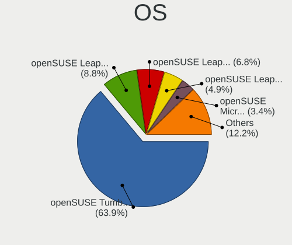

| Name                         | Computers | Percent |
|------------------------------|-----------|---------|
| openSUSE Tumbleweed-XXXXXXXX | 2769      | 63.92%  |
| openSUSE Leap-15.5           | 383       | 8.84%   |
| openSUSE Leap-15.6           | 294       | 6.79%   |
| openSUSE Leap-15.2           | 211       | 4.87%   |
| openSUSE Microos-XXXXXXXX    | 147       | 3.39%   |
| openSUSE Leap-15.4           | 142       | 3.28%   |
| openSUSE Leap-15.3           | 135       | 3.12%   |
| openSUSE Leap-15.1           | 123       | 2.84%   |
| openSUSE Leap-16.0           | 48        | 1.11%   |
| openSUSE Leap-15.0           | 48        | 1.11%   |
| openSUSE 13.2                | 5         | 0.12%   |
| openSUSE                     | 4         | 0.09%   |
| openSUSE Leap-42.2           | 3         | 0.07%   |
| openSUSE 42.3                | 3         | 0.07%   |
| openSUSE Slowroll-20250601   | 2         | 0.05%   |
| openSUSE Leap-42.3           | 2         | 0.05%   |
| openSUSE Slowroll-20250801   | 1         | 0.02%   |
| openSUSE Slowroll-20250701   | 1         | 0.02%   |
| openSUSE Slowroll-20250501   | 1         | 0.02%   |
| openSUSE Slowroll-20250402   | 1         | 0.02%   |
| openSUSE Slowroll-20241202   | 1         | 0.02%   |
| openSUSE Leap-42.1           | 1         | 0.02%   |
| openSUSE Aeon-20240725       | 1         | 0.02%   |
| openSUSE Aeon-20240705       | 1         | 0.02%   |
| openSUSE Aeon-20240624       | 1         | 0.02%   |
| openSUSE Aeon-20240510       | 1         | 0.02%   |
| openSUSE Aeon-20240508       | 1         | 0.02%   |
| openSUSE 20240715            | 1         | 0.02%   |
| openSUSE 13.1                | 1         | 0.02%   |

OS Family
---------

OS without a version

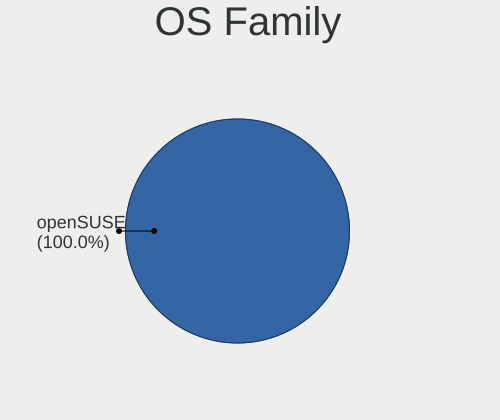

| Name     | Computers | Percent |
|----------|-----------|---------|
| openSUSE | 4182      | 100%    |

Kernel
------

Version of the Linux kernel

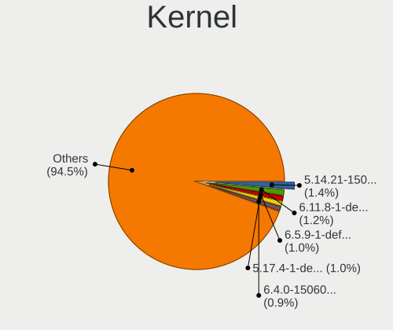

| Version                      | Computers | Percent |
|------------------------------|-----------|---------|
| 5.14.21-150500.53-default    | 71        | 1.39%   |
| 6.11.8-1-default             | 63        | 1.23%   |
| 6.5.9-1-default              | 50        | 0.98%   |
| 5.17.4-1-default             | 49        | 0.96%   |
| 6.4.0-150600.23.25-default   | 48        | 0.94%   |
| 5.14.21-150500.55.52-default | 45        | 0.88%   |
| 6.8.1-1-default              | 43        | 0.84%   |
| 6.5.4-1-default              | 43        | 0.84%   |
| 4.12.14-lp151.28.44-default  | 43        | 0.84%   |
| 6.3.9-1-default              | 42        | 0.82%   |
| 5.14.21-150500.55.19-default | 41        | 0.8%    |
| 6.7.4-1-default              | 39        | 0.76%   |
| 6.8.8-1-default              | 38        | 0.74%   |
| 6.0.8-1-default              | 35        | 0.68%   |
| 6.9.3-1-default              | 33        | 0.64%   |
| 5.14.21-150500.55.39-default | 33        | 0.64%   |
| 5.14.21-150500.55.36-default | 33        | 0.64%   |
| 6.7.7-1-default              | 31        | 0.6%    |
| 6.6.6-1-default              | 31        | 0.6%    |
| 6.11.0-1-default             | 31        | 0.6%    |
| 5.6.0-1-default              | 31        | 0.6%    |
| 6.6.2-1-default              | 30        | 0.59%   |
| 6.2.12-1-default             | 30        | 0.59%   |
| 6.13.1-1-default             | 30        | 0.59%   |
| 6.13.0-1-default             | 30        | 0.59%   |
| 6.7.2-1-default              | 29        | 0.57%   |
| 6.6.7-1-default              | 29        | 0.57%   |
| 6.3.2-1-default              | 29        | 0.57%   |
| 6.14.4-1-default             | 29        | 0.57%   |
| 6.12.6-1-default             | 29        | 0.57%   |
| 6.3.4-1-default              | 28        | 0.55%   |
| 6.15.8-1-default             | 28        | 0.55%   |
| 6.4.0-150600.23.47-default   | 27        | 0.53%   |
| 6.4.0-150600.23.17-default   | 27        | 0.53%   |
| 6.9.1-1-default              | 26        | 0.51%   |
| 6.4.11-1-default             | 26        | 0.51%   |
| 6.1.8-1-default              | 26        | 0.51%   |
| 6.0.12-1-default             | 26        | 0.51%   |
| 6.5.6-1-default              | 25        | 0.49%   |
| 6.4.0-150600.21-default      | 25        | 0.49%   |

Kernel Family
-------------

Linux kernel without a distro release

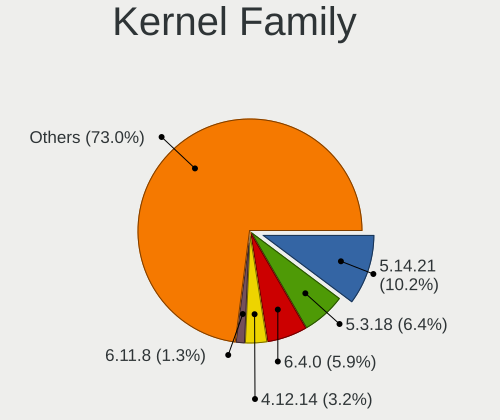

| Version | Computers | Percent |
|---------|-----------|---------|
| 5.14.21 | 505       | 10.24%  |
| 5.3.18  | 316       | 6.41%   |
| 6.4.0   | 290       | 5.88%   |
| 4.12.14 | 158       | 3.2%    |
| 6.11.8  | 65        | 1.32%   |
| 6.5.9   | 53        | 1.07%   |
| 5.17.4  | 49        | 0.99%   |
| 6.12.0  | 48        | 0.97%   |
| 6.8.1   | 44        | 0.89%   |
| 6.5.4   | 43        | 0.87%   |
| 6.3.9   | 42        | 0.85%   |
| 6.7.4   | 39        | 0.79%   |
| 6.8.8   | 38        | 0.77%   |
| 6.0.8   | 35        | 0.71%   |
| 6.9.3   | 34        | 0.69%   |
| 5.6.0   | 33        | 0.67%   |
| 6.7.7   | 31        | 0.63%   |
| 6.6.6   | 31        | 0.63%   |
| 6.3.1   | 31        | 0.63%   |
| 6.15.8  | 31        | 0.63%   |
| 6.11.0  | 31        | 0.63%   |
| 5.14.14 | 31        | 0.63%   |
| 6.6.2   | 30        | 0.61%   |
| 6.2.12  | 30        | 0.61%   |
| 6.14.6  | 30        | 0.61%   |
| 6.13.1  | 30        | 0.61%   |
| 6.13.0  | 30        | 0.61%   |
| 6.7.2   | 29        | 0.59%   |
| 6.6.7   | 29        | 0.59%   |
| 6.3.2   | 29        | 0.59%   |
| 6.14.4  | 29        | 0.59%   |
| 6.12.6  | 29        | 0.59%   |
| 6.3.4   | 28        | 0.57%   |
| 6.0.12  | 27        | 0.55%   |
| 6.9.1   | 26        | 0.53%   |
| 6.5.6   | 26        | 0.53%   |
| 6.4.11  | 26        | 0.53%   |
| 6.2.9   | 26        | 0.53%   |
| 6.1.8   | 26        | 0.53%   |
| 6.4.6   | 25        | 0.51%   |

Kernel Major Ver.
-----------------

Linux kernel major version

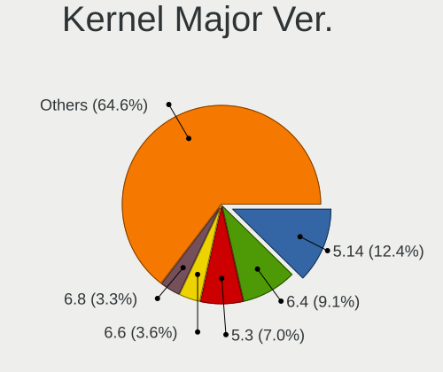

| Version | Computers | Percent |
|---------|-----------|---------|
| 5.14    | 593       | 12.36%  |
| 6.4     | 436       | 9.09%   |
| 5.3     | 337       | 7.02%   |
| 6.6     | 171       | 3.56%   |
| 6.8     | 160       | 3.33%   |
| 6.5     | 160       | 3.33%   |
| 6.11    | 160       | 3.33%   |
| 6.3     | 158       | 3.29%   |
| 4.12    | 158       | 3.29%   |
| 6.7     | 152       | 3.17%   |
| 6.13    | 144       | 3%      |
| 6.0     | 144       | 3%      |
| 6.1     | 141       | 2.94%   |
| 6.2     | 133       | 2.77%   |
| 6.9     | 129       | 2.69%   |
| 6.12    | 115       | 2.4%    |
| 5.17    | 114       | 2.38%   |
| 6.14    | 111       | 2.31%   |
| 6.10    | 101       | 2.1%    |
| 6.15    | 97        | 2.02%   |
| 6.17    | 82        | 1.71%   |
| 5.6     | 82        | 1.71%   |
| 5.16    | 77        | 1.6%    |
| 5.18    | 76        | 1.58%   |
| 5.12    | 73        | 1.52%   |
| 5.8     | 70        | 1.46%   |
| 5.19    | 68        | 1.42%   |
| 5.10    | 68        | 1.42%   |
| 6.16    | 58        | 1.21%   |
| 5.15    | 58        | 1.21%   |
| 5.11    | 58        | 1.21%   |
| 5.13    | 49        | 1.02%   |
| 5.9     | 40        | 0.83%   |
| 5.7     | 36        | 0.75%   |
| 6.18    | 34        | 0.71%   |
| 5.5     | 34        | 0.71%   |
| 4.18    | 27        | 0.56%   |
| 5.4     | 21        | 0.44%   |
| 5.0     | 14        | 0.29%   |
| 5.2     | 13        | 0.27%   |

Arch
----

OS architecture (x86_64, i586, etc.)

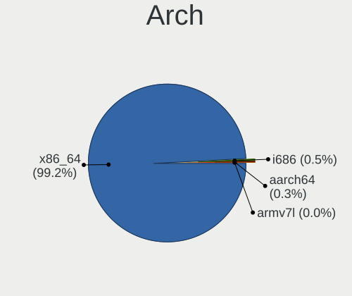

| Name    | Computers | Percent |
|---------|-----------|---------|
| x86_64  | 4148      | 99.16%  |
| i686    | 21        | 0.5%    |
| aarch64 | 12        | 0.29%   |
| armv7l  | 2         | 0.05%   |

DE
--

Desktop Environment

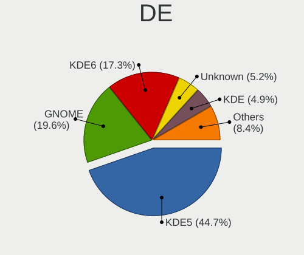

| Name          | Computers | Percent |
|---------------|-----------|---------|
| KDE5          | 1951      | 44.67%  |
| GNOME         | 856       | 19.6%   |
| KDE6          | 754       | 17.26%  |
| Unknown       | 228       | 5.22%   |
| KDE           | 214       | 4.9%    |
| XFCE          | 176       | 4.03%   |
| MATE          | 29        | 0.66%   |
| X-Cinnamon    | 25        | 0.57%   |
| ICEWM         | 18        | 0.41%   |
| LXQt          | 17        | 0.39%   |
| Cinnamon      | 17        | 0.39%   |
| LXDE          | 10        | 0.23%   |
| KDE4          | 9         | 0.21%   |
| Hyprland      | 9         | 0.21%   |
| Deepin        | 8         | 0.18%   |
| sway          | 7         | 0.16%   |
| Budgie        | 7         | 0.16%   |
| GNOME Classic | 6         | 0.14%   |
| i3            | 5         | 0.11%   |
| WindowMaker   | 2         | 0.05%   |
| Trinity       | 2         | 0.05%   |
| Pantheon      | 2         | 0.05%   |
| niri          | 2         | 0.05%   |
| awesome       | 2         | 0.05%   |
| Wayfire       | 1         | 0.02%   |
| TDE           | 1         | 0.02%   |
| plasma5       | 1         | 0.02%   |
| openbox       | 1         | 0.02%   |
| LeftWM        | 1         | 0.02%   |
| Herbstluftwm  | 1         | 0.02%   |
| fvwm2         | 1         | 0.02%   |
| Enlightenment | 1         | 0.02%   |
| default       | 1         | 0.02%   |
| custom        | 1         | 0.02%   |
| COSMIC        | 1         | 0.02%   |
| AsterDE       | 1         | 0.02%   |

Display Server
--------------

X11 or Wayland

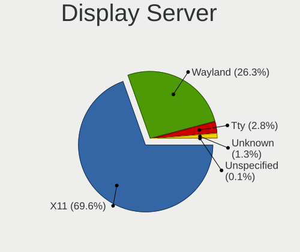

| Name        | Computers | Percent |
|-------------|-----------|---------|
| X11         | 3005      | 69.59%  |
| Wayland     | 1135      | 26.29%  |
| Tty         | 121       | 2.8%    |
| Unknown     | 54        | 1.25%   |
| Unspecified | 3         | 0.07%   |

Display Manager
---------------

SDDM, LightDM, etc.

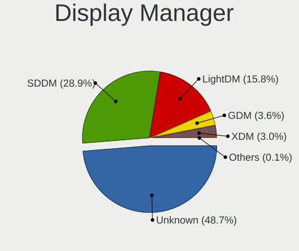

| Name    | Computers | Percent |
|---------|-----------|---------|
| Unknown | 2098      | 48.72%  |
| SDDM    | 1243      | 28.87%  |
| LightDM | 680       | 15.79%  |
| GDM     | 153       | 3.55%   |
| XDM     | 129       | 3%      |
| GREETD  | 3         | 0.07%   |

OS Lang
-------

Language

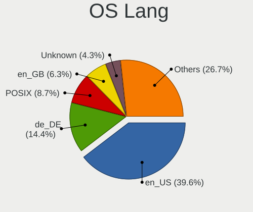

| Lang    | Computers | Percent |
|---------|-----------|---------|
| en_US   | 1696      | 39.6%   |
| de_DE   | 617       | 14.41%  |
| POSIX   | 371       | 8.66%   |
| en_GB   | 270       | 6.3%    |
| Unknown | 185       | 4.32%   |
| pt_BR   | 176       | 4.11%   |
| es_ES   | 152       | 3.55%   |
| ru_RU   | 137       | 3.2%    |
| it_IT   | 100       | 2.33%   |
| fr_FR   | 99        | 2.31%   |
| pl_PL   | 68        | 1.59%   |
| nl_NL   | 49        | 1.14%   |
| cs_CZ   | 27        | 0.63%   |
| zh_CN   | 23        | 0.54%   |
| pt_PT   | 22        | 0.51%   |
| hu_HU   | 21        | 0.49%   |
| en_DK   | 20        | 0.47%   |
| fi_FI   | 13        | 0.3%    |
| tr_TR   | 11        | 0.26%   |
| C       | 11        | 0.26%   |
| nb_NO   | 10        | 0.23%   |
| ja_JP   | 10        | 0.23%   |
| da_DK   | 10        | 0.23%   |
| bg_BG   | 10        | 0.23%   |
| en_BW   | 9         | 0.21%   |
| en_AU   | 9         | 0.21%   |
| sv_SE   | 8         | 0.19%   |
| es_MX   | 8         | 0.19%   |
| nl_BE   | 7         | 0.16%   |
| en_IE   | 7         | 0.16%   |
| sl_SI   | 6         | 0.14%   |
| sk_SK   | 6         | 0.14%   |
| es_AR   | 6         | 0.14%   |
| en_IN   | 6         | 0.14%   |
| en_DE   | 6         | 0.14%   |
| de_AT   | 6         | 0.14%   |
| ro_RO   | 5         | 0.12%   |
| es_DO   | 5         | 0.12%   |
| el_GR   | 5         | 0.12%   |
| de_CH   | 5         | 0.12%   |

Boot Mode
---------

EFI or BIOS

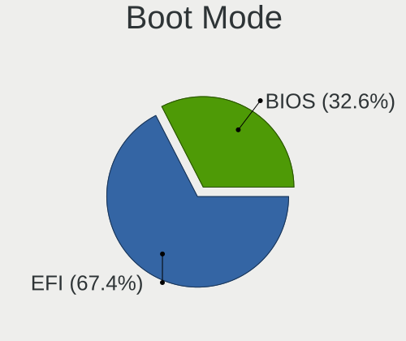

| Mode | Computers | Percent |
|------|-----------|---------|
| EFI  | 2863      | 67.44%  |
| BIOS | 1382      | 32.56%  |

Filesystem
----------

Type of filesystem

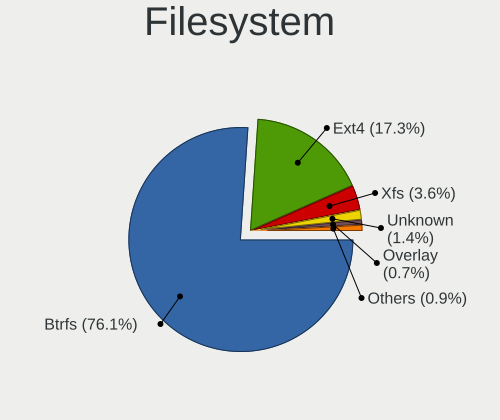

| Type     | Computers | Percent |
|----------|-----------|---------|
| Btrfs    | 3227      | 76.07%  |
| Ext4     | 734       | 17.3%   |
| Xfs      | 152       | 3.58%   |
| Unknown  | 60        | 1.41%   |
| Overlay  | 31        | 0.73%   |
| Tmpfs    | 23        | 0.54%   |
| Ext3     | 6         | 0.14%   |
| Ext2     | 6         | 0.14%   |
| Zfs      | 1         | 0.02%   |
| Reiserfs | 1         | 0.02%   |
| F2fs     | 1         | 0.02%   |

Part. scheme
------------

Scheme of partitioning

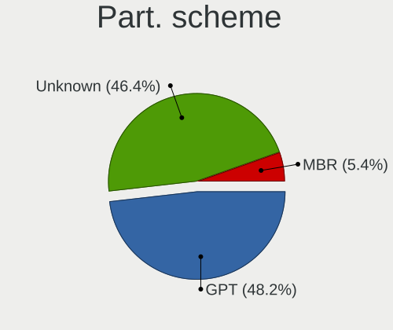

| Type    | Computers | Percent |
|---------|-----------|---------|
| GPT     | 2057      | 48.2%   |
| Unknown | 1981      | 46.42%  |
| MBR     | 230       | 5.39%   |

Dual Boot with Linux/BSD
------------------------

Hosting more than one Linux/BSD

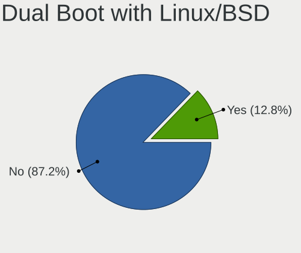

| Dual boot | Computers | Percent |
|-----------|-----------|---------|
| No        | 3712      | 87.24%  |
| Yes       | 543       | 12.76%  |

Dual Boot (Win)
---------------

Hosting Linux and Windows

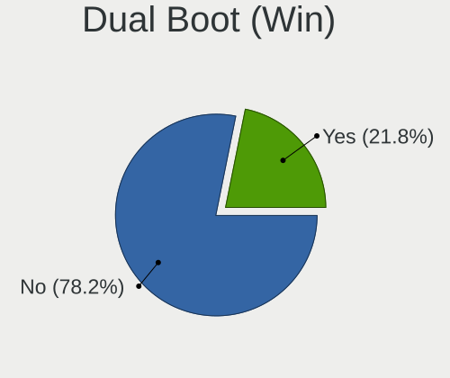

| Dual boot | Computers | Percent |
|-----------|-----------|---------|
| No        | 3318      | 78.16%  |
| Yes       | 927       | 21.84%  |

Board
-----

Vendor
------

Motherboard manufacturer

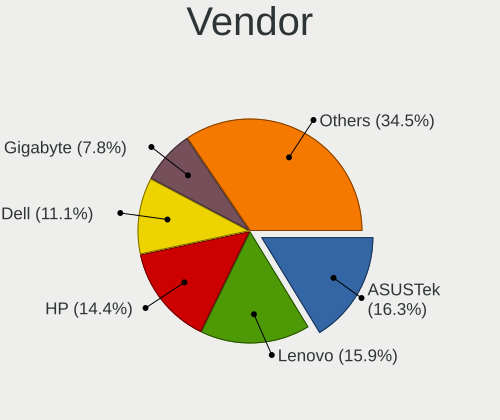

| Name                                 | Computers | Percent |
|--------------------------------------|-----------|---------|
| ASUSTek Computer                     | 681       | 16.28%  |
| Lenovo                               | 666       | 15.93%  |
| Hewlett-Packard                      | 604       | 14.44%  |
| Dell                                 | 464       | 11.1%   |
| Gigabyte Technology                  | 325       | 7.77%   |
| MSI                                  | 275       | 6.58%   |
| Acer                                 | 200       | 4.78%   |
| ASRock                               | 197       | 4.71%   |
| Apple                                | 112       | 2.68%   |
| Intel                                | 48        | 1.15%   |
| Toshiba                              | 41        | 0.98%   |
| Fujitsu                              | 37        | 0.88%   |
| TUXEDO                               | 30        | 0.72%   |
| Samsung Electronics                  | 29        | 0.69%   |
| HUAWEI                               | 26        | 0.62%   |
| Unknown                              | 25        | 0.6%    |
| Medion                               | 23        | 0.55%   |
| Sony                                 | 21        | 0.5%    |
| Biostar                              | 18        | 0.43%   |
| Alienware                            | 18        | 0.43%   |
| Microsoft                            | 13        | 0.31%   |
| Supermicro                           | 12        | 0.29%   |
| Notebook                             | 12        | 0.29%   |
| Framework                            | 12        | 0.29%   |
| Shenzhen Meigao Electronic Equipment | 11        | 0.26%   |
| Google                               | 11        | 0.26%   |
| Pegatron                             | 10        | 0.24%   |
| Chuwi                                | 10        | 0.24%   |
| AZW                                  | 10        | 0.24%   |
| Wortmann AG                          | 8         | 0.19%   |
| SLIMBOOK                             | 8         | 0.19%   |
| Fujitsu Siemens                      | 8         | 0.19%   |
| Foxconn                              | 7         | 0.17%   |
| Schenker                             | 6         | 0.14%   |
| AMI                                  | 6         | 0.14%   |
| System76                             | 5         | 0.12%   |
| Razer                                | 5         | 0.12%   |
| Raspberry Pi Foundation              | 5         | 0.12%   |
| Positivo                             | 5         | 0.12%   |
| LG Electronics                       | 5         | 0.12%   |

Model
-----

Motherboard model

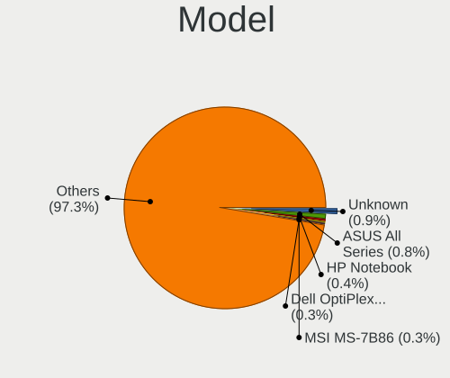

| Name                                 | Computers | Percent |
|--------------------------------------|-----------|---------|
| Unknown                              | 39        | 0.93%   |
| ASUS All Series                      | 34        | 0.81%   |
| HP Notebook                          | 15        | 0.36%   |
| Dell OptiPlex 9020                   | 12        | 0.29%   |
| MSI MS-7B86                          | 11        | 0.26%   |
| Apple MacBookPro9,2                  | 11        | 0.26%   |
| MSI MS-7C91                          | 10        | 0.24%   |
| Dell Latitude 7490                   | 10        | 0.24%   |
| ASUS TUF Gaming X570-PLUS            | 10        | 0.24%   |
| MSI MS-7C37                          | 9         | 0.22%   |
| ASUS PRIME A320M-K                   | 9         | 0.22%   |
| MSI MS-7C94                          | 8         | 0.19%   |
| Gigabyte X570 AORUS MASTER           | 8         | 0.19%   |
| Gigabyte B450M DS3H                  | 8         | 0.19%   |
| Dell Precision 5530                  | 8         | 0.19%   |
| ASRock B450M Pro4                    | 8         | 0.19%   |
| Apple MacBookPro8,1                  | 8         | 0.19%   |
| MSI MS-7B89                          | 7         | 0.17%   |
| HP Pavilion dv6                      | 7         | 0.17%   |
| HP Laptop 17-ca0xxx                  | 7         | 0.17%   |
| HP EliteBook 840 G6                  | 7         | 0.17%   |
| Gigabyte B550M DS3H                  | 7         | 0.17%   |
| ASRock X570 Steel Legend             | 7         | 0.17%   |
| MSI MS-7A34                          | 6         | 0.14%   |
| HP Pavilion g6                       | 6         | 0.14%   |
| HP Pavilion dv7                      | 6         | 0.14%   |
| HP ENVY x360 2-in-1 Laptop 15-ey0xxx | 6         | 0.14%   |
| Gigabyte B450 AORUS M                | 6         | 0.14%   |
| Gigabyte 970A-DS3P                   | 6         | 0.14%   |
| AZW SER                              | 6         | 0.14%   |
| ASUS M5A97 R2.0                      | 6         | 0.14%   |
| ASUS CROSSHAIR V FORMULA-Z           | 6         | 0.14%   |
| Apple MacBookPro12,1                 | 6         | 0.14%   |
| Apple MacBookAir6,2                  | 6         | 0.14%   |
| Samsung 550XDA                       | 5         | 0.12%   |
| MSI MS-7D25                          | 5         | 0.12%   |
| MSI MS-7C95                          | 5         | 0.12%   |
| MSI MS-7C02                          | 5         | 0.12%   |
| Lenovo ThinkBook 14 G3 ACL 21A2      | 5         | 0.12%   |
| Lenovo IdeaPad 3 15ITL6 82H8         | 5         | 0.12%   |

Model Family
------------

Motherboard model prefix

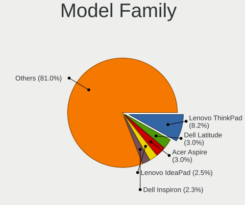

| Name               | Computers | Percent |
|--------------------|-----------|---------|
| Lenovo ThinkPad    | 341       | 8.15%   |
| Dell Latitude      | 127       | 3.04%   |
| Acer Aspire        | 127       | 3.04%   |
| Lenovo IdeaPad     | 104       | 2.49%   |
| Dell Inspiron      | 97        | 2.32%   |
| ASUS ROG           | 96        | 2.3%    |
| ASUS PRIME         | 94        | 2.25%   |
| HP Pavilion        | 91        | 2.18%   |
| HP EliteBook       | 85        | 2.03%   |
| ASUS VivoBook      | 72        | 1.72%   |
| Dell Precision     | 71        | 1.7%    |
| HP Laptop          | 68        | 1.63%   |
| ASUS TUF           | 66        | 1.58%   |
| Dell OptiPlex      | 61        | 1.46%   |
| Dell XPS           | 46        | 1.1%    |
| HP ProBook         | 45        | 1.08%   |
| HP ENVY            | 42        | 1%      |
| Lenovo Yoga        | 41        | 0.98%   |
| Unknown            | 39        | 0.93%   |
| Toshiba Satellite  | 35        | 0.84%   |
| ASUS All           | 34        | 0.81%   |
| Lenovo ThinkCentre | 33        | 0.79%   |
| HP ZBook           | 33        | 0.79%   |
| HP Compaq          | 33        | 0.79%   |
| ASUS ASUS          | 33        | 0.79%   |
| Lenovo Legion      | 27        | 0.65%   |
| Lenovo ThinkBook   | 23        | 0.55%   |
| Acer Swift         | 23        | 0.55%   |
| HP OMEN            | 22        | 0.53%   |
| Gigabyte X570      | 22        | 0.53%   |
| ASUS ZenBook       | 22        | 0.53%   |
| Dell PowerEdge     | 21        | 0.5%    |
| HP EliteDesk       | 18        | 0.43%   |
| Gigabyte B550      | 18        | 0.43%   |
| Dell Vostro        | 17        | 0.41%   |
| ASRock X570        | 17        | 0.41%   |
| Acer Nitro         | 17        | 0.41%   |
| Fujitsu LIFEBOOK   | 16        | 0.38%   |
| HP Notebook        | 15        | 0.36%   |
| Gigabyte B450      | 15        | 0.36%   |

MFG Year
--------

Motherboard manufacture year

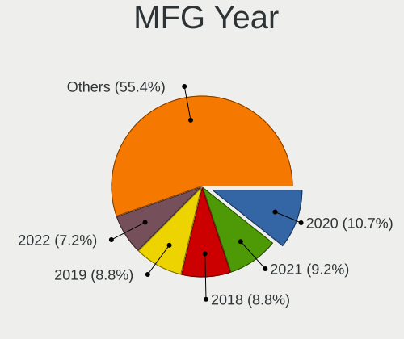

| Year    | Computers | Percent |
|---------|-----------|---------|
| 2020    | 447       | 10.69%  |
| 2021    | 384       | 9.18%   |
| 2018    | 369       | 8.82%   |
| 2019    | 366       | 8.75%   |
| 2022    | 300       | 7.17%   |
| 2017    | 265       | 6.34%   |
| 2012    | 265       | 6.34%   |
| 2013    | 263       | 6.29%   |
| 2023    | 221       | 5.28%   |
| 2015    | 201       | 4.81%   |
| 2011    | 197       | 4.71%   |
| 2014    | 187       | 4.47%   |
| 2016    | 184       | 4.4%    |
| 2010    | 136       | 3.25%   |
| 2024    | 121       | 2.89%   |
| 2009    | 98        | 2.34%   |
| 2008    | 94        | 2.25%   |
| 2007    | 32        | 0.77%   |
| 2025    | 22        | 0.53%   |
| 2006    | 18        | 0.43%   |
| 2005    | 6         | 0.14%   |
| 2004    | 3         | 0.07%   |
| 2003    | 1         | 0.02%   |
| 2000    | 1         | 0.02%   |
| Unknown | 1         | 0.02%   |

Form Factor
-----------

Physical design of the computer

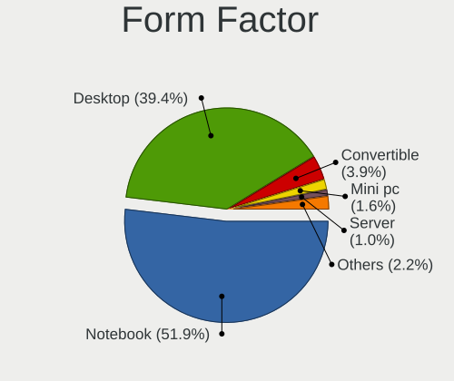

| Name           | Computers | Percent |
|----------------|-----------|---------|
| Notebook       | 2170      | 51.89%  |
| Desktop        | 1648      | 39.41%  |
| Convertible    | 162       | 3.87%   |
| Mini pc        | 69        | 1.65%   |
| Server         | 43        | 1.03%   |
| All in one     | 40        | 0.96%   |
| Tablet         | 36        | 0.86%   |
| System on chip | 9         | 0.22%   |
| Other          | 4         | 0.1%    |
| Firewall       | 1         | 0.02%   |

Secure Boot
-----------

Enabled or disabled

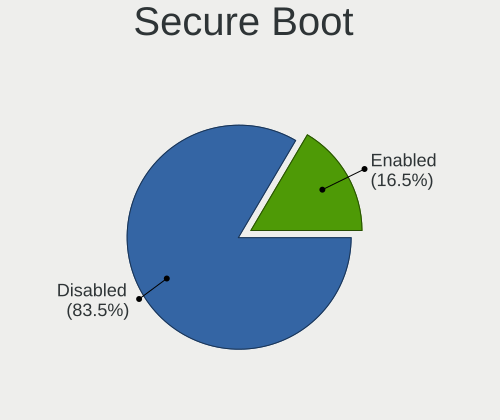

| State    | Computers | Percent |
|----------|-----------|---------|
| Disabled | 3544      | 83.49%  |
| Enabled  | 701       | 16.51%  |

Coreboot
--------

Have coreboot on board

| Used | Computers | Percent |
|------|-----------|---------|
| No   | 4161      | 99.5%   |
| Yes  | 21        | 0.5%    |

RAM Size
--------

Total RAM memory

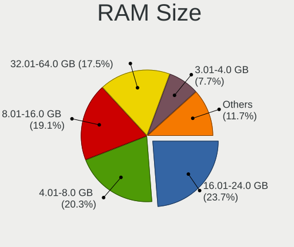

| Size in GB      | Computers | Percent |
|-----------------|-----------|---------|
| 16.01-24.0      | 1009      | 23.75%  |
| 4.01-8.0        | 864       | 20.33%  |
| 8.01-16.0       | 810       | 19.06%  |
| 32.01-64.0      | 744       | 17.51%  |
| 3.01-4.0        | 326       | 7.67%   |
| 64.01-256.0     | 242       | 5.7%    |
| 24.01-32.0      | 154       | 3.62%   |
| 1.01-2.0        | 47        | 1.11%   |
| 2.01-3.0        | 23        | 0.54%   |
| Unknown         | 10        | 0.24%   |
| More than 256.0 | 9         | 0.21%   |
| 0.51-1.0        | 7         | 0.16%   |
| 0.01-0.5        | 4         | 0.09%   |

RAM Used
--------

Used RAM memory

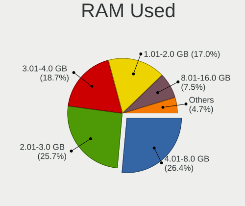

| Used GB     | Computers | Percent |
|-------------|-----------|---------|
| 4.01-8.0    | 1224      | 26.43%  |
| 2.01-3.0    | 1191      | 25.72%  |
| 3.01-4.0    | 865       | 18.68%  |
| 1.01-2.0    | 786       | 16.97%  |
| 8.01-16.0   | 348       | 7.51%   |
| 0.51-1.0    | 104       | 2.25%   |
| 16.01-24.0  | 54        | 1.17%   |
| 0.01-0.5    | 24        | 0.52%   |
| 24.01-32.0  | 16        | 0.35%   |
| Unknown     | 10        | 0.22%   |
| 32.01-64.0  | 8         | 0.17%   |
| 64.01-256.0 | 1         | 0.02%   |

Total Drives
------------

Number of drives on board

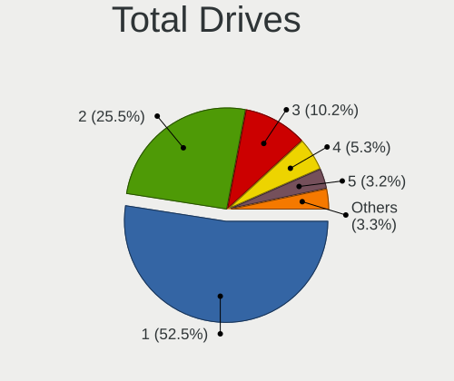

| Drives  | Computers | Percent |
|---------|-----------|---------|
| 1       | 2263      | 52.46%  |
| 2       | 1101      | 25.52%  |
| 3       | 440       | 10.2%   |
| 4       | 227       | 5.26%   |
| 5       | 140       | 3.25%   |
| 6       | 64        | 1.48%   |
| 7       | 31        | 0.72%   |
| 10      | 11        | 0.25%   |
| 9       | 9         | 0.21%   |
| 8       | 8         | 0.19%   |
| 0       | 8         | 0.19%   |
| 13      | 4         | 0.09%   |
| 11      | 3         | 0.07%   |
| 35      | 1         | 0.02%   |
| 30      | 1         | 0.02%   |
| 16      | 1         | 0.02%   |
| 14      | 1         | 0.02%   |
| Unknown | 1         | 0.02%   |

Has CD-ROM
----------

Has CD-ROM on board

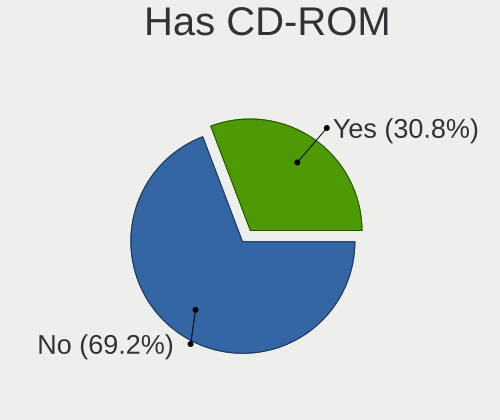

| Presented | Computers | Percent |
|-----------|-----------|---------|
| No        | 2916      | 69.23%  |
| Yes       | 1296      | 30.77%  |

Has Ethernet
------------

Has Ethernet on board

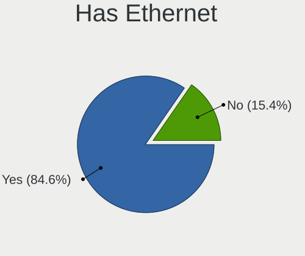

| Presented | Computers | Percent |
|-----------|-----------|---------|
| Yes       | 3556      | 84.63%  |
| No        | 646       | 15.37%  |

Has WiFi
--------

Has WiFi module

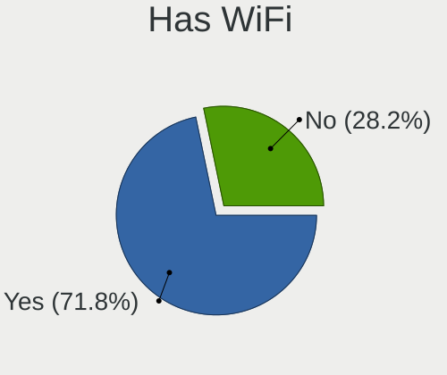

| Presented | Computers | Percent |
|-----------|-----------|---------|
| Yes       | 3180      | 75.71%  |
| No        | 1020      | 24.29%  |

Has Bluetooth
-------------

Has Bluetooth module

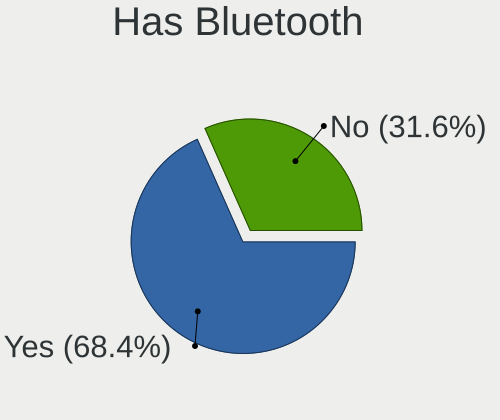

| Presented | Computers | Percent |
|-----------|-----------|---------|
| Yes       | 2896      | 68.35%  |
| No        | 1341      | 31.65%  |

Location
--------

Country
-------

Geographic location (country)

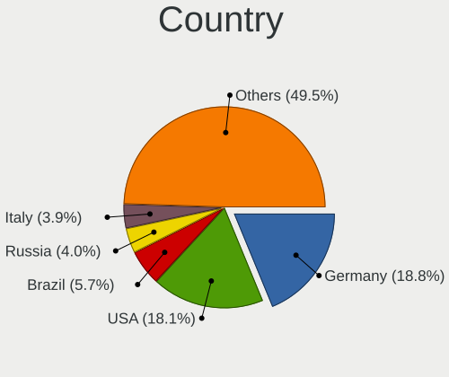

| Country      | Computers | Percent |
|--------------|-----------|---------|
| Germany      | 789       | 18.78%  |
| USA          | 760       | 18.09%  |
| Brazil       | 241       | 5.74%   |
| Russia       | 170       | 4.05%   |
| Italy        | 163       | 3.88%   |
| UK           | 160       | 3.81%   |
| France       | 135       | 3.21%   |
| Canada       | 113       | 2.69%   |
| Spain        | 112       | 2.67%   |
| Netherlands  | 112       | 2.67%   |
| Poland       | 108       | 2.57%   |
| Switzerland  | 78        | 1.86%   |
| Australia    | 70        | 1.67%   |
| India        | 59        | 1.4%    |
| Sweden       | 58        | 1.38%   |
| Czechia      | 55        | 1.31%   |
| Belgium      | 54        | 1.29%   |
| Austria      | 53        | 1.26%   |
| Mexico       | 51        | 1.21%   |
| Romania      | 43        | 1.02%   |
| Hungary      | 40        | 0.95%   |
| Turkey       | 37        | 0.88%   |
| Finland      | 37        | 0.88%   |
| China        | 36        | 0.86%   |
| Argentina    | 31        | 0.74%   |
| Norway       | 30        | 0.71%   |
| Greece       | 30        | 0.71%   |
| Bulgaria     | 29        | 0.69%   |
| Portugal     | 28        | 0.67%   |
| Indonesia    | 23        | 0.55%   |
| Chile        | 23        | 0.55%   |
| Ukraine      | 21        | 0.5%    |
| Japan        | 21        | 0.5%    |
| Denmark      | 20        | 0.48%   |
| Serbia       | 18        | 0.43%   |
| Belarus      | 17        | 0.4%    |
| South Africa | 15        | 0.36%   |
| Slovenia     | 15        | 0.36%   |
| Croatia      | 15        | 0.36%   |
| Vietnam      | 14        | 0.33%   |

City
----

Geographic location (city)

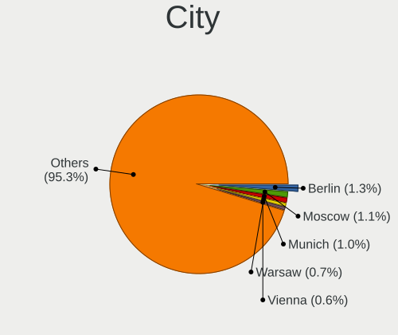

| City              | Computers | Percent |
|-------------------|-----------|---------|
| Berlin            | 57        | 1.28%   |
| Moscow            | 50        | 1.12%   |
| Munich            | 43        | 0.96%   |
| Warsaw            | 31        | 0.7%    |
| Vienna            | 28        | 0.63%   |
| Sao Paulo         | 28        | 0.63%   |
| Rio de Janeiro    | 25        | 0.56%   |
| Prague            | 25        | 0.56%   |
| Milan             | 25        | 0.56%   |
| Amsterdam         | 25        | 0.56%   |
| Frankfurt am Main | 24        | 0.54%   |
| Hamburg           | 23        | 0.52%   |
| Zurich            | 22        | 0.49%   |
| Sydney            | 21        | 0.47%   |
| Paris             | 21        | 0.47%   |
| Melbourne         | 21        | 0.47%   |
| St Petersburg     | 20        | 0.45%   |
| Sofia             | 19        | 0.43%   |
| Budapest          | 19        | 0.43%   |
| Stuttgart         | 18        | 0.4%    |
| Los Angeles       | 18        | 0.4%    |
| Rome              | 17        | 0.38%   |
| Madrid            | 16        | 0.36%   |
| Leipzig           | 16        | 0.36%   |
| Cologne           | 16        | 0.36%   |
| Athens            | 16        | 0.36%   |
| Essen             | 14        | 0.31%   |
| Düsseldorf       | 13        | 0.29%   |
| Vigo              | 12        | 0.27%   |
| Santiago          | 12        | 0.27%   |
| Littleton         | 12        | 0.27%   |
| Helsinki          | 12        | 0.27%   |
| Gothenburg        | 12        | 0.27%   |
| Denver            | 12        | 0.27%   |
| Bengaluru         | 12        | 0.27%   |
| Zagreb            | 11        | 0.25%   |
| Stockholm         | 11        | 0.25%   |
| Portland          | 11        | 0.25%   |
| Nuremberg         | 11        | 0.25%   |
| Minsk             | 11        | 0.25%   |

Drives
------

Drive Vendor
------------

Hard drive vendors

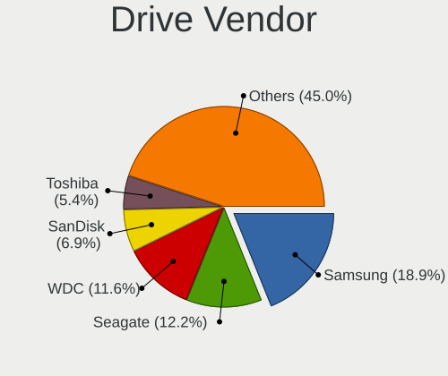

| Vendor                       | Computers | Drives | Percent |
|------------------------------|-----------|--------|---------|
| Samsung Electronics          | 1285      | 2110   | 18.9%   |
| Seagate                      | 830       | 1452   | 12.21%  |
| WDC                          | 789       | 1445   | 11.6%   |
| SanDisk                      | 467       | 653    | 6.87%   |
| Toshiba                      | 370       | 479    | 5.44%   |
| Kingston                     | 344       | 466    | 5.06%   |
| Crucial                      | 269       | 391    | 3.96%   |
| SK hynix                     | 198       | 257    | 2.91%   |
| Intel                        | 181       | 236    | 2.66%   |
| Unknown                      | 180       | 242    | 2.65%   |
| Micron Technology            | 153       | 181    | 2.25%   |
| Hitachi                      | 109       | 138    | 1.6%    |
| Phison Electronics           | 98        | 130    | 1.44%   |
| HGST                         | 89        | 129    | 1.31%   |
| Kingston Technology Company  | 79        | 93     | 1.16%   |
| KIOXIA                       | 77        | 99     | 1.13%   |
| A-DATA Technology            | 72        | 90     | 1.06%   |
| Micron/Crucial Technology    | 70        | 100    | 1.03%   |
| Silicon Motion               | 62        | 70     | 0.91%   |
| China                        | 58        | 80     | 0.85%   |
| MAXIO Technology (Hangzhou)  | 57        | 70     | 0.84%   |
| Apple                        | 56        | 64     | 0.82%   |
| SPCC                         | 50        | 62     | 0.74%   |
| Intenso                      | 49        | 78     | 0.72%   |
| PNY                          | 44        | 57     | 0.65%   |
| Phison                       | 33        | 46     | 0.49%   |
| ADATA Technology             | 32        | 37     | 0.47%   |
| Realtek Semiconductor        | 29        | 34     | 0.43%   |
| Hewlett-Packard              | 29        | 48     | 0.43%   |
| Transcend                    | 26        | 29     | 0.38%   |
| LITEON                       | 24        | 30     | 0.35%   |
| Patriot                      | 23        | 28     | 0.34%   |
| Shenzhen Longsys Electronics | 20        | 28     | 0.29%   |
| JMicron Technology           | 18        | 20     | 0.26%   |
| OCZ                          | 17        | 22     | 0.25%   |
| GOODRAM                      | 16        | 17     | 0.24%   |
| Unknown                      | 16        | 18     | 0.24%   |
| Team                         | 15        | 20     | 0.22%   |
| Corsair                      | 15        | 19     | 0.22%   |
| Fujitsu                      | 14        | 26     | 0.21%   |

Drive Model
-----------

Hard drive models

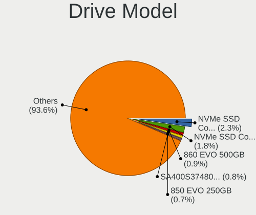

| Model                                                 | Computers | Percent |
|-------------------------------------------------------|-----------|---------|
| Samsung NVMe SSD Controller SM981/PM981/PM983 1TB     | 178       | 2.31%   |
| Samsung NVMe SSD Controller PM9A1/PM9A3/980PRO 1TB    | 136       | 1.76%   |
| Samsung SSD 860 EVO 500GB                             | 66        | 0.86%   |
| Kingston SA400S37480G 480GB SSD                       | 58        | 0.75%   |
| Samsung SSD 850 EVO 250GB                             | 57        | 0.74%   |
| Samsung SSD 860 EVO 1TB                               | 53        | 0.69%   |
| Kingston SA400S37240G 240GB SSD                       | 53        | 0.69%   |
| Seagate ST2000DM008-2FR102 2TB                        | 52        | 0.67%   |
| Crucial CT500MX500SSD1 500GB                          | 43        | 0.56%   |
| Seagate ST1000LM035-1RK172 1TB                        | 40        | 0.52%   |
| Sandisk WD Blue SN550 NVMe SSD 1024GB                 | 40        | 0.52%   |
| Samsung SSD 850 EVO 500GB                             | 38        | 0.49%   |
| Seagate ST1000LM024 HN-M101MBB 1TB                    | 37        | 0.48%   |
| Sandisk WD Black SN750 / PC SN730 NVMe SSD 500GB      | 37        | 0.48%   |
| Seagate ST1000DM010-2EP102 1TB                        | 36        | 0.47%   |
| Samsung NVMe SSD Controller SM961/PM961/SM963 1024GB  | 36        | 0.47%   |
| Micron/Crucial P2 NVMe PCIe SSD 2TB                   | 36        | 0.47%   |
| Intel SSD 660P Series 512GB                           | 35        | 0.45%   |
| Crucial CT1000MX500SSD1 1TB                           | 34        | 0.44%   |
| Silicon Motion SM2263EN/SM2263XT SSD Controller 512GB | 33        | 0.43%   |
| MAXIO (Hangzhou) NVMe SSD Controller MAP1202 2TB      | 33        | 0.43%   |
| Samsung SSD 840 EVO 250GB                             | 32        | 0.41%   |
| Kingston SA400S37120G 120GB SSD                       | 32        | 0.41%   |
| Seagate ST500DM002-1BD142 500GB                       | 30        | 0.39%   |
| Samsung SSD 870 EVO 1TB                               | 30        | 0.39%   |
| HGST HTS721010A9E630 1TB                              | 30        | 0.39%   |
| Phison E12 NVMe Controller 1TB                        | 29        | 0.38%   |
| WDC WDS500G2B0A-00SM50 500GB                          | 28        | 0.36%   |
| Unknown SD/MMC/MS PRO 2GB                             | 28        | 0.36%   |
| Crucial CT240BX500SSD1 240GB                          | 28        | 0.36%   |
| Samsung SSD 860 EVO 250GB                             | 27        | 0.35%   |
| WDC WD10EZEX-08WN4A0 1TB                              | 26        | 0.34%   |
| Toshiba MQ04ABF100 1TB                                | 26        | 0.34%   |
| Toshiba MQ01ABD100 1TB                                | 26        | 0.34%   |
| Samsung SSD 980 1TB                                   | 26        | 0.34%   |
| Seagate ST4000DM004-2CV104 4TB                        | 25        | 0.32%   |
| Seagate ST1000DM003-1CH162 1TB                        | 25        | 0.32%   |
| Kingston SV300S37A120G 120GB SSD                      | 25        | 0.32%   |
| Toshiba DT01ACA100 1TB                                | 24        | 0.31%   |
| Unknown MMC Card  64GB                                | 23        | 0.3%    |

HDD Vendor
----------

Hard disk drive vendors

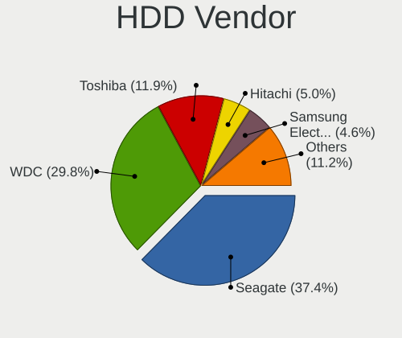

| Vendor              | Computers | Drives | Percent |
|---------------------|-----------|--------|---------|
| Seagate             | 808       | 1394   | 37.39%  |
| WDC                 | 643       | 1172   | 29.75%  |
| Toshiba             | 258       | 348    | 11.94%  |
| Hitachi             | 109       | 138    | 5.04%   |
| Samsung Electronics | 100       | 149    | 4.63%   |
| HGST                | 89        | 129    | 4.12%   |
| Unknown             | 31        | 38     | 1.43%   |
| Apple               | 21        | 23     | 0.97%   |
| Hewlett-Packard     | 14        | 27     | 0.65%   |
| Fujitsu             | 14        | 26     | 0.65%   |
| Maxtor              | 12        | 15     | 0.56%   |
| JMicron Technology  | 10        | 10     | 0.46%   |
| ASMT                | 8         | 12     | 0.37%   |
| TO Exter            | 5         | 5      | 0.23%   |
| Intenso             | 5         | 10     | 0.23%   |
| WD MediaMax         | 3         | 3      | 0.14%   |
| USB3.0              | 3         | 4      | 0.14%   |
| SSK                 | 3         | 4      | 0.14%   |
| Synology            | 2         | 2      | 0.09%   |
| Inateck             | 2         | 2      | 0.09%   |
| External            | 2         | 2      | 0.09%   |
| ASMedia             | 2         | 2      | 0.09%   |
| XrayDisk            | 1         | 1      | 0.05%   |
| USB                 | 1         | 1      | 0.05%   |
| UD0401              | 1         | 1      | 0.05%   |
| T-FORCE             | 1         | 2      | 0.05%   |
| SATAFIRM            | 1         | 1      | 0.05%   |
| Maxone              | 1         | 1      | 0.05%   |
| MaxDigital          | 1         | 1      | 0.05%   |
| MARVELL             | 1         | 1      | 0.05%   |
| Magnetic Data       | 1         | 2      | 0.05%   |
| LIO-ORG             | 1         | 1      | 0.05%   |
| IBM-207x            | 1         | 8      | 0.05%   |
| IB-AC703            | 1         | 1      | 0.05%   |
| IB-377U3            | 1         | 1      | 0.05%   |
| HPE                 | 1         | 32     | 0.05%   |
| HGST HTS            | 1         | 1      | 0.05%   |
| DELLBOSS            | 1         | 1      | 0.05%   |
| AXAGON              | 1         | 1      | 0.05%   |

SSD Vendor
----------

Solid state drive vendors

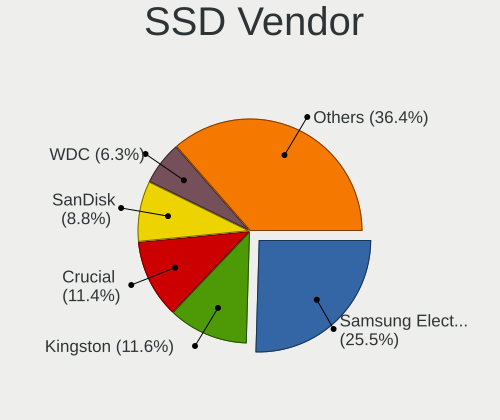

| Vendor              | Computers | Drives | Percent |
|---------------------|-----------|--------|---------|
| Samsung Electronics | 576       | 916    | 25.46%  |
| Kingston            | 263       | 349    | 11.63%  |
| Crucial             | 257       | 374    | 11.36%  |
| SanDisk             | 199       | 260    | 8.8%    |
| WDC                 | 143       | 200    | 6.32%   |
| China               | 58        | 80     | 2.56%   |
| A-DATA Technology   | 57        | 69     | 2.52%   |
| Intel               | 55        | 77     | 2.43%   |
| SPCC                | 44        | 56     | 1.95%   |
| Intenso             | 40        | 57     | 1.77%   |
| PNY                 | 39        | 48     | 1.72%   |
| Toshiba             | 38        | 44     | 1.68%   |
| SK hynix            | 35        | 48     | 1.55%   |
| Micron Technology   | 33        | 42     | 1.46%   |
| Apple               | 30        | 33     | 1.33%   |
| LITEON              | 24        | 30     | 1.06%   |
| Transcend           | 23        | 26     | 1.02%   |
| Patriot             | 22        | 26     | 0.97%   |
| OCZ                 | 17        | 22     | 0.75%   |
| GOODRAM             | 15        | 16     | 0.66%   |
| Team                | 14        | 19     | 0.62%   |
| LITEONIT            | 13        | 15     | 0.57%   |
| KingSpec            | 11        | 16     | 0.49%   |
| Hewlett-Packard     | 11        | 17     | 0.49%   |
| Corsair             | 11        | 14     | 0.49%   |
| XrayDisk            | 9         | 10     | 0.4%    |
| Seagate             | 9         | 11     | 0.4%    |
| Apacer              | 9         | 14     | 0.4%    |
| Unknown             | 9         | 11     | 0.4%    |
| SABRENT             | 8         | 9      | 0.35%   |
| Gigabyte Technology | 8         | 11     | 0.35%   |
| Netac               | 7         | 9      | 0.31%   |
| Plextor             | 6         | 9      | 0.27%   |
| Mushkin             | 6         | 9      | 0.27%   |
| Leven               | 6         | 6      | 0.27%   |
| Verbatim            | 5         | 5      | 0.22%   |
| Fanxiang            | 5         | 8      | 0.22%   |
| Timetec             | 4         | 5      | 0.18%   |
| Phison              | 4         | 4      | 0.18%   |
| Lexar               | 4         | 5      | 0.18%   |

Drive Kind
----------

HDD or SSD

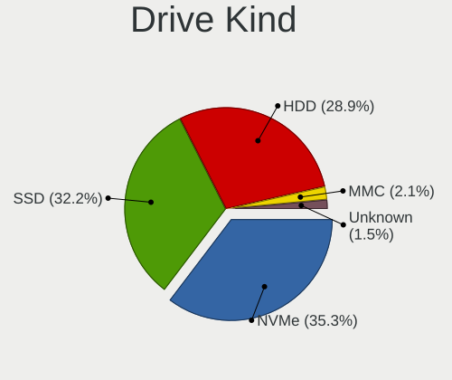

| Kind    | Computers | Drives | Percent |
|---------|-----------|--------|---------|
| NVMe    | 2091      | 3186   | 35.34%  |
| SSD     | 1903      | 3141   | 32.17%  |
| HDD     | 1711      | 3572   | 28.92%  |
| MMC     | 123       | 159    | 2.08%   |
| Unknown | 88        | 124    | 1.49%   |

Drive Connector
---------------

SATA, SAS, NVMe, etc.

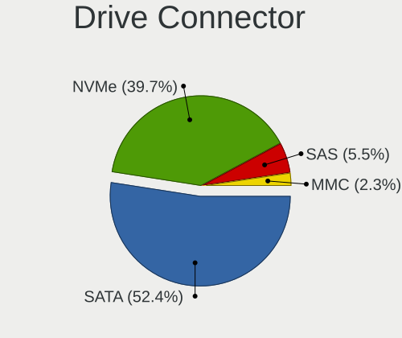

| Type | Computers | Drives | Percent |
|------|-----------|--------|---------|
| SATA | 2754      | 6393   | 52.45%  |
| NVMe | 2087      | 3162   | 39.74%  |
| SAS  | 287       | 468    | 5.47%   |
| MMC  | 123       | 159    | 2.34%   |

Drive Size
----------

Size of hard drive

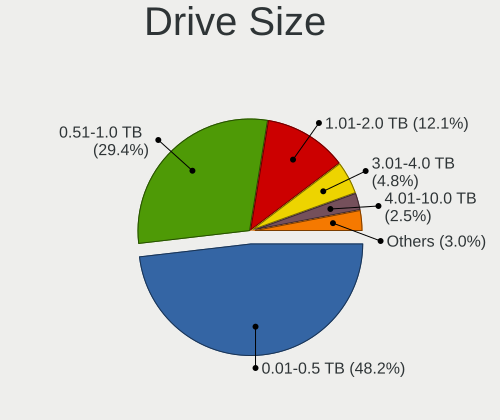

| Size in TB | Computers | Drives | Percent |
|------------|-----------|--------|---------|
| 0.01-0.5   | 1926      | 3158   | 48.16%  |
| 0.51-1.0   | 1176      | 1954   | 29.41%  |
| 1.01-2.0   | 485       | 878    | 12.13%  |
| 3.01-4.0   | 192       | 328    | 4.8%    |
| 4.01-10.0  | 100       | 196    | 2.5%    |
| 2.01-3.0   | 98        | 166    | 2.45%   |
| 10.01-20.0 | 21        | 32     | 0.53%   |
| 20.01-50.0 | 1         | 1      | 0.03%   |

Space Total
-----------

Amount of disk space available on the file system

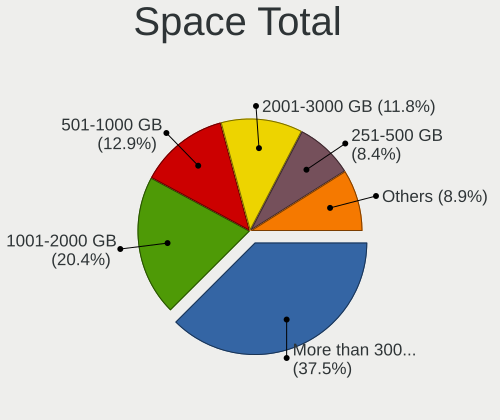

| Size in GB     | Computers | Percent |
|----------------|-----------|---------|
| More than 3000 | 1644      | 37.51%  |
| 1001-2000      | 892       | 20.35%  |
| 501-1000       | 567       | 12.94%  |
| 2001-3000      | 519       | 11.84%  |
| 251-500        | 369       | 8.42%   |
| 101-250        | 228       | 5.2%    |
| 51-100         | 56        | 1.28%   |
| Unknown        | 56        | 1.28%   |
| 21-50          | 26        | 0.59%   |
| 1-20           | 26        | 0.59%   |

Space Used
----------

Amount of used disk space

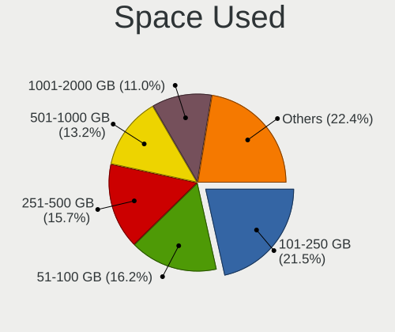

| Used GB        | Computers | Percent |
|----------------|-----------|---------|
| 101-250        | 995       | 21.52%  |
| 51-100         | 747       | 16.16%  |
| 251-500        | 725       | 15.68%  |
| 501-1000       | 612       | 13.24%  |
| 1001-2000      | 508       | 10.99%  |
| More than 3000 | 332       | 7.18%   |
| 1-20           | 228       | 4.93%   |
| 2001-3000      | 221       | 4.78%   |
| 21-50          | 197       | 4.26%   |
| Unknown        | 56        | 1.21%   |
| 0              | 2         | 0.04%   |

Malfunc. Drives
---------------

Drive models with a malfunction

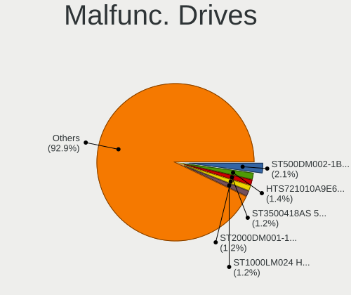

| Model                                 | Computers | Drives | Percent |
|---------------------------------------|-----------|--------|---------|
| Seagate ST500DM002-1BD142 500GB       | 9         | 12     | 2.13%   |
| HGST HTS721010A9E630 1TB              | 6         | 6      | 1.42%   |
| Seagate ST3500418AS 500GB             | 5         | 5      | 1.18%   |
| Seagate ST2000DM001-1CH164 2TB        | 5         | 6      | 1.18%   |
| Seagate ST1000LM024 HN-M101MBB 1TB    | 5         | 5      | 1.18%   |
| Samsung Electronics SSD 840 EVO 120GB | 5         | 7      | 1.18%   |
| WDC WD3200AAJS-00L7A0 320GB           | 4         | 4      | 0.95%   |
| Seagate ST2000DM001-1ER164 2TB        | 4         | 4      | 0.95%   |
| Samsung Electronics SSD 870 EVO 1TB   | 4         | 5      | 0.95%   |
| HGST HTS725050A7E630 500GB            | 4         | 5      | 0.95%   |
| WDC WD10JFCX-68N6GN0 1TB              | 3         | 4      | 0.71%   |
| Toshiba MQ01ABD100 1TB                | 3         | 3      | 0.71%   |
| Seagate ST1000LM035-1RK172 1TB        | 3         | 3      | 0.71%   |
| Seagate ST1000DM003-1SB102 1TB        | 3         | 4      | 0.71%   |
| Samsung Electronics SSD 980 1TB       | 3         | 3      | 0.71%   |
| Samsung Electronics HD501LJ 500GB     | 3         | 4      | 0.71%   |
| Kingston SV300S37A120G 120GB SSD      | 3         | 4      | 0.71%   |
| Kingston SHFS37A120G 120GB SSD        | 3         | 4      | 0.71%   |
| Hitachi HTS545032B9A300 320GB         | 3         | 3      | 0.71%   |
| WDC WD6400AAKS-22A7B2 640GB           | 2         | 2      | 0.47%   |
| WDC WD5002ABYS-02B1B0 500GB           | 2         | 3      | 0.47%   |
| WDC WD30EZRZ-00Z5HB0 3TB              | 2         | 3      | 0.47%   |
| WDC WD20EZRX-00DC0B0 2TB              | 2         | 3      | 0.47%   |
| WDC WD20EFRX-68EUZN0 2TB              | 2         | 3      | 0.47%   |
| WDC WD2002FAEX-007BA0 2TB             | 2         | 2      | 0.47%   |
| WDC WD1003FZEX-00K3CA0 1TB            | 2         | 2      | 0.47%   |
| WDC WD1002FAEX-00Z3A0 1TB             | 2         | 3      | 0.47%   |
| WDC WD Blue SA510 2.5 500GB           | 2         | 2      | 0.47%   |
| WD MediaMax WL5000GSA12872B 5TB       | 2         | 2      | 0.47%   |
| Toshiba MQ01ABF050 500GB              | 2         | 2      | 0.47%   |
| Toshiba MK5055GSX 500GB               | 2         | 4      | 0.47%   |
| SK hynix BC711 HFM512GD3JX013N 512GB  | 2         | 2      | 0.47%   |
| Seagate ST9500325AS 500GB             | 2         | 2      | 0.47%   |
| Seagate ST500LM021-1KJ152 500GB       | 2         | 2      | 0.47%   |
| Seagate ST500LM012 HN-M500MBB 500GB   | 2         | 2      | 0.47%   |
| Seagate ST500LM000-1EJ162 500GB       | 2         | 2      | 0.47%   |
| Seagate ST3250318AS 250GB             | 2         | 2      | 0.47%   |
| Seagate ST31000528AS 1TB              | 2         | 5      | 0.47%   |
| Seagate ST31000524AS 1TB              | 2         | 2      | 0.47%   |
| Seagate ST3000DM001-1ER166 3TB        | 2         | 2      | 0.47%   |

Malfunc. Drive Vendor
---------------------

Vendors of faulty drives

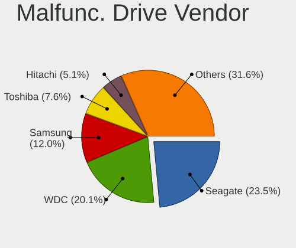

| Vendor                    | Computers | Drives | Percent |
|---------------------------|-----------|--------|---------|
| Seagate                   | 96        | 124    | 23.53%  |
| WDC                       | 82        | 103    | 20.1%   |
| Samsung Electronics       | 49        | 65     | 12.01%  |
| Toshiba                   | 31        | 41     | 7.6%    |
| Hitachi                   | 21        | 25     | 5.15%   |
| Kingston                  | 17        | 27     | 4.17%   |
| Intel                     | 14        | 16     | 3.43%   |
| Crucial                   | 14        | 15     | 3.43%   |
| HGST                      | 12        | 14     | 2.94%   |
| SanDisk                   | 10        | 12     | 2.45%   |
| SK hynix                  | 6         | 7      | 1.47%   |
| Maxtor                    | 5         | 7      | 1.23%   |
| Transcend                 | 4         | 6      | 0.98%   |
| Micron Technology         | 3         | 3      | 0.74%   |
| LITEONIT                  | 3         | 4      | 0.74%   |
| XrayDisk                  | 2         | 2      | 0.49%   |
| WD MediaMax               | 2         | 2      | 0.49%   |
| Patriot                   | 2         | 2      | 0.49%   |
| OCZ                       | 2         | 2      | 0.49%   |
| Micron/Crucial Technology | 2         | 2      | 0.49%   |
| Fujitsu                   | 2         | 3      | 0.49%   |
| Corsair                   | 2         | 2      | 0.49%   |
| XPG                       | 1         | 1      | 0.25%   |
| WDC WDS4                  | 1         | 1      | 0.25%   |
| TrekStor                  | 1         | 1      | 0.25%   |
| SuperTalent               | 1         | 1      | 0.25%   |
| SSSTC                     | 1         | 1      | 0.25%   |
| SPCC                      | 1         | 1      | 0.25%   |
| Silicon Motion            | 1         | 1      | 0.25%   |
| Realtek Semiconductor     | 1         | 1      | 0.25%   |
| Phison Electronics        | 1         | 1      | 0.25%   |
| Phison                    | 1         | 1      | 0.25%   |
| Netac                     | 1         | 1      | 0.25%   |
| Lite-On Technology        | 1         | 2      | 0.25%   |
| LEQIXIANG                 | 1         | 1      | 0.25%   |
| Lenovo                    | 1         | 1      | 0.25%   |
| KingFast                  | 1         | 1      | 0.25%   |
| Intenso                   | 1         | 1      | 0.25%   |
| HUSKY                     | 1         | 1      | 0.25%   |
| HPE                       | 1         | 32     | 0.25%   |

Malfunc. HDD Vendor
-------------------

Vendors of faulty HDD drives

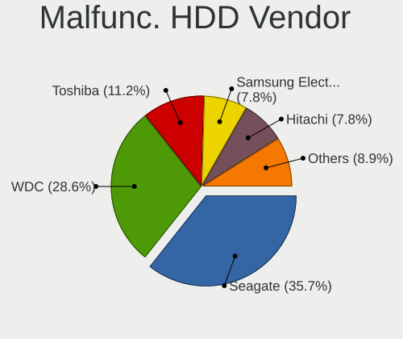

| Vendor              | Computers | Drives | Percent |
|---------------------|-----------|--------|---------|
| Seagate             | 96        | 124    | 35.69%  |
| WDC                 | 77        | 98     | 28.62%  |
| Toshiba             | 30        | 40     | 11.15%  |
| Samsung Electronics | 21        | 27     | 7.81%   |
| Hitachi             | 21        | 25     | 7.81%   |
| HGST                | 12        | 14     | 4.46%   |
| Maxtor              | 5         | 7      | 1.86%   |
| WD MediaMax         | 2         | 2      | 0.74%   |
| Fujitsu             | 2         | 3      | 0.74%   |
| HPE                 | 1         | 32     | 0.37%   |
| Hewlett-Packard     | 1         | 1      | 0.37%   |
| Apple               | 1         | 1      | 0.37%   |

Malfunc. Drive Kind
-------------------

Kinds of faulty drives

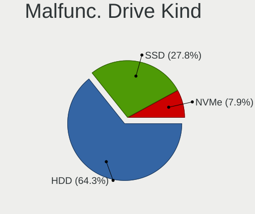

| Kind | Computers | Drives | Percent |
|------|-----------|--------|---------|
| HDD  | 243       | 374    | 64.29%  |
| SSD  | 105       | 135    | 27.78%  |
| NVMe | 30        | 35     | 7.94%   |

Failed Drives
-------------

Failed drive models

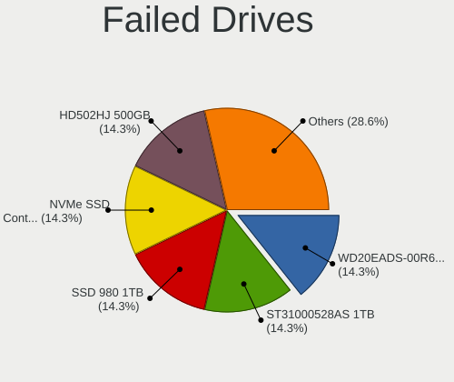

| Model                                                         | Computers | Drives | Percent |
|---------------------------------------------------------------|-----------|--------|---------|
| WDC WD20EADS-00R6B0 2TB                                       | 1         | 1      | 14.29%  |
| Seagate ST31000528AS 1TB                                      | 1         | 1      | 14.29%  |
| Samsung Electronics SSD 980 1TB                               | 1         | 1      | 14.29%  |
| Samsung Electronics NVMe SSD Controller SM981/PM981/PM983 1TB | 1         | 1      | 14.29%  |
| Samsung Electronics HD502HJ 500GB                             | 1         | 5      | 14.29%  |
| Micron Technology MTFDDAV256TBN-1AR15ABHA 256GB SSD           | 1         | 1      | 14.29%  |
| Hitachi HDS721025CLA382 250GB                                 | 1         | 1      | 14.29%  |

Failed Drive Vendor
-------------------

Failed drive vendors

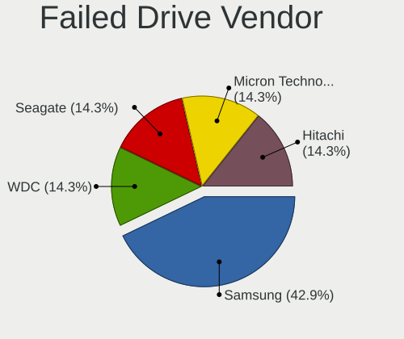

| Vendor              | Computers | Drives | Percent |
|---------------------|-----------|--------|---------|
| Samsung Electronics | 3         | 7      | 42.86%  |
| WDC                 | 1         | 1      | 14.29%  |
| Seagate             | 1         | 1      | 14.29%  |
| Micron Technology   | 1         | 1      | 14.29%  |
| Hitachi             | 1         | 1      | 14.29%  |

Drive Status
------------

Number of failed and malfunc. drives

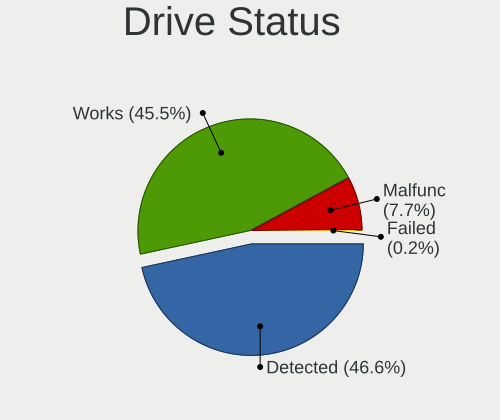

| Status   | Computers | Drives | Percent |
|----------|-----------|--------|---------|
| Detected | 2166      | 5215   | 46.62%  |
| Works    | 2114      | 4412   | 45.5%   |
| Malfunc  | 359       | 544    | 7.73%   |
| Failed   | 7         | 11     | 0.15%   |

Storage controller
------------------

Storage Vendor
--------------

Storage controller vendors

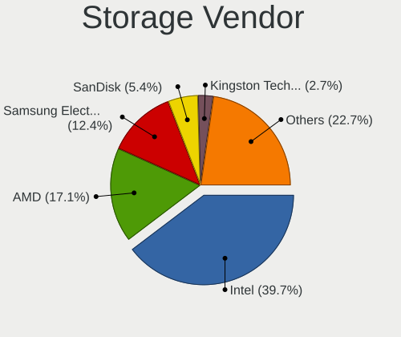

| Vendor                                  | Computers | Percent |
|-----------------------------------------|-----------|---------|
| Intel                                   | 2362      | 39.68%  |
| AMD                                     | 1015      | 17.05%  |
| Samsung Electronics                     | 739       | 12.41%  |
| SanDisk                                 | 322       | 5.41%   |
| Kingston Technology Company             | 163       | 2.74%   |
| SK hynix                                | 162       | 2.72%   |
| Phison Electronics                      | 134       | 2.25%   |
| Micron Technology                       | 121       | 2.03%   |
| ASMedia Technology                      | 114       | 1.92%   |
| Micron/Crucial Technology               | 82        | 1.38%   |
| Toshiba America Info Systems            | 79        | 1.33%   |
| KIOXIA                                  | 76        | 1.28%   |
| Marvell Technology Group                | 68        | 1.14%   |
| Silicon Motion                          | 67        | 1.13%   |
| MAXIO Technology (Hangzhou)             | 57        | 0.96%   |
| ADATA Technology                        | 47        | 0.79%   |
| JMicron Technology                      | 42        | 0.71%   |
| Nvidia                                  | 41        | 0.69%   |
| Realtek Semiconductor                   | 34        | 0.57%   |
| LSI Logic / Symbios Logic               | 29        | 0.49%   |
| Shenzhen Longsys Electronics            | 23        | 0.39%   |
| Seagate Technology                      | 23        | 0.39%   |
| Broadcom / LSI                          | 22        | 0.37%   |
| Solid State Storage Technology          | 19        | 0.32%   |
| Union Memory (Shenzhen)                 | 10        | 0.17%   |
| Solidigm                                | 10        | 0.17%   |
| INNOGRIT                                | 10        | 0.17%   |
| Adaptec                                 | 9         | 0.15%   |
| VIA Technologies                        | 8         | 0.13%   |
| Silicon Image                           | 8         | 0.13%   |
| Yangtze Memory Technologies             | 6         | 0.1%    |
| Lenovo                                  | 6         | 0.1%    |
| Apple                                   | 6         | 0.1%    |
| Hewlett-Packard                         | 5         | 0.08%   |
| Shenzhen Unionmemory Information System | 4         | 0.07%   |
| Lite-On Technology                      | 4         | 0.07%   |
| Shenzhen Wodposit Electronics           | 3         | 0.05%   |
| TenaFe                                  | 2         | 0.03%   |
| Promise Technology                      | 2         | 0.03%   |
| Netac Technology                        | 2         | 0.03%   |

Storage Model
-------------

Storage controller models

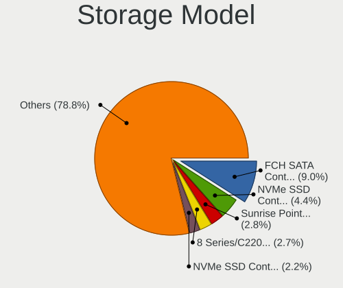

| Model                                                                          | Computers | Percent |
|--------------------------------------------------------------------------------|-----------|---------|
| AMD FCH SATA Controller [AHCI mode]                                            | 607       | 9.03%   |
| Samsung NVMe SSD Controller SM981/PM981/PM983                                  | 297       | 4.42%   |
| Intel Sunrise Point-LP SATA Controller [AHCI mode]                             | 190       | 2.83%   |
| Intel 8 Series/C220 Series Chipset Family 6-port SATA Controller 1 [AHCI mode] | 180       | 2.68%   |
| Samsung NVMe SSD Controller PM9A1/PM9A3/980PRO                                 | 151       | 2.25%   |
| Intel Volume Management Device NVMe RAID Controller                            | 142       | 2.11%   |
| AMD 400 Series Chipset SATA Controller                                         | 139       | 2.07%   |
| Intel 7 Series Chipset Family 6-port SATA Controller [AHCI mode]               | 136       | 2.02%   |
| Samsung NVMe SSD Controller 980 (DRAM-less)                                    | 132       | 1.96%   |
| AMD 500 Series Chipset SATA Controller                                         | 125       | 1.86%   |
| Intel 82801 Mobile SATA Controller [RAID mode]                                 | 119       | 1.77%   |
| ASMedia ASM1061/ASM1062 Serial ATA Controller                                  | 100       | 1.49%   |
| AMD SB7x0/SB8x0/SB9x0 IDE Controller                                           | 98        | 1.46%   |
| Intel Q170/Q150/B150/H170/H110/Z170/CM236 Chipset SATA Controller [AHCI Mode]  | 96        | 1.43%   |
| Intel 6 Series/C200 Series Chipset Family 6 port Mobile SATA AHCI Controller   | 93        | 1.38%   |
| AMD SB7x0/SB8x0/SB9x0 SATA Controller [AHCI mode]                              | 93        | 1.38%   |
| Intel 200 Series PCH SATA controller [AHCI mode]                               | 85        | 1.27%   |
| Intel 8 Series SATA Controller 1 [AHCI mode]                                   | 75        | 1.12%   |
| Intel 6 Series/C200 Series Chipset Family 6 port Desktop SATA AHCI Controller  | 72        | 1.07%   |
| AMD 600 Series Chipset SATA Controller                                         | 71        | 1.06%   |
| SK hynix Gold P31/BC711/PC711 NVMe Solid State Drive                           | 66        | 0.98%   |
| Intel 7 Series/C210 Series Chipset Family 6-port SATA Controller [AHCI mode]   | 66        | 0.98%   |
| Intel SATA Controller [RAID Mode]                                              | 63        | 0.94%   |
| Intel Cannon Lake Mobile PCH SATA AHCI Controller                              | 63        | 0.94%   |
| AMD SB7x0/SB8x0/SB9x0 SATA Controller [IDE mode]                               | 63        | 0.94%   |
| Samsung NVMe SSD Controller SM961/PM961/SM963                                  | 61        | 0.91%   |
| Intel Tiger Lake-LP SATA Controller                                            | 57        | 0.85%   |
| SanDisk Extreme Pro / WD Black SN750 / PC SN730 / Red SN700 NVMe SSD           | 55        | 0.82%   |
| Intel Wildcat Point-LP SATA Controller [AHCI Mode]                             | 55        | 0.82%   |
| Intel SSD 660P Series                                                          | 55        | 0.82%   |
| SanDisk Ultra 3D / WD PC SN530, IX SN530, Blue SN550 NVMe SSD (DRAM-less)      | 54        | 0.8%    |
| Phison E12 NVMe Controller                                                     | 51        | 0.76%   |
| Intel Comet Lake SATA AHCI Controller                                          | 50        | 0.74%   |
| SanDisk WD SN560/SN740/SN770/SN5000 NVMe SSD                                   | 49        | 0.73%   |
| Intel Cannon Lake PCH SATA AHCI Controller                                     | 49        | 0.73%   |
| Intel HM170/QM170 Chipset SATA Controller [AHCI Mode]                          | 48        | 0.71%   |
| Intel Celeron/Pentium Silver Processor SATA Controller                         | 48        | 0.71%   |
| KIOXIA NVMe SSD Controller BG4 (DRAM-less)                                     | 45        | 0.67%   |
| Intel Alder Lake-S PCH SATA Controller [AHCI Mode]                             | 45        | 0.67%   |
| Intel 5 Series/3400 Series Chipset 6 port SATA AHCI Controller                 | 45        | 0.67%   |

Storage Kind
------------

Kind of storage controller (IDE, SATA, NVMe, SAS, ...)

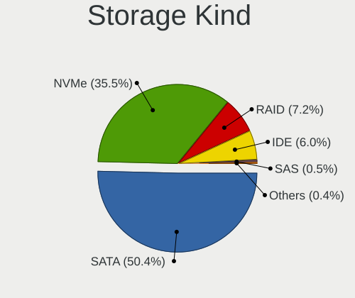

| Kind | Computers | Percent |
|------|-----------|---------|
| SATA | 2943      | 50.39%  |
| NVMe | 2074      | 35.51%  |
| RAID | 423       | 7.24%   |
| IDE  | 350       | 5.99%   |
| SAS  | 30        | 0.51%   |
| SCSI | 21        | 0.36%   |

Processor
---------

CPU Vendor
----------

Processor vendors

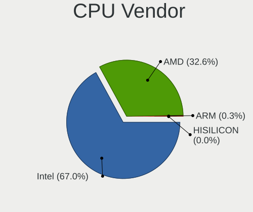

| Vendor    | Computers | Percent |
|-----------|-----------|---------|
| Intel     | 2804      | 67.05%  |
| AMD       | 1364      | 32.62%  |
| ARM       | 12        | 0.29%   |
| Qualcomm  | 1         | 0.02%   |
| HISILICON | 1         | 0.02%   |

CPU Model
---------

Processor models

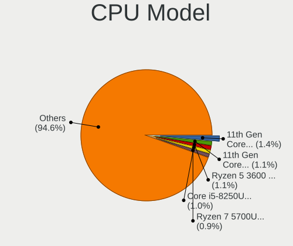

| Model                                         | Computers | Percent |
|-----------------------------------------------|-----------|---------|
| Intel 11th Gen Core i7-1165G7 @ 2.80GHz       | 60        | 1.43%   |
| Intel 11th Gen Core i5-1135G7 @ 2.40GHz       | 46        | 1.1%    |
| AMD Ryzen 5 3600 6-Core Processor             | 44        | 1.05%   |
| Intel Core i5-8250U CPU @ 1.60GHz             | 41        | 0.98%   |
| AMD Ryzen 7 5700U with Radeon Graphics        | 37        | 0.88%   |
| AMD Ryzen 7 3700X 8-Core Processor            | 35        | 0.84%   |
| AMD Ryzen 5 5500U with Radeon Graphics        | 34        | 0.81%   |
| Intel Core i5-6200U CPU @ 2.30GHz             | 32        | 0.76%   |
| AMD Ryzen 5 5600X 6-Core Processor            | 31        | 0.74%   |
| Intel Core i5-7200U CPU @ 2.50GHz             | 30        | 0.72%   |
| Intel Core i7-8550U CPU @ 1.80GHz             | 29        | 0.69%   |
| AMD Ryzen 5 3500U with Radeon Vega Mobile Gfx | 29        | 0.69%   |
| Intel Core i5-8265U CPU @ 1.60GHz             | 28        | 0.67%   |
| Intel Core i7-8565U CPU @ 1.80GHz             | 27        | 0.64%   |
| AMD Ryzen 9 5900X 12-Core Processor           | 27        | 0.64%   |
| Intel Core i7-9750H CPU @ 2.60GHz             | 25        | 0.6%    |
| Intel Core i5-3210M CPU @ 2.50GHz             | 25        | 0.6%    |
| AMD Ryzen 5 2600 Six-Core Processor           | 25        | 0.6%    |
| AMD Ryzen 7 5800X 8-Core Processor            | 24        | 0.57%   |
| Intel Core i5-8350U CPU @ 1.70GHz             | 23        | 0.55%   |
| Intel Core i5-6300U CPU @ 2.40GHz             | 23        | 0.55%   |
| Intel Core i7-7700HQ CPU @ 2.80GHz            | 22        | 0.53%   |
| Intel Core i7-6700HQ CPU @ 2.60GHz            | 22        | 0.53%   |
| Intel Core i5-3470 CPU @ 3.20GHz              | 22        | 0.53%   |
| Intel Core i7-3770 CPU @ 3.40GHz              | 21        | 0.5%    |
| AMD Ryzen 5 1600 Six-Core Processor           | 21        | 0.5%    |
| Intel Core i7-7500U CPU @ 2.70GHz             | 20        | 0.48%   |
| Intel Core i5-10210U CPU @ 1.60GHz            | 20        | 0.48%   |
| Intel Celeron N4020 CPU @ 1.10GHz             | 20        | 0.48%   |
| Intel 12th Gen Core i7-1260P                  | 20        | 0.48%   |
| Intel 12th Gen Core i5-1235U                  | 20        | 0.48%   |
| AMD Ryzen 7 5800H with Radeon Graphics        | 20        | 0.48%   |
| AMD Ryzen 7 5700G with Radeon Graphics        | 20        | 0.48%   |
| AMD FX-8350 Eight-Core Processor              | 20        | 0.48%   |
| Intel Core i7-8750H CPU @ 2.20GHz             | 19        | 0.45%   |
| Intel Core i5-3230M CPU @ 2.60GHz             | 19        | 0.45%   |
| Intel 11th Gen Core i7-11800H @ 2.30GHz       | 19        | 0.45%   |
| AMD Ryzen 7 4800H with Radeon Graphics        | 19        | 0.45%   |
| AMD Ryzen 7 4700U with Radeon Graphics        | 19        | 0.45%   |
| Intel Core i7-10510U CPU @ 1.80GHz            | 18        | 0.43%   |

CPU Model Family
----------------

Processor model prefix

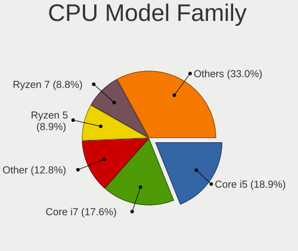

| Model                   | Computers | Percent |
|-------------------------|-----------|---------|
| Intel Core i5           | 792       | 18.92%  |
| Intel Core i7           | 738       | 17.63%  |
| Other                   | 536       | 12.8%   |
| AMD Ryzen 5             | 371       | 8.86%   |
| AMD Ryzen 7             | 369       | 8.82%   |
| Intel Core i3           | 195       | 4.66%   |
| AMD Ryzen 9             | 148       | 3.54%   |
| Intel Xeon              | 141       | 3.37%   |
| Intel Celeron           | 94        | 2.25%   |
| Intel Core 2 Duo        | 80        | 1.91%   |
| AMD FX                  | 78        | 1.86%   |
| Intel Pentium           | 55        | 1.31%   |
| AMD Ryzen 3             | 55        | 1.31%   |
| Intel Core i9           | 42        | 1%      |
| Intel Core              | 37        | 0.88%   |
| AMD Ryzen 7 PRO         | 37        | 0.88%   |
| AMD A10                 | 30        | 0.72%   |
| AMD A8                  | 28        | 0.67%   |
| Intel Atom              | 26        | 0.62%   |
| AMD A6                  | 26        | 0.62%   |
| Intel Pentium Dual-Core | 24        | 0.57%   |
| Intel Core 2 Quad       | 24        | 0.57%   |
| AMD Ryzen 5 PRO         | 24        | 0.57%   |
| AMD Phenom II X4        | 21        | 0.5%    |
| AMD Athlon              | 18        | 0.43%   |
| Intel Pentium Silver    | 17        | 0.41%   |
| AMD Phenom II X6        | 16        | 0.38%   |
| AMD A4                  | 14        | 0.33%   |
| AMD Ryzen Threadripper  | 13        | 0.31%   |
| AMD Athlon II X2        | 9         | 0.22%   |
| Intel Core m3           | 8         | 0.19%   |
| Intel Core 2            | 8         | 0.19%   |
| AMD Opteron             | 8         | 0.19%   |
| AMD E2                  | 7         | 0.17%   |
| AMD Athlon 64 X2        | 6         | 0.14%   |
| Intel Pentium Dual      | 5         | 0.12%   |
| AMD E1                  | 5         | 0.12%   |
| AMD E                   | 5         | 0.12%   |
| AMD Athlon X2           | 5         | 0.12%   |
| Intel Pentium M         | 4         | 0.1%    |

CPU Cores
---------

Number of processor cores

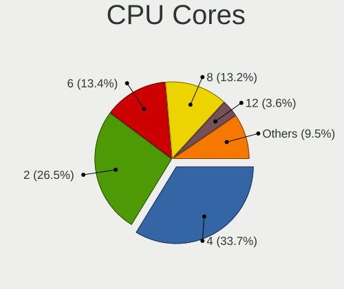

| Number  | Computers | Percent |
|---------|-----------|---------|
| 4       | 1415      | 33.75%  |
| 2       | 1110      | 26.47%  |
| 6       | 561       | 13.38%  |
| 8       | 555       | 13.24%  |
| 12      | 152       | 3.63%   |
| 16      | 103       | 2.46%   |
| 10      | 98        | 2.34%   |
| 14      | 61        | 1.45%   |
| 1       | 44        | 1.05%   |
| 24      | 30        | 0.72%   |
| 3       | 22        | 0.52%   |
| 20      | 14        | 0.33%   |
| 32      | 9         | 0.21%   |
| Unknown | 5         | 0.12%   |
| 40      | 4         | 0.1%    |
| 18      | 3         | 0.07%   |
| 64      | 2         | 0.05%   |
| 48      | 2         | 0.05%   |
| 44      | 1         | 0.02%   |
| 36      | 1         | 0.02%   |
| 28      | 1         | 0.02%   |

CPU Sockets
-----------

Number of sockets

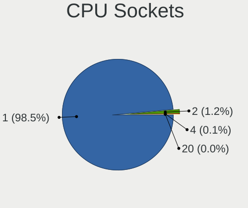

| Number  | Computers | Percent |
|---------|-----------|---------|
| 1       | 4121      | 98.52%  |
| 2       | 51        | 1.22%   |
| 4       | 6         | 0.14%   |
| Unknown | 4         | 0.1%    |
| 20      | 1         | 0.02%   |

CPU Threads
-----------

Threads per core (Hyper-Threading)

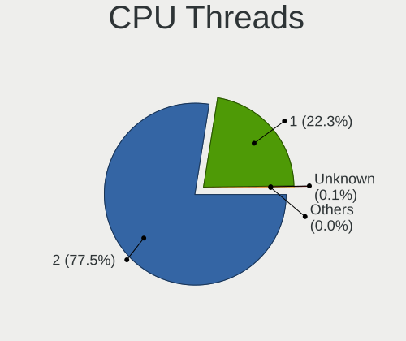

| Number  | Computers | Percent |
|---------|-----------|---------|
| 2       | 3249      | 77.5%   |
| 1       | 933       | 22.26%  |
| Unknown | 5         | 0.12%   |
| 8       | 3         | 0.07%   |
| 12      | 1         | 0.02%   |
| 4       | 1         | 0.02%   |

CPU Op-Modes
------------

CPU Operation Modes (32-bit, 64-bit)

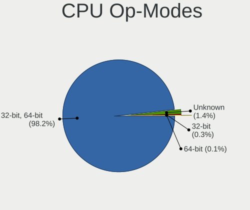

| Op mode        | Computers | Percent |
|----------------|-----------|---------|
| 32-bit, 64-bit | 4114      | 98.23%  |
| Unknown        | 57        | 1.36%   |
| 32-bit         | 12        | 0.29%   |
| 64-bit         | 5         | 0.12%   |

CPU Microcode
-------------

Microcode number

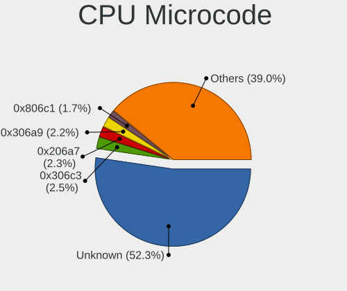

| Number     | Computers | Percent |
|------------|-----------|---------|
| Unknown    | 2263      | 52.32%  |
| 0x306c3    | 108       | 2.5%    |
| 0x206a7    | 98        | 2.27%   |
| 0x306a9    | 96        | 2.22%   |
| 0x806c1    | 72        | 1.66%   |
| 0x906ea    | 66        | 1.53%   |
| 0x506e3    | 61        | 1.41%   |
| 0x0a50000c | 60        | 1.39%   |
| 0x08701021 | 56        | 1.29%   |
| 0x806ec    | 55        | 1.27%   |
| 0x406e3    | 52        | 1.2%    |
| 0x08108109 | 51        | 1.18%   |
| 0x906e9    | 49        | 1.13%   |
| 0x0800820d | 48        | 1.11%   |
| 0x806ea    | 46        | 1.06%   |
| 0x1067a    | 45        | 1.04%   |
| 0x06000852 | 43        | 0.99%   |
| 0x08608103 | 41        | 0.95%   |
| 0x806e9    | 40        | 0.92%   |
| 0x08600106 | 39        | 0.9%    |
| 0x40651    | 37        | 0.86%   |
| 0x306d4    | 33        | 0.76%   |
| 0x0a50000d | 33        | 0.76%   |
| 0x010000c8 | 26        | 0.6%    |
| 0x20655    | 24        | 0.55%   |
| 0x08108102 | 22        | 0.51%   |
| 0x08001138 | 22        | 0.51%   |
| 0x0a20120a | 21        | 0.49%   |
| 0x08600104 | 21        | 0.49%   |
| 0x06001119 | 21        | 0.49%   |
| 0x906a3    | 19        | 0.44%   |
| 0x08701013 | 19        | 0.44%   |
| 0x0a404102 | 18        | 0.42%   |
| 0x0a201009 | 17        | 0.39%   |
| 0x706a8    | 15        | 0.35%   |
| 0x08101016 | 15        | 0.35%   |
| 0x0810100b | 15        | 0.35%   |
| 0x906ed    | 14        | 0.32%   |
| 0x806eb    | 14        | 0.32%   |
| 0x806d1    | 14        | 0.32%   |

CPU Microarch
-------------

Microarchitecture

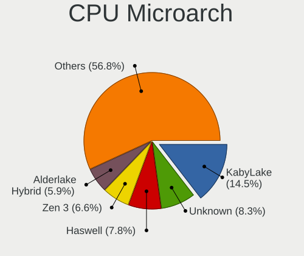

| Name              | Computers | Percent |
|-------------------|-----------|---------|
| KabyLake          | 609       | 14.52%  |
| Unknown           | 348       | 8.3%    |
| Haswell           | 328       | 7.82%   |
| Zen 3             | 276       | 6.58%   |
| Alderlake Hybrid  | 249       | 5.94%   |
| Skylake           | 248       | 5.91%   |
| Zen 2             | 241       | 5.75%   |
| IvyBridge         | 235       | 5.6%    |
| SandyBridge       | 223       | 5.32%   |
| TigerLake         | 165       | 3.94%   |
| Zen+              | 158       | 3.77%   |
| Penryn            | 116       | 2.77%   |
| Zen               | 98        | 2.34%   |
| Piledriver        | 96        | 2.29%   |
| IceLake           | 88        | 2.1%    |
| Broadwell         | 84        | 2%      |
| CometLake         | 82        | 1.96%   |
| Westmere          | 80        | 1.91%   |
| K10               | 66        | 1.57%   |
| Goldmont plus     | 51        | 1.22%   |
| Core              | 44        | 1.05%   |
| Excavator         | 37        | 0.88%   |
| Nehalem           | 36        | 0.86%   |
| Silvermont        | 32        | 0.76%   |
| Meteorlake Hybrid | 23        | 0.55%   |
| Gracemont         | 20        | 0.48%   |
| Steamroller       | 19        | 0.45%   |
| Puma              | 18        | 0.43%   |
| Bulldozer         | 16        | 0.38%   |
| K10 Llano         | 14        | 0.33%   |
| Jaguar            | 13        | 0.31%   |
| Goldmont          | 12        | 0.29%   |
| Bonnell           | 12        | 0.29%   |
| K8 Hammer         | 11        | 0.26%   |
| Bobcat            | 11        | 0.26%   |
| Tremont           | 10        | 0.24%   |
| Lunarlake Hybrid  | 9         | 0.21%   |
| P6                | 6         | 0.14%   |
| K8 & K10 hybrid   | 6         | 0.14%   |
| NetBurst          | 3         | 0.07%   |

Graphics
--------

GPU Vendor
----------

Vendors of graphics cards

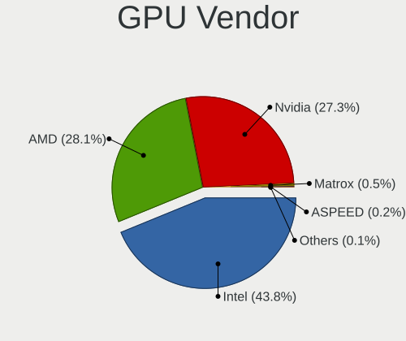

| Vendor                     | Computers | Percent |
|----------------------------|-----------|---------|
| Intel                      | 2179      | 43.82%  |
| AMD                        | 1399      | 28.13%  |
| Nvidia                     | 1358      | 27.31%  |
| Matrox Electronics Systems | 23        | 0.46%   |
| ASPEED Technology          | 11        | 0.22%   |
| S3 Graphics                | 2         | 0.04%   |
| VIA Technologies           | 1         | 0.02%   |

GPU Model
---------

Graphics card models

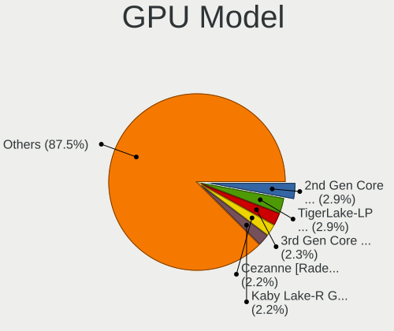

| Model                                                                       | Computers | Percent |
|-----------------------------------------------------------------------------|-----------|---------|
| Intel 2nd Generation Core Processor Family Integrated Graphics Controller   | 150       | 2.91%   |
| Intel TigerLake-LP GT2 [Iris Xe Graphics]                                   | 147       | 2.86%   |
| Intel 3rd Gen Core processor Graphics Controller                            | 119       | 2.31%   |
| AMD Cezanne [Radeon Vega Series / Radeon Vega Mobile Series]                | 114       | 2.21%   |
| Intel Kaby Lake-R GT2 [UHD Graphics 620]                                    | 112       | 2.18%   |
| AMD Renoir [Radeon Vega Series / Radeon Vega Mobile Series]                 | 106       | 2.06%   |
| Intel Skylake-U GT2 [HD Graphics 520]                                       | 100       | 1.94%   |
| AMD Ellesmere [Radeon RX 470/480/570/570X/580/580X/590]                     | 93        | 1.81%   |
| AMD Picasso/Raven 2 [Radeon Vega Series / Radeon Vega Mobile Series]        | 92        | 1.79%   |
| Intel CoffeeLake-H GT2 [UHD Graphics 630]                                   | 86        | 1.67%   |
| Intel Haswell-ULT Integrated Graphics Controller                            | 83        | 1.61%   |
| Intel WhiskeyLake-U GT2 [UHD Graphics 620]                                  | 81        | 1.57%   |
| Intel Kaby Lake-U GT2 [HD Graphics 620]                                     | 81        | 1.57%   |
| AMD Lucienne                                                                | 80        | 1.55%   |
| Intel 4th Gen Core Processor Integrated Graphics Controller                 | 71        | 1.38%   |
| Intel Xeon E3-1200 v3/4th Gen Core Processor Integrated Graphics Controller | 69        | 1.34%   |
| Intel Alder Lake-P GT2 [Iris Xe Graphics]                                   | 63        | 1.22%   |
| Intel CometLake-U GT2 [UHD Graphics]                                        | 55        | 1.07%   |
| Intel Core Processor Integrated Graphics Controller                         | 51        | 0.99%   |
| Intel Broadwell-U GT2 [HD Graphics 5500]                                    | 48        | 0.93%   |
| Intel Raptor Lake-P [Iris Xe Graphics]                                      | 47        | 0.91%   |
| AMD Rembrandt [Radeon 680M]                                                 | 46        | 0.89%   |
| AMD Raphael                                                                 | 46        | 0.89%   |
| AMD Navi 10 [Radeon RX 5600 OEM/5600 XT / 5700/5700 XT]                     | 42        | 0.82%   |
| Intel Skylake-S GT2 [HD Graphics 530]                                       | 40        | 0.78%   |
| AMD Raven Ridge [Radeon Vega Series / Radeon Vega Mobile Series]            | 40        | 0.78%   |
| Intel GeminiLake [UHD Graphics 600]                                         | 37        | 0.72%   |
| Nvidia GP107 [GeForce GTX 1050 Ti]                                          | 34        | 0.66%   |
| Intel Skylake-H GT2 [HD Graphics 530]                                       | 34        | 0.66%   |
| Intel CoffeeLake-S GT2 [UHD Graphics 630]                                   | 34        | 0.66%   |
| AMD Phoenix1                                                                | 34        | 0.66%   |
| Nvidia TU117M [GeForce GTX 1650 Mobile / Max-Q]                             | 33        | 0.64%   |
| Intel Xeon E3-1200 v2/3rd Gen Core processor Graphics Controller            | 32        | 0.62%   |
| Intel CometLake-H GT2 [UHD Graphics]                                        | 32        | 0.62%   |
| AMD Navi 22 [Radeon RX 6700/6700 XT/6750 XT / 6800M/6850M XT]               | 32        | 0.62%   |
| AMD Barcelo                                                                 | 32        | 0.62%   |
| Nvidia GK208B [GeForce GT 710]                                              | 31        | 0.6%    |
| Intel Kaby Lake-H GT2 [HD Graphics 630]                                     | 31        | 0.6%    |
| Intel Kaby Lake-S GT2 [HD Graphics 630]                                     | 30        | 0.58%   |
| Intel TigerLake-H GT1 [UHD Graphics]                                        | 29        | 0.56%   |

GPU Combo
---------

Combinations of graphics cards

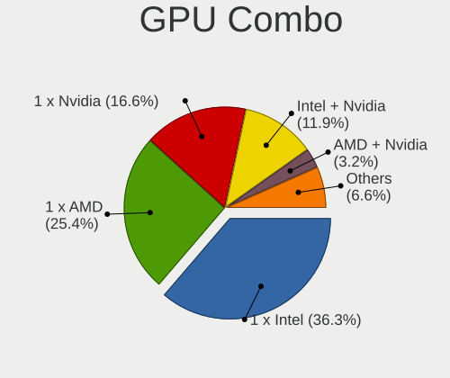

| Name                    | Computers | Percent |
|-------------------------|-----------|---------|
| 1 x Intel               | 1531      | 36.29%  |
| 1 x AMD                 | 1072      | 25.41%  |
| 1 x Nvidia              | 701       | 16.62%  |
| Intel + Nvidia          | 502       | 11.9%   |
| AMD + Nvidia            | 133       | 3.15%   |
| 2 x AMD                 | 99        | 2.35%   |
| Intel + AMD             | 96        | 2.28%   |
| 1 x Matrox              | 17        | 0.4%    |
| Other                   | 16        | 0.38%   |
| 2 x Nvidia              | 15        | 0.36%   |
| 2 x Intel               | 13        | 0.31%   |
| Nvidia + ASPEED         | 5         | 0.12%   |
| 1 x ASPEED              | 4         | 0.09%   |
| Nvidia + Matrox         | 3         | 0.07%   |
| 1 x S3 Graphics         | 2         | 0.05%   |
| Intel + 2 x Nvidia      | 2         | 0.05%   |
| AMD + 2 x Nvidia        | 2         | 0.05%   |
| AMD + Matrox            | 2         | 0.05%   |
| 2 x Nvidia + 1 x Matrox | 1         | 0.02%   |
| 2 x Nvidia + 1 x ASPEED | 1         | 0.02%   |
| 2 x AMD + 1 x ASPEED    | 1         | 0.02%   |
| 1 x VIA                 | 1         | 0.02%   |

GPU Driver
----------

Free vs proprietary

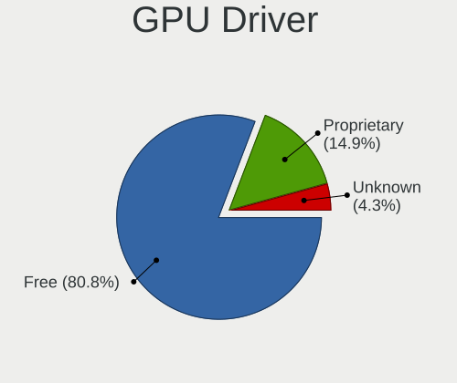

| Driver      | Computers | Percent |
|-------------|-----------|---------|
| Free        | 3434      | 80.78%  |
| Proprietary | 635       | 14.94%  |
| Unknown     | 182       | 4.28%   |

GPU Memory
----------

Total video memory

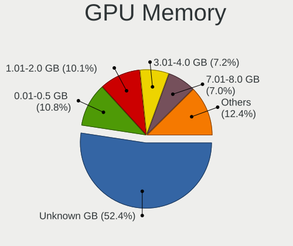

| Size in GB | Computers | Percent |
|------------|-----------|---------|
| Unknown    | 2251      | 52.41%  |
| 0.01-0.5   | 465       | 10.83%  |
| 1.01-2.0   | 435       | 10.13%  |
| 3.01-4.0   | 309       | 7.19%   |
| 7.01-8.0   | 301       | 7.01%   |
| 0.51-1.0   | 229       | 5.33%   |
| 8.01-16.0  | 151       | 3.52%   |
| 5.01-6.0   | 92        | 2.14%   |
| 2.01-3.0   | 30        | 0.7%    |
| 16.01-24.0 | 29        | 0.68%   |
| 32.01-64.0 | 1         | 0.02%   |
| 4.01-5.0   | 1         | 0.02%   |
| 24.01-32.0 | 1         | 0.02%   |

Monitor
-------

Monitor Vendor
--------------

Monitor vendors

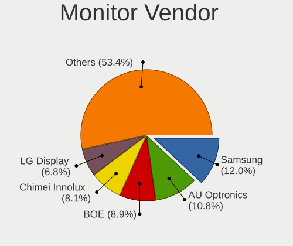

| Vendor                  | Computers | Percent |
|-------------------------|-----------|---------|
| Samsung Electronics     | 582       | 11.97%  |
| AU Optronics            | 524       | 10.78%  |
| BOE                     | 433       | 8.91%   |
| Chimei Innolux          | 393       | 8.08%   |
| LG Display              | 333       | 6.85%   |
| Dell                    | 307       | 6.31%   |
| Goldstar                | 303       | 6.23%   |
| Hewlett-Packard         | 173       | 3.56%   |
| Acer                    | 163       | 3.35%   |
| AOC                     | 128       | 2.63%   |
| BenQ                    | 127       | 2.61%   |
| Philips                 | 116       | 2.39%   |
| Ancor Communications    | 107       | 2.2%    |
| Lenovo                  | 102       | 2.1%    |
| Apple                   | 102       | 2.1%    |
| Sharp                   | 82        | 1.69%   |
| ASUSTek Computer        | 61        | 1.25%   |
| Iiyama                  | 59        | 1.21%   |
| PANDA                   | 49        | 1.01%   |
| ViewSonic               | 47        | 0.97%   |
| InfoVision              | 39        | 0.8%    |
| Chi Mei Optoelectronics | 36        | 0.74%   |
| Fujitsu Siemens         | 32        | 0.66%   |
| Eizo                    | 30        | 0.62%   |
| Sony                    | 29        | 0.6%    |
| MSI                     | 28        | 0.58%   |
| Unknown                 | 25        | 0.51%   |
| CSO                     | 25        | 0.51%   |
| NEC Computers           | 19        | 0.39%   |
| Sceptre Tech            | 17        | 0.35%   |
| Gigabyte Technology     | 17        | 0.35%   |
| LG Electronics          | 16        | 0.33%   |
| HKC                     | 14        | 0.29%   |
| Pixio                   | 13        | 0.27%   |
| Medion                  | 12        | 0.25%   |
| Vizio                   | 11        | 0.23%   |
| Panasonic               | 11        | 0.23%   |
| HannStar                | 10        | 0.21%   |
| LG Philips              | 9         | 0.19%   |
| Hitachi                 | 9         | 0.19%   |

Monitor Model
-------------

Monitor models

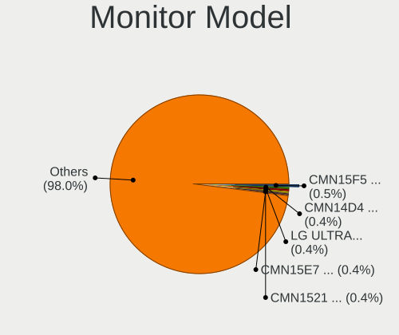

| Model                                                                 | Computers | Percent |
|-----------------------------------------------------------------------|-----------|---------|
| Chimei Innolux LCD Monitor CMN15F5 1920x1080 344x193mm 15.5-inch      | 25        | 0.49%   |
| Chimei Innolux LCD Monitor CMN14D4 1920x1080 309x173mm 13.9-inch      | 20        | 0.39%   |
| Goldstar LG ULTRAWIDE GSM59F1 2560x1080 670x280mm 28.6-inch           | 19        | 0.37%   |
| Chimei Innolux LCD Monitor CMN15E7 1920x1080 344x193mm 15.5-inch      | 19        | 0.37%   |
| Chimei Innolux LCD Monitor CMN1521 1920x1080 344x193mm 15.5-inch      | 18        | 0.35%   |
| AU Optronics LCD Monitor AUO403D 1920x1080 309x174mm 14.0-inch        | 16        | 0.31%   |
| LG Display LCD Monitor LGD0521 1920x1080 309x174mm 14.0-inch          | 15        | 0.3%    |
| Goldstar FULL HD GSM5B55 1920x1080 480x270mm 21.7-inch                | 15        | 0.3%    |
| Goldstar HDR WFHD GSM7714 2560x1080 798x334mm 34.1-inch               | 14        | 0.28%   |
| AU Optronics LCD Monitor AUO38ED 1920x1080 344x193mm 15.5-inch        | 14        | 0.28%   |
| AU Optronics LCD Monitor AUO21ED 1920x1080 344x193mm 15.5-inch        | 14        | 0.28%   |
| Chimei Innolux LCD Monitor CMN1735 1920x1080 381x214mm 17.2-inch      | 11        | 0.22%   |
| BOE LCD Monitor BOE0812 1920x1080 344x194mm 15.5-inch                 | 11        | 0.22%   |
| AU Optronics LCD Monitor AUO219D 1920x1080 381x214mm 17.2-inch        | 11        | 0.22%   |
| Ancor Communications ASUS VS247 ACI249A 1920x1080 521x293mm 23.5-inch | 11        | 0.22%   |
| Samsung Electronics U28E590 SAM0C4D 3840x2160 607x345mm 27.5-inch     | 10        | 0.2%    |
| Samsung Electronics LCD Monitor SEC5441 1280x800 331x207mm 15.4-inch  | 10        | 0.2%    |
| Samsung Electronics LCD Monitor SDC4161 1920x1080 344x194mm 15.5-inch | 10        | 0.2%    |
| PANDA LCD Monitor NCP002D 1920x1080 344x194mm 15.5-inch               | 10        | 0.2%    |
| Goldstar LG IPS FULLHD GSM5AB8 1920x1080 480x270mm 21.7-inch          | 10        | 0.2%    |
| Goldstar HDR 4K GSM7707 3840x2160 600x340mm 27.2-inch                 | 10        | 0.2%    |
| Goldstar HDR 4K GSM7706 3840x2160 600x340mm 27.2-inch                 | 10        | 0.2%    |
| Dell U2412M DELA07A 1920x1200 518x324mm 24.1-inch                     | 10        | 0.2%    |
| Chimei Innolux LCD Monitor CMN15C3 1920x1080 344x193mm 15.5-inch      | 10        | 0.2%    |
| AU Optronics LCD Monitor AUO106C 1366x768 276x155mm 12.5-inch         | 10        | 0.2%    |
| AOC 27G2G4 AOC2702 1920x1080 598x336mm 27.0-inch                      | 10        | 0.2%    |
| AOC 24G2W1G3 AOC2402 1920x1080 527x296mm 23.8-inch                    | 10        | 0.2%    |
| Unknown LCD Monitor FFFF 2288x1287 2550x2550mm 142.0-inch             | 9         | 0.18%   |
| Samsung Electronics LCD Monitor SDC4171 2880x1800 302x189mm 14.0-inch | 9         | 0.18%   |
| Samsung Electronics C24F390 SAM0D2C 1920x1080 521x293mm 23.5-inch     | 9         | 0.18%   |
| PANDA LCD Monitor NCP004D 1920x1080 344x194mm 15.5-inch               | 9         | 0.18%   |
| Chimei Innolux LCD Monitor CMN15D5 1920x1080 344x193mm 15.5-inch      | 9         | 0.18%   |
| BenQ GW2760HS BNQ78CA 1920x1080 598x336mm 27.0-inch                   | 9         | 0.18%   |
| BenQ GW2270 BNQ78DB 1920x1080 476x268mm 21.5-inch                     | 9         | 0.18%   |
| AU Optronics LCD Monitor AUO61ED 1920x1080 344x194mm 15.5-inch        | 9         | 0.18%   |
| AU Optronics LCD Monitor AUO22EC 1366x768 344x193mm 15.5-inch         | 9         | 0.18%   |
| LG Display LCD Monitor LGD046F 1920x1080 344x194mm 15.5-inch          | 8         | 0.16%   |
| Goldstar Ultra HD GSM5B09 3840x2160 600x340mm 27.2-inch               | 8         | 0.16%   |
| Dell U2410 DELF017 1920x1200 520x320mm 24.0-inch                      | 8         | 0.16%   |
| Chimei Innolux LCD Monitor CMN15E8 1920x1080 344x193mm 15.5-inch      | 8         | 0.16%   |

Monitor Resolution
------------------

Monitor screen resolution

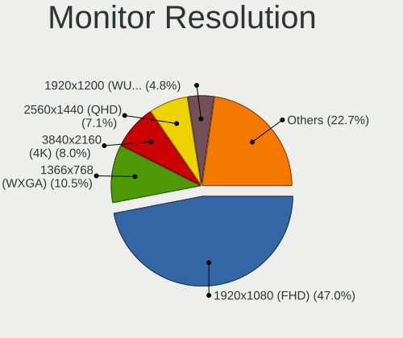

| Resolution         | Computers | Percent |
|--------------------|-----------|---------|
| 1920x1080 (FHD)    | 2189      | 46.96%  |
| 1366x768 (WXGA)    | 489       | 10.49%  |
| 3840x2160 (4K)     | 372       | 7.98%   |
| 2560x1440 (QHD)    | 330       | 7.08%   |
| 1920x1200 (WUXGA)  | 222       | 4.76%   |
| 1600x900 (HD+)     | 143       | 3.07%   |
| 1280x1024 (SXGA)   | 102       | 2.19%   |
| 1680x1050 (WSXGA+) | 95        | 2.04%   |
| 1440x900 (WXGA+)   | 81        | 1.74%   |
| 2560x1600          | 80        | 1.72%   |
| 2560x1080          | 77        | 1.65%   |
| 3440x1440          | 68        | 1.46%   |
| 1280x800 (WXGA)    | 61        | 1.31%   |
| 2880x1800          | 54        | 1.16%   |
| Unknown            | 37        | 0.79%   |
| 3840x1080          | 27        | 0.58%   |
| 1024x768 (XGA)     | 21        | 0.45%   |
| 1360x768           | 19        | 0.41%   |
| 1920x540           | 13        | 0.28%   |
| 1600x1200          | 13        | 0.28%   |
| 3840x2400          | 12        | 0.26%   |
| 3840x1600          | 11        | 0.24%   |
| 2160x1440          | 11        | 0.24%   |
| 2880x1920          | 9         | 0.19%   |
| 2288x1287          | 9         | 0.19%   |
| 2256x1504          | 9         | 0.19%   |
| 3200x1800 (QHD+)   | 7         | 0.15%   |
| 3200x2000          | 6         | 0.13%   |
| 3072x1920          | 6         | 0.13%   |
| 2240x1400          | 6         | 0.13%   |
| 1920x1280          | 6         | 0.13%   |
| 1280x720 (HD)      | 6         | 0.13%   |
| 3840x1200          | 5         | 0.11%   |
| 1024x600           | 5         | 0.11%   |
| 2520x1680          | 4         | 0.09%   |
| 2048x1152          | 4         | 0.09%   |
| 3456x2160          | 3         | 0.06%   |
| 2880x1620          | 3         | 0.06%   |
| 2736x1824          | 3         | 0.06%   |
| 1280x960           | 3         | 0.06%   |

Monitor Diagonal
----------------

Diagonal size in inches

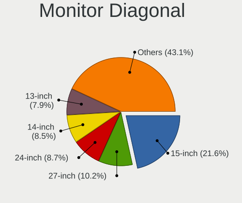

| Inches  | Computers | Percent |
|---------|-----------|---------|
| 15      | 1050      | 21.56%  |
| 27      | 498       | 10.22%  |
| 24      | 424       | 8.7%    |
| 14      | 415       | 8.52%   |
| 13      | 386       | 7.92%   |
| 23      | 273       | 5.6%    |
| 21      | 262       | 5.38%   |
| 17      | 255       | 5.24%   |
| 31      | 167       | 3.43%   |
| Unknown | 124       | 2.55%   |
| 16      | 118       | 2.42%   |
| 34      | 108       | 2.22%   |
| 19      | 105       | 2.16%   |
| 12      | 92        | 1.89%   |
| 22      | 70        | 1.44%   |
| 18      | 69        | 1.42%   |
| 20      | 49        | 1.01%   |
| 84      | 45        | 0.92%   |
| 32      | 42        | 0.86%   |
| 72      | 26        | 0.53%   |
| 11      | 25        | 0.51%   |
| 25      | 24        | 0.49%   |
| 54      | 20        | 0.41%   |
| 40      | 20        | 0.41%   |
| 26      | 18        | 0.37%   |
| 63      | 17        | 0.35%   |
| 29      | 17        | 0.35%   |
| 28      | 16        | 0.33%   |
| 37      | 10        | 0.21%   |
| 142     | 9         | 0.18%   |
| 52      | 9         | 0.18%   |
| 49      | 9         | 0.18%   |
| 33      | 9         | 0.18%   |
| 74      | 8         | 0.16%   |
| 48      | 8         | 0.16%   |
| 42      | 8         | 0.16%   |
| 43      | 7         | 0.14%   |
| 10      | 7         | 0.14%   |
| 65      | 6         | 0.12%   |
| 36      | 6         | 0.12%   |

Monitor Width
-------------

Physical width

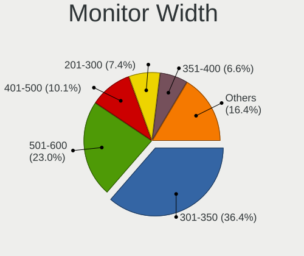

| Width in mm    | Computers | Percent |
|----------------|-----------|---------|
| 301-350        | 1730      | 36.4%   |
| 501-600        | 1092      | 22.97%  |
| 401-500        | 480       | 10.1%   |
| 201-300        | 354       | 7.45%   |
| 351-400        | 316       | 6.65%   |
| 601-700        | 255       | 5.37%   |
| 701-800        | 165       | 3.47%   |
| Unknown        | 124       | 2.61%   |
| 1001-1500      | 90        | 1.89%   |
| 1501-2000      | 81        | 1.7%    |
| 801-900        | 38        | 0.8%    |
| 901-1000       | 15        | 0.32%   |
| More than 2000 | 9         | 0.19%   |
| 101-200        | 3         | 0.06%   |
| 1-100          | 1         | 0.02%   |

Aspect Ratio
------------

Proportional relationship between the width and the height

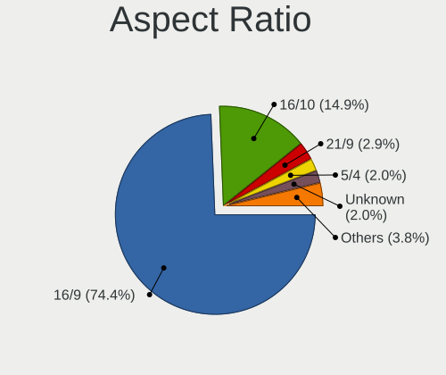

| Ratio   | Computers | Percent |
|---------|-----------|---------|
| 16/9    | 3212      | 74.37%  |
| 16/10   | 642       | 14.86%  |
| 21/9    | 126       | 2.92%   |
| 5/4     | 88        | 2.04%   |
| Unknown | 88        | 2.04%   |
| 3/2     | 55        | 1.27%   |
| 4/3     | 52        | 1.2%    |
| 32/9    | 16        | 0.37%   |
| 1.00    | 11        | 0.25%   |
| 6/5     | 9         | 0.21%   |
| 2.65    | 7         | 0.16%   |
| 0.56    | 4         | 0.09%   |
| 3.20    | 2         | 0.05%   |
| 0.62    | 2         | 0.05%   |
| 3.73    | 1         | 0.02%   |
| 3.40    | 1         | 0.02%   |
| 1.96    | 1         | 0.02%   |
| 0.89    | 1         | 0.02%   |
| 0.67    | 1         | 0.02%   |

Monitor Area
------------

Area in inch²

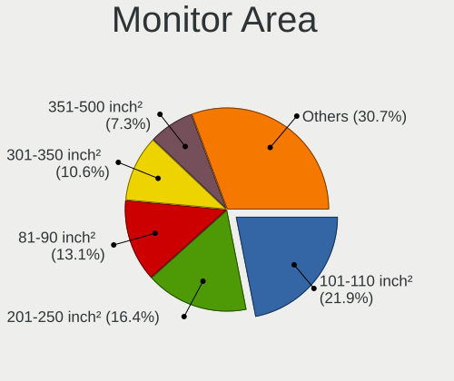

| Area in inch² | Computers | Percent |
|----------------|-----------|---------|
| 101-110        | 1056      | 21.93%  |
| 201-250        | 791       | 16.42%  |
| 81-90          | 632       | 13.12%  |
| 301-350        | 510       | 10.59%  |
| 351-500        | 350       | 7.27%   |
| 151-200        | 222       | 4.61%   |
| 121-130        | 201       | 4.17%   |
| 251-300        | 185       | 3.84%   |
| 71-80          | 165       | 3.43%   |
| More than 1000 | 158       | 3.28%   |
| Unknown        | 124       | 2.57%   |
| 111-120        | 105       | 2.18%   |
| 141-150        | 92        | 1.91%   |
| 61-70          | 80        | 1.66%   |
| 501-1000       | 71        | 1.47%   |
| 51-60          | 27        | 0.56%   |
| 131-140        | 22        | 0.46%   |
| 91-100         | 15        | 0.31%   |
| 41-50          | 7         | 0.15%   |
| 1-40           | 3         | 0.06%   |

Pixel Density
-------------

Pixels per inch

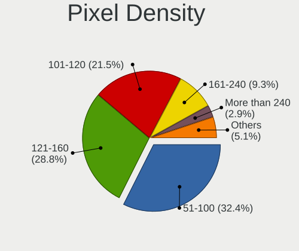

| Density       | Computers | Percent |
|---------------|-----------|---------|
| 51-100        | 1505      | 32.41%  |
| 121-160       | 1336      | 28.77%  |
| 101-120       | 1000      | 21.53%  |
| 161-240       | 430       | 9.26%   |
| More than 240 | 135       | 2.91%   |
| Unknown       | 124       | 2.67%   |
| 1-50          | 114       | 2.45%   |

Multiple Monitors
-----------------

Total monitors connected

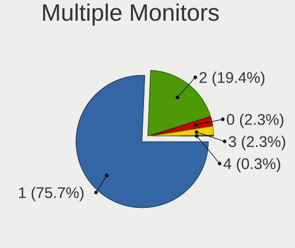

| Total | Computers | Percent |
|-------|-----------|---------|
| 1     | 3254      | 75.69%  |
| 2     | 836       | 19.45%  |
| 0     | 100       | 2.33%   |
| 3     | 97        | 2.26%   |
| 4     | 12        | 0.28%   |

Network
-------

Net Controller Vendor
---------------------

Controller vendors

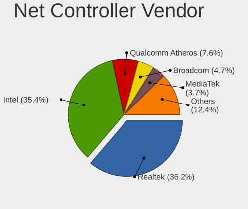

| Vendor                            | Computers | Percent |
|-----------------------------------|-----------|---------|
| Realtek Semiconductor             | 2275      | 36.25%  |
| Intel                             | 2219      | 35.36%  |
| Qualcomm Atheros                  | 475       | 7.57%   |
| Broadcom                          | 294       | 4.68%   |
| MediaTek                          | 233       | 3.71%   |
| ASIX Electronics                  | 66        | 1.05%   |
| Broadcom Limited                  | 59        | 0.94%   |
| Ralink Technology                 | 53        | 0.84%   |
| TP-Link                           | 51        | 0.81%   |
| Marvell Technology Group          | 38        | 0.61%   |
| Ralink                            | 36        | 0.57%   |
| Nvidia                            | 33        | 0.53%   |
| Sierra Wireless                   | 24        | 0.38%   |
| DisplayLink                       | 22        | 0.35%   |
| Dell                              | 21        | 0.33%   |
| Aquantia                          | 21        | 0.33%   |
| Shenzhen Goodix Technology        | 20        | 0.32%   |
| Qualcomm                          | 20        | 0.32%   |
| Lenovo                            | 19        | 0.3%    |
| ASUSTek Computer                  | 18        | 0.29%   |
| Samsung Electronics               | 16        | 0.25%   |
| Microsoft                         | 15        | 0.24%   |
| NetGear                           | 14        | 0.22%   |
| D-Link                            | 14        | 0.22%   |
| D-Link System                     | 12        | 0.19%   |
| Xiaomi                            | 10        | 0.16%   |
| Edimax Technology                 | 10        | 0.16%   |
| Qualcomm Technologies             | 9         | 0.14%   |
| AVM                               | 9         | 0.14%   |
| U-Blox                            | 8         | 0.13%   |
| Qualcomm Atheros Communications   | 8         | 0.13%   |
| Linksys                           | 8         | 0.13%   |
| Huawei Technologies               | 8         | 0.13%   |
| Ericsson Business Mobile Networks | 8         | 0.13%   |
| Hewlett-Packard                   | 7         | 0.11%   |
| Cypress Semiconductor             | 7         | 0.11%   |
| Mellanox Technologies             | 6         | 0.1%    |
| Motorola PCS                      | 5         | 0.08%   |
| ICS Advent                        | 5         | 0.08%   |
| Quectel Wireless Solutions        | 4         | 0.06%   |

Net Controller Model
--------------------

Controller models

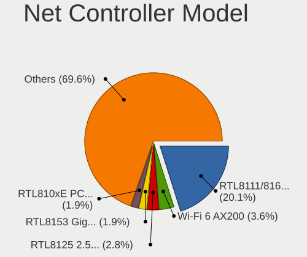

| Model                                                                  | Computers | Percent |
|------------------------------------------------------------------------|-----------|---------|
| Realtek RTL8111/8168/8211/8411 PCI Express Gigabit Ethernet Controller | 1511      | 20.14%  |
| Intel Wi-Fi 6 AX200                                                    | 270       | 3.6%    |
| Realtek RTL8125 2.5GbE Controller                                      | 211       | 2.81%   |
| Realtek RTL8153 Gigabit Ethernet Adapter                               | 146       | 1.95%   |
| Realtek RTL810xE PCI Express Fast Ethernet controller                  | 141       | 1.88%   |
| Intel Wi-Fi 6 AX201                                                    | 129       | 1.72%   |
| Intel Wireless 8265 / 8275                                             | 128       | 1.71%   |
| Intel I211 Gigabit Network Connection                                  | 128       | 1.71%   |
| Intel 82579LM Gigabit Network Connection (Lewisville)                  | 126       | 1.68%   |
| Realtek RTL8821CE 802.11ac PCIe Wireless Network Adapter               | 103       | 1.37%   |
| Intel Alder Lake-P PCH CNVi WiFi                                       | 99        | 1.32%   |
| Intel Wi-Fi 6E(802.11ax) AX210/AX1675* 2x2 [Typhoon Peak]              | 98        | 1.31%   |
| Intel Wireless 8260                                                    | 93        | 1.24%   |
| Qualcomm Atheros QCA9377 802.11ac Wireless Network Adapter             | 90        | 1.2%    |
| Realtek RTL8822CE 802.11ac PCIe Wireless Network Adapter               | 84        | 1.12%   |
| MediaTek MT7922 802.11ax PCI Express Wireless Network Adapter          | 83        | 1.11%   |
| Intel Wireless 7265                                                    | 74        | 0.99%   |
| Intel Wireless 7260                                                    | 74        | 0.99%   |
| MediaTek MT7921 802.11ax PCIe Wireless Network Adapter [Filogic 330]   | 73        | 0.97%   |
| Intel Ethernet Connection (2) I219-V                                   | 71        | 0.95%   |
| Intel Ethernet Controller I225-V                                       | 69        | 0.92%   |
| Intel Wi-Fi 5(802.11ac) Wireless-AC 9x6x [Thunder Peak]                | 61        | 0.81%   |
| ASIX AX88179 Gigabit Ethernet                                          | 61        | 0.81%   |
| Qualcomm Atheros QCA6174 802.11ac Wireless Network Adapter             | 60        | 0.8%    |
| Intel Ethernet Connection I217-LM                                      | 60        | 0.8%    |
| Intel Ethernet Connection (4) I219-LM                                  | 59        | 0.79%   |
| Intel Dual Band Wireless-AC 3168NGW [Stone Peak]                       | 56        | 0.75%   |
| Qualcomm Atheros AR9485 Wireless Network Adapter                       | 51        | 0.68%   |
| Qualcomm Atheros QCA9565 / AR9565 Wireless Network Adapter             | 50        | 0.67%   |
| Intel Raptor Lake PCH CNVi WiFi                                        | 49        | 0.65%   |
| Intel Centrino Advanced-N 6205 [Taylor Peak]                           | 48        | 0.64%   |
| Intel Cannon Lake PCH CNVi WiFi                                        | 48        | 0.64%   |
| Intel Comet Lake PCH-LP CNVi WiFi                                      | 43        | 0.57%   |
| Realtek RTL8852BE PCIe 802.11ax Wireless Network Controller            | 41        | 0.55%   |
| Intel Cannon Point-LP CNVi [Wireless-AC]                               | 41        | 0.55%   |
| Intel Ethernet Connection (2) I219-LM                                  | 39        | 0.52%   |
| Intel Comet Lake PCH CNVi WiFi                                         | 38        | 0.51%   |
| Realtek RTL8822BE 802.11a/b/g/n/ac WiFi adapter                        | 36        | 0.48%   |
| Realtek 802.11ac NIC                                                   | 34        | 0.45%   |
| Qualcomm Atheros AR9285 Wireless Network Adapter (PCI-Express)         | 34        | 0.45%   |

Wireless Vendor
---------------

Wireless vendors

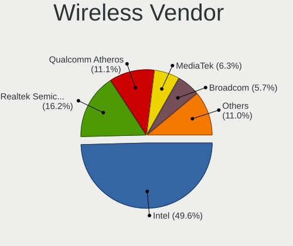

| Vendor                                | Computers | Percent |
|---------------------------------------|-----------|---------|
| Intel                                 | 1667      | 49.6%   |
| Realtek Semiconductor                 | 544       | 16.19%  |
| Qualcomm Atheros                      | 374       | 11.13%  |
| MediaTek                              | 212       | 6.31%   |
| Broadcom                              | 193       | 5.74%   |
| Ralink Technology                     | 53        | 1.58%   |
| Broadcom Limited                      | 43        | 1.28%   |
| TP-Link                               | 39        | 1.16%   |
| Ralink                                | 36        | 1.07%   |
| Sierra Wireless                       | 24        | 0.71%   |
| ASUSTek Computer                      | 18        | 0.54%   |
| Qualcomm                              | 17        | 0.51%   |
| NetGear                               | 14        | 0.42%   |
| Dell                                  | 14        | 0.42%   |
| D-Link                                | 14        | 0.42%   |
| Microsoft                             | 13        | 0.39%   |
| Edimax Technology                     | 10        | 0.3%    |
| Marvell Technology Group              | 9         | 0.27%   |
| AVM                                   | 9         | 0.27%   |
| Qualcomm Atheros Communications       | 8         | 0.24%   |
| D-Link System                         | 8         | 0.24%   |
| Linksys                               | 7         | 0.21%   |
| Qualcomm Technologies                 | 5         | 0.15%   |
| Quectel Wireless Solutions            | 4         | 0.12%   |
| Belkin Components                     | 4         | 0.12%   |
| Fibocom                               | 3         | 0.09%   |
| Wacom                                 | 2         | 0.06%   |
| Mercucys                              | 2         | 0.06%   |
| 802.11g Adapter [Linksys WUSB54GC v3] | 2         | 0.06%   |
| ZyXEL Communications                  | 1         | 0.03%   |
| ZyDAS                                 | 1         | 0.03%   |
| Xiaomi                                | 1         | 0.03%   |
| Wilocity                              | 1         | 0.03%   |
| Sitecom Europe                        | 1         | 0.03%   |
| Samsung Electronics                   | 1         | 0.03%   |
| Realtek                               | 1         | 0.03%   |
| Micro Star International              | 1         | 0.03%   |
| Intersil                              | 1         | 0.03%   |
| IMC Networks                          | 1         | 0.03%   |
| Hewlett-Packard                       | 1         | 0.03%   |

Wireless Model
--------------

Wireless models

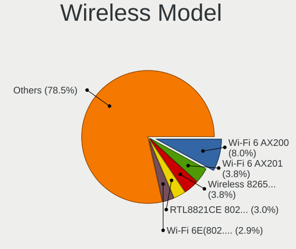

| Model                                                                | Computers | Percent |
|----------------------------------------------------------------------|-----------|---------|
| Intel Wi-Fi 6 AX200                                                  | 270       | 7.97%   |
| Intel Wi-Fi 6 AX201                                                  | 129       | 3.81%   |
| Intel Wireless 8265 / 8275                                           | 128       | 3.78%   |
| Realtek RTL8821CE 802.11ac PCIe Wireless Network Adapter             | 103       | 3.04%   |
| Intel Wi-Fi 6E(802.11ax) AX210/AX1675* 2x2 [Typhoon Peak]            | 98        | 2.89%   |
| Intel Wireless 8260                                                  | 93        | 2.74%   |
| Qualcomm Atheros QCA9377 802.11ac Wireless Network Adapter           | 90        | 2.66%   |
| Realtek RTL8822CE 802.11ac PCIe Wireless Network Adapter             | 84        | 2.48%   |
| Intel Wireless 7265                                                  | 74        | 2.18%   |
| Intel Wireless 7260                                                  | 74        | 2.18%   |
| MediaTek MT7921 802.11ax PCIe Wireless Network Adapter [Filogic 330] | 73        | 2.15%   |
| MediaTek MT7922 802.11ax PCI Express Wireless Network Adapter        | 72        | 2.13%   |
| Intel Alder Lake-P PCH CNVi WiFi                                     | 62        | 1.83%   |
| Intel Wi-Fi 5(802.11ac) Wireless-AC 9x6x [Thunder Peak]              | 61        | 1.8%    |
| Qualcomm Atheros QCA6174 802.11ac Wireless Network Adapter           | 60        | 1.77%   |
| Intel Dual Band Wireless-AC 3168NGW [Stone Peak]                     | 56        | 1.65%   |
| Qualcomm Atheros AR9485 Wireless Network Adapter                     | 51        | 1.51%   |
| Qualcomm Atheros QCA9565 / AR9565 Wireless Network Adapter           | 50        | 1.48%   |
| Intel Raptor Lake PCH CNVi WiFi                                      | 49        | 1.45%   |
| Intel Centrino Advanced-N 6205 [Taylor Peak]                         | 48        | 1.42%   |
| Intel Cannon Lake PCH CNVi WiFi                                      | 48        | 1.42%   |
| Intel Comet Lake PCH-LP CNVi WiFi                                    | 43        | 1.27%   |
| Intel Cannon Point-LP CNVi [Wireless-AC]                             | 41        | 1.21%   |
| Intel Comet Lake PCH CNVi WiFi                                       | 38        | 1.12%   |
| Realtek RTL8822BE 802.11a/b/g/n/ac WiFi adapter                      | 36        | 1.06%   |
| Realtek 802.11ac NIC                                                 | 34        | 1%      |
| Qualcomm Atheros AR9285 Wireless Network Adapter (PCI-Express)       | 34        | 1%      |
| Intel Tiger Lake PCH CNVi WiFi                                       | 33        | 0.97%   |
| Intel Wireless 3165                                                  | 31        | 0.91%   |
| Realtek RTL8852BE PCIe 802.11ax Wireless Network Controller          | 30        | 0.89%   |
| Broadcom BCM43142 802.11b/g/n                                        | 29        | 0.86%   |
| Realtek RTL8723BE PCIe Wireless Network Adapter                      | 28        | 0.83%   |
| Broadcom BCM4331 802.11a/b/g/n                                       | 28        | 0.83%   |
| Intel 700 Series Chipset CNVi WiFi                                   | 27        | 0.8%    |
| Broadcom BCM4313 802.11bgn Wireless Network Adapter                  | 27        | 0.8%    |
| MediaTek MT7921K (RZ608) Wi-Fi 6E 80MHz                              | 26        | 0.77%   |
| Qualcomm Atheros AR9462 Wireless Network Adapter                     | 24        | 0.71%   |
| Intel Wireless 3160                                                  | 24        | 0.71%   |
| Intel Meteor Lake PCH CNVi WiFi                                      | 24        | 0.71%   |
| Realtek RTL88x2bu [AC1200 Techkey]                                   | 23        | 0.68%   |

Ethernet Vendor
---------------

Ethernet vendors

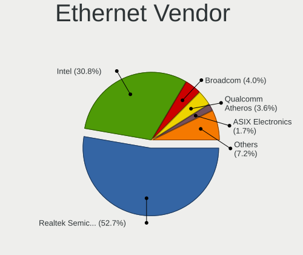

| Vendor                                 | Computers | Percent |
|----------------------------------------|-----------|---------|
| Realtek Semiconductor                  | 2053      | 52.72%  |
| Intel                                  | 1200      | 30.82%  |
| Broadcom                               | 154       | 3.95%   |
| Qualcomm Atheros                       | 140       | 3.6%    |
| ASIX Electronics                       | 66        | 1.69%   |
| Nvidia                                 | 33        | 0.85%   |
| Marvell Technology Group               | 29        | 0.74%   |
| DisplayLink                            | 22        | 0.56%   |
| Aquantia                               | 21        | 0.54%   |
| MediaTek                               | 20        | 0.51%   |
| Lenovo                                 | 19        | 0.49%   |
| Broadcom Limited                       | 16        | 0.41%   |
| Samsung Electronics                    | 14        | 0.36%   |
| TP-Link                                | 12        | 0.31%   |
| Xiaomi                                 | 9         | 0.23%   |
| Cypress Semiconductor                  | 7         | 0.18%   |
| Huawei Technologies                    | 6         | 0.15%   |
| Motorola PCS                           | 5         | 0.13%   |
| ICS Advent                             | 5         | 0.13%   |
| Qualcomm Technologies                  | 4         | 0.1%    |
| JMicron Technology                     | 4         | 0.1%    |
| Dell                                   | 4         | 0.1%    |
| D-Link System                          | 4         | 0.1%    |
| Suzhou Motorcomm Electronic Technology | 3         | 0.08%   |
| Qualcomm                               | 3         | 0.08%   |
| OPPO Electronics                       | 3         | 0.08%   |
| VIA Technologies                       | 2         | 0.05%   |
| Sony Ericsson Mobile Communications AB | 2         | 0.05%   |
| NetXen Incorporated                    | 2         | 0.05%   |
| Microsoft                              | 2         | 0.05%   |
| Mellanox Technologies                  | 2         | 0.05%   |
| Insyde Software                        | 2         | 0.05%   |
| HMD Global                             | 2         | 0.05%   |
| American Megatrends                    | 2         | 0.05%   |
| ADMtek                                 | 2         | 0.05%   |
| 3Com                                   | 2         | 0.05%   |
| TOMTOM                                 | 1         | 0.03%   |
| Solarflare Communications              | 1         | 0.03%   |
| Sitecom Europe                         | 1         | 0.03%   |
| Silicon Integrated Systems [SiS]       | 1         | 0.03%   |

Ethernet Model
--------------

Ethernet models

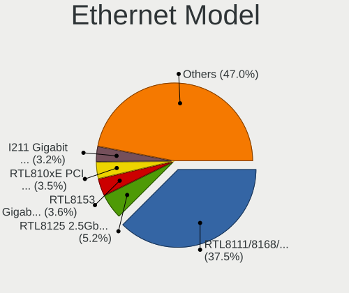

| Model                                                                  | Computers | Percent |
|------------------------------------------------------------------------|-----------|---------|
| Realtek RTL8111/8168/8211/8411 PCI Express Gigabit Ethernet Controller | 1511      | 37.5%   |
| Realtek RTL8125 2.5GbE Controller                                      | 211       | 5.24%   |
| Realtek RTL8153 Gigabit Ethernet Adapter                               | 146       | 3.62%   |
| Realtek RTL810xE PCI Express Fast Ethernet controller                  | 141       | 3.5%    |
| Intel I211 Gigabit Network Connection                                  | 128       | 3.18%   |
| Intel 82579LM Gigabit Network Connection (Lewisville)                  | 126       | 3.13%   |
| Intel Ethernet Connection (2) I219-V                                   | 71        | 1.76%   |
| Intel Ethernet Controller I225-V                                       | 69        | 1.71%   |
| ASIX AX88179 Gigabit Ethernet                                          | 61        | 1.51%   |
| Intel Ethernet Connection I217-LM                                      | 60        | 1.49%   |
| Intel Ethernet Connection (4) I219-LM                                  | 59        | 1.46%   |
| Intel Ethernet Connection (2) I219-LM                                  | 39        | 0.97%   |
| Intel Alder Lake-P PCH CNVi WiFi                                       | 37        | 0.92%   |
| Intel Ethernet Connection I219-LM                                      | 34        | 0.84%   |
| Intel Ethernet Connection (7) I219-V                                   | 32        | 0.79%   |
| Broadcom NetXtreme BCM57765 Gigabit Ethernet PCIe                      | 32        | 0.79%   |
| Intel Ethernet Connection (7) I219-LM                                  | 30        | 0.74%   |
| Intel Ethernet Connection I217-V                                       | 29        | 0.72%   |
| Intel I210 Gigabit Network Connection                                  | 28        | 0.69%   |
| Intel 82574L Gigabit Network Connection                                | 27        | 0.67%   |
| Intel 82579V Gigabit Network Connection                                | 26        | 0.65%   |
| Intel Ethernet Connection (4) I219-V                                   | 24        | 0.6%    |
| Intel Ethernet Connection I218-LM                                      | 23        | 0.57%   |
| Intel Ethernet Connection I219-V                                       | 22        | 0.55%   |
| Intel Ethernet Connection (2) I218-V                                   | 22        | 0.55%   |
| Intel 82577LM Gigabit Network Connection                               | 22        | 0.55%   |
| Broadcom NetXtreme BCM57766 Gigabit Ethernet PCIe                      | 22        | 0.55%   |
| Qualcomm Atheros AR8151 v2.0 Gigabit Ethernet                          | 21        | 0.52%   |
| Qualcomm Atheros Killer E2500 Gigabit Ethernet Controller              | 20        | 0.5%    |
| Intel Ethernet Connection (3) I218-LM                                  | 19        | 0.47%   |
| Realtek Killer E3000 2.5GbE Controller                                 | 17        | 0.42%   |
| Realtek Killer E2600 GbE Controller                                    | 17        | 0.42%   |
| Nvidia MCP79 Ethernet                                                  | 17        | 0.42%   |
| Intel Ethernet Connection (13) I219-V                                  | 17        | 0.42%   |
| Intel Ethernet Controller I226-V                                       | 16        | 0.4%    |
| Intel Ethernet Connection (6) I219-V                                   | 16        | 0.4%    |
| Broadcom NetXtreme BCM5764M Gigabit Ethernet PCIe                      | 15        | 0.37%   |
| Qualcomm Atheros QCA8171 Gigabit Ethernet                              | 14        | 0.35%   |
| Qualcomm Atheros Killer E220x Gigabit Ethernet Controller              | 14        | 0.35%   |
| Qualcomm Atheros AR8161 Gigabit Ethernet                               | 14        | 0.35%   |

Net Controller Kind
-------------------

Ethernet, WiFi or modem

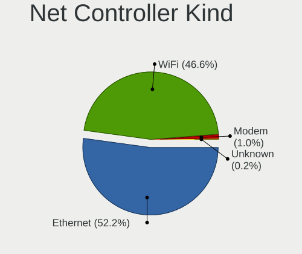

| Kind     | Computers | Percent |
|----------|-----------|---------|
| Ethernet | 3553      | 52.16%  |
| WiFi     | 3174      | 46.59%  |
| Modem    | 70        | 1.03%   |
| Unknown  | 15        | 0.22%   |

Used Controller
---------------

Currently used network controller

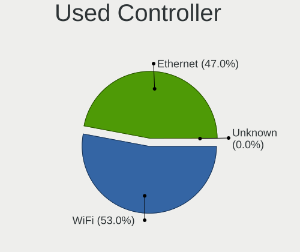

| Kind     | Computers | Percent |
|----------|-----------|---------|
| WiFi     | 2352      | 52.96%  |
| Ethernet | 2088      | 47.02%  |
| Unknown  | 1         | 0.02%   |

NICs
----

Total network controllers on board

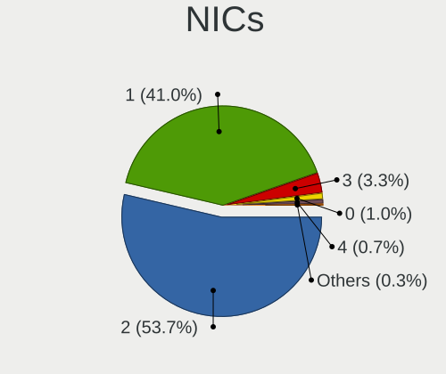

| Total | Computers | Percent |
|-------|-----------|---------|
| 2     | 2254      | 53.65%  |
| 1     | 1723      | 41.01%  |
| 3     | 137       | 3.26%   |
| 0     | 43        | 1.02%   |
| 4     | 30        | 0.71%   |
| 5     | 8         | 0.19%   |
| 8     | 3         | 0.07%   |
| 6     | 3         | 0.07%   |

IPv6
----

IPv6 vs IPv4

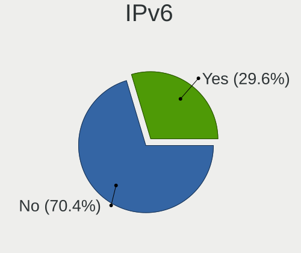

| Used | Computers | Percent |
|------|-----------|---------|
| No   | 3015      | 70.38%  |
| Yes  | 1269      | 29.62%  |

Bluetooth
---------

Bluetooth Vendor
----------------

Controller vendors

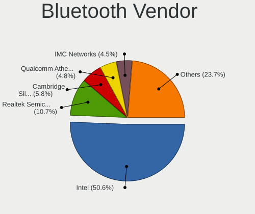

| Vendor                          | Computers | Percent |
|---------------------------------|-----------|---------|
| Intel                           | 1485      | 50.61%  |
| Realtek Semiconductor           | 313       | 10.67%  |
| Cambridge Silicon Radio         | 170       | 5.79%   |
| Qualcomm Atheros Communications | 140       | 4.77%   |
| IMC Networks                    | 131       | 4.46%   |
| Foxconn / Hon Hai               | 123       | 4.19%   |
| Apple                           | 110       | 3.75%   |
| Broadcom                        | 100       | 3.41%   |
| Lite-On Technology              | 91        | 3.1%    |
| MediaTek                        | 71        | 2.42%   |
| ASUSTek Computer                | 50        | 1.7%    |
| Hewlett-Packard                 | 22        | 0.75%   |
| Dell                            | 22        | 0.75%   |
| Realtek                         | 16        | 0.55%   |
| TP-Link                         | 15        | 0.51%   |
| Toshiba                         | 10        | 0.34%   |
| USI                             | 9         | 0.31%   |
| Foxconn International           | 8         | 0.27%   |
| Ralink                          | 7         | 0.24%   |
| Marvell Semiconductor           | 7         | 0.24%   |
| Integrated System Solution      | 3         | 0.1%    |
| HTC (High Tech Computer)        | 3         | 0.1%    |
| Edimax Technology               | 3         | 0.1%    |
| Belkin Components               | 3         | 0.1%    |
| Alps Electric                   | 3         | 0.1%    |
| Taiyo Yuden                     | 2         | 0.07%   |
| Smart Modular Technologies      | 2         | 0.07%   |
| Ralink Technology               | 2         | 0.07%   |
| Unknown                         | 1         | 0.03%   |
| SINO WEALTH                     | 1         | 0.03%   |
| Quectel Wireless Solutions      | 1         | 0.03%   |
| Qcom                            | 1         | 0.03%   |
| Plugable                        | 1         | 0.03%   |
| Opticis                         | 1         | 0.03%   |
| Mobile Action Technology        | 1         | 0.03%   |
| Micro Star International        | 1         | 0.03%   |
| Mercucys                        | 1         | 0.03%   |
| Kensington                      | 1         | 0.03%   |
| Fujitsu                         | 1         | 0.03%   |
| Dynex                           | 1         | 0.03%   |

Bluetooth Model
---------------

Controller models

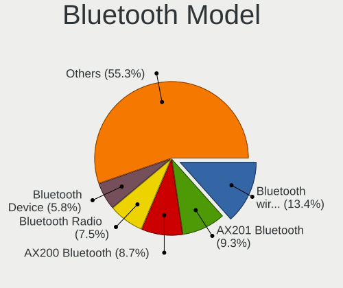

| Model                                               | Computers | Percent |
|-----------------------------------------------------|-----------|---------|
| Intel Bluetooth wireless interface                  | 394       | 13.41%  |
| Intel AX201 Bluetooth                               | 272       | 9.26%   |
| Intel AX200 Bluetooth                               | 256       | 8.71%   |
| Realtek Bluetooth Radio                             | 221       | 7.52%   |
| Intel Bluetooth Device                              | 170       | 5.79%   |
| Cambridge Silicon Radio Bluetooth Dongle (HCI mode) | 170       | 5.79%   |
| Intel Bluetooth 9460/9560 Jefferson Peak (JfP)      | 156       | 5.31%   |
| Intel AX210 Bluetooth                               | 95        | 3.23%   |
| MediaTek Wireless_Device                            | 71        | 2.42%   |
| Qualcomm Atheros  Bluetooth Device                  | 67        | 2.28%   |
| Realtek  Bluetooth 4.2 Adapter                      | 66        | 2.25%   |
| IMC Networks Wireless_Device                        | 58        | 1.97%   |
| Intel Wireless-AC 9260 Bluetooth Adapter            | 56        | 1.91%   |
| Apple Bluetooth Host Controller                     | 56        | 1.91%   |
| Intel Wireless-AC 3168 Bluetooth                    | 52        | 1.77%   |
| Foxconn / Hon Hai Wireless_Device                   | 45        | 1.53%   |
| IMC Networks Bluetooth Radio                        | 44        | 1.5%    |
| Apple Bluetooth USB Host Controller                 | 35        | 1.19%   |
| Qualcomm Atheros QCA61x4 Bluetooth 4.0              | 30        | 1.02%   |
| Lite-On Qualcomm Atheros QCA9377 Bluetooth          | 28        | 0.95%   |
| Intel Centrino Bluetooth Wireless Transceiver       | 28        | 0.95%   |
| Foxconn / Hon Hai Bluetooth Device                  | 27        | 0.92%   |
| Foxconn / Hon Hai MediaTek Bluetooth Adapter        | 24        | 0.82%   |
| Lite-On Wireless_Device                             | 20        | 0.68%   |
| Lite-On Bluetooth Device                            | 20        | 0.68%   |
| Qualcomm Atheros AR3011 Bluetooth                   | 19        | 0.65%   |
| Broadcom BCM2045B (BDC-2.1)                         | 18        | 0.61%   |
| IMC Networks Bluetooth Device                       | 17        | 0.58%   |
| Realtek Bluetooth Radio                             | 16        | 0.54%   |
| TP-Link TP-T@- UB500 Adapter                        | 15        | 0.51%   |
| ASUS ASUS USB-BT500                                 | 15        | 0.51%   |
| HP Broadcom 2070 Bluetooth Combo                    | 14        | 0.48%   |
| Apple Built-in Bluetooth 2.0+EDR HCI                | 14        | 0.48%   |
| Broadcom BCM20702A0 Bluetooth 4.0                   | 13        | 0.44%   |
| Qualcomm Atheros AR3012 Bluetooth 4.0               | 11        | 0.37%   |
| Lite-On Atheros AR3012 Bluetooth                    | 10        | 0.34%   |
| Broadcom BCM20702 Bluetooth 4.0 [ThinkPad]          | 10        | 0.34%   |
| ASUS Broadcom BCM20702A0 Bluetooth                  | 10        | 0.34%   |
| USI Bluetooth Device                                | 8         | 0.27%   |
| Realtek RTL8822BE Bluetooth 4.2 Adapter             | 8         | 0.27%   |

Sound
-----

Sound Vendor
------------

Sound card vendors

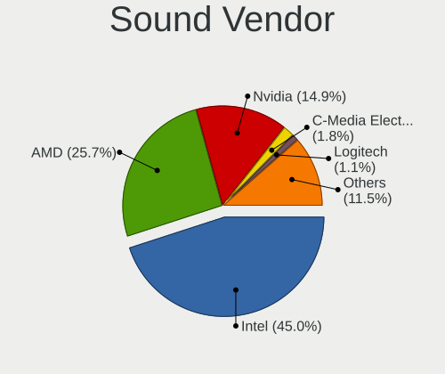

| Vendor                                       | Computers | Percent |
|----------------------------------------------|-----------|---------|
| Intel                                        | 2709      | 45.01%  |
| AMD                                          | 1549      | 25.74%  |
| Nvidia                                       | 897       | 14.9%   |
| C-Media Electronics                          | 109       | 1.81%   |
| Logitech                                     | 65        | 1.08%   |
| Creative Labs                                | 46        | 0.76%   |
| Texas Instruments                            | 41        | 0.68%   |
| ASUSTek Computer                             | 33        | 0.55%   |
| Razer USA                                    | 27        | 0.45%   |
| Lenovo                                       | 26        | 0.43%   |
| GN Netcom                                    | 25        | 0.42%   |
| Creative Technology                          | 25        | 0.42%   |
| Realtek Semiconductor                        | 24        | 0.4%    |
| JMTek                                        | 24        | 0.4%    |
| Generalplus Technology                       | 20        | 0.33%   |
| Kingston Technology                          | 19        | 0.32%   |
| Hewlett-Packard                              | 19        | 0.32%   |
| SteelSeries ApS                              | 18        | 0.3%    |
| Plantronics                                  | 17        | 0.28%   |
| Focusrite-Novation                           | 15        | 0.25%   |
| DSEA A/S                                     | 15        | 0.25%   |
| Micro Star International                     | 13        | 0.22%   |
| BEHRINGER International                      | 11        | 0.18%   |
| RODE Microphones                             | 10        | 0.17%   |
| Zoran Co. Personal Media Division (Nogatech) | 9         | 0.15%   |
| VIA Technologies                             | 9         | 0.15%   |
| M-Audio                                      | 9         | 0.15%   |
| FiiO Electronics Technology                  | 9         | 0.15%   |
| Corsair                                      | 9         | 0.15%   |
| Sony                                         | 7         | 0.12%   |
| Samson Technologies                          | 7         | 0.12%   |
| Conexant Systems                             | 7         | 0.12%   |
| Yamaha                                       | 6         | 0.1%    |
| Apple                                        | 6         | 0.1%    |
| Thesycon Systemsoftware & Consulting         | 5         | 0.08%   |
| Microsoft                                    | 5         | 0.08%   |
| Jieli Technology                             | 5         | 0.08%   |
| Dell                                         | 5         | 0.08%   |
| ASRock                                       | 5         | 0.08%   |
| SAVITECH                                     | 4         | 0.07%   |

Sound Model
-----------

Sound card models

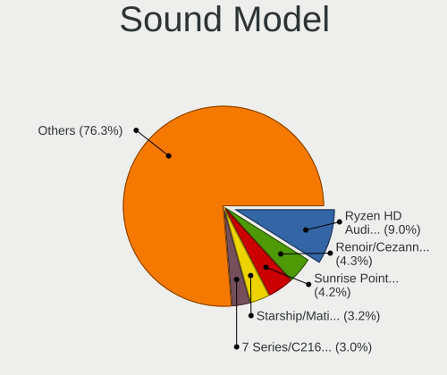

| Model                                                                      | Computers | Percent |
|----------------------------------------------------------------------------|-----------|---------|
| AMD Ryzen HD Audio Controller                                              | 665       | 8.95%   |
| AMD Renoir/Cezanne HDMI/DP Audio Controller                                | 317       | 4.27%   |
| Intel Sunrise Point-LP HD Audio                                            | 314       | 4.23%   |
| AMD Starship/Matisse HD Audio Controller                                   | 241       | 3.24%   |
| Intel 7 Series/C216 Chipset Family High Definition Audio Controller        | 222       | 2.99%   |
| Intel 8 Series/C220 Series Chipset High Definition Audio Controller        | 197       | 2.65%   |
| Intel 6 Series/C200 Series Chipset Family High Definition Audio Controller | 189       | 2.54%   |
| Intel Tiger Lake-LP Smart Sound Technology Audio Controller                | 165       | 2.22%   |
| AMD Radeon High Definition Audio Controller                                | 164       | 2.21%   |
| Intel Cannon Lake PCH cAVS                                                 | 146       | 1.97%   |
| AMD SBx00 Azalia (Intel HDA)                                               | 143       | 1.92%   |
| Intel Xeon E3-1200 v3/4th Gen Core Processor HD Audio Controller           | 134       | 1.8%    |
| Intel 100 Series/C230 Series Chipset Family HD Audio Controller            | 124       | 1.67%   |
| AMD Raven/Raven2/Fenghuang HDMI/DP Audio Controller                        | 123       | 1.66%   |
| Intel Alder Lake PCH-P High Definition Audio Controller                    | 116       | 1.56%   |
| AMD Family 17h (Models 00h-0fh) HD Audio Controller                        | 108       | 1.45%   |
| AMD Ellesmere HDMI Audio [Radeon RX 470/480 / 570/580/590]                 | 105       | 1.41%   |
| AMD Navi 21/23 HDMI/DP Audio Controller                                    | 101       | 1.36%   |
| AMD FCH Azalia Controller                                                  | 95        | 1.28%   |
| Intel 200 Series PCH HD Audio                                              | 88        | 1.18%   |
| Intel 5 Series/3400 Series Chipset High Definition Audio                   | 85        | 1.14%   |
| Intel 8 Series HD Audio Controller                                         | 84        | 1.13%   |
| Intel Haswell-ULT HD Audio Controller                                      | 83        | 1.12%   |
| Intel Cannon Point-LP High Definition Audio Controller                     | 82        | 1.1%    |
| Intel Broadwell-U Audio Controller                                         | 67        | 0.9%    |
| Intel Wildcat Point-LP High Definition Audio Controller                    | 66        | 0.89%   |
| Nvidia GP107GL High Definition Audio Controller                            | 63        | 0.85%   |
| Nvidia GK208 HDMI/DP Audio Controller                                      | 60        | 0.81%   |
| AMD Navi 10 HDMI Audio                                                     | 60        | 0.81%   |
| Intel Tiger Lake-H HD Audio Controller                                     | 58        | 0.78%   |
| Intel Comet Lake PCH-LP cAVS                                               | 58        | 0.78%   |
| AMD Oland/Hainan/Cape Verde/Pitcairn HDMI Audio [Radeon HD 7000 Series]    | 58        | 0.78%   |
| Intel Comet Lake PCH cAVS                                                  | 57        | 0.77%   |
| AMD Navi 31 HDMI/DP Audio                                                  | 55        | 0.74%   |
| Intel Raptor Lake-P/U/H cAVS                                               | 54        | 0.73%   |
| Nvidia GP104 High Definition Audio Controller                              | 51        | 0.69%   |
| Intel Celeron/Pentium Silver Processor High Definition Audio               | 50        | 0.67%   |
| Intel Alder Lake-S HD Audio Controller                                     | 50        | 0.67%   |
| Nvidia TU116 High Definition Audio Controller                              | 49        | 0.66%   |
| Intel 82801I (ICH9 Family) HD Audio Controller                             | 49        | 0.66%   |

Memory
------

Memory Vendor
-------------

Memory module vendors

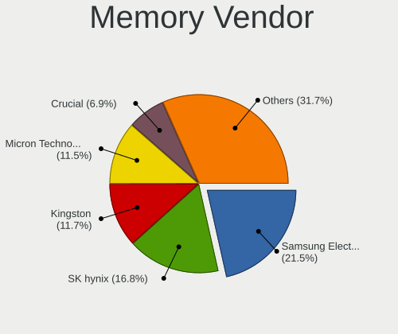

| Vendor                                  | Computers | Percent |
|-----------------------------------------|-----------|---------|
| Samsung Electronics                     | 585       | 21.5%   |
| SK hynix                                | 458       | 16.83%  |
| Kingston                                | 317       | 11.65%  |
| Micron Technology                       | 312       | 11.47%  |
| Crucial                                 | 187       | 6.87%   |
| Unknown                                 | 177       | 6.5%    |
| Corsair                                 | 173       | 6.36%   |
| G.Skill                                 | 146       | 5.37%   |
| A-DATA Technology                       | 45        | 1.65%   |
| Unknown                                 | 43        | 1.58%   |
| Ramaxel Technology                      | 31        | 1.14%   |
| Unknown (ABCD)                          | 25        | 0.92%   |
| Team                                    | 24        | 0.88%   |
| Elpida                                  | 23        | 0.85%   |
| Patriot                                 | 22        | 0.81%   |
| Nanya Technology                        | 18        | 0.66%   |
| Smart                                   | 15        | 0.55%   |
| GOODRAM                                 | 11        | 0.4%    |
| Avant                                   | 10        | 0.37%   |
| Transcend                               | 8         | 0.29%   |
| PNY                                     | 5         | 0.18%   |
| AMD                                     | 5         | 0.18%   |
| Silicon Power                           | 4         | 0.15%   |
| Lexar                                   | 4         | 0.15%   |
| Apacer                                  | 4         | 0.15%   |
| Teikon                                  | 3         | 0.11%   |
| Qimonda                                 | 3         | 0.11%   |
| Neo Forza                               | 3         | 0.11%   |
| Kingmax                                 | 3         | 0.11%   |
| Hewlett-Packard                         | 3         | 0.11%   |
| Wilk                                    | 2         | 0.07%   |
| Timetec                                 | 2         | 0.07%   |
| Smart Modular                           | 2         | 0.07%   |
| Smart Brazil                            | 2         | 0.07%   |
| Silicon Power Computer & Communications | 2         | 0.07%   |
| Patriot Memory (PDP Systems)            | 2         | 0.07%   |
| Exceleram                               | 2         | 0.07%   |
| ChangXin Memory                         | 2         | 0.07%   |
| ASint Technology                        | 2         | 0.07%   |
| Unknown (D386)                          | 1         | 0.04%   |

Memory Model
------------

Memory module models

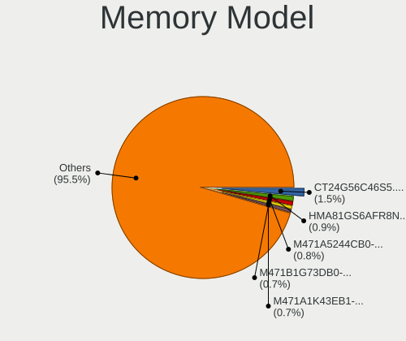

| Model                                                            | Computers | Percent |
|------------------------------------------------------------------|-----------|---------|
| Unknown                                                          | 43        | 1.48%   |
| SK hynix RAM HMA81GS6AFR8N-UH 8GB SODIMM DDR4 2667MT/s           | 27        | 0.93%   |
| Samsung RAM M471A5244CB0-CTD 4GB SODIMM DDR4 3266MT/s            | 22        | 0.76%   |
| SK hynix RAM HMAA1GS6CJR6N-XN 8GB SODIMM DDR4 3200MT/s           | 19        | 0.66%   |
| Samsung RAM M471B1G73DB0-YK0 8GB SODIMM DDR3 1600MT/s            | 19        | 0.66%   |
| Samsung RAM M471A1K43EB1-CWE 8GB SODIMM DDR4 3200MT/s            | 19        | 0.66%   |
| Samsung RAM M471A1K43DB1-CWE 8GB SODIMM DDR4 3200MT/s            | 19        | 0.66%   |
| Samsung RAM M471A1G44AB0-CWE 8GiB SODIMM DDR4 3200MT/s           | 19        | 0.66%   |
| Unknown (ABCD) RAM 123456789012345678 2GB SODIMM LPDDR4 2400MT/s | 17        | 0.59%   |
| Samsung RAM M471B5173QH0-YK0 4GB SODIMM DDR3 1600MT/s            | 15        | 0.52%   |
| Samsung RAM M471A5244CB0-CWE 4GB SODIMM DDR4 3200MT/s            | 15        | 0.52%   |
| SK hynix RAM HMT451S6BFR8A-PB 4GB SODIMM DDR3 1600MT/s           | 14        | 0.48%   |
| Samsung RAM M471B5273DH0-CH9 4GB SODIMM DDR3 1600MT/s            | 14        | 0.48%   |
| Samsung RAM M471B5173DB0-YK0 4GB SODIMM DDR3 1600MT/s            | 14        | 0.48%   |
| Samsung RAM M471A2K43CB1-CRC 16GB SODIMM DDR4 2667MT/s           | 13        | 0.45%   |
| SK hynix RAM HMA851S6AFR6N-UH 4GB SODIMM DDR4 2667MT/s           | 12        | 0.41%   |
| Samsung RAM M471A1K43DB1-CTD 8GB SODIMM DDR4 2667MT/s            | 12        | 0.41%   |
| Samsung RAM M471A1K43CB1-CRC 8GB SODIMM DDR4 8400MT/s            | 12        | 0.41%   |
| Micron RAM 4ATF1G64HZ-3G2F1 8GB SODIMM DDR4 3200MT/s             | 12        | 0.41%   |
| Corsair RAM CMK16GX4M2B3200C16 8GB DIMM DDR4 3600MT/s            | 12        | 0.41%   |
| SK hynix RAM HMA81GS6CJR8N-VK 8GB SODIMM DDR4 2667MT/s           | 11        | 0.38%   |
| Samsung RAM M471A5244CB0-CRC 4GB SODIMM DDR4 2667MT/s            | 11        | 0.38%   |
| Micron RAM 8ATF1G64HZ-3G2R1 8GB SODIMM DDR4 3200MT/s             | 11        | 0.38%   |
| Micron RAM 4ATF1G64HZ-3G2E1 8GB SODIMM DDR4 3200MT/s             | 11        | 0.38%   |
| Corsair RAM CMK16GX4M2B3000C15 8GB DIMM DDR4 3600MT/s            | 11        | 0.38%   |
| Unknown RAM Module 4096MB DIMM 1333MT/s                          | 10        | 0.34%   |
| SK hynix RAM Module 4GB SODIMM DDR3 1600MT/s                     | 10        | 0.34%   |
| SK hynix RAM HMAA1GS6CJR6N-XN 8GB Row Of Chips DDR4 3200MT/s     | 10        | 0.34%   |
| SK hynix RAM HMA41GS6AFR8N-TF 8GB SODIMM DDR4 2667MT/s           | 10        | 0.34%   |
| Micron RAM 8ATF1G64HZ-3G2J1 8GB SODIMM DDR4 3200MT/s             | 10        | 0.34%   |
| Micron RAM 4ATS2G64HZ-3G2B1 16GB SODIMM DDR4 3200MT/s            | 10        | 0.34%   |
| G.Skill RAM F4-3000C16-8GISB 8GB DIMM DDR4 3200MT/s              | 10        | 0.34%   |
| Samsung RAM M471B5273DH0-CK0 4GB SODIMM DDR3 2400MT/s            | 9         | 0.31%   |
| Samsung RAM M471A2K43DB1-CWE 16GB SODIMM DDR4 3200MT/s           | 9         | 0.31%   |
| Samsung RAM M471A2K43CB1-CTD 16GB SODIMM DDR4 8400MT/s           | 9         | 0.31%   |
| Samsung RAM M471A1K43CB1-CTD 8GB SODIMM DDR4 3200MT/s            | 9         | 0.31%   |
| Samsung RAM M471A1G44AB0-CWE 8GB Row Of Chips DDR4 3200MT/s      | 9         | 0.31%   |
| Micron RAM 8ATF1G64HZ-2G6E1 8GB SODIMM DDR4 2667MT/s             | 9         | 0.31%   |
| Micron RAM 4ATF51264HZ-2G6E1 4GB SODIMM DDR4 2667MT/s            | 9         | 0.31%   |
| Unknown (ABCD) RAM 123456789012345678 2GB DIMM LPDDR4 2133MT/s   | 8         | 0.28%   |

Memory Kind
-----------

Memory module kinds

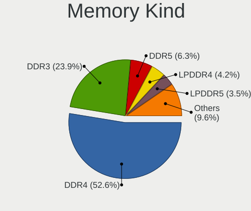

| Kind    | Computers | Percent |
|---------|-----------|---------|
| DDR4    | 1232      | 52.58%  |
| DDR3    | 560       | 23.9%   |
| DDR5    | 148       | 6.32%   |
| LPDDR4  | 98        | 4.18%   |
| LPDDR5  | 81        | 3.46%   |
| DDR2    | 59        | 2.52%   |
| Unknown | 57        | 2.43%   |
| LPDDR3  | 48        | 2.05%   |
| SDRAM   | 43        | 1.84%   |
| DDR     | 12        | 0.51%   |
| DRAM    | 5         | 0.21%   |

Memory Form Factor
------------------

Physical design of the memory module

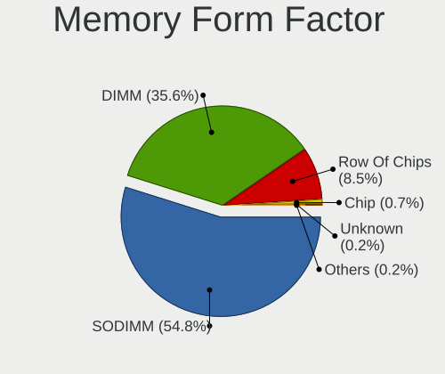

| Name         | Computers | Percent |
|--------------|-----------|---------|
| SODIMM       | 1290      | 54.85%  |
| DIMM         | 837       | 35.59%  |
| Row Of Chips | 200       | 8.5%    |
| Chip         | 17        | 0.72%   |
| Unknown      | 4         | 0.17%   |
| RIMM         | 2         | 0.09%   |
| FB-DIMM      | 2         | 0.09%   |

Memory Size
-----------

Memory module size

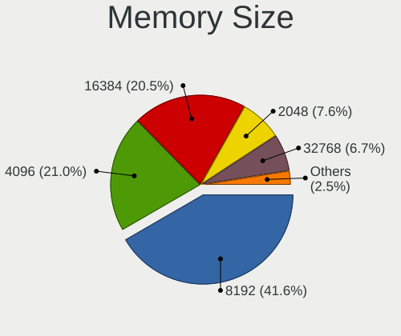

| Size  | Computers | Percent |
|-------|-----------|---------|
| 8192  | 1069      | 41.63%  |
| 4096  | 540       | 21.03%  |
| 16384 | 526       | 20.48%  |
| 2048  | 196       | 7.63%   |
| 32768 | 172       | 6.7%    |
| 1024  | 47        | 1.83%   |
| 49152 | 5         | 0.19%   |
| 512   | 4         | 0.16%   |
| 24576 | 3         | 0.12%   |
| 128   | 2         | 0.08%   |
| 65536 | 1         | 0.04%   |
| 6144  | 1         | 0.04%   |
| 3072  | 1         | 0.04%   |
| 1536  | 1         | 0.04%   |

Memory Speed
------------

Memory module speed

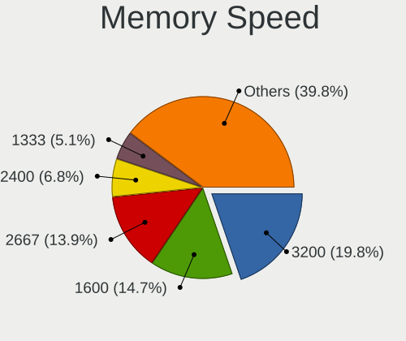

| Speed   | Computers | Percent |
|---------|-----------|---------|
| 3200    | 506       | 19.75%  |
| 1600    | 377       | 14.72%  |
| 2667    | 356       | 13.9%   |
| 2400    | 174       | 6.79%   |
| 1333    | 130       | 5.07%   |
| 2133    | 124       | 4.84%   |
| 3600    | 102       | 3.98%   |
| 5600    | 63        | 2.46%   |
| 6400    | 51        | 1.99%   |
| 4800    | 44        | 1.72%   |
| 1334    | 41        | 1.6%    |
| 800     | 41        | 1.6%    |
| 1867    | 40        | 1.56%   |
| 4267    | 37        | 1.44%   |
| 3800    | 28        | 1.09%   |
| 3266    | 26        | 1.01%   |
| 667     | 26        | 1.01%   |
| 7500    | 23        | 0.9%    |
| Unknown | 23        | 0.9%    |
| 8400    | 21        | 0.82%   |
| 1866    | 20        | 0.78%   |
| 3733    | 19        | 0.74%   |
| 6000    | 17        | 0.66%   |
| 3000    | 17        | 0.66%   |
| 2933    | 17        | 0.66%   |
| 1067    | 17        | 0.66%   |
| 4266    | 16        | 0.62%   |
| 3400    | 16        | 0.62%   |
| 2666    | 16        | 0.62%   |
| 1066    | 15        | 0.59%   |
| 4000    | 11        | 0.43%   |
| 4199    | 10        | 0.39%   |
| 2048    | 10        | 0.39%   |
| 1800    | 8         | 0.31%   |
| 8533    | 7         | 0.27%   |
| 3466    | 7         | 0.27%   |
| 975     | 7         | 0.27%   |
| 2800    | 6         | 0.23%   |
| 533     | 6         | 0.23%   |
| 12800   | 5         | 0.2%    |

Printers & scanners
-------------------

Printer Vendor
--------------

Printer device vendors

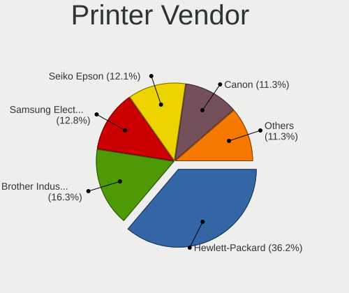

| Vendor                | Computers | Percent |
|-----------------------|-----------|---------|
| Hewlett-Packard       | 51        | 36.17%  |
| Brother Industries    | 23        | 16.31%  |
| Samsung Electronics   | 18        | 12.77%  |
| Seiko Epson           | 17        | 12.06%  |
| Canon                 | 16        | 11.35%  |
| Prolific Technology   | 3         | 2.13%   |
| STMicroelectronics    | 2         | 1.42%   |
| Pantum                | 2         | 1.42%   |
| Kyocera               | 2         | 1.42%   |
| Xerox                 | 1         | 0.71%   |
| Star Micronics        | 1         | 0.71%   |
| Ricoh                 | 1         | 0.71%   |
| QinHeng Electronics   | 1         | 0.71%   |
| Lexmark International | 1         | 0.71%   |
| ICS Advent            | 1         | 0.71%   |
| Dell                  | 1         | 0.71%   |

Printer Model
-------------

Printer device models

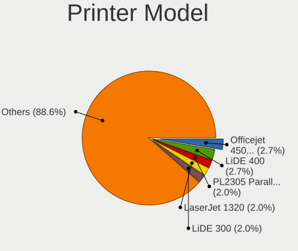

| Model                                                     | Computers | Percent |
|-----------------------------------------------------------|-----------|---------|
| HP Officejet 4500 G510g-m                                 | 4         | 2.68%   |
| Canon LiDE 400                                            | 4         | 2.68%   |
| Prolific PL2305 Parallel Port                             | 3         | 2.01%   |
| HP LaserJet 1320                                          | 3         | 2.01%   |
| Canon LiDE 300                                            | 3         | 2.01%   |
| Seiko Epson ET-2820 Series                                | 2         | 1.34%   |
| Seiko Epson ET-2710 Series                                | 2         | 1.34%   |
| Samsung SCX-4200 series                                   | 2         | 1.34%   |
| Samsung ML-2950 Series                                    | 2         | 1.34%   |
| Samsung ML-216x Series Laser Printer                      | 2         | 1.34%   |
| Samsung ML-1865                                           | 2         | 1.34%   |
| Samsung M267x 287x Series                                 | 2         | 1.34%   |
| Samsung M262x/M282x Xpress Series Laser Printer           | 2         | 1.34%   |
| Kyocera FS-1030D printer                                  | 2         | 1.34%   |
| HP LaserJet 1018                                          | 2         | 1.34%   |
| HP ENVY 4520 series                                       | 2         | 1.34%   |
| HP DeskJet Plus 4100 series                               | 2         | 1.34%   |
| HP DeskJet 5940                                           | 2         | 1.34%   |
| HP DeskJet 2700 series                                    | 2         | 1.34%   |
| HP DeskJet 2600 series                                    | 2         | 1.34%   |
| HP Color LaserJet CP1215                                  | 2         | 1.34%   |
| HP Color Laser 150nw                                      | 2         | 1.34%   |
| Brother Printer                                           | 2         | 1.34%   |
| Brother HL-L2390DW                                        | 2         | 1.34%   |
| Xerox WorkCentre 3220                                     | 1         | 0.67%   |
| STMicroelectronics YICHIP3121 Virtual ComPort in FS Mode  | 1         | 0.67%   |
| STMicroelectronics LED badge -- mini LED display -- 11x44 | 1         | 0.67%   |
| Star Micronics TSP100ECO/TSP100II                         | 1         | 0.67%   |
| Seiko Epson XP-4200 Series                                | 1         | 0.67%   |
| Seiko Epson XP-4100 Series                                | 1         | 0.67%   |
| Seiko Epson XP-3200 Series                                | 1         | 0.67%   |
| Seiko Epson XP-240 Series                                 | 1         | 0.67%   |
| Seiko Epson XP-235 Series                                 | 1         | 0.67%   |
| Seiko Epson WF-4830 Series                                | 1         | 0.67%   |
| Seiko Epson Printer                                       | 1         | 0.67%   |
| Seiko Epson L1300 Series                                  | 1         | 0.67%   |
| Seiko Epson ET-3840 Series                                | 1         | 0.67%   |
| Seiko Epson ET-2810 Series                                | 1         | 0.67%   |
| Seiko Epson ET-2720 Series                                | 1         | 0.67%   |
| Seiko Epson EPSON WF-2510 Series                          | 1         | 0.67%   |

Scanner Vendor
--------------

Scanner device vendors

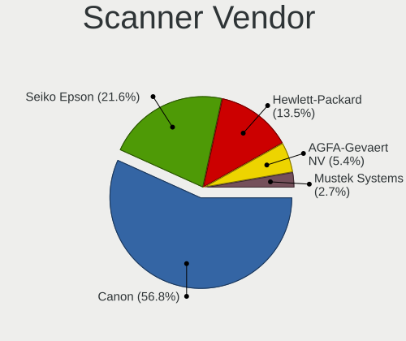

| Vendor          | Computers | Percent |
|-----------------|-----------|---------|
| Canon           | 21        | 56.76%  |
| Seiko Epson     | 8         | 21.62%  |
| Hewlett-Packard | 5         | 13.51%  |
| AGFA-Gevaert NV | 2         | 5.41%   |
| Mustek Systems  | 1         | 2.7%    |

Scanner Model
-------------

Scanner device models

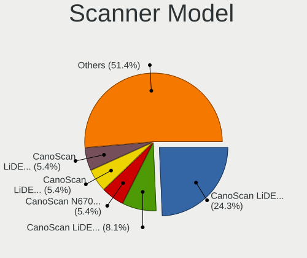

| Model                                                         | Computers | Percent |
|---------------------------------------------------------------|-----------|---------|
| Canon CanoScan LiDE 210                                       | 9         | 24.32%  |
| Canon CanoScan LiDE 110                                       | 3         | 8.11%   |
| Canon CanoScan N670U/N676U/LiDE 20                            | 2         | 5.41%   |
| Canon CanoScan LiDE 220                                       | 2         | 5.41%   |
| Canon CanoScan LiDE 200                                       | 2         | 5.41%   |
| Seiko Epson Scanner                                           | 1         | 2.7%    |
| Seiko Epson Perfection V37/V370                               | 1         | 2.7%    |
| Seiko Epson GT-X900 [Perfection V700/V750 Photo]              | 1         | 2.7%    |
| Seiko Epson GT-X770 [Perfection V500]                         | 1         | 2.7%    |
| Seiko Epson GT-F730 [GT-S630/Perfection V33/V330 Photo]       | 1         | 2.7%    |
| Seiko Epson GT-F520/GT-F570 [Perfection 3590 PHOTO]           | 1         | 2.7%    |
| Seiko Epson GT-8700/GT-8700F [Perfection 1640SU/1640SU PHOTO] | 1         | 2.7%    |
| Seiko Epson GT-8300UF [Perfection 1660 PHOTO]                 | 1         | 2.7%    |
| Mustek Systems ScanExpress A3 USB                             | 1         | 2.7%    |
| HP ScanJet Pro 2500 f1                                        | 1         | 2.7%    |
| HP Scanjet G2710                                              | 1         | 2.7%    |
| HP ScanJet 7400c                                              | 1         | 2.7%    |
| HP ScanJet 5300c/5370c                                        | 1         | 2.7%    |
| HP ScanJet 3970c                                              | 1         | 2.7%    |
| Canon CanoScan N1240U/LiDE 30                                 | 1         | 2.7%    |
| Canon CanoScan LiDE 50/LiDE 35/LiDE 40                        | 1         | 2.7%    |
| Canon CanoScan LIDE 25                                        | 1         | 2.7%    |
| AGFA-Gevaert NV SnapScan e20                                  | 1         | 2.7%    |
| AGFA-Gevaert NV SnapScan 1212U (?)                            | 1         | 2.7%    |

Camera
------

Camera Vendor
-------------

Camera device vendors

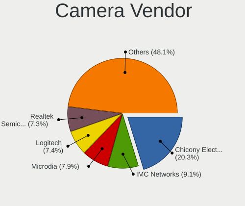

| Vendor                                 | Computers | Percent |
|----------------------------------------|-----------|---------|
| Chicony Electronics                    | 521       | 20.27%  |
| IMC Networks                           | 234       | 9.11%   |
| Microdia                               | 202       | 7.86%   |
| Logitech                               | 190       | 7.39%   |
| Realtek Semiconductor                  | 188       | 7.32%   |
| Bison Electronics                      | 180       | 7%      |
| Quanta                                 | 147       | 5.72%   |
| Sunplus Innovation Technology          | 126       | 4.9%    |
| Luxvisions Innotech Limited            | 98        | 3.81%   |
| Apple                                  | 79        | 3.07%   |
| Cheng Uei Precision Industry (Foxlink) | 78        | 3.04%   |
| Syntek                                 | 75        | 2.92%   |
| Lite-On Technology                     | 49        | 1.91%   |
| Suyin                                  | 44        | 1.71%   |
| Sonix Technology                       | 31        | 1.21%   |
| Microsoft                              | 27        | 1.05%   |
| ShineTech                              | 17        | 0.66%   |
| Alcor Micro                            | 16        | 0.62%   |
| Silicon Motion                         | 15        | 0.58%   |
| Generalplus Technology                 | 15        | 0.58%   |
| Acer                                   | 14        | 0.54%   |
| Samsung Electronics                    | 13        | 0.51%   |
| Lenovo                                 | 11        | 0.43%   |
| Primax Electronics                     | 10        | 0.39%   |
| MacroSilicon                           | 10        | 0.39%   |
| Creative Technology                    | 10        | 0.39%   |
| SunplusIT                              | 9         | 0.35%   |
| Ricoh                                  | 9         | 0.35%   |
| Trust                                  | 8         | 0.31%   |
| Z-Star Microelectronics                | 6         | 0.23%   |
| webcam                                 | 6         | 0.23%   |
| Razer USA                              | 5         | 0.19%   |
| Jieli Technology                       | 5         | 0.19%   |
| Importek                               | 5         | 0.19%   |
| Hewlett-Packard                        | 5         | 0.19%   |
| ARC International                      | 5         | 0.19%   |
| kingcome                               | 4         | 0.16%   |
| AVerMedia Technologies                 | 4         | 0.16%   |
| ALi                                    | 4         | 0.16%   |
| Unknown                                | 4         | 0.16%   |

Camera Model
------------

Camera device models

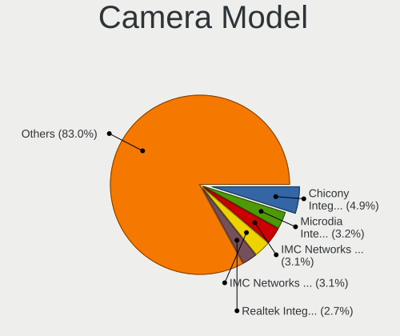

| Model                                                | Computers | Percent |
|------------------------------------------------------|-----------|---------|
| Chicony Integrated Camera                            | 128       | 4.94%   |
| Microdia Integrated_Webcam_HD                        | 82        | 3.16%   |
| IMC Networks USB2.0 HD UVC WebCam                    | 80        | 3.09%   |
| IMC Networks Integrated Camera                       | 80        | 3.09%   |
| Realtek Integrated_Webcam_HD                         | 71        | 2.74%   |
| Syntek Integrated Camera                             | 57        | 2.2%    |
| Bison Integrated Camera                              | 53        | 2.04%   |
| Logitech Webcam C270                                 | 50        | 1.93%   |
| Chicony HD WebCam                                    | 46        | 1.77%   |
| Sunplus Integrated_Webcam_HD                         | 34        | 1.31%   |
| Luxvisions Innotech Limited Integrated Camera        | 27        | 1.04%   |
| Chicony Integrated Camera (1280x720@30)              | 25        | 0.96%   |
| Chicony HP HD Camera                                 | 25        | 0.96%   |
| Quanta HP HD Camera                                  | 23        | 0.89%   |
| Quanta HD User Facing                                | 21        | 0.81%   |
| Microdia USB 2.0 Camera                              | 21        | 0.81%   |
| Apple FaceTime HD Camera                             | 21        | 0.81%   |
| Logitech HD Pro Webcam C920                          | 20        | 0.77%   |
| IMC Networks USB2.0 VGA UVC WebCam                   | 20        | 0.77%   |
| Bison HD Webcam                                      | 20        | 0.77%   |
| Apple Built-in iSight                                | 20        | 0.77%   |
| Chicony HD User Facing                               | 19        | 0.73%   |
| Quanta HP TrueVision HD Camera                       | 18        | 0.69%   |
| Luxvisions Innotech Limited HP Wide Vision HD Camera | 18        | 0.69%   |
| Luxvisions Innotech Limited HP TrueVision HD Camera  | 18        | 0.69%   |
| Lite-On Integrated Camera                            | 18        | 0.69%   |
| Apple FaceTime HD Camera (Built-in)                  | 18        | 0.69%   |
| Microdia Integrated Webcam                           | 15        | 0.58%   |
| Logitech C922 Pro Stream Webcam                      | 15        | 0.58%   |
| Chicony Chicony USB2.0 Camera                        | 15        | 0.58%   |
| Microdia Webcam Vitade AF                            | 14        | 0.54%   |
| Luxvisions Innotech Limited HP HD Camera             | 14        | 0.54%   |
| Apple iPhone 5/5C/5S/6/SE/7/8/X                      | 14        | 0.54%   |
| Sonix USB2.0 HD UVC WebCam                           | 13        | 0.5%    |
| Samsung Galaxy series, misc. (MTP mode)              | 13        | 0.5%    |
| Chicony TOSHIBA Web Camera - HD                      | 13        | 0.5%    |
| Chicony HP Wide Vision HD Camera                     | 13        | 0.5%    |
| Chicony HP Webcam                                    | 13        | 0.5%    |
| Chicony HP TrueVision HD Camera                      | 13        | 0.5%    |
| Sunplus HD WebCam                                    | 12        | 0.46%   |

Security
--------

Fingerprint Vendor
------------------

Fingerprint sensor vendors

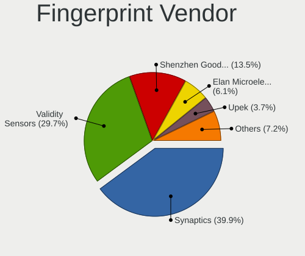

| Vendor                             | Computers | Percent |
|------------------------------------|-----------|---------|
| Synaptics                          | 195       | 39.88%  |
| Validity Sensors                   | 145       | 29.65%  |
| Shenzhen Goodix Technology         | 66        | 13.5%   |
| Elan Microelectronics              | 30        | 6.13%   |
| Upek                               | 18        | 3.68%   |
| AuthenTec                          | 18        | 3.68%   |
| LighTuning Technology              | 8         | 1.64%   |
| Focal-systems.Corp                 | 3         | 0.61%   |
| DigitalPersona                     | 2         | 0.41%   |
| STMicroelectronics                 | 1         | 0.2%    |
| Samsung Electronics                | 1         | 0.2%    |
| Realtek USB2.0 Finger Print Bridge | 1         | 0.2%    |
| Next Biometrics                    | 1         | 0.2%    |

Fingerprint Model
-----------------

Fingerprint sensor models

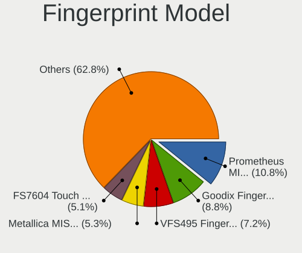

| Model                                                                      | Computers | Percent |
|----------------------------------------------------------------------------|-----------|---------|
| Synaptics Prometheus MIS Touch Fingerprint Reader                          | 53        | 10.84%  |
| Shenzhen Goodix  FingerPrint Device                                        | 43        | 8.79%   |
| Validity Sensors VFS495 Fingerprint Reader                                 | 35        | 7.16%   |
| Synaptics Metallica MIS Touch Fingerprint Reader                           | 26        | 5.32%   |
| Synaptics FS7604 Touch Fingerprint Sensor with PurePrint                   | 25        | 5.11%   |
| Validity Sensors VFS 5011 fingerprint sensor                               | 24        | 4.91%   |
| Shenzhen Goodix Fingerprint Reader                                         | 19        | 3.89%   |
| Validity Sensors Synaptics WBDI                                            | 18        | 3.68%   |
| Upek Biometric Touchchip/Touchstrip Fingerprint Sensor                     | 18        | 3.68%   |
| Elan ELAN:ARM-M4                                                           | 18        | 3.68%   |
| Synaptics UWP WBDI Device                                                  | 17        | 3.48%   |
| Validity Sensors VFS7500 Touch Fingerprint Sensor                          | 13        | 2.66%   |
| Validity Sensors VFS5011 Fingerprint Reader                                | 11        | 2.25%   |
| Synaptics UWP WBDI                                                         | 11        | 2.25%   |
| Synaptics Fingerprint reader [HP G6]                                       | 11        | 2.25%   |
| Elan ELAN:Fingerprint                                                      | 10        | 2.04%   |
| Synaptics WBDI                                                             | 9         | 1.84%   |
| Validity Sensors VFS471 Fingerprint Reader                                 | 8         | 1.64%   |
| Synaptics  WBDI                                                            | 8         | 1.64%   |
| Synaptics Prometheus Fingerprint Reader                                    | 8         | 1.64%   |
| Validity Sensors VFS491                                                    | 7         | 1.43%   |
| Validity Sensors Synaptics VFS7552 Touch Fingerprint Sensor with PurePrint | 7         | 1.43%   |
| AuthenTec AES2810                                                          | 7         | 1.43%   |
| Validity Sensors Fingerprint scanner                                       | 6         | 1.23%   |
| Synaptics  FS7604 Touch Fingerprint Sensor with PurePrint                  | 6         | 1.23%   |
| LighTuning EgisTec Touch Fingerprint Sensor                                | 6         | 1.23%   |
| Validity Sensors VFS451 Fingerprint Reader                                 | 5         | 1.02%   |
| Validity Sensors Swipe Fingerprint Sensor                                  | 5         | 1.02%   |
| Synaptics WBDI Device                                                      | 4         | 0.82%   |
| Synaptics Metallica MOH Touch Fingerprint Reader                           | 4         | 0.82%   |
| Shenzhen Goodix FingerPrint                                                | 4         | 0.82%   |
| Unknown                                                                    | 4         | 0.82%   |
| Synaptics WBDI Fingerprint Reader USB 086                                  | 3         | 0.61%   |
| Synaptics Fingerprint scanner                                              | 3         | 0.61%   |
| Focal-systems.Corp FT9201Fingerprint.                                      | 3         | 0.61%   |
| AuthenTec AES2550 Fingerprint Sensor                                       | 3         | 0.61%   |
| AuthenTec AES2501 Fingerprint Sensor                                       | 3         | 0.61%   |
| AuthenTec AES1600                                                          | 3         | 0.61%   |
| Validity Sensors VFS7552 Touch Fingerprint Sensor                          | 2         | 0.41%   |
| Validity Sensors VFS301 Fingerprint Reader                                 | 2         | 0.41%   |

Chipcard Vendor
---------------

Chipcard module vendors

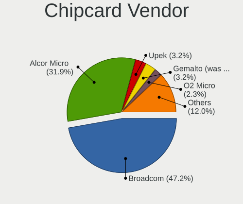

| Vendor                     | Computers | Percent |
|----------------------------|-----------|---------|
| Broadcom                   | 102       | 47.22%  |
| Alcor Micro                | 69        | 31.94%  |
| Upek                       | 7         | 3.24%   |
| Gemalto (was Gemplus)      | 7         | 3.24%   |
| O2 Micro                   | 5         | 2.31%   |
| SCM Microsystems           | 4         | 1.85%   |
| Lenovo                     | 4         | 1.85%   |
| Hewlett-Packard            | 3         | 1.39%   |
| Advanced Card Systems      | 3         | 1.39%   |
| OmniKey                    | 2         | 0.93%   |
| Chicony Electronics        | 2         | 0.93%   |
| Yubico.com                 | 1         | 0.46%   |
| Watchdata                  | 1         | 0.46%   |
| Reiner SCT Kartensysteme   | 1         | 0.46%   |
| Fujitsu Siemens Computers  | 1         | 0.46%   |
| Clay Logic                 | 1         | 0.46%   |
| Cherry                     | 1         | 0.46%   |
| Castles Technology         | 1         | 0.46%   |
| Athena Smartcard Solutions | 1         | 0.46%   |

Chipcard Model
--------------

Chipcard module models

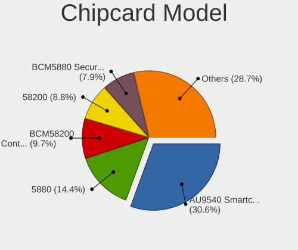

| Model                                                                        | Computers | Percent |
|------------------------------------------------------------------------------|-----------|---------|
| Alcor Micro AU9540 Smartcard Reader                                          | 66        | 30.56%  |
| Broadcom 5880                                                                | 31        | 14.35%  |
| Broadcom BCM58200 ControlVault 3 (FingerPrint sensor + Contacted SmartCard)  | 21        | 9.72%   |
| Broadcom 58200                                                               | 19        | 8.8%    |
| Broadcom BCM5880 Secure Applications Processor                               | 17        | 7.87%   |
| Broadcom BCM5880 Secure Applications Processor with fingerprint swipe sensor | 12        | 5.56%   |
| Upek TouchChip Fingerprint Coprocessor (WBF advanced mode)                   | 7         | 3.24%   |
| Gemalto (was Gemplus) GemPC Twin SmartCard Reader                            | 6         | 2.78%   |
| O2 Micro OZ776 CCID Smartcard Reader                                         | 5         | 2.31%   |
| Lenovo Integrated Smart Card Reader                                          | 4         | 1.85%   |
| SCM Microsystems SCR331-LC1 / SCR3310 SmartCard Reader                       | 3         | 1.39%   |
| Hewlett-Packard SC Keyboard - Apollo (Liteon)                                | 3         | 1.39%   |
| Chicony Electronics HP Skylab USB Smartcard Keyboard                         | 2         | 0.93%   |
| Broadcom BCM5880 Secure Applications Processor with fingerprint touch sensor | 2         | 0.93%   |
| Alcor Micro Watchdata W 1981                                                 | 2         | 0.93%   |
| Yubico.com Yubikey 4/5 U2F+CCID                                              | 1         | 0.46%   |
| Watchdata USB Key                                                            | 1         | 0.46%   |
| SCM Microsystems SCR3310 CLOUD 2700 R                                        | 1         | 0.46%   |
| Reiner SCT Kartensysteme cyberJack RFID basis contactless smartcard reader   | 1         | 0.46%   |
| OmniKey CardMan 1021                                                         | 1         | 0.46%   |
| OmniKey 3x21 Smart Card Reader                                               | 1         | 0.46%   |
| Gemalto (was Gemplus) Prox SU USB PC Link Reader                             | 1         | 0.46%   |
| Fujitsu Siemens Computers Keyboard KB100 SCR eSIG                            | 1         | 0.46%   |
| Clay Logic Nitrokey HSM                                                      | 1         | 0.46%   |
| Cherry SmartCard Reader Keyboard KC 1000 SC                                  | 1         | 0.46%   |
| Castles Technology EZCCID Smart Card Reader                                  | 1         | 0.46%   |
| Athena Smartcard Solutions ASEDrive V3C                                      | 1         | 0.46%   |
| Alcor Micro EMV Smartcard Reader                                             | 1         | 0.46%   |
| Advanced Card Systems ACR39U                                                 | 1         | 0.46%   |
| Advanced Card Systems ACR38 SmartCard Reader                                 | 1         | 0.46%   |
| Advanced Card Systems ACR1252 Dual Reader                                    | 1         | 0.46%   |

Unsupported
-----------

Unsupported Devices
-------------------

Total unsupported devices on board

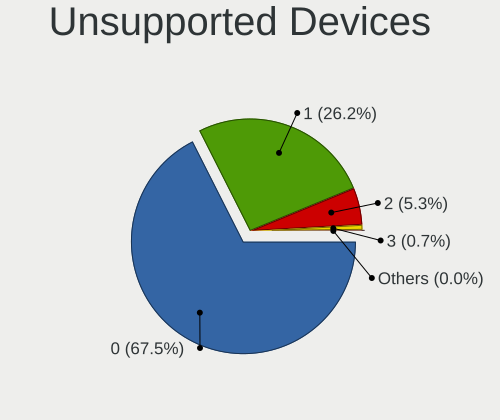

| Total | Computers | Percent |
|-------|-----------|---------|
| 0     | 2911      | 67.54%  |
| 1     | 1131      | 26.24%  |
| 2     | 230       | 5.34%   |
| 3     | 31        | 0.72%   |
| 4     | 6         | 0.14%   |
| 5     | 1         | 0.02%   |

Unsupported Device Types
------------------------

Types of unsupported devices

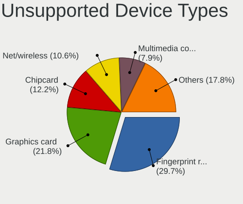

| Type                     | Computers | Percent |
|--------------------------|-----------|---------|
| Fingerprint reader       | 485       | 29.68%  |
| Graphics card            | 356       | 21.79%  |
| Chipcard                 | 199       | 12.18%  |
| Net/wireless             | 174       | 10.65%  |
| Multimedia controller    | 129       | 7.89%   |
| Camera                   | 55        | 3.37%   |
| Sound                    | 53        | 3.24%   |
| Unassigned class         | 39        | 2.39%   |
| Communication controller | 31        | 1.9%    |
| Card reader              | 29        | 1.77%   |
| Bluetooth                | 23        | 1.41%   |
| Net/ethernet             | 17        | 1.04%   |
| Network                  | 12        | 0.73%   |
| Storage                  | 11        | 0.67%   |
| Storage/raid             | 7         | 0.43%   |
| Firewire controller      | 5         | 0.31%   |
| Modem                    | 4         | 0.24%   |
| Storage/ide              | 3         | 0.18%   |
| Flash memory             | 1         | 0.06%   |
| Dvb card                 | 1         | 0.06%   |

