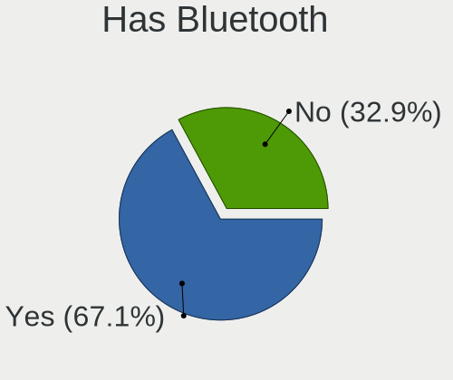
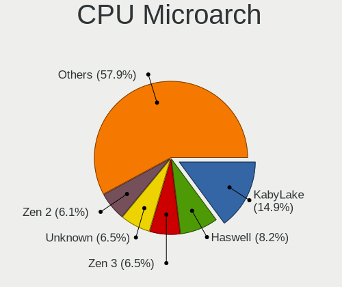
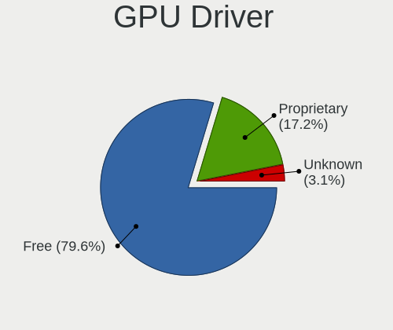
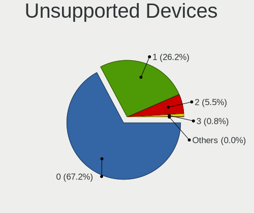
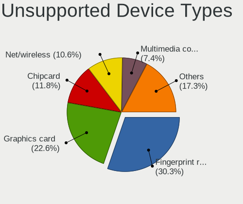

openSUSE - Tested Hardware & Statistics
---------------------------------------

A project to collect tested hardware configurations for openSUSE.

Anyone can contribute to this report by the [hw-probe](https://github.com/linuxhw/hw-probe) tool:

    sudo -E hw-probe -all -upload

Please contribute! Especially if your hardware is rare.

This is a report for all computer types. See also reports for [desktops](/Dist/openSUSE/Desktop/README.md) and [notebooks](/Dist/openSUSE/Notebook/README.md).

Contents
--------

* [ Test Cases ](#test-cases)

* [ System ](#system)
  - [ OS                       ](#os)
  - [ OS Family                ](#os-family)
  - [ Kernel                   ](#kernel)
  - [ Kernel Family            ](#kernel-family)
  - [ Kernel Major Ver.        ](#kernel-major-ver)
  - [ Arch                     ](#arch)
  - [ DE                       ](#de)
  - [ Display Server           ](#display-server)
  - [ Display Manager          ](#display-manager)
  - [ OS Lang                  ](#os-lang)
  - [ Boot Mode                ](#boot-mode)
  - [ Filesystem               ](#filesystem)
  - [ Part. scheme             ](#part-scheme)
  - [ Dual Boot with Linux/BSD ](#dual-boot-with-linuxbsd)
  - [ Dual Boot (Win)          ](#dual-boot-win)

* [ Board ](#board)
  - [ Vendor                   ](#vendor)
  - [ Model                    ](#model)
  - [ Model Family             ](#model-family)
  - [ MFG Year                 ](#mfg-year)
  - [ Form Factor              ](#form-factor)
  - [ Secure Boot              ](#secure-boot)
  - [ Coreboot                 ](#coreboot)
  - [ RAM Size                 ](#ram-size)
  - [ RAM Used                 ](#ram-used)
  - [ Total Drives             ](#total-drives)
  - [ Has CD-ROM               ](#has-cd-rom)
  - [ Has Ethernet             ](#has-ethernet)
  - [ Has WiFi                 ](#has-wifi)
  - [ Has Bluetooth            ](#has-bluetooth)

* [ Location ](#location)
  - [ Country                  ](#country)
  - [ City                     ](#city)

* [ Drives ](#drives)
  - [ Drive Vendor             ](#drive-vendor)
  - [ Drive Model              ](#drive-model)
  - [ HDD Vendor               ](#hdd-vendor)
  - [ SSD Vendor               ](#ssd-vendor)
  - [ Drive Kind               ](#drive-kind)
  - [ Drive Connector          ](#drive-connector)
  - [ Drive Size               ](#drive-size)
  - [ Space Total              ](#space-total)
  - [ Space Used               ](#space-used)
  - [ Malfunc. Drives          ](#malfunc-drives)
  - [ Malfunc. Drive Vendor    ](#malfunc-drive-vendor)
  - [ Malfunc. HDD Vendor      ](#malfunc-hdd-vendor)
  - [ Malfunc. Drive Kind      ](#malfunc-drive-kind)
  - [ Failed Drives            ](#failed-drives)
  - [ Failed Drive Vendor      ](#failed-drive-vendor)
  - [ Drive Status             ](#drive-status)

* [ Storage controller ](#storage-controller)
  - [ Storage Vendor           ](#storage-vendor)
  - [ Storage Model            ](#storage-model)
  - [ Storage Kind             ](#storage-kind)

* [ Processor ](#processor)
  - [ CPU Vendor               ](#cpu-vendor)
  - [ CPU Model                ](#cpu-model)
  - [ CPU Model Family         ](#cpu-model-family)
  - [ CPU Cores                ](#cpu-cores)
  - [ CPU Sockets              ](#cpu-sockets)
  - [ CPU Threads              ](#cpu-threads)
  - [ CPU Op-Modes             ](#cpu-op-modes)
  - [ CPU Microcode            ](#cpu-microcode)
  - [ CPU Microarch            ](#cpu-microarch)

* [ Graphics ](#graphics)
  - [ GPU Vendor               ](#gpu-vendor)
  - [ GPU Model                ](#gpu-model)
  - [ GPU Combo                ](#gpu-combo)
  - [ GPU Driver               ](#gpu-driver)
  - [ GPU Memory               ](#gpu-memory)

* [ Monitor ](#monitor)
  - [ Monitor Vendor           ](#monitor-vendor)
  - [ Monitor Model            ](#monitor-model)
  - [ Monitor Resolution       ](#monitor-resolution)
  - [ Monitor Diagonal         ](#monitor-diagonal)
  - [ Monitor Width            ](#monitor-width)
  - [ Aspect Ratio             ](#aspect-ratio)
  - [ Monitor Area             ](#monitor-area)
  - [ Pixel Density            ](#pixel-density)
  - [ Multiple Monitors        ](#multiple-monitors)

* [ Network ](#network)
  - [ Net Controller Vendor    ](#net-controller-vendor)
  - [ Net Controller Model     ](#net-controller-model)
  - [ Wireless Vendor          ](#wireless-vendor)
  - [ Wireless Model           ](#wireless-model)
  - [ Ethernet Vendor          ](#ethernet-vendor)
  - [ Ethernet Model           ](#ethernet-model)
  - [ Net Controller Kind      ](#net-controller-kind)
  - [ Used Controller          ](#used-controller)
  - [ NICs                     ](#nics)
  - [ IPv6                     ](#ipv6)

* [ Bluetooth ](#bluetooth)
  - [ Bluetooth Vendor         ](#bluetooth-vendor)
  - [ Bluetooth Model          ](#bluetooth-model)

* [ Sound ](#sound)
  - [ Sound Vendor             ](#sound-vendor)
  - [ Sound Model              ](#sound-model)

* [ Memory ](#memory)
  - [ Memory Vendor            ](#memory-vendor)
  - [ Memory Model             ](#memory-model)
  - [ Memory Kind              ](#memory-kind)
  - [ Memory Form Factor       ](#memory-form-factor)
  - [ Memory Size              ](#memory-size)
  - [ Memory Speed             ](#memory-speed)

* [ Printers & scanners ](#printers--scanners)
  - [ Printer Vendor           ](#printer-vendor)
  - [ Printer Model            ](#printer-model)
  - [ Scanner Vendor           ](#scanner-vendor)
  - [ Scanner Model            ](#scanner-model)

* [ Camera ](#camera)
  - [ Camera Vendor            ](#camera-vendor)
  - [ Camera Model             ](#camera-model)

* [ Security ](#security)
  - [ Fingerprint Vendor       ](#fingerprint-vendor)
  - [ Fingerprint Model        ](#fingerprint-model)
  - [ Chipcard Vendor          ](#chipcard-vendor)
  - [ Chipcard Model           ](#chipcard-model)

* [ Unsupported ](#unsupported)
  - [ Unsupported Devices      ](#unsupported-devices)
  - [ Unsupported Device Types ](#unsupported-device-types)

Test Cases
----------

Total: 2788

| Vendor        | Model                       | Form-Factor | Probe                                                      | Date         |
|---------------|-----------------------------|-------------|------------------------------------------------------------|--------------|
| Lenovo        | ThinkPad X1 Yoga Gen 7 2... | Convertible | [36e57fb4cf](https://linux-hardware.org/?probe=36e57fb4cf) | Apr 01, 2023 |
| ASRock        | Z87 Extreme11/ac            | Desktop     | [283593a105](https://linux-hardware.org/?probe=283593a105) | Mar 31, 2023 |
| Apple         | MacBookPro11,3              | Notebook    | [c3f0c2a691](https://linux-hardware.org/?probe=c3f0c2a691) | Mar 30, 2023 |
| Apple         | MacBookPro11,3              | Notebook    | [cdb78d0527](https://linux-hardware.org/?probe=cdb78d0527) | Mar 30, 2023 |
| MSI           | 2AE0                        | Desktop     | [29c86e9653](https://linux-hardware.org/?probe=29c86e9653) | Mar 29, 2023 |
| Gigabyte      | X670E AORUS MASTER          | Desktop     | [872733b74c](https://linux-hardware.org/?probe=872733b74c) | Mar 29, 2023 |
| MSI           | 2AE0                        | Desktop     | [53e6254c56](https://linux-hardware.org/?probe=53e6254c56) | Mar 29, 2023 |
| ASUSTek       | ROG Strix G513RW_G513RW     | Notebook    | [6de889ae8a](https://linux-hardware.org/?probe=6de889ae8a) | Mar 29, 2023 |
| ASUSTek       | N550JX                      | Notebook    | [a505a62a71](https://linux-hardware.org/?probe=a505a62a71) | Mar 28, 2023 |
| ASUSTek       | A78M-A                      | Desktop     | [e2ee931df2](https://linux-hardware.org/?probe=e2ee931df2) | Mar 28, 2023 |
| Fujitsu       | LIFEBOOK U938               | Notebook    | [e972904a83](https://linux-hardware.org/?probe=e972904a83) | Mar 28, 2023 |
| HP            | Compaq 6730s                | Notebook    | [8d4cea5a81](https://linux-hardware.org/?probe=8d4cea5a81) | Mar 28, 2023 |
| MSI           | Bravo 15 B5DD               | Notebook    | [6dac36ba2d](https://linux-hardware.org/?probe=6dac36ba2d) | Mar 28, 2023 |
| MSI           | Delta 15 A5EFK              | Notebook    | [6f4e3ec28b](https://linux-hardware.org/?probe=6f4e3ec28b) | Mar 28, 2023 |
| MSI           | Delta 15 A5EFK              | Notebook    | [9dd1b67b2f](https://linux-hardware.org/?probe=9dd1b67b2f) | Mar 28, 2023 |
| HP            | Spectre x360 2-in-1 Lapt... | Convertible | [42601709f3](https://linux-hardware.org/?probe=42601709f3) | Mar 27, 2023 |
| Lenovo        | G580 20157                  | Notebook    | [98df8e769b](https://linux-hardware.org/?probe=98df8e769b) | Mar 26, 2023 |
| MSI           | GT72 2QE                    | Notebook    | [438f4cb9d9](https://linux-hardware.org/?probe=438f4cb9d9) | Mar 26, 2023 |
| Packard Be... | EasyNote TE11HC             | Notebook    | [6c942c5a39](https://linux-hardware.org/?probe=6c942c5a39) | Mar 26, 2023 |
| Acer          | Spin SP313-51N              | Convertible | [3c68ddf942](https://linux-hardware.org/?probe=3c68ddf942) | Mar 26, 2023 |
| ASUSTek       | ROG CROSSHAIR X670E HERO    | Desktop     | [f78ca791e0](https://linux-hardware.org/?probe=f78ca791e0) | Mar 25, 2023 |
| HP            | ProBook 645 G4              | Notebook    | [6a03f43f29](https://linux-hardware.org/?probe=6a03f43f29) | Mar 25, 2023 |
| HP            | 8433 11                     | Desktop     | [5ab010ffd4](https://linux-hardware.org/?probe=5ab010ffd4) | Mar 25, 2023 |
| Purism        | Librem 13 v2                | Notebook    | [ef5cf3e08f](https://linux-hardware.org/?probe=ef5cf3e08f) | Mar 25, 2023 |
| MSI           | A520M-A PRO                 | Desktop     | [f2a2593a06](https://linux-hardware.org/?probe=f2a2593a06) | Mar 24, 2023 |
| HP            | ENVY x360 2-in-1 Laptop ... | Convertible | [6a2a55ca61](https://linux-hardware.org/?probe=6a2a55ca61) | Mar 24, 2023 |
| Lenovo        | ThinkPad T460s 20F9005CM... | Notebook    | [640a9ac505](https://linux-hardware.org/?probe=640a9ac505) | Mar 24, 2023 |
| Lenovo        | ThinkCentre Edge 91Z 707... | Desktop     | [2f50a76b96](https://linux-hardware.org/?probe=2f50a76b96) | Mar 22, 2023 |
| ASUSTek       | Zephyrus M GU502GW_GU502... | Notebook    | [b618258a5c](https://linux-hardware.org/?probe=b618258a5c) | Mar 22, 2023 |
| Gigabyte      | GA-970A-UD3                 | Desktop     | [982f47fec3](https://linux-hardware.org/?probe=982f47fec3) | Mar 22, 2023 |
| Dell          | Latitude D530               | Notebook    | [92cf04edba](https://linux-hardware.org/?probe=92cf04edba) | Mar 21, 2023 |
| HP            | Pavilion Gaming Laptop 1... | Notebook    | [7b772c82ca](https://linux-hardware.org/?probe=7b772c82ca) | Mar 21, 2023 |
| HP            | Pavilion Gaming Laptop 1... | Notebook    | [bd045deb23](https://linux-hardware.org/?probe=bd045deb23) | Mar 21, 2023 |
| ASUSTek       | Zephyrus M GU502GW_GU502... | Notebook    | [c87a678cf5](https://linux-hardware.org/?probe=c87a678cf5) | Mar 21, 2023 |
| Lenovo        | Yoga 9 14ITL5 82BG          | Convertible | [c7c5415a8c](https://linux-hardware.org/?probe=c7c5415a8c) | Mar 21, 2023 |
| ASRock        | B550M Pro4                  | Desktop     | [de1c89d1b0](https://linux-hardware.org/?probe=de1c89d1b0) | Mar 21, 2023 |
| Gigabyte      | X670E AORUS MASTER          | Desktop     | [0c0bff4f29](https://linux-hardware.org/?probe=0c0bff4f29) | Mar 20, 2023 |
| HP            | 304Ah                       | Desktop     | [49adbe8acf](https://linux-hardware.org/?probe=49adbe8acf) | Mar 20, 2023 |
| Lenovo        | LEGION5PRO-16ACH6H 82JQ     | Notebook    | [4f3cbedf85](https://linux-hardware.org/?probe=4f3cbedf85) | Mar 20, 2023 |
| Gigabyte      | H610M H DDR4                | Desktop     | [b7cf9d91ee](https://linux-hardware.org/?probe=b7cf9d91ee) | Mar 20, 2023 |
| Gigabyte      | B550 AORUS ELITE AX V2      | Desktop     | [888ec192b4](https://linux-hardware.org/?probe=888ec192b4) | Mar 19, 2023 |
| Dell          | XPS 15 9570                 | Notebook    | [729a1432a0](https://linux-hardware.org/?probe=729a1432a0) | Mar 19, 2023 |
| Lenovo        | IdeaPad 3 15ITL6 82H8       | Notebook    | [9cdd00c854](https://linux-hardware.org/?probe=9cdd00c854) | Mar 18, 2023 |
| Lenovo        | IdeaPad 5 14ARE05 81YM      | Notebook    | [f35715c399](https://linux-hardware.org/?probe=f35715c399) | Mar 18, 2023 |
| Gigabyte      | Z68XP-UD4                   | Desktop     | [9d5f79bbf4](https://linux-hardware.org/?probe=9d5f79bbf4) | Mar 18, 2023 |
| MSI           | Z370 GAMING PRO CARBON      | Desktop     | [87ba801b00](https://linux-hardware.org/?probe=87ba801b00) | Mar 17, 2023 |
| ASUSTek       | VivoBook_ASUSLaptop M340... | Notebook    | [2cb5e6ce4f](https://linux-hardware.org/?probe=2cb5e6ce4f) | Mar 16, 2023 |
| Lenovo        | IdeaPad 3 15ALC6 82KU       | Notebook    | [5d43e434bc](https://linux-hardware.org/?probe=5d43e434bc) | Mar 16, 2023 |
| Lenovo        | IdeaPad Y700-17ISK 80Q0     | Notebook    | [92d818d184](https://linux-hardware.org/?probe=92d818d184) | Mar 16, 2023 |
| Lenovo        | IdeaPad Y700-17ISK 80Q0     | Notebook    | [60114cc9c8](https://linux-hardware.org/?probe=60114cc9c8) | Mar 16, 2023 |
| Dell          | 0PGKWF A00                  | Desktop     | [d03e035ed6](https://linux-hardware.org/?probe=d03e035ed6) | Mar 16, 2023 |
| Dell          | 0PGKWF A00                  | Desktop     | [2b34503276](https://linux-hardware.org/?probe=2b34503276) | Mar 16, 2023 |
| TUXEDO        | Pulse 15 Gen1               | Notebook    | [4a47120f89](https://linux-hardware.org/?probe=4a47120f89) | Mar 15, 2023 |
| Lenovo        | 3135 SDK0J40697 WIN 3305... | Mini pc     | [a1e7a34896](https://linux-hardware.org/?probe=a1e7a34896) | Mar 14, 2023 |
| Lenovo        | 3135 SDK0J40697 WIN 3305... | Mini pc     | [6e2a63edaa](https://linux-hardware.org/?probe=6e2a63edaa) | Mar 14, 2023 |
| HP            | EliteBook 820 G4            | Notebook    | [bc12f3e2e4](https://linux-hardware.org/?probe=bc12f3e2e4) | Mar 14, 2023 |
| HP            | ENVY x360 Convertible 13... | Convertible | [dfd3b8546c](https://linux-hardware.org/?probe=dfd3b8546c) | Mar 14, 2023 |
| HP            | Pavilion Laptop 15-cs0xx... | Notebook    | [2b69e73996](https://linux-hardware.org/?probe=2b69e73996) | Mar 14, 2023 |
| Lenovo        | ThinkPad Edge E530 3259H... | Notebook    | [74348d01f3](https://linux-hardware.org/?probe=74348d01f3) | Mar 13, 2023 |
| Lenovo        | Legion 5 15ARH7H 82RD       | Notebook    | [8dc295e39b](https://linux-hardware.org/?probe=8dc295e39b) | Mar 13, 2023 |
| Wortmann      | Terra 3100                  | Desktop     | [126586f434](https://linux-hardware.org/?probe=126586f434) | Mar 12, 2023 |
| Intel         | NUC12WSBi5 M46425-302       | Mini pc     | [2002eaa403](https://linux-hardware.org/?probe=2002eaa403) | Mar 12, 2023 |
| Lenovo        | ThinkPad T520 42435GG       | Notebook    | [fac1ee2528](https://linux-hardware.org/?probe=fac1ee2528) | Mar 12, 2023 |
| Acer          | Swift SF314-43              | Notebook    | [8f3c49d011](https://linux-hardware.org/?probe=8f3c49d011) | Mar 12, 2023 |
| Fujitsu       | LIFEBOOK U939X              | Convertible | [359ca913fe](https://linux-hardware.org/?probe=359ca913fe) | Mar 12, 2023 |
| ASUSTek       | PN50                        | Mini pc     | [9ce749e52e](https://linux-hardware.org/?probe=9ce749e52e) | Mar 12, 2023 |
| ASRock        | AB350M-HDV                  | Desktop     | [45a5fbc5e7](https://linux-hardware.org/?probe=45a5fbc5e7) | Mar 12, 2023 |
| HP            | Laptop 15s-fq5xxx           | Notebook    | [5bf763c288](https://linux-hardware.org/?probe=5bf763c288) | Mar 11, 2023 |
| HP            | ENVY x360 2-in-1 Laptop ... | Convertible | [e5cdf2201f](https://linux-hardware.org/?probe=e5cdf2201f) | Mar 11, 2023 |
| Lenovo        | 102F SDK0J40697 WIN 3305... | Desktop     | [97741c600c](https://linux-hardware.org/?probe=97741c600c) | Mar 11, 2023 |
| Jumper        | EZbook                      | Notebook    | [ed607c4113](https://linux-hardware.org/?probe=ed607c4113) | Mar 11, 2023 |
| Gigabyte      | Z97-HD3                     | Desktop     | [5cb06ca8ce](https://linux-hardware.org/?probe=5cb06ca8ce) | Mar 10, 2023 |
| ASUSTek       | VivoBook_ASUSLaptop E510... | Notebook    | [54e498fb2e](https://linux-hardware.org/?probe=54e498fb2e) | Mar 10, 2023 |
| ASRock        | H410M-HVS                   | Desktop     | [689186d7de](https://linux-hardware.org/?probe=689186d7de) | Mar 10, 2023 |
| HP            | ProBook 6460b               | Notebook    | [4374107e07](https://linux-hardware.org/?probe=4374107e07) | Mar 10, 2023 |
| HP            | ProBook 6460b               | Notebook    | [7a01d6124d](https://linux-hardware.org/?probe=7a01d6124d) | Mar 10, 2023 |
| Acer          | Aspire V3-772               | Notebook    | [661125aac2](https://linux-hardware.org/?probe=661125aac2) | Mar 10, 2023 |
| Dell          | Vostro 5490                 | Notebook    | [d524e6c586](https://linux-hardware.org/?probe=d524e6c586) | Mar 10, 2023 |
| Dell          | Vostro 5490                 | Notebook    | [2d75f5ea8b](https://linux-hardware.org/?probe=2d75f5ea8b) | Mar 10, 2023 |
| MSI           | B450 TOMAHAWK MAX II        | Desktop     | [e72ba8b8aa](https://linux-hardware.org/?probe=e72ba8b8aa) | Mar 08, 2023 |
| MACHINIST     | X99-RS9 V2.0                | Desktop     | [d7ac4c2edb](https://linux-hardware.org/?probe=d7ac4c2edb) | Mar 08, 2023 |
| Acer          | Spin SP313-51N              | Convertible | [c1339ac8de](https://linux-hardware.org/?probe=c1339ac8de) | Mar 08, 2023 |
| Gigabyte      | A520M DS3H                  | Desktop     | [30221f1500](https://linux-hardware.org/?probe=30221f1500) | Mar 07, 2023 |
| MSI           | P67A-C45                    | Desktop     | [52e013338c](https://linux-hardware.org/?probe=52e013338c) | Mar 07, 2023 |
| Acer          | Veriton X4610G              | Desktop     | [7f5cb2ac6a](https://linux-hardware.org/?probe=7f5cb2ac6a) | Mar 07, 2023 |
| ASUSTek       | M5A78L-M/USB3               | Desktop     | [4ca3d88758](https://linux-hardware.org/?probe=4ca3d88758) | Mar 07, 2023 |
| HP            | EliteBook 845 G8 Noteboo... | Notebook    | [1490c281bd](https://linux-hardware.org/?probe=1490c281bd) | Mar 07, 2023 |
| ASUSTek       | VivoBook_ASUSLaptop E510... | Notebook    | [9b1357d5c0](https://linux-hardware.org/?probe=9b1357d5c0) | Mar 06, 2023 |
| Gigabyte      | Z68XP-UD3P                  | Desktop     | [bfb7053ff8](https://linux-hardware.org/?probe=bfb7053ff8) | Mar 06, 2023 |
| MSI           | B550 GAMING GEN3            | Desktop     | [09e8aaf103](https://linux-hardware.org/?probe=09e8aaf103) | Mar 05, 2023 |
| HP            | ENVY x360 2-in-1 Laptop ... | Convertible | [386fe6d7ab](https://linux-hardware.org/?probe=386fe6d7ab) | Mar 05, 2023 |
| HP            | ENVY x360 2-in-1 Laptop ... | Convertible | [d81384080b](https://linux-hardware.org/?probe=d81384080b) | Mar 05, 2023 |
| Acer          | Aspire A314-35              | Notebook    | [3e4fdfbb73](https://linux-hardware.org/?probe=3e4fdfbb73) | Mar 05, 2023 |
| HP            | 1905                        | Desktop     | [3a15a8a255](https://linux-hardware.org/?probe=3a15a8a255) | Mar 05, 2023 |
| Dell          | 0427JK A00                  | Desktop     | [4b47face39](https://linux-hardware.org/?probe=4b47face39) | Mar 05, 2023 |
| MSI           | X370 SLI PLUS               | Desktop     | [38e61e3fb5](https://linux-hardware.org/?probe=38e61e3fb5) | Mar 05, 2023 |
| Lenovo        | ThinkPad T14 Gen 3 21AJS... | Notebook    | [daefae334b](https://linux-hardware.org/?probe=daefae334b) | Mar 04, 2023 |
| SLIMBOOK      | PROX-AMD5                   | Notebook    | [19bd4c1e4e](https://linux-hardware.org/?probe=19bd4c1e4e) | Mar 04, 2023 |
| MSI           | MAG B650 TOMAHAWK WIFI      | Desktop     | [f9a2075d54](https://linux-hardware.org/?probe=f9a2075d54) | Mar 04, 2023 |
| MSI           | X370 SLI PLUS               | Desktop     | [066ce423c0](https://linux-hardware.org/?probe=066ce423c0) | Mar 03, 2023 |
| Acer          | Aspire A314-35              | Notebook    | [587096ec48](https://linux-hardware.org/?probe=587096ec48) | Mar 03, 2023 |
| MSI           | MAG X570S TORPEDO MAX       | Desktop     | [3edae4d4f7](https://linux-hardware.org/?probe=3edae4d4f7) | Mar 03, 2023 |
| HP            | 2B4B                        | Desktop     | [6fe13bec4d](https://linux-hardware.org/?probe=6fe13bec4d) | Mar 02, 2023 |
| HP            | 2B4B                        | Desktop     | [d97467e5aa](https://linux-hardware.org/?probe=d97467e5aa) | Mar 02, 2023 |
| HP            | ZBook Power G7 Mobile Wo... | Notebook    | [e87ce2454c](https://linux-hardware.org/?probe=e87ce2454c) | Mar 02, 2023 |
| HP            | Pavilion Plus Laptop 14-... | Notebook    | [5cb58db69b](https://linux-hardware.org/?probe=5cb58db69b) | Mar 02, 2023 |
| MSI           | MAG B650 TOMAHAWK WIFI      | Desktop     | [a279108842](https://linux-hardware.org/?probe=a279108842) | Mar 02, 2023 |
| Lenovo        | IdeaPad 320-15IKB 81BG      | Notebook    | [d008353c16](https://linux-hardware.org/?probe=d008353c16) | Mar 01, 2023 |
| Apple         | MacBook5,1                  | Notebook    | [0242801bbc](https://linux-hardware.org/?probe=0242801bbc) | Mar 01, 2023 |
| Notebook      | PCx0Dx                      | Notebook    | [0f19d5c037](https://linux-hardware.org/?probe=0f19d5c037) | Mar 01, 2023 |
| Intel         | D34010WYK H14771-303        | Desktop     | [5bc379ea65](https://linux-hardware.org/?probe=5bc379ea65) | Mar 01, 2023 |
| Lenovo        | Bantry CRB 31900058 STD     | Desktop     | [268413a47c](https://linux-hardware.org/?probe=268413a47c) | Mar 01, 2023 |
| Lenovo        | Bantry CRB 31900058 STD     | Desktop     | [169e938f25](https://linux-hardware.org/?probe=169e938f25) | Mar 01, 2023 |
| Sun Micros... | Ultra 24 50                 | Desktop     | [71b8cbeda5](https://linux-hardware.org/?probe=71b8cbeda5) | Feb 28, 2023 |
| ASUSTek       | M4A89GTD-PRO/USB3           | Desktop     | [0710c7be6e](https://linux-hardware.org/?probe=0710c7be6e) | Feb 28, 2023 |
| HP            | ProBook 4540s               | Notebook    | [a52b9c7637](https://linux-hardware.org/?probe=a52b9c7637) | Feb 27, 2023 |
| HP            | ProBook 4540s               | Notebook    | [45e989b539](https://linux-hardware.org/?probe=45e989b539) | Feb 27, 2023 |
| HP            | Notebook                    | Notebook    | [ee2645efa8](https://linux-hardware.org/?probe=ee2645efa8) | Feb 27, 2023 |
| ASUSTek       | X541NA                      | Notebook    | [8c0dc3ba82](https://linux-hardware.org/?probe=8c0dc3ba82) | Feb 27, 2023 |
| Dell          | 0427JK A00                  | Desktop     | [ca878d6577](https://linux-hardware.org/?probe=ca878d6577) | Feb 27, 2023 |
| HP            | Notebook                    | Notebook    | [0d838134b7](https://linux-hardware.org/?probe=0d838134b7) | Feb 27, 2023 |
| AXDIA Inte... | WINDESK9 3G v2              | Notebook    | [49282044d3](https://linux-hardware.org/?probe=49282044d3) | Feb 26, 2023 |
| HP            | ENVY Laptop 13-ah0xxx       | Notebook    | [c3156c3f23](https://linux-hardware.org/?probe=c3156c3f23) | Feb 26, 2023 |
| Apple         | Mac-27ADBB7B4CEE8E61 iMa... | All in one  | [899c2066a1](https://linux-hardware.org/?probe=899c2066a1) | Feb 25, 2023 |
| Apple         | Mac-27ADBB7B4CEE8E61 iMa... | All in one  | [b367bf6276](https://linux-hardware.org/?probe=b367bf6276) | Feb 25, 2023 |
| HP            | ENVY x360 2-in-1 Laptop ... | Convertible | [86ab345b56](https://linux-hardware.org/?probe=86ab345b56) | Feb 24, 2023 |
| ASUSTek       | Pro WS X570-ACE             | Desktop     | [f7d1c79daa](https://linux-hardware.org/?probe=f7d1c79daa) | Feb 24, 2023 |
| Apple         | Mac-27ADBB7B4CEE8E61 iMa... | All in one  | [105209c356](https://linux-hardware.org/?probe=105209c356) | Feb 24, 2023 |
| Apple         | Mac-27ADBB7B4CEE8E61 iMa... | All in one  | [5027942f8b](https://linux-hardware.org/?probe=5027942f8b) | Feb 24, 2023 |
| Dell          | Inspiron 5502               | Notebook    | [2c490934fb](https://linux-hardware.org/?probe=2c490934fb) | Feb 24, 2023 |
| MSI           | X58 Pro                     | Desktop     | [22509b3e42](https://linux-hardware.org/?probe=22509b3e42) | Feb 23, 2023 |
| HP            | Compaq 6720s                | Notebook    | [48cbefb8f6](https://linux-hardware.org/?probe=48cbefb8f6) | Feb 23, 2023 |
| HP            | Compaq 6720s                | Notebook    | [0dac92bb9d](https://linux-hardware.org/?probe=0dac92bb9d) | Feb 23, 2023 |
| Dell          | XPS 9320                    | Notebook    | [896a21551e](https://linux-hardware.org/?probe=896a21551e) | Feb 22, 2023 |
| HP            | 2B4B                        | Desktop     | [92c45eb54f](https://linux-hardware.org/?probe=92c45eb54f) | Feb 21, 2023 |
| HP            | 8906 SMVB                   | Desktop     | [892b3930a6](https://linux-hardware.org/?probe=892b3930a6) | Feb 21, 2023 |
| Lenovo        | IdeaPad Y900-17ISK 80Q1     | Notebook    | [d852e3306a](https://linux-hardware.org/?probe=d852e3306a) | Feb 20, 2023 |
| HP            | ENVY x360 Convertible 13... | Convertible | [e434f7f85a](https://linux-hardware.org/?probe=e434f7f85a) | Feb 20, 2023 |
| SK hynix      | HyBook                      | Notebook    | [494c1a322d](https://linux-hardware.org/?probe=494c1a322d) | Feb 20, 2023 |
| Acer          | Aspire X3950                | Desktop     | [f5b4a3baa3](https://linux-hardware.org/?probe=f5b4a3baa3) | Feb 20, 2023 |
| HP            | ProBook 4540s               | Notebook    | [079a5f512d](https://linux-hardware.org/?probe=079a5f512d) | Feb 20, 2023 |
| ASUSTek       | G771JW                      | Notebook    | [e5b5f4792c](https://linux-hardware.org/?probe=e5b5f4792c) | Feb 19, 2023 |
| ASUSTek       | G771JW                      | Notebook    | [c73a9b9ee2](https://linux-hardware.org/?probe=c73a9b9ee2) | Feb 19, 2023 |
| Lenovo        | IdeaPad 5 Pro 16ARH7 82S... | Notebook    | [19bdc55bfd](https://linux-hardware.org/?probe=19bdc55bfd) | Feb 19, 2023 |
| HP            | ENVY x360 2-in-1 Laptop ... | Convertible | [2a35f99890](https://linux-hardware.org/?probe=2a35f99890) | Feb 18, 2023 |
| Lenovo        | ThinkPad W510 4391W3V       | Notebook    | [f4065623e5](https://linux-hardware.org/?probe=f4065623e5) | Feb 18, 2023 |
| ASUSTek       | ASUSPRO P5440FA_P5440FA     | Notebook    | [5fb2330e71](https://linux-hardware.org/?probe=5fb2330e71) | Feb 18, 2023 |
| Lenovo        | Legion 5 Pro 16ARH7H 82R... | Notebook    | [8942075e7b](https://linux-hardware.org/?probe=8942075e7b) | Feb 18, 2023 |
| Lenovo        | ThinkPad T14 Gen 2i 20W1... | Notebook    | [76c8c6f7ba](https://linux-hardware.org/?probe=76c8c6f7ba) | Feb 17, 2023 |
| ASUSTek       | ASUSPRO P5440FA_P5440FA     | Notebook    | [9497d288f6](https://linux-hardware.org/?probe=9497d288f6) | Feb 17, 2023 |
| ASUSTek       | ROG Strix G513QY_G513QY     | Notebook    | [4a5c7432ae](https://linux-hardware.org/?probe=4a5c7432ae) | Feb 17, 2023 |
| Dell          | 09M8Y8 A01                  | Desktop     | [beabc46f67](https://linux-hardware.org/?probe=beabc46f67) | Feb 14, 2023 |
| Dell          | 09M8Y8 A01                  | Desktop     | [fb1ff4a6d9](https://linux-hardware.org/?probe=fb1ff4a6d9) | Feb 14, 2023 |
| ASUSTek       | AM1M-A                      | Desktop     | [2947200c5c](https://linux-hardware.org/?probe=2947200c5c) | Feb 14, 2023 |
| ASUSTek       | PRIME B350M-E               | Desktop     | [84a46ec9ce](https://linux-hardware.org/?probe=84a46ec9ce) | Feb 14, 2023 |
| Google        | Lillipup                    | Notebook    | [af7451beff](https://linux-hardware.org/?probe=af7451beff) | Feb 14, 2023 |
| HUAWEI        | BOHK-WAX9X                  | Notebook    | [9b84a7339e](https://linux-hardware.org/?probe=9b84a7339e) | Feb 13, 2023 |
| HUAWEI        | BOHK-WAX9X                  | Notebook    | [20428fc0ed](https://linux-hardware.org/?probe=20428fc0ed) | Feb 13, 2023 |
| ASRock        | 970 Pro3 R2.0               | Desktop     | [762dd6fa2e](https://linux-hardware.org/?probe=762dd6fa2e) | Feb 13, 2023 |
| HP            | ProBook 6460b               | Notebook    | [5436445da0](https://linux-hardware.org/?probe=5436445da0) | Feb 13, 2023 |
| HP            | ProBook 6460b               | Notebook    | [ba14b45543](https://linux-hardware.org/?probe=ba14b45543) | Feb 13, 2023 |
| Acer          | Aspire A314-35              | Notebook    | [0a6d50bc2a](https://linux-hardware.org/?probe=0a6d50bc2a) | Feb 13, 2023 |
| Acer          | Aspire A314-35              | Notebook    | [75980f2f55](https://linux-hardware.org/?probe=75980f2f55) | Feb 13, 2023 |
| Samsung       | 550XDA                      | Notebook    | [0c3e0dd389](https://linux-hardware.org/?probe=0c3e0dd389) | Feb 13, 2023 |
| ASUSTek       | M2N-SLI DELUXE              | Desktop     | [86026e4f54](https://linux-hardware.org/?probe=86026e4f54) | Feb 12, 2023 |
| Unknown       | Unknown                     | Desktop     | [df52d514c9](https://linux-hardware.org/?probe=df52d514c9) | Feb 12, 2023 |
| Toshiba       | PORTEGE Z830                | Notebook    | [a384bb740c](https://linux-hardware.org/?probe=a384bb740c) | Feb 11, 2023 |
| Sun Micros... | Ultra 24 50                 | Desktop     | [e1dc99210d](https://linux-hardware.org/?probe=e1dc99210d) | Feb 11, 2023 |
| ASRock        | B550M-ITX/ac                | Desktop     | [79204339d0](https://linux-hardware.org/?probe=79204339d0) | Feb 11, 2023 |
| ASUSTek       | ASUS TUF Dash F15 FX517Z... | Notebook    | [df97c92c82](https://linux-hardware.org/?probe=df97c92c82) | Feb 11, 2023 |
| MSI           | Z370 GAMING PLUS            | Desktop     | [9621fdeccb](https://linux-hardware.org/?probe=9621fdeccb) | Feb 11, 2023 |
| MSI           | Z370 GAMING PLUS            | Desktop     | [523c8db418](https://linux-hardware.org/?probe=523c8db418) | Feb 11, 2023 |
| Dell          | Precision 5570              | Notebook    | [8398c80e6b](https://linux-hardware.org/?probe=8398c80e6b) | Feb 11, 2023 |
| ASUSTek       | ZenBook UX325UA_UM325UA     | Notebook    | [92cbb2e876](https://linux-hardware.org/?probe=92cbb2e876) | Feb 11, 2023 |
| ASUSTek       | VivoBook_ASUSLaptop X515... | Notebook    | [2f721ad33a](https://linux-hardware.org/?probe=2f721ad33a) | Feb 10, 2023 |
| Acer          | Veriton N4680G              | Desktop     | [4198835011](https://linux-hardware.org/?probe=4198835011) | Feb 10, 2023 |
| Dell          | Latitude 5421               | Notebook    | [e7c6fbfeb8](https://linux-hardware.org/?probe=e7c6fbfeb8) | Feb 09, 2023 |
| ASUSTek       | TUF Gaming B550M-PLUS       | Desktop     | [3b71a70207](https://linux-hardware.org/?probe=3b71a70207) | Feb 09, 2023 |
| Unknown       | M-140BI5                    | Notebook    | [a07b2a4444](https://linux-hardware.org/?probe=a07b2a4444) | Feb 09, 2023 |
| Schenker      | VIA 15                      | Notebook    | [8096682644](https://linux-hardware.org/?probe=8096682644) | Feb 09, 2023 |
| Lenovo        | ThinkPad T440s 20ARS2V90... | Notebook    | [a2e7b3b9b7](https://linux-hardware.org/?probe=a2e7b3b9b7) | Feb 08, 2023 |
| Lenovo        | IdeaPad S145-15API 81V7     | Notebook    | [acbbbca6e7](https://linux-hardware.org/?probe=acbbbca6e7) | Feb 08, 2023 |
| ASRock        | X399M Taichi                | Desktop     | [c6bf333a82](https://linux-hardware.org/?probe=c6bf333a82) | Feb 08, 2023 |
| HP            | 1494                        | Desktop     | [ba7c61bf23](https://linux-hardware.org/?probe=ba7c61bf23) | Feb 07, 2023 |
| Dell          | Inspiron 16 7620 2-in-1     | Convertible | [dc2172d485](https://linux-hardware.org/?probe=dc2172d485) | Feb 07, 2023 |
| HUAWEI        | BOHK-WAX9X                  | Notebook    | [3b6bf45c6b](https://linux-hardware.org/?probe=3b6bf45c6b) | Feb 07, 2023 |
| Gigabyte      | Z390 AORUS ULTRA-CF         | Desktop     | [70f715ffb4](https://linux-hardware.org/?probe=70f715ffb4) | Feb 06, 2023 |
| Gigabyte      | Z390 AORUS ULTRA-CF         | Desktop     | [f7ca9a94c5](https://linux-hardware.org/?probe=f7ca9a94c5) | Feb 06, 2023 |
| HP            | 0B54h D                     | Desktop     | [fa38931f1f](https://linux-hardware.org/?probe=fa38931f1f) | Feb 06, 2023 |
| TUXEDO        | InfinityBook S 15/17 Gen... | Notebook    | [9b92561723](https://linux-hardware.org/?probe=9b92561723) | Feb 06, 2023 |
| Medion        | P6624                       | Notebook    | [5a31124376](https://linux-hardware.org/?probe=5a31124376) | Feb 06, 2023 |
| Lenovo        | Flex 2-14D 20376            | Notebook    | [16f0d33c85](https://linux-hardware.org/?probe=16f0d33c85) | Feb 06, 2023 |
| ASUSTek       | PRIME H310M-A R2.0          | Desktop     | [4a971615e8](https://linux-hardware.org/?probe=4a971615e8) | Feb 05, 2023 |
| Dell          | Latitude E7470              | Notebook    | [88a8b69cc3](https://linux-hardware.org/?probe=88a8b69cc3) | Feb 05, 2023 |
| HP            | 845A                        | Desktop     | [3e744bcf5b](https://linux-hardware.org/?probe=3e744bcf5b) | Feb 05, 2023 |
| Lenovo        | ThinkPad P50 20EN001SUS     | Notebook    | [bbe182e4c2](https://linux-hardware.org/?probe=bbe182e4c2) | Feb 04, 2023 |
| Inventec      | Z CLASS A02                 | Desktop     | [81c4e4ce60](https://linux-hardware.org/?probe=81c4e4ce60) | Feb 03, 2023 |
| ASUSTek       | PRIME B550-PLUS             | Desktop     | [fd8c9d9ccf](https://linux-hardware.org/?probe=fd8c9d9ccf) | Feb 03, 2023 |
| ASUSTek       | ROG STRIX X570-E GAMING     | Desktop     | [9b0a8de7a1](https://linux-hardware.org/?probe=9b0a8de7a1) | Feb 02, 2023 |
| ASUSTek       | ROG Strix G713QE_G713QE     | Notebook    | [f05a20fe00](https://linux-hardware.org/?probe=f05a20fe00) | Feb 01, 2023 |
| HP            | Laptop 15s-fq5xxx           | Notebook    | [bd22f26ad1](https://linux-hardware.org/?probe=bd22f26ad1) | Jan 31, 2023 |
| HP            | Laptop 15s-fq5xxx           | Notebook    | [28ea3cafe8](https://linux-hardware.org/?probe=28ea3cafe8) | Jan 31, 2023 |
| Gigabyte      | Z690 GAMING X DDR4          | Desktop     | [f2636de53b](https://linux-hardware.org/?probe=f2636de53b) | Jan 31, 2023 |
| Lenovo        | 3717 SDK0J40697 WIN 3305... | Desktop     | [175a0fcf9a](https://linux-hardware.org/?probe=175a0fcf9a) | Jan 31, 2023 |
| HP            | ENVY x360 2-in-1 Laptop ... | Convertible | [e0e7acce8d](https://linux-hardware.org/?probe=e0e7acce8d) | Jan 31, 2023 |
| ASUSTek       | CROSSHAIR V FORMULA-Z       | Desktop     | [32dfb5ebe2](https://linux-hardware.org/?probe=32dfb5ebe2) | Jan 31, 2023 |
| HP            | ProBook 650 G1              | Notebook    | [fc09442b7c](https://linux-hardware.org/?probe=fc09442b7c) | Jan 30, 2023 |
| HP            | ProBook 650 G1              | Notebook    | [b78602c91d](https://linux-hardware.org/?probe=b78602c91d) | Jan 30, 2023 |
| Lenovo        | ThinkPad Edge E431 62779... | Notebook    | [8d7c1dbf4d](https://linux-hardware.org/?probe=8d7c1dbf4d) | Jan 30, 2023 |
| Gigabyte      | Z690 GAMING X DDR4          | Desktop     | [6bf8eb9c73](https://linux-hardware.org/?probe=6bf8eb9c73) | Jan 30, 2023 |
| Lenovo        | ThinkPad W510 4391W3V       | Notebook    | [78d987fedf](https://linux-hardware.org/?probe=78d987fedf) | Jan 30, 2023 |
| Lenovo        | ThinkPad W510 4391W3V       | Notebook    | [a178301183](https://linux-hardware.org/?probe=a178301183) | Jan 30, 2023 |
| ASRock        | X470 Master SLI             | Desktop     | [1746dfe4b1](https://linux-hardware.org/?probe=1746dfe4b1) | Jan 30, 2023 |
| HP            | ENVY x360 2-in-1 Laptop ... | Convertible | [9b0891d54d](https://linux-hardware.org/?probe=9b0891d54d) | Jan 30, 2023 |
| HP            | Pavilion dv7                | Notebook    | [b61ed06b1e](https://linux-hardware.org/?probe=b61ed06b1e) | Jan 30, 2023 |
| HP            | ENVY x360 2-in-1 Laptop ... | Convertible | [de8c055a8a](https://linux-hardware.org/?probe=de8c055a8a) | Jan 29, 2023 |
| Toshiba       | Satellite L500              | Notebook    | [327e2d4e3e](https://linux-hardware.org/?probe=327e2d4e3e) | Jan 28, 2023 |
| Gigabyte      | B75M-D3H                    | Desktop     | [b5ca740834](https://linux-hardware.org/?probe=b5ca740834) | Jan 28, 2023 |
| HUAWEI        | KLVL-WXXW                   | Notebook    | [f20e47b9d7](https://linux-hardware.org/?probe=f20e47b9d7) | Jan 28, 2023 |
| HP            | ENVY x360 2-in-1 Laptop ... | Convertible | [4a33511e43](https://linux-hardware.org/?probe=4a33511e43) | Jan 28, 2023 |
| Lenovo        | ThinkPad T14 Gen 3 21AJS... | Notebook    | [de71656929](https://linux-hardware.org/?probe=de71656929) | Jan 27, 2023 |
| Lenovo        | ThinkPad R500 2718WA3       | Notebook    | [2bb86279a8](https://linux-hardware.org/?probe=2bb86279a8) | Jan 27, 2023 |
| Intel         | X99                         | Desktop     | [1fbd6cf5bd](https://linux-hardware.org/?probe=1fbd6cf5bd) | Jan 27, 2023 |
| MSI           | Stealth 15M B12UE           | Notebook    | [463c397bb0](https://linux-hardware.org/?probe=463c397bb0) | Jan 26, 2023 |
| MSI           | Stealth 15M B12UE           | Notebook    | [ff3fd2b8f1](https://linux-hardware.org/?probe=ff3fd2b8f1) | Jan 26, 2023 |
| ASRock        | B75 Pro3-M                  | Desktop     | [cf662e2730](https://linux-hardware.org/?probe=cf662e2730) | Jan 25, 2023 |
| ASRock        | B75 Pro3-M                  | Desktop     | [c2ff1b1e23](https://linux-hardware.org/?probe=c2ff1b1e23) | Jan 25, 2023 |
| Fujitsu       | LIFEBOOK U7511              | Notebook    | [7b9b00eccb](https://linux-hardware.org/?probe=7b9b00eccb) | Jan 24, 2023 |
| ASUSTek       | PRIME B550M-A               | Desktop     | [723d6a91bb](https://linux-hardware.org/?probe=723d6a91bb) | Jan 24, 2023 |
| ASUSTek       | PRIME B550M-A               | Desktop     | [5abd524783](https://linux-hardware.org/?probe=5abd524783) | Jan 24, 2023 |
| HP            | 2B34                        | Desktop     | [ca97840b4b](https://linux-hardware.org/?probe=ca97840b4b) | Jan 24, 2023 |
| Biostar       | Hi-Fi A85W                  | Desktop     | [4da9f87ebb](https://linux-hardware.org/?probe=4da9f87ebb) | Jan 23, 2023 |
| Acer          | Swift SFX16-52G             | Notebook    | [62e1cc77f9](https://linux-hardware.org/?probe=62e1cc77f9) | Jan 23, 2023 |
| HP            | 8399                        | Desktop     | [db427c8bc9](https://linux-hardware.org/?probe=db427c8bc9) | Jan 22, 2023 |
| HP            | 8399                        | Desktop     | [cdf9d12bb4](https://linux-hardware.org/?probe=cdf9d12bb4) | Jan 22, 2023 |
| ASUSTek       | P5K SE                      | Desktop     | [ffc0fa7fb5](https://linux-hardware.org/?probe=ffc0fa7fb5) | Jan 22, 2023 |
| HP            | Pavilion dv4                | Notebook    | [9fd79086c8](https://linux-hardware.org/?probe=9fd79086c8) | Jan 22, 2023 |
| ASUSTek       | P5K SE                      | Desktop     | [7933a58a32](https://linux-hardware.org/?probe=7933a58a32) | Jan 22, 2023 |
| Lenovo        | ThinkPad E15 20RD0019RT     | Notebook    | [282161cc92](https://linux-hardware.org/?probe=282161cc92) | Jan 22, 2023 |
| Lenovo        | ThinkPad E15 20RD0019RT     | Notebook    | [8d235b1b8d](https://linux-hardware.org/?probe=8d235b1b8d) | Jan 22, 2023 |
| Acer          | Predator PH315-52           | Notebook    | [5e28e4cbdc](https://linux-hardware.org/?probe=5e28e4cbdc) | Jan 21, 2023 |
| Dell          | Latitude 9420               | Notebook    | [4b847961df](https://linux-hardware.org/?probe=4b847961df) | Jan 21, 2023 |
| Fujitsu       | LIFEBOOK P1630              | Notebook    | [5ee218deb4](https://linux-hardware.org/?probe=5ee218deb4) | Jan 21, 2023 |
| Lenovo        | IdeaPad Y700-15ISK 80NV     | Notebook    | [bd51c2a953](https://linux-hardware.org/?probe=bd51c2a953) | Jan 20, 2023 |
| Medion        | P6624                       | Notebook    | [344d427f44](https://linux-hardware.org/?probe=344d427f44) | Jan 20, 2023 |
| Lenovo        | IdeaPad 330-15IKB 81FD      | Notebook    | [31698019a3](https://linux-hardware.org/?probe=31698019a3) | Jan 20, 2023 |
| ASUSTek       | X555LF                      | Notebook    | [7220c25a3b](https://linux-hardware.org/?probe=7220c25a3b) | Jan 20, 2023 |
| ASUSTek       | SABERTOOTH Z97 MARK 2       | Desktop     | [f6b68c1767](https://linux-hardware.org/?probe=f6b68c1767) | Jan 19, 2023 |
| ASRock        | B560M Pro4                  | Desktop     | [6c8d492f56](https://linux-hardware.org/?probe=6c8d492f56) | Jan 19, 2023 |
| ASUSTek       | Zenbook UX3402ZA_UX3402Z... | Notebook    | [e7548596d1](https://linux-hardware.org/?probe=e7548596d1) | Jan 19, 2023 |
| TUXEDO        | Pulse 15 Gen1               | Notebook    | [1f56f8cb21](https://linux-hardware.org/?probe=1f56f8cb21) | Jan 19, 2023 |
| Lenovo        | IdeaPad S145-15IWL 81S9     | Notebook    | [890980b6a9](https://linux-hardware.org/?probe=890980b6a9) | Jan 19, 2023 |
| ASUSTek       | M5A97 R2.0                  | Desktop     | [28a15ffc38](https://linux-hardware.org/?probe=28a15ffc38) | Jan 19, 2023 |
| ASUSTek       | X556UQK                     | Notebook    | [b0716d3518](https://linux-hardware.org/?probe=b0716d3518) | Jan 19, 2023 |
| Lenovo        | ThinkPad X1 Carbon 7th 2... | Notebook    | [004b2669ef](https://linux-hardware.org/?probe=004b2669ef) | Jan 18, 2023 |
| Fujitsu       | LIFEBOOK P1630              | Notebook    | [5a9662e39b](https://linux-hardware.org/?probe=5a9662e39b) | Jan 17, 2023 |
| Lenovo        | Yoga 730-13IKB 81CT         | Convertible | [de3dde0785](https://linux-hardware.org/?probe=de3dde0785) | Jan 17, 2023 |
| HP            | ProBook 4540s               | Notebook    | [3f9e3a1cbb](https://linux-hardware.org/?probe=3f9e3a1cbb) | Jan 17, 2023 |
| Acer          | Aspire E5-573G              | Notebook    | [9dba648ced](https://linux-hardware.org/?probe=9dba648ced) | Jan 17, 2023 |
| HP            | ProBook 4540s               | Notebook    | [7b9cd1b51c](https://linux-hardware.org/?probe=7b9cd1b51c) | Jan 16, 2023 |
| ASUSTek       | PRIME A320M-K               | Desktop     | [17fd020689](https://linux-hardware.org/?probe=17fd020689) | Jan 16, 2023 |
| HP            | EliteBook 840 G8 Noteboo... | Notebook    | [9b874af8a4](https://linux-hardware.org/?probe=9b874af8a4) | Jan 16, 2023 |
| HP            | Pavilion dv7                | Notebook    | [ae33b4bb24](https://linux-hardware.org/?probe=ae33b4bb24) | Jan 16, 2023 |
| Gigabyte      | G31M-S2L                    | Desktop     | [aae8dcf220](https://linux-hardware.org/?probe=aae8dcf220) | Jan 16, 2023 |
| ASUSTek       | TUF Gaming B550-PLUS WIF... | Desktop     | [64bb2953ec](https://linux-hardware.org/?probe=64bb2953ec) | Jan 15, 2023 |
| Gigabyte      | G31M-S2L                    | Desktop     | [6309c0f057](https://linux-hardware.org/?probe=6309c0f057) | Jan 15, 2023 |
| Lenovo        | IdeaPadFlex 5 14ALC05 82... | Convertible | [212fa962a2](https://linux-hardware.org/?probe=212fa962a2) | Jan 15, 2023 |
| Lenovo        | ThinkBook 14 G4+ ARA 21D... | Notebook    | [9bfcd0f555](https://linux-hardware.org/?probe=9bfcd0f555) | Jan 14, 2023 |
| MSI           | P67A-C45                    | Desktop     | [625a573f22](https://linux-hardware.org/?probe=625a573f22) | Jan 13, 2023 |
| Dell          | 0WG261                      | Desktop     | [c994d9e8ee](https://linux-hardware.org/?probe=c994d9e8ee) | Jan 13, 2023 |
| Dell          | Latitude 5414               | Notebook    | [bc4fdb0971](https://linux-hardware.org/?probe=bc4fdb0971) | Jan 13, 2023 |
| Lenovo        | ThinkPad L13 Yoga Gen 2 ... | Convertible | [8674044a95](https://linux-hardware.org/?probe=8674044a95) | Jan 13, 2023 |
| Dell          | 0WG261                      | Desktop     | [5d1fe40a1f](https://linux-hardware.org/?probe=5d1fe40a1f) | Jan 13, 2023 |
| Apple         | Mac-F221BEC8                | Desktop     | [64a9cc7b90](https://linux-hardware.org/?probe=64a9cc7b90) | Jan 13, 2023 |
| ASUSTek       | G56JR                       | Notebook    | [3665659d26](https://linux-hardware.org/?probe=3665659d26) | Jan 13, 2023 |
| Apple         | Mac-F221BEC8                | Desktop     | [6b20e87c33](https://linux-hardware.org/?probe=6b20e87c33) | Jan 13, 2023 |
| HP            | Laptop 15-ef2xxx            | Notebook    | [e8bf140d81](https://linux-hardware.org/?probe=e8bf140d81) | Jan 12, 2023 |
| Lenovo        | ThinkPad Yoga 260 20FES3... | Convertible | [f3bf17dba0](https://linux-hardware.org/?probe=f3bf17dba0) | Jan 11, 2023 |
| Lenovo        | IdeaPad L340-15IRH Gamin... | Notebook    | [a5ea710efd](https://linux-hardware.org/?probe=a5ea710efd) | Jan 11, 2023 |
| Dell          | Latitude 9420               | Convertible | [1446885eb7](https://linux-hardware.org/?probe=1446885eb7) | Jan 11, 2023 |
| ASUSTek       | P5B                         | Desktop     | [9fd56e9b73](https://linux-hardware.org/?probe=9fd56e9b73) | Jan 08, 2023 |
| MSI           | B450M PRO-VDH MAX           | Desktop     | [2f2f7a3a60](https://linux-hardware.org/?probe=2f2f7a3a60) | Jan 08, 2023 |
| HP            | ENVY 15                     | Notebook    | [bff59f1d42](https://linux-hardware.org/?probe=bff59f1d42) | Jan 08, 2023 |
| Gigabyte      | B650M DS3H                  | Desktop     | [a6d6bf8d28](https://linux-hardware.org/?probe=a6d6bf8d28) | Jan 08, 2023 |
| MSI           | Stealth 15M B12UE           | Notebook    | [c272167e6a](https://linux-hardware.org/?probe=c272167e6a) | Jan 08, 2023 |
| Dell          | Inspiron 7577               | Notebook    | [da3dc83a74](https://linux-hardware.org/?probe=da3dc83a74) | Jan 07, 2023 |
| SLIMBOOK      | PROX-AMD5                   | Notebook    | [be1be100c9](https://linux-hardware.org/?probe=be1be100c9) | Jan 07, 2023 |
| Gigabyte      | Z87X-D3H-CF                 | Desktop     | [a4b5bc192d](https://linux-hardware.org/?probe=a4b5bc192d) | Jan 06, 2023 |
| Dell          | 081VG9 A05                  | Server      | [23031aa11a](https://linux-hardware.org/?probe=23031aa11a) | Jan 06, 2023 |
| Dell          | G7 7790                     | Notebook    | [ffaafd92cf](https://linux-hardware.org/?probe=ffaafd92cf) | Jan 05, 2023 |
| Dell          | Latitude 5430               | Notebook    | [4e8033e0f6](https://linux-hardware.org/?probe=4e8033e0f6) | Jan 05, 2023 |
| Maibenben     | MaiBook M                   | Notebook    | [6b475a50fc](https://linux-hardware.org/?probe=6b475a50fc) | Jan 05, 2023 |
| ASRock        | H410M-HVS                   | Desktop     | [922db531b3](https://linux-hardware.org/?probe=922db531b3) | Jan 05, 2023 |
| Dell          | Inspiron 15 3525            | Notebook    | [e11b38ed14](https://linux-hardware.org/?probe=e11b38ed14) | Jan 05, 2023 |
| Apple         | MacBook5,1                  | Notebook    | [ed1bc83961](https://linux-hardware.org/?probe=ed1bc83961) | Jan 04, 2023 |
| Dell          | G3 3579                     | Notebook    | [becea24616](https://linux-hardware.org/?probe=becea24616) | Jan 04, 2023 |
| MSI           | Stealth 15M B12UE           | Notebook    | [9e01a37071](https://linux-hardware.org/?probe=9e01a37071) | Jan 04, 2023 |
| Dell          | 0VTJVC A00                  | Desktop     | [8a502c849f](https://linux-hardware.org/?probe=8a502c849f) | Jan 03, 2023 |
| Gigabyte      | GA-78LMT-USB3 R2 sex        | Desktop     | [138a853640](https://linux-hardware.org/?probe=138a853640) | Jan 02, 2023 |
| ASUSTek       | M5A78L-M LX V2              | Desktop     | [704cc86124](https://linux-hardware.org/?probe=704cc86124) | Jan 01, 2023 |
| HP            | Dev One Notebook PC         | Notebook    | [092aa8fe44](https://linux-hardware.org/?probe=092aa8fe44) | Jan 01, 2023 |
| HP            | Laptop 15s-fq5xxx           | Notebook    | [a8ce1c44a8](https://linux-hardware.org/?probe=a8ce1c44a8) | Jan 01, 2023 |
| Lenovo        | ThinkPad P16s Gen 1 21BT... | Notebook    | [b68fa80860](https://linux-hardware.org/?probe=b68fa80860) | Dec 31, 2022 |
| ASUSTek       | M5A78L-M/USB3               | Desktop     | [2508c5972e](https://linux-hardware.org/?probe=2508c5972e) | Dec 31, 2022 |
| Lenovo        | IdeaPad S340-14API 81NB     | Notebook    | [270ba62d9d](https://linux-hardware.org/?probe=270ba62d9d) | Dec 31, 2022 |
| Gigabyte      | W480 VISION D               | Desktop     | [133d8a7f70](https://linux-hardware.org/?probe=133d8a7f70) | Dec 31, 2022 |
| Intel Clie... | LAPRC710                    | Notebook    | [47e562afc7](https://linux-hardware.org/?probe=47e562afc7) | Dec 31, 2022 |
| HP            | Victus by Laptop 16-e0xx... | Notebook    | [60989ad0c4](https://linux-hardware.org/?probe=60989ad0c4) | Dec 31, 2022 |
| Dell          | XPS 9320                    | Notebook    | [c7a7749a95](https://linux-hardware.org/?probe=c7a7749a95) | Dec 30, 2022 |
| Acer          | Veriton N4680G              | Desktop     | [0053ddb3c9](https://linux-hardware.org/?probe=0053ddb3c9) | Dec 30, 2022 |
| Dell          | XPS 9320                    | Notebook    | [458727c26e](https://linux-hardware.org/?probe=458727c26e) | Dec 30, 2022 |
| ASUSTek       | Zenbook UX3402ZA_UX3402Z... | Notebook    | [250104c525](https://linux-hardware.org/?probe=250104c525) | Dec 29, 2022 |
| MSI           | B450M PRO-VDH MAX           | Desktop     | [0447771b4f](https://linux-hardware.org/?probe=0447771b4f) | Dec 29, 2022 |
| Gigabyte      | B660M AORUS PRO AX DDR4     | Desktop     | [c6325d4647](https://linux-hardware.org/?probe=c6325d4647) | Dec 29, 2022 |
| HP            | OMEN Laptop 15-en0xxx       | Notebook    | [23fe358945](https://linux-hardware.org/?probe=23fe358945) | Dec 29, 2022 |
| ASUSTek       | M5A78L-M LX                 | Desktop     | [a8b80cb4f6](https://linux-hardware.org/?probe=a8b80cb4f6) | Dec 28, 2022 |
| Apple         | Mac-35C5E08120C7EEAF Mac... | Mini pc     | [b073c04bea](https://linux-hardware.org/?probe=b073c04bea) | Dec 26, 2022 |
| Lenovo        | IdeaPad 320-15IKB 81BG      | Notebook    | [442fcdba27](https://linux-hardware.org/?probe=442fcdba27) | Dec 26, 2022 |
| Lenovo        | IdeaPad 320-15IKB 81BG      | Notebook    | [4ad973e635](https://linux-hardware.org/?probe=4ad973e635) | Dec 26, 2022 |
| HP            | EliteBook 840 G4            | Notebook    | [1c5b59d2e4](https://linux-hardware.org/?probe=1c5b59d2e4) | Dec 26, 2022 |
| HP            | EliteBook 840 G4            | Notebook    | [730469b496](https://linux-hardware.org/?probe=730469b496) | Dec 26, 2022 |
| Gigabyte      | X470 AORUS GAMING 7 WIFI... | Desktop     | [7e46b9fd5b](https://linux-hardware.org/?probe=7e46b9fd5b) | Dec 26, 2022 |
| Dell          | 00V62H A00                  | Desktop     | [dde339b7c9](https://linux-hardware.org/?probe=dde339b7c9) | Dec 26, 2022 |
| Gigabyte      | B660M AORUS PRO AX DDR4     | Desktop     | [7b965d8da8](https://linux-hardware.org/?probe=7b965d8da8) | Dec 25, 2022 |
| MSI           | B450M PRO-VDH MAX           | Desktop     | [410ac6980a](https://linux-hardware.org/?probe=410ac6980a) | Dec 25, 2022 |
| SLIMBOOK      | PROX-AMD5                   | Notebook    | [2ef0101186](https://linux-hardware.org/?probe=2ef0101186) | Dec 25, 2022 |
| ASUSTek       | ZenBook UX535LI_UX535LI     | Notebook    | [cc51ba5d49](https://linux-hardware.org/?probe=cc51ba5d49) | Dec 24, 2022 |
| ASUSTek       | ZenBook UX535LI_UX535LI     | Notebook    | [660e3a6511](https://linux-hardware.org/?probe=660e3a6511) | Dec 24, 2022 |
| Dell          | Inspiron 3593               | Notebook    | [a640541ee0](https://linux-hardware.org/?probe=a640541ee0) | Dec 24, 2022 |
| Gigabyte      | B550 AORUS PRO AC           | Desktop     | [83203eef25](https://linux-hardware.org/?probe=83203eef25) | Dec 24, 2022 |
| Dell          | Inspiron 15 7510            | Notebook    | [d5702b0c66](https://linux-hardware.org/?probe=d5702b0c66) | Dec 24, 2022 |
| Sony          | SVS1311N9ES                 | Notebook    | [5c1a4bed5b](https://linux-hardware.org/?probe=5c1a4bed5b) | Dec 24, 2022 |
| Lenovo        | IdeaPadFlex 5 14ALC7 82R... | Convertible | [ab0eabbb89](https://linux-hardware.org/?probe=ab0eabbb89) | Dec 24, 2022 |
| HP            | Pavilion 17                 | Notebook    | [0adc0d708b](https://linux-hardware.org/?probe=0adc0d708b) | Dec 23, 2022 |
| Dell          | Vostro 3501                 | Notebook    | [8a3788aa78](https://linux-hardware.org/?probe=8a3788aa78) | Dec 23, 2022 |
| ASUSTek       | Z170 PRO GAMING             | Desktop     | [c17fe8cbe0](https://linux-hardware.org/?probe=c17fe8cbe0) | Dec 23, 2022 |
| Lenovo        | Y50-70 Touch 20349          | Notebook    | [b26dc749a5](https://linux-hardware.org/?probe=b26dc749a5) | Dec 23, 2022 |
| Dell          | Vostro 3501                 | Notebook    | [258dc5c40d](https://linux-hardware.org/?probe=258dc5c40d) | Dec 23, 2022 |
| Samsung       | 750QUA                      | Convertible | [19db82224d](https://linux-hardware.org/?probe=19db82224d) | Dec 22, 2022 |
| Schenker      | VIA 15 Pro                  | Notebook    | [b1a40c91d2](https://linux-hardware.org/?probe=b1a40c91d2) | Dec 22, 2022 |
| Schenker      | VIA 15 Pro                  | Notebook    | [75efe6fb52](https://linux-hardware.org/?probe=75efe6fb52) | Dec 22, 2022 |
| Acer          | Nitro AN515-51              | Notebook    | [9dca0f7674](https://linux-hardware.org/?probe=9dca0f7674) | Dec 22, 2022 |
| ASUSTek       | VivoBook_ASUSLaptop X421... | Notebook    | [3a505870ba](https://linux-hardware.org/?probe=3a505870ba) | Dec 22, 2022 |
| Razer         | Blade 15 (2022) - RZ09-0... | Notebook    | [13e778509f](https://linux-hardware.org/?probe=13e778509f) | Dec 22, 2022 |
| Dell          | Latitude 5510               | Notebook    | [b4f32be15b](https://linux-hardware.org/?probe=b4f32be15b) | Dec 22, 2022 |
| Lenovo        | Yoga 7 15ITL5 82BJ          | Convertible | [3dae14f00f](https://linux-hardware.org/?probe=3dae14f00f) | Dec 22, 2022 |
| Multilaser    | MLSH1H LINUX                | Notebook    | [70695e9f3b](https://linux-hardware.org/?probe=70695e9f3b) | Dec 21, 2022 |
| HP            | Pavilion Laptop 15-cs2xx... | Notebook    | [5ea57fb331](https://linux-hardware.org/?probe=5ea57fb331) | Dec 21, 2022 |
| Lenovo        | IdeaPad S145-15API 81UT     | Notebook    | [6ec5c4fc19](https://linux-hardware.org/?probe=6ec5c4fc19) | Dec 21, 2022 |
| Dell          | 0K071D A01                  | Desktop     | [49612bc7d4](https://linux-hardware.org/?probe=49612bc7d4) | Dec 21, 2022 |
| Dell          | 0K071D A01                  | Desktop     | [94204a7d2c](https://linux-hardware.org/?probe=94204a7d2c) | Dec 21, 2022 |
| Dell          | XPS 9320                    | Notebook    | [ce5835b58d](https://linux-hardware.org/?probe=ce5835b58d) | Dec 20, 2022 |
| HP            | Pavilion Laptop 15-cs2xx... | Notebook    | [a4549398af](https://linux-hardware.org/?probe=a4549398af) | Dec 20, 2022 |
| Gigabyte      | F2A68HM-H                   | Desktop     | [79cf1b618f](https://linux-hardware.org/?probe=79cf1b618f) | Dec 20, 2022 |
| HUAWEI        | BOD-WXX9                    | Notebook    | [da35f3ec23](https://linux-hardware.org/?probe=da35f3ec23) | Dec 19, 2022 |
| Dell          | 0M5DCD A00                  | Desktop     | [2a2f618c62](https://linux-hardware.org/?probe=2a2f618c62) | Dec 19, 2022 |
| ASUSTek       | M5A78L-M/USB3               | Desktop     | [533bf9eafc](https://linux-hardware.org/?probe=533bf9eafc) | Dec 19, 2022 |
| MSI           | H310M PRO-VDH PLUS          | Desktop     | [1212530d94](https://linux-hardware.org/?probe=1212530d94) | Dec 18, 2022 |
| ASUSTek       | SABERTOOTH Z97 MARK 2       | Desktop     | [c0b006673c](https://linux-hardware.org/?probe=c0b006673c) | Dec 18, 2022 |
| MSI           | H310M PRO-VDH PLUS          | Desktop     | [19e8973a92](https://linux-hardware.org/?probe=19e8973a92) | Dec 18, 2022 |
| Dell          | Latitude 5590               | Notebook    | [83e177278e](https://linux-hardware.org/?probe=83e177278e) | Dec 17, 2022 |
| Fujitsu Si... | LIFEBOOK E8310              | Notebook    | [5fca69ae89](https://linux-hardware.org/?probe=5fca69ae89) | Dec 17, 2022 |
| Acer          | Aspire E1-572G              | Notebook    | [adc5196d64](https://linux-hardware.org/?probe=adc5196d64) | Dec 17, 2022 |
| Lenovo        | 1S20UDCT01WWPF1ARBNP 29U... | Notebook    | [b5e9681592](https://linux-hardware.org/?probe=b5e9681592) | Dec 17, 2022 |
| Gigabyte      | Z270P-D3-CF                 | Desktop     | [05519b281d](https://linux-hardware.org/?probe=05519b281d) | Dec 16, 2022 |
| HP            | Pavilion Laptop 15-cs2xx... | Notebook    | [665bd04471](https://linux-hardware.org/?probe=665bd04471) | Dec 16, 2022 |
| ASRock        | X570 Steel Legend           | Desktop     | [64bdae140b](https://linux-hardware.org/?probe=64bdae140b) | Dec 16, 2022 |
| Gigabyte      | B550 AORUS ELITE AX V2      | Desktop     | [0fe564693b](https://linux-hardware.org/?probe=0fe564693b) | Dec 16, 2022 |
| Lenovo        | Yoga 7 14ITL5 82BH          | Convertible | [e2a4ba00cd](https://linux-hardware.org/?probe=e2a4ba00cd) | Dec 16, 2022 |
| Lenovo        | Yoga 7 14ITL5 82BH          | Convertible | [e7334e3ced](https://linux-hardware.org/?probe=e7334e3ced) | Dec 16, 2022 |
| Lenovo        | ThinkPad X1 Carbon 4th 2... | Notebook    | [143d2059a6](https://linux-hardware.org/?probe=143d2059a6) | Dec 16, 2022 |
| ASUSTek       | VivoBook_ASUSLaptop X513... | Notebook    | [f5a317963c](https://linux-hardware.org/?probe=f5a317963c) | Dec 15, 2022 |
| Dell          | Precision 7760              | Notebook    | [cbe51e9db3](https://linux-hardware.org/?probe=cbe51e9db3) | Dec 15, 2022 |
| Gigabyte      | B550 AORUS ELITE V2         | Desktop     | [8df2e8b58c](https://linux-hardware.org/?probe=8df2e8b58c) | Dec 15, 2022 |
| HP            | Pavilion Laptop 15-cs2xx... | Notebook    | [1d57f3ab30](https://linux-hardware.org/?probe=1d57f3ab30) | Dec 15, 2022 |
| HP            | Pavilion Laptop 15-cs2xx... | Notebook    | [a1d6879fab](https://linux-hardware.org/?probe=a1d6879fab) | Dec 15, 2022 |
| ASUSTek       | VivoBook 15_ASUS Laptop ... | Notebook    | [f18b9184ca](https://linux-hardware.org/?probe=f18b9184ca) | Dec 15, 2022 |
| ASUSTek       | Z170 PRO GAMING             | Desktop     | [77fcf302d4](https://linux-hardware.org/?probe=77fcf302d4) | Dec 14, 2022 |
| Irbis         | NB264                       | Notebook    | [d137aad605](https://linux-hardware.org/?probe=d137aad605) | Dec 14, 2022 |
| HP            | Spectre x360 Convertible... | Convertible | [1e2ba2a16d](https://linux-hardware.org/?probe=1e2ba2a16d) | Dec 14, 2022 |
| Samsung       | 750QUA                      | Convertible | [6c39114e7d](https://linux-hardware.org/?probe=6c39114e7d) | Dec 14, 2022 |
| ASUSTek       | Zenbook UP6502ZA_UP6502Z... | Convertible | [85c2b907d7](https://linux-hardware.org/?probe=85c2b907d7) | Dec 14, 2022 |
| HP            | Spectre x360 Convertible... | Convertible | [9369afea1b](https://linux-hardware.org/?probe=9369afea1b) | Dec 14, 2022 |
| ASRock        | 4X4-R1000                   | Desktop     | [f6b7e164dc](https://linux-hardware.org/?probe=f6b7e164dc) | Dec 13, 2022 |
| Lenovo        | ThinkPad X1 Carbon 4th 2... | Notebook    | [4a3ac966fc](https://linux-hardware.org/?probe=4a3ac966fc) | Dec 13, 2022 |
| ASUSTek       | PRIME Z270-A                | Desktop     | [ea3dbee733](https://linux-hardware.org/?probe=ea3dbee733) | Dec 13, 2022 |
| ASUSTek       | PRIME Z270-A                | Desktop     | [441dc6d8a0](https://linux-hardware.org/?probe=441dc6d8a0) | Dec 13, 2022 |
| Lenovo        | ThinkPad T440s 20AQ004EU... | Notebook    | [8d04dfe3a5](https://linux-hardware.org/?probe=8d04dfe3a5) | Dec 12, 2022 |
| ASRock        | B75M R2.0                   | Desktop     | [780eecc5e8](https://linux-hardware.org/?probe=780eecc5e8) | Dec 12, 2022 |
| Acer          | Predator PH315-52           | Notebook    | [b5d4116615](https://linux-hardware.org/?probe=b5d4116615) | Dec 11, 2022 |
| Acer          | Predator PH315-52           | Notebook    | [144f698515](https://linux-hardware.org/?probe=144f698515) | Dec 11, 2022 |
| Fujitsu Si... | LIFEBOOK E8310              | Notebook    | [e4fe543570](https://linux-hardware.org/?probe=e4fe543570) | Dec 10, 2022 |
| ASUSTek       | VivoBook_ASUSLaptop X515... | Notebook    | [c715acf0ea](https://linux-hardware.org/?probe=c715acf0ea) | Dec 10, 2022 |
| MSI           | X470 GAMING PRO CARBON      | Desktop     | [947534b3be](https://linux-hardware.org/?probe=947534b3be) | Dec 09, 2022 |
| ASRock        | A320M-HD                    | Desktop     | [aea1c7da95](https://linux-hardware.org/?probe=aea1c7da95) | Dec 09, 2022 |
| Gigabyte      | B450 AORUS M                | Desktop     | [b1ac2fbabe](https://linux-hardware.org/?probe=b1ac2fbabe) | Dec 09, 2022 |
| Dell          | Inspiron 3593               | Notebook    | [62212b2baa](https://linux-hardware.org/?probe=62212b2baa) | Dec 08, 2022 |
| Lenovo        | Legion 5 15ARH05 82B5       | Notebook    | [29c71a771b](https://linux-hardware.org/?probe=29c71a771b) | Dec 08, 2022 |
| ASUSTek       | Maximus IX HERO             | Desktop     | [4acc1d38e8](https://linux-hardware.org/?probe=4acc1d38e8) | Dec 08, 2022 |
| MSI           | P67A-C45                    | Desktop     | [44c8da681d](https://linux-hardware.org/?probe=44c8da681d) | Dec 07, 2022 |
| ASUSTek       | PRIME B350M-A               | Desktop     | [31ae5769eb](https://linux-hardware.org/?probe=31ae5769eb) | Dec 07, 2022 |
| ASRock        | H410M-HVS                   | Desktop     | [a8aa92bfed](https://linux-hardware.org/?probe=a8aa92bfed) | Dec 07, 2022 |
| HP            | ZBook 15 G6                 | Notebook    | [57a9a5fbf8](https://linux-hardware.org/?probe=57a9a5fbf8) | Dec 07, 2022 |
| ASUSTek       | ZenBook UX533FD_UX533FD     | Notebook    | [799ba39d5e](https://linux-hardware.org/?probe=799ba39d5e) | Dec 06, 2022 |
| ASUSTek       | B85M-E                      | Desktop     | [7a2d061568](https://linux-hardware.org/?probe=7a2d061568) | Dec 06, 2022 |
| MSI           | B85-G41 PC Mate             | Desktop     | [a54611689d](https://linux-hardware.org/?probe=a54611689d) | Dec 06, 2022 |
| Dell          | Inspiron 3593               | Notebook    | [6fc850bb3e](https://linux-hardware.org/?probe=6fc850bb3e) | Dec 06, 2022 |
| HUAWEI        | HUAWEIPGU-WBY0              | Soc         | [b4f452d2d8](https://linux-hardware.org/?probe=b4f452d2d8) | Dec 06, 2022 |
| MSI           | MS-B1711                    | Desktop     | [1fbaa02605](https://linux-hardware.org/?probe=1fbaa02605) | Dec 05, 2022 |
| Dell          | Latitude E5400              | Notebook    | [ab5b64fe8a](https://linux-hardware.org/?probe=ab5b64fe8a) | Dec 05, 2022 |
| Apple         | MacBookPro9,2               | Notebook    | [5827ea2fa5](https://linux-hardware.org/?probe=5827ea2fa5) | Dec 05, 2022 |
| Apple         | MacBookPro9,2               | Notebook    | [7f8dcdb666](https://linux-hardware.org/?probe=7f8dcdb666) | Dec 05, 2022 |
| Gigabyte      | B550 AORUS PRO AC           | Desktop     | [930b8d0ff2](https://linux-hardware.org/?probe=930b8d0ff2) | Dec 04, 2022 |
| MSI           | MAG B550 TOMAHAWK           | Desktop     | [f2a555fb1b](https://linux-hardware.org/?probe=f2a555fb1b) | Dec 04, 2022 |
| ASRock        | 970M Pro3                   | Desktop     | [8fc8a7552b](https://linux-hardware.org/?probe=8fc8a7552b) | Dec 04, 2022 |
| ASUSTek       | SABERTOOTH Z97 MARK 2       | Desktop     | [5326fede0a](https://linux-hardware.org/?probe=5326fede0a) | Dec 04, 2022 |
| HP            | Pavilion 13 x360 PC         | Notebook    | [50bcdd33eb](https://linux-hardware.org/?probe=50bcdd33eb) | Dec 04, 2022 |
| HP            | 2B52                        | Desktop     | [e2e8bdd4f6](https://linux-hardware.org/?probe=e2e8bdd4f6) | Dec 03, 2022 |
| TYAN Compu... | S8026GM2NRE-HOV-B           | Server      | [d2813c6963](https://linux-hardware.org/?probe=d2813c6963) | Dec 03, 2022 |
| HP            | ENVY x360 2-in-1 Laptop ... | Convertible | [8d4e2bdcb9](https://linux-hardware.org/?probe=8d4e2bdcb9) | Dec 03, 2022 |
| Medion        | D3F3-EM2                    | Desktop     | [e46ba957f0](https://linux-hardware.org/?probe=e46ba957f0) | Dec 02, 2022 |
| ASUSTek       | A8N-E                       | Desktop     | [a1020380dd](https://linux-hardware.org/?probe=a1020380dd) | Dec 02, 2022 |
| ASRock        | G41C-GS R2.0                | Desktop     | [87b13a5112](https://linux-hardware.org/?probe=87b13a5112) | Dec 02, 2022 |
| ASRock        | G41C-GS R2.0                | Desktop     | [82c0eb6155](https://linux-hardware.org/?probe=82c0eb6155) | Dec 02, 2022 |
| Gigabyte      | B75M-D2V                    | Desktop     | [ee17f7d657](https://linux-hardware.org/?probe=ee17f7d657) | Dec 02, 2022 |
| ASUSTek       | PRIME B550-PLUS             | Desktop     | [a4ed7efef9](https://linux-hardware.org/?probe=a4ed7efef9) | Dec 01, 2022 |
| ASUSTek       | PRIME B550-PLUS             | Desktop     | [5eebfea632](https://linux-hardware.org/?probe=5eebfea632) | Dec 01, 2022 |
| BESSTAR Te... | GB1B                        | Mini pc     | [961f58c143](https://linux-hardware.org/?probe=961f58c143) | Dec 01, 2022 |
| ASUSTek       | ROG STRIX B450-F GAMING     | Desktop     | [0461e6b5d2](https://linux-hardware.org/?probe=0461e6b5d2) | Dec 01, 2022 |
| ASRock        | 970 Extreme3                | Desktop     | [4951da34da](https://linux-hardware.org/?probe=4951da34da) | Nov 30, 2022 |
| HP            | EliteBook 845 G8 Noteboo... | Notebook    | [a41d7dbfb1](https://linux-hardware.org/?probe=a41d7dbfb1) | Nov 29, 2022 |
| VA_IP3        | GMLR_V1                     | Mini pc     | [ac6676f125](https://linux-hardware.org/?probe=ac6676f125) | Nov 29, 2022 |
| Supermicro    | X8DTG-D                     | Server      | [9e977b651e](https://linux-hardware.org/?probe=9e977b651e) | Nov 28, 2022 |
| HP            | EliteBook 8460p             | Notebook    | [ffe997080f](https://linux-hardware.org/?probe=ffe997080f) | Nov 28, 2022 |
| ASUSTek       | PRIME B450M-K               | Desktop     | [944ade9560](https://linux-hardware.org/?probe=944ade9560) | Nov 28, 2022 |
| HUAWEI        | BOHK-WAX9X                  | Notebook    | [4c6d3faf86](https://linux-hardware.org/?probe=4c6d3faf86) | Nov 28, 2022 |
| HUAWEI        | BOHK-WAX9X                  | Notebook    | [cd98ebccb9](https://linux-hardware.org/?probe=cd98ebccb9) | Nov 28, 2022 |
| Gigabyte      | B85-HD3-A                   | Desktop     | [cc1637d7e2](https://linux-hardware.org/?probe=cc1637d7e2) | Nov 27, 2022 |
| Lenovo        | ThinkPad X260 20F6005HUS    | Notebook    | [6418eda1a9](https://linux-hardware.org/?probe=6418eda1a9) | Nov 27, 2022 |
| ASUSTek       | Z450LA                      | Notebook    | [ffd2220d21](https://linux-hardware.org/?probe=ffd2220d21) | Nov 25, 2022 |
| ASUSTek       | ROG STRIX X670E-E GAMING... | Desktop     | [fc5f72597d](https://linux-hardware.org/?probe=fc5f72597d) | Nov 25, 2022 |
| MSI           | GE72VR 7RF                  | Notebook    | [a034af6b70](https://linux-hardware.org/?probe=a034af6b70) | Nov 25, 2022 |
| Dell          | Inspiron 14 Plus 7420       | Notebook    | [a35ca4bbbe](https://linux-hardware.org/?probe=a35ca4bbbe) | Nov 24, 2022 |
| Dell          | Latitude E5570              | Notebook    | [ed2e9cfb4f](https://linux-hardware.org/?probe=ed2e9cfb4f) | Nov 24, 2022 |
| HP            | Pavilion 15                 | Notebook    | [b0d1e2e0ba](https://linux-hardware.org/?probe=b0d1e2e0ba) | Nov 24, 2022 |
| Lenovo        | IdeaPad Gaming 3 15IHU6 ... | Notebook    | [96a68d5d80](https://linux-hardware.org/?probe=96a68d5d80) | Nov 24, 2022 |
| HP            | 212B                        | Desktop     | [3ac96bbb45](https://linux-hardware.org/?probe=3ac96bbb45) | Nov 24, 2022 |
| MSI           | PRO H610M-B DDR4            | Desktop     | [ca7045ed57](https://linux-hardware.org/?probe=ca7045ed57) | Nov 24, 2022 |
| Schenker      | XMG FUSION 15 (XFU15L19)    | Notebook    | [eaab6a8319](https://linux-hardware.org/?probe=eaab6a8319) | Nov 23, 2022 |
| SLIMBOOK      | PROX-AMD5                   | Notebook    | [9758f3268e](https://linux-hardware.org/?probe=9758f3268e) | Nov 23, 2022 |
| MSI           | X470 GAMING PRO CARBON      | Desktop     | [17b880ceb9](https://linux-hardware.org/?probe=17b880ceb9) | Nov 23, 2022 |
| Dell          | Latitude 5401               | Notebook    | [f964652e0c](https://linux-hardware.org/?probe=f964652e0c) | Nov 22, 2022 |
| MSI           | PRO H610M-B DDR4            | Desktop     | [a38b2f2f2a](https://linux-hardware.org/?probe=a38b2f2f2a) | Nov 22, 2022 |
| Timi          | TM1612                      | Notebook    | [abd08d53c7](https://linux-hardware.org/?probe=abd08d53c7) | Nov 22, 2022 |
| Lenovo        | Yoga 7 14ARB7 82QF          | Convertible | [be2c23e33c](https://linux-hardware.org/?probe=be2c23e33c) | Nov 21, 2022 |
| ASUSTek       | ROG STRIX H470-I GAMING     | Desktop     | [8b8ac358e4](https://linux-hardware.org/?probe=8b8ac358e4) | Nov 21, 2022 |
| HP            | ZBook Studio 15.6 inch G... | Notebook    | [07210e29c5](https://linux-hardware.org/?probe=07210e29c5) | Nov 21, 2022 |
| Acer          | Veriton N4680G              | Desktop     | [2890235d49](https://linux-hardware.org/?probe=2890235d49) | Nov 21, 2022 |
| TUXEDO        | XMG FUSION 15 (XFU15L19)    | Notebook    | [d9a74ee60a](https://linux-hardware.org/?probe=d9a74ee60a) | Nov 20, 2022 |
| Acer          | Aspire A317-51              | Notebook    | [43c8f9b08b](https://linux-hardware.org/?probe=43c8f9b08b) | Nov 19, 2022 |
| Acer          | Veriton N4680G              | Desktop     | [4f3c7d5501](https://linux-hardware.org/?probe=4f3c7d5501) | Nov 19, 2022 |
| Acer          | Aspire A317-51              | Notebook    | [a4a3dabbb4](https://linux-hardware.org/?probe=a4a3dabbb4) | Nov 19, 2022 |
| ASUSTek       | Zenbook UM6702RA_RM6702R... | Notebook    | [05c9ad6f4a](https://linux-hardware.org/?probe=05c9ad6f4a) | Nov 19, 2022 |
| Dell          | Latitude 5414               | Notebook    | [a408bec327](https://linux-hardware.org/?probe=a408bec327) | Nov 18, 2022 |
| Apple         | MacBook5,1                  | Notebook    | [7139ac864a](https://linux-hardware.org/?probe=7139ac864a) | Nov 17, 2022 |
| HP            | 8055                        | Desktop     | [4195a9765a](https://linux-hardware.org/?probe=4195a9765a) | Nov 17, 2022 |
| MSI           | A75MA-G55                   | Desktop     | [b678f31b24](https://linux-hardware.org/?probe=b678f31b24) | Nov 16, 2022 |
| HP            | Laptop 15-ef2xxx            | Notebook    | [371368cfe7](https://linux-hardware.org/?probe=371368cfe7) | Nov 16, 2022 |
| HP            | Compaq 6830s                | Notebook    | [074c3a8b43](https://linux-hardware.org/?probe=074c3a8b43) | Nov 14, 2022 |
| HP            | Notebook                    | Notebook    | [b0d1cd283f](https://linux-hardware.org/?probe=b0d1cd283f) | Nov 14, 2022 |
| HP            | Notebook                    | Notebook    | [95ecccf4c7](https://linux-hardware.org/?probe=95ecccf4c7) | Nov 14, 2022 |
| SLIMBOOK      | PROX14                      | Notebook    | [a109c5bf52](https://linux-hardware.org/?probe=a109c5bf52) | Nov 14, 2022 |
| Gigabyte      | Z370XP SLI-CF               | Desktop     | [3b6d611387](https://linux-hardware.org/?probe=3b6d611387) | Nov 14, 2022 |
| Acer          | Veriton N4680G              | Desktop     | [3eb034e033](https://linux-hardware.org/?probe=3eb034e033) | Nov 13, 2022 |
| Gigabyte      | Z390 AORUS PRO WIFI-CF      | Desktop     | [18b42b8ead](https://linux-hardware.org/?probe=18b42b8ead) | Nov 13, 2022 |
| ASUSTek       | PRIME X470-PRO              | Desktop     | [e4470c4bda](https://linux-hardware.org/?probe=e4470c4bda) | Nov 12, 2022 |
| ASUSTek       | PRIME B550-PLUS             | Desktop     | [b2dbd8f602](https://linux-hardware.org/?probe=b2dbd8f602) | Nov 12, 2022 |
| ASUSTek       | PRIME B550-PLUS             | Desktop     | [59a0a26e78](https://linux-hardware.org/?probe=59a0a26e78) | Nov 12, 2022 |
| ASUSTek       | PRIME B550-PLUS             | Desktop     | [59d3c93814](https://linux-hardware.org/?probe=59d3c93814) | Nov 12, 2022 |
| ASUSTek       | PRIME B550-PLUS             | Desktop     | [dc0e46c7b3](https://linux-hardware.org/?probe=dc0e46c7b3) | Nov 12, 2022 |
| ASUSTek       | PRIME B550-PLUS             | Desktop     | [75f7a51f9e](https://linux-hardware.org/?probe=75f7a51f9e) | Nov 12, 2022 |
| MSI           | B450M BAZOOKA PLUS          | Desktop     | [f63b2757ea](https://linux-hardware.org/?probe=f63b2757ea) | Nov 12, 2022 |
| ASUSTek       | VivoBook_ASUSLaptop X513... | Notebook    | [57368a1129](https://linux-hardware.org/?probe=57368a1129) | Nov 12, 2022 |
| Lenovo        | ThinkPad T530 2394D56       | Notebook    | [3d44b768e5](https://linux-hardware.org/?probe=3d44b768e5) | Nov 12, 2022 |
| Gigabyte      | Z370XP SLI-CF               | Desktop     | [4e0b0368b8](https://linux-hardware.org/?probe=4e0b0368b8) | Nov 12, 2022 |
| Samsung       | 730QDA                      | Convertible | [a7a2ca6941](https://linux-hardware.org/?probe=a7a2ca6941) | Nov 12, 2022 |
| Toshiba       | IS 1422+                    | Notebook    | [0c948c9926](https://linux-hardware.org/?probe=0c948c9926) | Nov 11, 2022 |
| HP            | EliteBook 855 G7 Noteboo... | Notebook    | [969fa6c183](https://linux-hardware.org/?probe=969fa6c183) | Nov 11, 2022 |
| Intel         | (R) Education Tablet        | Notebook    | [13286af46e](https://linux-hardware.org/?probe=13286af46e) | Nov 10, 2022 |
| ASRock        | B450 Steel Legend           | Desktop     | [8a5e954190](https://linux-hardware.org/?probe=8a5e954190) | Nov 10, 2022 |
| HP            | ZBook 17                    | Notebook    | [e866fa1319](https://linux-hardware.org/?probe=e866fa1319) | Nov 09, 2022 |
| Gigabyte      | X570S AORUS PRO AX          | Desktop     | [776a9bc0b6](https://linux-hardware.org/?probe=776a9bc0b6) | Nov 09, 2022 |
| Lenovo        | B50-80 80LT                 | Notebook    | [c16106686d](https://linux-hardware.org/?probe=c16106686d) | Nov 08, 2022 |
| Dell          | Inspiron 3593               | Notebook    | [be071c7456](https://linux-hardware.org/?probe=be071c7456) | Nov 08, 2022 |
| HP            | ZBook 17                    | Notebook    | [af26e94623](https://linux-hardware.org/?probe=af26e94623) | Nov 08, 2022 |
| Lenovo        | ThinkPad X1 Extreme Gen ... | Notebook    | [e13f29fc81](https://linux-hardware.org/?probe=e13f29fc81) | Nov 07, 2022 |
| Dell          | Inspiron 7577               | Notebook    | [3f80a8a4c4](https://linux-hardware.org/?probe=3f80a8a4c4) | Nov 06, 2022 |
| ASUSTek       | VivoBook_ASUSLaptop X515... | Notebook    | [db62973b36](https://linux-hardware.org/?probe=db62973b36) | Nov 06, 2022 |
| HP            | Pavilion Laptop 15-cs2xx... | Notebook    | [912bfcc57e](https://linux-hardware.org/?probe=912bfcc57e) | Nov 06, 2022 |
| Dell          | Inspiron 5505               | Notebook    | [0f119b6000](https://linux-hardware.org/?probe=0f119b6000) | Nov 06, 2022 |
| Dell          | Inspiron 5505               | Notebook    | [e872fcb5f7](https://linux-hardware.org/?probe=e872fcb5f7) | Nov 06, 2022 |
| MSI           | B450M MORTAR MAX            | Desktop     | [b5470f4f19](https://linux-hardware.org/?probe=b5470f4f19) | Nov 06, 2022 |
| Acer          | Veriton N4680G              | Desktop     | [ec3bc58f50](https://linux-hardware.org/?probe=ec3bc58f50) | Nov 05, 2022 |
| SLIMBOOK      | PROX-AMD5                   | Notebook    | [7590df932b](https://linux-hardware.org/?probe=7590df932b) | Nov 05, 2022 |
| ASUSTek       | PRIME B550-PLUS             | Desktop     | [c177c82021](https://linux-hardware.org/?probe=c177c82021) | Nov 05, 2022 |
| HP            | Pavilion Laptop 15-cs2xx... | Notebook    | [99e32a37ff](https://linux-hardware.org/?probe=99e32a37ff) | Nov 04, 2022 |
| ASUSTek       | A55BM-PLUS                  | Desktop     | [2d2c00b163](https://linux-hardware.org/?probe=2d2c00b163) | Nov 04, 2022 |
| Lenovo        | G50-45 80E3                 | Notebook    | [011d776675](https://linux-hardware.org/?probe=011d776675) | Nov 04, 2022 |
| SLIMBOOK      | PROX-AMD5                   | Notebook    | [442942f712](https://linux-hardware.org/?probe=442942f712) | Nov 04, 2022 |
| Acidanther... | Mac-27AD2F918AE68F61 Mac... | Desktop     | [7255a61579](https://linux-hardware.org/?probe=7255a61579) | Nov 03, 2022 |
| Gigabyte      | X570 GAMING X               | Desktop     | [b3613b84ad](https://linux-hardware.org/?probe=b3613b84ad) | Nov 02, 2022 |
| ASUSTek       | F2A55-M LK                  | Desktop     | [40cedc7d2c](https://linux-hardware.org/?probe=40cedc7d2c) | Nov 02, 2022 |
| HP            | 829B                        | All in one  | [23122cba32](https://linux-hardware.org/?probe=23122cba32) | Nov 01, 2022 |
| Dell          | 0C522T A01                  | Desktop     | [efee8139b0](https://linux-hardware.org/?probe=efee8139b0) | Nov 01, 2022 |
| HP            | Notebook                    | Notebook    | [27d097b522](https://linux-hardware.org/?probe=27d097b522) | Nov 01, 2022 |
| ASUSTek       | TUF Gaming X570-PLUS        | Desktop     | [0131299a9e](https://linux-hardware.org/?probe=0131299a9e) | Nov 01, 2022 |
| Gigabyte      | GA-770TA-UD3                | Desktop     | [4833a609c3](https://linux-hardware.org/?probe=4833a609c3) | Oct 31, 2022 |
| ASUSTek       | M5A78L-M/USB3               | Desktop     | [d7e9fb65d0](https://linux-hardware.org/?probe=d7e9fb65d0) | Oct 30, 2022 |
| Lenovo        | ThinkPad W510 431965U       | Notebook    | [56dd93206a](https://linux-hardware.org/?probe=56dd93206a) | Oct 29, 2022 |
| Acer          | Extensa 215-54              | Notebook    | [0fe46d7655](https://linux-hardware.org/?probe=0fe46d7655) | Oct 29, 2022 |
| Dell          | Vostro 3580                 | Notebook    | [74a79dbdb6](https://linux-hardware.org/?probe=74a79dbdb6) | Oct 29, 2022 |
| Samsung       | 930QDB                      | Convertible | [453d856b8d](https://linux-hardware.org/?probe=453d856b8d) | Oct 28, 2022 |
| Lenovo        | ThinkPad X1 Carbon Gen 1... | Notebook    | [6314ec0dd1](https://linux-hardware.org/?probe=6314ec0dd1) | Oct 28, 2022 |
| Lenovo        | ThinkPad X1 Carbon Gen 1... | Notebook    | [dcd40f9f78](https://linux-hardware.org/?probe=dcd40f9f78) | Oct 28, 2022 |
| ASUSTek       | VivoBook_ASUSLaptop X509... | Notebook    | [033cc83715](https://linux-hardware.org/?probe=033cc83715) | Oct 28, 2022 |
| Dell          | Latitude E6430              | Notebook    | [cb4eb1f556](https://linux-hardware.org/?probe=cb4eb1f556) | Oct 28, 2022 |
| Lenovo        | Unknown                     | Notebook    | [6a3e704d70](https://linux-hardware.org/?probe=6a3e704d70) | Oct 27, 2022 |
| Radxa         | Zero                        | Soc         | [e35d41a9a6](https://linux-hardware.org/?probe=e35d41a9a6) | Oct 27, 2022 |
| Dell          | Latitude 9420               | Notebook    | [a601281b46](https://linux-hardware.org/?probe=a601281b46) | Oct 27, 2022 |
| MSI           | X58 Pro                     | Desktop     | [6c449246c8](https://linux-hardware.org/?probe=6c449246c8) | Oct 27, 2022 |
| Lenovo        | ThinkPad W510 4391W3V       | Notebook    | [a943d9879c](https://linux-hardware.org/?probe=a943d9879c) | Oct 26, 2022 |
| Dell          | 0X2MKR A00                  | All in one  | [5fa9b60268](https://linux-hardware.org/?probe=5fa9b60268) | Oct 26, 2022 |
| ASUSTek       | ASUS EXPERTBOOK L1500CDA... | Notebook    | [3d86f7ccac](https://linux-hardware.org/?probe=3d86f7ccac) | Oct 25, 2022 |
| ASUSTek       | TUF Gaming B560M-PLUS WI... | Desktop     | [9e63ba2bf9](https://linux-hardware.org/?probe=9e63ba2bf9) | Oct 23, 2022 |
| Dell          | 0D90HM A00                  | All in one  | [3a60ac01f4](https://linux-hardware.org/?probe=3a60ac01f4) | Oct 23, 2022 |
| MSI           | X58 Pro                     | Desktop     | [96db21189e](https://linux-hardware.org/?probe=96db21189e) | Oct 22, 2022 |
| Lenovo        | 1036 SDK0K17763 WIN 1801... | Desktop     | [94f3d7aa9d](https://linux-hardware.org/?probe=94f3d7aa9d) | Oct 22, 2022 |
| Dell          | 0D90HM A00                  | All in one  | [fbc271b648](https://linux-hardware.org/?probe=fbc271b648) | Oct 22, 2022 |
| Lenovo        | 3111 NOK                    | Desktop     | [185e1ca963](https://linux-hardware.org/?probe=185e1ca963) | Oct 21, 2022 |
| Fujitsu       | LIFEBOOK E746               | Notebook    | [4c699ac628](https://linux-hardware.org/?probe=4c699ac628) | Oct 21, 2022 |
| SLIMBOOK      | PROX-AMD5                   | Notebook    | [5e59c8933b](https://linux-hardware.org/?probe=5e59c8933b) | Oct 20, 2022 |
| HP            | ZBook 17                    | Notebook    | [6dc9848327](https://linux-hardware.org/?probe=6dc9848327) | Oct 20, 2022 |
| Sony          | VPCEL3S1R                   | Notebook    | [5c37559c2d](https://linux-hardware.org/?probe=5c37559c2d) | Oct 20, 2022 |
| Fujitsu Si... | D2399 S26361-D2399          | Desktop     | [77a5931c66](https://linux-hardware.org/?probe=77a5931c66) | Oct 20, 2022 |
| Dell          | Inspiron 7577               | Notebook    | [46b9d8c126](https://linux-hardware.org/?probe=46b9d8c126) | Oct 19, 2022 |
| HP            | ZBook 15 G3                 | Notebook    | [a078a2f2ae](https://linux-hardware.org/?probe=a078a2f2ae) | Oct 19, 2022 |
| Lenovo        | ThinkBook 14 G3 ACL 21A2    | Notebook    | [a66d2944a8](https://linux-hardware.org/?probe=a66d2944a8) | Oct 18, 2022 |
| ASUSTek       | PRIME Z690-P WIFI D4        | Desktop     | [e4769fb9e0](https://linux-hardware.org/?probe=e4769fb9e0) | Oct 18, 2022 |
| ASUSTek       | PRIME Z690-P WIFI D4        | Desktop     | [76bb60e5ee](https://linux-hardware.org/?probe=76bb60e5ee) | Oct 17, 2022 |
| MSI           | GE70 2PE                    | Notebook    | [ff621f681e](https://linux-hardware.org/?probe=ff621f681e) | Oct 17, 2022 |
| Dell          | Inspiron 7577               | Notebook    | [8b1714d48d](https://linux-hardware.org/?probe=8b1714d48d) | Oct 17, 2022 |
| MSI           | H170I PRO AC                | Desktop     | [ea4ecf6238](https://linux-hardware.org/?probe=ea4ecf6238) | Oct 17, 2022 |
| MSI           | A75MA-G55                   | Desktop     | [79c4c3b21f](https://linux-hardware.org/?probe=79c4c3b21f) | Oct 16, 2022 |
| Gigabyte      | X79-UP4                     | Desktop     | [f1e08df02d](https://linux-hardware.org/?probe=f1e08df02d) | Oct 16, 2022 |
| Lenovo        | ThinkPad P15s Gen 2i 20W... | Notebook    | [2dd0b46420](https://linux-hardware.org/?probe=2dd0b46420) | Oct 16, 2022 |
| Lenovo        | ThinkPad T14 Gen 2a 20XK... | Notebook    | [b11fa8e1dd](https://linux-hardware.org/?probe=b11fa8e1dd) | Oct 16, 2022 |
| Gigabyte      | X79-UP4                     | Desktop     | [6ccc41cf96](https://linux-hardware.org/?probe=6ccc41cf96) | Oct 15, 2022 |
| ASUSTek       | P5P43TD PRO                 | Desktop     | [a29fae2a74](https://linux-hardware.org/?probe=a29fae2a74) | Oct 14, 2022 |
| MSI           | Prestige 14 A11SCS          | Notebook    | [e552920463](https://linux-hardware.org/?probe=e552920463) | Oct 13, 2022 |
| ASUSTek       | ZenBook UX425IA_UM425IA     | Notebook    | [61eb97192e](https://linux-hardware.org/?probe=61eb97192e) | Oct 12, 2022 |
| Toshiba       | Satellite P55t-A            | Notebook    | [60d52e85a0](https://linux-hardware.org/?probe=60d52e85a0) | Oct 12, 2022 |
| ASUSTek       | H81M-K                      | Desktop     | [31fbbb40a0](https://linux-hardware.org/?probe=31fbbb40a0) | Oct 11, 2022 |
| Lenovo        | ThinkPad T430 2347DS3       | Notebook    | [970542656e](https://linux-hardware.org/?probe=970542656e) | Oct 11, 2022 |
| ASUSTek       | PRIME H610M-A D4            | Desktop     | [52997332e0](https://linux-hardware.org/?probe=52997332e0) | Oct 11, 2022 |
| MSI           | Z170-A PRO                  | Desktop     | [50b8cde0ed](https://linux-hardware.org/?probe=50b8cde0ed) | Oct 10, 2022 |
| Intel         | (R) Education Tablet        | Notebook    | [9d1756d283](https://linux-hardware.org/?probe=9d1756d283) | Oct 09, 2022 |
| Gateway       | NV54 Series                 | Notebook    | [88b57ed4e4](https://linux-hardware.org/?probe=88b57ed4e4) | Oct 09, 2022 |
| Lenovo        | Yoga C640-13IML 81UE        | Convertible | [7d71e688f4](https://linux-hardware.org/?probe=7d71e688f4) | Oct 08, 2022 |
| ASUSTek       | F3Sv                        | Notebook    | [042104bbc2](https://linux-hardware.org/?probe=042104bbc2) | Oct 08, 2022 |
| ASUSTek       | PRIME Z690-P WIFI D4        | Desktop     | [b8f7c25d91](https://linux-hardware.org/?probe=b8f7c25d91) | Oct 07, 2022 |
| Toshiba       | Satellite L350              | Notebook    | [79268bac9b](https://linux-hardware.org/?probe=79268bac9b) | Oct 06, 2022 |
| Dell          | 0D90HM A00                  | All in one  | [9ef16d569e](https://linux-hardware.org/?probe=9ef16d569e) | Oct 06, 2022 |
| Toshiba       | Satellite L350              | Notebook    | [cf2e5dae86](https://linux-hardware.org/?probe=cf2e5dae86) | Oct 06, 2022 |
| MSI           | B450-A PRO MAX              | Desktop     | [c12ce7288b](https://linux-hardware.org/?probe=c12ce7288b) | Oct 05, 2022 |
| MSI           | B450-A PRO MAX              | Desktop     | [c3306965d6](https://linux-hardware.org/?probe=c3306965d6) | Oct 05, 2022 |
| Lenovo        | IdeaPad 5 14ARE05 81YM      | Notebook    | [b07d3b7b7f](https://linux-hardware.org/?probe=b07d3b7b7f) | Oct 05, 2022 |
| Lenovo        | ThinkPad T470 20HES0FW00    | Notebook    | [33a0cb05e8](https://linux-hardware.org/?probe=33a0cb05e8) | Oct 04, 2022 |
| Acer          | S50-54                      | Notebook    | [7680195105](https://linux-hardware.org/?probe=7680195105) | Oct 04, 2022 |
| Dell          | Latitude 3340               | Notebook    | [100b89b0a9](https://linux-hardware.org/?probe=100b89b0a9) | Oct 04, 2022 |
| Dell          | 0N4YC8 A00                  | Desktop     | [daec61299a](https://linux-hardware.org/?probe=daec61299a) | Oct 03, 2022 |
| Dell          | Vostro 3560                 | Notebook    | [79f922d367](https://linux-hardware.org/?probe=79f922d367) | Oct 02, 2022 |
| Acer          | S50-54                      | Notebook    | [a7ff4f9792](https://linux-hardware.org/?probe=a7ff4f9792) | Oct 02, 2022 |
| Dell          | Vostro 3560                 | Notebook    | [59c14fb5c0](https://linux-hardware.org/?probe=59c14fb5c0) | Oct 02, 2022 |
| MSI           | X370 XPOWER GAMING TITAN... | Desktop     | [9121550ca1](https://linux-hardware.org/?probe=9121550ca1) | Oct 02, 2022 |
| MSI           | B450M MORTAR MAX            | Desktop     | [6e3b616977](https://linux-hardware.org/?probe=6e3b616977) | Oct 02, 2022 |
| ASUSTek       | ZenBook UX363EA_UX363EA     | Convertible | [921b395e9c](https://linux-hardware.org/?probe=921b395e9c) | Oct 02, 2022 |
| Dell          | 0N4YC8 A00                  | Desktop     | [bf657c61f5](https://linux-hardware.org/?probe=bf657c61f5) | Oct 02, 2022 |
| ASUSTek       | M5A97 R2.0                  | Desktop     | [2c82f3311d](https://linux-hardware.org/?probe=2c82f3311d) | Sep 28, 2022 |
| Dell          | Latitude E5250              | Notebook    | [6116460e52](https://linux-hardware.org/?probe=6116460e52) | Sep 27, 2022 |
| HP            | ZBook 17 G2                 | Notebook    | [d6d9af3173](https://linux-hardware.org/?probe=d6d9af3173) | Sep 26, 2022 |
| HP            | ZBook 17 G2                 | Notebook    | [ff70118578](https://linux-hardware.org/?probe=ff70118578) | Sep 26, 2022 |
| Lenovo        | ThinkPad E14 Gen 4 21EB0... | Notebook    | [6c0c9c0037](https://linux-hardware.org/?probe=6c0c9c0037) | Sep 25, 2022 |
| ASRock        | Z170 Extreme4               | Desktop     | [e0ae893d39](https://linux-hardware.org/?probe=e0ae893d39) | Sep 25, 2022 |
| Lenovo        | K14 Gen 1 21CUS02600        | Notebook    | [911a73323d](https://linux-hardware.org/?probe=911a73323d) | Sep 24, 2022 |
| ASUSTek       | M5A78L-M/USB3               | Desktop     | [a2b3fd8ea8](https://linux-hardware.org/?probe=a2b3fd8ea8) | Sep 24, 2022 |
| Lenovo        | SHARKBAY SDK0E50510 WIN     | Desktop     | [fd63352b24](https://linux-hardware.org/?probe=fd63352b24) | Sep 24, 2022 |
| BESSTAR Te... | F6BFC                       | Desktop     | [1bec04d42d](https://linux-hardware.org/?probe=1bec04d42d) | Sep 21, 2022 |
| Timi          | A35S                        | Notebook    | [a57a688f31](https://linux-hardware.org/?probe=a57a688f31) | Sep 21, 2022 |
| Dell          | Latitude 7400               | Notebook    | [466bd310ef](https://linux-hardware.org/?probe=466bd310ef) | Sep 21, 2022 |
| ASUSTek       | WS C422 PRO_SE              | Desktop     | [e278a4ab5e](https://linux-hardware.org/?probe=e278a4ab5e) | Sep 21, 2022 |
| MSI           | X470 GAMING PLUS MAX        | Desktop     | [ed6f75ec9f](https://linux-hardware.org/?probe=ed6f75ec9f) | Sep 20, 2022 |
| BESSTAR Te... | F6BFC                       | Desktop     | [af2eb79f4c](https://linux-hardware.org/?probe=af2eb79f4c) | Sep 20, 2022 |
| Acer          | Aspire A515-45              | Notebook    | [5b0c60618f](https://linux-hardware.org/?probe=5b0c60618f) | Sep 20, 2022 |
| Dell          | Inspiron 5515               | Notebook    | [a7f0e24464](https://linux-hardware.org/?probe=a7f0e24464) | Sep 20, 2022 |
| Dell          | Inspiron 3542               | Notebook    | [7f7ef47d4b](https://linux-hardware.org/?probe=7f7ef47d4b) | Sep 20, 2022 |
| Lenovo        | ThinkPad T14s Gen 1 20UJ... | Notebook    | [167d69530f](https://linux-hardware.org/?probe=167d69530f) | Sep 19, 2022 |
| Lenovo        | ThinkPad T14s Gen 1 20UJ... | Notebook    | [d3b972d870](https://linux-hardware.org/?probe=d3b972d870) | Sep 19, 2022 |
| Acer          | Predator PH315-52           | Notebook    | [959330d9c1](https://linux-hardware.org/?probe=959330d9c1) | Sep 19, 2022 |
| MSI           | MAG Z590 TORPEDO            | Desktop     | [2daced0309](https://linux-hardware.org/?probe=2daced0309) | Sep 17, 2022 |
| ASUSTek       | PRIME B550-PLUS             | Desktop     | [43bc9e36cd](https://linux-hardware.org/?probe=43bc9e36cd) | Sep 17, 2022 |
| HP            | ProBook x360 435 G8 Note... | Convertible | [42f1c1aee1](https://linux-hardware.org/?probe=42f1c1aee1) | Sep 17, 2022 |
| BESSTAR Te... | F6BFC                       | Desktop     | [1d4585c98a](https://linux-hardware.org/?probe=1d4585c98a) | Sep 16, 2022 |
| BESSTAR Te... | F6BFC                       | Desktop     | [e85965bc82](https://linux-hardware.org/?probe=e85965bc82) | Sep 16, 2022 |
| BESSTAR Te... | F6BFC                       | Desktop     | [0278cf2e45](https://linux-hardware.org/?probe=0278cf2e45) | Sep 16, 2022 |
| ASUSTek       | TUF Gaming X570-PLUS        | Desktop     | [a4dad191d2](https://linux-hardware.org/?probe=a4dad191d2) | Sep 15, 2022 |
| ASRock        | B450 Steel Legend           | Desktop     | [889c55b24d](https://linux-hardware.org/?probe=889c55b24d) | Sep 15, 2022 |
| HP            | EliteBook 8470p             | Notebook    | [337ccff161](https://linux-hardware.org/?probe=337ccff161) | Sep 15, 2022 |
| ASUSTek       | X55CR                       | Notebook    | [43b77d436c](https://linux-hardware.org/?probe=43b77d436c) | Sep 14, 2022 |
| ASRock        | B450 Steel Legend           | Desktop     | [f9c010c1a9](https://linux-hardware.org/?probe=f9c010c1a9) | Sep 14, 2022 |
| ASUSTek       | ROG STRIX X570-E GAMING     | Desktop     | [c0e411a96d](https://linux-hardware.org/?probe=c0e411a96d) | Sep 13, 2022 |
| MSI           | X58 Pro                     | Desktop     | [60406c82e8](https://linux-hardware.org/?probe=60406c82e8) | Sep 12, 2022 |
| HP            | ENVY x360 2-in-1 Laptop ... | Convertible | [6d70631176](https://linux-hardware.org/?probe=6d70631176) | Sep 11, 2022 |
| Apple         | MacBookPro8,2               | Notebook    | [a30032ef92](https://linux-hardware.org/?probe=a30032ef92) | Sep 11, 2022 |
| Apple         | MacBookPro8,2               | Notebook    | [0645f03606](https://linux-hardware.org/?probe=0645f03606) | Sep 11, 2022 |
| Gigabyte      | Z77-DS3H                    | Desktop     | [7532844cd7](https://linux-hardware.org/?probe=7532844cd7) | Sep 11, 2022 |
| Lenovo        | ThinkPad W510 4391W3V       | Notebook    | [cae551826b](https://linux-hardware.org/?probe=cae551826b) | Sep 10, 2022 |
| ASUSTek       | ROG STRIX X570-E GAMING     | Desktop     | [706514d122](https://linux-hardware.org/?probe=706514d122) | Sep 10, 2022 |
| ASUSTek       | V161GAR                     | All in one  | [668d4ac33b](https://linux-hardware.org/?probe=668d4ac33b) | Sep 09, 2022 |
| ASUSTek       | ROG STRIX X570-E GAMING     | Desktop     | [921b9580f4](https://linux-hardware.org/?probe=921b9580f4) | Sep 09, 2022 |
| MSI           | Modern 14 B5M               | Notebook    | [b11b5bcba5](https://linux-hardware.org/?probe=b11b5bcba5) | Sep 09, 2022 |
| Lenovo        | ThinkPad T14 Gen 1 20S00... | Notebook    | [ea53dc8c02](https://linux-hardware.org/?probe=ea53dc8c02) | Sep 07, 2022 |
| MSI           | P67A-C45                    | Desktop     | [4221289e11](https://linux-hardware.org/?probe=4221289e11) | Sep 07, 2022 |
| SLIMBOOK      | PROX-AMD5                   | Notebook    | [492849d42d](https://linux-hardware.org/?probe=492849d42d) | Sep 07, 2022 |
| Dell          | Precision 5530              | Notebook    | [d588e96ddc](https://linux-hardware.org/?probe=d588e96ddc) | Sep 07, 2022 |
| ASUSTek       | ROG CROSSHAIR VII HERO      | Desktop     | [068c169aa0](https://linux-hardware.org/?probe=068c169aa0) | Sep 07, 2022 |
| Lenovo        | IdeaPad 5 Pro 16ACH6 82L... | Notebook    | [f0ce37ab5a](https://linux-hardware.org/?probe=f0ce37ab5a) | Sep 06, 2022 |
| ASUSTek       | ROG CROSSHAIR VIII EXTRE... | Desktop     | [6e0984d7ff](https://linux-hardware.org/?probe=6e0984d7ff) | Sep 06, 2022 |
| Biostar       | H77MU3                      | Desktop     | [20ba4d44ed](https://linux-hardware.org/?probe=20ba4d44ed) | Sep 05, 2022 |
| HP            | 250 G8 Notebook PC          | Notebook    | [312e65fd07](https://linux-hardware.org/?probe=312e65fd07) | Sep 05, 2022 |
| HP            | ENVY x360 Convertible 13... | Convertible | [8c4261ac4f](https://linux-hardware.org/?probe=8c4261ac4f) | Sep 04, 2022 |
| ASUSTek       | Maximus VIII RANGER         | Desktop     | [b298d162b1](https://linux-hardware.org/?probe=b298d162b1) | Sep 04, 2022 |
| ASUSTek       | P5P43TD PRO                 | Desktop     | [f79c38f9ff](https://linux-hardware.org/?probe=f79c38f9ff) | Sep 02, 2022 |
| HUAWEI        | KLVD-WXX9                   | Notebook    | [ede97805ec](https://linux-hardware.org/?probe=ede97805ec) | Sep 02, 2022 |
| Lenovo        | 1036 SDK0K17763 WIN 1801... | Desktop     | [3772ec2911](https://linux-hardware.org/?probe=3772ec2911) | Sep 02, 2022 |
| Lenovo        | ThinkPad T14 Gen 1 20S1S... | Notebook    | [e5ae0e72ca](https://linux-hardware.org/?probe=e5ae0e72ca) | Sep 02, 2022 |
| Samsung       | 550XBE/350XBE               | Notebook    | [0104e26464](https://linux-hardware.org/?probe=0104e26464) | Sep 02, 2022 |
| ASUSTek       | VivoBook_ASUSLaptop X421... | Notebook    | [dea9852124](https://linux-hardware.org/?probe=dea9852124) | Sep 02, 2022 |
| HP            | ENVY x360 2-in-1 Laptop ... | Convertible | [2615743a16](https://linux-hardware.org/?probe=2615743a16) | Sep 02, 2022 |
| ASUSTek       | Z97-PRO                     | Desktop     | [60865c8ded](https://linux-hardware.org/?probe=60865c8ded) | Sep 02, 2022 |
| ASUSTek       | Zenbook UX3402ZA_UX3402Z... | Notebook    | [68170e253f](https://linux-hardware.org/?probe=68170e253f) | Sep 01, 2022 |
| Notebook      | N24_25JU                    | Notebook    | [50f570f3d9](https://linux-hardware.org/?probe=50f570f3d9) | Aug 31, 2022 |
| Positivo      | W942SW_SW1                  | Notebook    | [bec76a1474](https://linux-hardware.org/?probe=bec76a1474) | Aug 30, 2022 |
| HP            | ZBook 17                    | Notebook    | [98e643f5af](https://linux-hardware.org/?probe=98e643f5af) | Aug 30, 2022 |
| ASRock        | B85 Pro4                    | Desktop     | [db3bc987b6](https://linux-hardware.org/?probe=db3bc987b6) | Aug 29, 2022 |
| Positivo      | W942SW_SW1                  | Notebook    | [62dcad10f0](https://linux-hardware.org/?probe=62dcad10f0) | Aug 29, 2022 |
| ASRock        | J3355B-ITX                  | Desktop     | [e27f786190](https://linux-hardware.org/?probe=e27f786190) | Aug 28, 2022 |
| MSI           | P67A-C45                    | Desktop     | [5ffb676e01](https://linux-hardware.org/?probe=5ffb676e01) | Aug 27, 2022 |
| Google        | Eldrid                      | Notebook    | [6a0c6eb1de](https://linux-hardware.org/?probe=6a0c6eb1de) | Aug 27, 2022 |
| Lenovo        | ThinkPad T460s 20F9004NU... | Notebook    | [04f9f63255](https://linux-hardware.org/?probe=04f9f63255) | Aug 26, 2022 |
| Gigabyte      | 965P-DS3                    | Desktop     | [38a4407789](https://linux-hardware.org/?probe=38a4407789) | Aug 25, 2022 |
| Eluktronic... | MAX-17                      | Notebook    | [0a454665e0](https://linux-hardware.org/?probe=0a454665e0) | Aug 25, 2022 |
| Lenovo        | IdeaPad L340-15IRH Gamin... | Notebook    | [8021bbb58b](https://linux-hardware.org/?probe=8021bbb58b) | Aug 24, 2022 |
| HP            | 802F                        | Desktop     | [2c52215323](https://linux-hardware.org/?probe=2c52215323) | Aug 23, 2022 |
| HP            | 802F                        | Desktop     | [e181d03426](https://linux-hardware.org/?probe=e181d03426) | Aug 23, 2022 |
| Lenovo        | ThinkPad X1 Yoga Gen 5 2... | Convertible | [57727c2af7](https://linux-hardware.org/?probe=57727c2af7) | Aug 23, 2022 |
| ASRock        | Z97 Pro3                    | Desktop     | [a9f2cced08](https://linux-hardware.org/?probe=a9f2cced08) | Aug 22, 2022 |
| ASRock        | Z97 Pro3                    | Desktop     | [9590ddbb06](https://linux-hardware.org/?probe=9590ddbb06) | Aug 22, 2022 |
| HP            | Laptop 17-ca0xxx            | Notebook    | [c956ba84ed](https://linux-hardware.org/?probe=c956ba84ed) | Aug 22, 2022 |
| Gigabyte      | B450 AORUS M                | Desktop     | [68fa656563](https://linux-hardware.org/?probe=68fa656563) | Aug 21, 2022 |
| ASUSTek       | ROG Strix G513QY_G513QY     | Notebook    | [a80c24ae6b](https://linux-hardware.org/?probe=a80c24ae6b) | Aug 21, 2022 |
| Intel         | NUC7i5DNB J57626-509        | Mini pc     | [20a816d976](https://linux-hardware.org/?probe=20a816d976) | Aug 21, 2022 |
| HP            | ProBook 640 G1              | Notebook    | [a69a02f102](https://linux-hardware.org/?probe=a69a02f102) | Aug 20, 2022 |
| Gigabyte      | B550 VISION D-P             | Desktop     | [b0579e2127](https://linux-hardware.org/?probe=b0579e2127) | Aug 19, 2022 |
| Gigabyte      | B550 VISION D-P             | Desktop     | [8620d444d4](https://linux-hardware.org/?probe=8620d444d4) | Aug 19, 2022 |
| Gigabyte      | H81M-S2H                    | Desktop     | [5893f7215e](https://linux-hardware.org/?probe=5893f7215e) | Aug 19, 2022 |
| Dell          | XPS 15 9530                 | Notebook    | [9e6a3e80b4](https://linux-hardware.org/?probe=9e6a3e80b4) | Aug 19, 2022 |
| Lenovo        | Z51-70 80K6                 | Notebook    | [f10fe1f561](https://linux-hardware.org/?probe=f10fe1f561) | Aug 18, 2022 |
| ASRock        | Z490 Phantom Gaming 4       | Desktop     | [7b66b20b9f](https://linux-hardware.org/?probe=7b66b20b9f) | Aug 17, 2022 |
| Notebook      | NLx0MU                      | Notebook    | [0e2658915d](https://linux-hardware.org/?probe=0e2658915d) | Aug 17, 2022 |
| Lenovo        | ThinkPad T450 20BUS0EW1F    | Notebook    | [88ad38d9f7](https://linux-hardware.org/?probe=88ad38d9f7) | Aug 17, 2022 |
| Lenovo        | ThinkPad T450 20BUS0EW1F    | Notebook    | [73b611ea50](https://linux-hardware.org/?probe=73b611ea50) | Aug 17, 2022 |
| Dell          | 0F6X5P A00                  | Desktop     | [1ef086a230](https://linux-hardware.org/?probe=1ef086a230) | Aug 16, 2022 |
| HP            | Pavilion Notebook           | Notebook    | [a05b95b836](https://linux-hardware.org/?probe=a05b95b836) | Aug 15, 2022 |
| HP            | Pavilion Notebook           | Notebook    | [aea2bfde6a](https://linux-hardware.org/?probe=aea2bfde6a) | Aug 15, 2022 |
| ASUSTek       | M3A78-EM                    | Desktop     | [d9fa82e283](https://linux-hardware.org/?probe=d9fa82e283) | Aug 15, 2022 |
| HP            | Victus by Laptop 16-e0xx... | Notebook    | [fd64b105a4](https://linux-hardware.org/?probe=fd64b105a4) | Aug 14, 2022 |
| HP            | Victus by Laptop 16-e0xx... | Notebook    | [73f2db9159](https://linux-hardware.org/?probe=73f2db9159) | Aug 14, 2022 |
| ASUSTek       | ZenBook UX431DA_UM431DA     | Notebook    | [b3df3a51e0](https://linux-hardware.org/?probe=b3df3a51e0) | Aug 14, 2022 |
| ASUSTek       | ZenBook UX431DA_UM431DA     | Notebook    | [2043908eed](https://linux-hardware.org/?probe=2043908eed) | Aug 14, 2022 |
| Dell          | Latitude E6430              | Notebook    | [91a44f9b39](https://linux-hardware.org/?probe=91a44f9b39) | Aug 13, 2022 |
| Dell          | Latitude E6430              | Notebook    | [864ad41c22](https://linux-hardware.org/?probe=864ad41c22) | Aug 13, 2022 |
| Lenovo        | ThinkBook 16p Gen 2 20YM    | Notebook    | [b1498c810e](https://linux-hardware.org/?probe=b1498c810e) | Aug 12, 2022 |
| ASRock        | X570 Steel Legend WiFi a... | Desktop     | [36a169c447](https://linux-hardware.org/?probe=36a169c447) | Aug 11, 2022 |
| ASRock        | X570 Steel Legend           | Desktop     | [42f35776a6](https://linux-hardware.org/?probe=42f35776a6) | Aug 10, 2022 |
| HP            | Laptop 17-by1xxx            | Notebook    | [1be4a11102](https://linux-hardware.org/?probe=1be4a11102) | Aug 09, 2022 |
| ASUSTek       | H81M-CS/BR                  | Desktop     | [8c2dc32c37](https://linux-hardware.org/?probe=8c2dc32c37) | Aug 09, 2022 |
| SLIMBOOK      | PROX-AMD5                   | Notebook    | [119cdc7bf8](https://linux-hardware.org/?probe=119cdc7bf8) | Aug 07, 2022 |
| Lenovo        | ThinkBook 14 G3 ACL 21A2    | Notebook    | [0aada24b1e](https://linux-hardware.org/?probe=0aada24b1e) | Aug 07, 2022 |
| Lenovo        | ThinkBook 16p Gen 2 20YM    | Notebook    | [054c0beb4f](https://linux-hardware.org/?probe=054c0beb4f) | Aug 07, 2022 |
| Acer          | Aspire 4732Z                | Notebook    | [73027b2cca](https://linux-hardware.org/?probe=73027b2cca) | Aug 07, 2022 |
| Valve         | Jupiter                     | Notebook    | [37f87e94fc](https://linux-hardware.org/?probe=37f87e94fc) | Aug 07, 2022 |
| Lenovo        | ThinkBook 14 G3 ACL 21A2    | Notebook    | [6880ac8488](https://linux-hardware.org/?probe=6880ac8488) | Aug 06, 2022 |
| SLIMBOOK      | PROX-AMD5                   | Notebook    | [ec98a546e1](https://linux-hardware.org/?probe=ec98a546e1) | Aug 06, 2022 |
| Unknown       | Unknown                     | Notebook    | [904bd1db44](https://linux-hardware.org/?probe=904bd1db44) | Aug 06, 2022 |
| Supermicro    | X9DRi-LN4+/X9DR3-LN4+       | Desktop     | [169fcf7943](https://linux-hardware.org/?probe=169fcf7943) | Aug 05, 2022 |
| Acer          | Aspire A515-45              | Notebook    | [ddd717c7e6](https://linux-hardware.org/?probe=ddd717c7e6) | Aug 05, 2022 |
| Gigabyte      | B85-HD3                     | Desktop     | [1498e07a4b](https://linux-hardware.org/?probe=1498e07a4b) | Aug 04, 2022 |
| ASRock        | J3355B-ITX                  | Desktop     | [99f7986364](https://linux-hardware.org/?probe=99f7986364) | Aug 02, 2022 |
| Apple         | Mac-7BA5B2DFE22DDD8C Mac... | Mini pc     | [fbe4f4d2ce](https://linux-hardware.org/?probe=fbe4f4d2ce) | Aug 02, 2022 |
| Apple         | Mac-7BA5B2DFE22DDD8C Mac... | Mini pc     | [eeccdc2b7f](https://linux-hardware.org/?probe=eeccdc2b7f) | Aug 02, 2022 |
| Gigabyte      | B550M DS3H                  | Desktop     | [15bb5d1160](https://linux-hardware.org/?probe=15bb5d1160) | Aug 02, 2022 |
| ASUSTek       | ROG CROSSHAIR VIII HERO     | Desktop     | [2e2f0ef440](https://linux-hardware.org/?probe=2e2f0ef440) | Jul 31, 2022 |
| ASUSTek       | PRIME X370-PRO              | Desktop     | [80007c0939](https://linux-hardware.org/?probe=80007c0939) | Jul 31, 2022 |
| Dell          | 052RF2 A01                  | Server      | [abe955b96f](https://linux-hardware.org/?probe=abe955b96f) | Jul 31, 2022 |
| Dell          | 052RF2 A01                  | Server      | [8ffda4cfe7](https://linux-hardware.org/?probe=8ffda4cfe7) | Jul 31, 2022 |
| Lenovo        | ThinkPad X1 Carbon 6th 2... | Notebook    | [ae030e58fb](https://linux-hardware.org/?probe=ae030e58fb) | Jul 31, 2022 |
| Dell          | Inspiron 13-7359            | Notebook    | [24fa962b0b](https://linux-hardware.org/?probe=24fa962b0b) | Jul 28, 2022 |
| Lenovo        | ThinkPad W510 431965U       | Notebook    | [ab6b15eef4](https://linux-hardware.org/?probe=ab6b15eef4) | Jul 28, 2022 |
| Unknown       | Unknown                     | Notebook    | [4d9a472691](https://linux-hardware.org/?probe=4d9a472691) | Jul 27, 2022 |
| Unknown       | Unknown                     | Notebook    | [ded9f7587a](https://linux-hardware.org/?probe=ded9f7587a) | Jul 27, 2022 |
| Lenovo        | ThinkPad W510 431965U       | Notebook    | [8ba9959c19](https://linux-hardware.org/?probe=8ba9959c19) | Jul 27, 2022 |
| Gigabyte      | X570 AORUS ULTRA            | Desktop     | [af32973765](https://linux-hardware.org/?probe=af32973765) | Jul 26, 2022 |
| TUXEDO        | Pulse 15 Gen1               | Notebook    | [56c2008bb6](https://linux-hardware.org/?probe=56c2008bb6) | Jul 25, 2022 |
| Gigabyte      | W480 VISION D               | Desktop     | [7f2dde6f76](https://linux-hardware.org/?probe=7f2dde6f76) | Jul 25, 2022 |
| Gigabyte      | X570 I AORUS PRO WIFI       | Desktop     | [b874a0aa8e](https://linux-hardware.org/?probe=b874a0aa8e) | Jul 25, 2022 |
| Unknown       | Unknown                     | Notebook    | [0c4182ee0a](https://linux-hardware.org/?probe=0c4182ee0a) | Jul 23, 2022 |
| Unknown       | Unknown                     | Notebook    | [7a29580deb](https://linux-hardware.org/?probe=7a29580deb) | Jul 23, 2022 |
| ASUSTek       | PRIME B550M-K               | Desktop     | [df5bd62f9a](https://linux-hardware.org/?probe=df5bd62f9a) | Jul 23, 2022 |
| HP            | 8715                        | Mini pc     | [75c873bb8e](https://linux-hardware.org/?probe=75c873bb8e) | Jul 23, 2022 |
| Notebook      | NLx0MU                      | Notebook    | [7cb795f428](https://linux-hardware.org/?probe=7cb795f428) | Jul 22, 2022 |
| Biostar       | B450MH                      | Desktop     | [f69c4e3a03](https://linux-hardware.org/?probe=f69c4e3a03) | Jul 21, 2022 |
| Biostar       | B450MH                      | Desktop     | [79084ef4c9](https://linux-hardware.org/?probe=79084ef4c9) | Jul 21, 2022 |
| Lenovo        | ThinkPad L15 Gen 2 20X30... | Notebook    | [5a6d4e8ba4](https://linux-hardware.org/?probe=5a6d4e8ba4) | Jul 21, 2022 |
| HP            | 158B                        | Desktop     | [017875f5a5](https://linux-hardware.org/?probe=017875f5a5) | Jul 21, 2022 |
| Lenovo        | ThinkBook 15 G2 ITL 20VE    | Notebook    | [7b128b9e7a](https://linux-hardware.org/?probe=7b128b9e7a) | Jul 19, 2022 |
| ASUSTek       | TUF Gaming X570-PRO         | Desktop     | [f2cda5634e](https://linux-hardware.org/?probe=f2cda5634e) | Jul 18, 2022 |
| MSI           | B450 GAMING PRO CARBON A... | Desktop     | [03d7fde009](https://linux-hardware.org/?probe=03d7fde009) | Jul 18, 2022 |
| Lenovo        | ThinkPad Edge 0328A11       | Notebook    | [4305889043](https://linux-hardware.org/?probe=4305889043) | Jul 17, 2022 |
| ASUSTek       | T101HA                      | Tablet      | [084f1e11d2](https://linux-hardware.org/?probe=084f1e11d2) | Jul 17, 2022 |
| Toshiba       | Satellite L500              | Notebook    | [5ac3a7aa95](https://linux-hardware.org/?probe=5ac3a7aa95) | Jul 17, 2022 |
| ASUSTek       | Zenbook UX3402ZA_UX3402Z... | Notebook    | [0f1dd0317a](https://linux-hardware.org/?probe=0f1dd0317a) | Jul 17, 2022 |
| Dell          | 0Y2YM6 A00                  | Desktop     | [8b5480a55e](https://linux-hardware.org/?probe=8b5480a55e) | Jul 16, 2022 |
| Dell          | Inspiron 5584               | Notebook    | [b6d23c8307](https://linux-hardware.org/?probe=b6d23c8307) | Jul 16, 2022 |
| HP            | Pavilion g6                 | Notebook    | [556c813157](https://linux-hardware.org/?probe=556c813157) | Jul 16, 2022 |
| MSI           | MAG B550 TOMAHAWK           | Desktop     | [9c06bd996b](https://linux-hardware.org/?probe=9c06bd996b) | Jul 15, 2022 |
| MSI           | MAG B550 TOMAHAWK           | Desktop     | [9e71693839](https://linux-hardware.org/?probe=9e71693839) | Jul 15, 2022 |
| ASUSTek       | Zenbook UX3402ZA_UX3402Z... | Notebook    | [95b0d6d487](https://linux-hardware.org/?probe=95b0d6d487) | Jul 14, 2022 |
| HP            | 829E                        | Mini pc     | [27c2c68afb](https://linux-hardware.org/?probe=27c2c68afb) | Jul 13, 2022 |
| Jumper        | EZbook                      | Notebook    | [2515427610](https://linux-hardware.org/?probe=2515427610) | Jul 12, 2022 |
| MSI           | B450M MORTAR MAX            | Desktop     | [ef6695e9f9](https://linux-hardware.org/?probe=ef6695e9f9) | Jul 12, 2022 |
| Acidanther... | Mac-27AD2F918AE68F61 Mac... | Desktop     | [fdae528732](https://linux-hardware.org/?probe=fdae528732) | Jul 12, 2022 |
| MSI           | B450M MORTAR MAX            | Desktop     | [ddd990405d](https://linux-hardware.org/?probe=ddd990405d) | Jul 11, 2022 |
| ASUSTek       | ROG Zephyrus G14 GA401QM... | Notebook    | [e7b17323df](https://linux-hardware.org/?probe=e7b17323df) | Jul 10, 2022 |
| ASUSTek       | P5Q3                        | Desktop     | [5fb3e2b502](https://linux-hardware.org/?probe=5fb3e2b502) | Jul 10, 2022 |
| Lenovo        | ThinkPad X1 Yoga 3rd 20L... | Convertible | [c29a7cd884](https://linux-hardware.org/?probe=c29a7cd884) | Jul 09, 2022 |
| Dell          | XPS 15 9510                 | Notebook    | [d8f1865db2](https://linux-hardware.org/?probe=d8f1865db2) | Jul 08, 2022 |
| Lenovo        | ThinkPad T14 Gen 1 20UD0... | Notebook    | [42cc0cf38e](https://linux-hardware.org/?probe=42cc0cf38e) | Jul 07, 2022 |
| ASUSTek       | PRIME B550-PLUS             | Desktop     | [3a20826dbb](https://linux-hardware.org/?probe=3a20826dbb) | Jul 06, 2022 |
| Purism        | Librem 15 v3                | Notebook    | [1e39d0bba8](https://linux-hardware.org/?probe=1e39d0bba8) | Jul 06, 2022 |
| Dell          | XPS 15 9570                 | Notebook    | [2311c99a80](https://linux-hardware.org/?probe=2311c99a80) | Jul 06, 2022 |
| Gigabyte      | X570 GAMING X               | Desktop     | [e7c2f09e51](https://linux-hardware.org/?probe=e7c2f09e51) | Jul 05, 2022 |
| Dell          | Inspiron 7306 2n1           | Convertible | [6512ee623f](https://linux-hardware.org/?probe=6512ee623f) | Jul 05, 2022 |
| Multilaser    | PC150                       | Notebook    | [b6fcf6d507](https://linux-hardware.org/?probe=b6fcf6d507) | Jul 04, 2022 |
| ASUSTek       | ROG CROSSHAIR VII HERO      | Desktop     | [6cbbc0b707](https://linux-hardware.org/?probe=6cbbc0b707) | Jul 03, 2022 |
| Lenovo        | K14 Gen 1 21CUS02600        | Notebook    | [80fbf3aee4](https://linux-hardware.org/?probe=80fbf3aee4) | Jul 02, 2022 |
| TUXEDO        | Pulse 15 Gen1               | Notebook    | [9de0586493](https://linux-hardware.org/?probe=9de0586493) | Jul 01, 2022 |
| MSI           | X399 GAMING PRO CARBON A... | Desktop     | [153a698b74](https://linux-hardware.org/?probe=153a698b74) | Jul 01, 2022 |
| TUXEDO        | Pulse 15 Gen1               | Notebook    | [8c7b7c1b45](https://linux-hardware.org/?probe=8c7b7c1b45) | Jul 01, 2022 |
| Lenovo        | 312D NOK                    | Mini pc     | [97dfd06a92](https://linux-hardware.org/?probe=97dfd06a92) | Jul 01, 2022 |
| HP            | 829E                        | Mini pc     | [91fee1441e](https://linux-hardware.org/?probe=91fee1441e) | Jul 01, 2022 |
| Lenovo        | 312D NOK                    | Mini pc     | [e46c1314b2](https://linux-hardware.org/?probe=e46c1314b2) | Jul 01, 2022 |
| HP            | ProBook 455 G8 Notebook ... | Notebook    | [bec2a7697f](https://linux-hardware.org/?probe=bec2a7697f) | Jun 30, 2022 |
| EVGA          | X299 FTW K                  | Desktop     | [bde570c9f5](https://linux-hardware.org/?probe=bde570c9f5) | Jun 30, 2022 |
| HP            | ENVY TS 17                  | Notebook    | [7b5d021513](https://linux-hardware.org/?probe=7b5d021513) | Jun 29, 2022 |
| Framework     | Laptop                      | Notebook    | [d4cd42f3af](https://linux-hardware.org/?probe=d4cd42f3af) | Jun 28, 2022 |
| ASUSTek       | M5A78L-M/USB3               | Desktop     | [a9ddf668c4](https://linux-hardware.org/?probe=a9ddf668c4) | Jun 28, 2022 |
| EVGA          | X299 FTW K                  | Desktop     | [2fac0d5ea2](https://linux-hardware.org/?probe=2fac0d5ea2) | Jun 28, 2022 |
| Apple         | MacBook7,1                  | Notebook    | [2818c11c12](https://linux-hardware.org/?probe=2818c11c12) | Jun 28, 2022 |
| Dell          | 0J3C2F A03                  | Desktop     | [6f5f6a7417](https://linux-hardware.org/?probe=6f5f6a7417) | Jun 26, 2022 |
| Dell          | 0YNVJG A02                  | Desktop     | [e272328867](https://linux-hardware.org/?probe=e272328867) | Jun 26, 2022 |
| MSI           | Z87-G41 PC Mate             | Desktop     | [c73501602b](https://linux-hardware.org/?probe=c73501602b) | Jun 26, 2022 |
| HP            | ProBook x360 435 G8 Note... | Convertible | [8d5e06f168](https://linux-hardware.org/?probe=8d5e06f168) | Jun 26, 2022 |
| Dell          | 0YNVJG A02                  | Desktop     | [9a39e5ea0d](https://linux-hardware.org/?probe=9a39e5ea0d) | Jun 26, 2022 |
| Lenovo        | Yoga 9 14ITL5 82BG          | Convertible | [78a37e2d4c](https://linux-hardware.org/?probe=78a37e2d4c) | Jun 25, 2022 |
| ASUSTek       | ASUS EXPERTBOOK B1500CEA... | Notebook    | [f1b7197958](https://linux-hardware.org/?probe=f1b7197958) | Jun 25, 2022 |
| ASUSTek       | VivoBook_ASUSLaptop X321... | Notebook    | [d2925f529c](https://linux-hardware.org/?probe=d2925f529c) | Jun 25, 2022 |
| ASRock        | J3355B-ITX                  | Desktop     | [a00111330b](https://linux-hardware.org/?probe=a00111330b) | Jun 24, 2022 |
| Acer          | Swift SFX14-41G             | Notebook    | [c3c9ce7e40](https://linux-hardware.org/?probe=c3c9ce7e40) | Jun 23, 2022 |
| MSI           | PRO B660M-A DDR4            | Desktop     | [1d719d4b2d](https://linux-hardware.org/?probe=1d719d4b2d) | Jun 23, 2022 |
| HP            | Pavilion Laptop 14-bf0xx    | Notebook    | [9a2d492e07](https://linux-hardware.org/?probe=9a2d492e07) | Jun 22, 2022 |
| ASUSTek       | VivoBook_ASUSLaptop X340... | Notebook    | [d98df1e3c5](https://linux-hardware.org/?probe=d98df1e3c5) | Jun 22, 2022 |
| ASUSTek       | VivoBook_ASUSLaptop X340... | Notebook    | [8adbb8b56a](https://linux-hardware.org/?probe=8adbb8b56a) | Jun 22, 2022 |
| Apple         | MacBook5,1                  | Notebook    | [28147965c3](https://linux-hardware.org/?probe=28147965c3) | Jun 21, 2022 |
| ASUSTek       | TUF Gaming Z590-PLUS        | Desktop     | [520f9b42b8](https://linux-hardware.org/?probe=520f9b42b8) | Jun 20, 2022 |
| ASUSTek       | ROG Strix G713QE_G713QE     | Notebook    | [ff63b72fd2](https://linux-hardware.org/?probe=ff63b72fd2) | Jun 19, 2022 |
| HP            | Pavilion 13 x360 PC         | Notebook    | [3bc36209d6](https://linux-hardware.org/?probe=3bc36209d6) | Jun 19, 2022 |
| Gigabyte      | B450 AORUS ELITE            | Desktop     | [b9c65b6182](https://linux-hardware.org/?probe=b9c65b6182) | Jun 18, 2022 |
| ASUSTek       | 970 PRO GAMING/AURA         | Desktop     | [f51215fa91](https://linux-hardware.org/?probe=f51215fa91) | Jun 18, 2022 |
| HP            | ENVY x360 Convertible 13... | Convertible | [3b177fe0af](https://linux-hardware.org/?probe=3b177fe0af) | Jun 17, 2022 |
| Gigabyte      | B550 AORUS ELITE AX V2      | Desktop     | [83733f81bd](https://linux-hardware.org/?probe=83733f81bd) | Jun 17, 2022 |
| ASUSTek       | ROG Strix G713QE_G713QE     | Notebook    | [3ec9bac70f](https://linux-hardware.org/?probe=3ec9bac70f) | Jun 17, 2022 |
| Lenovo        | IdeaPad Gaming 3 15IMH05... | Notebook    | [cc0719c813](https://linux-hardware.org/?probe=cc0719c813) | Jun 16, 2022 |
| HP            | ProBook 455 G8 Notebook ... | Notebook    | [52276b3971](https://linux-hardware.org/?probe=52276b3971) | Jun 16, 2022 |
| Clevo         | P7xxTM(1)                   | Notebook    | [48afb16c13](https://linux-hardware.org/?probe=48afb16c13) | Jun 16, 2022 |
| HP            | Laptop 15s-eq0xxx           | Notebook    | [74770880f9](https://linux-hardware.org/?probe=74770880f9) | Jun 15, 2022 |
| Apple         | MacBook7,1                  | Notebook    | [f14133e69e](https://linux-hardware.org/?probe=f14133e69e) | Jun 14, 2022 |
| Dell          | Inspiron 5400 2n1           | Convertible | [1908660d1a](https://linux-hardware.org/?probe=1908660d1a) | Jun 13, 2022 |
| ASUSTek       | 970 PRO GAMING/AURA         | Desktop     | [bde09cf3b5](https://linux-hardware.org/?probe=bde09cf3b5) | Jun 13, 2022 |
| MSI           | Raider GE76 12UH            | Notebook    | [c29e79e22d](https://linux-hardware.org/?probe=c29e79e22d) | Jun 12, 2022 |
| MSI           | Raider GE76 12UH            | Notebook    | [02e4c63249](https://linux-hardware.org/?probe=02e4c63249) | Jun 12, 2022 |
| HP            | Laptop 17-ca0xxx            | Notebook    | [a1069bbb9d](https://linux-hardware.org/?probe=a1069bbb9d) | Jun 12, 2022 |
| HP            | ZBook Fury 15.6 inch G8 ... | Notebook    | [fd45495f2a](https://linux-hardware.org/?probe=fd45495f2a) | Jun 12, 2022 |
| HP            | 2129                        | Desktop     | [1e716f8086](https://linux-hardware.org/?probe=1e716f8086) | Jun 12, 2022 |
| HP            | 2129                        | Desktop     | [ad6f94da2e](https://linux-hardware.org/?probe=ad6f94da2e) | Jun 11, 2022 |
| ASUSTek       | 970 PRO GAMING/AURA         | Desktop     | [bca7de0216](https://linux-hardware.org/?probe=bca7de0216) | Jun 11, 2022 |
| HP            | Mini 210-1000               | Notebook    | [8746b5b684](https://linux-hardware.org/?probe=8746b5b684) | Jun 10, 2022 |
| MSI           | Z87-G45 GAMING              | Desktop     | [53877eebd1](https://linux-hardware.org/?probe=53877eebd1) | Jun 10, 2022 |
| HP            | 87C3                        | Desktop     | [1383f85e70](https://linux-hardware.org/?probe=1383f85e70) | Jun 09, 2022 |
| HP            | Mini 210-1000               | Notebook    | [65b65f1319](https://linux-hardware.org/?probe=65b65f1319) | Jun 08, 2022 |
| ASUSTek       | TUF Gaming B550M-E          | Desktop     | [06e496124a](https://linux-hardware.org/?probe=06e496124a) | Jun 08, 2022 |
| ASUSTek       | TUF Gaming B550M-E          | Desktop     | [fd421da52b](https://linux-hardware.org/?probe=fd421da52b) | Jun 08, 2022 |
| Samsung       | 935XDB                      | Notebook    | [497a2424e0](https://linux-hardware.org/?probe=497a2424e0) | Jun 07, 2022 |
| Samsung       | 935XDB                      | Notebook    | [3cde44fcf1](https://linux-hardware.org/?probe=3cde44fcf1) | Jun 07, 2022 |
| Apple         | MacBookPro5,5               | Notebook    | [0970e891ee](https://linux-hardware.org/?probe=0970e891ee) | Jun 07, 2022 |
| Apple         | MacBookPro5,5               | Notebook    | [3b33a1b625](https://linux-hardware.org/?probe=3b33a1b625) | Jun 07, 2022 |
| Lenovo        | 1036 SDK0K17763 WIN 1801... | Desktop     | [325cde32e5](https://linux-hardware.org/?probe=325cde32e5) | Jun 06, 2022 |
| Lenovo        | 1036 SDK0K17763 WIN 1801... | Desktop     | [6abee365c1](https://linux-hardware.org/?probe=6abee365c1) | Jun 06, 2022 |
| Lenovo        | ThinkPad X1 Yoga 4th 20Q... | Convertible | [8f496dbb19](https://linux-hardware.org/?probe=8f496dbb19) | Jun 06, 2022 |
| Gigabyte      | B85-HD3-A                   | Desktop     | [5a7eff8826](https://linux-hardware.org/?probe=5a7eff8826) | Jun 06, 2022 |
| Toshiba       | Satellite L500              | Notebook    | [b4b4831c86](https://linux-hardware.org/?probe=b4b4831c86) | Jun 05, 2022 |
| ASUSTek       | ROG CROSSHAIR VII HERO      | Desktop     | [fab0ffc01e](https://linux-hardware.org/?probe=fab0ffc01e) | Jun 03, 2022 |
| Gigabyte      | B450 AORUS PRO WIFI-CF      | Desktop     | [c50bbae3e1](https://linux-hardware.org/?probe=c50bbae3e1) | Jun 02, 2022 |
| Dell          | 0YNVJG A02                  | Desktop     | [9b84f171eb](https://linux-hardware.org/?probe=9b84f171eb) | Jun 01, 2022 |
| ASUSTek       | G771JW                      | Notebook    | [b6c03572a0](https://linux-hardware.org/?probe=b6c03572a0) | May 31, 2022 |
| Lenovo        | ThinkPad T410 25223FG       | Notebook    | [aae8744a5c](https://linux-hardware.org/?probe=aae8744a5c) | May 31, 2022 |
| MSI           | B450 TOMAHAWK               | Desktop     | [0020802901](https://linux-hardware.org/?probe=0020802901) | May 30, 2022 |
| ASUSTek       | ROG Strix G513QY_G513QY     | Notebook    | [50927f5cae](https://linux-hardware.org/?probe=50927f5cae) | May 30, 2022 |
| ASUSTek       | ROG STRIX Z690-A GAMING ... | Desktop     | [11882c80d6](https://linux-hardware.org/?probe=11882c80d6) | May 30, 2022 |
| Gigabyte      | B550 AORUS PRO V2           | Desktop     | [7fe5175e37](https://linux-hardware.org/?probe=7fe5175e37) | May 30, 2022 |
| HP            | 212B                        | Desktop     | [f651b20f02](https://linux-hardware.org/?probe=f651b20f02) | May 30, 2022 |
| Dell          | Latitude 7320               | Notebook    | [63c6f252ab](https://linux-hardware.org/?probe=63c6f252ab) | May 30, 2022 |
| Lenovo        | Yoga 910-13IKB 80VF         | Convertible | [7167a72758](https://linux-hardware.org/?probe=7167a72758) | May 30, 2022 |
| Gigabyte      | X570 AORUS MASTER           | Desktop     | [91508b9375](https://linux-hardware.org/?probe=91508b9375) | May 29, 2022 |
| Supermicro    | X9DRi-LN4+/X9DR3-LN4+       | Desktop     | [e2e854cde1](https://linux-hardware.org/?probe=e2e854cde1) | May 28, 2022 |
| MSI           | PRO Z690-A DDR4             | Desktop     | [b9f38d3572](https://linux-hardware.org/?probe=b9f38d3572) | May 28, 2022 |
| Acer          | Swift SF314-43              | Notebook    | [640f9226a1](https://linux-hardware.org/?probe=640f9226a1) | May 26, 2022 |
| Gigabyte      | B550 AORUS ELITE AX V2      | Desktop     | [ea24b77e94](https://linux-hardware.org/?probe=ea24b77e94) | May 25, 2022 |
| MSI           | B450 TOMAHAWK               | Desktop     | [66b453536a](https://linux-hardware.org/?probe=66b453536a) | May 24, 2022 |
| ASUSTek       | M5A78L-M/USB3               | Desktop     | [8dcce6eadb](https://linux-hardware.org/?probe=8dcce6eadb) | May 24, 2022 |
| HP            | EliteBook 855 G8 Noteboo... | Notebook    | [86242183ee](https://linux-hardware.org/?probe=86242183ee) | May 24, 2022 |
| ASUSTek       | M5A78L-M/USB3               | Desktop     | [401023c3b3](https://linux-hardware.org/?probe=401023c3b3) | May 24, 2022 |
| Lenovo        | ThinkBook 16p Gen 2 20YM    | Notebook    | [f2c3a907b7](https://linux-hardware.org/?probe=f2c3a907b7) | May 24, 2022 |
| MSI           | B450-A PRO MAX              | Desktop     | [0fe6809527](https://linux-hardware.org/?probe=0fe6809527) | May 20, 2022 |
| ASUSTek       | 970 PRO GAMING/AURA         | Desktop     | [54f43d3430](https://linux-hardware.org/?probe=54f43d3430) | May 20, 2022 |
| HP            | 8591                        | Desktop     | [60c5d4f8ca](https://linux-hardware.org/?probe=60c5d4f8ca) | May 19, 2022 |
| HP            | EliteBook 840 G4            | Notebook    | [2864dc6f0a](https://linux-hardware.org/?probe=2864dc6f0a) | May 19, 2022 |
| HP            | 2820h                       | Desktop     | [af311c3a41](https://linux-hardware.org/?probe=af311c3a41) | May 18, 2022 |
| Dell          | Latitude 5430 Rugged        | Notebook    | [c32e65738e](https://linux-hardware.org/?probe=c32e65738e) | May 18, 2022 |
| HP            | 8591                        | Desktop     | [fd05ae27e7](https://linux-hardware.org/?probe=fd05ae27e7) | May 18, 2022 |
| Dell          | XPS 15 9560                 | Notebook    | [d1575ec23a](https://linux-hardware.org/?probe=d1575ec23a) | May 17, 2022 |
| HP            | 250 G3                      | Notebook    | [73dbcb9953](https://linux-hardware.org/?probe=73dbcb9953) | May 17, 2022 |
| HP            | 250 G3                      | Notebook    | [a12d6710cf](https://linux-hardware.org/?probe=a12d6710cf) | May 16, 2022 |
| Lenovo        | ThinkPad T410 25223FG       | Notebook    | [0f70996b58](https://linux-hardware.org/?probe=0f70996b58) | May 15, 2022 |
| HP            | 81B7 1001                   | All in one  | [d99babe70f](https://linux-hardware.org/?probe=d99babe70f) | May 15, 2022 |
| Dell          | 03V7GF A00                  | Desktop     | [1be2673e23](https://linux-hardware.org/?probe=1be2673e23) | May 14, 2022 |
| ASUSTek       | TUF Gaming B550M-E          | Desktop     | [e01bfd360d](https://linux-hardware.org/?probe=e01bfd360d) | May 14, 2022 |
| Lenovo        | ThinkPad T470 W10DG 20JN... | Notebook    | [5fad688f56](https://linux-hardware.org/?probe=5fad688f56) | May 14, 2022 |
| Apple         | Mac-942B59F58194171B iMa... | All in one  | [b31c3ee2d6](https://linux-hardware.org/?probe=b31c3ee2d6) | May 14, 2022 |
| Lenovo        | ThinkPad T470 20HES1RB06    | Notebook    | [0d115ce977](https://linux-hardware.org/?probe=0d115ce977) | May 14, 2022 |
| Notebook      | NB50TJ1_TK1                 | Notebook    | [8789da25ba](https://linux-hardware.org/?probe=8789da25ba) | May 14, 2022 |
| Gigabyte      | B450M DS3H V2               | Desktop     | [3e9f067939](https://linux-hardware.org/?probe=3e9f067939) | May 13, 2022 |
| Lenovo        | Yoga C640-13IML 81UE        | Convertible | [07e54c3c41](https://linux-hardware.org/?probe=07e54c3c41) | May 12, 2022 |
| ASUSTek       | PRIME B550M-A WIFI II       | Desktop     | [2e8f888ca3](https://linux-hardware.org/?probe=2e8f888ca3) | May 11, 2022 |
| ASRock        | Z390 Extreme4               | Desktop     | [4142d08db8](https://linux-hardware.org/?probe=4142d08db8) | May 11, 2022 |
| ASUSTek       | ASUS BR1100CKA BR1100CKA... | Notebook    | [74d92cc46f](https://linux-hardware.org/?probe=74d92cc46f) | May 11, 2022 |
| LG Electro... | 15Z995-U.ARS5U1             | Notebook    | [4efbc907db](https://linux-hardware.org/?probe=4efbc907db) | May 11, 2022 |
| Positivo      | DA18HV1 POSITIVO            | Desktop     | [9d5e3583e2](https://linux-hardware.org/?probe=9d5e3583e2) | May 11, 2022 |
| Gigabyte      | B560 HD3                    | Desktop     | [34fd3f60c4](https://linux-hardware.org/?probe=34fd3f60c4) | May 11, 2022 |
| Dell          | 0XNJ2Y A00                  | Desktop     | [52e1e36724](https://linux-hardware.org/?probe=52e1e36724) | May 11, 2022 |
| HP            | ENVY Laptop 13-ba1xxx       | Notebook    | [2591f59c80](https://linux-hardware.org/?probe=2591f59c80) | May 11, 2022 |
| EVGA          | 132-YW-E178-FTW 1           | Desktop     | [f9b1fe2224](https://linux-hardware.org/?probe=f9b1fe2224) | May 10, 2022 |
| ASUSTek       | TUF Gaming B560M-PLUS       | Desktop     | [2091818d85](https://linux-hardware.org/?probe=2091818d85) | May 10, 2022 |
| Sony          | VPCF23S1E                   | Notebook    | [5eb4b61ffb](https://linux-hardware.org/?probe=5eb4b61ffb) | May 10, 2022 |
| Lenovo        | ThinkPad E15 Gen 3 20YGC... | Notebook    | [b1d92dcb4e](https://linux-hardware.org/?probe=b1d92dcb4e) | May 10, 2022 |
| HP            | Notebook                    | Notebook    | [afe98a811e](https://linux-hardware.org/?probe=afe98a811e) | May 10, 2022 |
| Lenovo        | IdeaPad 5 14ARE05 81YM      | Notebook    | [d2b0694da5](https://linux-hardware.org/?probe=d2b0694da5) | May 10, 2022 |
| Gigabyte      | X99P-SLI-CF                 | Desktop     | [0bec73d852](https://linux-hardware.org/?probe=0bec73d852) | May 10, 2022 |
| Dell          | Latitude 7490               | Notebook    | [0069680215](https://linux-hardware.org/?probe=0069680215) | May 10, 2022 |
| Monster       | HUMA H4 V3.1                | Notebook    | [38372af132](https://linux-hardware.org/?probe=38372af132) | May 10, 2022 |
| Lenovo        | ThinkPad E555 20DH000WGE    | Notebook    | [75920152df](https://linux-hardware.org/?probe=75920152df) | May 10, 2022 |
| MSI           | B450M PRO-VDH MAX           | Desktop     | [feafca0464](https://linux-hardware.org/?probe=feafca0464) | May 10, 2022 |
| Clevo         | P7xxTM(1)                   | Notebook    | [fdebb20557](https://linux-hardware.org/?probe=fdebb20557) | May 10, 2022 |
| MSI           | B450 TOMAHAWK MAX           | Desktop     | [fe92976577](https://linux-hardware.org/?probe=fe92976577) | May 10, 2022 |
| ASUSTek       | ROG STRIX B550-F GAMING     | Desktop     | [730c246f44](https://linux-hardware.org/?probe=730c246f44) | May 10, 2022 |
| ASUSTek       | M5A78L-M/USB3               | Desktop     | [ace8669bdd](https://linux-hardware.org/?probe=ace8669bdd) | May 10, 2022 |
| ASUSTek       | TUF Gaming B550M-E          | Desktop     | [99078d316d](https://linux-hardware.org/?probe=99078d316d) | May 10, 2022 |
| Gigabyte      | B450M DS3H-CF               | Desktop     | [f60ba0abd7](https://linux-hardware.org/?probe=f60ba0abd7) | May 10, 2022 |
| MSI           | MAG B550 TOMAHAWK           | Desktop     | [9a7b248f26](https://linux-hardware.org/?probe=9a7b248f26) | May 10, 2022 |
| MSI           | X470 GAMING PLUS MAX        | Desktop     | [bf8ea76f0a](https://linux-hardware.org/?probe=bf8ea76f0a) | May 10, 2022 |
| HP            | EliteBook 820 G3            | Notebook    | [015ede2e58](https://linux-hardware.org/?probe=015ede2e58) | May 09, 2022 |
| Lenovo        | ThinkPad T495s 20QJ0012U... | Notebook    | [2add3d77c6](https://linux-hardware.org/?probe=2add3d77c6) | May 09, 2022 |
| Clevo         | W55xEU                      | Notebook    | [7bdef594e1](https://linux-hardware.org/?probe=7bdef594e1) | May 09, 2022 |
| ASUSTek       | TUF Gaming B550M-E          | Desktop     | [a3c1257116](https://linux-hardware.org/?probe=a3c1257116) | May 09, 2022 |
| Gigabyte      | Z87X-D3H-CF                 | Desktop     | [8caf6e2b66](https://linux-hardware.org/?probe=8caf6e2b66) | May 09, 2022 |
| ASRock        | AB350 Pro4                  | Desktop     | [fdc78a778b](https://linux-hardware.org/?probe=fdc78a778b) | May 09, 2022 |
| Gigabyte      | Z87X-D3H-CF                 | Desktop     | [4242d236c5](https://linux-hardware.org/?probe=4242d236c5) | May 09, 2022 |
| ASRock        | H97 Pro4                    | Desktop     | [cc42e8d5e5](https://linux-hardware.org/?probe=cc42e8d5e5) | May 09, 2022 |
| HP            | Pavilion dv6                | Notebook    | [165c15d078](https://linux-hardware.org/?probe=165c15d078) | May 09, 2022 |
| ASRock        | A88M-G                      | Desktop     | [d67df6ff7d](https://linux-hardware.org/?probe=d67df6ff7d) | May 09, 2022 |
| MSI           | B450M MORTAR TITANIUM       | Desktop     | [56c5f8cad8](https://linux-hardware.org/?probe=56c5f8cad8) | May 09, 2022 |
| HP            | ZHAN 66 Pro 14 G4 Notebo... | Notebook    | [f0b122c199](https://linux-hardware.org/?probe=f0b122c199) | May 09, 2022 |
| Gigabyte      | Z390 AORUS MASTER-CF        | Desktop     | [b438c97dca](https://linux-hardware.org/?probe=b438c97dca) | May 09, 2022 |
| TUXEDO        | InfinityBook S 15 Gen6      | Notebook    | [cc53668d3f](https://linux-hardware.org/?probe=cc53668d3f) | May 09, 2022 |
| ASUSTek       | Z170-A                      | Desktop     | [bdfe0722a7](https://linux-hardware.org/?probe=bdfe0722a7) | May 09, 2022 |
| Dell          | XPS 15 9550                 | Notebook    | [de90425a28](https://linux-hardware.org/?probe=de90425a28) | May 09, 2022 |
| ASUSTek       | P8B75-V                     | Desktop     | [b4ecefaba5](https://linux-hardware.org/?probe=b4ecefaba5) | May 09, 2022 |
| ASUSTek       | TUF Gaming B550M-E WIFI     | Desktop     | [27b384c114](https://linux-hardware.org/?probe=27b384c114) | May 08, 2022 |
| ASUSTek       | TUF Gaming B550M-E WIFI     | Desktop     | [d427368abd](https://linux-hardware.org/?probe=d427368abd) | May 08, 2022 |
| HP            | Pavilion 13 x360 PC         | Notebook    | [78b977ea42](https://linux-hardware.org/?probe=78b977ea42) | May 07, 2022 |
| Samsung       | 550XDA                      | Notebook    | [a616d83a41](https://linux-hardware.org/?probe=a616d83a41) | May 07, 2022 |
| Gigabyte      | X58A-UD3R                   | Desktop     | [0c05fbff9c](https://linux-hardware.org/?probe=0c05fbff9c) | May 07, 2022 |
| Apple         | MacBookPro9,2               | Notebook    | [e281a8eee2](https://linux-hardware.org/?probe=e281a8eee2) | May 06, 2022 |
| ASUSTek       | M4A785TD-V EVO              | Desktop     | [622ff28b28](https://linux-hardware.org/?probe=622ff28b28) | May 05, 2022 |
| ASUSTek       | X540LJ                      | Notebook    | [74341c3077](https://linux-hardware.org/?probe=74341c3077) | May 05, 2022 |
| MSI           | B450 TOMAHAWK               | Desktop     | [220979cd04](https://linux-hardware.org/?probe=220979cd04) | May 05, 2022 |
| HP            | EliteBook 2560p             | Notebook    | [c275c52e93](https://linux-hardware.org/?probe=c275c52e93) | May 04, 2022 |
| HP            | EliteBook 2560p             | Notebook    | [799038a9eb](https://linux-hardware.org/?probe=799038a9eb) | May 04, 2022 |
| Gigabyte      | B550 AORUS PRO V2           | Desktop     | [699a7ea54b](https://linux-hardware.org/?probe=699a7ea54b) | May 04, 2022 |
| ASUSTek       | CROSSHAIR V FORMULA-Z       | Desktop     | [e5a11e0fdd](https://linux-hardware.org/?probe=e5a11e0fdd) | May 04, 2022 |
| ASUSTek       | CROSSHAIR V FORMULA-Z       | Desktop     | [34dcc7bc0c](https://linux-hardware.org/?probe=34dcc7bc0c) | May 04, 2022 |
| ASUSTek       | M4A785TD-V EVO              | Desktop     | [aea37c880d](https://linux-hardware.org/?probe=aea37c880d) | May 04, 2022 |
| HP            | Laptop 17-ca0xxx            | Notebook    | [899a0e8999](https://linux-hardware.org/?probe=899a0e8999) | May 04, 2022 |
| Lenovo        | ThinkPad P50 20EQS0VV0C     | Notebook    | [4ce87e4da1](https://linux-hardware.org/?probe=4ce87e4da1) | May 04, 2022 |
| ASRock        | Z390 Extreme4               | Desktop     | [344c43c31a](https://linux-hardware.org/?probe=344c43c31a) | May 04, 2022 |
| Lenovo        | ThinkPad T410 25223FG       | Notebook    | [584ec1055a](https://linux-hardware.org/?probe=584ec1055a) | May 03, 2022 |
| Lenovo        | ThinkPad T410 25223FG       | Notebook    | [2e4fdc00b2](https://linux-hardware.org/?probe=2e4fdc00b2) | May 03, 2022 |
| HP            | Laptop 17-ca0xxx            | Notebook    | [10eb959775](https://linux-hardware.org/?probe=10eb959775) | Apr 30, 2022 |
| Supermicro    | X9DRi-LN4+/X9DR3-LN4+       | Desktop     | [89def966af](https://linux-hardware.org/?probe=89def966af) | Apr 30, 2022 |
| Gigabyte      | 990FXA-UD3                  | Desktop     | [9b128bc47e](https://linux-hardware.org/?probe=9b128bc47e) | Apr 30, 2022 |
| PCWare        | IPX4105G Pro                | Desktop     | [073d789fc4](https://linux-hardware.org/?probe=073d789fc4) | Apr 29, 2022 |
| Fujitsu       | LIFEBOOK S762               | Notebook    | [e168087bf0](https://linux-hardware.org/?probe=e168087bf0) | Apr 28, 2022 |
| Fujitsu       | LIFEBOOK S762               | Notebook    | [c258235d05](https://linux-hardware.org/?probe=c258235d05) | Apr 28, 2022 |
| ASRock        | A320M-HDV R4.0              | Desktop     | [0b88a7422d](https://linux-hardware.org/?probe=0b88a7422d) | Apr 28, 2022 |
| HUAWEI        | BOM-WXX9                    | Notebook    | [c07e06f794](https://linux-hardware.org/?probe=c07e06f794) | Apr 27, 2022 |
| ASUSTek       | Z170-A                      | Desktop     | [127862c3f7](https://linux-hardware.org/?probe=127862c3f7) | Apr 27, 2022 |
| ASUSTek       | Z170-A                      | Desktop     | [e2461ef9a7](https://linux-hardware.org/?probe=e2461ef9a7) | Apr 27, 2022 |
| Acer          | Aspire 3810TZ               | Notebook    | [cba19ea352](https://linux-hardware.org/?probe=cba19ea352) | Apr 27, 2022 |
| Lenovo        | IdeaPad 330-15IKB 81FE      | Notebook    | [593ee8ccf3](https://linux-hardware.org/?probe=593ee8ccf3) | Apr 27, 2022 |
| Lenovo        | ThinkPad X201 Tablet 083... | Notebook    | [e3ece9d899](https://linux-hardware.org/?probe=e3ece9d899) | Apr 26, 2022 |
| HP            | Laptop 15s-eq2xxx           | Notebook    | [981d5e03b3](https://linux-hardware.org/?probe=981d5e03b3) | Apr 25, 2022 |
| HP            | Laptop 15s-eq2xxx           | Notebook    | [0b3a1039fb](https://linux-hardware.org/?probe=0b3a1039fb) | Apr 25, 2022 |
| Acer          | TravelMate Spin P614RN-5... | Convertible | [5850b85224](https://linux-hardware.org/?probe=5850b85224) | Apr 24, 2022 |
| ASUSTek       | VivoBook_ASUSLaptop X512... | Notebook    | [44c8507975](https://linux-hardware.org/?probe=44c8507975) | Apr 24, 2022 |
| ASUSTek       | VivoBook_ASUSLaptop X512... | Notebook    | [19ef63f944](https://linux-hardware.org/?probe=19ef63f944) | Apr 24, 2022 |
| Lenovo        | Yoga 730-15IKB 81CU         | Convertible | [26727e92e4](https://linux-hardware.org/?probe=26727e92e4) | Apr 22, 2022 |
| Dell          | 0X9M3X A01                  | Desktop     | [29a508398a](https://linux-hardware.org/?probe=29a508398a) | Apr 22, 2022 |
| Acer          | Veriton M2631 V:1.0         | Desktop     | [4f27720e96](https://linux-hardware.org/?probe=4f27720e96) | Apr 21, 2022 |
| Acer          | Extensa 2519                | Notebook    | [ae1a90a282](https://linux-hardware.org/?probe=ae1a90a282) | Apr 21, 2022 |
| HP            | Notebook                    | Notebook    | [65e86d0311](https://linux-hardware.org/?probe=65e86d0311) | Apr 21, 2022 |
| Gigabyte      | B550M AORUS ELITE           | Desktop     | [4521315d14](https://linux-hardware.org/?probe=4521315d14) | Apr 21, 2022 |
| Gigabyte      | B550M AORUS ELITE           | Desktop     | [fff2447e5a](https://linux-hardware.org/?probe=fff2447e5a) | Apr 21, 2022 |
| Lenovo        | ThinkPad L420 7829BH2       | Notebook    | [726f69890c](https://linux-hardware.org/?probe=726f69890c) | Apr 17, 2022 |
| HP            | ENVY x360 Convertible 15... | Convertible | [f4151908bf](https://linux-hardware.org/?probe=f4151908bf) | Apr 17, 2022 |
| ASRock        | H110M-DVS R2.0              | Desktop     | [aa88339957](https://linux-hardware.org/?probe=aa88339957) | Apr 16, 2022 |
| Lenovo        | SHARKBAY 0B98401 WIN        | Desktop     | [90486ad164](https://linux-hardware.org/?probe=90486ad164) | Apr 15, 2022 |
| HP            | 17E2                        | Mini pc     | [a7bb99026f](https://linux-hardware.org/?probe=a7bb99026f) | Apr 15, 2022 |
| Lenovo        | ThinkPad X13 Gen 1 20UGS... | Notebook    | [80572def69](https://linux-hardware.org/?probe=80572def69) | Apr 14, 2022 |
| Lenovo        | IdeaPad 320-15ABR 80XS      | Notebook    | [b80dc08588](https://linux-hardware.org/?probe=b80dc08588) | Apr 14, 2022 |
| MSI           | MAG B550M MORTAR WIFI       | Desktop     | [191880e24b](https://linux-hardware.org/?probe=191880e24b) | Apr 14, 2022 |
| Dell          | System Inspiron N7110       | Notebook    | [aa67c47f23](https://linux-hardware.org/?probe=aa67c47f23) | Apr 13, 2022 |
| Intel         | D54250WYK H13922-303        | Desktop     | [8619f35452](https://linux-hardware.org/?probe=8619f35452) | Apr 13, 2022 |
| Dell          | Precision 5530              | Notebook    | [3c4cc67cc4](https://linux-hardware.org/?probe=3c4cc67cc4) | Apr 13, 2022 |
| HP            | OMEN by Laptop              | Notebook    | [3775d7e528](https://linux-hardware.org/?probe=3775d7e528) | Apr 13, 2022 |
| ASRock        | H170M Pro4                  | Desktop     | [a8bd162bf1](https://linux-hardware.org/?probe=a8bd162bf1) | Apr 13, 2022 |
| MSI           | B450M PRO-M2 MAX            | Desktop     | [0fc2a352ab](https://linux-hardware.org/?probe=0fc2a352ab) | Apr 13, 2022 |
| Lenovo        | IdeaPad 3 15ITL6 82H8       | Notebook    | [27cda229cc](https://linux-hardware.org/?probe=27cda229cc) | Apr 12, 2022 |
| ASUSTek       | H81M-R                      | Desktop     | [34fa61f6bd](https://linux-hardware.org/?probe=34fa61f6bd) | Apr 11, 2022 |
| MSI           | Modern 15 A4M               | Notebook    | [a5837a7f35](https://linux-hardware.org/?probe=a5837a7f35) | Apr 11, 2022 |
| MSI           | Modern 15 A4M               | Notebook    | [085aa2eabf](https://linux-hardware.org/?probe=085aa2eabf) | Apr 10, 2022 |
| Lenovo        | ThinkPad T460 20FMS25902    | Notebook    | [8645c57fcc](https://linux-hardware.org/?probe=8645c57fcc) | Apr 09, 2022 |
| HP            | Laptop 17-ca0xxx            | Notebook    | [00d95f7a3a](https://linux-hardware.org/?probe=00d95f7a3a) | Apr 09, 2022 |
| Toshiba       | Satellite C55Dt-B           | Notebook    | [7e54067e6a](https://linux-hardware.org/?probe=7e54067e6a) | Apr 08, 2022 |
| Toshiba       | Satellite C55Dt-B           | Notebook    | [c40867ec67](https://linux-hardware.org/?probe=c40867ec67) | Apr 08, 2022 |
| HP            | Laptop 17-ca0xxx            | Notebook    | [9a2939bd71](https://linux-hardware.org/?probe=9a2939bd71) | Apr 08, 2022 |
| Lenovo        | ThinkPad T460 20FMS25902    | Notebook    | [ff290845fe](https://linux-hardware.org/?probe=ff290845fe) | Apr 08, 2022 |
| ASUSTek       | N551JW                      | Notebook    | [3ddfbf37e2](https://linux-hardware.org/?probe=3ddfbf37e2) | Apr 08, 2022 |
| ASUSTek       | VivoBook_ASUSLaptop X435... | Notebook    | [d49b3ef408](https://linux-hardware.org/?probe=d49b3ef408) | Apr 08, 2022 |
| MSI           | H110M PRO-VH PLUS           | Desktop     | [a00c0b503b](https://linux-hardware.org/?probe=a00c0b503b) | Apr 06, 2022 |
| LG Electro... | C400-G.BC22P1               | Notebook    | [652cd5fc07](https://linux-hardware.org/?probe=652cd5fc07) | Apr 06, 2022 |
| MSI           | B350M MORTAR ARCTIC         | Desktop     | [cf7f6c5ed4](https://linux-hardware.org/?probe=cf7f6c5ed4) | Apr 05, 2022 |
| HP            | Victus by Laptop 16-e0xx... | Notebook    | [191c569aa7](https://linux-hardware.org/?probe=191c569aa7) | Apr 05, 2022 |
| HP            | 0A9Ch                       | Desktop     | [5a415a150f](https://linux-hardware.org/?probe=5a415a150f) | Apr 05, 2022 |
| Lenovo        | 1036 SDK0K17763 WIN 1801... | Desktop     | [eec98977a3](https://linux-hardware.org/?probe=eec98977a3) | Apr 05, 2022 |
| Acer          | TravelMate P215-41-G2       | Notebook    | [065554d2ad](https://linux-hardware.org/?probe=065554d2ad) | Apr 04, 2022 |
| Acer          | TravelMate P215-41-G2       | Notebook    | [4e35add210](https://linux-hardware.org/?probe=4e35add210) | Apr 04, 2022 |
| Shuttle       | FS35V4                      | Desktop     | [bfe34cde0c](https://linux-hardware.org/?probe=bfe34cde0c) | Apr 04, 2022 |
| HUAWEI        | KPL-W0X                     | Notebook    | [c1419a6f3c](https://linux-hardware.org/?probe=c1419a6f3c) | Apr 03, 2022 |
| Gigabyte      | GA-880GM-UD2H               | Desktop     | [0fd3382ba7](https://linux-hardware.org/?probe=0fd3382ba7) | Apr 02, 2022 |
| Supermicro    | X9DRi-LN4+/X9DR3-LN4+       | Desktop     | [eedbf6a10e](https://linux-hardware.org/?probe=eedbf6a10e) | Apr 02, 2022 |
| Itautec       | SM 3330 SM-3330 Padrao 0... | Desktop     | [47e5e82b88](https://linux-hardware.org/?probe=47e5e82b88) | Apr 01, 2022 |
| Lenovo        | ThinkPad T14s Gen 1 20UJ... | Notebook    | [ff7f2845b0](https://linux-hardware.org/?probe=ff7f2845b0) | Apr 01, 2022 |

...

See full list of test cases in the file [Test_Cases.md](</Dist/openSUSE/All/Test_Cases.md>).

System
------

OS
--

Installed operating systems

| Name                         | Computers | Percent |
|------------------------------|-----------|---------|
| openSUSE Tumbleweed-XXXXXXXX | 1198      | 63.89%  |
| openSUSE Leap-15.2           | 211       | 11.25%  |
| openSUSE Leap-15.3           | 133       | 7.09%   |
| openSUSE Leap-15.1           | 123       | 6.56%   |
| openSUSE Leap-15.4           | 106       | 5.65%   |
| openSUSE Leap-15.0           | 48        | 2.56%   |
| openSUSE Microos-XXXXXXXX    | 35        | 1.87%   |
| openSUSE 13.2                | 5         | 0.27%   |
| openSUSE Leap-15.5           | 4         | 0.21%   |
| openSUSE Leap-42.2           | 3         | 0.16%   |
| openSUSE                     | 3         | 0.16%   |
| openSUSE Leap-42.3           | 2         | 0.11%   |
| openSUSE 42.3                | 2         | 0.11%   |
| openSUSE Leap-42.1           | 1         | 0.05%   |
| openSUSE 13.1                | 1         | 0.05%   |

OS Family
---------

OS without a version

| Name     | Computers | Percent |
|----------|-----------|---------|
| openSUSE | 1819      | 100%    |

Kernel
------

Version of the Linux kernel

| Version                      | Computers | Percent |
|------------------------------|-----------|---------|
| 5.17.4-1-default             | 49        | 2.25%   |
| 4.12.14-lp151.28.44-default  | 43        | 1.98%   |
| 6.0.8-1-default              | 35        | 1.61%   |
| 5.6.0-1-default              | 31        | 1.42%   |
| 6.0.12-1-default             | 26        | 1.19%   |
| 6.1.8-1-default              | 25        | 1.15%   |
| 6.1.12-1-default             | 24        | 1.1%    |
| 5.19.2-1-default             | 24        | 1.1%    |
| 5.14.21-150400.22-default    | 24        | 1.1%    |
| 6.0.10-1-default             | 23        | 1.06%   |
| 4.18.15-1-default            | 23        | 1.06%   |
| 5.3.18-lp152.63-default      | 22        | 1.01%   |
| 6.2.1-1-default              | 21        | 0.97%   |
| 6.1.10-1-default             | 21        | 0.97%   |
| 5.16.11-1-default            | 20        | 0.92%   |
| 5.14.14-1-default            | 20        | 0.92%   |
| 5.6.2-1-default              | 19        | 0.87%   |
| 5.17.9-1-default             | 19        | 0.87%   |
| 5.17.1-1-default             | 19        | 0.87%   |
| 5.3.18-lp152.57-default      | 18        | 0.83%   |
| 5.3.18-59.37-default         | 18        | 0.83%   |
| 5.11.6-1-default             | 18        | 0.83%   |
| 6.2.6-1-default              | 17        | 0.78%   |
| 5.8.4-1-default              | 17        | 0.78%   |
| 5.3.18-lp152.41-default      | 17        | 0.78%   |
| 5.19.8-1-default             | 17        | 0.78%   |
| 5.18.6-1-default             | 17        | 0.78%   |
| 5.10.7-1-default             | 17        | 0.78%   |
| 5.3.18-lp152.36-default      | 16        | 0.74%   |
| 5.14.21-150400.24.21-default | 16        | 0.74%   |
| 6.1.1-1-default              | 15        | 0.69%   |
| 6.0.3-1-default              | 15        | 0.69%   |
| 5.14.21-150400.24.46-default | 15        | 0.69%   |
| 5.10.16-1-default            | 15        | 0.69%   |
| 5.6.12-1-default             | 14        | 0.64%   |
| 5.3.18-lp152.50-default      | 14        | 0.64%   |
| 5.13.8-1-default             | 14        | 0.64%   |
| 4.12.14-lp151.28.48-default  | 14        | 0.64%   |
| 6.1.3-1-default              | 13        | 0.6%    |
| 5.3.18-59.27-default         | 13        | 0.6%    |

Kernel Family
-------------

Linux kernel without a distro release

| Version | Computers | Percent |
|---------|-----------|---------|
| 5.3.18  | 313       | 14.86%  |
| 4.12.14 | 158       | 7.5%    |
| 5.14.21 | 107       | 5.08%   |
| 5.17.4  | 49        | 2.33%   |
| 6.0.8   | 35        | 1.66%   |
| 5.6.0   | 33        | 1.57%   |
| 5.14.14 | 30        | 1.42%   |
| 6.0.12  | 27        | 1.28%   |
| 6.1.8   | 25        | 1.19%   |
| 6.1.12  | 24        | 1.14%   |
| 6.0.10  | 24        | 1.14%   |
| 5.19.2  | 24        | 1.14%   |
| 6.1.10  | 23        | 1.09%   |
| 4.18.15 | 23        | 1.09%   |
| 6.2.1   | 21        | 1%      |
| 5.6.2   | 21        | 1%      |
| 5.17.1  | 20        | 0.95%   |
| 5.16.11 | 20        | 0.95%   |
| 5.17.9  | 19        | 0.9%    |
| 5.12.4  | 19        | 0.9%    |
| 5.11.6  | 19        | 0.9%    |
| 5.8.4   | 18        | 0.85%   |
| 5.14.6  | 18        | 0.85%   |
| 5.10.7  | 18        | 0.85%   |
| 6.2.6   | 17        | 0.81%   |
| 5.19.8  | 17        | 0.81%   |
| 5.18.6  | 17        | 0.81%   |
| 6.0.3   | 16        | 0.76%   |
| 6.1.1   | 15        | 0.71%   |
| 5.12.9  | 15        | 0.71%   |
| 5.12.0  | 15        | 0.71%   |
| 5.10.16 | 15        | 0.71%   |
| 5.9.1   | 14        | 0.66%   |
| 5.6.12  | 14        | 0.66%   |
| 5.18.9  | 14        | 0.66%   |
| 5.13.8  | 14        | 0.66%   |
| 6.1.3   | 13        | 0.62%   |
| 6.1.0   | 13        | 0.62%   |
| 5.8.10  | 12        | 0.57%   |
| 5.8.0   | 12        | 0.57%   |

Kernel Major Ver.
-----------------

Linux kernel major version

| Version | Computers | Percent |
|---------|-----------|---------|
| 5.3     | 334       | 16.27%  |
| 5.14    | 194       | 9.45%   |
| 4.12    | 158       | 7.7%    |
| 6.0     | 143       | 6.97%   |
| 6.1     | 139       | 6.77%   |
| 5.17    | 113       | 5.5%    |
| 5.6     | 82        | 3.99%   |
| 5.16    | 77        | 3.75%   |
| 5.18    | 76        | 3.7%    |
| 5.12    | 72        | 3.51%   |
| 5.8     | 70        | 3.41%   |
| 5.10    | 68        | 3.31%   |
| 5.19    | 67        | 3.26%   |
| 6.2     | 64        | 3.12%   |
| 5.11    | 59        | 2.87%   |
| 5.15    | 58        | 2.83%   |
| 5.13    | 49        | 2.39%   |
| 5.9     | 40        | 1.95%   |
| 5.7     | 36        | 1.75%   |
| 5.5     | 33        | 1.61%   |
| 4.18    | 27        | 1.32%   |
| 5.4     | 21        | 1.02%   |
| 5.0     | 14        | 0.68%   |
| 5.2     | 13        | 0.63%   |
| 4.17    | 11        | 0.54%   |
| 4.4     | 9         | 0.44%   |
| 5.1     | 5         | 0.24%   |
| 4.20    | 5         | 0.24%   |
| 4.3     | 4         | 0.19%   |
| 3.16    | 4         | 0.19%   |
| 4.19    | 3         | 0.15%   |
| 4.16    | 2         | 0.1%    |
| 4.7     | 1         | 0.05%   |
| 4.1     | 1         | 0.05%   |
| 3.12    | 1         | 0.05%   |

Arch
----

OS architecture (x86_64, i586, etc.)

| Name    | Computers | Percent |
|---------|-----------|---------|
| x86_64  | 1799      | 98.85%  |
| i686    | 14        | 0.77%   |
| aarch64 | 7         | 0.38%   |

DE
--

Desktop Environment

| Name          | Computers | Percent |
|---------------|-----------|---------|
| KDE5          | 1003      | 53.18%  |
| GNOME         | 321       | 17.02%  |
| KDE           | 213       | 11.29%  |
| Unknown       | 144       | 7.64%   |
| XFCE          | 98        | 5.2%    |
| MATE          | 21        | 1.11%   |
| X-Cinnamon    | 17        | 0.9%    |
| Cinnamon      | 12        | 0.64%   |
| LXQt          | 9         | 0.48%   |
| KDE4          | 9         | 0.48%   |
| ICEWM         | 7         | 0.37%   |
| Budgie        | 5         | 0.27%   |
| LXDE          | 4         | 0.21%   |
| sway          | 3         | 0.16%   |
| Deepin        | 3         | 0.16%   |
| WindowMaker   | 2         | 0.11%   |
| Pantheon      | 2         | 0.11%   |
| i3            | 2         | 0.11%   |
| GNOME Classic | 2         | 0.11%   |
| awesome       | 2         | 0.11%   |
| Trinity       | 1         | 0.05%   |
| plasma5       | 1         | 0.05%   |
| openbox       | 1         | 0.05%   |
| Herbstluftwm  | 1         | 0.05%   |
| fvwm2         | 1         | 0.05%   |
| default       | 1         | 0.05%   |
| custom        | 1         | 0.05%   |

Display Server
--------------

X11 or Wayland

| Name        | Computers | Percent |
|-------------|-----------|---------|
| X11         | 1485      | 79.33%  |
| Wayland     | 308       | 16.45%  |
| Unknown     | 40        | 2.14%   |
| Tty         | 37        | 1.98%   |
| Unspecified | 2         | 0.11%   |

Display Manager
---------------

SDDM, LightDM, etc.

| Name    | Computers | Percent |
|---------|-----------|---------|
| Unknown | 736       | 39.46%  |
| LightDM | 585       | 31.37%  |
| SDDM    | 422       | 22.63%  |
| XDM     | 112       | 6.01%   |
| GDM     | 10        | 0.54%   |

OS Lang
-------

Language

| Lang    | Computers | Percent |
|---------|-----------|---------|
| en_US   | 650       | 34.69%  |
| de_DE   | 233       | 12.43%  |
| Unknown | 179       | 9.55%   |
| POSIX   | 177       | 9.45%   |
| en_GB   | 126       | 6.72%   |
| pt_BR   | 83        | 4.43%   |
| ru_RU   | 69        | 3.68%   |
| es_ES   | 55        | 2.93%   |
| fr_FR   | 42        | 2.24%   |
| it_IT   | 40        | 2.13%   |
| pl_PL   | 27        | 1.44%   |
| nl_NL   | 20        | 1.07%   |
| pt_PT   | 18        | 0.96%   |
| zh_CN   | 11        | 0.59%   |
| cs_CZ   | 10        | 0.53%   |
| hu_HU   | 8         | 0.43%   |
| fi_FI   | 8         | 0.43%   |
| sv_SE   | 6         | 0.32%   |
| es_MX   | 6         | 0.32%   |
| es_AR   | 6         | 0.32%   |
| en_IE   | 6         | 0.32%   |
| en_DE   | 6         | 0.32%   |
| C       | 6         | 0.32%   |
| en_IN   | 5         | 0.27%   |
| tr_TR   | 4         | 0.21%   |
| nn_NO   | 4         | 0.21%   |
| nl_BE   | 4         | 0.21%   |
| nb_NO   | 4         | 0.21%   |
| en_AU   | 4         | 0.21%   |
| bg_BG   | 4         | 0.21%   |
| hr_HR   | 3         | 0.16%   |
| en_FI   | 3         | 0.16%   |
| en_CH   | 3         | 0.16%   |
| cv_RU   | 3         | 0.16%   |
| ca_ES   | 3         | 0.16%   |
| sk_SK   | 2         | 0.11%   |
| ru_UA   | 2         | 0.11%   |
| ro_RO   | 2         | 0.11%   |
| ko_KR   | 2         | 0.11%   |
| ja_JP   | 2         | 0.11%   |

Boot Mode
---------

EFI or BIOS

| Mode | Computers | Percent |
|------|-----------|---------|
| EFI  | 1207      | 65.7%   |
| BIOS | 630       | 34.3%   |

Filesystem
----------

Type of filesystem

| Type     | Computers | Percent |
|----------|-----------|---------|
| Btrfs    | 1273      | 69.18%  |
| Ext4     | 402       | 21.85%  |
| Xfs      | 78        | 4.24%   |
| Unknown  | 61        | 3.32%   |
| Overlay  | 18        | 0.98%   |
| Ext3     | 3         | 0.16%   |
| Tmpfs    | 2         | 0.11%   |
| Reiserfs | 1         | 0.05%   |
| F2fs     | 1         | 0.05%   |
| Ext2     | 1         | 0.05%   |

Part. scheme
------------

Scheme of partitioning

| Type    | Computers | Percent |
|---------|-----------|---------|
| GPT     | 1019      | 55.02%  |
| Unknown | 664       | 35.85%  |
| MBR     | 169       | 9.13%   |

Dual Boot with Linux/BSD
------------------------

Hosting more than one Linux/BSD

| Dual boot | Computers | Percent |
|-----------|-----------|---------|
| No        | 1558      | 83.94%  |
| Yes       | 298       | 16.06%  |

Dual Boot (Win)
---------------

Hosting Linux and Windows

| Dual boot | Computers | Percent |
|-----------|-----------|---------|
| No        | 1341      | 72.6%   |
| Yes       | 506       | 27.4%   |

Board
-----

Vendor
------

Motherboard manufacturer

| Name                    | Computers | Percent |
|-------------------------|-----------|---------|
| ASUSTek Computer        | 294       | 16.16%  |
| Lenovo                  | 280       | 15.39%  |
| Hewlett-Packard         | 267       | 14.68%  |
| Dell                    | 218       | 11.98%  |
| Gigabyte Technology     | 146       | 8.03%   |
| MSI                     | 133       | 7.31%   |
| ASRock                  | 87        | 4.78%   |
| Acer                    | 76        | 4.18%   |
| Apple                   | 40        | 2.2%    |
| Fujitsu                 | 23        | 1.26%   |
| Toshiba                 | 20        | 1.1%    |
| TUXEDO                  | 18        | 0.99%   |
| Intel                   | 16        | 0.88%   |
| HUAWEI                  | 16        | 0.88%   |
| Samsung Electronics     | 13        | 0.71%   |
| Sony                    | 12        | 0.66%   |
| Supermicro              | 9         | 0.49%   |
| Biostar                 | 9         | 0.49%   |
| Medion                  | 8         | 0.44%   |
| Fujitsu Siemens         | 7         | 0.38%   |
| Unknown                 | 7         | 0.38%   |
| Pegatron                | 6         | 0.33%   |
| Notebook                | 6         | 0.33%   |
| Foxconn                 | 5         | 0.27%   |
| Alienware               | 5         | 0.27%   |
| Raspberry Pi Foundation | 4         | 0.22%   |
| Positivo                | 4         | 0.22%   |
| Google                  | 4         | 0.22%   |
| Timi                    | 3         | 0.16%   |
| Schenker                | 3         | 0.16%   |
| Razer                   | 3         | 0.16%   |
| Microsoft               | 3         | 0.16%   |
| LG Electronics          | 3         | 0.16%   |
| Clevo                   | 3         | 0.16%   |
| BESSTAR Tech            | 3         | 0.16%   |
| Avell High Performance  | 3         | 0.16%   |
| Wortmann AG             | 2         | 0.11%   |
| TYAN Computer           | 2         | 0.11%   |
| SLIMBOOK                | 2         | 0.11%   |
| Shuttle                 | 2         | 0.11%   |

Model
-----

Motherboard model

| Name                                 | Computers | Percent |
|--------------------------------------|-----------|---------|
| ASUS All Series                      | 22        | 1.21%   |
| Unknown                              | 12        | 0.66%   |
| MSI MS-7B86                          | 8         | 0.44%   |
| HP Notebook                          | 8         | 0.44%   |
| Dell OptiPlex 9020                   | 8         | 0.44%   |
| MSI MS-7B89                          | 6         | 0.33%   |
| Dell Precision 5530                  | 6         | 0.33%   |
| ASRock B450M Pro4                    | 6         | 0.33%   |
| MSI MS-7C37                          | 5         | 0.27%   |
| MSI MS-7C02                          | 5         | 0.27%   |
| HP Pavilion dv7                      | 5         | 0.27%   |
| HP Pavilion dv6                      | 5         | 0.27%   |
| Gigabyte B450M DS3H                  | 5         | 0.27%   |
| Gigabyte B450 AORUS M                | 5         | 0.27%   |
| Gigabyte 970A-DS3P                   | 5         | 0.27%   |
| Dell Latitude 7490                   | 5         | 0.27%   |
| ASUS TUF Gaming X570-PLUS            | 5         | 0.27%   |
| Apple MacBookPro9,2                  | 5         | 0.27%   |
| TUXEDO Pulse 15 Gen1                 | 4         | 0.22%   |
| MSI MS-7B79                          | 4         | 0.22%   |
| MSI MS-7A34                          | 4         | 0.22%   |
| Lenovo IdeaPad 5 14ARE05 81YM        | 4         | 0.22%   |
| HP Pavilion g6                       | 4         | 0.22%   |
| HP Laptop 17-ca0xxx                  | 4         | 0.22%   |
| HP ENVY x360 2-in-1 Laptop 15-ey0xxx | 4         | 0.22%   |
| Gigabyte X570 AORUS MASTER           | 4         | 0.22%   |
| Dell XPS 15 9560                     | 4         | 0.22%   |
| Dell Latitude E7470                  | 4         | 0.22%   |
| ASUS PRIME B550-PLUS                 | 4         | 0.22%   |
| ASUS PRIME A320M-K                   | 4         | 0.22%   |
| ASUS M5A78L-M/USB3                   | 4         | 0.22%   |
| ASUS CROSSHAIR V FORMULA-Z           | 4         | 0.22%   |
| ASRock X570 Steel Legend             | 4         | 0.22%   |
| Acer Swift SF314-43                  | 4         | 0.22%   |
| Samsung 550XDA                       | 3         | 0.16%   |
| MSI MS-7C91                          | 3         | 0.16%   |
| MSI MS-7A38                          | 3         | 0.16%   |
| MSI MS-7A33                          | 3         | 0.16%   |
| Lenovo ThinkBook 14 G3 ACL 21A2      | 3         | 0.16%   |
| Lenovo IdeaPad Y700-15ISK 80NV       | 3         | 0.16%   |

Model Family
------------

Motherboard model prefix

| Name               | Computers | Percent |
|--------------------|-----------|---------|
| Lenovo ThinkPad    | 146       | 8.03%   |
| Dell Inspiron      | 51        | 2.8%    |
| Dell Latitude      | 50        | 2.75%   |
| Lenovo IdeaPad     | 47        | 2.58%   |
| Acer Aspire        | 44        | 2.42%   |
| HP Pavilion        | 43        | 2.36%   |
| ASUS PRIME         | 38        | 2.09%   |
| HP EliteBook       | 37        | 2.03%   |
| ASUS ROG           | 33        | 1.81%   |
| Dell XPS           | 29        | 1.59%   |
| Dell OptiPlex      | 29        | 1.59%   |
| ASUS TUF           | 29        | 1.59%   |
| Dell Precision     | 24        | 1.32%   |
| HP ProBook         | 22        | 1.21%   |
| HP ENVY            | 22        | 1.21%   |
| ASUS All           | 22        | 1.21%   |
| Lenovo Yoga        | 21        | 1.15%   |
| HP Laptop          | 20        | 1.1%    |
| ASUS VivoBook      | 20        | 1.1%    |
| Toshiba Satellite  | 18        | 0.99%   |
| HP ZBook           | 18        | 0.99%   |
| HP Compaq          | 17        | 0.93%   |
| Lenovo ThinkCentre | 15        | 0.82%   |
| Fujitsu LIFEBOOK   | 13        | 0.71%   |
| Gigabyte X570      | 12        | 0.66%   |
| Dell PowerEdge     | 12        | 0.66%   |
| Unknown            | 12        | 0.66%   |
| ASUS ZenBook       | 11        | 0.6%    |
| Gigabyte B550      | 10        | 0.55%   |
| HP OMEN            | 9         | 0.49%   |
| Dell Vostro        | 9         | 0.49%   |
| ASUS M5A78L-M      | 9         | 0.49%   |
| Acer Swift         | 9         | 0.49%   |
| MSI MS-7B86        | 8         | 0.44%   |
| HP Notebook        | 8         | 0.44%   |
| Gigabyte B450      | 8         | 0.44%   |
| ASRock B450M       | 8         | 0.44%   |
| Lenovo Legion      | 7         | 0.38%   |
| Gigabyte B450M     | 7         | 0.38%   |
| ASUS ASUS          | 7         | 0.38%   |

MFG Year
--------

Motherboard manufacture year

| Year | Computers | Percent |
|------|-----------|---------|
| 2020 | 214       | 11.76%  |
| 2018 | 196       | 10.78%  |
| 2019 | 190       | 10.45%  |
| 2021 | 157       | 8.63%   |
| 2017 | 149       | 8.19%   |
| 2013 | 131       | 7.2%    |
| 2012 | 126       | 6.93%   |
| 2015 | 110       | 6.05%   |
| 2011 | 100       | 5.5%    |
| 2014 | 90        | 4.95%   |
| 2016 | 84        | 4.62%   |
| 2010 | 71        | 3.9%    |
| 2022 | 63        | 3.46%   |
| 2009 | 51        | 2.8%    |
| 2008 | 47        | 2.58%   |
| 2007 | 21        | 1.15%   |
| 2006 | 9         | 0.49%   |
| 2005 | 5         | 0.27%   |
| 2023 | 2         | 0.11%   |
| 2004 | 2         | 0.11%   |
| 2000 | 1         | 0.05%   |

Form Factor
-----------

Physical design of the computer

| Name           | Computers | Percent |
|----------------|-----------|---------|
| Notebook       | 918       | 50.47%  |
| Desktop        | 748       | 41.12%  |
| Convertible    | 70        | 3.85%   |
| Mini pc        | 28        | 1.54%   |
| Server         | 23        | 1.26%   |
| All in one     | 19        | 1.04%   |
| System on chip | 6         | 0.33%   |
| Tablet         | 6         | 0.33%   |
| Firewall       | 1         | 0.05%   |

Secure Boot
-----------

Enabled or disabled

| State    | Computers | Percent |
|----------|-----------|---------|
| Disabled | 1566      | 84.74%  |
| Enabled  | 282       | 15.26%  |

Coreboot
--------

Have coreboot on board

| Used | Computers | Percent |
|------|-----------|---------|
| No   | 1812      | 99.62%  |
| Yes  | 7         | 0.38%   |

RAM Size
--------

Total RAM memory

| Size in GB      | Computers | Percent |
|-----------------|-----------|---------|
| 16.01-24.0      | 465       | 25.27%  |
| 4.01-8.0        | 389       | 21.14%  |
| 8.01-16.0       | 367       | 19.95%  |
| 32.01-64.0      | 277       | 15.05%  |
| 3.01-4.0        | 166       | 9.02%   |
| 64.01-256.0     | 75        | 4.08%   |
| 24.01-32.0      | 46        | 2.5%    |
| 1.01-2.0        | 25        | 1.36%   |
| 2.01-3.0        | 11        | 0.6%    |
| Unknown         | 10        | 0.54%   |
| 0.51-1.0        | 7         | 0.38%   |
| More than 256.0 | 1         | 0.05%   |
| 0.01-0.5        | 1         | 0.05%   |

RAM Used
--------

Used RAM memory

| Used GB    | Computers | Percent |
|------------|-----------|---------|
| 2.01-3.0   | 504       | 25.35%  |
| 4.01-8.0   | 480       | 24.14%  |
| 1.01-2.0   | 422       | 21.23%  |
| 3.01-4.0   | 336       | 16.9%   |
| 8.01-16.0  | 128       | 6.44%   |
| 0.51-1.0   | 71        | 3.57%   |
| 16.01-24.0 | 16        | 0.8%    |
| 0.01-0.5   | 14        | 0.7%    |
| Unknown    | 10        | 0.5%    |
| 24.01-32.0 | 6         | 0.3%    |
| 32.01-64.0 | 1         | 0.05%   |

Total Drives
------------

Number of drives on board

| Drives  | Computers | Percent |
|---------|-----------|---------|
| 1       | 923       | 49.33%  |
| 2       | 511       | 27.31%  |
| 3       | 196       | 10.48%  |
| 4       | 112       | 5.99%   |
| 5       | 61        | 3.26%   |
| 6       | 35        | 1.87%   |
| 7       | 19        | 1.02%   |
| 8       | 3         | 0.16%   |
| 0       | 3         | 0.16%   |
| 13      | 2         | 0.11%   |
| 10      | 2         | 0.11%   |
| 35      | 1         | 0.05%   |
| 16      | 1         | 0.05%   |
| 9       | 1         | 0.05%   |
| Unknown | 1         | 0.05%   |

Has CD-ROM
----------

Has CD-ROM on board

| Presented | Computers | Percent |
|-----------|-----------|---------|
| No        | 1174      | 64.15%  |
| Yes       | 656       | 35.85%  |

Has Ethernet
------------

Has Ethernet on board

| Presented | Computers | Percent |
|-----------|-----------|---------|
| Yes       | 1591      | 87.37%  |
| No        | 230       | 12.63%  |

Has WiFi
--------

Has WiFi module

| Presented | Computers | Percent |
|-----------|-----------|---------|
| Yes       | 1348      | 73.86%  |
| No        | 477       | 26.14%  |

Has Bluetooth
-------------

Has Bluetooth module

| Presented | Computers | Percent |
|-----------|-----------|---------|
| Yes       | 1156      | 62.83%  |
| No        | 684       | 37.17%  |

Location
--------

Country
-------

Geographic location (country)

| Country     | Computers | Percent |
|-------------|-----------|---------|
| Germany     | 331       | 18.13%  |
| USA         | 326       | 17.85%  |
| Brazil      | 113       | 6.19%   |
| Russia      | 86        | 4.71%   |
| Italy       | 71        | 3.89%   |
| France      | 67        | 3.67%   |
| UK          | 64        | 3.5%    |
| Netherlands | 59        | 3.23%   |
| Spain       | 47        | 2.57%   |
| Switzerland | 43        | 2.35%   |
| Poland      | 39        | 2.14%   |
| Canada      | 39        | 2.14%   |
| Sweden      | 31        | 1.7%    |
| India       | 27        | 1.48%   |
| Austria     | 27        | 1.48%   |
| Belgium     | 25        | 1.37%   |
| Australia   | 25        | 1.37%   |
| Mexico      | 23        | 1.26%   |
| Czechia     | 22        | 1.2%    |
| China       | 22        | 1.2%    |
| Norway      | 18        | 0.99%   |
| Hungary     | 18        | 0.99%   |
| Finland     | 18        | 0.99%   |
| Portugal    | 16        | 0.88%   |
| Ukraine     | 15        | 0.82%   |
| Romania     | 14        | 0.77%   |
| Greece      | 14        | 0.77%   |
| Bulgaria    | 14        | 0.77%   |
| Turkey      | 13        | 0.71%   |
| Serbia      | 11        | 0.6%    |
| Argentina   | 11        | 0.6%    |
| Chile       | 8         | 0.44%   |
| Belarus     | 8         | 0.44%   |
| Thailand    | 7         | 0.38%   |
| Peru        | 7         | 0.38%   |
| Japan       | 7         | 0.38%   |
| Indonesia   | 7         | 0.38%   |
| Croatia     | 7         | 0.38%   |
| Luxembourg  | 6         | 0.33%   |
| Israel      | 6         | 0.33%   |

City
----

Geographic location (city)

| City              | Computers | Percent |
|-------------------|-----------|---------|
| Berlin            | 26        | 1.35%   |
| Moscow            | 23        | 1.19%   |
| Vienna            | 16        | 0.83%   |
| Sao Paulo         | 15        | 0.78%   |
| Rio de Janeiro    | 14        | 0.73%   |
| Paris             | 14        | 0.73%   |
| Munich            | 14        | 0.73%   |
| Zurich            | 12        | 0.62%   |
| Amsterdam         | 12        | 0.62%   |
| St Petersburg     | 11        | 0.57%   |
| Prague            | 11        | 0.57%   |
| Milan             | 11        | 0.57%   |
| Littleton         | 11        | 0.57%   |
| Frankfurt am Main | 11        | 0.57%   |
| Warsaw            | 10        | 0.52%   |
| Budapest          | 10        | 0.52%   |
| Sydney            | 9         | 0.47%   |
| Neuchatel         | 9         | 0.47%   |
| Madrid            | 9         | 0.47%   |
| Sofia             | 8         | 0.41%   |
| Rome              | 8         | 0.41%   |
| Riverton          | 8         | 0.41%   |
| Los Angeles       | 8         | 0.41%   |
| Hamburg           | 8         | 0.41%   |
| Athens            | 8         | 0.41%   |
| Montreal          | 7         | 0.36%   |
| Gothenburg        | 7         | 0.36%   |
| Bengaluru         | 7         | 0.36%   |
| Belgrade          | 7         | 0.36%   |
| Stuttgart         | 6         | 0.31%   |
| Stockholm         | 6         | 0.31%   |
| Schrobenhausen    | 6         | 0.31%   |
| Melbourne         | 6         | 0.31%   |
| Houston           | 6         | 0.31%   |
| Halle             | 6         | 0.31%   |
| Essen             | 6         | 0.31%   |
| Cologne           | 6         | 0.31%   |
| Barcelona         | 6         | 0.31%   |
| The Hague         | 5         | 0.26%   |
| Santiago          | 5         | 0.26%   |

Drives
------

Drive Vendor
------------

Hard drive vendors

| Vendor                      | Computers | Drives | Percent |
|-----------------------------|-----------|--------|---------|
| Samsung Electronics         | 598       | 920    | 19.83%  |
| WDC                         | 446       | 747    | 14.79%  |
| Seagate                     | 435       | 781    | 14.43%  |
| Toshiba                     | 192       | 244    | 6.37%   |
| Kingston                    | 165       | 214    | 5.47%   |
| Sandisk                     | 158       | 202    | 5.24%   |
| Crucial                     | 124       | 165    | 4.11%   |
| SK hynix                    | 84        | 111    | 2.79%   |
| Intel                       | 84        | 107    | 2.79%   |
| Unknown                     | 71        | 103    | 2.35%   |
| Hitachi                     | 57        | 68     | 1.89%   |
| HGST                        | 52        | 73     | 1.72%   |
| A-DATA Technology           | 37        | 49     | 1.23%   |
| Micron Technology           | 35        | 45     | 1.16%   |
| PNY                         | 23        | 31     | 0.76%   |
| Phison                      | 23        | 31     | 0.76%   |
| KIOXIA                      | 22        | 23     | 0.73%   |
| Silicon Motion              | 21        | 22     | 0.7%    |
| Intenso                     | 19        | 25     | 0.63%   |
| Apple                       | 18        | 21     | 0.6%    |
| SPCC                        | 17        | 22     | 0.56%   |
| Phison Electronics          | 15        | 21     | 0.5%    |
| China                       | 15        | 17     | 0.5%    |
| Kingston Technology Company | 14        | 14     | 0.46%   |
| Transcend                   | 13        | 14     | 0.43%   |
| Hewlett-Packard             | 13        | 18     | 0.43%   |
| LITEON                      | 12        | 13     | 0.4%    |
| Fujitsu                     | 12        | 15     | 0.4%    |
| Corsair                     | 11        | 12     | 0.36%   |
| OCZ                         | 9         | 14     | 0.3%    |
| Maxtor                      | 9         | 9      | 0.3%    |
| Micron/Crucial Technology   | 8         | 14     | 0.27%   |
| JMicron Technology          | 8         | 8      | 0.27%   |
| GOODRAM                     | 8         | 8      | 0.27%   |
| XPG                         | 7         | 9      | 0.23%   |
| Team                        | 7         | 7      | 0.23%   |
| Patriot                     | 7         | 7      | 0.23%   |
| Realtek Semiconductor       | 6         | 6      | 0.2%    |
| Plextor                     | 6         | 8      | 0.2%    |
| LITEONIT                    | 6         | 6      | 0.2%    |

Drive Model
-----------

Hard drive models

| Model                                               | Computers | Percent |
|-----------------------------------------------------|-----------|---------|
| Samsung SSD 860 EVO 500GB                           | 45        | 1.31%   |
| Samsung NVMe SSD Controller SM981/PM981/PM983 250GB | 36        | 1.05%   |
| Samsung SSD 850 EVO 250GB                           | 33        | 0.96%   |
| Samsung SSD 860 EVO 1TB                             | 29        | 0.84%   |
| Seagate ST2000DM008-2FR102 2TB                      | 24        | 0.7%    |
| Seagate ST1000LM024 HN-M101MBB 1TB                  | 24        | 0.7%    |
| Seagate ST1000LM035-1RK172 1TB                      | 21        | 0.61%   |
| Kingston SA400S37240G 240GB SSD                     | 21        | 0.61%   |
| Kingston SA400S37480G 480GB SSD                     | 20        | 0.58%   |
| HGST HTS721010A9E630 1TB                            | 20        | 0.58%   |
| Crucial CT500MX500SSD1 500GB                        | 20        | 0.58%   |
| WDC WDS500G2B0A-00SM50 500GB SSD                    | 19        | 0.55%   |
| Seagate ST2000DM001-1ER164 2TB                      | 18        | 0.52%   |
| Samsung SSD 970 EVO Plus 1TB                        | 18        | 0.52%   |
| Samsung SSD 850 EVO 500GB                           | 18        | 0.52%   |
| Seagate ST1000DM010-2EP102 1TB                      | 17        | 0.49%   |
| Seagate ST1000DM003-1CH162 1TB                      | 16        | 0.46%   |
| Samsung SSD 860 EVO 250GB                           | 16        | 0.46%   |
| Samsung SSD 840 EVO 250GB                           | 16        | 0.46%   |
| Samsung NVMe SSD Controller PM9A1/PM9A3/980PRO 1TB  | 16        | 0.46%   |
| Kingston SA400S37120G 120GB SSD                     | 16        | 0.46%   |
| Unknown SD/MMC/MS PRO 64GB                          | 15        | 0.44%   |
| Samsung SSD 970 EVO 500GB                           | 15        | 0.44%   |
| Toshiba MQ01ABD100 1TB                              | 14        | 0.41%   |
| Seagate ST500DM002-1BD142 500GB                     | 14        | 0.41%   |
| Seagate Expansion+ 2TB                              | 14        | 0.41%   |
| Samsung SSD 970 EVO Plus 500GB                      | 14        | 0.41%   |
| Samsung SSD 860 QVO 1TB                             | 14        | 0.41%   |
| Samsung NVMe SSD Drive 1TB                          | 14        | 0.41%   |
| Crucial CT240BX500SSD1 240GB                        | 14        | 0.41%   |
| Toshiba MQ04ABF100 1TB                              | 13        | 0.38%   |
| Toshiba DT01ACA100 1TB                              | 13        | 0.38%   |
| Seagate ST3500418AS 500GB                           | 13        | 0.38%   |
| Samsung SSD 850 PRO 256GB                           | 13        | 0.38%   |
| Samsung NVMe SSD Drive 500GB                        | 13        | 0.38%   |
| WDC WD10EZEX-08WN4A0 1TB                            | 12        | 0.35%   |
| Samsung NVMe SSD Drive 512GB                        | 12        | 0.35%   |
| Kingston SV300S37A120G 120GB SSD                    | 12        | 0.35%   |
| Toshiba DT01ACA200 2TB                              | 11        | 0.32%   |
| Crucial CT1000MX500SSD1 1TB                         | 11        | 0.32%   |

HDD Vendor
----------

Hard disk drive vendors

| Vendor              | Computers | Drives | Percent |
|---------------------|-----------|--------|---------|
| Seagate             | 429       | 763    | 36.67%  |
| WDC                 | 356       | 595    | 30.43%  |
| Toshiba             | 135       | 176    | 11.54%  |
| Samsung Electronics | 66        | 98     | 5.64%   |
| Hitachi             | 57        | 68     | 4.87%   |
| HGST                | 52        | 73     | 4.44%   |
| Unknown             | 16        | 17     | 1.37%   |
| Fujitsu             | 12        | 15     | 1.03%   |
| Maxtor              | 8         | 8      | 0.68%   |
| Apple               | 7         | 9      | 0.6%    |
| SABRENT             | 5         | 6      | 0.43%   |
| Hewlett-Packard     | 5         | 8      | 0.43%   |
| ASMT                | 3         | 4      | 0.26%   |
| WD MediaMax         | 2         | 2      | 0.17%   |
| Pioneer             | 2         | 7      | 0.17%   |
| JMicron Technology  | 2         | 2      | 0.17%   |
| Intenso             | 2         | 7      | 0.17%   |
| USB3.0              | 1         | 1      | 0.09%   |
| USB                 | 1         | 1      | 0.09%   |
| UD0401              | 1         | 1      | 0.09%   |
| T-CREATE            | 1         | 1      | 0.09%   |
| Synology            | 1         | 1      | 0.09%   |
| MaxDigital          | 1         | 1      | 0.09%   |
| Magnetic Data       | 1         | 2      | 0.09%   |
| IBM-207x            | 1         | 8      | 0.09%   |
| HGST HTS            | 1         | 1      | 0.09%   |
| DELLBOSS            | 1         | 1      | 0.09%   |
| ASMedia             | 1         | 1      | 0.09%   |

SSD Vendor
----------

Solid state drive vendors

| Vendor              | Computers | Drives | Percent |
|---------------------|-----------|--------|---------|
| Samsung Electronics | 304       | 442    | 29.04%  |
| Kingston            | 122       | 160    | 11.65%  |
| Crucial             | 112       | 148    | 10.7%   |
| SanDisk             | 102       | 124    | 9.74%   |
| WDC                 | 72        | 89     | 6.88%   |
| A-DATA Technology   | 27        | 34     | 2.58%   |
| Intel               | 25        | 34     | 2.39%   |
| Toshiba             | 21        | 25     | 2.01%   |
| SK hynix            | 19        | 30     | 1.81%   |
| PNY                 | 18        | 22     | 1.72%   |
| Micron Technology   | 16        | 24     | 1.53%   |
| Intenso             | 15        | 15     | 1.43%   |
| China               | 15        | 17     | 1.43%   |
| SPCC                | 12        | 17     | 1.15%   |
| LITEON              | 12        | 13     | 1.15%   |
| Transcend           | 10        | 11     | 0.96%   |
| OCZ                 | 9         | 14     | 0.86%   |
| Apple               | 9         | 10     | 0.86%   |
| Patriot             | 7         | 7      | 0.67%   |
| GOODRAM             | 7         | 7      | 0.67%   |
| Corsair             | 7         | 7      | 0.67%   |
| Team                | 6         | 6      | 0.57%   |
| Seagate             | 6         | 7      | 0.57%   |
| LITEONIT            | 6         | 6      | 0.57%   |
| Plextor             | 5         | 7      | 0.48%   |
| Hewlett-Packard     | 5         | 7      | 0.48%   |
| TO Exter            | 4         | 4      | 0.38%   |
| Mushkin             | 4         | 6      | 0.38%   |
| KingSpec            | 4         | 9      | 0.38%   |
| JMicron Technology  | 4         | 4      | 0.38%   |
| XrayDisk            | 3         | 3      | 0.29%   |
| Biostar             | 3         | 5      | 0.29%   |
| Apacer              | 3         | 6      | 0.29%   |
| Unknown             | 3         | 3      | 0.29%   |
| Smartbuy            | 2         | 4      | 0.19%   |
| Smart               | 2         | 2      | 0.19%   |
| Netac               | 2         | 2      | 0.19%   |
| MyDigitalSSD        | 2         | 2      | 0.19%   |
| Gigabyte Technology | 2         | 4      | 0.19%   |
| GALAX               | 2         | 2      | 0.19%   |

Drive Kind
----------

HDD or SSD

| Kind    | Computers | Drives | Percent |
|---------|-----------|--------|---------|
| HDD     | 929       | 1877   | 35.15%  |
| SSD     | 891       | 1384   | 33.71%  |
| NVMe    | 743       | 1051   | 28.11%  |
| MMC     | 54        | 76     | 2.04%   |
| Unknown | 26        | 35     | 0.98%   |

Drive Connector
---------------

SATA, SAS, NVMe, etc.

| Type | Computers | Drives | Percent |
|------|-----------|--------|---------|
| SATA | 1355      | 3129   | 59.8%   |
| NVMe | 743       | 1050   | 32.79%  |
| SAS  | 114       | 168    | 5.03%   |
| MMC  | 54        | 76     | 2.38%   |

Drive Size
----------

Size of hard drive

| Size in TB | Computers | Drives | Percent |
|------------|-----------|--------|---------|
| 0.01-0.5   | 988       | 1618   | 49.87%  |
| 0.51-1.0   | 589       | 944    | 29.73%  |
| 1.01-2.0   | 226       | 395    | 11.41%  |
| 2.01-3.0   | 65        | 96     | 3.28%   |
| 3.01-4.0   | 60        | 104    | 3.03%   |
| 4.01-10.0  | 48        | 94     | 2.42%   |
| 10.01-20.0 | 5         | 10     | 0.25%   |

Space Total
-----------

Amount of disk space available on the file system

| Size in GB     | Computers | Percent |
|----------------|-----------|---------|
| More than 3000 | 572       | 30.15%  |
| 1001-2000      | 411       | 21.67%  |
| 501-1000       | 278       | 14.65%  |
| 2001-3000      | 247       | 13.02%  |
| 251-500        | 179       | 9.44%   |
| 101-250        | 108       | 5.69%   |
| Unknown        | 41        | 2.16%   |
| 51-100         | 29        | 1.53%   |
| 1-20           | 17        | 0.9%    |
| 21-50          | 15        | 0.79%   |

Space Used
----------

Amount of used disk space

| Used GB        | Computers | Percent |
|----------------|-----------|---------|
| 101-250        | 380       | 19.25%  |
| 251-500        | 339       | 17.17%  |
| 51-100         | 286       | 14.49%  |
| 501-1000       | 282       | 14.29%  |
| 1001-2000      | 243       | 12.31%  |
| More than 3000 | 120       | 6.08%   |
| 1-20           | 112       | 5.67%   |
| 2001-3000      | 89        | 4.51%   |
| 21-50          | 82        | 4.15%   |
| Unknown        | 41        | 2.08%   |

Malfunc. Drives
---------------

Drive models with a malfunction

| Model                                 | Computers | Drives | Percent |
|---------------------------------------|-----------|--------|---------|
| Seagate ST500DM002-1BD142 500GB       | 6         | 8      | 2.37%   |
| Seagate ST3500418AS 500GB             | 5         | 5      | 1.98%   |
| Samsung Electronics SSD 840 EVO 120GB | 4         | 5      | 1.58%   |
| HGST HTS725050A7E630 500GB            | 4         | 4      | 1.58%   |
| WDC WD10JFCX-68N6GN0 1TB              | 3         | 4      | 1.19%   |
| Seagate ST2000DM001-1ER164 2TB        | 3         | 3      | 1.19%   |
| Seagate ST2000DM001-1CH164 2TB        | 3         | 4      | 1.19%   |
| Seagate ST1000LM024 HN-M101MBB 1TB    | 3         | 3      | 1.19%   |
| Seagate ST1000DM003-1SB102 1TB        | 3         | 3      | 1.19%   |
| Samsung Electronics HD501LJ 500GB     | 3         | 4      | 1.19%   |
| WDC WD6400AAKS-22A7B2 640GB           | 2         | 2      | 0.79%   |
| WDC WD20EZRX-00DC0B0 2TB              | 2         | 3      | 0.79%   |
| WDC WD20EFRX-68EUZN0 2TB              | 2         | 2      | 0.79%   |
| Toshiba MQ01ABD100 1TB                | 2         | 2      | 0.79%   |
| Toshiba MK5055GSX 500GB               | 2         | 4      | 0.79%   |
| Seagate ST9500325AS 500GB             | 2         | 2      | 0.79%   |
| Seagate ST500LM000-1EJ162 500GB       | 2         | 2      | 0.79%   |
| Seagate ST31000528AS 1TB              | 2         | 5      | 0.79%   |
| Seagate ST1000LM035-1RK172 1TB        | 2         | 2      | 0.79%   |
| Seagate ST1000DM003-1CH162 1TB        | 2         | 2      | 0.79%   |
| SanDisk SD8SN8U-256G-1006 256GB SSD   | 2         | 2      | 0.79%   |
| Samsung Electronics HN-M500MBB 500GB  | 2         | 2      | 0.79%   |
| Samsung Electronics HD322HJ 320GB     | 2         | 2      | 0.79%   |
| Samsung Electronics HD103SJ 1TB       | 2         | 3      | 0.79%   |
| Kingston SV300S37A120G 120GB SSD      | 2         | 3      | 0.79%   |
| Kingston SMS200S3240G 240GB SSD       | 2         | 2      | 0.79%   |
| Kingston SHFS37A120G 120GB SSD        | 2         | 2      | 0.79%   |
| Hitachi HTS547575A9E384 752GB         | 2         | 2      | 0.79%   |
| Hitachi HTS545050A7E380 500GB         | 2         | 2      | 0.79%   |
| HGST HTS721010A9E630 1TB              | 2         | 2      | 0.79%   |
| Crucial CT1000P1SSD8 1TB              | 2         | 2      | 0.79%   |
| XrayDisk SSD 256GB                    | 1         | 1      | 0.4%    |
| XPG GAMMIX S41 512GB                  | 1         | 1      | 0.4%    |
| WDC WDS480G2G0A-00JH30 480GB SSD      | 1         | 1      | 0.4%    |
| WDC WD800AAJS-75M0A0 80GB             | 1         | 1      | 0.4%    |
| WDC WD7500AAKS-00RBA0 752GB           | 1         | 1      | 0.4%    |
| WDC WD6400BEVT-22A0RT0 640GB          | 1         | 1      | 0.4%    |
| WDC WD6400AAKS-22A7B0 640GB           | 1         | 1      | 0.4%    |
| WDC WD6400AACS-00G8B1 640GB           | 1         | 1      | 0.4%    |
| WDC WD5000LPVX-00V0TT0 500GB          | 1         | 1      | 0.4%    |

Malfunc. Drive Vendor
---------------------

Vendors of faulty drives

| Vendor                   | Computers | Drives | Percent |
|--------------------------|-----------|--------|---------|
| Seagate                  | 65        | 81     | 26.42%  |
| WDC                      | 44        | 51     | 17.89%  |
| Samsung Electronics      | 31        | 38     | 12.6%   |
| Toshiba                  | 23        | 33     | 9.35%   |
| Hitachi                  | 11        | 12     | 4.47%   |
| Kingston                 | 10        | 14     | 4.07%   |
| Crucial                  | 9         | 10     | 3.66%   |
| HGST                     | 7         | 7      | 2.85%   |
| SanDisk                  | 6         | 6      | 2.44%   |
| Intel                    | 6         | 7      | 2.44%   |
| Maxtor                   | 4         | 4      | 1.63%   |
| SK hynix                 | 2         | 2      | 0.81%   |
| Patriot                  | 2         | 2      | 0.81%   |
| OCZ                      | 2         | 2      | 0.81%   |
| LITEONIT                 | 2         | 2      | 0.81%   |
| Fujitsu                  | 2         | 3      | 0.81%   |
| Corsair                  | 2         | 2      | 0.81%   |
| XrayDisk                 | 1         | 1      | 0.41%   |
| XPG                      | 1         | 1      | 0.41%   |
| WD MediaMax              | 1         | 1      | 0.41%   |
| Transcend                | 1         | 1      | 0.41%   |
| SuperTalent              | 1         | 1      | 0.41%   |
| SSSTC                    | 1         | 1      | 0.41%   |
| SPCC                     | 1         | 1      | 0.41%   |
| Silicon Motion           | 1         | 1      | 0.41%   |
| Phison                   | 1         | 1      | 0.41%   |
| Micron Technology        | 1         | 1      | 0.41%   |
| LEQIXIANG                | 1         | 1      | 0.41%   |
| KingFast                 | 1         | 1      | 0.41%   |
| Intenso                  | 1         | 1      | 0.41%   |
| Hewlett-Packard          | 1         | 1      | 0.41%   |
| GOODRAM                  | 1         | 1      | 0.41%   |
| Biwin Storage Technology | 1         | 1      | 0.41%   |
| Apple                    | 1         | 1      | 0.41%   |
| A-DATA Technology        | 1         | 2      | 0.41%   |

Malfunc. HDD Vendor
-------------------

Vendors of faulty HDD drives

| Vendor              | Computers | Drives | Percent |
|---------------------|-----------|--------|---------|
| Seagate             | 65        | 81     | 37.36%  |
| WDC                 | 43        | 50     | 24.71%  |
| Toshiba             | 22        | 32     | 12.64%  |
| Samsung Electronics | 17        | 23     | 9.77%   |
| Hitachi             | 11        | 12     | 6.32%   |
| HGST                | 7         | 7      | 4.02%   |
| Maxtor              | 4         | 4      | 2.3%    |
| Fujitsu             | 2         | 3      | 1.15%   |
| WD MediaMax         | 1         | 1      | 0.57%   |
| Hewlett-Packard     | 1         | 1      | 0.57%   |
| Apple               | 1         | 1      | 0.57%   |

Malfunc. Drive Kind
-------------------

Kinds of faulty drives

| Kind | Computers | Drives | Percent |
|------|-----------|--------|---------|
| HDD  | 157       | 215    | 69.16%  |
| SSD  | 57        | 67     | 25.11%  |
| NVMe | 13        | 13     | 5.73%   |

Failed Drives
-------------

Failed drive models

| Model                             | Computers | Drives | Percent |
|-----------------------------------|-----------|--------|---------|
| WDC WD20EADS-00R6B0 2TB           | 1         | 1      | 33.33%  |
| Samsung Electronics HD502HJ 500GB | 1         | 3      | 33.33%  |
| Hitachi HDS721025CLA382 250GB     | 1         | 1      | 33.33%  |

Failed Drive Vendor
-------------------

Failed drive vendors

| Vendor              | Computers | Drives | Percent |
|---------------------|-----------|--------|---------|
| WDC                 | 1         | 1      | 33.33%  |
| Samsung Electronics | 1         | 3      | 33.33%  |
| Hitachi             | 1         | 1      | 33.33%  |

Drive Status
------------

Number of failed and malfunc. drives

| Status   | Computers | Drives | Percent |
|----------|-----------|--------|---------|
| Works    | 1096      | 2301   | 53.1%   |
| Detected | 745       | 1822   | 36.09%  |
| Malfunc  | 220       | 295    | 10.66%  |
| Failed   | 3         | 5      | 0.15%   |

Storage controller
------------------

Storage Vendor
--------------

Storage controller vendors

| Vendor                           | Computers | Percent |
|----------------------------------|-----------|---------|
| Intel                            | 1088      | 43.12%  |
| AMD                              | 498       | 19.74%  |
| Samsung Electronics              | 279       | 11.06%  |
| SanDisk                          | 107       | 4.24%   |
| SK hynix                         | 65        | 2.58%   |
| Kingston Technology Company      | 61        | 2.42%   |
| ASMedia Technology               | 57        | 2.26%   |
| Phison Electronics               | 49        | 1.94%   |
| Toshiba America Info Systems     | 41        | 1.63%   |
| Marvell Technology Group         | 31        | 1.23%   |
| Silicon Motion                   | 26        | 1.03%   |
| JMicron Technology               | 26        | 1.03%   |
| Nvidia                           | 24        | 0.95%   |
| Micron/Crucial Technology        | 20        | 0.79%   |
| Micron Technology                | 20        | 0.79%   |
| KIOXIA                           | 20        | 0.79%   |
| LSI Logic / Symbios Logic        | 16        | 0.63%   |
| ADATA Technology                 | 15        | 0.59%   |
| Realtek Semiconductor            | 12        | 0.48%   |
| Broadcom / LSI                   | 12        | 0.48%   |
| Union Memory (Shenzhen)          | 6         | 0.24%   |
| Solid State Storage Technology   | 6         | 0.24%   |
| Silicon Image                    | 5         | 0.2%    |
| VIA Technologies                 | 4         | 0.16%   |
| Seagate Technology               | 4         | 0.16%   |
| Adaptec                          | 4         | 0.16%   |
| Shenzhen Longsys Electronics     | 3         | 0.12%   |
| MAXIO Technology (Hangzhou)      | 3         | 0.12%   |
| Lite-On Technology               | 3         | 0.12%   |
| Lenovo                           | 3         | 0.12%   |
| Yangtze Memory Technologies      | 2         | 0.08%   |
| Promise Technology               | 2         | 0.08%   |
| Biwin Storage Technology         | 2         | 0.08%   |
| Apple                            | 2         | 0.08%   |
| Tekram Technology                | 1         | 0.04%   |
| Silicon Integrated Systems [SiS] | 1         | 0.04%   |
| Netac Technology                 | 1         | 0.04%   |
| Huawei Technologies              | 1         | 0.04%   |
| Hewlett-Packard                  | 1         | 0.04%   |
| ATTO Technology                  | 1         | 0.04%   |

Storage Model
-------------

Storage controller models

| Model                                                                          | Computers | Percent |
|--------------------------------------------------------------------------------|-----------|---------|
| AMD FCH SATA Controller [AHCI mode]                                            | 340       | 11.74%  |
| Samsung NVMe SSD Controller SM981/PM981/PM983                                  | 160       | 5.52%   |
| Intel 8 Series/C220 Series Chipset Family 6-port SATA Controller 1 [AHCI mode] | 97        | 3.35%   |
| Intel Sunrise Point-LP SATA Controller [AHCI mode]                             | 91        | 3.14%   |
| AMD 400 Series Chipset SATA Controller                                         | 78        | 2.69%   |
| Intel 7 Series Chipset Family 6-port SATA Controller [AHCI mode]               | 67        | 2.31%   |
| AMD SB7x0/SB8x0/SB9x0 SATA Controller [AHCI mode]                              | 59        | 2.04%   |
| AMD SB7x0/SB8x0/SB9x0 IDE Controller                                           | 56        | 1.93%   |
| ASMedia ASM1062 Serial ATA Controller                                          | 52        | 1.79%   |
| Intel Q170/Q150/B150/H170/H110/Z170/CM236 Chipset SATA Controller [AHCI Mode]  | 48        | 1.66%   |
| Intel 82801 Mobile SATA Controller [RAID mode]                                 | 48        | 1.66%   |
| Intel Volume Management Device NVMe RAID Controller                            | 47        | 1.62%   |
| AMD 500 Series Chipset SATA Controller                                         | 46        | 1.59%   |
| Intel 6 Series/C200 Series Chipset Family 6 port Mobile SATA AHCI Controller   | 44        | 1.52%   |
| Intel 8 Series SATA Controller 1 [AHCI mode]                                   | 39        | 1.35%   |
| Intel Cannon Lake Mobile PCH SATA AHCI Controller                              | 37        | 1.28%   |
| Intel 6 Series/C200 Series Chipset Family 6 port Desktop SATA AHCI Controller  | 36        | 1.24%   |
| Samsung NVMe SSD Controller SM961/PM961/SM963                                  | 35        | 1.21%   |
| Intel 200 Series PCH SATA controller [AHCI mode]                               | 35        | 1.21%   |
| Intel HM170/QM170 Chipset SATA Controller [AHCI Mode]                          | 34        | 1.17%   |
| AMD SB7x0/SB8x0/SB9x0 SATA Controller [IDE mode]                               | 34        | 1.17%   |
| Samsung NVMe SSD Controller PM9A1/PM9A3/980PRO                                 | 33        | 1.14%   |
| Samsung NVMe SSD Controller 980                                                | 32        | 1.1%    |
| SK hynix Gold P31/PC711 NVMe Solid State Drive                                 | 31        | 1.07%   |
| Intel Wildcat Point-LP SATA Controller [AHCI Mode]                             | 30        | 1.04%   |
| Phison E12 NVMe Controller                                                     | 29        | 1%      |
| Intel SSD 660P Series                                                          | 29        | 1%      |
| AMD 300 Series Chipset SATA Controller                                         | 29        | 1%      |
| Intel 7 Series/C210 Series Chipset Family 6-port SATA Controller [AHCI mode]   | 27        | 0.93%   |
| Intel Celeron/Pentium Silver Processor SATA Controller                         | 25        | 0.86%   |
| SanDisk WD Black SN750 / PC SN730 NVMe SSD                                     | 24        | 0.83%   |
| Intel Cannon Lake PCH SATA AHCI Controller                                     | 24        | 0.83%   |
| Intel 5 Series/3400 Series Chipset 6 port SATA AHCI Controller                 | 24        | 0.83%   |
| SanDisk WD Blue SN550 NVMe SSD                                                 | 23        | 0.79%   |
| Intel Comet Lake SATA AHCI Controller                                          | 23        | 0.79%   |
| Micron NVMe Storage Controller                                                 | 20        | 0.69%   |
| Intel 82801IBM/IEM (ICH9M/ICH9M-E) 4 port SATA Controller [AHCI mode]          | 20        | 0.69%   |
| Intel SATA Controller [RAID mode]                                              | 19        | 0.66%   |
| JMicron JMB363 SATA/IDE Controller                                             | 17        | 0.59%   |
| Toshiba America Info Systems XG6 NVMe SSD Controller                           | 16        | 0.55%   |

Storage Kind
------------

Kind of storage controller (IDE, SATA, NVMe, SAS, ...)

| Kind | Computers | Percent |
|------|-----------|---------|
| SATA | 1396      | 55.68%  |
| NVMe | 736       | 29.36%  |
| IDE  | 196       | 7.82%   |
| RAID | 154       | 6.14%   |
| SAS  | 13        | 0.52%   |
| SCSI | 12        | 0.48%   |

Processor
---------

CPU Vendor
----------

Processor vendors

| Vendor    | Computers | Percent |
|-----------|-----------|---------|
| Intel     | 1208      | 66.41%  |
| AMD       | 604       | 33.21%  |
| ARM       | 6         | 0.33%   |
| HISILICON | 1         | 0.05%   |

CPU Model
---------

Processor models

| Model                                         | Computers | Percent |
|-----------------------------------------------|-----------|---------|
| Intel 11th Gen Core i7-1165G7 @ 2.80GHz       | 25        | 1.37%   |
| AMD Ryzen 5 3600 6-Core Processor             | 21        | 1.15%   |
| Intel 11th Gen Core i5-1135G7 @ 2.40GHz       | 19        | 1.04%   |
| Intel Core i5-8265U CPU @ 1.60GHz             | 18        | 0.99%   |
| AMD Ryzen 5 2600 Six-Core Processor           | 18        | 0.99%   |
| Intel Core i5-8250U CPU @ 1.60GHz             | 17        | 0.93%   |
| Intel Core i5-6200U CPU @ 2.30GHz             | 17        | 0.93%   |
| AMD Ryzen 5 1600 Six-Core Processor           | 17        | 0.93%   |
| Intel Core i7-8565U CPU @ 1.80GHz             | 16        | 0.88%   |
| Intel Core i7-8550U CPU @ 1.80GHz             | 16        | 0.88%   |
| AMD Ryzen 7 3700X 8-Core Processor            | 16        | 0.88%   |
| AMD Ryzen 5 3500U with Radeon Vega Mobile Gfx | 16        | 0.88%   |
| Intel Core i7-9750H CPU @ 2.60GHz             | 15        | 0.82%   |
| Intel Core i7-7700HQ CPU @ 2.80GHz            | 15        | 0.82%   |
| Intel Core i5-7200U CPU @ 2.50GHz             | 15        | 0.82%   |
| AMD Ryzen 9 3900X 12-Core Processor           | 15        | 0.82%   |
| Intel Core i7-7500U CPU @ 2.70GHz             | 14        | 0.77%   |
| Intel Core i7-6700HQ CPU @ 2.60GHz            | 14        | 0.77%   |
| Intel Core i7-10510U CPU @ 1.80GHz            | 14        | 0.77%   |
| Intel Core i5-6300U CPU @ 2.40GHz             | 13        | 0.71%   |
| AMD FX-8350 Eight-Core Processor              | 13        | 0.71%   |
| Intel Core i7-8750H CPU @ 2.20GHz             | 12        | 0.66%   |
| AMD Ryzen 7 4800H with Radeon Graphics        | 12        | 0.66%   |
| AMD Ryzen 5 5600X 6-Core Processor            | 12        | 0.66%   |
| AMD Ryzen 5 5500U with Radeon Graphics        | 12        | 0.66%   |
| AMD Ryzen 7 4700U with Radeon Graphics        | 11        | 0.6%    |
| AMD Ryzen 7 2700X Eight-Core Processor        | 11        | 0.6%    |
| Intel Core i7-6500U CPU @ 2.50GHz             | 10        | 0.55%   |
| Intel Core i5-4200U CPU @ 1.60GHz             | 10        | 0.55%   |
| Intel Core i5-3230M CPU @ 2.60GHz             | 10        | 0.55%   |
| AMD Ryzen 7 PRO 4750U with Radeon Graphics    | 10        | 0.55%   |
| AMD Ryzen 7 5700G with Radeon Graphics        | 10        | 0.55%   |
| AMD Ryzen 5 4500U with Radeon Graphics        | 10        | 0.55%   |
| Intel Core i7-4790 CPU @ 3.60GHz              | 9         | 0.49%   |
| Intel Core i7-4770 CPU @ 3.40GHz              | 9         | 0.49%   |
| Intel Core i7-3770 CPU @ 3.40GHz              | 9         | 0.49%   |
| Intel Core i5-3320M CPU @ 2.60GHz             | 9         | 0.49%   |
| Intel 11th Gen Core i7-1185G7 @ 3.00GHz       | 9         | 0.49%   |
| AMD Ryzen 9 5900X 12-Core Processor           | 9         | 0.49%   |
| AMD Ryzen 7 5800H with Radeon Graphics        | 9         | 0.49%   |

CPU Model Family
----------------

Processor model prefix

| Model                   | Computers | Percent |
|-------------------------|-----------|---------|
| Intel Core i7           | 386       | 21.2%   |
| Intel Core i5           | 356       | 19.55%  |
| AMD Ryzen 5             | 174       | 9.56%   |
| Other                   | 135       | 7.41%   |
| AMD Ryzen 7             | 134       | 7.36%   |
| Intel Core i3           | 86        | 4.72%   |
| Intel Xeon              | 67        | 3.68%   |
| AMD Ryzen 9             | 51        | 2.8%    |
| Intel Core 2 Duo        | 50        | 2.75%   |
| AMD FX                  | 40        | 2.2%    |
| Intel Celeron           | 38        | 2.09%   |
| Intel Pentium           | 24        | 1.32%   |
| AMD Ryzen 3             | 21        | 1.15%   |
| AMD Ryzen 7 PRO         | 18        | 0.99%   |
| AMD A8                  | 17        | 0.93%   |
| Intel Core i9           | 16        | 0.88%   |
| AMD Phenom II X4        | 16        | 0.88%   |
| AMD A10                 | 16        | 0.88%   |
| Intel Atom              | 14        | 0.77%   |
| Intel Pentium Dual-Core | 12        | 0.66%   |
| AMD Athlon              | 11        | 0.6%    |
| Intel Pentium Silver    | 10        | 0.55%   |
| Intel Core 2 Quad       | 10        | 0.55%   |
| AMD A6                  | 10        | 0.55%   |
| AMD Ryzen 5 PRO         | 9         | 0.49%   |
| AMD Phenom II X6        | 9         | 0.49%   |
| AMD Athlon II X2        | 7         | 0.38%   |
| AMD A4                  | 7         | 0.38%   |
| AMD Ryzen Threadripper  | 6         | 0.33%   |
| Intel Core 2            | 5         | 0.27%   |
| AMD Opteron             | 5         | 0.27%   |
| AMD E2                  | 5         | 0.27%   |
| Intel Genuine           | 3         | 0.16%   |
| AMD Ryzen 3 PRO         | 3         | 0.16%   |
| AMD EPYC                | 3         | 0.16%   |
| AMD E                   | 3         | 0.16%   |
| Intel Pentium Dual      | 2         | 0.11%   |
| Intel Pentium 4         | 2         | 0.11%   |
| Intel Core m3           | 2         | 0.11%   |
| Intel Core M            | 2         | 0.11%   |

CPU Cores
---------

Number of processor cores

| Number  | Computers | Percent |
|---------|-----------|---------|
| 4       | 671       | 36.81%  |
| 2       | 554       | 30.39%  |
| 6       | 240       | 13.17%  |
| 8       | 203       | 11.14%  |
| 12      | 48        | 2.63%   |
| 1       | 26        | 1.43%   |
| 16      | 24        | 1.32%   |
| 10      | 14        | 0.77%   |
| 3       | 14        | 0.77%   |
| 24      | 6         | 0.33%   |
| 14      | 6         | 0.33%   |
| 32      | 4         | 0.22%   |
| Unknown | 4         | 0.22%   |
| 40      | 3         | 0.16%   |
| 20      | 2         | 0.11%   |
| 64      | 1         | 0.05%   |
| 48      | 1         | 0.05%   |
| 44      | 1         | 0.05%   |
| 18      | 1         | 0.05%   |

CPU Sockets
-----------

Number of sockets

| Number  | Computers | Percent |
|---------|-----------|---------|
| 1       | 1784      | 98.02%  |
| 2       | 29        | 1.59%   |
| 4       | 4         | 0.22%   |
| Unknown | 3         | 0.16%   |

CPU Threads
-----------

Threads per core (Hyper-Threading)

| Number  | Computers | Percent |
|---------|-----------|---------|
| 2       | 1365      | 74.88%  |
| 1       | 453       | 24.85%  |
| Unknown | 4         | 0.22%   |
| 8       | 1         | 0.05%   |

CPU Op-Modes
------------

CPU Operation Modes (32-bit, 64-bit)

| Op mode        | Computers | Percent |
|----------------|-----------|---------|
| 32-bit, 64-bit | 1761      | 96.49%  |
| Unknown        | 55        | 3.01%   |
| 32-bit         | 7         | 0.38%   |
| 64-bit         | 2         | 0.11%   |

CPU Microcode
-------------

Microcode number

| Number     | Computers | Percent |
|------------|-----------|---------|
| Unknown    | 214       | 11.49%  |
| 0x306c3    | 98        | 5.26%   |
| 0x206a7    | 96        | 5.15%   |
| 0x306a9    | 91        | 4.88%   |
| 0x806c1    | 60        | 3.22%   |
| 0x906ea    | 58        | 3.11%   |
| 0x506e3    | 57        | 3.06%   |
| 0x406e3    | 48        | 2.58%   |
| 0x806ec    | 46        | 2.47%   |
| 0x08701021 | 45        | 2.42%   |
| 0x806ea    | 42        | 2.25%   |
| 0x906e9    | 40        | 2.15%   |
| 0x0a50000c | 40        | 2.15%   |
| 0x0800820d | 40        | 2.15%   |
| 0x806e9    | 37        | 1.99%   |
| 0x1067a    | 37        | 1.99%   |
| 0x40651    | 35        | 1.88%   |
| 0x306d4    | 31        | 1.66%   |
| 0x08600106 | 30        | 1.61%   |
| 0x08108109 | 30        | 1.61%   |
| 0x06000852 | 30        | 1.61%   |
| 0x010000c8 | 24        | 1.29%   |
| 0x20655    | 21        | 1.13%   |
| 0x08001138 | 19        | 1.02%   |
| 0x08600104 | 18        | 0.97%   |
| 0x08108102 | 18        | 0.97%   |
| 0x906a3    | 17        | 0.91%   |
| 0x08701013 | 17        | 0.91%   |
| 0x06001119 | 17        | 0.91%   |
| 0x0a201009 | 16        | 0.86%   |
| 0x08608103 | 16        | 0.86%   |
| 0x806eb    | 14        | 0.75%   |
| 0x706a8    | 13        | 0.7%    |
| 0x0a50000d | 13        | 0.7%    |
| 0x0810100b | 13        | 0.7%    |
| 0x906ed    | 12        | 0.64%   |
| 0x706e5    | 12        | 0.64%   |
| 0x706a1    | 12        | 0.64%   |
| 0x08001137 | 12        | 0.64%   |
| 0x806d1    | 11        | 0.59%   |

CPU Microarch
-------------

Microarchitecture

| Name             | Computers | Percent |
|------------------|-----------|---------|
| KabyLake         | 290       | 15.92%  |
| Haswell          | 170       | 9.33%   |
| Zen 2            | 131       | 7.19%   |
| Skylake          | 123       | 6.75%   |
| IvyBridge        | 110       | 6.04%   |
| SandyBridge      | 107       | 5.87%   |
| Zen+             | 97        | 5.32%   |
| Zen 3            | 96        | 5.27%   |
| Zen              | 69        | 3.79%   |
| TigerLake        | 63        | 3.46%   |
| Penryn           | 57        | 3.13%   |
| Piledriver       | 51        | 2.8%    |
| K10              | 46        | 2.52%   |
| Unknown          | 46        | 2.52%   |
| Westmere         | 37        | 2.03%   |
| Broadwell        | 37        | 2.03%   |
| Alderlake Hybrid | 34        | 1.87%   |
| Icelake          | 33        | 1.81%   |
| CometLake        | 33        | 1.81%   |
| Core             | 31        | 1.7%    |
| Goldmont plus    | 26        | 1.43%   |
| Nehalem          | 21        | 1.15%   |
| Excavator        | 19        | 1.04%   |
| Steamroller      | 12        | 0.66%   |
| Silvermont       | 12        | 0.66%   |
| Bulldozer        | 9         | 0.49%   |
| Bobcat           | 9         | 0.49%   |
| Puma             | 8         | 0.44%   |
| Jaguar           | 8         | 0.44%   |
| Bonnell          | 8         | 0.44%   |
| Goldmont         | 7         | 0.38%   |
| K8 Hammer        | 6         | 0.33%   |
| K10 Llano        | 6         | 0.33%   |
| P6               | 3         | 0.16%   |
| K8 & K10 hybrid  | 3         | 0.16%   |
| Tremont          | 2         | 0.11%   |
| NetBurst         | 2         | 0.11%   |

Graphics
--------

GPU Vendor
----------

Vendors of graphics cards

| Vendor                     | Computers | Percent |
|----------------------------|-----------|---------|
| Intel                      | 901       | 42.06%  |
| AMD                        | 616       | 28.76%  |
| Nvidia                     | 604       | 28.2%   |
| Matrox Electronics Systems | 14        | 0.65%   |
| ASPEED Technology          | 4         | 0.19%   |
| S3 Graphics                | 2         | 0.09%   |
| VIA Technologies           | 1         | 0.05%   |

GPU Model
---------

Graphics card models

| Model                                                                       | Computers | Percent |
|-----------------------------------------------------------------------------|-----------|---------|
| Intel 2nd Generation Core Processor Family Integrated Graphics Controller   | 71        | 3.2%    |
| AMD Renoir                                                                  | 62        | 2.8%    |
| AMD Ellesmere [Radeon RX 470/480/570/570X/580/580X/590]                     | 62        | 2.8%    |
| Intel TigerLake-LP GT2 [Iris Xe Graphics]                                   | 57        | 2.57%   |
| Intel 3rd Gen Core processor Graphics Controller                            | 57        | 2.57%   |
| Intel Skylake GT2 [HD Graphics 520]                                         | 52        | 2.34%   |
| AMD Cezanne [Radeon Vega Series / Radeon Vega Mobile Series]                | 51        | 2.3%    |
| AMD Picasso/Raven 2 [Radeon Vega Series / Radeon Vega Mobile Series]        | 50        | 2.25%   |
| Intel UHD Graphics 620                                                      | 45        | 2.03%   |
| Intel CoffeeLake-H GT2 [UHD Graphics 630]                                   | 44        | 1.98%   |
| Intel WhiskeyLake-U GT2 [UHD Graphics 620]                                  | 41        | 1.85%   |
| Intel HD Graphics 620                                                       | 41        | 1.85%   |
| Intel Haswell-ULT Integrated Graphics Controller                            | 40        | 1.8%    |
| Intel Xeon E3-1200 v3/4th Gen Core Processor Integrated Graphics Controller | 37        | 1.67%   |
| Intel 4th Gen Core Processor Integrated Graphics Controller                 | 37        | 1.67%   |
| Intel HD Graphics 530                                                       | 35        | 1.58%   |
| Intel HD Graphics 630                                                       | 32        | 1.44%   |
| Intel HD Graphics 5500                                                      | 25        | 1.13%   |
| Intel CometLake-U GT2 [UHD Graphics]                                        | 25        | 1.13%   |
| AMD Navi 10 [Radeon RX 5600 OEM/5600 XT / 5700/5700 XT]                     | 25        | 1.13%   |
| AMD Raven Ridge [Radeon Vega Series / Radeon Vega Mobile Series]            | 24        | 1.08%   |
| Intel Core Processor Integrated Graphics Controller                         | 22        | 0.99%   |
| AMD Lucienne                                                                | 22        | 0.99%   |
| Intel GeminiLake [UHD Graphics 600]                                         | 17        | 0.77%   |
| Intel CoffeeLake-S GT2 [UHD Graphics 630]                                   | 17        | 0.77%   |
| Intel Alder Lake-P Integrated Graphics Controller                           | 17        | 0.77%   |
| Nvidia GP107 [GeForce GTX 1050 Ti]                                          | 16        | 0.72%   |
| Nvidia GP107M [GeForce GTX 1050 Mobile]                                     | 15        | 0.68%   |
| Intel Xeon E3-1200 v2/3rd Gen Core processor Graphics Controller            | 15        | 0.68%   |
| Nvidia GK208B [GeForce GT 710]                                              | 14        | 0.63%   |
| Intel Mobile 4 Series Chipset Integrated Graphics Controller                | 14        | 0.63%   |
| AMD Baffin [Radeon RX 460/560D / Pro 450/455/460/555/555X/560/560X]         | 14        | 0.63%   |
| Nvidia GP104 [GeForce GTX 1070]                                             | 13        | 0.59%   |
| AMD Stoney [Radeon R2/R3/R4/R5 Graphics]                                    | 13        | 0.59%   |
| AMD Lexa PRO [Radeon 540/540X/550/550X / RX 540X/550/550X]                  | 13        | 0.59%   |
| Nvidia GP104 [GeForce GTX 1080]                                             | 12        | 0.54%   |
| Nvidia TU116M [GeForce GTX 1660 Ti Mobile]                                  | 11        | 0.5%    |
| Nvidia GP107M [GeForce GTX 1050 Ti Mobile]                                  | 11        | 0.5%    |
| Nvidia GM107M [GeForce GTX 960M]                                            | 11        | 0.5%    |
| Nvidia GM107 [GeForce GTX 750 Ti]                                           | 11        | 0.5%    |

GPU Combo
---------

Combinations of graphics cards

| Name               | Computers | Percent |
|--------------------|-----------|---------|
| 1 x Intel          | 618       | 33.83%  |
| 1 x AMD            | 498       | 27.26%  |
| 1 x Nvidia         | 330       | 18.06%  |
| Intel + Nvidia     | 221       | 12.1%   |
| AMD + Nvidia       | 41        | 2.24%   |
| 2 x AMD            | 40        | 2.19%   |
| Intel + AMD        | 38        | 2.08%   |
| 1 x Matrox         | 11        | 0.6%    |
| Other              | 8         | 0.44%   |
| 2 x Nvidia         | 7         | 0.38%   |
| 2 x Intel          | 4         | 0.22%   |
| Nvidia + ASPEED    | 3         | 0.16%   |
| 1 x S3 Graphics    | 2         | 0.11%   |
| Nvidia + Matrox    | 2         | 0.11%   |
| 1 x VIA            | 1         | 0.05%   |
| Intel + 2 x Nvidia | 1         | 0.05%   |
| 1 x ASPEED         | 1         | 0.05%   |
| AMD + Matrox       | 1         | 0.05%   |

GPU Driver
----------

Free vs proprietary

| Driver      | Computers | Percent |
|-------------|-----------|---------|
| Free        | 1464      | 79.52%  |
| Proprietary | 341       | 18.52%  |
| Unknown     | 36        | 1.96%   |

GPU Memory
----------

Total video memory

| Size in GB | Computers | Percent |
|------------|-----------|---------|
| Unknown    | 859       | 46.23%  |
| 1.01-2.0   | 233       | 12.54%  |
| 0.01-0.5   | 227       | 12.22%  |
| 3.01-4.0   | 156       | 8.4%    |
| 7.01-8.0   | 135       | 7.27%   |
| 0.51-1.0   | 135       | 7.27%   |
| 5.01-6.0   | 48        | 2.58%   |
| 8.01-16.0  | 42        | 2.26%   |
| 2.01-3.0   | 15        | 0.81%   |
| 16.01-24.0 | 6         | 0.32%   |
| 4.01-5.0   | 1         | 0.05%   |
| 24.01-32.0 | 1         | 0.05%   |

Monitor
-------

Monitor Vendor
--------------

Monitor vendors

| Vendor                  | Computers | Percent |
|-------------------------|-----------|---------|
| Samsung Electronics     | 254       | 12.1%   |
| AU Optronics            | 223       | 10.62%  |
| Chimei Innolux          | 164       | 7.81%   |
| LG Display              | 160       | 7.62%   |
| BOE                     | 160       | 7.62%   |
| Dell                    | 159       | 7.57%   |
| Goldstar                | 121       | 5.76%   |
| Hewlett-Packard         | 89        | 4.24%   |
| Acer                    | 73        | 3.48%   |
| Ancor Communications    | 68        | 3.24%   |
| BenQ                    | 64        | 3.05%   |
| AOC                     | 51        | 2.43%   |
| Lenovo                  | 46        | 2.19%   |
| Philips                 | 44        | 2.1%    |
| Sharp                   | 42        | 2%      |
| Apple                   | 33        | 1.57%   |
| ASUSTek Computer        | 24        | 1.14%   |
| Iiyama                  | 22        | 1.05%   |
| InfoVision              | 20        | 0.95%   |
| ViewSonic               | 18        | 0.86%   |
| PANDA                   | 18        | 0.86%   |
| Fujitsu Siemens         | 17        | 0.81%   |
| Chi Mei Optoelectronics | 15        | 0.71%   |
| Unknown                 | 14        | 0.67%   |
| Eizo                    | 14        | 0.67%   |
| LG Electronics          | 12        | 0.57%   |
| Sony                    | 9         | 0.43%   |
| Vizio                   | 8         | 0.38%   |
| LG Philips              | 8         | 0.38%   |
| Sceptre Tech            | 7         | 0.33%   |
| Pixio                   | 7         | 0.33%   |
| Panasonic               | 7         | 0.33%   |
| NEC Computers           | 7         | 0.33%   |
| CSO                     | 6         | 0.29%   |
| MSI                     | 5         | 0.24%   |
| Medion                  | 5         | 0.24%   |
| Toshiba                 | 4         | 0.19%   |
| TMX                     | 4         | 0.19%   |
| HannStar                | 4         | 0.19%   |
| CPT                     | 4         | 0.19%   |

Monitor Model
-------------

Monitor models

| Model                                                                | Computers | Percent |
|----------------------------------------------------------------------|-----------|---------|
| Chimei Innolux LCD Monitor CMN14D4 1920x1080 309x173mm 13.9-inch     | 12        | 0.54%   |
| Chimei Innolux LCD Monitor CMN15F5 1920x1080 344x193mm 15.5-inch     | 9         | 0.41%   |
| Chimei Innolux LCD Monitor CMN15D5 1920x1080 344x193mm 15.5-inch     | 9         | 0.41%   |
| BenQ GW2760HS BNQ78CA 1920x1080 598x336mm 27.0-inch                  | 9         | 0.41%   |
| AU Optronics LCD Monitor AUO21ED 1920x1080 344x194mm 15.5-inch       | 9         | 0.41%   |
| LG Display LCD Monitor LGD0521 1920x1080 309x174mm 14.0-inch         | 8         | 0.36%   |
| Goldstar ULTRAWIDE GSM59F1 2560x1080 673x284mm 28.8-inch             | 7         | 0.32%   |
| Goldstar FULL HD GSM5B55 1920x1080 480x270mm 21.7-inch               | 7         | 0.32%   |
| Chimei Innolux LCD Monitor CMN1735 1920x1080 382x215mm 17.3-inch     | 7         | 0.32%   |
| BenQ GW2270 BNQ78DB 1920x1080 476x268mm 21.5-inch                    | 7         | 0.32%   |
| Samsung Electronics U28E590 SAM0C4D 3840x2160 607x345mm 27.5-inch    | 6         | 0.27%   |
| PANDA LCD Monitor NCP002D 1920x1080 344x194mm 15.5-inch              | 6         | 0.27%   |
| Goldstar HDR WFHD GSM7714 2560x1080 798x334mm 34.1-inch              | 6         | 0.27%   |
| Goldstar FULL HD GSM5ABB 1920x1080 480x270mm 21.7-inch               | 6         | 0.27%   |
| Fujitsu Siemens P19-2 FUS0552 1280x1024 376x301mm 19.0-inch          | 6         | 0.27%   |
| Dell U2415 DELA0B8 1920x1080 518x324mm 24.1-inch                     | 6         | 0.27%   |
| Chimei Innolux LCD Monitor CMN14C3 1366x768 309x173mm 13.9-inch      | 6         | 0.27%   |
| BOE LCD Monitor BOE0812 1920x1080 344x194mm 15.5-inch                | 6         | 0.27%   |
| AU Optronics LCD Monitor AUO403D 1920x1080 309x173mm 13.9-inch       | 6         | 0.27%   |
| AU Optronics LCD Monitor AUO38ED 1920x1080 344x193mm 15.5-inch       | 6         | 0.27%   |
| Sharp LCD Monitor SHP148D 3840x2160 344x194mm 15.5-inch              | 5         | 0.23%   |
| Samsung Electronics LCD Monitor SEC5441 1366x768 344x194mm 15.5-inch | 5         | 0.23%   |
| Samsung Electronics C24F390 SAM0D2C 1920x1080 521x293mm 23.5-inch    | 5         | 0.23%   |
| LG Display LCD Monitor LGD02DC 1366x768 344x194mm 15.5-inch          | 5         | 0.23%   |
| Lenovo LCD Monitor LEN40B1 1600x900 344x194mm 15.5-inch              | 5         | 0.23%   |
| Goldstar Ultra HD GSM5B09 3840x2160 600x340mm 27.2-inch              | 5         | 0.23%   |
| Chimei Innolux LCD Monitor CMN15E8 1920x1080 344x193mm 15.5-inch     | 5         | 0.23%   |
| Chimei Innolux LCD Monitor CMN15C3 1920x1080 344x193mm 15.5-inch     | 5         | 0.23%   |
| BOE LCD Monitor BOE08D7 1920x1080 309x174mm 14.0-inch                | 5         | 0.23%   |
| BOE LCD Monitor BOE08A8 1920x1080 344x194mm 15.5-inch                | 5         | 0.23%   |
| AU Optronics LCD Monitor AUO219D 1920x1080 381x214mm 17.2-inch       | 5         | 0.23%   |
| AU Optronics LCD Monitor AUO109D 1920x1080 381x214mm 17.2-inch       | 5         | 0.23%   |
| AU Optronics LCD Monitor AUO106C 1366x768 276x155mm 12.5-inch        | 5         | 0.23%   |
| Samsung Electronics LCD Monitor SEC544B 1600x900 310x174mm 14.0-inch | 4         | 0.18%   |
| Samsung Electronics C32F391 SAM0D35 1920x1080 698x393mm 31.5-inch    | 4         | 0.18%   |
| Samsung Electronics C32F391 SAM0D34 1920x1080 698x393mm 31.5-inch    | 4         | 0.18%   |
| Pixio U29I WAM2900 2560x1080 690x260mm 29.0-inch                     | 4         | 0.18%   |
| Philips PHL 243V7 PHLC155 1920x1080 527x296mm 23.8-inch              | 4         | 0.18%   |
| LG Philips LCD Monitor LPLDB00 1280x800 331x207mm 15.4-inch          | 4         | 0.18%   |
| LG Display LCD Monitor LGD053F 1920x1080 344x194mm 15.5-inch         | 4         | 0.18%   |

Monitor Resolution
------------------

Monitor screen resolution

| Resolution         | Computers | Percent |
|--------------------|-----------|---------|
| 1920x1080 (FHD)    | 985       | 48.81%  |
| 1366x768 (WXGA)    | 232       | 11.5%   |
| 2560x1440 (QHD)    | 145       | 7.19%   |
| 3840x2160 (4K)     | 125       | 6.19%   |
| 1600x900 (HD+)     | 71        | 3.52%   |
| 1920x1200 (WUXGA)  | 60        | 2.97%   |
| 1680x1050 (WSXGA+) | 54        | 2.68%   |
| 1280x1024 (SXGA)   | 52        | 2.58%   |
| 1440x900 (WXGA+)   | 36        | 1.78%   |
| 1280x800 (WXGA)    | 34        | 1.68%   |
| 2560x1080          | 31        | 1.54%   |
| Unknown            | 26        | 1.29%   |
| 3440x1440          | 25        | 1.24%   |
| 2560x1600          | 16        | 0.79%   |
| 3840x1080          | 15        | 0.74%   |
| 1024x768 (XGA)     | 15        | 0.74%   |
| 2880x1800          | 11        | 0.55%   |
| 1360x768           | 9         | 0.45%   |
| 3200x1800 (QHD+)   | 6         | 0.3%    |
| 2160x1440          | 5         | 0.25%   |
| 1920x540           | 5         | 0.25%   |
| 3840x1200          | 4         | 0.2%    |
| 1600x1200          | 4         | 0.2%    |
| 1024x600           | 4         | 0.2%    |
| 3840x2400          | 3         | 0.15%   |
| 3840x1600          | 3         | 0.15%   |
| 1280x720 (HD)      | 3         | 0.15%   |
| 4480x1440          | 2         | 0.1%    |
| 3456x2160          | 2         | 0.1%    |
| 2288x1287          | 2         | 0.1%    |
| 2240x1400          | 2         | 0.1%    |
| 2048x1536          | 2         | 0.1%    |
| 2048x1152          | 2         | 0.1%    |
| 1400x1050          | 2         | 0.1%    |
| 1280x960           | 2         | 0.1%    |
| 8960x2160          | 1         | 0.05%   |
| 800x1280           | 1         | 0.05%   |
| 7680x1440          | 1         | 0.05%   |
| 7280x2160          | 1         | 0.05%   |
| 6520x1440          | 1         | 0.05%   |

Monitor Diagonal
----------------

Diagonal size in inches

| Inches  | Computers | Percent |
|---------|-----------|---------|
| 15      | 473       | 22.51%  |
| 27      | 221       | 10.52%  |
| 24      | 169       | 8.04%   |
| 14      | 167       | 7.95%   |
| 13      | 166       | 7.9%    |
| 21      | 142       | 6.76%   |
| 23      | 130       | 6.19%   |
| 17      | 110       | 5.24%   |
| Unknown | 81        | 3.86%   |
| 19      | 52        | 2.48%   |
| 31      | 51        | 2.43%   |
| 12      | 43        | 2.05%   |
| 34      | 42        | 2%      |
| 22      | 36        | 1.71%   |
| 18      | 32        | 1.52%   |
| 20      | 26        | 1.24%   |
| 32      | 19        | 0.9%    |
| 84      | 14        | 0.67%   |
| 16      | 14        | 0.67%   |
| 11      | 13        | 0.62%   |
| 26      | 12        | 0.57%   |
| 25      | 12        | 0.57%   |
| 72      | 10        | 0.48%   |
| 29      | 9         | 0.43%   |
| 54      | 7         | 0.33%   |
| 40      | 6         | 0.29%   |
| 37      | 5         | 0.24%   |
| 28      | 4         | 0.19%   |
| 10      | 4         | 0.19%   |
| 74      | 3         | 0.14%   |
| 52      | 3         | 0.14%   |
| 49      | 3         | 0.14%   |
| 42      | 3         | 0.14%   |
| 142     | 2         | 0.1%    |
| 60      | 2         | 0.1%    |
| 48      | 2         | 0.1%    |
| 43      | 2         | 0.1%    |
| 35      | 2         | 0.1%    |
| 33      | 2         | 0.1%    |
| 69      | 1         | 0.05%   |

Monitor Width
-------------

Physical width

| Width in mm    | Computers | Percent |
|----------------|-----------|---------|
| 301-350        | 723       | 35.08%  |
| 501-600        | 487       | 23.63%  |
| 401-500        | 252       | 12.23%  |
| 201-300        | 150       | 7.28%   |
| 351-400        | 143       | 6.94%   |
| 601-700        | 93        | 4.51%   |
| Unknown        | 81        | 3.93%   |
| 701-800        | 62        | 3.01%   |
| 1501-2000      | 28        | 1.36%   |
| 1001-1500      | 20        | 0.97%   |
| 801-900        | 14        | 0.68%   |
| 901-1000       | 4         | 0.19%   |
| More than 2000 | 2         | 0.1%    |
| 101-200        | 2         | 0.1%    |

Aspect Ratio
------------

Proportional relationship between the width and the height

| Ratio   | Computers | Percent |
|---------|-----------|---------|
| 16/9    | 1427      | 76.23%  |
| 16/10   | 220       | 11.75%  |
| Unknown | 66        | 3.53%   |
| 21/9    | 48        | 2.56%   |
| 5/4     | 43        | 2.3%    |
| 4/3     | 33        | 1.76%   |
| 3/2     | 17        | 0.91%   |
| 6/5     | 6         | 0.32%   |
| 32/9    | 4         | 0.21%   |
| 2.65    | 4         | 0.21%   |
| 1.00    | 2         | 0.11%   |
| 3.20    | 1         | 0.05%   |
| 0.62    | 1         | 0.05%   |

Monitor Area
------------

Area in inch

| Area in inch | Computers | Percent |
|----------------|-----------|---------|
| 101-110        | 473       | 22.74%  |
| 201-250        | 369       | 17.74%  |
| 81-90          | 260       | 12.5%   |
| 301-350        | 227       | 10.91%  |
| 351-500        | 123       | 5.91%   |
| 151-200        | 122       | 5.87%   |
| 121-130        | 84        | 4.04%   |
| Unknown        | 81        | 3.89%   |
| 251-300        | 79        | 3.8%    |
| 71-80          | 76        | 3.65%   |
| More than 1000 | 45        | 2.16%   |
| 61-70          | 38        | 1.83%   |
| 141-150        | 38        | 1.83%   |
| 501-1000       | 20        | 0.96%   |
| 51-60          | 13        | 0.63%   |
| 131-140        | 11        | 0.53%   |
| 111-120        | 10        | 0.48%   |
| 41-50          | 5         | 0.24%   |
| 91-100         | 5         | 0.24%   |
| 1-40           | 1         | 0.05%   |

Pixel Density
-------------

Pixels per inch

| Density       | Computers | Percent |
|---------------|-----------|---------|
| 51-100        | 685       | 33.96%  |
| 121-160       | 557       | 27.62%  |
| 101-120       | 478       | 23.7%   |
| 161-240       | 135       | 6.69%   |
| Unknown       | 81        | 4.02%   |
| More than 240 | 49        | 2.43%   |
| 1-50          | 32        | 1.59%   |

Multiple Monitors
-----------------

Total monitors connected

| Total | Computers | Percent |
|-------|-----------|---------|
| 1     | 1407      | 75.36%  |
| 2     | 369       | 19.76%  |
| 0     | 49        | 2.62%   |
| 3     | 39        | 2.09%   |
| 4     | 3         | 0.16%   |

Network
-------

Net Controller Vendor
---------------------

Controller vendors

| Vendor                                 | Computers | Percent |
|----------------------------------------|-----------|---------|
| Realtek Semiconductor                  | 994       | 36.54%  |
| Intel                                  | 964       | 35.44%  |
| Qualcomm Atheros                       | 236       | 8.68%   |
| Broadcom                               | 140       | 5.15%   |
| MediaTek                               | 47        | 1.73%   |
| Ralink Technology                      | 28        | 1.03%   |
| Broadcom Limited                       | 26        | 0.96%   |
| TP-Link                                | 24        | 0.88%   |
| Ralink                                 | 22        | 0.81%   |
| ASIX Electronics                       | 22        | 0.81%   |
| Nvidia                                 | 20        | 0.74%   |
| Marvell Technology Group               | 19        | 0.7%    |
| Sierra Wireless                        | 12        | 0.44%   |
| DisplayLink                            | 9         | 0.33%   |
| NetGear                                | 8         | 0.29%   |
| Lenovo                                 | 8         | 0.29%   |
| Dell                                   | 8         | 0.29%   |
| Samsung Electronics                    | 7         | 0.26%   |
| D-Link                                 | 7         | 0.26%   |
| Hewlett-Packard                        | 6         | 0.22%   |
| Edimax Technology                      | 6         | 0.22%   |
| Aquantia                               | 6         | 0.22%   |
| Microsoft                              | 5         | 0.18%   |
| Ericsson Business Mobile Networks      | 5         | 0.18%   |
| D-Link System                          | 5         | 0.18%   |
| Qualcomm Atheros Communications        | 4         | 0.15%   |
| Huawei Technologies                    | 4         | 0.15%   |
| Cypress Semiconductor                  | 4         | 0.15%   |
| Xiaomi                                 | 3         | 0.11%   |
| Motorola PCS                           | 3         | 0.11%   |
| Microchip Technology                   | 3         | 0.11%   |
| Linksys                                | 3         | 0.11%   |
| JMicron Technology                     | 3         | 0.11%   |
| ICS Advent                             | 3         | 0.11%   |
| AVM                                    | 3         | 0.11%   |
| ASUSTek Computer                       | 3         | 0.11%   |
| VIA Technologies                       | 2         | 0.07%   |
| U-Blox                                 | 2         | 0.07%   |
| Texas Instruments                      | 2         | 0.07%   |
| Sony Ericsson Mobile Communications AB | 2         | 0.07%   |

Net Controller Model
--------------------

Controller models

| Model                                                             | Computers | Percent |
|-------------------------------------------------------------------|-----------|---------|
| Realtek RTL8111/8168/8411 PCI Express Gigabit Ethernet Controller | 727       | 22.4%   |
| Intel Wi-Fi 6 AX200                                               | 129       | 3.98%   |
| Realtek RTL810xE PCI Express Fast Ethernet controller             | 72        | 2.22%   |
| Intel I211 Gigabit Network Connection                             | 68        | 2.1%    |
| Intel 82579LM Gigabit Network Connection (Lewisville)             | 68        | 2.1%    |
| Intel Wireless 8265 / 8275                                        | 61        | 1.88%   |
| Realtek RTL8153 Gigabit Ethernet Adapter                          | 60        | 1.85%   |
| Qualcomm Atheros QCA9377 802.11ac Wireless Network Adapter        | 50        | 1.54%   |
| Intel Wireless 8260                                               | 50        | 1.54%   |
| Intel Wi-Fi 6 AX201                                               | 50        | 1.54%   |
| Realtek RTL8125 2.5GbE Controller                                 | 47        | 1.45%   |
| Intel Wireless 7260                                               | 45        | 1.39%   |
| Realtek RTL8821CE 802.11ac PCIe Wireless Network Adapter          | 39        | 1.2%    |
| Realtek RTL8822CE 802.11ac PCIe Wireless Network Adapter          | 36        | 1.11%   |
| Intel Wireless-AC 9260                                            | 36        | 1.11%   |
| Intel Ethernet Connection (2) I219-V                              | 35        | 1.08%   |
| Intel Wireless 7265                                               | 34        | 1.05%   |
| Qualcomm Atheros QCA6174 802.11ac Wireless Network Adapter        | 32        | 0.99%   |
| Intel Ethernet Connection I217-LM                                 | 30        | 0.92%   |
| Intel Dual Band Wireless-AC 3168NGW [Stone Peak]                  | 29        | 0.89%   |
| Intel Centrino Advanced-N 6205 [Taylor Peak]                      | 29        | 0.89%   |
| Qualcomm Atheros AR9485 Wireless Network Adapter                  | 24        | 0.74%   |
| MediaTek MT7921 802.11ax PCI Express Wireless Network Adapter     | 24        | 0.74%   |
| Intel Ethernet Connection (4) I219-LM                             | 24        | 0.74%   |
| Intel Cannon Lake PCH CNVi WiFi                                   | 24        | 0.74%   |
| Qualcomm Atheros QCA9565 / AR9565 Wireless Network Adapter        | 22        | 0.68%   |
| Intel Alder Lake-P PCH CNVi WiFi                                  | 22        | 0.68%   |
| Intel Comet Lake PCH-LP CNVi WiFi                                 | 21        | 0.65%   |
| Intel Wi-Fi 6 AX210/AX211/AX411 160MHz                            | 20        | 0.62%   |
| Intel Ethernet Connection I217-V                                  | 20        | 0.62%   |
| ASIX AX88179 Gigabit Ethernet                                     | 20        | 0.62%   |
| Realtek RTL8723BE PCIe Wireless Network Adapter                   | 19        | 0.59%   |
| Intel Ethernet Controller I225-V                                  | 19        | 0.59%   |
| Realtek RTL8822BE 802.11a/b/g/n/ac WiFi adapter                   | 18        | 0.55%   |
| Intel Cannon Point-LP CNVi [Wireless-AC]                          | 18        | 0.55%   |
| Broadcom BCM4313 802.11bgn Wireless Network Adapter               | 18        | 0.55%   |
| Intel I210 Gigabit Network Connection                             | 17        | 0.52%   |
| Intel Ethernet Connection I219-LM                                 | 17        | 0.52%   |
| Intel Comet Lake PCH CNVi WiFi                                    | 16        | 0.49%   |
| Qualcomm Atheros AR9285 Wireless Network Adapter (PCI-Express)    | 15        | 0.46%   |

Wireless Vendor
---------------

Wireless vendors

| Vendor                                | Computers | Percent |
|---------------------------------------|-----------|---------|
| Intel                                 | 725       | 51.24%  |
| Realtek Semiconductor                 | 220       | 15.55%  |
| Qualcomm Atheros                      | 182       | 12.86%  |
| Broadcom                              | 93        | 6.57%   |
| MediaTek                              | 42        | 2.97%   |
| Ralink Technology                     | 28        | 1.98%   |
| Ralink                                | 22        | 1.55%   |
| TP-Link                               | 16        | 1.13%   |
| Broadcom Limited                      | 15        | 1.06%   |
| Sierra Wireless                       | 12        | 0.85%   |
| NetGear                               | 8         | 0.57%   |
| D-Link                                | 7         | 0.49%   |
| Edimax Technology                     | 6         | 0.42%   |
| Dell                                  | 5         | 0.35%   |
| Qualcomm Atheros Communications       | 4         | 0.28%   |
| Microsoft                             | 4         | 0.28%   |
| Linksys                               | 3         | 0.21%   |
| D-Link System                         | 3         | 0.21%   |
| AVM                                   | 3         | 0.21%   |
| ASUSTek Computer                      | 3         | 0.21%   |
| Marvell Technology Group              | 2         | 0.14%   |
| Belkin Components                     | 2         | 0.14%   |
| ZyXEL Communications                  | 1         | 0.07%   |
| Xiaomi                                | 1         | 0.07%   |
| Wacom                                 | 1         | 0.07%   |
| Realtek                               | 1         | 0.07%   |
| Qualcomm                              | 1         | 0.07%   |
| Intersil                              | 1         | 0.07%   |
| IMC Networks                          | 1         | 0.07%   |
| Hewlett-Packard                       | 1         | 0.07%   |
| BUFFALO                               | 1         | 0.07%   |
| 802.11g Adapter [Linksys WUSB54GC v3] | 1         | 0.07%   |

Wireless Model
--------------

Wireless models

| Model                                                          | Computers | Percent |
|----------------------------------------------------------------|-----------|---------|
| Intel Wi-Fi 6 AX200                                            | 129       | 9.03%   |
| Intel Wireless 8265 / 8275                                     | 61        | 4.27%   |
| Qualcomm Atheros QCA9377 802.11ac Wireless Network Adapter     | 50        | 3.5%    |
| Intel Wireless 8260                                            | 50        | 3.5%    |
| Intel Wi-Fi 6 AX201                                            | 50        | 3.5%    |
| Intel Wireless 7260                                            | 45        | 3.15%   |
| Realtek RTL8821CE 802.11ac PCIe Wireless Network Adapter       | 39        | 2.73%   |
| Realtek RTL8822CE 802.11ac PCIe Wireless Network Adapter       | 36        | 2.52%   |
| Intel Wireless-AC 9260                                         | 36        | 2.52%   |
| Intel Wireless 7265                                            | 34        | 2.38%   |
| Qualcomm Atheros QCA6174 802.11ac Wireless Network Adapter     | 32        | 2.24%   |
| Intel Dual Band Wireless-AC 3168NGW [Stone Peak]               | 29        | 2.03%   |
| Intel Centrino Advanced-N 6205 [Taylor Peak]                   | 29        | 2.03%   |
| Qualcomm Atheros AR9485 Wireless Network Adapter               | 24        | 1.68%   |
| MediaTek MT7921 802.11ax PCI Express Wireless Network Adapter  | 24        | 1.68%   |
| Intel Cannon Lake PCH CNVi WiFi                                | 24        | 1.68%   |
| Qualcomm Atheros QCA9565 / AR9565 Wireless Network Adapter     | 22        | 1.54%   |
| Intel Alder Lake-P PCH CNVi WiFi                               | 22        | 1.54%   |
| Intel Comet Lake PCH-LP CNVi WiFi                              | 21        | 1.47%   |
| Intel Wi-Fi 6 AX210/AX211/AX411 160MHz                         | 20        | 1.4%    |
| Realtek RTL8723BE PCIe Wireless Network Adapter                | 19        | 1.33%   |
| Realtek RTL8822BE 802.11a/b/g/n/ac WiFi adapter                | 18        | 1.26%   |
| Intel Cannon Point-LP CNVi [Wireless-AC]                       | 18        | 1.26%   |
| Broadcom BCM4313 802.11bgn Wireless Network Adapter            | 18        | 1.26%   |
| Intel Comet Lake PCH CNVi WiFi                                 | 16        | 1.12%   |
| Qualcomm Atheros AR9285 Wireless Network Adapter (PCI-Express) | 15        | 1.05%   |
| Intel Wireless 3160                                            | 15        | 1.05%   |
| Intel Centrino Ultimate-N 6300                                 | 15        | 1.05%   |
| Qualcomm Atheros AR9462 Wireless Network Adapter               | 14        | 0.98%   |
| Intel Tiger Lake PCH CNVi WiFi                                 | 14        | 0.98%   |
| Realtek RTL8852AE 802.11ax PCIe Wireless Network Adapter       | 13        | 0.91%   |
| Broadcom BCM43142 802.11b/g/n                                  | 13        | 0.91%   |
| Intel Wireless 3165                                            | 12        | 0.84%   |
| Intel Centrino Advanced-N 6235                                 | 12        | 0.84%   |
| Ralink MT7601U Wireless Adapter                                | 11        | 0.77%   |
| Realtek RTL8188EUS 802.11n Wireless Network Adapter            | 10        | 0.7%    |
| Realtek RTL8188CE 802.11b/g/n WiFi Adapter                     | 10        | 0.7%    |
| Intel Ice Lake-LP PCH CNVi WiFi                                | 9         | 0.63%   |
| Intel Dual Band Wireless-AC 3165 Plus Bluetooth                | 9         | 0.63%   |
| Broadcom BCM4360 802.11ac Wireless Network Adapter             | 9         | 0.63%   |

Ethernet Vendor
---------------

Ethernet vendors

| Vendor                                 | Computers | Percent |
|----------------------------------------|-----------|---------|
| Realtek Semiconductor                  | 909       | 52.21%  |
| Intel                                  | 534       | 30.67%  |
| Qualcomm Atheros                       | 73        | 4.19%   |
| Broadcom                               | 66        | 3.79%   |
| ASIX Electronics                       | 22        | 1.26%   |
| Nvidia                                 | 20        | 1.15%   |
| Marvell Technology Group               | 17        | 0.98%   |
| Broadcom Limited                       | 11        | 0.63%   |
| DisplayLink                            | 9         | 0.52%   |
| TP-Link                                | 8         | 0.46%   |
| Lenovo                                 | 8         | 0.46%   |
| Samsung Electronics                    | 7         | 0.4%    |
| Aquantia                               | 6         | 0.34%   |
| MediaTek                               | 5         | 0.29%   |
| Huawei Technologies                    | 4         | 0.23%   |
| Cypress Semiconductor                  | 4         | 0.23%   |
| Motorola PCS                           | 3         | 0.17%   |
| JMicron Technology                     | 3         | 0.17%   |
| ICS Advent                             | 3         | 0.17%   |
| Xiaomi                                 | 2         | 0.11%   |
| VIA Technologies                       | 2         | 0.11%   |
| NetXen Incorporated                    | 2         | 0.11%   |
| HMD Global                             | 2         | 0.11%   |
| Dell                                   | 2         | 0.11%   |
| D-Link System                          | 2         | 0.11%   |
| ZTE WCDMA Technologies MSM             | 1         | 0.06%   |
| Sony Ericsson Mobile Communications AB | 1         | 0.06%   |
| Solarflare Communications              | 1         | 0.06%   |
| Sitecom Europe                         | 1         | 0.06%   |
| Silicon Integrated Systems [SiS]       | 1         | 0.06%   |
| OnePlus Technology (Shenzhen)          | 1         | 0.06%   |
| MosChip Semiconductor                  | 1         | 0.06%   |
| Microsoft                              | 1         | 0.06%   |
| Microchip Technology                   | 1         | 0.06%   |
| IBM                                    | 1         | 0.06%   |
| Hewlett-Packard                        | 1         | 0.06%   |
| Google                                 | 1         | 0.06%   |
| Foxconn / Hon Hai                      | 1         | 0.06%   |
| Emulex                                 | 1         | 0.06%   |
| Chelsio Communications                 | 1         | 0.06%   |

Ethernet Model
--------------

Ethernet models

| Model                                                             | Computers | Percent |
|-------------------------------------------------------------------|-----------|---------|
| Realtek RTL8111/8168/8411 PCI Express Gigabit Ethernet Controller | 727       | 40.77%  |
| Realtek RTL810xE PCI Express Fast Ethernet controller             | 72        | 4.04%   |
| Intel I211 Gigabit Network Connection                             | 68        | 3.81%   |
| Intel 82579LM Gigabit Network Connection (Lewisville)             | 68        | 3.81%   |
| Realtek RTL8153 Gigabit Ethernet Adapter                          | 60        | 3.37%   |
| Realtek RTL8125 2.5GbE Controller                                 | 47        | 2.64%   |
| Intel Ethernet Connection (2) I219-V                              | 35        | 1.96%   |
| Intel Ethernet Connection I217-LM                                 | 30        | 1.68%   |
| Intel Ethernet Connection (4) I219-LM                             | 24        | 1.35%   |
| Intel Ethernet Connection I217-V                                  | 20        | 1.12%   |
| ASIX AX88179 Gigabit Ethernet                                     | 20        | 1.12%   |
| Intel Ethernet Controller I225-V                                  | 19        | 1.07%   |
| Intel I210 Gigabit Network Connection                             | 17        | 0.95%   |
| Intel Ethernet Connection I219-LM                                 | 17        | 0.95%   |
| Intel Ethernet Connection (2) I219-LM                             | 15        | 0.84%   |
| Qualcomm Atheros Killer E2500 Gigabit Ethernet Controller         | 14        | 0.79%   |
| Intel Ethernet Connection (7) I219-V                              | 14        | 0.79%   |
| Intel Ethernet Connection I219-V                                  | 13        | 0.73%   |
| Intel 82579V Gigabit Network Connection                           | 13        | 0.73%   |
| Intel 82574L Gigabit Network Connection                           | 13        | 0.73%   |
| Intel Ethernet Connection (7) I219-LM                             | 12        | 0.67%   |
| Intel Ethernet Connection (4) I219-V                              | 12        | 0.67%   |
| Intel Ethernet Connection (2) I218-V                              | 12        | 0.67%   |
| Intel Ethernet Connection I218-LM                                 | 11        | 0.62%   |
| Intel Ethernet Connection (3) I218-LM                             | 11        | 0.62%   |
| Intel 82577LM Gigabit Network Connection                          | 11        | 0.62%   |
| Broadcom NetXtreme BCM57765 Gigabit Ethernet PCIe                 | 11        | 0.62%   |
| Intel Ethernet Connection (10) I219-V                             | 9         | 0.5%    |
| Qualcomm Atheros Killer E2400 Gigabit Ethernet Controller         | 8         | 0.45%   |
| Qualcomm Atheros Killer E220x Gigabit Ethernet Controller         | 8         | 0.45%   |
| Nvidia MCP79 Ethernet                                             | 8         | 0.45%   |
| TP-Link UE300 10/100/1000 LAN (ethernet mode) [Realtek RTL8153]   | 7         | 0.39%   |
| Qualcomm Atheros AR8152 v2.0 Fast Ethernet                        | 7         | 0.39%   |
| Qualcomm Atheros AR8151 v2.0 Gigabit Ethernet                     | 7         | 0.39%   |
| Intel Ethernet Connection (11) I219-V                             | 7         | 0.39%   |
| Broadcom NetXtreme BCM57766 Gigabit Ethernet PCIe                 | 7         | 0.39%   |
| Broadcom NetXtreme BCM5764M Gigabit Ethernet PCIe                 | 7         | 0.39%   |
| Intel Ethernet Connection (6) I219-V                              | 6         | 0.34%   |
| Intel Ethernet Connection (2) I218-LM                             | 6         | 0.34%   |
| Intel Ethernet Connection (13) I219-V                             | 6         | 0.34%   |

Net Controller Kind
-------------------

Ethernet, WiFi or modem

| Kind     | Computers | Percent |
|----------|-----------|---------|
| Ethernet | 1589      | 53.59%  |
| WiFi     | 1345      | 45.36%  |
| Modem    | 21        | 0.71%   |
| Unknown  | 10        | 0.34%   |

Used Controller
---------------

Currently used network controller

| Kind     | Computers | Percent |
|----------|-----------|---------|
| WiFi     | 996       | 51.21%  |
| Ethernet | 948       | 48.74%  |
| Unknown  | 1         | 0.05%   |

NICs
----

Total network controllers on board

| Total | Computers | Percent |
|-------|-----------|---------|
| 2     | 984       | 53.95%  |
| 1     | 730       | 40.02%  |
| 3     | 67        | 3.67%   |
| 0     | 21        | 1.15%   |
| 4     | 16        | 0.88%   |
| 5     | 4         | 0.22%   |
| 8     | 1         | 0.05%   |
| 6     | 1         | 0.05%   |

IPv6
----

IPv6 vs IPv4

| Used | Computers | Percent |
|------|-----------|---------|
| No   | 1511      | 81.28%  |
| Yes  | 348       | 18.72%  |

Bluetooth
---------

Bluetooth Vendor
----------------

Controller vendors

| Vendor                          | Computers | Percent |
|---------------------------------|-----------|---------|
| Intel                           | 594       | 50.86%  |
| Realtek Semiconductor           | 110       | 9.42%   |
| Cambridge Silicon Radio         | 92        | 7.88%   |
| Qualcomm Atheros Communications | 76        | 6.51%   |
| Broadcom                        | 53        | 4.54%   |
| IMC Networks                    | 44        | 3.77%   |
| Lite-On Technology              | 43        | 3.68%   |
| Apple                           | 40        | 3.42%   |
| Foxconn / Hon Hai               | 29        | 2.48%   |
| ASUSTek Computer                | 20        | 1.71%   |
| Hewlett-Packard                 | 11        | 0.94%   |
| Realtek                         | 9         | 0.77%   |
| Dell                            | 9         | 0.77%   |
| MediaTek                        | 7         | 0.6%    |
| Toshiba                         | 5         | 0.43%   |
| Belkin Components               | 3         | 0.26%   |
| TP-Link                         | 2         | 0.17%   |
| Taiyo Yuden                     | 2         | 0.17%   |
| Smart Modular Technologies      | 2         | 0.17%   |
| Ralink                          | 2         | 0.17%   |
| Marvell Semiconductor           | 2         | 0.17%   |
| HTC (High Tech Computer)        | 2         | 0.17%   |
| Foxconn International           | 2         | 0.17%   |
| USI                             | 1         | 0.09%   |
| Unknown                         | 1         | 0.09%   |
| SINO WEALTH                     | 1         | 0.09%   |
| Ralink Technology               | 1         | 0.09%   |
| Qcom                            | 1         | 0.09%   |
| Mobile Action Technology        | 1         | 0.09%   |
| Integrated System Solution      | 1         | 0.09%   |
| Edimax Technology               | 1         | 0.09%   |
| Alps Electric                   | 1         | 0.09%   |

Bluetooth Model
---------------

Controller models

| Model                                                                               | Computers | Percent |
|-------------------------------------------------------------------------------------|-----------|---------|
| Intel Bluetooth wireless interface                                                  | 195       | 16.65%  |
| Intel AX200 Bluetooth                                                               | 121       | 10.33%  |
| Intel AX201 Bluetooth                                                               | 94        | 8.03%   |
| Cambridge Silicon Radio Bluetooth Dongle (HCI mode)                                 | 92        | 7.86%   |
| Realtek Bluetooth Radio                                                             | 68        | 5.81%   |
| Intel Bluetooth 9460/9560 Jefferson Peak (JfP)                                      | 65        | 5.55%   |
| Qualcomm Atheros  Bluetooth Device                                                  | 38        | 3.25%   |
| Intel Wireless-AC 9260 Bluetooth Adapter                                            | 35        | 2.99%   |
| Realtek  Bluetooth 4.2 Adapter                                                      | 30        | 2.56%   |
| Intel Wireless-AC 3168 Bluetooth                                                    | 27        | 2.31%   |
| Apple Bluetooth Host Controller                                                     | 25        | 2.13%   |
| Intel Bluetooth Device                                                              | 19        | 1.62%   |
| Intel AX210 Bluetooth                                                               | 19        | 1.62%   |
| Qualcomm Atheros QCA61x4 Bluetooth 4.0                                              | 18        | 1.54%   |
| Intel Centrino Bluetooth Wireless Transceiver                                       | 18        | 1.54%   |
| IMC Networks Bluetooth Radio                                                        | 15        | 1.28%   |
| IMC Networks Wireless_Device                                                        | 13        | 1.11%   |
| Lite-On Qualcomm Atheros QCA9377 Bluetooth                                          | 12        | 1.02%   |
| Broadcom BCM2045B (BDC-2.1)                                                         | 12        | 1.02%   |
| IMC Networks Bluetooth Device                                                       | 10        | 0.85%   |
| Foxconn / Hon Hai Wireless_Device                                                   | 10        | 0.85%   |
| Realtek Bluetooth Radio                                                             | 9         | 0.77%   |
| Lite-On Bluetooth Device                                                            | 9         | 0.77%   |
| Broadcom BCM20702A0 Bluetooth 4.0                                                   | 9         | 0.77%   |
| Lite-On Wireless_Device                                                             | 8         | 0.68%   |
| Qualcomm Atheros AR3011 Bluetooth                                                   | 7         | 0.6%    |
| MediaTek Wireless_Device                                                            | 7         | 0.6%    |
| Qualcomm Atheros AR3012 Bluetooth 4.0                                               | 6         | 0.51%   |
| Lite-On Atheros AR3012 Bluetooth                                                    | 6         | 0.51%   |
| HP Broadcom 2070 Bluetooth Combo                                                    | 6         | 0.51%   |
| ASUS ASUS USB-BT500                                                                 | 6         | 0.51%   |
| Apple Bluetooth USB Host Controller                                                 | 6         | 0.51%   |
| Realtek RTL8821A Bluetooth                                                          | 5         | 0.43%   |
| Foxconn / Hon Hai Bluetooth Device                                                  | 5         | 0.43%   |
| Broadcom BCM43142A0 Bluetooth Device                                                | 5         | 0.43%   |
| ASUS Broadcom BCM20702A0 Bluetooth                                                  | 5         | 0.43%   |
| Apple Built-in Bluetooth 2.0+EDR HCI                                                | 5         | 0.43%   |
| Realtek RTL8822BE Bluetooth 4.2 Adapter                                             | 4         | 0.34%   |
| Qualcomm Atheros AR9462 Bluetooth                                                   | 4         | 0.34%   |
| Foxconn / Hon Hai Foxconn T77H114 BCM2070 [Single-Chip Bluetooth 2.1 + EDR Adapter] | 4         | 0.34%   |

Sound
-----

Sound Vendor
------------

Sound card vendors

| Vendor                      | Computers | Percent |
|-----------------------------|-----------|---------|
| Intel                       | 1153      | 44.76%  |
| AMD                         | 681       | 26.44%  |
| Nvidia                      | 389       | 15.1%   |
| C-Media Electronics         | 47        | 1.82%   |
| Logitech                    | 27        | 1.05%   |
| Creative Labs               | 26        | 1.01%   |
| Texas Instruments           | 18        | 0.7%    |
| Realtek Semiconductor       | 14        | 0.54%   |
| Creative Technology         | 11        | 0.43%   |
| Kingston Technology         | 10        | 0.39%   |
| JMTek                       | 10        | 0.39%   |
| Generalplus Technology      | 10        | 0.39%   |
| GN Netcom                   | 9         | 0.35%   |
| Razer USA                   | 8         | 0.31%   |
| Lenovo                      | 8         | 0.31%   |
| ASUSTek Computer            | 8         | 0.31%   |
| Plantronics                 | 7         | 0.27%   |
| M-Audio                     | 7         | 0.27%   |
| Focusrite-Novation          | 6         | 0.23%   |
| Corsair                     | 6         | 0.23%   |
| Yamaha                      | 5         | 0.19%   |
| SteelSeries ApS             | 5         | 0.19%   |
| Sennheiser Communications   | 5         | 0.19%   |
| RODE Microphones            | 5         | 0.19%   |
| Hewlett-Packard             | 5         | 0.19%   |
| BEHRINGER International     | 5         | 0.19%   |
| Samson Technologies         | 4         | 0.16%   |
| FiiO Electronics Technology | 4         | 0.16%   |
| VIA Technologies            | 3         | 0.12%   |
| SAVITECH                    | 3         | 0.12%   |
| Dell                        | 3         | 0.12%   |
| Apple                       | 3         | 0.12%   |
| ZOOM                        | 2         | 0.08%   |
| Tenx Technology             | 2         | 0.08%   |
| No brand                    | 2         | 0.08%   |
| Microsoft                   | 2         | 0.08%   |
| Micro Star International    | 2         | 0.08%   |
| Huawei Technologies         | 2         | 0.08%   |
| Fry's Electronics           | 2         | 0.08%   |
| ESS Technology              | 2         | 0.08%   |

Sound Model
-----------

Sound card models

| Model                                                                      | Computers | Percent |
|----------------------------------------------------------------------------|-----------|---------|
| AMD Family 17h/19h HD Audio Controller                                     | 225       | 7.06%   |
| Intel Sunrise Point-LP HD Audio                                            | 144       | 4.52%   |
| AMD Renoir Radeon High Definition Audio Controller                         | 131       | 4.11%   |
| Intel 7 Series/C216 Chipset Family High Definition Audio Controller        | 103       | 3.23%   |
| Intel 8 Series/C220 Series Chipset High Definition Audio Controller        | 100       | 3.14%   |
| AMD Starship/Matisse HD Audio Controller                                   | 100       | 3.14%   |
| Intel 6 Series/C200 Series Chipset Family High Definition Audio Controller | 95        | 2.98%   |
| AMD SBx00 Azalia (Intel HDA)                                               | 85        | 2.67%   |
| AMD Family 17h (Models 00h-0fh) HD Audio Controller                        | 83        | 2.6%    |
| Intel Cannon Lake PCH cAVS                                                 | 74        | 2.32%   |
| AMD Raven/Raven2/Fenghuang HDMI/DP Audio Controller                        | 70        | 2.2%    |
| Intel Xeon E3-1200 v3/4th Gen Core Processor HD Audio Controller           | 69        | 2.16%   |
| Intel 100 Series/C230 Series Chipset Family HD Audio Controller            | 64        | 2.01%   |
| AMD Ellesmere HDMI Audio [Radeon RX 470/480 / 570/580/590]                 | 64        | 2.01%   |
| Intel Tiger Lake-LP Smart Sound Technology Audio Controller                | 63        | 1.98%   |
| AMD FCH Azalia Controller                                                  | 51        | 1.6%    |
| Intel Cannon Point-LP High Definition Audio Controller                     | 42        | 1.32%   |
| Intel 5 Series/3400 Series Chipset High Definition Audio                   | 41        | 1.29%   |
| Intel 8 Series HD Audio Controller                                         | 40        | 1.25%   |
| Intel Haswell-ULT HD Audio Controller                                      | 39        | 1.22%   |
| Intel 200 Series PCH HD Audio                                              | 36        | 1.13%   |
| AMD Navi 10 HDMI Audio                                                     | 35        | 1.1%    |
| AMD Baffin HDMI/DP Audio [Radeon RX 550 640SP / RX 560/560X]               | 34        | 1.07%   |
| Intel Broadwell-U Audio Controller                                         | 32        | 1%      |
| Nvidia GP107GL High Definition Audio Controller                            | 31        | 0.97%   |
| Intel Wildcat Point-LP High Definition Audio Controller                    | 31        | 0.97%   |
| Nvidia GP104 High Definition Audio Controller                              | 30        | 0.94%   |
| AMD Oland/Hainan/Cape Verde/Pitcairn HDMI Audio [Radeon HD 7000 Series]    | 28        | 0.88%   |
| Intel Comet Lake PCH-LP cAVS                                               | 27        | 0.85%   |
| Intel 82801I (ICH9 Family) HD Audio Controller                             | 27        | 0.85%   |
| Nvidia GM107 High Definition Audio Controller [GeForce 940MX]              | 26        | 0.82%   |
| Nvidia TU116 High Definition Audio Controller                              | 25        | 0.78%   |
| Nvidia GK208 HDMI/DP Audio Controller                                      | 25        | 0.78%   |
| Intel Celeron/Pentium Silver Processor High Definition Audio               | 25        | 0.78%   |
| Intel Alder Lake PCH-P High Definition Audio Controller                    | 23        | 0.72%   |
| AMD Navi 21/23 HDMI/DP Audio Controller                                    | 23        | 0.72%   |
| Intel Comet Lake PCH cAVS                                                  | 22        | 0.69%   |
| Intel CM238 HD Audio Controller                                            | 22        | 0.69%   |
| AMD Kabini HDMI/DP Audio                                                   | 22        | 0.69%   |
| Intel Tiger Lake-H HD Audio Controller                                     | 20        | 0.63%   |

Memory
------

Memory Vendor
-------------

Memory module vendors

| Vendor                                  | Computers | Percent |
|-----------------------------------------|-----------|---------|
| Samsung Electronics                     | 319       | 22.15%  |
| SK hynix                                | 237       | 16.46%  |
| Kingston                                | 177       | 12.29%  |
| Micron Technology                       | 145       | 10.07%  |
| Unknown                                 | 118       | 8.19%   |
| Crucial                                 | 97        | 6.74%   |
| Corsair                                 | 90        | 6.25%   |
| G.Skill                                 | 78        | 5.42%   |
| A-DATA Technology                       | 20        | 1.39%   |
| Ramaxel Technology                      | 19        | 1.32%   |
| Elpida                                  | 16        | 1.11%   |
| Patriot                                 | 15        | 1.04%   |
| Unknown (ABCD)                          | 13        | 0.9%    |
| Team                                    | 12        | 0.83%   |
| Nanya Technology                        | 10        | 0.69%   |
| Smart                                   | 9         | 0.63%   |
| Transcend                               | 7         | 0.49%   |
| Avant                                   | 7         | 0.49%   |
| Unknown                                 | 6         | 0.42%   |
| GOODRAM                                 | 4         | 0.28%   |
| AMD                                     | 4         | 0.28%   |
| Teikon                                  | 2         | 0.14%   |
| Qimonda                                 | 2         | 0.14%   |
| Lexar                                   | 2         | 0.14%   |
| Exceleram                               | 2         | 0.14%   |
| ChangXin Memory                         | 2         | 0.14%   |
| ASint Technology                        | 2         | 0.14%   |
| Unknown (0x02BA)                        | 1         | 0.07%   |
| Unknown (07FB)                          | 1         | 0.07%   |
| Unknown (000004B30000)                  | 1         | 0.07%   |
| Unifosa                                 | 1         | 0.07%   |
| Toshiba                                 | 1         | 0.07%   |
| TakeMS                                  | 1         | 0.07%   |
| Super Talent                            | 1         | 0.07%   |
| Smart Modular                           | 1         | 0.07%   |
| Smart Brazil                            | 1         | 0.07%   |
| Silicon Power Computer & Communications | 1         | 0.07%   |
| Silicon Power                           | 1         | 0.07%   |
| SanDisk                                 | 1         | 0.07%   |
| Princeton                               | 1         | 0.07%   |

Memory Model
------------

Memory module models

| Model                                                            | Computers | Percent |
|------------------------------------------------------------------|-----------|---------|
| SK hynix RAM HMA81GS6AFR8N-UH 8GB SODIMM DDR4 2667MT/s           | 16        | 1.04%   |
| Samsung RAM M471A5244CB0-CTD 4GB SODIMM DDR4 3266MT/s            | 15        | 0.98%   |
| Samsung RAM M471B1G73DB0-YK0 8GB SODIMM DDR3 1600MT/s            | 14        | 0.91%   |
| Samsung RAM M471B5273DH0-CH9 4GB SODIMM DDR3 1334MT/s            | 12        | 0.78%   |
| Samsung RAM M471B5173QH0-YK0 4GB SODIMM DDR3 1600MT/s            | 11        | 0.72%   |
| Unknown RAM Module 4096MB DIMM 1333MT/s                          | 10        | 0.65%   |
| SK hynix RAM HMAA1GS6CJR6N-XN 8GB SODIMM DDR4 3200MT/s           | 9         | 0.59%   |
| Samsung RAM M471A1K43DB1-CWE 8GB SODIMM DDR4 3200MT/s            | 9         | 0.59%   |
| Corsair RAM CMK16GX4M2B3000C15 8GB DIMM DDR4 3200MT/s            | 9         | 0.59%   |
| Unknown (ABCD) RAM 123456789012345678 2GB SODIMM LPDDR4 2400MT/s | 8         | 0.52%   |
| Samsung RAM M471B5173DB0-YK0 4GB SODIMM DDR3 1600MT/s            | 8         | 0.52%   |
| Samsung RAM M471A5244CB0-CWE 4GB SODIMM DDR4 3200MT/s            | 8         | 0.52%   |
| Samsung RAM M471A5244CB0-CRC 4GB SODIMM DDR4 2667MT/s            | 8         | 0.52%   |
| Samsung RAM M471A2K43CB1-CRC 16GB SODIMM DDR4 2667MT/s           | 8         | 0.52%   |
| SK hynix RAM HMT451S6BFR8A-PB 4GB SODIMM DDR3 1600MT/s           | 7         | 0.46%   |
| SK hynix RAM HMT41GS6BFR8A-PB 8GB SODIMM DDR3 1600MT/s           | 7         | 0.46%   |
| SK hynix RAM HMA851S6AFR6N-UH 4GB SODIMM DDR4 2667MT/s           | 7         | 0.46%   |
| SK hynix RAM HMA41GS6AFR8N-TF 8GB SODIMM DDR4 2667MT/s           | 7         | 0.46%   |
| Samsung RAM M471B5273DH0-CK0 4GB SODIMM DDR3 1600MT/s            | 7         | 0.46%   |
| Samsung RAM M471A2K43CB1-CTD 16GB SODIMM DDR4 8400MT/s           | 7         | 0.46%   |
| Samsung RAM M471A1K43CB1-CTD 8GB SODIMM DDR4 2667MT/s            | 7         | 0.46%   |
| Samsung RAM M471A1G44AB0-CWE 8GB SODIMM DDR4 3200MT/s            | 7         | 0.46%   |
| G.Skill RAM F4-3000C16-8GISB 8GB DIMM DDR4 3200MT/s              | 7         | 0.46%   |
| SK hynix RAM HMA81GS6CJR8N-VK 8GB SODIMM DDR4 2667MT/s           | 6         | 0.39%   |
| Samsung RAM M471B1G73EB0-YK0 8GB SODIMM DDR3 1600MT/s            | 6         | 0.39%   |
| Samsung RAM M471A1K43DB1-CTD 8GB SODIMM DDR4 2667MT/s            | 6         | 0.39%   |
| Samsung RAM M471A1K43CB1-CRC 8GB SODIMM DDR4 2667MT/s            | 6         | 0.39%   |
| Micron RAM 8ATF1G64HZ-3G2J1 8GB SODIMM DDR4 3200MT/s             | 6         | 0.39%   |
| Micron RAM 4ATS2G64HZ-3G2B1 16GB SODIMM DDR4 3200MT/s            | 6         | 0.39%   |
| Micron RAM 4ATF1G64HZ-3G2E1 8GB SODIMM DDR4 3200MT/s             | 6         | 0.39%   |
| Kingston RAM KHX2400C15/8G 8GB DIMM DDR4 3400MT/s                | 6         | 0.39%   |
| Corsair RAM CMK16GX4M2B3200C16 8GB DIMM DDR4 3600MT/s            | 6         | 0.39%   |
| Unknown                                                          | 6         | 0.39%   |
| Unknown RAM Module 4096MB DIMM 1600MT/s                          | 5         | 0.33%   |
| Unknown RAM Module 2048MB DIMM 1333MT/s                          | 5         | 0.33%   |
| Unknown (ABCD) RAM 123456789012345678 1GB DIMM DDR3 2400MT/s     | 5         | 0.33%   |
| SK hynix RAM HMT351S6CFR8C-PB 4GB SODIMM DDR3 1600MT/s           | 5         | 0.33%   |
| SK hynix RAM HMAA1GS6CJR6N-XN 8GB Row Of Chips DDR4 3200MT/s     | 5         | 0.33%   |
| SK hynix RAM HMA851S6JJR6N-VK 4GB SODIMM DDR4 2667MT/s           | 5         | 0.33%   |
| SK hynix RAM HMA851S6DJR6N-XN 4GB SODIMM DDR4 3200MT/s           | 5         | 0.33%   |

Memory Kind
-----------

Memory module kinds

| Kind    | Computers | Percent |
|---------|-----------|---------|
| DDR4    | 640       | 52.12%  |
| DDR3    | 379       | 30.86%  |
| LPDDR4  | 50        | 4.07%   |
| DDR2    | 42        | 3.42%   |
| Unknown | 38        | 3.09%   |
| LPDDR3  | 32        | 2.61%   |
| SDRAM   | 21        | 1.71%   |
| LPDDR5  | 10        | 0.81%   |
| DDR     | 8         | 0.65%   |
| DDR5    | 6         | 0.49%   |
| DRAM    | 2         | 0.16%   |

Memory Form Factor
------------------

Physical design of the memory module

| Name         | Computers | Percent |
|--------------|-----------|---------|
| SODIMM       | 657       | 53.2%   |
| DIMM         | 475       | 38.46%  |
| Row Of Chips | 86        | 6.96%   |
| Chip         | 12        | 0.97%   |
| RIMM         | 2         | 0.16%   |
| FB-DIMM      | 2         | 0.16%   |
| Unknown      | 1         | 0.08%   |

Memory Size
-----------

Memory module size

| Size  | Computers | Percent |
|-------|-----------|---------|
| 8192  | 550       | 40.86%  |
| 4096  | 369       | 27.41%  |
| 16384 | 214       | 15.9%   |
| 2048  | 123       | 9.14%   |
| 32768 | 51        | 3.79%   |
| 1024  | 36        | 2.67%   |
| 512   | 2         | 0.15%   |
| 128   | 1         | 0.07%   |

Memory Speed
------------

Memory module speed

| Speed   | Computers | Percent |
|---------|-----------|---------|
| 1600    | 249       | 18.58%  |
| 3200    | 206       | 15.37%  |
| 2667    | 199       | 14.85%  |
| 2400    | 102       | 7.61%   |
| 1333    | 100       | 7.46%   |
| 2133    | 85        | 6.34%   |
| 3600    | 44        | 3.28%   |
| 1334    | 38        | 2.84%   |
| 1867    | 25        | 1.87%   |
| 800     | 25        | 1.87%   |
| 667     | 23        | 1.72%   |
| 3266    | 19        | 1.42%   |
| 4267    | 18        | 1.34%   |
| 3400    | 14        | 1.04%   |
| 3466    | 13        | 0.97%   |
| Unknown | 13        | 0.97%   |
| 1067    | 12        | 0.9%    |
| 1066    | 12        | 0.9%    |
| 3800    | 10        | 0.75%   |
| 2666    | 10        | 0.75%   |
| 6400    | 9         | 0.67%   |
| 4266    | 9         | 0.67%   |
| 3000    | 9         | 0.67%   |
| 1866    | 9         | 0.67%   |
| 2933    | 8         | 0.6%    |
| 8400    | 7         | 0.52%   |
| 2048    | 7         | 0.52%   |
| 3733    | 6         | 0.45%   |
| 2800    | 6         | 0.45%   |
| 4800    | 5         | 0.37%   |
| 3666    | 5         | 0.37%   |
| 975     | 5         | 0.37%   |
| 4199    | 4         | 0.3%    |
| 3866    | 4         | 0.3%    |
| 533     | 4         | 0.3%    |
| 333     | 3         | 0.22%   |
| 3334    | 2         | 0.15%   |
| 3151    | 2         | 0.15%   |
| 3007    | 2         | 0.15%   |
| 1800    | 2         | 0.15%   |

Printers & scanners
-------------------

Printer Vendor
--------------

Printer device vendors

| Vendor              | Computers | Percent |
|---------------------|-----------|---------|
| Hewlett-Packard     | 24        | 42.11%  |
| Samsung Electronics | 9         | 15.79%  |
| Brother Industries  | 8         | 14.04%  |
| Seiko Epson         | 7         | 12.28%  |
| Canon               | 5         | 8.77%   |
| Prolific Technology | 2         | 3.51%   |
| Pantum              | 1         | 1.75%   |
| Kyocera             | 1         | 1.75%   |

Printer Model
-------------

Printer device models

| Model                                           | Computers | Percent |
|-------------------------------------------------|-----------|---------|
| Seiko Epson ET-2710 Series                      | 2         | 3.45%   |
| Samsung M267x 287x Series                       | 2         | 3.45%   |
| Samsung M262x/M282x Xpress Series Laser Printer | 2         | 3.45%   |
| Prolific PL2305 Parallel Port                   | 2         | 3.45%   |
| HP Officejet 4500 G510g-m                       | 2         | 3.45%   |
| HP Color LaserJet CP1215                        | 2         | 3.45%   |
| Brother Printer                                 | 2         | 3.45%   |
| Seiko Epson XP-243 245 247 Series               | 1         | 1.72%   |
| Seiko Epson XP-230 Series                       | 1         | 1.72%   |
| Seiko Epson WF-2510 Series                      | 1         | 1.72%   |
| Seiko Epson L1300 Series                        | 1         | 1.72%   |
| Seiko Epson ET-3840 Series                      | 1         | 1.72%   |
| Seiko Epson ET-2720 Series                      | 1         | 1.72%   |
| Samsung SCX-4200 series                         | 1         | 1.72%   |
| Samsung SCX-3400 Series                         | 1         | 1.72%   |
| Samsung ML-191x/ML-252x Laser Printer           | 1         | 1.72%   |
| Samsung ML-1865                                 | 1         | 1.72%   |
| Samsung M2020 Series                            | 1         | 1.72%   |
| Pantum P2500W-series                            | 1         | 1.72%   |
| Kyocera FS-1030D printer                        | 1         | 1.72%   |
| HP Smart Tank Plus 550 series                   | 1         | 1.72%   |
| HP Smart Install                                | 1         | 1.72%   |
| HP Officejet Pro 6230                           | 1         | 1.72%   |
| HP OfficeJet 5200 series                        | 1         | 1.72%   |
| HP Officejet 4620 series                        | 1         | 1.72%   |
| HP LaserJet Professional P 1102w                | 1         | 1.72%   |
| HP LaserJet P1102                               | 1         | 1.72%   |
| HP LaserJet CM1415fn                            | 1         | 1.72%   |
| HP LaserJet 1320                                | 1         | 1.72%   |
| HP LaserJet 1020                                | 1         | 1.72%   |
| HP LaserJet 1018                                | 1         | 1.72%   |
| HP ENVY 4520 series                             | 1         | 1.72%   |
| HP ENVY 4500 series                             | 1         | 1.72%   |
| HP Deskjet Ink Advant K209a-z                   | 1         | 1.72%   |
| HP DeskJet 6940 series                          | 1         | 1.72%   |
| HP DeskJet 5940                                 | 1         | 1.72%   |
| HP DeskJet 3830 series                          | 1         | 1.72%   |
| HP DeskJet 3630 series                          | 1         | 1.72%   |
| HP DeskJet 2700 series                          | 1         | 1.72%   |
| HP DeskJet 2600 series                          | 1         | 1.72%   |

Scanner Vendor
--------------

Scanner device vendors

| Vendor          | Computers | Percent |
|-----------------|-----------|---------|
| Canon           | 9         | 47.37%  |
| Seiko Epson     | 5         | 26.32%  |
| Hewlett-Packard | 2         | 10.53%  |
| AGFA-Gevaert NV | 2         | 10.53%  |
| Mustek Systems  | 1         | 5.26%   |

Scanner Model
-------------

Scanner device models

| Model                                                         | Computers | Percent |
|---------------------------------------------------------------|-----------|---------|
| Canon CanoScan LiDE 210                                       | 4         | 21.05%  |
| Canon CanoScan N670U/N676U/LiDE 20                            | 2         | 10.53%  |
| Canon CanoScan LiDE 110                                       | 2         | 10.53%  |
| Seiko Epson Scanner                                           | 1         | 5.26%   |
| Seiko Epson GT-X900 [Perfection V700/V750 Photo]              | 1         | 5.26%   |
| Seiko Epson GT-X770 [Perfection V500]                         | 1         | 5.26%   |
| Seiko Epson GT-F520/GT-F570 [Perfection 3590 PHOTO]           | 1         | 5.26%   |
| Seiko Epson GT-8700/GT-8700F [Perfection 1640SU/1640SU PHOTO] | 1         | 5.26%   |
| Mustek Systems ScanExpress A3 USB                             | 1         | 5.26%   |
| HP ScanJet 5300c/5370c                                        | 1         | 5.26%   |
| HP ScanJet 3970c                                              | 1         | 5.26%   |
| Canon CanoScan N1240U/LiDE 30                                 | 1         | 5.26%   |
| AGFA-Gevaert NV SnapScan e20                                  | 1         | 5.26%   |
| AGFA-Gevaert NV SnapScan 1212U (?)                            | 1         | 5.26%   |

Camera
------

Camera Vendor
-------------

Camera device vendors

| Vendor                                 | Computers | Percent |
|----------------------------------------|-----------|---------|
| Chicony Electronics                    | 251       | 23.24%  |
| IMC Networks                           | 106       | 9.81%   |
| Microdia                               | 96        | 8.89%   |
| Logitech                               | 92        | 8.52%   |
| Realtek Semiconductor                  | 79        | 7.31%   |
| Acer                                   | 71        | 6.57%   |
| Sunplus Innovation Technology          | 57        | 5.28%   |
| Quanta                                 | 56        | 5.19%   |
| Cheng Uei Precision Industry (Foxlink) | 35        | 3.24%   |
| Apple                                  | 30        | 2.78%   |
| Lite-On Technology                     | 25        | 2.31%   |
| Syntek                                 | 24        | 2.22%   |
| Luxvisions Innotech Limited            | 22        | 2.04%   |
| Suyin                                  | 17        | 1.57%   |
| Bison Electronics                      | 14        | 1.3%    |
| Microsoft                              | 11        | 1.02%   |
| Silicon Motion                         | 9         | 0.83%   |
| Lenovo                                 | 6         | 0.56%   |
| Samsung Electronics                    | 5         | 0.46%   |
| Generalplus Technology                 | 5         | 0.46%   |
| Alcor Micro                            | 5         | 0.46%   |
| Z-Star Microelectronics                | 4         | 0.37%   |
| Ricoh                                  | 4         | 0.37%   |
| Primax Electronics                     | 4         | 0.37%   |
| SunplusIT                              | 3         | 0.28%   |
| Sonix Technology                       | 3         | 0.28%   |
| Hewlett-Packard                        | 3         | 0.28%   |
| ARC International                      | 3         | 0.28%   |
| Y Media                                | 2         | 0.19%   |
| webcam                                 | 2         | 0.19%   |
| Trust                                  | 2         | 0.19%   |
| Tobii Technology AB                    | 2         | 0.19%   |
| LG Electronics                         | 2         | 0.19%   |
| Cubeternet                             | 2         | 0.19%   |
| Creative Technology                    | 2         | 0.19%   |
| Arkmicro Technologies                  | 2         | 0.19%   |
| USB Camera CS                          | 1         | 0.09%   |
| Unknown (3730304231443631474643)       | 1         | 0.09%   |
| Unknown                                | 1         | 0.09%   |
| Sweex                                  | 1         | 0.09%   |

Camera Model
------------

Camera device models

| Model                                    | Computers | Percent |
|------------------------------------------|-----------|---------|
| Chicony Integrated Camera                | 62        | 5.68%   |
| IMC Networks Integrated Camera           | 40        | 3.67%   |
| Microdia Integrated_Webcam_HD            | 38        | 3.48%   |
| Realtek Integrated_Webcam_HD             | 32        | 2.93%   |
| IMC Networks USB2.0 HD UVC WebCam        | 32        | 2.93%   |
| Logitech Webcam C270                     | 29        | 2.66%   |
| Chicony HD WebCam                        | 25        | 2.29%   |
| Acer Integrated Camera                   | 19        | 1.74%   |
| Sunplus Integrated_Webcam_HD             | 18        | 1.65%   |
| Chicony HP HD Camera                     | 16        | 1.47%   |
| Microdia USB 2.0 Camera                  | 15        | 1.37%   |
| Syntek Integrated Camera                 | 13        | 1.19%   |
| Apple Built-in iSight                    | 12        | 1.1%    |
| Quanta HP HD Camera                      | 11        | 1.01%   |
| Logitech HD Pro Webcam C920              | 10        | 0.92%   |
| Acer HD Webcam                           | 10        | 0.92%   |
| Lite-On Integrated Camera                | 9         | 0.82%   |
| IMC Networks USB2.0 VGA UVC WebCam       | 9         | 0.82%   |
| Chicony USB2.0 Camera                    | 9         | 0.82%   |
| Chicony Integrated Camera (1280x720@30)  | 9         | 0.82%   |
| Chicony HP HD Webcam                     | 9         | 0.82%   |
| Chicony HD User Facing                   | 8         | 0.73%   |
| Quanta VGA WebCam                        | 7         | 0.64%   |
| Quanta HD User Facing                    | 7         | 0.64%   |
| Microdia Integrated Webcam               | 7         | 0.64%   |
| Luxvisions Innotech Limited HP HD Camera | 7         | 0.64%   |
| Chicony FJ Camera                        | 7         | 0.64%   |
| Bison Integrated Camera                  | 7         | 0.64%   |
| Apple iPhone 5/5C/5S/6/SE/7/8/X          | 7         | 0.64%   |
| Apple FaceTime HD Camera                 | 7         | 0.64%   |
| Realtek USB Camera                       | 6         | 0.55%   |
| Realtek Integrated Webcam HD             | 6         | 0.55%   |
| Logitech HD Webcam C615                  | 6         | 0.55%   |
| Logitech HD Webcam C525                  | 6         | 0.55%   |
| Logitech C922 Pro Stream Webcam          | 6         | 0.55%   |
| Chicony USB 2.0 Camera                   | 6         | 0.55%   |
| Chicony TOSHIBA Web Camera - HD          | 6         | 0.55%   |
| Chicony Lenovo Integrated Camera (0.3MP) | 6         | 0.55%   |
| Chicony HP Webcam                        | 6         | 0.55%   |
| Chicony HP Truevision HD                 | 6         | 0.55%   |

Security
--------

Fingerprint Vendor
------------------

Fingerprint sensor vendors

| Vendor                     | Computers | Percent |
|----------------------------|-----------|---------|
| Validity Sensors           | 87        | 38.16%  |
| Synaptics                  | 81        | 35.53%  |
| Shenzhen Goodix Technology | 29        | 12.72%  |
| Upek                       | 11        | 4.82%   |
| AuthenTec                  | 9         | 3.95%   |
| Elan Microelectronics      | 7         | 3.07%   |
| LighTuning Technology      | 2         | 0.88%   |
| STMicroelectronics         | 1         | 0.44%   |
| Samsung Electronics        | 1         | 0.44%   |

Fingerprint Model
-----------------

Fingerprint sensor models

| Model                                                                      | Computers | Percent |
|----------------------------------------------------------------------------|-----------|---------|
| Synaptics Prometheus MIS Touch Fingerprint Reader                          | 24        | 10.53%  |
| Validity Sensors VFS495 Fingerprint Reader                                 | 23        | 10.09%  |
| Shenzhen Goodix  FingerPrint Device                                        | 19        | 8.33%   |
| Validity Sensors VFS7500 Touch Fingerprint Sensor                          | 11        | 4.82%   |
| Validity Sensors VFS 5011 fingerprint sensor                               | 11        | 4.82%   |
| Upek Biometric Touchchip/Touchstrip Fingerprint Sensor                     | 11        | 4.82%   |
| Validity Sensors Synaptics WBDI                                            | 10        | 4.39%   |
| Synaptics FS7604 Touch Fingerprint Sensor with PurePrint                   | 9         | 3.95%   |
| Shenzhen Goodix Fingerprint Reader                                         | 9         | 3.95%   |
| Synaptics UWP WBDI                                                         | 8         | 3.51%   |
| Validity Sensors VFS5011 Fingerprint Reader                                | 7         | 3.07%   |
| Synaptics WBDI                                                             | 7         | 3.07%   |
| Synaptics  VFS7552 Touch Fingerprint Sensor with PurePrint                 | 6         | 2.63%   |
| Validity Sensors Swipe Fingerprint Sensor                                  | 5         | 2.19%   |
| Validity Sensors Fingerprint scanner                                       | 5         | 2.19%   |
| Synaptics  FS7604 Touch Fingerprint Sensor with PurePrint                  | 5         | 2.19%   |
| Synaptics Metallica MIS Touch Fingerprint Reader                           | 5         | 2.19%   |
| Validity Sensors VFS491                                                    | 4         | 1.75%   |
| Validity Sensors VFS471 Fingerprint Reader                                 | 4         | 1.75%   |
| Synaptics  WBDI                                                            | 4         | 1.75%   |
| Synaptics Metallica MOH Touch Fingerprint Reader                           | 4         | 1.75%   |
| Synaptics WBDI Device                                                      | 3         | 1.32%   |
| Elan ELAN:ARM-M4                                                           | 3         | 1.32%   |
| AuthenTec AES2550 Fingerprint Sensor                                       | 3         | 1.32%   |
| Unknown                                                                    | 3         | 1.32%   |
| Validity Sensors VFS451 Fingerprint Reader                                 | 2         | 0.88%   |
| Validity Sensors Synaptics VFS7552 Touch Fingerprint Sensor with PurePrint | 2         | 0.88%   |
| Synaptics WBDI Fingerprint Reader USB 086                                  | 2         | 0.88%   |
| LighTuning ES603 Swipe Fingerprint Sensor                                  | 2         | 0.88%   |
| Elan fingerprint sensor [FeinTech FPS00200]                                | 2         | 0.88%   |
| Elan ELAN:Fingerprint                                                      | 2         | 0.88%   |
| AuthenTec AES1660 Fingerprint Sensor                                       | 2         | 0.88%   |
| AuthenTec AES1600                                                          | 2         | 0.88%   |
| Validity Sensors VFS7552 Touch Fingerprint Sensor                          | 1         | 0.44%   |
| Validity Sensors VFS301 Fingerprint Reader                                 | 1         | 0.44%   |
| Validity Sensors VFS300 Fingerprint Reader                                 | 1         | 0.44%   |
| Synaptics  WBDI Fingerprint Reader - USB 052                               | 1         | 0.44%   |
| STMicroelectronics Fingerprint Reader                                      | 1         | 0.44%   |
| Shenzhen Goodix FingerPrint                                                | 1         | 0.44%   |
| Samsung Fingerprint Device                                                 | 1         | 0.44%   |

Chipcard Vendor
---------------

Chipcard module vendors

| Vendor                     | Computers | Percent |
|----------------------------|-----------|---------|
| Alcor Micro                | 38        | 41.3%   |
| Broadcom                   | 32        | 34.78%  |
| Gemalto (was Gemplus)      | 6         | 6.52%   |
| Upek                       | 4         | 4.35%   |
| O2 Micro                   | 3         | 3.26%   |
| Hewlett-Packard            | 3         | 3.26%   |
| Lenovo                     | 2         | 2.17%   |
| Yubico.com                 | 1         | 1.09%   |
| Watchdata                  | 1         | 1.09%   |
| Clay Logic                 | 1         | 1.09%   |
| Athena Smartcard Solutions | 1         | 1.09%   |

Chipcard Model
--------------

Chipcard module models

| Model                                                                        | Computers | Percent |
|------------------------------------------------------------------------------|-----------|---------|
| Alcor Micro AU9540 Smartcard Reader                                          | 36        | 39.13%  |
| Broadcom 5880                                                                | 13        | 14.13%  |
| Broadcom 58200                                                               | 8         | 8.7%    |
| Broadcom BCM5880 Secure Applications Processor with fingerprint swipe sensor | 7         | 7.61%   |
| Gemalto (was Gemplus) GemPC Twin SmartCard Reader                            | 5         | 5.43%   |
| Upek TouchChip Fingerprint Coprocessor (WBF advanced mode)                   | 4         | 4.35%   |
| Broadcom BCM5880 Secure Applications Processor                               | 4         | 4.35%   |
| O2 Micro OZ776 CCID Smartcard Reader                                         | 3         | 3.26%   |
| Hewlett-Packard SC Keyboard - Apollo (Liteon)                                | 3         | 3.26%   |
| Lenovo Integrated Smart Card Reader                                          | 2         | 2.17%   |
| Yubico.com Yubikey 4/5 U2F+CCID                                              | 1         | 1.09%   |
| Watchdata USB Key                                                            | 1         | 1.09%   |
| Gemalto (was Gemplus) Prox SU USB PC Link Reader                             | 1         | 1.09%   |
| Clay Logic Nitrokey HSM                                                      | 1         | 1.09%   |
| Athena Smartcard Solutions ASEDrive CCID                                     | 1         | 1.09%   |
| Alcor Micro Watchdata W 1981                                                 | 1         | 1.09%   |
| Alcor Micro EMV Smartcard Reader                                             | 1         | 1.09%   |

Unsupported
-----------

Unsupported Devices
-------------------

Total unsupported devices on board

| Total | Computers | Percent |
|-------|-----------|---------|
| 0     | 1307      | 69.52%  |
| 1     | 452       | 24.04%  |
| 2     | 101       | 5.37%   |
| 3     | 16        | 0.85%   |
| 4     | 3         | 0.16%   |
| 5     | 1         | 0.05%   |

Unsupported Device Types
------------------------

Types of unsupported devices

| Type                     | Computers | Percent |
|--------------------------|-----------|---------|
| Fingerprint reader       | 227       | 33.38%  |
| Graphics card            | 140       | 20.59%  |
| Chipcard                 | 82        | 12.06%  |
| Net/wireless             | 71        | 10.44%  |
| Multimedia controller    | 38        | 5.59%   |
| Sound                    | 28        | 4.12%   |
| Camera                   | 21        | 3.09%   |
| Unassigned class         | 18        | 2.65%   |
| Communication controller | 16        | 2.35%   |
| Card reader              | 9         | 1.32%   |
| Storage                  | 8         | 1.18%   |
| Bluetooth                | 6         | 0.88%   |
| Network                  | 5         | 0.74%   |
| Net/ethernet             | 4         | 0.59%   |
| Firewire controller      | 3         | 0.44%   |
| Modem                    | 2         | 0.29%   |
| Storage/raid             | 1         | 0.15%   |
| Flash memory             | 1         | 0.15%   |

