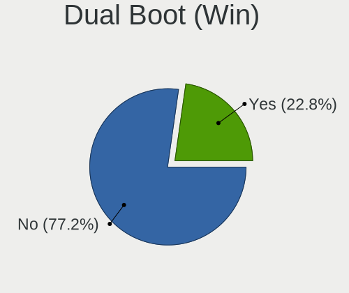
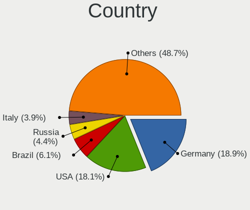
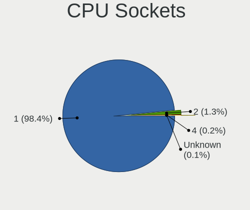
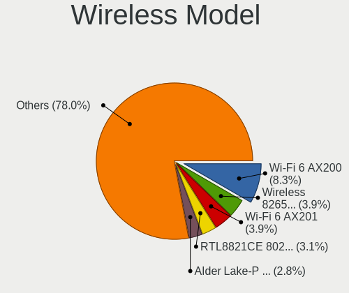
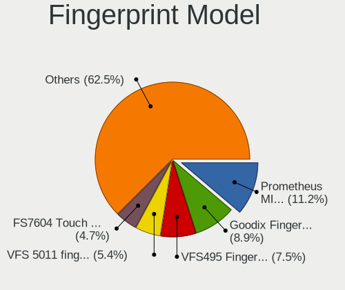

openSUSE - Tested Hardware & Statistics
---------------------------------------

A project to collect tested hardware configurations for openSUSE.

Anyone can contribute to this report by the [hw-probe](https://github.com/linuxhw/hw-probe) tool:

    sudo -E hw-probe -all -upload

Please contribute! Especially if your hardware is rare.

This is a report for all computer types. See also reports for [desktops](/Dist/openSUSE/Desktop/README.md) and [notebooks](/Dist/openSUSE/Notebook/README.md).

Contents
--------

* [ Test Cases ](#test-cases)

* [ System ](#system)
  - [ OS                       ](#os)
  - [ OS Family                ](#os-family)
  - [ Kernel                   ](#kernel)
  - [ Kernel Family            ](#kernel-family)
  - [ Kernel Major Ver.        ](#kernel-major-ver)
  - [ Arch                     ](#arch)
  - [ DE                       ](#de)
  - [ Display Server           ](#display-server)
  - [ Display Manager          ](#display-manager)
  - [ OS Lang                  ](#os-lang)
  - [ Boot Mode                ](#boot-mode)
  - [ Filesystem               ](#filesystem)
  - [ Part. scheme             ](#part-scheme)
  - [ Dual Boot with Linux/BSD ](#dual-boot-with-linuxbsd)
  - [ Dual Boot (Win)          ](#dual-boot-win)

* [ Board ](#board)
  - [ Vendor                   ](#vendor)
  - [ Model                    ](#model)
  - [ Model Family             ](#model-family)
  - [ MFG Year                 ](#mfg-year)
  - [ Form Factor              ](#form-factor)
  - [ Secure Boot              ](#secure-boot)
  - [ Coreboot                 ](#coreboot)
  - [ RAM Size                 ](#ram-size)
  - [ RAM Used                 ](#ram-used)
  - [ Total Drives             ](#total-drives)
  - [ Has CD-ROM               ](#has-cd-rom)
  - [ Has Ethernet             ](#has-ethernet)
  - [ Has WiFi                 ](#has-wifi)
  - [ Has Bluetooth            ](#has-bluetooth)

* [ Location ](#location)
  - [ Country                  ](#country)
  - [ City                     ](#city)

* [ Drives ](#drives)
  - [ Drive Vendor             ](#drive-vendor)
  - [ Drive Model              ](#drive-model)
  - [ HDD Vendor               ](#hdd-vendor)
  - [ SSD Vendor               ](#ssd-vendor)
  - [ Drive Kind               ](#drive-kind)
  - [ Drive Connector          ](#drive-connector)
  - [ Drive Size               ](#drive-size)
  - [ Space Total              ](#space-total)
  - [ Space Used               ](#space-used)
  - [ Malfunc. Drives          ](#malfunc-drives)
  - [ Malfunc. Drive Vendor    ](#malfunc-drive-vendor)
  - [ Malfunc. HDD Vendor      ](#malfunc-hdd-vendor)
  - [ Malfunc. Drive Kind      ](#malfunc-drive-kind)
  - [ Failed Drives            ](#failed-drives)
  - [ Failed Drive Vendor      ](#failed-drive-vendor)
  - [ Drive Status             ](#drive-status)

* [ Storage controller ](#storage-controller)
  - [ Storage Vendor           ](#storage-vendor)
  - [ Storage Model            ](#storage-model)
  - [ Storage Kind             ](#storage-kind)

* [ Processor ](#processor)
  - [ CPU Vendor               ](#cpu-vendor)
  - [ CPU Model                ](#cpu-model)
  - [ CPU Model Family         ](#cpu-model-family)
  - [ CPU Cores                ](#cpu-cores)
  - [ CPU Sockets              ](#cpu-sockets)
  - [ CPU Threads              ](#cpu-threads)
  - [ CPU Op-Modes             ](#cpu-op-modes)
  - [ CPU Microcode            ](#cpu-microcode)
  - [ CPU Microarch            ](#cpu-microarch)

* [ Graphics ](#graphics)
  - [ GPU Vendor               ](#gpu-vendor)
  - [ GPU Model                ](#gpu-model)
  - [ GPU Combo                ](#gpu-combo)
  - [ GPU Driver               ](#gpu-driver)
  - [ GPU Memory               ](#gpu-memory)

* [ Monitor ](#monitor)
  - [ Monitor Vendor           ](#monitor-vendor)
  - [ Monitor Model            ](#monitor-model)
  - [ Monitor Resolution       ](#monitor-resolution)
  - [ Monitor Diagonal         ](#monitor-diagonal)
  - [ Monitor Width            ](#monitor-width)
  - [ Aspect Ratio             ](#aspect-ratio)
  - [ Monitor Area             ](#monitor-area)
  - [ Pixel Density            ](#pixel-density)
  - [ Multiple Monitors        ](#multiple-monitors)

* [ Network ](#network)
  - [ Net Controller Vendor    ](#net-controller-vendor)
  - [ Net Controller Model     ](#net-controller-model)
  - [ Wireless Vendor          ](#wireless-vendor)
  - [ Wireless Model           ](#wireless-model)
  - [ Ethernet Vendor          ](#ethernet-vendor)
  - [ Ethernet Model           ](#ethernet-model)
  - [ Net Controller Kind      ](#net-controller-kind)
  - [ Used Controller          ](#used-controller)
  - [ NICs                     ](#nics)
  - [ IPv6                     ](#ipv6)

* [ Bluetooth ](#bluetooth)
  - [ Bluetooth Vendor         ](#bluetooth-vendor)
  - [ Bluetooth Model          ](#bluetooth-model)

* [ Sound ](#sound)
  - [ Sound Vendor             ](#sound-vendor)
  - [ Sound Model              ](#sound-model)

* [ Memory ](#memory)
  - [ Memory Vendor            ](#memory-vendor)
  - [ Memory Model             ](#memory-model)
  - [ Memory Kind              ](#memory-kind)
  - [ Memory Form Factor       ](#memory-form-factor)
  - [ Memory Size              ](#memory-size)
  - [ Memory Speed             ](#memory-speed)

* [ Printers & scanners ](#printers--scanners)
  - [ Printer Vendor           ](#printer-vendor)
  - [ Printer Model            ](#printer-model)
  - [ Scanner Vendor           ](#scanner-vendor)
  - [ Scanner Model            ](#scanner-model)

* [ Camera ](#camera)
  - [ Camera Vendor            ](#camera-vendor)
  - [ Camera Model             ](#camera-model)

* [ Security ](#security)
  - [ Fingerprint Vendor       ](#fingerprint-vendor)
  - [ Fingerprint Model        ](#fingerprint-model)
  - [ Chipcard Vendor          ](#chipcard-vendor)
  - [ Chipcard Model           ](#chipcard-model)

* [ Unsupported ](#unsupported)
  - [ Unsupported Devices      ](#unsupported-devices)
  - [ Unsupported Device Types ](#unsupported-device-types)

Test Cases
----------

Total: 5388

| Vendor        | Model                       | Form-Factor | Probe                                                      | Date         |
|---------------|-----------------------------|-------------|------------------------------------------------------------|--------------|
| ASUSTek       | ASUS Vivobook Pro 15 N65... | Notebook    | [7b915687fc](https://linux-hardware.org/?probe=7b915687fc) | Jan 06, 2025 |
| ASUSTek       | ASUS Vivobook Pro 15 N65... | Notebook    | [6ccd45a853](https://linux-hardware.org/?probe=6ccd45a853) | Jan 06, 2025 |
| Medion        | S6445 MD61489               | Notebook    | [7b72635681](https://linux-hardware.org/?probe=7b72635681) | Jan 05, 2025 |
| Infinix       | YL51A5                      | Notebook    | [17846f874a](https://linux-hardware.org/?probe=17846f874a) | Jan 05, 2025 |
| Dell          | Precision 5570              | Notebook    | [f2f2ed487a](https://linux-hardware.org/?probe=f2f2ed487a) | Jan 05, 2025 |
| Dell          | Precision 5570              | Notebook    | [ac97f0b0c6](https://linux-hardware.org/?probe=ac97f0b0c6) | Jan 05, 2025 |
| ASRock        | A300M-STX                   | Desktop     | [7d00280570](https://linux-hardware.org/?probe=7d00280570) | Jan 04, 2025 |
| Gigabyte      | B450M DS3H WIFI-CF          | Desktop     | [03283c180b](https://linux-hardware.org/?probe=03283c180b) | Jan 04, 2025 |
| Dell          | Latitude 5290 2-in-1        | Tablet      | [20e6dc4833](https://linux-hardware.org/?probe=20e6dc4833) | Jan 03, 2025 |
| HP            | Spectre x360 Convertible    | Convertible | [b8ffaea3a9](https://linux-hardware.org/?probe=b8ffaea3a9) | Jan 03, 2025 |
| ASUSTek       | TUF Gaming FX505GT_FX505... | Notebook    | [4690fd028c](https://linux-hardware.org/?probe=4690fd028c) | Jan 01, 2025 |
| Gigabyte      | B450 AORUS ELITE            | Desktop     | [896517452f](https://linux-hardware.org/?probe=896517452f) | Jan 01, 2025 |
| MSI           | Summit A16 AI+ A3HMTG       | Notebook    | [b064d5d8aa](https://linux-hardware.org/?probe=b064d5d8aa) | Jan 01, 2025 |
| Lenovo        | G570 4334                   | Notebook    | [3348b2741c](https://linux-hardware.org/?probe=3348b2741c) | Dec 30, 2024 |
| Lenovo        | ThinkBook 15 G2 ARE 20VG    | Notebook    | [79ccf16681](https://linux-hardware.org/?probe=79ccf16681) | Dec 30, 2024 |
| Lenovo        | G570 4334                   | Notebook    | [e3535c8fe8](https://linux-hardware.org/?probe=e3535c8fe8) | Dec 30, 2024 |
| Lenovo        | ThinkPad SL 2746EHG         | Notebook    | [c058e70d59](https://linux-hardware.org/?probe=c058e70d59) | Dec 30, 2024 |
| HP            | Laptop 17-cp0xxx            | Notebook    | [008153aaec](https://linux-hardware.org/?probe=008153aaec) | Dec 30, 2024 |
| Biostar       | X570GT8                     | Desktop     | [d6d1c90108](https://linux-hardware.org/?probe=d6d1c90108) | Dec 30, 2024 |
| ASUSTek       | X751SA                      | Notebook    | [11d8d9b891](https://linux-hardware.org/?probe=11d8d9b891) | Dec 30, 2024 |
| MSI           | PRO Z790-S WIFI             | Desktop     | [45bb9b901a](https://linux-hardware.org/?probe=45bb9b901a) | Dec 29, 2024 |
| ASUSTek       | ROG STRIX Z690-F GAMING ... | Desktop     | [118dcfe37e](https://linux-hardware.org/?probe=118dcfe37e) | Dec 29, 2024 |
| Acer          | Aspire A315-44P             | Notebook    | [cb17e760e0](https://linux-hardware.org/?probe=cb17e760e0) | Dec 29, 2024 |
| HP            | EliteBook 8470p             | Notebook    | [7eb67d9141](https://linux-hardware.org/?probe=7eb67d9141) | Dec 29, 2024 |
| ASUSTek       | X751SA                      | Notebook    | [2f216406f5](https://linux-hardware.org/?probe=2f216406f5) | Dec 28, 2024 |
| Lenovo        | IdeaPad 320-15AST 80XV      | Notebook    | [ee6916b202](https://linux-hardware.org/?probe=ee6916b202) | Dec 28, 2024 |
| ASUSTek       | ROG STRIX X570-I GAMING     | Desktop     | [2d8791ccc2](https://linux-hardware.org/?probe=2d8791ccc2) | Dec 28, 2024 |
| HP            | Pavilion x360 Convertibl... | Convertible | [4f7242ef2d](https://linux-hardware.org/?probe=4f7242ef2d) | Dec 27, 2024 |
| Toshiba       | Satellite Pro L70-A         | Notebook    | [ea36b0013b](https://linux-hardware.org/?probe=ea36b0013b) | Dec 27, 2024 |
| Lenovo        | ThinkPad T16 Gen 3 21MN0... | Notebook    | [de8cfa5271](https://linux-hardware.org/?probe=de8cfa5271) | Dec 26, 2024 |
| HP            | EliteBook 840 G6            | Notebook    | [00cc148a0c](https://linux-hardware.org/?probe=00cc148a0c) | Dec 25, 2024 |
| HP            | EliteBook 840 G6            | Notebook    | [42a4a782de](https://linux-hardware.org/?probe=42a4a782de) | Dec 25, 2024 |
| Dell          | Inspiron 5748               | Notebook    | [b2fd13a760](https://linux-hardware.org/?probe=b2fd13a760) | Dec 25, 2024 |
| Dell          | Latitude E5550              | Notebook    | [2512980572](https://linux-hardware.org/?probe=2512980572) | Dec 25, 2024 |
| Lenovo        | ThinkBook 14 G6 IRL 21KG    | Notebook    | [bc6c76d79b](https://linux-hardware.org/?probe=bc6c76d79b) | Dec 25, 2024 |
| HP            | 2AF7                        | Desktop     | [86175be1e4](https://linux-hardware.org/?probe=86175be1e4) | Dec 25, 2024 |
| Lenovo        | ThinkPad T480 20L6SA0X00    | Notebook    | [89c4986258](https://linux-hardware.org/?probe=89c4986258) | Dec 25, 2024 |
| HP            | 2B3E                        | All in one  | [72fddcce30](https://linux-hardware.org/?probe=72fddcce30) | Dec 25, 2024 |
| HP            | 2B3E                        | All in one  | [3ee1db7559](https://linux-hardware.org/?probe=3ee1db7559) | Dec 25, 2024 |
| ASUSTek       | P5QPL-AM                    | Desktop     | [c3df99294f](https://linux-hardware.org/?probe=c3df99294f) | Dec 25, 2024 |
| Gigabyte      | GA-78LMT-USB3 x.x           | Desktop     | [2e5a903c16](https://linux-hardware.org/?probe=2e5a903c16) | Dec 24, 2024 |
| ASRock        | B250M-HDV                   | Desktop     | [3b8f677d39](https://linux-hardware.org/?probe=3b8f677d39) | Dec 24, 2024 |
| ASUSTek       | PRIME B360M-K               | Desktop     | [cfa9fb9aba](https://linux-hardware.org/?probe=cfa9fb9aba) | Dec 24, 2024 |
| ASUSTek       | P5QPL-AM                    | Desktop     | [9ae485f387](https://linux-hardware.org/?probe=9ae485f387) | Dec 24, 2024 |
| Lenovo        | ThinkPad T14s Gen 1 20UH... | Notebook    | [482027069e](https://linux-hardware.org/?probe=482027069e) | Dec 23, 2024 |
| Dell          | 08NPPY A00                  | Desktop     | [f28b57cc48](https://linux-hardware.org/?probe=f28b57cc48) | Dec 23, 2024 |
| Dell          | 08NPPY A00                  | Desktop     | [80ca496f75](https://linux-hardware.org/?probe=80ca496f75) | Dec 23, 2024 |
| HONOR         | BRI-XX                      | Notebook    | [ae2d835788](https://linux-hardware.org/?probe=ae2d835788) | Dec 22, 2024 |
| HP            | ZBook Fury 16 G9 Mobile ... | Notebook    | [bb06bc1384](https://linux-hardware.org/?probe=bb06bc1384) | Dec 22, 2024 |
| ASUSTek       | PRIME Z270-A                | Desktop     | [fcefd0ff40](https://linux-hardware.org/?probe=fcefd0ff40) | Dec 21, 2024 |
| HP            | ProBook 445R G6             | Notebook    | [6a6dd0b802](https://linux-hardware.org/?probe=6a6dd0b802) | Dec 21, 2024 |
| HP            | 81C5 MVB                    | Desktop     | [77cb2466d4](https://linux-hardware.org/?probe=77cb2466d4) | Dec 21, 2024 |
| Lenovo        | Legion 9 16IRX9 83G0        | Notebook    | [96010200a2](https://linux-hardware.org/?probe=96010200a2) | Dec 20, 2024 |
| Lenovo        | Legion 9 16IRX9 83G0        | Notebook    | [334c2447f9](https://linux-hardware.org/?probe=334c2447f9) | Dec 20, 2024 |
| Apple         | Mac-77EB7D7DAF985301 iMa... | All in one  | [efee186dc5](https://linux-hardware.org/?probe=efee186dc5) | Dec 19, 2024 |
| Acer          | Swift SF314-54G             | Notebook    | [3f7732cb40](https://linux-hardware.org/?probe=3f7732cb40) | Dec 19, 2024 |
| Acer          | Swift SF314-54G             | Notebook    | [c2b2b94ff9](https://linux-hardware.org/?probe=c2b2b94ff9) | Dec 19, 2024 |
| Getac         | K120G3                      | Tablet      | [cbcde33e6c](https://linux-hardware.org/?probe=cbcde33e6c) | Dec 19, 2024 |
| Lenovo        | ThinkServer TS140           | Desktop     | [8d0ead0400](https://linux-hardware.org/?probe=8d0ead0400) | Dec 18, 2024 |
| ASRock        | B450M-HDV R4.0              | Desktop     | [12470525ef](https://linux-hardware.org/?probe=12470525ef) | Dec 18, 2024 |
| ASUSTek       | VivoBook_ASUSLaptop X513... | Notebook    | [7ce6a920fc](https://linux-hardware.org/?probe=7ce6a920fc) | Dec 17, 2024 |
| Unknown       | Unknown                     | Desktop     | [0653c463df](https://linux-hardware.org/?probe=0653c463df) | Dec 17, 2024 |
| ASRock        | Z68 Pro3                    | Desktop     | [55f5b867fc](https://linux-hardware.org/?probe=55f5b867fc) | Dec 16, 2024 |
| MSI           | PRO Z690-A DDR4             | Desktop     | [c2fe7d3fe9](https://linux-hardware.org/?probe=c2fe7d3fe9) | Dec 16, 2024 |
| Dell          | Inspiron 15 3525            | Notebook    | [53c39cb514](https://linux-hardware.org/?probe=53c39cb514) | Dec 15, 2024 |
| ASRock        | B550 PG Riptide             | Desktop     | [100f0afa3e](https://linux-hardware.org/?probe=100f0afa3e) | Dec 15, 2024 |
| Toshiba       | Satellite U400              | Notebook    | [c38b4b8f12](https://linux-hardware.org/?probe=c38b4b8f12) | Dec 15, 2024 |
| Toshiba       | Satellite U400              | Notebook    | [0df632ce9a](https://linux-hardware.org/?probe=0df632ce9a) | Dec 15, 2024 |
| Dell          | Latitude 7400               | Notebook    | [79148dd5e2](https://linux-hardware.org/?probe=79148dd5e2) | Dec 14, 2024 |
| Gigabyte      | B650 EAGLE                  | Desktop     | [f8bb6c67f0](https://linux-hardware.org/?probe=f8bb6c67f0) | Dec 14, 2024 |
| Lenovo        | IdeaPad Slim 3 15ABR8 82... | Notebook    | [2ff0334ff1](https://linux-hardware.org/?probe=2ff0334ff1) | Dec 14, 2024 |
| ASUSTek       | VivoBook_ASUSLaptop X540... | Notebook    | [188828cb26](https://linux-hardware.org/?probe=188828cb26) | Dec 14, 2024 |
| ASRock        | A320M-HD                    | Desktop     | [4f161aae09](https://linux-hardware.org/?probe=4f161aae09) | Dec 13, 2024 |
| Dell          | Latitude 7490               | Notebook    | [94a563e506](https://linux-hardware.org/?probe=94a563e506) | Dec 13, 2024 |
| Razer         | Blade                       | Notebook    | [e4e19a2914](https://linux-hardware.org/?probe=e4e19a2914) | Dec 13, 2024 |
| ASRock        | Z68 Pro3                    | Desktop     | [a7b8905934](https://linux-hardware.org/?probe=a7b8905934) | Dec 13, 2024 |
| Lenovo        | ThinkPad SL 2746EHG         | Notebook    | [af38d9b12e](https://linux-hardware.org/?probe=af38d9b12e) | Dec 12, 2024 |
| HP            | EliteBook 2560p             | Notebook    | [8638d65417](https://linux-hardware.org/?probe=8638d65417) | Dec 12, 2024 |
| Dell          | Latitude 7280               | Notebook    | [71afb40829](https://linux-hardware.org/?probe=71afb40829) | Dec 12, 2024 |
| Dell          | Latitude 7280               | Notebook    | [811c5c9b51](https://linux-hardware.org/?probe=811c5c9b51) | Dec 12, 2024 |
| Dell          | Latitude 5500               | Notebook    | [089651bb7e](https://linux-hardware.org/?probe=089651bb7e) | Dec 12, 2024 |
| ASUSTek       | M3N-HT DELUXE               | Desktop     | [85960cdc58](https://linux-hardware.org/?probe=85960cdc58) | Dec 12, 2024 |
| ASUSTek       | X556UA                      | Notebook    | [12e9edd8a6](https://linux-hardware.org/?probe=12e9edd8a6) | Dec 11, 2024 |
| Lenovo        | ThinkPad T480 20L6S68A00    | Notebook    | [562b867ec6](https://linux-hardware.org/?probe=562b867ec6) | Dec 11, 2024 |
| Infinix       | ZERO BOOK 13                | Notebook    | [fa51c92790](https://linux-hardware.org/?probe=fa51c92790) | Dec 11, 2024 |
| Gigabyte      | B550 AORUS PRO AC           | Desktop     | [9d331af926](https://linux-hardware.org/?probe=9d331af926) | Dec 11, 2024 |
| HP            | Laptop 15-gw0xxx            | Notebook    | [cbf590d898](https://linux-hardware.org/?probe=cbf590d898) | Dec 11, 2024 |
| HP            | Laptop 15-gw0xxx            | Notebook    | [fc18ca43fa](https://linux-hardware.org/?probe=fc18ca43fa) | Dec 11, 2024 |
| HP            | 2AF7                        | Desktop     | [7779a1d0a0](https://linux-hardware.org/?probe=7779a1d0a0) | Dec 11, 2024 |
| Lenovo        | Legion 7 16IRX9 83FD        | Notebook    | [100ba1f308](https://linux-hardware.org/?probe=100ba1f308) | Dec 10, 2024 |
| Lenovo        | Y520-15IKBN 80WK            | Notebook    | [23c377735b](https://linux-hardware.org/?probe=23c377735b) | Dec 09, 2024 |
| Dell          | 0WV424 A00                  | Desktop     | [ca372688a2](https://linux-hardware.org/?probe=ca372688a2) | Dec 09, 2024 |
| Dell          | Latitude 7400               | Notebook    | [77befeb4ea](https://linux-hardware.org/?probe=77befeb4ea) | Dec 09, 2024 |
| ASUSTek       | ASUS TUF Gaming A15 FA50... | Notebook    | [dc2afedb8a](https://linux-hardware.org/?probe=dc2afedb8a) | Dec 08, 2024 |
| ASUSTek       | ProArt X670E-CREATOR WIF... | Desktop     | [26cbfb371f](https://linux-hardware.org/?probe=26cbfb371f) | Dec 08, 2024 |
| MSI           | P67A-C45                    | Desktop     | [7ef8acc2eb](https://linux-hardware.org/?probe=7ef8acc2eb) | Dec 07, 2024 |
| Intel         | DG41MJ AAE54659-206         | Desktop     | [3db9ae5cb9](https://linux-hardware.org/?probe=3db9ae5cb9) | Dec 07, 2024 |
| Dell          | 0R790T A00                  | Desktop     | [544de4f6e5](https://linux-hardware.org/?probe=544de4f6e5) | Dec 07, 2024 |
| Dell          | Inspiron 15-3567            | Notebook    | [31df2faf94](https://linux-hardware.org/?probe=31df2faf94) | Dec 07, 2024 |
| HP            | EliteBook 845 G8 Noteboo... | Notebook    | [a81500a8d6](https://linux-hardware.org/?probe=a81500a8d6) | Dec 06, 2024 |
| Acer          | Aspire E5-576G              | Notebook    | [aeb8a7cb0e](https://linux-hardware.org/?probe=aeb8a7cb0e) | Dec 05, 2024 |
| Dell          | XPS 13 9310                 | Notebook    | [cf504cfd50](https://linux-hardware.org/?probe=cf504cfd50) | Dec 05, 2024 |
| Toshiba       | Satellite S55-C             | Notebook    | [d7586c9caa](https://linux-hardware.org/?probe=d7586c9caa) | Dec 05, 2024 |
| Dell          | Inspiron 15-3567            | Notebook    | [8abc9fa20f](https://linux-hardware.org/?probe=8abc9fa20f) | Dec 05, 2024 |
| Apple         | MacBookPro12,1              | Notebook    | [efe73932c5](https://linux-hardware.org/?probe=efe73932c5) | Dec 04, 2024 |
| Acer          | Aspire One 522              | Notebook    | [6890064fd0](https://linux-hardware.org/?probe=6890064fd0) | Dec 04, 2024 |
| HP            | ProBook x360 435 G8 Note... | Convertible | [65653915c4](https://linux-hardware.org/?probe=65653915c4) | Dec 04, 2024 |
| HP            | ENVY x360 2-in-1 Laptop ... | Convertible | [22d0b65b43](https://linux-hardware.org/?probe=22d0b65b43) | Dec 04, 2024 |
| HP            | 81C5 MVB                    | Desktop     | [d7883f568b](https://linux-hardware.org/?probe=d7883f568b) | Dec 04, 2024 |
| HP            | ENVY x360 2-in-1 Laptop ... | Convertible | [a48146faba](https://linux-hardware.org/?probe=a48146faba) | Dec 04, 2024 |
| Dell          | Inspiron 3583               | Notebook    | [21db2dc4ce](https://linux-hardware.org/?probe=21db2dc4ce) | Dec 03, 2024 |
| Acer          | Aspire One 522              | Notebook    | [0fddde7f57](https://linux-hardware.org/?probe=0fddde7f57) | Dec 03, 2024 |
| Gigabyte      | Z490 UD                     | Desktop     | [93ed7e1b8b](https://linux-hardware.org/?probe=93ed7e1b8b) | Dec 03, 2024 |
| ASUSTek       | TUF Gaming FX505DT_FX505... | Notebook    | [010553b978](https://linux-hardware.org/?probe=010553b978) | Dec 03, 2024 |
| Lenovo        | Legion 5 Pro 16ITH6H 82J... | Notebook    | [215d0f836c](https://linux-hardware.org/?probe=215d0f836c) | Dec 02, 2024 |
| Gigabyte      | X870E AORUS ELITE WIFI7     | Desktop     | [b2a59cd3d4](https://linux-hardware.org/?probe=b2a59cd3d4) | Dec 01, 2024 |
| ASUSTek       | TUF Gaming FX505DT_FX505... | Notebook    | [ce23ae6c58](https://linux-hardware.org/?probe=ce23ae6c58) | Dec 01, 2024 |
| MSI           | A88X-G43                    | Desktop     | [ed81ddd35f](https://linux-hardware.org/?probe=ed81ddd35f) | Dec 01, 2024 |
| Lenovo        | ThinkPad P52 20MAS25B1F     | Notebook    | [03a115af9d](https://linux-hardware.org/?probe=03a115af9d) | Dec 01, 2024 |
| ASRock        | AB350M Pro4                 | Desktop     | [a798b1b4e5](https://linux-hardware.org/?probe=a798b1b4e5) | Dec 01, 2024 |
| ASRock        | B250M-HDV                   | Desktop     | [e9df8950aa](https://linux-hardware.org/?probe=e9df8950aa) | Nov 30, 2024 |
| Gigabyte      | Z390 GAMING X-CF            | Desktop     | [dac231b470](https://linux-hardware.org/?probe=dac231b470) | Nov 30, 2024 |
| Lenovo        | ThinkPad X1 Yoga 4th 20Q... | Convertible | [025c1eb95c](https://linux-hardware.org/?probe=025c1eb95c) | Nov 30, 2024 |
| HP            | ProBook x360 435 G8 Note... | Convertible | [fe1aa7683d](https://linux-hardware.org/?probe=fe1aa7683d) | Nov 29, 2024 |
| Lenovo        | ThinkPad X1 Yoga 4th 20Q... | Convertible | [471b772411](https://linux-hardware.org/?probe=471b772411) | Nov 28, 2024 |
| Lenovo        | ThinkPad E14 Gen 2 20T7S... | Notebook    | [eedc1ae95c](https://linux-hardware.org/?probe=eedc1ae95c) | Nov 28, 2024 |
| Lenovo        | ThinkPad T480 20L6SK2C00    | Notebook    | [1e4ff70d80](https://linux-hardware.org/?probe=1e4ff70d80) | Nov 28, 2024 |
| Lenovo        | ThinkPad T480 20L6SK2C00    | Notebook    | [985704d466](https://linux-hardware.org/?probe=985704d466) | Nov 28, 2024 |
| Lenovo        | ThinkPad T450s 20BXCTO1W... | Notebook    | [245f980110](https://linux-hardware.org/?probe=245f980110) | Nov 27, 2024 |
| Fujitsu       | D3230-A1 S26361-D3230-A1    | Desktop     | [f8b592b091](https://linux-hardware.org/?probe=f8b592b091) | Nov 27, 2024 |
| ASUSTek       | ROG STRIX TRX40-XE GAMIN... | Desktop     | [3198f2c816](https://linux-hardware.org/?probe=3198f2c816) | Nov 27, 2024 |
| HP            | 0B4Ch D                     | Desktop     | [34657f16df](https://linux-hardware.org/?probe=34657f16df) | Nov 27, 2024 |
| Lenovo        | ThinkPad T16 Gen 3 21MN0... | Notebook    | [a0bb7e53d0](https://linux-hardware.org/?probe=a0bb7e53d0) | Nov 27, 2024 |
| MSI           | B450-A PRO MAX              | Desktop     | [c8083abe20](https://linux-hardware.org/?probe=c8083abe20) | Nov 27, 2024 |
| Tactus        | GeoFlex 110                 | Convertible | [9854c77a29](https://linux-hardware.org/?probe=9854c77a29) | Nov 25, 2024 |
| Microsoft     | Surface Pro 4               | Tablet      | [7d81f331c5](https://linux-hardware.org/?probe=7d81f331c5) | Nov 25, 2024 |
| ASRock        | X570 Taichi                 | Desktop     | [dd0b5e271f](https://linux-hardware.org/?probe=dd0b5e271f) | Nov 25, 2024 |
| Lenovo        | MIIX 510-12ISK 80U1         | Tablet      | [f5a5189e2a](https://linux-hardware.org/?probe=f5a5189e2a) | Nov 25, 2024 |
| Gigabyte      | B450M DS3H-CF               | Desktop     | [d4f6c4da0e](https://linux-hardware.org/?probe=d4f6c4da0e) | Nov 24, 2024 |
| Tactus        | GeoFlex 110                 | Convertible | [37f6c2cf53](https://linux-hardware.org/?probe=37f6c2cf53) | Nov 24, 2024 |
| Razer         | Blade                       | Notebook    | [e04499fb11](https://linux-hardware.org/?probe=e04499fb11) | Nov 24, 2024 |
| Apple         | Mac-031AEE4D24BFF0B1 Mac... | Mini pc     | [a883b65a14](https://linux-hardware.org/?probe=a883b65a14) | Nov 23, 2024 |
| Shenzhen M... | F7BRC                       | Desktop     | [d4af330a47](https://linux-hardware.org/?probe=d4af330a47) | Nov 23, 2024 |
| ASUSTek       | GL752VW                     | Notebook    | [4df66d6d25](https://linux-hardware.org/?probe=4df66d6d25) | Nov 23, 2024 |
| Philco        | DTC-A55                     | Desktop     | [18420c562a](https://linux-hardware.org/?probe=18420c562a) | Nov 23, 2024 |
| MSI           | B360 GAMING PRO CARBON      | Desktop     | [30f00266c7](https://linux-hardware.org/?probe=30f00266c7) | Nov 23, 2024 |
| MSI           | PRO Z690-A DDR4             | Desktop     | [e102d2434c](https://linux-hardware.org/?probe=e102d2434c) | Nov 22, 2024 |
| Gigabyte      | B550 AORUS ELITE AX         | Desktop     | [170159c12d](https://linux-hardware.org/?probe=170159c12d) | Nov 22, 2024 |
| ASRock        | P67 Professional            | Desktop     | [4c90fc0d19](https://linux-hardware.org/?probe=4c90fc0d19) | Nov 22, 2024 |
| Acer          | Aspire A315-56              | Notebook    | [d52da57ed4](https://linux-hardware.org/?probe=d52da57ed4) | Nov 22, 2024 |
| Acer          | Aspire A315-56              | Notebook    | [8bcaa93bb4](https://linux-hardware.org/?probe=8bcaa93bb4) | Nov 22, 2024 |
| AOpen         | i915GMt-FSA 918ET10I9C0     | Desktop     | [92afb6b126](https://linux-hardware.org/?probe=92afb6b126) | Nov 22, 2024 |
| Lenovo        | ThinkBook 14 G3 ACL 21A2    | Notebook    | [ee736ff9b2](https://linux-hardware.org/?probe=ee736ff9b2) | Nov 21, 2024 |
| Toshiba       | Satellite Pro C50-A-1L6     | Notebook    | [aef1b82a78](https://linux-hardware.org/?probe=aef1b82a78) | Nov 20, 2024 |
| Acer          | Aspire ES1-731              | Notebook    | [1679b3abd5](https://linux-hardware.org/?probe=1679b3abd5) | Nov 20, 2024 |
| Infinix       | Y4 Max                      | Notebook    | [6d4386c347](https://linux-hardware.org/?probe=6d4386c347) | Nov 19, 2024 |
| HP            | 15                          | Notebook    | [5eaa43788f](https://linux-hardware.org/?probe=5eaa43788f) | Nov 18, 2024 |
| HP            | EliteBook 840 G1            | Notebook    | [775a4e3d49](https://linux-hardware.org/?probe=775a4e3d49) | Nov 17, 2024 |
| HP            | EliteBook 840 G1            | Notebook    | [cd9cf7bf34](https://linux-hardware.org/?probe=cd9cf7bf34) | Nov 17, 2024 |
| MSI           | B350M GAMING PRO            | Desktop     | [670a45ebbf](https://linux-hardware.org/?probe=670a45ebbf) | Nov 17, 2024 |
| Lenovo        | ThinkPad E16 Gen 1 21JNS... | Notebook    | [fd6a5da806](https://linux-hardware.org/?probe=fd6a5da806) | Nov 17, 2024 |
| ASUSTek       | P8Z77-V LX2                 | Desktop     | [5d4b0318a0](https://linux-hardware.org/?probe=5d4b0318a0) | Nov 16, 2024 |
| Acer          | Aspire A317-54              | Notebook    | [bf63a85231](https://linux-hardware.org/?probe=bf63a85231) | Nov 16, 2024 |
| MSI           | H510M-A PRO                 | Desktop     | [1391f30b16](https://linux-hardware.org/?probe=1391f30b16) | Nov 16, 2024 |
| HP            | Elite x2 G4                 | Tablet      | [c43e6e357d](https://linux-hardware.org/?probe=c43e6e357d) | Nov 15, 2024 |
| Medion        | E15433                      | Notebook    | [d8fa665bcd](https://linux-hardware.org/?probe=d8fa665bcd) | Nov 15, 2024 |
| HP            | 8768 A                      | Desktop     | [41bc97fb75](https://linux-hardware.org/?probe=41bc97fb75) | Nov 14, 2024 |
| ASUSTek       | PRIME X670-P WIFI           | Desktop     | [82cde68696](https://linux-hardware.org/?probe=82cde68696) | Nov 14, 2024 |
| Lenovo        | ThinkPad L450 20DT0003MH    | Notebook    | [64603771ce](https://linux-hardware.org/?probe=64603771ce) | Nov 14, 2024 |
| HP            | Pavilion Laptop 15-cw1xx... | Notebook    | [3c549a908f](https://linux-hardware.org/?probe=3c549a908f) | Nov 14, 2024 |
| Gigabyte      | P31-ES3G                    | Desktop     | [1e5662dbe7](https://linux-hardware.org/?probe=1e5662dbe7) | Nov 14, 2024 |
| Positivo      | C8256AI-14                  | Notebook    | [509c3d8d69](https://linux-hardware.org/?probe=509c3d8d69) | Nov 14, 2024 |
| Gigabyte      | Z170X-Gaming 5              | Desktop     | [329a323c09](https://linux-hardware.org/?probe=329a323c09) | Nov 13, 2024 |
| HP            | EliteBook 850 G5            | Notebook    | [3c3ef88749](https://linux-hardware.org/?probe=3c3ef88749) | Nov 13, 2024 |
| Gigabyte      | Z97-HD3                     | Desktop     | [37416e4e8a](https://linux-hardware.org/?probe=37416e4e8a) | Nov 12, 2024 |
| Gigabyte      | B550 AORUS ELITE AX V2      | Desktop     | [8b51722faa](https://linux-hardware.org/?probe=8b51722faa) | Nov 12, 2024 |
| Unknown       | Unknown                     | Desktop     | [e4bf1d127b](https://linux-hardware.org/?probe=e4bf1d127b) | Nov 12, 2024 |
| Lenovo        | ThinkPad T480 20L6S68A00    | Notebook    | [5dd8147a6b](https://linux-hardware.org/?probe=5dd8147a6b) | Nov 12, 2024 |
| HP            | Laptop 15s-eq1xxx           | Notebook    | [2ca5d70008](https://linux-hardware.org/?probe=2ca5d70008) | Nov 12, 2024 |
| Schenker      | XMG PRO 16 Studio (M24)     | Notebook    | [3863c274d8](https://linux-hardware.org/?probe=3863c274d8) | Nov 12, 2024 |
| Schenker      | XMG PRO 16 Studio (M24)     | Notebook    | [ecdba16ed1](https://linux-hardware.org/?probe=ecdba16ed1) | Nov 12, 2024 |
| Medion        | E15433                      | Notebook    | [05ec29cd01](https://linux-hardware.org/?probe=05ec29cd01) | Nov 11, 2024 |
| Lenovo        | Yoga Pro 14s ASP9 83HN      | Notebook    | [59d0ece152](https://linux-hardware.org/?probe=59d0ece152) | Nov 11, 2024 |
| Foxconn       | 2AB1                        | Desktop     | [c66759c25e](https://linux-hardware.org/?probe=c66759c25e) | Nov 11, 2024 |
| ASUSTek       | T304UA                      | Tablet      | [ab766b51c1](https://linux-hardware.org/?probe=ab766b51c1) | Nov 11, 2024 |
| Lenovo        | ThinkPad E16 Gen 1 21JNS... | Notebook    | [5695b15dac](https://linux-hardware.org/?probe=5695b15dac) | Nov 10, 2024 |
| ASRock        | X570 Phantom Gaming 4       | Desktop     | [698fca72c2](https://linux-hardware.org/?probe=698fca72c2) | Nov 10, 2024 |
| ASRock        | X570 Steel Legend           | Desktop     | [8da35569fd](https://linux-hardware.org/?probe=8da35569fd) | Nov 10, 2024 |
| HP            | OMEN by Laptop 15-ce0xx     | Notebook    | [386e8d6e8c](https://linux-hardware.org/?probe=386e8d6e8c) | Nov 10, 2024 |
| ASRock        | X570 Phantom Gaming 4       | Desktop     | [06bcc1eecd](https://linux-hardware.org/?probe=06bcc1eecd) | Nov 10, 2024 |
| HP            | Pavilion Gaming Laptop 1... | Notebook    | [b5fbe784ce](https://linux-hardware.org/?probe=b5fbe784ce) | Nov 09, 2024 |
| Shenzhen M... | F7BSC                       | Mini pc     | [bae098eaab](https://linux-hardware.org/?probe=bae098eaab) | Nov 09, 2024 |
| MSI           | PRO Z690-A WIFI             | Desktop     | [4b69f7cf5d](https://linux-hardware.org/?probe=4b69f7cf5d) | Nov 08, 2024 |
| MSI           | PRO Z690-A WIFI             | Desktop     | [3e78ebd007](https://linux-hardware.org/?probe=3e78ebd007) | Nov 08, 2024 |
| Lenovo        | ThinkPad E15 Gen 3 20YHS... | Notebook    | [d808945b67](https://linux-hardware.org/?probe=d808945b67) | Nov 07, 2024 |
| Gigabyte      | Z270P-D3-CF                 | Desktop     | [eb136f4faf](https://linux-hardware.org/?probe=eb136f4faf) | Nov 07, 2024 |
| ASUSTek       | ASUS EXPERTBOOK B1400CEA... | Notebook    | [2c197b5dba](https://linux-hardware.org/?probe=2c197b5dba) | Nov 07, 2024 |
| Microsoft     | Surface Pro 4               | Tablet      | [8a9d41b766](https://linux-hardware.org/?probe=8a9d41b766) | Nov 07, 2024 |
| MSI           | Modern 15 B7M               | Notebook    | [50c6507ed8](https://linux-hardware.org/?probe=50c6507ed8) | Nov 07, 2024 |
| Gigabyte      | X470 AORUS ULTRA GAMING-... | Desktop     | [6dda519942](https://linux-hardware.org/?probe=6dda519942) | Nov 07, 2024 |
| TUXEDO        | InfinityBook Pro Intel G... | Notebook    | [6dab5c3afe](https://linux-hardware.org/?probe=6dab5c3afe) | Nov 06, 2024 |
| Gigabyte      | B450 I AORUS PRO WIFI-CF    | Desktop     | [7edfbce2b4](https://linux-hardware.org/?probe=7edfbce2b4) | Nov 05, 2024 |
| Acer          | Aspire AL14-51M             | Notebook    | [8ff6a7a1cd](https://linux-hardware.org/?probe=8ff6a7a1cd) | Nov 05, 2024 |
| Acer          | Aspire AL14-51M             | Notebook    | [50b858616d](https://linux-hardware.org/?probe=50b858616d) | Nov 05, 2024 |
| Toshiba       | Satellite C55D-A            | Notebook    | [aa4ba3a227](https://linux-hardware.org/?probe=aa4ba3a227) | Nov 04, 2024 |
| Pegatron      | A15                         | Notebook    | [537f5599a8](https://linux-hardware.org/?probe=537f5599a8) | Nov 04, 2024 |
| ASUSTek       | P8P67                       | Desktop     | [40c478d2f0](https://linux-hardware.org/?probe=40c478d2f0) | Nov 04, 2024 |
| ASUSTek       | P8P67                       | Desktop     | [f1d9d6265d](https://linux-hardware.org/?probe=f1d9d6265d) | Nov 04, 2024 |
| Acer          | Aspire A314-42P             | Notebook    | [3b985cceae](https://linux-hardware.org/?probe=3b985cceae) | Nov 03, 2024 |
| Lenovo        | ThinkBook 14s Yoga ITL 2... | Convertible | [36b6cc41d4](https://linux-hardware.org/?probe=36b6cc41d4) | Nov 02, 2024 |
| ASUSTek       | ROG Zephyrus G16 GU603VV... | Notebook    | [d0fedae2fd](https://linux-hardware.org/?probe=d0fedae2fd) | Nov 02, 2024 |
| Lenovo        | ThinkPad T440s 20ARA1BSP... | Notebook    | [cb3caddfea](https://linux-hardware.org/?probe=cb3caddfea) | Nov 01, 2024 |
| HONOR         | BMH-WDX9                    | Notebook    | [c500bafec7](https://linux-hardware.org/?probe=c500bafec7) | Nov 01, 2024 |
| Lenovo        | ThinkPad W520 4282A34       | Notebook    | [9c2a644e93](https://linux-hardware.org/?probe=9c2a644e93) | Nov 01, 2024 |
| ASUSTek       | P5Q PRO TURBO               | Desktop     | [776c21bef3](https://linux-hardware.org/?probe=776c21bef3) | Oct 30, 2024 |
| Lenovo        | Yoga Pro 14s ASP9 83HN      | Notebook    | [414716466d](https://linux-hardware.org/?probe=414716466d) | Oct 30, 2024 |
| GMKtec        | NucBox G3                   | Other       | [6b09095923](https://linux-hardware.org/?probe=6b09095923) | Oct 30, 2024 |
| Positivo      | DA18HV1 POSITIVO            | Desktop     | [c341735f00](https://linux-hardware.org/?probe=c341735f00) | Oct 29, 2024 |
| ASUSTek       | P8Z77-V LK                  | Desktop     | [5ef99b9e94](https://linux-hardware.org/?probe=5ef99b9e94) | Oct 29, 2024 |
| Lenovo        | 30C0 SDK0J40697 WIN 3305... | Desktop     | [fd756311de](https://linux-hardware.org/?probe=fd756311de) | Oct 29, 2024 |
| ASUSTek       | ROG STRIX B550-F GAMING ... | Desktop     | [b76f5739fb](https://linux-hardware.org/?probe=b76f5739fb) | Oct 29, 2024 |
| Apple         | Mac-031AEE4D24BFF0B1 Mac... | Mini pc     | [5b8fe403b8](https://linux-hardware.org/?probe=5b8fe403b8) | Oct 28, 2024 |
| Dell          | Inspiron 510m               | Notebook    | [5be797c401](https://linux-hardware.org/?probe=5be797c401) | Oct 28, 2024 |
| Dell          | Inspiron 510m               | Notebook    | [64a3a63aa6](https://linux-hardware.org/?probe=64a3a63aa6) | Oct 28, 2024 |
| MSI           | Katana 15 B13VEK            | Notebook    | [ad04a387f4](https://linux-hardware.org/?probe=ad04a387f4) | Oct 27, 2024 |
| IBM           | 4852E66 4852E66             | All in one  | [cbb7da4932](https://linux-hardware.org/?probe=cbb7da4932) | Oct 27, 2024 |
| HP            | 3397                        | Desktop     | [bff622bbdc](https://linux-hardware.org/?probe=bff622bbdc) | Oct 27, 2024 |
| Lenovo        | IdeaPad 330-15AST 81D6      | Notebook    | [b592bf3e31](https://linux-hardware.org/?probe=b592bf3e31) | Oct 26, 2024 |
| HP            | Notebook                    | Notebook    | [14ae1d2eda](https://linux-hardware.org/?probe=14ae1d2eda) | Oct 26, 2024 |
| HP            | Notebook                    | Notebook    | [f50f582dd0](https://linux-hardware.org/?probe=f50f582dd0) | Oct 26, 2024 |
| MSI           | PRO Z690-A DDR4             | Desktop     | [94a8b7f4b4](https://linux-hardware.org/?probe=94a8b7f4b4) | Oct 26, 2024 |
| Lenovo        | ThinkPad X240 20ALA0NCJP    | Notebook    | [da905b3fdf](https://linux-hardware.org/?probe=da905b3fdf) | Oct 25, 2024 |
| Alienware     | x17 R2                      | Notebook    | [ead78bb072](https://linux-hardware.org/?probe=ead78bb072) | Oct 24, 2024 |
| ASUSTek       | ROG STRIX B550-I GAMING     | Desktop     | [2eb1201de2](https://linux-hardware.org/?probe=2eb1201de2) | Oct 24, 2024 |
| ASUSTek       | ASUS EXPERTBOOK B1400CEA... | Notebook    | [c8c74572b4](https://linux-hardware.org/?probe=c8c74572b4) | Oct 24, 2024 |
| HP            | 15                          | Notebook    | [600bf00568](https://linux-hardware.org/?probe=600bf00568) | Oct 24, 2024 |
| ASUSTek       | PRIME Z790M-PLUS            | Desktop     | [33ef297188](https://linux-hardware.org/?probe=33ef297188) | Oct 24, 2024 |
| ASUSTek       | ROG STRIX B650E-E GAMING... | Desktop     | [61223757a1](https://linux-hardware.org/?probe=61223757a1) | Oct 23, 2024 |
| Lenovo        | Yoga 510-15ISK 80S8         | Convertible | [7d97b653a5](https://linux-hardware.org/?probe=7d97b653a5) | Oct 23, 2024 |
| Lenovo        | ThinkPad P14s Gen 5 AMD ... | Notebook    | [6771ee78ce](https://linux-hardware.org/?probe=6771ee78ce) | Oct 23, 2024 |
| Lenovo        | ThinkPad X240 20ALA0NCJP    | Notebook    | [ca3a28a903](https://linux-hardware.org/?probe=ca3a28a903) | Oct 23, 2024 |
| Google        | Candy                       | Notebook    | [2ee49236e0](https://linux-hardware.org/?probe=2ee49236e0) | Oct 23, 2024 |
| Lenovo        | IdeaPad 3 15ABA7 82RN       | Notebook    | [c393ac5f48](https://linux-hardware.org/?probe=c393ac5f48) | Oct 23, 2024 |
| ASUSTek       | Vivobook Go E1504GA_E150... | Notebook    | [a90ce8d899](https://linux-hardware.org/?probe=a90ce8d899) | Oct 23, 2024 |
| Alienware     | x17 R2                      | Notebook    | [9e6b5acd94](https://linux-hardware.org/?probe=9e6b5acd94) | Oct 22, 2024 |
| ASUSTek       | P8Z77-M PRO                 | Desktop     | [169807fa93](https://linux-hardware.org/?probe=169807fa93) | Oct 22, 2024 |
| ASUSTek       | PRIME B550M-A               | Desktop     | [12592d6d18](https://linux-hardware.org/?probe=12592d6d18) | Oct 21, 2024 |
| ASUSTek       | ROG STRIX B450-F GAMING     | Desktop     | [ff6ad443e3](https://linux-hardware.org/?probe=ff6ad443e3) | Oct 20, 2024 |
| Apple         | Mac-F65AE981FFA204ED Mac... | Mini pc     | [de0cb78647](https://linux-hardware.org/?probe=de0cb78647) | Oct 20, 2024 |
| ASUSTek       | ROG STRIX B450-F GAMING     | Desktop     | [d8ac94db45](https://linux-hardware.org/?probe=d8ac94db45) | Oct 20, 2024 |
| ASUSTek       | TUF Z390-PLUS GAMING        | Desktop     | [d9af644b1b](https://linux-hardware.org/?probe=d9af644b1b) | Oct 20, 2024 |
| HP            | Pavilion 17                 | Notebook    | [e9fa4efce7](https://linux-hardware.org/?probe=e9fa4efce7) | Oct 20, 2024 |
| Dell          | Latitude 5510               | Notebook    | [5b7ffc59c4](https://linux-hardware.org/?probe=5b7ffc59c4) | Oct 20, 2024 |
| Wortmann      | 1220717_1470362             | Notebook    | [079ab5b33d](https://linux-hardware.org/?probe=079ab5b33d) | Oct 20, 2024 |
| ASRock        | Z68 Pro3                    | Desktop     | [99b5479ffd](https://linux-hardware.org/?probe=99b5479ffd) | Oct 19, 2024 |
| Dell          | Vostro 15 3510              | Notebook    | [29c3d00679](https://linux-hardware.org/?probe=29c3d00679) | Oct 19, 2024 |
| HP            | 3031h                       | Desktop     | [4a1f4140dc](https://linux-hardware.org/?probe=4a1f4140dc) | Oct 19, 2024 |
| MSI           | X570-A PRO                  | Desktop     | [3afa118cca](https://linux-hardware.org/?probe=3afa118cca) | Oct 19, 2024 |
| MSI           | A68HM-E33 V2                | Desktop     | [dc035c1f73](https://linux-hardware.org/?probe=dc035c1f73) | Oct 18, 2024 |
| Acer          | Aspire E5-573               | Notebook    | [52f3006e15](https://linux-hardware.org/?probe=52f3006e15) | Oct 18, 2024 |
| Lenovo        | ThinkPad T14 Gen 1 20UES... | Notebook    | [db6240abe4](https://linux-hardware.org/?probe=db6240abe4) | Oct 18, 2024 |
| ASRock        | A320M Pro4-F                | Desktop     | [b1b3e21e4a](https://linux-hardware.org/?probe=b1b3e21e4a) | Oct 17, 2024 |
| Lenovo        | Yoga 520-14IKB 80YM         | Convertible | [122e1b0416](https://linux-hardware.org/?probe=122e1b0416) | Oct 17, 2024 |
| Lenovo        | ThinkPad T16 Gen 2 21HH0... | Notebook    | [8adcd5ebfb](https://linux-hardware.org/?probe=8adcd5ebfb) | Oct 16, 2024 |
| Lenovo        | ThinkPad T460 20FN003LGE    | Notebook    | [2ab3d1b003](https://linux-hardware.org/?probe=2ab3d1b003) | Oct 13, 2024 |
| MSI           | A88X-G43                    | Desktop     | [f2e61556e5](https://linux-hardware.org/?probe=f2e61556e5) | Oct 13, 2024 |
| Dell          | 08HPGT A01                  | Desktop     | [2d59485776](https://linux-hardware.org/?probe=2d59485776) | Oct 13, 2024 |
| HP            | Victus by Gaming Laptop ... | Notebook    | [22f5d5656a](https://linux-hardware.org/?probe=22f5d5656a) | Oct 13, 2024 |
| Gigabyte      | H510M DS2V                  | Desktop     | [aa0a212212](https://linux-hardware.org/?probe=aa0a212212) | Oct 13, 2024 |
| Lenovo        | ThinkPad P14s Gen 3 21J5... | Notebook    | [c2b7075752](https://linux-hardware.org/?probe=c2b7075752) | Oct 12, 2024 |
| MSI           | B350M GAMING PRO            | Desktop     | [66ad8c2e85](https://linux-hardware.org/?probe=66ad8c2e85) | Oct 12, 2024 |
| HP            | Pavilion x360 Convertibl... | Convertible | [5874df4f11](https://linux-hardware.org/?probe=5874df4f11) | Oct 12, 2024 |
| Acer          | Aspire E5-573G              | Notebook    | [5849ebaf14](https://linux-hardware.org/?probe=5849ebaf14) | Oct 12, 2024 |
| MSI           | B360 GAMING PRO CARBON      | Desktop     | [daf4aa5e4b](https://linux-hardware.org/?probe=daf4aa5e4b) | Oct 12, 2024 |
| Sony          | SVE1712C5E                  | Notebook    | [0651450fd6](https://linux-hardware.org/?probe=0651450fd6) | Oct 12, 2024 |
| ASUSTek       | B85M-E/BR                   | Desktop     | [09155b5aa1](https://linux-hardware.org/?probe=09155b5aa1) | Oct 11, 2024 |
| HP            | EliteBook 845 14 inch G1... | Notebook    | [54873dd543](https://linux-hardware.org/?probe=54873dd543) | Oct 11, 2024 |
| Gigabyte      | GA-990XA-UD3                | Desktop     | [7d81a61c55](https://linux-hardware.org/?probe=7d81a61c55) | Oct 11, 2024 |
| ASUSTek       | VivoBook_ASUSLaptop X513... | Notebook    | [e4750ebdbd](https://linux-hardware.org/?probe=e4750ebdbd) | Oct 11, 2024 |
| ASUSTek       | VivoBook_ASUSLaptop X513... | Notebook    | [514b67b5e4](https://linux-hardware.org/?probe=514b67b5e4) | Oct 11, 2024 |
| Acer          | Aspire A517-51              | Notebook    | [5111cb29f6](https://linux-hardware.org/?probe=5111cb29f6) | Oct 11, 2024 |
| Lenovo        | ThinkPad T470s 20HGS09L1... | Notebook    | [fe2f58f57e](https://linux-hardware.org/?probe=fe2f58f57e) | Oct 11, 2024 |
| ASUSTek       | CM6630_CM6730_CM6830        | Desktop     | [65a5985998](https://linux-hardware.org/?probe=65a5985998) | Oct 11, 2024 |
| ASUSTek       | H87-PRO                     | Desktop     | [e4e1104b5f](https://linux-hardware.org/?probe=e4e1104b5f) | Oct 11, 2024 |
| Samsung       | 550XED                      | Notebook    | [aa44e7c959](https://linux-hardware.org/?probe=aa44e7c959) | Oct 11, 2024 |
| Samsung       | 550XED                      | Notebook    | [80d9bb413f](https://linux-hardware.org/?probe=80d9bb413f) | Oct 11, 2024 |
| Lenovo        | ThinkPad E16 Gen 1 21JNS... | Notebook    | [ecb9cea693](https://linux-hardware.org/?probe=ecb9cea693) | Oct 11, 2024 |
| Lenovo        | LOQ 15APH8 82XT             | Notebook    | [c5b7de1f56](https://linux-hardware.org/?probe=c5b7de1f56) | Oct 10, 2024 |
| Dell          | 084J0R A00                  | Desktop     | [046a21c868](https://linux-hardware.org/?probe=046a21c868) | Oct 10, 2024 |
| MSI           | Raider GE78HX SmartTP 13... | Notebook    | [0e81f2c4f0](https://linux-hardware.org/?probe=0e81f2c4f0) | Oct 10, 2024 |
| Apple         | MacBookPro11,3              | Notebook    | [371b8d2d01](https://linux-hardware.org/?probe=371b8d2d01) | Oct 09, 2024 |
| Dell          | 084J0R A00                  | Desktop     | [f6ebb721be](https://linux-hardware.org/?probe=f6ebb721be) | Oct 09, 2024 |
| Dell          | Precision 5530              | Notebook    | [19bfbd7cdb](https://linux-hardware.org/?probe=19bfbd7cdb) | Oct 09, 2024 |
| ASRock        | X570 Phantom Gaming 4 Wi... | Desktop     | [688895d6a6](https://linux-hardware.org/?probe=688895d6a6) | Oct 08, 2024 |
| HP            | 2230s                       | Notebook    | [c75480284b](https://linux-hardware.org/?probe=c75480284b) | Oct 08, 2024 |
| HP            | 2230s                       | Notebook    | [8beefca2cb](https://linux-hardware.org/?probe=8beefca2cb) | Oct 08, 2024 |
| Acer          | Aspire A515-54              | Notebook    | [cb6a0fb6b2](https://linux-hardware.org/?probe=cb6a0fb6b2) | Oct 08, 2024 |
| Lenovo        | IdeaPad 3 15ALC6 82MF       | Notebook    | [746a5763bf](https://linux-hardware.org/?probe=746a5763bf) | Oct 08, 2024 |
| HP            | EliteBook 2570p             | Notebook    | [4167d934bb](https://linux-hardware.org/?probe=4167d934bb) | Oct 07, 2024 |
| Acer          | Aspire A315-58              | Notebook    | [55f15d5c81](https://linux-hardware.org/?probe=55f15d5c81) | Oct 07, 2024 |
| Dell          | G15 5530                    | Notebook    | [10ffd756e1](https://linux-hardware.org/?probe=10ffd756e1) | Oct 07, 2024 |
| Dell          | Inspiron 14 5420            | Notebook    | [d8efb3a203](https://linux-hardware.org/?probe=d8efb3a203) | Oct 07, 2024 |
| ASRock        | B550 Phantom Gaming 4       | Desktop     | [b1665a534c](https://linux-hardware.org/?probe=b1665a534c) | Oct 07, 2024 |
| Lenovo        | ThinkPad P14s Gen 4 21K6... | Notebook    | [98df7ce1e0](https://linux-hardware.org/?probe=98df7ce1e0) | Oct 07, 2024 |
| Gigabyte      | X570 AORUS PRO              | Desktop     | [62adc07fb9](https://linux-hardware.org/?probe=62adc07fb9) | Oct 07, 2024 |
| Lenovo        | ThinkCentre M58 7638W65     | Desktop     | [0fe6ac440f](https://linux-hardware.org/?probe=0fe6ac440f) | Oct 06, 2024 |
| HP            | 650                         | Notebook    | [905f6c797a](https://linux-hardware.org/?probe=905f6c797a) | Oct 06, 2024 |
| Gigabyte      | Z97-HD3                     | Desktop     | [36aa1c57ca](https://linux-hardware.org/?probe=36aa1c57ca) | Oct 06, 2024 |
| HP            | ProLiant DL380p Gen8        | Server      | [5f9bc5dadc](https://linux-hardware.org/?probe=5f9bc5dadc) | Oct 06, 2024 |
| Gigabyte      | X570 AORUS ELITE WIFI       | Desktop     | [7144f42af3](https://linux-hardware.org/?probe=7144f42af3) | Oct 06, 2024 |
| Dell          | G15 5530                    | Notebook    | [ed22a9795e](https://linux-hardware.org/?probe=ed22a9795e) | Oct 05, 2024 |
| MSI           | H310M PRO-M2 PLUS           | Desktop     | [2a7230a950](https://linux-hardware.org/?probe=2a7230a950) | Oct 05, 2024 |
| Acer          | Swift SF314-56G             | Notebook    | [2bbadf63d0](https://linux-hardware.org/?probe=2bbadf63d0) | Oct 05, 2024 |
| HP            | 650                         | Notebook    | [27e7b4c24c](https://linux-hardware.org/?probe=27e7b4c24c) | Oct 04, 2024 |
| ASUSTek       | VivoBook_ASUSLaptop M160... | Notebook    | [c0753ecbb0](https://linux-hardware.org/?probe=c0753ecbb0) | Oct 04, 2024 |
| ASUSTek       | PRIME Z790M-PLUS            | Desktop     | [08670414fe](https://linux-hardware.org/?probe=08670414fe) | Oct 04, 2024 |
| ASUSTek       | PRIME B550M-A               | Desktop     | [b492477a44](https://linux-hardware.org/?probe=b492477a44) | Oct 04, 2024 |
| Acer          | Aspire XC600 v1.0           | Desktop     | [a804ec25cb](https://linux-hardware.org/?probe=a804ec25cb) | Oct 04, 2024 |
| Avell         | 145                         | Notebook    | [bbc1c79572](https://linux-hardware.org/?probe=bbc1c79572) | Oct 03, 2024 |
| Lenovo        | ThinkPad T490 20N2000LSP    | Notebook    | [34c10e27fb](https://linux-hardware.org/?probe=34c10e27fb) | Oct 03, 2024 |
| Apple         | MacBookAir7,2               | Notebook    | [e5084d28dd](https://linux-hardware.org/?probe=e5084d28dd) | Oct 03, 2024 |
| ASUSTek       | ROG STRIX Z690-A GAMING ... | Desktop     | [99df17d8ec](https://linux-hardware.org/?probe=99df17d8ec) | Oct 03, 2024 |
| Lenovo        | Yoga 7 14ITL5 82BH          | Convertible | [cc5712a032](https://linux-hardware.org/?probe=cc5712a032) | Oct 02, 2024 |
| Apple         | MacBookPro14,2              | Notebook    | [72082f6569](https://linux-hardware.org/?probe=72082f6569) | Oct 02, 2024 |
| Dell          | Latitude 7300               | Notebook    | [307f867fd2](https://linux-hardware.org/?probe=307f867fd2) | Oct 02, 2024 |
| Dell          | Latitude 7300               | Notebook    | [f7d7fa3792](https://linux-hardware.org/?probe=f7d7fa3792) | Oct 02, 2024 |
| Apple         | Mac-77F17D7DA9285301 iMa... | All in one  | [5f72a32d95](https://linux-hardware.org/?probe=5f72a32d95) | Oct 02, 2024 |
| HP            | EliteBook 2530p             | Notebook    | [d75b4282e9](https://linux-hardware.org/?probe=d75b4282e9) | Oct 01, 2024 |
| MSI           | Bravo 15 A4DCR              | Notebook    | [b5e329d643](https://linux-hardware.org/?probe=b5e329d643) | Oct 01, 2024 |
| HP            | 843B                        | Desktop     | [78e41c4cf2](https://linux-hardware.org/?probe=78e41c4cf2) | Oct 01, 2024 |
| Lenovo        | ThinkPad T440s 20ARA1BSP... | Notebook    | [0c4962e22d](https://linux-hardware.org/?probe=0c4962e22d) | Oct 01, 2024 |
| Medion        | MS-7621                     | Desktop     | [a020fe8c37](https://linux-hardware.org/?probe=a020fe8c37) | Oct 01, 2024 |
| HP            | Pavilion g6                 | Notebook    | [810492a8e1](https://linux-hardware.org/?probe=810492a8e1) | Sep 30, 2024 |
| Lenovo        | ThinkPad X250 20CM004UGE    | Notebook    | [f8dbc06182](https://linux-hardware.org/?probe=f8dbc06182) | Sep 30, 2024 |
| ASUSTek       | Q170M-C                     | Desktop     | [d26257b965](https://linux-hardware.org/?probe=d26257b965) | Sep 30, 2024 |
| HP            | EliteBook 2530p             | Notebook    | [52857f0cec](https://linux-hardware.org/?probe=52857f0cec) | Sep 30, 2024 |
| ASUSTek       | P8Z77-V LK                  | Desktop     | [c2cf58b4cb](https://linux-hardware.org/?probe=c2cf58b4cb) | Sep 30, 2024 |
| Lenovo        | ThinkPad T470 20HDCTO1WW    | Notebook    | [43f1954eac](https://linux-hardware.org/?probe=43f1954eac) | Sep 29, 2024 |
| Lenovo        | ThinkPad T470 20HDCTO1WW    | Notebook    | [811375e3ab](https://linux-hardware.org/?probe=811375e3ab) | Sep 29, 2024 |
| ASUSTek       | PRIME X570-P                | Desktop     | [a91806d831](https://linux-hardware.org/?probe=a91806d831) | Sep 29, 2024 |
| GenMachine    | Unknown                     | Other       | [adbb2d88f8](https://linux-hardware.org/?probe=adbb2d88f8) | Sep 29, 2024 |
| Apple         | MacBookPro14,3              | Notebook    | [d159b869bf](https://linux-hardware.org/?probe=d159b869bf) | Sep 29, 2024 |
| Apple         | MacBookPro14,3              | Notebook    | [0f3ef459af](https://linux-hardware.org/?probe=0f3ef459af) | Sep 29, 2024 |
| Shenzhen M... | F7BFC                       | Desktop     | [958d80ec53](https://linux-hardware.org/?probe=958d80ec53) | Sep 29, 2024 |
| Emdoor        | AG958                       | Notebook    | [17ced8f305](https://linux-hardware.org/?probe=17ced8f305) | Sep 28, 2024 |
| MSI           | 760GM-P23                   | Desktop     | [40e69da1e5](https://linux-hardware.org/?probe=40e69da1e5) | Sep 28, 2024 |
| HUAWEI        | CREM-WXX9                   | Notebook    | [ad69ef1f81](https://linux-hardware.org/?probe=ad69ef1f81) | Sep 27, 2024 |
| Dell          | Latitude E6320              | Notebook    | [5200f5e53a](https://linux-hardware.org/?probe=5200f5e53a) | Sep 27, 2024 |
| Lenovo        | Aptio CRB SDK0F82993 WIN    | Mini pc     | [ed37dd2be2](https://linux-hardware.org/?probe=ed37dd2be2) | Sep 27, 2024 |
| HP            | 8298                        | Desktop     | [423a0fac41](https://linux-hardware.org/?probe=423a0fac41) | Sep 26, 2024 |
| ASUSTek       | VivoBook_ASUSLaptop M360... | Notebook    | [9807a87520](https://linux-hardware.org/?probe=9807a87520) | Sep 26, 2024 |
| HP            | 8298                        | Desktop     | [0abd7f6c7a](https://linux-hardware.org/?probe=0abd7f6c7a) | Sep 26, 2024 |
| Google        | Candy                       | Notebook    | [1fd06c93d2](https://linux-hardware.org/?probe=1fd06c93d2) | Sep 26, 2024 |
| ASUSTek       | N75SL                       | Notebook    | [20a792d09d](https://linux-hardware.org/?probe=20a792d09d) | Sep 25, 2024 |
| MSI           | X570-A PRO                  | Desktop     | [0f551ec40d](https://linux-hardware.org/?probe=0f551ec40d) | Sep 25, 2024 |
| Gigabyte      | H55M-UD2H                   | Desktop     | [b0cce906a3](https://linux-hardware.org/?probe=b0cce906a3) | Sep 25, 2024 |
| Gigabyte      | GA-990XA-UD3                | Desktop     | [ab7b5b59ba](https://linux-hardware.org/?probe=ab7b5b59ba) | Sep 24, 2024 |
| Dell          | Latitude E6320              | Notebook    | [b62b3bf011](https://linux-hardware.org/?probe=b62b3bf011) | Sep 23, 2024 |
| HP            | Pavilion 17                 | Notebook    | [fa382cf68a](https://linux-hardware.org/?probe=fa382cf68a) | Sep 22, 2024 |
| HP            | Pavilion 17                 | Notebook    | [107d30d461](https://linux-hardware.org/?probe=107d30d461) | Sep 22, 2024 |
| TUXEDO        | InfinityBook S 14 v5        | Notebook    | [7a8109a1aa](https://linux-hardware.org/?probe=7a8109a1aa) | Sep 21, 2024 |
| Gigabyte      | A320M-S2H-CF                | Desktop     | [879befd6a4](https://linux-hardware.org/?probe=879befd6a4) | Sep 21, 2024 |
| HP            | 82B4                        | Desktop     | [40361b82fa](https://linux-hardware.org/?probe=40361b82fa) | Sep 21, 2024 |
| Echips Imp... | Echips Arctic [F141UL]      | Notebook    | [eea4cde373](https://linux-hardware.org/?probe=eea4cde373) | Sep 21, 2024 |
| Apple         | Mac-F42C88C8 Proto1         | Desktop     | [783d23aea5](https://linux-hardware.org/?probe=783d23aea5) | Sep 21, 2024 |
| ASUSTek       | ROG STRIX Z390-F GAMING     | Desktop     | [c5a9c6334d](https://linux-hardware.org/?probe=c5a9c6334d) | Sep 20, 2024 |
| Gigabyte      | B450M DS3H V2               | Desktop     | [0767b12df1](https://linux-hardware.org/?probe=0767b12df1) | Sep 20, 2024 |
| ASRock        | Z390M-ITX/ac                | Desktop     | [d012125c09](https://linux-hardware.org/?probe=d012125c09) | Sep 19, 2024 |
| HP            | ProBook 4530s               | Notebook    | [d80120206b](https://linux-hardware.org/?probe=d80120206b) | Sep 18, 2024 |
| Supermicro    | H12SSL-i                    | Server      | [656b2e45c3](https://linux-hardware.org/?probe=656b2e45c3) | Sep 18, 2024 |
| Lenovo        | ThinkPad P52 20MAS25B1F     | Notebook    | [53438d2ab8](https://linux-hardware.org/?probe=53438d2ab8) | Sep 18, 2024 |
| Lenovo        | IdeaPad 510-15ISK 80SR      | Notebook    | [26254c11a6](https://linux-hardware.org/?probe=26254c11a6) | Sep 18, 2024 |
| HP            | ENVY Laptop 17-cr0xxx       | Notebook    | [06497c9c50](https://linux-hardware.org/?probe=06497c9c50) | Sep 17, 2024 |
| Lenovo        | ThinkPad X1 Titanium Gen... | Convertible | [05a5fba315](https://linux-hardware.org/?probe=05a5fba315) | Sep 17, 2024 |
| Lenovo        | 3111 SDK0J40697 WIN 3305... | Mini pc     | [212e2b2bb4](https://linux-hardware.org/?probe=212e2b2bb4) | Sep 17, 2024 |
| Lenovo        | 30D2 SDK0J40697 WIN 3305... | Desktop     | [5523a8193c](https://linux-hardware.org/?probe=5523a8193c) | Sep 16, 2024 |
| ASUSTek       | TUF Gaming X570-PLUS        | Desktop     | [c0d2ab907a](https://linux-hardware.org/?probe=c0d2ab907a) | Sep 16, 2024 |
| Acer          | Aspire A315-59              | Notebook    | [013be1b290](https://linux-hardware.org/?probe=013be1b290) | Sep 16, 2024 |
| Fujitsu       | D2991-A1 S26361-D2991-A1    | Desktop     | [4a01efc0f3](https://linux-hardware.org/?probe=4a01efc0f3) | Sep 16, 2024 |
| Dell          | 0C522T A01                  | Desktop     | [874c0b8f0e](https://linux-hardware.org/?probe=874c0b8f0e) | Sep 16, 2024 |
| HP            | EliteBook 850 G1            | Notebook    | [d4775a99f9](https://linux-hardware.org/?probe=d4775a99f9) | Sep 16, 2024 |
| Gigabyte      | B550M DS3H                  | Desktop     | [e42fc20d2e](https://linux-hardware.org/?probe=e42fc20d2e) | Sep 16, 2024 |
| Dell          | 088DT1 A01                  | Desktop     | [493cd642f4](https://linux-hardware.org/?probe=493cd642f4) | Sep 16, 2024 |
| HP            | EliteBook 840 G6            | Notebook    | [0c2e0900d2](https://linux-hardware.org/?probe=0c2e0900d2) | Sep 15, 2024 |
| HUAWEI        | FLMH-XX                     | Notebook    | [9685dbfdc8](https://linux-hardware.org/?probe=9685dbfdc8) | Sep 15, 2024 |
| HP            | 212B                        | Desktop     | [626c91f5c6](https://linux-hardware.org/?probe=626c91f5c6) | Sep 15, 2024 |
| Lenovo        | IdeaPad Gaming 3 15IHU6 ... | Notebook    | [fa47254387](https://linux-hardware.org/?probe=fa47254387) | Sep 15, 2024 |
| Lenovo        | ThinkPad T480 20L6SJPJ00    | Notebook    | [ac38116df7](https://linux-hardware.org/?probe=ac38116df7) | Sep 15, 2024 |
| ASUSTek       | Z87I-PRO                    | Desktop     | [eb3f43c61a](https://linux-hardware.org/?probe=eb3f43c61a) | Sep 15, 2024 |
| Lenovo        | 3769 SDK0T76463 WIN 3422... | Desktop     | [0c7b7888c6](https://linux-hardware.org/?probe=0c7b7888c6) | Sep 14, 2024 |
| Lenovo        | 3741 SDK0T76463 WIN 3422... | Desktop     | [2e0b97edbb](https://linux-hardware.org/?probe=2e0b97edbb) | Sep 14, 2024 |
| Dell          | 08HPGT A01                  | Desktop     | [115e048b01](https://linux-hardware.org/?probe=115e048b01) | Sep 13, 2024 |
| Notebook      | NLx0MU                      | Notebook    | [b2f408a54b](https://linux-hardware.org/?probe=b2f408a54b) | Sep 12, 2024 |
| Gigabyte      | Z97-HD3                     | Desktop     | [d4b48bd314](https://linux-hardware.org/?probe=d4b48bd314) | Sep 12, 2024 |
| MSI           | GP60 2OD                    | Notebook    | [67bea0cc3a](https://linux-hardware.org/?probe=67bea0cc3a) | Sep 12, 2024 |
| ASUSTek       | PRIME Z790M-PLUS            | Desktop     | [d4b5c60864](https://linux-hardware.org/?probe=d4b5c60864) | Sep 12, 2024 |
| HP            | ENVY Laptop 17-cr0xxx       | Notebook    | [6cd5814619](https://linux-hardware.org/?probe=6cd5814619) | Sep 12, 2024 |
| ASUSTek       | UX390UAK                    | Notebook    | [470d1f4a43](https://linux-hardware.org/?probe=470d1f4a43) | Sep 12, 2024 |
| ASUSTek       | UX390UAK                    | Notebook    | [284c1bc958](https://linux-hardware.org/?probe=284c1bc958) | Sep 12, 2024 |
| Lenovo        | Legion Pro 5 16IRX8 82WK    | Notebook    | [5996ac2bac](https://linux-hardware.org/?probe=5996ac2bac) | Sep 11, 2024 |
| ASUSTek       | PRIME B550M-A               | Desktop     | [607347fc6d](https://linux-hardware.org/?probe=607347fc6d) | Sep 10, 2024 |
| Intel         | NUC13L3Bi3 M99093-302       | Mini pc     | [06a601e2f5](https://linux-hardware.org/?probe=06a601e2f5) | Sep 10, 2024 |
| Gigabyte      | B450M DS3H WIFI-CF          | Desktop     | [1ab36c0767](https://linux-hardware.org/?probe=1ab36c0767) | Sep 09, 2024 |
| ASRock        | Z68 Pro3                    | Desktop     | [bb1870c7d5](https://linux-hardware.org/?probe=bb1870c7d5) | Sep 09, 2024 |
| Gigabyte      | B550M DS3H                  | Desktop     | [73a7de5ddb](https://linux-hardware.org/?probe=73a7de5ddb) | Sep 08, 2024 |
| Dell          | Inspiron 3583               | Notebook    | [35acec26c2](https://linux-hardware.org/?probe=35acec26c2) | Sep 07, 2024 |
| MSI           | P67A-C45                    | Desktop     | [48d827e24e](https://linux-hardware.org/?probe=48d827e24e) | Sep 07, 2024 |
| HP            | Laptop 15s-fq5xxx           | Notebook    | [47144b3c90](https://linux-hardware.org/?probe=47144b3c90) | Sep 06, 2024 |
| Gigabyte      | G31M-S2L                    | Desktop     | [02af5a246c](https://linux-hardware.org/?probe=02af5a246c) | Sep 06, 2024 |
| Lenovo        | IdeaPad Slim 5 16AHP9 83... | Notebook    | [4edb703ebb](https://linux-hardware.org/?probe=4edb703ebb) | Sep 06, 2024 |
| HP            | Laptop 15s-fq5xxx           | Notebook    | [33d63d920b](https://linux-hardware.org/?probe=33d63d920b) | Sep 06, 2024 |
| HP            | ENVY x360 Convertible 15... | Convertible | [f0d085da3f](https://linux-hardware.org/?probe=f0d085da3f) | Sep 06, 2024 |
| Dynabook E... | Satellite Pro ET10-G-106    | Tablet      | [7dca9f13e8](https://linux-hardware.org/?probe=7dca9f13e8) | Sep 06, 2024 |
| Lenovo        | IdeaPad 530S-14IKB 81EU     | Notebook    | [ffa315e87c](https://linux-hardware.org/?probe=ffa315e87c) | Sep 05, 2024 |
| Dell          | 0N4YC8 A00                  | Desktop     | [4ee1169d3c](https://linux-hardware.org/?probe=4ee1169d3c) | Sep 05, 2024 |
| HP            | Pavilion g6                 | Notebook    | [f3bedec4ea](https://linux-hardware.org/?probe=f3bedec4ea) | Sep 05, 2024 |
| HP            | Pavilion x360 Convertibl... | Convertible | [b00cab52d1](https://linux-hardware.org/?probe=b00cab52d1) | Sep 05, 2024 |
| Sony          | VPCEH11FX                   | Notebook    | [76b181ca5c](https://linux-hardware.org/?probe=76b181ca5c) | Sep 03, 2024 |
| Acer          | Nitro AN517-51              | Notebook    | [8479755366](https://linux-hardware.org/?probe=8479755366) | Sep 02, 2024 |
| ASUSTek       | GL553VD                     | Notebook    | [bdaf9d87ea](https://linux-hardware.org/?probe=bdaf9d87ea) | Sep 01, 2024 |
| ASUSTek       | TUF Gaming FX505DU_FX95D... | Notebook    | [97e3fa911e](https://linux-hardware.org/?probe=97e3fa911e) | Sep 01, 2024 |
| Shenzhen M... | HPBSD                       | Mini pc     | [ea1ec2e017](https://linux-hardware.org/?probe=ea1ec2e017) | Aug 31, 2024 |
| MSI           | B450M MORTAR TITANIUM       | Desktop     | [c764eb69b9](https://linux-hardware.org/?probe=c764eb69b9) | Aug 31, 2024 |
| HP            | ENVY x360 Convertible 15... | Convertible | [213b4e9c8c](https://linux-hardware.org/?probe=213b4e9c8c) | Aug 31, 2024 |
| Lenovo        | ThinkPad T14s Gen 1 20UH... | Notebook    | [5b0d4b477f](https://linux-hardware.org/?probe=5b0d4b477f) | Aug 31, 2024 |
| Lenovo        | ThinkPad T14s Gen 1 20UH... | Notebook    | [a838c7531c](https://linux-hardware.org/?probe=a838c7531c) | Aug 31, 2024 |
| HP            | EliteBook 845 14 inch G1... | Notebook    | [335972007d](https://linux-hardware.org/?probe=335972007d) | Aug 31, 2024 |
| Lenovo        | 3769 SDK0T76463 WIN 3422... | Desktop     | [280ac629fa](https://linux-hardware.org/?probe=280ac629fa) | Aug 30, 2024 |
| HP            | ProLiant DL380p Gen8        | Server      | [9dced27993](https://linux-hardware.org/?probe=9dced27993) | Aug 29, 2024 |
| ASUSTek       | VivoBook_ASUSLaptop K360... | Notebook    | [16656b68d9](https://linux-hardware.org/?probe=16656b68d9) | Aug 29, 2024 |
| ASUSTek       | H97-PLUS                    | Desktop     | [3f28b74929](https://linux-hardware.org/?probe=3f28b74929) | Aug 29, 2024 |
| Dell          | Latitude 7490               | Notebook    | [df0cac96b2](https://linux-hardware.org/?probe=df0cac96b2) | Aug 29, 2024 |
| Dell          | Latitude 7490               | Notebook    | [ee622e957a](https://linux-hardware.org/?probe=ee622e957a) | Aug 29, 2024 |
| Acer          | Nitro AN517-51              | Notebook    | [33ffbac3ac](https://linux-hardware.org/?probe=33ffbac3ac) | Aug 29, 2024 |
| Alienware     | M17xR4                      | Notebook    | [88ac52fe8d](https://linux-hardware.org/?probe=88ac52fe8d) | Aug 28, 2024 |
| Gigabyte      | GA-880GM-USB3               | Desktop     | [9c8e40a0ae](https://linux-hardware.org/?probe=9c8e40a0ae) | Aug 28, 2024 |
| Gigabyte      | Z97-HD3                     | Desktop     | [ad8d4cea54](https://linux-hardware.org/?probe=ad8d4cea54) | Aug 26, 2024 |
| Toshiba       | Satellite C45-A             | Notebook    | [1a81d7fa5c](https://linux-hardware.org/?probe=1a81d7fa5c) | Aug 26, 2024 |
| Lenovo        | ThinkPad X13 Gen 3 21BQA... | Notebook    | [ec631b8044](https://linux-hardware.org/?probe=ec631b8044) | Aug 26, 2024 |
| HP            | EliteBook 840 G6            | Notebook    | [d64269a41e](https://linux-hardware.org/?probe=d64269a41e) | Aug 26, 2024 |
| Acer          | Nitro AN515-42              | Notebook    | [a4ad90766e](https://linux-hardware.org/?probe=a4ad90766e) | Aug 26, 2024 |
| ASUSTek       | PRIME X670-P WIFI           | Desktop     | [d11387efbf](https://linux-hardware.org/?probe=d11387efbf) | Aug 25, 2024 |
| Gigabyte      | B550 AORUS ELITE AX V2      | Desktop     | [ae21e03920](https://linux-hardware.org/?probe=ae21e03920) | Aug 25, 2024 |
| Lenovo        | Z710 20250                  | Notebook    | [b199061083](https://linux-hardware.org/?probe=b199061083) | Aug 25, 2024 |
| Lenovo        | Z710 20250                  | Notebook    | [4f5bbb6201](https://linux-hardware.org/?probe=4f5bbb6201) | Aug 25, 2024 |
| Acer          | Aspire A317-54              | Notebook    | [a730c0cefe](https://linux-hardware.org/?probe=a730c0cefe) | Aug 24, 2024 |
| Acer          | Aspire A317-54              | Notebook    | [1977bdf5cf](https://linux-hardware.org/?probe=1977bdf5cf) | Aug 24, 2024 |
| MSI           | P67A-C45                    | Desktop     | [cb9aa1df4e](https://linux-hardware.org/?probe=cb9aa1df4e) | Aug 24, 2024 |
| Dell          | 0M5DCD A00                  | Desktop     | [47a0b096ba](https://linux-hardware.org/?probe=47a0b096ba) | Aug 23, 2024 |
| Lenovo        | ThinkPad X1 Carbon Gen 9... | Notebook    | [3e3d4c490f](https://linux-hardware.org/?probe=3e3d4c490f) | Aug 22, 2024 |
| Lenovo        | ThinkPad X1 Carbon Gen 9... | Notebook    | [e3bcd67d9c](https://linux-hardware.org/?probe=e3bcd67d9c) | Aug 22, 2024 |
| MSI           | MAG B550 TOMAHAWK           | Desktop     | [14e3740dda](https://linux-hardware.org/?probe=14e3740dda) | Aug 22, 2024 |
| MSI           | MAG B550 TOMAHAWK           | Desktop     | [0bfe4993d8](https://linux-hardware.org/?probe=0bfe4993d8) | Aug 22, 2024 |
| ASUSTek       | GL752VW                     | Notebook    | [7b575fa627](https://linux-hardware.org/?probe=7b575fa627) | Aug 21, 2024 |
| Dell          | Latitude 9430               | Notebook    | [4ac646d0d0](https://linux-hardware.org/?probe=4ac646d0d0) | Aug 21, 2024 |
| ASUSTek       | A88XM-PLUS                  | Desktop     | [a2bb2feb80](https://linux-hardware.org/?probe=a2bb2feb80) | Aug 21, 2024 |
| Dell          | Precision 3541              | Notebook    | [1c2a5e45f3](https://linux-hardware.org/?probe=1c2a5e45f3) | Aug 21, 2024 |
| Lenovo        | ThinkPad T16 Gen 2 21K7C... | Notebook    | [ad00735fac](https://linux-hardware.org/?probe=ad00735fac) | Aug 21, 2024 |
| JGINYUE       | B760M GAMING VER            | Desktop     | [00613c356e](https://linux-hardware.org/?probe=00613c356e) | Aug 20, 2024 |
| HP            | EliteBook 840 G6            | Notebook    | [517209d8cc](https://linux-hardware.org/?probe=517209d8cc) | Aug 20, 2024 |
| Lenovo        | 3741 SDK0T76463 WIN 3422... | Desktop     | [f6b5d49b9b](https://linux-hardware.org/?probe=f6b5d49b9b) | Aug 20, 2024 |
| Toshiba       | Satellite R945              | Notebook    | [4e4ca76ccf](https://linux-hardware.org/?probe=4e4ca76ccf) | Aug 19, 2024 |
| Lenovo        | 1037 SDK0Q40112 WIN 3305... | Server      | [301bff683b](https://linux-hardware.org/?probe=301bff683b) | Aug 19, 2024 |
| ASUSTek       | ROG STRIX X570-I GAMING     | Desktop     | [a1e8990504](https://linux-hardware.org/?probe=a1e8990504) | Aug 19, 2024 |
| Gigabyte      | A7 K1                       | Notebook    | [330a543617](https://linux-hardware.org/?probe=330a543617) | Aug 18, 2024 |
| ASUSTek       | A88XM-PLUS                  | Desktop     | [3f0faf54dc](https://linux-hardware.org/?probe=3f0faf54dc) | Aug 18, 2024 |
| Dell          | 0HD5W2 A00                  | Desktop     | [ee4ee704a4](https://linux-hardware.org/?probe=ee4ee704a4) | Aug 18, 2024 |
| HP            | Laptop 15-dy5xxx            | Notebook    | [9cf3fc6e44](https://linux-hardware.org/?probe=9cf3fc6e44) | Aug 18, 2024 |
| HP            | Laptop 15-dy5xxx            | Notebook    | [eac5423ed7](https://linux-hardware.org/?probe=eac5423ed7) | Aug 18, 2024 |
| Gigabyte      | M57SLI-S4                   | Desktop     | [06658f76e8](https://linux-hardware.org/?probe=06658f76e8) | Aug 17, 2024 |
| HP            | OMEN by Gaming Laptop 16... | Notebook    | [7e888f8c9e](https://linux-hardware.org/?probe=7e888f8c9e) | Aug 17, 2024 |
| ASUSTek       | PRIME B250M-A               | Desktop     | [f414f9fb5b](https://linux-hardware.org/?probe=f414f9fb5b) | Aug 17, 2024 |
| Gigabyte      | M57SLI-S4                   | Desktop     | [b0f6c21ecc](https://linux-hardware.org/?probe=b0f6c21ecc) | Aug 17, 2024 |
| Lenovo        | IdeaPad 3 15ITL6 82MD       | Notebook    | [3864206d01](https://linux-hardware.org/?probe=3864206d01) | Aug 17, 2024 |
| ASRock        | B760M-C R2.0                | Desktop     | [2e709263d3](https://linux-hardware.org/?probe=2e709263d3) | Aug 16, 2024 |
| MSI           | MAG B460M MORTAR WIFI       | Desktop     | [2065377afb](https://linux-hardware.org/?probe=2065377afb) | Aug 16, 2024 |
| Lenovo        | ThinkCentre Edge71 1577N... | Desktop     | [e94e38b1bd](https://linux-hardware.org/?probe=e94e38b1bd) | Aug 16, 2024 |
| ASUSTek       | ASUS Vivobook S 14 M5406... | Notebook    | [c4fef6d124](https://linux-hardware.org/?probe=c4fef6d124) | Aug 16, 2024 |
| ASRock        | B760M-C R2.0                | Desktop     | [75f337d798](https://linux-hardware.org/?probe=75f337d798) | Aug 16, 2024 |
| ASUSTek       | H110M-A/M.2                 | Desktop     | [e91aed8d91](https://linux-hardware.org/?probe=e91aed8d91) | Aug 16, 2024 |
| Lenovo        | IdeaPad 3 15ITL6 82MD       | Notebook    | [1f09456a76](https://linux-hardware.org/?probe=1f09456a76) | Aug 15, 2024 |
| Samsung       | 960XGK                      | Notebook    | [cdf44a1d17](https://linux-hardware.org/?probe=cdf44a1d17) | Aug 15, 2024 |
| ASUSTek       | TUF Gaming X670E-PLUS       | Desktop     | [2d5e40f8fd](https://linux-hardware.org/?probe=2d5e40f8fd) | Aug 15, 2024 |
| HP            | Victus by Laptop 16-d1xx... | Notebook    | [ebb90795e6](https://linux-hardware.org/?probe=ebb90795e6) | Aug 15, 2024 |
| HP            | EliteBook 840 G6            | Notebook    | [197efdfd09](https://linux-hardware.org/?probe=197efdfd09) | Aug 14, 2024 |
| HP            | ZBook 17 G3                 | Notebook    | [d30aae10af](https://linux-hardware.org/?probe=d30aae10af) | Aug 14, 2024 |
| SYWZ          | S210H Series                | Desktop     | [f4929778f3](https://linux-hardware.org/?probe=f4929778f3) | Aug 14, 2024 |
| SYWZ          | S210H Series                | Desktop     | [fbac32fd3d](https://linux-hardware.org/?probe=fbac32fd3d) | Aug 14, 2024 |
| Acer          | Nitro AN515-45              | Notebook    | [54a3435959](https://linux-hardware.org/?probe=54a3435959) | Aug 14, 2024 |
| Dell          | Precision 3541              | Notebook    | [c5f2dba49c](https://linux-hardware.org/?probe=c5f2dba49c) | Aug 13, 2024 |
| ASUSTek       | ASUS EXPERTBOOK B1400CEA... | Notebook    | [c670222db7](https://linux-hardware.org/?probe=c670222db7) | Aug 12, 2024 |
| MSI           | A320M GRENADE               | Desktop     | [7f2dfe2cff](https://linux-hardware.org/?probe=7f2dfe2cff) | Aug 12, 2024 |
| Gigabyte      | 970A-UD3P                   | Desktop     | [05d992d68b](https://linux-hardware.org/?probe=05d992d68b) | Aug 11, 2024 |
| Toshiba       | Satellite M40X              | Notebook    | [64195764a9](https://linux-hardware.org/?probe=64195764a9) | Aug 11, 2024 |
| ASUSTek       | ROG Strix G512LV_G512LV     | Notebook    | [c458e7afeb](https://linux-hardware.org/?probe=c458e7afeb) | Aug 11, 2024 |
| MSI           | MAG B550M MORTAR MAX WIF... | Desktop     | [40896227ba](https://linux-hardware.org/?probe=40896227ba) | Aug 11, 2024 |
| HP            | ZBook 17 G3                 | Notebook    | [79077815da](https://linux-hardware.org/?probe=79077815da) | Aug 11, 2024 |
| Lenovo        | ThinkPad T480 20L6SK2E0N    | Notebook    | [874d542798](https://linux-hardware.org/?probe=874d542798) | Aug 11, 2024 |
| ASRock        | Z270 Taichi                 | Desktop     | [3b5dcf67f5](https://linux-hardware.org/?probe=3b5dcf67f5) | Aug 11, 2024 |
| ASRock        | Z270 Taichi                 | Desktop     | [d83bee8714](https://linux-hardware.org/?probe=d83bee8714) | Aug 11, 2024 |
| ASUSTek       | ROG STRIX B650E-F GAMING... | Desktop     | [5adf202eb4](https://linux-hardware.org/?probe=5adf202eb4) | Aug 10, 2024 |
| Itautec       | ST 4272 V                   | Desktop     | [6567458822](https://linux-hardware.org/?probe=6567458822) | Aug 10, 2024 |
| HP            | ZBook 17                    | Notebook    | [283449f61f](https://linux-hardware.org/?probe=283449f61f) | Aug 10, 2024 |
| ASUSTek       | ASUS TUF Gaming A15 FA50... | Notebook    | [6eb6d37a34](https://linux-hardware.org/?probe=6eb6d37a34) | Aug 10, 2024 |
| ASUSTek       | TUF Gaming B660M-E D4       | Desktop     | [e9f261f019](https://linux-hardware.org/?probe=e9f261f019) | Aug 10, 2024 |
| ASUSTek       | TUF Gaming B660M-E D4       | Desktop     | [c3ee93c64c](https://linux-hardware.org/?probe=c3ee93c64c) | Aug 10, 2024 |
| Dell          | Inspiron 14 7445 2-in-1     | Convertible | [23cb32568b](https://linux-hardware.org/?probe=23cb32568b) | Aug 10, 2024 |
| HP            | Laptop 15-gw0xxx            | Notebook    | [d087631352](https://linux-hardware.org/?probe=d087631352) | Aug 10, 2024 |
| Gigabyte      | H510M H V2                  | Desktop     | [55881326bf](https://linux-hardware.org/?probe=55881326bf) | Aug 09, 2024 |
| ASUSTek       | TUF Gaming B760M-PLUS WI... | Desktop     | [c83e3c2a61](https://linux-hardware.org/?probe=c83e3c2a61) | Aug 09, 2024 |
| Dell          | G5 5505                     | Notebook    | [c0bc033ada](https://linux-hardware.org/?probe=c0bc033ada) | Aug 09, 2024 |
| Lenovo        | Win8 Pro DPK TPG            | Desktop     | [1280f6c541](https://linux-hardware.org/?probe=1280f6c541) | Aug 09, 2024 |
| Dell          | 08NPPY A00                  | Desktop     | [90d98d494e](https://linux-hardware.org/?probe=90d98d494e) | Aug 09, 2024 |
| Dell          | Precision 7560              | Notebook    | [1c315d083a](https://linux-hardware.org/?probe=1c315d083a) | Aug 09, 2024 |
| HP            | Pavilion g7                 | Notebook    | [fb41962065](https://linux-hardware.org/?probe=fb41962065) | Aug 08, 2024 |
| HP            | Laptop 14-fq1xxx            | Notebook    | [0106285288](https://linux-hardware.org/?probe=0106285288) | Aug 08, 2024 |
| Lenovo        | Yoga Slim 7 Pro 14ACH5 O... | Notebook    | [f5b7613e5f](https://linux-hardware.org/?probe=f5b7613e5f) | Aug 06, 2024 |
| HP            | EliteBook x360 1040 G5      | Convertible | [2cee4ad8f1](https://linux-hardware.org/?probe=2cee4ad8f1) | Aug 06, 2024 |
| Dell          | Latitude 5500               | Notebook    | [485418a281](https://linux-hardware.org/?probe=485418a281) | Aug 05, 2024 |
| ASUSTek       | ASUS EXPERTBOOK B3302FEA... | Convertible | [231e53d96d](https://linux-hardware.org/?probe=231e53d96d) | Aug 05, 2024 |
| MSI           | Alpha 15 A3DDK              | Notebook    | [c40e59e663](https://linux-hardware.org/?probe=c40e59e663) | Aug 05, 2024 |
| Acer          | Spin SP513-52N              | Convertible | [22aa28b0b4](https://linux-hardware.org/?probe=22aa28b0b4) | Aug 05, 2024 |
| Panasonic     | FZ40-1                      | Notebook    | [5efd2ae3b1](https://linux-hardware.org/?probe=5efd2ae3b1) | Aug 05, 2024 |
| Panasonic     | FZ40-1                      | Notebook    | [a8cf31fa9e](https://linux-hardware.org/?probe=a8cf31fa9e) | Aug 05, 2024 |
| MSI           | Alpha 15 A3DDK              | Notebook    | [022db633e9](https://linux-hardware.org/?probe=022db633e9) | Aug 03, 2024 |
| Microsoft     | Surface Laptop              | Tablet      | [5a5c9c2a5e](https://linux-hardware.org/?probe=5a5c9c2a5e) | Aug 03, 2024 |
| Dell          | Latitude 7400               | Notebook    | [830e4194f2](https://linux-hardware.org/?probe=830e4194f2) | Aug 02, 2024 |
| HP            | EliteBook 845 G8 Noteboo... | Notebook    | [ca42d2caea](https://linux-hardware.org/?probe=ca42d2caea) | Aug 01, 2024 |
| Dell          | Latitude 7230 Rugged Ext... | Convertible | [222424edf7](https://linux-hardware.org/?probe=222424edf7) | Aug 01, 2024 |
| HP            | Laptop 17-cp1xxx            | Notebook    | [64461ea28c](https://linux-hardware.org/?probe=64461ea28c) | Aug 01, 2024 |
| ASUSTek       | VivoBook_ASUSLaptop M150... | Notebook    | [32d11d630e](https://linux-hardware.org/?probe=32d11d630e) | Aug 01, 2024 |
| HP            | ZBook Firefly 14 inch G1... | Notebook    | [1fe5d5a958](https://linux-hardware.org/?probe=1fe5d5a958) | Jul 31, 2024 |
| Lenovo        | ThinkPad T480 20L6S4KR06    | Notebook    | [b2cba3f872](https://linux-hardware.org/?probe=b2cba3f872) | Jul 31, 2024 |
| Lenovo        | ThinkPad T14s Gen 1 20UH... | Notebook    | [b1a07486dd](https://linux-hardware.org/?probe=b1a07486dd) | Jul 31, 2024 |
| ASRock        | Z390 Extreme4               | Desktop     | [f6c2be6c81](https://linux-hardware.org/?probe=f6c2be6c81) | Jul 31, 2024 |
| MSI           | PRO Z690-A WIFI             | Desktop     | [ed51c58043](https://linux-hardware.org/?probe=ed51c58043) | Jul 31, 2024 |
| HP            | Laptop 15s-eq0xxx           | Notebook    | [db857a7338](https://linux-hardware.org/?probe=db857a7338) | Jul 31, 2024 |
| Panasonic     | CF-33-2                     | Tablet      | [2295de0cc3](https://linux-hardware.org/?probe=2295de0cc3) | Jul 30, 2024 |
| HP            | ProBook 650 G8 Notebook ... | Notebook    | [fbcb71709e](https://linux-hardware.org/?probe=fbcb71709e) | Jul 30, 2024 |
| Dell          | Latitude 5320               | Notebook    | [ab0a7c1046](https://linux-hardware.org/?probe=ab0a7c1046) | Jul 30, 2024 |
| HP            | Laptop 17-cp1xxx            | Notebook    | [c27f226417](https://linux-hardware.org/?probe=c27f226417) | Jul 30, 2024 |
| HP            | Laptop 15s-fq2xxx           | Notebook    | [3eee89f1db](https://linux-hardware.org/?probe=3eee89f1db) | Jul 30, 2024 |
| HUAWEI        | RLEF-XX                     | Notebook    | [2169ee13f7](https://linux-hardware.org/?probe=2169ee13f7) | Jul 29, 2024 |
| ASUSTek       | ROG STRIX B450-F GAMING     | Desktop     | [ccbe9d66bb](https://linux-hardware.org/?probe=ccbe9d66bb) | Jul 29, 2024 |
| MSI           | 760GM-P23                   | Desktop     | [a30c04cd45](https://linux-hardware.org/?probe=a30c04cd45) | Jul 28, 2024 |
| ASUSTek       | TUF Gaming FX505GT_FX505... | Notebook    | [8ec0bcd37b](https://linux-hardware.org/?probe=8ec0bcd37b) | Jul 28, 2024 |
| MSI           | X370 GAMING PLUS            | Desktop     | [d17fbd5101](https://linux-hardware.org/?probe=d17fbd5101) | Jul 28, 2024 |
| Dell          | 0NW73C A01                  | Desktop     | [8770974d6a](https://linux-hardware.org/?probe=8770974d6a) | Jul 28, 2024 |
| Unknown       | Unknown                     | Desktop     | [5e6b3b2ea1](https://linux-hardware.org/?probe=5e6b3b2ea1) | Jul 27, 2024 |
| Lenovo        | IdeaPad Gaming 3 15IHU6 ... | Notebook    | [1c6b17833f](https://linux-hardware.org/?probe=1c6b17833f) | Jul 27, 2024 |
| ASRock        | B550 Phantom Gaming 4/ac    | Desktop     | [56df348e9a](https://linux-hardware.org/?probe=56df348e9a) | Jul 27, 2024 |
| ASRock        | B550 Phantom Gaming 4/ac    | Desktop     | [1099880bdb](https://linux-hardware.org/?probe=1099880bdb) | Jul 27, 2024 |
| ASUSTek       | ROG STRIX Z370-E GAMING     | Desktop     | [62b6bba4c9](https://linux-hardware.org/?probe=62b6bba4c9) | Jul 25, 2024 |
| Alienware     | x15 R1                      | Notebook    | [e917bd3115](https://linux-hardware.org/?probe=e917bd3115) | Jul 25, 2024 |
| ASRock        | B650M Pro RS WiFi           | Desktop     | [dbd13b8d3c](https://linux-hardware.org/?probe=dbd13b8d3c) | Jul 25, 2024 |
| Lenovo        | ThinkPad T480 20L6S68A00    | Notebook    | [fa5820cb94](https://linux-hardware.org/?probe=fa5820cb94) | Jul 25, 2024 |
| MSI           | A520M-A PRO                 | Desktop     | [7217eafd23](https://linux-hardware.org/?probe=7217eafd23) | Jul 24, 2024 |
| Fujitsu       | LIFEBOOK E756               | Notebook    | [83394cc331](https://linux-hardware.org/?probe=83394cc331) | Jul 24, 2024 |
| Dell          | Latitude 5320               | Notebook    | [937747e0cd](https://linux-hardware.org/?probe=937747e0cd) | Jul 24, 2024 |
| HP            | EliteBook 850 G7 Noteboo... | Notebook    | [d32f73f43c](https://linux-hardware.org/?probe=d32f73f43c) | Jul 24, 2024 |
| MSI           | P67A-C45                    | Desktop     | [32f2434090](https://linux-hardware.org/?probe=32f2434090) | Jul 22, 2024 |
| Gigabyte      | H97N                        | Desktop     | [54fca016c9](https://linux-hardware.org/?probe=54fca016c9) | Jul 22, 2024 |
| HP            | ENVY x360 2-in-1 Laptop ... | Convertible | [1dc4657912](https://linux-hardware.org/?probe=1dc4657912) | Jul 21, 2024 |
| HP            | ENVY x360 2-in-1 Laptop ... | Convertible | [9b894ef9bd](https://linux-hardware.org/?probe=9b894ef9bd) | Jul 21, 2024 |
| Valve         | Jupiter                     | Notebook    | [86399982cc](https://linux-hardware.org/?probe=86399982cc) | Jul 20, 2024 |
| Intel         | H61                         | Desktop     | [d7df4616f2](https://linux-hardware.org/?probe=d7df4616f2) | Jul 20, 2024 |
| Dell          | Latitude 7490               | Notebook    | [08ca656ad8](https://linux-hardware.org/?probe=08ca656ad8) | Jul 20, 2024 |
| Dell          | Latitude 7490               | Notebook    | [618941109f](https://linux-hardware.org/?probe=618941109f) | Jul 20, 2024 |
| Chuwi         | FreeBook                    | Notebook    | [c0a077d454](https://linux-hardware.org/?probe=c0a077d454) | Jul 19, 2024 |
| Dell          | Latitude E6510              | Notebook    | [7bdf8e1d08](https://linux-hardware.org/?probe=7bdf8e1d08) | Jul 18, 2024 |
| Lenovo        | ThinkPad E16 Gen 2 21M5C... | Notebook    | [8b8ec83665](https://linux-hardware.org/?probe=8b8ec83665) | Jul 17, 2024 |
| ASUSTek       | TUF Gaming FX505DT_FX505... | Notebook    | [10cf68e11c](https://linux-hardware.org/?probe=10cf68e11c) | Jul 17, 2024 |
| ASUSTek       | TUF Gaming FX505DT_FX505... | Notebook    | [a23af86159](https://linux-hardware.org/?probe=a23af86159) | Jul 17, 2024 |
| HP            | 82B4                        | Desktop     | [2501c683d0](https://linux-hardware.org/?probe=2501c683d0) | Jul 17, 2024 |
| SLIMBOOK      | EXCALIBUR-16-AMD8           | Notebook    | [3f8a6d3226](https://linux-hardware.org/?probe=3f8a6d3226) | Jul 17, 2024 |
| ASUSTek       | CROSSHAIR V FORMULA-Z       | Desktop     | [d3ad225b7d](https://linux-hardware.org/?probe=d3ad225b7d) | Jul 17, 2024 |
| ASUSTek       | VivoBook_ASUSLaptop TP34... | Convertible | [b32ef428be](https://linux-hardware.org/?probe=b32ef428be) | Jul 16, 2024 |
| Gigabyte      | GA-MA770-UD3                | Desktop     | [c61e819173](https://linux-hardware.org/?probe=c61e819173) | Jul 16, 2024 |
| HP            | 15                          | Notebook    | [382f3aa7d4](https://linux-hardware.org/?probe=382f3aa7d4) | Jul 15, 2024 |
| Apple         | MacBookAir6,2               | Notebook    | [c57020bf53](https://linux-hardware.org/?probe=c57020bf53) | Jul 14, 2024 |
| ASUSTek       | PRIME H310-PLUS R2.0        | Desktop     | [1420a02a05](https://linux-hardware.org/?probe=1420a02a05) | Jul 13, 2024 |
| ASUSTek       | T100TA                      | Notebook    | [fa3fbd0395](https://linux-hardware.org/?probe=fa3fbd0395) | Jul 12, 2024 |
| ASUSTek       | T100TA                      | Notebook    | [c0bf6bd622](https://linux-hardware.org/?probe=c0bf6bd622) | Jul 12, 2024 |
| HP            | 3397                        | Desktop     | [2de4d4f4bb](https://linux-hardware.org/?probe=2de4d4f4bb) | Jul 12, 2024 |
| ASUSTek       | VivoBook_ASUSLaptop M360... | Notebook    | [cda722f1de](https://linux-hardware.org/?probe=cda722f1de) | Jul 12, 2024 |
| ASUSTek       | ROG Zephyrus G14 GA401IU... | Notebook    | [fce5b7123b](https://linux-hardware.org/?probe=fce5b7123b) | Jul 11, 2024 |
| ASUSTek       | ASUS TUF Gaming F15 FX50... | Notebook    | [07242cb583](https://linux-hardware.org/?probe=07242cb583) | Jul 11, 2024 |
| ASUSTek       | ASUS TUF Gaming A16 FA61... | Notebook    | [e3f7eb350c](https://linux-hardware.org/?probe=e3f7eb350c) | Jul 09, 2024 |
| Lenovo        | ThinkPad T480 20L6S68A00    | Notebook    | [bd5250ba29](https://linux-hardware.org/?probe=bd5250ba29) | Jul 09, 2024 |
| Star Labs     | StarLite                    | Tablet      | [d15c471a9a](https://linux-hardware.org/?probe=d15c471a9a) | Jul 09, 2024 |
| Gigabyte      | MW50-SV0 01234567           | Server      | [c0e68fb2e1](https://linux-hardware.org/?probe=c0e68fb2e1) | Jul 08, 2024 |
| ASUSTek       | ROG STRIX B650E-E GAMING... | Desktop     | [0050e9851f](https://linux-hardware.org/?probe=0050e9851f) | Jul 08, 2024 |
| HUAWEI        | CREF-XX                     | Notebook    | [eba6610b80](https://linux-hardware.org/?probe=eba6610b80) | Jul 08, 2024 |
| Dell          | Precision M6800             | Notebook    | [63f70ee6fc](https://linux-hardware.org/?probe=63f70ee6fc) | Jul 08, 2024 |
| Gigabyte      | MW50-SV0 01234567           | Server      | [9ee382246d](https://linux-hardware.org/?probe=9ee382246d) | Jul 08, 2024 |
| HP            | Laptop 14-dk1xxx            | Notebook    | [984c7a103a](https://linux-hardware.org/?probe=984c7a103a) | Jul 08, 2024 |
| Samsung       | 340XAA/350XAA/550XAA        | Notebook    | [6bb78285d7](https://linux-hardware.org/?probe=6bb78285d7) | Jul 08, 2024 |
| Acer          | WG43M                       | Desktop     | [0a5383935d](https://linux-hardware.org/?probe=0a5383935d) | Jul 07, 2024 |
| ASUSTek       | TUF Gaming Z490-PLUS        | Desktop     | [5f75fa4cd8](https://linux-hardware.org/?probe=5f75fa4cd8) | Jul 06, 2024 |
| Shenzhen M... | F6BFC                       | Desktop     | [e1b127fedb](https://linux-hardware.org/?probe=e1b127fedb) | Jul 06, 2024 |
| HP            | ZBook Firefly 14 inch G1... | Notebook    | [a732acd70b](https://linux-hardware.org/?probe=a732acd70b) | Jul 05, 2024 |
| Lenovo        | ThinkPad X1 Carbon Gen 1... | Notebook    | [8dffe570b0](https://linux-hardware.org/?probe=8dffe570b0) | Jul 04, 2024 |
| HP            | 212A                        | Desktop     | [5810b6b462](https://linux-hardware.org/?probe=5810b6b462) | Jul 03, 2024 |
| ASRock        | Z390M-ITX/ac                | Desktop     | [bf21f420fb](https://linux-hardware.org/?probe=bf21f420fb) | Jul 03, 2024 |
| ASRock        | Z270 Taichi                 | Desktop     | [4021694bd7](https://linux-hardware.org/?probe=4021694bd7) | Jul 02, 2024 |
| Framework     | Laptop 13 (AMD Ryzen 704... | Notebook    | [64ffb533b1](https://linux-hardware.org/?probe=64ffb533b1) | Jul 02, 2024 |
| Apple         | Mac-942B5BF58194151B        | All in one  | [1d4057a5c0](https://linux-hardware.org/?probe=1d4057a5c0) | Jul 01, 2024 |
| Notebook      | NKx0Kx                      | Notebook    | [b61f1206a6](https://linux-hardware.org/?probe=b61f1206a6) | Jul 01, 2024 |
| ASUSTek       | TUF Gaming Z690-PLUS D4     | Desktop     | [7e0f424897](https://linux-hardware.org/?probe=7e0f424897) | Jun 30, 2024 |
| PC Special... | Elimina Iv 15               | Notebook    | [a48b631721](https://linux-hardware.org/?probe=a48b631721) | Jun 30, 2024 |
| Positivo      | DA18HV1 POSITIVO            | Desktop     | [37b412fe5f](https://linux-hardware.org/?probe=37b412fe5f) | Jun 29, 2024 |
| Gigabyte      | X670E AORUS PRO X           | Desktop     | [14f09f2856](https://linux-hardware.org/?probe=14f09f2856) | Jun 29, 2024 |
| Unknown       | Unknown                     | Desktop     | [cc7fb9a2cc](https://linux-hardware.org/?probe=cc7fb9a2cc) | Jun 28, 2024 |
| ASUSTek       | ASUS EXPERTBOOK B7402FEA... | Convertible | [73222e0da2](https://linux-hardware.org/?probe=73222e0da2) | Jun 28, 2024 |
| Acer          | Aspire A515-54              | Notebook    | [8d693dcbf1](https://linux-hardware.org/?probe=8d693dcbf1) | Jun 28, 2024 |
| HP            | ZBook Firefly 14 inch G8... | Notebook    | [5e5b324a08](https://linux-hardware.org/?probe=5e5b324a08) | Jun 27, 2024 |
| Lenovo        | ThinkPad T470p 20J6003DG... | Notebook    | [ab192cfff2](https://linux-hardware.org/?probe=ab192cfff2) | Jun 27, 2024 |
| Dell          | XPS 15 9560                 | Notebook    | [35e993f1fc](https://linux-hardware.org/?probe=35e993f1fc) | Jun 26, 2024 |
| Gigabyte      | GA-78LMT-USB3               | Desktop     | [cb4e4e36a3](https://linux-hardware.org/?probe=cb4e4e36a3) | Jun 26, 2024 |
| Gigabyte      | GA-78LMT-USB3               | Desktop     | [7a634da0ca](https://linux-hardware.org/?probe=7a634da0ca) | Jun 26, 2024 |
| ASRock        | Z790 PG SONIC               | Desktop     | [dea83087f4](https://linux-hardware.org/?probe=dea83087f4) | Jun 26, 2024 |
| System76      | Galago Pro                  | Notebook    | [4d5b529ebf](https://linux-hardware.org/?probe=4d5b529ebf) | Jun 26, 2024 |
| Lenovo        | ThinkPad T480 20L6S68A00    | Notebook    | [5633eaa101](https://linux-hardware.org/?probe=5633eaa101) | Jun 25, 2024 |
| MSI           | MAG B550 TOMAHAWK           | Desktop     | [82f8e4c95a](https://linux-hardware.org/?probe=82f8e4c95a) | Jun 25, 2024 |
| Gigabyte      | B75M-HD3                    | Desktop     | [9e9ebd16d8](https://linux-hardware.org/?probe=9e9ebd16d8) | Jun 25, 2024 |
| Gigabyte      | B75M-HD3                    | Desktop     | [2bd6383e6f](https://linux-hardware.org/?probe=2bd6383e6f) | Jun 25, 2024 |
| ASUSTek       | P8H61                       | Desktop     | [dce75a0f56](https://linux-hardware.org/?probe=dce75a0f56) | Jun 25, 2024 |
| MSI           | FM2-A55M-E33                | Desktop     | [58dbabfe4f](https://linux-hardware.org/?probe=58dbabfe4f) | Jun 24, 2024 |
| Lenovo        | Yoga 7 16IAP7 82QG          | Convertible | [4271c9b276](https://linux-hardware.org/?probe=4271c9b276) | Jun 24, 2024 |
| Lenovo        | Yoga 7 16IAP7 82QG          | Convertible | [b838f60c60](https://linux-hardware.org/?probe=b838f60c60) | Jun 24, 2024 |
| Inter Sale... | NID-11125DE                 | Notebook    | [ad493324a9](https://linux-hardware.org/?probe=ad493324a9) | Jun 23, 2024 |
| ASUSTek       | ASUS TUF Gaming F15 FX50... | Notebook    | [7fdf0f1e50](https://linux-hardware.org/?probe=7fdf0f1e50) | Jun 23, 2024 |
| Acer          | Aspire E1-571               | Notebook    | [554884bafe](https://linux-hardware.org/?probe=554884bafe) | Jun 23, 2024 |
| Lenovo        | Yoga 7 14ITL5 82BH          | Convertible | [1a29ab39ff](https://linux-hardware.org/?probe=1a29ab39ff) | Jun 23, 2024 |
| Dell          | Inspiron 5502               | Notebook    | [67990e04f0](https://linux-hardware.org/?probe=67990e04f0) | Jun 23, 2024 |
| Gigabyte      | AB350M-DS3H-CF              | Desktop     | [dee5faa234](https://linux-hardware.org/?probe=dee5faa234) | Jun 23, 2024 |
| MSI           | B550-A PRO[CEC]             | Desktop     | [fc933dc2df](https://linux-hardware.org/?probe=fc933dc2df) | Jun 23, 2024 |
| Samsung       | R530/R730                   | Notebook    | [02dfdcedc8](https://linux-hardware.org/?probe=02dfdcedc8) | Jun 22, 2024 |
| Samsung       | R530/R730                   | Notebook    | [d4f6ab2a15](https://linux-hardware.org/?probe=d4f6ab2a15) | Jun 22, 2024 |
| Biostar       | H81MHV3                     | Desktop     | [f4fbb470c2](https://linux-hardware.org/?probe=f4fbb470c2) | Jun 22, 2024 |
| Dell          | Precision M4700             | Notebook    | [d82cdd4c23](https://linux-hardware.org/?probe=d82cdd4c23) | Jun 22, 2024 |
| Dell          | Precision M4700             | Notebook    | [8b9f9895c2](https://linux-hardware.org/?probe=8b9f9895c2) | Jun 21, 2024 |
| Acer          | Swift SFX14-41G             | Notebook    | [2995bf268e](https://linux-hardware.org/?probe=2995bf268e) | Jun 21, 2024 |
| ASUSTek       | PRIME B550M-A               | Desktop     | [6159837f76](https://linux-hardware.org/?probe=6159837f76) | Jun 21, 2024 |
| ASUSTek       | PRIME B450M-A II            | Desktop     | [b66ab73d20](https://linux-hardware.org/?probe=b66ab73d20) | Jun 21, 2024 |
| Dell          | Precision M6800             | Notebook    | [2b23b6d430](https://linux-hardware.org/?probe=2b23b6d430) | Jun 21, 2024 |
| Dell          | Precision M6800             | Notebook    | [1438b07511](https://linux-hardware.org/?probe=1438b07511) | Jun 21, 2024 |
| ASRock        | B650E Taichi Lite           | Desktop     | [83677646c3](https://linux-hardware.org/?probe=83677646c3) | Jun 20, 2024 |
| HP            | 1587h                       | Desktop     | [0a1e570736](https://linux-hardware.org/?probe=0a1e570736) | Jun 20, 2024 |
| Gigabyte      | G31M-S2L                    | Desktop     | [9fdc46fdc1](https://linux-hardware.org/?probe=9fdc46fdc1) | Jun 20, 2024 |
| HP            | Pavilion Gaming Laptop 1... | Notebook    | [4769f15308](https://linux-hardware.org/?probe=4769f15308) | Jun 20, 2024 |
| ASUSTek       | P5KPL-AM SE                 | Desktop     | [e119bba3d8](https://linux-hardware.org/?probe=e119bba3d8) | Jun 20, 2024 |
| ASUSTek       | P5KPL-AM SE                 | Desktop     | [3d108be501](https://linux-hardware.org/?probe=3d108be501) | Jun 20, 2024 |
| Intel         | HM570                       | Desktop     | [f032f2d065](https://linux-hardware.org/?probe=f032f2d065) | Jun 19, 2024 |
| HPE           | ProLiant MicroServer Gen... | Desktop     | [c34578244d](https://linux-hardware.org/?probe=c34578244d) | Jun 19, 2024 |
| Huanan        | X99-F8 GAMING V5.0          | Desktop     | [afa208f023](https://linux-hardware.org/?probe=afa208f023) | Jun 19, 2024 |
| HP            | ENVY 14                     | Notebook    | [c0be266fe2](https://linux-hardware.org/?probe=c0be266fe2) | Jun 18, 2024 |
| HP            | ENVY 14                     | Notebook    | [0838fecf0e](https://linux-hardware.org/?probe=0838fecf0e) | Jun 18, 2024 |
| ASRock        | B450M Steel Legend          | Desktop     | [99a4bd02fc](https://linux-hardware.org/?probe=99a4bd02fc) | Jun 18, 2024 |
| Dell          | Inspiron 5502               | Notebook    | [10e4447596](https://linux-hardware.org/?probe=10e4447596) | Jun 18, 2024 |
| Razer         | Blade 15 (2022) - RZ09-0... | Notebook    | [496223d46d](https://linux-hardware.org/?probe=496223d46d) | Jun 18, 2024 |
| Toshiba       | Satellite P855              | Notebook    | [e3c736f4b8](https://linux-hardware.org/?probe=e3c736f4b8) | Jun 18, 2024 |
| ASRock        | 980DE3/U3S3 R2.0            | Desktop     | [f336a3694c](https://linux-hardware.org/?probe=f336a3694c) | Jun 18, 2024 |
| HP            | ENVY x360 2-in-1 Laptop ... | Convertible | [8a53618dd3](https://linux-hardware.org/?probe=8a53618dd3) | Jun 18, 2024 |
| HP            | Laptop 15s-fq0xxx           | Notebook    | [d406bb46f8](https://linux-hardware.org/?probe=d406bb46f8) | Jun 18, 2024 |
| Acer          | Aspire 6920                 | Notebook    | [02ad653359](https://linux-hardware.org/?probe=02ad653359) | Jun 17, 2024 |
| Unknown       | Unknown                     | Desktop     | [9c9c84de42](https://linux-hardware.org/?probe=9c9c84de42) | Jun 17, 2024 |
| ASRock        | Z390M-ITX/ac                | Desktop     | [f57172b283](https://linux-hardware.org/?probe=f57172b283) | Jun 16, 2024 |
| Notebook      | NS50_70MU                   | Notebook    | [dcd8f923f3](https://linux-hardware.org/?probe=dcd8f923f3) | Jun 16, 2024 |
| Dell          | 0PU052                      | Desktop     | [57c7bbb1ca](https://linux-hardware.org/?probe=57c7bbb1ca) | Jun 16, 2024 |
| HP            | 212B                        | Desktop     | [2b58d96653](https://linux-hardware.org/?probe=2b58d96653) | Jun 16, 2024 |
| Dell          | 0HMF7C A01                  | Desktop     | [fbb14e1d17](https://linux-hardware.org/?probe=fbb14e1d17) | Jun 16, 2024 |
| Toshiba       | Satellite P855              | Notebook    | [71b541e230](https://linux-hardware.org/?probe=71b541e230) | Jun 16, 2024 |
| MACHINIST     | X99-MR9A PRO V2.1           | Desktop     | [cf14083450](https://linux-hardware.org/?probe=cf14083450) | Jun 16, 2024 |
| Intel         | X58                         | Desktop     | [c7910d9159](https://linux-hardware.org/?probe=c7910d9159) | Jun 16, 2024 |
| Raspberry ... | rpi                         | Soc         | [8319138d81](https://linux-hardware.org/?probe=8319138d81) | Jun 15, 2024 |
| HP            | 212B                        | Desktop     | [d8743bc674](https://linux-hardware.org/?probe=d8743bc674) | Jun 15, 2024 |
| Dell          | 0NW6H5 A00                  | Desktop     | [3bef550041](https://linux-hardware.org/?probe=3bef550041) | Jun 15, 2024 |
| HP            | ENVY Laptop 17-ae1xx        | Notebook    | [e3e68fbf69](https://linux-hardware.org/?probe=e3e68fbf69) | Jun 15, 2024 |
| Gigabyte      | B760M AORUS ELITE AX        | Desktop     | [858c4c0d13](https://linux-hardware.org/?probe=858c4c0d13) | Jun 15, 2024 |
| Lenovo        | 3741 SDK0T76463 WIN 3422... | Desktop     | [c003b74b65](https://linux-hardware.org/?probe=c003b74b65) | Jun 15, 2024 |
| ASUSTek       | ZenBook UX425IA_UM425IA     | Notebook    | [f50752193a](https://linux-hardware.org/?probe=f50752193a) | Jun 15, 2024 |
| HP            | Pavilion Notebook           | Notebook    | [d206663ba5](https://linux-hardware.org/?probe=d206663ba5) | Jun 14, 2024 |
| Lenovo        | 3132 SDK0J40697 WIN 3305... | Desktop     | [715e2d9c62](https://linux-hardware.org/?probe=715e2d9c62) | Jun 14, 2024 |
| ASUSTek       | P5KPL-AM SE                 | Desktop     | [c9edb14972](https://linux-hardware.org/?probe=c9edb14972) | Jun 13, 2024 |
| ASUSTek       | P5KPL-AM SE                 | Desktop     | [920d747441](https://linux-hardware.org/?probe=920d747441) | Jun 13, 2024 |
| Gigabyte      | G31M-S2L                    | Desktop     | [c73c94191f](https://linux-hardware.org/?probe=c73c94191f) | Jun 13, 2024 |
| HP            | 212A                        | Desktop     | [3372b6a1ed](https://linux-hardware.org/?probe=3372b6a1ed) | Jun 13, 2024 |
| Gigabyte      | GA-990FXA-D3                | Desktop     | [1b146cb824](https://linux-hardware.org/?probe=1b146cb824) | Jun 13, 2024 |
| Gigabyte      | GA-990FXA-D3                | Desktop     | [790606bc9f](https://linux-hardware.org/?probe=790606bc9f) | Jun 13, 2024 |
| Framework     | Laptop 13 (AMD Ryzen 704... | Notebook    | [ed8e04ad1f](https://linux-hardware.org/?probe=ed8e04ad1f) | Jun 12, 2024 |
| Dell          | Inspiron 14 7445 2-in-1     | Convertible | [05a6c62932](https://linux-hardware.org/?probe=05a6c62932) | Jun 12, 2024 |
| Acer          | Aspire E5-552               | Notebook    | [de63cc3364](https://linux-hardware.org/?probe=de63cc3364) | Jun 12, 2024 |
| MSI           | Creator M14 A13VE           | Notebook    | [e75e7f1f73](https://linux-hardware.org/?probe=e75e7f1f73) | Jun 12, 2024 |
| Intel         | NUC13ANBi5 M89647-202       | Mini pc     | [546a5abd1c](https://linux-hardware.org/?probe=546a5abd1c) | Jun 11, 2024 |
| Wortmann      | TERRA_MOBILE_1512/1712      | Notebook    | [925af4ca04](https://linux-hardware.org/?probe=925af4ca04) | Jun 11, 2024 |
| Wortmann      | TERRA_MOBILE_1512/1712      | Notebook    | [b80c7ef54c](https://linux-hardware.org/?probe=b80c7ef54c) | Jun 11, 2024 |
| Dell          | Precision M4800             | Notebook    | [c73aa7e615](https://linux-hardware.org/?probe=c73aa7e615) | Jun 11, 2024 |
| ASRock        | B450M-HDV R4.0              | Desktop     | [d7bf828092](https://linux-hardware.org/?probe=d7bf828092) | Jun 11, 2024 |
| HP            | Victus by Laptop 16-e0xx... | Notebook    | [c9b9a5f54b](https://linux-hardware.org/?probe=c9b9a5f54b) | Jun 10, 2024 |
| SLIMBOOK      | EXCALIBUR-16-AMD7           | Notebook    | [5b9182e0c0](https://linux-hardware.org/?probe=5b9182e0c0) | Jun 10, 2024 |
| ASRock        | Z270M Pro4                  | Desktop     | [5e30fab9b5](https://linux-hardware.org/?probe=5e30fab9b5) | Jun 10, 2024 |
| Gigabyte      | B550 AORUS PRO V2           | Desktop     | [16438f4c7c](https://linux-hardware.org/?probe=16438f4c7c) | Jun 09, 2024 |
| Dell          | Inspiron 3493               | Notebook    | [d62f8ebd78](https://linux-hardware.org/?probe=d62f8ebd78) | Jun 09, 2024 |
| HP            | 2B16                        | All in one  | [5d7661dac2](https://linux-hardware.org/?probe=5d7661dac2) | Jun 09, 2024 |
| Acer          | Aspire A315-44P             | Notebook    | [a6300b245c](https://linux-hardware.org/?probe=a6300b245c) | Jun 08, 2024 |
| Acer          | WG43M                       | Desktop     | [1b1aaf3187](https://linux-hardware.org/?probe=1b1aaf3187) | Jun 08, 2024 |
| Gigabyte      | H55M-UD2H                   | Desktop     | [0e48d854e3](https://linux-hardware.org/?probe=0e48d854e3) | Jun 08, 2024 |
| ASUSTek       | ROG STRIX Z370-E GAMING     | Desktop     | [b7bfc39f26](https://linux-hardware.org/?probe=b7bfc39f26) | Jun 08, 2024 |
| MSI           | P67A-C45                    | Desktop     | [583c078205](https://linux-hardware.org/?probe=583c078205) | Jun 07, 2024 |
| Intel         | NUC11ATBC4 M53051-303       | Mini pc     | [63bb05f431](https://linux-hardware.org/?probe=63bb05f431) | Jun 07, 2024 |
| HP            | Victus by Gaming Laptop ... | Notebook    | [39216d7b67](https://linux-hardware.org/?probe=39216d7b67) | Jun 06, 2024 |
| ASUSTek       | ROG Strix G713RW_G713RW     | Notebook    | [1b37e8f5f9](https://linux-hardware.org/?probe=1b37e8f5f9) | Jun 06, 2024 |
| HP            | Victus by Gaming Laptop ... | Notebook    | [bd8df104f0](https://linux-hardware.org/?probe=bd8df104f0) | Jun 06, 2024 |
| ASRock        | EP2C602-2L+/D16             | Desktop     | [71b56e0c28](https://linux-hardware.org/?probe=71b56e0c28) | Jun 05, 2024 |
| Intel         | NUC11ATBC4 M53051-303       | Mini pc     | [5870ebece8](https://linux-hardware.org/?probe=5870ebece8) | Jun 05, 2024 |
| Dell          | 0JP3NX A00                  | Desktop     | [db67c945b8](https://linux-hardware.org/?probe=db67c945b8) | Jun 05, 2024 |
| MSI           | MS-B0A81                    | Desktop     | [fd136a4700](https://linux-hardware.org/?probe=fd136a4700) | Jun 05, 2024 |
| Acer          | Nitro AN515-58              | Notebook    | [a815a896fb](https://linux-hardware.org/?probe=a815a896fb) | Jun 05, 2024 |
| HP            | Pavilion Gaming Laptop 1... | Notebook    | [4f7d20b4da](https://linux-hardware.org/?probe=4f7d20b4da) | Jun 04, 2024 |
| Apple         | MacBookPro9,1               | Notebook    | [992174cd5e](https://linux-hardware.org/?probe=992174cd5e) | Jun 04, 2024 |
| HP            | ENVY x360 Convertible 15... | Convertible | [35e64871c8](https://linux-hardware.org/?probe=35e64871c8) | Jun 04, 2024 |
| Dell          | Precision M4500             | Notebook    | [b04b051024](https://linux-hardware.org/?probe=b04b051024) | Jun 04, 2024 |
| ASUSTek       | VivoBook_ASUSLaptop M360... | Notebook    | [19b496cedf](https://linux-hardware.org/?probe=19b496cedf) | Jun 04, 2024 |
| Gigabyte      | H55M-UD2H                   | Desktop     | [247e40ca4a](https://linux-hardware.org/?probe=247e40ca4a) | Jun 04, 2024 |
| Apple         | Mac-4B682C642B45593E iMa... | All in one  | [8470c701d5](https://linux-hardware.org/?probe=8470c701d5) | Jun 04, 2024 |
| Gigabyte      | X570S AORUS PRO AX          | Desktop     | [a9388b1de5](https://linux-hardware.org/?probe=a9388b1de5) | Jun 04, 2024 |
| ASUSTek       | PRIME B550M-K               | Desktop     | [371f3fd0e0](https://linux-hardware.org/?probe=371f3fd0e0) | Jun 03, 2024 |
| System76      | Galago Pro                  | Notebook    | [85ae0bfb0d](https://linux-hardware.org/?probe=85ae0bfb0d) | Jun 03, 2024 |
| ASRock        | H270 Pro4                   | Desktop     | [c180147c81](https://linux-hardware.org/?probe=c180147c81) | Jun 03, 2024 |
| ASUSTek       | M4N68T-M LE                 | Desktop     | [7fa8ee163f](https://linux-hardware.org/?probe=7fa8ee163f) | Jun 03, 2024 |
| LG Electro... | P1-J331P                    | Notebook    | [a24862e047](https://linux-hardware.org/?probe=a24862e047) | Jun 02, 2024 |
| LG Electro... | P1-J331P                    | Notebook    | [948cbb9a59](https://linux-hardware.org/?probe=948cbb9a59) | Jun 02, 2024 |
| HP            | 247 G8                      | Notebook    | [944d1d01e0](https://linux-hardware.org/?probe=944d1d01e0) | Jun 02, 2024 |
| Toshiba       | Satellite C670-12E          | Notebook    | [7c2e80d713](https://linux-hardware.org/?probe=7c2e80d713) | Jun 01, 2024 |
| ASUSTek       | UX303LAB                    | Notebook    | [b64b7b3f0f](https://linux-hardware.org/?probe=b64b7b3f0f) | Jun 01, 2024 |
| Lenovo        | B50-70 80EU                 | Notebook    | [185a04dd7e](https://linux-hardware.org/?probe=185a04dd7e) | Jun 01, 2024 |
| ASUSTek       | ROG STRIX B450-F GAMING     | Desktop     | [779625280a](https://linux-hardware.org/?probe=779625280a) | May 31, 2024 |
| Apple         | MacBookPro8,1               | Notebook    | [805ca1382c](https://linux-hardware.org/?probe=805ca1382c) | May 31, 2024 |
| ASRock        | X570 Phantom Gaming 4       | Desktop     | [5585219ec0](https://linux-hardware.org/?probe=5585219ec0) | May 31, 2024 |
| HP            | 81C5 MVB                    | Desktop     | [d18a7ae343](https://linux-hardware.org/?probe=d18a7ae343) | May 31, 2024 |
| Shenzhen M... | F7BSD                       | Mini pc     | [ca6fad5a07](https://linux-hardware.org/?probe=ca6fad5a07) | May 31, 2024 |
| Digibras      | NH4CU03                     | Notebook    | [ed38e31a5a](https://linux-hardware.org/?probe=ed38e31a5a) | May 31, 2024 |
| JGINYUE       | X99 TITANIUM D4             | Desktop     | [30729c0381](https://linux-hardware.org/?probe=30729c0381) | May 30, 2024 |
| AFOX          | B450-MA-V2 Ver:1.31         | Desktop     | [6e267511b6](https://linux-hardware.org/?probe=6e267511b6) | May 30, 2024 |
| AFOX          | B450-MA-V2 Ver:1.31         | Desktop     | [cf2ccae064](https://linux-hardware.org/?probe=cf2ccae064) | May 30, 2024 |
| Lenovo        | ThinkPad X1 Extreme 2nd ... | Notebook    | [37cfe7a8b1](https://linux-hardware.org/?probe=37cfe7a8b1) | May 30, 2024 |
| Lenovo        | IdeaPad S145-15AST 81N3     | Notebook    | [ce453ef020](https://linux-hardware.org/?probe=ce453ef020) | May 30, 2024 |
| Dell          | Latitude 3420               | Notebook    | [01c6b6be4b](https://linux-hardware.org/?probe=01c6b6be4b) | May 30, 2024 |
| Apple         | MacBookPro5,5               | Notebook    | [cd7d53020b](https://linux-hardware.org/?probe=cd7d53020b) | May 29, 2024 |
| Lenovo        | Legion Pro 7 16ARX8H 82W... | Notebook    | [5028f23eed](https://linux-hardware.org/?probe=5028f23eed) | May 28, 2024 |
| MSI           | MAG B550 TOMAHAWK           | Desktop     | [43eb911daa](https://linux-hardware.org/?probe=43eb911daa) | May 28, 2024 |
| Lenovo        | ThinkBook 13x G4 IMH 21K... | Notebook    | [ce50ac6f09](https://linux-hardware.org/?probe=ce50ac6f09) | May 28, 2024 |
| Lenovo        | ThinkPad X240 20AMS39F0E    | Notebook    | [8c697fb84c](https://linux-hardware.org/?probe=8c697fb84c) | May 28, 2024 |
| Lenovo        | ThinkPad L15 Gen 3 21C30... | Notebook    | [54446d7877](https://linux-hardware.org/?probe=54446d7877) | May 28, 2024 |
| HP            | Laptop 15-ra0xx             | Notebook    | [0be312cffc](https://linux-hardware.org/?probe=0be312cffc) | May 28, 2024 |
| HP            | Laptop 15-dy5xxx            | Notebook    | [35c64c4906](https://linux-hardware.org/?probe=35c64c4906) | May 27, 2024 |
| Dell          | XPS 13 9300                 | Notebook    | [8eb4271be9](https://linux-hardware.org/?probe=8eb4271be9) | May 27, 2024 |
| ASUSTek       | TUF Gaming B560M-PLUS       | Desktop     | [0ad406ac8f](https://linux-hardware.org/?probe=0ad406ac8f) | May 27, 2024 |
| HP            | Pavilion Gaming Laptop 1... | Notebook    | [14a14a76f1](https://linux-hardware.org/?probe=14a14a76f1) | May 26, 2024 |
| ASUSTek       | VivoBook_ASUSLaptop X705... | Notebook    | [aa9d0999c0](https://linux-hardware.org/?probe=aa9d0999c0) | May 26, 2024 |
| Gigabyte      | X670 GAMING X AX V2         | Desktop     | [3737e300e3](https://linux-hardware.org/?probe=3737e300e3) | May 26, 2024 |
| ASUSTek       | VivoBook_ASUSLaptop X160... | Notebook    | [621c3eb0bf](https://linux-hardware.org/?probe=621c3eb0bf) | May 26, 2024 |
| ASRock        | P45XE                       | Desktop     | [2d8c85cc0f](https://linux-hardware.org/?probe=2d8c85cc0f) | May 24, 2024 |
| Dell          | 0NW6H5 A00                  | Desktop     | [4fe80b4aa2](https://linux-hardware.org/?probe=4fe80b4aa2) | May 24, 2024 |
| Dell          | Precision 7510              | Notebook    | [2732302a98](https://linux-hardware.org/?probe=2732302a98) | May 23, 2024 |
| Dell          | Precision 7510              | Notebook    | [f1f16c7457](https://linux-hardware.org/?probe=f1f16c7457) | May 23, 2024 |
| MSI           | Raider GE76 12UGS           | Notebook    | [170df74736](https://linux-hardware.org/?probe=170df74736) | May 23, 2024 |
| Gigabyte      | X570 AORUS MASTER           | Desktop     | [68262266cc](https://linux-hardware.org/?probe=68262266cc) | May 23, 2024 |
| ASUSTek       | PRIME X570-PRO              | Desktop     | [06ba5497c4](https://linux-hardware.org/?probe=06ba5497c4) | May 23, 2024 |
| ASUSTek       | Zenbook UM3402YAR_UM3402... | Notebook    | [a2e639d9d5](https://linux-hardware.org/?probe=a2e639d9d5) | May 23, 2024 |
| Gigabyte      | H87-D3H-CF                  | Desktop     | [0456c19028](https://linux-hardware.org/?probe=0456c19028) | May 22, 2024 |
| ASUSTek       | PRIME A320M-K               | Desktop     | [7353b755bd](https://linux-hardware.org/?probe=7353b755bd) | May 22, 2024 |
| HP            | ZBook 17 G3                 | Notebook    | [4ef68996e8](https://linux-hardware.org/?probe=4ef68996e8) | May 22, 2024 |
| Biostar       | TA970                       | Desktop     | [80334f21f5](https://linux-hardware.org/?probe=80334f21f5) | May 21, 2024 |
| ASUSTek       | ROG STRIX B650E-F GAMING... | Desktop     | [1ec3a98637](https://linux-hardware.org/?probe=1ec3a98637) | May 21, 2024 |
| SLIMBOOK      | EXCALIBUR-16-AMD7           | Notebook    | [aa1f7ff9ac](https://linux-hardware.org/?probe=aa1f7ff9ac) | May 21, 2024 |
| Apple         | MacBookPro8,1               | Notebook    | [77575f6126](https://linux-hardware.org/?probe=77575f6126) | May 20, 2024 |
| Gigabyte      | Z77-DS3H                    | Desktop     | [f62a8f162e](https://linux-hardware.org/?probe=f62a8f162e) | May 19, 2024 |
| Intel         | H61                         | Desktop     | [82eb95baf1](https://linux-hardware.org/?probe=82eb95baf1) | May 19, 2024 |
| ASRock        | X570 Steel Legend           | Desktop     | [c3c15a60e1](https://linux-hardware.org/?probe=c3c15a60e1) | May 19, 2024 |
| Acer          | WG43M                       | Desktop     | [47875247e5](https://linux-hardware.org/?probe=47875247e5) | May 19, 2024 |
| ASUSTek       | PRIME B550M-K               | Desktop     | [f4ab4fbff4](https://linux-hardware.org/?probe=f4ab4fbff4) | May 19, 2024 |
| MSI           | Bravo 15 C7VE               | Notebook    | [fe445ba56f](https://linux-hardware.org/?probe=fe445ba56f) | May 19, 2024 |
| Gigabyte      | X670 GAMING X AX V2         | Desktop     | [6a88df0a1c](https://linux-hardware.org/?probe=6a88df0a1c) | May 19, 2024 |
| Gigabyte      | H87-D3H-CF                  | Desktop     | [a38faaee55](https://linux-hardware.org/?probe=a38faaee55) | May 19, 2024 |
| HP            | EliteBook 840 G3            | Notebook    | [ad7c6b6a36](https://linux-hardware.org/?probe=ad7c6b6a36) | May 19, 2024 |
| HP            | ProBook 6570b               | Notebook    | [4a36e6ae44](https://linux-hardware.org/?probe=4a36e6ae44) | May 18, 2024 |
| Lenovo        | Yoga Slim 7 ProX 14ARH7 ... | Notebook    | [71b182358a](https://linux-hardware.org/?probe=71b182358a) | May 18, 2024 |
| Gigabyte      | A7 K1                       | Notebook    | [fe2372e753](https://linux-hardware.org/?probe=fe2372e753) | May 18, 2024 |
| HP            | 8054                        | Desktop     | [8a38a141d6](https://linux-hardware.org/?probe=8a38a141d6) | May 17, 2024 |
| Gigabyte      | H110M-H DDR3-CF             | Desktop     | [e1d78ae74f](https://linux-hardware.org/?probe=e1d78ae74f) | May 17, 2024 |
| Intel         | H61                         | Desktop     | [7e84e54543](https://linux-hardware.org/?probe=7e84e54543) | May 17, 2024 |
| HP            | Dragonfly 13.5 inch G4 N... | Notebook    | [39e774051a](https://linux-hardware.org/?probe=39e774051a) | May 16, 2024 |
| ASRock        | X299 Professional Gaming... | Desktop     | [50e9d2967d](https://linux-hardware.org/?probe=50e9d2967d) | May 16, 2024 |
| Lenovo        | ThinkPad X1 Carbon 2nd 2... | Notebook    | [37000360b7](https://linux-hardware.org/?probe=37000360b7) | May 16, 2024 |
| ILLEGEAR      | RAVEN SE                    | Notebook    | [faac458723](https://linux-hardware.org/?probe=faac458723) | May 15, 2024 |
| Dell          | Vostro 5471                 | Notebook    | [2391d98e36](https://linux-hardware.org/?probe=2391d98e36) | May 15, 2024 |
| ASRock        | 890GX Pro3                  | Desktop     | [24eb48fe3d](https://linux-hardware.org/?probe=24eb48fe3d) | May 15, 2024 |
| ASUSTek       | VivoBook_ASUSLaptop M360... | Notebook    | [9eb87e99e4](https://linux-hardware.org/?probe=9eb87e99e4) | May 15, 2024 |
| MSI           | Z97 GAMING 5                | Desktop     | [d6693e5959](https://linux-hardware.org/?probe=d6693e5959) | May 15, 2024 |
| Dell          | Latitude 7400               | Notebook    | [3cb313cca0](https://linux-hardware.org/?probe=3cb313cca0) | May 15, 2024 |
| Dell          | Precision M4600             | Notebook    | [71e2d58ad1](https://linux-hardware.org/?probe=71e2d58ad1) | May 14, 2024 |
| Dell          | Precision 5540              | Notebook    | [1ac194f562](https://linux-hardware.org/?probe=1ac194f562) | May 14, 2024 |
| Dell          | XPS 13 9380                 | Notebook    | [c455fe7d68](https://linux-hardware.org/?probe=c455fe7d68) | May 14, 2024 |
| Lenovo        | ThinkBook 14 G2 ARE 20VF    | Notebook    | [10dff4042c](https://linux-hardware.org/?probe=10dff4042c) | May 14, 2024 |
| Dell          | Latitude 5401               | Notebook    | [43de298407](https://linux-hardware.org/?probe=43de298407) | May 14, 2024 |
| ILLEGEAR      | RAVEN SE                    | Notebook    | [97f3382524](https://linux-hardware.org/?probe=97f3382524) | May 14, 2024 |
| Lenovo        | 3741 SDK0T76463 WIN 3422... | Desktop     | [5fd4014ac6](https://linux-hardware.org/?probe=5fd4014ac6) | May 14, 2024 |
| ASUSTek       | TUF Gaming B560M-PLUS       | Desktop     | [5523c4d298](https://linux-hardware.org/?probe=5523c4d298) | May 14, 2024 |
| Apple         | Mac-FC02E91DDD3FA6A4 iMa... | All in one  | [1cb4d4b3d8](https://linux-hardware.org/?probe=1cb4d4b3d8) | May 13, 2024 |
| ASUSTek       | PRIME B550M-K               | Desktop     | [0dd0acc11c](https://linux-hardware.org/?probe=0dd0acc11c) | May 13, 2024 |
| SGIN          | N156                        | Notebook    | [5ccf86b267](https://linux-hardware.org/?probe=5ccf86b267) | May 13, 2024 |
| Lenovo        | IdeaPad 5 Pro 14ARH7 82S... | Notebook    | [e7a8669eac](https://linux-hardware.org/?probe=e7a8669eac) | May 13, 2024 |
| HP            | ENVY x360 2-in-1 Laptop ... | Convertible | [33cbfbce5d](https://linux-hardware.org/?probe=33cbfbce5d) | May 13, 2024 |
| ASUSTek       | M3N-HT DELUXE               | Desktop     | [1f1cef32a6](https://linux-hardware.org/?probe=1f1cef32a6) | May 13, 2024 |
| Gigabyte      | B550M DS3H                  | Desktop     | [34390c3261](https://linux-hardware.org/?probe=34390c3261) | May 12, 2024 |
| Gigabyte      | B550M DS3H                  | Desktop     | [3d5dfb554e](https://linux-hardware.org/?probe=3d5dfb554e) | May 12, 2024 |
| PC Special... | Standard                    | Notebook    | [858e8eb153](https://linux-hardware.org/?probe=858e8eb153) | May 12, 2024 |
| Dell          | Inspiron 15 3520            | Notebook    | [8b28ea60c4](https://linux-hardware.org/?probe=8b28ea60c4) | May 11, 2024 |
| Dell          | 08HPGT A01                  | Desktop     | [4f65ad380e](https://linux-hardware.org/?probe=4f65ad380e) | May 10, 2024 |
| Acer          | Aspire V3-572P              | Notebook    | [36a52c0bd0](https://linux-hardware.org/?probe=36a52c0bd0) | May 10, 2024 |
| ASUSTek       | PRIME A320M-K/BR            | Desktop     | [0c74ef941f](https://linux-hardware.org/?probe=0c74ef941f) | May 10, 2024 |
| MSI           | B450 GAMING PLUS MAX        | Desktop     | [18aa30f5dc](https://linux-hardware.org/?probe=18aa30f5dc) | May 10, 2024 |
| ASUSTek       | X99-DELUXE II               | Desktop     | [2543540725](https://linux-hardware.org/?probe=2543540725) | May 10, 2024 |
| Lenovo        | ThinkPad T480 20L6S68A00    | Notebook    | [8395192b6e](https://linux-hardware.org/?probe=8395192b6e) | May 09, 2024 |
| ASUSTek       | VivoBook_ASUSLaptop X160... | Notebook    | [fce74afc84](https://linux-hardware.org/?probe=fce74afc84) | May 09, 2024 |
| MSI           | MAG X670E TOMAHAWK WIFI     | Desktop     | [79228e9c85](https://linux-hardware.org/?probe=79228e9c85) | May 09, 2024 |
| MSI           | MAG X670E TOMAHAWK WIFI     | Desktop     | [2df6521692](https://linux-hardware.org/?probe=2df6521692) | May 09, 2024 |
| ASUSTek       | ROG CROSSHAIR VIII FORMU... | Desktop     | [ef7a0bbf47](https://linux-hardware.org/?probe=ef7a0bbf47) | May 09, 2024 |
| MSI           | Bravo 15 C7VE               | Notebook    | [72ac11794b](https://linux-hardware.org/?probe=72ac11794b) | May 09, 2024 |
| Apple         | MacBookAir6,2               | Notebook    | [dc5b4c6be8](https://linux-hardware.org/?probe=dc5b4c6be8) | May 09, 2024 |
| MSI           | Z77A-G43                    | Desktop     | [f7e7eb8397](https://linux-hardware.org/?probe=f7e7eb8397) | May 08, 2024 |
| ASUSTek       | VivoBook_ASUSLaptop K360... | Notebook    | [91ed38bf6d](https://linux-hardware.org/?probe=91ed38bf6d) | May 08, 2024 |
| Dell          | Precision 5560              | Notebook    | [9ad14a0547](https://linux-hardware.org/?probe=9ad14a0547) | May 08, 2024 |
| ASUSTek       | VivoBook_ASUSLaptop K650... | Notebook    | [dd5fb659cb](https://linux-hardware.org/?probe=dd5fb659cb) | May 08, 2024 |
| MSI           | B550-A PRO                  | Desktop     | [acfeddfe20](https://linux-hardware.org/?probe=acfeddfe20) | May 08, 2024 |
| Gigabyte      | Z97-HD3                     | Desktop     | [85dee8d963](https://linux-hardware.org/?probe=85dee8d963) | May 07, 2024 |
| Dell          | Precision 5560              | Notebook    | [c9f03ecb24](https://linux-hardware.org/?probe=c9f03ecb24) | May 07, 2024 |
| ASRock        | J3710M                      | Desktop     | [ff2b73c846](https://linux-hardware.org/?probe=ff2b73c846) | May 06, 2024 |
| Dell          | Latitude 3420               | Notebook    | [f0412b645c](https://linux-hardware.org/?probe=f0412b645c) | May 06, 2024 |
| Acer          | Predator PO3-630            | Desktop     | [7271f27dc0](https://linux-hardware.org/?probe=7271f27dc0) | May 06, 2024 |
| Lenovo        | 3741 SDK0T76463 WIN 3422... | Desktop     | [42a7c6fb23](https://linux-hardware.org/?probe=42a7c6fb23) | May 06, 2024 |
| ASUSTek       | PRIME B550M-K               | Desktop     | [4ffd873f67](https://linux-hardware.org/?probe=4ffd873f67) | May 06, 2024 |
| HP            | 829A                        | Mini pc     | [c9a6161e36](https://linux-hardware.org/?probe=c9a6161e36) | May 06, 2024 |
| Lenovo        | ThinkPad X200s 74695GU      | Notebook    | [9ea7304023](https://linux-hardware.org/?probe=9ea7304023) | May 06, 2024 |
| ASUSTek       | TUF Gaming X570-PLUS        | Desktop     | [29af407035](https://linux-hardware.org/?probe=29af407035) | May 05, 2024 |
| ASUSTek       | TUF Gaming B650M-E WIFI     | Desktop     | [e5f565474a](https://linux-hardware.org/?probe=e5f565474a) | May 05, 2024 |
| Dell          | 0NW6H5 A00                  | Desktop     | [3fafaee792](https://linux-hardware.org/?probe=3fafaee792) | May 05, 2024 |
| Gigabyte      | G1.Sniper B5-CF             | Desktop     | [ec489a912b](https://linux-hardware.org/?probe=ec489a912b) | May 05, 2024 |
| Lenovo        | IdeaPad 5 Pro 16ACH6 82L... | Notebook    | [94542ba081](https://linux-hardware.org/?probe=94542ba081) | May 05, 2024 |
| Dell          | 0NW6H5 A00                  | Desktop     | [ed934b8b61](https://linux-hardware.org/?probe=ed934b8b61) | May 05, 2024 |
| ASUSTek       | ROG Strix G513RC_G513RC     | Notebook    | [c41b2ac54b](https://linux-hardware.org/?probe=c41b2ac54b) | May 04, 2024 |
| Lenovo        | ThinkPad W510 4391W3V       | Notebook    | [dbf17c46bd](https://linux-hardware.org/?probe=dbf17c46bd) | May 04, 2024 |
| Apple         | MacBookPro9,2               | Notebook    | [7cf91d002b](https://linux-hardware.org/?probe=7cf91d002b) | May 04, 2024 |
| Acer          | Predator PHN16-71           | Notebook    | [8721113032](https://linux-hardware.org/?probe=8721113032) | May 04, 2024 |
| HP            | ENVY x360 Convertible       | Convertible | [a38a8efc6b](https://linux-hardware.org/?probe=a38a8efc6b) | May 04, 2024 |
| OEM           | X79-Turbo                   | Desktop     | [da79944407](https://linux-hardware.org/?probe=da79944407) | May 03, 2024 |
| Gigabyte      | B660 DS3H AC DDR4-Y1        | Desktop     | [fecf38db22](https://linux-hardware.org/?probe=fecf38db22) | May 02, 2024 |
| Lenovo        | ThinkBook 14 G6+ AHP 21L... | Notebook    | [bc762dbbd9](https://linux-hardware.org/?probe=bc762dbbd9) | May 02, 2024 |
| ASUSTek       | P5KPL-AM SE                 | Desktop     | [a1541c5122](https://linux-hardware.org/?probe=a1541c5122) | May 02, 2024 |
| Lenovo        | B590 20206                  | Notebook    | [9c08740bb5](https://linux-hardware.org/?probe=9c08740bb5) | May 02, 2024 |
| ASUSTek       | TUF Gaming FX505DU_FX95D... | Notebook    | [c179f8fa01](https://linux-hardware.org/?probe=c179f8fa01) | May 01, 2024 |
| ASUSTek       | TUF Gaming FX505DU_FX95D... | Notebook    | [fd7c9392ce](https://linux-hardware.org/?probe=fd7c9392ce) | May 01, 2024 |
| Dell          | Inspiron 5559               | Notebook    | [8a00241444](https://linux-hardware.org/?probe=8a00241444) | May 01, 2024 |
| Medion        | P662X                       | Notebook    | [3689ca2476](https://linux-hardware.org/?probe=3689ca2476) | May 01, 2024 |
| Dell          | G5 5505                     | Notebook    | [190d435401](https://linux-hardware.org/?probe=190d435401) | May 01, 2024 |
| Wortmann      | TERRA_MOBILE_1749           | Notebook    | [cdfcbe795b](https://linux-hardware.org/?probe=cdfcbe795b) | May 01, 2024 |
| Dell          | XPS 13 7390 2-in-1          | Convertible | [f423bbac77](https://linux-hardware.org/?probe=f423bbac77) | May 01, 2024 |
| Lenovo        | ThinkPad L560 20F2S1P800    | Notebook    | [1718b0bf00](https://linux-hardware.org/?probe=1718b0bf00) | May 01, 2024 |
| Dell          | Latitude 7490               | Notebook    | [5e80dec6c8](https://linux-hardware.org/?probe=5e80dec6c8) | May 01, 2024 |
| HP            | 828A                        | Desktop     | [2c199ea595](https://linux-hardware.org/?probe=2c199ea595) | Apr 30, 2024 |
| ASUSTek       | ROG CROSSHAIR VII HERO      | Desktop     | [d78b88c308](https://linux-hardware.org/?probe=d78b88c308) | Apr 29, 2024 |
| ASUSTek       | ROG CROSSHAIR VII HERO      | Desktop     | [8b2208ed39](https://linux-hardware.org/?probe=8b2208ed39) | Apr 29, 2024 |
| Dell          | Inspiron 5748               | Notebook    | [43d176db3e](https://linux-hardware.org/?probe=43d176db3e) | Apr 29, 2024 |
| ASRock        | B450M Pro4                  | Desktop     | [96fbd89691](https://linux-hardware.org/?probe=96fbd89691) | Apr 29, 2024 |
| Acer          | Aspire 7741                 | Notebook    | [69f109864f](https://linux-hardware.org/?probe=69f109864f) | Apr 28, 2024 |
| Apple         | MacBookPro10,1              | Notebook    | [404e775920](https://linux-hardware.org/?probe=404e775920) | Apr 28, 2024 |
| Acer          | Swift SF314-43              | Notebook    | [eeb771fb99](https://linux-hardware.org/?probe=eeb771fb99) | Apr 28, 2024 |
| Lenovo        | ThinkPad L520 786035U       | Notebook    | [711272241a](https://linux-hardware.org/?probe=711272241a) | Apr 28, 2024 |
| HP            | EliteBook 830 G5            | Notebook    | [055d3d55a1](https://linux-hardware.org/?probe=055d3d55a1) | Apr 28, 2024 |
| Lenovo        | ThinkStation S20 4105E2G    | Desktop     | [4754d897eb](https://linux-hardware.org/?probe=4754d897eb) | Apr 27, 2024 |
| Lenovo        | ThinkStation S20 4105E2G    | Desktop     | [73705fce63](https://linux-hardware.org/?probe=73705fce63) | Apr 26, 2024 |
| Lenovo        | ThinkPad X13s Gen 1 21BY... | Notebook    | [93cbc84be7](https://linux-hardware.org/?probe=93cbc84be7) | Apr 26, 2024 |
| ASUSTek       | N751JK                      | Notebook    | [1d2d8c3d7a](https://linux-hardware.org/?probe=1d2d8c3d7a) | Apr 25, 2024 |
| Lenovo        | U31-70 80M5                 | Notebook    | [2a4ad09169](https://linux-hardware.org/?probe=2a4ad09169) | Apr 25, 2024 |
| Lenovo        | G510 20238                  | Notebook    | [ec99c46757](https://linux-hardware.org/?probe=ec99c46757) | Apr 25, 2024 |
| ASRock        | Z390 Taichi Ultimate        | Desktop     | [8f95604689](https://linux-hardware.org/?probe=8f95604689) | Apr 24, 2024 |
| Dell          | Precision 3561              | Notebook    | [347e3ff8f6](https://linux-hardware.org/?probe=347e3ff8f6) | Apr 24, 2024 |
| HP            | 158B                        | Desktop     | [38acb31ca9](https://linux-hardware.org/?probe=38acb31ca9) | Apr 24, 2024 |
| HP            | Pavilion Gaming Laptop 1... | Notebook    | [d0dab98dcc](https://linux-hardware.org/?probe=d0dab98dcc) | Apr 24, 2024 |
| Lenovo        | 3741 SDK0T76463 WIN 3422... | Desktop     | [aa663bafa4](https://linux-hardware.org/?probe=aa663bafa4) | Apr 24, 2024 |
| ASUSTek       | F9E                         | Notebook    | [18bf0f692e](https://linux-hardware.org/?probe=18bf0f692e) | Apr 23, 2024 |
| Dell          | Latitude 3420               | Notebook    | [918db208c4](https://linux-hardware.org/?probe=918db208c4) | Apr 23, 2024 |
| Acer          | Aspire 5750G                | Notebook    | [a35bd4ad42](https://linux-hardware.org/?probe=a35bd4ad42) | Apr 23, 2024 |
| HP            | Pavilion Laptop 15-cs0xx... | Notebook    | [d50544d577](https://linux-hardware.org/?probe=d50544d577) | Apr 23, 2024 |
| Biostar       | A960D+V2                    | Desktop     | [e6d3b07d8e](https://linux-hardware.org/?probe=e6d3b07d8e) | Apr 23, 2024 |
| Lenovo        | ThinkPad P15 Gen 1 20SU0... | Notebook    | [3ccc4413fb](https://linux-hardware.org/?probe=3ccc4413fb) | Apr 22, 2024 |
| HP            | EliteBook 840 G6            | Notebook    | [6bebd095f0](https://linux-hardware.org/?probe=6bebd095f0) | Apr 22, 2024 |
| ASRock        | Z790 PG SONIC               | Desktop     | [6426fb59eb](https://linux-hardware.org/?probe=6426fb59eb) | Apr 22, 2024 |
| Lenovo        | Legion 5 Pro 16ACH6 82JS    | Notebook    | [8b5161f4ab](https://linux-hardware.org/?probe=8b5161f4ab) | Apr 22, 2024 |
| Apple         | MacBookPro8,1               | Notebook    | [ddba50f6df](https://linux-hardware.org/?probe=ddba50f6df) | Apr 22, 2024 |
| Dell          | Latitude 7490               | Notebook    | [5c2a2e98b4](https://linux-hardware.org/?probe=5c2a2e98b4) | Apr 22, 2024 |
| Lenovo        | ThinkPad X1 Carbon 2nd 2... | Notebook    | [62d4436d4e](https://linux-hardware.org/?probe=62d4436d4e) | Apr 21, 2024 |
| Lenovo        | ThinkPad X1 Carbon Gen 8... | Notebook    | [3639d72221](https://linux-hardware.org/?probe=3639d72221) | Apr 21, 2024 |
| HP            | EliteBook 840 G6            | Notebook    | [8bcd83b05a](https://linux-hardware.org/?probe=8bcd83b05a) | Apr 21, 2024 |
| Acer          | Swift SF314-512             | Notebook    | [2a5722f801](https://linux-hardware.org/?probe=2a5722f801) | Apr 21, 2024 |
| HP            | 1497                        | Desktop     | [067e8422b4](https://linux-hardware.org/?probe=067e8422b4) | Apr 21, 2024 |
| Gigabyte      | Z97-HD3                     | Desktop     | [0247606ff3](https://linux-hardware.org/?probe=0247606ff3) | Apr 21, 2024 |
| Lenovo        | 3741 SDK0T76463 WIN 3422... | Desktop     | [cf7eac1515](https://linux-hardware.org/?probe=cf7eac1515) | Apr 21, 2024 |
| ASUSTek       | TUF Z370-PLUS GAMING        | Desktop     | [542fb126b0](https://linux-hardware.org/?probe=542fb126b0) | Apr 20, 2024 |
| ASUSTek       | ROG STRIX X470-F GAMING     | Desktop     | [5a11f3a5ea](https://linux-hardware.org/?probe=5a11f3a5ea) | Apr 20, 2024 |
| Lenovo        | IdeaPad Gaming 3 15ACH6 ... | Notebook    | [8cff3fe858](https://linux-hardware.org/?probe=8cff3fe858) | Apr 20, 2024 |
| Dell          | Latitude 3420               | Notebook    | [711edc1751](https://linux-hardware.org/?probe=711edc1751) | Apr 18, 2024 |
| HP            | ZBook 14u G6                | Notebook    | [6ceedde566](https://linux-hardware.org/?probe=6ceedde566) | Apr 18, 2024 |
| ASUSTek       | X55A                        | Notebook    | [92b3966e51](https://linux-hardware.org/?probe=92b3966e51) | Apr 18, 2024 |
| Lenovo        | 30D9 SDK0J40697 WIN 3305... | Desktop     | [8a42c0cd30](https://linux-hardware.org/?probe=8a42c0cd30) | Apr 18, 2024 |
| ASUSTek       | PRIME X570-P                | Desktop     | [e7bc6ac35e](https://linux-hardware.org/?probe=e7bc6ac35e) | Apr 17, 2024 |
| Lenovo        | ThinkPad T490 20N3SBU219    | Notebook    | [f9900101cc](https://linux-hardware.org/?probe=f9900101cc) | Apr 17, 2024 |
| LG Electro... | 16Z90P-G.AA75A              | Notebook    | [cba767dbe8](https://linux-hardware.org/?probe=cba767dbe8) | Apr 17, 2024 |
| Gigabyte      | Z370M D3H-CF                | Desktop     | [f14f8b8b13](https://linux-hardware.org/?probe=f14f8b8b13) | Apr 17, 2024 |
| Chuwi         | MiniBook X                  | Notebook    | [f3d26ec489](https://linux-hardware.org/?probe=f3d26ec489) | Apr 17, 2024 |
| DUEX          | H510 Ver:1.00               | Desktop     | [47f0cd0837](https://linux-hardware.org/?probe=47f0cd0837) | Apr 17, 2024 |
| ASUSTek       | VivoBook_ASUSLaptop M150... | Notebook    | [7597455fe9](https://linux-hardware.org/?probe=7597455fe9) | Apr 16, 2024 |
| ASUSTek       | N751JK                      | Notebook    | [39bb3da888](https://linux-hardware.org/?probe=39bb3da888) | Apr 16, 2024 |
| ASUSTek       | VivoBook_ASUSLaptop X515... | Notebook    | [d4e5c0b729](https://linux-hardware.org/?probe=d4e5c0b729) | Apr 16, 2024 |
| AXIOO         | NEON RNE                    | Notebook    | [a9f58cb42f](https://linux-hardware.org/?probe=a9f58cb42f) | Apr 16, 2024 |
| AXIOO         | NEON RNE                    | Notebook    | [e650f6d340](https://linux-hardware.org/?probe=e650f6d340) | Apr 16, 2024 |
| MSI           | MPG Z390 GAMING EDGE AC     | Desktop     | [03831404c7](https://linux-hardware.org/?probe=03831404c7) | Apr 16, 2024 |
| Sony          | SVE14A16FBW                 | Notebook    | [7f4b9fd407](https://linux-hardware.org/?probe=7f4b9fd407) | Apr 16, 2024 |
| ASRock        | B550 Phantom Gaming 4/ac    | Desktop     | [a97022d975](https://linux-hardware.org/?probe=a97022d975) | Apr 15, 2024 |
| Acer          | Aspire V3-572P              | Notebook    | [8664247893](https://linux-hardware.org/?probe=8664247893) | Apr 15, 2024 |
| MSI           | MAG Z590 TOMAHAWK WIFI      | Desktop     | [4fd674a060](https://linux-hardware.org/?probe=4fd674a060) | Apr 15, 2024 |
| Sony          | VPCCB4Q1E                   | Notebook    | [0aac47ae91](https://linux-hardware.org/?probe=0aac47ae91) | Apr 15, 2024 |
| Dell          | 0NW6H5 A00                  | Desktop     | [b70239f287](https://linux-hardware.org/?probe=b70239f287) | Apr 15, 2024 |
| Lenovo        | ThinkPad T480 20L6S68A00    | Notebook    | [d480b5dc92](https://linux-hardware.org/?probe=d480b5dc92) | Apr 15, 2024 |
| HP            | Laptop 17-ca0xxx            | Notebook    | [8a4f14c3c5](https://linux-hardware.org/?probe=8a4f14c3c5) | Apr 14, 2024 |
| Fujitsu       | D3222-A1 S26361-D3222-A1    | Desktop     | [74d9844cb6](https://linux-hardware.org/?probe=74d9844cb6) | Apr 14, 2024 |
| ASUSTek       | M4A77TD                     | Desktop     | [0382b33ed0](https://linux-hardware.org/?probe=0382b33ed0) | Apr 14, 2024 |
| PC Special... | Standard                    | Notebook    | [568cb066aa](https://linux-hardware.org/?probe=568cb066aa) | Apr 14, 2024 |
| Dell          | Inspiron 15 5510            | Notebook    | [6f93eb6232](https://linux-hardware.org/?probe=6f93eb6232) | Apr 14, 2024 |
| Apple         | Mac-942B5BF58194151B        | All in one  | [b53fa92247](https://linux-hardware.org/?probe=b53fa92247) | Apr 14, 2024 |
| Acer          | Aspire V3-572P              | Notebook    | [541e26e0da](https://linux-hardware.org/?probe=541e26e0da) | Apr 13, 2024 |
| Gigabyte      | P55-UD5                     | Desktop     | [736814c1df](https://linux-hardware.org/?probe=736814c1df) | Apr 13, 2024 |
| Lenovo        | ThinkPad T14s Gen 4 21F8... | Notebook    | [b29f521f01](https://linux-hardware.org/?probe=b29f521f01) | Apr 12, 2024 |
| HP            | Pavilion Laptop 15-cs0xx... | Notebook    | [40addd8c40](https://linux-hardware.org/?probe=40addd8c40) | Apr 12, 2024 |
| HP            | 8A98                        | Desktop     | [595bcc4bc8](https://linux-hardware.org/?probe=595bcc4bc8) | Apr 12, 2024 |
| HP            | ProBook 650 G1              | Notebook    | [bea5a5fbf0](https://linux-hardware.org/?probe=bea5a5fbf0) | Apr 10, 2024 |
| ASUSTek       | ROG Rampage VI EXTREME      | Desktop     | [fb483fb3bc](https://linux-hardware.org/?probe=fb483fb3bc) | Apr 10, 2024 |
| HP            | EliteBook 2730p             | Notebook    | [843cd11924](https://linux-hardware.org/?probe=843cd11924) | Apr 10, 2024 |
| Fujitsu       | CELSIUS H780                | Notebook    | [f5dc0c7623](https://linux-hardware.org/?probe=f5dc0c7623) | Apr 10, 2024 |
| Dell          | Precision M4800             | Notebook    | [e0cd62ded2](https://linux-hardware.org/?probe=e0cd62ded2) | Apr 10, 2024 |
| Lenovo        | ThinkPad W510 4391W3V       | Notebook    | [9cf97a6441](https://linux-hardware.org/?probe=9cf97a6441) | Apr 09, 2024 |
| HP            | Victus by Gaming Laptop ... | Notebook    | [75b15c6330](https://linux-hardware.org/?probe=75b15c6330) | Apr 09, 2024 |
| Dell          | Precision 3561              | Notebook    | [6bc6a2a9d9](https://linux-hardware.org/?probe=6bc6a2a9d9) | Apr 09, 2024 |
| Dell          | Latitude E7240              | Notebook    | [08dd3e8b44](https://linux-hardware.org/?probe=08dd3e8b44) | Apr 09, 2024 |
| Framework     | Laptop 13 (AMD Ryzen 704... | Notebook    | [31a1ed634f](https://linux-hardware.org/?probe=31a1ed634f) | Apr 09, 2024 |
| ASUSTek       | K55VD                       | Notebook    | [8cc1b30bd1](https://linux-hardware.org/?probe=8cc1b30bd1) | Apr 09, 2024 |
| ASUSTek       | PRIME B550M-A               | Desktop     | [ec1478adbe](https://linux-hardware.org/?probe=ec1478adbe) | Apr 08, 2024 |
| ASUSTek       | ROG Strix G513QY_G513QY     | Notebook    | [d856b1bbba](https://linux-hardware.org/?probe=d856b1bbba) | Apr 08, 2024 |
| Lenovo        | ThinkPad L13 Gen 2 20VJS... | Notebook    | [747b239a5e](https://linux-hardware.org/?probe=747b239a5e) | Apr 08, 2024 |
| ASUSTek       | ROG Rampage VI EXTREME      | Desktop     | [0de5191161](https://linux-hardware.org/?probe=0de5191161) | Apr 08, 2024 |
| MSI           | MAG B550 TOMAHAWK           | Desktop     | [ea4485f45b](https://linux-hardware.org/?probe=ea4485f45b) | Apr 08, 2024 |
| Acer          | Predator PO3-630            | Desktop     | [8bd507c30e](https://linux-hardware.org/?probe=8bd507c30e) | Apr 08, 2024 |
| Dell          | Latitude E7450              | Notebook    | [80c9756b52](https://linux-hardware.org/?probe=80c9756b52) | Apr 08, 2024 |
| HP            | Pavilion Laptop 15-cw1xx... | Notebook    | [a896a98b68](https://linux-hardware.org/?probe=a896a98b68) | Apr 07, 2024 |
| HP            | Pavilion Laptop 15-cw1xx... | Notebook    | [a372d941e8](https://linux-hardware.org/?probe=a372d941e8) | Apr 07, 2024 |
| ASUSTek       | TUF Gaming X670E-PLUS WI... | Desktop     | [c01d2bc687](https://linux-hardware.org/?probe=c01d2bc687) | Apr 07, 2024 |
| HP            | ProLiant ML350 G6           | Desktop     | [3a9aaf0732](https://linux-hardware.org/?probe=3a9aaf0732) | Apr 07, 2024 |
| ASUSTek       | PRIME B660-PLUS D4          | Desktop     | [92dd5d1690](https://linux-hardware.org/?probe=92dd5d1690) | Apr 07, 2024 |
| Timi          | RedmiBook Pro 14S           | Notebook    | [31ba113e59](https://linux-hardware.org/?probe=31ba113e59) | Apr 06, 2024 |
| Acer          | Aspire V3-572P              | Notebook    | [e4cc62041e](https://linux-hardware.org/?probe=e4cc62041e) | Apr 06, 2024 |
| Acer          | Aspire V3-572P              | Notebook    | [8f10a9f724](https://linux-hardware.org/?probe=8f10a9f724) | Apr 06, 2024 |
| MSI           | Summit E13FlipEvo A11MT     | Notebook    | [3c1bd6247c](https://linux-hardware.org/?probe=3c1bd6247c) | Apr 06, 2024 |
| MSI           | MAG B550M MORTAR WIFI       | Desktop     | [d6cd423d7a](https://linux-hardware.org/?probe=d6cd423d7a) | Apr 06, 2024 |
| Dell          | Latitude 5411               | Notebook    | [c4b5b0e4e2](https://linux-hardware.org/?probe=c4b5b0e4e2) | Apr 06, 2024 |
| ASUSTek       | TUF Gaming Z690-PLUS WIF... | Desktop     | [798958312f](https://linux-hardware.org/?probe=798958312f) | Apr 06, 2024 |
| HP            | 3048h                       | Desktop     | [98a7ae878b](https://linux-hardware.org/?probe=98a7ae878b) | Apr 06, 2024 |
| HP            | ProLiant ML350 G6           | Desktop     | [d70516fc56](https://linux-hardware.org/?probe=d70516fc56) | Apr 06, 2024 |
| Lenovo        | B5400 80B6QB0               | Notebook    | [a4b339c03e](https://linux-hardware.org/?probe=a4b339c03e) | Apr 05, 2024 |
| Dell          | Latitude 5411               | Notebook    | [5b71370c46](https://linux-hardware.org/?probe=5b71370c46) | Apr 05, 2024 |
| HP            | Laptop 15-dw3xxx            | Notebook    | [e009d9dd56](https://linux-hardware.org/?probe=e009d9dd56) | Apr 05, 2024 |
| ASRock        | B450M Pro4                  | Desktop     | [1acd0f0250](https://linux-hardware.org/?probe=1acd0f0250) | Apr 04, 2024 |
| ASUSTek       | Z97-DELUXE                  | Desktop     | [e2bd172da4](https://linux-hardware.org/?probe=e2bd172da4) | Apr 03, 2024 |
| HP            | Pavilion Laptop 14-ec1xx... | Notebook    | [2e54390ec0](https://linux-hardware.org/?probe=2e54390ec0) | Apr 03, 2024 |
| ASUSTek       | ROG Strix G731GU_G731GU     | Notebook    | [8dfb911855](https://linux-hardware.org/?probe=8dfb911855) | Apr 03, 2024 |
| ASUSTek       | PRIME B450M-A II            | Desktop     | [c6f0c787bf](https://linux-hardware.org/?probe=c6f0c787bf) | Apr 03, 2024 |
| HP            | ProBook 4530s               | Notebook    | [1afc60a478](https://linux-hardware.org/?probe=1afc60a478) | Apr 03, 2024 |
| Dell          | Latitude 3420               | Notebook    | [b25404125f](https://linux-hardware.org/?probe=b25404125f) | Apr 03, 2024 |
| Lenovo        | ThinkPad T14 Gen 3 21AJS... | Notebook    | [708291ee28](https://linux-hardware.org/?probe=708291ee28) | Apr 02, 2024 |
| MSI           | GE75 Raider 10SF            | Notebook    | [9abe5807cf](https://linux-hardware.org/?probe=9abe5807cf) | Apr 02, 2024 |
| HP            | Laptop 17-cp0xxx            | Notebook    | [05643228c4](https://linux-hardware.org/?probe=05643228c4) | Apr 02, 2024 |
| Huanan        | X99-F8D PLUS V1.3           | Desktop     | [87853d6d1c](https://linux-hardware.org/?probe=87853d6d1c) | Apr 02, 2024 |
| Intel         | DG965RY AAD41691-301        | Desktop     | [7879a92b59](https://linux-hardware.org/?probe=7879a92b59) | Apr 02, 2024 |
| Lenovo        | ThinkPad E15 Gen 3 20YG0... | Notebook    | [effac14d53](https://linux-hardware.org/?probe=effac14d53) | Apr 02, 2024 |
| Lenovo        | ThinkPad L15 Gen 3 21C3C... | Notebook    | [c93fd72584](https://linux-hardware.org/?probe=c93fd72584) | Apr 01, 2024 |
| HP            | ZBook 15 G3                 | Notebook    | [871f096cb4](https://linux-hardware.org/?probe=871f096cb4) | Apr 01, 2024 |
| ASUSTek       | M5A97 R2.0                  | Desktop     | [bb4170e7fc](https://linux-hardware.org/?probe=bb4170e7fc) | Apr 01, 2024 |
| ASUSTek       | M5A97 R2.0                  | Desktop     | [9dc48f27f9](https://linux-hardware.org/?probe=9dc48f27f9) | Apr 01, 2024 |
| Clevo         | W240HU/W250HUQ              | Notebook    | [d9af69f439](https://linux-hardware.org/?probe=d9af69f439) | Apr 01, 2024 |
| HP            | Laptop 15s-eq2xxx           | Notebook    | [70b2aa3d03](https://linux-hardware.org/?probe=70b2aa3d03) | Mar 31, 2024 |

...

See full list of test cases in the file [Test_Cases.md](</Dist/openSUSE/All/Test_Cases.md>).

System
------

OS
--

Installed operating systems

| Name                         | Computers | Percent |
|------------------------------|-----------|---------|
| openSUSE Tumbleweed-XXXXXXXX | 2308      | 63.55%  |
| openSUSE Leap-15.5           | 370       | 10.19%  |
| openSUSE Leap-15.2           | 211       | 5.81%   |
| openSUSE Leap-15.4           | 142       | 3.91%   |
| openSUSE Leap-15.6           | 139       | 3.83%   |
| openSUSE Leap-15.3           | 134       | 3.69%   |
| openSUSE Microos-XXXXXXXX    | 131       | 3.61%   |
| openSUSE Leap-15.1           | 123       | 3.39%   |
| openSUSE Leap-15.0           | 48        | 1.32%   |
| openSUSE 13.2                | 5         | 0.14%   |
| openSUSE                     | 4         | 0.11%   |
| openSUSE Leap-42.2           | 3         | 0.08%   |
| openSUSE 42.3                | 3         | 0.08%   |
| openSUSE Leap-42.3           | 2         | 0.06%   |
| openSUSE Slowroll-20241202   | 1         | 0.03%   |
| openSUSE Leap-42.1           | 1         | 0.03%   |
| openSUSE Aeon-20240725       | 1         | 0.03%   |
| openSUSE Aeon-20240705       | 1         | 0.03%   |
| openSUSE Aeon-20240624       | 1         | 0.03%   |
| openSUSE Aeon-20240510       | 1         | 0.03%   |
| openSUSE Aeon-20240508       | 1         | 0.03%   |
| openSUSE 20240715            | 1         | 0.03%   |
| openSUSE 13.1                | 1         | 0.03%   |

OS Family
---------

OS without a version

| Name     | Computers | Percent |
|----------|-----------|---------|
| openSUSE | 3523      | 100%    |

Kernel
------

Version of the Linux kernel

| Version                      | Computers | Percent |
|------------------------------|-----------|---------|
| 5.14.21-150500.53-default    | 70        | 1.64%   |
| 6.11.8-1-default             | 61        | 1.43%   |
| 6.5.9-1-default              | 49        | 1.15%   |
| 5.17.4-1-default             | 49        | 1.15%   |
| 6.4.0-150600.23.25-default   | 47        | 1.1%    |
| 5.14.21-150500.55.52-default | 45        | 1.05%   |
| 6.8.1-1-default              | 43        | 1.01%   |
| 6.5.4-1-default              | 43        | 1.01%   |
| 4.12.14-lp151.28.44-default  | 43        | 1.01%   |
| 6.3.9-1-default              | 42        | 0.98%   |
| 5.14.21-150500.55.19-default | 41        | 0.96%   |
| 6.7.4-1-default              | 39        | 0.91%   |
| 6.8.8-1-default              | 38        | 0.89%   |
| 6.0.8-1-default              | 35        | 0.82%   |
| 6.9.3-1-default              | 33        | 0.77%   |
| 5.14.21-150500.55.39-default | 33        | 0.77%   |
| 5.14.21-150500.55.36-default | 32        | 0.75%   |
| 6.7.7-1-default              | 31        | 0.73%   |
| 6.6.6-1-default              | 31        | 0.73%   |
| 6.11.0-1-default             | 31        | 0.73%   |
| 5.6.0-1-default              | 31        | 0.73%   |
| 6.6.2-1-default              | 30        | 0.7%    |
| 6.7.2-1-default              | 29        | 0.68%   |
| 6.6.7-1-default              | 29        | 0.68%   |
| 6.3.2-1-default              | 29        | 0.68%   |
| 6.2.12-1-default             | 29        | 0.68%   |
| 6.3.4-1-default              | 28        | 0.66%   |
| 6.9.1-1-default              | 26        | 0.61%   |
| 6.4.11-1-default             | 26        | 0.61%   |
| 6.4.0-150600.23.17-default   | 26        | 0.61%   |
| 6.1.8-1-default              | 26        | 0.61%   |
| 6.0.12-1-default             | 26        | 0.61%   |
| 6.5.6-1-default              | 25        | 0.59%   |
| 6.2.9-1-default              | 25        | 0.59%   |
| 6.1.12-1-default             | 25        | 0.59%   |
| 5.14.21-150400.22-default    | 25        | 0.59%   |
| 6.9.9-1-default              | 24        | 0.56%   |
| 6.8.7-1-default              | 24        | 0.56%   |
| 6.4.6-1-default              | 24        | 0.56%   |
| 6.12.6-1-default             | 24        | 0.56%   |

Kernel Family
-------------

Linux kernel without a distro release

| Version | Computers | Percent |
|---------|-----------|---------|
| 5.14.21 | 492       | 11.92%  |
| 5.3.18  | 315       | 7.63%   |
| 4.12.14 | 158       | 3.83%   |
| 6.4.0   | 139       | 3.37%   |
| 6.11.8  | 63        | 1.53%   |
| 6.5.9   | 51        | 1.24%   |
| 5.17.4  | 49        | 1.19%   |
| 6.8.1   | 44        | 1.07%   |
| 6.5.4   | 43        | 1.04%   |
| 6.3.9   | 42        | 1.02%   |
| 6.7.4   | 39        | 0.94%   |
| 6.8.8   | 38        | 0.92%   |
| 6.0.8   | 35        | 0.85%   |
| 6.9.3   | 34        | 0.82%   |
| 5.6.0   | 33        | 0.8%    |
| 6.7.7   | 31        | 0.75%   |
| 6.6.6   | 31        | 0.75%   |
| 6.3.1   | 31        | 0.75%   |
| 6.11.0  | 31        | 0.75%   |
| 5.14.14 | 31        | 0.75%   |
| 6.6.2   | 30        | 0.73%   |
| 6.7.2   | 29        | 0.7%    |
| 6.6.7   | 29        | 0.7%    |
| 6.3.2   | 29        | 0.7%    |
| 6.2.12  | 29        | 0.7%    |
| 6.3.4   | 28        | 0.68%   |
| 6.0.12  | 27        | 0.65%   |
| 6.9.1   | 26        | 0.63%   |
| 6.5.6   | 26        | 0.63%   |
| 6.4.11  | 26        | 0.63%   |
| 6.2.9   | 26        | 0.63%   |
| 6.1.8   | 26        | 0.63%   |
| 6.4.6   | 25        | 0.61%   |
| 6.1.12  | 25        | 0.61%   |
| 6.9.9   | 24        | 0.58%   |
| 6.8.7   | 24        | 0.58%   |
| 6.6.11  | 24        | 0.58%   |
| 6.12.6  | 24        | 0.58%   |
| 6.1.10  | 24        | 0.58%   |
| 6.0.10  | 24        | 0.58%   |

Kernel Major Ver.
-----------------

Linux kernel major version

| Version | Computers | Percent |
|---------|-----------|---------|
| 5.14    | 580       | 14.47%  |
| 5.3     | 336       | 8.38%   |
| 6.4     | 285       | 7.11%   |
| 6.6     | 169       | 4.22%   |
| 6.8     | 159       | 3.97%   |
| 6.5     | 158       | 3.94%   |
| 6.3     | 158       | 3.94%   |
| 6.11    | 158       | 3.94%   |
| 4.12    | 158       | 3.94%   |
| 6.7     | 152       | 3.79%   |
| 6.0     | 144       | 3.59%   |
| 6.1     | 141       | 3.52%   |
| 6.2     | 132       | 3.29%   |
| 6.9     | 129       | 3.22%   |
| 5.17    | 114       | 2.84%   |
| 6.10    | 101       | 2.52%   |
| 5.6     | 82        | 2.05%   |
| 5.16    | 77        | 1.92%   |
| 5.18    | 76        | 1.9%    |
| 5.12    | 73        | 1.82%   |
| 5.8     | 70        | 1.75%   |
| 5.19    | 68        | 1.7%    |
| 5.10    | 68        | 1.7%    |
| 5.15    | 58        | 1.45%   |
| 5.11    | 58        | 1.45%   |
| 5.13    | 49        | 1.22%   |
| 5.9     | 40        | 1%      |
| 5.7     | 36        | 0.9%    |
| 5.5     | 34        | 0.85%   |
| 4.18    | 27        | 0.67%   |
| 6.12    | 25        | 0.62%   |
| 5.4     | 21        | 0.52%   |
| 5.0     | 14        | 0.35%   |
| 5.2     | 13        | 0.32%   |
| 4.17    | 11        | 0.27%   |
| 4.4     | 9         | 0.22%   |
| 5.1     | 5         | 0.12%   |
| 4.20    | 5         | 0.12%   |
| 4.3     | 4         | 0.1%    |
| 3.16    | 4         | 0.1%    |

Arch
----

OS architecture (x86_64, i586, etc.)

| Name    | Computers | Percent |
|---------|-----------|---------|
| x86_64  | 3491      | 99.06%  |
| i686    | 20        | 0.57%   |
| aarch64 | 12        | 0.34%   |
| armv7l  | 1         | 0.03%   |

DE
--

Desktop Environment

| Name          | Computers | Percent |
|---------------|-----------|---------|
| KDE5          | 1828      | 49.81%  |
| GNOME         | 738       | 20.11%  |
| KDE6          | 350       | 9.54%   |
| Unknown       | 221       | 6.02%   |
| KDE           | 214       | 5.83%   |
| XFCE          | 158       | 4.31%   |
| MATE          | 25        | 0.68%   |
| X-Cinnamon    | 24        | 0.65%   |
| Cinnamon      | 15        | 0.41%   |
| LXQt          | 14        | 0.38%   |
| ICEWM         | 14        | 0.38%   |
| KDE4          | 9         | 0.25%   |
| LXDE          | 8         | 0.22%   |
| Budgie        | 7         | 0.19%   |
| sway          | 6         | 0.16%   |
| Deepin        | 6         | 0.16%   |
| i3            | 5         | 0.14%   |
| Hyprland      | 5         | 0.14%   |
| GNOME Classic | 5         | 0.14%   |
| WindowMaker   | 2         | 0.05%   |
| Trinity       | 2         | 0.05%   |
| Pantheon      | 2         | 0.05%   |
| awesome       | 2         | 0.05%   |
| Wayfire       | 1         | 0.03%   |
| plasma5       | 1         | 0.03%   |
| openbox       | 1         | 0.03%   |
| Herbstluftwm  | 1         | 0.03%   |
| fvwm2         | 1         | 0.03%   |
| Enlightenment | 1         | 0.03%   |
| default       | 1         | 0.03%   |
| custom        | 1         | 0.03%   |
| COSMIC        | 1         | 0.03%   |
| AsterDE       | 1         | 0.03%   |

Display Server
--------------

X11 or Wayland

| Name        | Computers | Percent |
|-------------|-----------|---------|
| X11         | 2609      | 71.91%  |
| Wayland     | 890       | 24.53%  |
| Tty         | 77        | 2.12%   |
| Unknown     | 50        | 1.38%   |
| Unspecified | 2         | 0.06%   |

Display Manager
---------------

SDDM, LightDM, etc.

| Name    | Computers | Percent |
|---------|-----------|---------|
| Unknown | 1753      | 48.32%  |
| SDDM    | 978       | 26.96%  |
| LightDM | 658       | 18.14%  |
| XDM     | 129       | 3.56%   |
| GDM     | 108       | 2.98%   |
| GREETD  | 2         | 0.06%   |

OS Lang
-------

Language

| Lang    | Computers | Percent |
|---------|-----------|---------|
| en_US   | 1395      | 38.65%  |
| de_DE   | 526       | 14.57%  |
| POSIX   | 321       | 8.89%   |
| en_GB   | 226       | 6.26%   |
| Unknown | 184       | 5.1%    |
| pt_BR   | 155       | 4.29%   |
| es_ES   | 123       | 3.41%   |
| ru_RU   | 122       | 3.38%   |
| it_IT   | 84        | 2.33%   |
| fr_FR   | 81        | 2.24%   |
| pl_PL   | 49        | 1.36%   |
| nl_NL   | 40        | 1.11%   |
| pt_PT   | 22        | 0.61%   |
| cs_CZ   | 22        | 0.61%   |
| zh_CN   | 20        | 0.55%   |
| hu_HU   | 19        | 0.53%   |
| en_DK   | 16        | 0.44%   |
| fi_FI   | 11        | 0.3%    |
| C       | 10        | 0.28%   |
| tr_TR   | 9         | 0.25%   |
| nb_NO   | 8         | 0.22%   |
| ja_JP   | 8         | 0.22%   |
| sv_SE   | 7         | 0.19%   |
| nl_BE   | 7         | 0.19%   |
| es_MX   | 7         | 0.19%   |
| en_AU   | 7         | 0.19%   |
| es_AR   | 6         | 0.17%   |
| en_IN   | 6         | 0.17%   |
| en_IE   | 6         | 0.17%   |
| en_DE   | 6         | 0.17%   |
| bg_BG   | 6         | 0.17%   |
| sk_SK   | 5         | 0.14%   |
| ro_RO   | 5         | 0.14%   |
| es_DO   | 5         | 0.14%   |
| en_BW   | 5         | 0.14%   |
| da_DK   | 5         | 0.14%   |
| nn_NO   | 4         | 0.11%   |
| de_CH   | 4         | 0.11%   |
| de_AT   | 4         | 0.11%   |
| uk_UA   | 3         | 0.08%   |

Boot Mode
---------

EFI or BIOS

| Mode | Computers | Percent |
|------|-----------|---------|
| EFI  | 2400      | 67.32%  |
| BIOS | 1165      | 32.68%  |

Filesystem
----------

Type of filesystem

| Type     | Computers | Percent |
|----------|-----------|---------|
| Btrfs    | 2689      | 75.34%  |
| Ext4     | 643       | 18.02%  |
| Xfs      | 121       | 3.39%   |
| Unknown  | 59        | 1.65%   |
| Overlay  | 25        | 0.7%    |
| Tmpfs    | 20        | 0.56%   |
| Ext3     | 5         | 0.14%   |
| Ext2     | 4         | 0.11%   |
| Zfs      | 1         | 0.03%   |
| Reiserfs | 1         | 0.03%   |
| F2fs     | 1         | 0.03%   |

Part. scheme
------------

Scheme of partitioning

| Type    | Computers | Percent |
|---------|-----------|---------|
| GPT     | 1732      | 48.18%  |
| Unknown | 1650      | 45.9%   |
| MBR     | 213       | 5.92%   |

Dual Boot with Linux/BSD
------------------------

Hosting more than one Linux/BSD

| Dual boot | Computers | Percent |
|-----------|-----------|---------|
| No        | 3127      | 87.25%  |
| Yes       | 457       | 12.75%  |

Dual Boot (Win)
---------------

Hosting Linux and Windows

| Dual boot | Computers | Percent |
|-----------|-----------|---------|
| No        | 2760      | 77.25%  |
| Yes       | 813       | 22.75%  |

Board
-----

Vendor
------

Motherboard manufacturer

| Name                                 | Computers | Percent |
|--------------------------------------|-----------|---------|
| ASUSTek Computer                     | 575       | 16.32%  |
| Lenovo                               | 555       | 15.75%  |
| Hewlett-Packard                      | 515       | 14.62%  |
| Dell                                 | 395       | 11.21%  |
| Gigabyte Technology                  | 264       | 7.49%   |
| MSI                                  | 237       | 6.73%   |
| Acer                                 | 172       | 4.88%   |
| ASRock                               | 166       | 4.71%   |
| Apple                                | 92        | 2.61%   |
| Toshiba                              | 37        | 1.05%   |
| Intel                                | 37        | 1.05%   |
| Fujitsu                              | 35        | 0.99%   |
| Samsung Electronics                  | 27        | 0.77%   |
| TUXEDO                               | 26        | 0.74%   |
| HUAWEI                               | 25        | 0.71%   |
| Sony                                 | 20        | 0.57%   |
| Medion                               | 20        | 0.57%   |
| Alienware                            | 17        | 0.48%   |
| Unknown                              | 17        | 0.48%   |
| Biostar                              | 16        | 0.45%   |
| Supermicro                           | 11        | 0.31%   |
| Notebook                             | 10        | 0.28%   |
| Microsoft                            | 10        | 0.28%   |
| Pegatron                             | 9         | 0.26%   |
| Google                               | 9         | 0.26%   |
| Shenzhen Meigao Electronic Equipment | 8         | 0.23%   |
| Fujitsu Siemens                      | 8         | 0.23%   |
| SLIMBOOK                             | 7         | 0.2%    |
| Framework                            | 7         | 0.2%    |
| Foxconn                              | 7         | 0.2%    |
| Wortmann AG                          | 6         | 0.17%   |
| Schenker                             | 6         | 0.17%   |
| Razer                                | 5         | 0.14%   |
| Raspberry Pi Foundation              | 5         | 0.14%   |
| Positivo                             | 5         | 0.14%   |
| LG Electronics                       | 5         | 0.14%   |
| Huanan                               | 5         | 0.14%   |
| Chuwi                                | 5         | 0.14%   |
| AZW                                  | 5         | 0.14%   |
| Timi                                 | 4         | 0.11%   |

Model
-----

Motherboard model

| Name                                 | Computers | Percent |
|--------------------------------------|-----------|---------|
| ASUS All Series                      | 32        | 0.91%   |
| Unknown                              | 28        | 0.79%   |
| HP Notebook                          | 13        | 0.37%   |
| Dell OptiPlex 9020                   | 12        | 0.34%   |
| MSI MS-7B86                          | 11        | 0.31%   |
| Apple MacBookPro9,2                  | 11        | 0.31%   |
| MSI MS-7C91                          | 9         | 0.26%   |
| Dell Precision 5530                  | 8         | 0.23%   |
| Dell Latitude 7490                   | 8         | 0.23%   |
| ASUS TUF Gaming X570-PLUS            | 8         | 0.23%   |
| ASRock B450M Pro4                    | 8         | 0.23%   |
| MSI MS-7C37                          | 7         | 0.2%    |
| MSI MS-7B89                          | 7         | 0.2%    |
| HP EliteBook 840 G6                  | 7         | 0.2%    |
| Gigabyte B450M DS3H                  | 7         | 0.2%    |
| ASUS PRIME A320M-K                   | 7         | 0.2%    |
| ASRock X570 Steel Legend             | 7         | 0.2%    |
| Apple MacBookPro8,1                  | 7         | 0.2%    |
| MSI MS-7C94                          | 6         | 0.17%   |
| MSI MS-7A34                          | 6         | 0.17%   |
| HP Pavilion g6                       | 6         | 0.17%   |
| HP Pavilion dv7                      | 6         | 0.17%   |
| HP Pavilion dv6                      | 6         | 0.17%   |
| HP Laptop 17-ca0xxx                  | 6         | 0.17%   |
| HP ENVY x360 2-in-1 Laptop 15-ey0xxx | 6         | 0.17%   |
| Gigabyte X570 AORUS MASTER           | 6         | 0.17%   |
| Gigabyte B550M DS3H                  | 6         | 0.17%   |
| Gigabyte 970A-DS3P                   | 6         | 0.17%   |
| ASUS M5A97 R2.0                      | 6         | 0.17%   |
| Samsung 550XDA                       | 5         | 0.14%   |
| MSI MS-7D25                          | 5         | 0.14%   |
| MSI MS-7C02                          | 5         | 0.14%   |
| HP Z440 Workstation                  | 5         | 0.14%   |
| HP Laptop 15s-eq2xxx                 | 5         | 0.14%   |
| Gigabyte B450 AORUS M                | 5         | 0.14%   |
| Dell XPS 15 9560                     | 5         | 0.14%   |
| ASUS ROG STRIX B450-F GAMING         | 5         | 0.14%   |
| ASUS PRIME X570-P                    | 5         | 0.14%   |
| ASUS CROSSHAIR V FORMULA-Z           | 5         | 0.14%   |
| Apple Macmini7,1                     | 5         | 0.14%   |

Model Family
------------

Motherboard model prefix

| Name               | Computers | Percent |
|--------------------|-----------|---------|
| Lenovo ThinkPad    | 286       | 8.12%   |
| Acer Aspire        | 108       | 3.07%   |
| Dell Latitude      | 103       | 2.92%   |
| Lenovo IdeaPad     | 84        | 2.38%   |
| Dell Inspiron      | 83        | 2.36%   |
| ASUS PRIME         | 80        | 2.27%   |
| ASUS ROG           | 78        | 2.21%   |
| HP Pavilion        | 77        | 2.19%   |
| HP EliteBook       | 72        | 2.04%   |
| HP Laptop          | 58        | 1.65%   |
| Dell Precision     | 57        | 1.62%   |
| ASUS VivoBook      | 56        | 1.59%   |
| ASUS TUF           | 54        | 1.53%   |
| Dell OptiPlex      | 51        | 1.45%   |
| Dell XPS           | 44        | 1.25%   |
| HP ProBook         | 43        | 1.22%   |
| HP ENVY            | 39        | 1.11%   |
| Lenovo Yoga        | 34        | 0.97%   |
| Toshiba Satellite  | 32        | 0.91%   |
| ASUS All           | 32        | 0.91%   |
| Lenovo ThinkCentre | 29        | 0.82%   |
| HP ZBook           | 28        | 0.79%   |
| HP Compaq          | 28        | 0.79%   |
| Unknown            | 28        | 0.79%   |
| ASUS ASUS          | 25        | 0.71%   |
| Lenovo Legion      | 24        | 0.68%   |
| HP OMEN            | 22        | 0.62%   |
| Acer Swift         | 20        | 0.57%   |
| Gigabyte X570      | 19        | 0.54%   |
| Dell PowerEdge     | 19        | 0.54%   |
| Lenovo ThinkBook   | 18        | 0.51%   |
| ASUS ZenBook       | 18        | 0.51%   |
| Acer Nitro         | 17        | 0.48%   |
| Fujitsu LIFEBOOK   | 16        | 0.45%   |
| Dell Vostro        | 16        | 0.45%   |
| ASRock X570        | 16        | 0.45%   |
| HP EliteDesk       | 15        | 0.43%   |
| Gigabyte B550      | 15        | 0.43%   |
| ASRock B450M       | 14        | 0.4%    |
| HP Notebook        | 13        | 0.37%   |

MFG Year
--------

Motherboard manufacture year

| Year | Computers | Percent |
|------|-----------|---------|
| 2020 | 388       | 11.01%  |
| 2021 | 342       | 9.71%   |
| 2019 | 327       | 9.28%   |
| 2018 | 318       | 9.03%   |
| 2022 | 244       | 6.93%   |
| 2012 | 239       | 6.78%   |
| 2017 | 237       | 6.73%   |
| 2013 | 222       | 6.3%    |
| 2011 | 173       | 4.91%   |
| 2015 | 171       | 4.85%   |
| 2014 | 164       | 4.66%   |
| 2023 | 160       | 4.54%   |
| 2016 | 145       | 4.12%   |
| 2010 | 122       | 3.46%   |
| 2008 | 86        | 2.44%   |
| 2009 | 84        | 2.38%   |
| 2024 | 45        | 1.28%   |
| 2007 | 32        | 0.91%   |
| 2006 | 14        | 0.4%    |
| 2005 | 6         | 0.17%   |
| 2004 | 3         | 0.09%   |
| 2000 | 1         | 0.03%   |

Form Factor
-----------

Physical design of the computer

| Name           | Computers | Percent |
|----------------|-----------|---------|
| Notebook       | 1850      | 52.51%  |
| Desktop        | 1377      | 39.09%  |
| Convertible    | 134       | 3.8%    |
| Mini pc        | 52        | 1.48%   |
| Server         | 40        | 1.14%   |
| All in one     | 32        | 0.91%   |
| Tablet         | 25        | 0.71%   |
| System on chip | 9         | 0.26%   |
| Other          | 3         | 0.09%   |
| Firewall       | 1         | 0.03%   |

Secure Boot
-----------

Enabled or disabled

| State    | Computers | Percent |
|----------|-----------|---------|
| Disabled | 3011      | 84.15%  |
| Enabled  | 567       | 15.85%  |

Coreboot
--------

Have coreboot on board

| Used | Computers | Percent |
|------|-----------|---------|
| No   | 3505      | 99.49%  |
| Yes  | 18        | 0.51%   |

RAM Size
--------

Total RAM memory

| Size in GB      | Computers | Percent |
|-----------------|-----------|---------|
| 16.01-24.0      | 889       | 24.83%  |
| 4.01-8.0        | 734       | 20.5%   |
| 8.01-16.0       | 686       | 19.16%  |
| 32.01-64.0      | 595       | 16.62%  |
| 3.01-4.0        | 287       | 8.02%   |
| 64.01-256.0     | 183       | 5.11%   |
| 24.01-32.0      | 116       | 3.24%   |
| 1.01-2.0        | 43        | 1.2%    |
| 2.01-3.0        | 20        | 0.56%   |
| Unknown         | 10        | 0.28%   |
| More than 256.0 | 8         | 0.22%   |
| 0.51-1.0        | 7         | 0.2%    |
| 0.01-0.5        | 2         | 0.06%   |

RAM Used
--------

Used RAM memory

| Used GB    | Computers | Percent |
|------------|-----------|---------|
| 2.01-3.0   | 1032      | 26.63%  |
| 4.01-8.0   | 979       | 25.26%  |
| 1.01-2.0   | 713       | 18.4%   |
| 3.01-4.0   | 704       | 18.16%  |
| 8.01-16.0  | 268       | 6.91%   |
| 0.51-1.0   | 93        | 2.4%    |
| 16.01-24.0 | 37        | 0.95%   |
| 0.01-0.5   | 22        | 0.57%   |
| 24.01-32.0 | 13        | 0.34%   |
| Unknown    | 10        | 0.26%   |
| 32.01-64.0 | 5         | 0.13%   |

Total Drives
------------

Number of drives on board

| Drives  | Computers | Percent |
|---------|-----------|---------|
| 1       | 1878      | 51.76%  |
| 2       | 951       | 26.21%  |
| 3       | 363       | 10.01%  |
| 4       | 195       | 5.37%   |
| 5       | 122       | 3.36%   |
| 6       | 54        | 1.49%   |
| 7       | 26        | 0.72%   |
| 10      | 9         | 0.25%   |
| 8       | 8         | 0.22%   |
| 0       | 8         | 0.22%   |
| 9       | 7         | 0.19%   |
| 13      | 3         | 0.08%   |
| 35      | 1         | 0.03%   |
| 30      | 1         | 0.03%   |
| 16      | 1         | 0.03%   |
| Unknown | 1         | 0.03%   |

Has CD-ROM
----------

Has CD-ROM on board

| Presented | Computers | Percent |
|-----------|-----------|---------|
| No        | 2411      | 68.03%  |
| Yes       | 1133      | 31.97%  |

Has Ethernet
------------

Has Ethernet on board

| Presented | Computers | Percent |
|-----------|-----------|---------|
| Yes       | 3007      | 85.09%  |
| No        | 527       | 14.91%  |

Has WiFi
--------

Has WiFi module

| Presented | Computers | Percent |
|-----------|-----------|---------|
| Yes       | 2672      | 75.52%  |
| No        | 866       | 24.48%  |

Has Bluetooth
-------------

Has Bluetooth module

| Presented | Computers | Percent |
|-----------|-----------|---------|
| Yes       | 2393      | 67.11%  |
| No        | 1173      | 32.89%  |

Location
--------

Country
-------

Geographic location (country)

| Country      | Computers | Percent |
|--------------|-----------|---------|
| Germany      | 668       | 18.9%   |
| USA          | 638       | 18.05%  |
| Brazil       | 215       | 6.08%   |
| Russia       | 155       | 4.39%   |
| Italy        | 138       | 3.9%    |
| UK           | 131       | 3.71%   |
| France       | 111       | 3.14%   |
| Spain        | 98        | 2.77%   |
| Netherlands  | 97        | 2.74%   |
| Canada       | 97        | 2.74%   |
| Poland       | 85        | 2.41%   |
| Switzerland  | 65        | 1.84%   |
| Australia    | 57        | 1.61%   |
| India        | 53        | 1.5%    |
| Sweden       | 50        | 1.41%   |
| Belgium      | 48        | 1.36%   |
| Czechia      | 46        | 1.3%    |
| Austria      | 42        | 1.19%   |
| Mexico       | 41        | 1.16%   |
| Romania      | 38        | 1.08%   |
| Hungary      | 34        | 0.96%   |
| Turkey       | 30        | 0.85%   |
| China        | 30        | 0.85%   |
| Finland      | 28        | 0.79%   |
| Portugal     | 27        | 0.76%   |
| Norway       | 26        | 0.74%   |
| Greece       | 26        | 0.74%   |
| Argentina    | 26        | 0.74%   |
| Bulgaria     | 24        | 0.68%   |
| Ukraine      | 20        | 0.57%   |
| Serbia       | 18        | 0.51%   |
| Indonesia    | 18        | 0.51%   |
| Chile        | 17        | 0.48%   |
| Japan        | 16        | 0.45%   |
| Vietnam      | 14        | 0.4%    |
| Croatia      | 14        | 0.4%    |
| Colombia     | 13        | 0.37%   |
| Belarus      | 13        | 0.37%   |
| Thailand     | 11        | 0.31%   |
| South Africa | 11        | 0.31%   |

City
----

Geographic location (city)

| City              | Computers | Percent |
|-------------------|-----------|---------|
| Berlin            | 51        | 1.37%   |
| Moscow            | 44        | 1.18%   |
| Munich            | 35        | 0.94%   |
| Warsaw            | 24        | 0.64%   |
| Sao Paulo         | 24        | 0.64%   |
| Rio de Janeiro    | 24        | 0.64%   |
| Amsterdam         | 22        | 0.59%   |
| Vienna            | 21        | 0.56%   |
| Prague            | 21        | 0.56%   |
| Zurich            | 19        | 0.51%   |
| St Petersburg     | 19        | 0.51%   |
| Milan             | 19        | 0.51%   |
| Melbourne         | 19        | 0.51%   |
| Hamburg           | 19        | 0.51%   |
| Frankfurt am Main | 19        | 0.51%   |
| Budapest          | 18        | 0.48%   |
| Paris             | 17        | 0.46%   |
| Sydney            | 16        | 0.43%   |
| Stuttgart         | 16        | 0.43%   |
| Sofia             | 14        | 0.37%   |
| Los Angeles       | 14        | 0.37%   |
| Cologne           | 14        | 0.37%   |
| Rome              | 13        | 0.35%   |
| Leipzig           | 13        | 0.35%   |
| Essen             | 13        | 0.35%   |
| Athens            | 13        | 0.35%   |
| Madrid            | 12        | 0.32%   |
| Littleton         | 12        | 0.32%   |
| Vigo              | 11        | 0.29%   |
| Belgrade          | 11        | 0.29%   |
| Zagreb            | 10        | 0.27%   |
| Portland          | 10        | 0.27%   |
| Gothenburg        | 10        | 0.27%   |
| Dresden           | 10        | 0.27%   |
| Denver            | 10        | 0.27%   |
| Bengaluru         | 10        | 0.27%   |
| Winnipeg          | 9         | 0.24%   |
| Stockholm         | 9         | 0.24%   |
| Phoenix           | 9         | 0.24%   |
| Neuchatel         | 9         | 0.24%   |

Drives
------

Drive Vendor
------------

Hard drive vendors

| Vendor                       | Computers | Drives | Percent |
|------------------------------|-----------|--------|---------|
| Samsung Electronics          | 1089      | 1749   | 18.97%  |
| Seagate                      | 730       | 1277   | 12.71%  |
| WDC                          | 704       | 1288   | 12.26%  |
| SanDisk                      | 373       | 523    | 6.5%    |
| Toshiba                      | 326       | 420    | 5.68%   |
| Kingston                     | 301       | 399    | 5.24%   |
| Crucial                      | 226       | 311    | 3.94%   |
| SK hynix                     | 168       | 219    | 2.93%   |
| Intel                        | 159       | 202    | 2.77%   |
| Unknown                      | 142       | 191    | 2.47%   |
| Micron Technology            | 123       | 142    | 2.14%   |
| Hitachi                      | 98        | 120    | 1.71%   |
| HGST                         | 77        | 113    | 1.34%   |
| Phison Electronics           | 73        | 96     | 1.27%   |
| A-DATA Technology            | 63        | 79     | 1.1%    |
| KIOXIA                       | 62        | 77     | 1.08%   |
| Silicon Motion               | 56        | 61     | 0.98%   |
| Kingston Technology Company  | 54        | 61     | 0.94%   |
| China                        | 50        | 70     | 0.87%   |
| Micron/Crucial Technology    | 48        | 59     | 0.84%   |
| SPCC                         | 44        | 55     | 0.77%   |
| Apple                        | 41        | 47     | 0.71%   |
| Intenso                      | 39        | 56     | 0.68%   |
| PNY                          | 36        | 49     | 0.63%   |
| MAXIO Technology (Hangzhou)  | 34        | 41     | 0.59%   |
| Phison                       | 27        | 38     | 0.47%   |
| Hewlett-Packard              | 26        | 46     | 0.45%   |
| Transcend                    | 24        | 26     | 0.42%   |
| ADATA Technology             | 22        | 24     | 0.38%   |
| Realtek Semiconductor        | 20        | 25     | 0.35%   |
| Patriot                      | 20        | 24     | 0.35%   |
| LITEON                       | 19        | 23     | 0.33%   |
| JMicron Technology           | 16        | 17     | 0.28%   |
| OCZ                          | 15        | 20     | 0.26%   |
| Shenzhen Longsys Electronics | 14        | 18     | 0.24%   |
| GOODRAM                      | 14        | 15     | 0.24%   |
| Corsair                      | 14        | 16     | 0.24%   |
| Fujitsu                      | 13        | 17     | 0.23%   |
| Unknown                      | 13        | 13     | 0.23%   |
| Team                         | 12        | 16     | 0.21%   |

Drive Model
-----------

Hard drive models

| Model                                                 | Computers | Percent |
|-------------------------------------------------------|-----------|---------|
| Samsung NVMe SSD Controller SM981/PM981/PM983 512GB   | 147       | 2.26%   |
| Samsung NVMe SSD Controller PM9A1/PM9A3/980PRO 512GB  | 105       | 1.62%   |
| Samsung SSD 860 EVO 500GB                             | 61        | 0.94%   |
| Samsung SSD 860 EVO 1TB                               | 49        | 0.75%   |
| Samsung SSD 850 EVO 250GB                             | 49        | 0.75%   |
| Kingston SA400S37240G 240GB SSD                       | 49        | 0.75%   |
| Seagate ST2000DM008-2FR102 2TB                        | 47        | 0.72%   |
| Kingston SA400S37480G 480GB SSD                       | 47        | 0.72%   |
| Crucial CT500MX500SSD1 500GB                          | 39        | 0.6%    |
| Seagate ST1000LM035-1RK172 1TB                        | 36        | 0.55%   |
| Sandisk WD Blue SN550 NVMe SSD 256GB                  | 36        | 0.55%   |
| Samsung SSD 850 EVO 500GB                             | 34        | 0.52%   |
| Seagate ST1000LM024 HN-M101MBB 1TB                    | 33        | 0.51%   |
| Samsung SSD 840 EVO 250GB                             | 31        | 0.48%   |
| Intel SSD 660P Series 1024GB                          | 31        | 0.48%   |
| Seagate ST1000DM010-2EP102 1TB                        | 30        | 0.46%   |
| Sandisk WD Black SN750 / PC SN730 NVMe SSD 512GB      | 30        | 0.46%   |
| Micron/Crucial P2 NVMe PCIe SSD 500GB                 | 29        | 0.45%   |
| Silicon Motion SM2263EN/SM2263XT SSD Controller 256GB | 28        | 0.43%   |
| Samsung NVMe SSD Controller SM961/PM961/SM963 256GB   | 28        | 0.43%   |
| Kingston SA400S37120G 120GB SSD                       | 28        | 0.43%   |
| HGST HTS721010A9E630 1TB                              | 27        | 0.42%   |
| WDC WDS500G2B0A-00SM50 500GB SSD                      | 26        | 0.4%    |
| WDC WD10EZEX-08WN4A0 1TB                              | 25        | 0.38%   |
| Seagate ST500DM002-1BD142 500GB                       | 25        | 0.38%   |
| Crucial CT240BX500SSD1 240GB                          | 25        | 0.38%   |
| Toshiba MQ04ABF100 1TB                                | 24        | 0.37%   |
| Seagate ST1000DM003-1CH162 1TB                        | 24        | 0.37%   |
| Samsung SSD 870 EVO 1TB                               | 24        | 0.37%   |
| Phison E12 NVMe Controller 480GB                      | 24        | 0.37%   |
| Crucial CT1000MX500SSD1 1TB                           | 24        | 0.37%   |
| Toshiba MQ01ABD100 1TB                                | 23        | 0.35%   |
| Samsung SSD 860 EVO 250GB                             | 22        | 0.34%   |
| Unknown SD/MMC/MS PRO 128GB                           | 21        | 0.32%   |
| Toshiba DT01ACA100 1TB                                | 21        | 0.32%   |
| Seagate ST4000DM004-2CV104 4TB                        | 21        | 0.32%   |
| Seagate ST2000DM001-1ER164 2TB                        | 21        | 0.32%   |
| Kingston SV300S37A120G 120GB SSD                      | 21        | 0.32%   |
| Sandisk WD Black SN850 2TB                            | 20        | 0.31%   |
| Samsung SSD 850 PRO 256GB                             | 20        | 0.31%   |

HDD Vendor
----------

Hard disk drive vendors

| Vendor              | Computers | Drives | Percent |
|---------------------|-----------|--------|---------|
| Seagate             | 710       | 1228   | 37.04%  |
| WDC                 | 575       | 1041   | 29.99%  |
| Toshiba             | 231       | 307    | 12.05%  |
| Hitachi             | 98        | 120    | 5.11%   |
| Samsung Electronics | 92        | 136    | 4.8%    |
| HGST                | 77        | 113    | 4.02%   |
| Unknown             | 22        | 27     | 1.15%   |
| Apple               | 17        | 19     | 0.89%   |
| Fujitsu             | 13        | 17     | 0.68%   |
| Maxtor              | 11        | 13     | 0.57%   |
| JMicron Technology  | 11        | 11     | 0.57%   |
| Hewlett-Packard     | 11        | 25     | 0.57%   |
| SABRENT             | 7         | 8      | 0.37%   |
| ASMT                | 7         | 9      | 0.37%   |
| TO Exter            | 4         | 4      | 0.21%   |
| WD MediaMax         | 3         | 3      | 0.16%   |
| Intenso             | 3         | 8      | 0.16%   |
| USB3.0              | 2         | 3      | 0.1%    |
| Synology            | 2         | 2      | 0.1%    |
| Inateck             | 2         | 2      | 0.1%    |
| External            | 2         | 2      | 0.1%    |
| ASMedia             | 2         | 2      | 0.1%    |
| XrayDisk            | 1         | 1      | 0.05%   |
| USB                 | 1         | 1      | 0.05%   |
| UD0401              | 1         | 1      | 0.05%   |
| Maxone              | 1         | 1      | 0.05%   |
| MaxDigital          | 1         | 1      | 0.05%   |
| MARVELL             | 1         | 1      | 0.05%   |
| Magnetic Data       | 1         | 2      | 0.05%   |
| LIO-ORG             | 1         | 1      | 0.05%   |
| IBM-207x            | 1         | 8      | 0.05%   |
| IB-AC703            | 1         | 1      | 0.05%   |
| IB-377U3            | 1         | 1      | 0.05%   |
| HPE                 | 1         | 32     | 0.05%   |
| HGST HTS            | 1         | 1      | 0.05%   |
| DELLBOSS            | 1         | 1      | 0.05%   |
| AXAGON              | 1         | 1      | 0.05%   |

SSD Vendor
----------

Solid state drive vendors

| Vendor              | Computers | Drives | Percent |
|---------------------|-----------|--------|---------|
| Samsung Electronics | 508       | 779    | 26.38%  |
| Kingston            | 227       | 295    | 11.79%  |
| Crucial             | 214       | 294    | 11.11%  |
| SanDisk             | 169       | 220    | 8.77%   |
| WDC                 | 122       | 174    | 6.33%   |
| China               | 50        | 70     | 2.6%    |
| A-DATA Technology   | 48        | 58     | 2.49%   |
| Intel               | 47        | 65     | 2.44%   |
| SPCC                | 38        | 49     | 1.97%   |
| Micron Technology   | 33        | 41     | 1.71%   |
| Intenso             | 33        | 42     | 1.71%   |
| Toshiba             | 32        | 38     | 1.66%   |
| SK hynix            | 32        | 45     | 1.66%   |
| PNY                 | 31        | 40     | 1.61%   |
| Transcend           | 21        | 23     | 1.09%   |
| Apple               | 21        | 24     | 1.09%   |
| Patriot             | 19        | 23     | 0.99%   |
| LITEON              | 19        | 23     | 0.99%   |
| OCZ                 | 15        | 20     | 0.78%   |
| GOODRAM             | 13        | 14     | 0.67%   |
| LITEONIT            | 12        | 12     | 0.62%   |
| Team                | 11        | 15     | 0.57%   |
| Hewlett-Packard     | 11        | 17     | 0.57%   |
| KingSpec            | 10        | 15     | 0.52%   |
| Corsair             | 10        | 11     | 0.52%   |
| XrayDisk            | 8         | 8      | 0.42%   |
| Seagate             | 8         | 10     | 0.42%   |
| Unknown             | 7         | 7      | 0.36%   |
| Netac               | 6         | 8      | 0.31%   |
| Leven               | 6         | 6      | 0.31%   |
| Apacer              | 6         | 10     | 0.31%   |
| Plextor             | 5         | 8      | 0.26%   |
| Mushkin             | 5         | 8      | 0.26%   |
| Gigabyte Technology | 5         | 8      | 0.26%   |
| Fanxiang            | 5         | 8      | 0.26%   |
| Biostar             | 4         | 6      | 0.21%   |
| Wibtek              | 3         | 3      | 0.16%   |
| Verbatim            | 3         | 3      | 0.16%   |
| Smartbuy            | 3         | 5      | 0.16%   |
| Pioneer             | 3         | 14     | 0.16%   |

Drive Kind
----------

HDD or SSD

| Kind    | Computers | Drives | Percent |
|---------|-----------|--------|---------|
| NVMe    | 1680      | 2512   | 33.65%  |
| SSD     | 1625      | 2629   | 32.55%  |
| HDD     | 1516      | 3154   | 30.37%  |
| MMC     | 99        | 127    | 1.98%   |
| Unknown | 72        | 103    | 1.44%   |

Drive Connector
---------------

SATA, SAS, NVMe, etc.

| Type | Computers | Drives | Percent |
|------|-----------|--------|---------|
| SATA | 2380      | 5513   | 54.14%  |
| NVMe | 1679      | 2499   | 38.19%  |
| SAS  | 238       | 386    | 5.41%   |
| MMC  | 99        | 127    | 2.25%   |

Drive Size
----------

Size of hard drive

| Size in TB | Computers | Drives | Percent |
|------------|-----------|--------|---------|
| 0.01-0.5   | 1681      | 2725   | 48.74%  |
| 0.51-1.0   | 1025      | 1742   | 29.72%  |
| 1.01-2.0   | 403       | 721    | 11.68%  |
| 3.01-4.0   | 130       | 239    | 3.77%   |
| 2.01-3.0   | 93        | 154    | 2.7%    |
| 4.01-10.0  | 90        | 165    | 2.61%   |
| 10.01-20.0 | 27        | 37     | 0.78%   |

Space Total
-----------

Amount of disk space available on the file system

| Size in GB     | Computers | Percent |
|----------------|-----------|---------|
| More than 3000 | 1325      | 36%     |
| 1001-2000      | 786       | 21.35%  |
| 501-1000       | 479       | 13.01%  |
| 2001-3000      | 435       | 11.82%  |
| 251-500        | 315       | 8.56%   |
| 101-250        | 193       | 5.24%   |
| Unknown        | 53        | 1.44%   |
| 51-100         | 49        | 1.33%   |
| 1-20           | 25        | 0.68%   |
| 21-50          | 21        | 0.57%   |

Space Used
----------

Amount of used disk space

| Used GB        | Computers | Percent |
|----------------|-----------|---------|
| 101-250        | 823       | 21.3%   |
| 51-100         | 642       | 16.62%  |
| 251-500        | 617       | 15.97%  |
| 501-1000       | 501       | 12.97%  |
| 1001-2000      | 436       | 11.29%  |
| More than 3000 | 258       | 6.68%   |
| 1-20           | 198       | 5.13%   |
| 2001-3000      | 167       | 4.32%   |
| 21-50          | 166       | 4.3%    |
| Unknown        | 53        | 1.37%   |
| 0              | 2         | 0.05%   |

Malfunc. Drives
---------------

Drive models with a malfunction

| Model                                 | Computers | Drives | Percent |
|---------------------------------------|-----------|--------|---------|
| Seagate ST500DM002-1BD142 500GB       | 8         | 11     | 2.19%   |
| Seagate ST3500418AS 500GB             | 5         | 5      | 1.37%   |
| Seagate ST2000DM001-1CH164 2TB        | 5         | 6      | 1.37%   |
| Seagate ST1000LM024 HN-M101MBB 1TB    | 5         | 5      | 1.37%   |
| Samsung Electronics SSD 840 EVO 120GB | 5         | 7      | 1.37%   |
| HGST HTS721010A9E630 1TB              | 5         | 5      | 1.37%   |
| Seagate ST2000DM001-1ER164 2TB        | 4         | 4      | 1.1%    |
| Samsung Electronics SSD 870 EVO 1TB   | 4         | 5      | 1.1%    |
| HGST HTS725050A7E630 500GB            | 4         | 5      | 1.1%    |
| WDC WD10JFCX-68N6GN0 1TB              | 3         | 4      | 0.82%   |
| Toshiba MQ01ABD100 1TB                | 3         | 3      | 0.82%   |
| Seagate ST1000LM035-1RK172 1TB        | 3         | 3      | 0.82%   |
| Seagate ST1000DM003-1SB102 1TB        | 3         | 4      | 0.82%   |
| Samsung Electronics HD501LJ 500GB     | 3         | 4      | 0.82%   |
| WDC WD6400AAKS-22A7B2 640GB           | 2         | 2      | 0.55%   |
| WDC WD5002ABYS-02B1B0 500GB           | 2         | 3      | 0.55%   |
| WDC WD30EZRZ-00Z5HB0 3TB              | 2         | 3      | 0.55%   |
| WDC WD20EZRX-00DC0B0 2TB              | 2         | 3      | 0.55%   |
| WDC WD20EFRX-68EUZN0 2TB              | 2         | 2      | 0.55%   |
| WDC WD1003FZEX-00K3CA0 1TB            | 2         | 2      | 0.55%   |
| WDC WD1002FAEX-00Z3A0 1TB             | 2         | 2      | 0.55%   |
| WDC WD Blue SA510 2.5 500GB           | 2         | 2      | 0.55%   |
| WD MediaMax WL5000GSA12872B 5TB       | 2         | 2      | 0.55%   |
| Toshiba MQ01ABF050 500GB              | 2         | 2      | 0.55%   |
| Toshiba MK5055GSX 500GB               | 2         | 4      | 0.55%   |
| SK hynix BC711 HFM512GD3JX013N 512GB  | 2         | 2      | 0.55%   |
| Seagate ST9500325AS 500GB             | 2         | 2      | 0.55%   |
| Seagate ST500LM021-1KJ152 500GB       | 2         | 2      | 0.55%   |
| Seagate ST500LM012 HN-M500MBB 500GB   | 2         | 2      | 0.55%   |
| Seagate ST500LM000-1EJ162 500GB       | 2         | 2      | 0.55%   |
| Seagate ST3250318AS 250GB             | 2         | 2      | 0.55%   |
| Seagate ST31000528AS 1TB              | 2         | 5      | 0.55%   |
| Seagate ST3000DM001-1ER166 3TB        | 2         | 2      | 0.55%   |
| Seagate ST1000DM003-1ER162 1TB        | 2         | 2      | 0.55%   |
| Seagate ST1000DM003-1CH162 1TB        | 2         | 2      | 0.55%   |
| SanDisk SD8SN8U-256G-1006 256GB SSD   | 2         | 2      | 0.55%   |
| Samsung Electronics SSD 850 EVO 1TB   | 2         | 2      | 0.55%   |
| Samsung Electronics HN-M500MBB 500GB  | 2         | 2      | 0.55%   |
| Samsung Electronics HD322HJ 320GB     | 2         | 2      | 0.55%   |
| Samsung Electronics HD103UJ 1TB       | 2         | 2      | 0.55%   |

Malfunc. Drive Vendor
---------------------

Vendors of faulty drives

| Vendor                | Computers | Drives | Percent |
|-----------------------|-----------|--------|---------|
| Seagate               | 86        | 108    | 24.36%  |
| WDC                   | 66        | 78     | 18.7%   |
| Samsung Electronics   | 42        | 56     | 11.9%   |
| Toshiba               | 30        | 40     | 8.5%    |
| Hitachi               | 18        | 22     | 5.1%    |
| Kingston              | 13        | 20     | 3.68%   |
| Intel                 | 13        | 14     | 3.68%   |
| Crucial               | 12        | 13     | 3.4%    |
| HGST                  | 10        | 11     | 2.83%   |
| SanDisk               | 7         | 9      | 1.98%   |
| SK hynix              | 6         | 6      | 1.7%    |
| Maxtor                | 5         | 6      | 1.42%   |
| Transcend             | 3         | 4      | 0.85%   |
| Micron Technology     | 3         | 3      | 0.85%   |
| LITEONIT              | 3         | 3      | 0.85%   |
| XrayDisk              | 2         | 2      | 0.57%   |
| WD MediaMax           | 2         | 2      | 0.57%   |
| Patriot               | 2         | 2      | 0.57%   |
| OCZ                   | 2         | 2      | 0.57%   |
| Fujitsu               | 2         | 3      | 0.57%   |
| Corsair               | 2         | 2      | 0.57%   |
| XPG                   | 1         | 1      | 0.28%   |
| WDC WDS4              | 1         | 1      | 0.28%   |
| TrekStor              | 1         | 1      | 0.28%   |
| SuperTalent           | 1         | 1      | 0.28%   |
| SSSTC                 | 1         | 1      | 0.28%   |
| SPCC                  | 1         | 1      | 0.28%   |
| Silicon Motion        | 1         | 1      | 0.28%   |
| Realtek Semiconductor | 1         | 1      | 0.28%   |
| Phison                | 1         | 1      | 0.28%   |
| Netac                 | 1         | 1      | 0.28%   |
| Lite-On Technology    | 1         | 2      | 0.28%   |
| LEQIXIANG             | 1         | 1      | 0.28%   |
| KingFast              | 1         | 1      | 0.28%   |
| Intenso               | 1         | 1      | 0.28%   |
| HPE                   | 1         | 32     | 0.28%   |
| Hewlett-Packard       | 1         | 1      | 0.28%   |
| GOODRAM               | 1         | 1      | 0.28%   |
| EXRAM                 | 1         | 1      | 0.28%   |
| China                 | 1         | 1      | 0.28%   |

Malfunc. HDD Vendor
-------------------

Vendors of faulty HDD drives

| Vendor              | Computers | Drives | Percent |
|---------------------|-----------|--------|---------|
| Seagate             | 86        | 108    | 36.6%   |
| WDC                 | 61        | 73     | 25.96%  |
| Toshiba             | 29        | 39     | 12.34%  |
| Samsung Electronics | 19        | 25     | 8.09%   |
| Hitachi             | 18        | 22     | 7.66%   |
| HGST                | 10        | 11     | 4.26%   |
| Maxtor              | 5         | 6      | 2.13%   |
| WD MediaMax         | 2         | 2      | 0.85%   |
| Fujitsu             | 2         | 3      | 0.85%   |
| HPE                 | 1         | 32     | 0.43%   |
| Hewlett-Packard     | 1         | 1      | 0.43%   |
| Apple               | 1         | 1      | 0.43%   |

Malfunc. Drive Kind
-------------------

Kinds of faulty drives

| Kind | Computers | Drives | Percent |
|------|-----------|--------|---------|
| HDD  | 213       | 323    | 65.14%  |
| SSD  | 91        | 114    | 27.83%  |
| NVMe | 23        | 26     | 7.03%   |

Failed Drives
-------------

Failed drive models

| Model                                               | Computers | Drives | Percent |
|-----------------------------------------------------|-----------|--------|---------|
| WDC WD20EADS-00R6B0 2TB                             | 1         | 1      | 16.67%  |
| Seagate ST31000528AS 1TB                            | 1         | 1      | 16.67%  |
| Samsung Electronics SSD 980 1TB                     | 1         | 1      | 16.67%  |
| Samsung Electronics HD502HJ 500GB                   | 1         | 5      | 16.67%  |
| Micron Technology MTFDDAV256TBN-1AR15ABHA 256GB SSD | 1         | 1      | 16.67%  |
| Hitachi HDS721025CLA382 250GB                       | 1         | 1      | 16.67%  |

Failed Drive Vendor
-------------------

Failed drive vendors

| Vendor              | Computers | Drives | Percent |
|---------------------|-----------|--------|---------|
| Samsung Electronics | 2         | 6      | 33.33%  |
| WDC                 | 1         | 1      | 16.67%  |
| Seagate             | 1         | 1      | 16.67%  |
| Micron Technology   | 1         | 1      | 16.67%  |
| Hitachi             | 1         | 1      | 16.67%  |

Drive Status
------------

Number of failed and malfunc. drives

| Status   | Computers | Drives | Percent |
|----------|-----------|--------|---------|
| Works    | 1799      | 3726   | 46.01%  |
| Detected | 1796      | 4326   | 45.93%  |
| Malfunc  | 309       | 463    | 7.9%    |
| Failed   | 6         | 10     | 0.15%   |

Storage controller
------------------

Storage Vendor
--------------

Storage controller vendors

| Vendor                                  | Computers | Percent |
|-----------------------------------------|-----------|---------|
| Intel                                   | 2039      | 40.8%   |
| AMD                                     | 870       | 17.41%  |
| Samsung Electronics                     | 597       | 11.95%  |
| SanDisk                                 | 258       | 5.16%   |
| SK hynix                                | 137       | 2.74%   |
| Kingston Technology Company             | 132       | 2.64%   |
| Phison Electronics                      | 106       | 2.12%   |
| ASMedia Technology                      | 97        | 1.94%   |
| Micron Technology                       | 91        | 1.82%   |
| Toshiba America Info Systems            | 68        | 1.36%   |
| Silicon Motion                          | 61        | 1.22%   |
| Micron/Crucial Technology               | 60        | 1.2%    |
| KIOXIA                                  | 60        | 1.2%    |
| Marvell Technology Group                | 57        | 1.14%   |
| JMicron Technology                      | 41        | 0.82%   |
| Nvidia                                  | 40        | 0.8%    |
| ADATA Technology                        | 37        | 0.74%   |
| MAXIO Technology (Hangzhou)             | 35        | 0.7%    |
| Realtek Semiconductor                   | 25        | 0.5%    |
| LSI Logic / Symbios Logic               | 23        | 0.46%   |
| Broadcom / LSI                          | 21        | 0.42%   |
| Seagate Technology                      | 20        | 0.4%    |
| Shenzhen Longsys Electronics            | 17        | 0.34%   |
| Solid State Storage Technology          | 15        | 0.3%    |
| Union Memory (Shenzhen)                 | 10        | 0.2%    |
| Solidigm                                | 9         | 0.18%   |
| Adaptec                                 | 8         | 0.16%   |
| VIA Technologies                        | 7         | 0.14%   |
| Silicon Image                           | 7         | 0.14%   |
| INNOGRIT                                | 7         | 0.14%   |
| Yangtze Memory Technologies             | 6         | 0.12%   |
| Lenovo                                  | 5         | 0.1%    |
| Lite-On Technology                      | 4         | 0.08%   |
| Apple                                   | 4         | 0.08%   |
| Shenzhen Unionmemory Information System | 3         | 0.06%   |
| Hewlett-Packard                         | 3         | 0.06%   |
| Promise Technology                      | 2         | 0.04%   |
| Hosin Global Electronics                | 2         | 0.04%   |
| Biwin Storage Technology                | 2         | 0.04%   |
| Unknown                                 | 2         | 0.04%   |

Storage Model
-------------

Storage controller models

| Model                                                                          | Computers | Percent |
|--------------------------------------------------------------------------------|-----------|---------|
| AMD FCH SATA Controller [AHCI mode]                                            | 546       | 9.64%   |
| Samsung NVMe SSD Controller SM981/PM981/PM983                                  | 267       | 4.72%   |
| Intel Sunrise Point-LP SATA Controller [AHCI mode]                             | 168       | 2.97%   |
| Intel 8 Series/C220 Series Chipset Family 6-port SATA Controller 1 [AHCI mode] | 162       | 2.86%   |
| Intel 7 Series Chipset Family 6-port SATA Controller [AHCI mode]               | 124       | 2.19%   |
| Intel Volume Management Device NVMe RAID Controller                            | 123       | 2.17%   |
| AMD 400 Series Chipset SATA Controller                                         | 122       | 2.16%   |
| Samsung NVMe SSD Controller PM9A1/PM9A3/980PRO                                 | 120       | 2.12%   |
| Samsung NVMe SSD Controller 980 (DRAM-less)                                    | 105       | 1.85%   |
| Intel 82801 Mobile SATA Controller [RAID mode]                                 | 102       | 1.8%    |
| AMD 500 Series Chipset SATA Controller                                         | 102       | 1.8%    |
| ASMedia ASM1061/ASM1062 Serial ATA Controller                                  | 88        | 1.55%   |
| AMD SB7x0/SB8x0/SB9x0 IDE Controller                                           | 87        | 1.54%   |
| AMD SB7x0/SB8x0/SB9x0 SATA Controller [AHCI mode]                              | 83        | 1.47%   |
| Intel 6 Series/C200 Series Chipset Family 6 port Mobile SATA AHCI Controller   | 82        | 1.45%   |
| Intel Q170/Q150/B150/H170/H110/Z170/CM236 Chipset SATA Controller [AHCI Mode]  | 81        | 1.43%   |
| Intel 200 Series PCH SATA controller [AHCI mode]                               | 68        | 1.2%    |
| Intel 8 Series SATA Controller 1 [AHCI mode]                                   | 67        | 1.18%   |
| Intel 6 Series/C200 Series Chipset Family 6 port Desktop SATA AHCI Controller  | 60        | 1.06%   |
| SK hynix Gold P31/BC711/PC711 NVMe Solid State Drive                           | 59        | 1.04%   |
| Intel 7 Series/C210 Series Chipset Family 6-port SATA Controller [AHCI mode]   | 58        | 1.02%   |
| Intel Cannon Lake Mobile PCH SATA AHCI Controller                              | 57        | 1.01%   |
| AMD SB7x0/SB8x0/SB9x0 SATA Controller [IDE mode]                               | 57        | 1.01%   |
| Samsung NVMe SSD Controller SM961/PM961/SM963                                  | 53        | 0.94%   |
| Intel SSD 660P Series                                                          | 53        | 0.94%   |
| Intel SATA Controller [RAID mode]                                              | 51        | 0.9%    |
| SanDisk Ultra 3D / WD PC SN530, IX SN530, Blue SN550 NVMe SSD (DRAM-less)      | 49        | 0.87%   |
| Intel Wildcat Point-LP SATA Controller [AHCI Mode]                             | 49        | 0.87%   |
| Intel Tiger Lake-LP SATA Controller                                            | 47        | 0.83%   |
| Phison E12 NVMe Controller                                                     | 46        | 0.81%   |
| SanDisk Extreme Pro / WD Black SN750 / PC SN730 / Red SN700 NVMe SSD           | 45        | 0.79%   |
| Intel HM170/QM170 Chipset SATA Controller [AHCI Mode]                          | 44        | 0.78%   |
| Intel Cannon Lake PCH SATA AHCI Controller                                     | 42        | 0.74%   |
| Intel Celeron/Pentium Silver Processor SATA Controller                         | 41        | 0.72%   |
| KIOXIA NVMe SSD Controller BG4 (DRAM-less)                                     | 40        | 0.71%   |
| Intel Comet Lake SATA AHCI Controller                                          | 40        | 0.71%   |
| AMD 600 Series Chipset SATA Controller                                         | 39        | 0.69%   |
| Silicon Motion SM2263EN/SM2263XT (DRAM-less) NVMe SSD Controllers              | 38        | 0.67%   |
| Intel 5 Series/3400 Series Chipset 6 port SATA AHCI Controller                 | 38        | 0.67%   |
| SanDisk WD Black SN770 / PC SN740 256GB / PC SN560 (DRAM-less) NVMe SSD        | 34        | 0.6%    |

Storage Kind
------------

Kind of storage controller (IDE, SATA, NVMe, SAS, ...)

| Kind | Computers | Percent |
|------|-----------|---------|
| SATA | 2530      | 51.44%  |
| NVMe | 1673      | 34.02%  |
| RAID | 352       | 7.16%   |
| IDE  | 318       | 6.47%   |
| SAS  | 29        | 0.59%   |
| SCSI | 16        | 0.33%   |

Processor
---------

CPU Vendor
----------

Processor vendors

| Vendor    | Computers | Percent |
|-----------|-----------|---------|
| Intel     | 2363      | 67.07%  |
| AMD       | 1147      | 32.56%  |
| ARM       | 11        | 0.31%   |
| Qualcomm  | 1         | 0.03%   |
| HISILICON | 1         | 0.03%   |

CPU Model
---------

Processor models

| Model                                         | Computers | Percent |
|-----------------------------------------------|-----------|---------|
| Intel 11th Gen Core i7-1165G7 @ 2.80GHz       | 50        | 1.42%   |
| Intel 11th Gen Core i5-1135G7 @ 2.40GHz       | 41        | 1.16%   |
| AMD Ryzen 5 3600 6-Core Processor             | 38        | 1.08%   |
| Intel Core i5-8250U CPU @ 1.60GHz             | 36        | 1.02%   |
| AMD Ryzen 7 5700U with Radeon Graphics        | 33        | 0.94%   |
| AMD Ryzen 5 5500U with Radeon Graphics        | 31        | 0.88%   |
| AMD Ryzen 7 3700X 8-Core Processor            | 30        | 0.85%   |
| Intel Core i5-6200U CPU @ 2.30GHz             | 29        | 0.82%   |
| Intel Core i5-7200U CPU @ 2.50GHz             | 28        | 0.79%   |
| Intel Core i5-8265U CPU @ 1.60GHz             | 27        | 0.77%   |
| AMD Ryzen 5 5600X 6-Core Processor            | 27        | 0.77%   |
| AMD Ryzen 5 3500U with Radeon Vega Mobile Gfx | 27        | 0.77%   |
| Intel Core i7-9750H CPU @ 2.60GHz             | 25        | 0.71%   |
| Intel Core i7-8565U CPU @ 1.80GHz             | 24        | 0.68%   |
| AMD Ryzen 5 2600 Six-Core Processor           | 24        | 0.68%   |
| Intel Core i7-8550U CPU @ 1.80GHz             | 23        | 0.65%   |
| Intel Core i7-7700HQ CPU @ 2.80GHz            | 22        | 0.62%   |
| Intel Core i5-3210M CPU @ 2.50GHz             | 22        | 0.62%   |
| Intel Core i5-3470 CPU @ 3.20GHz              | 21        | 0.6%    |
| AMD Ryzen 9 5900X 12-Core Processor           | 21        | 0.6%    |
| AMD Ryzen 5 1600 Six-Core Processor           | 21        | 0.6%    |
| Intel Core i5-6300U CPU @ 2.40GHz             | 20        | 0.57%   |
| Intel Core i7-6700HQ CPU @ 2.60GHz            | 19        | 0.54%   |
| AMD Ryzen 7 5800X 8-Core Processor            | 19        | 0.54%   |
| AMD FX-8350 Eight-Core Processor              | 19        | 0.54%   |
| Intel Core i7-8750H CPU @ 2.20GHz             | 18        | 0.51%   |
| Intel Core i7-7500U CPU @ 2.70GHz             | 18        | 0.51%   |
| Intel 11th Gen Core i7-11800H @ 2.30GHz       | 18        | 0.51%   |
| AMD Ryzen 9 3900X 12-Core Processor           | 18        | 0.51%   |
| AMD Ryzen 7 5700G with Radeon Graphics        | 18        | 0.51%   |
| Intel Core i7-10510U CPU @ 1.80GHz            | 17        | 0.48%   |
| Intel Core i5-3230M CPU @ 2.60GHz             | 17        | 0.48%   |
| Intel Celeron N4020 CPU @ 1.10GHz             | 17        | 0.48%   |
| Intel 12th Gen Core i5-1235U                  | 17        | 0.48%   |
| AMD Ryzen 7 5800H with Radeon Graphics        | 17        | 0.48%   |
| Intel Core i7-3770 CPU @ 3.40GHz              | 16        | 0.45%   |
| Intel Core i5-10210U CPU @ 1.60GHz            | 16        | 0.45%   |
| AMD Ryzen 7 4800H with Radeon Graphics        | 16        | 0.45%   |
| AMD Ryzen 7 4700U with Radeon Graphics        | 16        | 0.45%   |
| AMD Ryzen 5 5600H with Radeon Graphics        | 16        | 0.45%   |

CPU Model Family
----------------

Processor model prefix

| Model                   | Computers | Percent |
|-------------------------|-----------|---------|
| Intel Core i5           | 682       | 19.35%  |
| Intel Core i7           | 635       | 18.01%  |
| Other                   | 429       | 12.17%  |
| AMD Ryzen 5             | 318       | 9.02%   |
| AMD Ryzen 7             | 301       | 8.54%   |
| Intel Core i3           | 159       | 4.51%   |
| Intel Xeon              | 125       | 3.55%   |
| AMD Ryzen 9             | 117       | 3.32%   |
| Intel Celeron           | 77        | 2.18%   |
| Intel Core 2 Duo        | 76        | 2.16%   |
| AMD FX                  | 67        | 1.9%    |
| Intel Pentium           | 50        | 1.42%   |
| AMD Ryzen 3             | 48        | 1.36%   |
| Intel Core i9           | 34        | 0.96%   |
| AMD Ryzen 7 PRO         | 32        | 0.91%   |
| AMD A8                  | 26        | 0.74%   |
| Intel Core 2 Quad       | 24        | 0.68%   |
| AMD A10                 | 24        | 0.68%   |
| Intel Pentium Dual-Core | 23        | 0.65%   |
| AMD A6                  | 21        | 0.6%    |
| Intel Atom              | 19        | 0.54%   |
| AMD Ryzen 5 PRO         | 19        | 0.54%   |
| AMD Phenom II X4        | 19        | 0.54%   |
| AMD Athlon              | 18        | 0.51%   |
| Intel Pentium Silver    | 15        | 0.43%   |
| AMD Phenom II X6        | 15        | 0.43%   |
| AMD A4                  | 13        | 0.37%   |
| AMD Ryzen Threadripper  | 11        | 0.31%   |
| AMD Athlon II X2        | 9         | 0.26%   |
| Intel Core              | 8         | 0.23%   |
| AMD Opteron             | 8         | 0.23%   |
| Intel Core 2            | 7         | 0.2%    |
| AMD E2                  | 6         | 0.17%   |
| AMD E                   | 5         | 0.14%   |
| AMD Athlon 64 X2        | 5         | 0.14%   |
| Intel Pentium M         | 4         | 0.11%   |
| Intel Pentium Dual      | 4         | 0.11%   |
| Intel Genuine           | 4         | 0.11%   |
| Intel Core m3           | 4         | 0.11%   |
| AMD Ryzen 3 PRO         | 4         | 0.11%   |

CPU Cores
---------

Number of processor cores

| Number  | Computers | Percent |
|---------|-----------|---------|
| 4       | 1206      | 34.15%  |
| 2       | 973       | 27.56%  |
| 6       | 474       | 13.42%  |
| 8       | 454       | 12.86%  |
| 12      | 112       | 3.17%   |
| 10      | 78        | 2.21%   |
| 16      | 72        | 2.04%   |
| 14      | 46        | 1.3%    |
| 1       | 43        | 1.22%   |
| 24      | 23        | 0.65%   |
| 3       | 19        | 0.54%   |
| 32      | 8         | 0.23%   |
| 20      | 5         | 0.14%   |
| Unknown | 5         | 0.14%   |
| 40      | 4         | 0.11%   |
| 64      | 2         | 0.06%   |
| 48      | 2         | 0.06%   |
| 18      | 2         | 0.06%   |
| 44      | 1         | 0.03%   |
| 36      | 1         | 0.03%   |
| 28      | 1         | 0.03%   |

CPU Sockets
-----------

Number of sockets

| Number  | Computers | Percent |
|---------|-----------|---------|
| 1       | 3468      | 98.41%  |
| 2       | 46        | 1.31%   |
| 4       | 6         | 0.17%   |
| Unknown | 4         | 0.11%   |

CPU Threads
-----------

Threads per core (Hyper-Threading)

| Number  | Computers | Percent |
|---------|-----------|---------|
| 2       | 2728      | 77.26%  |
| 1       | 793       | 22.46%  |
| Unknown | 5         | 0.14%   |
| 8       | 3         | 0.08%   |
| 12      | 1         | 0.03%   |
| 4       | 1         | 0.03%   |

CPU Op-Modes
------------

CPU Operation Modes (32-bit, 64-bit)

| Op mode        | Computers | Percent |
|----------------|-----------|---------|
| 32-bit, 64-bit | 3457      | 97.96%  |
| Unknown        | 56        | 1.59%   |
| 32-bit         | 11        | 0.31%   |
| 64-bit         | 5         | 0.14%   |

CPU Microcode
-------------

Microcode number

| Number     | Computers | Percent |
|------------|-----------|---------|
| Unknown    | 1601      | 43.96%  |
| 0x306c3    | 107       | 2.94%   |
| 0x206a7    | 98        | 2.69%   |
| 0x306a9    | 96        | 2.64%   |
| 0x806c1    | 72        | 1.98%   |
| 0x906ea    | 66        | 1.81%   |
| 0x506e3    | 61        | 1.67%   |
| 0x0a50000c | 60        | 1.65%   |
| 0x08701021 | 56        | 1.54%   |
| 0x806ec    | 55        | 1.51%   |
| 0x406e3    | 52        | 1.43%   |
| 0x08108109 | 50        | 1.37%   |
| 0x906e9    | 49        | 1.35%   |
| 0x0800820d | 48        | 1.32%   |
| 0x806ea    | 46        | 1.26%   |
| 0x1067a    | 44        | 1.21%   |
| 0x06000852 | 42        | 1.15%   |
| 0x806e9    | 40        | 1.1%    |
| 0x08608103 | 40        | 1.1%    |
| 0x08600106 | 39        | 1.07%   |
| 0x40651    | 37        | 1.02%   |
| 0x306d4    | 33        | 0.91%   |
| 0x0a50000d | 33        | 0.91%   |
| 0x010000c8 | 26        | 0.71%   |
| 0x20655    | 23        | 0.63%   |
| 0x08108102 | 22        | 0.6%    |
| 0x08001138 | 22        | 0.6%    |
| 0x0a20120a | 21        | 0.58%   |
| 0x08600104 | 21        | 0.58%   |
| 0x06001119 | 20        | 0.55%   |
| 0x906a3    | 19        | 0.52%   |
| 0x08701013 | 19        | 0.52%   |
| 0x0a404102 | 18        | 0.49%   |
| 0x0a201009 | 17        | 0.47%   |
| 0x706a8    | 15        | 0.41%   |
| 0x08101016 | 15        | 0.41%   |
| 0x0810100b | 15        | 0.41%   |
| 0x906ed    | 14        | 0.38%   |
| 0x806eb    | 14        | 0.38%   |
| 0x806d1    | 14        | 0.38%   |

CPU Microarch
-------------

Microarchitecture

| Name              | Computers | Percent |
|-------------------|-----------|---------|
| KabyLake          | 526       | 14.91%  |
| Haswell           | 288       | 8.16%   |
| Zen 3             | 228       | 6.46%   |
| Unknown           | 228       | 6.46%   |
| Zen 2             | 216       | 6.12%   |
| IvyBridge         | 209       | 5.92%   |
| Skylake           | 204       | 5.78%   |
| SandyBridge       | 194       | 5.5%    |
| Alderlake Hybrid  | 189       | 5.36%   |
| Zen+              | 149       | 4.22%   |
| TigerLake         | 142       | 4.02%   |
| Penryn            | 107       | 3.03%   |
| Zen               | 93        | 2.64%   |
| Piledriver        | 82        | 2.32%   |
| IceLake           | 79        | 2.24%   |
| Broadwell         | 72        | 2.04%   |
| Westmere          | 69        | 1.96%   |
| CometLake         | 65        | 1.84%   |
| K10               | 63        | 1.79%   |
| Goldmont plus     | 43        | 1.22%   |
| Core              | 42        | 1.19%   |
| Nehalem           | 32        | 0.91%   |
| Excavator         | 32        | 0.91%   |
| Silvermont        | 21        | 0.6%    |
| Steamroller       | 16        | 0.45%   |
| Puma              | 15        | 0.43%   |
| Gracemont         | 15        | 0.43%   |
| Bulldozer         | 14        | 0.4%    |
| K10 Llano         | 12        | 0.34%   |
| Jaguar            | 12        | 0.34%   |
| Bonnell           | 12        | 0.34%   |
| Bobcat            | 11        | 0.31%   |
| K8 Hammer         | 10        | 0.28%   |
| Goldmont          | 10        | 0.28%   |
| Tremont           | 8         | 0.23%   |
| Meteorlake Hybrid | 8         | 0.23%   |
| P6                | 6         | 0.17%   |
| K8 & K10 hybrid   | 5         | 0.14%   |
| NetBurst          | 2         | 0.06%   |

Graphics
--------

GPU Vendor
----------

Vendors of graphics cards

| Vendor                     | Computers | Percent |
|----------------------------|-----------|---------|
| Intel                      | 1819      | 43.35%  |
| AMD                        | 1173      | 27.96%  |
| Nvidia                     | 1171      | 27.91%  |
| Matrox Electronics Systems | 21        | 0.5%    |
| ASPEED Technology          | 9         | 0.21%   |
| S3 Graphics                | 2         | 0.05%   |
| VIA Technologies           | 1         | 0.02%   |

GPU Model
---------

Graphics card models

| Model                                                                       | Computers | Percent |
|-----------------------------------------------------------------------------|-----------|---------|
| Intel 2nd Generation Core Processor Family Integrated Graphics Controller   | 127       | 2.93%   |
| Intel TigerLake-LP GT2 [Iris Xe Graphics]                                   | 125       | 2.88%   |
| Intel 3rd Gen Core processor Graphics Controller                            | 107       | 2.47%   |
| AMD Cezanne [Radeon Vega Series / Radeon Vega Mobile Series]                | 98        | 2.26%   |
| AMD Renoir [Radeon Vega Series / Radeon Vega Mobile Series]                 | 96        | 2.21%   |
| Intel UHD Graphics 620                                                      | 90        | 2.08%   |
| AMD Picasso/Raven 2 [Radeon Vega Series / Radeon Vega Mobile Series]        | 87        | 2.01%   |
| Intel Skylake GT2 [HD Graphics 520]                                         | 86        | 1.98%   |
| AMD Ellesmere [Radeon RX 470/480/570/570X/580/580X/590]                     | 84        | 1.94%   |
| Intel CoffeeLake-H GT2 [UHD Graphics 630]                                   | 77        | 1.78%   |
| Intel HD Graphics 620                                                       | 75        | 1.73%   |
| Intel WhiskeyLake-U GT2 [UHD Graphics 620]                                  | 72        | 1.66%   |
| AMD Lucienne                                                                | 71        | 1.64%   |
| Intel Haswell-ULT Integrated Graphics Controller                            | 70        | 1.61%   |
| Intel Xeon E3-1200 v3/4th Gen Core Processor Integrated Graphics Controller | 66        | 1.52%   |
| Intel 4th Gen Core Processor Integrated Graphics Controller                 | 63        | 1.45%   |
| Intel HD Graphics 530                                                       | 62        | 1.43%   |
| Intel HD Graphics 630                                                       | 57        | 1.31%   |
| Intel Alder Lake-P GT2 [Iris Xe Graphics]                                   | 51        | 1.18%   |
| Intel CometLake-U GT2 [UHD Graphics]                                        | 46        | 1.06%   |
| Intel HD Graphics 5500                                                      | 43        | 0.99%   |
| Intel Core Processor Integrated Graphics Controller                         | 43        | 0.99%   |
| AMD Navi 10 [Radeon RX 5600 OEM/5600 XT / 5700/5700 XT]                     | 38        | 0.88%   |
| AMD Raven Ridge [Radeon Vega Series / Radeon Vega Mobile Series]            | 37        | 0.85%   |
| Intel Raptor Lake-P [Iris Xe Graphics]                                      | 35        | 0.81%   |
| AMD Rembrandt [Radeon 680M]                                                 | 35        | 0.81%   |
| Intel Xeon E3-1200 v2/3rd Gen Core processor Graphics Controller            | 30        | 0.69%   |
| Intel GeminiLake [UHD Graphics 600]                                         | 30        | 0.69%   |
| AMD Raphael                                                                 | 30        | 0.69%   |
| Nvidia TU117M [GeForce GTX 1650 Mobile / Max-Q]                             | 29        | 0.67%   |
| Nvidia GP107 [GeForce GTX 1050 Ti]                                          | 29        | 0.67%   |
| AMD Barcelo                                                                 | 28        | 0.65%   |
| Intel TigerLake-H GT1 [UHD Graphics]                                        | 27        | 0.62%   |
| Intel CoffeeLake-S GT2 [UHD Graphics 630]                                   | 27        | 0.62%   |
| Nvidia GP107M [GeForce GTX 1050 Mobile]                                     | 26        | 0.6%    |
| AMD Navi 22 [Radeon RX 6700/6700 XT/6750 XT / 6800M/6850M XT]               | 26        | 0.6%    |
| Nvidia GK208B [GeForce GT 710]                                              | 25        | 0.58%   |
| Intel Mobile 4 Series Chipset Integrated Graphics Controller                | 25        | 0.58%   |
| Intel CometLake-H GT2 [UHD Graphics]                                        | 25        | 0.58%   |
| Intel Alder Lake-UP3 GT2 [Iris Xe Graphics]                                 | 25        | 0.58%   |

GPU Combo
---------

Combinations of graphics cards

| Name                    | Computers | Percent |
|-------------------------|-----------|---------|
| 1 x Intel               | 1255      | 35.34%  |
| 1 x AMD                 | 913       | 25.71%  |
| 1 x Nvidia              | 607       | 17.09%  |
| Intel + Nvidia          | 441       | 12.42%  |
| AMD + Nvidia            | 105       | 2.96%   |
| Intel + AMD             | 80        | 2.25%   |
| 2 x AMD                 | 75        | 2.11%   |
| 1 x Matrox              | 17        | 0.48%   |
| Other                   | 15        | 0.42%   |
| 2 x Nvidia              | 14        | 0.39%   |
| 2 x Intel               | 10        | 0.28%   |
| Nvidia + ASPEED         | 4         | 0.11%   |
| 1 x ASPEED              | 4         | 0.11%   |
| Nvidia + Matrox         | 3         | 0.08%   |
| 1 x S3 Graphics         | 2         | 0.06%   |
| AMD + 2 x Nvidia        | 2         | 0.06%   |
| 2 x Nvidia + 1 x ASPEED | 1         | 0.03%   |
| 1 x VIA                 | 1         | 0.03%   |
| Intel + 2 x Nvidia      | 1         | 0.03%   |
| AMD + Matrox            | 1         | 0.03%   |

GPU Driver
----------

Free vs proprietary

| Driver      | Computers | Percent |
|-------------|-----------|---------|
| Free        | 2849      | 79.65%  |
| Proprietary | 617       | 17.25%  |
| Unknown     | 111       | 3.1%    |

GPU Memory
----------

Total video memory

| Size in GB | Computers | Percent |
|------------|-----------|---------|
| Unknown    | 1816      | 50.28%  |
| 0.01-0.5   | 410       | 11.35%  |
| 1.01-2.0   | 395       | 10.94%  |
| 3.01-4.0   | 278       | 7.7%    |
| 7.01-8.0   | 256       | 7.09%   |
| 0.51-1.0   | 211       | 5.84%   |
| 8.01-16.0  | 114       | 3.16%   |
| 5.01-6.0   | 83        | 2.3%    |
| 2.01-3.0   | 26        | 0.72%   |
| 16.01-24.0 | 21        | 0.58%   |
| 4.01-5.0   | 1         | 0.03%   |
| 24.01-32.0 | 1         | 0.03%   |

Monitor
-------

Monitor Vendor
--------------

Monitor vendors

| Vendor                  | Computers | Percent |
|-------------------------|-----------|---------|
| Samsung Electronics     | 478       | 11.7%   |
| AU Optronics            | 440       | 10.77%  |
| BOE                     | 366       | 8.96%   |
| Chimei Innolux          | 344       | 8.42%   |
| LG Display              | 290       | 7.1%    |
| Dell                    | 261       | 6.39%   |
| Goldstar                | 255       | 6.24%   |
| Hewlett-Packard         | 150       | 3.67%   |
| Acer                    | 133       | 3.26%   |
| BenQ                    | 111       | 2.72%   |
| AOC                     | 110       | 2.69%   |
| Ancor Communications    | 99        | 2.42%   |
| Philips                 | 89        | 2.18%   |
| Apple                   | 78        | 1.91%   |
| Lenovo                  | 77        | 1.89%   |
| Sharp                   | 75        | 1.84%   |
| ASUSTek Computer        | 48        | 1.18%   |
| PANDA                   | 46        | 1.13%   |
| Iiyama                  | 42        | 1.03%   |
| ViewSonic               | 39        | 0.95%   |
| InfoVision              | 38        | 0.93%   |
| Chi Mei Optoelectronics | 30        | 0.73%   |
| Fujitsu Siemens         | 27        | 0.66%   |
| Sony                    | 25        | 0.61%   |
| CSO                     | 25        | 0.61%   |
| Unknown                 | 24        | 0.59%   |
| Eizo                    | 20        | 0.49%   |
| MSI                     | 18        | 0.44%   |
| NEC Computers           | 16        | 0.39%   |
| LG Electronics          | 15        | 0.37%   |
| Gigabyte Technology     | 13        | 0.32%   |
| Sceptre Tech            | 12        | 0.29%   |
| Vizio                   | 11        | 0.27%   |
| Pixio                   | 11        | 0.27%   |
| Panasonic               | 11        | 0.27%   |
| LG Philips              | 9         | 0.22%   |
| Hitachi                 | 9         | 0.22%   |
| Medion                  | 8         | 0.2%    |
| HKC                     | 8         | 0.2%    |
| HannStar                | 8         | 0.2%    |

Monitor Model
-------------

Monitor models

| Model                                                                 | Computers | Percent |
|-----------------------------------------------------------------------|-----------|---------|
| Chimei Innolux LCD Monitor CMN15F5 1920x1080 344x193mm 15.5-inch      | 22        | 0.52%   |
| Goldstar ULTRAWIDE GSM59F1 2560x1080 677x290mm 29.0-inch              | 18        | 0.42%   |
| Chimei Innolux LCD Monitor CMN14D4 1920x1080 309x173mm 13.9-inch      | 18        | 0.42%   |
| Chimei Innolux LCD Monitor CMN15E7 1920x1080 344x193mm 15.5-inch      | 17        | 0.4%    |
| Chimei Innolux LCD Monitor CMN1521 1920x1080 344x193mm 15.5-inch      | 17        | 0.4%    |
| Goldstar FULL HD GSM5B55 1920x1080 480x270mm 21.7-inch                | 15        | 0.35%   |
| AU Optronics LCD Monitor AUO403D 1920x1080 309x174mm 14.0-inch        | 14        | 0.33%   |
| LG Display LCD Monitor LGD0521 1920x1080 309x174mm 14.0-inch          | 13        | 0.3%    |
| AU Optronics LCD Monitor AUO38ED 1920x1080 344x193mm 15.5-inch        | 13        | 0.3%    |
| Goldstar HDR WFHD GSM7714 2560x1080 798x334mm 34.1-inch               | 12        | 0.28%   |
| AU Optronics LCD Monitor AUO21ED 1920x1080 344x193mm 15.5-inch        | 12        | 0.28%   |
| Chimei Innolux LCD Monitor CMN1735 1920x1080 382x215mm 17.3-inch      | 11        | 0.26%   |
| Chimei Innolux LCD Monitor CMN15C3 1920x1080 344x193mm 15.5-inch      | 10        | 0.23%   |
| BOE LCD Monitor BOE0812 1920x1080 344x194mm 15.5-inch                 | 10        | 0.23%   |
| Ancor Communications ASUS VS247 ACI249A 1920x1080 521x293mm 23.5-inch | 10        | 0.23%   |
| Samsung Electronics LCD Monitor SDC4171 2880x1800 302x189mm 14.0-inch | 9         | 0.21%   |
| Samsung Electronics C24F390 SAM0D2C 1920x1080 521x293mm 23.5-inch     | 9         | 0.21%   |
| PANDA LCD Monitor NCP004D 1920x1080 344x194mm 15.5-inch               | 9         | 0.21%   |
| PANDA LCD Monitor NCP002D 1920x1080 344x194mm 15.5-inch               | 9         | 0.21%   |
| Chimei Innolux LCD Monitor CMN15D5 1920x1080 344x193mm 15.5-inch      | 9         | 0.21%   |
| BenQ GW2760HS BNQ78CA 1920x1080 598x336mm 27.0-inch                   | 9         | 0.21%   |
| BenQ GW2270 BNQ78DB 1920x1080 476x268mm 21.5-inch                     | 9         | 0.21%   |
| AU Optronics LCD Monitor AUO22EC 1366x768 344x193mm 15.5-inch         | 9         | 0.21%   |
| AU Optronics LCD Monitor AUO219D 1920x1080 381x214mm 17.2-inch        | 9         | 0.21%   |
| AU Optronics LCD Monitor AUO106C 1366x768 277x156mm 12.5-inch         | 9         | 0.21%   |
| Unknown LCD Monitor FFFF 2288x1287 2550x2550mm 142.0-inch             | 8         | 0.19%   |
| Samsung Electronics LCD Monitor SEC5441 1280x800 286x179mm 13.3-inch  | 8         | 0.19%   |
| Goldstar HDR 4K GSM7706 3840x2160 600x340mm 27.2-inch                 | 8         | 0.19%   |
| Chimei Innolux LCD Monitor CMN15E8 1920x1080 344x193mm 15.5-inch      | 8         | 0.19%   |
| AU Optronics LCD Monitor AUO23ED 1920x1080 344x194mm 15.5-inch        | 8         | 0.19%   |
| AOC Q27G2WG4 AOC2702 2560x1440 597x336mm 27.0-inch                    | 8         | 0.19%   |
| Ancor Communications VE228 ACI22FA 1920x1080 477x268mm 21.5-inch      | 8         | 0.19%   |
| Samsung Electronics U28E590 SAM0C4D 3840x2160 607x345mm 27.5-inch     | 7         | 0.16%   |
| LG Display LCD Monitor LGD046F 1920x1080 344x194mm 15.5-inch          | 7         | 0.16%   |
| Goldstar LG TV SSCR2 GSMC0C8 3840x2160                                | 7         | 0.16%   |
| Goldstar LG FULL HD GSM5ABB 1920x1080 480x270mm 21.7-inch             | 7         | 0.16%   |
| Goldstar IPS FULLHD GSM5AB8 1920x1080 480x270mm 21.7-inch             | 7         | 0.16%   |
| Goldstar HDR 4K GSM7707 3840x2160 600x340mm 27.2-inch                 | 7         | 0.16%   |
| Chimei Innolux LCD Monitor CMN15E6 1366x768 344x193mm 15.5-inch       | 7         | 0.16%   |
| Chimei Innolux LCD Monitor CMN15DB 1366x768 344x193mm 15.5-inch       | 7         | 0.16%   |

Monitor Resolution
------------------

Monitor screen resolution

| Resolution         | Computers | Percent |
|--------------------|-----------|---------|
| 1920x1080 (FHD)    | 1868      | 47.71%  |
| 1366x768 (WXGA)    | 422       | 10.78%  |
| 3840x2160 (4K)     | 298       | 7.61%   |
| 2560x1440 (QHD)    | 273       | 6.97%   |
| 1920x1200 (WUXGA)  | 162       | 4.14%   |
| 1600x900 (HD+)     | 126       | 3.22%   |
| 1280x1024 (SXGA)   | 91        | 2.32%   |
| 1680x1050 (WSXGA+) | 87        | 2.22%   |
| 1440x900 (WXGA+)   | 66        | 1.69%   |
| 2560x1080          | 65        | 1.66%   |
| 2560x1600          | 60        | 1.53%   |
| 1280x800 (WXGA)    | 59        | 1.51%   |
| 3440x1440          | 49        | 1.25%   |
| 2880x1800          | 35        | 0.89%   |
| Unknown            | 35        | 0.89%   |
| 3840x1080          | 23        | 0.59%   |
| 1024x768 (XGA)     | 20        | 0.51%   |
| 1360x768           | 16        | 0.41%   |
| 1920x540           | 12        | 0.31%   |
| 1600x1200          | 11        | 0.28%   |
| 2160x1440          | 10        | 0.26%   |
| 2256x1504          | 9         | 0.23%   |
| 3840x2400          | 8         | 0.2%    |
| 2288x1287          | 8         | 0.2%    |
| 3840x1600          | 7         | 0.18%   |
| 3200x1800 (QHD+)   | 6         | 0.15%   |
| 3072x1920          | 5         | 0.13%   |
| 1280x720 (HD)      | 5         | 0.13%   |
| 1024x600           | 5         | 0.13%   |
| 3840x1200          | 4         | 0.1%    |
| 3200x2000          | 4         | 0.1%    |
| 2520x1680          | 4         | 0.1%    |
| 2240x1400          | 4         | 0.1%    |
| 1920x1280          | 4         | 0.1%    |
| 3456x2160          | 3         | 0.08%   |
| 2880x1920          | 3         | 0.08%   |
| 2736x1824          | 3         | 0.08%   |
| 2048x1152          | 3         | 0.08%   |
| 1280x960           | 3         | 0.08%   |
| 800x1280           | 2         | 0.05%   |

Monitor Diagonal
----------------

Diagonal size in inches

| Inches  | Computers | Percent |
|---------|-----------|---------|
| 15      | 916       | 22.37%  |
| 27      | 410       | 10.01%  |
| 14      | 347       | 8.48%   |
| 24      | 330       | 8.06%   |
| 13      | 318       | 7.77%   |
| 23      | 231       | 5.64%   |
| 17      | 224       | 5.47%   |
| 21      | 220       | 5.37%   |
| 31      | 140       | 3.42%   |
| Unknown | 116       | 2.83%   |
| 34      | 93        | 2.27%   |
| 19      | 91        | 2.22%   |
| 16      | 87        | 2.13%   |
| 12      | 77        | 1.88%   |
| 22      | 62        | 1.51%   |
| 18      | 60        | 1.47%   |
| 20      | 42        | 1.03%   |
| 32      | 38        | 0.93%   |
| 84      | 33        | 0.81%   |
| 72      | 25        | 0.61%   |
| 11      | 22        | 0.54%   |
| 25      | 20        | 0.49%   |
| 54      | 19        | 0.46%   |
| 40      | 18        | 0.44%   |
| 29      | 15        | 0.37%   |
| 28      | 13        | 0.32%   |
| 26      | 13        | 0.32%   |
| 52      | 9         | 0.22%   |
| 142     | 8         | 0.2%    |
| 49      | 8         | 0.2%    |
| 37      | 8         | 0.2%    |
| 42      | 7         | 0.17%   |
| 33      | 7         | 0.17%   |
| 10      | 7         | 0.17%   |
| 48      | 6         | 0.15%   |
| 43      | 6         | 0.15%   |
| 35      | 6         | 0.15%   |
| 86      | 5         | 0.12%   |
| 74      | 4         | 0.1%    |
| 36      | 4         | 0.1%    |

Monitor Width
-------------

Physical width

| Width in mm    | Computers | Percent |
|----------------|-----------|---------|
| 301-350        | 1474      | 36.86%  |
| 501-600        | 889       | 22.23%  |
| 401-500        | 411       | 10.28%  |
| 201-300        | 290       | 7.25%   |
| 351-400        | 277       | 6.93%   |
| 601-700        | 213       | 5.33%   |
| 701-800        | 141       | 3.53%   |
| Unknown        | 116       | 2.9%    |
| 1501-2000      | 65        | 1.63%   |
| 1001-1500      | 63        | 1.58%   |
| 801-900        | 35        | 0.88%   |
| 901-1000       | 13        | 0.33%   |
| More than 2000 | 8         | 0.2%    |
| 101-200        | 3         | 0.08%   |
| 1-100          | 1         | 0.03%   |

Aspect Ratio
------------

Proportional relationship between the width and the height

| Ratio   | Computers | Percent |
|---------|-----------|---------|
| 16/9    | 2721      | 74.9%   |
| 16/10   | 502       | 13.82%  |
| 21/9    | 108       | 2.97%   |
| Unknown | 83        | 2.28%   |
| 5/4     | 81        | 2.23%   |
| 4/3     | 46        | 1.27%   |
| 3/2     | 45        | 1.24%   |
| 32/9    | 13        | 0.36%   |
| 1.00    | 9         | 0.25%   |
| 6/5     | 7         | 0.19%   |
| 2.65    | 6         | 0.17%   |
| 0.56    | 4         | 0.11%   |
| 0.62    | 2         | 0.06%   |
| 3.73    | 1         | 0.03%   |
| 3.40    | 1         | 0.03%   |
| 3.20    | 1         | 0.03%   |
| 1.96    | 1         | 0.03%   |
| 0.89    | 1         | 0.03%   |
| 0.67    | 1         | 0.03%   |

Monitor Area
------------

Area in inch

| Area in inch | Computers | Percent |
|----------------|-----------|---------|
| 101-110        | 925       | 22.86%  |
| 201-250        | 643       | 15.89%  |
| 81-90          | 527       | 13.02%  |
| 301-350        | 415       | 10.25%  |
| 351-500        | 301       | 7.44%   |
| 151-200        | 198       | 4.89%   |
| 121-130        | 175       | 4.32%   |
| 251-300        | 149       | 3.68%   |
| 71-80          | 136       | 3.36%   |
| More than 1000 | 120       | 2.97%   |
| Unknown        | 116       | 2.87%   |
| 141-150        | 80        | 1.98%   |
| 111-120        | 71        | 1.75%   |
| 61-70          | 66        | 1.63%   |
| 501-1000       | 59        | 1.46%   |
| 51-60          | 24        | 0.59%   |
| 131-140        | 21        | 0.52%   |
| 91-100         | 11        | 0.27%   |
| 41-50          | 7         | 0.17%   |
| 1-40           | 3         | 0.07%   |

Pixel Density
-------------

Pixels per inch

| Density       | Computers | Percent |
|---------------|-----------|---------|
| 51-100        | 1280      | 32.75%  |
| 121-160       | 1150      | 29.43%  |
| 101-120       | 844       | 21.6%   |
| 161-240       | 330       | 8.44%   |
| Unknown       | 116       | 2.97%   |
| More than 240 | 101       | 2.58%   |
| 1-50          | 87        | 2.23%   |

Multiple Monitors
-----------------

Total monitors connected

| Total | Computers | Percent |
|-------|-----------|---------|
| 1     | 2744      | 75.97%  |
| 2     | 691       | 19.13%  |
| 0     | 87        | 2.41%   |
| 3     | 81        | 2.24%   |
| 4     | 9         | 0.25%   |

Network
-------

Net Controller Vendor
---------------------

Controller vendors

| Vendor                            | Computers | Percent |
|-----------------------------------|-----------|---------|
| Realtek Semiconductor             | 1923      | 36.54%  |
| Intel                             | 1870      | 35.53%  |
| Qualcomm Atheros                  | 414       | 7.87%   |
| Broadcom                          | 256       | 4.86%   |
| MediaTek                          | 159       | 3.02%   |
| Broadcom Limited                  | 48        | 0.91%   |
| TP-Link                           | 46        | 0.87%   |
| ASIX Electronics                  | 45        | 0.86%   |
| Ralink Technology                 | 44        | 0.84%   |
| Ralink                            | 34        | 0.65%   |
| Nvidia                            | 33        | 0.63%   |
| Marvell Technology Group          | 32        | 0.61%   |
| Sierra Wireless                   | 22        | 0.42%   |
| DisplayLink                       | 17        | 0.32%   |
| Dell                              | 17        | 0.32%   |
| Aquantia                          | 17        | 0.32%   |
| Samsung Electronics               | 16        | 0.3%    |
| Qualcomm                          | 15        | 0.29%   |
| Lenovo                            | 15        | 0.29%   |
| ASUSTek Computer                  | 14        | 0.27%   |
| NetGear                           | 13        | 0.25%   |
| Microsoft                         | 13        | 0.25%   |
| D-Link                            | 13        | 0.25%   |
| Edimax Technology                 | 10        | 0.19%   |
| Xiaomi                            | 9         | 0.17%   |
| D-Link System                     | 9         | 0.17%   |
| Huawei Technologies               | 8         | 0.15%   |
| Ericsson Business Mobile Networks | 8         | 0.15%   |
| AVM                               | 8         | 0.15%   |
| U-Blox                            | 7         | 0.13%   |
| Qualcomm Atheros Communications   | 7         | 0.13%   |
| Linksys                           | 7         | 0.13%   |
| Hewlett-Packard                   | 7         | 0.13%   |
| Qualcomm Technologies             | 6         | 0.11%   |
| Cypress Semiconductor             | 6         | 0.11%   |
| ICS Advent                        | 5         | 0.1%    |
| JMicron Technology                | 4         | 0.08%   |
| Belkin Components                 | 4         | 0.08%   |
| Motorola PCS                      | 3         | 0.06%   |
| Microchip Technology              | 3         | 0.06%   |

Net Controller Model
--------------------

Controller models

| Model                                                                  | Computers | Percent |
|------------------------------------------------------------------------|-----------|---------|
| Realtek RTL8111/8168/8211/8411 PCI Express Gigabit Ethernet Controller | 1317      | 20.95%  |
| Intel Wi-Fi 6 AX200                                                    | 238       | 3.79%   |
| Realtek RTL8125 2.5GbE Controller                                      | 145       | 2.31%   |
| Realtek RTL810xE PCI Express Fast Ethernet controller                  | 120       | 1.91%   |
| Realtek RTL8153 Gigabit Ethernet Adapter                               | 119       | 1.89%   |
| Intel I211 Gigabit Network Connection                                  | 113       | 1.8%    |
| Intel Wireless 8265 / 8275                                             | 111       | 1.77%   |
| Intel Wi-Fi 6 AX201                                                    | 111       | 1.77%   |
| Intel 82579LM Gigabit Network Connection (Lewisville)                  | 109       | 1.73%   |
| Realtek RTL8821CE 802.11ac PCIe Wireless Network Adapter               | 88        | 1.4%    |
| Intel Alder Lake-P PCH CNVi WiFi                                       | 83        | 1.32%   |
| Realtek RTL8822CE 802.11ac PCIe Wireless Network Adapter               | 79        | 1.26%   |
| Qualcomm Atheros QCA9377 802.11ac Wireless Network Adapter             | 78        | 1.24%   |
| Intel Wireless 8260                                                    | 78        | 1.24%   |
| Intel Wi-Fi 6E(802.11ax) AX210/AX1675* 2x2 [Typhoon Peak]              | 74        | 1.18%   |
| Intel Wireless 7260                                                    | 69        | 1.1%    |
| Intel Wireless 7265                                                    | 62        | 0.99%   |
| MediaTek MT7922 802.11ax PCI Express Wireless Network Adapter          | 59        | 0.94%   |
| Intel Ethernet Connection (2) I219-V                                   | 59        | 0.94%   |
| MediaTek MT7921 802.11ax PCI Express Wireless Network Adapter          | 55        | 0.87%   |
| Intel Ethernet Controller I225-V                                       | 55        | 0.87%   |
| Intel Wi-Fi 5(802.11ac) Wireless-AC 9x6x [Thunder Peak]                | 53        | 0.84%   |
| Qualcomm Atheros QCA6174 802.11ac Wireless Network Adapter             | 51        | 0.81%   |
| Intel Ethernet Connection I217-LM                                      | 51        | 0.81%   |
| Intel Ethernet Connection (4) I219-LM                                  | 48        | 0.76%   |
| Qualcomm Atheros AR9485 Wireless Network Adapter                       | 47        | 0.75%   |
| Intel Dual Band Wireless-AC 3168NGW [Stone Peak]                       | 44        | 0.7%    |
| Intel Cannon Lake PCH CNVi WiFi                                        | 44        | 0.7%    |
| Intel Centrino Advanced-N 6205 [Taylor Peak]                           | 43        | 0.68%   |
| ASIX AX88179 Gigabit Ethernet                                          | 42        | 0.67%   |
| Qualcomm Atheros QCA9565 / AR9565 Wireless Network Adapter             | 41        | 0.65%   |
| Intel Cannon Point-LP CNVi [Wireless-AC]                               | 37        | 0.59%   |
| Intel Comet Lake PCH-LP CNVi WiFi                                      | 36        | 0.57%   |
| Intel Raptor Lake PCH CNVi WiFi                                        | 35        | 0.56%   |
| Realtek RTL8822BE 802.11a/b/g/n/ac WiFi adapter                        | 32        | 0.51%   |
| Intel Tiger Lake PCH CNVi WiFi                                         | 32        | 0.51%   |
| Intel Ethernet Connection (2) I219-LM                                  | 32        | 0.51%   |
| Intel Ethernet Connection (7) I219-V                                   | 30        | 0.48%   |
| Intel Ethernet Connection I219-LM                                      | 29        | 0.46%   |
| Intel Comet Lake PCH CNVi WiFi                                         | 29        | 0.46%   |

Wireless Vendor
---------------

Wireless vendors

| Vendor                                | Computers | Percent |
|---------------------------------------|-----------|---------|
| Intel                                 | 1426      | 50.39%  |
| Realtek Semiconductor                 | 460       | 16.25%  |
| Qualcomm Atheros                      | 321       | 11.34%  |
| Broadcom                              | 169       | 5.97%   |
| MediaTek                              | 135       | 4.77%   |
| Ralink Technology                     | 44        | 1.55%   |
| TP-Link                               | 35        | 1.24%   |
| Ralink                                | 34        | 1.2%    |
| Broadcom Limited                      | 33        | 1.17%   |
| Sierra Wireless                       | 22        | 0.78%   |
| ASUSTek Computer                      | 14        | 0.49%   |
| Qualcomm                              | 13        | 0.46%   |
| NetGear                               | 13        | 0.46%   |
| D-Link                                | 13        | 0.46%   |
| Dell                                  | 12        | 0.42%   |
| Microsoft                             | 11        | 0.39%   |
| Edimax Technology                     | 10        | 0.35%   |
| AVM                                   | 8         | 0.28%   |
| Qualcomm Atheros Communications       | 7         | 0.25%   |
| Linksys                               | 7         | 0.25%   |
| Qualcomm Technologies                 | 6         | 0.21%   |
| Marvell Technology Group              | 6         | 0.21%   |
| D-Link System                         | 5         | 0.18%   |
| Belkin Components                     | 4         | 0.14%   |
| Wacom                                 | 2         | 0.07%   |
| Quectel Wireless Solutions            | 2         | 0.07%   |
| Mercucys                              | 2         | 0.07%   |
| Fibocom                               | 2         | 0.07%   |
| 802.11g Adapter [Linksys WUSB54GC v3] | 2         | 0.07%   |
| ZyXEL Communications                  | 1         | 0.04%   |
| Xiaomi                                | 1         | 0.04%   |
| Wilocity                              | 1         | 0.04%   |
| Sitecom Europe                        | 1         | 0.04%   |
| Samsung Electronics                   | 1         | 0.04%   |
| Realtek                               | 1         | 0.04%   |
| Micro Star International              | 1         | 0.04%   |
| Intersil                              | 1         | 0.04%   |
| IMC Networks                          | 1         | 0.04%   |
| Hewlett-Packard                       | 1         | 0.04%   |
| Gemtek                                | 1         | 0.04%   |

Wireless Model
--------------

Wireless models

| Model                                                          | Computers | Percent |
|----------------------------------------------------------------|-----------|---------|
| Intel Wi-Fi 6 AX200                                            | 238       | 8.34%   |
| Intel Wireless 8265 / 8275                                     | 111       | 3.89%   |
| Intel Wi-Fi 6 AX201                                            | 111       | 3.89%   |
| Realtek RTL8821CE 802.11ac PCIe Wireless Network Adapter       | 88        | 3.08%   |
| Intel Alder Lake-P PCH CNVi WiFi                               | 81        | 2.84%   |
| Realtek RTL8822CE 802.11ac PCIe Wireless Network Adapter       | 79        | 2.77%   |
| Qualcomm Atheros QCA9377 802.11ac Wireless Network Adapter     | 78        | 2.73%   |
| Intel Wireless 8260                                            | 78        | 2.73%   |
| Intel Wi-Fi 6E(802.11ax) AX210/AX1675* 2x2 [Typhoon Peak]      | 74        | 2.59%   |
| Intel Wireless 7260                                            | 69        | 2.42%   |
| Intel Wireless 7265                                            | 62        | 2.17%   |
| MediaTek MT7921 802.11ax PCI Express Wireless Network Adapter  | 55        | 1.93%   |
| Intel Wi-Fi 5(802.11ac) Wireless-AC 9x6x [Thunder Peak]        | 53        | 1.86%   |
| Qualcomm Atheros QCA6174 802.11ac Wireless Network Adapter     | 51        | 1.79%   |
| Qualcomm Atheros AR9485 Wireless Network Adapter               | 47        | 1.65%   |
| Intel Dual Band Wireless-AC 3168NGW [Stone Peak]               | 44        | 1.54%   |
| Intel Cannon Lake PCH CNVi WiFi                                | 44        | 1.54%   |
| Intel Centrino Advanced-N 6205 [Taylor Peak]                   | 43        | 1.51%   |
| Qualcomm Atheros QCA9565 / AR9565 Wireless Network Adapter     | 41        | 1.44%   |
| MediaTek MT7922 802.11ax PCI Express Wireless Network Adapter  | 40        | 1.4%    |
| Intel Cannon Point-LP CNVi [Wireless-AC]                       | 37        | 1.3%    |
| Intel Comet Lake PCH-LP CNVi WiFi                              | 36        | 1.26%   |
| Intel Raptor Lake PCH CNVi WiFi                                | 35        | 1.23%   |
| Realtek RTL8822BE 802.11a/b/g/n/ac WiFi adapter                | 32        | 1.12%   |
| Intel Tiger Lake PCH CNVi WiFi                                 | 32        | 1.12%   |
| Intel Comet Lake PCH CNVi WiFi                                 | 29        | 1.02%   |
| Qualcomm Atheros AR9285 Wireless Network Adapter (PCI-Express) | 28        | 0.98%   |
| Realtek 802.11ac NIC                                           | 26        | 0.91%   |
| Broadcom BCM4331 802.11a/b/g/n                                 | 26        | 0.91%   |
| Broadcom BCM4313 802.11bgn Wireless Network Adapter            | 25        | 0.88%   |
| Realtek RTL8723BE PCIe Wireless Network Adapter                | 24        | 0.84%   |
| Broadcom BCM43142 802.11b/g/n                                  | 23        | 0.81%   |
| Realtek RTL8852AE 802.11ax PCIe Wireless Network Adapter       | 22        | 0.77%   |
| MediaTek MT7921K (RZ608) Wi-Fi 6E 80MHz                        | 22        | 0.77%   |
| Intel Wireless 3160                                            | 22        | 0.77%   |
| Qualcomm Atheros AR9462 Wireless Network Adapter               | 21        | 0.74%   |
| Intel Wireless 3165                                            | 21        | 0.74%   |
| Realtek RTL8852BE PCIe 802.11ax Wireless Network Controller    | 19        | 0.67%   |
| Intel Raptor Lake-S PCH CNVi WiFi                              | 19        | 0.67%   |
| Realtek RTL8188CE 802.11b/g/n WiFi Adapter                     | 18        | 0.63%   |

Ethernet Vendor
---------------

Ethernet vendors

| Vendor                                 | Computers | Percent |
|----------------------------------------|-----------|---------|
| Realtek Semiconductor                  | 1734      | 52.93%  |
| Intel                                  | 993       | 30.31%  |
| Broadcom                               | 134       | 4.09%   |
| Qualcomm Atheros                       | 125       | 3.82%   |
| ASIX Electronics                       | 45        | 1.37%   |
| Nvidia                                 | 33        | 1.01%   |
| Marvell Technology Group               | 26        | 0.79%   |
| MediaTek                               | 24        | 0.73%   |
| DisplayLink                            | 17        | 0.52%   |
| Aquantia                               | 17        | 0.52%   |
| Lenovo                                 | 15        | 0.46%   |
| Broadcom Limited                       | 15        | 0.46%   |
| TP-Link                                | 11        | 0.34%   |
| Samsung Electronics                    | 10        | 0.31%   |
| Xiaomi                                 | 8         | 0.24%   |
| Huawei Technologies                    | 6         | 0.18%   |
| Cypress Semiconductor                  | 6         | 0.18%   |
| ICS Advent                             | 5         | 0.15%   |
| JMicron Technology                     | 4         | 0.12%   |
| D-Link System                          | 4         | 0.12%   |
| Motorola PCS                           | 3         | 0.09%   |
| Dell                                   | 3         | 0.09%   |
| VIA Technologies                       | 2         | 0.06%   |
| Sony Ericsson Mobile Communications AB | 2         | 0.06%   |
| Qualcomm                               | 2         | 0.06%   |
| OPPO Electronics                       | 2         | 0.06%   |
| NetXen Incorporated                    | 2         | 0.06%   |
| Microsoft                              | 2         | 0.06%   |
| Insyde Software                        | 2         | 0.06%   |
| HMD Global                             | 2         | 0.06%   |
| ADMtek                                 | 2         | 0.06%   |
| 3Com                                   | 2         | 0.06%   |
| TOMTOM                                 | 1         | 0.03%   |
| Suzhou Motorcomm Electronic Technology | 1         | 0.03%   |
| Solarflare Communications              | 1         | 0.03%   |
| Sitecom Europe                         | 1         | 0.03%   |
| Silicon Integrated Systems [SiS]       | 1         | 0.03%   |
| QLogic                                 | 1         | 0.03%   |
| OnePlus Technology (Shenzhen)          | 1         | 0.03%   |
| National Semiconductor                 | 1         | 0.03%   |

Ethernet Model
--------------

Ethernet models

| Model                                                                  | Computers | Percent |
|------------------------------------------------------------------------|-----------|---------|
| Realtek RTL8111/8168/8211/8411 PCI Express Gigabit Ethernet Controller | 1317      | 39.03%  |
| Realtek RTL8125 2.5GbE Controller                                      | 145       | 4.3%    |
| Realtek RTL810xE PCI Express Fast Ethernet controller                  | 120       | 3.56%   |
| Realtek RTL8153 Gigabit Ethernet Adapter                               | 119       | 3.53%   |
| Intel I211 Gigabit Network Connection                                  | 113       | 3.35%   |
| Intel 82579LM Gigabit Network Connection (Lewisville)                  | 109       | 3.23%   |
| Intel Ethernet Connection (2) I219-V                                   | 59        | 1.75%   |
| Intel Ethernet Controller I225-V                                       | 55        | 1.63%   |
| Intel Ethernet Connection I217-LM                                      | 51        | 1.51%   |
| Intel Ethernet Connection (4) I219-LM                                  | 48        | 1.42%   |
| ASIX AX88179 Gigabit Ethernet                                          | 42        | 1.24%   |
| Intel Ethernet Connection (2) I219-LM                                  | 32        | 0.95%   |
| Intel Ethernet Connection (7) I219-V                                   | 30        | 0.89%   |
| Intel Ethernet Connection I219-LM                                      | 29        | 0.86%   |
| Intel Ethernet Connection I217-V                                       | 28        | 0.83%   |
| Broadcom NetXtreme BCM57765 Gigabit Ethernet PCIe                      | 28        | 0.83%   |
| Intel I210 Gigabit Network Connection                                  | 27        | 0.8%    |
| Intel Ethernet Connection (7) I219-LM                                  | 25        | 0.74%   |
| Intel 82574L Gigabit Network Connection                                | 25        | 0.74%   |
| Intel 82579V Gigabit Network Connection                                | 23        | 0.68%   |
| Intel Ethernet Connection I218-LM                                      | 21        | 0.62%   |
| MediaTek MT7922 802.11ax PCI Express Wireless Network Adapter          | 19        | 0.56%   |
| Intel Ethernet Connection (2) I218-V                                   | 19        | 0.56%   |
| Broadcom NetXtreme BCM57766 Gigabit Ethernet PCIe                      | 19        | 0.56%   |
| Qualcomm Atheros Killer E2500 Gigabit Ethernet Controller              | 18        | 0.53%   |
| Intel Ethernet Connection I219-V                                       | 18        | 0.53%   |
| Intel Ethernet Connection (4) I219-V                                   | 18        | 0.53%   |
| Intel 82577LM Gigabit Network Connection                               | 18        | 0.53%   |
| Qualcomm Atheros AR8151 v2.0 Gigabit Ethernet                          | 17        | 0.5%    |
| Nvidia MCP79 Ethernet                                                  | 17        | 0.5%    |
| Intel Ethernet Connection (3) I218-LM                                  | 17        | 0.5%    |
| Realtek Killer E3000 2.5GbE Controller                                 | 16        | 0.47%   |
| Realtek Killer E2600 GbE Controller                                    | 16        | 0.47%   |
| Intel Ethernet Connection (13) I219-V                                  | 16        | 0.47%   |
| Intel Ethernet Connection (6) I219-V                                   | 15        | 0.44%   |
| Qualcomm Atheros Killer E220x Gigabit Ethernet Controller              | 13        | 0.39%   |
| Intel Ethernet Connection (5) I219-LM                                  | 12        | 0.36%   |
| Intel Ethernet Connection (10) I219-V                                  | 12        | 0.36%   |
| Qualcomm Atheros QCA8171 Gigabit Ethernet                              | 11        | 0.33%   |
| Qualcomm Atheros AR8161 Gigabit Ethernet                               | 11        | 0.33%   |

Net Controller Kind
-------------------

Ethernet, WiFi or modem

| Kind     | Computers | Percent |
|----------|-----------|---------|
| Ethernet | 3005      | 52.44%  |
| WiFi     | 2667      | 46.54%  |
| Modem    | 46        | 0.8%    |
| Unknown  | 12        | 0.21%   |

Used Controller
---------------

Currently used network controller

| Kind     | Computers | Percent |
|----------|-----------|---------|
| WiFi     | 1977      | 52.96%  |
| Ethernet | 1755      | 47.01%  |
| Unknown  | 1         | 0.03%   |

NICs
----

Total network controllers on board

| Total | Computers | Percent |
|-------|-----------|---------|
| 2     | 1907      | 53.96%  |
| 1     | 1438      | 40.69%  |
| 3     | 113       | 3.2%    |
| 0     | 39        | 1.1%    |
| 4     | 25        | 0.71%   |
| 5     | 7         | 0.2%    |
| 8     | 3         | 0.08%   |
| 6     | 2         | 0.06%   |

IPv6
----

IPv6 vs IPv4

| Used | Computers | Percent |
|------|-----------|---------|
| No   | 2614      | 72.55%  |
| Yes  | 989       | 27.45%  |

Bluetooth
---------

Bluetooth Vendor
----------------

Controller vendors

| Vendor                          | Computers | Percent |
|---------------------------------|-----------|---------|
| Intel                           | 1230      | 50.85%  |
| Realtek Semiconductor           | 266       | 11%     |
| Cambridge Silicon Radio         | 154       | 6.37%   |
| Qualcomm Atheros Communications | 124       | 5.13%   |
| IMC Networks                    | 94        | 3.89%   |
| Foxconn / Hon Hai               | 94        | 3.89%   |
| Apple                           | 90        | 3.72%   |
| Broadcom                        | 84        | 3.47%   |
| Lite-On Technology              | 77        | 3.18%   |
| ASUSTek Computer                | 43        | 1.78%   |
| MediaTek                        | 42        | 1.74%   |
| Dell                            | 21        | 0.87%   |
| Hewlett-Packard                 | 19        | 0.79%   |
| Realtek                         | 15        | 0.62%   |
| TP-Link                         | 11        | 0.45%   |
| Toshiba                         | 8         | 0.33%   |
| Ralink                          | 7         | 0.29%   |
| USI                             | 5         | 0.21%   |
| Marvell Semiconductor           | 5         | 0.21%   |
| Foxconn International           | 4         | 0.17%   |
| Integrated System Solution      | 3         | 0.12%   |
| Belkin Components               | 3         | 0.12%   |
| Taiyo Yuden                     | 2         | 0.08%   |
| Smart Modular Technologies      | 2         | 0.08%   |
| HTC (High Tech Computer)        | 2         | 0.08%   |
| Edimax Technology               | 2         | 0.08%   |
| Alps Electric                   | 2         | 0.08%   |
| Unknown                         | 1         | 0.04%   |
| SINO WEALTH                     | 1         | 0.04%   |
| Ralink Technology               | 1         | 0.04%   |
| Qcom                            | 1         | 0.04%   |
| Plugable                        | 1         | 0.04%   |
| Opticis                         | 1         | 0.04%   |
| Mobile Action Technology        | 1         | 0.04%   |
| Micro Star International        | 1         | 0.04%   |
| Kensington                      | 1         | 0.04%   |
| Fujitsu                         | 1         | 0.04%   |

Bluetooth Model
---------------

Controller models

| Model                                               | Computers | Percent |
|-----------------------------------------------------|-----------|---------|
| Intel Bluetooth wireless interface                  | 336       | 13.87%  |
| Intel AX200 Bluetooth                               | 227       | 9.37%   |
| Intel AX201 Bluetooth                               | 226       | 9.33%   |
| Realtek Bluetooth Radio                             | 169       | 6.97%   |
| Cambridge Silicon Radio Bluetooth Dongle (HCI mode) | 154       | 6.36%   |
| Intel Bluetooth 9460/9560 Jefferson Peak (JfP)      | 136       | 5.61%   |
| Intel AX211 Bluetooth                               | 111       | 4.58%   |
| Intel AX210 Bluetooth                               | 72        | 2.97%   |
| Realtek  Bluetooth 4.2 Adapter                      | 59        | 2.43%   |
| Qualcomm Atheros  Bluetooth Device                  | 58        | 2.39%   |
| Intel Wireless-AC 9260 Bluetooth Adapter            | 49        | 2.02%   |
| Apple Bluetooth Host Controller                     | 46        | 1.9%    |
| MediaTek Wireless_Device                            | 42        | 1.73%   |
| Intel Wireless-AC 3168 Bluetooth                    | 40        | 1.65%   |
| IMC Networks Wireless_Device                        | 40        | 1.65%   |
| IMC Networks Bluetooth Radio                        | 33        | 1.36%   |
| Foxconn / Hon Hai Wireless_Device                   | 31        | 1.28%   |
| Qualcomm Atheros QCA61x4 Bluetooth 4.0              | 28        | 1.16%   |
| Apple Bluetooth USB Host Controller                 | 28        | 1.16%   |
| Intel Centrino Bluetooth Wireless Transceiver       | 25        | 1.03%   |
| Lite-On Qualcomm Atheros QCA9377 Bluetooth          | 24        | 0.99%   |
| Foxconn / Hon Hai Bluetooth Device                  | 20        | 0.83%   |
| Foxconn / Hon Hai MediaTek Bluetooth Adapter        | 18        | 0.74%   |
| Lite-On Wireless_Device                             | 17        | 0.7%    |
| Realtek 802.11ac WLAN Adapter                       | 16        | 0.66%   |
| Qualcomm Atheros AR3011 Bluetooth                   | 16        | 0.66%   |
| Broadcom BCM2045B (BDC-2.1)                         | 16        | 0.66%   |
| Realtek Bluetooth Radio                             | 15        | 0.62%   |
| Lite-On Bluetooth Device                            | 15        | 0.62%   |
| IMC Networks Bluetooth Device                       | 12        | 0.5%    |
| TP-Link TP-Link Bluetooth USB Adapter               | 11        | 0.45%   |
| HP Broadcom 2070 Bluetooth Combo                    | 11        | 0.45%   |
| Broadcom BCM20702A0 Bluetooth 4.0                   | 11        | 0.45%   |
| ASUS ASUS USB-BT500                                 | 11        | 0.45%   |
| Apple Built-in Bluetooth 2.0+EDR HCI                | 11        | 0.45%   |
| Qualcomm Atheros AR3012 Bluetooth 4.0               | 10        | 0.41%   |
| Lite-On Atheros AR3012 Bluetooth                    | 9         | 0.37%   |
| ASUS Broadcom BCM20702A0 Bluetooth                  | 9         | 0.37%   |
| Realtek RTL8821A Bluetooth                          | 8         | 0.33%   |
| Dell DW375 Bluetooth Module                         | 8         | 0.33%   |

Sound
-----

Sound Vendor
------------

Sound card vendors

| Vendor                                       | Computers | Percent |
|----------------------------------------------|-----------|---------|
| Intel                                        | 2277      | 45.31%  |
| AMD                                          | 1301      | 25.89%  |
| Nvidia                                       | 765       | 15.22%  |
| C-Media Electronics                          | 84        | 1.67%   |
| Logitech                                     | 46        | 0.92%   |
| Creative Labs                                | 40        | 0.8%    |
| Texas Instruments                            | 32        | 0.64%   |
| ASUSTek Computer                             | 28        | 0.56%   |
| Razer USA                                    | 24        | 0.48%   |
| Lenovo                                       | 21        | 0.42%   |
| GN Netcom                                    | 20        | 0.4%    |
| Realtek Semiconductor                        | 19        | 0.38%   |
| JMTek                                        | 19        | 0.38%   |
| Creative Technology                          | 18        | 0.36%   |
| Kingston Technology                          | 16        | 0.32%   |
| Plantronics                                  | 15        | 0.3%    |
| Generalplus Technology                       | 15        | 0.3%    |
| Focusrite-Novation                           | 13        | 0.26%   |
| SteelSeries ApS                              | 12        | 0.24%   |
| Hewlett-Packard                              | 12        | 0.24%   |
| DSEA A/S                                     | 12        | 0.24%   |
| BEHRINGER International                      | 10        | 0.2%    |
| RODE Microphones                             | 9         | 0.18%   |
| Micro Star International                     | 9         | 0.18%   |
| M-Audio                                      | 9         | 0.18%   |
| Corsair                                      | 9         | 0.18%   |
| FiiO Electronics Technology                  | 7         | 0.14%   |
| Zoran Co. Personal Media Division (Nogatech) | 6         | 0.12%   |
| Yamaha                                       | 6         | 0.12%   |
| VIA Technologies                             | 6         | 0.12%   |
| Sony                                         | 6         | 0.12%   |
| Samson Technologies                          | 6         | 0.12%   |
| Conexant Systems                             | 6         | 0.12%   |
| Jieli Technology                             | 5         | 0.1%    |
| Thesycon Systemsoftware & Consulting         | 4         | 0.08%   |
| SAVITECH                                     | 4         | 0.08%   |
| Huawei Technologies                          | 4         | 0.08%   |
| Dell                                         | 4         | 0.08%   |
| Apple                                        | 4         | 0.08%   |
| ZOOM                                         | 3         | 0.06%   |

Sound Model
-----------

Sound card models

| Model                                                                      | Computers | Percent |
|----------------------------------------------------------------------------|-----------|---------|
| AMD Family 17h/19h/1ah HD Audio Controller                                 | 534       | 8.63%   |
| AMD Renoir Radeon High Definition Audio Controller                         | 278       | 4.49%   |
| Intel Sunrise Point-LP HD Audio                                            | 262       | 4.23%   |
| Intel 7 Series/C216 Chipset Family High Definition Audio Controller        | 201       | 3.25%   |
| AMD Starship/Matisse HD Audio Controller                                   | 200       | 3.23%   |
| Intel 8 Series/C220 Series Chipset High Definition Audio Controller        | 174       | 2.81%   |
| Intel 6 Series/C200 Series Chipset Family High Definition Audio Controller | 162       | 2.62%   |
| Intel Tiger Lake-LP Smart Sound Technology Audio Controller                | 142       | 2.29%   |
| Intel Cannon Lake PCH cAVS                                                 | 129       | 2.08%   |
| AMD SBx00 Azalia (Intel HDA)                                               | 129       | 2.08%   |
| Intel Xeon E3-1200 v3/4th Gen Core Processor HD Audio Controller           | 121       | 1.96%   |
| AMD Raven/Raven2/Fenghuang HDMI/DP Audio Controller                        | 115       | 1.86%   |
| Intel 100 Series/C230 Series Chipset Family HD Audio Controller            | 102       | 1.65%   |
| AMD Family 17h (Models 00h-0fh) HD Audio Controller                        | 102       | 1.65%   |
| AMD Ellesmere HDMI Audio [Radeon RX 470/480 / 570/580/590]                 | 94        | 1.52%   |
| AMD Rembrandt Radeon High Definition Audio Controller                      | 92        | 1.49%   |
| Intel Alder Lake PCH-P High Definition Audio Controller                    | 91        | 1.47%   |
| AMD FCH Azalia Controller                                                  | 81        | 1.31%   |
| AMD Navi 21/23 HDMI/DP Audio Controller                                    | 74        | 1.2%    |
| Intel Cannon Point-LP High Definition Audio Controller                     | 73        | 1.18%   |
| Intel 5 Series/3400 Series Chipset High Definition Audio                   | 73        | 1.18%   |
| Intel 8 Series HD Audio Controller                                         | 71        | 1.15%   |
| Intel 200 Series PCH HD Audio                                              | 71        | 1.15%   |
| Intel Haswell-ULT HD Audio Controller                                      | 70        | 1.13%   |
| Intel Broadwell-U Audio Controller                                         | 57        | 0.92%   |
| Intel Wildcat Point-LP High Definition Audio Controller                    | 56        | 0.9%    |
| AMD Navi 10 HDMI Audio                                                     | 55        | 0.89%   |
| Nvidia GP107GL High Definition Audio Controller                            | 53        | 0.86%   |
| Intel Tiger Lake-H HD Audio Controller                                     | 53        | 0.86%   |
| AMD Baffin HDMI/DP Audio [Radeon RX 550 640SP / RX 560/560X]               | 49        | 0.79%   |
| Nvidia GK208 HDMI/DP Audio Controller                                      | 48        | 0.78%   |
| Intel Comet Lake PCH-LP cAVS                                               | 48        | 0.78%   |
| AMD Oland/Hainan/Cape Verde/Pitcairn HDMI Audio [Radeon HD 7000 Series]    | 48        | 0.78%   |
| Intel 82801I (ICH9 Family) HD Audio Controller                             | 47        | 0.76%   |
| Nvidia GP104 High Definition Audio Controller                              | 46        | 0.74%   |
| Intel Comet Lake PCH cAVS                                                  | 45        | 0.73%   |
| Nvidia TU116 High Definition Audio Controller                              | 43        | 0.69%   |
| Intel Celeron/Pentium Silver Processor High Definition Audio               | 42        | 0.68%   |
| AMD Kabini HDMI/DP Audio                                                   | 40        | 0.65%   |
| Intel Raptor Lake-P/U/H cAVS                                               | 39        | 0.63%   |

Memory
------

Memory Vendor
-------------

Memory module vendors

| Vendor                                  | Computers | Percent |
|-----------------------------------------|-----------|---------|
| Samsung Electronics                     | 500       | 21.42%  |
| SK hynix                                | 397       | 17.01%  |
| Kingston                                | 267       | 11.44%  |
| Micron Technology                       | 264       | 11.31%  |
| Crucial                                 | 162       | 6.94%   |
| Unknown                                 | 160       | 6.86%   |
| Corsair                                 | 151       | 6.47%   |
| G.Skill                                 | 125       | 5.36%   |
| A-DATA Technology                       | 36        | 1.54%   |
| Ramaxel Technology                      | 29        | 1.24%   |
| Unknown                                 | 28        | 1.2%    |
| Unknown (ABCD)                          | 22        | 0.94%   |
| Team                                    | 21        | 0.9%    |
| Patriot                                 | 20        | 0.86%   |
| Elpida                                  | 20        | 0.86%   |
| Nanya Technology                        | 18        | 0.77%   |
| Smart                                   | 12        | 0.51%   |
| GOODRAM                                 | 9         | 0.39%   |
| Avant                                   | 9         | 0.39%   |
| Transcend                               | 8         | 0.34%   |
| PNY                                     | 5         | 0.21%   |
| Lexar                                   | 4         | 0.17%   |
| Apacer                                  | 4         | 0.17%   |
| AMD                                     | 4         | 0.17%   |
| Teikon                                  | 3         | 0.13%   |
| Silicon Power                           | 3         | 0.13%   |
| Qimonda                                 | 3         | 0.13%   |
| Kingmax                                 | 3         | 0.13%   |
| Hewlett-Packard                         | 3         | 0.13%   |
| Smart Brazil                            | 2         | 0.09%   |
| Silicon Power Computer & Communications | 2         | 0.09%   |
| Neo Forza                               | 2         | 0.09%   |
| Exceleram                               | 2         | 0.09%   |
| ChangXin Memory                         | 2         | 0.09%   |
| ASint Technology                        | 2         | 0.09%   |
| Unknown (B98C)                          | 1         | 0.04%   |
| Unknown (0x8634)                        | 1         | 0.04%   |
| Unknown (0x0E9D)                        | 1         | 0.04%   |
| Unknown (0x0B45)                        | 1         | 0.04%   |
| Unknown (0x02BA)                        | 1         | 0.04%   |

Memory Model
------------

Memory module models

| Model                                                            | Computers | Percent |
|------------------------------------------------------------------|-----------|---------|
| Unknown                                                          | 28        | 1.13%   |
| SK hynix RAM HMA81GS6AFR8N-UH 8GB SODIMM DDR4 2667MT/s           | 22        | 0.89%   |
| Samsung RAM M471A5244CB0-CTD 4GB SODIMM DDR4 3266MT/s            | 19        | 0.76%   |
| SK hynix RAM HMAA1GS6CJR6N-XN 8GB SODIMM DDR4 3200MT/s           | 17        | 0.68%   |
| Samsung RAM M471A1K43DB1-CWE 8GB SODIMM DDR4 3200MT/s            | 17        | 0.68%   |
| Samsung RAM M471A1G44AB0-CWE 8GB SODIMM DDR4 3200MT/s            | 17        | 0.68%   |
| Samsung RAM M471B1G73DB0-YK0 8GB SODIMM DDR3 1600MT/s            | 16        | 0.64%   |
| Samsung RAM M471A1K43EB1-CWE 8GB SODIMM DDR4 3200MT/s            | 16        | 0.64%   |
| Unknown (ABCD) RAM 123456789012345678 2GB SODIMM LPDDR3 2400MT/s | 15        | 0.6%    |
| Samsung RAM M471B5173QH0-YK0 4GB SODIMM DDR3 1600MT/s            | 15        | 0.6%    |
| Samsung RAM M471B5273DH0-CH9 4GB SODIMM DDR3 1334MT/s            | 13        | 0.52%   |
| Samsung RAM M471B5173DB0-YK0 4GB SODIMM DDR3 1600MT/s            | 13        | 0.52%   |
| Samsung RAM M471A5244CB0-CWE 4096MB SODIMM DDR4 3200MT/s         | 13        | 0.52%   |
| SK hynix RAM HMA851S6AFR6N-UH 4GB SODIMM DDR4 2667MT/s           | 12        | 0.48%   |
| Samsung RAM M471A2K43CB1-CRC 16GB SODIMM DDR4 2667MT/s           | 12        | 0.48%   |
| Samsung RAM M471A1K43DB1-CTD 8GB SODIMM DDR4 2667MT/s            | 12        | 0.48%   |
| Micron RAM 4ATF1G64HZ-3G2E1 8GB SODIMM DDR4 3200MT/s             | 11        | 0.44%   |
| Unknown RAM Module 4096MB DIMM 1333MT/s                          | 10        | 0.4%    |
| SK hynix RAM HMT41GS6BFR8A-PB 8GB SODIMM DDR3 1600MT/s           | 10        | 0.4%    |
| SK hynix RAM HMA41GS6AFR8N-TF 8GB SODIMM DDR4 2667MT/s           | 10        | 0.4%    |
| Samsung RAM M471A5244CB0-CRC 4GB SODIMM DDR4 2667MT/s            | 10        | 0.4%    |
| Samsung RAM M471A1K43CB1-CRC 8GB SODIMM DDR4 2667MT/s            | 10        | 0.4%    |
| Corsair RAM CMK16GX4M2B3200C16 8GB DIMM DDR4 3600MT/s            | 10        | 0.4%    |
| Corsair RAM CMK16GX4M2B3000C15 8GB DIMM DDR4 3600MT/s            | 10        | 0.4%    |
| SK hynix RAM HMT451S6BFR8A-PB 4096MB SODIMM DDR3 1600MT/s        | 9         | 0.36%   |
| SK hynix RAM HMAA1GS6CJR6N-XN 8GB Row Of Chips DDR4 3200MT/s     | 9         | 0.36%   |
| Samsung RAM M471A2K43CB1-CTD 16GB SODIMM DDR4 8400MT/s           | 9         | 0.36%   |
| Samsung RAM M471A1K43CB1-CTD 8GB SODIMM DDR4 2667MT/s            | 9         | 0.36%   |
| Samsung RAM M471A1G44AB0-CWE 8GB Row Of Chips DDR4 3200MT/s      | 9         | 0.36%   |
| Micron RAM 8ATF1G64HZ-3G2R1 8GB SODIMM DDR4 3200MT/s             | 9         | 0.36%   |
| Micron RAM 8ATF1G64HZ-3G2J1 8GB SODIMM DDR4 3200MT/s             | 9         | 0.36%   |
| Micron RAM 8ATF1G64HZ-2G6E1 8GB SODIMM DDR4 2667MT/s             | 9         | 0.36%   |
| Micron RAM 4ATF51264HZ-2G6E1 4GB SODIMM DDR4 2667MT/s            | 9         | 0.36%   |
| G.Skill RAM F4-3000C16-8GISB 8GB DIMM DDR4 3200MT/s              | 9         | 0.36%   |
| SK hynix RAM Module 4GB SODIMM DDR3 1600MT/s                     | 8         | 0.32%   |
| SK hynix RAM HMA81GS6CJR8N-VK 8GB SODIMM DDR4 2667MT/s           | 8         | 0.32%   |
| Samsung RAM M471B5273DH0-CK0 4GB SODIMM DDR3 2400MT/s            | 8         | 0.32%   |
| Samsung RAM M471B1G73QH0-YK0 8GB SODIMM DDR3 1600MT/s            | 8         | 0.32%   |
| Micron RAM 4ATS2G64HZ-3G2B1 16GB SODIMM DDR4 3200MT/s            | 8         | 0.32%   |
| Micron RAM 4ATF51264HZ-2G3B1 4GB SODIMM DDR4 3200MT/s            | 8         | 0.32%   |

Memory Kind
-----------

Memory module kinds

| Kind    | Computers | Percent |
|---------|-----------|---------|
| DDR4    | 1074      | 53.89%  |
| DDR3    | 502       | 25.19%  |
| LPDDR4  | 88        | 4.42%   |
| DDR5    | 88        | 4.42%   |
| DDR2    | 56        | 2.81%   |
| Unknown | 52        | 2.61%   |
| LPDDR5  | 48        | 2.41%   |
| LPDDR3  | 39        | 1.96%   |
| SDRAM   | 30        | 1.51%   |
| DDR     | 11        | 0.55%   |
| DRAM    | 5         | 0.25%   |

Memory Form Factor
------------------

Physical design of the memory module

| Name         | Computers | Percent |
|--------------|-----------|---------|
| SODIMM       | 1108      | 55.29%  |
| DIMM         | 713       | 35.58%  |
| Row Of Chips | 161       | 8.03%   |
| Chip         | 16        | 0.8%    |
| RIMM         | 2         | 0.1%    |
| FB-DIMM      | 2         | 0.1%    |
| Unknown      | 2         | 0.1%    |

Memory Size
-----------

Memory module size

| Size  | Computers | Percent |
|-------|-----------|---------|
| 8192  | 929       | 42.25%  |
| 4096  | 475       | 21.6%   |
| 16384 | 443       | 20.15%  |
| 2048  | 177       | 8.05%   |
| 32768 | 120       | 5.46%   |
| 1024  | 46        | 2.09%   |
| 512   | 4         | 0.18%   |
| 65536 | 1         | 0.05%   |
| 49152 | 1         | 0.05%   |
| 24576 | 1         | 0.05%   |
| 3072  | 1         | 0.05%   |
| 128   | 1         | 0.05%   |

Memory Speed
------------

Memory module speed

| Speed   | Computers | Percent |
|---------|-----------|---------|
| 3200    | 428       | 19.68%  |
| 2667    | 329       | 15.13%  |
| 1600    | 325       | 14.94%  |
| 2400    | 163       | 7.49%   |
| 1333    | 122       | 5.61%   |
| 2133    | 106       | 4.87%   |
| 3600    | 77        | 3.54%   |
| 1334    | 49        | 2.25%   |
| 6400    | 40        | 1.84%   |
| 800     | 39        | 1.79%   |
| 4800    | 37        | 1.7%    |
| 1867    | 36        | 1.66%   |
| 5600    | 33        | 1.52%   |
| 4267    | 33        | 1.52%   |
| 3800    | 26        | 1.2%    |
| 667     | 25        | 1.15%   |
| 3266    | 21        | 0.97%   |
| Unknown | 20        | 0.92%   |
| 2666    | 16        | 0.74%   |
| 4266    | 15        | 0.69%   |
| 3000    | 15        | 0.69%   |
| 2933    | 15        | 0.69%   |
| 1067    | 15        | 0.69%   |
| 1866    | 14        | 0.64%   |
| 3400    | 13        | 0.6%    |
| 7500    | 12        | 0.55%   |
| 1066    | 12        | 0.55%   |
| 3733    | 10        | 0.46%   |
| 2048    | 10        | 0.46%   |
| 8400    | 9         | 0.41%   |
| 1800    | 8         | 0.37%   |
| 3666    | 7         | 0.32%   |
| 3466    | 7         | 0.32%   |
| 975     | 7         | 0.32%   |
| 6000    | 6         | 0.28%   |
| 4199    | 6         | 0.28%   |
| 2800    | 6         | 0.28%   |
| 533     | 6         | 0.28%   |
| 4000    | 5         | 0.23%   |
| 3933    | 4         | 0.18%   |

Printers & scanners
-------------------

Printer Vendor
--------------

Printer device vendors

| Vendor                | Computers | Percent |
|-----------------------|-----------|---------|
| Hewlett-Packard       | 45        | 38.79%  |
| Brother Industries    | 17        | 14.66%  |
| Samsung Electronics   | 16        | 13.79%  |
| Seiko Epson           | 14        | 12.07%  |
| Canon                 | 11        | 9.48%   |
| Prolific Technology   | 3         | 2.59%   |
| STMicroelectronics    | 2         | 1.72%   |
| Pantum                | 2         | 1.72%   |
| Kyocera               | 2         | 1.72%   |
| Xerox                 | 1         | 0.86%   |
| Star Micronics        | 1         | 0.86%   |
| Lexmark International | 1         | 0.86%   |
| Dell                  | 1         | 0.86%   |

Printer Model
-------------

Printer device models

| Model                                                     | Computers | Percent |
|-----------------------------------------------------------|-----------|---------|
| HP Officejet 4500 G510g-m                                 | 4         | 3.31%   |
| Prolific PL2305 Parallel Port                             | 3         | 2.48%   |
| HP LaserJet 1320                                          | 3         | 2.48%   |
| Seiko Epson L3150 Series                                  | 2         | 1.65%   |
| Seiko Epson ET-2820 Series                                | 2         | 1.65%   |
| Samsung SCX-4200 series                                   | 2         | 1.65%   |
| Samsung ML-216x Series Laser Printer                      | 2         | 1.65%   |
| Samsung ML-1865                                           | 2         | 1.65%   |
| Samsung M267x 287x Series                                 | 2         | 1.65%   |
| Samsung M262x/M282x Xpress Series Laser Printer           | 2         | 1.65%   |
| Kyocera FS-1030D printer                                  | 2         | 1.65%   |
| HP LaserJet 1018                                          | 2         | 1.65%   |
| HP ENVY 4520 series                                       | 2         | 1.65%   |
| HP DeskJet 2700 series                                    | 2         | 1.65%   |
| HP DeskJet 2620 All-in-One Printer                        | 2         | 1.65%   |
| HP Color LaserJet CP1215                                  | 2         | 1.65%   |
| Canon LiDE 400                                            | 2         | 1.65%   |
| Canon CanoScan LiDE 300                                   | 2         | 1.65%   |
| Brother Printer                                           | 2         | 1.65%   |
| Brother HL-L2390DW                                        | 2         | 1.65%   |
| Xerox WorkCentre 3220                                     | 1         | 0.83%   |
| STMicroelectronics YICHIP3121 Virtual ComPort in FS Mode  | 1         | 0.83%   |
| STMicroelectronics LED badge -- mini LED display -- 11x44 | 1         | 0.83%   |
| Star Micronics TSP100ECO/TSP100II                         | 1         | 0.83%   |
| Seiko Epson XP-4200 Series                                | 1         | 0.83%   |
| Seiko Epson XP-4100 Series                                | 1         | 0.83%   |
| Seiko Epson XP-243 245 247 Series                         | 1         | 0.83%   |
| Seiko Epson XP-235 Series                                 | 1         | 0.83%   |
| Seiko Epson WF-4830 Series                                | 1         | 0.83%   |
| Seiko Epson L300 Series                                   | 1         | 0.83%   |
| Seiko Epson L1300 Series                                  | 1         | 0.83%   |
| Seiko Epson ET-3840 Series                                | 1         | 0.83%   |
| Seiko Epson ET-2810 Series                                | 1         | 0.83%   |
| Seiko Epson ET-2720 Series                                | 1         | 0.83%   |
| Seiko Epson EPSON WF-2510 Series                          | 1         | 0.83%   |
| Samsung SCX-3400 Series                                   | 1         | 0.83%   |
| Samsung Phaser 3121                                       | 1         | 0.83%   |
| Samsung ML-191x/ML-252x Laser Printer                     | 1         | 0.83%   |
| Samsung M2070 Series                                      | 1         | 0.83%   |
| Samsung M2020 Series                                      | 1         | 0.83%   |

Scanner Vendor
--------------

Scanner device vendors

| Vendor          | Computers | Percent |
|-----------------|-----------|---------|
| Canon           | 18        | 54.55%  |
| Seiko Epson     | 8         | 24.24%  |
| Hewlett-Packard | 4         | 12.12%  |
| AGFA-Gevaert NV | 2         | 6.06%   |
| Mustek Systems  | 1         | 3.03%   |

Scanner Model
-------------

Scanner device models

| Model                                                         | Computers | Percent |
|---------------------------------------------------------------|-----------|---------|
| Canon CanoScan LiDE 210                                       | 8         | 24.24%  |
| Canon CanoScan LiDE 110                                       | 3         | 9.09%   |
| Canon CanoScan N670U/N676U/LiDE 20                            | 2         | 6.06%   |
| Canon CanoScan LiDE 220                                       | 2         | 6.06%   |
| Seiko Epson Scanner                                           | 1         | 3.03%   |
| Seiko Epson Perfection V37/V370                               | 1         | 3.03%   |
| Seiko Epson GT-X900 [Perfection V700/V750 Photo]              | 1         | 3.03%   |
| Seiko Epson GT-X770 [Perfection V500]                         | 1         | 3.03%   |
| Seiko Epson GT-F730 [GT-S630/Perfection V33/V330 Photo]       | 1         | 3.03%   |
| Seiko Epson GT-F520/GT-F570 [Perfection 3590 PHOTO]           | 1         | 3.03%   |
| Seiko Epson GT-8700/GT-8700F [Perfection 1640SU/1640SU PHOTO] | 1         | 3.03%   |
| Seiko Epson GT-8300UF [Perfection 1660 PHOTO]                 | 1         | 3.03%   |
| Mustek Systems ScanExpress A3 USB                             | 1         | 3.03%   |
| HP Scanjet G2710                                              | 1         | 3.03%   |
| HP ScanJet 7400c                                              | 1         | 3.03%   |
| HP ScanJet 5300c/5370c                                        | 1         | 3.03%   |
| HP ScanJet 3970c                                              | 1         | 3.03%   |
| Canon CanoScan N1240U/LiDE 30                                 | 1         | 3.03%   |
| Canon CanoScan LIDE 25                                        | 1         | 3.03%   |
| Canon CanoScan LiDE 200                                       | 1         | 3.03%   |
| AGFA-Gevaert NV SnapScan e20                                  | 1         | 3.03%   |
| AGFA-Gevaert NV SnapScan 1212U (?)                            | 1         | 3.03%   |

Camera
------

Camera Vendor
-------------

Camera device vendors

| Vendor                                 | Computers | Percent |
|----------------------------------------|-----------|---------|
| Chicony Electronics                    | 453       | 20.96%  |
| IMC Networks                           | 197       | 9.12%   |
| Microdia                               | 178       | 8.24%   |
| Realtek Semiconductor                  | 156       | 7.22%   |
| Logitech                               | 152       | 7.03%   |
| Quanta                                 | 127       | 5.88%   |
| Bison Electronics                      | 123       | 5.69%   |
| Sunplus Innovation Technology          | 111       | 5.14%   |
| Luxvisions Innotech Limited            | 73        | 3.38%   |
| Cheng Uei Precision Industry (Foxlink) | 68        | 3.15%   |
| Apple                                  | 66        | 3.05%   |
| Syntek                                 | 61        | 2.82%   |
| Lite-On Technology                     | 45        | 2.08%   |
| Acer                                   | 42        | 1.94%   |
| Suyin                                  | 39        | 1.8%    |
| Sonix Technology                       | 26        | 1.2%    |
| Microsoft                              | 22        | 1.02%   |
| Silicon Motion                         | 14        | 0.65%   |
| Generalplus Technology                 | 14        | 0.65%   |
| Alcor Micro                            | 14        | 0.65%   |
| Samsung Electronics                    | 9         | 0.42%   |
| Primax Electronics                     | 9         | 0.42%   |
| Lenovo                                 | 9         | 0.42%   |
| SunplusIT                              | 8         | 0.37%   |
| Ricoh                                  | 8         | 0.37%   |
| ShineTech                              | 7         | 0.32%   |
| Trust                                  | 6         | 0.28%   |
| 2M UVC CAMERA                          | 6         | 0.28%   |
| Z-Star Microelectronics                | 5         | 0.23%   |
| Creative Technology                    | 5         | 0.23%   |
| ARC International                      | 5         | 0.23%   |
| MacroSilicon                           | 4         | 0.19%   |
| Importek                               | 4         | 0.19%   |
| Hewlett-Packard                        | 4         | 0.19%   |
| Tobii Technology AB                    | 3         | 0.14%   |
| Jieli Technology                       | 3         | 0.14%   |
| icSpring                               | 3         | 0.14%   |
| AVerMedia Technologies                 | 3         | 0.14%   |
| ALi                                    | 3         | 0.14%   |
| Y Media                                | 2         | 0.09%   |

Camera Model
------------

Camera device models

| Model                                                | Computers | Percent |
|------------------------------------------------------|-----------|---------|
| Chicony Integrated Camera                            | 115       | 5.28%   |
| Microdia Integrated_Webcam_HD                        | 74        | 3.4%    |
| IMC Networks Integrated Camera                       | 71        | 3.26%   |
| IMC Networks USB2.0 HD UVC WebCam                    | 64        | 2.94%   |
| Realtek Integrated_Webcam_HD                         | 63        | 2.89%   |
| Syntek Integrated Camera                             | 45        | 2.07%   |
| Bison Integrated Camera                              | 41        | 1.88%   |
| Logitech Webcam C270                                 | 40        | 1.84%   |
| Chicony HD WebCam                                    | 36        | 1.65%   |
| Sunplus Integrated_Webcam_HD                         | 31        | 1.42%   |
| Chicony HP HD Camera                                 | 24        | 1.1%    |
| Logitech HD Pro Webcam C920                          | 22        | 1.01%   |
| Quanta HP HD Camera                                  | 21        | 0.96%   |
| Microdia USB 2.0 Camera                              | 21        | 0.96%   |
| Quanta HD User Facing                                | 19        | 0.87%   |
| Apple FaceTime HD Camera                             | 19        | 0.87%   |
| Luxvisions Innotech Limited Integrated Camera        | 18        | 0.83%   |
| Chicony Integrated Camera (1280x720@30)              | 18        | 0.83%   |
| Apple Built-in iSight                                | 18        | 0.83%   |
| Luxvisions Innotech Limited HP TrueVision HD Camera  | 17        | 0.78%   |
| IMC Networks USB2.0 VGA UVC WebCam                   | 17        | 0.78%   |
| Chicony HD User Facing                               | 17        | 0.78%   |
| Quanta HP TrueVision HD Camera                       | 16        | 0.73%   |
| Bison HD Webcam                                      | 16        | 0.73%   |
| Lite-On Integrated Camera                            | 15        | 0.69%   |
| Chicony USB2.0 Camera                                | 14        | 0.64%   |
| Microdia Integrated Webcam                           | 13        | 0.6%    |
| Generalplus GENERAL WEBCAM                           | 13        | 0.6%    |
| Acer Integrated Camera                               | 13        | 0.6%    |
| Sunplus HD WebCam                                    | 12        | 0.55%   |
| Microdia Webcam Vitade AF                            | 12        | 0.55%   |
| Luxvisions Innotech Limited HP Wide Vision HD Camera | 12        | 0.55%   |
| Chicony HP HD Webcam                                 | 12        | 0.55%   |
| Apple iPhone 5/5C/5S/6/SE/7/8/X/XR                   | 12        | 0.55%   |
| Apple FaceTime HD Camera (Built-in)                  | 12        | 0.55%   |
| Sonix USB2.0 HD UVC WebCam                           | 11        | 0.51%   |
| Quanta ACER HD User Facing                           | 11        | 0.51%   |
| Luxvisions Innotech Limited HP HD Camera             | 11        | 0.51%   |
| Logitech C922 Pro Stream Webcam                      | 11        | 0.51%   |
| Chicony TOSHIBA Web Camera - HD                      | 11        | 0.51%   |

Security
--------

Fingerprint Vendor
------------------

Fingerprint sensor vendors

| Vendor                             | Computers | Percent |
|------------------------------------|-----------|---------|
| Synaptics                          | 164       | 38.23%  |
| Validity Sensors                   | 133       | 31%     |
| Shenzhen Goodix Technology         | 60        | 13.99%  |
| Elan Microelectronics              | 23        | 5.36%   |
| AuthenTec                          | 18        | 4.2%    |
| Upek                               | 17        | 3.96%   |
| LighTuning Technology              | 6         | 1.4%    |
| Focal-systems.Corp                 | 3         | 0.7%    |
| STMicroelectronics                 | 1         | 0.23%   |
| Samsung Electronics                | 1         | 0.23%   |
| Realtek USB2.0 Finger Print Bridge | 1         | 0.23%   |
| Next Biometrics                    | 1         | 0.23%   |
| DigitalPersona                     | 1         | 0.23%   |

Fingerprint Model
-----------------

Fingerprint sensor models

| Model                                                                      | Computers | Percent |
|----------------------------------------------------------------------------|-----------|---------|
| Synaptics Prometheus MIS Touch Fingerprint Reader                          | 48        | 11.19%  |
| Shenzhen Goodix  Fingerprint Device                                        | 38        | 8.86%   |
| Validity Sensors VFS495 Fingerprint Reader                                 | 32        | 7.46%   |
| Validity Sensors VFS 5011 fingerprint sensor                               | 23        | 5.36%   |
| Synaptics FS7604 Touch Fingerprint Sensor with PurePrint                   | 20        | 4.66%   |
| Synaptics Metallica MIS Touch Fingerprint Reader                           | 19        | 4.43%   |
| Shenzhen Goodix Fingerprint Reader                                         | 18        | 4.2%    |
| Validity Sensors Synaptics WBDI                                            | 17        | 3.96%   |
| Upek Biometric Touchchip/Touchstrip Fingerprint Sensor                     | 17        | 3.96%   |
| Elan ELAN:ARM-M4                                                           | 14        | 3.26%   |
| Validity Sensors VFS7500 Touch Fingerprint Sensor                          | 12        | 2.8%    |
| Validity Sensors VFS5011 Fingerprint Reader                                | 10        | 2.33%   |
| Synaptics UWP WBDI Device                                                  | 10        | 2.33%   |
| Synaptics UWP WBDI                                                         | 10        | 2.33%   |
| Synaptics Fingerprint reader [HP G6]                                       | 10        | 2.33%   |
| Synaptics WBDI                                                             | 9         | 2.1%    |
| Validity Sensors VFS491                                                    | 7         | 1.63%   |
| Validity Sensors Synaptics VFS7552 Touch Fingerprint Sensor with PurePrint | 7         | 1.63%   |
| Synaptics  WBDI                                                            | 7         | 1.63%   |
| Synaptics Prometheus Fingerprint Reader                                    | 7         | 1.63%   |
| AuthenTec AES2810                                                          | 7         | 1.63%   |
| Validity Sensors VFS471 Fingerprint Reader                                 | 6         | 1.4%    |
| Synaptics  FS7604 Touch Fingerprint Sensor with PurePrint                  | 6         | 1.4%    |
| Validity Sensors Swipe Fingerprint Sensor                                  | 5         | 1.17%   |
| Validity Sensors Fingerprint scanner                                       | 5         | 1.17%   |
| Elan ELAN:Fingerprint                                                      | 5         | 1.17%   |
| Synaptics Metallica MOH Touch Fingerprint Reader                           | 4         | 0.93%   |
| Shenzhen Goodix FingerPrint                                                | 4         | 0.93%   |
| LighTuning EgisTec Touch Fingerprint Sensor                                | 4         | 0.93%   |
| Unknown                                                                    | 4         | 0.93%   |
| Validity Sensors VFS451 Fingerprint Reader                                 | 3         | 0.7%    |
| Synaptics WBDI Device                                                      | 3         | 0.7%    |
| Synaptics Fingerprint scanner                                              | 3         | 0.7%    |
| Focal-systems.Corp FT9201Fingerprint.                                  | 3         | 0.7%    |
| AuthenTec AES2550 Fingerprint Sensor                                       | 3         | 0.7%    |
| AuthenTec AES2501 Fingerprint Sensor                                       | 3         | 0.7%    |
| AuthenTec AES1600                                                          | 3         | 0.7%    |
| Validity Sensors VFS7552 Touch Fingerprint Sensor                          | 2         | 0.47%   |
| Validity Sensors VFS301 Fingerprint Reader                                 | 2         | 0.47%   |
| Synaptics WBDI Fingerprint Reader USB 086                                  | 2         | 0.47%   |

Chipcard Vendor
---------------

Chipcard module vendors

| Vendor                     | Computers | Percent |
|----------------------------|-----------|---------|
| Broadcom                   | 81        | 45%     |
| Alcor Micro                | 64        | 35.56%  |
| Gemalto (was Gemplus)      | 6         | 3.33%   |
| Upek                       | 5         | 2.78%   |
| O2 Micro                   | 5         | 2.78%   |
| Lenovo                     | 3         | 1.67%   |
| Hewlett-Packard            | 3         | 1.67%   |
| SCM Microsystems           | 2         | 1.11%   |
| OmniKey                    | 2         | 1.11%   |
| Advanced Card Systems      | 2         | 1.11%   |
| Yubico.com                 | 1         | 0.56%   |
| Watchdata                  | 1         | 0.56%   |
| Fujitsu Siemens Computers  | 1         | 0.56%   |
| Clay Logic                 | 1         | 0.56%   |
| CHERRY                     | 1         | 0.56%   |
| Castles Technology         | 1         | 0.56%   |
| Athena Smartcard Solutions | 1         | 0.56%   |

Chipcard Model
--------------

Chipcard module models

| Model                                                                        | Computers | Percent |
|------------------------------------------------------------------------------|-----------|---------|
| Alcor Micro AU9540 Smartcard Reader                                          | 62        | 34.44%  |
| Broadcom 58200                                                               | 31        | 17.22%  |
| Broadcom 5880                                                                | 23        | 12.78%  |
| Broadcom BCM5880 Secure Applications Processor                               | 14        | 7.78%   |
| Broadcom BCM5880 Secure Applications Processor with fingerprint swipe sensor | 11        | 6.11%   |
| Upek TouchChip Fingerprint Coprocessor (WBF advanced mode)                   | 5         | 2.78%   |
| O2 Micro OZ776 CCID Smartcard Reader                                         | 5         | 2.78%   |
| Gemalto (was Gemplus) GemPC Twin SmartCard Reader                            | 5         | 2.78%   |
| Lenovo Integrated Smart Card Reader                                          | 3         | 1.67%   |
| Hewlett-Packard SC Keyboard - Apollo (Liteon)                                | 3         | 1.67%   |
| SCM Microsystems SCR331-LC1 / SCR3310 SmartCard Reader                       | 2         | 1.11%   |
| Broadcom BCM5880 Secure Applications Processor with fingerprint touch sensor | 2         | 1.11%   |
| Yubico.com Yubikey 4/5 U2F+CCID                                              | 1         | 0.56%   |
| Watchdata USB Key                                                            | 1         | 0.56%   |
| OmniKey CardMan 1021                                                         | 1         | 0.56%   |
| OmniKey 3x21 Smart Card Reader                                               | 1         | 0.56%   |
| Gemalto (was Gemplus) Prox SU USB PC Link Reader                             | 1         | 0.56%   |
| Fujitsu Siemens Computers Keyboard KB100 SCR eSIG                            | 1         | 0.56%   |
| Clay Logic Nitrokey HSM                                                      | 1         | 0.56%   |
| CHERRY SmartCard Reader Keyboard KC 1000 SC                                  | 1         | 0.56%   |
| Castles Technology EZCCID Smart Card Reader                                  | 1         | 0.56%   |
| Athena Smartcard Solutions ASEDrive V3C                                      | 1         | 0.56%   |
| Alcor Micro Watchdata W 1981                                                 | 1         | 0.56%   |
| Alcor Micro EMV Smartcard Reader                                             | 1         | 0.56%   |
| Advanced Card Systems ACR38 SmartCard Reader                                 | 1         | 0.56%   |
| Advanced Card Systems ACR1252 Dual Reader                                    | 1         | 0.56%   |

Unsupported
-----------

Unsupported Devices
-------------------

Total unsupported devices on board

| Total | Computers | Percent |
|-------|-----------|---------|
| 0     | 2438      | 67.24%  |
| 1     | 951       | 26.23%  |
| 2     | 200       | 5.52%   |
| 3     | 30        | 0.83%   |
| 4     | 6         | 0.17%   |
| 5     | 1         | 0.03%   |

Unsupported Device Types
------------------------

Types of unsupported devices

| Type                     | Computers | Percent |
|--------------------------|-----------|---------|
| Fingerprint reader       | 425       | 30.27%  |
| Graphics card            | 317       | 22.58%  |
| Chipcard                 | 166       | 11.82%  |
| Net/wireless             | 149       | 10.61%  |
| Multimedia controller    | 104       | 7.41%   |
| Sound                    | 48        | 3.42%   |
| Camera                   | 44        | 3.13%   |
| Unassigned class         | 36        | 2.56%   |
| Communication controller | 23        | 1.64%   |
| Card reader              | 22        | 1.57%   |
| Bluetooth                | 19        | 1.35%   |
| Net/ethernet             | 12        | 0.85%   |
| Storage                  | 11        | 0.78%   |
| Network                  | 11        | 0.78%   |
| Storage/raid             | 5         | 0.36%   |
| Firewire controller      | 5         | 0.36%   |
| Modem                    | 4         | 0.28%   |
| Storage/ide              | 2         | 0.14%   |
| Flash memory             | 1         | 0.07%   |

