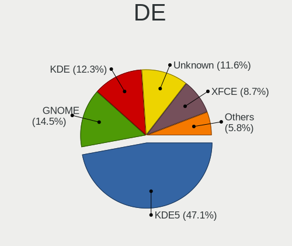
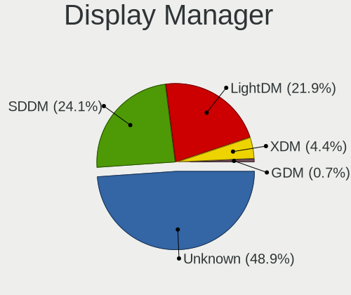
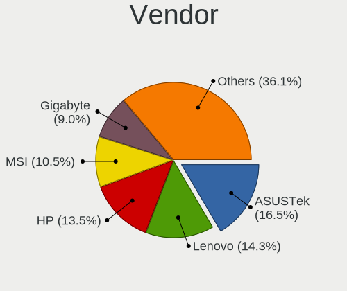
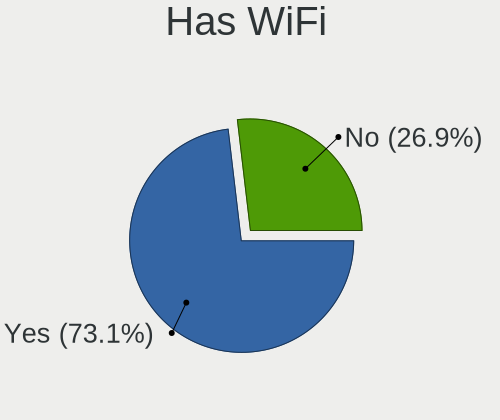
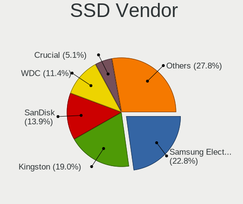
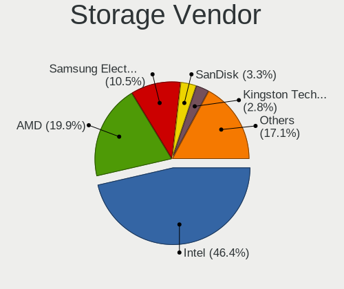
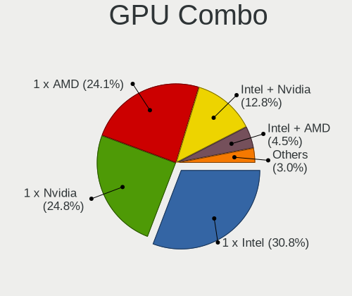
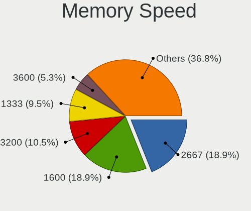
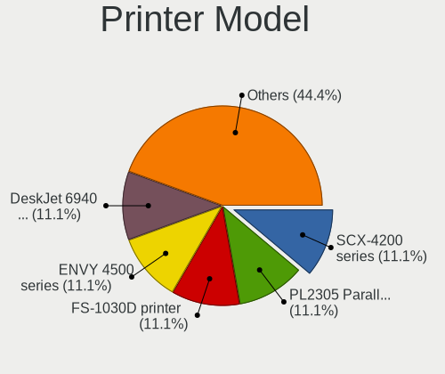

openSUSE Leap-15.3 - Tested Hardware & Statistics
-------------------------------------------------

A project to collect tested hardware configurations for openSUSE Leap-15.3.

Anyone can contribute to this report by the [hw-probe](https://github.com/linuxhw/hw-probe) tool:

    sudo -E hw-probe -all -upload

Please submit a probe of your configuration if it's not presented on the page or is rare.

This is a report for all computer types. See also reports for [desktops](/Dist/openSUSE_Leap-15.3/Desktop/README.md) and [notebooks](/Dist/openSUSE_Leap-15.3/Notebook/README.md).

Full-feature report is available here: https://linux-hardware.org/?view=trends

Contents
--------

* [ Test Cases ](#test-cases)

* [ System ](#system)
  - [ Kernel                   ](#kernel)
  - [ Kernel Family            ](#kernel-family)
  - [ Kernel Major Ver.        ](#kernel-major-ver)
  - [ Arch                     ](#arch)
  - [ DE                       ](#de)
  - [ Display Server           ](#display-server)
  - [ Display Manager          ](#display-manager)
  - [ OS Lang                  ](#os-lang)
  - [ Boot Mode                ](#boot-mode)
  - [ Filesystem               ](#filesystem)
  - [ Part. scheme             ](#part-scheme)
  - [ Dual Boot with Linux/BSD ](#dual-boot-with-linuxbsd)
  - [ Dual Boot (Win)          ](#dual-boot-win)

* [ Board ](#board)
  - [ Vendor                   ](#vendor)
  - [ Model                    ](#model)
  - [ Model Family             ](#model-family)
  - [ MFG Year                 ](#mfg-year)
  - [ Form Factor              ](#form-factor)
  - [ Secure Boot              ](#secure-boot)
  - [ Coreboot                 ](#coreboot)
  - [ RAM Size                 ](#ram-size)
  - [ RAM Used                 ](#ram-used)
  - [ Total Drives             ](#total-drives)
  - [ Has CD-ROM               ](#has-cd-rom)
  - [ Has Ethernet             ](#has-ethernet)
  - [ Has WiFi                 ](#has-wifi)
  - [ Has Bluetooth            ](#has-bluetooth)

* [ Location ](#location)
  - [ Country                  ](#country)
  - [ City                     ](#city)

* [ Drives ](#drives)
  - [ Drive Vendor             ](#drive-vendor)
  - [ Drive Model              ](#drive-model)
  - [ HDD Vendor               ](#hdd-vendor)
  - [ SSD Vendor               ](#ssd-vendor)
  - [ Drive Kind               ](#drive-kind)
  - [ Drive Connector          ](#drive-connector)
  - [ Drive Size               ](#drive-size)
  - [ Space Total              ](#space-total)
  - [ Space Used               ](#space-used)
  - [ Malfunc. Drives          ](#malfunc-drives)
  - [ Malfunc. Drive Vendor    ](#malfunc-drive-vendor)
  - [ Malfunc. HDD Vendor      ](#malfunc-hdd-vendor)
  - [ Malfunc. Drive Kind      ](#malfunc-drive-kind)
  - [ Failed Drives            ](#failed-drives)
  - [ Failed Drive Vendor      ](#failed-drive-vendor)
  - [ Drive Status             ](#drive-status)

* [ Storage controller ](#storage-controller)
  - [ Storage Vendor           ](#storage-vendor)
  - [ Storage Model            ](#storage-model)
  - [ Storage Kind             ](#storage-kind)

* [ Processor ](#processor)
  - [ CPU Vendor               ](#cpu-vendor)
  - [ CPU Model                ](#cpu-model)
  - [ CPU Model Family         ](#cpu-model-family)
  - [ CPU Cores                ](#cpu-cores)
  - [ CPU Sockets              ](#cpu-sockets)
  - [ CPU Threads              ](#cpu-threads)
  - [ CPU Op-Modes             ](#cpu-op-modes)
  - [ CPU Microcode            ](#cpu-microcode)
  - [ CPU Microarch            ](#cpu-microarch)

* [ Graphics ](#graphics)
  - [ GPU Vendor               ](#gpu-vendor)
  - [ GPU Model                ](#gpu-model)
  - [ GPU Combo                ](#gpu-combo)
  - [ GPU Driver               ](#gpu-driver)
  - [ GPU Memory               ](#gpu-memory)

* [ Monitor ](#monitor)
  - [ Monitor Vendor           ](#monitor-vendor)
  - [ Monitor Model            ](#monitor-model)
  - [ Monitor Resolution       ](#monitor-resolution)
  - [ Monitor Diagonal         ](#monitor-diagonal)
  - [ Monitor Width            ](#monitor-width)
  - [ Aspect Ratio             ](#aspect-ratio)
  - [ Monitor Area             ](#monitor-area)
  - [ Pixel Density            ](#pixel-density)
  - [ Multiple Monitors        ](#multiple-monitors)

* [ Network ](#network)
  - [ Net Controller Vendor    ](#net-controller-vendor)
  - [ Net Controller Model     ](#net-controller-model)
  - [ Wireless Vendor          ](#wireless-vendor)
  - [ Wireless Model           ](#wireless-model)
  - [ Ethernet Vendor          ](#ethernet-vendor)
  - [ Ethernet Model           ](#ethernet-model)
  - [ Net Controller Kind      ](#net-controller-kind)
  - [ Used Controller          ](#used-controller)
  - [ NICs                     ](#nics)
  - [ IPv6                     ](#ipv6)

* [ Bluetooth ](#bluetooth)
  - [ Bluetooth Vendor         ](#bluetooth-vendor)
  - [ Bluetooth Model          ](#bluetooth-model)

* [ Sound ](#sound)
  - [ Sound Vendor             ](#sound-vendor)
  - [ Sound Model              ](#sound-model)

* [ Memory ](#memory)
  - [ Memory Vendor            ](#memory-vendor)
  - [ Memory Model             ](#memory-model)
  - [ Memory Kind              ](#memory-kind)
  - [ Memory Form Factor       ](#memory-form-factor)
  - [ Memory Size              ](#memory-size)
  - [ Memory Speed             ](#memory-speed)

* [ Printers & scanners ](#printers--scanners)
  - [ Printer Vendor           ](#printer-vendor)
  - [ Printer Model            ](#printer-model)
  - [ Scanner Vendor           ](#scanner-vendor)
  - [ Scanner Model            ](#scanner-model)

* [ Camera ](#camera)
  - [ Camera Vendor            ](#camera-vendor)
  - [ Camera Model             ](#camera-model)

* [ Security ](#security)
  - [ Fingerprint Vendor       ](#fingerprint-vendor)
  - [ Fingerprint Model        ](#fingerprint-model)
  - [ Chipcard Vendor          ](#chipcard-vendor)
  - [ Chipcard Model           ](#chipcard-model)

* [ Unsupported ](#unsupported)
  - [ Unsupported Devices      ](#unsupported-devices)
  - [ Unsupported Device Types ](#unsupported-device-types)

Test Cases
----------

| Vendor        | Model                       | Form-Factor | Probe                                                      | Date         |
|---------------|-----------------------------|-------------|------------------------------------------------------------|--------------|
| Intel         | DG41WV AAE90316-104         | Desktop     | [b6dc38eb16](https://linux-hardware.org/?probe=b6dc38eb16) | Feb 25, 2022 |
| MSI           | B450 TOMAHAWK               | Desktop     | [362c220f2d](https://linux-hardware.org/?probe=362c220f2d) | Feb 20, 2022 |
| MSI           | CX600                       | Notebook    | [bbd815a6e9](https://linux-hardware.org/?probe=bbd815a6e9) | Feb 17, 2022 |
| LG Electro... | C400-G.BC22P1               | Notebook    | [e202260efb](https://linux-hardware.org/?probe=e202260efb) | Feb 14, 2022 |
| MSI           | B450 TOMAHAWK               | Desktop     | [b3ff58ce92](https://linux-hardware.org/?probe=b3ff58ce92) | Feb 06, 2022 |
| ASRock        | Z68 Extreme4 Gen3           | Desktop     | [29ea90b598](https://linux-hardware.org/?probe=29ea90b598) | Feb 06, 2022 |
| Acer          | Nitro AN515-52              | Notebook    | [51a06ffad3](https://linux-hardware.org/?probe=51a06ffad3) | Feb 05, 2022 |
| MSI           | B450 TOMAHAWK               | Desktop     | [2f03547791](https://linux-hardware.org/?probe=2f03547791) | Feb 05, 2022 |
| Acer          | Aspire VN7-792G             | Notebook    | [20e910e73b](https://linux-hardware.org/?probe=20e910e73b) | Feb 05, 2022 |
| ASUSTek       | ROG STRIX X570-E GAMING     | Desktop     | [6423454dd8](https://linux-hardware.org/?probe=6423454dd8) | Jan 28, 2022 |
| ASUSTek       | H97M-E                      | Desktop     | [394132a26d](https://linux-hardware.org/?probe=394132a26d) | Jan 22, 2022 |
| ASUSTek       | H97M-E                      | Desktop     | [83e0c18dcb](https://linux-hardware.org/?probe=83e0c18dcb) | Jan 22, 2022 |
| Notebook      | PCx0Dx                      | Notebook    | [07b8344de7](https://linux-hardware.org/?probe=07b8344de7) | Jan 21, 2022 |
| Notebook      | PCx0Dx                      | Notebook    | [3bdae5c5ac](https://linux-hardware.org/?probe=3bdae5c5ac) | Jan 21, 2022 |
| ASUSTek       | H81M-R                      | Desktop     | [ea01dd4007](https://linux-hardware.org/?probe=ea01dd4007) | Jan 18, 2022 |
| ASUSTek       | H81M-R                      | Desktop     | [f65a651e3c](https://linux-hardware.org/?probe=f65a651e3c) | Jan 18, 2022 |
| Gigabyte      | G31M-S2C                    | Desktop     | [88d5bd947a](https://linux-hardware.org/?probe=88d5bd947a) | Jan 17, 2022 |
| ASUSTek       | H81M-R                      | Desktop     | [d8e311c6cc](https://linux-hardware.org/?probe=d8e311c6cc) | Jan 17, 2022 |
| ASUSTek       | H81M-R                      | Desktop     | [cf10bab7ad](https://linux-hardware.org/?probe=cf10bab7ad) | Jan 17, 2022 |
| Biostar       | H77MU3                      | Desktop     | [da779dbb31](https://linux-hardware.org/?probe=da779dbb31) | Jan 15, 2022 |
| ASUSTek       | H97M-E                      | Desktop     | [abf3b9c5c8](https://linux-hardware.org/?probe=abf3b9c5c8) | Jan 14, 2022 |
| ASUSTek       | H97M-E                      | Desktop     | [54fb155ee1](https://linux-hardware.org/?probe=54fb155ee1) | Jan 14, 2022 |
| ASUSTek       | M5A99X EVO R2.0             | Desktop     | [894589da9f](https://linux-hardware.org/?probe=894589da9f) | Jan 11, 2022 |
| Gigabyte      | GA-770TA-UD3                | Desktop     | [cda49a0b67](https://linux-hardware.org/?probe=cda49a0b67) | Jan 10, 2022 |
| ASUSTek       | TUF GAMING X570-PLUS        | Desktop     | [4c9489e27a](https://linux-hardware.org/?probe=4c9489e27a) | Jan 10, 2022 |
| HP            | ProBook x360 11 G5 EE       | Convertible | [2000988c8b](https://linux-hardware.org/?probe=2000988c8b) | Jan 10, 2022 |
| HP            | 2B29                        | Desktop     | [cfb166f99c](https://linux-hardware.org/?probe=cfb166f99c) | Jan 10, 2022 |
| ASUSTek       | M5A99X EVO R2.0             | Desktop     | [980348cf8f](https://linux-hardware.org/?probe=980348cf8f) | Jan 09, 2022 |
| ASUSTek       | Z97-K                       | Desktop     | [87ffc81034](https://linux-hardware.org/?probe=87ffc81034) | Jan 08, 2022 |
| Toshiba       | AS 1301                     | Notebook    | [8617f80de9](https://linux-hardware.org/?probe=8617f80de9) | Jan 01, 2022 |
| Dell          | 0RY007                      | Desktop     | [d51d13fdd1](https://linux-hardware.org/?probe=d51d13fdd1) | Dec 31, 2021 |
| ASUSTek       | ROG CROSSHAIR VIII HERO     | Desktop     | [559c6e472e](https://linux-hardware.org/?probe=559c6e472e) | Dec 30, 2021 |
| Dell          | XPS 15 9510                 | Notebook    | [5f594735cc](https://linux-hardware.org/?probe=5f594735cc) | Dec 28, 2021 |
| Lenovo        | ThinkPad L512 44444WG       | Notebook    | [113b39ddbc](https://linux-hardware.org/?probe=113b39ddbc) | Dec 25, 2021 |
| Acer          | Aspire E1-571               | Notebook    | [8b94542162](https://linux-hardware.org/?probe=8b94542162) | Dec 22, 2021 |
| Acer          | Aspire E1-571               | Notebook    | [842eae5b1d](https://linux-hardware.org/?probe=842eae5b1d) | Dec 22, 2021 |
| ASUSTek       | P8Z77-V LX                  | Desktop     | [6f6aeab7c1](https://linux-hardware.org/?probe=6f6aeab7c1) | Dec 20, 2021 |
| Dell          | Inspiron N4030              | Notebook    | [f5b5166d80](https://linux-hardware.org/?probe=f5b5166d80) | Dec 20, 2021 |
| ASUSTek       | PRIME A320M-E               | Desktop     | [c008e360e7](https://linux-hardware.org/?probe=c008e360e7) | Dec 19, 2021 |
| ASUSTek       | P9X79 PRO                   | Desktop     | [ca4a106ccf](https://linux-hardware.org/?probe=ca4a106ccf) | Dec 18, 2021 |
| ASUSTek       | P8Z77-V LX                  | Desktop     | [1ff9d84c5f](https://linux-hardware.org/?probe=1ff9d84c5f) | Dec 17, 2021 |
| Acer          | Aspire E1-571               | Notebook    | [27923678bd](https://linux-hardware.org/?probe=27923678bd) | Dec 16, 2021 |
| ASUSTek       | P8Z77-V LX                  | Desktop     | [a5ddb2410e](https://linux-hardware.org/?probe=a5ddb2410e) | Dec 16, 2021 |
| ASUSTek       | P8Z77-V LX                  | Desktop     | [e744dbe03d](https://linux-hardware.org/?probe=e744dbe03d) | Dec 15, 2021 |
| Lenovo        | ThinkPad T14 Gen 1 20UES... | Notebook    | [ecc22ad350](https://linux-hardware.org/?probe=ecc22ad350) | Dec 12, 2021 |
| Lenovo        | G500 20236                  | Notebook    | [dab30215a2](https://linux-hardware.org/?probe=dab30215a2) | Dec 05, 2021 |
| ASRock        | Z68 Extreme4 Gen3           | Desktop     | [00a3ad4abc](https://linux-hardware.org/?probe=00a3ad4abc) | Dec 02, 2021 |
| ASRock        | Z68 Extreme4 Gen3           | Desktop     | [e75c56906a](https://linux-hardware.org/?probe=e75c56906a) | Dec 01, 2021 |
| HUAWEI        | KLVL-WXX9                   | Notebook    | [34898be259](https://linux-hardware.org/?probe=34898be259) | Nov 28, 2021 |
| Lenovo        | ThinkPad T490s 20NYS1XK0... | Notebook    | [aef7318ff6](https://linux-hardware.org/?probe=aef7318ff6) | Nov 27, 2021 |
| Acer          | Aspire E1-772G              | Notebook    | [d49a3f3160](https://linux-hardware.org/?probe=d49a3f3160) | Nov 26, 2021 |
| ASUSTek       | CROSSHAIR VI HERO           | Desktop     | [a2761e06a4](https://linux-hardware.org/?probe=a2761e06a4) | Nov 24, 2021 |
| ASUSTek       | CROSSHAIR VI HERO           | Desktop     | [5bfec76970](https://linux-hardware.org/?probe=5bfec76970) | Nov 24, 2021 |
| Lenovo        | G50-45 80E3                 | Notebook    | [43f110e082](https://linux-hardware.org/?probe=43f110e082) | Nov 20, 2021 |
| Dell          | 03015M A09                  | Server      | [c685a0033b](https://linux-hardware.org/?probe=c685a0033b) | Nov 17, 2021 |
| MSI           | H510I PRO WIFI              | Desktop     | [d50547de1f](https://linux-hardware.org/?probe=d50547de1f) | Nov 15, 2021 |
| ASRock        | N68C-GS4 FX                 | Desktop     | [c863f2ca43](https://linux-hardware.org/?probe=c863f2ca43) | Nov 14, 2021 |
| Fujitsu       | D3220-A1 S26361-D3220-A1    | Desktop     | [7d1fd58f75](https://linux-hardware.org/?probe=7d1fd58f75) | Nov 14, 2021 |
| HP            | 844C                        | Desktop     | [2d709598d7](https://linux-hardware.org/?probe=2d709598d7) | Nov 12, 2021 |
| ASUSTek       | M4A78T-E                    | Desktop     | [10991ab539](https://linux-hardware.org/?probe=10991ab539) | Nov 10, 2021 |
| Acer          | Aspire E1-772G              | Notebook    | [ec97cd08d4](https://linux-hardware.org/?probe=ec97cd08d4) | Nov 09, 2021 |
| Acer          | Aspire E1-772G              | Notebook    | [be0c106296](https://linux-hardware.org/?probe=be0c106296) | Nov 09, 2021 |
| Lenovo        | IdeaPad 330-15IKB 81DC      | Notebook    | [9a632ea5d1](https://linux-hardware.org/?probe=9a632ea5d1) | Nov 08, 2021 |
| Acer          | Aspire 5820TG               | Notebook    | [d8ae1a4109](https://linux-hardware.org/?probe=d8ae1a4109) | Nov 03, 2021 |
| Acer          | Aspire 5820TG               | Notebook    | [c79617751e](https://linux-hardware.org/?probe=c79617751e) | Nov 03, 2021 |
| Dell          | 0M859N A00                  | Desktop     | [aadca45789](https://linux-hardware.org/?probe=aadca45789) | Nov 01, 2021 |
| Acer          | Aspire E1-772G              | Notebook    | [2ffccc532e](https://linux-hardware.org/?probe=2ffccc532e) | Oct 24, 2021 |
| Acer          | Nitro AN515-54              | Notebook    | [b6be115eec](https://linux-hardware.org/?probe=b6be115eec) | Oct 23, 2021 |
| Acer          | Aspire 5560                 | Notebook    | [39fd26f895](https://linux-hardware.org/?probe=39fd26f895) | Oct 22, 2021 |
| TUXEDO        | Aura 15 Gen1                | Notebook    | [627c62ae00](https://linux-hardware.org/?probe=627c62ae00) | Oct 21, 2021 |
| Dell          | 0Y2YM6 A00                  | Desktop     | [d9a12dc22c](https://linux-hardware.org/?probe=d9a12dc22c) | Oct 19, 2021 |
| Dell          | 0Y2YM6 A00                  | Desktop     | [34a55551e2](https://linux-hardware.org/?probe=34a55551e2) | Oct 19, 2021 |
| Medion        | E6436 MD61150               | Notebook    | [1edd4700fd](https://linux-hardware.org/?probe=1edd4700fd) | Oct 17, 2021 |
| Medion        | E6436 MD61150               | Notebook    | [2eaa34b93e](https://linux-hardware.org/?probe=2eaa34b93e) | Oct 17, 2021 |
| HP            | Laptop 15s-eq0xxx           | Notebook    | [fc4da04b79](https://linux-hardware.org/?probe=fc4da04b79) | Oct 16, 2021 |
| HP            | Laptop 17-ca1xxx            | Notebook    | [ae1811a242](https://linux-hardware.org/?probe=ae1811a242) | Oct 13, 2021 |
| Lenovo        | ThinkPad T490s 20NYS1XK0... | Notebook    | [d3700d8667](https://linux-hardware.org/?probe=d3700d8667) | Oct 13, 2021 |
| Lenovo        | ThinkPad L15 Gen 1 20U4S... | Notebook    | [3bb6121afa](https://linux-hardware.org/?probe=3bb6121afa) | Oct 13, 2021 |
| Lenovo        | ThinkPad X1 Carbon Gen 9... | Notebook    | [f3c6229102](https://linux-hardware.org/?probe=f3c6229102) | Oct 06, 2021 |
| Lenovo        | 364A SDK0J40700 WIN 3258... | Desktop     | [ce4776505f](https://linux-hardware.org/?probe=ce4776505f) | Oct 03, 2021 |
| MSI           | B450M MORTAR MAX            | Desktop     | [556c37ba9b](https://linux-hardware.org/?probe=556c37ba9b) | Oct 03, 2021 |
| MSI           | B450M PRO-VDH MAX           | Desktop     | [ad69186227](https://linux-hardware.org/?probe=ad69186227) | Oct 02, 2021 |
| ASRock        | Z68 Extreme4 Gen3           | Desktop     | [3cec37b610](https://linux-hardware.org/?probe=3cec37b610) | Oct 02, 2021 |
| MSI           | B450M PRO-VDH MAX           | Desktop     | [540dca7da7](https://linux-hardware.org/?probe=540dca7da7) | Oct 02, 2021 |
| Lenovo        | ThinkPad T550 20CJS1VD01    | Notebook    | [390b9a8a74](https://linux-hardware.org/?probe=390b9a8a74) | Oct 01, 2021 |
| MSI           | GP63 Leopard 8RD            | Notebook    | [21189bb3e0](https://linux-hardware.org/?probe=21189bb3e0) | Oct 01, 2021 |
| ASUSTek       | M4A78T-E                    | Desktop     | [01ec64f498](https://linux-hardware.org/?probe=01ec64f498) | Sep 24, 2021 |
| Lenovo        | 364A SDK0J40700 WIN 3258... | Desktop     | [58f9ca6247](https://linux-hardware.org/?probe=58f9ca6247) | Sep 22, 2021 |
| Lenovo        | 364A SDK0J40700 WIN 3258... | Desktop     | [db9ccd461b](https://linux-hardware.org/?probe=db9ccd461b) | Sep 22, 2021 |
| Dell          | Precision M6700             | Notebook    | [0d8cf3bf1c](https://linux-hardware.org/?probe=0d8cf3bf1c) | Sep 21, 2021 |
| VS Company    | G31T-M                      | Desktop     | [ed8bb8c0d1](https://linux-hardware.org/?probe=ed8bb8c0d1) | Sep 21, 2021 |
| ASUSTek       | AM1M-A/BR                   | Desktop     | [c586c22b15](https://linux-hardware.org/?probe=c586c22b15) | Sep 20, 2021 |
| Alienware     | 0PGRP5 A02                  | Desktop     | [65615a3aaa](https://linux-hardware.org/?probe=65615a3aaa) | Sep 16, 2021 |
| Alienware     | 0PGRP5 A02                  | Desktop     | [158a015f26](https://linux-hardware.org/?probe=158a015f26) | Sep 15, 2021 |
| MSI           | X370 GAMING PRO             | Desktop     | [629a45e23d](https://linux-hardware.org/?probe=629a45e23d) | Sep 12, 2021 |
| HP            | 8056                        | Desktop     | [3cab8505c4](https://linux-hardware.org/?probe=3cab8505c4) | Sep 06, 2021 |
| Intel         | DG41WV AAE90316-104         | Desktop     | [27c162218f](https://linux-hardware.org/?probe=27c162218f) | Sep 05, 2021 |
| Gigabyte      | B550 AORUS PRO AC           | Desktop     | [be3b65a81d](https://linux-hardware.org/?probe=be3b65a81d) | Aug 29, 2021 |
| Lenovo        | ThinkPad X1 Carbon 4th 2... | Notebook    | [44d0412dd3](https://linux-hardware.org/?probe=44d0412dd3) | Aug 27, 2021 |
| Samsung       | 600B4B/600B5B               | Notebook    | [200275bbd6](https://linux-hardware.org/?probe=200275bbd6) | Aug 27, 2021 |
| ASRock        | B450M Pro4                  | Desktop     | [a13b05f65f](https://linux-hardware.org/?probe=a13b05f65f) | Aug 27, 2021 |
| Dell          | Precision M6700             | Notebook    | [191db00b83](https://linux-hardware.org/?probe=191db00b83) | Aug 26, 2021 |
| Lenovo        | V330-15IKB 81AX             | Notebook    | [4b5a1af4dd](https://linux-hardware.org/?probe=4b5a1af4dd) | Aug 26, 2021 |
| Lenovo        | G500 20236                  | Notebook    | [73a5085a79](https://linux-hardware.org/?probe=73a5085a79) | Aug 24, 2021 |
| Dell          | Latitude 5480               | Notebook    | [a2110d9601](https://linux-hardware.org/?probe=a2110d9601) | Aug 24, 2021 |
| Dell          | Latitude 5480               | Notebook    | [64e1f3e16c](https://linux-hardware.org/?probe=64e1f3e16c) | Aug 19, 2021 |
| Lenovo        | ThinkPad T61 8895W9U        | Notebook    | [424c5f3e75](https://linux-hardware.org/?probe=424c5f3e75) | Aug 19, 2021 |
| Dell          | Inspiron 3521               | Notebook    | [c68ce33d52](https://linux-hardware.org/?probe=c68ce33d52) | Aug 11, 2021 |
| Dell          | Inspiron 3521               | Notebook    | [9a422a10d3](https://linux-hardware.org/?probe=9a422a10d3) | Aug 11, 2021 |
| Dell          | Inspiron 7460               | Notebook    | [f954aa3826](https://linux-hardware.org/?probe=f954aa3826) | Aug 10, 2021 |
| Samsung       | 600B4B/600B5B               | Notebook    | [0a650b495e](https://linux-hardware.org/?probe=0a650b495e) | Aug 09, 2021 |
| Lenovo        | ThinkPad T460 20FMS75800    | Notebook    | [1a1c3f469d](https://linux-hardware.org/?probe=1a1c3f469d) | Aug 07, 2021 |
| Lenovo        | ThinkPad X1 Carbon 4th 2... | Notebook    | [5953bc46ad](https://linux-hardware.org/?probe=5953bc46ad) | Aug 06, 2021 |
| Lenovo        | ThinkPad X1 Carbon 4th 2... | Notebook    | [fafaeed466](https://linux-hardware.org/?probe=fafaeed466) | Aug 06, 2021 |
| ASUSTek       | PRIME H310M-A               | Desktop     | [a22aa3c48c](https://linux-hardware.org/?probe=a22aa3c48c) | Aug 01, 2021 |
| MSI           | B85M-E45                    | Desktop     | [0e20d4cea9](https://linux-hardware.org/?probe=0e20d4cea9) | Jul 30, 2021 |
| Gigabyte      | B250M-DS3H-CF               | Desktop     | [acbcbe74d7](https://linux-hardware.org/?probe=acbcbe74d7) | Jul 22, 2021 |
| HP            | Stream Notebook PC 11       | Notebook    | [a612aa5d15](https://linux-hardware.org/?probe=a612aa5d15) | Jul 20, 2021 |
| HP            | 8433 11                     | Desktop     | [b079ccb608](https://linux-hardware.org/?probe=b079ccb608) | Jul 15, 2021 |
| MSI           | D2415 S26361-D2415-A21      | Desktop     | [b49400f636](https://linux-hardware.org/?probe=b49400f636) | Jul 11, 2021 |
| Lenovo        | ThinkPad T450s 20BWA06J0... | Notebook    | [e4cd39ef75](https://linux-hardware.org/?probe=e4cd39ef75) | Jul 09, 2021 |
| Lenovo        | ThinkPad T450s 20BWA06J0... | Notebook    | [5565f4e4fe](https://linux-hardware.org/?probe=5565f4e4fe) | Jul 09, 2021 |
| Fujitsu       | LIFEBOOK E754               | Notebook    | [e7923c27f1](https://linux-hardware.org/?probe=e7923c27f1) | Jul 08, 2021 |
| MSI           | B350 TOMAHAWK               | Desktop     | [27a6ac997b](https://linux-hardware.org/?probe=27a6ac997b) | Jul 03, 2021 |
| ASRock        | X570M Pro4                  | Desktop     | [a00aea4331](https://linux-hardware.org/?probe=a00aea4331) | Jul 03, 2021 |
| HP            | 0A68h                       | Desktop     | [36cfa6a366](https://linux-hardware.org/?probe=36cfa6a366) | Jun 27, 2021 |
| ASUSTek       | TUF B450-PRO GAMING         | Desktop     | [dfc2f82575](https://linux-hardware.org/?probe=dfc2f82575) | Jun 26, 2021 |
| ASUSTek       | G771JW                      | Notebook    | [8e6c4ddee8](https://linux-hardware.org/?probe=8e6c4ddee8) | Jun 24, 2021 |
| ASRock        | X570 Steel Legend           | Desktop     | [b4a11b3e4e](https://linux-hardware.org/?probe=b4a11b3e4e) | Jun 17, 2021 |
| MSI           | MEG X570 GODLIKE            | Desktop     | [11b7f0e8ae](https://linux-hardware.org/?probe=11b7f0e8ae) | Jun 17, 2021 |
| HP            | ZBook 17 G2                 | Notebook    | [3342d4d378](https://linux-hardware.org/?probe=3342d4d378) | Jun 17, 2021 |
| HP            | OMEN by HP Laptop 15-dc1... | Notebook    | [0c01b21401](https://linux-hardware.org/?probe=0c01b21401) | Jun 15, 2021 |
| Sony          | VPCSB15GB                   | Notebook    | [43a9d38ca0](https://linux-hardware.org/?probe=43a9d38ca0) | Jun 03, 2021 |
| HP            | 2AA2                        | Desktop     | [65e7cd2d3e](https://linux-hardware.org/?probe=65e7cd2d3e) | Jun 02, 2021 |
| Sony          | VGN-Z570AN                  | Notebook    | [13d58b8d90](https://linux-hardware.org/?probe=13d58b8d90) | May 21, 2021 |
| Sony          | VGN-Z570AN                  | Notebook    | [e6c7882e05](https://linux-hardware.org/?probe=e6c7882e05) | May 21, 2021 |
| MSI           | GS60 6QE                    | Notebook    | [93c6fd8911](https://linux-hardware.org/?probe=93c6fd8911) | May 18, 2021 |
| MSI           | GS60 6QE                    | Notebook    | [41fe777475](https://linux-hardware.org/?probe=41fe777475) | May 18, 2021 |
| ASUSTek       | VivoBook 12_ASUS Laptop ... | Notebook    | [184bedf2fd](https://linux-hardware.org/?probe=184bedf2fd) | May 01, 2021 |
| HP            | Pavilion dx6500             | Notebook    | [091cc2c616](https://linux-hardware.org/?probe=091cc2c616) | Apr 13, 2021 |
| HP            | Pavilion dx6500             | Notebook    | [6ad0d5c87f](https://linux-hardware.org/?probe=6ad0d5c87f) | Apr 13, 2021 |
| Dell          | Inspiron 15 7000 Gaming     | Notebook    | [97a7246099](https://linux-hardware.org/?probe=97a7246099) | Mar 01, 2021 |
| Dell          | Inspiron 15 7000 Gaming     | Notebook    | [b1e186207c](https://linux-hardware.org/?probe=b1e186207c) | Feb 28, 2021 |
| ASUSTek       | P8H61-M LE/USB3             | Desktop     | [fca0fd3336](https://linux-hardware.org/?probe=fca0fd3336) | Jan 03, 2021 |

System
------

Kernel
------

Version of the Linux kernel

| Version                             | Computers | Percent |
|-------------------------------------|-----------|---------|
| 5.3.18-59.37-default                | 18        | 18.18%  |
| 5.3.18-59.27-default                | 13        | 13.13%  |
| 5.3.18-59.19-default                | 13        | 13.13%  |
| 5.3.18-57-default                   | 8         | 8.08%   |
| 5.3.18-59.5-default                 | 6         | 6.06%   |
| 5.3.18-59.24-default                | 6         | 6.06%   |
| 5.3.18-59.16-default                | 6         | 6.06%   |
| 5.3.18-59.10-default                | 5         | 5.05%   |
| 5.3.18-59.34-default                | 4         | 4.04%   |
| 5.3.18-150300.59.43-default         | 3         | 3.03%   |
| 5.3.18-59.19-preempt                | 2         | 2.02%   |
| 5.3.18-59.13-default                | 2         | 2.02%   |
| 5.3.18-lp152.57-default             | 1         | 1.01%   |
| 5.3.18-59.37-preempt                | 1         | 1.01%   |
| 5.3.18-59.34-preempt                | 1         | 1.01%   |
| 5.3.18-59.27-preempt                | 1         | 1.01%   |
| 5.3.18-59.24-preempt                | 1         | 1.01%   |
| 5.3.18-57-preempt                   | 1         | 1.01%   |
| 5.3.18-56-default                   | 1         | 1.01%   |
| 5.3.18-52-default                   | 1         | 1.01%   |
| 5.3.18-46-default                   | 1         | 1.01%   |
| 5.3.18-150300.59.49-preempt         | 1         | 1.01%   |
| 5.16.0-rc2-lp153.2.g696d453-default | 1         | 1.01%   |
| 5.15.11-lp153.3.g730a488-default    | 1         | 1.01%   |
| 4.12.14-197.105-vanilla             | 1         | 1.01%   |

Kernel Family
-------------

Linux kernel without a distro release

| Version | Computers | Percent |
|---------|-----------|---------|
| 5.3.18  | 91        | 96.81%  |
| 5.16.0  | 1         | 1.06%   |
| 5.15.11 | 1         | 1.06%   |
| 4.12.14 | 1         | 1.06%   |

Kernel Major Ver.
-----------------

Linux kernel major version

| Version | Computers | Percent |
|---------|-----------|---------|
| 5.3     | 91        | 96.81%  |
| 5.16    | 1         | 1.06%   |
| 5.15    | 1         | 1.06%   |
| 4.12    | 1         | 1.06%   |

Arch
----

OS architecture (x86_64, i586, etc.)

| Name   | Computers | Percent |
|--------|-----------|---------|
| x86_64 | 94        | 100%    |

DE
--

Desktop Environment

| Name       | Computers | Percent |
|------------|-----------|---------|
| KDE5       | 38        | 39.18%  |
| KDE        | 17        | 17.53%  |
| GNOME      | 14        | 14.43%  |
| Unknown    | 14        | 14.43%  |
| XFCE       | 10        | 10.31%  |
| X-Cinnamon | 3         | 3.09%   |
| MATE       | 1         | 1.03%   |

Display Server
--------------

X11 or Wayland

| Name    | Computers | Percent |
|---------|-----------|---------|
| X11     | 77        | 81.05%  |
| Wayland | 11        | 11.58%  |
| Tty     | 7         | 7.37%   |

Display Manager
---------------

SDDM, LightDM, etc.

| Name    | Computers | Percent |
|---------|-----------|---------|
| Unknown | 51        | 53.68%  |
| SDDM    | 19        | 20%     |
| LightDM | 19        | 20%     |
| XDM     | 5         | 5.26%   |
| GDM     | 1         | 1.05%   |

OS Lang
-------

Language

| Lang    | Computers | Percent |
|---------|-----------|---------|
| en_US   | 28        | 29.79%  |
| de_DE   | 20        | 21.28%  |
| POSIX   | 10        | 10.64%  |
| pt_BR   | 6         | 6.38%   |
| ru_RU   | 4         | 4.26%   |
| fr_FR   | 3         | 3.19%   |
| es_ES   | 3         | 3.19%   |
| Unknown | 3         | 3.19%   |
| en_GB   | 2         | 2.13%   |
| zh_CN   | 1         | 1.06%   |
| tr_TR   | 1         | 1.06%   |
| sv_SE   | 1         | 1.06%   |
| pt_PT   | 1         | 1.06%   |
| pl_PL   | 1         | 1.06%   |
| nl_NL   | 1         | 1.06%   |
| nl_BE   | 1         | 1.06%   |
| it_IT   | 1         | 1.06%   |
| hu_HU   | 1         | 1.06%   |
| hr_HR   | 1         | 1.06%   |
| fi_FI   | 1         | 1.06%   |
| es_MX   | 1         | 1.06%   |
| en_AU   | 1         | 1.06%   |
| cs_CZ   | 1         | 1.06%   |
| ca_AD   | 1         | 1.06%   |

Boot Mode
---------

EFI or BIOS

| Mode | Computers | Percent |
|------|-----------|---------|
| BIOS | 54        | 57.45%  |
| EFI  | 40        | 42.55%  |

Filesystem
----------

Type of filesystem

| Type    | Computers | Percent |
|---------|-----------|---------|
| Btrfs   | 64        | 68.09%  |
| Ext4    | 26        | 27.66%  |
| Xfs     | 3         | 3.19%   |
| Overlay | 1         | 1.06%   |

Part. scheme
------------

Scheme of partitioning

| Type    | Computers | Percent |
|---------|-----------|---------|
| GPT     | 45        | 47.37%  |
| Unknown | 42        | 44.21%  |
| MBR     | 8         | 8.42%   |

Dual Boot with Linux/BSD
------------------------

Hosting more than one Linux/BSD

| Dual boot | Computers | Percent |
|-----------|-----------|---------|
| No        | 85        | 89.47%  |
| Yes       | 10        | 10.53%  |

Dual Boot (Win)
---------------

Hosting Linux and Windows

| Dual boot | Computers | Percent |
|-----------|-----------|---------|
| No        | 63        | 67.02%  |
| Yes       | 31        | 32.98%  |

Board
-----

Vendor
------

Motherboard manufacturer

| Name                | Computers | Percent |
|---------------------|-----------|---------|
| ASUSTek Computer    | 17        | 18.09%  |
| Lenovo              | 13        | 13.83%  |
| Hewlett-Packard     | 13        | 13.83%  |
| MSI                 | 12        | 12.77%  |
| Dell                | 10        | 10.64%  |
| Acer                | 7         | 7.45%   |
| ASRock              | 5         | 5.32%   |
| Gigabyte Technology | 4         | 4.26%   |
| Sony                | 2         | 2.13%   |
| Fujitsu             | 2         | 2.13%   |
| VS Company          | 1         | 1.06%   |
| TUXEDO              | 1         | 1.06%   |
| Semp Toshiba        | 1         | 1.06%   |
| Samsung Electronics | 1         | 1.06%   |
| Medion              | 1         | 1.06%   |
| Intel               | 1         | 1.06%   |
| HUAWEI              | 1         | 1.06%   |
| Biostar             | 1         | 1.06%   |
| Alienware           | 1         | 1.06%   |

Model
-----

Motherboard model

| Name                                         | Computers | Percent |
|----------------------------------------------|-----------|---------|
| ASUS All Series                              | 3         | 3.19%   |
| VS Company G31T-M                            | 1         | 1.06%   |
| TUXEDO Aura 15 Gen1                          | 1         | 1.06%   |
| Sony VPCSB15GB                               | 1         | 1.06%   |
| Sony VGN-Z570AN                              | 1         | 1.06%   |
| Semp Toshiba AS 1301                         | 1         | 1.06%   |
| Samsung 600B4B/600B5B                        | 1         | 1.06%   |
| MSI MS-7D16                                  | 1         | 1.06%   |
| MSI MS-7C34                                  | 1         | 1.06%   |
| MSI MS-7C02                                  | 1         | 1.06%   |
| MSI MS-7B89                                  | 1         | 1.06%   |
| MSI MS-7A38                                  | 1         | 1.06%   |
| MSI MS-7A34                                  | 1         | 1.06%   |
| MSI MS-7A33                                  | 1         | 1.06%   |
| MSI MS-7817                                  | 1         | 1.06%   |
| MSI GS60 6QE                                 | 1         | 1.06%   |
| MSI GP63 Leopard 8RD                         | 1         | 1.06%   |
| MSI ESPRIMO P1510                            | 1         | 1.06%   |
| MSI CX600                                    | 1         | 1.06%   |
| Medion E6436 MD61150                         | 1         | 1.06%   |
| Lenovo V330-15IKB 81AX                       | 1         | 1.06%   |
| Lenovo ThinkPad X1 Carbon Gen 9 20XW00A7TH   | 1         | 1.06%   |
| Lenovo ThinkPad X1 Carbon 4th 20FB002UMC     | 1         | 1.06%   |
| Lenovo ThinkPad T61 8895W9U                  | 1         | 1.06%   |
| Lenovo ThinkPad T490s 20NYS1XK00             | 1         | 1.06%   |
| Lenovo ThinkPad T460 20FMS75800              | 1         | 1.06%   |
| Lenovo ThinkPad T450s 20BWA06J00             | 1         | 1.06%   |
| Lenovo ThinkPad T14 Gen 1 20UES47F00         | 1         | 1.06%   |
| Lenovo ThinkPad L15 Gen 1 20U4S88000         | 1         | 1.06%   |
| Lenovo IdeaPad 330-15IKB 81DC                | 1         | 1.06%   |
| Lenovo IdeaCentre Y710 Cube-15ISH 90FL004WGE | 1         | 1.06%   |
| Lenovo G500 20236                            | 1         | 1.06%   |
| Lenovo G50-45 80E3                           | 1         | 1.06%   |
| Intel DG41WV AAE90316-104                    | 1         | 1.06%   |
| HUAWEI KLVL-WXX9                             | 1         | 1.06%   |
| HP ZBook 17 G2                               | 1         | 1.06%   |
| HP xw4400 Workstation                        | 1         | 1.06%   |
| HP Stream Notebook PC 11                     | 1         | 1.06%   |
| HP ProBook x360 11 G5 EE                     | 1         | 1.06%   |
| HP Pavilion Gaming Desktop 790-00xx          | 1         | 1.06%   |
| HP Pavilion Gaming Desktop 690-00xx          | 1         | 1.06%   |
| HP Pavilion dx6500                           | 1         | 1.06%   |
| HP OMEN by HP Laptop 15-dc1xxx               | 1         | 1.06%   |
| HP Laptop 17-ca1xxx                          | 1         | 1.06%   |
| HP Laptop 15s-eq0xxx                         | 1         | 1.06%   |
| HP EliteDesk 800 G2 DM 65W                   | 1         | 1.06%   |
| HP 550-a114                                  | 1         | 1.06%   |
| HP 200-5120br                                | 1         | 1.06%   |
| Gigabyte GA-770TA-UD3                        | 1         | 1.06%   |
| Gigabyte G31M-ES2C                           | 1         | 1.06%   |
| Gigabyte B550 AORUS PRO AC                   | 1         | 1.06%   |
| Gigabyte B250M-DS3H                          | 1         | 1.06%   |
| Fujitsu LIFEBOOK E754                        | 1         | 1.06%   |
| Fujitsu ESPRIMO P520                         | 1         | 1.06%   |
| Dell XPS 15 9510                             | 1         | 1.06%   |
| Dell Vostro 3268                             | 1         | 1.06%   |
| Dell Precision M6700                         | 1         | 1.06%   |
| Dell PowerEdge T420                          | 1         | 1.06%   |
| Dell Latitude 5480                           | 1         | 1.06%   |
| Dell Inspiron N4030                          | 1         | 1.06%   |

Model Family
------------

Motherboard model prefix

| Name                  | Computers | Percent |
|-----------------------|-----------|---------|
| Lenovo ThinkPad       | 8         | 8.51%   |
| Dell Inspiron         | 5         | 5.32%   |
| Acer Aspire           | 5         | 5.32%   |
| HP Pavilion           | 3         | 3.19%   |
| ASUS All              | 3         | 3.19%   |
| HP Laptop             | 2         | 2.13%   |
| ASUS TUF              | 2         | 2.13%   |
| ASUS ROG              | 2         | 2.13%   |
| ASUS PRIME            | 2         | 2.13%   |
| Acer Nitro            | 2         | 2.13%   |
| VS Company G31T-M     | 1         | 1.06%   |
| TUXEDO Aura           | 1         | 1.06%   |
| Sony VPCSB15GB        | 1         | 1.06%   |
| Sony VGN-Z570AN       | 1         | 1.06%   |
| Semp Toshiba AS       | 1         | 1.06%   |
| Samsung 600B4B        | 1         | 1.06%   |
| MSI MS-7D16           | 1         | 1.06%   |
| MSI MS-7C34           | 1         | 1.06%   |
| MSI MS-7C02           | 1         | 1.06%   |
| MSI MS-7B89           | 1         | 1.06%   |
| MSI MS-7A38           | 1         | 1.06%   |
| MSI MS-7A34           | 1         | 1.06%   |
| MSI MS-7A33           | 1         | 1.06%   |
| MSI MS-7817           | 1         | 1.06%   |
| MSI GS60              | 1         | 1.06%   |
| MSI GP63              | 1         | 1.06%   |
| MSI ESPRIMO           | 1         | 1.06%   |
| MSI CX600             | 1         | 1.06%   |
| Medion E6436          | 1         | 1.06%   |
| Lenovo V330-15IKB     | 1         | 1.06%   |
| Lenovo IdeaPad        | 1         | 1.06%   |
| Lenovo IdeaCentre     | 1         | 1.06%   |
| Lenovo G500           | 1         | 1.06%   |
| Lenovo G50-45         | 1         | 1.06%   |
| Intel DG41WV          | 1         | 1.06%   |
| HUAWEI KLVL-WXX9      | 1         | 1.06%   |
| HP ZBook              | 1         | 1.06%   |
| HP xw4400             | 1         | 1.06%   |
| HP Stream             | 1         | 1.06%   |
| HP ProBook            | 1         | 1.06%   |
| HP OMEN               | 1         | 1.06%   |
| HP EliteDesk          | 1         | 1.06%   |
| HP 550-a114           | 1         | 1.06%   |
| HP 200-5120br         | 1         | 1.06%   |
| Gigabyte GA-770TA-UD3 | 1         | 1.06%   |
| Gigabyte G31M-ES2C    | 1         | 1.06%   |
| Gigabyte B550         | 1         | 1.06%   |
| Gigabyte B250M-DS3H   | 1         | 1.06%   |
| Fujitsu LIFEBOOK      | 1         | 1.06%   |
| Fujitsu ESPRIMO       | 1         | 1.06%   |
| Dell XPS              | 1         | 1.06%   |
| Dell Vostro           | 1         | 1.06%   |
| Dell Precision        | 1         | 1.06%   |
| Dell PowerEdge        | 1         | 1.06%   |
| Dell Latitude         | 1         | 1.06%   |
| Biostar H77MU3        | 1         | 1.06%   |
| ASUS VivoBook         | 1         | 1.06%   |
| ASUS P9X79            | 1         | 1.06%   |
| ASUS P8Z77-V          | 1         | 1.06%   |
| ASUS P8H61-M          | 1         | 1.06%   |

MFG Year
--------

Motherboard manufacture year

| Year | Computers | Percent |
|------|-----------|---------|
| 2019 | 14        | 14.89%  |
| 2018 | 10        | 10.64%  |
| 2014 | 9         | 9.57%   |
| 2012 | 9         | 9.57%   |
| 2020 | 7         | 7.45%   |
| 2017 | 7         | 7.45%   |
| 2015 | 6         | 6.38%   |
| 2021 | 5         | 5.32%   |
| 2016 | 5         | 5.32%   |
| 2010 | 5         | 5.32%   |
| 2011 | 4         | 4.26%   |
| 2009 | 4         | 4.26%   |
| 2013 | 3         | 3.19%   |
| 2007 | 3         | 3.19%   |
| 2008 | 2         | 2.13%   |
| 2006 | 1         | 1.06%   |

Form Factor
-----------

Physical design of the computer

| Name        | Computers | Percent |
|-------------|-----------|---------|
| Desktop     | 47        | 50%     |
| Notebook    | 45        | 47.87%  |
| Convertible | 1         | 1.06%   |
| Server      | 1         | 1.06%   |

Secure Boot
-----------

Enabled or disabled

| State    | Computers | Percent |
|----------|-----------|---------|
| Disabled | 83        | 88.3%   |
| Enabled  | 11        | 11.7%   |

Coreboot
--------

Have coreboot on board

| Used | Computers | Percent |
|------|-----------|---------|
| No   | 94        | 100%    |

RAM Size
--------

Total RAM memory

| Size in GB  | Computers | Percent |
|-------------|-----------|---------|
| 16.01-24.0  | 27        | 28.72%  |
| 8.01-16.0   | 17        | 18.09%  |
| 3.01-4.0    | 15        | 15.96%  |
| 4.01-8.0    | 14        | 14.89%  |
| 32.01-64.0  | 9         | 9.57%   |
| 64.01-256.0 | 8         | 8.51%   |
| 1.01-2.0    | 2         | 2.13%   |
| 24.01-32.0  | 1         | 1.06%   |
| 2.01-3.0    | 1         | 1.06%   |

RAM Used
--------

Used RAM memory

| Used GB   | Computers | Percent |
|-----------|-----------|---------|
| 1.01-2.0  | 31        | 31.96%  |
| 2.01-3.0  | 24        | 24.74%  |
| 4.01-8.0  | 22        | 22.68%  |
| 3.01-4.0  | 12        | 12.37%  |
| 8.01-16.0 | 4         | 4.12%   |
| 0.51-1.0  | 4         | 4.12%   |

Total Drives
------------

Number of drives on board

| Drives | Computers | Percent |
|--------|-----------|---------|
| 1      | 39        | 41.49%  |
| 2      | 36        | 38.3%   |
| 3      | 10        | 10.64%  |
| 4      | 4         | 4.26%   |
| 6      | 3         | 3.19%   |
| 9      | 1         | 1.06%   |
| 7      | 1         | 1.06%   |

Has CD-ROM
----------

Has CD-ROM on board

| Presented | Computers | Percent |
|-----------|-----------|---------|
| Yes       | 47        | 50%     |
| No        | 47        | 50%     |

Has Ethernet
------------

Has Ethernet on board

| Presented | Computers | Percent |
|-----------|-----------|---------|
| Yes       | 88        | 93.62%  |
| No        | 6         | 6.38%   |

Has WiFi
--------

Has WiFi module

| Presented | Computers | Percent |
|-----------|-----------|---------|
| Yes       | 75        | 78.95%  |
| No        | 20        | 21.05%  |

Has Bluetooth
-------------

Has Bluetooth module

| Presented | Computers | Percent |
|-----------|-----------|---------|
| Yes       | 60        | 63.16%  |
| No        | 35        | 36.84%  |

Location
--------

Country
-------

Geographic location (country)

| Country     | Computers | Percent |
|-------------|-----------|---------|
| Germany     | 21        | 22.34%  |
| USA         | 11        | 11.7%   |
| Brazil      | 11        | 11.7%   |
| Russia      | 5         | 5.32%   |
| France      | 4         | 4.26%   |
| Spain       | 3         | 3.19%   |
| Netherlands | 3         | 3.19%   |
| Mexico      | 3         | 3.19%   |
| India       | 3         | 3.19%   |
| Australia   | 3         | 3.19%   |
| Nicaragua   | 2         | 2.13%   |
| Japan       | 2         | 2.13%   |
| Hungary     | 2         | 2.13%   |
| Greece      | 2         | 2.13%   |
| Czechia     | 2         | 2.13%   |
| Belgium     | 2         | 2.13%   |
| Turkey      | 1         | 1.06%   |
| Thailand    | 1         | 1.06%   |
| Sweden      | 1         | 1.06%   |
| Sudan       | 1         | 1.06%   |
| Slovakia    | 1         | 1.06%   |
| Romania     | 1         | 1.06%   |
| Portugal    | 1         | 1.06%   |
| Poland      | 1         | 1.06%   |
| Luxembourg  | 1         | 1.06%   |
| Italy       | 1         | 1.06%   |
| Finland     | 1         | 1.06%   |
| Croatia     | 1         | 1.06%   |
| China       | 1         | 1.06%   |
| Canada      | 1         | 1.06%   |
| Andorra     | 1         | 1.06%   |

City
----

Geographic location (city)

| City                    | Computers | Percent |
|-------------------------|-----------|---------|
| SГЈo Paulo            | 3         | 3.16%   |
| Voerde                  | 2         | 2.11%   |
| Tokyo                   | 2         | 2.11%   |
| Prague                  | 2         | 2.11%   |
| Managua                 | 2         | 2.11%   |
| Kiel                    | 2         | 2.11%   |
| Chapecó              | 2         | 2.11%   |
| Zagreb                  | 1         | 1.05%   |
| Vijayawada              | 1         | 1.05%   |
| Vaennaesby              | 1         | 1.05%   |
| TrГЄs Lagoas          | 1         | 1.05%   |
| The Hague               | 1         | 1.05%   |
| Texarkana               | 1         | 1.05%   |
| Teresina                | 1         | 1.05%   |
| Sydney                  | 1         | 1.05%   |
| Stupava                 | 1         | 1.05%   |
| Stabroek                | 1         | 1.05%   |
| Sehnde                  | 1         | 1.05%   |
| São Paulo            | 1         | 1.05%   |
| Sartrouville            | 1         | 1.05%   |
| San Luis Potosí City | 1         | 1.05%   |
| Saint Albans            | 1         | 1.05%   |
| Saalfeld                | 1         | 1.05%   |
| Rockville               | 1         | 1.05%   |
| Rio de Janeiro          | 1         | 1.05%   |
| Recife                  | 1         | 1.05%   |
| Pringy                  | 1         | 1.05%   |
| Petrozavodsk            | 1         | 1.05%   |
| Palanpur                | 1         | 1.05%   |
| Oulu                    | 1         | 1.05%   |
| Oregon                  | 1         | 1.05%   |
| Odintsovo               | 1         | 1.05%   |
| Nuremberg               | 1         | 1.05%   |
| Nordenham               | 1         | 1.05%   |
| Munich                  | 1         | 1.05%   |
| Moscow                  | 1         | 1.05%   |
| Monterrey               | 1         | 1.05%   |
| Moelan-sur-Mer          | 1         | 1.05%   |
| Miami                   | 1         | 1.05%   |
| Melbourne               | 1         | 1.05%   |
| McDonough               | 1         | 1.05%   |
| Mansfield               | 1         | 1.05%   |
| Madrid                  | 1         | 1.05%   |
| Luxembourg              | 1         | 1.05%   |
| Lomonosov               | 1         | 1.05%   |
| Leiria                  | 1         | 1.05%   |
| León                 | 1         | 1.05%   |
| Koleczkowo              | 1         | 1.05%   |
| Khartoum                | 1         | 1.05%   |
| Kehl                    | 1         | 1.05%   |
| Kazan’           | 1         | 1.05%   |
| Kathu                   | 1         | 1.05%   |
| Isernhagen              | 1         | 1.05%   |
| Howick                  | 1         | 1.05%   |
| Heraklion               | 1         | 1.05%   |
| Heinsberg               | 1         | 1.05%   |
| Hamelin                 | 1         | 1.05%   |
| Halle                   | 1         | 1.05%   |
| Guangzhou               | 1         | 1.05%   |
| Gevelsberg              | 1         | 1.05%   |

Drives
------

Drive Vendor
------------

Hard drive vendors

| Vendor              | Computers | Drives | Percent |
|---------------------|-----------|--------|---------|
| WDC                 | 33        | 47     | 20%     |
| Samsung Electronics | 28        | 42     | 16.97%  |
| Seagate             | 27        | 42     | 16.36%  |
| Kingston            | 13        | 13     | 7.88%   |
| Toshiba             | 8         | 9      | 4.85%   |
| SanDisk             | 7         | 8      | 4.24%   |
| Hitachi             | 6         | 9      | 3.64%   |
| Crucial             | 5         | 5      | 3.03%   |
| Unknown             | 4         | 4      | 2.42%   |
| HGST                | 4         | 4      | 2.42%   |
| A-DATA Technology   | 4         | 4      | 2.42%   |
| SK Hynix            | 3         | 3      | 1.82%   |
| Intel               | 3         | 3      | 1.82%   |
| Silicon Motion      | 2         | 2      | 1.21%   |
| Phison              | 2         | 2      | 1.21%   |
| Micron Technology   | 2         | 2      | 1.21%   |
| Fujitsu             | 2         | 2      | 1.21%   |
| TO Exter            | 1         | 1      | 0.61%   |
| SSSTC               | 1         | 1      | 0.61%   |
| PLEXTOR             | 1         | 2      | 0.61%   |
| LITEON              | 1         | 1      | 0.61%   |
| Lite-On             | 1         | 1      | 0.61%   |
| JMicron             | 1         | 1      | 0.61%   |
| Intenso             | 1         | 1      | 0.61%   |
| Inateck             | 1         | 1      | 0.61%   |
| HGST HTS            | 1         | 1      | 0.61%   |
| Corsair             | 1         | 1      | 0.61%   |
| China               | 1         | 1      | 0.61%   |
| Apacer              | 1         | 1      | 0.61%   |

Drive Model
-----------

Hard drive models

| Model                                 | Computers | Percent |
|---------------------------------------|-----------|---------|
| Samsung SSD 850 EVO 250GB             | 3         | 1.67%   |
| WDC WDS500G1X0E-00AFY0 500GB          | 2         | 1.11%   |
| WDC WD5000AAKX-07U6AA0 500GB          | 2         | 1.11%   |
| SK Hynix HFS128G39TND-N210A 128GB SSD | 2         | 1.11%   |
| Silicon Motion NVMe SSD Drive 512GB   | 2         | 1.11%   |
| Seagate ST3750528AS 752GB             | 2         | 1.11%   |
| Seagate ST3500418AS 500GB             | 2         | 1.11%   |
| Seagate ST2000DM008-2FR102 2TB        | 2         | 1.11%   |
| Seagate ST2000DM006-2DM164 2TB        | 2         | 1.11%   |
| Seagate ST1000LM035-1RK172 1TB        | 2         | 1.11%   |
| Seagate ST1000LM024 HN-M101MBB 1TB    | 2         | 1.11%   |
| Samsung SSD 980 PRO 1TB               | 2         | 1.11%   |
| Samsung SSD 970 EVO 1TB               | 2         | 1.11%   |
| Samsung SSD 870 QVO 1TB               | 2         | 1.11%   |
| Samsung SSD 860 EVO 250GB             | 2         | 1.11%   |
| Samsung SSD 860 EVO 1TB               | 2         | 1.11%   |
| Samsung SSD 850 EVO 500GB             | 2         | 1.11%   |
| Kingston SV300S37A120G 120GB SSD      | 2         | 1.11%   |
| Kingston SA400S37120G 120GB SSD       | 2         | 1.11%   |
| HGST HTS721010A9E630 1TB              | 2         | 1.11%   |
| Fujitsu MHW2120BH 120GB               | 2         | 1.11%   |
| WDC WDS500G2B0A 500GB SSD             | 1         | 0.56%   |
| WDC WDS500G1B0B-00AS40 500GB SSD      | 1         | 0.56%   |
| WDC WDS480G2G0A-00JH30 480GB SSD      | 1         | 0.56%   |
| WDC WDS250G1B0C-00S6U0 250GB          | 1         | 0.56%   |
| WDC WDS250G1B0A-00H9H0 250GB SSD      | 1         | 0.56%   |
| WDC WDS240G2G0B-00EPW0 240GB SSD      | 1         | 0.56%   |
| WDC WDS200T2B0A-00SM50 2TB SSD        | 1         | 0.56%   |
| WDC WDS100T3X0C-00SJG0 1TB            | 1         | 0.56%   |
| WDC WDS100T1X0E-00AFY0 1TB            | 1         | 0.56%   |
| WDC WD800BEVS-60RST0 80GB             | 1         | 0.56%   |
| WDC WD7500AALX-009BA0 752GB           | 1         | 0.56%   |
| WDC WD5000LPVX-00V0TT0 500GB          | 1         | 0.56%   |
| WDC WD5000LPLX-66ZNTT1 500GB          | 1         | 0.56%   |
| WDC WD5000AAVS-00ZTB0 500GB           | 1         | 0.56%   |
| WDC WD50 00LPCX-00VHAT0 500GB         | 1         | 0.56%   |
| WDC WD40EZAZ-00SF3B0 4TB              | 1         | 0.56%   |
| WDC WD3200BEVT-22ZCT0 320GB           | 1         | 0.56%   |
| WDC WD3200AAKS-00B3A0 320GB           | 1         | 0.56%   |
| WDC WD2500BEVT-60ZCT1 250GB           | 1         | 0.56%   |
| WDC WD2500AAJS-00VTA0 250GB           | 1         | 0.56%   |
| WDC WD20EARX-00PASB0 2TB              | 1         | 0.56%   |
| WDC WD2005FBYZ-01YCBB2 2TB            | 1         | 0.56%   |
| WDC WD10SPZX-60Z10T0 1TB              | 1         | 0.56%   |
| WDC WD10SPZX-24Z10 1TB                | 1         | 0.56%   |
| WDC WD10SPZX-17Z10T0 1TB              | 1         | 0.56%   |
| WDC WD10EZEX-75WN4A0 1TB              | 1         | 0.56%   |
| WDC WD10EZEX-75M2NA0 1TB              | 1         | 0.56%   |
| WDC WD10EZEX-08WN4A0 1TB              | 1         | 0.56%   |
| WDC WD10EZEX-00KUWA0 1TB              | 1         | 0.56%   |
| WDC WD10EZEX-00BN5A0 1TB              | 1         | 0.56%   |
| WDC WD10EAVS-22D7B0 1TB               | 1         | 0.56%   |
| WDC WD10EACS-00D6B1 1TB               | 1         | 0.56%   |
| WDC WD1003FZEX-00K3CA0 1TB            | 1         | 0.56%   |
| WDC WD1001FALS-00E3A0 1TB             | 1         | 0.56%   |
| WDC PC SN730 SDBPNTY-512G-1006 512GB  | 1         | 0.56%   |
| Unknown USD00  256GB                  | 1         | 0.56%   |
| Unknown SD/MMC/MS PRO 64GB            | 1         | 0.56%   |
| Unknown DA4064  64GB                  | 1         | 0.56%   |
| Unknown 128GB SATA FLASH DRIVE        | 1         | 0.56%   |

HDD Vendor
----------

Hard disk drive vendors

| Vendor              | Computers | Drives | Percent |
|---------------------|-----------|--------|---------|
| Seagate             | 27        | 41     | 36.49%  |
| WDC                 | 24        | 35     | 32.43%  |
| Hitachi             | 6         | 9      | 8.11%   |
| Samsung Electronics | 5         | 10     | 6.76%   |
| Toshiba             | 4         | 5      | 5.41%   |
| HGST                | 4         | 4      | 5.41%   |
| Fujitsu             | 2         | 2      | 2.7%    |
| Unknown             | 1         | 1      | 1.35%   |
| Inateck             | 1         | 1      | 1.35%   |

SSD Vendor
----------

Solid state drive vendors

| Vendor              | Computers | Drives | Percent |
|---------------------|-----------|--------|---------|
| Samsung Electronics | 12        | 17     | 20.69%  |
| Kingston            | 12        | 12     | 20.69%  |
| SanDisk             | 7         | 8      | 12.07%  |
| WDC                 | 6         | 6      | 10.34%  |
| A-DATA Technology   | 4         | 4      | 6.9%    |
| Toshiba             | 3         | 3      | 5.17%   |
| Crucial             | 3         | 3      | 5.17%   |
| SK Hynix            | 2         | 2      | 3.45%   |
| Intel               | 2         | 2      | 3.45%   |
| TO Exter            | 1         | 1      | 1.72%   |
| SSSTC               | 1         | 1      | 1.72%   |
| PLEXTOR             | 1         | 2      | 1.72%   |
| LITEON              | 1         | 1      | 1.72%   |
| Intenso             | 1         | 1      | 1.72%   |
| China               | 1         | 1      | 1.72%   |
| Apacer              | 1         | 1      | 1.72%   |

Drive Kind
----------

HDD or SSD

| Kind    | Computers | Drives | Percent |
|---------|-----------|--------|---------|
| HDD     | 60        | 108    | 41.67%  |
| SSD     | 52        | 65     | 36.11%  |
| NVMe    | 28        | 36     | 19.44%  |
| MMC     | 3         | 3      | 2.08%   |
| Unknown | 1         | 2      | 0.69%   |

Drive Connector
---------------

SATA, SAS, NVMe, etc.

| Type | Computers | Drives | Percent |
|------|-----------|--------|---------|
| SATA | 81        | 168    | 69.23%  |
| NVMe | 28        | 35     | 23.93%  |
| SAS  | 5         | 8      | 4.27%   |
| MMC  | 3         | 3      | 2.56%   |

Drive Size
----------

Size of hard drive

| Size in TB | Computers | Drives | Percent |
|------------|-----------|--------|---------|
| 0.01-0.5   | 55        | 82     | 46.61%  |
| 0.51-1.0   | 43        | 60     | 36.44%  |
| 1.01-2.0   | 15        | 25     | 12.71%  |
| 2.01-3.0   | 2         | 2      | 1.69%   |
| 10.01-20.0 | 2         | 3      | 1.69%   |
| 3.01-4.0   | 1         | 1      | 0.85%   |

Space Total
-----------

Amount of disk space available on the file system

| Size in GB     | Computers | Percent |
|----------------|-----------|---------|
| More than 3000 | 21        | 21.88%  |
| 1001-2000      | 18        | 18.75%  |
| 501-1000       | 17        | 17.71%  |
| 2001-3000      | 15        | 15.63%  |
| 251-500        | 12        | 12.5%   |
| 51-100         | 4         | 4.17%   |
| Unknown        | 4         | 4.17%   |
| 101-250        | 3         | 3.13%   |
| 1-20           | 2         | 2.08%   |

Space Used
----------

Amount of used disk space

| Used GB        | Computers | Percent |
|----------------|-----------|---------|
| 251-500        | 19        | 19%     |
| 101-250        | 17        | 17%     |
| 51-100         | 17        | 17%     |
| 501-1000       | 14        | 14%     |
| 1001-2000      | 11        | 11%     |
| 1-20           | 9         | 9%      |
| 21-50          | 4         | 4%      |
| 2001-3000      | 4         | 4%      |
| Unknown        | 4         | 4%      |
| More than 3000 | 1         | 1%      |

Malfunc. Drives
---------------

Drive models with a malfunction

| Model                                 | Computers | Drives | Percent |
|---------------------------------------|-----------|--------|---------|
| WDC WD5000LPVX-00V0TT0 500GB          | 1         | 1      | 11.11%  |
| WDC WD2500BEVT-60ZCT1 250GB           | 1         | 1      | 11.11%  |
| SSSTC CVB-8D128-HP 128GB              | 1         | 1      | 11.11%  |
| SK Hynix HFS128G39TND-N210A 128GB SSD | 1         | 1      | 11.11%  |
| Seagate ST3320620AS 320GB             | 1         | 1      | 11.11%  |
| Seagate ST1000LM035-1RK172 1TB        | 1         | 1      | 11.11%  |
| Phison 311CD0512GB                    | 1         | 1      | 11.11%  |
| Kingston SV300S37A120G 120GB SSD      | 1         | 1      | 11.11%  |
| Crucial CT1000P1SSD8 1TB              | 1         | 1      | 11.11%  |

Malfunc. Drive Vendor
---------------------

Vendors of faulty drives

| Vendor   | Computers | Drives | Percent |
|----------|-----------|--------|---------|
| WDC      | 2         | 2      | 22.22%  |
| Seagate  | 2         | 2      | 22.22%  |
| SSSTC    | 1         | 1      | 11.11%  |
| SK Hynix | 1         | 1      | 11.11%  |
| Phison   | 1         | 1      | 11.11%  |
| Kingston | 1         | 1      | 11.11%  |
| Crucial  | 1         | 1      | 11.11%  |

Malfunc. HDD Vendor
-------------------

Vendors of faulty HDD drives

| Vendor  | Computers | Drives | Percent |
|---------|-----------|--------|---------|
| WDC     | 2         | 2      | 50%     |
| Seagate | 2         | 2      | 50%     |

Malfunc. Drive Kind
-------------------

Kinds of faulty drives

| Kind | Computers | Drives | Percent |
|------|-----------|--------|---------|
| HDD  | 4         | 4      | 44.44%  |
| SSD  | 3         | 3      | 33.33%  |
| NVMe | 2         | 2      | 22.22%  |

Failed Drives
-------------

Failed drive models

Zero info for selected period =(

Failed Drive Vendor
-------------------

Failed drive vendors

Zero info for selected period =(

Drive Status
------------

Number of failed and malfunc. drives

| Status   | Computers | Drives | Percent |
|----------|-----------|--------|---------|
| Detected | 47        | 104    | 45.63%  |
| Works    | 47        | 101    | 45.63%  |
| Malfunc  | 9         | 9      | 8.74%   |

Storage controller
------------------

Storage Vendor
--------------

Storage controller vendors

| Vendor                           | Computers | Percent |
|----------------------------------|-----------|---------|
| Intel                            | 57        | 45.6%   |
| AMD                              | 26        | 20.8%   |
| Samsung Electronics              | 11        | 8.8%    |
| Sandisk                          | 6         | 4.8%    |
| Phison Electronics               | 3         | 2.4%    |
| Marvell Technology Group         | 3         | 2.4%    |
| ASMedia Technology               | 3         | 2.4%    |
| Silicon Motion                   | 2         | 1.6%    |
| Micron/Crucial Technology        | 2         | 1.6%    |
| Micron Technology                | 2         | 1.6%    |
| Lite-On Technology               | 2         | 1.6%    |
| Toshiba America Info Systems     | 1         | 0.8%    |
| Silicon Integrated Systems [SiS] | 1         | 0.8%    |
| Silicon Image                    | 1         | 0.8%    |
| Seagate Technology               | 1         | 0.8%    |
| Nvidia                           | 1         | 0.8%    |
| Kingston Technology Company      | 1         | 0.8%    |
| JMicron Technology               | 1         | 0.8%    |
| Broadcom / LSI                   | 1         | 0.8%    |

Storage Model
-------------

Storage controller models

| Model                                                                          | Computers | Percent |
|--------------------------------------------------------------------------------|-----------|---------|
| AMD FCH SATA Controller [AHCI mode]                                            | 20        | 13.79%  |
| Intel 8 Series/C220 Series Chipset Family 6-port SATA Controller 1 [AHCI mode] | 7         | 4.83%   |
| Intel Sunrise Point-LP SATA Controller [AHCI mode]                             | 6         | 4.14%   |
| AMD 400 Series Chipset SATA Controller                                         | 5         | 3.45%   |
| Samsung NVMe SSD Controller SM981/PM981/PM983                                  | 4         | 2.76%   |
| Samsung NVMe SSD Controller PM9A1/PM9A3/980PRO                                 | 4         | 2.76%   |
| AMD SB7x0/SB8x0/SB9x0 SATA Controller [AHCI mode]                              | 4         | 2.76%   |
| Sandisk WD PC SN810 / Black SN850 NVMe SSD                                     | 3         | 2.07%   |
| Intel Q170/Q150/B150/H170/H110/Z170/CM236 Chipset SATA Controller [AHCI Mode]  | 3         | 2.07%   |
| Intel NM10/ICH7 Family SATA Controller [IDE mode]                              | 3         | 2.07%   |
| Intel HM170/QM170 Chipset SATA Controller [AHCI Mode]                          | 3         | 2.07%   |
| Intel 82801 Mobile SATA Controller [RAID mode]                                 | 3         | 2.07%   |
| Intel 7 Series Chipset Family 6-port SATA Controller [AHCI mode]               | 3         | 2.07%   |
| ASMedia ASM1062 Serial ATA Controller                                          | 3         | 2.07%   |
| Silicon Motion SM2262/SM2262EN SSD Controller                                  | 2         | 1.38%   |
| Sandisk WD Black SN750 / PC SN730 NVMe SSD                                     | 2         | 1.38%   |
| Samsung NVMe SSD Controller 980                                                | 2         | 1.38%   |
| Micron Non-Volatile memory controller                                          | 2         | 1.38%   |
| Intel Cannon Lake PCH SATA AHCI Controller                                     | 2         | 1.38%   |
| Intel Cannon Lake Mobile PCH SATA AHCI Controller                              | 2         | 1.38%   |
| Intel C600/X79 series chipset 6-Port SATA AHCI Controller                      | 2         | 1.38%   |
| Intel 82801HM/HEM (ICH8M/ICH8M-E) SATA Controller [AHCI mode]                  | 2         | 1.38%   |
| Intel 82801HM/HEM (ICH8M/ICH8M-E) IDE Controller                               | 2         | 1.38%   |
| Intel 82801G (ICH7 Family) IDE Controller                                      | 2         | 1.38%   |
| Intel 6 Series/C200 Series Chipset Family 6 port Mobile SATA AHCI Controller   | 2         | 1.38%   |
| Intel 5 Series/3400 Series Chipset 6 port SATA AHCI Controller                 | 2         | 1.38%   |
| AMD X370 Series Chipset SATA Controller                                        | 2         | 1.38%   |
| AMD SB7x0/SB8x0/SB9x0 IDE Controller                                           | 2         | 1.38%   |
| AMD 300 Series Chipset SATA Controller                                         | 2         | 1.38%   |
| Toshiba America Info Systems BG3 NVMe SSD Controller                           | 1         | 0.69%   |
| Silicon Integrated Systems [SiS] SATA Controller / IDE mode                    | 1         | 0.69%   |
| Silicon Integrated Systems [SiS] 5513 IDE Controller                           | 1         | 0.69%   |
| Silicon Image SiI 3132 Serial ATA Raid II Controller                           | 1         | 0.69%   |
| Seagate FireCuda 520 SSD                                                       | 1         | 0.69%   |
| Sandisk WD Blue SN500 / PC SN520 NVMe SSD                                      | 1         | 0.69%   |
| Samsung NVMe SSD Controller SM951/PM951                                        | 1         | 0.69%   |
| Phison PS5013 E13 NVMe Controller                                              | 1         | 0.69%   |
| Phison E16 PCIe4 NVMe Controller                                               | 1         | 0.69%   |
| Phison E12 NVMe Controller                                                     | 1         | 0.69%   |
| Nvidia MCP61 SATA Controller                                                   | 1         | 0.69%   |
| Nvidia MCP61 IDE                                                               | 1         | 0.69%   |
| Micron/Crucial P2 NVMe PCIe SSD                                                | 1         | 0.69%   |
| Micron/Crucial P1 NVMe PCIe SSD                                                | 1         | 0.69%   |
| Marvell Group 88SE912x SATA 6Gb/s Controller [IDE mode]                        | 1         | 0.69%   |
| Marvell Group 88SE9128 PCIe SATA 6 Gb/s RAID controller with HyperDuo          | 1         | 0.69%   |
| Marvell Group 88SE9128 PCIe SATA 6 Gb/s RAID controller                        | 1         | 0.69%   |
| Lite-On SATA controller                                                        | 1         | 0.69%   |
| Lite-On Non-Volatile memory controller                                         | 1         | 0.69%   |
| Kingston Company A2000 NVMe SSD                                                | 1         | 0.69%   |
| JMicron JMB363 SATA/IDE Controller                                             | 1         | 0.69%   |
| Intel Wildcat Point-LP SATA Controller [AHCI Mode]                             | 1         | 0.69%   |
| Intel SSD 660P Series                                                          | 1         | 0.69%   |
| Intel SATA Controller [RAID mode]                                              | 1         | 0.69%   |
| Intel Comet Lake SATA AHCI Controller                                          | 1         | 0.69%   |
| Intel Celeron/Pentium Silver Processor SATA Controller                         | 1         | 0.69%   |
| Intel 9 Series Chipset Family SATA Controller [AHCI Mode]                      | 1         | 0.69%   |
| Intel 82801JI (ICH10 Family) SATA AHCI Controller                              | 1         | 0.69%   |
| Intel 82801IR/IO/IH (ICH9R/DO/DH) 4 port SATA Controller [IDE mode]            | 1         | 0.69%   |
| Intel 82801IBM/IEM (ICH9M/ICH9M-E) 4 port SATA Controller [AHCI mode]          | 1         | 0.69%   |
| Intel 82801I (ICH9 Family) 2 port SATA Controller [IDE mode]                   | 1         | 0.69%   |

Storage Kind
------------

Kind of storage controller (IDE, SATA, NVMe, SAS, ...)

| Kind | Computers | Percent |
|------|-----------|---------|
| SATA | 71        | 59.66%  |
| NVMe | 27        | 22.69%  |
| IDE  | 14        | 11.76%  |
| RAID | 7         | 5.88%   |

Processor
---------

CPU Vendor
----------

Processor vendors

| Vendor | Computers | Percent |
|--------|-----------|---------|
| Intel  | 63        | 67.02%  |
| AMD    | 31        | 32.98%  |

CPU Model
---------

Processor models

| Model                                       | Computers | Percent |
|---------------------------------------------|-----------|---------|
| Intel Core i5-7200U CPU @ 2.50GHz           | 3         | 3.19%   |
| AMD Ryzen 9 5900X 12-Core Processor         | 3         | 3.19%   |
| Intel Core i7-9750H CPU @ 2.60GHz           | 2         | 2.13%   |
| AMD Ryzen 9 5950X 16-Core Processor         | 2         | 2.13%   |
| AMD Ryzen 7 3700X 8-Core Processor          | 2         | 2.13%   |
| AMD Ryzen 7 1700 Eight-Core Processor       | 2         | 2.13%   |
| Intel Xeon CPU E5-2687W v2 @ 3.40GHz        | 1         | 1.06%   |
| Intel Xeon CPU E5-2470 v2 @ 2.40GHz         | 1         | 1.06%   |
| Intel Pentium Silver N5030 CPU @ 1.10GHz    | 1         | 1.06%   |
| Intel Pentium Dual-Core CPU T4300 @ 2.10GHz | 1         | 1.06%   |
| Intel Pentium Dual-Core CPU E5400 @ 2.70GHz | 1         | 1.06%   |
| Intel Pentium Dual CPU E2160 @ 1.80GHz      | 1         | 1.06%   |
| Intel Pentium CPU G3258 @ 3.20GHz           | 1         | 1.06%   |
| Intel Core i7-8750H CPU @ 2.20GHz           | 1         | 1.06%   |
| Intel Core i7-8700 CPU @ 3.20GHz            | 1         | 1.06%   |
| Intel Core i7-8550U CPU @ 1.80GHz           | 1         | 1.06%   |
| Intel Core i7-7700HQ CPU @ 2.80GHz          | 1         | 1.06%   |
| Intel Core i7-6700HQ CPU @ 2.60GHz          | 1         | 1.06%   |
| Intel Core i7-6700 CPU @ 3.40GHz            | 1         | 1.06%   |
| Intel Core i7-6600U CPU @ 2.60GHz           | 1         | 1.06%   |
| Intel Core i7-5600U CPU @ 2.60GHz           | 1         | 1.06%   |
| Intel Core i7-4810MQ CPU @ 2.80GHz          | 1         | 1.06%   |
| Intel Core i7-4790 CPU @ 3.60GHz            | 1         | 1.06%   |
| Intel Core i7-4720HQ CPU @ 2.60GHz          | 1         | 1.06%   |
| Intel Core i7-3740QM CPU @ 2.70GHz          | 1         | 1.06%   |
| Intel Core i7 CPU 860 @ 2.80GHz             | 1         | 1.06%   |
| Intel Core i5-8365U CPU @ 1.60GHz           | 1         | 1.06%   |
| Intel Core i5-8300H CPU @ 2.30GHz           | 1         | 1.06%   |
| Intel Core i5-7600K CPU @ 3.80GHz           | 1         | 1.06%   |
| Intel Core i5-7500 CPU @ 3.40GHz            | 1         | 1.06%   |
| Intel Core i5-6400 CPU @ 2.70GHz            | 1         | 1.06%   |
| Intel Core i5-6300HQ CPU @ 2.30GHz          | 1         | 1.06%   |
| Intel Core i5-6200U CPU @ 2.30GHz           | 1         | 1.06%   |
| Intel Core i5-4590 CPU @ 3.30GHz            | 1         | 1.06%   |
| Intel Core i5-4570 CPU @ 3.20GHz            | 1         | 1.06%   |
| Intel Core i5-4440 CPU @ 3.10GHz            | 1         | 1.06%   |
| Intel Core i5-4300M CPU @ 2.60GHz           | 1         | 1.06%   |
| Intel Core i5-4200M CPU @ 2.50GHz           | 1         | 1.06%   |
| Intel Core i5-3470 CPU @ 3.20GHz            | 1         | 1.06%   |
| Intel Core i5-3317U CPU @ 1.70GHz           | 1         | 1.06%   |
| Intel Core i5-3230M CPU @ 2.60GHz           | 1         | 1.06%   |
| Intel Core i5-2520M CPU @ 2.50GHz           | 1         | 1.06%   |
| Intel Core i5-2410M CPU @ 2.30GHz           | 1         | 1.06%   |
| Intel Core i5-2400S CPU @ 2.50GHz           | 1         | 1.06%   |
| Intel Core i5-2320 CPU @ 3.00GHz            | 1         | 1.06%   |
| Intel Core i5-10400 CPU @ 2.90GHz           | 1         | 1.06%   |
| Intel Core i5-10210U CPU @ 1.60GHz          | 1         | 1.06%   |
| Intel Core i5 CPU M 460 @ 2.53GHz           | 1         | 1.06%   |
| Intel Core i3-8100 CPU @ 3.60GHz            | 1         | 1.06%   |
| Intel Core i3-7100U CPU @ 2.40GHz           | 1         | 1.06%   |
| Intel Core i3-3110M CPU @ 2.40GHz           | 1         | 1.06%   |
| Intel Core i3-2100 CPU @ 3.10GHz            | 1         | 1.06%   |
| Intel Core i3 CPU M 380 @ 2.53GHz           | 1         | 1.06%   |
| Intel Core 2 Quad CPU Q9300 @ 2.50GHz       | 1         | 1.06%   |
| Intel Core 2 Duo CPU T7250 @ 2.00GHz        | 1         | 1.06%   |
| Intel Core 2 Duo CPU T5250 @ 1.50GHz        | 1         | 1.06%   |
| Intel Core 2 Duo CPU P8600 @ 2.40GHz        | 1         | 1.06%   |
| Intel Core 2 Duo CPU E7400 @ 2.80GHz        | 1         | 1.06%   |
| Intel Core 2 Duo CPU E4500 @ 2.20GHz        | 1         | 1.06%   |
| Intel Core 2 CPU 6400 @ 2.13GHz             | 1         | 1.06%   |

CPU Model Family
----------------

Processor model prefix

| Model                   | Computers | Percent |
|-------------------------|-----------|---------|
| Intel Core i5           | 25        | 26.6%   |
| Intel Core i7           | 15        | 15.96%  |
| AMD Ryzen 7             | 8         | 8.51%   |
| AMD Ryzen 9             | 6         | 6.38%   |
| Intel Core i3           | 5         | 5.32%   |
| Intel Core 2 Duo        | 5         | 5.32%   |
| AMD Ryzen 5             | 5         | 5.32%   |
| Other                   | 2         | 2.13%   |
| Intel Xeon              | 2         | 2.13%   |
| Intel Pentium Dual-Core | 2         | 2.13%   |
| Intel Celeron           | 2         | 2.13%   |
| AMD Phenom II X4        | 2         | 2.13%   |
| AMD FX                  | 2         | 2.13%   |
| AMD A6                  | 2         | 2.13%   |
| Intel Pentium Silver    | 1         | 1.06%   |
| Intel Pentium Dual      | 1         | 1.06%   |
| Intel Pentium           | 1         | 1.06%   |
| Intel Core 2 Quad       | 1         | 1.06%   |
| Intel Core 2            | 1         | 1.06%   |
| AMD Sempron             | 1         | 1.06%   |
| AMD Ryzen 7 PRO         | 1         | 1.06%   |
| AMD Ryzen 3             | 1         | 1.06%   |
| AMD C-50                | 1         | 1.06%   |
| AMD Athlon              | 1         | 1.06%   |
| AMD A8                  | 1         | 1.06%   |

CPU Cores
---------

Number of processor cores

| Number | Computers | Percent |
|--------|-----------|---------|
| 4      | 34        | 36.17%  |
| 2      | 33        | 35.11%  |
| 8      | 11        | 11.7%   |
| 6      | 8         | 8.51%   |
| 16     | 3         | 3.19%   |
| 12     | 3         | 3.19%   |
| 20     | 1         | 1.06%   |
| 3      | 1         | 1.06%   |

CPU Sockets
-----------

Number of sockets

| Number | Computers | Percent |
|--------|-----------|---------|
| 1      | 93        | 98.94%  |
| 2      | 1         | 1.06%   |

CPU Threads
-----------

Threads per core (Hyper-Threading)

| Number | Computers | Percent |
|--------|-----------|---------|
| 2      | 59        | 62.77%  |
| 1      | 35        | 37.23%  |

CPU Op-Modes
------------

CPU Operation Modes (32-bit, 64-bit)

| Op mode        | Computers | Percent |
|----------------|-----------|---------|
| 32-bit, 64-bit | 94        | 100%    |

CPU Microcode
-------------

Microcode number

| Number     | Computers | Percent |
|------------|-----------|---------|
| Unknown    | 37        | 38.14%  |
| 0x306c3    | 4         | 4.12%   |
| 0x206a7    | 4         | 4.12%   |
| 0x906ea    | 3         | 3.09%   |
| 0x806e9    | 3         | 3.09%   |
| 0x6fd      | 3         | 3.09%   |
| 0x08600106 | 3         | 3.09%   |
| 0x906e9    | 2         | 2.06%   |
| 0x506e3    | 2         | 2.06%   |
| 0x406e3    | 2         | 2.06%   |
| 0x306a9    | 2         | 2.06%   |
| 0x1067a    | 2         | 2.06%   |
| 0x0a201016 | 2         | 2.06%   |
| 0x0a201009 | 2         | 2.06%   |
| 0x08701021 | 2         | 2.06%   |
| 0x08108109 | 2         | 2.06%   |
| 0x08001137 | 2         | 2.06%   |
| 0x07030105 | 2         | 2.06%   |
| 0xa0653    | 1         | 1.03%   |
| 0x806ec    | 1         | 1.03%   |
| 0x806d1    | 1         | 1.03%   |
| 0x806c1    | 1         | 1.03%   |
| 0x706a8    | 1         | 1.03%   |
| 0x706a1    | 1         | 1.03%   |
| 0x306e4    | 1         | 1.03%   |
| 0x306d4    | 1         | 1.03%   |
| 0x30678    | 1         | 1.03%   |
| 0x20655    | 1         | 1.03%   |
| 0x10677    | 1         | 1.03%   |
| 0x10676    | 1         | 1.03%   |
| 0x0a201204 | 1         | 1.03%   |
| 0x08108102 | 1         | 1.03%   |
| 0x0800820d | 1         | 1.03%   |
| 0x06000852 | 1         | 1.03%   |
| 0x010000db | 1         | 1.03%   |
| 0x010000c8 | 1         | 1.03%   |

CPU Microarch
-------------

Microarchitecture

| Name          | Computers | Percent |
|---------------|-----------|---------|
| KabyLake      | 16        | 17.02%  |
| Haswell       | 9         | 9.57%   |
| Zen 2         | 7         | 7.45%   |
| IvyBridge     | 7         | 7.45%   |
| Zen+          | 6         | 6.38%   |
| Skylake       | 6         | 6.38%   |
| Zen 3         | 5         | 5.32%   |
| SandyBridge   | 5         | 5.32%   |
| Penryn        | 5         | 5.32%   |
| Core          | 5         | 5.32%   |
| Zen           | 4         | 4.26%   |
| Westmere      | 2         | 2.13%   |
| Puma          | 2         | 2.13%   |
| Piledriver    | 2         | 2.13%   |
| K10           | 2         | 2.13%   |
| Goldmont plus | 2         | 2.13%   |
| TigerLake     | 1         | 1.06%   |
| Silvermont    | 1         | 1.06%   |
| Nehalem       | 1         | 1.06%   |
| K10 Llano     | 1         | 1.06%   |
| Jaguar        | 1         | 1.06%   |
| Icelake       | 1         | 1.06%   |
| CometLake     | 1         | 1.06%   |
| Broadwell     | 1         | 1.06%   |
| Bobcat        | 1         | 1.06%   |

Graphics
--------

GPU Vendor
----------

Vendors of graphics cards

| Vendor      | Computers | Percent |
|-------------|-----------|---------|
| Intel       | 49        | 42.61%  |
| Nvidia      | 38        | 33.04%  |
| AMD         | 27        | 23.48%  |
| S3 Graphics | 1         | 0.87%   |

GPU Model
---------

Graphics card models

| Model                                                                       | Computers | Percent |
|-----------------------------------------------------------------------------|-----------|---------|
| Intel HD Graphics 620                                                       | 4         | 3.42%   |
| Intel CoffeeLake-H GT2 [UHD Graphics 630]                                   | 4         | 3.42%   |
| Intel 4th Gen Core Processor Integrated Graphics Controller                 | 4         | 3.42%   |
| Intel 3rd Gen Core processor Graphics Controller                            | 4         | 3.42%   |
| Intel 2nd Generation Core Processor Family Integrated Graphics Controller   | 4         | 3.42%   |
| AMD Picasso/Raven 2 [Radeon Vega Series / Radeon Vega Mobile Series]        | 4         | 3.42%   |
| Nvidia GP107M [GeForce GTX 1050 Ti Mobile]                                  | 3         | 2.56%   |
| Intel HD Graphics 630                                                       | 3         | 2.56%   |
| Intel HD Graphics 530                                                       | 3         | 2.56%   |
| AMD Renoir                                                                  | 3         | 2.56%   |
| Nvidia TU117 [GeForce GTX 1650]                                             | 2         | 1.71%   |
| Nvidia GK106 [GeForce GTX 660]                                              | 2         | 1.71%   |
| Nvidia GA102 [GeForce RTX 3090]                                             | 2         | 1.71%   |
| Intel Xeon E3-1200 v3/4th Gen Core Processor Integrated Graphics Controller | 2         | 1.71%   |
| Intel Skylake GT2 [HD Graphics 520]                                         | 2         | 1.71%   |
| Intel Mobile GM965/GL960 Integrated Graphics Controller (secondary)         | 2         | 1.71%   |
| Intel Mobile GM965/GL960 Integrated Graphics Controller (primary)           | 2         | 1.71%   |
| Intel Core Processor Integrated Graphics Controller                         | 2         | 1.71%   |
| Intel 4 Series Chipset Integrated Graphics Controller                       | 2         | 1.71%   |
| AMD Tonga PRO [Radeon R9 285/380]                                           | 2         | 1.71%   |
| AMD Mullins [Radeon R4/R5 Graphics]                                         | 2         | 1.71%   |
| AMD Ellesmere [Radeon RX 470/480/570/570X/580/580X/590]                     | 2         | 1.71%   |
| S3 Graphics 86c764/765 [Trio32/64/64V+]                                     | 1         | 0.85%   |
| Nvidia TU117M [GeForce GTX 1650 Mobile / Max-Q]                             | 1         | 0.85%   |
| Nvidia TU116 [GeForce GTX 1660]                                             | 1         | 0.85%   |
| Nvidia TU106 [GeForce RTX 2070]                                             | 1         | 0.85%   |
| Nvidia GT216 [GeForce GT 220]                                               | 1         | 0.85%   |
| Nvidia GP108 [GeForce GT 1030]                                              | 1         | 0.85%   |
| Nvidia GP107M [GeForce GTX 1050 3 GB Max-Q]                                 | 1         | 0.85%   |
| Nvidia GP107 [GeForce GTX 1050 Ti]                                          | 1         | 0.85%   |
| Nvidia GP106 [GeForce GTX 1060 6GB]                                         | 1         | 0.85%   |
| Nvidia GP104 [GeForce GTX 1070]                                             | 1         | 0.85%   |
| Nvidia GP102 [GeForce GTX 1080 Ti]                                          | 1         | 0.85%   |
| Nvidia GM206 [GeForce GTX 960]                                              | 1         | 0.85%   |
| Nvidia GM204M [GeForce GTX 980M]                                            | 1         | 0.85%   |
| Nvidia GM204M [GeForce GTX 970M]                                            | 1         | 0.85%   |
| Nvidia GM108M [GeForce 940MX]                                               | 1         | 0.85%   |
| Nvidia GM107M [GeForce GTX 960M]                                            | 1         | 0.85%   |
| Nvidia GM107M [GeForce GTX 950M]                                            | 1         | 0.85%   |
| Nvidia GK208B [GeForce GT 710]                                              | 1         | 0.85%   |
| Nvidia GK107 [GeForce GTX 650]                                              | 1         | 0.85%   |
| Nvidia GK104GLM [Quadro K3000M]                                             | 1         | 0.85%   |
| Nvidia GF119 [GeForce GT 520]                                               | 1         | 0.85%   |
| Nvidia GF117M [GeForce 610M/710M/810M/820M / GT 620M/625M/630M/720M]        | 1         | 0.85%   |
| Nvidia GF108 [GeForce GT 630]                                               | 1         | 0.85%   |
| Nvidia GF100GL [Tesla C2050 / C2070]                                        | 1         | 0.85%   |
| Nvidia GA107M [GeForce RTX 3050 Ti Mobile]                                  | 1         | 0.85%   |
| Nvidia GA106 [GeForce RTX 3060]                                             | 1         | 0.85%   |
| Nvidia GA104 [GeForce RTX 3070]                                             | 1         | 0.85%   |
| Nvidia GA102 [GeForce RTX 3080 Ti]                                          | 1         | 0.85%   |
| Nvidia G98M [GeForce 9300M GS]                                              | 1         | 0.85%   |
| Nvidia G84 [GeForce 8600 GT]                                                | 1         | 0.85%   |
| Intel WhiskeyLake-U GT2 [UHD Graphics 620]                                  | 1         | 0.85%   |
| Intel UHD Graphics 620                                                      | 1         | 0.85%   |
| Intel TigerLake-LP GT2 [Iris Xe Graphics]                                   | 1         | 0.85%   |
| Intel TigerLake-H GT1 [UHD Graphics]                                        | 1         | 0.85%   |
| Intel Mobile 4 Series Chipset Integrated Graphics Controller                | 1         | 0.85%   |
| Intel HD Graphics 5500                                                      | 1         | 0.85%   |
| Intel GeminiLake [UHD Graphics 605]                                         | 1         | 0.85%   |
| Intel GeminiLake [UHD Graphics 600]                                         | 1         | 0.85%   |

GPU Combo
---------

Combinations of graphics cards

| Name            | Computers | Percent |
|-----------------|-----------|---------|
| 1 x Intel       | 29        | 30.85%  |
| 1 x Nvidia      | 24        | 25.53%  |
| 1 x AMD         | 22        | 23.4%   |
| Intel + Nvidia  | 13        | 13.83%  |
| Intel + AMD     | 5         | 5.32%   |
| 1 x S3 Graphics | 1         | 1.06%   |

GPU Driver
----------

Free vs proprietary

| Driver      | Computers | Percent |
|-------------|-----------|---------|
| Free        | 72        | 76.6%   |
| Proprietary | 19        | 20.21%  |
| Unknown     | 3         | 3.19%   |

GPU Memory
----------

Total video memory

| Size in GB | Computers | Percent |
|------------|-----------|---------|
| Unknown    | 58        | 60.42%  |
| 1.01-2.0   | 9         | 9.38%   |
| 0.01-0.5   | 8         | 8.33%   |
| 3.01-4.0   | 6         | 6.25%   |
| 7.01-8.0   | 4         | 4.17%   |
| 5.01-6.0   | 3         | 3.13%   |
| 8.01-16.0  | 3         | 3.13%   |
| 0.51-1.0   | 3         | 3.13%   |
| 16.01-24.0 | 2         | 2.08%   |

Monitor
-------

Monitor Vendor
--------------

Monitor vendors

| Vendor               | Computers | Percent |
|----------------------|-----------|---------|
| LG Display           | 13        | 11.93%  |
| Goldstar             | 13        | 11.93%  |
| Samsung Electronics  | 11        | 10.09%  |
| Chimei Innolux       | 11        | 10.09%  |
| Dell                 | 9         | 8.26%   |
| AU Optronics         | 9         | 8.26%   |
| Ancor Communications | 5         | 4.59%   |
| Philips              | 4         | 3.67%   |
| Hewlett-Packard      | 4         | 3.67%   |
| BenQ                 | 4         | 3.67%   |
| Lenovo               | 3         | 2.75%   |
| Acer                 | 3         | 2.75%   |
| LG Electronics       | 2         | 1.83%   |
| Iiyama               | 2         | 1.83%   |
| BOE                  | 2         | 1.83%   |
| ASUSTek Computer     | 2         | 1.83%   |
| AOC                  | 2         | 1.83%   |
| Vizio                | 1         | 0.92%   |
| ViewSonic            | 1         | 0.92%   |
| TCL                  | 1         | 0.92%   |
| Sony                 | 1         | 0.92%   |
| Sharp                | 1         | 0.92%   |
| LG Philips           | 1         | 0.92%   |
| InfoVision           | 1         | 0.92%   |
| Denver               | 1         | 0.92%   |
| CSO                  | 1         | 0.92%   |
| CPT                  | 1         | 0.92%   |

Monitor Model
-------------

Monitor models

| Model                                                                   | Computers | Percent |
|-------------------------------------------------------------------------|-----------|---------|
| LG Display LCD Monitor LGD02DC 1366x768 344x194mm 15.5-inch             | 2         | 1.79%   |
| Hewlett-Packard LV1911 HWP3005 1366x768 410x230mm 18.5-inch             | 2         | 1.79%   |
| Goldstar HDR WFHD GSM7714 2560x1080 798x334mm 34.1-inch                 | 2         | 1.79%   |
| ASUSTek Computer VG245 AUS24A1 1920x1080 531x299mm 24.0-inch            | 2         | 1.79%   |
| Vizio E60-E3 VIZ1018 3840x2160 1330x748mm 60.1-inch                     | 1         | 0.89%   |
| ViewSonic VX3211-2K VSCF634 2560x1440 698x392mm 31.5-inch               | 1         | 0.89%   |
| TCL LCD TV TCL0030 1920x1080 708x398mm 32.0-inch                        | 1         | 0.89%   |
| Sony LCD SNY06FA 1600x900 291x164mm 13.2-inch                           | 1         | 0.89%   |
| Sharp LCD Monitor SHP14D0 3840x2400 336x210mm 15.6-inch                 | 1         | 0.89%   |
| Samsung Electronics U28E590 SAM0C4E 3840x2160 610x350mm 27.7-inch       | 1         | 0.89%   |
| Samsung Electronics U28E590 SAM0C4D 3840x2160 607x345mm 27.5-inch       | 1         | 0.89%   |
| Samsung Electronics SyncMaster SAM0524 1920x1080 477x268mm 21.5-inch    | 1         | 0.89%   |
| Samsung Electronics SyncMaster SAM00A2 1024x768 304x228mm 15.0-inch     | 1         | 0.89%   |
| Samsung Electronics SMS27A850T SAM0887 2560x1440 518x324mm 24.1-inch    | 1         | 0.89%   |
| Samsung Electronics SA300/SA350 SAM0788 1366x768 410x230mm 18.5-inch    | 1         | 0.89%   |
| Samsung Electronics S34J55x SAM0F72 3440x1440 800x330mm 34.1-inch       | 1         | 0.89%   |
| Samsung Electronics S34J55x SAM0F70 3440x1440 797x333mm 34.0-inch       | 1         | 0.89%   |
| Samsung Electronics S23B550 SAM0919 1920x1080 510x287mm 23.0-inch       | 1         | 0.89%   |
| Samsung Electronics LCD Monitor SEC3449 1366x768 309x174mm 14.0-inch    | 1         | 0.89%   |
| Samsung Electronics LCD Monitor SEC304C 1366x768 353x198mm 15.9-inch    | 1         | 0.89%   |
| Samsung Electronics LCD Monitor SDC424B 3840x2160 344x194mm 15.5-inch   | 1         | 0.89%   |
| Samsung Electronics LCD Monitor SAM7016 3840x2160 1872x1053mm 84.6-inch | 1         | 0.89%   |
| Philips PHL 258B6QU PHL08F5 2560x1440 553x311mm 25.0-inch               | 1         | 0.89%   |
| Philips PHL 243V5 PHLC0D1 1920x1080 521x293mm 23.5-inch                 | 1         | 0.89%   |
| Philips 150S PHL0812 1024x768 307x230mm 15.1-inch                       | 1         | 0.89%   |
| Philips 150S PHL0805 1024x768 307x230mm 15.1-inch                       | 1         | 0.89%   |
| LG Philips LCD Monitor LPLDB00 1280x800 331x207mm 15.4-inch             | 1         | 0.89%   |
| LG Electronics LCD Monitor LG ULTRAWIDE 2560x1080                       | 1         | 0.89%   |
| LG Electronics LCD Monitor LG TV SSCR 3840x2160                         | 1         | 0.89%   |
| LG Display LCD Monitor LGD05FA 1920x1080 309x174mm 14.0-inch            | 1         | 0.89%   |
| LG Display LCD Monitor LGD05D8 1920x1080 344x194mm 15.5-inch            | 1         | 0.89%   |
| LG Display LCD Monitor LGD05C0 1920x1080 344x194mm 15.5-inch            | 1         | 0.89%   |
| LG Display LCD Monitor LGD059E 1920x1080 382x215mm 17.3-inch            | 1         | 0.89%   |
| LG Display LCD Monitor LGD053C 1920x1080 309x174mm 14.0-inch            | 1         | 0.89%   |
| LG Display LCD Monitor LGD0533 1920x1080 344x194mm 15.5-inch            | 1         | 0.89%   |
| LG Display LCD Monitor LGD0521 1920x1080 309x174mm 14.0-inch            | 1         | 0.89%   |
| LG Display LCD Monitor LGD04A9 1920x1080 309x174mm 14.0-inch            | 1         | 0.89%   |
| LG Display LCD Monitor LGD046C 1920x1080 382x215mm 17.3-inch            | 1         | 0.89%   |
| LG Display LCD Monitor LGD044F 1920x1080 345x194mm 15.6-inch            | 1         | 0.89%   |
| LG Display LCD Monitor LGD02DA 1920x1080 380x220mm 17.3-inch            | 1         | 0.89%   |
| Lenovo LEN T27i-10 LEN61C6 1920x1080 598x336mm 27.0-inch                | 1         | 0.89%   |
| Lenovo LEN P27q-10 LEN61A8 2560x1440 597x336mm 27.0-inch                | 1         | 0.89%   |
| Lenovo LCD Monitor LEN4020 1024x768 286x214mm 14.1-inch                 | 1         | 0.89%   |
| InfoVision LCD Monitor IVO03F4 1024x600 223x125mm 10.1-inch             | 1         | 0.89%   |
| Iiyama PL2592H IVM6135 1920x1080 544x303mm 24.5-inch                    | 1         | 0.89%   |
| Iiyama PL2492H IVM612F 1920x1080 530x300mm 24.0-inch                    | 1         | 0.89%   |
| Hewlett-Packard LA1951 HWP285A 1280x1024 380x300mm 19.1-inch            | 1         | 0.89%   |
| Hewlett-Packard 27es HWP3326 1920x1080 598x336mm 27.0-inch              | 1         | 0.89%   |
| Goldstar W2261 GSM56CF 1920x1080 477x268mm 21.5-inch                    | 1         | 0.89%   |
| Goldstar ULTRAWIDE GSM59F1 2560x1080 673x284mm 28.8-inch                | 1         | 0.89%   |
| Goldstar MP59G GSM5B35 1920x1080 480x270mm 21.7-inch                    | 1         | 0.89%   |
| Goldstar LG FULL HD GSM5B55 1920x1080 480x270mm 21.7-inch               | 1         | 0.89%   |
| Goldstar L1718S GSM443C 1280x1024 338x270mm 17.0-inch                   | 1         | 0.89%   |
| Goldstar FULL HD GSM5B54 1920x1080 480x270mm 21.7-inch                  | 1         | 0.89%   |
| Goldstar FULL HD GSM5ABB 1920x1080 480x270mm 21.7-inch                  | 1         | 0.89%   |
| Goldstar E2742 GSM58C9 1920x1080 598x337mm 27.0-inch                    | 1         | 0.89%   |
| Goldstar E2441 GSM581F 1920x1080 530x300mm 24.0-inch                    | 1         | 0.89%   |
| Goldstar BN550Y GSM5BAB 1920x1080 600x340mm 27.2-inch                   | 1         | 0.89%   |
| Goldstar 2D FHD TV GSM59C6 1920x1080 509x286mm 23.0-inch                | 1         | 0.89%   |
| Denver UWQHD-100-V2 LHC3500 3440x1440 798x342mm 34.2-inch               | 1         | 0.89%   |

Monitor Resolution
------------------

Monitor screen resolution

| Resolution         | Computers | Percent |
|--------------------|-----------|---------|
| 1920x1080 (FHD)    | 46        | 46%     |
| 1366x768 (WXGA)    | 15        | 15%     |
| 3840x2160 (4K)     | 6         | 6%      |
| 2560x1440 (QHD)    | 6         | 6%      |
| 2560x1080          | 4         | 4%      |
| 1920x1200 (WUXGA)  | 4         | 4%      |
| 1024x768 (XGA)     | 4         | 4%      |
| 3440x1440          | 3         | 3%      |
| 1600x900 (HD+)     | 3         | 3%      |
| 1680x1050 (WSXGA+) | 2         | 2%      |
| 1280x1024 (SXGA)   | 2         | 2%      |
| 640x480            | 1         | 1%      |
| 3840x2400          | 1         | 1%      |
| 2160x1440          | 1         | 1%      |
| 1440x900 (WXGA+)   | 1         | 1%      |
| 1280x800 (WXGA)    | 1         | 1%      |

Monitor Diagonal
----------------

Diagonal size in inches

| Inches  | Computers | Percent |
|---------|-----------|---------|
| 15      | 26        | 24.53%  |
| 27      | 10        | 9.43%   |
| 17      | 9         | 8.49%   |
| 14      | 9         | 8.49%   |
| 24      | 8         | 7.55%   |
| 21      | 8         | 7.55%   |
| 34      | 6         | 5.66%   |
| 23      | 6         | 5.66%   |
| 13      | 4         | 3.77%   |
| 18      | 3         | 2.83%   |
| 11      | 3         | 2.83%   |
| Unknown | 3         | 2.83%   |
| 25      | 2         | 1.89%   |
| 22      | 2         | 1.89%   |
| 84      | 1         | 0.94%   |
| 74      | 1         | 0.94%   |
| 32      | 1         | 0.94%   |
| 31      | 1         | 0.94%   |
| 26      | 1         | 0.94%   |
| 20      | 1         | 0.94%   |
| 19      | 1         | 0.94%   |

Monitor Width
-------------

Physical width

| Width in mm | Computers | Percent |
|-------------|-----------|---------|
| 301-350     | 37        | 35.24%  |
| 501-600     | 24        | 22.86%  |
| 401-500     | 15        | 14.29%  |
| 351-400     | 8         | 7.62%   |
| 701-800     | 7         | 6.67%   |
| 201-300     | 6         | 5.71%   |
| 601-700     | 3         | 2.86%   |
| Unknown     | 3         | 2.86%   |
| 1501-2000   | 2         | 1.9%    |

Aspect Ratio
------------

Proportional relationship between the width and the height

| Ratio   | Computers | Percent |
|---------|-----------|---------|
| 16/9    | 72        | 74.23%  |
| 16/10   | 9         | 9.28%   |
| 21/9    | 6         | 6.19%   |
| 4/3     | 4         | 4.12%   |
| Unknown | 3         | 3.09%   |
| 5/4     | 2         | 2.06%   |
| 3/2     | 1         | 1.03%   |

Monitor Area
------------

Area in inch²

| Area in inch² | Computers | Percent |
|----------------|-----------|---------|
| 101-110        | 26        | 24.3%   |
| 201-250        | 22        | 20.56%  |
| 81-90          | 11        | 10.28%  |
| 301-350        | 11        | 10.28%  |
| 351-500        | 8         | 7.48%   |
| 121-130        | 7         | 6.54%   |
| 141-150        | 5         | 4.67%   |
| 251-300        | 4         | 3.74%   |
| 51-60          | 3         | 2.8%    |
| 151-200        | 3         | 2.8%    |
| Unknown        | 3         | 2.8%    |
| More than 1000 | 2         | 1.87%   |
| 71-80          | 1         | 0.93%   |
| 91-100         | 1         | 0.93%   |

Pixel Density
-------------

Pixels per inch

| Density       | Computers | Percent |
|---------------|-----------|---------|
| 51-100        | 40        | 38.83%  |
| 101-120       | 29        | 28.16%  |
| 121-160       | 27        | 26.21%  |
| Unknown       | 3         | 2.91%   |
| More than 240 | 2         | 1.94%   |
| 161-240       | 2         | 1.94%   |

Multiple Monitors
-----------------

Total monitors connected

| Total | Computers | Percent |
|-------|-----------|---------|
| 1     | 73        | 77.66%  |
| 2     | 17        | 18.09%  |
| 0     | 3         | 3.19%   |
| 3     | 1         | 1.06%   |

Network
-------

Net Controller Vendor
---------------------

Controller vendors

| Vendor                           | Computers | Percent |
|----------------------------------|-----------|---------|
| Realtek Semiconductor            | 58        | 38.93%  |
| Intel                            | 45        | 30.2%   |
| Qualcomm Atheros                 | 16        | 10.74%  |
| Broadcom                         | 8         | 5.37%   |
| Ralink                           | 4         | 2.68%   |
| Broadcom Limited                 | 3         | 2.01%   |
| Samsung Electronics              | 2         | 1.34%   |
| ASIX Electronics                 | 2         | 1.34%   |
| ZyXEL Communications             | 1         | 0.67%   |
| TP-Link                          | 1         | 0.67%   |
| TOMTOM                           | 1         | 0.67%   |
| Silicon Integrated Systems [SiS] | 1         | 0.67%   |
| Ralink Technology                | 1         | 0.67%   |
| NetXen Incorporated              | 1         | 0.67%   |
| Manta                            | 1         | 0.67%   |
| Lenovo                           | 1         | 0.67%   |
| Dell                             | 1         | 0.67%   |
| D-Link System                    | 1         | 0.67%   |
| AVM                              | 1         | 0.67%   |

Net Controller Model
--------------------

Controller models

| Model                                                                | Computers | Percent |
|----------------------------------------------------------------------|-----------|---------|
| Realtek RTL8111/8168/8411 PCI Express Gigabit Ethernet Controller    | 43        | 24.16%  |
| Intel Wi-Fi 6 AX200                                                  | 10        | 5.62%   |
| Realtek RTL810xE PCI Express Fast Ethernet controller                | 5         | 2.81%   |
| Intel I211 Gigabit Network Connection                                | 5         | 2.81%   |
| Realtek RTL8821CE 802.11ac PCIe Wireless Network Adapter             | 4         | 2.25%   |
| Realtek RTL8125 2.5GbE Controller                                    | 4         | 2.25%   |
| Intel Wireless 7260                                                  | 4         | 2.25%   |
| Qualcomm Atheros QCA6174 802.11ac Wireless Network Adapter           | 3         | 1.69%   |
| Qualcomm Atheros Killer E2400 Gigabit Ethernet Controller            | 3         | 1.69%   |
| Intel Wireless 8260                                                  | 3         | 1.69%   |
| Realtek RTL8852AE 802.11ax PCIe Wireless Network Adapter             | 2         | 1.12%   |
| Realtek RTL8723BE PCIe Wireless Network Adapter                      | 2         | 1.12%   |
| Realtek RTL8153 Gigabit Ethernet Adapter                             | 2         | 1.12%   |
| Ralink RT3090 Wireless 802.11n 1T/1R PCIe                            | 2         | 1.12%   |
| Qualcomm Atheros QCA9565 / AR9565 Wireless Network Adapter           | 2         | 1.12%   |
| Qualcomm Atheros AR9485 Wireless Network Adapter                     | 2         | 1.12%   |
| Intel Wireless-AC 9260                                               | 2         | 1.12%   |
| Intel Wireless 8265 / 8275                                           | 2         | 1.12%   |
| Intel Wireless 3165                                                  | 2         | 1.12%   |
| Intel Tiger Lake PCH CNVi WiFi                                       | 2         | 1.12%   |
| Intel Cannon Lake PCH CNVi WiFi                                      | 2         | 1.12%   |
| Intel 82579LM Gigabit Network Connection (Lewisville)                | 2         | 1.12%   |
| Broadcom BCM4313 802.11bgn Wireless Network Adapter                  | 2         | 1.12%   |
| ASIX AX88179 Gigabit Ethernet                                        | 2         | 1.12%   |
| ZyXEL NWD2205 802.11n Wireless N Adapter [Realtek RTL8192CU]         | 1         | 0.56%   |
| TP-Link TL-WN821N v5/v6 [RTL8192EU]                                  | 1         | 0.56%   |
| TOMTOM GO 60                                                         | 1         | 0.56%   |
| Silicon Integrated Systems [SiS] 191 Gigabit Ethernet Adapter        | 1         | 0.56%   |
| Samsung Kiera                                                        | 1         | 0.56%   |
| Samsung Galaxy series, misc. (tethering mode)                        | 1         | 0.56%   |
| Realtek RTL8822CE 802.11ac PCIe Wireless Network Adapter             | 1         | 0.56%   |
| Realtek RTL8812AE 802.11ac PCIe Wireless Network Adapter             | 1         | 0.56%   |
| Realtek RTL8191SEvB Wireless LAN Controller                          | 1         | 0.56%   |
| Realtek RTL8188FTV 802.11b/g/n 1T1R 2.4G WLAN Adapter                | 1         | 0.56%   |
| Realtek RTL8188CE 802.11b/g/n WiFi Adapter                           | 1         | 0.56%   |
| Realtek RTL-8110SC/8169SC Gigabit Ethernet                           | 1         | 0.56%   |
| Realtek Killer E3000 2.5GbE Controller                               | 1         | 0.56%   |
| Realtek Killer E2600 Gigabit Ethernet Controller                     | 1         | 0.56%   |
| Ralink RT3072 Wireless Adapter                                       | 1         | 0.56%   |
| Ralink RT3060 Wireless 802.11n 1T/1R                                 | 1         | 0.56%   |
| Ralink RT2561/RT61 802.11g PCI                                       | 1         | 0.56%   |
| Qualcomm Atheros QCA9377 802.11ac Wireless Network Adapter           | 1         | 0.56%   |
| Qualcomm Atheros QCA8172 Fast Ethernet                               | 1         | 0.56%   |
| Qualcomm Atheros QCA8171 Gigabit Ethernet                            | 1         | 0.56%   |
| Qualcomm Atheros AR9462 Wireless Network Adapter                     | 1         | 0.56%   |
| Qualcomm Atheros AR9227 Wireless Network Adapter                     | 1         | 0.56%   |
| Qualcomm Atheros AR8152 v2.0 Fast Ethernet                           | 1         | 0.56%   |
| Qualcomm Atheros AR8151 v1.0 Gigabit Ethernet                        | 1         | 0.56%   |
| Qualcomm Atheros AR8121/AR8113/AR8114 Gigabit or Fast Ethernet       | 1         | 0.56%   |
| NetXen Incorporated NX3031 Multifunction 1/10-Gigabit Server Adapter | 1         | 0.56%   |
| Manta MM812                                                          | 1         | 0.56%   |
| Lenovo OneLink+ Giga                                                 | 1         | 0.56%   |
| Intel Wireless 7265                                                  | 1         | 0.56%   |
| Intel WiFi Link 5100                                                 | 1         | 0.56%   |
| Intel Wi-Fi 6 AX201                                                  | 1         | 0.56%   |
| Intel PRO/Wireless 4965 AG or AGN [Kedron] Network Connection        | 1         | 0.56%   |
| Intel PRO/Wireless 3945ABG [Golan] Network Connection                | 1         | 0.56%   |
| Intel Gemini Lake PCH CNVi WiFi                                      | 1         | 0.56%   |
| Intel Ethernet Connection I219-V                                     | 1         | 0.56%   |
| Intel Ethernet Connection I219-LM                                    | 1         | 0.56%   |

Wireless Vendor
---------------

Wireless vendors

| Vendor                | Computers | Percent |
|-----------------------|-----------|---------|
| Intel                 | 37        | 48.68%  |
| Realtek Semiconductor | 13        | 17.11%  |
| Qualcomm Atheros      | 10        | 13.16%  |
| Broadcom              | 6         | 7.89%   |
| Ralink                | 4         | 5.26%   |
| ZyXEL Communications  | 1         | 1.32%   |
| TP-Link               | 1         | 1.32%   |
| Ralink Technology     | 1         | 1.32%   |
| D-Link System         | 1         | 1.32%   |
| Broadcom Limited      | 1         | 1.32%   |
| AVM                   | 1         | 1.32%   |

Wireless Model
--------------

Wireless models

| Model                                                                      | Computers | Percent |
|----------------------------------------------------------------------------|-----------|---------|
| Intel Wi-Fi 6 AX200                                                        | 10        | 13.16%  |
| Realtek RTL8821CE 802.11ac PCIe Wireless Network Adapter                   | 4         | 5.26%   |
| Intel Wireless 7260                                                        | 4         | 5.26%   |
| Qualcomm Atheros QCA6174 802.11ac Wireless Network Adapter                 | 3         | 3.95%   |
| Intel Wireless 8260                                                        | 3         | 3.95%   |
| Realtek RTL8852AE 802.11ax PCIe Wireless Network Adapter                   | 2         | 2.63%   |
| Realtek RTL8723BE PCIe Wireless Network Adapter                            | 2         | 2.63%   |
| Ralink RT3090 Wireless 802.11n 1T/1R PCIe                                  | 2         | 2.63%   |
| Qualcomm Atheros QCA9565 / AR9565 Wireless Network Adapter                 | 2         | 2.63%   |
| Qualcomm Atheros AR9485 Wireless Network Adapter                           | 2         | 2.63%   |
| Intel Wireless-AC 9260                                                     | 2         | 2.63%   |
| Intel Wireless 8265 / 8275                                                 | 2         | 2.63%   |
| Intel Wireless 3165                                                        | 2         | 2.63%   |
| Intel Tiger Lake PCH CNVi WiFi                                             | 2         | 2.63%   |
| Intel Cannon Lake PCH CNVi WiFi                                            | 2         | 2.63%   |
| Broadcom BCM4313 802.11bgn Wireless Network Adapter                        | 2         | 2.63%   |
| ZyXEL NWD2205 802.11n Wireless N Adapter [Realtek RTL8192CU]               | 1         | 1.32%   |
| TP-Link TL-WN821N v5/v6 [RTL8192EU]                                        | 1         | 1.32%   |
| Realtek RTL8822CE 802.11ac PCIe Wireless Network Adapter                   | 1         | 1.32%   |
| Realtek RTL8812AE 802.11ac PCIe Wireless Network Adapter                   | 1         | 1.32%   |
| Realtek RTL8191SEvB Wireless LAN Controller                                | 1         | 1.32%   |
| Realtek RTL8188FTV 802.11b/g/n 1T1R 2.4G WLAN Adapter                      | 1         | 1.32%   |
| Realtek RTL8188CE 802.11b/g/n WiFi Adapter                                 | 1         | 1.32%   |
| Ralink RT3072 Wireless Adapter                                             | 1         | 1.32%   |
| Ralink RT3060 Wireless 802.11n 1T/1R                                       | 1         | 1.32%   |
| Ralink RT2561/RT61 802.11g PCI                                             | 1         | 1.32%   |
| Qualcomm Atheros QCA9377 802.11ac Wireless Network Adapter                 | 1         | 1.32%   |
| Qualcomm Atheros AR9462 Wireless Network Adapter                           | 1         | 1.32%   |
| Qualcomm Atheros AR9227 Wireless Network Adapter                           | 1         | 1.32%   |
| Intel Wireless 7265                                                        | 1         | 1.32%   |
| Intel WiFi Link 5100                                                       | 1         | 1.32%   |
| Intel Wi-Fi 6 AX201                                                        | 1         | 1.32%   |
| Intel PRO/Wireless 4965 AG or AGN [Kedron] Network Connection              | 1         | 1.32%   |
| Intel PRO/Wireless 3945ABG [Golan] Network Connection                      | 1         | 1.32%   |
| Intel Gemini Lake PCH CNVi WiFi                                            | 1         | 1.32%   |
| Intel Dual Band Wireless-AC 3168NGW [Stone Peak]                           | 1         | 1.32%   |
| Intel Centrino Wireless-N 1000 [Condor Peak]                               | 1         | 1.32%   |
| Intel Centrino Advanced-N 6230 [Rainbow Peak]                              | 1         | 1.32%   |
| Intel Cannon Point-LP CNVi [Wireless-AC]                                   | 1         | 1.32%   |
| D-Link System AirPlus G DWL-G122 Wireless Adapter(rev.C1) [Ralink RT2571W] | 1         | 1.32%   |
| Broadcom Limited BCM4352 802.11ac Wireless Network Adapter                 | 1         | 1.32%   |
| Broadcom BCM43228 802.11a/b/g/n                                            | 1         | 1.32%   |
| Broadcom BCM43227 802.11b/g/n                                              | 1         | 1.32%   |
| Broadcom BCM43225 802.11b/g/n                                              | 1         | 1.32%   |
| Broadcom BCM43142 802.11b/g/n                                              | 1         | 1.32%   |
| AVM Fritz!WLAN N v2 [Atheros AR9271]                                       | 1         | 1.32%   |

Ethernet Vendor
---------------

Ethernet vendors

| Vendor                           | Computers | Percent |
|----------------------------------|-----------|---------|
| Realtek Semiconductor            | 54        | 56.84%  |
| Intel                            | 22        | 23.16%  |
| Qualcomm Atheros                 | 8         | 8.42%   |
| Broadcom                         | 3         | 3.16%   |
| Broadcom Limited                 | 2         | 2.11%   |
| ASIX Electronics                 | 2         | 2.11%   |
| Silicon Integrated Systems [SiS] | 1         | 1.05%   |
| Samsung Electronics              | 1         | 1.05%   |
| NetXen Incorporated              | 1         | 1.05%   |
| Lenovo                           | 1         | 1.05%   |

Ethernet Model
--------------

Ethernet models

| Model                                                                | Computers | Percent |
|----------------------------------------------------------------------|-----------|---------|
| Realtek RTL8111/8168/8411 PCI Express Gigabit Ethernet Controller    | 43        | 43.88%  |
| Realtek RTL810xE PCI Express Fast Ethernet controller                | 5         | 5.1%    |
| Intel I211 Gigabit Network Connection                                | 5         | 5.1%    |
| Realtek RTL8125 2.5GbE Controller                                    | 4         | 4.08%   |
| Qualcomm Atheros Killer E2400 Gigabit Ethernet Controller            | 3         | 3.06%   |
| Realtek RTL8153 Gigabit Ethernet Adapter                             | 2         | 2.04%   |
| Intel 82579LM Gigabit Network Connection (Lewisville)                | 2         | 2.04%   |
| ASIX AX88179 Gigabit Ethernet                                        | 2         | 2.04%   |
| Silicon Integrated Systems [SiS] 191 Gigabit Ethernet Adapter        | 1         | 1.02%   |
| Samsung Galaxy series, misc. (tethering mode)                        | 1         | 1.02%   |
| Realtek RTL-8110SC/8169SC Gigabit Ethernet                           | 1         | 1.02%   |
| Realtek Killer E3000 2.5GbE Controller                               | 1         | 1.02%   |
| Realtek Killer E2600 Gigabit Ethernet Controller                     | 1         | 1.02%   |
| Qualcomm Atheros QCA8172 Fast Ethernet                               | 1         | 1.02%   |
| Qualcomm Atheros QCA8171 Gigabit Ethernet                            | 1         | 1.02%   |
| Qualcomm Atheros AR8152 v2.0 Fast Ethernet                           | 1         | 1.02%   |
| Qualcomm Atheros AR8151 v1.0 Gigabit Ethernet                        | 1         | 1.02%   |
| Qualcomm Atheros AR8121/AR8113/AR8114 Gigabit or Fast Ethernet       | 1         | 1.02%   |
| NetXen Incorporated NX3031 Multifunction 1/10-Gigabit Server Adapter | 1         | 1.02%   |
| Lenovo OneLink+ Giga                                                 | 1         | 1.02%   |
| Intel Ethernet Connection I219-V                                     | 1         | 1.02%   |
| Intel Ethernet Connection I219-LM                                    | 1         | 1.02%   |
| Intel Ethernet Connection I217-V                                     | 1         | 1.02%   |
| Intel Ethernet Connection I217-LM                                    | 1         | 1.02%   |
| Intel Ethernet Connection (6) I219-LM                                | 1         | 1.02%   |
| Intel Ethernet Connection (4) I219-LM                                | 1         | 1.02%   |
| Intel Ethernet Connection (3) I218-LM                                | 1         | 1.02%   |
| Intel Ethernet Connection (2) I219-LM                                | 1         | 1.02%   |
| Intel Ethernet Connection (10) I219-V                                | 1         | 1.02%   |
| Intel 82579V Gigabit Network Connection                              | 1         | 1.02%   |
| Intel 82574L Gigabit Network Connection                              | 1         | 1.02%   |
| Intel 82567LM Gigabit Network Connection                             | 1         | 1.02%   |
| Intel 82566MM Gigabit Network Connection                             | 1         | 1.02%   |
| Intel 82562V-2 10/100 Network Connection                             | 1         | 1.02%   |
| Intel 82541PI Gigabit Ethernet Controller                            | 1         | 1.02%   |
| Broadcom NetXtreme BCM5720 Gigabit Ethernet PCIe                     | 1         | 1.02%   |
| Broadcom NetLink BCM57785 Gigabit Ethernet PCIe                      | 1         | 1.02%   |
| Broadcom NetLink BCM57781 Gigabit Ethernet PCIe                      | 1         | 1.02%   |
| Broadcom Limited NetLink BCM57785 Gigabit Ethernet PCIe              | 1         | 1.02%   |
| Broadcom Limited NetLink BCM57780 Gigabit Ethernet PCIe              | 1         | 1.02%   |

Net Controller Kind
-------------------

Ethernet, WiFi or modem

| Kind     | Computers | Percent |
|----------|-----------|---------|
| Ethernet | 88        | 52.69%  |
| WiFi     | 75        | 44.91%  |
| Unknown  | 3         | 1.8%    |
| Modem    | 1         | 0.6%    |

Used Controller
---------------

Currently used network controller

| Kind     | Computers | Percent |
|----------|-----------|---------|
| Ethernet | 78        | 53.79%  |
| WiFi     | 65        | 44.83%  |
| Modem    | 1         | 0.69%   |
| Unknown  | 1         | 0.69%   |

NICs
----

Total network controllers on board

| Total | Computers | Percent |
|-------|-----------|---------|
| 2     | 60        | 63.83%  |
| 1     | 28        | 29.79%  |
| 3     | 5         | 5.32%   |
| 5     | 1         | 1.06%   |

IPv6
----

IPv6 vs IPv4

| Used | Computers | Percent |
|------|-----------|---------|
| No   | 71        | 74.74%  |
| Yes  | 24        | 25.26%  |

Bluetooth
---------

Bluetooth Vendor
----------------

Controller vendors

| Vendor                          | Computers | Percent |
|---------------------------------|-----------|---------|
| Intel                           | 25        | 40.98%  |
| Realtek Semiconductor           | 8         | 13.11%  |
| Cambridge Silicon Radio         | 6         | 9.84%   |
| Qualcomm Atheros Communications | 5         | 8.2%    |
| Broadcom                        | 3         | 4.92%   |
| Lite-On Technology              | 2         | 3.28%   |
| IMC Networks                    | 2         | 3.28%   |
| Foxconn / Hon Hai               | 2         | 3.28%   |
| Dell                            | 2         | 3.28%   |
| ASUSTek Computer                | 2         | 3.28%   |
| Realtek                         | 1         | 1.64%   |
| Qualcomm Atheros                | 1         | 1.64%   |
| Belkin Components               | 1         | 1.64%   |
| Alps Electric                   | 1         | 1.64%   |

Bluetooth Model
---------------

Controller models

| Model                                                                               | Computers | Percent |
|-------------------------------------------------------------------------------------|-----------|---------|
| Intel AX200 Bluetooth                                                               | 8         | 13.11%  |
| Intel Bluetooth wireless interface                                                  | 6         | 9.84%   |
| Cambridge Silicon Radio Bluetooth Dongle (HCI mode)                                 | 6         | 9.84%   |
| Intel Bluetooth Device                                                              | 5         | 8.2%    |
| Realtek  Bluetooth 4.2 Adapter                                                      | 4         | 6.56%   |
| Realtek Bluetooth Radio                                                             | 4         | 6.56%   |
| Qualcomm Atheros  Bluetooth Device                                                  | 4         | 6.56%   |
| Intel AX201 Bluetooth                                                               | 3         | 4.92%   |
| Intel Wireless-AC 9260 Bluetooth Adapter                                            | 2         | 3.28%   |
| IMC Networks Bluetooth Device                                                       | 2         | 3.28%   |
| Realtek Bluetooth Radio                                                             | 1         | 1.64%   |
| Qualcomm Atheros Bluetooth USB Host Controller                                      | 1         | 1.64%   |
| Qualcomm Atheros AR3012 Bluetooth 4.0                                               | 1         | 1.64%   |
| Lite-On Bluetooth Device                                                            | 1         | 1.64%   |
| Lite-On Atheros AR3012 Bluetooth                                                    | 1         | 1.64%   |
| Intel Wireless-AC 3168 Bluetooth                                                    | 1         | 1.64%   |
| Foxconn / Hon Hai Foxconn T77H114 BCM2070 [Single-Chip Bluetooth 2.1 + EDR Adapter] | 1         | 1.64%   |
| Foxconn / Hon Hai Acer Bluetooth module                                             | 1         | 1.64%   |
| Dell Broadcom BCM20702A0 Bluetooth                                                  | 1         | 1.64%   |
| Dell BCM20702A0                                                                     | 1         | 1.64%   |
| Broadcom BCM43142A0 Bluetooth Device                                                | 1         | 1.64%   |
| Broadcom BCM2070 Bluetooth Device                                                   | 1         | 1.64%   |
| Broadcom BCM2045B (BDC-2) [Bluetooth Controller]                                    | 1         | 1.64%   |
| Belkin Components F8T065BF Mini Bluetooth 4.0 Adapter                               | 1         | 1.64%   |
| ASUS Bluetooth Adapter                                                              | 1         | 1.64%   |
| ASUS ASUS USB-BT500                                                                 | 1         | 1.64%   |
| Alps Electric BCM2046 Bluetooth Device                                              | 1         | 1.64%   |

Sound
-----

Sound Vendor
------------

Sound card vendors

| Vendor                           | Computers | Percent |
|----------------------------------|-----------|---------|
| Intel                            | 59        | 42.45%  |
| AMD                              | 37        | 26.62%  |
| Nvidia                           | 27        | 19.42%  |
| C-Media Electronics              | 3         | 2.16%   |
| Logitech                         | 2         | 1.44%   |
| Lenovo                           | 2         | 1.44%   |
| Creative Labs                    | 2         | 1.44%   |
| Texas Instruments                | 1         | 0.72%   |
| Silicon Integrated Systems [SiS] | 1         | 0.72%   |
| Sennheiser Communications        | 1         | 0.72%   |
| JMTek                            | 1         | 0.72%   |
| GN Netcom                        | 1         | 0.72%   |
| BEHRINGER International          | 1         | 0.72%   |
| ASUSTek Computer                 | 1         | 0.72%   |

Sound Model
-----------

Sound card models

| Model                                                                      | Computers | Percent |
|----------------------------------------------------------------------------|-----------|---------|
| AMD Starship/Matisse HD Audio Controller                                   | 9         | 5.66%   |
| Intel Sunrise Point-LP HD Audio                                            | 7         | 4.4%    |
| Intel Cannon Lake PCH cAVS                                                 | 6         | 3.77%   |
| Intel 8 Series/C220 Series Chipset High Definition Audio Controller        | 6         | 3.77%   |
| Intel 7 Series/C216 Chipset Family High Definition Audio Controller        | 6         | 3.77%   |
| AMD Family 17h/19h HD Audio Controller                                     | 6         | 3.77%   |
| AMD Family 17h (Models 00h-0fh) HD Audio Controller                        | 6         | 3.77%   |
| Intel Xeon E3-1200 v3/4th Gen Core Processor HD Audio Controller           | 5         | 3.14%   |
| Intel 100 Series/C230 Series Chipset Family HD Audio Controller            | 5         | 3.14%   |
| Intel NM10/ICH7 Family High Definition Audio Controller                    | 4         | 2.52%   |
| Intel 6 Series/C200 Series Chipset Family High Definition Audio Controller | 4         | 2.52%   |
| AMD SBx00 Azalia (Intel HDA)                                               | 4         | 2.52%   |
| AMD Raven/Raven2/Fenghuang HDMI/DP Audio Controller                        | 4         | 2.52%   |
| AMD FCH Azalia Controller                                                  | 4         | 2.52%   |
| Nvidia TU107 GeForce GTX 1650 High Definition Audio Controller             | 3         | 1.89%   |
| Nvidia GP107GL High Definition Audio Controller                            | 3         | 1.89%   |
| Nvidia GA102 High Definition Audio Controller                              | 3         | 1.89%   |
| Intel 5 Series/3400 Series Chipset High Definition Audio                   | 3         | 1.89%   |
| AMD Renoir Radeon High Definition Audio Controller                         | 3         | 1.89%   |
| AMD Kabini HDMI/DP Audio                                                   | 3         | 1.89%   |
| Nvidia GK106 HDMI Audio Controller                                         | 2         | 1.26%   |
| Logitech Headset H390                                                      | 2         | 1.26%   |
| Intel Celeron/Pentium Silver Processor High Definition Audio               | 2         | 1.26%   |
| Intel 82801I (ICH9 Family) HD Audio Controller                             | 2         | 1.26%   |
| Intel 82801H (ICH8 Family) HD Audio Controller                             | 2         | 1.26%   |
| AMD Tonga HDMI Audio [Radeon R9 285/380]                                   | 2         | 1.26%   |
| AMD Redwood HDMI Audio [Radeon HD 5000 Series]                             | 2         | 1.26%   |
| AMD Oland/Hainan/Cape Verde/Pitcairn HDMI Audio [Radeon HD 7000 Series]    | 2         | 1.26%   |
| AMD Ellesmere HDMI Audio [Radeon RX 470/480 / 570/580/590]                 | 2         | 1.26%   |
| Texas Instruments PCM2900C Audio CODEC                                     | 1         | 0.63%   |
| Silicon Integrated Systems [SiS] Azalia Audio Controller                   | 1         | 0.63%   |
| Sennheiser Communications Sennheiser 3D G4ME1                              | 1         | 0.63%   |
| Nvidia TU116 High Definition Audio Controller                              | 1         | 0.63%   |
| Nvidia TU106 High Definition Audio Controller                              | 1         | 0.63%   |
| Nvidia MCP61 High Definition Audio                                         | 1         | 0.63%   |
| Nvidia GT216 HDMI Audio Controller                                         | 1         | 0.63%   |
| Nvidia GP108 High Definition Audio Controller                              | 1         | 0.63%   |
| Nvidia GP104 High Definition Audio Controller                              | 1         | 0.63%   |
| Nvidia GP102 HDMI Audio Controller                                         | 1         | 0.63%   |
| Nvidia GM206 High Definition Audio Controller                              | 1         | 0.63%   |
| Nvidia GK208 HDMI/DP Audio Controller                                      | 1         | 0.63%   |
| Nvidia GK107 HDMI Audio Controller                                         | 1         | 0.63%   |
| Nvidia GK104 HDMI Audio Controller                                         | 1         | 0.63%   |
| Nvidia GF119 HDMI Audio Controller                                         | 1         | 0.63%   |
| Nvidia GF108 High Definition Audio Controller                              | 1         | 0.63%   |
| Nvidia GF100 High Definition Audio Controller                              | 1         | 0.63%   |
| Nvidia GA104 High Definition Audio Controller                              | 1         | 0.63%   |
| Nvidia Audio device                                                        | 1         | 0.63%   |
| Lenovo ThinkPad Thunderbolt 4 Dock USB Audio                               | 1         | 0.63%   |
| Lenovo ThinkPad OneLink Plus Dock Audio                                    | 1         | 0.63%   |
| JMTek audio controller                                                     | 1         | 0.63%   |
| Intel Wildcat Point-LP High Definition Audio Controller                    | 1         | 0.63%   |
| Intel Tiger Lake-LP Smart Sound Technology Audio Controller                | 1         | 0.63%   |
| Intel Tiger Lake-H HD Audio Controller                                     | 1         | 0.63%   |
| Intel Comet Lake PCH-LP cAVS                                               | 1         | 0.63%   |
| Intel CM238 HD Audio Controller                                            | 1         | 0.63%   |
| Intel Cannon Point-LP High Definition Audio Controller                     | 1         | 0.63%   |
| Intel C600/X79 series chipset High Definition Audio Controller             | 1         | 0.63%   |
| Intel Broadwell-U Audio Controller                                         | 1         | 0.63%   |
| Intel Audio device                                                         | 1         | 0.63%   |

Memory
------

Memory Vendor
-------------

Memory module vendors

| Vendor                 | Computers | Percent |
|------------------------|-----------|---------|
| Samsung Electronics    | 14        | 20.59%  |
| Kingston               | 10        | 14.71%  |
| SK Hynix               | 9         | 13.24%  |
| Unknown                | 8         | 11.76%  |
| Corsair                | 6         | 8.82%   |
| Crucial                | 5         | 7.35%   |
| G.Skill                | 4         | 5.88%   |
| Micron Technology      | 3         | 4.41%   |
| Unknown (000004B30000) | 1         | 1.47%   |
| Team                   | 1         | 1.47%   |
| Smart                  | 1         | 1.47%   |
| Ramaxel Technology     | 1         | 1.47%   |
| Patriot                | 1         | 1.47%   |
| GOODRAM                | 1         | 1.47%   |
| GeIL                   | 1         | 1.47%   |
| Elpida                 | 1         | 1.47%   |
| A-DATA Technology      | 1         | 1.47%   |

Memory Model
------------

Memory module models

| Model                                                          | Computers | Percent |
|----------------------------------------------------------------|-----------|---------|
| Kingston RAM KHX3600C18D4/32GX 32GB DIMM DDR4 3600MT/s         | 2         | 2.7%    |
| Kingston RAM KHX3200C16D4/16GX 16GB DIMM DDR4 3600MT/s         | 2         | 2.7%    |
| Unknown RAM Module 8GB DIMM DDR3 1600MT/s                      | 1         | 1.35%   |
| Unknown RAM Module 4GB SODIMM DDR2 667MT/s                     | 1         | 1.35%   |
| Unknown RAM Module 4096MB SODIMM DDR3                          | 1         | 1.35%   |
| Unknown RAM Module 2GB SODIMM DDR2 667MT/s                     | 1         | 1.35%   |
| Unknown RAM Module 2048MB SODIMM 1067MT/s                      | 1         | 1.35%   |
| Unknown RAM Module 2048MB DIMM SDRAM 800MT/s                   | 1         | 1.35%   |
| Unknown RAM Module 2048MB DIMM 1333MT/s                        | 1         | 1.35%   |
| Unknown RAM Module 1GB SODIMM DDR2 667MT/s                     | 1         | 1.35%   |
| Unknown RAM Module 1024MB SODIMM 1067MT/s                      | 1         | 1.35%   |
| Unknown RAM 992124 (997124) 8GB DIMM DDR3 1600MT/s             | 1         | 1.35%   |
| Unknown (000004B30000) RAM Module 32GB DIMM DDR3 1333MT/s      | 1         | 1.35%   |
| Team RAM TEAMGROUP-UD4-2400 8192MB DIMM DDR4 3007MT/s          | 1         | 1.35%   |
| Smart RAM SH564568FH8NWPHSFG 2048MB SODIMM DDR3 1333MT/s       | 1         | 1.35%   |
| SK Hynix RAM Module 4GB SODIMM DDR3 1600MT/s                   | 1         | 1.35%   |
| SK Hynix RAM HYMP125S64CP8-S6 2048MB SODIMM SDRAM              | 1         | 1.35%   |
| SK Hynix RAM HMT425S6AFR6A-PB 2048MB SODIMM DDR3 1600MT/s      | 1         | 1.35%   |
| SK Hynix RAM HMT41GS6BFR8A-PB 8192MB SODIMM DDR3 1600MT/s      | 1         | 1.35%   |
| SK Hynix RAM HMT351R7CFR8C-PB 4GB DIMM DDR3 1600MT/s           | 1         | 1.35%   |
| SK Hynix RAM HMT151R7BFR4C-G7 4GB DIMM DDR3 1066MT/s           | 1         | 1.35%   |
| SK Hynix RAM HMAB2GS6AMR6N-XN 16GB SODIMM DDR4 3200MT/s        | 1         | 1.35%   |
| SK Hynix RAM HMA851S6JJR6N-VK 4GB SODIMM DDR4 2667MT/s         | 1         | 1.35%   |
| SK Hynix RAM HMA851S6AFR6N-UH 4GB SODIMM DDR4 2667MT/s         | 1         | 1.35%   |
| SK Hynix RAM HMA451S6AFR8N-TF 4GB SODIMM DDR4 2133MT/s         | 1         | 1.35%   |
| SK Hynix RAM HMA41GS6AFR8N-TF 8GB SODIMM DDR4 2667MT/s         | 1         | 1.35%   |
| Samsung RAM Module 4096MB SODIMM DDR4 2400MT/s                 | 1         | 1.35%   |
| Samsung RAM M471B5673FH0-CH9 2GB DIMM DDR3 4199MT/s            | 1         | 1.35%   |
| Samsung RAM M471B5673EH1-CH9 2GB SODIMM DDR3 1334MT/s          | 1         | 1.35%   |
| Samsung RAM M471B5273DH0-CK0 4GB SODIMM DDR3 1600MT/s          | 1         | 1.35%   |
| Samsung RAM M471B1G73EB0-YK0 8192MB SODIMM DDR3 1600MT/s       | 1         | 1.35%   |
| Samsung RAM M471A5244CB0-CRC 4096MB SODIMM DDR4 2667MT/s       | 1         | 1.35%   |
| Samsung RAM M471A4G43AB1-CWE 32GB SODIMM DDR4 3200MT/s         | 1         | 1.35%   |
| Samsung RAM M471A2K43DB1-CTD 16GB SODIMM DDR4 2667MT/s         | 1         | 1.35%   |
| Samsung RAM M471A2G43BB2-CWE 16GB SODIMM DDR4 3200MT/s         | 1         | 1.35%   |
| Samsung RAM M471A1K43EB1-CWE 8GB SODIMM DDR4 3200MT/s          | 1         | 1.35%   |
| Samsung RAM M471A1G44AB0-CWE 8GB Row Of Chips DDR4 3200MT/s    | 1         | 1.35%   |
| Samsung RAM M378B1G73EB0-YK0 8GB DIMM DDR3 1600MT/s            | 1         | 1.35%   |
| Samsung RAM K4F6E3S4HM-MGCJ 4GB SODIMM LPDDR4 3733MT/s         | 1         | 1.35%   |
| Samsung RAM K4E6E304EE-EGCF 4GB SODIMM LPDDR3 1867MT/s         | 1         | 1.35%   |
| Samsung RAM K4E6E304EE-EGCF 4GB Chip LPDDR3 1867MT/s           | 1         | 1.35%   |
| Ramaxel RAM RMT3170ME68F9F1600 4096MB SODIMM DDR3 1600MT/s     | 1         | 1.35%   |
| Patriot RAM PSD48G266681 8GB DIMM DDR4 2934MT/s                | 1         | 1.35%   |
| Micron RAM 8ATF1G64HZ-2G6E1 8GB SODIMM DDR4 2667MT/s           | 1         | 1.35%   |
| Micron RAM 53E1G32D2NP-046 2048MB Row Of Chips LPDDR4 4267MT/s | 1         | 1.35%   |
| Micron RAM 16JTF1G64AZ-1G6D1 8GB DIMM DDR3 1600MT/s            | 1         | 1.35%   |
| Kingston RAM MSI26D4S9S8ME-8 8192MB SODIMM DDR4 2667MT/s       | 1         | 1.35%   |
| Kingston RAM KHX2400C15/8G 8GB DIMM DDR4 2933MT/s              | 1         | 1.35%   |
| Kingston RAM ACR16D3LS1KFG/8G 8GB SODIMM DDR3 1600MT/s         | 1         | 1.35%   |
| Kingston RAM 99U5474-016.A00LF 4GB DIMM DDR3 1333MT/s          | 1         | 1.35%   |
| Kingston RAM 99U5471-040.A00LF 8GB DIMM DDR3 1333MT/s          | 1         | 1.35%   |
| Kingston RAM 9905474-012.A00LF 2048MB DIMM DDR3 1333MT/s       | 1         | 1.35%   |
| Kingston RAM 9905471-028.A00LF 4096MB DIMM DDR3 1333MT/s       | 1         | 1.35%   |
| GOODRAM RAM IR2400S464L15S/8G 8GB SODIMM DDR4 2133MT/s         | 1         | 1.35%   |
| GeIL RAM CL11-11-11 D3-1600 4096MB DIMM DDR3 1600MT/s          | 1         | 1.35%   |
| G.Skill RAM F4-3200C16-8GVKB 8GB DIMM DDR4 2933MT/s            | 1         | 1.35%   |
| G.Skill RAM F4-3200C15-16GTZKY 16384MB DIMM DDR4 3200MT/s      | 1         | 1.35%   |
| G.Skill RAM F4-2666C19-16GIS 16384MB DIMM DDR4 2667MT/s        | 1         | 1.35%   |
| G.Skill RAM F4-2400C15-8GNT 8GB DIMM DDR4 2666MT/s             | 1         | 1.35%   |
| Elpida RAM EBE11UD8AJWA-6E-E 1024MB DIMM DDR2 667MT/s          | 1         | 1.35%   |

Memory Kind
-----------

Memory module kinds

| Kind    | Computers | Percent |
|---------|-----------|---------|
| DDR4    | 31        | 52.54%  |
| DDR3    | 17        | 28.81%  |
| LPDDR4  | 3         | 5.08%   |
| DDR2    | 3         | 5.08%   |
| SDRAM   | 2         | 3.39%   |
| Unknown | 2         | 3.39%   |
| LPDDR3  | 1         | 1.69%   |

Memory Form Factor
------------------

Physical design of the memory module

| Name         | Computers | Percent |
|--------------|-----------|---------|
| SODIMM       | 28        | 47.46%  |
| DIMM         | 28        | 47.46%  |
| Row Of Chips | 2         | 3.39%   |
| Chip         | 1         | 1.69%   |

Memory Size
-----------

Memory module size

| Size  | Computers | Percent |
|-------|-----------|---------|
| 8192  | 21        | 31.34%  |
| 4096  | 16        | 23.88%  |
| 16384 | 13        | 19.4%   |
| 2048  | 9         | 13.43%  |
| 32768 | 5         | 7.46%   |
| 1024  | 3         | 4.48%   |

Memory Speed
------------

Memory module speed

| Speed   | Computers | Percent |
|---------|-----------|---------|
| 1600    | 11        | 16.67%  |
| 2667    | 9         | 13.64%  |
| 3200    | 8         | 12.12%  |
| 1333    | 6         | 9.09%   |
| 3600    | 4         | 6.06%   |
| 2133    | 3         | 4.55%   |
| 1867    | 3         | 4.55%   |
| 667     | 3         | 4.55%   |
| 2400    | 2         | 3.03%   |
| 4267    | 1         | 1.52%   |
| 4199    | 1         | 1.52%   |
| 3800    | 1         | 1.52%   |
| 3733    | 1         | 1.52%   |
| 3466    | 1         | 1.52%   |
| 3400    | 1         | 1.52%   |
| 3007    | 1         | 1.52%   |
| 3000    | 1         | 1.52%   |
| 2934    | 1         | 1.52%   |
| 2933    | 1         | 1.52%   |
| 2666    | 1         | 1.52%   |
| 2048    | 1         | 1.52%   |
| 1334    | 1         | 1.52%   |
| 1067    | 1         | 1.52%   |
| 1066    | 1         | 1.52%   |
| 800     | 1         | 1.52%   |
| Unknown | 1         | 1.52%   |

Printers & scanners
-------------------

Printer Vendor
--------------

Printer device vendors

| Vendor              | Computers | Percent |
|---------------------|-----------|---------|
| Hewlett-Packard     | 2         | 25%     |
| Brother Industries  | 2         | 25%     |
| Samsung Electronics | 1         | 12.5%   |
| Prolific Technology | 1         | 12.5%   |
| Kyocera             | 1         | 12.5%   |
| Canon               | 1         | 12.5%   |

Printer Model
-------------

Printer device models

| Model                         | Computers | Percent |
|-------------------------------|-----------|---------|
| Samsung SCX-4200 series       | 1         | 12.5%   |
| Prolific PL2305 Parallel Port | 1         | 12.5%   |
| Kyocera FS-1030D printer      | 1         | 12.5%   |
| HP ENVY 4500 series           | 1         | 12.5%   |
| HP DeskJet 6940 series        | 1         | 12.5%   |
| Canon CanoScan LiDE 300       | 1         | 12.5%   |
| Brother Printer               | 1         | 12.5%   |
| Brother HL-L3210CW series     | 1         | 12.5%   |

Scanner Vendor
--------------

Scanner device vendors

| Vendor      | Computers | Percent |
|-------------|-----------|---------|
| Canon       | 3         | 75%     |
| Seiko Epson | 1         | 25%     |

Scanner Model
-------------

Scanner device models

| Model                                 | Computers | Percent |
|---------------------------------------|-----------|---------|
| Seiko Epson GT-X770 [Perfection V500] | 1         | 25%     |
| Canon CanoScan N1240U/LiDE 30         | 1         | 25%     |
| Canon CanoScan LiDE 210               | 1         | 25%     |
| Canon CanoScan LiDE 110               | 1         | 25%     |

Camera
------

Camera Vendor
-------------

Camera device vendors

| Vendor                                 | Computers | Percent |
|----------------------------------------|-----------|---------|
| Chicony Electronics                    | 9         | 16.67%  |
| Logitech                               | 7         | 12.96%  |
| Acer                                   | 6         | 11.11%  |
| Sunplus Innovation Technology          | 4         | 7.41%   |
| Realtek Semiconductor                  | 4         | 7.41%   |
| Quanta                                 | 4         | 7.41%   |
| Cheng Uei Precision Industry (Foxlink) | 4         | 7.41%   |
| Microdia                               | 3         | 5.56%   |
| IMC Networks                           | 3         | 5.56%   |
| Lite-On Technology                     | 2         | 3.7%    |
| Z-Star Microelectronics                | 1         | 1.85%   |
| Syntek                                 | 1         | 1.85%   |
| Silicon Motion                         | 1         | 1.85%   |
| Ricoh                                  | 1         | 1.85%   |
| Microsoft                              | 1         | 1.85%   |
| Luxvisions Innotech Limited            | 1         | 1.85%   |
| Creative Technology                    | 1         | 1.85%   |
| ALi                                    | 1         | 1.85%   |

Camera Model
------------

Camera device models

| Model                                                                    | Computers | Percent |
|--------------------------------------------------------------------------|-----------|---------|
| Chicony Integrated Camera                                                | 4         | 7.27%   |
| Logitech Webcam C270                                                     | 3         | 5.45%   |
| Sunplus HD WebCam                                                        | 2         | 3.64%   |
| Microdia Integrated_Webcam_HD                                            | 2         | 3.64%   |
| Logitech B525 HD Webcam                                                  | 2         | 3.64%   |
| Acer BisonCam, NB Pro                                                    | 2         | 3.64%   |
| Z-Star Venus USB2.0 Camera                                               | 1         | 1.82%   |
| Syntek Lenovo EasyCamera                                                 | 1         | 1.82%   |
| Sunplus Integrated_Webcam_HD                                             | 1         | 1.82%   |
| Sunplus 1.3M HD WebCam                                                   | 1         | 1.82%   |
| Silicon Motion WebCam SC-13HDN10939N                                     | 1         | 1.82%   |
| Ricoh Sony Vaio Integrated Webcam                                        | 1         | 1.82%   |
| Realtek USB2.0 HD UVC WebCam                                             | 1         | 1.82%   |
| Realtek USB Camera                                                       | 1         | 1.82%   |
| Realtek Lenovo EasyCamera                                                | 1         | 1.82%   |
| Realtek Integrated_Webcam_HD                                             | 1         | 1.82%   |
| Realtek Integrated Webcam HD                                             | 1         | 1.82%   |
| Quanta HP Wide Vision HD Camera                                          | 1         | 1.82%   |
| Quanta HP TrueVision HD Camera                                           | 1         | 1.82%   |
| Quanta HD Webcam                                                         | 1         | 1.82%   |
| Quanta HD User Facing                                                    | 1         | 1.82%   |
| Microsoft LifeCam VX-700                                                 | 1         | 1.82%   |
| Microdia Laptop_Integrated_Webcam_0.3M                                   | 1         | 1.82%   |
| Luxvisions Innotech Limited HP TrueVision HD Camera                      | 1         | 1.82%   |
| Logitech Webcam C250                                                     | 1         | 1.82%   |
| Logitech HD Pro Webcam C920                                              | 1         | 1.82%   |
| Lite-On Integrated Camera                                                | 1         | 1.82%   |
| Lite-On HP 5MP Camera                                                    | 1         | 1.82%   |
| IMC Networks USB2.0 VGA UVC WebCam                                       | 1         | 1.82%   |
| IMC Networks USB2.0 UVC HD Webcam                                        | 1         | 1.82%   |
| IMC Networks Integrated Camera                                           | 1         | 1.82%   |
| Creative Live! Cam Sync 1080p                                            | 1         | 1.82%   |
| Chicony VGA 24fps UVC Webcam                                             | 1         | 1.82%   |
| Chicony USB2.0 Camera                                                    | 1         | 1.82%   |
| Chicony HP Webcam                                                        | 1         | 1.82%   |
| Chicony HD WebCam                                                        | 1         | 1.82%   |
| Chicony EasyCamera                                                       | 1         | 1.82%   |
| Cheng Uei Precision Industry (Foxlink) Webcam                            | 1         | 1.82%   |
| Cheng Uei Precision Industry (Foxlink) HP HD Camera                      | 1         | 1.82%   |
| Cheng Uei Precision Industry (Foxlink) HP EliteBook integrated HD Webcam | 1         | 1.82%   |
| Cheng Uei Precision Industry (Foxlink) HD Camera                         | 1         | 1.82%   |
| ALi Gateway Webcam                                                       | 1         | 1.82%   |
| Acer ThinkPad P50 Integrated Camera                                      | 1         | 1.82%   |
| Acer Integrated Camera                                                   | 1         | 1.82%   |
| Acer HD Webcam                                                           | 1         | 1.82%   |
| Acer BisonCam,NB Pro                                                     | 1         | 1.82%   |

Security
--------

Fingerprint Vendor
------------------

Fingerprint sensor vendors

| Vendor                     | Computers | Percent |
|----------------------------|-----------|---------|
| Validity Sensors           | 4         | 36.36%  |
| Synaptics                  | 4         | 36.36%  |
| Upek                       | 1         | 9.09%   |
| Shenzhen Goodix Technology | 1         | 9.09%   |
| AuthenTec                  | 1         | 9.09%   |

Fingerprint Model
-----------------

Fingerprint sensor models

| Model                                                  | Computers | Percent |
|--------------------------------------------------------|-----------|---------|
| Validity Sensors VFS 5011 fingerprint sensor           | 2         | 18.18%  |
| Synaptics Prometheus MIS Touch Fingerprint Reader      | 2         | 18.18%  |
| Validity Sensors VFS7500 Touch Fingerprint Sensor      | 1         | 9.09%   |
| Validity Sensors VFS495 Fingerprint Reader             | 1         | 9.09%   |
| Upek Biometric Touchchip/Touchstrip Fingerprint Sensor | 1         | 9.09%   |
| Synaptics  WBDI                                        | 1         | 9.09%   |
| Shenzhen Goodix  Fingerprint Device                    | 1         | 9.09%   |
| AuthenTec AES1660 Fingerprint Sensor                   | 1         | 9.09%   |
| Unknown                                                | 1         | 9.09%   |

Chipcard Vendor
---------------

Chipcard module vendors

| Vendor                | Computers | Percent |
|-----------------------|-----------|---------|
| Alcor Micro           | 2         | 40%     |
| O2 Micro              | 1         | 20%     |
| Gemalto (was Gemplus) | 1         | 20%     |
| Broadcom              | 1         | 20%     |

Chipcard Model
--------------

Chipcard module models

| Model                                             | Computers | Percent |
|---------------------------------------------------|-----------|---------|
| Alcor Micro AU9540 Smartcard Reader               | 2         | 40%     |
| O2 Micro OZ776 CCID Smartcard Reader              | 1         | 20%     |
| Gemalto (was Gemplus) GemPC Twin SmartCard Reader | 1         | 20%     |
| Broadcom BCM5880 Secure Applications Processor    | 1         | 20%     |

Unsupported
-----------

Unsupported Devices
-------------------

Total unsupported devices on board

| Total | Computers | Percent |
|-------|-----------|---------|
| 0     | 69        | 72.63%  |
| 1     | 21        | 22.11%  |
| 2     | 5         | 5.26%   |

Unsupported Device Types
------------------------

Types of unsupported devices

| Type                     | Computers | Percent |
|--------------------------|-----------|---------|
| Fingerprint reader       | 11        | 35.48%  |
| Graphics card            | 7         | 22.58%  |
| Chipcard                 | 6         | 19.35%  |
| Net/wireless             | 4         | 12.9%   |
| Communication controller | 1         | 3.23%   |
| Camera                   | 1         | 3.23%   |
| Bluetooth                | 1         | 3.23%   |

