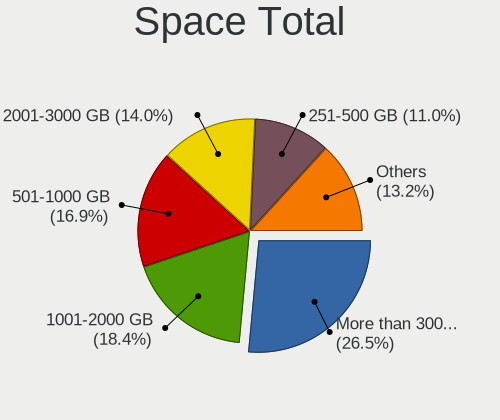
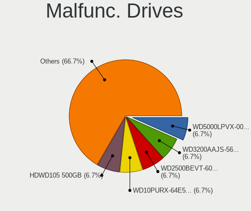
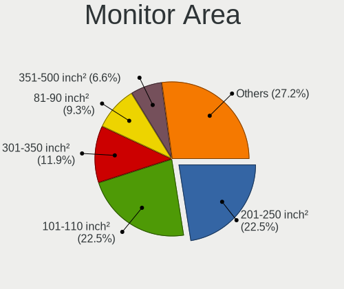
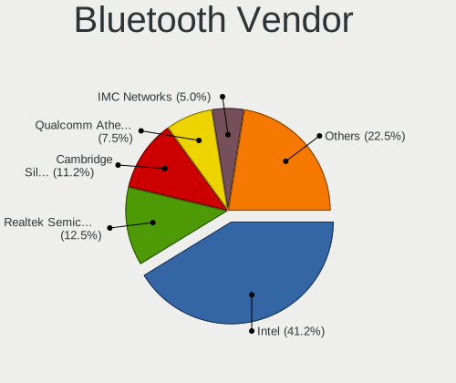
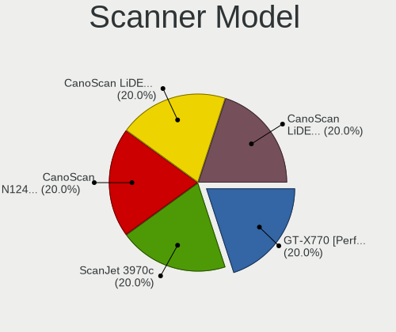

openSUSE Leap-15.3 - Tested Hardware & Statistics
-------------------------------------------------

A project to collect tested hardware configurations for openSUSE Leap-15.3.

Anyone can contribute to this report by the [hw-probe](https://github.com/linuxhw/hw-probe) tool:

    sudo -E hw-probe -all -upload

Please submit a probe of your configuration if it's not presented on the page or is rare.

This is a report for all computer types. See also reports for [desktops](/Dist/openSUSE_Leap-15.3/Desktop/README.md) and [notebooks](/Dist/openSUSE_Leap-15.3/Notebook/README.md).

Full-feature report is available here: https://linux-hardware.org/?view=trends&rel=opensuse-leap-15.3

Contents
--------

* [ Test Cases ](#test-cases)

* [ System ](#system)
  - [ Kernel                   ](#kernel)
  - [ Kernel Family            ](#kernel-family)
  - [ Kernel Major Ver.        ](#kernel-major-ver)
  - [ Arch                     ](#arch)
  - [ DE                       ](#de)
  - [ Display Server           ](#display-server)
  - [ Display Manager          ](#display-manager)
  - [ OS Lang                  ](#os-lang)
  - [ Boot Mode                ](#boot-mode)
  - [ Filesystem               ](#filesystem)
  - [ Part. scheme             ](#part-scheme)
  - [ Dual Boot with Linux/BSD ](#dual-boot-with-linuxbsd)
  - [ Dual Boot (Win)          ](#dual-boot-win)

* [ Board ](#board)
  - [ Vendor                   ](#vendor)
  - [ Model                    ](#model)
  - [ Model Family             ](#model-family)
  - [ MFG Year                 ](#mfg-year)
  - [ Form Factor              ](#form-factor)
  - [ Secure Boot              ](#secure-boot)
  - [ Coreboot                 ](#coreboot)
  - [ RAM Size                 ](#ram-size)
  - [ RAM Used                 ](#ram-used)
  - [ Total Drives             ](#total-drives)
  - [ Has CD-ROM               ](#has-cd-rom)
  - [ Has Ethernet             ](#has-ethernet)
  - [ Has WiFi                 ](#has-wifi)
  - [ Has Bluetooth            ](#has-bluetooth)

* [ Location ](#location)
  - [ Country                  ](#country)
  - [ City                     ](#city)

* [ Drives ](#drives)
  - [ Drive Vendor             ](#drive-vendor)
  - [ Drive Model              ](#drive-model)
  - [ HDD Vendor               ](#hdd-vendor)
  - [ SSD Vendor               ](#ssd-vendor)
  - [ Drive Kind               ](#drive-kind)
  - [ Drive Connector          ](#drive-connector)
  - [ Drive Size               ](#drive-size)
  - [ Space Total              ](#space-total)
  - [ Space Used               ](#space-used)
  - [ Malfunc. Drives          ](#malfunc-drives)
  - [ Malfunc. Drive Vendor    ](#malfunc-drive-vendor)
  - [ Malfunc. HDD Vendor      ](#malfunc-hdd-vendor)
  - [ Malfunc. Drive Kind      ](#malfunc-drive-kind)
  - [ Failed Drives            ](#failed-drives)
  - [ Failed Drive Vendor      ](#failed-drive-vendor)
  - [ Drive Status             ](#drive-status)

* [ Storage controller ](#storage-controller)
  - [ Storage Vendor           ](#storage-vendor)
  - [ Storage Model            ](#storage-model)
  - [ Storage Kind             ](#storage-kind)

* [ Processor ](#processor)
  - [ CPU Vendor               ](#cpu-vendor)
  - [ CPU Model                ](#cpu-model)
  - [ CPU Model Family         ](#cpu-model-family)
  - [ CPU Cores                ](#cpu-cores)
  - [ CPU Sockets              ](#cpu-sockets)
  - [ CPU Threads              ](#cpu-threads)
  - [ CPU Op-Modes             ](#cpu-op-modes)
  - [ CPU Microcode            ](#cpu-microcode)
  - [ CPU Microarch            ](#cpu-microarch)

* [ Graphics ](#graphics)
  - [ GPU Vendor               ](#gpu-vendor)
  - [ GPU Model                ](#gpu-model)
  - [ GPU Combo                ](#gpu-combo)
  - [ GPU Driver               ](#gpu-driver)
  - [ GPU Memory               ](#gpu-memory)

* [ Monitor ](#monitor)
  - [ Monitor Vendor           ](#monitor-vendor)
  - [ Monitor Model            ](#monitor-model)
  - [ Monitor Resolution       ](#monitor-resolution)
  - [ Monitor Diagonal         ](#monitor-diagonal)
  - [ Monitor Width            ](#monitor-width)
  - [ Aspect Ratio             ](#aspect-ratio)
  - [ Monitor Area             ](#monitor-area)
  - [ Pixel Density            ](#pixel-density)
  - [ Multiple Monitors        ](#multiple-monitors)

* [ Network ](#network)
  - [ Net Controller Vendor    ](#net-controller-vendor)
  - [ Net Controller Model     ](#net-controller-model)
  - [ Wireless Vendor          ](#wireless-vendor)
  - [ Wireless Model           ](#wireless-model)
  - [ Ethernet Vendor          ](#ethernet-vendor)
  - [ Ethernet Model           ](#ethernet-model)
  - [ Net Controller Kind      ](#net-controller-kind)
  - [ Used Controller          ](#used-controller)
  - [ NICs                     ](#nics)
  - [ IPv6                     ](#ipv6)

* [ Bluetooth ](#bluetooth)
  - [ Bluetooth Vendor         ](#bluetooth-vendor)
  - [ Bluetooth Model          ](#bluetooth-model)

* [ Sound ](#sound)
  - [ Sound Vendor             ](#sound-vendor)
  - [ Sound Model              ](#sound-model)

* [ Memory ](#memory)
  - [ Memory Vendor            ](#memory-vendor)
  - [ Memory Model             ](#memory-model)
  - [ Memory Kind              ](#memory-kind)
  - [ Memory Form Factor       ](#memory-form-factor)
  - [ Memory Size              ](#memory-size)
  - [ Memory Speed             ](#memory-speed)

* [ Printers & scanners ](#printers--scanners)
  - [ Printer Vendor           ](#printer-vendor)
  - [ Printer Model            ](#printer-model)
  - [ Scanner Vendor           ](#scanner-vendor)
  - [ Scanner Model            ](#scanner-model)

* [ Camera ](#camera)
  - [ Camera Vendor            ](#camera-vendor)
  - [ Camera Model             ](#camera-model)

* [ Security ](#security)
  - [ Fingerprint Vendor       ](#fingerprint-vendor)
  - [ Fingerprint Model        ](#fingerprint-model)
  - [ Chipcard Vendor          ](#chipcard-vendor)
  - [ Chipcard Model           ](#chipcard-model)

* [ Unsupported ](#unsupported)
  - [ Unsupported Devices      ](#unsupported-devices)
  - [ Unsupported Device Types ](#unsupported-device-types)

Test Cases
----------

| Vendor     | Model                       | Form-Factor | Probe                                                      | Date         |
|------------|-----------------------------|-------------|------------------------------------------------------------|--------------|
| Dell       | 0M859N A00                  | Desktop     | [aadca45789](https://linux-hardware.org/?probe=aadca45789) | Nov 01, 2021 |
| Acer       | Aspire E1-772G              | Notebook    | [2ffccc532e](https://linux-hardware.org/?probe=2ffccc532e) | Oct 24, 2021 |
| Acer       | Nitro AN515-54              | Notebook    | [b6be115eec](https://linux-hardware.org/?probe=b6be115eec) | Oct 23, 2021 |
| Acer       | Aspire 5560                 | Notebook    | [39fd26f895](https://linux-hardware.org/?probe=39fd26f895) | Oct 22, 2021 |
| TUXEDO     | Aura 15 Gen1                | Notebook    | [627c62ae00](https://linux-hardware.org/?probe=627c62ae00) | Oct 21, 2021 |
| Dell       | 0Y2YM6 A00                  | Desktop     | [d9a12dc22c](https://linux-hardware.org/?probe=d9a12dc22c) | Oct 19, 2021 |
| Dell       | 0Y2YM6 A00                  | Desktop     | [34a55551e2](https://linux-hardware.org/?probe=34a55551e2) | Oct 19, 2021 |
| Medion     | E6436 MD61150               | Notebook    | [1edd4700fd](https://linux-hardware.org/?probe=1edd4700fd) | Oct 17, 2021 |
| Medion     | E6436 MD61150               | Notebook    | [2eaa34b93e](https://linux-hardware.org/?probe=2eaa34b93e) | Oct 17, 2021 |
| HP         | Laptop 15s-eq0xxx           | Notebook    | [fc4da04b79](https://linux-hardware.org/?probe=fc4da04b79) | Oct 16, 2021 |
| HP         | Laptop 17-ca1xxx            | Notebook    | [ae1811a242](https://linux-hardware.org/?probe=ae1811a242) | Oct 13, 2021 |
| Lenovo     | ThinkPad T490s 20NYS1XK0... | Notebook    | [d3700d8667](https://linux-hardware.org/?probe=d3700d8667) | Oct 13, 2021 |
| Lenovo     | ThinkPad L15 Gen 1 20U4S... | Notebook    | [3bb6121afa](https://linux-hardware.org/?probe=3bb6121afa) | Oct 13, 2021 |
| Lenovo     | ThinkPad X1 Carbon Gen 9... | Notebook    | [f3c6229102](https://linux-hardware.org/?probe=f3c6229102) | Oct 06, 2021 |
| Lenovo     | 364A SDK0J40700 WIN 3258... | Desktop     | [ce4776505f](https://linux-hardware.org/?probe=ce4776505f) | Oct 03, 2021 |
| MSI        | B450M MORTAR MAX            | Desktop     | [556c37ba9b](https://linux-hardware.org/?probe=556c37ba9b) | Oct 03, 2021 |
| MSI        | B450M PRO-VDH MAX           | Desktop     | [ad69186227](https://linux-hardware.org/?probe=ad69186227) | Oct 02, 2021 |
| ASRock     | Z68 Extreme4 Gen3           | Desktop     | [3cec37b610](https://linux-hardware.org/?probe=3cec37b610) | Oct 02, 2021 |
| MSI        | B450M PRO-VDH MAX           | Desktop     | [540dca7da7](https://linux-hardware.org/?probe=540dca7da7) | Oct 02, 2021 |
| Lenovo     | ThinkPad T550 20CJS1VD01    | Notebook    | [390b9a8a74](https://linux-hardware.org/?probe=390b9a8a74) | Oct 01, 2021 |
| MSI        | GP63 Leopard 8RD            | Notebook    | [21189bb3e0](https://linux-hardware.org/?probe=21189bb3e0) | Oct 01, 2021 |
| ASUSTek    | M4A78T-E                    | Desktop     | [01ec64f498](https://linux-hardware.org/?probe=01ec64f498) | Sep 24, 2021 |
| Lenovo     | 364A SDK0J40700 WIN 3258... | Desktop     | [58f9ca6247](https://linux-hardware.org/?probe=58f9ca6247) | Sep 22, 2021 |
| Lenovo     | 364A SDK0J40700 WIN 3258... | Desktop     | [db9ccd461b](https://linux-hardware.org/?probe=db9ccd461b) | Sep 22, 2021 |
| Dell       | Precision M6700             | Notebook    | [0d8cf3bf1c](https://linux-hardware.org/?probe=0d8cf3bf1c) | Sep 21, 2021 |
| VS Company | G31T-M                      | Desktop     | [ed8bb8c0d1](https://linux-hardware.org/?probe=ed8bb8c0d1) | Sep 21, 2021 |
| ASUSTek    | AM1M-A/BR                   | Desktop     | [c586c22b15](https://linux-hardware.org/?probe=c586c22b15) | Sep 20, 2021 |
| Alienware  | 0PGRP5 A02                  | Desktop     | [65615a3aaa](https://linux-hardware.org/?probe=65615a3aaa) | Sep 16, 2021 |
| Alienware  | 0PGRP5 A02                  | Desktop     | [158a015f26](https://linux-hardware.org/?probe=158a015f26) | Sep 15, 2021 |
| MSI        | X370 GAMING PRO             | Desktop     | [629a45e23d](https://linux-hardware.org/?probe=629a45e23d) | Sep 12, 2021 |
| HP         | 8056                        | Desktop     | [3cab8505c4](https://linux-hardware.org/?probe=3cab8505c4) | Sep 06, 2021 |
| Intel      | DG41WV AAE90316-104         | Desktop     | [27c162218f](https://linux-hardware.org/?probe=27c162218f) | Sep 05, 2021 |
| Gigabyte   | B550 AORUS PRO AC           | Desktop     | [be3b65a81d](https://linux-hardware.org/?probe=be3b65a81d) | Aug 29, 2021 |
| Lenovo     | ThinkPad X1 Carbon 4th 2... | Notebook    | [44d0412dd3](https://linux-hardware.org/?probe=44d0412dd3) | Aug 27, 2021 |
| Samsung    | 600B4B/600B5B               | Notebook    | [200275bbd6](https://linux-hardware.org/?probe=200275bbd6) | Aug 27, 2021 |
| ASRock     | B450M Pro4                  | Desktop     | [a13b05f65f](https://linux-hardware.org/?probe=a13b05f65f) | Aug 27, 2021 |
| Dell       | Precision M6700             | Notebook    | [191db00b83](https://linux-hardware.org/?probe=191db00b83) | Aug 26, 2021 |
| Lenovo     | V330-15IKB 81AX             | Notebook    | [4b5a1af4dd](https://linux-hardware.org/?probe=4b5a1af4dd) | Aug 26, 2021 |
| Lenovo     | G500 20236                  | Notebook    | [73a5085a79](https://linux-hardware.org/?probe=73a5085a79) | Aug 24, 2021 |
| Dell       | Latitude 5480               | Notebook    | [a2110d9601](https://linux-hardware.org/?probe=a2110d9601) | Aug 24, 2021 |
| Dell       | Latitude 5480               | Notebook    | [64e1f3e16c](https://linux-hardware.org/?probe=64e1f3e16c) | Aug 19, 2021 |
| Lenovo     | ThinkPad T61 8895W9U        | Notebook    | [424c5f3e75](https://linux-hardware.org/?probe=424c5f3e75) | Aug 19, 2021 |
| Dell       | Inspiron 3521               | Notebook    | [c68ce33d52](https://linux-hardware.org/?probe=c68ce33d52) | Aug 11, 2021 |
| Dell       | Inspiron 3521               | Notebook    | [9a422a10d3](https://linux-hardware.org/?probe=9a422a10d3) | Aug 11, 2021 |
| Dell       | Inspiron 7460               | Notebook    | [f954aa3826](https://linux-hardware.org/?probe=f954aa3826) | Aug 10, 2021 |
| Samsung    | 600B4B/600B5B               | Notebook    | [0a650b495e](https://linux-hardware.org/?probe=0a650b495e) | Aug 09, 2021 |
| Lenovo     | ThinkPad T460 20FMS75800    | Notebook    | [1a1c3f469d](https://linux-hardware.org/?probe=1a1c3f469d) | Aug 07, 2021 |
| Lenovo     | ThinkPad X1 Carbon 4th 2... | Notebook    | [5953bc46ad](https://linux-hardware.org/?probe=5953bc46ad) | Aug 06, 2021 |
| Lenovo     | ThinkPad X1 Carbon 4th 2... | Notebook    | [fafaeed466](https://linux-hardware.org/?probe=fafaeed466) | Aug 06, 2021 |
| ASUSTek    | PRIME H310M-A               | Desktop     | [a22aa3c48c](https://linux-hardware.org/?probe=a22aa3c48c) | Aug 01, 2021 |
| MSI        | B85M-E45                    | Desktop     | [0e20d4cea9](https://linux-hardware.org/?probe=0e20d4cea9) | Jul 30, 2021 |
| Gigabyte   | B250M-DS3H-CF               | Desktop     | [acbcbe74d7](https://linux-hardware.org/?probe=acbcbe74d7) | Jul 22, 2021 |
| HP         | Stream Notebook PC 11       | Notebook    | [a612aa5d15](https://linux-hardware.org/?probe=a612aa5d15) | Jul 20, 2021 |
| HP         | 8433 11                     | Desktop     | [b079ccb608](https://linux-hardware.org/?probe=b079ccb608) | Jul 15, 2021 |
| MSI        | D2415 S26361-D2415-A21      | Desktop     | [b49400f636](https://linux-hardware.org/?probe=b49400f636) | Jul 11, 2021 |
| Lenovo     | ThinkPad T450s 20BWA06J0... | Notebook    | [e4cd39ef75](https://linux-hardware.org/?probe=e4cd39ef75) | Jul 09, 2021 |
| Lenovo     | ThinkPad T450s 20BWA06J0... | Notebook    | [5565f4e4fe](https://linux-hardware.org/?probe=5565f4e4fe) | Jul 09, 2021 |
| Fujitsu    | LIFEBOOK E754               | Notebook    | [e7923c27f1](https://linux-hardware.org/?probe=e7923c27f1) | Jul 08, 2021 |
| MSI        | B350 TOMAHAWK               | Desktop     | [27a6ac997b](https://linux-hardware.org/?probe=27a6ac997b) | Jul 03, 2021 |
| ASRock     | X570M Pro4                  | Desktop     | [a00aea4331](https://linux-hardware.org/?probe=a00aea4331) | Jul 03, 2021 |
| HP         | 0A68h                       | Desktop     | [36cfa6a366](https://linux-hardware.org/?probe=36cfa6a366) | Jun 27, 2021 |
| ASUSTek    | TUF B450-PRO GAMING         | Desktop     | [dfc2f82575](https://linux-hardware.org/?probe=dfc2f82575) | Jun 26, 2021 |
| ASUSTek    | G771JW                      | Notebook    | [8e6c4ddee8](https://linux-hardware.org/?probe=8e6c4ddee8) | Jun 24, 2021 |
| ASRock     | X570 Steel Legend           | Desktop     | [b4a11b3e4e](https://linux-hardware.org/?probe=b4a11b3e4e) | Jun 17, 2021 |
| MSI        | MEG X570 GODLIKE            | Desktop     | [11b7f0e8ae](https://linux-hardware.org/?probe=11b7f0e8ae) | Jun 17, 2021 |
| HP         | ZBook 17 G2                 | Notebook    | [3342d4d378](https://linux-hardware.org/?probe=3342d4d378) | Jun 17, 2021 |
| HP         | OMEN by HP Laptop 15-dc1... | Notebook    | [0c01b21401](https://linux-hardware.org/?probe=0c01b21401) | Jun 15, 2021 |
| Sony       | VPCSB15GB                   | Notebook    | [43a9d38ca0](https://linux-hardware.org/?probe=43a9d38ca0) | Jun 03, 2021 |
| HP         | 2AA2                        | Desktop     | [65e7cd2d3e](https://linux-hardware.org/?probe=65e7cd2d3e) | Jun 02, 2021 |
| Sony       | VGN-Z570AN                  | Notebook    | [13d58b8d90](https://linux-hardware.org/?probe=13d58b8d90) | May 21, 2021 |
| Sony       | VGN-Z570AN                  | Notebook    | [e6c7882e05](https://linux-hardware.org/?probe=e6c7882e05) | May 21, 2021 |
| MSI        | GS60 6QE                    | Notebook    | [93c6fd8911](https://linux-hardware.org/?probe=93c6fd8911) | May 18, 2021 |
| MSI        | GS60 6QE                    | Notebook    | [41fe777475](https://linux-hardware.org/?probe=41fe777475) | May 18, 2021 |
| ASUSTek    | VivoBook 12_ASUS Laptop ... | Notebook    | [184bedf2fd](https://linux-hardware.org/?probe=184bedf2fd) | May 01, 2021 |
| HP         | Pavilion dx6500             | Notebook    | [091cc2c616](https://linux-hardware.org/?probe=091cc2c616) | Apr 13, 2021 |
| HP         | Pavilion dx6500             | Notebook    | [6ad0d5c87f](https://linux-hardware.org/?probe=6ad0d5c87f) | Apr 13, 2021 |
| Dell       | Inspiron 15 7000 Gaming     | Notebook    | [97a7246099](https://linux-hardware.org/?probe=97a7246099) | Mar 01, 2021 |
| Dell       | Inspiron 15 7000 Gaming     | Notebook    | [b1e186207c](https://linux-hardware.org/?probe=b1e186207c) | Feb 28, 2021 |
| ASUSTek    | P8H61-M LE/USB3             | Desktop     | [fca0fd3336](https://linux-hardware.org/?probe=fca0fd3336) | Jan 03, 2021 |

System
------

Kernel
------

Version of the Linux kernel

| Version                 | Computers | Percent |
|-------------------------|-----------|---------|
| 5.3.18-59.19-default    | 13        | 20.97%  |
| 5.3.18-59.27-default    | 8         | 12.9%   |
| 5.3.18-57-default       | 8         | 12.9%   |
| 5.3.18-59.5-default     | 6         | 9.68%   |
| 5.3.18-59.24-default    | 6         | 9.68%   |
| 5.3.18-59.16-default    | 6         | 9.68%   |
| 5.3.18-59.10-default    | 5         | 8.06%   |
| 5.3.18-59.19-preempt    | 2         | 3.23%   |
| 5.3.18-59.13-default    | 2         | 3.23%   |
| 5.3.18-lp152.57-default | 1         | 1.61%   |
| 5.3.18-59.24-preempt    | 1         | 1.61%   |
| 5.3.18-57-preempt       | 1         | 1.61%   |
| 5.3.18-56-default       | 1         | 1.61%   |
| 5.3.18-52-default       | 1         | 1.61%   |
| 5.3.18-46-default       | 1         | 1.61%   |

Kernel Family
-------------

Linux kernel without a distro release

| Version | Computers | Percent |
|---------|-----------|---------|
| 5.3.18  | 61        | 100%    |

Kernel Major Ver.
-----------------

Linux kernel major version

| Version | Computers | Percent |
|---------|-----------|---------|
| 5.3     | 61        | 100%    |

Arch
----

OS architecture (x86_64, i586, etc.)

| Name   | Computers | Percent |
|--------|-----------|---------|
| x86_64 | 61        | 100%    |

DE
--

Desktop Environment

| Name       | Computers | Percent |
|------------|-----------|---------|
| KDE5       | 22        | 35.48%  |
| KDE        | 17        | 27.42%  |
| XFCE       | 7         | 11.29%  |
| Unknown    | 7         | 11.29%  |
| GNOME      | 6         | 9.68%   |
| X-Cinnamon | 3         | 4.84%   |

Display Server
--------------

X11 or Wayland

| Name    | Computers | Percent |
|---------|-----------|---------|
| X11     | 50        | 81.97%  |
| Wayland | 7         | 11.48%  |
| Tty     | 4         | 6.56%   |

Display Manager
---------------

SDDM, LightDM, etc.

| Name    | Computers | Percent |
|---------|-----------|---------|
| Unknown | 35        | 57.38%  |
| LightDM | 14        | 22.95%  |
| SDDM    | 10        | 16.39%  |
| XDM     | 1         | 1.64%   |
| GDM     | 1         | 1.64%   |

OS Lang
-------

Language

| Lang    | Computers | Percent |
|---------|-----------|---------|
| en_US   | 22        | 36.07%  |
| de_DE   | 12        | 19.67%  |
| POSIX   | 6         | 9.84%   |
| pt_BR   | 3         | 4.92%   |
| fr_FR   | 2         | 3.28%   |
| es_ES   | 2         | 3.28%   |
| en_GB   | 2         | 3.28%   |
| zh_CN   | 1         | 1.64%   |
| sv_SE   | 1         | 1.64%   |
| ru_RU   | 1         | 1.64%   |
| pt_PT   | 1         | 1.64%   |
| pl_PL   | 1         | 1.64%   |
| nl_BE   | 1         | 1.64%   |
| hu_HU   | 1         | 1.64%   |
| hr_HR   | 1         | 1.64%   |
| es_MX   | 1         | 1.64%   |
| en_AU   | 1         | 1.64%   |
| cs_CZ   | 1         | 1.64%   |
| Unknown | 1         | 1.64%   |

Boot Mode
---------

EFI or BIOS

| Mode | Computers | Percent |
|------|-----------|---------|
| BIOS | 40        | 65.57%  |
| EFI  | 21        | 34.43%  |

Filesystem
----------

Type of filesystem

| Type  | Computers | Percent |
|-------|-----------|---------|
| Btrfs | 41        | 67.21%  |
| Ext4  | 17        | 27.87%  |
| Xfs   | 3         | 4.92%   |

Part. scheme
------------

Scheme of partitioning

| Type    | Computers | Percent |
|---------|-----------|---------|
| Unknown | 32        | 52.46%  |
| GPT     | 26        | 42.62%  |
| MBR     | 3         | 4.92%   |

Dual Boot with Linux/BSD
------------------------

Hosting more than one Linux/BSD

| Dual boot | Computers | Percent |
|-----------|-----------|---------|
| No        | 57        | 93.44%  |
| Yes       | 4         | 6.56%   |

Dual Boot (Win)
---------------

Hosting Linux and Windows

| Dual boot | Computers | Percent |
|-----------|-----------|---------|
| No        | 45        | 73.77%  |
| Yes       | 16        | 26.23%  |

Board
-----

Vendor
------

Motherboard manufacturer

| Name                | Computers | Percent |
|---------------------|-----------|---------|
| Lenovo              | 10        | 16.39%  |
| Hewlett-Packard     | 10        | 16.39%  |
| MSI                 | 9         | 14.75%  |
| Dell                | 7         | 11.48%  |
| ASUSTek Computer    | 7         | 11.48%  |
| ASRock              | 4         | 6.56%   |
| Acer                | 3         | 4.92%   |
| Sony                | 2         | 3.28%   |
| Gigabyte Technology | 2         | 3.28%   |
| VS Company          | 1         | 1.64%   |
| TUXEDO              | 1         | 1.64%   |
| Samsung Electronics | 1         | 1.64%   |
| Medion              | 1         | 1.64%   |
| Intel               | 1         | 1.64%   |
| Fujitsu             | 1         | 1.64%   |
| Alienware           | 1         | 1.64%   |

Model
-----

Motherboard model

| Name                                         | Computers | Percent |
|----------------------------------------------|-----------|---------|
| VS Company VS-G31T-M                         | 1         | 1.64%   |
| TUXEDO Aura 15 Gen1                          | 1         | 1.64%   |
| Sony VPCSB15GB                               | 1         | 1.64%   |
| Sony VGN-Z570AN                              | 1         | 1.64%   |
| Samsung 600B4B/600B5B                        | 1         | 1.64%   |
| MSI MS-7C34                                  | 1         | 1.64%   |
| MSI MS-7B89                                  | 1         | 1.64%   |
| MSI MS-7A38                                  | 1         | 1.64%   |
| MSI MS-7A34                                  | 1         | 1.64%   |
| MSI MS-7A33                                  | 1         | 1.64%   |
| MSI MS-7817                                  | 1         | 1.64%   |
| MSI GS60 6QE                                 | 1         | 1.64%   |
| MSI GP63 Leopard 8RD                         | 1         | 1.64%   |
| MSI ESPRIMO P1510                            | 1         | 1.64%   |
| Medion E6436 MD61150                         | 1         | 1.64%   |
| Lenovo V330-15IKB 81AX                       | 1         | 1.64%   |
| Lenovo ThinkPad X1 Carbon Gen 9 20XW00A7TH   | 1         | 1.64%   |
| Lenovo ThinkPad X1 Carbon 4th 20FB002UMC     | 1         | 1.64%   |
| Lenovo ThinkPad T61 8895W9U                  | 1         | 1.64%   |
| Lenovo ThinkPad T490s 20NYS1XK00             | 1         | 1.64%   |
| Lenovo ThinkPad T460 20FMS75800              | 1         | 1.64%   |
| Lenovo ThinkPad T450s 20BWA06J00             | 1         | 1.64%   |
| Lenovo ThinkPad L15 Gen 1 20U4S88000         | 1         | 1.64%   |
| Lenovo IdeaCentre Y710 Cube-15ISH 90FL004WGE | 1         | 1.64%   |
| Lenovo G500 20236                            | 1         | 1.64%   |
| Intel DG41WV AAE90316-104                    | 1         | 1.64%   |
| HP ZBook 17 G2                               | 1         | 1.64%   |
| HP xw4400 Workstation                        | 1         | 1.64%   |
| HP Stream Notebook PC 11                     | 1         | 1.64%   |
| HP Pavilion Gaming Desktop 690-00xx          | 1         | 1.64%   |
| HP Pavilion dx6500                           | 1         | 1.64%   |
| HP OMEN by HP Laptop 15-dc1xxx               | 1         | 1.64%   |
| HP Laptop 17-ca1xxx                          | 1         | 1.64%   |
| HP Laptop 15s-eq0xxx                         | 1         | 1.64%   |
| HP EliteDesk 800 G2 DM 65W                   | 1         | 1.64%   |
| HP 200-5120br                                | 1         | 1.64%   |
| Gigabyte B550 AORUS PRO AC                   | 1         | 1.64%   |
| Gigabyte B250M-DS3H                          | 1         | 1.64%   |
| Fujitsu LIFEBOOK E754                        | 1         | 1.64%   |
| Dell Vostro 3268                             | 1         | 1.64%   |
| Dell Precision M6700                         | 1         | 1.64%   |
| Dell OptiPlex 760                            | 1         | 1.64%   |
| Dell Latitude 5480                           | 1         | 1.64%   |
| Dell Inspiron 7460                           | 1         | 1.64%   |
| Dell Inspiron 3521                           | 1         | 1.64%   |
| Dell Inspiron 15 7000 Gaming                 | 1         | 1.64%   |
| ASUS VivoBook 12_ASUS Laptop E203MAS_E203MA  | 1         | 1.64%   |
| ASUS TUF B450-PRO GAMING                     | 1         | 1.64%   |
| ASUS PRIME H310M-A                           | 1         | 1.64%   |
| ASUS P8H61-M LE/USB3                         | 1         | 1.64%   |
| ASUS M4A78T-E                                | 1         | 1.64%   |
| ASUS G771JW                                  | 1         | 1.64%   |
| ASUS All Series                              | 1         | 1.64%   |
| ASRock Z68 Extreme4 Gen3                     | 1         | 1.64%   |
| ASRock X570M Pro4                            | 1         | 1.64%   |
| ASRock X570 Steel Legend                     | 1         | 1.64%   |
| ASRock B450M Pro4                            | 1         | 1.64%   |
| Alienware X51 R2                             | 1         | 1.64%   |
| Acer Nitro AN515-54                          | 1         | 1.64%   |
| Acer Aspire E1-772G                          | 1         | 1.64%   |

Model Family
------------

Motherboard model prefix

| Name                 | Computers | Percent |
|----------------------|-----------|---------|
| Lenovo ThinkPad      | 7         | 11.48%  |
| Dell Inspiron        | 3         | 4.92%   |
| HP Pavilion          | 2         | 3.28%   |
| HP Laptop            | 2         | 3.28%   |
| Acer Aspire          | 2         | 3.28%   |
| VS Company VS-G31T-M | 1         | 1.64%   |
| TUXEDO Aura          | 1         | 1.64%   |
| Sony VPCSB15GB       | 1         | 1.64%   |
| Sony VGN-Z570AN      | 1         | 1.64%   |
| Samsung 600B4B       | 1         | 1.64%   |
| MSI MS-7C34          | 1         | 1.64%   |
| MSI MS-7B89          | 1         | 1.64%   |
| MSI MS-7A38          | 1         | 1.64%   |
| MSI MS-7A34          | 1         | 1.64%   |
| MSI MS-7A33          | 1         | 1.64%   |
| MSI MS-7817          | 1         | 1.64%   |
| MSI GS60             | 1         | 1.64%   |
| MSI GP63             | 1         | 1.64%   |
| MSI ESPRIMO          | 1         | 1.64%   |
| Medion E6436         | 1         | 1.64%   |
| Lenovo V330-15IKB    | 1         | 1.64%   |
| Lenovo IdeaCentre    | 1         | 1.64%   |
| Lenovo G500          | 1         | 1.64%   |
| Intel DG41WV         | 1         | 1.64%   |
| HP ZBook             | 1         | 1.64%   |
| HP xw4400            | 1         | 1.64%   |
| HP Stream            | 1         | 1.64%   |
| HP OMEN              | 1         | 1.64%   |
| HP EliteDesk         | 1         | 1.64%   |
| HP 200-5120br        | 1         | 1.64%   |
| Gigabyte B550        | 1         | 1.64%   |
| Gigabyte B250M-DS3H  | 1         | 1.64%   |
| Fujitsu LIFEBOOK     | 1         | 1.64%   |
| Dell Vostro          | 1         | 1.64%   |
| Dell Precision       | 1         | 1.64%   |
| Dell OptiPlex        | 1         | 1.64%   |
| Dell Latitude        | 1         | 1.64%   |
| ASUS VivoBook        | 1         | 1.64%   |
| ASUS TUF             | 1         | 1.64%   |
| ASUS PRIME           | 1         | 1.64%   |
| ASUS P8H61-M         | 1         | 1.64%   |
| ASUS M4A78T-E        | 1         | 1.64%   |
| ASUS G771JW          | 1         | 1.64%   |
| ASUS All             | 1         | 1.64%   |
| ASRock Z68           | 1         | 1.64%   |
| ASRock X570M         | 1         | 1.64%   |
| ASRock X570          | 1         | 1.64%   |
| ASRock B450M         | 1         | 1.64%   |
| Alienware X51        | 1         | 1.64%   |
| Acer Nitro           | 1         | 1.64%   |

MFG Year
--------

Motherboard manufacture year

| Year | Computers | Percent |
|------|-----------|---------|
| 2021 | 12        | 19.67%  |
| 2020 | 9         | 14.75%  |
| 2018 | 9         | 14.75%  |
| 2019 | 6         | 9.84%   |
| 2010 | 5         | 8.2%    |
| 2011 | 4         | 6.56%   |
| 2016 | 3         | 4.92%   |
| 2013 | 3         | 4.92%   |
| 2017 | 2         | 3.28%   |
| 2015 | 2         | 3.28%   |
| 2014 | 2         | 3.28%   |
| 2009 | 2         | 3.28%   |
| 2012 | 1         | 1.64%   |
| 2007 | 1         | 1.64%   |

Form Factor
-----------

Physical design of the computer

| Name     | Computers | Percent |
|----------|-----------|---------|
| Notebook | 33        | 54.1%   |
| Desktop  | 28        | 45.9%   |

Secure Boot
-----------

Enabled or disabled

| State    | Computers | Percent |
|----------|-----------|---------|
| Disabled | 56        | 91.8%   |
| Enabled  | 5         | 8.2%    |

Coreboot
--------

Have coreboot on board

| Used | Computers | Percent |
|------|-----------|---------|
| No   | 61        | 100%    |

RAM Size
--------

Total RAM memory

| Size in GB  | Computers | Percent |
|-------------|-----------|---------|
| 16.01-24.0  | 17        | 27.87%  |
| 4.01-8.0    | 12        | 19.67%  |
| 8.01-16.0   | 10        | 16.39%  |
| 3.01-4.0    | 8         | 13.11%  |
| 32.01-64.0  | 5         | 8.2%    |
| 64.01-256.0 | 5         | 8.2%    |
| 1.01-2.0    | 2         | 3.28%   |
| 24.01-32.0  | 1         | 1.64%   |
| 2.01-3.0    | 1         | 1.64%   |

RAM Used
--------

Used RAM memory

| Used GB   | Computers | Percent |
|-----------|-----------|---------|
| 1.01-2.0  | 23        | 37.7%   |
| 2.01-3.0  | 14        | 22.95%  |
| 4.01-8.0  | 13        | 21.31%  |
| 3.01-4.0  | 7         | 11.48%  |
| 8.01-16.0 | 2         | 3.28%   |
| 0.51-1.0  | 2         | 3.28%   |

Total Drives
------------

Number of drives on board

| Drives | Computers | Percent |
|--------|-----------|---------|
| 1      | 28        | 45.9%   |
| 2      | 22        | 36.07%  |
| 3      | 6         | 9.84%   |
| 4      | 4         | 6.56%   |
| 6      | 1         | 1.64%   |

Has CD-ROM
----------

Has CD-ROM on board

| Presented | Computers | Percent |
|-----------|-----------|---------|
| No        | 33        | 54.1%   |
| Yes       | 28        | 45.9%   |

Has Ethernet
------------

Has Ethernet on board

| Presented | Computers | Percent |
|-----------|-----------|---------|
| Yes       | 57        | 93.44%  |
| No        | 4         | 6.56%   |

Has WiFi
--------

Has WiFi module

| Presented | Computers | Percent |
|-----------|-----------|---------|
| Yes       | 51        | 83.61%  |
| No        | 10        | 16.39%  |

Has Bluetooth
-------------

Has Bluetooth module

| Presented | Computers | Percent |
|-----------|-----------|---------|
| Yes       | 38        | 61.29%  |
| No        | 24        | 38.71%  |

Location
--------

Country
-------

Geographic location (country)

| Country     | Computers | Percent |
|-------------|-----------|---------|
| Germany     | 14        | 22.95%  |
| Brazil      | 7         | 11.48%  |
| USA         | 5         | 8.2%    |
| Mexico      | 3         | 4.92%   |
| India       | 3         | 4.92%   |
| Spain       | 2         | 3.28%   |
| Russia      | 2         | 3.28%   |
| Nicaragua   | 2         | 3.28%   |
| Japan       | 2         | 3.28%   |
| France      | 2         | 3.28%   |
| Czechia     | 2         | 3.28%   |
| Australia   | 2         | 3.28%   |
| Thailand    | 1         | 1.64%   |
| Sweden      | 1         | 1.64%   |
| Sudan       | 1         | 1.64%   |
| Slovakia    | 1         | 1.64%   |
| Romania     | 1         | 1.64%   |
| Portugal    | 1         | 1.64%   |
| Poland      | 1         | 1.64%   |
| Netherlands | 1         | 1.64%   |
| Luxembourg  | 1         | 1.64%   |
| Hungary     | 1         | 1.64%   |
| Greece      | 1         | 1.64%   |
| Croatia     | 1         | 1.64%   |
| China       | 1         | 1.64%   |
| Canada      | 1         | 1.64%   |
| Belgium     | 1         | 1.64%   |

City
----

Geographic location (city)

| City                  | Computers | Percent |
|-----------------------|-----------|---------|
| São Paulo            | 3         | 4.84%   |
| Tokyo                 | 2         | 3.23%   |
| Prague                | 2         | 3.23%   |
| Managua               | 2         | 3.23%   |
| Zhuhai                | 1         | 1.61%   |
| Vijayawada            | 1         | 1.61%   |
| Umeå                 | 1         | 1.61%   |
| Três Lagoas          | 1         | 1.61%   |
| The Hague             | 1         | 1.61%   |
| Stuttgart             | 1         | 1.61%   |
| Stupava               | 1         | 1.61%   |
| Stabroek              | 1         | 1.61%   |
| S??o Paulo            | 1         | 1.61%   |
| San Luis Potos?­ City | 1         | 1.61%   |
| Rockville             | 1         | 1.61%   |
| Recife                | 1         | 1.61%   |
| Pringy                | 1         | 1.61%   |
| Palanpur              | 1         | 1.61%   |
| Oregon                | 1         | 1.61%   |
| Nuremberg             | 1         | 1.61%   |
| Nordenham             | 1         | 1.61%   |
| Nevez                 | 1         | 1.61%   |
| Munich                | 1         | 1.61%   |
| Moscow                | 1         | 1.61%   |
| Monterrey             | 1         | 1.61%   |
| Melbourne             | 1         | 1.61%   |
| McDonough             | 1         | 1.61%   |
| Luxembourg            | 1         | 1.61%   |
| Lomonosov             | 1         | 1.61%   |
| Leiria                | 1         | 1.61%   |
| Le??n                 | 1         | 1.61%   |
| Koleczkowo            | 1         | 1.61%   |
| Khartoum              | 1         | 1.61%   |
| Kathu                 | 1         | 1.61%   |
| Isernhagen            | 1         | 1.61%   |
| Howick                | 1         | 1.61%   |
| Heinsberg             | 1         | 1.61%   |
| Halle                 | 1         | 1.61%   |
| Gevelsberg            | 1         | 1.61%   |
| Gelnhausen            | 1         | 1.61%   |
| Federal Way           | 1         | 1.61%   |
| Esztergom             | 1         | 1.61%   |
| Ebhausen              | 1         | 1.61%   |
| Dahme                 | 1         | 1.61%   |
| Concarneau            | 1         | 1.61%   |
| Cologne               | 1         | 1.61%   |
| Chapec??              | 1         | 1.61%   |
| Canc??n               | 1         | 1.61%   |
| Busevec               | 1         | 1.61%   |
| Bucharest             | 1         | 1.61%   |
| Brisbane              | 1         | 1.61%   |
| Bremen                | 1         | 1.61%   |
| Braunschweig          | 1         | 1.61%   |
| Bilbao                | 1         | 1.61%   |
| Bengaluru             | 1         | 1.61%   |
| Atlanta               | 1         | 1.61%   |
| Athens                | 1         | 1.61%   |

Drives
------

Drive Vendor
------------

Hard drive vendors

| Vendor              | Computers | Drives | Percent |
|---------------------|-----------|--------|---------|
| WDC                 | 21        | 25     | 20.39%  |
| Samsung Electronics | 17        | 20     | 16.5%   |
| Seagate             | 13        | 15     | 12.62%  |
| SanDisk             | 7         | 8      | 6.8%    |
| Kingston            | 6         | 6      | 5.83%   |
| Hitachi             | 6         | 7      | 5.83%   |
| Unknown             | 3         | 3      | 2.91%   |
| Toshiba             | 3         | 4      | 2.91%   |
| Intel               | 3         | 3      | 2.91%   |
| HGST                | 3         | 3      | 2.91%   |
| A-DATA Technology   | 3         | 3      | 2.91%   |
| SK Hynix            | 2         | 2      | 1.94%   |
| Silicon Motion      | 2         | 2      | 1.94%   |
| Intenso             | 2         | 3      | 1.94%   |
| Crucial             | 2         | 2      | 1.94%   |
| TO Exter            | 1         | 1      | 0.97%   |
| PLEXTOR             | 1         | 2      | 0.97%   |
| Phison              | 1         | 1      | 0.97%   |
| Micron Technology   | 1         | 1      | 0.97%   |
| LITEON              | 1         | 1      | 0.97%   |
| Lite-On             | 1         | 1      | 0.97%   |
| JMicron             | 1         | 1      | 0.97%   |
| Inateck             | 1         | 1      | 0.97%   |
| HGST HTS            | 1         | 1      | 0.97%   |
| Fujitsu             | 1         | 1      | 0.97%   |

Drive Model
-----------

Hard drive models

| Model                                 | Computers | Percent |
|---------------------------------------|-----------|---------|
| Silicon Motion NVMe SSD Drive 512GB   | 2         | 1.79%   |
| Seagate ST3750528AS 752GB             | 2         | 1.79%   |
| Seagate ST2000DM006-2DM164 2TB        | 2         | 1.79%   |
| Seagate ST1000LM035-1RK172 1TB        | 2         | 1.79%   |
| Seagate ST1000LM024 HN-M101MBB 1TB    | 2         | 1.79%   |
| Samsung SSD 860 EVO 250GB             | 2         | 1.79%   |
| Samsung SSD 850 EVO 500GB             | 2         | 1.79%   |
| Samsung SSD 850 EVO 250GB             | 2         | 1.79%   |
| HGST HTS721010A9E630 1TB              | 2         | 1.79%   |
| WDC WDS500G1X0E-00AFY0 500GB          | 1         | 0.89%   |
| WDC WDS480G2G0A-00JH30 480GB SSD      | 1         | 0.89%   |
| WDC WDS250G1B0C-00S6U0 250GB          | 1         | 0.89%   |
| WDC WDS100T3X0C-00SJG0 1TB            | 1         | 0.89%   |
| WDC WD800BEVS-60RST0 80GB             | 1         | 0.89%   |
| WDC WD7500AALX-009BA0 752GB           | 1         | 0.89%   |
| WDC WD5000LPLX-66ZNTT1 500GB          | 1         | 0.89%   |
| WDC WD5000AAVS-00ZTB0 500GB           | 1         | 0.89%   |
| WDC WD50 00LPCX-00VHAT0 500GB         | 1         | 0.89%   |
| WDC WD3200AAKS-00B3A0 320GB           | 1         | 0.89%   |
| WDC WD2500AAJS-00VTA0 250GB           | 1         | 0.89%   |
| WDC WD2005FBYZ-01YCBB2 2TB            | 1         | 0.89%   |
| WDC WD10SPZX-60Z10T0 1TB              | 1         | 0.89%   |
| WDC WD10SPZX-17Z10T0 1TB              | 1         | 0.89%   |
| WDC WD10EZEX-75WN4A0 1TB              | 1         | 0.89%   |
| WDC WD10EZEX-75M2NA0 1TB              | 1         | 0.89%   |
| WDC WD10EZEX-08WN4A0 1TB              | 1         | 0.89%   |
| WDC WD10EZEX-00KUWA0 1TB              | 1         | 0.89%   |
| WDC WD10EZEX-00BN5A0 1TB              | 1         | 0.89%   |
| WDC WD10EAVS-22D7B0 1TB               | 1         | 0.89%   |
| WDC WD10EACS-00D6B1 1TB               | 1         | 0.89%   |
| WDC WD1003FZEX-00K3CA0 1TB            | 1         | 0.89%   |
| WDC WD1001FALS-00E3A0 1TB             | 1         | 0.89%   |
| WDC PC SN730 SDBPNTY-512G-1006 512GB  | 1         | 0.89%   |
| Unknown USD00  256GB                  | 1         | 0.89%   |
| Unknown DA4064  64GB                  | 1         | 0.89%   |
| Unknown 128GB SATA FLASH DRIVE        | 1         | 0.89%   |
| Toshiba THNSNJ256G8NU 256GB SSD       | 1         | 0.89%   |
| Toshiba MQ01ABD075 752GB              | 1         | 0.89%   |
| Toshiba HDWD130 3TB                   | 1         | 0.89%   |
| TO Exter nal USB 3.0 160GB            | 1         | 0.89%   |
| SK Hynix HFS128G39TND-N210A 128GB SSD | 1         | 0.89%   |
| SK Hynix HBG4e  32GB                  | 1         | 0.89%   |
| Seagate ST9320325AS 320GB             | 1         | 0.89%   |
| Seagate ST500LM012 HN-M500MBB 500GB   | 1         | 0.89%   |
| Seagate ST500LM0 12 HN-M500MBB 500GB  | 1         | 0.89%   |
| Seagate ST3750630AS 752GB             | 1         | 0.89%   |
| Seagate ST3160812AS 160GB             | 1         | 0.89%   |
| Seagate ST3000DM007-1WY10G 3TB        | 1         | 0.89%   |
| Seagate ST1000DM010-2EP102 1TB        | 1         | 0.89%   |
| SanDisk SSD PLUS 1000GB               | 1         | 0.89%   |
| SanDisk SDSSDH3 1T00 1TB              | 1         | 0.89%   |
| SanDisk SDSSDA240G 240GB              | 1         | 0.89%   |
| SanDisk SD9SN8W256G 256GB SSD         | 1         | 0.89%   |
| SanDisk SD8TB8U512G1001 512GB SSD     | 1         | 0.89%   |
| SanDisk SD7SB6S256G1001 256GB SSD     | 1         | 0.89%   |
| SanDisk SD7SB3Q-256G-1006 256GB SSD   | 1         | 0.89%   |
| Samsung SSD 980 PRO 1TB               | 1         | 0.89%   |
| Samsung SSD 970 EVO 1TB               | 1         | 0.89%   |
| Samsung SSD 870 QVO 1TB               | 1         | 0.89%   |
| Samsung SSD 860 EVO 1TB               | 1         | 0.89%   |

HDD Vendor
----------

Hard disk drive vendors

| Vendor              | Computers | Drives | Percent |
|---------------------|-----------|--------|---------|
| WDC                 | 16        | 20     | 34.78%  |
| Seagate             | 13        | 15     | 28.26%  |
| Hitachi             | 6         | 7      | 13.04%  |
| HGST                | 3         | 3      | 6.52%   |
| Toshiba             | 2         | 3      | 4.35%   |
| Samsung Electronics | 2         | 3      | 4.35%   |
| TO Exter            | 1         | 1      | 2.17%   |
| JMicron             | 1         | 1      | 2.17%   |
| Inateck             | 1         | 1      | 2.17%   |
| Fujitsu             | 1         | 1      | 2.17%   |

SSD Vendor
----------

Solid state drive vendors

| Vendor              | Computers | Drives | Percent |
|---------------------|-----------|--------|---------|
| Samsung Electronics | 8         | 10     | 24.24%  |
| SanDisk             | 7         | 8      | 21.21%  |
| Kingston            | 5         | 5      | 15.15%  |
| A-DATA Technology   | 3         | 3      | 9.09%   |
| Intenso             | 2         | 3      | 6.06%   |
| Intel               | 2         | 2      | 6.06%   |
| WDC                 | 1         | 1      | 3.03%   |
| Toshiba             | 1         | 1      | 3.03%   |
| SK Hynix            | 1         | 1      | 3.03%   |
| PLEXTOR             | 1         | 2      | 3.03%   |
| LITEON              | 1         | 1      | 3.03%   |
| Crucial             | 1         | 1      | 3.03%   |

Drive Kind
----------

HDD or SSD

| Kind    | Computers | Drives | Percent |
|---------|-----------|--------|---------|
| HDD     | 34        | 55     | 38.64%  |
| SSD     | 32        | 38     | 36.36%  |
| NVMe    | 18        | 19     | 20.45%  |
| MMC     | 3         | 3      | 3.41%   |
| Unknown | 1         | 2      | 1.14%   |

Drive Connector
---------------

SATA, SAS, NVMe, etc.

| Type | Computers | Drives | Percent |
|------|-----------|--------|---------|
| SATA | 52        | 88     | 67.53%  |
| NVMe | 18        | 19     | 23.38%  |
| SAS  | 4         | 7      | 5.19%   |
| MMC  | 3         | 3      | 3.9%    |

Drive Size
----------

Size of hard drive

| Size in TB | Computers | Drives | Percent |
|------------|-----------|--------|---------|
| 0.51-1.0   | 34        | 41     | 47.22%  |
| 0.01-0.5   | 31        | 45     | 43.06%  |
| 1.01-2.0   | 5         | 5      | 6.94%   |
| 2.01-3.0   | 2         | 2      | 2.78%   |

Space Total
-----------

Amount of disk space available on the file system

| Size in GB     | Computers | Percent |
|----------------|-----------|---------|
| 1001-2000      | 13        | 21.31%  |
| More than 3000 | 11        | 18.03%  |
| 501-1000       | 11        | 18.03%  |
| 251-500        | 10        | 16.39%  |
| 2001-3000      | 10        | 16.39%  |
| 51-100         | 3         | 4.92%   |
| 101-250        | 1         | 1.64%   |
| 1-20           | 1         | 1.64%   |
| Unknown        | 1         | 1.64%   |

Space Used
----------

Amount of used disk space

| Used GB   | Computers | Percent |
|-----------|-----------|---------|
| 101-250   | 13        | 20.63%  |
| 51-100    | 13        | 20.63%  |
| 251-500   | 11        | 17.46%  |
| 501-1000  | 8         | 12.7%   |
| 1001-2000 | 6         | 9.52%   |
| 1-20      | 6         | 9.52%   |
| 2001-3000 | 3         | 4.76%   |
| 21-50     | 2         | 3.17%   |
| Unknown   | 1         | 1.59%   |

Malfunc. Drives
---------------

Drive models with a malfunction

| Model                               | Computers | Drives | Percent |
|-------------------------------------|-----------|--------|---------|
| Seagate ST1000LM035-1RK172 1TB      | 1         | 1      | 33.33%  |
| Samsung Electronics SSD 970 EVO 1TB | 1         | 1      | 33.33%  |
| Crucial CT1000P1SSD8 1TB            | 1         | 1      | 33.33%  |

Malfunc. Drive Vendor
---------------------

Vendors of faulty drives

| Vendor              | Computers | Drives | Percent |
|---------------------|-----------|--------|---------|
| Seagate             | 1         | 1      | 33.33%  |
| Samsung Electronics | 1         | 1      | 33.33%  |
| Crucial             | 1         | 1      | 33.33%  |

Malfunc. HDD Vendor
-------------------

Vendors of faulty HDD drives

| Vendor  | Computers | Drives | Percent |
|---------|-----------|--------|---------|
| Seagate | 1         | 1      | 100%    |

Malfunc. Drive Kind
-------------------

Kinds of faulty drives

| Kind | Computers | Drives | Percent |
|------|-----------|--------|---------|
| NVMe | 2         | 2      | 66.67%  |
| HDD  | 1         | 1      | 33.33%  |

Failed Drives
-------------

Failed drive models

Zero info for selected period =(

Failed Drive Vendor
-------------------

Failed drive vendors

Zero info for selected period =(

Drive Status
------------

Number of failed and malfunc. drives

| Status   | Computers | Drives | Percent |
|----------|-----------|--------|---------|
| Detected | 35        | 68     | 54.69%  |
| Works    | 26        | 46     | 40.63%  |
| Malfunc  | 3         | 3      | 4.69%   |

Storage controller
------------------

Storage Vendor
--------------

Storage controller vendors

| Vendor                      | Computers | Percent |
|-----------------------------|-----------|---------|
| Intel                       | 40        | 51.95%  |
| AMD                         | 15        | 19.48%  |
| Samsung Electronics         | 7         | 9.09%   |
| Sandisk                     | 4         | 5.19%   |
| Silicon Motion              | 2         | 2.6%    |
| Lite-On Technology          | 2         | 2.6%    |
| Silicon Image               | 1         | 1.3%    |
| Phison Electronics          | 1         | 1.3%    |
| Micron/Crucial Technology   | 1         | 1.3%    |
| Micron Technology           | 1         | 1.3%    |
| Marvell Technology Group    | 1         | 1.3%    |
| Kingston Technology Company | 1         | 1.3%    |
| ASMedia Technology          | 1         | 1.3%    |

Storage Model
-------------

Storage controller models

| Model                                                                                   | Computers | Percent |
|-----------------------------------------------------------------------------------------|-----------|---------|
| AMD FCH SATA Controller [AHCI mode]                                                     | 12        | 13.48%  |
| Intel Sunrise Point-LP SATA Controller [AHCI mode]                                      | 5         | 5.62%   |
| Intel 8 Series/C220 Series Chipset Family 6-port SATA Controller 1 [AHCI mode]          | 5         | 5.62%   |
| AMD 400 Series Chipset SATA Controller                                                  | 4         | 4.49%   |
| Intel Q170/Q150/B150/H170/H110/Z170/CM236 Chipset SATA Controller [AHCI Mode]           | 3         | 3.37%   |
| Silicon Motion SM2262/SM2262EN SSD Controller                                           | 2         | 2.25%   |
| Sandisk WD Black SN750 / PC SN730 NVMe SSD                                              | 2         | 2.25%   |
| Samsung NVMe SSD Controller SM981/PM981/PM983                                           | 2         | 2.25%   |
| Samsung NVMe SSD Controller PM9A1/PM9A3/980PRO                                          | 2         | 2.25%   |
| Samsung NVMe SSD Controller 980                                                         | 2         | 2.25%   |
| Intel NM10/ICH7 Family SATA Controller [IDE mode]                                       | 2         | 2.25%   |
| Intel HM170/QM170 Chipset SATA Controller [AHCI Mode]                                   | 2         | 2.25%   |
| Intel Cannon Lake Mobile PCH SATA AHCI Controller                                       | 2         | 2.25%   |
| Intel 82801HM/HEM (ICH8M/ICH8M-E) SATA Controller [AHCI mode]                           | 2         | 2.25%   |
| Intel 82801HM/HEM (ICH8M/ICH8M-E) IDE Controller                                        | 2         | 2.25%   |
| Intel 82801G (ICH7 Family) IDE Controller                                               | 2         | 2.25%   |
| Intel 82801 Mobile SATA Controller [RAID mode]                                          | 2         | 2.25%   |
| Intel 7 Series Chipset Family 6-port SATA Controller [AHCI mode]                        | 2         | 2.25%   |
| Intel 6 Series/C200 Series Chipset Family 6 port Mobile SATA AHCI Controller            | 2         | 2.25%   |
| AMD 300 Series Chipset SATA Controller                                                  | 2         | 2.25%   |
| Silicon Image SiI 3132 Serial ATA Raid II Controller                                    | 1         | 1.12%   |
| Sandisk WD Blue SN500 / PC SN520 NVMe SSD                                               | 1         | 1.12%   |
| Sandisk WD Black SN850                                                                  | 1         | 1.12%   |
| Samsung NVMe SSD Controller SM951/PM951                                                 | 1         | 1.12%   |
| Phison E12 NVMe Controller                                                              | 1         | 1.12%   |
| Micron/Crucial P1 NVMe PCIe SSD                                                         | 1         | 1.12%   |
| Micron Non-Volatile memory controller                                                   | 1         | 1.12%   |
| Marvell Group 88SE912x SATA 6Gb/s Controller [IDE mode]                                 | 1         | 1.12%   |
| Lite-On SATA controller                                                                 | 1         | 1.12%   |
| Lite-On Non-Volatile memory controller                                                  | 1         | 1.12%   |
| Kingston Company A2000 NVMe SSD                                                         | 1         | 1.12%   |
| Intel Wildcat Point-LP SATA Controller [AHCI Mode]                                      | 1         | 1.12%   |
| Intel SSD 660P Series                                                                   | 1         | 1.12%   |
| Intel SATA Controller [RAID mode]                                                       | 1         | 1.12%   |
| Intel Comet Lake SATA AHCI Controller                                                   | 1         | 1.12%   |
| Intel Cannon Lake PCH SATA AHCI Controller                                              | 1         | 1.12%   |
| Intel 82801JI (ICH10 Family) SATA AHCI Controller                                       | 1         | 1.12%   |
| Intel 82801JD/DO (ICH10 Family) SATA AHCI Controller                                    | 1         | 1.12%   |
| Intel 82801IBM/IEM (ICH9M/ICH9M-E) 4 port SATA Controller [AHCI mode]                   | 1         | 1.12%   |
| Intel 82801GR/GDH (ICH7R/ICH7DH) SATA Controller [RAID mode]                            | 1         | 1.12%   |
| Intel 6 Series/C200 Series Chipset Family Desktop SATA Controller (IDE mode, ports 4-5) | 1         | 1.12%   |
| Intel 6 Series/C200 Series Chipset Family Desktop SATA Controller (IDE mode, ports 0-3) | 1         | 1.12%   |
| Intel 6 Series/C200 Series Chipset Family 6 port Desktop SATA AHCI Controller           | 1         | 1.12%   |
| Intel 5 Series/3400 Series Chipset 6 port SATA AHCI Controller                          | 1         | 1.12%   |
| Intel 200 Series PCH SATA controller [AHCI mode]                                        | 1         | 1.12%   |
| ASMedia ASM1062 Serial ATA Controller                                                   | 1         | 1.12%   |
| AMD X370 Series Chipset SATA Controller                                                 | 1         | 1.12%   |
| AMD Starship/Matisse Chipset SATA Controller [AHCI mode]                                | 1         | 1.12%   |
| AMD SB7x0/SB8x0/SB9x0 SATA Controller [AHCI mode]                                       | 1         | 1.12%   |
| AMD SB7x0/SB8x0/SB9x0 IDE Controller                                                    | 1         | 1.12%   |

Storage Kind
------------

Kind of storage controller (IDE, SATA, NVMe, SAS, ...)

| Kind | Computers | Percent |
|------|-----------|---------|
| SATA | 47        | 60.26%  |
| NVMe | 18        | 23.08%  |
| IDE  | 8         | 10.26%  |
| RAID | 5         | 6.41%   |

Processor
---------

CPU Vendor
----------

Processor vendors

| Vendor | Computers | Percent |
|--------|-----------|---------|
| Intel  | 44        | 72.13%  |
| AMD    | 17        | 27.87%  |

CPU Model
---------

Processor models

| Model                                         | Computers | Percent |
|-----------------------------------------------|-----------|---------|
| Intel Core i7-9750H CPU @ 2.60GHz             | 2         | 3.28%   |
| Intel Core i5-7200U CPU @ 2.50GHz             | 2         | 3.28%   |
| AMD Ryzen 9 5900X 12-Core Processor           | 2         | 3.28%   |
| AMD Ryzen 7 1700 Eight-Core Processor         | 2         | 3.28%   |
| Intel Pentium Dual-Core CPU E5400 @ 2.70GHz   | 1         | 1.64%   |
| Intel Pentium CPU G3258 @ 3.20GHz             | 1         | 1.64%   |
| Intel Core i7-8750H CPU @ 2.20GHz             | 1         | 1.64%   |
| Intel Core i7-8550U CPU @ 1.80GHz             | 1         | 1.64%   |
| Intel Core i7-7700HQ CPU @ 2.80GHz            | 1         | 1.64%   |
| Intel Core i7-6700HQ CPU @ 2.60GHz            | 1         | 1.64%   |
| Intel Core i7-6700 CPU @ 3.40GHz              | 1         | 1.64%   |
| Intel Core i7-6600U CPU @ 2.60GHz             | 1         | 1.64%   |
| Intel Core i7-5600U CPU @ 2.60GHz             | 1         | 1.64%   |
| Intel Core i7-4810MQ CPU @ 2.80GHz            | 1         | 1.64%   |
| Intel Core i7-4790 CPU @ 3.60GHz              | 1         | 1.64%   |
| Intel Core i7-4720HQ CPU @ 2.60GHz            | 1         | 1.64%   |
| Intel Core i7-3740QM CPU @ 2.70GHz            | 1         | 1.64%   |
| Intel Core i7 CPU 860 @ 2.80GHz               | 1         | 1.64%   |
| Intel Core i5-8365U CPU @ 1.60GHz             | 1         | 1.64%   |
| Intel Core i5-7600K CPU @ 3.80GHz             | 1         | 1.64%   |
| Intel Core i5-7500 CPU @ 3.40GHz              | 1         | 1.64%   |
| Intel Core i5-6400 CPU @ 2.70GHz              | 1         | 1.64%   |
| Intel Core i5-6200U CPU @ 2.30GHz             | 1         | 1.64%   |
| Intel Core i5-4300M CPU @ 2.60GHz             | 1         | 1.64%   |
| Intel Core i5-4200M CPU @ 2.50GHz             | 1         | 1.64%   |
| Intel Core i5-3317U CPU @ 1.70GHz             | 1         | 1.64%   |
| Intel Core i5-2520M CPU @ 2.50GHz             | 1         | 1.64%   |
| Intel Core i5-2410M CPU @ 2.30GHz             | 1         | 1.64%   |
| Intel Core i5-2400S CPU @ 2.50GHz             | 1         | 1.64%   |
| Intel Core i5-10210U CPU @ 1.60GHz            | 1         | 1.64%   |
| Intel Core i3-8100 CPU @ 3.60GHz              | 1         | 1.64%   |
| Intel Core i3-7100U CPU @ 2.40GHz             | 1         | 1.64%   |
| Intel Core i3-3110M CPU @ 2.40GHz             | 1         | 1.64%   |
| Intel Core i3-2100 CPU @ 3.10GHz              | 1         | 1.64%   |
| Intel Core 2 Quad CPU Q9300 @ 2.50GHz         | 1         | 1.64%   |
| Intel Core 2 Duo CPU T7250 @ 2.00GHz          | 1         | 1.64%   |
| Intel Core 2 Duo CPU T5250 @ 1.50GHz          | 1         | 1.64%   |
| Intel Core 2 Duo CPU P8600 @ 2.40GHz          | 1         | 1.64%   |
| Intel Core 2 Duo CPU E8400 @ 3.00GHz          | 1         | 1.64%   |
| Intel Core 2 Duo CPU E7400 @ 2.80GHz          | 1         | 1.64%   |
| Intel Core 2 CPU 6400 @ 2.13GHz               | 1         | 1.64%   |
| Intel Celeron N4000 CPU @ 1.10GHz             | 1         | 1.64%   |
| Intel Celeron CPU N2840 @ 2.16GHz             | 1         | 1.64%   |
| Intel 11th Gen Core i7-1165G7 @ 2.80GHz       | 1         | 1.64%   |
| AMD Sempron 2650 APU with Radeon R3           | 1         | 1.64%   |
| AMD Ryzen 9 5950X 16-Core Processor           | 1         | 1.64%   |
| AMD Ryzen 9 3950X 16-Core Processor           | 1         | 1.64%   |
| AMD Ryzen 7 4700U with Radeon Graphics        | 1         | 1.64%   |
| AMD Ryzen 7 3800X 8-Core Processor            | 1         | 1.64%   |
| AMD Ryzen 7 3700X 8-Core Processor            | 1         | 1.64%   |
| AMD Ryzen 5 3500U with Radeon Vega Mobile Gfx | 1         | 1.64%   |
| AMD Ryzen 5 3400G with Radeon Vega Graphics   | 1         | 1.64%   |
| AMD Ryzen 5 1600X Six-Core Processor          | 1         | 1.64%   |
| AMD Ryzen 5 1600 Six-Core Processor           | 1         | 1.64%   |
| AMD Ryzen 3 3200U with Radeon Vega Mobile Gfx | 1         | 1.64%   |
| AMD Phenom II X4 B50 Processor                | 1         | 1.64%   |
| AMD A6-3420M APU with Radeon HD Graphics      | 1         | 1.64%   |

CPU Model Family
----------------

Processor model prefix

| Model                   | Computers | Percent |
|-------------------------|-----------|---------|
| Intel Core i7           | 14        | 22.95%  |
| Intel Core i5           | 14        | 22.95%  |
| Intel Core 2 Duo        | 5         | 8.2%    |
| AMD Ryzen 7             | 5         | 8.2%    |
| Intel Core i3           | 4         | 6.56%   |
| AMD Ryzen 9             | 4         | 6.56%   |
| AMD Ryzen 5             | 4         | 6.56%   |
| Intel Celeron           | 2         | 3.28%   |
| Other                   | 1         | 1.64%   |
| Intel Pentium Dual-Core | 1         | 1.64%   |
| Intel Pentium           | 1         | 1.64%   |
| Intel Core 2 Quad       | 1         | 1.64%   |
| Intel Core 2            | 1         | 1.64%   |
| AMD Sempron             | 1         | 1.64%   |
| AMD Ryzen 3             | 1         | 1.64%   |
| AMD Phenom II X4        | 1         | 1.64%   |
| AMD A6                  | 1         | 1.64%   |

CPU Cores
---------

Number of processor cores

| Number | Computers | Percent |
|--------|-----------|---------|
| 2      | 25        | 40.98%  |
| 4      | 22        | 36.07%  |
| 8      | 5         | 8.2%    |
| 6      | 5         | 8.2%    |
| 16     | 2         | 3.28%   |
| 12     | 2         | 3.28%   |

CPU Sockets
-----------

Number of sockets

| Number | Computers | Percent |
|--------|-----------|---------|
| 1      | 61        | 100%    |

CPU Threads
-----------

Threads per core (Hyper-Threading)

| Number | Computers | Percent |
|--------|-----------|---------|
| 2      | 40        | 65.57%  |
| 1      | 21        | 34.43%  |

CPU Op-Modes
------------

CPU Operation Modes (32-bit, 64-bit)

| Op mode        | Computers | Percent |
|----------------|-----------|---------|
| 32-bit, 64-bit | 61        | 100%    |

CPU Microcode
-------------

Microcode number

| Number     | Computers | Percent |
|------------|-----------|---------|
| Unknown    | 27        | 44.26%  |
| 0x206a7    | 3         | 4.92%   |
| 0x906ea    | 2         | 3.28%   |
| 0x906e9    | 2         | 3.28%   |
| 0x806e9    | 2         | 3.28%   |
| 0x6fd      | 2         | 3.28%   |
| 0x406e3    | 2         | 3.28%   |
| 0x1067a    | 2         | 3.28%   |
| 0x0a201009 | 2         | 3.28%   |
| 0x08108109 | 2         | 3.28%   |
| 0x08001137 | 2         | 3.28%   |
| 0x806ec    | 1         | 1.64%   |
| 0x806c1    | 1         | 1.64%   |
| 0x706a1    | 1         | 1.64%   |
| 0x506e3    | 1         | 1.64%   |
| 0x306d4    | 1         | 1.64%   |
| 0x306c3    | 1         | 1.64%   |
| 0x306a9    | 1         | 1.64%   |
| 0x30678    | 1         | 1.64%   |
| 0x10677    | 1         | 1.64%   |
| 0x10676    | 1         | 1.64%   |
| 0x0a201016 | 1         | 1.64%   |
| 0x08701021 | 1         | 1.64%   |
| 0x08600106 | 1         | 1.64%   |

CPU Microarch
-------------

Microarchitecture

| Name          | Computers | Percent |
|---------------|-----------|---------|
| KabyLake      | 13        | 21.31%  |
| Haswell       | 6         | 9.84%   |
| Skylake       | 5         | 8.2%    |
| Penryn        | 5         | 8.2%    |
| Zen 2         | 4         | 6.56%   |
| Zen           | 4         | 6.56%   |
| SandyBridge   | 4         | 6.56%   |
| Zen+          | 3         | 4.92%   |
| Zen 3         | 3         | 4.92%   |
| IvyBridge     | 3         | 4.92%   |
| Core          | 3         | 4.92%   |
| TigerLake     | 1         | 1.64%   |
| Silvermont    | 1         | 1.64%   |
| Nehalem       | 1         | 1.64%   |
| K10 Llano     | 1         | 1.64%   |
| K10           | 1         | 1.64%   |
| Jaguar        | 1         | 1.64%   |
| Goldmont plus | 1         | 1.64%   |
| Broadwell     | 1         | 1.64%   |

Graphics
--------

GPU Vendor
----------

Vendors of graphics cards

| Vendor | Computers | Percent |
|--------|-----------|---------|
| Intel  | 39        | 50.65%  |
| Nvidia | 23        | 29.87%  |
| AMD    | 15        | 19.48%  |

GPU Model
---------

Graphics card models

| Model                                                                       | Computers | Percent |
|-----------------------------------------------------------------------------|-----------|---------|
| Intel 4th Gen Core Processor Integrated Graphics Controller                 | 4         | 5.06%   |
| Intel HD Graphics 630                                                       | 3         | 3.8%    |
| Intel HD Graphics 620                                                       | 3         | 3.8%    |
| Intel CoffeeLake-H GT2 [UHD Graphics 630]                                   | 3         | 3.8%    |
| Intel 4 Series Chipset Integrated Graphics Controller                       | 3         | 3.8%    |
| Intel 3rd Gen Core processor Graphics Controller                            | 3         | 3.8%    |
| Intel 2nd Generation Core Processor Family Integrated Graphics Controller   | 3         | 3.8%    |
| AMD Picasso                                                                 | 3         | 3.8%    |
| Nvidia GP107M [GeForce GTX 1050 Ti Mobile]                                  | 2         | 2.53%   |
| Nvidia GA102 [GeForce RTX 3090]                                             | 2         | 2.53%   |
| Intel Xeon E3-1200 v3/4th Gen Core Processor Integrated Graphics Controller | 2         | 2.53%   |
| Intel Skylake GT2 [HD Graphics 520]                                         | 2         | 2.53%   |
| Intel Mobile GM965/GL960 Integrated Graphics Controller (secondary)         | 2         | 2.53%   |
| Intel Mobile GM965/GL960 Integrated Graphics Controller (primary)           | 2         | 2.53%   |
| Intel HD Graphics 530                                                       | 2         | 2.53%   |
| Nvidia TU117M [GeForce GTX 1650 Mobile / Max-Q]                             | 1         | 1.27%   |
| Nvidia TU117 [GeForce GTX 1650]                                             | 1         | 1.27%   |
| Nvidia TU116 [GeForce GTX 1660]                                             | 1         | 1.27%   |
| Nvidia GT216 [GeForce GT 220]                                               | 1         | 1.27%   |
| Nvidia GP107M [GeForce GTX 1050 3 GB Max-Q]                                 | 1         | 1.27%   |
| Nvidia GP107 [GeForce GTX 1050 Ti]                                          | 1         | 1.27%   |
| Nvidia GP104 [GeForce GTX 1070]                                             | 1         | 1.27%   |
| Nvidia GP102 [GeForce GTX 1080 Ti]                                          | 1         | 1.27%   |
| Nvidia GM206 [GeForce GTX 960]                                              | 1         | 1.27%   |
| Nvidia GM204M [GeForce GTX 980M]                                            | 1         | 1.27%   |
| Nvidia GM204M [GeForce GTX 970M]                                            | 1         | 1.27%   |
| Nvidia GM108M [GeForce 940MX]                                               | 1         | 1.27%   |
| Nvidia GM107M [GeForce GTX 960M]                                            | 1         | 1.27%   |
| Nvidia GK107 [GeForce GTX 650]                                              | 1         | 1.27%   |
| Nvidia GK104GLM [Quadro K3000M]                                             | 1         | 1.27%   |
| Nvidia GF119 [GeForce GT 520]                                               | 1         | 1.27%   |
| Nvidia GF117M [GeForce 610M/710M/810M/820M / GT 620M/625M/630M/720M]        | 1         | 1.27%   |
| Nvidia GA102 [GeForce RTX 3080 Ti]                                          | 1         | 1.27%   |
| Nvidia G98M [GeForce 9300M GS]                                              | 1         | 1.27%   |
| Intel WhiskeyLake-U GT2 [UHD Graphics 620]                                  | 1         | 1.27%   |
| Intel UHD Graphics 620                                                      | 1         | 1.27%   |
| Intel TigerLake-LP GT2 [Iris Xe Graphics]                                   | 1         | 1.27%   |
| Intel Mobile 4 Series Chipset Integrated Graphics Controller                | 1         | 1.27%   |
| Intel HD Graphics 5500                                                      | 1         | 1.27%   |
| Intel GeminiLake [UHD Graphics 600]                                         | 1         | 1.27%   |
| Intel CometLake-U GT2 [UHD Graphics]                                        | 1         | 1.27%   |
| Intel CoffeeLake-S GT2 [UHD Graphics 630]                                   | 1         | 1.27%   |
| Intel Atom Processor Z36xxx/Z37xxx Series Graphics & Display                | 1         | 1.27%   |
| AMD Tonga PRO [Radeon R9 285/380]                                           | 1         | 1.27%   |
| AMD Thames [Radeon HD 7500M/7600M Series]                                   | 1         | 1.27%   |
| AMD Sun PRO [Radeon HD 8570A/8570M]                                         | 1         | 1.27%   |
| AMD Sumo [Radeon HD 6520G]                                                  | 1         | 1.27%   |
| AMD Seymour [Radeon HD 6400M/7400M Series]                                  | 1         | 1.27%   |
| AMD RV610 [Radeon HD 2400 PRO]                                              | 1         | 1.27%   |
| AMD Renoir                                                                  | 1         | 1.27%   |
| AMD Redwood XT [Radeon HD 5670/5690/5730]                                   | 1         | 1.27%   |
| AMD Lexa PRO [Radeon 540/540X/550/550X / RX 540X/550/550X]                  | 1         | 1.27%   |
| AMD Kabini [Radeon HD 8240 / R3 Series]                                     | 1         | 1.27%   |
| AMD Ellesmere [Radeon RX 470/480/570/570X/580/580X/590]                     | 1         | 1.27%   |
| AMD Curacao PRO [Radeon R7 370 / R9 270/370 OEM]                            | 1         | 1.27%   |

GPU Combo
---------

Combinations of graphics cards

| Name           | Computers | Percent |
|----------------|-----------|---------|
| 1 x Intel      | 24        | 39.34%  |
| 1 x Nvidia     | 12        | 19.67%  |
| 1 x AMD        | 12        | 19.67%  |
| Intel + Nvidia | 10        | 16.39%  |
| Intel + AMD    | 3         | 4.92%   |

GPU Driver
----------

Free vs proprietary

| Driver      | Computers | Percent |
|-------------|-----------|---------|
| Free        | 48        | 78.69%  |
| Proprietary | 12        | 19.67%  |
| Unknown     | 1         | 1.64%   |

GPU Memory
----------

Total video memory

| Size in GB | Computers | Percent |
|------------|-----------|---------|
| Unknown    | 44        | 72.13%  |
| 3.01-4.0   | 3         | 4.92%   |
| 0.51-1.0   | 3         | 4.92%   |
| 7.01-8.0   | 2         | 3.28%   |
| 16.01-24.0 | 2         | 3.28%   |
| 1.01-2.0   | 2         | 3.28%   |
| 8.01-16.0  | 2         | 3.28%   |
| 0.01-0.5   | 2         | 3.28%   |
| 5.01-6.0   | 1         | 1.64%   |

Monitor
-------

Monitor Vendor
--------------

Monitor vendors

| Vendor               | Computers | Percent |
|----------------------|-----------|---------|
| LG Display           | 10        | 13.89%  |
| Chimei Innolux       | 9         | 12.5%   |
| Goldstar             | 8         | 11.11%  |
| Samsung Electronics  | 7         | 9.72%   |
| Dell                 | 6         | 8.33%   |
| AU Optronics         | 6         | 8.33%   |
| Hewlett-Packard      | 4         | 5.56%   |
| Philips              | 3         | 4.17%   |
| BenQ                 | 3         | 4.17%   |
| Acer                 | 3         | 4.17%   |
| LG Electronics       | 2         | 2.78%   |
| Lenovo               | 2         | 2.78%   |
| ViewSonic            | 1         | 1.39%   |
| TCL                  | 1         | 1.39%   |
| Sony                 | 1         | 1.39%   |
| LG Philips           | 1         | 1.39%   |
| InfoVision           | 1         | 1.39%   |
| Denver               | 1         | 1.39%   |
| CSO                  | 1         | 1.39%   |
| AOC                  | 1         | 1.39%   |
| Ancor Communications | 1         | 1.39%   |

Monitor Model
-------------

Monitor models

| Model                                                                 | Computers | Percent |
|-----------------------------------------------------------------------|-----------|---------|
| Hewlett-Packard LV1911 HWP3005 1366x768 410x230mm 18.5-inch           | 2         | 2.74%   |
| ViewSonic VX3211-2K VSCF634 2560x1440 698x392mm 31.5-inch             | 1         | 1.37%   |
| TCL LCD TV TCL0030 1920x1080 708x398mm 32.0-inch                      | 1         | 1.37%   |
| Sony Nvidia Defaul t Flat Panel SNY06FA 1600x900 360x200mm 16.2-inch  | 1         | 1.37%   |
| Samsung Electronics U28E590 SAM0C4E 3840x2160 608x345mm 27.5-inch     | 1         | 1.37%   |
| Samsung Electronics SyncMaster SAM0524 1920x1080 477x268mm 21.5-inch  | 1         | 1.37%   |
| Samsung Electronics SyncMaster SAM03E4 1680x1050 474x296mm 22.0-inch  | 1         | 1.37%   |
| Samsung Electronics SA300/SA350 SAM0788 1366x768 410x230mm 18.5-inch  | 1         | 1.37%   |
| Samsung Electronics S23B550 SAM0919 1920x1080 510x287mm 23.0-inch     | 1         | 1.37%   |
| Samsung Electronics LCD Monitor SEC3449 1366x768 309x174mm 14.0-inch  | 1         | 1.37%   |
| Samsung Electronics LCD Monitor SDC424B 3840x2160 344x194mm 15.5-inch | 1         | 1.37%   |
| Philips PHL 258B6QU PHL08F5 2560x1440 553x311mm 25.0-inch             | 1         | 1.37%   |
| Philips 150S PHL0812 1024x768 307x230mm 15.1-inch                     | 1         | 1.37%   |
| Philips 150S PHL0805 1024x768 307x230mm 15.1-inch                     | 1         | 1.37%   |
| LG Philips LCD Monitor LPLDB00 1280x800 331x207mm 15.4-inch           | 1         | 1.37%   |
| LG Electronics LCD Monitor LG ULTRAWIDE 2560x1080                     | 1         | 1.37%   |
| LG Electronics LCD Monitor LG TV SSCR 3840x2160                       | 1         | 1.37%   |
| LG Display LCD Monitor LGD05C0 1920x1080 344x194mm 15.5-inch          | 1         | 1.37%   |
| LG Display LCD Monitor LGD059E 1920x1080 382x215mm 17.3-inch          | 1         | 1.37%   |
| LG Display LCD Monitor LGD053C 1920x1080 309x174mm 14.0-inch          | 1         | 1.37%   |
| LG Display LCD Monitor LGD0533 1920x1080 344x194mm 15.5-inch          | 1         | 1.37%   |
| LG Display LCD Monitor LGD0521 1920x1080 309x174mm 14.0-inch          | 1         | 1.37%   |
| LG Display LCD Monitor LGD04A9 1920x1080 309x174mm 14.0-inch          | 1         | 1.37%   |
| LG Display LCD Monitor LGD046C 1920x1080 380x210mm 17.1-inch          | 1         | 1.37%   |
| LG Display LCD Monitor LGD044F 1920x1080 350x190mm 15.7-inch          | 1         | 1.37%   |
| LG Display LCD Monitor LGD02DC 1366x768 344x194mm 15.5-inch           | 1         | 1.37%   |
| LG Display LCD Monitor LGD02DA 1920x1080 380x220mm 17.3-inch          | 1         | 1.37%   |
| Lenovo LEN P27q-10 LEN61A8 2560x1440 597x336mm 27.0-inch              | 1         | 1.37%   |
| Lenovo LCD Monitor LEN4020 1024x768 286x214mm 14.1-inch               | 1         | 1.37%   |
| InfoVision LCD Monitor IVO03F4 1920x1200 263x164mm 12.2-inch          | 1         | 1.37%   |
| Hewlett-Packard LA1951 HWP285A 1280x1024 380x300mm 19.1-inch          | 1         | 1.37%   |
| Hewlett-Packard 27es HWP3326 1920x1080 598x336mm 27.0-inch            | 1         | 1.37%   |
| Goldstar LG ULTRAWIDE GSM59F1 1920x1080 580x240mm 24.7-inch           | 1         | 1.37%   |
| Goldstar L1718S GSM443C 1280x1024 338x270mm 17.0-inch                 | 1         | 1.37%   |
| Goldstar HDR WFHD GSM7714 2560x1080 798x334mm 34.1-inch               | 1         | 1.37%   |
| Goldstar FULL HD GSM5B55 1920x1080 480x270mm 21.7-inch                | 1         | 1.37%   |
| Goldstar FULL HD GSM5B54 1920x1080 480x270mm 21.7-inch                | 1         | 1.37%   |
| Goldstar E2742 GSM58C9 1920x1080 598x337mm 27.0-inch                  | 1         | 1.37%   |
| Goldstar E2441 GSM581F 1920x1080 531x299mm 24.0-inch                  | 1         | 1.37%   |
| Goldstar 2D FHD LG TV GSM59C6 1920x1080 509x286mm 23.0-inch           | 1         | 1.37%   |
| Denver UWQHD-100-V2 LHC3500 3440x1440 798x342mm 34.2-inch             | 1         | 1.37%   |
| Dell UZ2315H DELF055 1920x1080 509x286mm 23.0-inch                    | 1         | 1.37%   |
| Dell U2711 DELA057 2560x1440 597x336mm 27.0-inch                      | 1         | 1.37%   |
| Dell U2410 DELF017 1920x1200 518x324mm 24.1-inch                      | 1         | 1.37%   |
| Dell S2216H DELD07A 1920x1080 476x268mm 21.5-inch                     | 1         | 1.37%   |
| Dell P2219H DELA114 1920x1080 476x267mm 21.5-inch                     | 1         | 1.37%   |
| Dell E228WFP DELD014 1680x1050 473x296mm 22.0-inch                    | 1         | 1.37%   |
| CSO LCD Monitor CSO1404 1920x1200 302x189mm 14.0-inch                 | 1         | 1.37%   |
| Chimei Innolux LCD Monitor CMN1735 1920x1080 382x215mm 17.3-inch      | 1         | 1.37%   |
| Chimei Innolux LCD Monitor CMN15F6 1920x1080 344x193mm 15.5-inch      | 1         | 1.37%   |
| Chimei Innolux LCD Monitor CMN15F4 1920x1080 344x193mm 15.5-inch      | 1         | 1.37%   |
| Chimei Innolux LCD Monitor CMN15E6 1366x768 344x193mm 15.5-inch       | 1         | 1.37%   |
| Chimei Innolux LCD Monitor CMN15DB 1366x768 344x193mm 15.5-inch       | 1         | 1.37%   |
| Chimei Innolux LCD Monitor CMN14F5 1920x1080 309x173mm 13.9-inch      | 1         | 1.37%   |
| Chimei Innolux LCD Monitor CMN14C3 1366x768 309x173mm 13.9-inch       | 1         | 1.37%   |
| Chimei Innolux LCD Monitor CMN1482 1600x900 309x174mm 14.0-inch       | 1         | 1.37%   |
| Chimei Innolux LCD Monitor CMN1136 1366x768 256x144mm 11.6-inch       | 1         | 1.37%   |
| BenQ SW2700 BNQ7F47 2560x1440 596x335mm 26.9-inch                     | 1         | 1.37%   |
| BenQ PD2500Q BNQ802A 2560x1440 553x311mm 25.0-inch                    | 1         | 1.37%   |
| BenQ BL2405 BNQ8016 1920x1080 531x298mm 24.0-inch                     | 1         | 1.37%   |

Monitor Resolution
------------------

Monitor screen resolution

| Resolution         | Computers | Percent |
|--------------------|-----------|---------|
| 1920x1080 (FHD)    | 29        | 44.62%  |
| 1366x768 (WXGA)    | 9         | 13.85%  |
| 2560x1440 (QHD)    | 5         | 7.69%   |
| 3840x2160 (4K)     | 4         | 6.15%   |
| 2560x1080          | 3         | 4.62%   |
| 1920x1200 (WUXGA)  | 3         | 4.62%   |
| 1600x900 (HD+)     | 3         | 4.62%   |
| 1024x768 (XGA)     | 3         | 4.62%   |
| 1680x1050 (WSXGA+) | 2         | 3.08%   |
| 640x480            | 1         | 1.54%   |
| 3440x1440          | 1         | 1.54%   |
| 1280x800 (WXGA)    | 1         | 1.54%   |
| 1280x1024 (SXGA)   | 1         | 1.54%   |

Monitor Diagonal
----------------

Diagonal size in inches

| Inches  | Computers | Percent |
|---------|-----------|---------|
| 15      | 18        | 26.09%  |
| 17      | 7         | 10.14%  |
| 14      | 7         | 10.14%  |
| 27      | 6         | 8.7%    |
| 21      | 6         | 8.7%    |
| 34      | 3         | 4.35%   |
| 23      | 3         | 4.35%   |
| 18      | 3         | 4.35%   |
| Unknown | 3         | 4.35%   |
| 24      | 2         | 2.9%    |
| 22      | 2         | 2.9%    |
| 13      | 2         | 2.9%    |
| 11      | 2         | 2.9%    |
| 32      | 1         | 1.45%   |
| 31      | 1         | 1.45%   |
| 26      | 1         | 1.45%   |
| 25      | 1         | 1.45%   |
| 20      | 1         | 1.45%   |

Monitor Width
-------------

Physical width

| Width in mm | Computers | Percent |
|-------------|-----------|---------|
| 301-350     | 27        | 39.13%  |
| 501-600     | 12        | 17.39%  |
| 401-500     | 12        | 17.39%  |
| 351-400     | 6         | 8.7%    |
| 701-800     | 4         | 5.8%    |
| 201-300     | 3         | 4.35%   |
| Unknown     | 3         | 4.35%   |
| 601-700     | 2         | 2.9%    |

Aspect Ratio
------------

Proportional relationship between the width and the height

| Ratio   | Computers | Percent |
|---------|-----------|---------|
| 16/9    | 47        | 75.81%  |
| 16/10   | 5         | 8.06%   |
| 4/3     | 3         | 4.84%   |
| 21/9    | 3         | 4.84%   |
| Unknown | 3         | 4.84%   |
| 5/4     | 1         | 1.61%   |

Monitor Area
------------

Area in inch²

| Area in inch² | Computers | Percent |
|----------------|-----------|---------|
| 101-110        | 18        | 26.09%  |
| 201-250        | 12        | 17.39%  |
| 81-90          | 8         | 11.59%  |
| 301-350        | 7         | 10.14%  |
| 121-130        | 6         | 8.7%    |
| 351-500        | 5         | 7.25%   |
| 141-150        | 4         | 5.8%    |
| Unknown        | 3         | 4.35%   |
| 51-60          | 2         | 2.9%    |
| 151-200        | 2         | 2.9%    |
| 251-300        | 1         | 1.45%   |
| 91-100         | 1         | 1.45%   |

Pixel Density
-------------

Pixels per inch

| Density       | Computers | Percent |
|---------------|-----------|---------|
| 51-100        | 22        | 32.84%  |
| 121-160       | 20        | 29.85%  |
| 101-120       | 20        | 29.85%  |
| Unknown       | 3         | 4.48%   |
| More than 240 | 1         | 1.49%   |
| 161-240       | 1         | 1.49%   |

Multiple Monitors
-----------------

Total monitors connected

| Total | Computers | Percent |
|-------|-----------|---------|
| 1     | 45        | 73.77%  |
| 2     | 13        | 21.31%  |
| 0     | 2         | 3.28%   |
| 3     | 1         | 1.64%   |

Network
-------

Net Controller Vendor
---------------------

Controller vendors

| Vendor                | Computers | Percent |
|-----------------------|-----------|---------|
| Realtek Semiconductor | 35        | 37.23%  |
| Intel                 | 33        | 35.11%  |
| Qualcomm Atheros      | 10        | 10.64%  |
| Ralink                | 3         | 3.19%   |
| Broadcom Limited      | 3         | 3.19%   |
| Broadcom              | 3         | 3.19%   |
| Samsung Electronics   | 2         | 2.13%   |
| NetXen Incorporated   | 1         | 1.06%   |
| Lenovo                | 1         | 1.06%   |
| D-Link System         | 1         | 1.06%   |
| AVM                   | 1         | 1.06%   |
| ASIX Electronics      | 1         | 1.06%   |

Net Controller Model
--------------------

Controller models

| Model                                                                      | Computers | Percent |
|----------------------------------------------------------------------------|-----------|---------|
| Realtek RTL8111/8168/8411 PCI Express Gigabit Ethernet Controller          | 26        | 22.81%  |
| Intel Wi-Fi 6 AX200                                                        | 7         | 6.14%   |
| Realtek RTL8821CE 802.11ac PCIe Wireless Network Adapter                   | 3         | 2.63%   |
| Realtek RTL810xE PCI Express Fast Ethernet controller                      | 3         | 2.63%   |
| Qualcomm Atheros Killer E2400 Gigabit Ethernet Controller                  | 3         | 2.63%   |
| Intel Wireless 8260                                                        | 3         | 2.63%   |
| Intel Wireless 7260                                                        | 3         | 2.63%   |
| Qualcomm Atheros QCA9565 / AR9565 Wireless Network Adapter                 | 2         | 1.75%   |
| Qualcomm Atheros QCA6174 802.11ac Wireless Network Adapter                 | 2         | 1.75%   |
| Qualcomm Atheros AR9485 Wireless Network Adapter                           | 2         | 1.75%   |
| Intel Wireless 8265 / 8275                                                 | 2         | 1.75%   |
| Intel Wireless 3165                                                        | 2         | 1.75%   |
| Intel I211 Gigabit Network Connection                                      | 2         | 1.75%   |
| Intel 82579LM Gigabit Network Connection (Lewisville)                      | 2         | 1.75%   |
| Samsung Kiera                                                              | 1         | 0.88%   |
| Samsung Galaxy series, misc. (tethering mode)                              | 1         | 0.88%   |
| Realtek RTL8852AE 802.11ax PCIe Wireless Network Adapter                   | 1         | 0.88%   |
| Realtek RTL8812AE 802.11ac PCIe Wireless Network Adapter                   | 1         | 0.88%   |
| Realtek RTL8723BE PCIe Wireless Network Adapter                            | 1         | 0.88%   |
| Realtek RTL8188CE 802.11b/g/n WiFi Adapter                                 | 1         | 0.88%   |
| Realtek RTL8153 Gigabit Ethernet Adapter                                   | 1         | 0.88%   |
| Realtek RTL8125 2.5GbE Controller                                          | 1         | 0.88%   |
| Realtek RTL-8110SC/8169SC Gigabit Ethernet                                 | 1         | 0.88%   |
| Realtek Killer E3000 2.5GbE Controller                                     | 1         | 0.88%   |
| Realtek Killer E2600 Gigabit Ethernet Controller                           | 1         | 0.88%   |
| Ralink RT3090 Wireless 802.11n 1T/1R PCIe                                  | 1         | 0.88%   |
| Ralink RT3060 Wireless 802.11n 1T/1R                                       | 1         | 0.88%   |
| Ralink RT2561/RT61 802.11g PCI                                             | 1         | 0.88%   |
| Qualcomm Atheros QCA8172 Fast Ethernet                                     | 1         | 0.88%   |
| Qualcomm Atheros AR9462 Wireless Network Adapter                           | 1         | 0.88%   |
| Qualcomm Atheros AR8121/AR8113/AR8114 Gigabit or Fast Ethernet             | 1         | 0.88%   |
| NetXen Incorporated NX3031 Multifunction 1/10-Gigabit Server Adapter       | 1         | 0.88%   |
| Lenovo OneLink+ Giga                                                       | 1         | 0.88%   |
| Intel Wireless-AC 9260                                                     | 1         | 0.88%   |
| Intel Wireless 7265                                                        | 1         | 0.88%   |
| Intel WiFi Link 5100                                                       | 1         | 0.88%   |
| Intel Wi-Fi 6 AX201                                                        | 1         | 0.88%   |
| Intel PRO/Wireless 4965 AG or AGN [Kedron] Network Connection              | 1         | 0.88%   |
| Intel PRO/Wireless 3945ABG [Golan] Network Connection                      | 1         | 0.88%   |
| Intel Gemini Lake PCH CNVi WiFi                                            | 1         | 0.88%   |
| Intel Ethernet Connection I219-V                                           | 1         | 0.88%   |
| Intel Ethernet Connection I219-LM                                          | 1         | 0.88%   |
| Intel Ethernet Connection I217-V                                           | 1         | 0.88%   |
| Intel Ethernet Connection I217-LM                                          | 1         | 0.88%   |
| Intel Ethernet Connection (6) I219-LM                                      | 1         | 0.88%   |
| Intel Ethernet Connection (4) I219-LM                                      | 1         | 0.88%   |
| Intel Ethernet Connection (3) I218-LM                                      | 1         | 0.88%   |
| Intel Ethernet Connection (2) I219-LM                                      | 1         | 0.88%   |
| Intel Ethernet Connection (10) I219-V                                      | 1         | 0.88%   |
| Intel Dual Band Wireless-AC 3168NGW [Stone Peak]                           | 1         | 0.88%   |
| Intel Centrino Wireless-N 1000 [Condor Peak]                               | 1         | 0.88%   |
| Intel Centrino Advanced-N 6230 [Rainbow Peak]                              | 1         | 0.88%   |
| Intel Cannon Point-LP CNVi [Wireless-AC]                                   | 1         | 0.88%   |
| Intel Cannon Lake PCH CNVi WiFi                                            | 1         | 0.88%   |
| Intel 82567LM-3 Gigabit Network Connection                                 | 1         | 0.88%   |
| Intel 82567LM Gigabit Network Connection                                   | 1         | 0.88%   |
| Intel 82566MM Gigabit Network Connection                                   | 1         | 0.88%   |
| D-Link System AirPlus G DWL-G122 Wireless Adapter(rev.C1) [Ralink RT2571W] | 1         | 0.88%   |
| Broadcom NetLink BCM57781 Gigabit Ethernet PCIe                            | 1         | 0.88%   |
| Broadcom Limited NetLink BCM57785 Gigabit Ethernet PCIe                    | 1         | 0.88%   |

Wireless Vendor
---------------

Wireless vendors

| Vendor                | Computers | Percent |
|-----------------------|-----------|---------|
| Intel                 | 29        | 56.86%  |
| Realtek Semiconductor | 7         | 13.73%  |
| Qualcomm Atheros      | 7         | 13.73%  |
| Ralink                | 3         | 5.88%   |
| Broadcom              | 2         | 3.92%   |
| D-Link System         | 1         | 1.96%   |
| Broadcom Limited      | 1         | 1.96%   |
| AVM                   | 1         | 1.96%   |

Wireless Model
--------------

Wireless models

| Model                                                                      | Computers | Percent |
|----------------------------------------------------------------------------|-----------|---------|
| Intel Wi-Fi 6 AX200                                                        | 7         | 13.73%  |
| Realtek RTL8821CE 802.11ac PCIe Wireless Network Adapter                   | 3         | 5.88%   |
| Intel Wireless 8260                                                        | 3         | 5.88%   |
| Intel Wireless 7260                                                        | 3         | 5.88%   |
| Qualcomm Atheros QCA9565 / AR9565 Wireless Network Adapter                 | 2         | 3.92%   |
| Qualcomm Atheros QCA6174 802.11ac Wireless Network Adapter                 | 2         | 3.92%   |
| Qualcomm Atheros AR9485 Wireless Network Adapter                           | 2         | 3.92%   |
| Intel Wireless 8265 / 8275                                                 | 2         | 3.92%   |
| Intel Wireless 3165                                                        | 2         | 3.92%   |
| Realtek RTL8852AE 802.11ax PCIe Wireless Network Adapter                   | 1         | 1.96%   |
| Realtek RTL8812AE 802.11ac PCIe Wireless Network Adapter                   | 1         | 1.96%   |
| Realtek RTL8723BE PCIe Wireless Network Adapter                            | 1         | 1.96%   |
| Realtek RTL8188CE 802.11b/g/n WiFi Adapter                                 | 1         | 1.96%   |
| Ralink RT3090 Wireless 802.11n 1T/1R PCIe                                  | 1         | 1.96%   |
| Ralink RT3060 Wireless 802.11n 1T/1R                                       | 1         | 1.96%   |
| Ralink RT2561/RT61 802.11g PCI                                             | 1         | 1.96%   |
| Qualcomm Atheros AR9462 Wireless Network Adapter                           | 1         | 1.96%   |
| Intel Wireless-AC 9260                                                     | 1         | 1.96%   |
| Intel Wireless 7265                                                        | 1         | 1.96%   |
| Intel WiFi Link 5100                                                       | 1         | 1.96%   |
| Intel Wi-Fi 6 AX201                                                        | 1         | 1.96%   |
| Intel PRO/Wireless 4965 AG or AGN [Kedron] Network Connection              | 1         | 1.96%   |
| Intel PRO/Wireless 3945ABG [Golan] Network Connection                      | 1         | 1.96%   |
| Intel Gemini Lake PCH CNVi WiFi                                            | 1         | 1.96%   |
| Intel Dual Band Wireless-AC 3168NGW [Stone Peak]                           | 1         | 1.96%   |
| Intel Centrino Wireless-N 1000 [Condor Peak]                               | 1         | 1.96%   |
| Intel Centrino Advanced-N 6230 [Rainbow Peak]                              | 1         | 1.96%   |
| Intel Cannon Point-LP CNVi [Wireless-AC]                                   | 1         | 1.96%   |
| Intel Cannon Lake PCH CNVi WiFi                                            | 1         | 1.96%   |
| D-Link System AirPlus G DWL-G122 Wireless Adapter(rev.C1) [Ralink RT2571W] | 1         | 1.96%   |
| Broadcom Limited BCM4352 802.11ac Wireless Network Adapter                 | 1         | 1.96%   |
| Broadcom BCM43228 802.11a/b/g/n                                            | 1         | 1.96%   |
| Broadcom BCM43227 802.11b/g/n                                              | 1         | 1.96%   |
| AVM Fritz!WLAN N v2 [Atheros AR9271]                                       | 1         | 1.96%   |

Ethernet Vendor
---------------

Ethernet vendors

| Vendor                | Computers | Percent |
|-----------------------|-----------|---------|
| Realtek Semiconductor | 32        | 53.33%  |
| Intel                 | 16        | 26.67%  |
| Qualcomm Atheros      | 5         | 8.33%   |
| Broadcom Limited      | 2         | 3.33%   |
| Samsung Electronics   | 1         | 1.67%   |
| NetXen Incorporated   | 1         | 1.67%   |
| Lenovo                | 1         | 1.67%   |
| Broadcom              | 1         | 1.67%   |
| ASIX Electronics      | 1         | 1.67%   |

Ethernet Model
--------------

Ethernet models

| Model                                                                | Computers | Percent |
|----------------------------------------------------------------------|-----------|---------|
| Realtek RTL8111/8168/8411 PCI Express Gigabit Ethernet Controller    | 26        | 41.94%  |
| Realtek RTL810xE PCI Express Fast Ethernet controller                | 3         | 4.84%   |
| Qualcomm Atheros Killer E2400 Gigabit Ethernet Controller            | 3         | 4.84%   |
| Intel I211 Gigabit Network Connection                                | 2         | 3.23%   |
| Intel 82579LM Gigabit Network Connection (Lewisville)                | 2         | 3.23%   |
| Samsung Galaxy series, misc. (tethering mode)                        | 1         | 1.61%   |
| Realtek RTL8153 Gigabit Ethernet Adapter                             | 1         | 1.61%   |
| Realtek RTL8125 2.5GbE Controller                                    | 1         | 1.61%   |
| Realtek RTL-8110SC/8169SC Gigabit Ethernet                           | 1         | 1.61%   |
| Realtek Killer E3000 2.5GbE Controller                               | 1         | 1.61%   |
| Realtek Killer E2600 Gigabit Ethernet Controller                     | 1         | 1.61%   |
| Qualcomm Atheros QCA8172 Fast Ethernet                               | 1         | 1.61%   |
| Qualcomm Atheros AR8121/AR8113/AR8114 Gigabit or Fast Ethernet       | 1         | 1.61%   |
| NetXen Incorporated NX3031 Multifunction 1/10-Gigabit Server Adapter | 1         | 1.61%   |
| Lenovo OneLink+ Giga                                                 | 1         | 1.61%   |
| Intel Ethernet Connection I219-V                                     | 1         | 1.61%   |
| Intel Ethernet Connection I219-LM                                    | 1         | 1.61%   |
| Intel Ethernet Connection I217-V                                     | 1         | 1.61%   |
| Intel Ethernet Connection I217-LM                                    | 1         | 1.61%   |
| Intel Ethernet Connection (6) I219-LM                                | 1         | 1.61%   |
| Intel Ethernet Connection (4) I219-LM                                | 1         | 1.61%   |
| Intel Ethernet Connection (3) I218-LM                                | 1         | 1.61%   |
| Intel Ethernet Connection (2) I219-LM                                | 1         | 1.61%   |
| Intel Ethernet Connection (10) I219-V                                | 1         | 1.61%   |
| Intel 82567LM-3 Gigabit Network Connection                           | 1         | 1.61%   |
| Intel 82567LM Gigabit Network Connection                             | 1         | 1.61%   |
| Intel 82566MM Gigabit Network Connection                             | 1         | 1.61%   |
| Broadcom NetLink BCM57781 Gigabit Ethernet PCIe                      | 1         | 1.61%   |
| Broadcom Limited NetLink BCM57785 Gigabit Ethernet PCIe              | 1         | 1.61%   |
| Broadcom Limited NetLink BCM57780 Gigabit Ethernet PCIe              | 1         | 1.61%   |
| ASIX AX88179 Gigabit Ethernet                                        | 1         | 1.61%   |

Net Controller Kind
-------------------

Ethernet, WiFi or modem

| Kind     | Computers | Percent |
|----------|-----------|---------|
| Ethernet | 57        | 52.29%  |
| WiFi     | 51        | 46.79%  |
| Modem    | 1         | 0.92%   |

Used Controller
---------------

Currently used network controller

| Kind     | Computers | Percent |
|----------|-----------|---------|
| Ethernet | 52        | 53.06%  |
| WiFi     | 45        | 45.92%  |
| Modem    | 1         | 1.02%   |

NICs
----

Total network controllers on board

| Total | Computers | Percent |
|-------|-----------|---------|
| 2     | 42        | 68.85%  |
| 1     | 16        | 26.23%  |
| 3     | 2         | 3.28%   |
| 5     | 1         | 1.64%   |

IPv6
----

IPv6 vs IPv4

| Used | Computers | Percent |
|------|-----------|---------|
| No   | 46        | 75.41%  |
| Yes  | 15        | 24.59%  |

Bluetooth
---------

Bluetooth Vendor
----------------

Controller vendors

| Vendor                          | Computers | Percent |
|---------------------------------|-----------|---------|
| Intel                           | 17        | 44.74%  |
| Realtek Semiconductor           | 5         | 13.16%  |
| Qualcomm Atheros Communications | 5         | 13.16%  |
| Cambridge Silicon Radio         | 4         | 10.53%  |
| Dell                            | 2         | 5.26%   |
| Lite-On Technology              | 1         | 2.63%   |
| IMC Networks                    | 1         | 2.63%   |
| Foxconn / Hon Hai               | 1         | 2.63%   |
| Broadcom                        | 1         | 2.63%   |
| Alps Electric                   | 1         | 2.63%   |

Bluetooth Model
---------------

Controller models

| Model                                                                               | Computers | Percent |
|-------------------------------------------------------------------------------------|-----------|---------|
| Intel Bluetooth wireless interface                                                  | 5         | 13.16%  |
| Intel AX200 Bluetooth                                                               | 5         | 13.16%  |
| Cambridge Silicon Radio Bluetooth Dongle (HCI mode)                                 | 4         | 10.53%  |
| Realtek  Bluetooth 4.2 Adapter                                                      | 3         | 7.89%   |
| Realtek Bluetooth Radio                                                             | 2         | 5.26%   |
| Qualcomm Atheros  Bluetooth Device                                                  | 2         | 5.26%   |
| Intel Bluetooth Device                                                              | 2         | 5.26%   |
| Intel Bluetooth 9460/9560 Jefferson Peak (JfP)                                      | 2         | 5.26%   |
| Qualcomm Atheros QCA61x4 Bluetooth 4.0                                              | 1         | 2.63%   |
| Qualcomm Atheros Bluetooth USB Host Controller                                      | 1         | 2.63%   |
| Qualcomm Atheros AR3012 Bluetooth 4.0                                               | 1         | 2.63%   |
| Lite-On Atheros AR3012 Bluetooth                                                    | 1         | 2.63%   |
| Intel Wireless-AC 9260 Bluetooth Adapter                                            | 1         | 2.63%   |
| Intel Wireless-AC 3168 Bluetooth                                                    | 1         | 2.63%   |
| Intel AX201 Bluetooth                                                               | 1         | 2.63%   |
| IMC Networks Bluetooth Device                                                       | 1         | 2.63%   |
| Foxconn / Hon Hai Foxconn T77H114 BCM2070 [Single-Chip Bluetooth 2.1 + EDR Adapter] | 1         | 2.63%   |
| Dell Broadcom BCM20702A0 Bluetooth                                                  | 1         | 2.63%   |
| Dell BCM20702A0 Bluetooth Module                                                    | 1         | 2.63%   |
| Broadcom BCM2045B (BDC-2) [Bluetooth Controller]                                    | 1         | 2.63%   |
| Alps Electric BCM2046 Bluetooth Device                                              | 1         | 2.63%   |

Sound
-----

Sound Vendor
------------

Sound card vendors

| Vendor                    | Computers | Percent |
|---------------------------|-----------|---------|
| Intel                     | 44        | 49.44%  |
| AMD                       | 21        | 23.6%   |
| Nvidia                    | 15        | 16.85%  |
| Logitech                  | 2         | 2.25%   |
| Texas Instruments         | 1         | 1.12%   |
| Sennheiser Communications | 1         | 1.12%   |
| Lenovo                    | 1         | 1.12%   |
| JMTek                     | 1         | 1.12%   |
| GN Netcom                 | 1         | 1.12%   |
| C-Media Electronics       | 1         | 1.12%   |
| BEHRINGER International   | 1         | 1.12%   |

Sound Model
-----------

Sound card models

| Model                                                                      | Computers | Percent |
|----------------------------------------------------------------------------|-----------|---------|
| Intel Sunrise Point-LP HD Audio                                            | 6         | 5.83%   |
| Intel 8 Series/C220 Series Chipset High Definition Audio Controller        | 6         | 5.83%   |
| AMD Starship/Matisse HD Audio Controller                                   | 6         | 5.83%   |
| Intel Xeon E3-1200 v3/4th Gen Core Processor HD Audio Controller           | 5         | 4.85%   |
| Intel Cannon Lake PCH cAVS                                                 | 4         | 3.88%   |
| Intel 6 Series/C200 Series Chipset Family High Definition Audio Controller | 4         | 3.88%   |
| Intel 100 Series/C230 Series Chipset Family HD Audio Controller            | 4         | 3.88%   |
| AMD Family 17h (Models 10h-1fh) HD Audio Controller                        | 4         | 3.88%   |
| AMD Family 17h (Models 00h-0fh) HD Audio Controller                        | 4         | 3.88%   |
| Nvidia GA102 High Definition Audio Controller                              | 3         | 2.91%   |
| Intel NM10/ICH7 Family High Definition Audio Controller                    | 3         | 2.91%   |
| Intel 7 Series/C216 Chipset Family High Definition Audio Controller        | 3         | 2.91%   |
| AMD Raven/Raven2/Fenghuang HDMI/DP Audio Controller                        | 3         | 2.91%   |
| Nvidia TU107 GeForce GTX 1650 High Definition Audio Controller             | 2         | 1.94%   |
| Nvidia GP107GL High Definition Audio Controller                            | 2         | 1.94%   |
| Logitech Headset H390                                                      | 2         | 1.94%   |
| Intel 82801H (ICH8 Family) HD Audio Controller                             | 2         | 1.94%   |
| AMD FCH Azalia Controller                                                  | 2         | 1.94%   |
| Texas Instruments PCM2900C Audio CODEC                                     | 1         | 0.97%   |
| Sennheiser Communications Sennheiser 3D G4ME1                              | 1         | 0.97%   |
| Nvidia TU116 High Definition Audio Controller                              | 1         | 0.97%   |
| Nvidia GT216 HDMI Audio Controller                                         | 1         | 0.97%   |
| Nvidia GP104 High Definition Audio Controller                              | 1         | 0.97%   |
| Nvidia GP102 HDMI Audio Controller                                         | 1         | 0.97%   |
| Nvidia GM206 High Definition Audio Controller                              | 1         | 0.97%   |
| Nvidia GK107 HDMI Audio Controller                                         | 1         | 0.97%   |
| Nvidia GK104 HDMI Audio Controller                                         | 1         | 0.97%   |
| Nvidia GF119 HDMI Audio Controller                                         | 1         | 0.97%   |
| Lenovo ThinkPad OneLink Plus Dock Audio                                    | 1         | 0.97%   |
| JMTek audio controller                                                     | 1         | 0.97%   |
| Intel Wildcat Point-LP High Definition Audio Controller                    | 1         | 0.97%   |
| Intel Tiger Lake-LP Smart Sound Technology Audio Controller                | 1         | 0.97%   |
| Intel Comet Lake PCH-LP cAVS                                               | 1         | 0.97%   |
| Intel CM238 HD Audio Controller                                            | 1         | 0.97%   |
| Intel Celeron/Pentium Silver Processor High Definition Audio               | 1         | 0.97%   |
| Intel Cannon Point-LP High Definition Audio Controller                     | 1         | 0.97%   |
| Intel Broadwell-U Audio Controller                                         | 1         | 0.97%   |
| Intel Atom Processor Z36xxx/Z37xxx Series High Definition Audio Controller | 1         | 0.97%   |
| Intel 82801JI (ICH10 Family) HD Audio Controller                           | 1         | 0.97%   |
| Intel 82801JD/DO (ICH10 Family) HD Audio Controller                        | 1         | 0.97%   |
| Intel 82801I (ICH9 Family) HD Audio Controller                             | 1         | 0.97%   |
| Intel 5 Series/3400 Series Chipset High Definition Audio                   | 1         | 0.97%   |
| Intel 200 Series PCH HD Audio                                              | 1         | 0.97%   |
| GN Netcom Jabra UC VOICE 150a MS                                           | 1         | 0.97%   |
| C-Media Electronics CMI8738/CMI8768 PCI Audio                              | 1         | 0.97%   |
| BEHRINGER International UMC202HD 192k                                      | 1         | 0.97%   |
| AMD Tonga HDMI Audio [Radeon R9 285/380]                                   | 1         | 0.97%   |
| AMD SBx00 Azalia (Intel HDA)                                               | 1         | 0.97%   |
| AMD RV610 HDMI Audio [Radeon HD 2350 PRO / 2400 PRO/XT / HD 3410]          | 1         | 0.97%   |
| AMD Renoir Radeon High Definition Audio Controller                         | 1         | 0.97%   |
| AMD Redwood HDMI Audio [Radeon HD 5000 Series]                             | 1         | 0.97%   |
| AMD Oland/Hainan/Cape Verde/Pitcairn HDMI Audio [Radeon HD 7000 Series]    | 1         | 0.97%   |
| AMD Kabini HDMI/DP Audio                                                   | 1         | 0.97%   |
| AMD Ellesmere HDMI Audio [Radeon RX 470/480 / 570/580/590]                 | 1         | 0.97%   |
| AMD BeaverCreek HDMI Audio [Radeon HD 6500D and 6400G-6600G series]        | 1         | 0.97%   |
| AMD Baffin HDMI/DP Audio [Radeon RX 550 640SP / RX 560/560X]               | 1         | 0.97%   |

Memory
------

Memory Vendor
-------------

Memory module vendors

| Vendor              | Computers | Percent |
|---------------------|-----------|---------|
| Samsung Electronics | 9         | 24.32%  |
| Unknown             | 6         | 16.22%  |
| SK Hynix            | 5         | 13.51%  |
| Kingston            | 5         | 13.51%  |
| G.Skill             | 3         | 8.11%   |
| Crucial             | 3         | 8.11%   |
| Micron Technology   | 2         | 5.41%   |
| Corsair             | 2         | 5.41%   |
| GeIL                | 1         | 2.7%    |
| A-DATA Technology   | 1         | 2.7%    |

Memory Model
------------

Memory module models

| Model                                                          | Computers | Percent |
|----------------------------------------------------------------|-----------|---------|
| Kingston RAM KHX3600C18D4/32GX 32GB DIMM DDR4 3600MT/s         | 2         | 4.88%   |
| Unknown RAM Module 4GB SODIMM DDR2 667MT/s                     | 1         | 2.44%   |
| Unknown RAM Module 4096MB SODIMM DDR3                          | 1         | 2.44%   |
| Unknown RAM Module 2GB SODIMM DDR2 667MT/s                     | 1         | 2.44%   |
| Unknown RAM Module 2048MB SODIMM 1067MT/s                      | 1         | 2.44%   |
| Unknown RAM Module 2048MB DIMM SDRAM 800MT/s                   | 1         | 2.44%   |
| Unknown RAM Module 1GB SODIMM DDR2 667MT/s                     | 1         | 2.44%   |
| Unknown RAM Module 1024MB SODIMM 1067MT/s                      | 1         | 2.44%   |
| Unknown RAM 992124 (997124) 8GB DIMM DDR3 1600MT/s             | 1         | 2.44%   |
| SK Hynix RAM Module 4GB SODIMM DDR3 1600MT/s                   | 1         | 2.44%   |
| SK Hynix RAM HMT425S6AFR6A-PB 2GB SODIMM DDR3 1600MT/s         | 1         | 2.44%   |
| SK Hynix RAM HMT41GS6BFR8A-PB 8192MB SODIMM DDR3 1600MT/s      | 1         | 2.44%   |
| SK Hynix RAM HMP125U6EFR8C-S6 2048MB DIMM DDR2 800MT/s         | 1         | 2.44%   |
| SK Hynix RAM HMA851S6JJR6N-VK 4096MB SODIMM DDR4 2667MT/s      | 1         | 2.44%   |
| SK Hynix RAM HMA41GS6AFR8N-TF 8192MB SODIMM DDR4 2667MT/s      | 1         | 2.44%   |
| Samsung RAM M471B5673FH0-CH9 2GB DIMM DDR3 4199MT/s            | 1         | 2.44%   |
| Samsung RAM M471B5673EH1-CH9 2GB SODIMM DDR3 1334MT/s          | 1         | 2.44%   |
| Samsung RAM M471B1G73EB0-YK0 8192MB SODIMM DDR3 1600MT/s       | 1         | 2.44%   |
| Samsung RAM M471A5244CB0-CRC 4GB SODIMM DDR4 2667MT/s          | 1         | 2.44%   |
| Samsung RAM M471A4G43AB1-CWE 32GB SODIMM DDR4 3200MT/s         | 1         | 2.44%   |
| Samsung RAM M471A2K43DB1-CTD 16GB SODIMM DDR4 2667MT/s         | 1         | 2.44%   |
| Samsung RAM M471A1K43EB1-CWE 8GB SODIMM DDR4 3200MT/s          | 1         | 2.44%   |
| Samsung RAM K4F6E3S4HM-MGCJ 4096MB SODIMM LPDDR4 3733MT/s      | 1         | 2.44%   |
| Samsung RAM K4E6E304EE-EGCF 4GB SODIMM LPDDR3 1867MT/s         | 1         | 2.44%   |
| Samsung RAM K4E6E304EE-EGCF 4GB Chip LPDDR3 1867MT/s           | 1         | 2.44%   |
| Micron RAM 53E1G32D2NP-046 2048MB Row Of Chips LPDDR4 4267MT/s | 1         | 2.44%   |
| Micron RAM 16HTF25664AZ-800H1 2048MB DIMM DDR2 800MT/s         | 1         | 2.44%   |
| Kingston RAM MSI26D4S9S8ME-8 8192MB SODIMM DDR4 2667MT/s       | 1         | 2.44%   |
| Kingston RAM KHX3200C16D4/16GX 16GB DIMM DDR4 3600MT/s         | 1         | 2.44%   |
| Kingston RAM KHX2400C15/8G 8192MB DIMM DDR4 2933MT/s           | 1         | 2.44%   |
| GeIL RAM CL11-11-11 D3-1600 4096MB DIMM DDR3 1600MT/s          | 1         | 2.44%   |
| G.Skill RAM F4-3200C16-8GVKB 8GB DIMM DDR4 3200MT/s            | 1         | 2.44%   |
| G.Skill RAM F4-2666C19-16GIS 16384MB DIMM DDR4 2667MT/s        | 1         | 2.44%   |
| G.Skill RAM F4-2400C15-8GNT 8GB DIMM DDR4 2400MT/s             | 1         | 2.44%   |
| Crucial RAM CT102464BD160B.M16 8GB DIMM DDR3 1600MT/s          | 1         | 2.44%   |
| Crucial RAM BLS16G4D32AESB.M16FE 16GB DIMM DDR4 3400MT/s       | 1         | 2.44%   |
| Crucial RAM BL32G32C16U4R.M16FB1 32GB DIMM DDR4 3200MT/s       | 1         | 2.44%   |
| Corsair RAM CMSX8GX4M1A2400C16 8GB SODIMM DDR4 2400MT/s        | 1         | 2.44%   |
| Corsair RAM CMK16GX4M1E3200C16 16384MB DIMM DDR4 3000MT/s      | 1         | 2.44%   |
| A-DATA RAM Module 8192MB SODIMM DDR4 2133MT/s                  | 1         | 2.44%   |

Memory Kind
-----------

Memory module kinds

| Kind    | Computers | Percent |
|---------|-----------|---------|
| DDR4    | 18        | 54.55%  |
| DDR3    | 7         | 21.21%  |
| DDR2    | 3         | 9.09%   |
| LPDDR4  | 2         | 6.06%   |
| SDRAM   | 1         | 3.03%   |
| LPDDR3  | 1         | 3.03%   |
| Unknown | 1         | 3.03%   |

Memory Form Factor
------------------

Physical design of the memory module

| Name         | Computers | Percent |
|--------------|-----------|---------|
| SODIMM       | 18        | 52.94%  |
| DIMM         | 14        | 41.18%  |
| Row Of Chips | 1         | 2.94%   |
| Chip         | 1         | 2.94%   |

Memory Size
-----------

Memory module size

| Size  | Computers | Percent |
|-------|-----------|---------|
| 8192  | 13        | 35.14%  |
| 4096  | 7         | 18.92%  |
| 2048  | 6         | 16.22%  |
| 16384 | 5         | 13.51%  |
| 32768 | 4         | 10.81%  |
| 1024  | 2         | 5.41%   |

Memory Speed
------------

Memory module speed

| Speed   | Computers | Percent |
|---------|-----------|---------|
| 2667    | 6         | 17.14%  |
| 1600    | 5         | 14.29%  |
| 3200    | 4         | 11.43%  |
| 3600    | 3         | 8.57%   |
| 2400    | 2         | 5.71%   |
| 800     | 2         | 5.71%   |
| 667     | 2         | 5.71%   |
| 4267    | 1         | 2.86%   |
| 4199    | 1         | 2.86%   |
| 3733    | 1         | 2.86%   |
| 3400    | 1         | 2.86%   |
| 3000    | 1         | 2.86%   |
| 2933    | 1         | 2.86%   |
| 2133    | 1         | 2.86%   |
| 1867    | 1         | 2.86%   |
| 1334    | 1         | 2.86%   |
| 1067    | 1         | 2.86%   |
| Unknown | 1         | 2.86%   |

Printers & scanners
-------------------

Printer Vendor
--------------

Printer device vendors

| Vendor              | Computers | Percent |
|---------------------|-----------|---------|
| Hewlett-Packard     | 2         | 25%     |
| Brother Industries  | 2         | 25%     |
| Samsung Electronics | 1         | 12.5%   |
| Prolific Technology | 1         | 12.5%   |
| Kyocera             | 1         | 12.5%   |
| Canon               | 1         | 12.5%   |

Printer Model
-------------

Printer device models

| Model                         | Computers | Percent |
|-------------------------------|-----------|---------|
| Samsung SCX-4200 series       | 1         | 12.5%   |
| Prolific PL2305 Parallel Port | 1         | 12.5%   |
| Kyocera FS-1030D printer      | 1         | 12.5%   |
| HP ENVY 4500 series           | 1         | 12.5%   |
| HP Deskjet 3510 series        | 1         | 12.5%   |
| Canon LiDE 300                | 1         | 12.5%   |
| Brother Printer               | 1         | 12.5%   |
| Brother HL-L3210CW series     | 1         | 12.5%   |

Scanner Vendor
--------------

Scanner device vendors

| Vendor | Computers | Percent |
|--------|-----------|---------|
| Canon  | 2         | 100%    |

Scanner Model
-------------

Scanner device models

| Model                         | Computers | Percent |
|-------------------------------|-----------|---------|
| Canon CanoScan N1240U/LiDE 30 | 1         | 50%     |
| Canon CanoScan LiDE 210       | 1         | 50%     |

Camera
------

Camera Vendor
-------------

Camera device vendors

| Vendor                                 | Computers | Percent |
|----------------------------------------|-----------|---------|
| Chicony Electronics                    | 6         | 16.67%  |
| Acer                                   | 5         | 13.89%  |
| Logitech                               | 4         | 11.11%  |
| Sunplus Innovation Technology          | 3         | 8.33%   |
| Realtek Semiconductor                  | 3         | 8.33%   |
| Quanta                                 | 3         | 8.33%   |
| IMC Networks                           | 3         | 8.33%   |
| Cheng Uei Precision Industry (Foxlink) | 2         | 5.56%   |
| Syntek                                 | 1         | 2.78%   |
| Silicon Motion                         | 1         | 2.78%   |
| Ricoh                                  | 1         | 2.78%   |
| Microdia                               | 1         | 2.78%   |
| Luxvisions Innotech Limited            | 1         | 2.78%   |
| Lite-On Technology                     | 1         | 2.78%   |
| Creative Technology                    | 1         | 2.78%   |

Camera Model
------------

Camera device models

| Model                                                                    | Computers | Percent |
|--------------------------------------------------------------------------|-----------|---------|
| Chicony Integrated Camera                                                | 3         | 8.11%   |
| Logitech B525 HD Webcam                                                  | 2         | 5.41%   |
| Syntek Lenovo EasyCamera                                                 | 1         | 2.7%    |
| Sunplus Integrated_Webcam_HD                                             | 1         | 2.7%    |
| Sunplus HD WebCam                                                        | 1         | 2.7%    |
| Sunplus 1.3M HD WebCam                                                   | 1         | 2.7%    |
| Silicon Motion WebCam SC-13HDN10939N                                     | 1         | 2.7%    |
| Ricoh Sony Vaio Integrated Webcam                                        | 1         | 2.7%    |
| Realtek USB2.0 HD UVC WebCam                                             | 1         | 2.7%    |
| Realtek USB Camera                                                       | 1         | 2.7%    |
| Realtek Integrated_Webcam_HD                                             | 1         | 2.7%    |
| Realtek Integrated Webcam HD                                             | 1         | 2.7%    |
| Quanta HP Wide Vision HD Camera                                          | 1         | 2.7%    |
| Quanta HP TrueVision HD Camera                                           | 1         | 2.7%    |
| Quanta HD User Facing                                                    | 1         | 2.7%    |
| Microdia Integrated_Webcam_HD                                            | 1         | 2.7%    |
| Luxvisions Innotech Limited HP TrueVision HD Camera                      | 1         | 2.7%    |
| Logitech Webcam C270                                                     | 1         | 2.7%    |
| Logitech Webcam C250                                                     | 1         | 2.7%    |
| Lite-On Integrated Camera                                                | 1         | 2.7%    |
| IMC Networks USB2.0 VGA UVC WebCam                                       | 1         | 2.7%    |
| IMC Networks USB2.0 UVC HD Webcam                                        | 1         | 2.7%    |
| IMC Networks Integrated Camera                                           | 1         | 2.7%    |
| Creative Live! Cam Sync 1080p                                            | 1         | 2.7%    |
| Chicony VGA 24fps UVC Webcam                                             | 1         | 2.7%    |
| Chicony USB2.0 Camera                                                    | 1         | 2.7%    |
| Chicony HP Webcam                                                        | 1         | 2.7%    |
| Cheng Uei Precision Industry (Foxlink) Webcam                            | 1         | 2.7%    |
| Cheng Uei Precision Industry (Foxlink) HP EliteBook integrated HD Webcam | 1         | 2.7%    |
| Acer ThinkPad P50 Integrated Camera                                      | 1         | 2.7%    |
| Acer Integrated Camera                                                   | 1         | 2.7%    |
| Acer HD Webcam                                                           | 1         | 2.7%    |
| Acer BisonCam,NB Pro                                                     | 1         | 2.7%    |
| Acer BisonCam, NB Pro                                                    | 1         | 2.7%    |

Security
--------

Fingerprint Vendor
------------------

Fingerprint sensor vendors

| Vendor           | Computers | Percent |
|------------------|-----------|---------|
| Validity Sensors | 4         | 44.44%  |
| Synaptics        | 3         | 33.33%  |
| Upek             | 1         | 11.11%  |
| AuthenTec        | 1         | 11.11%  |

Fingerprint Model
-----------------

Fingerprint sensor models

| Model                                                  | Computers | Percent |
|--------------------------------------------------------|-----------|---------|
| Validity Sensors VFS 5011 fingerprint sensor           | 2         | 22.22%  |
| Validity Sensors VFS7500 Touch Fingerprint Sensor      | 1         | 11.11%  |
| Validity Sensors VFS495 Fingerprint Reader             | 1         | 11.11%  |
| Upek Biometric Touchchip/Touchstrip Fingerprint Sensor | 1         | 11.11%  |
| Synaptics  WBDI                                        | 1         | 11.11%  |
| Synaptics Prometheus MIS Touch Fingerprint Reader      | 1         | 11.11%  |
| AuthenTec AES1660 Fingerprint Sensor                   | 1         | 11.11%  |
| Unknown                                                | 1         | 11.11%  |

Chipcard Vendor
---------------

Chipcard module vendors

| Vendor                | Computers | Percent |
|-----------------------|-----------|---------|
| Alcor Micro           | 2         | 40%     |
| O2 Micro              | 1         | 20%     |
| Gemalto (was Gemplus) | 1         | 20%     |
| Broadcom              | 1         | 20%     |

Chipcard Model
--------------

Chipcard module models

| Model                                             | Computers | Percent |
|---------------------------------------------------|-----------|---------|
| Alcor Micro AU9540 Smartcard Reader               | 2         | 40%     |
| O2 Micro OZ776 CCID Smartcard Reader              | 1         | 20%     |
| Gemalto (was Gemplus) GemPC Twin SmartCard Reader | 1         | 20%     |
| Broadcom BCM5880 Secure Applications Processor    | 1         | 20%     |

Unsupported
-----------

Unsupported Devices
-------------------

Total unsupported devices on board

| Total | Computers | Percent |
|-------|-----------|---------|
| 0     | 44        | 72.13%  |
| 1     | 14        | 22.95%  |
| 2     | 3         | 4.92%   |

Unsupported Device Types
------------------------

Types of unsupported devices

| Type               | Computers | Percent |
|--------------------|-----------|---------|
| Fingerprint reader | 9         | 42.86%  |
| Chipcard           | 6         | 28.57%  |
| Graphics card      | 4         | 19.05%  |
| Net/wireless       | 1         | 4.76%   |
| Camera             | 1         | 4.76%   |

