openSUSE Leap-15.3 - Tested Hardware & Statistics (Desktops)
------------------------------------------------------------

A project to collect tested hardware configurations for openSUSE Leap-15.3.

Anyone can contribute to this report by the [hw-probe](https://github.com/linuxhw/hw-probe) tool:

    sudo -E hw-probe -all -upload

Please submit a probe of your configuration if it's not presented on the page or is rare.

Full-feature report is available here: https://linux-hardware.org/?view=trends

Contents
--------

* [ Test Cases ](#test-cases)

* [ System ](#system)
  - [ Kernel                   ](#kernel)
  - [ Kernel Family            ](#kernel-family)
  - [ Kernel Major Ver.        ](#kernel-major-ver)
  - [ Arch                     ](#arch)
  - [ DE                       ](#de)
  - [ Display Server           ](#display-server)
  - [ Display Manager          ](#display-manager)
  - [ OS Lang                  ](#os-lang)
  - [ Boot Mode                ](#boot-mode)
  - [ Filesystem               ](#filesystem)
  - [ Part. scheme             ](#part-scheme)
  - [ Dual Boot with Linux/BSD ](#dual-boot-with-linuxbsd)
  - [ Dual Boot (Win)          ](#dual-boot-win)

* [ Board ](#board)
  - [ Vendor                   ](#vendor)
  - [ Model                    ](#model)
  - [ Model Family             ](#model-family)
  - [ MFG Year                 ](#mfg-year)
  - [ Form Factor              ](#form-factor)
  - [ Secure Boot              ](#secure-boot)
  - [ Coreboot                 ](#coreboot)
  - [ RAM Size                 ](#ram-size)
  - [ RAM Used                 ](#ram-used)
  - [ Total Drives             ](#total-drives)
  - [ Has CD-ROM               ](#has-cd-rom)
  - [ Has Ethernet             ](#has-ethernet)
  - [ Has WiFi                 ](#has-wifi)
  - [ Has Bluetooth            ](#has-bluetooth)

* [ Location ](#location)
  - [ Country                  ](#country)
  - [ City                     ](#city)

* [ Drives ](#drives)
  - [ Drive Vendor             ](#drive-vendor)
  - [ Drive Model              ](#drive-model)
  - [ HDD Vendor               ](#hdd-vendor)
  - [ SSD Vendor               ](#ssd-vendor)
  - [ Drive Kind               ](#drive-kind)
  - [ Drive Connector          ](#drive-connector)
  - [ Drive Size               ](#drive-size)
  - [ Space Total              ](#space-total)
  - [ Space Used               ](#space-used)
  - [ Malfunc. Drives          ](#malfunc-drives)
  - [ Malfunc. Drive Vendor    ](#malfunc-drive-vendor)
  - [ Malfunc. HDD Vendor      ](#malfunc-hdd-vendor)
  - [ Malfunc. Drive Kind      ](#malfunc-drive-kind)
  - [ Failed Drives            ](#failed-drives)
  - [ Failed Drive Vendor      ](#failed-drive-vendor)
  - [ Drive Status             ](#drive-status)

* [ Storage controller ](#storage-controller)
  - [ Storage Vendor           ](#storage-vendor)
  - [ Storage Model            ](#storage-model)
  - [ Storage Kind             ](#storage-kind)

* [ Processor ](#processor)
  - [ CPU Vendor               ](#cpu-vendor)
  - [ CPU Model                ](#cpu-model)
  - [ CPU Model Family         ](#cpu-model-family)
  - [ CPU Cores                ](#cpu-cores)
  - [ CPU Sockets              ](#cpu-sockets)
  - [ CPU Threads              ](#cpu-threads)
  - [ CPU Op-Modes             ](#cpu-op-modes)
  - [ CPU Microcode            ](#cpu-microcode)
  - [ CPU Microarch            ](#cpu-microarch)

* [ Graphics ](#graphics)
  - [ GPU Vendor               ](#gpu-vendor)
  - [ GPU Model                ](#gpu-model)
  - [ GPU Combo                ](#gpu-combo)
  - [ GPU Driver               ](#gpu-driver)
  - [ GPU Memory               ](#gpu-memory)

* [ Monitor ](#monitor)
  - [ Monitor Vendor           ](#monitor-vendor)
  - [ Monitor Model            ](#monitor-model)
  - [ Monitor Resolution       ](#monitor-resolution)
  - [ Monitor Diagonal         ](#monitor-diagonal)
  - [ Monitor Width            ](#monitor-width)
  - [ Aspect Ratio             ](#aspect-ratio)
  - [ Monitor Area             ](#monitor-area)
  - [ Pixel Density            ](#pixel-density)
  - [ Multiple Monitors        ](#multiple-monitors)

* [ Network ](#network)
  - [ Net Controller Vendor    ](#net-controller-vendor)
  - [ Net Controller Model     ](#net-controller-model)
  - [ Wireless Vendor          ](#wireless-vendor)
  - [ Wireless Model           ](#wireless-model)
  - [ Ethernet Vendor          ](#ethernet-vendor)
  - [ Ethernet Model           ](#ethernet-model)
  - [ Net Controller Kind      ](#net-controller-kind)
  - [ Used Controller          ](#used-controller)
  - [ NICs                     ](#nics)
  - [ IPv6                     ](#ipv6)

* [ Bluetooth ](#bluetooth)
  - [ Bluetooth Vendor         ](#bluetooth-vendor)
  - [ Bluetooth Model          ](#bluetooth-model)

* [ Sound ](#sound)
  - [ Sound Vendor             ](#sound-vendor)
  - [ Sound Model              ](#sound-model)

* [ Memory ](#memory)
  - [ Memory Vendor            ](#memory-vendor)
  - [ Memory Model             ](#memory-model)
  - [ Memory Kind              ](#memory-kind)
  - [ Memory Form Factor       ](#memory-form-factor)
  - [ Memory Size              ](#memory-size)
  - [ Memory Speed             ](#memory-speed)

* [ Printers & scanners ](#printers--scanners)
  - [ Printer Vendor           ](#printer-vendor)
  - [ Printer Model            ](#printer-model)
  - [ Scanner Vendor           ](#scanner-vendor)
  - [ Scanner Model            ](#scanner-model)

* [ Camera ](#camera)
  - [ Camera Vendor            ](#camera-vendor)
  - [ Camera Model             ](#camera-model)

* [ Security ](#security)
  - [ Fingerprint Vendor       ](#fingerprint-vendor)
  - [ Fingerprint Model        ](#fingerprint-model)
  - [ Chipcard Vendor          ](#chipcard-vendor)
  - [ Chipcard Model           ](#chipcard-model)

* [ Unsupported ](#unsupported)
  - [ Unsupported Devices      ](#unsupported-devices)
  - [ Unsupported Device Types ](#unsupported-device-types)

Test Cases
----------

| Vendor     | Model                       | Probe                                                      | Date         |
|------------|-----------------------------|------------------------------------------------------------|--------------|
| Intel      | DG41WV AAE90316-104         | [b6dc38eb16](https://linux-hardware.org/?probe=b6dc38eb16) | Feb 25, 2022 |
| MSI        | B450 TOMAHAWK               | [362c220f2d](https://linux-hardware.org/?probe=362c220f2d) | Feb 20, 2022 |
| MSI        | B450 TOMAHAWK               | [b3ff58ce92](https://linux-hardware.org/?probe=b3ff58ce92) | Feb 06, 2022 |
| ASRock     | Z68 Extreme4 Gen3           | [29ea90b598](https://linux-hardware.org/?probe=29ea90b598) | Feb 06, 2022 |
| MSI        | B450 TOMAHAWK               | [2f03547791](https://linux-hardware.org/?probe=2f03547791) | Feb 05, 2022 |
| ASUSTek    | ROG STRIX X570-E GAMING     | [6423454dd8](https://linux-hardware.org/?probe=6423454dd8) | Jan 28, 2022 |
| ASUSTek    | H97M-E                      | [394132a26d](https://linux-hardware.org/?probe=394132a26d) | Jan 22, 2022 |
| ASUSTek    | H97M-E                      | [83e0c18dcb](https://linux-hardware.org/?probe=83e0c18dcb) | Jan 22, 2022 |
| ASUSTek    | H81M-R                      | [ea01dd4007](https://linux-hardware.org/?probe=ea01dd4007) | Jan 18, 2022 |
| ASUSTek    | H81M-R                      | [f65a651e3c](https://linux-hardware.org/?probe=f65a651e3c) | Jan 18, 2022 |
| Gigabyte   | G31M-S2C                    | [88d5bd947a](https://linux-hardware.org/?probe=88d5bd947a) | Jan 17, 2022 |
| ASUSTek    | H81M-R                      | [d8e311c6cc](https://linux-hardware.org/?probe=d8e311c6cc) | Jan 17, 2022 |
| ASUSTek    | H81M-R                      | [cf10bab7ad](https://linux-hardware.org/?probe=cf10bab7ad) | Jan 17, 2022 |
| Biostar    | H77MU3                      | [da779dbb31](https://linux-hardware.org/?probe=da779dbb31) | Jan 15, 2022 |
| ASUSTek    | H97M-E                      | [abf3b9c5c8](https://linux-hardware.org/?probe=abf3b9c5c8) | Jan 14, 2022 |
| ASUSTek    | H97M-E                      | [54fb155ee1](https://linux-hardware.org/?probe=54fb155ee1) | Jan 14, 2022 |
| ASUSTek    | M5A99X EVO R2.0             | [894589da9f](https://linux-hardware.org/?probe=894589da9f) | Jan 11, 2022 |
| Gigabyte   | GA-770TA-UD3                | [cda49a0b67](https://linux-hardware.org/?probe=cda49a0b67) | Jan 10, 2022 |
| ASUSTek    | TUF GAMING X570-PLUS        | [4c9489e27a](https://linux-hardware.org/?probe=4c9489e27a) | Jan 10, 2022 |
| HP         | 2B29                        | [cfb166f99c](https://linux-hardware.org/?probe=cfb166f99c) | Jan 10, 2022 |
| ASUSTek    | M5A99X EVO R2.0             | [980348cf8f](https://linux-hardware.org/?probe=980348cf8f) | Jan 09, 2022 |
| ASUSTek    | Z97-K                       | [87ffc81034](https://linux-hardware.org/?probe=87ffc81034) | Jan 08, 2022 |
| Dell       | 0RY007                      | [d51d13fdd1](https://linux-hardware.org/?probe=d51d13fdd1) | Dec 31, 2021 |
| ASUSTek    | ROG CROSSHAIR VIII HERO     | [559c6e472e](https://linux-hardware.org/?probe=559c6e472e) | Dec 30, 2021 |
| ASUSTek    | P8Z77-V LX                  | [6f6aeab7c1](https://linux-hardware.org/?probe=6f6aeab7c1) | Dec 20, 2021 |
| ASUSTek    | PRIME A320M-E               | [c008e360e7](https://linux-hardware.org/?probe=c008e360e7) | Dec 19, 2021 |
| ASUSTek    | P9X79 PRO                   | [ca4a106ccf](https://linux-hardware.org/?probe=ca4a106ccf) | Dec 18, 2021 |
| ASUSTek    | P8Z77-V LX                  | [1ff9d84c5f](https://linux-hardware.org/?probe=1ff9d84c5f) | Dec 17, 2021 |
| ASUSTek    | P8Z77-V LX                  | [a5ddb2410e](https://linux-hardware.org/?probe=a5ddb2410e) | Dec 16, 2021 |
| ASUSTek    | P8Z77-V LX                  | [e744dbe03d](https://linux-hardware.org/?probe=e744dbe03d) | Dec 15, 2021 |
| ASRock     | Z68 Extreme4 Gen3           | [00a3ad4abc](https://linux-hardware.org/?probe=00a3ad4abc) | Dec 02, 2021 |
| ASRock     | Z68 Extreme4 Gen3           | [e75c56906a](https://linux-hardware.org/?probe=e75c56906a) | Dec 01, 2021 |
| ASUSTek    | CROSSHAIR VI HERO           | [a2761e06a4](https://linux-hardware.org/?probe=a2761e06a4) | Nov 24, 2021 |
| ASUSTek    | CROSSHAIR VI HERO           | [5bfec76970](https://linux-hardware.org/?probe=5bfec76970) | Nov 24, 2021 |
| MSI        | H510I PRO WIFI              | [d50547de1f](https://linux-hardware.org/?probe=d50547de1f) | Nov 15, 2021 |
| ASRock     | N68C-GS4 FX                 | [c863f2ca43](https://linux-hardware.org/?probe=c863f2ca43) | Nov 14, 2021 |
| Fujitsu    | D3220-A1 S26361-D3220-A1    | [7d1fd58f75](https://linux-hardware.org/?probe=7d1fd58f75) | Nov 14, 2021 |
| HP         | 844C                        | [2d709598d7](https://linux-hardware.org/?probe=2d709598d7) | Nov 12, 2021 |
| ASUSTek    | M4A78T-E                    | [10991ab539](https://linux-hardware.org/?probe=10991ab539) | Nov 10, 2021 |
| Dell       | 0M859N A00                  | [aadca45789](https://linux-hardware.org/?probe=aadca45789) | Nov 01, 2021 |
| Dell       | 0Y2YM6 A00                  | [d9a12dc22c](https://linux-hardware.org/?probe=d9a12dc22c) | Oct 19, 2021 |
| Dell       | 0Y2YM6 A00                  | [34a55551e2](https://linux-hardware.org/?probe=34a55551e2) | Oct 19, 2021 |
| Lenovo     | 364A SDK0J40700 WIN 3258... | [ce4776505f](https://linux-hardware.org/?probe=ce4776505f) | Oct 03, 2021 |
| MSI        | B450M MORTAR MAX            | [556c37ba9b](https://linux-hardware.org/?probe=556c37ba9b) | Oct 03, 2021 |
| MSI        | B450M PRO-VDH MAX           | [ad69186227](https://linux-hardware.org/?probe=ad69186227) | Oct 02, 2021 |
| ASRock     | Z68 Extreme4 Gen3           | [3cec37b610](https://linux-hardware.org/?probe=3cec37b610) | Oct 02, 2021 |
| MSI        | B450M PRO-VDH MAX           | [540dca7da7](https://linux-hardware.org/?probe=540dca7da7) | Oct 02, 2021 |
| ASUSTek    | M4A78T-E                    | [01ec64f498](https://linux-hardware.org/?probe=01ec64f498) | Sep 24, 2021 |
| Lenovo     | 364A SDK0J40700 WIN 3258... | [58f9ca6247](https://linux-hardware.org/?probe=58f9ca6247) | Sep 22, 2021 |
| Lenovo     | 364A SDK0J40700 WIN 3258... | [db9ccd461b](https://linux-hardware.org/?probe=db9ccd461b) | Sep 22, 2021 |
| VS Company | G31T-M                      | [ed8bb8c0d1](https://linux-hardware.org/?probe=ed8bb8c0d1) | Sep 21, 2021 |
| ASUSTek    | AM1M-A/BR                   | [c586c22b15](https://linux-hardware.org/?probe=c586c22b15) | Sep 20, 2021 |
| Alienware  | 0PGRP5 A02                  | [65615a3aaa](https://linux-hardware.org/?probe=65615a3aaa) | Sep 16, 2021 |
| Alienware  | 0PGRP5 A02                  | [158a015f26](https://linux-hardware.org/?probe=158a015f26) | Sep 15, 2021 |
| MSI        | X370 GAMING PRO             | [629a45e23d](https://linux-hardware.org/?probe=629a45e23d) | Sep 12, 2021 |
| HP         | 8056                        | [3cab8505c4](https://linux-hardware.org/?probe=3cab8505c4) | Sep 06, 2021 |
| Intel      | DG41WV AAE90316-104         | [27c162218f](https://linux-hardware.org/?probe=27c162218f) | Sep 05, 2021 |
| Gigabyte   | B550 AORUS PRO AC           | [be3b65a81d](https://linux-hardware.org/?probe=be3b65a81d) | Aug 29, 2021 |
| ASRock     | B450M Pro4                  | [a13b05f65f](https://linux-hardware.org/?probe=a13b05f65f) | Aug 27, 2021 |
| ASUSTek    | PRIME H310M-A               | [a22aa3c48c](https://linux-hardware.org/?probe=a22aa3c48c) | Aug 01, 2021 |
| MSI        | B85M-E45                    | [0e20d4cea9](https://linux-hardware.org/?probe=0e20d4cea9) | Jul 30, 2021 |
| Gigabyte   | B250M-DS3H-CF               | [acbcbe74d7](https://linux-hardware.org/?probe=acbcbe74d7) | Jul 22, 2021 |
| HP         | 8433 11                     | [b079ccb608](https://linux-hardware.org/?probe=b079ccb608) | Jul 15, 2021 |
| MSI        | D2415 S26361-D2415-A21      | [b49400f636](https://linux-hardware.org/?probe=b49400f636) | Jul 11, 2021 |
| MSI        | B350 TOMAHAWK               | [27a6ac997b](https://linux-hardware.org/?probe=27a6ac997b) | Jul 03, 2021 |
| ASRock     | X570M Pro4                  | [a00aea4331](https://linux-hardware.org/?probe=a00aea4331) | Jul 03, 2021 |
| HP         | 0A68h                       | [36cfa6a366](https://linux-hardware.org/?probe=36cfa6a366) | Jun 27, 2021 |
| ASUSTek    | TUF B450-PRO GAMING         | [dfc2f82575](https://linux-hardware.org/?probe=dfc2f82575) | Jun 26, 2021 |
| ASRock     | X570 Steel Legend           | [b4a11b3e4e](https://linux-hardware.org/?probe=b4a11b3e4e) | Jun 17, 2021 |
| MSI        | MEG X570 GODLIKE            | [11b7f0e8ae](https://linux-hardware.org/?probe=11b7f0e8ae) | Jun 17, 2021 |
| HP         | 2AA2                        | [65e7cd2d3e](https://linux-hardware.org/?probe=65e7cd2d3e) | Jun 02, 2021 |
| ASUSTek    | P8H61-M LE/USB3             | [fca0fd3336](https://linux-hardware.org/?probe=fca0fd3336) | Jan 03, 2021 |

System
------

Kernel
------

Version of the Linux kernel

| Version                     | Desktops | Percent |
|-----------------------------|----------|---------|
| 5.3.18-59.37-default        | 12       | 24%     |
| 5.3.18-59.19-default        | 8        | 16%     |
| 5.3.18-59.27-default        | 5        | 10%     |
| 5.3.18-59.5-default         | 4        | 8%      |
| 5.3.18-59.24-default        | 4        | 8%      |
| 5.3.18-59.10-default        | 3        | 6%      |
| 5.3.18-57-default           | 3        | 6%      |
| 5.3.18-150300.59.43-default | 2        | 4%      |
| 5.3.18-lp152.57-default     | 1        | 2%      |
| 5.3.18-59.37-preempt        | 1        | 2%      |
| 5.3.18-59.34-default        | 1        | 2%      |
| 5.3.18-59.27-preempt        | 1        | 2%      |
| 5.3.18-59.24-preempt        | 1        | 2%      |
| 5.3.18-59.19-preempt        | 1        | 2%      |
| 5.3.18-59.16-default        | 1        | 2%      |
| 5.3.18-59.13-default        | 1        | 2%      |
| 5.3.18-150300.59.49-preempt | 1        | 2%      |

Kernel Family
-------------

Linux kernel without a distro release

| Version | Desktops | Percent |
|---------|----------|---------|
| 5.3.18  | 47       | 100%    |

Kernel Major Ver.
-----------------

Linux kernel major version

| Version | Desktops | Percent |
|---------|----------|---------|
| 5.3     | 47       | 100%    |

Arch
----

OS architecture (x86_64, i586, etc.)

| Name   | Desktops | Percent |
|--------|----------|---------|
| x86_64 | 47       | 100%    |

DE
--

Desktop Environment

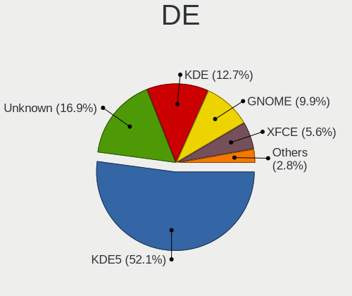

| Name       | Desktops | Percent |
|------------|----------|---------|
| KDE5       | 19       | 39.58%  |
| Unknown    | 11       | 22.92%  |
| KDE        | 9        | 18.75%  |
| GNOME      | 5        | 10.42%  |
| XFCE       | 3        | 6.25%   |
| X-Cinnamon | 1        | 2.08%   |

Display Server
--------------

X11 or Wayland

| Name    | Desktops | Percent |
|---------|----------|---------|
| X11     | 39       | 81.25%  |
| Tty     | 7        | 14.58%  |
| Wayland | 2        | 4.17%   |

Display Manager
---------------

SDDM, LightDM, etc.

| Name    | Desktops | Percent |
|---------|----------|---------|
| Unknown | 29       | 60.42%  |
| SDDM    | 9        | 18.75%  |
| LightDM | 8        | 16.67%  |
| XDM     | 2        | 4.17%   |

OS Lang
-------

Language

| Lang    | Desktops | Percent |
|---------|----------|---------|
| en_US   | 12       | 25.53%  |
| de_DE   | 10       | 21.28%  |
| POSIX   | 6        | 12.77%  |
| pt_BR   | 4        | 8.51%   |
| ru_RU   | 2        | 4.26%   |
| Unknown | 2        | 4.26%   |
| tr_TR   | 1        | 2.13%   |
| pl_PL   | 1        | 2.13%   |
| nl_NL   | 1        | 2.13%   |
| nl_BE   | 1        | 2.13%   |
| hr_HR   | 1        | 2.13%   |
| fi_FI   | 1        | 2.13%   |
| es_MX   | 1        | 2.13%   |
| es_ES   | 1        | 2.13%   |
| en_GB   | 1        | 2.13%   |
| en_AU   | 1        | 2.13%   |
| ca_AD   | 1        | 2.13%   |

Boot Mode
---------

EFI or BIOS

| Mode | Desktops | Percent |
|------|----------|---------|
| BIOS | 28       | 59.57%  |
| EFI  | 19       | 40.43%  |

Filesystem
----------

Type of filesystem

| Type    | Desktops | Percent |
|---------|----------|---------|
| Btrfs   | 30       | 63.83%  |
| Ext4    | 14       | 29.79%  |
| Xfs     | 2        | 4.26%   |
| Overlay | 1        | 2.13%   |

Part. scheme
------------

Scheme of partitioning

| Type    | Desktops | Percent |
|---------|----------|---------|
| GPT     | 22       | 45.83%  |
| Unknown | 22       | 45.83%  |
| MBR     | 4        | 8.33%   |

Dual Boot with Linux/BSD
------------------------

Hosting more than one Linux/BSD

| Dual boot | Desktops | Percent |
|-----------|----------|---------|
| No        | 39       | 81.25%  |
| Yes       | 9        | 18.75%  |

Dual Boot (Win)
---------------

Hosting Linux and Windows

| Dual boot | Desktops | Percent |
|-----------|----------|---------|
| No        | 35       | 74.47%  |
| Yes       | 12       | 25.53%  |

Board
-----

Vendor
------

Motherboard manufacturer

| Name                | Desktops | Percent |
|---------------------|----------|---------|
| ASUSTek Computer    | 15       | 31.91%  |
| MSI                 | 9        | 19.15%  |
| Hewlett-Packard     | 6        | 12.77%  |
| ASRock              | 5        | 10.64%  |
| Gigabyte Technology | 4        | 8.51%   |
| Dell                | 2        | 4.26%   |
| VS Company          | 1        | 2.13%   |
| Lenovo              | 1        | 2.13%   |
| Intel               | 1        | 2.13%   |
| Fujitsu             | 1        | 2.13%   |
| Biostar             | 1        | 2.13%   |
| Alienware           | 1        | 2.13%   |

Model
-----

Motherboard model

| Name                                         | Desktops | Percent |
|----------------------------------------------|----------|---------|
| ASUS All Series                              | 3        | 6.38%   |
| VS Company G31T-M                            | 1        | 2.13%   |
| MSI MS-7D16                                  | 1        | 2.13%   |
| MSI MS-7C34                                  | 1        | 2.13%   |
| MSI MS-7C02                                  | 1        | 2.13%   |
| MSI MS-7B89                                  | 1        | 2.13%   |
| MSI MS-7A38                                  | 1        | 2.13%   |
| MSI MS-7A34                                  | 1        | 2.13%   |
| MSI MS-7A33                                  | 1        | 2.13%   |
| MSI MS-7817                                  | 1        | 2.13%   |
| MSI ESPRIMO P1510                            | 1        | 2.13%   |
| Lenovo IdeaCentre Y710 Cube-15ISH 90FL004WGE | 1        | 2.13%   |
| Intel DG41WV AAE90316-104                    | 1        | 2.13%   |
| HP xw4400 Workstation                        | 1        | 2.13%   |
| HP Pavilion Gaming Desktop 790-00xx          | 1        | 2.13%   |
| HP Pavilion Gaming Desktop 690-00xx          | 1        | 2.13%   |
| HP EliteDesk 800 G2 DM 65W                   | 1        | 2.13%   |
| HP 550-a114                                  | 1        | 2.13%   |
| HP 200-5120br                                | 1        | 2.13%   |
| Gigabyte GA-770TA-UD3                        | 1        | 2.13%   |
| Gigabyte G31M-ES2C                           | 1        | 2.13%   |
| Gigabyte B550 AORUS PRO AC                   | 1        | 2.13%   |
| Gigabyte B250M-DS3H                          | 1        | 2.13%   |
| Fujitsu ESPRIMO P520                         | 1        | 2.13%   |
| Dell Vostro 3268                             | 1        | 2.13%   |
| Dell Inspiron 530                            | 1        | 2.13%   |
| Biostar H77MU3                               | 1        | 2.13%   |
| ASUS TUF GAMING X570-PLUS                    | 1        | 2.13%   |
| ASUS TUF B450-PRO GAMING                     | 1        | 2.13%   |
| ASUS ROG STRIX X570-E GAMING                 | 1        | 2.13%   |
| ASUS ROG CROSSHAIR VIII HERO                 | 1        | 2.13%   |
| ASUS PRIME H310M-A                           | 1        | 2.13%   |
| ASUS PRIME A320M-E                           | 1        | 2.13%   |
| ASUS P9X79 PRO                               | 1        | 2.13%   |
| ASUS P8Z77-V LX                              | 1        | 2.13%   |
| ASUS P8H61-M LE/USB3                         | 1        | 2.13%   |
| ASUS M5A99X EVO R2.0                         | 1        | 2.13%   |
| ASUS M4A78T-E                                | 1        | 2.13%   |
| ASUS CROSSHAIR VI HERO                       | 1        | 2.13%   |
| ASRock Z68 Extreme4 Gen3                     | 1        | 2.13%   |
| ASRock X570M Pro4                            | 1        | 2.13%   |
| ASRock X570 Steel Legend                     | 1        | 2.13%   |
| ASRock N68C-GS4 FX                           | 1        | 2.13%   |
| ASRock B450M Pro4                            | 1        | 2.13%   |
| Alienware X51 R2                             | 1        | 2.13%   |

Model Family
------------

Motherboard model prefix

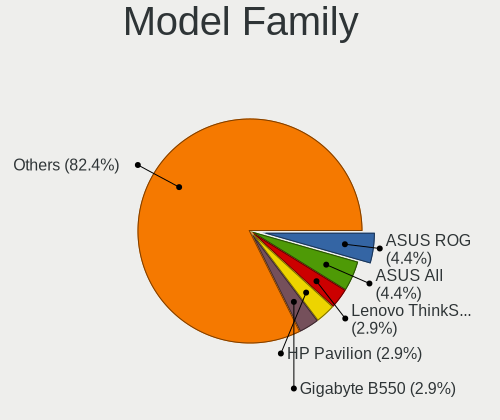

| Name                  | Desktops | Percent |
|-----------------------|----------|---------|
| ASUS All              | 3        | 6.38%   |
| HP Pavilion           | 2        | 4.26%   |
| ASUS TUF              | 2        | 4.26%   |
| ASUS ROG              | 2        | 4.26%   |
| ASUS PRIME            | 2        | 4.26%   |
| VS Company G31T-M     | 1        | 2.13%   |
| MSI MS-7D16           | 1        | 2.13%   |
| MSI MS-7C34           | 1        | 2.13%   |
| MSI MS-7C02           | 1        | 2.13%   |
| MSI MS-7B89           | 1        | 2.13%   |
| MSI MS-7A38           | 1        | 2.13%   |
| MSI MS-7A34           | 1        | 2.13%   |
| MSI MS-7A33           | 1        | 2.13%   |
| MSI MS-7817           | 1        | 2.13%   |
| MSI ESPRIMO           | 1        | 2.13%   |
| Lenovo IdeaCentre     | 1        | 2.13%   |
| Intel DG41WV          | 1        | 2.13%   |
| HP xw4400             | 1        | 2.13%   |
| HP EliteDesk          | 1        | 2.13%   |
| HP 550-a114           | 1        | 2.13%   |
| HP 200-5120br         | 1        | 2.13%   |
| Gigabyte GA-770TA-UD3 | 1        | 2.13%   |
| Gigabyte G31M-ES2C    | 1        | 2.13%   |
| Gigabyte B550         | 1        | 2.13%   |
| Gigabyte B250M-DS3H   | 1        | 2.13%   |
| Fujitsu ESPRIMO       | 1        | 2.13%   |
| Dell Vostro           | 1        | 2.13%   |
| Dell Inspiron         | 1        | 2.13%   |
| Biostar H77MU3        | 1        | 2.13%   |
| ASUS P9X79            | 1        | 2.13%   |
| ASUS P8Z77-V          | 1        | 2.13%   |
| ASUS P8H61-M          | 1        | 2.13%   |
| ASUS M5A99X           | 1        | 2.13%   |
| ASUS M4A78T-E         | 1        | 2.13%   |
| ASUS CROSSHAIR        | 1        | 2.13%   |
| ASRock Z68            | 1        | 2.13%   |
| ASRock X570M          | 1        | 2.13%   |
| ASRock X570           | 1        | 2.13%   |
| ASRock N68C-GS4       | 1        | 2.13%   |
| ASRock B450M          | 1        | 2.13%   |
| Alienware X51         | 1        | 2.13%   |

MFG Year
--------

Motherboard manufacture year

| Year | Desktops | Percent |
|------|----------|---------|
| 2019 | 9        | 19.15%  |
| 2018 | 6        | 12.77%  |
| 2014 | 5        | 10.64%  |
| 2012 | 4        | 8.51%   |
| 2021 | 3        | 6.38%   |
| 2015 | 3        | 6.38%   |
| 2010 | 3        | 6.38%   |
| 2009 | 3        | 6.38%   |
| 2017 | 2        | 4.26%   |
| 2016 | 2        | 4.26%   |
| 2011 | 2        | 4.26%   |
| 2020 | 1        | 2.13%   |
| 2013 | 1        | 2.13%   |
| 2008 | 1        | 2.13%   |
| 2007 | 1        | 2.13%   |
| 2006 | 1        | 2.13%   |

Form Factor
-----------

Physical design of the computer

| Name    | Desktops | Percent |
|---------|----------|---------|
| Desktop | 47       | 100%    |

Secure Boot
-----------

Enabled or disabled

| State    | Desktops | Percent |
|----------|----------|---------|
| Disabled | 45       | 95.74%  |
| Enabled  | 2        | 4.26%   |

Coreboot
--------

Have coreboot on board

| Used | Desktops | Percent |
|------|----------|---------|
| No   | 47       | 100%    |

RAM Size
--------

Total RAM memory

| Size in GB  | Desktops | Percent |
|-------------|----------|---------|
| 16.01-24.0  | 18       | 38.3%   |
| 8.01-16.0   | 8        | 17.02%  |
| 32.01-64.0  | 6        | 12.77%  |
| 64.01-256.0 | 6        | 12.77%  |
| 3.01-4.0    | 5        | 10.64%  |
| 4.01-8.0    | 3        | 6.38%   |
| 24.01-32.0  | 1        | 2.13%   |

RAM Used
--------

Used RAM memory

| Used GB   | Desktops | Percent |
|-----------|----------|---------|
| 1.01-2.0  | 15       | 30.61%  |
| 4.01-8.0  | 12       | 24.49%  |
| 3.01-4.0  | 8        | 16.33%  |
| 2.01-3.0  | 8        | 16.33%  |
| 8.01-16.0 | 3        | 6.12%   |
| 0.51-1.0  | 3        | 6.12%   |

Total Drives
------------

Number of drives on board

| Drives | Desktops | Percent |
|--------|----------|---------|
| 2      | 17       | 36.17%  |
| 1      | 12       | 25.53%  |
| 3      | 10       | 21.28%  |
| 4      | 4        | 8.51%   |
| 6      | 3        | 6.38%   |
| 7      | 1        | 2.13%   |

Has CD-ROM
----------

Has CD-ROM on board

| Presented | Desktops | Percent |
|-----------|----------|---------|
| Yes       | 26       | 55.32%  |
| No        | 21       | 44.68%  |

Has Ethernet
------------

Has Ethernet on board

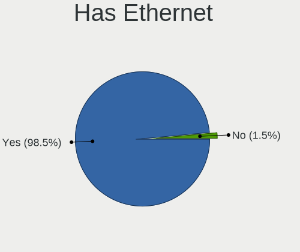

| Presented | Desktops | Percent |
|-----------|----------|---------|
| Yes       | 46       | 97.87%  |
| No        | 1        | 2.13%   |

Has WiFi
--------

Has WiFi module

| Presented | Desktops | Percent |
|-----------|----------|---------|
| Yes       | 29       | 60.42%  |
| No        | 19       | 39.58%  |

Has Bluetooth
-------------

Has Bluetooth module

| Presented | Desktops | Percent |
|-----------|----------|---------|
| No        | 24       | 51.06%  |
| Yes       | 23       | 48.94%  |

Location
--------

Country
-------

Geographic location (country)

| Country     | Desktops | Percent |
|-------------|----------|---------|
| Germany     | 11       | 23.4%   |
| USA         | 8        | 17.02%  |
| Brazil      | 5        | 10.64%  |
| Russia      | 3        | 6.38%   |
| Australia   | 3        | 6.38%   |
| Netherlands | 2        | 4.26%   |
| Mexico      | 2        | 4.26%   |
| Japan       | 2        | 4.26%   |
| Turkey      | 1        | 2.13%   |
| Spain       | 1        | 2.13%   |
| Slovakia    | 1        | 2.13%   |
| Poland      | 1        | 2.13%   |
| Luxembourg  | 1        | 2.13%   |
| India       | 1        | 2.13%   |
| Hungary     | 1        | 2.13%   |
| Finland     | 1        | 2.13%   |
| Croatia     | 1        | 2.13%   |
| Belgium     | 1        | 2.13%   |
| Andorra     | 1        | 2.13%   |

City
----

Geographic location (city)

| City                    | Desktops | Percent |
|-------------------------|----------|---------|
| Tokyo                   | 2        | 4.26%   |
| Kiel                    | 2        | 4.26%   |
| Zagreb                  | 1        | 2.13%   |
| Voerde                  | 1        | 2.13%   |
| Vijayawada              | 1        | 2.13%   |
| TrГЄs Lagoas          | 1        | 2.13%   |
| Texarkana               | 1        | 2.13%   |
| SГЈo Paulo            | 1        | 2.13%   |
| Sydney                  | 1        | 2.13%   |
| Stupava                 | 1        | 2.13%   |
| Stabroek                | 1        | 2.13%   |
| San Luis Potosí City | 1        | 2.13%   |
| Saint Albans            | 1        | 2.13%   |
| Rio de Janeiro          | 1        | 2.13%   |
| Recife                  | 1        | 2.13%   |
| Oulu                    | 1        | 2.13%   |
| Oregon                  | 1        | 2.13%   |
| Odintsovo               | 1        | 2.13%   |
| Nordenham               | 1        | 2.13%   |
| Munich                  | 1        | 2.13%   |
| Melbourne               | 1        | 2.13%   |
| McDonough               | 1        | 2.13%   |
| Mansfield               | 1        | 2.13%   |
| Madrid                  | 1        | 2.13%   |
| Luxembourg              | 1        | 2.13%   |
| Lomonosov               | 1        | 2.13%   |
| Koleczkowo              | 1        | 2.13%   |
| Kazan’           | 1        | 2.13%   |
| Heinsberg               | 1        | 2.13%   |
| Hamelin                 | 1        | 2.13%   |
| Halle                   | 1        | 2.13%   |
| Gelnhausen              | 1        | 2.13%   |
| Gödöllő       | 1        | 2.13%   |
| Federal Way             | 1        | 2.13%   |
| East Longmeadow         | 1        | 2.13%   |
| Dornhan                 | 1        | 2.13%   |
| Chapecó              | 1        | 2.13%   |
| Cancún               | 1        | 2.13%   |
| Brush                   | 1        | 2.13%   |
| Brisbane                | 1        | 2.13%   |
| Braunschweig            | 1        | 2.13%   |
| Antalya                 | 1        | 2.13%   |
| Andorra la Vella        | 1        | 2.13%   |
| Amsterdam               | 1        | 2.13%   |
| Almere Stad             | 1        | 2.13%   |

Drives
------

Drive Vendor
------------

Hard drive vendors

| Vendor              | Desktops | Drives | Percent |
|---------------------|----------|--------|---------|
| WDC                 | 24       | 38     | 24.24%  |
| Seagate             | 18       | 26     | 18.18%  |
| Samsung Electronics | 16       | 27     | 16.16%  |
| Kingston            | 7        | 7      | 7.07%   |
| Toshiba             | 5        | 5      | 5.05%   |
| Crucial             | 4        | 4      | 4.04%   |
| A-DATA Technology   | 4        | 4      | 4.04%   |
| SanDisk             | 3        | 4      | 3.03%   |
| Intel               | 3        | 3      | 3.03%   |
| Hitachi             | 3        | 5      | 3.03%   |
| Unknown             | 2        | 2      | 2.02%   |
| TO Exter            | 1        | 1      | 1.01%   |
| Phison              | 1        | 1      | 1.01%   |
| Lite-On             | 1        | 1      | 1.01%   |
| JMicron             | 1        | 1      | 1.01%   |
| Inateck             | 1        | 1      | 1.01%   |
| HGST HTS            | 1        | 1      | 1.01%   |
| HGST                | 1        | 1      | 1.01%   |
| Fujitsu             | 1        | 1      | 1.01%   |
| Corsair             | 1        | 1      | 1.01%   |
| Apacer              | 1        | 1      | 1.01%   |

Drive Model
-----------

Hard drive models

| Model                                      | Desktops | Percent |
|--------------------------------------------|----------|---------|
| WDC WDS500G1X0E-00AFY0 500GB               | 2        | 1.77%   |
| WDC WD5000AAKX-07U6AA0 500GB               | 2        | 1.77%   |
| Seagate ST3750528AS 752GB                  | 2        | 1.77%   |
| Seagate ST3500418AS 500GB                  | 2        | 1.77%   |
| Seagate ST2000DM008-2FR102 2TB             | 2        | 1.77%   |
| Seagate ST2000DM006-2DM164 2TB             | 2        | 1.77%   |
| Samsung SSD 980 PRO 1TB                    | 2        | 1.77%   |
| Samsung SSD 870 QVO 1TB                    | 2        | 1.77%   |
| Samsung SSD 860 EVO 250GB                  | 2        | 1.77%   |
| Samsung SSD 850 EVO 500GB                  | 2        | 1.77%   |
| Kingston SV300S37A120G 120GB SSD           | 2        | 1.77%   |
| Kingston SA400S37120G 120GB SSD            | 2        | 1.77%   |
| WDC WDS500G2B0A 500GB SSD                  | 1        | 0.88%   |
| WDC WDS500G1B0B-00AS40 500GB SSD           | 1        | 0.88%   |
| WDC WDS250G1B0C-00S6U0 250GB               | 1        | 0.88%   |
| WDC WDS250G1B0A-00H9H0 250GB SSD           | 1        | 0.88%   |
| WDC WDS240G2G0B-00EPW0 240GB SSD           | 1        | 0.88%   |
| WDC WDS200T2B0A-00SM50 2TB SSD             | 1        | 0.88%   |
| WDC WDS100T3X0C-00SJG0 1TB                 | 1        | 0.88%   |
| WDC WDS100T1X0E-00AFY0 1TB                 | 1        | 0.88%   |
| WDC WD7500AALX-009BA0 752GB                | 1        | 0.88%   |
| WDC WD5000AAVS-00ZTB0 500GB                | 1        | 0.88%   |
| WDC WD50 00LPCX-00VHAT0 500GB              | 1        | 0.88%   |
| WDC WD40EZAZ-00SF3B0 4TB                   | 1        | 0.88%   |
| WDC WD3200AAKS-00B3A0 320GB                | 1        | 0.88%   |
| WDC WD2500BEVT-60ZCT1 250GB                | 1        | 0.88%   |
| WDC WD2500AAJS-00VTA0 250GB                | 1        | 0.88%   |
| WDC WD20EARX-00PASB0 2TB                   | 1        | 0.88%   |
| WDC WD2005FBYZ-01YCBB2 2TB                 | 1        | 0.88%   |
| WDC WD10EZEX-75WN4A0 1TB                   | 1        | 0.88%   |
| WDC WD10EZEX-75M2NA0 1TB                   | 1        | 0.88%   |
| WDC WD10EZEX-08WN4A0 1TB                   | 1        | 0.88%   |
| WDC WD10EZEX-00KUWA0 1TB                   | 1        | 0.88%   |
| WDC WD10EZEX-00BN5A0 1TB                   | 1        | 0.88%   |
| WDC WD10EAVS-22D7B0 1TB                    | 1        | 0.88%   |
| WDC WD10EACS-00D6B1 1TB                    | 1        | 0.88%   |
| WDC WD1003FZEX-00K3CA0 1TB                 | 1        | 0.88%   |
| WDC WD1001FALS-00E3A0 1TB                  | 1        | 0.88%   |
| Unknown SD/MMC/MS PRO 64GB                 | 1        | 0.88%   |
| Unknown 128GB SATA FLASH DRIVE             | 1        | 0.88%   |
| Toshiba TR200 240GB SSD                    | 1        | 0.88%   |
| Toshiba TL100 240GB SSD                    | 1        | 0.88%   |
| Toshiba KBG30ZMS128G 128GB NVMe SSD        | 1        | 0.88%   |
| Toshiba HDWD130 3TB                        | 1        | 0.88%   |
| Toshiba HDWD110 1TB                        | 1        | 0.88%   |
| TO Exter nal USB 3.0 2TB                   | 1        | 0.88%   |
| Seagate ST500LM0 12 HN-M500MBB 500GB       | 1        | 0.88%   |
| Seagate ST3750630AS 752GB                  | 1        | 0.88%   |
| Seagate ST3500413AS 500GB                  | 1        | 0.88%   |
| Seagate ST3320620AS 320GB                  | 1        | 0.88%   |
| Seagate ST3160812AS 160GB                  | 1        | 0.88%   |
| Seagate ST3000DM007-1WY10G 3TB             | 1        | 0.88%   |
| Seagate ST2000DM001-9YN164 2TB             | 1        | 0.88%   |
| Seagate ST2000DM001-1ER164 2TB             | 1        | 0.88%   |
| Seagate ST16000NM001G-2KK103 16TB          | 1        | 0.88%   |
| Seagate ST1000VX000-1CU162 1TB             | 1        | 0.88%   |
| Seagate ST1000LM024 HN-M101MBB 1TB         | 1        | 0.88%   |
| Seagate ST1000DM010-2EP102 1TB             | 1        | 0.88%   |
| Seagate ST1000DM003-1SB102 1TB             | 1        | 0.88%   |
| Seagate FireCuda 520 SSD ZP2000GM30002 2TB | 1        | 0.88%   |

HDD Vendor
----------

Hard disk drive vendors

| Vendor              | Desktops | Drives | Percent |
|---------------------|----------|--------|---------|
| Seagate             | 18       | 25     | 36.73%  |
| WDC                 | 17       | 28     | 34.69%  |
| Samsung Electronics | 5        | 10     | 10.2%   |
| Hitachi             | 3        | 5      | 6.12%   |
| Toshiba             | 2        | 2      | 4.08%   |
| Unknown             | 1        | 1      | 2.04%   |
| Inateck             | 1        | 1      | 2.04%   |
| HGST                | 1        | 1      | 2.04%   |
| Fujitsu             | 1        | 1      | 2.04%   |

SSD Vendor
----------

Solid state drive vendors

| Vendor              | Desktops | Drives | Percent |
|---------------------|----------|--------|---------|
| Samsung Electronics | 7        | 11     | 20.59%  |
| Kingston            | 7        | 7      | 20.59%  |
| WDC                 | 5        | 5      | 14.71%  |
| A-DATA Technology   | 4        | 4      | 11.76%  |
| SanDisk             | 3        | 4      | 8.82%   |
| Toshiba             | 2        | 2      | 5.88%   |
| Intel               | 2        | 2      | 5.88%   |
| Crucial             | 2        | 2      | 5.88%   |
| TO Exter            | 1        | 1      | 2.94%   |
| Apacer              | 1        | 1      | 2.94%   |

Drive Kind
----------

HDD or SSD

| Kind    | Desktops | Drives | Percent |
|---------|----------|--------|---------|
| HDD     | 37       | 74     | 45.68%  |
| SSD     | 29       | 39     | 35.8%   |
| NVMe    | 14       | 20     | 17.28%  |
| Unknown | 1        | 2      | 1.23%   |

Drive Connector
---------------

SATA, SAS, NVMe, etc.

| Type | Desktops | Drives | Percent |
|------|----------|--------|---------|
| SATA | 45       | 109    | 71.43%  |
| NVMe | 14       | 19     | 22.22%  |
| SAS  | 4        | 7      | 6.35%   |

Drive Size
----------

Size of hard drive

| Size in TB | Desktops | Drives | Percent |
|------------|----------|--------|---------|
| 0.01-0.5   | 30       | 51     | 41.67%  |
| 0.51-1.0   | 24       | 38     | 33.33%  |
| 1.01-2.0   | 13       | 18     | 18.06%  |
| 2.01-3.0   | 2        | 2      | 2.78%   |
| 10.01-20.0 | 2        | 3      | 2.78%   |
| 3.01-4.0   | 1        | 1      | 1.39%   |

Space Total
-----------

Amount of disk space available on the file system

| Size in GB     | Desktops | Percent |
|----------------|----------|---------|
| More than 3000 | 13       | 27.08%  |
| 501-1000       | 8        | 16.67%  |
| 2001-3000      | 7        | 14.58%  |
| 1001-2000      | 7        | 14.58%  |
| 251-500        | 6        | 12.5%   |
| Unknown        | 3        | 6.25%   |
| 101-250        | 2        | 4.17%   |
| 1-20           | 2        | 4.17%   |

Space Used
----------

Amount of used disk space

| Used GB        | Desktops | Percent |
|----------------|----------|---------|
| 251-500        | 11       | 22.45%  |
| 501-1000       | 8        | 16.33%  |
| 101-250        | 7        | 14.29%  |
| 1001-2000      | 6        | 12.24%  |
| 51-100         | 6        | 12.24%  |
| 1-20           | 5        | 10.2%   |
| Unknown        | 3        | 6.12%   |
| 2001-3000      | 2        | 4.08%   |
| More than 3000 | 1        | 2.04%   |

Malfunc. Drives
---------------

Drive models with a malfunction

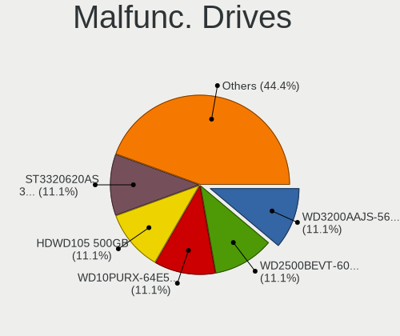

| Model                            | Desktops | Drives | Percent |
|----------------------------------|----------|--------|---------|
| WDC WD2500BEVT-60ZCT1 250GB      | 1        | 1      | 25%     |
| Seagate ST3320620AS 320GB        | 1        | 1      | 25%     |
| Kingston SV300S37A120G 120GB SSD | 1        | 1      | 25%     |
| Crucial CT1000P1SSD8 1TB         | 1        | 1      | 25%     |

Malfunc. Drive Vendor
---------------------

Vendors of faulty drives

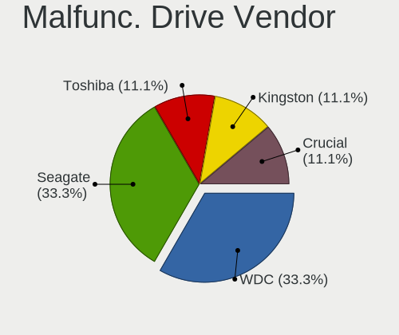

| Vendor   | Desktops | Drives | Percent |
|----------|----------|--------|---------|
| WDC      | 1        | 1      | 25%     |
| Seagate  | 1        | 1      | 25%     |
| Kingston | 1        | 1      | 25%     |
| Crucial  | 1        | 1      | 25%     |

Malfunc. HDD Vendor
-------------------

Vendors of faulty HDD drives

| Vendor  | Desktops | Drives | Percent |
|---------|----------|--------|---------|
| WDC     | 1        | 1      | 50%     |
| Seagate | 1        | 1      | 50%     |

Malfunc. Drive Kind
-------------------

Kinds of faulty drives

| Kind | Desktops | Drives | Percent |
|------|----------|--------|---------|
| HDD  | 2        | 2      | 50%     |
| NVMe | 1        | 1      | 25%     |
| SSD  | 1        | 1      | 25%     |

Failed Drives
-------------

Failed drive models

Zero info for selected period =(

Failed Drive Vendor
-------------------

Failed drive vendors

Zero info for selected period =(

Drive Status
------------

Number of failed and malfunc. drives

| Status   | Desktops | Drives | Percent |
|----------|----------|--------|---------|
| Works    | 25       | 67     | 48.08%  |
| Detected | 23       | 64     | 44.23%  |
| Malfunc  | 4        | 4      | 7.69%   |

Storage controller
------------------

Storage Vendor
--------------

Storage controller vendors

| Vendor                       | Desktops | Percent |
|------------------------------|----------|---------|
| Intel                        | 25       | 34.25%  |
| AMD                          | 22       | 30.14%  |
| Sandisk                      | 5        | 6.85%   |
| Samsung Electronics          | 5        | 6.85%   |
| Marvell Technology Group     | 3        | 4.11%   |
| ASMedia Technology           | 3        | 4.11%   |
| Phison Electronics           | 2        | 2.74%   |
| Micron/Crucial Technology    | 2        | 2.74%   |
| Toshiba America Info Systems | 1        | 1.37%   |
| Silicon Image                | 1        | 1.37%   |
| Seagate Technology           | 1        | 1.37%   |
| Nvidia                       | 1        | 1.37%   |
| Lite-On Technology           | 1        | 1.37%   |
| JMicron Technology           | 1        | 1.37%   |

Storage Model
-------------

Storage controller models

| Model                                                                                   | Desktops | Percent |
|-----------------------------------------------------------------------------------------|----------|---------|
| AMD FCH SATA Controller [AHCI mode]                                                     | 17       | 18.89%  |
| AMD 400 Series Chipset SATA Controller                                                  | 5        | 5.56%   |
| Sandisk WD PC SN810 / Black SN850 NVMe SSD                                              | 3        | 3.33%   |
| Intel Q170/Q150/B150/H170/H110/Z170/CM236 Chipset SATA Controller [AHCI Mode]           | 3        | 3.33%   |
| Intel NM10/ICH7 Family SATA Controller [IDE mode]                                       | 3        | 3.33%   |
| Intel 8 Series/C220 Series Chipset Family 6-port SATA Controller 1 [AHCI mode]          | 3        | 3.33%   |
| ASMedia ASM1062 Serial ATA Controller                                                   | 3        | 3.33%   |
| AMD SB7x0/SB8x0/SB9x0 SATA Controller [AHCI mode]                                       | 3        | 3.33%   |
| Samsung NVMe SSD Controller SM981/PM981/PM983                                           | 2        | 2.22%   |
| Samsung NVMe SSD Controller PM9A1/PM9A3/980PRO                                          | 2        | 2.22%   |
| Intel Cannon Lake PCH SATA AHCI Controller                                              | 2        | 2.22%   |
| Intel 82801G (ICH7 Family) IDE Controller                                               | 2        | 2.22%   |
| AMD X370 Series Chipset SATA Controller                                                 | 2        | 2.22%   |
| AMD SB7x0/SB8x0/SB9x0 IDE Controller                                                    | 2        | 2.22%   |
| AMD 300 Series Chipset SATA Controller                                                  | 2        | 2.22%   |
| Toshiba America Info Systems BG3 NVMe SSD Controller                                    | 1        | 1.11%   |
| Silicon Image SiI 3132 Serial ATA Raid II Controller                                    | 1        | 1.11%   |
| Seagate FireCuda 520 SSD                                                                | 1        | 1.11%   |
| Sandisk WD Blue SN500 / PC SN520 NVMe SSD                                               | 1        | 1.11%   |
| Sandisk WD Black SN750 / PC SN730 NVMe SSD                                              | 1        | 1.11%   |
| Samsung NVMe SSD Controller SM951/PM951                                                 | 1        | 1.11%   |
| Phison E16 PCIe4 NVMe Controller                                                        | 1        | 1.11%   |
| Phison E12 NVMe Controller                                                              | 1        | 1.11%   |
| Nvidia MCP61 SATA Controller                                                            | 1        | 1.11%   |
| Nvidia MCP61 IDE                                                                        | 1        | 1.11%   |
| Micron/Crucial P2 NVMe PCIe SSD                                                         | 1        | 1.11%   |
| Micron/Crucial P1 NVMe PCIe SSD                                                         | 1        | 1.11%   |
| Marvell Group 88SE912x SATA 6Gb/s Controller [IDE mode]                                 | 1        | 1.11%   |
| Marvell Group 88SE9128 PCIe SATA 6 Gb/s RAID controller with HyperDuo                   | 1        | 1.11%   |
| Marvell Group 88SE9128 PCIe SATA 6 Gb/s RAID controller                                 | 1        | 1.11%   |
| Lite-On Non-Volatile memory controller                                                  | 1        | 1.11%   |
| JMicron JMB363 SATA/IDE Controller                                                      | 1        | 1.11%   |
| Intel SSD 660P Series                                                                   | 1        | 1.11%   |
| Intel SATA Controller [RAID mode]                                                       | 1        | 1.11%   |
| Intel C600/X79 series chipset 6-Port SATA AHCI Controller                               | 1        | 1.11%   |
| Intel 9 Series Chipset Family SATA Controller [AHCI Mode]                               | 1        | 1.11%   |
| Intel 82801JI (ICH10 Family) SATA AHCI Controller                                       | 1        | 1.11%   |
| Intel 82801IR/IO/IH (ICH9R/DO/DH) 4 port SATA Controller [IDE mode]                     | 1        | 1.11%   |
| Intel 82801I (ICH9 Family) 2 port SATA Controller [IDE mode]                            | 1        | 1.11%   |
| Intel 82801GR/GDH (ICH7R/ICH7DH) SATA Controller [RAID mode]                            | 1        | 1.11%   |
| Intel 7 Series/C210 Series Chipset Family 6-port SATA Controller [AHCI mode]            | 1        | 1.11%   |
| Intel 7 Series/C210 Series Chipset Family 4-port SATA Controller [IDE mode]             | 1        | 1.11%   |
| Intel 7 Series/C210 Series Chipset Family 2-port SATA Controller [IDE mode]             | 1        | 1.11%   |
| Intel 6 Series/C200 Series Chipset Family Desktop SATA Controller (IDE mode, ports 4-5) | 1        | 1.11%   |
| Intel 6 Series/C200 Series Chipset Family Desktop SATA Controller (IDE mode, ports 0-3) | 1        | 1.11%   |
| Intel 6 Series/C200 Series Chipset Family 6 port Desktop SATA AHCI Controller           | 1        | 1.11%   |
| Intel 500 Series Chipset Family SATA AHCI Controller                                    | 1        | 1.11%   |
| Intel 5 Series/3400 Series Chipset 6 port SATA AHCI Controller                          | 1        | 1.11%   |
| Intel 200 Series PCH SATA controller [AHCI mode]                                        | 1        | 1.11%   |
| AMD Starship/Matisse Chipset SATA Controller [AHCI mode]                                | 1        | 1.11%   |
| AMD FCH SATA Controller D                                                               | 1        | 1.11%   |

Storage Kind
------------

Kind of storage controller (IDE, SATA, NVMe, SAS, ...)

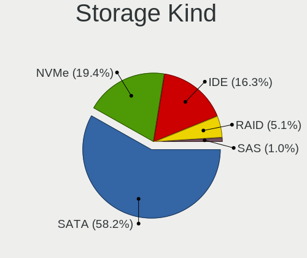

| Kind | Desktops | Percent |
|------|----------|---------|
| SATA | 38       | 57.58%  |
| NVMe | 14       | 21.21%  |
| IDE  | 11       | 16.67%  |
| RAID | 3        | 4.55%   |

Processor
---------

CPU Vendor
----------

Processor vendors

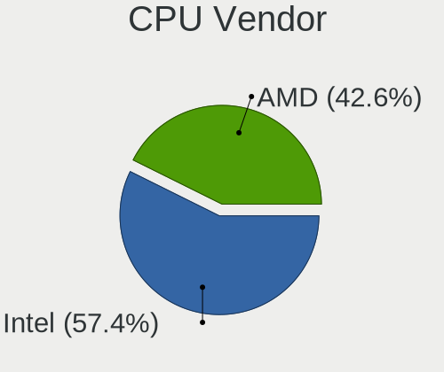

| Vendor | Desktops | Percent |
|--------|----------|---------|
| Intel  | 24       | 51.06%  |
| AMD    | 23       | 48.94%  |

CPU Model
---------

Processor models

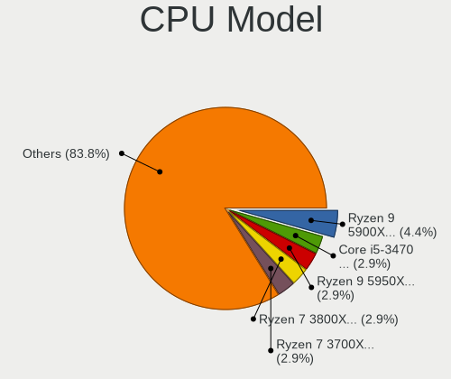

| Model                                       | Desktops | Percent |
|---------------------------------------------|----------|---------|
| AMD Ryzen 9 5900X 12-Core Processor         | 3        | 6.38%   |
| AMD Ryzen 9 5950X 16-Core Processor         | 2        | 4.26%   |
| AMD Ryzen 7 3700X 8-Core Processor          | 2        | 4.26%   |
| AMD Ryzen 7 1700 Eight-Core Processor       | 2        | 4.26%   |
| Intel Xeon CPU E5-2687W v2 @ 3.40GHz        | 1        | 2.13%   |
| Intel Pentium Dual-Core CPU E5400 @ 2.70GHz | 1        | 2.13%   |
| Intel Pentium Dual CPU E2160 @ 1.80GHz      | 1        | 2.13%   |
| Intel Pentium CPU G3258 @ 3.20GHz           | 1        | 2.13%   |
| Intel Core i7-8700 CPU @ 3.20GHz            | 1        | 2.13%   |
| Intel Core i7-6700 CPU @ 3.40GHz            | 1        | 2.13%   |
| Intel Core i7-4790 CPU @ 3.60GHz            | 1        | 2.13%   |
| Intel Core i7 CPU 860 @ 2.80GHz             | 1        | 2.13%   |
| Intel Core i5-7600K CPU @ 3.80GHz           | 1        | 2.13%   |
| Intel Core i5-7500 CPU @ 3.40GHz            | 1        | 2.13%   |
| Intel Core i5-6400 CPU @ 2.70GHz            | 1        | 2.13%   |
| Intel Core i5-4590 CPU @ 3.30GHz            | 1        | 2.13%   |
| Intel Core i5-4570 CPU @ 3.20GHz            | 1        | 2.13%   |
| Intel Core i5-4440 CPU @ 3.10GHz            | 1        | 2.13%   |
| Intel Core i5-3470 CPU @ 3.20GHz            | 1        | 2.13%   |
| Intel Core i5-2400S CPU @ 2.50GHz           | 1        | 2.13%   |
| Intel Core i5-2320 CPU @ 3.00GHz            | 1        | 2.13%   |
| Intel Core i5-10400 CPU @ 2.90GHz           | 1        | 2.13%   |
| Intel Core i3-8100 CPU @ 3.60GHz            | 1        | 2.13%   |
| Intel Core i3-2100 CPU @ 3.10GHz            | 1        | 2.13%   |
| Intel Core 2 Quad CPU Q9300 @ 2.50GHz       | 1        | 2.13%   |
| Intel Core 2 Duo CPU E7400 @ 2.80GHz        | 1        | 2.13%   |
| Intel Core 2 Duo CPU E4500 @ 2.20GHz        | 1        | 2.13%   |
| Intel Core 2 CPU 6400 @ 2.13GHz             | 1        | 2.13%   |
| AMD Sempron 2650 APU with Radeon R3         | 1        | 2.13%   |
| AMD Ryzen 9 3950X 16-Core Processor         | 1        | 2.13%   |
| AMD Ryzen 7 3800X 8-Core Processor          | 1        | 2.13%   |
| AMD Ryzen 7 2700X Eight-Core Processor      | 1        | 2.13%   |
| AMD Ryzen 5 3400G with Radeon Vega Graphics | 1        | 2.13%   |
| AMD Ryzen 5 2600 Six-Core Processor         | 1        | 2.13%   |
| AMD Ryzen 5 1600X Six-Core Processor        | 1        | 2.13%   |
| AMD Ryzen 5 1600 Six-Core Processor         | 1        | 2.13%   |
| AMD Phenom II X4 B50 Processor              | 1        | 2.13%   |
| AMD Phenom II X4 955 Processor              | 1        | 2.13%   |
| AMD FX-8350 Eight-Core Processor            | 1        | 2.13%   |
| AMD FX-6300 Six-Core Processor              | 1        | 2.13%   |
| AMD Athlon 3000G with Radeon Vega Graphics  | 1        | 2.13%   |
| AMD A8-6410 APU with AMD Radeon R5 Graphics | 1        | 2.13%   |

CPU Model Family
----------------

Processor model prefix

| Model                   | Desktops | Percent |
|-------------------------|----------|---------|
| Intel Core i5           | 10       | 21.28%  |
| AMD Ryzen 9             | 6        | 12.77%  |
| AMD Ryzen 7             | 6        | 12.77%  |
| Intel Core i7           | 4        | 8.51%   |
| AMD Ryzen 5             | 4        | 8.51%   |
| Intel Core i3           | 2        | 4.26%   |
| Intel Core 2 Duo        | 2        | 4.26%   |
| AMD Phenom II X4        | 2        | 4.26%   |
| AMD FX                  | 2        | 4.26%   |
| Intel Xeon              | 1        | 2.13%   |
| Intel Pentium Dual-Core | 1        | 2.13%   |
| Intel Pentium Dual      | 1        | 2.13%   |
| Intel Pentium           | 1        | 2.13%   |
| Intel Core 2 Quad       | 1        | 2.13%   |
| Intel Core 2            | 1        | 2.13%   |
| AMD Sempron             | 1        | 2.13%   |
| AMD Athlon              | 1        | 2.13%   |
| AMD A8                  | 1        | 2.13%   |

CPU Cores
---------

Number of processor cores

| Number | Desktops | Percent |
|--------|----------|---------|
| 4      | 19       | 40.43%  |
| 2      | 9        | 19.15%  |
| 8      | 7        | 14.89%  |
| 6      | 5        | 10.64%  |
| 16     | 3        | 6.38%   |
| 12     | 3        | 6.38%   |
| 3      | 1        | 2.13%   |

CPU Sockets
-----------

Number of sockets

| Number | Desktops | Percent |
|--------|----------|---------|
| 1      | 47       | 100%    |

CPU Threads
-----------

Threads per core (Hyper-Threading)

| Number | Desktops | Percent |
|--------|----------|---------|
| 2      | 26       | 55.32%  |
| 1      | 21       | 44.68%  |

CPU Op-Modes
------------

CPU Operation Modes (32-bit, 64-bit)

| Op mode        | Desktops | Percent |
|----------------|----------|---------|
| 32-bit, 64-bit | 47       | 100%    |

CPU Microcode
-------------

Microcode number

| Number     | Desktops | Percent |
|------------|----------|---------|
| Unknown    | 20       | 40.82%  |
| 0x306c3    | 3        | 6.12%   |
| 0x206a7    | 3        | 6.12%   |
| 0x906e9    | 2        | 4.08%   |
| 0x0a201016 | 2        | 4.08%   |
| 0x0a201009 | 2        | 4.08%   |
| 0x08701021 | 2        | 4.08%   |
| 0x08001137 | 2        | 4.08%   |
| 0xa0653    | 1        | 2.04%   |
| 0x6fd      | 1        | 2.04%   |
| 0x306a9    | 1        | 2.04%   |
| 0x1067a    | 1        | 2.04%   |
| 0x10677    | 1        | 2.04%   |
| 0x0a201204 | 1        | 2.04%   |
| 0x08108109 | 1        | 2.04%   |
| 0x08108102 | 1        | 2.04%   |
| 0x0800820d | 1        | 2.04%   |
| 0x07030105 | 1        | 2.04%   |
| 0x06000852 | 1        | 2.04%   |
| 0x010000db | 1        | 2.04%   |
| 0x010000c8 | 1        | 2.04%   |

CPU Microarch
-------------

Microarchitecture

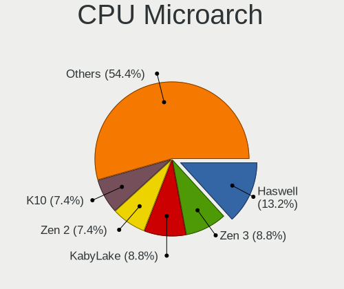

| Name        | Desktops | Percent |
|-------------|----------|---------|
| Zen 3       | 5        | 10.64%  |
| Haswell     | 5        | 10.64%  |
| Zen+        | 4        | 8.51%   |
| Zen 2       | 4        | 8.51%   |
| Zen         | 4        | 8.51%   |
| KabyLake    | 4        | 8.51%   |
| SandyBridge | 3        | 6.38%   |
| Penryn      | 3        | 6.38%   |
| Core        | 3        | 6.38%   |
| Skylake     | 2        | 4.26%   |
| Piledriver  | 2        | 4.26%   |
| K10         | 2        | 4.26%   |
| IvyBridge   | 2        | 4.26%   |
| Puma        | 1        | 2.13%   |
| Nehalem     | 1        | 2.13%   |
| Jaguar      | 1        | 2.13%   |
| CometLake   | 1        | 2.13%   |

Graphics
--------

GPU Vendor
----------

Vendors of graphics cards

| Vendor      | Desktops | Percent |
|-------------|----------|---------|
| Nvidia      | 23       | 46.94%  |
| AMD         | 13       | 26.53%  |
| Intel       | 12       | 24.49%  |
| S3 Graphics | 1        | 2.04%   |

GPU Model
---------

Graphics card models

| Model                                                                       | Desktops | Percent |
|-----------------------------------------------------------------------------|----------|---------|
| Nvidia TU117 [GeForce GTX 1650]                                             | 2        | 4.08%   |
| Nvidia GK106 [GeForce GTX 660]                                              | 2        | 4.08%   |
| Nvidia GA102 [GeForce RTX 3090]                                             | 2        | 4.08%   |
| Intel Xeon E3-1200 v3/4th Gen Core Processor Integrated Graphics Controller | 2        | 4.08%   |
| Intel HD Graphics 630                                                       | 2        | 4.08%   |
| Intel 4 Series Chipset Integrated Graphics Controller                       | 2        | 4.08%   |
| Intel 2nd Generation Core Processor Family Integrated Graphics Controller   | 2        | 4.08%   |
| AMD Tonga PRO [Radeon R9 285/380]                                           | 2        | 4.08%   |
| AMD Picasso/Raven 2 [Radeon Vega Series / Radeon Vega Mobile Series]        | 2        | 4.08%   |
| AMD Ellesmere [Radeon RX 470/480/570/570X/580/580X/590]                     | 2        | 4.08%   |
| S3 Graphics 86c764/765 [Trio32/64/64V+]                                     | 1        | 2.04%   |
| Nvidia TU116 [GeForce GTX 1660]                                             | 1        | 2.04%   |
| Nvidia TU106 [GeForce RTX 2070]                                             | 1        | 2.04%   |
| Nvidia GT216 [GeForce GT 220]                                               | 1        | 2.04%   |
| Nvidia GP108 [GeForce GT 1030]                                              | 1        | 2.04%   |
| Nvidia GP107 [GeForce GTX 1050 Ti]                                          | 1        | 2.04%   |
| Nvidia GP106 [GeForce GTX 1060 6GB]                                         | 1        | 2.04%   |
| Nvidia GP104 [GeForce GTX 1070]                                             | 1        | 2.04%   |
| Nvidia GP102 [GeForce GTX 1080 Ti]                                          | 1        | 2.04%   |
| Nvidia GM206 [GeForce GTX 960]                                              | 1        | 2.04%   |
| Nvidia GK208B [GeForce GT 710]                                              | 1        | 2.04%   |
| Nvidia GK107 [GeForce GTX 650]                                              | 1        | 2.04%   |
| Nvidia GF119 [GeForce GT 520]                                               | 1        | 2.04%   |
| Nvidia GF108 [GeForce GT 630]                                               | 1        | 2.04%   |
| Nvidia GA106 [GeForce RTX 3060]                                             | 1        | 2.04%   |
| Nvidia GA104 [GeForce RTX 3070]                                             | 1        | 2.04%   |
| Nvidia GA102 [GeForce RTX 3080 Ti]                                          | 1        | 2.04%   |
| Nvidia G84 [GeForce 8600 GT]                                                | 1        | 2.04%   |
| Intel HD Graphics 530                                                       | 1        | 2.04%   |
| Intel CometLake-S GT2 [UHD Graphics 630]                                    | 1        | 2.04%   |
| Intel CoffeeLake-S GT2 [UHD Graphics 630]                                   | 1        | 2.04%   |
| Intel 82G33/G31 Express Integrated Graphics Controller                      | 1        | 2.04%   |
| AMD RV610 [Radeon HD 2400 PRO]                                              | 1        | 2.04%   |
| AMD Redwood XT [Radeon HD 5670/5690/5730]                                   | 1        | 2.04%   |
| AMD Oland PRO [Radeon R7 240/340 / Radeon 520]                              | 1        | 2.04%   |
| AMD Mullins [Radeon R4/R5 Graphics]                                         | 1        | 2.04%   |
| AMD Lexa PRO [Radeon 540/540X/550/550X / RX 540X/550/550X]                  | 1        | 2.04%   |
| AMD Kabini [Radeon HD 8240 / R3 Series]                                     | 1        | 2.04%   |
| AMD Curacao PRO [Radeon R7 370 / R9 270/370 OEM]                            | 1        | 2.04%   |

GPU Combo
---------

Combinations of graphics cards

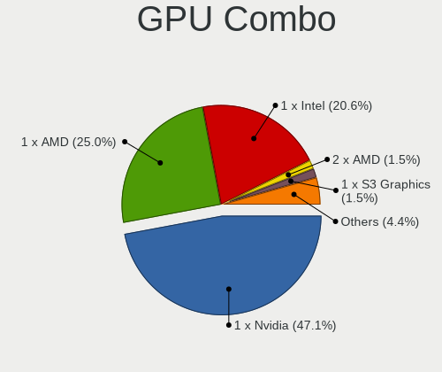

| Name            | Desktops | Percent |
|-----------------|----------|---------|
| 1 x Nvidia      | 23       | 48.94%  |
| 1 x AMD         | 13       | 27.66%  |
| 1 x Intel       | 10       | 21.28%  |
| 1 x S3 Graphics | 1        | 2.13%   |

GPU Driver
----------

Free vs proprietary

| Driver      | Desktops | Percent |
|-------------|----------|---------|
| Free        | 30       | 63.83%  |
| Proprietary | 14       | 29.79%  |
| Unknown     | 3        | 6.38%   |

GPU Memory
----------

Total video memory

| Size in GB | Desktops | Percent |
|------------|----------|---------|
| Unknown    | 25       | 51.02%  |
| 1.01-2.0   | 7        | 14.29%  |
| 7.01-8.0   | 3        | 6.12%   |
| 3.01-4.0   | 3        | 6.12%   |
| 8.01-16.0  | 3        | 6.12%   |
| 5.01-6.0   | 2        | 4.08%   |
| 16.01-24.0 | 2        | 4.08%   |
| 0.51-1.0   | 2        | 4.08%   |
| 0.01-0.5   | 2        | 4.08%   |

Monitor
-------

Monitor Vendor
--------------

Monitor vendors

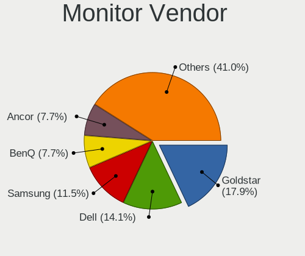

| Vendor               | Desktops | Percent |
|----------------------|----------|---------|
| Goldstar             | 9        | 16.98%  |
| Dell                 | 8        | 15.09%  |
| Samsung Electronics  | 7        | 13.21%  |
| Ancor Communications | 5        | 9.43%   |
| Philips              | 4        | 7.55%   |
| BenQ                 | 4        | 7.55%   |
| Acer                 | 3        | 5.66%   |
| LG Electronics       | 2        | 3.77%   |
| Hewlett-Packard      | 2        | 3.77%   |
| AOC                  | 2        | 3.77%   |
| Vizio                | 1        | 1.89%   |
| ViewSonic            | 1        | 1.89%   |
| TCL                  | 1        | 1.89%   |
| Lenovo               | 1        | 1.89%   |
| Iiyama               | 1        | 1.89%   |
| Denver               | 1        | 1.89%   |
| ASUSTek Computer     | 1        | 1.89%   |

Monitor Model
-------------

Monitor models

| Model                                                                 | Desktops | Percent |
|-----------------------------------------------------------------------|----------|---------|
| Vizio E60-E3 VIZ1018 3840x2160 1330x748mm 60.1-inch                   | 1        | 1.82%   |
| ViewSonic VX3211-2K VSCF634 2560x1440 698x392mm 31.5-inch             | 1        | 1.82%   |
| TCL LCD TV TCL0030 1920x1080 708x398mm 32.0-inch                      | 1        | 1.82%   |
| Samsung Electronics U28E590 SAM0C4D 3840x2160 607x345mm 27.5-inch     | 1        | 1.82%   |
| Samsung Electronics SyncMaster SAM0524 1920x1080 477x268mm 21.5-inch  | 1        | 1.82%   |
| Samsung Electronics SyncMaster SAM00A2 1024x768 304x228mm 15.0-inch   | 1        | 1.82%   |
| Samsung Electronics SMS27A850T SAM0887 2560x1440 518x324mm 24.1-inch  | 1        | 1.82%   |
| Samsung Electronics SA300/SA350 SAM0788 1366x768 410x230mm 18.5-inch  | 1        | 1.82%   |
| Samsung Electronics S34J55x SAM0F72 3440x1440 800x330mm 34.1-inch     | 1        | 1.82%   |
| Samsung Electronics S34J55x SAM0F70 3440x1440 797x333mm 34.0-inch     | 1        | 1.82%   |
| Samsung Electronics S23B550 SAM0919 1920x1080 510x287mm 23.0-inch     | 1        | 1.82%   |
| Philips PHL 258B6QU PHL08F5 2560x1440 553x311mm 25.0-inch             | 1        | 1.82%   |
| Philips PHL 243V5 PHLC0D1 1920x1080 521x293mm 23.5-inch               | 1        | 1.82%   |
| Philips 150S PHL0812 1024x768 307x230mm 15.1-inch                     | 1        | 1.82%   |
| Philips 150S PHL0805 1024x768 307x230mm 15.1-inch                     | 1        | 1.82%   |
| LG Electronics LCD Monitor LG ULTRAWIDE 2560x1080                     | 1        | 1.82%   |
| LG Electronics LCD Monitor LG TV SSCR 3840x2160                       | 1        | 1.82%   |
| Lenovo LEN T27i-10 LEN61C6 1920x1080 598x336mm 27.0-inch              | 1        | 1.82%   |
| Iiyama PL2592H IVM6135 1920x1080 544x303mm 24.5-inch                  | 1        | 1.82%   |
| Hewlett-Packard LA1951 HWP285A 1280x1024 380x300mm 19.1-inch          | 1        | 1.82%   |
| Hewlett-Packard 27es HWP3326 1920x1080 598x336mm 27.0-inch            | 1        | 1.82%   |
| Goldstar W2261 GSM56CF 1920x1080 477x268mm 21.5-inch                  | 1        | 1.82%   |
| Goldstar ULTRAWIDE GSM59F1 2560x1080 673x284mm 28.8-inch              | 1        | 1.82%   |
| Goldstar MP59G GSM5B35 1920x1080 480x270mm 21.7-inch                  | 1        | 1.82%   |
| Goldstar LG FULL HD GSM5B55 1920x1080 480x270mm 21.7-inch             | 1        | 1.82%   |
| Goldstar L1718S GSM443C 1280x1024 338x270mm 17.0-inch                 | 1        | 1.82%   |
| Goldstar FULL HD GSM5ABB 1920x1080 480x270mm 21.7-inch                | 1        | 1.82%   |
| Goldstar E2742 GSM58C9 1920x1080 598x337mm 27.0-inch                  | 1        | 1.82%   |
| Goldstar E2441 GSM581F 1920x1080 530x300mm 24.0-inch                  | 1        | 1.82%   |
| Goldstar BN550Y GSM5BAB 1920x1080 600x340mm 27.2-inch                 | 1        | 1.82%   |
| Denver UWQHD-100-V2 LHC3500 3440x1440 798x342mm 34.2-inch             | 1        | 1.82%   |
| Dell UZ2315H DELF055 1920x1080 509x286mm 23.0-inch                    | 1        | 1.82%   |
| Dell U2711 DELA057 2560x1440 597x336mm 27.0-inch                      | 1        | 1.82%   |
| Dell S3422DWG DELD128 3440x1440 797x334mm 34.0-inch                   | 1        | 1.82%   |
| Dell S2216H DELD07A 1920x1080 476x268mm 21.5-inch                     | 1        | 1.82%   |
| Dell P2419H DELD0DA 1920x1080 527x296mm 23.8-inch                     | 1        | 1.82%   |
| Dell P2219H DELA114 1920x1080 476x267mm 21.5-inch                     | 1        | 1.82%   |
| Dell E228WFP DELD014 1680x1050 473x296mm 22.0-inch                    | 1        | 1.82%   |
| Dell 1703FP DEL3011 1280x1024 338x270mm 17.0-inch                     | 1        | 1.82%   |
| BenQ T221WA BNQ7719 1680x1050 473x296mm 22.0-inch                     | 1        | 1.82%   |
| BenQ SW2700 BNQ7F47 2560x1440 596x335mm 26.9-inch                     | 1        | 1.82%   |
| BenQ PD2500Q BNQ802A 2560x1440 553x311mm 25.0-inch                    | 1        | 1.82%   |
| BenQ BL2405 BNQ8016 1920x1080 531x298mm 24.0-inch                     | 1        | 1.82%   |
| ASUSTek Computer VG245 AUS24A1 1920x1080 531x299mm 24.0-inch          | 1        | 1.82%   |
| AOC LCD Monitor 28E850 640x480                                        | 1        | 1.82%   |
| AOC 2436 AOC2436 1920x1080 521x293mm 23.5-inch                        | 1        | 1.82%   |
| Ancor Communications PA248 ACI24B1 1920x1200 546x352mm 25.6-inch      | 1        | 1.82%   |
| Ancor Communications ASUS VW199 ACI19ED 1440x900 408x255mm 18.9-inch  | 1        | 1.82%   |
| Ancor Communications ASUS VS228 ACI22FD 1920x1080 476x268mm 21.5-inch | 1        | 1.82%   |
| Ancor Communications ASUS VN248 ACI24C4 1920x1080 530x300mm 24.0-inch | 1        | 1.82%   |
| Ancor Communications ASUS VN247 ACI24C3 1920x1080 521x293mm 23.5-inch | 1        | 1.82%   |
| Acer X163W ACR0015 1366x768 344x193mm 15.5-inch                       | 1        | 1.82%   |
| Acer V203H ACR0102 1600x900 443x249mm 20.0-inch                       | 1        | 1.82%   |
| Acer V203H ACR00C7 1600x900 443x249mm 20.0-inch                       | 1        | 1.82%   |
| Acer GD245HQ ACR0125 1920x1080 520x290mm 23.4-inch                    | 1        | 1.82%   |

Monitor Resolution
------------------

Monitor screen resolution

| Resolution         | Desktops | Percent |
|--------------------|----------|---------|
| 1920x1080 (FHD)    | 22       | 45.83%  |
| 2560x1440 (QHD)    | 5        | 10.42%  |
| 3840x2160 (4K)     | 4        | 8.33%   |
| 3440x1440          | 3        | 6.25%   |
| 1024x768 (XGA)     | 3        | 6.25%   |
| 2560x1080          | 2        | 4.17%   |
| 1680x1050 (WSXGA+) | 2        | 4.17%   |
| 1280x1024 (SXGA)   | 2        | 4.17%   |
| 640x480            | 1        | 2.08%   |
| 1920x1200 (WUXGA)  | 1        | 2.08%   |
| 1600x900 (HD+)     | 1        | 2.08%   |
| 1440x900 (WXGA+)   | 1        | 2.08%   |
| 1366x768 (WXGA)    | 1        | 2.08%   |

Monitor Diagonal
----------------

Diagonal size in inches

| Inches  | Desktops | Percent |
|---------|----------|---------|
| 27      | 8        | 16.33%  |
| 21      | 7        | 14.29%  |
| 24      | 6        | 12.24%  |
| 23      | 5        | 10.2%   |
| 34      | 4        | 8.16%   |
| 15      | 4        | 8.16%   |
| Unknown | 3        | 6.12%   |
| 25      | 2        | 4.08%   |
| 22      | 2        | 4.08%   |
| 17      | 2        | 4.08%   |
| 74      | 1        | 2.04%   |
| 32      | 1        | 2.04%   |
| 31      | 1        | 2.04%   |
| 20      | 1        | 2.04%   |
| 19      | 1        | 2.04%   |
| 18      | 1        | 2.04%   |

Monitor Width
-------------

Physical width

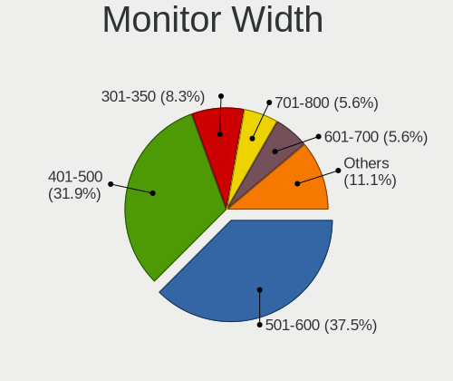

| Width in mm | Desktops | Percent |
|-------------|----------|---------|
| 501-600     | 19       | 39.58%  |
| 401-500     | 12       | 25%     |
| 301-350     | 6        | 12.5%   |
| 701-800     | 5        | 10.42%  |
| Unknown     | 3        | 6.25%   |
| 601-700     | 2        | 4.17%   |
| 1501-2000   | 1        | 2.08%   |

Aspect Ratio
------------

Proportional relationship between the width and the height

| Ratio   | Desktops | Percent |
|---------|----------|---------|
| 16/9    | 30       | 63.83%  |
| 16/10   | 5        | 10.64%  |
| 21/9    | 4        | 8.51%   |
| 4/3     | 3        | 6.38%   |
| Unknown | 3        | 6.38%   |
| 5/4     | 2        | 4.26%   |

Monitor Area
------------

Area in inch²

| Area in inch² | Desktops | Percent |
|----------------|----------|---------|
| 201-250        | 18       | 36%     |
| 301-350        | 8        | 16%     |
| 351-500        | 6        | 12%     |
| 251-300        | 4        | 8%      |
| 101-110        | 4        | 8%      |
| 151-200        | 3        | 6%      |
| 141-150        | 3        | 6%      |
| Unknown        | 3        | 6%      |
| More than 1000 | 1        | 2%      |

Pixel Density
-------------

Pixels per inch

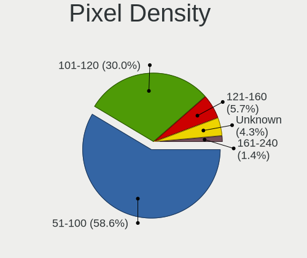

| Density | Desktops | Percent |
|---------|----------|---------|
| 51-100  | 28       | 59.57%  |
| 101-120 | 14       | 29.79%  |
| Unknown | 3        | 6.38%   |
| 121-160 | 2        | 4.26%   |

Multiple Monitors
-----------------

Total monitors connected

| Total | Desktops | Percent |
|-------|----------|---------|
| 1     | 36       | 76.6%   |
| 2     | 7        | 14.89%  |
| 0     | 3        | 6.38%   |
| 3     | 1        | 2.13%   |

Network
-------

Net Controller Vendor
---------------------

Controller vendors

| Vendor                | Desktops | Percent |
|-----------------------|----------|---------|
| Realtek Semiconductor | 35       | 47.95%  |
| Intel                 | 18       | 24.66%  |
| Qualcomm Atheros      | 5        | 6.85%   |
| Ralink                | 3        | 4.11%   |
| Broadcom              | 2        | 2.74%   |
| ZyXEL Communications  | 1        | 1.37%   |
| TP-Link               | 1        | 1.37%   |
| TOMTOM                | 1        | 1.37%   |
| Samsung Electronics   | 1        | 1.37%   |
| Ralink Technology     | 1        | 1.37%   |
| NetXen Incorporated   | 1        | 1.37%   |
| D-Link System         | 1        | 1.37%   |
| Broadcom Limited      | 1        | 1.37%   |
| AVM                   | 1        | 1.37%   |
| ASIX Electronics      | 1        | 1.37%   |

Net Controller Model
--------------------

Controller models

| Model                                                                      | Desktops | Percent |
|----------------------------------------------------------------------------|----------|---------|
| Realtek RTL8111/8168/8411 PCI Express Gigabit Ethernet Controller          | 26       | 30.59%  |
| Intel Wi-Fi 6 AX200                                                        | 5        | 5.88%   |
| Intel I211 Gigabit Network Connection                                      | 5        | 5.88%   |
| Realtek RTL8125 2.5GbE Controller                                          | 4        | 4.71%   |
| Realtek RTL810xE PCI Express Fast Ethernet controller                      | 3        | 3.53%   |
| Realtek RTL8821CE 802.11ac PCIe Wireless Network Adapter                   | 2        | 2.35%   |
| Intel Wireless-AC 9260                                                     | 2        | 2.35%   |
| Intel Wireless 7260                                                        | 2        | 2.35%   |
| ZyXEL NWD2205 802.11n Wireless N Adapter [Realtek RTL8192CU]               | 1        | 1.18%   |
| TP-Link TL-WN821N v5/v6 [RTL8192EU]                                        | 1        | 1.18%   |
| TOMTOM GO 60                                                               | 1        | 1.18%   |
| Samsung Galaxy series, misc. (tethering mode)                              | 1        | 1.18%   |
| Realtek RTL8812AE 802.11ac PCIe Wireless Network Adapter                   | 1        | 1.18%   |
| Realtek RTL8188FTV 802.11b/g/n 1T1R 2.4G WLAN Adapter                      | 1        | 1.18%   |
| Realtek RTL8188CE 802.11b/g/n WiFi Adapter                                 | 1        | 1.18%   |
| Realtek RTL8153 Gigabit Ethernet Adapter                                   | 1        | 1.18%   |
| Realtek RTL-8110SC/8169SC Gigabit Ethernet                                 | 1        | 1.18%   |
| Realtek Killer E3000 2.5GbE Controller                                     | 1        | 1.18%   |
| Realtek Killer E2600 Gigabit Ethernet Controller                           | 1        | 1.18%   |
| Ralink RT3072 Wireless Adapter                                             | 1        | 1.18%   |
| Ralink RT3090 Wireless 802.11n 1T/1R PCIe                                  | 1        | 1.18%   |
| Ralink RT3060 Wireless 802.11n 1T/1R                                       | 1        | 1.18%   |
| Ralink RT2561/RT61 802.11g PCI                                             | 1        | 1.18%   |
| Qualcomm Atheros QCA9565 / AR9565 Wireless Network Adapter                 | 1        | 1.18%   |
| Qualcomm Atheros QCA8171 Gigabit Ethernet                                  | 1        | 1.18%   |
| Qualcomm Atheros QCA6174 802.11ac Wireless Network Adapter                 | 1        | 1.18%   |
| Qualcomm Atheros Killer E2400 Gigabit Ethernet Controller                  | 1        | 1.18%   |
| Qualcomm Atheros AR9227 Wireless Network Adapter                           | 1        | 1.18%   |
| Qualcomm Atheros AR8121/AR8113/AR8114 Gigabit or Fast Ethernet             | 1        | 1.18%   |
| NetXen Incorporated NX3031 Multifunction 1/10-Gigabit Server Adapter       | 1        | 1.18%   |
| Intel Wireless 8260                                                        | 1        | 1.18%   |
| Intel Tiger Lake PCH CNVi WiFi                                             | 1        | 1.18%   |
| Intel Ethernet Connection (2) I219-LM                                      | 1        | 1.18%   |
| Intel Dual Band Wireless-AC 3168NGW [Stone Peak]                           | 1        | 1.18%   |
| Intel 82579V Gigabit Network Connection                                    | 1        | 1.18%   |
| Intel 82574L Gigabit Network Connection                                    | 1        | 1.18%   |
| Intel 82562V-2 10/100 Network Connection                                   | 1        | 1.18%   |
| Intel 82541PI Gigabit Ethernet Controller                                  | 1        | 1.18%   |
| D-Link System AirPlus G DWL-G122 Wireless Adapter(rev.C1) [Ralink RT2571W] | 1        | 1.18%   |
| Broadcom NetLink BCM57781 Gigabit Ethernet PCIe                            | 1        | 1.18%   |
| Broadcom Limited BCM4352 802.11ac Wireless Network Adapter                 | 1        | 1.18%   |
| Broadcom BCM43142 802.11b/g/n                                              | 1        | 1.18%   |
| AVM Fritz!WLAN N v2 [Atheros AR9271]                                       | 1        | 1.18%   |
| ASIX AX88179 Gigabit Ethernet                                              | 1        | 1.18%   |

Wireless Vendor
---------------

Wireless vendors

| Vendor                | Desktops | Percent |
|-----------------------|----------|---------|
| Intel                 | 12       | 40%     |
| Realtek Semiconductor | 5        | 16.67%  |
| Ralink                | 3        | 10%     |
| Qualcomm Atheros      | 3        | 10%     |
| ZyXEL Communications  | 1        | 3.33%   |
| TP-Link               | 1        | 3.33%   |
| Ralink Technology     | 1        | 3.33%   |
| D-Link System         | 1        | 3.33%   |
| Broadcom Limited      | 1        | 3.33%   |
| Broadcom              | 1        | 3.33%   |
| AVM                   | 1        | 3.33%   |

Wireless Model
--------------

Wireless models

| Model                                                                      | Desktops | Percent |
|----------------------------------------------------------------------------|----------|---------|
| Intel Wi-Fi 6 AX200                                                        | 5        | 16.67%  |
| Realtek RTL8821CE 802.11ac PCIe Wireless Network Adapter                   | 2        | 6.67%   |
| Intel Wireless-AC 9260                                                     | 2        | 6.67%   |
| Intel Wireless 7260                                                        | 2        | 6.67%   |
| ZyXEL NWD2205 802.11n Wireless N Adapter [Realtek RTL8192CU]               | 1        | 3.33%   |
| TP-Link TL-WN821N v5/v6 [RTL8192EU]                                        | 1        | 3.33%   |
| Realtek RTL8812AE 802.11ac PCIe Wireless Network Adapter                   | 1        | 3.33%   |
| Realtek RTL8188FTV 802.11b/g/n 1T1R 2.4G WLAN Adapter                      | 1        | 3.33%   |
| Realtek RTL8188CE 802.11b/g/n WiFi Adapter                                 | 1        | 3.33%   |
| Ralink RT3072 Wireless Adapter                                             | 1        | 3.33%   |
| Ralink RT3090 Wireless 802.11n 1T/1R PCIe                                  | 1        | 3.33%   |
| Ralink RT3060 Wireless 802.11n 1T/1R                                       | 1        | 3.33%   |
| Ralink RT2561/RT61 802.11g PCI                                             | 1        | 3.33%   |
| Qualcomm Atheros QCA9565 / AR9565 Wireless Network Adapter                 | 1        | 3.33%   |
| Qualcomm Atheros QCA6174 802.11ac Wireless Network Adapter                 | 1        | 3.33%   |
| Qualcomm Atheros AR9227 Wireless Network Adapter                           | 1        | 3.33%   |
| Intel Wireless 8260                                                        | 1        | 3.33%   |
| Intel Tiger Lake PCH CNVi WiFi                                             | 1        | 3.33%   |
| Intel Dual Band Wireless-AC 3168NGW [Stone Peak]                           | 1        | 3.33%   |
| D-Link System AirPlus G DWL-G122 Wireless Adapter(rev.C1) [Ralink RT2571W] | 1        | 3.33%   |
| Broadcom Limited BCM4352 802.11ac Wireless Network Adapter                 | 1        | 3.33%   |
| Broadcom BCM43142 802.11b/g/n                                              | 1        | 3.33%   |
| AVM Fritz!WLAN N v2 [Atheros AR9271]                                       | 1        | 3.33%   |

Ethernet Vendor
---------------

Ethernet vendors

| Vendor                | Desktops | Percent |
|-----------------------|----------|---------|
| Realtek Semiconductor | 35       | 67.31%  |
| Intel                 | 10       | 19.23%  |
| Qualcomm Atheros      | 3        | 5.77%   |
| Samsung Electronics   | 1        | 1.92%   |
| NetXen Incorporated   | 1        | 1.92%   |
| Broadcom              | 1        | 1.92%   |
| ASIX Electronics      | 1        | 1.92%   |

Ethernet Model
--------------

Ethernet models

| Model                                                                | Desktops | Percent |
|----------------------------------------------------------------------|----------|---------|
| Realtek RTL8111/8168/8411 PCI Express Gigabit Ethernet Controller    | 26       | 48.15%  |
| Intel I211 Gigabit Network Connection                                | 5        | 9.26%   |
| Realtek RTL8125 2.5GbE Controller                                    | 4        | 7.41%   |
| Realtek RTL810xE PCI Express Fast Ethernet controller                | 3        | 5.56%   |
| Samsung Galaxy series, misc. (tethering mode)                        | 1        | 1.85%   |
| Realtek RTL8153 Gigabit Ethernet Adapter                             | 1        | 1.85%   |
| Realtek RTL-8110SC/8169SC Gigabit Ethernet                           | 1        | 1.85%   |
| Realtek Killer E3000 2.5GbE Controller                               | 1        | 1.85%   |
| Realtek Killer E2600 Gigabit Ethernet Controller                     | 1        | 1.85%   |
| Qualcomm Atheros QCA8171 Gigabit Ethernet                            | 1        | 1.85%   |
| Qualcomm Atheros Killer E2400 Gigabit Ethernet Controller            | 1        | 1.85%   |
| Qualcomm Atheros AR8121/AR8113/AR8114 Gigabit or Fast Ethernet       | 1        | 1.85%   |
| NetXen Incorporated NX3031 Multifunction 1/10-Gigabit Server Adapter | 1        | 1.85%   |
| Intel Ethernet Connection (2) I219-LM                                | 1        | 1.85%   |
| Intel 82579V Gigabit Network Connection                              | 1        | 1.85%   |
| Intel 82574L Gigabit Network Connection                              | 1        | 1.85%   |
| Intel 82562V-2 10/100 Network Connection                             | 1        | 1.85%   |
| Intel 82541PI Gigabit Ethernet Controller                            | 1        | 1.85%   |
| Broadcom NetLink BCM57781 Gigabit Ethernet PCIe                      | 1        | 1.85%   |
| ASIX AX88179 Gigabit Ethernet                                        | 1        | 1.85%   |

Net Controller Kind
-------------------

Ethernet, WiFi or modem

| Kind     | Desktops | Percent |
|----------|----------|---------|
| Ethernet | 46       | 60.53%  |
| WiFi     | 29       | 38.16%  |
| Unknown  | 1        | 1.32%   |

Used Controller
---------------

Currently used network controller

| Kind     | Desktops | Percent |
|----------|----------|---------|
| Ethernet | 42       | 64.62%  |
| WiFi     | 22       | 33.85%  |
| Unknown  | 1        | 1.54%   |

NICs
----

Total network controllers on board

| Total | Desktops | Percent |
|-------|----------|---------|
| 1     | 22       | 46.81%  |
| 2     | 20       | 42.55%  |
| 3     | 4        | 8.51%   |
| 5     | 1        | 2.13%   |

IPv6
----

IPv6 vs IPv4

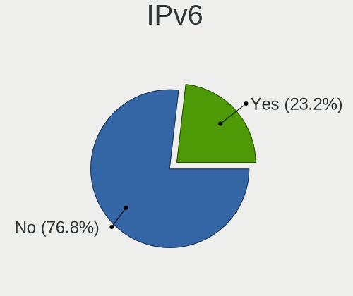

| Used | Desktops | Percent |
|------|----------|---------|
| No   | 38       | 79.17%  |
| Yes  | 10       | 20.83%  |

Bluetooth
---------

Bluetooth Vendor
----------------

Controller vendors

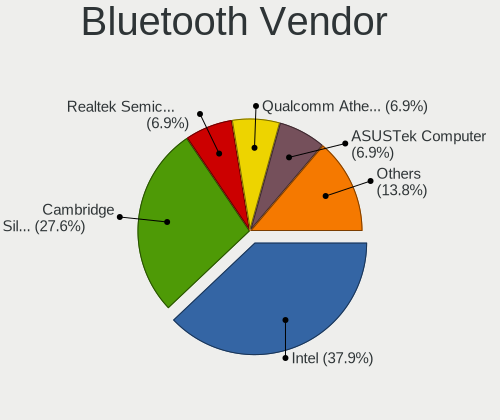

| Vendor                          | Desktops | Percent |
|---------------------------------|----------|---------|
| Intel                           | 10       | 43.48%  |
| Cambridge Silicon Radio         | 5        | 21.74%  |
| Realtek Semiconductor           | 2        | 8.7%    |
| Qualcomm Atheros Communications | 2        | 8.7%    |
| Dell                            | 1        | 4.35%   |
| Broadcom                        | 1        | 4.35%   |
| Belkin Components               | 1        | 4.35%   |
| ASUSTek Computer                | 1        | 4.35%   |

Bluetooth Model
---------------

Controller models

| Model                                                 | Desktops | Percent |
|-------------------------------------------------------|----------|---------|
| Cambridge Silicon Radio Bluetooth Dongle (HCI mode)   | 5        | 21.74%  |
| Intel AX200 Bluetooth                                 | 4        | 17.39%  |
| Realtek  Bluetooth 4.2 Adapter                        | 2        | 8.7%    |
| Qualcomm Atheros  Bluetooth Device                    | 2        | 8.7%    |
| Intel Wireless-AC 9260 Bluetooth Adapter              | 2        | 8.7%    |
| Intel Wireless-AC 3168 Bluetooth                      | 1        | 4.35%   |
| Intel Bluetooth wireless interface                    | 1        | 4.35%   |
| Intel Bluetooth Device                                | 1        | 4.35%   |
| Intel AX201 Bluetooth                                 | 1        | 4.35%   |
| Dell Broadcom BCM20702A0 Bluetooth                    | 1        | 4.35%   |
| Broadcom BCM43142A0 Bluetooth Device                  | 1        | 4.35%   |
| Belkin Components F8T065BF Mini Bluetooth 4.0 Adapter | 1        | 4.35%   |
| ASUS Bluetooth Adapter                                | 1        | 4.35%   |

Sound
-----

Sound Vendor
------------

Sound card vendors

| Vendor                    | Desktops | Percent |
|---------------------------|----------|---------|
| AMD                       | 28       | 34.57%  |
| Nvidia                    | 22       | 27.16%  |
| Intel                     | 22       | 27.16%  |
| C-Media Electronics       | 3        | 3.7%    |
| Creative Labs             | 2        | 2.47%   |
| Texas Instruments         | 1        | 1.23%   |
| Sennheiser Communications | 1        | 1.23%   |
| BEHRINGER International   | 1        | 1.23%   |
| ASUSTek Computer          | 1        | 1.23%   |

Sound Model
-----------

Sound card models

| Model                                                                      | Desktops | Percent |
|----------------------------------------------------------------------------|----------|---------|
| AMD Starship/Matisse HD Audio Controller                                   | 9        | 10%     |
| AMD Family 17h (Models 00h-0fh) HD Audio Controller                        | 6        | 6.67%   |
| Intel NM10/ICH7 Family High Definition Audio Controller                    | 4        | 4.44%   |
| Nvidia GA102 High Definition Audio Controller                              | 3        | 3.33%   |
| Intel 100 Series/C230 Series Chipset Family HD Audio Controller            | 3        | 3.33%   |
| AMD SBx00 Azalia (Intel HDA)                                               | 3        | 3.33%   |
| Nvidia TU107 GeForce GTX 1650 High Definition Audio Controller             | 2        | 2.22%   |
| Nvidia GK106 HDMI Audio Controller                                         | 2        | 2.22%   |
| Intel Xeon E3-1200 v3/4th Gen Core Processor HD Audio Controller           | 2        | 2.22%   |
| Intel Cannon Lake PCH cAVS                                                 | 2        | 2.22%   |
| Intel 8 Series/C220 Series Chipset High Definition Audio Controller        | 2        | 2.22%   |
| Intel 7 Series/C216 Chipset Family High Definition Audio Controller        | 2        | 2.22%   |
| Intel 6 Series/C200 Series Chipset Family High Definition Audio Controller | 2        | 2.22%   |
| AMD Tonga HDMI Audio [Radeon R9 285/380]                                   | 2        | 2.22%   |
| AMD Raven/Raven2/Fenghuang HDMI/DP Audio Controller                        | 2        | 2.22%   |
| AMD Oland/Hainan/Cape Verde/Pitcairn HDMI Audio [Radeon HD 7000 Series]    | 2        | 2.22%   |
| AMD Kabini HDMI/DP Audio                                                   | 2        | 2.22%   |
| AMD FCH Azalia Controller                                                  | 2        | 2.22%   |
| AMD Family 17h/19h HD Audio Controller                                     | 2        | 2.22%   |
| AMD Ellesmere HDMI Audio [Radeon RX 470/480 / 570/580/590]                 | 2        | 2.22%   |
| Texas Instruments PCM2900C Audio CODEC                                     | 1        | 1.11%   |
| Sennheiser Communications Sennheiser 3D G4ME1                              | 1        | 1.11%   |
| Nvidia TU116 High Definition Audio Controller                              | 1        | 1.11%   |
| Nvidia TU106 High Definition Audio Controller                              | 1        | 1.11%   |
| Nvidia MCP61 High Definition Audio                                         | 1        | 1.11%   |
| Nvidia GT216 HDMI Audio Controller                                         | 1        | 1.11%   |
| Nvidia GP108 High Definition Audio Controller                              | 1        | 1.11%   |
| Nvidia GP107GL High Definition Audio Controller                            | 1        | 1.11%   |
| Nvidia GP104 High Definition Audio Controller                              | 1        | 1.11%   |
| Nvidia GP102 HDMI Audio Controller                                         | 1        | 1.11%   |
| Nvidia GM206 High Definition Audio Controller                              | 1        | 1.11%   |
| Nvidia GK208 HDMI/DP Audio Controller                                      | 1        | 1.11%   |
| Nvidia GK107 HDMI Audio Controller                                         | 1        | 1.11%   |
| Nvidia GF119 HDMI Audio Controller                                         | 1        | 1.11%   |
| Nvidia GF108 High Definition Audio Controller                              | 1        | 1.11%   |
| Nvidia GA104 High Definition Audio Controller                              | 1        | 1.11%   |
| Nvidia Audio device                                                        | 1        | 1.11%   |
| Intel C600/X79 series chipset High Definition Audio Controller             | 1        | 1.11%   |
| Intel Audio device                                                         | 1        | 1.11%   |
| Intel 9 Series Chipset Family HD Audio Controller                          | 1        | 1.11%   |
| Intel 82801JI (ICH10 Family) HD Audio Controller                           | 1        | 1.11%   |
| Intel 82801I (ICH9 Family) HD Audio Controller                             | 1        | 1.11%   |
| Intel 5 Series/3400 Series Chipset High Definition Audio                   | 1        | 1.11%   |
| Intel 200 Series PCH HD Audio                                              | 1        | 1.11%   |
| Creative Labs Sound Core3D [Sound Blaster Recon3D / Z-Series]              | 1        | 1.11%   |
| Creative Labs CA0108/CA10300 [Sound Blaster Audigy Series]                 | 1        | 1.11%   |
| C-Media Electronics CMI8738/CMI8768 PCI Audio                              | 1        | 1.11%   |
| C-Media Electronics CM108 Audio Controller                                 | 1        | 1.11%   |
| C-Media Electronics Audio Adapter                                          | 1        | 1.11%   |
| BEHRINGER International UMC202HD 192k                                      | 1        | 1.11%   |
| ASUSTek Computer Xonar U7 MKII                                             | 1        | 1.11%   |
| AMD RV610 HDMI Audio [Radeon HD 2350 PRO / 2400 PRO/XT / HD 3410]          | 1        | 1.11%   |
| AMD Redwood HDMI Audio [Radeon HD 5000 Series]                             | 1        | 1.11%   |
| AMD Baffin HDMI/DP Audio [Radeon RX 550 640SP / RX 560/560X]               | 1        | 1.11%   |

Memory
------

Memory Vendor
-------------

Memory module vendors

| Vendor              | Desktops | Percent |
|---------------------|----------|---------|
| Kingston            | 8        | 25%     |
| Corsair             | 5        | 15.63%  |
| Unknown             | 4        | 12.5%   |
| G.Skill             | 4        | 12.5%   |
| Crucial             | 4        | 12.5%   |
| Samsung Electronics | 2        | 6.25%   |
| Team                | 1        | 3.13%   |
| Patriot             | 1        | 3.13%   |
| Micron Technology   | 1        | 3.13%   |
| GeIL                | 1        | 3.13%   |
| Elpida              | 1        | 3.13%   |

Memory Model
------------

Memory module models

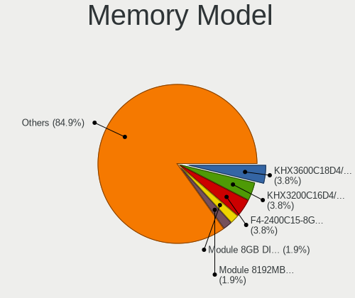

| Model                                                      | Desktops | Percent |
|------------------------------------------------------------|----------|---------|
| Kingston RAM KHX3600C18D4/32GX 32GB DIMM DDR4 3600MT/s     | 2        | 6.06%   |
| Kingston RAM KHX3200C16D4/16GX 16GB DIMM DDR4 3600MT/s     | 2        | 6.06%   |
| Unknown RAM Module 8GB DIMM DDR3 1600MT/s                  | 1        | 3.03%   |
| Unknown RAM Module 2048MB DIMM SDRAM 800MT/s               | 1        | 3.03%   |
| Unknown RAM Module 2048MB DIMM 1333MT/s                    | 1        | 3.03%   |
| Unknown RAM 992124 (997124) 8GB DIMM DDR3 1600MT/s         | 1        | 3.03%   |
| Team RAM TEAMGROUP-UD4-2400 8192MB DIMM DDR4 3007MT/s      | 1        | 3.03%   |
| Samsung RAM M471B5673FH0-CH9 2GB DIMM DDR3 4199MT/s        | 1        | 3.03%   |
| Samsung RAM M378B1G73EB0-YK0 8GB DIMM DDR3 1600MT/s        | 1        | 3.03%   |
| Patriot RAM PSD48G266681 8GB DIMM DDR4 2934MT/s            | 1        | 3.03%   |
| Micron RAM 16JTF1G64AZ-1G6D1 8GB DIMM DDR3 1600MT/s        | 1        | 3.03%   |
| Kingston RAM KHX2400C15/8G 8GB DIMM DDR4 2933MT/s          | 1        | 3.03%   |
| Kingston RAM 99U5474-016.A00LF 4GB DIMM DDR3 1333MT/s      | 1        | 3.03%   |
| Kingston RAM 99U5471-040.A00LF 8GB DIMM DDR3 1333MT/s      | 1        | 3.03%   |
| Kingston RAM 9905474-012.A00LF 2048MB DIMM DDR3 1333MT/s   | 1        | 3.03%   |
| Kingston RAM 9905471-028.A00LF 4096MB DIMM DDR3 1333MT/s   | 1        | 3.03%   |
| GeIL RAM CL11-11-11 D3-1600 4096MB DIMM DDR3 1600MT/s      | 1        | 3.03%   |
| G.Skill RAM F4-3200C16-8GVKB 8GB DIMM DDR4 2933MT/s        | 1        | 3.03%   |
| G.Skill RAM F4-3200C15-16GTZKY 16384MB DIMM DDR4 3200MT/s  | 1        | 3.03%   |
| G.Skill RAM F4-2666C19-16GIS 16384MB DIMM DDR4 2667MT/s    | 1        | 3.03%   |
| G.Skill RAM F4-2400C15-8GNT 8GB DIMM DDR4 2666MT/s         | 1        | 3.03%   |
| Elpida RAM EBE11UD8AJWA-6E-E 1024MB DIMM DDR2 667MT/s      | 1        | 3.03%   |
| Crucial RAM CT16G4DFRA266.C16FE 16384MB DIMM DDR4 2667MT/s | 1        | 3.03%   |
| Crucial RAM CT102464BD160B.M16 8GB DIMM 1600MT/s           | 1        | 3.03%   |
| Crucial RAM BLS16G4D32AESB.M16FE 16GB DIMM DDR4 3400MT/s   | 1        | 3.03%   |
| Crucial RAM BL32G32C16U4R.M16FB1 32GB DIMM DDR4 3200MT/s   | 1        | 3.03%   |
| Corsair RAM CMZ8GX3M2A1866C9 4096MB DIMM DDR3 1867MT/s     | 1        | 3.03%   |
| Corsair RAM CMT64GX4M4E3200C16 16GB DIMM DDR4 3200MT/s     | 1        | 3.03%   |
| Corsair RAM CML8GX3M2A1600C9 4GB DIMM DDR3 1867MT/s        | 1        | 3.03%   |
| Corsair RAM CMK32GX4M2Z3600C18 16384MB DIMM DDR4 3800MT/s  | 1        | 3.03%   |
| Corsair RAM CMK16GX4M1E3200C16 16384MB DIMM DDR4 3000MT/s  | 1        | 3.03%   |

Memory Kind
-----------

Memory module kinds

| Kind    | Desktops | Percent |
|---------|----------|---------|
| DDR4    | 16       | 59.26%  |
| DDR3    | 8        | 29.63%  |
| SDRAM   | 1        | 3.7%    |
| DDR2    | 1        | 3.7%    |
| Unknown | 1        | 3.7%    |

Memory Form Factor
------------------

Physical design of the memory module

| Name | Desktops | Percent |
|------|----------|---------|
| DIMM | 27       | 100%    |

Memory Size
-----------

Memory module size

| Size  | Desktops | Percent |
|-------|----------|---------|
| 16384 | 10       | 34.48%  |
| 8192  | 9        | 31.03%  |
| 32768 | 3        | 10.34%  |
| 4096  | 3        | 10.34%  |
| 2048  | 3        | 10.34%  |
| 1024  | 1        | 3.45%   |

Memory Speed
------------

Memory module speed

| Speed | Desktops | Percent |
|-------|----------|---------|
| 3600  | 4        | 13.33%  |
| 1600  | 4        | 13.33%  |
| 1333  | 4        | 13.33%  |
| 3200  | 3        | 10%     |
| 2667  | 2        | 6.67%   |
| 1867  | 2        | 6.67%   |
| 4199  | 1        | 3.33%   |
| 3800  | 1        | 3.33%   |
| 3466  | 1        | 3.33%   |
| 3400  | 1        | 3.33%   |
| 3007  | 1        | 3.33%   |
| 3000  | 1        | 3.33%   |
| 2934  | 1        | 3.33%   |
| 2933  | 1        | 3.33%   |
| 2666  | 1        | 3.33%   |
| 800   | 1        | 3.33%   |
| 667   | 1        | 3.33%   |

Printers & scanners
-------------------

Printer Vendor
--------------

Printer device vendors

| Vendor              | Desktops | Percent |
|---------------------|----------|---------|
| Hewlett-Packard     | 2        | 28.57%  |
| Brother Industries  | 2        | 28.57%  |
| Samsung Electronics | 1        | 14.29%  |
| Kyocera             | 1        | 14.29%  |
| Canon               | 1        | 14.29%  |

Printer Model
-------------

Printer device models

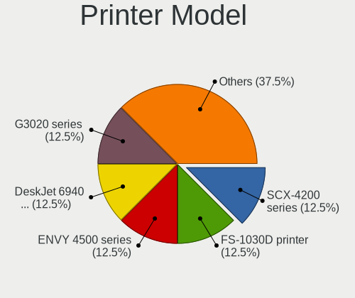

| Model                     | Desktops | Percent |
|---------------------------|----------|---------|
| Samsung SCX-4200 series   | 1        | 14.29%  |
| Kyocera FS-1030D printer  | 1        | 14.29%  |
| HP ENVY 4500 series       | 1        | 14.29%  |
| HP DeskJet 6940 series    | 1        | 14.29%  |
| Canon CanoScan LiDE 300   | 1        | 14.29%  |
| Brother Printer           | 1        | 14.29%  |
| Brother HL-L3210CW series | 1        | 14.29%  |

Scanner Vendor
--------------

Scanner device vendors

| Vendor      | Desktops | Percent |
|-------------|----------|---------|
| Canon       | 3        | 75%     |
| Seiko Epson | 1        | 25%     |

Scanner Model
-------------

Scanner device models

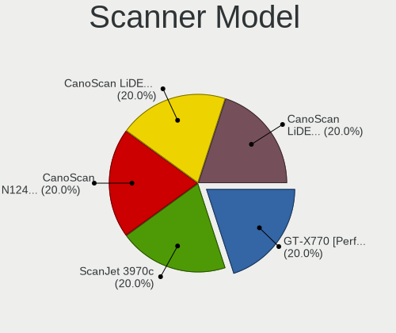

| Model                                 | Desktops | Percent |
|---------------------------------------|----------|---------|
| Seiko Epson GT-X770 [Perfection V500] | 1        | 25%     |
| Canon CanoScan N1240U/LiDE 30         | 1        | 25%     |
| Canon CanoScan LiDE 210               | 1        | 25%     |
| Canon CanoScan LiDE 110               | 1        | 25%     |

Camera
------

Camera Vendor
-------------

Camera device vendors

| Vendor                  | Desktops | Percent |
|-------------------------|----------|---------|
| Logitech                | 7        | 63.64%  |
| Z-Star Microelectronics | 1        | 9.09%   |
| Microsoft               | 1        | 9.09%   |
| Creative Technology     | 1        | 9.09%   |
| Chicony Electronics     | 1        | 9.09%   |

Camera Model
------------

Camera device models

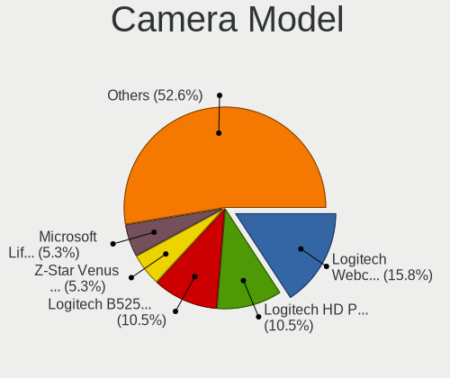

| Model                         | Desktops | Percent |
|-------------------------------|----------|---------|
| Logitech Webcam C270          | 3        | 27.27%  |
| Logitech B525 HD Webcam       | 2        | 18.18%  |
| Z-Star Venus USB2.0 Camera    | 1        | 9.09%   |
| Microsoft LifeCam VX-700      | 1        | 9.09%   |
| Logitech Webcam C250          | 1        | 9.09%   |
| Logitech HD Pro Webcam C920   | 1        | 9.09%   |
| Creative Live! Cam Sync 1080p | 1        | 9.09%   |
| Chicony HP Webcam             | 1        | 9.09%   |

Security
--------

Fingerprint Vendor
------------------

Fingerprint sensor vendors

Zero info for selected period =(

Fingerprint Model
-----------------

Fingerprint sensor models

Zero info for selected period =(

Chipcard Vendor
---------------

Chipcard module vendors

Zero info for selected period =(

Chipcard Model
--------------

Chipcard module models

Zero info for selected period =(

Unsupported
-----------

Unsupported Devices
-------------------

Total unsupported devices on board

| Total | Desktops | Percent |
|-------|----------|---------|
| 0     | 40       | 85.11%  |
| 1     | 7        | 14.89%  |

Unsupported Device Types
------------------------

Types of unsupported devices

| Type          | Desktops | Percent |
|---------------|----------|---------|
| Graphics card | 4        | 57.14%  |
| Net/wireless  | 2        | 28.57%  |
| Bluetooth     | 1        | 14.29%  |

