openSUSE Leap-15.3 - Tested Hardware & Statistics (Desktops)
------------------------------------------------------------

A project to collect tested hardware configurations for openSUSE Leap-15.3.

Anyone can contribute to this report by the [hw-probe](https://github.com/linuxhw/hw-probe) tool:

    sudo -E hw-probe -all -upload

Please submit a probe of your configuration if it's not presented on the page or is rare.

Full-feature report is available here: https://linux-hardware.org/?view=trends&rel=opensuse-leap-15.3

Contents
--------

* [ Test Cases ](#test-cases)

* [ System ](#system)
  - [ Kernel                   ](#kernel)
  - [ Kernel Family            ](#kernel-family)
  - [ Kernel Major Ver.        ](#kernel-major-ver)
  - [ Arch                     ](#arch)
  - [ DE                       ](#de)
  - [ Display Server           ](#display-server)
  - [ Display Manager          ](#display-manager)
  - [ OS Lang                  ](#os-lang)
  - [ Boot Mode                ](#boot-mode)
  - [ Filesystem               ](#filesystem)
  - [ Part. scheme             ](#part-scheme)
  - [ Dual Boot with Linux/BSD ](#dual-boot-with-linuxbsd)
  - [ Dual Boot (Win)          ](#dual-boot-win)

* [ Board ](#board)
  - [ Vendor                   ](#vendor)
  - [ Model                    ](#model)
  - [ Model Family             ](#model-family)
  - [ MFG Year                 ](#mfg-year)
  - [ Form Factor              ](#form-factor)
  - [ Secure Boot              ](#secure-boot)
  - [ Coreboot                 ](#coreboot)
  - [ RAM Size                 ](#ram-size)
  - [ RAM Used                 ](#ram-used)
  - [ Total Drives             ](#total-drives)
  - [ Has CD-ROM               ](#has-cd-rom)
  - [ Has Ethernet             ](#has-ethernet)
  - [ Has WiFi                 ](#has-wifi)
  - [ Has Bluetooth            ](#has-bluetooth)

* [ Location ](#location)
  - [ Country                  ](#country)
  - [ City                     ](#city)

* [ Drives ](#drives)
  - [ Drive Vendor             ](#drive-vendor)
  - [ Drive Model              ](#drive-model)
  - [ HDD Vendor               ](#hdd-vendor)
  - [ SSD Vendor               ](#ssd-vendor)
  - [ Drive Kind               ](#drive-kind)
  - [ Drive Connector          ](#drive-connector)
  - [ Drive Size               ](#drive-size)
  - [ Space Total              ](#space-total)
  - [ Space Used               ](#space-used)
  - [ Malfunc. Drives          ](#malfunc-drives)
  - [ Malfunc. Drive Vendor    ](#malfunc-drive-vendor)
  - [ Malfunc. HDD Vendor      ](#malfunc-hdd-vendor)
  - [ Malfunc. Drive Kind      ](#malfunc-drive-kind)
  - [ Failed Drives            ](#failed-drives)
  - [ Failed Drive Vendor      ](#failed-drive-vendor)
  - [ Drive Status             ](#drive-status)

* [ Storage controller ](#storage-controller)
  - [ Storage Vendor           ](#storage-vendor)
  - [ Storage Model            ](#storage-model)
  - [ Storage Kind             ](#storage-kind)

* [ Processor ](#processor)
  - [ CPU Vendor               ](#cpu-vendor)
  - [ CPU Model                ](#cpu-model)
  - [ CPU Model Family         ](#cpu-model-family)
  - [ CPU Cores                ](#cpu-cores)
  - [ CPU Sockets              ](#cpu-sockets)
  - [ CPU Threads              ](#cpu-threads)
  - [ CPU Op-Modes             ](#cpu-op-modes)
  - [ CPU Microcode            ](#cpu-microcode)
  - [ CPU Microarch            ](#cpu-microarch)

* [ Graphics ](#graphics)
  - [ GPU Vendor               ](#gpu-vendor)
  - [ GPU Model                ](#gpu-model)
  - [ GPU Combo                ](#gpu-combo)
  - [ GPU Driver               ](#gpu-driver)
  - [ GPU Memory               ](#gpu-memory)

* [ Monitor ](#monitor)
  - [ Monitor Vendor           ](#monitor-vendor)
  - [ Monitor Model            ](#monitor-model)
  - [ Monitor Resolution       ](#monitor-resolution)
  - [ Monitor Diagonal         ](#monitor-diagonal)
  - [ Monitor Width            ](#monitor-width)
  - [ Aspect Ratio             ](#aspect-ratio)
  - [ Monitor Area             ](#monitor-area)
  - [ Pixel Density            ](#pixel-density)
  - [ Multiple Monitors        ](#multiple-monitors)

* [ Network ](#network)
  - [ Net Controller Vendor    ](#net-controller-vendor)
  - [ Net Controller Model     ](#net-controller-model)
  - [ Wireless Vendor          ](#wireless-vendor)
  - [ Wireless Model           ](#wireless-model)
  - [ Ethernet Vendor          ](#ethernet-vendor)
  - [ Ethernet Model           ](#ethernet-model)
  - [ Net Controller Kind      ](#net-controller-kind)
  - [ Used Controller          ](#used-controller)
  - [ NICs                     ](#nics)
  - [ IPv6                     ](#ipv6)

* [ Bluetooth ](#bluetooth)
  - [ Bluetooth Vendor         ](#bluetooth-vendor)
  - [ Bluetooth Model          ](#bluetooth-model)

* [ Sound ](#sound)
  - [ Sound Vendor             ](#sound-vendor)
  - [ Sound Model              ](#sound-model)

* [ Memory ](#memory)
  - [ Memory Vendor            ](#memory-vendor)
  - [ Memory Model             ](#memory-model)
  - [ Memory Kind              ](#memory-kind)
  - [ Memory Form Factor       ](#memory-form-factor)
  - [ Memory Size              ](#memory-size)
  - [ Memory Speed             ](#memory-speed)

* [ Printers & scanners ](#printers--scanners)
  - [ Printer Vendor           ](#printer-vendor)
  - [ Printer Model            ](#printer-model)
  - [ Scanner Vendor           ](#scanner-vendor)
  - [ Scanner Model            ](#scanner-model)

* [ Camera ](#camera)
  - [ Camera Vendor            ](#camera-vendor)
  - [ Camera Model             ](#camera-model)

* [ Security ](#security)
  - [ Fingerprint Vendor       ](#fingerprint-vendor)
  - [ Fingerprint Model        ](#fingerprint-model)
  - [ Chipcard Vendor          ](#chipcard-vendor)
  - [ Chipcard Model           ](#chipcard-model)

* [ Unsupported ](#unsupported)
  - [ Unsupported Devices      ](#unsupported-devices)
  - [ Unsupported Device Types ](#unsupported-device-types)

Test Cases
----------

| Vendor     | Model                       | Probe                                                      | Date         |
|------------|-----------------------------|------------------------------------------------------------|--------------|
| Dell       | 0M859N A00                  | [aadca45789](https://linux-hardware.org/?probe=aadca45789) | Nov 01, 2021 |
| Dell       | 0Y2YM6 A00                  | [d9a12dc22c](https://linux-hardware.org/?probe=d9a12dc22c) | Oct 19, 2021 |
| Dell       | 0Y2YM6 A00                  | [34a55551e2](https://linux-hardware.org/?probe=34a55551e2) | Oct 19, 2021 |
| Lenovo     | 364A SDK0J40700 WIN 3258... | [ce4776505f](https://linux-hardware.org/?probe=ce4776505f) | Oct 03, 2021 |
| MSI        | B450M MORTAR MAX            | [556c37ba9b](https://linux-hardware.org/?probe=556c37ba9b) | Oct 03, 2021 |
| MSI        | B450M PRO-VDH MAX           | [ad69186227](https://linux-hardware.org/?probe=ad69186227) | Oct 02, 2021 |
| ASRock     | Z68 Extreme4 Gen3           | [3cec37b610](https://linux-hardware.org/?probe=3cec37b610) | Oct 02, 2021 |
| MSI        | B450M PRO-VDH MAX           | [540dca7da7](https://linux-hardware.org/?probe=540dca7da7) | Oct 02, 2021 |
| ASUSTek    | M4A78T-E                    | [01ec64f498](https://linux-hardware.org/?probe=01ec64f498) | Sep 24, 2021 |
| Lenovo     | 364A SDK0J40700 WIN 3258... | [58f9ca6247](https://linux-hardware.org/?probe=58f9ca6247) | Sep 22, 2021 |
| Lenovo     | 364A SDK0J40700 WIN 3258... | [db9ccd461b](https://linux-hardware.org/?probe=db9ccd461b) | Sep 22, 2021 |
| VS Company | G31T-M                      | [ed8bb8c0d1](https://linux-hardware.org/?probe=ed8bb8c0d1) | Sep 21, 2021 |
| ASUSTek    | AM1M-A/BR                   | [c586c22b15](https://linux-hardware.org/?probe=c586c22b15) | Sep 20, 2021 |
| Alienware  | 0PGRP5 A02                  | [65615a3aaa](https://linux-hardware.org/?probe=65615a3aaa) | Sep 16, 2021 |
| Alienware  | 0PGRP5 A02                  | [158a015f26](https://linux-hardware.org/?probe=158a015f26) | Sep 15, 2021 |
| MSI        | X370 GAMING PRO             | [629a45e23d](https://linux-hardware.org/?probe=629a45e23d) | Sep 12, 2021 |
| HP         | 8056                        | [3cab8505c4](https://linux-hardware.org/?probe=3cab8505c4) | Sep 06, 2021 |
| Intel      | DG41WV AAE90316-104         | [27c162218f](https://linux-hardware.org/?probe=27c162218f) | Sep 05, 2021 |
| Gigabyte   | B550 AORUS PRO AC           | [be3b65a81d](https://linux-hardware.org/?probe=be3b65a81d) | Aug 29, 2021 |
| ASRock     | B450M Pro4                  | [a13b05f65f](https://linux-hardware.org/?probe=a13b05f65f) | Aug 27, 2021 |
| ASUSTek    | PRIME H310M-A               | [a22aa3c48c](https://linux-hardware.org/?probe=a22aa3c48c) | Aug 01, 2021 |
| MSI        | B85M-E45                    | [0e20d4cea9](https://linux-hardware.org/?probe=0e20d4cea9) | Jul 30, 2021 |
| Gigabyte   | B250M-DS3H-CF               | [acbcbe74d7](https://linux-hardware.org/?probe=acbcbe74d7) | Jul 22, 2021 |
| HP         | 8433 11                     | [b079ccb608](https://linux-hardware.org/?probe=b079ccb608) | Jul 15, 2021 |
| MSI        | D2415 S26361-D2415-A21      | [b49400f636](https://linux-hardware.org/?probe=b49400f636) | Jul 11, 2021 |
| MSI        | B350 TOMAHAWK               | [27a6ac997b](https://linux-hardware.org/?probe=27a6ac997b) | Jul 03, 2021 |
| ASRock     | X570M Pro4                  | [a00aea4331](https://linux-hardware.org/?probe=a00aea4331) | Jul 03, 2021 |
| HP         | 0A68h                       | [36cfa6a366](https://linux-hardware.org/?probe=36cfa6a366) | Jun 27, 2021 |
| ASUSTek    | TUF B450-PRO GAMING         | [dfc2f82575](https://linux-hardware.org/?probe=dfc2f82575) | Jun 26, 2021 |
| ASRock     | X570 Steel Legend           | [b4a11b3e4e](https://linux-hardware.org/?probe=b4a11b3e4e) | Jun 17, 2021 |
| MSI        | MEG X570 GODLIKE            | [11b7f0e8ae](https://linux-hardware.org/?probe=11b7f0e8ae) | Jun 17, 2021 |
| HP         | 2AA2                        | [65e7cd2d3e](https://linux-hardware.org/?probe=65e7cd2d3e) | Jun 02, 2021 |
| ASUSTek    | P8H61-M LE/USB3             | [fca0fd3336](https://linux-hardware.org/?probe=fca0fd3336) | Jan 03, 2021 |

System
------

Kernel
------

Version of the Linux kernel

| Version                 | Desktops | Percent |
|-------------------------|----------|---------|
| 5.3.18-59.19-default    | 8        | 27.59%  |
| 5.3.18-59.5-default     | 4        | 13.79%  |
| 5.3.18-59.24-default    | 4        | 13.79%  |
| 5.3.18-59.10-default    | 3        | 10.34%  |
| 5.3.18-57-default       | 3        | 10.34%  |
| 5.3.18-59.27-default    | 2        | 6.9%    |
| 5.3.18-lp152.57-default | 1        | 3.45%   |
| 5.3.18-59.24-preempt    | 1        | 3.45%   |
| 5.3.18-59.19-preempt    | 1        | 3.45%   |
| 5.3.18-59.16-default    | 1        | 3.45%   |
| 5.3.18-59.13-default    | 1        | 3.45%   |

Kernel Family
-------------

Linux kernel without a distro release

| Version | Desktops | Percent |
|---------|----------|---------|
| 5.3.18  | 28       | 100%    |

Kernel Major Ver.
-----------------

Linux kernel major version

| Version | Desktops | Percent |
|---------|----------|---------|
| 5.3     | 28       | 100%    |

Arch
----

OS architecture (x86_64, i586, etc.)

| Name   | Desktops | Percent |
|--------|----------|---------|
| x86_64 | 28       | 100%    |

DE
--

Desktop Environment

| Name       | Desktops | Percent |
|------------|----------|---------|
| KDE5       | 11       | 39.29%  |
| KDE        | 9        | 32.14%  |
| Unknown    | 5        | 17.86%  |
| XFCE       | 2        | 7.14%   |
| X-Cinnamon | 1        | 3.57%   |

Display Server
--------------

X11 or Wayland

| Name | Desktops | Percent |
|------|----------|---------|
| X11  | 24       | 85.71%  |
| Tty  | 4        | 14.29%  |

Display Manager
---------------

SDDM, LightDM, etc.

| Name    | Desktops | Percent |
|---------|----------|---------|
| Unknown | 18       | 64.29%  |
| LightDM | 7        | 25%     |
| SDDM    | 3        | 10.71%  |

OS Lang
-------

Language

| Lang    | Desktops | Percent |
|---------|----------|---------|
| en_US   | 8        | 28.57%  |
| de_DE   | 6        | 21.43%  |
| POSIX   | 4        | 14.29%  |
| pt_BR   | 3        | 10.71%  |
| pl_PL   | 1        | 3.57%   |
| nl_BE   | 1        | 3.57%   |
| hr_HR   | 1        | 3.57%   |
| es_MX   | 1        | 3.57%   |
| en_GB   | 1        | 3.57%   |
| en_AU   | 1        | 3.57%   |
| Unknown | 1        | 3.57%   |

Boot Mode
---------

EFI or BIOS

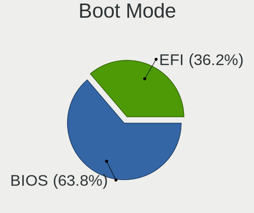

| Mode | Desktops | Percent |
|------|----------|---------|
| BIOS | 19       | 67.86%  |
| EFI  | 9        | 32.14%  |

Filesystem
----------

Type of filesystem

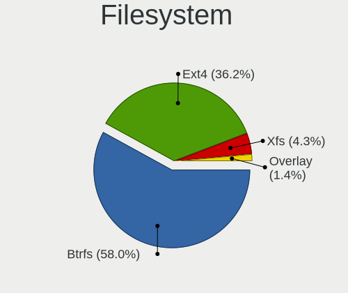

| Type  | Desktops | Percent |
|-------|----------|---------|
| Btrfs | 17       | 60.71%  |
| Ext4  | 9        | 32.14%  |
| Xfs   | 2        | 7.14%   |

Part. scheme
------------

Scheme of partitioning

| Type    | Desktops | Percent |
|---------|----------|---------|
| Unknown | 15       | 53.57%  |
| GPT     | 12       | 42.86%  |
| MBR     | 1        | 3.57%   |

Dual Boot with Linux/BSD
------------------------

Hosting more than one Linux/BSD

| Dual boot | Desktops | Percent |
|-----------|----------|---------|
| No        | 25       | 89.29%  |
| Yes       | 3        | 10.71%  |

Dual Boot (Win)
---------------

Hosting Linux and Windows

| Dual boot | Desktops | Percent |
|-----------|----------|---------|
| No        | 22       | 78.57%  |
| Yes       | 6        | 21.43%  |

Board
-----

Vendor
------

Motherboard manufacturer

| Name                | Desktops | Percent |
|---------------------|----------|---------|
| MSI                 | 7        | 25%     |
| ASUSTek Computer    | 5        | 17.86%  |
| Hewlett-Packard     | 4        | 14.29%  |
| ASRock              | 4        | 14.29%  |
| Gigabyte Technology | 2        | 7.14%   |
| Dell                | 2        | 7.14%   |
| VS Company          | 1        | 3.57%   |
| Lenovo              | 1        | 3.57%   |
| Intel               | 1        | 3.57%   |
| Alienware           | 1        | 3.57%   |

Model
-----

Motherboard model

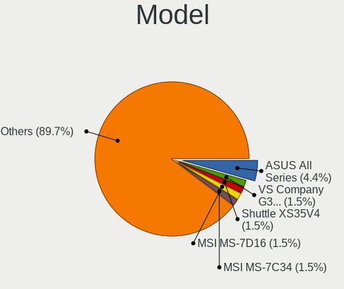

| Name                                         | Desktops | Percent |
|----------------------------------------------|----------|---------|
| VS Company VS-G31T-M                         | 1        | 3.57%   |
| MSI MS-7C34                                  | 1        | 3.57%   |
| MSI MS-7B89                                  | 1        | 3.57%   |
| MSI MS-7A38                                  | 1        | 3.57%   |
| MSI MS-7A34                                  | 1        | 3.57%   |
| MSI MS-7A33                                  | 1        | 3.57%   |
| MSI MS-7817                                  | 1        | 3.57%   |
| MSI ESPRIMO P1510                            | 1        | 3.57%   |
| Lenovo IdeaCentre Y710 Cube-15ISH 90FL004WGE | 1        | 3.57%   |
| Intel DG41WV AAE90316-104                    | 1        | 3.57%   |
| HP xw4400 Workstation                        | 1        | 3.57%   |
| HP Pavilion Gaming Desktop 690-00xx          | 1        | 3.57%   |
| HP EliteDesk 800 G2 DM 65W                   | 1        | 3.57%   |
| HP 200-5120br                                | 1        | 3.57%   |
| Gigabyte B550 AORUS PRO AC                   | 1        | 3.57%   |
| Gigabyte B250M-DS3H                          | 1        | 3.57%   |
| Dell Vostro 3268                             | 1        | 3.57%   |
| Dell OptiPlex 760                            | 1        | 3.57%   |
| ASUS TUF B450-PRO GAMING                     | 1        | 3.57%   |
| ASUS PRIME H310M-A                           | 1        | 3.57%   |
| ASUS P8H61-M LE/USB3                         | 1        | 3.57%   |
| ASUS M4A78T-E                                | 1        | 3.57%   |
| ASUS All Series                              | 1        | 3.57%   |
| ASRock Z68 Extreme4 Gen3                     | 1        | 3.57%   |
| ASRock X570M Pro4                            | 1        | 3.57%   |
| ASRock X570 Steel Legend                     | 1        | 3.57%   |
| ASRock B450M Pro4                            | 1        | 3.57%   |
| Alienware X51 R2                             | 1        | 3.57%   |

Model Family
------------

Motherboard model prefix

| Name                 | Desktops | Percent |
|----------------------|----------|---------|
| VS Company VS-G31T-M | 1        | 3.57%   |
| MSI MS-7C34          | 1        | 3.57%   |
| MSI MS-7B89          | 1        | 3.57%   |
| MSI MS-7A38          | 1        | 3.57%   |
| MSI MS-7A34          | 1        | 3.57%   |
| MSI MS-7A33          | 1        | 3.57%   |
| MSI MS-7817          | 1        | 3.57%   |
| MSI ESPRIMO          | 1        | 3.57%   |
| Lenovo IdeaCentre    | 1        | 3.57%   |
| Intel DG41WV         | 1        | 3.57%   |
| HP xw4400            | 1        | 3.57%   |
| HP Pavilion          | 1        | 3.57%   |
| HP EliteDesk         | 1        | 3.57%   |
| HP 200-5120br        | 1        | 3.57%   |
| Gigabyte B550        | 1        | 3.57%   |
| Gigabyte B250M-DS3H  | 1        | 3.57%   |
| Dell Vostro          | 1        | 3.57%   |
| Dell OptiPlex        | 1        | 3.57%   |
| ASUS TUF             | 1        | 3.57%   |
| ASUS PRIME           | 1        | 3.57%   |
| ASUS P8H61-M         | 1        | 3.57%   |
| ASUS M4A78T-E        | 1        | 3.57%   |
| ASUS All             | 1        | 3.57%   |
| ASRock Z68           | 1        | 3.57%   |
| ASRock X570M         | 1        | 3.57%   |
| ASRock X570          | 1        | 3.57%   |
| ASRock B450M         | 1        | 3.57%   |
| Alienware X51        | 1        | 3.57%   |

MFG Year
--------

Motherboard manufacture year

| Year | Desktops | Percent |
|------|----------|---------|
| 2021 | 5        | 17.86%  |
| 2010 | 5        | 17.86%  |
| 2018 | 4        | 14.29%  |
| 2020 | 3        | 10.71%  |
| 2019 | 3        | 10.71%  |
| 2016 | 2        | 7.14%   |
| 2011 | 2        | 7.14%   |
| 2017 | 1        | 3.57%   |
| 2015 | 1        | 3.57%   |
| 2013 | 1        | 3.57%   |
| 2009 | 1        | 3.57%   |

Form Factor
-----------

Physical design of the computer

| Name    | Desktops | Percent |
|---------|----------|---------|
| Desktop | 28       | 100%    |

Secure Boot
-----------

Enabled or disabled

| State    | Desktops | Percent |
|----------|----------|---------|
| Disabled | 28       | 100%    |

Coreboot
--------

Have coreboot on board

| Used | Desktops | Percent |
|------|----------|---------|
| No   | 28       | 100%    |

RAM Size
--------

Total RAM memory

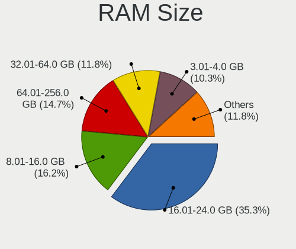

| Size in GB  | Desktops | Percent |
|-------------|----------|---------|
| 16.01-24.0  | 9        | 32.14%  |
| 8.01-16.0   | 5        | 17.86%  |
| 64.01-256.0 | 4        | 14.29%  |
| 4.01-8.0    | 3        | 10.71%  |
| 32.01-64.0  | 3        | 10.71%  |
| 3.01-4.0    | 3        | 10.71%  |
| 24.01-32.0  | 1        | 3.57%   |

RAM Used
--------

Used RAM memory

| Used GB   | Desktops | Percent |
|-----------|----------|---------|
| 1.01-2.0  | 13       | 46.43%  |
| 4.01-8.0  | 6        | 21.43%  |
| 3.01-4.0  | 4        | 14.29%  |
| 2.01-3.0  | 3        | 10.71%  |
| 8.01-16.0 | 1        | 3.57%   |
| 0.51-1.0  | 1        | 3.57%   |

Total Drives
------------

Number of drives on board

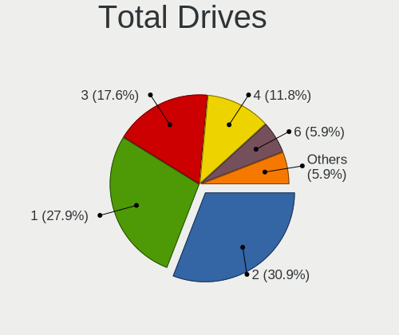

| Drives | Desktops | Percent |
|--------|----------|---------|
| 1      | 10       | 35.71%  |
| 2      | 7        | 25%     |
| 3      | 6        | 21.43%  |
| 4      | 4        | 14.29%  |
| 6      | 1        | 3.57%   |

Has CD-ROM
----------

Has CD-ROM on board

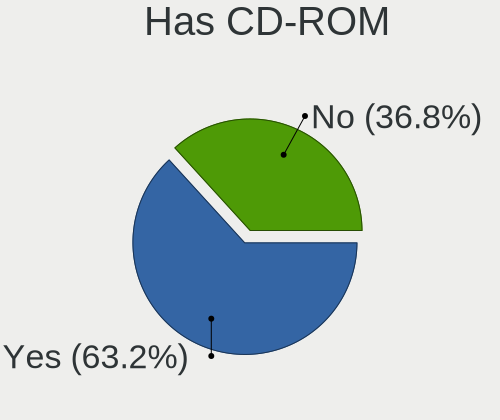

| Presented | Desktops | Percent |
|-----------|----------|---------|
| Yes       | 15       | 53.57%  |
| No        | 13       | 46.43%  |

Has Ethernet
------------

Has Ethernet on board

| Presented | Desktops | Percent |
|-----------|----------|---------|
| Yes       | 27       | 96.43%  |
| No        | 1        | 3.57%   |

Has WiFi
--------

Has WiFi module

| Presented | Desktops | Percent |
|-----------|----------|---------|
| Yes       | 18       | 64.29%  |
| No        | 10       | 35.71%  |

Has Bluetooth
-------------

Has Bluetooth module

| Presented | Desktops | Percent |
|-----------|----------|---------|
| No        | 16       | 57.14%  |
| Yes       | 12       | 42.86%  |

Location
--------

Country
-------

Geographic location (country)

| Country    | Desktops | Percent |
|------------|----------|---------|
| Germany    | 8        | 28.57%  |
| Brazil     | 4        | 14.29%  |
| USA        | 3        | 10.71%  |
| Mexico     | 2        | 7.14%   |
| Japan      | 2        | 7.14%   |
| Australia  | 2        | 7.14%   |
| Slovakia   | 1        | 3.57%   |
| Russia     | 1        | 3.57%   |
| Poland     | 1        | 3.57%   |
| Luxembourg | 1        | 3.57%   |
| India      | 1        | 3.57%   |
| Croatia    | 1        | 3.57%   |
| Belgium    | 1        | 3.57%   |

City
----

Geographic location (city)

| City                  | Desktops | Percent |
|-----------------------|----------|---------|
| Tokyo                 | 2        | 7.14%   |
| Vijayawada            | 1        | 3.57%   |
| Três Lagoas          | 1        | 3.57%   |
| São Paulo            | 1        | 3.57%   |
| Stuttgart             | 1        | 3.57%   |
| Stupava               | 1        | 3.57%   |
| Stabroek              | 1        | 3.57%   |
| San Luis Potos?­ City | 1        | 3.57%   |
| Recife                | 1        | 3.57%   |
| Oregon                | 1        | 3.57%   |
| Nordenham             | 1        | 3.57%   |
| Munich                | 1        | 3.57%   |
| Melbourne             | 1        | 3.57%   |
| McDonough             | 1        | 3.57%   |
| Luxembourg            | 1        | 3.57%   |
| Lomonosov             | 1        | 3.57%   |
| Koleczkowo            | 1        | 3.57%   |
| Heinsberg             | 1        | 3.57%   |
| Halle                 | 1        | 3.57%   |
| Gelnhausen            | 1        | 3.57%   |
| Federal Way           | 1        | 3.57%   |
| Ebhausen              | 1        | 3.57%   |
| Chapec??              | 1        | 3.57%   |
| Canc??n               | 1        | 3.57%   |
| Busevec               | 1        | 3.57%   |
| Brisbane              | 1        | 3.57%   |
| Braunschweig          | 1        | 3.57%   |

Drives
------

Drive Vendor
------------

Hard drive vendors

| Vendor              | Desktops | Drives | Percent |
|---------------------|----------|--------|---------|
| WDC                 | 15       | 19     | 27.27%  |
| Samsung Electronics | 9        | 12     | 16.36%  |
| Seagate             | 8        | 10     | 14.55%  |
| SanDisk             | 3        | 4      | 5.45%   |
| Intel               | 3        | 3      | 5.45%   |
| Hitachi             | 3        | 3      | 5.45%   |
| A-DATA Technology   | 3        | 3      | 5.45%   |
| Crucial             | 2        | 2      | 3.64%   |
| Unknown             | 1        | 1      | 1.82%   |
| Toshiba             | 1        | 1      | 1.82%   |
| TO Exter            | 1        | 1      | 1.82%   |
| Phison              | 1        | 1      | 1.82%   |
| Lite-On             | 1        | 1      | 1.82%   |
| JMicron             | 1        | 1      | 1.82%   |
| Intenso             | 1        | 2      | 1.82%   |
| Inateck             | 1        | 1      | 1.82%   |
| HGST HTS            | 1        | 1      | 1.82%   |

Drive Model
-----------

Hard drive models

| Model                                | Desktops | Percent |
|--------------------------------------|----------|---------|
| Seagate ST3750528AS 752GB            | 2        | 3.13%   |
| Seagate ST2000DM006-2DM164 2TB       | 2        | 3.13%   |
| Samsung SSD 860 EVO 250GB            | 2        | 3.13%   |
| Samsung SSD 850 EVO 500GB            | 2        | 3.13%   |
| WDC WDS500G1X0E-00AFY0 500GB         | 1        | 1.56%   |
| WDC WDS250G1B0C-00S6U0 250GB         | 1        | 1.56%   |
| WDC WDS100T3X0C-00SJG0 1TB           | 1        | 1.56%   |
| WDC WD7500AALX-009BA0 752GB          | 1        | 1.56%   |
| WDC WD5000AAVS-00ZTB0 500GB          | 1        | 1.56%   |
| WDC WD50 00LPCX-00VHAT0 500GB        | 1        | 1.56%   |
| WDC WD3200AAKS-00B3A0 320GB          | 1        | 1.56%   |
| WDC WD2500AAJS-00VTA0 250GB          | 1        | 1.56%   |
| WDC WD2005FBYZ-01YCBB2 2TB           | 1        | 1.56%   |
| WDC WD10EZEX-75WN4A0 1TB             | 1        | 1.56%   |
| WDC WD10EZEX-75M2NA0 1TB             | 1        | 1.56%   |
| WDC WD10EZEX-08WN4A0 1TB             | 1        | 1.56%   |
| WDC WD10EZEX-00KUWA0 1TB             | 1        | 1.56%   |
| WDC WD10EZEX-00BN5A0 1TB             | 1        | 1.56%   |
| WDC WD10EAVS-22D7B0 1TB              | 1        | 1.56%   |
| WDC WD10EACS-00D6B1 1TB              | 1        | 1.56%   |
| WDC WD1003FZEX-00K3CA0 1TB           | 1        | 1.56%   |
| WDC WD1001FALS-00E3A0 1TB            | 1        | 1.56%   |
| Unknown 128GB SATA FLASH DRIVE       | 1        | 1.56%   |
| Toshiba HDWD130 3TB                  | 1        | 1.56%   |
| TO Exter nal USB 3.0 160GB           | 1        | 1.56%   |
| Seagate ST500LM0 12 HN-M500MBB 500GB | 1        | 1.56%   |
| Seagate ST3750630AS 752GB            | 1        | 1.56%   |
| Seagate ST3160812AS 160GB            | 1        | 1.56%   |
| Seagate ST3000DM007-1WY10G 3TB       | 1        | 1.56%   |
| Seagate ST1000LM024 HN-M101MBB 1TB   | 1        | 1.56%   |
| Seagate ST1000DM010-2EP102 1TB       | 1        | 1.56%   |
| SanDisk SDSSDA240G 240GB             | 1        | 1.56%   |
| SanDisk SD7SB6S256G1001 256GB SSD    | 1        | 1.56%   |
| SanDisk SD7SB3Q-256G-1006 256GB SSD  | 1        | 1.56%   |
| Samsung SSD 980 PRO 1TB              | 1        | 1.56%   |
| Samsung SSD 870 QVO 1TB              | 1        | 1.56%   |
| Samsung SSD 850 EVO 250GB            | 1        | 1.56%   |
| Samsung SSD 840 Series 120GB         | 1        | 1.56%   |
| Samsung MZVPV512HDGL-000H1 512GB     | 1        | 1.56%   |
| Samsung HD401LJ 400GB                | 1        | 1.56%   |
| Samsung HD105SI 1TB                  | 1        | 1.56%   |
| Samsung HD103SI 1TB                  | 1        | 1.56%   |
| Phison Viper M.2 VPN100 512GB        | 1        | 1.56%   |
| Lite-On NVMe SSD Drive 256GB         | 1        | 1.56%   |
| JMicron Generic 240GB                | 1        | 1.56%   |
| Intenso SSD 128GB                    | 1        | 1.56%   |
| Intenso SSD 120GB                    | 1        | 1.56%   |
| Intel SSDSC2BW240A4 240GB            | 1        | 1.56%   |
| Intel SSDSC2BB012T7O 1TB             | 1        | 1.56%   |
| Intel NVMe SSD Drive 512GB           | 1        | 1.56%   |
| Inateck ASM1153E 128GB               | 1        | 1.56%   |
| Hitachi HDS725050KLA360 500GB        | 1        | 1.56%   |
| Hitachi HDS721010CLA332 1TB          | 1        | 1.56%   |
| Hitachi HDS5C3020ALA632 2TB          | 1        | 1.56%   |
| HGST HTS 545050A7E380 500GB          | 1        | 1.56%   |
| Crucial CT1000P1SSD8 1TB             | 1        | 1.56%   |
| Crucial CT1000BX500SSD1 1TB          | 1        | 1.56%   |
| A-DATA SU800 256GB SSD               | 1        | 1.56%   |
| A-DATA SU650 2TB SSD                 | 1        | 1.56%   |
| A-DATA SSD 32GB                      | 1        | 1.56%   |

HDD Vendor
----------

Hard disk drive vendors

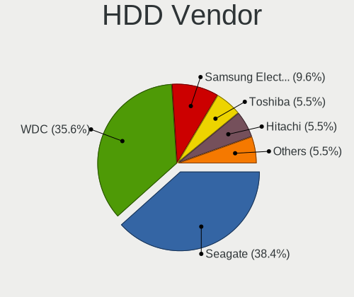

| Vendor              | Desktops | Drives | Percent |
|---------------------|----------|--------|---------|
| WDC                 | 12       | 16     | 41.38%  |
| Seagate             | 8        | 10     | 27.59%  |
| Hitachi             | 3        | 3      | 10.34%  |
| Samsung Electronics | 2        | 3      | 6.9%    |
| Toshiba             | 1        | 1      | 3.45%   |
| TO Exter            | 1        | 1      | 3.45%   |
| JMicron             | 1        | 1      | 3.45%   |
| Inateck             | 1        | 1      | 3.45%   |

SSD Vendor
----------

Solid state drive vendors

| Vendor              | Desktops | Drives | Percent |
|---------------------|----------|--------|---------|
| Samsung Electronics | 5        | 7      | 33.33%  |
| SanDisk             | 3        | 4      | 20%     |
| A-DATA Technology   | 3        | 3      | 20%     |
| Intel               | 2        | 2      | 13.33%  |
| Intenso             | 1        | 2      | 6.67%   |
| Crucial             | 1        | 1      | 6.67%   |

Drive Kind
----------

HDD or SSD

| Kind    | Desktops | Drives | Percent |
|---------|----------|--------|---------|
| HDD     | 19       | 36     | 44.19%  |
| SSD     | 15       | 19     | 34.88%  |
| NVMe    | 8        | 9      | 18.6%   |
| Unknown | 1        | 2      | 2.33%   |

Drive Connector
---------------

SATA, SAS, NVMe, etc.

| Type | Desktops | Drives | Percent |
|------|----------|--------|---------|
| SATA | 27       | 51     | 71.05%  |
| NVMe | 8        | 9      | 21.05%  |
| SAS  | 3        | 6      | 7.89%   |

Drive Size
----------

Size of hard drive

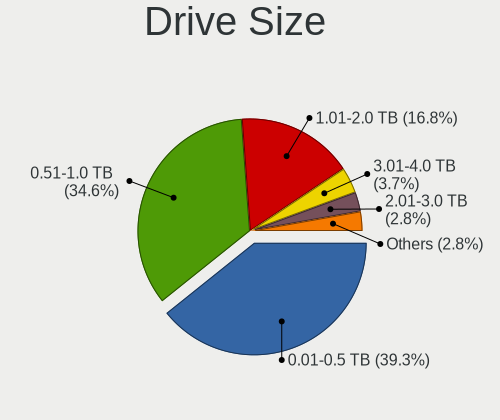

| Size in TB | Desktops | Drives | Percent |
|------------|----------|--------|---------|
| 0.51-1.0   | 17       | 22     | 42.5%   |
| 0.01-0.5   | 16       | 26     | 40%     |
| 1.01-2.0   | 5        | 5      | 12.5%   |
| 2.01-3.0   | 2        | 2      | 5%      |

Space Total
-----------

Amount of disk space available on the file system

| Size in GB     | Desktops | Percent |
|----------------|----------|---------|
| 251-500        | 6        | 21.43%  |
| More than 3000 | 5        | 17.86%  |
| 2001-3000      | 5        | 17.86%  |
| 1001-2000      | 5        | 17.86%  |
| 501-1000       | 4        | 14.29%  |
| 101-250        | 1        | 3.57%   |
| 1-20           | 1        | 3.57%   |
| Unknown        | 1        | 3.57%   |

Space Used
----------

Amount of used disk space

| Used GB   | Desktops | Percent |
|-----------|----------|---------|
| 101-250   | 7        | 24.14%  |
| 251-500   | 6        | 20.69%  |
| 1001-2000 | 4        | 13.79%  |
| 1-20      | 3        | 10.34%  |
| 501-1000  | 3        | 10.34%  |
| 51-100    | 3        | 10.34%  |
| 2001-3000 | 2        | 6.9%    |
| Unknown   | 1        | 3.45%   |

Malfunc. Drives
---------------

Drive models with a malfunction

| Model                    | Desktops | Drives | Percent |
|--------------------------|----------|--------|---------|
| Crucial CT1000P1SSD8 1TB | 1        | 1      | 100%    |

Malfunc. Drive Vendor
---------------------

Vendors of faulty drives

| Vendor  | Desktops | Drives | Percent |
|---------|----------|--------|---------|
| Crucial | 1        | 1      | 100%    |

Malfunc. HDD Vendor
-------------------

Vendors of faulty HDD drives

Zero info for selected period =(

Malfunc. Drive Kind
-------------------

Kinds of faulty drives

| Kind | Desktops | Drives | Percent |
|------|----------|--------|---------|
| NVMe | 1        | 1      | 100%    |

Failed Drives
-------------

Failed drive models

Zero info for selected period =(

Failed Drive Vendor
-------------------

Failed drive vendors

Zero info for selected period =(

Drive Status
------------

Number of failed and malfunc. drives

| Status   | Desktops | Drives | Percent |
|----------|----------|--------|---------|
| Detected | 15       | 36     | 51.72%  |
| Works    | 13       | 29     | 44.83%  |
| Malfunc  | 1        | 1      | 3.45%   |

Storage controller
------------------

Storage Vendor
--------------

Storage controller vendors

| Vendor                    | Desktops | Percent |
|---------------------------|----------|---------|
| Intel                     | 16       | 40%     |
| AMD                       | 13       | 32.5%   |
| Sandisk                   | 3        | 7.5%    |
| Samsung Electronics       | 2        | 5%      |
| Silicon Image             | 1        | 2.5%    |
| Phison Electronics        | 1        | 2.5%    |
| Micron/Crucial Technology | 1        | 2.5%    |
| Marvell Technology Group  | 1        | 2.5%    |
| Lite-On Technology        | 1        | 2.5%    |
| ASMedia Technology        | 1        | 2.5%    |

Storage Model
-------------

Storage controller models

| Model                                                                                   | Desktops | Percent |
|-----------------------------------------------------------------------------------------|----------|---------|
| AMD FCH SATA Controller [AHCI mode]                                                     | 10       | 20%     |
| AMD 400 Series Chipset SATA Controller                                                  | 4        | 8%      |
| Intel Q170/Q150/B150/H170/H110/Z170/CM236 Chipset SATA Controller [AHCI Mode]           | 3        | 6%      |
| Intel NM10/ICH7 Family SATA Controller [IDE mode]                                       | 2        | 4%      |
| Intel 82801G (ICH7 Family) IDE Controller                                               | 2        | 4%      |
| AMD 300 Series Chipset SATA Controller                                                  | 2        | 4%      |
| Silicon Image SiI 3132 Serial ATA Raid II Controller                                    | 1        | 2%      |
| Sandisk WD Blue SN500 / PC SN520 NVMe SSD                                               | 1        | 2%      |
| Sandisk WD Black SN850                                                                  | 1        | 2%      |
| Sandisk WD Black SN750 / PC SN730 NVMe SSD                                              | 1        | 2%      |
| Samsung NVMe SSD Controller SM951/PM951                                                 | 1        | 2%      |
| Samsung NVMe SSD Controller PM9A1/PM9A3/980PRO                                          | 1        | 2%      |
| Phison E12 NVMe Controller                                                              | 1        | 2%      |
| Micron/Crucial P1 NVMe PCIe SSD                                                         | 1        | 2%      |
| Marvell Group 88SE912x SATA 6Gb/s Controller [IDE mode]                                 | 1        | 2%      |
| Lite-On Non-Volatile memory controller                                                  | 1        | 2%      |
| Intel SSD 660P Series                                                                   | 1        | 2%      |
| Intel SATA Controller [RAID mode]                                                       | 1        | 2%      |
| Intel Cannon Lake PCH SATA AHCI Controller                                              | 1        | 2%      |
| Intel 82801JI (ICH10 Family) SATA AHCI Controller                                       | 1        | 2%      |
| Intel 82801JD/DO (ICH10 Family) SATA AHCI Controller                                    | 1        | 2%      |
| Intel 82801GR/GDH (ICH7R/ICH7DH) SATA Controller [RAID mode]                            | 1        | 2%      |
| Intel 8 Series/C220 Series Chipset Family 6-port SATA Controller 1 [AHCI mode]          | 1        | 2%      |
| Intel 6 Series/C200 Series Chipset Family Desktop SATA Controller (IDE mode, ports 4-5) | 1        | 2%      |
| Intel 6 Series/C200 Series Chipset Family Desktop SATA Controller (IDE mode, ports 0-3) | 1        | 2%      |
| Intel 6 Series/C200 Series Chipset Family 6 port Desktop SATA AHCI Controller           | 1        | 2%      |
| Intel 5 Series/3400 Series Chipset 6 port SATA AHCI Controller                          | 1        | 2%      |
| Intel 200 Series PCH SATA controller [AHCI mode]                                        | 1        | 2%      |
| ASMedia ASM1062 Serial ATA Controller                                                   | 1        | 2%      |
| AMD X370 Series Chipset SATA Controller                                                 | 1        | 2%      |
| AMD Starship/Matisse Chipset SATA Controller [AHCI mode]                                | 1        | 2%      |
| AMD SB7x0/SB8x0/SB9x0 SATA Controller [AHCI mode]                                       | 1        | 2%      |
| AMD SB7x0/SB8x0/SB9x0 IDE Controller                                                    | 1        | 2%      |

Storage Kind
------------

Kind of storage controller (IDE, SATA, NVMe, SAS, ...)

| Kind | Desktops | Percent |
|------|----------|---------|
| SATA | 23       | 57.5%   |
| NVMe | 8        | 20%     |
| IDE  | 6        | 15%     |
| RAID | 3        | 7.5%    |

Processor
---------

CPU Vendor
----------

Processor vendors

| Vendor | Desktops | Percent |
|--------|----------|---------|
| Intel  | 15       | 53.57%  |
| AMD    | 13       | 46.43%  |

CPU Model
---------

Processor models

| Model                                       | Desktops | Percent |
|---------------------------------------------|----------|---------|
| AMD Ryzen 9 5900X 12-Core Processor         | 2        | 7.14%   |
| AMD Ryzen 7 1700 Eight-Core Processor       | 2        | 7.14%   |
| Intel Pentium Dual-Core CPU E5400 @ 2.70GHz | 1        | 3.57%   |
| Intel Pentium CPU G3258 @ 3.20GHz           | 1        | 3.57%   |
| Intel Core i7-6700 CPU @ 3.40GHz            | 1        | 3.57%   |
| Intel Core i7-4790 CPU @ 3.60GHz            | 1        | 3.57%   |
| Intel Core i7 CPU 860 @ 2.80GHz             | 1        | 3.57%   |
| Intel Core i5-7600K CPU @ 3.80GHz           | 1        | 3.57%   |
| Intel Core i5-7500 CPU @ 3.40GHz            | 1        | 3.57%   |
| Intel Core i5-6400 CPU @ 2.70GHz            | 1        | 3.57%   |
| Intel Core i5-2400S CPU @ 2.50GHz           | 1        | 3.57%   |
| Intel Core i3-8100 CPU @ 3.60GHz            | 1        | 3.57%   |
| Intel Core i3-2100 CPU @ 3.10GHz            | 1        | 3.57%   |
| Intel Core 2 Quad CPU Q9300 @ 2.50GHz       | 1        | 3.57%   |
| Intel Core 2 Duo CPU E8400 @ 3.00GHz        | 1        | 3.57%   |
| Intel Core 2 Duo CPU E7400 @ 2.80GHz        | 1        | 3.57%   |
| Intel Core 2 CPU 6400 @ 2.13GHz             | 1        | 3.57%   |
| AMD Sempron 2650 APU with Radeon R3         | 1        | 3.57%   |
| AMD Ryzen 9 5950X 16-Core Processor         | 1        | 3.57%   |
| AMD Ryzen 9 3950X 16-Core Processor         | 1        | 3.57%   |
| AMD Ryzen 7 3800X 8-Core Processor          | 1        | 3.57%   |
| AMD Ryzen 7 3700X 8-Core Processor          | 1        | 3.57%   |
| AMD Ryzen 5 3400G with Radeon Vega Graphics | 1        | 3.57%   |
| AMD Ryzen 5 1600X Six-Core Processor        | 1        | 3.57%   |
| AMD Ryzen 5 1600 Six-Core Processor         | 1        | 3.57%   |
| AMD Phenom II X4 B50 Processor              | 1        | 3.57%   |

CPU Model Family
----------------

Processor model prefix

| Model                   | Desktops | Percent |
|-------------------------|----------|---------|
| Intel Core i5           | 4        | 14.29%  |
| AMD Ryzen 9             | 4        | 14.29%  |
| AMD Ryzen 7             | 4        | 14.29%  |
| Intel Core i7           | 3        | 10.71%  |
| AMD Ryzen 5             | 3        | 10.71%  |
| Intel Core i3           | 2        | 7.14%   |
| Intel Core 2 Duo        | 2        | 7.14%   |
| Intel Pentium Dual-Core | 1        | 3.57%   |
| Intel Pentium           | 1        | 3.57%   |
| Intel Core 2 Quad       | 1        | 3.57%   |
| Intel Core 2            | 1        | 3.57%   |
| AMD Sempron             | 1        | 3.57%   |
| AMD Phenom II X4        | 1        | 3.57%   |

CPU Cores
---------

Number of processor cores

| Number | Desktops | Percent |
|--------|----------|---------|
| 4      | 11       | 39.29%  |
| 2      | 7        | 25%     |
| 8      | 4        | 14.29%  |
| 16     | 2        | 7.14%   |
| 12     | 2        | 7.14%   |
| 6      | 2        | 7.14%   |

CPU Sockets
-----------

Number of sockets

| Number | Desktops | Percent |
|--------|----------|---------|
| 1      | 28       | 100%    |

CPU Threads
-----------

Threads per core (Hyper-Threading)

| Number | Desktops | Percent |
|--------|----------|---------|
| 2      | 15       | 53.57%  |
| 1      | 13       | 46.43%  |

CPU Op-Modes
------------

CPU Operation Modes (32-bit, 64-bit)

| Op mode        | Desktops | Percent |
|----------------|----------|---------|
| 32-bit, 64-bit | 28       | 100%    |

CPU Microcode
-------------

Microcode number

| Number     | Desktops | Percent |
|------------|----------|---------|
| Unknown    | 13       | 46.43%  |
| 0x906e9    | 2        | 7.14%   |
| 0x206a7    | 2        | 7.14%   |
| 0x1067a    | 2        | 7.14%   |
| 0x0a201009 | 2        | 7.14%   |
| 0x08001137 | 2        | 7.14%   |
| 0x306c3    | 1        | 3.57%   |
| 0x10677    | 1        | 3.57%   |
| 0x0a201016 | 1        | 3.57%   |
| 0x08701021 | 1        | 3.57%   |
| 0x08108109 | 1        | 3.57%   |

CPU Microarch
-------------

Microarchitecture

| Name        | Desktops | Percent |
|-------------|----------|---------|
| Zen         | 4        | 14.29%  |
| Penryn      | 4        | 14.29%  |
| Zen 3       | 3        | 10.71%  |
| Zen 2       | 3        | 10.71%  |
| KabyLake    | 3        | 10.71%  |
| Skylake     | 2        | 7.14%   |
| SandyBridge | 2        | 7.14%   |
| Haswell     | 2        | 7.14%   |
| Zen+        | 1        | 3.57%   |
| Nehalem     | 1        | 3.57%   |
| K10         | 1        | 3.57%   |
| Jaguar      | 1        | 3.57%   |
| Core        | 1        | 3.57%   |

Graphics
--------

GPU Vendor
----------

Vendors of graphics cards

| Vendor | Desktops | Percent |
|--------|----------|---------|
| Nvidia | 12       | 40%     |
| Intel  | 10       | 33.33%  |
| AMD    | 8        | 26.67%  |

GPU Model
---------

Graphics card models

| Model                                                                       | Desktops | Percent |
|-----------------------------------------------------------------------------|----------|---------|
| Intel 4 Series Chipset Integrated Graphics Controller                       | 3        | 10%     |
| Nvidia GA102 [GeForce RTX 3090]                                             | 2        | 6.67%   |
| Intel Xeon E3-1200 v3/4th Gen Core Processor Integrated Graphics Controller | 2        | 6.67%   |
| Intel HD Graphics 630                                                       | 2        | 6.67%   |
| Nvidia TU117 [GeForce GTX 1650]                                             | 1        | 3.33%   |
| Nvidia TU116 [GeForce GTX 1660]                                             | 1        | 3.33%   |
| Nvidia GT216 [GeForce GT 220]                                               | 1        | 3.33%   |
| Nvidia GP107 [GeForce GTX 1050 Ti]                                          | 1        | 3.33%   |
| Nvidia GP104 [GeForce GTX 1070]                                             | 1        | 3.33%   |
| Nvidia GP102 [GeForce GTX 1080 Ti]                                          | 1        | 3.33%   |
| Nvidia GM206 [GeForce GTX 960]                                              | 1        | 3.33%   |
| Nvidia GK107 [GeForce GTX 650]                                              | 1        | 3.33%   |
| Nvidia GF119 [GeForce GT 520]                                               | 1        | 3.33%   |
| Nvidia GA102 [GeForce RTX 3080 Ti]                                          | 1        | 3.33%   |
| Intel HD Graphics 530                                                       | 1        | 3.33%   |
| Intel CoffeeLake-S GT2 [UHD Graphics 630]                                   | 1        | 3.33%   |
| Intel 2nd Generation Core Processor Family Integrated Graphics Controller   | 1        | 3.33%   |
| AMD Tonga PRO [Radeon R9 285/380]                                           | 1        | 3.33%   |
| AMD RV610 [Radeon HD 2400 PRO]                                              | 1        | 3.33%   |
| AMD Redwood XT [Radeon HD 5670/5690/5730]                                   | 1        | 3.33%   |
| AMD Picasso                                                                 | 1        | 3.33%   |
| AMD Lexa PRO [Radeon 540/540X/550/550X / RX 540X/550/550X]                  | 1        | 3.33%   |
| AMD Kabini [Radeon HD 8240 / R3 Series]                                     | 1        | 3.33%   |
| AMD Ellesmere [Radeon RX 470/480/570/570X/580/580X/590]                     | 1        | 3.33%   |
| AMD Curacao PRO [Radeon R7 370 / R9 270/370 OEM]                            | 1        | 3.33%   |

GPU Combo
---------

Combinations of graphics cards

| Name       | Desktops | Percent |
|------------|----------|---------|
| 1 x Nvidia | 12       | 42.86%  |
| 1 x Intel  | 8        | 28.57%  |
| 1 x AMD    | 8        | 28.57%  |

GPU Driver
----------

Free vs proprietary

| Driver      | Desktops | Percent |
|-------------|----------|---------|
| Free        | 19       | 67.86%  |
| Proprietary | 8        | 28.57%  |
| Unknown     | 1        | 3.57%   |

GPU Memory
----------

Total video memory

| Size in GB | Desktops | Percent |
|------------|----------|---------|
| Unknown    | 17       | 60.71%  |
| 3.01-4.0   | 2        | 7.14%   |
| 16.01-24.0 | 2        | 7.14%   |
| 8.01-16.0  | 2        | 7.14%   |
| 0.51-1.0   | 2        | 7.14%   |
| 7.01-8.0   | 1        | 3.57%   |
| 5.01-6.0   | 1        | 3.57%   |
| 1.01-2.0   | 1        | 3.57%   |

Monitor
-------

Monitor Vendor
--------------

Monitor vendors

| Vendor               | Desktops | Percent |
|----------------------|----------|---------|
| Goldstar             | 5        | 15.63%  |
| Dell                 | 5        | 15.63%  |
| Samsung Electronics  | 4        | 12.5%   |
| Philips              | 3        | 9.38%   |
| BenQ                 | 3        | 9.38%   |
| Acer                 | 3        | 9.38%   |
| LG Electronics       | 2        | 6.25%   |
| Hewlett-Packard      | 2        | 6.25%   |
| ViewSonic            | 1        | 3.13%   |
| TCL                  | 1        | 3.13%   |
| Denver               | 1        | 3.13%   |
| AOC                  | 1        | 3.13%   |
| Ancor Communications | 1        | 3.13%   |

Monitor Model
-------------

Monitor models

| Model                                                                 | Desktops | Percent |
|-----------------------------------------------------------------------|----------|---------|
| ViewSonic VX3211-2K VSCF634 2560x1440 698x392mm 31.5-inch             | 1        | 3.03%   |
| TCL LCD TV TCL0030 1920x1080 708x398mm 32.0-inch                      | 1        | 3.03%   |
| Samsung Electronics SyncMaster SAM0524 1920x1080 477x268mm 21.5-inch  | 1        | 3.03%   |
| Samsung Electronics SyncMaster SAM03E4 1680x1050 474x296mm 22.0-inch  | 1        | 3.03%   |
| Samsung Electronics SA300/SA350 SAM0788 1366x768 410x230mm 18.5-inch  | 1        | 3.03%   |
| Samsung Electronics S23B550 SAM0919 1920x1080 510x287mm 23.0-inch     | 1        | 3.03%   |
| Philips PHL 258B6QU PHL08F5 2560x1440 553x311mm 25.0-inch             | 1        | 3.03%   |
| Philips 150S PHL0812 1024x768 307x230mm 15.1-inch                     | 1        | 3.03%   |
| Philips 150S PHL0805 1024x768 307x230mm 15.1-inch                     | 1        | 3.03%   |
| LG Electronics LCD Monitor LG ULTRAWIDE 2560x1080                     | 1        | 3.03%   |
| LG Electronics LCD Monitor LG TV SSCR 3840x2160                       | 1        | 3.03%   |
| Hewlett-Packard LA1951 HWP285A 1280x1024 380x300mm 19.1-inch          | 1        | 3.03%   |
| Hewlett-Packard 27es HWP3326 1920x1080 598x336mm 27.0-inch            | 1        | 3.03%   |
| Goldstar LG ULTRAWIDE GSM59F1 1920x1080 580x240mm 24.7-inch           | 1        | 3.03%   |
| Goldstar L1718S GSM443C 1280x1024 338x270mm 17.0-inch                 | 1        | 3.03%   |
| Goldstar FULL HD GSM5B55 1920x1080 480x270mm 21.7-inch                | 1        | 3.03%   |
| Goldstar E2742 GSM58C9 1920x1080 598x337mm 27.0-inch                  | 1        | 3.03%   |
| Goldstar E2441 GSM581F 1920x1080 531x299mm 24.0-inch                  | 1        | 3.03%   |
| Denver UWQHD-100-V2 LHC3500 3440x1440 798x342mm 34.2-inch             | 1        | 3.03%   |
| Dell UZ2315H DELF055 1920x1080 509x286mm 23.0-inch                    | 1        | 3.03%   |
| Dell U2711 DELA057 2560x1440 597x336mm 27.0-inch                      | 1        | 3.03%   |
| Dell S2216H DELD07A 1920x1080 476x268mm 21.5-inch                     | 1        | 3.03%   |
| Dell P2219H DELA114 1920x1080 476x267mm 21.5-inch                     | 1        | 3.03%   |
| Dell E228WFP DELD014 1680x1050 473x296mm 22.0-inch                    | 1        | 3.03%   |
| BenQ SW2700 BNQ7F47 2560x1440 596x335mm 26.9-inch                     | 1        | 3.03%   |
| BenQ PD2500Q BNQ802A 2560x1440 553x311mm 25.0-inch                    | 1        | 3.03%   |
| BenQ BL2405 BNQ8016 1920x1080 531x298mm 24.0-inch                     | 1        | 3.03%   |
| AOC LCD Monitor 28E850 640x480                                        | 1        | 3.03%   |
| Ancor Communications ASUS VN248 ACI24C4 1920x1080 530x300mm 24.0-inch | 1        | 3.03%   |
| Acer X163W ACR0015 1366x768 344x193mm 15.5-inch                       | 1        | 3.03%   |
| Acer V203H ACR0102 1600x900 443x249mm 20.0-inch                       | 1        | 3.03%   |
| Acer V203H ACR00C7 1600x900 443x249mm 20.0-inch                       | 1        | 3.03%   |
| Acer GD245HQ ACR0125 1920x1080 520x290mm 23.4-inch                    | 1        | 3.03%   |

Monitor Resolution
------------------

Monitor screen resolution

| Resolution         | Desktops | Percent |
|--------------------|----------|---------|
| 1920x1080 (FHD)    | 11       | 39.29%  |
| 2560x1440 (QHD)    | 4        | 14.29%  |
| 3840x2160 (4K)     | 2        | 7.14%   |
| 2560x1080          | 2        | 7.14%   |
| 1680x1050 (WSXGA+) | 2        | 7.14%   |
| 1024x768 (XGA)     | 2        | 7.14%   |
| 640x480            | 1        | 3.57%   |
| 3440x1440          | 1        | 3.57%   |
| 1600x900 (HD+)     | 1        | 3.57%   |
| 1366x768 (WXGA)    | 1        | 3.57%   |
| 1280x1024 (SXGA)   | 1        | 3.57%   |

Monitor Diagonal
----------------

Diagonal size in inches

| Inches  | Desktops | Percent |
|---------|----------|---------|
| 21      | 5        | 17.24%  |
| 27      | 4        | 13.79%  |
| 15      | 3        | 10.34%  |
| Unknown | 3        | 10.34%  |
| 34      | 2        | 6.9%    |
| 24      | 2        | 6.9%    |
| 23      | 2        | 6.9%    |
| 22      | 2        | 6.9%    |
| 32      | 1        | 3.45%   |
| 31      | 1        | 3.45%   |
| 25      | 1        | 3.45%   |
| 20      | 1        | 3.45%   |
| 18      | 1        | 3.45%   |
| 17      | 1        | 3.45%   |

Monitor Width
-------------

Physical width

| Width in mm | Desktops | Percent |
|-------------|----------|---------|
| 501-600     | 9        | 31.03%  |
| 401-500     | 9        | 31.03%  |
| 301-350     | 4        | 13.79%  |
| 701-800     | 3        | 10.34%  |
| Unknown     | 3        | 10.34%  |
| 601-700     | 1        | 3.45%   |

Aspect Ratio
------------

Proportional relationship between the width and the height

| Ratio   | Desktops | Percent |
|---------|----------|---------|
| 16/9    | 17       | 62.96%  |
| Unknown | 3        | 11.11%  |
| 4/3     | 2        | 7.41%   |
| 21/9    | 2        | 7.41%   |
| 16/10   | 2        | 7.41%   |
| 5/4     | 1        | 3.7%    |

Monitor Area
------------

Area in inch²

| Area in inch² | Desktops | Percent |
|----------------|----------|---------|
| 201-250        | 10       | 34.48%  |
| 351-500        | 4        | 13.79%  |
| 301-350        | 4        | 13.79%  |
| 101-110        | 3        | 10.34%  |
| Unknown        | 3        | 10.34%  |
| 151-200        | 2        | 6.9%    |
| 141-150        | 2        | 6.9%    |
| 251-300        | 1        | 3.45%   |

Pixel Density
-------------

Pixels per inch

| Density | Desktops | Percent |
|---------|----------|---------|
| 51-100  | 15       | 53.57%  |
| 101-120 | 10       | 35.71%  |
| Unknown | 3        | 10.71%  |

Multiple Monitors
-----------------

Total monitors connected

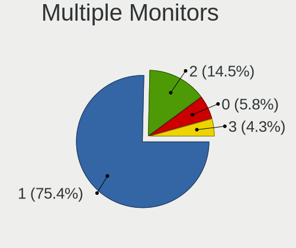

| Total | Desktops | Percent |
|-------|----------|---------|
| 1     | 20       | 71.43%  |
| 2     | 5        | 17.86%  |
| 0     | 2        | 7.14%   |
| 3     | 1        | 3.57%   |

Network
-------

Net Controller Vendor
---------------------

Controller vendors

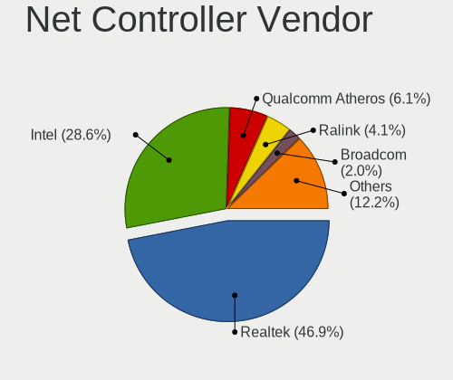

| Vendor                | Desktops | Percent |
|-----------------------|----------|---------|
| Realtek Semiconductor | 20       | 48.78%  |
| Intel                 | 9        | 21.95%  |
| Ralink                | 3        | 7.32%   |
| Qualcomm Atheros      | 3        | 7.32%   |
| Samsung Electronics   | 1        | 2.44%   |
| NetXen Incorporated   | 1        | 2.44%   |
| D-Link System         | 1        | 2.44%   |
| Broadcom Limited      | 1        | 2.44%   |
| Broadcom              | 1        | 2.44%   |
| AVM                   | 1        | 2.44%   |

Net Controller Model
--------------------

Controller models

| Model                                                                      | Desktops | Percent |
|----------------------------------------------------------------------------|----------|---------|
| Realtek RTL8111/8168/8411 PCI Express Gigabit Ethernet Controller          | 16       | 32.65%  |
| Intel Wi-Fi 6 AX200                                                        | 3        | 6.12%   |
| Intel I211 Gigabit Network Connection                                      | 2        | 4.08%   |
| Samsung Galaxy series, misc. (tethering mode)                              | 1        | 2.04%   |
| Realtek RTL8821CE 802.11ac PCIe Wireless Network Adapter                   | 1        | 2.04%   |
| Realtek RTL8812AE 802.11ac PCIe Wireless Network Adapter                   | 1        | 2.04%   |
| Realtek RTL8188CE 802.11b/g/n WiFi Adapter                                 | 1        | 2.04%   |
| Realtek RTL8153 Gigabit Ethernet Adapter                                   | 1        | 2.04%   |
| Realtek RTL8125 2.5GbE Controller                                          | 1        | 2.04%   |
| Realtek RTL810xE PCI Express Fast Ethernet controller                      | 1        | 2.04%   |
| Realtek RTL-8110SC/8169SC Gigabit Ethernet                                 | 1        | 2.04%   |
| Realtek Killer E3000 2.5GbE Controller                                     | 1        | 2.04%   |
| Realtek Killer E2600 Gigabit Ethernet Controller                           | 1        | 2.04%   |
| Ralink RT3090 Wireless 802.11n 1T/1R PCIe                                  | 1        | 2.04%   |
| Ralink RT3060 Wireless 802.11n 1T/1R                                       | 1        | 2.04%   |
| Ralink RT2561/RT61 802.11g PCI                                             | 1        | 2.04%   |
| Qualcomm Atheros QCA9565 / AR9565 Wireless Network Adapter                 | 1        | 2.04%   |
| Qualcomm Atheros QCA6174 802.11ac Wireless Network Adapter                 | 1        | 2.04%   |
| Qualcomm Atheros Killer E2400 Gigabit Ethernet Controller                  | 1        | 2.04%   |
| Qualcomm Atheros AR8121/AR8113/AR8114 Gigabit or Fast Ethernet             | 1        | 2.04%   |
| NetXen Incorporated NX3031 Multifunction 1/10-Gigabit Server Adapter       | 1        | 2.04%   |
| Intel Wireless-AC 9260                                                     | 1        | 2.04%   |
| Intel Wireless 8260                                                        | 1        | 2.04%   |
| Intel Wireless 7260                                                        | 1        | 2.04%   |
| Intel Ethernet Connection (2) I219-LM                                      | 1        | 2.04%   |
| Intel Dual Band Wireless-AC 3168NGW [Stone Peak]                           | 1        | 2.04%   |
| Intel 82567LM-3 Gigabit Network Connection                                 | 1        | 2.04%   |
| D-Link System AirPlus G DWL-G122 Wireless Adapter(rev.C1) [Ralink RT2571W] | 1        | 2.04%   |
| Broadcom NetLink BCM57781 Gigabit Ethernet PCIe                            | 1        | 2.04%   |
| Broadcom Limited BCM4352 802.11ac Wireless Network Adapter                 | 1        | 2.04%   |
| AVM Fritz!WLAN N v2 [Atheros AR9271]                                       | 1        | 2.04%   |

Wireless Vendor
---------------

Wireless vendors

| Vendor                | Desktops | Percent |
|-----------------------|----------|---------|
| Intel                 | 7        | 38.89%  |
| Realtek Semiconductor | 3        | 16.67%  |
| Ralink                | 3        | 16.67%  |
| Qualcomm Atheros      | 2        | 11.11%  |
| D-Link System         | 1        | 5.56%   |
| Broadcom Limited      | 1        | 5.56%   |
| AVM                   | 1        | 5.56%   |

Wireless Model
--------------

Wireless models

| Model                                                                      | Desktops | Percent |
|----------------------------------------------------------------------------|----------|---------|
| Intel Wi-Fi 6 AX200                                                        | 3        | 16.67%  |
| Realtek RTL8821CE 802.11ac PCIe Wireless Network Adapter                   | 1        | 5.56%   |
| Realtek RTL8812AE 802.11ac PCIe Wireless Network Adapter                   | 1        | 5.56%   |
| Realtek RTL8188CE 802.11b/g/n WiFi Adapter                                 | 1        | 5.56%   |
| Ralink RT3090 Wireless 802.11n 1T/1R PCIe                                  | 1        | 5.56%   |
| Ralink RT3060 Wireless 802.11n 1T/1R                                       | 1        | 5.56%   |
| Ralink RT2561/RT61 802.11g PCI                                             | 1        | 5.56%   |
| Qualcomm Atheros QCA9565 / AR9565 Wireless Network Adapter                 | 1        | 5.56%   |
| Qualcomm Atheros QCA6174 802.11ac Wireless Network Adapter                 | 1        | 5.56%   |
| Intel Wireless-AC 9260                                                     | 1        | 5.56%   |
| Intel Wireless 8260                                                        | 1        | 5.56%   |
| Intel Wireless 7260                                                        | 1        | 5.56%   |
| Intel Dual Band Wireless-AC 3168NGW [Stone Peak]                           | 1        | 5.56%   |
| D-Link System AirPlus G DWL-G122 Wireless Adapter(rev.C1) [Ralink RT2571W] | 1        | 5.56%   |
| Broadcom Limited BCM4352 802.11ac Wireless Network Adapter                 | 1        | 5.56%   |
| AVM Fritz!WLAN N v2 [Atheros AR9271]                                       | 1        | 5.56%   |

Ethernet Vendor
---------------

Ethernet vendors

| Vendor                | Desktops | Percent |
|-----------------------|----------|---------|
| Realtek Semiconductor | 20       | 68.97%  |
| Intel                 | 4        | 13.79%  |
| Qualcomm Atheros      | 2        | 6.9%    |
| Samsung Electronics   | 1        | 3.45%   |
| NetXen Incorporated   | 1        | 3.45%   |
| Broadcom              | 1        | 3.45%   |

Ethernet Model
--------------

Ethernet models

| Model                                                                | Desktops | Percent |
|----------------------------------------------------------------------|----------|---------|
| Realtek RTL8111/8168/8411 PCI Express Gigabit Ethernet Controller    | 16       | 51.61%  |
| Intel I211 Gigabit Network Connection                                | 2        | 6.45%   |
| Samsung Galaxy series, misc. (tethering mode)                        | 1        | 3.23%   |
| Realtek RTL8153 Gigabit Ethernet Adapter                             | 1        | 3.23%   |
| Realtek RTL8125 2.5GbE Controller                                    | 1        | 3.23%   |
| Realtek RTL810xE PCI Express Fast Ethernet controller                | 1        | 3.23%   |
| Realtek RTL-8110SC/8169SC Gigabit Ethernet                           | 1        | 3.23%   |
| Realtek Killer E3000 2.5GbE Controller                               | 1        | 3.23%   |
| Realtek Killer E2600 Gigabit Ethernet Controller                     | 1        | 3.23%   |
| Qualcomm Atheros Killer E2400 Gigabit Ethernet Controller            | 1        | 3.23%   |
| Qualcomm Atheros AR8121/AR8113/AR8114 Gigabit or Fast Ethernet       | 1        | 3.23%   |
| NetXen Incorporated NX3031 Multifunction 1/10-Gigabit Server Adapter | 1        | 3.23%   |
| Intel Ethernet Connection (2) I219-LM                                | 1        | 3.23%   |
| Intel 82567LM-3 Gigabit Network Connection                           | 1        | 3.23%   |
| Broadcom NetLink BCM57781 Gigabit Ethernet PCIe                      | 1        | 3.23%   |

Net Controller Kind
-------------------

Ethernet, WiFi or modem

| Kind     | Desktops | Percent |
|----------|----------|---------|
| Ethernet | 27       | 60%     |
| WiFi     | 18       | 40%     |

Used Controller
---------------

Currently used network controller

| Kind     | Desktops | Percent |
|----------|----------|---------|
| Ethernet | 24       | 61.54%  |
| WiFi     | 15       | 38.46%  |

NICs
----

Total network controllers on board

| Total | Desktops | Percent |
|-------|----------|---------|
| 2     | 13       | 46.43%  |
| 1     | 12       | 42.86%  |
| 3     | 2        | 7.14%   |
| 5     | 1        | 3.57%   |

IPv6
----

IPv6 vs IPv4

| Used | Desktops | Percent |
|------|----------|---------|
| No   | 22       | 78.57%  |
| Yes  | 6        | 21.43%  |

Bluetooth
---------

Bluetooth Vendor
----------------

Controller vendors

| Vendor                          | Desktops | Percent |
|---------------------------------|----------|---------|
| Intel                           | 5        | 41.67%  |
| Cambridge Silicon Radio         | 3        | 25%     |
| Qualcomm Atheros Communications | 2        | 16.67%  |
| Realtek Semiconductor           | 1        | 8.33%   |
| Dell                            | 1        | 8.33%   |

Bluetooth Model
---------------

Controller models

| Model                                               | Desktops | Percent |
|-----------------------------------------------------|----------|---------|
| Cambridge Silicon Radio Bluetooth Dongle (HCI mode) | 3        | 25%     |
| Intel AX200 Bluetooth                               | 2        | 16.67%  |
| Realtek  Bluetooth 4.2 Adapter                      | 1        | 8.33%   |
| Qualcomm Atheros  Bluetooth Device                  | 1        | 8.33%   |
| Qualcomm Atheros QCA61x4 Bluetooth 4.0              | 1        | 8.33%   |
| Intel Wireless-AC 9260 Bluetooth Adapter            | 1        | 8.33%   |
| Intel Wireless-AC 3168 Bluetooth                    | 1        | 8.33%   |
| Intel Bluetooth Device                              | 1        | 8.33%   |
| Dell Broadcom BCM20702A0 Bluetooth                  | 1        | 8.33%   |

Sound
-----

Sound Vendor
------------

Sound card vendors

| Vendor                    | Desktops | Percent |
|---------------------------|----------|---------|
| AMD                       | 17       | 35.42%  |
| Intel                     | 15       | 31.25%  |
| Nvidia                    | 12       | 25%     |
| Texas Instruments         | 1        | 2.08%   |
| Sennheiser Communications | 1        | 2.08%   |
| C-Media Electronics       | 1        | 2.08%   |
| BEHRINGER International   | 1        | 2.08%   |

Sound Model
-----------

Sound card models

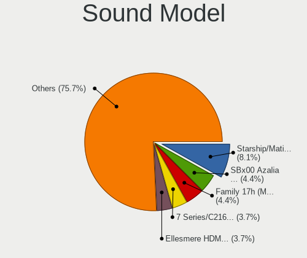

| Model                                                                      | Desktops | Percent |
|----------------------------------------------------------------------------|----------|---------|
| AMD Starship/Matisse HD Audio Controller                                   | 6        | 11.11%  |
| AMD Family 17h (Models 00h-0fh) HD Audio Controller                        | 4        | 7.41%   |
| Nvidia GA102 High Definition Audio Controller                              | 3        | 5.56%   |
| Intel NM10/ICH7 Family High Definition Audio Controller                    | 3        | 5.56%   |
| Intel 100 Series/C230 Series Chipset Family HD Audio Controller            | 3        | 5.56%   |
| Intel Xeon E3-1200 v3/4th Gen Core Processor HD Audio Controller           | 2        | 3.7%    |
| Intel 8 Series/C220 Series Chipset High Definition Audio Controller        | 2        | 3.7%    |
| Intel 6 Series/C200 Series Chipset Family High Definition Audio Controller | 2        | 3.7%    |
| Texas Instruments PCM2900C Audio CODEC                                     | 1        | 1.85%   |
| Sennheiser Communications Sennheiser 3D G4ME1                              | 1        | 1.85%   |
| Nvidia TU116 High Definition Audio Controller                              | 1        | 1.85%   |
| Nvidia TU107 GeForce GTX 1650 High Definition Audio Controller             | 1        | 1.85%   |
| Nvidia GT216 HDMI Audio Controller                                         | 1        | 1.85%   |
| Nvidia GP107GL High Definition Audio Controller                            | 1        | 1.85%   |
| Nvidia GP104 High Definition Audio Controller                              | 1        | 1.85%   |
| Nvidia GP102 HDMI Audio Controller                                         | 1        | 1.85%   |
| Nvidia GM206 High Definition Audio Controller                              | 1        | 1.85%   |
| Nvidia GK107 HDMI Audio Controller                                         | 1        | 1.85%   |
| Nvidia GF119 HDMI Audio Controller                                         | 1        | 1.85%   |
| Intel Cannon Lake PCH cAVS                                                 | 1        | 1.85%   |
| Intel 82801JI (ICH10 Family) HD Audio Controller                           | 1        | 1.85%   |
| Intel 82801JD/DO (ICH10 Family) HD Audio Controller                        | 1        | 1.85%   |
| Intel 5 Series/3400 Series Chipset High Definition Audio                   | 1        | 1.85%   |
| Intel 200 Series PCH HD Audio                                              | 1        | 1.85%   |
| C-Media Electronics CMI8738/CMI8768 PCI Audio                              | 1        | 1.85%   |
| BEHRINGER International UMC202HD 192k                                      | 1        | 1.85%   |
| AMD Tonga HDMI Audio [Radeon R9 285/380]                                   | 1        | 1.85%   |
| AMD SBx00 Azalia (Intel HDA)                                               | 1        | 1.85%   |
| AMD RV610 HDMI Audio [Radeon HD 2350 PRO / 2400 PRO/XT / HD 3410]          | 1        | 1.85%   |
| AMD Redwood HDMI Audio [Radeon HD 5000 Series]                             | 1        | 1.85%   |
| AMD Raven/Raven2/Fenghuang HDMI/DP Audio Controller                        | 1        | 1.85%   |
| AMD Oland/Hainan/Cape Verde/Pitcairn HDMI Audio [Radeon HD 7000 Series]    | 1        | 1.85%   |
| AMD Kabini HDMI/DP Audio                                                   | 1        | 1.85%   |
| AMD FCH Azalia Controller                                                  | 1        | 1.85%   |
| AMD Family 17h (Models 10h-1fh) HD Audio Controller                        | 1        | 1.85%   |
| AMD Ellesmere HDMI Audio [Radeon RX 470/480 / 570/580/590]                 | 1        | 1.85%   |
| AMD Baffin HDMI/DP Audio [Radeon RX 550 640SP / RX 560/560X]               | 1        | 1.85%   |

Memory
------

Memory Vendor
-------------

Memory module vendors

| Vendor              | Desktops | Percent |
|---------------------|----------|---------|
| Kingston            | 4        | 23.53%  |
| G.Skill             | 3        | 17.65%  |
| Crucial             | 3        | 17.65%  |
| Unknown             | 2        | 11.76%  |
| SK Hynix            | 1        | 5.88%   |
| Samsung Electronics | 1        | 5.88%   |
| Micron Technology   | 1        | 5.88%   |
| GeIL                | 1        | 5.88%   |
| Corsair             | 1        | 5.88%   |

Memory Model
------------

Memory module models

| Model                                                     | Desktops | Percent |
|-----------------------------------------------------------|----------|---------|
| Kingston RAM KHX3600C18D4/32GX 32GB DIMM DDR4 3600MT/s    | 2        | 11.76%  |
| Unknown RAM Module 2048MB DIMM SDRAM 800MT/s              | 1        | 5.88%   |
| Unknown RAM 992124 (997124) 8GB DIMM DDR3 1600MT/s        | 1        | 5.88%   |
| SK Hynix RAM HMP125U6EFR8C-S6 2048MB DIMM DDR2 800MT/s    | 1        | 5.88%   |
| Samsung RAM M471B5673FH0-CH9 2GB DIMM DDR3 4199MT/s       | 1        | 5.88%   |
| Micron RAM 16HTF25664AZ-800H1 2048MB DIMM DDR2 800MT/s    | 1        | 5.88%   |
| Kingston RAM KHX3200C16D4/16GX 16GB DIMM DDR4 3600MT/s    | 1        | 5.88%   |
| Kingston RAM KHX2400C15/8G 8192MB DIMM DDR4 2933MT/s      | 1        | 5.88%   |
| GeIL RAM CL11-11-11 D3-1600 4096MB DIMM DDR3 1600MT/s     | 1        | 5.88%   |
| G.Skill RAM F4-3200C16-8GVKB 8GB DIMM DDR4 3200MT/s       | 1        | 5.88%   |
| G.Skill RAM F4-2666C19-16GIS 16384MB DIMM DDR4 2667MT/s   | 1        | 5.88%   |
| G.Skill RAM F4-2400C15-8GNT 8GB DIMM DDR4 2400MT/s        | 1        | 5.88%   |
| Crucial RAM CT102464BD160B.M16 8GB DIMM DDR3 1600MT/s     | 1        | 5.88%   |
| Crucial RAM BLS16G4D32AESB.M16FE 16GB DIMM DDR4 3400MT/s  | 1        | 5.88%   |
| Crucial RAM BL32G32C16U4R.M16FB1 32GB DIMM DDR4 3200MT/s  | 1        | 5.88%   |
| Corsair RAM CMK16GX4M1E3200C16 16384MB DIMM DDR4 3000MT/s | 1        | 5.88%   |

Memory Kind
-----------

Memory module kinds

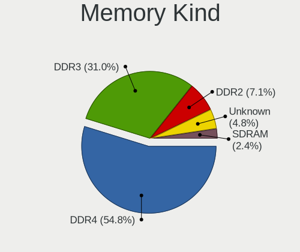

| Kind  | Desktops | Percent |
|-------|----------|---------|
| DDR4  | 10       | 71.43%  |
| DDR3  | 2        | 14.29%  |
| SDRAM | 1        | 7.14%   |
| DDR2  | 1        | 7.14%   |

Memory Form Factor
------------------

Physical design of the memory module

| Name | Desktops | Percent |
|------|----------|---------|
| DIMM | 14       | 100%    |

Memory Size
-----------

Memory module size

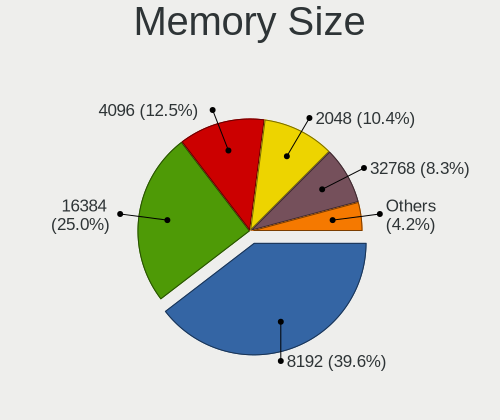

| Size  | Desktops | Percent |
|-------|----------|---------|
| 8192  | 5        | 35.71%  |
| 16384 | 4        | 28.57%  |
| 32768 | 3        | 21.43%  |
| 2048  | 2        | 14.29%  |

Memory Speed
------------

Memory module speed

| Speed | Desktops | Percent |
|-------|----------|---------|
| 3600  | 3        | 20%     |
| 3200  | 2        | 13.33%  |
| 1600  | 2        | 13.33%  |
| 800   | 2        | 13.33%  |
| 4199  | 1        | 6.67%   |
| 3400  | 1        | 6.67%   |
| 3000  | 1        | 6.67%   |
| 2933  | 1        | 6.67%   |
| 2667  | 1        | 6.67%   |
| 2400  | 1        | 6.67%   |

Printers & scanners
-------------------

Printer Vendor
--------------

Printer device vendors

| Vendor              | Desktops | Percent |
|---------------------|----------|---------|
| Hewlett-Packard     | 2        | 28.57%  |
| Brother Industries  | 2        | 28.57%  |
| Samsung Electronics | 1        | 14.29%  |
| Kyocera             | 1        | 14.29%  |
| Canon               | 1        | 14.29%  |

Printer Model
-------------

Printer device models

| Model                     | Desktops | Percent |
|---------------------------|----------|---------|
| Samsung SCX-4200 series   | 1        | 14.29%  |
| Kyocera FS-1030D printer  | 1        | 14.29%  |
| HP ENVY 4500 series       | 1        | 14.29%  |
| HP Deskjet 3510 series    | 1        | 14.29%  |
| Canon LiDE 300            | 1        | 14.29%  |
| Brother Printer           | 1        | 14.29%  |
| Brother HL-L3210CW series | 1        | 14.29%  |

Scanner Vendor
--------------

Scanner device vendors

| Vendor | Desktops | Percent |
|--------|----------|---------|
| Canon  | 2        | 100%    |

Scanner Model
-------------

Scanner device models

| Model                         | Desktops | Percent |
|-------------------------------|----------|---------|
| Canon CanoScan N1240U/LiDE 30 | 1        | 50%     |
| Canon CanoScan LiDE 210       | 1        | 50%     |

Camera
------

Camera Vendor
-------------

Camera device vendors

| Vendor              | Desktops | Percent |
|---------------------|----------|---------|
| Logitech            | 4        | 66.67%  |
| Creative Technology | 1        | 16.67%  |
| Chicony Electronics | 1        | 16.67%  |

Camera Model
------------

Camera device models

| Model                         | Desktops | Percent |
|-------------------------------|----------|---------|
| Logitech B525 HD Webcam       | 2        | 33.33%  |
| Logitech Webcam C270          | 1        | 16.67%  |
| Logitech Webcam C250          | 1        | 16.67%  |
| Creative Live! Cam Sync 1080p | 1        | 16.67%  |
| Chicony HP Webcam             | 1        | 16.67%  |

Security
--------

Fingerprint Vendor
------------------

Fingerprint sensor vendors

Zero info for selected period =(

Fingerprint Model
-----------------

Fingerprint sensor models

Zero info for selected period =(

Chipcard Vendor
---------------

Chipcard module vendors

Zero info for selected period =(

Chipcard Model
--------------

Chipcard module models

Zero info for selected period =(

Unsupported
-----------

Unsupported Devices
-------------------

Total unsupported devices on board

| Total | Desktops | Percent |
|-------|----------|---------|
| 0     | 26       | 92.86%  |
| 1     | 2        | 7.14%   |

Unsupported Device Types
------------------------

Types of unsupported devices

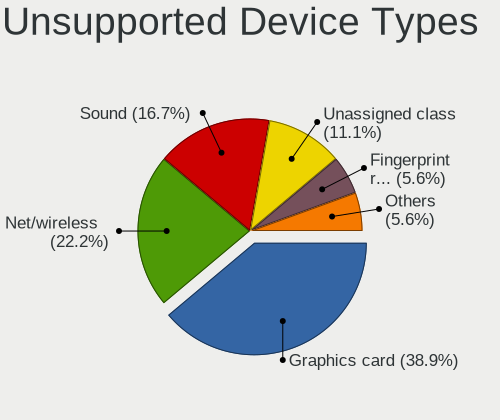

| Type          | Desktops | Percent |
|---------------|----------|---------|
| Graphics card | 2        | 100%    |

