openSUSE Leap-15.3 - Tested Hardware & Statistics (Notebooks)
-------------------------------------------------------------

A project to collect tested hardware configurations for openSUSE Leap-15.3.

Anyone can contribute to this report by the [hw-probe](https://github.com/linuxhw/hw-probe) tool:

    sudo -E hw-probe -all -upload

Please submit a probe of your configuration if it's not presented on the page or is rare.

Full-feature report is available here: https://linux-hardware.org/?view=trends&rel=opensuse-leap-15.3

Contents
--------

* [ Test Cases ](#test-cases)

* [ System ](#system)
  - [ Kernel                   ](#kernel)
  - [ Kernel Family            ](#kernel-family)
  - [ Kernel Major Ver.        ](#kernel-major-ver)
  - [ Arch                     ](#arch)
  - [ DE                       ](#de)
  - [ Display Server           ](#display-server)
  - [ Display Manager          ](#display-manager)
  - [ OS Lang                  ](#os-lang)
  - [ Boot Mode                ](#boot-mode)
  - [ Filesystem               ](#filesystem)
  - [ Part. scheme             ](#part-scheme)
  - [ Dual Boot with Linux/BSD ](#dual-boot-with-linuxbsd)
  - [ Dual Boot (Win)          ](#dual-boot-win)

* [ Board ](#board)
  - [ Vendor                   ](#vendor)
  - [ Model                    ](#model)
  - [ Model Family             ](#model-family)
  - [ MFG Year                 ](#mfg-year)
  - [ Form Factor              ](#form-factor)
  - [ Secure Boot              ](#secure-boot)
  - [ Coreboot                 ](#coreboot)
  - [ RAM Size                 ](#ram-size)
  - [ RAM Used                 ](#ram-used)
  - [ Total Drives             ](#total-drives)
  - [ Has CD-ROM               ](#has-cd-rom)
  - [ Has Ethernet             ](#has-ethernet)
  - [ Has WiFi                 ](#has-wifi)
  - [ Has Bluetooth            ](#has-bluetooth)

* [ Location ](#location)
  - [ Country                  ](#country)
  - [ City                     ](#city)

* [ Drives ](#drives)
  - [ Drive Vendor             ](#drive-vendor)
  - [ Drive Model              ](#drive-model)
  - [ HDD Vendor               ](#hdd-vendor)
  - [ SSD Vendor               ](#ssd-vendor)
  - [ Drive Kind               ](#drive-kind)
  - [ Drive Connector          ](#drive-connector)
  - [ Drive Size               ](#drive-size)
  - [ Space Total              ](#space-total)
  - [ Space Used               ](#space-used)
  - [ Malfunc. Drives          ](#malfunc-drives)
  - [ Malfunc. Drive Vendor    ](#malfunc-drive-vendor)
  - [ Malfunc. HDD Vendor      ](#malfunc-hdd-vendor)
  - [ Malfunc. Drive Kind      ](#malfunc-drive-kind)
  - [ Failed Drives            ](#failed-drives)
  - [ Failed Drive Vendor      ](#failed-drive-vendor)
  - [ Drive Status             ](#drive-status)

* [ Storage controller ](#storage-controller)
  - [ Storage Vendor           ](#storage-vendor)
  - [ Storage Model            ](#storage-model)
  - [ Storage Kind             ](#storage-kind)

* [ Processor ](#processor)
  - [ CPU Vendor               ](#cpu-vendor)
  - [ CPU Model                ](#cpu-model)
  - [ CPU Model Family         ](#cpu-model-family)
  - [ CPU Cores                ](#cpu-cores)
  - [ CPU Sockets              ](#cpu-sockets)
  - [ CPU Threads              ](#cpu-threads)
  - [ CPU Op-Modes             ](#cpu-op-modes)
  - [ CPU Microcode            ](#cpu-microcode)
  - [ CPU Microarch            ](#cpu-microarch)

* [ Graphics ](#graphics)
  - [ GPU Vendor               ](#gpu-vendor)
  - [ GPU Model                ](#gpu-model)
  - [ GPU Combo                ](#gpu-combo)
  - [ GPU Driver               ](#gpu-driver)
  - [ GPU Memory               ](#gpu-memory)

* [ Monitor ](#monitor)
  - [ Monitor Vendor           ](#monitor-vendor)
  - [ Monitor Model            ](#monitor-model)
  - [ Monitor Resolution       ](#monitor-resolution)
  - [ Monitor Diagonal         ](#monitor-diagonal)
  - [ Monitor Width            ](#monitor-width)
  - [ Aspect Ratio             ](#aspect-ratio)
  - [ Monitor Area             ](#monitor-area)
  - [ Pixel Density            ](#pixel-density)
  - [ Multiple Monitors        ](#multiple-monitors)

* [ Network ](#network)
  - [ Net Controller Vendor    ](#net-controller-vendor)
  - [ Net Controller Model     ](#net-controller-model)
  - [ Wireless Vendor          ](#wireless-vendor)
  - [ Wireless Model           ](#wireless-model)
  - [ Ethernet Vendor          ](#ethernet-vendor)
  - [ Ethernet Model           ](#ethernet-model)
  - [ Net Controller Kind      ](#net-controller-kind)
  - [ Used Controller          ](#used-controller)
  - [ NICs                     ](#nics)
  - [ IPv6                     ](#ipv6)

* [ Bluetooth ](#bluetooth)
  - [ Bluetooth Vendor         ](#bluetooth-vendor)
  - [ Bluetooth Model          ](#bluetooth-model)

* [ Sound ](#sound)
  - [ Sound Vendor             ](#sound-vendor)
  - [ Sound Model              ](#sound-model)

* [ Memory ](#memory)
  - [ Memory Vendor            ](#memory-vendor)
  - [ Memory Model             ](#memory-model)
  - [ Memory Kind              ](#memory-kind)
  - [ Memory Form Factor       ](#memory-form-factor)
  - [ Memory Size              ](#memory-size)
  - [ Memory Speed             ](#memory-speed)

* [ Printers & scanners ](#printers--scanners)
  - [ Printer Vendor           ](#printer-vendor)
  - [ Printer Model            ](#printer-model)
  - [ Scanner Vendor           ](#scanner-vendor)
  - [ Scanner Model            ](#scanner-model)

* [ Camera ](#camera)
  - [ Camera Vendor            ](#camera-vendor)
  - [ Camera Model             ](#camera-model)

* [ Security ](#security)
  - [ Fingerprint Vendor       ](#fingerprint-vendor)
  - [ Fingerprint Model        ](#fingerprint-model)
  - [ Chipcard Vendor          ](#chipcard-vendor)
  - [ Chipcard Model           ](#chipcard-model)

* [ Unsupported ](#unsupported)
  - [ Unsupported Devices      ](#unsupported-devices)
  - [ Unsupported Device Types ](#unsupported-device-types)

Test Cases
----------

| Vendor  | Model                       | Probe                                                      | Date         |
|---------|-----------------------------|------------------------------------------------------------|--------------|
| Dell    | Precision M6700             | [0d8cf3bf1c](https://linux-hardware.org/?probe=0d8cf3bf1c) | Sep 21, 2021 |
| Lenovo  | ThinkPad X1 Carbon 4th 2... | [44d0412dd3](https://linux-hardware.org/?probe=44d0412dd3) | Aug 27, 2021 |
| Samsung | 600B4B/600B5B               | [200275bbd6](https://linux-hardware.org/?probe=200275bbd6) | Aug 27, 2021 |
| Dell    | Precision M6700             | [191db00b83](https://linux-hardware.org/?probe=191db00b83) | Aug 26, 2021 |
| Lenovo  | V330-15IKB 81AX             | [4b5a1af4dd](https://linux-hardware.org/?probe=4b5a1af4dd) | Aug 26, 2021 |
| Lenovo  | G500 20236                  | [73a5085a79](https://linux-hardware.org/?probe=73a5085a79) | Aug 24, 2021 |
| Dell    | Latitude 5480               | [a2110d9601](https://linux-hardware.org/?probe=a2110d9601) | Aug 24, 2021 |
| Dell    | Latitude 5480               | [64e1f3e16c](https://linux-hardware.org/?probe=64e1f3e16c) | Aug 19, 2021 |
| Lenovo  | ThinkPad T61 8895W9U        | [424c5f3e75](https://linux-hardware.org/?probe=424c5f3e75) | Aug 19, 2021 |
| Dell    | Inspiron 3521               | [c68ce33d52](https://linux-hardware.org/?probe=c68ce33d52) | Aug 11, 2021 |
| Dell    | Inspiron 3521               | [9a422a10d3](https://linux-hardware.org/?probe=9a422a10d3) | Aug 11, 2021 |
| Dell    | Inspiron 7460               | [f954aa3826](https://linux-hardware.org/?probe=f954aa3826) | Aug 10, 2021 |
| Samsung | 600B4B/600B5B               | [0a650b495e](https://linux-hardware.org/?probe=0a650b495e) | Aug 09, 2021 |
| Lenovo  | ThinkPad T460 20FMS75800    | [1a1c3f469d](https://linux-hardware.org/?probe=1a1c3f469d) | Aug 07, 2021 |
| Lenovo  | ThinkPad X1 Carbon 4th 2... | [5953bc46ad](https://linux-hardware.org/?probe=5953bc46ad) | Aug 06, 2021 |
| Lenovo  | ThinkPad X1 Carbon 4th 2... | [fafaeed466](https://linux-hardware.org/?probe=fafaeed466) | Aug 06, 2021 |
| HP      | Stream Notebook PC 11       | [a612aa5d15](https://linux-hardware.org/?probe=a612aa5d15) | Jul 20, 2021 |
| Lenovo  | ThinkPad T450s 20BWA06J0... | [e4cd39ef75](https://linux-hardware.org/?probe=e4cd39ef75) | Jul 09, 2021 |
| Lenovo  | ThinkPad T450s 20BWA06J0... | [5565f4e4fe](https://linux-hardware.org/?probe=5565f4e4fe) | Jul 09, 2021 |
| Fujitsu | LIFEBOOK E754               | [e7923c27f1](https://linux-hardware.org/?probe=e7923c27f1) | Jul 08, 2021 |
| ASUSTek | G771JW                      | [8e6c4ddee8](https://linux-hardware.org/?probe=8e6c4ddee8) | Jun 24, 2021 |
| HP      | ZBook 17 G2                 | [3342d4d378](https://linux-hardware.org/?probe=3342d4d378) | Jun 17, 2021 |
| HP      | OMEN by HP Laptop 15-dc1... | [0c01b21401](https://linux-hardware.org/?probe=0c01b21401) | Jun 15, 2021 |
| Sony    | VPCSB15GB                   | [43a9d38ca0](https://linux-hardware.org/?probe=43a9d38ca0) | Jun 03, 2021 |
| Sony    | VGN-Z570AN                  | [13d58b8d90](https://linux-hardware.org/?probe=13d58b8d90) | May 21, 2021 |
| Sony    | VGN-Z570AN                  | [e6c7882e05](https://linux-hardware.org/?probe=e6c7882e05) | May 21, 2021 |
| MSI     | GS60 6QE                    | [93c6fd8911](https://linux-hardware.org/?probe=93c6fd8911) | May 18, 2021 |
| MSI     | GS60 6QE                    | [41fe777475](https://linux-hardware.org/?probe=41fe777475) | May 18, 2021 |
| ASUSTek | VivoBook 12_ASUS Laptop ... | [184bedf2fd](https://linux-hardware.org/?probe=184bedf2fd) | May 01, 2021 |
| HP      | Pavilion dx6500             | [091cc2c616](https://linux-hardware.org/?probe=091cc2c616) | Apr 13, 2021 |
| HP      | Pavilion dx6500             | [6ad0d5c87f](https://linux-hardware.org/?probe=6ad0d5c87f) | Apr 13, 2021 |
| Dell    | Inspiron 15 7000 Gaming     | [97a7246099](https://linux-hardware.org/?probe=97a7246099) | Mar 01, 2021 |
| Dell    | Inspiron 15 7000 Gaming     | [b1e186207c](https://linux-hardware.org/?probe=b1e186207c) | Feb 28, 2021 |

System
------

Kernel
------

Version of the Linux kernel

| Version              | Notebooks | Percent |
|----------------------|-----------|---------|
| 5.3.18-59.19-default | 5         | 22.73%  |
| 5.3.18-59.16-default | 5         | 22.73%  |
| 5.3.18-57-default    | 3         | 13.64%  |
| 5.3.18-59.5-default  | 2         | 9.09%   |
| 5.3.18-59.10-default | 2         | 9.09%   |
| 5.3.18-59.13-default | 1         | 4.55%   |
| 5.3.18-57-preempt    | 1         | 4.55%   |
| 5.3.18-56-default    | 1         | 4.55%   |
| 5.3.18-52-default    | 1         | 4.55%   |
| 5.3.18-46-default    | 1         | 4.55%   |

Kernel Family
-------------

Linux kernel without a distro release

| Version | Notebooks | Percent |
|---------|-----------|---------|
| 5.3.18  | 22        | 100%    |

Kernel Major Ver.
-----------------

Linux kernel major version

| Version | Notebooks | Percent |
|---------|-----------|---------|
| 5.3     | 22        | 100%    |

Arch
----

OS architecture (x86_64, i586, etc.)

| Name   | Notebooks | Percent |
|--------|-----------|---------|
| x86_64 | 22        | 100%    |

DE
--

Desktop Environment

| Name       | Notebooks | Percent |
|------------|-----------|---------|
| KDE        | 8         | 34.78%  |
| XFCE       | 5         | 21.74%  |
| KDE5       | 4         | 17.39%  |
| GNOME      | 3         | 13.04%  |
| Unknown    | 2         | 8.7%    |
| X-Cinnamon | 1         | 4.35%   |

Display Server
--------------

X11 or Wayland

| Name    | Notebooks | Percent |
|---------|-----------|---------|
| X11     | 19        | 86.36%  |
| Wayland | 3         | 13.64%  |

Display Manager
---------------

SDDM, LightDM, etc.

| Name    | Notebooks | Percent |
|---------|-----------|---------|
| Unknown | 13        | 59.09%  |
| LightDM | 5         | 22.73%  |
| SDDM    | 4         | 18.18%  |

OS Lang
-------

Language

| Lang  | Notebooks | Percent |
|-------|-----------|---------|
| en_US | 8         | 36.36%  |
| de_DE | 3         | 13.64%  |
| POSIX | 2         | 9.09%   |
| es_ES | 2         | 9.09%   |
| zh_CN | 1         | 4.55%   |
| sv_SE | 1         | 4.55%   |
| ru_RU | 1         | 4.55%   |
| pt_PT | 1         | 4.55%   |
| hu_HU | 1         | 4.55%   |
| fr_FR | 1         | 4.55%   |
| cs_CZ | 1         | 4.55%   |

Boot Mode
---------

EFI or BIOS

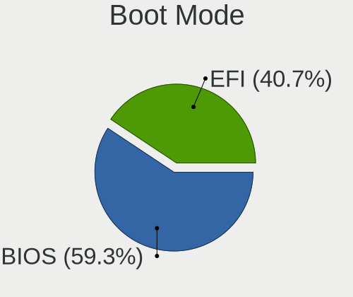

| Mode | Notebooks | Percent |
|------|-----------|---------|
| BIOS | 16        | 72.73%  |
| EFI  | 6         | 27.27%  |

Filesystem
----------

Type of filesystem

| Type  | Notebooks | Percent |
|-------|-----------|---------|
| Btrfs | 16        | 72.73%  |
| Ext4  | 6         | 27.27%  |

Part. scheme
------------

Scheme of partitioning

| Type    | Notebooks | Percent |
|---------|-----------|---------|
| Unknown | 12        | 54.55%  |
| GPT     | 8         | 36.36%  |
| MBR     | 2         | 9.09%   |

Dual Boot with Linux/BSD
------------------------

Hosting more than one Linux/BSD

| Dual boot | Notebooks | Percent |
|-----------|-----------|---------|
| No        | 22        | 100%    |

Dual Boot (Win)
---------------

Hosting Linux and Windows

| Dual boot | Notebooks | Percent |
|-----------|-----------|---------|
| No        | 17        | 77.27%  |
| Yes       | 5         | 22.73%  |

Board
-----

Vendor
------

Motherboard manufacturer

| Name                | Notebooks | Percent |
|---------------------|-----------|---------|
| Lenovo              | 6         | 27.27%  |
| Dell                | 5         | 22.73%  |
| Hewlett-Packard     | 4         | 18.18%  |
| Sony                | 2         | 9.09%   |
| ASUSTek Computer    | 2         | 9.09%   |
| Samsung Electronics | 1         | 4.55%   |
| MSI                 | 1         | 4.55%   |
| Fujitsu             | 1         | 4.55%   |

Model
-----

Motherboard model

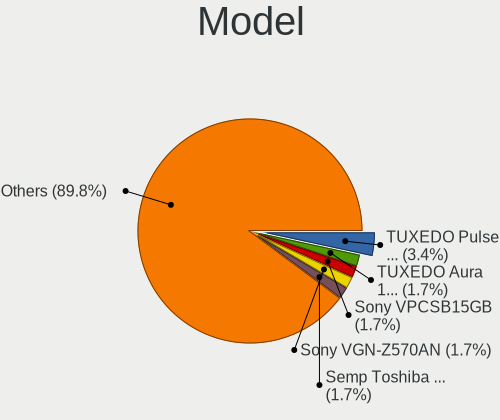

| Name                                        | Notebooks | Percent |
|---------------------------------------------|-----------|---------|
| Sony VPCSB15GB                              | 1         | 4.55%   |
| Sony VGN-Z570AN                             | 1         | 4.55%   |
| Samsung 600B4B/600B5B                       | 1         | 4.55%   |
| MSI GS60 6QE                                | 1         | 4.55%   |
| Lenovo V330-15IKB 81AX                      | 1         | 4.55%   |
| Lenovo ThinkPad X1 Carbon 4th 20FB002UMC    | 1         | 4.55%   |
| Lenovo ThinkPad T61 8895W9U                 | 1         | 4.55%   |
| Lenovo ThinkPad T460 20FMS75800             | 1         | 4.55%   |
| Lenovo ThinkPad T450s 20BWA06J00            | 1         | 4.55%   |
| Lenovo G500 20236                           | 1         | 4.55%   |
| HP ZBook 17 G2                              | 1         | 4.55%   |
| HP Stream Notebook PC 11                    | 1         | 4.55%   |
| HP Pavilion dx6500                          | 1         | 4.55%   |
| HP OMEN by HP Laptop 15-dc1xxx              | 1         | 4.55%   |
| Fujitsu LIFEBOOK E754                       | 1         | 4.55%   |
| Dell Precision M6700                        | 1         | 4.55%   |
| Dell Latitude 5480                          | 1         | 4.55%   |
| Dell Inspiron 7460                          | 1         | 4.55%   |
| Dell Inspiron 3521                          | 1         | 4.55%   |
| Dell Inspiron 15 7000 Gaming                | 1         | 4.55%   |
| ASUS VivoBook 12_ASUS Laptop E203MAS_E203MA | 1         | 4.55%   |
| ASUS G771JW                                 | 1         | 4.55%   |

Model Family
------------

Motherboard model prefix

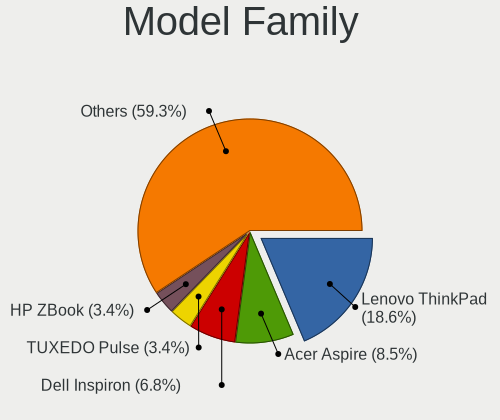

| Name              | Notebooks | Percent |
|-------------------|-----------|---------|
| Lenovo ThinkPad   | 4         | 18.18%  |
| Dell Inspiron     | 3         | 13.64%  |
| Sony VPCSB15GB    | 1         | 4.55%   |
| Sony VGN-Z570AN   | 1         | 4.55%   |
| Samsung 600B4B    | 1         | 4.55%   |
| MSI GS60          | 1         | 4.55%   |
| Lenovo V330-15IKB | 1         | 4.55%   |
| Lenovo G500       | 1         | 4.55%   |
| HP ZBook          | 1         | 4.55%   |
| HP Stream         | 1         | 4.55%   |
| HP Pavilion       | 1         | 4.55%   |
| HP OMEN           | 1         | 4.55%   |
| Fujitsu LIFEBOOK  | 1         | 4.55%   |
| Dell Precision    | 1         | 4.55%   |
| Dell Latitude     | 1         | 4.55%   |
| ASUS VivoBook     | 1         | 4.55%   |
| ASUS G771JW       | 1         | 4.55%   |

MFG Year
--------

Motherboard manufacture year

| Year | Notebooks | Percent |
|------|-----------|---------|
| 2018 | 4         | 18.18%  |
| 2021 | 3         | 13.64%  |
| 2020 | 3         | 13.64%  |
| 2019 | 3         | 13.64%  |
| 2014 | 2         | 9.09%   |
| 2016 | 1         | 4.55%   |
| 2015 | 1         | 4.55%   |
| 2013 | 1         | 4.55%   |
| 2012 | 1         | 4.55%   |
| 2011 | 1         | 4.55%   |
| 2009 | 1         | 4.55%   |
| 2007 | 1         | 4.55%   |

Form Factor
-----------

Physical design of the computer

| Name     | Notebooks | Percent |
|----------|-----------|---------|
| Notebook | 22        | 100%    |

Secure Boot
-----------

Enabled or disabled

| State    | Notebooks | Percent |
|----------|-----------|---------|
| Disabled | 20        | 90.91%  |
| Enabled  | 2         | 9.09%   |

Coreboot
--------

Have coreboot on board

| Used | Notebooks | Percent |
|------|-----------|---------|
| No   | 22        | 100%    |

RAM Size
--------

Total RAM memory

| Size in GB | Notebooks | Percent |
|------------|-----------|---------|
| 16.01-24.0 | 6         | 27.27%  |
| 4.01-8.0   | 4         | 18.18%  |
| 3.01-4.0   | 4         | 18.18%  |
| 8.01-16.0  | 3         | 13.64%  |
| 32.01-64.0 | 2         | 9.09%   |
| 1.01-2.0   | 2         | 9.09%   |
| 2.01-3.0   | 1         | 4.55%   |

RAM Used
--------

Used RAM memory

| Used GB   | Notebooks | Percent |
|-----------|-----------|---------|
| 1.01-2.0  | 7         | 31.82%  |
| 4.01-8.0  | 6         | 27.27%  |
| 2.01-3.0  | 6         | 27.27%  |
| 3.01-4.0  | 1         | 4.55%   |
| 8.01-16.0 | 1         | 4.55%   |
| 0.51-1.0  | 1         | 4.55%   |

Total Drives
------------

Number of drives on board

| Drives | Notebooks | Percent |
|--------|-----------|---------|
| 1      | 12        | 54.55%  |
| 2      | 10        | 45.45%  |

Has CD-ROM
----------

Has CD-ROM on board

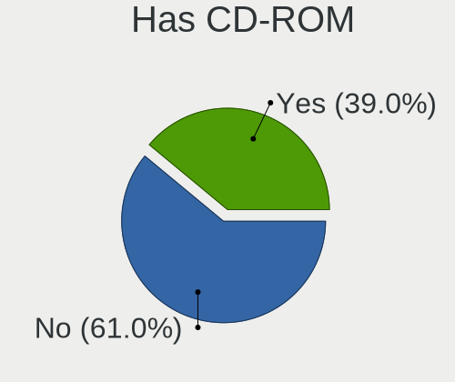

| Presented | Notebooks | Percent |
|-----------|-----------|---------|
| No        | 12        | 54.55%  |
| Yes       | 10        | 45.45%  |

Has Ethernet
------------

Has Ethernet on board

| Presented | Notebooks | Percent |
|-----------|-----------|---------|
| Yes       | 21        | 95.45%  |
| No        | 1         | 4.55%   |

Has WiFi
--------

Has WiFi module

| Presented | Notebooks | Percent |
|-----------|-----------|---------|
| Yes       | 22        | 100%    |

Has Bluetooth
-------------

Has Bluetooth module

| Presented | Notebooks | Percent |
|-----------|-----------|---------|
| Yes       | 18        | 78.26%  |
| No        | 5         | 21.74%  |

Location
--------

Country
-------

Geographic location (country)

| Country   | Notebooks | Percent |
|-----------|-----------|---------|
| Germany   | 3         | 13.64%  |
| Brazil    | 3         | 13.64%  |
| Nicaragua | 2         | 9.09%   |
| India     | 2         | 9.09%   |
| Czechia   | 2         | 9.09%   |
| USA       | 1         | 4.55%   |
| Sweden    | 1         | 4.55%   |
| Sudan     | 1         | 4.55%   |
| Spain     | 1         | 4.55%   |
| Russia    | 1         | 4.55%   |
| Romania   | 1         | 4.55%   |
| Portugal  | 1         | 4.55%   |
| Hungary   | 1         | 4.55%   |
| France    | 1         | 4.55%   |
| China     | 1         | 4.55%   |

City
----

Geographic location (city)

| City       | Notebooks | Percent |
|------------|-----------|---------|
| São Paulo | 2         | 8.7%    |
| Prague     | 2         | 8.7%    |
| Managua    | 2         | 8.7%    |
| Zhuhai     | 1         | 4.35%   |
| Umeå      | 1         | 4.35%   |
| S??o Paulo | 1         | 4.35%   |
| Palanpur   | 1         | 4.35%   |
| Nevez      | 1         | 4.35%   |
| Moscow     | 1         | 4.35%   |
| Leiria     | 1         | 4.35%   |
| Le??n      | 1         | 4.35%   |
| Khartoum   | 1         | 4.35%   |
| Gevelsberg | 1         | 4.35%   |
| Esztergom  | 1         | 4.35%   |
| Dahme      | 1         | 4.35%   |
| Concarneau | 1         | 4.35%   |
| Cologne    | 1         | 4.35%   |
| Bucharest  | 1         | 4.35%   |
| Bengaluru  | 1         | 4.35%   |
| Atlanta    | 1         | 4.35%   |

Drives
------

Drive Vendor
------------

Hard drive vendors

| Vendor              | Notebooks | Drives | Percent |
|---------------------|-----------|--------|---------|
| Samsung Electronics | 5         | 5      | 15.63%  |
| Seagate             | 4         | 4      | 12.5%   |
| WDC                 | 3         | 3      | 9.38%   |
| Kingston            | 3         | 3      | 9.38%   |
| HGST                | 3         | 3      | 9.38%   |
| Unknown             | 2         | 2      | 6.25%   |
| Toshiba             | 2         | 3      | 6.25%   |
| Silicon Motion      | 2         | 2      | 6.25%   |
| Hitachi             | 2         | 3      | 6.25%   |
| SK Hynix            | 1         | 1      | 3.13%   |
| SanDisk             | 1         | 1      | 3.13%   |
| PLEXTOR             | 1         | 2      | 3.13%   |
| LITEON              | 1         | 1      | 3.13%   |
| Intenso             | 1         | 1      | 3.13%   |
| Fujitsu             | 1         | 1      | 3.13%   |

Drive Model
-----------

Hard drive models

| Model                                | Notebooks | Percent |
|--------------------------------------|-----------|---------|
| Silicon Motion NVMe SSD Drive 512GB  | 2         | 6.25%   |
| Seagate ST1000LM035-1RK172 1TB       | 2         | 6.25%   |
| HGST HTS721010A9E630 1TB             | 2         | 6.25%   |
| WDC WDS480G2G0A-00JH30 480GB SSD     | 1         | 3.13%   |
| WDC WD800BEVS-60RST0 80GB            | 1         | 3.13%   |
| WDC WD5000LPLX-66ZNTT1 500GB         | 1         | 3.13%   |
| Unknown USD00  256GB                 | 1         | 3.13%   |
| Unknown DA4064  64GB                 | 1         | 3.13%   |
| Toshiba THNSNJ256G8NU 256GB SSD      | 1         | 3.13%   |
| Toshiba MQ01ABD075 752GB             | 1         | 3.13%   |
| SK Hynix HBG4e  32GB                 | 1         | 3.13%   |
| Seagate ST500LM012 HN-M500MBB 500GB  | 1         | 3.13%   |
| Seagate ST1000LM024 HN-M101MBB 1TB   | 1         | 3.13%   |
| SanDisk SD8TB8U512G1001 512GB SSD    | 1         | 3.13%   |
| Samsung SSD 970 EVO 1TB              | 1         | 3.13%   |
| Samsung SSD 860 EVO 1TB              | 1         | 3.13%   |
| Samsung SSD 850 EVO 250GB            | 1         | 3.13%   |
| Samsung MZVLB512HAJQ-000H1 512GB     | 1         | 3.13%   |
| Samsung MZ7LN256HCHP-000L7 256GB SSD | 1         | 3.13%   |
| PLEXTOR PX-512M5Pro 512GB SSD        | 1         | 3.13%   |
| LITEON CX1-JB256-HP 256GB SSD        | 1         | 3.13%   |
| Kingston SNA-DC/U3 512GB SSD         | 1         | 3.13%   |
| Kingston SM2280S3G2480G 480GB SSD    | 1         | 3.13%   |
| Kingston RBU-SC100S37128GD 128GB SSD | 1         | 3.13%   |
| Intenso SSD 512GB                    | 1         | 3.13%   |
| Hitachi HTS727550A9E365 500GB        | 1         | 3.13%   |
| Hitachi HTS542525K9SA00 250GB        | 1         | 3.13%   |
| HGST HTS541010A9E680 1TB             | 1         | 3.13%   |
| Fujitsu MHW2120BH 120GB              | 1         | 3.13%   |

HDD Vendor
----------

Hard disk drive vendors

| Vendor  | Notebooks | Drives | Percent |
|---------|-----------|--------|---------|
| Seagate | 4         | 4      | 30.77%  |
| HGST    | 3         | 3      | 23.08%  |
| WDC     | 2         | 2      | 15.38%  |
| Hitachi | 2         | 3      | 15.38%  |
| Toshiba | 1         | 2      | 7.69%   |
| Fujitsu | 1         | 1      | 7.69%   |

SSD Vendor
----------

Solid state drive vendors

| Vendor              | Notebooks | Drives | Percent |
|---------------------|-----------|--------|---------|
| Samsung Electronics | 3         | 3      | 25%     |
| Kingston            | 3         | 3      | 25%     |
| WDC                 | 1         | 1      | 8.33%   |
| Toshiba             | 1         | 1      | 8.33%   |
| SanDisk             | 1         | 1      | 8.33%   |
| PLEXTOR             | 1         | 2      | 8.33%   |
| LITEON              | 1         | 1      | 8.33%   |
| Intenso             | 1         | 1      | 8.33%   |

Drive Kind
----------

HDD or SSD

| Kind | Notebooks | Drives | Percent |
|------|-----------|--------|---------|
| SSD  | 12        | 13     | 40%     |
| HDD  | 11        | 15     | 36.67%  |
| NVMe | 4         | 4      | 13.33%  |
| MMC  | 3         | 3      | 10%     |

Drive Connector
---------------

SATA, SAS, NVMe, etc.

| Type | Notebooks | Drives | Percent |
|------|-----------|--------|---------|
| SATA | 18        | 27     | 69.23%  |
| NVMe | 4         | 4      | 15.38%  |
| MMC  | 3         | 3      | 11.54%  |
| SAS  | 1         | 1      | 3.85%   |

Drive Size
----------

Size of hard drive

| Size in TB | Notebooks | Drives | Percent |
|------------|-----------|--------|---------|
| 0.51-1.0   | 12        | 14     | 52.17%  |
| 0.01-0.5   | 11        | 14     | 47.83%  |

Space Total
-----------

Amount of disk space available on the file system

| Size in GB     | Notebooks | Percent |
|----------------|-----------|---------|
| 1001-2000      | 6         | 27.27%  |
| 501-1000       | 6         | 27.27%  |
| More than 3000 | 3         | 13.64%  |
| 51-100         | 3         | 13.64%  |
| 251-500        | 2         | 9.09%   |
| 2001-3000      | 2         | 9.09%   |

Space Used
----------

Amount of used disk space

| Used GB   | Notebooks | Percent |
|-----------|-----------|---------|
| 51-100    | 7         | 30.43%  |
| 101-250   | 5         | 21.74%  |
| 251-500   | 3         | 13.04%  |
| 1-20      | 3         | 13.04%  |
| 1001-2000 | 2         | 8.7%    |
| 501-1000  | 2         | 8.7%    |
| 21-50     | 1         | 4.35%   |

Malfunc. Drives
---------------

Drive models with a malfunction

| Model                               | Notebooks | Drives | Percent |
|-------------------------------------|-----------|--------|---------|
| Seagate ST1000LM035-1RK172 1TB      | 1         | 1      | 50%     |
| Samsung Electronics SSD 970 EVO 1TB | 1         | 1      | 50%     |

Malfunc. Drive Vendor
---------------------

Vendors of faulty drives

| Vendor              | Notebooks | Drives | Percent |
|---------------------|-----------|--------|---------|
| Seagate             | 1         | 1      | 50%     |
| Samsung Electronics | 1         | 1      | 50%     |

Malfunc. HDD Vendor
-------------------

Vendors of faulty HDD drives

| Vendor  | Notebooks | Drives | Percent |
|---------|-----------|--------|---------|
| Seagate | 1         | 1      | 100%    |

Malfunc. Drive Kind
-------------------

Kinds of faulty drives

| Kind | Notebooks | Drives | Percent |
|------|-----------|--------|---------|
| NVMe | 1         | 1      | 50%     |
| HDD  | 1         | 1      | 50%     |

Failed Drives
-------------

Failed drive models

Zero info for selected period =(

Failed Drive Vendor
-------------------

Failed drive vendors

Zero info for selected period =(

Drive Status
------------

Number of failed and malfunc. drives

| Status   | Notebooks | Drives | Percent |
|----------|-----------|--------|---------|
| Detected | 15        | 25     | 62.5%   |
| Works    | 7         | 8      | 29.17%  |
| Malfunc  | 2         | 2      | 8.33%   |

Storage controller
------------------

Storage Vendor
--------------

Storage controller vendors

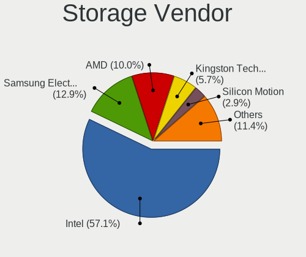

| Vendor              | Notebooks | Percent |
|---------------------|-----------|---------|
| Intel               | 19        | 79.17%  |
| Silicon Motion      | 2         | 8.33%   |
| Samsung Electronics | 2         | 8.33%   |
| Lite-On Technology  | 1         | 4.17%   |

Storage Model
-------------

Storage controller models

| Model                                                                          | Notebooks | Percent |
|--------------------------------------------------------------------------------|-----------|---------|
| Intel Sunrise Point-LP SATA Controller [AHCI mode]                             | 4         | 15.38%  |
| Intel 8 Series/C220 Series Chipset Family 6-port SATA Controller 1 [AHCI mode] | 3         | 11.54%  |
| Silicon Motion SM2262/SM2262EN SSD Controller                                  | 2         | 7.69%   |
| Samsung NVMe SSD Controller SM981/PM981/PM983                                  | 2         | 7.69%   |
| Intel HM170/QM170 Chipset SATA Controller [AHCI Mode]                          | 2         | 7.69%   |
| Intel 82801HM/HEM (ICH8M/ICH8M-E) SATA Controller [AHCI mode]                  | 2         | 7.69%   |
| Intel 82801HM/HEM (ICH8M/ICH8M-E) IDE Controller                               | 2         | 7.69%   |
| Intel 82801 Mobile SATA Controller [RAID mode]                                 | 2         | 7.69%   |
| Intel 7 Series Chipset Family 6-port SATA Controller [AHCI mode]               | 2         | 7.69%   |
| Intel 6 Series/C200 Series Chipset Family 6 port Mobile SATA AHCI Controller   | 2         | 7.69%   |
| Lite-On SATA controller                                                        | 1         | 3.85%   |
| Intel Wildcat Point-LP SATA Controller [AHCI Mode]                             | 1         | 3.85%   |
| Intel 82801IBM/IEM (ICH9M/ICH9M-E) 4 port SATA Controller [AHCI mode]          | 1         | 3.85%   |

Storage Kind
------------

Kind of storage controller (IDE, SATA, NVMe, SAS, ...)

| Kind | Notebooks | Percent |
|------|-----------|---------|
| SATA | 17        | 68%     |
| NVMe | 4         | 16%     |
| RAID | 2         | 8%      |
| IDE  | 2         | 8%      |

Processor
---------

CPU Vendor
----------

Processor vendors

| Vendor | Notebooks | Percent |
|--------|-----------|---------|
| Intel  | 22        | 100%    |

CPU Model
---------

Processor models

| Model                                | Notebooks | Percent |
|--------------------------------------|-----------|---------|
| Intel Core i5-7200U CPU @ 2.50GHz    | 2         | 9.09%   |
| Intel Core i7-9750H CPU @ 2.60GHz    | 1         | 4.55%   |
| Intel Core i7-8550U CPU @ 1.80GHz    | 1         | 4.55%   |
| Intel Core i7-7700HQ CPU @ 2.80GHz   | 1         | 4.55%   |
| Intel Core i7-6700HQ CPU @ 2.60GHz   | 1         | 4.55%   |
| Intel Core i7-6600U CPU @ 2.60GHz    | 1         | 4.55%   |
| Intel Core i7-5600U CPU @ 2.60GHz    | 1         | 4.55%   |
| Intel Core i7-4810MQ CPU @ 2.80GHz   | 1         | 4.55%   |
| Intel Core i7-4720HQ CPU @ 2.60GHz   | 1         | 4.55%   |
| Intel Core i7-3740QM CPU @ 2.70GHz   | 1         | 4.55%   |
| Intel Core i5-6200U CPU @ 2.30GHz    | 1         | 4.55%   |
| Intel Core i5-4300M CPU @ 2.60GHz    | 1         | 4.55%   |
| Intel Core i5-3317U CPU @ 1.70GHz    | 1         | 4.55%   |
| Intel Core i5-2520M CPU @ 2.50GHz    | 1         | 4.55%   |
| Intel Core i5-2410M CPU @ 2.30GHz    | 1         | 4.55%   |
| Intel Core i3-3110M CPU @ 2.40GHz    | 1         | 4.55%   |
| Intel Core 2 Duo CPU T7250 @ 2.00GHz | 1         | 4.55%   |
| Intel Core 2 Duo CPU T5250 @ 1.50GHz | 1         | 4.55%   |
| Intel Core 2 Duo CPU P8600 @ 2.40GHz | 1         | 4.55%   |
| Intel Celeron N4000 CPU @ 1.10GHz    | 1         | 4.55%   |
| Intel Celeron CPU N2840 @ 2.16GHz    | 1         | 4.55%   |

CPU Model Family
----------------

Processor model prefix

| Model            | Notebooks | Percent |
|------------------|-----------|---------|
| Intel Core i7    | 9         | 40.91%  |
| Intel Core i5    | 7         | 31.82%  |
| Intel Core 2 Duo | 3         | 13.64%  |
| Intel Celeron    | 2         | 9.09%   |
| Intel Core i3    | 1         | 4.55%   |

CPU Cores
---------

Number of processor cores

| Number | Notebooks | Percent |
|--------|-----------|---------|
| 2      | 15        | 68.18%  |
| 4      | 6         | 27.27%  |
| 6      | 1         | 4.55%   |

CPU Sockets
-----------

Number of sockets

| Number | Notebooks | Percent |
|--------|-----------|---------|
| 1      | 22        | 100%    |

CPU Threads
-----------

Threads per core (Hyper-Threading)

| Number | Notebooks | Percent |
|--------|-----------|---------|
| 2      | 16        | 72.73%  |
| 1      | 6         | 27.27%  |

CPU Op-Modes
------------

CPU Operation Modes (32-bit, 64-bit)

| Op mode        | Notebooks | Percent |
|----------------|-----------|---------|
| 32-bit, 64-bit | 22        | 100%    |

CPU Microcode
-------------

Microcode number

| Number  | Notebooks | Percent |
|---------|-----------|---------|
| Unknown | 9         | 40.91%  |
| 0x6fd   | 2         | 9.09%   |
| 0x406e3 | 2         | 9.09%   |
| 0x906ea | 1         | 4.55%   |
| 0x806e9 | 1         | 4.55%   |
| 0x706a1 | 1         | 4.55%   |
| 0x506e3 | 1         | 4.55%   |
| 0x306d4 | 1         | 4.55%   |
| 0x306a9 | 1         | 4.55%   |
| 0x30678 | 1         | 4.55%   |
| 0x206a7 | 1         | 4.55%   |
| 0x10676 | 1         | 4.55%   |

CPU Microarch
-------------

Microarchitecture

| Name          | Notebooks | Percent |
|---------------|-----------|---------|
| KabyLake      | 5         | 22.73%  |
| Skylake       | 3         | 13.64%  |
| IvyBridge     | 3         | 13.64%  |
| Haswell       | 3         | 13.64%  |
| SandyBridge   | 2         | 9.09%   |
| Core          | 2         | 9.09%   |
| Silvermont    | 1         | 4.55%   |
| Penryn        | 1         | 4.55%   |
| Goldmont plus | 1         | 4.55%   |
| Broadwell     | 1         | 4.55%   |

Graphics
--------

GPU Vendor
----------

Vendors of graphics cards

| Vendor | Notebooks | Percent |
|--------|-----------|---------|
| Intel  | 22        | 66.67%  |
| Nvidia | 8         | 24.24%  |
| AMD    | 3         | 9.09%   |

GPU Model
---------

Graphics card models

| Model                                                                     | Notebooks | Percent |
|---------------------------------------------------------------------------|-----------|---------|
| Intel 4th Gen Core Processor Integrated Graphics Controller               | 3         | 8.57%   |
| Intel 3rd Gen Core processor Graphics Controller                          | 3         | 8.57%   |
| Intel Skylake GT2 [HD Graphics 520]                                       | 2         | 5.71%   |
| Intel Mobile GM965/GL960 Integrated Graphics Controller (secondary)       | 2         | 5.71%   |
| Intel Mobile GM965/GL960 Integrated Graphics Controller (primary)         | 2         | 5.71%   |
| Intel HD Graphics 620                                                     | 2         | 5.71%   |
| Intel 2nd Generation Core Processor Family Integrated Graphics Controller | 2         | 5.71%   |
| Nvidia TU117M [GeForce GTX 1650 Mobile / Max-Q]                           | 1         | 2.86%   |
| Nvidia GP107M [GeForce GTX 1050 Ti Mobile]                                | 1         | 2.86%   |
| Nvidia GM204M [GeForce GTX 980M]                                          | 1         | 2.86%   |
| Nvidia GM204M [GeForce GTX 970M]                                          | 1         | 2.86%   |
| Nvidia GM108M [GeForce 940MX]                                             | 1         | 2.86%   |
| Nvidia GM107M [GeForce GTX 960M]                                          | 1         | 2.86%   |
| Nvidia GK104GLM [Quadro K3000M]                                           | 1         | 2.86%   |
| Nvidia G98M [GeForce 9300M GS]                                            | 1         | 2.86%   |
| Intel UHD Graphics 620                                                    | 1         | 2.86%   |
| Intel Mobile 4 Series Chipset Integrated Graphics Controller              | 1         | 2.86%   |
| Intel HD Graphics 630                                                     | 1         | 2.86%   |
| Intel HD Graphics 5500                                                    | 1         | 2.86%   |
| Intel HD Graphics 530                                                     | 1         | 2.86%   |
| Intel GeminiLake [UHD Graphics 600]                                       | 1         | 2.86%   |
| Intel CoffeeLake-H GT2 [UHD Graphics 630]                                 | 1         | 2.86%   |
| Intel Atom Processor Z36xxx/Z37xxx Series Graphics & Display              | 1         | 2.86%   |
| AMD Thames [Radeon HD 7500M/7600M Series]                                 | 1         | 2.86%   |
| AMD Sun PRO [Radeon HD 8570A/8570M]                                       | 1         | 2.86%   |
| AMD Seymour [Radeon HD 6400M/7400M Series]                                | 1         | 2.86%   |

GPU Combo
---------

Combinations of graphics cards

| Name           | Notebooks | Percent |
|----------------|-----------|---------|
| 1 x Intel      | 12        | 54.55%  |
| Intel + Nvidia | 7         | 31.82%  |
| Intel + AMD    | 3         | 13.64%  |

GPU Driver
----------

Free vs proprietary

| Driver      | Notebooks | Percent |
|-------------|-----------|---------|
| Free        | 19        | 86.36%  |
| Proprietary | 3         | 13.64%  |

GPU Memory
----------

Total video memory

| Size in GB | Notebooks | Percent |
|------------|-----------|---------|
| Unknown    | 18        | 81.82%  |
| 7.01-8.0   | 1         | 4.55%   |
| 3.01-4.0   | 1         | 4.55%   |
| 0.51-1.0   | 1         | 4.55%   |
| 0.01-0.5   | 1         | 4.55%   |

Monitor
-------

Monitor Vendor
--------------

Monitor vendors

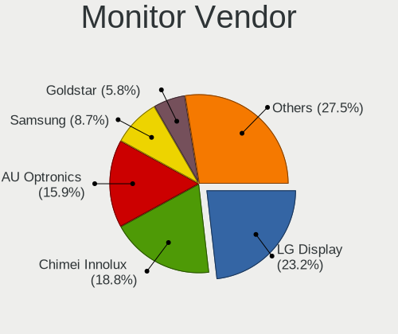

| Vendor              | Notebooks | Percent |
|---------------------|-----------|---------|
| LG Display          | 7         | 25.93%  |
| Chimei Innolux      | 4         | 14.81%  |
| AU Optronics        | 4         | 14.81%  |
| Samsung Electronics | 2         | 7.41%   |
| Lenovo              | 2         | 7.41%   |
| Hewlett-Packard     | 2         | 7.41%   |
| Goldstar            | 2         | 7.41%   |
| Sony                | 1         | 3.7%    |
| LG Philips          | 1         | 3.7%    |
| InfoVision          | 1         | 3.7%    |
| Dell                | 1         | 3.7%    |

Monitor Model
-------------

Monitor models

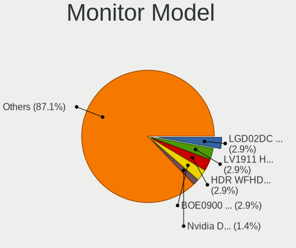

| Model                                                                 | Notebooks | Percent |
|-----------------------------------------------------------------------|-----------|---------|
| Hewlett-Packard LV1911 HWP3005 1366x768 410x230mm 18.5-inch           | 2         | 7.41%   |
| Sony Nvidia Defaul t Flat Panel SNY06FA 1600x900 360x200mm 16.2-inch  | 1         | 3.7%    |
| Samsung Electronics LCD Monitor SEC3449 1366x768 309x174mm 14.0-inch  | 1         | 3.7%    |
| Samsung Electronics LCD Monitor SDC424B 3840x2160 344x194mm 15.5-inch | 1         | 3.7%    |
| LG Philips LCD Monitor LPLDB00 1280x800 331x207mm 15.4-inch           | 1         | 3.7%    |
| LG Display LCD Monitor LGD05C0 1920x1080 344x194mm 15.5-inch          | 1         | 3.7%    |
| LG Display LCD Monitor LGD053C 1920x1080 309x174mm 14.0-inch          | 1         | 3.7%    |
| LG Display LCD Monitor LGD0521 1920x1080 309x174mm 14.0-inch          | 1         | 3.7%    |
| LG Display LCD Monitor LGD04A9 1920x1080 309x174mm 14.0-inch          | 1         | 3.7%    |
| LG Display LCD Monitor LGD046C 1920x1080 380x210mm 17.1-inch          | 1         | 3.7%    |
| LG Display LCD Monitor LGD044F 1920x1080 350x190mm 15.7-inch          | 1         | 3.7%    |
| LG Display LCD Monitor LGD02DA 1920x1080 380x220mm 17.3-inch          | 1         | 3.7%    |
| Lenovo LEN P27q-10 LEN61A8 2560x1440 597x336mm 27.0-inch              | 1         | 3.7%    |
| Lenovo LCD Monitor LEN4020 1024x768 286x214mm 14.1-inch               | 1         | 3.7%    |
| InfoVision LCD Monitor IVO03F4 1920x1200 263x164mm 12.2-inch          | 1         | 3.7%    |
| Goldstar HDR WFHD GSM7714 2560x1080 798x334mm 34.1-inch               | 1         | 3.7%    |
| Goldstar FULL HD GSM5B54 1920x1080 480x270mm 21.7-inch                | 1         | 3.7%    |
| Dell U2410 DELF017 1920x1200 518x324mm 24.1-inch                      | 1         | 3.7%    |
| Chimei Innolux LCD Monitor CMN15DB 1366x768 344x193mm 15.5-inch       | 1         | 3.7%    |
| Chimei Innolux LCD Monitor CMN14C3 1366x768 309x173mm 13.9-inch       | 1         | 3.7%    |
| Chimei Innolux LCD Monitor CMN1482 1600x900 309x174mm 14.0-inch       | 1         | 3.7%    |
| Chimei Innolux LCD Monitor CMN1136 1366x768 256x144mm 11.6-inch       | 1         | 3.7%    |
| AU Optronics LCD Monitor AUO63ED 1920x1080 344x193mm 15.5-inch        | 1         | 3.7%    |
| AU Optronics LCD Monitor AUO225C 1366x768 256x144mm 11.6-inch         | 1         | 3.7%    |
| AU Optronics LCD Monitor AUO219D 1920x1080 381x214mm 17.2-inch        | 1         | 3.7%    |
| AU Optronics LCD Monitor AUO20EC 1366x768 344x193mm 15.5-inch         | 1         | 3.7%    |

Monitor Resolution
------------------

Monitor screen resolution

| Resolution        | Notebooks | Percent |
|-------------------|-----------|---------|
| 1920x1080 (FHD)   | 10        | 40%     |
| 1366x768 (WXGA)   | 6         | 24%     |
| 1920x1200 (WUXGA) | 2         | 8%      |
| 1600x900 (HD+)    | 2         | 8%      |
| 3840x2160 (4K)    | 1         | 4%      |
| 2560x1440 (QHD)   | 1         | 4%      |
| 2560x1080         | 1         | 4%      |
| 1280x800 (WXGA)   | 1         | 4%      |
| 1024x768 (XGA)    | 1         | 4%      |

Monitor Diagonal
----------------

Diagonal size in inches

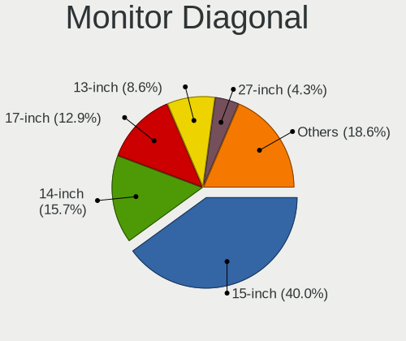

| Inches | Notebooks | Percent |
|--------|-----------|---------|
| 15     | 8         | 29.63%  |
| 14     | 6         | 22.22%  |
| 17     | 4         | 14.81%  |
| 18     | 2         | 7.41%   |
| 11     | 2         | 7.41%   |
| 34     | 1         | 3.7%    |
| 27     | 1         | 3.7%    |
| 26     | 1         | 3.7%    |
| 21     | 1         | 3.7%    |
| 13     | 1         | 3.7%    |

Monitor Width
-------------

Physical width

| Width in mm | Notebooks | Percent |
|-------------|-----------|---------|
| 301-350     | 14        | 51.85%  |
| 351-400     | 4         | 14.81%  |
| 401-500     | 3         | 11.11%  |
| 201-300     | 3         | 11.11%  |
| 501-600     | 2         | 7.41%   |
| 701-800     | 1         | 3.7%    |

Aspect Ratio
------------

Proportional relationship between the width and the height

| Ratio | Notebooks | Percent |
|-------|-----------|---------|
| 16/9  | 20        | 83.33%  |
| 16/10 | 2         | 8.33%   |
| 4/3   | 1         | 4.17%   |
| 21/9  | 1         | 4.17%   |

Monitor Area
------------

Area in inch²

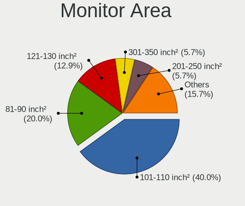

| Area in inch² | Notebooks | Percent |
|----------------|-----------|---------|
| 101-110        | 8         | 29.63%  |
| 81-90          | 6         | 22.22%  |
| 121-130        | 4         | 14.81%  |
| 51-60          | 2         | 7.41%   |
| 301-350        | 2         | 7.41%   |
| 141-150        | 2         | 7.41%   |
| 351-500        | 1         | 3.7%    |
| 201-250        | 1         | 3.7%    |
| 91-100         | 1         | 3.7%    |

Pixel Density
-------------

Pixels per inch

| Density       | Notebooks | Percent |
|---------------|-----------|---------|
| 121-160       | 12        | 44.44%  |
| 101-120       | 8         | 29.63%  |
| 51-100        | 6         | 22.22%  |
| More than 240 | 1         | 3.7%    |

Multiple Monitors
-----------------

Total monitors connected

| Total | Notebooks | Percent |
|-------|-----------|---------|
| 1     | 16        | 72.73%  |
| 2     | 6         | 27.27%  |

Network
-------

Net Controller Vendor
---------------------

Controller vendors

| Vendor                | Notebooks | Percent |
|-----------------------|-----------|---------|
| Intel                 | 17        | 48.57%  |
| Realtek Semiconductor | 9         | 25.71%  |
| Qualcomm Atheros      | 5         | 14.29%  |
| Samsung Electronics   | 1         | 2.86%   |
| Lenovo                | 1         | 2.86%   |
| Broadcom              | 1         | 2.86%   |
| ASIX Electronics      | 1         | 2.86%   |

Net Controller Model
--------------------

Controller models

| Model                                                             | Notebooks | Percent |
|-------------------------------------------------------------------|-----------|---------|
| Realtek RTL8111/8168/8411 PCI Express Gigabit Ethernet Controller | 6         | 13.33%  |
| Realtek RTL810xE PCI Express Fast Ethernet controller             | 2         | 4.44%   |
| Qualcomm Atheros AR9485 Wireless Network Adapter                  | 2         | 4.44%   |
| Intel Wireless 8265 / 8275                                        | 2         | 4.44%   |
| Intel Wireless 8260                                               | 2         | 4.44%   |
| Intel Wireless 7260                                               | 2         | 4.44%   |
| Intel Wi-Fi 6 AX200                                               | 2         | 4.44%   |
| Intel 82579LM Gigabit Network Connection (Lewisville)             | 2         | 4.44%   |
| Samsung Kiera                                                     | 1         | 2.22%   |
| Realtek RTL8723BE PCIe Wireless Network Adapter                   | 1         | 2.22%   |
| Qualcomm Atheros QCA8172 Fast Ethernet                            | 1         | 2.22%   |
| Qualcomm Atheros QCA6174 802.11ac Wireless Network Adapter        | 1         | 2.22%   |
| Qualcomm Atheros Killer E2400 Gigabit Ethernet Controller         | 1         | 2.22%   |
| Qualcomm Atheros AR9462 Wireless Network Adapter                  | 1         | 2.22%   |
| Lenovo OneLink+ Giga                                              | 1         | 2.22%   |
| Intel Wireless 7265                                               | 1         | 2.22%   |
| Intel Wireless 3165                                               | 1         | 2.22%   |
| Intel WiFi Link 5100                                              | 1         | 2.22%   |
| Intel PRO/Wireless 4965 AG or AGN [Kedron] Network Connection     | 1         | 2.22%   |
| Intel PRO/Wireless 3945ABG [Golan] Network Connection             | 1         | 2.22%   |
| Intel Gemini Lake PCH CNVi WiFi                                   | 1         | 2.22%   |
| Intel Ethernet Connection I219-V                                  | 1         | 2.22%   |
| Intel Ethernet Connection I219-LM                                 | 1         | 2.22%   |
| Intel Ethernet Connection I217-V                                  | 1         | 2.22%   |
| Intel Ethernet Connection I217-LM                                 | 1         | 2.22%   |
| Intel Ethernet Connection (4) I219-LM                             | 1         | 2.22%   |
| Intel Ethernet Connection (3) I218-LM                             | 1         | 2.22%   |
| Intel Centrino Wireless-N 1000 [Condor Peak]                      | 1         | 2.22%   |
| Intel Centrino Advanced-N 6230 [Rainbow Peak]                     | 1         | 2.22%   |
| Intel 82567LM Gigabit Network Connection                          | 1         | 2.22%   |
| Intel 82566MM Gigabit Network Connection                          | 1         | 2.22%   |
| Broadcom BCM43228 802.11a/b/g/n                                   | 1         | 2.22%   |
| ASIX AX88179 Gigabit Ethernet                                     | 1         | 2.22%   |

Wireless Vendor
---------------

Wireless vendors

| Vendor                | Notebooks | Percent |
|-----------------------|-----------|---------|
| Intel                 | 16        | 72.73%  |
| Qualcomm Atheros      | 4         | 18.18%  |
| Realtek Semiconductor | 1         | 4.55%   |
| Broadcom              | 1         | 4.55%   |

Wireless Model
--------------

Wireless models

| Model                                                         | Notebooks | Percent |
|---------------------------------------------------------------|-----------|---------|
| Qualcomm Atheros AR9485 Wireless Network Adapter              | 2         | 9.09%   |
| Intel Wireless 8265 / 8275                                    | 2         | 9.09%   |
| Intel Wireless 8260                                           | 2         | 9.09%   |
| Intel Wireless 7260                                           | 2         | 9.09%   |
| Intel Wi-Fi 6 AX200                                           | 2         | 9.09%   |
| Realtek RTL8723BE PCIe Wireless Network Adapter               | 1         | 4.55%   |
| Qualcomm Atheros QCA6174 802.11ac Wireless Network Adapter    | 1         | 4.55%   |
| Qualcomm Atheros AR9462 Wireless Network Adapter              | 1         | 4.55%   |
| Intel Wireless 7265                                           | 1         | 4.55%   |
| Intel Wireless 3165                                           | 1         | 4.55%   |
| Intel WiFi Link 5100                                          | 1         | 4.55%   |
| Intel PRO/Wireless 4965 AG or AGN [Kedron] Network Connection | 1         | 4.55%   |
| Intel PRO/Wireless 3945ABG [Golan] Network Connection         | 1         | 4.55%   |
| Intel Gemini Lake PCH CNVi WiFi                               | 1         | 4.55%   |
| Intel Centrino Wireless-N 1000 [Condor Peak]                  | 1         | 4.55%   |
| Intel Centrino Advanced-N 6230 [Rainbow Peak]                 | 1         | 4.55%   |
| Broadcom BCM43228 802.11a/b/g/n                               | 1         | 4.55%   |

Ethernet Vendor
---------------

Ethernet vendors

| Vendor                | Notebooks | Percent |
|-----------------------|-----------|---------|
| Intel                 | 10        | 45.45%  |
| Realtek Semiconductor | 8         | 36.36%  |
| Qualcomm Atheros      | 2         | 9.09%   |
| Lenovo                | 1         | 4.55%   |
| ASIX Electronics      | 1         | 4.55%   |

Ethernet Model
--------------

Ethernet models

| Model                                                             | Notebooks | Percent |
|-------------------------------------------------------------------|-----------|---------|
| Realtek RTL8111/8168/8411 PCI Express Gigabit Ethernet Controller | 6         | 27.27%  |
| Realtek RTL810xE PCI Express Fast Ethernet controller             | 2         | 9.09%   |
| Intel 82579LM Gigabit Network Connection (Lewisville)             | 2         | 9.09%   |
| Qualcomm Atheros QCA8172 Fast Ethernet                            | 1         | 4.55%   |
| Qualcomm Atheros Killer E2400 Gigabit Ethernet Controller         | 1         | 4.55%   |
| Lenovo OneLink+ Giga                                              | 1         | 4.55%   |
| Intel Ethernet Connection I219-V                                  | 1         | 4.55%   |
| Intel Ethernet Connection I219-LM                                 | 1         | 4.55%   |
| Intel Ethernet Connection I217-V                                  | 1         | 4.55%   |
| Intel Ethernet Connection I217-LM                                 | 1         | 4.55%   |
| Intel Ethernet Connection (4) I219-LM                             | 1         | 4.55%   |
| Intel Ethernet Connection (3) I218-LM                             | 1         | 4.55%   |
| Intel 82567LM Gigabit Network Connection                          | 1         | 4.55%   |
| Intel 82566MM Gigabit Network Connection                          | 1         | 4.55%   |
| ASIX AX88179 Gigabit Ethernet                                     | 1         | 4.55%   |

Net Controller Kind
-------------------

Ethernet, WiFi or modem

| Kind     | Notebooks | Percent |
|----------|-----------|---------|
| WiFi     | 22        | 50%     |
| Ethernet | 21        | 47.73%  |
| Modem    | 1         | 2.27%   |

Used Controller
---------------

Currently used network controller

| Kind     | Notebooks | Percent |
|----------|-----------|---------|
| WiFi     | 22        | 51.16%  |
| Ethernet | 20        | 46.51%  |
| Modem    | 1         | 2.33%   |

NICs
----

Total network controllers on board

| Total | Notebooks | Percent |
|-------|-----------|---------|
| 2     | 20        | 90.91%  |
| 1     | 2         | 9.09%   |

IPv6
----

IPv6 vs IPv4

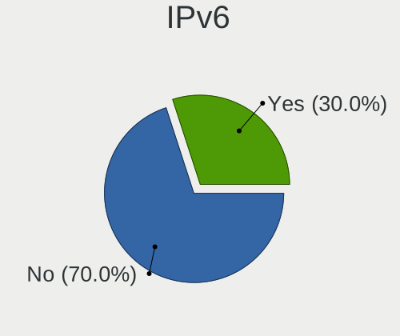

| Used | Notebooks | Percent |
|------|-----------|---------|
| No   | 14        | 63.64%  |
| Yes  | 8         | 36.36%  |

Bluetooth
---------

Bluetooth Vendor
----------------

Controller vendors

| Vendor                          | Notebooks | Percent |
|---------------------------------|-----------|---------|
| Intel                           | 8         | 44.44%  |
| Qualcomm Atheros Communications | 3         | 16.67%  |
| Realtek Semiconductor           | 1         | 5.56%   |
| IMC Networks                    | 1         | 5.56%   |
| Foxconn / Hon Hai               | 1         | 5.56%   |
| Dell                            | 1         | 5.56%   |
| Cambridge Silicon Radio         | 1         | 5.56%   |
| Broadcom                        | 1         | 5.56%   |
| Alps Electric                   | 1         | 5.56%   |

Bluetooth Model
---------------

Controller models

| Model                                                                               | Notebooks | Percent |
|-------------------------------------------------------------------------------------|-----------|---------|
| Intel Bluetooth wireless interface                                                  | 3         | 16.67%  |
| Intel Bluetooth Device                                                              | 3         | 16.67%  |
| Intel AX200 Bluetooth                                                               | 2         | 11.11%  |
| Realtek Bluetooth Radio                                                             | 1         | 5.56%   |
| Qualcomm Atheros  Bluetooth Device                                                  | 1         | 5.56%   |
| Qualcomm Atheros Bluetooth USB Host Controller                                      | 1         | 5.56%   |
| Qualcomm Atheros AR3012 Bluetooth 4.0                                               | 1         | 5.56%   |
| IMC Networks Bluetooth Device                                                       | 1         | 5.56%   |
| Foxconn / Hon Hai Foxconn T77H114 BCM2070 [Single-Chip Bluetooth 2.1 + EDR Adapter] | 1         | 5.56%   |
| Dell BCM20702A0                                                                     | 1         | 5.56%   |
| Cambridge Silicon Radio Bluetooth Dongle (HCI mode)                                 | 1         | 5.56%   |
| Broadcom BCM2045B (BDC-2) [Bluetooth Controller]                                    | 1         | 5.56%   |
| Alps Electric BCM2046 Bluetooth Device                                              | 1         | 5.56%   |

Sound
-----

Sound Vendor
------------

Sound card vendors

| Vendor    | Notebooks | Percent |
|-----------|-----------|---------|
| Intel     | 22        | 73.33%  |
| Nvidia    | 3         | 10%     |
| Logitech  | 2         | 6.67%   |
| Lenovo    | 1         | 3.33%   |
| JMTek     | 1         | 3.33%   |
| GN Netcom | 1         | 3.33%   |

Sound Model
-----------

Sound card models

| Model                                                                      | Notebooks | Percent |
|----------------------------------------------------------------------------|-----------|---------|
| Intel Sunrise Point-LP HD Audio                                            | 5         | 15.15%  |
| Intel 8 Series/C220 Series Chipset High Definition Audio Controller        | 3         | 9.09%   |
| Intel 7 Series/C216 Chipset Family High Definition Audio Controller        | 3         | 9.09%   |
| Logitech Headset H390                                                      | 2         | 6.06%   |
| Intel Xeon E3-1200 v3/4th Gen Core Processor HD Audio Controller           | 2         | 6.06%   |
| Intel 82801H (ICH8 Family) HD Audio Controller                             | 2         | 6.06%   |
| Intel 6 Series/C200 Series Chipset Family High Definition Audio Controller | 2         | 6.06%   |
| Nvidia TU107 GeForce GTX 1650 High Definition Audio Controller             | 1         | 3.03%   |
| Nvidia GP107GL High Definition Audio Controller                            | 1         | 3.03%   |
| Nvidia GK104 HDMI Audio Controller                                         | 1         | 3.03%   |
| Lenovo ThinkPad OneLink Plus Dock Audio                                    | 1         | 3.03%   |
| JMTek audio controller                                                     | 1         | 3.03%   |
| Intel Wildcat Point-LP High Definition Audio Controller                    | 1         | 3.03%   |
| Intel CM238 HD Audio Controller                                            | 1         | 3.03%   |
| Intel Celeron/Pentium Silver Processor High Definition Audio               | 1         | 3.03%   |
| Intel Cannon Lake PCH cAVS                                                 | 1         | 3.03%   |
| Intel Broadwell-U Audio Controller                                         | 1         | 3.03%   |
| Intel Atom Processor Z36xxx/Z37xxx Series High Definition Audio Controller | 1         | 3.03%   |
| Intel 82801I (ICH9 Family) HD Audio Controller                             | 1         | 3.03%   |
| Intel 100 Series/C230 Series Chipset Family HD Audio Controller            | 1         | 3.03%   |
| GN Netcom Jabra UC VOICE 150a MS                                           | 1         | 3.03%   |

Memory
------

Memory Vendor
-------------

Memory module vendors

| Vendor              | Notebooks | Percent |
|---------------------|-----------|---------|
| Samsung Electronics | 5         | 38.46%  |
| Unknown             | 4         | 30.77%  |
| SK Hynix            | 3         | 23.08%  |
| Corsair             | 1         | 7.69%   |

Memory Model
------------

Memory module models

| Model                                                     | Notebooks | Percent |
|-----------------------------------------------------------|-----------|---------|
| Unknown RAM Module 4GB SODIMM DDR2 667MT/s                | 1         | 5.88%   |
| Unknown RAM Module 4096MB SODIMM DDR3                     | 1         | 5.88%   |
| Unknown RAM Module 2GB SODIMM DDR2 667MT/s                | 1         | 5.88%   |
| Unknown RAM Module 2048MB SODIMM 1067MT/s                 | 1         | 5.88%   |
| Unknown RAM Module 1GB SODIMM DDR2 667MT/s                | 1         | 5.88%   |
| Unknown RAM Module 1024MB SODIMM 1067MT/s                 | 1         | 5.88%   |
| SK Hynix RAM Module 4GB SODIMM DDR3 1600MT/s              | 1         | 5.88%   |
| SK Hynix RAM HMT425S6AFR6A-PB 2GB SODIMM DDR3 1600MT/s    | 1         | 5.88%   |
| SK Hynix RAM HMT41GS6BFR8A-PB 8GB SODIMM DDR3 1600MT/s    | 1         | 5.88%   |
| SK Hynix RAM HMA41GS6AFR8N-TF 8192MB SODIMM DDR4 2667MT/s | 1         | 5.88%   |
| Samsung RAM M471B5673EH1-CH9 2048MB SODIMM DDR3 1334MT/s  | 1         | 5.88%   |
| Samsung RAM M471B1G73EB0-YK0 8192MB SODIMM DDR3 1600MT/s  | 1         | 5.88%   |
| Samsung RAM M471A2K43DB1-CTD 16384MB SODIMM DDR4 2667MT/s | 1         | 5.88%   |
| Samsung RAM K4F6E3S4HM-MGCJ 4096MB SODIMM LPDDR4 3733MT/s | 1         | 5.88%   |
| Samsung RAM K4E6E304EE-EGCF 4GB SODIMM LPDDR3 1867MT/s    | 1         | 5.88%   |
| Samsung RAM K4E6E304EE-EGCF 4GB Chip LPDDR3 1867MT/s      | 1         | 5.88%   |
| Corsair RAM CMSX8GX4M1A2400C16 8GB SODIMM DDR4 2400MT/s   | 1         | 5.88%   |

Memory Kind
-----------

Memory module kinds

| Kind    | Notebooks | Percent |
|---------|-----------|---------|
| DDR3    | 5         | 38.46%  |
| DDR4    | 3         | 23.08%  |
| DDR2    | 2         | 15.38%  |
| LPDDR4  | 1         | 7.69%   |
| LPDDR3  | 1         | 7.69%   |
| Unknown | 1         | 7.69%   |

Memory Form Factor
------------------

Physical design of the memory module

| Name   | Notebooks | Percent |
|--------|-----------|---------|
| SODIMM | 13        | 92.86%  |
| Chip   | 1         | 7.14%   |

Memory Size
-----------

Memory module size

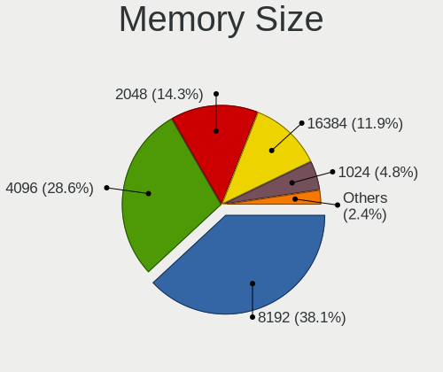

| Size  | Notebooks | Percent |
|-------|-----------|---------|
| 4096  | 5         | 31.25%  |
| 8192  | 4         | 25%     |
| 2048  | 4         | 25%     |
| 1024  | 2         | 12.5%   |
| 16384 | 1         | 6.25%   |

Memory Speed
------------

Memory module speed

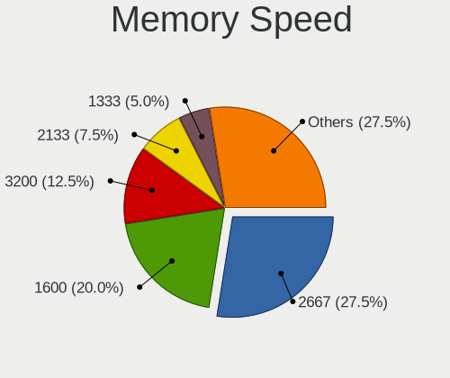

| Speed   | Notebooks | Percent |
|---------|-----------|---------|
| 1600    | 3         | 23.08%  |
| 2667    | 2         | 15.38%  |
| 667     | 2         | 15.38%  |
| 3733    | 1         | 7.69%   |
| 2400    | 1         | 7.69%   |
| 1867    | 1         | 7.69%   |
| 1334    | 1         | 7.69%   |
| 1067    | 1         | 7.69%   |
| Unknown | 1         | 7.69%   |

Printers & scanners
-------------------

Printer Vendor
--------------

Printer device vendors

| Vendor              | Notebooks | Percent |
|---------------------|-----------|---------|
| Prolific Technology | 1         | 100%    |

Printer Model
-------------

Printer device models

| Model                         | Notebooks | Percent |
|-------------------------------|-----------|---------|
| Prolific PL2305 Parallel Port | 1         | 100%    |

Scanner Vendor
--------------

Scanner device vendors

Zero info for selected period =(

Scanner Model
-------------

Scanner device models

Zero info for selected period =(

Camera
------

Camera Vendor
-------------

Camera device vendors

| Vendor                                 | Notebooks | Percent |
|----------------------------------------|-----------|---------|
| Chicony Electronics                    | 3         | 15.79%  |
| Acer                                   | 3         | 15.79%  |
| Realtek Semiconductor                  | 2         | 10.53%  |
| IMC Networks                           | 2         | 10.53%  |
| Cheng Uei Precision Industry (Foxlink) | 2         | 10.53%  |
| Syntek                                 | 1         | 5.26%   |
| Sunplus Innovation Technology          | 1         | 5.26%   |
| Silicon Motion                         | 1         | 5.26%   |
| Ricoh                                  | 1         | 5.26%   |
| Quanta                                 | 1         | 5.26%   |
| Microdia                               | 1         | 5.26%   |
| Lite-On Technology                     | 1         | 5.26%   |

Camera Model
------------

Camera device models

| Model                                                                    | Notebooks | Percent |
|--------------------------------------------------------------------------|-----------|---------|
| Syntek Lenovo EasyCamera                                                 | 1         | 5%      |
| Sunplus Integrated_Webcam_HD                                             | 1         | 5%      |
| Silicon Motion WebCam SC-13HDN10939N                                     | 1         | 5%      |
| Ricoh Sony Vaio Integrated Webcam                                        | 1         | 5%      |
| Realtek USB Camera                                                       | 1         | 5%      |
| Realtek Integrated_Webcam_HD                                             | 1         | 5%      |
| Realtek Integrated Webcam HD                                             | 1         | 5%      |
| Quanta HP Wide Vision HD Camera                                          | 1         | 5%      |
| Microdia Integrated_Webcam_HD                                            | 1         | 5%      |
| Lite-On Integrated Camera                                                | 1         | 5%      |
| IMC Networks USB2.0 VGA UVC WebCam                                       | 1         | 5%      |
| IMC Networks USB2.0 UVC HD Webcam                                        | 1         | 5%      |
| Chicony VGA 24fps UVC Webcam                                             | 1         | 5%      |
| Chicony USB2.0 Camera                                                    | 1         | 5%      |
| Chicony Integrated Camera                                                | 1         | 5%      |
| Cheng Uei Precision Industry (Foxlink) Webcam                            | 1         | 5%      |
| Cheng Uei Precision Industry (Foxlink) HP EliteBook integrated HD Webcam | 1         | 5%      |
| Acer ThinkPad P50 Integrated Camera                                      | 1         | 5%      |
| Acer Integrated Camera                                                   | 1         | 5%      |
| Acer BisonCam, NB Pro                                                    | 1         | 5%      |

Security
--------

Fingerprint Vendor
------------------

Fingerprint sensor vendors

| Vendor           | Notebooks | Percent |
|------------------|-----------|---------|
| Validity Sensors | 4         | 57.14%  |
| Upek             | 1         | 14.29%  |
| Synaptics        | 1         | 14.29%  |
| AuthenTec        | 1         | 14.29%  |

Fingerprint Model
-----------------

Fingerprint sensor models

| Model                                                  | Notebooks | Percent |
|--------------------------------------------------------|-----------|---------|
| Validity Sensors VFS 5011 fingerprint sensor           | 2         | 28.57%  |
| Validity Sensors VFS7500 Touch Fingerprint Sensor      | 1         | 14.29%  |
| Validity Sensors VFS495 Fingerprint Reader             | 1         | 14.29%  |
| Upek Biometric Touchchip/Touchstrip Fingerprint Sensor | 1         | 14.29%  |
| Synaptics  WBDI                                        | 1         | 14.29%  |
| AuthenTec AES1660 Fingerprint Sensor                   | 1         | 14.29%  |

Chipcard Vendor
---------------

Chipcard module vendors

| Vendor                | Notebooks | Percent |
|-----------------------|-----------|---------|
| Alcor Micro           | 2         | 40%     |
| O2 Micro              | 1         | 20%     |
| Gemalto (was Gemplus) | 1         | 20%     |
| Broadcom              | 1         | 20%     |

Chipcard Model
--------------

Chipcard module models

| Model                                             | Notebooks | Percent |
|---------------------------------------------------|-----------|---------|
| Alcor Micro AU9540 Smartcard Reader               | 2         | 40%     |
| O2 Micro OZ776 CCID Smartcard Reader              | 1         | 20%     |
| Gemalto (was Gemplus) GemPC Twin SmartCard Reader | 1         | 20%     |
| Broadcom BCM5880 Secure Applications Processor    | 1         | 20%     |

Unsupported
-----------

Unsupported Devices
-------------------

Total unsupported devices on board

| Total | Notebooks | Percent |
|-------|-----------|---------|
| 0     | 11        | 50%     |
| 1     | 9         | 40.91%  |
| 2     | 2         | 9.09%   |

Unsupported Device Types
------------------------

Types of unsupported devices

| Type               | Notebooks | Percent |
|--------------------|-----------|---------|
| Fingerprint reader | 7         | 53.85%  |
| Chipcard           | 5         | 38.46%  |
| Graphics card      | 1         | 7.69%   |

