openSUSE Leap-15.3 - Tested Hardware & Statistics (Notebooks)
-------------------------------------------------------------

A project to collect tested hardware configurations for openSUSE Leap-15.3.

Anyone can contribute to this report by the [hw-probe](https://github.com/linuxhw/hw-probe) tool:

    sudo -E hw-probe -all -upload

Please submit a probe of your configuration if it's not presented on the page or is rare.

Full-feature report is available here: https://linux-hardware.org/?view=trends

Contents
--------

* [ Test Cases ](#test-cases)

* [ System ](#system)
  - [ Kernel                   ](#kernel)
  - [ Kernel Family            ](#kernel-family)
  - [ Kernel Major Ver.        ](#kernel-major-ver)
  - [ Arch                     ](#arch)
  - [ DE                       ](#de)
  - [ Display Server           ](#display-server)
  - [ Display Manager          ](#display-manager)
  - [ OS Lang                  ](#os-lang)
  - [ Boot Mode                ](#boot-mode)
  - [ Filesystem               ](#filesystem)
  - [ Part. scheme             ](#part-scheme)
  - [ Dual Boot with Linux/BSD ](#dual-boot-with-linuxbsd)
  - [ Dual Boot (Win)          ](#dual-boot-win)

* [ Board ](#board)
  - [ Vendor                   ](#vendor)
  - [ Model                    ](#model)
  - [ Model Family             ](#model-family)
  - [ MFG Year                 ](#mfg-year)
  - [ Form Factor              ](#form-factor)
  - [ Secure Boot              ](#secure-boot)
  - [ Coreboot                 ](#coreboot)
  - [ RAM Size                 ](#ram-size)
  - [ RAM Used                 ](#ram-used)
  - [ Total Drives             ](#total-drives)
  - [ Has CD-ROM               ](#has-cd-rom)
  - [ Has Ethernet             ](#has-ethernet)
  - [ Has WiFi                 ](#has-wifi)
  - [ Has Bluetooth            ](#has-bluetooth)

* [ Location ](#location)
  - [ Country                  ](#country)
  - [ City                     ](#city)

* [ Drives ](#drives)
  - [ Drive Vendor             ](#drive-vendor)
  - [ Drive Model              ](#drive-model)
  - [ HDD Vendor               ](#hdd-vendor)
  - [ SSD Vendor               ](#ssd-vendor)
  - [ Drive Kind               ](#drive-kind)
  - [ Drive Connector          ](#drive-connector)
  - [ Drive Size               ](#drive-size)
  - [ Space Total              ](#space-total)
  - [ Space Used               ](#space-used)
  - [ Malfunc. Drives          ](#malfunc-drives)
  - [ Malfunc. Drive Vendor    ](#malfunc-drive-vendor)
  - [ Malfunc. HDD Vendor      ](#malfunc-hdd-vendor)
  - [ Malfunc. Drive Kind      ](#malfunc-drive-kind)
  - [ Failed Drives            ](#failed-drives)
  - [ Failed Drive Vendor      ](#failed-drive-vendor)
  - [ Drive Status             ](#drive-status)

* [ Storage controller ](#storage-controller)
  - [ Storage Vendor           ](#storage-vendor)
  - [ Storage Model            ](#storage-model)
  - [ Storage Kind             ](#storage-kind)

* [ Processor ](#processor)
  - [ CPU Vendor               ](#cpu-vendor)
  - [ CPU Model                ](#cpu-model)
  - [ CPU Model Family         ](#cpu-model-family)
  - [ CPU Cores                ](#cpu-cores)
  - [ CPU Sockets              ](#cpu-sockets)
  - [ CPU Threads              ](#cpu-threads)
  - [ CPU Op-Modes             ](#cpu-op-modes)
  - [ CPU Microcode            ](#cpu-microcode)
  - [ CPU Microarch            ](#cpu-microarch)

* [ Graphics ](#graphics)
  - [ GPU Vendor               ](#gpu-vendor)
  - [ GPU Model                ](#gpu-model)
  - [ GPU Combo                ](#gpu-combo)
  - [ GPU Driver               ](#gpu-driver)
  - [ GPU Memory               ](#gpu-memory)

* [ Monitor ](#monitor)
  - [ Monitor Vendor           ](#monitor-vendor)
  - [ Monitor Model            ](#monitor-model)
  - [ Monitor Resolution       ](#monitor-resolution)
  - [ Monitor Diagonal         ](#monitor-diagonal)
  - [ Monitor Width            ](#monitor-width)
  - [ Aspect Ratio             ](#aspect-ratio)
  - [ Monitor Area             ](#monitor-area)
  - [ Pixel Density            ](#pixel-density)
  - [ Multiple Monitors        ](#multiple-monitors)

* [ Network ](#network)
  - [ Net Controller Vendor    ](#net-controller-vendor)
  - [ Net Controller Model     ](#net-controller-model)
  - [ Wireless Vendor          ](#wireless-vendor)
  - [ Wireless Model           ](#wireless-model)
  - [ Ethernet Vendor          ](#ethernet-vendor)
  - [ Ethernet Model           ](#ethernet-model)
  - [ Net Controller Kind      ](#net-controller-kind)
  - [ Used Controller          ](#used-controller)
  - [ NICs                     ](#nics)
  - [ IPv6                     ](#ipv6)

* [ Bluetooth ](#bluetooth)
  - [ Bluetooth Vendor         ](#bluetooth-vendor)
  - [ Bluetooth Model          ](#bluetooth-model)

* [ Sound ](#sound)
  - [ Sound Vendor             ](#sound-vendor)
  - [ Sound Model              ](#sound-model)

* [ Memory ](#memory)
  - [ Memory Vendor            ](#memory-vendor)
  - [ Memory Model             ](#memory-model)
  - [ Memory Kind              ](#memory-kind)
  - [ Memory Form Factor       ](#memory-form-factor)
  - [ Memory Size              ](#memory-size)
  - [ Memory Speed             ](#memory-speed)

* [ Printers & scanners ](#printers--scanners)
  - [ Printer Vendor           ](#printer-vendor)
  - [ Printer Model            ](#printer-model)
  - [ Scanner Vendor           ](#scanner-vendor)
  - [ Scanner Model            ](#scanner-model)

* [ Camera ](#camera)
  - [ Camera Vendor            ](#camera-vendor)
  - [ Camera Model             ](#camera-model)

* [ Security ](#security)
  - [ Fingerprint Vendor       ](#fingerprint-vendor)
  - [ Fingerprint Model        ](#fingerprint-model)
  - [ Chipcard Vendor          ](#chipcard-vendor)
  - [ Chipcard Model           ](#chipcard-model)

* [ Unsupported ](#unsupported)
  - [ Unsupported Devices      ](#unsupported-devices)
  - [ Unsupported Device Types ](#unsupported-device-types)

Test Cases
----------

Total: 74

| Vendor        | Model                       | Probe                                                      | Date         |
|---------------|-----------------------------|------------------------------------------------------------|--------------|
| Acer          | Aspire E1-571               | [ef43a1dac3](https://linux-hardware.org/?probe=ef43a1dac3) | Mar 20, 2022 |
| ASUSTek       | ZenBook UX325SA_UM325SA     | [05c0be34be](https://linux-hardware.org/?probe=05c0be34be) | Mar 18, 2022 |
| Dell          | Latitude E7470              | [0d9c88498d](https://linux-hardware.org/?probe=0d9c88498d) | Mar 13, 2022 |
| Lenovo        | ThinkPad E580 20KS001RGE    | [4ccce94591](https://linux-hardware.org/?probe=4ccce94591) | Mar 03, 2022 |
| MSI           | CX600                       | [bbd815a6e9](https://linux-hardware.org/?probe=bbd815a6e9) | Feb 17, 2022 |
| LG Electro... | C400-G.BC22P1               | [e202260efb](https://linux-hardware.org/?probe=e202260efb) | Feb 14, 2022 |
| Acer          | Nitro AN515-52              | [51a06ffad3](https://linux-hardware.org/?probe=51a06ffad3) | Feb 05, 2022 |
| Acer          | Aspire VN7-792G             | [20e910e73b](https://linux-hardware.org/?probe=20e910e73b) | Feb 05, 2022 |
| Notebook      | PCx0Dx                      | [07b8344de7](https://linux-hardware.org/?probe=07b8344de7) | Jan 21, 2022 |
| Notebook      | PCx0Dx                      | [3bdae5c5ac](https://linux-hardware.org/?probe=3bdae5c5ac) | Jan 21, 2022 |
| Toshiba       | AS 1301                     | [8617f80de9](https://linux-hardware.org/?probe=8617f80de9) | Jan 01, 2022 |
| Dell          | XPS 15 9510                 | [5f594735cc](https://linux-hardware.org/?probe=5f594735cc) | Dec 28, 2021 |
| Lenovo        | ThinkPad L512 44444WG       | [113b39ddbc](https://linux-hardware.org/?probe=113b39ddbc) | Dec 25, 2021 |
| Acer          | Aspire E1-571               | [8b94542162](https://linux-hardware.org/?probe=8b94542162) | Dec 22, 2021 |
| Acer          | Aspire E1-571               | [842eae5b1d](https://linux-hardware.org/?probe=842eae5b1d) | Dec 22, 2021 |
| Dell          | Inspiron N4030              | [f5b5166d80](https://linux-hardware.org/?probe=f5b5166d80) | Dec 20, 2021 |
| Acer          | Aspire E1-571               | [27923678bd](https://linux-hardware.org/?probe=27923678bd) | Dec 16, 2021 |
| Lenovo        | ThinkPad T14 Gen 1 20UES... | [ecc22ad350](https://linux-hardware.org/?probe=ecc22ad350) | Dec 12, 2021 |
| Lenovo        | G500 20236                  | [dab30215a2](https://linux-hardware.org/?probe=dab30215a2) | Dec 05, 2021 |
| HUAWEI        | KLVL-WXX9                   | [34898be259](https://linux-hardware.org/?probe=34898be259) | Nov 28, 2021 |
| Lenovo        | ThinkPad T490s 20NYS1XK0... | [aef7318ff6](https://linux-hardware.org/?probe=aef7318ff6) | Nov 27, 2021 |
| Acer          | Aspire E1-772G              | [d49a3f3160](https://linux-hardware.org/?probe=d49a3f3160) | Nov 26, 2021 |
| Lenovo        | G50-45 80E3                 | [43f110e082](https://linux-hardware.org/?probe=43f110e082) | Nov 20, 2021 |
| Acer          | Aspire E1-772G              | [ec97cd08d4](https://linux-hardware.org/?probe=ec97cd08d4) | Nov 09, 2021 |
| Acer          | Aspire E1-772G              | [be0c106296](https://linux-hardware.org/?probe=be0c106296) | Nov 09, 2021 |
| Lenovo        | IdeaPad 330-15IKB 81DC      | [9a632ea5d1](https://linux-hardware.org/?probe=9a632ea5d1) | Nov 08, 2021 |
| Acer          | Aspire 5820TG               | [d8ae1a4109](https://linux-hardware.org/?probe=d8ae1a4109) | Nov 03, 2021 |
| Acer          | Aspire 5820TG               | [c79617751e](https://linux-hardware.org/?probe=c79617751e) | Nov 03, 2021 |
| Acer          | Aspire E1-772G              | [2ffccc532e](https://linux-hardware.org/?probe=2ffccc532e) | Oct 24, 2021 |
| Acer          | Nitro AN515-54              | [b6be115eec](https://linux-hardware.org/?probe=b6be115eec) | Oct 23, 2021 |
| Acer          | Aspire 5560                 | [39fd26f895](https://linux-hardware.org/?probe=39fd26f895) | Oct 22, 2021 |
| TUXEDO        | Aura 15 Gen1                | [627c62ae00](https://linux-hardware.org/?probe=627c62ae00) | Oct 21, 2021 |
| Medion        | E6436 MD61150               | [1edd4700fd](https://linux-hardware.org/?probe=1edd4700fd) | Oct 17, 2021 |
| Medion        | E6436 MD61150               | [2eaa34b93e](https://linux-hardware.org/?probe=2eaa34b93e) | Oct 17, 2021 |
| HP            | Laptop 15s-eq0xxx           | [fc4da04b79](https://linux-hardware.org/?probe=fc4da04b79) | Oct 16, 2021 |
| HP            | Laptop 17-ca1xxx            | [ae1811a242](https://linux-hardware.org/?probe=ae1811a242) | Oct 13, 2021 |
| Lenovo        | ThinkPad T490s 20NYS1XK0... | [d3700d8667](https://linux-hardware.org/?probe=d3700d8667) | Oct 13, 2021 |
| Lenovo        | ThinkPad L15 Gen 1 20U4S... | [3bb6121afa](https://linux-hardware.org/?probe=3bb6121afa) | Oct 13, 2021 |
| Lenovo        | ThinkPad X1 Carbon Gen 9... | [f3c6229102](https://linux-hardware.org/?probe=f3c6229102) | Oct 06, 2021 |
| Lenovo        | ThinkPad T550 20CJS1VD01    | [390b9a8a74](https://linux-hardware.org/?probe=390b9a8a74) | Oct 01, 2021 |
| MSI           | GP63 Leopard 8RD            | [21189bb3e0](https://linux-hardware.org/?probe=21189bb3e0) | Oct 01, 2021 |
| Dell          | Precision M6700             | [0d8cf3bf1c](https://linux-hardware.org/?probe=0d8cf3bf1c) | Sep 21, 2021 |
| Lenovo        | ThinkPad X1 Carbon 4th 2... | [44d0412dd3](https://linux-hardware.org/?probe=44d0412dd3) | Aug 27, 2021 |
| Samsung       | 600B4B/600B5B               | [200275bbd6](https://linux-hardware.org/?probe=200275bbd6) | Aug 27, 2021 |
| Dell          | Precision M6700             | [191db00b83](https://linux-hardware.org/?probe=191db00b83) | Aug 26, 2021 |
| Lenovo        | V330-15IKB 81AX             | [4b5a1af4dd](https://linux-hardware.org/?probe=4b5a1af4dd) | Aug 26, 2021 |
| Lenovo        | G500 20236                  | [73a5085a79](https://linux-hardware.org/?probe=73a5085a79) | Aug 24, 2021 |
| Dell          | Latitude 5480               | [a2110d9601](https://linux-hardware.org/?probe=a2110d9601) | Aug 24, 2021 |
| Dell          | Latitude 5480               | [64e1f3e16c](https://linux-hardware.org/?probe=64e1f3e16c) | Aug 19, 2021 |
| Lenovo        | ThinkPad T61 8895W9U        | [424c5f3e75](https://linux-hardware.org/?probe=424c5f3e75) | Aug 19, 2021 |
| Dell          | Inspiron 3521               | [c68ce33d52](https://linux-hardware.org/?probe=c68ce33d52) | Aug 11, 2021 |
| Dell          | Inspiron 3521               | [9a422a10d3](https://linux-hardware.org/?probe=9a422a10d3) | Aug 11, 2021 |
| Dell          | Inspiron 7460               | [f954aa3826](https://linux-hardware.org/?probe=f954aa3826) | Aug 10, 2021 |
| Samsung       | 600B4B/600B5B               | [0a650b495e](https://linux-hardware.org/?probe=0a650b495e) | Aug 09, 2021 |
| Lenovo        | ThinkPad T460 20FMS75800    | [1a1c3f469d](https://linux-hardware.org/?probe=1a1c3f469d) | Aug 07, 2021 |
| Lenovo        | ThinkPad X1 Carbon 4th 2... | [5953bc46ad](https://linux-hardware.org/?probe=5953bc46ad) | Aug 06, 2021 |
| Lenovo        | ThinkPad X1 Carbon 4th 2... | [fafaeed466](https://linux-hardware.org/?probe=fafaeed466) | Aug 06, 2021 |
| HP            | Stream Notebook PC 11       | [a612aa5d15](https://linux-hardware.org/?probe=a612aa5d15) | Jul 20, 2021 |
| Lenovo        | ThinkPad T450s 20BWA06J0... | [e4cd39ef75](https://linux-hardware.org/?probe=e4cd39ef75) | Jul 09, 2021 |
| Lenovo        | ThinkPad T450s 20BWA06J0... | [5565f4e4fe](https://linux-hardware.org/?probe=5565f4e4fe) | Jul 09, 2021 |
| Fujitsu       | LIFEBOOK E754               | [e7923c27f1](https://linux-hardware.org/?probe=e7923c27f1) | Jul 08, 2021 |
| ASUSTek       | G771JW                      | [8e6c4ddee8](https://linux-hardware.org/?probe=8e6c4ddee8) | Jun 24, 2021 |
| HP            | ZBook 17 G2                 | [3342d4d378](https://linux-hardware.org/?probe=3342d4d378) | Jun 17, 2021 |
| HP            | OMEN by HP Laptop 15-dc1... | [0c01b21401](https://linux-hardware.org/?probe=0c01b21401) | Jun 15, 2021 |
| Sony          | VPCSB15GB                   | [43a9d38ca0](https://linux-hardware.org/?probe=43a9d38ca0) | Jun 03, 2021 |
| Sony          | VGN-Z570AN                  | [13d58b8d90](https://linux-hardware.org/?probe=13d58b8d90) | May 21, 2021 |
| Sony          | VGN-Z570AN                  | [e6c7882e05](https://linux-hardware.org/?probe=e6c7882e05) | May 21, 2021 |
| MSI           | GS60 6QE                    | [93c6fd8911](https://linux-hardware.org/?probe=93c6fd8911) | May 18, 2021 |
| MSI           | GS60 6QE                    | [41fe777475](https://linux-hardware.org/?probe=41fe777475) | May 18, 2021 |
| ASUSTek       | VivoBook 12_ASUS Laptop ... | [184bedf2fd](https://linux-hardware.org/?probe=184bedf2fd) | May 01, 2021 |
| HP            | Pavilion dx6500             | [091cc2c616](https://linux-hardware.org/?probe=091cc2c616) | Apr 13, 2021 |
| HP            | Pavilion dx6500             | [6ad0d5c87f](https://linux-hardware.org/?probe=6ad0d5c87f) | Apr 13, 2021 |
| Dell          | Inspiron 15 7000 Gaming     | [97a7246099](https://linux-hardware.org/?probe=97a7246099) | Mar 01, 2021 |
| Dell          | Inspiron 15 7000 Gaming     | [b1e186207c](https://linux-hardware.org/?probe=b1e186207c) | Feb 28, 2021 |

System
------

Kernel
------

Version of the Linux kernel

| Version                             | Notebooks | Percent |
|-------------------------------------|-----------|---------|
| 5.3.18-59.27-default                | 8         | 15.69%  |
| 5.3.18-59.37-default                | 5         | 9.8%    |
| 5.3.18-59.19-default                | 5         | 9.8%    |
| 5.3.18-59.16-default                | 5         | 9.8%    |
| 5.3.18-57-default                   | 5         | 9.8%    |
| 5.3.18-59.5-default                 | 2         | 3.92%   |
| 5.3.18-59.34-default                | 2         | 3.92%   |
| 5.3.18-59.24-default                | 2         | 3.92%   |
| 5.3.18-59.10-default                | 2         | 3.92%   |
| 5.3.18-150300.59.54-default         | 2         | 3.92%   |
| 5.3.18-150300.59.49-default         | 2         | 3.92%   |
| 5.3.18-59.34-preempt                | 1         | 1.96%   |
| 5.3.18-59.19-preempt                | 1         | 1.96%   |
| 5.3.18-59.13-default                | 1         | 1.96%   |
| 5.3.18-57-preempt                   | 1         | 1.96%   |
| 5.3.18-56-default                   | 1         | 1.96%   |
| 5.3.18-52-default                   | 1         | 1.96%   |
| 5.3.18-46-default                   | 1         | 1.96%   |
| 5.3.18-150300.59.43-default         | 1         | 1.96%   |
| 5.16.0-rc2-lp153.2.g696d453-default | 1         | 1.96%   |
| 5.15.11-lp153.3.g730a488-default    | 1         | 1.96%   |
| 4.12.14-197.105-vanilla             | 1         | 1.96%   |

Kernel Family
-------------

Linux kernel without a distro release

| Version | Notebooks | Percent |
|---------|-----------|---------|
| 5.3.18  | 45        | 93.75%  |
| 5.16.0  | 1         | 2.08%   |
| 5.15.11 | 1         | 2.08%   |
| 4.12.14 | 1         | 2.08%   |

Kernel Major Ver.
-----------------

Linux kernel major version

| Version | Notebooks | Percent |
|---------|-----------|---------|
| 5.3     | 45        | 93.75%  |
| 5.16    | 1         | 2.08%   |
| 5.15    | 1         | 2.08%   |
| 4.12    | 1         | 2.08%   |

Arch
----

OS architecture (x86_64, i586, etc.)

| Name   | Notebooks | Percent |
|--------|-----------|---------|
| x86_64 | 48        | 100%    |

DE
--

Desktop Environment

| Name       | Notebooks | Percent |
|------------|-----------|---------|
| KDE5       | 20        | 40%     |
| GNOME      | 9         | 18%     |
| KDE        | 8         | 16%     |
| XFCE       | 7         | 14%     |
| Unknown    | 3         | 6%      |
| X-Cinnamon | 2         | 4%      |
| MATE       | 1         | 2%      |

Display Server
--------------

X11 or Wayland

| Name    | Notebooks | Percent |
|---------|-----------|---------|
| X11     | 40        | 83.33%  |
| Wayland | 8         | 16.67%  |

Display Manager
---------------

SDDM, LightDM, etc.

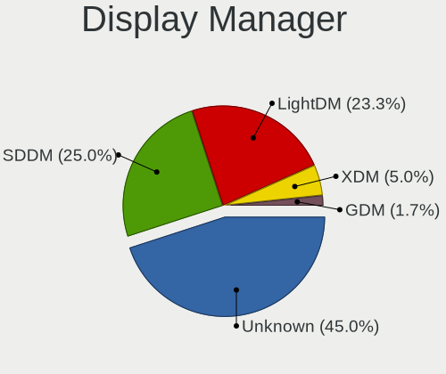

| Name    | Notebooks | Percent |
|---------|-----------|---------|
| Unknown | 21        | 43.75%  |
| SDDM    | 12        | 25%     |
| LightDM | 12        | 25%     |
| XDM     | 2         | 4.17%   |
| GDM     | 1         | 2.08%   |

OS Lang
-------

Language

| Lang    | Notebooks | Percent |
|---------|-----------|---------|
| en_US   | 15        | 31.25%  |
| de_DE   | 11        | 22.92%  |
| POSIX   | 4         | 8.33%   |
| fr_FR   | 3         | 6.25%   |
| ru_RU   | 2         | 4.17%   |
| pt_BR   | 2         | 4.17%   |
| es_ES   | 2         | 4.17%   |
| zh_CN   | 1         | 2.08%   |
| sv_SE   | 1         | 2.08%   |
| pt_PT   | 1         | 2.08%   |
| it_IT   | 1         | 2.08%   |
| hu_HU   | 1         | 2.08%   |
| en_GB   | 1         | 2.08%   |
| en_DE   | 1         | 2.08%   |
| cs_CZ   | 1         | 2.08%   |
| Unknown | 1         | 2.08%   |

Boot Mode
---------

EFI or BIOS

| Mode | Notebooks | Percent |
|------|-----------|---------|
| BIOS | 27        | 56.25%  |
| EFI  | 21        | 43.75%  |

Filesystem
----------

Type of filesystem

| Type  | Notebooks | Percent |
|-------|-----------|---------|
| Btrfs | 35        | 72.92%  |
| Ext4  | 12        | 25%     |
| Xfs   | 1         | 2.08%   |

Part. scheme
------------

Scheme of partitioning

| Type    | Notebooks | Percent |
|---------|-----------|---------|
| GPT     | 24        | 50%     |
| Unknown | 20        | 41.67%  |
| MBR     | 4         | 8.33%   |

Dual Boot with Linux/BSD
------------------------

Hosting more than one Linux/BSD

| Dual boot | Notebooks | Percent |
|-----------|-----------|---------|
| No        | 46        | 95.83%  |
| Yes       | 2         | 4.17%   |

Dual Boot (Win)
---------------

Hosting Linux and Windows

| Dual boot | Notebooks | Percent |
|-----------|-----------|---------|
| No        | 30        | 62.5%   |
| Yes       | 18        | 37.5%   |

Board
-----

Vendor
------

Motherboard manufacturer

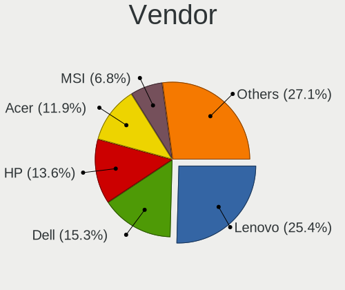

| Name                | Notebooks | Percent |
|---------------------|-----------|---------|
| Lenovo              | 13        | 27.08%  |
| Dell                | 8         | 16.67%  |
| Acer                | 7         | 14.58%  |
| Hewlett-Packard     | 6         | 12.5%   |
| MSI                 | 3         | 6.25%   |
| ASUSTek Computer    | 3         | 6.25%   |
| Sony                | 2         | 4.17%   |
| TUXEDO              | 1         | 2.08%   |
| Semp Toshiba        | 1         | 2.08%   |
| Samsung Electronics | 1         | 2.08%   |
| Medion              | 1         | 2.08%   |
| HUAWEI              | 1         | 2.08%   |
| Fujitsu             | 1         | 2.08%   |

Model
-----

Motherboard model

| Name                                        | Notebooks | Percent |
|---------------------------------------------|-----------|---------|
| TUXEDO Aura 15 Gen1                         | 1         | 2.08%   |
| Sony VPCSB15GB                              | 1         | 2.08%   |
| Sony VGN-Z570AN                             | 1         | 2.08%   |
| Semp Toshiba AS 1301                        | 1         | 2.08%   |
| Samsung 600B4B/600B5B                       | 1         | 2.08%   |
| MSI GS60 6QE                                | 1         | 2.08%   |
| MSI GP63 Leopard 8RD                        | 1         | 2.08%   |
| MSI CX600                                   | 1         | 2.08%   |
| Medion E6436 MD61150                        | 1         | 2.08%   |
| Lenovo V330-15IKB 81AX                      | 1         | 2.08%   |
| Lenovo ThinkPad X1 Carbon Gen 9 20XW00A7TH  | 1         | 2.08%   |
| Lenovo ThinkPad X1 Carbon 4th 20FB002UMC    | 1         | 2.08%   |
| Lenovo ThinkPad T61 8895W9U                 | 1         | 2.08%   |
| Lenovo ThinkPad T490s 20NYS1XK00            | 1         | 2.08%   |
| Lenovo ThinkPad T460 20FMS75800             | 1         | 2.08%   |
| Lenovo ThinkPad T450s 20BWA06J00            | 1         | 2.08%   |
| Lenovo ThinkPad T14 Gen 1 20UES47F00        | 1         | 2.08%   |
| Lenovo ThinkPad L15 Gen 1 20U4S88000        | 1         | 2.08%   |
| Lenovo ThinkPad E580 20KS001RGE             | 1         | 2.08%   |
| Lenovo IdeaPad 330-15IKB 81DC               | 1         | 2.08%   |
| Lenovo G500 20236                           | 1         | 2.08%   |
| Lenovo G50-45 80E3                          | 1         | 2.08%   |
| HUAWEI KLVL-WXX9                            | 1         | 2.08%   |
| HP ZBook 17 G2                              | 1         | 2.08%   |
| HP Stream Notebook PC 11                    | 1         | 2.08%   |
| HP Pavilion dx6500                          | 1         | 2.08%   |
| HP OMEN by HP Laptop 15-dc1xxx              | 1         | 2.08%   |
| HP Laptop 17-ca1xxx                         | 1         | 2.08%   |
| HP Laptop 15s-eq0xxx                        | 1         | 2.08%   |
| Fujitsu LIFEBOOK E754                       | 1         | 2.08%   |
| Dell XPS 15 9510                            | 1         | 2.08%   |
| Dell Precision M6700                        | 1         | 2.08%   |
| Dell Latitude E7470                         | 1         | 2.08%   |
| Dell Latitude 5480                          | 1         | 2.08%   |
| Dell Inspiron N4030                         | 1         | 2.08%   |
| Dell Inspiron 7460                          | 1         | 2.08%   |
| Dell Inspiron 3521                          | 1         | 2.08%   |
| Dell Inspiron 15 7000 Gaming                | 1         | 2.08%   |
| ASUS ZenBook UX325SA_UM325SA                | 1         | 2.08%   |
| ASUS VivoBook 12_ASUS Laptop E203MAS_E203MA | 1         | 2.08%   |
| ASUS G771JW                                 | 1         | 2.08%   |
| Acer Nitro AN515-54                         | 1         | 2.08%   |
| Acer Nitro AN515-52                         | 1         | 2.08%   |
| Acer Aspire VN7-792G                        | 1         | 2.08%   |
| Acer Aspire E1-772G                         | 1         | 2.08%   |
| Acer Aspire E1-571                          | 1         | 2.08%   |
| Acer Aspire 5820TG                          | 1         | 2.08%   |
| Acer Aspire 5560                            | 1         | 2.08%   |

Model Family
------------

Motherboard model prefix

| Name              | Notebooks | Percent |
|-------------------|-----------|---------|
| Lenovo ThinkPad   | 9         | 18.75%  |
| Acer Aspire       | 5         | 10.42%  |
| Dell Inspiron     | 4         | 8.33%   |
| HP Laptop         | 2         | 4.17%   |
| Dell Latitude     | 2         | 4.17%   |
| Acer Nitro        | 2         | 4.17%   |
| TUXEDO Aura       | 1         | 2.08%   |
| Sony VPCSB15GB    | 1         | 2.08%   |
| Sony VGN-Z570AN   | 1         | 2.08%   |
| Semp Toshiba AS   | 1         | 2.08%   |
| Samsung 600B4B    | 1         | 2.08%   |
| MSI GS60          | 1         | 2.08%   |
| MSI GP63          | 1         | 2.08%   |
| MSI CX600         | 1         | 2.08%   |
| Medion E6436      | 1         | 2.08%   |
| Lenovo V330-15IKB | 1         | 2.08%   |
| Lenovo IdeaPad    | 1         | 2.08%   |
| Lenovo G500       | 1         | 2.08%   |
| Lenovo G50-45     | 1         | 2.08%   |
| HUAWEI KLVL-WXX9  | 1         | 2.08%   |
| HP ZBook          | 1         | 2.08%   |
| HP Stream         | 1         | 2.08%   |
| HP Pavilion       | 1         | 2.08%   |
| HP OMEN           | 1         | 2.08%   |
| Fujitsu LIFEBOOK  | 1         | 2.08%   |
| Dell XPS          | 1         | 2.08%   |
| Dell Precision    | 1         | 2.08%   |
| ASUS ZenBook      | 1         | 2.08%   |
| ASUS VivoBook     | 1         | 2.08%   |
| ASUS G771JW       | 1         | 2.08%   |

MFG Year
--------

Motherboard manufacture year

| Year | Notebooks | Percent |
|------|-----------|---------|
| 2019 | 5         | 10.42%  |
| 2018 | 5         | 10.42%  |
| 2017 | 5         | 10.42%  |
| 2012 | 5         | 10.42%  |
| 2020 | 4         | 8.33%   |
| 2015 | 4         | 8.33%   |
| 2014 | 4         | 8.33%   |
| 2021 | 3         | 6.25%   |
| 2016 | 3         | 6.25%   |
| 2013 | 2         | 4.17%   |
| 2011 | 2         | 4.17%   |
| 2010 | 2         | 4.17%   |
| 2007 | 2         | 4.17%   |
| 2009 | 1         | 2.08%   |
| 2008 | 1         | 2.08%   |

Form Factor
-----------

Physical design of the computer

| Name     | Notebooks | Percent |
|----------|-----------|---------|
| Notebook | 48        | 100%    |

Secure Boot
-----------

Enabled or disabled

| State    | Notebooks | Percent |
|----------|-----------|---------|
| Disabled | 40        | 83.33%  |
| Enabled  | 8         | 16.67%  |

Coreboot
--------

Have coreboot on board

| Used | Notebooks | Percent |
|------|-----------|---------|
| No   | 48        | 100%    |

RAM Size
--------

Total RAM memory

| Size in GB  | Notebooks | Percent |
|-------------|-----------|---------|
| 4.01-8.0    | 13        | 27.08%  |
| 8.01-16.0   | 10        | 20.83%  |
| 3.01-4.0    | 9         | 18.75%  |
| 16.01-24.0  | 9         | 18.75%  |
| 32.01-64.0  | 3         | 6.25%   |
| 1.01-2.0    | 2         | 4.17%   |
| 2.01-3.0    | 1         | 2.08%   |
| 64.01-256.0 | 1         | 2.08%   |

RAM Used
--------

Used RAM memory

| Used GB   | Notebooks | Percent |
|-----------|-----------|---------|
| 2.01-3.0  | 18        | 36.73%  |
| 1.01-2.0  | 15        | 30.61%  |
| 4.01-8.0  | 10        | 20.41%  |
| 3.01-4.0  | 4         | 8.16%   |
| 8.01-16.0 | 1         | 2.04%   |
| 0.51-1.0  | 1         | 2.04%   |

Total Drives
------------

Number of drives on board

| Drives | Notebooks | Percent |
|--------|-----------|---------|
| 1      | 28        | 58.33%  |
| 2      | 20        | 41.67%  |

Has CD-ROM
----------

Has CD-ROM on board

| Presented | Notebooks | Percent |
|-----------|-----------|---------|
| No        | 29        | 60.42%  |
| Yes       | 19        | 39.58%  |

Has Ethernet
------------

Has Ethernet on board

| Presented | Notebooks | Percent |
|-----------|-----------|---------|
| Yes       | 42        | 87.5%   |
| No        | 6         | 12.5%   |

Has WiFi
--------

Has WiFi module

| Presented | Notebooks | Percent |
|-----------|-----------|---------|
| Yes       | 48        | 100%    |

Has Bluetooth
-------------

Has Bluetooth module

| Presented | Notebooks | Percent |
|-----------|-----------|---------|
| Yes       | 36        | 73.47%  |
| No        | 13        | 26.53%  |

Location
--------

Country
-------

Geographic location (country)

| Country     | Notebooks | Percent |
|-------------|-----------|---------|
| Germany     | 11        | 22.92%  |
| Brazil      | 6         | 12.5%   |
| France      | 4         | 8.33%   |
| USA         | 2         | 4.17%   |
| Spain       | 2         | 4.17%   |
| Russia      | 2         | 4.17%   |
| Nicaragua   | 2         | 4.17%   |
| India       | 2         | 4.17%   |
| Greece      | 2         | 4.17%   |
| Czechia     | 2         | 4.17%   |
| Thailand    | 1         | 2.08%   |
| Sweden      | 1         | 2.08%   |
| Sudan       | 1         | 2.08%   |
| Romania     | 1         | 2.08%   |
| Portugal    | 1         | 2.08%   |
| Netherlands | 1         | 2.08%   |
| Mexico      | 1         | 2.08%   |
| Italy       | 1         | 2.08%   |
| Hungary     | 1         | 2.08%   |
| China       | 1         | 2.08%   |
| Canada      | 1         | 2.08%   |
| Belgium     | 1         | 2.08%   |
| Austria     | 1         | 2.08%   |

City
----

Geographic location (city)

| City           | Notebooks | Percent |
|----------------|-----------|---------|
| Sao Paulo      | 3         | 6%      |
| Prague         | 2         | 4%      |
| Managua        | 2         | 4%      |
| Berlin         | 2         | 4%      |
| Vienna         | 1         | 2%      |
| Vaennaesby     | 1         | 2%      |
| The Hague      | 1         | 2%      |
| Teresina       | 1         | 2%      |
| Sehnde         | 1         | 2%      |
| Sartrouville   | 1         | 2%      |
| Saalfeld       | 1         | 2%      |
| Rockville      | 1         | 2%      |
| Pringy         | 1         | 2%      |
| Petrozavodsk   | 1         | 2%      |
| Palanpur       | 1         | 2%      |
| Nuremberg      | 1         | 2%      |
| Moscow         | 1         | 2%      |
| Monterrey      | 1         | 2%      |
| Moelan-sur-Mer | 1         | 2%      |
| Leiria         | 1         | 2%      |
| León        | 1         | 2%      |
| Khartoum       | 1         | 2%      |
| Kehl           | 1         | 2%      |
| Kathu          | 1         | 2%      |
| Isernhagen     | 1         | 2%      |
| Howick         | 1         | 2%      |
| Heraklion      | 1         | 2%      |
| Guangzhou      | 1         | 2%      |
| Gevelsberg     | 1         | 2%      |
| Esztergom      | 1         | 2%      |
| Dunkirk        | 1         | 2%      |
| Dahme          | 1         | 2%      |
| Concarneau     | 1         | 2%      |
| Cologne        | 1         | 2%      |
| Chapecó       | 1         | 2%      |
| Chapecó     | 1         | 2%      |
| Cestona        | 1         | 2%      |
| Bucharest      | 1         | 2%      |
| Bremen         | 1         | 2%      |
| Bologna        | 1         | 2%      |
| Bengaluru      | 1         | 2%      |
| Bebedouro      | 1         | 2%      |
| Atlanta        | 1         | 2%      |
| Athens         | 1         | 2%      |
| Antwerp        | 1         | 2%      |

Drives
------

Drive Vendor
------------

Hard drive vendors

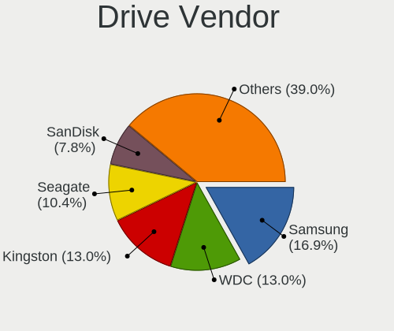

| Vendor              | Notebooks | Drives | Percent |
|---------------------|-----------|--------|---------|
| Samsung Electronics | 12        | 14     | 17.91%  |
| WDC                 | 9         | 9      | 13.43%  |
| Seagate             | 8         | 11     | 11.94%  |
| Kingston            | 6         | 6      | 8.96%   |
| SK Hynix            | 4         | 4      | 5.97%   |
| SanDisk             | 4         | 4      | 5.97%   |
| Unknown             | 3         | 3      | 4.48%   |
| Toshiba             | 3         | 4      | 4.48%   |
| Hitachi             | 3         | 4      | 4.48%   |
| HGST                | 3         | 3      | 4.48%   |
| Silicon Motion      | 2         | 2      | 2.99%   |
| Micron Technology   | 2         | 2      | 2.99%   |
| Crucial             | 2         | 2      | 2.99%   |
| PLEXTOR             | 1         | 2      | 1.49%   |
| Phison              | 1         | 1      | 1.49%   |
| LITEON              | 1         | 1      | 1.49%   |
| Intenso             | 1         | 1      | 1.49%   |
| Fujitsu             | 1         | 1      | 1.49%   |
| China               | 1         | 1      | 1.49%   |

Drive Model
-----------

Hard drive models

| Model                                   | Notebooks | Percent |
|-----------------------------------------|-----------|---------|
| SK Hynix HFS128G39TND-N210A 128GB SSD   | 2         | 2.99%   |
| Silicon Motion NVMe SSD Drive 512GB     | 2         | 2.99%   |
| Seagate ST1000LM035-1RK172 1TB          | 2         | 2.99%   |
| HGST HTS721010A9E630 1TB                | 2         | 2.99%   |
| WDC WDS480G2G0A-00JH30 480GB SSD        | 1         | 1.49%   |
| WDC WD800BEVS-60RST0 80GB               | 1         | 1.49%   |
| WDC WD5000LPVX-00V0TT0 500GB            | 1         | 1.49%   |
| WDC WD5000LPLX-66ZNTT1 500GB            | 1         | 1.49%   |
| WDC WD3200BEVT-22ZCT0 320GB             | 1         | 1.49%   |
| WDC WD10SPZX-60Z10T0 1TB                | 1         | 1.49%   |
| WDC WD10SPZX-24Z10 1TB                  | 1         | 1.49%   |
| WDC WD10SPZX-17Z10T0 1TB                | 1         | 1.49%   |
| WDC PC SN730 SDBPNTY-512G-1006 512GB    | 1         | 1.49%   |
| Unknown USD00  256GB                    | 1         | 1.49%   |
| Unknown SC16G  16GB                     | 1         | 1.49%   |
| Unknown DA4064  64GB                    | 1         | 1.49%   |
| Toshiba THNSNJ256G8NU 256GB SSD         | 1         | 1.49%   |
| Toshiba MQ04ABF100 1TB                  | 1         | 1.49%   |
| Toshiba MQ01ABD075 752GB                | 1         | 1.49%   |
| SK Hynix HFM512GD3JX013N 512GB          | 1         | 1.49%   |
| SK Hynix HBG4e  32GB                    | 1         | 1.49%   |
| Seagate ST9320325AS 320GB               | 1         | 1.49%   |
| Seagate ST500LT012-9WS142 500GB         | 1         | 1.49%   |
| Seagate ST500LM012 HN-M500MBB 500GB     | 1         | 1.49%   |
| Seagate ST500LM000-SSHD-8GB             | 1         | 1.49%   |
| Seagate ST2000LM003 HN-M201RAD 2TB      | 1         | 1.49%   |
| Seagate ST1000LM024 HN-M101MBB 1TB      | 1         | 1.49%   |
| SanDisk SSD PLUS 1000GB                 | 1         | 1.49%   |
| SanDisk SDSSDH3 1T00 1TB                | 1         | 1.49%   |
| SanDisk SD9SN8W256G 256GB SSD           | 1         | 1.49%   |
| SanDisk SD8TB8U512G1001 512GB SSD       | 1         | 1.49%   |
| Samsung SSD 970 EVO 1TB                 | 1         | 1.49%   |
| Samsung SSD 860 EVO 1TB                 | 1         | 1.49%   |
| Samsung SSD 850 EVO 250GB               | 1         | 1.49%   |
| Samsung PM9A1 NVMe 1024GB               | 1         | 1.49%   |
| Samsung NVMe SSD Drive 500GB            | 1         | 1.49%   |
| Samsung NVMe SSD Drive 1TB              | 1         | 1.49%   |
| Samsung MZVLW256HEHP-000L7 256GB        | 1         | 1.49%   |
| Samsung MZVLB512HAJQ-000H1 512GB        | 1         | 1.49%   |
| Samsung MZVL21T0HCLR-00BL7 1TB          | 1         | 1.49%   |
| Samsung MZNLF128HCHP-00000 128GB SSD    | 1         | 1.49%   |
| Samsung MZALQ256HAJD-000L1 256GB        | 1         | 1.49%   |
| Samsung MZ7LN256HCHP-000L7 256GB SSD    | 1         | 1.49%   |
| PLEXTOR PX-512M5Pro 512GB SSD           | 1         | 1.49%   |
| Phison 311CD0512GB                      | 1         | 1.49%   |
| Micron NVMe SSD Drive 512GB             | 1         | 1.49%   |
| Micron MTFDHBA512TDV 512GB              | 1         | 1.49%   |
| LITEON CX1-JB256-HP 256GB SSD           | 1         | 1.49%   |
| Kingston SNA-DC/U3 1TB SSD              | 1         | 1.49%   |
| Kingston SM2280S3G2480G 480GB SSD       | 1         | 1.49%   |
| Kingston SA400S37240G 240GB SSD         | 1         | 1.49%   |
| Kingston SA2000M81000G 1TB              | 1         | 1.49%   |
| Kingston RBU-SNS8350DES3128GP 128GB SSD | 1         | 1.49%   |
| Kingston RBU-SC100S37128GD 128GB SSD    | 1         | 1.49%   |
| Intenso SSD 512GB                       | 1         | 1.49%   |
| Hitachi HTS727550A9E365 500GB           | 1         | 1.49%   |
| Hitachi HTS547575A9E384 752GB           | 1         | 1.49%   |
| Hitachi HTS542525K9SA00 250GB           | 1         | 1.49%   |
| HGST HTS541010A9E680 1TB                | 1         | 1.49%   |
| Fujitsu MHW2120BH 120GB                 | 1         | 1.49%   |

HDD Vendor
----------

Hard disk drive vendors

| Vendor  | Notebooks | Drives | Percent |
|---------|-----------|--------|---------|
| Seagate | 8         | 11     | 33.33%  |
| WDC     | 7         | 7      | 29.17%  |
| Hitachi | 3         | 4      | 12.5%   |
| HGST    | 3         | 3      | 12.5%   |
| Toshiba | 2         | 3      | 8.33%   |
| Fujitsu | 1         | 1      | 4.17%   |

SSD Vendor
----------

Solid state drive vendors

| Vendor              | Notebooks | Drives | Percent |
|---------------------|-----------|--------|---------|
| Kingston            | 5         | 5      | 22.73%  |
| SanDisk             | 4         | 4      | 18.18%  |
| Samsung Electronics | 4         | 4      | 18.18%  |
| SK Hynix            | 2         | 2      | 9.09%   |
| WDC                 | 1         | 1      | 4.55%   |
| Toshiba             | 1         | 1      | 4.55%   |
| PLEXTOR             | 1         | 2      | 4.55%   |
| LITEON              | 1         | 1      | 4.55%   |
| Intenso             | 1         | 1      | 4.55%   |
| Crucial             | 1         | 1      | 4.55%   |
| China               | 1         | 1      | 4.55%   |

Drive Kind
----------

HDD or SSD

| Kind | Notebooks | Drives | Percent |
|------|-----------|--------|---------|
| HDD  | 22        | 29     | 34.38%  |
| SSD  | 21        | 23     | 32.81%  |
| NVMe | 17        | 19     | 26.56%  |
| MMC  | 4         | 4      | 6.25%   |

Drive Connector
---------------

SATA, SAS, NVMe, etc.

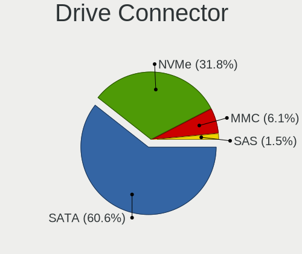

| Type | Notebooks | Drives | Percent |
|------|-----------|--------|---------|
| SATA | 34        | 51     | 60.71%  |
| NVMe | 17        | 19     | 30.36%  |
| MMC  | 4         | 4      | 7.14%   |
| SAS  | 1         | 1      | 1.79%   |

Drive Size
----------

Size of hard drive

| Size in TB | Notebooks | Drives | Percent |
|------------|-----------|--------|---------|
| 0.01-0.5   | 23        | 29     | 53.49%  |
| 0.51-1.0   | 19        | 22     | 44.19%  |
| 1.01-2.0   | 1         | 1      | 2.33%   |

Space Total
-----------

Amount of disk space available on the file system

| Size in GB     | Notebooks | Percent |
|----------------|-----------|---------|
| 1001-2000      | 11        | 22.45%  |
| More than 3000 | 9         | 18.37%  |
| 2001-3000      | 9         | 18.37%  |
| 501-1000       | 9         | 18.37%  |
| 251-500        | 5         | 10.2%   |
| 51-100         | 4         | 8.16%   |
| 101-250        | 1         | 2.04%   |
| Unknown        | 1         | 2.04%   |

Space Used
----------

Amount of used disk space

| Used GB   | Notebooks | Percent |
|-----------|-----------|---------|
| 101-250   | 10        | 18.87%  |
| 51-100    | 10        | 18.87%  |
| 251-500   | 9         | 16.98%  |
| 1001-2000 | 7         | 13.21%  |
| 501-1000  | 6         | 11.32%  |
| 21-50     | 4         | 7.55%   |
| 1-20      | 4         | 7.55%   |
| 2001-3000 | 2         | 3.77%   |
| Unknown   | 1         | 1.89%   |

Malfunc. Drives
---------------

Drive models with a malfunction

| Model                                 | Notebooks | Drives | Percent |
|---------------------------------------|-----------|--------|---------|
| WDC WD5000LPVX-00V0TT0 500GB          | 1         | 1      | 25%     |
| SK Hynix HFS128G39TND-N210A 128GB SSD | 1         | 1      | 25%     |
| Seagate ST1000LM035-1RK172 1TB        | 1         | 1      | 25%     |
| Phison 311CD0512GB                    | 1         | 1      | 25%     |

Malfunc. Drive Vendor
---------------------

Vendors of faulty drives

| Vendor   | Notebooks | Drives | Percent |
|----------|-----------|--------|---------|
| WDC      | 1         | 1      | 25%     |
| SK Hynix | 1         | 1      | 25%     |
| Seagate  | 1         | 1      | 25%     |
| Phison   | 1         | 1      | 25%     |

Malfunc. HDD Vendor
-------------------

Vendors of faulty HDD drives

| Vendor  | Notebooks | Drives | Percent |
|---------|-----------|--------|---------|
| WDC     | 1         | 1      | 50%     |
| Seagate | 1         | 1      | 50%     |

Malfunc. Drive Kind
-------------------

Kinds of faulty drives

| Kind | Notebooks | Drives | Percent |
|------|-----------|--------|---------|
| HDD  | 2         | 2      | 50%     |
| NVMe | 1         | 1      | 25%     |
| SSD  | 1         | 1      | 25%     |

Failed Drives
-------------

Failed drive models

Zero info for selected period =(

Failed Drive Vendor
-------------------

Failed drive vendors

Zero info for selected period =(

Drive Status
------------

Number of failed and malfunc. drives

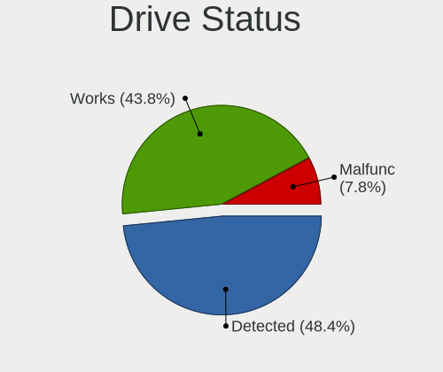

| Status   | Notebooks | Drives | Percent |
|----------|-----------|--------|---------|
| Detected | 25        | 42     | 47.17%  |
| Works    | 24        | 29     | 45.28%  |
| Malfunc  | 4         | 4      | 7.55%   |

Storage controller
------------------

Storage Vendor
--------------

Storage controller vendors

| Vendor                           | Notebooks | Percent |
|----------------------------------|-----------|---------|
| Intel                            | 32        | 59.26%  |
| Samsung Electronics              | 7         | 12.96%  |
| AMD                              | 4         | 7.41%   |
| Silicon Motion                   | 2         | 3.7%    |
| Micron Technology                | 2         | 3.7%    |
| SK Hynix                         | 1         | 1.85%   |
| Silicon Integrated Systems [SiS] | 1         | 1.85%   |
| Sandisk                          | 1         | 1.85%   |
| Phison Electronics               | 1         | 1.85%   |
| Micron/Crucial Technology        | 1         | 1.85%   |
| Lite-On Technology               | 1         | 1.85%   |
| Kingston Technology Company      | 1         | 1.85%   |

Storage Model
-------------

Storage controller models

| Model                                                                          | Notebooks | Percent |
|--------------------------------------------------------------------------------|-----------|---------|
| Intel Sunrise Point-LP SATA Controller [AHCI mode]                             | 8         | 14.04%  |
| Intel 8 Series/C220 Series Chipset Family 6-port SATA Controller 1 [AHCI mode] | 4         | 7.02%   |
| Intel HM170/QM170 Chipset SATA Controller [AHCI Mode]                          | 3         | 5.26%   |
| Intel 82801 Mobile SATA Controller [RAID mode]                                 | 3         | 5.26%   |
| Intel 7 Series Chipset Family 6-port SATA Controller [AHCI mode]               | 3         | 5.26%   |
| AMD FCH SATA Controller [AHCI mode]                                            | 3         | 5.26%   |
| Silicon Motion SM2262/SM2262EN SSD Controller                                  | 2         | 3.51%   |
| Samsung NVMe SSD Controller SM981/PM981/PM983                                  | 2         | 3.51%   |
| Samsung NVMe SSD Controller PM9A1/PM9A3/980PRO                                 | 2         | 3.51%   |
| Samsung NVMe SSD Controller 980                                                | 2         | 3.51%   |
| Micron Non-Volatile memory controller                                          | 2         | 3.51%   |
| Intel Cannon Lake Mobile PCH SATA AHCI Controller                              | 2         | 3.51%   |
| Intel 82801HM/HEM (ICH8M/ICH8M-E) SATA Controller [AHCI mode]                  | 2         | 3.51%   |
| Intel 82801HM/HEM (ICH8M/ICH8M-E) IDE Controller                               | 2         | 3.51%   |
| Intel 6 Series/C200 Series Chipset Family 6 port Mobile SATA AHCI Controller   | 2         | 3.51%   |
| SK Hynix Gold P31 SSD                                                          | 1         | 1.75%   |
| Silicon Integrated Systems [SiS] SATA Controller / IDE mode                    | 1         | 1.75%   |
| Silicon Integrated Systems [SiS] 5513 IDE Controller                           | 1         | 1.75%   |
| Sandisk WD Black SN750 / PC SN730 NVMe SSD                                     | 1         | 1.75%   |
| Samsung NVMe SSD Controller SM961/PM961/SM963                                  | 1         | 1.75%   |
| Phison PS5013 E13 NVMe Controller                                              | 1         | 1.75%   |
| Micron/Crucial P2 NVMe PCIe SSD                                                | 1         | 1.75%   |
| Lite-On SATA controller                                                        | 1         | 1.75%   |
| Kingston Company A2000 NVMe SSD                                                | 1         | 1.75%   |
| Intel Wildcat Point-LP SATA Controller [AHCI Mode]                             | 1         | 1.75%   |
| Intel Comet Lake SATA AHCI Controller                                          | 1         | 1.75%   |
| Intel 82801IBM/IEM (ICH9M/ICH9M-E) 4 port SATA Controller [AHCI mode]          | 1         | 1.75%   |
| Intel 5 Series/3400 Series Chipset 6 port SATA AHCI Controller                 | 1         | 1.75%   |
| Intel 5 Series/3400 Series Chipset 4 port SATA AHCI Controller                 | 1         | 1.75%   |
| AMD SB7x0/SB8x0/SB9x0 SATA Controller [AHCI mode]                              | 1         | 1.75%   |

Storage Kind
------------

Kind of storage controller (IDE, SATA, NVMe, SAS, ...)

| Kind | Notebooks | Percent |
|------|-----------|---------|
| SATA | 33        | 60%     |
| NVMe | 16        | 29.09%  |
| RAID | 3         | 5.45%   |
| IDE  | 3         | 5.45%   |

Processor
---------

CPU Vendor
----------

Processor vendors

| Vendor | Notebooks | Percent |
|--------|-----------|---------|
| Intel  | 39        | 81.25%  |
| AMD    | 9         | 18.75%  |

CPU Model
---------

Processor models

| Model                                         | Notebooks | Percent |
|-----------------------------------------------|-----------|---------|
| Intel Core i5-7200U CPU @ 2.50GHz             | 3         | 6.25%   |
| Intel Core i7-9750H CPU @ 2.60GHz             | 2         | 4.17%   |
| Intel Core i7-8550U CPU @ 1.80GHz             | 2         | 4.17%   |
| Intel Pentium Dual-Core CPU T4300 @ 2.10GHz   | 1         | 2.08%   |
| Intel Core i7-8750H CPU @ 2.20GHz             | 1         | 2.08%   |
| Intel Core i7-7700HQ CPU @ 2.80GHz            | 1         | 2.08%   |
| Intel Core i7-6700HQ CPU @ 2.60GHz            | 1         | 2.08%   |
| Intel Core i7-6600U CPU @ 2.60GHz             | 1         | 2.08%   |
| Intel Core i7-5600U CPU @ 2.60GHz             | 1         | 2.08%   |
| Intel Core i7-4810MQ CPU @ 2.80GHz            | 1         | 2.08%   |
| Intel Core i7-4720HQ CPU @ 2.60GHz            | 1         | 2.08%   |
| Intel Core i7-3740QM CPU @ 2.70GHz            | 1         | 2.08%   |
| Intel Core i5-8365U CPU @ 1.60GHz             | 1         | 2.08%   |
| Intel Core i5-8300H CPU @ 2.30GHz             | 1         | 2.08%   |
| Intel Core i5-6300U CPU @ 2.40GHz             | 1         | 2.08%   |
| Intel Core i5-6300HQ CPU @ 2.30GHz            | 1         | 2.08%   |
| Intel Core i5-6200U CPU @ 2.30GHz             | 1         | 2.08%   |
| Intel Core i5-4300M CPU @ 2.60GHz             | 1         | 2.08%   |
| Intel Core i5-4200M CPU @ 2.50GHz             | 1         | 2.08%   |
| Intel Core i5-3317U CPU @ 1.70GHz             | 1         | 2.08%   |
| Intel Core i5-3230M CPU @ 2.60GHz             | 1         | 2.08%   |
| Intel Core i5-2520M CPU @ 2.50GHz             | 1         | 2.08%   |
| Intel Core i5-2410M CPU @ 2.30GHz             | 1         | 2.08%   |
| Intel Core i5-10210U CPU @ 1.60GHz            | 1         | 2.08%   |
| Intel Core i5 CPU M 460 @ 2.53GHz             | 1         | 2.08%   |
| Intel Core i3-7100U CPU @ 2.40GHz             | 1         | 2.08%   |
| Intel Core i3-3110M CPU @ 2.40GHz             | 1         | 2.08%   |
| Intel Core i3 CPU M 380 @ 2.53GHz             | 1         | 2.08%   |
| Intel Core 2 Duo CPU T7250 @ 2.00GHz          | 1         | 2.08%   |
| Intel Core 2 Duo CPU T5250 @ 1.50GHz          | 1         | 2.08%   |
| Intel Core 2 Duo CPU P8600 @ 2.40GHz          | 1         | 2.08%   |
| Intel Celeron N4000 CPU @ 1.10GHz             | 1         | 2.08%   |
| Intel Celeron CPU N2840 @ 2.16GHz             | 1         | 2.08%   |
| Intel 11th Gen Core i7-11800H @ 2.30GHz       | 1         | 2.08%   |
| Intel 11th Gen Core i7-1165G7 @ 2.80GHz       | 1         | 2.08%   |
| AMD Ryzen 7 PRO 4750U with Radeon Graphics    | 1         | 2.08%   |
| AMD Ryzen 7 5800U with Radeon Graphics        | 1         | 2.08%   |
| AMD Ryzen 7 4800H with Radeon Graphics        | 1         | 2.08%   |
| AMD Ryzen 7 4700U with Radeon Graphics        | 1         | 2.08%   |
| AMD Ryzen 5 3500U with Radeon Vega Mobile Gfx | 1         | 2.08%   |
| AMD Ryzen 3 3200U with Radeon Vega Mobile Gfx | 1         | 2.08%   |
| AMD C-50 Processor                            | 1         | 2.08%   |
| AMD A6-6310 APU with AMD Radeon R4 Graphics   | 1         | 2.08%   |
| AMD A6-3420M APU with Radeon HD Graphics      | 1         | 2.08%   |

CPU Model Family
----------------

Processor model prefix

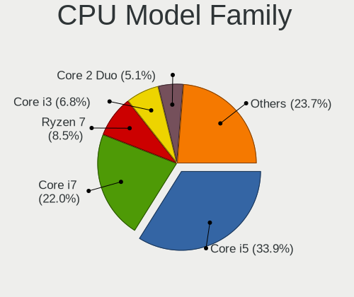

| Model                   | Notebooks | Percent |
|-------------------------|-----------|---------|
| Intel Core i5           | 16        | 33.33%  |
| Intel Core i7           | 12        | 25%     |
| Intel Core i3           | 3         | 6.25%   |
| Intel Core 2 Duo        | 3         | 6.25%   |
| AMD Ryzen 7             | 3         | 6.25%   |
| Other                   | 2         | 4.17%   |
| Intel Celeron           | 2         | 4.17%   |
| AMD A6                  | 2         | 4.17%   |
| Intel Pentium Dual-Core | 1         | 2.08%   |
| AMD Ryzen 7 PRO         | 1         | 2.08%   |
| AMD Ryzen 5             | 1         | 2.08%   |
| AMD Ryzen 3             | 1         | 2.08%   |
| AMD C-50                | 1         | 2.08%   |

CPU Cores
---------

Number of processor cores

| Number | Notebooks | Percent |
|--------|-----------|---------|
| 2      | 25        | 52.08%  |
| 4      | 15        | 31.25%  |
| 8      | 5         | 10.42%  |
| 6      | 3         | 6.25%   |

CPU Sockets
-----------

Number of sockets

| Number | Notebooks | Percent |
|--------|-----------|---------|
| 1      | 48        | 100%    |

CPU Threads
-----------

Threads per core (Hyper-Threading)

| Number | Notebooks | Percent |
|--------|-----------|---------|
| 2      | 35        | 72.92%  |
| 1      | 13        | 27.08%  |

CPU Op-Modes
------------

CPU Operation Modes (32-bit, 64-bit)

| Op mode        | Notebooks | Percent |
|----------------|-----------|---------|
| 32-bit, 64-bit | 48        | 100%    |

CPU Microcode
-------------

Microcode number

| Number     | Notebooks | Percent |
|------------|-----------|---------|
| Unknown    | 17        | 34.69%  |
| 0x906ea    | 3         | 6.12%   |
| 0x806e9    | 3         | 6.12%   |
| 0x406e3    | 3         | 6.12%   |
| 0x08600106 | 3         | 6.12%   |
| 0x6fd      | 2         | 4.08%   |
| 0x506e3    | 2         | 4.08%   |
| 0x806ec    | 1         | 2.04%   |
| 0x806ea    | 1         | 2.04%   |
| 0x806d1    | 1         | 2.04%   |
| 0x806c1    | 1         | 2.04%   |
| 0x706a1    | 1         | 2.04%   |
| 0x306d4    | 1         | 2.04%   |
| 0x306c3    | 1         | 2.04%   |
| 0x306a9    | 1         | 2.04%   |
| 0x30678    | 1         | 2.04%   |
| 0x206a7    | 1         | 2.04%   |
| 0x20655    | 1         | 2.04%   |
| 0x1067a    | 1         | 2.04%   |
| 0x10676    | 1         | 2.04%   |
| 0x0a50000c | 1         | 2.04%   |
| 0x08108109 | 1         | 2.04%   |
| 0x07030105 | 1         | 2.04%   |

CPU Microarch
-------------

Microarchitecture

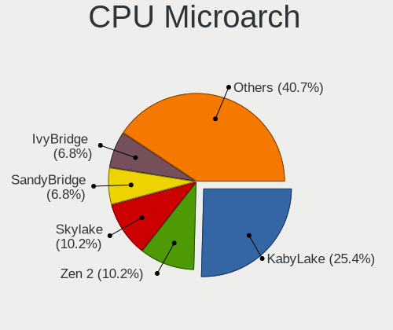

| Name          | Notebooks | Percent |
|---------------|-----------|---------|
| KabyLake      | 13        | 27.08%  |
| Skylake       | 5         | 10.42%  |
| IvyBridge     | 4         | 8.33%   |
| Haswell       | 4         | 8.33%   |
| Zen 2         | 3         | 6.25%   |
| Zen+          | 2         | 4.17%   |
| Westmere      | 2         | 4.17%   |
| SandyBridge   | 2         | 4.17%   |
| Penryn        | 2         | 4.17%   |
| Core          | 2         | 4.17%   |
| Zen 3         | 1         | 2.08%   |
| TigerLake     | 1         | 2.08%   |
| Silvermont    | 1         | 2.08%   |
| Puma          | 1         | 2.08%   |
| K10 Llano     | 1         | 2.08%   |
| Icelake       | 1         | 2.08%   |
| Goldmont plus | 1         | 2.08%   |
| Broadwell     | 1         | 2.08%   |
| Bobcat        | 1         | 2.08%   |

Graphics
--------

GPU Vendor
----------

Vendors of graphics cards

| Vendor | Notebooks | Percent |
|--------|-----------|---------|
| Intel  | 38        | 55.88%  |
| AMD    | 16        | 23.53%  |
| Nvidia | 14        | 20.59%  |

GPU Model
---------

Graphics card models

| Model                                                                                 | Notebooks | Percent |
|---------------------------------------------------------------------------------------|-----------|---------|
| Intel HD Graphics 620                                                                 | 4         | 5.71%   |
| Intel CoffeeLake-H GT2 [UHD Graphics 630]                                             | 4         | 5.71%   |
| Intel 4th Gen Core Processor Integrated Graphics Controller                           | 4         | 5.71%   |
| Intel 3rd Gen Core processor Graphics Controller                                      | 4         | 5.71%   |
| Nvidia GP107M [GeForce GTX 1050 Ti Mobile]                                            | 3         | 4.29%   |
| Intel Skylake GT2 [HD Graphics 520]                                                   | 3         | 4.29%   |
| AMD Renoir                                                                            | 3         | 4.29%   |
| Intel UHD Graphics 620                                                                | 2         | 2.86%   |
| Intel Mobile GM965/GL960 Integrated Graphics Controller (secondary)                   | 2         | 2.86%   |
| Intel Mobile GM965/GL960 Integrated Graphics Controller (primary)                     | 2         | 2.86%   |
| Intel HD Graphics 530                                                                 | 2         | 2.86%   |
| Intel Core Processor Integrated Graphics Controller                                   | 2         | 2.86%   |
| Intel 2nd Generation Core Processor Family Integrated Graphics Controller             | 2         | 2.86%   |
| AMD Picasso/Raven 2 [Radeon Vega Series / Radeon Vega Mobile Series]                  | 2         | 2.86%   |
| Nvidia TU117M [GeForce GTX 1650 Mobile / Max-Q]                                       | 1         | 1.43%   |
| Nvidia GP107M [GeForce GTX 1050 3 GB Max-Q]                                           | 1         | 1.43%   |
| Nvidia GM204M [GeForce GTX 980M]                                                      | 1         | 1.43%   |
| Nvidia GM204M [GeForce GTX 970M]                                                      | 1         | 1.43%   |
| Nvidia GM108M [GeForce 940MX]                                                         | 1         | 1.43%   |
| Nvidia GM107M [GeForce GTX 960M]                                                      | 1         | 1.43%   |
| Nvidia GM107M [GeForce GTX 950M]                                                      | 1         | 1.43%   |
| Nvidia GK104GLM [Quadro K3000M]                                                       | 1         | 1.43%   |
| Nvidia GF117M [GeForce 610M/710M/810M/820M / GT 620M/625M/630M/720M]                  | 1         | 1.43%   |
| Nvidia GA107M [GeForce RTX 3050 Ti Mobile]                                            | 1         | 1.43%   |
| Nvidia G98M [GeForce 9300M GS]                                                        | 1         | 1.43%   |
| Intel WhiskeyLake-U GT2 [UHD Graphics 620]                                            | 1         | 1.43%   |
| Intel TigerLake-LP GT2 [Iris Xe Graphics]                                             | 1         | 1.43%   |
| Intel TigerLake-H GT1 [UHD Graphics]                                                  | 1         | 1.43%   |
| Intel Mobile 4 Series Chipset Integrated Graphics Controller                          | 1         | 1.43%   |
| Intel HD Graphics 630                                                                 | 1         | 1.43%   |
| Intel HD Graphics 5500                                                                | 1         | 1.43%   |
| Intel GeminiLake [UHD Graphics 600]                                                   | 1         | 1.43%   |
| Intel CometLake-U GT2 [UHD Graphics]                                                  | 1         | 1.43%   |
| Intel Atom Processor Z36xxx/Z37xxx Series Graphics & Display                          | 1         | 1.43%   |
| AMD Wrestler [Radeon HD 6250]                                                         | 1         | 1.43%   |
| AMD Topaz XT [Radeon R7 M260/M265 / M340/M360 / M440/M445 / 530/535 / 620/625 Mobile] | 1         | 1.43%   |
| AMD Thames [Radeon HD 7500M/7600M Series]                                             | 1         | 1.43%   |
| AMD Sun PRO [Radeon HD 8570A/8570M]                                                   | 1         | 1.43%   |
| AMD Sumo [Radeon HD 6520G]                                                            | 1         | 1.43%   |
| AMD Seymour [Radeon HD 6400M/7400M Series]                                            | 1         | 1.43%   |
| AMD RV710/M92 [Mobility Radeon HD 4330/4350/4550]                                     | 1         | 1.43%   |
| AMD Mullins [Radeon R4/R5 Graphics]                                                   | 1         | 1.43%   |
| AMD Madison [Mobility Radeon HD 5650/5750 / 6530M/6550M]                              | 1         | 1.43%   |
| AMD Lexa PRO [Radeon 540/540X/550/550X / RX 540X/550/550X]                            | 1         | 1.43%   |
| AMD Cezanne                                                                           | 1         | 1.43%   |

GPU Combo
---------

Combinations of graphics cards

| Name           | Notebooks | Percent |
|----------------|-----------|---------|
| 1 x Intel      | 19        | 39.58%  |
| Intel + Nvidia | 13        | 27.08%  |
| 1 x AMD        | 10        | 20.83%  |
| Intel + AMD    | 6         | 12.5%   |

GPU Driver
----------

Free vs proprietary

| Driver      | Notebooks | Percent |
|-------------|-----------|---------|
| Free        | 42        | 87.5%   |
| Proprietary | 5         | 10.42%  |
| Unknown     | 1         | 2.08%   |

GPU Memory
----------

Total video memory

| Size in GB | Notebooks | Percent |
|------------|-----------|---------|
| Unknown    | 34        | 70.83%  |
| 0.01-0.5   | 6         | 12.5%   |
| 3.01-4.0   | 3         | 6.25%   |
| 1.01-2.0   | 3         | 6.25%   |
| 7.01-8.0   | 1         | 2.08%   |
| 0.51-1.0   | 1         | 2.08%   |

Monitor
-------

Monitor Vendor
--------------

Monitor vendors

| Vendor              | Notebooks | Percent |
|---------------------|-----------|---------|
| LG Display          | 14        | 25%     |
| Chimei Innolux      | 11        | 19.64%  |
| AU Optronics        | 9         | 16.07%  |
| Samsung Electronics | 4         | 7.14%   |
| Goldstar            | 4         | 7.14%   |
| Lenovo              | 2         | 3.57%   |
| Hewlett-Packard     | 2         | 3.57%   |
| BOE                 | 2         | 3.57%   |
| Sony                | 1         | 1.79%   |
| Sharp               | 1         | 1.79%   |
| LG Philips          | 1         | 1.79%   |
| InfoVision          | 1         | 1.79%   |
| Iiyama              | 1         | 1.79%   |
| Dell                | 1         | 1.79%   |
| CSO                 | 1         | 1.79%   |
| CPT                 | 1         | 1.79%   |

Monitor Model
-------------

Monitor models

| Model                                                                 | Notebooks | Percent |
|-----------------------------------------------------------------------|-----------|---------|
| LG Display LCD Monitor LGD02DC 1366x768 344x194mm 15.5-inch           | 2         | 3.51%   |
| Hewlett-Packard LV1911 HWP3005 1366x768 410x230mm 18.5-inch           | 2         | 3.51%   |
| Goldstar LG HDR WFHD GSM7714 2560x1080 800x340mm 34.2-inch            | 2         | 3.51%   |
| Sony Nvidia Defaul t Flat Panel SNY06FA 1600x900 360x200mm 16.2-inch  | 1         | 1.75%   |
| Sharp LCD Monitor SHP14D0 3840x2400 336x210mm 15.6-inch               | 1         | 1.75%   |
| Samsung Electronics U28E590 SAM0C4E 3840x2160 608x345mm 27.5-inch     | 1         | 1.75%   |
| Samsung Electronics LCD Monitor SEC3449 1366x768 309x174mm 14.0-inch  | 1         | 1.75%   |
| Samsung Electronics LCD Monitor SEC304C 1366x768 353x198mm 15.9-inch  | 1         | 1.75%   |
| Samsung Electronics LCD Monitor SDC424B 3840x2160 344x194mm 15.5-inch | 1         | 1.75%   |
| Samsung Electronics LCD Monitor SAM7016 3840x2160 950x540mm 43.0-inch | 1         | 1.75%   |
| LG Philips LCD Monitor LPLDB00 1280x800 331x207mm 15.4-inch           | 1         | 1.75%   |
| LG Display LCD Monitor LGD05FA 1920x1080 309x174mm 14.0-inch          | 1         | 1.75%   |
| LG Display LCD Monitor LGD05D8 1920x1080 344x194mm 15.5-inch          | 1         | 1.75%   |
| LG Display LCD Monitor LGD05C0 1920x1080 344x194mm 15.5-inch          | 1         | 1.75%   |
| LG Display LCD Monitor LGD059E 1920x1080 382x215mm 17.3-inch          | 1         | 1.75%   |
| LG Display LCD Monitor LGD053C 1920x1080 309x174mm 14.0-inch          | 1         | 1.75%   |
| LG Display LCD Monitor LGD0533 1920x1080 344x194mm 15.5-inch          | 1         | 1.75%   |
| LG Display LCD Monitor LGD0521 1920x1080 309x174mm 14.0-inch          | 1         | 1.75%   |
| LG Display LCD Monitor LGD04A9 1920x1080 309x174mm 14.0-inch          | 1         | 1.75%   |
| LG Display LCD Monitor LGD0490 1920x1080 309x174mm 14.0-inch          | 1         | 1.75%   |
| LG Display LCD Monitor LGD046C 1920x1080 382x215mm 17.3-inch          | 1         | 1.75%   |
| LG Display LCD Monitor LGD044F 1920x1080 345x194mm 15.6-inch          | 1         | 1.75%   |
| LG Display LCD Monitor LGD02DA 1920x1080 382x215mm 17.3-inch          | 1         | 1.75%   |
| Lenovo LEN P27q-10 LEN61A8 2560x1440 597x336mm 27.0-inch              | 1         | 1.75%   |
| Lenovo LCD Monitor LEN4020 1024x768 286x214mm 14.1-inch               | 1         | 1.75%   |
| InfoVision LCD Monitor IVO03F4 1024x600 223x125mm 10.1-inch           | 1         | 1.75%   |
| Iiyama PL2492H IVM612F 1920x1080 530x300mm 24.0-inch                  | 1         | 1.75%   |
| Goldstar FULL HD GSM5B54 1920x1080 480x270mm 21.7-inch                | 1         | 1.75%   |
| Goldstar 2D FHD TV GSM59C6 1920x1080 509x286mm 23.0-inch              | 1         | 1.75%   |
| Dell U2410 DELF017 1920x1200 520x320mm 24.0-inch                      | 1         | 1.75%   |
| CSO LCD Monitor CSO1404 1920x1200 302x189mm 14.0-inch                 | 1         | 1.75%   |
| CPT LCD Monitor CPT17D8 1366x768 293x165mm 13.2-inch                  | 1         | 1.75%   |
| Chimei Innolux LCD Monitor CMN1735 1920x1080 382x215mm 17.3-inch      | 1         | 1.75%   |
| Chimei Innolux LCD Monitor CMN15F6 1920x1080 344x193mm 15.5-inch      | 1         | 1.75%   |
| Chimei Innolux LCD Monitor CMN15F4 1920x1080 344x193mm 15.5-inch      | 1         | 1.75%   |
| Chimei Innolux LCD Monitor CMN15E6 1366x768 344x193mm 15.5-inch       | 1         | 1.75%   |
| Chimei Innolux LCD Monitor CMN15DB 1366x768 344x193mm 15.5-inch       | 1         | 1.75%   |
| Chimei Innolux LCD Monitor CMN15D5 1920x1080 344x193mm 15.5-inch      | 1         | 1.75%   |
| Chimei Innolux LCD Monitor CMN15B7 1366x768 344x193mm 15.5-inch       | 1         | 1.75%   |
| Chimei Innolux LCD Monitor CMN14F5 1920x1080 309x173mm 13.9-inch      | 1         | 1.75%   |
| Chimei Innolux LCD Monitor CMN14C3 1366x768 309x173mm 13.9-inch       | 1         | 1.75%   |
| Chimei Innolux LCD Monitor CMN1482 1600x900 309x174mm 14.0-inch       | 1         | 1.75%   |
| Chimei Innolux LCD Monitor CMN1136 1366x768 256x144mm 11.6-inch       | 1         | 1.75%   |
| BOE LCD Monitor BOE0893 2160x1440 296x197mm 14.0-inch                 | 1         | 1.75%   |
| BOE LCD Monitor BOE06FF 1920x1080 344x194mm 15.5-inch                 | 1         | 1.75%   |
| AU Optronics LCD Monitor AUO63ED 1920x1080 344x193mm 15.5-inch        | 1         | 1.75%   |
| AU Optronics LCD Monitor AUO61ED 1920x1080 344x193mm 15.5-inch        | 1         | 1.75%   |
| AU Optronics LCD Monitor AUO40EC 1366x768 344x193mm 15.5-inch         | 1         | 1.75%   |
| AU Optronics LCD Monitor AUO225C 1366x768 256x144mm 11.6-inch         | 1         | 1.75%   |
| AU Optronics LCD Monitor AUO21ED 1920x1080 344x194mm 15.5-inch        | 1         | 1.75%   |
| AU Optronics LCD Monitor AUO219D 1920x1080 381x214mm 17.2-inch        | 1         | 1.75%   |
| AU Optronics LCD Monitor AUO20EC 1366x768 344x193mm 15.5-inch         | 1         | 1.75%   |
| AU Optronics LCD Monitor AUO183C 1366x768 309x173mm 13.9-inch         | 1         | 1.75%   |
| AU Optronics LCD Monitor AUO109D 1920x1080 381x214mm 17.2-inch        | 1         | 1.75%   |

Monitor Resolution
------------------

Monitor screen resolution

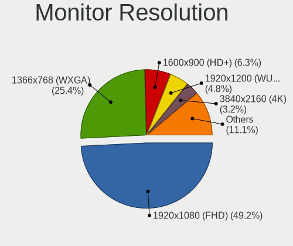

| Resolution        | Notebooks | Percent |
|-------------------|-----------|---------|
| 1920x1080 (FHD)   | 25        | 48.08%  |
| 1366x768 (WXGA)   | 13        | 25%     |
| 1920x1200 (WUXGA) | 3         | 5.77%   |
| 3840x2160 (4K)    | 2         | 3.85%   |
| 2560x1080         | 2         | 3.85%   |
| 1600x900 (HD+)    | 2         | 3.85%   |
| 3840x2400         | 1         | 1.92%   |
| 2560x1440 (QHD)   | 1         | 1.92%   |
| 2160x1440         | 1         | 1.92%   |
| 1280x800 (WXGA)   | 1         | 1.92%   |
| 1024x768 (XGA)    | 1         | 1.92%   |

Monitor Diagonal
----------------

Diagonal size in inches

| Inches | Notebooks | Percent |
|--------|-----------|---------|
| 15     | 23        | 40.35%  |
| 14     | 10        | 17.54%  |
| 17     | 7         | 12.28%  |
| 13     | 4         | 7.02%   |
| 34     | 2         | 3.51%   |
| 27     | 2         | 3.51%   |
| 18     | 2         | 3.51%   |
| 11     | 2         | 3.51%   |
| 84     | 1         | 1.75%   |
| 26     | 1         | 1.75%   |
| 24     | 1         | 1.75%   |
| 23     | 1         | 1.75%   |
| 21     | 1         | 1.75%   |

Monitor Width
-------------

Physical width

| Width in mm | Notebooks | Percent |
|-------------|-----------|---------|
| 301-350     | 33        | 57.89%  |
| 351-400     | 8         | 14.04%  |
| 201-300     | 5         | 8.77%   |
| 501-600     | 4         | 7.02%   |
| 401-500     | 3         | 5.26%   |
| 701-800     | 2         | 3.51%   |
| 601-700     | 1         | 1.75%   |
| 1501-2000   | 1         | 1.75%   |

Aspect Ratio
------------

Proportional relationship between the width and the height

| Ratio | Notebooks | Percent |
|-------|-----------|---------|
| 16/9  | 42        | 84%     |
| 16/10 | 4         | 8%      |
| 21/9  | 2         | 4%      |
| 4/3   | 1         | 2%      |
| 3/2   | 1         | 2%      |

Monitor Area
------------

Area in inch²

| Area in inch² | Notebooks | Percent |
|----------------|-----------|---------|
| 101-110        | 23        | 40.35%  |
| 81-90          | 12        | 21.05%  |
| 121-130        | 7         | 12.28%  |
| 301-350        | 3         | 5.26%   |
| 201-250        | 3         | 5.26%   |
| 51-60          | 2         | 3.51%   |
| 351-500        | 2         | 3.51%   |
| 141-150        | 2         | 3.51%   |
| More than 1000 | 1         | 1.75%   |
| 71-80          | 1         | 1.75%   |
| 91-100         | 1         | 1.75%   |

Pixel Density
-------------

Pixels per inch

| Density       | Notebooks | Percent |
|---------------|-----------|---------|
| 121-160       | 26        | 46.43%  |
| 101-120       | 15        | 26.79%  |
| 51-100        | 11        | 19.64%  |
| More than 240 | 2         | 3.57%   |
| 161-240       | 2         | 3.57%   |

Multiple Monitors
-----------------

Total monitors connected

| Total | Notebooks | Percent |
|-------|-----------|---------|
| 1     | 37        | 77.08%  |
| 2     | 10        | 20.83%  |
| 0     | 1         | 2.08%   |

Network
-------

Net Controller Vendor
---------------------

Controller vendors

| Vendor                           | Notebooks | Percent |
|----------------------------------|-----------|---------|
| Intel                            | 29        | 37.66%  |
| Realtek Semiconductor            | 23        | 29.87%  |
| Qualcomm Atheros                 | 11        | 14.29%  |
| Broadcom                         | 5         | 6.49%   |
| Broadcom Limited                 | 2         | 2.6%    |
| Silicon Integrated Systems [SiS] | 1         | 1.3%    |
| Samsung Electronics              | 1         | 1.3%    |
| Ralink                           | 1         | 1.3%    |
| Manta                            | 1         | 1.3%    |
| Lenovo                           | 1         | 1.3%    |
| Dell                             | 1         | 1.3%    |
| ASIX Electronics                 | 1         | 1.3%    |

Net Controller Model
--------------------

Controller models

| Model                                                             | Notebooks | Percent |
|-------------------------------------------------------------------|-----------|---------|
| Realtek RTL8111/8168/8411 PCI Express Gigabit Ethernet Controller | 17        | 17.89%  |
| Intel Wi-Fi 6 AX200                                               | 4         | 4.21%   |
| Intel Wireless 8265 / 8275                                        | 3         | 3.16%   |
| Intel Wireless 8260                                               | 3         | 3.16%   |
| Realtek RTL8852AE 802.11ax PCIe Wireless Network Adapter          | 2         | 2.11%   |
| Realtek RTL8821CE 802.11ac PCIe Wireless Network Adapter          | 2         | 2.11%   |
| Realtek RTL8723BE PCIe Wireless Network Adapter                   | 2         | 2.11%   |
| Realtek RTL810xE PCI Express Fast Ethernet controller             | 2         | 2.11%   |
| Qualcomm Atheros QCA6174 802.11ac Wireless Network Adapter        | 2         | 2.11%   |
| Qualcomm Atheros Killer E2400 Gigabit Ethernet Controller         | 2         | 2.11%   |
| Qualcomm Atheros AR9485 Wireless Network Adapter                  | 2         | 2.11%   |
| Intel Wireless 7260                                               | 2         | 2.11%   |
| Intel Wireless 3165                                               | 2         | 2.11%   |
| Intel Ethernet Connection I219-LM                                 | 2         | 2.11%   |
| Intel Cannon Lake PCH CNVi WiFi                                   | 2         | 2.11%   |
| Intel 82579LM Gigabit Network Connection (Lewisville)             | 2         | 2.11%   |
| Broadcom BCM4313 802.11bgn Wireless Network Adapter               | 2         | 2.11%   |
| Silicon Integrated Systems [SiS] 191 Gigabit Ethernet Adapter     | 1         | 1.05%   |
| Samsung Kiera                                                     | 1         | 1.05%   |
| Realtek RTL8822CE 802.11ac PCIe Wireless Network Adapter          | 1         | 1.05%   |
| Realtek RTL8191SEvB Wireless LAN Controller                       | 1         | 1.05%   |
| Realtek RTL8153 Gigabit Ethernet Adapter                          | 1         | 1.05%   |
| Ralink RT3090 Wireless 802.11n 1T/1R PCIe                         | 1         | 1.05%   |
| Qualcomm Atheros QCA9565 / AR9565 Wireless Network Adapter        | 1         | 1.05%   |
| Qualcomm Atheros QCA9377 802.11ac Wireless Network Adapter        | 1         | 1.05%   |
| Qualcomm Atheros QCA8172 Fast Ethernet                            | 1         | 1.05%   |
| Qualcomm Atheros AR9462 Wireless Network Adapter                  | 1         | 1.05%   |
| Qualcomm Atheros AR8152 v2.0 Fast Ethernet                        | 1         | 1.05%   |
| Qualcomm Atheros AR8151 v1.0 Gigabit Ethernet                     | 1         | 1.05%   |
| Manta MM812                                                       | 1         | 1.05%   |
| Lenovo OneLink+ Giga                                              | 1         | 1.05%   |
| Intel Wireless 7265                                               | 1         | 1.05%   |
| Intel WiFi Link 5100                                              | 1         | 1.05%   |
| Intel Wi-Fi 6 AX201                                               | 1         | 1.05%   |
| Intel Tiger Lake PCH CNVi WiFi                                    | 1         | 1.05%   |
| Intel PRO/Wireless 4965 AG or AGN [Kedron] Network Connection     | 1         | 1.05%   |
| Intel PRO/Wireless 3945ABG [Golan] Network Connection             | 1         | 1.05%   |
| Intel Gemini Lake PCH CNVi WiFi                                   | 1         | 1.05%   |
| Intel Ethernet Connection I219-V                                  | 1         | 1.05%   |
| Intel Ethernet Connection I217-V                                  | 1         | 1.05%   |
| Intel Ethernet Connection I217-LM                                 | 1         | 1.05%   |
| Intel Ethernet Connection (6) I219-LM                             | 1         | 1.05%   |
| Intel Ethernet Connection (4) I219-LM                             | 1         | 1.05%   |
| Intel Ethernet Connection (3) I218-LM                             | 1         | 1.05%   |
| Intel Ethernet Connection (10) I219-V                             | 1         | 1.05%   |
| Intel Dual Band Wireless-AC 3165 Plus Bluetooth                   | 1         | 1.05%   |
| Intel Centrino Wireless-N 1000 [Condor Peak]                      | 1         | 1.05%   |
| Intel Centrino Advanced-N 6230 [Rainbow Peak]                     | 1         | 1.05%   |
| Intel Cannon Point-LP CNVi [Wireless-AC]                          | 1         | 1.05%   |
| Intel 82567LM Gigabit Network Connection                          | 1         | 1.05%   |
| Intel 82566MM Gigabit Network Connection                          | 1         | 1.05%   |
| Dell DW5811e Snapdragon™ X7 LTE                              | 1         | 1.05%   |
| Broadcom NetLink BCM57785 Gigabit Ethernet PCIe                   | 1         | 1.05%   |
| Broadcom Limited NetLink BCM57785 Gigabit Ethernet PCIe           | 1         | 1.05%   |
| Broadcom Limited NetLink BCM57780 Gigabit Ethernet PCIe           | 1         | 1.05%   |
| Broadcom BCM43228 802.11a/b/g/n                                   | 1         | 1.05%   |
| Broadcom BCM43227 802.11b/g/n                                     | 1         | 1.05%   |
| Broadcom BCM43225 802.11b/g/n                                     | 1         | 1.05%   |
| ASIX AX88179 Gigabit Ethernet                                     | 1         | 1.05%   |

Wireless Vendor
---------------

Wireless vendors

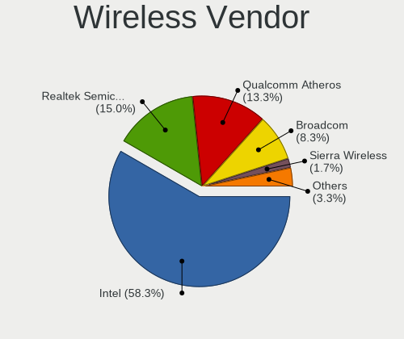

| Vendor                | Notebooks | Percent |
|-----------------------|-----------|---------|
| Intel                 | 27        | 55.1%   |
| Realtek Semiconductor | 8         | 16.33%  |
| Qualcomm Atheros      | 7         | 14.29%  |
| Broadcom              | 5         | 10.2%   |
| Ralink                | 1         | 2.04%   |
| Dell                  | 1         | 2.04%   |

Wireless Model
--------------

Wireless models

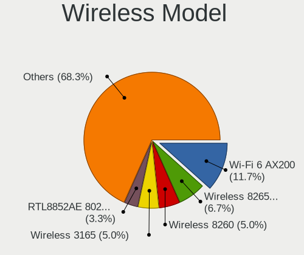

| Model                                                         | Notebooks | Percent |
|---------------------------------------------------------------|-----------|---------|
| Intel Wi-Fi 6 AX200                                           | 4         | 8.16%   |
| Intel Wireless 8265 / 8275                                    | 3         | 6.12%   |
| Intel Wireless 8260                                           | 3         | 6.12%   |
| Realtek RTL8852AE 802.11ax PCIe Wireless Network Adapter      | 2         | 4.08%   |
| Realtek RTL8821CE 802.11ac PCIe Wireless Network Adapter      | 2         | 4.08%   |
| Realtek RTL8723BE PCIe Wireless Network Adapter               | 2         | 4.08%   |
| Qualcomm Atheros QCA6174 802.11ac Wireless Network Adapter    | 2         | 4.08%   |
| Qualcomm Atheros AR9485 Wireless Network Adapter              | 2         | 4.08%   |
| Intel Wireless 7260                                           | 2         | 4.08%   |
| Intel Wireless 3165                                           | 2         | 4.08%   |
| Intel Cannon Lake PCH CNVi WiFi                               | 2         | 4.08%   |
| Broadcom BCM4313 802.11bgn Wireless Network Adapter           | 2         | 4.08%   |
| Realtek RTL8822CE 802.11ac PCIe Wireless Network Adapter      | 1         | 2.04%   |
| Realtek RTL8191SEvB Wireless LAN Controller                   | 1         | 2.04%   |
| Ralink RT3090 Wireless 802.11n 1T/1R PCIe                     | 1         | 2.04%   |
| Qualcomm Atheros QCA9565 / AR9565 Wireless Network Adapter    | 1         | 2.04%   |
| Qualcomm Atheros QCA9377 802.11ac Wireless Network Adapter    | 1         | 2.04%   |
| Qualcomm Atheros AR9462 Wireless Network Adapter              | 1         | 2.04%   |
| Intel Wireless 7265                                           | 1         | 2.04%   |
| Intel WiFi Link 5100                                          | 1         | 2.04%   |
| Intel Wi-Fi 6 AX201                                           | 1         | 2.04%   |
| Intel Tiger Lake PCH CNVi WiFi                                | 1         | 2.04%   |
| Intel PRO/Wireless 4965 AG or AGN [Kedron] Network Connection | 1         | 2.04%   |
| Intel PRO/Wireless 3945ABG [Golan] Network Connection         | 1         | 2.04%   |
| Intel Gemini Lake PCH CNVi WiFi                               | 1         | 2.04%   |
| Intel Dual Band Wireless-AC 3165 Plus Bluetooth               | 1         | 2.04%   |
| Intel Centrino Wireless-N 1000 [Condor Peak]                  | 1         | 2.04%   |
| Intel Centrino Advanced-N 6230 [Rainbow Peak]                 | 1         | 2.04%   |
| Intel Cannon Point-LP CNVi [Wireless-AC]                      | 1         | 2.04%   |
| Dell DW5811e Snapdragon™ X7 LTE                          | 1         | 2.04%   |
| Broadcom BCM43228 802.11a/b/g/n                               | 1         | 2.04%   |
| Broadcom BCM43227 802.11b/g/n                                 | 1         | 2.04%   |
| Broadcom BCM43225 802.11b/g/n                                 | 1         | 2.04%   |

Ethernet Vendor
---------------

Ethernet vendors

| Vendor                           | Notebooks | Percent |
|----------------------------------|-----------|---------|
| Realtek Semiconductor            | 19        | 44.19%  |
| Intel                            | 13        | 30.23%  |
| Qualcomm Atheros                 | 5         | 11.63%  |
| Broadcom Limited                 | 2         | 4.65%   |
| Silicon Integrated Systems [SiS] | 1         | 2.33%   |
| Lenovo                           | 1         | 2.33%   |
| Broadcom                         | 1         | 2.33%   |
| ASIX Electronics                 | 1         | 2.33%   |

Ethernet Model
--------------

Ethernet models

| Model                                                             | Notebooks | Percent |
|-------------------------------------------------------------------|-----------|---------|
| Realtek RTL8111/8168/8411 PCI Express Gigabit Ethernet Controller | 17        | 38.64%  |
| Realtek RTL810xE PCI Express Fast Ethernet controller             | 2         | 4.55%   |
| Qualcomm Atheros Killer E2400 Gigabit Ethernet Controller         | 2         | 4.55%   |
| Intel Ethernet Connection I219-LM                                 | 2         | 4.55%   |
| Intel 82579LM Gigabit Network Connection (Lewisville)             | 2         | 4.55%   |
| Silicon Integrated Systems [SiS] 191 Gigabit Ethernet Adapter     | 1         | 2.27%   |
| Realtek RTL8153 Gigabit Ethernet Adapter                          | 1         | 2.27%   |
| Qualcomm Atheros QCA8172 Fast Ethernet                            | 1         | 2.27%   |
| Qualcomm Atheros AR8152 v2.0 Fast Ethernet                        | 1         | 2.27%   |
| Qualcomm Atheros AR8151 v1.0 Gigabit Ethernet                     | 1         | 2.27%   |
| Lenovo OneLink+ Giga                                              | 1         | 2.27%   |
| Intel Ethernet Connection I219-V                                  | 1         | 2.27%   |
| Intel Ethernet Connection I217-V                                  | 1         | 2.27%   |
| Intel Ethernet Connection I217-LM                                 | 1         | 2.27%   |
| Intel Ethernet Connection (6) I219-LM                             | 1         | 2.27%   |
| Intel Ethernet Connection (4) I219-LM                             | 1         | 2.27%   |
| Intel Ethernet Connection (3) I218-LM                             | 1         | 2.27%   |
| Intel Ethernet Connection (10) I219-V                             | 1         | 2.27%   |
| Intel 82567LM Gigabit Network Connection                          | 1         | 2.27%   |
| Intel 82566MM Gigabit Network Connection                          | 1         | 2.27%   |
| Broadcom NetLink BCM57785 Gigabit Ethernet PCIe                   | 1         | 2.27%   |
| Broadcom Limited NetLink BCM57785 Gigabit Ethernet PCIe           | 1         | 2.27%   |
| Broadcom Limited NetLink BCM57780 Gigabit Ethernet PCIe           | 1         | 2.27%   |
| ASIX AX88179 Gigabit Ethernet                                     | 1         | 2.27%   |

Net Controller Kind
-------------------

Ethernet, WiFi or modem

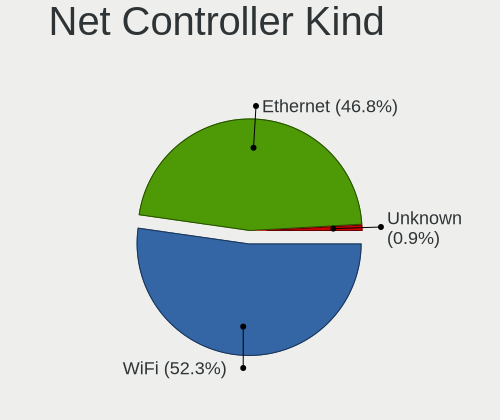

| Kind     | Notebooks | Percent |
|----------|-----------|---------|
| WiFi     | 48        | 52.17%  |
| Ethernet | 42        | 45.65%  |
| Modem    | 1         | 1.09%   |
| Unknown  | 1         | 1.09%   |

Used Controller
---------------

Currently used network controller

| Kind     | Notebooks | Percent |
|----------|-----------|---------|
| WiFi     | 45        | 56.25%  |
| Ethernet | 34        | 42.5%   |
| Modem    | 1         | 1.25%   |

NICs
----

Total network controllers on board

| Total | Notebooks | Percent |
|-------|-----------|---------|
| 2     | 40        | 83.33%  |
| 1     | 7         | 14.58%  |
| 3     | 1         | 2.08%   |

IPv6
----

IPv6 vs IPv4

| Used | Notebooks | Percent |
|------|-----------|---------|
| No   | 33        | 68.75%  |
| Yes  | 15        | 31.25%  |

Bluetooth
---------

Bluetooth Vendor
----------------

Controller vendors

| Vendor                          | Notebooks | Percent |
|---------------------------------|-----------|---------|
| Intel                           | 15        | 40.54%  |
| Realtek Semiconductor           | 6         | 16.22%  |
| Qualcomm Atheros Communications | 4         | 10.81%  |
| Lite-On Technology              | 2         | 5.41%   |
| IMC Networks                    | 2         | 5.41%   |
| Foxconn / Hon Hai               | 2         | 5.41%   |
| Broadcom                        | 2         | 5.41%   |
| Realtek                         | 1         | 2.7%    |
| Dell                            | 1         | 2.7%    |
| Cambridge Silicon Radio         | 1         | 2.7%    |
| Alps Electric                   | 1         | 2.7%    |

Bluetooth Model
---------------

Controller models

| Model                                                                               | Notebooks | Percent |
|-------------------------------------------------------------------------------------|-----------|---------|
| Intel Bluetooth wireless interface                                                  | 7         | 18.92%  |
| Realtek Bluetooth Radio                                                             | 3         | 8.11%   |
| Intel Bluetooth 9460/9560 Jefferson Peak (JfP)                                      | 3         | 8.11%   |
| Intel AX200 Bluetooth                                                               | 3         | 8.11%   |
| Realtek  Bluetooth 4.2 Adapter                                                      | 2         | 5.41%   |
| Qualcomm Atheros  Bluetooth Device                                                  | 2         | 5.41%   |
| Intel AX201 Bluetooth                                                               | 2         | 5.41%   |
| IMC Networks Bluetooth Device                                                       | 2         | 5.41%   |
| Realtek RTL8723B Bluetooth                                                          | 1         | 2.7%    |
| Realtek Bluetooth Radio                                                             | 1         | 2.7%    |
| Qualcomm Atheros Bluetooth USB Host Controller                                      | 1         | 2.7%    |
| Qualcomm Atheros AR3012 Bluetooth 4.0                                               | 1         | 2.7%    |
| Lite-On Bluetooth Device                                                            | 1         | 2.7%    |
| Lite-On Atheros AR3012 Bluetooth                                                    | 1         | 2.7%    |
| Foxconn / Hon Hai Foxconn T77H114 BCM2070 [Single-Chip Bluetooth 2.1 + EDR Adapter] | 1         | 2.7%    |
| Foxconn / Hon Hai Acer Bluetooth module                                             | 1         | 2.7%    |
| Dell BCM20702A0 Bluetooth Module                                                    | 1         | 2.7%    |
| Cambridge Silicon Radio Bluetooth Dongle (HCI mode)                                 | 1         | 2.7%    |
| Broadcom BCM2070 Bluetooth Device                                                   | 1         | 2.7%    |
| Broadcom BCM2045B (BDC-2) [Bluetooth Controller]                                    | 1         | 2.7%    |
| Alps Electric BCM2046 Bluetooth Device                                              | 1         | 2.7%    |

Sound
-----

Sound Vendor
------------

Sound card vendors

| Vendor                           | Notebooks | Percent |
|----------------------------------|-----------|---------|
| Intel                            | 38        | 63.33%  |
| AMD                              | 10        | 16.67%  |
| Nvidia                           | 4         | 6.67%   |
| Logitech                         | 2         | 3.33%   |
| Lenovo                           | 2         | 3.33%   |
| Silicon Integrated Systems [SiS] | 1         | 1.67%   |
| JMTek                            | 1         | 1.67%   |
| GN Netcom                        | 1         | 1.67%   |
| ESS Technology                   | 1         | 1.67%   |

Sound Model
-----------

Sound card models

| Model                                                                      | Notebooks | Percent |
|----------------------------------------------------------------------------|-----------|---------|
| Intel Sunrise Point-LP HD Audio                                            | 9         | 12.5%   |
| AMD Family 17h/19h HD Audio Controller                                     | 5         | 6.94%   |
| Intel Cannon Lake PCH cAVS                                                 | 4         | 5.56%   |
| Intel 8 Series/C220 Series Chipset High Definition Audio Controller        | 4         | 5.56%   |
| Intel 7 Series/C216 Chipset Family High Definition Audio Controller        | 4         | 5.56%   |
| AMD Renoir Radeon High Definition Audio Controller                         | 4         | 5.56%   |
| Intel Xeon E3-1200 v3/4th Gen Core Processor HD Audio Controller           | 3         | 4.17%   |
| Nvidia GP107GL High Definition Audio Controller                            | 2         | 2.78%   |
| Logitech Headset H390                                                      | 2         | 2.78%   |
| Intel 82801H (ICH8 Family) HD Audio Controller                             | 2         | 2.78%   |
| Intel 6 Series/C200 Series Chipset Family High Definition Audio Controller | 2         | 2.78%   |
| Intel 5 Series/3400 Series Chipset High Definition Audio                   | 2         | 2.78%   |
| Intel 100 Series/C230 Series Chipset Family HD Audio Controller            | 2         | 2.78%   |
| AMD Raven/Raven2/Fenghuang HDMI/DP Audio Controller                        | 2         | 2.78%   |
| AMD FCH Azalia Controller                                                  | 2         | 2.78%   |
| Silicon Integrated Systems [SiS] Azalia Audio Controller                   | 1         | 1.39%   |
| Nvidia TU107 GeForce GTX 1650 High Definition Audio Controller             | 1         | 1.39%   |
| Nvidia GK104 HDMI Audio Controller                                         | 1         | 1.39%   |
| Lenovo ThinkPad Thunderbolt 4 Dock USB Audio                               | 1         | 1.39%   |
| Lenovo ThinkPad OneLink Plus Dock Audio                                    | 1         | 1.39%   |
| JMTek audio controller                                                     | 1         | 1.39%   |
| Intel Wildcat Point-LP High Definition Audio Controller                    | 1         | 1.39%   |
| Intel Tiger Lake-LP Smart Sound Technology Audio Controller                | 1         | 1.39%   |
| Intel Tiger Lake-H HD Audio Controller                                     | 1         | 1.39%   |
| Intel Comet Lake PCH-LP cAVS                                               | 1         | 1.39%   |
| Intel CM238 HD Audio Controller                                            | 1         | 1.39%   |
| Intel Celeron/Pentium Silver Processor High Definition Audio               | 1         | 1.39%   |
| Intel Cannon Point-LP High Definition Audio Controller                     | 1         | 1.39%   |
| Intel Broadwell-U Audio Controller                                         | 1         | 1.39%   |
| Intel Atom Processor Z36xxx/Z37xxx Series High Definition Audio Controller | 1         | 1.39%   |
| Intel 82801I (ICH9 Family) HD Audio Controller                             | 1         | 1.39%   |
| GN Netcom Jabra UC VOICE 150a MS                                           | 1         | 1.39%   |
| ESS Technology Asus USB DAC                                                | 1         | 1.39%   |
| AMD Wrestler HDMI Audio                                                    | 1         | 1.39%   |
| AMD SBx00 Azalia (Intel HDA)                                               | 1         | 1.39%   |
| AMD Redwood HDMI Audio [Radeon HD 5000 Series]                             | 1         | 1.39%   |
| AMD Kabini HDMI/DP Audio                                                   | 1         | 1.39%   |
| AMD BeaverCreek HDMI Audio [Radeon HD 6500D and 6400G-6600G series]        | 1         | 1.39%   |

Memory
------

Memory Vendor
-------------

Memory module vendors

| Vendor              | Notebooks | Percent |
|---------------------|-----------|---------|
| Samsung Electronics | 11        | 30.56%  |
| SK Hynix            | 10        | 27.78%  |
| Unknown             | 4         | 11.11%  |
| Micron Technology   | 3         | 8.33%   |
| Kingston            | 2         | 5.56%   |
| Smart               | 1         | 2.78%   |
| Ramaxel Technology  | 1         | 2.78%   |
| GOODRAM             | 1         | 2.78%   |
| Crucial             | 1         | 2.78%   |
| Corsair             | 1         | 2.78%   |
| A-DATA Technology   | 1         | 2.78%   |

Memory Model
------------

Memory module models

| Model                                                         | Notebooks | Percent |
|---------------------------------------------------------------|-----------|---------|
| Unknown RAM Module 4GB SODIMM DDR2 667MT/s                    | 1         | 2.5%    |
| Unknown RAM Module 4096MB SODIMM DDR3                         | 1         | 2.5%    |
| Unknown RAM Module 2GB SODIMM DDR2 667MT/s                    | 1         | 2.5%    |
| Unknown RAM Module 2048MB SODIMM 1067MT/s                     | 1         | 2.5%    |
| Unknown RAM Module 1GB SODIMM DDR2 667MT/s                    | 1         | 2.5%    |
| Unknown RAM Module 1024MB SODIMM 1067MT/s                     | 1         | 2.5%    |
| Smart RAM SH564568FH8NWPHSFG 2GB SODIMM DDR3 1333MT/s         | 1         | 2.5%    |
| SK Hynix RAM Module 4GB SODIMM DDR3 1600MT/s                  | 1         | 2.5%    |
| SK Hynix RAM HYMP125S64CP8-S6 2048MB SODIMM SDRAM             | 1         | 2.5%    |
| SK Hynix RAM HMT425S6AFR6A-PB 2048MB SODIMM DDR3 1600MT/s     | 1         | 2.5%    |
| SK Hynix RAM HMT41GS6BFR8A-PB 8192MB SODIMM DDR3 1600MT/s     | 1         | 2.5%    |
| SK Hynix RAM HMAB2GS6AMR6N-XN 16GB SODIMM DDR4 3200MT/s       | 1         | 2.5%    |
| SK Hynix RAM HMA851S6JJR6N-VK 4096MB SODIMM DDR4 2667MT/s     | 1         | 2.5%    |
| SK Hynix RAM HMA851S6AFR6N-UH 4096MB SODIMM DDR4 2667MT/s     | 1         | 2.5%    |
| SK Hynix RAM HMA81GS6CJR8N-VK 8192MB SODIMM DDR4 2667MT/s     | 1         | 2.5%    |
| SK Hynix RAM HMA451S6AFR8N-TF 4096MB SODIMM DDR4 2133MT/s     | 1         | 2.5%    |
| SK Hynix RAM HMA41GS6AFR8N-TF 8192MB SODIMM DDR4 2667MT/s     | 1         | 2.5%    |
| SK Hynix RAM H9HCNNNCPMMLXR-NEE 8192MB SODIMM LPDDR4 4266MT/s | 1         | 2.5%    |
| Samsung RAM M471B5673EH1-CH9 2GB SODIMM DDR3 1334MT/s         | 1         | 2.5%    |
| Samsung RAM M471B5273DH0-CK0 4GB SODIMM DDR3 1600MT/s         | 1         | 2.5%    |
| Samsung RAM M471B1G73EB0-YK0 8GB SODIMM DDR3 1600MT/s         | 1         | 2.5%    |
| Samsung RAM M471A5244CB0-CRC 4GB SODIMM DDR4 2667MT/s         | 1         | 2.5%    |
| Samsung RAM M471A4G43AB1-CWE 32GB SODIMM DDR4 3200MT/s        | 1         | 2.5%    |
| Samsung RAM M471A2K43DB1-CTD 16384MB SODIMM DDR4 2667MT/s     | 1         | 2.5%    |
| Samsung RAM M471A2G43BB2-CWE 16384MB SODIMM DDR4 3200MT/s     | 1         | 2.5%    |
| Samsung RAM M471A1K43EB1-CWE 8GB SODIMM DDR4 3200MT/s         | 1         | 2.5%    |
| Samsung RAM M471A1G44AB0-CWE 8GB Row Of Chips DDR4 3200MT/s   | 1         | 2.5%    |
| Samsung RAM K4F6E3S4HM-MGCJ 4GB SODIMM LPDDR4 3733MT/s        | 1         | 2.5%    |
| Samsung RAM K4E6E304EE-EGCF 4GB SODIMM LPDDR3 1867MT/s        | 1         | 2.5%    |
| Samsung RAM K4E6E304EE-EGCF 4GB Chip LPDDR3 1867MT/s          | 1         | 2.5%    |
| Ramaxel RAM RMT3170ME68F9F1600 4GB SODIMM DDR3 1600MT/s       | 1         | 2.5%    |
| Micron RAM 8ATF51264HZ-2G1B1 4GB SODIMM DDR4 2667MT/s         | 1         | 2.5%    |
| Micron RAM 8ATF1G64HZ-2G6E1 8GB SODIMM DDR4 2667MT/s          | 1         | 2.5%    |
| Micron RAM 53E1G32D2NP-046 2GB Row Of Chips LPDDR4 4267MT/s   | 1         | 2.5%    |
| Kingston RAM MSI26D4S9S8ME-8 8192MB SODIMM DDR4 2667MT/s      | 1         | 2.5%    |
| Kingston RAM ACR16D3LS1KFG/8G 8GB SODIMM DDR3 1600MT/s        | 1         | 2.5%    |
| GOODRAM RAM IR2400S464L15S/8G 8GB SODIMM DDR4 2133MT/s        | 1         | 2.5%    |
| Crucial RAM BLS8G4S26BFSDK.8FD 8GB SODIMM DDR4 2667MT/s       | 1         | 2.5%    |
| Corsair RAM CMSX8GX4M1A2400C16 8GB SODIMM DDR4 2400MT/s       | 1         | 2.5%    |
| A-DATA RAM Module 8192MB SODIMM DDR4 2133MT/s                 | 1         | 2.5%    |

Memory Kind
-----------

Memory module kinds

| Kind    | Notebooks | Percent |
|---------|-----------|---------|
| DDR4    | 16        | 48.48%  |
| DDR3    | 8         | 24.24%  |
| LPDDR4  | 4         | 12.12%  |
| DDR2    | 2         | 6.06%   |
| SDRAM   | 1         | 3.03%   |
| LPDDR3  | 1         | 3.03%   |
| Unknown | 1         | 3.03%   |

Memory Form Factor
------------------

Physical design of the memory module

| Name         | Notebooks | Percent |
|--------------|-----------|---------|
| SODIMM       | 30        | 90.91%  |
| Row Of Chips | 2         | 6.06%   |
| Chip         | 1         | 3.03%   |

Memory Size
-----------

Memory module size

| Size  | Notebooks | Percent |
|-------|-----------|---------|
| 8192  | 15        | 39.47%  |
| 4096  | 11        | 28.95%  |
| 2048  | 6         | 15.79%  |
| 16384 | 3         | 7.89%   |
| 1024  | 2         | 5.26%   |
| 32768 | 1         | 2.63%   |

Memory Speed
------------

Memory module speed

| Speed   | Notebooks | Percent |
|---------|-----------|---------|
| 2667    | 9         | 25.71%  |
| 1600    | 6         | 17.14%  |
| 3200    | 5         | 14.29%  |
| 2133    | 3         | 8.57%   |
| 667     | 2         | 5.71%   |
| 4267    | 1         | 2.86%   |
| 4266    | 1         | 2.86%   |
| 3733    | 1         | 2.86%   |
| 2400    | 1         | 2.86%   |
| 2048    | 1         | 2.86%   |
| 1867    | 1         | 2.86%   |
| 1334    | 1         | 2.86%   |
| 1333    | 1         | 2.86%   |
| 1067    | 1         | 2.86%   |
| Unknown | 1         | 2.86%   |

Printers & scanners
-------------------

Printer Vendor
--------------

Printer device vendors

| Vendor              | Notebooks | Percent |
|---------------------|-----------|---------|
| Prolific Technology | 1         | 100%    |

Printer Model
-------------

Printer device models

| Model                         | Notebooks | Percent |
|-------------------------------|-----------|---------|
| Prolific PL2305 Parallel Port | 1         | 100%    |

Scanner Vendor
--------------

Scanner device vendors

Zero info for selected period =(

Scanner Model
-------------

Scanner device models

Zero info for selected period =(

Camera
------

Camera Vendor
-------------

Camera device vendors

| Vendor                                 | Notebooks | Percent |
|----------------------------------------|-----------|---------|
| Chicony Electronics                    | 9         | 20.45%  |
| Acer                                   | 6         | 13.64%  |
| Realtek Semiconductor                  | 5         | 11.36%  |
| Sunplus Innovation Technology          | 4         | 9.09%   |
| Quanta                                 | 4         | 9.09%   |
| IMC Networks                           | 4         | 9.09%   |
| Microdia                               | 3         | 6.82%   |
| Cheng Uei Precision Industry (Foxlink) | 3         | 6.82%   |
| Syntek                                 | 1         | 2.27%   |
| Silicon Motion                         | 1         | 2.27%   |
| Ricoh                                  | 1         | 2.27%   |
| Luxvisions Innotech Limited            | 1         | 2.27%   |
| Lite-On Technology                     | 1         | 2.27%   |
| ALi                                    | 1         | 2.27%   |

Camera Model
------------

Camera device models

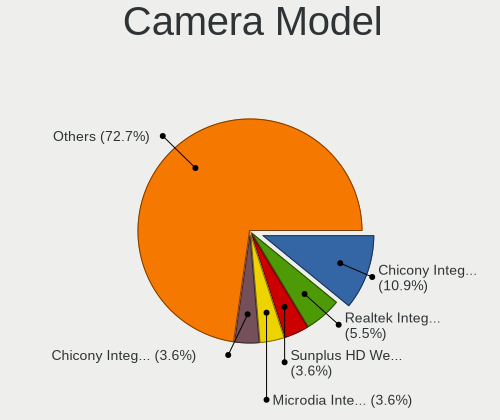

| Model                                                                    | Notebooks | Percent |
|--------------------------------------------------------------------------|-----------|---------|
| Chicony Integrated Camera                                                | 4         | 8.89%   |
| Sunplus HD WebCam                                                        | 2         | 4.44%   |
| Realtek Integrated_Webcam_HD                                             | 2         | 4.44%   |
| Microdia Integrated_Webcam_HD                                            | 2         | 4.44%   |
| Acer Integrated Camera                                                   | 2         | 4.44%   |
| Acer BisonCam, NB Pro                                                    | 2         | 4.44%   |
| Syntek Lenovo EasyCamera                                                 | 1         | 2.22%   |
| Sunplus Integrated_Webcam_HD                                             | 1         | 2.22%   |
| Sunplus 1.3M HD WebCam                                                   | 1         | 2.22%   |
| Silicon Motion WebCam SC-13HDN10939N                                     | 1         | 2.22%   |
| Ricoh Sony Vaio Integrated Webcam                                        | 1         | 2.22%   |
| Realtek USB2.0 HD UVC WebCam                                             | 1         | 2.22%   |
| Realtek USB Camera                                                       | 1         | 2.22%   |
| Realtek Lenovo EasyCamera                                                | 1         | 2.22%   |
| Realtek Integrated Webcam HD                                             | 1         | 2.22%   |
| Quanta HP Wide Vision HD Camera                                          | 1         | 2.22%   |
| Quanta HP TrueVision HD Camera                                           | 1         | 2.22%   |
| Quanta HD Webcam                                                         | 1         | 2.22%   |
| Quanta HD User Facing                                                    | 1         | 2.22%   |
| Microdia Laptop_Integrated_Webcam_7645BB9590586C77DC683CD9114697FF.3M    | 1         | 2.22%   |
| Luxvisions Innotech Limited HP TrueVision HD Camera                      | 1         | 2.22%   |
| Lite-On Integrated Camera                                                | 1         | 2.22%   |
| IMC Networks USB2.0 VGA UVC WebCam                                       | 1         | 2.22%   |
| IMC Networks USB2.0 UVC HD Webcam                                        | 1         | 2.22%   |
| IMC Networks USB2.0 HD UVC WebCam                                        | 1         | 2.22%   |
| IMC Networks Integrated Camera                                           | 1         | 2.22%   |
| Chicony VGA 24fps UVC Webcam                                             | 1         | 2.22%   |
| Chicony USB2.0 Camera                                                    | 1         | 2.22%   |
| Chicony Integrated Camera (1280x720@30)                                  | 1         | 2.22%   |
| Chicony HD WebCam                                                        | 1         | 2.22%   |
| Chicony EasyCamera                                                       | 1         | 2.22%   |
| Cheng Uei Precision Industry (Foxlink) Webcam                            | 1         | 2.22%   |
| Cheng Uei Precision Industry (Foxlink) HP EliteBook integrated HD Webcam | 1         | 2.22%   |
| Cheng Uei Precision Industry (Foxlink) HD Camera                         | 1         | 2.22%   |
| ALi Gateway Webcam                                                       | 1         | 2.22%   |
| Acer HD Webcam                                                           | 1         | 2.22%   |
| Acer BisonCam,NB Pro                                                     | 1         | 2.22%   |

Security
--------

Fingerprint Vendor
------------------

Fingerprint sensor vendors

| Vendor                     | Notebooks | Percent |
|----------------------------|-----------|---------|
| Synaptics                  | 5         | 41.67%  |
| Validity Sensors           | 4         | 33.33%  |
| Upek                       | 1         | 8.33%   |
| Shenzhen Goodix Technology | 1         | 8.33%   |
| AuthenTec                  | 1         | 8.33%   |

Fingerprint Model
-----------------

Fingerprint sensor models

| Model                                                  | Notebooks | Percent |
|--------------------------------------------------------|-----------|---------|
| Validity Sensors VFS 5011 fingerprint sensor           | 2         | 16.67%  |
| Synaptics Prometheus MIS Touch Fingerprint Reader      | 2         | 16.67%  |
| Validity Sensors VFS7500 Touch Fingerprint Sensor      | 1         | 8.33%   |
| Validity Sensors VFS495 Fingerprint Reader             | 1         | 8.33%   |
| Upek Biometric Touchchip/Touchstrip Fingerprint Sensor | 1         | 8.33%   |
| Synaptics  WBDI                                        | 1         | 8.33%   |
| Synaptics Metallica MOH Touch Fingerprint Reader       | 1         | 8.33%   |
| Shenzhen Goodix  Fingerprint Device                    | 1         | 8.33%   |
| AuthenTec AES1660 Fingerprint Sensor                   | 1         | 8.33%   |
| Unknown                                                | 1         | 8.33%   |

Chipcard Vendor
---------------

Chipcard module vendors

| Vendor                | Notebooks | Percent |
|-----------------------|-----------|---------|
| Broadcom              | 2         | 33.33%  |
| Alcor Micro           | 2         | 33.33%  |
| O2 Micro              | 1         | 16.67%  |
| Gemalto (was Gemplus) | 1         | 16.67%  |

Chipcard Model
--------------

Chipcard module models

| Model                                             | Notebooks | Percent |
|---------------------------------------------------|-----------|---------|
| Alcor Micro AU9540 Smartcard Reader               | 2         | 33.33%  |
| O2 Micro OZ776 CCID Smartcard Reader              | 1         | 16.67%  |
| Gemalto (was Gemplus) GemPC Twin SmartCard Reader | 1         | 16.67%  |
| Broadcom BCM5880 Secure Applications Processor    | 1         | 16.67%  |
| Broadcom 5880                                     | 1         | 16.67%  |

Unsupported
-----------

Unsupported Devices
-------------------

Total unsupported devices on board

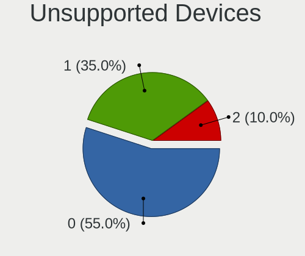

| Total | Notebooks | Percent |
|-------|-----------|---------|
| 0     | 28        | 57.14%  |
| 1     | 17        | 34.69%  |
| 2     | 4         | 8.16%   |

Unsupported Device Types
------------------------

Types of unsupported devices

| Type               | Notebooks | Percent |
|--------------------|-----------|---------|
| Fingerprint reader | 12        | 46.15%  |
| Chipcard           | 7         | 26.92%  |
| Graphics card      | 4         | 15.38%  |
| Net/wireless       | 2         | 7.69%   |
| Camera             | 1         | 3.85%   |

