openSUSE Leap-15.3 - Tested Hardware & Statistics
-------------------------------------------------

A project to collect tested hardware configurations for openSUSE Leap-15.3.

Anyone can contribute to this report by the [hw-probe](https://github.com/linuxhw/hw-probe) tool:

    sudo -E hw-probe -all -upload

Please submit a probe of your configuration if it's not presented on the page or is rare.

This is a report for all computer types. See also reports for [desktops](/Dist/openSUSE_Leap-15.3/Desktop/README.md) and [notebooks](/Dist/openSUSE_Leap-15.3/Notebook/README.md).

Full-feature report is available here: https://linux-hardware.org/?view=trends&rel=opensuse-leap-15.3

Contents
--------

* [ Test Cases ](#test-cases)

* [ System ](#system)
  - [ Kernel                   ](#kernel)
  - [ Kernel Family            ](#kernel-family)
  - [ Kernel Major Ver.        ](#kernel-major-ver)
  - [ Arch                     ](#arch)
  - [ DE                       ](#de)
  - [ Display Server           ](#display-server)
  - [ Display Manager          ](#display-manager)
  - [ OS Lang                  ](#os-lang)
  - [ Boot Mode                ](#boot-mode)
  - [ Filesystem               ](#filesystem)
  - [ Part. scheme             ](#part-scheme)
  - [ Dual Boot with Linux/BSD ](#dual-boot-with-linuxbsd)
  - [ Dual Boot (Win)          ](#dual-boot-win)

* [ Board ](#board)
  - [ Vendor                   ](#vendor)
  - [ Model                    ](#model)
  - [ Model Family             ](#model-family)
  - [ MFG Year                 ](#mfg-year)
  - [ Form Factor              ](#form-factor)
  - [ Secure Boot              ](#secure-boot)
  - [ Coreboot                 ](#coreboot)
  - [ RAM Size                 ](#ram-size)
  - [ RAM Used                 ](#ram-used)
  - [ Total Drives             ](#total-drives)
  - [ Has CD-ROM               ](#has-cd-rom)
  - [ Has Ethernet             ](#has-ethernet)
  - [ Has WiFi                 ](#has-wifi)
  - [ Has Bluetooth            ](#has-bluetooth)

* [ Location ](#location)
  - [ Country                  ](#country)
  - [ City                     ](#city)

* [ Drives ](#drives)
  - [ Drive Vendor             ](#drive-vendor)
  - [ Drive Model              ](#drive-model)
  - [ HDD Vendor               ](#hdd-vendor)
  - [ SSD Vendor               ](#ssd-vendor)
  - [ Drive Kind               ](#drive-kind)
  - [ Drive Connector          ](#drive-connector)
  - [ Drive Size               ](#drive-size)
  - [ Space Total              ](#space-total)
  - [ Space Used               ](#space-used)
  - [ Malfunc. Drives          ](#malfunc-drives)
  - [ Malfunc. Drive Vendor    ](#malfunc-drive-vendor)
  - [ Malfunc. HDD Vendor      ](#malfunc-hdd-vendor)
  - [ Malfunc. Drive Kind      ](#malfunc-drive-kind)
  - [ Failed Drives            ](#failed-drives)
  - [ Failed Drive Vendor      ](#failed-drive-vendor)
  - [ Drive Status             ](#drive-status)

* [ Storage controller ](#storage-controller)
  - [ Storage Vendor           ](#storage-vendor)
  - [ Storage Model            ](#storage-model)
  - [ Storage Kind             ](#storage-kind)

* [ Processor ](#processor)
  - [ CPU Vendor               ](#cpu-vendor)
  - [ CPU Model                ](#cpu-model)
  - [ CPU Model Family         ](#cpu-model-family)
  - [ CPU Cores                ](#cpu-cores)
  - [ CPU Sockets              ](#cpu-sockets)
  - [ CPU Threads              ](#cpu-threads)
  - [ CPU Op-Modes             ](#cpu-op-modes)
  - [ CPU Microcode            ](#cpu-microcode)
  - [ CPU Microarch            ](#cpu-microarch)

* [ Graphics ](#graphics)
  - [ GPU Vendor               ](#gpu-vendor)
  - [ GPU Model                ](#gpu-model)
  - [ GPU Combo                ](#gpu-combo)
  - [ GPU Driver               ](#gpu-driver)
  - [ GPU Memory               ](#gpu-memory)

* [ Monitor ](#monitor)
  - [ Monitor Vendor           ](#monitor-vendor)
  - [ Monitor Model            ](#monitor-model)
  - [ Monitor Resolution       ](#monitor-resolution)
  - [ Monitor Diagonal         ](#monitor-diagonal)
  - [ Monitor Width            ](#monitor-width)
  - [ Aspect Ratio             ](#aspect-ratio)
  - [ Monitor Area             ](#monitor-area)
  - [ Pixel Density            ](#pixel-density)
  - [ Multiple Monitors        ](#multiple-monitors)

* [ Network ](#network)
  - [ Net Controller Vendor    ](#net-controller-vendor)
  - [ Net Controller Model     ](#net-controller-model)
  - [ Wireless Vendor          ](#wireless-vendor)
  - [ Wireless Model           ](#wireless-model)
  - [ Ethernet Vendor          ](#ethernet-vendor)
  - [ Ethernet Model           ](#ethernet-model)
  - [ Net Controller Kind      ](#net-controller-kind)
  - [ Used Controller          ](#used-controller)
  - [ NICs                     ](#nics)
  - [ IPv6                     ](#ipv6)

* [ Bluetooth ](#bluetooth)
  - [ Bluetooth Vendor         ](#bluetooth-vendor)
  - [ Bluetooth Model          ](#bluetooth-model)

* [ Sound ](#sound)
  - [ Sound Vendor             ](#sound-vendor)
  - [ Sound Model              ](#sound-model)

* [ Memory ](#memory)
  - [ Memory Vendor            ](#memory-vendor)
  - [ Memory Model             ](#memory-model)
  - [ Memory Kind              ](#memory-kind)
  - [ Memory Form Factor       ](#memory-form-factor)
  - [ Memory Size              ](#memory-size)
  - [ Memory Speed             ](#memory-speed)

* [ Printers & scanners ](#printers--scanners)
  - [ Printer Vendor           ](#printer-vendor)
  - [ Printer Model            ](#printer-model)
  - [ Scanner Vendor           ](#scanner-vendor)
  - [ Scanner Model            ](#scanner-model)

* [ Camera ](#camera)
  - [ Camera Vendor            ](#camera-vendor)
  - [ Camera Model             ](#camera-model)

* [ Security ](#security)
  - [ Fingerprint Vendor       ](#fingerprint-vendor)
  - [ Fingerprint Model        ](#fingerprint-model)
  - [ Chipcard Vendor          ](#chipcard-vendor)
  - [ Chipcard Model           ](#chipcard-model)

* [ Unsupported ](#unsupported)
  - [ Unsupported Devices      ](#unsupported-devices)
  - [ Unsupported Device Types ](#unsupported-device-types)

Test Cases
----------

| Vendor     | Model                       | Form-Factor | Probe                                                      | Date         |
|------------|-----------------------------|-------------|------------------------------------------------------------|--------------|
| ASUSTek    | M4A78T-E                    | Desktop     | [01ec64f498](https://linux-hardware.org/?probe=01ec64f498) | Sep 24, 2021 |
| Lenovo     | 364A SDK0J40700 WIN 3258... | Desktop     | [58f9ca6247](https://linux-hardware.org/?probe=58f9ca6247) | Sep 22, 2021 |
| Lenovo     | 364A SDK0J40700 WIN 3258... | Desktop     | [db9ccd461b](https://linux-hardware.org/?probe=db9ccd461b) | Sep 22, 2021 |
| Dell       | Precision M6700             | Notebook    | [0d8cf3bf1c](https://linux-hardware.org/?probe=0d8cf3bf1c) | Sep 21, 2021 |
| VS Company | G31T-M                      | Desktop     | [ed8bb8c0d1](https://linux-hardware.org/?probe=ed8bb8c0d1) | Sep 21, 2021 |
| ASUSTek    | AM1M-A/BR                   | Desktop     | [c586c22b15](https://linux-hardware.org/?probe=c586c22b15) | Sep 20, 2021 |
| Alienware  | 0PGRP5 A02                  | Desktop     | [65615a3aaa](https://linux-hardware.org/?probe=65615a3aaa) | Sep 16, 2021 |
| Alienware  | 0PGRP5 A02                  | Desktop     | [158a015f26](https://linux-hardware.org/?probe=158a015f26) | Sep 15, 2021 |
| MSI        | X370 GAMING PRO             | Desktop     | [629a45e23d](https://linux-hardware.org/?probe=629a45e23d) | Sep 12, 2021 |
| HP         | 8056                        | Desktop     | [3cab8505c4](https://linux-hardware.org/?probe=3cab8505c4) | Sep 06, 2021 |
| Intel      | DG41WV AAE90316-104         | Desktop     | [27c162218f](https://linux-hardware.org/?probe=27c162218f) | Sep 05, 2021 |
| Gigabyte   | B550 AORUS PRO AC           | Desktop     | [be3b65a81d](https://linux-hardware.org/?probe=be3b65a81d) | Aug 29, 2021 |
| Lenovo     | ThinkPad X1 Carbon 4th 2... | Notebook    | [44d0412dd3](https://linux-hardware.org/?probe=44d0412dd3) | Aug 27, 2021 |
| Samsung    | 600B4B/600B5B               | Notebook    | [200275bbd6](https://linux-hardware.org/?probe=200275bbd6) | Aug 27, 2021 |
| ASRock     | B450M Pro4                  | Desktop     | [a13b05f65f](https://linux-hardware.org/?probe=a13b05f65f) | Aug 27, 2021 |
| Dell       | Precision M6700             | Notebook    | [191db00b83](https://linux-hardware.org/?probe=191db00b83) | Aug 26, 2021 |
| Lenovo     | V330-15IKB 81AX             | Notebook    | [4b5a1af4dd](https://linux-hardware.org/?probe=4b5a1af4dd) | Aug 26, 2021 |
| Lenovo     | G500 20236                  | Notebook    | [73a5085a79](https://linux-hardware.org/?probe=73a5085a79) | Aug 24, 2021 |
| Dell       | Latitude 5480               | Notebook    | [a2110d9601](https://linux-hardware.org/?probe=a2110d9601) | Aug 24, 2021 |
| Dell       | Latitude 5480               | Notebook    | [64e1f3e16c](https://linux-hardware.org/?probe=64e1f3e16c) | Aug 19, 2021 |
| Lenovo     | ThinkPad T61 8895W9U        | Notebook    | [424c5f3e75](https://linux-hardware.org/?probe=424c5f3e75) | Aug 19, 2021 |
| Dell       | Inspiron 3521               | Notebook    | [c68ce33d52](https://linux-hardware.org/?probe=c68ce33d52) | Aug 11, 2021 |
| Dell       | Inspiron 3521               | Notebook    | [9a422a10d3](https://linux-hardware.org/?probe=9a422a10d3) | Aug 11, 2021 |
| Dell       | Inspiron 7460               | Notebook    | [f954aa3826](https://linux-hardware.org/?probe=f954aa3826) | Aug 10, 2021 |
| Samsung    | 600B4B/600B5B               | Notebook    | [0a650b495e](https://linux-hardware.org/?probe=0a650b495e) | Aug 09, 2021 |
| Lenovo     | ThinkPad T460 20FMS75800    | Notebook    | [1a1c3f469d](https://linux-hardware.org/?probe=1a1c3f469d) | Aug 07, 2021 |
| Lenovo     | ThinkPad X1 Carbon 4th 2... | Notebook    | [5953bc46ad](https://linux-hardware.org/?probe=5953bc46ad) | Aug 06, 2021 |
| Lenovo     | ThinkPad X1 Carbon 4th 2... | Notebook    | [fafaeed466](https://linux-hardware.org/?probe=fafaeed466) | Aug 06, 2021 |
| ASUSTek    | PRIME H310M-A               | Desktop     | [a22aa3c48c](https://linux-hardware.org/?probe=a22aa3c48c) | Aug 01, 2021 |
| MSI        | B85M-E45                    | Desktop     | [0e20d4cea9](https://linux-hardware.org/?probe=0e20d4cea9) | Jul 30, 2021 |
| Gigabyte   | B250M-DS3H-CF               | Desktop     | [acbcbe74d7](https://linux-hardware.org/?probe=acbcbe74d7) | Jul 22, 2021 |
| HP         | Stream Notebook PC 11       | Notebook    | [a612aa5d15](https://linux-hardware.org/?probe=a612aa5d15) | Jul 20, 2021 |
| HP         | 8433 11                     | Desktop     | [b079ccb608](https://linux-hardware.org/?probe=b079ccb608) | Jul 15, 2021 |
| MSI        | D2415 S26361-D2415-A21      | Desktop     | [b49400f636](https://linux-hardware.org/?probe=b49400f636) | Jul 11, 2021 |
| Lenovo     | ThinkPad T450s 20BWA06J0... | Notebook    | [e4cd39ef75](https://linux-hardware.org/?probe=e4cd39ef75) | Jul 09, 2021 |
| Lenovo     | ThinkPad T450s 20BWA06J0... | Notebook    | [5565f4e4fe](https://linux-hardware.org/?probe=5565f4e4fe) | Jul 09, 2021 |
| Fujitsu    | LIFEBOOK E754               | Notebook    | [e7923c27f1](https://linux-hardware.org/?probe=e7923c27f1) | Jul 08, 2021 |
| MSI        | B350 TOMAHAWK               | Desktop     | [27a6ac997b](https://linux-hardware.org/?probe=27a6ac997b) | Jul 03, 2021 |
| ASRock     | X570M Pro4                  | Desktop     | [a00aea4331](https://linux-hardware.org/?probe=a00aea4331) | Jul 03, 2021 |
| HP         | 0A68h                       | Desktop     | [36cfa6a366](https://linux-hardware.org/?probe=36cfa6a366) | Jun 27, 2021 |
| ASUSTek    | TUF B450-PRO GAMING         | Desktop     | [dfc2f82575](https://linux-hardware.org/?probe=dfc2f82575) | Jun 26, 2021 |
| ASUSTek    | G771JW                      | Notebook    | [8e6c4ddee8](https://linux-hardware.org/?probe=8e6c4ddee8) | Jun 24, 2021 |
| ASRock     | X570 Steel Legend           | Desktop     | [b4a11b3e4e](https://linux-hardware.org/?probe=b4a11b3e4e) | Jun 17, 2021 |
| MSI        | MEG X570 GODLIKE            | Desktop     | [11b7f0e8ae](https://linux-hardware.org/?probe=11b7f0e8ae) | Jun 17, 2021 |
| HP         | ZBook 17 G2                 | Notebook    | [3342d4d378](https://linux-hardware.org/?probe=3342d4d378) | Jun 17, 2021 |
| HP         | OMEN by HP Laptop 15-dc1... | Notebook    | [0c01b21401](https://linux-hardware.org/?probe=0c01b21401) | Jun 15, 2021 |
| Sony       | VPCSB15GB                   | Notebook    | [43a9d38ca0](https://linux-hardware.org/?probe=43a9d38ca0) | Jun 03, 2021 |
| HP         | 2AA2                        | Desktop     | [65e7cd2d3e](https://linux-hardware.org/?probe=65e7cd2d3e) | Jun 02, 2021 |
| Sony       | VGN-Z570AN                  | Notebook    | [13d58b8d90](https://linux-hardware.org/?probe=13d58b8d90) | May 21, 2021 |
| Sony       | VGN-Z570AN                  | Notebook    | [e6c7882e05](https://linux-hardware.org/?probe=e6c7882e05) | May 21, 2021 |
| MSI        | GS60 6QE                    | Notebook    | [93c6fd8911](https://linux-hardware.org/?probe=93c6fd8911) | May 18, 2021 |
| MSI        | GS60 6QE                    | Notebook    | [41fe777475](https://linux-hardware.org/?probe=41fe777475) | May 18, 2021 |
| ASUSTek    | VivoBook 12_ASUS Laptop ... | Notebook    | [184bedf2fd](https://linux-hardware.org/?probe=184bedf2fd) | May 01, 2021 |
| HP         | Pavilion dx6500             | Notebook    | [091cc2c616](https://linux-hardware.org/?probe=091cc2c616) | Apr 13, 2021 |
| HP         | Pavilion dx6500             | Notebook    | [6ad0d5c87f](https://linux-hardware.org/?probe=6ad0d5c87f) | Apr 13, 2021 |
| Dell       | Inspiron 15 7000 Gaming     | Notebook    | [97a7246099](https://linux-hardware.org/?probe=97a7246099) | Mar 01, 2021 |
| Dell       | Inspiron 15 7000 Gaming     | Notebook    | [b1e186207c](https://linux-hardware.org/?probe=b1e186207c) | Feb 28, 2021 |
| ASUSTek    | P8H61-M LE/USB3             | Desktop     | [fca0fd3336](https://linux-hardware.org/?probe=fca0fd3336) | Jan 03, 2021 |

System
------

Kernel
------

Version of the Linux kernel

| Version                 | Computers | Percent |
|-------------------------|-----------|---------|
| 5.3.18-59.19-default    | 13        | 28.89%  |
| 5.3.18-59.5-default     | 6         | 13.33%  |
| 5.3.18-59.16-default    | 6         | 13.33%  |
| 5.3.18-57-default       | 6         | 13.33%  |
| 5.3.18-59.10-default    | 5         | 11.11%  |
| 5.3.18-59.13-default    | 2         | 4.44%   |
| 5.3.18-lp152.57-default | 1         | 2.22%   |
| 5.3.18-59.24-preempt    | 1         | 2.22%   |
| 5.3.18-59.19-preempt    | 1         | 2.22%   |
| 5.3.18-57-preempt       | 1         | 2.22%   |
| 5.3.18-56-default       | 1         | 2.22%   |
| 5.3.18-52-default       | 1         | 2.22%   |
| 5.3.18-46-default       | 1         | 2.22%   |

Kernel Family
-------------

Linux kernel without a distro release

| Version | Computers | Percent |
|---------|-----------|---------|
| 5.3.18  | 45        | 100%    |

Kernel Major Ver.
-----------------

Linux kernel major version

| Version | Computers | Percent |
|---------|-----------|---------|
| 5.3     | 45        | 100%    |

Arch
----

OS architecture (x86_64, i586, etc.)

| Name   | Computers | Percent |
|--------|-----------|---------|
| x86_64 | 45        | 100%    |

DE
--

Desktop Environment

| Name       | Computers | Percent |
|------------|-----------|---------|
| KDE        | 17        | 36.96%  |
| KDE5       | 12        | 26.09%  |
| XFCE       | 7         | 15.22%  |
| Unknown    | 5         | 10.87%  |
| GNOME      | 3         | 6.52%   |
| X-Cinnamon | 2         | 4.35%   |

Display Server
--------------

X11 or Wayland

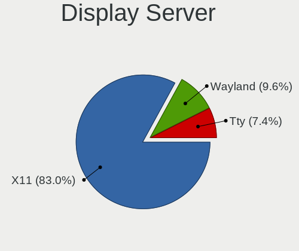

| Name    | Computers | Percent |
|---------|-----------|---------|
| X11     | 39        | 86.67%  |
| Wayland | 3         | 6.67%   |
| Tty     | 3         | 6.67%   |

Display Manager
---------------

SDDM, LightDM, etc.

| Name    | Computers | Percent |
|---------|-----------|---------|
| Unknown | 28        | 62.22%  |
| LightDM | 11        | 24.44%  |
| SDDM    | 6         | 13.33%  |

OS Lang
-------

Language

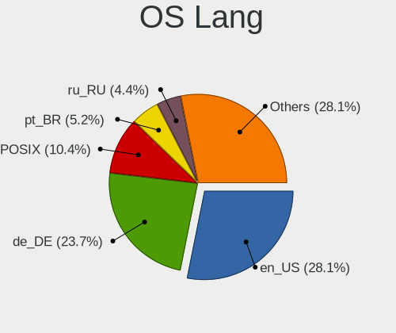

| Lang    | Computers | Percent |
|---------|-----------|---------|
| en_US   | 15        | 33.33%  |
| de_DE   | 8         | 17.78%  |
| POSIX   | 4         | 8.89%   |
| pt_BR   | 3         | 6.67%   |
| es_ES   | 2         | 4.44%   |
| zh_CN   | 1         | 2.22%   |
| sv_SE   | 1         | 2.22%   |
| ru_RU   | 1         | 2.22%   |
| pt_PT   | 1         | 2.22%   |
| nl_BE   | 1         | 2.22%   |
| hu_HU   | 1         | 2.22%   |
| hr_HR   | 1         | 2.22%   |
| fr_FR   | 1         | 2.22%   |
| es_MX   | 1         | 2.22%   |
| en_GB   | 1         | 2.22%   |
| en_AU   | 1         | 2.22%   |
| cs_CZ   | 1         | 2.22%   |
| Unknown | 1         | 2.22%   |

Boot Mode
---------

EFI or BIOS

| Mode | Computers | Percent |
|------|-----------|---------|
| BIOS | 31        | 68.89%  |
| EFI  | 14        | 31.11%  |

Filesystem
----------

Type of filesystem

| Type  | Computers | Percent |
|-------|-----------|---------|
| Btrfs | 30        | 66.67%  |
| Ext4  | 13        | 28.89%  |
| Xfs   | 2         | 4.44%   |

Part. scheme
------------

Scheme of partitioning

| Type    | Computers | Percent |
|---------|-----------|---------|
| Unknown | 25        | 55.56%  |
| GPT     | 17        | 37.78%  |
| MBR     | 3         | 6.67%   |

Dual Boot with Linux/BSD
------------------------

Hosting more than one Linux/BSD

| Dual boot | Computers | Percent |
|-----------|-----------|---------|
| No        | 44        | 97.78%  |
| Yes       | 1         | 2.22%   |

Dual Boot (Win)
---------------

Hosting Linux and Windows

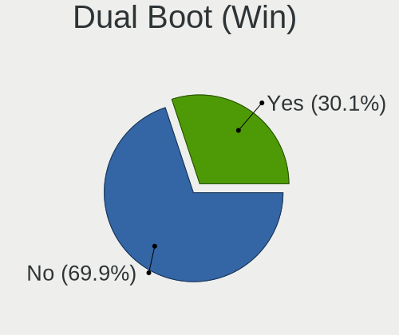

| Dual boot | Computers | Percent |
|-----------|-----------|---------|
| No        | 36        | 80%     |
| Yes       | 9         | 20%     |

Board
-----

Vendor
------

Motherboard manufacturer

| Name                | Computers | Percent |
|---------------------|-----------|---------|
| Hewlett-Packard     | 8         | 17.78%  |
| Lenovo              | 7         | 15.56%  |
| ASUSTek Computer    | 7         | 15.56%  |
| MSI                 | 6         | 13.33%  |
| Dell                | 5         | 11.11%  |
| ASRock              | 3         | 6.67%   |
| Sony                | 2         | 4.44%   |
| Gigabyte Technology | 2         | 4.44%   |
| VS Company          | 1         | 2.22%   |
| Samsung Electronics | 1         | 2.22%   |
| Intel               | 1         | 2.22%   |
| Fujitsu             | 1         | 2.22%   |
| Alienware           | 1         | 2.22%   |

Model
-----

Motherboard model

| Name                                         | Computers | Percent |
|----------------------------------------------|-----------|---------|
| VS Company VS-G31T-M                         | 1         | 2.22%   |
| Sony VPCSB15GB                               | 1         | 2.22%   |
| Sony VGN-Z570AN                              | 1         | 2.22%   |
| Samsung 600B4B/600B5B                        | 1         | 2.22%   |
| MSI MS-7C34                                  | 1         | 2.22%   |
| MSI MS-7A34                                  | 1         | 2.22%   |
| MSI MS-7A33                                  | 1         | 2.22%   |
| MSI MS-7817                                  | 1         | 2.22%   |
| MSI GS60 6QE                                 | 1         | 2.22%   |
| MSI ESPRIMO P1510                            | 1         | 2.22%   |
| Lenovo V330-15IKB 81AX                       | 1         | 2.22%   |
| Lenovo ThinkPad X1 Carbon 4th 20FB002UMC     | 1         | 2.22%   |
| Lenovo ThinkPad T61 8895W9U                  | 1         | 2.22%   |
| Lenovo ThinkPad T460 20FMS75800              | 1         | 2.22%   |
| Lenovo ThinkPad T450s 20BWA06J00             | 1         | 2.22%   |
| Lenovo IdeaCentre Y710 Cube-15ISH 90FL004WGE | 1         | 2.22%   |
| Lenovo G500 20236                            | 1         | 2.22%   |
| Intel DG41WV AAE90316-104                    | 1         | 2.22%   |
| HP ZBook 17 G2                               | 1         | 2.22%   |
| HP xw4400 Workstation                        | 1         | 2.22%   |
| HP Stream Notebook PC 11                     | 1         | 2.22%   |
| HP Pavilion Gaming Desktop 690-00xx          | 1         | 2.22%   |
| HP Pavilion dx6500                           | 1         | 2.22%   |
| HP OMEN by HP Laptop 15-dc1xxx               | 1         | 2.22%   |
| HP EliteDesk 800 G2 DM 65W                   | 1         | 2.22%   |
| HP 200-5120br                                | 1         | 2.22%   |
| Gigabyte B550 AORUS PRO AC                   | 1         | 2.22%   |
| Gigabyte B250M-DS3H                          | 1         | 2.22%   |
| Fujitsu LIFEBOOK E754                        | 1         | 2.22%   |
| Dell Precision M6700                         | 1         | 2.22%   |
| Dell Latitude 5480                           | 1         | 2.22%   |
| Dell Inspiron 7460                           | 1         | 2.22%   |
| Dell Inspiron 3521                           | 1         | 2.22%   |
| Dell Inspiron 15 7000 Gaming                 | 1         | 2.22%   |
| ASUS VivoBook 12_ASUS Laptop E203MAS_E203MA  | 1         | 2.22%   |
| ASUS TUF B450-PRO GAMING                     | 1         | 2.22%   |
| ASUS PRIME H310M-A                           | 1         | 2.22%   |
| ASUS P8H61-M LE/USB3                         | 1         | 2.22%   |
| ASUS M4A78T-E                                | 1         | 2.22%   |
| ASUS G771JW                                  | 1         | 2.22%   |
| ASUS All Series                              | 1         | 2.22%   |
| ASRock X570M Pro4                            | 1         | 2.22%   |
| ASRock X570 Steel Legend                     | 1         | 2.22%   |
| ASRock B450M Pro4                            | 1         | 2.22%   |
| Alienware X51 R2                             | 1         | 2.22%   |

Model Family
------------

Motherboard model prefix

| Name                 | Computers | Percent |
|----------------------|-----------|---------|
| Lenovo ThinkPad      | 4         | 8.89%   |
| Dell Inspiron        | 3         | 6.67%   |
| HP Pavilion          | 2         | 4.44%   |
| VS Company VS-G31T-M | 1         | 2.22%   |
| Sony VPCSB15GB       | 1         | 2.22%   |
| Sony VGN-Z570AN      | 1         | 2.22%   |
| Samsung 600B4B       | 1         | 2.22%   |
| MSI MS-7C34          | 1         | 2.22%   |
| MSI MS-7A34          | 1         | 2.22%   |
| MSI MS-7A33          | 1         | 2.22%   |
| MSI MS-7817          | 1         | 2.22%   |
| MSI GS60             | 1         | 2.22%   |
| MSI ESPRIMO          | 1         | 2.22%   |
| Lenovo V330-15IKB    | 1         | 2.22%   |
| Lenovo IdeaCentre    | 1         | 2.22%   |
| Lenovo G500          | 1         | 2.22%   |
| Intel DG41WV         | 1         | 2.22%   |
| HP ZBook             | 1         | 2.22%   |
| HP xw4400            | 1         | 2.22%   |
| HP Stream            | 1         | 2.22%   |
| HP OMEN              | 1         | 2.22%   |
| HP EliteDesk         | 1         | 2.22%   |
| HP 200-5120br        | 1         | 2.22%   |
| Gigabyte B550        | 1         | 2.22%   |
| Gigabyte B250M-DS3H  | 1         | 2.22%   |
| Fujitsu LIFEBOOK     | 1         | 2.22%   |
| Dell Precision       | 1         | 2.22%   |
| Dell Latitude        | 1         | 2.22%   |
| ASUS VivoBook        | 1         | 2.22%   |
| ASUS TUF             | 1         | 2.22%   |
| ASUS PRIME           | 1         | 2.22%   |
| ASUS P8H61-M         | 1         | 2.22%   |
| ASUS M4A78T-E        | 1         | 2.22%   |
| ASUS G771JW          | 1         | 2.22%   |
| ASUS All             | 1         | 2.22%   |
| ASRock X570M         | 1         | 2.22%   |
| ASRock X570          | 1         | 2.22%   |
| ASRock B450M         | 1         | 2.22%   |
| Alienware X51        | 1         | 2.22%   |

MFG Year
--------

Motherboard manufacture year

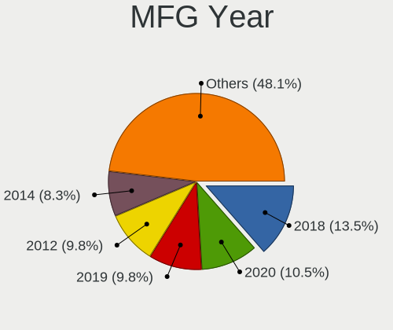

| Year | Computers | Percent |
|------|-----------|---------|
| 2018 | 8         | 17.78%  |
| 2021 | 6         | 13.33%  |
| 2020 | 6         | 13.33%  |
| 2019 | 5         | 11.11%  |
| 2010 | 5         | 11.11%  |
| 2016 | 3         | 6.67%   |
| 2015 | 2         | 4.44%   |
| 2014 | 2         | 4.44%   |
| 2011 | 2         | 4.44%   |
| 2009 | 2         | 4.44%   |
| 2017 | 1         | 2.22%   |
| 2013 | 1         | 2.22%   |
| 2012 | 1         | 2.22%   |
| 2007 | 1         | 2.22%   |

Form Factor
-----------

Physical design of the computer

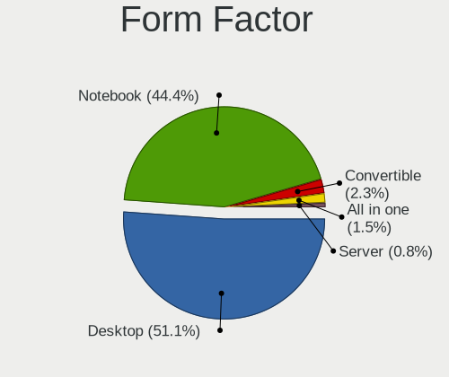

| Name     | Computers | Percent |
|----------|-----------|---------|
| Desktop  | 23        | 51.11%  |
| Notebook | 22        | 48.89%  |

Secure Boot
-----------

Enabled or disabled

| State    | Computers | Percent |
|----------|-----------|---------|
| Disabled | 43        | 95.56%  |
| Enabled  | 2         | 4.44%   |

Coreboot
--------

Have coreboot on board

| Used | Computers | Percent |
|------|-----------|---------|
| No   | 45        | 100%    |

RAM Size
--------

Total RAM memory

| Size in GB  | Computers | Percent |
|-------------|-----------|---------|
| 16.01-24.0  | 14        | 31.11%  |
| 8.01-16.0   | 8         | 17.78%  |
| 3.01-4.0    | 7         | 15.56%  |
| 4.01-8.0    | 6         | 13.33%  |
| 64.01-256.0 | 4         | 8.89%   |
| 32.01-64.0  | 3         | 6.67%   |
| 1.01-2.0    | 2         | 4.44%   |
| 2.01-3.0    | 1         | 2.22%   |

RAM Used
--------

Used RAM memory

| Used GB   | Computers | Percent |
|-----------|-----------|---------|
| 1.01-2.0  | 18        | 40%     |
| 4.01-8.0  | 11        | 24.44%  |
| 2.01-3.0  | 8         | 17.78%  |
| 3.01-4.0  | 4         | 8.89%   |
| 8.01-16.0 | 2         | 4.44%   |
| 0.51-1.0  | 2         | 4.44%   |

Total Drives
------------

Number of drives on board

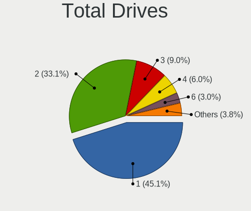

| Drives | Computers | Percent |
|--------|-----------|---------|
| 1      | 22        | 48.89%  |
| 2      | 14        | 31.11%  |
| 3      | 6         | 13.33%  |
| 4      | 2         | 4.44%   |
| 6      | 1         | 2.22%   |

Has CD-ROM
----------

Has CD-ROM on board

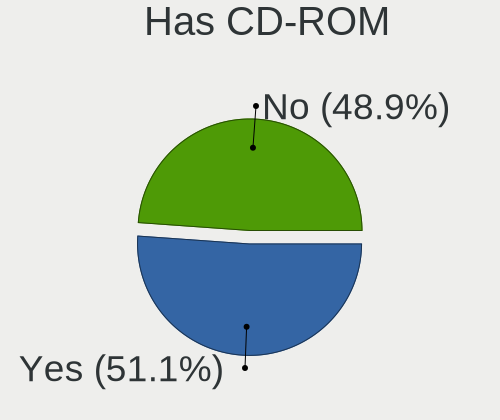

| Presented | Computers | Percent |
|-----------|-----------|---------|
| Yes       | 24        | 53.33%  |
| No        | 21        | 46.67%  |

Has Ethernet
------------

Has Ethernet on board

| Presented | Computers | Percent |
|-----------|-----------|---------|
| Yes       | 43        | 95.56%  |
| No        | 2         | 4.44%   |

Has WiFi
--------

Has WiFi module

| Presented | Computers | Percent |
|-----------|-----------|---------|
| Yes       | 38        | 84.44%  |
| No        | 7         | 15.56%  |

Has Bluetooth
-------------

Has Bluetooth module

| Presented | Computers | Percent |
|-----------|-----------|---------|
| Yes       | 27        | 58.7%   |
| No        | 19        | 41.3%   |

Location
--------

Country
-------

Geographic location (country)

| Country    | Computers | Percent |
|------------|-----------|---------|
| Germany    | 8         | 17.78%  |
| Brazil     | 7         | 15.56%  |
| USA        | 4         | 8.89%   |
| Russia     | 2         | 4.44%   |
| Nicaragua  | 2         | 4.44%   |
| Mexico     | 2         | 4.44%   |
| Japan      | 2         | 4.44%   |
| India      | 2         | 4.44%   |
| Czechia    | 2         | 4.44%   |
| Australia  | 2         | 4.44%   |
| Sweden     | 1         | 2.22%   |
| Sudan      | 1         | 2.22%   |
| Spain      | 1         | 2.22%   |
| Slovakia   | 1         | 2.22%   |
| Romania    | 1         | 2.22%   |
| Portugal   | 1         | 2.22%   |
| Luxembourg | 1         | 2.22%   |
| Hungary    | 1         | 2.22%   |
| France     | 1         | 2.22%   |
| Croatia    | 1         | 2.22%   |
| China      | 1         | 2.22%   |
| Belgium    | 1         | 2.22%   |

City
----

Geographic location (city)

| City                  | Computers | Percent |
|-----------------------|-----------|---------|
| São Paulo            | 3         | 6.52%   |
| Tokyo                 | 2         | 4.35%   |
| Prague                | 2         | 4.35%   |
| Managua               | 2         | 4.35%   |
| Zhuhai                | 1         | 2.17%   |
| Umeå                 | 1         | 2.17%   |
| Três Lagoas          | 1         | 2.17%   |
| Stupava               | 1         | 2.17%   |
| Stabroek              | 1         | 2.17%   |
| S??o Paulo            | 1         | 2.17%   |
| San Luis Potos?­ City | 1         | 2.17%   |
| Recife                | 1         | 2.17%   |
| Palanpur              | 1         | 2.17%   |
| Oregon                | 1         | 2.17%   |
| Nordenham             | 1         | 2.17%   |
| Nevez                 | 1         | 2.17%   |
| Munich                | 1         | 2.17%   |
| Moscow                | 1         | 2.17%   |
| Melbourne             | 1         | 2.17%   |
| McDonough             | 1         | 2.17%   |
| Luxembourg            | 1         | 2.17%   |
| Lomonosov             | 1         | 2.17%   |
| Leiria                | 1         | 2.17%   |
| Le??n                 | 1         | 2.17%   |
| Khartoum              | 1         | 2.17%   |
| Heinsberg             | 1         | 2.17%   |
| Gevelsberg            | 1         | 2.17%   |
| Federal Way           | 1         | 2.17%   |
| Esztergom             | 1         | 2.17%   |
| Ebhausen              | 1         | 2.17%   |
| Dahme                 | 1         | 2.17%   |
| Concarneau            | 1         | 2.17%   |
| Cologne               | 1         | 2.17%   |
| Chapec??              | 1         | 2.17%   |
| Canc??n               | 1         | 2.17%   |
| Busevec               | 1         | 2.17%   |
| Bucharest             | 1         | 2.17%   |
| Brisbane              | 1         | 2.17%   |
| Braunschweig          | 1         | 2.17%   |
| Bengaluru             | 1         | 2.17%   |
| Atlanta               | 1         | 2.17%   |

Drives
------

Drive Vendor
------------

Hard drive vendors

| Vendor              | Computers | Drives | Percent |
|---------------------|-----------|--------|---------|
| WDC                 | 15        | 18     | 20%     |
| Samsung Electronics | 13        | 15     | 17.33%  |
| Seagate             | 11        | 13     | 14.67%  |
| Hitachi             | 4         | 5      | 5.33%   |
| Unknown             | 3         | 3      | 4%      |
| Toshiba             | 3         | 4      | 4%      |
| SanDisk             | 3         | 3      | 4%      |
| Kingston            | 3         | 3      | 4%      |
| Intel               | 3         | 3      | 4%      |
| HGST                | 3         | 3      | 4%      |
| A-DATA Technology   | 3         | 3      | 4%      |
| Silicon Motion      | 2         | 2      | 2.67%   |
| TO Exter            | 1         | 1      | 1.33%   |
| SK Hynix            | 1         | 1      | 1.33%   |
| PLEXTOR             | 1         | 2      | 1.33%   |
| Phison              | 1         | 1      | 1.33%   |
| LITEON              | 1         | 1      | 1.33%   |
| Intenso             | 1         | 1      | 1.33%   |
| HGST HTS            | 1         | 1      | 1.33%   |
| Fujitsu             | 1         | 1      | 1.33%   |
| Crucial             | 1         | 1      | 1.33%   |

Drive Model
-----------

Hard drive models

| Model                                | Computers | Percent |
|--------------------------------------|-----------|---------|
| Silicon Motion NVMe SSD Drive 512GB  | 2         | 2.44%   |
| Seagate ST3750528AS 752GB            | 2         | 2.44%   |
| Seagate ST2000DM006-2DM164 2TB       | 2         | 2.44%   |
| Seagate ST1000LM035-1RK172 1TB       | 2         | 2.44%   |
| Seagate ST1000LM024 HN-M101MBB 1TB   | 2         | 2.44%   |
| Samsung SSD 860 EVO 250GB            | 2         | 2.44%   |
| Samsung SSD 850 EVO 500GB            | 2         | 2.44%   |
| Samsung SSD 850 EVO 250GB            | 2         | 2.44%   |
| HGST HTS721010A9E630 1TB             | 2         | 2.44%   |
| WDC WDS500G1X0E-00AFY0 500GB         | 1         | 1.22%   |
| WDC WDS480G2G0A-00JH30 480GB SSD     | 1         | 1.22%   |
| WDC WDS250G1B0C-00S6U0 250GB         | 1         | 1.22%   |
| WDC WD800BEVS-60RST0 80GB            | 1         | 1.22%   |
| WDC WD7500AALX-009BA0 752GB          | 1         | 1.22%   |
| WDC WD5000LPLX-66ZNTT1 500GB         | 1         | 1.22%   |
| WDC WD5000AAVS-00ZTB0 500GB          | 1         | 1.22%   |
| WDC WD50 00LPCX-00VHAT0 500GB        | 1         | 1.22%   |
| WDC WD3200AAKS-00B3A0 320GB          | 1         | 1.22%   |
| WDC WD2500AAJS-00VTA0 250GB          | 1         | 1.22%   |
| WDC WD2005FBYZ-01YCBB2 2TB           | 1         | 1.22%   |
| WDC WD10EZEX-75M2NA0 1TB             | 1         | 1.22%   |
| WDC WD10EZEX-08WN4A0 1TB             | 1         | 1.22%   |
| WDC WD10EZEX-00KUWA0 1TB             | 1         | 1.22%   |
| WDC WD10EZEX-00BN5A0 1TB             | 1         | 1.22%   |
| WDC WD10EACS-00D6B1 1TB              | 1         | 1.22%   |
| WDC WD1003FZEX-00K3CA0 1TB           | 1         | 1.22%   |
| WDC WD1001FALS-00E3A0 1TB            | 1         | 1.22%   |
| Unknown USD00  256GB                 | 1         | 1.22%   |
| Unknown DA4064  64GB                 | 1         | 1.22%   |
| Unknown 128GB SATA FLASH DRIVE       | 1         | 1.22%   |
| Toshiba THNSNJ256G8NU 256GB SSD      | 1         | 1.22%   |
| Toshiba MQ01ABD075 752GB             | 1         | 1.22%   |
| Toshiba HDWD130 3TB                  | 1         | 1.22%   |
| TO Exter nal USB 3.0 4TB             | 1         | 1.22%   |
| SK Hynix HBG4e  32GB                 | 1         | 1.22%   |
| Seagate ST500LM012 HN-M500MBB 500GB  | 1         | 1.22%   |
| Seagate ST500LM0 12 HN-M500MBB 500GB | 1         | 1.22%   |
| Seagate ST3750630AS 752GB            | 1         | 1.22%   |
| Seagate ST3160812AS 160GB            | 1         | 1.22%   |
| Seagate ST1000DM010-2EP102 1TB       | 1         | 1.22%   |
| SanDisk SD8TB8U512G1001 512GB SSD    | 1         | 1.22%   |
| SanDisk SD7SB6S256G1001 256GB SSD    | 1         | 1.22%   |
| SanDisk SD7SB3Q-256G-1006 256GB SSD  | 1         | 1.22%   |
| Samsung SSD 980 PRO 1TB              | 1         | 1.22%   |
| Samsung SSD 970 EVO 1TB              | 1         | 1.22%   |
| Samsung SSD 870 QVO 1TB              | 1         | 1.22%   |
| Samsung SSD 860 EVO 1TB              | 1         | 1.22%   |
| Samsung SSD 840 Series 120GB         | 1         | 1.22%   |
| Samsung MZVPV512HDGL-000H1 512GB     | 1         | 1.22%   |
| Samsung MZVLB512HAJQ-000H1 512GB     | 1         | 1.22%   |
| Samsung MZ7LN256HCHP-000L7 256GB SSD | 1         | 1.22%   |
| Samsung HD401LJ 400GB                | 1         | 1.22%   |
| PLEXTOR PX-512M5Pro 512GB SSD        | 1         | 1.22%   |
| Phison Viper M.2 VPN100 512GB        | 1         | 1.22%   |
| LITEON CX1-JB256-HP 256GB SSD        | 1         | 1.22%   |
| Kingston SNA-DC/U3 512GB SSD         | 1         | 1.22%   |
| Kingston SM2280S3G2480G 480GB SSD    | 1         | 1.22%   |
| Kingston RBU-SC100S37128GD 128GB SSD | 1         | 1.22%   |
| Intenso SSD 512GB                    | 1         | 1.22%   |
| Intel SSDSC2BW240A4 240GB            | 1         | 1.22%   |

HDD Vendor
----------

Hard disk drive vendors

| Vendor              | Computers | Drives | Percent |
|---------------------|-----------|--------|---------|
| WDC                 | 12        | 15     | 34.29%  |
| Seagate             | 11        | 13     | 31.43%  |
| Hitachi             | 4         | 5      | 11.43%  |
| HGST                | 3         | 3      | 8.57%   |
| Toshiba             | 2         | 3      | 5.71%   |
| TO Exter            | 1         | 1      | 2.86%   |
| Samsung Electronics | 1         | 1      | 2.86%   |
| Fujitsu             | 1         | 1      | 2.86%   |

SSD Vendor
----------

Solid state drive vendors

| Vendor              | Computers | Drives | Percent |
|---------------------|-----------|--------|---------|
| Samsung Electronics | 8         | 10     | 33.33%  |
| SanDisk             | 3         | 3      | 12.5%   |
| Kingston            | 3         | 3      | 12.5%   |
| A-DATA Technology   | 3         | 3      | 12.5%   |
| Intel               | 2         | 2      | 8.33%   |
| WDC                 | 1         | 1      | 4.17%   |
| Toshiba             | 1         | 1      | 4.17%   |
| PLEXTOR             | 1         | 2      | 4.17%   |
| LITEON              | 1         | 1      | 4.17%   |
| Intenso             | 1         | 1      | 4.17%   |

Drive Kind
----------

HDD or SSD

| Kind    | Computers | Drives | Percent |
|---------|-----------|--------|---------|
| HDD     | 27        | 42     | 41.54%  |
| SSD     | 24        | 27     | 36.92%  |
| NVMe    | 10        | 11     | 15.38%  |
| MMC     | 3         | 3      | 4.62%   |
| Unknown | 1         | 2      | 1.54%   |

Drive Connector
---------------

SATA, SAS, NVMe, etc.

| Type | Computers | Drives | Percent |
|------|-----------|--------|---------|
| SATA | 40        | 66     | 71.43%  |
| NVMe | 10        | 11     | 17.86%  |
| SAS  | 3         | 5      | 5.36%   |
| MMC  | 3         | 3      | 5.36%   |

Drive Size
----------

Size of hard drive

| Size in TB | Computers | Drives | Percent |
|------------|-----------|--------|---------|
| 0.51-1.0   | 27        | 30     | 47.37%  |
| 0.01-0.5   | 24        | 33     | 42.11%  |
| 1.01-2.0   | 4         | 4      | 7.02%   |
| 3.01-4.0   | 1         | 1      | 1.75%   |
| 2.01-3.0   | 1         | 1      | 1.75%   |

Space Total
-----------

Amount of disk space available on the file system

| Size in GB     | Computers | Percent |
|----------------|-----------|---------|
| 1001-2000      | 10        | 22.22%  |
| 501-1000       | 10        | 22.22%  |
| 251-500        | 8         | 17.78%  |
| More than 3000 | 6         | 13.33%  |
| 2001-3000      | 6         | 13.33%  |
| 51-100         | 3         | 6.67%   |
| 1-20           | 1         | 2.22%   |
| Unknown        | 1         | 2.22%   |

Space Used
----------

Amount of used disk space

| Used GB   | Computers | Percent |
|-----------|-----------|---------|
| 51-100    | 10        | 21.74%  |
| 251-500   | 9         | 19.57%  |
| 101-250   | 9         | 19.57%  |
| 1001-2000 | 5         | 10.87%  |
| 1-20      | 5         | 10.87%  |
| 501-1000  | 5         | 10.87%  |
| 21-50     | 1         | 2.17%   |
| 2001-3000 | 1         | 2.17%   |
| Unknown   | 1         | 2.17%   |

Malfunc. Drives
---------------

Drive models with a malfunction

| Model                               | Computers | Drives | Percent |
|-------------------------------------|-----------|--------|---------|
| Seagate ST1000LM035-1RK172 1TB      | 1         | 1      | 33.33%  |
| Samsung Electronics SSD 970 EVO 1TB | 1         | 1      | 33.33%  |
| Crucial CT1000P1SSD8 1TB            | 1         | 1      | 33.33%  |

Malfunc. Drive Vendor
---------------------

Vendors of faulty drives

| Vendor              | Computers | Drives | Percent |
|---------------------|-----------|--------|---------|
| Seagate             | 1         | 1      | 33.33%  |
| Samsung Electronics | 1         | 1      | 33.33%  |
| Crucial             | 1         | 1      | 33.33%  |

Malfunc. HDD Vendor
-------------------

Vendors of faulty HDD drives

| Vendor  | Computers | Drives | Percent |
|---------|-----------|--------|---------|
| Seagate | 1         | 1      | 100%    |

Malfunc. Drive Kind
-------------------

Kinds of faulty drives

| Kind | Computers | Drives | Percent |
|------|-----------|--------|---------|
| NVMe | 2         | 2      | 66.67%  |
| HDD  | 1         | 1      | 33.33%  |

Failed Drives
-------------

Failed drive models

Zero info for selected period =(

Failed Drive Vendor
-------------------

Failed drive vendors

Zero info for selected period =(

Drive Status
------------

Number of failed and malfunc. drives

| Status   | Computers | Drives | Percent |
|----------|-----------|--------|---------|
| Detected | 28        | 55     | 58.33%  |
| Works    | 17        | 27     | 35.42%  |
| Malfunc  | 3         | 3      | 6.25%   |

Storage controller
------------------

Storage Vendor
--------------

Storage controller vendors

| Vendor                    | Computers | Percent |
|---------------------------|-----------|---------|
| Intel                     | 32        | 57.14%  |
| AMD                       | 11        | 19.64%  |
| Samsung Electronics       | 4         | 7.14%   |
| Silicon Motion            | 2         | 3.57%   |
| Sandisk                   | 2         | 3.57%   |
| Silicon Image             | 1         | 1.79%   |
| Phison Electronics        | 1         | 1.79%   |
| Micron/Crucial Technology | 1         | 1.79%   |
| Lite-On Technology        | 1         | 1.79%   |
| ASMedia Technology        | 1         | 1.79%   |

Storage Model
-------------

Storage controller models

| Model                                                                                   | Computers | Percent |
|-----------------------------------------------------------------------------------------|-----------|---------|
| AMD FCH SATA Controller [AHCI mode]                                                     | 9         | 13.43%  |
| Intel Sunrise Point-LP SATA Controller [AHCI mode]                                      | 4         | 5.97%   |
| Intel 8 Series/C220 Series Chipset Family 6-port SATA Controller 1 [AHCI mode]          | 4         | 5.97%   |
| Silicon Motion SM2262/SM2262EN SSD Controller                                           | 2         | 2.99%   |
| Samsung NVMe SSD Controller SM981/PM981/PM983                                           | 2         | 2.99%   |
| Intel Q170/Q150/B150/H170/H110/Z170/CM236 Chipset SATA Controller [AHCI Mode]           | 2         | 2.99%   |
| Intel NM10/ICH7 Family SATA Controller [IDE mode]                                       | 2         | 2.99%   |
| Intel HM170/QM170 Chipset SATA Controller [AHCI Mode]                                   | 2         | 2.99%   |
| Intel 82801HM/HEM (ICH8M/ICH8M-E) SATA Controller [AHCI mode]                           | 2         | 2.99%   |
| Intel 82801HM/HEM (ICH8M/ICH8M-E) IDE Controller                                        | 2         | 2.99%   |
| Intel 82801G (ICH7 Family) IDE Controller                                               | 2         | 2.99%   |
| Intel 82801 Mobile SATA Controller [RAID mode]                                          | 2         | 2.99%   |
| Intel 7 Series Chipset Family 6-port SATA Controller [AHCI mode]                        | 2         | 2.99%   |
| Intel 6 Series/C200 Series Chipset Family 6 port Mobile SATA AHCI Controller            | 2         | 2.99%   |
| AMD 400 Series Chipset SATA Controller                                                  | 2         | 2.99%   |
| AMD 300 Series Chipset SATA Controller                                                  | 2         | 2.99%   |
| Silicon Image SiI 3132 Serial ATA Raid II Controller                                    | 1         | 1.49%   |
| Sandisk WD Blue SN500 / PC SN520 NVMe SSD                                               | 1         | 1.49%   |
| Sandisk WD Black SN850                                                                  | 1         | 1.49%   |
| Samsung NVMe SSD Controller SM951/PM951                                                 | 1         | 1.49%   |
| Samsung NVMe SSD Controller PM9A1/PM9A3/980PRO                                          | 1         | 1.49%   |
| Phison E12 NVMe Controller                                                              | 1         | 1.49%   |
| Micron/Crucial P1 NVMe PCIe SSD                                                         | 1         | 1.49%   |
| Lite-On SATA controller                                                                 | 1         | 1.49%   |
| Intel Wildcat Point-LP SATA Controller [AHCI Mode]                                      | 1         | 1.49%   |
| Intel SSD 660P Series                                                                   | 1         | 1.49%   |
| Intel SATA Controller [RAID mode]                                                       | 1         | 1.49%   |
| Intel Cannon Lake PCH SATA AHCI Controller                                              | 1         | 1.49%   |
| Intel 82801JI (ICH10 Family) SATA AHCI Controller                                       | 1         | 1.49%   |
| Intel 82801IBM/IEM (ICH9M/ICH9M-E) 4 port SATA Controller [AHCI mode]                   | 1         | 1.49%   |
| Intel 82801GR/GDH (ICH7R/ICH7DH) SATA Controller [RAID mode]                            | 1         | 1.49%   |
| Intel 6 Series/C200 Series Chipset Family Desktop SATA Controller (IDE mode, ports 4-5) | 1         | 1.49%   |
| Intel 6 Series/C200 Series Chipset Family Desktop SATA Controller (IDE mode, ports 0-3) | 1         | 1.49%   |
| Intel 5 Series/3400 Series Chipset 6 port SATA AHCI Controller                          | 1         | 1.49%   |
| Intel 200 Series PCH SATA controller [AHCI mode]                                        | 1         | 1.49%   |
| ASMedia ASM1062 Serial ATA Controller                                                   | 1         | 1.49%   |
| AMD X370 Series Chipset SATA Controller                                                 | 1         | 1.49%   |
| AMD Starship/Matisse Chipset SATA Controller [AHCI mode]                                | 1         | 1.49%   |
| AMD SB7x0/SB8x0/SB9x0 SATA Controller [AHCI mode]                                       | 1         | 1.49%   |
| AMD SB7x0/SB8x0/SB9x0 IDE Controller                                                    | 1         | 1.49%   |

Storage Kind
------------

Kind of storage controller (IDE, SATA, NVMe, SAS, ...)

| Kind | Computers | Percent |
|------|-----------|---------|
| SATA | 35        | 61.4%   |
| NVMe | 10        | 17.54%  |
| IDE  | 7         | 12.28%  |
| RAID | 5         | 8.77%   |

Processor
---------

CPU Vendor
----------

Processor vendors

| Vendor | Computers | Percent |
|--------|-----------|---------|
| Intel  | 34        | 75.56%  |
| AMD    | 11        | 24.44%  |

CPU Model
---------

Processor models

| Model                                       | Computers | Percent |
|---------------------------------------------|-----------|---------|
| Intel Core i5-7200U CPU @ 2.50GHz           | 2         | 4.44%   |
| AMD Ryzen 9 5900X 12-Core Processor         | 2         | 4.44%   |
| AMD Ryzen 7 1700 Eight-Core Processor       | 2         | 4.44%   |
| Intel Pentium Dual-Core CPU E5400 @ 2.70GHz | 1         | 2.22%   |
| Intel Pentium CPU G3258 @ 3.20GHz           | 1         | 2.22%   |
| Intel Core i7-9750H CPU @ 2.60GHz           | 1         | 2.22%   |
| Intel Core i7-8550U CPU @ 1.80GHz           | 1         | 2.22%   |
| Intel Core i7-7700HQ CPU @ 2.80GHz          | 1         | 2.22%   |
| Intel Core i7-6700HQ CPU @ 2.60GHz          | 1         | 2.22%   |
| Intel Core i7-6700 CPU @ 3.40GHz            | 1         | 2.22%   |
| Intel Core i7-6600U CPU @ 2.60GHz           | 1         | 2.22%   |
| Intel Core i7-5600U CPU @ 2.60GHz           | 1         | 2.22%   |
| Intel Core i7-4810MQ CPU @ 2.80GHz          | 1         | 2.22%   |
| Intel Core i7-4790 CPU @ 3.60GHz            | 1         | 2.22%   |
| Intel Core i7-4720HQ CPU @ 2.60GHz          | 1         | 2.22%   |
| Intel Core i7-3740QM CPU @ 2.70GHz          | 1         | 2.22%   |
| Intel Core i7 CPU 860 @ 2.80GHz             | 1         | 2.22%   |
| Intel Core i5-7500 CPU @ 3.40GHz            | 1         | 2.22%   |
| Intel Core i5-6400 CPU @ 2.70GHz            | 1         | 2.22%   |
| Intel Core i5-6200U CPU @ 2.30GHz           | 1         | 2.22%   |
| Intel Core i5-4300M CPU @ 2.60GHz           | 1         | 2.22%   |
| Intel Core i5-3317U CPU @ 1.70GHz           | 1         | 2.22%   |
| Intel Core i5-2520M CPU @ 2.50GHz           | 1         | 2.22%   |
| Intel Core i5-2410M CPU @ 2.30GHz           | 1         | 2.22%   |
| Intel Core i5-2400S CPU @ 2.50GHz           | 1         | 2.22%   |
| Intel Core i3-8100 CPU @ 3.60GHz            | 1         | 2.22%   |
| Intel Core i3-3110M CPU @ 2.40GHz           | 1         | 2.22%   |
| Intel Core 2 Quad CPU Q9300 @ 2.50GHz       | 1         | 2.22%   |
| Intel Core 2 Duo CPU T7250 @ 2.00GHz        | 1         | 2.22%   |
| Intel Core 2 Duo CPU T5250 @ 1.50GHz        | 1         | 2.22%   |
| Intel Core 2 Duo CPU P8600 @ 2.40GHz        | 1         | 2.22%   |
| Intel Core 2 Duo CPU E7400 @ 2.80GHz        | 1         | 2.22%   |
| Intel Core 2 CPU 6400 @ 2.13GHz             | 1         | 2.22%   |
| Intel Celeron N4000 CPU @ 1.10GHz           | 1         | 2.22%   |
| Intel Celeron CPU N2840 @ 2.16GHz           | 1         | 2.22%   |
| AMD Sempron 2650 APU with Radeon R3         | 1         | 2.22%   |
| AMD Ryzen 9 5950X 16-Core Processor         | 1         | 2.22%   |
| AMD Ryzen 9 3950X 16-Core Processor         | 1         | 2.22%   |
| AMD Ryzen 7 3700X 8-Core Processor          | 1         | 2.22%   |
| AMD Ryzen 5 1600X Six-Core Processor        | 1         | 2.22%   |
| AMD Ryzen 5 1600 Six-Core Processor         | 1         | 2.22%   |
| AMD Phenom II X4 B50 Processor              | 1         | 2.22%   |

CPU Model Family
----------------

Processor model prefix

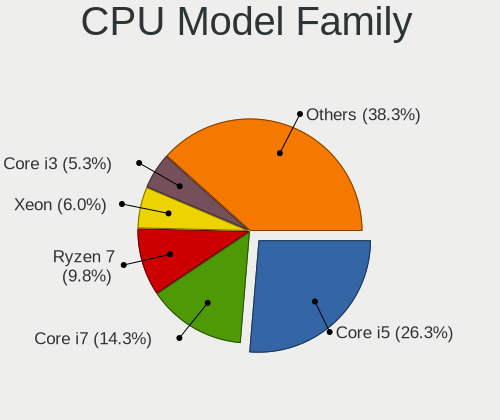

| Model                   | Computers | Percent |
|-------------------------|-----------|---------|
| Intel Core i7           | 12        | 26.67%  |
| Intel Core i5           | 10        | 22.22%  |
| Intel Core 2 Duo        | 4         | 8.89%   |
| AMD Ryzen 9             | 4         | 8.89%   |
| AMD Ryzen 7             | 3         | 6.67%   |
| Intel Core i3           | 2         | 4.44%   |
| Intel Celeron           | 2         | 4.44%   |
| AMD Ryzen 5             | 2         | 4.44%   |
| Intel Pentium Dual-Core | 1         | 2.22%   |
| Intel Pentium           | 1         | 2.22%   |
| Intel Core 2 Quad       | 1         | 2.22%   |
| Intel Core 2            | 1         | 2.22%   |
| AMD Sempron             | 1         | 2.22%   |
| AMD Phenom II X4        | 1         | 2.22%   |

CPU Cores
---------

Number of processor cores

| Number | Computers | Percent |
|--------|-----------|---------|
| 2      | 20        | 44.44%  |
| 4      | 15        | 33.33%  |
| 8      | 3         | 6.67%   |
| 6      | 3         | 6.67%   |
| 16     | 2         | 4.44%   |
| 12     | 2         | 4.44%   |

CPU Sockets
-----------

Number of sockets

| Number | Computers | Percent |
|--------|-----------|---------|
| 1      | 45        | 100%    |

CPU Threads
-----------

Threads per core (Hyper-Threading)

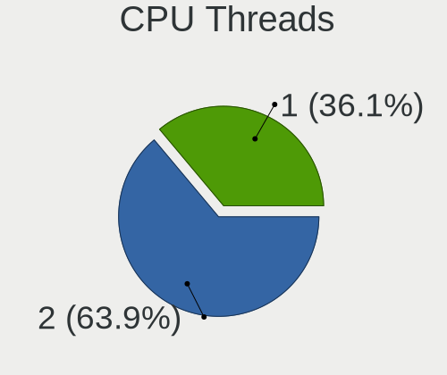

| Number | Computers | Percent |
|--------|-----------|---------|
| 2      | 28        | 62.22%  |
| 1      | 17        | 37.78%  |

CPU Op-Modes
------------

CPU Operation Modes (32-bit, 64-bit)

| Op mode        | Computers | Percent |
|----------------|-----------|---------|
| 32-bit, 64-bit | 45        | 100%    |

CPU Microcode
-------------

Microcode number

| Number     | Computers | Percent |
|------------|-----------|---------|
| Unknown    | 21        | 46.67%  |
| 0x6fd      | 2         | 4.44%   |
| 0x406e3    | 2         | 4.44%   |
| 0x206a7    | 2         | 4.44%   |
| 0x0a201009 | 2         | 4.44%   |
| 0x08001137 | 2         | 4.44%   |
| 0x906ea    | 1         | 2.22%   |
| 0x906e9    | 1         | 2.22%   |
| 0x806e9    | 1         | 2.22%   |
| 0x706a1    | 1         | 2.22%   |
| 0x506e3    | 1         | 2.22%   |
| 0x306d4    | 1         | 2.22%   |
| 0x306c3    | 1         | 2.22%   |
| 0x306a9    | 1         | 2.22%   |
| 0x30678    | 1         | 2.22%   |
| 0x1067a    | 1         | 2.22%   |
| 0x10677    | 1         | 2.22%   |
| 0x10676    | 1         | 2.22%   |
| 0x0a201016 | 1         | 2.22%   |
| 0x08701021 | 1         | 2.22%   |

CPU Microarch
-------------

Microarchitecture

| Name          | Computers | Percent |
|---------------|-----------|---------|
| KabyLake      | 7         | 15.56%  |
| Skylake       | 5         | 11.11%  |
| Haswell       | 5         | 11.11%  |
| Zen           | 4         | 8.89%   |
| Penryn        | 4         | 8.89%   |
| Zen 3         | 3         | 6.67%   |
| SandyBridge   | 3         | 6.67%   |
| IvyBridge     | 3         | 6.67%   |
| Core          | 3         | 6.67%   |
| Zen 2         | 2         | 4.44%   |
| Silvermont    | 1         | 2.22%   |
| Nehalem       | 1         | 2.22%   |
| K10           | 1         | 2.22%   |
| Jaguar        | 1         | 2.22%   |
| Goldmont plus | 1         | 2.22%   |
| Broadwell     | 1         | 2.22%   |

Graphics
--------

GPU Vendor
----------

Vendors of graphics cards

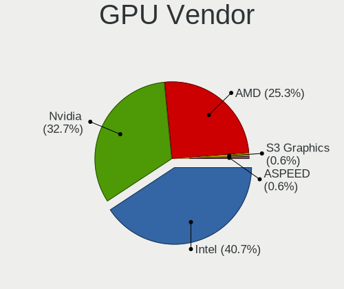

| Vendor | Computers | Percent |
|--------|-----------|---------|
| Intel  | 29        | 50.88%  |
| Nvidia | 19        | 33.33%  |
| AMD    | 9         | 15.79%  |

GPU Model
---------

Graphics card models

| Model                                                                       | Computers | Percent |
|-----------------------------------------------------------------------------|-----------|---------|
| Intel 4th Gen Core Processor Integrated Graphics Controller                 | 3         | 5.08%   |
| Intel 3rd Gen Core processor Graphics Controller                            | 3         | 5.08%   |
| Nvidia GA102 [GeForce RTX 3090]                                             | 2         | 3.39%   |
| Intel Xeon E3-1200 v3/4th Gen Core Processor Integrated Graphics Controller | 2         | 3.39%   |
| Intel Skylake GT2 [HD Graphics 520]                                         | 2         | 3.39%   |
| Intel Mobile GM965/GL960 Integrated Graphics Controller (secondary)         | 2         | 3.39%   |
| Intel Mobile GM965/GL960 Integrated Graphics Controller (primary)           | 2         | 3.39%   |
| Intel HD Graphics 630                                                       | 2         | 3.39%   |
| Intel HD Graphics 620                                                       | 2         | 3.39%   |
| Intel HD Graphics 530                                                       | 2         | 3.39%   |
| Intel 4 Series Chipset Integrated Graphics Controller                       | 2         | 3.39%   |
| Intel 2nd Generation Core Processor Family Integrated Graphics Controller   | 2         | 3.39%   |
| Nvidia TU117M [GeForce GTX 1650 Mobile / Max-Q]                             | 1         | 1.69%   |
| Nvidia TU117 [GeForce GTX 1650]                                             | 1         | 1.69%   |
| Nvidia TU116 [GeForce GTX 1660]                                             | 1         | 1.69%   |
| Nvidia GT216 [GeForce GT 220]                                               | 1         | 1.69%   |
| Nvidia GP107M [GeForce GTX 1050 Ti Mobile]                                  | 1         | 1.69%   |
| Nvidia GP107 [GeForce GTX 1050 Ti]                                          | 1         | 1.69%   |
| Nvidia GP104 [GeForce GTX 1070]                                             | 1         | 1.69%   |
| Nvidia GP102 [GeForce GTX 1080 Ti]                                          | 1         | 1.69%   |
| Nvidia GM206 [GeForce GTX 960]                                              | 1         | 1.69%   |
| Nvidia GM204M [GeForce GTX 980M]                                            | 1         | 1.69%   |
| Nvidia GM204M [GeForce GTX 970M]                                            | 1         | 1.69%   |
| Nvidia GM108M [GeForce 940MX]                                               | 1         | 1.69%   |
| Nvidia GM107M [GeForce GTX 960M]                                            | 1         | 1.69%   |
| Nvidia GK104GLM [Quadro K3000M]                                             | 1         | 1.69%   |
| Nvidia GF119 [GeForce GT 520]                                               | 1         | 1.69%   |
| Nvidia GA102 [GeForce RTX 3080 Ti]                                          | 1         | 1.69%   |
| Nvidia G98M [GeForce 9300M GS]                                              | 1         | 1.69%   |
| Intel UHD Graphics 620                                                      | 1         | 1.69%   |
| Intel Mobile 4 Series Chipset Integrated Graphics Controller                | 1         | 1.69%   |
| Intel HD Graphics 5500                                                      | 1         | 1.69%   |
| Intel GeminiLake [UHD Graphics 600]                                         | 1         | 1.69%   |
| Intel CoffeeLake-S GT2 [UHD Graphics 630]                                   | 1         | 1.69%   |
| Intel CoffeeLake-H GT2 [UHD Graphics 630]                                   | 1         | 1.69%   |
| Intel Atom Processor Z36xxx/Z37xxx Series Graphics & Display                | 1         | 1.69%   |
| AMD Tonga PRO [Radeon R9 285/380]                                           | 1         | 1.69%   |
| AMD Thames [Radeon HD 7500M/7600M Series]                                   | 1         | 1.69%   |
| AMD Sun PRO [Radeon HD 8570A/8570M]                                         | 1         | 1.69%   |
| AMD Seymour [Radeon HD 6400M/7400M Series]                                  | 1         | 1.69%   |
| AMD RV610 [Radeon HD 2400 PRO]                                              | 1         | 1.69%   |
| AMD Redwood XT [Radeon HD 5670/5690/5730]                                   | 1         | 1.69%   |
| AMD Lexa PRO [Radeon 540/540X/550/550X / RX 540X/550/550X]                  | 1         | 1.69%   |
| AMD Kabini [Radeon HD 8240 / R3 Series]                                     | 1         | 1.69%   |
| AMD Curacao PRO [Radeon R7 370 / R9 270/370 OEM]                            | 1         | 1.69%   |

GPU Combo
---------

Combinations of graphics cards

| Name           | Computers | Percent |
|----------------|-----------|---------|
| 1 x Intel      | 18        | 40%     |
| 1 x Nvidia     | 11        | 24.44%  |
| Intel + Nvidia | 7         | 15.56%  |
| 1 x AMD        | 6         | 13.33%  |
| Intel + AMD    | 3         | 6.67%   |

GPU Driver
----------

Free vs proprietary

| Driver      | Computers | Percent |
|-------------|-----------|---------|
| Free        | 34        | 75.56%  |
| Proprietary | 10        | 22.22%  |
| Unknown     | 1         | 2.22%   |

GPU Memory
----------

Total video memory

| Size in GB | Computers | Percent |
|------------|-----------|---------|
| Unknown    | 33        | 73.33%  |
| 3.01-4.0   | 3         | 6.67%   |
| 16.01-24.0 | 2         | 4.44%   |
| 8.01-16.0  | 2         | 4.44%   |
| 0.51-1.0   | 2         | 4.44%   |
| 7.01-8.0   | 1         | 2.22%   |
| 5.01-6.0   | 1         | 2.22%   |
| 0.01-0.5   | 1         | 2.22%   |

Monitor
-------

Monitor Vendor
--------------

Monitor vendors

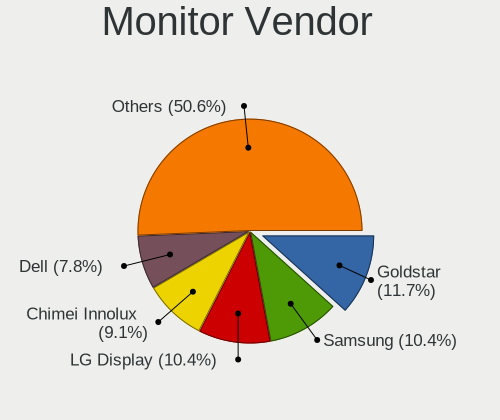

| Vendor               | Computers | Percent |
|----------------------|-----------|---------|
| LG Display           | 7         | 13.73%  |
| Goldstar             | 6         | 11.76%  |
| Samsung Electronics  | 5         | 9.8%    |
| Dell                 | 5         | 9.8%    |
| Hewlett-Packard      | 4         | 7.84%   |
| Chimei Innolux       | 4         | 7.84%   |
| AU Optronics         | 4         | 7.84%   |
| Acer                 | 3         | 5.88%   |
| LG Electronics       | 2         | 3.92%   |
| Lenovo               | 2         | 3.92%   |
| BenQ                 | 2         | 3.92%   |
| Sony                 | 1         | 1.96%   |
| Philips              | 1         | 1.96%   |
| LG Philips           | 1         | 1.96%   |
| InfoVision           | 1         | 1.96%   |
| Denver               | 1         | 1.96%   |
| AOC                  | 1         | 1.96%   |
| Ancor Communications | 1         | 1.96%   |

Monitor Model
-------------

Monitor models

| Model                                                                 | Computers | Percent |
|-----------------------------------------------------------------------|-----------|---------|
| Hewlett-Packard LV1911 HWP3005 1366x768 410x230mm 18.5-inch           | 2         | 3.85%   |
| Sony Nvidia Defaul t Flat Panel SNY06FA 1600x900 360x200mm 16.2-inch  | 1         | 1.92%   |
| Samsung Electronics SyncMaster SAM0524 1920x1080 477x268mm 21.5-inch  | 1         | 1.92%   |
| Samsung Electronics SA300/SA350 SAM0788 1366x768 410x230mm 18.5-inch  | 1         | 1.92%   |
| Samsung Electronics S23B550 SAM0919 1920x1080 510x287mm 23.0-inch     | 1         | 1.92%   |
| Samsung Electronics LCD Monitor SEC3449 1366x768 309x174mm 14.0-inch  | 1         | 1.92%   |
| Samsung Electronics LCD Monitor SDC424B 3840x2160 344x194mm 15.5-inch | 1         | 1.92%   |
| Philips 150S PHL0805 1024x768 307x230mm 15.1-inch                     | 1         | 1.92%   |
| LG Philips LCD Monitor LPLDB00 1280x800 331x207mm 15.4-inch           | 1         | 1.92%   |
| LG Electronics LCD Monitor LG ULTRAWIDE 2560x1080                     | 1         | 1.92%   |
| LG Electronics LCD Monitor LG TV SSCR 3840x2160                       | 1         | 1.92%   |
| LG Display LCD Monitor LGD05C0 1920x1080 344x194mm 15.5-inch          | 1         | 1.92%   |
| LG Display LCD Monitor LGD053C 1920x1080 309x174mm 14.0-inch          | 1         | 1.92%   |
| LG Display LCD Monitor LGD0521 1920x1080 309x174mm 14.0-inch          | 1         | 1.92%   |
| LG Display LCD Monitor LGD04A9 1920x1080 309x174mm 14.0-inch          | 1         | 1.92%   |
| LG Display LCD Monitor LGD046C 1920x1080 380x210mm 17.1-inch          | 1         | 1.92%   |
| LG Display LCD Monitor LGD044F 1920x1080 350x190mm 15.7-inch          | 1         | 1.92%   |
| LG Display LCD Monitor LGD02DA 1920x1080 380x220mm 17.3-inch          | 1         | 1.92%   |
| Lenovo LEN P27q-10 LEN61A8 2560x1440 597x336mm 27.0-inch              | 1         | 1.92%   |
| Lenovo LCD Monitor LEN4020 1024x768 286x214mm 14.1-inch               | 1         | 1.92%   |
| InfoVision LCD Monitor IVO03F4 1920x1200 263x164mm 12.2-inch          | 1         | 1.92%   |
| Hewlett-Packard LA1951 HWP285A 1280x1024 380x300mm 19.1-inch          | 1         | 1.92%   |
| Hewlett-Packard 27es HWP3326 1920x1080 598x336mm 27.0-inch            | 1         | 1.92%   |
| Goldstar LG ULTRAWIDE GSM59F1 1920x1080 580x240mm 24.7-inch           | 1         | 1.92%   |
| Goldstar L1718S GSM443C 1280x1024 338x270mm 17.0-inch                 | 1         | 1.92%   |
| Goldstar HDR WFHD GSM7714 2560x1080 798x334mm 34.1-inch               | 1         | 1.92%   |
| Goldstar FULL HD GSM5B54 1920x1080 480x270mm 21.7-inch                | 1         | 1.92%   |
| Goldstar E2742 GSM58C9 1920x1080 598x337mm 27.0-inch                  | 1         | 1.92%   |
| Goldstar E2441 GSM581F 1920x1080 531x299mm 24.0-inch                  | 1         | 1.92%   |
| Denver UWQHD-100-V2 LHC3500 3440x1440 798x342mm 34.2-inch             | 1         | 1.92%   |
| Dell UZ2315H DELF055 1920x1080 509x286mm 23.0-inch                    | 1         | 1.92%   |
| Dell U2711 DELA057 2560x1440 597x336mm 27.0-inch                      | 1         | 1.92%   |
| Dell U2410 DELF017 1920x1200 518x324mm 24.1-inch                      | 1         | 1.92%   |
| Dell P2219H DELA114 1920x1080 476x267mm 21.5-inch                     | 1         | 1.92%   |
| Dell E228WFP DELD014 1680x1050 473x296mm 22.0-inch                    | 1         | 1.92%   |
| Chimei Innolux LCD Monitor CMN15DB 1366x768 344x193mm 15.5-inch       | 1         | 1.92%   |
| Chimei Innolux LCD Monitor CMN14C3 1366x768 309x173mm 13.9-inch       | 1         | 1.92%   |
| Chimei Innolux LCD Monitor CMN1482 1600x900 309x174mm 14.0-inch       | 1         | 1.92%   |
| Chimei Innolux LCD Monitor CMN1136 1366x768 256x144mm 11.6-inch       | 1         | 1.92%   |
| BenQ SW2700 BNQ7F47 2560x1440 596x335mm 26.9-inch                     | 1         | 1.92%   |
| BenQ BL2405 BNQ8016 1920x1080 531x298mm 24.0-inch                     | 1         | 1.92%   |
| AU Optronics LCD Monitor AUO63ED 1920x1080 344x193mm 15.5-inch        | 1         | 1.92%   |
| AU Optronics LCD Monitor AUO225C 1366x768 256x144mm 11.6-inch         | 1         | 1.92%   |
| AU Optronics LCD Monitor AUO219D 1920x1080 381x214mm 17.2-inch        | 1         | 1.92%   |
| AU Optronics LCD Monitor AUO20EC 1366x768 344x193mm 15.5-inch         | 1         | 1.92%   |
| AOC LCD Monitor 28E850 640x480                                        | 1         | 1.92%   |
| Ancor Communications ASUS VN248 ACI24C4 1920x1080 530x300mm 24.0-inch | 1         | 1.92%   |
| Acer X163W ACR0015 1366x768 344x193mm 15.5-inch                       | 1         | 1.92%   |
| Acer V203H ACR0102 1600x900 443x249mm 20.0-inch                       | 1         | 1.92%   |
| Acer V203H ACR00C7 1600x900 443x249mm 20.0-inch                       | 1         | 1.92%   |
| Acer GD245HQ ACR0125 1920x1080 520x290mm 23.4-inch                    | 1         | 1.92%   |

Monitor Resolution
------------------

Monitor screen resolution

| Resolution         | Computers | Percent |
|--------------------|-----------|---------|
| 1920x1080 (FHD)    | 19        | 41.3%   |
| 1366x768 (WXGA)    | 7         | 15.22%  |
| 2560x1440 (QHD)    | 3         | 6.52%   |
| 2560x1080          | 3         | 6.52%   |
| 1600x900 (HD+)     | 3         | 6.52%   |
| 3840x2160 (4K)     | 2         | 4.35%   |
| 1920x1200 (WUXGA)  | 2         | 4.35%   |
| 1024x768 (XGA)     | 2         | 4.35%   |
| 640x480            | 1         | 2.17%   |
| 3440x1440          | 1         | 2.17%   |
| 1680x1050 (WSXGA+) | 1         | 2.17%   |
| 1280x800 (WXGA)    | 1         | 2.17%   |
| 1280x1024 (SXGA)   | 1         | 2.17%   |

Monitor Diagonal
----------------

Diagonal size in inches

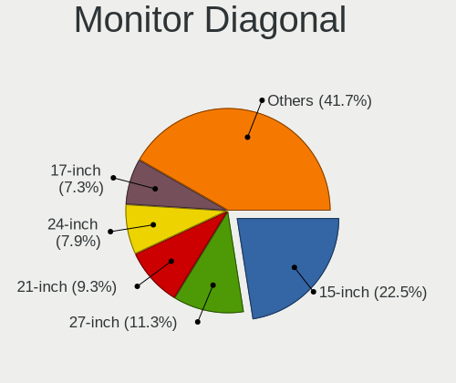

| Inches  | Computers | Percent |
|---------|-----------|---------|
| 15      | 10        | 20.41%  |
| 14      | 6         | 12.24%  |
| 27      | 5         | 10.2%   |
| 17      | 5         | 10.2%   |
| 21      | 4         | 8.16%   |
| 34      | 3         | 6.12%   |
| 18      | 3         | 6.12%   |
| Unknown | 3         | 6.12%   |
| 24      | 2         | 4.08%   |
| 23      | 2         | 4.08%   |
| 11      | 2         | 4.08%   |
| 26      | 1         | 2.04%   |
| 22      | 1         | 2.04%   |
| 20      | 1         | 2.04%   |
| 13      | 1         | 2.04%   |

Monitor Width
-------------

Physical width

| Width in mm | Computers | Percent |
|-------------|-----------|---------|
| 301-350     | 17        | 34.69%  |
| 501-600     | 10        | 20.41%  |
| 401-500     | 9         | 18.37%  |
| 351-400     | 4         | 8.16%   |
| 701-800     | 3         | 6.12%   |
| 201-300     | 3         | 6.12%   |
| Unknown     | 3         | 6.12%   |

Aspect Ratio
------------

Proportional relationship between the width and the height

| Ratio   | Computers | Percent |
|---------|-----------|---------|
| 16/9    | 33        | 73.33%  |
| 21/9    | 3         | 6.67%   |
| 16/10   | 3         | 6.67%   |
| Unknown | 3         | 6.67%   |
| 4/3     | 2         | 4.44%   |
| 5/4     | 1         | 2.22%   |

Monitor Area
------------

Area in inch²

| Area in inch² | Computers | Percent |
|----------------|-----------|---------|
| 101-110        | 10        | 20.41%  |
| 201-250        | 8         | 16.33%  |
| 81-90          | 6         | 12.24%  |
| 301-350        | 6         | 12.24%  |
| 141-150        | 4         | 8.16%   |
| 121-130        | 4         | 8.16%   |
| 351-500        | 3         | 6.12%   |
| Unknown        | 3         | 6.12%   |
| 51-60          | 2         | 4.08%   |
| 151-200        | 2         | 4.08%   |
| 91-100         | 1         | 2.04%   |

Pixel Density
-------------

Pixels per inch

| Density       | Computers | Percent |
|---------------|-----------|---------|
| 51-100        | 18        | 36.73%  |
| 101-120       | 15        | 30.61%  |
| 121-160       | 12        | 24.49%  |
| Unknown       | 3         | 6.12%   |
| More than 240 | 1         | 2.04%   |

Multiple Monitors
-----------------

Total monitors connected

| Total | Computers | Percent |
|-------|-----------|---------|
| 1     | 33        | 73.33%  |
| 2     | 10        | 22.22%  |
| 0     | 2         | 4.44%   |

Network
-------

Net Controller Vendor
---------------------

Controller vendors

| Vendor                | Computers | Percent |
|-----------------------|-----------|---------|
| Realtek Semiconductor | 26        | 38.24%  |
| Intel                 | 25        | 36.76%  |
| Qualcomm Atheros      | 7         | 10.29%  |
| Ralink                | 3         | 4.41%   |
| Samsung Electronics   | 2         | 2.94%   |
| Lenovo                | 1         | 1.47%   |
| Broadcom Limited      | 1         | 1.47%   |
| Broadcom              | 1         | 1.47%   |
| AVM                   | 1         | 1.47%   |
| ASIX Electronics      | 1         | 1.47%   |

Net Controller Model
--------------------

Controller models

| Model                                                             | Computers | Percent |
|-------------------------------------------------------------------|-----------|---------|
| Realtek RTL8111/8168/8411 PCI Express Gigabit Ethernet Controller | 19        | 22.35%  |
| Intel Wi-Fi 6 AX200                                               | 5         | 5.88%   |
| Realtek RTL810xE PCI Express Fast Ethernet controller             | 3         | 3.53%   |
| Intel Wireless 8260                                               | 3         | 3.53%   |
| Intel Wireless 7260                                               | 3         | 3.53%   |
| Qualcomm Atheros QCA6174 802.11ac Wireless Network Adapter        | 2         | 2.35%   |
| Qualcomm Atheros Killer E2400 Gigabit Ethernet Controller         | 2         | 2.35%   |
| Qualcomm Atheros AR9485 Wireless Network Adapter                  | 2         | 2.35%   |
| Intel Wireless 8265 / 8275                                        | 2         | 2.35%   |
| Intel I211 Gigabit Network Connection                             | 2         | 2.35%   |
| Intel 82579LM Gigabit Network Connection (Lewisville)             | 2         | 2.35%   |
| Samsung Kiera                                                     | 1         | 1.18%   |
| Samsung Galaxy series, misc. (tethering mode)                     | 1         | 1.18%   |
| Realtek RTL8821CE 802.11ac PCIe Wireless Network Adapter          | 1         | 1.18%   |
| Realtek RTL8812AE 802.11ac PCIe Wireless Network Adapter          | 1         | 1.18%   |
| Realtek RTL8723BE PCIe Wireless Network Adapter                   | 1         | 1.18%   |
| Realtek RTL8188CE 802.11b/g/n WiFi Adapter                        | 1         | 1.18%   |
| Realtek RTL8125 2.5GbE Controller                                 | 1         | 1.18%   |
| Realtek RTL-8110SC/8169SC Gigabit Ethernet                        | 1         | 1.18%   |
| Realtek Killer E3000 2.5GbE Controller                            | 1         | 1.18%   |
| Realtek Killer E2600 Gigabit Ethernet Controller                  | 1         | 1.18%   |
| Ralink RT3090 Wireless 802.11n 1T/1R PCIe                         | 1         | 1.18%   |
| Ralink RT3060 Wireless 802.11n 1T/1R                              | 1         | 1.18%   |
| Ralink RT2561/RT61 802.11g PCI                                    | 1         | 1.18%   |
| Qualcomm Atheros QCA8172 Fast Ethernet                            | 1         | 1.18%   |
| Qualcomm Atheros AR9462 Wireless Network Adapter                  | 1         | 1.18%   |
| Qualcomm Atheros AR8121/AR8113/AR8114 Gigabit or Fast Ethernet    | 1         | 1.18%   |
| Lenovo OneLink+ Giga                                              | 1         | 1.18%   |
| Intel Wireless-AC 9260                                            | 1         | 1.18%   |
| Intel Wireless 7265                                               | 1         | 1.18%   |
| Intel Wireless 3165                                               | 1         | 1.18%   |
| Intel WiFi Link 5100                                              | 1         | 1.18%   |
| Intel PRO/Wireless 4965 AG or AGN [Kedron] Network Connection     | 1         | 1.18%   |
| Intel PRO/Wireless 3945ABG [Golan] Network Connection             | 1         | 1.18%   |
| Intel Gemini Lake PCH CNVi WiFi                                   | 1         | 1.18%   |
| Intel Ethernet Connection I219-V                                  | 1         | 1.18%   |
| Intel Ethernet Connection I219-LM                                 | 1         | 1.18%   |
| Intel Ethernet Connection I217-V                                  | 1         | 1.18%   |
| Intel Ethernet Connection I217-LM                                 | 1         | 1.18%   |
| Intel Ethernet Connection (4) I219-LM                             | 1         | 1.18%   |
| Intel Ethernet Connection (3) I218-LM                             | 1         | 1.18%   |
| Intel Ethernet Connection (2) I219-LM                             | 1         | 1.18%   |
| Intel Dual Band Wireless-AC 3168NGW [Stone Peak]                  | 1         | 1.18%   |
| Intel Centrino Wireless-N 1000 [Condor Peak]                      | 1         | 1.18%   |
| Intel Centrino Advanced-N 6230 [Rainbow Peak]                     | 1         | 1.18%   |
| Intel 82567LM Gigabit Network Connection                          | 1         | 1.18%   |
| Intel 82566MM Gigabit Network Connection                          | 1         | 1.18%   |
| Broadcom Limited BCM4352 802.11ac Wireless Network Adapter        | 1         | 1.18%   |
| Broadcom BCM43228 802.11a/b/g/n                                   | 1         | 1.18%   |
| AVM Fritz!WLAN N v2 [Atheros AR9271]                              | 1         | 1.18%   |
| ASIX AX88179 Gigabit Ethernet                                     | 1         | 1.18%   |

Wireless Vendor
---------------

Wireless vendors

| Vendor                | Computers | Percent |
|-----------------------|-----------|---------|
| Intel                 | 23        | 60.53%  |
| Qualcomm Atheros      | 5         | 13.16%  |
| Realtek Semiconductor | 4         | 10.53%  |
| Ralink                | 3         | 7.89%   |
| Broadcom Limited      | 1         | 2.63%   |
| Broadcom              | 1         | 2.63%   |
| AVM                   | 1         | 2.63%   |

Wireless Model
--------------

Wireless models

| Model                                                         | Computers | Percent |
|---------------------------------------------------------------|-----------|---------|
| Intel Wi-Fi 6 AX200                                           | 5         | 13.16%  |
| Intel Wireless 8260                                           | 3         | 7.89%   |
| Intel Wireless 7260                                           | 3         | 7.89%   |
| Qualcomm Atheros QCA6174 802.11ac Wireless Network Adapter    | 2         | 5.26%   |
| Qualcomm Atheros AR9485 Wireless Network Adapter              | 2         | 5.26%   |
| Intel Wireless 8265 / 8275                                    | 2         | 5.26%   |
| Realtek RTL8821CE 802.11ac PCIe Wireless Network Adapter      | 1         | 2.63%   |
| Realtek RTL8812AE 802.11ac PCIe Wireless Network Adapter      | 1         | 2.63%   |
| Realtek RTL8723BE PCIe Wireless Network Adapter               | 1         | 2.63%   |
| Realtek RTL8188CE 802.11b/g/n WiFi Adapter                    | 1         | 2.63%   |
| Ralink RT3090 Wireless 802.11n 1T/1R PCIe                     | 1         | 2.63%   |
| Ralink RT3060 Wireless 802.11n 1T/1R                          | 1         | 2.63%   |
| Ralink RT2561/RT61 802.11g PCI                                | 1         | 2.63%   |
| Qualcomm Atheros AR9462 Wireless Network Adapter              | 1         | 2.63%   |
| Intel Wireless-AC 9260                                        | 1         | 2.63%   |
| Intel Wireless 7265                                           | 1         | 2.63%   |
| Intel Wireless 3165                                           | 1         | 2.63%   |
| Intel WiFi Link 5100                                          | 1         | 2.63%   |
| Intel PRO/Wireless 4965 AG or AGN [Kedron] Network Connection | 1         | 2.63%   |
| Intel PRO/Wireless 3945ABG [Golan] Network Connection         | 1         | 2.63%   |
| Intel Gemini Lake PCH CNVi WiFi                               | 1         | 2.63%   |
| Intel Dual Band Wireless-AC 3168NGW [Stone Peak]              | 1         | 2.63%   |
| Intel Centrino Wireless-N 1000 [Condor Peak]                  | 1         | 2.63%   |
| Intel Centrino Advanced-N 6230 [Rainbow Peak]                 | 1         | 2.63%   |
| Broadcom Limited BCM4352 802.11ac Wireless Network Adapter    | 1         | 2.63%   |
| Broadcom BCM43228 802.11a/b/g/n                               | 1         | 2.63%   |
| AVM Fritz!WLAN N v2 [Atheros AR9271]                          | 1         | 2.63%   |

Ethernet Vendor
---------------

Ethernet vendors

| Vendor                | Computers | Percent |
|-----------------------|-----------|---------|
| Realtek Semiconductor | 25        | 55.56%  |
| Intel                 | 13        | 28.89%  |
| Qualcomm Atheros      | 4         | 8.89%   |
| Samsung Electronics   | 1         | 2.22%   |
| Lenovo                | 1         | 2.22%   |
| ASIX Electronics      | 1         | 2.22%   |

Ethernet Model
--------------

Ethernet models

| Model                                                             | Computers | Percent |
|-------------------------------------------------------------------|-----------|---------|
| Realtek RTL8111/8168/8411 PCI Express Gigabit Ethernet Controller | 19        | 41.3%   |
| Realtek RTL810xE PCI Express Fast Ethernet controller             | 3         | 6.52%   |
| Qualcomm Atheros Killer E2400 Gigabit Ethernet Controller         | 2         | 4.35%   |
| Intel I211 Gigabit Network Connection                             | 2         | 4.35%   |
| Intel 82579LM Gigabit Network Connection (Lewisville)             | 2         | 4.35%   |
| Samsung Galaxy series, misc. (tethering mode)                     | 1         | 2.17%   |
| Realtek RTL8125 2.5GbE Controller                                 | 1         | 2.17%   |
| Realtek RTL-8110SC/8169SC Gigabit Ethernet                        | 1         | 2.17%   |
| Realtek Killer E3000 2.5GbE Controller                            | 1         | 2.17%   |
| Realtek Killer E2600 Gigabit Ethernet Controller                  | 1         | 2.17%   |
| Qualcomm Atheros QCA8172 Fast Ethernet                            | 1         | 2.17%   |
| Qualcomm Atheros AR8121/AR8113/AR8114 Gigabit or Fast Ethernet    | 1         | 2.17%   |
| Lenovo OneLink+ Giga                                              | 1         | 2.17%   |
| Intel Ethernet Connection I219-V                                  | 1         | 2.17%   |
| Intel Ethernet Connection I219-LM                                 | 1         | 2.17%   |
| Intel Ethernet Connection I217-V                                  | 1         | 2.17%   |
| Intel Ethernet Connection I217-LM                                 | 1         | 2.17%   |
| Intel Ethernet Connection (4) I219-LM                             | 1         | 2.17%   |
| Intel Ethernet Connection (3) I218-LM                             | 1         | 2.17%   |
| Intel Ethernet Connection (2) I219-LM                             | 1         | 2.17%   |
| Intel 82567LM Gigabit Network Connection                          | 1         | 2.17%   |
| Intel 82566MM Gigabit Network Connection                          | 1         | 2.17%   |
| ASIX AX88179 Gigabit Ethernet                                     | 1         | 2.17%   |

Net Controller Kind
-------------------

Ethernet, WiFi or modem

| Kind     | Computers | Percent |
|----------|-----------|---------|
| Ethernet | 43        | 52.44%  |
| WiFi     | 38        | 46.34%  |
| Modem    | 1         | 1.22%   |

Used Controller
---------------

Currently used network controller

| Kind     | Computers | Percent |
|----------|-----------|---------|
| Ethernet | 40        | 52.63%  |
| WiFi     | 35        | 46.05%  |
| Modem    | 1         | 1.32%   |

NICs
----

Total network controllers on board

| Total | Computers | Percent |
|-------|-----------|---------|
| 2     | 32        | 71.11%  |
| 1     | 11        | 24.44%  |
| 3     | 2         | 4.44%   |

IPv6
----

IPv6 vs IPv4

| Used | Computers | Percent |
|------|-----------|---------|
| No   | 34        | 75.56%  |
| Yes  | 11        | 24.44%  |

Bluetooth
---------

Bluetooth Vendor
----------------

Controller vendors

| Vendor                          | Computers | Percent |
|---------------------------------|-----------|---------|
| Intel                           | 13        | 48.15%  |
| Qualcomm Atheros Communications | 4         | 14.81%  |
| Realtek Semiconductor           | 2         | 7.41%   |
| Dell                            | 2         | 7.41%   |
| Cambridge Silicon Radio         | 2         | 7.41%   |
| IMC Networks                    | 1         | 3.7%    |
| Foxconn / Hon Hai               | 1         | 3.7%    |
| Broadcom                        | 1         | 3.7%    |
| Alps Electric                   | 1         | 3.7%    |

Bluetooth Model
---------------

Controller models

| Model                                                                               | Computers | Percent |
|-------------------------------------------------------------------------------------|-----------|---------|
| Intel Bluetooth wireless interface                                                  | 4         | 14.81%  |
| Intel Bluetooth Device                                                              | 4         | 14.81%  |
| Intel AX200 Bluetooth                                                               | 4         | 14.81%  |
| Cambridge Silicon Radio Bluetooth Dongle (HCI mode)                                 | 2         | 7.41%   |
| Realtek  Bluetooth 4.2 Adapter                                                      | 1         | 3.7%    |
| Realtek Bluetooth Radio                                                             | 1         | 3.7%    |
| Qualcomm Atheros  Bluetooth Device                                                  | 1         | 3.7%    |
| Qualcomm Atheros QCA61x4 Bluetooth 4.0                                              | 1         | 3.7%    |
| Qualcomm Atheros Bluetooth USB Host Controller                                      | 1         | 3.7%    |
| Qualcomm Atheros AR3012 Bluetooth 4.0                                               | 1         | 3.7%    |
| Intel Wireless-AC 9260 Bluetooth Adapter                                            | 1         | 3.7%    |
| IMC Networks Bluetooth Device                                                       | 1         | 3.7%    |
| Foxconn / Hon Hai Foxconn T77H114 BCM2070 [Single-Chip Bluetooth 2.1 + EDR Adapter] | 1         | 3.7%    |
| Dell Broadcom BCM20702A0 Bluetooth                                                  | 1         | 3.7%    |
| Dell BCM20702A0                                                                     | 1         | 3.7%    |
| Broadcom BCM2045B (BDC-2) [Bluetooth Controller]                                    | 1         | 3.7%    |
| Alps Electric BCM2046 Bluetooth Device                                              | 1         | 3.7%    |

Sound
-----

Sound Vendor
------------

Sound card vendors

| Vendor                    | Computers | Percent |
|---------------------------|-----------|---------|
| Intel                     | 34        | 48.57%  |
| Nvidia                    | 14        | 20%     |
| AMD                       | 14        | 20%     |
| Logitech                  | 2         | 2.86%   |
| Texas Instruments         | 1         | 1.43%   |
| Sennheiser Communications | 1         | 1.43%   |
| Lenovo                    | 1         | 1.43%   |
| JMTek                     | 1         | 1.43%   |
| GN Netcom                 | 1         | 1.43%   |
| C-Media Electronics       | 1         | 1.43%   |

Sound Model
-----------

Sound card models

| Model                                                                      | Computers | Percent |
|----------------------------------------------------------------------------|-----------|---------|
| Intel Sunrise Point-LP HD Audio                                            | 5         | 6.41%   |
| Intel 8 Series/C220 Series Chipset High Definition Audio Controller        | 5         | 6.41%   |
| AMD Starship/Matisse HD Audio Controller                                   | 5         | 6.41%   |
| Intel Xeon E3-1200 v3/4th Gen Core Processor HD Audio Controller           | 4         | 5.13%   |
| AMD Family 17h (Models 00h-0fh) HD Audio Controller                        | 4         | 5.13%   |
| Nvidia GA102 High Definition Audio Controller                              | 3         | 3.85%   |
| Intel NM10/ICH7 Family High Definition Audio Controller                    | 3         | 3.85%   |
| Intel 7 Series/C216 Chipset Family High Definition Audio Controller        | 3         | 3.85%   |
| Intel 6 Series/C200 Series Chipset Family High Definition Audio Controller | 3         | 3.85%   |
| Intel 100 Series/C230 Series Chipset Family HD Audio Controller            | 3         | 3.85%   |
| Nvidia TU107 GeForce GTX 1650 High Definition Audio Controller             | 2         | 2.56%   |
| Nvidia GP107GL High Definition Audio Controller                            | 2         | 2.56%   |
| Logitech Headset H390                                                      | 2         | 2.56%   |
| Intel Cannon Lake PCH cAVS                                                 | 2         | 2.56%   |
| Intel 82801H (ICH8 Family) HD Audio Controller                             | 2         | 2.56%   |
| Texas Instruments PCM2900C Audio CODEC                                     | 1         | 1.28%   |
| Sennheiser Communications Sennheiser 3D G4ME1                              | 1         | 1.28%   |
| Nvidia TU116 High Definition Audio Controller                              | 1         | 1.28%   |
| Nvidia GT216 HDMI Audio Controller                                         | 1         | 1.28%   |
| Nvidia GP104 High Definition Audio Controller                              | 1         | 1.28%   |
| Nvidia GP102 HDMI Audio Controller                                         | 1         | 1.28%   |
| Nvidia GM206 High Definition Audio Controller                              | 1         | 1.28%   |
| Nvidia GK104 HDMI Audio Controller                                         | 1         | 1.28%   |
| Nvidia GF119 HDMI Audio Controller                                         | 1         | 1.28%   |
| Lenovo ThinkPad OneLink Plus Dock Audio                                    | 1         | 1.28%   |
| JMTek audio controller                                                     | 1         | 1.28%   |
| Intel Wildcat Point-LP High Definition Audio Controller                    | 1         | 1.28%   |
| Intel CM238 HD Audio Controller                                            | 1         | 1.28%   |
| Intel Celeron/Pentium Silver Processor High Definition Audio               | 1         | 1.28%   |
| Intel Broadwell-U Audio Controller                                         | 1         | 1.28%   |
| Intel Atom Processor Z36xxx/Z37xxx Series High Definition Audio Controller | 1         | 1.28%   |
| Intel 82801JI (ICH10 Family) HD Audio Controller                           | 1         | 1.28%   |
| Intel 82801I (ICH9 Family) HD Audio Controller                             | 1         | 1.28%   |
| Intel 5 Series/3400 Series Chipset High Definition Audio                   | 1         | 1.28%   |
| Intel 200 Series PCH HD Audio                                              | 1         | 1.28%   |
| GN Netcom Jabra UC VOICE 150a MS                                           | 1         | 1.28%   |
| C-Media Electronics CMI8738/CMI8768 PCI Audio                              | 1         | 1.28%   |
| AMD Tonga HDMI Audio [Radeon R9 285/380]                                   | 1         | 1.28%   |
| AMD SBx00 Azalia (Intel HDA)                                               | 1         | 1.28%   |
| AMD RV610 HDMI Audio [Radeon HD 2350 PRO / 2400 PRO/XT / HD 3410]          | 1         | 1.28%   |
| AMD Redwood HDMI Audio [Radeon HD 5000 Series]                             | 1         | 1.28%   |
| AMD Oland/Hainan/Cape Verde/Pitcairn HDMI Audio [Radeon HD 7000 Series]    | 1         | 1.28%   |
| AMD Kabini HDMI/DP Audio                                                   | 1         | 1.28%   |
| AMD FCH Azalia Controller                                                  | 1         | 1.28%   |
| AMD Baffin HDMI/DP Audio [Radeon RX 550 640SP / RX 560/560X]               | 1         | 1.28%   |

Memory
------

Memory Vendor
-------------

Memory module vendors

| Vendor              | Computers | Percent |
|---------------------|-----------|---------|
| Samsung Electronics | 6         | 24%     |
| Unknown             | 5         | 20%     |
| Kingston            | 4         | 16%     |
| SK Hynix            | 3         | 12%     |
| G.Skill             | 3         | 12%     |
| Crucial             | 2         | 8%      |
| GeIL                | 1         | 4%      |
| Corsair             | 1         | 4%      |

Memory Model
------------

Memory module models

| Model                                                     | Computers | Percent |
|-----------------------------------------------------------|-----------|---------|
| Kingston RAM KHX3600C18D4/32GX 32GB DIMM DDR4 3600MT/s    | 2         | 6.9%    |
| Unknown RAM Module 4GB SODIMM DDR2 667MT/s                | 1         | 3.45%   |
| Unknown RAM Module 4096MB SODIMM DDR3                     | 1         | 3.45%   |
| Unknown RAM Module 2GB SODIMM DDR2 667MT/s                | 1         | 3.45%   |
| Unknown RAM Module 2048MB SODIMM 1067MT/s                 | 1         | 3.45%   |
| Unknown RAM Module 2048MB DIMM SDRAM 800MT/s              | 1         | 3.45%   |
| Unknown RAM Module 1GB SODIMM DDR2 667MT/s                | 1         | 3.45%   |
| Unknown RAM Module 1024MB SODIMM 1067MT/s                 | 1         | 3.45%   |
| SK Hynix RAM Module 4GB SODIMM DDR3 1600MT/s              | 1         | 3.45%   |
| SK Hynix RAM HMT425S6AFR6A-PB 2GB SODIMM DDR3 1600MT/s    | 1         | 3.45%   |
| SK Hynix RAM HMT41GS6BFR8A-PB 8GB SODIMM DDR3 1600MT/s    | 1         | 3.45%   |
| SK Hynix RAM HMA41GS6AFR8N-TF 8192MB SODIMM DDR4 2667MT/s | 1         | 3.45%   |
| Samsung RAM M471B5673FH0-CH9 2048MB DIMM SDRAM 4199MT/s   | 1         | 3.45%   |
| Samsung RAM M471B5673EH1-CH9 2048MB SODIMM DDR3 1334MT/s  | 1         | 3.45%   |
| Samsung RAM M471B1G73EB0-YK0 8192MB SODIMM DDR3 1600MT/s  | 1         | 3.45%   |
| Samsung RAM M471A2K43DB1-CTD 16384MB SODIMM DDR4 2667MT/s | 1         | 3.45%   |
| Samsung RAM K4F6E3S4HM-MGCJ 4096MB SODIMM LPDDR4 3733MT/s | 1         | 3.45%   |
| Samsung RAM K4E6E304EE-EGCF 4GB SODIMM LPDDR3 1867MT/s    | 1         | 3.45%   |
| Samsung RAM K4E6E304EE-EGCF 4GB Chip LPDDR3 1867MT/s      | 1         | 3.45%   |
| Kingston RAM KHX3200C16D4/16GX 16384MB DIMM DDR4 3600MT/s | 1         | 3.45%   |
| Kingston RAM KHX2400C15/8G 8GB DIMM DDR4 2933MT/s         | 1         | 3.45%   |
| GeIL RAM CL11-11-11 D3-1600 4GB DIMM DDR3 1600MT/s        | 1         | 3.45%   |
| G.Skill RAM F4-3200C16-8GVKB 8192MB DIMM DDR4 3200MT/s    | 1         | 3.45%   |
| G.Skill RAM F4-2666C19-16GIS 16384MB DIMM DDR4 2667MT/s   | 1         | 3.45%   |
| G.Skill RAM F4-2400C15-8GNT 8192MB DIMM DDR4 2400MT/s     | 1         | 3.45%   |
| Crucial RAM CT102464BD160B.M16 8GB DIMM DDR3 1600MT/s     | 1         | 3.45%   |
| Crucial RAM BL32G32C16U4R.M16FB1 32GB DIMM DDR4 3200MT/s  | 1         | 3.45%   |
| Corsair RAM CMSX8GX4M1A2400C16 8GB SODIMM DDR4 2400MT/s   | 1         | 3.45%   |

Memory Kind
-----------

Memory module kinds

| Kind    | Computers | Percent |
|---------|-----------|---------|
| DDR4    | 11        | 47.83%  |
| DDR3    | 6         | 26.09%  |
| DDR2    | 2         | 8.7%    |
| SDRAM   | 1         | 4.35%   |
| LPDDR4  | 1         | 4.35%   |
| LPDDR3  | 1         | 4.35%   |
| Unknown | 1         | 4.35%   |

Memory Form Factor
------------------

Physical design of the memory module

| Name   | Computers | Percent |
|--------|-----------|---------|
| SODIMM | 13        | 54.17%  |
| DIMM   | 10        | 41.67%  |
| Chip   | 1         | 4.17%   |

Memory Size
-----------

Memory module size

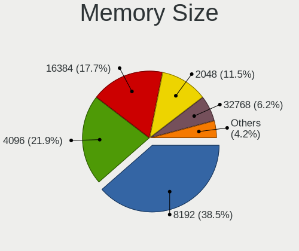

| Size  | Computers | Percent |
|-------|-----------|---------|
| 8192  | 8         | 30.77%  |
| 4096  | 5         | 19.23%  |
| 2048  | 5         | 19.23%  |
| 32768 | 3         | 11.54%  |
| 16384 | 3         | 11.54%  |
| 1024  | 2         | 7.69%   |

Memory Speed
------------

Memory module speed

| Speed   | Computers | Percent |
|---------|-----------|---------|
| 1600    | 4         | 16.67%  |
| 3600    | 3         | 12.5%   |
| 2667    | 3         | 12.5%   |
| 3200    | 2         | 8.33%   |
| 2400    | 2         | 8.33%   |
| 667     | 2         | 8.33%   |
| 4199    | 1         | 4.17%   |
| 3733    | 1         | 4.17%   |
| 2933    | 1         | 4.17%   |
| 1867    | 1         | 4.17%   |
| 1334    | 1         | 4.17%   |
| 1067    | 1         | 4.17%   |
| 800     | 1         | 4.17%   |
| Unknown | 1         | 4.17%   |

Printers & scanners
-------------------

Printer Vendor
--------------

Printer device vendors

| Vendor              | Computers | Percent |
|---------------------|-----------|---------|
| Brother Industries  | 2         | 28.57%  |
| Samsung Electronics | 1         | 14.29%  |
| Prolific Technology | 1         | 14.29%  |
| Kyocera             | 1         | 14.29%  |
| Hewlett-Packard     | 1         | 14.29%  |
| Canon               | 1         | 14.29%  |

Printer Model
-------------

Printer device models

| Model                         | Computers | Percent |
|-------------------------------|-----------|---------|
| Samsung SCX-4200 series       | 1         | 14.29%  |
| Prolific PL2305 Parallel Port | 1         | 14.29%  |
| Kyocera FS-1030D printer      | 1         | 14.29%  |
| HP ENVY 4500 series           | 1         | 14.29%  |
| Canon LiDE 300                | 1         | 14.29%  |
| Brother Printer               | 1         | 14.29%  |
| Brother HL-L3210CW series     | 1         | 14.29%  |

Scanner Vendor
--------------

Scanner device vendors

| Vendor | Computers | Percent |
|--------|-----------|---------|
| Canon  | 2         | 100%    |

Scanner Model
-------------

Scanner device models

| Model                         | Computers | Percent |
|-------------------------------|-----------|---------|
| Canon CanoScan N1240U/LiDE 30 | 1         | 50%     |
| Canon CanoScan LiDE 210       | 1         | 50%     |

Camera
------

Camera Vendor
-------------

Camera device vendors

| Vendor                                 | Computers | Percent |
|----------------------------------------|-----------|---------|
| Chicony Electronics                    | 4         | 17.39%  |
| Logitech                               | 3         | 13.04%  |
| Acer                                   | 3         | 13.04%  |
| Realtek Semiconductor                  | 2         | 8.7%    |
| IMC Networks                           | 2         | 8.7%    |
| Cheng Uei Precision Industry (Foxlink) | 2         | 8.7%    |
| Syntek                                 | 1         | 4.35%   |
| Sunplus Innovation Technology          | 1         | 4.35%   |
| Silicon Motion                         | 1         | 4.35%   |
| Ricoh                                  | 1         | 4.35%   |
| Quanta                                 | 1         | 4.35%   |
| Microdia                               | 1         | 4.35%   |
| Lite-On Technology                     | 1         | 4.35%   |

Camera Model
------------

Camera device models

| Model                                                                    | Computers | Percent |
|--------------------------------------------------------------------------|-----------|---------|
| Logitech B525 HD Webcam                                                  | 2         | 8.33%   |
| Syntek Lenovo EasyCamera                                                 | 1         | 4.17%   |
| Sunplus Integrated_Webcam_HD                                             | 1         | 4.17%   |
| Silicon Motion WebCam SC-13HDN10939N                                     | 1         | 4.17%   |
| Ricoh Sony Vaio Integrated Webcam                                        | 1         | 4.17%   |
| Realtek USB Camera                                                       | 1         | 4.17%   |
| Realtek Integrated_Webcam_HD                                             | 1         | 4.17%   |
| Realtek Integrated Webcam HD                                             | 1         | 4.17%   |
| Quanta HP Wide Vision HD Camera                                          | 1         | 4.17%   |
| Microdia Integrated_Webcam_HD                                            | 1         | 4.17%   |
| Logitech Webcam C250                                                     | 1         | 4.17%   |
| Lite-On Integrated Camera                                                | 1         | 4.17%   |
| IMC Networks USB2.0 VGA UVC WebCam                                       | 1         | 4.17%   |
| IMC Networks USB2.0 UVC HD Webcam                                        | 1         | 4.17%   |
| Chicony VGA 24fps UVC Webcam                                             | 1         | 4.17%   |
| Chicony USB2.0 Camera                                                    | 1         | 4.17%   |
| Chicony Integrated Camera                                                | 1         | 4.17%   |
| Chicony HP Webcam                                                        | 1         | 4.17%   |
| Cheng Uei Precision Industry (Foxlink) Webcam                            | 1         | 4.17%   |
| Cheng Uei Precision Industry (Foxlink) HP EliteBook integrated HD Webcam | 1         | 4.17%   |
| Acer ThinkPad P50 Integrated Camera                                      | 1         | 4.17%   |
| Acer Integrated Camera                                                   | 1         | 4.17%   |
| Acer BisonCam, NB Pro                                                    | 1         | 4.17%   |

Security
--------

Fingerprint Vendor
------------------

Fingerprint sensor vendors

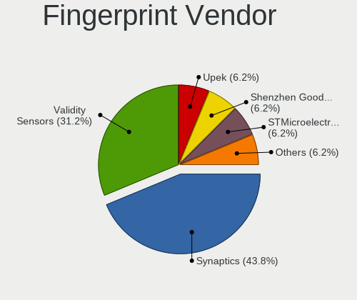

| Vendor           | Computers | Percent |
|------------------|-----------|---------|
| Validity Sensors | 4         | 57.14%  |
| Upek             | 1         | 14.29%  |
| Synaptics        | 1         | 14.29%  |
| AuthenTec        | 1         | 14.29%  |

Fingerprint Model
-----------------

Fingerprint sensor models

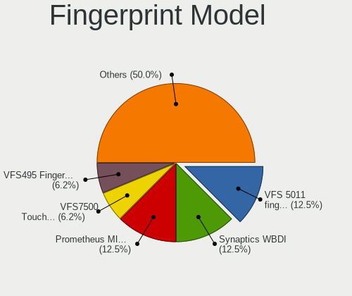

| Model                                                  | Computers | Percent |
|--------------------------------------------------------|-----------|---------|
| Validity Sensors VFS 5011 fingerprint sensor           | 2         | 28.57%  |
| Validity Sensors VFS7500 Touch Fingerprint Sensor      | 1         | 14.29%  |
| Validity Sensors VFS495 Fingerprint Reader             | 1         | 14.29%  |
| Upek Biometric Touchchip/Touchstrip Fingerprint Sensor | 1         | 14.29%  |
| Synaptics  WBDI                                        | 1         | 14.29%  |
| AuthenTec AES1660 Fingerprint Sensor                   | 1         | 14.29%  |

Chipcard Vendor
---------------

Chipcard module vendors

| Vendor                | Computers | Percent |
|-----------------------|-----------|---------|
| Alcor Micro           | 2         | 40%     |
| O2 Micro              | 1         | 20%     |
| Gemalto (was Gemplus) | 1         | 20%     |
| Broadcom              | 1         | 20%     |

Chipcard Model
--------------

Chipcard module models

| Model                                             | Computers | Percent |
|---------------------------------------------------|-----------|---------|
| Alcor Micro AU9540 Smartcard Reader               | 2         | 40%     |
| O2 Micro OZ776 CCID Smartcard Reader              | 1         | 20%     |
| Gemalto (was Gemplus) GemPC Twin SmartCard Reader | 1         | 20%     |
| Broadcom BCM5880 Secure Applications Processor    | 1         | 20%     |

Unsupported
-----------

Unsupported Devices
-------------------

Total unsupported devices on board

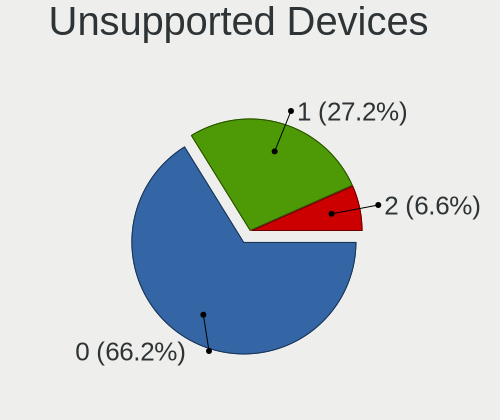

| Total | Computers | Percent |
|-------|-----------|---------|
| 0     | 33        | 73.33%  |
| 1     | 10        | 22.22%  |
| 2     | 2         | 4.44%   |

Unsupported Device Types
------------------------

Types of unsupported devices

| Type               | Computers | Percent |
|--------------------|-----------|---------|
| Fingerprint reader | 7         | 50%     |
| Chipcard           | 5         | 35.71%  |
| Graphics card      | 2         | 14.29%  |

