openSUSE Leap-15.4 - Tested Hardware & Statistics
-------------------------------------------------

A project to collect tested hardware configurations for openSUSE Leap-15.4.

Anyone can contribute to this report by the [hw-probe](https://github.com/linuxhw/hw-probe) tool:

    sudo -E hw-probe -all -upload

Please contribute! Especially if your hardware is rare.

This is a report for all computer types. See also reports for [desktops](/Dist/openSUSE_Leap-15.4/Desktop/README.md) and [notebooks](/Dist/openSUSE_Leap-15.4/Notebook/README.md).

Contents
--------

* [ Test Cases ](#test-cases)

* [ System ](#system)
  - [ Kernel                   ](#kernel)
  - [ Kernel Family            ](#kernel-family)
  - [ Kernel Major Ver.        ](#kernel-major-ver)
  - [ Arch                     ](#arch)
  - [ DE                       ](#de)
  - [ Display Server           ](#display-server)
  - [ Display Manager          ](#display-manager)
  - [ OS Lang                  ](#os-lang)
  - [ Boot Mode                ](#boot-mode)
  - [ Filesystem               ](#filesystem)
  - [ Part. scheme             ](#part-scheme)
  - [ Dual Boot with Linux/BSD ](#dual-boot-with-linuxbsd)
  - [ Dual Boot (Win)          ](#dual-boot-win)

* [ Board ](#board)
  - [ Vendor                   ](#vendor)
  - [ Model                    ](#model)
  - [ Model Family             ](#model-family)
  - [ MFG Year                 ](#mfg-year)
  - [ Form Factor              ](#form-factor)
  - [ Secure Boot              ](#secure-boot)
  - [ Coreboot                 ](#coreboot)
  - [ RAM Size                 ](#ram-size)
  - [ RAM Used                 ](#ram-used)
  - [ Total Drives             ](#total-drives)
  - [ Has CD-ROM               ](#has-cd-rom)
  - [ Has Ethernet             ](#has-ethernet)
  - [ Has WiFi                 ](#has-wifi)
  - [ Has Bluetooth            ](#has-bluetooth)

* [ Location ](#location)
  - [ Country                  ](#country)
  - [ City                     ](#city)

* [ Drives ](#drives)
  - [ Drive Vendor             ](#drive-vendor)
  - [ Drive Model              ](#drive-model)
  - [ HDD Vendor               ](#hdd-vendor)
  - [ SSD Vendor               ](#ssd-vendor)
  - [ Drive Kind               ](#drive-kind)
  - [ Drive Connector          ](#drive-connector)
  - [ Drive Size               ](#drive-size)
  - [ Space Total              ](#space-total)
  - [ Space Used               ](#space-used)
  - [ Malfunc. Drives          ](#malfunc-drives)
  - [ Malfunc. Drive Vendor    ](#malfunc-drive-vendor)
  - [ Malfunc. HDD Vendor      ](#malfunc-hdd-vendor)
  - [ Malfunc. Drive Kind      ](#malfunc-drive-kind)
  - [ Failed Drives            ](#failed-drives)
  - [ Failed Drive Vendor      ](#failed-drive-vendor)
  - [ Drive Status             ](#drive-status)

* [ Storage controller ](#storage-controller)
  - [ Storage Vendor           ](#storage-vendor)
  - [ Storage Model            ](#storage-model)
  - [ Storage Kind             ](#storage-kind)

* [ Processor ](#processor)
  - [ CPU Vendor               ](#cpu-vendor)
  - [ CPU Model                ](#cpu-model)
  - [ CPU Model Family         ](#cpu-model-family)
  - [ CPU Cores                ](#cpu-cores)
  - [ CPU Sockets              ](#cpu-sockets)
  - [ CPU Threads              ](#cpu-threads)
  - [ CPU Op-Modes             ](#cpu-op-modes)
  - [ CPU Microcode            ](#cpu-microcode)
  - [ CPU Microarch            ](#cpu-microarch)

* [ Graphics ](#graphics)
  - [ GPU Vendor               ](#gpu-vendor)
  - [ GPU Model                ](#gpu-model)
  - [ GPU Combo                ](#gpu-combo)
  - [ GPU Driver               ](#gpu-driver)
  - [ GPU Memory               ](#gpu-memory)

* [ Monitor ](#monitor)
  - [ Monitor Vendor           ](#monitor-vendor)
  - [ Monitor Model            ](#monitor-model)
  - [ Monitor Resolution       ](#monitor-resolution)
  - [ Monitor Diagonal         ](#monitor-diagonal)
  - [ Monitor Width            ](#monitor-width)
  - [ Aspect Ratio             ](#aspect-ratio)
  - [ Monitor Area             ](#monitor-area)
  - [ Pixel Density            ](#pixel-density)
  - [ Multiple Monitors        ](#multiple-monitors)

* [ Network ](#network)
  - [ Net Controller Vendor    ](#net-controller-vendor)
  - [ Net Controller Model     ](#net-controller-model)
  - [ Wireless Vendor          ](#wireless-vendor)
  - [ Wireless Model           ](#wireless-model)
  - [ Ethernet Vendor          ](#ethernet-vendor)
  - [ Ethernet Model           ](#ethernet-model)
  - [ Net Controller Kind      ](#net-controller-kind)
  - [ Used Controller          ](#used-controller)
  - [ NICs                     ](#nics)
  - [ IPv6                     ](#ipv6)

* [ Bluetooth ](#bluetooth)
  - [ Bluetooth Vendor         ](#bluetooth-vendor)
  - [ Bluetooth Model          ](#bluetooth-model)

* [ Sound ](#sound)
  - [ Sound Vendor             ](#sound-vendor)
  - [ Sound Model              ](#sound-model)

* [ Memory ](#memory)
  - [ Memory Vendor            ](#memory-vendor)
  - [ Memory Model             ](#memory-model)
  - [ Memory Kind              ](#memory-kind)
  - [ Memory Form Factor       ](#memory-form-factor)
  - [ Memory Size              ](#memory-size)
  - [ Memory Speed             ](#memory-speed)

* [ Printers & scanners ](#printers--scanners)
  - [ Printer Vendor           ](#printer-vendor)
  - [ Printer Model            ](#printer-model)
  - [ Scanner Vendor           ](#scanner-vendor)
  - [ Scanner Model            ](#scanner-model)

* [ Camera ](#camera)
  - [ Camera Vendor            ](#camera-vendor)
  - [ Camera Model             ](#camera-model)

* [ Security ](#security)
  - [ Fingerprint Vendor       ](#fingerprint-vendor)
  - [ Fingerprint Model        ](#fingerprint-model)
  - [ Chipcard Vendor          ](#chipcard-vendor)
  - [ Chipcard Model           ](#chipcard-model)

* [ Unsupported ](#unsupported)
  - [ Unsupported Devices      ](#unsupported-devices)
  - [ Unsupported Device Types ](#unsupported-device-types)

Test Cases
----------

Total: 183

| Vendor        | Model                       | Form-Factor | Probe                                                      | Date         |
|---------------|-----------------------------|-------------|------------------------------------------------------------|--------------|
| ASUSTek       | PRIME B350-PLUS             | Desktop     | [cc1f571000](https://linux-hardware.org/?probe=cc1f571000) | Jun 09, 2023 |
| Lenovo        | 1036 SDK0K17763 WIN 1801... | Desktop     | [1d36e85f27](https://linux-hardware.org/?probe=1d36e85f27) | Jun 07, 2023 |
| Sony          | VPCEH25EN                   | Notebook    | [2b47c1b9a5](https://linux-hardware.org/?probe=2b47c1b9a5) | Jun 05, 2023 |
| Fujitsu       | LIFEBOOK A357               | Notebook    | [a8baa03316](https://linux-hardware.org/?probe=a8baa03316) | Jun 03, 2023 |
| ASUSTek       | P5Q-PRO                     | Desktop     | [76cd01b045](https://linux-hardware.org/?probe=76cd01b045) | Jun 03, 2023 |
| Lenovo        | 1038 NO DPK                 | Server      | [e91c644324](https://linux-hardware.org/?probe=e91c644324) | Jun 02, 2023 |
| Acer          | Nitro AN517-54              | Notebook    | [4feb3e3196](https://linux-hardware.org/?probe=4feb3e3196) | May 27, 2023 |
| HP            | 0B4Ch D                     | Desktop     | [5352a94049](https://linux-hardware.org/?probe=5352a94049) | May 20, 2023 |
| Gigabyte      | P55-UD3                     | Desktop     | [12da248164](https://linux-hardware.org/?probe=12da248164) | May 19, 2023 |
| Dell          | Latitude 5320               | Notebook    | [5e8463c682](https://linux-hardware.org/?probe=5e8463c682) | May 16, 2023 |
| Dell          | Latitude 5320               | Notebook    | [093e6a63c8](https://linux-hardware.org/?probe=093e6a63c8) | May 16, 2023 |
| Dell          | 0GY6Y8 A02                  | Desktop     | [99ad79383e](https://linux-hardware.org/?probe=99ad79383e) | May 11, 2023 |
| Lenovo        | ThinkPad W541 20EF001UGE    | Notebook    | [29c8170a0e](https://linux-hardware.org/?probe=29c8170a0e) | May 10, 2023 |
| Lenovo        | V15-ADA 82C7                | Notebook    | [8eae6560cb](https://linux-hardware.org/?probe=8eae6560cb) | May 10, 2023 |
| Lenovo        | 1036 SDK0K17763 WIN 1801... | Desktop     | [eeb37c9c4f](https://linux-hardware.org/?probe=eeb37c9c4f) | May 07, 2023 |
| ASRock        | B550M-ITX/ac                | Desktop     | [0295ab04a7](https://linux-hardware.org/?probe=0295ab04a7) | Apr 28, 2023 |
| Gigabyte      | Z97-HD3                     | Desktop     | [ec41184680](https://linux-hardware.org/?probe=ec41184680) | Apr 27, 2023 |
| ASUSTek       | N750JV                      | Notebook    | [3ec3c7aa7b](https://linux-hardware.org/?probe=3ec3c7aa7b) | Apr 26, 2023 |
| ASUSTek       | N750JV                      | Notebook    | [53c0f79af9](https://linux-hardware.org/?probe=53c0f79af9) | Apr 26, 2023 |
| ASRock        | B550M-ITX/ac                | Desktop     | [4fad4d4a09](https://linux-hardware.org/?probe=4fad4d4a09) | Apr 21, 2023 |
| Gateway       | NV55C                       | Notebook    | [e77192c3b1](https://linux-hardware.org/?probe=e77192c3b1) | Apr 20, 2023 |
| Lenovo        | ThinkPad T16 Gen 1 21BVC... | Notebook    | [69b2b1c95f](https://linux-hardware.org/?probe=69b2b1c95f) | Apr 19, 2023 |
| Gigabyte      | H55M-S2H                    | Desktop     | [f44b68cf93](https://linux-hardware.org/?probe=f44b68cf93) | Apr 16, 2023 |
| HP            | Mini 210-1000               | Notebook    | [e8b0b26e10](https://linux-hardware.org/?probe=e8b0b26e10) | Apr 15, 2023 |
| ASRock        | X670E Pro RS                | Desktop     | [0f078152ca](https://linux-hardware.org/?probe=0f078152ca) | Apr 10, 2023 |
| Lenovo        | ThinkPad Edge E431 62779... | Notebook    | [19fd2b6d0d](https://linux-hardware.org/?probe=19fd2b6d0d) | Apr 09, 2023 |
| Lenovo        | ThinkPad Edge E431 62779... | Notebook    | [bc402eee2e](https://linux-hardware.org/?probe=bc402eee2e) | Apr 09, 2023 |
| ASRock        | B450 Gaming K4              | Desktop     | [dcf97ad331](https://linux-hardware.org/?probe=dcf97ad331) | Apr 05, 2023 |
| HP            | ENVY x360 Convertible 13... | Convertible | [f89b2c8b2a](https://linux-hardware.org/?probe=f89b2c8b2a) | Apr 05, 2023 |
| HP            | EliteBook 865 16 inch G9... | Notebook    | [6906a8d309](https://linux-hardware.org/?probe=6906a8d309) | Apr 03, 2023 |
| MSI           | P67A-C43                    | Desktop     | [f3e7913310](https://linux-hardware.org/?probe=f3e7913310) | Apr 01, 2023 |
| ASUSTek       | N550JX                      | Notebook    | [a505a62a71](https://linux-hardware.org/?probe=a505a62a71) | Mar 28, 2023 |
| Fujitsu       | LIFEBOOK U938               | Notebook    | [e972904a83](https://linux-hardware.org/?probe=e972904a83) | Mar 28, 2023 |
| HP            | Compaq 6730s                | Notebook    | [8d4cea5a81](https://linux-hardware.org/?probe=8d4cea5a81) | Mar 28, 2023 |
| MSI           | Delta 15 A5EFK              | Notebook    | [6f4e3ec28b](https://linux-hardware.org/?probe=6f4e3ec28b) | Mar 28, 2023 |
| MSI           | Delta 15 A5EFK              | Notebook    | [9dd1b67b2f](https://linux-hardware.org/?probe=9dd1b67b2f) | Mar 28, 2023 |
| Packard Be... | EasyNote TE11HC             | Notebook    | [6c942c5a39](https://linux-hardware.org/?probe=6c942c5a39) | Mar 26, 2023 |
| ASUSTek       | ROG CROSSHAIR X670E HERO    | Desktop     | [f78ca791e0](https://linux-hardware.org/?probe=f78ca791e0) | Mar 25, 2023 |
| HP            | ENVY x360 Convertible 13... | Convertible | [dfd3b8546c](https://linux-hardware.org/?probe=dfd3b8546c) | Mar 14, 2023 |
| Lenovo        | ThinkPad Edge E530 3259H... | Notebook    | [74348d01f3](https://linux-hardware.org/?probe=74348d01f3) | Mar 13, 2023 |
| Wortmann      | Terra 3100                  | Desktop     | [126586f434](https://linux-hardware.org/?probe=126586f434) | Mar 12, 2023 |
| Intel         | NUC12WSBi5 M46425-302       | Mini pc     | [2002eaa403](https://linux-hardware.org/?probe=2002eaa403) | Mar 12, 2023 |
| Lenovo        | ThinkPad T520 42435GG       | Notebook    | [fac1ee2528](https://linux-hardware.org/?probe=fac1ee2528) | Mar 12, 2023 |
| Lenovo        | 102F SDK0J40697 WIN 3305... | Desktop     | [97741c600c](https://linux-hardware.org/?probe=97741c600c) | Mar 11, 2023 |
| Jumper        | EZbook                      | Notebook    | [ed607c4113](https://linux-hardware.org/?probe=ed607c4113) | Mar 11, 2023 |
| Gigabyte      | Z97-HD3                     | Desktop     | [5cb06ca8ce](https://linux-hardware.org/?probe=5cb06ca8ce) | Mar 10, 2023 |
| Dell          | 0427JK A00                  | Desktop     | [4b47face39](https://linux-hardware.org/?probe=4b47face39) | Mar 05, 2023 |
| Lenovo        | Bantry CRB 31900058 STD     | Desktop     | [268413a47c](https://linux-hardware.org/?probe=268413a47c) | Mar 01, 2023 |
| Lenovo        | Bantry CRB 31900058 STD     | Desktop     | [169e938f25](https://linux-hardware.org/?probe=169e938f25) | Mar 01, 2023 |
| Dell          | 0427JK A00                  | Desktop     | [ca878d6577](https://linux-hardware.org/?probe=ca878d6577) | Feb 27, 2023 |
| Samsung       | 550XDA                      | Notebook    | [0c3e0dd389](https://linux-hardware.org/?probe=0c3e0dd389) | Feb 13, 2023 |
| ASRock        | B550M-ITX/ac                | Desktop     | [79204339d0](https://linux-hardware.org/?probe=79204339d0) | Feb 11, 2023 |
| HP            | 1494                        | Desktop     | [ba7c61bf23](https://linux-hardware.org/?probe=ba7c61bf23) | Feb 07, 2023 |
| HP            | 0B54h D                     | Desktop     | [fa38931f1f](https://linux-hardware.org/?probe=fa38931f1f) | Feb 06, 2023 |
| TUXEDO        | InfinityBook S 15/17 Gen... | Notebook    | [9b92561723](https://linux-hardware.org/?probe=9b92561723) | Feb 06, 2023 |
| ASUSTek       | ROG Strix G713QE_G713QE     | Notebook    | [f05a20fe00](https://linux-hardware.org/?probe=f05a20fe00) | Feb 01, 2023 |
| Gigabyte      | Z690 GAMING X DDR4          | Desktop     | [f2636de53b](https://linux-hardware.org/?probe=f2636de53b) | Jan 31, 2023 |
| ASUSTek       | CROSSHAIR V FORMULA-Z       | Desktop     | [32dfb5ebe2](https://linux-hardware.org/?probe=32dfb5ebe2) | Jan 31, 2023 |
| Lenovo        | ThinkPad Edge E431 62779... | Notebook    | [8d7c1dbf4d](https://linux-hardware.org/?probe=8d7c1dbf4d) | Jan 30, 2023 |
| Gigabyte      | Z690 GAMING X DDR4          | Desktop     | [6bf8eb9c73](https://linux-hardware.org/?probe=6bf8eb9c73) | Jan 30, 2023 |
| Toshiba       | Satellite L500              | Notebook    | [327e2d4e3e](https://linux-hardware.org/?probe=327e2d4e3e) | Jan 28, 2023 |
| Lenovo        | IdeaPad 330-15IKB 81FD      | Notebook    | [31698019a3](https://linux-hardware.org/?probe=31698019a3) | Jan 20, 2023 |
| Lenovo        | ThinkPad X1 Carbon 7th 2... | Notebook    | [004b2669ef](https://linux-hardware.org/?probe=004b2669ef) | Jan 18, 2023 |
| HP            | ProBook 4540s               | Notebook    | [3f9e3a1cbb](https://linux-hardware.org/?probe=3f9e3a1cbb) | Jan 17, 2023 |
| HP            | ProBook 4540s               | Notebook    | [7b9cd1b51c](https://linux-hardware.org/?probe=7b9cd1b51c) | Jan 16, 2023 |
| ASUSTek       | PRIME A320M-K               | Desktop     | [17fd020689](https://linux-hardware.org/?probe=17fd020689) | Jan 16, 2023 |
| HP            | EliteBook 840 G8 Noteboo... | Notebook    | [9b874af8a4](https://linux-hardware.org/?probe=9b874af8a4) | Jan 16, 2023 |
| Dell          | 0WG261                      | Desktop     | [c994d9e8ee](https://linux-hardware.org/?probe=c994d9e8ee) | Jan 13, 2023 |
| Dell          | 0WG261                      | Desktop     | [5d1fe40a1f](https://linux-hardware.org/?probe=5d1fe40a1f) | Jan 13, 2023 |
| Lenovo        | IdeaPad L340-15IRH Gamin... | Notebook    | [a5ea710efd](https://linux-hardware.org/?probe=a5ea710efd) | Jan 11, 2023 |
| Dell          | 081VG9 A05                  | Server      | [23031aa11a](https://linux-hardware.org/?probe=23031aa11a) | Jan 06, 2023 |
| Lenovo        | ThinkPad P16s Gen 1 21BT... | Notebook    | [b68fa80860](https://linux-hardware.org/?probe=b68fa80860) | Dec 31, 2022 |
| HP            | Victus by Laptop 16-e0xx... | Notebook    | [60989ad0c4](https://linux-hardware.org/?probe=60989ad0c4) | Dec 31, 2022 |
| Dell          | Inspiron 15 7510            | Notebook    | [d5702b0c66](https://linux-hardware.org/?probe=d5702b0c66) | Dec 24, 2022 |
| Dell          | Vostro 3501                 | Notebook    | [8a3788aa78](https://linux-hardware.org/?probe=8a3788aa78) | Dec 23, 2022 |
| Dell          | Vostro 3501                 | Notebook    | [258dc5c40d](https://linux-hardware.org/?probe=258dc5c40d) | Dec 23, 2022 |
| Schenker      | VIA 15 Pro                  | Notebook    | [b1a40c91d2](https://linux-hardware.org/?probe=b1a40c91d2) | Dec 22, 2022 |
| Schenker      | VIA 15 Pro                  | Notebook    | [75efe6fb52](https://linux-hardware.org/?probe=75efe6fb52) | Dec 22, 2022 |
| Acer          | Aspire E1-572G              | Notebook    | [adc5196d64](https://linux-hardware.org/?probe=adc5196d64) | Dec 17, 2022 |
| HP            | Spectre x360 Convertible... | Convertible | [1e2ba2a16d](https://linux-hardware.org/?probe=1e2ba2a16d) | Dec 14, 2022 |
| HP            | Spectre x360 Convertible... | Convertible | [9369afea1b](https://linux-hardware.org/?probe=9369afea1b) | Dec 14, 2022 |
| MSI           | X470 GAMING PRO CARBON      | Desktop     | [947534b3be](https://linux-hardware.org/?probe=947534b3be) | Dec 09, 2022 |
| ASUSTek       | PRIME B350M-A               | Desktop     | [31ae5769eb](https://linux-hardware.org/?probe=31ae5769eb) | Dec 07, 2022 |
| MSI           | B85-G41 PC Mate             | Desktop     | [a54611689d](https://linux-hardware.org/?probe=a54611689d) | Dec 06, 2022 |
| ASUSTek       | Z450LA                      | Notebook    | [ffd2220d21](https://linux-hardware.org/?probe=ffd2220d21) | Nov 25, 2022 |
| Dell          | Latitude E5570              | Notebook    | [ed2e9cfb4f](https://linux-hardware.org/?probe=ed2e9cfb4f) | Nov 24, 2022 |
| Lenovo        | ThinkPad T530 2394D56       | Notebook    | [3d44b768e5](https://linux-hardware.org/?probe=3d44b768e5) | Nov 12, 2022 |
| HP            | ZBook 17                    | Notebook    | [e866fa1319](https://linux-hardware.org/?probe=e866fa1319) | Nov 09, 2022 |
| HP            | ZBook 17                    | Notebook    | [af26e94623](https://linux-hardware.org/?probe=af26e94623) | Nov 08, 2022 |
| Dell          | 0C522T A01                  | Desktop     | [efee8139b0](https://linux-hardware.org/?probe=efee8139b0) | Nov 01, 2022 |
| Gigabyte      | GA-770TA-UD3                | Desktop     | [4833a609c3](https://linux-hardware.org/?probe=4833a609c3) | Oct 31, 2022 |
| Lenovo        | ThinkPad X1 Carbon Gen 1... | Notebook    | [dcd40f9f78](https://linux-hardware.org/?probe=dcd40f9f78) | Oct 28, 2022 |
| Dell          | Latitude 9420               | Notebook    | [a601281b46](https://linux-hardware.org/?probe=a601281b46) | Oct 27, 2022 |
| Dell          | 0D90HM A00                  | All in one  | [3a60ac01f4](https://linux-hardware.org/?probe=3a60ac01f4) | Oct 23, 2022 |
| Lenovo        | 1036 SDK0K17763 WIN 1801... | Desktop     | [94f3d7aa9d](https://linux-hardware.org/?probe=94f3d7aa9d) | Oct 22, 2022 |
| Dell          | 0D90HM A00                  | All in one  | [fbc271b648](https://linux-hardware.org/?probe=fbc271b648) | Oct 22, 2022 |
| HP            | ZBook 17                    | Notebook    | [6dc9848327](https://linux-hardware.org/?probe=6dc9848327) | Oct 20, 2022 |
| ASUSTek       | P5P43TD PRO                 | Desktop     | [a29fae2a74](https://linux-hardware.org/?probe=a29fae2a74) | Oct 14, 2022 |
| Toshiba       | Satellite P55t-A            | Notebook    | [60d52e85a0](https://linux-hardware.org/?probe=60d52e85a0) | Oct 12, 2022 |
| MSI           | Z170-A PRO                  | Desktop     | [50b8cde0ed](https://linux-hardware.org/?probe=50b8cde0ed) | Oct 10, 2022 |
| ASUSTek       | F3Sv                        | Notebook    | [042104bbc2](https://linux-hardware.org/?probe=042104bbc2) | Oct 08, 2022 |
| Dell          | 0D90HM A00                  | All in one  | [9ef16d569e](https://linux-hardware.org/?probe=9ef16d569e) | Oct 06, 2022 |
| MSI           | B450-A PRO MAX              | Desktop     | [c12ce7288b](https://linux-hardware.org/?probe=c12ce7288b) | Oct 05, 2022 |
| MSI           | B450-A PRO MAX              | Desktop     | [c3306965d6](https://linux-hardware.org/?probe=c3306965d6) | Oct 05, 2022 |
| Lenovo        | ThinkPad T470 20HES0FW00    | Notebook    | [33a0cb05e8](https://linux-hardware.org/?probe=33a0cb05e8) | Oct 04, 2022 |
| Dell          | Vostro 3560                 | Notebook    | [79f922d367](https://linux-hardware.org/?probe=79f922d367) | Oct 02, 2022 |
| Dell          | Vostro 3560                 | Notebook    | [59c14fb5c0](https://linux-hardware.org/?probe=59c14fb5c0) | Oct 02, 2022 |
| Dell          | Latitude E5250              | Notebook    | [6116460e52](https://linux-hardware.org/?probe=6116460e52) | Sep 27, 2022 |
| HP            | ZBook 17 G2                 | Notebook    | [d6d9af3173](https://linux-hardware.org/?probe=d6d9af3173) | Sep 26, 2022 |
| HP            | ZBook 17 G2                 | Notebook    | [ff70118578](https://linux-hardware.org/?probe=ff70118578) | Sep 26, 2022 |
| Dell          | Inspiron 5515               | Notebook    | [a7f0e24464](https://linux-hardware.org/?probe=a7f0e24464) | Sep 20, 2022 |
| Dell          | Inspiron 3542               | Notebook    | [7f7ef47d4b](https://linux-hardware.org/?probe=7f7ef47d4b) | Sep 20, 2022 |
| ASUSTek       | X55CR                       | Notebook    | [43b77d436c](https://linux-hardware.org/?probe=43b77d436c) | Sep 14, 2022 |
| ASUSTek       | ROG CROSSHAIR VIII EXTRE... | Desktop     | [6e0984d7ff](https://linux-hardware.org/?probe=6e0984d7ff) | Sep 06, 2022 |
| ASUSTek       | P5P43TD PRO                 | Desktop     | [f79c38f9ff](https://linux-hardware.org/?probe=f79c38f9ff) | Sep 02, 2022 |
| Lenovo        | 1036 SDK0K17763 WIN 1801... | Desktop     | [3772ec2911](https://linux-hardware.org/?probe=3772ec2911) | Sep 02, 2022 |
| ASUSTek       | VivoBook_ASUSLaptop X421... | Notebook    | [dea9852124](https://linux-hardware.org/?probe=dea9852124) | Sep 02, 2022 |
| HP            | ZBook 17                    | Notebook    | [98e643f5af](https://linux-hardware.org/?probe=98e643f5af) | Aug 30, 2022 |
| ASRock        | J3355B-ITX                  | Desktop     | [e27f786190](https://linux-hardware.org/?probe=e27f786190) | Aug 28, 2022 |
| Google        | Eldrid                      | Notebook    | [6a0c6eb1de](https://linux-hardware.org/?probe=6a0c6eb1de) | Aug 27, 2022 |
| Gigabyte      | 965P-DS3                    | Desktop     | [38a4407789](https://linux-hardware.org/?probe=38a4407789) | Aug 25, 2022 |
| HP            | 802F                        | Desktop     | [2c52215323](https://linux-hardware.org/?probe=2c52215323) | Aug 23, 2022 |
| HP            | 802F                        | Desktop     | [e181d03426](https://linux-hardware.org/?probe=e181d03426) | Aug 23, 2022 |
| ASRock        | Z490 Phantom Gaming 4       | Desktop     | [7b66b20b9f](https://linux-hardware.org/?probe=7b66b20b9f) | Aug 17, 2022 |
| Notebook      | NLx0MU                      | Notebook    | [0e2658915d](https://linux-hardware.org/?probe=0e2658915d) | Aug 17, 2022 |
| HP            | Pavilion Notebook           | Notebook    | [a05b95b836](https://linux-hardware.org/?probe=a05b95b836) | Aug 15, 2022 |
| HP            | Pavilion Notebook           | Notebook    | [aea2bfde6a](https://linux-hardware.org/?probe=aea2bfde6a) | Aug 15, 2022 |
| Acer          | Aspire 4732Z                | Notebook    | [73027b2cca](https://linux-hardware.org/?probe=73027b2cca) | Aug 07, 2022 |
| ASRock        | J3355B-ITX                  | Desktop     | [99f7986364](https://linux-hardware.org/?probe=99f7986364) | Aug 02, 2022 |
| Unknown       | Unknown                     | Notebook    | [4d9a472691](https://linux-hardware.org/?probe=4d9a472691) | Jul 27, 2022 |
| Unknown       | Unknown                     | Notebook    | [ded9f7587a](https://linux-hardware.org/?probe=ded9f7587a) | Jul 27, 2022 |
| Unknown       | Unknown                     | Notebook    | [0c4182ee0a](https://linux-hardware.org/?probe=0c4182ee0a) | Jul 23, 2022 |
| Unknown       | Unknown                     | Notebook    | [7a29580deb](https://linux-hardware.org/?probe=7a29580deb) | Jul 23, 2022 |
| ASUSTek       | PRIME B550M-K               | Desktop     | [df5bd62f9a](https://linux-hardware.org/?probe=df5bd62f9a) | Jul 23, 2022 |
| Notebook      | NLx0MU                      | Notebook    | [7cb795f428](https://linux-hardware.org/?probe=7cb795f428) | Jul 22, 2022 |
| Biostar       | B450MH                      | Desktop     | [f69c4e3a03](https://linux-hardware.org/?probe=f69c4e3a03) | Jul 21, 2022 |
| Biostar       | B450MH                      | Desktop     | [79084ef4c9](https://linux-hardware.org/?probe=79084ef4c9) | Jul 21, 2022 |
| ASUSTek       | TUF Gaming X570-PRO         | Desktop     | [f2cda5634e](https://linux-hardware.org/?probe=f2cda5634e) | Jul 18, 2022 |
| MSI           | B450 GAMING PRO CARBON A... | Desktop     | [03d7fde009](https://linux-hardware.org/?probe=03d7fde009) | Jul 18, 2022 |
| Toshiba       | Satellite L500              | Notebook    | [5ac3a7aa95](https://linux-hardware.org/?probe=5ac3a7aa95) | Jul 17, 2022 |
| Dell          | 0Y2YM6 A00                  | Desktop     | [8b5480a55e](https://linux-hardware.org/?probe=8b5480a55e) | Jul 16, 2022 |
| Dell          | Inspiron 5584               | Notebook    | [b6d23c8307](https://linux-hardware.org/?probe=b6d23c8307) | Jul 16, 2022 |
| Multilaser    | PC150                       | Notebook    | [b6fcf6d507](https://linux-hardware.org/?probe=b6fcf6d507) | Jul 04, 2022 |
| MSI           | X399 GAMING PRO CARBON A... | Desktop     | [153a698b74](https://linux-hardware.org/?probe=153a698b74) | Jul 01, 2022 |
| HP            | ProBook 455 G8 Notebook ... | Notebook    | [bec2a7697f](https://linux-hardware.org/?probe=bec2a7697f) | Jun 30, 2022 |
| Dell          | 0J3C2F A03                  | Desktop     | [6f5f6a7417](https://linux-hardware.org/?probe=6f5f6a7417) | Jun 26, 2022 |
| ASRock        | J3355B-ITX                  | Desktop     | [a00111330b](https://linux-hardware.org/?probe=a00111330b) | Jun 24, 2022 |
| Acer          | Swift SFX14-41G             | Notebook    | [c3c9ce7e40](https://linux-hardware.org/?probe=c3c9ce7e40) | Jun 23, 2022 |
| ASUSTek       | TUF Gaming Z590-PLUS        | Desktop     | [520f9b42b8](https://linux-hardware.org/?probe=520f9b42b8) | Jun 20, 2022 |
| ASUSTek       | ROG Strix G713QE_G713QE     | Notebook    | [ff63b72fd2](https://linux-hardware.org/?probe=ff63b72fd2) | Jun 19, 2022 |
| ASUSTek       | ROG Strix G713QE_G713QE     | Notebook    | [3ec9bac70f](https://linux-hardware.org/?probe=3ec9bac70f) | Jun 17, 2022 |
| Lenovo        | IdeaPad Gaming 3 15IMH05... | Notebook    | [cc0719c813](https://linux-hardware.org/?probe=cc0719c813) | Jun 16, 2022 |
| HP            | ProBook 455 G8 Notebook ... | Notebook    | [52276b3971](https://linux-hardware.org/?probe=52276b3971) | Jun 16, 2022 |
| HP            | Laptop 15s-eq0xxx           | Notebook    | [74770880f9](https://linux-hardware.org/?probe=74770880f9) | Jun 15, 2022 |
| HP            | Mini 210-1000               | Notebook    | [8746b5b684](https://linux-hardware.org/?probe=8746b5b684) | Jun 10, 2022 |
| HP            | 87C3                        | Desktop     | [1383f85e70](https://linux-hardware.org/?probe=1383f85e70) | Jun 09, 2022 |
| ASUSTek       | TUF Gaming B550M-E          | Desktop     | [06e496124a](https://linux-hardware.org/?probe=06e496124a) | Jun 08, 2022 |
| ASUSTek       | TUF Gaming B550M-E          | Desktop     | [fd421da52b](https://linux-hardware.org/?probe=fd421da52b) | Jun 08, 2022 |
| Toshiba       | Satellite L500              | Notebook    | [b4b4831c86](https://linux-hardware.org/?probe=b4b4831c86) | Jun 05, 2022 |
| Lenovo        | ThinkPad T410 25223FG       | Notebook    | [aae8744a5c](https://linux-hardware.org/?probe=aae8744a5c) | May 31, 2022 |
| MSI           | B450 TOMAHAWK               | Desktop     | [0020802901](https://linux-hardware.org/?probe=0020802901) | May 30, 2022 |
| Lenovo        | ThinkPad T410 25223FG       | Notebook    | [0f70996b58](https://linux-hardware.org/?probe=0f70996b58) | May 15, 2022 |
| ASUSTek       | TUF Gaming B550M-E          | Desktop     | [e01bfd360d](https://linux-hardware.org/?probe=e01bfd360d) | May 14, 2022 |
| ASUSTek       | PRIME B550M-A WIFI II       | Desktop     | [2e8f888ca3](https://linux-hardware.org/?probe=2e8f888ca3) | May 11, 2022 |
| ASUSTek       | M5A78L-M/USB3               | Desktop     | [ace8669bdd](https://linux-hardware.org/?probe=ace8669bdd) | May 10, 2022 |
| ASUSTek       | TUF Gaming B550M-E          | Desktop     | [99078d316d](https://linux-hardware.org/?probe=99078d316d) | May 10, 2022 |
| Lenovo        | ThinkPad T495s 20QJ0012U... | Notebook    | [2add3d77c6](https://linux-hardware.org/?probe=2add3d77c6) | May 09, 2022 |
| ASUSTek       | TUF Gaming B550M-E          | Desktop     | [a3c1257116](https://linux-hardware.org/?probe=a3c1257116) | May 09, 2022 |
| ASUSTek       | TUF Gaming B550M-E WIFI     | Desktop     | [27b384c114](https://linux-hardware.org/?probe=27b384c114) | May 08, 2022 |
| ASUSTek       | TUF Gaming B550M-E WIFI     | Desktop     | [d427368abd](https://linux-hardware.org/?probe=d427368abd) | May 08, 2022 |
| Samsung       | 550XDA                      | Notebook    | [a616d83a41](https://linux-hardware.org/?probe=a616d83a41) | May 07, 2022 |
| ASUSTek       | M4A785TD-V EVO              | Desktop     | [622ff28b28](https://linux-hardware.org/?probe=622ff28b28) | May 05, 2022 |
| ASUSTek       | CROSSHAIR V FORMULA-Z       | Desktop     | [e5a11e0fdd](https://linux-hardware.org/?probe=e5a11e0fdd) | May 04, 2022 |
| ASUSTek       | CROSSHAIR V FORMULA-Z       | Desktop     | [34dcc7bc0c](https://linux-hardware.org/?probe=34dcc7bc0c) | May 04, 2022 |
| ASUSTek       | M4A785TD-V EVO              | Desktop     | [aea37c880d](https://linux-hardware.org/?probe=aea37c880d) | May 04, 2022 |
| Lenovo        | ThinkPad P50 20EQS0VV0C     | Notebook    | [4ce87e4da1](https://linux-hardware.org/?probe=4ce87e4da1) | May 04, 2022 |
| Lenovo        | ThinkPad T410 25223FG       | Notebook    | [584ec1055a](https://linux-hardware.org/?probe=584ec1055a) | May 03, 2022 |
| Lenovo        | ThinkPad T410 25223FG       | Notebook    | [2e4fdc00b2](https://linux-hardware.org/?probe=2e4fdc00b2) | May 03, 2022 |
| LG Electro... | C400-G.BC22P1               | Notebook    | [652cd5fc07](https://linux-hardware.org/?probe=652cd5fc07) | Apr 06, 2022 |
| LG Electro... | C400-G.BC22P1               | Notebook    | [fb656318f6](https://linux-hardware.org/?probe=fb656318f6) | Feb 27, 2022 |
| ASUSTek       | ROG Strix G713QE_G713QE     | Notebook    | [af586bb69e](https://linux-hardware.org/?probe=af586bb69e) | Feb 05, 2022 |
| Intel         | DG965RY AAD41691-301        | Desktop     | [c2d30af3ce](https://linux-hardware.org/?probe=c2d30af3ce) | Dec 25, 2021 |
| Intel         | DG965RY AAD41691-301        | Desktop     | [586e536e6c](https://linux-hardware.org/?probe=586e536e6c) | Dec 25, 2021 |

System
------

Kernel
------

Version of the Linux kernel

| Version                             | Computers | Percent |
|-------------------------------------|-----------|---------|
| 5.14.21-150400.22-default           | 24        | 16.78%  |
| 5.14.21-150400.24.46-default        | 16        | 11.19%  |
| 5.14.21-150400.24.21-default        | 16        | 11.19%  |
| 5.14.21-150400.24.41-default        | 10        | 6.99%   |
| 5.14.21-150400.24.38-default        | 10        | 6.99%   |
| 5.14.21-150400.24.18-default        | 10        | 6.99%   |
| 5.14.21-150400.19-default           | 10        | 6.99%   |
| 5.14.21-150400.24.55-default        | 9         | 6.29%   |
| 5.14.21-150400.24.33-default        | 9         | 6.29%   |
| 5.14.21-150400.24.63-default        | 8         | 5.59%   |
| 5.14.21-150400.24.60-default        | 6         | 4.2%    |
| 5.14.21-150400.24.11-default        | 4         | 2.8%    |
| 5.18.0-rc6-lp153.2.ged50f8f-default | 2         | 1.4%    |
| 5.14.21-150400.24.28-default        | 2         | 1.4%    |
| 6.3.5-lp154.6-default               | 1         | 0.7%    |
| 5.18.2-lp153.4.g6d13af9-default     | 1         | 0.7%    |
| 5.14.21-150500.43-default           | 1         | 0.7%    |
| 5.14.21-150400.9-default            | 1         | 0.7%    |
| 5.14.21-150400.3-default            | 1         | 0.7%    |
| 5.14.21-150400.15-default           | 1         | 0.7%    |
| 5.14.19-150400.1-default            | 1         | 0.7%    |

Kernel Family
-------------

Linux kernel without a distro release

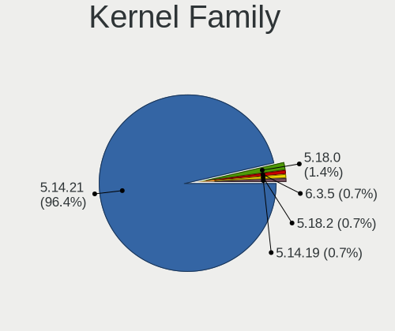

| Version | Computers | Percent |
|---------|-----------|---------|
| 5.14.21 | 121       | 96.03%  |
| 5.18.0  | 2         | 1.59%   |
| 6.3.5   | 1         | 0.79%   |
| 5.18.2  | 1         | 0.79%   |
| 5.14.19 | 1         | 0.79%   |

Kernel Major Ver.
-----------------

Linux kernel major version

| Version | Computers | Percent |
|---------|-----------|---------|
| 5.14    | 122       | 96.83%  |
| 5.18    | 3         | 2.38%   |
| 6.3     | 1         | 0.79%   |

Arch
----

OS architecture (x86_64, i586, etc.)

| Name   | Computers | Percent |
|--------|-----------|---------|
| x86_64 | 125       | 100%    |

DE
--

Desktop Environment

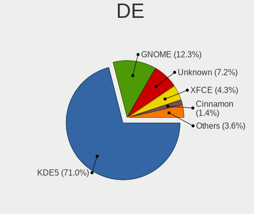

| Name        | Computers | Percent |
|-------------|-----------|---------|
| KDE5        | 88        | 69.84%  |
| GNOME       | 16        | 12.7%   |
| Unknown     | 10        | 7.94%   |
| XFCE        | 5         | 3.97%   |
| Cinnamon    | 2         | 1.59%   |
| X-Cinnamon  | 1         | 0.79%   |
| WindowMaker | 1         | 0.79%   |
| LXDE        | 1         | 0.79%   |
| ICEWM       | 1         | 0.79%   |
| Deepin      | 1         | 0.79%   |

Display Server
--------------

X11 or Wayland

| Name    | Computers | Percent |
|---------|-----------|---------|
| X11     | 104       | 82.54%  |
| Wayland | 15        | 11.9%   |
| Tty     | 5         | 3.97%   |
| Unknown | 2         | 1.59%   |

Display Manager
---------------

SDDM, LightDM, etc.

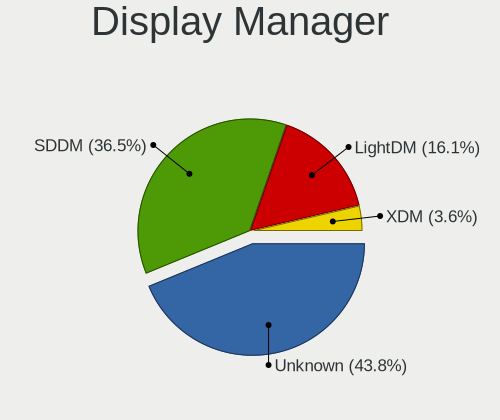

| Name    | Computers | Percent |
|---------|-----------|---------|
| Unknown | 55        | 44%     |
| SDDM    | 44        | 35.2%   |
| LightDM | 21        | 16.8%   |
| XDM     | 5         | 4%      |

OS Lang
-------

Language

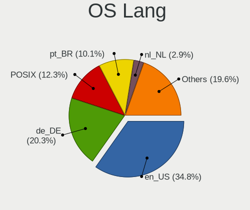

| Lang    | Computers | Percent |
|---------|-----------|---------|
| en_US   | 44        | 34.92%  |
| de_DE   | 22        | 17.46%  |
| POSIX   | 17        | 13.49%  |
| pt_BR   | 13        | 10.32%  |
| nl_NL   | 4         | 3.17%   |
| es_ES   | 4         | 3.17%   |
| en_GB   | 4         | 3.17%   |
| ru_RU   | 3         | 2.38%   |
| fr_FR   | 3         | 2.38%   |
| nn_NO   | 2         | 1.59%   |
| it_IT   | 2         | 1.59%   |
| ro_RO   | 1         | 0.79%   |
| pl_PL   | 1         | 0.79%   |
| hu_HU   | 1         | 0.79%   |
| en_IN   | 1         | 0.79%   |
| el_GR   | 1         | 0.79%   |
| de_CH   | 1         | 0.79%   |
| ca_ES   | 1         | 0.79%   |
| Unknown | 1         | 0.79%   |

Boot Mode
---------

EFI or BIOS

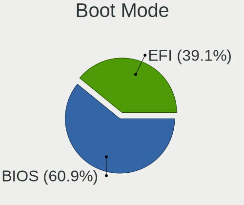

| Mode | Computers | Percent |
|------|-----------|---------|
| BIOS | 77        | 61.11%  |
| EFI  | 49        | 38.89%  |

Filesystem
----------

Type of filesystem

| Type  | Computers | Percent |
|-------|-----------|---------|
| Btrfs | 87        | 69.6%   |
| Ext4  | 30        | 24%     |
| Xfs   | 6         | 4.8%    |
| Tmpfs | 1         | 0.8%    |
| Ext3  | 1         | 0.8%    |

Part. scheme
------------

Scheme of partitioning

| Type    | Computers | Percent |
|---------|-----------|---------|
| GPT     | 64        | 50.79%  |
| Unknown | 52        | 41.27%  |
| MBR     | 10        | 7.94%   |

Dual Boot with Linux/BSD
------------------------

Hosting more than one Linux/BSD

| Dual boot | Computers | Percent |
|-----------|-----------|---------|
| No        | 111       | 88.1%   |
| Yes       | 15        | 11.9%   |

Dual Boot (Win)
---------------

Hosting Linux and Windows

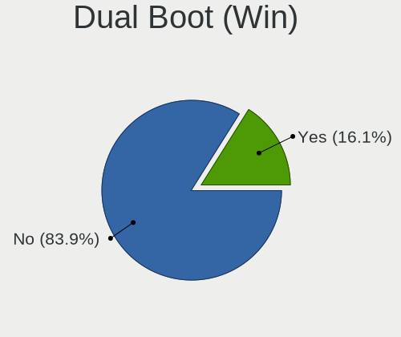

| Dual boot | Computers | Percent |
|-----------|-----------|---------|
| No        | 105       | 84%     |
| Yes       | 20        | 16%     |

Board
-----

Vendor
------

Motherboard manufacturer

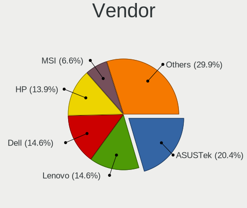

| Name                | Computers | Percent |
|---------------------|-----------|---------|
| ASUSTek Computer    | 25        | 20%     |
| Lenovo              | 20        | 16%     |
| Hewlett-Packard     | 19        | 15.2%   |
| Dell                | 17        | 13.6%   |
| MSI                 | 9         | 7.2%    |
| Gigabyte Technology | 6         | 4.8%    |
| ASRock              | 5         | 4%      |
| Acer                | 4         | 3.2%    |
| Toshiba             | 2         | 1.6%    |
| Samsung Electronics | 2         | 1.6%    |
| Intel               | 2         | 1.6%    |
| Fujitsu             | 2         | 1.6%    |
| Unknown             | 2         | 1.6%    |
| Wortmann AG         | 1         | 0.8%    |
| TUXEDO              | 1         | 0.8%    |
| Sony                | 1         | 0.8%    |
| Schenker            | 1         | 0.8%    |
| Notebook            | 1         | 0.8%    |
| Multilaser          | 1         | 0.8%    |
| LG Electronics      | 1         | 0.8%    |
| Jumper              | 1         | 0.8%    |
| Gateway             | 1         | 0.8%    |
| Biostar             | 1         | 0.8%    |

Model
-----

Motherboard model

| Name                                     | Computers | Percent |
|------------------------------------------|-----------|---------|
| Samsung 550XDA                           | 2         | 1.6%    |
| HP Spectre x360 Convertible 13t-aw100    | 2         | 1.6%    |
| ASUS TUF Gaming B550M-E                  | 2         | 1.6%    |
| ASUS M4A785TD-V EVO                      | 2         | 1.6%    |
| ASUS CROSSHAIR V FORMULA-Z               | 2         | 1.6%    |
| Unknown                                  | 2         | 1.6%    |
| Wortmann AG Terra 3100                   | 1         | 0.8%    |
| TUXEDO InfinityBook S 15/17 Gen7         | 1         | 0.8%    |
| Toshiba Satellite P55t-A                 | 1         | 0.8%    |
| Toshiba Satellite L500                   | 1         | 0.8%    |
| Sony VPCEH25EN                           | 1         | 0.8%    |
| Schenker VIA 15 Pro                      | 1         | 0.8%    |
| Notebook NLx0MU                          | 1         | 0.8%    |
| Multilaser PC150                         | 1         | 0.8%    |
| MSI MS-7C02                              | 1         | 0.8%    |
| MSI MS-7B86                              | 1         | 0.8%    |
| MSI MS-7B85                              | 1         | 0.8%    |
| MSI MS-7B78                              | 1         | 0.8%    |
| MSI MS-7B09                              | 1         | 0.8%    |
| MSI MS-7971                              | 1         | 0.8%    |
| MSI MS-7850                              | 1         | 0.8%    |
| MSI MS-7673                              | 1         | 0.8%    |
| MSI Delta 15 A5EFK                       | 1         | 0.8%    |
| LG C400-G.BC22P1                         | 1         | 0.8%    |
| Lenovo V15-ADA 82C7                      | 1         | 0.8%    |
| Lenovo ThinkStation P920 30BDS2H804      | 1         | 0.8%    |
| Lenovo ThinkStation P520 30BE008VGE      | 1         | 0.8%    |
| Lenovo ThinkStation P500 30A6S4JU00      | 1         | 0.8%    |
| Lenovo ThinkPad X1 Carbon 7th 20QDS3B600 | 1         | 0.8%    |
| Lenovo ThinkPad W541 20EF001UGE          | 1         | 0.8%    |
| Lenovo ThinkPad T530 2394D56             | 1         | 0.8%    |
| Lenovo ThinkPad T520 42435GG             | 1         | 0.8%    |
| Lenovo ThinkPad T495s 20QJ0012UK         | 1         | 0.8%    |
| Lenovo ThinkPad T470 20HES0FW00          | 1         | 0.8%    |
| Lenovo ThinkPad T410 25223FG             | 1         | 0.8%    |
| Lenovo ThinkPad T16 Gen 1 21BVCTO1WW     | 1         | 0.8%    |
| Lenovo ThinkPad P50 20EQS0VV0C           | 1         | 0.8%    |
| Lenovo ThinkPad P16s Gen 1 21BT000MUK    | 1         | 0.8%    |
| Lenovo ThinkPad Edge E530 3259HHG        | 1         | 0.8%    |
| Lenovo ThinkPad Edge E431 62779XP        | 1         | 0.8%    |

Model Family
------------

Motherboard model prefix

| Name                | Computers | Percent |
|---------------------|-----------|---------|
| Lenovo ThinkPad     | 12        | 9.6%    |
| Dell Inspiron       | 5         | 4%      |
| ASUS TUF            | 5         | 4%      |
| ASUS PRIME          | 5         | 4%      |
| Lenovo ThinkStation | 3         | 2.4%    |
| Lenovo IdeaPad      | 3         | 2.4%    |
| Dell Vostro         | 3         | 2.4%    |
| Dell OptiPlex       | 3         | 2.4%    |
| Dell Latitude       | 3         | 2.4%    |
| ASUS ROG            | 3         | 2.4%    |
| Toshiba Satellite   | 2         | 1.6%    |
| Samsung 550XDA      | 2         | 1.6%    |
| HP ZBook            | 2         | 1.6%    |
| HP Spectre          | 2         | 1.6%    |
| HP ProBook          | 2         | 1.6%    |
| HP EliteBook        | 2         | 1.6%    |
| HP Compaq           | 2         | 1.6%    |
| Fujitsu LIFEBOOK    | 2         | 1.6%    |
| ASUS M4A785TD-V     | 2         | 1.6%    |
| ASUS CROSSHAIR      | 2         | 1.6%    |
| Acer Aspire         | 2         | 1.6%    |
| Unknown             | 2         | 1.6%    |
| Wortmann AG Terra   | 1         | 0.8%    |
| TUXEDO InfinityBook | 1         | 0.8%    |
| Sony VPCEH25EN      | 1         | 0.8%    |
| Schenker VIA        | 1         | 0.8%    |
| Notebook NLx0MU     | 1         | 0.8%    |
| Multilaser PC150    | 1         | 0.8%    |
| MSI MS-7C02         | 1         | 0.8%    |
| MSI MS-7B86         | 1         | 0.8%    |
| MSI MS-7B85         | 1         | 0.8%    |
| MSI MS-7B78         | 1         | 0.8%    |
| MSI MS-7B09         | 1         | 0.8%    |
| MSI MS-7971         | 1         | 0.8%    |
| MSI MS-7850         | 1         | 0.8%    |
| MSI MS-7673         | 1         | 0.8%    |
| MSI Delta           | 1         | 0.8%    |
| LG C400-G.BC22P1    | 1         | 0.8%    |
| Lenovo V15-ADA      | 1         | 0.8%    |
| Lenovo H50-55       | 1         | 0.8%    |

MFG Year
--------

Motherboard manufacture year

| Year | Computers | Percent |
|------|-----------|---------|
| 2021 | 25        | 20%     |
| 2022 | 10        | 8%      |
| 2019 | 10        | 8%      |
| 2020 | 9         | 7.2%    |
| 2018 | 9         | 7.2%    |
| 2009 | 9         | 7.2%    |
| 2017 | 7         | 5.6%    |
| 2015 | 7         | 5.6%    |
| 2011 | 7         | 5.6%    |
| 2014 | 6         | 4.8%    |
| 2013 | 6         | 4.8%    |
| 2012 | 6         | 4.8%    |
| 2010 | 5         | 4%      |
| 2016 | 3         | 2.4%    |
| 2008 | 2         | 1.6%    |
| 2007 | 2         | 1.6%    |
| 2006 | 1         | 0.8%    |
| 2005 | 1         | 0.8%    |

Form Factor
-----------

Physical design of the computer

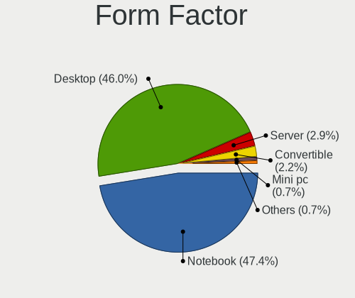

| Name        | Computers | Percent |
|-------------|-----------|---------|
| Notebook    | 63        | 50.4%   |
| Desktop     | 55        | 44%     |
| Convertible | 3         | 2.4%    |
| Server      | 2         | 1.6%    |
| Mini pc     | 1         | 0.8%    |
| All in one  | 1         | 0.8%    |

Secure Boot
-----------

Enabled or disabled

| State    | Computers | Percent |
|----------|-----------|---------|
| Disabled | 115       | 92%     |
| Enabled  | 10        | 8%      |

Coreboot
--------

Have coreboot on board

| Used | Computers | Percent |
|------|-----------|---------|
| No   | 125       | 100%    |

RAM Size
--------

Total RAM memory

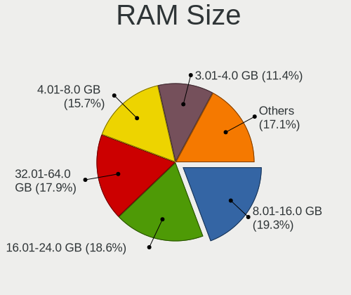

| Size in GB      | Computers | Percent |
|-----------------|-----------|---------|
| 32.01-64.0      | 23        | 18.11%  |
| 16.01-24.0      | 23        | 18.11%  |
| 8.01-16.0       | 23        | 18.11%  |
| 4.01-8.0        | 20        | 15.75%  |
| 3.01-4.0        | 16        | 12.6%   |
| 64.01-256.0     | 11        | 8.66%   |
| 24.01-32.0      | 5         | 3.94%   |
| More than 256.0 | 2         | 1.57%   |
| 2.01-3.0        | 2         | 1.57%   |
| 1.01-2.0        | 1         | 0.79%   |
| 0.51-1.0        | 1         | 0.79%   |

RAM Used
--------

Used RAM memory

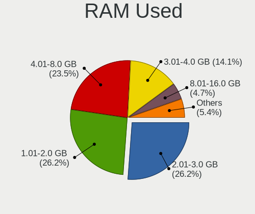

| Used GB   | Computers | Percent |
|-----------|-----------|---------|
| 1.01-2.0  | 36        | 27.07%  |
| 4.01-8.0  | 33        | 24.81%  |
| 2.01-3.0  | 33        | 24.81%  |
| 3.01-4.0  | 17        | 12.78%  |
| 0.51-1.0  | 7         | 5.26%   |
| 8.01-16.0 | 6         | 4.51%   |
| 0.01-0.5  | 1         | 0.75%   |

Total Drives
------------

Number of drives on board

| Drives | Computers | Percent |
|--------|-----------|---------|
| 1      | 65        | 50%     |
| 2      | 36        | 27.69%  |
| 3      | 13        | 10%     |
| 5      | 5         | 3.85%   |
| 4      | 5         | 3.85%   |
| 7      | 3         | 2.31%   |
| 6      | 2         | 1.54%   |
| 9      | 1         | 0.77%   |

Has CD-ROM
----------

Has CD-ROM on board

| Presented | Computers | Percent |
|-----------|-----------|---------|
| No        | 72        | 57.6%   |
| Yes       | 53        | 42.4%   |

Has Ethernet
------------

Has Ethernet on board

| Presented | Computers | Percent |
|-----------|-----------|---------|
| Yes       | 114       | 90.48%  |
| No        | 12        | 9.52%   |

Has WiFi
--------

Has WiFi module

| Presented | Computers | Percent |
|-----------|-----------|---------|
| Yes       | 87        | 69.6%   |
| No        | 38        | 30.4%   |

Has Bluetooth
-------------

Has Bluetooth module

| Presented | Computers | Percent |
|-----------|-----------|---------|
| Yes       | 76        | 60.32%  |
| No        | 50        | 39.68%  |

Location
--------

Country
-------

Geographic location (country)

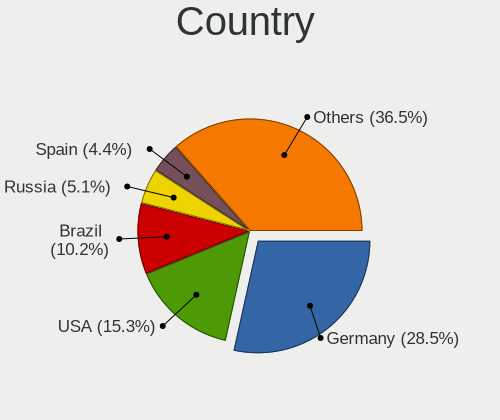

| Country      | Computers | Percent |
|--------------|-----------|---------|
| Germany      | 33        | 26.4%   |
| USA          | 21        | 16.8%   |
| Brazil       | 13        | 10.4%   |
| Russia       | 6         | 4.8%    |
| UK           | 5         | 4%      |
| Spain        | 5         | 4%      |
| Netherlands  | 5         | 4%      |
| Italy        | 5         | 4%      |
| Norway       | 3         | 2.4%    |
| France       | 3         | 2.4%    |
| Switzerland  | 2         | 1.6%    |
| South Africa | 2         | 1.6%    |
| Serbia       | 2         | 1.6%    |
| Poland       | 2         | 1.6%    |
| Mexico       | 2         | 1.6%    |
| India        | 2         | 1.6%    |
| Taiwan       | 1         | 0.8%    |
| Sweden       | 1         | 0.8%    |
| Slovenia     | 1         | 0.8%    |
| Romania      | 1         | 0.8%    |
| Martinique   | 1         | 0.8%    |
| Luxembourg   | 1         | 0.8%    |
| Kazakhstan   | 1         | 0.8%    |
| Indonesia    | 1         | 0.8%    |
| Hungary      | 1         | 0.8%    |
| Greece       | 1         | 0.8%    |
| Finland      | 1         | 0.8%    |
| Czechia      | 1         | 0.8%    |
| Bulgaria     | 1         | 0.8%    |
| Australia    | 1         | 0.8%    |

City
----

Geographic location (city)

| City              | Computers | Percent |
|-------------------|-----------|---------|
| Haßfurt          | 5         | 3.79%   |
| Moscow            | 3         | 2.27%   |
| Madrid            | 3         | 2.27%   |
| Darmstadt         | 3         | 2.27%   |
| Almere Stad       | 3         | 2.27%   |
| Sao Paulo         | 2         | 1.52%   |
| Saint Joseph      | 2         | 1.52%   |
| Rio de Janeiro    | 2         | 1.52%   |
| Paris             | 2         | 1.52%   |
| Louisville        | 2         | 1.52%   |
| London            | 2         | 1.52%   |
| Joinville         | 2         | 1.52%   |
| Berlin            | 2         | 1.52%   |
| Bergisch Gladbach | 2         | 1.52%   |
| Zierikzee         | 1         | 0.76%   |
| Yekaterinburg     | 1         | 0.76%   |
| West Bend         | 1         | 0.76%   |
| Vaksdal           | 1         | 0.76%   |
| Ulyanovsk         | 1         | 0.76%   |
| Taichung          | 1         | 0.76%   |
| Sydney            | 1         | 0.76%   |
| Stockholm         | 1         | 0.76%   |
| Stazione-Fornola  | 1         | 0.76%   |
| Stadthagen        | 1         | 0.76%   |
| Skokie            | 1         | 0.76%   |
| Santa Rosa        | 1         | 0.76%   |
| San Francisco     | 1         | 0.76%   |
| Saki              | 1         | 0.76%   |
| Sainte-Tulle      | 1         | 0.76%   |
| Rostock           | 1         | 0.76%   |
| Roslindale        | 1         | 0.76%   |
| Rome              | 1         | 0.76%   |
| Riviere Salee     | 1         | 0.76%   |
| Reggio Emilia     | 1         | 0.76%   |
| Recife            | 1         | 0.76%   |
| Rattelsdorf       | 1         | 0.76%   |
| Pretoria          | 1         | 0.76%   |
| Poznan            | 1         | 0.76%   |
| Pirmasens         | 1         | 0.76%   |
| Peize             | 1         | 0.76%   |

Drives
------

Drive Vendor
------------

Hard drive vendors

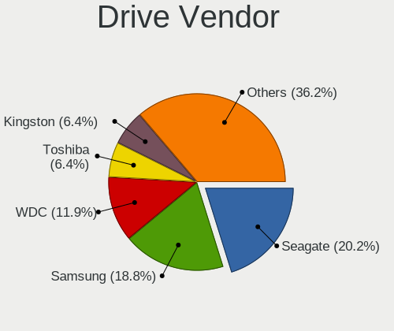

| Vendor                         | Computers | Drives | Percent |
|--------------------------------|-----------|--------|---------|
| Samsung Electronics            | 41        | 65     | 20.5%   |
| Seagate                        | 40        | 58     | 20%     |
| WDC                            | 22        | 38     | 11%     |
| Kingston                       | 13        | 19     | 6.5%    |
| Toshiba                        | 11        | 17     | 5.5%    |
| Crucial                        | 9         | 10     | 4.5%    |
| SanDisk                        | 7         | 10     | 3.5%    |
| SK hynix                       | 5         | 5      | 2.5%    |
| Unknown                        | 4         | 5      | 2%      |
| Intel                          | 4         | 5      | 2%      |
| Intenso                        | 3         | 4      | 1.5%    |
| Hitachi                        | 3         | 4      | 1.5%    |
| HGST                           | 3         | 3      | 1.5%    |
| PNY                            | 2         | 3      | 1%      |
| Patriot                        | 2         | 2      | 1%      |
| Micron Technology              | 2         | 2      | 1%      |
| Maxtor                         | 2         | 2      | 1%      |
| Kingston Technology Company    | 2         | 2      | 1%      |
| A-DATA Technology              | 2         | 2      | 1%      |
| Unknown                        | 2         | 2      | 1%      |
| VISIPRO                        | 1         | 1      | 0.5%    |
| Union Memory (Shenzhen)        | 1         | 1      | 0.5%    |
| TO Exter                       | 1         | 1      | 0.5%    |
| Team                           | 1         | 1      | 0.5%    |
| StoreJet                       | 1         | 1      | 0.5%    |
| Solid State Storage Technology | 1         | 1      | 0.5%    |
| Solid State Storage            | 1         | 1      | 0.5%    |
| Smartbuy                       | 1         | 2      | 0.5%    |
| Plextor                        | 1         | 2      | 0.5%    |
| Phison Electronics             | 1         | 1      | 0.5%    |
| MAXIO Technology (Hangzhou)    | 1         | 1      | 0.5%    |
| MATSHITA                       | 1         | 1      | 0.5%    |
| Leven                          | 1         | 1      | 0.5%    |
| KIOXIA                         | 1         | 1      | 0.5%    |
| JMicron Technology             | 1         | 1      | 0.5%    |
| Hewlett-Packard                | 1         | 3      | 0.5%    |
| Gigabyte Technology            | 1         | 1      | 0.5%    |
| Fujitsu                        | 1         | 1      | 0.5%    |
| China                          | 1         | 1      | 0.5%    |
| Biwin Storage Technology       | 1         | 1      | 0.5%    |

Drive Model
-----------

Hard drive models

| Model                                               | Computers | Percent |
|-----------------------------------------------------|-----------|---------|
| Samsung SSD 860 EVO 500GB                           | 5         | 2.15%   |
| Samsung SSD 840 EVO 120GB                           | 5         | 2.15%   |
| Samsung NVMe SSD Controller SM981/PM981/PM983 256GB | 5         | 2.15%   |
| Kingston SA400S37480G 480GB SSD                     | 4         | 1.72%   |
| Seagate ST2000DM001-1ER164 2TB                      | 3         | 1.29%   |
| Samsung NVMe SSD Controller PM9A1/PM9A3/980PRO 1TB  | 3         | 1.29%   |
| Kingston SA400S37240G 240GB SSD                     | 3         | 1.29%   |
| Crucial CT1000MX500SSD1 1TB                         | 3         | 1.29%   |
| WDC WD10EZEX-08M2NA0 1TB                            | 2         | 0.86%   |
| Unknown MMC Card  128GB                             | 2         | 0.86%   |
| Toshiba XG6 NVMe SSD Controller 256GB               | 2         | 0.86%   |
| Seagate ST500DM002-1BD142 500GB                     | 2         | 0.86%   |
| Seagate ST3500418AS 500GB                           | 2         | 0.86%   |
| Seagate ST3000NM0053 3TB                            | 2         | 0.86%   |
| Seagate ST1000LM035-1RK172 1TB                      | 2         | 0.86%   |
| Seagate Expansion 1TB                               | 2         | 0.86%   |
| Sandisk WD Black SN850 500GB                        | 2         | 0.86%   |
| SanDisk NVMe SSD Drive 240GB                        | 2         | 0.86%   |
| Samsung SSD 870 QVO 2TB                             | 2         | 0.86%   |
| Samsung SSD 860 EVO 250GB                           | 2         | 0.86%   |
| Samsung NVMe SSD Controller SM961/PM961/SM963 256GB | 2         | 0.86%   |
| PNY CS900 480GB SSD                                 | 2         | 0.86%   |
| Kingston Company A2000 NVMe SSD 500GB               | 2         | 0.86%   |
| Kingston SA400S37960G 960GB SSD                     | 2         | 0.86%   |
| Intel SSD 600P Series 256GB                         | 2         | 0.86%   |
| Unknown                                             | 2         | 0.86%   |
| WDC WDS500G2B0A-00SM50 500GB SSD                    | 1         | 0.43%   |
| WDC WDS500G1B0B-00AS40 500GB SSD                    | 1         | 0.43%   |
| WDC WDS250G1B0A-00H9H0 250GB SSD                    | 1         | 0.43%   |
| WDC WDS100T2B0A-00SM50 1TB SSD                      | 1         | 0.43%   |
| WDC WDS100T1X0E-00AFY0 1TB                          | 1         | 0.43%   |
| WDC WD5000AZRX-00L4HB0 500GB                        | 1         | 0.43%   |
| WDC WD40EFRX-68WT0N0 4TB                            | 1         | 0.43%   |
| WDC WD4003FRYZ-01F0DB0 4TB                          | 1         | 0.43%   |
| WDC WD3200BPVT-22JJ5T0 320GB                        | 1         | 0.43%   |
| WDC WD3200AAKX-00ERMA0 320GB                        | 1         | 0.43%   |
| WDC WD30EZRX-00SPEB0 3TB                            | 1         | 0.43%   |
| WDC WD20SPZX-22UA7T0 2TB                            | 1         | 0.43%   |
| WDC WD20EZRZ-00Z5HB0 2TB                            | 1         | 0.43%   |
| WDC WD20EZRX-00DC0B0 2TB                            | 1         | 0.43%   |

HDD Vendor
----------

Hard disk drive vendors

| Vendor              | Computers | Drives | Percent |
|---------------------|-----------|--------|---------|
| Seagate             | 39        | 53     | 49.37%  |
| WDC                 | 19        | 31     | 24.05%  |
| Toshiba             | 8         | 14     | 10.13%  |
| Samsung Electronics | 4         | 4      | 5.06%   |
| Hitachi             | 3         | 4      | 3.8%    |
| HGST                | 3         | 3      | 3.8%    |
| Maxtor              | 2         | 2      | 2.53%   |
| Fujitsu             | 1         | 1      | 1.27%   |

SSD Vendor
----------

Solid state drive vendors

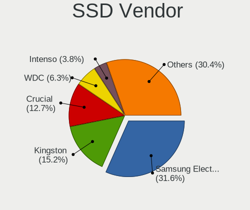

| Vendor              | Computers | Drives | Percent |
|---------------------|-----------|--------|---------|
| Samsung Electronics | 25        | 29     | 33.33%  |
| Kingston            | 11        | 14     | 14.67%  |
| Crucial             | 8         | 9      | 10.67%  |
| WDC                 | 4         | 4      | 5.33%   |
| Intenso             | 3         | 4      | 4%      |
| PNY                 | 2         | 3      | 2.67%   |
| Patriot             | 2         | 2      | 2.67%   |
| Intel               | 2         | 3      | 2.67%   |
| A-DATA Technology   | 2         | 2      | 2.67%   |
| Unknown             | 2         | 2      | 2.67%   |
| VISIPRO             | 1         | 1      | 1.33%   |
| Toshiba             | 1         | 1      | 1.33%   |
| TO Exter            | 1         | 1      | 1.33%   |
| Team                | 1         | 1      | 1.33%   |
| StoreJet            | 1         | 1      | 1.33%   |
| Smartbuy            | 1         | 2      | 1.33%   |
| SK hynix            | 1         | 1      | 1.33%   |
| SanDisk             | 1         | 3      | 1.33%   |
| Plextor             | 1         | 2      | 1.33%   |
| Micron Technology   | 1         | 1      | 1.33%   |
| Leven               | 1         | 1      | 1.33%   |
| Hewlett-Packard     | 1         | 3      | 1.33%   |
| Gigabyte Technology | 1         | 1      | 1.33%   |
| China               | 1         | 1      | 1.33%   |

Drive Kind
----------

HDD or SSD

| Kind    | Computers | Drives | Percent |
|---------|-----------|--------|---------|
| HDD     | 66        | 112    | 35.48%  |
| SSD     | 63        | 92     | 33.87%  |
| NVMe    | 50        | 71     | 26.88%  |
| MMC     | 4         | 5      | 2.15%   |
| Unknown | 3         | 3      | 1.61%   |

Drive Connector
---------------

SATA, SAS, NVMe, etc.

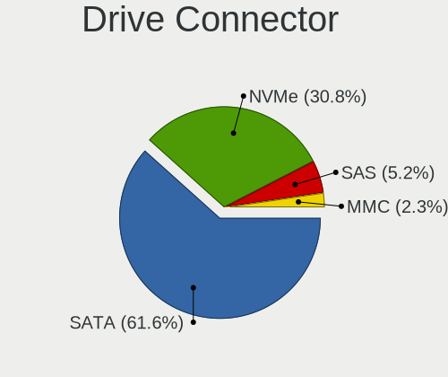

| Type | Computers | Drives | Percent |
|------|-----------|--------|---------|
| SATA | 98        | 197    | 60.87%  |
| NVMe | 50        | 71     | 31.06%  |
| SAS  | 9         | 10     | 5.59%   |
| MMC  | 4         | 5      | 2.48%   |

Drive Size
----------

Size of hard drive

| Size in TB | Computers | Drives | Percent |
|------------|-----------|--------|---------|
| 0.01-0.5   | 69        | 102    | 50.74%  |
| 0.51-1.0   | 36        | 53     | 26.47%  |
| 1.01-2.0   | 17        | 27     | 12.5%   |
| 2.01-3.0   | 6         | 7      | 4.41%   |
| 3.01-4.0   | 4         | 8      | 2.94%   |
| 4.01-10.0  | 3         | 6      | 2.21%   |
| 10.01-20.0 | 1         | 1      | 0.74%   |

Space Total
-----------

Amount of disk space available on the file system

| Size in GB     | Computers | Percent |
|----------------|-----------|---------|
| More than 3000 | 44        | 35.2%   |
| 1001-2000      | 28        | 22.4%   |
| 2001-3000      | 18        | 14.4%   |
| 251-500        | 13        | 10.4%   |
| 501-1000       | 13        | 10.4%   |
| 101-250        | 6         | 4.8%    |
| Unknown        | 2         | 1.6%    |
| 21-50          | 1         | 0.8%    |

Space Used
----------

Amount of used disk space

| Used GB        | Computers | Percent |
|----------------|-----------|---------|
| 101-250        | 34        | 25.76%  |
| 51-100         | 23        | 17.42%  |
| 501-1000       | 17        | 12.88%  |
| 251-500        | 16        | 12.12%  |
| 1001-2000      | 16        | 12.12%  |
| 1-20           | 10        | 7.58%   |
| More than 3000 | 8         | 6.06%   |
| 2001-3000      | 5         | 3.79%   |
| Unknown        | 2         | 1.52%   |
| 21-50          | 1         | 0.76%   |

Malfunc. Drives
---------------

Drive models with a malfunction

| Model                                     | Computers | Drives | Percent |
|-------------------------------------------|-----------|--------|---------|
| Samsung Electronics SSD 840 EVO 120GB     | 4         | 5      | 23.53%  |
| WDC WD20EFRX-68EUZN0 2TB                  | 1         | 1      | 5.88%   |
| Toshiba MK5055GSX 500GB                   | 1         | 3      | 5.88%   |
| Seagate ST9500420AS 500GB                 | 1         | 1      | 5.88%   |
| Seagate ST320LT007-9ZV142 320GB           | 1         | 1      | 5.88%   |
| Seagate ST2000DM001-1CH164 2TB            | 1         | 1      | 5.88%   |
| Samsung Electronics SSD 850 PRO 256GB     | 1         | 1      | 5.88%   |
| Maxtor 6L250S0 256GB                      | 1         | 1      | 5.88%   |
| Kingston SV300S37A120G 120GB SSD          | 1         | 1      | 5.88%   |
| Kingston SUV300S37A240G 240GB SSD         | 1         | 2      | 5.88%   |
| Intel SSD 600P Series 256GB               | 1         | 1      | 5.88%   |
| Hitachi HTS725025A9A364 250GB             | 1         | 2      | 5.88%   |
| Crucial CT250BX100SSD1 250GB              | 1         | 1      | 5.88%   |
| Biwin Storage Technology HP SSD EX900 1TB | 1         | 1      | 5.88%   |

Malfunc. Drive Vendor
---------------------

Vendors of faulty drives

| Vendor                   | Computers | Drives | Percent |
|--------------------------|-----------|--------|---------|
| Samsung Electronics      | 5         | 6      | 29.41%  |
| Seagate                  | 3         | 3      | 17.65%  |
| Kingston                 | 2         | 3      | 11.76%  |
| WDC                      | 1         | 1      | 5.88%   |
| Toshiba                  | 1         | 3      | 5.88%   |
| Maxtor                   | 1         | 1      | 5.88%   |
| Intel                    | 1         | 1      | 5.88%   |
| Hitachi                  | 1         | 2      | 5.88%   |
| Crucial                  | 1         | 1      | 5.88%   |
| Biwin Storage Technology | 1         | 1      | 5.88%   |

Malfunc. HDD Vendor
-------------------

Vendors of faulty HDD drives

| Vendor  | Computers | Drives | Percent |
|---------|-----------|--------|---------|
| Seagate | 3         | 3      | 42.86%  |
| WDC     | 1         | 1      | 14.29%  |
| Toshiba | 1         | 3      | 14.29%  |
| Maxtor  | 1         | 1      | 14.29%  |
| Hitachi | 1         | 2      | 14.29%  |

Malfunc. Drive Kind
-------------------

Kinds of faulty drives

| Kind | Computers | Drives | Percent |
|------|-----------|--------|---------|
| SSD  | 8         | 10     | 50%     |
| HDD  | 6         | 10     | 37.5%   |
| NVMe | 2         | 2      | 12.5%   |

Failed Drives
-------------

Failed drive models

Zero info for selected period =(

Failed Drive Vendor
-------------------

Failed drive vendors

Zero info for selected period =(

Drive Status
------------

Number of failed and malfunc. drives

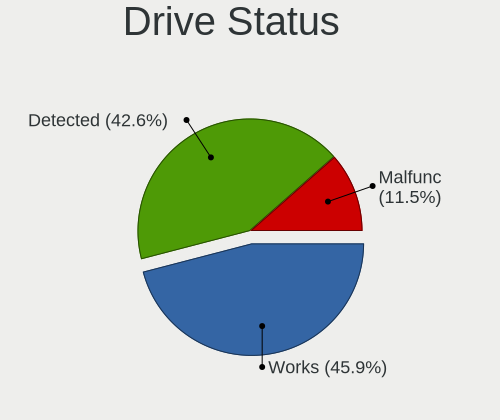

| Status   | Computers | Drives | Percent |
|----------|-----------|--------|---------|
| Works    | 61        | 118    | 44.53%  |
| Detected | 60        | 143    | 43.8%   |
| Malfunc  | 16        | 22     | 11.68%  |

Storage controller
------------------

Storage Vendor
--------------

Storage controller vendors

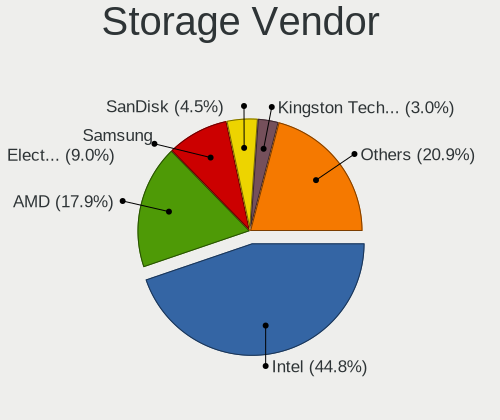

| Vendor                         | Computers | Percent |
|--------------------------------|-----------|---------|
| Intel                          | 80        | 43.48%  |
| AMD                            | 34        | 18.48%  |
| Samsung Electronics            | 18        | 9.78%   |
| SanDisk                        | 9         | 4.89%   |
| Kingston Technology Company    | 6         | 3.26%   |
| ASMedia Technology             | 6         | 3.26%   |
| JMicron Technology             | 5         | 2.72%   |
| SK hynix                       | 4         | 2.17%   |
| Marvell Technology Group       | 3         | 1.63%   |
| LSI Logic / Symbios Logic      | 3         | 1.63%   |
| Toshiba America Info Systems   | 2         | 1.09%   |
| Solid State Storage Technology | 2         | 1.09%   |
| Seagate Technology             | 2         | 1.09%   |
| Micron Technology              | 2         | 1.09%   |
| Union Memory (Shenzhen)        | 1         | 0.54%   |
| Silicon Image                  | 1         | 0.54%   |
| Promise Technology             | 1         | 0.54%   |
| Phison Electronics             | 1         | 0.54%   |
| MAXIO Technology (Hangzhou)    | 1         | 0.54%   |
| KIOXIA                         | 1         | 0.54%   |
| Biwin Storage Technology       | 1         | 0.54%   |
| ADATA Technology               | 1         | 0.54%   |

Storage Model
-------------

Storage controller models

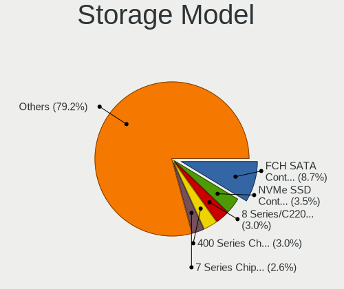

| Model                                                                          | Computers | Percent |
|--------------------------------------------------------------------------------|-----------|---------|
| AMD FCH SATA Controller [AHCI mode]                                            | 19        | 8.96%   |
| Samsung NVMe SSD Controller SM981/PM981/PM983                                  | 8         | 3.77%   |
| AMD 400 Series Chipset SATA Controller                                         | 7         | 3.3%    |
| Intel 8 Series/C220 Series Chipset Family 6-port SATA Controller 1 [AHCI mode] | 6         | 2.83%   |
| AMD 500 Series Chipset SATA Controller                                         | 6         | 2.83%   |
| Intel 7 Series Chipset Family 6-port SATA Controller [AHCI mode]               | 5         | 2.36%   |
| ASMedia ASM1062 Serial ATA Controller                                          | 5         | 2.36%   |
| AMD SB7x0/SB8x0/SB9x0 SATA Controller [AHCI mode]                              | 5         | 2.36%   |
| Samsung NVMe SSD Controller PM9A1/PM9A3/980PRO                                 | 4         | 1.89%   |
| Intel Sunrise Point-LP SATA Controller [AHCI mode]                             | 4         | 1.89%   |
| Intel Q170/Q150/B150/H170/H110/Z170/CM236 Chipset SATA Controller [AHCI Mode]  | 4         | 1.89%   |
| Intel 82801 Mobile SATA Controller [RAID mode]                                 | 4         | 1.89%   |
| Intel 8 Series SATA Controller 1 [AHCI mode]                                   | 4         | 1.89%   |
| AMD SB7x0/SB8x0/SB9x0 IDE Controller                                           | 4         | 1.89%   |
| SK hynix Gold P31/PC711 NVMe Solid State Drive                                 | 3         | 1.42%   |
| SanDisk WD PC SN810 / Black SN850 NVMe SSD                                     | 3         | 1.42%   |
| SanDisk WD Black SN750 / PC SN730 NVMe SSD                                     | 3         | 1.42%   |
| Samsung NVMe SSD Controller 980                                                | 3         | 1.42%   |
| Kingston Company Company Non-Volatile memory controller                        | 3         | 1.42%   |
| JMicron JMB363 SATA/IDE Controller                                             | 3         | 1.42%   |
| Intel Volume Management Device NVMe RAID Controller                            | 3         | 1.42%   |
| Intel Tiger Lake-LP SATA Controller                                            | 3         | 1.42%   |
| Intel 82801IBM/IEM (ICH9M/ICH9M-E) 4 port SATA Controller [AHCI mode]          | 3         | 1.42%   |
| Toshiba America Info Systems XG6 NVMe SSD Controller                           | 2         | 0.94%   |
| Solid State Storage Non-Volatile memory controller                             | 2         | 0.94%   |
| Seagate FireCuda 530 SSD                                                       | 2         | 0.94%   |
| SanDisk Non-Volatile memory controller                                         | 2         | 0.94%   |
| Samsung NVMe SSD Controller SM961/PM961/SM963                                  | 2         | 0.94%   |
| Micron NVMe Storage Controller                                                 | 2         | 0.94%   |
| Kingston Company A2000 NVMe SSD                                                | 2         | 0.94%   |
| Intel SSD 600P Series                                                          | 2         | 0.94%   |
| Intel NM10/ICH7 Family SATA Controller [AHCI mode]                             | 2         | 0.94%   |
| Intel Celeron/Pentium Silver Processor SATA Controller                         | 2         | 0.94%   |
| Intel Celeron N3350/Pentium N4200/Atom E3900 Series SATA AHCI Controller       | 2         | 0.94%   |
| Intel C620 Series Chipset Family SSATA Controller [AHCI mode]                  | 2         | 0.94%   |
| Intel C620 Series Chipset Family SATA Controller [AHCI mode]                   | 2         | 0.94%   |
| Intel 82801JI (ICH10 Family) SATA AHCI Controller                              | 2         | 0.94%   |
| Intel 82801JI (ICH10 Family) 4 port SATA IDE Controller #1                     | 2         | 0.94%   |
| Intel 82801JI (ICH10 Family) 2 port SATA IDE Controller #2                     | 2         | 0.94%   |
| Intel 82801HB (ICH8) 4 port SATA Controller [AHCI mode]                        | 2         | 0.94%   |

Storage Kind
------------

Kind of storage controller (IDE, SATA, NVMe, SAS, ...)

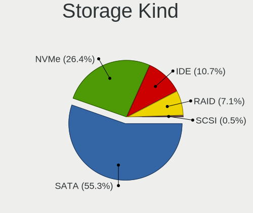

| Kind | Computers | Percent |
|------|-----------|---------|
| SATA | 99        | 55%     |
| NVMe | 49        | 27.22%  |
| IDE  | 19        | 10.56%  |
| RAID | 12        | 6.67%   |
| SCSI | 1         | 0.56%   |

Processor
---------

CPU Vendor
----------

Processor vendors

| Vendor | Computers | Percent |
|--------|-----------|---------|
| Intel  | 84        | 67.2%   |
| AMD    | 41        | 32.8%   |

CPU Model
---------

Processor models

| Model                                         | Computers | Percent |
|-----------------------------------------------|-----------|---------|
| AMD Ryzen 7 5700G with Radeon Graphics        | 4         | 3.2%    |
| AMD Ryzen 7 5800U with Radeon Graphics        | 3         | 2.4%    |
| AMD Ryzen 5 2600 Six-Core Processor           | 3         | 2.4%    |
| Intel Pentium CPU P6200 @ 2.13GHz             | 2         | 1.6%    |
| Intel Core i7-4810MQ CPU @ 2.80GHz            | 2         | 1.6%    |
| Intel Core i7-1065G7 CPU @ 1.30GHz            | 2         | 1.6%    |
| Intel Core i5-4200U CPU @ 1.60GHz             | 2         | 1.6%    |
| Intel Core i5-3230M CPU @ 2.60GHz             | 2         | 1.6%    |
| Intel Core i5 CPU 750 @ 2.67GHz               | 2         | 1.6%    |
| Intel Core i3-4005U CPU @ 1.70GHz             | 2         | 1.6%    |
| Intel Core i3-2370M CPU @ 2.40GHz             | 2         | 1.6%    |
| Intel Celeron N4020 CPU @ 1.10GHz             | 2         | 1.6%    |
| Intel 12th Gen Core i7-1260P                  | 2         | 1.6%    |
| Intel 11th Gen Core i7-1165G7 @ 2.80GHz       | 2         | 1.6%    |
| Intel 11th Gen Core i3-1115G4 @ 3.00GHz       | 2         | 1.6%    |
| AMD Ryzen 7 5800H with Radeon Graphics        | 2         | 1.6%    |
| AMD Ryzen 5 3600 6-Core Processor             | 2         | 1.6%    |
| AMD Ryzen 5 3500U with Radeon Vega Mobile Gfx | 2         | 1.6%    |
| AMD Ryzen 5 1600 Six-Core Processor           | 2         | 1.6%    |
| AMD Phenom II X6 1100T Processor              | 2         | 1.6%    |
| AMD FX-8350 Eight-Core Processor              | 2         | 1.6%    |
| Intel Xeon W-2135 CPU @ 3.70GHz               | 1         | 0.8%    |
| Intel Xeon Silver 4110 CPU @ 2.10GHz          | 1         | 0.8%    |
| Intel Xeon Gold 6154 CPU @ 3.00GHz            | 1         | 0.8%    |
| Intel Xeon CPU X5675 @ 3.07GHz                | 1         | 0.8%    |
| Intel Xeon CPU W3530 @ 2.80GHz                | 1         | 0.8%    |
| Intel Xeon CPU E5450 @ 3.00GHz                | 1         | 0.8%    |
| Intel Xeon CPU E5-1620 v3 @ 3.50GHz           | 1         | 0.8%    |
| Intel Xeon CPU E3-1230 v5 @ 3.40GHz           | 1         | 0.8%    |
| Intel Pentium Dual-Core CPU T4300 @ 2.10GHz   | 1         | 0.8%    |
| Intel Pentium Dual-Core CPU E6500 @ 2.93GHz   | 1         | 0.8%    |
| Intel Pentium 4 CPU 3.20GHz                   | 1         | 0.8%    |
| Intel Core i7-9750H CPU @ 2.60GHz             | 1         | 0.8%    |
| Intel Core i7-8665U CPU @ 1.90GHz             | 1         | 0.8%    |
| Intel Core i7-6820HQ CPU @ 2.70GHz            | 1         | 0.8%    |
| Intel Core i7-6700K CPU @ 4.00GHz             | 1         | 0.8%    |
| Intel Core i7-4720HQ CPU @ 2.60GHz            | 1         | 0.8%    |
| Intel Core i7-4700MQ CPU @ 2.40GHz            | 1         | 0.8%    |
| Intel Core i7-4700HQ CPU @ 2.40GHz            | 1         | 0.8%    |
| Intel Core i7-2670QM CPU @ 2.20GHz            | 1         | 0.8%    |

CPU Model Family
----------------

Processor model prefix

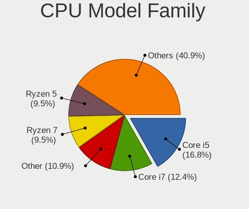

| Model                   | Computers | Percent |
|-------------------------|-----------|---------|
| Intel Core i5           | 20        | 16%     |
| Intel Core i7           | 15        | 12%     |
| Other                   | 14        | 11.2%   |
| AMD Ryzen 7             | 13        | 10.4%   |
| AMD Ryzen 5             | 13        | 10.4%   |
| Intel Core i3           | 11        | 8.8%    |
| Intel Xeon              | 6         | 4.8%    |
| Intel Celeron           | 4         | 3.2%    |
| AMD Ryzen 9             | 4         | 3.2%    |
| Intel Core 2 Duo        | 3         | 2.4%    |
| Intel Pentium Dual-Core | 2         | 1.6%    |
| Intel Pentium           | 2         | 1.6%    |
| Intel Atom              | 2         | 1.6%    |
| AMD Phenom II X6        | 2         | 1.6%    |
| AMD Phenom II X4        | 2         | 1.6%    |
| AMD FX                  | 2         | 1.6%    |
| Intel Xeon Silver       | 1         | 0.8%    |
| Intel Xeon Gold         | 1         | 0.8%    |
| Intel Pentium 4         | 1         | 0.8%    |
| Intel Core 2 Quad       | 1         | 0.8%    |
| Intel Core 2            | 1         | 0.8%    |
| AMD Ryzen Threadripper  | 1         | 0.8%    |
| AMD Ryzen 7 PRO         | 1         | 0.8%    |
| AMD Ryzen 3             | 1         | 0.8%    |
| AMD A4                  | 1         | 0.8%    |
| AMD A10                 | 1         | 0.8%    |

CPU Cores
---------

Number of processor cores

| Number | Computers | Percent |
|--------|-----------|---------|
| 4      | 40        | 32%     |
| 2      | 35        | 28%     |
| 8      | 17        | 13.6%   |
| 6      | 17        | 13.6%   |
| 12     | 6         | 4.8%    |
| 16     | 4         | 3.2%    |
| 1      | 4         | 3.2%    |
| 36     | 1         | 0.8%    |
| 10     | 1         | 0.8%    |

CPU Sockets
-----------

Number of sockets

| Number | Computers | Percent |
|--------|-----------|---------|
| 1      | 122       | 97.6%   |
| 2      | 3         | 2.4%    |

CPU Threads
-----------

Threads per core (Hyper-Threading)

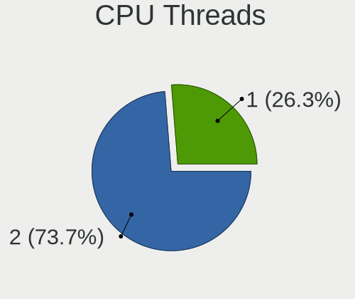

| Number | Computers | Percent |
|--------|-----------|---------|
| 2      | 96        | 76.8%   |
| 1      | 29        | 23.2%   |

CPU Op-Modes
------------

CPU Operation Modes (32-bit, 64-bit)

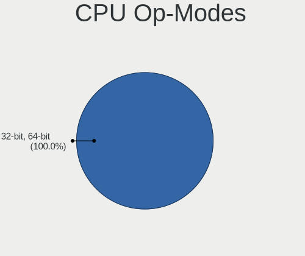

| Op mode        | Computers | Percent |
|----------------|-----------|---------|
| 32-bit, 64-bit | 125       | 100%    |

CPU Microcode
-------------

Microcode number

| Number     | Computers | Percent |
|------------|-----------|---------|
| Unknown    | 54        | 42.52%  |
| 0x0a50000c | 6         | 4.72%   |
| 0x806c1    | 5         | 3.94%   |
| 0x206a7    | 4         | 3.15%   |
| 0x906a3    | 3         | 2.36%   |
| 0x50654    | 3         | 2.36%   |
| 0x706a8    | 2         | 1.57%   |
| 0x506e3    | 2         | 1.57%   |
| 0x306c3    | 2         | 1.57%   |
| 0x106e5    | 2         | 1.57%   |
| 0x106ca    | 2         | 1.57%   |
| 0x1067a    | 2         | 1.57%   |
| 0x0a50000d | 2         | 1.57%   |
| 0x08108109 | 2         | 1.57%   |
| 0x0800820d | 2         | 1.57%   |
| 0x06000852 | 2         | 1.57%   |
| 0x010000dc | 2         | 1.57%   |
| 0x010000c8 | 2         | 1.57%   |
| 0xf4a      | 1         | 0.79%   |
| 0xa0671    | 1         | 0.79%   |
| 0x906ea    | 1         | 0.79%   |
| 0x906e9    | 1         | 0.79%   |
| 0x906a4    | 1         | 0.79%   |
| 0x90672    | 1         | 0.79%   |
| 0x806ec    | 1         | 0.79%   |
| 0x806ea    | 1         | 0.79%   |
| 0x806e9    | 1         | 0.79%   |
| 0x806d1    | 1         | 0.79%   |
| 0x706e5    | 1         | 0.79%   |
| 0x6fb      | 1         | 0.79%   |
| 0x6f6      | 1         | 0.79%   |
| 0x506ca    | 1         | 0.79%   |
| 0x406e3    | 1         | 0.79%   |
| 0x40651    | 1         | 0.79%   |
| 0x306a9    | 1         | 0.79%   |
| 0x20655    | 1         | 0.79%   |
| 0x0a601201 | 1         | 0.79%   |
| 0x0a50000b | 1         | 0.79%   |
| 0x0a404102 | 1         | 0.79%   |
| 0x0a201016 | 1         | 0.79%   |

CPU Microarch
-------------

Microarchitecture

| Name             | Computers | Percent |
|------------------|-----------|---------|
| Zen 3            | 12        | 9.6%    |
| Haswell          | 12        | 9.6%    |
| Zen+             | 9         | 7.2%    |
| KabyLake         | 9         | 7.2%    |
| Skylake          | 8         | 6.4%    |
| SandyBridge      | 8         | 6.4%    |
| Penryn           | 6         | 4.8%    |
| Unknown          | 6         | 4.8%    |
| Zen 2            | 5         | 4%      |
| Westmere         | 5         | 4%      |
| TigerLake        | 5         | 4%      |
| Icelake          | 5         | 4%      |
| Alderlake Hybrid | 5         | 4%      |
| K10              | 4         | 3.2%    |
| IvyBridge        | 4         | 3.2%    |
| Zen              | 3         | 2.4%    |
| Nehalem          | 3         | 2.4%    |
| Piledriver       | 2         | 1.6%    |
| Goldmont plus    | 2         | 1.6%    |
| Goldmont         | 2         | 1.6%    |
| Core             | 2         | 1.6%    |
| CometLake        | 2         | 1.6%    |
| Bonnell          | 2         | 1.6%    |
| Steamroller      | 1         | 0.8%    |
| NetBurst         | 1         | 0.8%    |
| Excavator        | 1         | 0.8%    |
| Broadwell        | 1         | 0.8%    |

Graphics
--------

GPU Vendor
----------

Vendors of graphics cards

| Vendor                     | Computers | Percent |
|----------------------------|-----------|---------|
| Intel                      | 54        | 37.5%   |
| Nvidia                     | 44        | 30.56%  |
| AMD                        | 44        | 30.56%  |
| S3 Graphics                | 1         | 0.69%   |
| Matrox Electronics Systems | 1         | 0.69%   |

GPU Model
---------

Graphics card models

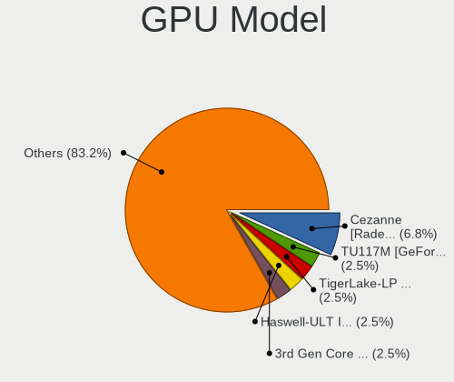

| Model                                                                     | Computers | Percent |
|---------------------------------------------------------------------------|-----------|---------|
| AMD Cezanne [Radeon Vega Series / Radeon Vega Mobile Series]              | 11        | 7.43%   |
| Intel Haswell-ULT Integrated Graphics Controller                          | 4         | 2.7%    |
| Intel 2nd Generation Core Processor Family Integrated Graphics Controller | 4         | 2.7%    |
| AMD Picasso/Raven 2 [Radeon Vega Series / Radeon Vega Mobile Series]      | 4         | 2.7%    |
| Nvidia TU117M [GeForce GTX 1650 Mobile / Max-Q]                           | 3         | 2.03%   |
| Nvidia GP107 [GeForce GTX 1050 Ti]                                        | 3         | 2.03%   |
| Intel TigerLake-LP GT2 [Iris Xe Graphics]                                 | 3         | 2.03%   |
| Intel HD Graphics 620                                                     | 3         | 2.03%   |
| Intel Alder Lake-P Integrated Graphics Controller                         | 3         | 2.03%   |
| Intel 4th Gen Core Processor Integrated Graphics Controller               | 3         | 2.03%   |
| Intel 3rd Gen Core processor Graphics Controller                          | 3         | 2.03%   |
| AMD Ellesmere [Radeon RX 470/480/570/570X/580/580X/590]                   | 3         | 2.03%   |
| Nvidia GK107 [GeForce GT 640]                                             | 2         | 1.35%   |
| Nvidia GF119 [GeForce GT 610]                                             | 2         | 1.35%   |
| Nvidia GA107M [GeForce RTX 3050 Ti Mobile]                                | 2         | 1.35%   |
| Intel WhiskeyLake-U GT2 [UHD Graphics 620]                                | 2         | 1.35%   |
| Intel TigerLake-H GT1 [UHD Graphics]                                      | 2         | 1.35%   |
| Intel Tiger Lake-LP GT2 [UHD Graphics G4]                                 | 2         | 1.35%   |
| Intel Skylake GT2 [HD Graphics 520]                                       | 2         | 1.35%   |
| Intel Iris Plus Graphics G7                                               | 2         | 1.35%   |
| Intel HD Graphics 500                                                     | 2         | 1.35%   |
| Intel GeminiLake [UHD Graphics 600]                                       | 2         | 1.35%   |
| Intel Core Processor Integrated Graphics Controller                       | 2         | 1.35%   |
| Intel CoffeeLake-H GT2 [UHD Graphics 630]                                 | 2         | 1.35%   |
| AMD RS880 [Radeon HD 4200]                                                | 2         | 1.35%   |
| AMD Raphael                                                               | 2         | 1.35%   |
| AMD Navi 23 [Radeon RX 6600/6600 XT/6600M]                                | 2         | 1.35%   |
| AMD Navi 22 [Radeon RX 6700/6700 XT/6750 XT / 6800M/6850M XT]             | 2         | 1.35%   |
| AMD Lexa PRO [Radeon 540/540X/550/550X / RX 540X/550/550X]                | 2         | 1.35%   |
| AMD Cedar [Radeon HD 5000/6000/7350/8350 Series]                          | 2         | 1.35%   |
| S3 Graphics 86c764/765 [Trio32/64/64V+]                                   | 1         | 0.68%   |
| Nvidia TU117M                                                             | 1         | 0.68%   |
| Nvidia TU117GLM [T550 Laptop GPU]                                         | 1         | 0.68%   |
| Nvidia TU117 [GeForce GTX 1650]                                           | 1         | 0.68%   |
| Nvidia TU106 [GeForce RTX 2070]                                           | 1         | 0.68%   |
| Nvidia GT218M [NVS 3100M]                                                 | 1         | 0.68%   |
| Nvidia GT218M [ION]                                                       | 1         | 0.68%   |
| Nvidia GT216 [GeForce GT 220]                                             | 1         | 0.68%   |
| Nvidia GP108 [GeForce GT 1030]                                            | 1         | 0.68%   |
| Nvidia GP107M [GeForce GTX 1050 Ti Mobile]                                | 1         | 0.68%   |

GPU Combo
---------

Combinations of graphics cards

| Name            | Computers | Percent |
|-----------------|-----------|---------|
| 1 x Intel       | 40        | 32%     |
| 1 x AMD         | 34        | 27.2%   |
| 1 x Nvidia      | 26        | 20.8%   |
| Intel + Nvidia  | 12        | 9.6%    |
| AMD + Nvidia    | 5         | 4%      |
| 2 x AMD         | 3         | 2.4%    |
| Intel + AMD     | 2         | 1.6%    |
| 2 x Nvidia      | 1         | 0.8%    |
| 1 x S3 Graphics | 1         | 0.8%    |
| 1 x Matrox      | 1         | 0.8%    |

GPU Driver
----------

Free vs proprietary

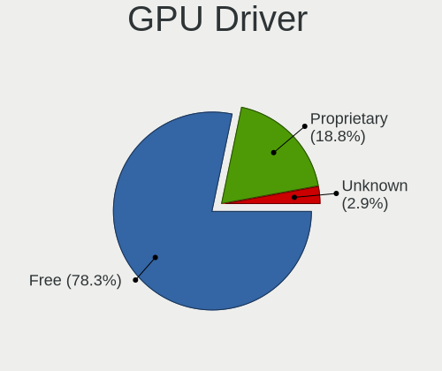

| Driver      | Computers | Percent |
|-------------|-----------|---------|
| Free        | 101       | 80.16%  |
| Proprietary | 21        | 16.67%  |
| Unknown     | 4         | 3.17%   |

GPU Memory
----------

Total video memory

| Size in GB | Computers | Percent |
|------------|-----------|---------|
| Unknown    | 74        | 58.73%  |
| 0.01-0.5   | 17        | 13.49%  |
| 1.01-2.0   | 13        | 10.32%  |
| 3.01-4.0   | 12        | 9.52%   |
| 0.51-1.0   | 4         | 3.17%   |
| 7.01-8.0   | 3         | 2.38%   |
| 8.01-16.0  | 3         | 2.38%   |

Monitor
-------

Monitor Vendor
--------------

Monitor vendors

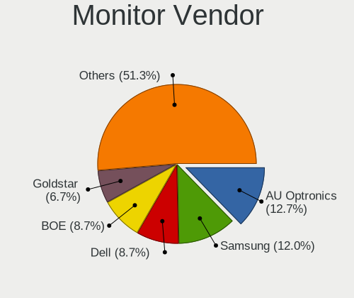

| Vendor                  | Computers | Percent |
|-------------------------|-----------|---------|
| AU Optronics            | 18        | 13.33%  |
| Samsung Electronics     | 15        | 11.11%  |
| Dell                    | 12        | 8.89%   |
| BOE                     | 12        | 8.89%   |
| Fujitsu Siemens         | 9         | 6.67%   |
| LG Display              | 8         | 5.93%   |
| Goldstar                | 7         | 5.19%   |
| Hewlett-Packard         | 6         | 4.44%   |
| Chimei Innolux          | 6         | 4.44%   |
| Lenovo                  | 5         | 3.7%    |
| InfoVision              | 4         | 2.96%   |
| Iiyama                  | 3         | 2.22%   |
| AOC                     | 3         | 2.22%   |
| Ancor Communications    | 3         | 2.22%   |
| Acer                    | 3         | 2.22%   |
| ViewSonic               | 2         | 1.48%   |
| Sharp                   | 2         | 1.48%   |
| NEC Computers           | 2         | 1.48%   |
| LG Electronics          | 2         | 1.48%   |
| HannStar                | 2         | 1.48%   |
| Eizo                    | 2         | 1.48%   |
| BenQ                    | 2         | 1.48%   |
| Unknown                 | 1         | 0.74%   |
| Philips                 | 1         | 0.74%   |
| Insignia                | 1         | 0.74%   |
| Hitachi                 | 1         | 0.74%   |
| Gigabyte Technology     | 1         | 0.74%   |
| Chi Mei Optoelectronics | 1         | 0.74%   |
| ASUSTek Computer        | 1         | 0.74%   |

Monitor Model
-------------

Monitor models

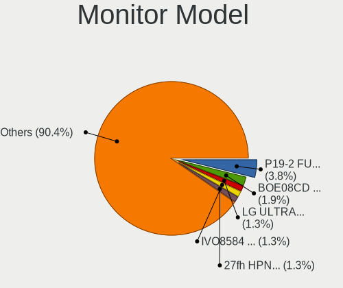

| Model                                                                 | Computers | Percent |
|-----------------------------------------------------------------------|-----------|---------|
| Fujitsu Siemens P19-2 FUS0552 1280x1024 376x301mm 19.0-inch           | 6         | 4.32%   |
| BOE LCD Monitor BOE08CD 1366x768 344x194mm 15.5-inch                  | 3         | 2.16%   |
| InfoVision LCD Monitor IVO8584 1920x1080 294x165mm 13.3-inch          | 2         | 1.44%   |
| Hewlett-Packard 27f HPN354A 1920x1080 598x336mm 27.0-inch             | 2         | 1.44%   |
| BOE LCD Monitor BOE0812 1920x1080 344x194mm 15.5-inch                 | 2         | 1.44%   |
| AU Optronics LCD Monitor AUO219D 1920x1080 381x214mm 17.2-inch        | 2         | 1.44%   |
| ViewSonic VA2265 SERIES VSCB330 1920x1080 476x268mm 21.5-inch         | 1         | 0.72%   |
| ViewSonic EP3220T VSC33F3 1920x1080 700x390mm 31.5-inch               | 1         | 0.72%   |
| Unknown SMART TV 0563 1920x1080 1209x680mm 54.6-inch                  | 1         | 0.72%   |
| Sharp LQ156M1JW03 SHP155D 1920x1080 344x194mm 15.5-inch               | 1         | 0.72%   |
| Sharp LQ156M1JW01 SHP14C3 1920x1080 344x194mm 15.5-inch               | 1         | 0.72%   |
| Samsung Electronics U28E590 SAM0C4D 1680x1050 610x350mm 27.7-inch     | 1         | 0.72%   |
| Samsung Electronics SyncMaster SAM058F 1920x1080 477x268mm 21.5-inch  | 1         | 0.72%   |
| Samsung Electronics SyncMaster SAM0226 1440x900 410x257mm 19.1-inch   | 1         | 0.72%   |
| Samsung Electronics SMS24A850 SAM0825 1920x1200 518x324mm 24.1-inch   | 1         | 0.72%   |
| Samsung Electronics S27E450 SAM0C83 1920x1080 598x336mm 27.0-inch     | 1         | 0.72%   |
| Samsung Electronics S23B350 SAM08F4 1920x1080 510x287mm 23.0-inch     | 1         | 0.72%   |
| Samsung Electronics LCD Monitor SEC5441 1280x800 331x207mm 15.4-inch  | 1         | 0.72%   |
| Samsung Electronics LCD Monitor SEC3152 1366x768 344x194mm 15.5-inch  | 1         | 0.72%   |
| Samsung Electronics LCD Monitor SDC894F 1920x1080 344x194mm 15.5-inch | 1         | 0.72%   |
| Samsung Electronics LCD Monitor SDC3754 1600x900 382x215mm 17.3-inch  | 1         | 0.72%   |
| Samsung Electronics LCD Monitor SDC324C 1920x1080 344x194mm 15.5-inch | 1         | 0.72%   |
| Samsung Electronics LCD Monitor SAM07C3 1920x1080 700x390mm 31.5-inch | 1         | 0.72%   |
| Samsung Electronics F27G3xTF SAM710D 1920x1080 600x330mm 27.0-inch    | 1         | 0.72%   |
| Samsung Electronics C32JG5x SAM0F55 2560x1440 697x392mm 31.5-inch     | 1         | 0.72%   |
| Samsung Electronics C24F390 SAM0D2C 1920x1080 521x293mm 23.5-inch     | 1         | 0.72%   |
| Philips 190X PHL084C 1280x1024 376x301mm 19.0-inch                    | 1         | 0.72%   |
| NEC Computers LCD1960NX NEC661F 1280x1024 376x301mm 19.0-inch         | 1         | 0.72%   |
| NEC Computers LCD1545V NEC65D7 1024x768 304x228mm 15.0-inch           | 1         | 0.72%   |
| LG Electronics LCD Monitor LG ULTRAGEAR 1920x1080                     | 1         | 0.72%   |
| LG Electronics LCD Monitor E2260 1920x1080                            | 1         | 0.72%   |
| LG Display LCD Monitor LGDD801 1366x768 344x194mm 15.5-inch           | 1         | 0.72%   |
| LG Display LCD Monitor LGD05E5 1920x1080 344x194mm 15.5-inch          | 1         | 0.72%   |
| LG Display LCD Monitor LGD0584 1920x1080 294x165mm 13.3-inch          | 1         | 0.72%   |
| LG Display LCD Monitor LGD0521 1920x1080 309x174mm 14.0-inch          | 1         | 0.72%   |
| LG Display LCD Monitor LGD04A7 1920x1080 344x194mm 15.5-inch          | 1         | 0.72%   |
| LG Display LCD Monitor LGD0430 1366x768 345x194mm 15.6-inch           | 1         | 0.72%   |
| LG Display LCD Monitor LGD02E9 1366x768 309x174mm 14.0-inch           | 1         | 0.72%   |
| LG Display LCD Monitor LGD0250 1366x768 345x194mm 15.6-inch           | 1         | 0.72%   |
| Lenovo LEN P32p-20 LEN62A2 3840x2160 697x392mm 31.5-inch              | 1         | 0.72%   |

Monitor Resolution
------------------

Monitor screen resolution

| Resolution         | Computers | Percent |
|--------------------|-----------|---------|
| 1920x1080 (FHD)    | 62        | 48.06%  |
| 1366x768 (WXGA)    | 21        | 16.28%  |
| 1280x1024 (SXGA)   | 12        | 9.3%    |
| 2560x1440 (QHD)    | 11        | 8.53%   |
| 1920x1200 (WUXGA)  | 4         | 3.1%    |
| 1680x1050 (WSXGA+) | 3         | 2.33%   |
| 1600x900 (HD+)     | 3         | 2.33%   |
| 1440x900 (WXGA+)   | 3         | 2.33%   |
| 3840x2160 (4K)     | 2         | 1.55%   |
| 1600x1200          | 2         | 1.55%   |
| 3440x1440          | 1         | 0.78%   |
| 2560x1600          | 1         | 0.78%   |
| 1280x960           | 1         | 0.78%   |
| 1280x800 (WXGA)    | 1         | 0.78%   |
| 1024x768 (XGA)     | 1         | 0.78%   |
| 1024x600           | 1         | 0.78%   |

Monitor Diagonal
----------------

Diagonal size in inches

| Inches  | Computers | Percent |
|---------|-----------|---------|
| 15      | 34        | 25%     |
| 27      | 12        | 8.82%   |
| 24      | 12        | 8.82%   |
| 19      | 12        | 8.82%   |
| 13      | 11        | 8.09%   |
| 23      | 9         | 6.62%   |
| 17      | 8         | 5.88%   |
| 14      | 7         | 5.15%   |
| 21      | 6         | 4.41%   |
| 31      | 5         | 3.68%   |
| 16      | 3         | 2.21%   |
| 54      | 2         | 1.47%   |
| 22      | 2         | 1.47%   |
| 20      | 2         | 1.47%   |
| 18      | 2         | 1.47%   |
| Unknown | 2         | 1.47%   |
| 38      | 1         | 0.74%   |
| 34      | 1         | 0.74%   |
| 32      | 1         | 0.74%   |
| 30      | 1         | 0.74%   |
| 26      | 1         | 0.74%   |
| 12      | 1         | 0.74%   |
| 10      | 1         | 0.74%   |

Monitor Width
-------------

Physical width

| Width in mm | Computers | Percent |
|-------------|-----------|---------|
| 301-350     | 49        | 36.57%  |
| 501-600     | 30        | 22.39%  |
| 351-400     | 19        | 14.18%  |
| 401-500     | 15        | 11.19%  |
| 601-700     | 7         | 5.22%   |
| 201-300     | 7         | 5.22%   |
| 701-800     | 2         | 1.49%   |
| 1001-1500   | 2         | 1.49%   |
| Unknown     | 2         | 1.49%   |
| 801-900     | 1         | 0.75%   |

Aspect Ratio
------------

Proportional relationship between the width and the height

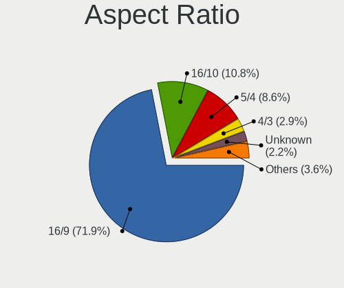

| Ratio   | Computers | Percent |
|---------|-----------|---------|
| 16/9    | 91        | 73.39%  |
| 16/10   | 13        | 10.48%  |
| 5/4     | 11        | 8.87%   |
| 4/3     | 4         | 3.23%   |
| Unknown | 2         | 1.61%   |
| 6/5     | 1         | 0.81%   |
| 3/2     | 1         | 0.81%   |
| 21/9    | 1         | 0.81%   |

Monitor Area
------------

Area in inch²

| Area in inch² | Computers | Percent |
|----------------|-----------|---------|
| 101-110        | 35        | 25.93%  |
| 201-250        | 21        | 15.56%  |
| 151-200        | 15        | 11.11%  |
| 81-90          | 13        | 9.63%   |
| 301-350        | 13        | 9.63%   |
| 351-500        | 8         | 5.93%   |
| 121-130        | 7         | 5.19%   |
| 251-300        | 6         | 4.44%   |
| 71-80          | 5         | 3.7%    |
| 141-150        | 4         | 2.96%   |
| More than 1000 | 2         | 1.48%   |
| Unknown        | 2         | 1.48%   |
| 61-70          | 1         | 0.74%   |
| 41-50          | 1         | 0.74%   |
| 111-120        | 1         | 0.74%   |
| 501-1000       | 1         | 0.74%   |

Pixel Density
-------------

Pixels per inch

| Density | Computers | Percent |
|---------|-----------|---------|
| 51-100  | 53        | 41.09%  |
| 121-160 | 33        | 25.58%  |
| 101-120 | 33        | 25.58%  |
| 161-240 | 6         | 4.65%   |
| 1-50    | 2         | 1.55%   |
| Unknown | 2         | 1.55%   |

Multiple Monitors
-----------------

Total monitors connected

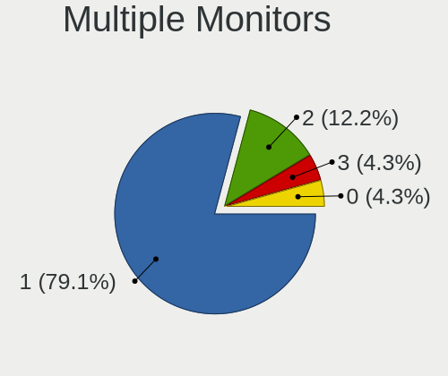

| Total | Computers | Percent |
|-------|-----------|---------|
| 1     | 100       | 79.37%  |
| 2     | 15        | 11.9%   |
| 0     | 6         | 4.76%   |
| 3     | 5         | 3.97%   |

Network
-------

Net Controller Vendor
---------------------

Controller vendors

| Vendor                   | Computers | Percent |
|--------------------------|-----------|---------|
| Realtek Semiconductor    | 76        | 39.58%  |
| Intel                    | 66        | 34.38%  |
| Qualcomm Atheros         | 15        | 7.81%   |
| Broadcom                 | 7         | 3.65%   |
| MediaTek                 | 4         | 2.08%   |
| Ralink                   | 3         | 1.56%   |
| TP-Link                  | 2         | 1.04%   |
| Samsung Electronics      | 2         | 1.04%   |
| NetGear                  | 2         | 1.04%   |
| Marvell Technology Group | 2         | 1.04%   |
| Lenovo                   | 2         | 1.04%   |
| Broadcom Limited         | 2         | 1.04%   |
| Sitecom Europe           | 1         | 0.52%   |
| Sierra Wireless          | 1         | 0.52%   |
| Ralink Technology        | 1         | 0.52%   |
| Qualcomm                 | 1         | 0.52%   |
| Microchip Technology     | 1         | 0.52%   |
| JMicron Technology       | 1         | 0.52%   |
| Dell                     | 1         | 0.52%   |
| Atmel                    | 1         | 0.52%   |
| Aquantia                 | 1         | 0.52%   |

Net Controller Model
--------------------

Controller models

| Model                                                             | Computers | Percent |
|-------------------------------------------------------------------|-----------|---------|
| Realtek RTL8111/8168/8411 PCI Express Gigabit Ethernet Controller | 50        | 22.52%  |
| Realtek RTL8153 Gigabit Ethernet Adapter                          | 6         | 2.7%    |
| Intel Wi-Fi 6 AX200                                               | 6         | 2.7%    |
| Realtek RTL810xE PCI Express Fast Ethernet controller             | 5         | 2.25%   |
| Intel Ethernet Controller I225-V                                  | 5         | 2.25%   |
| Intel 82579LM Gigabit Network Connection (Lewisville)             | 5         | 2.25%   |
| Intel Wi-Fi 6 AX210/AX211/AX411 160MHz                            | 4         | 1.8%    |
| Intel Alder Lake-P PCH CNVi WiFi                                  | 4         | 1.8%    |
| Qualcomm Atheros QCA9565 / AR9565 Wireless Network Adapter        | 3         | 1.35%   |
| Qualcomm Atheros AR8121/AR8113/AR8114 Gigabit or Fast Ethernet    | 3         | 1.35%   |
| MediaTek MT7921 802.11ax PCI Express Wireless Network Adapter     | 3         | 1.35%   |
| Intel Wi-Fi 6 AX201                                               | 3         | 1.35%   |
| Intel Ice Lake-LP PCH CNVi WiFi                                   | 3         | 1.35%   |
| Intel I211 Gigabit Network Connection                             | 3         | 1.35%   |
| Intel Ethernet Connection I217-LM                                 | 3         | 1.35%   |
| Realtek RTL8852AE 802.11ax PCIe Wireless Network Adapter          | 2         | 0.9%    |
| Realtek RTL8822CE 802.11ac PCIe Wireless Network Adapter          | 2         | 0.9%    |
| Realtek RTL8821CE 802.11ac PCIe Wireless Network Adapter          | 2         | 0.9%    |
| Realtek RTL8169 PCI Gigabit Ethernet Controller                   | 2         | 0.9%    |
| Realtek RTL8125 2.5GbE Controller                                 | 2         | 0.9%    |
| Realtek Killer E2600 Gigabit Ethernet Controller                  | 2         | 0.9%    |
| Realtek 802.11n WLAN Adapter                                      | 2         | 0.9%    |
| Qualcomm Atheros QCA9377 802.11ac Wireless Network Adapter        | 2         | 0.9%    |
| Intel Wireless-AC 9260                                            | 2         | 0.9%    |
| Intel Wireless 8265 / 8275                                        | 2         | 0.9%    |
| Intel Wireless 8260                                               | 2         | 0.9%    |
| Intel Wireless 7265                                               | 2         | 0.9%    |
| Intel Wireless 7260                                               | 2         | 0.9%    |
| Intel Tiger Lake PCH CNVi WiFi                                    | 2         | 0.9%    |
| Intel Ethernet Connection (4) I219-LM                             | 2         | 0.9%    |
| Intel Ethernet Connection (2) I219-LM                             | 2         | 0.9%    |
| Intel Ethernet Connection (16) I219-V                             | 2         | 0.9%    |
| Intel Comet Lake PCH CNVi WiFi                                    | 2         | 0.9%    |
| Intel Centrino Ultimate-N 6300                                    | 2         | 0.9%    |
| Intel Cannon Lake PCH CNVi WiFi                                   | 2         | 0.9%    |
| Intel 82583V Gigabit Network Connection                           | 2         | 0.9%    |
| Broadcom NetXtreme BCM5764M Gigabit Ethernet PCIe                 | 2         | 0.9%    |
| Broadcom NetXtreme BCM5720 Gigabit Ethernet PCIe                  | 2         | 0.9%    |
| Broadcom BCM43142 802.11b/g/n                                     | 2         | 0.9%    |
| TP-Link UE300 10/100/1000 LAN (ethernet mode) [Realtek RTL8153]   | 1         | 0.45%   |

Wireless Vendor
---------------

Wireless vendors

| Vendor                | Computers | Percent |
|-----------------------|-----------|---------|
| Intel                 | 47        | 52.81%  |
| Realtek Semiconductor | 14        | 15.73%  |
| Qualcomm Atheros      | 11        | 12.36%  |
| MediaTek              | 4         | 4.49%   |
| Ralink                | 3         | 3.37%   |
| NetGear               | 2         | 2.25%   |
| Broadcom              | 2         | 2.25%   |
| TP-Link               | 1         | 1.12%   |
| Sierra Wireless       | 1         | 1.12%   |
| Samsung Electronics   | 1         | 1.12%   |
| Ralink Technology     | 1         | 1.12%   |
| Qualcomm              | 1         | 1.12%   |
| Broadcom Limited      | 1         | 1.12%   |

Wireless Model
--------------

Wireless models

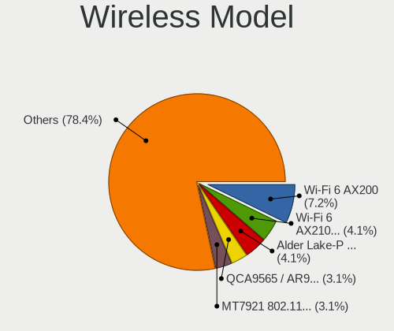

| Model                                                         | Computers | Percent |
|---------------------------------------------------------------|-----------|---------|
| Intel Wi-Fi 6 AX200                                           | 6         | 6.59%   |
| Intel Wi-Fi 6 AX210/AX211/AX411 160MHz                        | 4         | 4.4%    |
| Intel Alder Lake-P PCH CNVi WiFi                              | 4         | 4.4%    |
| Qualcomm Atheros QCA9565 / AR9565 Wireless Network Adapter    | 3         | 3.3%    |
| MediaTek MT7921 802.11ax PCI Express Wireless Network Adapter | 3         | 3.3%    |
| Intel Wi-Fi 6 AX201                                           | 3         | 3.3%    |
| Intel Ice Lake-LP PCH CNVi WiFi                               | 3         | 3.3%    |
| Realtek RTL8852AE 802.11ax PCIe Wireless Network Adapter      | 2         | 2.2%    |
| Realtek RTL8822CE 802.11ac PCIe Wireless Network Adapter      | 2         | 2.2%    |
| Realtek RTL8821CE 802.11ac PCIe Wireless Network Adapter      | 2         | 2.2%    |
| Realtek 802.11n WLAN Adapter                                  | 2         | 2.2%    |
| Qualcomm Atheros QCA9377 802.11ac Wireless Network Adapter    | 2         | 2.2%    |
| Intel Wireless-AC 9260                                        | 2         | 2.2%    |
| Intel Wireless 8265 / 8275                                    | 2         | 2.2%    |
| Intel Wireless 8260                                           | 2         | 2.2%    |
| Intel Wireless 7265                                           | 2         | 2.2%    |
| Intel Wireless 7260                                           | 2         | 2.2%    |
| Intel Tiger Lake PCH CNVi WiFi                                | 2         | 2.2%    |
| Intel Comet Lake PCH CNVi WiFi                                | 2         | 2.2%    |
| Intel Centrino Ultimate-N 6300                                | 2         | 2.2%    |
| Intel Cannon Lake PCH CNVi WiFi                               | 2         | 2.2%    |
| Broadcom BCM43142 802.11b/g/n                                 | 2         | 2.2%    |
| TP-Link TL-WN821N Version 5 RTL8192EU                         | 1         | 1.1%    |
| Sierra Wireless EM7455                                        | 1         | 1.1%    |
| Samsung WIS09ABGN LinkStick Wireless LAN Adapter              | 1         | 1.1%    |
| Realtek RTL88x2bu [AC1200 Techkey]                            | 1         | 1.1%    |
| Realtek RTL8821AE 802.11ac PCIe Wireless Network Adapter      | 1         | 1.1%    |
| Realtek RTL8723BU 802.11b/g/n WLAN Adapter                    | 1         | 1.1%    |
| Realtek RTL8723BE PCIe Wireless Network Adapter               | 1         | 1.1%    |
| Realtek RTL8192EE PCIe Wireless Network Adapter               | 1         | 1.1%    |
| Realtek RTL8188EUS 802.11n Wireless Network Adapter           | 1         | 1.1%    |
| Realtek RTL8188CE 802.11b/g/n WiFi Adapter                    | 1         | 1.1%    |
| Ralink MT7601U Wireless Adapter                               | 1         | 1.1%    |
| Ralink RT5392 PCIe Wireless Network Adapter                   | 1         | 1.1%    |
| Ralink RT3290 Wireless 802.11n 1T/1R PCIe                     | 1         | 1.1%    |
| Ralink RT3090 Wireless 802.11n 1T/1R PCIe                     | 1         | 1.1%    |
| Qualcomm QCNFA765 Wireless Network Adapter                    | 1         | 1.1%    |
| Qualcomm Atheros QCA6174 802.11ac Wireless Network Adapter    | 1         | 1.1%    |
| Qualcomm Atheros AR9485 Wireless Network Adapter              | 1         | 1.1%    |
| Qualcomm Atheros AR9462 Wireless Network Adapter              | 1         | 1.1%    |

Ethernet Vendor
---------------

Ethernet vendors

| Vendor                   | Computers | Percent |
|--------------------------|-----------|---------|
| Realtek Semiconductor    | 68        | 53.54%  |
| Intel                    | 37        | 29.13%  |
| Qualcomm Atheros         | 6         | 4.72%   |
| Broadcom                 | 5         | 3.94%   |
| Marvell Technology Group | 2         | 1.57%   |
| Lenovo                   | 2         | 1.57%   |
| TP-Link                  | 1         | 0.79%   |
| Sitecom Europe           | 1         | 0.79%   |
| Samsung Electronics      | 1         | 0.79%   |
| JMicron Technology       | 1         | 0.79%   |
| Dell                     | 1         | 0.79%   |
| Broadcom Limited         | 1         | 0.79%   |
| Aquantia                 | 1         | 0.79%   |

Ethernet Model
--------------

Ethernet models

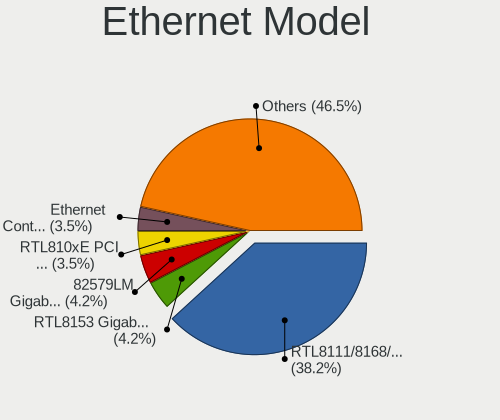

| Model                                                             | Computers | Percent |
|-------------------------------------------------------------------|-----------|---------|
| Realtek RTL8111/8168/8411 PCI Express Gigabit Ethernet Controller | 50        | 38.76%  |
| Realtek RTL8153 Gigabit Ethernet Adapter                          | 6         | 4.65%   |
| Realtek RTL810xE PCI Express Fast Ethernet controller             | 5         | 3.88%   |
| Intel Ethernet Controller I225-V                                  | 5         | 3.88%   |
| Intel 82579LM Gigabit Network Connection (Lewisville)             | 5         | 3.88%   |
| Qualcomm Atheros AR8121/AR8113/AR8114 Gigabit or Fast Ethernet    | 3         | 2.33%   |
| Intel I211 Gigabit Network Connection                             | 3         | 2.33%   |
| Intel Ethernet Connection I217-LM                                 | 3         | 2.33%   |
| Realtek RTL8169 PCI Gigabit Ethernet Controller                   | 2         | 1.55%   |
| Realtek RTL8125 2.5GbE Controller                                 | 2         | 1.55%   |
| Realtek Killer E2600 Gigabit Ethernet Controller                  | 2         | 1.55%   |
| Intel Ethernet Connection (4) I219-LM                             | 2         | 1.55%   |
| Intel Ethernet Connection (2) I219-LM                             | 2         | 1.55%   |
| Intel Ethernet Connection (16) I219-V                             | 2         | 1.55%   |
| Intel 82583V Gigabit Network Connection                           | 2         | 1.55%   |
| Broadcom NetXtreme BCM5764M Gigabit Ethernet PCIe                 | 2         | 1.55%   |
| Broadcom NetXtreme BCM5720 Gigabit Ethernet PCIe                  | 2         | 1.55%   |
| TP-Link UE300 10/100/1000 LAN (ethernet mode) [Realtek RTL8153]   | 1         | 0.78%   |
| Sitecom Europe AX88179 Gigabit Ethernet [Sitecom]                 | 1         | 0.78%   |
| Samsung Galaxy series, misc. (tethering mode)                     | 1         | 0.78%   |
| Realtek RTL8152 Fast Ethernet Adapter                             | 1         | 0.78%   |
| Realtek RTL-8100/8101L/8139 PCI Fast Ethernet Adapter             | 1         | 0.78%   |
| Qualcomm Atheros QCA8171 Gigabit Ethernet                         | 1         | 0.78%   |
| Qualcomm Atheros Attansic L1 Gigabit Ethernet                     | 1         | 0.78%   |
| Qualcomm Atheros AR8161 Gigabit Ethernet                          | 1         | 0.78%   |
| Marvell Group 88E8072 PCI-E Gigabit Ethernet Controller           | 1         | 0.78%   |
| Marvell Group 88E8056 PCI-E Gigabit Ethernet Controller           | 1         | 0.78%   |
| Lenovo USB-C Dock Ethernet                                        | 1         | 0.78%   |
| Lenovo ThinkPad TBT 3 Dock                                        | 1         | 0.78%   |
| JMicron JMC250 PCI Express Gigabit Ethernet Controller            | 1         | 0.78%   |
| Intel NM10/ICH7 Family LAN Controller                             | 1         | 0.78%   |
| Intel I350 Gigabit Network Connection                             | 1         | 0.78%   |
| Intel I210 Gigabit Network Connection                             | 1         | 0.78%   |
| Intel Ethernet Connection I219-LM                                 | 1         | 0.78%   |
| Intel Ethernet Connection (6) I219-LM                             | 1         | 0.78%   |
| Intel Ethernet Connection (3) I219-LM                             | 1         | 0.78%   |
| Intel Ethernet Connection (3) I218-LM                             | 1         | 0.78%   |
| Intel Ethernet Connection (2) I218-LM                             | 1         | 0.78%   |
| Intel Ethernet Connection (13) I219-V                             | 1         | 0.78%   |
| Intel Ethernet Connection (11) I219-V                             | 1         | 0.78%   |

Net Controller Kind
-------------------

Ethernet, WiFi or modem

| Kind     | Computers | Percent |
|----------|-----------|---------|
| Ethernet | 114       | 56.72%  |
| WiFi     | 86        | 42.79%  |
| Modem    | 1         | 0.5%    |

Used Controller
---------------

Currently used network controller

| Kind     | Computers | Percent |
|----------|-----------|---------|
| Ethernet | 76        | 58.46%  |
| WiFi     | 54        | 41.54%  |

NICs
----

Total network controllers on board

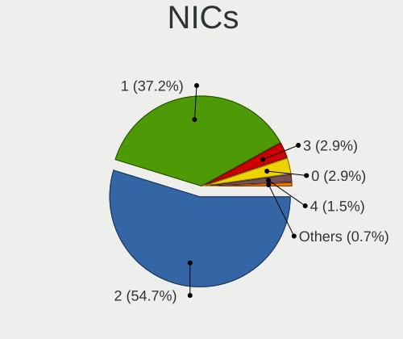

| Total | Computers | Percent |
|-------|-----------|---------|
| 2     | 70        | 56%     |
| 1     | 46        | 36.8%   |
| 3     | 4         | 3.2%    |
| 0     | 4         | 3.2%    |
| 4     | 1         | 0.8%    |

IPv6
----

IPv6 vs IPv4

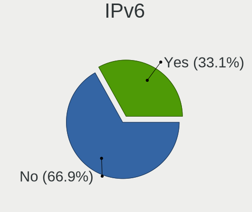

| Used | Computers | Percent |
|------|-----------|---------|
| No   | 86        | 66.67%  |
| Yes  | 43        | 33.33%  |

Bluetooth
---------

Bluetooth Vendor
----------------

Controller vendors

| Vendor                          | Computers | Percent |
|---------------------------------|-----------|---------|
| Intel                           | 40        | 51.95%  |
| Realtek Semiconductor           | 9         | 11.69%  |
| Cambridge Silicon Radio         | 6         | 7.79%   |
| Qualcomm Atheros Communications | 5         | 6.49%   |
| IMC Networks                    | 5         | 6.49%   |
| Broadcom                        | 4         | 5.19%   |
| Hewlett-Packard                 | 2         | 2.6%    |
| Ralink                          | 1         | 1.3%    |
| MediaTek                        | 1         | 1.3%    |
| Lite-On Technology              | 1         | 1.3%    |
| Edimax Technology               | 1         | 1.3%    |
| Belkin Components               | 1         | 1.3%    |
| ASUSTek Computer                | 1         | 1.3%    |

Bluetooth Model
---------------

Controller models

| Model                                                       | Computers | Percent |
|-------------------------------------------------------------|-----------|---------|
| Intel Bluetooth wireless interface                          | 8         | 10.39%  |
| Realtek Bluetooth Radio                                     | 7         | 9.09%   |
| Intel Bluetooth 9460/9560 Jefferson Peak (JfP)              | 7         | 9.09%   |
| Intel AX201 Bluetooth                                       | 7         | 9.09%   |
| Intel AX200 Bluetooth                                       | 6         | 7.79%   |
| Cambridge Silicon Radio Bluetooth Dongle (HCI mode)         | 6         | 7.79%   |
| Intel AX210 Bluetooth                                       | 4         | 5.19%   |
| Intel Bluetooth Device                                      | 3         | 3.9%    |
| Qualcomm Atheros  Bluetooth Device                          | 2         | 2.6%    |
| Intel Wireless-AC 9260 Bluetooth Adapter                    | 2         | 2.6%    |
| Intel Centrino Bluetooth Wireless Transceiver               | 2         | 2.6%    |
| IMC Networks Wireless_Device                                | 2         | 2.6%    |
| IMC Networks Bluetooth Device                               | 2         | 2.6%    |
| Broadcom BCM2045B (BDC-2.1)                                 | 2         | 2.6%    |
| Realtek RTL8821A Bluetooth                                  | 1         | 1.3%    |
| Realtek  Bluetooth 4.2 Adapter                              | 1         | 1.3%    |
| Ralink RT3290 Bluetooth                                     | 1         | 1.3%    |
| Qualcomm Atheros QCA61x4 Bluetooth 4.0                      | 1         | 1.3%    |
| Qualcomm Atheros AR9462 Bluetooth                           | 1         | 1.3%    |
| Qualcomm Atheros AR3011 Bluetooth                           | 1         | 1.3%    |
| MediaTek Wireless_Device                                    | 1         | 1.3%    |
| Lite-On Wireless_Device                                     | 1         | 1.3%    |
| Intel Wireless-AC 3168 Bluetooth                            | 1         | 1.3%    |
| IMC Networks Atheros AR3012 Bluetooth                       | 1         | 1.3%    |
| HP Integrated Module with Bluetooth 2.1 Wireless technology | 1         | 1.3%    |
| HP Bluetooth 2.0 Interface [Broadcom BCM2045]               | 1         | 1.3%    |
| Edimax EW-7611ULB 802.11b/g/n and Bluetooth 4.0 Adapter     | 1         | 1.3%    |
| Broadcom Bluetooth Controller                               | 1         | 1.3%    |
| Broadcom BCM43142 Bluetooth 4.0                             | 1         | 1.3%    |
| Belkin Components F8T065BF Mini Bluetooth 4.0 Adapter       | 1         | 1.3%    |
| ASUS Broadcom BCM20702A0 Bluetooth                          | 1         | 1.3%    |

Sound
-----

Sound Vendor
------------

Sound card vendors

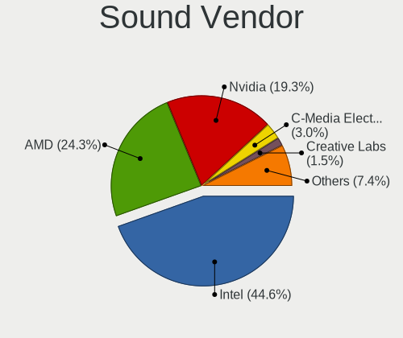

| Vendor                     | Computers | Percent |
|----------------------------|-----------|---------|
| Intel                      | 81        | 43.55%  |
| AMD                        | 47        | 25.27%  |
| Nvidia                     | 34        | 18.28%  |
| C-Media Electronics        | 6         | 3.23%   |
| Creative Labs              | 3         | 1.61%   |
| Lenovo                     | 2         | 1.08%   |
| GN Netcom                  | 2         | 1.08%   |
| Ensoniq                    | 2         | 1.08%   |
| VIA Technologies           | 1         | 0.54%   |
| Texas Instruments          | 1         | 0.54%   |
| Realtek Semiconductor      | 1         | 0.54%   |
| Plantronics                | 1         | 0.54%   |
| Microsoft                  | 1         | 0.54%   |
| Logitech                   | 1         | 0.54%   |
| JMTek                      | 1         | 0.54%   |
| Guangzhou FiiO Electronics | 1         | 0.54%   |
| ASUSTek Computer           | 1         | 0.54%   |

Sound Model
-----------

Sound card models

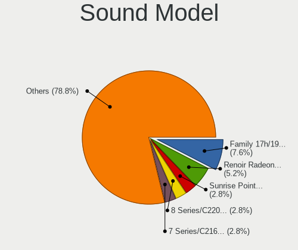

| Model                                                                      | Computers | Percent |
|----------------------------------------------------------------------------|-----------|---------|
| AMD Family 17h/19h HD Audio Controller                                     | 19        | 8.15%   |
| AMD Renoir Radeon High Definition Audio Controller                         | 13        | 5.58%   |
| AMD Family 17h (Models 00h-0fh) HD Audio Controller                        | 7         | 3%      |
| Intel Sunrise Point-LP HD Audio                                            | 6         | 2.58%   |
| Intel 8 Series/C220 Series Chipset High Definition Audio Controller        | 6         | 2.58%   |
| Intel 7 Series/C216 Chipset Family High Definition Audio Controller        | 6         | 2.58%   |
| Intel 5 Series/3400 Series Chipset High Definition Audio                   | 6         | 2.58%   |
| AMD SBx00 Azalia (Intel HDA)                                               | 6         | 2.58%   |
| Intel Xeon E3-1200 v3/4th Gen Core Processor HD Audio Controller           | 5         | 2.15%   |
| Intel Tiger Lake-LP Smart Sound Technology Audio Controller                | 5         | 2.15%   |
| Intel 6 Series/C200 Series Chipset Family High Definition Audio Controller | 5         | 2.15%   |
| AMD Starship/Matisse HD Audio Controller                                   | 5         | 2.15%   |
| Nvidia TU107 GeForce GTX 1650 High Definition Audio Controller             | 4         | 1.72%   |
| Nvidia GP107GL High Definition Audio Controller                            | 4         | 1.72%   |
| Nvidia GF119 HDMI Audio Controller                                         | 4         | 1.72%   |
| Intel Haswell-ULT HD Audio Controller                                      | 4         | 1.72%   |
| Intel Alder Lake PCH-P High Definition Audio Controller                    | 4         | 1.72%   |
| Intel 82801JI (ICH10 Family) HD Audio Controller                           | 4         | 1.72%   |
| Intel 8 Series HD Audio Controller                                         | 4         | 1.72%   |
| Intel 100 Series/C230 Series Chipset Family HD Audio Controller            | 4         | 1.72%   |
| AMD Raven/Raven2/Fenghuang HDMI/DP Audio Controller                        | 4         | 1.72%   |
| AMD Navi 21/23 HDMI/DP Audio Controller                                    | 4         | 1.72%   |
| Nvidia GK208 HDMI/DP Audio Controller                                      | 3         | 1.29%   |
| Nvidia GF108 High Definition Audio Controller                              | 3         | 1.29%   |
| Intel Tiger Lake-H HD Audio Controller                                     | 3         | 1.29%   |
| Intel NM10/ICH7 Family High Definition Audio Controller                    | 3         | 1.29%   |
| Intel Ice Lake-LP Smart Sound Technology Audio Controller                  | 3         | 1.29%   |
| Intel 82801I (ICH9 Family) HD Audio Controller                             | 3         | 1.29%   |
| Intel 82801H (ICH8 Family) HD Audio Controller                             | 3         | 1.29%   |
| AMD Rembrandt Radeon High Definition Audio Controller                      | 3         | 1.29%   |
| AMD Ellesmere HDMI Audio [Radeon RX 470/480 / 570/580/590]                 | 3         | 1.29%   |
| AMD Baffin HDMI/DP Audio [Radeon RX 550 640SP / RX 560/560X]               | 3         | 1.29%   |
| Nvidia High Definition Audio Controller                                    | 2         | 0.86%   |
| Nvidia GM107 High Definition Audio Controller [GeForce 940MX]              | 2         | 0.86%   |
| Nvidia GK107 HDMI Audio Controller                                         | 2         | 0.86%   |
| Nvidia GA106 High Definition Audio Controller                              | 2         | 0.86%   |
| Nvidia Audio device                                                        | 2         | 0.86%   |
| Intel Comet Lake PCH cAVS                                                  | 2         | 0.86%   |
| Intel Celeron/Pentium Silver Processor High Definition Audio               | 2         | 0.86%   |
| Intel Celeron N3350/Pentium N4200/Atom E3900 Series Audio Cluster          | 2         | 0.86%   |

Memory
------

Memory Vendor
-------------

Memory module vendors

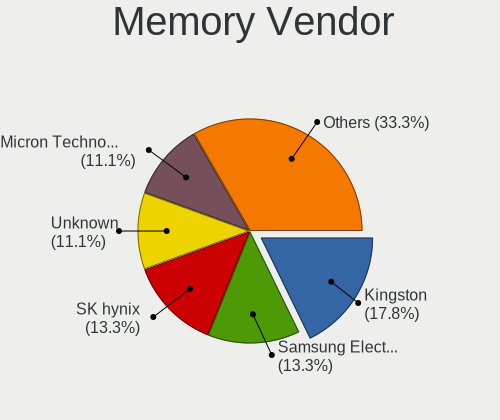

| Vendor              | Computers | Percent |
|---------------------|-----------|---------|
| Kingston            | 16        | 19.75%  |
| Samsung Electronics | 12        | 14.81%  |
| SK hynix            | 11        | 13.58%  |
| Unknown             | 8         | 9.88%   |
| Micron Technology   | 8         | 9.88%   |
| Corsair             | 6         | 7.41%   |
| G.Skill             | 4         | 4.94%   |
| Unknown (ABCD)      | 3         | 3.7%    |
| Unknown             | 3         | 3.7%    |
| Crucial             | 2         | 2.47%   |
| Transcend           | 1         | 1.23%   |
| Toshiba             | 1         | 1.23%   |
| TakeMS              | 1         | 1.23%   |
| Smart               | 1         | 1.23%   |
| Qimonda             | 1         | 1.23%   |
| CSX                 | 1         | 1.23%   |
| Avant               | 1         | 1.23%   |
| A-DATA Technology   | 1         | 1.23%   |

Memory Model
------------

Memory module models

| Model                                                            | Computers | Percent |
|------------------------------------------------------------------|-----------|---------|
| Unknown (ABCD) RAM 123456789012345678 2GB SODIMM LPDDR4 2400MT/s | 3         | 3.45%   |
| Kingston RAM KF3200C16D4/32GX 32GB DIMM DDR4 3933MT/s            | 3         | 3.45%   |
| Unknown                                                          | 3         | 3.45%   |
| Unknown RAM Module 4096MB DIMM 1600MT/s                          | 2         | 2.3%    |
| Unknown RAM Module 2GB DIMM 1333MT/s                             | 2         | 2.3%    |
| Samsung RAM M471A2K43CB1-CRC 16GB SODIMM DDR4 2667MT/s           | 2         | 2.3%    |
| Micron RAM 4ATS2G64HZ-3G2B1 16GB SODIMM DDR4 3200MT/s            | 2         | 2.3%    |
| Unknown RAM Module 4GB SODIMM DDR2 800MT/s                       | 1         | 1.15%   |
| Unknown RAM Module 4096MB SODIMM DDR4 2667MT/s                   | 1         | 1.15%   |
| Unknown RAM Module 4096MB DIMM 1333MT/s                          | 1         | 1.15%   |
| Unknown RAM Module 2GB SODIMM DDR2 667MT/s                       | 1         | 1.15%   |
| Unknown RAM Module 1GB SODIMM DDR2 667MT/s                       | 1         | 1.15%   |
| Transcend RAM JM3200HSB-16G 16GB SODIMM DDR4 3200MT/s            | 1         | 1.15%   |
| Toshiba RAM 8HTF12864HDY-800G1 2GB SODIMM 1066MT/s               | 1         | 1.15%   |
| Toshiba RAM 64T128020EDL2.5C2 2GB SODIMM 1066MT/s                | 1         | 1.15%   |
| TakeMS RAM Module 2048MB DIMM DDR2 800MT/s                       | 1         | 1.15%   |
| Smart RAM SH564568FH8NWPHSFG 2GB SODIMM DDR3 1333MT/s            | 1         | 1.15%   |
| Smart RAM SH564288FH8NWPHSFR 1024MB SODIMM DDR3 1067MT/s         | 1         | 1.15%   |
| SK hynix RAM Module 8GB Row Of Chips LPDDR3 2133MT/s             | 1         | 1.15%   |
| SK hynix RAM Module 32GB DIMM DDR4 2400MT/s                      | 1         | 1.15%   |
| SK hynix RAM HMT451U6BFR8C-PB 4GB DIMM DDR3 1600MT/s             | 1         | 1.15%   |
| SK hynix RAM HMT41GU6BFR8C-PB 8GB DIMM DDR3 1600MT/s             | 1         | 1.15%   |
| SK hynix RAM HMT351S6CFR8C-H9 4096MB SODIMM DDR3 1333MT/s        | 1         | 1.15%   |
| SK hynix RAM HMAA1GS6CJR6N-XN 8192MB SODIMM DDR4 3200MT/s        | 1         | 1.15%   |
| SK hynix RAM HMA851S6JJR6N-VK 4GB SODIMM DDR4 2667MT/s           | 1         | 1.15%   |
| SK hynix RAM HMA82GU6AFR8N-UH 16GB DIMM DDR4 2400MT/s            | 1         | 1.15%   |
| SK hynix RAM HMA82GR7CJR8N-VK 16GB DIMM DDR4 2666MT/s            | 1         | 1.15%   |
| SK hynix RAM HMA82GR7AFR8N-VK 16GB DIMM DDR4 2666MT/s            | 1         | 1.15%   |
| SK hynix RAM HMA81GS6AFR8N-UH 8GB SODIMM DDR4 2667MT/s           | 1         | 1.15%   |
| SK hynix RAM HMA81GR7AFR8N-VK 8GB DIMM DDR4 2666MT/s             | 1         | 1.15%   |
| SK hynix RAM HCNNNFAMMLXR-NEE 4GB Row Of Chips LPDDR4 4267MT/s   | 1         | 1.15%   |
| Samsung RAM Module 8GB SODIMM DDR4 3200MT/s                      | 1         | 1.15%   |
| Samsung RAM Module 32GB SODIMM DDR5 4800MT/s                     | 1         | 1.15%   |
| Samsung RAM Module 32GB DIMM DDR4 2400MT/s                       | 1         | 1.15%   |
| Samsung RAM M471B5273DH0-CK0 4GB SODIMM DDR3 1600MT/s            | 1         | 1.15%   |
| Samsung RAM M471B5273DH0-CH9 4GB SODIMM DDR3 1334MT/s            | 1         | 1.15%   |
| Samsung RAM M471B5173EB0-YK0 4GB SODIMM DDR3 1600MT/s            | 1         | 1.15%   |
| Samsung RAM M471A4G43AB1-CWE 32GB SODIMM DDR4 3200MT/s           | 1         | 1.15%   |
| Samsung RAM M471A2K43CB1-CTD 16GB SODIMM DDR4 8400MT/s           | 1         | 1.15%   |
| Samsung RAM M471A2G43BB2-CWE 16GB SODIMM DDR4 3200MT/s           | 1         | 1.15%   |

Memory Kind
-----------

Memory module kinds

| Kind    | Computers | Percent |
|---------|-----------|---------|
| DDR4    | 39        | 54.93%  |
| DDR3    | 13        | 18.31%  |
| DDR2    | 5         | 7.04%   |
| Unknown | 5         | 7.04%   |
| LPDDR4  | 4         | 5.63%   |
| DDR5    | 2         | 2.82%   |
| SDRAM   | 1         | 1.41%   |
| LPDDR3  | 1         | 1.41%   |
| DDR     | 1         | 1.41%   |

Memory Form Factor
------------------

Physical design of the memory module

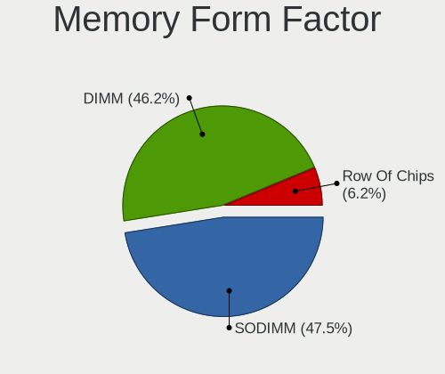

| Name         | Computers | Percent |
|--------------|-----------|---------|
| SODIMM       | 37        | 50.68%  |
| DIMM         | 32        | 43.84%  |
| Row Of Chips | 4         | 5.48%   |

Memory Size
-----------

Memory module size

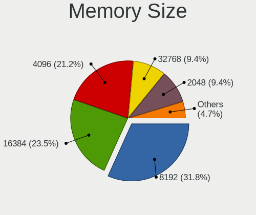

| Size  | Computers | Percent |
|-------|-----------|---------|
| 8192  | 22        | 28.95%  |
| 16384 | 18        | 23.68%  |
| 4096  | 17        | 22.37%  |
| 32768 | 8         | 10.53%  |
| 2048  | 7         | 9.21%   |
| 1024  | 4         | 5.26%   |

Memory Speed
------------

Memory module speed

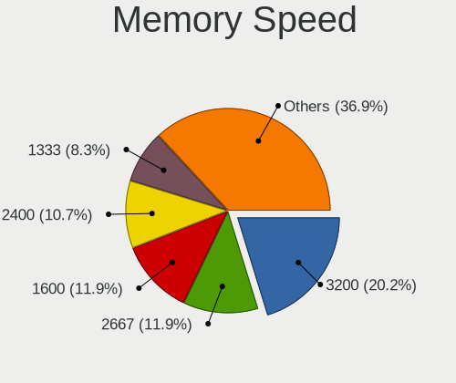

| Speed | Computers | Percent |
|-------|-----------|---------|
| 3200  | 17        | 22.08%  |
| 2667  | 9         | 11.69%  |
| 1600  | 9         | 11.69%  |
| 2400  | 8         | 10.39%  |
| 1333  | 7         | 9.09%   |
| 2133  | 6         | 7.79%   |
| 3933  | 3         | 3.9%    |
| 4800  | 2         | 2.6%    |
| 3600  | 2         | 2.6%    |
| 2666  | 2         | 2.6%    |
| 1334  | 2         | 2.6%    |
| 800   | 2         | 2.6%    |
| 667   | 2         | 2.6%    |
| 8400  | 1         | 1.3%    |
| 4267  | 1         | 1.3%    |
| 3000  | 1         | 1.3%    |
| 2048  | 1         | 1.3%    |
| 1066  | 1         | 1.3%    |
| 533   | 1         | 1.3%    |

Printers & scanners
-------------------

Printer Vendor
--------------

Printer device vendors

| Vendor              | Computers | Percent |
|---------------------|-----------|---------|
| Brother Industries  | 2         | 50%     |
| Samsung Electronics | 1         | 25%     |
| Hewlett-Packard     | 1         | 25%     |

Printer Model
-------------

Printer device models

| Model                                 | Computers | Percent |
|---------------------------------------|-----------|---------|
| Samsung ML-191x/ML-252x Laser Printer | 1         | 25%     |
| HP Color LaserJet CP1215              | 1         | 25%     |
| Brother Printer                       | 1         | 25%     |
| Brother HL-4150CDN series             | 1         | 25%     |

Scanner Vendor
--------------

Scanner device vendors

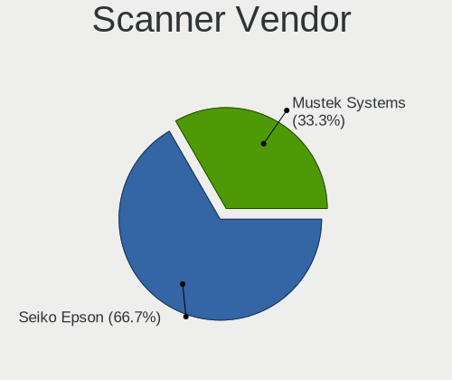

| Vendor         | Computers | Percent |
|----------------|-----------|---------|
| Seiko Epson    | 2         | 66.67%  |
| Mustek Systems | 1         | 33.33%  |

Scanner Model
-------------

Scanner device models

| Model                                                         | Computers | Percent |
|---------------------------------------------------------------|-----------|---------|
| Seiko Epson GT-F730 [GT-S630/Perfection V33/V330 Photo]       | 1         | 33.33%  |
| Seiko Epson GT-8700/GT-8700F [Perfection 1640SU/1640SU PHOTO] | 1         | 33.33%  |
| Mustek Systems ScanExpress A3 USB                             | 1         | 33.33%  |

Camera
------

Camera Vendor
-------------

Camera device vendors

| Vendor                                 | Computers | Percent |
|----------------------------------------|-----------|---------|
| Chicony Electronics                    | 18        | 22.78%  |
| Microdia                               | 7         | 8.86%   |
| Logitech                               | 7         | 8.86%   |
| Sunplus Innovation Technology          | 6         | 7.59%   |
| Syntek                                 | 4         | 5.06%   |
| Quanta                                 | 4         | 5.06%   |
| Luxvisions Innotech Limited            | 4         | 5.06%   |
| Bison Electronics                      | 4         | 5.06%   |
| Alcor Micro                            | 4         | 5.06%   |
| Lite-On Technology                     | 3         | 3.8%    |
| Acer                                   | 3         | 3.8%    |
| webcam                                 | 2         | 2.53%   |
| Realtek Semiconductor                  | 2         | 2.53%   |
| IMC Networks                           | 2         | 2.53%   |
| Cheng Uei Precision Industry (Foxlink) | 2         | 2.53%   |
| vivo                                   | 1         | 1.27%   |
| Suyin                                  | 1         | 1.27%   |
| Microsoft                              | 1         | 1.27%   |
| Lenovo                                 | 1         | 1.27%   |
| kingcome                               | 1         | 1.27%   |
| Huawei Technologies                    | 1         | 1.27%   |
| ARC International                      | 1         | 1.27%   |

Camera Model
------------

Camera device models

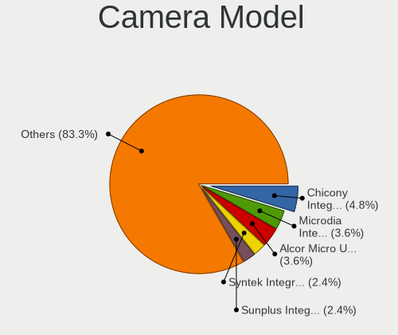

| Model                                                | Computers | Percent |
|------------------------------------------------------|-----------|---------|
| Chicony Integrated Camera                            | 4         | 5.06%   |
| Microdia Integrated_Webcam_HD                        | 3         | 3.8%    |
| Alcor Micro USB 2.0 Camera                           | 3         | 3.8%    |
| webcam webcam                                        | 2         | 2.53%   |
| Syntek Integrated Camera                             | 2         | 2.53%   |
| Sunplus Integrated_Webcam_HD                         | 2         | 2.53%   |
| Quanta HP True Vision HD Camera                      | 2         | 2.53%   |
| Logitech HD Webcam C615                              | 2         | 2.53%   |
| Chicony FJ Camera                                    | 2         | 2.53%   |
| Bison Integrated Camera                              | 2         | 2.53%   |
| vivo V2023                                           | 1         | 1.27%   |
| Syntek Web Cam - Asus F3SA, F9J, F9S                 | 1         | 1.27%   |
| Syntek EasyCamera                                    | 1         | 1.27%   |
| Suyin USB 2.0 Camera                                 | 1         | 1.27%   |
| Sunplus Laptop Integrated Webcam HD                  | 1         | 1.27%   |
| Sunplus HD WebCam                                    | 1         | 1.27%   |
| Sunplus HD 720P webcam                               | 1         | 1.27%   |
| Sunplus Dell E5570 integrated webcam                 | 1         | 1.27%   |
| Realtek USB Camera                                   | 1         | 1.27%   |
| Realtek Integrated_Webcam_HD                         | 1         | 1.27%   |
| Quanta HP HD Camera                                  | 1         | 1.27%   |
| Quanta HD User Facing                                | 1         | 1.27%   |
| Microsoft LifeCam VX-700                             | 1         | 1.27%   |
| Microdia Webcam Vitade AF                            | 1         | 1.27%   |
| Microdia Integrated Webcam                           | 1         | 1.27%   |
| Microdia CameraA                                     | 1         | 1.27%   |
| Microdia Camera                                      | 1         | 1.27%   |
| Luxvisions Innotech Limited Integrated Camera        | 1         | 1.27%   |
| Luxvisions Innotech Limited HP Wide Vision HD Camera | 1         | 1.27%   |
| Luxvisions Innotech Limited HP TrueVision HD Camera  | 1         | 1.27%   |
| Luxvisions Innotech Limited HP HD Camera             | 1         | 1.27%   |
| Logitech Webcam C270                                 | 1         | 1.27%   |
| Logitech Webcam C170                                 | 1         | 1.27%   |
| Logitech HD Pro Webcam C920                          | 1         | 1.27%   |
| Logitech BRIO Ultra HD Webcam                        | 1         | 1.27%   |
| Logitech B525 HD Webcam                              | 1         | 1.27%   |
| Lite-On TOSHIBA Web Camera - HD                      | 1         | 1.27%   |
| Lite-On Integrated Camera                            | 1         | 1.27%   |
| Lite-On HP HD Webcam                                 | 1         | 1.27%   |
| Lenovo Integrated Webcam [R5U877]                    | 1         | 1.27%   |

Security
--------

Fingerprint Vendor
------------------

Fingerprint sensor vendors

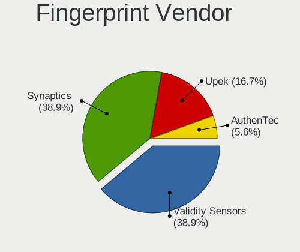

| Vendor           | Computers | Percent |
|------------------|-----------|---------|
| Validity Sensors | 7         | 38.89%  |
| Synaptics        | 7         | 38.89%  |
| Upek             | 3         | 16.67%  |
| AuthenTec        | 1         | 5.56%   |

Fingerprint Model
-----------------

Fingerprint sensor models

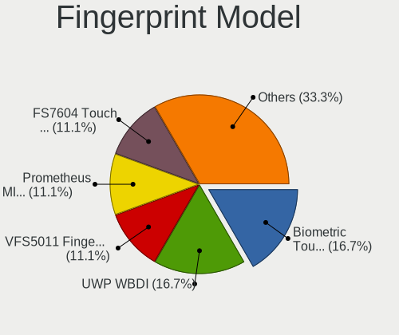

| Model                                                    | Computers | Percent |
|----------------------------------------------------------|-----------|---------|
| Upek Biometric Touchchip/Touchstrip Fingerprint Sensor   | 3         | 16.67%  |
| Synaptics UWP WBDI                                       | 3         | 16.67%  |
| Validity Sensors VFS5011 Fingerprint Reader              | 2         | 11.11%  |
| Synaptics Prometheus MIS Touch Fingerprint Reader        | 2         | 11.11%  |
| Synaptics FS7604 Touch Fingerprint Sensor with PurePrint | 2         | 11.11%  |
| Validity Sensors VFS7500 Touch Fingerprint Sensor        | 1         | 5.56%   |
| Validity Sensors VFS495 Fingerprint Reader               | 1         | 5.56%   |
| Validity Sensors VFS491                                  | 1         | 5.56%   |
| Validity Sensors VFS 5011 fingerprint sensor             | 1         | 5.56%   |
| Validity Sensors Swipe Fingerprint Sensor                | 1         | 5.56%   |
| AuthenTec AES1600                                        | 1         | 5.56%   |

Chipcard Vendor
---------------

Chipcard module vendors

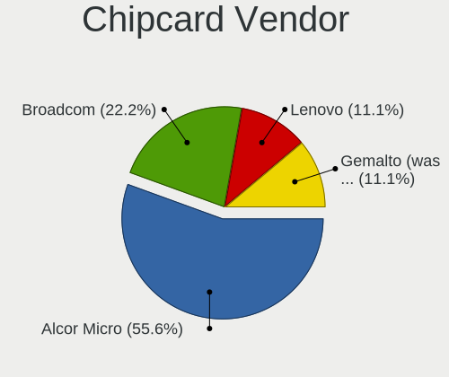

| Vendor                | Computers | Percent |
|-----------------------|-----------|---------|
| Alcor Micro           | 5         | 55.56%  |
| Broadcom              | 2         | 22.22%  |
| Lenovo                | 1         | 11.11%  |
| Gemalto (was Gemplus) | 1         | 11.11%  |

Chipcard Model
--------------

Chipcard module models

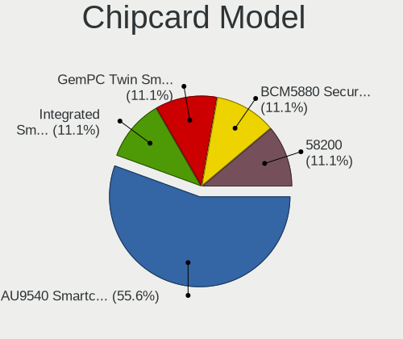

| Model                                                                        | Computers | Percent |
|------------------------------------------------------------------------------|-----------|---------|
| Alcor Micro AU9540 Smartcard Reader                                          | 5         | 55.56%  |
| Lenovo Integrated Smart Card Reader                                          | 1         | 11.11%  |
| Gemalto (was Gemplus) GemPC Twin SmartCard Reader                            | 1         | 11.11%  |
| Broadcom BCM5880 Secure Applications Processor with fingerprint swipe sensor | 1         | 11.11%  |
| Broadcom 58200                                                               | 1         | 11.11%  |

Unsupported
-----------

Unsupported Devices
-------------------

Total unsupported devices on board

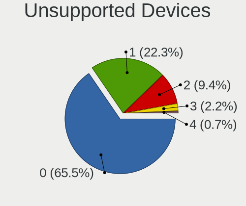

| Total | Computers | Percent |
|-------|-----------|---------|
| 0     | 79        | 62.2%   |
| 1     | 31        | 24.41%  |
| 2     | 13        | 10.24%  |
| 3     | 3         | 2.36%   |
| 4     | 1         | 0.79%   |

Unsupported Device Types
------------------------

Types of unsupported devices

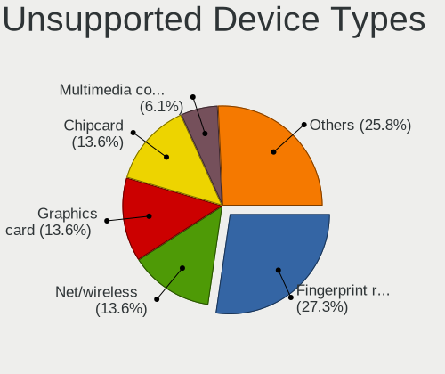

| Type                     | Computers | Percent |
|--------------------------|-----------|---------|
| Fingerprint reader       | 18        | 27.69%  |
| Graphics card            | 10        | 15.38%  |
| Net/wireless             | 9         | 13.85%  |
| Chipcard                 | 9         | 13.85%  |
| Multimedia controller    | 4         | 6.15%   |
| Unassigned class         | 3         | 4.62%   |
| Card reader              | 3         | 4.62%   |
| Camera                   | 3         | 4.62%   |
| Network                  | 2         | 3.08%   |
| Communication controller | 2         | 3.08%   |
| Sound                    | 1         | 1.54%   |
| Bluetooth                | 1         | 1.54%   |

