openSUSE Leap-15.4 - Tested Hardware & Statistics (Desktops)
------------------------------------------------------------

A project to collect tested hardware configurations for openSUSE Leap-15.4.

Anyone can contribute to this report by the [hw-probe](https://github.com/linuxhw/hw-probe) tool:

    sudo -E hw-probe -all -upload

Please contribute! Especially if your hardware is rare.

Contents
--------

* [ Test Cases ](#test-cases)

* [ System ](#system)
  - [ Kernel                   ](#kernel)
  - [ Kernel Family            ](#kernel-family)
  - [ Kernel Major Ver.        ](#kernel-major-ver)
  - [ Arch                     ](#arch)
  - [ DE                       ](#de)
  - [ Display Server           ](#display-server)
  - [ Display Manager          ](#display-manager)
  - [ OS Lang                  ](#os-lang)
  - [ Boot Mode                ](#boot-mode)
  - [ Filesystem               ](#filesystem)
  - [ Part. scheme             ](#part-scheme)
  - [ Dual Boot with Linux/BSD ](#dual-boot-with-linuxbsd)
  - [ Dual Boot (Win)          ](#dual-boot-win)

* [ Board ](#board)
  - [ Vendor                   ](#vendor)
  - [ Model                    ](#model)
  - [ Model Family             ](#model-family)
  - [ MFG Year                 ](#mfg-year)
  - [ Form Factor              ](#form-factor)
  - [ Secure Boot              ](#secure-boot)
  - [ Coreboot                 ](#coreboot)
  - [ RAM Size                 ](#ram-size)
  - [ RAM Used                 ](#ram-used)
  - [ Total Drives             ](#total-drives)
  - [ Has CD-ROM               ](#has-cd-rom)
  - [ Has Ethernet             ](#has-ethernet)
  - [ Has WiFi                 ](#has-wifi)
  - [ Has Bluetooth            ](#has-bluetooth)

* [ Location ](#location)
  - [ Country                  ](#country)
  - [ City                     ](#city)

* [ Drives ](#drives)
  - [ Drive Vendor             ](#drive-vendor)
  - [ Drive Model              ](#drive-model)
  - [ HDD Vendor               ](#hdd-vendor)
  - [ SSD Vendor               ](#ssd-vendor)
  - [ Drive Kind               ](#drive-kind)
  - [ Drive Connector          ](#drive-connector)
  - [ Drive Size               ](#drive-size)
  - [ Space Total              ](#space-total)
  - [ Space Used               ](#space-used)
  - [ Malfunc. Drives          ](#malfunc-drives)
  - [ Malfunc. Drive Vendor    ](#malfunc-drive-vendor)
  - [ Malfunc. HDD Vendor      ](#malfunc-hdd-vendor)
  - [ Malfunc. Drive Kind      ](#malfunc-drive-kind)
  - [ Failed Drives            ](#failed-drives)
  - [ Failed Drive Vendor      ](#failed-drive-vendor)
  - [ Drive Status             ](#drive-status)

* [ Storage controller ](#storage-controller)
  - [ Storage Vendor           ](#storage-vendor)
  - [ Storage Model            ](#storage-model)
  - [ Storage Kind             ](#storage-kind)

* [ Processor ](#processor)
  - [ CPU Vendor               ](#cpu-vendor)
  - [ CPU Model                ](#cpu-model)
  - [ CPU Model Family         ](#cpu-model-family)
  - [ CPU Cores                ](#cpu-cores)
  - [ CPU Sockets              ](#cpu-sockets)
  - [ CPU Threads              ](#cpu-threads)
  - [ CPU Op-Modes             ](#cpu-op-modes)
  - [ CPU Microcode            ](#cpu-microcode)
  - [ CPU Microarch            ](#cpu-microarch)

* [ Graphics ](#graphics)
  - [ GPU Vendor               ](#gpu-vendor)
  - [ GPU Model                ](#gpu-model)
  - [ GPU Combo                ](#gpu-combo)
  - [ GPU Driver               ](#gpu-driver)
  - [ GPU Memory               ](#gpu-memory)

* [ Monitor ](#monitor)
  - [ Monitor Vendor           ](#monitor-vendor)
  - [ Monitor Model            ](#monitor-model)
  - [ Monitor Resolution       ](#monitor-resolution)
  - [ Monitor Diagonal         ](#monitor-diagonal)
  - [ Monitor Width            ](#monitor-width)
  - [ Aspect Ratio             ](#aspect-ratio)
  - [ Monitor Area             ](#monitor-area)
  - [ Pixel Density            ](#pixel-density)
  - [ Multiple Monitors        ](#multiple-monitors)

* [ Network ](#network)
  - [ Net Controller Vendor    ](#net-controller-vendor)
  - [ Net Controller Model     ](#net-controller-model)
  - [ Wireless Vendor          ](#wireless-vendor)
  - [ Wireless Model           ](#wireless-model)
  - [ Ethernet Vendor          ](#ethernet-vendor)
  - [ Ethernet Model           ](#ethernet-model)
  - [ Net Controller Kind      ](#net-controller-kind)
  - [ Used Controller          ](#used-controller)
  - [ NICs                     ](#nics)
  - [ IPv6                     ](#ipv6)

* [ Bluetooth ](#bluetooth)
  - [ Bluetooth Vendor         ](#bluetooth-vendor)
  - [ Bluetooth Model          ](#bluetooth-model)

* [ Sound ](#sound)
  - [ Sound Vendor             ](#sound-vendor)
  - [ Sound Model              ](#sound-model)

* [ Memory ](#memory)
  - [ Memory Vendor            ](#memory-vendor)
  - [ Memory Model             ](#memory-model)
  - [ Memory Kind              ](#memory-kind)
  - [ Memory Form Factor       ](#memory-form-factor)
  - [ Memory Size              ](#memory-size)
  - [ Memory Speed             ](#memory-speed)

* [ Printers & scanners ](#printers--scanners)
  - [ Printer Vendor           ](#printer-vendor)
  - [ Printer Model            ](#printer-model)
  - [ Scanner Vendor           ](#scanner-vendor)
  - [ Scanner Model            ](#scanner-model)

* [ Camera ](#camera)
  - [ Camera Vendor            ](#camera-vendor)
  - [ Camera Model             ](#camera-model)

* [ Security ](#security)
  - [ Fingerprint Vendor       ](#fingerprint-vendor)
  - [ Fingerprint Model        ](#fingerprint-model)
  - [ Chipcard Vendor          ](#chipcard-vendor)
  - [ Chipcard Model           ](#chipcard-model)

* [ Unsupported ](#unsupported)
  - [ Unsupported Devices      ](#unsupported-devices)
  - [ Unsupported Device Types ](#unsupported-device-types)

Test Cases
----------

Total: 93

| Vendor   | Model                       | Probe                                                      | Date         |
|----------|-----------------------------|------------------------------------------------------------|--------------|
| Fujitsu  | D3401-A1 S26361-D3401-A1    | [5d41b45d45](https://linux-hardware.org/?probe=5d41b45d45) | Sep 30, 2023 |
| Fujitsu  | D3401-A1 S26361-D3401-A1    | [65643e78ef](https://linux-hardware.org/?probe=65643e78ef) | Sep 30, 2023 |
| HP       | 0B4Ch D                     | [1521626729](https://linux-hardware.org/?probe=1521626729) | Sep 02, 2023 |
| ASUSTek  | P5Q-PRO                     | [625ff7df38](https://linux-hardware.org/?probe=625ff7df38) | Aug 22, 2023 |
| Dell     | 0427JK A00                  | [857e3132c1](https://linux-hardware.org/?probe=857e3132c1) | Aug 19, 2023 |
| ASRock   | Z270 Pro4                   | [de0587ccf3](https://linux-hardware.org/?probe=de0587ccf3) | Aug 19, 2023 |
| HP       | 0B4Ch D                     | [e21dbce888](https://linux-hardware.org/?probe=e21dbce888) | Aug 17, 2023 |
| HP       | 0B4Ch D                     | [35e4fef6c6](https://linux-hardware.org/?probe=35e4fef6c6) | Aug 07, 2023 |
| HP       | 0B4Ch D                     | [297a14921c](https://linux-hardware.org/?probe=297a14921c) | Aug 04, 2023 |
| HP       | 0B4Ch D                     | [46e96687a1](https://linux-hardware.org/?probe=46e96687a1) | Aug 04, 2023 |
| Dell     | 09M8Y8 A01                  | [e5649696d0](https://linux-hardware.org/?probe=e5649696d0) | Aug 03, 2023 |
| HP       | 0B4Ch D                     | [270ce3344c](https://linux-hardware.org/?probe=270ce3344c) | Jul 28, 2023 |
| ASUSTek  | P5E Deluxe                  | [895759fa79](https://linux-hardware.org/?probe=895759fa79) | Jul 01, 2023 |
| Gigabyte | Z97-HD3                     | [731b4a6479](https://linux-hardware.org/?probe=731b4a6479) | Jun 26, 2023 |
| ASUSTek  | P8H61-M LX                  | [23b64edd39](https://linux-hardware.org/?probe=23b64edd39) | Jun 17, 2023 |
| ASUSTek  | P5Q-PRO                     | [df63208f37](https://linux-hardware.org/?probe=df63208f37) | Jun 15, 2023 |
| ASUSTek  | PRIME B350-PLUS             | [cc1f571000](https://linux-hardware.org/?probe=cc1f571000) | Jun 09, 2023 |
| Lenovo   | 1036 SDK0K17763 WIN 1801... | [1d36e85f27](https://linux-hardware.org/?probe=1d36e85f27) | Jun 07, 2023 |
| ASUSTek  | P5Q-PRO                     | [76cd01b045](https://linux-hardware.org/?probe=76cd01b045) | Jun 03, 2023 |
| HP       | 0B4Ch D                     | [5352a94049](https://linux-hardware.org/?probe=5352a94049) | May 20, 2023 |
| Gigabyte | P55-UD3                     | [12da248164](https://linux-hardware.org/?probe=12da248164) | May 19, 2023 |
| Dell     | 0GY6Y8 A02                  | [99ad79383e](https://linux-hardware.org/?probe=99ad79383e) | May 11, 2023 |
| Lenovo   | 1036 SDK0K17763 WIN 1801... | [eeb37c9c4f](https://linux-hardware.org/?probe=eeb37c9c4f) | May 07, 2023 |
| ASRock   | B550M-ITX/ac                | [0295ab04a7](https://linux-hardware.org/?probe=0295ab04a7) | Apr 28, 2023 |
| Gigabyte | Z97-HD3                     | [ec41184680](https://linux-hardware.org/?probe=ec41184680) | Apr 27, 2023 |
| ASRock   | B550M-ITX/ac                | [4fad4d4a09](https://linux-hardware.org/?probe=4fad4d4a09) | Apr 21, 2023 |
| Gigabyte | H55M-S2H                    | [f44b68cf93](https://linux-hardware.org/?probe=f44b68cf93) | Apr 16, 2023 |
| ASRock   | X670E Pro RS                | [0f078152ca](https://linux-hardware.org/?probe=0f078152ca) | Apr 10, 2023 |
| ASRock   | B450 Gaming K4              | [dcf97ad331](https://linux-hardware.org/?probe=dcf97ad331) | Apr 05, 2023 |
| MSI      | P67A-C43                    | [f3e7913310](https://linux-hardware.org/?probe=f3e7913310) | Apr 01, 2023 |
| ASUSTek  | ROG CROSSHAIR X670E HERO    | [f78ca791e0](https://linux-hardware.org/?probe=f78ca791e0) | Mar 25, 2023 |
| Wortmann | Terra 3100                  | [126586f434](https://linux-hardware.org/?probe=126586f434) | Mar 12, 2023 |
| Lenovo   | 102F SDK0J40697 WIN 3305... | [97741c600c](https://linux-hardware.org/?probe=97741c600c) | Mar 11, 2023 |
| Gigabyte | Z97-HD3                     | [5cb06ca8ce](https://linux-hardware.org/?probe=5cb06ca8ce) | Mar 10, 2023 |
| Dell     | 0427JK A00                  | [4b47face39](https://linux-hardware.org/?probe=4b47face39) | Mar 05, 2023 |
| Lenovo   | Bantry CRB 31900058 STD     | [268413a47c](https://linux-hardware.org/?probe=268413a47c) | Mar 01, 2023 |
| Lenovo   | Bantry CRB 31900058 STD     | [169e938f25](https://linux-hardware.org/?probe=169e938f25) | Mar 01, 2023 |
| Dell     | 0427JK A00                  | [ca878d6577](https://linux-hardware.org/?probe=ca878d6577) | Feb 27, 2023 |
| ASRock   | B550M-ITX/ac                | [79204339d0](https://linux-hardware.org/?probe=79204339d0) | Feb 11, 2023 |
| HP       | 1494                        | [ba7c61bf23](https://linux-hardware.org/?probe=ba7c61bf23) | Feb 07, 2023 |
| HP       | 0B54h D                     | [fa38931f1f](https://linux-hardware.org/?probe=fa38931f1f) | Feb 06, 2023 |
| Gigabyte | Z690 GAMING X DDR4          | [f2636de53b](https://linux-hardware.org/?probe=f2636de53b) | Jan 31, 2023 |
| ASUSTek  | CROSSHAIR V FORMULA-Z       | [32dfb5ebe2](https://linux-hardware.org/?probe=32dfb5ebe2) | Jan 31, 2023 |
| Gigabyte | Z690 GAMING X DDR4          | [6bf8eb9c73](https://linux-hardware.org/?probe=6bf8eb9c73) | Jan 30, 2023 |
| ASUSTek  | PRIME A320M-K               | [17fd020689](https://linux-hardware.org/?probe=17fd020689) | Jan 16, 2023 |
| Dell     | 0WG261                      | [c994d9e8ee](https://linux-hardware.org/?probe=c994d9e8ee) | Jan 13, 2023 |
| Dell     | 0WG261                      | [5d1fe40a1f](https://linux-hardware.org/?probe=5d1fe40a1f) | Jan 13, 2023 |
| MSI      | X470 GAMING PRO CARBON      | [947534b3be](https://linux-hardware.org/?probe=947534b3be) | Dec 09, 2022 |
| ASUSTek  | PRIME B350M-A               | [31ae5769eb](https://linux-hardware.org/?probe=31ae5769eb) | Dec 07, 2022 |
| MSI      | B85-G41 PC Mate             | [a54611689d](https://linux-hardware.org/?probe=a54611689d) | Dec 06, 2022 |
| Dell     | 0C522T A01                  | [efee8139b0](https://linux-hardware.org/?probe=efee8139b0) | Nov 01, 2022 |
| Gigabyte | GA-770TA-UD3                | [4833a609c3](https://linux-hardware.org/?probe=4833a609c3) | Oct 31, 2022 |
| Lenovo   | 1036 SDK0K17763 WIN 1801... | [94f3d7aa9d](https://linux-hardware.org/?probe=94f3d7aa9d) | Oct 22, 2022 |
| ASUSTek  | P5P43TD PRO                 | [a29fae2a74](https://linux-hardware.org/?probe=a29fae2a74) | Oct 14, 2022 |
| MSI      | Z170-A PRO                  | [50b8cde0ed](https://linux-hardware.org/?probe=50b8cde0ed) | Oct 10, 2022 |
| MSI      | B450-A PRO MAX              | [c12ce7288b](https://linux-hardware.org/?probe=c12ce7288b) | Oct 05, 2022 |
| MSI      | B450-A PRO MAX              | [c3306965d6](https://linux-hardware.org/?probe=c3306965d6) | Oct 05, 2022 |
| ASUSTek  | ROG CROSSHAIR VIII EXTRE... | [6e0984d7ff](https://linux-hardware.org/?probe=6e0984d7ff) | Sep 06, 2022 |
| ASUSTek  | P5P43TD PRO                 | [f79c38f9ff](https://linux-hardware.org/?probe=f79c38f9ff) | Sep 02, 2022 |
| Lenovo   | 1036 SDK0K17763 WIN 1801... | [3772ec2911](https://linux-hardware.org/?probe=3772ec2911) | Sep 02, 2022 |
| ASRock   | J3355B-ITX                  | [e27f786190](https://linux-hardware.org/?probe=e27f786190) | Aug 28, 2022 |
| Gigabyte | 965P-DS3                    | [38a4407789](https://linux-hardware.org/?probe=38a4407789) | Aug 25, 2022 |
| HP       | 802F                        | [2c52215323](https://linux-hardware.org/?probe=2c52215323) | Aug 23, 2022 |
| HP       | 802F                        | [e181d03426](https://linux-hardware.org/?probe=e181d03426) | Aug 23, 2022 |
| ASRock   | Z490 Phantom Gaming 4       | [7b66b20b9f](https://linux-hardware.org/?probe=7b66b20b9f) | Aug 17, 2022 |
| ASRock   | J3355B-ITX                  | [99f7986364](https://linux-hardware.org/?probe=99f7986364) | Aug 02, 2022 |
| ASUSTek  | PRIME B550M-K               | [df5bd62f9a](https://linux-hardware.org/?probe=df5bd62f9a) | Jul 23, 2022 |
| Biostar  | B450MH                      | [f69c4e3a03](https://linux-hardware.org/?probe=f69c4e3a03) | Jul 21, 2022 |
| Biostar  | B450MH                      | [79084ef4c9](https://linux-hardware.org/?probe=79084ef4c9) | Jul 21, 2022 |
| ASUSTek  | TUF Gaming X570-PRO         | [f2cda5634e](https://linux-hardware.org/?probe=f2cda5634e) | Jul 18, 2022 |
| MSI      | B450 GAMING PRO CARBON A... | [03d7fde009](https://linux-hardware.org/?probe=03d7fde009) | Jul 18, 2022 |
| Dell     | 0Y2YM6 A00                  | [8b5480a55e](https://linux-hardware.org/?probe=8b5480a55e) | Jul 16, 2022 |
| MSI      | X399 GAMING PRO CARBON A... | [153a698b74](https://linux-hardware.org/?probe=153a698b74) | Jul 01, 2022 |
| Dell     | 0J3C2F A03                  | [6f5f6a7417](https://linux-hardware.org/?probe=6f5f6a7417) | Jun 26, 2022 |
| ASRock   | J3355B-ITX                  | [a00111330b](https://linux-hardware.org/?probe=a00111330b) | Jun 24, 2022 |
| ASUSTek  | TUF Gaming Z590-PLUS        | [520f9b42b8](https://linux-hardware.org/?probe=520f9b42b8) | Jun 20, 2022 |
| HP       | 87C3                        | [1383f85e70](https://linux-hardware.org/?probe=1383f85e70) | Jun 09, 2022 |
| ASUSTek  | TUF Gaming B550M-E          | [06e496124a](https://linux-hardware.org/?probe=06e496124a) | Jun 08, 2022 |
| ASUSTek  | TUF Gaming B550M-E          | [fd421da52b](https://linux-hardware.org/?probe=fd421da52b) | Jun 08, 2022 |
| MSI      | B450 TOMAHAWK               | [0020802901](https://linux-hardware.org/?probe=0020802901) | May 30, 2022 |
| ASUSTek  | TUF Gaming B550M-E          | [e01bfd360d](https://linux-hardware.org/?probe=e01bfd360d) | May 14, 2022 |
| ASUSTek  | PRIME B550M-A WIFI II       | [2e8f888ca3](https://linux-hardware.org/?probe=2e8f888ca3) | May 11, 2022 |
| ASUSTek  | M5A78L-M/USB3               | [ace8669bdd](https://linux-hardware.org/?probe=ace8669bdd) | May 10, 2022 |
| ASUSTek  | TUF Gaming B550M-E          | [99078d316d](https://linux-hardware.org/?probe=99078d316d) | May 10, 2022 |
| ASUSTek  | TUF Gaming B550M-E          | [a3c1257116](https://linux-hardware.org/?probe=a3c1257116) | May 09, 2022 |
| ASUSTek  | TUF Gaming B550M-E WIFI     | [27b384c114](https://linux-hardware.org/?probe=27b384c114) | May 08, 2022 |
| ASUSTek  | TUF Gaming B550M-E WIFI     | [d427368abd](https://linux-hardware.org/?probe=d427368abd) | May 08, 2022 |
| ASUSTek  | M4A785TD-V EVO              | [622ff28b28](https://linux-hardware.org/?probe=622ff28b28) | May 05, 2022 |
| ASUSTek  | CROSSHAIR V FORMULA-Z       | [e5a11e0fdd](https://linux-hardware.org/?probe=e5a11e0fdd) | May 04, 2022 |
| ASUSTek  | CROSSHAIR V FORMULA-Z       | [34dcc7bc0c](https://linux-hardware.org/?probe=34dcc7bc0c) | May 04, 2022 |
| ASUSTek  | M4A785TD-V EVO              | [aea37c880d](https://linux-hardware.org/?probe=aea37c880d) | May 04, 2022 |
| Intel    | DG965RY AAD41691-301        | [c2d30af3ce](https://linux-hardware.org/?probe=c2d30af3ce) | Dec 25, 2021 |
| Intel    | DG965RY AAD41691-301        | [586e536e6c](https://linux-hardware.org/?probe=586e536e6c) | Dec 25, 2021 |

System
------

Kernel
------

Version of the Linux kernel

| Version                             | Desktops | Percent |
|-------------------------------------|----------|---------|
| 5.14.21-150400.22-default           | 11       | 15.28%  |
| 5.14.21-150400.24.46-default        | 7        | 9.72%   |
| 5.14.21-150400.24.63-default        | 6        | 8.33%   |
| 5.14.21-150400.24.21-default        | 6        | 8.33%   |
| 5.14.21-150400.24.18-default        | 6        | 8.33%   |
| 5.14.21-150400.19-default           | 6        | 8.33%   |
| 5.14.21-150400.24.55-default        | 5        | 6.94%   |
| 5.14.21-150400.24.41-default        | 5        | 6.94%   |
| 5.14.21-150400.24.69-default        | 3        | 4.17%   |
| 5.14.21-150400.24.60-default        | 3        | 4.17%   |
| 5.14.21-150400.24.38-default        | 3        | 4.17%   |
| 5.14.21-150400.24.33-default        | 3        | 4.17%   |
| 5.18.0-rc6-lp153.2.ged50f8f-default | 2        | 2.78%   |
| 5.18.2-lp153.4.g6d13af9-default     | 1        | 1.39%   |
| 5.14.21-150500.43-default           | 1        | 1.39%   |
| 5.14.21-150400.24.84-default        | 1        | 1.39%   |
| 5.14.21-150400.24.81-default        | 1        | 1.39%   |
| 5.14.21-150400.24.11-default        | 1        | 1.39%   |
| 5.14.19-150400.1-default            | 1        | 1.39%   |

Kernel Family
-------------

Linux kernel without a distro release

| Version | Desktops | Percent |
|---------|----------|---------|
| 5.14.21 | 57       | 93.44%  |
| 5.18.0  | 2        | 3.28%   |
| 5.18.2  | 1        | 1.64%   |
| 5.14.19 | 1        | 1.64%   |

Kernel Major Ver.
-----------------

Linux kernel major version

| Version | Desktops | Percent |
|---------|----------|---------|
| 5.14    | 58       | 95.08%  |
| 5.18    | 3        | 4.92%   |

Arch
----

OS architecture (x86_64, i586, etc.)

| Name   | Desktops | Percent |
|--------|----------|---------|
| x86_64 | 60       | 100%    |

DE
--

Desktop Environment

| Name        | Desktops | Percent |
|-------------|----------|---------|
| KDE5        | 44       | 72.13%  |
| GNOME       | 7        | 11.48%  |
| Unknown     | 6        | 9.84%   |
| XFCE        | 3        | 4.92%   |
| WindowMaker | 1        | 1.64%   |

Display Server
--------------

X11 or Wayland

| Name    | Desktops | Percent |
|---------|----------|---------|
| X11     | 50       | 83.33%  |
| Wayland | 6        | 10%     |
| Tty     | 2        | 3.33%   |
| Unknown | 2        | 3.33%   |

Display Manager
---------------

SDDM, LightDM, etc.

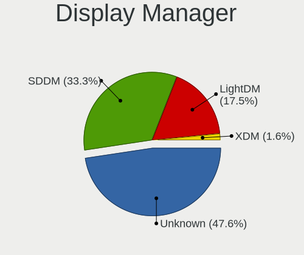

| Name    | Desktops | Percent |
|---------|----------|---------|
| Unknown | 29       | 48.33%  |
| SDDM    | 19       | 31.67%  |
| LightDM | 11       | 18.33%  |
| XDM     | 1        | 1.67%   |

OS Lang
-------

Language

| Lang    | Desktops | Percent |
|---------|----------|---------|
| en_US   | 21       | 34.43%  |
| de_DE   | 11       | 18.03%  |
| POSIX   | 10       | 16.39%  |
| pt_BR   | 4        | 6.56%   |
| nl_NL   | 3        | 4.92%   |
| fr_FR   | 2        | 3.28%   |
| en_GB   | 2        | 3.28%   |
| ru_RU   | 1        | 1.64%   |
| ro_RO   | 1        | 1.64%   |
| pl_PL   | 1        | 1.64%   |
| es_ES   | 1        | 1.64%   |
| el_GR   | 1        | 1.64%   |
| de_CH   | 1        | 1.64%   |
| ca_ES   | 1        | 1.64%   |
| Unknown | 1        | 1.64%   |

Boot Mode
---------

EFI or BIOS

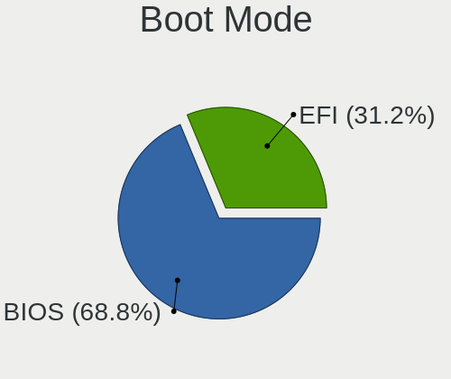

| Mode | Desktops | Percent |
|------|----------|---------|
| BIOS | 42       | 68.85%  |
| EFI  | 19       | 31.15%  |

Filesystem
----------

Type of filesystem

| Type  | Desktops | Percent |
|-------|----------|---------|
| Btrfs | 39       | 65%     |
| Ext4  | 19       | 31.67%  |
| Xfs   | 1        | 1.67%   |
| Ext3  | 1        | 1.67%   |

Part. scheme
------------

Scheme of partitioning

| Type    | Desktops | Percent |
|---------|----------|---------|
| GPT     | 27       | 44.26%  |
| Unknown | 26       | 42.62%  |
| MBR     | 8        | 13.11%  |

Dual Boot with Linux/BSD
------------------------

Hosting more than one Linux/BSD

| Dual boot | Desktops | Percent |
|-----------|----------|---------|
| No        | 51       | 83.61%  |
| Yes       | 10       | 16.39%  |

Dual Boot (Win)
---------------

Hosting Linux and Windows

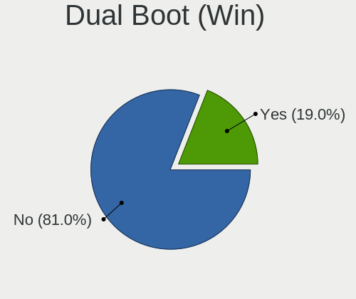

| Dual boot | Desktops | Percent |
|-----------|----------|---------|
| No        | 48       | 80%     |
| Yes       | 12       | 20%     |

Board
-----

Vendor
------

Motherboard manufacturer

| Name                | Desktops | Percent |
|---------------------|----------|---------|
| ASUSTek Computer    | 21       | 35%     |
| MSI                 | 8        | 13.33%  |
| Dell                | 7        | 11.67%  |
| Gigabyte Technology | 6        | 10%     |
| ASRock              | 6        | 10%     |
| Hewlett-Packard     | 5        | 8.33%   |
| Lenovo              | 3        | 5%      |
| Wortmann AG         | 1        | 1.67%   |
| Intel               | 1        | 1.67%   |
| Fujitsu             | 1        | 1.67%   |
| Biostar             | 1        | 1.67%   |

Model
-----

Motherboard model

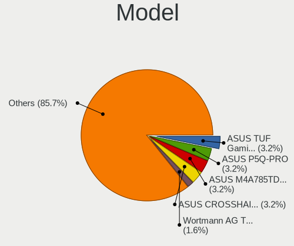

| Name                                | Desktops | Percent |
|-------------------------------------|----------|---------|
| ASUS TUF Gaming B550M-E             | 2        | 3.33%   |
| ASUS P5Q-PRO                        | 2        | 3.33%   |
| ASUS M4A785TD-V EVO                 | 2        | 3.33%   |
| ASUS CROSSHAIR V FORMULA-Z          | 2        | 3.33%   |
| Wortmann AG Terra 3100              | 1        | 1.67%   |
| MSI MS-7C02                         | 1        | 1.67%   |
| MSI MS-7B86                         | 1        | 1.67%   |
| MSI MS-7B85                         | 1        | 1.67%   |
| MSI MS-7B78                         | 1        | 1.67%   |
| MSI MS-7B09                         | 1        | 1.67%   |
| MSI MS-7971                         | 1        | 1.67%   |
| MSI MS-7850                         | 1        | 1.67%   |
| MSI MS-7673                         | 1        | 1.67%   |
| Lenovo ThinkStation P520 30BE008VGE | 1        | 1.67%   |
| Lenovo ThinkStation P500 30A6S4JU00 | 1        | 1.67%   |
| Lenovo H50-55 90BF001SUK            | 1        | 1.67%   |
| Intel DG965RY AAD41691-301          | 1        | 1.67%   |
| HP Z600 Workstation                 | 1        | 1.67%   |
| HP Z400 Workstation                 | 1        | 1.67%   |
| HP Z240 Tower Workstation           | 1        | 1.67%   |
| HP OMEN 30L Desktop GT13-0xxx       | 1        | 1.67%   |
| HP Compaq 8200 Elite CMT PC         | 1        | 1.67%   |
| Gigabyte Z97-HD3                    | 1        | 1.67%   |
| Gigabyte Z690 GAMING X DDR4         | 1        | 1.67%   |
| Gigabyte P55-UD3                    | 1        | 1.67%   |
| Gigabyte H55M-S2H                   | 1        | 1.67%   |
| Gigabyte GA-770TA-UD3               | 1        | 1.67%   |
| Gigabyte 965P-DS3                   | 1        | 1.67%   |
| Fujitsu ESPRIMO_P756                | 1        | 1.67%   |
| Dell XPS 8940                       | 1        | 1.67%   |
| Dell Vostro 3268                    | 1        | 1.67%   |
| Dell Precision T3610                | 1        | 1.67%   |
| Dell OptiPlex 980                   | 1        | 1.67%   |
| Dell OptiPlex 790                   | 1        | 1.67%   |
| Dell OptiPlex 7010                  | 1        | 1.67%   |
| Dell DM051                          | 1        | 1.67%   |
| Biostar B450MH                      | 1        | 1.67%   |
| ASUS TUF Gaming Z590-PLUS           | 1        | 1.67%   |
| ASUS TUF Gaming X570-PRO            | 1        | 1.67%   |
| ASUS TUF Gaming B550M-E WIFI        | 1        | 1.67%   |

Model Family
------------

Motherboard model prefix

| Name                  | Desktops | Percent |
|-----------------------|----------|---------|
| ASUS TUF              | 5        | 8.33%   |
| ASUS PRIME            | 5        | 8.33%   |
| Dell OptiPlex         | 3        | 5%      |
| Lenovo ThinkStation   | 2        | 3.33%   |
| ASUS ROG              | 2        | 3.33%   |
| ASUS P5Q-PRO          | 2        | 3.33%   |
| ASUS M4A785TD-V       | 2        | 3.33%   |
| ASUS CROSSHAIR        | 2        | 3.33%   |
| Wortmann AG Terra     | 1        | 1.67%   |
| MSI MS-7C02           | 1        | 1.67%   |
| MSI MS-7B86           | 1        | 1.67%   |
| MSI MS-7B85           | 1        | 1.67%   |
| MSI MS-7B78           | 1        | 1.67%   |
| MSI MS-7B09           | 1        | 1.67%   |
| MSI MS-7971           | 1        | 1.67%   |
| MSI MS-7850           | 1        | 1.67%   |
| MSI MS-7673           | 1        | 1.67%   |
| Lenovo H50-55         | 1        | 1.67%   |
| Intel DG965RY         | 1        | 1.67%   |
| HP Z600               | 1        | 1.67%   |
| HP Z400               | 1        | 1.67%   |
| HP Z240               | 1        | 1.67%   |
| HP OMEN               | 1        | 1.67%   |
| HP Compaq             | 1        | 1.67%   |
| Gigabyte Z97-HD3      | 1        | 1.67%   |
| Gigabyte Z690         | 1        | 1.67%   |
| Gigabyte P55-UD3      | 1        | 1.67%   |
| Gigabyte H55M-S2H     | 1        | 1.67%   |
| Gigabyte GA-770TA-UD3 | 1        | 1.67%   |
| Gigabyte 965P-DS3     | 1        | 1.67%   |
| Fujitsu ESPRIMO       | 1        | 1.67%   |
| Dell XPS              | 1        | 1.67%   |
| Dell Vostro           | 1        | 1.67%   |
| Dell Precision        | 1        | 1.67%   |
| Dell DM051            | 1        | 1.67%   |
| Biostar B450MH        | 1        | 1.67%   |
| ASUS P5P43TD          | 1        | 1.67%   |
| ASUS P5E              | 1        | 1.67%   |
| ASUS M5A78L-M         | 1        | 1.67%   |
| ASRock Z490           | 1        | 1.67%   |

MFG Year
--------

Motherboard manufacture year

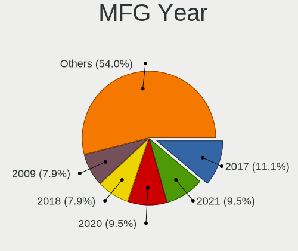

| Year | Desktops | Percent |
|------|----------|---------|
| 2017 | 7        | 11.67%  |
| 2021 | 6        | 10%     |
| 2022 | 5        | 8.33%   |
| 2020 | 5        | 8.33%   |
| 2009 | 5        | 8.33%   |
| 2018 | 4        | 6.67%   |
| 2015 | 4        | 6.67%   |
| 2011 | 4        | 6.67%   |
| 2010 | 4        | 6.67%   |
| 2013 | 3        | 5%      |
| 2008 | 3        | 5%      |
| 2016 | 2        | 3.33%   |
| 2014 | 2        | 3.33%   |
| 2012 | 2        | 3.33%   |
| 2019 | 1        | 1.67%   |
| 2007 | 1        | 1.67%   |
| 2006 | 1        | 1.67%   |
| 2005 | 1        | 1.67%   |

Form Factor
-----------

Physical design of the computer

| Name    | Desktops | Percent |
|---------|----------|---------|
| Desktop | 60       | 100%    |

Secure Boot
-----------

Enabled or disabled

| State    | Desktops | Percent |
|----------|----------|---------|
| Disabled | 60       | 100%    |

Coreboot
--------

Have coreboot on board

| Used | Desktops | Percent |
|------|----------|---------|
| No   | 60       | 100%    |

RAM Size
--------

Total RAM memory

| Size in GB      | Desktops | Percent |
|-----------------|----------|---------|
| 32.01-64.0      | 16       | 25.81%  |
| 16.01-24.0      | 13       | 20.97%  |
| 8.01-16.0       | 13       | 20.97%  |
| 64.01-256.0     | 8        | 12.9%   |
| 4.01-8.0        | 5        | 8.06%   |
| 3.01-4.0        | 3        | 4.84%   |
| 24.01-32.0      | 3        | 4.84%   |
| More than 256.0 | 1        | 1.61%   |

RAM Used
--------

Used RAM memory

| Used GB   | Desktops | Percent |
|-----------|----------|---------|
| 2.01-3.0  | 21       | 32.31%  |
| 4.01-8.0  | 16       | 24.62%  |
| 3.01-4.0  | 11       | 16.92%  |
| 1.01-2.0  | 10       | 15.38%  |
| 8.01-16.0 | 5        | 7.69%   |
| 0.51-1.0  | 2        | 3.08%   |

Total Drives
------------

Number of drives on board

| Drives | Desktops | Percent |
|--------|----------|---------|
| 2      | 20       | 31.75%  |
| 1      | 15       | 23.81%  |
| 3      | 14       | 22.22%  |
| 5      | 6        | 9.52%   |
| 4      | 3        | 4.76%   |
| 7      | 2        | 3.17%   |
| 6      | 2        | 3.17%   |
| 9      | 1        | 1.59%   |

Has CD-ROM
----------

Has CD-ROM on board

| Presented | Desktops | Percent |
|-----------|----------|---------|
| Yes       | 35       | 58.33%  |
| No        | 25       | 41.67%  |

Has Ethernet
------------

Has Ethernet on board

| Presented | Desktops | Percent |
|-----------|----------|---------|
| Yes       | 59       | 98.33%  |
| No        | 1        | 1.67%   |

Has WiFi
--------

Has WiFi module

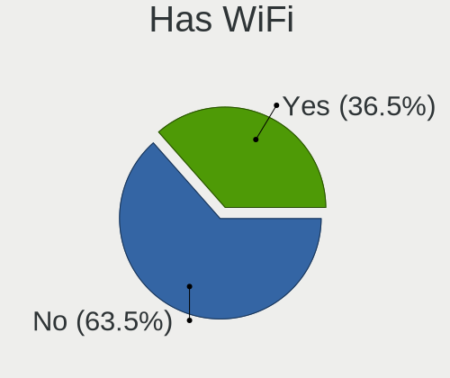

| Presented | Desktops | Percent |
|-----------|----------|---------|
| No        | 40       | 66.67%  |
| Yes       | 20       | 33.33%  |

Has Bluetooth
-------------

Has Bluetooth module

| Presented | Desktops | Percent |
|-----------|----------|---------|
| No        | 38       | 62.3%   |
| Yes       | 23       | 37.7%   |

Location
--------

Country
-------

Geographic location (country)

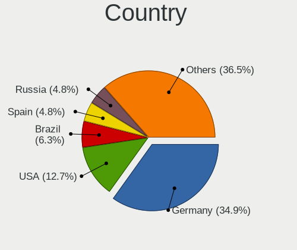

| Country      | Desktops | Percent |
|--------------|----------|---------|
| Germany      | 21       | 35%     |
| USA          | 8        | 13.33%  |
| Brazil       | 4        | 6.67%   |
| Russia       | 3        | 5%      |
| Netherlands  | 3        | 5%      |
| UK           | 2        | 3.33%   |
| Switzerland  | 2        | 3.33%   |
| Spain        | 2        | 3.33%   |
| France       | 2        | 3.33%   |
| South Africa | 1        | 1.67%   |
| Serbia       | 1        | 1.67%   |
| Romania      | 1        | 1.67%   |
| Poland       | 1        | 1.67%   |
| Norway       | 1        | 1.67%   |
| Martinique   | 1        | 1.67%   |
| Kazakhstan   | 1        | 1.67%   |
| Italy        | 1        | 1.67%   |
| India        | 1        | 1.67%   |
| Greece       | 1        | 1.67%   |
| Finland      | 1        | 1.67%   |
| Bulgaria     | 1        | 1.67%   |
| Australia    | 1        | 1.67%   |

City
----

Geographic location (city)

| City                  | Desktops | Percent |
|-----------------------|----------|---------|
| Haßfurt              | 5        | 7.69%   |
| Stuttgart             | 2        | 3.08%   |
| Rio de Janeiro        | 2        | 3.08%   |
| Moscow                | 2        | 3.08%   |
| Bergisch Gladbach     | 2        | 3.08%   |
| Almere Stad           | 2        | 3.08%   |
| Zierikzee             | 1        | 1.54%   |
| West Bend             | 1        | 1.54%   |
| Ulyanovsk             | 1        | 1.54%   |
| Stadthagen            | 1        | 1.54%   |
| Santa Rosa            | 1        | 1.54%   |
| Sainte-Tulle          | 1        | 1.54%   |
| Saint-Andre-le-Puy    | 1        | 1.54%   |
| Rostock               | 1        | 1.54%   |
| Roslindale            | 1        | 1.54%   |
| Riviere Salee         | 1        | 1.54%   |
| Rattelsdorf           | 1        | 1.54%   |
| Ocala                 | 1        | 1.54%   |
| Nesebar               | 1        | 1.54%   |
| Mo i Rana             | 1        | 1.54%   |
| Milan                 | 1        | 1.54%   |
| Melbourne             | 1        | 1.54%   |
| Lyss                  | 1        | 1.54%   |
| Ludwigshafen am Rhein | 1        | 1.54%   |
| Louisville            | 1        | 1.54%   |
| Le Lamentin           | 1        | 1.54%   |
| Lausanne              | 1        | 1.54%   |
| Kurten                | 1        | 1.54%   |
| Kulmbach              | 1        | 1.54%   |
| Kouvola               | 1        | 1.54%   |
| Kluszkowce            | 1        | 1.54%   |
| Kiel                  | 1        | 1.54%   |
| Johannesburg          | 1        | 1.54%   |
| Jegenstorf            | 1        | 1.54%   |
| Hyvinkaeae            | 1        | 1.54%   |
| Hyderabad             | 1        | 1.54%   |
| Hildesheim            | 1        | 1.54%   |
| Helpsen               | 1        | 1.54%   |
| Heilbronn             | 1        | 1.54%   |
| Haßfurt            | 1        | 1.54%   |

Drives
------

Drive Vendor
------------

Hard drive vendors

| Vendor                      | Desktops | Drives | Percent |
|-----------------------------|----------|--------|---------|
| Seagate                     | 32       | 50     | 26.23%  |
| Samsung Electronics         | 23       | 40     | 18.85%  |
| WDC                         | 19       | 41     | 15.57%  |
| Kingston                    | 9        | 13     | 7.38%   |
| Crucial                     | 7        | 8      | 5.74%   |
| Toshiba                     | 5        | 6      | 4.1%    |
| SanDisk                     | 3        | 5      | 2.46%   |
| Patriot                     | 2        | 2      | 1.64%   |
| Maxtor                      | 2        | 2      | 1.64%   |
| Intenso                     | 2        | 3      | 1.64%   |
| Intel                       | 2        | 2      | 1.64%   |
| Hitachi                     | 2        | 2      | 1.64%   |
| Team                        | 1        | 1      | 0.82%   |
| StoreJet                    | 1        | 1      | 0.82%   |
| SPCC                        | 1        | 2      | 0.82%   |
| Smartbuy                    | 1        | 2      | 0.82%   |
| Silicon Motion              | 1        | 1      | 0.82%   |
| PNY                         | 1        | 1      | 0.82%   |
| Plextor                     | 1        | 3      | 0.82%   |
| Phison Electronics          | 1        | 1      | 0.82%   |
| MATSHITA                    | 1        | 1      | 0.82%   |
| Leven                       | 1        | 1      | 0.82%   |
| Kingston Technology Company | 1        | 1      | 0.82%   |
| HGST                        | 1        | 1      | 0.82%   |
| Fujitsu                     | 1        | 1      | 0.82%   |
| ADATA Technology            | 1        | 1      | 0.82%   |

Drive Model
-----------

Hard drive models

| Model                                               | Desktops | Percent |
|-----------------------------------------------------|----------|---------|
| Samsung SSD 840 EVO 120GB                           | 5        | 3.31%   |
| Seagate ST2000DM001-1ER164 2TB                      | 3        | 1.99%   |
| Samsung SSD 860 EVO 500GB                           | 3        | 1.99%   |
| Samsung NVMe SSD Controller SM981/PM981/PM983 256GB | 3        | 1.99%   |
| Kingston SA400S37480G 480GB SSD                     | 3        | 1.99%   |
| WDC WDS500G2B0A-00SM50 500GB SSD                    | 2        | 1.32%   |
| WDC WD10EZEX-08M2NA0 1TB                            | 2        | 1.32%   |
| WDC WD1003FZEX-00MK2A0 1TB                          | 2        | 1.32%   |
| Seagate ST500DM002-1BD142 500GB                     | 2        | 1.32%   |
| Seagate ST3500418AS 500GB                           | 2        | 1.32%   |
| Seagate ST3000NM0053 3TB                            | 2        | 1.32%   |
| Seagate ST1000VX000-1CU162 1TB                      | 2        | 1.32%   |
| Seagate Expansion 1TB                               | 2        | 1.32%   |
| SanDisk NVMe SSD Drive 240GB                        | 2        | 1.32%   |
| Samsung SSD 870 QVO 2TB                             | 2        | 1.32%   |
| Samsung SSD 860 EVO 250GB                           | 2        | 1.32%   |
| Samsung NVMe SSD Controller SM961/PM961/SM963 500GB | 2        | 1.32%   |
| Kingston SA400S37960G 960GB SSD                     | 2        | 1.32%   |
| Kingston SA400S37240G 240GB SSD                     | 2        | 1.32%   |
| Crucial CT1000MX500SSD1 1TB                         | 2        | 1.32%   |
| WDC WDS500G1B0B-00AS40 500GB SSD                    | 1        | 0.66%   |
| WDC WDS250G1B0A-00H9H0 250GB SSD                    | 1        | 0.66%   |
| WDC WDS100T2B0A-00SM50 1TB SSD                      | 1        | 0.66%   |
| WDC WDS100T1X0E-00AFY0 1TB                          | 1        | 0.66%   |
| WDC WD5000AZRX-00L4HB0 500GB                        | 1        | 0.66%   |
| WDC WD40EZRZ-00GXCB0 4TB                            | 1        | 0.66%   |
| WDC WD40EFRX-68WT0N0 4TB                            | 1        | 0.66%   |
| WDC WD4003FRYZ-01F0DB0 4TB                          | 1        | 0.66%   |
| WDC WD3200AAKX-00ERMA0 320GB                        | 1        | 0.66%   |
| WDC WD30EZRX-00SPEB0 3TB                            | 1        | 0.66%   |
| WDC WD20SPZX-22UA7T0 2TB                            | 1        | 0.66%   |
| WDC WD20EZRZ-00Z5HB0 2TB                            | 1        | 0.66%   |
| WDC WD20EZRX-00DC0B0 2TB                            | 1        | 0.66%   |
| WDC WD20EZRX-00D8PB0 2TB                            | 1        | 0.66%   |
| WDC WD20EFRX-68EUZN0 2TB                            | 1        | 0.66%   |
| WDC WD20EARX-00PASB0 2TB                            | 1        | 0.66%   |
| WDC WD20EARS-00MVWB0 2TB                            | 1        | 0.66%   |
| WDC WD120EDAZ-11F3RA0 12TB                          | 1        | 0.66%   |
| WDC WD10EZRX-00A8LB0 1TB                            | 1        | 0.66%   |
| WDC WD10EZEX-75WN4A0 1TB                            | 1        | 0.66%   |

HDD Vendor
----------

Hard disk drive vendors

| Vendor              | Desktops | Drives | Percent |
|---------------------|----------|--------|---------|
| Seagate             | 31       | 45     | 49.21%  |
| WDC                 | 18       | 35     | 28.57%  |
| Toshiba             | 4        | 5      | 6.35%   |
| Samsung Electronics | 4        | 4      | 6.35%   |
| Maxtor              | 2        | 2      | 3.17%   |
| Hitachi             | 2        | 2      | 3.17%   |
| HGST                | 1        | 1      | 1.59%   |
| Fujitsu             | 1        | 1      | 1.59%   |

SSD Vendor
----------

Solid state drive vendors

| Vendor              | Desktops | Drives | Percent |
|---------------------|----------|--------|---------|
| Samsung Electronics | 17       | 19     | 34%     |
| Kingston            | 7        | 9      | 14%     |
| Crucial             | 7        | 8      | 14%     |
| WDC                 | 5        | 5      | 10%     |
| Patriot             | 2        | 2      | 4%      |
| Intenso             | 2        | 3      | 4%      |
| Toshiba             | 1        | 1      | 2%      |
| Team                | 1        | 1      | 2%      |
| StoreJet            | 1        | 1      | 2%      |
| SPCC                | 1        | 2      | 2%      |
| Smartbuy            | 1        | 2      | 2%      |
| SanDisk             | 1        | 3      | 2%      |
| PNY                 | 1        | 1      | 2%      |
| Plextor             | 1        | 3      | 2%      |
| Leven               | 1        | 1      | 2%      |
| Intel               | 1        | 1      | 2%      |

Drive Kind
----------

HDD or SSD

| Kind    | Desktops | Drives | Percent |
|---------|----------|--------|---------|
| HDD     | 48       | 95     | 44.44%  |
| SSD     | 40       | 62     | 37.04%  |
| NVMe    | 18       | 33     | 16.67%  |
| Unknown | 2        | 2      | 1.85%   |

Drive Connector
---------------

SATA, SAS, NVMe, etc.

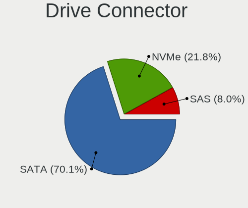

| Type | Desktops | Drives | Percent |
|------|----------|--------|---------|
| SATA | 59       | 152    | 70.24%  |
| NVMe | 18       | 33     | 21.43%  |
| SAS  | 7        | 7      | 8.33%   |

Drive Size
----------

Size of hard drive

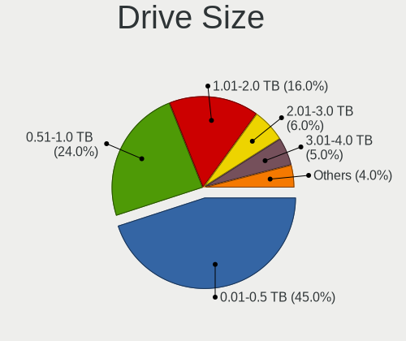

| Size in TB | Desktops | Drives | Percent |
|------------|----------|--------|---------|
| 0.01-0.5   | 45       | 67     | 46.88%  |
| 0.51-1.0   | 22       | 46     | 22.92%  |
| 1.01-2.0   | 14       | 21     | 14.58%  |
| 2.01-3.0   | 6        | 7      | 6.25%   |
| 3.01-4.0   | 5        | 9      | 5.21%   |
| 4.01-10.0  | 3        | 6      | 3.13%   |
| 10.01-20.0 | 1        | 1      | 1.04%   |

Space Total
-----------

Amount of disk space available on the file system

| Size in GB     | Desktops | Percent |
|----------------|----------|---------|
| More than 3000 | 25       | 41.67%  |
| 1001-2000      | 12       | 20%     |
| 2001-3000      | 9        | 15%     |
| 501-1000       | 6        | 10%     |
| 251-500        | 5        | 8.33%   |
| 21-50          | 1        | 1.67%   |
| 101-250        | 1        | 1.67%   |
| Unknown        | 1        | 1.67%   |

Space Used
----------

Amount of used disk space

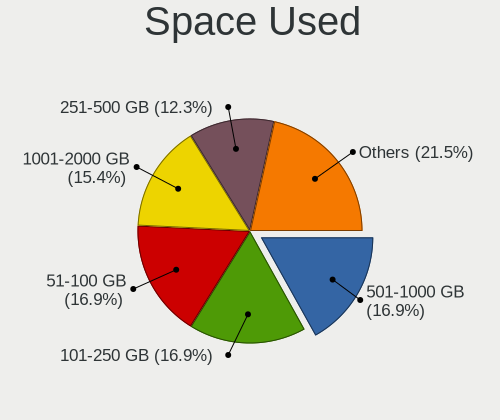

| Used GB        | Desktops | Percent |
|----------------|----------|---------|
| 501-1000       | 11       | 18.03%  |
| 51-100         | 11       | 18.03%  |
| 1001-2000      | 10       | 16.39%  |
| 101-250        | 9        | 14.75%  |
| 251-500        | 8        | 13.11%  |
| More than 3000 | 5        | 8.2%    |
| 2001-3000      | 4        | 6.56%   |
| 21-50          | 1        | 1.64%   |
| 1-20           | 1        | 1.64%   |
| Unknown        | 1        | 1.64%   |

Malfunc. Drives
---------------

Drive models with a malfunction

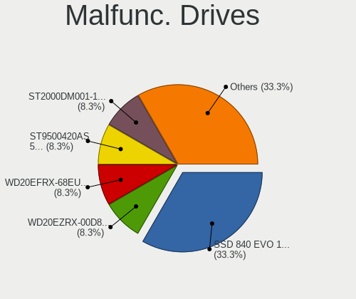

| Model                                 | Desktops | Drives | Percent |
|---------------------------------------|----------|--------|---------|
| Samsung Electronics SSD 840 EVO 120GB | 4        | 5      | 33.33%  |
| WDC WD20EZRX-00D8PB0 2TB              | 1        | 1      | 8.33%   |
| WDC WD20EFRX-68EUZN0 2TB              | 1        | 1      | 8.33%   |
| Seagate ST9500420AS 500GB             | 1        | 1      | 8.33%   |
| Seagate ST2000DM001-1CH164 2TB        | 1        | 1      | 8.33%   |
| Samsung Electronics SSD 850 PRO 256GB | 1        | 1      | 8.33%   |
| Maxtor 6L250S0 256GB                  | 1        | 1      | 8.33%   |
| Kingston SV300S37A120G 120GB SSD      | 1        | 1      | 8.33%   |
| Intel SSD 600P Series 256GB           | 1        | 1      | 8.33%   |

Malfunc. Drive Vendor
---------------------

Vendors of faulty drives

| Vendor              | Desktops | Drives | Percent |
|---------------------|----------|--------|---------|
| Samsung Electronics | 5        | 6      | 41.67%  |
| WDC                 | 2        | 2      | 16.67%  |
| Seagate             | 2        | 2      | 16.67%  |
| Maxtor              | 1        | 1      | 8.33%   |
| Kingston            | 1        | 1      | 8.33%   |
| Intel               | 1        | 1      | 8.33%   |

Malfunc. HDD Vendor
-------------------

Vendors of faulty HDD drives

| Vendor  | Desktops | Drives | Percent |
|---------|----------|--------|---------|
| WDC     | 2        | 2      | 40%     |
| Seagate | 2        | 2      | 40%     |
| Maxtor  | 1        | 1      | 20%     |

Malfunc. Drive Kind
-------------------

Kinds of faulty drives

| Kind | Desktops | Drives | Percent |
|------|----------|--------|---------|
| SSD  | 6        | 7      | 54.55%  |
| HDD  | 4        | 5      | 36.36%  |
| NVMe | 1        | 1      | 9.09%   |

Failed Drives
-------------

Failed drive models

Zero info for selected period =(

Failed Drive Vendor
-------------------

Failed drive vendors

Zero info for selected period =(

Drive Status
------------

Number of failed and malfunc. drives

| Status   | Desktops | Drives | Percent |
|----------|----------|--------|---------|
| Works    | 32       | 82     | 45.71%  |
| Detected | 27       | 97     | 38.57%  |
| Malfunc  | 11       | 13     | 15.71%  |

Storage controller
------------------

Storage Vendor
--------------

Storage controller vendors

| Vendor                      | Desktops | Percent |
|-----------------------------|----------|---------|
| Intel                       | 33       | 33%     |
| AMD                         | 28       | 28%     |
| Samsung Electronics         | 8        | 8%      |
| ASMedia Technology          | 6        | 6%      |
| JMicron Technology          | 5        | 5%      |
| Marvell Technology Group    | 4        | 4%      |
| Kingston Technology Company | 4        | 4%      |
| SanDisk                     | 3        | 3%      |
| Seagate Technology          | 2        | 2%      |
| LSI Logic / Symbios Logic   | 2        | 2%      |
| Silicon Motion              | 1        | 1%      |
| Silicon Image               | 1        | 1%      |
| Promise Technology          | 1        | 1%      |
| Phison Electronics          | 1        | 1%      |
| ADATA Technology            | 1        | 1%      |

Storage Model
-------------

Storage controller models

| Model                                                                                   | Desktops | Percent |
|-----------------------------------------------------------------------------------------|----------|---------|
| AMD FCH SATA Controller [AHCI mode]                                                     | 13       | 10.66%  |
| AMD 400 Series Chipset SATA Controller                                                  | 7        | 5.74%   |
| AMD 500 Series Chipset SATA Controller                                                  | 6        | 4.92%   |
| Samsung NVMe SSD Controller SM981/PM981/PM983                                           | 5        | 4.1%    |
| ASMedia ASM1062 Serial ATA Controller                                                   | 5        | 4.1%    |
| AMD SB7x0/SB8x0/SB9x0 SATA Controller [AHCI mode]                                       | 5        | 4.1%    |
| Intel Q170/Q150/B150/H170/H110/Z170/CM236 Chipset SATA Controller [AHCI Mode]           | 4        | 3.28%   |
| AMD SB7x0/SB8x0/SB9x0 IDE Controller                                                    | 4        | 3.28%   |
| JMicron JMB363 SATA/IDE Controller                                                      | 3        | 2.46%   |
| Intel 82801JI (ICH10 Family) SATA AHCI Controller                                       | 3        | 2.46%   |
| Seagate FireCuda 530 SSD                                                                | 2        | 1.64%   |
| SanDisk WD Green SN350 NVMe SSD 240GB (DRAM-less)                                       | 2        | 1.64%   |
| Samsung NVMe SSD Controller SM961/PM961/SM963                                           | 2        | 1.64%   |
| Intel 82801JI (ICH10 Family) 4 port SATA IDE Controller #1                              | 2        | 1.64%   |
| Intel 82801JI (ICH10 Family) 2 port SATA IDE Controller #2                              | 2        | 1.64%   |
| Intel 82801HB (ICH8) 4 port SATA Controller [AHCI mode]                                 | 2        | 1.64%   |
| Intel 6 Series/C200 Series Chipset Family Desktop SATA Controller (IDE mode, ports 4-5) | 2        | 1.64%   |
| Intel 6 Series/C200 Series Chipset Family Desktop SATA Controller (IDE mode, ports 0-3) | 2        | 1.64%   |
| Intel 5 Series/3400 Series Chipset 4 port SATA IDE Controller                           | 2        | 1.64%   |
| Intel 5 Series/3400 Series Chipset 2 port SATA IDE Controller                           | 2        | 1.64%   |
| Intel 200 Series PCH SATA controller [AHCI mode]                                        | 2        | 1.64%   |
| AMD 300 Series Chipset SATA Controller                                                  | 2        | 1.64%   |
| Silicon Motion SM2263EN/SM2263XT (DRAM-less) NVMe SSD Controllers                       | 1        | 0.82%   |
| Silicon Image SiI 3132 Serial ATA Raid II Controller                                    | 1        | 0.82%   |
| SanDisk WD PC SN810 / Black SN850 NVMe SSD                                              | 1        | 0.82%   |
| Samsung NVMe SSD Controller SM951/PM951                                                 | 1        | 0.82%   |
| Promise PDC40719 [FastTrak TX4300/TX4310]                                               | 1        | 0.82%   |
| Phison PS5013 E13 NVMe Controller                                                       | 1        | 0.82%   |
| Marvell Group 88SE9215 PCIe 2.0 x1 4-port SATA 6 Gb/s Controller                        | 1        | 0.82%   |
| Marvell Group 88SE9128 PCIe SATA 6 Gb/s RAID controller                                 | 1        | 0.82%   |
| Marvell Group 88SE9125 PCIe SATA 6.0 Gb/s controller                                    | 1        | 0.82%   |
| Marvell Group 88SE6101/6102 single-port PATA133 interface                               | 1        | 0.82%   |
| LSI Logic / Symbios Logic MegaRAID SAS 2108 [Liberator]                                 | 1        | 0.82%   |
| LSI Logic / Symbios Logic 53c1030 PCI-X Fusion-MPT Dual Ultra320 SCSI                   | 1        | 0.82%   |
| Kingston Company Company Non-Volatile memory controller                                 | 1        | 0.82%   |
| Kingston Company OM8PCP Design-In PCIe 3 NVMe SSD (DRAM-less)                           | 1        | 0.82%   |
| Kingston Company KC3000/Renegade NVMe SSD                                               | 1        | 0.82%   |
| Kingston Company A2000 NVMe SSD                                                         | 1        | 0.82%   |
| JMicron JMB368 IDE controller                                                           | 1        | 0.82%   |
| JMicron JMB361 AHCI/IDE                                                                 | 1        | 0.82%   |

Storage Kind
------------

Kind of storage controller (IDE, SATA, NVMe, SAS, ...)

| Kind | Desktops | Percent |
|------|----------|---------|
| SATA | 54       | 58.7%   |
| NVMe | 18       | 19.57%  |
| IDE  | 16       | 17.39%  |
| RAID | 3        | 3.26%   |
| SCSI | 1        | 1.09%   |

Processor
---------

CPU Vendor
----------

Processor vendors

| Vendor | Desktops | Percent |
|--------|----------|---------|
| Intel  | 32       | 53.33%  |
| AMD    | 28       | 46.67%  |

CPU Model
---------

Processor models

| Model                                          | Desktops | Percent |
|------------------------------------------------|----------|---------|
| AMD Ryzen 7 5700G with Radeon Graphics         | 4        | 6.67%   |
| AMD Ryzen 5 2600 Six-Core Processor            | 3        | 5%      |
| Intel Core i5-7600K CPU @ 3.80GHz              | 2        | 3.33%   |
| Intel Core i5 CPU 750 @ 2.67GHz                | 2        | 3.33%   |
| Intel Core 2 Quad CPU Q9550 @ 2.83GHz          | 2        | 3.33%   |
| AMD Ryzen 5 3600 6-Core Processor              | 2        | 3.33%   |
| AMD Ryzen 5 1600 Six-Core Processor            | 2        | 3.33%   |
| AMD Phenom II X6 1100T Processor               | 2        | 3.33%   |
| AMD FX-8350 Eight-Core Processor               | 2        | 3.33%   |
| Intel Xeon W-2135 CPU @ 3.70GHz                | 1        | 1.67%   |
| Intel Xeon CPU X5675 @ 3.07GHz                 | 1        | 1.67%   |
| Intel Xeon CPU W3530 @ 2.80GHz                 | 1        | 1.67%   |
| Intel Xeon CPU E5450 @ 3.00GHz                 | 1        | 1.67%   |
| Intel Xeon CPU E5-1620 v3 @ 3.50GHz            | 1        | 1.67%   |
| Intel Xeon CPU E5-1607 v2 @ 3.00GHz            | 1        | 1.67%   |
| Intel Xeon CPU E3-1230 v5 @ 3.40GHz            | 1        | 1.67%   |
| Intel Pentium Dual-Core CPU E6500 @ 2.93GHz    | 1        | 1.67%   |
| Intel Pentium 4 CPU 3.20GHz                    | 1        | 1.67%   |
| Intel Core i7-6700K CPU @ 4.00GHz              | 1        | 1.67%   |
| Intel Core i7-2600 CPU @ 3.40GHz               | 1        | 1.67%   |
| Intel Core i5-6500 CPU @ 3.20GHz               | 1        | 1.67%   |
| Intel Core i5-4440 CPU @ 3.10GHz               | 1        | 1.67%   |
| Intel Core i5-3470 CPU @ 3.20GHz               | 1        | 1.67%   |
| Intel Core i5-2500 CPU @ 3.30GHz               | 1        | 1.67%   |
| Intel Core i5-2400S CPU @ 2.50GHz              | 1        | 1.67%   |
| Intel Core i5-10500 CPU @ 3.10GHz              | 1        | 1.67%   |
| Intel Core i3-4150T CPU @ 3.00GHz              | 1        | 1.67%   |
| Intel Core i3 CPU 540 @ 3.07GHz                | 1        | 1.67%   |
| Intel Core 2 Quad CPU Q8400 @ 2.66GHz          | 1        | 1.67%   |
| Intel Core 2 CPU 6700 @ 2.66GHz                | 1        | 1.67%   |
| Intel Celeron CPU J3355 @ 2.00GHz              | 1        | 1.67%   |
| Intel Atom CPU D525 @ 1.80GHz                  | 1        | 1.67%   |
| Intel 12th Gen Core i7-12700KF                 | 1        | 1.67%   |
| Intel 11th Gen Core i9-11900 @ 2.50GHz         | 1        | 1.67%   |
| Intel 11th Gen Core i7-11700F @ 2.50GHz        | 1        | 1.67%   |
| AMD Ryzen Threadripper 1950X 16-Core Processor | 1        | 1.67%   |
| AMD Ryzen 9 7950X 16-Core Processor            | 1        | 1.67%   |
| AMD Ryzen 9 5950X 16-Core Processor            | 1        | 1.67%   |
| AMD Ryzen 9 3900X 12-Core Processor            | 1        | 1.67%   |
| AMD Ryzen 7 7700 8-Core Processor              | 1        | 1.67%   |

CPU Model Family
----------------

Processor model prefix

| Model                   | Desktops | Percent |
|-------------------------|----------|---------|
| Intel Core i5           | 10       | 16.67%  |
| AMD Ryzen 7             | 8        | 13.33%  |
| AMD Ryzen 5             | 8        | 13.33%  |
| Intel Xeon              | 7        | 11.67%  |
| Other                   | 3        | 5%      |
| Intel Core 2 Quad       | 3        | 5%      |
| AMD Ryzen 9             | 3        | 5%      |
| Intel Core i7           | 2        | 3.33%   |
| Intel Core i3           | 2        | 3.33%   |
| AMD Phenom II X6        | 2        | 3.33%   |
| AMD Phenom II X4        | 2        | 3.33%   |
| AMD FX                  | 2        | 3.33%   |
| Intel Pentium Dual-Core | 1        | 1.67%   |
| Intel Pentium 4         | 1        | 1.67%   |
| Intel Core 2            | 1        | 1.67%   |
| Intel Celeron           | 1        | 1.67%   |
| Intel Atom              | 1        | 1.67%   |
| AMD Ryzen Threadripper  | 1        | 1.67%   |
| AMD Ryzen 3             | 1        | 1.67%   |
| AMD A10                 | 1        | 1.67%   |

CPU Cores
---------

Number of processor cores

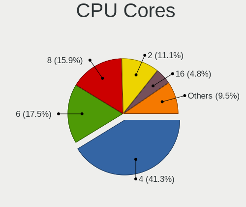

| Number | Desktops | Percent |
|--------|----------|---------|
| 4      | 24       | 40%     |
| 6      | 11       | 18.33%  |
| 8      | 10       | 16.67%  |
| 2      | 7        | 11.67%  |
| 16     | 3        | 5%      |
| 12     | 3        | 5%      |
| 1      | 2        | 3.33%   |

CPU Sockets
-----------

Number of sockets

| Number | Desktops | Percent |
|--------|----------|---------|
| 1      | 59       | 98.33%  |
| 2      | 1        | 1.67%   |

CPU Threads
-----------

Threads per core (Hyper-Threading)

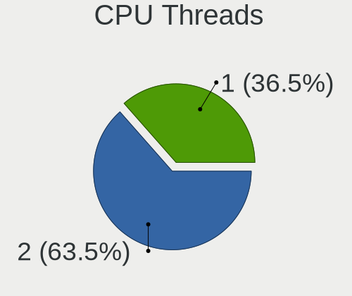

| Number | Desktops | Percent |
|--------|----------|---------|
| 2      | 38       | 63.33%  |
| 1      | 22       | 36.67%  |

CPU Op-Modes
------------

CPU Operation Modes (32-bit, 64-bit)

| Op mode        | Desktops | Percent |
|----------------|----------|---------|
| 32-bit, 64-bit | 60       | 100%    |

CPU Microcode
-------------

Microcode number

| Number     | Desktops | Percent |
|------------|----------|---------|
| Unknown    | 26       | 41.94%  |
| 0x0a50000c | 3        | 4.84%   |
| 0x906e9    | 2        | 3.23%   |
| 0x506e3    | 2        | 3.23%   |
| 0x106e5    | 2        | 3.23%   |
| 0x0a50000d | 2        | 3.23%   |
| 0x0800820d | 2        | 3.23%   |
| 0x06000852 | 2        | 3.23%   |
| 0x010000dc | 2        | 3.23%   |
| 0x010000c8 | 2        | 3.23%   |
| 0xf4a      | 1        | 1.61%   |
| 0xa0671    | 1        | 1.61%   |
| 0x90672    | 1        | 1.61%   |
| 0x6f6      | 1        | 1.61%   |
| 0x50654    | 1        | 1.61%   |
| 0x306e4    | 1        | 1.61%   |
| 0x306c3    | 1        | 1.61%   |
| 0x206a7    | 1        | 1.61%   |
| 0x106ca    | 1        | 1.61%   |
| 0x1067a    | 1        | 1.61%   |
| 0x0a601201 | 1        | 1.61%   |
| 0x0a50000b | 1        | 1.61%   |
| 0x0a201016 | 1        | 1.61%   |
| 0x08701021 | 1        | 1.61%   |
| 0x08001138 | 1        | 1.61%   |
| 0x08001129 | 1        | 1.61%   |
| 0x06003106 | 1        | 1.61%   |

CPU Microarch
-------------

Microarchitecture

| Name             | Desktops | Percent |
|------------------|----------|---------|
| Zen+             | 6        | 10%     |
| Zen 3            | 6        | 10%     |
| Penryn           | 5        | 8.33%   |
| Zen 2            | 4        | 6.67%   |
| Skylake          | 4        | 6.67%   |
| K10              | 4        | 6.67%   |
| Zen              | 3        | 5%      |
| SandyBridge      | 3        | 5%      |
| Nehalem          | 3        | 5%      |
| Haswell          | 3        | 5%      |
| Unknown          | 3        | 5%      |
| Westmere         | 2        | 3.33%   |
| Piledriver       | 2        | 3.33%   |
| KabyLake         | 2        | 3.33%   |
| IvyBridge        | 2        | 3.33%   |
| Steamroller      | 1        | 1.67%   |
| NetBurst         | 1        | 1.67%   |
| Icelake          | 1        | 1.67%   |
| Goldmont         | 1        | 1.67%   |
| Core             | 1        | 1.67%   |
| CometLake        | 1        | 1.67%   |
| Bonnell          | 1        | 1.67%   |
| Alderlake Hybrid | 1        | 1.67%   |

Graphics
--------

GPU Vendor
----------

Vendors of graphics cards

| Vendor      | Desktops | Percent |
|-------------|----------|---------|
| Nvidia      | 28       | 43.75%  |
| AMD         | 28       | 43.75%  |
| Intel       | 7        | 10.94%  |
| S3 Graphics | 1        | 1.56%   |

GPU Model
---------

Graphics card models

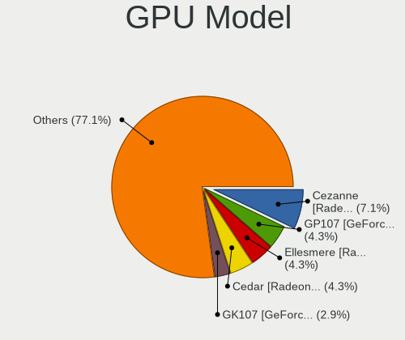

| Model                                                                       | Desktops | Percent |
|-----------------------------------------------------------------------------|----------|---------|
| AMD Cezanne [Radeon Vega Series / Radeon Vega Mobile Series]                | 5        | 7.46%   |
| Nvidia GP107 [GeForce GTX 1050 Ti]                                          | 3        | 4.48%   |
| AMD Ellesmere [Radeon RX 470/480/570/570X/580/580X/590]                     | 3        | 4.48%   |
| Nvidia GK107 [GeForce GT 640]                                               | 2        | 2.99%   |
| Nvidia GF119 [GeForce GT 610]                                               | 2        | 2.99%   |
| Nvidia GF108 [GeForce GT 630]                                               | 2        | 2.99%   |
| AMD RS880 [Radeon HD 4200]                                                  | 2        | 2.99%   |
| AMD Raphael                                                                 | 2        | 2.99%   |
| AMD Navi 23 [Radeon RX 6600/6600 XT/6600M]                                  | 2        | 2.99%   |
| AMD Lexa PRO [Radeon 540/540X/550/550X / RX 540X/550/550X]                  | 2        | 2.99%   |
| AMD Cedar [Radeon HD 5000/6000/7350/8350 Series]                            | 2        | 2.99%   |
| S3 Graphics 86c764/765 [Trio32/64/64V+]                                     | 1        | 1.49%   |
| Nvidia TU117 [GeForce GTX 1650]                                             | 1        | 1.49%   |
| Nvidia TU106 [GeForce RTX 2070]                                             | 1        | 1.49%   |
| Nvidia GT218M [ION]                                                         | 1        | 1.49%   |
| Nvidia GT216 [GeForce GT 220]                                               | 1        | 1.49%   |
| Nvidia GP108 [GeForce GT 1030]                                              | 1        | 1.49%   |
| Nvidia GP106 [GeForce GTX 1060 3GB]                                         | 1        | 1.49%   |
| Nvidia GP102 [GeForce GTX 1080 Ti]                                          | 1        | 1.49%   |
| Nvidia GM206 [GeForce GTX 960]                                              | 1        | 1.49%   |
| Nvidia GM204 [GeForce GTX 970]                                              | 1        | 1.49%   |
| Nvidia GM107GL [Quadro K2200]                                               | 1        | 1.49%   |
| Nvidia GK208B [GeForce GT 730]                                              | 1        | 1.49%   |
| Nvidia GK208B [GeForce GT 710]                                              | 1        | 1.49%   |
| Nvidia GK106GL [Quadro K4000]                                               | 1        | 1.49%   |
| Nvidia GF119 [GeForce GT 520]                                               | 1        | 1.49%   |
| Nvidia GF110 [GeForce GTX 560 Ti 448 Cores]                                 | 1        | 1.49%   |
| Nvidia GF108 [GeForce GT 430]                                               | 1        | 1.49%   |
| Nvidia GA106 [GeForce RTX 3060 Lite Hash Rate]                              | 1        | 1.49%   |
| Nvidia GA106 [Geforce RTX 3050]                                             | 1        | 1.49%   |
| Nvidia G94 [GeForce 9600 GT]                                                | 1        | 1.49%   |
| Nvidia AD104 [GeForce RTX 4070 Ti]                                          | 1        | 1.49%   |
| Intel Xeon E3-1200 v3/4th Gen Core Processor Integrated Graphics Controller | 1        | 1.49%   |
| Intel Xeon E3-1200 v2/3rd Gen Core processor Graphics Controller            | 1        | 1.49%   |
| Intel RocketLake-S GT1 [UHD Graphics 750]                                   | 1        | 1.49%   |
| Intel HD Graphics 630                                                       | 1        | 1.49%   |
| Intel HD Graphics 530                                                       | 1        | 1.49%   |
| Intel HD Graphics 500                                                       | 1        | 1.49%   |
| Intel 4th Generation Core Processor Family Integrated Graphics Controller   | 1        | 1.49%   |
| AMD RV620 LE [Radeon HD 3450]                                               | 1        | 1.49%   |

GPU Combo
---------

Combinations of graphics cards

| Name            | Desktops | Percent |
|-----------------|----------|---------|
| 1 x Nvidia      | 24       | 40%     |
| 1 x AMD         | 23       | 38.33%  |
| 1 x Intel       | 5        | 8.33%   |
| 2 x AMD         | 2        | 3.33%   |
| AMD + Nvidia    | 2        | 3.33%   |
| 2 x Nvidia      | 1        | 1.67%   |
| 1 x S3 Graphics | 1        | 1.67%   |
| Intel + Nvidia  | 1        | 1.67%   |
| Intel + AMD     | 1        | 1.67%   |

GPU Driver
----------

Free vs proprietary

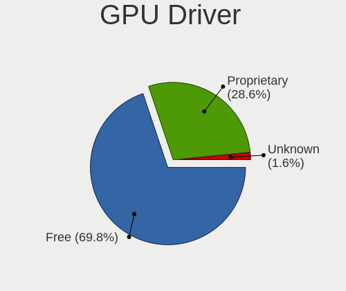

| Driver      | Desktops | Percent |
|-------------|----------|---------|
| Free        | 41       | 68.33%  |
| Proprietary | 18       | 30%     |
| Unknown     | 1        | 1.67%   |

GPU Memory
----------

Total video memory

| Size in GB | Desktops | Percent |
|------------|----------|---------|
| Unknown    | 24       | 40%     |
| 0.01-0.5   | 11       | 18.33%  |
| 1.01-2.0   | 8        | 13.33%  |
| 3.01-4.0   | 7        | 11.67%  |
| 7.01-8.0   | 3        | 5%      |
| 8.01-16.0  | 3        | 5%      |
| 2.01-3.0   | 2        | 3.33%   |
| 0.51-1.0   | 2        | 3.33%   |

Monitor
-------

Monitor Vendor
--------------

Monitor vendors

| Vendor               | Desktops | Percent |
|----------------------|----------|---------|
| Samsung Electronics  | 9        | 14.29%  |
| Dell                 | 9        | 14.29%  |
| Fujitsu Siemens      | 7        | 11.11%  |
| Goldstar             | 6        | 9.52%   |
| Acer                 | 4        | 6.35%   |
| LG Electronics       | 3        | 4.76%   |
| Iiyama               | 3        | 4.76%   |
| Hewlett-Packard      | 3        | 4.76%   |
| AOC                  | 3        | 4.76%   |
| Ancor Communications | 3        | 4.76%   |
| Philips              | 2        | 3.17%   |
| BenQ                 | 2        | 3.17%   |
| ViewSonic            | 1        | 1.59%   |
| Unknown              | 1        | 1.59%   |
| NEC Computers        | 1        | 1.59%   |
| Lenovo               | 1        | 1.59%   |
| Hitachi              | 1        | 1.59%   |
| HannStar             | 1        | 1.59%   |
| Gigabyte Technology  | 1        | 1.59%   |
| Eizo                 | 1        | 1.59%   |
| ASUSTek Computer     | 1        | 1.59%   |

Monitor Model
-------------

Monitor models

| Model                                                                 | Desktops | Percent |
|-----------------------------------------------------------------------|----------|---------|
| Fujitsu Siemens P19-2 FUS0552 1280x1024 376x301mm 19.0-inch           | 6        | 8.82%   |
| LG Electronics LCD Monitor LG ULTRAGEAR 1920x1080                     | 2        | 2.94%   |
| Dell DELL3007WFPHC DEL4016 2560x1600 646x406mm 30.0-inch              | 2        | 2.94%   |
| ViewSonic EP3220T VSC33F3 1920x1080 700x390mm 31.5-inch               | 1        | 1.47%   |
| Unknown SMART TV 0563 1920x1080 1209x680mm 54.6-inch                  | 1        | 1.47%   |
| Samsung Electronics U28E590 SAM0C4D 3840x2160 610x350mm 27.7-inch     | 1        | 1.47%   |
| Samsung Electronics SyncMaster SAM058F 1920x1080 477x268mm 21.5-inch  | 1        | 1.47%   |
| Samsung Electronics SyncMaster SAM0226 1440x900 410x257mm 19.1-inch   | 1        | 1.47%   |
| Samsung Electronics SMS24A850 SAM0825 1920x1200 518x324mm 24.1-inch   | 1        | 1.47%   |
| Samsung Electronics S27E450 SAM0C83 1920x1080 598x336mm 27.0-inch     | 1        | 1.47%   |
| Samsung Electronics LCD Monitor SAM07C3 1920x1080 700x390mm 31.5-inch | 1        | 1.47%   |
| Samsung Electronics F27G3xTF SAM710D 1920x1080 600x330mm 27.0-inch    | 1        | 1.47%   |
| Samsung Electronics C32JG5x SAM0F55 2560x1440 697x392mm 31.5-inch     | 1        | 1.47%   |
| Samsung Electronics C24F390 SAM0D2C 1920x1080 521x293mm 23.5-inch     | 1        | 1.47%   |
| Philips PHL 243V7 PHLC155 1920x1080 527x296mm 23.8-inch               | 1        | 1.47%   |
| Philips 190X PHL084C 1280x1024 376x301mm 19.0-inch                    | 1        | 1.47%   |
| NEC Computers LCD1960NX NEC661F 1280x1024 376x301mm 19.0-inch         | 1        | 1.47%   |
| LG Electronics LCD Monitor E2260 1920x1080                            | 1        | 1.47%   |
| Lenovo LEN LT2452pwC LEN1144 1920x1080 518x324mm 24.1-inch            | 1        | 1.47%   |
| Iiyama PL2592H IVM6135 1920x1080 544x303mm 24.5-inch                  | 1        | 1.47%   |
| Iiyama PL2483H IVM6138 1920x1080 531x299mm 24.0-inch                  | 1        | 1.47%   |
| Iiyama PL2274HD IVM5619 1920x1080 477x268mm 21.5-inch                 | 1        | 1.47%   |
| Hitachi X90W D-sub HIT6008 1440x900 410x257mm 19.1-inch               | 1        | 1.47%   |
| Hewlett-Packard LE2002x HWP2963 1600x900 443x249mm 20.0-inch          | 1        | 1.47%   |
| Hewlett-Packard L1740 HWP2649 1280x1024 338x270mm 17.0-inch           | 1        | 1.47%   |
| Hewlett-Packard E231 HWP3065 1920x1080 509x286mm 23.0-inch            | 1        | 1.47%   |
| HannStar HH251 HSD2211 1920x1080 543x305mm 24.5-inch                  | 1        | 1.47%   |
| Goldstar W2242 GSM5677 1680x1050 474x296mm 22.0-inch                  | 1        | 1.47%   |
| Goldstar ULTRAWIDE GSM76FC 3840x1600 874x366mm 37.3-inch              | 1        | 1.47%   |
| Goldstar ULTRAGEAR GSM7766 2560x1440 697x392mm 31.5-inch              | 1        | 1.47%   |
| Goldstar M2380D GSM57BC 1920x1080 598x336mm 27.0-inch                 | 1        | 1.47%   |
| Goldstar L227W GSM566E 1680x1050 474x296mm 22.0-inch                  | 1        | 1.47%   |
| Goldstar FULL HD GSM5ABB 1920x1080 480x270mm 21.7-inch                | 1        | 1.47%   |
| Goldstar 27MB85R GSM5A8B 2560x1440 597x336mm 27.0-inch                | 1        | 1.47%   |
| Gigabyte Technology AORUS CV27Q GBT2705 2560x1440 600x340mm 27.2-inch | 1        | 1.47%   |
| Fujitsu Siemens B19-5 ECO FUS07C0 1280x1024 376x301mm 19.0-inch       | 1        | 1.47%   |
| Eizo S2433W ENC2112 1920x1200 519x324mm 24.1-inch                     | 1        | 1.47%   |
| Eizo S2100 ENC1803 1600x1200 432x324mm 21.3-inch                      | 1        | 1.47%   |
| Eizo L767 ENC1687 1280x1024 376x301mm 19.0-inch                       | 1        | 1.47%   |
| Dell U3417W DELA0DD 3440x1440 800x335mm 34.1-inch                     | 1        | 1.47%   |

Monitor Resolution
------------------

Monitor screen resolution

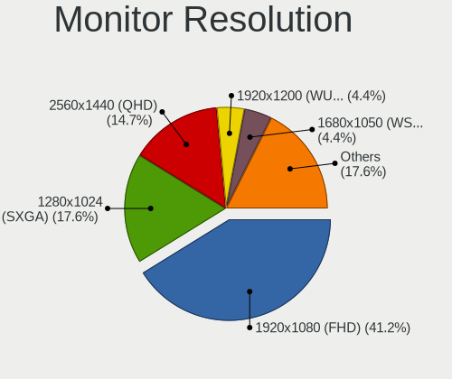

| Resolution         | Desktops | Percent |
|--------------------|----------|---------|
| 1920x1080 (FHD)    | 24       | 38.1%   |
| 1280x1024 (SXGA)   | 12       | 19.05%  |
| 2560x1440 (QHD)    | 10       | 15.87%  |
| 1680x1050 (WSXGA+) | 3        | 4.76%   |
| 1366x768 (WXGA)    | 3        | 4.76%   |
| 2560x1600          | 2        | 3.17%   |
| 1920x1200 (WUXGA)  | 2        | 3.17%   |
| 1440x900 (WXGA+)   | 2        | 3.17%   |
| 3840x2160 (4K)     | 1        | 1.59%   |
| 3840x1600          | 1        | 1.59%   |
| 3440x1440          | 1        | 1.59%   |
| 1600x900 (HD+)     | 1        | 1.59%   |
| 1600x1200          | 1        | 1.59%   |

Monitor Diagonal
----------------

Diagonal size in inches

| Inches  | Desktops | Percent |
|---------|----------|---------|
| 19      | 12       | 18.18%  |
| 24      | 11       | 16.67%  |
| 27      | 10       | 15.15%  |
| 23      | 7        | 10.61%  |
| 31      | 4        | 6.06%   |
| 21      | 4        | 6.06%   |
| Unknown | 3        | 4.55%   |
| 54      | 2        | 3.03%   |
| 30      | 2        | 3.03%   |
| 22      | 2        | 3.03%   |
| 18      | 2        | 3.03%   |
| 17      | 2        | 3.03%   |
| 37      | 1        | 1.52%   |
| 34      | 1        | 1.52%   |
| 32      | 1        | 1.52%   |
| 20      | 1        | 1.52%   |
| 15      | 1        | 1.52%   |

Monitor Width
-------------

Physical width

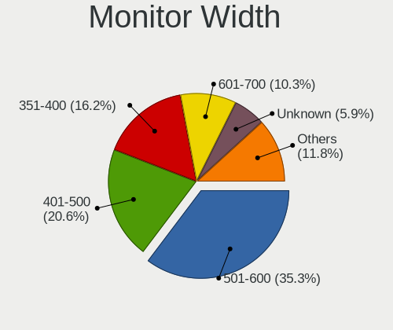

| Width in mm | Desktops | Percent |
|-------------|----------|---------|
| 501-600     | 23       | 35.94%  |
| 401-500     | 12       | 18.75%  |
| 351-400     | 11       | 17.19%  |
| 601-700     | 7        | 10.94%  |
| 301-350     | 3        | 4.69%   |
| Unknown     | 3        | 4.69%   |
| 701-800     | 2        | 3.13%   |
| 1001-1500   | 2        | 3.13%   |
| 801-900     | 1        | 1.56%   |

Aspect Ratio
------------

Proportional relationship between the width and the height

| Ratio   | Desktops | Percent |
|---------|----------|---------|
| 16/9    | 32       | 53.33%  |
| 5/4     | 11       | 18.33%  |
| 16/10   | 9        | 15%     |
| Unknown | 3        | 5%      |
| 21/9    | 2        | 3.33%   |
| 6/5     | 1        | 1.67%   |
| 4/3     | 1        | 1.67%   |
| 3/2     | 1        | 1.67%   |

Monitor Area
------------

Area in inch²

| Area in inch² | Desktops | Percent |
|----------------|----------|---------|
| 201-250        | 17       | 26.15%  |
| 151-200        | 14       | 21.54%  |
| 301-350        | 10       | 15.38%  |
| 351-500        | 9        | 13.85%  |
| 251-300        | 5        | 7.69%   |
| 141-150        | 4        | 6.15%   |
| Unknown        | 3        | 4.62%   |
| More than 1000 | 2        | 3.08%   |
| 101-110        | 1        | 1.54%   |

Pixel Density
-------------

Pixels per inch

| Density | Desktops | Percent |
|---------|----------|---------|
| 51-100  | 40       | 66.67%  |
| 101-120 | 14       | 23.33%  |
| Unknown | 3        | 5%      |
| 1-50    | 2        | 3.33%   |
| 121-160 | 1        | 1.67%   |

Multiple Monitors
-----------------

Total monitors connected

| Total | Desktops | Percent |
|-------|----------|---------|
| 1     | 50       | 81.97%  |
| 2     | 7        | 11.48%  |
| 3     | 2        | 3.28%   |
| 0     | 2        | 3.28%   |

Network
-------

Net Controller Vendor
---------------------

Controller vendors

| Vendor                   | Desktops | Percent |
|--------------------------|----------|---------|
| Realtek Semiconductor    | 38       | 44.19%  |
| Intel                    | 27       | 31.4%   |
| Qualcomm Atheros         | 4        | 4.65%   |
| Broadcom                 | 3        | 3.49%   |
| MediaTek                 | 2        | 2.33%   |
| Marvell Technology Group | 2        | 2.33%   |
| TP-Link                  | 1        | 1.16%   |
| Samsung Electronics      | 1        | 1.16%   |
| Ralink Technology        | 1        | 1.16%   |
| Ralink                   | 1        | 1.16%   |
| NetGear                  | 1        | 1.16%   |
| Microchip Technology     | 1        | 1.16%   |
| Linksys                  | 1        | 1.16%   |
| JMicron Technology       | 1        | 1.16%   |
| Atmel                    | 1        | 1.16%   |
| Aquantia                 | 1        | 1.16%   |

Net Controller Model
--------------------

Controller models

| Model                                                                  | Desktops | Percent |
|------------------------------------------------------------------------|----------|---------|
| Realtek RTL8111/8168/8411 PCI Express Gigabit Ethernet Controller      | 28       | 30.11%  |
| Intel Ethernet Controller I225-V                                       | 4        | 4.3%    |
| Intel 82579LM Gigabit Network Connection (Lewisville)                  | 4        | 4.3%    |
| Qualcomm Atheros AR8121/AR8113/AR8114 Gigabit or Fast Ethernet         | 3        | 3.23%   |
| Intel Wi-Fi 6 AX200                                                    | 3        | 3.23%   |
| Intel I211 Gigabit Network Connection                                  | 3        | 3.23%   |
| Realtek RTL8169 PCI Gigabit Ethernet Controller                        | 2        | 2.15%   |
| Realtek RTL8125 2.5GbE Controller                                      | 2        | 2.15%   |
| Realtek RTL-8100/8101L/8139 PCI Fast Ethernet Adapter                  | 2        | 2.15%   |
| Marvell Group 88E8056 PCI-E Gigabit Ethernet Controller                | 2        | 2.15%   |
| Intel Wi-Fi 6 AX210/AX211/AX411 160MHz                                 | 2        | 2.15%   |
| Intel Ethernet Connection (2) I219-V                                   | 2        | 2.15%   |
| Intel 82583V Gigabit Network Connection                                | 2        | 2.15%   |
| Broadcom NetXtreme BCM5764M Gigabit Ethernet PCIe                      | 2        | 2.15%   |
| TP-Link TL-WN821N Version 5 RTL8192EU                                  | 1        | 1.08%   |
| Samsung WIS09ABGN LinkStick Wireless LAN Adapter                       | 1        | 1.08%   |
| Realtek RTL88x2bu [AC1200 Techkey]                                     | 1        | 1.08%   |
| Realtek RTL8822CE 802.11ac PCIe Wireless Network Adapter               | 1        | 1.08%   |
| Realtek RTL8821AE 802.11ac PCIe Wireless Network Adapter               | 1        | 1.08%   |
| Realtek RTL8192EE PCIe Wireless Network Adapter                        | 1        | 1.08%   |
| Realtek RTL8188CE 802.11b/g/n WiFi Adapter                             | 1        | 1.08%   |
| Realtek RTL8153 Gigabit Ethernet Adapter                               | 1        | 1.08%   |
| Realtek Killer E2600 Gigabit Ethernet Controller                       | 1        | 1.08%   |
| Ralink MT7601U Wireless Adapter                                        | 1        | 1.08%   |
| Ralink RT5392 PCIe Wireless Network Adapter                            | 1        | 1.08%   |
| Qualcomm Atheros QCA9565 / AR9565 Wireless Network Adapter             | 1        | 1.08%   |
| NetGear A6150                                                          | 1        | 1.08%   |
| Microchip SPROG 3 DCC Programmer                                       | 1        | 1.08%   |
| MediaTek MT7922 802.11ax PCI Express Wireless Network Adapter          | 1        | 1.08%   |
| MediaTek MT7921 802.11ax PCI Express Wireless Network Adapter          | 1        | 1.08%   |
| Linksys WUSB6300 802.11a/b/g/n/ac Wireless Adapter [Realtek RTL8812AU] | 1        | 1.08%   |
| JMicron JMC250 PCI Express Gigabit Ethernet Controller                 | 1        | 1.08%   |
| Intel Wireless-AC 9260                                                 | 1        | 1.08%   |
| Intel NM10/ICH7 Family LAN Controller                                  | 1        | 1.08%   |
| Intel I350 Gigabit Network Connection                                  | 1        | 1.08%   |
| Intel Ethernet Connection (2) I219-LM                                  | 1        | 1.08%   |
| Intel Ethernet Connection (2) I218-LM                                  | 1        | 1.08%   |
| Intel Ethernet Connection (11) I219-V                                  | 1        | 1.08%   |
| Intel Dual Band Wireless-AC 3168NGW [Stone Peak]                       | 1        | 1.08%   |
| Intel Comet Lake PCH CNVi WiFi                                         | 1        | 1.08%   |

Wireless Vendor
---------------

Wireless vendors

| Vendor                | Desktops | Percent |
|-----------------------|----------|---------|
| Intel                 | 8        | 36.36%  |
| Realtek Semiconductor | 5        | 22.73%  |
| MediaTek              | 2        | 9.09%   |
| TP-Link               | 1        | 4.55%   |
| Samsung Electronics   | 1        | 4.55%   |
| Ralink Technology     | 1        | 4.55%   |
| Ralink                | 1        | 4.55%   |
| Qualcomm Atheros      | 1        | 4.55%   |
| NetGear               | 1        | 4.55%   |
| Linksys               | 1        | 4.55%   |

Wireless Model
--------------

Wireless models

| Model                                                                  | Desktops | Percent |
|------------------------------------------------------------------------|----------|---------|
| Intel Wi-Fi 6 AX200                                                    | 3        | 13.64%  |
| Intel Wi-Fi 6 AX210/AX211/AX411 160MHz                                 | 2        | 9.09%   |
| TP-Link TL-WN821N Version 5 RTL8192EU                                  | 1        | 4.55%   |
| Samsung WIS09ABGN LinkStick Wireless LAN Adapter                       | 1        | 4.55%   |
| Realtek RTL88x2bu [AC1200 Techkey]                                     | 1        | 4.55%   |
| Realtek RTL8822CE 802.11ac PCIe Wireless Network Adapter               | 1        | 4.55%   |
| Realtek RTL8821AE 802.11ac PCIe Wireless Network Adapter               | 1        | 4.55%   |
| Realtek RTL8192EE PCIe Wireless Network Adapter                        | 1        | 4.55%   |
| Realtek RTL8188CE 802.11b/g/n WiFi Adapter                             | 1        | 4.55%   |
| Ralink MT7601U Wireless Adapter                                        | 1        | 4.55%   |
| Ralink RT5392 PCIe Wireless Network Adapter                            | 1        | 4.55%   |
| Qualcomm Atheros QCA9565 / AR9565 Wireless Network Adapter             | 1        | 4.55%   |
| NetGear A6150                                                          | 1        | 4.55%   |
| MediaTek MT7922 802.11ax PCI Express Wireless Network Adapter          | 1        | 4.55%   |
| MediaTek MT7921 802.11ax PCI Express Wireless Network Adapter          | 1        | 4.55%   |
| Linksys WUSB6300 802.11a/b/g/n/ac Wireless Adapter [Realtek RTL8812AU] | 1        | 4.55%   |
| Intel Wireless-AC 9260                                                 | 1        | 4.55%   |
| Intel Dual Band Wireless-AC 3168NGW [Stone Peak]                       | 1        | 4.55%   |
| Intel Comet Lake PCH CNVi WiFi                                         | 1        | 4.55%   |

Ethernet Vendor
---------------

Ethernet vendors

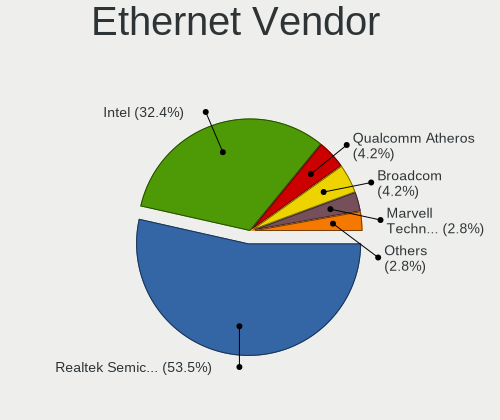

| Vendor                   | Desktops | Percent |
|--------------------------|----------|---------|
| Realtek Semiconductor    | 35       | 51.47%  |
| Intel                    | 23       | 33.82%  |
| Qualcomm Atheros         | 3        | 4.41%   |
| Broadcom                 | 3        | 4.41%   |
| Marvell Technology Group | 2        | 2.94%   |
| JMicron Technology       | 1        | 1.47%   |
| Aquantia                 | 1        | 1.47%   |

Ethernet Model
--------------

Ethernet models

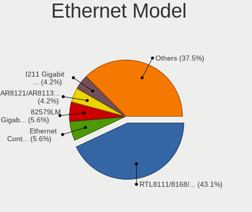

| Model                                                               | Desktops | Percent |
|---------------------------------------------------------------------|----------|---------|
| Realtek RTL8111/8168/8411 PCI Express Gigabit Ethernet Controller   | 28       | 40.58%  |
| Intel Ethernet Controller I225-V                                    | 4        | 5.8%    |
| Intel 82579LM Gigabit Network Connection (Lewisville)               | 4        | 5.8%    |
| Qualcomm Atheros AR8121/AR8113/AR8114 Gigabit or Fast Ethernet      | 3        | 4.35%   |
| Intel I211 Gigabit Network Connection                               | 3        | 4.35%   |
| Realtek RTL8169 PCI Gigabit Ethernet Controller                     | 2        | 2.9%    |
| Realtek RTL8125 2.5GbE Controller                                   | 2        | 2.9%    |
| Realtek RTL-8100/8101L/8139 PCI Fast Ethernet Adapter               | 2        | 2.9%    |
| Marvell Group 88E8056 PCI-E Gigabit Ethernet Controller             | 2        | 2.9%    |
| Intel Ethernet Connection (2) I219-V                                | 2        | 2.9%    |
| Intel 82583V Gigabit Network Connection                             | 2        | 2.9%    |
| Broadcom NetXtreme BCM5764M Gigabit Ethernet PCIe                   | 2        | 2.9%    |
| Realtek RTL8153 Gigabit Ethernet Adapter                            | 1        | 1.45%   |
| Realtek Killer E2600 Gigabit Ethernet Controller                    | 1        | 1.45%   |
| JMicron JMC250 PCI Express Gigabit Ethernet Controller              | 1        | 1.45%   |
| Intel NM10/ICH7 Family LAN Controller                               | 1        | 1.45%   |
| Intel I350 Gigabit Network Connection                               | 1        | 1.45%   |
| Intel Ethernet Connection (2) I219-LM                               | 1        | 1.45%   |
| Intel Ethernet Connection (2) I218-LM                               | 1        | 1.45%   |
| Intel Ethernet Connection (11) I219-V                               | 1        | 1.45%   |
| Intel 82578DM Gigabit Network Connection                            | 1        | 1.45%   |
| Intel 82566DC Gigabit Network Connection                            | 1        | 1.45%   |
| Intel 82541PI Gigabit Ethernet Controller                           | 1        | 1.45%   |
| Broadcom NetXtreme BCM5720 Gigabit Ethernet PCIe                    | 1        | 1.45%   |
| Aquantia AQC113CS NBase-T/IEEE 802.3bz Ethernet Controller [AQtion] | 1        | 1.45%   |

Net Controller Kind
-------------------

Ethernet, WiFi or modem

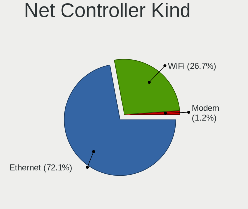

| Kind     | Desktops | Percent |
|----------|----------|---------|
| Ethernet | 59       | 73.75%  |
| WiFi     | 20       | 25%     |
| Modem    | 1        | 1.25%   |

Used Controller
---------------

Currently used network controller

| Kind     | Desktops | Percent |
|----------|----------|---------|
| Ethernet | 57       | 93.44%  |
| WiFi     | 4        | 6.56%   |

NICs
----

Total network controllers on board

| Total | Desktops | Percent |
|-------|----------|---------|
| 1     | 34       | 56.67%  |
| 2     | 21       | 35%     |
| 3     | 3        | 5%      |
| 4     | 1        | 1.67%   |
| 0     | 1        | 1.67%   |

IPv6
----

IPv6 vs IPv4

| Used | Desktops | Percent |
|------|----------|---------|
| No   | 41       | 66.13%  |
| Yes  | 21       | 33.87%  |

Bluetooth
---------

Bluetooth Vendor
----------------

Controller vendors

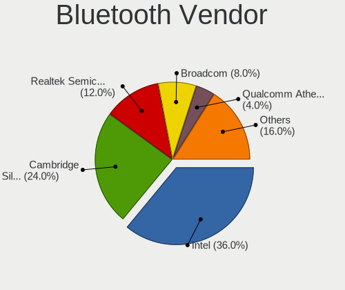

| Vendor                          | Desktops | Percent |
|---------------------------------|----------|---------|
| Intel                           | 8        | 33.33%  |
| Cambridge Silicon Radio         | 6        | 25%     |
| Realtek Semiconductor           | 3        | 12.5%   |
| Broadcom                        | 2        | 8.33%   |
| Qualcomm Atheros Communications | 1        | 4.17%   |
| MediaTek                        | 1        | 4.17%   |
| IMC Networks                    | 1        | 4.17%   |
| Belkin Components               | 1        | 4.17%   |
| ASUSTek Computer                | 1        | 4.17%   |

Bluetooth Model
---------------

Controller models

| Model                                                 | Desktops | Percent |
|-------------------------------------------------------|----------|---------|
| Cambridge Silicon Radio Bluetooth Dongle (HCI mode)   | 6        | 25%     |
| Intel AX200 Bluetooth                                 | 3        | 12.5%   |
| Realtek Bluetooth Radio                               | 2        | 8.33%   |
| Intel AX210 Bluetooth                                 | 2        | 8.33%   |
| Realtek RTL8821A Bluetooth                            | 1        | 4.17%   |
| Qualcomm Atheros  Bluetooth Device                    | 1        | 4.17%   |
| MediaTek Wireless_Device                              | 1        | 4.17%   |
| Intel Wireless-AC 9260 Bluetooth Adapter              | 1        | 4.17%   |
| Intel Wireless-AC 3168 Bluetooth                      | 1        | 4.17%   |
| Intel AX201 Bluetooth                                 | 1        | 4.17%   |
| IMC Networks Wireless_Device                          | 1        | 4.17%   |
| Broadcom Bluetooth Controller                         | 1        | 4.17%   |
| Broadcom BCM20702A0 Bluetooth 4.0                     | 1        | 4.17%   |
| Belkin Components F8T065BF Mini Bluetooth 4.0 Adapter | 1        | 4.17%   |
| ASUS Broadcom BCM20702A0 Bluetooth                    | 1        | 4.17%   |

Sound
-----

Sound Vendor
------------

Sound card vendors

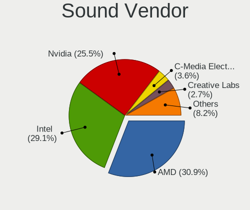

| Vendor                      | Desktops | Percent |
|-----------------------------|----------|---------|
| AMD                         | 33       | 31.13%  |
| Intel                       | 30       | 28.3%   |
| Nvidia                      | 27       | 25.47%  |
| C-Media Electronics         | 4        | 3.77%   |
| Creative Labs               | 3        | 2.83%   |
| Ensoniq                     | 2        | 1.89%   |
| VIA Technologies            | 1        | 0.94%   |
| Texas Instruments           | 1        | 0.94%   |
| Microsoft                   | 1        | 0.94%   |
| JMTek                       | 1        | 0.94%   |
| GN Netcom                   | 1        | 0.94%   |
| FiiO Electronics Technology | 1        | 0.94%   |
| ASUSTek Computer            | 1        | 0.94%   |

Sound Model
-----------

Sound card models

| Model                                                                       | Desktops | Percent |
|-----------------------------------------------------------------------------|----------|---------|
| AMD Family 17h/19h HD Audio Controller                                      | 7        | 5.38%   |
| AMD Family 17h (Models 00h-0fh) HD Audio Controller                         | 7        | 5.38%   |
| AMD SBx00 Azalia (Intel HDA)                                                | 6        | 4.62%   |
| Intel 82801JI (ICH10 Family) HD Audio Controller                            | 5        | 3.85%   |
| AMD Starship/Matisse HD Audio Controller                                    | 5        | 3.85%   |
| AMD Renoir Radeon High Definition Audio Controller                          | 5        | 3.85%   |
| Intel 100 Series/C230 Series Chipset Family HD Audio Controller             | 4        | 3.08%   |
| Nvidia GP107GL High Definition Audio Controller                             | 3        | 2.31%   |
| Nvidia GF119 HDMI Audio Controller                                          | 3        | 2.31%   |
| Nvidia GF108 High Definition Audio Controller                               | 3        | 2.31%   |
| Intel 6 Series/C200 Series Chipset Family High Definition Audio Controller  | 3        | 2.31%   |
| Intel 5 Series/3400 Series Chipset High Definition Audio                    | 3        | 2.31%   |
| AMD Navi 21/23 HDMI/DP Audio Controller                                     | 3        | 2.31%   |
| AMD Ellesmere HDMI Audio [Radeon RX 470/480 / 570/580/590]                  | 3        | 2.31%   |
| AMD Baffin HDMI/DP Audio [Radeon RX 550 640SP / RX 560/560X]                | 3        | 2.31%   |
| Nvidia GK208 HDMI/DP Audio Controller                                       | 2        | 1.54%   |
| Nvidia GK107 HDMI Audio Controller                                          | 2        | 1.54%   |
| Nvidia GA106 High Definition Audio Controller                               | 2        | 1.54%   |
| Intel Xeon E3-1200 v3/4th Gen Core Processor HD Audio Controller            | 2        | 1.54%   |
| Intel NM10/ICH7 Family High Definition Audio Controller                     | 2        | 1.54%   |
| Intel 82801H (ICH8 Family) HD Audio Controller                              | 2        | 1.54%   |
| Ensoniq 5880B / Creative Labs CT5880                                        | 2        | 1.54%   |
| Creative Labs CA0106/CA0111 [SB Live!/Audigy/X-Fi Series]                   | 2        | 1.54%   |
| AMD RS880 HDMI Audio [Radeon HD 4200 Series]                                | 2        | 1.54%   |
| AMD Rembrandt Radeon High Definition Audio Controller                       | 2        | 1.54%   |
| AMD Oland/Hainan/Cape Verde/Pitcairn HDMI Audio [Radeon HD 7000 Series]     | 2        | 1.54%   |
| AMD Cedar HDMI Audio [Radeon HD 5400/6300/7300 Series]                      | 2        | 1.54%   |
| VIA Technologies VT1720/24 [Envy24PT/HT] PCI Multi-Channel Audio Controller | 1        | 0.77%   |
| Texas Instruments PCM2902 Audio Codec                                       | 1        | 0.77%   |
| Nvidia TU107 GeForce GTX 1650 High Definition Audio Controller              | 1        | 0.77%   |
| Nvidia TU106 High Definition Audio Controller                               | 1        | 0.77%   |
| Nvidia High Definition Audio Controller                                     | 1        | 0.77%   |
| Nvidia GT216 HDMI Audio Controller                                          | 1        | 0.77%   |
| Nvidia GP108 High Definition Audio Controller                               | 1        | 0.77%   |
| Nvidia GP106 High Definition Audio Controller                               | 1        | 0.77%   |
| Nvidia GP102 HDMI Audio Controller                                          | 1        | 0.77%   |
| Nvidia GM206 High Definition Audio Controller                               | 1        | 0.77%   |
| Nvidia GM204 High Definition Audio Controller                               | 1        | 0.77%   |
| Nvidia GM107 High Definition Audio Controller [GeForce 940MX]               | 1        | 0.77%   |
| Nvidia GK106 HDMI Audio Controller                                          | 1        | 0.77%   |

Memory
------

Memory Vendor
-------------

Memory module vendors

| Vendor              | Desktops | Percent |
|---------------------|----------|---------|
| Kingston            | 11       | 27.5%   |
| Unknown             | 7        | 17.5%   |
| G.Skill             | 6        | 15%     |
| Corsair             | 5        | 12.5%   |
| SK hynix            | 4        | 10%     |
| Micron Technology   | 2        | 5%      |
| TakeMS              | 1        | 2.5%    |
| Samsung Electronics | 1        | 2.5%    |
| CSX                 | 1        | 2.5%    |
| Avant               | 1        | 2.5%    |
| Unknown             | 1        | 2.5%    |

Memory Model
------------

Memory module models

| Model                                                     | Desktops | Percent |
|-----------------------------------------------------------|----------|---------|
| Kingston RAM KF3200C16D4/32GX 32GB DIMM DDR4 3933MT/s     | 3        | 7.14%   |
| Unknown RAM Module 4096MB DIMM 1600MT/s                   | 2        | 4.76%   |
| Unknown RAM Module 2GB DIMM 1333MT/s                      | 2        | 4.76%   |
| Unknown RAM Module 4GB SODIMM DDR2 800MT/s                | 1        | 2.38%   |
| Unknown RAM Module 4096MB DIMM 1333MT/s                   | 1        | 2.38%   |
| Unknown RAM Module 2GB DIMM DDR2 800MT/s                  | 1        | 2.38%   |
| TakeMS RAM Module 2048MB DIMM DDR2 800MT/s                | 1        | 2.38%   |
| SK hynix RAM Module 32GB DIMM DDR4 2400MT/s               | 1        | 2.38%   |
| SK hynix RAM HMT451U6BFR8C-PB 4GB DIMM DDR3 1600MT/s      | 1        | 2.38%   |
| SK hynix RAM HMT451R7AFR8C-RD 4GB DIMM DDR3 1866MT/s      | 1        | 2.38%   |
| SK hynix RAM HMT41GU6BFR8C-PB 8GB DIMM DDR3 1600MT/s      | 1        | 2.38%   |
| SK hynix RAM HMA82GU6AFR8N-UH 16GB DIMM DDR4 2400MT/s     | 1        | 2.38%   |
| Samsung RAM Module 32GB DIMM DDR4 2400MT/s                | 1        | 2.38%   |
| Micron RAM 9JSF51272PZ-1G9E2 4GB DIMM DDR3 1866MT/s       | 1        | 2.38%   |
| Micron RAM 16ATF2G64AZ-2G1A1 16GB DIMM DDR4 2133MT/s      | 1        | 2.38%   |
| Kingston RAM Module 2048MB DIMM DDR2 800MT/s              | 1        | 2.38%   |
| Kingston RAM KP223C-ELD 2048MB DIMM DDR3 1600MT/s         | 1        | 2.38%   |
| Kingston RAM KHX3200C16D4/16GX 16GB DIMM DDR4 3600MT/s    | 1        | 2.38%   |
| Kingston RAM KHX2666C16/16G 16GB DIMM DDR4 3200MT/s       | 1        | 2.38%   |
| Kingston RAM KHX1866C10D3/8G 8GB DIMM DDR3 2133MT/s       | 1        | 2.38%   |
| Kingston RAM KF3200C16D4/16GX 16GB DIMM DDR4 3200MT/s     | 1        | 2.38%   |
| Kingston RAM 9965684-009.A00G 8GB DIMM DDR4 2133MT/s      | 1        | 2.38%   |
| Kingston RAM 9965669-023.A00G 8GB DIMM DDR4 2133MT/s      | 1        | 2.38%   |
| Kingston RAM 9905471-061.A00LF 8GB DIMM DDR3 1333MT/s     | 1        | 2.38%   |
| G.Skill RAM F4-3600C14-16GTZNA 16384MB DIMM DDR4 2133MT/s | 1        | 2.38%   |
| G.Skill RAM F4-3200C16-16GIS 16GB DIMM DDR4 3600MT/s      | 1        | 2.38%   |
| G.Skill RAM F4-3200C15-16GTZKY 16384MB DIMM DDR4 3200MT/s | 1        | 2.38%   |
| G.Skill RAM F4-2400C15-8GFX 8GB DIMM DDR4 3000MT/s        | 1        | 2.38%   |
| G.Skill RAM F4-2400C15-16GVR 16GB DIMM DDR4 2400MT/s      | 1        | 2.38%   |
| G.Skill RAM F4-2133C15-8GNT 8GB DIMM DDR4 2133MT/s        | 1        | 2.38%   |
| CSX RAM V01D2LF1GB18864867 1GB DIMM DDR 533MT/s           | 1        | 2.38%   |
| Corsair RAM CMW32GX4M4A2666C16 8GB DIMM DDR4 2667MT/s     | 1        | 2.38%   |
| Corsair RAM CML16GX3M2A1600C9 8GB DIMM DDR3 2133MT/s      | 1        | 2.38%   |
| Corsair RAM CMK64GX4M2E3200C16 32GB DIMM DDR4 3200MT/s    | 1        | 2.38%   |
| Corsair RAM CMK32GX5M2B6400C32 16GB DIMM DDR5 4800MT/s    | 1        | 2.38%   |
| Corsair RAM CMK16GX4M1E3200C16 16GB DIMM DDR4 3200MT/s    | 1        | 2.38%   |
| Avant RAM F641GU67F9333G 8192MB DIMM DDR3 1333MT/s        | 1        | 2.38%   |
| Unknown                                                   | 1        | 2.38%   |

Memory Kind
-----------

Memory module kinds

| Kind    | Desktops | Percent |
|---------|----------|---------|
| DDR4    | 18       | 51.43%  |
| DDR3    | 7        | 20%     |
| Unknown | 5        | 14.29%  |
| DDR2    | 3        | 8.57%   |
| DDR5    | 1        | 2.86%   |
| DDR     | 1        | 2.86%   |

Memory Form Factor
------------------

Physical design of the memory module

| Name   | Desktops | Percent |
|--------|----------|---------|
| DIMM   | 34       | 97.14%  |
| SODIMM | 1        | 2.86%   |

Memory Size
-----------

Memory module size

| Size  | Desktops | Percent |
|-------|----------|---------|
| 16384 | 10       | 27.78%  |
| 8192  | 9        | 25%     |
| 4096  | 6        | 16.67%  |
| 32768 | 5        | 13.89%  |
| 2048  | 5        | 13.89%  |
| 1024  | 1        | 2.78%   |

Memory Speed
------------

Memory module speed

| Speed | Desktops | Percent |
|-------|----------|---------|
| 2133  | 6        | 16.67%  |
| 3200  | 5        | 13.89%  |
| 1333  | 5        | 13.89%  |
| 1600  | 4        | 11.11%  |
| 3933  | 3        | 8.33%   |
| 2400  | 3        | 8.33%   |
| 800   | 3        | 8.33%   |
| 3600  | 2        | 5.56%   |
| 4800  | 1        | 2.78%   |
| 3000  | 1        | 2.78%   |
| 2667  | 1        | 2.78%   |
| 1866  | 1        | 2.78%   |
| 533   | 1        | 2.78%   |

Printers & scanners
-------------------

Printer Vendor
--------------

Printer device vendors

| Vendor              | Desktops | Percent |
|---------------------|----------|---------|
| Brother Industries  | 2        | 50%     |
| Samsung Electronics | 1        | 25%     |
| Hewlett-Packard     | 1        | 25%     |

Printer Model
-------------

Printer device models

| Model                                 | Desktops | Percent |
|---------------------------------------|----------|---------|
| Samsung ML-191x/ML-252x Laser Printer | 1        | 25%     |
| HP Color LaserJet CP1215              | 1        | 25%     |
| Brother Printer                       | 1        | 25%     |
| Brother HL-4150CDN series             | 1        | 25%     |

Scanner Vendor
--------------

Scanner device vendors

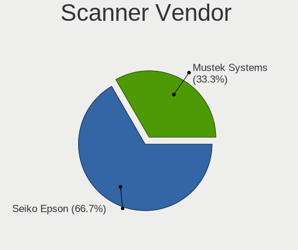

| Vendor         | Desktops | Percent |
|----------------|----------|---------|
| Seiko Epson    | 2        | 66.67%  |
| Mustek Systems | 1        | 33.33%  |

Scanner Model
-------------

Scanner device models

| Model                                                         | Desktops | Percent |
|---------------------------------------------------------------|----------|---------|
| Seiko Epson GT-F730 [GT-S630/Perfection V33/V330 Photo]       | 1        | 33.33%  |
| Seiko Epson GT-8700/GT-8700F [Perfection 1640SU/1640SU PHOTO] | 1        | 33.33%  |
| Mustek Systems ScanExpress A3 USB                             | 1        | 33.33%  |

Camera
------

Camera Vendor
-------------

Camera device vendors

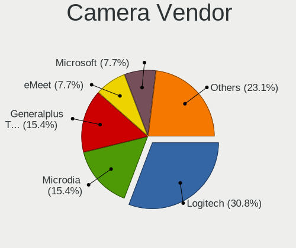

| Vendor                 | Desktops | Percent |
|------------------------|----------|---------|
| Logitech               | 4        | 33.33%  |
| Microdia               | 2        | 16.67%  |
| webcamvendor           | 1        | 8.33%   |
| Microsoft              | 1        | 8.33%   |
| Huawei Technologies    | 1        | 8.33%   |
| Generalplus Technology | 1        | 8.33%   |
| eMeet                  | 1        | 8.33%   |
| ARC International      | 1        | 8.33%   |

Camera Model
------------

Camera device models

| Model                       | Desktops | Percent |
|-----------------------------|----------|---------|
| webcamvendor webcamproduct  | 1        | 8.33%   |
| Microsoft LifeCam VX-700    | 1        | 8.33%   |
| Microdia USB 2.0 Camera     | 1        | 8.33%   |
| Microdia Camera             | 1        | 8.33%   |
| Logitech Webcam C270        | 1        | 8.33%   |
| Logitech Webcam C170        | 1        | 8.33%   |
| Logitech HD Pro Webcam C920 | 1        | 8.33%   |
| Logitech BRIO               | 1        | 8.33%   |
| Huawei HiCamera             | 1        | 8.33%   |
| Generalplus WEB CAM         | 1        | 8.33%   |
| eMeet HD Webcam C950        | 1        | 8.33%   |
| ARC International Camera    | 1        | 8.33%   |

Security
--------

Fingerprint Vendor
------------------

Fingerprint sensor vendors

Zero info for selected period =(

Fingerprint Model
-----------------

Fingerprint sensor models

Zero info for selected period =(

Chipcard Vendor
---------------

Chipcard module vendors

| Vendor                | Desktops | Percent |
|-----------------------|----------|---------|
| Gemalto (was Gemplus) | 1        | 100%    |

Chipcard Model
--------------

Chipcard module models

| Model                                             | Desktops | Percent |
|---------------------------------------------------|----------|---------|
| Gemalto (was Gemplus) GemPC Twin SmartCard Reader | 1        | 100%    |

Unsupported
-----------

Unsupported Devices
-------------------

Total unsupported devices on board

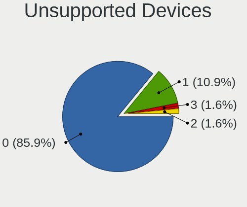

| Total | Desktops | Percent |
|-------|----------|---------|
| 0     | 52       | 85.25%  |
| 1     | 7        | 11.48%  |
| 3     | 1        | 1.64%   |
| 2     | 1        | 1.64%   |

Unsupported Device Types
------------------------

Types of unsupported devices

| Type                     | Desktops | Percent |
|--------------------------|----------|---------|
| Net/wireless             | 3        | 25%     |
| Graphics card            | 3        | 25%     |
| Card reader              | 2        | 16.67%  |
| Unassigned class         | 1        | 8.33%   |
| Multimedia controller    | 1        | 8.33%   |
| Communication controller | 1        | 8.33%   |
| Chipcard                 | 1        | 8.33%   |

