openSUSE Leap-15.4 - Tested Hardware & Statistics (Notebooks)
-------------------------------------------------------------

A project to collect tested hardware configurations for openSUSE Leap-15.4.

Anyone can contribute to this report by the [hw-probe](https://github.com/linuxhw/hw-probe) tool:

    sudo -E hw-probe -all -upload

Please contribute! Especially if your hardware is rare.

Contents
--------

* [ Test Cases ](#test-cases)

* [ System ](#system)
  - [ Kernel                   ](#kernel)
  - [ Kernel Family            ](#kernel-family)
  - [ Kernel Major Ver.        ](#kernel-major-ver)
  - [ Arch                     ](#arch)
  - [ DE                       ](#de)
  - [ Display Server           ](#display-server)
  - [ Display Manager          ](#display-manager)
  - [ OS Lang                  ](#os-lang)
  - [ Boot Mode                ](#boot-mode)
  - [ Filesystem               ](#filesystem)
  - [ Part. scheme             ](#part-scheme)
  - [ Dual Boot with Linux/BSD ](#dual-boot-with-linuxbsd)
  - [ Dual Boot (Win)          ](#dual-boot-win)

* [ Board ](#board)
  - [ Vendor                   ](#vendor)
  - [ Model                    ](#model)
  - [ Model Family             ](#model-family)
  - [ MFG Year                 ](#mfg-year)
  - [ Form Factor              ](#form-factor)
  - [ Secure Boot              ](#secure-boot)
  - [ Coreboot                 ](#coreboot)
  - [ RAM Size                 ](#ram-size)
  - [ RAM Used                 ](#ram-used)
  - [ Total Drives             ](#total-drives)
  - [ Has CD-ROM               ](#has-cd-rom)
  - [ Has Ethernet             ](#has-ethernet)
  - [ Has WiFi                 ](#has-wifi)
  - [ Has Bluetooth            ](#has-bluetooth)

* [ Location ](#location)
  - [ Country                  ](#country)
  - [ City                     ](#city)

* [ Drives ](#drives)
  - [ Drive Vendor             ](#drive-vendor)
  - [ Drive Model              ](#drive-model)
  - [ HDD Vendor               ](#hdd-vendor)
  - [ SSD Vendor               ](#ssd-vendor)
  - [ Drive Kind               ](#drive-kind)
  - [ Drive Connector          ](#drive-connector)
  - [ Drive Size               ](#drive-size)
  - [ Space Total              ](#space-total)
  - [ Space Used               ](#space-used)
  - [ Malfunc. Drives          ](#malfunc-drives)
  - [ Malfunc. Drive Vendor    ](#malfunc-drive-vendor)
  - [ Malfunc. HDD Vendor      ](#malfunc-hdd-vendor)
  - [ Malfunc. Drive Kind      ](#malfunc-drive-kind)
  - [ Failed Drives            ](#failed-drives)
  - [ Failed Drive Vendor      ](#failed-drive-vendor)
  - [ Drive Status             ](#drive-status)

* [ Storage controller ](#storage-controller)
  - [ Storage Vendor           ](#storage-vendor)
  - [ Storage Model            ](#storage-model)
  - [ Storage Kind             ](#storage-kind)

* [ Processor ](#processor)
  - [ CPU Vendor               ](#cpu-vendor)
  - [ CPU Model                ](#cpu-model)
  - [ CPU Model Family         ](#cpu-model-family)
  - [ CPU Cores                ](#cpu-cores)
  - [ CPU Sockets              ](#cpu-sockets)
  - [ CPU Threads              ](#cpu-threads)
  - [ CPU Op-Modes             ](#cpu-op-modes)
  - [ CPU Microcode            ](#cpu-microcode)
  - [ CPU Microarch            ](#cpu-microarch)

* [ Graphics ](#graphics)
  - [ GPU Vendor               ](#gpu-vendor)
  - [ GPU Model                ](#gpu-model)
  - [ GPU Combo                ](#gpu-combo)
  - [ GPU Driver               ](#gpu-driver)
  - [ GPU Memory               ](#gpu-memory)

* [ Monitor ](#monitor)
  - [ Monitor Vendor           ](#monitor-vendor)
  - [ Monitor Model            ](#monitor-model)
  - [ Monitor Resolution       ](#monitor-resolution)
  - [ Monitor Diagonal         ](#monitor-diagonal)
  - [ Monitor Width            ](#monitor-width)
  - [ Aspect Ratio             ](#aspect-ratio)
  - [ Monitor Area             ](#monitor-area)
  - [ Pixel Density            ](#pixel-density)
  - [ Multiple Monitors        ](#multiple-monitors)

* [ Network ](#network)
  - [ Net Controller Vendor    ](#net-controller-vendor)
  - [ Net Controller Model     ](#net-controller-model)
  - [ Wireless Vendor          ](#wireless-vendor)
  - [ Wireless Model           ](#wireless-model)
  - [ Ethernet Vendor          ](#ethernet-vendor)
  - [ Ethernet Model           ](#ethernet-model)
  - [ Net Controller Kind      ](#net-controller-kind)
  - [ Used Controller          ](#used-controller)
  - [ NICs                     ](#nics)
  - [ IPv6                     ](#ipv6)

* [ Bluetooth ](#bluetooth)
  - [ Bluetooth Vendor         ](#bluetooth-vendor)
  - [ Bluetooth Model          ](#bluetooth-model)

* [ Sound ](#sound)
  - [ Sound Vendor             ](#sound-vendor)
  - [ Sound Model              ](#sound-model)

* [ Memory ](#memory)
  - [ Memory Vendor            ](#memory-vendor)
  - [ Memory Model             ](#memory-model)
  - [ Memory Kind              ](#memory-kind)
  - [ Memory Form Factor       ](#memory-form-factor)
  - [ Memory Size              ](#memory-size)
  - [ Memory Speed             ](#memory-speed)

* [ Printers & scanners ](#printers--scanners)
  - [ Printer Vendor           ](#printer-vendor)
  - [ Printer Model            ](#printer-model)
  - [ Scanner Vendor           ](#scanner-vendor)
  - [ Scanner Model            ](#scanner-model)

* [ Camera ](#camera)
  - [ Camera Vendor            ](#camera-vendor)
  - [ Camera Model             ](#camera-model)

* [ Security ](#security)
  - [ Fingerprint Vendor       ](#fingerprint-vendor)
  - [ Fingerprint Model        ](#fingerprint-model)
  - [ Chipcard Vendor          ](#chipcard-vendor)
  - [ Chipcard Model           ](#chipcard-model)

* [ Unsupported ](#unsupported)
  - [ Unsupported Devices      ](#unsupported-devices)
  - [ Unsupported Device Types ](#unsupported-device-types)

Test Cases
----------

Total: 89

| Vendor        | Model                       | Probe                                                      | Date         |
|---------------|-----------------------------|------------------------------------------------------------|--------------|
| ASUSTek       | N750JV                      | [3ec3c7aa7b](https://linux-hardware.org/?probe=3ec3c7aa7b) | Apr 26, 2023 |
| ASUSTek       | N750JV                      | [53c0f79af9](https://linux-hardware.org/?probe=53c0f79af9) | Apr 26, 2023 |
| Gateway       | NV55C                       | [e77192c3b1](https://linux-hardware.org/?probe=e77192c3b1) | Apr 20, 2023 |
| Lenovo        | ThinkPad T16 Gen 1 21BVC... | [69b2b1c95f](https://linux-hardware.org/?probe=69b2b1c95f) | Apr 19, 2023 |
| HP            | Mini 210-1000               | [e8b0b26e10](https://linux-hardware.org/?probe=e8b0b26e10) | Apr 15, 2023 |
| Lenovo        | ThinkPad Edge E431 62779... | [19fd2b6d0d](https://linux-hardware.org/?probe=19fd2b6d0d) | Apr 09, 2023 |
| Lenovo        | ThinkPad Edge E431 62779... | [bc402eee2e](https://linux-hardware.org/?probe=bc402eee2e) | Apr 09, 2023 |
| HP            | EliteBook 865 16 inch G9... | [6906a8d309](https://linux-hardware.org/?probe=6906a8d309) | Apr 03, 2023 |
| ASUSTek       | N550JX                      | [a505a62a71](https://linux-hardware.org/?probe=a505a62a71) | Mar 28, 2023 |
| Fujitsu       | LIFEBOOK U938               | [e972904a83](https://linux-hardware.org/?probe=e972904a83) | Mar 28, 2023 |
| HP            | Compaq 6730s                | [8d4cea5a81](https://linux-hardware.org/?probe=8d4cea5a81) | Mar 28, 2023 |
| MSI           | Delta 15 A5EFK              | [6f4e3ec28b](https://linux-hardware.org/?probe=6f4e3ec28b) | Mar 28, 2023 |
| MSI           | Delta 15 A5EFK              | [9dd1b67b2f](https://linux-hardware.org/?probe=9dd1b67b2f) | Mar 28, 2023 |
| Packard Be... | EasyNote TE11HC             | [6c942c5a39](https://linux-hardware.org/?probe=6c942c5a39) | Mar 26, 2023 |
| Lenovo        | ThinkPad Edge E530 3259H... | [74348d01f3](https://linux-hardware.org/?probe=74348d01f3) | Mar 13, 2023 |
| Lenovo        | ThinkPad T520 42435GG       | [fac1ee2528](https://linux-hardware.org/?probe=fac1ee2528) | Mar 12, 2023 |
| Jumper        | EZbook                      | [ed607c4113](https://linux-hardware.org/?probe=ed607c4113) | Mar 11, 2023 |
| Samsung       | 550XDA                      | [0c3e0dd389](https://linux-hardware.org/?probe=0c3e0dd389) | Feb 13, 2023 |
| TUXEDO        | InfinityBook S 15/17 Gen... | [9b92561723](https://linux-hardware.org/?probe=9b92561723) | Feb 06, 2023 |
| ASUSTek       | ROG Strix G713QE_G713QE     | [f05a20fe00](https://linux-hardware.org/?probe=f05a20fe00) | Feb 01, 2023 |
| Lenovo        | ThinkPad Edge E431 62779... | [8d7c1dbf4d](https://linux-hardware.org/?probe=8d7c1dbf4d) | Jan 30, 2023 |
| Toshiba       | Satellite L500              | [327e2d4e3e](https://linux-hardware.org/?probe=327e2d4e3e) | Jan 28, 2023 |
| Lenovo        | IdeaPad 330-15IKB 81FD      | [31698019a3](https://linux-hardware.org/?probe=31698019a3) | Jan 20, 2023 |
| Lenovo        | ThinkPad X1 Carbon 7th 2... | [004b2669ef](https://linux-hardware.org/?probe=004b2669ef) | Jan 18, 2023 |
| HP            | ProBook 4540s               | [3f9e3a1cbb](https://linux-hardware.org/?probe=3f9e3a1cbb) | Jan 17, 2023 |
| HP            | ProBook 4540s               | [7b9cd1b51c](https://linux-hardware.org/?probe=7b9cd1b51c) | Jan 16, 2023 |
| HP            | EliteBook 840 G8 Noteboo... | [9b874af8a4](https://linux-hardware.org/?probe=9b874af8a4) | Jan 16, 2023 |
| Lenovo        | IdeaPad L340-15IRH Gamin... | [a5ea710efd](https://linux-hardware.org/?probe=a5ea710efd) | Jan 11, 2023 |
| Lenovo        | ThinkPad P16s Gen 1 21BT... | [b68fa80860](https://linux-hardware.org/?probe=b68fa80860) | Dec 31, 2022 |
| HP            | Victus by Laptop 16-e0xx... | [60989ad0c4](https://linux-hardware.org/?probe=60989ad0c4) | Dec 31, 2022 |
| Dell          | Inspiron 15 7510            | [d5702b0c66](https://linux-hardware.org/?probe=d5702b0c66) | Dec 24, 2022 |
| Dell          | Vostro 3501                 | [8a3788aa78](https://linux-hardware.org/?probe=8a3788aa78) | Dec 23, 2022 |
| Dell          | Vostro 3501                 | [258dc5c40d](https://linux-hardware.org/?probe=258dc5c40d) | Dec 23, 2022 |
| Schenker      | VIA 15 Pro                  | [b1a40c91d2](https://linux-hardware.org/?probe=b1a40c91d2) | Dec 22, 2022 |
| Schenker      | VIA 15 Pro                  | [75efe6fb52](https://linux-hardware.org/?probe=75efe6fb52) | Dec 22, 2022 |
| Acer          | Aspire E1-572G              | [adc5196d64](https://linux-hardware.org/?probe=adc5196d64) | Dec 17, 2022 |
| ASUSTek       | Z450LA                      | [ffd2220d21](https://linux-hardware.org/?probe=ffd2220d21) | Nov 25, 2022 |
| Dell          | Latitude E5570              | [ed2e9cfb4f](https://linux-hardware.org/?probe=ed2e9cfb4f) | Nov 24, 2022 |
| Lenovo        | ThinkPad T530 2394D56       | [3d44b768e5](https://linux-hardware.org/?probe=3d44b768e5) | Nov 12, 2022 |
| HP            | ZBook 17                    | [e866fa1319](https://linux-hardware.org/?probe=e866fa1319) | Nov 09, 2022 |
| HP            | ZBook 17                    | [af26e94623](https://linux-hardware.org/?probe=af26e94623) | Nov 08, 2022 |
| Lenovo        | ThinkPad X1 Carbon Gen 1... | [dcd40f9f78](https://linux-hardware.org/?probe=dcd40f9f78) | Oct 28, 2022 |
| Dell          | Latitude 9420               | [a601281b46](https://linux-hardware.org/?probe=a601281b46) | Oct 27, 2022 |
| HP            | ZBook 17                    | [6dc9848327](https://linux-hardware.org/?probe=6dc9848327) | Oct 20, 2022 |
| Toshiba       | Satellite P55t-A            | [60d52e85a0](https://linux-hardware.org/?probe=60d52e85a0) | Oct 12, 2022 |
| ASUSTek       | F3Sv                        | [042104bbc2](https://linux-hardware.org/?probe=042104bbc2) | Oct 08, 2022 |
| Lenovo        | ThinkPad T470 20HES0FW00    | [33a0cb05e8](https://linux-hardware.org/?probe=33a0cb05e8) | Oct 04, 2022 |
| Dell          | Vostro 3560                 | [79f922d367](https://linux-hardware.org/?probe=79f922d367) | Oct 02, 2022 |
| Dell          | Vostro 3560                 | [59c14fb5c0](https://linux-hardware.org/?probe=59c14fb5c0) | Oct 02, 2022 |
| Dell          | Latitude E5250              | [6116460e52](https://linux-hardware.org/?probe=6116460e52) | Sep 27, 2022 |
| HP            | ZBook 17 G2                 | [d6d9af3173](https://linux-hardware.org/?probe=d6d9af3173) | Sep 26, 2022 |
| HP            | ZBook 17 G2                 | [ff70118578](https://linux-hardware.org/?probe=ff70118578) | Sep 26, 2022 |
| Dell          | Inspiron 5515               | [a7f0e24464](https://linux-hardware.org/?probe=a7f0e24464) | Sep 20, 2022 |
| Dell          | Inspiron 3542               | [7f7ef47d4b](https://linux-hardware.org/?probe=7f7ef47d4b) | Sep 20, 2022 |
| ASUSTek       | X55CR                       | [43b77d436c](https://linux-hardware.org/?probe=43b77d436c) | Sep 14, 2022 |
| ASUSTek       | VivoBook_ASUSLaptop X421... | [dea9852124](https://linux-hardware.org/?probe=dea9852124) | Sep 02, 2022 |
| HP            | ZBook 17                    | [98e643f5af](https://linux-hardware.org/?probe=98e643f5af) | Aug 30, 2022 |
| Google        | Eldrid                      | [6a0c6eb1de](https://linux-hardware.org/?probe=6a0c6eb1de) | Aug 27, 2022 |
| Notebook      | NLx0MU                      | [0e2658915d](https://linux-hardware.org/?probe=0e2658915d) | Aug 17, 2022 |
| HP            | Pavilion Notebook           | [a05b95b836](https://linux-hardware.org/?probe=a05b95b836) | Aug 15, 2022 |
| HP            | Pavilion Notebook           | [aea2bfde6a](https://linux-hardware.org/?probe=aea2bfde6a) | Aug 15, 2022 |
| Acer          | Aspire 4732Z                | [73027b2cca](https://linux-hardware.org/?probe=73027b2cca) | Aug 07, 2022 |
| Unknown       | Unknown                     | [4d9a472691](https://linux-hardware.org/?probe=4d9a472691) | Jul 27, 2022 |
| Unknown       | Unknown                     | [ded9f7587a](https://linux-hardware.org/?probe=ded9f7587a) | Jul 27, 2022 |
| Unknown       | Unknown                     | [0c4182ee0a](https://linux-hardware.org/?probe=0c4182ee0a) | Jul 23, 2022 |
| Unknown       | Unknown                     | [7a29580deb](https://linux-hardware.org/?probe=7a29580deb) | Jul 23, 2022 |
| Notebook      | NLx0MU                      | [7cb795f428](https://linux-hardware.org/?probe=7cb795f428) | Jul 22, 2022 |
| Toshiba       | Satellite L500              | [5ac3a7aa95](https://linux-hardware.org/?probe=5ac3a7aa95) | Jul 17, 2022 |
| Dell          | Inspiron 5584               | [b6d23c8307](https://linux-hardware.org/?probe=b6d23c8307) | Jul 16, 2022 |
| Multilaser    | PC150                       | [b6fcf6d507](https://linux-hardware.org/?probe=b6fcf6d507) | Jul 04, 2022 |
| HP            | ProBook 455 G8 Notebook ... | [bec2a7697f](https://linux-hardware.org/?probe=bec2a7697f) | Jun 30, 2022 |
| Acer          | Swift SFX14-41G             | [c3c9ce7e40](https://linux-hardware.org/?probe=c3c9ce7e40) | Jun 23, 2022 |
| ASUSTek       | ROG Strix G713QE_G713QE     | [ff63b72fd2](https://linux-hardware.org/?probe=ff63b72fd2) | Jun 19, 2022 |
| ASUSTek       | ROG Strix G713QE_G713QE     | [3ec9bac70f](https://linux-hardware.org/?probe=3ec9bac70f) | Jun 17, 2022 |
| Lenovo        | IdeaPad Gaming 3 15IMH05... | [cc0719c813](https://linux-hardware.org/?probe=cc0719c813) | Jun 16, 2022 |
| HP            | ProBook 455 G8 Notebook ... | [52276b3971](https://linux-hardware.org/?probe=52276b3971) | Jun 16, 2022 |
| HP            | Laptop 15s-eq0xxx           | [74770880f9](https://linux-hardware.org/?probe=74770880f9) | Jun 15, 2022 |
| HP            | Mini 210-1000               | [8746b5b684](https://linux-hardware.org/?probe=8746b5b684) | Jun 10, 2022 |
| Toshiba       | Satellite L500              | [b4b4831c86](https://linux-hardware.org/?probe=b4b4831c86) | Jun 05, 2022 |
| Lenovo        | ThinkPad T410 25223FG       | [aae8744a5c](https://linux-hardware.org/?probe=aae8744a5c) | May 31, 2022 |
| Lenovo        | ThinkPad T410 25223FG       | [0f70996b58](https://linux-hardware.org/?probe=0f70996b58) | May 15, 2022 |
| Lenovo        | ThinkPad T495s 20QJ0012U... | [2add3d77c6](https://linux-hardware.org/?probe=2add3d77c6) | May 09, 2022 |
| Samsung       | 550XDA                      | [a616d83a41](https://linux-hardware.org/?probe=a616d83a41) | May 07, 2022 |
| Lenovo        | ThinkPad P50 20EQS0VV0C     | [4ce87e4da1](https://linux-hardware.org/?probe=4ce87e4da1) | May 04, 2022 |
| Lenovo        | ThinkPad T410 25223FG       | [584ec1055a](https://linux-hardware.org/?probe=584ec1055a) | May 03, 2022 |
| Lenovo        | ThinkPad T410 25223FG       | [2e4fdc00b2](https://linux-hardware.org/?probe=2e4fdc00b2) | May 03, 2022 |
| LG Electro... | C400-G.BC22P1               | [652cd5fc07](https://linux-hardware.org/?probe=652cd5fc07) | Apr 06, 2022 |
| LG Electro... | C400-G.BC22P1               | [fb656318f6](https://linux-hardware.org/?probe=fb656318f6) | Feb 27, 2022 |
| ASUSTek       | ROG Strix G713QE_G713QE     | [af586bb69e](https://linux-hardware.org/?probe=af586bb69e) | Feb 05, 2022 |

System
------

Kernel
------

Version of the Linux kernel

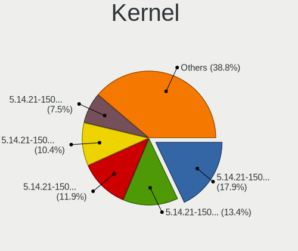

| Version                      | Notebooks | Percent |
|------------------------------|-----------|---------|
| 5.14.21-150400.22-default    | 12        | 17.91%  |
| 5.14.21-150400.24.21-default | 9         | 13.43%  |
| 5.14.21-150400.24.38-default | 8         | 11.94%  |
| 5.14.21-150400.24.46-default | 7         | 10.45%  |
| 5.14.21-150400.24.41-default | 5         | 7.46%   |
| 5.14.21-150400.24.33-default | 4         | 5.97%   |
| 5.14.21-150400.24.18-default | 4         | 5.97%   |
| 5.14.21-150400.19-default    | 4         | 5.97%   |
| 5.14.21-150400.24.60-default | 3         | 4.48%   |
| 5.14.21-150400.24.55-default | 3         | 4.48%   |
| 5.14.21-150400.24.11-default | 3         | 4.48%   |
| 5.14.21-150400.24.28-default | 2         | 2.99%   |
| 5.14.21-150400.9-default     | 1         | 1.49%   |
| 5.14.21-150400.3-default     | 1         | 1.49%   |
| 5.14.21-150400.15-default    | 1         | 1.49%   |

Kernel Family
-------------

Linux kernel without a distro release

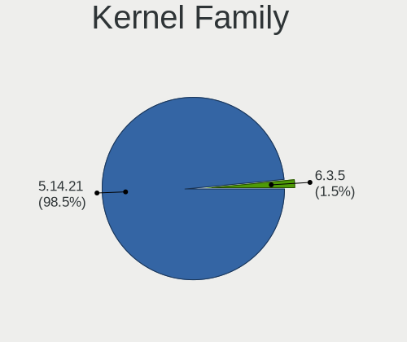

| Version | Notebooks | Percent |
|---------|-----------|---------|
| 5.14.21 | 58        | 100%    |

Kernel Major Ver.
-----------------

Linux kernel major version

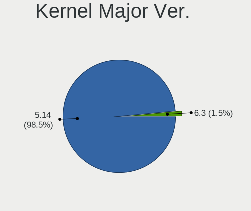

| Version | Notebooks | Percent |
|---------|-----------|---------|
| 5.14    | 58        | 100%    |

Arch
----

OS architecture (x86_64, i586, etc.)

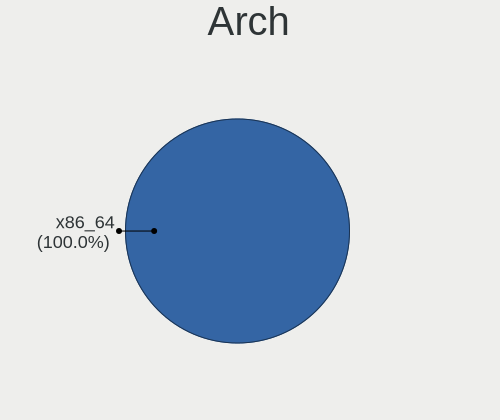

| Name   | Notebooks | Percent |
|--------|-----------|---------|
| x86_64 | 58        | 100%    |

DE
--

Desktop Environment

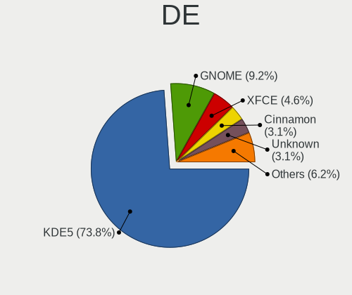

| Name       | Notebooks | Percent |
|------------|-----------|---------|
| KDE5       | 42        | 72.41%  |
| GNOME      | 6         | 10.34%  |
| XFCE       | 3         | 5.17%   |
| Cinnamon   | 2         | 3.45%   |
| Unknown    | 2         | 3.45%   |
| X-Cinnamon | 1         | 1.72%   |
| LXDE       | 1         | 1.72%   |
| ICEWM      | 1         | 1.72%   |

Display Server
--------------

X11 or Wayland

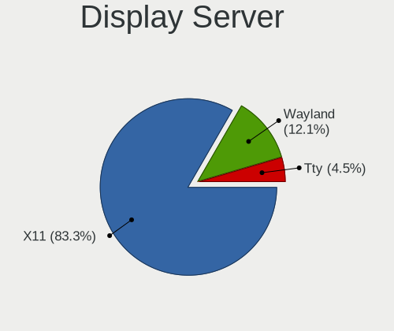

| Name    | Notebooks | Percent |
|---------|-----------|---------|
| X11     | 49        | 83.05%  |
| Wayland | 7         | 11.86%  |
| Tty     | 3         | 5.08%   |

Display Manager
---------------

SDDM, LightDM, etc.

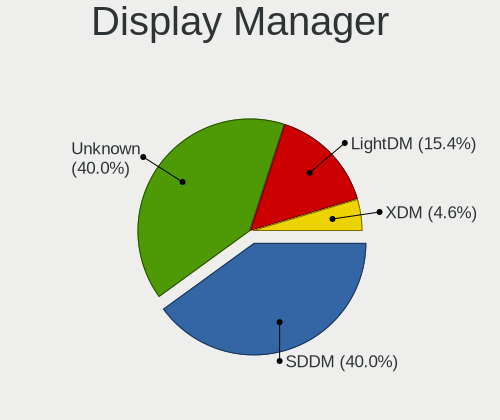

| Name    | Notebooks | Percent |
|---------|-----------|---------|
| Unknown | 24        | 41.38%  |
| SDDM    | 21        | 36.21%  |
| LightDM | 10        | 17.24%  |
| XDM     | 3         | 5.17%   |

OS Lang
-------

Language

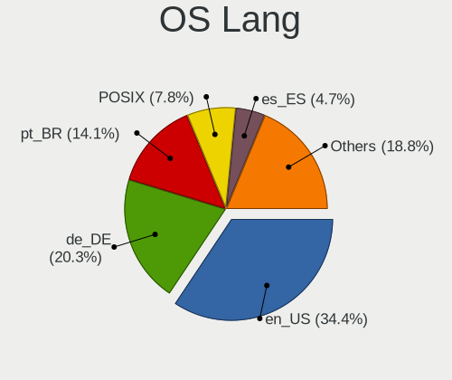

| Lang  | Notebooks | Percent |
|-------|-----------|---------|
| en_US | 20        | 34.48%  |
| de_DE | 12        | 20.69%  |
| pt_BR | 9         | 15.52%  |
| POSIX | 4         | 6.9%    |
| es_ES | 3         | 5.17%   |
| ru_RU | 2         | 3.45%   |
| nn_NO | 2         | 3.45%   |
| en_GB | 2         | 3.45%   |
| nl_NL | 1         | 1.72%   |
| it_IT | 1         | 1.72%   |
| hu_HU | 1         | 1.72%   |
| fr_FR | 1         | 1.72%   |

Boot Mode
---------

EFI or BIOS

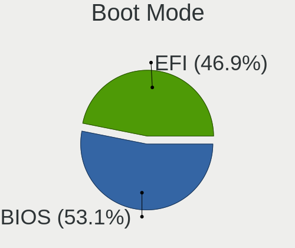

| Mode | Notebooks | Percent |
|------|-----------|---------|
| BIOS | 31        | 53.45%  |
| EFI  | 27        | 46.55%  |

Filesystem
----------

Type of filesystem

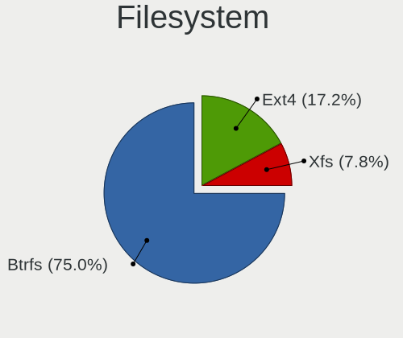

| Type  | Notebooks | Percent |
|-------|-----------|---------|
| Btrfs | 43        | 74.14%  |
| Ext4  | 10        | 17.24%  |
| Xfs   | 5         | 8.62%   |

Part. scheme
------------

Scheme of partitioning

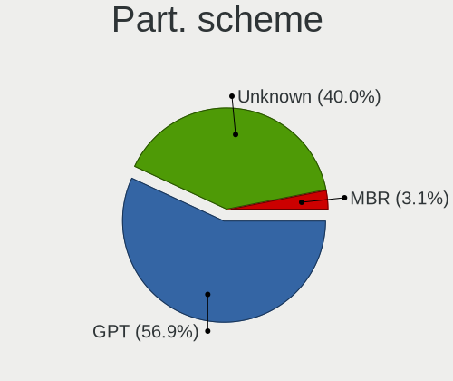

| Type    | Notebooks | Percent |
|---------|-----------|---------|
| GPT     | 32        | 55.17%  |
| Unknown | 24        | 41.38%  |
| MBR     | 2         | 3.45%   |

Dual Boot with Linux/BSD
------------------------

Hosting more than one Linux/BSD

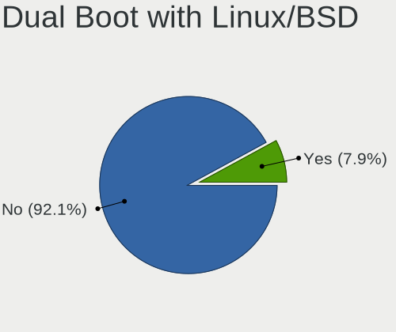

| Dual boot | Notebooks | Percent |
|-----------|-----------|---------|
| No        | 55        | 94.83%  |
| Yes       | 3         | 5.17%   |

Dual Boot (Win)
---------------

Hosting Linux and Windows

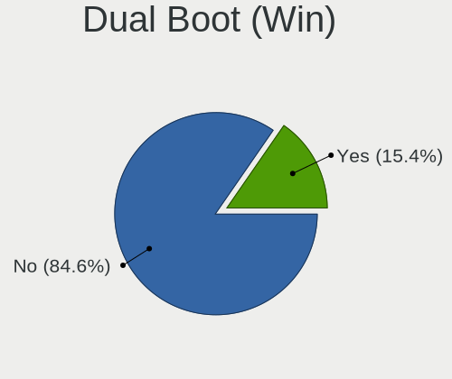

| Dual boot | Notebooks | Percent |
|-----------|-----------|---------|
| No        | 50        | 86.21%  |
| Yes       | 8         | 13.79%  |

Board
-----

Vendor
------

Motherboard manufacturer

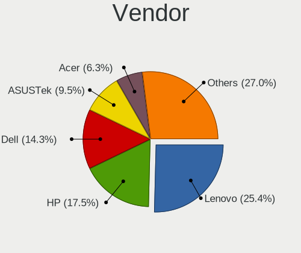

| Name                | Notebooks | Percent |
|---------------------|-----------|---------|
| Lenovo              | 14        | 24.14%  |
| Hewlett-Packard     | 11        | 18.97%  |
| Dell                | 9         | 15.52%  |
| ASUSTek Computer    | 6         | 10.34%  |
| Acer                | 3         | 5.17%   |
| Toshiba             | 2         | 3.45%   |
| Samsung Electronics | 2         | 3.45%   |
| Unknown             | 2         | 3.45%   |
| TUXEDO              | 1         | 1.72%   |
| Schenker            | 1         | 1.72%   |
| Notebook            | 1         | 1.72%   |
| Multilaser          | 1         | 1.72%   |
| MSI                 | 1         | 1.72%   |
| LG Electronics      | 1         | 1.72%   |
| Jumper              | 1         | 1.72%   |
| Gateway             | 1         | 1.72%   |
| Fujitsu             | 1         | 1.72%   |

Model
-----

Motherboard model

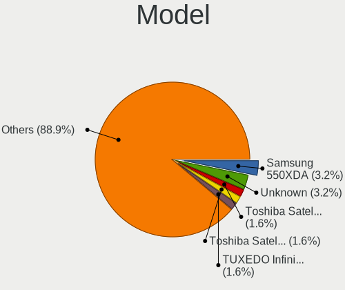

| Name                                     | Notebooks | Percent |
|------------------------------------------|-----------|---------|
| Samsung 550XDA                           | 2         | 3.45%   |
| Unknown                                  | 2         | 3.45%   |
| TUXEDO InfinityBook S 15/17 Gen7         | 1         | 1.72%   |
| Toshiba Satellite P55t-A                 | 1         | 1.72%   |
| Toshiba Satellite L500                   | 1         | 1.72%   |
| Schenker VIA 15 Pro                      | 1         | 1.72%   |
| Notebook NLx0MU                          | 1         | 1.72%   |
| Multilaser PC150                         | 1         | 1.72%   |
| MSI Delta 15 A5EFK                       | 1         | 1.72%   |
| LG C400-G.BC22P1                         | 1         | 1.72%   |
| Lenovo ThinkPad X1 Carbon 7th 20QDS3B600 | 1         | 1.72%   |
| Lenovo ThinkPad T530 2394D56             | 1         | 1.72%   |
| Lenovo ThinkPad T520 42435GG             | 1         | 1.72%   |
| Lenovo ThinkPad T495s 20QJ0012UK         | 1         | 1.72%   |
| Lenovo ThinkPad T470 20HES0FW00          | 1         | 1.72%   |
| Lenovo ThinkPad T410 25223FG             | 1         | 1.72%   |
| Lenovo ThinkPad T16 Gen 1 21BVCTO1WW     | 1         | 1.72%   |
| Lenovo ThinkPad P50 20EQS0VV0C           | 1         | 1.72%   |
| Lenovo ThinkPad P16s Gen 1 21BT000MUK    | 1         | 1.72%   |
| Lenovo ThinkPad Edge E530 3259HHG        | 1         | 1.72%   |
| Lenovo ThinkPad Edge E431 62779XP        | 1         | 1.72%   |
| Lenovo IdeaPad L340-15IRH Gaming 81LK    | 1         | 1.72%   |
| Lenovo IdeaPad Gaming 3 15IMH05 82CG     | 1         | 1.72%   |
| Lenovo IdeaPad 330-15IKB 81FD            | 1         | 1.72%   |
| Jumper EZbook                            | 1         | 1.72%   |
| HP ZBook 17 G2                           | 1         | 1.72%   |
| HP ZBook 17                              | 1         | 1.72%   |
| HP Victus by Laptop 16-e0xxx             | 1         | 1.72%   |
| HP ProBook 455 G8 Notebook PC            | 1         | 1.72%   |
| HP ProBook 4540s                         | 1         | 1.72%   |
| HP Pavilion Notebook                     | 1         | 1.72%   |
| HP Mini 210-1000                         | 1         | 1.72%   |
| HP Laptop 15s-eq0xxx                     | 1         | 1.72%   |
| HP EliteBook 865 16 inch G9 Notebook PC  | 1         | 1.72%   |
| HP EliteBook 840 G8 Notebook PC          | 1         | 1.72%   |
| HP Compaq 6730s                          | 1         | 1.72%   |
| Gateway NV55C                            | 1         | 1.72%   |
| Fujitsu LIFEBOOK U938                    | 1         | 1.72%   |
| Dell Vostro 3560                         | 1         | 1.72%   |
| Dell Vostro 3501                         | 1         | 1.72%   |

Model Family
------------

Motherboard model prefix

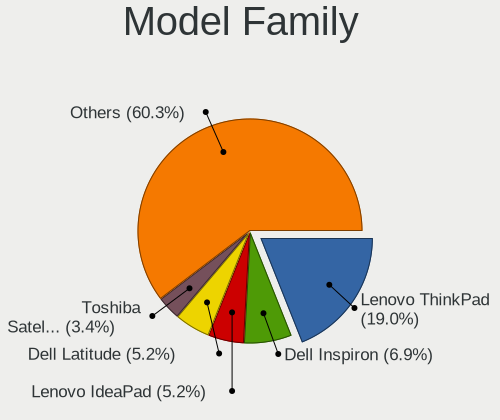

| Name                | Notebooks | Percent |
|---------------------|-----------|---------|
| Lenovo ThinkPad     | 11        | 18.97%  |
| Dell Inspiron       | 4         | 6.9%    |
| Lenovo IdeaPad      | 3         | 5.17%   |
| Dell Latitude       | 3         | 5.17%   |
| Toshiba Satellite   | 2         | 3.45%   |
| Samsung 550XDA      | 2         | 3.45%   |
| HP ZBook            | 2         | 3.45%   |
| HP ProBook          | 2         | 3.45%   |
| HP EliteBook        | 2         | 3.45%   |
| Dell Vostro         | 2         | 3.45%   |
| Acer Aspire         | 2         | 3.45%   |
| Unknown             | 2         | 3.45%   |
| TUXEDO InfinityBook | 1         | 1.72%   |
| Schenker VIA        | 1         | 1.72%   |
| Notebook NLx0MU     | 1         | 1.72%   |
| Multilaser PC150    | 1         | 1.72%   |
| MSI Delta           | 1         | 1.72%   |
| LG C400-G.BC22P1    | 1         | 1.72%   |
| Jumper EZbook       | 1         | 1.72%   |
| HP Victus           | 1         | 1.72%   |
| HP Pavilion         | 1         | 1.72%   |
| HP Mini             | 1         | 1.72%   |
| HP Laptop           | 1         | 1.72%   |
| HP Compaq           | 1         | 1.72%   |
| Gateway NV55C       | 1         | 1.72%   |
| Fujitsu LIFEBOOK    | 1         | 1.72%   |
| ASUS Z450LA         | 1         | 1.72%   |
| ASUS X55CR          | 1         | 1.72%   |
| ASUS ROG            | 1         | 1.72%   |
| ASUS N750JV         | 1         | 1.72%   |
| ASUS N550JX         | 1         | 1.72%   |
| ASUS F3Sv           | 1         | 1.72%   |
| Acer Swift          | 1         | 1.72%   |

MFG Year
--------

Motherboard manufacture year

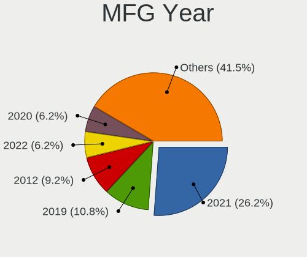

| Year | Notebooks | Percent |
|------|-----------|---------|
| 2021 | 15        | 25.86%  |
| 2019 | 7         | 12.07%  |
| 2012 | 5         | 8.62%   |
| 2022 | 4         | 6.9%    |
| 2014 | 4         | 6.9%    |
| 2013 | 4         | 6.9%    |
| 2009 | 4         | 6.9%    |
| 2020 | 3         | 5.17%   |
| 2015 | 3         | 5.17%   |
| 2018 | 2         | 3.45%   |
| 2011 | 2         | 3.45%   |
| 2017 | 1         | 1.72%   |
| 2016 | 1         | 1.72%   |
| 2010 | 1         | 1.72%   |
| 2008 | 1         | 1.72%   |
| 2007 | 1         | 1.72%   |

Form Factor
-----------

Physical design of the computer

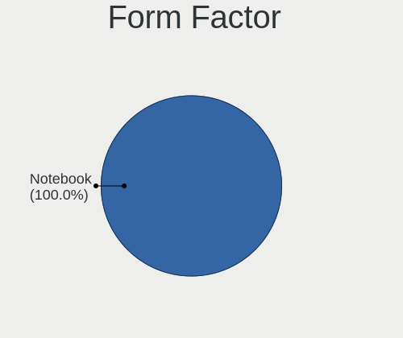

| Name     | Notebooks | Percent |
|----------|-----------|---------|
| Notebook | 58        | 100%    |

Secure Boot
-----------

Enabled or disabled

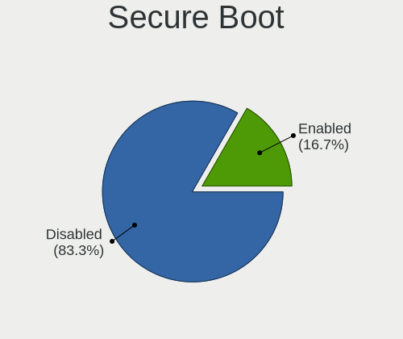

| State    | Notebooks | Percent |
|----------|-----------|---------|
| Disabled | 49        | 84.48%  |
| Enabled  | 9         | 15.52%  |

Coreboot
--------

Have coreboot on board

| Used | Notebooks | Percent |
|------|-----------|---------|
| No   | 58        | 100%    |

RAM Size
--------

Total RAM memory

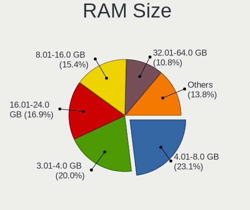

| Size in GB  | Notebooks | Percent |
|-------------|-----------|---------|
| 4.01-8.0    | 14        | 24.14%  |
| 3.01-4.0    | 12        | 20.69%  |
| 8.01-16.0   | 9         | 15.52%  |
| 16.01-24.0  | 8         | 13.79%  |
| 32.01-64.0  | 6         | 10.34%  |
| 64.01-256.0 | 3         | 5.17%   |
| 24.01-32.0  | 2         | 3.45%   |
| 2.01-3.0    | 2         | 3.45%   |
| 1.01-2.0    | 1         | 1.72%   |
| 0.51-1.0    | 1         | 1.72%   |

RAM Used
--------

Used RAM memory

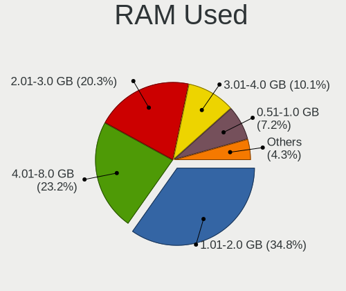

| Used GB   | Notebooks | Percent |
|-----------|-----------|---------|
| 1.01-2.0  | 23        | 35.94%  |
| 4.01-8.0  | 13        | 20.31%  |
| 2.01-3.0  | 13        | 20.31%  |
| 3.01-4.0  | 7         | 10.94%  |
| 0.51-1.0  | 5         | 7.81%   |
| 8.01-16.0 | 2         | 3.13%   |
| 0.01-0.5  | 1         | 1.56%   |

Total Drives
------------

Number of drives on board

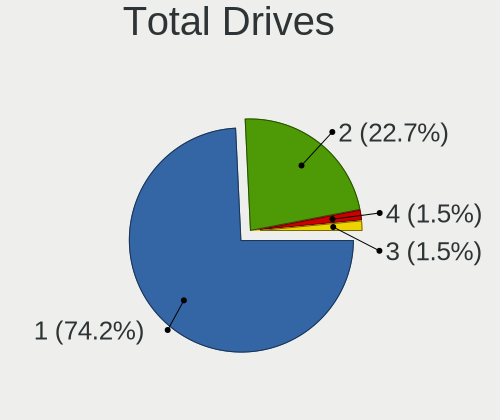

| Drives | Notebooks | Percent |
|--------|-----------|---------|
| 1      | 44        | 74.58%  |
| 2      | 13        | 22.03%  |
| 4      | 1         | 1.69%   |
| 3      | 1         | 1.69%   |

Has CD-ROM
----------

Has CD-ROM on board

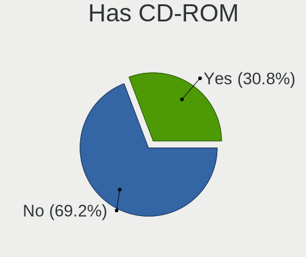

| Presented | Notebooks | Percent |
|-----------|-----------|---------|
| No        | 40        | 68.97%  |
| Yes       | 18        | 31.03%  |

Has Ethernet
------------

Has Ethernet on board

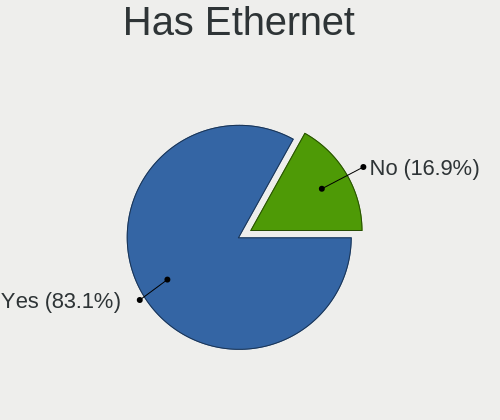

| Presented | Notebooks | Percent |
|-----------|-----------|---------|
| Yes       | 49        | 84.48%  |
| No        | 9         | 15.52%  |

Has WiFi
--------

Has WiFi module

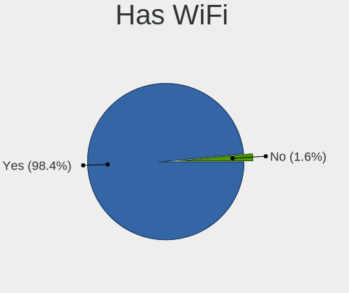

| Presented | Notebooks | Percent |
|-----------|-----------|---------|
| Yes       | 57        | 98.28%  |
| No        | 1         | 1.72%   |

Has Bluetooth
-------------

Has Bluetooth module

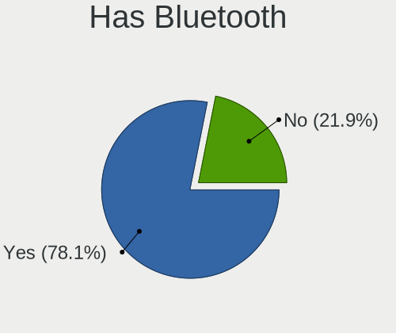

| Presented | Notebooks | Percent |
|-----------|-----------|---------|
| Yes       | 45        | 77.59%  |
| No        | 13        | 22.41%  |

Location
--------

Country
-------

Geographic location (country)

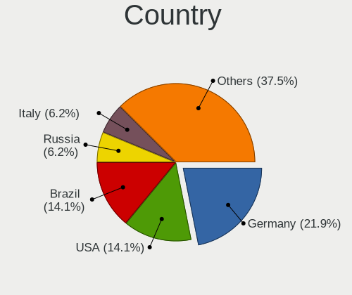

| Country      | Notebooks | Percent |
|--------------|-----------|---------|
| Germany      | 13        | 22.41%  |
| USA          | 9         | 15.52%  |
| Brazil       | 9         | 15.52%  |
| UK           | 3         | 5.17%   |
| Spain        | 3         | 5.17%   |
| Russia       | 3         | 5.17%   |
| Italy        | 3         | 5.17%   |
| Norway       | 2         | 3.45%   |
| Netherlands  | 2         | 3.45%   |
| Mexico       | 2         | 3.45%   |
| France       | 2         | 3.45%   |
| Sweden       | 1         | 1.72%   |
| South Africa | 1         | 1.72%   |
| Slovenia     | 1         | 1.72%   |
| Indonesia    | 1         | 1.72%   |
| Hungary      | 1         | 1.72%   |
| Czechia      | 1         | 1.72%   |
| Australia    | 1         | 1.72%   |

City
----

Geographic location (city)

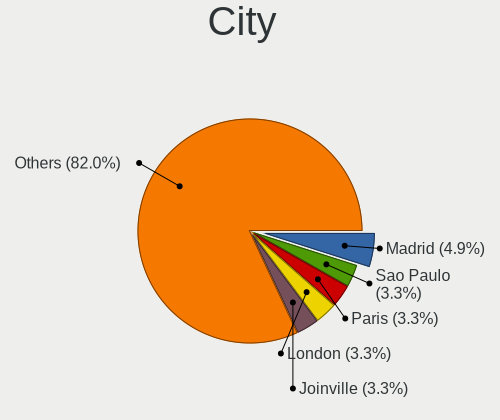

| City             | Notebooks | Percent |
|------------------|-----------|---------|
| Madrid           | 3         | 4.92%   |
| Sao Paulo        | 2         | 3.28%   |
| Paris            | 2         | 3.28%   |
| London           | 2         | 3.28%   |
| Joinville        | 2         | 3.28%   |
| Berlin           | 2         | 3.28%   |
| Yekaterinburg    | 1         | 1.64%   |
| Vaksdal          | 1         | 1.64%   |
| Sydney           | 1         | 1.64%   |
| Stockholm        | 1         | 1.64%   |
| Stazione-Fornola | 1         | 1.64%   |
| Skokie           | 1         | 1.64%   |
| Saki             | 1         | 1.64%   |
| Rome             | 1         | 1.64%   |
| Recife           | 1         | 1.64%   |
| Pretoria         | 1         | 1.64%   |
| Pirmasens        | 1         | 1.64%   |
| Peize            | 1         | 1.64%   |
| Pedro Leopoldo   | 1         | 1.64%   |
| Overland Park    | 1         | 1.64%   |
| Osorio           | 1         | 1.64%   |
| Oberhausen       | 1         | 1.64%   |
| Nuremberg        | 1         | 1.64%   |
| Northallerton    | 1         | 1.64%   |
| Norderstedt      | 1         | 1.64%   |
| Moscow           | 1         | 1.64%   |
| Mikulov          | 1         | 1.64%   |
| Mexico City      | 1         | 1.64%   |
| Merano           | 1         | 1.64%   |
| Maua             | 1         | 1.64%   |
| Louisville       | 1         | 1.64%   |
| Lehrte           | 1         | 1.64%   |
| Lakeland         | 1         | 1.64%   |
| Jakarta          | 1         | 1.64%   |
| Ithaca           | 1         | 1.64%   |
| Itajaí          | 1         | 1.64%   |
| Hrusica          | 1         | 1.64%   |
| Houten           | 1         | 1.64%   |
| Gross-Gerau      | 1         | 1.64%   |
| Goose Creek      | 1         | 1.64%   |

Drives
------

Drive Vendor
------------

Hard drive vendors

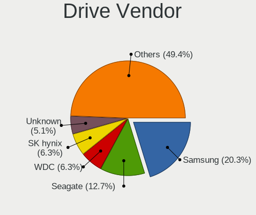

| Vendor                         | Notebooks | Drives | Percent |
|--------------------------------|-----------|--------|---------|
| Samsung Electronics            | 15        | 20     | 20.83%  |
| Seagate                        | 10        | 11     | 13.89%  |
| WDC                            | 5         | 6      | 6.94%   |
| SK hynix                       | 5         | 5      | 6.94%   |
| Unknown                        | 4         | 5      | 5.56%   |
| Toshiba                        | 4         | 6      | 5.56%   |
| SanDisk                        | 3         | 3      | 4.17%   |
| Kingston                       | 3         | 5      | 4.17%   |
| Crucial                        | 3         | 3      | 4.17%   |
| HGST                           | 2         | 2      | 2.78%   |
| A-DATA Technology              | 2         | 2      | 2.78%   |
| Unknown                        | 2         | 2      | 2.78%   |
| VISIPRO                        | 1         | 1      | 1.39%   |
| Union Memory (Shenzhen)        | 1         | 1      | 1.39%   |
| Solid State Storage Technology | 1         | 1      | 1.39%   |
| Solid State Storage            | 1         | 1      | 1.39%   |
| PNY                            | 1         | 2      | 1.39%   |
| Micron Technology              | 1         | 1      | 1.39%   |
| KIOXIA                         | 1         | 1      | 1.39%   |
| Kingston Technology Company    | 1         | 1      | 1.39%   |
| JMicron Technology             | 1         | 1      | 1.39%   |
| Intel                          | 1         | 1      | 1.39%   |
| Hitachi                        | 1         | 2      | 1.39%   |
| Hewlett-Packard                | 1         | 3      | 1.39%   |
| Gigabyte Technology            | 1         | 1      | 1.39%   |
| Biwin Storage Technology       | 1         | 1      | 1.39%   |

Drive Model
-----------

Hard drive models

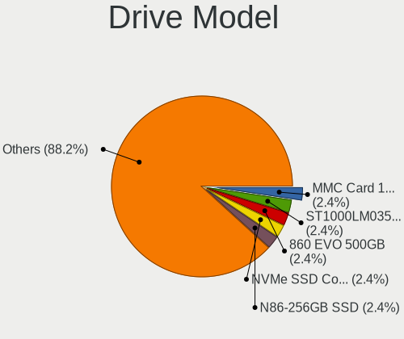

| Model                                              | Notebooks | Percent |
|----------------------------------------------------|-----------|---------|
| Unknown MMC Card  128GB                            | 2         | 2.63%   |
| Seagate ST1000LM035-1RK172 970GB                   | 2         | 2.63%   |
| Samsung SSD 860 EVO 500GB                          | 2         | 2.63%   |
| Samsung NVMe SSD Controller PM9A1/PM9A3/980PRO 2TB | 2         | 2.63%   |
| Unknown                                            | 2         | 2.63%   |
| WDC WD3200BPVT-22JJ5T0 320GB                       | 1         | 1.32%   |
| WDC WD10SPZX-24Z10 1TB                             | 1         | 1.32%   |
| WDC WD10JPVX-22JC3T0 1TB                           | 1         | 1.32%   |
| WDC PC SN730 SDBQNTY-512G-1001 512GB               | 1         | 1.32%   |
| WDC PC SN730 SDBPNTY-512G-1006 512GB               | 1         | 1.32%   |
| VISIPRO SSD 256GB                                  | 1         | 1.32%   |
| Unknown MMC Card  7GB                              | 1         | 1.32%   |
| Unknown MMC Card  32GB                             | 1         | 1.32%   |
| Unknown MMC Card  16GB                             | 1         | 1.32%   |
| Union Memory (Shenzhen) UMIS RPETJ1T24MGE2QDQ 1TB  | 1         | 1.32%   |
| Toshiba MQ04ABF100 1TB                             | 1         | 1.32%   |
| Toshiba MQ01ABD100 1TB                             | 1         | 1.32%   |
| Toshiba MK5055GSX 500GB                            | 1         | 1.32%   |
| Toshiba MK3265GSX 320GB                            | 1         | 1.32%   |
| Solid State Storage NVMe SSD Drive 256GB           | 1         | 1.32%   |
| Solid State Storage CL1-3D512-Q11 NVMe SSSTC 512GB | 1         | 1.32%   |
| SK hynix SC300 M.2 2280 256GB SSD                  | 1         | 1.32%   |
| SK hynix NVMe SSD Drive 512GB                      | 1         | 1.32%   |
| SK hynix BC711 NVMe 512GB                          | 1         | 1.32%   |
| SK hynix BC711 HFM512GD3JX013N 512GB               | 1         | 1.32%   |
| SK hynix BC501 NVMe Solid State Drive 512GB        | 1         | 1.32%   |
| Seagate ST9500325AS 500GB                          | 1         | 1.32%   |
| Seagate ST9250827AS 250GB                          | 1         | 1.32%   |
| Seagate ST320LT007-9ZV142 320GB                    | 1         | 1.32%   |
| Seagate ST2000LM015-2E8174 2TB                     | 1         | 1.32%   |
| Seagate ST1000LX015-1U7172 1TB                     | 1         | 1.32%   |
| Seagate ST1000LM048-2E7172 1TB                     | 1         | 1.32%   |
| Seagate ST1000LM024 HN-M101MBB 1TB                 | 1         | 1.32%   |
| Seagate ST1000LM014-1EJ164 1TB                     | 1         | 1.32%   |
| Sandisk WD Black SN850 1TB                         | 1         | 1.32%   |
| Sandisk WD Black SN750 / PC SN730 NVMe SSD 512GB   | 1         | 1.32%   |
| SanDisk NVMe SSD Drive 256GB                       | 1         | 1.32%   |
| Samsung SSD PM851 2.5 7mm 128GB                    | 1         | 1.32%   |
| Samsung SSD 980 PRO 2TB                            | 1         | 1.32%   |
| Samsung SSD 980 250GB                              | 1         | 1.32%   |

HDD Vendor
----------

Hard disk drive vendors

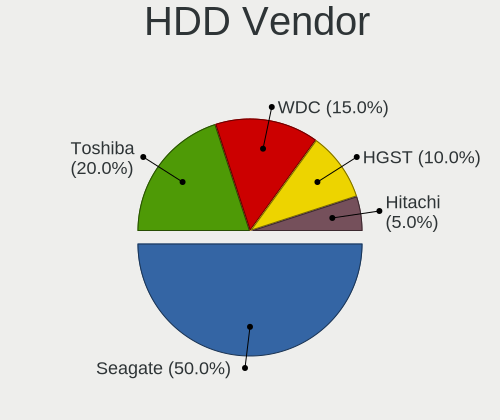

| Vendor  | Notebooks | Drives | Percent |
|---------|-----------|--------|---------|
| Seagate | 10        | 11     | 50%     |
| Toshiba | 4         | 6      | 20%     |
| WDC     | 3         | 4      | 15%     |
| HGST    | 2         | 2      | 10%     |
| Hitachi | 1         | 2      | 5%      |

SSD Vendor
----------

Solid state drive vendors

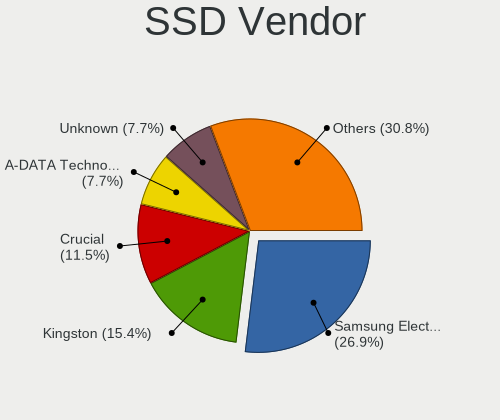

| Vendor              | Notebooks | Drives | Percent |
|---------------------|-----------|--------|---------|
| Samsung Electronics | 7         | 9      | 33.33%  |
| Kingston            | 3         | 4      | 14.29%  |
| Crucial             | 2         | 2      | 9.52%   |
| A-DATA Technology   | 2         | 2      | 9.52%   |
| Unknown             | 2         | 2      | 9.52%   |
| VISIPRO             | 1         | 1      | 4.76%   |
| SK hynix            | 1         | 1      | 4.76%   |
| PNY                 | 1         | 2      | 4.76%   |
| Hewlett-Packard     | 1         | 3      | 4.76%   |
| Gigabyte Technology | 1         | 1      | 4.76%   |

Drive Kind
----------

HDD or SSD

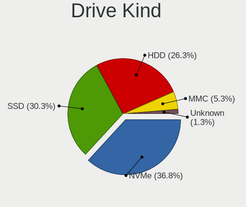

| Kind    | Notebooks | Drives | Percent |
|---------|-----------|--------|---------|
| NVMe    | 26        | 30     | 37.14%  |
| HDD     | 20        | 25     | 28.57%  |
| SSD     | 19        | 27     | 27.14%  |
| MMC     | 4         | 5      | 5.71%   |
| Unknown | 1         | 1      | 1.43%   |

Drive Connector
---------------

SATA, SAS, NVMe, etc.

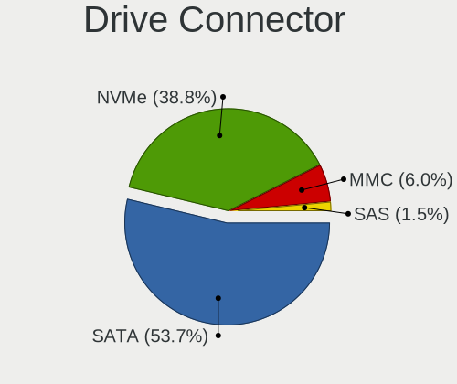

| Type | Notebooks | Drives | Percent |
|------|-----------|--------|---------|
| SATA | 36        | 51     | 53.73%  |
| NVMe | 26        | 30     | 38.81%  |
| MMC  | 4         | 5      | 5.97%   |
| SAS  | 1         | 2      | 1.49%   |

Drive Size
----------

Size of hard drive

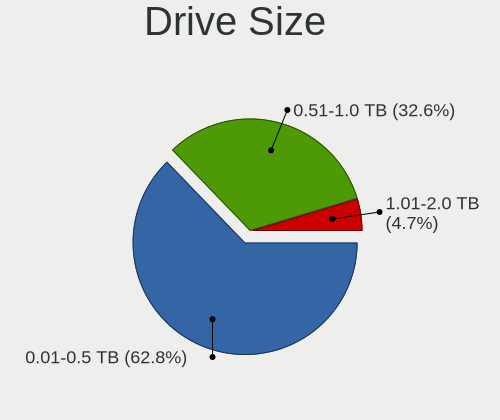

| Size in TB | Notebooks | Drives | Percent |
|------------|-----------|--------|---------|
| 0.01-0.5   | 25        | 38     | 65.79%  |
| 0.51-1.0   | 12        | 13     | 31.58%  |
| 1.01-2.0   | 1         | 1      | 2.63%   |

Space Total
-----------

Amount of disk space available on the file system

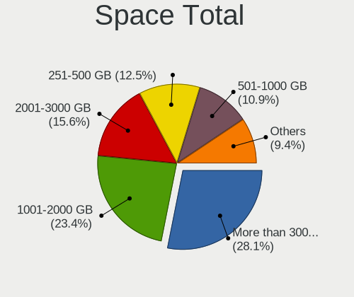

| Size in GB     | Notebooks | Percent |
|----------------|-----------|---------|
| More than 3000 | 14        | 24.14%  |
| 1001-2000      | 14        | 24.14%  |
| 2001-3000      | 10        | 17.24%  |
| 251-500        | 7         | 12.07%  |
| 501-1000       | 7         | 12.07%  |
| 101-250        | 5         | 8.62%   |
| Unknown        | 1         | 1.72%   |

Space Used
----------

Amount of used disk space

| Used GB        | Notebooks | Percent |
|----------------|-----------|---------|
| 101-250        | 23        | 35.94%  |
| 51-100         | 11        | 17.19%  |
| 1-20           | 9         | 14.06%  |
| 251-500        | 8         | 12.5%   |
| 501-1000       | 6         | 9.38%   |
| 1001-2000      | 4         | 6.25%   |
| More than 3000 | 2         | 3.13%   |
| Unknown        | 1         | 1.56%   |

Malfunc. Drives
---------------

Drive models with a malfunction

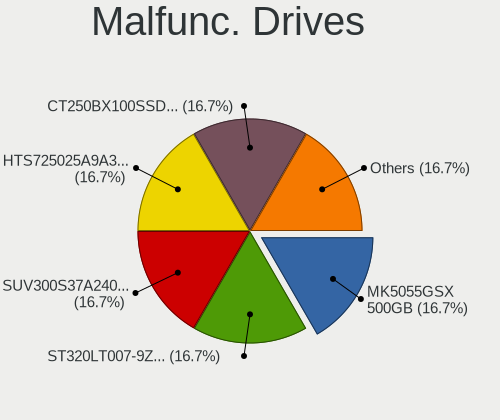

| Model                                     | Notebooks | Drives | Percent |
|-------------------------------------------|-----------|--------|---------|
| Toshiba MK5055GSX 500GB                   | 1         | 3      | 16.67%  |
| Seagate ST320LT007-9ZV142 320GB           | 1         | 1      | 16.67%  |
| Kingston SUV300S37A240G 240GB SSD         | 1         | 2      | 16.67%  |
| Hitachi HTS725025A9A364 250GB             | 1         | 2      | 16.67%  |
| Crucial CT250BX100SSD1 250GB              | 1         | 1      | 16.67%  |
| Biwin Storage Technology HP SSD EX900 1TB | 1         | 1      | 16.67%  |

Malfunc. Drive Vendor
---------------------

Vendors of faulty drives

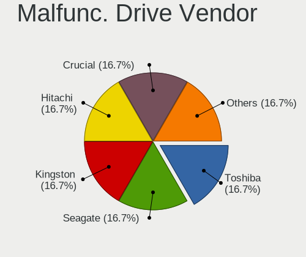

| Vendor                   | Notebooks | Drives | Percent |
|--------------------------|-----------|--------|---------|
| Toshiba                  | 1         | 3      | 16.67%  |
| Seagate                  | 1         | 1      | 16.67%  |
| Kingston                 | 1         | 2      | 16.67%  |
| Hitachi                  | 1         | 2      | 16.67%  |
| Crucial                  | 1         | 1      | 16.67%  |
| Biwin Storage Technology | 1         | 1      | 16.67%  |

Malfunc. HDD Vendor
-------------------

Vendors of faulty HDD drives

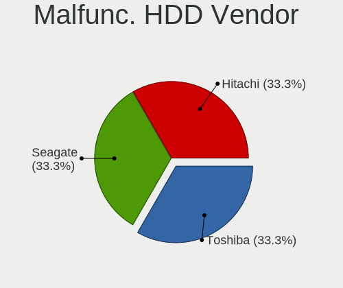

| Vendor  | Notebooks | Drives | Percent |
|---------|-----------|--------|---------|
| Toshiba | 1         | 3      | 33.33%  |
| Seagate | 1         | 1      | 33.33%  |
| Hitachi | 1         | 2      | 33.33%  |

Malfunc. Drive Kind
-------------------

Kinds of faulty drives

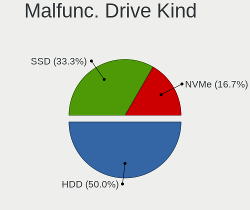

| Kind | Notebooks | Drives | Percent |
|------|-----------|--------|---------|
| HDD  | 3         | 6      | 50%     |
| SSD  | 2         | 3      | 33.33%  |
| NVMe | 1         | 1      | 16.67%  |

Failed Drives
-------------

Failed drive models

Zero info for selected period =(

Failed Drive Vendor
-------------------

Failed drive vendors

Zero info for selected period =(

Drive Status
------------

Number of failed and malfunc. drives

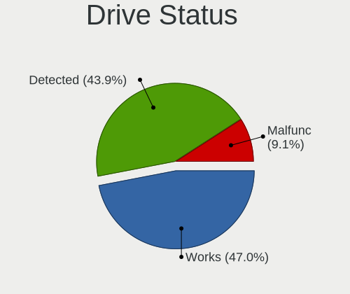

| Status   | Notebooks | Drives | Percent |
|----------|-----------|--------|---------|
| Detected | 28        | 46     | 45.9%   |
| Works    | 27        | 32     | 44.26%  |
| Malfunc  | 6         | 10     | 9.84%   |

Storage controller
------------------

Storage Vendor
--------------

Storage controller vendors

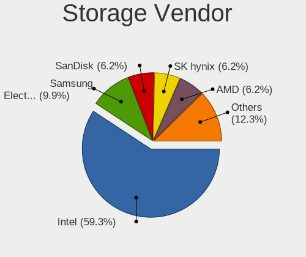

| Vendor                         | Notebooks | Percent |
|--------------------------------|-----------|---------|
| Intel                          | 42        | 59.15%  |
| Samsung Electronics            | 7         | 9.86%   |
| SanDisk                        | 5         | 7.04%   |
| SK hynix                       | 4         | 5.63%   |
| AMD                            | 4         | 5.63%   |
| Solid State Storage Technology | 2         | 2.82%   |
| Micron Technology              | 2         | 2.82%   |
| Kingston Technology Company    | 2         | 2.82%   |
| Union Memory (Shenzhen)        | 1         | 1.41%   |
| KIOXIA                         | 1         | 1.41%   |
| Biwin Storage Technology       | 1         | 1.41%   |

Storage Model
-------------

Storage controller models

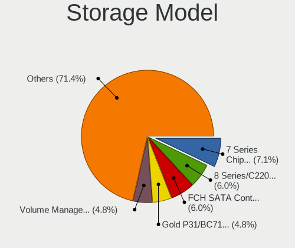

| Model                                                                          | Notebooks | Percent |
|--------------------------------------------------------------------------------|-----------|---------|
| Intel 7 Series Chipset Family 6-port SATA Controller [AHCI mode]               | 5         | 6.85%   |
| Intel 8 Series/C220 Series Chipset Family 6-port SATA Controller 1 [AHCI mode] | 4         | 5.48%   |
| Intel 8 Series SATA Controller 1 [AHCI mode]                                   | 4         | 5.48%   |
| AMD FCH SATA Controller [AHCI mode]                                            | 4         | 5.48%   |
| SK hynix Gold P31/PC711 NVMe Solid State Drive                                 | 3         | 4.11%   |
| SanDisk WD Black SN750 / PC SN730 NVMe SSD                                     | 3         | 4.11%   |
| Samsung NVMe SSD Controller PM9A1/PM9A3/980PRO                                 | 3         | 4.11%   |
| Intel Tiger Lake-LP SATA Controller                                            | 3         | 4.11%   |
| Intel 82801IBM/IEM (ICH9M/ICH9M-E) 4 port SATA Controller [AHCI mode]          | 3         | 4.11%   |
| Solid State Storage Non-Volatile memory controller                             | 2         | 2.74%   |
| Samsung NVMe SSD Controller SM981/PM981/PM983                                  | 2         | 2.74%   |
| Samsung NVMe SSD Controller 980                                                | 2         | 2.74%   |
| Micron NVMe Storage Controller                                                 | 2         | 2.74%   |
| Intel Volume Management Device NVMe RAID Controller                            | 2         | 2.74%   |
| Intel Sunrise Point-LP SATA Controller [AHCI mode]                             | 2         | 2.74%   |
| Intel Celeron/Pentium Silver Processor SATA Controller                         | 2         | 2.74%   |
| Intel 82801 Mobile SATA Controller [RAID mode]                                 | 2         | 2.74%   |
| Intel 5 Series/3400 Series Chipset 4 port SATA AHCI Controller                 | 2         | 2.74%   |
| Union Memory (Shenzhen) Non-Volatile memory controller                         | 1         | 1.37%   |
| SK hynix BC501 NVMe Solid State Drive                                          | 1         | 1.37%   |
| SanDisk WD PC SN810 / Black SN850 NVMe SSD                                     | 1         | 1.37%   |
| SanDisk PC SN520 NVMe SSD                                                      | 1         | 1.37%   |
| KIOXIA NVMe SSD Controller BG4                                                 | 1         | 1.37%   |
| Kingston Company NVMe Controller                                               | 1         | 1.37%   |
| Kingston Company A2000 NVMe SSD                                                | 1         | 1.37%   |
| Intel Wildcat Point-LP SATA Controller [AHCI Mode]                             | 1         | 1.37%   |
| Intel SSD 600P Series                                                          | 1         | 1.37%   |
| Intel Q170/Q150/B150/H170/H110/Z170/CM236 Chipset SATA Controller [AHCI Mode]  | 1         | 1.37%   |
| Intel NM10/ICH7 Family SATA Controller [AHCI mode]                             | 1         | 1.37%   |
| Intel Ice Lake-LP SATA Controller [AHCI mode]                                  | 1         | 1.37%   |
| Intel Celeron N3350/Pentium N4200/Atom E3900 Series SATA AHCI Controller       | 1         | 1.37%   |
| Intel Cannon Point-LP SATA Controller [AHCI Mode]                              | 1         | 1.37%   |
| Intel Cannon Lake Mobile PCH SATA AHCI Controller                              | 1         | 1.37%   |
| Intel 82801HM/HEM (ICH8M/ICH8M-E) SATA Controller [AHCI mode]                  | 1         | 1.37%   |
| Intel 82801HM/HEM (ICH8M/ICH8M-E) IDE Controller                               | 1         | 1.37%   |
| Intel 7 Series Chipset Family 4-port SATA Controller [IDE mode]                | 1         | 1.37%   |
| Intel 7 Series Chipset Family 2-port SATA Controller [IDE mode]                | 1         | 1.37%   |
| Intel 6 Series/C200 Series Chipset Family 6 port Mobile SATA AHCI Controller   | 1         | 1.37%   |
| Intel 5 Series/3400 Series Chipset 6 port SATA AHCI Controller                 | 1         | 1.37%   |
| Intel 400 Series Chipset Family SATA AHCI Controller                           | 1         | 1.37%   |

Storage Kind
------------

Kind of storage controller (IDE, SATA, NVMe, SAS, ...)

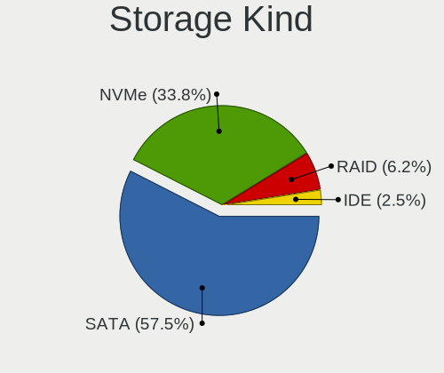

| Kind | Notebooks | Percent |
|------|-----------|---------|
| SATA | 40        | 56.34%  |
| NVMe | 25        | 35.21%  |
| RAID | 4         | 5.63%   |
| IDE  | 2         | 2.82%   |

Processor
---------

CPU Vendor
----------

Processor vendors

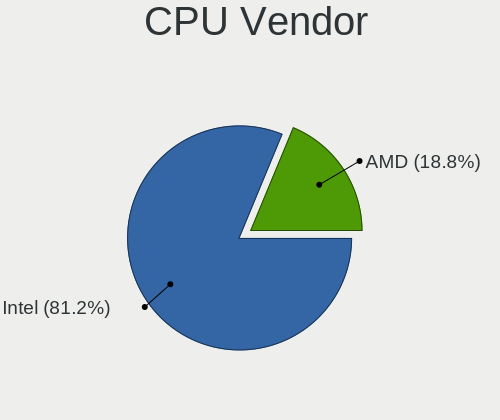

| Vendor | Notebooks | Percent |
|--------|-----------|---------|
| Intel  | 47        | 81.03%  |
| AMD    | 11        | 18.97%  |

CPU Model
---------

Processor models

| Model                                       | Notebooks | Percent |
|---------------------------------------------|-----------|---------|
| Intel Pentium CPU P6200 @ 2.13GHz           | 2         | 3.45%   |
| Intel Core i5-4200U CPU @ 1.60GHz           | 2         | 3.45%   |
| Intel Core i5-3230M CPU @ 2.60GHz           | 2         | 3.45%   |
| Intel Core i3-4005U CPU @ 1.70GHz           | 2         | 3.45%   |
| Intel Core i3-2370M CPU @ 2.40GHz           | 2         | 3.45%   |
| Intel Celeron N4020 CPU @ 1.10GHz           | 2         | 3.45%   |
| Intel 12th Gen Core i7-1260P                | 2         | 3.45%   |
| Intel 11th Gen Core i7-1165G7 @ 2.80GHz     | 2         | 3.45%   |
| Intel 11th Gen Core i3-1115G4 @ 3.00GHz     | 2         | 3.45%   |
| AMD Ryzen 7 5800U with Radeon Graphics      | 2         | 3.45%   |
| AMD Ryzen 7 5800H with Radeon Graphics      | 2         | 3.45%   |
| Intel Pentium Dual-Core CPU T4300 @ 2.10GHz | 1         | 1.72%   |
| Intel Core i7-9750H CPU @ 2.60GHz           | 1         | 1.72%   |
| Intel Core i7-8665U CPU @ 1.90GHz           | 1         | 1.72%   |
| Intel Core i7-6820HQ CPU @ 2.70GHz          | 1         | 1.72%   |
| Intel Core i7-4810MQ CPU @ 2.80GHz          | 1         | 1.72%   |
| Intel Core i7-4720HQ CPU @ 2.60GHz          | 1         | 1.72%   |
| Intel Core i7-4700MQ CPU @ 2.40GHz          | 1         | 1.72%   |
| Intel Core i7-4700HQ CPU @ 2.40GHz          | 1         | 1.72%   |
| Intel Core i7-2670QM CPU @ 2.20GHz          | 1         | 1.72%   |
| Intel Core i7-10750H CPU @ 2.60GHz          | 1         | 1.72%   |
| Intel Core i7 CPU M 620 @ 2.67GHz           | 1         | 1.72%   |
| Intel Core i5-8300H CPU @ 2.30GHz           | 1         | 1.72%   |
| Intel Core i5-8265U CPU @ 1.60GHz           | 1         | 1.72%   |
| Intel Core i5-8250U CPU @ 1.60GHz           | 1         | 1.72%   |
| Intel Core i5-7300U CPU @ 2.60GHz           | 1         | 1.72%   |
| Intel Core i5-6300U CPU @ 2.40GHz           | 1         | 1.72%   |
| Intel Core i5-5300U CPU @ 2.30GHz           | 1         | 1.72%   |
| Intel Core i5-1035G1 CPU @ 1.00GHz          | 1         | 1.72%   |
| Intel Core i3-7020U CPU @ 2.30GHz           | 1         | 1.72%   |
| Intel Core i3-3110M CPU @ 2.40GHz           | 1         | 1.72%   |
| Intel Core i3-2328M CPU @ 2.20GHz           | 1         | 1.72%   |
| Intel Core 2 Duo CPU T7500 @ 2.20GHz        | 1         | 1.72%   |
| Intel Core 2 Duo CPU T6570 @ 2.10GHz        | 1         | 1.72%   |
| Intel Core 2 Duo CPU T6500 @ 2.10GHz        | 1         | 1.72%   |
| Intel Celeron CPU J3455 @ 1.50GHz           | 1         | 1.72%   |
| Intel Atom CPU N450 @ 1.66GHz               | 1         | 1.72%   |
| Intel 12th Gen Core i5-1235U                | 1         | 1.72%   |
| Intel 11th Gen Core i7-1185G7 @ 3.00GHz     | 1         | 1.72%   |
| Intel 11th Gen Core i7-11800H @ 2.30GHz     | 1         | 1.72%   |

CPU Model Family
----------------

Processor model prefix

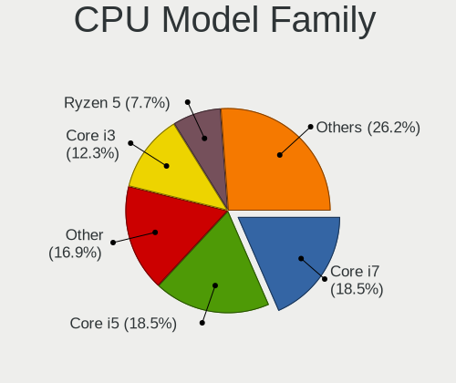

| Model                   | Notebooks | Percent |
|-------------------------|-----------|---------|
| Intel Core i5           | 11        | 18.97%  |
| Intel Core i7           | 10        | 17.24%  |
| Other                   | 9         | 15.52%  |
| Intel Core i3           | 7         | 12.07%  |
| AMD Ryzen 7             | 4         | 6.9%    |
| AMD Ryzen 5             | 4         | 6.9%    |
| Intel Core 2 Duo        | 3         | 5.17%   |
| Intel Celeron           | 3         | 5.17%   |
| Intel Pentium           | 2         | 3.45%   |
| Intel Pentium Dual-Core | 1         | 1.72%   |
| Intel Atom              | 1         | 1.72%   |
| AMD Ryzen 9             | 1         | 1.72%   |
| AMD Ryzen 7 PRO         | 1         | 1.72%   |
| AMD A4                  | 1         | 1.72%   |

CPU Cores
---------

Number of processor cores

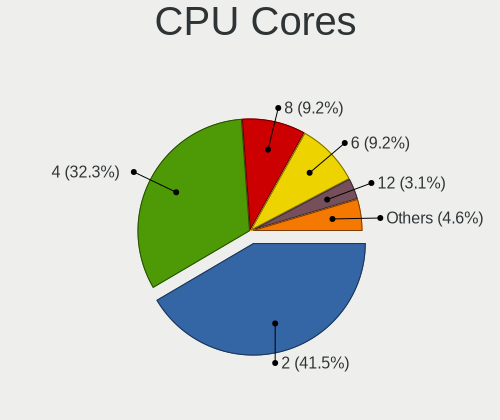

| Number | Notebooks | Percent |
|--------|-----------|---------|
| 2      | 25        | 43.1%   |
| 4      | 17        | 29.31%  |
| 8      | 6         | 10.34%  |
| 6      | 5         | 8.62%   |
| 12     | 2         | 3.45%   |
| 1      | 2         | 3.45%   |
| 10     | 1         | 1.72%   |

CPU Sockets
-----------

Number of sockets

| Number | Notebooks | Percent |
|--------|-----------|---------|
| 1      | 58        | 100%    |

CPU Threads
-----------

Threads per core (Hyper-Threading)

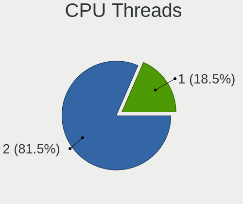

| Number | Notebooks | Percent |
|--------|-----------|---------|
| 2      | 46        | 79.31%  |
| 1      | 12        | 20.69%  |

CPU Op-Modes
------------

CPU Operation Modes (32-bit, 64-bit)

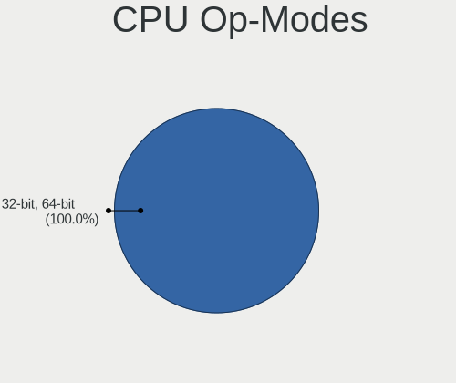

| Op mode        | Notebooks | Percent |
|----------------|-----------|---------|
| 32-bit, 64-bit | 58        | 100%    |

CPU Microcode
-------------

Microcode number

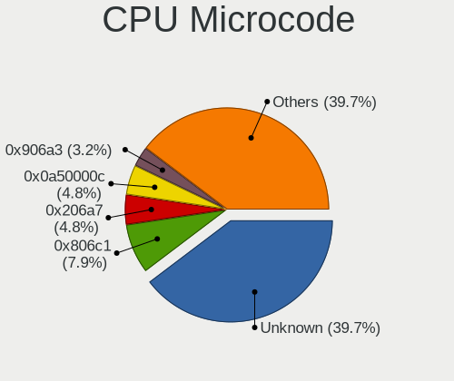

| Number     | Notebooks | Percent |
|------------|-----------|---------|
| Unknown    | 24        | 41.38%  |
| 0x806c1    | 5         | 8.62%   |
| 0x206a7    | 3         | 5.17%   |
| 0x0a50000c | 3         | 5.17%   |
| 0x906a3    | 2         | 3.45%   |
| 0x706a8    | 2         | 3.45%   |
| 0x1067a    | 2         | 3.45%   |
| 0x906ea    | 1         | 1.72%   |
| 0x906a4    | 1         | 1.72%   |
| 0x806ec    | 1         | 1.72%   |
| 0x806ea    | 1         | 1.72%   |
| 0x706e5    | 1         | 1.72%   |
| 0x6fb      | 1         | 1.72%   |
| 0x506e3    | 1         | 1.72%   |
| 0x506ca    | 1         | 1.72%   |
| 0x406e3    | 1         | 1.72%   |
| 0x40651    | 1         | 1.72%   |
| 0x306a9    | 1         | 1.72%   |
| 0x20655    | 1         | 1.72%   |
| 0x106ca    | 1         | 1.72%   |
| 0x0a404102 | 1         | 1.72%   |
| 0x08608103 | 1         | 1.72%   |
| 0x08108109 | 1         | 1.72%   |
| 0x08108102 | 1         | 1.72%   |

CPU Microarch
-------------

Microarchitecture

| Name             | Notebooks | Percent |
|------------------|-----------|---------|
| Haswell          | 8         | 13.79%  |
| KabyLake         | 7         | 12.07%  |
| Zen 3            | 5         | 8.62%   |
| TigerLake        | 5         | 8.62%   |
| SandyBridge      | 4         | 6.9%    |
| Westmere         | 3         | 5.17%   |
| Penryn           | 3         | 5.17%   |
| IvyBridge        | 3         | 5.17%   |
| Alderlake Hybrid | 3         | 5.17%   |
| Unknown          | 3         | 5.17%   |
| Zen+             | 2         | 3.45%   |
| Skylake          | 2         | 3.45%   |
| Goldmont plus    | 2         | 3.45%   |
| Zen 2            | 1         | 1.72%   |
| IceLake          | 1         | 1.72%   |
| Goldmont         | 1         | 1.72%   |
| Excavator        | 1         | 1.72%   |
| Core             | 1         | 1.72%   |
| CometLake        | 1         | 1.72%   |
| Broadwell        | 1         | 1.72%   |
| Bonnell          | 1         | 1.72%   |

Graphics
--------

GPU Vendor
----------

Vendors of graphics cards

| Vendor | Notebooks | Percent |
|--------|-----------|---------|
| Intel  | 41        | 57.75%  |
| Nvidia | 16        | 22.54%  |
| AMD    | 14        | 19.72%  |

GPU Model
---------

Graphics card models

| Model                                                                     | Notebooks | Percent |
|---------------------------------------------------------------------------|-----------|---------|
| AMD Cezanne [Radeon Vega Series / Radeon Vega Mobile Series]              | 5         | 6.94%   |
| Intel Haswell-ULT Integrated Graphics Controller                          | 4         | 5.56%   |
| Intel 2nd Generation Core Processor Family Integrated Graphics Controller | 4         | 5.56%   |
| Intel TigerLake-LP GT2 [Iris Xe Graphics]                                 | 3         | 4.17%   |
| Intel 3rd Gen Core processor Graphics Controller                          | 3         | 4.17%   |
| Nvidia TU117M [GeForce GTX 1650 Mobile / Max-Q]                           | 2         | 2.78%   |
| Nvidia GA107M [GeForce RTX 3050 Ti Mobile]                                | 2         | 2.78%   |
| Intel WhiskeyLake-U GT2 [UHD Graphics 620]                                | 2         | 2.78%   |
| Intel Tiger Lake-LP GT2 [UHD Graphics G4]                                 | 2         | 2.78%   |
| Intel HD Graphics 620                                                     | 2         | 2.78%   |
| Intel GeminiLake [UHD Graphics 600]                                       | 2         | 2.78%   |
| Intel Core Processor Integrated Graphics Controller                       | 2         | 2.78%   |
| Intel CoffeeLake-H GT2 [UHD Graphics 630]                                 | 2         | 2.78%   |
| Intel Alder Lake-P Integrated Graphics Controller                         | 2         | 2.78%   |
| Intel 4th Gen Core Processor Integrated Graphics Controller               | 2         | 2.78%   |
| AMD Picasso/Raven 2 [Radeon Vega Series / Radeon Vega Mobile Series]      | 2         | 2.78%   |
| Nvidia TU117M                                                             | 1         | 1.39%   |
| Nvidia TU117GLM [T550 Laptop GPU]                                         | 1         | 1.39%   |
| Nvidia GT218M [NVS 3100M]                                                 | 1         | 1.39%   |
| Nvidia GP107M [GeForce GTX 1050 Ti Mobile]                                | 1         | 1.39%   |
| Nvidia GM107M [GeForce GTX 950M]                                          | 1         | 1.39%   |
| Nvidia GM107GLM [Quadro M1000M]                                           | 1         | 1.39%   |
| Nvidia GK208GLM [Quadro K610M]                                            | 1         | 1.39%   |
| Nvidia GK107M [GeForce GT 750M]                                           | 1         | 1.39%   |
| Nvidia GK104GLM [Quadro K3100M]                                           | 1         | 1.39%   |
| Nvidia GF108M [NVS 5400M]                                                 | 1         | 1.39%   |
| Nvidia GA107M [GeForce RTX 3050 Mobile]                                   | 1         | 1.39%   |
| Nvidia G86M [GeForce 8600M GS]                                            | 1         | 1.39%   |
| Intel UHD Graphics 620                                                    | 1         | 1.39%   |
| Intel TigerLake-H GT1 [UHD Graphics]                                      | 1         | 1.39%   |
| Intel Skylake GT2 [HD Graphics 520]                                       | 1         | 1.39%   |
| Intel Mobile 4 Series Chipset Integrated Graphics Controller              | 1         | 1.39%   |
| Intel Iris Plus Graphics G1 (Ice Lake)                                    | 1         | 1.39%   |
| Intel HD Graphics 5500                                                    | 1         | 1.39%   |
| Intel HD Graphics 530                                                     | 1         | 1.39%   |
| Intel HD Graphics 500                                                     | 1         | 1.39%   |
| Intel CometLake-H GT2 [UHD Graphics]                                      | 1         | 1.39%   |
| Intel Atom Processor D4xx/D5xx/N4xx/N5xx Integrated Graphics Controller   | 1         | 1.39%   |
| Intel Alder Lake-UP3 GT2 [UHD Graphics]                                   | 1         | 1.39%   |
| AMD Stoney [Radeon R2/R3/R4/R5 Graphics]                                  | 1         | 1.39%   |

GPU Combo
---------

Combinations of graphics cards

| Name           | Notebooks | Percent |
|----------------|-----------|---------|
| 1 x Intel      | 31        | 53.45%  |
| Intel + Nvidia | 9         | 15.52%  |
| 1 x AMD        | 9         | 15.52%  |
| 1 x Nvidia     | 4         | 6.9%    |
| AMD + Nvidia   | 3         | 5.17%   |
| 2 x AMD        | 1         | 1.72%   |
| Intel + AMD    | 1         | 1.72%   |

GPU Driver
----------

Free vs proprietary

| Driver      | Notebooks | Percent |
|-------------|-----------|---------|
| Free        | 51        | 86.44%  |
| Proprietary | 5         | 8.47%   |
| Unknown     | 3         | 5.08%   |

GPU Memory
----------

Total video memory

| Size in GB | Notebooks | Percent |
|------------|-----------|---------|
| Unknown    | 43        | 72.88%  |
| 0.01-0.5   | 6         | 10.17%  |
| 3.01-4.0   | 4         | 6.78%   |
| 1.01-2.0   | 3         | 5.08%   |
| 0.51-1.0   | 2         | 3.39%   |
| 8.01-16.0  | 1         | 1.69%   |

Monitor
-------

Monitor Vendor
--------------

Monitor vendors

| Vendor                  | Notebooks | Percent |
|-------------------------|-----------|---------|
| AU Optronics            | 16        | 24.24%  |
| BOE                     | 12        | 18.18%  |
| LG Display              | 7         | 10.61%  |
| Samsung Electronics     | 6         | 9.09%   |
| Lenovo                  | 4         | 6.06%   |
| Chimei Innolux          | 4         | 6.06%   |
| Dell                    | 3         | 4.55%   |
| Sharp                   | 2         | 3.03%   |
| InfoVision              | 2         | 3.03%   |
| Hewlett-Packard         | 2         | 3.03%   |
| Goldstar                | 2         | 3.03%   |
| ViewSonic               | 1         | 1.52%   |
| Insignia                | 1         | 1.52%   |
| HannStar                | 1         | 1.52%   |
| Fujitsu Siemens         | 1         | 1.52%   |
| Eizo                    | 1         | 1.52%   |
| Chi Mei Optoelectronics | 1         | 1.52%   |

Monitor Model
-------------

Monitor models

| Model                                                                    | Notebooks | Percent |
|--------------------------------------------------------------------------|-----------|---------|
| BOE LCD Monitor BOE08CD 1366x768 344x194mm 15.5-inch                     | 3         | 4.55%   |
| Hewlett-Packard 27f HPN354A 1920x1080 598x336mm 27.0-inch                | 2         | 3.03%   |
| BOE LCD Monitor BOE0812 1920x1080 344x194mm 15.5-inch                    | 2         | 3.03%   |
| AU Optronics LCD Monitor AUO219D 1920x1080 381x214mm 17.2-inch           | 2         | 3.03%   |
| ViewSonic VA2265 SERIES VSCB330 1920x1080 476x268mm 21.5-inch            | 1         | 1.52%   |
| Sharp LQ156M1JW03 SHP155D 1920x1080 344x194mm 15.5-inch                  | 1         | 1.52%   |
| Sharp LQ156M1JW01 SHP14C3 1920x1080 344x194mm 15.5-inch                  | 1         | 1.52%   |
| Samsung Electronics S23B350 SAM08F4 1920x1080 510x287mm 23.0-inch        | 1         | 1.52%   |
| Samsung Electronics LCD Monitor SEC5441 1366x768 344x194mm 15.5-inch     | 1         | 1.52%   |
| Samsung Electronics LCD Monitor SEC3152 1366x768 344x194mm 15.5-inch     | 1         | 1.52%   |
| Samsung Electronics LCD Monitor SDC894F 1920x1080 344x194mm 15.5-inch    | 1         | 1.52%   |
| Samsung Electronics LCD Monitor SDC3754 1600x900 382x215mm 17.3-inch     | 1         | 1.52%   |
| Samsung Electronics LCD Monitor SDC324C 1920x1080 344x194mm 15.5-inch    | 1         | 1.52%   |
| LG Display LCD Monitor LGDD801 1366x768 344x194mm 15.5-inch              | 1         | 1.52%   |
| LG Display LCD Monitor LGD05E5 1920x1080 344x194mm 15.5-inch             | 1         | 1.52%   |
| LG Display LCD Monitor LGD0584 1920x1080 294x165mm 13.3-inch             | 1         | 1.52%   |
| LG Display LCD Monitor LGD0521 1920x1080 309x174mm 14.0-inch             | 1         | 1.52%   |
| LG Display LCD Monitor LGD0430 1366x768 345x194mm 15.6-inch              | 1         | 1.52%   |
| LG Display LCD Monitor LGD02E9 1366x768 309x174mm 14.0-inch              | 1         | 1.52%   |
| LG Display LCD Monitor LGD0250 1366x768 345x194mm 15.6-inch              | 1         | 1.52%   |
| Lenovo LEN P32p-20 LEN62A2 3840x2160 697x392mm 31.5-inch                 | 1         | 1.52%   |
| Lenovo LCD Monitor LEN40B2 1920x1080 344x193mm 15.5-inch                 | 1         | 1.52%   |
| Lenovo LCD Monitor LEN40B1 1600x900 345x194mm 15.6-inch                  | 1         | 1.52%   |
| Lenovo LCD Monitor LEN4035 1280x800 303x189mm 14.1-inch                  | 1         | 1.52%   |
| Insignia NS39DR510NA17 BBY3963 1920x1080 853x480mm 38.5-inch             | 1         | 1.52%   |
| InfoVision LCD Monitor IVO3E94 1920x1200 345x215mm 16.0-inch             | 1         | 1.52%   |
| InfoVision LCD Monitor IVO057D 1920x1080 309x174mm 14.0-inch             | 1         | 1.52%   |
| HannStar LCD Monitor HSD03E9 1024x600 220x129mm 10.0-inch                | 1         | 1.52%   |
| Goldstar T710SH GSM436B 1280x960 310x230mm 15.2-inch                     | 1         | 1.52%   |
| Goldstar IPS235 GSM587D 1920x1080 510x290mm 23.1-inch                    | 1         | 1.52%   |
| Fujitsu Siemens 5110 FA FUS0420 1600x1200 408x306mm 20.1-inch            | 1         | 1.52%   |
| Eizo EV2450 ENC2568 1920x1080 528x297mm 23.9-inch                        | 1         | 1.52%   |
| Dell U2417H DEL40E8 1920x1080 527x296mm 23.8-inch                        | 1         | 1.52%   |
| Dell SE2216H DELF071 1920x1080 476x268mm 21.5-inch                       | 1         | 1.52%   |
| Dell P2412H DELA07D 1920x1080 531x299mm 24.0-inch                        | 1         | 1.52%   |
| Chimei Innolux LCD Monitor CMN14F2 1920x1080 309x173mm 13.9-inch         | 1         | 1.52%   |
| Chimei Innolux LCD Monitor CMN14D6 1366x768 309x173mm 13.9-inch          | 1         | 1.52%   |
| Chimei Innolux LCD Monitor CMN1406 1920x1080 309x173mm 13.9-inch         | 1         | 1.52%   |
| Chimei Innolux LCD Monitor CMN1345 1920x1080 293x165mm 13.2-inch         | 1         | 1.52%   |
| Chi Mei Optoelectronics LCD Monitor CMO15A1 1366x768 344x193mm 15.5-inch | 1         | 1.52%   |

Monitor Resolution
------------------

Monitor screen resolution

| Resolution        | Notebooks | Percent |
|-------------------|-----------|---------|
| 1920x1080 (FHD)   | 32        | 53.33%  |
| 1366x768 (WXGA)   | 18        | 30%     |
| 1920x1200 (WUXGA) | 2         | 3.33%   |
| 1600x900 (HD+)    | 2         | 3.33%   |
| 3840x2160 (4K)    | 1         | 1.67%   |
| 1600x1200         | 1         | 1.67%   |
| 1440x900 (WXGA+)  | 1         | 1.67%   |
| 1280x960          | 1         | 1.67%   |
| 1280x800 (WXGA)   | 1         | 1.67%   |
| 1024x600          | 1         | 1.67%   |

Monitor Diagonal
----------------

Diagonal size in inches

| Inches | Notebooks | Percent |
|--------|-----------|---------|
| 15     | 29        | 44.62%  |
| 13     | 8         | 12.31%  |
| 14     | 7         | 10.77%  |
| 17     | 5         | 7.69%   |
| 16     | 3         | 4.62%   |
| 27     | 2         | 3.08%   |
| 24     | 2         | 3.08%   |
| 23     | 2         | 3.08%   |
| 21     | 2         | 3.08%   |
| 38     | 1         | 1.54%   |
| 31     | 1         | 1.54%   |
| 20     | 1         | 1.54%   |
| 12     | 1         | 1.54%   |
| 10     | 1         | 1.54%   |

Monitor Width
-------------

Physical width

| Width in mm | Notebooks | Percent |
|-------------|-----------|---------|
| 301-350     | 42        | 65.63%  |
| 351-400     | 7         | 10.94%  |
| 501-600     | 6         | 9.38%   |
| 201-300     | 4         | 6.25%   |
| 401-500     | 3         | 4.69%   |
| 801-900     | 1         | 1.56%   |
| 601-700     | 1         | 1.56%   |

Aspect Ratio
------------

Proportional relationship between the width and the height

| Ratio | Notebooks | Percent |
|-------|-----------|---------|
| 16/9  | 52        | 89.66%  |
| 16/10 | 4         | 6.9%    |
| 4/3   | 2         | 3.45%   |

Monitor Area
------------

Area in inch²

| Area in inch² | Notebooks | Percent |
|----------------|-----------|---------|
| 101-110        | 30        | 46.88%  |
| 81-90          | 13        | 20.31%  |
| 121-130        | 6         | 9.38%   |
| 201-250        | 5         | 7.81%   |
| 71-80          | 2         | 3.13%   |
| 301-350        | 2         | 3.13%   |
| 61-70          | 1         | 1.56%   |
| 351-500        | 1         | 1.56%   |
| 41-50          | 1         | 1.56%   |
| 151-200        | 1         | 1.56%   |
| 111-120        | 1         | 1.56%   |
| 501-1000       | 1         | 1.56%   |

Pixel Density
-------------

Pixels per inch

| Density | Notebooks | Percent |
|---------|-----------|---------|
| 121-160 | 28        | 44.44%  |
| 101-120 | 20        | 31.75%  |
| 51-100  | 12        | 19.05%  |
| 161-240 | 3         | 4.76%   |

Multiple Monitors
-----------------

Total monitors connected

| Total | Notebooks | Percent |
|-------|-----------|---------|
| 1     | 45        | 76.27%  |
| 2     | 9         | 15.25%  |
| 0     | 3         | 5.08%   |
| 3     | 2         | 3.39%   |

Network
-------

Net Controller Vendor
---------------------

Controller vendors

| Vendor                   | Notebooks | Percent |
|--------------------------|-----------|---------|
| Intel                    | 34        | 36.56%  |
| Realtek Semiconductor    | 33        | 35.48%  |
| Qualcomm Atheros         | 10        | 10.75%  |
| Broadcom                 | 3         | 3.23%   |
| Ralink                   | 2         | 2.15%   |
| MediaTek                 | 2         | 2.15%   |
| Lenovo                   | 2         | 2.15%   |
| Broadcom Limited         | 2         | 2.15%   |
| TP-Link                  | 1         | 1.08%   |
| Sierra Wireless          | 1         | 1.08%   |
| Samsung Electronics      | 1         | 1.08%   |
| Qualcomm                 | 1         | 1.08%   |
| Marvell Technology Group | 1         | 1.08%   |

Net Controller Model
--------------------

Controller models

| Model                                                             | Notebooks | Percent |
|-------------------------------------------------------------------|-----------|---------|
| Realtek RTL8111/8168/8411 PCI Express Gigabit Ethernet Controller | 20        | 17.86%  |
| Realtek RTL810xE PCI Express Fast Ethernet controller             | 5         | 4.46%   |
| Realtek RTL8153 Gigabit Ethernet Adapter                          | 3         | 2.68%   |
| Intel Wi-Fi 6 AX201                                               | 3         | 2.68%   |
| Intel Wi-Fi 6 AX200                                               | 3         | 2.68%   |
| Intel Alder Lake-P PCH CNVi WiFi                                  | 3         | 2.68%   |
| Realtek RTL8821CE 802.11ac PCIe Wireless Network Adapter          | 2         | 1.79%   |
| Realtek 802.11n WLAN Adapter                                      | 2         | 1.79%   |
| Qualcomm Atheros QCA9565 / AR9565 Wireless Network Adapter        | 2         | 1.79%   |
| Qualcomm Atheros QCA9377 802.11ac Wireless Network Adapter        | 2         | 1.79%   |
| MediaTek MT7921 802.11ax PCI Express Wireless Network Adapter     | 2         | 1.79%   |
| Intel Wireless 8265 / 8275                                        | 2         | 1.79%   |
| Intel Wireless 8260                                               | 2         | 1.79%   |
| Intel Wi-Fi 6 AX210/AX211/AX411 160MHz                            | 2         | 1.79%   |
| Intel Ethernet Connection I217-LM                                 | 2         | 1.79%   |
| Intel Ethernet Connection (4) I219-LM                             | 2         | 1.79%   |
| Intel Ethernet Connection (16) I219-V                             | 2         | 1.79%   |
| Intel Centrino Ultimate-N 6300                                    | 2         | 1.79%   |
| Intel Cannon Lake PCH CNVi WiFi                                   | 2         | 1.79%   |
| Intel 82579LM Gigabit Network Connection (Lewisville)             | 2         | 1.79%   |
| Broadcom BCM43142 802.11b/g/n                                     | 2         | 1.79%   |
| TP-Link UE300 10/100/1000 LAN (ethernet mode) [Realtek RTL8153]   | 1         | 0.89%   |
| Sierra Wireless EM7455                                            | 1         | 0.89%   |
| Samsung Galaxy series, misc. (tethering mode)                     | 1         | 0.89%   |
| Realtek RTL8852AE 802.11ax PCIe Wireless Network Adapter          | 1         | 0.89%   |
| Realtek RTL8822CE 802.11ac PCIe Wireless Network Adapter          | 1         | 0.89%   |
| Realtek RTL8723BU 802.11b/g/n WLAN Adapter                        | 1         | 0.89%   |
| Realtek RTL8723BE PCIe Wireless Network Adapter                   | 1         | 0.89%   |
| Realtek RTL8188EUS 802.11n Wireless Network Adapter               | 1         | 0.89%   |
| Ralink RT3290 Wireless 802.11n 1T/1R PCIe                         | 1         | 0.89%   |
| Ralink RT3090 Wireless 802.11n 1T/1R PCIe                         | 1         | 0.89%   |
| Qualcomm QCNFA765 Wireless Network Adapter                        | 1         | 0.89%   |
| Qualcomm Atheros QCA8171 Gigabit Ethernet                         | 1         | 0.89%   |
| Qualcomm Atheros Attansic L1 Gigabit Ethernet                     | 1         | 0.89%   |
| Qualcomm Atheros AR9485 Wireless Network Adapter                  | 1         | 0.89%   |
| Qualcomm Atheros AR9462 Wireless Network Adapter                  | 1         | 0.89%   |
| Qualcomm Atheros AR928X Wireless Network Adapter (PCI-Express)    | 1         | 0.89%   |
| Qualcomm Atheros AR9287 Wireless Network Adapter (PCI-Express)    | 1         | 0.89%   |
| Qualcomm Atheros AR8161 Gigabit Ethernet                          | 1         | 0.89%   |
| Qualcomm Atheros AR8121/AR8113/AR8114 Gigabit or Fast Ethernet    | 1         | 0.89%   |

Wireless Vendor
---------------

Wireless vendors

| Vendor                | Notebooks | Percent |
|-----------------------|-----------|---------|
| Intel                 | 32        | 56.14%  |
| Realtek Semiconductor | 8         | 14.04%  |
| Qualcomm Atheros      | 8         | 14.04%  |
| Ralink                | 2         | 3.51%   |
| MediaTek              | 2         | 3.51%   |
| Broadcom              | 2         | 3.51%   |
| Sierra Wireless       | 1         | 1.75%   |
| Qualcomm              | 1         | 1.75%   |
| Broadcom Limited      | 1         | 1.75%   |

Wireless Model
--------------

Wireless models

| Model                                                          | Notebooks | Percent |
|----------------------------------------------------------------|-----------|---------|
| Intel Wi-Fi 6 AX201                                            | 3         | 5.08%   |
| Intel Wi-Fi 6 AX200                                            | 3         | 5.08%   |
| Intel Alder Lake-P PCH CNVi WiFi                               | 3         | 5.08%   |
| Realtek RTL8821CE 802.11ac PCIe Wireless Network Adapter       | 2         | 3.39%   |
| Realtek 802.11n WLAN Adapter                                   | 2         | 3.39%   |
| Qualcomm Atheros QCA9565 / AR9565 Wireless Network Adapter     | 2         | 3.39%   |
| Qualcomm Atheros QCA9377 802.11ac Wireless Network Adapter     | 2         | 3.39%   |
| MediaTek MT7921 802.11ax PCI Express Wireless Network Adapter  | 2         | 3.39%   |
| Intel Wireless 8265 / 8275                                     | 2         | 3.39%   |
| Intel Wireless 8260                                            | 2         | 3.39%   |
| Intel Wi-Fi 6 AX210/AX211/AX411 160MHz                         | 2         | 3.39%   |
| Intel Centrino Ultimate-N 6300                                 | 2         | 3.39%   |
| Intel Cannon Lake PCH CNVi WiFi                                | 2         | 3.39%   |
| Broadcom BCM43142 802.11b/g/n                                  | 2         | 3.39%   |
| Sierra Wireless EM7455                                         | 1         | 1.69%   |
| Realtek RTL8852AE 802.11ax PCIe Wireless Network Adapter       | 1         | 1.69%   |
| Realtek RTL8822CE 802.11ac PCIe Wireless Network Adapter       | 1         | 1.69%   |
| Realtek RTL8723BU 802.11b/g/n WLAN Adapter                     | 1         | 1.69%   |
| Realtek RTL8723BE PCIe Wireless Network Adapter                | 1         | 1.69%   |
| Realtek RTL8188EUS 802.11n Wireless Network Adapter            | 1         | 1.69%   |
| Ralink RT3290 Wireless 802.11n 1T/1R PCIe                      | 1         | 1.69%   |
| Ralink RT3090 Wireless 802.11n 1T/1R PCIe                      | 1         | 1.69%   |
| Qualcomm QCNFA765 Wireless Network Adapter                     | 1         | 1.69%   |
| Qualcomm Atheros AR9485 Wireless Network Adapter               | 1         | 1.69%   |
| Qualcomm Atheros AR9462 Wireless Network Adapter               | 1         | 1.69%   |
| Qualcomm Atheros AR928X Wireless Network Adapter (PCI-Express) | 1         | 1.69%   |
| Qualcomm Atheros AR9287 Wireless Network Adapter (PCI-Express) | 1         | 1.69%   |
| Intel Wireless-AC 9260                                         | 1         | 1.69%   |
| Intel Wireless Gigabit 17265                                   | 1         | 1.69%   |
| Intel Wireless 7265                                            | 1         | 1.69%   |
| Intel Wireless 7260                                            | 1         | 1.69%   |
| Intel WiFi Link 5100                                           | 1         | 1.69%   |
| Intel Tiger Lake PCH CNVi WiFi                                 | 1         | 1.69%   |
| Intel PRO/Wireless 5100 AGN [Shiloh] Network Connection        | 1         | 1.69%   |
| Intel PRO/Wireless 4965 AG or AGN [Kedron] Network Connection  | 1         | 1.69%   |
| Intel Ice Lake-LP PCH CNVi WiFi                                | 1         | 1.69%   |
| Intel Dual Band Wireless-AC 3165 Plus Bluetooth                | 1         | 1.69%   |
| Intel Comet Lake PCH CNVi WiFi                                 | 1         | 1.69%   |
| Intel Centrino Wireless-N 2230                                 | 1         | 1.69%   |
| Intel Centrino Advanced-N 6235                                 | 1         | 1.69%   |

Ethernet Vendor
---------------

Ethernet vendors

| Vendor                   | Notebooks | Percent |
|--------------------------|-----------|---------|
| Realtek Semiconductor    | 28        | 52.83%  |
| Intel                    | 14        | 26.42%  |
| Qualcomm Atheros         | 4         | 7.55%   |
| Lenovo                   | 2         | 3.77%   |
| TP-Link                  | 1         | 1.89%   |
| Samsung Electronics      | 1         | 1.89%   |
| Marvell Technology Group | 1         | 1.89%   |
| Broadcom Limited         | 1         | 1.89%   |
| Broadcom                 | 1         | 1.89%   |

Ethernet Model
--------------

Ethernet models

| Model                                                             | Notebooks | Percent |
|-------------------------------------------------------------------|-----------|---------|
| Realtek RTL8111/8168/8411 PCI Express Gigabit Ethernet Controller | 20        | 37.74%  |
| Realtek RTL810xE PCI Express Fast Ethernet controller             | 5         | 9.43%   |
| Realtek RTL8153 Gigabit Ethernet Adapter                          | 3         | 5.66%   |
| Intel Ethernet Connection I217-LM                                 | 2         | 3.77%   |
| Intel Ethernet Connection (4) I219-LM                             | 2         | 3.77%   |
| Intel Ethernet Connection (16) I219-V                             | 2         | 3.77%   |
| Intel 82579LM Gigabit Network Connection (Lewisville)             | 2         | 3.77%   |
| TP-Link UE300 10/100/1000 LAN (ethernet mode) [Realtek RTL8153]   | 1         | 1.89%   |
| Samsung Galaxy series, misc. (tethering mode)                     | 1         | 1.89%   |
| Qualcomm Atheros QCA8171 Gigabit Ethernet                         | 1         | 1.89%   |
| Qualcomm Atheros Attansic L1 Gigabit Ethernet                     | 1         | 1.89%   |
| Qualcomm Atheros AR8161 Gigabit Ethernet                          | 1         | 1.89%   |
| Qualcomm Atheros AR8121/AR8113/AR8114 Gigabit or Fast Ethernet    | 1         | 1.89%   |
| Marvell Group 88E8072 PCI-E Gigabit Ethernet Controller           | 1         | 1.89%   |
| Lenovo USB-C Dock Ethernet                                        | 1         | 1.89%   |
| Lenovo ThinkPad TBT 3 Dock                                        | 1         | 1.89%   |
| Intel Ethernet Connection I219-LM                                 | 1         | 1.89%   |
| Intel Ethernet Connection (6) I219-LM                             | 1         | 1.89%   |
| Intel Ethernet Connection (3) I218-LM                             | 1         | 1.89%   |
| Intel Ethernet Connection (2) I219-LM                             | 1         | 1.89%   |
| Intel Ethernet Connection (13) I219-V                             | 1         | 1.89%   |
| Intel 82577LM Gigabit Network Connection                          | 1         | 1.89%   |
| Broadcom NetXtreme BCM57786 Gigabit Ethernet PCIe                 | 1         | 1.89%   |
| Broadcom Limited NetLink BCM57780 Gigabit Ethernet PCIe           | 1         | 1.89%   |

Net Controller Kind
-------------------

Ethernet, WiFi or modem

| Kind     | Notebooks | Percent |
|----------|-----------|---------|
| WiFi     | 56        | 53.33%  |
| Ethernet | 49        | 46.67%  |

Used Controller
---------------

Currently used network controller

| Kind     | Notebooks | Percent |
|----------|-----------|---------|
| WiFi     | 43        | 70.49%  |
| Ethernet | 18        | 29.51%  |

NICs
----

Total network controllers on board

| Total | Notebooks | Percent |
|-------|-----------|---------|
| 2     | 43        | 74.14%  |
| 1     | 11        | 18.97%  |
| 0     | 3         | 5.17%   |
| 3     | 1         | 1.72%   |

IPv6
----

IPv6 vs IPv4

| Used | Notebooks | Percent |
|------|-----------|---------|
| No   | 41        | 68.33%  |
| Yes  | 19        | 31.67%  |

Bluetooth
---------

Bluetooth Vendor
----------------

Controller vendors

| Vendor                          | Notebooks | Percent |
|---------------------------------|-----------|---------|
| Intel                           | 25        | 55.56%  |
| Realtek Semiconductor           | 5         | 11.11%  |
| IMC Networks                    | 4         | 8.89%   |
| Broadcom                        | 3         | 6.67%   |
| Qualcomm Atheros Communications | 2         | 4.44%   |
| Hewlett-Packard                 | 2         | 4.44%   |
| Ralink                          | 1         | 2.22%   |
| Lite-On Technology              | 1         | 2.22%   |
| Edimax Technology               | 1         | 2.22%   |
| Cambridge Silicon Radio         | 1         | 2.22%   |

Bluetooth Model
---------------

Controller models

| Model                                                       | Notebooks | Percent |
|-------------------------------------------------------------|-----------|---------|
| Intel Bluetooth 9460/9560 Jefferson Peak (JfP)              | 7         | 15.56%  |
| Intel Bluetooth wireless interface                          | 5         | 11.11%  |
| Realtek Bluetooth Radio                                     | 4         | 8.89%   |
| Intel AX201 Bluetooth                                       | 3         | 6.67%   |
| Intel AX200 Bluetooth                                       | 3         | 6.67%   |
| Intel Centrino Bluetooth Wireless Transceiver               | 2         | 4.44%   |
| Intel Bluetooth Device                                      | 2         | 4.44%   |
| Intel AX210 Bluetooth                                       | 2         | 4.44%   |
| IMC Networks Bluetooth Device                               | 2         | 4.44%   |
| Broadcom BCM2045B (BDC-2.1)                                 | 2         | 4.44%   |
| Realtek  Bluetooth 4.2 Adapter                              | 1         | 2.22%   |
| Ralink RT3290 Bluetooth                                     | 1         | 2.22%   |
| Qualcomm Atheros  Bluetooth Device                          | 1         | 2.22%   |
| Qualcomm Atheros AR9462 Bluetooth                           | 1         | 2.22%   |
| Lite-On Wireless_Device                                     | 1         | 2.22%   |
| Intel Wireless-AC 9260 Bluetooth Adapter                    | 1         | 2.22%   |
| IMC Networks Wireless_Device                                | 1         | 2.22%   |
| IMC Networks Atheros AR3012 Bluetooth                       | 1         | 2.22%   |
| HP Integrated Module with Bluetooth 2.1 Wireless technology | 1         | 2.22%   |
| HP Bluetooth 2.0 Interface [Broadcom BCM2045]               | 1         | 2.22%   |
| Edimax EW-7611ULB 802.11b/g/n and Bluetooth 4.0 Adapter     | 1         | 2.22%   |
| Cambridge Silicon Radio Bluetooth Dongle (HCI mode)         | 1         | 2.22%   |
| Broadcom BCM43142 Bluetooth 4.0                             | 1         | 2.22%   |

Sound
-----

Sound Vendor
------------

Sound card vendors

| Vendor                | Notebooks | Percent |
|-----------------------|-----------|---------|
| Intel                 | 47        | 63.51%  |
| AMD                   | 12        | 16.22%  |
| Nvidia                | 7         | 9.46%   |
| Lenovo                | 2         | 2.7%    |
| C-Media Electronics   | 2         | 2.7%    |
| Realtek Semiconductor | 1         | 1.35%   |
| Plantronics           | 1         | 1.35%   |
| Logitech              | 1         | 1.35%   |
| GN Netcom             | 1         | 1.35%   |

Sound Model
-----------

Sound card models

| Model                                                                      | Notebooks | Percent |
|----------------------------------------------------------------------------|-----------|---------|
| AMD Family 17h/19h HD Audio Controller                                     | 10        | 10.64%  |
| AMD Renoir Radeon High Definition Audio Controller                         | 7         | 7.45%   |
| Intel 7 Series/C216 Chipset Family High Definition Audio Controller        | 6         | 6.38%   |
| Intel Tiger Lake-LP Smart Sound Technology Audio Controller                | 5         | 5.32%   |
| Intel Sunrise Point-LP HD Audio                                            | 4         | 4.26%   |
| Intel Haswell-ULT HD Audio Controller                                      | 4         | 4.26%   |
| Intel 8 Series/C220 Series Chipset High Definition Audio Controller        | 4         | 4.26%   |
| Intel 8 Series HD Audio Controller                                         | 4         | 4.26%   |
| Intel Alder Lake PCH-P High Definition Audio Controller                    | 3         | 3.19%   |
| Intel 82801I (ICH9 Family) HD Audio Controller                             | 3         | 3.19%   |
| Intel 5 Series/3400 Series Chipset High Definition Audio                   | 3         | 3.19%   |
| Nvidia TU107 GeForce GTX 1650 High Definition Audio Controller             | 2         | 2.13%   |
| Intel Xeon E3-1200 v3/4th Gen Core Processor HD Audio Controller           | 2         | 2.13%   |
| Intel Celeron/Pentium Silver Processor High Definition Audio               | 2         | 2.13%   |
| Intel Cannon Point-LP High Definition Audio Controller                     | 2         | 2.13%   |
| Intel Cannon Lake PCH cAVS                                                 | 2         | 2.13%   |
| AMD Raven/Raven2/Fenghuang HDMI/DP Audio Controller                        | 2         | 2.13%   |
| Realtek Semiconductor USB Audio                                            | 1         | 1.06%   |
| Plantronics Blackwire 3220 Series                                          | 1         | 1.06%   |
| Nvidia High Definition Audio Controller                                    | 1         | 1.06%   |
| Nvidia GM107 High Definition Audio Controller [GeForce 940MX]              | 1         | 1.06%   |
| Nvidia GK208 HDMI/DP Audio Controller                                      | 1         | 1.06%   |
| Nvidia GF108 High Definition Audio Controller                              | 1         | 1.06%   |
| Nvidia Audio device                                                        | 1         | 1.06%   |
| Logitech 960 Headset                                                       | 1         | 1.06%   |
| Lenovo ThinkPad USB-C Dock Gen2 USB Audio                                  | 1         | 1.06%   |
| Lenovo ThinkPad Thunderbolt 3 Dock USB Audio                               | 1         | 1.06%   |
| Intel Wildcat Point-LP High Definition Audio Controller                    | 1         | 1.06%   |
| Intel USB PnP Sound Device                                                 | 1         | 1.06%   |
| Intel Tiger Lake-H HD Audio Controller                                     | 1         | 1.06%   |
| Intel NM10/ICH7 Family High Definition Audio Controller                    | 1         | 1.06%   |
| Intel Ice Lake-LP Smart Sound Technology Audio Controller                  | 1         | 1.06%   |
| Intel Comet Lake PCH cAVS                                                  | 1         | 1.06%   |
| Intel Celeron N3350/Pentium N4200/Atom E3900 Series Audio Cluster          | 1         | 1.06%   |
| Intel Broadwell-U Audio Controller                                         | 1         | 1.06%   |
| Intel 82801H (ICH8 Family) HD Audio Controller                             | 1         | 1.06%   |
| Intel 6 Series/C200 Series Chipset Family High Definition Audio Controller | 1         | 1.06%   |
| Intel 100 Series/C230 Series Chipset Family HD Audio Controller            | 1         | 1.06%   |
| GN Netcom Jabra SPEAK 410                                                  | 1         | 1.06%   |
| C-Media Electronics USB PnP Sound Device                                   | 1         | 1.06%   |

Memory
------

Memory Vendor
-------------

Memory module vendors

| Vendor              | Notebooks | Percent |
|---------------------|-----------|---------|
| Samsung Electronics | 10        | 27.03%  |
| Micron Technology   | 6         | 16.22%  |
| SK hynix            | 5         | 13.51%  |
| Unknown (ABCD)      | 3         | 8.11%   |
| Kingston            | 3         | 8.11%   |
| Unknown             | 2         | 5.41%   |
| Unknown             | 2         | 5.41%   |
| Toshiba             | 1         | 2.7%    |
| Smart               | 1         | 2.7%    |
| Qimonda             | 1         | 2.7%    |
| Crucial             | 1         | 2.7%    |
| Corsair             | 1         | 2.7%    |
| A-DATA Technology   | 1         | 2.7%    |

Memory Model
------------

Memory module models

| Model                                                                   | Notebooks | Percent |
|-------------------------------------------------------------------------|-----------|---------|
| Unknown (ABCD) RAM 123456789012345678 3GB SODIMM LPDDR4 2400MT/s        | 3         | 7.5%    |
| Micron RAM 4ATS2G64HZ-3G2B1 16GB SODIMM DDR4 3200MT/s                   | 2         | 5%      |
| Unknown                                                                 | 2         | 5%      |
| Unknown RAM Module 4096MB SODIMM DDR4 2667MT/s                          | 1         | 2.5%    |
| Unknown RAM Module 2GB SODIMM DDR2 667MT/s                              | 1         | 2.5%    |
| Unknown RAM Module 1GB SODIMM DDR2 667MT/s                              | 1         | 2.5%    |
| Toshiba RAM 8HTF12864HDY-800G1 4GB SODIMM 1066MT/s                      | 1         | 2.5%    |
| Toshiba RAM 64T128020EDL2.5C2 1GB SODIMM 1066MT/s                       | 1         | 2.5%    |
| Smart RAM SH564568FH8NWPHSFG 2GB SODIMM DDR3 1333MT/s                   | 1         | 2.5%    |
| Smart RAM SH564288FH8NWPHSFR 1024MB SODIMM DDR3 1067MT/s                | 1         | 2.5%    |
| SK hynix RAM Module 8GB Row Of Chips LPDDR3 2133MT/s                    | 1         | 2.5%    |
| SK hynix RAM HMT351S6CFR8C-H9 4096MB SODIMM DDR3 1333MT/s               | 1         | 2.5%    |
| SK hynix RAM HMA851S6JJR6N-VK 4GB SODIMM DDR4 2667MT/s                  | 1         | 2.5%    |
| SK hynix RAM HMA81GS6AFR8N-UH 8GB SODIMM DDR4 2667MT/s                  | 1         | 2.5%    |
| SK hynix RAM HCNNNFAMMLXR-NEE 4GB Row Of Chips LPDDR4 4267MT/s          | 1         | 2.5%    |
| Samsung RAM Module 8GB SODIMM DDR4 3200MT/s                             | 1         | 2.5%    |
| Samsung RAM Module 32GB SODIMM DDR5 4800MT/s                            | 1         | 2.5%    |
| Samsung RAM M471B5273DH0-CK0 4GB SODIMM DDR3 1600MT/s                   | 1         | 2.5%    |
| Samsung RAM M471B5273DH0-CH9 4GB SODIMM DDR3 1334MT/s                   | 1         | 2.5%    |
| Samsung RAM M471B5173EB0-YK0 4GB SODIMM DDR3 1600MT/s                   | 1         | 2.5%    |
| Samsung RAM M471A4G43AB1-CWE 32GB SODIMM DDR4 3200MT/s                  | 1         | 2.5%    |
| Samsung RAM M471A2K43CB1-CTD 16384MB SODIMM DDR4 8400MT/s               | 1         | 2.5%    |
| Samsung RAM M471A2K43CB1-CRC 16GB SODIMM DDR4 2667MT/s                  | 1         | 2.5%    |
| Samsung RAM M471A2G43BB2-CWE 16GB SODIMM DDR4 3200MT/s                  | 1         | 2.5%    |
| Samsung RAM M471A1K43EB1-CWE 8GB SODIMM DDR4 3200MT/s                   | 1         | 2.5%    |
| Qimonda RAM 64T256020EDL2.5C2 2GB SODIMM DDR2 2048MT/s                  | 1         | 2.5%    |
| Micron RAM Module 16384MB SODIMM DDR4 3200MT/s                          | 1         | 2.5%    |
| Micron RAM 8KTF51264HZ-1G6E1 4GB SODIMM DDR3 1600MT/s                   | 1         | 2.5%    |
| Micron RAM 4ATS1G64HZ-2G6E1 8GB SODIMM DDR4 2667MT/s                    | 1         | 2.5%    |
| Micron RAM 16KTF51264HZ-1G6M1 4GB SODIMM DDR3 1600MT/s                  | 1         | 2.5%    |
| Kingston RAM KKRVFX-MIE 8GB SODIMM DDR4 3200MT/s                        | 1         | 2.5%    |
| Kingston RAM ACR16D3LS1NBG/4G 4GB SODIMM DDR3 1600MT/s                  | 1         | 2.5%    |
| Kingston RAM 9905700-086.A00G 8GB SODIMM DDR4 3200MT/s                  | 1         | 2.5%    |
| Crucial RAM CT16G4SFD824A.M16FE 16GB SODIMM DDR4 2400MT/s               | 1         | 2.5%    |
| Corsair RAM CMSX64GX4M2A3200C22 32GB SODIMM DDR4 3200MT/s               | 1         | 2.5%    |
| A-DATA RAM 41444F564631413038334645202020202020 1GB SODIMM DDR2 667MT/s | 1         | 2.5%    |

Memory Kind
-----------

Memory module kinds

| Kind   | Notebooks | Percent |
|--------|-----------|---------|
| DDR4   | 17        | 51.52%  |
| DDR3   | 6         | 18.18%  |
| LPDDR4 | 4         | 12.12%  |
| DDR2   | 3         | 9.09%   |
| SDRAM  | 1         | 3.03%   |
| LPDDR3 | 1         | 3.03%   |
| DDR5   | 1         | 3.03%   |

Memory Form Factor
------------------

Physical design of the memory module

| Name         | Notebooks | Percent |
|--------------|-----------|---------|
| SODIMM       | 31        | 91.18%  |
| Row Of Chips | 3         | 8.82%   |

Memory Size
-----------

Memory module size

| Size  | Notebooks | Percent |
|-------|-----------|---------|
| 4096  | 11        | 30.56%  |
| 8192  | 10        | 27.78%  |
| 16384 | 6         | 16.67%  |
| 32768 | 3         | 8.33%   |
| 2048  | 3         | 8.33%   |
| 1024  | 3         | 8.33%   |

Memory Speed
------------

Memory module speed

| Speed | Notebooks | Percent |
|-------|-----------|---------|
| 3200  | 10        | 27.78%  |
| 2667  | 5         | 13.89%  |
| 2400  | 5         | 13.89%  |
| 1600  | 4         | 11.11%  |
| 1334  | 2         | 5.56%   |
| 1333  | 2         | 5.56%   |
| 667   | 2         | 5.56%   |
| 8400  | 1         | 2.78%   |
| 4800  | 1         | 2.78%   |
| 4267  | 1         | 2.78%   |
| 2133  | 1         | 2.78%   |
| 2048  | 1         | 2.78%   |
| 1066  | 1         | 2.78%   |

Printers & scanners
-------------------

Printer Vendor
--------------

Printer device vendors

Zero info for selected period =(

Printer Model
-------------

Printer device models

Zero info for selected period =(

Scanner Vendor
--------------

Scanner device vendors

Zero info for selected period =(

Scanner Model
-------------

Scanner device models

Zero info for selected period =(

Camera
------

Camera Vendor
-------------

Camera device vendors

| Vendor                                 | Notebooks | Percent |
|----------------------------------------|-----------|---------|
| Chicony Electronics                    | 17        | 28.81%  |
| Sunplus Innovation Technology          | 6         | 10.17%  |
| Microdia                               | 4         | 6.78%   |
| Luxvisions Innotech Limited            | 4         | 6.78%   |
| Alcor Micro                            | 4         | 6.78%   |
| Syntek                                 | 3         | 5.08%   |
| Lite-On Technology                     | 3         | 5.08%   |
| Acer                                   | 3         | 5.08%   |
| Logitech                               | 2         | 3.39%   |
| IMC Networks                           | 2         | 3.39%   |
| Cheng Uei Precision Industry (Foxlink) | 2         | 3.39%   |
| Bison Electronics                      | 2         | 3.39%   |
| vivo                                   | 1         | 1.69%   |
| Suyin                                  | 1         | 1.69%   |
| Realtek Semiconductor                  | 1         | 1.69%   |
| Quanta                                 | 1         | 1.69%   |
| Lenovo                                 | 1         | 1.69%   |
| kingcome                               | 1         | 1.69%   |
| 2M UVC CAMERA                          | 1         | 1.69%   |

Camera Model
------------

Camera device models

| Model                                                | Notebooks | Percent |
|------------------------------------------------------|-----------|---------|
| Chicony Integrated Camera                            | 4         | 6.78%   |
| Microdia Integrated_Webcam_HD                        | 3         | 5.08%   |
| Alcor Micro SHUNCCM2MP                               | 3         | 5.08%   |
| Sunplus Integrated_Webcam_HD                         | 2         | 3.39%   |
| Logitech HD Webcam C615                              | 2         | 3.39%   |
| vivo V2023                                           | 1         | 1.69%   |
| Syntek Web Cam - Asus F3SA, F9J, F9S                 | 1         | 1.69%   |
| Syntek Integrated Camera                             | 1         | 1.69%   |
| Syntek EasyCamera                                    | 1         | 1.69%   |
| Suyin USB 2.0 Camera                                 | 1         | 1.69%   |
| Sunplus Laptop Integrated Webcam HD                  | 1         | 1.69%   |
| Sunplus HD WebCam                                    | 1         | 1.69%   |
| Sunplus HD 720P webcam                               | 1         | 1.69%   |
| Sunplus Dell E5570 integrated webcam                 | 1         | 1.69%   |
| Realtek USB2.0 camera                                | 1         | 1.69%   |
| Quanta HP HD Camera                                  | 1         | 1.69%   |
| Microdia Integrated Webcam                           | 1         | 1.69%   |
| Luxvisions Innotech Limited Integrated Camera        | 1         | 1.69%   |
| Luxvisions Innotech Limited HP Wide Vision HD Camera | 1         | 1.69%   |
| Luxvisions Innotech Limited HP TrueVision HD Camera  | 1         | 1.69%   |
| Luxvisions Innotech Limited HP HD Camera             | 1         | 1.69%   |
| Lite-On TOSHIBA Web Camera - HD                      | 1         | 1.69%   |
| Lite-On Integrated Camera                            | 1         | 1.69%   |
| Lite-On HP HD Webcam                                 | 1         | 1.69%   |
| Lenovo Integrated Webcam [R5U877]                    | 1         | 1.69%   |
| kingcome 480p VGA Camera                             | 1         | 1.69%   |
| IMC Networks USB2.0 UVC HD Webcam                    | 1         | 1.69%   |
| IMC Networks Integrated Camera                       | 1         | 1.69%   |
| Chicony UVC 1.00 device HD UVC WebCam                | 1         | 1.69%   |
| Chicony USB2.0 VGA UVC WebCam                        | 1         | 1.69%   |
| Chicony USB2.0 Camera                                | 1         | 1.69%   |
| Chicony Lenovo Integrated Camera (0.3MP)             | 1         | 1.69%   |
| Chicony HP Wide Vision HD                            | 1         | 1.69%   |
| Chicony HP HD Webcam [Fixed]                         | 1         | 1.69%   |
| Chicony HP 5MP Camera                                | 1         | 1.69%   |
| Chicony HD Webcam                                    | 1         | 1.69%   |
| Chicony HD User Facing                               | 1         | 1.69%   |
| Chicony FJ Camera                                    | 1         | 1.69%   |
| Chicony CNFA023                                      | 1         | 1.69%   |
| Chicony CKF7063 Webcam (HP)                          | 1         | 1.69%   |

Security
--------

Fingerprint Vendor
------------------

Fingerprint sensor vendors

| Vendor           | Notebooks | Percent |
|------------------|-----------|---------|
| Validity Sensors | 6         | 42.86%  |
| Synaptics        | 4         | 28.57%  |
| Upek             | 3         | 21.43%  |
| AuthenTec        | 1         | 7.14%   |

Fingerprint Model
-----------------

Fingerprint sensor models

| Model                                                    | Notebooks | Percent |
|----------------------------------------------------------|-----------|---------|
| Upek Biometric Touchchip/Touchstrip Fingerprint Sensor   | 3         | 21.43%  |
| Validity Sensors VFS5011 Fingerprint Reader              | 2         | 14.29%  |
| Synaptics Prometheus MIS Touch Fingerprint Reader        | 2         | 14.29%  |
| Synaptics FS7604 Touch Fingerprint Sensor with PurePrint | 2         | 14.29%  |
| Validity Sensors VFS7500 Touch Fingerprint Sensor        | 1         | 7.14%   |
| Validity Sensors VFS495 Fingerprint Reader               | 1         | 7.14%   |
| Validity Sensors VFS491                                  | 1         | 7.14%   |
| Validity Sensors Swipe Fingerprint Sensor                | 1         | 7.14%   |
| AuthenTec AES1600                                        | 1         | 7.14%   |

Chipcard Vendor
---------------

Chipcard module vendors

| Vendor      | Notebooks | Percent |
|-------------|-----------|---------|
| Alcor Micro | 4         | 57.14%  |
| Broadcom    | 2         | 28.57%  |
| Lenovo      | 1         | 14.29%  |

Chipcard Model
--------------

Chipcard module models

| Model                                                                        | Notebooks | Percent |
|------------------------------------------------------------------------------|-----------|---------|
| Alcor Micro AU9540 Smartcard Reader                                          | 4         | 57.14%  |
| Lenovo Integrated Smart Card Reader                                          | 1         | 14.29%  |
| Broadcom BCM5880 Secure Applications Processor with fingerprint swipe sensor | 1         | 14.29%  |
| Broadcom 58200                                                               | 1         | 14.29%  |

Unsupported
-----------

Unsupported Devices
-------------------

Total unsupported devices on board

| Total | Notebooks | Percent |
|-------|-----------|---------|
| 0     | 27        | 45.76%  |
| 1     | 20        | 33.9%   |
| 2     | 10        | 16.95%  |
| 4     | 1         | 1.69%   |
| 3     | 1         | 1.69%   |

Unsupported Device Types
------------------------

Types of unsupported devices

| Type                  | Notebooks | Percent |
|-----------------------|-----------|---------|
| Fingerprint reader    | 14        | 32.56%  |
| Graphics card         | 7         | 16.28%  |
| Chipcard              | 7         | 16.28%  |
| Net/wireless          | 4         | 9.3%    |
| Multimedia controller | 3         | 6.98%   |
| Camera                | 3         | 6.98%   |
| Network               | 2         | 4.65%   |
| Sound                 | 1         | 2.33%   |
| Card reader           | 1         | 2.33%   |
| Bluetooth             | 1         | 2.33%   |

