openSUSE Leap-15.5 - Tested Hardware & Statistics
-------------------------------------------------

A project to collect tested hardware configurations for openSUSE Leap-15.5.

Anyone can contribute to this report by the [hw-probe](https://github.com/linuxhw/hw-probe) tool:

    sudo -E hw-probe -all -upload

Please contribute! Especially if your hardware is rare.

This is a report for all computer types. See also reports for [desktops](/Dist/openSUSE_Leap-15.5/Desktop/README.md) and [notebooks](/Dist/openSUSE_Leap-15.5/Notebook/README.md).

Contents
--------

* [ Test Cases ](#test-cases)

* [ System ](#system)
  - [ Kernel                   ](#kernel)
  - [ Kernel Family            ](#kernel-family)
  - [ Kernel Major Ver.        ](#kernel-major-ver)
  - [ Arch                     ](#arch)
  - [ DE                       ](#de)
  - [ Display Server           ](#display-server)
  - [ Display Manager          ](#display-manager)
  - [ OS Lang                  ](#os-lang)
  - [ Boot Mode                ](#boot-mode)
  - [ Filesystem               ](#filesystem)
  - [ Part. scheme             ](#part-scheme)
  - [ Dual Boot with Linux/BSD ](#dual-boot-with-linuxbsd)
  - [ Dual Boot (Win)          ](#dual-boot-win)

* [ Board ](#board)
  - [ Vendor                   ](#vendor)
  - [ Model                    ](#model)
  - [ Model Family             ](#model-family)
  - [ MFG Year                 ](#mfg-year)
  - [ Form Factor              ](#form-factor)
  - [ Secure Boot              ](#secure-boot)
  - [ Coreboot                 ](#coreboot)
  - [ RAM Size                 ](#ram-size)
  - [ RAM Used                 ](#ram-used)
  - [ Total Drives             ](#total-drives)
  - [ Has CD-ROM               ](#has-cd-rom)
  - [ Has Ethernet             ](#has-ethernet)
  - [ Has WiFi                 ](#has-wifi)
  - [ Has Bluetooth            ](#has-bluetooth)

* [ Location ](#location)
  - [ Country                  ](#country)
  - [ City                     ](#city)

* [ Drives ](#drives)
  - [ Drive Vendor             ](#drive-vendor)
  - [ Drive Model              ](#drive-model)
  - [ HDD Vendor               ](#hdd-vendor)
  - [ SSD Vendor               ](#ssd-vendor)
  - [ Drive Kind               ](#drive-kind)
  - [ Drive Connector          ](#drive-connector)
  - [ Drive Size               ](#drive-size)
  - [ Space Total              ](#space-total)
  - [ Space Used               ](#space-used)
  - [ Malfunc. Drives          ](#malfunc-drives)
  - [ Malfunc. Drive Vendor    ](#malfunc-drive-vendor)
  - [ Malfunc. HDD Vendor      ](#malfunc-hdd-vendor)
  - [ Malfunc. Drive Kind      ](#malfunc-drive-kind)
  - [ Failed Drives            ](#failed-drives)
  - [ Failed Drive Vendor      ](#failed-drive-vendor)
  - [ Drive Status             ](#drive-status)

* [ Storage controller ](#storage-controller)
  - [ Storage Vendor           ](#storage-vendor)
  - [ Storage Model            ](#storage-model)
  - [ Storage Kind             ](#storage-kind)

* [ Processor ](#processor)
  - [ CPU Vendor               ](#cpu-vendor)
  - [ CPU Model                ](#cpu-model)
  - [ CPU Model Family         ](#cpu-model-family)
  - [ CPU Cores                ](#cpu-cores)
  - [ CPU Sockets              ](#cpu-sockets)
  - [ CPU Threads              ](#cpu-threads)
  - [ CPU Op-Modes             ](#cpu-op-modes)
  - [ CPU Microcode            ](#cpu-microcode)
  - [ CPU Microarch            ](#cpu-microarch)

* [ Graphics ](#graphics)
  - [ GPU Vendor               ](#gpu-vendor)
  - [ GPU Model                ](#gpu-model)
  - [ GPU Combo                ](#gpu-combo)
  - [ GPU Driver               ](#gpu-driver)
  - [ GPU Memory               ](#gpu-memory)

* [ Monitor ](#monitor)
  - [ Monitor Vendor           ](#monitor-vendor)
  - [ Monitor Model            ](#monitor-model)
  - [ Monitor Resolution       ](#monitor-resolution)
  - [ Monitor Diagonal         ](#monitor-diagonal)
  - [ Monitor Width            ](#monitor-width)
  - [ Aspect Ratio             ](#aspect-ratio)
  - [ Monitor Area             ](#monitor-area)
  - [ Pixel Density            ](#pixel-density)
  - [ Multiple Monitors        ](#multiple-monitors)

* [ Network ](#network)
  - [ Net Controller Vendor    ](#net-controller-vendor)
  - [ Net Controller Model     ](#net-controller-model)
  - [ Wireless Vendor          ](#wireless-vendor)
  - [ Wireless Model           ](#wireless-model)
  - [ Ethernet Vendor          ](#ethernet-vendor)
  - [ Ethernet Model           ](#ethernet-model)
  - [ Net Controller Kind      ](#net-controller-kind)
  - [ Used Controller          ](#used-controller)
  - [ NICs                     ](#nics)
  - [ IPv6                     ](#ipv6)

* [ Bluetooth ](#bluetooth)
  - [ Bluetooth Vendor         ](#bluetooth-vendor)
  - [ Bluetooth Model          ](#bluetooth-model)

* [ Sound ](#sound)
  - [ Sound Vendor             ](#sound-vendor)
  - [ Sound Model              ](#sound-model)

* [ Memory ](#memory)
  - [ Memory Vendor            ](#memory-vendor)
  - [ Memory Model             ](#memory-model)
  - [ Memory Kind              ](#memory-kind)
  - [ Memory Form Factor       ](#memory-form-factor)
  - [ Memory Size              ](#memory-size)
  - [ Memory Speed             ](#memory-speed)

* [ Printers & scanners ](#printers--scanners)
  - [ Printer Vendor           ](#printer-vendor)
  - [ Printer Model            ](#printer-model)
  - [ Scanner Vendor           ](#scanner-vendor)
  - [ Scanner Model            ](#scanner-model)

* [ Camera ](#camera)
  - [ Camera Vendor            ](#camera-vendor)
  - [ Camera Model             ](#camera-model)

* [ Security ](#security)
  - [ Fingerprint Vendor       ](#fingerprint-vendor)
  - [ Fingerprint Model        ](#fingerprint-model)
  - [ Chipcard Vendor          ](#chipcard-vendor)
  - [ Chipcard Model           ](#chipcard-model)

* [ Unsupported ](#unsupported)
  - [ Unsupported Devices      ](#unsupported-devices)
  - [ Unsupported Device Types ](#unsupported-device-types)

Test Cases
----------

Total: 329

| Vendor        | Model                       | Form-Factor | Probe                                                      | Date         |
|---------------|-----------------------------|-------------|------------------------------------------------------------|--------------|
| ASUSTek       | Z9PG-D16 Series             | Server      | [7955c56c67](https://linux-hardware.org/?probe=7955c56c67) | Jan 29, 2024 |
| HP            | ProLiant ML10 v2            | Desktop     | [b16f323611](https://linux-hardware.org/?probe=b16f323611) | Jan 28, 2024 |
| HP            | 0B4Ch D                     | Desktop     | [d41cb5632c](https://linux-hardware.org/?probe=d41cb5632c) | Jan 28, 2024 |
| Acer          | Aspire A317-32              | Notebook    | [9baf9646df](https://linux-hardware.org/?probe=9baf9646df) | Jan 27, 2024 |
| Lenovo        | ThinkPad E14 20RAS1S600     | Notebook    | [8544584b30](https://linux-hardware.org/?probe=8544584b30) | Jan 27, 2024 |
| MSI           | B450 GAMING PRO CARBON A... | Desktop     | [af91485fb2](https://linux-hardware.org/?probe=af91485fb2) | Jan 25, 2024 |
| Lenovo        | 3741 SDK0T76463 WIN 3422... | Desktop     | [343af19ed9](https://linux-hardware.org/?probe=343af19ed9) | Jan 24, 2024 |
| Lenovo        | ThinkPad T470 W10DG 20JN... | Notebook    | [6dd363b754](https://linux-hardware.org/?probe=6dd363b754) | Jan 22, 2024 |
| ASUSTek       | Z9PG-D16 Series             | Server      | [f3a19638cd](https://linux-hardware.org/?probe=f3a19638cd) | Jan 21, 2024 |
| MSI           | B450 GAMING PRO CARBON A... | Desktop     | [195dbfe0e7](https://linux-hardware.org/?probe=195dbfe0e7) | Jan 20, 2024 |
| Dell          | Latitude E6400              | Notebook    | [b2765b0e50](https://linux-hardware.org/?probe=b2765b0e50) | Jan 19, 2024 |
| MSI           | B450 TOMAHAWK               | Desktop     | [9bed697ae6](https://linux-hardware.org/?probe=9bed697ae6) | Jan 18, 2024 |
| MSI           | B450 TOMAHAWK               | Desktop     | [d0f45c11a7](https://linux-hardware.org/?probe=d0f45c11a7) | Jan 18, 2024 |
| TUXEDO        | Aura 15 Gen2                | Notebook    | [28a227c7d1](https://linux-hardware.org/?probe=28a227c7d1) | Jan 16, 2024 |
| TUXEDO        | Pulse 15 Gen2               | Notebook    | [1ec6103b31](https://linux-hardware.org/?probe=1ec6103b31) | Jan 16, 2024 |
| TUXEDO        | Aura 15 Gen2                | Notebook    | [96e3e7f937](https://linux-hardware.org/?probe=96e3e7f937) | Jan 16, 2024 |
| MSI           | B450M MORTAR MAX            | Desktop     | [c2c3082933](https://linux-hardware.org/?probe=c2c3082933) | Jan 16, 2024 |
| ASRock        | B450 Pro4                   | Desktop     | [b082a9bd9f](https://linux-hardware.org/?probe=b082a9bd9f) | Jan 14, 2024 |
| HP            | Laptop 15-dy2xxx            | Notebook    | [4dc1a2b98c](https://linux-hardware.org/?probe=4dc1a2b98c) | Jan 11, 2024 |
| HP            | EliteBook 2540p             | Notebook    | [088dbf4c2f](https://linux-hardware.org/?probe=088dbf4c2f) | Jan 10, 2024 |
| A-DATA Tec... | XENIA 15                    | Notebook    | [6cf5d66e62](https://linux-hardware.org/?probe=6cf5d66e62) | Jan 10, 2024 |
| Lenovo        | ThinkPad T530 2394W19       | Notebook    | [0dff2ac4a3](https://linux-hardware.org/?probe=0dff2ac4a3) | Jan 10, 2024 |
| HP            | Laptop 15s-eq2xxx           | Notebook    | [2e0223d4eb](https://linux-hardware.org/?probe=2e0223d4eb) | Jan 09, 2024 |
| Lenovo        | Yoga 730-15IKB 81CU         | Convertible | [dc1999f5b3](https://linux-hardware.org/?probe=dc1999f5b3) | Jan 09, 2024 |
| Lenovo        | Yoga 730-15IKB 81CU         | Convertible | [5d90ffe9df](https://linux-hardware.org/?probe=5d90ffe9df) | Jan 09, 2024 |
| Lenovo        | 3741 SDK0T76463 WIN 3422... | Desktop     | [0e9f707dea](https://linux-hardware.org/?probe=0e9f707dea) | Jan 06, 2024 |
| Lenovo        | ThinkPad P53 20QNCTO1WW     | Notebook    | [a304de1339](https://linux-hardware.org/?probe=a304de1339) | Jan 06, 2024 |
| Lenovo        | ThinkPad T470 W10DG 20JN... | Notebook    | [e340939ad8](https://linux-hardware.org/?probe=e340939ad8) | Jan 06, 2024 |
| Acer          | Aspire A317-32              | Notebook    | [806a8b59fb](https://linux-hardware.org/?probe=806a8b59fb) | Jan 05, 2024 |
| HP            | 8AB6 SMVB                   | Desktop     | [b846966b99](https://linux-hardware.org/?probe=b846966b99) | Jan 04, 2024 |
| ASUSTek       | UX510UXK                    | Notebook    | [17be26f2de](https://linux-hardware.org/?probe=17be26f2de) | Jan 04, 2024 |
| Lenovo        | ThinkPad P14s Gen 4 21HF... | Notebook    | [1504d9c050](https://linux-hardware.org/?probe=1504d9c050) | Jan 03, 2024 |
| HP            | 0B4Ch D                     | Desktop     | [b7d97486fb](https://linux-hardware.org/?probe=b7d97486fb) | Jan 01, 2024 |
| Samsung       | 730QFG                      | Convertible | [3cb8ce6daf](https://linux-hardware.org/?probe=3cb8ce6daf) | Dec 30, 2023 |
| Dell          | Inspiron 3443               | Notebook    | [0c56a0465b](https://linux-hardware.org/?probe=0c56a0465b) | Dec 29, 2023 |
| HP            | 0B4Ch D                     | Desktop     | [7b5d790450](https://linux-hardware.org/?probe=7b5d790450) | Dec 28, 2023 |
| HP            | EliteBook 8560p             | Notebook    | [16a5247446](https://linux-hardware.org/?probe=16a5247446) | Dec 28, 2023 |
| HP            | EliteBook 8560p             | Notebook    | [82f94ea967](https://linux-hardware.org/?probe=82f94ea967) | Dec 28, 2023 |
| MSI           | MPG B650 CARBON WIFI        | Desktop     | [cb215ce5f6](https://linux-hardware.org/?probe=cb215ce5f6) | Dec 28, 2023 |
| Lenovo        | IdeaPad 3 15ITL6 82H8       | Notebook    | [87e63ff33e](https://linux-hardware.org/?probe=87e63ff33e) | Dec 27, 2023 |
| MSI           | B150 GAMING M3              | Desktop     | [2b312f609c](https://linux-hardware.org/?probe=2b312f609c) | Dec 27, 2023 |
| Lenovo        | ThinkPad E14 Gen 2 20TBS... | Notebook    | [626b056720](https://linux-hardware.org/?probe=626b056720) | Dec 27, 2023 |
| Gigabyte      | Z97-HD3                     | Desktop     | [a271d8355d](https://linux-hardware.org/?probe=a271d8355d) | Dec 26, 2023 |
| Foxconn       | 2ABF                        | Desktop     | [d12d3a2f21](https://linux-hardware.org/?probe=d12d3a2f21) | Dec 23, 2023 |
| Dell          | System XPS L322X            | Notebook    | [6b050ff1c8](https://linux-hardware.org/?probe=6b050ff1c8) | Dec 23, 2023 |
| Lenovo        | MAHOBAY NOK                 | Desktop     | [51cee07e16](https://linux-hardware.org/?probe=51cee07e16) | Dec 22, 2023 |
| Gigabyte      | GA-990XA-UD3                | Desktop     | [f8215b7e03](https://linux-hardware.org/?probe=f8215b7e03) | Dec 21, 2023 |
| Acer          | TravelMate P215-41-G2       | Notebook    | [476ef9075c](https://linux-hardware.org/?probe=476ef9075c) | Dec 21, 2023 |
| ASUSTek       | P8H61                       | Desktop     | [e0b9ef0f5e](https://linux-hardware.org/?probe=e0b9ef0f5e) | Dec 18, 2023 |
| ASUSTek       | P8H61                       | Desktop     | [e83b933182](https://linux-hardware.org/?probe=e83b933182) | Dec 18, 2023 |
| Dell          | XPS 15 7590                 | Notebook    | [7e2afccdd6](https://linux-hardware.org/?probe=7e2afccdd6) | Dec 18, 2023 |
| System76      | Bonobo WS                   | Notebook    | [22f5ef6fce](https://linux-hardware.org/?probe=22f5ef6fce) | Dec 16, 2023 |
| Samsung       | 355V4C/355V4X/355V5C/355... | Notebook    | [b949261978](https://linux-hardware.org/?probe=b949261978) | Dec 13, 2023 |
| ASUSTek       | M3A78                       | Desktop     | [d2c14973f1](https://linux-hardware.org/?probe=d2c14973f1) | Dec 10, 2023 |
| HP            | ENVY x360 Convertible 15... | Convertible | [1e3585333b](https://linux-hardware.org/?probe=1e3585333b) | Dec 10, 2023 |
| ASUSTek       | ROG Zephyrus M16 GU604VZ... | Notebook    | [e8383035b9](https://linux-hardware.org/?probe=e8383035b9) | Dec 10, 2023 |
| HP            | Compaq 515                  | Notebook    | [025d4116ed](https://linux-hardware.org/?probe=025d4116ed) | Dec 09, 2023 |
| HP            | 3397                        | Desktop     | [f840ce3d4e](https://linux-hardware.org/?probe=f840ce3d4e) | Dec 08, 2023 |
| HP            | ENVY x360 Convertible 15... | Convertible | [3cdaec0eab](https://linux-hardware.org/?probe=3cdaec0eab) | Dec 07, 2023 |
| Lenovo        | IdeaPad 5 14ALC05 82LM      | Notebook    | [9d717185fb](https://linux-hardware.org/?probe=9d717185fb) | Dec 07, 2023 |
| Dell          | 0GM819                      | Desktop     | [8ff7ec90b2](https://linux-hardware.org/?probe=8ff7ec90b2) | Dec 05, 2023 |
| Intel         | S1200RP G62254-407          | Server      | [7db1ebe060](https://linux-hardware.org/?probe=7db1ebe060) | Dec 05, 2023 |
| AMI           | Intel                       | Desktop     | [7fdef1f7fc](https://linux-hardware.org/?probe=7fdef1f7fc) | Dec 04, 2023 |
| HP            | Notebook                    | Notebook    | [0a554c91b1](https://linux-hardware.org/?probe=0a554c91b1) | Dec 01, 2023 |
| ASUSTek       | M4A88T-M LE                 | Desktop     | [a2f1655886](https://linux-hardware.org/?probe=a2f1655886) | Dec 01, 2023 |
| Lenovo        | IdeaPad 5 Pro 16ARH7 82S... | Notebook    | [4ba2fc285f](https://linux-hardware.org/?probe=4ba2fc285f) | Nov 30, 2023 |
| Lenovo        | IdeaPad 5 Pro 16ARH7 82S... | Notebook    | [0f9a06cc9f](https://linux-hardware.org/?probe=0f9a06cc9f) | Nov 30, 2023 |
| MSI           | B450M-A PRO MAX             | Desktop     | [9accd13cb5](https://linux-hardware.org/?probe=9accd13cb5) | Nov 30, 2023 |
| HP            | Notebook                    | Notebook    | [93464a0904](https://linux-hardware.org/?probe=93464a0904) | Nov 30, 2023 |
| ASUSTek       | M4A88T-M LE                 | Desktop     | [1e982d5ac9](https://linux-hardware.org/?probe=1e982d5ac9) | Nov 30, 2023 |
| MSI           | MAG X570S TORPEDO MAX       | Desktop     | [f6e7c5e8a3](https://linux-hardware.org/?probe=f6e7c5e8a3) | Nov 29, 2023 |
| Acer          | Aspire A317-32              | Notebook    | [02b205724a](https://linux-hardware.org/?probe=02b205724a) | Nov 29, 2023 |
| Lenovo        | IdeaPad S145-15IIL 82DJ     | Notebook    | [1eda316922](https://linux-hardware.org/?probe=1eda316922) | Nov 28, 2023 |
| Lenovo        | Y520-15IKBN 80WK            | Notebook    | [b46ec04a69](https://linux-hardware.org/?probe=b46ec04a69) | Nov 27, 2023 |
| Lenovo        | Y520-15IKBN 80WK            | Notebook    | [d3122d678f](https://linux-hardware.org/?probe=d3122d678f) | Nov 27, 2023 |
| HP            | 0B4Ch D                     | Desktop     | [84e4d06443](https://linux-hardware.org/?probe=84e4d06443) | Nov 26, 2023 |
| Lenovo        | Legion Pro 5 16ARX8 82WM    | Notebook    | [312776837c](https://linux-hardware.org/?probe=312776837c) | Nov 26, 2023 |
| HP            | 0B4Ch D                     | Desktop     | [8104fc2789](https://linux-hardware.org/?probe=8104fc2789) | Nov 26, 2023 |
| HP            | 212B                        | Desktop     | [90bc0d4d2d](https://linux-hardware.org/?probe=90bc0d4d2d) | Nov 25, 2023 |
| ASUSTek       | M3A78                       | Desktop     | [c4895d59da](https://linux-hardware.org/?probe=c4895d59da) | Nov 23, 2023 |
| Biostar       | TF570 SLI A2+               | Desktop     | [50eb6f63d8](https://linux-hardware.org/?probe=50eb6f63d8) | Nov 23, 2023 |
| Biostar       | TF570 SLI A2+               | Desktop     | [052c9cc626](https://linux-hardware.org/?probe=052c9cc626) | Nov 23, 2023 |
| Acer          | Aspire A515-45G             | Notebook    | [1ec9d0635f](https://linux-hardware.org/?probe=1ec9d0635f) | Nov 23, 2023 |
| HC Technol... | HCAR5000-MI                 | Desktop     | [718e30ca5e](https://linux-hardware.org/?probe=718e30ca5e) | Nov 22, 2023 |
| System76      | Lemur Pro                   | Notebook    | [45a6298cb5](https://linux-hardware.org/?probe=45a6298cb5) | Nov 22, 2023 |
| ASRock        | B250M-HDV                   | Desktop     | [1d8de35042](https://linux-hardware.org/?probe=1d8de35042) | Nov 21, 2023 |
| Gigabyte      | Z97-HD3                     | Desktop     | [4949cbc96a](https://linux-hardware.org/?probe=4949cbc96a) | Nov 19, 2023 |
| Gigabyte      | Z97-HD3                     | Desktop     | [36ce4210e3](https://linux-hardware.org/?probe=36ce4210e3) | Nov 19, 2023 |
| ASUSTek       | M3A78                       | Desktop     | [a6392d3aae](https://linux-hardware.org/?probe=a6392d3aae) | Nov 19, 2023 |
| Gigabyte      | B85M-DS3H-A                 | Desktop     | [5cdf728f08](https://linux-hardware.org/?probe=5cdf728f08) | Nov 15, 2023 |
| HP            | ENVY x360 Convertible 15... | Convertible | [9fc66b4436](https://linux-hardware.org/?probe=9fc66b4436) | Nov 15, 2023 |
| Unknown       | Unknown                     | Notebook    | [d169a02b18](https://linux-hardware.org/?probe=d169a02b18) | Nov 14, 2023 |
| Dell          | Latitude E6410              | Notebook    | [1e9606e755](https://linux-hardware.org/?probe=1e9606e755) | Nov 14, 2023 |
| HP            | ENVY x360 Convertible 15... | Convertible | [383553241b](https://linux-hardware.org/?probe=383553241b) | Nov 14, 2023 |
| ASUSTek       | ROG Zephyrus M16 GU604VZ... | Notebook    | [242621dab3](https://linux-hardware.org/?probe=242621dab3) | Nov 13, 2023 |
| Intel         | NUC11PABi5 K90634-302       | Mini pc     | [474f3dea0b](https://linux-hardware.org/?probe=474f3dea0b) | Nov 13, 2023 |
| Gigabyte      | H410M H V3                  | Desktop     | [6406ede8d4](https://linux-hardware.org/?probe=6406ede8d4) | Nov 11, 2023 |
| Dynabook      | PORTEGE X30L-K              | Notebook    | [161674ce4a](https://linux-hardware.org/?probe=161674ce4a) | Nov 10, 2023 |
| ASRock        | A320M-HDV R4.0              | Desktop     | [9222374410](https://linux-hardware.org/?probe=9222374410) | Nov 09, 2023 |
| Lenovo        | ThinkPad E14 Gen 5 21JR0... | Notebook    | [e736653169](https://linux-hardware.org/?probe=e736653169) | Nov 08, 2023 |
| Lenovo        | ThinkPad W541 20EGS1LB00    | Notebook    | [7a31e185b9](https://linux-hardware.org/?probe=7a31e185b9) | Nov 07, 2023 |
| ASUSTek       | ROG Zephyrus M16 GU604VZ... | Notebook    | [680fae0bef](https://linux-hardware.org/?probe=680fae0bef) | Nov 07, 2023 |
| ASUSTek       | P8H61-M LE R2.0             | Desktop     | [1c86a5a6de](https://linux-hardware.org/?probe=1c86a5a6de) | Nov 05, 2023 |
| Lenovo        | ThinkPad T490 20N2000LSP    | Notebook    | [55e3cdf0cc](https://linux-hardware.org/?probe=55e3cdf0cc) | Nov 05, 2023 |
| Lenovo        | ThinkPad E14 Gen 5 21JR0... | Notebook    | [d1d65399a0](https://linux-hardware.org/?probe=d1d65399a0) | Nov 03, 2023 |
| Acer          | Aspire VN7-591G             | Notebook    | [f446da83f1](https://linux-hardware.org/?probe=f446da83f1) | Nov 03, 2023 |
| Lenovo        | Legion 5 Pro 16ITH6H 82J... | Notebook    | [137dba2261](https://linux-hardware.org/?probe=137dba2261) | Nov 02, 2023 |
| ASUSTek       | GA35DX                      | Desktop     | [1a9eef3748](https://linux-hardware.org/?probe=1a9eef3748) | Nov 02, 2023 |
| ASUSTek       | P8H61-M LE R2.0             | Desktop     | [9893d57e1b](https://linux-hardware.org/?probe=9893d57e1b) | Nov 01, 2023 |
| ASUSTek       | M5A87                       | Desktop     | [b254c30981](https://linux-hardware.org/?probe=b254c30981) | Nov 01, 2023 |
| MSI           | X370 GAMING PRO             | Desktop     | [c8ba0de51d](https://linux-hardware.org/?probe=c8ba0de51d) | Oct 31, 2023 |
| Dell          | Inspiron N4050              | Notebook    | [7d5dc09b04](https://linux-hardware.org/?probe=7d5dc09b04) | Oct 30, 2023 |
| HP            | ProLiant ML310e Gen8        | Desktop     | [fa410ee23c](https://linux-hardware.org/?probe=fa410ee23c) | Oct 29, 2023 |
| HP            | ProLiant ML310e Gen8        | Desktop     | [16417bdac2](https://linux-hardware.org/?probe=16417bdac2) | Oct 29, 2023 |
| Lenovo        | 3741 SDK0T76463 WIN 3422... | Desktop     | [33d021b931](https://linux-hardware.org/?probe=33d021b931) | Oct 28, 2023 |
| ASUSTek       | GA35DX                      | Desktop     | [ae8894002e](https://linux-hardware.org/?probe=ae8894002e) | Oct 27, 2023 |
| Gigabyte      | GA-990XA-UD3                | Desktop     | [0990fc4382](https://linux-hardware.org/?probe=0990fc4382) | Oct 26, 2023 |
| ASUSTek       | ZenBook UX434FL             | Notebook    | [139d1a74ed](https://linux-hardware.org/?probe=139d1a74ed) | Oct 25, 2023 |
| HUAWEI        | KLVL-WXXW                   | Notebook    | [b615345fa6](https://linux-hardware.org/?probe=b615345fa6) | Oct 21, 2023 |
| Intel         | NUC7i3DNB J57625-512        | Mini pc     | [75f2f0b411](https://linux-hardware.org/?probe=75f2f0b411) | Oct 21, 2023 |
| Gigabyte      | B85M-D2V                    | Desktop     | [572daeb059](https://linux-hardware.org/?probe=572daeb059) | Oct 19, 2023 |
| ASUSTek       | ROG Strix G713QE_G713QE     | Notebook    | [398445f93d](https://linux-hardware.org/?probe=398445f93d) | Oct 14, 2023 |
| HP            | ProBook 4535s               | Notebook    | [e52e92c95b](https://linux-hardware.org/?probe=e52e92c95b) | Oct 14, 2023 |
| Lenovo        | Annapurna CRB 0B98401 PR... | Desktop     | [e550587c85](https://linux-hardware.org/?probe=e550587c85) | Oct 14, 2023 |
| MSI           | B450 TOMAHAWK               | Desktop     | [729234c285](https://linux-hardware.org/?probe=729234c285) | Oct 14, 2023 |
| ASRock        | WRX80 Creator R2.0          | Other       | [56b055ab70](https://linux-hardware.org/?probe=56b055ab70) | Oct 12, 2023 |
| HP            | 3048h                       | Desktop     | [79350e657a](https://linux-hardware.org/?probe=79350e657a) | Oct 12, 2023 |
| Lenovo        | ThinkPad T400 27658JG       | Notebook    | [3b3b7832c9](https://linux-hardware.org/?probe=3b3b7832c9) | Oct 11, 2023 |
| ASUSTek       | ROG Strix G713QE_G713QE     | Notebook    | [5e8749954f](https://linux-hardware.org/?probe=5e8749954f) | Oct 11, 2023 |
| ASRock        | WRX80 Creator R2.0          | Other       | [8b9a5127c0](https://linux-hardware.org/?probe=8b9a5127c0) | Oct 11, 2023 |
| Lenovo        | 3741 SDK0T76463 WIN 3422... | Desktop     | [9ff3f35842](https://linux-hardware.org/?probe=9ff3f35842) | Oct 11, 2023 |
| Gigabyte      | B550M DS3H                  | Desktop     | [4c0b8f71c3](https://linux-hardware.org/?probe=4c0b8f71c3) | Oct 10, 2023 |
| Gigabyte      | GA-A75M-D2H                 | Desktop     | [541d9a0542](https://linux-hardware.org/?probe=541d9a0542) | Oct 10, 2023 |
| Lenovo        | 3741 SDK0T76463 WIN 3422... | Desktop     | [c98952b2ee](https://linux-hardware.org/?probe=c98952b2ee) | Oct 10, 2023 |
| Lenovo        | ThinkPad X270 W10DG 20K6... | Notebook    | [814f6c5c52](https://linux-hardware.org/?probe=814f6c5c52) | Oct 09, 2023 |
| ASUSTek       | P5Q3                        | Desktop     | [5d51aca6b2](https://linux-hardware.org/?probe=5d51aca6b2) | Oct 08, 2023 |
| ASUSTek       | P5Q3                        | Desktop     | [9beb6f3b26](https://linux-hardware.org/?probe=9beb6f3b26) | Oct 08, 2023 |
| Gigabyte      | B450M DS3H V2               | Desktop     | [4f2f37c5ba](https://linux-hardware.org/?probe=4f2f37c5ba) | Oct 08, 2023 |
| MSI           | MAG Z490 TOMAHAWK           | Desktop     | [f6fc0aee5b](https://linux-hardware.org/?probe=f6fc0aee5b) | Oct 07, 2023 |
| MSI           | MAG Z490 TOMAHAWK           | Desktop     | [c0c10b1767](https://linux-hardware.org/?probe=c0c10b1767) | Oct 07, 2023 |
| MSI           | B450 TOMAHAWK               | Desktop     | [7d321bffa1](https://linux-hardware.org/?probe=7d321bffa1) | Oct 07, 2023 |
| Dell          | Precision M6500             | Notebook    | [18605f38d4](https://linux-hardware.org/?probe=18605f38d4) | Oct 05, 2023 |
| ASRock        | FM2A68M-DG3+                | Desktop     | [d48122086b](https://linux-hardware.org/?probe=d48122086b) | Oct 04, 2023 |
| ASUSTek       | M5A97 R2.0                  | Desktop     | [ab02b2a3e7](https://linux-hardware.org/?probe=ab02b2a3e7) | Oct 04, 2023 |
| Lenovo        | ThinkPad X390 20Q1S5K400    | Notebook    | [4d9d1bf62a](https://linux-hardware.org/?probe=4d9d1bf62a) | Oct 02, 2023 |
| Apple         | Mac-00BE6ED71E35EB86 iMa... | All in one  | [d6c281a706](https://linux-hardware.org/?probe=d6c281a706) | Oct 01, 2023 |
| HP            | 198E                        | Desktop     | [a311728a5f](https://linux-hardware.org/?probe=a311728a5f) | Sep 29, 2023 |
| Fujitsu       | D3041-A1 S26361-D3041-A1    | Desktop     | [013801fc61](https://linux-hardware.org/?probe=013801fc61) | Sep 28, 2023 |
| Lenovo        | ThinkBook 15 G2 ITL 20VE    | Notebook    | [6fc52a277a](https://linux-hardware.org/?probe=6fc52a277a) | Sep 28, 2023 |
| Gigabyte      | H610M H DDR4                | Desktop     | [c09e747a85](https://linux-hardware.org/?probe=c09e747a85) | Sep 27, 2023 |
| OEM           | B75 Ver:1.41                | Desktop     | [01109ec772](https://linux-hardware.org/?probe=01109ec772) | Sep 24, 2023 |
| Intel         | S1200RP G62254-407          | Server      | [1d003db534](https://linux-hardware.org/?probe=1d003db534) | Sep 24, 2023 |
| HP            | 0B4Ch D                     | Desktop     | [f5ed151e3e](https://linux-hardware.org/?probe=f5ed151e3e) | Sep 24, 2023 |
| ASUSTek       | X510UAR                     | Notebook    | [f94566dde6](https://linux-hardware.org/?probe=f94566dde6) | Sep 23, 2023 |
| HP            | ENVY 17                     | Notebook    | [4f6463148f](https://linux-hardware.org/?probe=4f6463148f) | Sep 22, 2023 |
| Lenovo        | ThinkPad W500 40624DG       | Notebook    | [9bdd448e89](https://linux-hardware.org/?probe=9bdd448e89) | Sep 22, 2023 |
| ASUSTek       | X510UAR                     | Notebook    | [b962cd9626](https://linux-hardware.org/?probe=b962cd9626) | Sep 19, 2023 |
| Lenovo        | 3102 SDK0J40697 WIN 3305... | Desktop     | [1bd2a17c99](https://linux-hardware.org/?probe=1bd2a17c99) | Sep 19, 2023 |
| Lenovo        | B490 37722QP                | Notebook    | [d68a92e72a](https://linux-hardware.org/?probe=d68a92e72a) | Sep 19, 2023 |
| Lenovo        | B490 37722QP                | Notebook    | [8b335d6bb0](https://linux-hardware.org/?probe=8b335d6bb0) | Sep 19, 2023 |
| ASRock        | Z590M Pro4                  | Desktop     | [d63be526d2](https://linux-hardware.org/?probe=d63be526d2) | Sep 18, 2023 |
| Acer          | Nitro AN515-57              | Notebook    | [8e044378bd](https://linux-hardware.org/?probe=8e044378bd) | Sep 15, 2023 |
| ASUSTek       | B75M-PLUS                   | Desktop     | [6cc800f5dc](https://linux-hardware.org/?probe=6cc800f5dc) | Sep 14, 2023 |
| Acer          | Swift SF314-511             | Notebook    | [4714deba45](https://linux-hardware.org/?probe=4714deba45) | Sep 14, 2023 |
| Alienware     | 07JNH0 A00                  | Desktop     | [bd161c3850](https://linux-hardware.org/?probe=bd161c3850) | Sep 14, 2023 |
| HP            | 0B4Ch D                     | Desktop     | [de53daa0f8](https://linux-hardware.org/?probe=de53daa0f8) | Sep 12, 2023 |
| ASUSTek       | PRIME B550-PLUS             | Desktop     | [8fc40b8424](https://linux-hardware.org/?probe=8fc40b8424) | Sep 12, 2023 |
| ASUSTek       | H110M-D                     | Desktop     | [de229ab61f](https://linux-hardware.org/?probe=de229ab61f) | Sep 11, 2023 |
| Alienware     | 07JNH0 A00                  | Desktop     | [4d658a922b](https://linux-hardware.org/?probe=4d658a922b) | Sep 10, 2023 |
| Dell          | Precision 7540              | Notebook    | [ced1086a24](https://linux-hardware.org/?probe=ced1086a24) | Sep 09, 2023 |
| Dell          | 0427JK A00                  | Desktop     | [d6a8fc3557](https://linux-hardware.org/?probe=d6a8fc3557) | Sep 08, 2023 |
| Dell          | Latitude 5431               | Notebook    | [b2d976a088](https://linux-hardware.org/?probe=b2d976a088) | Sep 08, 2023 |
| ASUSTek       | B75M-PLUS                   | Desktop     | [394dd17b98](https://linux-hardware.org/?probe=394dd17b98) | Sep 07, 2023 |
| Panasonic     | CF-C2CUGZXKM                | Notebook    | [d34f211b22](https://linux-hardware.org/?probe=d34f211b22) | Sep 07, 2023 |
| Panasonic     | CF-C2CUGZXKM                | Notebook    | [098294fb47](https://linux-hardware.org/?probe=098294fb47) | Sep 07, 2023 |
| Fujitsu       | D3236-S1 S26361-D3236-S1    | Desktop     | [1e743d0b2d](https://linux-hardware.org/?probe=1e743d0b2d) | Sep 06, 2023 |
| Sony          | SVF1521A7EB                 | Notebook    | [8b130feb09](https://linux-hardware.org/?probe=8b130feb09) | Sep 06, 2023 |
| Panasonic     | CF-C2CUGZXKM                | Notebook    | [12ed8aee3f](https://linux-hardware.org/?probe=12ed8aee3f) | Sep 05, 2023 |
| Panasonic     | CF-C2CUGZXKM                | Notebook    | [fdcab89946](https://linux-hardware.org/?probe=fdcab89946) | Sep 05, 2023 |
| ASRock        | Z490 Phantom Gaming 4/ac    | Desktop     | [5fa23571c9](https://linux-hardware.org/?probe=5fa23571c9) | Sep 04, 2023 |
| Medion        | S15449                      | Notebook    | [7e8cd1a434](https://linux-hardware.org/?probe=7e8cd1a434) | Sep 02, 2023 |
| Acer          | Aspire 5715Z                | Notebook    | [22c3bee6fa](https://linux-hardware.org/?probe=22c3bee6fa) | Sep 02, 2023 |
| HP            | ProLiant DL360 G7           | Server      | [315510322c](https://linux-hardware.org/?probe=315510322c) | Sep 02, 2023 |
| Acer          | Aspire A317-32              | Notebook    | [0a46c781fc](https://linux-hardware.org/?probe=0a46c781fc) | Sep 01, 2023 |
| HP            | ProLiant DL360 G7           | Server      | [e7c4150ded](https://linux-hardware.org/?probe=e7c4150ded) | Sep 01, 2023 |
| Acer          | Predator PH315-52           | Notebook    | [fd3c900751](https://linux-hardware.org/?probe=fd3c900751) | Aug 31, 2023 |
| Alienware     | 07JNH0 A00                  | Desktop     | [a21f3ba335](https://linux-hardware.org/?probe=a21f3ba335) | Aug 30, 2023 |
| Dell          | 0K06NC A00                  | All in one  | [75acf7c3bf](https://linux-hardware.org/?probe=75acf7c3bf) | Aug 30, 2023 |
| Dell          | 0K06NC A00                  | All in one  | [616c88aa53](https://linux-hardware.org/?probe=616c88aa53) | Aug 30, 2023 |
| Lenovo        | ThinkPad T470p 20J60014P... | Notebook    | [7690eb9089](https://linux-hardware.org/?probe=7690eb9089) | Aug 30, 2023 |
| Framework     | Laptop (13th Gen Intel C... | Notebook    | [704a62ef33](https://linux-hardware.org/?probe=704a62ef33) | Aug 29, 2023 |
| Framework     | Laptop (13th Gen Intel C... | Notebook    | [beb1174dde](https://linux-hardware.org/?probe=beb1174dde) | Aug 29, 2023 |
| Gigabyte      | B75M-D3P                    | Desktop     | [73562af96c](https://linux-hardware.org/?probe=73562af96c) | Aug 28, 2023 |
| HUAWEI        | CREF-XX                     | Notebook    | [c5b6554c6b](https://linux-hardware.org/?probe=c5b6554c6b) | Aug 26, 2023 |
| Gigabyte      | 990FXA-UD3                  | Desktop     | [083aa2f63c](https://linux-hardware.org/?probe=083aa2f63c) | Aug 25, 2023 |
| Colorful T... | A320M-K PRO YV14            | Desktop     | [0cf842e282](https://linux-hardware.org/?probe=0cf842e282) | Aug 24, 2023 |
| ASUSTek       | ROG STRIX B550-F GAMING     | Desktop     | [58d50740e7](https://linux-hardware.org/?probe=58d50740e7) | Aug 24, 2023 |
| Samsung       | 355V4C/355V4X/355V5C/355... | Notebook    | [b141917712](https://linux-hardware.org/?probe=b141917712) | Aug 23, 2023 |
| ASRock        | B550M-ITX/ac                | Desktop     | [6b9175d89e](https://linux-hardware.org/?probe=6b9175d89e) | Aug 22, 2023 |
| ASRock        | B550M-HDV                   | Desktop     | [2e8b5e3b34](https://linux-hardware.org/?probe=2e8b5e3b34) | Aug 20, 2023 |
| AZW           | SER V1.0                    | Mini pc     | [5a62fd8541](https://linux-hardware.org/?probe=5a62fd8541) | Aug 17, 2023 |
| Gigabyte      | GA-MA770-UD3                | Desktop     | [4c36ef643e](https://linux-hardware.org/?probe=4c36ef643e) | Aug 17, 2023 |
| ASUSTek       | M4A77TD                     | Desktop     | [a2c6278e77](https://linux-hardware.org/?probe=a2c6278e77) | Aug 15, 2023 |
| Toshiba       | Satellite Pro C70-A         | Notebook    | [dbb00fe95b](https://linux-hardware.org/?probe=dbb00fe95b) | Aug 15, 2023 |
| Alienware     | 07JNH0 A00                  | Desktop     | [2f82c5eb18](https://linux-hardware.org/?probe=2f82c5eb18) | Aug 14, 2023 |
| Acer          | Aspire E5-571G              | Notebook    | [f523831970](https://linux-hardware.org/?probe=f523831970) | Aug 14, 2023 |
| Gigabyte      | GA-880GMA-UD2H              | Desktop     | [b0e10f6505](https://linux-hardware.org/?probe=b0e10f6505) | Aug 13, 2023 |
| Intel         | DX58OG AAG10926-205         | Desktop     | [cb3a9289f9](https://linux-hardware.org/?probe=cb3a9289f9) | Aug 13, 2023 |
| HP            | EliteBook 840 G3            | Notebook    | [66bcc74be2](https://linux-hardware.org/?probe=66bcc74be2) | Aug 13, 2023 |
| AZW           | SER V1.0                    | Mini pc     | [e374cc3341](https://linux-hardware.org/?probe=e374cc3341) | Aug 12, 2023 |
| HP            | 1589                        | Desktop     | [1a38154020](https://linux-hardware.org/?probe=1a38154020) | Aug 12, 2023 |
| AZW           | SER V1.0                    | Mini pc     | [8193c225e5](https://linux-hardware.org/?probe=8193c225e5) | Aug 11, 2023 |
| Samsung       | 355V4C/355V4X/355V5C/355... | Notebook    | [6f722400c2](https://linux-hardware.org/?probe=6f722400c2) | Aug 11, 2023 |
| Gigabyte      | AB350-Gaming 3-CF           | Desktop     | [c2b7b4e760](https://linux-hardware.org/?probe=c2b7b4e760) | Aug 10, 2023 |
| Dell          | 0272WF A00                  | Server      | [39abbc5ab8](https://linux-hardware.org/?probe=39abbc5ab8) | Aug 09, 2023 |
| Dell          | Precision 7740              | Notebook    | [954d8472e5](https://linux-hardware.org/?probe=954d8472e5) | Aug 09, 2023 |
| Notebook      | NLx0MU                      | Notebook    | [bb99f6f69e](https://linux-hardware.org/?probe=bb99f6f69e) | Aug 07, 2023 |
| Dell          | Vostro 5471                 | Notebook    | [f4beee823e](https://linux-hardware.org/?probe=f4beee823e) | Aug 07, 2023 |
| Gigabyte      | B450M DS3H-CF               | Desktop     | [7637f0d91d](https://linux-hardware.org/?probe=7637f0d91d) | Aug 06, 2023 |
| ASUSTek       | Z97-PRO/USB                 | Desktop     | [edd74878c3](https://linux-hardware.org/?probe=edd74878c3) | Aug 05, 2023 |
| HP            | 470 G7 Notebook PC          | Notebook    | [7e4a9b4618](https://linux-hardware.org/?probe=7e4a9b4618) | Aug 04, 2023 |
| HP            | ProLiant MicroServer Gen... | Desktop     | [fe0a1dbc45](https://linux-hardware.org/?probe=fe0a1dbc45) | Aug 04, 2023 |
| Dell          | 082WXT A03                  | Desktop     | [27a50c4491](https://linux-hardware.org/?probe=27a50c4491) | Aug 03, 2023 |
| MSI           | X370 GAMING PRO             | Desktop     | [b684b97e44](https://linux-hardware.org/?probe=b684b97e44) | Aug 02, 2023 |
| HP            | ProBook 455 15.6 inch G9... | Notebook    | [8fb651def8](https://linux-hardware.org/?probe=8fb651def8) | Aug 02, 2023 |
| Gigabyte      | GA-880GMA-UD2H              | Desktop     | [356dae8360](https://linux-hardware.org/?probe=356dae8360) | Jul 30, 2023 |
| Dell          | 0272WF A00                  | Server      | [ab789b12e1](https://linux-hardware.org/?probe=ab789b12e1) | Jul 30, 2023 |
| Biostar       | A320MH                      | Desktop     | [8fbc21fb3e](https://linux-hardware.org/?probe=8fbc21fb3e) | Jul 29, 2023 |
| ASUSTek       | Z9PG-D16 Series             | Server      | [3a81b2b0d9](https://linux-hardware.org/?probe=3a81b2b0d9) | Jul 29, 2023 |
| ASUSTek       | Z9PG-D16 Series             | Server      | [4d6a620df3](https://linux-hardware.org/?probe=4d6a620df3) | Jul 29, 2023 |
| HP            | 3048h                       | Desktop     | [cd83e4a73a](https://linux-hardware.org/?probe=cd83e4a73a) | Jul 29, 2023 |
| HP            | 3048h                       | Desktop     | [56918c8bad](https://linux-hardware.org/?probe=56918c8bad) | Jul 29, 2023 |
| Sony          | Unknown                     | Notebook    | [80613731cb](https://linux-hardware.org/?probe=80613731cb) | Jul 28, 2023 |
| Apple         | Mac-42FD25EABCABB274 iMa... | All in one  | [7e89496549](https://linux-hardware.org/?probe=7e89496549) | Jul 27, 2023 |
| Gigabyte      | B550M DS3H                  | Desktop     | [9d891afae0](https://linux-hardware.org/?probe=9d891afae0) | Jul 26, 2023 |
| Acer          | Aspire E5-774G              | Notebook    | [1568ba2843](https://linux-hardware.org/?probe=1568ba2843) | Jul 25, 2023 |
| HP            | 1589                        | Desktop     | [5c0bd1ec07](https://linux-hardware.org/?probe=5c0bd1ec07) | Jul 24, 2023 |
| Lenovo        | ThinkPad E15 Gen 2 20T80... | Notebook    | [b7c7b058b7](https://linux-hardware.org/?probe=b7c7b058b7) | Jul 23, 2023 |
| MSI           | Cyborg 15 A13VE             | Notebook    | [edf7b092ec](https://linux-hardware.org/?probe=edf7b092ec) | Jul 23, 2023 |
| MSI           | Cyborg 15 A13VE             | Notebook    | [421c2ff6b0](https://linux-hardware.org/?probe=421c2ff6b0) | Jul 23, 2023 |
| Lenovo        | ThinkPad L15 Gen 1 20U8S... | Notebook    | [c741f10f18](https://linux-hardware.org/?probe=c741f10f18) | Jul 23, 2023 |
| MSI           | X58 Pro-E                   | Desktop     | [01f822dec1](https://linux-hardware.org/?probe=01f822dec1) | Jul 22, 2023 |
| Medion        | E6224                       | Notebook    | [c33b8a1fb1](https://linux-hardware.org/?probe=c33b8a1fb1) | Jul 22, 2023 |
| Gigabyte      | B450M DS3H-CF               | Desktop     | [d8d58cb5fb](https://linux-hardware.org/?probe=d8d58cb5fb) | Jul 21, 2023 |
| Gigabyte      | GA-880GMA-UD2H              | Desktop     | [7b6300dfc7](https://linux-hardware.org/?probe=7b6300dfc7) | Jul 20, 2023 |
| Sony          | Unknown                     | Notebook    | [427e52d6a6](https://linux-hardware.org/?probe=427e52d6a6) | Jul 20, 2023 |
| Gigabyte      | GA-880GMA-UD2H              | Desktop     | [65da6837ae](https://linux-hardware.org/?probe=65da6837ae) | Jul 20, 2023 |
| Lenovo        | 312A SDK0J40697 WIN 3305... | Desktop     | [a2779c6ac8](https://linux-hardware.org/?probe=a2779c6ac8) | Jul 19, 2023 |
| ASUSTek       | P5B-Deluxe                  | Desktop     | [fe065234a9](https://linux-hardware.org/?probe=fe065234a9) | Jul 17, 2023 |
| ASUSTek       | PRIME B360-PLUS             | Desktop     | [295bc58365](https://linux-hardware.org/?probe=295bc58365) | Jul 17, 2023 |
| Medion        | E6224                       | Notebook    | [4ffae87044](https://linux-hardware.org/?probe=4ffae87044) | Jul 17, 2023 |
| Gigabyte      | G41MT-S2P                   | Desktop     | [fd05b31515](https://linux-hardware.org/?probe=fd05b31515) | Jul 16, 2023 |
| Lenovo        | B5400 80B6QB0               | Notebook    | [7108435241](https://linux-hardware.org/?probe=7108435241) | Jul 15, 2023 |
| Samsung       | 355V4C/355V4X/355V5C/355... | Notebook    | [6b351b341e](https://linux-hardware.org/?probe=6b351b341e) | Jul 15, 2023 |
| Lenovo        | ThinkPad T530 2394W19       | Notebook    | [874f8b41a7](https://linux-hardware.org/?probe=874f8b41a7) | Jul 14, 2023 |
| Gigabyte      | B550I AORUS PRO AX          | Desktop     | [78f620581b](https://linux-hardware.org/?probe=78f620581b) | Jul 14, 2023 |
| HP            | OMEN by Gaming Laptop 16... | Notebook    | [9bee6805c0](https://linux-hardware.org/?probe=9bee6805c0) | Jul 13, 2023 |
| ASUSTek       | Z9PG-D16 Series             | Server      | [9b03d78d55](https://linux-hardware.org/?probe=9b03d78d55) | Jul 13, 2023 |
| Dell          | Vostro 3400                 | Notebook    | [93d94feca6](https://linux-hardware.org/?probe=93d94feca6) | Jul 11, 2023 |
| ASUSTek       | K53SM                       | Notebook    | [7aac135bc0](https://linux-hardware.org/?probe=7aac135bc0) | Jul 11, 2023 |
| MSI           | B450 TOMAHAWK               | Desktop     | [becf9726c7](https://linux-hardware.org/?probe=becf9726c7) | Jul 11, 2023 |
| Lenovo        | ThinkPad T14 Gen 2i 20W0... | Notebook    | [a52e535dcb](https://linux-hardware.org/?probe=a52e535dcb) | Jul 11, 2023 |
| Dell          | Latitude E5410              | Notebook    | [8d980136c2](https://linux-hardware.org/?probe=8d980136c2) | Jul 10, 2023 |
| Lenovo        | V15-IGL 82C3                | Notebook    | [9f920e8a7e](https://linux-hardware.org/?probe=9f920e8a7e) | Jul 10, 2023 |
| HP            | Notebook                    | Notebook    | [a1c37a6a4b](https://linux-hardware.org/?probe=a1c37a6a4b) | Jul 09, 2023 |
| ASRock        | Z390 Phantom Gaming 9       | Desktop     | [c00debe968](https://linux-hardware.org/?probe=c00debe968) | Jul 08, 2023 |
| ASRock        | Z390 Phantom Gaming 9       | Desktop     | [a72d3eff75](https://linux-hardware.org/?probe=a72d3eff75) | Jul 08, 2023 |
| Lenovo        | ThinkPad 10 2nd 20E4S0JA... | Tablet      | [8a5cbee239](https://linux-hardware.org/?probe=8a5cbee239) | Jul 08, 2023 |
| Toshiba       | dynabook Satellite B552/... | Notebook    | [f459621198](https://linux-hardware.org/?probe=f459621198) | Jul 06, 2023 |
| HP            | 8B3B A                      | Desktop     | [b003988978](https://linux-hardware.org/?probe=b003988978) | Jul 05, 2023 |
| Notebook      | NLx0MU                      | Notebook    | [b3530f3e0e](https://linux-hardware.org/?probe=b3530f3e0e) | Jul 05, 2023 |
| Gigabyte      | G1.Sniper H6                | Desktop     | [7592c0cc37](https://linux-hardware.org/?probe=7592c0cc37) | Jul 05, 2023 |
| Gigabyte      | G1.Sniper H6                | Desktop     | [71505f347f](https://linux-hardware.org/?probe=71505f347f) | Jul 05, 2023 |
| Acer          | Nitro AN515-58              | Notebook    | [40b7950cb2](https://linux-hardware.org/?probe=40b7950cb2) | Jul 05, 2023 |
| Acer          | Nitro AN515-58              | Notebook    | [73435e5646](https://linux-hardware.org/?probe=73435e5646) | Jul 05, 2023 |
| Gigabyte      | X670E AORUS MASTER          | Desktop     | [427fc931a0](https://linux-hardware.org/?probe=427fc931a0) | Jul 04, 2023 |
| ASUSTek       | VivoBook_ASUSLaptop E510... | Notebook    | [27c53e1152](https://linux-hardware.org/?probe=27c53e1152) | Jul 01, 2023 |
| Lenovo        | ThinkPad T530 2394W19       | Notebook    | [a1fc2e0020](https://linux-hardware.org/?probe=a1fc2e0020) | Jul 01, 2023 |
| ASUSTek       | VivoBook_ASUSLaptop X160... | Notebook    | [a203a588f9](https://linux-hardware.org/?probe=a203a588f9) | Jun 30, 2023 |
| HP            | 8055                        | Desktop     | [47536e2cde](https://linux-hardware.org/?probe=47536e2cde) | Jun 29, 2023 |
| ASUSTek       | M5A97 R2.0                  | Desktop     | [2dd6be0ddc](https://linux-hardware.org/?probe=2dd6be0ddc) | Jun 29, 2023 |
| Lenovo        | ThinkPad X200 7458AH8       | Notebook    | [a81af2d7e2](https://linux-hardware.org/?probe=a81af2d7e2) | Jun 29, 2023 |
| HP            | 1589                        | Desktop     | [dcb3289360](https://linux-hardware.org/?probe=dcb3289360) | Jun 29, 2023 |
| MSI           | B450 TOMAHAWK               | Desktop     | [1ef1762ac3](https://linux-hardware.org/?probe=1ef1762ac3) | Jun 28, 2023 |
| Gigabyte      | EG45M-DS2H                  | Desktop     | [b9b25df5a3](https://linux-hardware.org/?probe=b9b25df5a3) | Jun 27, 2023 |
| Acer          | Aspire A317-53              | Notebook    | [1fe3acdf83](https://linux-hardware.org/?probe=1fe3acdf83) | Jun 25, 2023 |
| ASUSTek       | M5A97 R2.0                  | Desktop     | [17c221fa68](https://linux-hardware.org/?probe=17c221fa68) | Jun 24, 2023 |
| ASUSTek       | M5A97 R2.0                  | Desktop     | [6c015f633b](https://linux-hardware.org/?probe=6c015f633b) | Jun 24, 2023 |
| ASUSTek       | K53TK                       | Notebook    | [905653d393](https://linux-hardware.org/?probe=905653d393) | Jun 24, 2023 |
| ASRock        | A320M-HD                    | Desktop     | [761a478742](https://linux-hardware.org/?probe=761a478742) | Jun 22, 2023 |
| Pegatron      | JESSE                       | Desktop     | [fa09a247a7](https://linux-hardware.org/?probe=fa09a247a7) | Jun 19, 2023 |
| Notebook      | NLx0MU                      | Notebook    | [733af664a4](https://linux-hardware.org/?probe=733af664a4) | Jun 18, 2023 |
| Acer          | Aspire TC-780               | Desktop     | [7412881615](https://linux-hardware.org/?probe=7412881615) | Jun 18, 2023 |
| HP            | Laptop 17-bs0xx             | Notebook    | [bbb32d23be](https://linux-hardware.org/?probe=bbb32d23be) | Jun 17, 2023 |
| Fujitsu Si... | ESPRIMO Mobile V6555        | Notebook    | [0210669ff3](https://linux-hardware.org/?probe=0210669ff3) | Jun 15, 2023 |
| Samsung       | 355V4C/355V4X/355V5C/355... | Notebook    | [fdc4101cba](https://linux-hardware.org/?probe=fdc4101cba) | Jun 13, 2023 |
| Fujitsu       | D2942-B1 S26361-D2942-B1    | Desktop     | [ed8bd3839f](https://linux-hardware.org/?probe=ed8bd3839f) | Jun 12, 2023 |
| Notebook      | NS50_70MU                   | Notebook    | [87b818815c](https://linux-hardware.org/?probe=87b818815c) | Jun 10, 2023 |
| Apple         | MacBookPro11,4              | Notebook    | [6d70667d42](https://linux-hardware.org/?probe=6d70667d42) | Jun 09, 2023 |
| ASUSTek       | G771JW                      | Notebook    | [6d989f49b6](https://linux-hardware.org/?probe=6d989f49b6) | Jun 09, 2023 |
| Fujitsu       | D2942-B1 S26361-D2942-B1    | Desktop     | [9fb55abc56](https://linux-hardware.org/?probe=9fb55abc56) | Jun 08, 2023 |
| MSI           | H110M PRO-D                 | Desktop     | [ad5baed526](https://linux-hardware.org/?probe=ad5baed526) | Jun 08, 2023 |
| Lenovo        | Legion 5 Pro 16ARH7H 82R... | Notebook    | [f6fddfcd65](https://linux-hardware.org/?probe=f6fddfcd65) | Jun 07, 2023 |
| ASRock        | B450M Pro4 R2.0             | Desktop     | [8e0a13cdd1](https://linux-hardware.org/?probe=8e0a13cdd1) | Jun 04, 2023 |
| ASUSTek       | M5A99X EVO R2.0             | Desktop     | [d8f3391b68](https://linux-hardware.org/?probe=d8f3391b68) | Jun 02, 2023 |
| HP            | OMEN Laptop 15-en0xxx       | Notebook    | [ab7c62da47](https://linux-hardware.org/?probe=ab7c62da47) | Jun 02, 2023 |
| Dell          | Inspiron 3501               | Notebook    | [2cf19f7b32](https://linux-hardware.org/?probe=2cf19f7b32) | Jun 02, 2023 |
| ASUSTek       | Z77-A                       | Desktop     | [a313036ec2](https://linux-hardware.org/?probe=a313036ec2) | May 31, 2023 |
| ASUSTek       | PRIME A320M-R               | Desktop     | [2881299761](https://linux-hardware.org/?probe=2881299761) | May 30, 2023 |
| ASRock        | J3355B-ITX                  | Desktop     | [02f6d0b74b](https://linux-hardware.org/?probe=02f6d0b74b) | May 29, 2023 |
| ASUSTek       | Z77-A                       | Desktop     | [eb9ee9f38e](https://linux-hardware.org/?probe=eb9ee9f38e) | May 27, 2023 |
| ASRock        | B450M Pro4 R2.0             | Desktop     | [e0920f015d](https://linux-hardware.org/?probe=e0920f015d) | May 25, 2023 |
| HP            | ENVY m6 Notebook            | Notebook    | [f133543500](https://linux-hardware.org/?probe=f133543500) | May 23, 2023 |
| HP            | ENVY m6 Notebook            | Notebook    | [c903e06758](https://linux-hardware.org/?probe=c903e06758) | May 22, 2023 |
| ASRock        | B450M Pro4 R2.0             | Desktop     | [7087600ab6](https://linux-hardware.org/?probe=7087600ab6) | May 17, 2023 |
| Dell          | Inspiron 7573               | Convertible | [8f57130549](https://linux-hardware.org/?probe=8f57130549) | May 17, 2023 |
| Dell          | Inspiron 3501               | Notebook    | [74c412b40a](https://linux-hardware.org/?probe=74c412b40a) | May 16, 2023 |
| Dell          | Inspiron 7573               | Convertible | [6f1d226305](https://linux-hardware.org/?probe=6f1d226305) | May 16, 2023 |
| ASRock        | J3355B-ITX                  | Desktop     | [443ee2bf3a](https://linux-hardware.org/?probe=443ee2bf3a) | May 16, 2023 |
| HP            | Victus by Gaming Laptop ... | Notebook    | [2dc2bdd057](https://linux-hardware.org/?probe=2dc2bdd057) | May 14, 2023 |
| Dell          | Latitude E5530 non-vPro     | Notebook    | [aa5dc9770e](https://linux-hardware.org/?probe=aa5dc9770e) | May 13, 2023 |
| Dell          | Latitude E5530 non-vPro     | Notebook    | [51c66f0f57](https://linux-hardware.org/?probe=51c66f0f57) | May 13, 2023 |
| Dell          | Inspiron 3501               | Notebook    | [29d2a588e0](https://linux-hardware.org/?probe=29d2a588e0) | Apr 27, 2023 |
| ASUSTek       | M5A99X EVO R2.0             | Desktop     | [d73e1b6350](https://linux-hardware.org/?probe=d73e1b6350) | Apr 24, 2023 |
| Lenovo        | ThinkCentre Edge 91Z 707... | Desktop     | [2f50a76b96](https://linux-hardware.org/?probe=2f50a76b96) | Mar 22, 2023 |
| Dell          | Latitude D530               | Notebook    | [92cf04edba](https://linux-hardware.org/?probe=92cf04edba) | Mar 21, 2023 |
| ASUSTek       | ROG STRIX X570-E GAMING     | Desktop     | [9b0a8de7a1](https://linux-hardware.org/?probe=9b0a8de7a1) | Feb 02, 2023 |
| Fujitsu Si... | D2399 S26361-D2399          | Desktop     | [77a5931c66](https://linux-hardware.org/?probe=77a5931c66) | Oct 20, 2022 |
| ASUSTek       | ROG STRIX X570-E GAMING     | Desktop     | [706514d122](https://linux-hardware.org/?probe=706514d122) | Sep 10, 2022 |

System
------

Kernel
------

Version of the Linux kernel

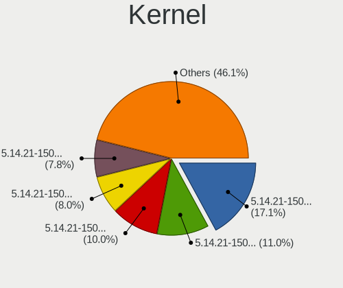

| Version                        | Computers | Percent |
|--------------------------------|-----------|---------|
| 5.14.21-150500.53-default      | 58        | 23.97%  |
| 5.14.21-150500.55.19-default   | 41        | 16.94%  |
| 5.14.21-150500.55.39-default   | 32        | 13.22%  |
| 5.14.21-150500.55.36-default   | 30        | 12.4%   |
| 5.14.21-150500.55.31-default   | 20        | 8.26%   |
| 5.14.21-150500.55.7-default    | 16        | 6.61%   |
| 5.14.21-150500.55.12-default   | 12        | 4.96%   |
| 5.14.21-150500.55.28-default   | 11        | 4.55%   |
| 5.14.21-150500.52-default      | 9         | 3.72%   |
| 5.14.21-150500.43-default      | 2         | 0.83%   |
| 5.14.21-150400.24.18-default   | 2         | 0.83%   |
| 6.6.3-1-default                | 1         | 0.41%   |
| 6.5.4-1-default                | 1         | 0.41%   |
| 6.4.4-lp154.2.g919c802-default | 1         | 0.41%   |
| 5.14.21-150500.55.44-default   | 1         | 0.41%   |
| 5.14.21-150500.50-default      | 1         | 0.41%   |
| 5.14.21-150500.49-default      | 1         | 0.41%   |
| 5.14.21-150500.37-default      | 1         | 0.41%   |
| 5.14.21-150400.24.55-default   | 1         | 0.41%   |
| 5.14.21-150400.24.46-default   | 1         | 0.41%   |

Kernel Family
-------------

Linux kernel without a distro release

| Version | Computers | Percent |
|---------|-----------|---------|
| 5.14.21 | 219       | 98.65%  |
| 6.6.3   | 1         | 0.45%   |
| 6.5.4   | 1         | 0.45%   |
| 6.4.4   | 1         | 0.45%   |

Kernel Major Ver.
-----------------

Linux kernel major version

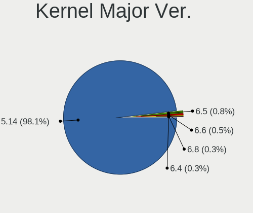

| Version | Computers | Percent |
|---------|-----------|---------|
| 5.14    | 219       | 98.65%  |
| 6.6     | 1         | 0.45%   |
| 6.5     | 1         | 0.45%   |
| 6.4     | 1         | 0.45%   |

Arch
----

OS architecture (x86_64, i586, etc.)

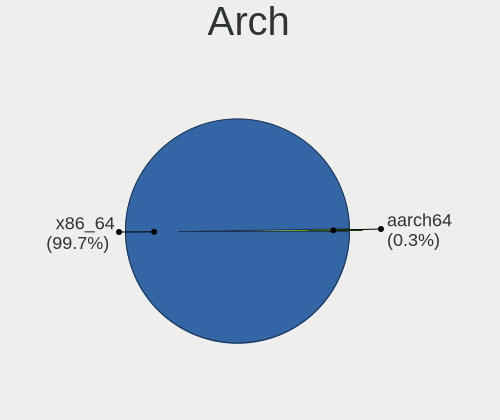

| Name   | Computers | Percent |
|--------|-----------|---------|
| x86_64 | 222       | 100%    |

DE
--

Desktop Environment

| Name     | Computers | Percent |
|----------|-----------|---------|
| KDE5     | 168       | 75.34%  |
| GNOME    | 36        | 16.14%  |
| XFCE     | 9         | 4.04%   |
| Unknown  | 3         | 1.35%   |
| Cinnamon | 2         | 0.9%    |
| Trinity  | 1         | 0.45%   |
| MATE     | 1         | 0.45%   |
| KDE      | 1         | 0.45%   |
| ICEWM    | 1         | 0.45%   |
| Budgie   | 1         | 0.45%   |

Display Server
--------------

X11 or Wayland

| Name    | Computers | Percent |
|---------|-----------|---------|
| X11     | 187       | 82.74%  |
| Wayland | 33        | 14.6%   |
| Tty     | 5         | 2.21%   |
| Unknown | 1         | 0.44%   |

Display Manager
---------------

SDDM, LightDM, etc.

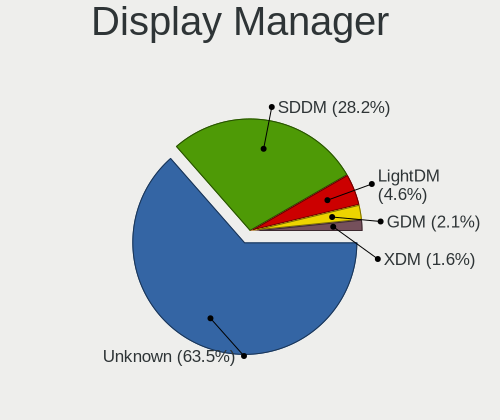

| Name    | Computers | Percent |
|---------|-----------|---------|
| Unknown | 141       | 63.23%  |
| SDDM    | 57        | 25.56%  |
| LightDM | 14        | 6.28%   |
| GDM     | 6         | 2.69%   |
| XDM     | 5         | 2.24%   |

OS Lang
-------

Language

| Lang            | Computers | Percent |
|-----------------|-----------|---------|
| en_US           | 75        | 33.63%  |
| de_DE           | 55        | 24.66%  |
| POSIX           | 20        | 8.97%   |
| pt_BR           | 13        | 5.83%   |
| ru_RU           | 10        | 4.48%   |
| es_ES           | 9         | 4.04%   |
| fr_FR           | 7         | 3.14%   |
| en_GB           | 5         | 2.24%   |
| it_IT           | 4         | 1.79%   |
| pl_PL           | 3         | 1.35%   |
| nl_NL           | 3         | 1.35%   |
| C               | 3         | 1.35%   |
| zh_CN           | 2         | 0.9%    |
| sk_SK           | 2         | 0.9%    |
| hu_HU           | 2         | 0.9%    |
| ja_JP           | 1         | 0.45%   |
| es_DO           | 1         | 0.45%   |
| en_ZA           | 1         | 0.45%   |
| en_US.ISO8859-1 | 1         | 0.45%   |
| en_DK           | 1         | 0.45%   |
| el_GR           | 1         | 0.45%   |
| da_DK           | 1         | 0.45%   |
| cs_CZ           | 1         | 0.45%   |
| ar_AE           | 1         | 0.45%   |
| Unknown         | 1         | 0.45%   |

Boot Mode
---------

EFI or BIOS

| Mode | Computers | Percent |
|------|-----------|---------|
| BIOS | 153       | 68.3%   |
| EFI  | 71        | 31.7%   |

Filesystem
----------

Type of filesystem

| Type  | Computers | Percent |
|-------|-----------|---------|
| Btrfs | 177       | 79.37%  |
| Ext4  | 40        | 17.94%  |
| Xfs   | 4         | 1.79%   |
| Zfs   | 1         | 0.45%   |
| Tmpfs | 1         | 0.45%   |

Part. scheme
------------

Scheme of partitioning

| Type    | Computers | Percent |
|---------|-----------|---------|
| Unknown | 136       | 60.71%  |
| GPT     | 79        | 35.27%  |
| MBR     | 9         | 4.02%   |

Dual Boot with Linux/BSD
------------------------

Hosting more than one Linux/BSD

| Dual boot | Computers | Percent |
|-----------|-----------|---------|
| No        | 200       | 89.69%  |
| Yes       | 23        | 10.31%  |

Dual Boot (Win)
---------------

Hosting Linux and Windows

| Dual boot | Computers | Percent |
|-----------|-----------|---------|
| No        | 184       | 82.88%  |
| Yes       | 38        | 17.12%  |

Board
-----

Vendor
------

Motherboard manufacturer

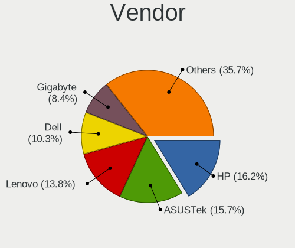

| Name                | Computers | Percent |
|---------------------|-----------|---------|
| Lenovo              | 37        | 16.67%  |
| Hewlett-Packard     | 33        | 14.86%  |
| ASUSTek Computer    | 32        | 14.41%  |
| Gigabyte Technology | 21        | 9.46%   |
| Dell                | 21        | 9.46%   |
| ASRock              | 13        | 5.86%   |
| Acer                | 12        | 5.41%   |
| MSI                 | 11        | 4.95%   |
| Intel               | 4         | 1.8%    |
| TUXEDO              | 3         | 1.35%   |
| Fujitsu             | 3         | 1.35%   |
| Toshiba             | 2         | 0.9%    |
| System76            | 2         | 0.9%    |
| Sony                | 2         | 0.9%    |
| Samsung Electronics | 2         | 0.9%    |
| Notebook            | 2         | 0.9%    |
| Medion              | 2         | 0.9%    |
| HUAWEI              | 2         | 0.9%    |
| Fujitsu Siemens     | 2         | 0.9%    |
| Biostar             | 2         | 0.9%    |
| Apple               | 2         | 0.9%    |
| Pegatron            | 1         | 0.45%   |
| Panasonic           | 1         | 0.45%   |
| OEM                 | 1         | 0.45%   |
| HC Technology.      | 1         | 0.45%   |
| Framework           | 1         | 0.45%   |
| Foxconn             | 1         | 0.45%   |
| Dynabook            | 1         | 0.45%   |
| Colorful Technology | 1         | 0.45%   |
| AZW                 | 1         | 0.45%   |
| AMI                 | 1         | 0.45%   |
| Alienware           | 1         | 0.45%   |
| Unknown             | 1         | 0.45%   |

Model
-----

Motherboard model

| Name                                                                                     | Computers | Percent |
|------------------------------------------------------------------------------------------|-----------|---------|
| TUXEDO Aura 15 Gen2                                                                      | 2         | 0.9%    |
| HP Z420 Workstation                                                                      | 2         | 0.9%    |
| HP Notebook                                                                              | 2         | 0.9%    |
| Gigabyte B550M DS3H                                                                      | 2         | 0.9%    |
| ASUS M5A97 R2.0                                                                          | 2         | 0.9%    |
| Unknown                                                                                  | 2         | 0.9%    |
| TUXEDO Pulse 15 Gen2                                                                     | 1         | 0.45%   |
| Toshiba Satellite Pro C70-A                                                              | 1         | 0.45%   |
| Toshiba dynabook Satellite B552/H                                                        | 1         | 0.45%   |
| System76 Lemur Pro                                                                       | 1         | 0.45%   |
| System76 Bonobo WS                                                                       | 1         | 0.45%   |
| Sony SVF1521A7EB                                                                         | 1         | 0.45%   |
| Samsung 730QFG                                                                           | 1         | 0.45%   |
| Samsung 355V4C/355V4X/355V5C/355V5X/356V4C/356V4X/356V5C/356V5X/3445VC/3445VX/3545VC/354 | 1         | 0.45%   |
| Pegatron NY603AA-ABA 300-1007                                                            | 1         | 0.45%   |
| Panasonic CF-C2CUGZXKM                                                                   | 1         | 0.45%   |
| OEM B75                                                                                  | 1         | 0.45%   |
| Notebook NS50_70MU                                                                       | 1         | 0.45%   |
| Notebook NLx0MU                                                                          | 1         | 0.45%   |
| MSI MS-7D74                                                                              | 1         | 0.45%   |
| MSI MS-7D54                                                                              | 1         | 0.45%   |
| MSI MS-7C80                                                                              | 1         | 0.45%   |
| MSI MS-7C52                                                                              | 1         | 0.45%   |
| MSI MS-7C02                                                                              | 1         | 0.45%   |
| MSI MS-7B89                                                                              | 1         | 0.45%   |
| MSI MS-7B85                                                                              | 1         | 0.45%   |
| MSI MS-7A33                                                                              | 1         | 0.45%   |
| MSI MS-7978                                                                              | 1         | 0.45%   |
| MSI MS-7522                                                                              | 1         | 0.45%   |
| MSI Cyborg 15 A13VE                                                                      | 1         | 0.45%   |
| Medion S15449                                                                            | 1         | 0.45%   |
| Medion E6224                                                                             | 1         | 0.45%   |
| Lenovo Yoga 730-15IKB 81CU                                                               | 1         | 0.45%   |
| Lenovo Y520-15IKBN 80WK                                                                  | 1         | 0.45%   |
| Lenovo V520S-08IKL Desktop 10NN000CBP                                                    | 1         | 0.45%   |
| Lenovo V15-IGL 82C3                                                                      | 1         | 0.45%   |
| Lenovo ThinkPad X390 20Q1S5K400                                                          | 1         | 0.45%   |
| Lenovo ThinkPad X270 W10DG 20K6S0X900                                                    | 1         | 0.45%   |
| Lenovo ThinkPad X200 7458AH8                                                             | 1         | 0.45%   |
| Lenovo ThinkPad W541 20EGS1LB00                                                          | 1         | 0.45%   |

Model Family
------------

Motherboard model prefix

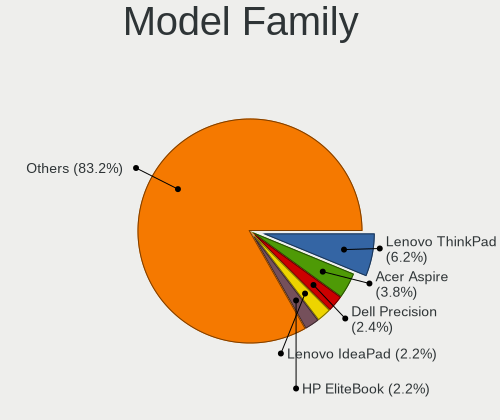

| Name                   | Computers | Percent |
|------------------------|-----------|---------|
| Lenovo ThinkPad        | 18        | 8.11%   |
| Acer Aspire            | 7         | 3.15%   |
| Dell Latitude          | 5         | 2.25%   |
| ASUS ROG               | 5         | 2.25%   |
| Lenovo ThinkCentre     | 4         | 1.8%    |
| Lenovo IdeaPad         | 4         | 1.8%    |
| HP ProLiant            | 4         | 1.8%    |
| HP ENVY                | 4         | 1.8%    |
| Dell Precision         | 4         | 1.8%    |
| Dell Inspiron          | 4         | 1.8%    |
| Lenovo Legion          | 3         | 1.35%   |
| HP Laptop              | 3         | 1.35%   |
| HP EliteBook           | 3         | 1.35%   |
| HP Compaq              | 3         | 1.35%   |
| TUXEDO Aura            | 2         | 0.9%    |
| HP Z420                | 2         | 0.9%    |
| HP ProBook             | 2         | 0.9%    |
| HP OMEN                | 2         | 0.9%    |
| HP Notebook            | 2         | 0.9%    |
| Gigabyte B550M         | 2         | 0.9%    |
| Gigabyte B450M         | 2         | 0.9%    |
| Dell XPS               | 2         | 0.9%    |
| Dell Vostro            | 2         | 0.9%    |
| Dell OptiPlex          | 2         | 0.9%    |
| ASUS VivoBook          | 2         | 0.9%    |
| ASUS PRIME             | 2         | 0.9%    |
| ASUS M5A97             | 2         | 0.9%    |
| Acer Nitro             | 2         | 0.9%    |
| Unknown                | 2         | 0.9%    |
| TUXEDO Pulse           | 1         | 0.45%   |
| Toshiba Satellite      | 1         | 0.45%   |
| Toshiba dynabook       | 1         | 0.45%   |
| System76 Lemur         | 1         | 0.45%   |
| System76 Bonobo        | 1         | 0.45%   |
| Sony SVF1521A7EB       | 1         | 0.45%   |
| Samsung 730QFG         | 1         | 0.45%   |
| Samsung 355V4C         | 1         | 0.45%   |
| Pegatron NY603AA-ABA   | 1         | 0.45%   |
| Panasonic CF-C2CUGZXKM | 1         | 0.45%   |
| OEM B75                | 1         | 0.45%   |

MFG Year
--------

Motherboard manufacture year

| Year | Computers | Percent |
|------|-----------|---------|
| 2021 | 25        | 11.26%  |
| 2020 | 23        | 10.36%  |
| 2022 | 18        | 8.11%   |
| 2018 | 16        | 7.21%   |
| 2023 | 15        | 6.76%   |
| 2010 | 15        | 6.76%   |
| 2013 | 14        | 6.31%   |
| 2012 | 14        | 6.31%   |
| 2019 | 13        | 5.86%   |
| 2015 | 13        | 5.86%   |
| 2011 | 12        | 5.41%   |
| 2017 | 9         | 4.05%   |
| 2016 | 8         | 3.6%    |
| 2014 | 8         | 3.6%    |
| 2009 | 7         | 3.15%   |
| 2008 | 7         | 3.15%   |
| 2007 | 4         | 1.8%    |
| 2006 | 1         | 0.45%   |

Form Factor
-----------

Physical design of the computer

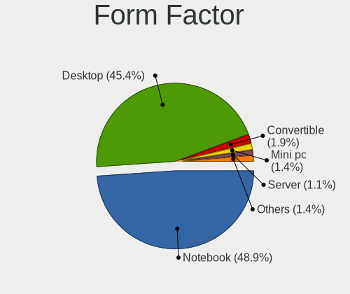

| Name        | Computers | Percent |
|-------------|-----------|---------|
| Notebook    | 106       | 47.75%  |
| Desktop     | 101       | 45.5%   |
| Convertible | 5         | 2.25%   |
| Server      | 4         | 1.8%    |
| Mini pc     | 3         | 1.35%   |
| All in one  | 2         | 0.9%    |
| Other       | 1         | 0.45%   |

Secure Boot
-----------

Enabled or disabled

| State    | Computers | Percent |
|----------|-----------|---------|
| Disabled | 203       | 91.44%  |
| Enabled  | 19        | 8.56%   |

Coreboot
--------

Have coreboot on board

| Used | Computers | Percent |
|------|-----------|---------|
| No   | 220       | 99.1%   |
| Yes  | 2         | 0.9%    |

RAM Size
--------

Total RAM memory

| Size in GB      | Computers | Percent |
|-----------------|-----------|---------|
| 16.01-24.0      | 55        | 24.66%  |
| 4.01-8.0        | 50        | 22.42%  |
| 8.01-16.0       | 48        | 21.52%  |
| 32.01-64.0      | 30        | 13.45%  |
| 3.01-4.0        | 19        | 8.52%   |
| 64.01-256.0     | 13        | 5.83%   |
| 1.01-2.0        | 4         | 1.79%   |
| 24.01-32.0      | 3         | 1.35%   |
| More than 256.0 | 1         | 0.45%   |

RAM Used
--------

Used RAM memory

| Used GB    | Computers | Percent |
|------------|-----------|---------|
| 2.01-3.0   | 88        | 37.45%  |
| 1.01-2.0   | 48        | 20.43%  |
| 3.01-4.0   | 43        | 18.3%   |
| 4.01-8.0   | 38        | 16.17%  |
| 8.01-16.0  | 9         | 3.83%   |
| 0.51-1.0   | 6         | 2.55%   |
| 16.01-24.0 | 2         | 0.85%   |
| 24.01-32.0 | 1         | 0.43%   |

Total Drives
------------

Number of drives on board

| Drives | Computers | Percent |
|--------|-----------|---------|
| 1      | 125       | 55.56%  |
| 2      | 53        | 23.56%  |
| 3      | 26        | 11.56%  |
| 4      | 10        | 4.44%   |
| 5      | 8         | 3.56%   |
| 6      | 3         | 1.33%   |

Has CD-ROM
----------

Has CD-ROM on board

| Presented | Computers | Percent |
|-----------|-----------|---------|
| No        | 135       | 60.54%  |
| Yes       | 88        | 39.46%  |

Has Ethernet
------------

Has Ethernet on board

| Presented | Computers | Percent |
|-----------|-----------|---------|
| Yes       | 203       | 91.44%  |
| No        | 19        | 8.56%   |

Has WiFi
--------

Has WiFi module

| Presented | Computers | Percent |
|-----------|-----------|---------|
| Yes       | 153       | 68.3%   |
| No        | 71        | 31.7%   |

Has Bluetooth
-------------

Has Bluetooth module

| Presented | Computers | Percent |
|-----------|-----------|---------|
| Yes       | 129       | 58.11%  |
| No        | 93        | 41.89%  |

Location
--------

Country
-------

Geographic location (country)

| Country      | Computers | Percent |
|--------------|-----------|---------|
| Germany      | 59        | 26.58%  |
| USA          | 36        | 16.22%  |
| Brazil       | 15        | 6.76%   |
| Russia       | 12        | 5.41%   |
| Italy        | 6         | 2.7%    |
| UK           | 5         | 2.25%   |
| Poland       | 5         | 2.25%   |
| Netherlands  | 5         | 2.25%   |
| Switzerland  | 4         | 1.8%    |
| India        | 4         | 1.8%    |
| Greece       | 4         | 1.8%    |
| France       | 4         | 1.8%    |
| Canada       | 4         | 1.8%    |
| Australia    | 4         | 1.8%    |
| Ukraine      | 3         | 1.35%   |
| Sweden       | 3         | 1.35%   |
| Spain        | 3         | 1.35%   |
| Hungary      | 3         | 1.35%   |
| Finland      | 3         | 1.35%   |
| Argentina    | 3         | 1.35%   |
| South Africa | 2         | 0.9%    |
| Slovakia     | 2         | 0.9%    |
| Mexico       | 2         | 0.9%    |
| Colombia     | 2         | 0.9%    |
| China        | 2         | 0.9%    |
| Bulgaria     | 2         | 0.9%    |
| Belgium      | 2         | 0.9%    |
| Vietnam      | 1         | 0.45%   |
| Venezuela    | 1         | 0.45%   |
| Turkey       | 1         | 0.45%   |
| South Korea  | 1         | 0.45%   |
| Slovenia     | 1         | 0.45%   |
| Serbia       | 1         | 0.45%   |
| Senegal      | 1         | 0.45%   |
| Romania      | 1         | 0.45%   |
| Portugal     | 1         | 0.45%   |
| Peru         | 1         | 0.45%   |
| Martinique   | 1         | 0.45%   |
| Japan        | 1         | 0.45%   |
| Ireland      | 1         | 0.45%   |

City
----

Geographic location (city)

| City                  | Computers | Percent |
|-----------------------|-----------|---------|
| Munich                | 6         | 2.62%   |
| Berlin                | 5         | 2.18%   |
| St Petersburg         | 3         | 1.31%   |
| Kyiv                  | 3         | 1.31%   |
| Enschede              | 3         | 1.31%   |
| Zetel                 | 2         | 0.87%   |
| Warsaw                | 2         | 0.87%   |
| Sydney                | 2         | 0.87%   |
| Sofia                 | 2         | 0.87%   |
| Sao Vicente           | 2         | 0.87%   |
| Sao Paulo             | 2         | 0.87%   |
| Rostock               | 2         | 0.87%   |
| Rio de Janeiro        | 2         | 0.87%   |
| Milan                 | 2         | 0.87%   |
| Kansas City           | 2         | 0.87%   |
| Johannesburg          | 2         | 0.87%   |
| Ithaca                | 2         | 0.87%   |
| Hanover               | 2         | 0.87%   |
| Hamburg               | 2         | 0.87%   |
| Cherry Hill           | 2         | 0.87%   |
| Budapest              | 2         | 0.87%   |
| Bremen                | 2         | 0.87%   |
| Bonn                  | 2         | 0.87%   |
| Zurich                | 1         | 0.44%   |
| Zuchwil               | 1         | 0.44%   |
| Yokohama              | 1         | 0.44%   |
| Yakutsk               | 1         | 0.44%   |
| Wuppertal             | 1         | 0.44%   |
| Wolfratshausen        | 1         | 0.44%   |
| West Bend             | 1         | 0.44%   |
| Warrenton             | 1         | 0.44%   |
| Waren                 | 1         | 0.44%   |
| Wappingers Falls      | 1         | 0.44%   |
| Waidhofen an der Ybbs | 1         | 0.44%   |
| Wachtberg             | 1         | 0.44%   |
| Vlkanova              | 1         | 0.44%   |
| Victoria              | 1         | 0.44%   |
| Vechta                | 1         | 0.44%   |
| Vsters            | 1         | 0.44%   |
| Vantaa                | 1         | 0.44%   |

Drives
------

Drive Vendor
------------

Hard drive vendors

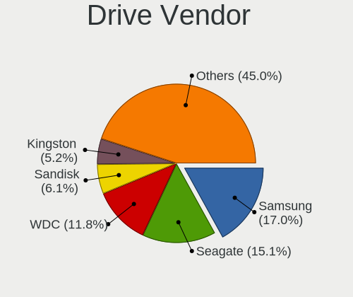

| Vendor                      | Computers | Drives | Percent |
|-----------------------------|-----------|--------|---------|
| Samsung Electronics         | 65        | 88     | 19.06%  |
| Seagate                     | 56        | 86     | 16.42%  |
| WDC                         | 41        | 74     | 12.02%  |
| SanDisk                     | 20        | 27     | 5.87%   |
| Kingston                    | 20        | 27     | 5.87%   |
| Crucial                     | 14        | 16     | 4.11%   |
| Toshiba                     | 13        | 15     | 3.81%   |
| Hitachi                     | 12        | 11     | 3.52%   |
| Intel                       | 11        | 12     | 3.23%   |
| SK hynix                    | 10        | 12     | 2.93%   |
| Micron Technology           | 7         | 8      | 2.05%   |
| Micron/Crucial Technology   | 5         | 6      | 1.47%   |
| Intenso                     | 5         | 6      | 1.47%   |
| Unknown                     | 4         | 4      | 1.17%   |
| Silicon Motion              | 4         | 4      | 1.17%   |
| HGST                        | 4         | 5      | 1.17%   |
| ADATA Technology            | 4         | 4      | 1.17%   |
| KIOXIA                      | 3         | 3      | 0.88%   |
| China                       | 3         | 4      | 0.88%   |
| A-DATA Technology           | 3         | 3      | 0.88%   |
| XrayDisk                    | 2         | 2      | 0.59%   |
| SPCC                        | 2         | 2      | 0.59%   |
| PNY                         | 2         | 4      | 0.59%   |
| Leven                       | 2         | 2      | 0.59%   |
| Kingston Technology Company | 2         | 2      | 0.59%   |
| Apple                       | 2         | 2      | 0.59%   |
| Yangtze Memory Technologies | 1         | 1      | 0.29%   |
| XSTAR                       | 1         | 1      | 0.29%   |
| Union Memory                | 1         | 1      | 0.29%   |
| Transcend                   | 1         | 1      | 0.29%   |
| Synology                    | 1         | 1      | 0.29%   |
| StoreJet                    | 1         | 1      | 0.29%   |
| Seagate Technology          | 1         | 3      | 0.29%   |
| SABRENT                     | 1         | 1      | 0.29%   |
| RESCUE                      | 1         | 1      | 0.29%   |
| Realtek                     | 1         | 1      | 0.29%   |
| Radeon                      | 1         | 1      | 0.29%   |
| Phison Electronics          | 1         | 1      | 0.29%   |
| Patriot                     | 1         | 1      | 0.29%   |
| Maxone                      | 1         | 1      | 0.29%   |

Drive Model
-----------

Hard drive models

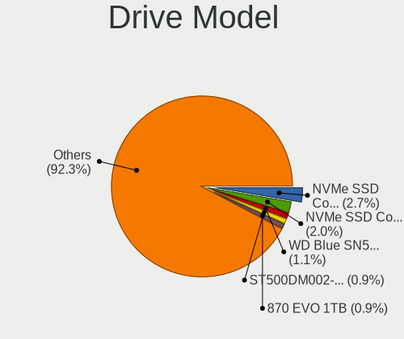

| Model                                               | Computers | Percent |
|-----------------------------------------------------|-----------|---------|
| Samsung NVMe SSD Controller SM981/PM981/PM983 1TB   | 12        | 3.2%    |
| Samsung NVMe SSD Controller PM9A1/PM9A3/980PRO 2TB  | 9         | 2.4%    |
| Seagate ST500DM002-1BD142 500GB                     | 6         | 1.6%    |
| Seagate ST2000DM008-2FR102 2TB                      | 4         | 1.07%   |
| Seagate ST1000LM024 HN-M101MBB 1TB                  | 4         | 1.07%   |
| Sandisk WD Blue SN550 NVMe SSD 512GB                | 4         | 1.07%   |
| Samsung SSD 870 EVO 1TB                             | 4         | 1.07%   |
| Kingston SA400S37480G 480GB SSD                     | 4         | 1.07%   |
| Kingston SA400S37120G 120GB SSD                     | 4         | 1.07%   |
| Intel SSD 660P Series 1024GB                        | 4         | 1.07%   |
| Sandisk WD Black SN750 / PC SN730 NVMe SSD 512GB    | 3         | 0.8%    |
| Samsung SSD 860 EVO 1TB                             | 3         | 0.8%    |
| Micron/Crucial P2 NVMe PCIe SSD 1TB                 | 3         | 0.8%    |
| Kingston SV300S37A120G 120GB SSD                    | 3         | 0.8%    |
| Crucial CT275MX300SSD1 275GB                        | 3         | 0.8%    |
| WDC WD10EZRX-00A8LB0 1TB                            | 2         | 0.53%   |
| WDC WD10EZEX-08WN4A0 1TB                            | 2         | 0.53%   |
| WDC WD10EZEX-08M2NA0 1TB                            | 2         | 0.53%   |
| WDC WD1003FZEX-00K3CA0 1TB                          | 2         | 0.53%   |
| Toshiba HDWD130 3TB                                 | 2         | 0.53%   |
| Toshiba DT01ACA050 500GB                            | 2         | 0.53%   |
| Silicon Motion SM2262/SM2262EN SSD Controller 480GB | 2         | 0.53%   |
| Seagate ST9500325AS 500GB                           | 2         | 0.53%   |
| Seagate ST8000DM004-2U9188 8TB                      | 2         | 0.53%   |
| Seagate ST500LM012 HN-M500MBB 500GB                 | 2         | 0.53%   |
| Seagate ST2000DM006-2DM164 2TB                      | 2         | 0.53%   |
| Seagate ST1000LM048-2E7172 1TB                      | 2         | 0.53%   |
| Seagate ST1000LM014-1EJ164 1TB                      | 2         | 0.53%   |
| Seagate ST1000DM010-2EP102 1TB                      | 2         | 0.53%   |
| Seagate Portable 5TB                                | 2         | 0.53%   |
| Samsung SSD 870 QVO 1TB                             | 2         | 0.53%   |
| Samsung SSD 860 EVO 4TB                             | 2         | 0.53%   |
| Samsung SSD 850 EVO 250GB                           | 2         | 0.53%   |
| Samsung SSD 840 EVO 250GB                           | 2         | 0.53%   |
| Samsung SSD 840 EVO 120GB                           | 2         | 0.53%   |
| Samsung MZALQ512HALU-000L1 512GB                    | 2         | 0.53%   |
| Samsung MZALQ256HAJD-000L2 256GB                    | 2         | 0.53%   |
| Micron 2210_MTFDHBA1T0QFD 1TB                       | 2         | 0.53%   |
| KIOXIA KBG40ZNV256G 256GB                           | 2         | 0.53%   |
| Kingston SNVS500G 500GB                             | 2         | 0.53%   |

HDD Vendor
----------

Hard disk drive vendors

| Vendor              | Computers | Drives | Percent |
|---------------------|-----------|--------|---------|
| Seagate             | 53        | 78     | 40.46%  |
| WDC                 | 36        | 61     | 27.48%  |
| Hitachi             | 12        | 11     | 9.16%   |
| Toshiba             | 9         | 10     | 6.87%   |
| Samsung Electronics | 8         | 10     | 6.11%   |
| HGST                | 4         | 5      | 3.05%   |
| XrayDisk            | 1         | 1      | 0.76%   |
| Unknown             | 1         | 1      | 0.76%   |
| Synology            | 1         | 1      | 0.76%   |
| StoreJet            | 1         | 1      | 0.76%   |
| Maxone              | 1         | 1      | 0.76%   |
| Hewlett-Packard     | 1         | 1      | 0.76%   |
| Fujitsu             | 1         | 2      | 0.76%   |
| ASMT                | 1         | 2      | 0.76%   |
| Apple               | 1         | 1      | 0.76%   |

SSD Vendor
----------

Solid state drive vendors

| Vendor              | Computers | Drives | Percent |
|---------------------|-----------|--------|---------|
| Samsung Electronics | 26        | 39     | 25.74%  |
| Kingston            | 15        | 20     | 14.85%  |
| Crucial             | 14        | 16     | 13.86%  |
| SanDisk             | 7         | 10     | 6.93%   |
| WDC                 | 5         | 12     | 4.95%   |
| Toshiba             | 4         | 4      | 3.96%   |
| Intenso             | 4         | 4      | 3.96%   |
| Intel               | 3         | 4      | 2.97%   |
| China               | 3         | 4      | 2.97%   |
| A-DATA Technology   | 3         | 3      | 2.97%   |
| SPCC                | 2         | 2      | 1.98%   |
| PNY                 | 2         | 4      | 1.98%   |
| Leven               | 2         | 2      | 1.98%   |
| XSTAR               | 1         | 1      | 0.99%   |
| XrayDisk            | 1         | 1      | 0.99%   |
| Transcend           | 1         | 1      | 0.99%   |
| SABRENT             | 1         | 1      | 0.99%   |
| Radeon              | 1         | 1      | 0.99%   |
| Patriot             | 1         | 1      | 0.99%   |
| GOODRAM             | 1         | 1      | 0.99%   |
| Gigabyte Technology | 1         | 1      | 0.99%   |
| Fanxiang            | 1         | 2      | 0.99%   |
| Apple               | 1         | 1      | 0.99%   |
| AMD                 | 1         | 1      | 0.99%   |

Drive Kind
----------

HDD or SSD

| Kind    | Computers | Drives | Percent |
|---------|-----------|--------|---------|
| HDD     | 96        | 186    | 33.68%  |
| NVMe    | 93        | 122    | 32.63%  |
| SSD     | 85        | 136    | 29.82%  |
| Unknown | 9         | 12     | 3.16%   |
| MMC     | 2         | 2      | 0.7%    |

Drive Connector
---------------

SATA, SAS, NVMe, etc.

| Type | Computers | Drives | Percent |
|------|-----------|--------|---------|
| SATA | 145       | 305    | 56.2%   |
| NVMe | 93        | 120    | 36.05%  |
| SAS  | 18        | 31     | 6.98%   |
| MMC  | 2         | 2      | 0.78%   |

Drive Size
----------

Size of hard drive

| Size in TB | Computers | Drives | Percent |
|------------|-----------|--------|---------|
| 0.01-0.5   | 98        | 156    | 48.76%  |
| 0.51-1.0   | 63        | 103    | 31.34%  |
| 1.01-2.0   | 21        | 37     | 10.45%  |
| 3.01-4.0   | 10        | 16     | 4.98%   |
| 4.01-10.0  | 4         | 4      | 1.99%   |
| 2.01-3.0   | 3         | 3      | 1.49%   |
| 10.01-20.0 | 2         | 3      | 1%      |

Space Total
-----------

Amount of disk space available on the file system

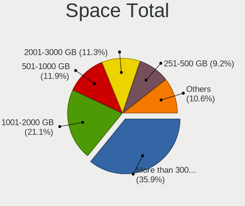

| Size in GB     | Computers | Percent |
|----------------|-----------|---------|
| More than 3000 | 86        | 37.89%  |
| 1001-2000      | 51        | 22.47%  |
| 501-1000       | 25        | 11.01%  |
| 2001-3000      | 24        | 10.57%  |
| 251-500        | 19        | 8.37%   |
| 101-250        | 14        | 6.17%   |
| 51-100         | 3         | 1.32%   |
| 21-50          | 2         | 0.88%   |
| Unknown        | 2         | 0.88%   |
| 1-20           | 1         | 0.44%   |

Space Used
----------

Amount of used disk space

| Used GB        | Computers | Percent |
|----------------|-----------|---------|
| 101-250        | 68        | 28.45%  |
| 51-100         | 47        | 19.67%  |
| 251-500        | 36        | 15.06%  |
| 1001-2000      | 23        | 9.62%   |
| 501-1000       | 23        | 9.62%   |
| 1-20           | 15        | 6.28%   |
| 21-50          | 11        | 4.6%    |
| More than 3000 | 10        | 4.18%   |
| 2001-3000      | 4         | 1.67%   |
| Unknown        | 2         | 0.84%   |

Malfunc. Drives
---------------

Drive models with a malfunction

| Model                                            | Computers | Drives | Percent |
|--------------------------------------------------|-----------|--------|---------|
| Seagate ST500DM002-1BD142 500GB                  | 2         | 2      | 20%     |
| Toshiba MD04ACA400 4TB                           | 1         | 1      | 10%     |
| Seagate ST500LM012 HN-M500MBB 500GB              | 1         | 1      | 10%     |
| Seagate ST4000NM0035-1V4107 4TB                  | 1         | 1      | 10%     |
| Samsung Electronics SSD 840 EVO 120GB            | 1         | 1      | 10%     |
| Samsung Electronics MZALQ256HBJD-00BL2 256GB     | 1         | 1      | 10%     |
| Samsung Electronics MZ7TE256HMHP-000L7 256GB SSD | 1         | 1      | 10%     |
| Kingston SA400S37120G 120GB SSD                  | 1         | 3      | 10%     |
| Hitachi HTS727550A9E364 500GB                    | 1         | 1      | 10%     |

Malfunc. Drive Vendor
---------------------

Vendors of faulty drives

| Vendor              | Computers | Drives | Percent |
|---------------------|-----------|--------|---------|
| Seagate             | 4         | 4      | 44.44%  |
| Samsung Electronics | 2         | 3      | 22.22%  |
| Toshiba             | 1         | 1      | 11.11%  |
| Kingston            | 1         | 3      | 11.11%  |
| Hitachi             | 1         | 1      | 11.11%  |

Malfunc. HDD Vendor
-------------------

Vendors of faulty HDD drives

| Vendor  | Computers | Drives | Percent |
|---------|-----------|--------|---------|
| Seagate | 4         | 4      | 66.67%  |
| Toshiba | 1         | 1      | 16.67%  |
| Hitachi | 1         | 1      | 16.67%  |

Malfunc. Drive Kind
-------------------

Kinds of faulty drives

| Kind | Computers | Drives | Percent |
|------|-----------|--------|---------|
| HDD  | 6         | 6      | 66.67%  |
| SSD  | 2         | 5      | 22.22%  |
| NVMe | 1         | 1      | 11.11%  |

Failed Drives
-------------

Failed drive models

| Model                             | Computers | Drives | Percent |
|-----------------------------------|-----------|--------|---------|
| Samsung Electronics HD502HJ 500GB | 1         | 2      | 100%    |

Failed Drive Vendor
-------------------

Failed drive vendors

| Vendor              | Computers | Drives | Percent |
|---------------------|-----------|--------|---------|
| Samsung Electronics | 1         | 2      | 100%    |

Drive Status
------------

Number of failed and malfunc. drives

| Status   | Computers | Drives | Percent |
|----------|-----------|--------|---------|
| Detected | 138       | 296    | 59.23%  |
| Works    | 86        | 148    | 36.91%  |
| Malfunc  | 8         | 12     | 3.43%   |
| Failed   | 1         | 2      | 0.43%   |

Storage controller
------------------

Storage Vendor
--------------

Storage controller vendors

| Vendor                        | Computers | Percent |
|-------------------------------|-----------|---------|
| Intel                         | 130       | 42.35%  |
| AMD                           | 58        | 18.89%  |
| Samsung Electronics           | 35        | 11.4%   |
| SanDisk                       | 14        | 4.56%   |
| SK hynix                      | 10        | 3.26%   |
| Micron Technology             | 7         | 2.28%   |
| Kingston Technology Company   | 7         | 2.28%   |
| ASMedia Technology            | 6         | 1.95%   |
| Micron/Crucial Technology     | 5         | 1.63%   |
| Silicon Motion                | 4         | 1.3%    |
| Marvell Technology Group      | 4         | 1.3%    |
| JMicron Technology            | 4         | 1.3%    |
| ADATA Technology              | 4         | 1.3%    |
| Seagate Technology            | 3         | 0.98%   |
| KIOXIA                        | 3         | 0.98%   |
| Broadcom / LSI                | 3         | 0.98%   |
| Nvidia                        | 2         | 0.65%   |
| Yangtze Memory Technologies   | 1         | 0.33%   |
| VIA Technologies              | 1         | 0.33%   |
| Union Memory (Shenzhen)       | 1         | 0.33%   |
| Toshiba America Info Systems  | 1         | 0.33%   |
| Phison Electronics            | 1         | 0.33%   |
| Integrated Technology Express | 1         | 0.33%   |
| Hewlett-Packard               | 1         | 0.33%   |
| Adaptec                       | 1         | 0.33%   |

Storage Model
-------------

Storage controller models

| Model                                                                          | Computers | Percent |
|--------------------------------------------------------------------------------|-----------|---------|
| AMD FCH SATA Controller [AHCI mode]                                            | 29        | 8.03%   |
| Samsung NVMe SSD Controller SM981/PM981/PM983                                  | 12        | 3.32%   |
| Samsung NVMe SSD Controller 980 (DRAM-less)                                    | 10        | 2.77%   |
| Intel Sunrise Point-LP SATA Controller [AHCI mode]                             | 10        | 2.77%   |
| Samsung NVMe SSD Controller PM9A1/PM9A3/980PRO                                 | 9         | 2.49%   |
| Intel 8 Series/C220 Series Chipset Family 6-port SATA Controller 1 [AHCI mode] | 9         | 2.49%   |
| AMD 400 Series Chipset SATA Controller                                         | 9         | 2.49%   |
| AMD SB7x0/SB8x0/SB9x0 SATA Controller [IDE mode]                               | 8         | 2.22%   |
| AMD SB7x0/SB8x0/SB9x0 IDE Controller                                           | 8         | 2.22%   |
| Intel 7 Series Chipset Family 6-port SATA Controller [AHCI mode]               | 7         | 1.94%   |
| AMD SB7x0/SB8x0/SB9x0 SATA Controller [AHCI mode]                              | 7         | 1.94%   |
| AMD 500 Series Chipset SATA Controller                                         | 7         | 1.94%   |
| Intel Volume Management Device NVMe RAID Controller                            | 6         | 1.66%   |
| Intel Tiger Lake-LP SATA Controller                                            | 6         | 1.66%   |
| ASMedia ASM1061/ASM1062 Serial ATA Controller                                  | 6         | 1.66%   |
| Intel 82801 Mobile SATA Controller [RAID mode]                                 | 5         | 1.39%   |
| Intel 7 Series/C210 Series Chipset Family 6-port SATA Controller [AHCI mode]   | 5         | 1.39%   |
| AMD FCH SATA Controller D                                                      | 5         | 1.39%   |
| SK hynix Gold P31/BC711/PC711 NVMe Solid State Drive                           | 4         | 1.11%   |
| SanDisk Ultra 3D / WD Blue SN550 NVMe SSD                                      | 4         | 1.11%   |
| Intel SSD 660P Series                                                          | 4         | 1.11%   |
| Intel Q170/Q150/B150/H170/H110/Z170/CM236 Chipset SATA Controller [AHCI Mode]  | 4         | 1.11%   |
| Intel Comet Lake SATA AHCI Controller                                          | 4         | 1.11%   |
| Intel Celeron/Pentium Silver Processor SATA Controller                         | 4         | 1.11%   |
| Intel C602 chipset 4-Port SATA Storage Control Unit                            | 4         | 1.11%   |
| Intel 6 Series/C200 Series Chipset Family 6 port Mobile SATA AHCI Controller   | 4         | 1.11%   |
| Intel 6 Series/C200 Series Chipset Family 6 port Desktop SATA AHCI Controller  | 4         | 1.11%   |
| SK hynix Platinum P41/PC801 NVMe Solid State Drive                             | 3         | 0.83%   |
| SanDisk Extreme Pro / WD Black SN750 / PC SN730 / Red SN700 NVMe SSD           | 3         | 0.83%   |
| Micron/Crucial P2 [Nick P2] / P3 / P3 Plus NVMe PCIe SSD (DRAM-less)           | 3         | 0.83%   |
| JMicron JMB363 SATA/IDE Controller                                             | 3         | 0.83%   |
| Intel SATA Controller [RAID mode]                                              | 3         | 0.83%   |
| Intel Cannon Lake Mobile PCH SATA AHCI Controller                              | 3         | 0.83%   |
| Intel C600/X79 series chipset 6-Port SATA AHCI Controller                      | 3         | 0.83%   |
| Intel Alder Lake-S PCH SATA Controller [AHCI Mode]                             | 3         | 0.83%   |
| Intel 9 Series Chipset Family SATA Controller [AHCI Mode]                      | 3         | 0.83%   |
| Intel 82801JI (ICH10 Family) SATA AHCI Controller                              | 3         | 0.83%   |
| Intel 82801IBM/IEM (ICH9M/ICH9M-E) 4 port SATA Controller [AHCI mode]          | 3         | 0.83%   |
| Intel 5 Series/3400 Series Chipset 6 port SATA AHCI Controller                 | 3         | 0.83%   |
| SK hynix BC511 NVMe SSD                                                        | 2         | 0.55%   |

Storage Kind
------------

Kind of storage controller (IDE, SATA, NVMe, SAS, ...)

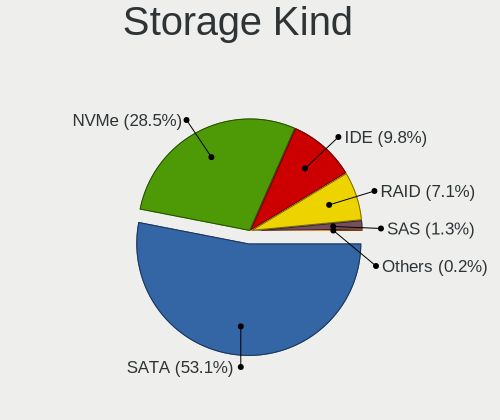

| Kind | Computers | Percent |
|------|-----------|---------|
| SATA | 163       | 51.91%  |
| NVMe | 93        | 29.62%  |
| IDE  | 31        | 9.87%   |
| RAID | 21        | 6.69%   |
| SAS  | 5         | 1.59%   |
| SCSI | 1         | 0.32%   |

Processor
---------

CPU Vendor
----------

Processor vendors

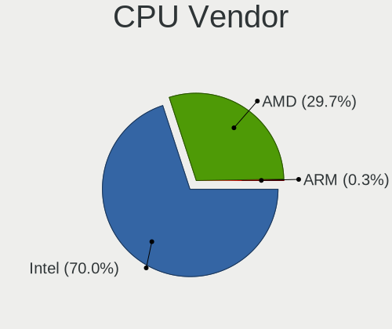

| Vendor | Computers | Percent |
|--------|-----------|---------|
| Intel  | 149       | 67.12%  |
| AMD    | 73        | 32.88%  |

CPU Model
---------

Processor models

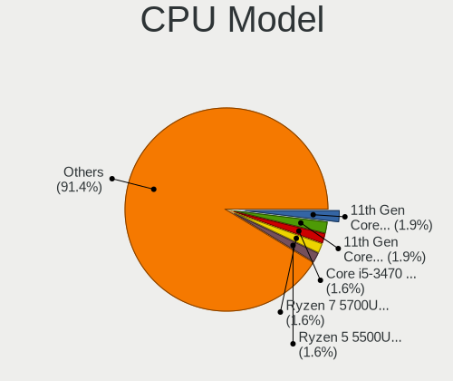

| Model                                       | Computers | Percent |
|---------------------------------------------|-----------|---------|
| Intel 11th Gen Core i5-1135G7 @ 2.40GHz     | 6         | 2.7%    |
| Intel Core i5-3470 CPU @ 3.20GHz            | 5         | 2.25%   |
| Intel 11th Gen Core i7-1165G7 @ 2.80GHz     | 5         | 2.25%   |
| AMD Ryzen 5 5500U with Radeon Graphics      | 5         | 2.25%   |
| AMD Ryzen 7 5700U with Radeon Graphics      | 4         | 1.8%    |
| Intel Core i7-9750H CPU @ 2.60GHz           | 3         | 1.35%   |
| Intel Core i5-8250U CPU @ 1.60GHz           | 3         | 1.35%   |
| Intel Core i5-10210U CPU @ 1.60GHz          | 3         | 1.35%   |
| AMD Ryzen 7 5700G with Radeon Graphics      | 3         | 1.35%   |
| AMD Ryzen 5 5600G with Radeon Graphics      | 3         | 1.35%   |
| AMD Ryzen 5 2600 Six-Core Processor         | 3         | 1.35%   |
| Intel Xeon CPU E5-1603 0 @ 2.80GHz          | 2         | 0.9%    |
| Intel Core i7-8565U CPU @ 1.80GHz           | 2         | 0.9%    |
| Intel Core i7-4790K CPU @ 4.00GHz           | 2         | 0.9%    |
| Intel Core i7-4720HQ CPU @ 2.60GHz          | 2         | 0.9%    |
| Intel Core i5-7400 CPU @ 3.00GHz            | 2         | 0.9%    |
| Intel Core i5-6300U CPU @ 2.40GHz           | 2         | 0.9%    |
| Intel Core i5-3230M CPU @ 2.60GHz           | 2         | 0.9%    |
| Intel Core i3-2310M CPU @ 2.10GHz           | 2         | 0.9%    |
| Intel Core 2 Quad CPU Q9550 @ 2.83GHz       | 2         | 0.9%    |
| Intel Core 2 Duo CPU P8700 @ 2.53GHz        | 2         | 0.9%    |
| Intel Celeron N4020 CPU @ 1.10GHz           | 2         | 0.9%    |
| Intel 13th Gen Core i9-13900HX              | 2         | 0.9%    |
| AMD Ryzen 9 5900X 12-Core Processor         | 2         | 0.9%    |
| AMD Ryzen 9 3900X 12-Core Processor         | 2         | 0.9%    |
| AMD Ryzen 5 5600X 6-Core Processor          | 2         | 0.9%    |
| AMD FX-8370 Eight-Core Processor            | 2         | 0.9%    |
| Intel Xeon E-2276M CPU @ 2.80GHz            | 1         | 0.45%   |
| Intel Xeon CPU X5650 @ 2.67GHz              | 1         | 0.45%   |
| Intel Xeon CPU W3530 @ 2.80GHz              | 1         | 0.45%   |
| Intel Xeon CPU E5450 @ 3.00GHz              | 1         | 0.45%   |
| Intel Xeon CPU E5-2690 0 @ 2.90GHz          | 1         | 0.45%   |
| Intel Xeon CPU E5-2670 0 @ 2.60GHz          | 1         | 0.45%   |
| Intel Xeon CPU E5-2667 v4 @ 3.20GHz         | 1         | 0.45%   |
| Intel Xeon CPU E3-1241 v3 @ 3.50GHz         | 1         | 0.45%   |
| Intel Xeon CPU E3-1220 V2 @ 3.10GHz         | 1         | 0.45%   |
| Intel Xeon CPU 3050 @ 2.13GHz               | 1         | 0.45%   |
| Intel Pentium Silver N5030 CPU @ 1.10GHz    | 1         | 0.45%   |
| Intel Pentium Gold 7505 @ 2.00GHz           | 1         | 0.45%   |
| Intel Pentium Dual-Core CPU E6500 @ 2.93GHz | 1         | 0.45%   |

CPU Model Family
----------------

Processor model prefix

| Model                   | Computers | Percent |
|-------------------------|-----------|---------|
| Intel Core i5           | 37        | 16.67%  |
| Intel Core i7           | 32        | 14.41%  |
| Other                   | 30        | 13.51%  |
| AMD Ryzen 5             | 21        | 9.46%   |
| AMD Ryzen 7             | 15        | 6.76%   |
| Intel Xeon              | 12        | 5.41%   |
| Intel Core i3           | 10        | 4.5%    |
| Intel Celeron           | 8         | 3.6%    |
| Intel Core 2 Duo        | 6         | 2.7%    |
| AMD FX                  | 6         | 2.7%    |
| Intel Pentium           | 5         | 2.25%   |
| AMD Ryzen 9             | 5         | 2.25%   |
| Intel Core 2 Quad       | 3         | 1.35%   |
| AMD Ryzen 3             | 3         | 1.35%   |
| AMD A8                  | 3         | 1.35%   |
| AMD A6                  | 3         | 1.35%   |
| Intel Pentium Dual-Core | 2         | 0.9%    |
| AMD Ryzen 7 PRO         | 2         | 0.9%    |
| AMD Phenom II X4        | 2         | 0.9%    |
| Intel Pentium Silver    | 1         | 0.45%   |
| Intel Pentium Gold      | 1         | 0.45%   |
| Intel Pentium Dual      | 1         | 0.45%   |
| Intel Core 2 Extreme    | 1         | 0.45%   |
| AMD Ryzen Threadripper  | 1         | 0.45%   |
| AMD Ryzen 3 PRO         | 1         | 0.45%   |
| AMD Phenom II X6        | 1         | 0.45%   |
| AMD Phenom              | 1         | 0.45%   |
| AMD Opteron             | 1         | 0.45%   |
| AMD Athlon X4           | 1         | 0.45%   |
| AMD Athlon X2           | 1         | 0.45%   |
| AMD Athlon II X4        | 1         | 0.45%   |
| AMD Athlon II X3        | 1         | 0.45%   |
| AMD Athlon II X2        | 1         | 0.45%   |
| AMD Athlon 64 X2        | 1         | 0.45%   |
| AMD Athlon              | 1         | 0.45%   |
| AMD A4                  | 1         | 0.45%   |

CPU Cores
---------

Number of processor cores

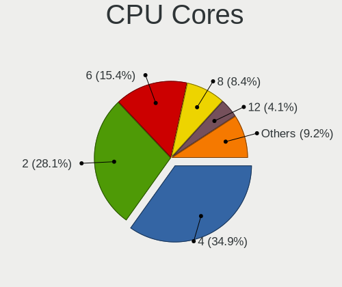

| Number | Computers | Percent |
|--------|-----------|---------|
| 4      | 80        | 36.04%  |
| 2      | 61        | 27.48%  |
| 6      | 32        | 14.41%  |
| 8      | 22        | 9.91%   |
| 12     | 11        | 4.95%   |
| 16     | 3         | 1.35%   |
| 14     | 3         | 1.35%   |
| 3      | 3         | 1.35%   |
| 24     | 2         | 0.9%    |
| 1      | 2         | 0.9%    |
| 64     | 1         | 0.45%   |
| 32     | 1         | 0.45%   |
| 10     | 1         | 0.45%   |

CPU Sockets
-----------

Number of sockets

| Number | Computers | Percent |
|--------|-----------|---------|
| 1      | 218       | 98.2%   |
| 2      | 3         | 1.35%   |
| 4      | 1         | 0.45%   |

CPU Threads
-----------

Threads per core (Hyper-Threading)

| Number | Computers | Percent |
|--------|-----------|---------|
| 2      | 158       | 71.17%  |
| 1      | 64        | 28.83%  |

CPU Op-Modes
------------

CPU Operation Modes (32-bit, 64-bit)

| Op mode        | Computers | Percent |
|----------------|-----------|---------|
| 32-bit, 64-bit | 222       | 100%    |

CPU Microcode
-------------

Microcode number

| Number     | Computers | Percent |
|------------|-----------|---------|
| Unknown    | 129       | 57.08%  |
| 0x806c1    | 8         | 3.54%   |
| 0x08608103 | 6         | 2.65%   |
| 0x806ec    | 5         | 2.21%   |
| 0x0a50000d | 5         | 2.21%   |
| 0x1067a    | 4         | 1.77%   |
| 0x906ea    | 3         | 1.33%   |
| 0x906e9    | 3         | 1.33%   |
| 0x406e3    | 3         | 1.33%   |
| 0x306c3    | 3         | 1.33%   |
| 0x306a9    | 3         | 1.33%   |
| 0x206d7    | 3         | 1.33%   |
| 0xb06a2    | 2         | 0.88%   |
| 0xb0671    | 2         | 0.88%   |
| 0xa0671    | 2         | 0.88%   |
| 0x906ed    | 2         | 0.88%   |
| 0x906a3    | 2         | 0.88%   |
| 0x806ea    | 2         | 0.88%   |
| 0x806e9    | 2         | 0.88%   |
| 0x40651    | 2         | 0.88%   |
| 0x206a7    | 2         | 0.88%   |
| 0x0a601203 | 2         | 0.88%   |
| 0x0a50000c | 2         | 0.88%   |
| 0x08701021 | 2         | 0.88%   |
| 0x08608102 | 2         | 0.88%   |
| 0x08600106 | 2         | 0.88%   |
| 0x0800820d | 2         | 0.88%   |
| 0xa0655    | 1         | 0.44%   |
| 0x806c2    | 1         | 0.44%   |
| 0x706a8    | 1         | 0.44%   |
| 0x706a1    | 1         | 0.44%   |
| 0x506e3    | 1         | 0.44%   |
| 0x20655    | 1         | 0.44%   |
| 0x106e5    | 1         | 0.44%   |
| 0x10677    | 1         | 0.44%   |
| 0x10676    | 1         | 0.44%   |
| 0x0a404102 | 1         | 0.44%   |
| 0x0a404101 | 1         | 0.44%   |
| 0x0a20120a | 1         | 0.44%   |
| 0x08701030 | 1         | 0.44%   |

CPU Microarch
-------------

Microarchitecture

| Name             | Computers | Percent |
|------------------|-----------|---------|
| KabyLake         | 27        | 12.16%  |
| Unknown          | 25        | 11.26%  |
| Zen 3            | 17        | 7.66%   |
| IvyBridge        | 17        | 7.66%   |
| Haswell          | 16        | 7.21%   |
| TigerLake        | 14        | 6.31%   |
| SandyBridge      | 13        | 5.86%   |
| Penryn           | 10        | 4.5%    |
| Skylake          | 8         | 3.6%    |
| Zen 2            | 7         | 3.15%   |
| K10              | 7         | 3.15%   |
| Zen              | 6         | 2.7%    |
| Piledriver       | 6         | 2.7%    |
| Alderlake Hybrid | 6         | 2.7%    |
| Westmere         | 5         | 2.25%   |
| Nehalem          | 5         | 2.25%   |
| Core             | 5         | 2.25%   |
| Goldmont plus    | 4         | 1.8%    |
| Zen+             | 3         | 1.35%   |
| K10 Llano        | 3         | 1.35%   |
| Icelake          | 3         | 1.35%   |
| Excavator        | 3         | 1.35%   |
| CometLake        | 3         | 1.35%   |
| Broadwell        | 3         | 1.35%   |
| Bulldozer        | 2         | 0.9%    |
| Steamroller      | 1         | 0.45%   |
| K8 Hammer        | 1         | 0.45%   |
| K8 & K10 hybrid  | 1         | 0.45%   |
| Goldmont         | 1         | 0.45%   |

Graphics
--------

GPU Vendor
----------

Vendors of graphics cards

| Vendor                     | Computers | Percent |
|----------------------------|-----------|---------|
| Intel                      | 109       | 41.29%  |
| Nvidia                     | 79        | 29.92%  |
| AMD                        | 72        | 27.27%  |
| Matrox Electronics Systems | 4         | 1.52%   |

GPU Model
---------

Graphics card models

| Model                                                                       | Computers | Percent |
|-----------------------------------------------------------------------------|-----------|---------|
| Intel TigerLake-LP GT2 [Iris Xe Graphics]                                   | 12        | 4.4%    |
| AMD Lucienne                                                                | 10        | 3.66%   |
| AMD Cezanne [Radeon Vega Series / Radeon Vega Mobile Series]                | 8         | 2.93%   |
| Intel 3rd Gen Core processor Graphics Controller                            | 7         | 2.56%   |
| Intel 2nd Generation Core Processor Family Integrated Graphics Controller   | 7         | 2.56%   |
| Nvidia GP108 [GeForce GT 1030]                                              | 5         | 1.83%   |
| Intel Skylake GT2 [HD Graphics 520]                                         | 5         | 1.83%   |
| Intel CoffeeLake-H GT2 [UHD Graphics 630]                                   | 5         | 1.83%   |
| Nvidia TU116 [GeForce GTX 1660 SUPER]                                       | 4         | 1.47%   |
| Intel Xeon E3-1200 v3/4th Gen Core Processor Integrated Graphics Controller | 4         | 1.47%   |
| Intel Xeon E3-1200 v2/3rd Gen Core processor Graphics Controller            | 4         | 1.47%   |
| Intel UHD Graphics 620                                                      | 4         | 1.47%   |
| Intel Raptor Lake-P [Iris Xe Graphics]                                      | 4         | 1.47%   |
| Intel HD Graphics 630                                                       | 4         | 1.47%   |
| Intel 4th Gen Core Processor Integrated Graphics Controller                 | 4         | 1.47%   |
| Nvidia GP107 [GeForce GTX 1050 Ti]                                          | 3         | 1.1%    |
| Nvidia GK208B [GeForce GT 730]                                              | 3         | 1.1%    |
| Matrox Electronics Systems MGA G200EH                                       | 3         | 1.1%    |
| Intel WhiskeyLake-U GT2 [UHD Graphics 620]                                  | 3         | 1.1%    |
| Intel HD Graphics 620                                                       | 3         | 1.1%    |
| Intel HD Graphics 530                                                       | 3         | 1.1%    |
| Intel GeminiLake [UHD Graphics 600]                                         | 3         | 1.1%    |
| Intel Core Processor Integrated Graphics Controller                         | 3         | 1.1%    |
| Intel CometLake-U GT2 [UHD Graphics]                                        | 3         | 1.1%    |
| Intel Alder Lake-P GT2 [Iris Xe Graphics]                                   | 3         | 1.1%    |
| AMD Renoir [Radeon RX Vega 6 (Ryzen 4000/5000 Mobile Series)]               | 3         | 1.1%    |
| AMD Navi 31 [Radeon RX 7900 XT/7900 XTX/7900M]                              | 3         | 1.1%    |
| AMD Ellesmere [Radeon RX 470/480/570/570X/580/580X/590]                     | 3         | 1.1%    |
| Nvidia TU117M [GeForce GTX 1650 Mobile / Max-Q]                             | 2         | 0.73%   |
| Nvidia GP106 [GeForce GTX 1060 3GB]                                         | 2         | 0.73%   |
| Nvidia GM107M [GeForce GTX 960M]                                            | 2         | 0.73%   |
| Nvidia GM107M [GeForce GTX 950M]                                            | 2         | 0.73%   |
| Nvidia GK208B [GeForce GT 710]                                              | 2         | 0.73%   |
| Nvidia GA106M [GeForce RTX 3060 Mobile / Max-Q]                             | 2         | 0.73%   |
| Nvidia AD107M [GeForce RTX 4060 Max-Q / Mobile]                             | 2         | 0.73%   |
| Intel TigerLake-H GT1 [UHD Graphics]                                        | 2         | 0.73%   |
| Intel Tiger Lake-LP GT2 [UHD Graphics G4]                                   | 2         | 0.73%   |
| Intel RocketLake-S GT1 [UHD Graphics 750]                                   | 2         | 0.73%   |
| Intel Raptor Lake-S UHD Graphics                                            | 2         | 0.73%   |
| Intel Mobile GM965/GL960 Integrated Graphics Controller (secondary)         | 2         | 0.73%   |

GPU Combo
---------

Combinations of graphics cards

| Name             | Computers | Percent |
|------------------|-----------|---------|
| 1 x Intel        | 75        | 33.63%  |
| 1 x AMD          | 52        | 23.32%  |
| 1 x Nvidia       | 47        | 21.08%  |
| Intel + Nvidia   | 24        | 10.76%  |
| Intel + AMD      | 10        | 4.48%   |
| AMD + Nvidia     | 6         | 2.69%   |
| 2 x AMD          | 4         | 1.79%   |
| 1 x Matrox       | 3         | 1.35%   |
| Nvidia + Matrox  | 1         | 0.45%   |
| AMD + 2 x Nvidia | 1         | 0.45%   |

GPU Driver
----------

Free vs proprietary

| Driver      | Computers | Percent |
|-------------|-----------|---------|
| Free        | 178       | 79.82%  |
| Proprietary | 37        | 16.59%  |
| Unknown     | 8         | 3.59%   |

GPU Memory
----------

Total video memory

| Size in GB | Computers | Percent |
|------------|-----------|---------|
| Unknown    | 154       | 67.84%  |
| 1.01-2.0   | 24        | 10.57%  |
| 0.01-0.5   | 21        | 9.25%   |
| 3.01-4.0   | 10        | 4.41%   |
| 7.01-8.0   | 7         | 3.08%   |
| 5.01-6.0   | 4         | 1.76%   |
| 8.01-16.0  | 3         | 1.32%   |
| 0.51-1.0   | 2         | 0.88%   |
| 24.01-32.0 | 1         | 0.44%   |
| 2.01-3.0   | 1         | 0.44%   |

Monitor
-------

Monitor Vendor
--------------

Monitor vendors

| Vendor                  | Computers | Percent |
|-------------------------|-----------|---------|
| Samsung Electronics     | 34        | 13.82%  |
| BOE                     | 24        | 9.76%   |
| AU Optronics            | 24        | 9.76%   |
| Chimei Innolux          | 21        | 8.54%   |
| Goldstar                | 19        | 7.72%   |
| LG Display              | 15        | 6.1%    |
| Hewlett-Packard         | 10        | 4.07%   |
| Dell                    | 10        | 4.07%   |
| AOC                     | 10        | 4.07%   |
| BenQ                    | 8         | 3.25%   |
| Lenovo                  | 6         | 2.44%   |
| Sony                    | 5         | 2.03%   |
| Acer                    | 5         | 2.03%   |
| Unknown                 | 4         | 1.63%   |
| Philips                 | 4         | 1.63%   |
| Fujitsu Siemens         | 4         | 1.63%   |
| Ancor Communications    | 4         | 1.63%   |
| Sharp                   | 3         | 1.22%   |
| Panasonic               | 3         | 1.22%   |
| Iiyama                  | 3         | 1.22%   |
| Chi Mei Optoelectronics | 3         | 1.22%   |
| ViewSonic               | 2         | 0.81%   |
| HKC                     | 2         | 0.81%   |
| Eizo                    | 2         | 0.81%   |
| CSO                     | 2         | 0.81%   |
| ASUSTek Computer        | 2         | 0.81%   |
| Apple                   | 2         | 0.81%   |
| ___                     | 1         | 0.41%   |
| Toshiba                 | 1         | 0.41%   |
| Sun                     | 1         | 0.41%   |
| RTK                     | 1         | 0.41%   |
| Plain Tree Systems      | 1         | 0.41%   |
| IPS                     | 1         | 0.41%   |
| Insignia                | 1         | 0.41%   |
| InnoView                | 1         | 0.41%   |
| IBM                     | 1         | 0.41%   |
| Hitachi                 | 1         | 0.41%   |
| HannStar Display        | 1         | 0.41%   |
| GreenWood               | 1         | 0.41%   |
| Gigabyte Technology     | 1         | 0.41%   |

Monitor Model
-------------

Monitor models

| Model                                                                 | Computers | Percent |
|-----------------------------------------------------------------------|-----------|---------|
| Chimei Innolux LCD Monitor CMN1521 1920x1080 344x193mm 15.5-inch      | 3         | 1.19%   |
| Sony TV *00 SNY4904 3840x2160                                         | 2         | 0.79%   |
| Samsung Electronics LU28R55 SAM1017 3840x2160 632x360mm 28.6-inch     | 2         | 0.79%   |
| Samsung Electronics LCD Monitor SEC5441 1366x768 344x194mm 15.5-inch  | 2         | 0.79%   |
| Goldstar HDR WFHD GSM7714 2560x1080 798x334mm 34.1-inch               | 2         | 0.79%   |
| Chimei Innolux LCD Monitor CMN15E7 1920x1080 344x193mm 15.5-inch      | 2         | 0.79%   |
| Chimei Innolux LCD Monitor CMN15E6 1366x768 344x193mm 15.5-inch       | 2         | 0.79%   |
| BOE LCD Monitor BOE0747 1920x1080 345x195mm 15.6-inch                 | 2         | 0.79%   |
| BenQ EL2870U BNQ7949 3840x2160 621x341mm 27.9-inch                    | 2         | 0.79%   |
| AU Optronics LCD Monitor AUOFA9B 1920x1200 301x188mm 14.0-inch        | 2         | 0.79%   |
| AU Optronics LCD Monitor AUO41EC 1366x768 344x193mm 15.5-inch         | 2         | 0.79%   |
| AU Optronics LCD Monitor AUO323D 1920x1080 309x174mm 14.0-inch        | 2         | 0.79%   |
| AOC 27G2G8 AOC2702 1920x1080 598x336mm 27.0-inch                      | 2         | 0.79%   |
| ___ LCDTV16 ___9000 1360x768                                          | 1         | 0.4%    |
| ViewSonic VA903 SERIES VSC111E 1280x1024 376x301mm 19.0-inch          | 1         | 0.4%    |
| ViewSonic VA2446 SERIES VSC732E 1920x1080 521x293mm 23.5-inch         | 1         | 0.4%    |
| Unknown SMART TV 0563 1920x1080 1209x680mm 54.6-inch                  | 1         | 0.4%    |
| Unknown LCD TV 9000 1360x768 1600x900mm 72.3-inch                     | 1         | 0.4%    |
| Unknown LCD Monitor KON TV_MONITOR 1920x1080                          | 1         | 0.4%    |
| Unknown LCD Monitor FFFF 2288x1287 2550x2550mm 142.0-inch             | 1         | 0.4%    |
| Toshiba ScreenXpert TSB8888 1080x2160                                 | 1         | 0.4%    |
| Sun X7149A SUN058A 1600x1200 400x300mm 19.7-inch                      | 1         | 0.4%    |
| Sony TV SNY2203 1920x1080 560x420mm 27.6-inch                         | 1         | 0.4%    |
| Sony TV  *00 SNYF303 1920x1080 1220x680mm 55.0-inch                   | 1         | 0.4%    |
| Sony Nvidia Defaul t Flat Panel MS_0025 1920x1080 360x200mm 16.2-inch | 1         | 0.4%    |
| Sharp LQ156D1JW04 SHP1436 3840x2160 346x194mm 15.6-inch               | 1         | 0.4%    |
| Sharp LCD Monitor SHP14B8 1920x1080 294x165mm 13.3-inch               | 1         | 0.4%    |
| Sharp LCD Monitor SHP1446 3840x2160 382x215mm 17.3-inch               | 1         | 0.4%    |
| Samsung Electronics U32J59x SAM0F34 3840x2160 697x392mm 31.5-inch     | 1         | 0.4%    |
| Samsung Electronics U28D590 SAM0B80 3840x2160 607x345mm 27.5-inch     | 1         | 0.4%    |
| Samsung Electronics SyncMaster SAM05CD 1920x1080                      | 1         | 0.4%    |
| Samsung Electronics SyncMaster SAM0586 1920x1200 518x324mm 24.1-inch  | 1         | 0.4%    |
| Samsung Electronics SyncMaster SAM0472 1440x900 367x229mm 17.0-inch   | 1         | 0.4%    |
| Samsung Electronics SyncMaster SAM0427 1920x1200                      | 1         | 0.4%    |
| Samsung Electronics SyncMaster SAM0425 1920x1200 518x324mm 24.1-inch  | 1         | 0.4%    |
| Samsung Electronics SyncMaster SAM01B7 1280x1024 338x270mm 17.0-inch  | 1         | 0.4%    |
| Samsung Electronics SMB2330H SAM064A 1920x1080 509x286mm 23.0-inch    | 1         | 0.4%    |
| Samsung Electronics SMB1630N SAM0630 1366x768 344x194mm 15.5-inch     | 1         | 0.4%    |
| Samsung Electronics S27E450 SAM0C83 1920x1080 598x336mm 27.0-inch     | 1         | 0.4%    |
| Samsung Electronics S24E650 SAM0CB8 1920x1080 521x293mm 23.5-inch     | 1         | 0.4%    |

Monitor Resolution
------------------

Monitor screen resolution

| Resolution         | Computers | Percent |
|--------------------|-----------|---------|
| 1920x1080 (FHD)    | 107       | 44.77%  |
| 1366x768 (WXGA)    | 30        | 12.55%  |
| 3840x2160 (4K)     | 24        | 10.04%  |
| 1280x1024 (SXGA)   | 12        | 5.02%   |
| 1920x1200 (WUXGA)  | 11        | 4.6%    |
| 2560x1440 (QHD)    | 9         | 3.77%   |
| 1440x900 (WXGA+)   | 7         | 2.93%   |
| 1600x900 (HD+)     | 6         | 2.51%   |
| 2560x1600          | 5         | 2.09%   |
| 1680x1050 (WSXGA+) | 5         | 2.09%   |
| 2560x1080          | 3         | 1.26%   |
| 1280x800 (WXGA)    | 3         | 1.26%   |
| 3840x1080          | 2         | 0.84%   |
| 1920x540           | 2         | 0.84%   |
| 1360x768           | 2         | 0.84%   |
| 1024x768 (XGA)     | 2         | 0.84%   |
| Unknown            | 2         | 0.84%   |
| 3440x1440          | 1         | 0.42%   |
| 2880x1800          | 1         | 0.42%   |
| 2520x1680          | 1         | 0.42%   |
| 2288x1287          | 1         | 0.42%   |
| 2256x1504          | 1         | 0.42%   |
| 2160x1440          | 1         | 0.42%   |
| 1600x1200          | 1         | 0.42%   |

Monitor Diagonal
----------------

Diagonal size in inches

| Inches  | Computers | Percent |
|---------|-----------|---------|
| 15      | 59        | 24.58%  |
| 24      | 24        | 10%     |
| 17      | 17        | 7.08%   |
| 23      | 16        | 6.67%   |
| 14      | 15        | 6.25%   |
| 27      | 13        | 5.42%   |
| 21      | 13        | 5.42%   |
| 13      | 10        | 4.17%   |
| Unknown | 10        | 4.17%   |
| 31      | 9         | 3.75%   |
| 19      | 9         | 3.75%   |
| 16      | 9         | 3.75%   |
| 72      | 4         | 1.67%   |
| 12      | 4         | 1.67%   |
| 34      | 3         | 1.25%   |
| 22      | 3         | 1.25%   |
| 18      | 3         | 1.25%   |
| 54      | 2         | 0.83%   |
| 36      | 2         | 0.83%   |
| 28      | 2         | 0.83%   |
| 20      | 2         | 0.83%   |
| 142     | 1         | 0.42%   |
| 86      | 1         | 0.42%   |
| 84      | 1         | 0.42%   |
| 75      | 1         | 0.42%   |
| 65      | 1         | 0.42%   |
| 43      | 1         | 0.42%   |
| 40      | 1         | 0.42%   |
| 38      | 1         | 0.42%   |
| 35      | 1         | 0.42%   |
| 32      | 1         | 0.42%   |
| 25      | 1         | 0.42%   |

Monitor Width
-------------

Physical width

| Width in mm    | Computers | Percent |
|----------------|-----------|---------|
| 301-350        | 86        | 36.29%  |
| 501-600        | 48        | 20.25%  |
| 351-400        | 26        | 10.97%  |
| 401-500        | 22        | 9.28%   |
| 601-700        | 14        | 5.91%   |
| 201-300        | 10        | 4.22%   |
| Unknown        | 10        | 4.22%   |
| 701-800        | 6         | 2.53%   |
| 1501-2000      | 6         | 2.53%   |
| 1001-1500      | 4         | 1.69%   |
| 801-900        | 3         | 1.27%   |
| More than 2000 | 1         | 0.42%   |
| 901-1000       | 1         | 0.42%   |

Aspect Ratio
------------

Proportional relationship between the width and the height

| Ratio   | Computers | Percent |
|---------|-----------|---------|
| 16/9    | 156       | 71.89%  |
| 16/10   | 32        | 14.75%  |
| 5/4     | 8         | 3.69%   |
| Unknown | 6         | 2.76%   |
| 4/3     | 4         | 1.84%   |
| 21/9    | 4         | 1.84%   |
| 3/2     | 3         | 1.38%   |
| 6/5     | 2         | 0.92%   |
| 1.00    | 1         | 0.46%   |
| 0.56    | 1         | 0.46%   |

Monitor Area
------------

Area in inch

| Area in inch | Computers | Percent |
|----------------|-----------|---------|
| 101-110        | 60        | 25.32%  |
| 201-250        | 39        | 16.46%  |
| 81-90          | 21        | 8.86%   |
| 351-500        | 17        | 7.17%   |
| 151-200        | 16        | 6.75%   |
| 301-350        | 12        | 5.06%   |
| More than 1000 | 11        | 4.64%   |
| 251-300        | 11        | 4.64%   |
| 121-130        | 10        | 4.22%   |
| Unknown        | 10        | 4.22%   |
| 111-120        | 8         | 3.38%   |
| 141-150        | 5         | 2.11%   |
| 501-1000       | 5         | 2.11%   |
| 71-80          | 4         | 1.69%   |
| 61-70          | 4         | 1.69%   |
| 131-140        | 4         | 1.69%   |

Pixel Density
-------------

Pixels per inch

| Density       | Computers | Percent |
|---------------|-----------|---------|
| 51-100        | 89        | 38.36%  |
| 121-160       | 61        | 26.29%  |
| 101-120       | 43        | 18.53%  |
| 161-240       | 17        | 7.33%   |
| Unknown       | 10        | 4.31%   |
| 1-50          | 7         | 3.02%   |
| More than 240 | 5         | 2.16%   |

Multiple Monitors
-----------------

Total monitors connected

| Total | Computers | Percent |
|-------|-----------|---------|
| 1     | 170       | 75.89%  |
| 2     | 40        | 17.86%  |
| 0     | 11        | 4.91%   |
| 3     | 3         | 1.34%   |

Network
-------

Net Controller Vendor
---------------------

Controller vendors

| Vendor                            | Computers | Percent |
|-----------------------------------|-----------|---------|
| Realtek Semiconductor             | 133       | 39.82%  |
| Intel                             | 106       | 31.74%  |
| Qualcomm Atheros                  | 24        | 7.19%   |
| Broadcom                          | 20        | 5.99%   |
| MediaTek                          | 7         | 2.1%    |
| ASIX Electronics                  | 4         | 1.2%    |
| Ralink Technology                 | 3         | 0.9%    |
| Marvell Technology Group          | 3         | 0.9%    |
| Broadcom Limited                  | 3         | 0.9%    |
| ASUSTek Computer                  | 3         | 0.9%    |
| Samsung Electronics               | 2         | 0.6%    |
| QLogic                            | 2         | 0.6%    |
| Lenovo                            | 2         | 0.6%    |
| D-Link System                     | 2         | 0.6%    |
| Belkin Components                 | 2         | 0.6%    |
| Xiaomi                            | 1         | 0.3%    |
| U-Blox                            | 1         | 0.3%    |
| TP-Link                           | 1         | 0.3%    |
| Sierra Wireless                   | 1         | 0.3%    |
| Ralink                            | 1         | 0.3%    |
| OPPO Electronics                  | 1         | 0.3%    |
| Nvidia                            | 1         | 0.3%    |
| Mellanox Technologies             | 1         | 0.3%    |
| Linksys                           | 1         | 0.3%    |
| Huawei Technologies               | 1         | 0.3%    |
| Ericsson Business Mobile Networks | 1         | 0.3%    |
| DisplayLink                       | 1         | 0.3%    |
| Dell                              | 1         | 0.3%    |
| D-Link                            | 1         | 0.3%    |
| AVM                               | 1         | 0.3%    |
| Atmel                             | 1         | 0.3%    |
| Aquantia                          | 1         | 0.3%    |
| American Megatrends               | 1         | 0.3%    |

Net Controller Model
--------------------

Controller models

| Model                                                                  | Computers | Percent |
|------------------------------------------------------------------------|-----------|---------|
| Realtek RTL8111/8168/8211/8411 PCI Express Gigabit Ethernet Controller | 99        | 25.06%  |
| Intel Wi-Fi 6 AX200                                                    | 15        | 3.8%    |
| Intel Wi-Fi 6 AX201                                                    | 9         | 2.28%   |
| Intel 82579LM Gigabit Network Connection (Lewisville)                  | 8         | 2.03%   |
| Realtek RTL8125 2.5GbE Controller                                      | 7         | 1.77%   |
| Realtek RTL8822CE 802.11ac PCIe Wireless Network Adapter               | 6         | 1.52%   |
| Realtek RTL8153 Gigabit Ethernet Adapter                               | 6         | 1.52%   |
| Intel Wi-Fi 6E(802.11ax) AX210/AX1675* 2x2 [Typhoon Peak]              | 6         | 1.52%   |
| Intel Wireless 8260                                                    | 5         | 1.27%   |
| Realtek RTL8852BE PCIe 802.11ax Wireless Network Controller            | 4         | 1.01%   |
| Realtek RTL810xE PCI Express Fast Ethernet controller                  | 4         | 1.01%   |
| Intel Raptor Lake PCH CNVi WiFi                                        | 4         | 1.01%   |
| Broadcom BCM43142 802.11b/g/n                                          | 4         | 1.01%   |
| ASIX AX88179 Gigabit Ethernet                                          | 4         | 1.01%   |
| Realtek RTL8822BE 802.11a/b/g/n/ac WiFi adapter                        | 3         | 0.76%   |
| Realtek Killer E2600 GbE Controller                                    | 3         | 0.76%   |
| Qualcomm Atheros QCA9565 / AR9565 Wireless Network Adapter             | 3         | 0.76%   |
| Qualcomm Atheros QCA9377 802.11ac Wireless Network Adapter             | 3         | 0.76%   |
| Qualcomm Atheros AR9285 Wireless Network Adapter (PCI-Express)         | 3         | 0.76%   |
| MediaTek MT7922 802.11ax PCI Express Wireless Network Adapter          | 3         | 0.76%   |
| MediaTek MT7921 802.11ax PCI Express Wireless Network Adapter          | 3         | 0.76%   |
| Intel Wi-Fi 5(802.11ac) Wireless-AC 9x6x [Thunder Peak]                | 3         | 0.76%   |
| Intel Tiger Lake PCH CNVi WiFi                                         | 3         | 0.76%   |
| Intel I211 Gigabit Network Connection                                  | 3         | 0.76%   |
| Intel Ethernet Controller I225-V                                       | 3         | 0.76%   |
| Intel Ethernet Connection I219-LM                                      | 3         | 0.76%   |
| Intel Ethernet Connection (7) I219-V                                   | 3         | 0.76%   |
| Intel Ethernet Connection (7) I219-LM                                  | 3         | 0.76%   |
| Intel Comet Lake PCH-LP CNVi WiFi                                      | 3         | 0.76%   |
| Intel Centrino Advanced-N 6205 [Taylor Peak]                           | 3         | 0.76%   |
| Intel Centrino Advanced-N 6200                                         | 3         | 0.76%   |
| Intel Cannon Point-LP CNVi [Wireless-AC]                               | 3         | 0.76%   |
| Intel Alder Lake-P PCH CNVi WiFi                                       | 3         | 0.76%   |
| Intel 82574L Gigabit Network Connection                                | 3         | 0.76%   |
| Realtek RTL8812AE 802.11ac PCIe Wireless Network Adapter               | 2         | 0.51%   |
| Realtek RTL8723BE PCIe Wireless Network Adapter                        | 2         | 0.51%   |
| Realtek RTL8192EU 802.11b/g/n WLAN Adapter                             | 2         | 0.51%   |
| Realtek RTL8187 Wireless Adapter                                       | 2         | 0.51%   |
| Realtek 802.11ac NIC                                                   | 2         | 0.51%   |
| Ralink RT2870/RT3070 Wireless Adapter                                  | 2         | 0.51%   |

Wireless Vendor
---------------

Wireless vendors

| Vendor                | Computers | Percent |
|-----------------------|-----------|---------|
| Intel                 | 79        | 47.88%  |
| Realtek Semiconductor | 31        | 18.79%  |
| Qualcomm Atheros      | 20        | 12.12%  |
| Broadcom              | 9         | 5.45%   |
| MediaTek              | 7         | 4.24%   |
| Ralink Technology     | 3         | 1.82%   |
| ASUSTek Computer      | 3         | 1.82%   |
| D-Link System         | 2         | 1.21%   |
| Broadcom Limited      | 2         | 1.21%   |
| Belkin Components     | 2         | 1.21%   |
| TP-Link               | 1         | 0.61%   |
| Sierra Wireless       | 1         | 0.61%   |
| Ralink                | 1         | 0.61%   |
| Linksys               | 1         | 0.61%   |
| Dell                  | 1         | 0.61%   |
| D-Link                | 1         | 0.61%   |
| AVM                   | 1         | 0.61%   |

Wireless Model
--------------

Wireless models

| Model                                                                   | Computers | Percent |
|-------------------------------------------------------------------------|-----------|---------|
| Intel Wi-Fi 6 AX200                                                     | 15        | 9.04%   |
| Intel Wi-Fi 6 AX201                                                     | 9         | 5.42%   |
| Realtek RTL8822CE 802.11ac PCIe Wireless Network Adapter                | 6         | 3.61%   |
| Intel Wi-Fi 6E(802.11ax) AX210/AX1675* 2x2 [Typhoon Peak]               | 6         | 3.61%   |
| Intel Wireless 8260                                                     | 5         | 3.01%   |
| Realtek RTL8852BE PCIe 802.11ax Wireless Network Controller             | 4         | 2.41%   |
| Intel Raptor Lake PCH CNVi WiFi                                         | 4         | 2.41%   |
| Broadcom BCM43142 802.11b/g/n                                           | 4         | 2.41%   |
| Realtek RTL8822BE 802.11a/b/g/n/ac WiFi adapter                         | 3         | 1.81%   |
| Qualcomm Atheros QCA9565 / AR9565 Wireless Network Adapter              | 3         | 1.81%   |
| Qualcomm Atheros QCA9377 802.11ac Wireless Network Adapter              | 3         | 1.81%   |
| Qualcomm Atheros AR9285 Wireless Network Adapter (PCI-Express)          | 3         | 1.81%   |
| MediaTek MT7922 802.11ax PCI Express Wireless Network Adapter           | 3         | 1.81%   |
| MediaTek MT7921 802.11ax PCI Express Wireless Network Adapter           | 3         | 1.81%   |
| Intel Wi-Fi 5(802.11ac) Wireless-AC 9x6x [Thunder Peak]                 | 3         | 1.81%   |
| Intel Tiger Lake PCH CNVi WiFi                                          | 3         | 1.81%   |
| Intel Comet Lake PCH-LP CNVi WiFi                                       | 3         | 1.81%   |
| Intel Centrino Advanced-N 6205 [Taylor Peak]                            | 3         | 1.81%   |
| Intel Centrino Advanced-N 6200                                          | 3         | 1.81%   |
| Intel Cannon Point-LP CNVi [Wireless-AC]                                | 3         | 1.81%   |
| Intel Alder Lake-P PCH CNVi WiFi                                        | 3         | 1.81%   |
| Realtek RTL8812AE 802.11ac PCIe Wireless Network Adapter                | 2         | 1.2%    |
| Realtek RTL8723BE PCIe Wireless Network Adapter                         | 2         | 1.2%    |
| Realtek RTL8192EU 802.11b/g/n WLAN Adapter                              | 2         | 1.2%    |
| Realtek RTL8187 Wireless Adapter                                        | 2         | 1.2%    |
| Realtek 802.11ac NIC                                                    | 2         | 1.2%    |
| Ralink RT2870/RT3070 Wireless Adapter                                   | 2         | 1.2%    |
| Qualcomm Atheros AR9485 Wireless Network Adapter                        | 2         | 1.2%    |
| Qualcomm Atheros AR93xx Wireless Network Adapter                        | 2         | 1.2%    |
| Qualcomm Atheros AR242x / AR542x Wireless Network Adapter (PCI-Express) | 2         | 1.2%    |
| Intel Wireless 8265 / 8275                                              | 2         | 1.2%    |
| Intel Wireless 7265                                                     | 2         | 1.2%    |
| Intel Ultimate N WiFi Link 5300                                         | 2         | 1.2%    |
| Intel Raptor Lake-S PCH CNVi WiFi                                       | 2         | 1.2%    |
| Intel Gemini Lake PCH CNVi WiFi                                         | 2         | 1.2%    |
| Belkin Components F7D1101 v1 Basic Wireless Adapter [Realtek RTL8188SU] | 2         | 1.2%    |
| TP-Link TL-WN822N Version 4 RTL8192EU                                   | 1         | 0.6%    |
| Sierra Wireless EM7455                                                  | 1         | 0.6%    |
| Realtek RTL88x2bu [AC1200 Techkey]                                      | 1         | 0.6%    |
| Realtek RTL8852CE PCIe 802.11ax Wireless Network Controller             | 1         | 0.6%    |

Ethernet Vendor
---------------

Ethernet vendors

| Vendor                   | Computers | Percent |
|--------------------------|-----------|---------|
| Realtek Semiconductor    | 121       | 55.76%  |
| Intel                    | 57        | 26.27%  |
| Broadcom                 | 13        | 5.99%   |
| Qualcomm Atheros         | 6         | 2.76%   |
| ASIX Electronics         | 4         | 1.84%   |
| Marvell Technology Group | 3         | 1.38%   |
| Samsung Electronics      | 2         | 0.92%   |
| Lenovo                   | 2         | 0.92%   |
| Xiaomi                   | 1         | 0.46%   |
| QLogic                   | 1         | 0.46%   |
| OPPO Electronics         | 1         | 0.46%   |
| Nvidia                   | 1         | 0.46%   |
| Huawei Technologies      | 1         | 0.46%   |
| DisplayLink              | 1         | 0.46%   |
| Broadcom Limited         | 1         | 0.46%   |
| Aquantia                 | 1         | 0.46%   |
| American Megatrends      | 1         | 0.46%   |

Ethernet Model
--------------

Ethernet models

| Model                                                                  | Computers | Percent |
|------------------------------------------------------------------------|-----------|---------|
| Realtek RTL8111/8168/8211/8411 PCI Express Gigabit Ethernet Controller | 99        | 44.39%  |
| Intel 82579LM Gigabit Network Connection (Lewisville)                  | 8         | 3.59%   |
| Realtek RTL8125 2.5GbE Controller                                      | 7         | 3.14%   |
| Realtek RTL8153 Gigabit Ethernet Adapter                               | 6         | 2.69%   |
| Realtek RTL810xE PCI Express Fast Ethernet controller                  | 4         | 1.79%   |
| ASIX AX88179 Gigabit Ethernet                                          | 4         | 1.79%   |
| Realtek Killer E2600 GbE Controller                                    | 3         | 1.35%   |
| Intel I211 Gigabit Network Connection                                  | 3         | 1.35%   |
| Intel Ethernet Controller I225-V                                       | 3         | 1.35%   |
| Intel Ethernet Connection I219-LM                                      | 3         | 1.35%   |
| Intel Ethernet Connection (7) I219-V                                   | 3         | 1.35%   |
| Intel Ethernet Connection (7) I219-LM                                  | 3         | 1.35%   |
| Intel 82574L Gigabit Network Connection                                | 3         | 1.35%   |
| Qualcomm Atheros AR8151 v2.0 Gigabit Ethernet                          | 2         | 0.9%    |
| Intel I210 Gigabit Network Connection                                  | 2         | 0.9%    |
| Intel Ethernet Connection I217-LM                                      | 2         | 0.9%    |
| Intel Ethernet Connection (6) I219-V                                   | 2         | 0.9%    |
| Intel Ethernet Connection (2) I219-LM                                  | 2         | 0.9%    |
| Intel Ethernet Connection (14) I219-V                                  | 2         | 0.9%    |
| Intel Ethernet Connection (13) I219-V                                  | 2         | 0.9%    |
| Intel 82577LM Gigabit Network Connection                               | 2         | 0.9%    |
| Intel 82567LM Gigabit Network Connection                               | 2         | 0.9%    |
| Intel 82567LF Gigabit Network Connection                               | 2         | 0.9%    |
| Broadcom NetXtreme II BCM5709 Gigabit Ethernet                         | 2         | 0.9%    |
| Broadcom NetXtreme BCM5761e Gigabit Ethernet PCIe                      | 2         | 0.9%    |
| Broadcom NetXtreme BCM5720 Gigabit Ethernet PCIe                       | 2         | 0.9%    |
| Xiaomi Mi/Redmi series (RNDIS)                                         | 1         | 0.45%   |
| Samsung GT-I9070 (network tethering, USB debugging enabled)            | 1         | 0.45%   |
| Samsung Galaxy series, misc. (tethering mode)                          | 1         | 0.45%   |
| Realtek RTL8169 PCI Gigabit Ethernet Controller                        | 1         | 0.45%   |
| Realtek RTL-8100/8101L/8139 PCI Fast Ethernet Adapter                  | 1         | 0.45%   |
| Qualcomm Atheros Killer E2500 Gigabit Ethernet Controller              | 1         | 0.45%   |
| Qualcomm Atheros Killer E2400 Gigabit Ethernet Controller              | 1         | 0.45%   |
| Qualcomm Atheros Killer E220x Gigabit Ethernet Controller              | 1         | 0.45%   |
| Qualcomm Atheros AR8162 Fast Ethernet                                  | 1         | 0.45%   |
| QLogic ISP8324 1/10GbE Converged Network Controller                    | 1         | 0.45%   |
| OPPO SM8350-IDP _SN:361A1B3C                                           | 1         | 0.45%   |
| Nvidia MCP79 Ethernet                                                  | 1         | 0.45%   |
| Marvell Group 88E8057 PCI-E Gigabit Ethernet Controller                | 1         | 0.45%   |
| Marvell Group 88E8055 PCI-E Gigabit Ethernet Controller                | 1         | 0.45%   |

Net Controller Kind
-------------------

Ethernet, WiFi or modem

| Kind     | Computers | Percent |
|----------|-----------|---------|
| Ethernet | 203       | 56.08%  |
| WiFi     | 153       | 42.27%  |
| Modem    | 3         | 0.83%   |
| Unknown  | 3         | 0.83%   |

Used Controller
---------------

Currently used network controller

| Kind     | Computers | Percent |
|----------|-----------|---------|
| Ethernet | 131       | 56.47%  |
| WiFi     | 101       | 43.53%  |

NICs
----

Total network controllers on board

| Total | Computers | Percent |
|-------|-----------|---------|
| 2     | 115       | 51.8%   |
| 1     | 96        | 43.24%  |
| 3     | 4         | 1.8%    |
| 4     | 2         | 0.9%    |
| 0     | 2         | 0.9%    |
| 8     | 1         | 0.45%   |
| 6     | 1         | 0.45%   |
| 5     | 1         | 0.45%   |

IPv6
----

IPv6 vs IPv4

| Used | Computers | Percent |
|------|-----------|---------|
| No   | 137       | 61.16%  |
| Yes  | 87        | 38.84%  |

Bluetooth
---------

Bluetooth Vendor
----------------

Controller vendors

| Vendor                          | Computers | Percent |
|---------------------------------|-----------|---------|
| Intel                           | 64        | 49.23%  |
| Realtek Semiconductor           | 21        | 16.15%  |
| Cambridge Silicon Radio         | 9         | 6.92%   |
| Qualcomm Atheros Communications | 6         | 4.62%   |
| Lite-On Technology              | 5         | 3.85%   |
| Foxconn / Hon Hai               | 5         | 3.85%   |
| IMC Networks                    | 4         | 3.08%   |
| Dell                            | 3         | 2.31%   |
| Broadcom                        | 3         | 2.31%   |
| TP-Link                         | 2         | 1.54%   |
| Hewlett-Packard                 | 2         | 1.54%   |
| Apple                           | 2         | 1.54%   |
| Realtek                         | 1         | 0.77%   |
| MediaTek                        | 1         | 0.77%   |
| Foxconn International           | 1         | 0.77%   |
| ASUSTek Computer                | 1         | 0.77%   |

Bluetooth Model
---------------

Controller models

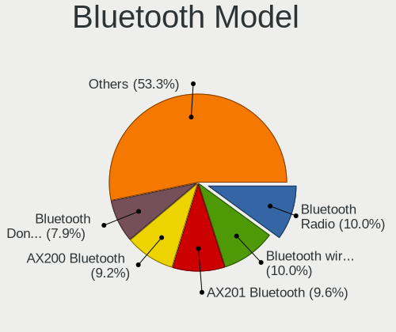

| Model                                                                               | Computers | Percent |
|-------------------------------------------------------------------------------------|-----------|---------|
| Realtek Bluetooth Radio                                                             | 17        | 13.08%  |
| Intel AX201 Bluetooth                                                               | 15        | 11.54%  |
| Intel AX200 Bluetooth                                                               | 15        | 11.54%  |
| Intel Bluetooth wireless interface                                                  | 10        | 7.69%   |
| Cambridge Silicon Radio Bluetooth Dongle (HCI mode)                                 | 9         | 6.92%   |
| Intel Bluetooth 9460/9560 Jefferson Peak (JfP)                                      | 7         | 5.38%   |
| Intel Bluetooth Device                                                              | 6         | 4.62%   |
| Intel AX210 Bluetooth                                                               | 6         | 4.62%   |
| Qualcomm Atheros AR3011 Bluetooth                                                   | 3         | 2.31%   |
| Intel Wireless-AC 9260 Bluetooth Adapter                                            | 3         | 2.31%   |
| IMC Networks Wireless_Device                                                        | 3         | 2.31%   |
| Foxconn / Hon Hai Wireless_Device                                                   | 3         | 2.31%   |
| TP-Link UB500 Adapter                                                               | 2         | 1.54%   |
| Realtek  Bluetooth 4.2 Adapter                                                      | 2         | 1.54%   |
| Lite-On Qualcomm Atheros QCA9377 Bluetooth                                          | 2         | 1.54%   |
| HP Broadcom 2070 Bluetooth Combo                                                    | 2         | 1.54%   |
| Broadcom BCM43142A0 Bluetooth 4.0                                                   | 2         | 1.54%   |
| Realtek RTL8822BE Bluetooth 4.2 Adapter                                             | 1         | 0.77%   |
| Realtek RTL8723B Bluetooth                                                          | 1         | 0.77%   |
| Realtek Bluetooth Radio                                                             | 1         | 0.77%   |
| Qualcomm Atheros  Bluetooth Device                                                  | 1         | 0.77%   |
| Qualcomm Atheros AR9462 Bluetooth                                                   | 1         | 0.77%   |
| Qualcomm Atheros AR3012 Bluetooth 4.0                                               | 1         | 0.77%   |
| MediaTek Wireless_Device                                                            | 1         | 0.77%   |
| Lite-On Wireless_Device                                                             | 1         | 0.77%   |
| Lite-On Bluetooth Device                                                            | 1         | 0.77%   |
| Lite-On Atheros AR3012 Bluetooth                                                    | 1         | 0.77%   |
| Intel Wireless-AC 3168 Bluetooth                                                    | 1         | 0.77%   |
| Intel Centrino Bluetooth Wireless Transceiver                                       | 1         | 0.77%   |
| IMC Networks Bluetooth Device                                                       | 1         | 0.77%   |
| Foxconn International BCM43142A0 Bluetooth module                                   | 1         | 0.77%   |
| Foxconn / Hon Hai Foxconn T77H114 BCM2070 [Single-Chip Bluetooth 2.1 + EDR Adapter] | 1         | 0.77%   |
| Foxconn / Hon Hai BCM43142A0                                                        | 1         | 0.77%   |
| Dell Wireless 365 Bluetooth                                                         | 1         | 0.77%   |
| Dell DW375 Bluetooth Module                                                         | 1         | 0.77%   |
| Dell BCM20702A0 Bluetooth Module                                                    | 1         | 0.77%   |
| Broadcom BCM2045B (BDC-2.1) [Bluetooth Controller]                                  | 1         | 0.77%   |
| ASUS BCM20702A0                                                                     | 1         | 0.77%   |
| Apple Bluetooth USB Host Controller                                                 | 1         | 0.77%   |
| Apple Bluetooth Host Controller                                                     | 1         | 0.77%   |

Sound
-----

Sound Vendor
------------

Sound card vendors

| Vendor                               | Computers | Percent |
|--------------------------------------|-----------|---------|
| Intel                                | 140       | 44.73%  |
| AMD                                  | 84        | 26.84%  |
| Nvidia                               | 57        | 18.21%  |
| C-Media Electronics                  | 7         | 2.24%   |
| Logitech                             | 3         | 0.96%   |
| Texas Instruments                    | 2         | 0.64%   |
| Sennheiser Communications            | 2         | 0.64%   |
| ASUSTek Computer                     | 2         | 0.64%   |
| Yamaha                               | 1         | 0.32%   |
| Thesycon Systemsoftware & Consulting | 1         | 0.32%   |
| Sony                                 | 1         | 0.32%   |
| RODE Microphones                     | 1         | 0.32%   |
| ONN                                  | 1         | 0.32%   |
| Micro Star International             | 1         | 0.32%   |
| Lenovo                               | 1         | 0.32%   |
| Kingston Technology                  | 1         | 0.32%   |
| HiBy                                 | 1         | 0.32%   |
| GN Netcom                            | 1         | 0.32%   |
| Generalplus Technology               | 1         | 0.32%   |
| FiiO Electronics Technology          | 1         | 0.32%   |
| Creative Labs                        | 1         | 0.32%   |
| Cambridge Audio                      | 1         | 0.32%   |
| ASRock                               | 1         | 0.32%   |
| Arturia                              | 1         | 0.32%   |

Sound Model
-----------

Sound card models

| Model                                                                      | Computers | Percent |
|----------------------------------------------------------------------------|-----------|---------|
| AMD Family 17h/19h HD Audio Controller                                     | 33        | 8.85%   |
| AMD Renoir Radeon High Definition Audio Controller                         | 24        | 6.43%   |
| Intel Tiger Lake-LP Smart Sound Technology Audio Controller                | 14        | 3.75%   |
| Intel 7 Series/C216 Chipset Family High Definition Audio Controller        | 14        | 3.75%   |
| Intel Sunrise Point-LP HD Audio                                            | 12        | 3.22%   |
| AMD SBx00 Azalia (Intel HDA)                                               | 12        | 3.22%   |
| Intel 8 Series/C220 Series Chipset High Definition Audio Controller        | 9         | 2.41%   |
| Intel 6 Series/C200 Series Chipset Family High Definition Audio Controller | 9         | 2.41%   |
| AMD Starship/Matisse HD Audio Controller                                   | 9         | 2.41%   |
| Intel Cannon Lake PCH cAVS                                                 | 8         | 2.14%   |
| Intel Xeon E3-1200 v3/4th Gen Core Processor HD Audio Controller           | 7         | 1.88%   |
| Nvidia TU116 High Definition Audio Controller                              | 6         | 1.61%   |
| Intel 5 Series/3400 Series Chipset High Definition Audio                   | 6         | 1.61%   |
| AMD FCH Azalia Controller                                                  | 6         | 1.61%   |
| Nvidia GK208 HDMI/DP Audio Controller                                      | 5         | 1.34%   |
| Nvidia Audio device                                                        | 5         | 1.34%   |
| Intel Raptor Lake-P/U/H cAVS                                               | 5         | 1.34%   |
| Intel 82801I (ICH9 Family) HD Audio Controller                             | 5         | 1.34%   |
| Intel 100 Series/C230 Series Chipset Family HD Audio Controller            | 5         | 1.34%   |
| AMD Oland/Hainan/Cape Verde/Pitcairn HDMI Audio [Radeon HD 7000 Series]    | 5         | 1.34%   |
| AMD Family 17h (Models 00h-0fh) HD Audio Controller                        | 5         | 1.34%   |
| AMD Ellesmere HDMI Audio [Radeon RX 470/480 / 570/580/590]                 | 5         | 1.34%   |
| Nvidia GP108 High Definition Audio Controller                              | 4         | 1.07%   |
| Nvidia GP107GL High Definition Audio Controller                            | 4         | 1.07%   |
| Intel Celeron/Pentium Silver Processor High Definition Audio               | 4         | 1.07%   |
| Intel C600/X79 series chipset High Definition Audio Controller             | 4         | 1.07%   |
| AMD Baffin HDMI/DP Audio [Radeon RX 550 640SP / RX 560/560X]               | 4         | 1.07%   |
| Nvidia TU107 GeForce GTX 1650 High Definition Audio Controller             | 3         | 0.8%    |
| Nvidia TU104 HD Audio Controller                                           | 3         | 0.8%    |
| Nvidia GP106 High Definition Audio Controller                              | 3         | 0.8%    |
| Nvidia GK107 HDMI Audio Controller                                         | 3         | 0.8%    |
| Nvidia GF108 High Definition Audio Controller                              | 3         | 0.8%    |
| Nvidia GA106 High Definition Audio Controller                              | 3         | 0.8%    |
| Intel Tiger Lake-H HD Audio Controller                                     | 3         | 0.8%    |
| Intel Comet Lake PCH-LP cAVS                                               | 3         | 0.8%    |
| Intel Cannon Point-LP High Definition Audio Controller                     | 3         | 0.8%    |
| Intel Alder Lake-S HD Audio Controller                                     | 3         | 0.8%    |
| Intel Alder Lake PCH-P High Definition Audio Controller                    | 3         | 0.8%    |
| Intel 9 Series Chipset Family HD Audio Controller                          | 3         | 0.8%    |
| Intel 82801JI (ICH10 Family) HD Audio Controller                           | 3         | 0.8%    |

Memory
------

Memory Vendor
-------------

Memory module vendors

| Vendor              | Computers | Percent |
|---------------------|-----------|---------|
| Samsung Electronics | 27        | 26.21%  |
| SK hynix            | 16        | 15.53%  |
| Micron Technology   | 15        | 14.56%  |
| Kingston            | 14        | 13.59%  |
| Corsair             | 8         | 7.77%   |
| Unknown             | 5         | 4.85%   |
| G.Skill             | 3         | 2.91%   |
| Crucial             | 3         | 2.91%   |
| Team                | 2         | 1.94%   |
| Smart               | 2         | 1.94%   |
| Hewlett-Packard     | 2         | 1.94%   |
| Unknown (ABCD)      | 1         | 0.97%   |
| Nanya Technology    | 1         | 0.97%   |
| Lexar               | 1         | 0.97%   |
| Elpida              | 1         | 0.97%   |
| A-DATA Technology   | 1         | 0.97%   |
| Unknown             | 1         | 0.97%   |

Memory Model
------------

Memory module models

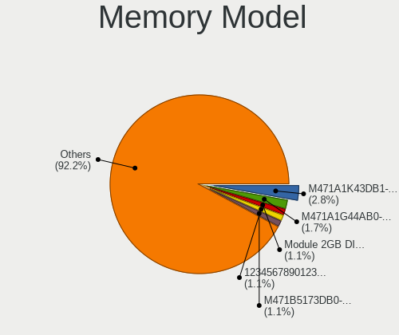

| Model                                                          | Computers | Percent |
|----------------------------------------------------------------|-----------|---------|
| Samsung RAM M471A1K43DB1-CWE 8GB SODIMM DDR4 3200MT/s          | 5         | 4.59%   |
| Samsung RAM M471A1G44AB0-CWE 8GB SODIMM DDR4 3200MT/s          | 3         | 2.75%   |
| SK hynix RAM HMAG68EXNSA051N 8GB SODIMM DDR4 3200MT/s          | 2         | 1.83%   |
| Samsung RAM M471B5173DB0-YK0 4GB SODIMM DDR3 1600MT/s          | 2         | 1.83%   |
| Micron RAM 8KTF51264HZ-1G9P1 4GB SODIMM DDR3 1867MT/s          | 2         | 1.83%   |
| Unknown RAM Module 4GB DIMM DDR3 1333MT/s                      | 1         | 0.92%   |
| Unknown RAM Module 4GB DIMM DDR 1333MT/s                       | 1         | 0.92%   |
| Unknown RAM Module 2GB DIMM SDRAM 533MT/s                      | 1         | 0.92%   |
| Unknown RAM Module 2GB DIMM DDR3 1333MT/s                      | 1         | 0.92%   |
| Unknown RAM Module 2GB DIMM DDR2 800MT/s                       | 1         | 0.92%   |
| Unknown RAM Module 2GB DIMM                                    | 1         | 0.92%   |
| Unknown (ABCD) RAM 123456789012345678 2GB DIMM LPDDR4 2400MT/s | 1         | 0.92%   |
| Team RAM TEAMGROUP-UD4-2666 16GB DIMM DDR4 3200MT/s            | 1         | 0.92%   |
| Team RAM TEAMGROUP-SD4-3200 16GB SODIMM DDR4 3200MT/s          | 1         | 0.92%   |
| Smart RAM SH564568FH8NWPHSFG 2GB SODIMM DDR3 1333MT/s          | 1         | 0.92%   |
| Smart RAM SF4642G8CK8IEHLSBG 16GB SODIMM DDR4 2667MT/s         | 1         | 0.92%   |
| SK hynix RAM HMT451U6AFR8C-PB 4GB DIMM DDR3 1600MT/s           | 1         | 0.92%   |
| SK hynix RAM HMT451S6BFR8A-PB 4GB SODIMM DDR3 1600MT/s         | 1         | 0.92%   |
| SK hynix RAM HMT425S6CFR6A-PB 2GB SODIMM DDR3 1600MT/s         | 1         | 0.92%   |
| SK hynix RAM HMT325U6CFR8C-H9 2GB DIMM DDR3 1333MT/s           | 1         | 0.92%   |
| SK hynix RAM HMCG78AGBSA092N 16GB SODIMM DDR5 5600MT/s         | 1         | 0.92%   |
| SK hynix RAM HMAA1GU6CJR6N-XN 8GB DIMM DDR4 3200MT/s           | 1         | 0.92%   |
| SK hynix RAM HMAA1GS6CJR6N-XN 8GB SODIMM DDR4 3200MT/s         | 1         | 0.92%   |
| SK hynix RAM HMAA1GS6CJR6N-XN 8GB Row Of Chips DDR4 3200MT/s   | 1         | 0.92%   |
| SK hynix RAM HMA851S6DJR6N-XN 4GB Row Of Chips DDR4 3200MT/s   | 1         | 0.92%   |
| SK hynix RAM HMA851S6CJR6N-VK 4GB SODIMM DDR4 2667MT/s         | 1         | 0.92%   |
| SK hynix RAM HMA851S6AFR6N-UH 4GB SODIMM DDR4 2667MT/s         | 1         | 0.92%   |
| SK hynix RAM HMA82GS6JJR8N-VK 16GB SODIMM DDR4 2667MT/s        | 1         | 0.92%   |
| SK hynix RAM HMA81GS6JJR8N-VK 8GB SODIMM DDR4 2667MT/s         | 1         | 0.92%   |
| SK hynix RAM H58G78BK7BX114 8GB SODIMM LPDDR5 6400MT/s         | 1         | 0.92%   |
| Samsung RAM Module 8GB SODIMM DDR4 2133MT/s                    | 1         | 0.92%   |
| Samsung RAM Module 2GB Row Of Chips LPDDR5 6400MT/s            | 1         | 0.92%   |
| Samsung RAM Module 16GB SODIMM DDR4 3200MT/s                   | 1         | 0.92%   |
| Samsung RAM Module 16GB DIMM DDR4 3200MT/s                     | 1         | 0.92%   |
| Samsung RAM M471B5273DH0-CH9 4GB DIMM DDR3 1333MT/s            | 1         | 0.92%   |
| Samsung RAM M471B5173QH0-YK0 4096MB SODIMM DDR3 1600MT/s       | 1         | 0.92%   |
| Samsung RAM M471B1G73DB0-YK0 8GB SODIMM DDR3 1600MT/s          | 1         | 0.92%   |
| Samsung RAM M471B1G73BH0-CK0 8GB SODIMM DDR3 1600MT/s          | 1         | 0.92%   |
| Samsung RAM M471A2G44AM0-CWE 16GB SODIMM DDR4 3200MT/s         | 1         | 0.92%   |
| Samsung RAM M471A2G43BB2-CWE 16GB SODIMM DDR4 3200MT/s         | 1         | 0.92%   |

Memory Kind
-----------

Memory module kinds

| Kind    | Computers | Percent |
|---------|-----------|---------|
| DDR4    | 54        | 59.34%  |
| DDR3    | 20        | 21.98%  |
| LPDDR5  | 4         | 4.4%    |
| DDR5    | 4         | 4.4%    |
| LPDDR4  | 3         | 3.3%    |
| SDRAM   | 2         | 2.2%    |
| LPDDR3  | 1         | 1.1%    |
| DDR2    | 1         | 1.1%    |
| DDR     | 1         | 1.1%    |
| Unknown | 1         | 1.1%    |

Memory Form Factor
------------------

Physical design of the memory module

| Name         | Computers | Percent |
|--------------|-----------|---------|
| SODIMM       | 48        | 52.75%  |
| DIMM         | 34        | 37.36%  |
| Row Of Chips | 9         | 9.89%   |

Memory Size
-----------

Memory module size

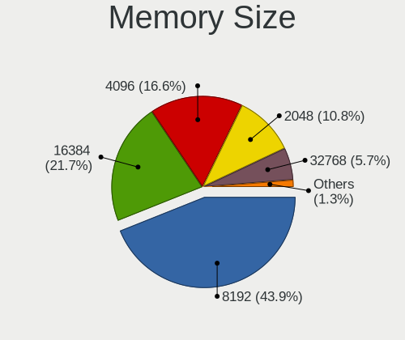

| Size  | Computers | Percent |
|-------|-----------|---------|
| 8192  | 44        | 45.83%  |
| 16384 | 20        | 20.83%  |
| 4096  | 16        | 16.67%  |
| 2048  | 11        | 11.46%  |
| 32768 | 4         | 4.17%   |
| 49152 | 1         | 1.04%   |

Memory Speed
------------

Memory module speed

| Speed   | Computers | Percent |
|---------|-----------|---------|
| 3200    | 31        | 31.96%  |
| 2667    | 12        | 12.37%  |
| 1600    | 12        | 12.37%  |
| 2400    | 6         | 6.19%   |
| 1333    | 6         | 6.19%   |
| 6400    | 4         | 4.12%   |
| 2133    | 4         | 4.12%   |
| 1867    | 3         | 3.09%   |
| 1334    | 3         | 3.09%   |
| 5600    | 2         | 2.06%   |
| 4800    | 2         | 2.06%   |
| 2933    | 2         | 2.06%   |
| 4267    | 1         | 1.03%   |
| 3866    | 1         | 1.03%   |
| 3666    | 1         | 1.03%   |
| 3600    | 1         | 1.03%   |
| 3534    | 1         | 1.03%   |
| 3066    | 1         | 1.03%   |
| 1067    | 1         | 1.03%   |
| 800     | 1         | 1.03%   |
| 533     | 1         | 1.03%   |
| Unknown | 1         | 1.03%   |

Printers & scanners
-------------------

Printer Vendor
--------------

Printer device vendors

| Vendor                | Computers | Percent |
|-----------------------|-----------|---------|
| Seiko Epson           | 5         | 31.25%  |
| Hewlett-Packard       | 4         | 25%     |
| Brother Industries    | 3         | 18.75%  |
| Xerox                 | 1         | 6.25%   |
| Samsung Electronics   | 1         | 6.25%   |
| Pantum                | 1         | 6.25%   |
| Lexmark International | 1         | 6.25%   |

Printer Model
-------------

Printer device models

| Model                           | Computers | Percent |
|---------------------------------|-----------|---------|
| Xerox WorkCentre 3220           | 1         | 6.25%   |
| Seiko Epson XP-4200 Series      | 1         | 6.25%   |
| Seiko Epson XP-4100 Series      | 1         | 6.25%   |
| Seiko Epson WF-4830 Series      | 1         | 6.25%   |
| Seiko Epson L300 Series         | 1         | 6.25%   |
| Seiko Epson ET-2820 Series      | 1         | 6.25%   |
| Samsung Phaser 3121             | 1         | 6.25%   |
| Pantum P2200-series             | 1         | 6.25%   |
| Lexmark International MC3224dwe | 1         | 6.25%   |
| HP LaserJet 1200                | 1         | 6.25%   |
| HP LaserJet 1018                | 1         | 6.25%   |
| HP Ink Tank 310 series          | 1         | 6.25%   |
| HP DeskJet 4100 series          | 1         | 6.25%   |
| Brother MFC-7360N               | 1         | 6.25%   |
| Brother HL-L3230CDW series      | 1         | 6.25%   |
| Brother DCP-L2520DW             | 1         | 6.25%   |

Scanner Vendor
--------------

Scanner device vendors

| Vendor      | Computers | Percent |
|-------------|-----------|---------|
| Seiko Epson | 1         | 50%     |
| Canon       | 1         | 50%     |

Scanner Model
-------------

Scanner device models

| Model                                         | Computers | Percent |
|-----------------------------------------------|-----------|---------|
| Seiko Epson GT-8300UF [Perfection 1660 PHOTO] | 1         | 50%     |
| Canon CanoScan LiDE 220                       | 1         | 50%     |

Camera
------

Camera Vendor
-------------

Camera device vendors

| Vendor                                 | Computers | Percent |
|----------------------------------------|-----------|---------|
| Chicony Electronics                    | 29        | 25.44%  |
| IMC Networks                           | 11        | 9.65%   |
| Bison Electronics                      | 9         | 7.89%   |
| Microdia                               | 8         | 7.02%   |
| Logitech                               | 7         | 6.14%   |
| Realtek Semiconductor                  | 6         | 5.26%   |
| Syntek                                 | 5         | 4.39%   |
| Luxvisions Innotech Limited            | 5         | 4.39%   |
| Suyin                                  | 4         | 3.51%   |
| Quanta                                 | 4         | 3.51%   |
| Sunplus Innovation Technology          | 3         | 2.63%   |
| Cheng Uei Precision Industry (Foxlink) | 3         | 2.63%   |
| Z-Star Microelectronics                | 2         | 1.75%   |
| Sonix Technology                       | 2         | 1.75%   |
| Microsoft                              | 2         | 1.75%   |
| Apple                                  | 2         | 1.75%   |
| Trust                                  | 1         | 0.88%   |
| SunplusIT                              | 1         | 0.88%   |
| Samsung Electronics                    | 1         | 0.88%   |
| Ricoh                                  | 1         | 0.88%   |
| Primax Electronics                     | 1         | 0.88%   |
| Lite-On Technology                     | 1         | 0.88%   |
| Lenovo                                 | 1         | 0.88%   |
| Importek                               | 1         | 0.88%   |
| icSpring                               | 1         | 0.88%   |
| Generalplus Technology                 | 1         | 0.88%   |
| Creative Technology                    | 1         | 0.88%   |
| 8SSC21K12273V1SR33X2817                | 1         | 0.88%   |

Camera Model
------------

Camera device models

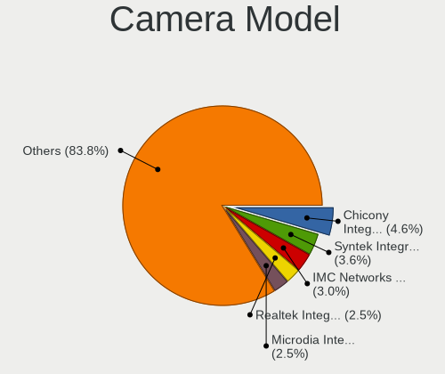

| Model                                                   | Computers | Percent |
|---------------------------------------------------------|-----------|---------|
| Chicony Integrated Camera                               | 7         | 6.14%   |
| Syntek Integrated Camera                                | 5         | 4.39%   |
| IMC Networks Integrated Camera                          | 5         | 4.39%   |
| Microdia Integrated_Webcam_HD                           | 3         | 2.63%   |
| Chicony HD Webcam                                       | 3         | 2.63%   |
| Chicony HD User Facing                                  | 3         | 2.63%   |
| Bison BisonCam,NB Pro                                   | 3         | 2.63%   |
| Sunplus Integrated_Webcam_HD                            | 2         | 1.75%   |
| Realtek Integrated_Webcam_HD                            | 2         | 1.75%   |
| Quanta HD User Facing                                   | 2         | 1.75%   |
| Microsoft LifeCam HD-3000                               | 2         | 1.75%   |
| Microdia Integrated Webcam                              | 2         | 1.75%   |
| Luxvisions Innotech Limited HP Wide Vision HD Camera    | 2         | 1.75%   |
| Luxvisions Innotech Limited HP TrueVision HD Camera     | 2         | 1.75%   |
| IMC Networks USB2.0 HD UVC WebCam                       | 2         | 1.75%   |
| Chicony USB2.0 Camera                                   | 2         | 1.75%   |
| Chicony HP HD Camera                                    | 2         | 1.75%   |
| Cheng Uei Precision Industry (Foxlink) HP Truevision HD | 2         | 1.75%   |
| Bison Integrated Camera                                 | 2         | 1.75%   |
| Z-Star WebCam SC-03FFL11739P                            | 1         | 0.88%   |
| Z-Star Integrated Camera                                | 1         | 0.88%   |
| Trust WB-6250X Webcam                                   | 1         | 0.88%   |
| Suyin Sony Visual Communication Camera                  | 1         | 0.88%   |
| Suyin Integrated Webcam                                 | 1         | 0.88%   |
| Suyin HP Truevision HD                                  | 1         | 0.88%   |
| Suyin HP ENVY HD Webcam                                 | 1         | 0.88%   |
| SunplusIT 1080p FHD Camera                              | 1         | 0.88%   |
| Sunplus Integrated_Webcam_FHD                           | 1         | 0.88%   |
| Sonix USB2.0 FHD UVC WebCam                             | 1         | 0.88%   |
| Sonix Integrated Webcam_FHD                             | 1         | 0.88%   |
| Samsung Galaxy series, misc. (MTP mode)                 | 1         | 0.88%   |
| Ricoh HD Webcam                                         | 1         | 0.88%   |
| Realtek USB2.0 HD UVC WebCam                            | 1         | 0.88%   |
| Realtek USB 2.0 Camera                                  | 1         | 0.88%   |
| Realtek Integrated Camera                               | 1         | 0.88%   |
| Realtek HD WebCam                                       | 1         | 0.88%   |
| Quanta VGA WebCam                                       | 1         | 0.88%   |
| Quanta HP TrueVision HD Camera                          | 1         | 0.88%   |
| Primax HP HD Webcam [Fixed]                             | 1         | 0.88%   |
| Microdia Webcam Vitade AF                               | 1         | 0.88%   |

Security
--------

Fingerprint Vendor
------------------

Fingerprint sensor vendors

| Vendor                     | Computers | Percent |
|----------------------------|-----------|---------|
| Synaptics                  | 7         | 36.84%  |
| Validity Sensors           | 5         | 26.32%  |
| Shenzhen Goodix Technology | 4         | 21.05%  |
| AuthenTec                  | 2         | 10.53%  |
| Upek                       | 1         | 5.26%   |

Fingerprint Model
-----------------

Fingerprint sensor models

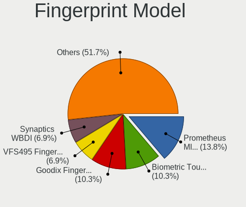

| Model                                                  | Computers | Percent |
|--------------------------------------------------------|-----------|---------|
| Synaptics Prometheus MIS Touch Fingerprint Reader      | 4         | 21.05%  |
| Shenzhen Goodix  FingerPrint Device                    | 3         | 15.79%  |
| Validity Sensors Synaptics WBDI                        | 2         | 10.53%  |
| Validity Sensors VFS495 Fingerprint Reader             | 1         | 5.26%   |
| Validity Sensors VFS451 Fingerprint Reader             | 1         | 5.26%   |
| Validity Sensors VFS 5011 fingerprint sensor           | 1         | 5.26%   |
| Upek Biometric Touchchip/Touchstrip Fingerprint Sensor | 1         | 5.26%   |
| Synaptics UWP WBDI Device                              | 1         | 5.26%   |
| Synaptics UWP WBDI                                     | 1         | 5.26%   |
| Synaptics  WBDI                                        | 1         | 5.26%   |
| Shenzhen Goodix Fingerprint Reader                     | 1         | 5.26%   |
| AuthenTec AES2810                                      | 1         | 5.26%   |
| AuthenTec AES2501 Fingerprint Sensor                   | 1         | 5.26%   |

Chipcard Vendor
---------------

Chipcard module vendors

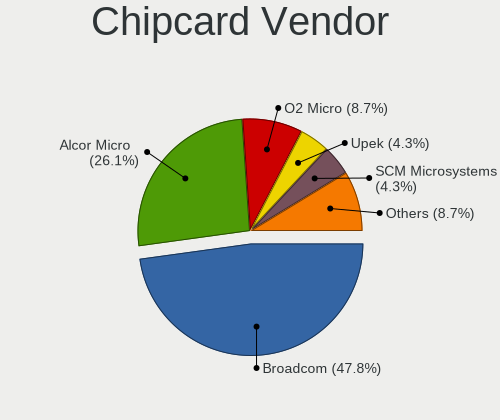

| Vendor           | Computers | Percent |
|------------------|-----------|---------|
| Broadcom         | 5         | 41.67%  |
| Alcor Micro      | 5         | 41.67%  |
| Upek             | 1         | 8.33%   |
| SCM Microsystems | 1         | 8.33%   |

Chipcard Model
--------------

Chipcard module models

| Model                                                                        | Computers | Percent |
|------------------------------------------------------------------------------|-----------|---------|
| Alcor Micro AU9540 Smartcard Reader                                          | 5         | 41.67%  |
| Broadcom BCM5880 Secure Applications Processor                               | 2         | 16.67%  |
| Broadcom 58200                                                               | 2         | 16.67%  |
| Upek TouchChip Fingerprint Coprocessor (WBF advanced mode)                   | 1         | 8.33%   |
| SCM Microsystems SCR331-LC1 / SCR3310 SmartCard Reader                       | 1         | 8.33%   |
| Broadcom BCM5880 Secure Applications Processor with fingerprint swipe sensor | 1         | 8.33%   |

Unsupported
-----------

Unsupported Devices
-------------------

Total unsupported devices on board

| Total | Computers | Percent |
|-------|-----------|---------|
| 0     | 151       | 66.52%  |
| 1     | 56        | 24.67%  |
| 2     | 18        | 7.93%   |
| 3     | 2         | 0.88%   |

Unsupported Device Types
------------------------

Types of unsupported devices

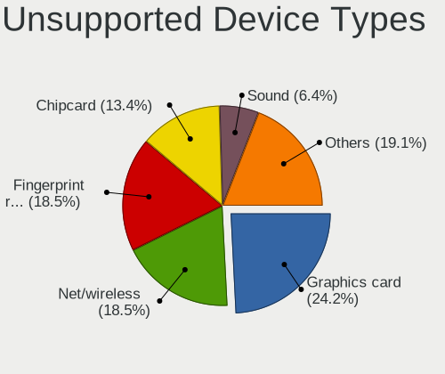

| Type                     | Computers | Percent |
|--------------------------|-----------|---------|
| Graphics card            | 24        | 26.09%  |
| Fingerprint reader       | 19        | 20.65%  |
| Net/wireless             | 13        | 14.13%  |
| Chipcard                 | 11        | 11.96%  |
| Sound                    | 7         | 7.61%   |
| Multimedia controller    | 6         | 6.52%   |
| Camera                   | 4         | 4.35%   |
| Net/ethernet             | 2         | 2.17%   |
| Card reader              | 2         | 2.17%   |
| Unassigned class         | 1         | 1.09%   |
| Network                  | 1         | 1.09%   |
| Modem                    | 1         | 1.09%   |
| Communication controller | 1         | 1.09%   |

