openSUSE Leap-15.5 - Tested Hardware & Statistics (Desktops)
------------------------------------------------------------

A project to collect tested hardware configurations for openSUSE Leap-15.5.

Anyone can contribute to this report by the [hw-probe](https://github.com/linuxhw/hw-probe) tool:

    sudo -E hw-probe -all -upload

Please contribute! Especially if your hardware is rare.

Contents
--------

* [ Test Cases ](#test-cases)

* [ System ](#system)
  - [ Kernel                   ](#kernel)
  - [ Kernel Family            ](#kernel-family)
  - [ Kernel Major Ver.        ](#kernel-major-ver)
  - [ Arch                     ](#arch)
  - [ DE                       ](#de)
  - [ Display Server           ](#display-server)
  - [ Display Manager          ](#display-manager)
  - [ OS Lang                  ](#os-lang)
  - [ Boot Mode                ](#boot-mode)
  - [ Filesystem               ](#filesystem)
  - [ Part. scheme             ](#part-scheme)
  - [ Dual Boot with Linux/BSD ](#dual-boot-with-linuxbsd)
  - [ Dual Boot (Win)          ](#dual-boot-win)

* [ Board ](#board)
  - [ Vendor                   ](#vendor)
  - [ Model                    ](#model)
  - [ Model Family             ](#model-family)
  - [ MFG Year                 ](#mfg-year)
  - [ Form Factor              ](#form-factor)
  - [ Secure Boot              ](#secure-boot)
  - [ Coreboot                 ](#coreboot)
  - [ RAM Size                 ](#ram-size)
  - [ RAM Used                 ](#ram-used)
  - [ Total Drives             ](#total-drives)
  - [ Has CD-ROM               ](#has-cd-rom)
  - [ Has Ethernet             ](#has-ethernet)
  - [ Has WiFi                 ](#has-wifi)
  - [ Has Bluetooth            ](#has-bluetooth)

* [ Location ](#location)
  - [ Country                  ](#country)
  - [ City                     ](#city)

* [ Drives ](#drives)
  - [ Drive Vendor             ](#drive-vendor)
  - [ Drive Model              ](#drive-model)
  - [ HDD Vendor               ](#hdd-vendor)
  - [ SSD Vendor               ](#ssd-vendor)
  - [ Drive Kind               ](#drive-kind)
  - [ Drive Connector          ](#drive-connector)
  - [ Drive Size               ](#drive-size)
  - [ Space Total              ](#space-total)
  - [ Space Used               ](#space-used)
  - [ Malfunc. Drives          ](#malfunc-drives)
  - [ Malfunc. Drive Vendor    ](#malfunc-drive-vendor)
  - [ Malfunc. HDD Vendor      ](#malfunc-hdd-vendor)
  - [ Malfunc. Drive Kind      ](#malfunc-drive-kind)
  - [ Failed Drives            ](#failed-drives)
  - [ Failed Drive Vendor      ](#failed-drive-vendor)
  - [ Drive Status             ](#drive-status)

* [ Storage controller ](#storage-controller)
  - [ Storage Vendor           ](#storage-vendor)
  - [ Storage Model            ](#storage-model)
  - [ Storage Kind             ](#storage-kind)

* [ Processor ](#processor)
  - [ CPU Vendor               ](#cpu-vendor)
  - [ CPU Model                ](#cpu-model)
  - [ CPU Model Family         ](#cpu-model-family)
  - [ CPU Cores                ](#cpu-cores)
  - [ CPU Sockets              ](#cpu-sockets)
  - [ CPU Threads              ](#cpu-threads)
  - [ CPU Op-Modes             ](#cpu-op-modes)
  - [ CPU Microcode            ](#cpu-microcode)
  - [ CPU Microarch            ](#cpu-microarch)

* [ Graphics ](#graphics)
  - [ GPU Vendor               ](#gpu-vendor)
  - [ GPU Model                ](#gpu-model)
  - [ GPU Combo                ](#gpu-combo)
  - [ GPU Driver               ](#gpu-driver)
  - [ GPU Memory               ](#gpu-memory)

* [ Monitor ](#monitor)
  - [ Monitor Vendor           ](#monitor-vendor)
  - [ Monitor Model            ](#monitor-model)
  - [ Monitor Resolution       ](#monitor-resolution)
  - [ Monitor Diagonal         ](#monitor-diagonal)
  - [ Monitor Width            ](#monitor-width)
  - [ Aspect Ratio             ](#aspect-ratio)
  - [ Monitor Area             ](#monitor-area)
  - [ Pixel Density            ](#pixel-density)
  - [ Multiple Monitors        ](#multiple-monitors)

* [ Network ](#network)
  - [ Net Controller Vendor    ](#net-controller-vendor)
  - [ Net Controller Model     ](#net-controller-model)
  - [ Wireless Vendor          ](#wireless-vendor)
  - [ Wireless Model           ](#wireless-model)
  - [ Ethernet Vendor          ](#ethernet-vendor)
  - [ Ethernet Model           ](#ethernet-model)
  - [ Net Controller Kind      ](#net-controller-kind)
  - [ Used Controller          ](#used-controller)
  - [ NICs                     ](#nics)
  - [ IPv6                     ](#ipv6)

* [ Bluetooth ](#bluetooth)
  - [ Bluetooth Vendor         ](#bluetooth-vendor)
  - [ Bluetooth Model          ](#bluetooth-model)

* [ Sound ](#sound)
  - [ Sound Vendor             ](#sound-vendor)
  - [ Sound Model              ](#sound-model)

* [ Memory ](#memory)
  - [ Memory Vendor            ](#memory-vendor)
  - [ Memory Model             ](#memory-model)
  - [ Memory Kind              ](#memory-kind)
  - [ Memory Form Factor       ](#memory-form-factor)
  - [ Memory Size              ](#memory-size)
  - [ Memory Speed             ](#memory-speed)

* [ Printers & scanners ](#printers--scanners)
  - [ Printer Vendor           ](#printer-vendor)
  - [ Printer Model            ](#printer-model)
  - [ Scanner Vendor           ](#scanner-vendor)
  - [ Scanner Model            ](#scanner-model)

* [ Camera ](#camera)
  - [ Camera Vendor            ](#camera-vendor)
  - [ Camera Model             ](#camera-model)

* [ Security ](#security)
  - [ Fingerprint Vendor       ](#fingerprint-vendor)
  - [ Fingerprint Model        ](#fingerprint-model)
  - [ Chipcard Vendor          ](#chipcard-vendor)
  - [ Chipcard Model           ](#chipcard-model)

* [ Unsupported ](#unsupported)
  - [ Unsupported Devices      ](#unsupported-devices)
  - [ Unsupported Device Types ](#unsupported-device-types)

Test Cases
----------

Total: 268

| Vendor        | Model                       | Probe                                                      | Date         |
|---------------|-----------------------------|------------------------------------------------------------|--------------|
| ASUSTek       | PRIME B360-PLUS             | [60a56dbd2a](https://linux-hardware.org/?probe=60a56dbd2a) | Dec 30, 2025 |
| Gigabyte      | M57SLI-S4                   | [5e836caa12](https://linux-hardware.org/?probe=5e836caa12) | Dec 26, 2025 |
| Acer          | Aspire X1900                | [f6ecb29a33](https://linux-hardware.org/?probe=f6ecb29a33) | Jul 15, 2025 |
| HP            | 18E7                        | [23177af3cc](https://linux-hardware.org/?probe=23177af3cc) | Jul 03, 2025 |
| HP            | 3033h                       | [be66226e3c](https://linux-hardware.org/?probe=be66226e3c) | Jun 25, 2025 |
| HP            | 3033h                       | [1bd612ad75](https://linux-hardware.org/?probe=1bd612ad75) | Jun 25, 2025 |
| Gigabyte      | Q77M-D2H                    | [7b44c17fc8](https://linux-hardware.org/?probe=7b44c17fc8) | Jun 20, 2025 |
| ASUSTek       | H110M-A/M.2                 | [37433501ff](https://linux-hardware.org/?probe=37433501ff) | Mar 11, 2025 |
| ASUSTek       | H110M-A/M.2                 | [e4b77dd143](https://linux-hardware.org/?probe=e4b77dd143) | Mar 10, 2025 |
| HP            | 3033h                       | [1711bd8fe8](https://linux-hardware.org/?probe=1711bd8fe8) | Mar 07, 2025 |
| HP            | 3033h                       | [9a18f4fb45](https://linux-hardware.org/?probe=9a18f4fb45) | Mar 06, 2025 |
| Gigabyte      | Q77M-D2H                    | [7b93063347](https://linux-hardware.org/?probe=7b93063347) | Feb 24, 2025 |
| HP            | 2AF7                        | [b8c3e68123](https://linux-hardware.org/?probe=b8c3e68123) | Jan 28, 2025 |
| HP            | 2AF7                        | [9182779a6f](https://linux-hardware.org/?probe=9182779a6f) | Jan 28, 2025 |
| Chatreey      | AC1-DP                      | [68a2c044bd](https://linux-hardware.org/?probe=68a2c044bd) | Jan 11, 2025 |
| HP            | 2AF7                        | [86175be1e4](https://linux-hardware.org/?probe=86175be1e4) | Dec 25, 2024 |
| HP            | 2AF7                        | [7779a1d0a0](https://linux-hardware.org/?probe=7779a1d0a0) | Dec 11, 2024 |
| Gigabyte      | B550 AORUS ELITE AX         | [170159c12d](https://linux-hardware.org/?probe=170159c12d) | Nov 22, 2024 |
| Gigabyte      | Z97-HD3                     | [37416e4e8a](https://linux-hardware.org/?probe=37416e4e8a) | Nov 12, 2024 |
| Gigabyte      | Z97-HD3                     | [36aa1c57ca](https://linux-hardware.org/?probe=36aa1c57ca) | Oct 06, 2024 |
| HP            | 843B                        | [78e41c4cf2](https://linux-hardware.org/?probe=78e41c4cf2) | Oct 01, 2024 |
| Gigabyte      | B450M DS3H V2               | [0767b12df1](https://linux-hardware.org/?probe=0767b12df1) | Sep 20, 2024 |
| ASRock        | Z390M-ITX/ac                | [d012125c09](https://linux-hardware.org/?probe=d012125c09) | Sep 19, 2024 |
| Gigabyte      | Z97-HD3                     | [d4b48bd314](https://linux-hardware.org/?probe=d4b48bd314) | Sep 12, 2024 |
| Gigabyte      | Z97-HD3                     | [ad8d4cea54](https://linux-hardware.org/?probe=ad8d4cea54) | Aug 26, 2024 |
| ASUSTek       | PRIME X670-P WIFI           | [d11387efbf](https://linux-hardware.org/?probe=d11387efbf) | Aug 25, 2024 |
| Gigabyte      | M57SLI-S4                   | [06658f76e8](https://linux-hardware.org/?probe=06658f76e8) | Aug 17, 2024 |
| ASUSTek       | PRIME B250M-A               | [f414f9fb5b](https://linux-hardware.org/?probe=f414f9fb5b) | Aug 17, 2024 |
| Gigabyte      | M57SLI-S4                   | [b0f6c21ecc](https://linux-hardware.org/?probe=b0f6c21ecc) | Aug 17, 2024 |
| ASUSTek       | H110M-A/M.2                 | [e91aed8d91](https://linux-hardware.org/?probe=e91aed8d91) | Aug 16, 2024 |
| Gigabyte      | 970A-UD3P                   | [05d992d68b](https://linux-hardware.org/?probe=05d992d68b) | Aug 11, 2024 |
| MSI           | 760GM-P23                   | [a30c04cd45](https://linux-hardware.org/?probe=a30c04cd45) | Jul 28, 2024 |
| MSI           | X370 GAMING PLUS            | [d17fbd5101](https://linux-hardware.org/?probe=d17fbd5101) | Jul 28, 2024 |
| Gigabyte      | GA-MA770-UD3                | [c61e819173](https://linux-hardware.org/?probe=c61e819173) | Jul 16, 2024 |
| Acer          | WG43M                       | [0a5383935d](https://linux-hardware.org/?probe=0a5383935d) | Jul 07, 2024 |
| ASRock        | Z390M-ITX/ac                | [bf21f420fb](https://linux-hardware.org/?probe=bf21f420fb) | Jul 03, 2024 |
| Unknown       | Unknown                     | [cc7fb9a2cc](https://linux-hardware.org/?probe=cc7fb9a2cc) | Jun 28, 2024 |
| Unknown       | Unknown                     | [9c9c84de42](https://linux-hardware.org/?probe=9c9c84de42) | Jun 17, 2024 |
| ASRock        | Z390M-ITX/ac                | [f57172b283](https://linux-hardware.org/?probe=f57172b283) | Jun 16, 2024 |
| Dell          | 0HMF7C A01                  | [fbb14e1d17](https://linux-hardware.org/?probe=fbb14e1d17) | Jun 16, 2024 |
| ASUSTek       | P5KPL-AM SE                 | [c9edb14972](https://linux-hardware.org/?probe=c9edb14972) | Jun 13, 2024 |
| ASUSTek       | P5KPL-AM SE                 | [920d747441](https://linux-hardware.org/?probe=920d747441) | Jun 13, 2024 |
| Gigabyte      | G31M-S2L                    | [c73c94191f](https://linux-hardware.org/?probe=c73c94191f) | Jun 13, 2024 |
| HP            | 212A                        | [3372b6a1ed](https://linux-hardware.org/?probe=3372b6a1ed) | Jun 13, 2024 |
| ASRock        | Z270M Pro4                  | [5e30fab9b5](https://linux-hardware.org/?probe=5e30fab9b5) | Jun 10, 2024 |
| Acer          | WG43M                       | [1b1aaf3187](https://linux-hardware.org/?probe=1b1aaf3187) | Jun 08, 2024 |
| ASRock        | EP2C602-2L+/D16             | [71b56e0c28](https://linux-hardware.org/?probe=71b56e0c28) | Jun 05, 2024 |
| Dell          | 0JP3NX A00                  | [db67c945b8](https://linux-hardware.org/?probe=db67c945b8) | Jun 05, 2024 |
| MSI           | MS-B0A81                    | [fd136a4700](https://linux-hardware.org/?probe=fd136a4700) | Jun 05, 2024 |
| ASRock        | H270 Pro4                   | [c180147c81](https://linux-hardware.org/?probe=c180147c81) | Jun 03, 2024 |
| ASUSTek       | M4N68T-M LE                 | [7fa8ee163f](https://linux-hardware.org/?probe=7fa8ee163f) | Jun 03, 2024 |
| HP            | 81C5 MVB                    | [d18a7ae343](https://linux-hardware.org/?probe=d18a7ae343) | May 31, 2024 |
| Gigabyte      | X570 AORUS MASTER           | [68262266cc](https://linux-hardware.org/?probe=68262266cc) | May 23, 2024 |
| Biostar       | TA970                       | [80334f21f5](https://linux-hardware.org/?probe=80334f21f5) | May 21, 2024 |
| Intel         | H61                         | [82eb95baf1](https://linux-hardware.org/?probe=82eb95baf1) | May 19, 2024 |
| Acer          | WG43M                       | [47875247e5](https://linux-hardware.org/?probe=47875247e5) | May 19, 2024 |
| HP            | 8054                        | [8a38a141d6](https://linux-hardware.org/?probe=8a38a141d6) | May 17, 2024 |
| Gigabyte      | H110M-H DDR3-CF             | [e1d78ae74f](https://linux-hardware.org/?probe=e1d78ae74f) | May 17, 2024 |
| Intel         | H61                         | [7e84e54543](https://linux-hardware.org/?probe=7e84e54543) | May 17, 2024 |
| ASRock        | 890GX Pro3                  | [24eb48fe3d](https://linux-hardware.org/?probe=24eb48fe3d) | May 15, 2024 |
| Lenovo        | 3741 SDK0T76463 WIN 3422... | [5fd4014ac6](https://linux-hardware.org/?probe=5fd4014ac6) | May 14, 2024 |
| ASUSTek       | PRIME B550M-K               | [0dd0acc11c](https://linux-hardware.org/?probe=0dd0acc11c) | May 13, 2024 |
| MSI           | B450 GAMING PLUS MAX        | [18aa30f5dc](https://linux-hardware.org/?probe=18aa30f5dc) | May 10, 2024 |
| Gigabyte      | Z97-HD3                     | [85dee8d963](https://linux-hardware.org/?probe=85dee8d963) | May 07, 2024 |
| Lenovo        | 3741 SDK0T76463 WIN 3422... | [42a7c6fb23](https://linux-hardware.org/?probe=42a7c6fb23) | May 06, 2024 |
| Dell          | 0NW6H5 A00                  | [3fafaee792](https://linux-hardware.org/?probe=3fafaee792) | May 05, 2024 |
| Dell          | 0NW6H5 A00                  | [ed934b8b61](https://linux-hardware.org/?probe=ed934b8b61) | May 05, 2024 |
| ASUSTek       | P5KPL-AM SE                 | [a1541c5122](https://linux-hardware.org/?probe=a1541c5122) | May 02, 2024 |
| ASRock        | Z390 Taichi Ultimate        | [8f95604689](https://linux-hardware.org/?probe=8f95604689) | Apr 24, 2024 |
| HP            | 158B                        | [38acb31ca9](https://linux-hardware.org/?probe=38acb31ca9) | Apr 24, 2024 |
| Biostar       | A960D+V2                    | [e6d3b07d8e](https://linux-hardware.org/?probe=e6d3b07d8e) | Apr 23, 2024 |
| ASRock        | Z790 PG SONIC               | [6426fb59eb](https://linux-hardware.org/?probe=6426fb59eb) | Apr 22, 2024 |
| Gigabyte      | Z97-HD3                     | [0247606ff3](https://linux-hardware.org/?probe=0247606ff3) | Apr 21, 2024 |
| Lenovo        | 3741 SDK0T76463 WIN 3422... | [cf7eac1515](https://linux-hardware.org/?probe=cf7eac1515) | Apr 21, 2024 |
| ASUSTek       | TUF Z370-PLUS GAMING        | [542fb126b0](https://linux-hardware.org/?probe=542fb126b0) | Apr 20, 2024 |
| Lenovo        | 30D9 SDK0J40697 WIN 3305... | [8a42c0cd30](https://linux-hardware.org/?probe=8a42c0cd30) | Apr 18, 2024 |
| ASUSTek       | PRIME X570-P                | [e7bc6ac35e](https://linux-hardware.org/?probe=e7bc6ac35e) | Apr 17, 2024 |
| Gigabyte      | Z370M D3H-CF                | [f14f8b8b13](https://linux-hardware.org/?probe=f14f8b8b13) | Apr 17, 2024 |
| Gigabyte      | P55-UD5                     | [736814c1df](https://linux-hardware.org/?probe=736814c1df) | Apr 13, 2024 |
| ASUSTek       | ROG Rampage VI EXTREME      | [fb483fb3bc](https://linux-hardware.org/?probe=fb483fb3bc) | Apr 10, 2024 |
| ASUSTek       | ROG Rampage VI EXTREME      | [0de5191161](https://linux-hardware.org/?probe=0de5191161) | Apr 08, 2024 |
| MSI           | MAG B550 TOMAHAWK           | [ea4485f45b](https://linux-hardware.org/?probe=ea4485f45b) | Apr 08, 2024 |
| HP            | ProLiant ML350 G6           | [3a9aaf0732](https://linux-hardware.org/?probe=3a9aaf0732) | Apr 07, 2024 |
| ASUSTek       | PRIME B660-PLUS D4          | [92dd5d1690](https://linux-hardware.org/?probe=92dd5d1690) | Apr 07, 2024 |
| HP            | 3048h                       | [98a7ae878b](https://linux-hardware.org/?probe=98a7ae878b) | Apr 06, 2024 |
| HP            | ProLiant ML350 G6           | [d70516fc56](https://linux-hardware.org/?probe=d70516fc56) | Apr 06, 2024 |
| ASUSTek       | M5A97 R2.0                  | [bb4170e7fc](https://linux-hardware.org/?probe=bb4170e7fc) | Apr 01, 2024 |
| ASUSTek       | M5A97 R2.0                  | [9dc48f27f9](https://linux-hardware.org/?probe=9dc48f27f9) | Apr 01, 2024 |
| Gigabyte      | EP35-DS3                    | [3d93a78c1b](https://linux-hardware.org/?probe=3d93a78c1b) | Mar 31, 2024 |
| Lenovo        | 3741 SDK0T76463 WIN 3422... | [cf27d76a8a](https://linux-hardware.org/?probe=cf27d76a8a) | Mar 29, 2024 |
| MSI           | B550M PRO-VDH WIFI          | [21456be41e](https://linux-hardware.org/?probe=21456be41e) | Mar 26, 2024 |
| Gigabyte      | 970A-UD3P                   | [b9faafe90e](https://linux-hardware.org/?probe=b9faafe90e) | Mar 25, 2024 |
| GEEKOM        | Mini IT11                   | [959133190b](https://linux-hardware.org/?probe=959133190b) | Mar 24, 2024 |
| MSI           | MPG Z390 GAMING EDGE AC     | [8fa61ae34a](https://linux-hardware.org/?probe=8fa61ae34a) | Mar 24, 2024 |
| Dell          | 0M9KCM A02                  | [e612c937ca](https://linux-hardware.org/?probe=e612c937ca) | Mar 22, 2024 |
| ASRock        | Z790 Riptide WiFi           | [a03071be8b](https://linux-hardware.org/?probe=a03071be8b) | Mar 21, 2024 |
| ASRock        | Z790 Riptide WiFi           | [b8d5bc7323](https://linux-hardware.org/?probe=b8d5bc7323) | Mar 21, 2024 |
| ASRock        | B560 Pro4                   | [a34877f66c](https://linux-hardware.org/?probe=a34877f66c) | Mar 21, 2024 |
| ASUSTek       | Pro WS W680-ACE             | [c1ef51d3b0](https://linux-hardware.org/?probe=c1ef51d3b0) | Mar 19, 2024 |
| HP            | 2B29                        | [0db8d7c93c](https://linux-hardware.org/?probe=0db8d7c93c) | Mar 13, 2024 |
| ASUSTek       | P8B75-V                     | [6529cfcd8e](https://linux-hardware.org/?probe=6529cfcd8e) | Mar 11, 2024 |
| ASUSTek       | ROG STRIX X570-E GAMING     | [9793665868](https://linux-hardware.org/?probe=9793665868) | Mar 08, 2024 |
| Gigabyte      | B250M-D3H-CF                | [97c41f0fd8](https://linux-hardware.org/?probe=97c41f0fd8) | Mar 04, 2024 |
| HC Technol... | HCAR5000-MI                 | [548005c028](https://linux-hardware.org/?probe=548005c028) | Mar 02, 2024 |
| Fujitsu       | D3401-A1 S26361-D3401-A1    | [146b43cf79](https://linux-hardware.org/?probe=146b43cf79) | Mar 01, 2024 |
| ASUSTek       | PRIME B450-PLUS             | [8464bee9a7](https://linux-hardware.org/?probe=8464bee9a7) | Feb 29, 2024 |
| HP            | 3031h                       | [7f8ca0e8e8](https://linux-hardware.org/?probe=7f8ca0e8e8) | Feb 29, 2024 |
| ASRock        | B550M-ITX/ac                | [2934279a7d](https://linux-hardware.org/?probe=2934279a7d) | Feb 28, 2024 |
| MSI           | B550M PRO-VDH WIFI          | [cc59cfab4f](https://linux-hardware.org/?probe=cc59cfab4f) | Feb 27, 2024 |
| Dell          | 0J3C2F A02                  | [e757c4ef0c](https://linux-hardware.org/?probe=e757c4ef0c) | Feb 21, 2024 |
| ASUSTek       | A68HM-K                     | [5ba603ce75](https://linux-hardware.org/?probe=5ba603ce75) | Feb 21, 2024 |
| Dell          | 0C522T A01                  | [aa4b8ca306](https://linux-hardware.org/?probe=aa4b8ca306) | Feb 12, 2024 |
| Intel         | DH87RL AAG74240-403         | [8d65745585](https://linux-hardware.org/?probe=8d65745585) | Feb 05, 2024 |
| ASRock        | B75 Pro3                    | [d15b9f0cc9](https://linux-hardware.org/?probe=d15b9f0cc9) | Feb 04, 2024 |
| HP            | ProLiant ML10 v2            | [b16f323611](https://linux-hardware.org/?probe=b16f323611) | Jan 28, 2024 |
| HP            | 0B4Ch D                     | [d41cb5632c](https://linux-hardware.org/?probe=d41cb5632c) | Jan 28, 2024 |
| MSI           | B450 GAMING PRO CARBON A... | [af91485fb2](https://linux-hardware.org/?probe=af91485fb2) | Jan 25, 2024 |
| Lenovo        | 3741 SDK0T76463 WIN 3422... | [343af19ed9](https://linux-hardware.org/?probe=343af19ed9) | Jan 24, 2024 |
| MSI           | B450 GAMING PRO CARBON A... | [195dbfe0e7](https://linux-hardware.org/?probe=195dbfe0e7) | Jan 20, 2024 |
| MSI           | B450 TOMAHAWK               | [9bed697ae6](https://linux-hardware.org/?probe=9bed697ae6) | Jan 18, 2024 |
| MSI           | B450 TOMAHAWK               | [d0f45c11a7](https://linux-hardware.org/?probe=d0f45c11a7) | Jan 18, 2024 |
| MSI           | B450M MORTAR MAX            | [c2c3082933](https://linux-hardware.org/?probe=c2c3082933) | Jan 16, 2024 |
| ASRock        | B450 Pro4                   | [b082a9bd9f](https://linux-hardware.org/?probe=b082a9bd9f) | Jan 14, 2024 |
| Lenovo        | 3741 SDK0T76463 WIN 3422... | [0e9f707dea](https://linux-hardware.org/?probe=0e9f707dea) | Jan 06, 2024 |
| HP            | 8AB6 SMVB                   | [b846966b99](https://linux-hardware.org/?probe=b846966b99) | Jan 04, 2024 |
| HP            | 0B4Ch D                     | [b7d97486fb](https://linux-hardware.org/?probe=b7d97486fb) | Jan 01, 2024 |
| HP            | 0B4Ch D                     | [7b5d790450](https://linux-hardware.org/?probe=7b5d790450) | Dec 28, 2023 |
| MSI           | MPG B650 CARBON WIFI        | [cb215ce5f6](https://linux-hardware.org/?probe=cb215ce5f6) | Dec 28, 2023 |
| MSI           | B150 GAMING M3              | [2b312f609c](https://linux-hardware.org/?probe=2b312f609c) | Dec 27, 2023 |
| Gigabyte      | Z97-HD3                     | [a271d8355d](https://linux-hardware.org/?probe=a271d8355d) | Dec 26, 2023 |
| Foxconn       | 2ABF                        | [d12d3a2f21](https://linux-hardware.org/?probe=d12d3a2f21) | Dec 23, 2023 |
| Lenovo        | MAHOBAY NOK                 | [51cee07e16](https://linux-hardware.org/?probe=51cee07e16) | Dec 22, 2023 |
| Gigabyte      | GA-990XA-UD3                | [f8215b7e03](https://linux-hardware.org/?probe=f8215b7e03) | Dec 21, 2023 |
| ASUSTek       | P8H61                       | [e0b9ef0f5e](https://linux-hardware.org/?probe=e0b9ef0f5e) | Dec 18, 2023 |
| ASUSTek       | P8H61                       | [e83b933182](https://linux-hardware.org/?probe=e83b933182) | Dec 18, 2023 |
| ASUSTek       | M3A78                       | [d2c14973f1](https://linux-hardware.org/?probe=d2c14973f1) | Dec 10, 2023 |
| HP            | 3397                        | [f840ce3d4e](https://linux-hardware.org/?probe=f840ce3d4e) | Dec 08, 2023 |
| Dell          | 0GM819                      | [8ff7ec90b2](https://linux-hardware.org/?probe=8ff7ec90b2) | Dec 05, 2023 |
| AMI           | Intel                       | [7fdef1f7fc](https://linux-hardware.org/?probe=7fdef1f7fc) | Dec 04, 2023 |
| ASUSTek       | M4A88T-M LE                 | [a2f1655886](https://linux-hardware.org/?probe=a2f1655886) | Dec 01, 2023 |
| MSI           | B450M-A PRO MAX             | [9accd13cb5](https://linux-hardware.org/?probe=9accd13cb5) | Nov 30, 2023 |
| ASUSTek       | M4A88T-M LE                 | [1e982d5ac9](https://linux-hardware.org/?probe=1e982d5ac9) | Nov 30, 2023 |
| MSI           | MAG X570S TORPEDO MAX       | [f6e7c5e8a3](https://linux-hardware.org/?probe=f6e7c5e8a3) | Nov 29, 2023 |
| HP            | 0B4Ch D                     | [84e4d06443](https://linux-hardware.org/?probe=84e4d06443) | Nov 26, 2023 |
| HP            | 0B4Ch D                     | [8104fc2789](https://linux-hardware.org/?probe=8104fc2789) | Nov 26, 2023 |
| HP            | 212B                        | [90bc0d4d2d](https://linux-hardware.org/?probe=90bc0d4d2d) | Nov 25, 2023 |
| ASUSTek       | M3A78                       | [c4895d59da](https://linux-hardware.org/?probe=c4895d59da) | Nov 23, 2023 |
| Biostar       | TF570 SLI A2+               | [50eb6f63d8](https://linux-hardware.org/?probe=50eb6f63d8) | Nov 23, 2023 |
| Biostar       | TF570 SLI A2+               | [052c9cc626](https://linux-hardware.org/?probe=052c9cc626) | Nov 23, 2023 |
| HC Technol... | HCAR5000-MI                 | [718e30ca5e](https://linux-hardware.org/?probe=718e30ca5e) | Nov 22, 2023 |
| ASRock        | B250M-HDV                   | [1d8de35042](https://linux-hardware.org/?probe=1d8de35042) | Nov 21, 2023 |
| Gigabyte      | Z97-HD3                     | [4949cbc96a](https://linux-hardware.org/?probe=4949cbc96a) | Nov 19, 2023 |
| Gigabyte      | Z97-HD3                     | [36ce4210e3](https://linux-hardware.org/?probe=36ce4210e3) | Nov 19, 2023 |
| ASUSTek       | M3A78                       | [a6392d3aae](https://linux-hardware.org/?probe=a6392d3aae) | Nov 19, 2023 |
| Gigabyte      | B85M-DS3H-A                 | [5cdf728f08](https://linux-hardware.org/?probe=5cdf728f08) | Nov 15, 2023 |
| Gigabyte      | H410M H V3                  | [6406ede8d4](https://linux-hardware.org/?probe=6406ede8d4) | Nov 11, 2023 |
| ASRock        | A320M-HDV R4.0              | [9222374410](https://linux-hardware.org/?probe=9222374410) | Nov 09, 2023 |
| ASUSTek       | P8H61-M LE R2.0             | [1c86a5a6de](https://linux-hardware.org/?probe=1c86a5a6de) | Nov 05, 2023 |
| ASUSTek       | GA35DX                      | [1a9eef3748](https://linux-hardware.org/?probe=1a9eef3748) | Nov 02, 2023 |
| ASUSTek       | P8H61-M LE R2.0             | [9893d57e1b](https://linux-hardware.org/?probe=9893d57e1b) | Nov 01, 2023 |
| ASUSTek       | M5A87                       | [b254c30981](https://linux-hardware.org/?probe=b254c30981) | Nov 01, 2023 |
| MSI           | X370 GAMING PRO             | [c8ba0de51d](https://linux-hardware.org/?probe=c8ba0de51d) | Oct 31, 2023 |
| HP            | ProLiant ML310e Gen8        | [fa410ee23c](https://linux-hardware.org/?probe=fa410ee23c) | Oct 29, 2023 |
| HP            | ProLiant ML310e Gen8        | [16417bdac2](https://linux-hardware.org/?probe=16417bdac2) | Oct 29, 2023 |
| Lenovo        | 3741 SDK0T76463 WIN 3422... | [33d021b931](https://linux-hardware.org/?probe=33d021b931) | Oct 28, 2023 |
| ASUSTek       | GA35DX                      | [ae8894002e](https://linux-hardware.org/?probe=ae8894002e) | Oct 27, 2023 |
| Gigabyte      | GA-990XA-UD3                | [0990fc4382](https://linux-hardware.org/?probe=0990fc4382) | Oct 26, 2023 |
| Gigabyte      | B85M-D2V                    | [572daeb059](https://linux-hardware.org/?probe=572daeb059) | Oct 19, 2023 |
| Lenovo        | Annapurna CRB 0B98401 PR... | [e550587c85](https://linux-hardware.org/?probe=e550587c85) | Oct 14, 2023 |
| MSI           | B450 TOMAHAWK               | [729234c285](https://linux-hardware.org/?probe=729234c285) | Oct 14, 2023 |
| HP            | 3048h                       | [79350e657a](https://linux-hardware.org/?probe=79350e657a) | Oct 12, 2023 |
| Lenovo        | 3741 SDK0T76463 WIN 3422... | [9ff3f35842](https://linux-hardware.org/?probe=9ff3f35842) | Oct 11, 2023 |
| Gigabyte      | B550M DS3H                  | [4c0b8f71c3](https://linux-hardware.org/?probe=4c0b8f71c3) | Oct 10, 2023 |
| Gigabyte      | GA-A75M-D2H                 | [541d9a0542](https://linux-hardware.org/?probe=541d9a0542) | Oct 10, 2023 |
| Lenovo        | 3741 SDK0T76463 WIN 3422... | [c98952b2ee](https://linux-hardware.org/?probe=c98952b2ee) | Oct 10, 2023 |
| ASUSTek       | P5Q3                        | [5d51aca6b2](https://linux-hardware.org/?probe=5d51aca6b2) | Oct 08, 2023 |
| ASUSTek       | P5Q3                        | [9beb6f3b26](https://linux-hardware.org/?probe=9beb6f3b26) | Oct 08, 2023 |
| Gigabyte      | B450M DS3H V2               | [4f2f37c5ba](https://linux-hardware.org/?probe=4f2f37c5ba) | Oct 08, 2023 |
| MSI           | MAG Z490 TOMAHAWK           | [f6fc0aee5b](https://linux-hardware.org/?probe=f6fc0aee5b) | Oct 07, 2023 |
| MSI           | MAG Z490 TOMAHAWK           | [c0c10b1767](https://linux-hardware.org/?probe=c0c10b1767) | Oct 07, 2023 |
| MSI           | B450 TOMAHAWK               | [7d321bffa1](https://linux-hardware.org/?probe=7d321bffa1) | Oct 07, 2023 |
| ASRock        | FM2A68M-DG3+                | [d48122086b](https://linux-hardware.org/?probe=d48122086b) | Oct 04, 2023 |
| ASUSTek       | M5A97 R2.0                  | [ab02b2a3e7](https://linux-hardware.org/?probe=ab02b2a3e7) | Oct 04, 2023 |
| HP            | 198E                        | [a311728a5f](https://linux-hardware.org/?probe=a311728a5f) | Sep 29, 2023 |
| Fujitsu       | D3041-A1 S26361-D3041-A1    | [013801fc61](https://linux-hardware.org/?probe=013801fc61) | Sep 28, 2023 |
| Gigabyte      | H610M H DDR4                | [c09e747a85](https://linux-hardware.org/?probe=c09e747a85) | Sep 27, 2023 |
| OEM           | B75 Ver:1.41                | [01109ec772](https://linux-hardware.org/?probe=01109ec772) | Sep 24, 2023 |
| HP            | 0B4Ch D                     | [f5ed151e3e](https://linux-hardware.org/?probe=f5ed151e3e) | Sep 24, 2023 |
| Lenovo        | 3102 SDK0J40697 WIN 3305... | [1bd2a17c99](https://linux-hardware.org/?probe=1bd2a17c99) | Sep 19, 2023 |
| ASRock        | Z590M Pro4                  | [d63be526d2](https://linux-hardware.org/?probe=d63be526d2) | Sep 18, 2023 |
| ASUSTek       | B75M-PLUS                   | [6cc800f5dc](https://linux-hardware.org/?probe=6cc800f5dc) | Sep 14, 2023 |
| Alienware     | 07JNH0 A00                  | [bd161c3850](https://linux-hardware.org/?probe=bd161c3850) | Sep 14, 2023 |
| HP            | 0B4Ch D                     | [de53daa0f8](https://linux-hardware.org/?probe=de53daa0f8) | Sep 12, 2023 |
| ASUSTek       | PRIME B550-PLUS             | [8fc40b8424](https://linux-hardware.org/?probe=8fc40b8424) | Sep 12, 2023 |
| ASUSTek       | H110M-D                     | [de229ab61f](https://linux-hardware.org/?probe=de229ab61f) | Sep 11, 2023 |
| Alienware     | 07JNH0 A00                  | [4d658a922b](https://linux-hardware.org/?probe=4d658a922b) | Sep 10, 2023 |
| Dell          | 0427JK A00                  | [d6a8fc3557](https://linux-hardware.org/?probe=d6a8fc3557) | Sep 08, 2023 |
| ASUSTek       | B75M-PLUS                   | [394dd17b98](https://linux-hardware.org/?probe=394dd17b98) | Sep 07, 2023 |
| Fujitsu       | D3236-S1 S26361-D3236-S1    | [1e743d0b2d](https://linux-hardware.org/?probe=1e743d0b2d) | Sep 06, 2023 |
| ASRock        | Z490 Phantom Gaming 4/ac    | [5fa23571c9](https://linux-hardware.org/?probe=5fa23571c9) | Sep 04, 2023 |
| Alienware     | 07JNH0 A00                  | [a21f3ba335](https://linux-hardware.org/?probe=a21f3ba335) | Aug 30, 2023 |
| Gigabyte      | B75M-D3P                    | [73562af96c](https://linux-hardware.org/?probe=73562af96c) | Aug 28, 2023 |
| Gigabyte      | 990FXA-UD3                  | [083aa2f63c](https://linux-hardware.org/?probe=083aa2f63c) | Aug 25, 2023 |
| Colorful T... | A320M-K PRO YV14            | [0cf842e282](https://linux-hardware.org/?probe=0cf842e282) | Aug 24, 2023 |
| ASUSTek       | ROG STRIX B550-F GAMING     | [58d50740e7](https://linux-hardware.org/?probe=58d50740e7) | Aug 24, 2023 |
| ASRock        | B550M-ITX/ac                | [6b9175d89e](https://linux-hardware.org/?probe=6b9175d89e) | Aug 22, 2023 |
| ASRock        | B550M-HDV                   | [2e8b5e3b34](https://linux-hardware.org/?probe=2e8b5e3b34) | Aug 20, 2023 |
| Gigabyte      | GA-MA770-UD3                | [4c36ef643e](https://linux-hardware.org/?probe=4c36ef643e) | Aug 17, 2023 |
| ASUSTek       | M4A77TD                     | [a2c6278e77](https://linux-hardware.org/?probe=a2c6278e77) | Aug 15, 2023 |
| Alienware     | 07JNH0 A00                  | [2f82c5eb18](https://linux-hardware.org/?probe=2f82c5eb18) | Aug 14, 2023 |
| Gigabyte      | GA-880GMA-UD2H              | [b0e10f6505](https://linux-hardware.org/?probe=b0e10f6505) | Aug 13, 2023 |
| Intel         | DX58OG AAG10926-205         | [cb3a9289f9](https://linux-hardware.org/?probe=cb3a9289f9) | Aug 13, 2023 |
| HP            | 1589                        | [1a38154020](https://linux-hardware.org/?probe=1a38154020) | Aug 12, 2023 |
| Gigabyte      | AB350-Gaming 3-CF           | [c2b7b4e760](https://linux-hardware.org/?probe=c2b7b4e760) | Aug 10, 2023 |
| Gigabyte      | B450M DS3H-CF               | [7637f0d91d](https://linux-hardware.org/?probe=7637f0d91d) | Aug 06, 2023 |
| ASUSTek       | Z97-PRO/USB                 | [edd74878c3](https://linux-hardware.org/?probe=edd74878c3) | Aug 05, 2023 |
| HP            | ProLiant MicroServer Gen... | [fe0a1dbc45](https://linux-hardware.org/?probe=fe0a1dbc45) | Aug 04, 2023 |
| Dell          | 082WXT A03                  | [27a50c4491](https://linux-hardware.org/?probe=27a50c4491) | Aug 03, 2023 |
| MSI           | X370 GAMING PRO             | [b684b97e44](https://linux-hardware.org/?probe=b684b97e44) | Aug 02, 2023 |
| Gigabyte      | GA-880GMA-UD2H              | [356dae8360](https://linux-hardware.org/?probe=356dae8360) | Jul 30, 2023 |
| Biostar       | A320MH                      | [8fbc21fb3e](https://linux-hardware.org/?probe=8fbc21fb3e) | Jul 29, 2023 |
| HP            | 3048h                       | [cd83e4a73a](https://linux-hardware.org/?probe=cd83e4a73a) | Jul 29, 2023 |
| HP            | 3048h                       | [56918c8bad](https://linux-hardware.org/?probe=56918c8bad) | Jul 29, 2023 |
| Gigabyte      | B550M DS3H                  | [9d891afae0](https://linux-hardware.org/?probe=9d891afae0) | Jul 26, 2023 |
| HP            | 1589                        | [5c0bd1ec07](https://linux-hardware.org/?probe=5c0bd1ec07) | Jul 24, 2023 |
| MSI           | X58 Pro-E                   | [01f822dec1](https://linux-hardware.org/?probe=01f822dec1) | Jul 22, 2023 |
| Gigabyte      | B450M DS3H-CF               | [d8d58cb5fb](https://linux-hardware.org/?probe=d8d58cb5fb) | Jul 21, 2023 |
| Gigabyte      | GA-880GMA-UD2H              | [7b6300dfc7](https://linux-hardware.org/?probe=7b6300dfc7) | Jul 20, 2023 |
| Gigabyte      | GA-880GMA-UD2H              | [65da6837ae](https://linux-hardware.org/?probe=65da6837ae) | Jul 20, 2023 |
| Lenovo        | 312A SDK0J40697 WIN 3305... | [a2779c6ac8](https://linux-hardware.org/?probe=a2779c6ac8) | Jul 19, 2023 |
| ASUSTek       | P5B-Deluxe                  | [fe065234a9](https://linux-hardware.org/?probe=fe065234a9) | Jul 17, 2023 |
| ASUSTek       | PRIME B360-PLUS             | [295bc58365](https://linux-hardware.org/?probe=295bc58365) | Jul 17, 2023 |
| Gigabyte      | G41MT-S2P                   | [fd05b31515](https://linux-hardware.org/?probe=fd05b31515) | Jul 16, 2023 |
| Gigabyte      | B550I AORUS PRO AX          | [78f620581b](https://linux-hardware.org/?probe=78f620581b) | Jul 14, 2023 |
| MSI           | B450 TOMAHAWK               | [becf9726c7](https://linux-hardware.org/?probe=becf9726c7) | Jul 11, 2023 |
| ASRock        | Z390 Phantom Gaming 9       | [c00debe968](https://linux-hardware.org/?probe=c00debe968) | Jul 08, 2023 |
| ASRock        | Z390 Phantom Gaming 9       | [a72d3eff75](https://linux-hardware.org/?probe=a72d3eff75) | Jul 08, 2023 |
| HP            | 8B3B A                      | [b003988978](https://linux-hardware.org/?probe=b003988978) | Jul 05, 2023 |
| Gigabyte      | G1.Sniper H6                | [7592c0cc37](https://linux-hardware.org/?probe=7592c0cc37) | Jul 05, 2023 |
| Gigabyte      | G1.Sniper H6                | [71505f347f](https://linux-hardware.org/?probe=71505f347f) | Jul 05, 2023 |
| Gigabyte      | X670E AORUS MASTER          | [427fc931a0](https://linux-hardware.org/?probe=427fc931a0) | Jul 04, 2023 |
| HP            | 8055                        | [47536e2cde](https://linux-hardware.org/?probe=47536e2cde) | Jun 29, 2023 |
| ASUSTek       | M5A97 R2.0                  | [2dd6be0ddc](https://linux-hardware.org/?probe=2dd6be0ddc) | Jun 29, 2023 |
| HP            | 1589                        | [dcb3289360](https://linux-hardware.org/?probe=dcb3289360) | Jun 29, 2023 |
| MSI           | B450 TOMAHAWK               | [1ef1762ac3](https://linux-hardware.org/?probe=1ef1762ac3) | Jun 28, 2023 |
| Gigabyte      | EG45M-DS2H                  | [b9b25df5a3](https://linux-hardware.org/?probe=b9b25df5a3) | Jun 27, 2023 |
| ASUSTek       | M5A97 R2.0                  | [17c221fa68](https://linux-hardware.org/?probe=17c221fa68) | Jun 24, 2023 |
| ASUSTek       | M5A97 R2.0                  | [6c015f633b](https://linux-hardware.org/?probe=6c015f633b) | Jun 24, 2023 |
| ASRock        | A320M-HD                    | [761a478742](https://linux-hardware.org/?probe=761a478742) | Jun 22, 2023 |
| Pegatron      | JESSE                       | [fa09a247a7](https://linux-hardware.org/?probe=fa09a247a7) | Jun 19, 2023 |
| Acer          | Aspire TC-780               | [7412881615](https://linux-hardware.org/?probe=7412881615) | Jun 18, 2023 |
| Fujitsu       | D2942-B1 S26361-D2942-B1    | [ed8bd3839f](https://linux-hardware.org/?probe=ed8bd3839f) | Jun 12, 2023 |
| Fujitsu       | D2942-B1 S26361-D2942-B1    | [9fb55abc56](https://linux-hardware.org/?probe=9fb55abc56) | Jun 08, 2023 |
| MSI           | H110M PRO-D                 | [ad5baed526](https://linux-hardware.org/?probe=ad5baed526) | Jun 08, 2023 |
| ASRock        | B450M Pro4 R2.0             | [8e0a13cdd1](https://linux-hardware.org/?probe=8e0a13cdd1) | Jun 04, 2023 |
| ASUSTek       | M5A99X EVO R2.0             | [d8f3391b68](https://linux-hardware.org/?probe=d8f3391b68) | Jun 02, 2023 |
| ASUSTek       | Z77-A                       | [a313036ec2](https://linux-hardware.org/?probe=a313036ec2) | May 31, 2023 |
| ASUSTek       | PRIME A320M-R               | [2881299761](https://linux-hardware.org/?probe=2881299761) | May 30, 2023 |
| ASRock        | J3355B-ITX                  | [02f6d0b74b](https://linux-hardware.org/?probe=02f6d0b74b) | May 29, 2023 |
| ASUSTek       | Z77-A                       | [eb9ee9f38e](https://linux-hardware.org/?probe=eb9ee9f38e) | May 27, 2023 |
| ASRock        | B450M Pro4 R2.0             | [e0920f015d](https://linux-hardware.org/?probe=e0920f015d) | May 25, 2023 |
| ASRock        | B450M Pro4 R2.0             | [7087600ab6](https://linux-hardware.org/?probe=7087600ab6) | May 17, 2023 |
| ASRock        | J3355B-ITX                  | [443ee2bf3a](https://linux-hardware.org/?probe=443ee2bf3a) | May 16, 2023 |
| ASUSTek       | M5A99X EVO R2.0             | [d73e1b6350](https://linux-hardware.org/?probe=d73e1b6350) | Apr 24, 2023 |
| Lenovo        | ThinkCentre Edge 91Z 707... | [2f50a76b96](https://linux-hardware.org/?probe=2f50a76b96) | Mar 22, 2023 |
| ASUSTek       | ROG STRIX X570-E GAMING     | [9b0a8de7a1](https://linux-hardware.org/?probe=9b0a8de7a1) | Feb 02, 2023 |
| Fujitsu Si... | D2399 S26361-D2399          | [77a5931c66](https://linux-hardware.org/?probe=77a5931c66) | Oct 20, 2022 |
| ASUSTek       | ROG STRIX X570-E GAMING     | [706514d122](https://linux-hardware.org/?probe=706514d122) | Sep 10, 2022 |

System
------

Kernel
------

Version of the Linux kernel

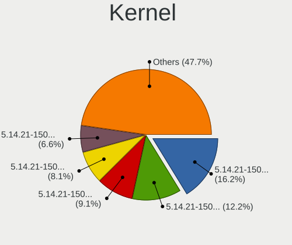

| Version                        | Desktops | Percent |
|--------------------------------|----------|---------|
| 5.14.21-150500.53-default      | 32       | 16.24%  |
| 5.14.21-150500.55.52-default   | 24       | 12.18%  |
| 5.14.21-150500.55.19-default   | 18       | 9.14%   |
| 5.14.21-150500.55.36-default   | 16       | 8.12%   |
| 5.14.21-150500.55.39-default   | 13       | 6.6%    |
| 5.14.21-150500.55.65-default   | 11       | 5.58%   |
| 5.14.21-150500.55.7-default    | 9        | 4.57%   |
| 5.14.21-150500.55.88-default   | 8        | 4.06%   |
| 5.14.21-150500.55.59-default   | 8        | 4.06%   |
| 5.14.21-150500.55.49-default   | 8        | 4.06%   |
| 5.14.21-150500.55.31-default   | 8        | 4.06%   |
| 5.14.21-150500.55.28-default   | 7        | 3.55%   |
| 5.14.21-150500.55.68-default   | 5        | 2.54%   |
| 5.14.21-150500.55.73-default   | 4        | 2.03%   |
| 5.14.21-150500.55.12-default   | 4        | 2.03%   |
| 5.14.21-150500.52-default      | 4        | 2.03%   |
| 5.14.21-150500.55.44-default   | 3        | 1.52%   |
| 5.14.21-150500.55.83-default   | 2        | 1.02%   |
| 5.14.21-150500.55.62-default   | 2        | 1.02%   |
| 5.14.21-150400.24.18-default   | 2        | 1.02%   |
| 6.8.9-1-default                | 1        | 0.51%   |
| 6.6.3-1-default                | 1        | 0.51%   |
| 6.5.9-lp155.2-default          | 1        | 0.51%   |
| 6.5.4-1-default                | 1        | 0.51%   |
| 6.4.4-lp154.2.g919c802-default | 1        | 0.51%   |
| 5.14.21-150500.43-default      | 1        | 0.51%   |
| 5.14.21-150500.37-default      | 1        | 0.51%   |
| 5.14.21-150400.24.55-default   | 1        | 0.51%   |
| 5.14.21-150400.24.46-default   | 1        | 0.51%   |

Kernel Family
-------------

Linux kernel without a distro release

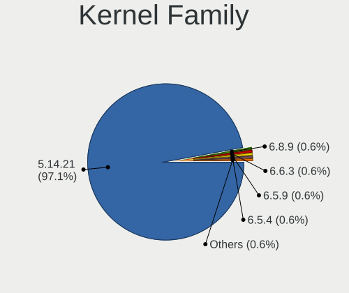

| Version | Desktops | Percent |
|---------|----------|---------|
| 5.14.21 | 168      | 97.11%  |
| 6.8.9   | 1        | 0.58%   |
| 6.6.3   | 1        | 0.58%   |
| 6.5.9   | 1        | 0.58%   |
| 6.5.4   | 1        | 0.58%   |
| 6.4.4   | 1        | 0.58%   |

Kernel Major Ver.
-----------------

Linux kernel major version

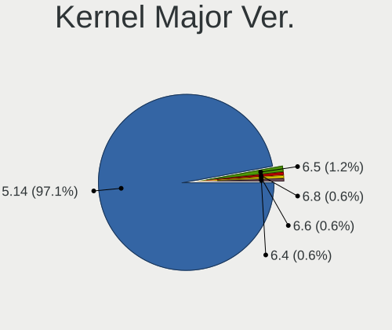

| Version | Desktops | Percent |
|---------|----------|---------|
| 5.14    | 168      | 97.11%  |
| 6.5     | 2        | 1.16%   |
| 6.8     | 1        | 0.58%   |
| 6.6     | 1        | 0.58%   |
| 6.4     | 1        | 0.58%   |

Arch
----

OS architecture (x86_64, i586, etc.)

| Name   | Desktops | Percent |
|--------|----------|---------|
| x86_64 | 173      | 100%    |

DE
--

Desktop Environment

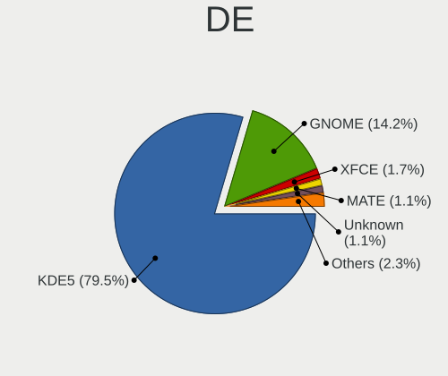

| Name    | Desktops | Percent |
|---------|----------|---------|
| KDE5    | 140      | 79.55%  |
| GNOME   | 25       | 14.2%   |
| XFCE    | 3        | 1.7%    |
| MATE    | 2        | 1.14%   |
| Unknown | 2        | 1.14%   |
| LXDE    | 1        | 0.57%   |
| ICEWM   | 1        | 0.57%   |
| Deepin  | 1        | 0.57%   |
| Budgie  | 1        | 0.57%   |

Display Server
--------------

X11 or Wayland

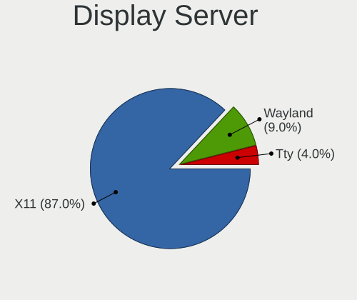

| Name    | Desktops | Percent |
|---------|----------|---------|
| X11     | 154      | 87.01%  |
| Wayland | 16       | 9.04%   |
| Tty     | 7        | 3.95%   |

Display Manager
---------------

SDDM, LightDM, etc.

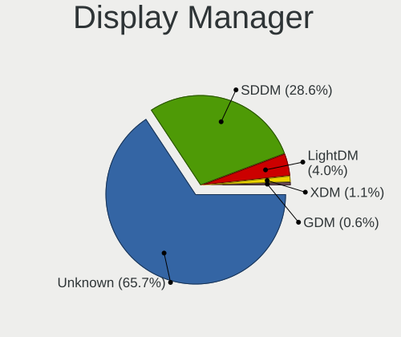

| Name    | Desktops | Percent |
|---------|----------|---------|
| Unknown | 115      | 65.71%  |
| SDDM    | 50       | 28.57%  |
| LightDM | 7        | 4%      |
| XDM     | 2        | 1.14%   |
| GDM     | 1        | 0.57%   |

OS Lang
-------

Language

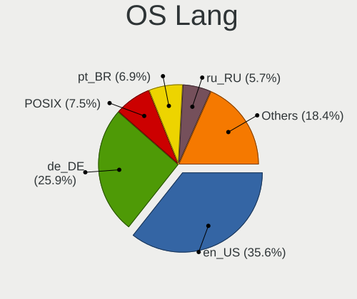

| Lang  | Desktops | Percent |
|-------|----------|---------|
| en_US | 62       | 35.63%  |
| de_DE | 45       | 25.86%  |
| POSIX | 13       | 7.47%   |
| pt_BR | 12       | 6.9%    |
| ru_RU | 10       | 5.75%   |
| nl_NL | 5        | 2.87%   |
| es_ES | 5        | 2.87%   |
| pl_PL | 3        | 1.72%   |
| it_IT | 3        | 1.72%   |
| fr_FR | 3        | 1.72%   |
| C     | 3        | 1.72%   |
| en_GB | 2        | 1.15%   |
| zh_CN | 1        | 0.57%   |
| sk_SK | 1        | 0.57%   |
| fi_FI | 1        | 0.57%   |
| es_DO | 1        | 0.57%   |
| el_GR | 1        | 0.57%   |
| da_DK | 1        | 0.57%   |
| cs_CZ | 1        | 0.57%   |
| ar_AE | 1        | 0.57%   |

Boot Mode
---------

EFI or BIOS

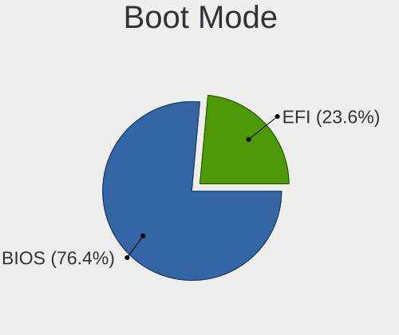

| Mode | Desktops | Percent |
|------|----------|---------|
| BIOS | 133      | 76.44%  |
| EFI  | 41       | 23.56%  |

Filesystem
----------

Type of filesystem

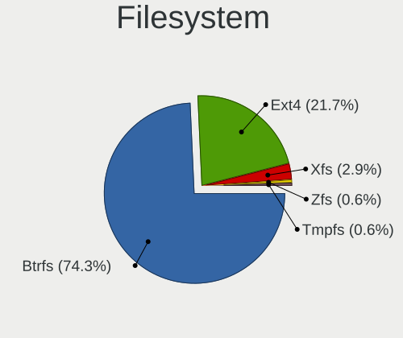

| Type  | Desktops | Percent |
|-------|----------|---------|
| Btrfs | 130      | 74.29%  |
| Ext4  | 38       | 21.71%  |
| Xfs   | 5        | 2.86%   |
| Zfs   | 1        | 0.57%   |
| Tmpfs | 1        | 0.57%   |

Part. scheme
------------

Scheme of partitioning

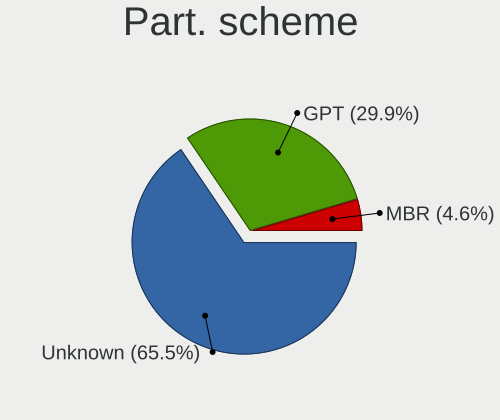

| Type    | Desktops | Percent |
|---------|----------|---------|
| Unknown | 114      | 65.52%  |
| GPT     | 52       | 29.89%  |
| MBR     | 8        | 4.6%    |

Dual Boot with Linux/BSD
------------------------

Hosting more than one Linux/BSD

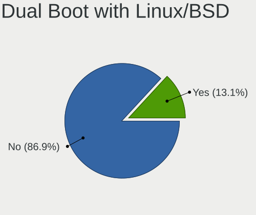

| Dual boot | Desktops | Percent |
|-----------|----------|---------|
| No        | 152      | 86.86%  |
| Yes       | 23       | 13.14%  |

Dual Boot (Win)
---------------

Hosting Linux and Windows

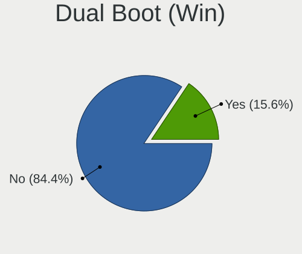

| Dual boot | Desktops | Percent |
|-----------|----------|---------|
| No        | 146      | 84.39%  |
| Yes       | 27       | 15.61%  |

Board
-----

Vendor
------

Motherboard manufacturer

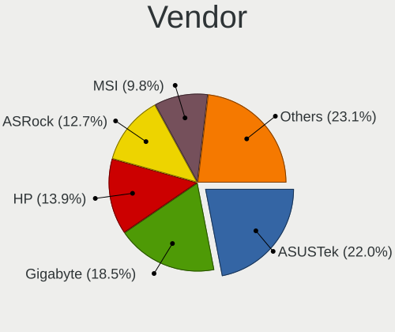

| Name                | Desktops | Percent |
|---------------------|----------|---------|
| ASUSTek Computer    | 38       | 21.97%  |
| Gigabyte Technology | 32       | 18.5%   |
| Hewlett-Packard     | 24       | 13.87%  |
| ASRock              | 22       | 12.72%  |
| MSI                 | 17       | 9.83%   |
| Dell                | 8        | 4.62%   |
| Lenovo              | 7        | 4.05%   |
| Fujitsu             | 4        | 2.31%   |
| Biostar             | 4        | 2.31%   |
| Intel               | 3        | 1.73%   |
| Acer                | 3        | 1.73%   |
| HC Technology.      | 2        | 1.16%   |
| Pegatron            | 1        | 0.58%   |
| OEM                 | 1        | 0.58%   |
| GEEKOM              | 1        | 0.58%   |
| Fujitsu Siemens     | 1        | 0.58%   |
| Foxconn             | 1        | 0.58%   |
| Colorful Technology | 1        | 0.58%   |
| AMI                 | 1        | 0.58%   |
| Alienware           | 1        | 0.58%   |
| Unknown             | 1        | 0.58%   |

Model
-----

Motherboard model

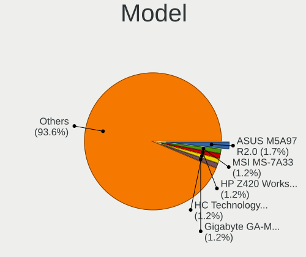

| Name                                        | Desktops | Percent |
|---------------------------------------------|----------|---------|
| ASUS M5A97 R2.0                             | 3        | 1.73%   |
| MSI MS-7A33                                 | 2        | 1.16%   |
| HP Z420 Workstation                         | 2        | 1.16%   |
| HC Technology. HCAR5000-MI                  | 2        | 1.16%   |
| Gigabyte GA-MA770-UD3                       | 2        | 1.16%   |
| Gigabyte B550M DS3H                         | 2        | 1.16%   |
| ASUS ROG STRIX X570-E GAMING                | 2        | 1.16%   |
| ASUS H110M-A/M.2                            | 2        | 1.16%   |
| Pegatron NY603AA-ABA 300-1007               | 1        | 0.58%   |
| OEM B75                                     | 1        | 0.58%   |
| MSI PRO ADL-U Cubi 5 (MS-B0A8)              | 1        | 0.58%   |
| MSI MS-7D74                                 | 1        | 0.58%   |
| MSI MS-7D54                                 | 1        | 0.58%   |
| MSI MS-7C95                                 | 1        | 0.58%   |
| MSI MS-7C91                                 | 1        | 0.58%   |
| MSI MS-7C80                                 | 1        | 0.58%   |
| MSI MS-7C52                                 | 1        | 0.58%   |
| MSI MS-7C02                                 | 1        | 0.58%   |
| MSI MS-7B89                                 | 1        | 0.58%   |
| MSI MS-7B86                                 | 1        | 0.58%   |
| MSI MS-7B85                                 | 1        | 0.58%   |
| MSI MS-7B17                                 | 1        | 0.58%   |
| MSI MS-7978                                 | 1        | 0.58%   |
| MSI MS-7641                                 | 1        | 0.58%   |
| MSI MS-7522                                 | 1        | 0.58%   |
| Lenovo V520S-08IKL Desktop 10NN000CBP       | 1        | 0.58%   |
| Lenovo ThinkCentre M92p 3227GQ8             | 1        | 0.58%   |
| Lenovo ThinkCentre M78 10BR0005US           | 1        | 0.58%   |
| Lenovo ThinkCentre M720t 10SQ0070GE         | 1        | 0.58%   |
| Lenovo ThinkCentre M700 10KN003LBP          | 1        | 0.58%   |
| Lenovo ThinkCentre Edge 91Z 7075K7G         | 1        | 0.58%   |
| Lenovo IdeaCentre Gaming5 17IAB7 90T100BHMZ | 1        | 0.58%   |
| Intel Nobilis                               | 1        | 0.58%   |
| Intel H61                                   | 1        | 0.58%   |
| Intel DH87RL AAG74240-403                   | 1        | 0.58%   |
| HP Z820 Workstation                         | 1        | 0.58%   |
| HP Z640 Workstation                         | 1        | 0.58%   |
| HP Z440 Workstation                         | 1        | 0.58%   |
| HP Z400 Workstation                         | 1        | 0.58%   |
| HP Z4 G4 Workstation                        | 1        | 0.58%   |

Model Family
------------

Motherboard model prefix

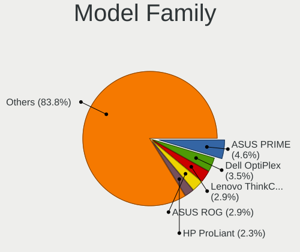

| Name                       | Desktops | Percent |
|----------------------------|----------|---------|
| ASUS PRIME                 | 8        | 4.62%   |
| Dell OptiPlex              | 6        | 3.47%   |
| Lenovo ThinkCentre         | 5        | 2.89%   |
| ASUS ROG                   | 5        | 2.89%   |
| HP ProLiant                | 4        | 2.31%   |
| HP Compaq                  | 4        | 2.31%   |
| ASUS M5A97                 | 3        | 1.73%   |
| Acer Aspire                | 3        | 1.73%   |
| MSI MS-7A33                | 2        | 1.16%   |
| HP Z420                    | 2        | 1.16%   |
| HP ProDesk                 | 2        | 1.16%   |
| HP Pavilion                | 2        | 1.16%   |
| HP EliteDesk               | 2        | 1.16%   |
| HC Technology. HCAR5000-MI | 2        | 1.16%   |
| Gigabyte GA-MA770-UD3      | 2        | 1.16%   |
| Gigabyte B550M             | 2        | 1.16%   |
| Gigabyte B450M             | 2        | 1.16%   |
| Fujitsu ESPRIMO            | 2        | 1.16%   |
| ASUS H110M-A               | 2        | 1.16%   |
| ASRock Z790                | 2        | 1.16%   |
| ASRock Z390                | 2        | 1.16%   |
| Pegatron NY603AA-ABA       | 1        | 0.58%   |
| OEM B75                    | 1        | 0.58%   |
| MSI PRO                    | 1        | 0.58%   |
| MSI MS-7D74                | 1        | 0.58%   |
| MSI MS-7D54                | 1        | 0.58%   |
| MSI MS-7C95                | 1        | 0.58%   |
| MSI MS-7C91                | 1        | 0.58%   |
| MSI MS-7C80                | 1        | 0.58%   |
| MSI MS-7C52                | 1        | 0.58%   |
| MSI MS-7C02                | 1        | 0.58%   |
| MSI MS-7B89                | 1        | 0.58%   |
| MSI MS-7B86                | 1        | 0.58%   |
| MSI MS-7B85                | 1        | 0.58%   |
| MSI MS-7B17                | 1        | 0.58%   |
| MSI MS-7978                | 1        | 0.58%   |
| MSI MS-7641                | 1        | 0.58%   |
| MSI MS-7522                | 1        | 0.58%   |
| Lenovo V520S-08IKL         | 1        | 0.58%   |
| Lenovo IdeaCentre          | 1        | 0.58%   |

MFG Year
--------

Motherboard manufacture year

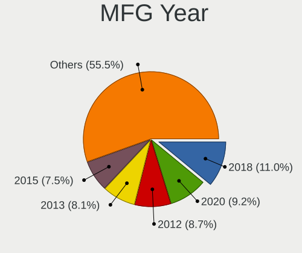

| Year | Desktops | Percent |
|------|----------|---------|
| 2018 | 19       | 10.98%  |
| 2020 | 16       | 9.25%   |
| 2012 | 15       | 8.67%   |
| 2013 | 14       | 8.09%   |
| 2015 | 13       | 7.51%   |
| 2022 | 10       | 5.78%   |
| 2016 | 10       | 5.78%   |
| 2021 | 9        | 5.2%    |
| 2011 | 9        | 5.2%    |
| 2010 | 9        | 5.2%    |
| 2014 | 8        | 4.62%   |
| 2009 | 8        | 4.62%   |
| 2008 | 8        | 4.62%   |
| 2019 | 7        | 4.05%   |
| 2023 | 6        | 3.47%   |
| 2017 | 5        | 2.89%   |
| 2007 | 4        | 2.31%   |
| 2006 | 2        | 1.16%   |
| 2024 | 1        | 0.58%   |

Form Factor
-----------

Physical design of the computer

| Name    | Desktops | Percent |
|---------|----------|---------|
| Desktop | 173      | 100%    |

Secure Boot
-----------

Enabled or disabled

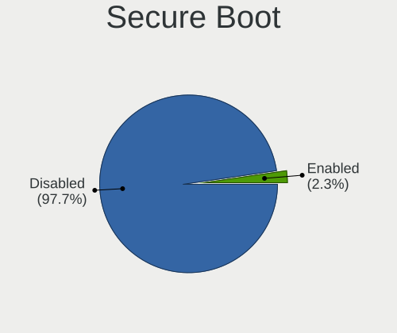

| State    | Desktops | Percent |
|----------|----------|---------|
| Disabled | 169      | 97.69%  |
| Enabled  | 4        | 2.31%   |

Coreboot
--------

Have coreboot on board

| Used | Desktops | Percent |
|------|----------|---------|
| No   | 173      | 100%    |

RAM Size
--------

Total RAM memory

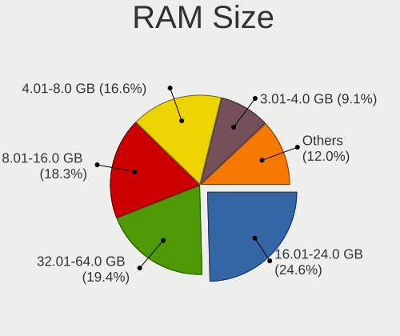

| Size in GB  | Desktops | Percent |
|-------------|----------|---------|
| 16.01-24.0  | 43       | 24.57%  |
| 32.01-64.0  | 34       | 19.43%  |
| 8.01-16.0   | 32       | 18.29%  |
| 4.01-8.0    | 29       | 16.57%  |
| 3.01-4.0    | 16       | 9.14%   |
| 64.01-256.0 | 14       | 8%      |
| 24.01-32.0  | 5        | 2.86%   |
| 1.01-2.0    | 2        | 1.14%   |

RAM Used
--------

Used RAM memory

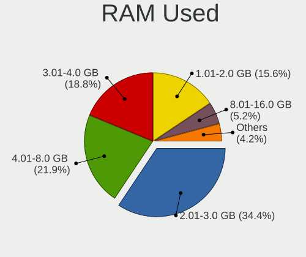

| Used GB    | Desktops | Percent |
|------------|----------|---------|
| 2.01-3.0   | 66       | 34.38%  |
| 4.01-8.0   | 42       | 21.88%  |
| 3.01-4.0   | 36       | 18.75%  |
| 1.01-2.0   | 30       | 15.63%  |
| 8.01-16.0  | 10       | 5.21%   |
| 0.51-1.0   | 5        | 2.6%    |
| 16.01-24.0 | 2        | 1.04%   |
| 24.01-32.0 | 1        | 0.52%   |

Total Drives
------------

Number of drives on board

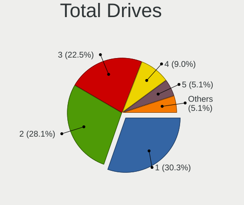

| Drives | Desktops | Percent |
|--------|----------|---------|
| 1      | 54       | 30.34%  |
| 2      | 50       | 28.09%  |
| 3      | 40       | 22.47%  |
| 4      | 16       | 8.99%   |
| 5      | 9        | 5.06%   |
| 6      | 6        | 3.37%   |
| 10     | 1        | 0.56%   |
| 8      | 1        | 0.56%   |
| 7      | 1        | 0.56%   |

Has CD-ROM
----------

Has CD-ROM on board

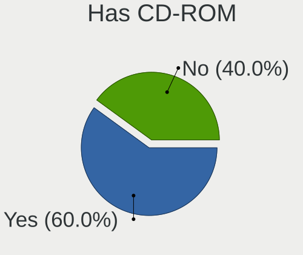

| Presented | Desktops | Percent |
|-----------|----------|---------|
| Yes       | 105      | 60%     |
| No        | 70       | 40%     |

Has Ethernet
------------

Has Ethernet on board

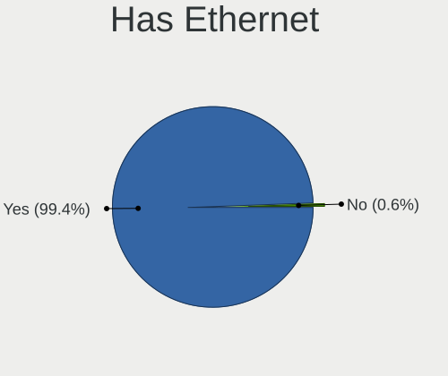

| Presented | Desktops | Percent |
|-----------|----------|---------|
| Yes       | 172      | 99.42%  |
| No        | 1        | 0.58%   |

Has WiFi
--------

Has WiFi module

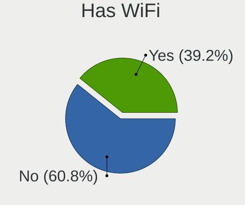

| Presented | Desktops | Percent |
|-----------|----------|---------|
| No        | 107      | 60.8%   |
| Yes       | 69       | 39.2%   |

Has Bluetooth
-------------

Has Bluetooth module

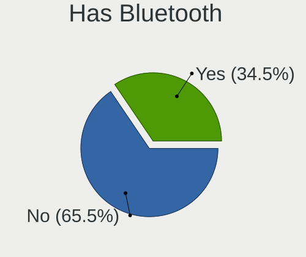

| Presented | Desktops | Percent |
|-----------|----------|---------|
| No        | 114      | 65.52%  |
| Yes       | 60       | 34.48%  |

Location
--------

Country
-------

Geographic location (country)

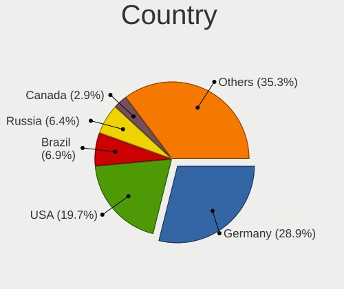

| Country                | Desktops | Percent |
|------------------------|----------|---------|
| Germany                | 50       | 28.9%   |
| USA                    | 34       | 19.65%  |
| Brazil                 | 12       | 6.94%   |
| Russia                 | 11       | 6.36%   |
| Canada                 | 5        | 2.89%   |
| Switzerland            | 4        | 2.31%   |
| Poland                 | 4        | 2.31%   |
| Netherlands            | 4        | 2.31%   |
| Sweden                 | 3        | 1.73%   |
| Spain                  | 3        | 1.73%   |
| Italy                  | 3        | 1.73%   |
| Greece                 | 3        | 1.73%   |
| Finland                | 3        | 1.73%   |
| Australia              | 3        | 1.73%   |
| UK                     | 2        | 1.16%   |
| France                 | 2        | 1.16%   |
| Czechia                | 2        | 1.16%   |
| Belgium                | 2        | 1.16%   |
| Vietnam                | 1        | 0.58%   |
| Ukraine                | 1        | 0.58%   |
| The Netherlands        | 1        | 0.58%   |
| South Korea            | 1        | 0.58%   |
| South Africa           | 1        | 0.58%   |
| Slovenia               | 1        | 0.58%   |
| Slovakia               | 1        | 0.58%   |
| Portugal               | 1        | 0.58%   |
| Mexico                 | 1        | 0.58%   |
| Martinique             | 1        | 0.58%   |
| Kenya                  | 1        | 0.58%   |
| Indonesia              | 1        | 0.58%   |
| India                  | 1        | 0.58%   |
| Hong Kong              | 1        | 0.58%   |
| Guatemala              | 1        | 0.58%   |
| Greenland              | 1        | 0.58%   |
| Colombia               | 1        | 0.58%   |
| China                  | 1        | 0.58%   |
| Bulgaria               | 1        | 0.58%   |
| Bosnia and Herzegovina | 1        | 0.58%   |
| Austria                | 1        | 0.58%   |
| Argentina              | 1        | 0.58%   |

City
----

Geographic location (city)

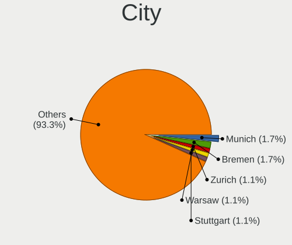

| City            | Desktops | Percent |
|-----------------|----------|---------|
| Munich          | 3        | 1.68%   |
| Bremen          | 3        | 1.68%   |
| Zurich          | 2        | 1.12%   |
| Warsaw          | 2        | 1.12%   |
| Stuttgart       | 2        | 1.12%   |
| St Petersburg   | 2        | 1.12%   |
| Sacramento      | 2        | 1.12%   |
| Nuremberg       | 2        | 1.12%   |
| Enschede        | 2        | 1.12%   |
| Dresden         | 2        | 1.12%   |
| Cherry Hill     | 2        | 1.12%   |
| Berlin          | 2        | 1.12%   |
| Zuchwil         | 1        | 0.56%   |
| Zetel           | 1        | 0.56%   |
| Yakutsk         | 1        | 0.56%   |
| Wuppertal       | 1        | 0.56%   |
| West Hills      | 1        | 0.56%   |
| West Bend       | 1        | 0.56%   |
| Warrenton       | 1        | 0.56%   |
| Waren           | 1        | 0.56%   |
| Vlkanova        | 1        | 0.56%   |
| Vitry-sur-Seine | 1        | 0.56%   |
| Vigo            | 1        | 0.56%   |
| Vienna          | 1        | 0.56%   |
| Victoria        | 1        | 0.56%   |
| Västerås      | 1        | 0.56%   |
| Vantaa          | 1        | 0.56%   |
| Valencia        | 1        | 0.56%   |
| Usinsk          | 1        | 0.56%   |
| Timmins         | 1        | 0.56%   |
| Thessaloniki    | 1        | 0.56%   |
| The Villages    | 1        | 0.56%   |
| Tambov          | 1        | 0.56%   |
| Tacoma          | 1        | 0.56%   |
| Sydney          | 1        | 0.56%   |
| Sumaré         | 1        | 0.56%   |
| Stockholm       | 1        | 0.56%   |
| Staraya Russa   | 1        | 0.56%   |
| Spring          | 1        | 0.56%   |
| Soltau          | 1        | 0.56%   |

Drives
------

Drive Vendor
------------

Hard drive vendors

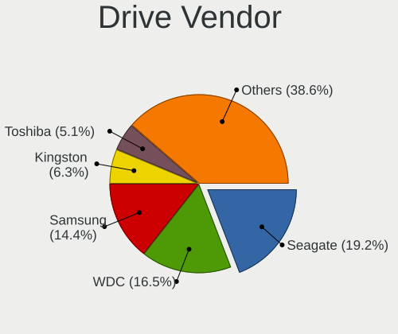

| Vendor                      | Desktops | Drives | Percent |
|-----------------------------|----------|--------|---------|
| Seagate                     | 64       | 109    | 19.16%  |
| WDC                         | 55       | 123    | 16.47%  |
| Samsung Electronics         | 48       | 83     | 14.37%  |
| Kingston                    | 21       | 30     | 6.29%   |
| Toshiba                     | 17       | 19     | 5.09%   |
| Crucial                     | 16       | 21     | 4.79%   |
| SanDisk                     | 14       | 20     | 4.19%   |
| Hitachi                     | 12       | 15     | 3.59%   |
| Intenso                     | 7        | 8      | 2.1%    |
| Silicon Motion              | 6        | 6      | 1.8%    |
| A-DATA Technology           | 5        | 5      | 1.5%    |
| Micron Technology           | 4        | 5      | 1.2%    |
| Intel                       | 4        | 5      | 1.2%    |
| China                       | 4        | 6      | 1.2%    |
| XrayDisk                    | 3        | 4      | 0.9%    |
| Unknown                     | 3        | 3      | 0.9%    |
| SPCC                        | 3        | 3      | 0.9%    |
| SK hynix                    | 3        | 3      | 0.9%    |
| Phison Electronics          | 3        | 5      | 0.9%    |
| Kingston Technology Company | 3        | 4      | 0.9%    |
| HGST                        | 3        | 4      | 0.9%    |
| SABRENT                     | 2        | 2      | 0.6%    |
| PNY                         | 2        | 3      | 0.6%    |
| LITEON                      | 2        | 2      | 0.6%    |
| Leven                       | 2        | 2      | 0.6%    |
| Hewlett-Packard             | 2        | 2      | 0.6%    |
| XSTAR                       | 1        | 1      | 0.3%    |
| Verbatim                    | 1        | 1      | 0.3%    |
| Team                        | 1        | 2      | 0.3%    |
| T-FORCE                     | 1        | 1      | 0.3%    |
| Synology                    | 1        | 1      | 0.3%    |
| StoreJet                    | 1        | 1      | 0.3%    |
| SATAFIRM                    | 1        | 1      | 0.3%    |
| RESCUE                      | 1        | 1      | 0.3%    |
| Realtek Semiconductor       | 1        | 1      | 0.3%    |
| Radeon                      | 1        | 1      | 0.3%    |
| Netac                       | 1        | 2      | 0.3%    |
| Micron/Crucial Technology   | 1        | 1      | 0.3%    |
| Maxtor                      | 1        | 2      | 0.3%    |
| KIOXIA                      | 1        | 1      | 0.3%    |

Drive Model
-----------

Hard drive models

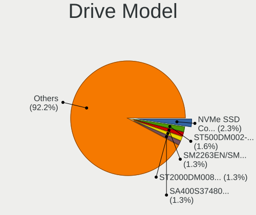

| Model                                                 | Desktops | Percent |
|-------------------------------------------------------|----------|---------|
| Samsung NVMe SSD Controller SM981/PM981/PM983 1TB     | 9        | 2.33%   |
| Seagate ST500DM002-1BD142 500GB                       | 6        | 1.55%   |
| Silicon Motion SM2263EN/SM2263XT SSD Controller 512GB | 5        | 1.29%   |
| Seagate ST2000DM008-2FR102 2TB                        | 5        | 1.29%   |
| Kingston SA400S37480G 480GB SSD                       | 5        | 1.29%   |
| Samsung SSD 870 EVO 1TB                               | 4        | 1.03%   |
| WDC WD10EZEX-08WN4A0 1TB                              | 3        | 0.78%   |
| WDC WD10EZEX-08M2NA0 1TB                              | 3        | 0.78%   |
| Toshiba DT01ACA050 500GB                              | 3        | 0.78%   |
| Seagate ST4000DM004-2CV104 4TB                        | 3        | 0.78%   |
| Seagate ST1000DM010-2EP102 1TB                        | 3        | 0.78%   |
| Seagate Expansion 2TB                                 | 3        | 0.78%   |
| Samsung SSD 850 EVO 250GB                             | 3        | 0.78%   |
| Samsung SSD 840 EVO 250GB                             | 3        | 0.78%   |
| Samsung NVMe SSD Controller PM9A1/PM9A3/980PRO 1TB    | 3        | 0.78%   |
| Kingston SV300S37A120G 120GB SSD                      | 3        | 0.78%   |
| Kingston SA400S37240G 240GB SSD                       | 3        | 0.78%   |
| Kingston SA400S37120G 120GB SSD                       | 3        | 0.78%   |
| Crucial CT275MX300SSD1 275GB                          | 3        | 0.78%   |
| WDC WDS500G2B0A-00SM50 500GB                          | 2        | 0.52%   |
| WDC WD20EZRZ-00Z5HB0 2TB                              | 2        | 0.52%   |
| WDC WD10EZRX-00A8LB0 1TB                              | 2        | 0.52%   |
| WDC WD1003FZEX-00K3CA0 1TB                            | 2        | 0.52%   |
| Unknown SD/MMC/MS PRO 2GB                             | 2        | 0.52%   |
| Toshiba HDWD130 3TB                                   | 2        | 0.52%   |
| Toshiba HDWD120 2TB                                   | 2        | 0.52%   |
| Toshiba DT01ACA100 1TB                                | 2        | 0.52%   |
| SPCC Solid State Disk 512GB                           | 2        | 0.52%   |
| Seagate ST8000DM004-2U9188 8TB                        | 2        | 0.52%   |
| Seagate ST3500418AS 500GB                             | 2        | 0.52%   |
| Seagate ST2000DM006-2DM164 2TB                        | 2        | 0.52%   |
| Seagate ST1000DM003-1CH162 1TB                        | 2        | 0.52%   |
| Seagate One Touch HDD 5TB                             | 2        | 0.52%   |
| Seagate BUP Portable 5TB                              | 2        | 0.52%   |
| Seagate Backup+ Hub BK 6TB                            | 2        | 0.52%   |
| Sandisk WD Black SN850 1TB                            | 2        | 0.52%   |
| Samsung SSD 990 PRO 2TB                               | 2        | 0.52%   |
| Samsung SSD 870 EVO 2TB                               | 2        | 0.52%   |
| Samsung SSD 860 EVO 4TB                               | 2        | 0.52%   |
| Samsung SSD 860 EVO 250GB                             | 2        | 0.52%   |

HDD Vendor
----------

Hard disk drive vendors

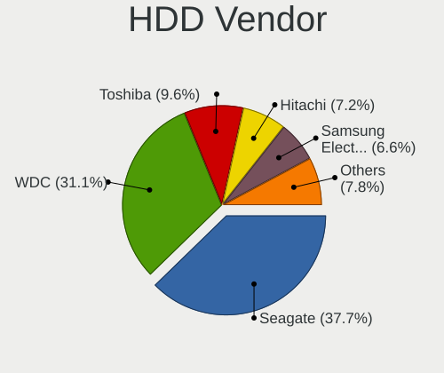

| Vendor              | Desktops | Drives | Percent |
|---------------------|----------|--------|---------|
| Seagate             | 63       | 106    | 37.72%  |
| WDC                 | 52       | 108    | 31.14%  |
| Toshiba             | 16       | 18     | 9.58%   |
| Hitachi             | 12       | 15     | 7.19%   |
| Samsung Electronics | 11       | 12     | 6.59%   |
| HGST                | 3        | 4      | 1.8%    |
| Unknown             | 2        | 2      | 1.2%    |
| XrayDisk            | 1        | 1      | 0.6%    |
| Synology            | 1        | 1      | 0.6%    |
| SATAFIRM            | 1        | 1      | 0.6%    |
| Maxtor              | 1        | 2      | 0.6%    |
| Hewlett-Packard     | 1        | 1      | 0.6%    |
| Fujitsu             | 1        | 2      | 0.6%    |
| ASMT                | 1        | 2      | 0.6%    |
| Apple               | 1        | 1      | 0.6%    |

SSD Vendor
----------

Solid state drive vendors

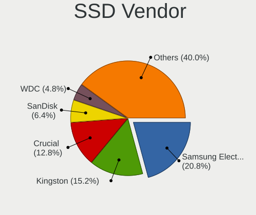

| Vendor              | Desktops | Drives | Percent |
|---------------------|----------|--------|---------|
| Samsung Electronics | 26       | 45     | 20.8%   |
| Kingston            | 19       | 26     | 15.2%   |
| Crucial             | 16       | 21     | 12.8%   |
| SanDisk             | 8        | 9      | 6.4%    |
| WDC                 | 6        | 15     | 4.8%    |
| Intenso             | 6        | 6      | 4.8%    |
| A-DATA Technology   | 5        | 5      | 4%      |
| China               | 4        | 6      | 3.2%    |
| SPCC                | 3        | 3      | 2.4%    |
| Intel               | 3        | 4      | 2.4%    |
| XrayDisk            | 2        | 3      | 1.6%    |
| SABRENT             | 2        | 2      | 1.6%    |
| PNY                 | 2        | 3      | 1.6%    |
| Micron Technology   | 2        | 2      | 1.6%    |
| LITEON              | 2        | 2      | 1.6%    |
| Leven               | 2        | 2      | 1.6%    |
| XSTAR               | 1        | 1      | 0.8%    |
| Verbatim            | 1        | 1      | 0.8%    |
| Toshiba             | 1        | 1      | 0.8%    |
| Team                | 1        | 2      | 0.8%    |
| T-FORCE             | 1        | 1      | 0.8%    |
| StoreJet            | 1        | 1      | 0.8%    |
| SK hynix            | 1        | 1      | 0.8%    |
| RESCUE              | 1        | 1      | 0.8%    |
| Radeon              | 1        | 1      | 0.8%    |
| Netac               | 1        | 2      | 0.8%    |
| Hewlett-Packard     | 1        | 1      | 0.8%    |
| FIKWOT              | 1        | 1      | 0.8%    |
| Fanxiang            | 1        | 2      | 0.8%    |
| BAITITON            | 1        | 1      | 0.8%    |
| AMD                 | 1        | 1      | 0.8%    |
| Acer                | 1        | 1      | 0.8%    |
| Unknown             | 1        | 3      | 0.8%    |

Drive Kind
----------

HDD or SSD

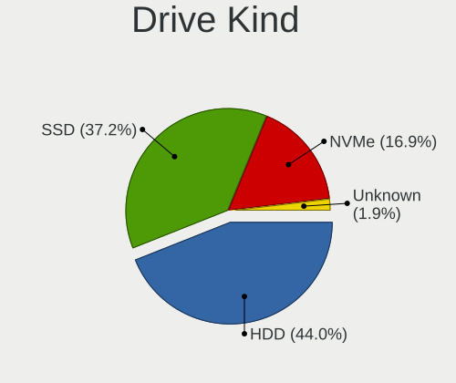

| Kind    | Desktops | Drives | Percent |
|---------|----------|--------|---------|
| HDD     | 117      | 276    | 43.98%  |
| SSD     | 99       | 176    | 37.22%  |
| NVMe    | 45       | 68     | 16.92%  |
| Unknown | 5        | 5      | 1.88%   |

Drive Connector
---------------

SATA, SAS, NVMe, etc.

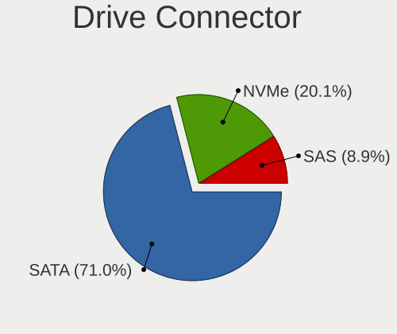

| Type | Desktops | Drives | Percent |
|------|----------|--------|---------|
| SATA | 159      | 421    | 70.98%  |
| NVMe | 45       | 68     | 20.09%  |
| SAS  | 20       | 36     | 8.93%   |

Drive Size
----------

Size of hard drive

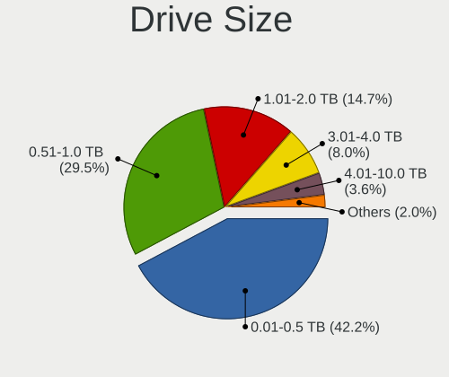

| Size in TB | Desktops | Drives | Percent |
|------------|----------|--------|---------|
| 0.01-0.5   | 106      | 189    | 42.23%  |
| 0.51-1.0   | 74       | 129    | 29.48%  |
| 1.01-2.0   | 37       | 74     | 14.74%  |
| 3.01-4.0   | 20       | 35     | 7.97%   |
| 4.01-10.0  | 9        | 20     | 3.59%   |
| 2.01-3.0   | 4        | 4      | 1.59%   |
| 10.01-20.0 | 1        | 1      | 0.4%    |

Space Total
-----------

Amount of disk space available on the file system

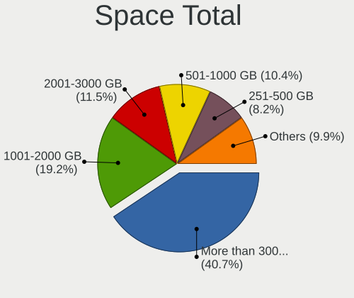

| Size in GB     | Desktops | Percent |
|----------------|----------|---------|
| More than 3000 | 74       | 40.66%  |
| 1001-2000      | 35       | 19.23%  |
| 2001-3000      | 21       | 11.54%  |
| 501-1000       | 19       | 10.44%  |
| 251-500        | 15       | 8.24%   |
| 101-250        | 10       | 5.49%   |
| 51-100         | 4        | 2.2%    |
| Unknown        | 3        | 1.65%   |
| 1-20           | 1        | 0.55%   |

Space Used
----------

Amount of used disk space

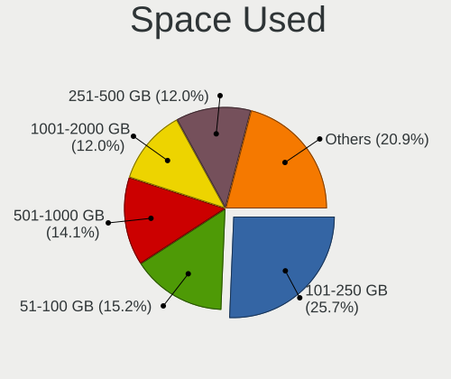

| Used GB        | Desktops | Percent |
|----------------|----------|---------|
| 101-250        | 49       | 25.65%  |
| 51-100         | 29       | 15.18%  |
| 501-1000       | 27       | 14.14%  |
| 251-500        | 23       | 12.04%  |
| 1001-2000      | 23       | 12.04%  |
| More than 3000 | 12       | 6.28%   |
| 21-50          | 11       | 5.76%   |
| 1-20           | 9        | 4.71%   |
| 2001-3000      | 5        | 2.62%   |
| Unknown        | 3        | 1.57%   |

Malfunc. Drives
---------------

Drive models with a malfunction

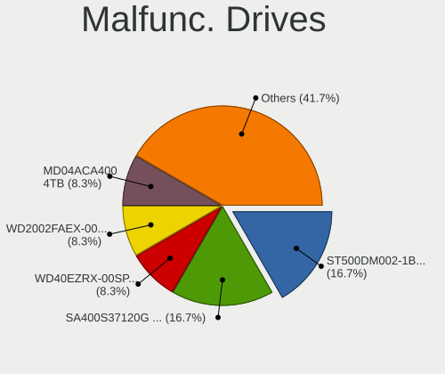

| Model                                            | Desktops | Drives | Percent |
|--------------------------------------------------|----------|--------|---------|
| Seagate ST500DM002-1BD142 500GB                  | 2        | 2      | 16.67%  |
| Kingston SA400S37120G 120GB SSD                  | 2        | 4      | 16.67%  |
| WDC WD40EZRX-00SPEB0 4TB                         | 1        | 1      | 8.33%   |
| WDC WD2002FAEX-007BA0 2TB                        | 1        | 1      | 8.33%   |
| Toshiba MD04ACA400 4TB                           | 1        | 1      | 8.33%   |
| Seagate ST500LM012 HN-M500MBB 500GB              | 1        | 1      | 8.33%   |
| Seagate ST4000NM0035-1V4107 4TB                  | 1        | 1      | 8.33%   |
| Samsung Electronics SSD 840 EVO 120GB            | 1        | 1      | 8.33%   |
| Samsung Electronics MZ7TE256HMHP-000L7 256GB SSD | 1        | 1      | 8.33%   |
| Maxtor 6Y120M0 122GB                             | 1        | 2      | 8.33%   |

Malfunc. Drive Vendor
---------------------

Vendors of faulty drives

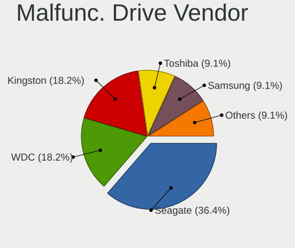

| Vendor              | Desktops | Drives | Percent |
|---------------------|----------|--------|---------|
| Seagate             | 4        | 4      | 36.36%  |
| WDC                 | 2        | 2      | 18.18%  |
| Kingston            | 2        | 4      | 18.18%  |
| Toshiba             | 1        | 1      | 9.09%   |
| Samsung Electronics | 1        | 2      | 9.09%   |
| Maxtor              | 1        | 2      | 9.09%   |

Malfunc. HDD Vendor
-------------------

Vendors of faulty HDD drives

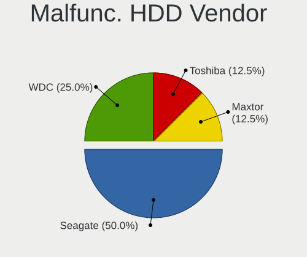

| Vendor  | Desktops | Drives | Percent |
|---------|----------|--------|---------|
| Seagate | 4        | 4      | 50%     |
| WDC     | 2        | 2      | 25%     |
| Toshiba | 1        | 1      | 12.5%   |
| Maxtor  | 1        | 2      | 12.5%   |

Malfunc. Drive Kind
-------------------

Kinds of faulty drives

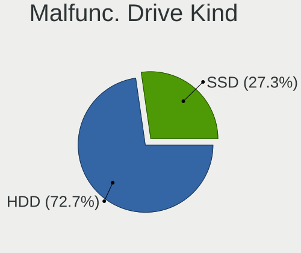

| Kind | Desktops | Drives | Percent |
|------|----------|--------|---------|
| HDD  | 8        | 9      | 72.73%  |
| SSD  | 3        | 6      | 27.27%  |

Failed Drives
-------------

Failed drive models

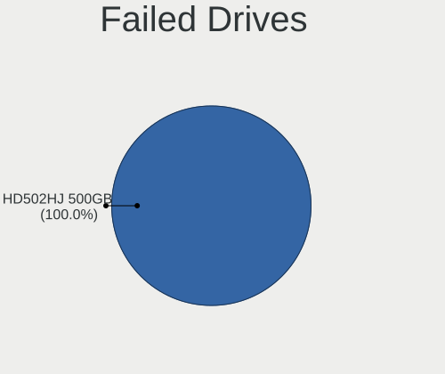

| Model                             | Desktops | Drives | Percent |
|-----------------------------------|----------|--------|---------|
| Samsung Electronics HD502HJ 500GB | 1        | 2      | 100%    |

Failed Drive Vendor
-------------------

Failed drive vendors

| Vendor              | Desktops | Drives | Percent |
|---------------------|----------|--------|---------|
| Samsung Electronics | 1        | 2      | 100%    |

Drive Status
------------

Number of failed and malfunc. drives

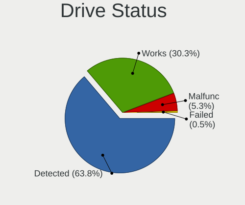

| Status   | Desktops | Drives | Percent |
|----------|----------|--------|---------|
| Detected | 120      | 366    | 63.83%  |
| Works    | 57       | 142    | 30.32%  |
| Malfunc  | 10       | 15     | 5.32%   |
| Failed   | 1        | 2      | 0.53%   |

Storage controller
------------------

Storage Vendor
--------------

Storage controller vendors

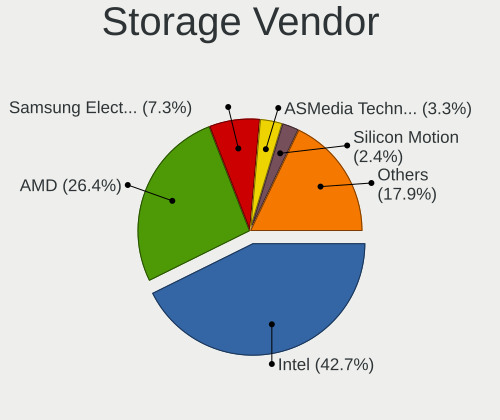

| Vendor                        | Desktops | Percent |
|-------------------------------|----------|---------|
| Intel                         | 105      | 42.68%  |
| AMD                           | 65       | 26.42%  |
| Samsung Electronics           | 18       | 7.32%   |
| ASMedia Technology            | 8        | 3.25%   |
| Silicon Motion                | 6        | 2.44%   |
| SanDisk                       | 6        | 2.44%   |
| Marvell Technology Group      | 6        | 2.44%   |
| JMicron Technology            | 6        | 2.44%   |
| Kingston Technology Company   | 5        | 2.03%   |
| Phison Electronics            | 3        | 1.22%   |
| Nvidia                        | 3        | 1.22%   |
| SK hynix                      | 2        | 0.81%   |
| Micron Technology             | 2        | 0.81%   |
| Broadcom / LSI                | 2        | 0.81%   |
| VIA Technologies              | 1        | 0.41%   |
| Seagate Technology            | 1        | 0.41%   |
| Realtek Semiconductor         | 1        | 0.41%   |
| Micron/Crucial Technology     | 1        | 0.41%   |
| KIOXIA                        | 1        | 0.41%   |
| Integrated Technology Express | 1        | 0.41%   |
| ADATA Technology              | 1        | 0.41%   |
| Adaptec                       | 1        | 0.41%   |
| Unknown                       | 1        | 0.41%   |

Storage Model
-------------

Storage controller models

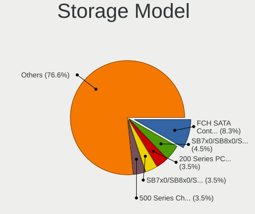

| Model                                                                          | Desktops | Percent |
|--------------------------------------------------------------------------------|----------|---------|
| AMD FCH SATA Controller [AHCI mode]                                            | 26       | 8.33%   |
| AMD SB7x0/SB8x0/SB9x0 IDE Controller                                           | 14       | 4.49%   |
| Intel 200 Series PCH SATA controller [AHCI mode]                               | 11       | 3.53%   |
| AMD SB7x0/SB8x0/SB9x0 SATA Controller [IDE mode]                               | 11       | 3.53%   |
| AMD 500 Series Chipset SATA Controller                                         | 11       | 3.53%   |
| AMD 400 Series Chipset SATA Controller                                         | 11       | 3.53%   |
| Intel Q170/Q150/B150/H170/H110/Z170/CM236 Chipset SATA Controller [AHCI Mode]  | 10       | 3.21%   |
| Samsung NVMe SSD Controller SM981/PM981/PM983                                  | 9        | 2.88%   |
| AMD SB7x0/SB8x0/SB9x0 SATA Controller [AHCI mode]                              | 9        | 2.88%   |
| ASMedia ASM1061/ASM1062 Serial ATA Controller                                  | 8        | 2.56%   |
| Intel Cannon Lake PCH SATA AHCI Controller                                     | 7        | 2.24%   |
| Intel 8 Series/C220 Series Chipset Family 6-port SATA Controller 1 [AHCI mode] | 7        | 2.24%   |
| Intel 7 Series/C210 Series Chipset Family 6-port SATA Controller [AHCI mode]   | 7        | 2.24%   |
| Intel 6 Series/C200 Series Chipset Family 6 port Desktop SATA AHCI Controller  | 6        | 1.92%   |
| Silicon Motion SM2263EN/SM2263XT (DRAM-less) NVMe SSD Controllers              | 5        | 1.6%    |
| JMicron JMB363 SATA/IDE Controller                                             | 5        | 1.6%    |
| Intel C602 chipset 4-Port SATA Storage Control Unit                            | 5        | 1.6%    |
| Intel Alder Lake-S PCH SATA Controller [AHCI Mode]                             | 5        | 1.6%    |
| AMD A320 Chipset SATA Controller [AHCI mode]                                   | 5        | 1.6%    |
| Intel SATA Controller [RAID Mode]                                              | 4        | 1.28%   |
| Intel NM10/ICH7 Family SATA Controller [IDE mode]                              | 4        | 1.28%   |
| Intel 82801JI (ICH10 Family) SATA AHCI Controller                              | 4        | 1.28%   |
| Intel 7 Series/C210 Series Chipset Family 4-port SATA Controller [IDE mode]    | 4        | 1.28%   |
| Intel 7 Series/C210 Series Chipset Family 2-port SATA Controller [IDE mode]    | 4        | 1.28%   |
| Samsung NVMe SSD Controller S4LV008[Pascal]                                    | 3        | 0.96%   |
| Samsung NVMe SSD Controller PM9A1/PM9A3/980PRO                                 | 3        | 0.96%   |
| Intel Comet Lake SATA AHCI Controller                                          | 3        | 0.96%   |
| Intel C600/X79 series chipset 6-Port SATA AHCI Controller                      | 3        | 0.96%   |
| Intel 9 Series Chipset Family SATA Controller [AHCI Mode]                      | 3        | 0.96%   |
| Intel 82801JI (ICH10 Family) 2 port SATA IDE Controller #2                     | 3        | 0.96%   |
| Intel 82801JD/DO (ICH10 Family) SATA AHCI Controller                           | 3        | 0.96%   |
| Intel 82801G (ICH7 Family) IDE Controller                                      | 3        | 0.96%   |
| Intel 500 Series Chipset Family SATA AHCI Controller                           | 3        | 0.96%   |
| AMD 600 Series Chipset SATA Controller                                         | 3        | 0.96%   |
| SanDisk WD PC SN810 / Black SN850 NVMe SSD                                     | 2        | 0.64%   |
| SanDisk Ultra 3D / WD Blue SN570 NVMe SSD (DRAM-less)                          | 2        | 0.64%   |
| Samsung NVMe SSD Controller 980 (DRAM-less)                                    | 2        | 0.64%   |
| Marvell Group 88SE9172 SATA 6Gb/s Controller                                   | 2        | 0.64%   |
| Marvell Group 88SE9123 PCIe SATA 6.0 Gb/s controller                           | 2        | 0.64%   |
| Kingston Company A2000 NVMe SSD [SM2263EN]                                     | 2        | 0.64%   |

Storage Kind
------------

Kind of storage controller (IDE, SATA, NVMe, SAS, ...)

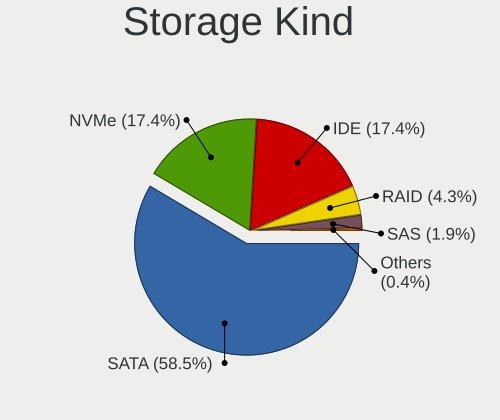

| Kind | Desktops | Percent |
|------|----------|---------|
| SATA | 151      | 58.53%  |
| NVMe | 45       | 17.44%  |
| IDE  | 45       | 17.44%  |
| RAID | 11       | 4.26%   |
| SAS  | 5        | 1.94%   |
| SCSI | 1        | 0.39%   |

Processor
---------

CPU Vendor
----------

Processor vendors

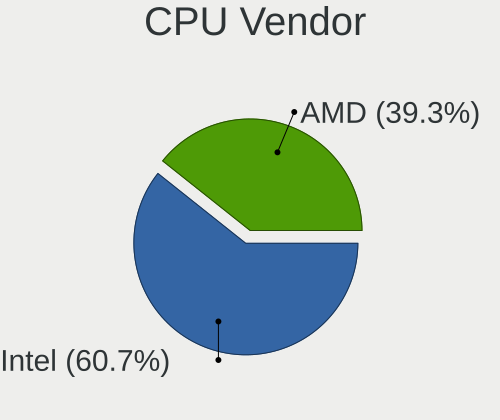

| Vendor | Desktops | Percent |
|--------|----------|---------|
| Intel  | 105      | 60.69%  |
| AMD    | 68       | 39.31%  |

CPU Model
---------

Processor models

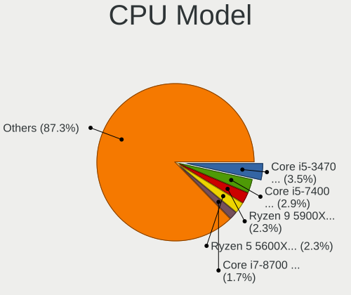

| Model                                       | Desktops | Percent |
|---------------------------------------------|----------|---------|
| Intel Core i5-3470 CPU @ 3.20GHz            | 6        | 3.47%   |
| Intel Core i5-7400 CPU @ 3.00GHz            | 5        | 2.89%   |
| AMD Ryzen 9 5900X 12-Core Processor         | 4        | 2.31%   |
| AMD Ryzen 5 5600X 6-Core Processor          | 4        | 2.31%   |
| Intel Core i7-8700 CPU @ 3.20GHz            | 3        | 1.73%   |
| AMD Ryzen 7 5700G with Radeon Graphics      | 3        | 1.73%   |
| AMD Ryzen 5 5600G with Radeon Graphics      | 3        | 1.73%   |
| AMD Ryzen 5 2600 Six-Core Processor         | 3        | 1.73%   |
| Intel Xeon CPU E5-1603 0 @ 2.80GHz          | 2        | 1.16%   |
| Intel Core i7-7700 CPU @ 3.60GHz            | 2        | 1.16%   |
| Intel Core i7-4790K CPU @ 4.00GHz           | 2        | 1.16%   |
| Intel Core i3-7100T CPU @ 3.40GHz           | 2        | 1.16%   |
| Intel Core 2 Quad CPU Q9550 @ 2.83GHz       | 2        | 1.16%   |
| Intel Core 2 Duo CPU E8400 @ 3.00GHz        | 2        | 1.16%   |
| AMD Ryzen 9 3900X 12-Core Processor         | 2        | 1.16%   |
| AMD Ryzen 7 5700U with Radeon Graphics      | 2        | 1.16%   |
| AMD Ryzen 5 5500                            | 2        | 1.16%   |
| AMD FX-8370 Eight-Core Processor            | 2        | 1.16%   |
| AMD FX-8350 Eight-Core Processor            | 2        | 1.16%   |
| Intel Xeon W-2125 CPU @ 4.00GHz             | 1        | 0.58%   |
| Intel Xeon CPU X5650 @ 2.67GHz              | 1        | 0.58%   |
| Intel Xeon CPU W3530 @ 2.80GHz              | 1        | 0.58%   |
| Intel Xeon CPU E5450 @ 3.00GHz              | 1        | 0.58%   |
| Intel Xeon CPU E5-2690 0 @ 2.90GHz          | 1        | 0.58%   |
| Intel Xeon CPU E5-2680 0 @ 2.70GHz          | 1        | 0.58%   |
| Intel Xeon CPU E5-2670 v2 @ 2.50GHz         | 1        | 0.58%   |
| Intel Xeon CPU E5-2667 v4 @ 3.20GHz         | 1        | 0.58%   |
| Intel Xeon CPU E5-2620 v3 @ 2.40GHz         | 1        | 0.58%   |
| Intel Xeon CPU E3-1230 V2 @ 3.30GHz         | 1        | 0.58%   |
| Intel Xeon CPU E3-1220 V2 @ 3.10GHz         | 1        | 0.58%   |
| Intel Xeon CPU 3050 @ 2.13GHz               | 1        | 0.58%   |
| Intel Pentium Dual-Core CPU E6500 @ 2.93GHz | 1        | 0.58%   |
| Intel Pentium Dual-Core CPU E5400 @ 2.70GHz | 1        | 0.58%   |
| Intel Pentium Dual CPU E2200 @ 2.20GHz      | 1        | 0.58%   |
| Intel Pentium CPU G850 @ 2.90GHz            | 1        | 0.58%   |
| Intel Pentium CPU G4400 @ 3.30GHz           | 1        | 0.58%   |
| Intel Pentium CPU G3250 @ 3.20GHz           | 1        | 0.58%   |
| Intel Pentium CPU G3240 @ 3.10GHz           | 1        | 0.58%   |
| Intel Core i9-9900X CPU @ 3.50GHz           | 1        | 0.58%   |
| Intel Core i9-9900K CPU @ 3.60GHz           | 1        | 0.58%   |

CPU Model Family
----------------

Processor model prefix

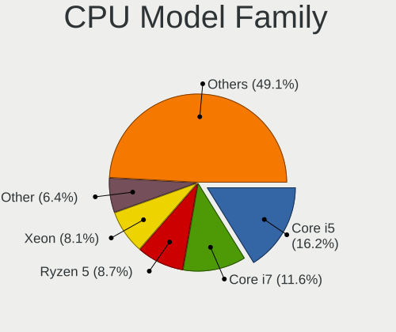

| Model                   | Desktops | Percent |
|-------------------------|----------|---------|
| Intel Core i5           | 28       | 16.18%  |
| Intel Core i7           | 20       | 11.56%  |
| AMD Ryzen 5             | 15       | 8.67%   |
| Intel Xeon              | 14       | 8.09%   |
| Other                   | 11       | 6.36%   |
| AMD Ryzen 7             | 10       | 5.78%   |
| AMD FX                  | 10       | 5.78%   |
| Intel Core i3           | 9        | 5.2%    |
| AMD Ryzen 9             | 9        | 5.2%    |
| Intel Celeron           | 6        | 3.47%   |
| Intel Core 2 Quad       | 5        | 2.89%   |
| Intel Pentium           | 4        | 2.31%   |
| AMD Phenom II X6        | 4        | 2.31%   |
| Intel Core 2 Duo        | 3        | 1.73%   |
| AMD A8                  | 3        | 1.73%   |
| Intel Pentium Dual-Core | 2        | 1.16%   |
| Intel Core i9           | 2        | 1.16%   |
| AMD Ryzen 3             | 2        | 1.16%   |
| AMD Phenom II X4        | 2        | 1.16%   |
| AMD Phenom              | 2        | 1.16%   |
| AMD A4                  | 2        | 1.16%   |
| Intel Pentium Dual      | 1        | 0.58%   |
| AMD Ryzen 5 PRO         | 1        | 0.58%   |
| AMD Ryzen 3 PRO         | 1        | 0.58%   |
| AMD Athlon X4           | 1        | 0.58%   |
| AMD Athlon II X4        | 1        | 0.58%   |
| AMD Athlon II X3        | 1        | 0.58%   |
| AMD Athlon II X2        | 1        | 0.58%   |
| AMD Athlon 64 X2        | 1        | 0.58%   |
| AMD Athlon              | 1        | 0.58%   |
| AMD A6                  | 1        | 0.58%   |

CPU Cores
---------

Number of processor cores

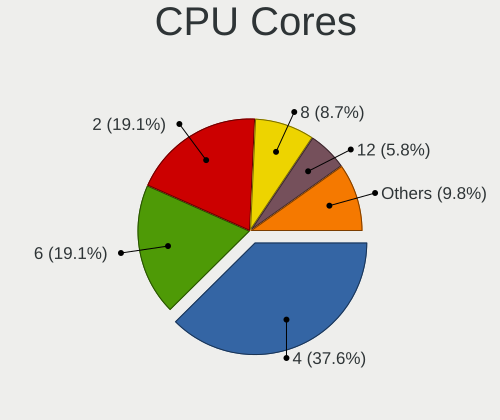

| Number | Desktops | Percent |
|--------|----------|---------|
| 4      | 65       | 37.57%  |
| 6      | 33       | 19.08%  |
| 2      | 33       | 19.08%  |
| 8      | 15       | 8.67%   |
| 12     | 10       | 5.78%   |
| 16     | 6        | 3.47%   |
| 3      | 3        | 1.73%   |
| 1      | 3        | 1.73%   |
| 20     | 2        | 1.16%   |
| 10     | 2        | 1.16%   |
| 24     | 1        | 0.58%   |

CPU Sockets
-----------

Number of sockets

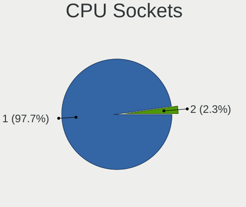

| Number | Desktops | Percent |
|--------|----------|---------|
| 1      | 169      | 97.69%  |
| 2      | 4        | 2.31%   |

CPU Threads
-----------

Threads per core (Hyper-Threading)

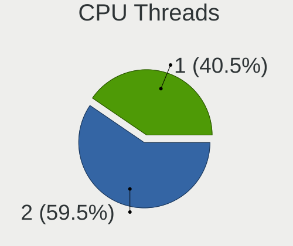

| Number | Desktops | Percent |
|--------|----------|---------|
| 2      | 103      | 59.54%  |
| 1      | 70       | 40.46%  |

CPU Op-Modes
------------

CPU Operation Modes (32-bit, 64-bit)

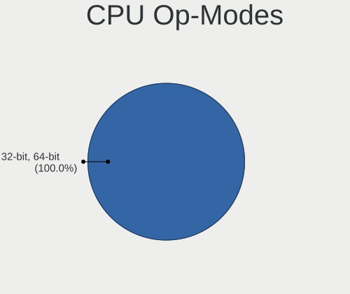

| Op mode        | Desktops | Percent |
|----------------|----------|---------|
| 32-bit, 64-bit | 173      | 100%    |

CPU Microcode
-------------

Microcode number

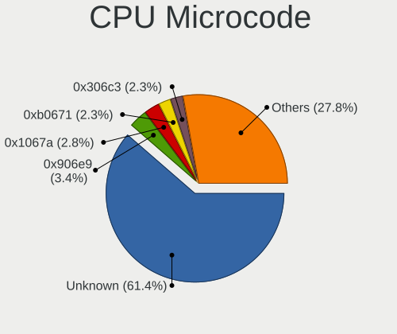

| Number     | Desktops | Percent |
|------------|----------|---------|
| Unknown    | 108      | 61.36%  |
| 0x906e9    | 6        | 3.41%   |
| 0x1067a    | 5        | 2.84%   |
| 0xb0671    | 4        | 2.27%   |
| 0x306c3    | 4        | 2.27%   |
| 0x0a50000d | 4        | 2.27%   |
| 0xa0671    | 3        | 1.7%    |
| 0x906ea    | 3        | 1.7%    |
| 0x506e3    | 3        | 1.7%    |
| 0x206d7    | 2        | 1.14%   |
| 0x206a7    | 2        | 1.14%   |
| 0x0a20120a | 2        | 1.14%   |
| 0x08701021 | 2        | 1.14%   |
| 0x08608103 | 2        | 1.14%   |
| 0x0800820d | 2        | 1.14%   |
| 0x06001119 | 2        | 1.14%   |
| 0x06000852 | 2        | 1.14%   |
| 0xa0655    | 1        | 0.57%   |
| 0x906ed    | 1        | 0.57%   |
| 0x906a4    | 1        | 0.57%   |
| 0x90675    | 1        | 0.57%   |
| 0x806c2    | 1        | 0.57%   |
| 0x706a1    | 1        | 0.57%   |
| 0x50654    | 1        | 0.57%   |
| 0x306f2    | 1        | 0.57%   |
| 0x306a9    | 1        | 0.57%   |
| 0x106e5    | 1        | 0.57%   |
| 0x10677    | 1        | 0.57%   |
| 0x0a601203 | 1        | 0.57%   |
| 0x0a50000c | 1        | 0.57%   |
| 0x0a20120e | 1        | 0.57%   |
| 0x08701030 | 1        | 0.57%   |
| 0x08600106 | 1        | 0.57%   |
| 0x08101016 | 1        | 0.57%   |
| 0x08001138 | 1        | 0.57%   |
| 0x06003106 | 1        | 0.57%   |
| 0x01000095 | 1        | 0.57%   |

CPU Microarch
-------------

Microarchitecture

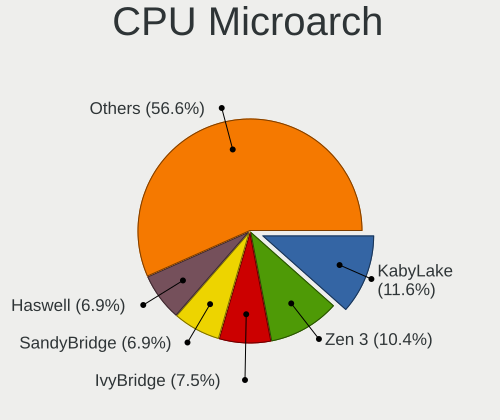

| Name             | Desktops | Percent |
|------------------|----------|---------|
| KabyLake         | 20       | 11.56%  |
| Zen 3            | 18       | 10.4%   |
| IvyBridge        | 13       | 7.51%   |
| SandyBridge      | 12       | 6.94%   |
| Haswell          | 12       | 6.94%   |
| Piledriver       | 11       | 6.36%   |
| Penryn           | 11       | 6.36%   |
| K10              | 11       | 6.36%   |
| Zen 2            | 8        | 4.62%   |
| Skylake          | 8        | 4.62%   |
| Unknown          | 8        | 4.62%   |
| Zen              | 5        | 2.89%   |
| Nehalem          | 5        | 2.89%   |
| Alderlake Hybrid | 5        | 2.89%   |
| CometLake        | 4        | 2.31%   |
| Zen+             | 3        | 1.73%   |
| Icelake          | 3        | 1.73%   |
| Core             | 3        | 1.73%   |
| Westmere         | 2        | 1.16%   |
| Excavator        | 2        | 1.16%   |
| TigerLake        | 1        | 0.58%   |
| Steamroller      | 1        | 0.58%   |
| Puma             | 1        | 0.58%   |
| K8 Hammer        | 1        | 0.58%   |
| K10 Llano        | 1        | 0.58%   |
| Goldmont plus    | 1        | 0.58%   |
| Goldmont         | 1        | 0.58%   |
| Bulldozer        | 1        | 0.58%   |
| Broadwell        | 1        | 0.58%   |

Graphics
--------

GPU Vendor
----------

Vendors of graphics cards

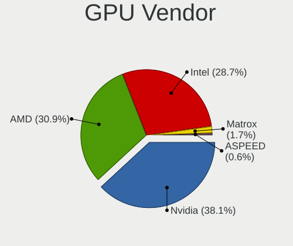

| Vendor                     | Desktops | Percent |
|----------------------------|----------|---------|
| Nvidia                     | 69       | 38.12%  |
| AMD                        | 56       | 30.94%  |
| Intel                      | 52       | 28.73%  |
| Matrox Electronics Systems | 3        | 1.66%   |
| ASPEED Technology          | 1        | 0.55%   |

GPU Model
---------

Graphics card models

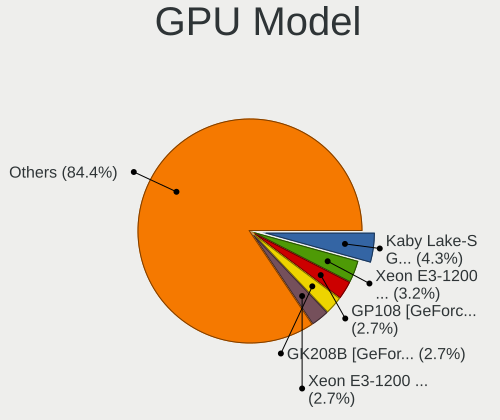

| Model                                                                       | Desktops | Percent |
|-----------------------------------------------------------------------------|----------|---------|
| Intel Kaby Lake-S GT2 [HD Graphics 630]                                     | 8        | 4.3%    |
| Intel Xeon E3-1200 v3/4th Gen Core Processor Integrated Graphics Controller | 6        | 3.23%   |
| Nvidia GP108 [GeForce GT 1030]                                              | 5        | 2.69%   |
| Nvidia GK208B [GeForce GT 730]                                              | 5        | 2.69%   |
| Intel Xeon E3-1200 v2/3rd Gen Core processor Graphics Controller            | 5        | 2.69%   |
| Intel Skylake-S GT2 [HD Graphics 530]                                       | 5        | 2.69%   |
| Intel 4 Series Chipset Integrated Graphics Controller                       | 5        | 2.69%   |
| AMD Navi 31 [Radeon RX 7900 XT/7900 XTX/7900 GRE/7900M]                     | 5        | 2.69%   |
| AMD Cezanne [Radeon Vega Series / Radeon Vega Mobile Series]                | 5        | 2.69%   |
| Nvidia TU116 [GeForce GTX 1660 SUPER]                                       | 4        | 2.15%   |
| Nvidia GP107 [GeForce GTX 1050 Ti]                                          | 4        | 2.15%   |
| Nvidia GK208B [GeForce GT 710]                                              | 4        | 2.15%   |
| Nvidia TU117 [GeForce GTX 1650]                                             | 3        | 1.61%   |
| Nvidia GP107 [GeForce GTX 1050]                                             | 3        | 1.61%   |
| Matrox Electronics Systems MGA G200EH                                       | 3        | 1.61%   |
| Intel CoffeeLake-S GT2 [UHD Graphics 630]                                   | 3        | 1.61%   |
| Intel 2nd Generation Core Processor Family Integrated Graphics Controller   | 3        | 1.61%   |
| AMD Ellesmere [Radeon RX 470/480/570/570X/580/580X/590]                     | 3        | 1.61%   |
| Nvidia TU104 [GeForce RTX 2070 SUPER]                                       | 2        | 1.08%   |
| Nvidia GT216 [GeForce GT 220]                                               | 2        | 1.08%   |
| Nvidia GP106 [GeForce GTX 1060 6GB]                                         | 2        | 1.08%   |
| Nvidia GP106 [GeForce GTX 1060 3GB]                                         | 2        | 1.08%   |
| Nvidia GM206 [GeForce GTX 960]                                              | 2        | 1.08%   |
| Nvidia GM107 [GeForce GTX 750 Ti]                                           | 2        | 1.08%   |
| Intel RocketLake-S GT1 [UHD Graphics 750]                                   | 2        | 1.08%   |
| Intel CometLake-S GT2 [UHD Graphics 630]                                    | 2        | 1.08%   |
| Intel 4th Generation Core Processor Family Integrated Graphics Controller   | 2        | 1.08%   |
| AMD Raphael                                                                 | 2        | 1.08%   |
| AMD Navi 22 [Radeon RX 6700/6700 XT/6750 XT / 6800M/6850M XT]               | 2        | 1.08%   |
| AMD Navi 21 [Radeon RX 6800/6800 XT / 6900 XT]                              | 2        | 1.08%   |
| AMD Navi 10 [Radeon RX 5600 OEM/5600 XT / 5700/5700 XT]                     | 2        | 1.08%   |
| AMD Lucienne                                                                | 2        | 1.08%   |
| AMD Curacao PRO [Radeon R7 370 / R9 270/370 OEM]                            | 2        | 1.08%   |
| AMD Cedar [Radeon HD 5000/6000/7350/8350 Series]                            | 2        | 1.08%   |
| AMD Caicos [Radeon HD 6450/7450/8450 / R5 230 OEM]                          | 2        | 1.08%   |
| Nvidia TU116 [GeForce GTX 1660 Ti]                                          | 1        | 0.54%   |
| Nvidia TU116 [GeForce GTX 1650]                                             | 1        | 0.54%   |
| Nvidia TU116 [GeForce GTX 1650 SUPER]                                       | 1        | 0.54%   |
| Nvidia TU104 [GeForce RTX 2080 Rev. A]                                      | 1        | 0.54%   |
| Nvidia TU104 [GeForce RTX 2060]                                             | 1        | 0.54%   |

GPU Combo
---------

Combinations of graphics cards

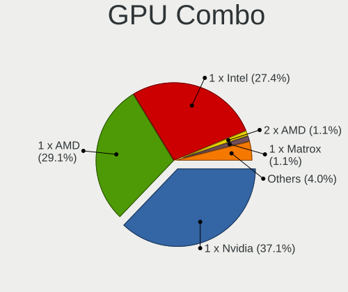

| Name             | Desktops | Percent |
|------------------|----------|---------|
| 1 x Nvidia       | 65       | 37.14%  |
| 1 x AMD          | 51       | 29.14%  |
| 1 x Intel        | 48       | 27.43%  |
| 2 x AMD          | 2        | 1.14%   |
| 1 x Matrox       | 2        | 1.14%   |
| Intel + AMD      | 2        | 1.14%   |
| Nvidia + Matrox  | 1        | 0.57%   |
| Intel + Nvidia   | 1        | 0.57%   |
| 1 x ASPEED       | 1        | 0.57%   |
| AMD + 2 x Nvidia | 1        | 0.57%   |
| AMD + Nvidia     | 1        | 0.57%   |

GPU Driver
----------

Free vs proprietary

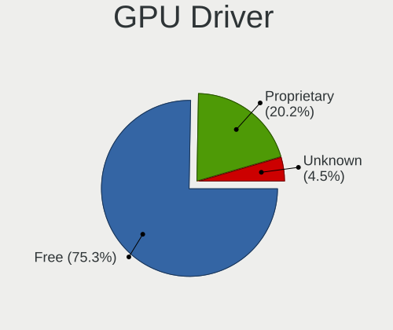

| Driver      | Desktops | Percent |
|-------------|----------|---------|
| Free        | 134      | 75.28%  |
| Proprietary | 36       | 20.22%  |
| Unknown     | 8        | 4.49%   |

GPU Memory
----------

Total video memory

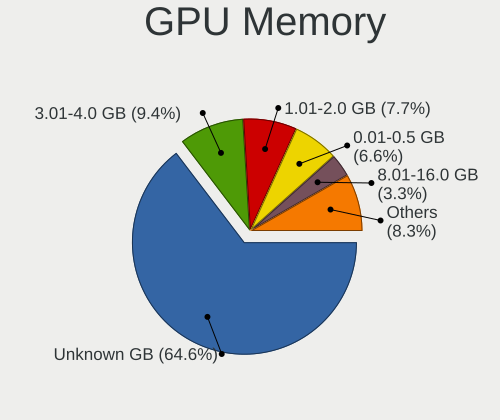

| Size in GB | Desktops | Percent |
|------------|----------|---------|
| Unknown    | 117      | 64.64%  |
| 3.01-4.0   | 17       | 9.39%   |
| 1.01-2.0   | 14       | 7.73%   |
| 0.01-0.5   | 12       | 6.63%   |
| 8.01-16.0  | 6        | 3.31%   |
| 7.01-8.0   | 5        | 2.76%   |
| 5.01-6.0   | 4        | 2.21%   |
| 0.51-1.0   | 3        | 1.66%   |
| 24.01-32.0 | 1        | 0.55%   |
| 2.01-3.0   | 1        | 0.55%   |
| 16.01-24.0 | 1        | 0.55%   |

Monitor
-------

Monitor Vendor
--------------

Monitor vendors

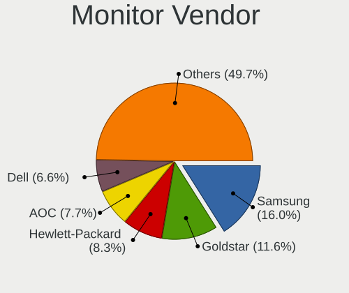

| Vendor                  | Desktops | Percent |
|-------------------------|----------|---------|
| Samsung Electronics     | 29       | 16.02%  |
| Goldstar                | 21       | 11.6%   |
| Hewlett-Packard         | 15       | 8.29%   |
| AOC                     | 14       | 7.73%   |
| Dell                    | 12       | 6.63%   |
| BenQ                    | 12       | 6.63%   |
| Acer                    | 12       | 6.63%   |
| Philips                 | 10       | 5.52%   |
| Fujitsu Siemens         | 6        | 3.31%   |
| Ancor Communications    | 6        | 3.31%   |
| ViewSonic               | 5        | 2.76%   |
| Unknown                 | 4        | 2.21%   |
| Iiyama                  | 4        | 2.21%   |
| ASUSTek Computer        | 3        | 1.66%   |
| Panasonic               | 2        | 1.1%    |
| Lenovo                  | 2        | 1.1%    |
| Hitachi                 | 2        | 1.1%    |
| Eizo                    | 2        | 1.1%    |
| ___                     | 1        | 0.55%   |
| TTK                     | 1        | 0.55%   |
| Sun                     | 1        | 0.55%   |
| Sony                    | 1        | 0.55%   |
| Sharp                   | 1        | 0.55%   |
| RTK                     | 1        | 0.55%   |
| PXO                     | 1        | 0.55%   |
| Plain Tree Systems      | 1        | 0.55%   |
| Neso                    | 1        | 0.55%   |
| MStar                   | 1        | 0.55%   |
| MSI                     | 1        | 0.55%   |
| LSC                     | 1        | 0.55%   |
| LG Electronics          | 1        | 0.55%   |
| Konka                   | 1        | 0.55%   |
| InnoView                | 1        | 0.55%   |
| HannStar                | 1        | 0.55%   |
| Gigabyte Technology     | 1        | 0.55%   |
| EDI                     | 1        | 0.55%   |
| Chi Mei Optoelectronics | 1        | 0.55%   |
| BBY                     | 1        | 0.55%   |

Monitor Model
-------------

Monitor models

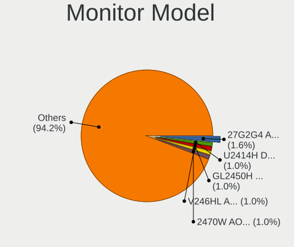

| Model                                                                 | Desktops | Percent |
|-----------------------------------------------------------------------|----------|---------|
| AOC 27G2G4 AOC2702 1920x1080 598x336mm 27.0-inch                      | 3        | 1.57%   |
| Dell U2414H DELA0A4 1920x1080 527x296mm 23.8-inch                     | 2        | 1.05%   |
| BenQ GL2450H BNQ78A7 1920x1080 531x298mm 24.0-inch                    | 2        | 1.05%   |
| AOC 2470W AOC2470 1920x1080 521x293mm 23.5-inch                       | 2        | 1.05%   |
| AOC 1970W AOC1970 1366x768 410x230mm 18.5-inch                        | 2        | 1.05%   |
| Acer V246HL ACR0336 1920x1080 531x299mm 24.0-inch                     | 2        | 1.05%   |
| ___ LCD TV ___9000 1360x768                                           | 1        | 0.52%   |
| ViewSonic VX2778 Series VSC8432 2560x1440 597x336mm 27.0-inch         | 1        | 0.52%   |
| ViewSonic VX2450 SERIES VSCE226 1920x1080 525x297mm 23.7-inch         | 1        | 0.52%   |
| ViewSonic VA903 SERIES VSC111E 1280x1024 376x301mm 19.0-inch          | 1        | 0.52%   |
| ViewSonic VA2446 SERIES VSC732E 1920x1080 521x293mm 23.5-inch         | 1        | 0.52%   |
| ViewSonic VA2445 SERIES VSC712E 1920x1080 521x293mm 23.5-inch         | 1        | 0.52%   |
| Unknown SMART TV 0563 1920x1080 1209x680mm 54.6-inch                  | 1        | 0.52%   |
| Unknown LCD TV 9000 1360x768 1600x900mm 72.3-inch                     | 1        | 0.52%   |
| Unknown LCD Monitor KON TV_MONITOR 1920x1080                          | 1        | 0.52%   |
| Unknown LCD Monitor FFFF 2288x1287 2550x2550mm 142.0-inch             | 1        | 0.52%   |
| TTK CCL250i TTK8541 1600x1200 408x306mm 20.1-inch                     | 1        | 0.52%   |
| Sun X7149A SUN058A 1600x1200 400x300mm 19.7-inch                      | 1        | 0.52%   |
| Sony Philips FTV SNY2203 1920x1080 1440x810mm 65.0-inch               | 1        | 0.52%   |
| Sharp LL-172C-B SHP2127 1280x1024 338x270mm 17.0-inch                 | 1        | 0.52%   |
| Samsung Electronics U32J59x SAM0F34 3840x2160 697x392mm 31.5-inch     | 1        | 0.52%   |
| Samsung Electronics U28D590 SAM0B80 3840x2160 607x345mm 27.5-inch     | 1        | 0.52%   |
| Samsung Electronics SyncMaster SAM0472 1440x900 367x229mm 17.0-inch   | 1        | 0.52%   |
| Samsung Electronics SyncMaster SAM0427 1920x1200                      | 1        | 0.52%   |
| Samsung Electronics SyncMaster SAM0425 1920x1200 518x324mm 24.1-inch  | 1        | 0.52%   |
| Samsung Electronics SyncMaster SAM03D0 1440x900 410x257mm 19.1-inch   | 1        | 0.52%   |
| Samsung Electronics SyncMaster SAM01D0 1600x1200 432x324mm 21.3-inch  | 1        | 0.52%   |
| Samsung Electronics SyncMaster SAM01B7 1280x1024 340x270mm 17.1-inch  | 1        | 0.52%   |
| Samsung Electronics SMS24A850 SAM0825 1920x1200 518x324mm 24.1-inch   | 1        | 0.52%   |
| Samsung Electronics SMB1630N SAM0630 1366x768 344x194mm 15.5-inch     | 1        | 0.52%   |
| Samsung Electronics S27E450 SAM0C83 1920x1080 598x336mm 27.0-inch     | 1        | 0.52%   |
| Samsung Electronics S27E330 SAM0D91 1920x1080 598x336mm 27.0-inch     | 1        | 0.52%   |
| Samsung Electronics S24F350 SAM0D20 1920x1080 521x293mm 23.5-inch     | 1        | 0.52%   |
| Samsung Electronics S24D330 SAM0D92 1920x1080 531x299mm 24.0-inch     | 1        | 0.52%   |
| Samsung Electronics S24D300 SAM0B43 1920x1080 531x299mm 24.0-inch     | 1        | 0.52%   |
| Samsung Electronics S22E450 SAM0C7C 1680x1050 473x291mm 21.9-inch     | 1        | 0.52%   |
| Samsung Electronics S22C150 SAM0AE5 1920x1080 477x268mm 21.5-inch     | 1        | 0.52%   |
| Samsung Electronics LF24T35 SAM707D 1920x1080 528x297mm 23.9-inch     | 1        | 0.52%   |
| Samsung Electronics LCD Monitor SMS27A350H 1920x1080                  | 1        | 0.52%   |
| Samsung Electronics LCD Monitor SAM7103 3840x2160 700x390mm 31.5-inch | 1        | 0.52%   |

Monitor Resolution
------------------

Monitor screen resolution

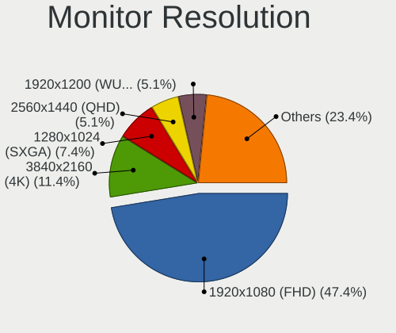

| Resolution         | Desktops | Percent |
|--------------------|----------|---------|
| 1920x1080 (FHD)    | 83       | 47.43%  |
| 3840x2160 (4K)     | 20       | 11.43%  |
| 1280x1024 (SXGA)   | 13       | 7.43%   |
| 2560x1440 (QHD)    | 9        | 5.14%   |
| 1920x1200 (WUXGA)  | 9        | 5.14%   |
| 1680x1050 (WSXGA+) | 6        | 3.43%   |
| 1440x900 (WXGA+)   | 6        | 3.43%   |
| 1366x768 (WXGA)    | 5        | 2.86%   |
| 3840x1080          | 3        | 1.71%   |
| 2560x1080          | 3        | 1.71%   |
| 1600x900 (HD+)     | 3        | 1.71%   |
| 1600x1200          | 3        | 1.71%   |
| 1024x768 (XGA)     | 3        | 1.71%   |
| Unknown            | 3        | 1.71%   |
| 1920x540           | 2        | 1.14%   |
| 1360x768           | 2        | 1.14%   |
| 3440x1440          | 1        | 0.57%   |
| 2288x1287          | 1        | 0.57%   |

Monitor Diagonal
----------------

Diagonal size in inches

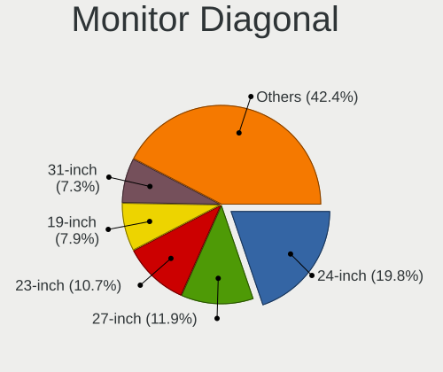

| Inches  | Desktops | Percent |
|---------|----------|---------|
| 24      | 35       | 19.77%  |
| 27      | 21       | 11.86%  |
| 23      | 19       | 10.73%  |
| 19      | 14       | 7.91%   |
| 31      | 13       | 7.34%   |
| 21      | 13       | 7.34%   |
| Unknown | 12       | 6.78%   |
| 17      | 6        | 3.39%   |
| 22      | 5        | 2.82%   |
| 18      | 5        | 2.82%   |
| 15      | 4        | 2.26%   |
| 84      | 3        | 1.69%   |
| 54      | 3        | 1.69%   |
| 20      | 3        | 1.69%   |
| 72      | 2        | 1.13%   |
| 65      | 2        | 1.13%   |
| 52      | 2        | 1.13%   |
| 43      | 2        | 1.13%   |
| 34      | 2        | 1.13%   |
| 32      | 2        | 1.13%   |
| 25      | 2        | 1.13%   |
| 142     | 1        | 0.56%   |
| 63      | 1        | 0.56%   |
| 50      | 1        | 0.56%   |
| 48      | 1        | 0.56%   |
| 40      | 1        | 0.56%   |
| 36      | 1        | 0.56%   |
| 35      | 1        | 0.56%   |

Monitor Width
-------------

Physical width

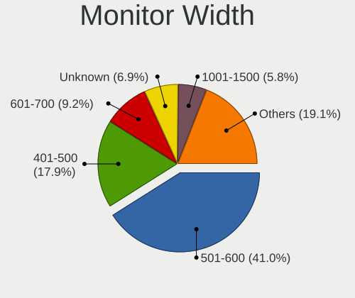

| Width in mm    | Desktops | Percent |
|----------------|----------|---------|
| 501-600        | 71       | 41.04%  |
| 401-500        | 31       | 17.92%  |
| 601-700        | 16       | 9.25%   |
| Unknown        | 12       | 6.94%   |
| 1001-1500      | 10       | 5.78%   |
| 351-400        | 9        | 5.2%    |
| 301-350        | 9        | 5.2%    |
| 701-800        | 5        | 2.89%   |
| 1501-2000      | 5        | 2.89%   |
| 801-900        | 2        | 1.16%   |
| 901-1000       | 2        | 1.16%   |
| More than 2000 | 1        | 0.58%   |

Aspect Ratio
------------

Proportional relationship between the width and the height

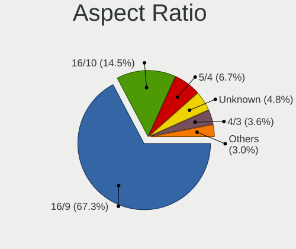

| Ratio   | Desktops | Percent |
|---------|----------|---------|
| 16/9    | 111      | 67.27%  |
| 16/10   | 24       | 14.55%  |
| 5/4     | 11       | 6.67%   |
| Unknown | 8        | 4.85%   |
| 4/3     | 6        | 3.64%   |
| 21/9    | 3        | 1.82%   |
| 6/5     | 1        | 0.61%   |
| 1.00    | 1        | 0.61%   |

Monitor Area
------------

Area in inch²

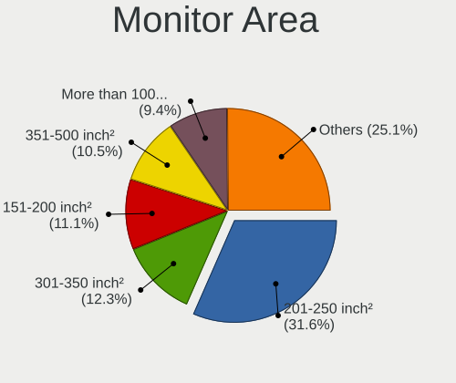

| Area in inch² | Desktops | Percent |
|----------------|----------|---------|
| 201-250        | 54       | 31.58%  |
| 301-350        | 21       | 12.28%  |
| 151-200        | 19       | 11.11%  |
| 351-500        | 18       | 10.53%  |
| More than 1000 | 16       | 9.36%   |
| 251-300        | 13       | 7.6%    |
| Unknown        | 12       | 7.02%   |
| 141-150        | 9        | 5.26%   |
| 101-110        | 4        | 2.34%   |
| 501-1000       | 4        | 2.34%   |
| 131-140        | 1        | 0.58%   |

Pixel Density
-------------

Pixels per inch

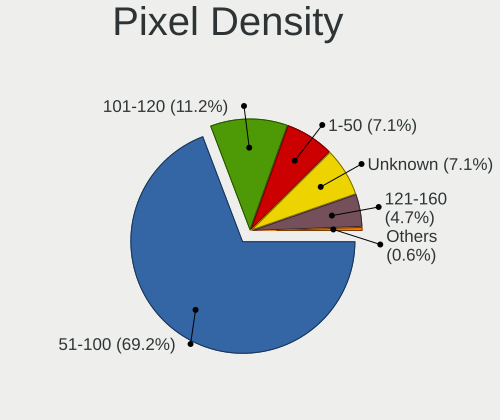

| Density | Desktops | Percent |
|---------|----------|---------|
| 51-100  | 117      | 69.23%  |
| 101-120 | 19       | 11.24%  |
| 1-50    | 12       | 7.1%    |
| Unknown | 12       | 7.1%    |
| 121-160 | 8        | 4.73%   |
| 161-240 | 1        | 0.59%   |

Multiple Monitors
-----------------

Total monitors connected

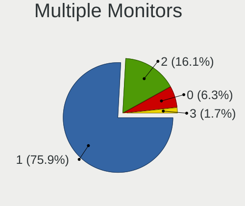

| Total | Desktops | Percent |
|-------|----------|---------|
| 1     | 132      | 75.86%  |
| 2     | 28       | 16.09%  |
| 0     | 11       | 6.32%   |
| 3     | 3        | 1.72%   |

Network
-------

Net Controller Vendor
---------------------

Controller vendors

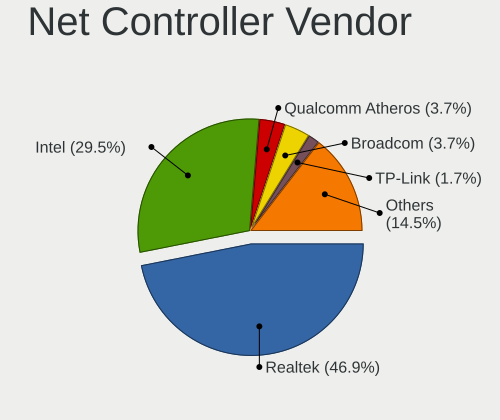

| Vendor                   | Desktops | Percent |
|--------------------------|----------|---------|
| Realtek Semiconductor    | 113      | 46.89%  |
| Intel                    | 71       | 29.46%  |
| Qualcomm Atheros         | 9        | 3.73%   |
| Broadcom                 | 9        | 3.73%   |
| TP-Link                  | 4        | 1.66%   |
| Ralink Technology        | 4        | 1.66%   |
| Ralink                   | 3        | 1.24%   |
| D-Link System            | 3        | 1.24%   |
| OPPO Electronics         | 2        | 0.83%   |
| Nvidia                   | 2        | 0.83%   |
| MediaTek                 | 2        | 0.83%   |
| Edimax Technology        | 2        | 0.83%   |
| ASUSTek Computer         | 2        | 0.83%   |
| Aquantia                 | 2        | 0.83%   |
| Wilocity                 | 1        | 0.41%   |
| Samsung Electronics      | 1        | 0.41%   |
| QLogic                   | 1        | 0.41%   |
| Marvell Technology Group | 1        | 0.41%   |
| Linksys                  | 1        | 0.41%   |
| DisplayLink              | 1        | 0.41%   |
| D-Link                   | 1        | 0.41%   |
| Broadcom Limited         | 1        | 0.41%   |
| Belkin Components        | 1        | 0.41%   |
| AVM                      | 1        | 0.41%   |
| Atmel                    | 1        | 0.41%   |
| ASIX Electronics         | 1        | 0.41%   |
| 3Com                     | 1        | 0.41%   |

Net Controller Model
--------------------

Controller models

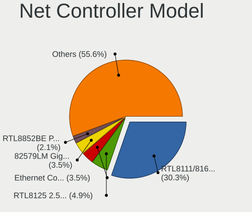

| Model                                                                          | Desktops | Percent |
|--------------------------------------------------------------------------------|----------|---------|
| Realtek RTL8111/8168/8211/8411 PCI Express Gigabit Ethernet Controller         | 86       | 30.28%  |
| Realtek RTL8125 2.5GbE Controller                                              | 14       | 4.93%   |
| Intel Ethernet Connection (2) I219-V                                           | 10       | 3.52%   |
| Intel 82579LM Gigabit Network Connection (Lewisville)                          | 10       | 3.52%   |
| Realtek RTL8852BE PCIe 802.11ax Wireless Network Controller                    | 6        | 2.11%   |
| Intel I211 Gigabit Network Connection                                          | 6        | 2.11%   |
| Intel Ethernet Connection (7) I219-V                                           | 6        | 2.11%   |
| Intel Wi-Fi 6 AX200                                                            | 5        | 1.76%   |
| Intel 82574L Gigabit Network Connection                                        | 4        | 1.41%   |
| Realtek RTL810xE PCI Express Fast Ethernet controller                          | 3        | 1.06%   |
| Realtek 802.11ac NIC                                                           | 3        | 1.06%   |
| Ralink RT2870/RT3070 Wireless Adapter                                          | 3        | 1.06%   |
| Intel Wi-Fi 6E(802.11ax) AX210/AX1675* 2x2 [Typhoon Peak]                      | 3        | 1.06%   |
| Intel Wi-Fi 5(802.11ac) Wireless-AC 9x6x [Thunder Peak]                        | 3        | 1.06%   |
| Intel I210 Gigabit Network Connection                                          | 3        | 1.06%   |
| Intel Ethernet Connection (2) I219-LM                                          | 3        | 1.06%   |
| Intel Ethernet Connection (14) I219-V                                          | 3        | 1.06%   |
| Intel Dual Band Wireless-AC 3168NGW [Stone Peak]                               | 3        | 1.06%   |
| Intel 82567LM-3 Gigabit Network Connection                                     | 3        | 1.06%   |
| Realtek RTL88x2bu [AC1200 Techkey]                                             | 2        | 0.7%    |
| Realtek RTL8821CE 802.11ac PCIe Wireless Network Adapter                       | 2        | 0.7%    |
| Realtek RTL8812AE 802.11ac PCIe Wireless Network Adapter                       | 2        | 0.7%    |
| Realtek RTL8187 Wireless Adapter                                               | 2        | 0.7%    |
| Realtek Killer E3000 2.5GbE Controller                                         | 2        | 0.7%    |
| Qualcomm Atheros AR93xx Wireless Network Adapter                               | 2        | 0.7%    |
| Qualcomm Atheros AR8151 v2.0 Gigabit Ethernet                                  | 2        | 0.7%    |
| Intel Ethernet Controller I226-V                                               | 2        | 0.7%    |
| Intel Ethernet Controller I225-V                                               | 2        | 0.7%    |
| Intel Ethernet Connection I217-LM                                              | 2        | 0.7%    |
| Intel Ethernet Connection (2) I218-LM                                          | 2        | 0.7%    |
| Edimax EW-7811Un 802.11n Wireless Adapter [Realtek RTL8188CUS]                 | 2        | 0.7%    |
| Broadcom NetXtreme BCM5720 Gigabit Ethernet PCIe                               | 2        | 0.7%    |
| Aquantia AQtion AQC107 NBase-T/IEEE 802.3an Ethernet Controller [Atlantic 10G] | 2        | 0.7%    |
| Wilocity Wil6200 802.11ad Wireless Network Adapter                             | 1        | 0.35%   |
| TP-Link TL-WN823N v2/v3 [Realtek RTL8192EU]                                    | 1        | 0.35%   |
| TP-Link TL-WN822N Version 4 RTL8192EU                                          | 1        | 0.35%   |
| TP-Link TL-WN722N v2/v3 [Realtek RTL8188EUS]                                   | 1        | 0.35%   |
| TP-Link Archer T3U [Realtek RTL8812BU]                                         | 1        | 0.35%   |
| Samsung GT-I9070 (network tethering, USB debugging enabled)                    | 1        | 0.35%   |
| Realtek RTL8852CE PCIe 802.11ax Wireless Network Controller                    | 1        | 0.35%   |

Wireless Vendor
---------------

Wireless vendors

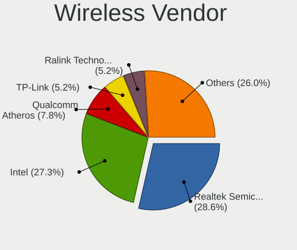

| Vendor                | Desktops | Percent |
|-----------------------|----------|---------|
| Realtek Semiconductor | 22       | 28.57%  |
| Intel                 | 21       | 27.27%  |
| Qualcomm Atheros      | 6        | 7.79%   |
| TP-Link               | 4        | 5.19%   |
| Ralink Technology     | 4        | 5.19%   |
| Ralink                | 3        | 3.9%    |
| D-Link System         | 3        | 3.9%    |
| MediaTek              | 2        | 2.6%    |
| Edimax Technology     | 2        | 2.6%    |
| Broadcom              | 2        | 2.6%    |
| ASUSTek Computer      | 2        | 2.6%    |
| Wilocity              | 1        | 1.3%    |
| Linksys               | 1        | 1.3%    |
| D-Link                | 1        | 1.3%    |
| Broadcom Limited      | 1        | 1.3%    |
| Belkin Components     | 1        | 1.3%    |
| AVM                   | 1        | 1.3%    |

Wireless Model
--------------

Wireless models

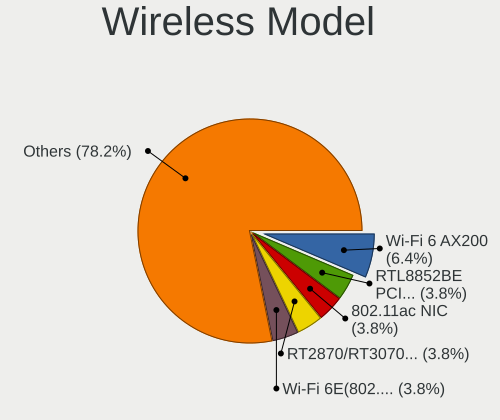

| Model                                                                                         | Desktops | Percent |
|-----------------------------------------------------------------------------------------------|----------|---------|
| Intel Wi-Fi 6 AX200                                                                           | 5        | 6.41%   |
| Realtek RTL8852BE PCIe 802.11ax Wireless Network Controller                                   | 3        | 3.85%   |
| Realtek 802.11ac NIC                                                                          | 3        | 3.85%   |
| Ralink RT2870/RT3070 Wireless Adapter                                                         | 3        | 3.85%   |
| Intel Wi-Fi 6E(802.11ax) AX210/AX1675* 2x2 [Typhoon Peak]                                     | 3        | 3.85%   |
| Intel Wi-Fi 5(802.11ac) Wireless-AC 9x6x [Thunder Peak]                                       | 3        | 3.85%   |
| Intel Dual Band Wireless-AC 3168NGW [Stone Peak]                                              | 3        | 3.85%   |
| Realtek RTL88x2bu [AC1200 Techkey]                                                            | 2        | 2.56%   |
| Realtek RTL8821CE 802.11ac PCIe Wireless Network Adapter                                      | 2        | 2.56%   |
| Realtek RTL8812AE 802.11ac PCIe Wireless Network Adapter                                      | 2        | 2.56%   |
| Realtek RTL8187 Wireless Adapter                                                              | 2        | 2.56%   |
| Qualcomm Atheros AR93xx Wireless Network Adapter                                              | 2        | 2.56%   |
| Edimax EW-7811Un 802.11n Wireless Adapter [Realtek RTL8188CUS]                                | 2        | 2.56%   |
| Wilocity Wil6200 802.11ad Wireless Network Adapter                                            | 1        | 1.28%   |
| TP-Link TL-WN823N v2/v3 [Realtek RTL8192EU]                                                   | 1        | 1.28%   |
| TP-Link TL-WN822N Version 4 RTL8192EU                                                         | 1        | 1.28%   |
| TP-Link TL-WN722N v2/v3 [Realtek RTL8188EUS]                                                  | 1        | 1.28%   |
| TP-Link Archer T3U [Realtek RTL8812BU]                                                        | 1        | 1.28%   |
| Realtek RTL8852CE PCIe 802.11ax Wireless Network Controller                                   | 1        | 1.28%   |
| Realtek RTL8822CE 802.11ac PCIe Wireless Network Adapter                                      | 1        | 1.28%   |
| Realtek RTL8822BE 802.11a/b/g/n/ac WiFi adapter                                               | 1        | 1.28%   |
| Realtek RTL8723BU 802.11b/g/n WLAN Adapter                                                    | 1        | 1.28%   |
| Realtek RTL8192EU 802.11b/g/n WLAN Adapter                                                    | 1        | 1.28%   |
| Realtek RTL8188FTV 802.11b/g/n 1T1R 2.4G WLAN Adapter                                         | 1        | 1.28%   |
| Realtek RTL8188EUS 802.11n Wireless Network Adapter                                           | 1        | 1.28%   |
| Realtek RTL-8185 IEEE 802.11a/b/g Wireless LAN Controller                                     | 1        | 1.28%   |
| Realtek Realtek 8812AU/8821AU 802.11ac WLAN Adapter [USB Wireless Dual-Band Adapter 2.4/5Ghz] | 1        | 1.28%   |
| Ralink RT5370 Wireless Adapter                                                                | 1        | 1.28%   |
| Ralink RT3290 Wireless 802.11n 1T/1R PCIe                                                     | 1        | 1.28%   |
| Ralink RT3092 Wireless 802.11n 2T/2R PCIe                                                     | 1        | 1.28%   |
| Ralink RT2500 Wireless 802.11bg                                                               | 1        | 1.28%   |
| Qualcomm Atheros QCA986x/988x 802.11ac Wireless Network Adapter                               | 1        | 1.28%   |
| Qualcomm Atheros QCA6174 802.11ac Wireless Network Adapter                                    | 1        | 1.28%   |
| Qualcomm Atheros AR9485 Wireless Network Adapter                                              | 1        | 1.28%   |
| Qualcomm Atheros AR2413/AR2414 Wireless Network Adapter [AR5005G(S) 802.11bg]                 | 1        | 1.28%   |
| MediaTek MT7922 802.11ax PCI Express Wireless Network Adapter                                 | 1        | 1.28%   |
| MediaTek MT7921 802.11ax PCIe Wireless Network Adapter [Filogic 330]                          | 1        | 1.28%   |
| Linksys WUSB6300 802.11a/b/g/n/ac Wireless Adapter [Realtek RTL8812AU]                        | 1        | 1.28%   |
| Intel Wireless 8260                                                                           | 1        | 1.28%   |
| Intel Wi-Fi 7(802.11be) AX1775*/AX1790*/BE20*/BE401/BE1750* 2x2                               | 1        | 1.28%   |

Ethernet Vendor
---------------

Ethernet vendors

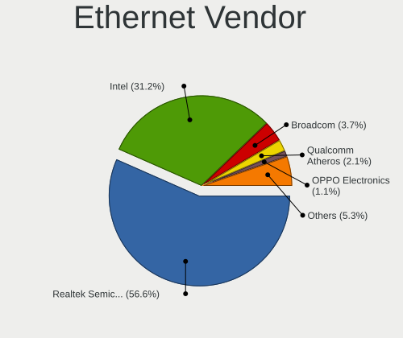

| Vendor                   | Desktops | Percent |
|--------------------------|----------|---------|
| Realtek Semiconductor    | 107      | 56.61%  |
| Intel                    | 59       | 31.22%  |
| Broadcom                 | 7        | 3.7%    |
| Qualcomm Atheros         | 4        | 2.12%   |
| OPPO Electronics         | 2        | 1.06%   |
| Nvidia                   | 2        | 1.06%   |
| Aquantia                 | 2        | 1.06%   |
| Samsung Electronics      | 1        | 0.53%   |
| QLogic                   | 1        | 0.53%   |
| Marvell Technology Group | 1        | 0.53%   |
| DisplayLink              | 1        | 0.53%   |
| ASIX Electronics         | 1        | 0.53%   |
| 3Com                     | 1        | 0.53%   |

Ethernet Model
--------------

Ethernet models

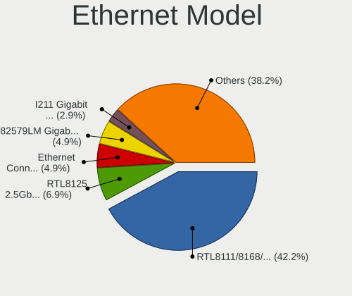

| Model                                                                          | Desktops | Percent |
|--------------------------------------------------------------------------------|----------|---------|
| Realtek RTL8111/8168/8211/8411 PCI Express Gigabit Ethernet Controller         | 86       | 42.16%  |
| Realtek RTL8125 2.5GbE Controller                                              | 14       | 6.86%   |
| Intel Ethernet Connection (2) I219-V                                           | 10       | 4.9%    |
| Intel 82579LM Gigabit Network Connection (Lewisville)                          | 10       | 4.9%    |
| Intel I211 Gigabit Network Connection                                          | 6        | 2.94%   |
| Intel Ethernet Connection (7) I219-V                                           | 6        | 2.94%   |
| Intel 82574L Gigabit Network Connection                                        | 4        | 1.96%   |
| Realtek RTL8852BE PCIe 802.11ax Wireless Network Controller                    | 3        | 1.47%   |
| Realtek RTL810xE PCI Express Fast Ethernet controller                          | 3        | 1.47%   |
| Intel I210 Gigabit Network Connection                                          | 3        | 1.47%   |
| Intel Ethernet Connection (2) I219-LM                                          | 3        | 1.47%   |
| Intel Ethernet Connection (14) I219-V                                          | 3        | 1.47%   |
| Intel 82567LM-3 Gigabit Network Connection                                     | 3        | 1.47%   |
| Realtek Killer E3000 2.5GbE Controller                                         | 2        | 0.98%   |
| Qualcomm Atheros AR8151 v2.0 Gigabit Ethernet                                  | 2        | 0.98%   |
| Intel Ethernet Controller I226-V                                               | 2        | 0.98%   |
| Intel Ethernet Controller I225-V                                               | 2        | 0.98%   |
| Intel Ethernet Connection I217-LM                                              | 2        | 0.98%   |
| Intel Ethernet Connection (2) I218-LM                                          | 2        | 0.98%   |
| Broadcom NetXtreme BCM5720 Gigabit Ethernet PCIe                               | 2        | 0.98%   |
| Aquantia AQtion AQC107 NBase-T/IEEE 802.3an Ethernet Controller [Atlantic 10G] | 2        | 0.98%   |
| Samsung GT-I9070 (network tethering, USB debugging enabled)                    | 1        | 0.49%   |
| Realtek RTL8169 PCI Gigabit Ethernet Controller                                | 1        | 0.49%   |
| Realtek RTL8153 Gigabit Ethernet Adapter                                       | 1        | 0.49%   |
| Realtek RTL-8100/8101L/8139 PCI Fast Ethernet Adapter                          | 1        | 0.49%   |
| Realtek Killer E2600 GbE Controller                                            | 1        | 0.49%   |
| Qualcomm Atheros Killer E2400 Gigabit Ethernet Controller                      | 1        | 0.49%   |
| Qualcomm Atheros Killer E220x Gigabit Ethernet Controller                      | 1        | 0.49%   |
| QLogic ISP8324 1/10GbE Converged Network Controller                            | 1        | 0.49%   |
| OPPO RMX3741                                                                   | 1        | 0.49%   |
| OPPO Ace 3V                                                                    | 1        | 0.49%   |
| Nvidia MCP61 Ethernet                                                          | 1        | 0.49%   |
| Nvidia MCP55 Ethernet                                                          | 1        | 0.49%   |
| Marvell Group 88E8055 PCI-E Gigabit Ethernet Controller                        | 1        | 0.49%   |
| Marvell Group 88E8001 Gigabit Ethernet Controller                              | 1        | 0.49%   |
| Intel I350 Gigabit Network Connection                                          | 1        | 0.49%   |
| Intel Ethernet Controller I226-LM                                              | 1        | 0.49%   |
| Intel Ethernet Connection I217-V                                               | 1        | 0.49%   |
| Intel Ethernet Connection (2) I218-V                                           | 1        | 0.49%   |
| Intel Ethernet Connection (17) I219-V                                          | 1        | 0.49%   |

Net Controller Kind
-------------------

Ethernet, WiFi or modem

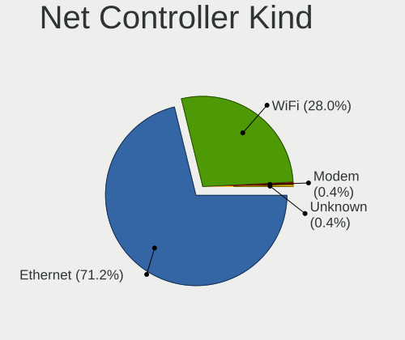

| Kind     | Desktops | Percent |
|----------|----------|---------|
| Ethernet | 173      | 71.19%  |
| WiFi     | 68       | 27.98%  |
| Modem    | 1        | 0.41%   |
| Unknown  | 1        | 0.41%   |

Used Controller
---------------

Currently used network controller

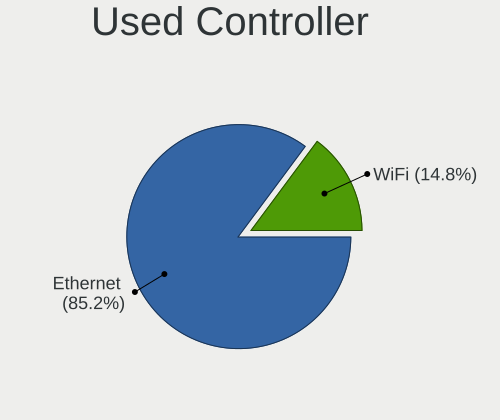

| Kind     | Desktops | Percent |
|----------|----------|---------|
| Ethernet | 155      | 85.16%  |
| WiFi     | 27       | 14.84%  |

NICs
----

Total network controllers on board

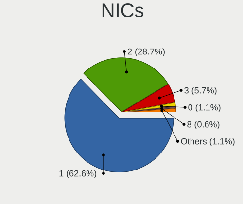

| Total | Desktops | Percent |
|-------|----------|---------|
| 1     | 109      | 62.64%  |
| 2     | 50       | 28.74%  |
| 3     | 10       | 5.75%   |
| 0     | 2        | 1.15%   |
| 8     | 1        | 0.57%   |
| 5     | 1        | 0.57%   |
| 4     | 1        | 0.57%   |

IPv6
----

IPv6 vs IPv4

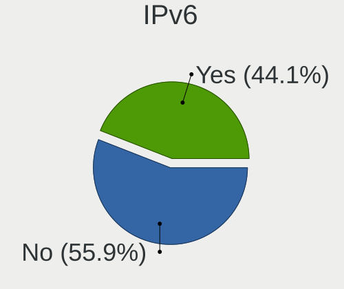

| Used | Desktops | Percent |
|------|----------|---------|
| No   | 99       | 55.93%  |
| Yes  | 78       | 44.07%  |

Bluetooth
---------

Bluetooth Vendor
----------------

Controller vendors

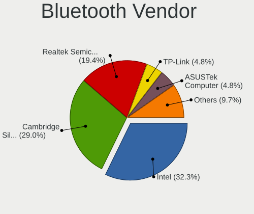

| Vendor                     | Desktops | Percent |
|----------------------------|----------|---------|
| Intel                      | 20       | 32.26%  |
| Cambridge Silicon Radio    | 18       | 29.03%  |
| Realtek Semiconductor      | 12       | 19.35%  |
| TP-Link                    | 3        | 4.84%   |
| ASUSTek Computer           | 3        | 4.84%   |
| IMC Networks               | 2        | 3.23%   |
| Ralink                     | 1        | 1.61%   |
| MediaTek                   | 1        | 1.61%   |
| Integrated System Solution | 1        | 1.61%   |
| Broadcom                   | 1        | 1.61%   |

Bluetooth Model
---------------

Controller models

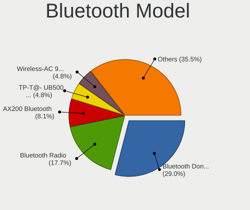

| Model                                                 | Desktops | Percent |
|-------------------------------------------------------|----------|---------|
| Cambridge Silicon Radio Bluetooth Dongle (HCI mode)   | 18       | 29.03%  |
| Realtek Bluetooth Radio                               | 11       | 17.74%  |
| Intel AX200 Bluetooth                                 | 5        | 8.06%   |
| TP-Link TP-T@- UB500 Adapter                          | 3        | 4.84%   |
| Intel Wireless-AC 9260 Bluetooth Adapter              | 3        | 4.84%   |
| Intel Wireless-AC 3168 Bluetooth                      | 3        | 4.84%   |
| Intel AX210 Bluetooth                                 | 3        | 4.84%   |
| Intel Bluetooth Device                                | 2        | 3.23%   |
| Intel Bluetooth 9460/9560 Jefferson Peak (JfP)        | 2        | 3.23%   |
| Realtek  Bluetooth 4.2 Adapter                        | 1        | 1.61%   |
| Ralink RT3290 Bluetooth                               | 1        | 1.61%   |
| MediaTek Wireless_Device                              | 1        | 1.61%   |
| Intel Bluetooth wireless interface                    | 1        | 1.61%   |
| Intel AX201 Bluetooth                                 | 1        | 1.61%   |
| Integrated System Solution KY-BT100 Bluetooth Adapter | 1        | 1.61%   |
| IMC Networks Wireless_Device                          | 1        | 1.61%   |
| IMC Networks Bluetooth Radio                          | 1        | 1.61%   |
| Broadcom BCM43142A0 Bluetooth Device                  | 1        | 1.61%   |
| ASUS Bluetooth Device                                 | 1        | 1.61%   |
| ASUS BCM20702A0                                       | 1        | 1.61%   |
| ASUS ASUS USB-BT500                                   | 1        | 1.61%   |

Sound
-----

Sound Vendor
------------

Sound card vendors

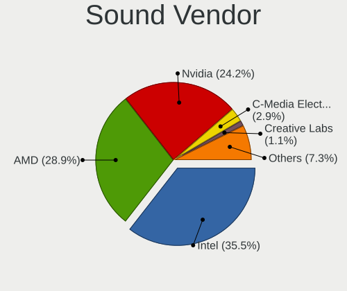

| Vendor                               | Desktops | Percent |
|--------------------------------------|----------|---------|
| Intel                                | 97       | 35.53%  |
| AMD                                  | 79       | 28.94%  |
| Nvidia                               | 66       | 24.18%  |
| C-Media Electronics                  | 8        | 2.93%   |
| Creative Labs                        | 3        | 1.1%    |
| GN Netcom                            | 2        | 0.73%   |
| DSEA A/S                             | 2        | 0.73%   |
| VIA Technologies                     | 1        | 0.37%   |
| Thesycon Systemsoftware & Consulting | 1        | 0.37%   |
| Texas Instruments                    | 1        | 0.37%   |
| Sony                                 | 1        | 0.37%   |
| Schiit Audio                         | 1        | 0.37%   |
| RODE Microphones                     | 1        | 0.37%   |
| Plantronics                          | 1        | 0.37%   |
| ONN                                  | 1        | 0.37%   |
| Micro Star International             | 1        | 0.37%   |
| Logitech                             | 1        | 0.37%   |
| Jieli Technology                     | 1        | 0.37%   |
| HiBy                                 | 1        | 0.37%   |
| FiiO Electronics Technology          | 1        | 0.37%   |
| Elgato Systems                       | 1        | 0.37%   |
| ASUSTek Computer                     | 1        | 0.37%   |
| Unknown                              | 1        | 0.37%   |

Sound Model
-----------

Sound card models

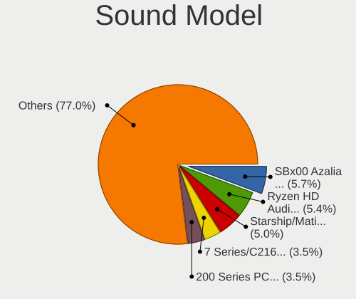

| Model                                                                      | Desktops | Percent |
|----------------------------------------------------------------------------|----------|---------|
| AMD SBx00 Azalia (Intel HDA)                                               | 18       | 5.68%   |
| AMD Ryzen HD Audio Controller                                              | 17       | 5.36%   |
| AMD Starship/Matisse HD Audio Controller                                   | 16       | 5.05%   |
| Intel 7 Series/C216 Chipset Family High Definition Audio Controller        | 11       | 3.47%   |
| Intel 200 Series PCH HD Audio                                              | 11       | 3.47%   |
| AMD Renoir/Cezanne HDMI/DP Audio Controller                                | 11       | 3.47%   |
| Intel 100 Series/C230 Series Chipset Family HD Audio Controller            | 10       | 3.15%   |
| Nvidia GK208 HDMI/DP Audio Controller                                      | 9        | 2.84%   |
| Nvidia TU116 High Definition Audio Controller                              | 7        | 2.21%   |
| Nvidia GP107GL High Definition Audio Controller                            | 7        | 2.21%   |
| Intel Cannon Lake PCH cAVS                                                 | 7        | 2.21%   |
| Intel 8 Series/C220 Series Chipset High Definition Audio Controller        | 7        | 2.21%   |
| AMD Oland/Hainan/Cape Verde/Pitcairn HDMI Audio [Radeon HD 7000 Series]    | 7        | 2.21%   |
| Intel 6 Series/C200 Series Chipset Family High Definition Audio Controller | 6        | 1.89%   |
| Intel Xeon E3-1200 v3/4th Gen Core Processor HD Audio Controller           | 5        | 1.58%   |
| Intel C600/X79 series chipset High Definition Audio Controller             | 5        | 1.58%   |
| Intel Alder Lake-S HD Audio Controller                                     | 5        | 1.58%   |
| AMD Navi 31 HDMI/DP Audio                                                  | 5        | 1.58%   |
| AMD Navi 21/23 HDMI/DP Audio Controller                                    | 5        | 1.58%   |
| AMD FCH Azalia Controller                                                  | 5        | 1.58%   |
| AMD Family 17h (Models 00h-0fh) HD Audio Controller                        | 5        | 1.58%   |
| Nvidia GP108 High Definition Audio Controller                              | 4        | 1.26%   |
| Nvidia GP106 High Definition Audio Controller                              | 4        | 1.26%   |
| Intel 82801JI (ICH10 Family) HD Audio Controller                           | 4        | 1.26%   |
| Nvidia TU107 GeForce GTX 1650 High Definition Audio Controller             | 3        | 0.95%   |
| Nvidia TU104 HD Audio Controller                                           | 3        | 0.95%   |
| Nvidia GM107 High Definition Audio Controller [GeForce 940MX]              | 3        | 0.95%   |
| Nvidia GK107 HDMI Audio Controller                                         | 3        | 0.95%   |
| Nvidia GF108 High Definition Audio Controller                              | 3        | 0.95%   |
| Intel NM10/ICH7 Family High Definition Audio Controller                    | 3        | 0.95%   |
| Intel 9 Series Chipset Family HD Audio Controller                          | 3        | 0.95%   |
| Intel 82801JD/DO (ICH10 Family) HD Audio Controller                        | 3        | 0.95%   |
| Intel 5 Series/3400 Series Chipset High Definition Audio                   | 3        | 0.95%   |
| C-Media Electronics Audio Adapter (Unitek Y-247A)                          | 3        | 0.95%   |
| AMD Ellesmere HDMI Audio [Radeon RX 470/480 / 570/580/590]                 | 3        | 0.95%   |
| AMD Baffin HDMI/DP Audio [Radeon RX 550 640SP / RX 560/560X]               | 3        | 0.95%   |
| Nvidia High Definition Audio Controller                                    | 2        | 0.63%   |
| Nvidia GT216 HDMI Audio Controller                                         | 2        | 0.63%   |
| Nvidia GM206 High Definition Audio Controller                              | 2        | 0.63%   |
| Nvidia GA106 High Definition Audio Controller                              | 2        | 0.63%   |

Memory
------

Memory Vendor
-------------

Memory module vendors

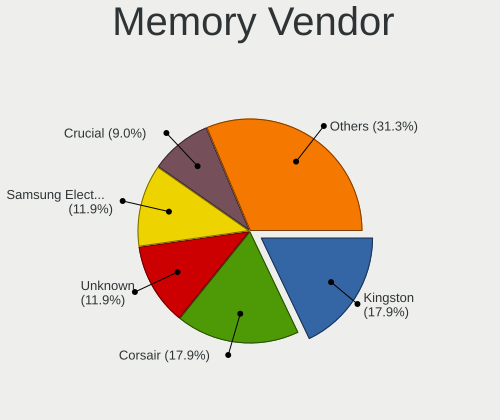

| Vendor              | Desktops | Percent |
|---------------------|----------|---------|
| Kingston            | 12       | 17.91%  |
| Corsair             | 12       | 17.91%  |
| Unknown             | 8        | 11.94%  |
| Samsung Electronics | 8        | 11.94%  |
| Crucial             | 6        | 8.96%   |
| SK hynix            | 5        | 7.46%   |
| G.Skill             | 4        | 5.97%   |
| Micron Technology   | 3        | 4.48%   |
| Hewlett-Packard     | 2        | 2.99%   |
| Unknown (ABCD)      | 1        | 1.49%   |
| Unknown (0x0B45)    | 1        | 1.49%   |
| Team                | 1        | 1.49%   |
| Patriot             | 1        | 1.49%   |
| Lexar               | 1        | 1.49%   |
| A-DATA Technology   | 1        | 1.49%   |
| Unknown             | 1        | 1.49%   |

Memory Model
------------

Memory module models

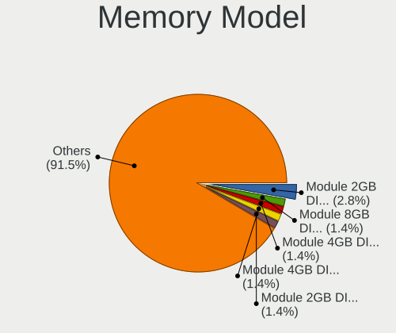

| Model                                                            | Desktops | Percent |
|------------------------------------------------------------------|----------|---------|
| Unknown RAM Module 2GB DIMM DDR2 800MT/s                         | 2        | 2.82%   |
| Unknown RAM Module 8GB DIMM DDR4 2400MT/s                        | 1        | 1.41%   |
| Unknown RAM Module 4GB DIMM DDR3 1333MT/s                        | 1        | 1.41%   |
| Unknown RAM Module 4GB DIMM DDR 1333MT/s                         | 1        | 1.41%   |
| Unknown RAM Module 2GB DIMM SDRAM 533MT/s                        | 1        | 1.41%   |
| Unknown RAM Module 2GB DIMM DDR3 1333MT/s                        | 1        | 1.41%   |
| Unknown RAM Module 2GB DIMM 800MT/s                              | 1        | 1.41%   |
| Unknown RAM Module 2GB DIMM                                      | 1        | 1.41%   |
| Unknown (ABCD) RAM 123456789012345678 2GB DIMM LPDDR4 2133MT/s   | 1        | 1.41%   |
| Unknown (0x0B45) RAM WPBH32D408SWM-16G 16GB SODIMM DDR4 3200MT/s | 1        | 1.41%   |
| Team RAM TEAMGROUP-UD4-2666 16GB DIMM DDR4 2667MT/s              | 1        | 1.41%   |
| SK hynix RAM HMT451U6AFR8C-PB 4GB DIMM DDR3 1600MT/s             | 1        | 1.41%   |
| SK hynix RAM HMT325U6CFR8C-H9 2GB DIMM DDR3 1333MT/s             | 1        | 1.41%   |
| SK hynix RAM HMAA1GU6CJR6N-XN 8GB DIMM DDR4 3200MT/s             | 1        | 1.41%   |
| SK hynix RAM HMA851U6AFR6N-UH 4GB DIMM DDR4 2400MT/s             | 1        | 1.41%   |
| SK hynix RAM HMA851S6AFR6N-UH 4GB SODIMM DDR4 2667MT/s           | 1        | 1.41%   |
| SK hynix RAM HMA451U6AFR8N-TF 4GB DIMM DDR4 2133MT/s             | 1        | 1.41%   |
| Samsung RAM Module 8GB DIMM DDR4 2666MT/s                        | 1        | 1.41%   |
| Samsung RAM Module 16GB DIMM DDR4 3200MT/s                       | 1        | 1.41%   |
| Samsung RAM M471B5273DH0-CH9 4GB DIMM DDR3 1333MT/s              | 1        | 1.41%   |
| Samsung RAM M393A1G40DB0-CPB 8GB DIMM DDR4 2667MT/s              | 1        | 1.41%   |
| Samsung RAM M378B2873EH1-CH9 1GB DIMM DDR3 1334MT/s              | 1        | 1.41%   |
| Samsung RAM M378A5244CB0-CRC 4GB DIMM DDR4 3066MT/s              | 1        | 1.41%   |
| Samsung RAM M378A2G43CB3-CWE 16GB DIMM DDR4 3200MT/s             | 1        | 1.41%   |
| Samsung RAM M378A2G43AB3-CWE 16GB DIMM DDR4 3200MT/s             | 1        | 1.41%   |
| Patriot RAM PSD34G16002 4GB DIMM DDR3 1648MT/s                   | 1        | 1.41%   |
| Micron RAM 8ATF1G64HZ-2G3B2 8GB DIMM DDR4 2667MT/s               | 1        | 1.41%   |
| Micron RAM 36JSZF1G72PZ-1G4D1 8GB DIMM DDR3 1333MT/s             | 1        | 1.41%   |
| Micron RAM 18ASF1G72PZ-2G1A2 8GB DIMM DDR4 2400MT/s              | 1        | 1.41%   |
| Lexar RAM LD4AS016G-3200ST 16GB SODIMM DDR4 3200MT/s             | 1        | 1.41%   |
| Kingston RAM KP223C-ELD 2GB DIMM DDR3 1600MT/s                   | 1        | 1.41%   |
| Kingston RAM KHX2933C17D4/16G 16GB DIMM DDR4 2933MT/s            | 1        | 1.41%   |
| Kingston RAM KHX2666C15D4/8G 8GB DIMM DDR4 3200MT/s              | 1        | 1.41%   |
| Kingston RAM KHX2133C14D4/4G 4GB DIMM DDR4 3200MT/s              | 1        | 1.41%   |
| Kingston RAM KHX1600C9D3/4GX 4GB DIMM DDR3 1867MT/s              | 1        | 1.41%   |
| Kingston RAM KHX1600C10D3/8G 8GB DIMM DDR3 2133MT/s              | 1        | 1.41%   |
| Kingston RAM KF3200C16D4/8GX 8GiB DIMM DDR4 3600MT/s             | 1        | 1.41%   |
| Kingston RAM KF1600C10D3/8G 8GB DIMM DDR3 1600MT/s               | 1        | 1.41%   |
| Kingston RAM HX318C10FK2/16 8GB DIMM DDR3 1866MT/s               | 1        | 1.41%   |
| Kingston RAM 9905734-102.A00G 32GB DIMM DDR4 3200MT/s            | 1        | 1.41%   |

Memory Kind
-----------

Memory module kinds

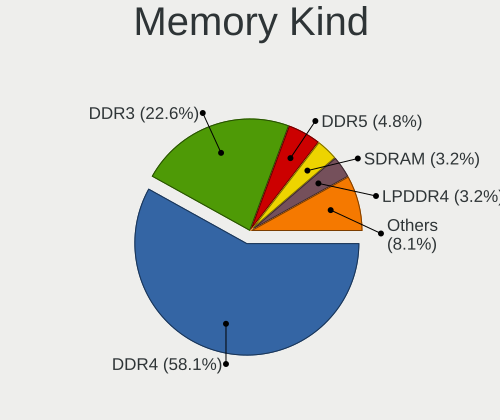

| Kind    | Desktops | Percent |
|---------|----------|---------|
| DDR4    | 36       | 58.06%  |
| DDR3    | 14       | 22.58%  |
| DDR5    | 3        | 4.84%   |
| SDRAM   | 2        | 3.23%   |
| LPDDR4  | 2        | 3.23%   |
| DDR2    | 2        | 3.23%   |
| Unknown | 2        | 3.23%   |
| DDR     | 1        | 1.61%   |

Memory Form Factor
------------------

Physical design of the memory module

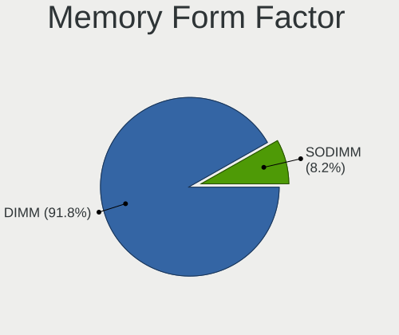

| Name   | Desktops | Percent |
|--------|----------|---------|
| DIMM   | 56       | 91.8%   |
| SODIMM | 5        | 8.2%    |

Memory Size
-----------

Memory module size

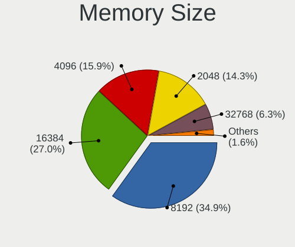

| Size  | Desktops | Percent |
|-------|----------|---------|
| 8192  | 22       | 34.92%  |
| 16384 | 17       | 26.98%  |
| 4096  | 10       | 15.87%  |
| 2048  | 9        | 14.29%  |
| 32768 | 4        | 6.35%   |
| 49152 | 1        | 1.59%   |

Memory Speed
------------

Memory module speed

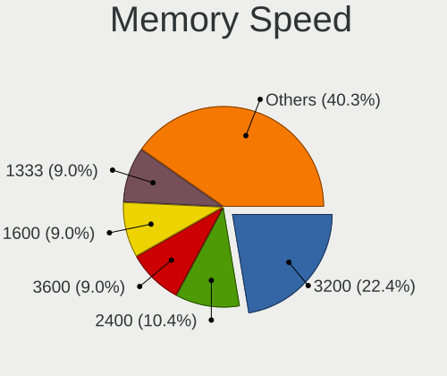

| Speed   | Desktops | Percent |
|---------|----------|---------|
| 3200    | 15       | 22.39%  |
| 2400    | 7        | 10.45%  |
| 3600    | 6        | 8.96%   |
| 1600    | 6        | 8.96%   |
| 1333    | 6        | 8.96%   |
| 2667    | 4        | 5.97%   |
| 800     | 3        | 4.48%   |
| 5600    | 2        | 2.99%   |
| 4000    | 2        | 2.99%   |
| 3066    | 2        | 2.99%   |
| 2933    | 2        | 2.99%   |
| 2666    | 2        | 2.99%   |
| 2133    | 2        | 2.99%   |
| 6000    | 1        | 1.49%   |
| 3800    | 1        | 1.49%   |
| 2134    | 1        | 1.49%   |
| 1866    | 1        | 1.49%   |
| 1648    | 1        | 1.49%   |
| 1334    | 1        | 1.49%   |
| 533     | 1        | 1.49%   |
| Unknown | 1        | 1.49%   |

Printers & scanners
-------------------

Printer Vendor
--------------

Printer device vendors

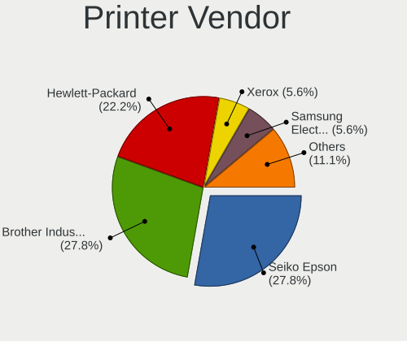

| Vendor              | Desktops | Percent |
|---------------------|----------|---------|
| Seiko Epson         | 5        | 27.78%  |
| Brother Industries  | 5        | 27.78%  |
| Hewlett-Packard     | 4        | 22.22%  |
| Xerox               | 1        | 5.56%   |
| Samsung Electronics | 1        | 5.56%   |
| Pantum              | 1        | 5.56%   |
| Dell                | 1        | 5.56%   |

Printer Model
-------------

Printer device models

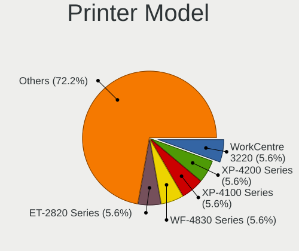

| Model                            | Desktops | Percent |
|----------------------------------|----------|---------|
| Xerox WorkCentre 3220            | 1        | 5.56%   |
| Seiko Epson XP-4200 Series       | 1        | 5.56%   |
| Seiko Epson XP-4100 Series       | 1        | 5.56%   |
| Seiko Epson WF-4830 Series       | 1        | 5.56%   |
| Seiko Epson ET-2820 Series       | 1        | 5.56%   |
| Seiko Epson EPSON L300 Series    | 1        | 5.56%   |
| Samsung Phaser 3121              | 1        | 5.56%   |
| Pantum P2200-series              | 1        | 5.56%   |
| HP OfficeJet Pro 7720 series     | 1        | 5.56%   |
| HP LaserJet 1200                 | 1        | 5.56%   |
| HP LaserJet 1018                 | 1        | 5.56%   |
| HP Ink Tank 310 series           | 1        | 5.56%   |
| Dell Laser Printer 1720          | 1        | 5.56%   |
| Brother Printer                  | 1        | 5.56%   |
| Brother MFC-7360N                | 1        | 5.56%   |
| Brother HL-L3230CDW series       | 1        | 5.56%   |
| Brother DCP-L2520DW              | 1        | 5.56%   |
| Brother DCP-7057 scanner/printer | 1        | 5.56%   |

Scanner Vendor
--------------

Scanner device vendors

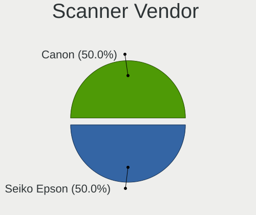

| Vendor      | Desktops | Percent |
|-------------|----------|---------|
| Seiko Epson | 1        | 50%     |
| Canon       | 1        | 50%     |

Scanner Model
-------------

Scanner device models

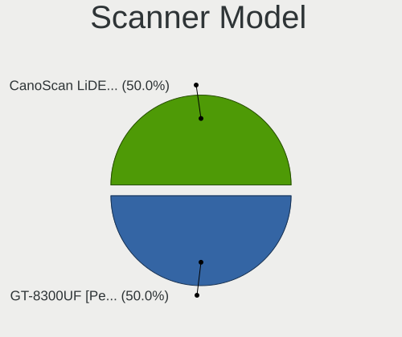

| Model                                         | Desktops | Percent |
|-----------------------------------------------|----------|---------|
| Seiko Epson GT-8300UF [Perfection 1660 PHOTO] | 1        | 50%     |
| Canon CanoScan LiDE 220                       | 1        | 50%     |

Camera
------

Camera Vendor
-------------

Camera device vendors

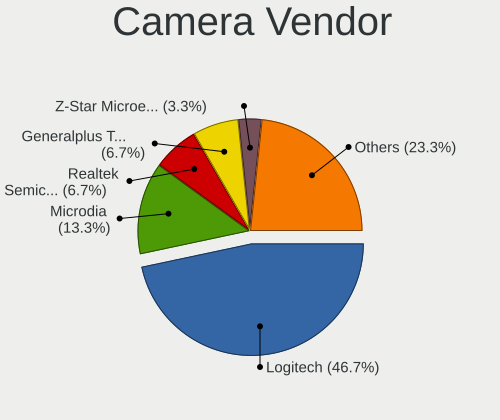

| Vendor                  | Desktops | Percent |
|-------------------------|----------|---------|
| Logitech                | 14       | 46.67%  |
| Microdia                | 4        | 13.33%  |
| Realtek Semiconductor   | 2        | 6.67%   |
| Generalplus Technology  | 2        | 6.67%   |
| Z-Star Microelectronics | 1        | 3.33%   |
| Trust                   | 1        | 3.33%   |
| Microsoft               | 1        | 3.33%   |
| Jieli Technology        | 1        | 3.33%   |
| Hewlett-Packard         | 1        | 3.33%   |
| Genesys Logic           | 1        | 3.33%   |
| Creative Technology     | 1        | 3.33%   |
| Chicony Electronics     | 1        | 3.33%   |

Camera Model
------------

Camera device models

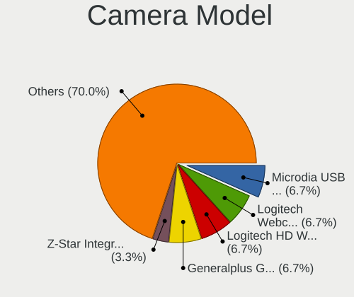

| Model                                  | Desktops | Percent |
|----------------------------------------|----------|---------|
| Microdia USB 2.0 Camera                | 2        | 6.67%   |
| Logitech Webcam C270                   | 2        | 6.67%   |
| Logitech HD Webcam C525                | 2        | 6.67%   |
| Generalplus GENERAL WEBCAM             | 2        | 6.67%   |
| Z-Star Integrated Camera               | 1        | 3.33%   |
| Trust WB-6250X Webcam                  | 1        | 3.33%   |
| Realtek Web Camera                     | 1        | 3.33%   |
| Realtek USB 2.0 Camera                 | 1        | 3.33%   |
| Microsoft LifeCam HD-3000              | 1        | 3.33%   |
| Microdia Webcam Vitade AF              | 1        | 3.33%   |
| Microdia Sonix USB 2.0 Camera          | 1        | 3.33%   |
| Logitech Webcam Pro 9000               | 1        | 3.33%   |
| Logitech QuickCam Vision Pro           | 1        | 3.33%   |
| Logitech QuickCam Pro 9000             | 1        | 3.33%   |
| Logitech QuickCam Orbit/Sphere AF      | 1        | 3.33%   |
| Logitech QuickCam Communicate MP/S5500 | 1        | 3.33%   |
| Logitech Logitech Webcam C925e         | 1        | 3.33%   |
| Logitech HD Webcam C615                | 1        | 3.33%   |
| Logitech CrystalCam                    | 1        | 3.33%   |
| Logitech C922 Pro Stream Webcam        | 1        | 3.33%   |
| Logitech BCC950 ConferenceCam          | 1        | 3.33%   |
| Jieli USB PHY 2.0                      | 1        | 3.33%   |
| HP 325 FHD Webcam                      | 1        | 3.33%   |
| Genesys Logic Digital Microscope       | 1        | 3.33%   |
| Creative VF0530 Live! Cam Chat IM      | 1        | 3.33%   |
| Chicony CNF8050 Webcam                 | 1        | 3.33%   |

Security
--------

Fingerprint Vendor
------------------

Fingerprint sensor vendors

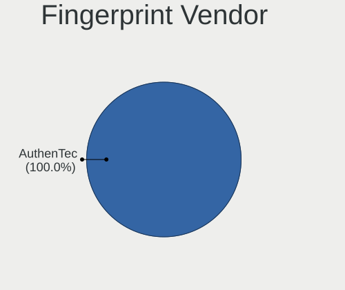

| Vendor    | Desktops | Percent |
|-----------|----------|---------|
| AuthenTec | 1        | 100%    |

Fingerprint Model
-----------------

Fingerprint sensor models

| Model                                | Desktops | Percent |
|--------------------------------------|----------|---------|
| AuthenTec AES2501 Fingerprint Sensor | 1        | 100%    |

Chipcard Vendor
---------------

Chipcard module vendors

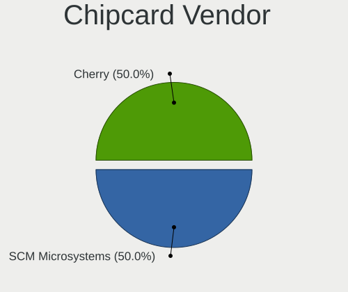

| Vendor           | Desktops | Percent |
|------------------|----------|---------|
| SCM Microsystems | 1        | 50%     |
| Cherry           | 1        | 50%     |

Chipcard Model
--------------

Chipcard module models

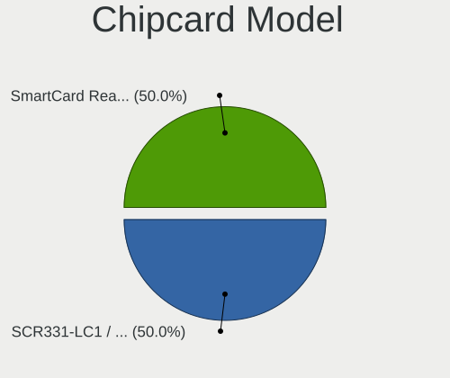

| Model                                                  | Desktops | Percent |
|--------------------------------------------------------|----------|---------|
| SCM Microsystems SCR331-LC1 / SCR3310 SmartCard Reader | 1        | 50%     |
| Cherry SmartCard Reader Keyboard KC 1000 SC            | 1        | 50%     |

Unsupported
-----------

Unsupported Devices
-------------------

Total unsupported devices on board

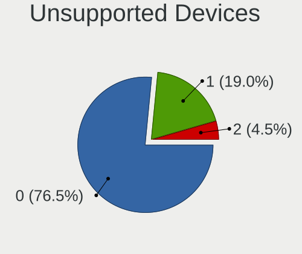

| Total | Desktops | Percent |
|-------|----------|---------|
| 0     | 137      | 76.54%  |
| 1     | 34       | 18.99%  |
| 2     | 8        | 4.47%   |

Unsupported Device Types
------------------------

Types of unsupported devices

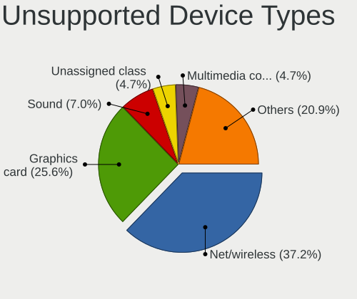

| Type                     | Desktops | Percent |
|--------------------------|----------|---------|
| Net/wireless             | 16       | 37.21%  |
| Graphics card            | 11       | 25.58%  |
| Sound                    | 3        | 6.98%   |
| Unassigned class         | 2        | 4.65%   |
| Multimedia controller    | 2        | 4.65%   |
| Card reader              | 2        | 4.65%   |
| Bluetooth                | 2        | 4.65%   |
| Net/ethernet             | 1        | 2.33%   |
| Firewire controller      | 1        | 2.33%   |
| Fingerprint reader       | 1        | 2.33%   |
| Communication controller | 1        | 2.33%   |
| Chipcard                 | 1        | 2.33%   |

