openSUSE Leap-15.5 - Tested Hardware & Statistics (Notebooks)
-------------------------------------------------------------

A project to collect tested hardware configurations for openSUSE Leap-15.5.

Anyone can contribute to this report by the [hw-probe](https://github.com/linuxhw/hw-probe) tool:

    sudo -E hw-probe -all -upload

Please contribute! Especially if your hardware is rare.

Contents
--------

* [ Test Cases ](#test-cases)

* [ System ](#system)
  - [ Kernel                   ](#kernel)
  - [ Kernel Family            ](#kernel-family)
  - [ Kernel Major Ver.        ](#kernel-major-ver)
  - [ Arch                     ](#arch)
  - [ DE                       ](#de)
  - [ Display Server           ](#display-server)
  - [ Display Manager          ](#display-manager)
  - [ OS Lang                  ](#os-lang)
  - [ Boot Mode                ](#boot-mode)
  - [ Filesystem               ](#filesystem)
  - [ Part. scheme             ](#part-scheme)
  - [ Dual Boot with Linux/BSD ](#dual-boot-with-linuxbsd)
  - [ Dual Boot (Win)          ](#dual-boot-win)

* [ Board ](#board)
  - [ Vendor                   ](#vendor)
  - [ Model                    ](#model)
  - [ Model Family             ](#model-family)
  - [ MFG Year                 ](#mfg-year)
  - [ Form Factor              ](#form-factor)
  - [ Secure Boot              ](#secure-boot)
  - [ Coreboot                 ](#coreboot)
  - [ RAM Size                 ](#ram-size)
  - [ RAM Used                 ](#ram-used)
  - [ Total Drives             ](#total-drives)
  - [ Has CD-ROM               ](#has-cd-rom)
  - [ Has Ethernet             ](#has-ethernet)
  - [ Has WiFi                 ](#has-wifi)
  - [ Has Bluetooth            ](#has-bluetooth)

* [ Location ](#location)
  - [ Country                  ](#country)
  - [ City                     ](#city)

* [ Drives ](#drives)
  - [ Drive Vendor             ](#drive-vendor)
  - [ Drive Model              ](#drive-model)
  - [ HDD Vendor               ](#hdd-vendor)
  - [ SSD Vendor               ](#ssd-vendor)
  - [ Drive Kind               ](#drive-kind)
  - [ Drive Connector          ](#drive-connector)
  - [ Drive Size               ](#drive-size)
  - [ Space Total              ](#space-total)
  - [ Space Used               ](#space-used)
  - [ Malfunc. Drives          ](#malfunc-drives)
  - [ Malfunc. Drive Vendor    ](#malfunc-drive-vendor)
  - [ Malfunc. HDD Vendor      ](#malfunc-hdd-vendor)
  - [ Malfunc. Drive Kind      ](#malfunc-drive-kind)
  - [ Failed Drives            ](#failed-drives)
  - [ Failed Drive Vendor      ](#failed-drive-vendor)
  - [ Drive Status             ](#drive-status)

* [ Storage controller ](#storage-controller)
  - [ Storage Vendor           ](#storage-vendor)
  - [ Storage Model            ](#storage-model)
  - [ Storage Kind             ](#storage-kind)

* [ Processor ](#processor)
  - [ CPU Vendor               ](#cpu-vendor)
  - [ CPU Model                ](#cpu-model)
  - [ CPU Model Family         ](#cpu-model-family)
  - [ CPU Cores                ](#cpu-cores)
  - [ CPU Sockets              ](#cpu-sockets)
  - [ CPU Threads              ](#cpu-threads)
  - [ CPU Op-Modes             ](#cpu-op-modes)
  - [ CPU Microcode            ](#cpu-microcode)
  - [ CPU Microarch            ](#cpu-microarch)

* [ Graphics ](#graphics)
  - [ GPU Vendor               ](#gpu-vendor)
  - [ GPU Model                ](#gpu-model)
  - [ GPU Combo                ](#gpu-combo)
  - [ GPU Driver               ](#gpu-driver)
  - [ GPU Memory               ](#gpu-memory)

* [ Monitor ](#monitor)
  - [ Monitor Vendor           ](#monitor-vendor)
  - [ Monitor Model            ](#monitor-model)
  - [ Monitor Resolution       ](#monitor-resolution)
  - [ Monitor Diagonal         ](#monitor-diagonal)
  - [ Monitor Width            ](#monitor-width)
  - [ Aspect Ratio             ](#aspect-ratio)
  - [ Monitor Area             ](#monitor-area)
  - [ Pixel Density            ](#pixel-density)
  - [ Multiple Monitors        ](#multiple-monitors)

* [ Network ](#network)
  - [ Net Controller Vendor    ](#net-controller-vendor)
  - [ Net Controller Model     ](#net-controller-model)
  - [ Wireless Vendor          ](#wireless-vendor)
  - [ Wireless Model           ](#wireless-model)
  - [ Ethernet Vendor          ](#ethernet-vendor)
  - [ Ethernet Model           ](#ethernet-model)
  - [ Net Controller Kind      ](#net-controller-kind)
  - [ Used Controller          ](#used-controller)
  - [ NICs                     ](#nics)
  - [ IPv6                     ](#ipv6)

* [ Bluetooth ](#bluetooth)
  - [ Bluetooth Vendor         ](#bluetooth-vendor)
  - [ Bluetooth Model          ](#bluetooth-model)

* [ Sound ](#sound)
  - [ Sound Vendor             ](#sound-vendor)
  - [ Sound Model              ](#sound-model)

* [ Memory ](#memory)
  - [ Memory Vendor            ](#memory-vendor)
  - [ Memory Model             ](#memory-model)
  - [ Memory Kind              ](#memory-kind)
  - [ Memory Form Factor       ](#memory-form-factor)
  - [ Memory Size              ](#memory-size)
  - [ Memory Speed             ](#memory-speed)

* [ Printers & scanners ](#printers--scanners)
  - [ Printer Vendor           ](#printer-vendor)
  - [ Printer Model            ](#printer-model)
  - [ Scanner Vendor           ](#scanner-vendor)
  - [ Scanner Model            ](#scanner-model)

* [ Camera ](#camera)
  - [ Camera Vendor            ](#camera-vendor)
  - [ Camera Model             ](#camera-model)

* [ Security ](#security)
  - [ Fingerprint Vendor       ](#fingerprint-vendor)
  - [ Fingerprint Model        ](#fingerprint-model)
  - [ Chipcard Vendor          ](#chipcard-vendor)
  - [ Chipcard Model           ](#chipcard-model)

* [ Unsupported ](#unsupported)
  - [ Unsupported Devices      ](#unsupported-devices)
  - [ Unsupported Device Types ](#unsupported-device-types)

Test Cases
----------

Total: 258

| Vendor        | Model                       | Probe                                                      | Date         |
|---------------|-----------------------------|------------------------------------------------------------|--------------|
| Sony          | VPCCW1S1R                   | [f71d59a1a5](https://linux-hardware.org/?probe=f71d59a1a5) | Dec 19, 2025 |
| Toshiba       | dynabook Satellite B552/... | [369bd41c30](https://linux-hardware.org/?probe=369bd41c30) | Aug 17, 2025 |
| ASUSTek       | VivoBook_ASUSLaptop X712... | [06190e5180](https://linux-hardware.org/?probe=06190e5180) | Jul 26, 2025 |
| HP            | G62                         | [6a0322a5ab](https://linux-hardware.org/?probe=6a0322a5ab) | May 30, 2025 |
| Acer          | Aspire 7741                 | [2af5d6fd28](https://linux-hardware.org/?probe=2af5d6fd28) | Apr 23, 2025 |
| Dell          | System Inspiron N7110       | [b02db47dad](https://linux-hardware.org/?probe=b02db47dad) | Apr 07, 2025 |
| VALE          | Notebook Classic C150       | [7fff17ecdd](https://linux-hardware.org/?probe=7fff17ecdd) | Mar 23, 2025 |
| VALE          | Notebook Classic C150       | [52703c9457](https://linux-hardware.org/?probe=52703c9457) | Mar 22, 2025 |
| Lenovo        | ThinkPad W520 4282A34       | [ff2833eb02](https://linux-hardware.org/?probe=ff2833eb02) | Mar 17, 2025 |
| Acer          | Aspire E1-522               | [58bf5cc684](https://linux-hardware.org/?probe=58bf5cc684) | Feb 15, 2025 |
| Acer          | Nitro AN517-51              | [ea998b937e](https://linux-hardware.org/?probe=ea998b937e) | Jan 30, 2025 |
| Lenovo        | IdeaPad 3 15IIL05 81WE      | [5ea80e9289](https://linux-hardware.org/?probe=5ea80e9289) | Jan 07, 2025 |
| ASUSTek       | TUF Gaming FX505GT_FX505... | [4690fd028c](https://linux-hardware.org/?probe=4690fd028c) | Jan 01, 2025 |
| ASUSTek       | X751SA                      | [11d8d9b891](https://linux-hardware.org/?probe=11d8d9b891) | Dec 30, 2024 |
| ASUSTek       | X751SA                      | [2f216406f5](https://linux-hardware.org/?probe=2f216406f5) | Dec 28, 2024 |
| Dell          | Latitude 7400               | [79148dd5e2](https://linux-hardware.org/?probe=79148dd5e2) | Dec 14, 2024 |
| Dell          | Latitude 7400               | [77befeb4ea](https://linux-hardware.org/?probe=77befeb4ea) | Dec 09, 2024 |
| Dell          | XPS 13 9310                 | [cf504cfd50](https://linux-hardware.org/?probe=cf504cfd50) | Dec 05, 2024 |
| HP            | EliteBook 840 G1            | [775a4e3d49](https://linux-hardware.org/?probe=775a4e3d49) | Nov 17, 2024 |
| HP            | EliteBook 840 G1            | [cd9cf7bf34](https://linux-hardware.org/?probe=cd9cf7bf34) | Nov 17, 2024 |
| Medion        | E15433                      | [05ec29cd01](https://linux-hardware.org/?probe=05ec29cd01) | Nov 11, 2024 |
| Toshiba       | Satellite C55D-A            | [aa4ba3a227](https://linux-hardware.org/?probe=aa4ba3a227) | Nov 04, 2024 |
| Lenovo        | ThinkPad W520 4282A34       | [9c2a644e93](https://linux-hardware.org/?probe=9c2a644e93) | Nov 01, 2024 |
| Google        | Candy                       | [2ee49236e0](https://linux-hardware.org/?probe=2ee49236e0) | Oct 23, 2024 |
| Lenovo        | ThinkPad T490 20N2000LSP    | [34c10e27fb](https://linux-hardware.org/?probe=34c10e27fb) | Oct 03, 2024 |
| Google        | Candy                       | [1fd06c93d2](https://linux-hardware.org/?probe=1fd06c93d2) | Sep 26, 2024 |
| Lenovo        | IdeaPad 510-15ISK 80SR      | [26254c11a6](https://linux-hardware.org/?probe=26254c11a6) | Sep 18, 2024 |
| Sony          | VPCEH11FX                   | [76b181ca5c](https://linux-hardware.org/?probe=76b181ca5c) | Sep 03, 2024 |
| ASUSTek       | GL553VD                     | [bdaf9d87ea](https://linux-hardware.org/?probe=bdaf9d87ea) | Sep 01, 2024 |
| Acer          | Nitro AN517-51              | [33ffbac3ac](https://linux-hardware.org/?probe=33ffbac3ac) | Aug 29, 2024 |
| Dell          | Precision 3541              | [1c2a5e45f3](https://linux-hardware.org/?probe=1c2a5e45f3) | Aug 21, 2024 |
| Toshiba       | Satellite R945              | [4e4ca76ccf](https://linux-hardware.org/?probe=4e4ca76ccf) | Aug 19, 2024 |
| Dell          | Precision 3541              | [c5f2dba49c](https://linux-hardware.org/?probe=c5f2dba49c) | Aug 13, 2024 |
| ASUSTek       | ASUS EXPERTBOOK B1400CEA... | [c670222db7](https://linux-hardware.org/?probe=c670222db7) | Aug 12, 2024 |
| Panasonic     | FZ40-1                      | [a8cf31fa9e](https://linux-hardware.org/?probe=a8cf31fa9e) | Aug 05, 2024 |
| Dell          | Latitude 7400               | [830e4194f2](https://linux-hardware.org/?probe=830e4194f2) | Aug 02, 2024 |
| Fujitsu       | LIFEBOOK E756               | [83394cc331](https://linux-hardware.org/?probe=83394cc331) | Jul 24, 2024 |
| Dell          | Latitude 5320               | [937747e0cd](https://linux-hardware.org/?probe=937747e0cd) | Jul 24, 2024 |
| HP            | EliteBook 850 G7 Noteboo... | [d32f73f43c](https://linux-hardware.org/?probe=d32f73f43c) | Jul 24, 2024 |
| Dell          | Latitude E6510              | [7bdf8e1d08](https://linux-hardware.org/?probe=7bdf8e1d08) | Jul 18, 2024 |
| HP            | ZBook Firefly 14 inch G8... | [5e5b324a08](https://linux-hardware.org/?probe=5e5b324a08) | Jun 27, 2024 |
| Acer          | Aspire E1-571               | [554884bafe](https://linux-hardware.org/?probe=554884bafe) | Jun 23, 2024 |
| HP            | ENVY 14                     | [c0be266fe2](https://linux-hardware.org/?probe=c0be266fe2) | Jun 18, 2024 |
| HP            | ENVY 14                     | [0838fecf0e](https://linux-hardware.org/?probe=0838fecf0e) | Jun 18, 2024 |
| HP            | ENVY Laptop 17-ae1xx        | [e3e68fbf69](https://linux-hardware.org/?probe=e3e68fbf69) | Jun 15, 2024 |
| Wortmann      | TERRA_MOBILE_1512/1712      | [925af4ca04](https://linux-hardware.org/?probe=925af4ca04) | Jun 11, 2024 |
| Wortmann      | TERRA_MOBILE_1512/1712      | [b80c7ef54c](https://linux-hardware.org/?probe=b80c7ef54c) | Jun 11, 2024 |
| HP            | Victus by Laptop 16-e0xx... | [c9b9a5f54b](https://linux-hardware.org/?probe=c9b9a5f54b) | Jun 10, 2024 |
| HP            | Victus by Gaming Laptop ... | [39216d7b67](https://linux-hardware.org/?probe=39216d7b67) | Jun 06, 2024 |
| HP            | Victus by Gaming Laptop ... | [bd8df104f0](https://linux-hardware.org/?probe=bd8df104f0) | Jun 06, 2024 |
| LG Electro... | P1-J331P                    | [a24862e047](https://linux-hardware.org/?probe=a24862e047) | Jun 02, 2024 |
| LG Electro... | P1-J331P                    | [948cbb9a59](https://linux-hardware.org/?probe=948cbb9a59) | Jun 02, 2024 |
| Digibras      | NH4CU03                     | [ed38e31a5a](https://linux-hardware.org/?probe=ed38e31a5a) | May 31, 2024 |
| Lenovo        | IdeaPad S145-15AST 81N3     | [ce453ef020](https://linux-hardware.org/?probe=ce453ef020) | May 30, 2024 |
| Lenovo        | ThinkPad L15 Gen 3 21C30... | [54446d7877](https://linux-hardware.org/?probe=54446d7877) | May 28, 2024 |
| HP            | Pavilion Gaming Laptop 1... | [14a14a76f1](https://linux-hardware.org/?probe=14a14a76f1) | May 26, 2024 |
| ASUSTek       | VivoBook_ASUSLaptop X705... | [aa9d0999c0](https://linux-hardware.org/?probe=aa9d0999c0) | May 26, 2024 |
| Dell          | Precision 7510              | [2732302a98](https://linux-hardware.org/?probe=2732302a98) | May 23, 2024 |
| Dell          | Precision 7510              | [f1f16c7457](https://linux-hardware.org/?probe=f1f16c7457) | May 23, 2024 |
| ASUSTek       | Zenbook UM3402YAR_UM3402... | [a2e639d9d5](https://linux-hardware.org/?probe=a2e639d9d5) | May 23, 2024 |
| ILLEGEAR      | RAVEN SE                    | [faac458723](https://linux-hardware.org/?probe=faac458723) | May 15, 2024 |
| ILLEGEAR      | RAVEN SE                    | [97f3382524](https://linux-hardware.org/?probe=97f3382524) | May 14, 2024 |
| ASUSTek       | VivoBook_ASUSLaptop X160... | [fce74afc84](https://linux-hardware.org/?probe=fce74afc84) | May 09, 2024 |
| Lenovo        | B590 20206                  | [9c08740bb5](https://linux-hardware.org/?probe=9c08740bb5) | May 02, 2024 |
| Dell          | Inspiron 5559               | [8a00241444](https://linux-hardware.org/?probe=8a00241444) | May 01, 2024 |
| Medion        | P662X                       | [3689ca2476](https://linux-hardware.org/?probe=3689ca2476) | May 01, 2024 |
| Wortmann      | TERRA_MOBILE_1749           | [cdfcbe795b](https://linux-hardware.org/?probe=cdfcbe795b) | May 01, 2024 |
| Dell          | Inspiron 5748               | [43d176db3e](https://linux-hardware.org/?probe=43d176db3e) | Apr 29, 2024 |
| Acer          | Aspire 7741                 | [69f109864f](https://linux-hardware.org/?probe=69f109864f) | Apr 28, 2024 |
| Lenovo        | ThinkPad L520 786035U       | [711272241a](https://linux-hardware.org/?probe=711272241a) | Apr 28, 2024 |
| ASUSTek       | N751JK                      | [1d2d8c3d7a](https://linux-hardware.org/?probe=1d2d8c3d7a) | Apr 25, 2024 |
| Lenovo        | U31-70 80M5                 | [2a4ad09169](https://linux-hardware.org/?probe=2a4ad09169) | Apr 25, 2024 |
| Lenovo        | G510 20238                  | [ec99c46757](https://linux-hardware.org/?probe=ec99c46757) | Apr 25, 2024 |
| Acer          | Aspire 5750G                | [a35bd4ad42](https://linux-hardware.org/?probe=a35bd4ad42) | Apr 23, 2024 |
| Lenovo        | Legion 5 Pro 16ACH6 82JS    | [8b5161f4ab](https://linux-hardware.org/?probe=8b5161f4ab) | Apr 22, 2024 |
| Lenovo        | IdeaPad Gaming 3 15ACH6 ... | [8cff3fe858](https://linux-hardware.org/?probe=8cff3fe858) | Apr 20, 2024 |
| ASUSTek       | N751JK                      | [39bb3da888](https://linux-hardware.org/?probe=39bb3da888) | Apr 16, 2024 |
| Lenovo        | ThinkPad T14s Gen 4 21F8... | [b29f521f01](https://linux-hardware.org/?probe=b29f521f01) | Apr 12, 2024 |
| HP            | EliteBook 2730p             | [843cd11924](https://linux-hardware.org/?probe=843cd11924) | Apr 10, 2024 |
| Fujitsu       | CELSIUS H780                | [f5dc0c7623](https://linux-hardware.org/?probe=f5dc0c7623) | Apr 10, 2024 |
| Dell          | Precision M4800             | [e0cd62ded2](https://linux-hardware.org/?probe=e0cd62ded2) | Apr 10, 2024 |
| HP            | Victus by Gaming Laptop ... | [75b15c6330](https://linux-hardware.org/?probe=75b15c6330) | Apr 09, 2024 |
| Dell          | Precision 3561              | [6bc6a2a9d9](https://linux-hardware.org/?probe=6bc6a2a9d9) | Apr 09, 2024 |
| Dell          | Latitude E7240              | [08dd3e8b44](https://linux-hardware.org/?probe=08dd3e8b44) | Apr 09, 2024 |
| MSI           | Summit E13FlipEvo A11MT     | [3c1bd6247c](https://linux-hardware.org/?probe=3c1bd6247c) | Apr 06, 2024 |
| HP            | Laptop 15-dw3xxx            | [e009d9dd56](https://linux-hardware.org/?probe=e009d9dd56) | Apr 05, 2024 |
| HP            | Laptop 17-cp0xxx            | [05643228c4](https://linux-hardware.org/?probe=05643228c4) | Apr 02, 2024 |
| Dell          | Vostro 3520                 | [233178d530](https://linux-hardware.org/?probe=233178d530) | Mar 25, 2024 |
| Lenovo        | B590 20206                  | [d3e9088b43](https://linux-hardware.org/?probe=d3e9088b43) | Mar 23, 2024 |
| Lenovo        | B590 20206                  | [36c66318b0](https://linux-hardware.org/?probe=36c66318b0) | Mar 22, 2024 |
| Dell          | Precision 5520              | [8d942977e2](https://linux-hardware.org/?probe=8d942977e2) | Mar 20, 2024 |
| Lenovo        | ThinkPad X270 W10DG 20K6... | [153f16ac8d](https://linux-hardware.org/?probe=153f16ac8d) | Mar 18, 2024 |
| Acer          | Aspire 5745                 | [512b58fc90](https://linux-hardware.org/?probe=512b58fc90) | Mar 16, 2024 |
| Apple         | MacBookPro9,2               | [174ace72e6](https://linux-hardware.org/?probe=174ace72e6) | Mar 15, 2024 |
| Schenker      | KEY (E23)                   | [f555bec75a](https://linux-hardware.org/?probe=f555bec75a) | Mar 12, 2024 |
| Lenovo        | Y520-15IKBN 80WK            | [1e7f921f12](https://linux-hardware.org/?probe=1e7f921f12) | Mar 12, 2024 |
| Acer          | TravelMate P215-54          | [a8e5c041ef](https://linux-hardware.org/?probe=a8e5c041ef) | Mar 11, 2024 |
| HP            | EliteBook 8570w             | [4b83d77529](https://linux-hardware.org/?probe=4b83d77529) | Mar 10, 2024 |
| Lenovo        | IdeaPad S340-15IIL 81VW     | [66f2f3a361](https://linux-hardware.org/?probe=66f2f3a361) | Mar 04, 2024 |
| Lenovo        | IdeaPad S340-15IIL 81VW     | [3ab9b49b3e](https://linux-hardware.org/?probe=3ab9b49b3e) | Mar 04, 2024 |
| MSI           | Katana GF66 11UE            | [95b3dd2821](https://linux-hardware.org/?probe=95b3dd2821) | Mar 03, 2024 |
| Acer          | Aspire 5742Z                | [22ba0ca014](https://linux-hardware.org/?probe=22ba0ca014) | Feb 29, 2024 |
| HP            | Pavilion dv9500             | [233bd911e6](https://linux-hardware.org/?probe=233bd911e6) | Feb 28, 2024 |
| Lenovo        | ThinkPad L530 24814YG       | [41599a23c0](https://linux-hardware.org/?probe=41599a23c0) | Feb 28, 2024 |
| HP            | Pavilion dv9500             | [8c5ec97398](https://linux-hardware.org/?probe=8c5ec97398) | Feb 27, 2024 |
| Samsung       | 355V4C/355V4X/355V5C/355... | [cded833645](https://linux-hardware.org/?probe=cded833645) | Feb 25, 2024 |
| HP            | Laptop 17-cp0xxx            | [85f840ba85](https://linux-hardware.org/?probe=85f840ba85) | Feb 24, 2024 |
| ASUSTek       | X751LX                      | [702ddba05b](https://linux-hardware.org/?probe=702ddba05b) | Feb 24, 2024 |
| HP            | Laptop 17z-ca200            | [1dbf9d63d5](https://linux-hardware.org/?probe=1dbf9d63d5) | Feb 21, 2024 |
| Acer          | Aspire A315-51              | [3e89cd8ab4](https://linux-hardware.org/?probe=3e89cd8ab4) | Feb 19, 2024 |
| HP            | EliteBook 8560p             | [748b126968](https://linux-hardware.org/?probe=748b126968) | Feb 12, 2024 |
| ASUSTek       | VivoBook_ASUSLaptop X705... | [d916f30fdc](https://linux-hardware.org/?probe=d916f30fdc) | Feb 10, 2024 |
| Lenovo        | ThinkPad X270 W10DG 20K6... | [f4930d0549](https://linux-hardware.org/?probe=f4930d0549) | Feb 09, 2024 |
| Lenovo        | Legion 5 Pro 16ACH6H 82J... | [c8567d0dcc](https://linux-hardware.org/?probe=c8567d0dcc) | Feb 06, 2024 |
| HP            | EliteBook 8460p             | [91197e4fa0](https://linux-hardware.org/?probe=91197e4fa0) | Feb 05, 2024 |
| Acer          | Aspire A317-32              | [9baf9646df](https://linux-hardware.org/?probe=9baf9646df) | Jan 27, 2024 |
| Lenovo        | ThinkPad E14 20RAS1S600     | [8544584b30](https://linux-hardware.org/?probe=8544584b30) | Jan 27, 2024 |
| Lenovo        | ThinkPad T470 W10DG 20JN... | [6dd363b754](https://linux-hardware.org/?probe=6dd363b754) | Jan 22, 2024 |
| Dell          | Latitude E6400              | [b2765b0e50](https://linux-hardware.org/?probe=b2765b0e50) | Jan 19, 2024 |
| TUXEDO        | Aura 15 Gen2                | [28a227c7d1](https://linux-hardware.org/?probe=28a227c7d1) | Jan 16, 2024 |
| TUXEDO        | Pulse 15 Gen2               | [1ec6103b31](https://linux-hardware.org/?probe=1ec6103b31) | Jan 16, 2024 |
| TUXEDO        | Aura 15 Gen2                | [96e3e7f937](https://linux-hardware.org/?probe=96e3e7f937) | Jan 16, 2024 |
| HP            | Laptop 15-dy2xxx            | [4dc1a2b98c](https://linux-hardware.org/?probe=4dc1a2b98c) | Jan 11, 2024 |
| HP            | EliteBook 2540p             | [088dbf4c2f](https://linux-hardware.org/?probe=088dbf4c2f) | Jan 10, 2024 |
| A-DATA Tec... | XENIA 15                    | [6cf5d66e62](https://linux-hardware.org/?probe=6cf5d66e62) | Jan 10, 2024 |
| Lenovo        | ThinkPad T530 2394W19       | [0dff2ac4a3](https://linux-hardware.org/?probe=0dff2ac4a3) | Jan 10, 2024 |
| HP            | Laptop 15s-eq2xxx           | [2e0223d4eb](https://linux-hardware.org/?probe=2e0223d4eb) | Jan 09, 2024 |
| Lenovo        | ThinkPad P53 20QNCTO1WW     | [a304de1339](https://linux-hardware.org/?probe=a304de1339) | Jan 06, 2024 |
| Lenovo        | ThinkPad T470 W10DG 20JN... | [e340939ad8](https://linux-hardware.org/?probe=e340939ad8) | Jan 06, 2024 |
| Acer          | Aspire A317-32              | [806a8b59fb](https://linux-hardware.org/?probe=806a8b59fb) | Jan 05, 2024 |
| ASUSTek       | UX510UXK                    | [17be26f2de](https://linux-hardware.org/?probe=17be26f2de) | Jan 04, 2024 |
| Lenovo        | ThinkPad P14s Gen 4 21HF... | [1504d9c050](https://linux-hardware.org/?probe=1504d9c050) | Jan 03, 2024 |
| Dell          | Inspiron 3443               | [0c56a0465b](https://linux-hardware.org/?probe=0c56a0465b) | Dec 29, 2023 |
| HP            | EliteBook 8560p             | [16a5247446](https://linux-hardware.org/?probe=16a5247446) | Dec 28, 2023 |
| HP            | EliteBook 8560p             | [82f94ea967](https://linux-hardware.org/?probe=82f94ea967) | Dec 28, 2023 |
| Lenovo        | IdeaPad 3 15ITL6 82H8       | [87e63ff33e](https://linux-hardware.org/?probe=87e63ff33e) | Dec 27, 2023 |
| Lenovo        | ThinkPad E14 Gen 2 20TBS... | [626b056720](https://linux-hardware.org/?probe=626b056720) | Dec 27, 2023 |
| Dell          | System XPS L322X            | [6b050ff1c8](https://linux-hardware.org/?probe=6b050ff1c8) | Dec 23, 2023 |
| Acer          | TravelMate P215-41-G2       | [476ef9075c](https://linux-hardware.org/?probe=476ef9075c) | Dec 21, 2023 |
| Dell          | XPS 15 7590                 | [7e2afccdd6](https://linux-hardware.org/?probe=7e2afccdd6) | Dec 18, 2023 |
| System76      | Bonobo WS                   | [22f5ef6fce](https://linux-hardware.org/?probe=22f5ef6fce) | Dec 16, 2023 |
| Samsung       | 355V4C/355V4X/355V5C/355... | [b949261978](https://linux-hardware.org/?probe=b949261978) | Dec 13, 2023 |
| ASUSTek       | ROG Zephyrus M16 GU604VZ... | [e8383035b9](https://linux-hardware.org/?probe=e8383035b9) | Dec 10, 2023 |
| HP            | Compaq 515                  | [025d4116ed](https://linux-hardware.org/?probe=025d4116ed) | Dec 09, 2023 |
| Lenovo        | IdeaPad 5 14ALC05 82LM      | [9d717185fb](https://linux-hardware.org/?probe=9d717185fb) | Dec 07, 2023 |
| HP            | Notebook                    | [0a554c91b1](https://linux-hardware.org/?probe=0a554c91b1) | Dec 01, 2023 |
| Lenovo        | IdeaPad 5 Pro 16ARH7 82S... | [4ba2fc285f](https://linux-hardware.org/?probe=4ba2fc285f) | Nov 30, 2023 |
| Lenovo        | IdeaPad 5 Pro 16ARH7 82S... | [0f9a06cc9f](https://linux-hardware.org/?probe=0f9a06cc9f) | Nov 30, 2023 |
| HP            | Notebook                    | [93464a0904](https://linux-hardware.org/?probe=93464a0904) | Nov 30, 2023 |
| Acer          | Aspire A317-32              | [02b205724a](https://linux-hardware.org/?probe=02b205724a) | Nov 29, 2023 |
| Lenovo        | IdeaPad S145-15IIL 82DJ     | [1eda316922](https://linux-hardware.org/?probe=1eda316922) | Nov 28, 2023 |
| Lenovo        | Y520-15IKBN 80WK            | [b46ec04a69](https://linux-hardware.org/?probe=b46ec04a69) | Nov 27, 2023 |
| Lenovo        | Y520-15IKBN 80WK            | [d3122d678f](https://linux-hardware.org/?probe=d3122d678f) | Nov 27, 2023 |
| Lenovo        | Legion Pro 5 16ARX8 82WM    | [312776837c](https://linux-hardware.org/?probe=312776837c) | Nov 26, 2023 |
| Acer          | Aspire A515-45G             | [1ec9d0635f](https://linux-hardware.org/?probe=1ec9d0635f) | Nov 23, 2023 |
| System76      | Lemur Pro                   | [45a6298cb5](https://linux-hardware.org/?probe=45a6298cb5) | Nov 22, 2023 |
| Unknown       | Unknown                     | [d169a02b18](https://linux-hardware.org/?probe=d169a02b18) | Nov 14, 2023 |
| Dell          | Latitude E6410              | [1e9606e755](https://linux-hardware.org/?probe=1e9606e755) | Nov 14, 2023 |
| ASUSTek       | ROG Zephyrus M16 GU604VZ... | [242621dab3](https://linux-hardware.org/?probe=242621dab3) | Nov 13, 2023 |
| Dynabook      | PORTEGE X30L-K              | [161674ce4a](https://linux-hardware.org/?probe=161674ce4a) | Nov 10, 2023 |
| Lenovo        | ThinkPad E14 Gen 5 21JR0... | [e736653169](https://linux-hardware.org/?probe=e736653169) | Nov 08, 2023 |
| Lenovo        | ThinkPad W541 20EGS1LB00    | [7a31e185b9](https://linux-hardware.org/?probe=7a31e185b9) | Nov 07, 2023 |
| ASUSTek       | ROG Zephyrus M16 GU604VZ... | [680fae0bef](https://linux-hardware.org/?probe=680fae0bef) | Nov 07, 2023 |
| Lenovo        | ThinkPad T490 20N2000LSP    | [55e3cdf0cc](https://linux-hardware.org/?probe=55e3cdf0cc) | Nov 05, 2023 |
| Lenovo        | ThinkPad E14 Gen 5 21JR0... | [d1d65399a0](https://linux-hardware.org/?probe=d1d65399a0) | Nov 03, 2023 |
| Acer          | Aspire VN7-591G             | [f446da83f1](https://linux-hardware.org/?probe=f446da83f1) | Nov 03, 2023 |
| Lenovo        | Legion 5 Pro 16ITH6H 82J... | [137dba2261](https://linux-hardware.org/?probe=137dba2261) | Nov 02, 2023 |
| Dell          | Inspiron N4050              | [7d5dc09b04](https://linux-hardware.org/?probe=7d5dc09b04) | Oct 30, 2023 |
| ASUSTek       | ZenBook UX434FL             | [139d1a74ed](https://linux-hardware.org/?probe=139d1a74ed) | Oct 25, 2023 |
| HUAWEI        | KLVL-WXXW                   | [b615345fa6](https://linux-hardware.org/?probe=b615345fa6) | Oct 21, 2023 |
| ASUSTek       | ROG Strix G713QE_G713QE     | [398445f93d](https://linux-hardware.org/?probe=398445f93d) | Oct 14, 2023 |
| HP            | ProBook 4535s               | [e52e92c95b](https://linux-hardware.org/?probe=e52e92c95b) | Oct 14, 2023 |
| Lenovo        | ThinkPad T400 27658JG       | [3b3b7832c9](https://linux-hardware.org/?probe=3b3b7832c9) | Oct 11, 2023 |
| ASUSTek       | ROG Strix G713QE_G713QE     | [5e8749954f](https://linux-hardware.org/?probe=5e8749954f) | Oct 11, 2023 |
| Lenovo        | ThinkPad X270 W10DG 20K6... | [814f6c5c52](https://linux-hardware.org/?probe=814f6c5c52) | Oct 09, 2023 |
| Dell          | Precision M6500             | [18605f38d4](https://linux-hardware.org/?probe=18605f38d4) | Oct 05, 2023 |
| Lenovo        | ThinkPad X390 20Q1S5K400    | [4d9d1bf62a](https://linux-hardware.org/?probe=4d9d1bf62a) | Oct 02, 2023 |
| Lenovo        | ThinkBook 15 G2 ITL 20VE    | [6fc52a277a](https://linux-hardware.org/?probe=6fc52a277a) | Sep 28, 2023 |
| ASUSTek       | X510UAR                     | [f94566dde6](https://linux-hardware.org/?probe=f94566dde6) | Sep 23, 2023 |
| HP            | ENVY 17                     | [4f6463148f](https://linux-hardware.org/?probe=4f6463148f) | Sep 22, 2023 |
| Lenovo        | ThinkPad W500 40624DG       | [9bdd448e89](https://linux-hardware.org/?probe=9bdd448e89) | Sep 22, 2023 |
| ASUSTek       | X510UAR                     | [b962cd9626](https://linux-hardware.org/?probe=b962cd9626) | Sep 19, 2023 |
| Lenovo        | B490 37722QP                | [d68a92e72a](https://linux-hardware.org/?probe=d68a92e72a) | Sep 19, 2023 |
| Lenovo        | B490 37722QP                | [8b335d6bb0](https://linux-hardware.org/?probe=8b335d6bb0) | Sep 19, 2023 |
| Acer          | Nitro AN515-57              | [8e044378bd](https://linux-hardware.org/?probe=8e044378bd) | Sep 15, 2023 |
| Acer          | Swift SF314-511             | [4714deba45](https://linux-hardware.org/?probe=4714deba45) | Sep 14, 2023 |
| Dell          | Precision 7540              | [ced1086a24](https://linux-hardware.org/?probe=ced1086a24) | Sep 09, 2023 |
| Dell          | Latitude 5431               | [b2d976a088](https://linux-hardware.org/?probe=b2d976a088) | Sep 08, 2023 |
| Panasonic     | CF-C2CUGZXKM                | [d34f211b22](https://linux-hardware.org/?probe=d34f211b22) | Sep 07, 2023 |
| Panasonic     | CF-C2CUGZXKM                | [098294fb47](https://linux-hardware.org/?probe=098294fb47) | Sep 07, 2023 |
| Sony          | SVF1521A7EB                 | [8b130feb09](https://linux-hardware.org/?probe=8b130feb09) | Sep 06, 2023 |
| Panasonic     | CF-C2CUGZXKM                | [12ed8aee3f](https://linux-hardware.org/?probe=12ed8aee3f) | Sep 05, 2023 |
| Panasonic     | CF-C2CUGZXKM                | [fdcab89946](https://linux-hardware.org/?probe=fdcab89946) | Sep 05, 2023 |
| Medion        | S15449                      | [7e8cd1a434](https://linux-hardware.org/?probe=7e8cd1a434) | Sep 02, 2023 |
| Acer          | Aspire 5715Z                | [22c3bee6fa](https://linux-hardware.org/?probe=22c3bee6fa) | Sep 02, 2023 |
| Acer          | Aspire A317-32              | [0a46c781fc](https://linux-hardware.org/?probe=0a46c781fc) | Sep 01, 2023 |
| Acer          | Predator PH315-52           | [fd3c900751](https://linux-hardware.org/?probe=fd3c900751) | Aug 31, 2023 |
| Lenovo        | ThinkPad T470p 20J60014P... | [7690eb9089](https://linux-hardware.org/?probe=7690eb9089) | Aug 30, 2023 |
| Framework     | Laptop (13th Gen Intel C... | [704a62ef33](https://linux-hardware.org/?probe=704a62ef33) | Aug 29, 2023 |
| Framework     | Laptop (13th Gen Intel C... | [beb1174dde](https://linux-hardware.org/?probe=beb1174dde) | Aug 29, 2023 |
| HUAWEI        | CREF-XX                     | [c5b6554c6b](https://linux-hardware.org/?probe=c5b6554c6b) | Aug 26, 2023 |
| Samsung       | 355V4C/355V4X/355V5C/355... | [b141917712](https://linux-hardware.org/?probe=b141917712) | Aug 23, 2023 |
| Toshiba       | Satellite Pro C70-A         | [dbb00fe95b](https://linux-hardware.org/?probe=dbb00fe95b) | Aug 15, 2023 |
| Acer          | Aspire E5-571G              | [f523831970](https://linux-hardware.org/?probe=f523831970) | Aug 14, 2023 |
| HP            | EliteBook 840 G3            | [66bcc74be2](https://linux-hardware.org/?probe=66bcc74be2) | Aug 13, 2023 |
| Samsung       | 355V4C/355V4X/355V5C/355... | [6f722400c2](https://linux-hardware.org/?probe=6f722400c2) | Aug 11, 2023 |
| Dell          | Precision 7740              | [954d8472e5](https://linux-hardware.org/?probe=954d8472e5) | Aug 09, 2023 |
| Notebook      | NLx0MU                      | [bb99f6f69e](https://linux-hardware.org/?probe=bb99f6f69e) | Aug 07, 2023 |
| Dell          | Vostro 5471                 | [f4beee823e](https://linux-hardware.org/?probe=f4beee823e) | Aug 07, 2023 |
| HP            | 470 G7 Notebook PC          | [7e4a9b4618](https://linux-hardware.org/?probe=7e4a9b4618) | Aug 04, 2023 |
| HP            | ProBook 455 15.6 inch G9... | [8fb651def8](https://linux-hardware.org/?probe=8fb651def8) | Aug 02, 2023 |
| Sony          | Unknown                     | [80613731cb](https://linux-hardware.org/?probe=80613731cb) | Jul 28, 2023 |
| Acer          | Aspire E5-774G              | [1568ba2843](https://linux-hardware.org/?probe=1568ba2843) | Jul 25, 2023 |
| Lenovo        | ThinkPad E15 Gen 2 20T80... | [b7c7b058b7](https://linux-hardware.org/?probe=b7c7b058b7) | Jul 23, 2023 |
| MSI           | Cyborg 15 A13VE             | [edf7b092ec](https://linux-hardware.org/?probe=edf7b092ec) | Jul 23, 2023 |
| MSI           | Cyborg 15 A13VE             | [421c2ff6b0](https://linux-hardware.org/?probe=421c2ff6b0) | Jul 23, 2023 |
| Lenovo        | ThinkPad L15 Gen 1 20U8S... | [c741f10f18](https://linux-hardware.org/?probe=c741f10f18) | Jul 23, 2023 |
| Medion        | E6224                       | [c33b8a1fb1](https://linux-hardware.org/?probe=c33b8a1fb1) | Jul 22, 2023 |
| Sony          | Unknown                     | [427e52d6a6](https://linux-hardware.org/?probe=427e52d6a6) | Jul 20, 2023 |
| Medion        | E6224                       | [4ffae87044](https://linux-hardware.org/?probe=4ffae87044) | Jul 17, 2023 |
| Lenovo        | B5400 80B6QB0               | [7108435241](https://linux-hardware.org/?probe=7108435241) | Jul 15, 2023 |
| Samsung       | 355V4C/355V4X/355V5C/355... | [6b351b341e](https://linux-hardware.org/?probe=6b351b341e) | Jul 15, 2023 |
| Lenovo        | ThinkPad T530 2394W19       | [874f8b41a7](https://linux-hardware.org/?probe=874f8b41a7) | Jul 14, 2023 |
| HP            | OMEN by Gaming Laptop 16... | [9bee6805c0](https://linux-hardware.org/?probe=9bee6805c0) | Jul 13, 2023 |
| Dell          | Vostro 3400                 | [93d94feca6](https://linux-hardware.org/?probe=93d94feca6) | Jul 11, 2023 |
| ASUSTek       | K53SM                       | [7aac135bc0](https://linux-hardware.org/?probe=7aac135bc0) | Jul 11, 2023 |
| Lenovo        | ThinkPad T14 Gen 2i 20W0... | [a52e535dcb](https://linux-hardware.org/?probe=a52e535dcb) | Jul 11, 2023 |
| Dell          | Latitude E5410              | [8d980136c2](https://linux-hardware.org/?probe=8d980136c2) | Jul 10, 2023 |
| Lenovo        | V15-IGL 82C3                | [9f920e8a7e](https://linux-hardware.org/?probe=9f920e8a7e) | Jul 10, 2023 |
| HP            | Notebook                    | [a1c37a6a4b](https://linux-hardware.org/?probe=a1c37a6a4b) | Jul 09, 2023 |
| Toshiba       | dynabook Satellite B552/... | [f459621198](https://linux-hardware.org/?probe=f459621198) | Jul 06, 2023 |
| Notebook      | NLx0MU                      | [b3530f3e0e](https://linux-hardware.org/?probe=b3530f3e0e) | Jul 05, 2023 |
| Acer          | Nitro AN515-58              | [40b7950cb2](https://linux-hardware.org/?probe=40b7950cb2) | Jul 05, 2023 |
| Acer          | Nitro AN515-58              | [73435e5646](https://linux-hardware.org/?probe=73435e5646) | Jul 05, 2023 |
| ASUSTek       | VivoBook_ASUSLaptop E510... | [27c53e1152](https://linux-hardware.org/?probe=27c53e1152) | Jul 01, 2023 |
| Lenovo        | ThinkPad T530 2394W19       | [a1fc2e0020](https://linux-hardware.org/?probe=a1fc2e0020) | Jul 01, 2023 |
| ASUSTek       | VivoBook_ASUSLaptop X160... | [a203a588f9](https://linux-hardware.org/?probe=a203a588f9) | Jun 30, 2023 |
| Lenovo        | ThinkPad X200 7458AH8       | [a81af2d7e2](https://linux-hardware.org/?probe=a81af2d7e2) | Jun 29, 2023 |
| Acer          | Aspire A317-53              | [1fe3acdf83](https://linux-hardware.org/?probe=1fe3acdf83) | Jun 25, 2023 |
| ASUSTek       | K53TK                       | [905653d393](https://linux-hardware.org/?probe=905653d393) | Jun 24, 2023 |
| Notebook      | NLx0MU                      | [733af664a4](https://linux-hardware.org/?probe=733af664a4) | Jun 18, 2023 |
| HP            | Laptop 17-bs0xx             | [bbb32d23be](https://linux-hardware.org/?probe=bbb32d23be) | Jun 17, 2023 |
| Fujitsu Si... | ESPRIMO Mobile V6555        | [0210669ff3](https://linux-hardware.org/?probe=0210669ff3) | Jun 15, 2023 |
| Samsung       | 355V4C/355V4X/355V5C/355... | [fdc4101cba](https://linux-hardware.org/?probe=fdc4101cba) | Jun 13, 2023 |
| Notebook      | NS50_70MU                   | [87b818815c](https://linux-hardware.org/?probe=87b818815c) | Jun 10, 2023 |
| Apple         | MacBookPro11,4              | [6d70667d42](https://linux-hardware.org/?probe=6d70667d42) | Jun 09, 2023 |
| ASUSTek       | G771JW                      | [6d989f49b6](https://linux-hardware.org/?probe=6d989f49b6) | Jun 09, 2023 |
| Lenovo        | Legion 5 Pro 16ARH7H 82R... | [f6fddfcd65](https://linux-hardware.org/?probe=f6fddfcd65) | Jun 07, 2023 |
| HP            | OMEN Laptop 15-en0xxx       | [ab7c62da47](https://linux-hardware.org/?probe=ab7c62da47) | Jun 02, 2023 |
| Dell          | Inspiron 3501               | [2cf19f7b32](https://linux-hardware.org/?probe=2cf19f7b32) | Jun 02, 2023 |
| HP            | ENVY m6 Notebook            | [f133543500](https://linux-hardware.org/?probe=f133543500) | May 23, 2023 |
| HP            | ENVY m6 Notebook            | [c903e06758](https://linux-hardware.org/?probe=c903e06758) | May 22, 2023 |
| Dell          | Inspiron 3501               | [74c412b40a](https://linux-hardware.org/?probe=74c412b40a) | May 16, 2023 |
| HP            | Victus by Gaming Laptop ... | [2dc2bdd057](https://linux-hardware.org/?probe=2dc2bdd057) | May 14, 2023 |
| Dell          | Latitude E5530 non-vPro     | [aa5dc9770e](https://linux-hardware.org/?probe=aa5dc9770e) | May 13, 2023 |
| Dell          | Latitude E5530 non-vPro     | [51c66f0f57](https://linux-hardware.org/?probe=51c66f0f57) | May 13, 2023 |
| Dell          | Inspiron 3501               | [29d2a588e0](https://linux-hardware.org/?probe=29d2a588e0) | Apr 27, 2023 |
| Dell          | Latitude D530               | [92cf04edba](https://linux-hardware.org/?probe=92cf04edba) | Mar 21, 2023 |

System
------

Kernel
------

Version of the Linux kernel

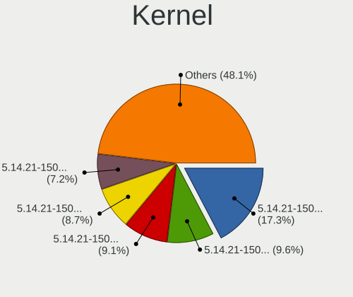

| Version                      | Notebooks | Percent |
|------------------------------|-----------|---------|
| 5.14.21-150500.53-default    | 36        | 17.31%  |
| 5.14.21-150500.55.52-default | 20        | 9.62%   |
| 5.14.21-150500.55.19-default | 19        | 9.13%   |
| 5.14.21-150500.55.39-default | 18        | 8.65%   |
| 5.14.21-150500.55.36-default | 15        | 7.21%   |
| 5.14.21-150500.55.49-default | 14        | 6.73%   |
| 5.14.21-150500.55.65-default | 10        | 4.81%   |
| 5.14.21-150500.55.31-default | 10        | 4.81%   |
| 5.14.21-150500.55.68-default | 9         | 4.33%   |
| 5.14.21-150500.55.83-default | 7         | 3.37%   |
| 5.14.21-150500.55.88-default | 6         | 2.88%   |
| 5.14.21-150500.55.7-default  | 6         | 2.88%   |
| 5.14.21-150500.55.59-default | 6         | 2.88%   |
| 5.14.21-150500.55.12-default | 6         | 2.88%   |
| 5.14.21-150500.55.73-default | 5         | 2.4%    |
| 5.14.21-150500.55.44-default | 5         | 2.4%    |
| 5.14.21-150500.52-default    | 4         | 1.92%   |
| 5.14.21-150500.55.62-default | 3         | 1.44%   |
| 5.14.21-150500.55.28-default | 3         | 1.44%   |
| 6.6.11-lp155.3-default       | 1         | 0.48%   |
| 6.5.9-lp155.2-default        | 1         | 0.48%   |
| 6.5.9-lp154.6-default        | 1         | 0.48%   |
| 5.14.21-150500.50-default    | 1         | 0.48%   |
| 5.14.21-150500.49-default    | 1         | 0.48%   |
| 5.14.21-150500.43-default    | 1         | 0.48%   |

Kernel Family
-------------

Linux kernel without a distro release

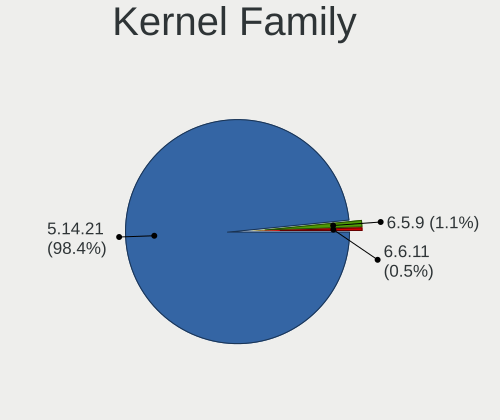

| Version | Notebooks | Percent |
|---------|-----------|---------|
| 5.14.21 | 187       | 98.42%  |
| 6.5.9   | 2         | 1.05%   |
| 6.6.11  | 1         | 0.53%   |

Kernel Major Ver.
-----------------

Linux kernel major version

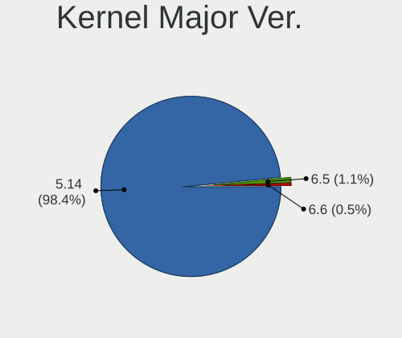

| Version | Notebooks | Percent |
|---------|-----------|---------|
| 5.14    | 187       | 98.42%  |
| 6.5     | 2         | 1.05%   |
| 6.6     | 1         | 0.53%   |

Arch
----

OS architecture (x86_64, i586, etc.)

| Name   | Notebooks | Percent |
|--------|-----------|---------|
| x86_64 | 188       | 100%    |

DE
--

Desktop Environment

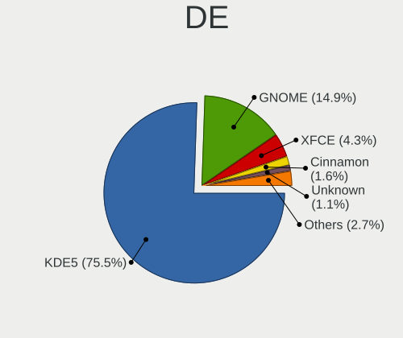

| Name     | Notebooks | Percent |
|----------|-----------|---------|
| KDE5     | 142       | 75.53%  |
| GNOME    | 28        | 14.89%  |
| XFCE     | 8         | 4.26%   |
| Cinnamon | 3         | 1.6%    |
| Unknown  | 2         | 1.06%   |
| Trinity  | 1         | 0.53%   |
| LXQt     | 1         | 0.53%   |
| KDE      | 1         | 0.53%   |
| ICEWM    | 1         | 0.53%   |
| Deepin   | 1         | 0.53%   |

Display Server
--------------

X11 or Wayland

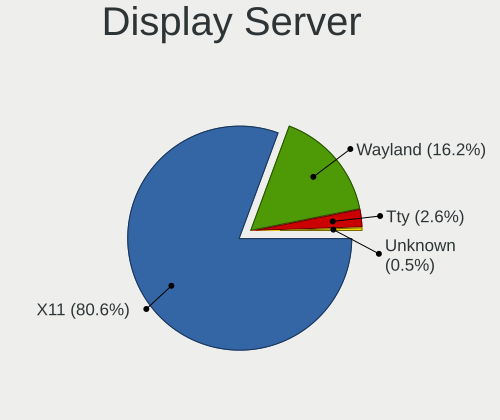

| Name    | Notebooks | Percent |
|---------|-----------|---------|
| X11     | 154       | 80.63%  |
| Wayland | 31        | 16.23%  |
| Tty     | 5         | 2.62%   |
| Unknown | 1         | 0.52%   |

Display Manager
---------------

SDDM, LightDM, etc.

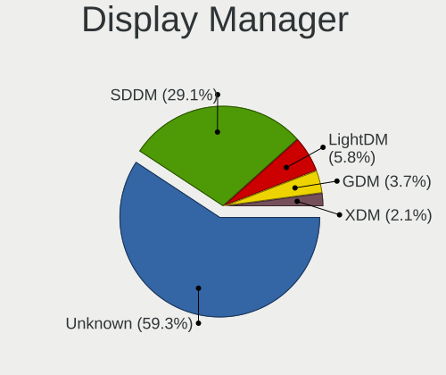

| Name    | Notebooks | Percent |
|---------|-----------|---------|
| Unknown | 112       | 59.26%  |
| SDDM    | 55        | 29.1%   |
| LightDM | 11        | 5.82%   |
| GDM     | 7         | 3.7%    |
| XDM     | 4         | 2.12%   |

OS Lang
-------

Language

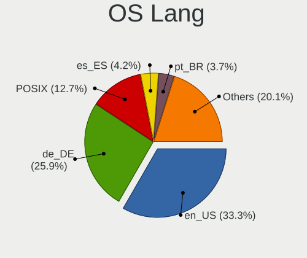

| Lang            | Notebooks | Percent |
|-----------------|-----------|---------|
| en_US           | 63        | 33.33%  |
| de_DE           | 49        | 25.93%  |
| POSIX           | 24        | 12.7%   |
| es_ES           | 8         | 4.23%   |
| pt_BR           | 7         | 3.7%    |
| ru_RU           | 5         | 2.65%   |
| en_GB           | 5         | 2.65%   |
| pl_PL           | 4         | 2.12%   |
| it_IT           | 4         | 2.12%   |
| fr_FR           | 4         | 2.12%   |
| nl_NL           | 3         | 1.59%   |
| hu_HU           | 3         | 1.59%   |
| en_DK           | 2         | 1.06%   |
| zh_CN           | 1         | 0.53%   |
| sk_SK           | 1         | 0.53%   |
| pt_PT           | 1         | 0.53%   |
| ja_JP           | 1         | 0.53%   |
| en_ZA           | 1         | 0.53%   |
| en_US.ISO8859-1 | 1         | 0.53%   |
| cs_CZ           | 1         | 0.53%   |
| Unknown         | 1         | 0.53%   |

Boot Mode
---------

EFI or BIOS

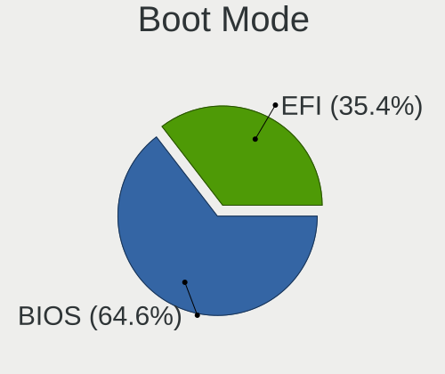

| Mode | Notebooks | Percent |
|------|-----------|---------|
| BIOS | 122       | 64.55%  |
| EFI  | 67        | 35.45%  |

Filesystem
----------

Type of filesystem

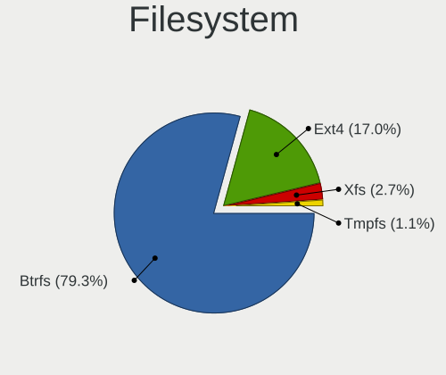

| Type  | Notebooks | Percent |
|-------|-----------|---------|
| Btrfs | 149       | 79.26%  |
| Ext4  | 32        | 17.02%  |
| Xfs   | 5         | 2.66%   |
| Tmpfs | 2         | 1.06%   |

Part. scheme
------------

Scheme of partitioning

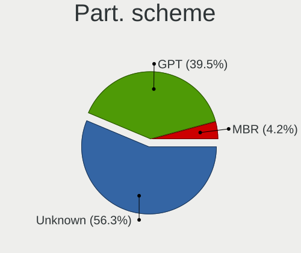

| Type    | Notebooks | Percent |
|---------|-----------|---------|
| Unknown | 107       | 56.32%  |
| GPT     | 75        | 39.47%  |
| MBR     | 8         | 4.21%   |

Dual Boot with Linux/BSD
------------------------

Hosting more than one Linux/BSD

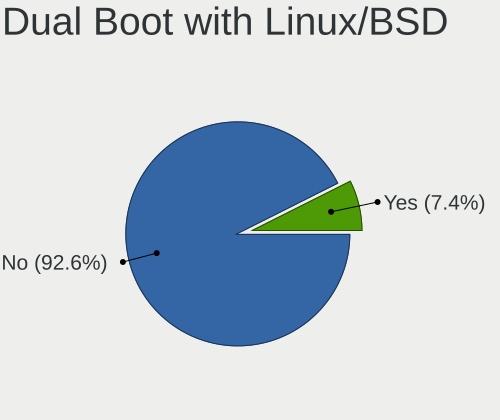

| Dual boot | Notebooks | Percent |
|-----------|-----------|---------|
| No        | 175       | 92.59%  |
| Yes       | 14        | 7.41%   |

Dual Boot (Win)
---------------

Hosting Linux and Windows

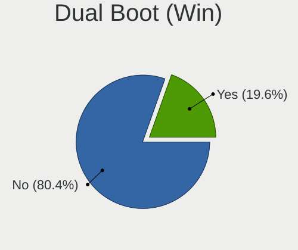

| Dual boot | Notebooks | Percent |
|-----------|-----------|---------|
| No        | 152       | 80.42%  |
| Yes       | 37        | 19.58%  |

Board
-----

Vendor
------

Motherboard manufacturer

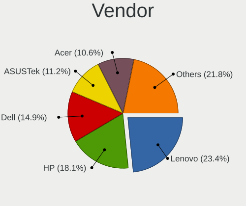

| Name                | Notebooks | Percent |
|---------------------|-----------|---------|
| Lenovo              | 44        | 23.4%   |
| Hewlett-Packard     | 34        | 18.09%  |
| Dell                | 28        | 14.89%  |
| ASUSTek Computer    | 21        | 11.17%  |
| Acer                | 20        | 10.64%  |
| Toshiba             | 4         | 2.13%   |
| Sony                | 4         | 2.13%   |
| TUXEDO              | 3         | 1.6%    |
| MSI                 | 3         | 1.6%    |
| Medion              | 3         | 1.6%    |
| Wortmann AG         | 2         | 1.06%   |
| System76            | 2         | 1.06%   |
| Notebook            | 2         | 1.06%   |
| HUAWEI              | 2         | 1.06%   |
| Fujitsu             | 2         | 1.06%   |
| Apple               | 2         | 1.06%   |
| VALE                | 1         | 0.53%   |
| Schenker            | 1         | 0.53%   |
| Samsung Electronics | 1         | 0.53%   |
| Panasonic           | 1         | 0.53%   |
| LG Electronics      | 1         | 0.53%   |
| ILLEGEAR            | 1         | 0.53%   |
| Google              | 1         | 0.53%   |
| Fujitsu Siemens     | 1         | 0.53%   |
| Framework           | 1         | 0.53%   |
| Dynabook            | 1         | 0.53%   |
| Digibras            | 1         | 0.53%   |
| Unknown             | 1         | 0.53%   |

Model
-----

Motherboard model

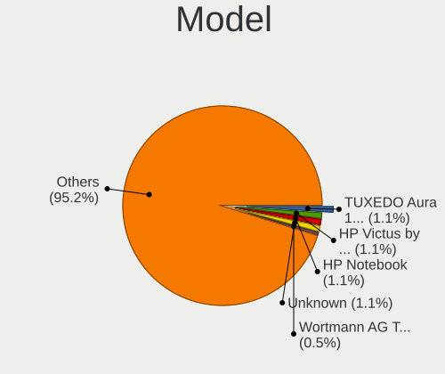

| Name                                                                                     | Notebooks | Percent |
|------------------------------------------------------------------------------------------|-----------|---------|
| TUXEDO Aura 15 Gen2                                                                      | 2         | 1.06%   |
| HP Victus by Gaming Laptop 15-fb0xxx                                                     | 2         | 1.06%   |
| HP Notebook                                                                              | 2         | 1.06%   |
| Unknown                                                                                  | 2         | 1.06%   |
| Wortmann AG TERRA_MOBILE_1749                                                            | 1         | 0.53%   |
| Wortmann AG TERRA_MOBILE_1512/1712                                                       | 1         | 0.53%   |
| VALE Notebook Classic C150                                                               | 1         | 0.53%   |
| TUXEDO Pulse 15 Gen2                                                                     | 1         | 0.53%   |
| Toshiba Satellite R945                                                                   | 1         | 0.53%   |
| Toshiba Satellite Pro C70-A                                                              | 1         | 0.53%   |
| Toshiba Satellite C55D-A                                                                 | 1         | 0.53%   |
| Toshiba dynabook Satellite B552/H                                                        | 1         | 0.53%   |
| System76 Lemur Pro                                                                       | 1         | 0.53%   |
| System76 Bonobo WS                                                                       | 1         | 0.53%   |
| Sony VPCEH11FX                                                                           | 1         | 0.53%   |
| Sony VPCCW1S1R                                                                           | 1         | 0.53%   |
| Sony SVF1521A7EB                                                                         | 1         | 0.53%   |
| Schenker KEY (E23)                                                                       | 1         | 0.53%   |
| Samsung 355V4C/355V4X/355V5C/355V5X/356V4C/356V4X/356V5C/356V5X/3445VC/3445VX/3545VC/354 | 1         | 0.53%   |
| Panasonic CF-C2CUGZXKM                                                                   | 1         | 0.53%   |
| Notebook NS50_70MU                                                                       | 1         | 0.53%   |
| Notebook NLx0MU                                                                          | 1         | 0.53%   |
| MSI Summit E13FlipEvo A11MT                                                              | 1         | 0.53%   |
| MSI Katana GF66 11UE                                                                     | 1         | 0.53%   |
| MSI Cyborg 15 A13VE                                                                      | 1         | 0.53%   |
| Medion S15449                                                                            | 1         | 0.53%   |
| Medion P662X                                                                             | 1         | 0.53%   |
| Medion E6224                                                                             | 1         | 0.53%   |
| LG P1-J331P                                                                              | 1         | 0.53%   |
| Lenovo Y520-15IKBN 80WK                                                                  | 1         | 0.53%   |
| Lenovo V15-IGL 82C3                                                                      | 1         | 0.53%   |
| Lenovo U31-70 80M5                                                                       | 1         | 0.53%   |
| Lenovo ThinkPad X390 20Q1S5K400                                                          | 1         | 0.53%   |
| Lenovo ThinkPad X270 W10DG 20K6S0X900                                                    | 1         | 0.53%   |
| Lenovo ThinkPad X200 7458AH8                                                             | 1         | 0.53%   |
| Lenovo ThinkPad W541 20EGS1LB00                                                          | 1         | 0.53%   |
| Lenovo ThinkPad W520 4282A34                                                             | 1         | 0.53%   |
| Lenovo ThinkPad W500 40624DG                                                             | 1         | 0.53%   |
| Lenovo ThinkPad T530 2394W19                                                             | 1         | 0.53%   |
| Lenovo ThinkPad T490 20N2000LSP                                                          | 1         | 0.53%   |

Model Family
------------

Motherboard model prefix

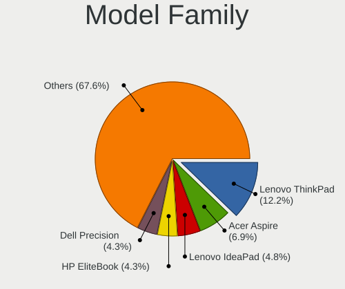

| Name                   | Notebooks | Percent |
|------------------------|-----------|---------|
| Lenovo ThinkPad        | 23        | 12.23%  |
| Acer Aspire            | 13        | 6.91%   |
| Lenovo IdeaPad         | 9         | 4.79%   |
| HP EliteBook           | 8         | 4.26%   |
| Dell Precision         | 8         | 4.26%   |
| Dell Latitude          | 8         | 4.26%   |
| HP Laptop              | 6         | 3.19%   |
| ASUS VivoBook          | 6         | 3.19%   |
| Lenovo Legion          | 5         | 2.66%   |
| Dell Inspiron          | 5         | 2.66%   |
| HP Victus              | 4         | 2.13%   |
| HP ENVY                | 4         | 2.13%   |
| Toshiba Satellite      | 3         | 1.6%    |
| Dell Vostro            | 3         | 1.6%    |
| Acer Nitro             | 3         | 1.6%    |
| Wortmann AG TERRA      | 2         | 1.06%   |
| TUXEDO Aura            | 2         | 1.06%   |
| HP ProBook             | 2         | 1.06%   |
| HP Pavilion            | 2         | 1.06%   |
| HP OMEN                | 2         | 1.06%   |
| HP Notebook            | 2         | 1.06%   |
| Dell XPS               | 2         | 1.06%   |
| Dell System            | 2         | 1.06%   |
| ASUS Zenbook           | 2         | 1.06%   |
| ASUS ROG               | 2         | 1.06%   |
| Acer TravelMate        | 2         | 1.06%   |
| Unknown                | 2         | 1.06%   |
| VALE Notebook          | 1         | 0.53%   |
| TUXEDO Pulse           | 1         | 0.53%   |
| Toshiba dynabook       | 1         | 0.53%   |
| System76 Lemur         | 1         | 0.53%   |
| System76 Bonobo        | 1         | 0.53%   |
| Sony VPCEH11FX         | 1         | 0.53%   |
| Sony VPCCW1S1R         | 1         | 0.53%   |
| Sony SVF1521A7EB       | 1         | 0.53%   |
| Schenker KEY           | 1         | 0.53%   |
| Samsung 355V4C         | 1         | 0.53%   |
| Panasonic CF-C2CUGZXKM | 1         | 0.53%   |
| Notebook NS50          | 1         | 0.53%   |
| Notebook NLx0MU        | 1         | 0.53%   |

MFG Year
--------

Motherboard manufacture year

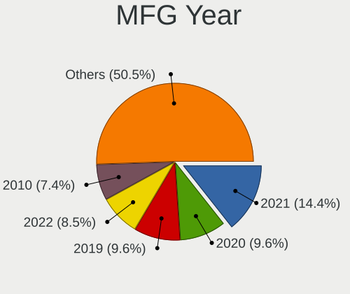

| Year | Notebooks | Percent |
|------|-----------|---------|
| 2021 | 27        | 14.36%  |
| 2020 | 18        | 9.57%   |
| 2019 | 18        | 9.57%   |
| 2022 | 16        | 8.51%   |
| 2010 | 14        | 7.45%   |
| 2023 | 13        | 6.91%   |
| 2017 | 13        | 6.91%   |
| 2013 | 12        | 6.38%   |
| 2011 | 12        | 6.38%   |
| 2012 | 11        | 5.85%   |
| 2015 | 7         | 3.72%   |
| 2016 | 6         | 3.19%   |
| 2014 | 6         | 3.19%   |
| 2009 | 5         | 2.66%   |
| 2008 | 4         | 2.13%   |
| 2018 | 2         | 1.06%   |
| 2007 | 2         | 1.06%   |
| 2024 | 1         | 0.53%   |
| 2006 | 1         | 0.53%   |

Form Factor
-----------

Physical design of the computer

| Name     | Notebooks | Percent |
|----------|-----------|---------|
| Notebook | 188       | 100%    |

Secure Boot
-----------

Enabled or disabled

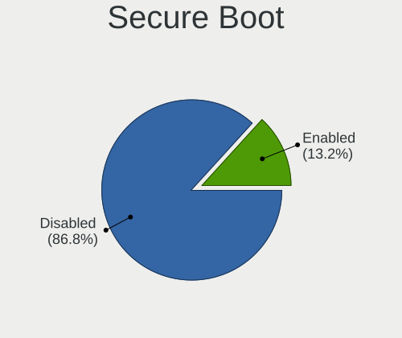

| State    | Notebooks | Percent |
|----------|-----------|---------|
| Disabled | 164       | 86.77%  |
| Enabled  | 25        | 13.23%  |

Coreboot
--------

Have coreboot on board

| Used | Notebooks | Percent |
|------|-----------|---------|
| No   | 185       | 98.4%   |
| Yes  | 3         | 1.6%    |

RAM Size
--------

Total RAM memory

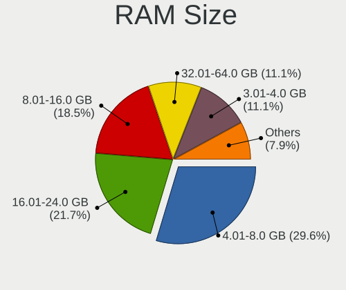

| Size in GB  | Notebooks | Percent |
|-------------|-----------|---------|
| 4.01-8.0    | 56        | 29.63%  |
| 16.01-24.0  | 41        | 21.69%  |
| 8.01-16.0   | 35        | 18.52%  |
| 32.01-64.0  | 21        | 11.11%  |
| 3.01-4.0    | 21        | 11.11%  |
| 64.01-256.0 | 7         | 3.7%    |
| 1.01-2.0    | 5         | 2.65%   |
| 24.01-32.0  | 2         | 1.06%   |
| 2.01-3.0    | 1         | 0.53%   |

RAM Used
--------

Used RAM memory

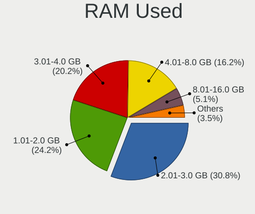

| Used GB    | Notebooks | Percent |
|------------|-----------|---------|
| 2.01-3.0   | 61        | 30.81%  |
| 1.01-2.0   | 48        | 24.24%  |
| 3.01-4.0   | 40        | 20.2%   |
| 4.01-8.0   | 32        | 16.16%  |
| 8.01-16.0  | 10        | 5.05%   |
| 0.51-1.0   | 6         | 3.03%   |
| 16.01-24.0 | 1         | 0.51%   |

Total Drives
------------

Number of drives on board

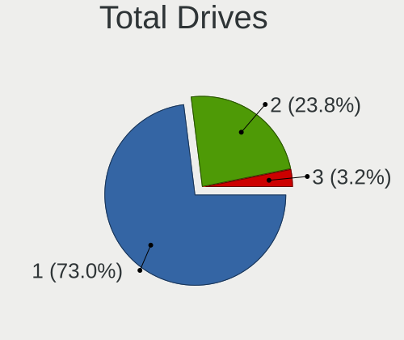

| Drives | Notebooks | Percent |
|--------|-----------|---------|
| 1      | 138       | 73.02%  |
| 2      | 45        | 23.81%  |
| 3      | 6         | 3.17%   |

Has CD-ROM
----------

Has CD-ROM on board

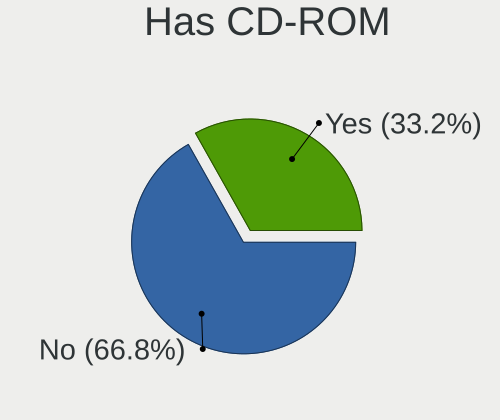

| Presented | Notebooks | Percent |
|-----------|-----------|---------|
| No        | 127       | 66.84%  |
| Yes       | 63        | 33.16%  |

Has Ethernet
------------

Has Ethernet on board

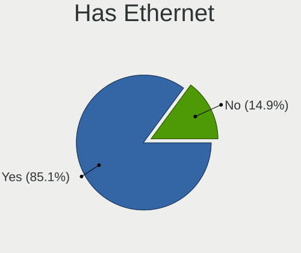

| Presented | Notebooks | Percent |
|-----------|-----------|---------|
| Yes       | 160       | 85.11%  |
| No        | 28        | 14.89%  |

Has WiFi
--------

Has WiFi module

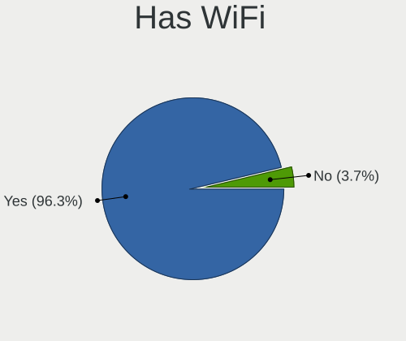

| Presented | Notebooks | Percent |
|-----------|-----------|---------|
| Yes       | 181       | 96.28%  |
| No        | 7         | 3.72%   |

Has Bluetooth
-------------

Has Bluetooth module

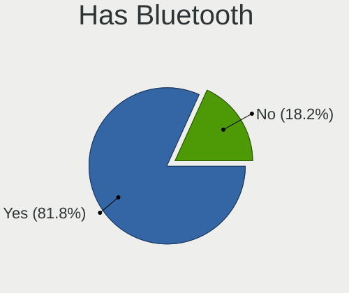

| Presented | Notebooks | Percent |
|-----------|-----------|---------|
| Yes       | 157       | 81.77%  |
| No        | 35        | 18.23%  |

Location
--------

Country
-------

Geographic location (country)

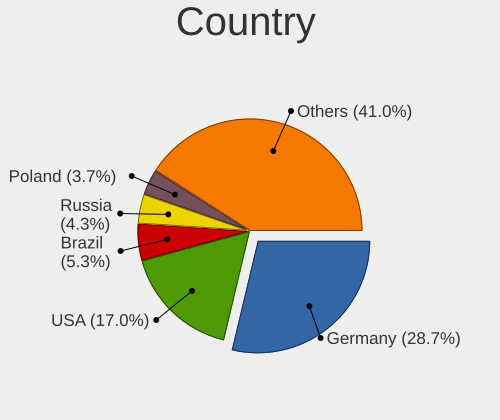

| Country      | Notebooks | Percent |
|--------------|-----------|---------|
| Germany      | 54        | 28.72%  |
| USA          | 32        | 17.02%  |
| Brazil       | 10        | 5.32%   |
| Russia       | 8         | 4.26%   |
| Poland       | 7         | 3.72%   |
| Italy        | 7         | 3.72%   |
| UK           | 5         | 2.66%   |
| Spain        | 5         | 2.66%   |
| Mexico       | 4         | 2.13%   |
| Hungary      | 4         | 2.13%   |
| Netherlands  | 3         | 1.6%    |
| India        | 3         | 1.6%    |
| Greece       | 3         | 1.6%    |
| Canada       | 3         | 1.6%    |
| Belgium      | 3         | 1.6%    |
| Ukraine      | 2         | 1.06%   |
| Serbia       | 2         | 1.06%   |
| Malaysia     | 2         | 1.06%   |
| France       | 2         | 1.06%   |
| Czechia      | 2         | 1.06%   |
| Colombia     | 2         | 1.06%   |
| Argentina    | 2         | 1.06%   |
| Venezuela    | 1         | 0.53%   |
| Türkiye     | 1         | 0.53%   |
| Turkey       | 1         | 0.53%   |
| Switzerland  | 1         | 0.53%   |
| Sweden       | 1         | 0.53%   |
| South Africa | 1         | 0.53%   |
| Slovenia     | 1         | 0.53%   |
| Slovakia     | 1         | 0.53%   |
| Senegal      | 1         | 0.53%   |
| Portugal     | 1         | 0.53%   |
| Peru         | 1         | 0.53%   |
| Japan        | 1         | 0.53%   |
| Israel       | 1         | 0.53%   |
| Ireland      | 1         | 0.53%   |
| Hong Kong    | 1         | 0.53%   |
| Finland      | 1         | 0.53%   |
| Denmark      | 1         | 0.53%   |
| Croatia      | 1         | 0.53%   |

City
----

Geographic location (city)

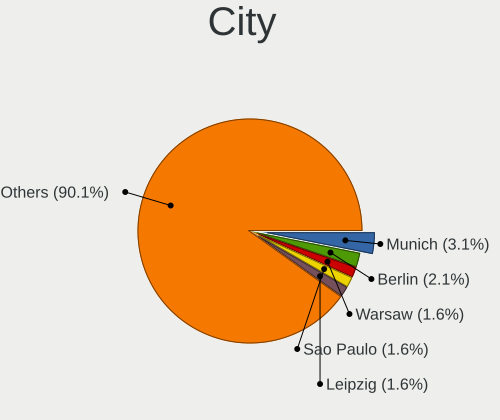

| City                  | Notebooks | Percent |
|-----------------------|-----------|---------|
| Munich                | 6         | 3.13%   |
| Berlin                | 4         | 2.08%   |
| Warsaw                | 3         | 1.56%   |
| Sao Paulo             | 3         | 1.56%   |
| Leipzig               | 3         | 1.56%   |
| Hamburg               | 3         | 1.56%   |
| Budapest              | 3         | 1.56%   |
| Rio de Janeiro        | 2         | 1.04%   |
| Portland              | 2         | 1.04%   |
| Milan                 | 2         | 1.04%   |
| Kyiv                  | 2         | 1.04%   |
| Kuala Lumpur          | 2         | 1.04%   |
| Hanover               | 2         | 1.04%   |
| Bonn                  | 2         | 1.04%   |
| Alcobendas            | 2         | 1.04%   |
| Zetel                 | 1         | 0.52%   |
| Zagreb                | 1         | 0.52%   |
| Yokohama              | 1         | 0.52%   |
| Yekaterinburg         | 1         | 0.52%   |
| Wolfsburg             | 1         | 0.52%   |
| Wolfratshausen        | 1         | 0.52%   |
| Weilmuenster          | 1         | 0.52%   |
| Waterloo              | 1         | 0.52%   |
| Waidhofen an der Ybbs | 1         | 0.52%   |
| Wachtberg             | 1         | 0.52%   |
| Vinemont              | 1         | 0.52%   |
| Vigo                  | 1         | 0.52%   |
| Vechta                | 1         | 0.52%   |
| Trivandrum            | 1         | 0.52%   |
| Tolyatti              | 1         | 0.52%   |
| Tokaj                 | 1         | 0.52%   |
| Tel Aviv              | 1         | 0.52%   |
| Sydney                | 1         | 0.52%   |
| Sunapee               | 1         | 0.52%   |
| Stuttgart             | 1         | 0.52%   |
| St Petersburg         | 1         | 0.52%   |
| St Louis              | 1         | 0.52%   |
| Sofia                 | 1         | 0.52%   |
| Sigtuna               | 1         | 0.52%   |
| Siegen                | 1         | 0.52%   |

Drives
------

Drive Vendor
------------

Hard drive vendors

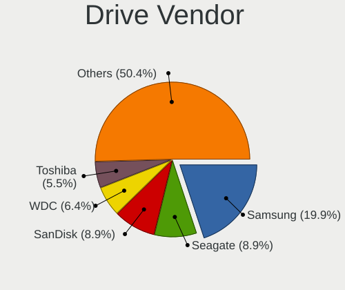

| Vendor                      | Notebooks | Drives | Percent |
|-----------------------------|-----------|--------|---------|
| Samsung Electronics         | 47        | 57     | 19.92%  |
| Seagate                     | 21        | 28     | 8.9%    |
| SanDisk                     | 21        | 27     | 8.9%    |
| WDC                         | 15        | 17     | 6.36%   |
| Toshiba                     | 13        | 15     | 5.51%   |
| SK hynix                    | 12        | 14     | 5.08%   |
| Micron Technology           | 11        | 11     | 4.66%   |
| Unknown                     | 10        | 12     | 4.24%   |
| Intel                       | 10        | 10     | 4.24%   |
| Kingston                    | 9         | 11     | 3.81%   |
| Hitachi                     | 6         | 6      | 2.54%   |
| HGST                        | 6         | 6      | 2.54%   |
| Crucial                     | 6         | 7      | 2.54%   |
| China                       | 5         | 6      | 2.12%   |
| Micron/Crucial Technology   | 4         | 6      | 1.69%   |
| KIOXIA                      | 4         | 5      | 1.69%   |
| Kingston Technology Company | 3         | 3      | 1.27%   |
| ADATA Technology            | 3         | 3      | 1.27%   |
| Silicon Motion              | 2         | 2      | 0.85%   |
| Phison Electronics          | 2         | 2      | 0.85%   |
| Fanxiang                    | 2         | 2      | 0.85%   |
| Dogfish                     | 2         | 2      | 0.85%   |
| Apple                       | 2         | 2      | 0.85%   |
| A-DATA Technology           | 2         | 2      | 0.85%   |
| Unknown                     | 2         | 2      | 0.85%   |
| Yangtze Memory Technologies | 1         | 1      | 0.42%   |
| Verbatim                    | 1         | 1      | 0.42%   |
| USB                         | 1         | 1      | 0.42%   |
| Union Memory (Shenzhen)     | 1         | 1      | 0.42%   |
| Union Memory                | 1         | 1      | 0.42%   |
| Transcend                   | 1         | 1      | 0.42%   |
| SPCC                        | 1         | 1      | 0.42%   |
| Realtek Semiconductor       | 1         | 1      | 0.42%   |
| PNY                         | 1         | 2      | 0.42%   |
| Patriot                     | 1         | 1      | 0.42%   |
| Netac                       | 1         | 2      | 0.42%   |
| KXG60ZNV                    | 1         | 1      | 0.42%   |
| GOODRAM                     | 1         | 1      | 0.42%   |
| Gigabyte Technology         | 1         | 1      | 0.42%   |
| BR                          | 1         | 1      | 0.42%   |

Drive Model
-----------

Hard drive models

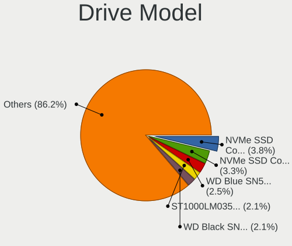

| Model                                                              | Notebooks | Percent |
|--------------------------------------------------------------------|-----------|---------|
| Samsung NVMe SSD Controller PM9A1/PM9A3/980PRO 1TB                 | 9         | 3.75%   |
| Samsung NVMe SSD Controller SM981/PM981/PM983 1TB                  | 8         | 3.33%   |
| Sandisk WD Blue SN550 NVMe SSD 1024GB                              | 6         | 2.5%    |
| Seagate ST1000LM035-1RK172 1TB                                     | 5         | 2.08%   |
| Sandisk WD Black SN750 / PC SN730 NVMe SSD 500GB                   | 5         | 2.08%   |
| Intel SSD 660P Series 512GB                                        | 5         | 2.08%   |
| Micron/Crucial P2 NVMe PCIe SSD 2TB                                | 4         | 1.67%   |
| Unknown MMC Card  16GB                                             | 3         | 1.25%   |
| Toshiba MQ01ABD100 1TB                                             | 3         | 1.25%   |
| Seagate ST1000LM024 HN-M101MBB 1TB                                 | 3         | 1.25%   |
| Samsung SSD 840 EVO 250GB                                          | 3         | 1.25%   |
| WDC WDS240G2G0A-00JH30 240GB SSD                                   | 2         | 0.83%   |
| Unknown MMC Card  32GB                                             | 2         | 0.83%   |
| Toshiba XG6 NVMe SSD Controller 1024GB                             | 2         | 0.83%   |
| Toshiba MQ04ABF100 1TB                                             | 2         | 0.83%   |
| Seagate ST500LM012 HN-M500MBB 500GB                                | 2         | 0.83%   |
| Seagate ST1000LM048-2E7172 1TB                                     | 2         | 0.83%   |
| Samsung SSD 870 EVO 1TB                                            | 2         | 0.83%   |
| Samsung SSD 860 EVO 1TB                                            | 2         | 0.83%   |
| Samsung MZVLQ512HBLU-00BH1 512GB                                   | 2         | 0.83%   |
| Samsung MZALQ256HAJD-000L2 256GB                                   | 2         | 0.83%   |
| KIOXIA KBG40ZNV256G 256GB                                          | 2         | 0.83%   |
| Kingston SNVS500G 500GB                                            | 2         | 0.83%   |
| Kingston SA400S37120G 120GB SSD                                    | 2         | 0.83%   |
| Intel SSD Pro 7600p/760p/E 6100p Series 256GB                      | 2         | 0.83%   |
| Hitachi HTS545032B9A300 320GB                                      | 2         | 0.83%   |
| HGST HTS721010A9E630 1TB                                           | 2         | 0.83%   |
| HGST HTS541010A9E680 1TB                                           | 2         | 0.83%   |
| ADATA XPG SX8200 Pro PCIe Gen3x4 M.2 2280 Solid State Drive 1024GB | 2         | 0.83%   |
| Unknown                                                            | 2         | 0.83%   |
| Yangtze Memory ZHITAI TiPlus5000 1TB                               | 1         | 0.42%   |
| WDC WDS500G2B0A-00SM50 500GB                                       | 1         | 0.42%   |
| WDC WDS250G1B0A-00H9H0 250GB SSD                                   | 1         | 0.42%   |
| WDC WDS240G2G0C-00AJM0 240GB                                       | 1         | 0.42%   |
| WDC WD7500BPVT-22HXZT3 752GB                                       | 1         | 0.42%   |
| WDC WD5000LPVX-16V0TT3 500GB                                       | 1         | 0.42%   |
| WDC WD5000LPVT-08G33T1 500GB                                       | 1         | 0.42%   |
| WDC WD3200BPVT-24ZEST0 320GB                                       | 1         | 0.42%   |
| WDC WD3200BEVT-22A23T0 320GB                                       | 1         | 0.42%   |
| WDC WD3200BEKT-75PVMT0 320GB                                       | 1         | 0.42%   |

HDD Vendor
----------

Hard disk drive vendors

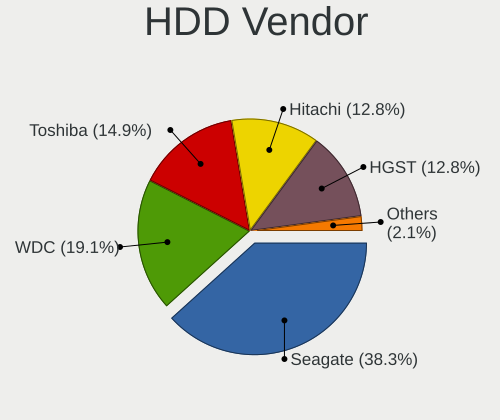

| Vendor  | Notebooks | Drives | Percent |
|---------|-----------|--------|---------|
| Seagate | 18        | 22     | 38.3%   |
| WDC     | 9         | 9      | 19.15%  |
| Toshiba | 7         | 7      | 14.89%  |
| Hitachi | 6         | 6      | 12.77%  |
| HGST    | 6         | 6      | 12.77%  |
| Apple   | 1         | 1      | 2.13%   |

SSD Vendor
----------

Solid state drive vendors

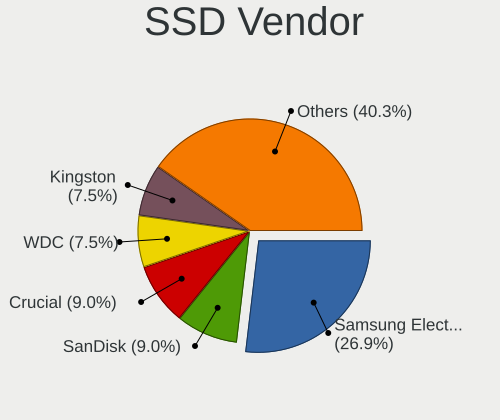

| Vendor              | Notebooks | Drives | Percent |
|---------------------|-----------|--------|---------|
| Samsung Electronics | 18        | 23     | 26.87%  |
| SanDisk             | 6         | 10     | 8.96%   |
| Crucial             | 6         | 7      | 8.96%   |
| WDC                 | 5         | 7      | 7.46%   |
| Kingston            | 5         | 5      | 7.46%   |
| China               | 5         | 6      | 7.46%   |
| Toshiba             | 3         | 4      | 4.48%   |
| Micron Technology   | 2         | 2      | 2.99%   |
| Dogfish             | 2         | 2      | 2.99%   |
| A-DATA Technology   | 2         | 2      | 2.99%   |
| Transcend           | 1         | 1      | 1.49%   |
| SPCC                | 1         | 1      | 1.49%   |
| SK hynix            | 1         | 1      | 1.49%   |
| PNY                 | 1         | 2      | 1.49%   |
| Patriot             | 1         | 1      | 1.49%   |
| Netac               | 1         | 2      | 1.49%   |
| Intel               | 1         | 1      | 1.49%   |
| GOODRAM             | 1         | 1      | 1.49%   |
| Gigabyte Technology | 1         | 1      | 1.49%   |
| Fanxiang            | 1         | 1      | 1.49%   |
| ASMT                | 1         | 1      | 1.49%   |
| Apple               | 1         | 1      | 1.49%   |
| Unknown             | 1         | 1      | 1.49%   |

Drive Kind
----------

HDD or SSD

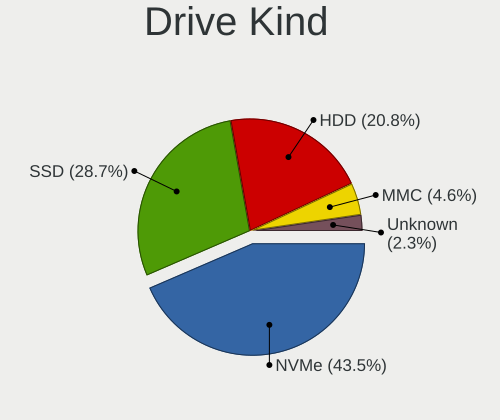

| Kind    | Notebooks | Drives | Percent |
|---------|-----------|--------|---------|
| NVMe    | 94        | 122    | 43.52%  |
| SSD     | 62        | 83     | 28.7%   |
| HDD     | 45        | 51     | 20.83%  |
| MMC     | 10        | 12     | 4.63%   |
| Unknown | 5         | 8      | 2.31%   |

Drive Connector
---------------

SATA, SAS, NVMe, etc.

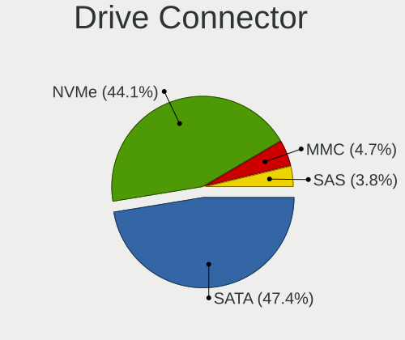

| Type | Notebooks | Drives | Percent |
|------|-----------|--------|---------|
| SATA | 101       | 133    | 47.42%  |
| NVMe | 94        | 120    | 44.13%  |
| MMC  | 10        | 12     | 4.69%   |
| SAS  | 8         | 11     | 3.76%   |

Drive Size
----------

Size of hard drive

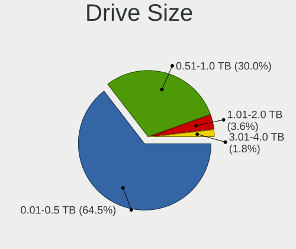

| Size in TB | Notebooks | Drives | Percent |
|------------|-----------|--------|---------|
| 0.01-0.5   | 71        | 81     | 64.55%  |
| 0.51-1.0   | 33        | 46     | 30%     |
| 1.01-2.0   | 4         | 5      | 3.64%   |
| 3.01-4.0   | 2         | 2      | 1.82%   |

Space Total
-----------

Amount of disk space available on the file system

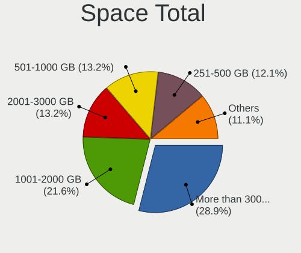

| Size in GB     | Notebooks | Percent |
|----------------|-----------|---------|
| More than 3000 | 55        | 28.95%  |
| 1001-2000      | 41        | 21.58%  |
| 2001-3000      | 25        | 13.16%  |
| 501-1000       | 25        | 13.16%  |
| 251-500        | 23        | 12.11%  |
| 101-250        | 15        | 7.89%   |
| 21-50          | 3         | 1.58%   |
| 51-100         | 2         | 1.05%   |
| Unknown        | 1         | 0.53%   |

Space Used
----------

Amount of used disk space

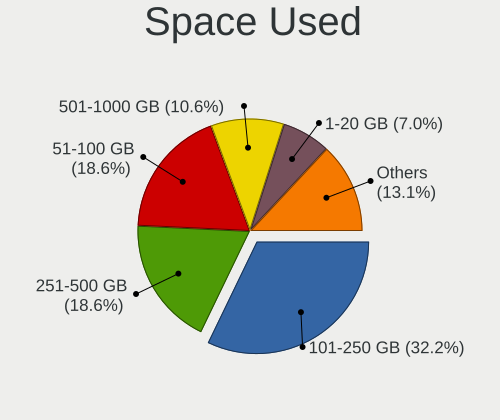

| Used GB        | Notebooks | Percent |
|----------------|-----------|---------|
| 101-250        | 64        | 32.16%  |
| 251-500        | 37        | 18.59%  |
| 51-100         | 37        | 18.59%  |
| 501-1000       | 21        | 10.55%  |
| 1-20           | 14        | 7.04%   |
| 1001-2000      | 9         | 4.52%   |
| More than 3000 | 8         | 4.02%   |
| 21-50          | 6         | 3.02%   |
| 2001-3000      | 2         | 1.01%   |
| Unknown        | 1         | 0.5%    |

Malfunc. Drives
---------------

Drive models with a malfunction

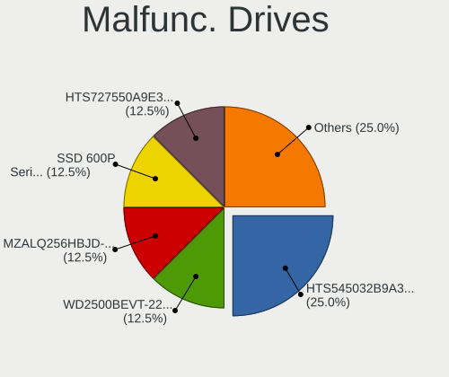

| Model                                        | Notebooks | Drives | Percent |
|----------------------------------------------|-----------|--------|---------|
| Hitachi HTS545032B9A300 320GB                | 2         | 2      | 25%     |
| WDC WD2500BEVT-22A23T0 250GB                 | 1         | 1      | 12.5%   |
| Samsung Electronics MZALQ256HBJD-00BL2 256GB | 1         | 1      | 12.5%   |
| Intel SSD 600P Series 1024GB                 | 1         | 1      | 12.5%   |
| Hitachi HTS727550A9E364 500GB                | 1         | 1      | 12.5%   |
| HGST HTS721010A9E630 1TB                     | 1         | 1      | 12.5%   |
| Crucial CT240M500SSD1 240GB                  | 1         | 1      | 12.5%   |

Malfunc. Drive Vendor
---------------------

Vendors of faulty drives

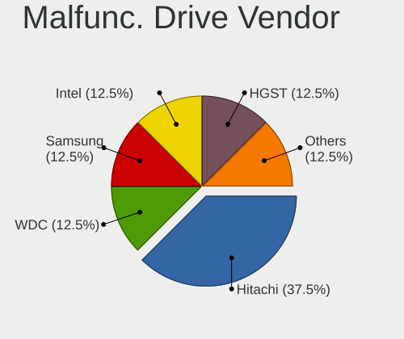

| Vendor              | Notebooks | Drives | Percent |
|---------------------|-----------|--------|---------|
| Hitachi             | 3         | 3      | 37.5%   |
| WDC                 | 1         | 1      | 12.5%   |
| Samsung Electronics | 1         | 1      | 12.5%   |
| Intel               | 1         | 1      | 12.5%   |
| HGST                | 1         | 1      | 12.5%   |
| Crucial             | 1         | 1      | 12.5%   |

Malfunc. HDD Vendor
-------------------

Vendors of faulty HDD drives

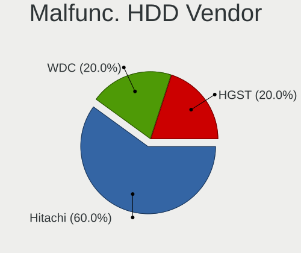

| Vendor  | Notebooks | Drives | Percent |
|---------|-----------|--------|---------|
| Hitachi | 3         | 3      | 60%     |
| WDC     | 1         | 1      | 20%     |
| HGST    | 1         | 1      | 20%     |

Malfunc. Drive Kind
-------------------

Kinds of faulty drives

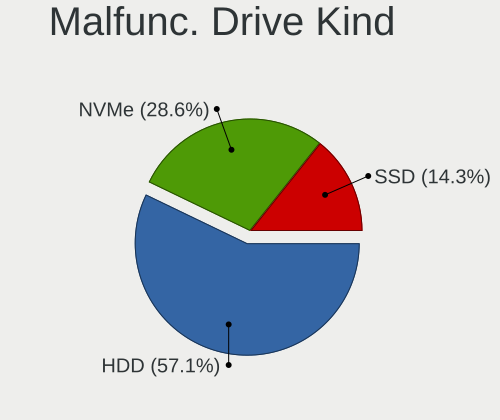

| Kind | Notebooks | Drives | Percent |
|------|-----------|--------|---------|
| HDD  | 4         | 5      | 57.14%  |
| NVMe | 2         | 2      | 28.57%  |
| SSD  | 1         | 1      | 14.29%  |

Failed Drives
-------------

Failed drive models

Zero info for selected period =(

Failed Drive Vendor
-------------------

Failed drive vendors

Zero info for selected period =(

Drive Status
------------

Number of failed and malfunc. drives

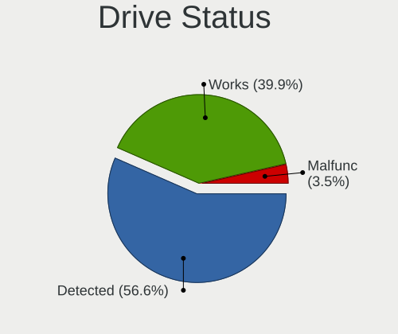

| Status   | Notebooks | Drives | Percent |
|----------|-----------|--------|---------|
| Detected | 112       | 165    | 56.57%  |
| Works    | 79        | 103    | 39.9%   |
| Malfunc  | 7         | 8      | 3.54%   |

Storage controller
------------------

Storage Vendor
--------------

Storage controller vendors

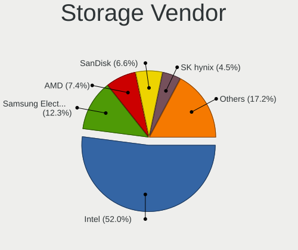

| Vendor                       | Notebooks | Percent |
|------------------------------|-----------|---------|
| Intel                        | 127       | 52.05%  |
| Samsung Electronics          | 30        | 12.3%   |
| AMD                          | 18        | 7.38%   |
| SanDisk                      | 16        | 6.56%   |
| SK hynix                     | 11        | 4.51%   |
| Micron Technology            | 9         | 3.69%   |
| Kingston Technology Company  | 7         | 2.87%   |
| Toshiba America Info Systems | 4         | 1.64%   |
| Micron/Crucial Technology    | 4         | 1.64%   |
| KIOXIA                       | 4         | 1.64%   |
| ADATA Technology             | 3         | 1.23%   |
| Union Memory (Shenzhen)      | 2         | 0.82%   |
| Silicon Motion               | 2         | 0.82%   |
| Seagate Technology           | 2         | 0.82%   |
| Phison Electronics           | 2         | 0.82%   |
| Yangtze Memory Technologies  | 1         | 0.41%   |
| Realtek Semiconductor        | 1         | 0.41%   |
| Nvidia                       | 1         | 0.41%   |

Storage Model
-------------

Storage controller models

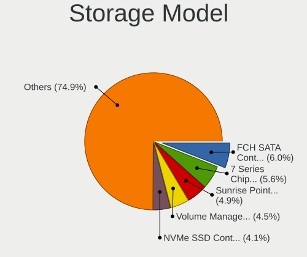

| Model                                                                          | Notebooks | Percent |
|--------------------------------------------------------------------------------|-----------|---------|
| AMD FCH SATA Controller [AHCI mode]                                            | 16        | 5.99%   |
| Intel 7 Series Chipset Family 6-port SATA Controller [AHCI mode]               | 15        | 5.62%   |
| Intel Sunrise Point-LP SATA Controller [AHCI mode]                             | 13        | 4.87%   |
| Intel Volume Management Device NVMe RAID Controller                            | 12        | 4.49%   |
| Samsung NVMe SSD Controller 980 (DRAM-less)                                    | 11        | 4.12%   |
| Intel 6 Series/C200 Series Chipset Family 6 port Mobile SATA AHCI Controller   | 10        | 3.75%   |
| Samsung NVMe SSD Controller PM9A1/PM9A3/980PRO                                 | 9         | 3.37%   |
| Samsung NVMe SSD Controller SM981/PM981/PM983                                  | 8         | 3%      |
| Intel Tiger Lake-LP SATA Controller                                            | 8         | 3%      |
| Intel 82801 Mobile SATA Controller [RAID mode]                                 | 7         | 2.62%   |
| Intel 8 Series/C220 Series Chipset Family 6-port SATA Controller 1 [AHCI mode] | 7         | 2.62%   |
| SK hynix Gold P31/BC711/PC711 NVMe Solid State Drive                           | 6         | 2.25%   |
| SanDisk Ultra 3D / WD PC SN530, IX SN530, Blue SN550 NVMe SSD (DRAM-less)      | 6         | 2.25%   |
| Intel 5 Series/3400 Series Chipset 4 port SATA AHCI Controller                 | 6         | 2.25%   |
| SanDisk Extreme Pro / WD Black SN750 / PC SN730 / Red SN700 NVMe SSD           | 5         | 1.87%   |
| Intel SSD 660P Series                                                          | 5         | 1.87%   |
| Intel Cannon Lake Mobile PCH SATA AHCI Controller                              | 5         | 1.87%   |
| Intel 82801IBM/IEM (ICH9M/ICH9M-E) 4 port SATA Controller [AHCI mode]          | 5         | 1.87%   |
| Intel 8 Series SATA Controller 1 [AHCI mode]                                   | 5         | 1.87%   |
| Micron/Crucial P2 [Nick P2] / P3 / P3 Plus NVMe PCIe SSD (DRAM-less)           | 4         | 1.5%    |
| Micron 2450 NVMe SSD [HendrixV] (DRAM-less)                                    | 4         | 1.5%    |
| Intel Wildcat Point-LP SATA Controller [AHCI Mode]                             | 4         | 1.5%    |
| Intel Tiger Lake SATA AHCI Controller                                          | 4         | 1.5%    |
| Intel Celeron/Pentium Silver Processor SATA Controller                         | 4         | 1.5%    |
| Intel 5 Series/3400 Series Chipset 6 port SATA AHCI Controller                 | 4         | 1.5%    |
| KIOXIA NVMe SSD Controller BG4 (DRAM-less)                                     | 3         | 1.12%   |
| Intel RST Volume Management Device Controller                                  | 3         | 1.12%   |
| Intel Ice Lake-LP SATA Controller [AHCI mode]                                  | 3         | 1.12%   |
| Intel Alder Lake-P SATA AHCI Controller                                        | 3         | 1.12%   |
| Intel 82801HM/HEM (ICH8M/ICH8M-E) IDE Controller                               | 3         | 1.12%   |
| Toshiba America Info Systems XG6 NVMe SSD Controller                           | 2         | 0.75%   |
| SK hynix Platinum P41/PC801 NVMe Solid State Drive                             | 2         | 0.75%   |
| SanDisk WD Green SN350 240GB (DRAM-less) / SN560E NVMe SSD                     | 2         | 0.75%   |
| Micron 2400 NVMe SSD (DRAM-less)                                               | 2         | 0.75%   |
| Kingston Company NV1 NVMe SSD [SM2263XT] (DRAM-less)                           | 2         | 0.75%   |
| Intel SSD DC P4101/Pro 7600p/760p/E 6100p Series                               | 2         | 0.75%   |
| Intel Q170/Q150/B150/H170/H110/Z170/CM236 Chipset SATA Controller [AHCI Mode]  | 2         | 0.75%   |
| Intel HM170/QM170 Chipset SATA Controller [AHCI Mode]                          | 2         | 0.75%   |
| Intel 82801HM/HEM (ICH8M/ICH8M-E) SATA Controller [AHCI mode]                  | 2         | 0.75%   |
| ADATA XPG SX8200 Pro PCIe Gen3x4 M.2 2280 Solid State Drive                    | 2         | 0.75%   |

Storage Kind
------------

Kind of storage controller (IDE, SATA, NVMe, SAS, ...)

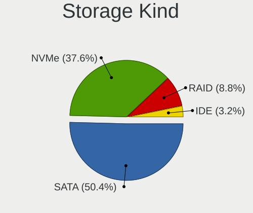

| Kind | Notebooks | Percent |
|------|-----------|---------|
| SATA | 126       | 50.4%   |
| NVMe | 94        | 37.6%   |
| RAID | 22        | 8.8%    |
| IDE  | 8         | 3.2%    |

Processor
---------

CPU Vendor
----------

Processor vendors

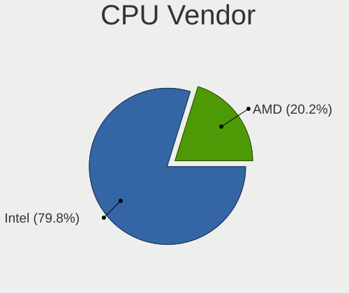

| Vendor | Notebooks | Percent |
|--------|-----------|---------|
| Intel  | 150       | 79.79%  |
| AMD    | 38        | 20.21%  |

CPU Model
---------

Processor models

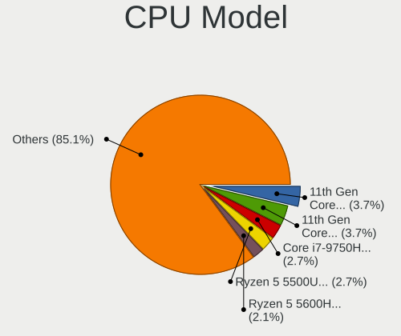

| Model                                    | Notebooks | Percent |
|------------------------------------------|-----------|---------|
| Intel 11th Gen Core i7-1165G7 @ 2.80GHz  | 7         | 3.72%   |
| Intel 11th Gen Core i5-1135G7 @ 2.40GHz  | 7         | 3.72%   |
| Intel Core i7-9750H CPU @ 2.60GHz        | 5         | 2.66%   |
| AMD Ryzen 5 5500U with Radeon Graphics   | 5         | 2.66%   |
| AMD Ryzen 5 5600H with Radeon Graphics   | 4         | 2.13%   |
| Intel Core i7-8565U CPU @ 1.80GHz        | 3         | 1.6%    |
| Intel Core i5-3230M CPU @ 2.60GHz        | 3         | 1.6%    |
| Intel Core i3-2310M CPU @ 2.10GHz        | 3         | 1.6%    |
| Intel 13th Gen Core i9-13900HX           | 3         | 1.6%    |
| AMD Ryzen 7 5700U with Radeon Graphics   | 3         | 1.6%    |
| Intel Pentium Silver N5030 CPU @ 1.10GHz | 2         | 1.06%   |
| Intel Core i7-7700HQ CPU @ 2.80GHz       | 2         | 1.06%   |
| Intel Core i7-4720HQ CPU @ 2.60GHz       | 2         | 1.06%   |
| Intel Core i5-9300H CPU @ 2.40GHz        | 2         | 1.06%   |
| Intel Core i5-8250U CPU @ 1.60GHz        | 2         | 1.06%   |
| Intel Core i5-6300U CPU @ 2.40GHz        | 2         | 1.06%   |
| Intel Core i5-6200U CPU @ 2.30GHz        | 2         | 1.06%   |
| Intel Core i5-3210M CPU @ 2.50GHz        | 2         | 1.06%   |
| Intel Core i5-2520M CPU @ 2.50GHz        | 2         | 1.06%   |
| Intel Core i5-10210U CPU @ 1.60GHz       | 2         | 1.06%   |
| Intel Core i3 CPU M 380 @ 2.53GHz        | 2         | 1.06%   |
| Intel Core 2 Duo CPU P8700 @ 2.53GHz     | 2         | 1.06%   |
| Intel Celeron N4020 CPU @ 1.10GHz        | 2         | 1.06%   |
| Intel 13th Gen Core i9-13900H            | 2         | 1.06%   |
| Intel 12th Gen Core i5-1235U             | 2         | 1.06%   |
| Intel 11th Gen Core i7-11800H @ 2.30GHz  | 2         | 1.06%   |
| AMD Ryzen 7 5800H with Radeon Graphics   | 2         | 1.06%   |
| AMD Ryzen 5 7530U with Radeon Graphics   | 2         | 1.06%   |
| AMD A6-5200 APU with Radeon HD Graphics  | 2         | 1.06%   |
| Intel Xeon E-2276M CPU @ 2.80GHz         | 1         | 0.53%   |
| Intel Xeon CPU E3-1505M v5 @ 2.80GHz     | 1         | 0.53%   |
| Intel Pentium Gold 7505 @ 2.00GHz        | 1         | 0.53%   |
| Intel Pentium Dual CPU T2390 @ 1.86GHz   | 1         | 0.53%   |
| Intel Pentium CPU P6100 @ 2.00GHz        | 1         | 0.53%   |
| Intel Pentium CPU P6000 @ 1.87GHz        | 1         | 0.53%   |
| Intel Pentium CPU N3700 @ 1.60GHz        | 1         | 0.53%   |
| Intel Pentium CPU B940 @ 2.00GHz         | 1         | 0.53%   |
| Intel Pentium CPU 2117U @ 1.80GHz        | 1         | 0.53%   |
| Intel Pentium CPU 2020M @ 2.40GHz        | 1         | 0.53%   |
| Intel Core i7-9850H CPU @ 2.60GHz        | 1         | 0.53%   |

CPU Model Family
----------------

Processor model prefix

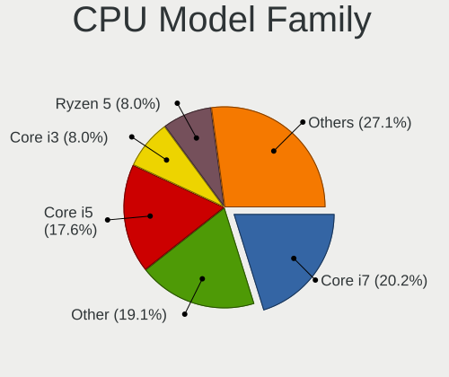

| Model                | Notebooks | Percent |
|----------------------|-----------|---------|
| Intel Core i7        | 38        | 20.21%  |
| Other                | 36        | 19.15%  |
| Intel Core i5        | 33        | 17.55%  |
| Intel Core i3        | 15        | 7.98%   |
| AMD Ryzen 5          | 15        | 7.98%   |
| AMD Ryzen 7          | 9         | 4.79%   |
| Intel Core 2 Duo     | 8         | 4.26%   |
| Intel Pentium        | 6         | 3.19%   |
| Intel Celeron        | 6         | 3.19%   |
| AMD A6               | 5         | 2.66%   |
| AMD Ryzen 7 PRO      | 3         | 1.6%    |
| Intel Xeon           | 2         | 1.06%   |
| Intel Pentium Silver | 2         | 1.06%   |
| Intel Pentium Gold   | 1         | 0.53%   |
| Intel Pentium Dual   | 1         | 0.53%   |
| Intel Core 2 Extreme | 1         | 0.53%   |
| Intel Core 2         | 1         | 0.53%   |
| AMD Ryzen 3          | 1         | 0.53%   |
| AMD FX               | 1         | 0.53%   |
| AMD Athlon X2        | 1         | 0.53%   |
| AMD Athlon           | 1         | 0.53%   |
| AMD A8               | 1         | 0.53%   |
| AMD A4               | 1         | 0.53%   |

CPU Cores
---------

Number of processor cores

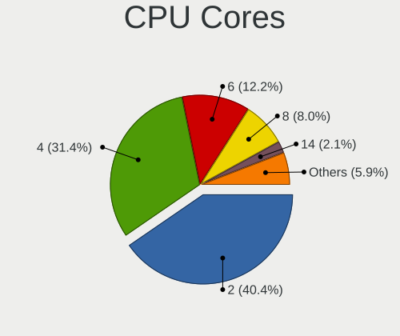

| Number | Notebooks | Percent |
|--------|-----------|---------|
| 2      | 76        | 40.43%  |
| 4      | 59        | 31.38%  |
| 6      | 23        | 12.23%  |
| 8      | 15        | 7.98%   |
| 14     | 4         | 2.13%   |
| 24     | 3         | 1.6%    |
| 12     | 3         | 1.6%    |
| 10     | 3         | 1.6%    |
| 20     | 1         | 0.53%   |
| 1      | 1         | 0.53%   |

CPU Sockets
-----------

Number of sockets

| Number | Notebooks | Percent |
|--------|-----------|---------|
| 1      | 188       | 100%    |

CPU Threads
-----------

Threads per core (Hyper-Threading)

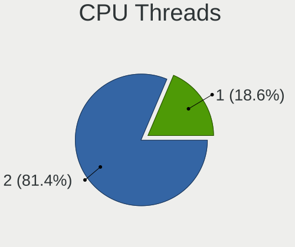

| Number | Notebooks | Percent |
|--------|-----------|---------|
| 2      | 153       | 81.38%  |
| 1      | 35        | 18.62%  |

CPU Op-Modes
------------

CPU Operation Modes (32-bit, 64-bit)

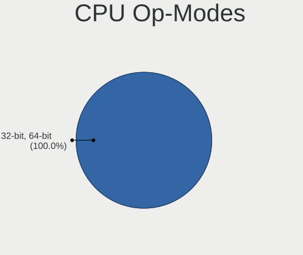

| Op mode        | Notebooks | Percent |
|----------------|-----------|---------|
| 32-bit, 64-bit | 188       | 100%    |

CPU Microcode
-------------

Microcode number

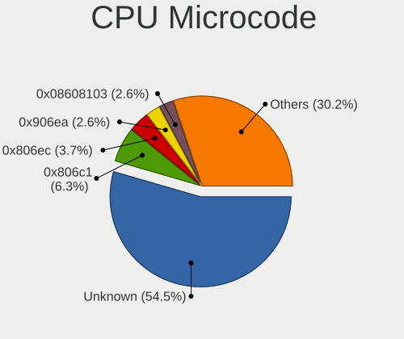

| Number     | Notebooks | Percent |
|------------|-----------|---------|
| Unknown    | 103       | 54.5%   |
| 0x806c1    | 12        | 6.35%   |
| 0x806ec    | 7         | 3.7%    |
| 0x906ea    | 5         | 2.65%   |
| 0x08608103 | 5         | 2.65%   |
| 0x406e3    | 4         | 2.12%   |
| 0x306a9    | 4         | 2.12%   |
| 0xb0671    | 3         | 1.59%   |
| 0x20655    | 3         | 1.59%   |
| 0x1067a    | 3         | 1.59%   |
| 0xb06a2    | 2         | 1.06%   |
| 0x906e9    | 2         | 1.06%   |
| 0x906a3    | 2         | 1.06%   |
| 0x806ea    | 2         | 1.06%   |
| 0x806e9    | 2         | 1.06%   |
| 0x706e5    | 2         | 1.06%   |
| 0x40651    | 2         | 1.06%   |
| 0x206a7    | 2         | 1.06%   |
| 0x0a50000d | 2         | 1.06%   |
| 0x0a50000c | 2         | 1.06%   |
| 0x08608102 | 2         | 1.06%   |
| 0x08600106 | 2         | 1.06%   |
| 0x906ed    | 1         | 0.53%   |
| 0x806d1    | 1         | 0.53%   |
| 0x806c2    | 1         | 0.53%   |
| 0x706a8    | 1         | 0.53%   |
| 0x6f6      | 1         | 0.53%   |
| 0x506e3    | 1         | 0.53%   |
| 0x306d4    | 1         | 0.53%   |
| 0x306c3    | 1         | 0.53%   |
| 0x106e5    | 1         | 0.53%   |
| 0x10676    | 1         | 0.53%   |
| 0x0a704103 | 1         | 0.53%   |
| 0x0a601203 | 1         | 0.53%   |
| 0x0a50000f | 1         | 0.53%   |
| 0x0a404102 | 1         | 0.53%   |
| 0x0a404101 | 1         | 0.53%   |
| 0x03000027 | 1         | 0.53%   |

CPU Microarch
-------------

Microarchitecture

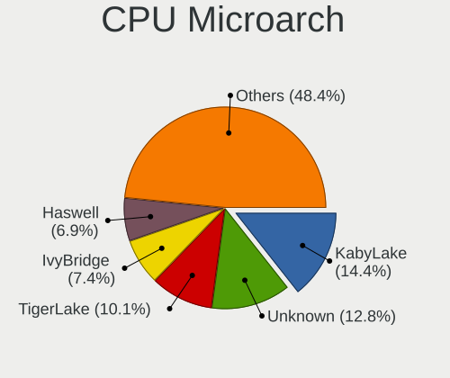

| Name             | Notebooks | Percent |
|------------------|-----------|---------|
| KabyLake         | 27        | 14.36%  |
| Unknown          | 24        | 12.77%  |
| TigerLake        | 19        | 10.11%  |
| IvyBridge        | 14        | 7.45%   |
| Haswell          | 13        | 6.91%   |
| SandyBridge      | 12        | 6.38%   |
| Zen 3            | 11        | 5.85%   |
| Westmere         | 10        | 5.32%   |
| Skylake          | 10        | 5.32%   |
| Penryn           | 7         | 3.72%   |
| Alderlake Hybrid | 7         | 3.72%   |
| Icelake          | 4         | 2.13%   |
| Goldmont plus    | 4         | 2.13%   |
| Core             | 4         | 2.13%   |
| Broadwell        | 4         | 2.13%   |
| Zen 2            | 3         | 1.6%    |
| Excavator        | 3         | 1.6%    |
| Zen+             | 2         | 1.06%   |
| Silvermont       | 2         | 1.06%   |
| Nehalem          | 2         | 1.06%   |
| K10 Llano        | 2         | 1.06%   |
| Jaguar           | 2         | 1.06%   |
| Piledriver       | 1         | 0.53%   |
| K8 & K10 hybrid  | 1         | 0.53%   |

Graphics
--------

GPU Vendor
----------

Vendors of graphics cards

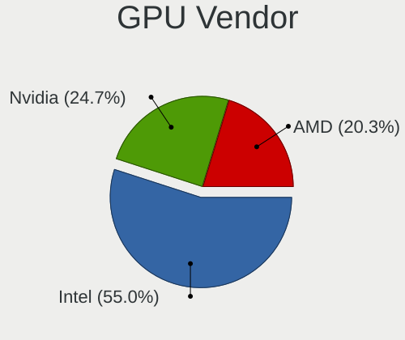

| Vendor | Notebooks | Percent |
|--------|-----------|---------|
| Intel  | 138       | 54.98%  |
| Nvidia | 62        | 24.7%   |
| AMD    | 51        | 20.32%  |

GPU Model
---------

Graphics card models

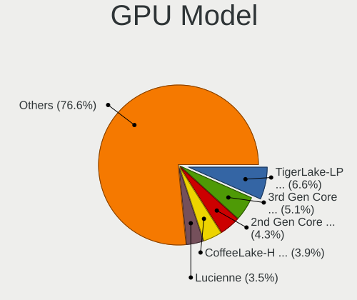

| Model                                                                     | Notebooks | Percent |
|---------------------------------------------------------------------------|-----------|---------|
| Intel TigerLake-LP GT2 [Iris Xe Graphics]                                 | 17        | 6.64%   |
| Intel 3rd Gen Core processor Graphics Controller                          | 13        | 5.08%   |
| Intel 2nd Generation Core Processor Family Integrated Graphics Controller | 11        | 4.3%    |
| Intel CoffeeLake-H GT2 [UHD Graphics 630]                                 | 10        | 3.91%   |
| AMD Lucienne                                                              | 9         | 3.52%   |
| Intel Skylake-U GT2 [HD Graphics 520]                                     | 8         | 3.13%   |
| Intel Core Processor Integrated Graphics Controller                       | 8         | 3.13%   |
| Intel 4th Gen Core Processor Integrated Graphics Controller               | 7         | 2.73%   |
| AMD Cezanne [Radeon Vega Series / Radeon Vega Mobile Series]              | 6         | 2.34%   |
| Nvidia TU117M [GeForce GTX 1650 Mobile / Max-Q]                           | 5         | 1.95%   |
| Intel WhiskeyLake-U GT2 [UHD Graphics 620]                                | 5         | 1.95%   |
| Intel Haswell-ULT Integrated Graphics Controller                          | 5         | 1.95%   |
| Nvidia AD107M [GeForce RTX 4060 Max-Q / Mobile]                           | 4         | 1.56%   |
| Intel TigerLake-H GT1 [UHD Graphics]                                      | 4         | 1.56%   |
| Intel Raptor Lake-S UHD Graphics                                          | 4         | 1.56%   |
| Intel Raptor Lake-P [Iris Xe Graphics]                                    | 4         | 1.56%   |
| Intel Broadwell-U GT2 [HD Graphics 5500]                                  | 4         | 1.56%   |
| Nvidia GP107M [GeForce GTX 1050 Mobile]                                   | 3         | 1.17%   |
| Nvidia GM107M [GeForce GTX 950M]                                          | 3         | 1.17%   |
| Nvidia GA106M [GeForce RTX 3060 Mobile / Max-Q]                           | 3         | 1.17%   |
| Intel Mobile 4 Series Chipset Integrated Graphics Controller              | 3         | 1.17%   |
| Intel Kaby Lake-U GT2 [HD Graphics 620]                                   | 3         | 1.17%   |
| Intel Kaby Lake-R GT2 [UHD Graphics 620]                                  | 3         | 1.17%   |
| Intel Kaby Lake-H GT2 [HD Graphics 630]                                   | 3         | 1.17%   |
| Intel CometLake-U GT2 [UHD Graphics]                                      | 3         | 1.17%   |
| Intel Alder Lake-P GT2 [Iris Xe Graphics]                                 | 3         | 1.17%   |
| AMD Renoir [Radeon Vega Series / Radeon Vega Mobile Series]               | 3         | 1.17%   |
| AMD Barcelo                                                               | 3         | 1.17%   |
| Nvidia GM108M [GeForce 940MX]                                             | 2         | 0.78%   |
| Nvidia GM107M [GeForce GTX 960M]                                          | 2         | 0.78%   |
| Nvidia GF117M [GeForce 610M/710M/810M/820M / GT 620M/625M/630M/720M]      | 2         | 0.78%   |
| Nvidia GA107M [GeForce RTX 3050 Mobile]                                   | 2         | 0.78%   |
| Nvidia GA107BM [GeForce RTX 3050 Ti Mobile]                               | 2         | 0.78%   |
| Intel Tiger Lake-LP GT2 [UHD Graphics G4]                                 | 2         | 0.78%   |
| Intel Mobile GM965/GL960 Integrated Graphics Controller (secondary)       | 2         | 0.78%   |
| Intel Mobile GM965/GL960 Integrated Graphics Controller (primary)         | 2         | 0.78%   |
| Intel Iris Plus Graphics G1 (Ice Lake)                                    | 2         | 0.78%   |
| Intel GeminiLake [UHD Graphics 605]                                       | 2         | 0.78%   |
| Intel GeminiLake [UHD Graphics 600]                                       | 2         | 0.78%   |
| Intel Alder Lake-UP3 GT2 [Iris Xe Graphics]                               | 2         | 0.78%   |

GPU Combo
---------

Combinations of graphics cards

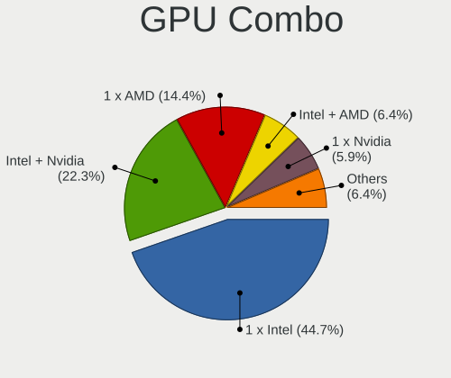

| Name           | Notebooks | Percent |
|----------------|-----------|---------|
| 1 x Intel      | 84        | 44.68%  |
| Intel + Nvidia | 42        | 22.34%  |
| 1 x AMD        | 27        | 14.36%  |
| Intel + AMD    | 12        | 6.38%   |
| 1 x Nvidia     | 11        | 5.85%   |
| AMD + Nvidia   | 9         | 4.79%   |
| 2 x AMD        | 3         | 1.6%    |

GPU Driver
----------

Free vs proprietary

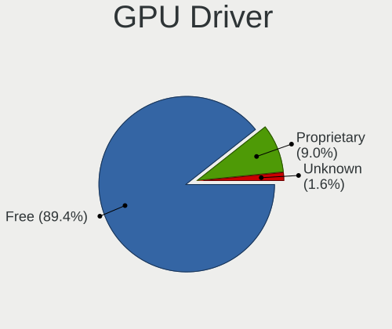

| Driver      | Notebooks | Percent |
|-------------|-----------|---------|
| Free        | 168       | 89.36%  |
| Proprietary | 17        | 9.04%   |
| Unknown     | 3         | 1.6%    |

GPU Memory
----------

Total video memory

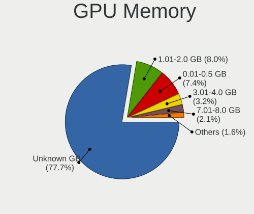

| Size in GB | Notebooks | Percent |
|------------|-----------|---------|
| Unknown    | 146       | 77.66%  |
| 1.01-2.0   | 15        | 7.98%   |
| 0.01-0.5   | 14        | 7.45%   |
| 3.01-4.0   | 6         | 3.19%   |
| 7.01-8.0   | 4         | 2.13%   |
| 0.51-1.0   | 3         | 1.6%    |

Monitor
-------

Monitor Vendor
--------------

Monitor vendors

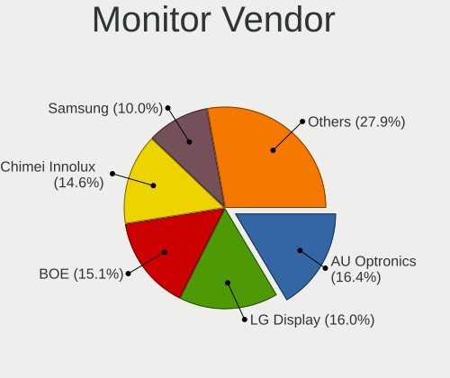

| Vendor                  | Notebooks | Percent |
|-------------------------|-----------|---------|
| AU Optronics            | 36        | 16.44%  |
| LG Display              | 35        | 15.98%  |
| BOE                     | 33        | 15.07%  |
| Chimei Innolux          | 32        | 14.61%  |
| Samsung Electronics     | 22        | 10.05%  |
| Sony                    | 6         | 2.74%   |
| Sharp                   | 6         | 2.74%   |
| Lenovo                  | 6         | 2.74%   |
| Goldstar                | 5         | 2.28%   |
| Dell                    | 5         | 2.28%   |
| Chi Mei Optoelectronics | 5         | 2.28%   |
| BenQ                    | 4         | 1.83%   |
| PANDA                   | 3         | 1.37%   |
| CSO                     | 3         | 1.37%   |
| HKC                     | 2         | 0.91%   |
| Apple                   | 2         | 0.91%   |
| AOC                     | 2         | 0.91%   |
| Toshiba                 | 1         | 0.46%   |
| SANYO                   | 1         | 0.46%   |
| Philips                 | 1         | 0.46%   |
| IPS                     | 1         | 0.46%   |
| Insignia                | 1         | 0.46%   |
| Iiyama                  | 1         | 0.46%   |
| IBM                     | 1         | 0.46%   |
| Hewlett-Packard         | 1         | 0.46%   |
| GreenWood               | 1         | 0.46%   |
| Eizo                    | 1         | 0.46%   |
| CGC                     | 1         | 0.46%   |
| ASUSTek Computer        | 1         | 0.46%   |

Monitor Model
-------------

Monitor models

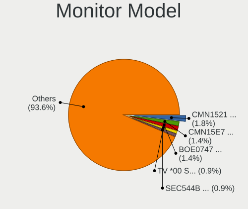

| Model                                                                    | Notebooks | Percent |
|--------------------------------------------------------------------------|-----------|---------|
| Chimei Innolux LCD Monitor CMN1521 1920x1080 344x193mm 15.5-inch         | 4         | 1.83%   |
| Chimei Innolux LCD Monitor CMN15E7 1920x1080 344x193mm 15.5-inch         | 3         | 1.37%   |
| BOE LCD Monitor BOE0747 1920x1080 344x194mm 15.5-inch                    | 3         | 1.37%   |
| Sony TV *00 SNY4904 3840x2160                                            | 2         | 0.91%   |
| Samsung Electronics LCD Monitor SEC544B 1600x900 382x214mm 17.2-inch     | 2         | 0.91%   |
| Samsung Electronics LCD Monitor SEC5441 1280x800 331x207mm 15.4-inch     | 2         | 0.91%   |
| LG Display LCD Monitor LGD046F 1920x1080 344x194mm 15.5-inch             | 2         | 0.91%   |
| Chimei Innolux LCD Monitor CMN15F5 1920x1080 344x193mm 15.5-inch         | 2         | 0.91%   |
| Chimei Innolux LCD Monitor CMN15E6 1366x768 344x193mm 15.5-inch          | 2         | 0.91%   |
| Chi Mei Optoelectronics LCD Monitor CMO15A3 1366x768 344x193mm 15.5-inch | 2         | 0.91%   |
| BOE LCD Monitor BOE0BB7 3840x2160 381x214mm 17.2-inch                    | 2         | 0.91%   |
| AU Optronics LCD Monitor AUOFA9B 1920x1200 301x188mm 14.0-inch           | 2         | 0.91%   |
| AU Optronics LCD Monitor AUO41EC 1366x768 344x193mm 15.5-inch            | 2         | 0.91%   |
| AU Optronics LCD Monitor AUO38ED 1920x1080 344x193mm 15.5-inch           | 2         | 0.91%   |
| AU Optronics LCD Monitor AUO323D 1920x1080 309x174mm 14.0-inch           | 2         | 0.91%   |
| AU Optronics LCD Monitor AUO26EC 1366x768 344x193mm 15.5-inch            | 2         | 0.91%   |
| AU Optronics LCD Monitor AUO119E 1600x900 382x214mm 17.2-inch            | 2         | 0.91%   |
| Toshiba ScreenXpert TSB8888 1080x2160                                    | 1         | 0.46%   |
| Sony TV SNYEE01 1920x1080                                                | 1         | 0.46%   |
| Sony TV *00 SNYF303 1920x1080 952x535mm 43.0-inch                        | 1         | 0.46%   |
| Sony Nvidia Defaul t Flat Panel SNY05FA 1366x768 309x174mm 14.0-inch     | 1         | 0.46%   |
| Sony Nvidia Defaul t Flat Panel MS_0025 1920x1080 360x200mm 16.2-inch    | 1         | 0.46%   |
| Sharp LQ156D1JW04 SHP1436 3840x2160 346x194mm 15.6-inch                  | 1         | 0.46%   |
| Sharp LQ134N1JW53 SHP1521 1920x1200 288x180mm 13.4-inch                  | 1         | 0.46%   |
| Sharp LCD Monitor SHP14F9 1920x1200 288x180mm 13.4-inch                  | 1         | 0.46%   |
| Sharp LCD Monitor SHP14B8 1920x1080 294x165mm 13.3-inch                  | 1         | 0.46%   |
| Sharp LCD Monitor SHP1453 1920x1080 346x194mm 15.6-inch                  | 1         | 0.46%   |
| Sharp LCD Monitor SHP1446 3840x2160 382x215mm 17.3-inch                  | 1         | 0.46%   |
| SANYO LCD SAN0B75 1920x540                                               | 1         | 0.46%   |
| Samsung Electronics U28E590 SAM0C4E 3840x2160 608x345mm 27.5-inch        | 1         | 0.46%   |
| Samsung Electronics SyncMaster SAM05CD 1920x1080                         | 1         | 0.46%   |
| Samsung Electronics SyncMaster SAM0586 1920x1200 518x324mm 24.1-inch     | 1         | 0.46%   |
| Samsung Electronics SMB2330H SAM064A 1920x1080 509x286mm 23.0-inch       | 1         | 0.46%   |
| Samsung Electronics S24E650 SAM0CB8 1920x1080 521x293mm 23.5-inch        | 1         | 0.46%   |
| Samsung Electronics LU28R55 SAM1017 3840x2160 632x360mm 28.6-inch        | 1         | 0.46%   |
| Samsung Electronics LCD Monitor SEC5443 1920x1200 367x230mm 17.1-inch    | 1         | 0.46%   |
| Samsung Electronics LCD Monitor SEC5442 1440x900 303x190mm 14.1-inch     | 1         | 0.46%   |
| Samsung Electronics LCD Monitor SEC5244 1600x900 360x210mm 16.4-inch     | 1         | 0.46%   |
| Samsung Electronics LCD Monitor SEC3945 1280x800 331x207mm 15.4-inch     | 1         | 0.46%   |
| Samsung Electronics LCD Monitor SEC3847 1440x900 367x230mm 17.1-inch     | 1         | 0.46%   |

Monitor Resolution
------------------

Monitor screen resolution

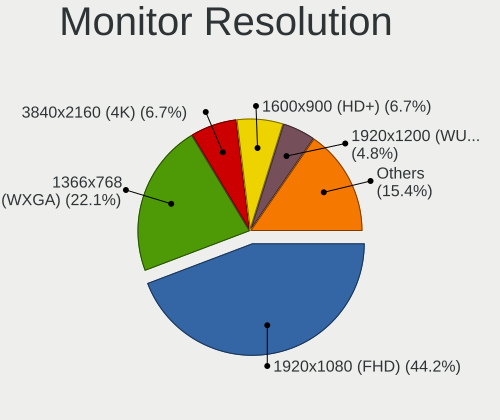

| Resolution         | Notebooks | Percent |
|--------------------|-----------|---------|
| 1920x1080 (FHD)    | 92        | 44.23%  |
| 1366x768 (WXGA)    | 46        | 22.12%  |
| 3840x2160 (4K)     | 14        | 6.73%   |
| 1600x900 (HD+)     | 14        | 6.73%   |
| 1920x1200 (WUXGA)  | 10        | 4.81%   |
| 2560x1600          | 6         | 2.88%   |
| 2560x1440 (QHD)    | 6         | 2.88%   |
| 1440x900 (WXGA+)   | 5         | 2.4%    |
| 1280x800 (WXGA)    | 4         | 1.92%   |
| 2880x1800          | 2         | 0.96%   |
| 3440x1440          | 1         | 0.48%   |
| 2560x1080          | 1         | 0.48%   |
| 2520x1680          | 1         | 0.48%   |
| 2256x1504          | 1         | 0.48%   |
| 2160x1440          | 1         | 0.48%   |
| 1920x540           | 1         | 0.48%   |
| 1680x1050 (WSXGA+) | 1         | 0.48%   |
| 1280x1024 (SXGA)   | 1         | 0.48%   |
| 1024x768 (XGA)     | 1         | 0.48%   |

Monitor Diagonal
----------------

Diagonal size in inches

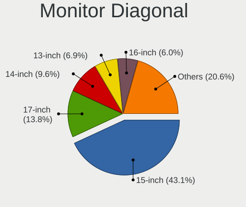

| Inches  | Notebooks | Percent |
|---------|-----------|---------|
| 15      | 94        | 43.12%  |
| 17      | 30        | 13.76%  |
| 14      | 21        | 9.63%   |
| 13      | 15        | 6.88%   |
| 16      | 13        | 5.96%   |
| 27      | 10        | 4.59%   |
| 24      | 6         | 2.75%   |
| 21      | 5         | 2.29%   |
| 12      | 5         | 2.29%   |
| 23      | 4         | 1.83%   |
| 72      | 3         | 1.38%   |
| Unknown | 2         | 0.92%   |
| 86      | 1         | 0.46%   |
| 75      | 1         | 0.46%   |
| 63      | 1         | 0.46%   |
| 40      | 1         | 0.46%   |
| 38      | 1         | 0.46%   |
| 34      | 1         | 0.46%   |
| 33      | 1         | 0.46%   |
| 28      | 1         | 0.46%   |
| 19      | 1         | 0.46%   |
| 11      | 1         | 0.46%   |

Monitor Width
-------------

Physical width

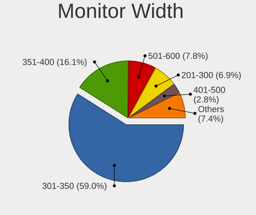

| Width in mm | Notebooks | Percent |
|-------------|-----------|---------|
| 301-350     | 128       | 58.99%  |
| 351-400     | 35        | 16.13%  |
| 501-600     | 17        | 7.83%   |
| 201-300     | 15        | 6.91%   |
| 401-500     | 6         | 2.76%   |
| 601-700     | 4         | 1.84%   |
| 1501-2000   | 4         | 1.84%   |
| 801-900     | 2         | 0.92%   |
| 701-800     | 2         | 0.92%   |
| 1001-1500   | 2         | 0.92%   |
| Unknown     | 2         | 0.92%   |

Aspect Ratio
------------

Proportional relationship between the width and the height

| Ratio | Notebooks | Percent |
|-------|-----------|---------|
| 16/9  | 156       | 81.68%  |
| 16/10 | 27        | 14.14%  |
| 3/2   | 3         | 1.57%   |
| 5/4   | 1         | 0.52%   |
| 4/3   | 1         | 0.52%   |
| 32/9  | 1         | 0.52%   |
| 21/9  | 1         | 0.52%   |
| 0.56  | 1         | 0.52%   |

Monitor Area
------------

Area in inch²

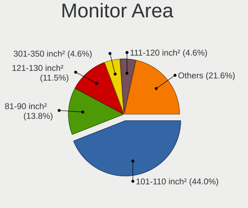

| Area in inch² | Notebooks | Percent |
|----------------|-----------|---------|
| 101-110        | 96        | 44.04%  |
| 81-90          | 30        | 13.76%  |
| 121-130        | 25        | 11.47%  |
| 301-350        | 10        | 4.59%   |
| 111-120        | 10        | 4.59%   |
| 201-250        | 7         | 3.21%   |
| More than 1000 | 6         | 2.75%   |
| 71-80          | 6         | 2.75%   |
| 61-70          | 5         | 2.29%   |
| 251-300        | 5         | 2.29%   |
| 151-200        | 4         | 1.83%   |
| 131-140        | 4         | 1.83%   |
| 351-500        | 3         | 1.38%   |
| 501-1000       | 2         | 0.92%   |
| Unknown        | 2         | 0.92%   |
| 51-60          | 1         | 0.46%   |
| 141-150        | 1         | 0.46%   |
| 91-100         | 1         | 0.46%   |

Pixel Density
-------------

Pixels per inch

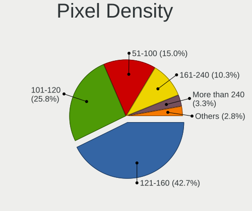

| Density       | Notebooks | Percent |
|---------------|-----------|---------|
| 121-160       | 91        | 42.72%  |
| 101-120       | 55        | 25.82%  |
| 51-100        | 32        | 15.02%  |
| 161-240       | 22        | 10.33%  |
| More than 240 | 7         | 3.29%   |
| 1-50          | 4         | 1.88%   |
| Unknown       | 2         | 0.94%   |

Multiple Monitors
-----------------

Total monitors connected

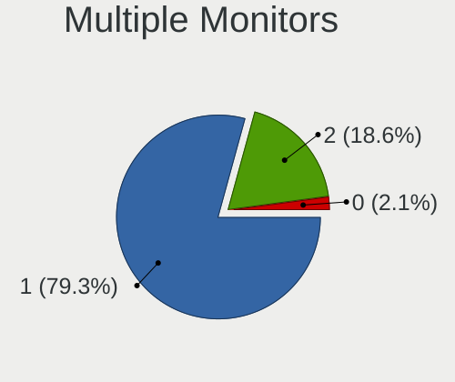

| Total | Notebooks | Percent |
|-------|-----------|---------|
| 1     | 149       | 79.26%  |
| 2     | 35        | 18.62%  |
| 0     | 4         | 2.13%   |

Network
-------

Net Controller Vendor
---------------------

Controller vendors

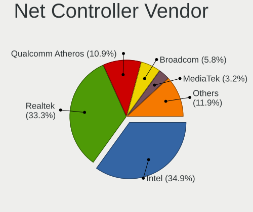

| Vendor                            | Notebooks | Percent |
|-----------------------------------|-----------|---------|
| Intel                             | 109       | 34.94%  |
| Realtek Semiconductor             | 104       | 33.33%  |
| Qualcomm Atheros                  | 34        | 10.9%   |
| Broadcom                          | 18        | 5.77%   |
| MediaTek                          | 10        | 3.21%   |
| ASIX Electronics                  | 4         | 1.28%   |
| Marvell Technology Group          | 3         | 0.96%   |
| Broadcom Limited                  | 3         | 0.96%   |
| Xiaomi                            | 2         | 0.64%   |
| Sierra Wireless                   | 2         | 0.64%   |
| Shenzhen Goodix Technology        | 2         | 0.64%   |
| Samsung Electronics               | 2         | 0.64%   |
| Lenovo                            | 2         | 0.64%   |
| Dell                              | 2         | 0.64%   |
| U-Blox                            | 1         | 0.32%   |
| Sitecom Europe                    | 1         | 0.32%   |
| Ralink                            | 1         | 0.32%   |
| Qualcomm                          | 1         | 0.32%   |
| Nvidia                            | 1         | 0.32%   |
| LSI                               | 1         | 0.32%   |
| ICS Advent                        | 1         | 0.32%   |
| Huawei Technologies               | 1         | 0.32%   |
| Ericsson Business Mobile Networks | 1         | 0.32%   |
| ELATEC                            | 1         | 0.32%   |
| DisplayLink                       | 1         | 0.32%   |
| D-Link                            | 1         | 0.32%   |
| Belkin Components                 | 1         | 0.32%   |
| AVM                               | 1         | 0.32%   |
| ASUSTek Computer                  | 1         | 0.32%   |

Net Controller Model
--------------------

Controller models

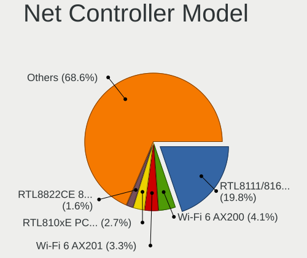

| Model                                                                  | Notebooks | Percent |
|------------------------------------------------------------------------|-----------|---------|
| Realtek RTL8111/8168/8211/8411 PCI Express Gigabit Ethernet Controller | 73        | 19.78%  |
| Intel Wi-Fi 6 AX200                                                    | 15        | 4.07%   |
| Intel Wi-Fi 6 AX201                                                    | 12        | 3.25%   |
| Realtek RTL810xE PCI Express Fast Ethernet controller                  | 10        | 2.71%   |
| Realtek RTL8822CE 802.11ac PCIe Wireless Network Adapter               | 6         | 1.63%   |
| Realtek RTL8153 Gigabit Ethernet Adapter                               | 6         | 1.63%   |
| Qualcomm Atheros QCA9377 802.11ac Wireless Network Adapter             | 6         | 1.63%   |
| Qualcomm Atheros AR9485 Wireless Network Adapter                       | 6         | 1.63%   |
| Intel Wireless 8260                                                    | 6         | 1.63%   |
| Intel Centrino Advanced-N 6205 [Taylor Peak]                           | 6         | 1.63%   |
| Intel Alder Lake-P PCH CNVi WiFi                                       | 6         | 1.63%   |
| Broadcom BCM43142 802.11b/g/n                                          | 6         | 1.63%   |
| Intel Wireless 7260                                                    | 5         | 1.36%   |
| Intel Cannon Point-LP CNVi [Wireless-AC]                               | 5         | 1.36%   |
| Intel 82579LM Gigabit Network Connection (Lewisville)                  | 5         | 1.36%   |
| Realtek RTL8821CE 802.11ac PCIe Wireless Network Adapter               | 4         | 1.08%   |
| Qualcomm Atheros QCA9565 / AR9565 Wireless Network Adapter             | 4         | 1.08%   |
| Qualcomm Atheros AR9285 Wireless Network Adapter (PCI-Express)         | 4         | 1.08%   |
| MediaTek MT7922 802.11ax PCI Express Wireless Network Adapter          | 4         | 1.08%   |
| MediaTek MT7921 802.11ax PCIe Wireless Network Adapter [Filogic 330]   | 4         | 1.08%   |
| Intel Tiger Lake PCH CNVi WiFi                                         | 4         | 1.08%   |
| Intel Ethernet Connection (7) I219-LM                                  | 4         | 1.08%   |
| Intel Cannon Lake PCH CNVi WiFi                                        | 4         | 1.08%   |
| ASIX AX88179 Gigabit Ethernet                                          | 4         | 1.08%   |
| Qualcomm Atheros AR9287 Wireless Network Adapter (PCI-Express)         | 3         | 0.81%   |
| Intel Wireless 8265 / 8275                                             | 3         | 0.81%   |
| Intel Wireless 7265                                                    | 3         | 0.81%   |
| Intel Wi-Fi 6E(802.11ax) AX210/AX1675* 2x2 [Typhoon Peak]              | 3         | 0.81%   |
| Intel Raptor Lake PCH CNVi WiFi                                        | 3         | 0.81%   |
| Intel Ethernet Connection I219-LM                                      | 3         | 0.81%   |
| Intel Ethernet Connection I218-LM                                      | 3         | 0.81%   |
| Intel Ethernet Connection (13) I219-V                                  | 3         | 0.81%   |
| Intel Comet Lake PCH-LP CNVi WiFi                                      | 3         | 0.81%   |
| Intel Centrino Advanced-N 6200                                         | 3         | 0.81%   |
| Intel 82577LM Gigabit Network Connection                               | 3         | 0.81%   |
| Intel 82567LM Gigabit Network Connection                               | 3         | 0.81%   |
| Intel 700 Series Chipset CNVi WiFi                                     | 3         | 0.81%   |
| Shenzhen Goodix Fingerprint Reader                                     | 2         | 0.54%   |
| Samsung Galaxy series, misc. (tethering mode)                          | 2         | 0.54%   |
| Realtek RTL8852BE PCIe 802.11ax Wireless Network Controller            | 2         | 0.54%   |

Wireless Vendor
---------------

Wireless vendors

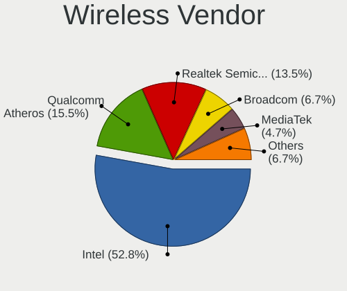

| Vendor                | Notebooks | Percent |
|-----------------------|-----------|---------|
| Intel                 | 102       | 52.85%  |
| Qualcomm Atheros      | 30        | 15.54%  |
| Realtek Semiconductor | 26        | 13.47%  |
| Broadcom              | 13        | 6.74%   |
| MediaTek              | 9         | 4.66%   |
| Sierra Wireless       | 2         | 1.04%   |
| Dell                  | 2         | 1.04%   |
| Broadcom Limited      | 2         | 1.04%   |
| Sitecom Europe        | 1         | 0.52%   |
| Ralink                | 1         | 0.52%   |
| Qualcomm              | 1         | 0.52%   |
| D-Link                | 1         | 0.52%   |
| Belkin Components     | 1         | 0.52%   |
| AVM                   | 1         | 0.52%   |
| ASUSTek Computer      | 1         | 0.52%   |

Wireless Model
--------------

Wireless models

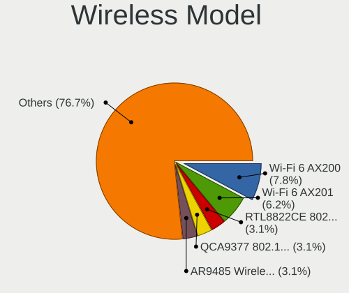

| Model                                                                   | Notebooks | Percent |
|-------------------------------------------------------------------------|-----------|---------|
| Intel Wi-Fi 6 AX200                                                     | 15        | 7.77%   |
| Intel Wi-Fi 6 AX201                                                     | 12        | 6.22%   |
| Realtek RTL8822CE 802.11ac PCIe Wireless Network Adapter                | 6         | 3.11%   |
| Qualcomm Atheros QCA9377 802.11ac Wireless Network Adapter              | 6         | 3.11%   |
| Qualcomm Atheros AR9485 Wireless Network Adapter                        | 6         | 3.11%   |
| Intel Wireless 8260                                                     | 6         | 3.11%   |
| Intel Centrino Advanced-N 6205 [Taylor Peak]                            | 6         | 3.11%   |
| Broadcom BCM43142 802.11b/g/n                                           | 6         | 3.11%   |
| Intel Wireless 7260                                                     | 5         | 2.59%   |
| Intel Cannon Point-LP CNVi [Wireless-AC]                                | 5         | 2.59%   |
| Intel Alder Lake-P PCH CNVi WiFi                                        | 5         | 2.59%   |
| Realtek RTL8821CE 802.11ac PCIe Wireless Network Adapter                | 4         | 2.07%   |
| Qualcomm Atheros QCA9565 / AR9565 Wireless Network Adapter              | 4         | 2.07%   |
| Qualcomm Atheros AR9285 Wireless Network Adapter (PCI-Express)          | 4         | 2.07%   |
| MediaTek MT7921 802.11ax PCIe Wireless Network Adapter [Filogic 330]    | 4         | 2.07%   |
| Intel Tiger Lake PCH CNVi WiFi                                          | 4         | 2.07%   |
| Intel Cannon Lake PCH CNVi WiFi                                         | 4         | 2.07%   |
| Qualcomm Atheros AR9287 Wireless Network Adapter (PCI-Express)          | 3         | 1.55%   |
| MediaTek MT7922 802.11ax PCI Express Wireless Network Adapter           | 3         | 1.55%   |
| Intel Wireless 8265 / 8275                                              | 3         | 1.55%   |
| Intel Wireless 7265                                                     | 3         | 1.55%   |
| Intel Wi-Fi 6E(802.11ax) AX210/AX1675* 2x2 [Typhoon Peak]               | 3         | 1.55%   |
| Intel Raptor Lake PCH CNVi WiFi                                         | 3         | 1.55%   |
| Intel Comet Lake PCH-LP CNVi WiFi                                       | 3         | 1.55%   |
| Intel Centrino Advanced-N 6200                                          | 3         | 1.55%   |
| Intel 700 Series Chipset CNVi WiFi                                      | 3         | 1.55%   |
| Realtek RTL8852BE PCIe 802.11ax Wireless Network Controller             | 2         | 1.04%   |
| Realtek RTL8852AE 802.11ax PCIe Wireless Network Adapter                | 2         | 1.04%   |
| Realtek RTL8723BE PCIe Wireless Network Adapter                         | 2         | 1.04%   |
| Realtek RTL8188CE 802.11b/g/n WiFi Adapter                              | 2         | 1.04%   |
| Qualcomm Atheros AR9462 Wireless Network Adapter                        | 2         | 1.04%   |
| Qualcomm Atheros AR242x / AR542x Wireless Network Adapter (PCI-Express) | 2         | 1.04%   |
| MediaTek MT7902 802.11ax PCIe Wireless Network Adapter [Filogic 310]    | 2         | 1.04%   |
| Intel Wireless 3165                                                     | 2         | 1.04%   |
| Intel Wireless 3160                                                     | 2         | 1.04%   |
| Intel Ultimate N WiFi Link 5300                                         | 2         | 1.04%   |
| Intel PRO/Wireless 3945ABG [Golan] Network Connection                   | 2         | 1.04%   |
| Intel Gemini Lake PCH CNVi WiFi                                         | 2         | 1.04%   |
| Intel Centrino Wireless-N 1030 [Rainbow Peak]                           | 2         | 1.04%   |
| Intel Centrino Advanced-N 6235                                          | 2         | 1.04%   |

Ethernet Vendor
---------------

Ethernet vendors

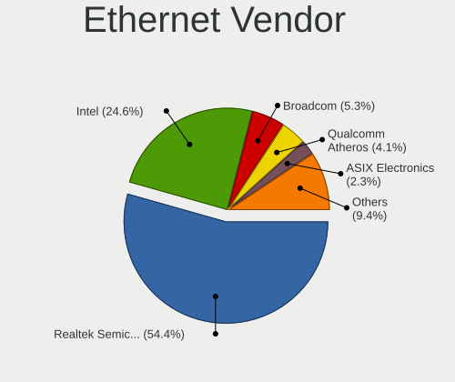

| Vendor                   | Notebooks | Percent |
|--------------------------|-----------|---------|
| Realtek Semiconductor    | 93        | 54.39%  |
| Intel                    | 42        | 24.56%  |
| Broadcom                 | 9         | 5.26%   |
| Qualcomm Atheros         | 7         | 4.09%   |
| ASIX Electronics         | 4         | 2.34%   |
| Marvell Technology Group | 3         | 1.75%   |
| Xiaomi                   | 2         | 1.17%   |
| Samsung Electronics      | 2         | 1.17%   |
| Lenovo                   | 2         | 1.17%   |
| Nvidia                   | 1         | 0.58%   |
| MediaTek                 | 1         | 0.58%   |
| LSI                      | 1         | 0.58%   |
| ICS Advent               | 1         | 0.58%   |
| Huawei Technologies      | 1         | 0.58%   |
| DisplayLink              | 1         | 0.58%   |
| Broadcom Limited         | 1         | 0.58%   |

Ethernet Model
--------------

Ethernet models

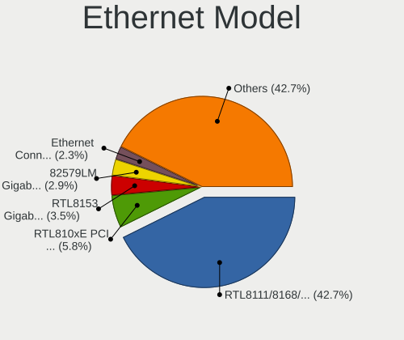

| Model                                                                  | Notebooks | Percent |
|------------------------------------------------------------------------|-----------|---------|
| Realtek RTL8111/8168/8211/8411 PCI Express Gigabit Ethernet Controller | 73        | 42.69%  |
| Realtek RTL810xE PCI Express Fast Ethernet controller                  | 10        | 5.85%   |
| Realtek RTL8153 Gigabit Ethernet Adapter                               | 6         | 3.51%   |
| Intel 82579LM Gigabit Network Connection (Lewisville)                  | 5         | 2.92%   |
| Intel Ethernet Connection (7) I219-LM                                  | 4         | 2.34%   |
| ASIX AX88179 Gigabit Ethernet                                          | 4         | 2.34%   |
| Intel Ethernet Connection I219-LM                                      | 3         | 1.75%   |
| Intel Ethernet Connection I218-LM                                      | 3         | 1.75%   |
| Intel Ethernet Connection (13) I219-V                                  | 3         | 1.75%   |
| Intel 82577LM Gigabit Network Connection                               | 3         | 1.75%   |
| Intel 82567LM Gigabit Network Connection                               | 3         | 1.75%   |
| Samsung Galaxy series, misc. (tethering mode)                          | 2         | 1.17%   |
| Realtek Killer E2600 GbE Controller                                    | 2         | 1.17%   |
| Qualcomm Atheros Killer E2500 Gigabit Ethernet Controller              | 2         | 1.17%   |
| Marvell Group 88E8057 PCI-E Gigabit Ethernet Controller                | 2         | 1.17%   |
| Intel Ethernet Connection I217-LM                                      | 2         | 1.17%   |
| Intel Ethernet Connection (6) I219-V                                   | 2         | 1.17%   |
| Intel Ethernet Connection (16) I219-V                                  | 2         | 1.17%   |
| Intel 82579V Gigabit Network Connection                                | 2         | 1.17%   |
| Intel 82567LF Gigabit Network Connection                               | 2         | 1.17%   |
| Broadcom NetXtreme BCM5761e Gigabit Ethernet PCIe                      | 2         | 1.17%   |
| Broadcom NetLink BCM57785 Gigabit Ethernet PCIe                        | 2         | 1.17%   |
| Broadcom NetLink BCM57780 Gigabit Ethernet PCIe                        | 2         | 1.17%   |
| Xiaomi Mi/Redmi series (RNDIS)                                         | 1         | 0.58%   |
| Xiaomi Mi/Redmi series (RNDIS + ADB)                                   | 1         | 0.58%   |
| Realtek USB 10/100/1G/2.5 LAN                                          | 1         | 0.58%   |
| Realtek RTL8125 2.5GbE Controller                                      | 1         | 0.58%   |
| Qualcomm Atheros QCA8171 Gigabit Ethernet                              | 1         | 0.58%   |
| Qualcomm Atheros AR8162 Fast Ethernet                                  | 1         | 0.58%   |
| Qualcomm Atheros AR8151 v2.0 Gigabit Ethernet                          | 1         | 0.58%   |
| Qualcomm Atheros AR8151 v1.0 Gigabit Ethernet                          | 1         | 0.58%   |
| Qualcomm Atheros AR8131 Gigabit Ethernet                               | 1         | 0.58%   |
| Nvidia MCP79 Ethernet                                                  | 1         | 0.58%   |
| MediaTek MT7922 802.11ax PCI Express Wireless Network Adapter          | 1         | 0.58%   |
| Marvell Group 88E8042 PCI-E Fast Ethernet Controller                   | 1         | 0.58%   |
| LSI ET-131x PCI-E Ethernet Controller                                  | 1         | 0.58%   |
| Lenovo Thinkpad LAN                                                    | 1         | 0.58%   |
| Lenovo RTL8153 Gigabit Ethernet [ThinkPad OneLink Pro Dock]            | 1         | 0.58%   |
| Intel Ethernet Controller I226-K                                       | 1         | 0.58%   |
| Intel Ethernet Connection I219-V                                       | 1         | 0.58%   |

Net Controller Kind
-------------------

Ethernet, WiFi or modem

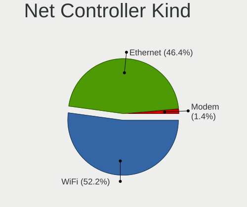

| Kind     | Notebooks | Percent |
|----------|-----------|---------|
| WiFi     | 181       | 52.16%  |
| Ethernet | 161       | 46.4%   |
| Modem    | 5         | 1.44%   |

Used Controller
---------------

Currently used network controller

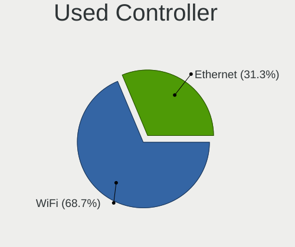

| Kind     | Notebooks | Percent |
|----------|-----------|---------|
| WiFi     | 136       | 68.69%  |
| Ethernet | 62        | 31.31%  |

NICs
----

Total network controllers on board

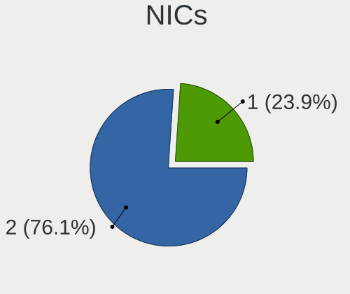

| Total | Notebooks | Percent |
|-------|-----------|---------|
| 2     | 143       | 76.06%  |
| 1     | 45        | 23.94%  |

IPv6
----

IPv6 vs IPv4

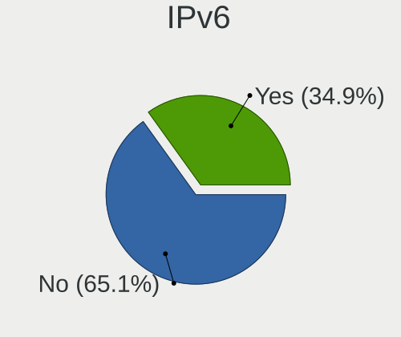

| Used | Notebooks | Percent |
|------|-----------|---------|
| No   | 123       | 65.08%  |
| Yes  | 66        | 34.92%  |

Bluetooth
---------

Bluetooth Vendor
----------------

Controller vendors

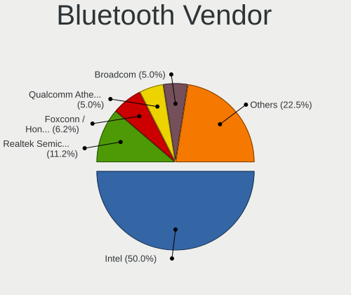

| Vendor                          | Notebooks | Percent |
|---------------------------------|-----------|---------|
| Intel                           | 80        | 50%     |
| Realtek Semiconductor           | 18        | 11.25%  |
| Foxconn / Hon Hai               | 10        | 6.25%   |
| Qualcomm Atheros Communications | 8         | 5%      |
| Broadcom                        | 8         | 5%      |
| IMC Networks                    | 7         | 4.38%   |
| Lite-On Technology              | 6         | 3.75%   |
| Hewlett-Packard                 | 5         | 3.13%   |
| Dell                            | 5         | 3.13%   |
| Foxconn International           | 2         | 1.25%   |
| Cambridge Silicon Radio         | 2         | 1.25%   |
| Apple                           | 2         | 1.25%   |
| USI                             | 1         | 0.63%   |
| TP-Link                         | 1         | 0.63%   |
| Realtek                         | 1         | 0.63%   |
| Ralink Technology               | 1         | 0.63%   |
| MediaTek                        | 1         | 0.63%   |
| Fujitsu                         | 1         | 0.63%   |
| Alps Electric                   | 1         | 0.63%   |

Bluetooth Model
---------------

Controller models

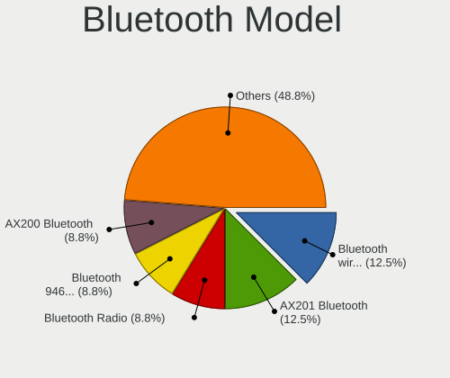

| Model                                                                               | Notebooks | Percent |
|-------------------------------------------------------------------------------------|-----------|---------|
| Intel Bluetooth wireless interface                                                  | 20        | 12.5%   |
| Intel AX201 Bluetooth                                                               | 20        | 12.5%   |
| Realtek Bluetooth Radio                                                             | 14        | 8.75%   |
| Intel Bluetooth 9460/9560 Jefferson Peak (JfP)                                      | 14        | 8.75%   |
| Intel AX200 Bluetooth                                                               | 14        | 8.75%   |
| Intel Bluetooth Device                                                              | 6         | 3.75%   |
| IMC Networks Wireless_Device                                                        | 4         | 2.5%    |
| HP Broadcom 2070 Bluetooth Combo                                                    | 4         | 2.5%    |
| Qualcomm Atheros AR3011 Bluetooth                                                   | 3         | 1.88%   |
| Lite-On Qualcomm Atheros QCA9377 Bluetooth                                          | 3         | 1.88%   |
| Intel AX210 Bluetooth                                                               | 3         | 1.88%   |
| Foxconn / Hon Hai Wireless_Device                                                   | 3         | 1.88%   |
| Foxconn / Hon Hai MediaTek Bluetooth Adapter                                        | 3         | 1.88%   |
| Realtek  Bluetooth 4.2 Adapter                                                      | 2         | 1.25%   |
| Qualcomm Atheros  Bluetooth Device                                                  | 2         | 1.25%   |
| Intel Centrino Bluetooth Wireless Transceiver                                       | 2         | 1.25%   |
| IMC Networks Bluetooth Device                                                       | 2         | 1.25%   |
| Foxconn International BCM43142A0 Bluetooth module                                   | 2         | 1.25%   |
| Dell DW375 Bluetooth Module                                                         | 2         | 1.25%   |
| Cambridge Silicon Radio Bluetooth Dongle (HCI mode)                                 | 2         | 1.25%   |
| Broadcom BCM43142A0 Bluetooth 4.0                                                   | 2         | 1.25%   |
| Broadcom BCM2045B (BDC-2.1)                                                         | 2         | 1.25%   |
| USI Bluetooth Device                                                                | 1         | 0.63%   |
| TP-Link TP-T@- UB500 Adapter                                                        | 1         | 0.63%   |
| Realtek RTL8821A Bluetooth                                                          | 1         | 0.63%   |
| Realtek RTL8723B Bluetooth                                                          | 1         | 0.63%   |
| Realtek Bluetooth Radio                                                             | 1         | 0.63%   |
| Ralink Motorola BC4 Bluetooth 3.0+HS Adapter                                        | 1         | 0.63%   |
| Qualcomm Atheros QCA61x4 Bluetooth 4.0                                              | 1         | 0.63%   |
| Qualcomm Atheros AR9462 Bluetooth                                                   | 1         | 0.63%   |
| Qualcomm Atheros AR3012 Bluetooth 4.0                                               | 1         | 0.63%   |
| MediaTek Wireless_Device                                                            | 1         | 0.63%   |
| Lite-On Wireless_Device                                                             | 1         | 0.63%   |
| Lite-On Bluetooth Device                                                            | 1         | 0.63%   |
| Lite-On Atheros AR3012 Bluetooth                                                    | 1         | 0.63%   |
| Intel Centrino Advanced-N 6230 Bluetooth adapter                                    | 1         | 0.63%   |
| IMC Networks Bluetooth Module                                                       | 1         | 0.63%   |
| HP Bluetooth 2.0 Interface [Broadcom BCM2045]                                       | 1         | 0.63%   |
| Fujitsu Bluetooth Device                                                            | 1         | 0.63%   |
| Foxconn / Hon Hai Foxconn T77H114 BCM2070 [Single-Chip Bluetooth 2.1 + EDR Adapter] | 1         | 0.63%   |

Sound
-----

Sound Vendor
------------

Sound card vendors

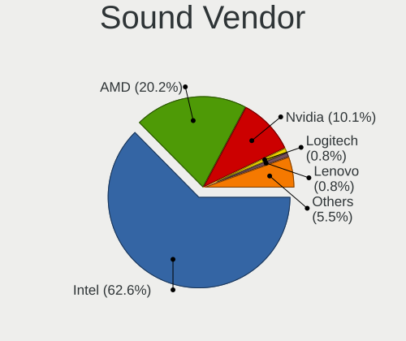

| Vendor                 | Notebooks | Percent |
|------------------------|-----------|---------|
| Intel                  | 149       | 62.61%  |
| AMD                    | 48        | 20.17%  |
| Nvidia                 | 24        | 10.08%  |
| Logitech               | 2         | 0.84%   |
| Lenovo                 | 2         | 0.84%   |
| ASUSTek Computer       | 2         | 0.84%   |
| Yamaha                 | 1         | 0.42%   |
| Walmart                | 1         | 0.42%   |
| Realtek Semiconductor  | 1         | 0.42%   |
| Plantronics            | 1         | 0.42%   |
| Kingston Technology    | 1         | 0.42%   |
| GN Netcom              | 1         | 0.42%   |
| Generalplus Technology | 1         | 0.42%   |
| DSEA A/S               | 1         | 0.42%   |
| Cambridge Audio        | 1         | 0.42%   |
| C-Media Electronics    | 1         | 0.42%   |
| Arturia                | 1         | 0.42%   |

Sound Model
-----------

Sound card models

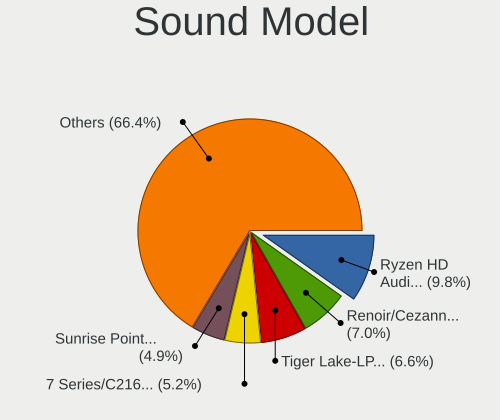

| Model                                                                      | Notebooks | Percent |
|----------------------------------------------------------------------------|-----------|---------|
| AMD Ryzen HD Audio Controller                                              | 28        | 9.79%   |
| AMD Renoir/Cezanne HDMI/DP Audio Controller                                | 20        | 6.99%   |
| Intel Tiger Lake-LP Smart Sound Technology Audio Controller                | 19        | 6.64%   |
| Intel 7 Series/C216 Chipset Family High Definition Audio Controller        | 15        | 5.24%   |
| Intel Sunrise Point-LP HD Audio                                            | 14        | 4.9%    |
| Intel 5 Series/3400 Series Chipset High Definition Audio                   | 12        | 4.2%    |
| Intel 6 Series/C200 Series Chipset Family High Definition Audio Controller | 11        | 3.85%   |
| Intel Cannon Lake PCH cAVS                                                 | 10        | 3.5%    |
| Intel 8 Series/C220 Series Chipset High Definition Audio Controller        | 8         | 2.8%    |
| Intel Xeon E3-1200 v3/4th Gen Core Processor HD Audio Controller           | 7         | 2.45%   |
| Intel Alder Lake PCH-P High Definition Audio Controller                    | 6         | 2.1%    |
| Intel 82801I (ICH9 Family) HD Audio Controller                             | 6         | 2.1%    |
| Intel Raptor Lake-P/U/H cAVS                                               | 5         | 1.75%   |
| Intel Haswell-ULT HD Audio Controller                                      | 5         | 1.75%   |
| Intel Cannon Point-LP High Definition Audio Controller                     | 5         | 1.75%   |
| Intel 8 Series HD Audio Controller                                         | 5         | 1.75%   |
| AMD FCH Azalia Controller                                                  | 5         | 1.75%   |
| Intel Wildcat Point-LP High Definition Audio Controller                    | 4         | 1.4%    |
| Intel Tiger Lake-H HD Audio Controller                                     | 4         | 1.4%    |
| Intel Raptor Lake High Definition Audio Controller                         | 4         | 1.4%    |
| Intel CM238 HD Audio Controller                                            | 4         | 1.4%    |
| Intel Celeron/Pentium Silver Processor High Definition Audio               | 4         | 1.4%    |
| Intel Broadwell-U Audio Controller                                         | 4         | 1.4%    |
| Nvidia TU107 GeForce GTX 1650 High Definition Audio Controller             | 3         | 1.05%   |
| Nvidia GA107 High Definition Audio Controller                              | 3         | 1.05%   |
| Intel Ice Lake-LP Smart Sound Technology Audio Controller                  | 3         | 1.05%   |
| Intel Comet Lake PCH-LP cAVS                                               | 3         | 1.05%   |
| Intel 82801H (ICH8 Family) HD Audio Controller                             | 3         | 1.05%   |
| AMD Radeon High Definition Audio Controller                                | 3         | 1.05%   |
| AMD Kabini HDMI/DP Audio                                                   | 3         | 1.05%   |
| AMD Family 15h (Models 60h-6fh) Audio Controller                           | 3         | 1.05%   |
| Nvidia High Definition Audio Controller                                    | 2         | 0.7%    |
| Nvidia GF108 High Definition Audio Controller                              | 2         | 0.7%    |
| Nvidia GA106 High Definition Audio Controller                              | 2         | 0.7%    |
| Nvidia GA104 High Definition Audio Controller                              | 2         | 0.7%    |
| Nvidia AD107 High Definition Audio Controller                              | 2         | 0.7%    |
| ASUSTek Computer C-Media Audio                                             | 2         | 0.7%    |
| AMD Redwood HDMI Audio [Radeon HD 5000 Series]                             | 2         | 0.7%    |
| AMD Oland/Hainan/Cape Verde/Pitcairn HDMI Audio [Radeon HD 7000 Series]    | 2         | 0.7%    |
| AMD High Definition Audio Controller                                       | 2         | 0.7%    |

Memory
------

Memory Vendor
-------------

Memory module vendors

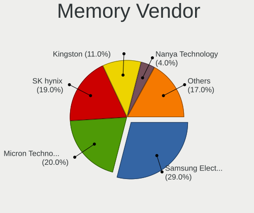

| Vendor              | Notebooks | Percent |
|---------------------|-----------|---------|
| Samsung Electronics | 29        | 29%     |
| Micron Technology   | 20        | 20%     |
| SK hynix            | 19        | 19%     |
| Kingston            | 11        | 11%     |
| Nanya Technology    | 4         | 4%      |
| Unknown             | 3         | 3%      |
| Smart               | 2         | 2%      |
| Elpida              | 2         | 2%      |
| Corsair             | 2         | 2%      |
| Team                | 1         | 1%      |
| Silicon Power       | 1         | 1%      |
| Ramaxel Technology  | 1         | 1%      |
| GOODRAM             | 1         | 1%      |
| G.Skill             | 1         | 1%      |
| Crucial             | 1         | 1%      |
| A-DATA Technology   | 1         | 1%      |
| Unknown             | 1         | 1%      |

Memory Model
------------

Memory module models

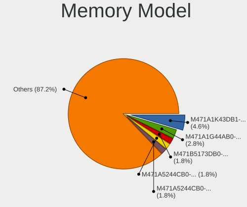

| Model                                                          | Notebooks | Percent |
|----------------------------------------------------------------|-----------|---------|
| Samsung RAM M471A1K43DB1-CWE 8GB SODIMM DDR4 3200MT/s          | 5         | 4.59%   |
| Samsung RAM M471A1G44AB0-CWE 8GiB SODIMM DDR4 3200MT/s         | 3         | 2.75%   |
| SK hynix RAM HMAG68EXNSA051N 8GB SODIMM DDR4 3200MT/s          | 2         | 1.83%   |
| SK hynix RAM HMA82GS6JJR8N-VK 16GB SODIMM DDR4 2667MT/s        | 2         | 1.83%   |
| SK hynix RAM HMA81GS6JJR8N-VK 8GB SODIMM DDR4 2667MT/s         | 2         | 1.83%   |
| Samsung RAM M471B5173DB0-YK0 4GB SODIMM DDR3 1600MT/s          | 2         | 1.83%   |
| Samsung RAM M471A5244CB0-CWE 4GB SODIMM DDR4 3200MT/s          | 2         | 1.83%   |
| Samsung RAM M471A5244CB0-CTD 4GB Row Of Chips DDR4 2667MT/s    | 2         | 1.83%   |
| Samsung RAM M471A1K43EB1-CWE 8GB SODIMM DDR4 3200MT/s          | 2         | 1.83%   |
| Samsung RAM M471A1K43CB1-CRC 8GB SODIMM DDR4 8400MT/s          | 2         | 1.83%   |
| Nanya RAM NT4GC64B8HG0NS-CG 4GB SODIMM DDR3 1600MT/s           | 2         | 1.83%   |
| Micron RAM 8KTF51264HZ-1G9P1 4GB SODIMM DDR3 1867MT/s          | 2         | 1.83%   |
| Micron RAM 8ATF1G64HZ-3G2R1 8GB SODIMM DDR4 3200MT/s           | 2         | 1.83%   |
| Micron RAM 4ATF1G64HZ-3G2F1 8GB SODIMM DDR4 3200MT/s           | 2         | 1.83%   |
| Unknown RAM Module 512MB SODIMM DDR2                           | 1         | 0.92%   |
| Unknown RAM Module 4GB SODIMM DDR3                             | 1         | 0.92%   |
| Unknown RAM Module 2GB SODIMM DDR3                             | 1         | 0.92%   |
| Unknown RAM Module 2GB SODIMM DDR2                             | 1         | 0.92%   |
| Unknown RAM Module 2GB Row Of Chips LPDDR4 4267MT/s            | 1         | 0.92%   |
| Team RAM TEAMGROUP-SD4-3200 16GB SODIMM DDR4 3200MT/s          | 1         | 0.92%   |
| Smart RAM SH564568FH8NWPHSFG 2GB SODIMM DDR3 1333MT/s          | 1         | 0.92%   |
| Smart RAM SF4642G8CK8IEHLSBG 16GB SODIMM DDR4 2667MT/s         | 1         | 0.92%   |
| SK hynix RAM HMT451S6BFR8A-PB 4GB SODIMM DDR3 1600MT/s         | 1         | 0.92%   |
| SK hynix RAM HMT425S6CFR6A-PB 2GB SODIMM DDR3 1600MT/s         | 1         | 0.92%   |
| SK hynix RAM HMCG78AGBSA092N 16GB SODIMM DDR5 5600MT/s         | 1         | 0.92%   |
| SK hynix RAM HMAB2GS6AMR6N-XN 16GB SODIMM DDR4 3200MT/s        | 1         | 0.92%   |
| SK hynix RAM HMAA1GS6CJR6N-XN 8GB SODIMM DDR4 3200MT/s         | 1         | 0.92%   |
| SK hynix RAM HMAA1GS6CJR6N-XN 8GB Row Of Chips DDR4 3200MT/s   | 1         | 0.92%   |
| SK hynix RAM HMA851S6DJR6N-XN 4GB Row Of Chips DDR4 3200MT/s   | 1         | 0.92%   |
| SK hynix RAM HMA851S6CJR6N-VK 4GB SODIMM DDR4 2667MT/s         | 1         | 0.92%   |
| SK hynix RAM HMA851S6AFR6N-UH 4GB SODIMM DDR4 2667MT/s         | 1         | 0.92%   |
| SK hynix RAM HMA81GS6AFR8N-UH 8GB SODIMM DDR4 2667MT/s         | 1         | 0.92%   |
| SK hynix RAM HMA81GS6AFR8N-UH 8GB SODIMM DDR4 2400MT/s         | 1         | 0.92%   |
| SK hynix RAM HCNNNFAMMLXR-NEE 4GB Row Of Chips LPDDR4 4267MT/s | 1         | 0.92%   |
| SK hynix RAM H58G78BK7BX114 8GB SODIMM LPDDR5 6400MT/s         | 1         | 0.92%   |
| Silicon Power RAM SP008GLSTU160N02 8GB SODIMM DDR3 1600MT/s    | 1         | 0.92%   |
| Samsung RAM Module 8GB SODIMM DDR4 2667MT/s                    | 1         | 0.92%   |
| Samsung RAM Module 8GB SODIMM DDR4 2133MT/s                    | 1         | 0.92%   |
| Samsung RAM Module 2GB Row Of Chips LPDDR5 6400MT/s            | 1         | 0.92%   |
| Samsung RAM Module 16GB SODIMM DDR4 3200MT/s                   | 1         | 0.92%   |

Memory Kind
-----------

Memory module kinds

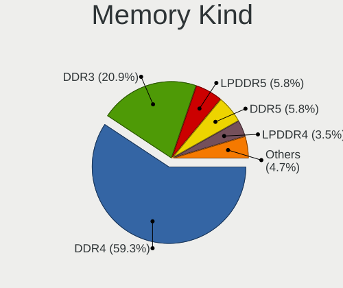

| Kind   | Notebooks | Percent |
|--------|-----------|---------|
| DDR4   | 51        | 59.3%   |
| DDR3   | 18        | 20.93%  |
| LPDDR5 | 5         | 5.81%   |
| DDR5   | 5         | 5.81%   |
| LPDDR4 | 3         | 3.49%   |
| DDR2   | 2         | 2.33%   |
| SDRAM  | 1         | 1.16%   |
| LPDDR3 | 1         | 1.16%   |

Memory Form Factor
------------------

Physical design of the memory module

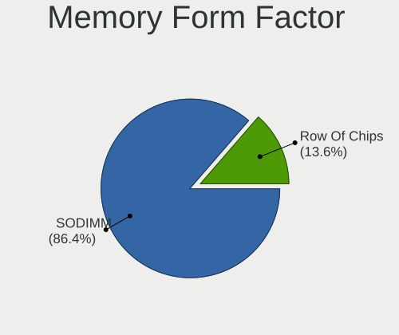

| Name         | Notebooks | Percent |
|--------------|-----------|---------|
| SODIMM       | 76        | 86.36%  |
| Row Of Chips | 12        | 13.64%  |

Memory Size
-----------

Memory module size

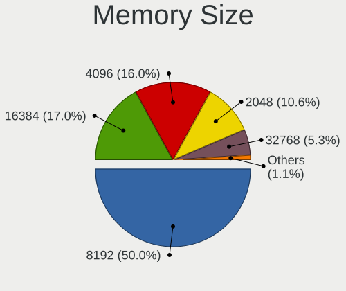

| Size  | Notebooks | Percent |
|-------|-----------|---------|
| 8192  | 47        | 50%     |
| 16384 | 16        | 17.02%  |
| 4096  | 15        | 15.96%  |
| 2048  | 10        | 10.64%  |
| 32768 | 5         | 5.32%   |
| 512   | 1         | 1.06%   |

Memory Speed
------------

Memory module speed

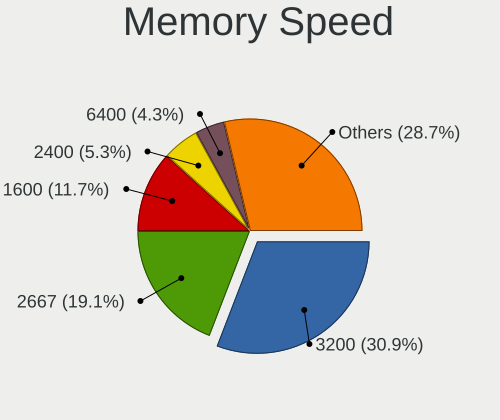

| Speed   | Notebooks | Percent |
|---------|-----------|---------|
| 3200    | 29        | 30.85%  |
| 2667    | 18        | 19.15%  |
| 1600    | 11        | 11.7%   |
| 2400    | 5         | 5.32%   |
| 6400    | 4         | 4.26%   |
| 5600    | 4         | 4.26%   |
| 1334    | 4         | 4.26%   |
| 2133    | 3         | 3.19%   |
| 8400    | 2         | 2.13%   |
| 4267    | 2         | 2.13%   |
| 1867    | 2         | 2.13%   |
| 1333    | 2         | 2.13%   |
| Unknown | 2         | 2.13%   |
| 7500    | 1         | 1.06%   |
| 4800    | 1         | 1.06%   |
| 3266    | 1         | 1.06%   |
| 2048    | 1         | 1.06%   |
| 1067    | 1         | 1.06%   |
| 975     | 1         | 1.06%   |

Printers & scanners
-------------------

Printer Vendor
--------------

Printer device vendors

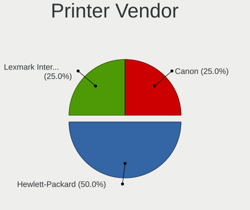

| Vendor                | Notebooks | Percent |
|-----------------------|-----------|---------|
| Hewlett-Packard       | 2         | 50%     |
| Lexmark International | 1         | 25%     |
| Canon                 | 1         | 25%     |

Printer Model
-------------

Printer device models

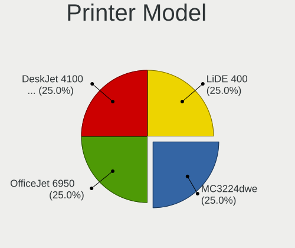

| Model                           | Notebooks | Percent |
|---------------------------------|-----------|---------|
| Lexmark International MC3224dwe | 1         | 25%     |
| HP OfficeJet 6950               | 1         | 25%     |
| HP DeskJet 4100 series          | 1         | 25%     |
| Canon LiDE 400                  | 1         | 25%     |

Scanner Vendor
--------------

Scanner device vendors

Zero info for selected period =(

Scanner Model
-------------

Scanner device models

Zero info for selected period =(

Camera
------

Camera Vendor
-------------

Camera device vendors

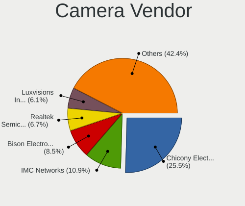

| Vendor                                 | Notebooks | Percent |
|----------------------------------------|-----------|---------|
| Chicony Electronics                    | 42        | 25.45%  |
| IMC Networks                           | 18        | 10.91%  |
| Bison Electronics                      | 14        | 8.48%   |
| Realtek Semiconductor                  | 11        | 6.67%   |
| Luxvisions Innotech Limited            | 10        | 6.06%   |
| Microdia                               | 9         | 5.45%   |
| Syntek                                 | 8         | 4.85%   |
| Sunplus Innovation Technology          | 8         | 4.85%   |
| Quanta                                 | 8         | 4.85%   |
| Suyin                                  | 7         | 4.24%   |
| Primax Electronics                     | 4         | 2.42%   |
| Cheng Uei Precision Industry (Foxlink) | 4         | 2.42%   |
| Sonix Technology                       | 3         | 1.82%   |
| Importek                               | 3         | 1.82%   |
| Ricoh                                  | 2         | 1.21%   |
| Logitech                               | 2         | 1.21%   |
| Z-Star Microelectronics                | 1         | 0.61%   |
| USB CAMERA                             | 1         | 0.61%   |
| Sunplus Technology                     | 1         | 0.61%   |
| Samsung Electronics                    | 1         | 0.61%   |
| Microsoft                              | 1         | 0.61%   |
| Lite-On Technology                     | 1         | 0.61%   |
| Lenovo                                 | 1         | 0.61%   |
| Generalplus Technology                 | 1         | 0.61%   |
| Apple                                  | 1         | 0.61%   |
| ALi                                    | 1         | 0.61%   |
| Acer                                   | 1         | 0.61%   |
| Unknown                                | 1         | 0.61%   |

Camera Model
------------

Camera device models

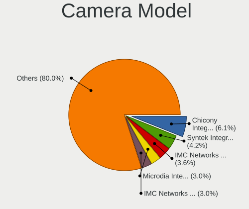

| Model                                                       | Notebooks | Percent |
|-------------------------------------------------------------|-----------|---------|
| Chicony Integrated Camera                                   | 10        | 6.06%   |
| Syntek Integrated Camera                                    | 7         | 4.24%   |
| IMC Networks USB2.0 HD UVC WebCam                           | 6         | 3.64%   |
| Microdia Integrated_Webcam_HD                               | 5         | 3.03%   |
| IMC Networks Integrated Camera                              | 5         | 3.03%   |
| Sunplus Integrated_Webcam_HD                                | 4         | 2.42%   |
| Realtek Integrated_Webcam_HD                                | 4         | 2.42%   |
| Chicony HD WebCam                                           | 4         | 2.42%   |
| Chicony HD User Facing                                      | 4         | 2.42%   |
| Bison BisonCam,NB Pro                                       | 4         | 2.42%   |
| Primax HP HD Webcam [Fixed]                                 | 3         | 1.82%   |
| Luxvisions Innotech Limited HP Wide Vision HD Camera        | 3         | 1.82%   |
| Luxvisions Innotech Limited HP TrueVision HD Camera         | 3         | 1.82%   |
| Bison Integrated Camera                                     | 3         | 1.82%   |
| Sunplus Laptop_Integrated_Webcam_HD                         | 2         | 1.21%   |
| Sonix USB2.0 FHD UVC WebCam                                 | 2         | 1.21%   |
| Realtek USB2.0 HD UVC WebCam                                | 2         | 1.21%   |
| Quanta VGA WebCam                                           | 2         | 1.21%   |
| Quanta HP TrueVision HD Camera                              | 2         | 1.21%   |
| Quanta HD User Facing                                       | 2         | 1.21%   |
| Microdia Integrated Webcam                                  | 2         | 1.21%   |
| Luxvisions Innotech Limited HP HD Camera                    | 2         | 1.21%   |
| Logitech Webcam C270                                        | 2         | 1.21%   |
| IMC Networks USB2.0 VGA UVC WebCam                          | 2         | 1.21%   |
| Chicony HP HD Camera                                        | 2         | 1.21%   |
| Chicony Chicony USB2.0 Camera                               | 2         | 1.21%   |
| Cheng Uei Precision Industry (Foxlink) HP Truevision HD     | 2         | 1.21%   |
| Bison Lenovo Integrated Webcam                              | 2         | 1.21%   |
| Bison HD Webcam                                             | 2         | 1.21%   |
| Z-Star WebCam SC-03FFL11739P                                | 1         | 0.61%   |
| USB CAMERA USB CAMERA                                       | 1         | 0.61%   |
| Syntek Lenovo EasyCamera                                    | 1         | 0.61%   |
| Suyin USB 2.0 UVC 1.3M WebCam                               | 1         | 0.61%   |
| Suyin Sony Visual Communication Camera                      | 1         | 0.61%   |
| Suyin Integrated_Webcam_HD                                  | 1         | 0.61%   |
| Suyin Integrated Webcam                                     | 1         | 0.61%   |
| Suyin HP Truevision HD                                      | 1         | 0.61%   |
| Suyin HP ENVY HD Webcam                                     | 1         | 0.61%   |
| Suyin 1.3M WebCam (notebook emachines E730, Acer sub-brand) | 1         | 0.61%   |
| Sunplus 1.3M HD WebCam                                      | 1         | 0.61%   |

Security
--------

Fingerprint Vendor
------------------

Fingerprint sensor vendors

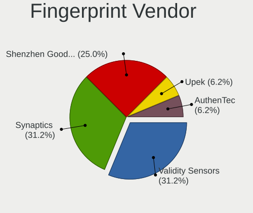

| Vendor                     | Notebooks | Percent |
|----------------------------|-----------|---------|
| Validity Sensors           | 7         | 28%     |
| Synaptics                  | 7         | 28%     |
| Shenzhen Goodix Technology | 5         | 20%     |
| Upek                       | 3         | 12%     |
| AuthenTec                  | 2         | 8%      |
| Next Biometrics            | 1         | 4%      |

Fingerprint Model
-----------------

Fingerprint sensor models

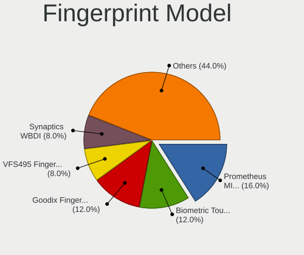

| Model                                                    | Notebooks | Percent |
|----------------------------------------------------------|-----------|---------|
| Synaptics Prometheus MIS Touch Fingerprint Reader        | 4         | 16%     |
| Upek Biometric Touchchip/Touchstrip Fingerprint Sensor   | 3         | 12%     |
| Shenzhen Goodix  FingerPrint Device                      | 3         | 12%     |
| Validity Sensors VFS495 Fingerprint Reader               | 2         | 8%      |
| Validity Sensors Synaptics WBDI                          | 2         | 8%      |
| Synaptics UWP WBDI Device                                | 2         | 8%      |
| AuthenTec AES2810                                        | 2         | 8%      |
| Validity Sensors VFS491                                  | 1         | 4%      |
| Validity Sensors VFS451 Fingerprint Reader               | 1         | 4%      |
| Validity Sensors VFS 5011 fingerprint sensor             | 1         | 4%      |
| Synaptics FS7604 Touch Fingerprint Sensor with PurePrint | 1         | 4%      |
| Shenzhen Goodix Fingerprint Reader                       | 1         | 4%      |
| Shenzhen Goodix FingerPrint                              | 1         | 4%      |
| Next Biometrics NB-2020-U Fingerprint Reader             | 1         | 4%      |

Chipcard Vendor
---------------

Chipcard module vendors

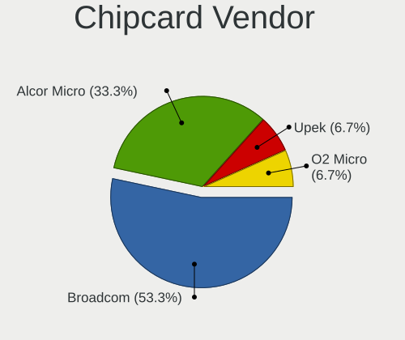

| Vendor      | Notebooks | Percent |
|-------------|-----------|---------|
| Broadcom    | 11        | 52.38%  |
| Alcor Micro | 6         | 28.57%  |
| O2 Micro    | 2         | 9.52%   |
| Upek        | 1         | 4.76%   |
| Lenovo      | 1         | 4.76%   |

Chipcard Model
--------------

Chipcard module models

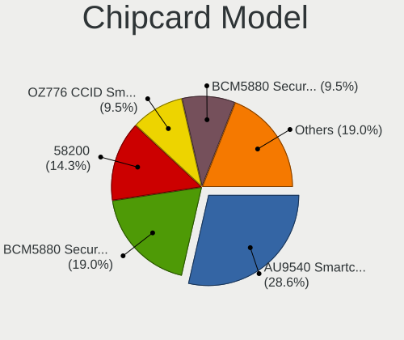

| Model                                                                        | Notebooks | Percent |
|------------------------------------------------------------------------------|-----------|---------|
| Alcor Micro AU9540 Smartcard Reader                                          | 6         | 28.57%  |
| Broadcom BCM5880 Secure Applications Processor                               | 4         | 19.05%  |
| Broadcom 58200                                                               | 3         | 14.29%  |
| O2 Micro OZ776 CCID Smartcard Reader                                         | 2         | 9.52%   |
| Broadcom BCM5880 Secure Applications Processor with fingerprint swipe sensor | 2         | 9.52%   |
| Upek TouchChip Fingerprint Coprocessor (WBF advanced mode)                   | 1         | 4.76%   |
| Lenovo Integrated Smart Card Reader                                          | 1         | 4.76%   |
| Broadcom BCM58200 ControlVault 3 (FingerPrint sensor + Contacted SmartCard)  | 1         | 4.76%   |
| Broadcom 5880                                                                | 1         | 4.76%   |

Unsupported
-----------

Unsupported Devices
-------------------

Total unsupported devices on board

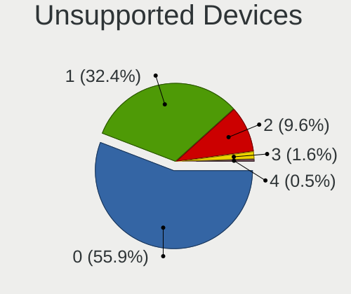

| Total | Notebooks | Percent |
|-------|-----------|---------|
| 0     | 105       | 55.85%  |
| 1     | 61        | 32.45%  |
| 2     | 18        | 9.57%   |
| 3     | 3         | 1.6%    |
| 4     | 1         | 0.53%   |

Unsupported Device Types
------------------------

Types of unsupported devices

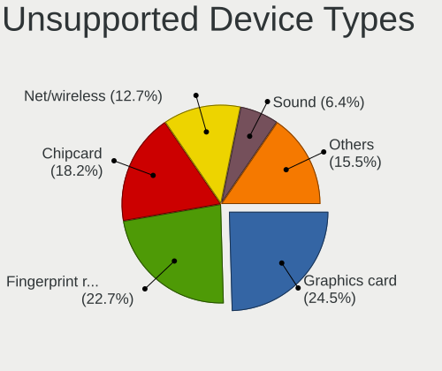

| Type                  | Notebooks | Percent |
|-----------------------|-----------|---------|
| Graphics card         | 27        | 24.55%  |
| Fingerprint reader    | 25        | 22.73%  |
| Chipcard              | 20        | 18.18%  |
| Net/wireless          | 14        | 12.73%  |
| Sound                 | 7         | 6.36%   |
| Multimedia controller | 6         | 5.45%   |
| Camera                | 6         | 5.45%   |
| Card reader           | 2         | 1.82%   |
| Network               | 1         | 0.91%   |
| Net/ethernet          | 1         | 0.91%   |
| Modem                 | 1         | 0.91%   |

