openSUSE Leap-15.5 - Tested Hardware & Statistics (Notebooks)
-------------------------------------------------------------

A project to collect tested hardware configurations for openSUSE Leap-15.5.

Anyone can contribute to this report by the [hw-probe](https://github.com/linuxhw/hw-probe) tool:

    sudo -E hw-probe -all -upload

Please contribute! Especially if your hardware is rare.

Contents
--------

* [ Test Cases ](#test-cases)

* [ System ](#system)
  - [ Kernel                   ](#kernel)
  - [ Kernel Family            ](#kernel-family)
  - [ Kernel Major Ver.        ](#kernel-major-ver)
  - [ Arch                     ](#arch)
  - [ DE                       ](#de)
  - [ Display Server           ](#display-server)
  - [ Display Manager          ](#display-manager)
  - [ OS Lang                  ](#os-lang)
  - [ Boot Mode                ](#boot-mode)
  - [ Filesystem               ](#filesystem)
  - [ Part. scheme             ](#part-scheme)
  - [ Dual Boot with Linux/BSD ](#dual-boot-with-linuxbsd)
  - [ Dual Boot (Win)          ](#dual-boot-win)

* [ Board ](#board)
  - [ Vendor                   ](#vendor)
  - [ Model                    ](#model)
  - [ Model Family             ](#model-family)
  - [ MFG Year                 ](#mfg-year)
  - [ Form Factor              ](#form-factor)
  - [ Secure Boot              ](#secure-boot)
  - [ Coreboot                 ](#coreboot)
  - [ RAM Size                 ](#ram-size)
  - [ RAM Used                 ](#ram-used)
  - [ Total Drives             ](#total-drives)
  - [ Has CD-ROM               ](#has-cd-rom)
  - [ Has Ethernet             ](#has-ethernet)
  - [ Has WiFi                 ](#has-wifi)
  - [ Has Bluetooth            ](#has-bluetooth)

* [ Location ](#location)
  - [ Country                  ](#country)
  - [ City                     ](#city)

* [ Drives ](#drives)
  - [ Drive Vendor             ](#drive-vendor)
  - [ Drive Model              ](#drive-model)
  - [ HDD Vendor               ](#hdd-vendor)
  - [ SSD Vendor               ](#ssd-vendor)
  - [ Drive Kind               ](#drive-kind)
  - [ Drive Connector          ](#drive-connector)
  - [ Drive Size               ](#drive-size)
  - [ Space Total              ](#space-total)
  - [ Space Used               ](#space-used)
  - [ Malfunc. Drives          ](#malfunc-drives)
  - [ Malfunc. Drive Vendor    ](#malfunc-drive-vendor)
  - [ Malfunc. HDD Vendor      ](#malfunc-hdd-vendor)
  - [ Malfunc. Drive Kind      ](#malfunc-drive-kind)
  - [ Failed Drives            ](#failed-drives)
  - [ Failed Drive Vendor      ](#failed-drive-vendor)
  - [ Drive Status             ](#drive-status)

* [ Storage controller ](#storage-controller)
  - [ Storage Vendor           ](#storage-vendor)
  - [ Storage Model            ](#storage-model)
  - [ Storage Kind             ](#storage-kind)

* [ Processor ](#processor)
  - [ CPU Vendor               ](#cpu-vendor)
  - [ CPU Model                ](#cpu-model)
  - [ CPU Model Family         ](#cpu-model-family)
  - [ CPU Cores                ](#cpu-cores)
  - [ CPU Sockets              ](#cpu-sockets)
  - [ CPU Threads              ](#cpu-threads)
  - [ CPU Op-Modes             ](#cpu-op-modes)
  - [ CPU Microcode            ](#cpu-microcode)
  - [ CPU Microarch            ](#cpu-microarch)

* [ Graphics ](#graphics)
  - [ GPU Vendor               ](#gpu-vendor)
  - [ GPU Model                ](#gpu-model)
  - [ GPU Combo                ](#gpu-combo)
  - [ GPU Driver               ](#gpu-driver)
  - [ GPU Memory               ](#gpu-memory)

* [ Monitor ](#monitor)
  - [ Monitor Vendor           ](#monitor-vendor)
  - [ Monitor Model            ](#monitor-model)
  - [ Monitor Resolution       ](#monitor-resolution)
  - [ Monitor Diagonal         ](#monitor-diagonal)
  - [ Monitor Width            ](#monitor-width)
  - [ Aspect Ratio             ](#aspect-ratio)
  - [ Monitor Area             ](#monitor-area)
  - [ Pixel Density            ](#pixel-density)
  - [ Multiple Monitors        ](#multiple-monitors)

* [ Network ](#network)
  - [ Net Controller Vendor    ](#net-controller-vendor)
  - [ Net Controller Model     ](#net-controller-model)
  - [ Wireless Vendor          ](#wireless-vendor)
  - [ Wireless Model           ](#wireless-model)
  - [ Ethernet Vendor          ](#ethernet-vendor)
  - [ Ethernet Model           ](#ethernet-model)
  - [ Net Controller Kind      ](#net-controller-kind)
  - [ Used Controller          ](#used-controller)
  - [ NICs                     ](#nics)
  - [ IPv6                     ](#ipv6)

* [ Bluetooth ](#bluetooth)
  - [ Bluetooth Vendor         ](#bluetooth-vendor)
  - [ Bluetooth Model          ](#bluetooth-model)

* [ Sound ](#sound)
  - [ Sound Vendor             ](#sound-vendor)
  - [ Sound Model              ](#sound-model)

* [ Memory ](#memory)
  - [ Memory Vendor            ](#memory-vendor)
  - [ Memory Model             ](#memory-model)
  - [ Memory Kind              ](#memory-kind)
  - [ Memory Form Factor       ](#memory-form-factor)
  - [ Memory Size              ](#memory-size)
  - [ Memory Speed             ](#memory-speed)

* [ Printers & scanners ](#printers--scanners)
  - [ Printer Vendor           ](#printer-vendor)
  - [ Printer Model            ](#printer-model)
  - [ Scanner Vendor           ](#scanner-vendor)
  - [ Scanner Model            ](#scanner-model)

* [ Camera ](#camera)
  - [ Camera Vendor            ](#camera-vendor)
  - [ Camera Model             ](#camera-model)

* [ Security ](#security)
  - [ Fingerprint Vendor       ](#fingerprint-vendor)
  - [ Fingerprint Model        ](#fingerprint-model)
  - [ Chipcard Vendor          ](#chipcard-vendor)
  - [ Chipcard Model           ](#chipcard-model)

* [ Unsupported ](#unsupported)
  - [ Unsupported Devices      ](#unsupported-devices)
  - [ Unsupported Device Types ](#unsupported-device-types)

Test Cases
----------

Total: 143

| Vendor        | Model                       | Probe                                                      | Date         |
|---------------|-----------------------------|------------------------------------------------------------|--------------|
| Acer          | Aspire A317-32              | [9baf9646df](https://linux-hardware.org/?probe=9baf9646df) | Jan 27, 2024 |
| Lenovo        | ThinkPad E14 20RAS1S600     | [8544584b30](https://linux-hardware.org/?probe=8544584b30) | Jan 27, 2024 |
| Lenovo        | ThinkPad T470 W10DG 20JN... | [6dd363b754](https://linux-hardware.org/?probe=6dd363b754) | Jan 22, 2024 |
| Dell          | Latitude E6400              | [b2765b0e50](https://linux-hardware.org/?probe=b2765b0e50) | Jan 19, 2024 |
| TUXEDO        | Aura 15 Gen2                | [28a227c7d1](https://linux-hardware.org/?probe=28a227c7d1) | Jan 16, 2024 |
| TUXEDO        | Pulse 15 Gen2               | [1ec6103b31](https://linux-hardware.org/?probe=1ec6103b31) | Jan 16, 2024 |
| TUXEDO        | Aura 15 Gen2                | [96e3e7f937](https://linux-hardware.org/?probe=96e3e7f937) | Jan 16, 2024 |
| HP            | Laptop 15-dy2xxx            | [4dc1a2b98c](https://linux-hardware.org/?probe=4dc1a2b98c) | Jan 11, 2024 |
| HP            | EliteBook 2540p             | [088dbf4c2f](https://linux-hardware.org/?probe=088dbf4c2f) | Jan 10, 2024 |
| A-DATA Tec... | XENIA 15                    | [6cf5d66e62](https://linux-hardware.org/?probe=6cf5d66e62) | Jan 10, 2024 |
| Lenovo        | ThinkPad T530 2394W19       | [0dff2ac4a3](https://linux-hardware.org/?probe=0dff2ac4a3) | Jan 10, 2024 |
| HP            | Laptop 15s-eq2xxx           | [2e0223d4eb](https://linux-hardware.org/?probe=2e0223d4eb) | Jan 09, 2024 |
| Lenovo        | ThinkPad P53 20QNCTO1WW     | [a304de1339](https://linux-hardware.org/?probe=a304de1339) | Jan 06, 2024 |
| Lenovo        | ThinkPad T470 W10DG 20JN... | [e340939ad8](https://linux-hardware.org/?probe=e340939ad8) | Jan 06, 2024 |
| Acer          | Aspire A317-32              | [806a8b59fb](https://linux-hardware.org/?probe=806a8b59fb) | Jan 05, 2024 |
| ASUSTek       | UX510UXK                    | [17be26f2de](https://linux-hardware.org/?probe=17be26f2de) | Jan 04, 2024 |
| Lenovo        | ThinkPad P14s Gen 4 21HF... | [1504d9c050](https://linux-hardware.org/?probe=1504d9c050) | Jan 03, 2024 |
| Dell          | Inspiron 3443               | [0c56a0465b](https://linux-hardware.org/?probe=0c56a0465b) | Dec 29, 2023 |
| HP            | EliteBook 8560p             | [16a5247446](https://linux-hardware.org/?probe=16a5247446) | Dec 28, 2023 |
| HP            | EliteBook 8560p             | [82f94ea967](https://linux-hardware.org/?probe=82f94ea967) | Dec 28, 2023 |
| Lenovo        | IdeaPad 3 15ITL6 82H8       | [87e63ff33e](https://linux-hardware.org/?probe=87e63ff33e) | Dec 27, 2023 |
| Lenovo        | ThinkPad E14 Gen 2 20TBS... | [626b056720](https://linux-hardware.org/?probe=626b056720) | Dec 27, 2023 |
| Dell          | System XPS L322X            | [6b050ff1c8](https://linux-hardware.org/?probe=6b050ff1c8) | Dec 23, 2023 |
| Acer          | TravelMate P215-41-G2       | [476ef9075c](https://linux-hardware.org/?probe=476ef9075c) | Dec 21, 2023 |
| Dell          | XPS 15 7590                 | [7e2afccdd6](https://linux-hardware.org/?probe=7e2afccdd6) | Dec 18, 2023 |
| System76      | Bonobo WS                   | [22f5ef6fce](https://linux-hardware.org/?probe=22f5ef6fce) | Dec 16, 2023 |
| Samsung       | 355V4C/355V4X/355V5C/355... | [b949261978](https://linux-hardware.org/?probe=b949261978) | Dec 13, 2023 |
| ASUSTek       | ROG Zephyrus M16 GU604VZ... | [e8383035b9](https://linux-hardware.org/?probe=e8383035b9) | Dec 10, 2023 |
| HP            | Compaq 515                  | [025d4116ed](https://linux-hardware.org/?probe=025d4116ed) | Dec 09, 2023 |
| Lenovo        | IdeaPad 5 14ALC05 82LM      | [9d717185fb](https://linux-hardware.org/?probe=9d717185fb) | Dec 07, 2023 |
| HP            | Notebook                    | [0a554c91b1](https://linux-hardware.org/?probe=0a554c91b1) | Dec 01, 2023 |
| Lenovo        | IdeaPad 5 Pro 16ARH7 82S... | [4ba2fc285f](https://linux-hardware.org/?probe=4ba2fc285f) | Nov 30, 2023 |
| Lenovo        | IdeaPad 5 Pro 16ARH7 82S... | [0f9a06cc9f](https://linux-hardware.org/?probe=0f9a06cc9f) | Nov 30, 2023 |
| HP            | Notebook                    | [93464a0904](https://linux-hardware.org/?probe=93464a0904) | Nov 30, 2023 |
| Acer          | Aspire A317-32              | [02b205724a](https://linux-hardware.org/?probe=02b205724a) | Nov 29, 2023 |
| Lenovo        | IdeaPad S145-15IIL 82DJ     | [1eda316922](https://linux-hardware.org/?probe=1eda316922) | Nov 28, 2023 |
| Lenovo        | Y520-15IKBN 80WK            | [b46ec04a69](https://linux-hardware.org/?probe=b46ec04a69) | Nov 27, 2023 |
| Lenovo        | Y520-15IKBN 80WK            | [d3122d678f](https://linux-hardware.org/?probe=d3122d678f) | Nov 27, 2023 |
| Lenovo        | Legion Pro 5 16ARX8 82WM    | [312776837c](https://linux-hardware.org/?probe=312776837c) | Nov 26, 2023 |
| Acer          | Aspire A515-45G             | [1ec9d0635f](https://linux-hardware.org/?probe=1ec9d0635f) | Nov 23, 2023 |
| System76      | Lemur Pro                   | [45a6298cb5](https://linux-hardware.org/?probe=45a6298cb5) | Nov 22, 2023 |
| Unknown       | Unknown                     | [d169a02b18](https://linux-hardware.org/?probe=d169a02b18) | Nov 14, 2023 |
| Dell          | Latitude E6410              | [1e9606e755](https://linux-hardware.org/?probe=1e9606e755) | Nov 14, 2023 |
| ASUSTek       | ROG Zephyrus M16 GU604VZ... | [242621dab3](https://linux-hardware.org/?probe=242621dab3) | Nov 13, 2023 |
| Dynabook      | PORTEGE X30L-K              | [161674ce4a](https://linux-hardware.org/?probe=161674ce4a) | Nov 10, 2023 |
| Lenovo        | ThinkPad E14 Gen 5 21JR0... | [e736653169](https://linux-hardware.org/?probe=e736653169) | Nov 08, 2023 |
| Lenovo        | ThinkPad W541 20EGS1LB00    | [7a31e185b9](https://linux-hardware.org/?probe=7a31e185b9) | Nov 07, 2023 |
| ASUSTek       | ROG Zephyrus M16 GU604VZ... | [680fae0bef](https://linux-hardware.org/?probe=680fae0bef) | Nov 07, 2023 |
| Lenovo        | ThinkPad T490 20N2000LSP    | [55e3cdf0cc](https://linux-hardware.org/?probe=55e3cdf0cc) | Nov 05, 2023 |
| Lenovo        | ThinkPad E14 Gen 5 21JR0... | [d1d65399a0](https://linux-hardware.org/?probe=d1d65399a0) | Nov 03, 2023 |
| Acer          | Aspire VN7-591G             | [f446da83f1](https://linux-hardware.org/?probe=f446da83f1) | Nov 03, 2023 |
| Lenovo        | Legion 5 Pro 16ITH6H 82J... | [137dba2261](https://linux-hardware.org/?probe=137dba2261) | Nov 02, 2023 |
| Dell          | Inspiron N4050              | [7d5dc09b04](https://linux-hardware.org/?probe=7d5dc09b04) | Oct 30, 2023 |
| ASUSTek       | ZenBook UX434FL             | [139d1a74ed](https://linux-hardware.org/?probe=139d1a74ed) | Oct 25, 2023 |
| HUAWEI        | KLVL-WXXW                   | [b615345fa6](https://linux-hardware.org/?probe=b615345fa6) | Oct 21, 2023 |
| ASUSTek       | ROG Strix G713QE_G713QE     | [398445f93d](https://linux-hardware.org/?probe=398445f93d) | Oct 14, 2023 |
| HP            | ProBook 4535s               | [e52e92c95b](https://linux-hardware.org/?probe=e52e92c95b) | Oct 14, 2023 |
| Lenovo        | ThinkPad T400 27658JG       | [3b3b7832c9](https://linux-hardware.org/?probe=3b3b7832c9) | Oct 11, 2023 |
| ASUSTek       | ROG Strix G713QE_G713QE     | [5e8749954f](https://linux-hardware.org/?probe=5e8749954f) | Oct 11, 2023 |
| Lenovo        | ThinkPad X270 W10DG 20K6... | [814f6c5c52](https://linux-hardware.org/?probe=814f6c5c52) | Oct 09, 2023 |
| Dell          | Precision M6500             | [18605f38d4](https://linux-hardware.org/?probe=18605f38d4) | Oct 05, 2023 |
| Lenovo        | ThinkPad X390 20Q1S5K400    | [4d9d1bf62a](https://linux-hardware.org/?probe=4d9d1bf62a) | Oct 02, 2023 |
| Lenovo        | ThinkBook 15 G2 ITL 20VE    | [6fc52a277a](https://linux-hardware.org/?probe=6fc52a277a) | Sep 28, 2023 |
| ASUSTek       | X510UAR                     | [f94566dde6](https://linux-hardware.org/?probe=f94566dde6) | Sep 23, 2023 |
| HP            | ENVY 17                     | [4f6463148f](https://linux-hardware.org/?probe=4f6463148f) | Sep 22, 2023 |
| Lenovo        | ThinkPad W500 40624DG       | [9bdd448e89](https://linux-hardware.org/?probe=9bdd448e89) | Sep 22, 2023 |
| ASUSTek       | X510UAR                     | [b962cd9626](https://linux-hardware.org/?probe=b962cd9626) | Sep 19, 2023 |
| Lenovo        | B490 37722QP                | [d68a92e72a](https://linux-hardware.org/?probe=d68a92e72a) | Sep 19, 2023 |
| Lenovo        | B490 37722QP                | [8b335d6bb0](https://linux-hardware.org/?probe=8b335d6bb0) | Sep 19, 2023 |
| Acer          | Nitro AN515-57              | [8e044378bd](https://linux-hardware.org/?probe=8e044378bd) | Sep 15, 2023 |
| Acer          | Swift SF314-511             | [4714deba45](https://linux-hardware.org/?probe=4714deba45) | Sep 14, 2023 |
| Dell          | Precision 7540              | [ced1086a24](https://linux-hardware.org/?probe=ced1086a24) | Sep 09, 2023 |
| Dell          | Latitude 5431               | [b2d976a088](https://linux-hardware.org/?probe=b2d976a088) | Sep 08, 2023 |
| Panasonic     | CF-C2CUGZXKM                | [d34f211b22](https://linux-hardware.org/?probe=d34f211b22) | Sep 07, 2023 |
| Panasonic     | CF-C2CUGZXKM                | [098294fb47](https://linux-hardware.org/?probe=098294fb47) | Sep 07, 2023 |
| Sony          | SVF1521A7EB                 | [8b130feb09](https://linux-hardware.org/?probe=8b130feb09) | Sep 06, 2023 |
| Panasonic     | CF-C2CUGZXKM                | [12ed8aee3f](https://linux-hardware.org/?probe=12ed8aee3f) | Sep 05, 2023 |
| Panasonic     | CF-C2CUGZXKM                | [fdcab89946](https://linux-hardware.org/?probe=fdcab89946) | Sep 05, 2023 |
| Medion        | S15449                      | [7e8cd1a434](https://linux-hardware.org/?probe=7e8cd1a434) | Sep 02, 2023 |
| Acer          | Aspire 5715Z                | [22c3bee6fa](https://linux-hardware.org/?probe=22c3bee6fa) | Sep 02, 2023 |
| Acer          | Aspire A317-32              | [0a46c781fc](https://linux-hardware.org/?probe=0a46c781fc) | Sep 01, 2023 |
| Acer          | Predator PH315-52           | [fd3c900751](https://linux-hardware.org/?probe=fd3c900751) | Aug 31, 2023 |
| Lenovo        | ThinkPad T470p 20J60014P... | [7690eb9089](https://linux-hardware.org/?probe=7690eb9089) | Aug 30, 2023 |
| Framework     | Laptop (13th Gen Intel C... | [704a62ef33](https://linux-hardware.org/?probe=704a62ef33) | Aug 29, 2023 |
| Framework     | Laptop (13th Gen Intel C... | [beb1174dde](https://linux-hardware.org/?probe=beb1174dde) | Aug 29, 2023 |
| HUAWEI        | CREF-XX                     | [c5b6554c6b](https://linux-hardware.org/?probe=c5b6554c6b) | Aug 26, 2023 |
| Samsung       | 355V4C/355V4X/355V5C/355... | [b141917712](https://linux-hardware.org/?probe=b141917712) | Aug 23, 2023 |
| Toshiba       | Satellite Pro C70-A         | [dbb00fe95b](https://linux-hardware.org/?probe=dbb00fe95b) | Aug 15, 2023 |
| Acer          | Aspire E5-571G              | [f523831970](https://linux-hardware.org/?probe=f523831970) | Aug 14, 2023 |
| HP            | EliteBook 840 G3            | [66bcc74be2](https://linux-hardware.org/?probe=66bcc74be2) | Aug 13, 2023 |
| Samsung       | 355V4C/355V4X/355V5C/355... | [6f722400c2](https://linux-hardware.org/?probe=6f722400c2) | Aug 11, 2023 |
| Dell          | Precision 7740              | [954d8472e5](https://linux-hardware.org/?probe=954d8472e5) | Aug 09, 2023 |
| Notebook      | NLx0MU                      | [bb99f6f69e](https://linux-hardware.org/?probe=bb99f6f69e) | Aug 07, 2023 |
| Dell          | Vostro 5471                 | [f4beee823e](https://linux-hardware.org/?probe=f4beee823e) | Aug 07, 2023 |
| HP            | 470 G7 Notebook PC          | [7e4a9b4618](https://linux-hardware.org/?probe=7e4a9b4618) | Aug 04, 2023 |
| HP            | ProBook 455 15.6 inch G9... | [8fb651def8](https://linux-hardware.org/?probe=8fb651def8) | Aug 02, 2023 |
| Sony          | Unknown                     | [80613731cb](https://linux-hardware.org/?probe=80613731cb) | Jul 28, 2023 |
| Acer          | Aspire E5-774G              | [1568ba2843](https://linux-hardware.org/?probe=1568ba2843) | Jul 25, 2023 |
| Lenovo        | ThinkPad E15 Gen 2 20T80... | [b7c7b058b7](https://linux-hardware.org/?probe=b7c7b058b7) | Jul 23, 2023 |
| MSI           | Cyborg 15 A13VE             | [edf7b092ec](https://linux-hardware.org/?probe=edf7b092ec) | Jul 23, 2023 |
| MSI           | Cyborg 15 A13VE             | [421c2ff6b0](https://linux-hardware.org/?probe=421c2ff6b0) | Jul 23, 2023 |
| Lenovo        | ThinkPad L15 Gen 1 20U8S... | [c741f10f18](https://linux-hardware.org/?probe=c741f10f18) | Jul 23, 2023 |
| Medion        | E6224                       | [c33b8a1fb1](https://linux-hardware.org/?probe=c33b8a1fb1) | Jul 22, 2023 |
| Sony          | Unknown                     | [427e52d6a6](https://linux-hardware.org/?probe=427e52d6a6) | Jul 20, 2023 |
| Medion        | E6224                       | [4ffae87044](https://linux-hardware.org/?probe=4ffae87044) | Jul 17, 2023 |
| Lenovo        | B5400 80B6QB0               | [7108435241](https://linux-hardware.org/?probe=7108435241) | Jul 15, 2023 |
| Samsung       | 355V4C/355V4X/355V5C/355... | [6b351b341e](https://linux-hardware.org/?probe=6b351b341e) | Jul 15, 2023 |
| Lenovo        | ThinkPad T530 2394W19       | [874f8b41a7](https://linux-hardware.org/?probe=874f8b41a7) | Jul 14, 2023 |
| HP            | OMEN by Gaming Laptop 16... | [9bee6805c0](https://linux-hardware.org/?probe=9bee6805c0) | Jul 13, 2023 |
| Dell          | Vostro 3400                 | [93d94feca6](https://linux-hardware.org/?probe=93d94feca6) | Jul 11, 2023 |
| ASUSTek       | K53SM                       | [7aac135bc0](https://linux-hardware.org/?probe=7aac135bc0) | Jul 11, 2023 |
| Lenovo        | ThinkPad T14 Gen 2i 20W0... | [a52e535dcb](https://linux-hardware.org/?probe=a52e535dcb) | Jul 11, 2023 |
| Dell          | Latitude E5410              | [8d980136c2](https://linux-hardware.org/?probe=8d980136c2) | Jul 10, 2023 |
| Lenovo        | V15-IGL 82C3                | [9f920e8a7e](https://linux-hardware.org/?probe=9f920e8a7e) | Jul 10, 2023 |
| HP            | Notebook                    | [a1c37a6a4b](https://linux-hardware.org/?probe=a1c37a6a4b) | Jul 09, 2023 |
| Toshiba       | dynabook Satellite B552/... | [f459621198](https://linux-hardware.org/?probe=f459621198) | Jul 06, 2023 |
| Notebook      | NLx0MU                      | [b3530f3e0e](https://linux-hardware.org/?probe=b3530f3e0e) | Jul 05, 2023 |
| Acer          | Nitro AN515-58              | [40b7950cb2](https://linux-hardware.org/?probe=40b7950cb2) | Jul 05, 2023 |
| Acer          | Nitro AN515-58              | [73435e5646](https://linux-hardware.org/?probe=73435e5646) | Jul 05, 2023 |
| ASUSTek       | VivoBook_ASUSLaptop E510... | [27c53e1152](https://linux-hardware.org/?probe=27c53e1152) | Jul 01, 2023 |
| Lenovo        | ThinkPad T530 2394W19       | [a1fc2e0020](https://linux-hardware.org/?probe=a1fc2e0020) | Jul 01, 2023 |
| ASUSTek       | VivoBook_ASUSLaptop X160... | [a203a588f9](https://linux-hardware.org/?probe=a203a588f9) | Jun 30, 2023 |
| Lenovo        | ThinkPad X200 7458AH8       | [a81af2d7e2](https://linux-hardware.org/?probe=a81af2d7e2) | Jun 29, 2023 |
| Acer          | Aspire A317-53              | [1fe3acdf83](https://linux-hardware.org/?probe=1fe3acdf83) | Jun 25, 2023 |
| ASUSTek       | K53TK                       | [905653d393](https://linux-hardware.org/?probe=905653d393) | Jun 24, 2023 |
| Notebook      | NLx0MU                      | [733af664a4](https://linux-hardware.org/?probe=733af664a4) | Jun 18, 2023 |
| HP            | Laptop 17-bs0xx             | [bbb32d23be](https://linux-hardware.org/?probe=bbb32d23be) | Jun 17, 2023 |
| Fujitsu Si... | ESPRIMO Mobile V6555        | [0210669ff3](https://linux-hardware.org/?probe=0210669ff3) | Jun 15, 2023 |
| Samsung       | 355V4C/355V4X/355V5C/355... | [fdc4101cba](https://linux-hardware.org/?probe=fdc4101cba) | Jun 13, 2023 |
| Notebook      | NS50_70MU                   | [87b818815c](https://linux-hardware.org/?probe=87b818815c) | Jun 10, 2023 |
| Apple         | MacBookPro11,4              | [6d70667d42](https://linux-hardware.org/?probe=6d70667d42) | Jun 09, 2023 |
| ASUSTek       | G771JW                      | [6d989f49b6](https://linux-hardware.org/?probe=6d989f49b6) | Jun 09, 2023 |
| Lenovo        | Legion 5 Pro 16ARH7H 82R... | [f6fddfcd65](https://linux-hardware.org/?probe=f6fddfcd65) | Jun 07, 2023 |
| HP            | OMEN Laptop 15-en0xxx       | [ab7c62da47](https://linux-hardware.org/?probe=ab7c62da47) | Jun 02, 2023 |
| Dell          | Inspiron 3501               | [2cf19f7b32](https://linux-hardware.org/?probe=2cf19f7b32) | Jun 02, 2023 |
| HP            | ENVY m6 Notebook            | [f133543500](https://linux-hardware.org/?probe=f133543500) | May 23, 2023 |
| HP            | ENVY m6 Notebook            | [c903e06758](https://linux-hardware.org/?probe=c903e06758) | May 22, 2023 |
| Dell          | Inspiron 3501               | [74c412b40a](https://linux-hardware.org/?probe=74c412b40a) | May 16, 2023 |
| HP            | Victus by Gaming Laptop ... | [2dc2bdd057](https://linux-hardware.org/?probe=2dc2bdd057) | May 14, 2023 |
| Dell          | Latitude E5530 non-vPro     | [aa5dc9770e](https://linux-hardware.org/?probe=aa5dc9770e) | May 13, 2023 |
| Dell          | Latitude E5530 non-vPro     | [51c66f0f57](https://linux-hardware.org/?probe=51c66f0f57) | May 13, 2023 |
| Dell          | Inspiron 3501               | [29d2a588e0](https://linux-hardware.org/?probe=29d2a588e0) | Apr 27, 2023 |
| Dell          | Latitude D530               | [92cf04edba](https://linux-hardware.org/?probe=92cf04edba) | Mar 21, 2023 |

System
------

Kernel
------

Version of the Linux kernel

| Version                      | Notebooks | Percent |
|------------------------------|-----------|---------|
| 5.14.21-150500.53-default    | 29        | 25.66%  |
| 5.14.21-150500.55.19-default | 19        | 16.81%  |
| 5.14.21-150500.55.39-default | 17        | 15.04%  |
| 5.14.21-150500.55.36-default | 15        | 13.27%  |
| 5.14.21-150500.55.31-default | 10        | 8.85%   |
| 5.14.21-150500.55.7-default  | 6         | 5.31%   |
| 5.14.21-150500.55.12-default | 6         | 5.31%   |
| 5.14.21-150500.52-default    | 4         | 3.54%   |
| 5.14.21-150500.55.28-default | 3         | 2.65%   |
| 5.14.21-150500.55.44-default | 1         | 0.88%   |
| 5.14.21-150500.50-default    | 1         | 0.88%   |
| 5.14.21-150500.49-default    | 1         | 0.88%   |
| 5.14.21-150500.43-default    | 1         | 0.88%   |

Kernel Family
-------------

Linux kernel without a distro release

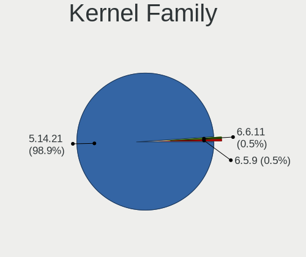

| Version | Notebooks | Percent |
|---------|-----------|---------|
| 5.14.21 | 106       | 100%    |

Kernel Major Ver.
-----------------

Linux kernel major version

| Version | Notebooks | Percent |
|---------|-----------|---------|
| 5.14    | 106       | 100%    |

Arch
----

OS architecture (x86_64, i586, etc.)

| Name   | Notebooks | Percent |
|--------|-----------|---------|
| x86_64 | 106       | 100%    |

DE
--

Desktop Environment

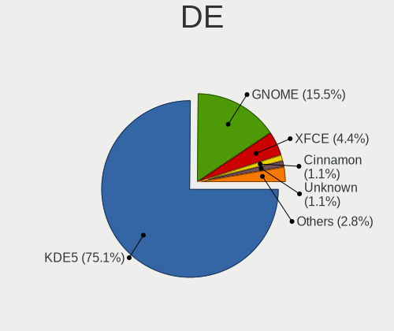

| Name     | Notebooks | Percent |
|----------|-----------|---------|
| KDE5     | 78        | 73.58%  |
| GNOME    | 17        | 16.04%  |
| XFCE     | 5         | 4.72%   |
| Cinnamon | 2         | 1.89%   |
| Unknown  | 2         | 1.89%   |
| Trinity  | 1         | 0.94%   |
| KDE      | 1         | 0.94%   |

Display Server
--------------

X11 or Wayland

| Name    | Notebooks | Percent |
|---------|-----------|---------|
| X11     | 84        | 78.5%   |
| Wayland | 20        | 18.69%  |
| Tty     | 2         | 1.87%   |
| Unknown | 1         | 0.93%   |

Display Manager
---------------

SDDM, LightDM, etc.

| Name    | Notebooks | Percent |
|---------|-----------|---------|
| Unknown | 59        | 55.66%  |
| SDDM    | 29        | 27.36%  |
| LightDM | 9         | 8.49%   |
| GDM     | 6         | 5.66%   |
| XDM     | 3         | 2.83%   |

OS Lang
-------

Language

| Lang            | Notebooks | Percent |
|-----------------|-----------|---------|
| en_US           | 31        | 28.97%  |
| de_DE           | 26        | 24.3%   |
| POSIX           | 13        | 12.15%  |
| pt_BR           | 6         | 5.61%   |
| es_ES           | 5         | 4.67%   |
| fr_FR           | 4         | 3.74%   |
| en_GB           | 4         | 3.74%   |
| ru_RU           | 3         | 2.8%    |
| pl_PL           | 2         | 1.87%   |
| it_IT           | 2         | 1.87%   |
| hu_HU           | 2         | 1.87%   |
| zh_CN           | 1         | 0.93%   |
| sk_SK           | 1         | 0.93%   |
| nl_NL           | 1         | 0.93%   |
| ja_JP           | 1         | 0.93%   |
| en_ZA           | 1         | 0.93%   |
| en_US.ISO8859-1 | 1         | 0.93%   |
| en_DK           | 1         | 0.93%   |
| cs_CZ           | 1         | 0.93%   |
| Unknown         | 1         | 0.93%   |

Boot Mode
---------

EFI or BIOS

| Mode | Notebooks | Percent |
|------|-----------|---------|
| BIOS | 61        | 57.01%  |
| EFI  | 46        | 42.99%  |

Filesystem
----------

Type of filesystem

| Type  | Notebooks | Percent |
|-------|-----------|---------|
| Btrfs | 84        | 79.25%  |
| Ext4  | 19        | 17.92%  |
| Xfs   | 2         | 1.89%   |
| Tmpfs | 1         | 0.94%   |

Part. scheme
------------

Scheme of partitioning

| Type    | Notebooks | Percent |
|---------|-----------|---------|
| Unknown | 55        | 51.4%   |
| GPT     | 49        | 45.79%  |
| MBR     | 3         | 2.8%    |

Dual Boot with Linux/BSD
------------------------

Hosting more than one Linux/BSD

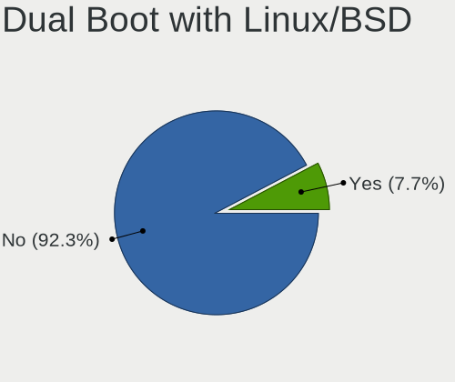

| Dual boot | Notebooks | Percent |
|-----------|-----------|---------|
| No        | 97        | 91.51%  |
| Yes       | 9         | 8.49%   |

Dual Boot (Win)
---------------

Hosting Linux and Windows

| Dual boot | Notebooks | Percent |
|-----------|-----------|---------|
| No        | 82        | 77.36%  |
| Yes       | 24        | 22.64%  |

Board
-----

Vendor
------

Motherboard manufacturer

| Name                | Notebooks | Percent |
|---------------------|-----------|---------|
| Lenovo              | 30        | 28.3%   |
| Hewlett-Packard     | 17        | 16.04%  |
| Dell                | 15        | 14.15%  |
| Acer                | 11        | 10.38%  |
| ASUSTek Computer    | 10        | 9.43%   |
| TUXEDO              | 3         | 2.83%   |
| Toshiba             | 2         | 1.89%   |
| System76            | 2         | 1.89%   |
| Sony                | 2         | 1.89%   |
| Notebook            | 2         | 1.89%   |
| Medion              | 2         | 1.89%   |
| HUAWEI              | 2         | 1.89%   |
| Samsung Electronics | 1         | 0.94%   |
| Panasonic           | 1         | 0.94%   |
| MSI                 | 1         | 0.94%   |
| Fujitsu Siemens     | 1         | 0.94%   |
| Framework           | 1         | 0.94%   |
| Dynabook            | 1         | 0.94%   |
| Apple               | 1         | 0.94%   |
| Unknown             | 1         | 0.94%   |

Model
-----

Motherboard model

| Name                                                                                     | Notebooks | Percent |
|------------------------------------------------------------------------------------------|-----------|---------|
| TUXEDO Aura 15 Gen2                                                                      | 2         | 1.89%   |
| HP Notebook                                                                              | 2         | 1.89%   |
| Unknown                                                                                  | 2         | 1.89%   |
| TUXEDO Pulse 15 Gen2                                                                     | 1         | 0.94%   |
| Toshiba Satellite Pro C70-A                                                              | 1         | 0.94%   |
| Toshiba dynabook Satellite B552/H                                                        | 1         | 0.94%   |
| System76 Lemur Pro                                                                       | 1         | 0.94%   |
| System76 Bonobo WS                                                                       | 1         | 0.94%   |
| Sony SVF1521A7EB                                                                         | 1         | 0.94%   |
| Samsung 355V4C/355V4X/355V5C/355V5X/356V4C/356V4X/356V5C/356V5X/3445VC/3445VX/3545VC/354 | 1         | 0.94%   |
| Panasonic CF-C2CUGZXKM                                                                   | 1         | 0.94%   |
| Notebook NS50_70MU                                                                       | 1         | 0.94%   |
| Notebook NLx0MU                                                                          | 1         | 0.94%   |
| MSI Cyborg 15 A13VE                                                                      | 1         | 0.94%   |
| Medion S15449                                                                            | 1         | 0.94%   |
| Medion E6224                                                                             | 1         | 0.94%   |
| Lenovo Y520-15IKBN 80WK                                                                  | 1         | 0.94%   |
| Lenovo V15-IGL 82C3                                                                      | 1         | 0.94%   |
| Lenovo ThinkPad X390 20Q1S5K400                                                          | 1         | 0.94%   |
| Lenovo ThinkPad X270 W10DG 20K6S0X900                                                    | 1         | 0.94%   |
| Lenovo ThinkPad X200 7458AH8                                                             | 1         | 0.94%   |
| Lenovo ThinkPad W541 20EGS1LB00                                                          | 1         | 0.94%   |
| Lenovo ThinkPad W500 40624DG                                                             | 1         | 0.94%   |
| Lenovo ThinkPad T530 2394W19                                                             | 1         | 0.94%   |
| Lenovo ThinkPad T490 20N2000LSP                                                          | 1         | 0.94%   |
| Lenovo ThinkPad T470p 20J60014PB                                                         | 1         | 0.94%   |
| Lenovo ThinkPad T470 W10DG 20JNS09G00                                                    | 1         | 0.94%   |
| Lenovo ThinkPad T400 27658JG                                                             | 1         | 0.94%   |
| Lenovo ThinkPad T14 Gen 2i 20W00153US                                                    | 1         | 0.94%   |
| Lenovo ThinkPad P53 20QNCTO1WW                                                           | 1         | 0.94%   |
| Lenovo ThinkPad P14s Gen 4 21HFCTO1WW                                                    | 1         | 0.94%   |
| Lenovo ThinkPad L15 Gen 1 20U8S0AH00                                                     | 1         | 0.94%   |
| Lenovo ThinkPad E15 Gen 2 20T8002CUS                                                     | 1         | 0.94%   |
| Lenovo ThinkPad E14 Gen 5 21JR0009CX                                                     | 1         | 0.94%   |
| Lenovo ThinkPad E14 Gen 2 20TBS04X00                                                     | 1         | 0.94%   |
| Lenovo ThinkPad E14 20RAS1S600                                                           | 1         | 0.94%   |
| Lenovo ThinkBook 15 G2 ITL 20VE                                                          | 1         | 0.94%   |
| Lenovo Legion Pro 5 16ARX8 82WM                                                          | 1         | 0.94%   |
| Lenovo Legion 5 Pro 16ITH6H 82JD                                                         | 1         | 0.94%   |
| Lenovo Legion 5 Pro 16ARH7H 82RG                                                         | 1         | 0.94%   |

Model Family
------------

Motherboard model prefix

| Name                   | Notebooks | Percent |
|------------------------|-----------|---------|
| Lenovo ThinkPad        | 18        | 16.98%  |
| Acer Aspire            | 6         | 5.66%   |
| Dell Latitude          | 5         | 4.72%   |
| Lenovo IdeaPad         | 4         | 3.77%   |
| Lenovo Legion          | 3         | 2.83%   |
| HP Laptop              | 3         | 2.83%   |
| HP EliteBook           | 3         | 2.83%   |
| Dell Precision         | 3         | 2.83%   |
| Dell Inspiron          | 3         | 2.83%   |
| TUXEDO Aura            | 2         | 1.89%   |
| HP ProBook             | 2         | 1.89%   |
| HP OMEN                | 2         | 1.89%   |
| HP Notebook            | 2         | 1.89%   |
| HP ENVY                | 2         | 1.89%   |
| Dell Vostro            | 2         | 1.89%   |
| ASUS VivoBook          | 2         | 1.89%   |
| ASUS ROG               | 2         | 1.89%   |
| Acer Nitro             | 2         | 1.89%   |
| Unknown                | 2         | 1.89%   |
| TUXEDO Pulse           | 1         | 0.94%   |
| Toshiba Satellite      | 1         | 0.94%   |
| Toshiba dynabook       | 1         | 0.94%   |
| System76 Lemur         | 1         | 0.94%   |
| System76 Bonobo        | 1         | 0.94%   |
| Sony SVF1521A7EB       | 1         | 0.94%   |
| Samsung 355V4C         | 1         | 0.94%   |
| Panasonic CF-C2CUGZXKM | 1         | 0.94%   |
| Notebook NS50          | 1         | 0.94%   |
| Notebook NLx0MU        | 1         | 0.94%   |
| MSI Cyborg             | 1         | 0.94%   |
| Medion S15449          | 1         | 0.94%   |
| Medion E6224           | 1         | 0.94%   |
| Lenovo Y520-15IKBN     | 1         | 0.94%   |
| Lenovo V15-IGL         | 1         | 0.94%   |
| Lenovo ThinkBook       | 1         | 0.94%   |
| Lenovo B5400           | 1         | 0.94%   |
| Lenovo B490            | 1         | 0.94%   |
| HUAWEI KLVL-WXXW       | 1         | 0.94%   |
| HUAWEI CREF-XX         | 1         | 0.94%   |
| HP Victus              | 1         | 0.94%   |

MFG Year
--------

Motherboard manufacture year

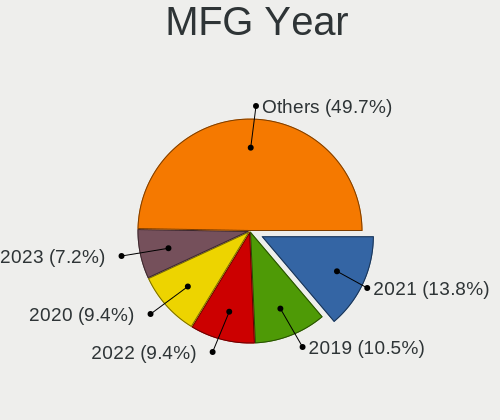

| Year | Notebooks | Percent |
|------|-----------|---------|
| 2021 | 17        | 16.04%  |
| 2022 | 11        | 10.38%  |
| 2020 | 11        | 10.38%  |
| 2019 | 10        | 9.43%   |
| 2023 | 9         | 8.49%   |
| 2017 | 8         | 7.55%   |
| 2010 | 7         | 6.6%    |
| 2011 | 6         | 5.66%   |
| 2013 | 5         | 4.72%   |
| 2016 | 4         | 3.77%   |
| 2012 | 4         | 3.77%   |
| 2008 | 4         | 3.77%   |
| 2014 | 3         | 2.83%   |
| 2009 | 3         | 2.83%   |
| 2015 | 2         | 1.89%   |
| 2018 | 1         | 0.94%   |
| 2007 | 1         | 0.94%   |

Form Factor
-----------

Physical design of the computer

| Name     | Notebooks | Percent |
|----------|-----------|---------|
| Notebook | 106       | 100%    |

Secure Boot
-----------

Enabled or disabled

| State    | Notebooks | Percent |
|----------|-----------|---------|
| Disabled | 89        | 83.96%  |
| Enabled  | 17        | 16.04%  |

Coreboot
--------

Have coreboot on board

| Used | Notebooks | Percent |
|------|-----------|---------|
| No   | 104       | 98.11%  |
| Yes  | 2         | 1.89%   |

RAM Size
--------

Total RAM memory

| Size in GB  | Notebooks | Percent |
|-------------|-----------|---------|
| 4.01-8.0    | 30        | 28.3%   |
| 16.01-24.0  | 24        | 22.64%  |
| 8.01-16.0   | 23        | 21.7%   |
| 32.01-64.0  | 12        | 11.32%  |
| 3.01-4.0    | 7         | 6.6%    |
| 64.01-256.0 | 6         | 5.66%   |
| 1.01-2.0    | 4         | 3.77%   |

RAM Used
--------

Used RAM memory

| Used GB   | Notebooks | Percent |
|-----------|-----------|---------|
| 2.01-3.0  | 38        | 34.23%  |
| 1.01-2.0  | 25        | 22.52%  |
| 3.01-4.0  | 24        | 21.62%  |
| 4.01-8.0  | 15        | 13.51%  |
| 8.01-16.0 | 6         | 5.41%   |
| 0.51-1.0  | 3         | 2.7%    |

Total Drives
------------

Number of drives on board

| Drives | Notebooks | Percent |
|--------|-----------|---------|
| 1      | 81        | 75.7%   |
| 2      | 22        | 20.56%  |
| 3      | 4         | 3.74%   |

Has CD-ROM
----------

Has CD-ROM on board

| Presented | Notebooks | Percent |
|-----------|-----------|---------|
| No        | 77        | 71.96%  |
| Yes       | 30        | 28.04%  |

Has Ethernet
------------

Has Ethernet on board

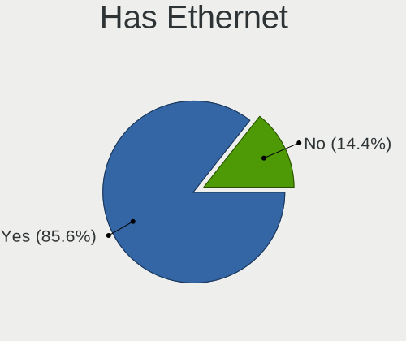

| Presented | Notebooks | Percent |
|-----------|-----------|---------|
| Yes       | 90        | 84.91%  |
| No        | 16        | 15.09%  |

Has WiFi
--------

Has WiFi module

| Presented | Notebooks | Percent |
|-----------|-----------|---------|
| Yes       | 102       | 96.23%  |
| No        | 4         | 3.77%   |

Has Bluetooth
-------------

Has Bluetooth module

| Presented | Notebooks | Percent |
|-----------|-----------|---------|
| Yes       | 87        | 82.08%  |
| No        | 19        | 17.92%  |

Location
--------

Country
-------

Geographic location (country)

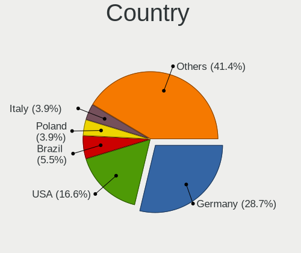

| Country      | Notebooks | Percent |
|--------------|-----------|---------|
| Germany      | 28        | 26.42%  |
| USA          | 14        | 13.21%  |
| Brazil       | 8         | 7.55%   |
| Russia       | 4         | 3.77%   |
| Poland       | 4         | 3.77%   |
| Italy        | 4         | 3.77%   |
| UK           | 3         | 2.83%   |
| India        | 3         | 2.83%   |
| Hungary      | 3         | 2.83%   |
| Ukraine      | 2         | 1.89%   |
| Spain        | 2         | 1.89%   |
| Netherlands  | 2         | 1.89%   |
| Greece       | 2         | 1.89%   |
| France       | 2         | 1.89%   |
| Argentina    | 2         | 1.89%   |
| Venezuela    | 1         | 0.94%   |
| Turkey       | 1         | 0.94%   |
| Switzerland  | 1         | 0.94%   |
| Sweden       | 1         | 0.94%   |
| South Africa | 1         | 0.94%   |
| Slovakia     | 1         | 0.94%   |
| Serbia       | 1         | 0.94%   |
| Senegal      | 1         | 0.94%   |
| Peru         | 1         | 0.94%   |
| Mexico       | 1         | 0.94%   |
| Japan        | 1         | 0.94%   |
| Ireland      | 1         | 0.94%   |
| Hong Kong    | 1         | 0.94%   |
| Finland      | 1         | 0.94%   |
| Czechia      | 1         | 0.94%   |
| Colombia     | 1         | 0.94%   |
| China        | 1         | 0.94%   |
| Canada       | 1         | 0.94%   |
| Bulgaria     | 1         | 0.94%   |
| Bolivia      | 1         | 0.94%   |
| Belgium      | 1         | 0.94%   |
| Austria      | 1         | 0.94%   |
| Australia    | 1         | 0.94%   |

City
----

Geographic location (city)

| City                        | Notebooks | Percent |
|-----------------------------|-----------|---------|
| Munich                      | 4         | 3.74%   |
| Sao Paulo                   | 2         | 1.87%   |
| Rio de Janeiro              | 2         | 1.87%   |
| Kyiv                        | 2         | 1.87%   |
| Hanover                     | 2         | 1.87%   |
| Hamburg                     | 2         | 1.87%   |
| Budapest                    | 2         | 1.87%   |
| Bonn                        | 2         | 1.87%   |
| Berlin                      | 2         | 1.87%   |
| Zetel                       | 1         | 0.93%   |
| Yokohama                    | 1         | 0.93%   |
| Wolfratshausen              | 1         | 0.93%   |
| Warsaw                      | 1         | 0.93%   |
| Waidhofen an der Ybbs       | 1         | 0.93%   |
| Wachtberg                   | 1         | 0.93%   |
| Vechta                      | 1         | 0.93%   |
| Trivandrum                  | 1         | 0.93%   |
| Tokaj                       | 1         | 0.93%   |
| Sydney                      | 1         | 0.93%   |
| St Petersburg               | 1         | 0.93%   |
| St Louis                    | 1         | 0.93%   |
| Sofia                       | 1         | 0.93%   |
| Sigtuna                     | 1         | 0.93%   |
| Siegen                      | 1         | 0.93%   |
| Seattle                     | 1         | 0.93%   |
| Sao Vicente                 | 1         | 0.93%   |
| San Diego                   | 1         | 0.93%   |
| San Cristóbal de La Laguna | 1         | 0.93%   |
| San Antonio                 | 1         | 0.93%   |
| Sainte-Luce-sur-Loire       | 1         | 0.93%   |
| Rosario                     | 1         | 0.93%   |
| Rochdale                    | 1         | 0.93%   |
| Richardson                  | 1         | 0.93%   |
| Pune                        | 1         | 0.93%   |
| Prague                      | 1         | 0.93%   |
| Poznan                      | 1         | 0.93%   |
| Portland                    | 1         | 0.93%   |
| Pikine                      | 1         | 0.93%   |
| Nizhniy Novgorod            | 1         | 0.93%   |
| Nieder-Olm                  | 1         | 0.93%   |

Drives
------

Drive Vendor
------------

Hard drive vendors

| Vendor                      | Notebooks | Drives | Percent |
|-----------------------------|-----------|--------|---------|
| Samsung Electronics         | 30        | 35     | 23.44%  |
| Seagate                     | 11        | 16     | 8.59%   |
| SanDisk                     | 9         | 13     | 7.03%   |
| SK hynix                    | 8         | 10     | 6.25%   |
| Intel                       | 8         | 8      | 6.25%   |
| Kingston                    | 7         | 9      | 5.47%   |
| WDC                         | 6         | 6      | 4.69%   |
| Micron Technology           | 6         | 6      | 4.69%   |
| Toshiba                     | 5         | 6      | 3.91%   |
| Crucial                     | 5         | 5      | 3.91%   |
| Unknown                     | 3         | 3      | 2.34%   |
| Micron/Crucial Technology   | 3         | 4      | 2.34%   |
| Hitachi                     | 3         | 3      | 2.34%   |
| ADATA Technology            | 3         | 3      | 2.34%   |
| Silicon Motion              | 2         | 2      | 1.56%   |
| KIOXIA                      | 2         | 2      | 1.56%   |
| HGST                        | 2         | 2      | 1.56%   |
| China                       | 2         | 3      | 1.56%   |
| Yangtze Memory Technologies | 1         | 1      | 0.78%   |
| Union Memory                | 1         | 1      | 0.78%   |
| Transcend                   | 1         | 1      | 0.78%   |
| SPCC                        | 1         | 1      | 0.78%   |
| PNY                         | 1         | 2      | 0.78%   |
| Phison Electronics          | 1         | 1      | 0.78%   |
| Patriot                     | 1         | 1      | 0.78%   |
| KXG60ZNV                    | 1         | 1      | 0.78%   |
| GOODRAM                     | 1         | 1      | 0.78%   |
| Gigabyte Technology         | 1         | 1      | 0.78%   |
| BR                          | 1         | 1      | 0.78%   |
| Apple                       | 1         | 1      | 0.78%   |
| A-DATA Technology           | 1         | 1      | 0.78%   |

Drive Model
-----------

Hard drive models

| Model                                                           | Notebooks | Percent |
|-----------------------------------------------------------------|-----------|---------|
| Samsung NVMe SSD Controller PM9A1/PM9A3/980PRO 2TB              | 7         | 5.34%   |
| Samsung NVMe SSD Controller SM981/PM981/PM983 1TB               | 5         | 3.82%   |
| Intel SSD 660P Series 1024GB                                    | 4         | 3.05%   |
| Seagate ST1000LM024 HN-M101MBB 1TB                              | 3         | 2.29%   |
| Sandisk WD Blue SN550 NVMe SSD 512GB                            | 3         | 2.29%   |
| Sandisk WD Black SN750 / PC SN730 NVMe SSD 512GB                | 3         | 2.29%   |
| Micron/Crucial P2 NVMe PCIe SSD 1TB                             | 3         | 2.29%   |
| Samsung SSD 860 EVO 1TB                                         | 2         | 1.53%   |
| Samsung MZALQ256HAJD-000L2 256GB                                | 2         | 1.53%   |
| KIOXIA KBG40ZNV256G 256GB                                       | 2         | 1.53%   |
| Kingston SNVS500G 500GB                                         | 2         | 1.53%   |
| Kingston SA400S37120G 120GB SSD                                 | 2         | 1.53%   |
| Intel SSD Pro 7600p/760p/E 6100p Series 1024GB                  | 2         | 1.53%   |
| ADATA XPG SX8200 Pro PCIe Gen3x4 M.2 2280 Solid State Drive 2TB | 2         | 1.53%   |
| Yangtze Memory ZHITAI TiPlus5000 1TB                            | 1         | 0.76%   |
| WDC WDS240G2G0C-00AJM0 240GB                                    | 1         | 0.76%   |
| WDC WD5000LPVX-16V0TT3 500GB                                    | 1         | 0.76%   |
| WDC WD3200BPVT-24ZEST0 320GB                                    | 1         | 0.76%   |
| WDC WD3200BEKT-75PVMT0 320GB                                    | 1         | 0.76%   |
| WDC WD20SPZX-21UA7T0 2TB                                        | 1         | 0.76%   |
| WDC WD12 00BEVS-07LAT0 120GB                                    | 1         | 0.76%   |
| Unknown USB DISK 3.2 1TB                                        | 1         | 0.76%   |
| Unknown MMC Card  8GB                                           | 1         | 0.76%   |
| Unknown MMC Card  64GB                                          | 1         | 0.76%   |
| Union Memory UMIS RPJTJ512MEE1OWX 512GB                         | 1         | 0.76%   |
| Transcend TS256GMTS430S 256GB SSD                               | 1         | 0.76%   |
| Toshiba XG6 NVMe SSD Controller 256GB                           | 1         | 0.76%   |
| Toshiba THNSNK128GVN8 128GB SSD                                 | 1         | 0.76%   |
| Toshiba THNSNJ256G8NU 256GB SSD                                 | 1         | 0.76%   |
| Toshiba THNSNH256GBST SSD                                       | 1         | 0.76%   |
| Toshiba MQ04ABF100 1TB                                          | 1         | 0.76%   |
| Toshiba MQ01ABD100 1TB                                          | 1         | 0.76%   |
| SPCC Solid State Disk 128GB                                     | 1         | 0.76%   |
| SK hynix SKHynix_HFS512GEJ9X115N 512GB                          | 1         | 0.76%   |
| SK hynix SKHynix_HFS002TEJ9X162N 2TB                            | 1         | 0.76%   |
| SK hynix SKHynix_HFS001TDE9X081N 1TB                            | 1         | 0.76%   |
| SK hynix SKHynix_HFM512GD3HX015N 512GB                          | 1         | 0.76%   |
| SK hynix SHGP31-1000GM 1TB                                      | 1         | 0.76%   |
| SK hynix PC611 NVMe 512GB                                       | 1         | 0.76%   |
| SK hynix HFM512GD3JX016N 512GB                                  | 1         | 0.76%   |

HDD Vendor
----------

Hard disk drive vendors

| Vendor  | Notebooks | Drives | Percent |
|---------|-----------|--------|---------|
| Seagate | 9         | 11     | 42.86%  |
| WDC     | 5         | 5      | 23.81%  |
| Hitachi | 3         | 3      | 14.29%  |
| Toshiba | 2         | 2      | 9.52%   |
| HGST    | 2         | 2      | 9.52%   |

SSD Vendor
----------

Solid state drive vendors

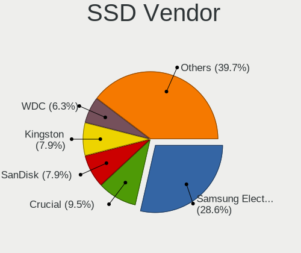

| Vendor              | Notebooks | Drives | Percent |
|---------------------|-----------|--------|---------|
| Samsung Electronics | 9         | 10     | 28.13%  |
| Crucial             | 5         | 5      | 15.63%  |
| Toshiba             | 3         | 3      | 9.38%   |
| Kingston            | 3         | 3      | 9.38%   |
| China               | 2         | 3      | 6.25%   |
| Transcend           | 1         | 1      | 3.13%   |
| SPCC                | 1         | 1      | 3.13%   |
| SanDisk             | 1         | 4      | 3.13%   |
| PNY                 | 1         | 2      | 3.13%   |
| Patriot             | 1         | 1      | 3.13%   |
| Intel               | 1         | 1      | 3.13%   |
| GOODRAM             | 1         | 1      | 3.13%   |
| Gigabyte Technology | 1         | 1      | 3.13%   |
| Apple               | 1         | 1      | 3.13%   |
| A-DATA Technology   | 1         | 1      | 3.13%   |

Drive Kind
----------

HDD or SSD

| Kind    | Notebooks | Drives | Percent |
|---------|-----------|--------|---------|
| NVMe    | 62        | 81     | 52.54%  |
| SSD     | 30        | 38     | 25.42%  |
| HDD     | 21        | 23     | 17.8%   |
| Unknown | 3         | 6      | 2.54%   |
| MMC     | 2         | 2      | 1.69%   |

Drive Connector
---------------

SATA, SAS, NVMe, etc.

| Type | Notebooks | Drives | Percent |
|------|-----------|--------|---------|
| NVMe | 62        | 80     | 53.91%  |
| SATA | 47        | 61     | 40.87%  |
| SAS  | 4         | 7      | 3.48%   |
| MMC  | 2         | 2      | 1.74%   |

Drive Size
----------

Size of hard drive

| Size in TB | Notebooks | Drives | Percent |
|------------|-----------|--------|---------|
| 0.01-0.5   | 33        | 35     | 63.46%  |
| 0.51-1.0   | 17        | 24     | 32.69%  |
| 1.01-2.0   | 2         | 2      | 3.85%   |

Space Total
-----------

Amount of disk space available on the file system

| Size in GB     | Notebooks | Percent |
|----------------|-----------|---------|
| More than 3000 | 32        | 30.19%  |
| 1001-2000      | 24        | 22.64%  |
| 2001-3000      | 14        | 13.21%  |
| 501-1000       | 14        | 13.21%  |
| 251-500        | 11        | 10.38%  |
| 101-250        | 6         | 5.66%   |
| 21-50          | 2         | 1.89%   |
| 51-100         | 2         | 1.89%   |
| Unknown        | 1         | 0.94%   |

Space Used
----------

Amount of used disk space

| Used GB        | Notebooks | Percent |
|----------------|-----------|---------|
| 101-250        | 35        | 31.25%  |
| 51-100         | 24        | 21.43%  |
| 251-500        | 18        | 16.07%  |
| 1-20           | 9         | 8.04%   |
| 1001-2000      | 8         | 7.14%   |
| 501-1000       | 8         | 7.14%   |
| More than 3000 | 4         | 3.57%   |
| 21-50          | 4         | 3.57%   |
| 2001-3000      | 1         | 0.89%   |
| Unknown        | 1         | 0.89%   |

Malfunc. Drives
---------------

Drive models with a malfunction

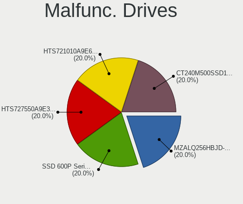

| Model                                        | Notebooks | Drives | Percent |
|----------------------------------------------|-----------|--------|---------|
| Samsung Electronics MZALQ256HBJD-00BL2 256GB | 1         | 1      | 50%     |
| Hitachi HTS727550A9E364 500GB                | 1         | 1      | 50%     |

Malfunc. Drive Vendor
---------------------

Vendors of faulty drives

| Vendor              | Notebooks | Drives | Percent |
|---------------------|-----------|--------|---------|
| Samsung Electronics | 1         | 1      | 50%     |
| Hitachi             | 1         | 1      | 50%     |

Malfunc. HDD Vendor
-------------------

Vendors of faulty HDD drives

| Vendor  | Notebooks | Drives | Percent |
|---------|-----------|--------|---------|
| Hitachi | 1         | 1      | 100%    |

Malfunc. Drive Kind
-------------------

Kinds of faulty drives

| Kind | Notebooks | Drives | Percent |
|------|-----------|--------|---------|
| NVMe | 1         | 1      | 50%     |
| HDD  | 1         | 1      | 50%     |

Failed Drives
-------------

Failed drive models

Zero info for selected period =(

Failed Drive Vendor
-------------------

Failed drive vendors

Zero info for selected period =(

Drive Status
------------

Number of failed and malfunc. drives

| Status   | Notebooks | Drives | Percent |
|----------|-----------|--------|---------|
| Detected | 57        | 78     | 51.82%  |
| Works    | 51        | 70     | 46.36%  |
| Malfunc  | 2         | 2      | 1.82%   |

Storage controller
------------------

Storage Vendor
--------------

Storage controller vendors

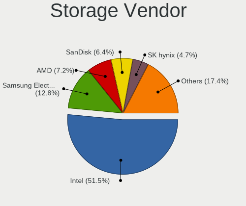

| Vendor                       | Notebooks | Percent |
|------------------------------|-----------|---------|
| Intel                        | 66        | 46.48%  |
| Samsung Electronics          | 22        | 15.49%  |
| AMD                          | 11        | 7.75%   |
| SanDisk                      | 9         | 6.34%   |
| SK hynix                     | 8         | 5.63%   |
| Micron Technology            | 6         | 4.23%   |
| Kingston Technology Company  | 4         | 2.82%   |
| Micron/Crucial Technology    | 3         | 2.11%   |
| ADATA Technology             | 3         | 2.11%   |
| Silicon Motion               | 2         | 1.41%   |
| KIOXIA                       | 2         | 1.41%   |
| Yangtze Memory Technologies  | 1         | 0.7%    |
| Union Memory (Shenzhen)      | 1         | 0.7%    |
| Toshiba America Info Systems | 1         | 0.7%    |
| Seagate Technology           | 1         | 0.7%    |
| Phison Electronics           | 1         | 0.7%    |
| Nvidia                       | 1         | 0.7%    |

Storage Model
-------------

Storage controller models

| Model                                                                          | Notebooks | Percent |
|--------------------------------------------------------------------------------|-----------|---------|
| AMD FCH SATA Controller [AHCI mode]                                            | 9         | 5.84%   |
| Samsung NVMe SSD Controller 980 (DRAM-less)                                    | 8         | 5.19%   |
| Intel Sunrise Point-LP SATA Controller [AHCI mode]                             | 8         | 5.19%   |
| Samsung NVMe SSD Controller PM9A1/PM9A3/980PRO                                 | 7         | 4.55%   |
| Intel 7 Series Chipset Family 6-port SATA Controller [AHCI mode]               | 7         | 4.55%   |
| Intel Volume Management Device NVMe RAID Controller                            | 6         | 3.9%    |
| Samsung NVMe SSD Controller SM981/PM981/PM983                                  | 5         | 3.25%   |
| Intel Tiger Lake-LP SATA Controller                                            | 5         | 3.25%   |
| SK hynix Gold P31/BC711/PC711 NVMe Solid State Drive                           | 4         | 2.6%    |
| Intel SSD 660P Series                                                          | 4         | 2.6%    |
| Intel 82801 Mobile SATA Controller [RAID mode]                                 | 4         | 2.6%    |
| Intel 8 Series/C220 Series Chipset Family 6-port SATA Controller 1 [AHCI mode] | 4         | 2.6%    |
| Intel 6 Series/C200 Series Chipset Family 6 port Mobile SATA AHCI Controller   | 4         | 2.6%    |
| SanDisk Ultra 3D / WD Blue SN550 NVMe SSD                                      | 3         | 1.95%   |
| SanDisk Extreme Pro / WD Black SN750 / PC SN730 / Red SN700 NVMe SSD           | 3         | 1.95%   |
| Micron/Crucial P2 [Nick P2] / P3 / P3 Plus NVMe PCIe SSD (DRAM-less)           | 3         | 1.95%   |
| Intel Celeron/Pentium Silver Processor SATA Controller                         | 3         | 1.95%   |
| Intel Cannon Lake Mobile PCH SATA AHCI Controller                              | 3         | 1.95%   |
| Intel 82801IBM/IEM (ICH9M/ICH9M-E) 4 port SATA Controller [AHCI mode]          | 3         | 1.95%   |
| Intel 5 Series/3400 Series Chipset 6 port SATA AHCI Controller                 | 3         | 1.95%   |
| SK hynix Platinum P41/PC801 NVMe Solid State Drive                             | 2         | 1.3%    |
| SanDisk WD Green SN350 240GB (DRAM-less) / SN560E NVMe SSD                     | 2         | 1.3%    |
| Micron 2450 NVMe SSD [HendrixV] (DRAM-less)                                    | 2         | 1.3%    |
| KIOXIA NVMe SSD Controller BG4 (DRAM-less)                                     | 2         | 1.3%    |
| Kingston Company NV1 NVMe SSD SM2263XT (DRAM-less)                             | 2         | 1.3%    |
| Intel Wildcat Point-LP SATA Controller [AHCI Mode]                             | 2         | 1.3%    |
| Intel Volume Management Device NVMe RAID Controller Intel Corporation          | 2         | 1.3%    |
| Intel Tiger Lake SATA AHCI Controller                                          | 2         | 1.3%    |
| Intel SSD DC P4101/Pro 7600p/760p/E 6100p Series                               | 2         | 1.3%    |
| Intel 82801HM/HEM (ICH8M/ICH8M-E) IDE Controller                               | 2         | 1.3%    |
| Intel 8 Series SATA Controller 1 [AHCI mode]                                   | 2         | 1.3%    |
| ADATA XPG SX8200 Pro PCIe Gen3x4 M.2 2280 Solid State Drive                    | 2         | 1.3%    |
| Yangtze Memory ZHITAI TiPro5000 NVMe SSD                                       | 1         | 0.65%   |
| Union Memory (Shenzhen) AM620 PCIe 3.0 NVMe SSD 512GB                          | 1         | 0.65%   |
| Toshiba America Info Systems XG6 NVMe SSD Controller                           | 1         | 0.65%   |
| SK hynix PC611 NVMe Solid State Drive                                          | 1         | 0.65%   |
| SK hynix BC511 NVMe SSD                                                        | 1         | 0.65%   |
| Silicon Motion SM2262/SM2262EN SSD Controller                                  | 1         | 0.65%   |
| Silicon Motion Non-Volatile memory controller                                  | 1         | 0.65%   |
| Seagate BarraCuda Q5 NVMe SSD (DRAM-less)                                      | 1         | 0.65%   |

Storage Kind
------------

Kind of storage controller (IDE, SATA, NVMe, SAS, ...)

| Kind | Notebooks | Percent |
|------|-----------|---------|
| SATA | 64        | 45.07%  |
| NVMe | 62        | 43.66%  |
| RAID | 12        | 8.45%   |
| IDE  | 4         | 2.82%   |

Processor
---------

CPU Vendor
----------

Processor vendors

| Vendor | Notebooks | Percent |
|--------|-----------|---------|
| Intel  | 82        | 77.36%  |
| AMD    | 24        | 22.64%  |

CPU Model
---------

Processor models

| Model                                    | Notebooks | Percent |
|------------------------------------------|-----------|---------|
| Intel 11th Gen Core i7-1165G7 @ 2.80GHz  | 5         | 4.72%   |
| Intel 11th Gen Core i5-1135G7 @ 2.40GHz  | 5         | 4.72%   |
| AMD Ryzen 5 5500U with Radeon Graphics   | 4         | 3.77%   |
| Intel Core i7-9750H CPU @ 2.60GHz        | 3         | 2.83%   |
| AMD Ryzen 7 5700U with Radeon Graphics   | 3         | 2.83%   |
| Intel Core i7-8565U CPU @ 1.80GHz        | 2         | 1.89%   |
| Intel Core i7-4720HQ CPU @ 2.60GHz       | 2         | 1.89%   |
| Intel Core i5-8250U CPU @ 1.60GHz        | 2         | 1.89%   |
| Intel Core i5-6300U CPU @ 2.40GHz        | 2         | 1.89%   |
| Intel Core i5-3230M CPU @ 2.60GHz        | 2         | 1.89%   |
| Intel Core i5-10210U CPU @ 1.60GHz       | 2         | 1.89%   |
| Intel Core i3-2310M CPU @ 2.10GHz        | 2         | 1.89%   |
| Intel Core 2 Duo CPU P8700 @ 2.53GHz     | 2         | 1.89%   |
| Intel Celeron N4020 CPU @ 1.10GHz        | 2         | 1.89%   |
| Intel 13th Gen Core i9-13900HX           | 2         | 1.89%   |
| Intel Xeon E-2276M CPU @ 2.80GHz         | 1         | 0.94%   |
| Intel Pentium Silver N5030 CPU @ 1.10GHz | 1         | 0.94%   |
| Intel Pentium Gold 7505 @ 2.00GHz        | 1         | 0.94%   |
| Intel Pentium Dual CPU T2390 @ 1.86GHz   | 1         | 0.94%   |
| Intel Pentium CPU 2117U @ 1.80GHz        | 1         | 0.94%   |
| Intel Pentium CPU 2020M @ 2.40GHz        | 1         | 0.94%   |
| Intel Core i7-9850H CPU @ 2.60GHz        | 1         | 0.94%   |
| Intel Core i7-7700HQ CPU @ 2.80GHz       | 1         | 0.94%   |
| Intel Core i7-7500U CPU @ 2.70GHz        | 1         | 0.94%   |
| Intel Core i7-6500U CPU @ 2.50GHz        | 1         | 0.94%   |
| Intel Core i7-4940MX CPU @ 3.10GHz       | 1         | 0.94%   |
| Intel Core i7-4770HQ CPU @ 2.20GHz       | 1         | 0.94%   |
| Intel Core i7-3517U CPU @ 1.90GHz        | 1         | 0.94%   |
| Intel Core i7-2670QM CPU @ 2.20GHz       | 1         | 0.94%   |
| Intel Core i7-2630QM CPU @ 2.00GHz       | 1         | 0.94%   |
| Intel Core i7 CPU X 940 @ 2.13GHz        | 1         | 0.94%   |
| Intel Core i7 CPU Q 720 @ 1.60GHz        | 1         | 0.94%   |
| Intel Core i7 CPU M 640 @ 2.80GHz        | 1         | 0.94%   |
| Intel Core i7 CPU L 640 @ 2.13GHz        | 1         | 0.94%   |
| Intel Core i5-8265U CPU @ 1.60GHz        | 1         | 0.94%   |
| Intel Core i5-7300HQ CPU @ 2.50GHz       | 1         | 0.94%   |
| Intel Core i5-7200U CPU @ 2.50GHz        | 1         | 0.94%   |
| Intel Core i5-6200U CPU @ 2.30GHz        | 1         | 0.94%   |
| Intel Core i5-5200U CPU @ 2.20GHz        | 1         | 0.94%   |
| Intel Core i5-4310U CPU @ 2.00GHz        | 1         | 0.94%   |

CPU Model Family
----------------

Processor model prefix

| Model                | Notebooks | Percent |
|----------------------|-----------|---------|
| Other                | 23        | 21.7%   |
| Intel Core i7        | 20        | 18.87%  |
| Intel Core i5        | 19        | 17.92%  |
| AMD Ryzen 7          | 8         | 7.55%   |
| AMD Ryzen 5          | 8         | 7.55%   |
| Intel Core i3        | 5         | 4.72%   |
| Intel Core 2 Duo     | 5         | 4.72%   |
| Intel Celeron        | 3         | 2.83%   |
| Intel Pentium        | 2         | 1.89%   |
| AMD Ryzen 7 PRO      | 2         | 1.89%   |
| AMD A6               | 2         | 1.89%   |
| Intel Xeon           | 1         | 0.94%   |
| Intel Pentium Silver | 1         | 0.94%   |
| Intel Pentium Gold   | 1         | 0.94%   |
| Intel Pentium Dual   | 1         | 0.94%   |
| Intel Core 2 Extreme | 1         | 0.94%   |
| AMD Ryzen 3          | 1         | 0.94%   |
| AMD FX               | 1         | 0.94%   |
| AMD Athlon X2        | 1         | 0.94%   |
| AMD A8               | 1         | 0.94%   |

CPU Cores
---------

Number of processor cores

| Number | Notebooks | Percent |
|--------|-----------|---------|
| 2      | 38        | 35.85%  |
| 4      | 33        | 31.13%  |
| 6      | 14        | 13.21%  |
| 8      | 11        | 10.38%  |
| 14     | 3         | 2.83%   |
| 12     | 3         | 2.83%   |
| 24     | 2         | 1.89%   |
| 10     | 1         | 0.94%   |
| 1      | 1         | 0.94%   |

CPU Sockets
-----------

Number of sockets

| Number | Notebooks | Percent |
|--------|-----------|---------|
| 1      | 106       | 100%    |

CPU Threads
-----------

Threads per core (Hyper-Threading)

| Number | Notebooks | Percent |
|--------|-----------|---------|
| 2      | 88        | 83.02%  |
| 1      | 18        | 16.98%  |

CPU Op-Modes
------------

CPU Operation Modes (32-bit, 64-bit)

| Op mode        | Notebooks | Percent |
|----------------|-----------|---------|
| 32-bit, 64-bit | 106       | 100%    |

CPU Microcode
-------------

Microcode number

| Number     | Notebooks | Percent |
|------------|-----------|---------|
| Unknown    | 53        | 49.53%  |
| 0x806c1    | 8         | 7.48%   |
| 0x806ec    | 5         | 4.67%   |
| 0x08608103 | 5         | 4.67%   |
| 0x406e3    | 3         | 2.8%    |
| 0x906ea    | 2         | 1.87%   |
| 0x906a3    | 2         | 1.87%   |
| 0x806e9    | 2         | 1.87%   |
| 0x40651    | 2         | 1.87%   |
| 0x306a9    | 2         | 1.87%   |
| 0x0a50000d | 2         | 1.87%   |
| 0x08608102 | 2         | 1.87%   |
| 0x08600106 | 2         | 1.87%   |
| 0xb06a2    | 1         | 0.93%   |
| 0xb0671    | 1         | 0.93%   |
| 0x906ed    | 1         | 0.93%   |
| 0x906e9    | 1         | 0.93%   |
| 0x806ea    | 1         | 0.93%   |
| 0x806c2    | 1         | 0.93%   |
| 0x706a8    | 1         | 0.93%   |
| 0x306c3    | 1         | 0.93%   |
| 0x20655    | 1         | 0.93%   |
| 0x106e5    | 1         | 0.93%   |
| 0x1067a    | 1         | 0.93%   |
| 0x10676    | 1         | 0.93%   |
| 0x0a601203 | 1         | 0.93%   |
| 0x0a50000c | 1         | 0.93%   |
| 0x0a404102 | 1         | 0.93%   |
| 0x0a404101 | 1         | 0.93%   |
| 0x03000027 | 1         | 0.93%   |

CPU Microarch
-------------

Microarchitecture

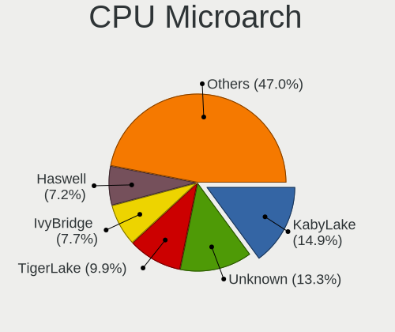

| Name             | Notebooks | Percent |
|------------------|-----------|---------|
| Unknown          | 18        | 16.98%  |
| KabyLake         | 16        | 15.09%  |
| TigerLake        | 13        | 12.26%  |
| IvyBridge        | 7         | 6.6%    |
| Haswell          | 7         | 6.6%    |
| Zen 3            | 5         | 4.72%   |
| Skylake          | 5         | 4.72%   |
| SandyBridge      | 5         | 4.72%   |
| Penryn           | 4         | 3.77%   |
| Alderlake Hybrid | 4         | 3.77%   |
| Zen 2            | 3         | 2.83%   |
| Westmere         | 3         | 2.83%   |
| Goldmont plus    | 3         | 2.83%   |
| Core             | 3         | 2.83%   |
| Nehalem          | 2         | 1.89%   |
| K10 Llano        | 2         | 1.89%   |
| Broadwell        | 2         | 1.89%   |
| Piledriver       | 1         | 0.94%   |
| K8 & K10 hybrid  | 1         | 0.94%   |
| IceLake          | 1         | 0.94%   |
| Excavator        | 1         | 0.94%   |

Graphics
--------

GPU Vendor
----------

Vendors of graphics cards

| Vendor | Notebooks | Percent |
|--------|-----------|---------|
| Intel  | 76        | 53.9%   |
| Nvidia | 34        | 24.11%  |
| AMD    | 31        | 21.99%  |

GPU Model
---------

Graphics card models

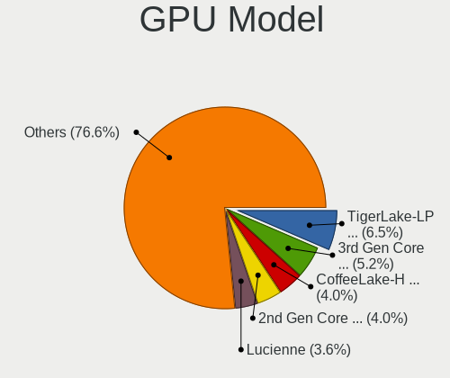

| Model                                                                         | Notebooks | Percent |
|-------------------------------------------------------------------------------|-----------|---------|
| Intel TigerLake-LP GT2 [Iris Xe Graphics]                                     | 11        | 7.59%   |
| AMD Lucienne                                                                  | 8         | 5.52%   |
| Intel 3rd Gen Core processor Graphics Controller                              | 7         | 4.83%   |
| Intel Skylake GT2 [HD Graphics 520]                                           | 5         | 3.45%   |
| Intel CoffeeLake-H GT2 [UHD Graphics 630]                                     | 5         | 3.45%   |
| Intel 2nd Generation Core Processor Family Integrated Graphics Controller     | 5         | 3.45%   |
| Intel 4th Gen Core Processor Integrated Graphics Controller                   | 4         | 2.76%   |
| Intel WhiskeyLake-U GT2 [UHD Graphics 620]                                    | 3         | 2.07%   |
| Intel Raptor Lake-P [Iris Xe Graphics]                                        | 3         | 2.07%   |
| Intel Alder Lake-P GT2 [Iris Xe Graphics]                                     | 3         | 2.07%   |
| AMD Renoir [Radeon RX Vega 6 (Ryzen 4000/5000 Mobile Series)]                 | 3         | 2.07%   |
| AMD Cezanne [Radeon Vega Series / Radeon Vega Mobile Series]                  | 3         | 2.07%   |
| Nvidia TU117M [GeForce GTX 1650 Mobile / Max-Q]                               | 2         | 1.38%   |
| Nvidia GM107M [GeForce GTX 960M]                                              | 2         | 1.38%   |
| Nvidia GM107M [GeForce GTX 950M]                                              | 2         | 1.38%   |
| Nvidia GA106M [GeForce RTX 3060 Mobile / Max-Q]                               | 2         | 1.38%   |
| Nvidia AD107M [GeForce RTX 4060 Max-Q / Mobile]                               | 2         | 1.38%   |
| Intel UHD Graphics 620                                                        | 2         | 1.38%   |
| Intel TigerLake-H GT1 [UHD Graphics]                                          | 2         | 1.38%   |
| Intel Tiger Lake-LP GT2 [UHD Graphics G4]                                     | 2         | 1.38%   |
| Intel Raptor Lake-S UHD Graphics                                              | 2         | 1.38%   |
| Intel Mobile GM965/GL960 Integrated Graphics Controller (secondary)           | 2         | 1.38%   |
| Intel Mobile GM965/GL960 Integrated Graphics Controller (primary)             | 2         | 1.38%   |
| Intel Mobile 4 Series Chipset Integrated Graphics Controller                  | 2         | 1.38%   |
| Intel HD Graphics 630                                                         | 2         | 1.38%   |
| Intel HD Graphics 620                                                         | 2         | 1.38%   |
| Intel HD Graphics 5500                                                        | 2         | 1.38%   |
| Intel Haswell-ULT Integrated Graphics Controller                              | 2         | 1.38%   |
| Intel GeminiLake [UHD Graphics 600]                                           | 2         | 1.38%   |
| Intel Core Processor Integrated Graphics Controller                           | 2         | 1.38%   |
| Intel CometLake-U GT2 [UHD Graphics]                                          | 2         | 1.38%   |
| AMD Sun XT [Radeon HD 8670A/8670M/8690M / R5 M330 / M430 / Radeon 520 Mobile] | 2         | 1.38%   |
| AMD Rembrandt [Radeon 680M]                                                   | 2         | 1.38%   |
| AMD Barcelo                                                                   | 2         | 1.38%   |
| Nvidia TU117M [GeForce MX450]                                                 | 1         | 0.69%   |
| Nvidia TU117M [GeForce GTX 1650 Ti Mobile]                                    | 1         | 0.69%   |
| Nvidia TU106M [GeForce RTX 2060 Mobile]                                       | 1         | 0.69%   |
| Nvidia TU104GLM [Quadro RTX 5000 Mobile / Max-Q]                              | 1         | 0.69%   |
| Nvidia MCP79 [GeForce 8200M G]                                                | 1         | 0.69%   |
| Nvidia GT218M [NVS 3100M]                                                     | 1         | 0.69%   |

GPU Combo
---------

Combinations of graphics cards

| Name           | Notebooks | Percent |
|----------------|-----------|---------|
| 1 x Intel      | 46        | 43.4%   |
| Intel + Nvidia | 23        | 21.7%   |
| 1 x AMD        | 17        | 16.04%  |
| Intel + AMD    | 7         | 6.6%    |
| 1 x Nvidia     | 6         | 5.66%   |
| AMD + Nvidia   | 5         | 4.72%   |
| 2 x AMD        | 2         | 1.89%   |

GPU Driver
----------

Free vs proprietary

| Driver      | Notebooks | Percent |
|-------------|-----------|---------|
| Free        | 94        | 88.68%  |
| Proprietary | 10        | 9.43%   |
| Unknown     | 2         | 1.89%   |

GPU Memory
----------

Total video memory

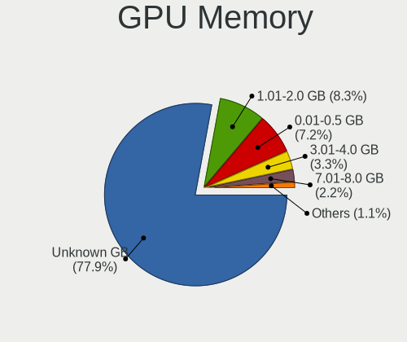

| Size in GB | Notebooks | Percent |
|------------|-----------|---------|
| Unknown    | 76        | 71.7%   |
| 1.01-2.0   | 12        | 11.32%  |
| 0.01-0.5   | 12        | 11.32%  |
| 7.01-8.0   | 3         | 2.83%   |
| 3.01-4.0   | 2         | 1.89%   |
| 0.51-1.0   | 1         | 0.94%   |

Monitor
-------

Monitor Vendor
--------------

Monitor vendors

| Vendor                  | Notebooks | Percent |
|-------------------------|-----------|---------|
| AU Optronics            | 24        | 19.2%   |
| BOE                     | 22        | 17.6%   |
| Chimei Innolux          | 19        | 15.2%   |
| LG Display              | 15        | 12%     |
| Samsung Electronics     | 14        | 11.2%   |
| Sony                    | 4         | 3.2%    |
| Sharp                   | 3         | 2.4%    |
| Lenovo                  | 3         | 2.4%    |
| Goldstar                | 3         | 2.4%    |
| HKC                     | 2         | 1.6%    |
| Dell                    | 2         | 1.6%    |
| CSO                     | 2         | 1.6%    |
| Chi Mei Optoelectronics | 2         | 1.6%    |
| BenQ                    | 2         | 1.6%    |
| Toshiba                 | 1         | 0.8%    |
| IPS                     | 1         | 0.8%    |
| Insignia                | 1         | 0.8%    |
| Iiyama                  | 1         | 0.8%    |
| IBM                     | 1         | 0.8%    |
| Hewlett-Packard         | 1         | 0.8%    |
| GreenWood               | 1         | 0.8%    |
| Apple                   | 1         | 0.8%    |

Monitor Model
-------------

Monitor models

| Model                                                                 | Notebooks | Percent |
|-----------------------------------------------------------------------|-----------|---------|
| Chimei Innolux LCD Monitor CMN1521 1920x1080 344x193mm 15.5-inch      | 3         | 2.4%    |
| Sony TV *00 SNY4904 3840x2160                                         | 2         | 1.6%    |
| Samsung Electronics LCD Monitor SEC5441 1366x768 344x194mm 15.5-inch  | 2         | 1.6%    |
| Chimei Innolux LCD Monitor CMN15E7 1920x1080 344x193mm 15.5-inch      | 2         | 1.6%    |
| Chimei Innolux LCD Monitor CMN15E6 1366x768 344x193mm 15.5-inch       | 2         | 1.6%    |
| BOE LCD Monitor BOE0747 1920x1080 345x195mm 15.6-inch                 | 2         | 1.6%    |
| AU Optronics LCD Monitor AUOFA9B 1920x1200 301x188mm 14.0-inch        | 2         | 1.6%    |
| AU Optronics LCD Monitor AUO41EC 1366x768 344x193mm 15.5-inch         | 2         | 1.6%    |
| AU Optronics LCD Monitor AUO323D 1920x1080 309x174mm 14.0-inch        | 2         | 1.6%    |
| Toshiba ScreenXpert TSB8888 1080x2160                                 | 1         | 0.8%    |
| Sony TV  *00 SNYF303 1920x1080 1220x680mm 55.0-inch                   | 1         | 0.8%    |
| Sony Nvidia Defaul t Flat Panel MS_0025 1920x1080 360x200mm 16.2-inch | 1         | 0.8%    |
| Sharp LQ156D1JW04 SHP1436 3840x2160 346x194mm 15.6-inch               | 1         | 0.8%    |
| Sharp LCD Monitor SHP14B8 1920x1080 294x165mm 13.3-inch               | 1         | 0.8%    |
| Sharp LCD Monitor SHP1446 3840x2160 382x215mm 17.3-inch               | 1         | 0.8%    |
| Samsung Electronics SyncMaster SAM05CD 1920x1080                      | 1         | 0.8%    |
| Samsung Electronics SyncMaster SAM0586 1920x1200 518x324mm 24.1-inch  | 1         | 0.8%    |
| Samsung Electronics SMB2330H SAM064A 1920x1080 509x286mm 23.0-inch    | 1         | 0.8%    |
| Samsung Electronics S24E650 SAM0CB8 1920x1080 521x293mm 23.5-inch     | 1         | 0.8%    |
| Samsung Electronics LU28R55 SAM1017 3840x2160 632x360mm 28.6-inch     | 1         | 0.8%    |
| Samsung Electronics LCD Monitor SEC5443 1920x1200 367x230mm 17.1-inch | 1         | 0.8%    |
| Samsung Electronics LCD Monitor SEC5442 1440x900 367x230mm 17.1-inch  | 1         | 0.8%    |
| Samsung Electronics LCD Monitor SEC5244 1600x900 360x210mm 16.4-inch  | 1         | 0.8%    |
| Samsung Electronics LCD Monitor SEC3945 1280x800 331x207mm 15.4-inch  | 1         | 0.8%    |
| Samsung Electronics LCD Monitor SEC3152 1366x768 344x194mm 15.5-inch  | 1         | 0.8%    |
| Samsung Electronics LCD Monitor SDCA029 3840x2160 344x194mm 15.5-inch | 1         | 0.8%    |
| Samsung Electronics LCD Monitor SDC4141 3840x2160 344x194mm 15.5-inch | 1         | 0.8%    |
| LG Display LCD Monitor LGD071E 1920x1080 344x194mm 15.5-inch          | 1         | 0.8%    |
| LG Display LCD Monitor LGD06DA 1920x1080 344x194mm 15.5-inch          | 1         | 0.8%    |
| LG Display LCD Monitor LGD0621 1920x1080 382x215mm 17.3-inch          | 1         | 0.8%    |
| LG Display LCD Monitor LGD060A 1920x1080 294x165mm 13.3-inch          | 1         | 0.8%    |
| LG Display LCD Monitor LGD05FE 1920x1080 344x194mm 15.5-inch          | 1         | 0.8%    |
| LG Display LCD Monitor LGD0533 1920x1080 344x194mm 15.5-inch          | 1         | 0.8%    |
| LG Display LCD Monitor LGD0493 1366x768 344x194mm 15.5-inch           | 1         | 0.8%    |
| LG Display LCD Monitor LGD046C 1920x1080 382x215mm 17.3-inch          | 1         | 0.8%    |
| LG Display LCD Monitor LGD0458 1366x768 310x174mm 14.0-inch           | 1         | 0.8%    |
| LG Display LCD Monitor LGD0404 1366x768 277x156mm 12.5-inch           | 1         | 0.8%    |
| LG Display LCD Monitor LGD033B 1366x768 344x194mm 15.5-inch           | 1         | 0.8%    |
| LG Display LCD Monitor LGD02F1 1366x768 344x194mm 15.5-inch           | 1         | 0.8%    |
| LG Display LCD Monitor LGD0257 1440x900 304x190mm 14.1-inch           | 1         | 0.8%    |

Monitor Resolution
------------------

Monitor screen resolution

| Resolution         | Notebooks | Percent |
|--------------------|-----------|---------|
| 1920x1080 (FHD)    | 53        | 43.8%   |
| 1366x768 (WXGA)    | 27        | 22.31%  |
| 3840x2160 (4K)     | 11        | 9.09%   |
| 2560x1600          | 5         | 4.13%   |
| 1920x1200 (WUXGA)  | 5         | 4.13%   |
| 1600x900 (HD+)     | 4         | 3.31%   |
| 2560x1440 (QHD)    | 3         | 2.48%   |
| 1440x900 (WXGA+)   | 3         | 2.48%   |
| 1280x800 (WXGA)    | 3         | 2.48%   |
| 2880x1800          | 1         | 0.83%   |
| 2560x1080          | 1         | 0.83%   |
| 2520x1680          | 1         | 0.83%   |
| 2256x1504          | 1         | 0.83%   |
| 2160x1440          | 1         | 0.83%   |
| 1680x1050 (WSXGA+) | 1         | 0.83%   |
| 1024x768 (XGA)     | 1         | 0.83%   |

Monitor Diagonal
----------------

Diagonal size in inches

| Inches  | Notebooks | Percent |
|---------|-----------|---------|
| 15      | 52        | 41.94%  |
| 14      | 15        | 12.1%   |
| 17      | 13        | 10.48%  |
| 16      | 9         | 7.26%   |
| 13      | 9         | 7.26%   |
| 27      | 4         | 3.23%   |
| 23      | 4         | 3.23%   |
| 12      | 4         | 3.23%   |
| 24      | 3         | 2.42%   |
| 72      | 2         | 1.61%   |
| 21      | 2         | 1.61%   |
| 86      | 1         | 0.81%   |
| 75      | 1         | 0.81%   |
| 40      | 1         | 0.81%   |
| 38      | 1         | 0.81%   |
| 34      | 1         | 0.81%   |
| 28      | 1         | 0.81%   |
| Unknown | 1         | 0.81%   |

Monitor Width
-------------

Physical width

| Width in mm | Notebooks | Percent |
|-------------|-----------|---------|
| 301-350     | 76        | 61.29%  |
| 351-400     | 17        | 13.71%  |
| 501-600     | 9         | 7.26%   |
| 201-300     | 9         | 7.26%   |
| 601-700     | 3         | 2.42%   |
| 1501-2000   | 3         | 2.42%   |
| 801-900     | 2         | 1.61%   |
| 401-500     | 2         | 1.61%   |
| 701-800     | 1         | 0.81%   |
| 1001-1500   | 1         | 0.81%   |
| Unknown     | 1         | 0.81%   |

Aspect Ratio
------------

Proportional relationship between the width and the height

| Ratio | Notebooks | Percent |
|-------|-----------|---------|
| 16/9  | 87        | 79.09%  |
| 16/10 | 17        | 15.45%  |
| 3/2   | 3         | 2.73%   |
| 4/3   | 1         | 0.91%   |
| 21/9  | 1         | 0.91%   |
| 0.56  | 1         | 0.91%   |

Monitor Area
------------

Area in inch²

| Area in inch² | Notebooks | Percent |
|----------------|-----------|---------|
| 101-110        | 53        | 42.74%  |
| 81-90          | 21        | 16.94%  |
| 121-130        | 10        | 8.06%   |
| 111-120        | 8         | 6.45%   |
| 201-250        | 6         | 4.84%   |
| More than 1000 | 4         | 3.23%   |
| 61-70          | 4         | 3.23%   |
| 301-350        | 4         | 3.23%   |
| 71-80          | 3         | 2.42%   |
| 131-140        | 3         | 2.42%   |
| 351-500        | 2         | 1.61%   |
| 251-300        | 2         | 1.61%   |
| 501-1000       | 2         | 1.61%   |
| 151-200        | 1         | 0.81%   |
| Unknown        | 1         | 0.81%   |

Pixel Density
-------------

Pixels per inch

| Density       | Notebooks | Percent |
|---------------|-----------|---------|
| 121-160       | 51        | 42.15%  |
| 101-120       | 27        | 22.31%  |
| 51-100        | 19        | 15.7%   |
| 161-240       | 16        | 13.22%  |
| More than 240 | 5         | 4.13%   |
| 1-50          | 2         | 1.65%   |
| Unknown       | 1         | 0.83%   |

Multiple Monitors
-----------------

Total monitors connected

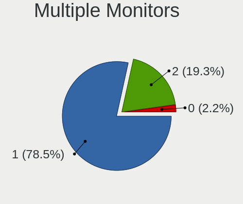

| Total | Notebooks | Percent |
|-------|-----------|---------|
| 1     | 83        | 78.3%   |
| 2     | 21        | 19.81%  |
| 0     | 2         | 1.89%   |

Network
-------

Net Controller Vendor
---------------------

Controller vendors

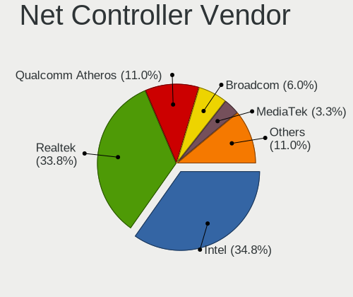

| Vendor                            | Notebooks | Percent |
|-----------------------------------|-----------|---------|
| Intel                             | 64        | 36.57%  |
| Realtek Semiconductor             | 56        | 32%     |
| Qualcomm Atheros                  | 18        | 10.29%  |
| Broadcom                          | 10        | 5.71%   |
| MediaTek                          | 5         | 2.86%   |
| ASIX Electronics                  | 3         | 1.71%   |
| Marvell Technology Group          | 2         | 1.14%   |
| Lenovo                            | 2         | 1.14%   |
| Broadcom Limited                  | 2         | 1.14%   |
| Xiaomi                            | 1         | 0.57%   |
| U-Blox                            | 1         | 0.57%   |
| Sierra Wireless                   | 1         | 0.57%   |
| Samsung Electronics               | 1         | 0.57%   |
| Nvidia                            | 1         | 0.57%   |
| Huawei Technologies               | 1         | 0.57%   |
| Ericsson Business Mobile Networks | 1         | 0.57%   |
| DisplayLink                       | 1         | 0.57%   |
| Dell                              | 1         | 0.57%   |
| D-Link                            | 1         | 0.57%   |
| Belkin Components                 | 1         | 0.57%   |
| AVM                               | 1         | 0.57%   |
| ASUSTek Computer                  | 1         | 0.57%   |

Net Controller Model
--------------------

Controller models

| Model                                                                   | Notebooks | Percent |
|-------------------------------------------------------------------------|-----------|---------|
| Realtek RTL8111/8168/8211/8411 PCI Express Gigabit Ethernet Controller  | 41        | 19.9%   |
| Intel Wi-Fi 6 AX200                                                     | 12        | 5.83%   |
| Intel Wi-Fi 6 AX201                                                     | 8         | 3.88%   |
| Realtek RTL8822CE 802.11ac PCIe Wireless Network Adapter                | 5         | 2.43%   |
| Realtek RTL810xE PCI Express Fast Ethernet controller                   | 4         | 1.94%   |
| Intel Wireless 8260                                                     | 4         | 1.94%   |
| Broadcom BCM43142 802.11b/g/n                                           | 4         | 1.94%   |
| Realtek RTL8153 Gigabit Ethernet Adapter                                | 3         | 1.46%   |
| Qualcomm Atheros QCA9565 / AR9565 Wireless Network Adapter              | 3         | 1.46%   |
| Qualcomm Atheros QCA9377 802.11ac Wireless Network Adapter              | 3         | 1.46%   |
| Qualcomm Atheros AR9285 Wireless Network Adapter (PCI-Express)          | 3         | 1.46%   |
| Intel Raptor Lake PCH CNVi WiFi                                         | 3         | 1.46%   |
| Intel Ethernet Connection (7) I219-LM                                   | 3         | 1.46%   |
| Intel Centrino Advanced-N 6205 [Taylor Peak]                            | 3         | 1.46%   |
| Intel Centrino Advanced-N 6200                                          | 3         | 1.46%   |
| Intel Cannon Point-LP CNVi [Wireless-AC]                                | 3         | 1.46%   |
| Intel Alder Lake-P PCH CNVi WiFi                                        | 3         | 1.46%   |
| ASIX AX88179 Gigabit Ethernet                                           | 3         | 1.46%   |
| Realtek RTL8723BE PCIe Wireless Network Adapter                         | 2         | 0.97%   |
| Realtek Killer E2600 GbE Controller                                     | 2         | 0.97%   |
| Qualcomm Atheros AR9485 Wireless Network Adapter                        | 2         | 0.97%   |
| Qualcomm Atheros AR242x / AR542x Wireless Network Adapter (PCI-Express) | 2         | 0.97%   |
| MediaTek MT7922 802.11ax PCI Express Wireless Network Adapter           | 2         | 0.97%   |
| MediaTek MT7921 802.11ax PCI Express Wireless Network Adapter           | 2         | 0.97%   |
| Intel Wireless 8265 / 8275                                              | 2         | 0.97%   |
| Intel Wi-Fi 6E(802.11ax) AX210/AX1675* 2x2 [Typhoon Peak]               | 2         | 0.97%   |
| Intel Ultimate N WiFi Link 5300                                         | 2         | 0.97%   |
| Intel Tiger Lake PCH CNVi WiFi                                          | 2         | 0.97%   |
| Intel Raptor Lake-S PCH CNVi WiFi                                       | 2         | 0.97%   |
| Intel Gemini Lake PCH CNVi WiFi                                         | 2         | 0.97%   |
| Intel Ethernet Connection I219-LM                                       | 2         | 0.97%   |
| Intel Ethernet Connection (6) I219-V                                    | 2         | 0.97%   |
| Intel Ethernet Connection (13) I219-V                                   | 2         | 0.97%   |
| Intel Comet Lake PCH-LP CNVi WiFi                                       | 2         | 0.97%   |
| Intel 82579LM Gigabit Network Connection (Lewisville)                   | 2         | 0.97%   |
| Intel 82577LM Gigabit Network Connection                                | 2         | 0.97%   |
| Intel 82567LM Gigabit Network Connection                                | 2         | 0.97%   |
| Intel 82567LF Gigabit Network Connection                                | 2         | 0.97%   |
| Broadcom NetXtreme BCM5761e Gigabit Ethernet PCIe                       | 2         | 0.97%   |
| Xiaomi Mi/Redmi series (RNDIS)                                          | 1         | 0.49%   |

Wireless Vendor
---------------

Wireless vendors

| Vendor                | Notebooks | Percent |
|-----------------------|-----------|---------|
| Intel                 | 60        | 55.05%  |
| Qualcomm Atheros      | 16        | 14.68%  |
| Realtek Semiconductor | 13        | 11.93%  |
| Broadcom              | 8         | 7.34%   |
| MediaTek              | 5         | 4.59%   |
| Sierra Wireless       | 1         | 0.92%   |
| Dell                  | 1         | 0.92%   |
| D-Link                | 1         | 0.92%   |
| Broadcom Limited      | 1         | 0.92%   |
| Belkin Components     | 1         | 0.92%   |
| AVM                   | 1         | 0.92%   |
| ASUSTek Computer      | 1         | 0.92%   |

Wireless Model
--------------

Wireless models

| Model                                                                   | Notebooks | Percent |
|-------------------------------------------------------------------------|-----------|---------|
| Intel Wi-Fi 6 AX200                                                     | 12        | 11.01%  |
| Intel Wi-Fi 6 AX201                                                     | 8         | 7.34%   |
| Realtek RTL8822CE 802.11ac PCIe Wireless Network Adapter                | 5         | 4.59%   |
| Intel Wireless 8260                                                     | 4         | 3.67%   |
| Broadcom BCM43142 802.11b/g/n                                           | 4         | 3.67%   |
| Qualcomm Atheros QCA9565 / AR9565 Wireless Network Adapter              | 3         | 2.75%   |
| Qualcomm Atheros QCA9377 802.11ac Wireless Network Adapter              | 3         | 2.75%   |
| Qualcomm Atheros AR9285 Wireless Network Adapter (PCI-Express)          | 3         | 2.75%   |
| Intel Raptor Lake PCH CNVi WiFi                                         | 3         | 2.75%   |
| Intel Centrino Advanced-N 6205 [Taylor Peak]                            | 3         | 2.75%   |
| Intel Centrino Advanced-N 6200                                          | 3         | 2.75%   |
| Intel Cannon Point-LP CNVi [Wireless-AC]                                | 3         | 2.75%   |
| Intel Alder Lake-P PCH CNVi WiFi                                        | 3         | 2.75%   |
| Realtek RTL8723BE PCIe Wireless Network Adapter                         | 2         | 1.83%   |
| Qualcomm Atheros AR9485 Wireless Network Adapter                        | 2         | 1.83%   |
| Qualcomm Atheros AR242x / AR542x Wireless Network Adapter (PCI-Express) | 2         | 1.83%   |
| MediaTek MT7922 802.11ax PCI Express Wireless Network Adapter           | 2         | 1.83%   |
| MediaTek MT7921 802.11ax PCI Express Wireless Network Adapter           | 2         | 1.83%   |
| Intel Wireless 8265 / 8275                                              | 2         | 1.83%   |
| Intel Wi-Fi 6E(802.11ax) AX210/AX1675* 2x2 [Typhoon Peak]               | 2         | 1.83%   |
| Intel Ultimate N WiFi Link 5300                                         | 2         | 1.83%   |
| Intel Tiger Lake PCH CNVi WiFi                                          | 2         | 1.83%   |
| Intel Raptor Lake-S PCH CNVi WiFi                                       | 2         | 1.83%   |
| Intel Gemini Lake PCH CNVi WiFi                                         | 2         | 1.83%   |
| Intel Comet Lake PCH-LP CNVi WiFi                                       | 2         | 1.83%   |
| Sierra Wireless EM7455                                                  | 1         | 0.92%   |
| Realtek RTL8852BE PCIe 802.11ax Wireless Network Controller             | 1         | 0.92%   |
| Realtek RTL8852AE 802.11ax PCIe Wireless Network Adapter                | 1         | 0.92%   |
| Realtek RTL8821AE 802.11ac PCIe Wireless Network Adapter                | 1         | 0.92%   |
| Realtek RTL8814AU 802.11a/b/g/n/ac Wireless Adapter                     | 1         | 0.92%   |
| Realtek RTL8723DE Wireless Network Adapter                              | 1         | 0.92%   |
| Realtek RTL8192EU 802.11b/g/n WLAN Adapter                              | 1         | 0.92%   |
| Qualcomm Atheros QCA6174 802.11ac Wireless Network Adapter              | 1         | 0.92%   |
| Qualcomm Atheros AR9462 Wireless Network Adapter                        | 1         | 0.92%   |
| Qualcomm Atheros AR9287 Wireless Network Adapter (PCI-Express)          | 1         | 0.92%   |
| MediaTek Wi-Fi 6E MT7902 Wireless Network Adapter                       | 1         | 0.92%   |
| Intel Wireless 7265                                                     | 1         | 0.92%   |
| Intel Wireless 7260                                                     | 1         | 0.92%   |
| Intel Wireless 3165                                                     | 1         | 0.92%   |
| Intel PRO/Wireless 3945ABG [Golan] Network Connection                   | 1         | 0.92%   |

Ethernet Vendor
---------------

Ethernet vendors

| Vendor                   | Notebooks | Percent |
|--------------------------|-----------|---------|
| Realtek Semiconductor    | 50        | 52.63%  |
| Intel                    | 25        | 26.32%  |
| Broadcom                 | 4         | 4.21%   |
| Qualcomm Atheros         | 3         | 3.16%   |
| ASIX Electronics         | 3         | 3.16%   |
| Marvell Technology Group | 2         | 2.11%   |
| Lenovo                   | 2         | 2.11%   |
| Xiaomi                   | 1         | 1.05%   |
| Samsung Electronics      | 1         | 1.05%   |
| Nvidia                   | 1         | 1.05%   |
| Huawei Technologies      | 1         | 1.05%   |
| DisplayLink              | 1         | 1.05%   |
| Broadcom Limited         | 1         | 1.05%   |

Ethernet Model
--------------

Ethernet models

| Model                                                                  | Notebooks | Percent |
|------------------------------------------------------------------------|-----------|---------|
| Realtek RTL8111/8168/8211/8411 PCI Express Gigabit Ethernet Controller | 41        | 43.16%  |
| Realtek RTL810xE PCI Express Fast Ethernet controller                  | 4         | 4.21%   |
| Realtek RTL8153 Gigabit Ethernet Adapter                               | 3         | 3.16%   |
| Intel Ethernet Connection (7) I219-LM                                  | 3         | 3.16%   |
| ASIX AX88179 Gigabit Ethernet                                          | 3         | 3.16%   |
| Realtek Killer E2600 GbE Controller                                    | 2         | 2.11%   |
| Intel Ethernet Connection I219-LM                                      | 2         | 2.11%   |
| Intel Ethernet Connection (6) I219-V                                   | 2         | 2.11%   |
| Intel Ethernet Connection (13) I219-V                                  | 2         | 2.11%   |
| Intel 82579LM Gigabit Network Connection (Lewisville)                  | 2         | 2.11%   |
| Intel 82577LM Gigabit Network Connection                               | 2         | 2.11%   |
| Intel 82567LM Gigabit Network Connection                               | 2         | 2.11%   |
| Intel 82567LF Gigabit Network Connection                               | 2         | 2.11%   |
| Broadcom NetXtreme BCM5761e Gigabit Ethernet PCIe                      | 2         | 2.11%   |
| Xiaomi Mi/Redmi series (RNDIS)                                         | 1         | 1.05%   |
| Samsung Galaxy series, misc. (tethering mode)                          | 1         | 1.05%   |
| Qualcomm Atheros Killer E2500 Gigabit Ethernet Controller              | 1         | 1.05%   |
| Qualcomm Atheros AR8162 Fast Ethernet                                  | 1         | 1.05%   |
| Qualcomm Atheros AR8151 v2.0 Gigabit Ethernet                          | 1         | 1.05%   |
| Nvidia MCP79 Ethernet                                                  | 1         | 1.05%   |
| Marvell Group 88E8057 PCI-E Gigabit Ethernet Controller                | 1         | 1.05%   |
| Marvell Group 88E8042 PCI-E Fast Ethernet Controller                   | 1         | 1.05%   |
| Lenovo Thinkpad LAN                                                    | 1         | 1.05%   |
| Lenovo RTL8153 Gigabit Ethernet [ThinkPad OneLink Pro Dock]            | 1         | 1.05%   |
| Intel Killer E3100X 2.5 Gigabit Ethernet Controller (3)                | 1         | 1.05%   |
| Intel Ethernet Connection I219-V                                       | 1         | 1.05%   |
| Intel Ethernet Connection I218-LM                                      | 1         | 1.05%   |
| Intel Ethernet Connection I217-LM                                      | 1         | 1.05%   |
| Intel Ethernet Connection (5) I219-V                                   | 1         | 1.05%   |
| Intel Ethernet Connection (23) I219-LM                                 | 1         | 1.05%   |
| Intel Ethernet Connection (16) I219-V                                  | 1         | 1.05%   |
| Intel 82579V Gigabit Network Connection                                | 1         | 1.05%   |
| Huawei E353/E3131                                                      | 1         | 1.05%   |
| DisplayLink Dell Universal Dock D6000                                  | 1         | 1.05%   |
| Broadcom NetXtreme BCM5761 Gigabit Ethernet PCIe                       | 1         | 1.05%   |
| Broadcom NetLink BCM5787M Gigabit Ethernet PCI Express                 | 1         | 1.05%   |
| Broadcom Limited NetXtreme BCM5755M Gigabit Ethernet PCI Express       | 1         | 1.05%   |

Net Controller Kind
-------------------

Ethernet, WiFi or modem

| Kind     | Notebooks | Percent |
|----------|-----------|---------|
| WiFi     | 102       | 52.58%  |
| Ethernet | 90        | 46.39%  |
| Modem    | 2         | 1.03%   |

Used Controller
---------------

Currently used network controller

| Kind     | Notebooks | Percent |
|----------|-----------|---------|
| WiFi     | 77        | 70%     |
| Ethernet | 33        | 30%     |

NICs
----

Total network controllers on board

| Total | Notebooks | Percent |
|-------|-----------|---------|
| 2     | 78        | 73.58%  |
| 1     | 28        | 26.42%  |

IPv6
----

IPv6 vs IPv4

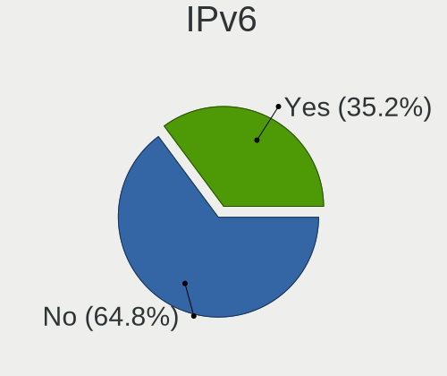

| Used | Notebooks | Percent |
|------|-----------|---------|
| No   | 70        | 65.42%  |
| Yes  | 37        | 34.58%  |

Bluetooth
---------

Bluetooth Vendor
----------------

Controller vendors

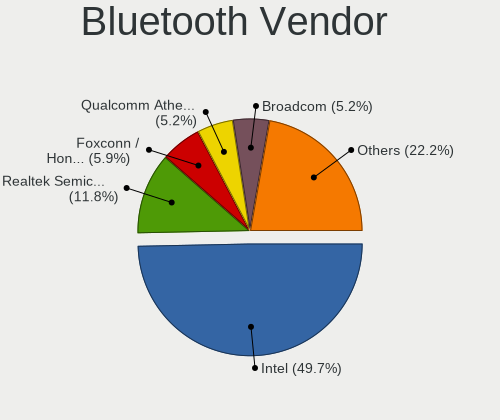

| Vendor                          | Notebooks | Percent |
|---------------------------------|-----------|---------|
| Intel                           | 46        | 52.27%  |
| Realtek Semiconductor           | 11        | 12.5%   |
| Qualcomm Atheros Communications | 6         | 6.82%   |
| Lite-On Technology              | 5         | 5.68%   |
| Foxconn / Hon Hai               | 5         | 5.68%   |
| IMC Networks                    | 3         | 3.41%   |
| Dell                            | 3         | 3.41%   |
| Broadcom                        | 3         | 3.41%   |
| Hewlett-Packard                 | 2         | 2.27%   |
| TP-Link                         | 1         | 1.14%   |
| Realtek                         | 1         | 1.14%   |
| Foxconn International           | 1         | 1.14%   |
| Apple                           | 1         | 1.14%   |

Bluetooth Model
---------------

Controller models

| Model                                                                               | Notebooks | Percent |
|-------------------------------------------------------------------------------------|-----------|---------|
| Intel AX201 Bluetooth                                                               | 12        | 13.64%  |
| Intel AX200 Bluetooth                                                               | 12        | 13.64%  |
| Realtek Bluetooth Radio                                                             | 9         | 10.23%  |
| Intel Bluetooth wireless interface                                                  | 8         | 9.09%   |
| Intel Bluetooth 9460/9560 Jefferson Peak (JfP)                                      | 6         | 6.82%   |
| Intel Bluetooth Device                                                              | 5         | 5.68%   |
| Qualcomm Atheros AR3011 Bluetooth                                                   | 3         | 3.41%   |
| Foxconn / Hon Hai Wireless_Device                                                   | 3         | 3.41%   |
| Lite-On Qualcomm Atheros QCA9377 Bluetooth                                          | 2         | 2.27%   |
| Intel AX210 Bluetooth                                                               | 2         | 2.27%   |
| IMC Networks Wireless_Device                                                        | 2         | 2.27%   |
| HP Broadcom 2070 Bluetooth Combo                                                    | 2         | 2.27%   |
| Broadcom BCM43142A0 Bluetooth 4.0                                                   | 2         | 2.27%   |
| TP-Link UB500 Adapter                                                               | 1         | 1.14%   |
| Realtek RTL8723B Bluetooth                                                          | 1         | 1.14%   |
| Realtek  Bluetooth 4.2 Adapter                                                      | 1         | 1.14%   |
| Realtek Bluetooth Radio                                                             | 1         | 1.14%   |
| Qualcomm Atheros  Bluetooth Device                                                  | 1         | 1.14%   |
| Qualcomm Atheros AR9462 Bluetooth                                                   | 1         | 1.14%   |
| Qualcomm Atheros AR3012 Bluetooth 4.0                                               | 1         | 1.14%   |
| Lite-On Wireless_Device                                                             | 1         | 1.14%   |
| Lite-On Bluetooth Device                                                            | 1         | 1.14%   |
| Lite-On Atheros AR3012 Bluetooth                                                    | 1         | 1.14%   |
| Intel Centrino Bluetooth Wireless Transceiver                                       | 1         | 1.14%   |
| IMC Networks Bluetooth Device                                                       | 1         | 1.14%   |
| Foxconn International BCM43142A0 Bluetooth module                                   | 1         | 1.14%   |
| Foxconn / Hon Hai Foxconn T77H114 BCM2070 [Single-Chip Bluetooth 2.1 + EDR Adapter] | 1         | 1.14%   |
| Foxconn / Hon Hai BCM43142A0                                                        | 1         | 1.14%   |
| Dell Wireless 365 Bluetooth                                                         | 1         | 1.14%   |
| Dell DW375 Bluetooth Module                                                         | 1         | 1.14%   |
| Dell BCM20702A0 Bluetooth Module                                                    | 1         | 1.14%   |
| Broadcom BCM2045B (BDC-2.1) [Bluetooth Controller]                                  | 1         | 1.14%   |
| Apple Bluetooth Host Controller                                                     | 1         | 1.14%   |

Sound
-----

Sound Vendor
------------

Sound card vendors

| Vendor                 | Notebooks | Percent |
|------------------------|-----------|---------|
| Intel                  | 81        | 60.45%  |
| AMD                    | 27        | 20.15%  |
| Nvidia                 | 15        | 11.19%  |
| Logitech               | 2         | 1.49%   |
| ASUSTek Computer       | 2         | 1.49%   |
| Yamaha                 | 1         | 0.75%   |
| Lenovo                 | 1         | 0.75%   |
| Kingston Technology    | 1         | 0.75%   |
| Generalplus Technology | 1         | 0.75%   |
| Cambridge Audio        | 1         | 0.75%   |
| C-Media Electronics    | 1         | 0.75%   |
| Arturia                | 1         | 0.75%   |

Sound Model
-----------

Sound card models

| Model                                                                      | Notebooks | Percent |
|----------------------------------------------------------------------------|-----------|---------|
| AMD Family 17h/19h HD Audio Controller                                     | 18        | 11.04%  |
| AMD Renoir Radeon High Definition Audio Controller                         | 15        | 9.2%    |
| Intel Tiger Lake-LP Smart Sound Technology Audio Controller                | 13        | 7.98%   |
| Intel Sunrise Point-LP HD Audio                                            | 9         | 5.52%   |
| Intel 7 Series/C216 Chipset Family High Definition Audio Controller        | 7         | 4.29%   |
| Intel Cannon Lake PCH cAVS                                                 | 5         | 3.07%   |
| Intel 8 Series/C220 Series Chipset High Definition Audio Controller        | 5         | 3.07%   |
| Intel 6 Series/C200 Series Chipset Family High Definition Audio Controller | 5         | 3.07%   |
| Intel 5 Series/3400 Series Chipset High Definition Audio                   | 5         | 3.07%   |
| Nvidia Audio device                                                        | 4         | 2.45%   |
| Intel Xeon E3-1200 v3/4th Gen Core Processor HD Audio Controller           | 4         | 2.45%   |
| Intel Raptor Lake-P/U/H cAVS                                               | 4         | 2.45%   |
| Intel 82801I (ICH9 Family) HD Audio Controller                             | 4         | 2.45%   |
| Intel Celeron/Pentium Silver Processor High Definition Audio               | 3         | 1.84%   |
| Intel Cannon Point-LP High Definition Audio Controller                     | 3         | 1.84%   |
| Intel Alder Lake PCH-P High Definition Audio Controller                    | 3         | 1.84%   |
| AMD FCH Azalia Controller                                                  | 3         | 1.84%   |
| Nvidia TU107 GeForce GTX 1650 High Definition Audio Controller             | 2         | 1.23%   |
| Intel Wildcat Point-LP High Definition Audio Controller                    | 2         | 1.23%   |
| Intel Tiger Lake-H HD Audio Controller                                     | 2         | 1.23%   |
| Intel Raptor Lake High Definition Audio Controller                         | 2         | 1.23%   |
| Intel Haswell-ULT HD Audio Controller                                      | 2         | 1.23%   |
| Intel Comet Lake PCH-LP cAVS                                               | 2         | 1.23%   |
| Intel CM238 HD Audio Controller                                            | 2         | 1.23%   |
| Intel Broadwell-U Audio Controller                                         | 2         | 1.23%   |
| Intel 82801H (ICH8 Family) HD Audio Controller                             | 2         | 1.23%   |
| Intel 8 Series HD Audio Controller                                         | 2         | 1.23%   |
| ASUSTek Computer C-Media Audio                                             | 2         | 1.23%   |
| AMD Rembrandt Radeon High Definition Audio Controller                      | 2         | 1.23%   |
| AMD BeaverCreek HDMI Audio [Radeon HD 6500D and 6400G-6600G series]        | 2         | 1.23%   |
| Yamaha NX-U02                                                              | 1         | 0.61%   |
| Nvidia TU106 High Definition Audio Controller                              | 1         | 0.61%   |
| Nvidia TU104 HD Audio Controller                                           | 1         | 0.61%   |
| Nvidia MCP79 High Definition Audio                                         | 1         | 0.61%   |
| Nvidia High Definition Audio Controller                                    | 1         | 0.61%   |
| Nvidia GT216 HDMI Audio Controller                                         | 1         | 0.61%   |
| Nvidia GK106 HDMI Audio Controller                                         | 1         | 0.61%   |
| Nvidia GF108 High Definition Audio Controller                              | 1         | 0.61%   |
| Nvidia GA106 High Definition Audio Controller                              | 1         | 0.61%   |
| Nvidia GA104 High Definition Audio Controller                              | 1         | 0.61%   |

Memory
------

Memory Vendor
-------------

Memory module vendors

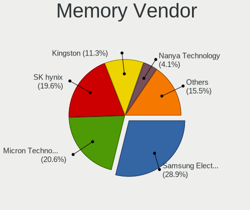

| Vendor              | Notebooks | Percent |
|---------------------|-----------|---------|
| Samsung Electronics | 19        | 30.65%  |
| SK hynix            | 13        | 20.97%  |
| Micron Technology   | 13        | 20.97%  |
| Kingston            | 9         | 14.52%  |
| Smart               | 2         | 3.23%   |
| Team                | 1         | 1.61%   |
| Nanya Technology    | 1         | 1.61%   |
| G.Skill             | 1         | 1.61%   |
| Elpida              | 1         | 1.61%   |
| Corsair             | 1         | 1.61%   |
| Unknown             | 1         | 1.61%   |

Memory Model
------------

Memory module models

| Model                                                            | Notebooks | Percent |
|------------------------------------------------------------------|-----------|---------|
| Samsung RAM M471A1K43DB1-CWE 8GB SODIMM DDR4 3200MT/s            | 5         | 7.46%   |
| Samsung RAM M471A1G44AB0-CWE 8GB SODIMM DDR4 3200MT/s            | 3         | 4.48%   |
| SK hynix RAM HMAG68EXNSA051N 8GB SODIMM DDR4 3200MT/s            | 2         | 2.99%   |
| Samsung RAM M471B5173DB0-YK0 4GB SODIMM DDR3 1600MT/s            | 2         | 2.99%   |
| Micron RAM 8KTF51264HZ-1G9P1 4GB SODIMM DDR3 1867MT/s            | 2         | 2.99%   |
| Team RAM TEAMGROUP-SD4-3200 16GB SODIMM DDR4 3200MT/s            | 1         | 1.49%   |
| Smart RAM SH564568FH8NWPHSFG 2GB SODIMM DDR3 1333MT/s            | 1         | 1.49%   |
| Smart RAM SF4642G8CK8IEHLSBG 16GB SODIMM DDR4 2667MT/s           | 1         | 1.49%   |
| SK hynix RAM HMT451S6BFR8A-PB 4GB SODIMM DDR3 1600MT/s           | 1         | 1.49%   |
| SK hynix RAM HMT425S6CFR6A-PB 2GB SODIMM DDR3 1600MT/s           | 1         | 1.49%   |
| SK hynix RAM HMCG78AGBSA092N 16GB SODIMM DDR5 5600MT/s           | 1         | 1.49%   |
| SK hynix RAM HMAA1GS6CJR6N-XN 8GB SODIMM DDR4 3200MT/s           | 1         | 1.49%   |
| SK hynix RAM HMAA1GS6CJR6N-XN 8GB Row Of Chips DDR4 3200MT/s     | 1         | 1.49%   |
| SK hynix RAM HMA851S6DJR6N-XN 4GB Row Of Chips DDR4 3200MT/s     | 1         | 1.49%   |
| SK hynix RAM HMA851S6CJR6N-VK 4GB SODIMM DDR4 2667MT/s           | 1         | 1.49%   |
| SK hynix RAM HMA851S6AFR6N-UH 4GB SODIMM DDR4 2667MT/s           | 1         | 1.49%   |
| SK hynix RAM HMA82GS6JJR8N-VK 16GB SODIMM DDR4 2667MT/s          | 1         | 1.49%   |
| SK hynix RAM HMA81GS6JJR8N-VK 8GB SODIMM DDR4 2667MT/s           | 1         | 1.49%   |
| SK hynix RAM H58G78BK7BX114 8GB SODIMM LPDDR5 6400MT/s           | 1         | 1.49%   |
| Samsung RAM Module 8GB SODIMM DDR4 2133MT/s                      | 1         | 1.49%   |
| Samsung RAM Module 2GB Row Of Chips LPDDR5 6400MT/s              | 1         | 1.49%   |
| Samsung RAM Module 16GB SODIMM DDR4 3200MT/s                     | 1         | 1.49%   |
| Samsung RAM M471B5173QH0-YK0 4096MB SODIMM DDR3 1600MT/s         | 1         | 1.49%   |
| Samsung RAM M471B1G73DB0-YK0 8GB SODIMM DDR3 1600MT/s            | 1         | 1.49%   |
| Samsung RAM M471B1G73BH0-CK0 8GB SODIMM DDR3 1600MT/s            | 1         | 1.49%   |
| Samsung RAM M471A2G44AM0-CWE 16GB SODIMM DDR4 3200MT/s           | 1         | 1.49%   |
| Samsung RAM M471A2G43BB2-CWE 16GB SODIMM DDR4 3200MT/s           | 1         | 1.49%   |
| Samsung RAM M471A1K43EB1-CWE 8GB SODIMM DDR4 3200MT/s            | 1         | 1.49%   |
| Samsung RAM M471A1K43DB1-CTD 8GB SODIMM DDR4 2667MT/s            | 1         | 1.49%   |
| Samsung RAM M471A1K43BB0-CPB 8GB SODIMM DDR4 2133MT/s            | 1         | 1.49%   |
| Samsung RAM M471A1G44AB0-CWE 8GB Row Of Chips DDR4 3200MT/s      | 1         | 1.49%   |
| Samsung RAM M425R1GB4BB0-CWMOD 8192MB SODIMM 5600MT/s            | 1         | 1.49%   |
| Nanya RAM NT8GA64D88CX3S-JR 8GB SODIMM DDR4 3200MT/s             | 1         | 1.49%   |
| Micron RAM MTC4C10163S1SC48BA1 8GB SODIMM DDR5 4800MT/s          | 1         | 1.49%   |
| Micron RAM MT62F1G32D4DR-031 WT 4GB Row Of Chips LPDDR5 6400MT/s | 1         | 1.49%   |
| Micron RAM MT52L1G32D4PG-093 8GB Row Of Chips LPDDR3 2133MT/s    | 1         | 1.49%   |
| Micron RAM MT40A512M16LY-075 4GB SODIMM DDR4 2400MT/s            | 1         | 1.49%   |
| Micron RAM MT40A1G16TB-062E:F 8GB Row Of Chips DDR4 3200MT/s     | 1         | 1.49%   |
| Micron RAM 8ATF1G64HZ-3G2J1 8GB SODIMM DDR4 3200MT/s             | 1         | 1.49%   |
| Micron RAM 8ATF1G64HZ-2G6E1 8GB SODIMM DDR4 2667MT/s             | 1         | 1.49%   |

Memory Kind
-----------

Memory module kinds

| Kind   | Notebooks | Percent |
|--------|-----------|---------|
| DDR4   | 34        | 64.15%  |
| DDR3   | 10        | 18.87%  |
| LPDDR5 | 4         | 7.55%   |
| DDR5   | 3         | 5.66%   |
| LPDDR4 | 1         | 1.89%   |
| LPDDR3 | 1         | 1.89%   |

Memory Form Factor
------------------

Physical design of the memory module

| Name         | Notebooks | Percent |
|--------------|-----------|---------|
| SODIMM       | 46        | 85.19%  |
| Row Of Chips | 8         | 14.81%  |

Memory Size
-----------

Memory module size

| Size  | Notebooks | Percent |
|-------|-----------|---------|
| 8192  | 32        | 56.14%  |
| 16384 | 9         | 15.79%  |
| 4096  | 9         | 15.79%  |
| 2048  | 5         | 8.77%   |
| 32768 | 2         | 3.51%   |

Memory Speed
------------

Memory module speed

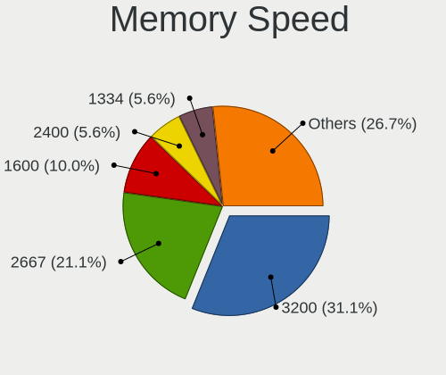

| Speed | Notebooks | Percent |
|-------|-----------|---------|
| 3200  | 22        | 38.6%   |
| 2667  | 9         | 15.79%  |
| 1600  | 6         | 10.53%  |
| 6400  | 4         | 7.02%   |
| 2400  | 4         | 7.02%   |
| 2133  | 3         | 5.26%   |
| 5600  | 2         | 3.51%   |
| 1867  | 2         | 3.51%   |
| 1334  | 2         | 3.51%   |
| 4800  | 1         | 1.75%   |
| 1333  | 1         | 1.75%   |
| 1067  | 1         | 1.75%   |

Printers & scanners
-------------------

Printer Vendor
--------------

Printer device vendors

| Vendor                | Notebooks | Percent |
|-----------------------|-----------|---------|
| Lexmark International | 1         | 50%     |
| Hewlett-Packard       | 1         | 50%     |

Printer Model
-------------

Printer device models

| Model                           | Notebooks | Percent |
|---------------------------------|-----------|---------|
| Lexmark International MC3224dwe | 1         | 50%     |
| HP DeskJet 4100 series          | 1         | 50%     |

Scanner Vendor
--------------

Scanner device vendors

Zero info for selected period =(

Scanner Model
-------------

Scanner device models

Zero info for selected period =(

Camera
------

Camera Vendor
-------------

Camera device vendors

| Vendor                                 | Notebooks | Percent |
|----------------------------------------|-----------|---------|
| Chicony Electronics                    | 27        | 29.03%  |
| IMC Networks                           | 10        | 10.75%  |
| Bison Electronics                      | 9         | 9.68%   |
| Microdia                               | 6         | 6.45%   |
| Syntek                                 | 5         | 5.38%   |
| Luxvisions Innotech Limited            | 5         | 5.38%   |
| Suyin                                  | 4         | 4.3%    |
| Realtek Semiconductor                  | 4         | 4.3%    |
| Quanta                                 | 4         | 4.3%    |
| Cheng Uei Precision Industry (Foxlink) | 3         | 3.23%   |
| Sunplus Innovation Technology          | 2         | 2.15%   |
| Sonix Technology                       | 2         | 2.15%   |
| Z-Star Microelectronics                | 1         | 1.08%   |
| Samsung Electronics                    | 1         | 1.08%   |
| Ricoh                                  | 1         | 1.08%   |
| Primax Electronics                     | 1         | 1.08%   |
| Microsoft                              | 1         | 1.08%   |
| Logitech                               | 1         | 1.08%   |
| Lite-On Technology                     | 1         | 1.08%   |
| Lenovo                                 | 1         | 1.08%   |
| Importek                               | 1         | 1.08%   |
| icSpring                               | 1         | 1.08%   |
| Generalplus Technology                 | 1         | 1.08%   |
| 8SSC21K12273V1SR33X2817                | 1         | 1.08%   |

Camera Model
------------

Camera device models

| Model                                                   | Notebooks | Percent |
|---------------------------------------------------------|-----------|---------|
| Chicony Integrated Camera                               | 7         | 7.53%   |
| Syntek Integrated Camera                                | 5         | 5.38%   |
| IMC Networks Integrated Camera                          | 4         | 4.3%    |
| Microdia Integrated_Webcam_HD                           | 3         | 3.23%   |
| Chicony HD Webcam                                       | 3         | 3.23%   |
| Chicony HD User Facing                                  | 3         | 3.23%   |
| Bison BisonCam,NB Pro                                   | 3         | 3.23%   |
| Sunplus Integrated_Webcam_HD                            | 2         | 2.15%   |
| Quanta HD User Facing                                   | 2         | 2.15%   |
| Microdia Integrated Webcam                              | 2         | 2.15%   |
| Luxvisions Innotech Limited HP Wide Vision HD Camera    | 2         | 2.15%   |
| Luxvisions Innotech Limited HP TrueVision HD Camera     | 2         | 2.15%   |
| IMC Networks USB2.0 HD UVC WebCam                       | 2         | 2.15%   |
| Chicony USB2.0 Camera                                   | 2         | 2.15%   |
| Chicony HP HD Camera                                    | 2         | 2.15%   |
| Cheng Uei Precision Industry (Foxlink) HP Truevision HD | 2         | 2.15%   |
| Bison Integrated Camera                                 | 2         | 2.15%   |
| Z-Star WebCam SC-03FFL11739P                            | 1         | 1.08%   |
| Suyin Sony Visual Communication Camera                  | 1         | 1.08%   |
| Suyin Integrated Webcam                                 | 1         | 1.08%   |
| Suyin HP Truevision HD                                  | 1         | 1.08%   |
| Suyin HP ENVY HD Webcam                                 | 1         | 1.08%   |
| Sonix USB2.0 FHD UVC WebCam                             | 1         | 1.08%   |
| Sonix Integrated Webcam_FHD                             | 1         | 1.08%   |
| Samsung Galaxy series, misc. (MTP mode)                 | 1         | 1.08%   |
| Ricoh HD Webcam                                         | 1         | 1.08%   |
| Realtek USB2.0 HD UVC WebCam                            | 1         | 1.08%   |
| Realtek Integrated_Webcam_HD                            | 1         | 1.08%   |
| Realtek Integrated Camera                               | 1         | 1.08%   |
| Realtek HD WebCam                                       | 1         | 1.08%   |
| Quanta VGA WebCam                                       | 1         | 1.08%   |
| Quanta HP TrueVision HD Camera                          | 1         | 1.08%   |
| Primax HP HD Webcam [Fixed]                             | 1         | 1.08%   |
| Microsoft LifeCam HD-3000                               | 1         | 1.08%   |
| Microdia Laptop_Integrated_Webcam_1.3M                  | 1         | 1.08%   |
| Luxvisions Innotech Limited HP True Vision FHD Camera   | 1         | 1.08%   |
| Logitech Webcam C270                                    | 1         | 1.08%   |
| Lite-On Integrated Camera                               | 1         | 1.08%   |
| Lenovo Integrated Webcam                                | 1         | 1.08%   |
| Importek NBcam MU018ASA                                 | 1         | 1.08%   |

Security
--------

Fingerprint Vendor
------------------

Fingerprint sensor vendors

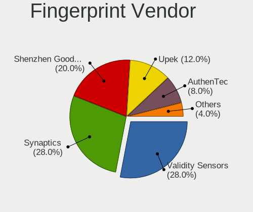

| Vendor                     | Notebooks | Percent |
|----------------------------|-----------|---------|
| Validity Sensors           | 5         | 31.25%  |
| Synaptics                  | 5         | 31.25%  |
| Shenzhen Goodix Technology | 4         | 25%     |
| Upek                       | 1         | 6.25%   |
| AuthenTec                  | 1         | 6.25%   |

Fingerprint Model
-----------------

Fingerprint sensor models

| Model                                                  | Notebooks | Percent |
|--------------------------------------------------------|-----------|---------|
| Synaptics Prometheus MIS Touch Fingerprint Reader      | 4         | 25%     |
| Shenzhen Goodix  FingerPrint Device                    | 3         | 18.75%  |
| Validity Sensors Synaptics WBDI                        | 2         | 12.5%   |
| Validity Sensors VFS495 Fingerprint Reader             | 1         | 6.25%   |
| Validity Sensors VFS451 Fingerprint Reader             | 1         | 6.25%   |
| Validity Sensors VFS 5011 fingerprint sensor           | 1         | 6.25%   |
| Upek Biometric Touchchip/Touchstrip Fingerprint Sensor | 1         | 6.25%   |
| Synaptics UWP WBDI Device                              | 1         | 6.25%   |
| Shenzhen Goodix Fingerprint Reader                     | 1         | 6.25%   |
| AuthenTec AES2810                                      | 1         | 6.25%   |

Chipcard Vendor
---------------

Chipcard module vendors

| Vendor      | Notebooks | Percent |
|-------------|-----------|---------|
| Broadcom    | 5         | 45.45%  |
| Alcor Micro | 5         | 45.45%  |
| Upek        | 1         | 9.09%   |

Chipcard Model
--------------

Chipcard module models

| Model                                                                        | Notebooks | Percent |
|------------------------------------------------------------------------------|-----------|---------|
| Alcor Micro AU9540 Smartcard Reader                                          | 5         | 45.45%  |
| Broadcom BCM5880 Secure Applications Processor                               | 2         | 18.18%  |
| Broadcom 58200                                                               | 2         | 18.18%  |
| Upek TouchChip Fingerprint Coprocessor (WBF advanced mode)                   | 1         | 9.09%   |
| Broadcom BCM5880 Secure Applications Processor with fingerprint swipe sensor | 1         | 9.09%   |

Unsupported
-----------

Unsupported Devices
-------------------

Total unsupported devices on board

| Total | Notebooks | Percent |
|-------|-----------|---------|
| 0     | 55        | 51.89%  |
| 1     | 38        | 35.85%  |
| 2     | 11        | 10.38%  |
| 3     | 2         | 1.89%   |

Unsupported Device Types
------------------------

Types of unsupported devices

| Type                  | Notebooks | Percent |
|-----------------------|-----------|---------|
| Fingerprint reader    | 16        | 24.62%  |
| Graphics card         | 15        | 23.08%  |
| Chipcard              | 10        | 15.38%  |
| Net/wireless          | 7         | 10.77%  |
| Sound                 | 5         | 7.69%   |
| Multimedia controller | 4         | 6.15%   |
| Camera                | 4         | 6.15%   |
| Network               | 1         | 1.54%   |
| Net/ethernet          | 1         | 1.54%   |
| Modem                 | 1         | 1.54%   |
| Card reader           | 1         | 1.54%   |

