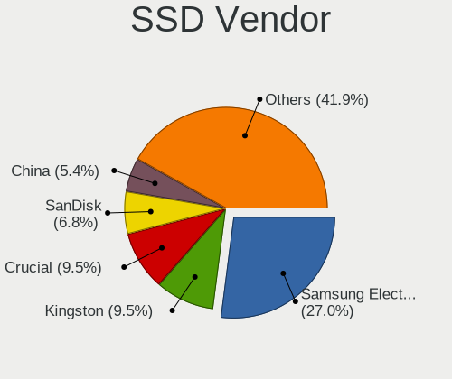
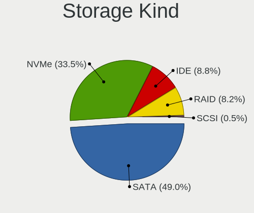
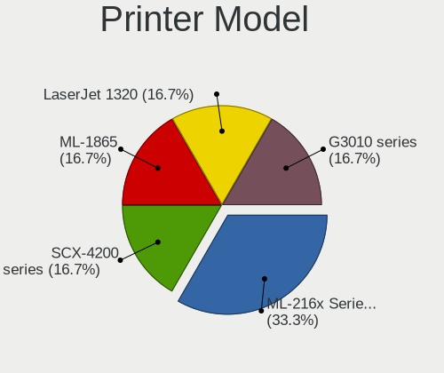

openSUSE Leap-15.6 - Tested Hardware & Statistics
-------------------------------------------------

A project to collect tested hardware configurations for openSUSE Leap-15.6.

Anyone can contribute to this report by the [hw-probe](https://github.com/linuxhw/hw-probe) tool:

    sudo -E hw-probe -all -upload

Please contribute! Especially if your hardware is rare.

This is a report for all computer types. See also reports for [desktops](/Dist/openSUSE_Leap-15.6/Desktop/README.md) and [notebooks](/Dist/openSUSE_Leap-15.6/Notebook/README.md).

Contents
--------

* [ Test Cases ](#test-cases)

* [ System ](#system)
  - [ Kernel                   ](#kernel)
  - [ Kernel Family            ](#kernel-family)
  - [ Kernel Major Ver.        ](#kernel-major-ver)
  - [ Arch                     ](#arch)
  - [ DE                       ](#de)
  - [ Display Server           ](#display-server)
  - [ Display Manager          ](#display-manager)
  - [ OS Lang                  ](#os-lang)
  - [ Boot Mode                ](#boot-mode)
  - [ Filesystem               ](#filesystem)
  - [ Part. scheme             ](#part-scheme)
  - [ Dual Boot with Linux/BSD ](#dual-boot-with-linuxbsd)
  - [ Dual Boot (Win)          ](#dual-boot-win)

* [ Board ](#board)
  - [ Vendor                   ](#vendor)
  - [ Model                    ](#model)
  - [ Model Family             ](#model-family)
  - [ MFG Year                 ](#mfg-year)
  - [ Form Factor              ](#form-factor)
  - [ Secure Boot              ](#secure-boot)
  - [ Coreboot                 ](#coreboot)
  - [ RAM Size                 ](#ram-size)
  - [ RAM Used                 ](#ram-used)
  - [ Total Drives             ](#total-drives)
  - [ Has CD-ROM               ](#has-cd-rom)
  - [ Has Ethernet             ](#has-ethernet)
  - [ Has WiFi                 ](#has-wifi)
  - [ Has Bluetooth            ](#has-bluetooth)

* [ Location ](#location)
  - [ Country                  ](#country)
  - [ City                     ](#city)

* [ Drives ](#drives)
  - [ Drive Vendor             ](#drive-vendor)
  - [ Drive Model              ](#drive-model)
  - [ HDD Vendor               ](#hdd-vendor)
  - [ SSD Vendor               ](#ssd-vendor)
  - [ Drive Kind               ](#drive-kind)
  - [ Drive Connector          ](#drive-connector)
  - [ Drive Size               ](#drive-size)
  - [ Space Total              ](#space-total)
  - [ Space Used               ](#space-used)
  - [ Malfunc. Drives          ](#malfunc-drives)
  - [ Malfunc. Drive Vendor    ](#malfunc-drive-vendor)
  - [ Malfunc. HDD Vendor      ](#malfunc-hdd-vendor)
  - [ Malfunc. Drive Kind      ](#malfunc-drive-kind)
  - [ Failed Drives            ](#failed-drives)
  - [ Failed Drive Vendor      ](#failed-drive-vendor)
  - [ Drive Status             ](#drive-status)

* [ Storage controller ](#storage-controller)
  - [ Storage Vendor           ](#storage-vendor)
  - [ Storage Model            ](#storage-model)
  - [ Storage Kind             ](#storage-kind)

* [ Processor ](#processor)
  - [ CPU Vendor               ](#cpu-vendor)
  - [ CPU Model                ](#cpu-model)
  - [ CPU Model Family         ](#cpu-model-family)
  - [ CPU Cores                ](#cpu-cores)
  - [ CPU Sockets              ](#cpu-sockets)
  - [ CPU Threads              ](#cpu-threads)
  - [ CPU Op-Modes             ](#cpu-op-modes)
  - [ CPU Microcode            ](#cpu-microcode)
  - [ CPU Microarch            ](#cpu-microarch)

* [ Graphics ](#graphics)
  - [ GPU Vendor               ](#gpu-vendor)
  - [ GPU Model                ](#gpu-model)
  - [ GPU Combo                ](#gpu-combo)
  - [ GPU Driver               ](#gpu-driver)
  - [ GPU Memory               ](#gpu-memory)

* [ Monitor ](#monitor)
  - [ Monitor Vendor           ](#monitor-vendor)
  - [ Monitor Model            ](#monitor-model)
  - [ Monitor Resolution       ](#monitor-resolution)
  - [ Monitor Diagonal         ](#monitor-diagonal)
  - [ Monitor Width            ](#monitor-width)
  - [ Aspect Ratio             ](#aspect-ratio)
  - [ Monitor Area             ](#monitor-area)
  - [ Pixel Density            ](#pixel-density)
  - [ Multiple Monitors        ](#multiple-monitors)

* [ Network ](#network)
  - [ Net Controller Vendor    ](#net-controller-vendor)
  - [ Net Controller Model     ](#net-controller-model)
  - [ Wireless Vendor          ](#wireless-vendor)
  - [ Wireless Model           ](#wireless-model)
  - [ Ethernet Vendor          ](#ethernet-vendor)
  - [ Ethernet Model           ](#ethernet-model)
  - [ Net Controller Kind      ](#net-controller-kind)
  - [ Used Controller          ](#used-controller)
  - [ NICs                     ](#nics)
  - [ IPv6                     ](#ipv6)

* [ Bluetooth ](#bluetooth)
  - [ Bluetooth Vendor         ](#bluetooth-vendor)
  - [ Bluetooth Model          ](#bluetooth-model)

* [ Sound ](#sound)
  - [ Sound Vendor             ](#sound-vendor)
  - [ Sound Model              ](#sound-model)

* [ Memory ](#memory)
  - [ Memory Vendor            ](#memory-vendor)
  - [ Memory Model             ](#memory-model)
  - [ Memory Kind              ](#memory-kind)
  - [ Memory Form Factor       ](#memory-form-factor)
  - [ Memory Size              ](#memory-size)
  - [ Memory Speed             ](#memory-speed)

* [ Printers & scanners ](#printers--scanners)
  - [ Printer Vendor           ](#printer-vendor)
  - [ Printer Model            ](#printer-model)
  - [ Scanner Vendor           ](#scanner-vendor)
  - [ Scanner Model            ](#scanner-model)

* [ Camera ](#camera)
  - [ Camera Vendor            ](#camera-vendor)
  - [ Camera Model             ](#camera-model)

* [ Security ](#security)
  - [ Fingerprint Vendor       ](#fingerprint-vendor)
  - [ Fingerprint Model        ](#fingerprint-model)
  - [ Chipcard Vendor          ](#chipcard-vendor)
  - [ Chipcard Model           ](#chipcard-model)

* [ Unsupported ](#unsupported)
  - [ Unsupported Devices      ](#unsupported-devices)
  - [ Unsupported Device Types ](#unsupported-device-types)

Test Cases
----------

Total: 177

| Vendor        | Model                       | Form-Factor | Probe                                                      | Date         |
|---------------|-----------------------------|-------------|------------------------------------------------------------|--------------|
| ASUSTek       | ASUS Vivobook Pro 15 N65... | Notebook    | [7b915687fc](https://linux-hardware.org/?probe=7b915687fc) | Jan 06, 2025 |
| ASUSTek       | ASUS Vivobook Pro 15 N65... | Notebook    | [6ccd45a853](https://linux-hardware.org/?probe=6ccd45a853) | Jan 06, 2025 |
| Gigabyte      | B450 AORUS ELITE            | Desktop     | [896517452f](https://linux-hardware.org/?probe=896517452f) | Jan 01, 2025 |
| Lenovo        | ThinkPad SL 2746EHG         | Notebook    | [c058e70d59](https://linux-hardware.org/?probe=c058e70d59) | Dec 30, 2024 |
| Dell          | Latitude E5550              | Notebook    | [2512980572](https://linux-hardware.org/?probe=2512980572) | Dec 25, 2024 |
| HP            | 2B3E                        | All in one  | [72fddcce30](https://linux-hardware.org/?probe=72fddcce30) | Dec 25, 2024 |
| HP            | 2B3E                        | All in one  | [3ee1db7559](https://linux-hardware.org/?probe=3ee1db7559) | Dec 25, 2024 |
| Gigabyte      | GA-78LMT-USB3 x.x           | Desktop     | [2e5a903c16](https://linux-hardware.org/?probe=2e5a903c16) | Dec 24, 2024 |
| Acer          | Swift SF314-54G             | Notebook    | [3f7732cb40](https://linux-hardware.org/?probe=3f7732cb40) | Dec 19, 2024 |
| Acer          | Swift SF314-54G             | Notebook    | [c2b2b94ff9](https://linux-hardware.org/?probe=c2b2b94ff9) | Dec 19, 2024 |
| Getac         | K120G3                      | Tablet      | [cbcde33e6c](https://linux-hardware.org/?probe=cbcde33e6c) | Dec 19, 2024 |
| Lenovo        | ThinkServer TS140           | Desktop     | [8d0ead0400](https://linux-hardware.org/?probe=8d0ead0400) | Dec 18, 2024 |
| Unknown       | Unknown                     | Desktop     | [0653c463df](https://linux-hardware.org/?probe=0653c463df) | Dec 17, 2024 |
| MSI           | PRO Z690-A DDR4             | Desktop     | [c2fe7d3fe9](https://linux-hardware.org/?probe=c2fe7d3fe9) | Dec 16, 2024 |
| Toshiba       | Satellite U400              | Notebook    | [c38b4b8f12](https://linux-hardware.org/?probe=c38b4b8f12) | Dec 15, 2024 |
| Toshiba       | Satellite U400              | Notebook    | [0df632ce9a](https://linux-hardware.org/?probe=0df632ce9a) | Dec 15, 2024 |
| Dell          | Latitude 7490               | Notebook    | [94a563e506](https://linux-hardware.org/?probe=94a563e506) | Dec 13, 2024 |
| Lenovo        | ThinkPad SL 2746EHG         | Notebook    | [af38d9b12e](https://linux-hardware.org/?probe=af38d9b12e) | Dec 12, 2024 |
| Dell          | Latitude 5500               | Notebook    | [089651bb7e](https://linux-hardware.org/?probe=089651bb7e) | Dec 12, 2024 |
| ASUSTek       | M3N-HT DELUXE               | Desktop     | [85960cdc58](https://linux-hardware.org/?probe=85960cdc58) | Dec 12, 2024 |
| ASUSTek       | X556UA                      | Notebook    | [12e9edd8a6](https://linux-hardware.org/?probe=12e9edd8a6) | Dec 11, 2024 |
| Gigabyte      | B550 AORUS PRO AC           | Desktop     | [9d331af926](https://linux-hardware.org/?probe=9d331af926) | Dec 11, 2024 |
| HP            | Laptop 15-gw0xxx            | Notebook    | [cbf590d898](https://linux-hardware.org/?probe=cbf590d898) | Dec 11, 2024 |
| HP            | Laptop 15-gw0xxx            | Notebook    | [fc18ca43fa](https://linux-hardware.org/?probe=fc18ca43fa) | Dec 11, 2024 |
| Lenovo        | Y520-15IKBN 80WK            | Notebook    | [23c377735b](https://linux-hardware.org/?probe=23c377735b) | Dec 09, 2024 |
| Dell          | 0R790T A00                  | Desktop     | [544de4f6e5](https://linux-hardware.org/?probe=544de4f6e5) | Dec 07, 2024 |
| Gigabyte      | Z490 UD                     | Desktop     | [93ed7e1b8b](https://linux-hardware.org/?probe=93ed7e1b8b) | Dec 03, 2024 |
| MSI           | A88X-G43                    | Desktop     | [ed81ddd35f](https://linux-hardware.org/?probe=ed81ddd35f) | Dec 01, 2024 |
| Fujitsu       | D3230-A1 S26361-D3230-A1    | Desktop     | [f8b592b091](https://linux-hardware.org/?probe=f8b592b091) | Nov 27, 2024 |
| HP            | 0B4Ch D                     | Desktop     | [34657f16df](https://linux-hardware.org/?probe=34657f16df) | Nov 27, 2024 |
| Apple         | Mac-031AEE4D24BFF0B1 Mac... | Mini pc     | [a883b65a14](https://linux-hardware.org/?probe=a883b65a14) | Nov 23, 2024 |
| ASUSTek       | GL752VW                     | Notebook    | [4df66d6d25](https://linux-hardware.org/?probe=4df66d6d25) | Nov 23, 2024 |
| MSI           | PRO Z690-A DDR4             | Desktop     | [e102d2434c](https://linux-hardware.org/?probe=e102d2434c) | Nov 22, 2024 |
| Acer          | Aspire A315-56              | Notebook    | [d52da57ed4](https://linux-hardware.org/?probe=d52da57ed4) | Nov 22, 2024 |
| Acer          | Aspire A315-56              | Notebook    | [8bcaa93bb4](https://linux-hardware.org/?probe=8bcaa93bb4) | Nov 22, 2024 |
| Toshiba       | Satellite Pro C50-A-1L6     | Notebook    | [aef1b82a78](https://linux-hardware.org/?probe=aef1b82a78) | Nov 20, 2024 |
| Acer          | Aspire A317-54              | Notebook    | [bf63a85231](https://linux-hardware.org/?probe=bf63a85231) | Nov 16, 2024 |
| HP            | Elite x2 G4                 | Tablet      | [c43e6e357d](https://linux-hardware.org/?probe=c43e6e357d) | Nov 15, 2024 |
| Medion        | E15433                      | Notebook    | [d8fa665bcd](https://linux-hardware.org/?probe=d8fa665bcd) | Nov 15, 2024 |
| ASUSTek       | PRIME X670-P WIFI           | Desktop     | [82cde68696](https://linux-hardware.org/?probe=82cde68696) | Nov 14, 2024 |
| Gigabyte      | P31-ES3G                    | Desktop     | [1e5662dbe7](https://linux-hardware.org/?probe=1e5662dbe7) | Nov 14, 2024 |
| Positivo      | C8256AI-14                  | Notebook    | [509c3d8d69](https://linux-hardware.org/?probe=509c3d8d69) | Nov 14, 2024 |
| Gigabyte      | Z170X-Gaming 5              | Desktop     | [329a323c09](https://linux-hardware.org/?probe=329a323c09) | Nov 13, 2024 |
| HP            | EliteBook 850 G5            | Notebook    | [3c3ef88749](https://linux-hardware.org/?probe=3c3ef88749) | Nov 13, 2024 |
| HP            | Laptop 15s-eq1xxx           | Notebook    | [2ca5d70008](https://linux-hardware.org/?probe=2ca5d70008) | Nov 12, 2024 |
| ASRock        | X570 Steel Legend           | Desktop     | [8da35569fd](https://linux-hardware.org/?probe=8da35569fd) | Nov 10, 2024 |
| HP            | OMEN by Laptop 15-ce0xx     | Notebook    | [386e8d6e8c](https://linux-hardware.org/?probe=386e8d6e8c) | Nov 10, 2024 |
| Gigabyte      | Z270P-D3-CF                 | Desktop     | [eb136f4faf](https://linux-hardware.org/?probe=eb136f4faf) | Nov 07, 2024 |
| ASUSTek       | ASUS EXPERTBOOK B1400CEA... | Notebook    | [2c197b5dba](https://linux-hardware.org/?probe=2c197b5dba) | Nov 07, 2024 |
| TUXEDO        | InfinityBook Pro Intel G... | Notebook    | [6dab5c3afe](https://linux-hardware.org/?probe=6dab5c3afe) | Nov 06, 2024 |
| Gigabyte      | B450 I AORUS PRO WIFI-CF    | Desktop     | [7edfbce2b4](https://linux-hardware.org/?probe=7edfbce2b4) | Nov 05, 2024 |
| ASUSTek       | P8Z77-V LK                  | Desktop     | [5ef99b9e94](https://linux-hardware.org/?probe=5ef99b9e94) | Oct 29, 2024 |
| Apple         | Mac-031AEE4D24BFF0B1 Mac... | Mini pc     | [5b8fe403b8](https://linux-hardware.org/?probe=5b8fe403b8) | Oct 28, 2024 |
| IBM           | 4852E66 4852E66             | All in one  | [cbb7da4932](https://linux-hardware.org/?probe=cbb7da4932) | Oct 27, 2024 |
| HP            | 3397                        | Desktop     | [bff622bbdc](https://linux-hardware.org/?probe=bff622bbdc) | Oct 27, 2024 |
| Lenovo        | IdeaPad 330-15AST 81D6      | Notebook    | [b592bf3e31](https://linux-hardware.org/?probe=b592bf3e31) | Oct 26, 2024 |
| HP            | Notebook                    | Notebook    | [14ae1d2eda](https://linux-hardware.org/?probe=14ae1d2eda) | Oct 26, 2024 |
| HP            | Notebook                    | Notebook    | [f50f582dd0](https://linux-hardware.org/?probe=f50f582dd0) | Oct 26, 2024 |
| MSI           | PRO Z690-A DDR4             | Desktop     | [94a8b7f4b4](https://linux-hardware.org/?probe=94a8b7f4b4) | Oct 26, 2024 |
| Lenovo        | ThinkPad X240 20ALA0NCJP    | Notebook    | [da905b3fdf](https://linux-hardware.org/?probe=da905b3fdf) | Oct 25, 2024 |
| ASUSTek       | ASUS EXPERTBOOK B1400CEA... | Notebook    | [c8c74572b4](https://linux-hardware.org/?probe=c8c74572b4) | Oct 24, 2024 |
| Lenovo        | Yoga 510-15ISK 80S8         | Convertible | [7d97b653a5](https://linux-hardware.org/?probe=7d97b653a5) | Oct 23, 2024 |
| Lenovo        | ThinkPad X240 20ALA0NCJP    | Notebook    | [ca3a28a903](https://linux-hardware.org/?probe=ca3a28a903) | Oct 23, 2024 |
| ASUSTek       | ROG STRIX B450-F GAMING     | Desktop     | [ff6ad443e3](https://linux-hardware.org/?probe=ff6ad443e3) | Oct 20, 2024 |
| ASUSTek       | ROG STRIX B450-F GAMING     | Desktop     | [d8ac94db45](https://linux-hardware.org/?probe=d8ac94db45) | Oct 20, 2024 |
| HP            | Pavilion 17                 | Notebook    | [e9fa4efce7](https://linux-hardware.org/?probe=e9fa4efce7) | Oct 20, 2024 |
| HP            | 3031h                       | Desktop     | [4a1f4140dc](https://linux-hardware.org/?probe=4a1f4140dc) | Oct 19, 2024 |
| MSI           | A68HM-E33 V2                | Desktop     | [dc035c1f73](https://linux-hardware.org/?probe=dc035c1f73) | Oct 18, 2024 |
| ASRock        | A320M Pro4-F                | Desktop     | [b1b3e21e4a](https://linux-hardware.org/?probe=b1b3e21e4a) | Oct 17, 2024 |
| Lenovo        | ThinkPad T16 Gen 2 21HH0... | Notebook    | [8adcd5ebfb](https://linux-hardware.org/?probe=8adcd5ebfb) | Oct 16, 2024 |
| MSI           | A88X-G43                    | Desktop     | [f2e61556e5](https://linux-hardware.org/?probe=f2e61556e5) | Oct 13, 2024 |
| Acer          | Aspire E5-573G              | Notebook    | [5849ebaf14](https://linux-hardware.org/?probe=5849ebaf14) | Oct 12, 2024 |
| Gigabyte      | GA-990XA-UD3                | Desktop     | [7d81a61c55](https://linux-hardware.org/?probe=7d81a61c55) | Oct 11, 2024 |
| ASUSTek       | VivoBook_ASUSLaptop X513... | Notebook    | [e4750ebdbd](https://linux-hardware.org/?probe=e4750ebdbd) | Oct 11, 2024 |
| ASUSTek       | VivoBook_ASUSLaptop X513... | Notebook    | [514b67b5e4](https://linux-hardware.org/?probe=514b67b5e4) | Oct 11, 2024 |
| Acer          | Aspire A517-51              | Notebook    | [5111cb29f6](https://linux-hardware.org/?probe=5111cb29f6) | Oct 11, 2024 |
| ASUSTek       | CM6630_CM6730_CM6830        | Desktop     | [65a5985998](https://linux-hardware.org/?probe=65a5985998) | Oct 11, 2024 |
| ASUSTek       | H87-PRO                     | Desktop     | [e4e1104b5f](https://linux-hardware.org/?probe=e4e1104b5f) | Oct 11, 2024 |
| Dell          | Precision 5530              | Notebook    | [19bfbd7cdb](https://linux-hardware.org/?probe=19bfbd7cdb) | Oct 09, 2024 |
| Lenovo        | IdeaPad 3 15ALC6 82MF       | Notebook    | [746a5763bf](https://linux-hardware.org/?probe=746a5763bf) | Oct 08, 2024 |
| Dell          | G15 5530                    | Notebook    | [10ffd756e1](https://linux-hardware.org/?probe=10ffd756e1) | Oct 07, 2024 |
| HP            | ProLiant DL380p Gen8        | Server      | [5f9bc5dadc](https://linux-hardware.org/?probe=5f9bc5dadc) | Oct 06, 2024 |
| MSI           | H310M PRO-M2 PLUS           | Desktop     | [2a7230a950](https://linux-hardware.org/?probe=2a7230a950) | Oct 05, 2024 |
| Acer          | Aspire XC600 v1.0           | Desktop     | [a804ec25cb](https://linux-hardware.org/?probe=a804ec25cb) | Oct 04, 2024 |
| Medion        | MS-7621                     | Desktop     | [a020fe8c37](https://linux-hardware.org/?probe=a020fe8c37) | Oct 01, 2024 |
| ASUSTek       | P8Z77-V LK                  | Desktop     | [c2cf58b4cb](https://linux-hardware.org/?probe=c2cf58b4cb) | Sep 30, 2024 |
| Apple         | MacBookPro14,3              | Notebook    | [d159b869bf](https://linux-hardware.org/?probe=d159b869bf) | Sep 29, 2024 |
| Apple         | MacBookPro14,3              | Notebook    | [0f3ef459af](https://linux-hardware.org/?probe=0f3ef459af) | Sep 29, 2024 |
| MSI           | 760GM-P23                   | Desktop     | [40e69da1e5](https://linux-hardware.org/?probe=40e69da1e5) | Sep 28, 2024 |
| Lenovo        | Aptio CRB SDK0F82993 WIN    | Mini pc     | [ed37dd2be2](https://linux-hardware.org/?probe=ed37dd2be2) | Sep 27, 2024 |
| Gigabyte      | GA-990XA-UD3                | Desktop     | [ab7b5b59ba](https://linux-hardware.org/?probe=ab7b5b59ba) | Sep 24, 2024 |
| Apple         | Mac-F42C88C8 Proto1         | Desktop     | [783d23aea5](https://linux-hardware.org/?probe=783d23aea5) | Sep 21, 2024 |
| HP            | ProBook 4530s               | Notebook    | [d80120206b](https://linux-hardware.org/?probe=d80120206b) | Sep 18, 2024 |
| Supermicro    | H12SSL-i                    | Server      | [656b2e45c3](https://linux-hardware.org/?probe=656b2e45c3) | Sep 18, 2024 |
| ASUSTek       | TUF Gaming X570-PLUS        | Desktop     | [c0d2ab907a](https://linux-hardware.org/?probe=c0d2ab907a) | Sep 16, 2024 |
| Fujitsu       | D2991-A1 S26361-D2991-A1    | Desktop     | [4a01efc0f3](https://linux-hardware.org/?probe=4a01efc0f3) | Sep 16, 2024 |
| Dell          | 0C522T A01                  | Desktop     | [874c0b8f0e](https://linux-hardware.org/?probe=874c0b8f0e) | Sep 16, 2024 |
| HP            | EliteBook 850 G1            | Notebook    | [d4775a99f9](https://linux-hardware.org/?probe=d4775a99f9) | Sep 16, 2024 |
| Gigabyte      | B550M DS3H                  | Desktop     | [e42fc20d2e](https://linux-hardware.org/?probe=e42fc20d2e) | Sep 16, 2024 |
| Lenovo        | 3741 SDK0T76463 WIN 3422... | Desktop     | [2e0b97edbb](https://linux-hardware.org/?probe=2e0b97edbb) | Sep 14, 2024 |
| Notebook      | NLx0MU                      | Notebook    | [b2f408a54b](https://linux-hardware.org/?probe=b2f408a54b) | Sep 12, 2024 |
| ASUSTek       | PRIME B550M-A               | Desktop     | [607347fc6d](https://linux-hardware.org/?probe=607347fc6d) | Sep 10, 2024 |
| Gigabyte      | G31M-S2L                    | Desktop     | [02af5a246c](https://linux-hardware.org/?probe=02af5a246c) | Sep 06, 2024 |
| Lenovo        | IdeaPad Slim 5 16AHP9 83... | Notebook    | [4edb703ebb](https://linux-hardware.org/?probe=4edb703ebb) | Sep 06, 2024 |
| HP            | Pavilion g6                 | Notebook    | [f3bedec4ea](https://linux-hardware.org/?probe=f3bedec4ea) | Sep 05, 2024 |
| HP            | ProLiant DL380p Gen8        | Server      | [9dced27993](https://linux-hardware.org/?probe=9dced27993) | Aug 29, 2024 |
| Alienware     | M17xR4                      | Notebook    | [88ac52fe8d](https://linux-hardware.org/?probe=88ac52fe8d) | Aug 28, 2024 |
| Toshiba       | Satellite C45-A             | Notebook    | [1a81d7fa5c](https://linux-hardware.org/?probe=1a81d7fa5c) | Aug 26, 2024 |
| Acer          | Nitro AN515-42              | Notebook    | [a4ad90766e](https://linux-hardware.org/?probe=a4ad90766e) | Aug 26, 2024 |
| ASUSTek       | GL752VW                     | Notebook    | [7b575fa627](https://linux-hardware.org/?probe=7b575fa627) | Aug 21, 2024 |
| Dell          | Latitude 9430               | Notebook    | [4ac646d0d0](https://linux-hardware.org/?probe=4ac646d0d0) | Aug 21, 2024 |
| ASUSTek       | A88XM-PLUS                  | Desktop     | [a2bb2feb80](https://linux-hardware.org/?probe=a2bb2feb80) | Aug 21, 2024 |
| JGINYUE       | B760M GAMING VER            | Desktop     | [00613c356e](https://linux-hardware.org/?probe=00613c356e) | Aug 20, 2024 |
| HP            | EliteBook 840 G6            | Notebook    | [517209d8cc](https://linux-hardware.org/?probe=517209d8cc) | Aug 20, 2024 |
| Lenovo        | 3741 SDK0T76463 WIN 3422... | Desktop     | [f6b5d49b9b](https://linux-hardware.org/?probe=f6b5d49b9b) | Aug 20, 2024 |
| ASUSTek       | A88XM-PLUS                  | Desktop     | [3f0faf54dc](https://linux-hardware.org/?probe=3f0faf54dc) | Aug 18, 2024 |
| Lenovo        | IdeaPad 3 15ITL6 82MD       | Notebook    | [3864206d01](https://linux-hardware.org/?probe=3864206d01) | Aug 17, 2024 |
| Lenovo        | ThinkCentre Edge71 1577N... | Desktop     | [e94e38b1bd](https://linux-hardware.org/?probe=e94e38b1bd) | Aug 16, 2024 |
| Lenovo        | IdeaPad 3 15ITL6 82MD       | Notebook    | [1f09456a76](https://linux-hardware.org/?probe=1f09456a76) | Aug 15, 2024 |
| HP            | ZBook 17                    | Notebook    | [283449f61f](https://linux-hardware.org/?probe=283449f61f) | Aug 10, 2024 |
| HP            | Laptop 15-gw0xxx            | Notebook    | [d087631352](https://linux-hardware.org/?probe=d087631352) | Aug 10, 2024 |
| Gigabyte      | H510M H V2                  | Desktop     | [55881326bf](https://linux-hardware.org/?probe=55881326bf) | Aug 09, 2024 |
| Panasonic     | FZ40-1                      | Notebook    | [5efd2ae3b1](https://linux-hardware.org/?probe=5efd2ae3b1) | Aug 05, 2024 |
| HP            | EliteBook 845 G8 Noteboo... | Notebook    | [ca42d2caea](https://linux-hardware.org/?probe=ca42d2caea) | Aug 01, 2024 |
| Dell          | Latitude 7230 Rugged Ext... | Convertible | [222424edf7](https://linux-hardware.org/?probe=222424edf7) | Aug 01, 2024 |
| HP            | Laptop 17-cp1xxx            | Notebook    | [64461ea28c](https://linux-hardware.org/?probe=64461ea28c) | Aug 01, 2024 |
| ASRock        | Z390 Extreme4               | Desktop     | [f6c2be6c81](https://linux-hardware.org/?probe=f6c2be6c81) | Jul 31, 2024 |
| HP            | Laptop 15s-eq0xxx           | Notebook    | [db857a7338](https://linux-hardware.org/?probe=db857a7338) | Jul 31, 2024 |
| HP            | ProBook 650 G8 Notebook ... | Notebook    | [fbcb71709e](https://linux-hardware.org/?probe=fbcb71709e) | Jul 30, 2024 |
| Dell          | Latitude 5320               | Notebook    | [ab0a7c1046](https://linux-hardware.org/?probe=ab0a7c1046) | Jul 30, 2024 |
| HP            | Laptop 17-cp1xxx            | Notebook    | [c27f226417](https://linux-hardware.org/?probe=c27f226417) | Jul 30, 2024 |
| ASUSTek       | TUF Gaming FX505GT_FX505... | Notebook    | [8ec0bcd37b](https://linux-hardware.org/?probe=8ec0bcd37b) | Jul 28, 2024 |
| Alienware     | x15 R1                      | Notebook    | [e917bd3115](https://linux-hardware.org/?probe=e917bd3115) | Jul 25, 2024 |
| Dell          | Latitude 7490               | Notebook    | [08ca656ad8](https://linux-hardware.org/?probe=08ca656ad8) | Jul 20, 2024 |
| Dell          | Latitude 7490               | Notebook    | [618941109f](https://linux-hardware.org/?probe=618941109f) | Jul 20, 2024 |
| Lenovo        | ThinkPad E16 Gen 2 21M5C... | Notebook    | [8b8ec83665](https://linux-hardware.org/?probe=8b8ec83665) | Jul 17, 2024 |
| Gigabyte      | MW50-SV0 01234567           | Server      | [c0e68fb2e1](https://linux-hardware.org/?probe=c0e68fb2e1) | Jul 08, 2024 |
| Dell          | Precision M6800             | Notebook    | [63f70ee6fc](https://linux-hardware.org/?probe=63f70ee6fc) | Jul 08, 2024 |
| Gigabyte      | MW50-SV0 01234567           | Server      | [9ee382246d](https://linux-hardware.org/?probe=9ee382246d) | Jul 08, 2024 |
| Samsung       | 340XAA/350XAA/550XAA        | Notebook    | [6bb78285d7](https://linux-hardware.org/?probe=6bb78285d7) | Jul 08, 2024 |
| HP            | 212A                        | Desktop     | [5810b6b462](https://linux-hardware.org/?probe=5810b6b462) | Jul 03, 2024 |
| Notebook      | NKx0Kx                      | Notebook    | [b61f1206a6](https://linux-hardware.org/?probe=b61f1206a6) | Jul 01, 2024 |
| ASUSTek       | TUF Gaming Z690-PLUS D4     | Desktop     | [7e0f424897](https://linux-hardware.org/?probe=7e0f424897) | Jun 30, 2024 |
| Gigabyte      | GA-78LMT-USB3               | Desktop     | [cb4e4e36a3](https://linux-hardware.org/?probe=cb4e4e36a3) | Jun 26, 2024 |
| Gigabyte      | GA-78LMT-USB3               | Desktop     | [7a634da0ca](https://linux-hardware.org/?probe=7a634da0ca) | Jun 26, 2024 |
| Gigabyte      | B75M-HD3                    | Desktop     | [9e9ebd16d8](https://linux-hardware.org/?probe=9e9ebd16d8) | Jun 25, 2024 |
| Gigabyte      | B75M-HD3                    | Desktop     | [2bd6383e6f](https://linux-hardware.org/?probe=2bd6383e6f) | Jun 25, 2024 |
| ASUSTek       | P8H61                       | Desktop     | [dce75a0f56](https://linux-hardware.org/?probe=dce75a0f56) | Jun 25, 2024 |
| Inter Sale... | NID-11125DE                 | Notebook    | [ad493324a9](https://linux-hardware.org/?probe=ad493324a9) | Jun 23, 2024 |
| Dell          | Inspiron 5502               | Notebook    | [67990e04f0](https://linux-hardware.org/?probe=67990e04f0) | Jun 23, 2024 |
| Acer          | Swift SFX14-41G             | Notebook    | [2995bf268e](https://linux-hardware.org/?probe=2995bf268e) | Jun 21, 2024 |
| Gigabyte      | G31M-S2L                    | Desktop     | [9fdc46fdc1](https://linux-hardware.org/?probe=9fdc46fdc1) | Jun 20, 2024 |
| ASUSTek       | P5KPL-AM SE                 | Desktop     | [e119bba3d8](https://linux-hardware.org/?probe=e119bba3d8) | Jun 20, 2024 |
| ASUSTek       | P5KPL-AM SE                 | Desktop     | [3d108be501](https://linux-hardware.org/?probe=3d108be501) | Jun 20, 2024 |
| Dell          | Inspiron 5502               | Notebook    | [10e4447596](https://linux-hardware.org/?probe=10e4447596) | Jun 18, 2024 |
| Notebook      | NS50_70MU                   | Notebook    | [dcd8f923f3](https://linux-hardware.org/?probe=dcd8f923f3) | Jun 16, 2024 |
| Dell          | 0NW6H5 A00                  | Desktop     | [3bef550041](https://linux-hardware.org/?probe=3bef550041) | Jun 15, 2024 |
| Gigabyte      | B760M AORUS ELITE AX        | Desktop     | [858c4c0d13](https://linux-hardware.org/?probe=858c4c0d13) | Jun 15, 2024 |
| Lenovo        | 3741 SDK0T76463 WIN 3422... | Desktop     | [c003b74b65](https://linux-hardware.org/?probe=c003b74b65) | Jun 15, 2024 |
| HP            | Pavilion Notebook           | Notebook    | [d206663ba5](https://linux-hardware.org/?probe=d206663ba5) | Jun 14, 2024 |
| Lenovo        | Legion Pro 7 16ARX8H 82W... | Notebook    | [5028f23eed](https://linux-hardware.org/?probe=5028f23eed) | May 28, 2024 |
| Dell          | XPS 13 9300                 | Notebook    | [8eb4271be9](https://linux-hardware.org/?probe=8eb4271be9) | May 27, 2024 |
| ASUSTek       | VivoBook_ASUSLaptop X160... | Notebook    | [621c3eb0bf](https://linux-hardware.org/?probe=621c3eb0bf) | May 26, 2024 |
| Dell          | 0NW6H5 A00                  | Desktop     | [4fe80b4aa2](https://linux-hardware.org/?probe=4fe80b4aa2) | May 24, 2024 |
| HP            | ZBook 17 G3                 | Notebook    | [4ef68996e8](https://linux-hardware.org/?probe=4ef68996e8) | May 22, 2024 |
| ASUSTek       | M3N-HT DELUXE               | Desktop     | [1f1cef32a6](https://linux-hardware.org/?probe=1f1cef32a6) | May 13, 2024 |
| Dell          | Latitude 7490               | Notebook    | [5c2a2e98b4](https://linux-hardware.org/?probe=5c2a2e98b4) | Apr 22, 2024 |
| Dell          | Inspiron 15 5510            | Notebook    | [6f93eb6232](https://linux-hardware.org/?probe=6f93eb6232) | Apr 14, 2024 |
| Lenovo        | ThinkPad T16 Gen 1 21BWS... | Notebook    | [b0c568a57a](https://linux-hardware.org/?probe=b0c568a57a) | Mar 27, 2024 |
| Lenovo        | ThinkPad T16 Gen 1 21BWS... | Notebook    | [d055521ca4](https://linux-hardware.org/?probe=d055521ca4) | Mar 27, 2024 |
| Gigabyte      | P41T-D3P                    | Desktop     | [3470a0f79b](https://linux-hardware.org/?probe=3470a0f79b) | Jan 18, 2024 |
| Gigabyte      | P41T-D3P                    | Desktop     | [1519e94620](https://linux-hardware.org/?probe=1519e94620) | Jan 15, 2024 |
| HUAWEI        | KLVL-WXXW                   | Notebook    | [75c61bce6d](https://linux-hardware.org/?probe=75c61bce6d) | Dec 22, 2023 |
| ASUSTek       | P8Z68-V PRO GEN3            | Desktop     | [76c38ed49a](https://linux-hardware.org/?probe=76c38ed49a) | Dec 11, 2023 |
| Medion        | Unknown                     | Notebook    | [8fce2ae281](https://linux-hardware.org/?probe=8fce2ae281) | Dec 03, 2023 |
| Medion        | Unknown                     | Notebook    | [c99fd8f0b0](https://linux-hardware.org/?probe=c99fd8f0b0) | Dec 03, 2023 |
| Apple         | MacBookPro8,1               | Notebook    | [eb9615352b](https://linux-hardware.org/?probe=eb9615352b) | Nov 25, 2023 |

System
------

Kernel
------

Version of the Linux kernel

| Version                    | Computers | Percent |
|----------------------------|-----------|---------|
| 6.4.0-150600.23.25-default | 47        | 31.54%  |
| 6.4.0-150600.23.17-default | 26        | 17.45%  |
| 6.4.0-150600.21-default    | 21        | 14.09%  |
| 6.4.0-150600.23.22-default | 13        | 8.72%   |
| 6.4.0-150600.23.14-default | 11        | 7.38%   |
| 6.4.0-150600.23.7-default  | 10        | 6.71%   |
| 6.4.0-150600.23.30-default | 8         | 5.37%   |
| 6.4.0-150600.4-default     | 3         | 2.01%   |
| 6.4.0-150600.12-default    | 2         | 1.34%   |
| 6.4.0-150600.1-default     | 2         | 1.34%   |
| 6.6.5-dron                 | 1         | 0.67%   |
| 6.4.0-150600.21-ceno       | 1         | 0.67%   |
| 6.4.0-150600.20-default    | 1         | 0.67%   |
| 6.4.0-150600.16-default    | 1         | 0.67%   |
| 6.4.0-150600.10-default    | 1         | 0.67%   |
| 6.11.8-lp156.4-default     | 1         | 0.67%   |

Kernel Family
-------------

Linux kernel without a distro release

| Version | Computers | Percent |
|---------|-----------|---------|
| 6.4.0   | 138       | 98.57%  |
| 6.6.5   | 1         | 0.71%   |
| 6.11.8  | 1         | 0.71%   |

Kernel Major Ver.
-----------------

Linux kernel major version

| Version | Computers | Percent |
|---------|-----------|---------|
| 6.4     | 138       | 98.57%  |
| 6.6     | 1         | 0.71%   |
| 6.11    | 1         | 0.71%   |

Arch
----

OS architecture (x86_64, i586, etc.)

| Name   | Computers | Percent |
|--------|-----------|---------|
| x86_64 | 139       | 100%    |

DE
--

Desktop Environment

| Name     | Computers | Percent |
|----------|-----------|---------|
| KDE5     | 107       | 76.98%  |
| GNOME    | 18        | 12.95%  |
| XFCE     | 9         | 6.47%   |
| Unknown  | 2         | 1.44%   |
| KDE6     | 1         | 0.72%   |
| ICEWM    | 1         | 0.72%   |
| Cinnamon | 1         | 0.72%   |

Display Server
--------------

X11 or Wayland

| Name    | Computers | Percent |
|---------|-----------|---------|
| X11     | 114       | 81.43%  |
| Wayland | 20        | 14.29%  |
| Tty     | 5         | 3.57%   |
| Unknown | 1         | 0.71%   |

Display Manager
---------------

SDDM, LightDM, etc.

| Name    | Computers | Percent |
|---------|-----------|---------|
| SDDM    | 77        | 55%     |
| Unknown | 46        | 32.86%  |
| GDM     | 9         | 6.43%   |
| LightDM | 8         | 5.71%   |

OS Lang
-------

Language

| Lang  | Computers | Percent |
|-------|-----------|---------|
| de_DE | 37        | 26.43%  |
| en_US | 35        | 25%     |
| POSIX | 32        | 22.86%  |
| ru_RU | 9         | 6.43%   |
| en_GB | 6         | 4.29%   |
| es_ES | 5         | 3.57%   |
| fr_FR | 4         | 2.86%   |
| pt_BR | 3         | 2.14%   |
| nl_NL | 2         | 1.43%   |
| it_IT | 2         | 1.43%   |
| pt_PT | 1         | 0.71%   |
| nl_BE | 1         | 0.71%   |
| nb_NO | 1         | 0.71%   |
| ja_JP | 1         | 0.71%   |
| en_BW | 1         | 0.71%   |

Boot Mode
---------

EFI or BIOS

| Mode | Computers | Percent |
|------|-----------|---------|
| EFI  | 72        | 51.43%  |
| BIOS | 68        | 48.57%  |

Filesystem
----------

Type of filesystem

| Type    | Computers | Percent |
|---------|-----------|---------|
| Btrfs   | 97        | 69.78%  |
| Ext4    | 31        | 22.3%   |
| Xfs     | 7         | 5.04%   |
| Tmpfs   | 2         | 1.44%   |
| Overlay | 1         | 0.72%   |
| Ext2    | 1         | 0.72%   |

Part. scheme
------------

Scheme of partitioning

| Type    | Computers | Percent |
|---------|-----------|---------|
| GPT     | 84        | 60%     |
| Unknown | 45        | 32.14%  |
| MBR     | 11        | 7.86%   |

Dual Boot with Linux/BSD
------------------------

Hosting more than one Linux/BSD

| Dual boot | Computers | Percent |
|-----------|-----------|---------|
| No        | 125       | 89.93%  |
| Yes       | 14        | 10.07%  |

Dual Boot (Win)
---------------

Hosting Linux and Windows

| Dual boot | Computers | Percent |
|-----------|-----------|---------|
| No        | 100       | 71.94%  |
| Yes       | 39        | 28.06%  |

Board
-----

Vendor
------

Motherboard manufacturer

| Name                | Computers | Percent |
|---------------------|-----------|---------|
| Hewlett-Packard     | 24        | 17.27%  |
| ASUSTek Computer    | 22        | 15.83%  |
| Gigabyte Technology | 18        | 12.95%  |
| Lenovo              | 16        | 11.51%  |
| Dell                | 15        | 10.79%  |
| Acer                | 8         | 5.76%   |
| MSI                 | 5         | 3.6%    |
| Apple               | 4         | 2.88%   |
| Toshiba             | 3         | 2.16%   |
| Notebook            | 3         | 2.16%   |
| Medion              | 3         | 2.16%   |
| ASRock              | 3         | 2.16%   |
| Fujitsu             | 2         | 1.44%   |
| Alienware           | 2         | 1.44%   |
| TUXEDO              | 1         | 0.72%   |
| Supermicro          | 1         | 0.72%   |
| Samsung Electronics | 1         | 0.72%   |
| Positivo            | 1         | 0.72%   |
| Panasonic           | 1         | 0.72%   |
| JGINYUE             | 1         | 0.72%   |
| Inter Sales A/S     | 1         | 0.72%   |
| IBM                 | 1         | 0.72%   |
| HUAWEI              | 1         | 0.72%   |
| Getac               | 1         | 0.72%   |
| Unknown             | 1         | 0.72%   |

Model
-----

Motherboard model

| Name                                        | Computers | Percent |
|---------------------------------------------|-----------|---------|
| Gigabyte G31M-ES2L                          | 2         | 1.44%   |
| ASUS P5KPL-AM SE                            | 2         | 1.44%   |
| ASUS M3N-HT DELUXE                          | 2         | 1.44%   |
| Unknown                                     | 2         | 1.44%   |
| TUXEDO InfinityBook Pro Intel Gen9          | 1         | 0.72%   |
| Toshiba Satellite U400                      | 1         | 0.72%   |
| Toshiba Satellite Pro C50-A-1L6             | 1         | 0.72%   |
| Toshiba Satellite C45-A                     | 1         | 0.72%   |
| Supermicro Super Server                     | 1         | 0.72%   |
| Samsung 340XAA/350XAA/550XAA                | 1         | 0.72%   |
| Positivo C8256AI-14                         | 1         | 0.72%   |
| Panasonic FZ40-1                            | 1         | 0.72%   |
| Notebook NS50_70MU                          | 1         | 0.72%   |
| Notebook NLx0MU                             | 1         | 0.72%   |
| Notebook NKx0Kx                             | 1         | 0.72%   |
| MSI MS-7D25                                 | 1         | 0.72%   |
| MSI MS-7C08                                 | 1         | 0.72%   |
| MSI MS-7793                                 | 1         | 0.72%   |
| MSI MS-7721                                 | 1         | 0.72%   |
| MSI MS-7641                                 | 1         | 0.72%   |
| Medion MS-7621                              | 1         | 0.72%   |
| Medion E15433                               | 1         | 0.72%   |
| Lenovo Yoga 510-15ISK 80S8                  | 1         | 0.72%   |
| Lenovo Y520-15IKBN 80WK                     | 1         | 0.72%   |
| Lenovo ThinkPad X240 20ALA0NCJP             | 1         | 0.72%   |
| Lenovo ThinkPad T16 Gen 2 21HH002WGE        | 1         | 0.72%   |
| Lenovo ThinkPad T16 Gen 1 21BWS1JE00        | 1         | 0.72%   |
| Lenovo ThinkPad SL 2746EHG                  | 1         | 0.72%   |
| Lenovo ThinkPad E16 Gen 2 21M5CTO1WW        | 1         | 0.72%   |
| Lenovo ThinkCentre Edge71 1577N8G           | 1         | 0.72%   |
| Lenovo Legion Pro 7 16ARX8H 82WS            | 1         | 0.72%   |
| Lenovo IdeaPad Slim 5 16AHP9 83DD           | 1         | 0.72%   |
| Lenovo IdeaPad 330-15AST 81D6               | 1         | 0.72%   |
| Lenovo IdeaPad 3 15ITL6 82MD                | 1         | 0.72%   |
| Lenovo IdeaPad 3 15ALC6 82MF                | 1         | 0.72%   |
| Lenovo IdeaCentre Gaming5 17IAB7 90T100BHMZ | 1         | 0.72%   |
| Lenovo H500s 10157                          | 1         | 0.72%   |
| Lenovo 70A4001MUX ThinkServer TS140         | 1         | 0.72%   |
| JGINYUE B760M GAMING                        | 1         | 0.72%   |
| Inter Sales A/S NID-11125DE                 | 1         | 0.72%   |

Model Family
------------

Motherboard model prefix

| Name                   | Computers | Percent |
|------------------------|-----------|---------|
| Dell Latitude          | 6         | 4.32%   |
| Lenovo ThinkPad        | 5         | 3.6%    |
| Acer Aspire            | 5         | 3.6%    |
| Lenovo IdeaPad         | 4         | 2.88%   |
| HP Laptop              | 4         | 2.88%   |
| HP EliteBook           | 4         | 2.88%   |
| Toshiba Satellite      | 3         | 2.16%   |
| HP Pavilion            | 3         | 2.16%   |
| Dell OptiPlex          | 3         | 2.16%   |
| ASUS TUF               | 3         | 2.16%   |
| HP ZBook               | 2         | 1.44%   |
| HP ProBook             | 2         | 1.44%   |
| HP Compaq              | 2         | 1.44%   |
| Gigabyte GA-78LMT-USB3 | 2         | 1.44%   |
| Gigabyte G31M-ES2L     | 2         | 1.44%   |
| Gigabyte B450          | 2         | 1.44%   |
| Fujitsu ESPRIMO        | 2         | 1.44%   |
| Dell Precision         | 2         | 1.44%   |
| Dell Inspiron          | 2         | 1.44%   |
| ASUS VivoBook          | 2         | 1.44%   |
| ASUS PRIME             | 2         | 1.44%   |
| ASUS P5KPL-AM          | 2         | 1.44%   |
| ASUS M3N-HT            | 2         | 1.44%   |
| ASUS ASUS              | 2         | 1.44%   |
| Acer Swift             | 2         | 1.44%   |
| Unknown                | 2         | 1.44%   |
| TUXEDO InfinityBook    | 1         | 0.72%   |
| Supermicro Super       | 1         | 0.72%   |
| Samsung 340XAA         | 1         | 0.72%   |
| Positivo C8256AI-14    | 1         | 0.72%   |
| Panasonic FZ40-1       | 1         | 0.72%   |
| Notebook NS50          | 1         | 0.72%   |
| Notebook NLx0MU        | 1         | 0.72%   |
| Notebook NKx0Kx        | 1         | 0.72%   |
| MSI MS-7D25            | 1         | 0.72%   |
| MSI MS-7C08            | 1         | 0.72%   |
| MSI MS-7793            | 1         | 0.72%   |
| MSI MS-7721            | 1         | 0.72%   |
| MSI MS-7641            | 1         | 0.72%   |
| Medion MS-7621         | 1         | 0.72%   |

MFG Year
--------

Motherboard manufacture year

| Year | Computers | Percent |
|------|-----------|---------|
| 2021 | 14        | 10.07%  |
| 2020 | 14        | 10.07%  |
| 2018 | 12        | 8.63%   |
| 2011 | 11        | 7.91%   |
| 2008 | 11        | 7.91%   |
| 2023 | 10        | 7.19%   |
| 2019 | 10        | 7.19%   |
| 2022 | 9         | 6.47%   |
| 2013 | 9         | 6.47%   |
| 2012 | 9         | 6.47%   |
| 2015 | 7         | 5.04%   |
| 2024 | 6         | 4.32%   |
| 2014 | 6         | 4.32%   |
| 2017 | 5         | 3.6%    |
| 2010 | 3         | 2.16%   |
| 2016 | 2         | 1.44%   |
| 2009 | 1         | 0.72%   |

Form Factor
-----------

Physical design of the computer

| Name        | Computers | Percent |
|-------------|-----------|---------|
| Notebook    | 71        | 51.08%  |
| Desktop     | 57        | 41.01%  |
| Server      | 3         | 2.16%   |
| Tablet      | 2         | 1.44%   |
| Convertible | 2         | 1.44%   |
| Mini pc     | 2         | 1.44%   |
| All in one  | 2         | 1.44%   |

Secure Boot
-----------

Enabled or disabled

| State    | Computers | Percent |
|----------|-----------|---------|
| Disabled | 114       | 81.43%  |
| Enabled  | 26        | 18.57%  |

Coreboot
--------

Have coreboot on board

| Used | Computers | Percent |
|------|-----------|---------|
| No   | 139       | 100%    |

RAM Size
--------

Total RAM memory

| Size in GB      | Computers | Percent |
|-----------------|-----------|---------|
| 16.01-24.0      | 38        | 27.14%  |
| 8.01-16.0       | 28        | 20%     |
| 4.01-8.0        | 24        | 17.14%  |
| 32.01-64.0      | 16        | 11.43%  |
| 3.01-4.0        | 12        | 8.57%   |
| 24.01-32.0      | 8         | 5.71%   |
| 64.01-256.0     | 7         | 5%      |
| 1.01-2.0        | 3         | 2.14%   |
| More than 256.0 | 2         | 1.43%   |
| 2.01-3.0        | 2         | 1.43%   |

RAM Used
--------

Used RAM memory

| Used GB    | Computers | Percent |
|------------|-----------|---------|
| 2.01-3.0   | 52        | 35.62%  |
| 4.01-8.0   | 34        | 23.29%  |
| 3.01-4.0   | 25        | 17.12%  |
| 1.01-2.0   | 18        | 12.33%  |
| 8.01-16.0  | 9         | 6.16%   |
| 0.51-1.0   | 5         | 3.42%   |
| 32.01-64.0 | 2         | 1.37%   |
| 0.01-0.5   | 1         | 0.68%   |

Total Drives
------------

Number of drives on board

| Drives | Computers | Percent |
|--------|-----------|---------|
| 1      | 69        | 48.94%  |
| 2      | 43        | 30.5%   |
| 3      | 16        | 11.35%  |
| 4      | 6         | 4.26%   |
| 5      | 4         | 2.84%   |
| 30     | 1         | 0.71%   |
| 10     | 1         | 0.71%   |
| 9      | 1         | 0.71%   |

Has CD-ROM
----------

Has CD-ROM on board

| Presented | Computers | Percent |
|-----------|-----------|---------|
| No        | 89        | 64.03%  |
| Yes       | 50        | 35.97%  |

Has Ethernet
------------

Has Ethernet on board

| Presented | Computers | Percent |
|-----------|-----------|---------|
| Yes       | 119       | 85.61%  |
| No        | 20        | 14.39%  |

Has WiFi
--------

Has WiFi module

| Presented | Computers | Percent |
|-----------|-----------|---------|
| Yes       | 98        | 70.5%   |
| No        | 41        | 29.5%   |

Has Bluetooth
-------------

Has Bluetooth module

| Presented | Computers | Percent |
|-----------|-----------|---------|
| Yes       | 89        | 64.03%  |
| No        | 50        | 35.97%  |

Location
--------

Country
-------

Geographic location (country)

| Country     | Computers | Percent |
|-------------|-----------|---------|
| Germany     | 45        | 32.14%  |
| USA         | 18        | 12.86%  |
| Russia      | 13        | 9.29%   |
| Spain       | 11        | 7.86%   |
| France      | 6         | 4.29%   |
| UK          | 5         | 3.57%   |
| Brazil      | 5         | 3.57%   |
| Vietnam     | 3         | 2.14%   |
| Netherlands | 3         | 2.14%   |
| Italy       | 3         | 2.14%   |
| Switzerland | 2         | 1.43%   |
| Sweden      | 2         | 1.43%   |
| Canada      | 2         | 1.43%   |
| Belgium     | 2         | 1.43%   |
| Austria     | 2         | 1.43%   |
| Australia   | 2         | 1.43%   |
| Argentina   | 2         | 1.43%   |
| Turkey      | 1         | 0.71%   |
| Thailand    | 1         | 0.71%   |
| Taiwan      | 1         | 0.71%   |
| Senegal     | 1         | 0.71%   |
| Romania     | 1         | 0.71%   |
| Portugal    | 1         | 0.71%   |
| Poland      | 1         | 0.71%   |
| Peru        | 1         | 0.71%   |
| Norway      | 1         | 0.71%   |
| Kazakhstan  | 1         | 0.71%   |
| Japan       | 1         | 0.71%   |
| Iceland     | 1         | 0.71%   |
| Hong Kong   | 1         | 0.71%   |
| Chile       | 1         | 0.71%   |

City
----

Geographic location (city)

| City                 | Computers | Percent |
|----------------------|-----------|---------|
| Vigo                 | 9         | 6.43%   |
| Munich               | 6         | 4.29%   |
| Soltau               | 3         | 2.14%   |
| Moscow               | 3         | 2.14%   |
| Berlin               | 3         | 2.14%   |
| Zittau               | 2         | 1.43%   |
| Vienna               | 2         | 1.43%   |
| Stuttgart            | 2         | 1.43%   |
| St Petersburg        | 2         | 1.43%   |
| Perm                 | 2         | 1.43%   |
| Lomonosov            | 2         | 1.43%   |
| Leipzig              | 2         | 1.43%   |
| Frankfurt am Main    | 2         | 1.43%   |
| Ballwin              | 2         | 1.43%   |
| Zurich               | 1         | 0.71%   |
| Zuchwil              | 1         | 0.71%   |
| Wroclaw              | 1         | 0.71%   |
| Wiesbaden            | 1         | 0.71%   |
| West Bend            | 1         | 0.71%   |
| Wanchai              | 1         | 0.71%   |
| Vaihingen an der Enz | 1         | 0.71%   |
| Vadstena             | 1         | 0.71%   |
| Umirim               | 1         | 0.71%   |
| Tokyo                | 1         | 0.71%   |
| Tikhvin              | 1         | 0.71%   |
| Swindon              | 1         | 0.71%   |
| Stavanger            | 1         | 0.71%   |
| Southwark            | 1         | 0.71%   |
| Simi Valley          | 1         | 0.71%   |
| Seversk              | 1         | 0.71%   |
| Schweinfurt          | 1         | 0.71%   |
| San Mateo            | 1         | 0.71%   |
| San Bonifacio        | 1         | 0.71%   |
| Rostov-on-Don        | 1         | 0.71%   |
| Rostock              | 1         | 0.71%   |
| Rockledge            | 1         | 0.71%   |
| Richmond             | 1         | 0.71%   |
| Reykjavik            | 1         | 0.71%   |
| Pontcharraud         | 1         | 0.71%   |
| Pocahontas           | 1         | 0.71%   |

Drives
------

Drive Vendor
------------

Hard drive vendors

| Vendor                         | Computers | Drives | Percent |
|--------------------------------|-----------|--------|---------|
| Samsung Electronics            | 39        | 65     | 17.03%  |
| Seagate                        | 31        | 41     | 13.54%  |
| WDC                            | 22        | 38     | 9.61%   |
| Sandisk                        | 20        | 27     | 8.73%   |
| Toshiba                        | 12        | 13     | 5.24%   |
| Kingston                       | 8         | 11     | 3.49%   |
| Intel                          | 8         | 8      | 3.49%   |
| Crucial                        | 7         | 14     | 3.06%   |
| HGST                           | 6         | 8      | 2.62%   |
| SK hynix                       | 5         | 5      | 2.18%   |
| Micron Technology              | 5         | 6      | 2.18%   |
| China                          | 4         | 4      | 1.75%   |
| ADATA Technology               | 4         | 4      | 1.75%   |
| A-DATA Technology              | 4         | 4      | 1.75%   |
| Unknown                        | 3         | 3      | 1.31%   |
| MAXIO Technology (Hangzhou)    | 3         | 4      | 1.31%   |
| KIOXIA                         | 3         | 3      | 1.31%   |
| Hitachi                        | 3         | 4      | 1.31%   |
| Silicon Motion                 | 2         | 2      | 0.87%   |
| Shenzhen Longsys Electronics   | 2         | 4      | 0.87%   |
| PNY                            | 2         | 2      | 0.87%   |
| Phison Electronics             | 2         | 2      | 0.87%   |
| Micron/Crucial Technology      | 2         | 2      | 0.87%   |
| Intenso                        | 2         | 3      | 0.87%   |
| Hewlett-Packard                | 2         | 3      | 0.87%   |
| External                       | 2         | 2      | 0.87%   |
| Unknown                        | 2         | 2      | 0.87%   |
| ZADAK                          | 1         | 1      | 0.44%   |
| USB                            | 1         | 2      | 0.44%   |
| Transcend                      | 1         | 1      | 0.44%   |
| SPCC                           | 1         | 1      | 0.44%   |
| Solid State Storage Technology | 1         | 1      | 0.44%   |
| Solid State Storage            | 1         | 1      | 0.44%   |
| Solid                          | 1         | 1      | 0.44%   |
| SD                             | 1         | 1      | 0.44%   |
| Phison                         | 1         | 1      | 0.44%   |
| MS310                          | 1         | 1      | 0.44%   |
| MAXSUN                         | 1         | 1      | 0.44%   |
| LITEON                         | 1         | 3      | 0.44%   |
| Lexar                          | 1         | 1      | 0.44%   |

Drive Model
-----------

Hard drive models

| Model                                                | Computers | Percent |
|------------------------------------------------------|-----------|---------|
| Samsung NVMe SSD Controller PM9A1/PM9A3/980PRO 512GB | 6         | 2.39%   |
| Samsung NVMe SSD Controller SM981/PM981/PM983 512GB  | 5         | 1.99%   |
| Samsung SSD 850 EVO 250GB                            | 4         | 1.59%   |
| Toshiba MQ04ABF100 1TB                               | 3         | 1.2%    |
| Seagate ST2000DM008-2FR102 2TB                       | 3         | 1.2%    |
| Sandisk WD_BLACK SN770 2TB                           | 3         | 1.2%    |
| Kingston SA400S37960G 960GB SSD                      | 3         | 1.2%    |
| HGST HTS721010A9E630 1TB                             | 3         | 1.2%    |
| Toshiba HDWD120 2TB                                  | 2         | 0.8%    |
| Seagate ST3250318AS 250GB                            | 2         | 0.8%    |
| Seagate ST3160318AS 160GB                            | 2         | 0.8%    |
| Seagate ST31500341AS 1TB                             | 2         | 0.8%    |
| Seagate Expansion Desk 5TB                           | 2         | 0.8%    |
| Seagate Backup+ Desk 4TB                             | 2         | 0.8%    |
| Sandisk WD_BLACK SN770 1TB                           | 2         | 0.8%    |
| Sandisk WD Blue SN570 2TB                            | 2         | 0.8%    |
| Samsung SSD 990 PRO 4TB                              | 2         | 0.8%    |
| Samsung SSD 870 QVO 1TB                              | 2         | 0.8%    |
| Samsung SSD 870 EVO 500GB                            | 2         | 0.8%    |
| Samsung SSD 860 EVO 1TB                              | 2         | 0.8%    |
| Samsung SSD 850 EVO 500GB                            | 2         | 0.8%    |
| Samsung SSD 840 EVO 250GB                            | 2         | 0.8%    |
| Samsung MZVLQ256HAJD-000H1 256GB                     | 2         | 0.8%    |
| Micron/Crucial P2 NVMe PCIe SSD 500GB                | 2         | 0.8%    |
| MAXIO (Hangzhou) NVMe SSD Controller MAP1202 512GB   | 2         | 0.8%    |
| Kingston SA400S37120G 120GB SSD                      | 2         | 0.8%    |
| Intel SSD 660P Series 1024GB                         | 2         | 0.8%    |
| Intel SSD 600P Series 256GB                          | 2         | 0.8%    |
| External USB 3.0 500GB                               | 2         | 0.8%    |
| Crucial CT500MX500SSD1 500GB                         | 2         | 0.8%    |
| Crucial CT1000BX500SSD1 1TB                          | 2         | 0.8%    |
| Unknown                                              | 2         | 0.8%    |
| ZADAK TWSS3 256GB SSD                                | 1         | 0.4%    |
| WDC WDS100T2B0A-00SM50 1TB SSD                       | 1         | 0.4%    |
| WDC WD60EFAX-68JH4N1 6TB                             | 1         | 0.4%    |
| WDC WD5003ABYX-88 LEN 500GB                          | 1         | 0.4%    |
| WDC WD5003ABYX-01WERA0 500GB                         | 1         | 0.4%    |
| WDC WD5002ABYS-02B1B0 500GB                          | 1         | 0.4%    |
| WDC WD40EZAZ-19SF3B0 4TB                             | 1         | 0.4%    |
| WDC WD4005FZBX-00K5WB0 4TB                           | 1         | 0.4%    |

HDD Vendor
----------

Hard disk drive vendors

| Vendor              | Computers | Drives | Percent |
|---------------------|-----------|--------|---------|
| Seagate             | 30        | 37     | 38.46%  |
| WDC                 | 20        | 35     | 25.64%  |
| Toshiba             | 10        | 11     | 12.82%  |
| HGST                | 6         | 8      | 7.69%   |
| Hitachi             | 3         | 4      | 3.85%   |
| Samsung Electronics | 2         | 3      | 2.56%   |
| External            | 2         | 2      | 2.56%   |
| Inateck             | 1         | 1      | 1.28%   |
| HPE                 | 1         | 32     | 1.28%   |
| Hewlett-Packard     | 1         | 2      | 1.28%   |
| ASMT                | 1         | 1      | 1.28%   |
| Apple               | 1         | 1      | 1.28%   |

SSD Vendor
----------

Solid state drive vendors

| Vendor              | Computers | Drives | Percent |
|---------------------|-----------|--------|---------|
| Samsung Electronics | 20        | 39     | 27.03%  |
| Kingston            | 7         | 9      | 9.46%   |
| Crucial             | 7         | 14     | 9.46%   |
| SanDisk             | 5         | 5      | 6.76%   |
| China               | 4         | 4      | 5.41%   |
| Intel               | 3         | 3      | 4.05%   |
| A-DATA Technology   | 3         | 3      | 4.05%   |
| PNY                 | 2         | 2      | 2.7%    |
| Micron Technology   | 2         | 2      | 2.7%    |
| Intenso             | 2         | 3      | 2.7%    |
| ZADAK               | 1         | 1      | 1.35%   |
| WDC                 | 1         | 2      | 1.35%   |
| Transcend           | 1         | 1      | 1.35%   |
| SPCC                | 1         | 1      | 1.35%   |
| Solid               | 1         | 1      | 1.35%   |
| SK hynix            | 1         | 1      | 1.35%   |
| SD                  | 1         | 1      | 1.35%   |
| Phison              | 1         | 1      | 1.35%   |
| MS310               | 1         | 1      | 1.35%   |
| MAXSUN              | 1         | 1      | 1.35%   |
| LITEON              | 1         | 3      | 1.35%   |
| Lexar               | 1         | 1      | 1.35%   |
| Leven               | 1         | 1      | 1.35%   |
| KingSpec            | 1         | 1      | 1.35%   |
| Hikvision           | 1         | 1      | 1.35%   |
| Hewlett-Packard     | 1         | 1      | 1.35%   |
| Emtec               | 1         | 1      | 1.35%   |
| AGI                 | 1         | 1      | 1.35%   |
| Unknown             | 1         | 1      | 1.35%   |

Drive Kind
----------

HDD or SSD

| Kind    | Computers | Drives | Percent |
|---------|-----------|--------|---------|
| NVMe    | 65        | 89     | 33.33%  |
| SSD     | 62        | 106    | 31.79%  |
| HDD     | 61        | 137    | 31.28%  |
| Unknown | 4         | 9      | 2.05%   |
| MMC     | 3         | 3      | 1.54%   |

Drive Connector
---------------

SATA, SAS, NVMe, etc.

| Type | Computers | Drives | Percent |
|------|-----------|--------|---------|
| SATA | 95        | 229    | 53.98%  |
| NVMe | 65        | 89     | 36.93%  |
| SAS  | 13        | 23     | 7.39%   |
| MMC  | 3         | 3      | 1.7%    |

Drive Size
----------

Size of hard drive

| Size in TB | Computers | Drives | Percent |
|------------|-----------|--------|---------|
| 0.01-0.5   | 61        | 87     | 44.2%   |
| 0.51-1.0   | 45        | 106    | 32.61%  |
| 1.01-2.0   | 19        | 27     | 13.77%  |
| 3.01-4.0   | 5         | 10     | 3.62%   |
| 4.01-10.0  | 5         | 10     | 3.62%   |
| 10.01-20.0 | 2         | 2      | 1.45%   |
| 2.01-3.0   | 1         | 1      | 0.72%   |

Space Total
-----------

Amount of disk space available on the file system

| Size in GB     | Computers | Percent |
|----------------|-----------|---------|
| More than 3000 | 53        | 37.59%  |
| 1001-2000      | 27        | 19.15%  |
| 2001-3000      | 19        | 13.48%  |
| 501-1000       | 16        | 11.35%  |
| 251-500        | 14        | 9.93%   |
| 101-250        | 9         | 6.38%   |
| 51-100         | 2         | 1.42%   |
| 1-20           | 1         | 0.71%   |

Space Used
----------

Amount of used disk space

| Used GB        | Computers | Percent |
|----------------|-----------|---------|
| 101-250        | 28        | 19.58%  |
| 51-100         | 28        | 19.58%  |
| 251-500        | 23        | 16.08%  |
| 501-1000       | 18        | 12.59%  |
| More than 3000 | 15        | 10.49%  |
| 1001-2000      | 14        | 9.79%   |
| 1-20           | 12        | 8.39%   |
| 21-50          | 4         | 2.8%    |
| 2001-3000      | 1         | 0.7%    |

Malfunc. Drives
---------------

Drive models with a malfunction

| Model                                          | Computers | Drives | Percent |
|------------------------------------------------|-----------|--------|---------|
| HGST HTS721010A9E630 1TB                       | 2         | 2      | 10.53%  |
| WDC WD5003ABYX-01WERA0 500GB                   | 1         | 1      | 5.26%   |
| WDC WD5002ABYS-02B1B0 500GB                    | 1         | 1      | 5.26%   |
| WDC WD3200AAKX-00ERMA0 320GB                   | 1         | 1      | 5.26%   |
| WDC WD10SPZX-21Z10T0 1TB                       | 1         | 1      | 5.26%   |
| Toshiba MK5065GSX 500GB                        | 1         | 1      | 5.26%   |
| Toshiba MK3265GSX 320GB                        | 1         | 1      | 5.26%   |
| Seagate ST3250318AS 250GB                      | 1         | 1      | 5.26%   |
| Seagate ST3000DM001-1ER166 3TB                 | 1         | 1      | 5.26%   |
| Micron Technology MTFDDAK256MAM-1K12 256GB SSD | 1         | 1      | 5.26%   |
| Intel SSDSCKKW256G8 256GB                      | 1         | 1      | 5.26%   |
| Intel SSDSC2KG960G8 960GB                      | 1         | 1      | 5.26%   |
| Intel SSDSC2BB012T7O 1TB                       | 1         | 1      | 5.26%   |
| HPE MM1000GBKAL 1TB                            | 1         | 32     | 5.26%   |
| Hitachi HDS721616PLA380 160GB                  | 1         | 2      | 5.26%   |
| HGST HTS725050A7E630 500GB                     | 1         | 1      | 5.26%   |
| Crucial CT500MX200SSD3 500GB                   | 1         | 1      | 5.26%   |
| AGI AGI512G17AI178 512GB SSD                   | 1         | 1      | 5.26%   |

Malfunc. Drive Vendor
---------------------

Vendors of faulty drives

| Vendor            | Computers | Drives | Percent |
|-------------------|-----------|--------|---------|
| WDC               | 3         | 4      | 16.67%  |
| Intel             | 3         | 3      | 16.67%  |
| HGST              | 3         | 3      | 16.67%  |
| Toshiba           | 2         | 2      | 11.11%  |
| Seagate           | 2         | 2      | 11.11%  |
| Micron Technology | 1         | 1      | 5.56%   |
| HPE               | 1         | 32     | 5.56%   |
| Hitachi           | 1         | 2      | 5.56%   |
| Crucial           | 1         | 1      | 5.56%   |
| AGI               | 1         | 1      | 5.56%   |

Malfunc. HDD Vendor
-------------------

Vendors of faulty HDD drives

| Vendor  | Computers | Drives | Percent |
|---------|-----------|--------|---------|
| WDC     | 3         | 4      | 25%     |
| HGST    | 3         | 3      | 25%     |
| Toshiba | 2         | 2      | 16.67%  |
| Seagate | 2         | 2      | 16.67%  |
| HPE     | 1         | 32     | 8.33%   |
| Hitachi | 1         | 2      | 8.33%   |

Malfunc. Drive Kind
-------------------

Kinds of faulty drives

| Kind | Computers | Drives | Percent |
|------|-----------|--------|---------|
| HDD  | 12        | 45     | 66.67%  |
| SSD  | 6         | 6      | 33.33%  |

Failed Drives
-------------

Failed drive models

| Model                                               | Computers | Drives | Percent |
|-----------------------------------------------------|-----------|--------|---------|
| Micron Technology MTFDDAV256TBN-1AR15ABHA 256GB SSD | 1         | 1      | 100%    |

Failed Drive Vendor
-------------------

Failed drive vendors

| Vendor            | Computers | Drives | Percent |
|-------------------|-----------|--------|---------|
| Micron Technology | 1         | 1      | 100%    |

Drive Status
------------

Number of failed and malfunc. drives

| Status   | Computers | Drives | Percent |
|----------|-----------|--------|---------|
| Works    | 88        | 152    | 55.7%   |
| Detected | 53        | 140    | 33.54%  |
| Malfunc  | 16        | 51     | 10.13%  |
| Failed   | 1         | 1      | 0.63%   |

Storage controller
------------------

Storage Vendor
--------------

Storage controller vendors

| Vendor                         | Computers | Percent |
|--------------------------------|-----------|---------|
| Intel                          | 88        | 45.36%  |
| AMD                            | 26        | 13.4%   |
| Samsung Electronics            | 19        | 9.79%   |
| SanDisk                        | 16        | 8.25%   |
| ADATA Technology               | 5         | 2.58%   |
| SK hynix                       | 4         | 2.06%   |
| Marvell Technology Group       | 4         | 2.06%   |
| Nvidia                         | 3         | 1.55%   |
| Micron Technology              | 3         | 1.55%   |
| MAXIO Technology (Hangzhou)    | 3         | 1.55%   |
| KIOXIA                         | 3         | 1.55%   |
| Toshiba America Info Systems   | 2         | 1.03%   |
| Solid State Storage Technology | 2         | 1.03%   |
| Silicon Motion                 | 2         | 1.03%   |
| Shenzhen Longsys Electronics   | 2         | 1.03%   |
| Phison Electronics             | 2         | 1.03%   |
| Micron/Crucial Technology      | 2         | 1.03%   |
| Kingston Technology Company    | 2         | 1.03%   |
| ASMedia Technology             | 2         | 1.03%   |
| JMicron Technology             | 1         | 0.52%   |
| Hewlett-Packard                | 1         | 0.52%   |
| Broadcom / LSI                 | 1         | 0.52%   |
| Adaptec                        | 1         | 0.52%   |

Storage Model
-------------

Storage controller models

| Model                                                                          | Computers | Percent |
|--------------------------------------------------------------------------------|-----------|---------|
| AMD FCH SATA Controller [AHCI mode]                                            | 18        | 8.11%   |
| Intel Volume Management Device NVMe RAID Controller                            | 8         | 3.6%    |
| Intel Sunrise Point-LP SATA Controller [AHCI mode]                             | 7         | 3.15%   |
| SanDisk WD Black SN770 / PC SN740 256GB / PC SN560 (DRAM-less) NVMe SSD        | 6         | 2.7%    |
| Samsung NVMe SSD Controller PM9A1/PM9A3/980PRO                                 | 6         | 2.7%    |
| Intel NM10/ICH7 Family SATA Controller [IDE mode]                              | 6         | 2.7%    |
| Intel 6 Series/C200 Series Chipset Family 6 port Desktop SATA AHCI Controller  | 6         | 2.7%    |
| Samsung NVMe SSD Controller SM981/PM981/PM983                                  | 5         | 2.25%   |
| Samsung NVMe SSD Controller 980 (DRAM-less)                                    | 5         | 2.25%   |
| Intel Tiger Lake-LP SATA Controller                                            | 5         | 2.25%   |
| Intel 8 Series/C220 Series Chipset Family 6-port SATA Controller 1 [AHCI mode] | 5         | 2.25%   |
| Intel Q170/Q150/B150/H170/H110/Z170/CM236 Chipset SATA Controller [AHCI Mode]  | 4         | 1.8%    |
| Intel 82801 Mobile SATA Controller [RAID mode]                                 | 4         | 1.8%    |
| Intel HM170/QM170 Chipset SATA Controller [AHCI Mode]                          | 3         | 1.35%   |
| Intel Alder Lake-S PCH SATA Controller [AHCI Mode]                             | 3         | 1.35%   |
| Intel 8 Series SATA Controller 1 [AHCI mode]                                   | 3         | 1.35%   |
| Intel 7 Series/C210 Series Chipset Family 6-port SATA Controller [AHCI mode]   | 3         | 1.35%   |
| Intel 200 Series PCH SATA controller [AHCI mode]                               | 3         | 1.35%   |
| AMD SB7x0/SB8x0/SB9x0 IDE Controller                                           | 3         | 1.35%   |
| AMD 500 Series Chipset SATA Controller                                         | 3         | 1.35%   |
| AMD 400 Series Chipset SATA Controller                                         | 3         | 1.35%   |
| SK hynix Gold P31/BC711/PC711 NVMe Solid State Drive                           | 2         | 0.9%    |
| SanDisk WD Blue SN570 NVMe SSD 2TB                                             | 2         | 0.9%    |
| SanDisk Extreme Pro / WD Black SN750 / PC SN730 / Red SN700 NVMe SSD           | 2         | 0.9%    |
| Samsung NVMe SSD Controller S4LV008[Pascal]                                    | 2         | 0.9%    |
| Samsung NVMe SSD Controller PM9C1a (DRAM-less)                                 | 2         | 0.9%    |
| Nvidia MCP78S [GeForce 8200] SATA Controller (non-AHCI mode)                   | 2         | 0.9%    |
| Nvidia MCP78S [GeForce 8200] IDE                                               | 2         | 0.9%    |
| Micron/Crucial P2 [Nick P2] / P3 / P3 Plus NVMe PCIe SSD (DRAM-less)           | 2         | 0.9%    |
| MAXIO (Hangzhou) NVMe SSD Controller MAP1202 (DRAM-less)                       | 2         | 0.9%    |
| Marvell Group 88SE6111/6121 SATA II / PATA Controller                          | 2         | 0.9%    |
| KIOXIA NVMe SSD Controller BG4 (DRAM-less)                                     | 2         | 0.9%    |
| Intel SSD 660P Series                                                          | 2         | 0.9%    |
| Intel SSD 600P Series                                                          | 2         | 0.9%    |
| Intel Raptor Lake SATA AHCI Controller                                         | 2         | 0.9%    |
| Intel Comet Lake SATA AHCI Controller                                          | 2         | 0.9%    |
| Intel Cannon Lake Mobile PCH SATA AHCI Controller                              | 2         | 0.9%    |
| Intel Alder Lake-P SATA AHCI Controller                                        | 2         | 0.9%    |
| Intel 82801IBM/IEM (ICH9M/ICH9M-E) 4 port SATA Controller [AHCI mode]          | 2         | 0.9%    |
| Intel 82801G (ICH7 Family) IDE Controller                                      | 2         | 0.9%    |

Storage Kind
------------

Kind of storage controller (IDE, SATA, NVMe, SAS, ...)

| Kind | Computers | Percent |
|------|-----------|---------|
| SATA | 95        | 48.97%  |
| NVMe | 65        | 33.51%  |
| IDE  | 17        | 8.76%   |
| RAID | 16        | 8.25%   |
| SCSI | 1         | 0.52%   |

Processor
---------

CPU Vendor
----------

Processor vendors

| Vendor | Computers | Percent |
|--------|-----------|---------|
| Intel  | 103       | 74.1%   |
| AMD    | 36        | 25.9%   |

CPU Model
---------

Processor models

| Model                                       | Computers | Percent |
|---------------------------------------------|-----------|---------|
| Intel 11th Gen Core i7-1165G7 @ 2.80GHz     | 4         | 2.88%   |
| Intel Core i5-8265U CPU @ 1.60GHz           | 3         | 2.16%   |
| Intel Core i5-6200U CPU @ 2.30GHz           | 3         | 2.16%   |
| Intel 11th Gen Core i5-1145G7 @ 2.60GHz     | 3         | 2.16%   |
| AMD Ryzen 7 3700X 8-Core Processor          | 3         | 2.16%   |
| Intel Core i5-4210U CPU @ 1.70GHz           | 2         | 1.44%   |
| Intel 11th Gen Core i3-1115G4 @ 3.00GHz     | 2         | 1.44%   |
| AMD Ryzen 5 5500U with Radeon Graphics      | 2         | 1.44%   |
| AMD Athlon 64 X2 Dual Core Processor 5600+  | 2         | 1.44%   |
| Intel Xeon CPU X5482 @ 3.20GHz              | 1         | 0.72%   |
| Intel Xeon CPU W3530 @ 2.80GHz              | 1         | 0.72%   |
| Intel Xeon CPU E5-2660 0 @ 2.20GHz          | 1         | 0.72%   |
| Intel Xeon CPU E5-2620 v3 @ 2.40GHz         | 1         | 0.72%   |
| Intel Xeon CPU E5-1650 v3 @ 3.50GHz         | 1         | 0.72%   |
| Intel Xeon CPU E3-1225 v3 @ 3.20GHz         | 1         | 0.72%   |
| Intel Pentium Dual-Core CPU T4500 @ 2.30GHz | 1         | 0.72%   |
| Intel Pentium Dual-Core CPU T4200 @ 2.00GHz | 1         | 0.72%   |
| Intel Pentium Dual-Core CPU E6700 @ 3.20GHz | 1         | 0.72%   |
| Intel Pentium Dual-Core CPU E5700 @ 3.00GHz | 1         | 0.72%   |
| Intel Pentium CPU G850 @ 2.90GHz            | 1         | 0.72%   |
| Intel Pentium CPU G3220 @ 3.00GHz           | 1         | 0.72%   |
| Intel Pentium CPU G2030 @ 3.00GHz           | 1         | 0.72%   |
| Intel N100                                  | 1         | 0.72%   |
| Intel Core Ultra 9 185H                     | 1         | 0.72%   |
| Intel Core Ultra 7 155H                     | 1         | 0.72%   |
| Intel Core i9-9900K CPU @ 3.60GHz           | 1         | 0.72%   |
| Intel Core i7-9750H CPU @ 2.60GHz           | 1         | 0.72%   |
| Intel Core i7-8850H CPU @ 2.60GHz           | 1         | 0.72%   |
| Intel Core i7-8550U CPU @ 1.80GHz           | 1         | 0.72%   |
| Intel Core i7-7820HQ CPU @ 2.90GHz          | 1         | 0.72%   |
| Intel Core i7-7700HQ CPU @ 2.80GHz          | 1         | 0.72%   |
| Intel Core i7-7700 CPU @ 3.60GHz            | 1         | 0.72%   |
| Intel Core i7-6820HQ CPU @ 2.70GHz          | 1         | 0.72%   |
| Intel Core i7-6700HQ CPU @ 2.60GHz          | 1         | 0.72%   |
| Intel Core i7-6700 CPU @ 3.40GHz            | 1         | 0.72%   |
| Intel Core i7-4810MQ CPU @ 2.80GHz          | 1         | 0.72%   |
| Intel Core i7-4700MQ CPU @ 2.40GHz          | 1         | 0.72%   |
| Intel Core i7-3610QM CPU @ 2.30GHz          | 1         | 0.72%   |
| Intel Core i7-2600 CPU @ 3.40GHz            | 1         | 0.72%   |
| Intel Core i7-1065G7 CPU @ 1.30GHz          | 1         | 0.72%   |

CPU Model Family
----------------

Processor model prefix

| Model                   | Computers | Percent |
|-------------------------|-----------|---------|
| Intel Core i5           | 29        | 20.86%  |
| Other                   | 27        | 19.42%  |
| Intel Core i7           | 14        | 10.07%  |
| Intel Core i3           | 7         | 5.04%   |
| AMD Ryzen 7             | 7         | 5.04%   |
| AMD Ryzen 5             | 7         | 5.04%   |
| Intel Xeon              | 6         | 4.32%   |
| Intel Pentium Dual-Core | 4         | 2.88%   |
| Intel Core 2 Quad       | 4         | 2.88%   |
| Intel Celeron           | 4         | 2.88%   |
| Intel Pentium           | 3         | 2.16%   |
| AMD Ryzen 9             | 3         | 2.16%   |
| AMD Ryzen 3             | 3         | 2.16%   |
| AMD FX                  | 3         | 2.16%   |
| AMD A10                 | 3         | 2.16%   |
| Intel Core 2 Duo        | 2         | 1.44%   |
| Intel Core              | 2         | 1.44%   |
| AMD Athlon 64 X2        | 2         | 1.44%   |
| AMD A8                  | 2         | 1.44%   |
| Intel Core i9           | 1         | 0.72%   |
| AMD Ryzen 7 PRO         | 1         | 0.72%   |
| AMD Ryzen 5 PRO         | 1         | 0.72%   |
| AMD Phenom II X6        | 1         | 0.72%   |
| AMD EPYC                | 1         | 0.72%   |
| AMD Athlon              | 1         | 0.72%   |
| AMD A6                  | 1         | 0.72%   |

CPU Cores
---------

Number of processor cores

| Number | Computers | Percent |
|--------|-----------|---------|
| 4      | 50        | 35.97%  |
| 2      | 44        | 31.65%  |
| 6      | 17        | 12.23%  |
| 8      | 11        | 7.91%   |
| 16     | 6         | 4.32%   |
| 10     | 6         | 4.32%   |
| 12     | 4         | 2.88%   |
| 48     | 1         | 0.72%   |

CPU Sockets
-----------

Number of sockets

| Number | Computers | Percent |
|--------|-----------|---------|
| 1      | 137       | 98.56%  |
| 2      | 2         | 1.44%   |

CPU Threads
-----------

Threads per core (Hyper-Threading)

| Number | Computers | Percent |
|--------|-----------|---------|
| 2      | 101       | 72.66%  |
| 1      | 38        | 27.34%  |

CPU Op-Modes
------------

CPU Operation Modes (32-bit, 64-bit)

| Op mode        | Computers | Percent |
|----------------|-----------|---------|
| 32-bit, 64-bit | 139       | 100%    |

CPU Microcode
-------------

Microcode number

| Number     | Computers | Percent |
|------------|-----------|---------|
| Unknown    | 119       | 85.61%  |
| 0x08108109 | 4         | 2.88%   |
| 0x0a50000c | 2         | 1.44%   |
| 0x0a705203 | 1         | 0.72%   |
| 0x0a601206 | 1         | 0.72%   |
| 0x0a404102 | 1         | 0.72%   |
| 0x0a201016 | 1         | 0.72%   |
| 0x08701033 | 1         | 0.72%   |
| 0x08701030 | 1         | 0.72%   |
| 0x08701021 | 1         | 0.72%   |
| 0x08608103 | 1         | 0.72%   |
| 0x08608102 | 1         | 0.72%   |
| 0x0830107c | 1         | 0.72%   |
| 0x07030106 | 1         | 0.72%   |
| 0x06006705 | 1         | 0.72%   |
| 0x06003106 | 1         | 0.72%   |
| 0x06001119 | 1         | 0.72%   |

CPU Microarch
-------------

Microarchitecture

| Name              | Computers | Percent |
|-------------------|-----------|---------|
| KabyLake          | 16        | 11.43%  |
| TigerLake         | 11        | 7.86%   |
| Haswell           | 11        | 7.86%   |
| Alderlake Hybrid  | 11        | 7.86%   |
| Penryn            | 10        | 7.14%   |
| Skylake           | 9         | 6.43%   |
| Unknown           | 9         | 6.43%   |
| IvyBridge         | 8         | 5.71%   |
| Zen 3             | 7         | 5%      |
| SandyBridge       | 7         | 5%      |
| Zen+              | 5         | 3.57%   |
| Zen 2             | 5         | 3.57%   |
| Piledriver        | 4         | 2.86%   |
| Icelake           | 4         | 2.86%   |
| Steamroller       | 2         | 1.43%   |
| Nehalem           | 2         | 1.43%   |
| Meteorlake Hybrid | 2         | 1.43%   |
| K8 Hammer         | 2         | 1.43%   |
| Core              | 2         | 1.43%   |
| CometLake         | 2         | 1.43%   |
| Zen               | 1         | 0.71%   |
| Westmere          | 1         | 0.71%   |
| Silvermont        | 1         | 0.71%   |
| Puma              | 1         | 0.71%   |
| K10               | 1         | 0.71%   |
| Gracemont         | 1         | 0.71%   |
| Goldmont plus     | 1         | 0.71%   |
| Goldmont          | 1         | 0.71%   |
| Excavator         | 1         | 0.71%   |
| Bulldozer         | 1         | 0.71%   |
| Broadwell         | 1         | 0.71%   |

Graphics
--------

GPU Vendor
----------

Vendors of graphics cards

| Vendor                     | Computers | Percent |
|----------------------------|-----------|---------|
| Intel                      | 78        | 47.27%  |
| Nvidia                     | 51        | 30.91%  |
| AMD                        | 34        | 20.61%  |
| Matrox Electronics Systems | 1         | 0.61%   |
| ASPEED Technology          | 1         | 0.61%   |

GPU Model
---------

Graphics card models

| Model                                                                                 | Computers | Percent |
|---------------------------------------------------------------------------------------|-----------|---------|
| Intel TigerLake-LP GT2 [Iris Xe Graphics]                                             | 9         | 5.29%   |
| Intel HD Graphics 530                                                                 | 5         | 2.94%   |
| Intel 82G33/G31 Express Integrated Graphics Controller                                | 4         | 2.35%   |
| Intel 2nd Generation Core Processor Family Integrated Graphics Controller             | 4         | 2.35%   |
| AMD Picasso/Raven 2 [Radeon Vega Series / Radeon Vega Mobile Series]                  | 4         | 2.35%   |
| AMD Cezanne [Radeon Vega Series / Radeon Vega Mobile Series]                          | 4         | 2.35%   |
| Intel Xeon E3-1200 v2/3rd Gen Core processor Graphics Controller                      | 3         | 1.76%   |
| Intel WhiskeyLake-U GT2 [UHD Graphics 620]                                            | 3         | 1.76%   |
| Intel UHD Graphics 620                                                                | 3         | 1.76%   |
| Intel Skylake GT2 [HD Graphics 520]                                                   | 3         | 1.76%   |
| Intel Haswell-ULT Integrated Graphics Controller                                      | 3         | 1.76%   |
| Intel 4th Gen Core Processor Integrated Graphics Controller                           | 3         | 1.76%   |
| Nvidia GP108 [GeForce GT 1030]                                                        | 2         | 1.18%   |
| Nvidia GP107M [GeForce GTX 1050 Mobile]                                               | 2         | 1.18%   |
| Nvidia GP107 [GeForce GTX 1050 Ti]                                                    | 2         | 1.18%   |
| Nvidia GM108M [GeForce 940M]                                                          | 2         | 1.18%   |
| Nvidia GK208B [GeForce GT 730]                                                        | 2         | 1.18%   |
| Nvidia GK208B [GeForce GT 710]                                                        | 2         | 1.18%   |
| Nvidia GA107M [GeForce RTX 3050 Mobile]                                               | 2         | 1.18%   |
| Nvidia GA107BM / GN20-P0-R-K2 [GeForce RTX 3050 6GB Laptop GPU]                       | 2         | 1.18%   |
| Nvidia C77 [nForce 780a/980a SLI]                                                     | 2         | 1.18%   |
| Intel Tiger Lake-LP GT2 [UHD Graphics G4]                                             | 2         | 1.18%   |
| Intel Raptor Lake-P [Iris Xe Graphics]                                                | 2         | 1.18%   |
| Intel Meteor Lake-P [Intel Arc Graphics]                                              | 2         | 1.18%   |
| Intel HD Graphics 630                                                                 | 2         | 1.18%   |
| Intel HD Graphics 620                                                                 | 2         | 1.18%   |
| Intel CoffeeLake-H GT2 [UHD Graphics 630]                                             | 2         | 1.18%   |
| Intel Alder Lake-UP3 GT2 [Iris Xe Graphics]                                           | 2         | 1.18%   |
| Intel 3rd Gen Core processor Graphics Controller                                      | 2         | 1.18%   |
| AMD Topaz XT [Radeon R7 M260/M265 / M340/M360 / M440/M445 / 530/535 / 620/625 Mobile] | 2         | 1.18%   |
| AMD Raphael                                                                           | 2         | 1.18%   |
| AMD Lucienne                                                                          | 2         | 1.18%   |
| AMD Ellesmere [Radeon RX 470/480/570/570X/580/580X/590]                               | 2         | 1.18%   |
| AMD Caicos [Radeon HD 6450/7450/8450 / R5 230 OEM]                                    | 2         | 1.18%   |
| AMD Baffin [Radeon RX 460/560D / Pro 450/455/460/555/555X/560/560X]                   | 2         | 1.18%   |
| Nvidia TU117M [GeForce GTX 1650 Mobile / Max-Q]                                       | 1         | 0.59%   |
| Nvidia TU116 [GeForce GTX 1660 SUPER]                                                 | 1         | 0.59%   |
| Nvidia TU106 [CMP 40HX]                                                               | 1         | 0.59%   |
| Nvidia TU104 [GeForce RTX 2080 SUPER]                                                 | 1         | 0.59%   |
| Nvidia GT200b [GeForce GTX 285]                                                       | 1         | 0.59%   |

GPU Combo
---------

Combinations of graphics cards

| Name                    | Computers | Percent |
|-------------------------|-----------|---------|
| 1 x Intel               | 57        | 41.01%  |
| 1 x Nvidia              | 30        | 21.58%  |
| 1 x AMD                 | 24        | 17.27%  |
| Intel + Nvidia          | 16        | 11.51%  |
| 2 x AMD                 | 4         | 2.88%   |
| AMD + Nvidia            | 4         | 2.88%   |
| Intel + AMD             | 2         | 1.44%   |
| 2 x Nvidia + 1 x ASPEED | 1         | 0.72%   |
| 1 x Matrox              | 1         | 0.72%   |

GPU Driver
----------

Free vs proprietary

| Driver      | Computers | Percent |
|-------------|-----------|---------|
| Free        | 113       | 80.71%  |
| Proprietary | 26        | 18.57%  |
| Unknown     | 1         | 0.71%   |

GPU Memory
----------

Total video memory

| Size in GB | Computers | Percent |
|------------|-----------|---------|
| Unknown    | 97        | 68.79%  |
| 1.01-2.0   | 13        | 9.22%   |
| 0.51-1.0   | 8         | 5.67%   |
| 0.01-0.5   | 7         | 4.96%   |
| 3.01-4.0   | 6         | 4.26%   |
| 7.01-8.0   | 4         | 2.84%   |
| 5.01-6.0   | 3         | 2.13%   |
| 8.01-16.0  | 2         | 1.42%   |
| 2.01-3.0   | 1         | 0.71%   |

Monitor
-------

Monitor Vendor
--------------

Monitor vendors

| Vendor              | Computers | Percent |
|---------------------|-----------|---------|
| Samsung Electronics | 22        | 14.57%  |
| AU Optronics        | 20        | 13.25%  |
| Goldstar            | 14        | 9.27%   |
| Hewlett-Packard     | 13        | 8.61%   |
| BOE                 | 13        | 8.61%   |
| Chimei Innolux      | 12        | 7.95%   |
| LG Display          | 8         | 5.3%    |
| Dell                | 7         | 4.64%   |
| ViewSonic           | 4         | 2.65%   |
| Philips             | 4         | 2.65%   |
| AOC                 | 4         | 2.65%   |
| Acer                | 4         | 2.65%   |
| Sharp               | 3         | 1.99%   |
| PANDA               | 3         | 1.99%   |
| InfoVision          | 2         | 1.32%   |
| HannStar            | 2         | 1.32%   |
| BenQ                | 2         | 1.32%   |
| Apple               | 2         | 1.32%   |
| Westinghouse        | 1         | 0.66%   |
| Toshiba             | 1         | 0.66%   |
| TIM                 | 1         | 0.66%   |
| SuperFrame          | 1         | 0.66%   |
| SKG                 | 1         | 0.66%   |
| LG Philips          | 1         | 0.66%   |
| Lenovo              | 1         | 0.66%   |
| Gigabyte Technology | 1         | 0.66%   |
| Fujitsu Siemens     | 1         | 0.66%   |
| CSW                 | 1         | 0.66%   |
| CSO                 | 1         | 0.66%   |
| ASUSTek Computer    | 1         | 0.66%   |

Monitor Model
-------------

Monitor models

| Model                                                                  | Computers | Percent |
|------------------------------------------------------------------------|-----------|---------|
| Goldstar ULTRAWIDE GSM59F2 2560x1080 798x334mm 34.1-inch               | 5         | 3.16%   |
| Hewlett-Packard w2207 HWP26A9 1680x1050 473x296mm 22.0-inch            | 4         | 2.53%   |
| Goldstar HDR 4K GSM7706 3840x2160 600x340mm 27.2-inch                  | 3         | 1.9%    |
| Samsung Electronics U32J59x SAM0F52 3840x2160 697x392mm 31.5-inch      | 2         | 1.27%   |
| HannStar Hanns.G HA195 HSD4B16 1366x768 410x230mm 18.5-inch            | 2         | 1.27%   |
| Chimei Innolux LCD Monitor CMN15F5 1920x1080 344x193mm 15.5-inch       | 2         | 1.27%   |
| BOE LCD Monitor BOE094A 1920x1080 344x194mm 15.5-inch                  | 2         | 1.27%   |
| AU Optronics LCD Monitor AUO61ED 1920x1080 344x194mm 15.5-inch         | 2         | 1.27%   |
| AOC 24B1W1 AOC2401 1920x1080 527x296mm 23.8-inch                       | 2         | 1.27%   |
| Westinghouse WD32HB1120 WET000A 1366x768 700x390mm 31.5-inch           | 1         | 0.63%   |
| ViewSonic VX2457 VSCB931 1920x1080 521x293mm 23.5-inch                 | 1         | 0.63%   |
| ViewSonic VG2448 VSC3B35 1920x1080 527x296mm 23.8-inch                 | 1         | 0.63%   |
| ViewSonic VA2055 Series VSC3C31 1920x1080 435x239mm 19.5-inch          | 1         | 0.63%   |
| ViewSonic E70f-10 VSC3B1E 1280x960 310x230mm 15.2-inch                 | 1         | 0.63%   |
| Toshiba ScreenXpert TSB8888 1080x2160                                  | 1         | 0.63%   |
| TIM CM3202/03QPS TIM3203 2560x1440 768x432mm 34.7-inch                 | 1         | 0.63%   |
| SuperFrame SFP2412FHD SUE2412 1920x1080 600x330mm 27.0-inch            | 1         | 0.63%   |
| SKG DEXP DF24N2 SKG2413 1920x1080 597x336mm 27.0-inch                  | 1         | 0.63%   |
| Sharp LCD Monitor SHP1576 1920x1200 259x162mm 12.0-inch                | 1         | 0.63%   |
| Sharp LCD Monitor SHP14CC 3840x2400 288x180mm 13.4-inch                | 1         | 0.63%   |
| Sharp LCD Monitor SHP149A 1920x1080 344x194mm 15.5-inch                | 1         | 0.63%   |
| Samsung Electronics SyncMaster SAM0522 1600x900 443x249mm 20.0-inch    | 1         | 0.63%   |
| Samsung Electronics SyncMaster SAM03D0 1440x900 410x257mm 19.1-inch    | 1         | 0.63%   |
| Samsung Electronics SyncMaster SAM027E 1680x1050 474x296mm 22.0-inch   | 1         | 0.63%   |
| Samsung Electronics SMS22A350H SAM07D2 1920x1080 477x268mm 21.5-inch   | 1         | 0.63%   |
| Samsung Electronics S27B970 SAM0985 2560x1440 518x324mm 24.1-inch      | 1         | 0.63%   |
| Samsung Electronics S27B350 SAM08DC 1920x1080 598x336mm 27.0-inch      | 1         | 0.63%   |
| Samsung Electronics S24B300 SAM08B4 1920x1080 521x293mm 23.5-inch      | 1         | 0.63%   |
| Samsung Electronics S24B150 SAM0983 1920x1080 521x293mm 23.5-inch      | 1         | 0.63%   |
| Samsung Electronics S22D300 SAM0B3F 1920x1080 477x268mm 21.5-inch      | 1         | 0.63%   |
| Samsung Electronics LCD Monitor SEC4351 1366x768 344x194mm 15.5-inch   | 1         | 0.63%   |
| Samsung Electronics LCD Monitor SEC4251 1366x768 344x194mm 15.5-inch   | 1         | 0.63%   |
| Samsung Electronics LCD Monitor SDC4447 1366x768 344x193mm 15.5-inch   | 1         | 0.63%   |
| Samsung Electronics LCD Monitor SDC41A7 2048x1280 345x215mm 16.0-inch  | 1         | 0.63%   |
| Samsung Electronics LCD Monitor SDC4165 3840x2400 344x215mm 16.0-inch  | 1         | 0.63%   |
| Samsung Electronics LCD Monitor SDC4161 1920x1080 344x194mm 15.5-inch  | 1         | 0.63%   |
| Samsung Electronics LCD Monitor SDC3754 1600x900 382x215mm 17.3-inch   | 1         | 0.63%   |
| Samsung Electronics LCD Monitor SDC3654 1600x900 382x215mm 17.3-inch   | 1         | 0.63%   |
| Samsung Electronics LCD Monitor SAM712A 3840x1600 950x540mm 43.0-inch  | 1         | 0.63%   |
| Samsung Electronics LCD Monitor SAM0A7A 1920x1080 1060x626mm 48.5-inch | 1         | 0.63%   |

Monitor Resolution
------------------

Monitor screen resolution

| Resolution         | Computers | Percent |
|--------------------|-----------|---------|
| 1920x1080 (FHD)    | 75        | 49.34%  |
| 1366x768 (WXGA)    | 17        | 11.18%  |
| 1920x1200 (WUXGA)  | 10        | 6.58%   |
| 1680x1050 (WSXGA+) | 8         | 5.26%   |
| 3840x2160 (4K)     | 7         | 4.61%   |
| 2560x1080          | 7         | 4.61%   |
| 2560x1440 (QHD)    | 6         | 3.95%   |
| 1600x900 (HD+)     | 5         | 3.29%   |
| 3440x1440          | 3         | 1.97%   |
| 3840x2400          | 2         | 1.32%   |
| 2880x1800          | 2         | 1.32%   |
| 1280x800 (WXGA)    | 2         | 1.32%   |
| 1280x1024 (SXGA)   | 2         | 1.32%   |
| 3840x1600          | 1         | 0.66%   |
| 2560x1600          | 1         | 0.66%   |
| 2160x1440          | 1         | 0.66%   |
| 2048x1280          | 1         | 0.66%   |
| 1920x1280          | 1         | 0.66%   |
| 1440x900 (WXGA+)   | 1         | 0.66%   |

Monitor Diagonal
----------------

Diagonal size in inches

| Inches | Computers | Percent |
|--------|-----------|---------|
| 15     | 38        | 25%     |
| 27     | 21        | 13.82%  |
| 24     | 14        | 9.21%   |
| 34     | 11        | 7.24%   |
| 17     | 11        | 7.24%   |
| 14     | 10        | 6.58%   |
| 22     | 7         | 4.61%   |
| 16     | 6         | 3.95%   |
| 13     | 6         | 3.95%   |
| 31     | 4         | 2.63%   |
| 23     | 4         | 2.63%   |
| 21     | 4         | 2.63%   |
| 12     | 4         | 2.63%   |
| 19     | 3         | 1.97%   |
| 18     | 3         | 1.97%   |
| 86     | 1         | 0.66%   |
| 84     | 1         | 0.66%   |
| 54     | 1         | 0.66%   |
| 48     | 1         | 0.66%   |
| 20     | 1         | 0.66%   |
| 11     | 1         | 0.66%   |

Monitor Width
-------------

Physical width

| Width in mm | Computers | Percent |
|-------------|-----------|---------|
| 301-350     | 55        | 36.42%  |
| 501-600     | 38        | 25.17%  |
| 401-500     | 17        | 11.26%  |
| 351-400     | 12        | 7.95%   |
| 701-800     | 11        | 7.28%   |
| 201-300     | 10        | 6.62%   |
| 601-700     | 4         | 2.65%   |
| 1001-1500   | 3         | 1.99%   |
| 1501-2000   | 1         | 0.66%   |

Aspect Ratio
------------

Proportional relationship between the width and the height

| Ratio | Computers | Percent |
|-------|-----------|---------|
| 16/9  | 98        | 68.06%  |
| 16/10 | 31        | 21.53%  |
| 21/9  | 10        | 6.94%   |
| 3/2   | 2         | 1.39%   |
| 5/4   | 1         | 0.69%   |
| 4/3   | 1         | 0.69%   |
| 0.56  | 1         | 0.69%   |

Monitor Area
------------

Area in inch

| Area in inch | Computers | Percent |
|----------------|-----------|---------|
| 101-110        | 37        | 24.34%  |
| 301-350        | 21        | 13.82%  |
| 201-250        | 19        | 12.5%   |
| 351-500        | 14        | 9.21%   |
| 81-90          | 13        | 8.55%   |
| 121-130        | 11        | 7.24%   |
| 251-300        | 10        | 6.58%   |
| 111-120        | 7         | 4.61%   |
| More than 1000 | 4         | 2.63%   |
| 71-80          | 4         | 2.63%   |
| 151-200        | 4         | 2.63%   |
| 61-70          | 3         | 1.97%   |
| 141-150        | 3         | 1.97%   |
| 51-60          | 1         | 0.66%   |
| 501-1000       | 1         | 0.66%   |

Pixel Density
-------------

Pixels per inch

| Density       | Computers | Percent |
|---------------|-----------|---------|
| 51-100        | 47        | 33.57%  |
| 121-160       | 46        | 32.86%  |
| 101-120       | 27        | 19.29%  |
| 161-240       | 12        | 8.57%   |
| 1-50          | 5         | 3.57%   |
| More than 240 | 3         | 2.14%   |

Multiple Monitors
-----------------

Total monitors connected

| Total | Computers | Percent |
|-------|-----------|---------|
| 1     | 112       | 80%     |
| 2     | 20        | 14.29%  |
| 3     | 5         | 3.57%   |
| 0     | 3         | 2.14%   |

Network
-------

Net Controller Vendor
---------------------

Controller vendors

| Vendor                                 | Computers | Percent |
|----------------------------------------|-----------|---------|
| Realtek Semiconductor                  | 80        | 39.22%  |
| Intel                                  | 72        | 35.29%  |
| Qualcomm Atheros                       | 18        | 8.82%   |
| Broadcom                               | 9         | 4.41%   |
| MediaTek                               | 4         | 1.96%   |
| NetGear                                | 2         | 0.98%   |
| ASIX Electronics                       | 2         | 0.98%   |
| U-Blox                                 | 1         | 0.49%   |
| Suzhou Motorcomm Electronic Technology | 1         | 0.49%   |
| Sierra Wireless                        | 1         | 0.49%   |
| Ralink Technology                      | 1         | 0.49%   |
| Ralink                                 | 1         | 0.49%   |
| Nvidia                                 | 1         | 0.49%   |
| Mercucys                               | 1         | 0.49%   |
| Marvell Technology Group               | 1         | 0.49%   |
| Lenovo                                 | 1         | 0.49%   |
| Insyde Software                        | 1         | 0.49%   |
| Huawei Technologies                    | 1         | 0.49%   |
| Dell                                   | 1         | 0.49%   |
| D-Link System                          | 1         | 0.49%   |
| D-Link                                 | 1         | 0.49%   |
| Broadcom Limited                       | 1         | 0.49%   |
| ASUSTek Computer                       | 1         | 0.49%   |
| AMD                                    | 1         | 0.49%   |

Net Controller Model
--------------------

Controller models

| Model                                                                  | Computers | Percent |
|------------------------------------------------------------------------|-----------|---------|
| Realtek RTL8111/8168/8211/8411 PCI Express Gigabit Ethernet Controller | 51        | 21.07%  |
| Realtek RTL810xE PCI Express Fast Ethernet controller                  | 9         | 3.72%   |
| Intel Wi-Fi 6 AX201                                                    | 8         | 3.31%   |
| Intel Wi-Fi 6 AX200                                                    | 8         | 3.31%   |
| Realtek RTL8153 Gigabit Ethernet Adapter                               | 5         | 2.07%   |
| Realtek RTL8125 2.5GbE Controller                                      | 5         | 2.07%   |
| Qualcomm Atheros QCA9377 802.11ac Wireless Network Adapter             | 5         | 2.07%   |
| Realtek RTL8822CE 802.11ac PCIe Wireless Network Adapter               | 4         | 1.65%   |
| Qualcomm Atheros QCA9565 / AR9565 Wireless Network Adapter             | 4         | 1.65%   |
| Intel Wireless 7265                                                    | 4         | 1.65%   |
| Intel Wi-Fi 6E(802.11ax) AX210/AX1675* 2x2 [Typhoon Peak]              | 4         | 1.65%   |
| Intel Wi-Fi 5(802.11ac) Wireless-AC 9x6x [Thunder Peak]                | 4         | 1.65%   |
| Intel Alder Lake-P PCH CNVi WiFi                                       | 4         | 1.65%   |
| Realtek RTL8852BE PCIe 802.11ax Wireless Network Controller            | 3         | 1.24%   |
| Realtek RTL8821CE 802.11ac PCIe Wireless Network Adapter               | 3         | 1.24%   |
| Intel Wireless 8265 / 8275                                             | 3         | 1.24%   |
| Intel Wireless 7260                                                    | 3         | 1.24%   |
| Intel I211 Gigabit Network Connection                                  | 3         | 1.24%   |
| Intel Ethernet Connection I217-LM                                      | 3         | 1.24%   |
| Intel Ethernet Connection (2) I219-V                                   | 3         | 1.24%   |
| Realtek RTL8852CE PCIe 802.11ax Wireless Network Controller            | 2         | 0.83%   |
| Realtek RTL8188EE Wireless Network Adapter                             | 2         | 0.83%   |
| Realtek RTL8169 PCI Gigabit Ethernet Controller                        | 2         | 0.83%   |
| Realtek 802.11n WLAN Adapter                                           | 2         | 0.83%   |
| Qualcomm Atheros AR9285 Wireless Network Adapter (PCI-Express)         | 2         | 0.83%   |
| Intel Raptor Lake-S PCH CNVi WiFi                                      | 2         | 0.83%   |
| Intel Raptor Lake PCH CNVi WiFi                                        | 2         | 0.83%   |
| Intel Meteor Lake PCH CNVi WiFi                                        | 2         | 0.83%   |
| Intel Ethernet Controller I225-V                                       | 2         | 0.83%   |
| Intel Ethernet Connection I218-LM                                      | 2         | 0.83%   |
| Intel Ethernet Connection (6) I219-V                                   | 2         | 0.83%   |
| Intel Ethernet Connection (2) I218-LM                                  | 2         | 0.83%   |
| Intel Ethernet Connection (16) I219-LM                                 | 2         | 0.83%   |
| Intel Ethernet Connection (13) I219-V                                  | 2         | 0.83%   |
| Intel Ethernet Connection (13) I219-LM                                 | 2         | 0.83%   |
| Intel Dual Band Wireless-AC 3168NGW [Stone Peak]                       | 2         | 0.83%   |
| Intel 82579V Gigabit Network Connection                                | 2         | 0.83%   |
| Broadcom BCM4331 802.11a/b/g/n                                         | 2         | 0.83%   |
| ASIX AX88179 Gigabit Ethernet                                          | 2         | 0.83%   |
| U-Blox GNSS receiver                                                   | 1         | 0.41%   |

Wireless Vendor
---------------

Wireless vendors

| Vendor                | Computers | Percent |
|-----------------------|-----------|---------|
| Intel                 | 54        | 51.43%  |
| Realtek Semiconductor | 19        | 18.1%   |
| Qualcomm Atheros      | 15        | 14.29%  |
| Broadcom              | 4         | 3.81%   |
| MediaTek              | 3         | 2.86%   |
| NetGear               | 2         | 1.9%    |
| Sierra Wireless       | 1         | 0.95%   |
| Ralink Technology     | 1         | 0.95%   |
| Ralink                | 1         | 0.95%   |
| Mercucys              | 1         | 0.95%   |
| Dell                  | 1         | 0.95%   |
| D-Link                | 1         | 0.95%   |
| Broadcom Limited      | 1         | 0.95%   |
| ASUSTek Computer      | 1         | 0.95%   |

Wireless Model
--------------

Wireless models

| Model                                                                                 | Computers | Percent |
|---------------------------------------------------------------------------------------|-----------|---------|
| Intel Wi-Fi 6 AX201                                                                   | 8         | 7.55%   |
| Intel Wi-Fi 6 AX200                                                                   | 8         | 7.55%   |
| Qualcomm Atheros QCA9377 802.11ac Wireless Network Adapter                            | 5         | 4.72%   |
| Realtek RTL8822CE 802.11ac PCIe Wireless Network Adapter                              | 4         | 3.77%   |
| Qualcomm Atheros QCA9565 / AR9565 Wireless Network Adapter                            | 4         | 3.77%   |
| Intel Wireless 7265                                                                   | 4         | 3.77%   |
| Intel Wi-Fi 6E(802.11ax) AX210/AX1675* 2x2 [Typhoon Peak]                             | 4         | 3.77%   |
| Intel Wi-Fi 5(802.11ac) Wireless-AC 9x6x [Thunder Peak]                               | 4         | 3.77%   |
| Intel Alder Lake-P PCH CNVi WiFi                                                      | 4         | 3.77%   |
| Realtek RTL8821CE 802.11ac PCIe Wireless Network Adapter                              | 3         | 2.83%   |
| Intel Wireless 8265 / 8275                                                            | 3         | 2.83%   |
| Intel Wireless 7260                                                                   | 3         | 2.83%   |
| Realtek RTL8852BE PCIe 802.11ax Wireless Network Controller                           | 2         | 1.89%   |
| Realtek RTL8188EE Wireless Network Adapter                                            | 2         | 1.89%   |
| Realtek 802.11n WLAN Adapter                                                          | 2         | 1.89%   |
| Qualcomm Atheros AR9285 Wireless Network Adapter (PCI-Express)                        | 2         | 1.89%   |
| Intel Raptor Lake-S PCH CNVi WiFi                                                     | 2         | 1.89%   |
| Intel Raptor Lake PCH CNVi WiFi                                                       | 2         | 1.89%   |
| Intel Meteor Lake PCH CNVi WiFi                                                       | 2         | 1.89%   |
| Intel Dual Band Wireless-AC 3168NGW [Stone Peak]                                      | 2         | 1.89%   |
| Broadcom BCM4331 802.11a/b/g/n                                                        | 2         | 1.89%   |
| Sierra Wireless EM7565 Qualcomm Snapdragon X16 LTE-A                          | 1         | 0.94%   |
| Realtek RTL88x2bu [AC1200 Techkey]                                                    | 1         | 0.94%   |
| Realtek RTL8852CE PCIe 802.11ax Wireless Network Controller                           | 1         | 0.94%   |
| Realtek RTL8723BE PCIe Wireless Network Adapter                                       | 1         | 0.94%   |
| Realtek RTL8192EE PCIe Wireless Network Adapter                                       | 1         | 0.94%   |
| Realtek RTL8191SU 802.11n WLAN Adapter                                                | 1         | 0.94%   |
| Realtek RTL8191SEvB Wireless LAN Controller                                           | 1         | 0.94%   |
| Realtek RTL8188EUS 802.11n Wireless Network Adapter                                   | 1         | 0.94%   |
| Ralink MT7601U Wireless Adapter                                                       | 1         | 0.94%   |
| Ralink RT2561/RT61 rev B 802.11g                                                      | 1         | 0.94%   |
| Qualcomm Atheros QCA6174 802.11ac Wireless Network Adapter                            | 1         | 0.94%   |
| Qualcomm Atheros AR93xx Wireless Network Adapter                                      | 1         | 0.94%   |
| Qualcomm Atheros AR5418 Wireless Network Adapter [AR5008E 802.11(a)bgn] (PCI-Express) | 1         | 0.94%   |
| Qualcomm Atheros AR242x / AR542x Wireless Network Adapter (PCI-Express)               | 1         | 0.94%   |
| NetGear A6210                                                                         | 1         | 0.94%   |
| NetGear A6150                                                                         | 1         | 0.94%   |
| Mercucys 802.11n NIC                                                                  | 1         | 0.94%   |
| MediaTek Wi-Fi 6E MT7902 Wireless Network Adapter                                     | 1         | 0.94%   |
| MediaTek MT7663 802.11ac PCI Express Wireless Network Adapter                         | 1         | 0.94%   |

Ethernet Vendor
---------------

Ethernet vendors

| Vendor                                 | Computers | Percent |
|----------------------------------------|-----------|---------|
| Realtek Semiconductor                  | 73        | 56.15%  |
| Intel                                  | 36        | 27.69%  |
| Broadcom                               | 7         | 5.38%   |
| Qualcomm Atheros                       | 5         | 3.85%   |
| ASIX Electronics                       | 2         | 1.54%   |
| Suzhou Motorcomm Electronic Technology | 1         | 0.77%   |
| Nvidia                                 | 1         | 0.77%   |
| MediaTek                               | 1         | 0.77%   |
| Marvell Technology Group               | 1         | 0.77%   |
| Lenovo                                 | 1         | 0.77%   |
| Insyde Software                        | 1         | 0.77%   |
| D-Link System                          | 1         | 0.77%   |

Ethernet Model
--------------

Ethernet models

| Model                                                                  | Computers | Percent |
|------------------------------------------------------------------------|-----------|---------|
| Realtek RTL8111/8168/8211/8411 PCI Express Gigabit Ethernet Controller | 51        | 38.35%  |
| Realtek RTL810xE PCI Express Fast Ethernet controller                  | 9         | 6.77%   |
| Realtek RTL8153 Gigabit Ethernet Adapter                               | 5         | 3.76%   |
| Realtek RTL8125 2.5GbE Controller                                      | 5         | 3.76%   |
| Intel I211 Gigabit Network Connection                                  | 3         | 2.26%   |
| Intel Ethernet Connection I217-LM                                      | 3         | 2.26%   |
| Intel Ethernet Connection (2) I219-V                                   | 3         | 2.26%   |
| Realtek RTL8169 PCI Gigabit Ethernet Controller                        | 2         | 1.5%    |
| Intel Ethernet Controller I225-V                                       | 2         | 1.5%    |
| Intel Ethernet Connection I218-LM                                      | 2         | 1.5%    |
| Intel Ethernet Connection (6) I219-V                                   | 2         | 1.5%    |
| Intel Ethernet Connection (2) I218-LM                                  | 2         | 1.5%    |
| Intel Ethernet Connection (16) I219-LM                                 | 2         | 1.5%    |
| Intel Ethernet Connection (13) I219-V                                  | 2         | 1.5%    |
| Intel Ethernet Connection (13) I219-LM                                 | 2         | 1.5%    |
| Intel 82579V Gigabit Network Connection                                | 2         | 1.5%    |
| ASIX AX88179 Gigabit Ethernet                                          | 2         | 1.5%    |
| Suzhou Motorcomm Electronic YT6801 Gigabit Ethernet Controller         | 1         | 0.75%   |
| Realtek RTL8852CE PCIe 802.11ax Wireless Network Controller            | 1         | 0.75%   |
| Realtek RTL8852BE PCIe 802.11ax Wireless Network Controller            | 1         | 0.75%   |
| Qualcomm Atheros QCA8171 Gigabit Ethernet                              | 1         | 0.75%   |
| Qualcomm Atheros Killer E2400 Gigabit Ethernet Controller              | 1         | 0.75%   |
| Qualcomm Atheros Ethernet controller                                   | 1         | 0.75%   |
| Qualcomm Atheros AR8162 Fast Ethernet                                  | 1         | 0.75%   |
| Qualcomm Atheros AR8151 v2.0 Gigabit Ethernet                          | 1         | 0.75%   |
| Nvidia MCP77 Ethernet                                                  | 1         | 0.75%   |
| MediaTek MT7922 802.11ax PCI Express Wireless Network Adapter          | 1         | 0.75%   |
| Marvell Group 88E8040T PCI-E Fast Ethernet Controller                  | 1         | 0.75%   |
| Lenovo USB-C Dock Ethernet                                             | 1         | 0.75%   |
| Intel I210 Gigabit Network Connection                                  | 1         | 0.75%   |
| Intel Ethernet Connection (7) I219-V                                   | 1         | 0.75%   |
| Intel Ethernet Connection (5) I219-LM                                  | 1         | 0.75%   |
| Intel Ethernet Connection (4) I219-V                                   | 1         | 0.75%   |
| Intel Ethernet Connection (3) I218-LM                                  | 1         | 0.75%   |
| Intel Ethernet Connection (23) I219-V                                  | 1         | 0.75%   |
| Intel Ethernet Connection (23) I219-LM                                 | 1         | 0.75%   |
| Intel Ethernet Connection (2) I219-LM                                  | 1         | 0.75%   |
| Intel 82579LM Gigabit Network Connection (Lewisville)                  | 1         | 0.75%   |
| Intel 82578DM Gigabit Network Connection                               | 1         | 0.75%   |
| Intel 82574L Gigabit Network Connection                                | 1         | 0.75%   |

Net Controller Kind
-------------------

Ethernet, WiFi or modem

| Kind     | Computers | Percent |
|----------|-----------|---------|
| Ethernet | 119       | 54.09%  |
| WiFi     | 98        | 44.55%  |
| Modem    | 2         | 0.91%   |
| Unknown  | 1         | 0.45%   |

Used Controller
---------------

Currently used network controller

| Kind     | Computers | Percent |
|----------|-----------|---------|
| WiFi     | 72        | 50%     |
| Ethernet | 71        | 49.31%  |
| Unknown  | 1         | 0.69%   |

NICs
----

Total network controllers on board

| Total | Computers | Percent |
|-------|-----------|---------|
| 2     | 66        | 47.48%  |
| 1     | 62        | 44.6%   |
| 3     | 7         | 5.04%   |
| 4     | 2         | 1.44%   |
| 0     | 2         | 1.44%   |

IPv6
----

IPv6 vs IPv4

| Used | Computers | Percent |
|------|-----------|---------|
| No   | 90        | 64.75%  |
| Yes  | 49        | 35.25%  |

Bluetooth
---------

Bluetooth Vendor
----------------

Controller vendors

| Vendor                          | Computers | Percent |
|---------------------------------|-----------|---------|
| Intel                           | 48        | 53.33%  |
| Realtek Semiconductor           | 12        | 13.33%  |
| Cambridge Silicon Radio         | 6         | 6.67%   |
| Qualcomm Atheros Communications | 5         | 5.56%   |
| Lite-On Technology              | 4         | 4.44%   |
| Broadcom                        | 3         | 3.33%   |
| Apple                           | 3         | 3.33%   |
| IMC Networks                    | 2         | 2.22%   |
| ASUSTek Computer                | 2         | 2.22%   |
| Toshiba                         | 1         | 1.11%   |
| Realtek                         | 1         | 1.11%   |
| Foxconn / Hon Hai               | 1         | 1.11%   |
| Edimax Technology               | 1         | 1.11%   |
| Dell                            | 1         | 1.11%   |

Bluetooth Model
---------------

Controller models

| Model                                               | Computers | Percent |
|-----------------------------------------------------|-----------|---------|
| Intel Bluetooth wireless interface                  | 10        | 11.11%  |
| Realtek Bluetooth Radio                             | 9         | 10%     |
| Intel AX211 Bluetooth                               | 8         | 8.89%   |
| Intel AX200 Bluetooth                               | 8         | 8.89%   |
| Intel AX201 Bluetooth                               | 7         | 7.78%   |
| Cambridge Silicon Radio Bluetooth Dongle (HCI mode) | 6         | 6.67%   |
| Intel Bluetooth 9460/9560 Jefferson Peak (JfP)      | 5         | 5.56%   |
| Qualcomm Atheros  Bluetooth Device                  | 3         | 3.33%   |
| Lite-On Qualcomm Atheros QCA9377 Bluetooth          | 3         | 3.33%   |
| Intel Wireless-AC 9260 Bluetooth Adapter            | 3         | 3.33%   |
| Intel AX210 Bluetooth                               | 3         | 3.33%   |
| Realtek  Bluetooth 4.2 Adapter                      | 2         | 2.22%   |
| Intel Wireless-AC 3168 Bluetooth                    | 2         | 2.22%   |
| Intel Centrino Bluetooth Wireless Transceiver       | 2         | 2.22%   |
| Toshiba Integrated Bluetooth (Taiyo Yuden)          | 1         | 1.11%   |
| Realtek 802.11ac WLAN Adapter                       | 1         | 1.11%   |
| Realtek Bluetooth Radio                             | 1         | 1.11%   |
| Qualcomm Atheros QCA61x4 Bluetooth 4.0              | 1         | 1.11%   |
| Qualcomm Atheros AR3011 Bluetooth                   | 1         | 1.11%   |
| Lite-On Wireless_Device                             | 1         | 1.11%   |
| IMC Networks Wireless_Device                        | 1         | 1.11%   |
| IMC Networks Bluetooth Radio                        | 1         | 1.11%   |
| Foxconn / Hon Hai Wireless_Device                   | 1         | 1.11%   |
| Edimax Bluetooth Adapter                            | 1         | 1.11%   |
| Dell Broadcom BCM20702A0 Bluetooth                  | 1         | 1.11%   |
| Broadcom HP Portable Bumble Bee                     | 1         | 1.11%   |
| Broadcom BCM20702A0 Bluetooth 4.0                   | 1         | 1.11%   |
| Broadcom BCM2045B (BDC-2.1) [Bluetooth Controller]  | 1         | 1.11%   |
| ASUS Broadcom BCM20702A0 Bluetooth                  | 1         | 1.11%   |
| ASUS Bluetooth Adapter                              | 1         | 1.11%   |
| Apple Bluetooth USB Host Controller                 | 1         | 1.11%   |
| Apple Bluetooth Host Controller                     | 1         | 1.11%   |
| Apple Bluetooth HCI                                 | 1         | 1.11%   |

Sound
-----

Sound Vendor
------------

Sound card vendors

| Vendor                                       | Computers | Percent |
|----------------------------------------------|-----------|---------|
| Intel                                        | 100       | 52.63%  |
| AMD                                          | 39        | 20.53%  |
| Nvidia                                       | 30        | 15.79%  |
| DSEA A/S                                     | 3         | 1.58%   |
| C-Media Electronics                          | 3         | 1.58%   |
| Plantronics                                  | 2         | 1.05%   |
| Logitech                                     | 2         | 1.05%   |
| Hewlett-Packard                              | 2         | 1.05%   |
| ASUSTek Computer                             | 2         | 1.05%   |
| Zoran Co. Personal Media Division (Nogatech) | 1         | 0.53%   |
| TTGK Technology                              | 1         | 0.53%   |
| Microsoft                                    | 1         | 0.53%   |
| Lenovo                                       | 1         | 0.53%   |
| FiiO Electronics Technology                  | 1         | 0.53%   |
| DEXP U700 microphone                         | 1         | 0.53%   |
| Conexant Systems                             | 1         | 0.53%   |

Sound Model
-----------

Sound card models

| Model                                                                      | Computers | Percent |
|----------------------------------------------------------------------------|-----------|---------|
| AMD Family 17h/19h/1ah HD Audio Controller                                 | 16        | 7.17%   |
| Intel Tiger Lake-LP Smart Sound Technology Audio Controller                | 11        | 4.93%   |
| Intel Sunrise Point-LP HD Audio                                            | 8         | 3.59%   |
| Intel 6 Series/C200 Series Chipset Family High Definition Audio Controller | 8         | 3.59%   |
| AMD Renoir Radeon High Definition Audio Controller                         | 7         | 3.14%   |
| Intel NM10/ICH7 Family High Definition Audio Controller                    | 6         | 2.69%   |
| Intel 8 Series/C220 Series Chipset High Definition Audio Controller        | 6         | 2.69%   |
| Intel 7 Series/C216 Chipset Family High Definition Audio Controller        | 6         | 2.69%   |
| Intel 100 Series/C230 Series Chipset Family HD Audio Controller            | 6         | 2.69%   |
| AMD Starship/Matisse HD Audio Controller                                   | 6         | 2.69%   |
| AMD Raven/Raven2/Fenghuang HDMI/DP Audio Controller                        | 5         | 2.24%   |
| AMD FCH Azalia Controller                                                  | 5         | 2.24%   |
| Nvidia GK208 HDMI/DP Audio Controller                                      | 4         | 1.79%   |
| Intel Alder Lake PCH-P High Definition Audio Controller                    | 4         | 1.79%   |
| AMD SBx00 Azalia (Intel HDA)                                               | 4         | 1.79%   |
| Intel Xeon E3-1200 v3/4th Gen Core Processor HD Audio Controller           | 3         | 1.35%   |
| Intel Haswell-ULT HD Audio Controller                                      | 3         | 1.35%   |
| Intel Cannon Point-LP High Definition Audio Controller                     | 3         | 1.35%   |
| Intel Cannon Lake PCH cAVS                                                 | 3         | 1.35%   |
| Intel Alder Lake-S HD Audio Controller                                     | 3         | 1.35%   |
| Intel 82801I (ICH9 Family) HD Audio Controller                             | 3         | 1.35%   |
| Intel 8 Series HD Audio Controller                                         | 3         | 1.35%   |
| Intel 200 Series PCH HD Audio                                              | 3         | 1.35%   |
| AMD Rembrandt Radeon High Definition Audio Controller                      | 3         | 1.35%   |
| Plantronics BT600                                                          | 2         | 0.9%    |
| Nvidia MCP72XE/MCP72P/MCP78U/MCP78S High Definition Audio                  | 2         | 0.9%    |
| Nvidia GP108 High Definition Audio Controller                              | 2         | 0.9%    |
| Nvidia GP107GL High Definition Audio Controller                            | 2         | 0.9%    |
| Nvidia GP106 High Definition Audio Controller                              | 2         | 0.9%    |
| Nvidia GF108 High Definition Audio Controller                              | 2         | 0.9%    |
| Nvidia GA107 High Definition Audio Controller                              | 2         | 0.9%    |
| Nvidia GA106 High Definition Audio Controller                              | 2         | 0.9%    |
| Nvidia GA102 High Definition Audio Controller                              | 2         | 0.9%    |
| Intel Tiger Lake-H HD Audio Controller                                     | 2         | 0.9%    |
| Intel Raptor Lake-P/U/H cAVS                                               | 2         | 0.9%    |
| Intel Raptor Lake High Definition Audio Controller                         | 2         | 0.9%    |
| Intel Meteor Lake-P HD Audio Controller                                    | 2         | 0.9%    |
| Intel Ice Lake-LP Smart Sound Technology Audio Controller                  | 2         | 0.9%    |
| Intel Comet Lake PCH cAVS                                                  | 2         | 0.9%    |
| Intel CM238 HD Audio Controller                                            | 2         | 0.9%    |

Memory
------

Memory Vendor
-------------

Memory module vendors

| Vendor              | Computers | Percent |
|---------------------|-----------|---------|
| SK hynix            | 24        | 21.62%  |
| Samsung Electronics | 20        | 18.02%  |
| Kingston            | 16        | 14.41%  |
| Micron Technology   | 13        | 11.71%  |
| Unknown             | 11        | 9.91%   |
| Crucial             | 7         | 6.31%   |
| Unknown             | 4         | 3.6%    |
| Corsair             | 3         | 2.7%    |
| Unknown (ABCD)      | 2         | 1.8%    |
| Ramaxel Technology  | 2         | 1.8%    |
| G.Skill             | 2         | 1.8%    |
| A-DATA Technology   | 2         | 1.8%    |
| Unknown (0x0E9D)    | 1         | 0.9%    |
| Team                | 1         | 0.9%    |
| Smart Brazil        | 1         | 0.9%    |
| Kingmax             | 1         | 0.9%    |
| Hewlett-Packard     | 1         | 0.9%    |

Memory Model
------------

Memory module models

| Model                                                              | Computers | Percent |
|--------------------------------------------------------------------|-----------|---------|
| Unknown                                                            | 4         | 3.33%   |
| Unknown RAM Module 2GB DIMM DDR2 800MT/s                           | 3         | 2.5%    |
| Unknown RAM Module 2GB DIMM 800MT/s                                | 3         | 2.5%    |
| Unknown (ABCD) RAM 123456789012345678 2GB SODIMM LPDDR3 2400MT/s   | 2         | 1.67%   |
| SK hynix RAM HMAA1GS6CJR6N-XN 8GB Row Of Chips DDR4 3200MT/s       | 2         | 1.67%   |
| SK hynix RAM HMA851S6AFR6N-UH 4GB SODIMM DDR4 2667MT/s             | 2         | 1.67%   |
| Samsung RAM M425R2GA3BB0-CWMOD 16GB SODIMM DDR5 5600MT/s           | 2         | 1.67%   |
| Kingston RAM KHX3200C16D4/16GX 16GB DIMM DDR4 3600MT/s             | 2         | 1.67%   |
| Crucial RAM CT16G4SFRA32A.M16FE 16GB SODIMM DDR4 3200MT/s          | 2         | 1.67%   |
| Unknown RAM Module 8GB SODIMM DDR4 3200MT/s                        | 1         | 0.83%   |
| Unknown RAM Module 8GB Row Of Chips LPDDR4 4267MT/s                | 1         | 0.83%   |
| Unknown RAM Module 4GB SODIMM DDR3 1600MT/s                        | 1         | 0.83%   |
| Unknown RAM Module 4GB DIMM DDR3 1333MT/s                          | 1         | 0.83%   |
| Unknown RAM Module 2GB SODIMM 800MT/s                              | 1         | 0.83%   |
| Unknown RAM Module 1GB SODIMM 800MT/s                              | 1         | 0.83%   |
| Unknown (0x0E9D) RAM KINSOTIN16GB2666MHZ 16GB SODIMM DDR4 2667MT/s | 1         | 0.83%   |
| Team RAM TEAMGROUP-SD4-3200 16GB SODIMM DDR4 3200MT/s              | 1         | 0.83%   |
| Smart Brazil RAM SMS4WEC3C0K0446SCG 4GB SODIMM DDR4 3200MT/s       | 1         | 0.83%   |
| Smart Brazil RAM Module 4GB Row Of Chips DDR4 3200MT/s             | 1         | 0.83%   |
| SK hynix RAM Module 8GB SODIMM DDR4 3200MT/s                       | 1         | 0.83%   |
| SK hynix RAM Module 8GB SODIMM DDR4 2133MT/s                       | 1         | 0.83%   |
| SK hynix RAM Module 8GB Row Of Chips LPDDR3 2133MT/s               | 1         | 0.83%   |
| SK hynix RAM HMT451S6BFR8A-PB 4GB SODIMM DDR3 1600MT/s             | 1         | 0.83%   |
| SK hynix RAM HMT41GU6DFR8A-PB 8GB DIMM DDR3 1600MT/s               | 1         | 0.83%   |
| SK hynix RAM HMT41GS6BFR8A-PB 8GB SODIMM DDR3 1600MT/s             | 1         | 0.83%   |
| SK hynix RAM HMT351U7CFR8A-PB 4GB DIMM DDR3 1600MT/s               | 1         | 0.83%   |
| SK hynix RAM HMT351S6BFR8C-H9 4GB SODIMM DDR3 1333MT/s             | 1         | 0.83%   |
| SK hynix RAM HMT125S6BFR8C-H9 2GB DIMM SDRAM 4199MT/s              | 1         | 0.83%   |
| SK hynix RAM HMCG78AGBSA095N 16GB SODIMM DDR5 5600MT/s             | 1         | 0.83%   |
| SK hynix RAM HMCG66MEBSA092N 8GB SODIMM DDR5 4800MT/s              | 1         | 0.83%   |
| SK hynix RAM HMAG68EXNSA051N 8GB SODIMM DDR4 3200MT/s              | 1         | 0.83%   |
| SK hynix RAM HMAB2GS6CMR6N-XN 16GB SODIMM DDR4 3200MT/s            | 1         | 0.83%   |
| SK hynix RAM HMAA1GS6CJR6N-XN 8GB SODIMM DDR4 3200MT/s             | 1         | 0.83%   |
| SK hynix RAM HMA851S6JJR6N-VK 4GB SODIMM DDR4 2667MT/s             | 1         | 0.83%   |
| SK hynix RAM HMA851S6DJR6N-XN 4GB Row Of Chips DDR4 3200MT/s       | 1         | 0.83%   |
| SK hynix RAM HMA851S6CJR6N-VK 4GB SODIMM DDR4 2667MT/s             | 1         | 0.83%   |
| SK hynix RAM HMA81GU6AFR8N-UH 8GB DIMM DDR4 2400MT/s               | 1         | 0.83%   |
| SK hynix RAM HMA81GS6JJR8N-VK 8GB SODIMM DDR4 2667MT/s             | 1         | 0.83%   |
| SK hynix RAM HMA81GS6DJR8N-XN 8GB SODIMM DDR4 3200MT/s             | 1         | 0.83%   |
| SK hynix RAM HMA81GS6AFR8N-UH 8GB SODIMM DDR4 2667MT/s             | 1         | 0.83%   |

Memory Kind
-----------

Memory module kinds

| Kind    | Computers | Percent |
|---------|-----------|---------|
| DDR4    | 47        | 48.96%  |
| DDR3    | 25        | 26.04%  |
| DDR5    | 7         | 7.29%   |
| LPDDR4  | 6         | 6.25%   |
| Unknown | 4         | 4.17%   |
| DDR2    | 3         | 3.13%   |
| SDRAM   | 1         | 1.04%   |
| LPDDR5  | 1         | 1.04%   |
| LPDDR3  | 1         | 1.04%   |
| DRAM    | 1         | 1.04%   |

Memory Form Factor
------------------

Physical design of the memory module

| Name         | Computers | Percent |
|--------------|-----------|---------|
| SODIMM       | 50        | 52.63%  |
| DIMM         | 39        | 41.05%  |
| Row Of Chips | 6         | 6.32%   |

Memory Size
-----------

Memory module size

| Size  | Computers | Percent |
|-------|-----------|---------|
| 8192  | 47        | 44.76%  |
| 16384 | 20        | 19.05%  |
| 4096  | 19        | 18.1%   |
| 2048  | 10        | 9.52%   |
| 32768 | 7         | 6.67%   |
| 65536 | 1         | 0.95%   |
| 1024  | 1         | 0.95%   |

Memory Speed
------------

Memory module speed

| Speed | Computers | Percent |
|-------|-----------|---------|
| 3200  | 25        | 24.04%  |
| 1600  | 17        | 16.35%  |
| 2667  | 15        | 14.42%  |
| 2400  | 9         | 8.65%   |
| 800   | 7         | 6.73%   |
| 5600  | 5         | 4.81%   |
| 2133  | 5         | 4.81%   |
| 1333  | 4         | 3.85%   |
| 3600  | 2         | 1.92%   |
| 1867  | 2         | 1.92%   |
| 7500  | 1         | 0.96%   |
| 6400  | 1         | 0.96%   |
| 5200  | 1         | 0.96%   |
| 4800  | 1         | 0.96%   |
| 4267  | 1         | 0.96%   |
| 4199  | 1         | 0.96%   |
| 3400  | 1         | 0.96%   |
| 3000  | 1         | 0.96%   |
| 2933  | 1         | 0.96%   |
| 2666  | 1         | 0.96%   |
| 1866  | 1         | 0.96%   |
| 1800  | 1         | 0.96%   |
| 1334  | 1         | 0.96%   |

Printers & scanners
-------------------

Printer Vendor
--------------

Printer device vendors

| Vendor              | Computers | Percent |
|---------------------|-----------|---------|
| Samsung Electronics | 4         | 66.67%  |
| Hewlett-Packard     | 1         | 16.67%  |
| Canon               | 1         | 16.67%  |

Printer Model
-------------

Printer device models

| Model                                | Computers | Percent |
|--------------------------------------|-----------|---------|
| Samsung ML-216x Series Laser Printer | 2         | 33.33%  |
| Samsung SCX-4200 series              | 1         | 16.67%  |
| Samsung ML-1865                      | 1         | 16.67%  |
| HP LaserJet 1320                     | 1         | 16.67%  |
| Canon G3010 series                   | 1         | 16.67%  |

Scanner Vendor
--------------

Scanner device vendors

| Vendor          | Computers | Percent |
|-----------------|-----------|---------|
| Canon           | 2         | 66.67%  |
| Hewlett-Packard | 1         | 33.33%  |

Scanner Model
-------------

Scanner device models

| Model                   | Computers | Percent |
|-------------------------|-----------|---------|
| Canon CanoScan LiDE 210 | 2         | 66.67%  |
| HP ScanJet 7400c        | 1         | 33.33%  |

Camera
------

Camera Vendor
-------------

Camera device vendors

| Vendor                                 | Computers | Percent |
|----------------------------------------|-----------|---------|
| Chicony Electronics                    | 18        | 21.18%  |
| Sunplus Innovation Technology          | 7         | 8.24%   |
| Realtek Semiconductor                  | 7         | 8.24%   |
| Microdia                               | 7         | 8.24%   |
| IMC Networks                           | 7         | 8.24%   |
| Quanta                                 | 6         | 7.06%   |
| Logitech                               | 6         | 7.06%   |
| Cheng Uei Precision Industry (Foxlink) | 5         | 5.88%   |
| Syntek                                 | 4         | 4.71%   |
| Luxvisions Innotech Limited            | 2         | 2.35%   |
| Acer                                   | 2         | 2.35%   |
| Suyin                                  | 1         | 1.18%   |
| SunplusIT                              | 1         | 1.18%   |
| Silicon Motion                         | 1         | 1.18%   |
| Shinetech                              | 1         | 1.18%   |
| Microsoft                              | 1         | 1.18%   |
| Lite-On Technology                     | 1         | 1.18%   |
| KYE Systems (Mouse Systems)            | 1         | 1.18%   |
| kingcome                               | 1         | 1.18%   |
| icSpring                               | 1         | 1.18%   |
| Generalplus Technology                 | 1         | 1.18%   |
| Canon                                  | 1         | 1.18%   |
| Bison Electronics                      | 1         | 1.18%   |
| Apple                                  | 1         | 1.18%   |
| Unknown                                | 1         | 1.18%   |

Camera Model
------------

Camera device models

| Model                                               | Computers | Percent |
|-----------------------------------------------------|-----------|---------|
| Syntek Integrated Camera                            | 4         | 4.65%   |
| IMC Networks USB2.0 HD UVC WebCam                   | 4         | 4.65%   |
| Realtek Integrated_Webcam_HD                        | 3         | 3.49%   |
| Microdia USB 2.0 Camera                             | 3         | 3.49%   |
| Microdia Integrated_Webcam_HD                       | 3         | 3.49%   |
| Chicony Integrated Camera                           | 3         | 3.49%   |
| Sunplus Integrated_Webcam_HD                        | 2         | 2.33%   |
| Quanta HP TrueVision HD Camera                      | 2         | 2.33%   |
| Quanta HP HD Camera                                 | 2         | 2.33%   |
| Logitech Webcam C270                                | 2         | 2.33%   |
| Chicony HP HD Camera                                | 2         | 2.33%   |
| Acer BisonCam,NB Pro                                | 2         | 2.33%   |
| Suyin Laptop_Integrated_Webcam_FHD                  | 1         | 1.16%   |
| SunplusIT USB 2.0 Camera                            | 1         | 1.16%   |
| Sunplus MTD Camera                                  | 1         | 1.16%   |
| Sunplus HP HD Webcam [Fixed]                        | 1         | 1.16%   |
| Sunplus HP 8MP Camera                               | 1         | 1.16%   |
| Sunplus HD User Facing                              | 1         | 1.16%   |
| Sunplus FHD Capture                                 | 1         | 1.16%   |
| Silicon Motion Web Camera                           | 1         | 1.16%   |
| Shinetech ASUS 5M WebCam                            | 1         | 1.16%   |
| Realtek HP Truevision HD integrated webcam          | 1         | 1.16%   |
| Realtek HP Full-HD Camera                           | 1         | 1.16%   |
| Realtek HD Webcam - Realtek                         | 1         | 1.16%   |
| Realtek Bluetooth Radio                             | 1         | 1.16%   |
| Quanta HD Webcam                                    | 1         | 1.16%   |
| Quanta ACER HD User Facing                          | 1         | 1.16%   |
| Microsoft LifeCam VX-800                            | 1         | 1.16%   |
| Microdia Integrated Webcam                          | 1         | 1.16%   |
| Luxvisions Innotech Limited Integrated Camera       | 1         | 1.16%   |
| Luxvisions Innotech Limited HP TrueVision HD Camera | 1         | 1.16%   |
| Logitech Webcam C170                                | 1         | 1.16%   |
| Logitech QuickCam Pro for Notebooks                 | 1         | 1.16%   |
| Logitech HD Webcam C615                             | 1         | 1.16%   |
| Logitech HD Pro Webcam C920                         | 1         | 1.16%   |
| Lite-On HP HD Camera                                | 1         | 1.16%   |
| KYE Systems (Mouse Systems) FaceCam 310             | 1         | 1.16%   |
| kingcome FHD WebCam                                 | 1         | 1.16%   |
| IMC Networks USB 2.0 Camera                         | 1         | 1.16%   |
| IMC Networks TOSHIBA Web Camera - HD                | 1         | 1.16%   |

Security
--------

Fingerprint Vendor
------------------

Fingerprint sensor vendors

| Vendor                     | Computers | Percent |
|----------------------------|-----------|---------|
| Validity Sensors           | 4         | 36.36%  |
| Synaptics                  | 2         | 18.18%  |
| Shenzhen Goodix Technology | 2         | 18.18%  |
| Upek                       | 1         | 9.09%   |
| LighTuning Technology      | 1         | 9.09%   |
| Elan Microelectronics      | 1         | 9.09%   |

Fingerprint Model
-----------------

Fingerprint sensor models

| Model                                                                      | Computers | Percent |
|----------------------------------------------------------------------------|-----------|---------|
| Validity Sensors VFS495 Fingerprint Reader                                 | 2         | 18.18%  |
| Validity Sensors VFS471 Fingerprint Reader                                 | 1         | 9.09%   |
| Validity Sensors Synaptics VFS7552 Touch Fingerprint Sensor with PurePrint | 1         | 9.09%   |
| Upek Biometric Touchchip/Touchstrip Fingerprint Sensor                     | 1         | 9.09%   |
| Synaptics UWP WBDI Device                                                  | 1         | 9.09%   |
| Synaptics FS7604 Touch Fingerprint Sensor with PurePrint                   | 1         | 9.09%   |
| Shenzhen Goodix  Fingerprint Device                                        | 1         | 9.09%   |
| Shenzhen Goodix FingerPrint                                                | 1         | 9.09%   |
| LighTuning EgisTec Touch Fingerprint Sensor                                | 1         | 9.09%   |
| Elan ELAN:ARM-M4                                                           | 1         | 9.09%   |

Chipcard Vendor
---------------

Chipcard module vendors

| Vendor                | Computers | Percent |
|-----------------------|-----------|---------|
| Broadcom              | 4         | 66.67%  |
| Alcor Micro           | 1         | 16.67%  |
| Advanced Card Systems | 1         | 16.67%  |

Chipcard Model
--------------

Chipcard module models

| Model                                          | Computers | Percent |
|------------------------------------------------|-----------|---------|
| Broadcom 58200                                 | 2         | 33.33%  |
| Broadcom BCM5880 Secure Applications Processor | 1         | 16.67%  |
| Broadcom 5880                                  | 1         | 16.67%  |
| Alcor Micro AU9540 Smartcard Reader            | 1         | 16.67%  |
| Advanced Card Systems ACR38 SmartCard Reader   | 1         | 16.67%  |

Unsupported
-----------

Unsupported Devices
-------------------

Total unsupported devices on board

| Total | Computers | Percent |
|-------|-----------|---------|
| 0     | 95        | 67.38%  |
| 1     | 39        | 27.66%  |
| 2     | 6         | 4.26%   |
| 3     | 1         | 0.71%   |

Unsupported Device Types
------------------------

Types of unsupported devices

| Type                  | Computers | Percent |
|-----------------------|-----------|---------|
| Graphics card         | 15        | 28.3%   |
| Fingerprint reader    | 11        | 20.75%  |
| Chipcard              | 6         | 11.32%  |
| Multimedia controller | 5         | 9.43%   |
| Sound                 | 3         | 5.66%   |
| Camera                | 3         | 5.66%   |
| Unassigned class      | 2         | 3.77%   |
| Net/wireless          | 2         | 3.77%   |
| Net/ethernet          | 2         | 3.77%   |
| Card reader           | 2         | 3.77%   |
| Storage               | 1         | 1.89%   |
| Network               | 1         | 1.89%   |

