openSUSE Leap-15.6 - Tested Hardware & Statistics (Desktops)
------------------------------------------------------------

A project to collect tested hardware configurations for openSUSE Leap-15.6.

Anyone can contribute to this report by the [hw-probe](https://github.com/linuxhw/hw-probe) tool:

    sudo -E hw-probe -all -upload

Please contribute! Especially if your hardware is rare.

Contents
--------

* [ Test Cases ](#test-cases)

* [ System ](#system)
  - [ Kernel                   ](#kernel)
  - [ Kernel Family            ](#kernel-family)
  - [ Kernel Major Ver.        ](#kernel-major-ver)
  - [ Arch                     ](#arch)
  - [ DE                       ](#de)
  - [ Display Server           ](#display-server)
  - [ Display Manager          ](#display-manager)
  - [ OS Lang                  ](#os-lang)
  - [ Boot Mode                ](#boot-mode)
  - [ Filesystem               ](#filesystem)
  - [ Part. scheme             ](#part-scheme)
  - [ Dual Boot with Linux/BSD ](#dual-boot-with-linuxbsd)
  - [ Dual Boot (Win)          ](#dual-boot-win)

* [ Board ](#board)
  - [ Vendor                   ](#vendor)
  - [ Model                    ](#model)
  - [ Model Family             ](#model-family)
  - [ MFG Year                 ](#mfg-year)
  - [ Form Factor              ](#form-factor)
  - [ Secure Boot              ](#secure-boot)
  - [ Coreboot                 ](#coreboot)
  - [ RAM Size                 ](#ram-size)
  - [ RAM Used                 ](#ram-used)
  - [ Total Drives             ](#total-drives)
  - [ Has CD-ROM               ](#has-cd-rom)
  - [ Has Ethernet             ](#has-ethernet)
  - [ Has WiFi                 ](#has-wifi)
  - [ Has Bluetooth            ](#has-bluetooth)

* [ Location ](#location)
  - [ Country                  ](#country)
  - [ City                     ](#city)

* [ Drives ](#drives)
  - [ Drive Vendor             ](#drive-vendor)
  - [ Drive Model              ](#drive-model)
  - [ HDD Vendor               ](#hdd-vendor)
  - [ SSD Vendor               ](#ssd-vendor)
  - [ Drive Kind               ](#drive-kind)
  - [ Drive Connector          ](#drive-connector)
  - [ Drive Size               ](#drive-size)
  - [ Space Total              ](#space-total)
  - [ Space Used               ](#space-used)
  - [ Malfunc. Drives          ](#malfunc-drives)
  - [ Malfunc. Drive Vendor    ](#malfunc-drive-vendor)
  - [ Malfunc. HDD Vendor      ](#malfunc-hdd-vendor)
  - [ Malfunc. Drive Kind      ](#malfunc-drive-kind)
  - [ Failed Drives            ](#failed-drives)
  - [ Failed Drive Vendor      ](#failed-drive-vendor)
  - [ Drive Status             ](#drive-status)

* [ Storage controller ](#storage-controller)
  - [ Storage Vendor           ](#storage-vendor)
  - [ Storage Model            ](#storage-model)
  - [ Storage Kind             ](#storage-kind)

* [ Processor ](#processor)
  - [ CPU Vendor               ](#cpu-vendor)
  - [ CPU Model                ](#cpu-model)
  - [ CPU Model Family         ](#cpu-model-family)
  - [ CPU Cores                ](#cpu-cores)
  - [ CPU Sockets              ](#cpu-sockets)
  - [ CPU Threads              ](#cpu-threads)
  - [ CPU Op-Modes             ](#cpu-op-modes)
  - [ CPU Microcode            ](#cpu-microcode)
  - [ CPU Microarch            ](#cpu-microarch)

* [ Graphics ](#graphics)
  - [ GPU Vendor               ](#gpu-vendor)
  - [ GPU Model                ](#gpu-model)
  - [ GPU Combo                ](#gpu-combo)
  - [ GPU Driver               ](#gpu-driver)
  - [ GPU Memory               ](#gpu-memory)

* [ Monitor ](#monitor)
  - [ Monitor Vendor           ](#monitor-vendor)
  - [ Monitor Model            ](#monitor-model)
  - [ Monitor Resolution       ](#monitor-resolution)
  - [ Monitor Diagonal         ](#monitor-diagonal)
  - [ Monitor Width            ](#monitor-width)
  - [ Aspect Ratio             ](#aspect-ratio)
  - [ Monitor Area             ](#monitor-area)
  - [ Pixel Density            ](#pixel-density)
  - [ Multiple Monitors        ](#multiple-monitors)

* [ Network ](#network)
  - [ Net Controller Vendor    ](#net-controller-vendor)
  - [ Net Controller Model     ](#net-controller-model)
  - [ Wireless Vendor          ](#wireless-vendor)
  - [ Wireless Model           ](#wireless-model)
  - [ Ethernet Vendor          ](#ethernet-vendor)
  - [ Ethernet Model           ](#ethernet-model)
  - [ Net Controller Kind      ](#net-controller-kind)
  - [ Used Controller          ](#used-controller)
  - [ NICs                     ](#nics)
  - [ IPv6                     ](#ipv6)

* [ Bluetooth ](#bluetooth)
  - [ Bluetooth Vendor         ](#bluetooth-vendor)
  - [ Bluetooth Model          ](#bluetooth-model)

* [ Sound ](#sound)
  - [ Sound Vendor             ](#sound-vendor)
  - [ Sound Model              ](#sound-model)

* [ Memory ](#memory)
  - [ Memory Vendor            ](#memory-vendor)
  - [ Memory Model             ](#memory-model)
  - [ Memory Kind              ](#memory-kind)
  - [ Memory Form Factor       ](#memory-form-factor)
  - [ Memory Size              ](#memory-size)
  - [ Memory Speed             ](#memory-speed)

* [ Printers & scanners ](#printers--scanners)
  - [ Printer Vendor           ](#printer-vendor)
  - [ Printer Model            ](#printer-model)
  - [ Scanner Vendor           ](#scanner-vendor)
  - [ Scanner Model            ](#scanner-model)

* [ Camera ](#camera)
  - [ Camera Vendor            ](#camera-vendor)
  - [ Camera Model             ](#camera-model)

* [ Security ](#security)
  - [ Fingerprint Vendor       ](#fingerprint-vendor)
  - [ Fingerprint Model        ](#fingerprint-model)
  - [ Chipcard Vendor          ](#chipcard-vendor)
  - [ Chipcard Model           ](#chipcard-model)

* [ Unsupported ](#unsupported)
  - [ Unsupported Devices      ](#unsupported-devices)
  - [ Unsupported Device Types ](#unsupported-device-types)

Test Cases
----------

Total: 177

| Vendor        | Model                       | Probe                                                      | Date         |
|---------------|-----------------------------|------------------------------------------------------------|--------------|
| ASUSTek       | PRIME Z390-A                | [ae8965d372](https://linux-hardware.org/?probe=ae8965d372) | Dec 28, 2025 |
| HP            | 82F2                        | [f4f77bcf19](https://linux-hardware.org/?probe=f4f77bcf19) | Dec 27, 2025 |
| ASRock        | 970 Pro3 R2.0               | [31be5bd9ff](https://linux-hardware.org/?probe=31be5bd9ff) | Dec 26, 2025 |
| ASUSTek       | PRIME Z390-A                | [eac61889fd](https://linux-hardware.org/?probe=eac61889fd) | Dec 24, 2025 |
| GEEKOM        | A7                          | [be7f489463](https://linux-hardware.org/?probe=be7f489463) | Dec 21, 2025 |
| ASUSTek       | Pro WS WRX90E-SAGE SE       | [f7e760bb91](https://linux-hardware.org/?probe=f7e760bb91) | Dec 07, 2025 |
| ASUSTek       | Pro WS WRX90E-SAGE SE       | [deeb928978](https://linux-hardware.org/?probe=deeb928978) | Dec 07, 2025 |
| ASUSTek       | H170-PRO                    | [224109580d](https://linux-hardware.org/?probe=224109580d) | Dec 06, 2025 |
| ASRock        | B550M-ITX/ac                | [6e5f46c545](https://linux-hardware.org/?probe=6e5f46c545) | Dec 04, 2025 |
| Gigabyte      | MFLP3AP-00\2.x              | [d4b77f3634](https://linux-hardware.org/?probe=d4b77f3634) | Nov 25, 2025 |
| Gigabyte      | B760 GAMING X AX            | [786e67b566](https://linux-hardware.org/?probe=786e67b566) | Nov 24, 2025 |
| Gigabyte      | B450M S2H                   | [217076854b](https://linux-hardware.org/?probe=217076854b) | Nov 24, 2025 |
| Gigabyte      | B450M S2H                   | [0fb12cc6b9](https://linux-hardware.org/?probe=0fb12cc6b9) | Nov 24, 2025 |
| MSI           | MPG X570 GAMING EDGE WIF... | [f62772f206](https://linux-hardware.org/?probe=f62772f206) | Nov 20, 2025 |
| ASUSTek       | B85M-G                      | [3a2e07fc2c](https://linux-hardware.org/?probe=3a2e07fc2c) | Nov 20, 2025 |
| ASUSTek       | B85M-G                      | [ff2a759598](https://linux-hardware.org/?probe=ff2a759598) | Nov 20, 2025 |
| HP            | 212A                        | [3d6c11cfc6](https://linux-hardware.org/?probe=3d6c11cfc6) | Nov 16, 2025 |
| HP            | 1494                        | [581f19732e](https://linux-hardware.org/?probe=581f19732e) | Oct 24, 2025 |
| ASUSTek       | SABERTOOTH 990FX R2.0       | [e902d4e1de](https://linux-hardware.org/?probe=e902d4e1de) | Oct 23, 2025 |
| ASRock        | 985GM-GS3 FX                | [561fd827bb](https://linux-hardware.org/?probe=561fd827bb) | Oct 18, 2025 |
| HP            | 82FE 11                     | [5cf3f44137](https://linux-hardware.org/?probe=5cf3f44137) | Oct 15, 2025 |
| TYAN Compu... | D2568 S26361-D2568-A11      | [9fbff4383b](https://linux-hardware.org/?probe=9fbff4383b) | Oct 10, 2025 |
| Gigabyte      | Q77M-D2H                    | [83fc4d4889](https://linux-hardware.org/?probe=83fc4d4889) | Oct 03, 2025 |
| MSI           | B760M GAMING PLUS WIFI      | [214d1afcd9](https://linux-hardware.org/?probe=214d1afcd9) | Oct 01, 2025 |
| HP            | 1494                        | [0760b05c0d](https://linux-hardware.org/?probe=0760b05c0d) | Sep 29, 2025 |
| ASUSTek       | SABERTOOTH 990FX R2.0       | [e95aff9224](https://linux-hardware.org/?probe=e95aff9224) | Sep 28, 2025 |
| HP            | 82F2                        | [2f2bcb950d](https://linux-hardware.org/?probe=2f2bcb950d) | Sep 24, 2025 |
| MSI           | MAG X670E TOMAHAWK WIFI     | [2c32cbf17f](https://linux-hardware.org/?probe=2c32cbf17f) | Sep 24, 2025 |
| HP            | 304Ah                       | [00b19c8b43](https://linux-hardware.org/?probe=00b19c8b43) | Sep 20, 2025 |
| HP            | 1905                        | [ec79a286ba](https://linux-hardware.org/?probe=ec79a286ba) | Sep 18, 2025 |
| MSI           | MAG B550M MORTAR WIFI       | [00a5c08066](https://linux-hardware.org/?probe=00a5c08066) | Sep 18, 2025 |
| MSI           | MPG X570 GAMING EDGE WIF... | [c838568c08](https://linux-hardware.org/?probe=c838568c08) | Sep 12, 2025 |
| Gigabyte      | Z97-HD3                     | [04f7730010](https://linux-hardware.org/?probe=04f7730010) | Sep 07, 2025 |
| ASRock        | B450 Steel Legend           | [c07093bf8a](https://linux-hardware.org/?probe=c07093bf8a) | Sep 05, 2025 |
| MSI           | A88X-G43                    | [5e2641daa9](https://linux-hardware.org/?probe=5e2641daa9) | Sep 04, 2025 |
| MSI           | PRO Z690-A DDR4             | [ebd874e31a](https://linux-hardware.org/?probe=ebd874e31a) | Sep 01, 2025 |
| Lenovo        | 3132 SDK0J40697 WIN 3305... | [162c5a4355](https://linux-hardware.org/?probe=162c5a4355) | Aug 29, 2025 |
| Lenovo        | 3132 SDK0J40697 WIN 3305... | [a09e98c585](https://linux-hardware.org/?probe=a09e98c585) | Aug 29, 2025 |
| Gigabyte      | Z68XP-D3                    | [f2f708df1e](https://linux-hardware.org/?probe=f2f708df1e) | Aug 28, 2025 |
| Gigabyte      | Z68XP-D3                    | [badf7b7a8e](https://linux-hardware.org/?probe=badf7b7a8e) | Aug 28, 2025 |
| MSI           | H87-G43 GAMING              | [64378f3067](https://linux-hardware.org/?probe=64378f3067) | Aug 05, 2025 |
| MSI           | 970A SLI Krait Edition      | [9aaeb08ae3](https://linux-hardware.org/?probe=9aaeb08ae3) | Aug 04, 2025 |
| MSI           | X299 RAIDER                 | [55c8894ff9](https://linux-hardware.org/?probe=55c8894ff9) | Aug 03, 2025 |
| TYAN Compu... | D2568 S26361-D2568-A11      | [50e23ee24b](https://linux-hardware.org/?probe=50e23ee24b) | Jul 30, 2025 |
| Gigabyte      | B450 I AORUS PRO WIFI-CF    | [b59bfbd336](https://linux-hardware.org/?probe=b59bfbd336) | Jul 30, 2025 |
| Gigabyte      | B450 I AORUS PRO WIFI-CF    | [3ff2bc01b1](https://linux-hardware.org/?probe=3ff2bc01b1) | Jul 27, 2025 |
| ASUSTek       | ROG CROSSHAIR VIII HERO     | [21f41ef308](https://linux-hardware.org/?probe=21f41ef308) | Jul 17, 2025 |
| ASUSTek       | ROG Maximus X HERO          | [caf42392b2](https://linux-hardware.org/?probe=caf42392b2) | Jul 17, 2025 |
| Dell          | 0D4MD1 A00                  | [161727c01b](https://linux-hardware.org/?probe=161727c01b) | Jul 16, 2025 |
| ASUSTek       | TUF Gaming Z690-PLUS WIF... | [d6e252aae6](https://linux-hardware.org/?probe=d6e252aae6) | Jul 13, 2025 |
| ASUSTek       | PRIME H610M-A WIFI          | [e45023a036](https://linux-hardware.org/?probe=e45023a036) | Jul 10, 2025 |
| MSI           | MS-B0A81                    | [94d81feeaa](https://linux-hardware.org/?probe=94d81feeaa) | Jul 10, 2025 |
| Gigabyte      | H410M H                     | [1be43d119e](https://linux-hardware.org/?probe=1be43d119e) | Jul 10, 2025 |
| Gigabyte      | H410M H                     | [3acc46261e](https://linux-hardware.org/?probe=3acc46261e) | Jul 10, 2025 |
| MSI           | FM2-A55M-E33                | [1e98277645](https://linux-hardware.org/?probe=1e98277645) | Jul 08, 2025 |
| HP            | 82FE 11                     | [bdb8aa08a9](https://linux-hardware.org/?probe=bdb8aa08a9) | Jul 04, 2025 |
| HP            | 82FE 11                     | [59f91a91f4](https://linux-hardware.org/?probe=59f91a91f4) | Jul 04, 2025 |
| Lenovo        | 3716 SDK0R32862 WIN 3258... | [935a207dec](https://linux-hardware.org/?probe=935a207dec) | Jun 24, 2025 |
| HP            | 2129                        | [37d10001ce](https://linux-hardware.org/?probe=37d10001ce) | Jun 20, 2025 |
| ASUSTek       | PRIME B840M-A WIFI          | [f6514e8750](https://linux-hardware.org/?probe=f6514e8750) | Jun 19, 2025 |
| TYAN Compu... | D2568 S26361-D2568-A11      | [5623765282](https://linux-hardware.org/?probe=5623765282) | Jun 19, 2025 |
| ASUSTek       | CROSSHAIR V FORMULA-Z       | [23fb29f251](https://linux-hardware.org/?probe=23fb29f251) | Jun 16, 2025 |
| Shenzhen D... | MP100                       | [10bf45551d](https://linux-hardware.org/?probe=10bf45551d) | May 31, 2025 |
| Gigabyte      | B450 AORUS M                | [27cb93266c](https://linux-hardware.org/?probe=27cb93266c) | May 30, 2025 |
| HP            | 0B4Ch D                     | [82e9e5c85f](https://linux-hardware.org/?probe=82e9e5c85f) | May 30, 2025 |
| ASUSTek       | PRIME B840M-A WIFI          | [a79556481f](https://linux-hardware.org/?probe=a79556481f) | May 27, 2025 |
| ASUSTek       | M5A97 R2.0                  | [c609db2912](https://linux-hardware.org/?probe=c609db2912) | May 25, 2025 |
| ASUSTek       | M5A97 R2.0                  | [b98a67525f](https://linux-hardware.org/?probe=b98a67525f) | May 21, 2025 |
| ASUSTek       | PRIME B760M-A               | [42ab4ff277](https://linux-hardware.org/?probe=42ab4ff277) | May 21, 2025 |
| ASRock        | FM2A68M-HD+                 | [286dbe7da6](https://linux-hardware.org/?probe=286dbe7da6) | May 19, 2025 |
| ASRock        | FM2A68M-HD+                 | [201524de66](https://linux-hardware.org/?probe=201524de66) | May 19, 2025 |
| ASUSTek       | PRIME Z890M-PLUS WIFI       | [bd4147437c](https://linux-hardware.org/?probe=bd4147437c) | May 17, 2025 |
| TYAN Compu... | D2568 S26361-D2568-A11      | [82804d8553](https://linux-hardware.org/?probe=82804d8553) | May 17, 2025 |
| Biostar       | H310MHC2                    | [d6bc43b908](https://linux-hardware.org/?probe=d6bc43b908) | May 15, 2025 |
| Dell          | 0Y7WYT A00                  | [cd240ec83c](https://linux-hardware.org/?probe=cd240ec83c) | May 09, 2025 |
| MSI           | PRO Z790-P WIFI DDR4        | [fbf370f726](https://linux-hardware.org/?probe=fbf370f726) | May 08, 2025 |
| Unknown       | Unknown                     | [d4d065fd4c](https://linux-hardware.org/?probe=d4d065fd4c) | Apr 29, 2025 |
| ASUSTek       | PRIME Z390-P                | [b00a1b4c75](https://linux-hardware.org/?probe=b00a1b4c75) | Apr 10, 2025 |
| ASUSTek       | PRIME Z390-P                | [900f23c326](https://linux-hardware.org/?probe=900f23c326) | Apr 10, 2025 |
| ASRock        | B450 Steel Legend           | [1311dcfd35](https://linux-hardware.org/?probe=1311dcfd35) | Apr 05, 2025 |
| ASUSTek       | ROG CROSSHAIR VIII HERO     | [105da9ab85](https://linux-hardware.org/?probe=105da9ab85) | Apr 04, 2025 |
| Dell          | 0KRXWM A02                  | [c96d0a49d1](https://linux-hardware.org/?probe=c96d0a49d1) | Mar 26, 2025 |
| ASUSTek       | PRIME Z390-P                | [b1666c0a55](https://linux-hardware.org/?probe=b1666c0a55) | Mar 25, 2025 |
| ASUSTek       | M5A78L-M PLUS/USB3          | [40a476686c](https://linux-hardware.org/?probe=40a476686c) | Mar 22, 2025 |
| ASUSTek       | PRIME Z390-P                | [94aafd523d](https://linux-hardware.org/?probe=94aafd523d) | Mar 17, 2025 |
| MSI           | B150M PRO-VD                | [6e338f52af](https://linux-hardware.org/?probe=6e338f52af) | Mar 02, 2025 |
| ASUSTek       | ROG STRIX B550-XE GAMING... | [fec1c35298](https://linux-hardware.org/?probe=fec1c35298) | Feb 28, 2025 |
| HP            | 1496                        | [c5910a7b2a](https://linux-hardware.org/?probe=c5910a7b2a) | Feb 25, 2025 |
| HP            | 1496                        | [1ddf359cf1](https://linux-hardware.org/?probe=1ddf359cf1) | Feb 25, 2025 |
| Gigabyte      | F2A88XM-HD3                 | [58fc77655e](https://linux-hardware.org/?probe=58fc77655e) | Feb 25, 2025 |
| Dell          | 0H4VK7 A01                  | [756a3fdab0](https://linux-hardware.org/?probe=756a3fdab0) | Feb 19, 2025 |
| Dell          | 0NW6H5 A00                  | [4fa38fe398](https://linux-hardware.org/?probe=4fa38fe398) | Feb 15, 2025 |
| Dell          | 0773VG A02                  | [9156885873](https://linux-hardware.org/?probe=9156885873) | Feb 12, 2025 |
| ASRock        | Z97 Extreme6                | [99724c4337](https://linux-hardware.org/?probe=99724c4337) | Feb 11, 2025 |
| ASRock        | Z97 Extreme6                | [d39e075fbd](https://linux-hardware.org/?probe=d39e075fbd) | Feb 11, 2025 |
| HP            | 1497                        | [351f4c5db0](https://linux-hardware.org/?probe=351f4c5db0) | Feb 10, 2025 |
| Gigabyte      | Z77X-D3H                    | [93734a4200](https://linux-hardware.org/?probe=93734a4200) | Feb 09, 2025 |
| ASUSTek       | PRIME X670-P WIFI           | [d2f87f41be](https://linux-hardware.org/?probe=d2f87f41be) | Feb 08, 2025 |
| HP            | 0B4Ch D                     | [ec48cff0a2](https://linux-hardware.org/?probe=ec48cff0a2) | Feb 04, 2025 |
| Gigabyte      | X570 AORUS MASTER           | [06e12b80b2](https://linux-hardware.org/?probe=06e12b80b2) | Feb 03, 2025 |
| ASRock        | X670E Pro RS                | [1ce28a0344](https://linux-hardware.org/?probe=1ce28a0344) | Feb 03, 2025 |
| Gigabyte      | B450 AORUS ELITE V2         | [c460e7a5f0](https://linux-hardware.org/?probe=c460e7a5f0) | Feb 01, 2025 |
| Gigabyte      | F2A88XM-D3H                 | [0af0f1ab07](https://linux-hardware.org/?probe=0af0f1ab07) | Jan 30, 2025 |
| Chatreey      | AC1-DP                      | [f14df3e83a](https://linux-hardware.org/?probe=f14df3e83a) | Jan 17, 2025 |
| ASUSTek       | CROSSHAIR V FORMULA-Z       | [745d8e0522](https://linux-hardware.org/?probe=745d8e0522) | Jan 14, 2025 |
| Gigabyte      | GA-970A-UD3                 | [6cc428a79f](https://linux-hardware.org/?probe=6cc428a79f) | Jan 14, 2025 |
| ASUSTek       | M5A97 R2.0                  | [f49f91ea39](https://linux-hardware.org/?probe=f49f91ea39) | Jan 11, 2025 |
| Gigabyte      | B450 AORUS ELITE            | [896517452f](https://linux-hardware.org/?probe=896517452f) | Jan 01, 2025 |
| Gigabyte      | GA-78LMT-USB3 x.x           | [2e5a903c16](https://linux-hardware.org/?probe=2e5a903c16) | Dec 24, 2024 |
| Lenovo        | ThinkServer TS140           | [8d0ead0400](https://linux-hardware.org/?probe=8d0ead0400) | Dec 18, 2024 |
| Unknown       | Unknown                     | [0653c463df](https://linux-hardware.org/?probe=0653c463df) | Dec 17, 2024 |
| MSI           | PRO Z690-A DDR4             | [c2fe7d3fe9](https://linux-hardware.org/?probe=c2fe7d3fe9) | Dec 16, 2024 |
| ASUSTek       | M3N-HT DELUXE               | [85960cdc58](https://linux-hardware.org/?probe=85960cdc58) | Dec 12, 2024 |
| Gigabyte      | B550 AORUS PRO AC           | [9d331af926](https://linux-hardware.org/?probe=9d331af926) | Dec 11, 2024 |
| Dell          | 0R790T A00                  | [544de4f6e5](https://linux-hardware.org/?probe=544de4f6e5) | Dec 07, 2024 |
| Gigabyte      | Z490 UD                     | [93ed7e1b8b](https://linux-hardware.org/?probe=93ed7e1b8b) | Dec 03, 2024 |
| MSI           | A88X-G43                    | [ed81ddd35f](https://linux-hardware.org/?probe=ed81ddd35f) | Dec 01, 2024 |
| Fujitsu       | D3230-A1 S26361-D3230-A1    | [f8b592b091](https://linux-hardware.org/?probe=f8b592b091) | Nov 27, 2024 |
| HP            | 0B4Ch D                     | [34657f16df](https://linux-hardware.org/?probe=34657f16df) | Nov 27, 2024 |
| MSI           | PRO Z690-A DDR4             | [e102d2434c](https://linux-hardware.org/?probe=e102d2434c) | Nov 22, 2024 |
| ASUSTek       | PRIME X670-P WIFI           | [82cde68696](https://linux-hardware.org/?probe=82cde68696) | Nov 14, 2024 |
| Gigabyte      | P31-ES3G                    | [1e5662dbe7](https://linux-hardware.org/?probe=1e5662dbe7) | Nov 14, 2024 |
| Gigabyte      | Z170X-Gaming 5              | [329a323c09](https://linux-hardware.org/?probe=329a323c09) | Nov 13, 2024 |
| ASRock        | X570 Steel Legend           | [8da35569fd](https://linux-hardware.org/?probe=8da35569fd) | Nov 10, 2024 |
| Gigabyte      | Z270P-D3-CF                 | [eb136f4faf](https://linux-hardware.org/?probe=eb136f4faf) | Nov 07, 2024 |
| Gigabyte      | B450 I AORUS PRO WIFI-CF    | [7edfbce2b4](https://linux-hardware.org/?probe=7edfbce2b4) | Nov 05, 2024 |
| ASUSTek       | P8Z77-V LK                  | [5ef99b9e94](https://linux-hardware.org/?probe=5ef99b9e94) | Oct 29, 2024 |
| HP            | 3397                        | [bff622bbdc](https://linux-hardware.org/?probe=bff622bbdc) | Oct 27, 2024 |
| MSI           | PRO Z690-A DDR4             | [94a8b7f4b4](https://linux-hardware.org/?probe=94a8b7f4b4) | Oct 26, 2024 |
| ASUSTek       | ROG STRIX B450-F GAMING     | [ff6ad443e3](https://linux-hardware.org/?probe=ff6ad443e3) | Oct 20, 2024 |
| ASUSTek       | ROG STRIX B450-F GAMING     | [d8ac94db45](https://linux-hardware.org/?probe=d8ac94db45) | Oct 20, 2024 |
| HP            | 3031h                       | [4a1f4140dc](https://linux-hardware.org/?probe=4a1f4140dc) | Oct 19, 2024 |
| MSI           | A68HM-E33 V2                | [dc035c1f73](https://linux-hardware.org/?probe=dc035c1f73) | Oct 18, 2024 |
| ASRock        | A320M Pro4-F                | [b1b3e21e4a](https://linux-hardware.org/?probe=b1b3e21e4a) | Oct 17, 2024 |
| MSI           | A88X-G43                    | [f2e61556e5](https://linux-hardware.org/?probe=f2e61556e5) | Oct 13, 2024 |
| Gigabyte      | GA-990XA-UD3                | [7d81a61c55](https://linux-hardware.org/?probe=7d81a61c55) | Oct 11, 2024 |
| ASUSTek       | CM6630_CM6730_CM6830        | [65a5985998](https://linux-hardware.org/?probe=65a5985998) | Oct 11, 2024 |
| ASUSTek       | H87-PRO                     | [e4e1104b5f](https://linux-hardware.org/?probe=e4e1104b5f) | Oct 11, 2024 |
| MSI           | H310M PRO-M2 PLUS           | [2a7230a950](https://linux-hardware.org/?probe=2a7230a950) | Oct 05, 2024 |
| Acer          | Aspire XC600 v1.0           | [a804ec25cb](https://linux-hardware.org/?probe=a804ec25cb) | Oct 04, 2024 |
| Medion        | MS-7621                     | [a020fe8c37](https://linux-hardware.org/?probe=a020fe8c37) | Oct 01, 2024 |
| ASUSTek       | P8Z77-V LK                  | [c2cf58b4cb](https://linux-hardware.org/?probe=c2cf58b4cb) | Sep 30, 2024 |
| MSI           | 760GM-P23                   | [40e69da1e5](https://linux-hardware.org/?probe=40e69da1e5) | Sep 28, 2024 |
| Gigabyte      | GA-990XA-UD3                | [ab7b5b59ba](https://linux-hardware.org/?probe=ab7b5b59ba) | Sep 24, 2024 |
| Apple         | Mac-F42C88C8 Proto1         | [783d23aea5](https://linux-hardware.org/?probe=783d23aea5) | Sep 21, 2024 |
| ASUSTek       | TUF Gaming X570-PLUS        | [c0d2ab907a](https://linux-hardware.org/?probe=c0d2ab907a) | Sep 16, 2024 |
| Fujitsu       | D2991-A1 S26361-D2991-A1    | [4a01efc0f3](https://linux-hardware.org/?probe=4a01efc0f3) | Sep 16, 2024 |
| Dell          | 0C522T A01                  | [874c0b8f0e](https://linux-hardware.org/?probe=874c0b8f0e) | Sep 16, 2024 |
| Gigabyte      | B550M DS3H                  | [e42fc20d2e](https://linux-hardware.org/?probe=e42fc20d2e) | Sep 16, 2024 |
| Lenovo        | 3741 SDK0T76463 WIN 3422... | [2e0b97edbb](https://linux-hardware.org/?probe=2e0b97edbb) | Sep 14, 2024 |
| ASUSTek       | PRIME B550M-A               | [607347fc6d](https://linux-hardware.org/?probe=607347fc6d) | Sep 10, 2024 |
| Gigabyte      | G31M-S2L                    | [02af5a246c](https://linux-hardware.org/?probe=02af5a246c) | Sep 06, 2024 |
| ASUSTek       | A88XM-PLUS                  | [a2bb2feb80](https://linux-hardware.org/?probe=a2bb2feb80) | Aug 21, 2024 |
| JGINYUE       | B760M GAMING VER            | [00613c356e](https://linux-hardware.org/?probe=00613c356e) | Aug 20, 2024 |
| Lenovo        | 3741 SDK0T76463 WIN 3422... | [f6b5d49b9b](https://linux-hardware.org/?probe=f6b5d49b9b) | Aug 20, 2024 |
| ASUSTek       | A88XM-PLUS                  | [3f0faf54dc](https://linux-hardware.org/?probe=3f0faf54dc) | Aug 18, 2024 |
| Lenovo        | ThinkCentre Edge71 1577N... | [e94e38b1bd](https://linux-hardware.org/?probe=e94e38b1bd) | Aug 16, 2024 |
| Gigabyte      | H510M H V2                  | [55881326bf](https://linux-hardware.org/?probe=55881326bf) | Aug 09, 2024 |
| ASRock        | Z390 Extreme4               | [f6c2be6c81](https://linux-hardware.org/?probe=f6c2be6c81) | Jul 31, 2024 |
| HP            | 212A                        | [5810b6b462](https://linux-hardware.org/?probe=5810b6b462) | Jul 03, 2024 |
| ASUSTek       | TUF Gaming Z690-PLUS D4     | [7e0f424897](https://linux-hardware.org/?probe=7e0f424897) | Jun 30, 2024 |
| Gigabyte      | GA-78LMT-USB3               | [cb4e4e36a3](https://linux-hardware.org/?probe=cb4e4e36a3) | Jun 26, 2024 |
| Gigabyte      | GA-78LMT-USB3               | [7a634da0ca](https://linux-hardware.org/?probe=7a634da0ca) | Jun 26, 2024 |
| Gigabyte      | B75M-HD3                    | [9e9ebd16d8](https://linux-hardware.org/?probe=9e9ebd16d8) | Jun 25, 2024 |
| Gigabyte      | B75M-HD3                    | [2bd6383e6f](https://linux-hardware.org/?probe=2bd6383e6f) | Jun 25, 2024 |
| ASUSTek       | P8H61                       | [dce75a0f56](https://linux-hardware.org/?probe=dce75a0f56) | Jun 25, 2024 |
| Gigabyte      | G31M-S2L                    | [9fdc46fdc1](https://linux-hardware.org/?probe=9fdc46fdc1) | Jun 20, 2024 |
| ASUSTek       | P5KPL-AM SE                 | [e119bba3d8](https://linux-hardware.org/?probe=e119bba3d8) | Jun 20, 2024 |
| ASUSTek       | P5KPL-AM SE                 | [3d108be501](https://linux-hardware.org/?probe=3d108be501) | Jun 20, 2024 |
| Dell          | 0NW6H5 A00                  | [3bef550041](https://linux-hardware.org/?probe=3bef550041) | Jun 15, 2024 |
| Gigabyte      | B760M AORUS ELITE AX        | [858c4c0d13](https://linux-hardware.org/?probe=858c4c0d13) | Jun 15, 2024 |
| Lenovo        | 3741 SDK0T76463 WIN 3422... | [c003b74b65](https://linux-hardware.org/?probe=c003b74b65) | Jun 15, 2024 |
| Dell          | 0NW6H5 A00                  | [4fe80b4aa2](https://linux-hardware.org/?probe=4fe80b4aa2) | May 24, 2024 |
| ASUSTek       | M3N-HT DELUXE               | [1f1cef32a6](https://linux-hardware.org/?probe=1f1cef32a6) | May 13, 2024 |
| Gigabyte      | P41T-D3P                    | [3470a0f79b](https://linux-hardware.org/?probe=3470a0f79b) | Jan 18, 2024 |
| Gigabyte      | P41T-D3P                    | [1519e94620](https://linux-hardware.org/?probe=1519e94620) | Jan 15, 2024 |
| ASUSTek       | P8Z68-V PRO GEN3            | [76c38ed49a](https://linux-hardware.org/?probe=76c38ed49a) | Dec 11, 2023 |

System
------

Kernel
------

Version of the Linux kernel

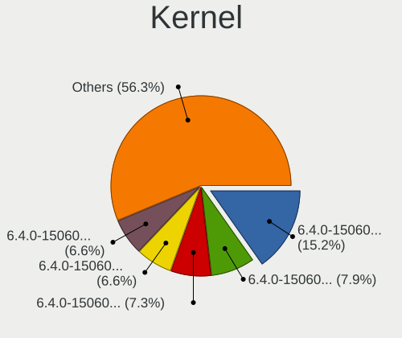

| Version                          | Desktops | Percent |
|----------------------------------|----------|---------|
| 6.4.0-150600.23.25-default       | 23       | 15.23%  |
| 6.4.0-150600.23.53-default       | 12       | 7.95%   |
| 6.4.0-150600.23.17-default       | 11       | 7.28%   |
| 6.4.0-150600.23.47-default       | 10       | 6.62%   |
| 6.4.0-150600.23.33-default       | 10       | 6.62%   |
| 6.4.0-150600.21-default          | 10       | 6.62%   |
| 6.4.0-150600.23.65-default       | 8        | 5.3%    |
| 6.4.0-150600.23.50-default       | 8        | 5.3%    |
| 6.4.0-150600.23.30-default       | 8        | 5.3%    |
| 6.4.0-150600.23.70-default       | 7        | 4.64%   |
| 6.4.0-150600.23.60-default       | 6        | 3.97%   |
| 6.4.0-150600.23.22-default       | 6        | 3.97%   |
| 6.4.0-150600.23.78-default       | 5        | 3.31%   |
| 6.4.0-150600.23.42-default       | 5        | 3.31%   |
| 6.4.0-150600.23.38-default       | 4        | 2.65%   |
| 6.4.0-150600.23.81-default       | 3        | 1.99%   |
| 6.4.0-150600.23.73-default       | 3        | 1.99%   |
| 6.4.0-150600.23.7-default        | 3        | 1.99%   |
| 6.4.0-150600.4-default           | 2        | 1.32%   |
| 6.4.0-150600.23.14-default       | 2        | 1.32%   |
| 6.6.5-dron                       | 1        | 0.66%   |
| 6.4.0-150600.16-default          | 1        | 0.66%   |
| 6.18.0-lp156.16.ga1b61b5-default | 1        | 0.66%   |
| 6.13.7-lp156.3.gb2c3b6a-default  | 1        | 0.66%   |
| 6.11.8-lp156.4-default           | 1        | 0.66%   |

Kernel Family
-------------

Linux kernel without a distro release

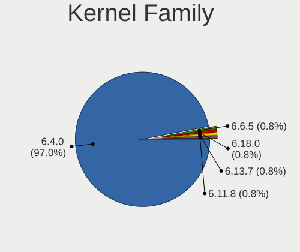

| Version | Desktops | Percent |
|---------|----------|---------|
| 6.4.0   | 128      | 96.97%  |
| 6.6.5   | 1        | 0.76%   |
| 6.18.0  | 1        | 0.76%   |
| 6.13.7  | 1        | 0.76%   |
| 6.11.8  | 1        | 0.76%   |

Kernel Major Ver.
-----------------

Linux kernel major version

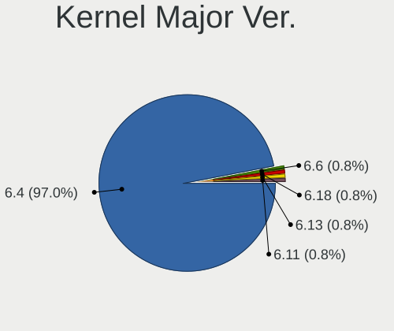

| Version | Desktops | Percent |
|---------|----------|---------|
| 6.4     | 128      | 96.97%  |
| 6.6     | 1        | 0.76%   |
| 6.18    | 1        | 0.76%   |
| 6.13    | 1        | 0.76%   |
| 6.11    | 1        | 0.76%   |

Arch
----

OS architecture (x86_64, i586, etc.)

| Name   | Desktops | Percent |
|--------|----------|---------|
| x86_64 | 131      | 100%    |

DE
--

Desktop Environment

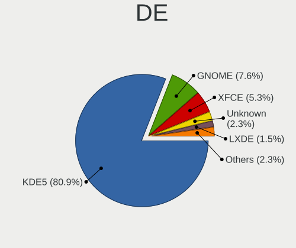

| Name     | Desktops | Percent |
|----------|----------|---------|
| KDE5     | 106      | 80.92%  |
| GNOME    | 10       | 7.63%   |
| XFCE     | 7        | 5.34%   |
| Unknown  | 3        | 2.29%   |
| LXDE     | 2        | 1.53%   |
| KDE6     | 1        | 0.76%   |
| Deepin   | 1        | 0.76%   |
| Cinnamon | 1        | 0.76%   |

Display Server
--------------

X11 or Wayland

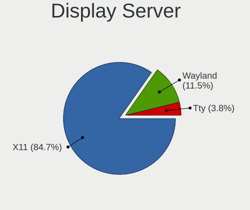

| Name    | Desktops | Percent |
|---------|----------|---------|
| X11     | 111      | 84.73%  |
| Wayland | 15       | 11.45%  |
| Tty     | 5        | 3.82%   |

Display Manager
---------------

SDDM, LightDM, etc.

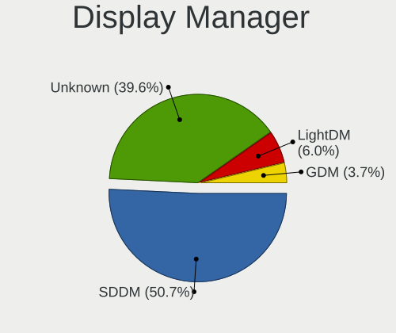

| Name    | Desktops | Percent |
|---------|----------|---------|
| SDDM    | 68       | 50.75%  |
| Unknown | 53       | 39.55%  |
| LightDM | 8        | 5.97%   |
| GDM     | 5        | 3.73%   |

OS Lang
-------

Language

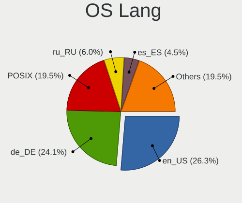

| Lang  | Desktops | Percent |
|-------|----------|---------|
| en_US | 35       | 26.32%  |
| de_DE | 32       | 24.06%  |
| POSIX | 26       | 19.55%  |
| ru_RU | 8        | 6.02%   |
| es_ES | 6        | 4.51%   |
| fr_FR | 5        | 3.76%   |
| nl_NL | 4        | 3.01%   |
| en_BW | 4        | 3.01%   |
| en_GB | 3        | 2.26%   |
| it_IT | 2        | 1.5%    |
| bg_BG | 2        | 1.5%    |
| zh_CN | 1        | 0.75%   |
| sl_SI | 1        | 0.75%   |
| pt_BR | 1        | 0.75%   |
| en_DK | 1        | 0.75%   |
| da_DK | 1        | 0.75%   |
| cs_CZ | 1        | 0.75%   |

Boot Mode
---------

EFI or BIOS

| Mode | Desktops | Percent |
|------|----------|---------|
| BIOS | 84       | 63.16%  |
| EFI  | 49       | 36.84%  |

Filesystem
----------

Type of filesystem

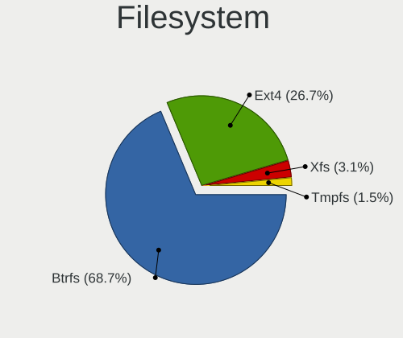

| Type  | Desktops | Percent |
|-------|----------|---------|
| Btrfs | 90       | 68.7%   |
| Ext4  | 35       | 26.72%  |
| Xfs   | 4        | 3.05%   |
| Tmpfs | 2        | 1.53%   |

Part. scheme
------------

Scheme of partitioning

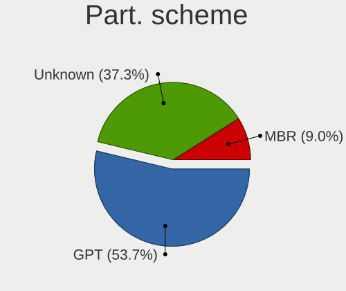

| Type    | Desktops | Percent |
|---------|----------|---------|
| GPT     | 72       | 53.73%  |
| Unknown | 50       | 37.31%  |
| MBR     | 12       | 8.96%   |

Dual Boot with Linux/BSD
------------------------

Hosting more than one Linux/BSD

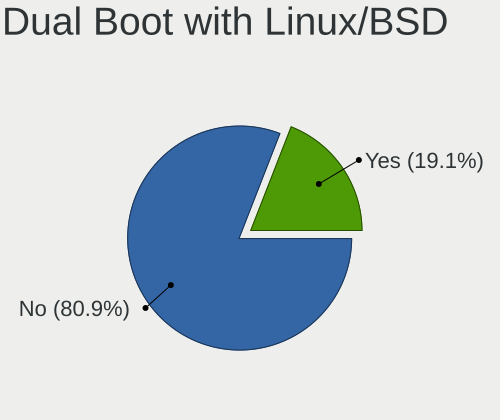

| Dual boot | Desktops | Percent |
|-----------|----------|---------|
| No        | 106      | 80.92%  |
| Yes       | 25       | 19.08%  |

Dual Boot (Win)
---------------

Hosting Linux and Windows

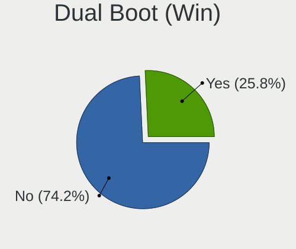

| Dual boot | Desktops | Percent |
|-----------|----------|---------|
| No        | 98       | 74.24%  |
| Yes       | 34       | 25.76%  |

Board
-----

Vendor
------

Motherboard manufacturer

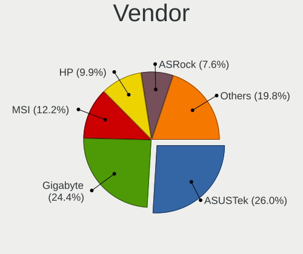

| Name                     | Desktops | Percent |
|--------------------------|----------|---------|
| ASUSTek Computer         | 34       | 25.95%  |
| Gigabyte Technology      | 32       | 24.43%  |
| MSI                      | 16       | 12.21%  |
| Hewlett-Packard          | 13       | 9.92%   |
| ASRock                   | 10       | 7.63%   |
| Dell                     | 8        | 6.11%   |
| Lenovo                   | 5        | 3.82%   |
| Fujitsu                  | 2        | 1.53%   |
| Unknown                  | 2        | 1.53%   |
| TYAN Computer            | 1        | 0.76%   |
| Shenzhen DOKE electronic | 1        | 0.76%   |
| Medion                   | 1        | 0.76%   |
| JGINYUE                  | 1        | 0.76%   |
| GEEKOM                   | 1        | 0.76%   |
| Chatreey                 | 1        | 0.76%   |
| Biostar                  | 1        | 0.76%   |
| Apple                    | 1        | 0.76%   |
| Acer                     | 1        | 0.76%   |

Model
-----

Motherboard model

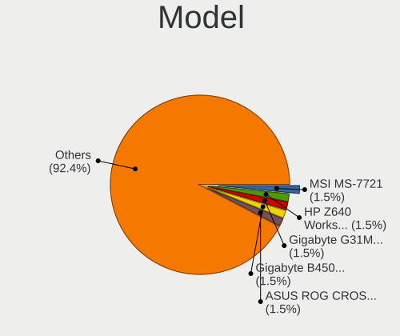

| Name                                        | Desktops | Percent |
|---------------------------------------------|----------|---------|
| MSI MS-7721                                 | 2        | 1.53%   |
| HP Z640 Workstation                         | 2        | 1.53%   |
| Gigabyte G31M-ES2L                          | 2        | 1.53%   |
| Gigabyte B450 I AORUS PRO WIFI              | 2        | 1.53%   |
| ASUS ROG CROSSHAIR VIII HERO                | 2        | 1.53%   |
| ASUS P5KPL-AM SE                            | 2        | 1.53%   |
| ASUS M3N-HT DELUXE                          | 2        | 1.53%   |
| ASUS CROSSHAIR V FORMULA-Z                  | 2        | 1.53%   |
| ASUS All Series                             | 2        | 1.53%   |
| Unknown                                     | 2        | 1.53%   |
| TYAN CELSIUS R650                           | 1        | 0.76%   |
| Shenzhen DOKE electronic MP100              | 1        | 0.76%   |
| MSI PRO ADL-U Cubi 5 (MS-B0A8)              | 1        | 0.76%   |
| MSI MS-7E12                                 | 1        | 0.76%   |
| MSI MS-7E06                                 | 1        | 0.76%   |
| MSI MS-7D99                                 | 1        | 0.76%   |
| MSI MS-7D25                                 | 1        | 0.76%   |
| MSI MS-7C94                                 | 1        | 0.76%   |
| MSI MS-7C37                                 | 1        | 0.76%   |
| MSI MS-7C08                                 | 1        | 0.76%   |
| MSI MS-7A94                                 | 1        | 0.76%   |
| MSI MS-7996                                 | 1        | 0.76%   |
| MSI MS-7816                                 | 1        | 0.76%   |
| MSI MS-7793                                 | 1        | 0.76%   |
| MSI MS-7693                                 | 1        | 0.76%   |
| MSI MS-7641                                 | 1        | 0.76%   |
| Medion MS-7621                              | 1        | 0.76%   |
| Lenovo ThinkCentre M920t 10SGS28N00         | 1        | 0.76%   |
| Lenovo ThinkCentre Edge71 1577N8G           | 1        | 0.76%   |
| Lenovo Legion T5 26AMR5 90RC007YMH          | 1        | 0.76%   |
| Lenovo IdeaCentre Gaming5 17IAB7 90T100BHMZ | 1        | 0.76%   |
| Lenovo 70A4001MUX ThinkServer TS140         | 1        | 0.76%   |
| JGINYUE B760M GAMING                        | 1        | 0.76%   |
| HP Z840 Workstation                         | 1        | 0.76%   |
| HP Z400 Workstation                         | 1        | 0.76%   |
| HP Z230 Tower Workstation                   | 1        | 0.76%   |
| HP Pavilion Desktop PC 570-p5xx             | 1        | 0.76%   |
| HP Pavilion Desktop PC 570-p0XX             | 1        | 0.76%   |
| HP Compaq Elite 8300 SFF                    | 1        | 0.76%   |
| HP Compaq dc7900 Small Form Factor          | 1        | 0.76%   |

Model Family
------------

Motherboard model prefix

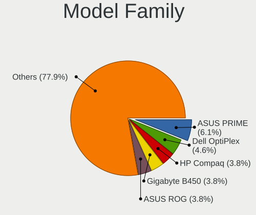

| Name                           | Desktops | Percent |
|--------------------------------|----------|---------|
| ASUS PRIME                     | 8        | 6.11%   |
| Dell OptiPlex                  | 6        | 4.58%   |
| HP Compaq                      | 5        | 3.82%   |
| Gigabyte B450                  | 5        | 3.82%   |
| ASUS ROG                       | 5        | 3.82%   |
| ASUS TUF                       | 3        | 2.29%   |
| MSI MS-7721                    | 2        | 1.53%   |
| Lenovo ThinkCentre             | 2        | 1.53%   |
| HP Z640                        | 2        | 1.53%   |
| HP Pavilion                    | 2        | 1.53%   |
| Gigabyte GA-78LMT-USB3         | 2        | 1.53%   |
| Gigabyte G31M-ES2L             | 2        | 1.53%   |
| Fujitsu ESPRIMO                | 2        | 1.53%   |
| ASUS P5KPL-AM                  | 2        | 1.53%   |
| ASUS M3N-HT                    | 2        | 1.53%   |
| ASUS CROSSHAIR                 | 2        | 1.53%   |
| ASUS All                       | 2        | 1.53%   |
| Unknown                        | 2        | 1.53%   |
| TYAN CELSIUS                   | 1        | 0.76%   |
| Shenzhen DOKE electronic MP100 | 1        | 0.76%   |
| MSI PRO                        | 1        | 0.76%   |
| MSI MS-7E12                    | 1        | 0.76%   |
| MSI MS-7E06                    | 1        | 0.76%   |
| MSI MS-7D99                    | 1        | 0.76%   |
| MSI MS-7D25                    | 1        | 0.76%   |
| MSI MS-7C94                    | 1        | 0.76%   |
| MSI MS-7C37                    | 1        | 0.76%   |
| MSI MS-7C08                    | 1        | 0.76%   |
| MSI MS-7A94                    | 1        | 0.76%   |
| MSI MS-7996                    | 1        | 0.76%   |
| MSI MS-7816                    | 1        | 0.76%   |
| MSI MS-7793                    | 1        | 0.76%   |
| MSI MS-7693                    | 1        | 0.76%   |
| MSI MS-7641                    | 1        | 0.76%   |
| Medion MS-7621                 | 1        | 0.76%   |
| Lenovo Legion                  | 1        | 0.76%   |
| Lenovo IdeaCentre              | 1        | 0.76%   |
| Lenovo 70A4001MUX              | 1        | 0.76%   |
| JGINYUE B760M                  | 1        | 0.76%   |
| HP Z840                        | 1        | 0.76%   |

MFG Year
--------

Motherboard manufacture year

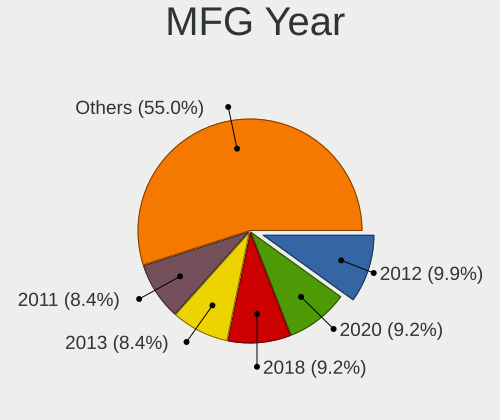

| Year | Desktops | Percent |
|------|----------|---------|
| 2012 | 13       | 9.92%   |
| 2020 | 12       | 9.16%   |
| 2018 | 12       | 9.16%   |
| 2013 | 11       | 8.4%    |
| 2011 | 11       | 8.4%    |
| 2008 | 10       | 7.63%   |
| 2023 | 8        | 6.11%   |
| 2014 | 8        | 6.11%   |
| 2024 | 7        | 5.34%   |
| 2021 | 7        | 5.34%   |
| 2015 | 7        | 5.34%   |
| 2022 | 6        | 4.58%   |
| 2019 | 6        | 4.58%   |
| 2017 | 4        | 3.05%   |
| 2016 | 4        | 3.05%   |
| 2010 | 3        | 2.29%   |
| 2009 | 2        | 1.53%   |

Form Factor
-----------

Physical design of the computer

| Name    | Desktops | Percent |
|---------|----------|---------|
| Desktop | 131      | 100%    |

Secure Boot
-----------

Enabled or disabled

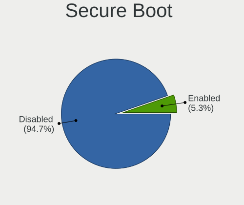

| State    | Desktops | Percent |
|----------|----------|---------|
| Disabled | 124      | 94.66%  |
| Enabled  | 7        | 5.34%   |

Coreboot
--------

Have coreboot on board

| Used | Desktops | Percent |
|------|----------|---------|
| No   | 131      | 100%    |

RAM Size
--------

Total RAM memory

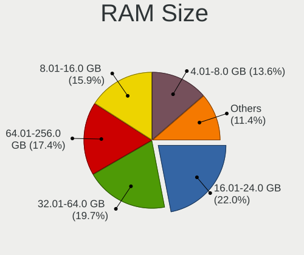

| Size in GB  | Desktops | Percent |
|-------------|----------|---------|
| 16.01-24.0  | 29       | 21.97%  |
| 32.01-64.0  | 26       | 19.7%   |
| 64.01-256.0 | 23       | 17.42%  |
| 8.01-16.0   | 21       | 15.91%  |
| 4.01-8.0    | 18       | 13.64%  |
| 3.01-4.0    | 7        | 5.3%    |
| 24.01-32.0  | 5        | 3.79%   |
| 1.01-2.0    | 3        | 2.27%   |

RAM Used
--------

Used RAM memory

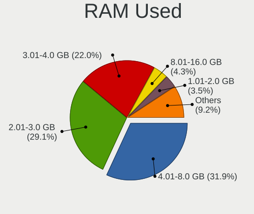

| Used GB     | Desktops | Percent |
|-------------|----------|---------|
| 4.01-8.0    | 45       | 31.91%  |
| 2.01-3.0    | 41       | 29.08%  |
| 3.01-4.0    | 31       | 21.99%  |
| 8.01-16.0   | 6        | 4.26%   |
| 1.01-2.0    | 5        | 3.55%   |
| 0.51-1.0    | 5        | 3.55%   |
| 32.01-64.0  | 3        | 2.13%   |
| 16.01-24.0  | 2        | 1.42%   |
| 24.01-32.0  | 1        | 0.71%   |
| 64.01-256.0 | 1        | 0.71%   |
| 0.01-0.5    | 1        | 0.71%   |

Total Drives
------------

Number of drives on board

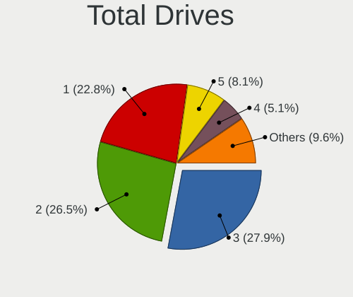

| Drives | Desktops | Percent |
|--------|----------|---------|
| 3      | 38       | 27.94%  |
| 2      | 36       | 26.47%  |
| 1      | 31       | 22.79%  |
| 5      | 11       | 8.09%   |
| 4      | 7        | 5.15%   |
| 6      | 4        | 2.94%   |
| 10     | 2        | 1.47%   |
| 9      | 2        | 1.47%   |
| 7      | 2        | 1.47%   |
| 14     | 1        | 0.74%   |
| 13     | 1        | 0.74%   |
| 11     | 1        | 0.74%   |

Has CD-ROM
----------

Has CD-ROM on board

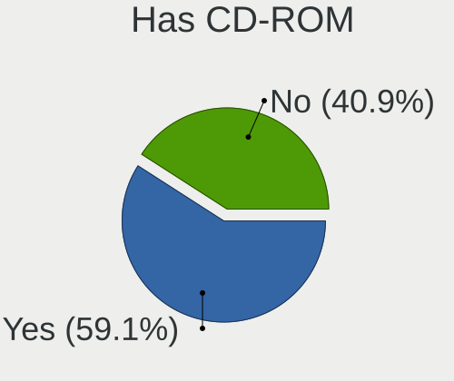

| Presented | Desktops | Percent |
|-----------|----------|---------|
| Yes       | 78       | 59.09%  |
| No        | 54       | 40.91%  |

Has Ethernet
------------

Has Ethernet on board

| Presented | Desktops | Percent |
|-----------|----------|---------|
| Yes       | 131      | 100%    |

Has WiFi
--------

Has WiFi module

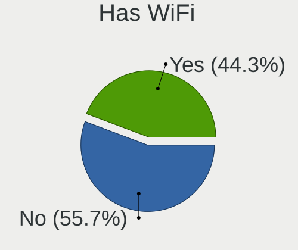

| Presented | Desktops | Percent |
|-----------|----------|---------|
| No        | 73       | 55.73%  |
| Yes       | 58       | 44.27%  |

Has Bluetooth
-------------

Has Bluetooth module

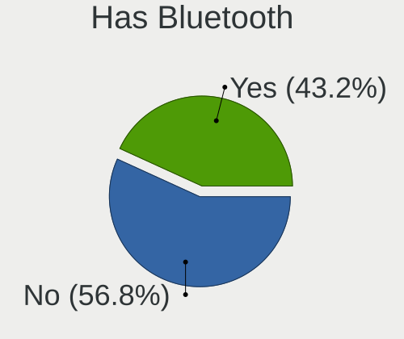

| Presented | Desktops | Percent |
|-----------|----------|---------|
| No        | 75       | 56.82%  |
| Yes       | 57       | 43.18%  |

Location
--------

Country
-------

Geographic location (country)

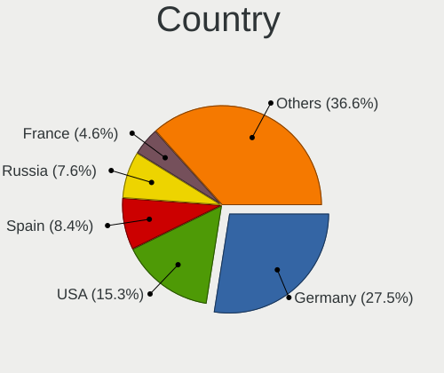

| Country         | Desktops | Percent |
|-----------------|----------|---------|
| Germany         | 36       | 27.48%  |
| USA             | 20       | 15.27%  |
| Spain           | 11       | 8.4%    |
| Russia          | 10       | 7.63%   |
| France          | 6        | 4.58%   |
| Australia       | 5        | 3.82%   |
| UK              | 3        | 2.29%   |
| Switzerland     | 3        | 2.29%   |
| Netherlands     | 3        | 2.29%   |
| Italy           | 3        | 2.29%   |
| Belgium         | 3        | 2.29%   |
| Austria         | 3        | 2.29%   |
| Argentina       | 3        | 2.29%   |
| Czechia         | 2        | 1.53%   |
| Canada          | 2        | 1.53%   |
| Bulgaria        | 2        | 1.53%   |
| Brazil          | 2        | 1.53%   |
| Vietnam         | 1        | 0.76%   |
| Turkey          | 1        | 0.76%   |
| The Netherlands | 1        | 0.76%   |
| Taiwan          | 1        | 0.76%   |
| Sweden          | 1        | 0.76%   |
| Slovenia        | 1        | 0.76%   |
| Saudi Arabia    | 1        | 0.76%   |
| Romania         | 1        | 0.76%   |
| Norway          | 1        | 0.76%   |
| New Zealand     | 1        | 0.76%   |
| Iceland         | 1        | 0.76%   |
| Finland         | 1        | 0.76%   |
| Denmark         | 1        | 0.76%   |
| Croatia         | 1        | 0.76%   |

City
----

Geographic location (city)

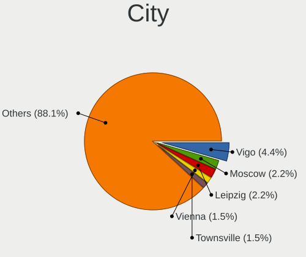

| City          | Desktops | Percent |
|---------------|----------|---------|
| Vigo          | 6        | 4.44%   |
| Moscow        | 3        | 2.22%   |
| Leipzig       | 3        | 2.22%   |
| Vienna        | 2        | 1.48%   |
| Townsville    | 2        | 1.48%   |
| Soltau        | 2        | 1.48%   |
| Sofia         | 2        | 1.48%   |
| Madrid        | 2        | 1.48%   |
| Düsseldorf   | 2        | 1.48%   |
| Berlin        | 2        | 1.48%   |
| Zurich        | 1        | 0.74%   |
| Zuchwil       | 1        | 0.74%   |
| Zaragoza      | 1        | 0.74%   |
| Zagreb        | 1        | 0.74%   |
| Yarm          | 1        | 0.74%   |
| West Bend     | 1        | 0.74%   |
| Weisswasser   | 1        | 0.74%   |
| Wedemark      | 1        | 0.74%   |
| Vitória      | 1        | 0.74%   |
| Vellahn       | 1        | 0.74%   |
| Vantaa        | 1        | 0.74%   |
| Valladolid    | 1        | 0.74%   |
| Vadstena      | 1        | 0.74%   |
| Uşak         | 1        | 0.74%   |
| Tikhvin       | 1        | 0.74%   |
| Stuttgart     | 1        | 0.74%   |
| Stolpen       | 1        | 0.74%   |
| St Petersburg | 1        | 0.74%   |
| Sorgues       | 1        | 0.74%   |
| Simi Valley   | 1        | 0.74%   |
| Seversk       | 1        | 0.74%   |
| Seth          | 1        | 0.74%   |
| Schoten       | 1        | 0.74%   |
| San Antonio   | 1        | 0.74%   |
| Royal Oak     | 1        | 0.74%   |
| Rostov-on-Don | 1        | 0.74%   |
| Richmond      | 1        | 0.74%   |
| Reykjavik     | 1        | 0.74%   |
| Remscheid     | 1        | 0.74%   |
| Prosper       | 1        | 0.74%   |

Drives
------

Drive Vendor
------------

Hard drive vendors

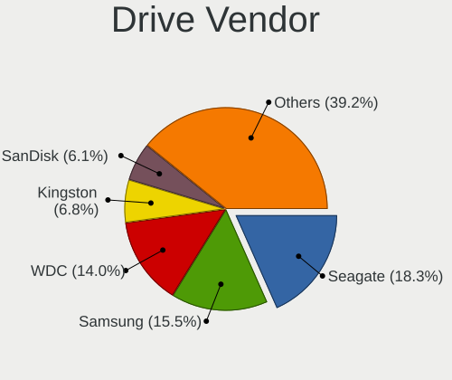

| Vendor                       | Desktops | Drives | Percent |
|------------------------------|----------|--------|---------|
| Seagate                      | 51       | 80     | 18.35%  |
| Samsung Electronics          | 43       | 77     | 15.47%  |
| WDC                          | 39       | 92     | 14.03%  |
| Kingston                     | 19       | 29     | 6.83%   |
| SanDisk                      | 17       | 23     | 6.12%   |
| Toshiba                      | 13       | 19     | 4.68%   |
| Crucial                      | 13       | 26     | 4.68%   |
| Micron Technology            | 6        | 6      | 2.16%   |
| Intenso                      | 6        | 8      | 2.16%   |
| Hitachi                      | 6        | 8      | 2.16%   |
| Intel                        | 5        | 5      | 1.8%    |
| ADATA Technology             | 5        | 6      | 1.8%    |
| Unknown                      | 4        | 6      | 1.44%   |
| MAXIO Technology (Hangzhou)  | 4        | 5      | 1.44%   |
| HGST                         | 4        | 5      | 1.44%   |
| A-DATA Technology            | 4        | 4      | 1.44%   |
| SK hynix                     | 3        | 4      | 1.08%   |
| PNY                          | 3        | 3      | 1.08%   |
| Kingston Technology Company  | 3        | 5      | 1.08%   |
| SPCC                         | 2        | 3      | 0.72%   |
| Shenzhen Longsys Electronics | 2        | 5      | 0.72%   |
| Phison Electronics           | 2        | 5      | 0.72%   |
| Hewlett-Packard              | 2        | 1      | 0.72%   |
| Emtec                        | 2        | 2      | 0.72%   |
| China                        | 2        | 2      | 0.72%   |
| Solid                        | 1        | 1      | 0.36%   |
| Silicon Motion               | 1        | 1      | 0.36%   |
| SD                           | 1        | 1      | 0.36%   |
| OCZ Technology Group         | 1        | 1      | 0.36%   |
| MSI                          | 1        | 1      | 0.36%   |
| Micron/Crucial Technology    | 1        | 1      | 0.36%   |
| Maxtor                       | 1        | 1      | 0.36%   |
| KIOXIA                       | 1        | 1      | 0.36%   |
| Inateck                      | 1        | 1      | 0.36%   |
| HUAWEI                       | 1        | 2      | 0.36%   |
| Hikvision                    | 1        | 1      | 0.36%   |
| Gigabyte Technology          | 1        | 1      | 0.36%   |
| Fujitsu                      | 1        | 8      | 0.36%   |
| Corsair                      | 1        | 1      | 0.36%   |
| ASMT                         | 1        | 1      | 0.36%   |

Drive Model
-----------

Hard drive models

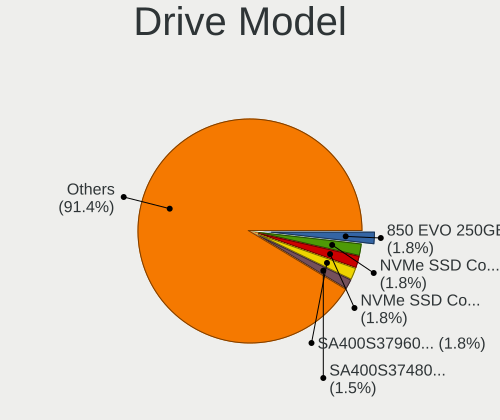

| Model                                                              | Desktops | Percent |
|--------------------------------------------------------------------|----------|---------|
| Samsung SSD 850 EVO 250GB                                          | 6        | 1.79%   |
| Samsung NVMe SSD Controller SM981/PM981/PM983 1TB                  | 6        | 1.79%   |
| Samsung NVMe SSD Controller PM9A1/PM9A3/980PRO 1TB                 | 6        | 1.79%   |
| Kingston SA400S37960G 960GB SSD                                    | 6        | 1.79%   |
| Kingston SA400S37480G 480GB SSD                                    | 5        | 1.49%   |
| Seagate ST1000DM010-2EP102 1TB                                     | 4        | 1.19%   |
| Crucial CT1000MX500SSD1 1TB                                        | 4        | 1.19%   |
| WDC WD20EZBX-00AYRA0 2TB                                           | 3        | 0.89%   |
| Seagate ST2000DM008-2UB102 2TB                                     | 3        | 0.89%   |
| Seagate ST2000DM008-2FR102 2TB                                     | 3        | 0.89%   |
| Seagate ST1000DM003-1SB102 1TB                                     | 3        | 0.89%   |
| Samsung SSD 870 EVO 500GB                                          | 3        | 0.89%   |
| Samsung SSD 870 EVO 1TB                                            | 3        | 0.89%   |
| Samsung NVMe SSD Controller SM961/PM961/SM963 1024GB               | 3        | 0.89%   |
| MAXIO (Hangzhou) NVMe SSD Controller MAP1202 2TB                   | 3        | 0.89%   |
| Kingston SV300S37A120G 120GB SSD                                   | 3        | 0.89%   |
| ADATA XPG SX8200 Pro PCIe Gen3x4 M.2 2280 Solid State Drive 1024GB | 3        | 0.89%   |
| WDC WD40EZAZ-19SF3B0 4TB                                           | 2        | 0.6%    |
| WDC WD20EZRZ-00Z5HB0 2TB                                           | 2        | 0.6%    |
| WDC WD10EZEX-60WN4A0 1TB                                           | 2        | 0.6%    |
| WDC WD10EARS-00Y5B1 1TB                                            | 2        | 0.6%    |
| Unknown SD/MMC/MS PRO 2GB                                          | 2        | 0.6%    |
| Toshiba HDWD120 2TB                                                | 2        | 0.6%    |
| Toshiba HDWD110 1TB                                                | 2        | 0.6%    |
| SK hynix BC511 512GB                                               | 2        | 0.6%    |
| Seagate ST4000DM004-2U9104 4TB                                     | 2        | 0.6%    |
| Seagate ST3250318AS 250GB                                          | 2        | 0.6%    |
| Seagate ST3160318AS 160GB                                          | 2        | 0.6%    |
| Seagate ST31500341AS 1TB                                           | 2        | 0.6%    |
| Seagate ST2000VN004-2E4164 2TB                                     | 2        | 0.6%    |
| Seagate ST2000DM001-1ER164 2TB                                     | 2        | 0.6%    |
| Seagate ST16000NM000J-2TW103 16TB                                  | 2        | 0.6%    |
| Samsung SSD 990 PRO 2TB                                            | 2        | 0.6%    |
| Samsung SSD 980 1TB                                                | 2        | 0.6%    |
| Samsung SSD 870 QVO 2TB                                            | 2        | 0.6%    |
| Samsung SSD 870 EVO 4TB                                            | 2        | 0.6%    |
| Samsung SSD 840 EVO 250GB                                          | 2        | 0.6%    |
| Samsung SSD 840 EVO 120GB                                          | 2        | 0.6%    |
| Phison E16 PCIe4 NVMe Controller 1TB                               | 2        | 0.6%    |
| Micron CT1000P3PSSD8 1TB                                           | 2        | 0.6%    |

HDD Vendor
----------

Hard disk drive vendors

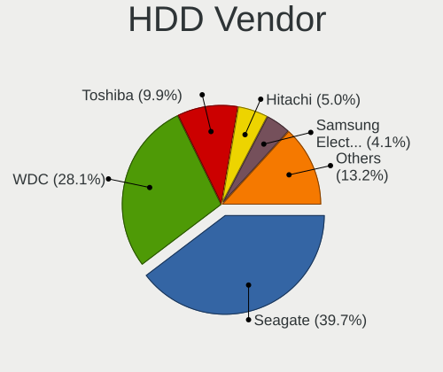

| Vendor              | Desktops | Drives | Percent |
|---------------------|----------|--------|---------|
| Seagate             | 48       | 71     | 39.67%  |
| WDC                 | 34       | 83     | 28.1%   |
| Toshiba             | 12       | 18     | 9.92%   |
| Hitachi             | 6        | 8      | 4.96%   |
| Samsung Electronics | 5        | 7      | 4.13%   |
| HGST                | 4        | 5      | 3.31%   |
| Unknown             | 3        | 5      | 2.48%   |
| Intenso             | 2        | 2      | 1.65%   |
| Hewlett-Packard     | 2        | 1      | 1.65%   |
| Maxtor              | 1        | 1      | 0.83%   |
| Inateck             | 1        | 1      | 0.83%   |
| Fujitsu             | 1        | 8      | 0.83%   |
| ASMT                | 1        | 1      | 0.83%   |
| Apple               | 1        | 1      | 0.83%   |

SSD Vendor
----------

Solid state drive vendors

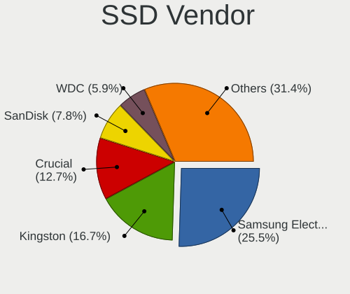

| Vendor              | Desktops | Drives | Percent |
|---------------------|----------|--------|---------|
| Samsung Electronics | 26       | 41     | 25.49%  |
| Kingston            | 17       | 24     | 16.67%  |
| Crucial             | 13       | 26     | 12.75%  |
| SanDisk             | 8        | 11     | 7.84%   |
| WDC                 | 6        | 9      | 5.88%   |
| Intenso             | 4        | 6      | 3.92%   |
| A-DATA Technology   | 4        | 4      | 3.92%   |
| PNY                 | 3        | 3      | 2.94%   |
| Micron Technology   | 3        | 3      | 2.94%   |
| Intel               | 3        | 3      | 2.94%   |
| SPCC                | 2        | 3      | 1.96%   |
| Emtec               | 2        | 2      | 1.96%   |
| China               | 2        | 2      | 1.96%   |
| Solid               | 1        | 1      | 0.98%   |
| Seagate             | 1        | 1      | 0.98%   |
| SD                  | 1        | 1      | 0.98%   |
| MSI                 | 1        | 1      | 0.98%   |
| Hikvision           | 1        | 1      | 0.98%   |
| Gigabyte Technology | 1        | 1      | 0.98%   |
| Corsair             | 1        | 1      | 0.98%   |
| AGI                 | 1        | 1      | 0.98%   |
| Unknown             | 1        | 1      | 0.98%   |

Drive Kind
----------

HDD or SSD

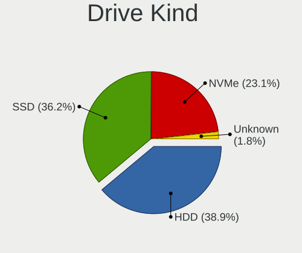

| Kind    | Desktops | Drives | Percent |
|---------|----------|--------|---------|
| HDD     | 86       | 212    | 38.91%  |
| SSD     | 80       | 146    | 36.2%   |
| NVMe    | 51       | 91     | 23.08%  |
| Unknown | 4        | 6      | 1.81%   |

Drive Connector
---------------

SATA, SAS, NVMe, etc.

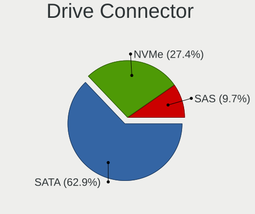

| Type | Desktops | Drives | Percent |
|------|----------|--------|---------|
| SATA | 117      | 330    | 62.9%   |
| NVMe | 51       | 91     | 27.42%  |
| SAS  | 18       | 34     | 9.68%   |

Drive Size
----------

Size of hard drive

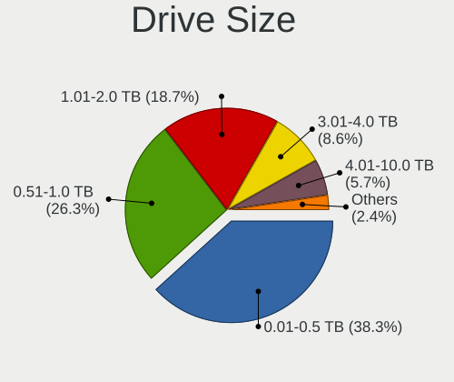

| Size in TB | Desktops | Drives | Percent |
|------------|----------|--------|---------|
| 0.01-0.5   | 80       | 137    | 38.28%  |
| 0.51-1.0   | 55       | 88     | 26.32%  |
| 1.01-2.0   | 39       | 63     | 18.66%  |
| 3.01-4.0   | 18       | 30     | 8.61%   |
| 4.01-10.0  | 12       | 32     | 5.74%   |
| 2.01-3.0   | 2        | 5      | 0.96%   |
| 10.01-20.0 | 2        | 2      | 0.96%   |
| 20.01-50.0 | 1        | 1      | 0.48%   |

Space Total
-----------

Amount of disk space available on the file system

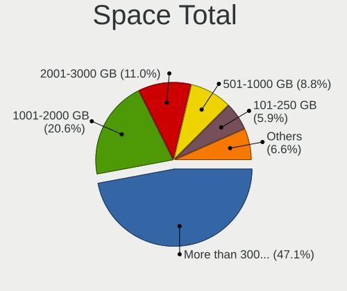

| Size in GB     | Desktops | Percent |
|----------------|----------|---------|
| More than 3000 | 64       | 47.06%  |
| 1001-2000      | 28       | 20.59%  |
| 2001-3000      | 15       | 11.03%  |
| 501-1000       | 12       | 8.82%   |
| 101-250        | 8        | 5.88%   |
| 251-500        | 7        | 5.15%   |
| 51-100         | 2        | 1.47%   |

Space Used
----------

Amount of used disk space

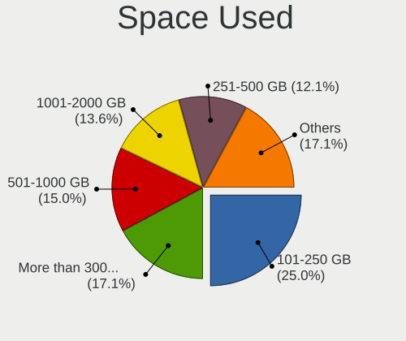

| Used GB        | Desktops | Percent |
|----------------|----------|---------|
| 101-250        | 35       | 25%     |
| More than 3000 | 24       | 17.14%  |
| 501-1000       | 21       | 15%     |
| 1001-2000      | 19       | 13.57%  |
| 251-500        | 17       | 12.14%  |
| 51-100         | 12       | 8.57%   |
| 21-50          | 4        | 2.86%   |
| 2001-3000      | 4        | 2.86%   |
| 1-20           | 4        | 2.86%   |

Malfunc. Drives
---------------

Drive models with a malfunction

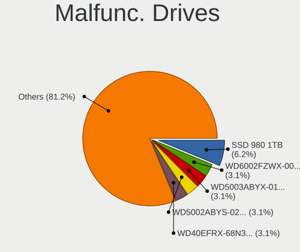

| Model                                          | Desktops | Drives | Percent |
|------------------------------------------------|----------|--------|---------|
| Samsung Electronics SSD 980 1TB                | 2        | 2      | 6.25%   |
| WDC WD6002FZWX-00GBGB0 6TB                     | 1        | 3      | 3.13%   |
| WDC WD5003ABYX-01WERA0 500GB                   | 1        | 1      | 3.13%   |
| WDC WD5002ABYS-02B1B0 500GB                    | 1        | 1      | 3.13%   |
| WDC WD40EFRX-68N32N0 4TB                       | 1        | 2      | 3.13%   |
| WDC WD3200AAKX-00ERMA0 320GB                   | 1        | 1      | 3.13%   |
| WDC WD20EFRX-68EUZN0 2TB                       | 1        | 1      | 3.13%   |
| WDC WD10EZRX-00L4HB0 1TB                       | 1        | 2      | 3.13%   |
| WDC WD10EZEX-60WN4A0 1TB                       | 1        | 2      | 3.13%   |
| WDC WD10EZEX-22RKKA0 1TB                       | 1        | 2      | 3.13%   |
| Seagate ST9320423AS 320GB                      | 1        | 2      | 3.13%   |
| Seagate ST8000VN0022-2EL112 8TB                | 1        | 3      | 3.13%   |
| Seagate ST8000NT001-3LZ101 8TB                 | 1        | 2      | 3.13%   |
| Seagate ST500DM002-1BD142 500GB                | 1        | 1      | 3.13%   |
| Seagate ST3250318AS 250GB                      | 1        | 1      | 3.13%   |
| Seagate ST3250312AS 250GB                      | 1        | 2      | 3.13%   |
| Seagate ST3000DM001-1ER166 3TB                 | 1        | 1      | 3.13%   |
| Seagate ST16000NM000J-2TW103 16TB              | 1        | 1      | 3.13%   |
| Seagate ST1000DM010-2EP102 1TB                 | 1        | 1      | 3.13%   |
| SanDisk SD6SB1M064G1022I 64GB SSD              | 1        | 1      | 3.13%   |
| Samsung Electronics SSD 870 EVO 2TB            | 1        | 2      | 3.13%   |
| Samsung Electronics HD502IJ 500GB              | 1        | 1      | 3.13%   |
| Micron Technology MTFDDAK256MAM-1K12 256GB SSD | 1        | 1      | 3.13%   |
| Maxtor 6L250S0 256GB                           | 1        | 1      | 3.13%   |
| Kingston SV300S37A120G 120GB SSD               | 1        | 1      | 3.13%   |
| Kingston SHFS37A120G 120GB SSD                 | 1        | 2      | 3.13%   |
| Intel SSDSCKKW256G8 256GB                      | 1        | 1      | 3.13%   |
| Intel SSDSC2KG960G8 960GB                      | 1        | 1      | 3.13%   |
| Hitachi HDT721016SLA380 160GB                  | 1        | 1      | 3.13%   |
| Hitachi HDS721616PLA380 160GB                  | 1        | 2      | 3.13%   |
| AGI AGI512G17AI178 512GB SSD                   | 1        | 1      | 3.13%   |

Malfunc. Drive Vendor
---------------------

Vendors of faulty drives

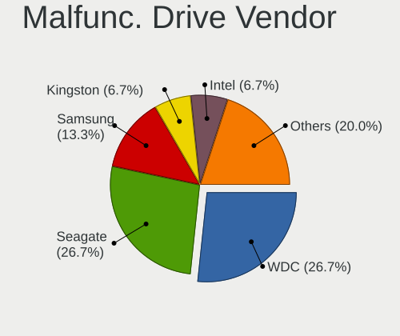

| Vendor              | Desktops | Drives | Percent |
|---------------------|----------|--------|---------|
| WDC                 | 8        | 15     | 26.67%  |
| Seagate             | 8        | 14     | 26.67%  |
| Samsung Electronics | 4        | 5      | 13.33%  |
| Kingston            | 2        | 3      | 6.67%   |
| Intel               | 2        | 2      | 6.67%   |
| Hitachi             | 2        | 3      | 6.67%   |
| SanDisk             | 1        | 1      | 3.33%   |
| Micron Technology   | 1        | 1      | 3.33%   |
| Maxtor              | 1        | 1      | 3.33%   |
| AGI                 | 1        | 1      | 3.33%   |

Malfunc. HDD Vendor
-------------------

Vendors of faulty HDD drives

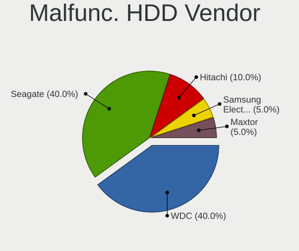

| Vendor              | Desktops | Drives | Percent |
|---------------------|----------|--------|---------|
| WDC                 | 8        | 15     | 40%     |
| Seagate             | 8        | 14     | 40%     |
| Hitachi             | 2        | 3      | 10%     |
| Samsung Electronics | 1        | 1      | 5%      |
| Maxtor              | 1        | 1      | 5%      |

Malfunc. Drive Kind
-------------------

Kinds of faulty drives

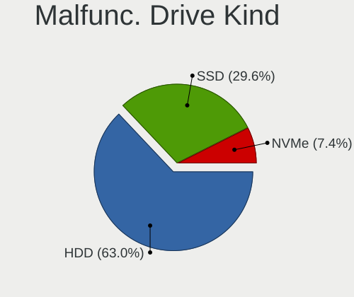

| Kind | Desktops | Drives | Percent |
|------|----------|--------|---------|
| HDD  | 17       | 34     | 62.96%  |
| SSD  | 8        | 10     | 29.63%  |
| NVMe | 2        | 2      | 7.41%   |

Failed Drives
-------------

Failed drive models

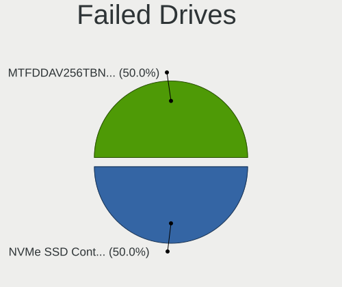

| Model                                                         | Desktops | Drives | Percent |
|---------------------------------------------------------------|----------|--------|---------|
| Samsung Electronics NVMe SSD Controller SM981/PM981/PM983 1TB | 1        | 1      | 50%     |
| Micron Technology MTFDDAV256TBN-1AR15ABHA 256GB SSD           | 1        | 1      | 50%     |

Failed Drive Vendor
-------------------

Failed drive vendors

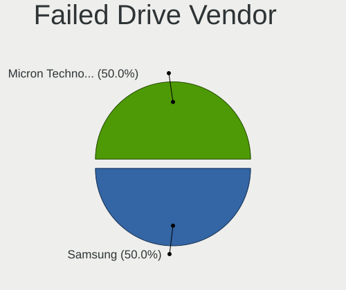

| Vendor              | Desktops | Drives | Percent |
|---------------------|----------|--------|---------|
| Samsung Electronics | 1        | 1      | 50%     |
| Micron Technology   | 1        | 1      | 50%     |

Drive Status
------------

Number of failed and malfunc. drives

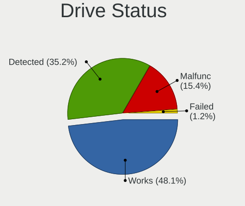

| Status   | Desktops | Drives | Percent |
|----------|----------|--------|---------|
| Works    | 78       | 215    | 48.15%  |
| Detected | 57       | 192    | 35.19%  |
| Malfunc  | 25       | 46     | 15.43%  |
| Failed   | 2        | 2      | 1.23%   |

Storage controller
------------------

Storage Vendor
--------------

Storage controller vendors

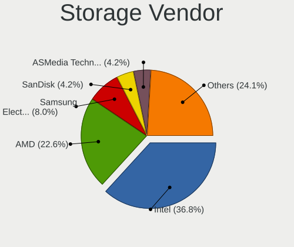

| Vendor                       | Desktops | Percent |
|------------------------------|----------|---------|
| Intel                        | 78       | 36.79%  |
| AMD                          | 48       | 22.64%  |
| Samsung Electronics          | 17       | 8.02%   |
| SanDisk                      | 9        | 4.25%   |
| ASMedia Technology           | 9        | 4.25%   |
| Marvell Technology Group     | 6        | 2.83%   |
| Kingston Technology Company  | 5        | 2.36%   |
| ADATA Technology             | 5        | 2.36%   |
| MAXIO Technology (Hangzhou)  | 4        | 1.89%   |
| SK hynix                     | 3        | 1.42%   |
| Nvidia                       | 3        | 1.42%   |
| Micron Technology            | 3        | 1.42%   |
| Broadcom / LSI               | 3        | 1.42%   |
| Shenzhen Longsys Electronics | 2        | 0.94%   |
| Seagate Technology           | 2        | 0.94%   |
| Phison Electronics           | 2        | 0.94%   |
| Adaptec                      | 2        | 0.94%   |
| Toshiba America Info Systems | 1        | 0.47%   |
| TenaFe                       | 1        | 0.47%   |
| Silicon Motion               | 1        | 0.47%   |
| Silicon Image                | 1        | 0.47%   |
| OCZ Technology Group         | 1        | 0.47%   |
| Micron/Crucial Technology    | 1        | 0.47%   |
| LSI Logic / Symbios Logic    | 1        | 0.47%   |
| KIOXIA                       | 1        | 0.47%   |
| JMicron Technology           | 1        | 0.47%   |
| Hewlett-Packard              | 1        | 0.47%   |
| Areca Technology             | 1        | 0.47%   |

Storage Model
-------------

Storage controller models

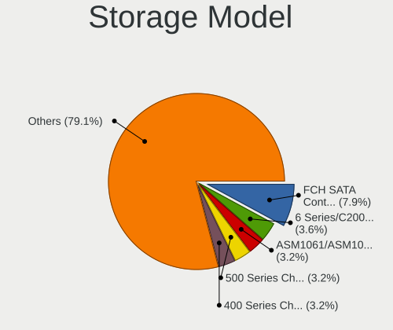

| Model                                                                          | Desktops | Percent |
|--------------------------------------------------------------------------------|----------|---------|
| AMD FCH SATA Controller [AHCI mode]                                            | 20       | 7.91%   |
| Intel 6 Series/C200 Series Chipset Family 6 port Desktop SATA AHCI Controller  | 9        | 3.56%   |
| ASMedia ASM1061/ASM1062 Serial ATA Controller                                  | 8        | 3.16%   |
| AMD 500 Series Chipset SATA Controller                                         | 8        | 3.16%   |
| AMD 400 Series Chipset SATA Controller                                         | 8        | 3.16%   |
| Intel 7 Series/C210 Series Chipset Family 6-port SATA Controller [AHCI mode]   | 7        | 2.77%   |
| Intel 200 Series PCH SATA controller [AHCI mode]                               | 7        | 2.77%   |
| AMD SB7x0/SB8x0/SB9x0 SATA Controller [AHCI mode]                              | 7        | 2.77%   |
| AMD SB7x0/SB8x0/SB9x0 IDE Controller                                           | 7        | 2.77%   |
| Samsung NVMe SSD Controller SM981/PM981/PM983                                  | 6        | 2.37%   |
| Samsung NVMe SSD Controller PM9A1/PM9A3/980PRO                                 | 6        | 2.37%   |
| Intel Raptor Lake SATA AHCI Controller                                         | 6        | 2.37%   |
| Intel NM10/ICH7 Family SATA Controller [IDE mode]                              | 6        | 2.37%   |
| Intel Alder Lake-S PCH SATA Controller [AHCI Mode]                             | 5        | 1.98%   |
| Intel 8 Series/C220 Series Chipset Family 6-port SATA Controller 1 [AHCI mode] | 5        | 1.98%   |
| AMD SB7x0/SB8x0/SB9x0 SATA Controller [IDE mode]                               | 5        | 1.98%   |
| Intel SATA Controller [RAID mode]                                              | 4        | 1.58%   |
| Intel Q170/Q150/B150/H170/H110/Z170/CM236 Chipset SATA Controller [AHCI Mode]  | 4        | 1.58%   |
| Intel Cannon Lake PCH SATA AHCI Controller                                     | 4        | 1.58%   |
| AMD 600 Series Chipset SATA Controller                                         | 4        | 1.58%   |
| SanDisk WD SN560/SN740/SN770/SN5000 NVMe SSD                                   | 3        | 1.19%   |
| Samsung NVMe SSD Controller SM961/PM961/SM963                                  | 3        | 1.19%   |
| Samsung NVMe SSD Controller S4LV008[Pascal]                                    | 3        | 1.19%   |
| MAXIO (Hangzhou) NVMe SSD Controller MAP1202 (DRAM-less)                       | 3        | 1.19%   |
| Intel Comet Lake SATA AHCI Controller                                          | 3        | 1.19%   |
| ADATA XPG SX8200 Pro PCIe Gen3x4 M.2 2280 Solid State Drive                    | 3        | 1.19%   |
| SK hynix BC511 NVMe SSD                                                        | 2        | 0.79%   |
| Sandisk WD Black SN850X NVMe SSD                                               | 2        | 0.79%   |
| Samsung NVMe SSD Controller 980 (DRAM-less)                                    | 2        | 0.79%   |
| Phison E16 PCIe4 NVMe Controller                                               | 2        | 0.79%   |
| Nvidia MCP78S [GeForce 8200] SATA Controller (non-AHCI mode)                   | 2        | 0.79%   |
| Nvidia MCP78S [GeForce 8200] IDE                                               | 2        | 0.79%   |
| Micron 2550 NVMe SSD (DRAM-less)                                               | 2        | 0.79%   |
| Marvell Group 88SE9172 SATA 6Gb/s Controller                                   | 2        | 0.79%   |
| Marvell Group 88SE6111/6121 SATA II / PATA Controller                          | 2        | 0.79%   |
| Kingston Company NV3 NVMe SSD [SM2268XT2] (DRAM-less)                          | 2        | 0.79%   |
| Kingston Company NV2 NVMe SSD [E21T] (DRAM-less)                               | 2        | 0.79%   |
| Intel Volume Management Device NVMe RAID Controller                            | 2        | 0.79%   |
| Intel RST Volume Management Device Controller                                  | 2        | 0.79%   |
| Intel C610/X99 series chipset 6-Port SATA Controller [AHCI mode]               | 2        | 0.79%   |

Storage Kind
------------

Kind of storage controller (IDE, SATA, NVMe, SAS, ...)

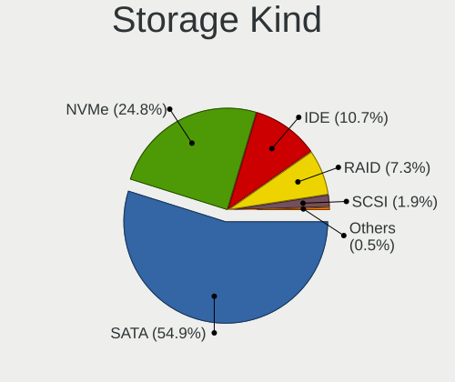

| Kind | Desktops | Percent |
|------|----------|---------|
| SATA | 113      | 54.85%  |
| NVMe | 51       | 24.76%  |
| IDE  | 22       | 10.68%  |
| RAID | 15       | 7.28%   |
| SCSI | 4        | 1.94%   |
| SAS  | 1        | 0.49%   |

Processor
---------

CPU Vendor
----------

Processor vendors

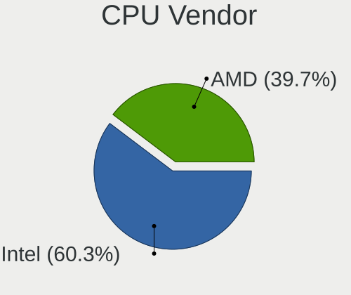

| Vendor | Desktops | Percent |
|--------|----------|---------|
| Intel  | 79       | 60.31%  |
| AMD    | 52       | 39.69%  |

CPU Model
---------

Processor models

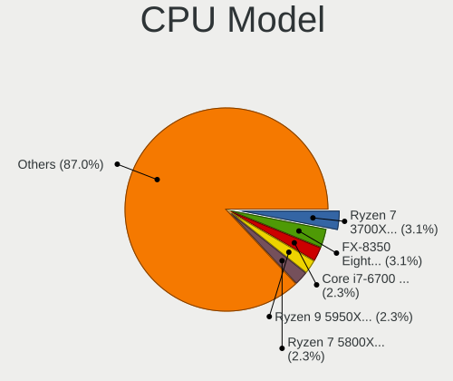

| Model                                           | Desktops | Percent |
|-------------------------------------------------|----------|---------|
| AMD Ryzen 7 3700X 8-Core Processor              | 4        | 3.05%   |
| AMD FX-8350 Eight-Core Processor                | 4        | 3.05%   |
| Intel Core i7-6700 CPU @ 3.40GHz                | 3        | 2.29%   |
| AMD Ryzen 9 5950X 16-Core Processor             | 3        | 2.29%   |
| AMD Ryzen 7 5800X 8-Core Processor              | 3        | 2.29%   |
| Intel Xeon CPU E5-2620 v3 @ 2.40GHz             | 2        | 1.53%   |
| Intel Pentium CPU G3220 @ 3.00GHz               | 2        | 1.53%   |
| Intel Core i7-3770 CPU @ 3.40GHz                | 2        | 1.53%   |
| Intel Core i5-6500 CPU @ 3.20GHz                | 2        | 1.53%   |
| Intel Core i5-4440 CPU @ 3.10GHz                | 2        | 1.53%   |
| Intel Core i5-2400 CPU @ 3.10GHz                | 2        | 1.53%   |
| Intel 12th Gen Core i7-12700KF                  | 2        | 1.53%   |
| Intel 12th Gen Core i7-12700K                   | 2        | 1.53%   |
| AMD Ryzen 9 5900X 12-Core Processor             | 2        | 1.53%   |
| AMD Ryzen 5 5600G with Radeon Graphics          | 2        | 1.53%   |
| AMD Athlon 64 X2 Dual Core Processor 5600+      | 2        | 1.53%   |
| AMD A10-7850K Radeon R7, 12 Compute Cores 4C+8G | 2        | 1.53%   |
| AMD A10-5800K APU with Radeon HD Graphics       | 2        | 1.53%   |
| Intel Xeon CPU X5482 @ 3.20GHz                  | 1        | 0.76%   |
| Intel Xeon CPU X5260 @ 3.33GHz                  | 1        | 0.76%   |
| Intel Xeon CPU W3530 @ 2.80GHz                  | 1        | 0.76%   |
| Intel Xeon CPU E5-2667 v3 @ 3.20GHz             | 1        | 0.76%   |
| Intel Xeon CPU E3-1225 v3 @ 3.20GHz             | 1        | 0.76%   |
| Intel Pentium Dual-Core CPU T4500 @ 2.30GHz     | 1        | 0.76%   |
| Intel Pentium Dual-Core CPU E6700 @ 3.20GHz     | 1        | 0.76%   |
| Intel Pentium Dual-Core CPU E5700 @ 3.00GHz     | 1        | 0.76%   |
| Intel Pentium CPU G850 @ 2.90GHz                | 1        | 0.76%   |
| Intel Pentium CPU G2030 @ 3.00GHz               | 1        | 0.76%   |
| Intel N100                                      | 1        | 0.76%   |
| Intel Core Ultra 7 265T                         | 1        | 0.76%   |
| Intel Core i9-9900KF CPU @ 3.60GHz              | 1        | 0.76%   |
| Intel Core i9-9900K CPU @ 3.60GHz               | 1        | 0.76%   |
| Intel Core i9-7980XE CPU @ 2.60GHz              | 1        | 0.76%   |
| Intel Core i9-14900K                            | 1        | 0.76%   |
| Intel Core i7-8700K CPU @ 3.70GHz               | 1        | 0.76%   |
| Intel Core i7-8700 CPU @ 3.20GHz                | 1        | 0.76%   |
| Intel Core i7-7700 CPU @ 3.60GHz                | 1        | 0.76%   |
| Intel Core i7-4790 CPU @ 3.60GHz                | 1        | 0.76%   |
| Intel Core i7-4770 CPU @ 3.40GHz                | 1        | 0.76%   |
| Intel Core i7-2600 CPU @ 3.40GHz                | 1        | 0.76%   |

CPU Model Family
----------------

Processor model prefix

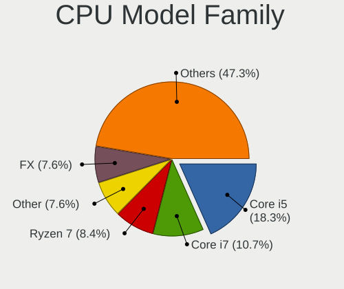

| Model                   | Desktops | Percent |
|-------------------------|----------|---------|
| Intel Core i5           | 24       | 18.32%  |
| Intel Core i7           | 14       | 10.69%  |
| AMD Ryzen 7             | 11       | 8.4%    |
| Other                   | 10       | 7.63%   |
| AMD FX                  | 10       | 7.63%   |
| AMD Ryzen 9             | 9        | 6.87%   |
| Intel Xeon              | 7        | 5.34%   |
| Intel Core i3           | 6        | 4.58%   |
| AMD Ryzen 5             | 5        | 3.82%   |
| Intel Pentium           | 4        | 3.05%   |
| Intel Core i9           | 4        | 3.05%   |
| Intel Core 2 Quad       | 4        | 3.05%   |
| AMD A10                 | 4        | 3.05%   |
| Intel Pentium Dual-Core | 3        | 2.29%   |
| AMD Ryzen 5 PRO         | 2        | 1.53%   |
| AMD Phenom II X6        | 2        | 1.53%   |
| AMD Athlon 64 X2        | 2        | 1.53%   |
| AMD A8                  | 2        | 1.53%   |
| Intel Core 2 Duo        | 1        | 0.76%   |
| Intel Core              | 1        | 0.76%   |
| Intel Celeron           | 1        | 0.76%   |
| AMD Ryzen Threadripper  | 1        | 0.76%   |
| AMD Ryzen 3             | 1        | 0.76%   |
| AMD Phenom II X4        | 1        | 0.76%   |
| AMD Athlon X4           | 1        | 0.76%   |
| AMD A12                 | 1        | 0.76%   |

CPU Cores
---------

Number of processor cores

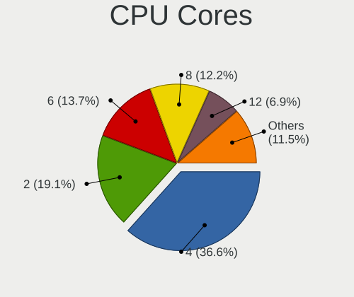

| Number | Desktops | Percent |
|--------|----------|---------|
| 4      | 48       | 36.64%  |
| 2      | 25       | 19.08%  |
| 6      | 18       | 13.74%  |
| 8      | 16       | 12.21%  |
| 12     | 9        | 6.87%   |
| 16     | 6        | 4.58%   |
| 20     | 3        | 2.29%   |
| 3      | 2        | 1.53%   |
| 32     | 1        | 0.76%   |
| 24     | 1        | 0.76%   |
| 18     | 1        | 0.76%   |
| 10     | 1        | 0.76%   |

CPU Sockets
-----------

Number of sockets

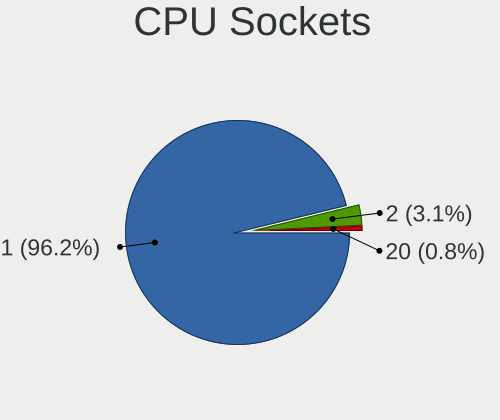

| Number | Desktops | Percent |
|--------|----------|---------|
| 1      | 126      | 96.18%  |
| 2      | 4        | 3.05%   |
| 20     | 1        | 0.76%   |

CPU Threads
-----------

Threads per core (Hyper-Threading)

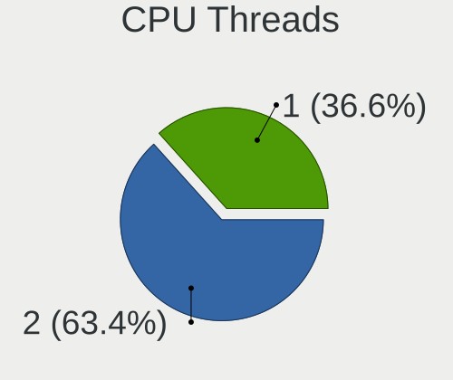

| Number | Desktops | Percent |
|--------|----------|---------|
| 2      | 83       | 63.36%  |
| 1      | 48       | 36.64%  |

CPU Op-Modes
------------

CPU Operation Modes (32-bit, 64-bit)

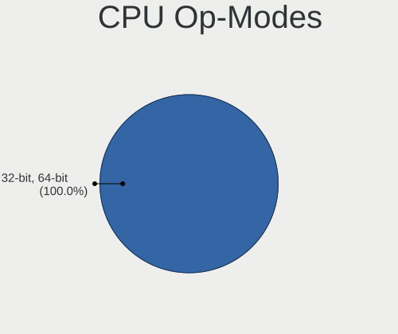

| Op mode        | Desktops | Percent |
|----------------|----------|---------|
| 32-bit, 64-bit | 131      | 100%    |

CPU Microcode
-------------

Microcode number

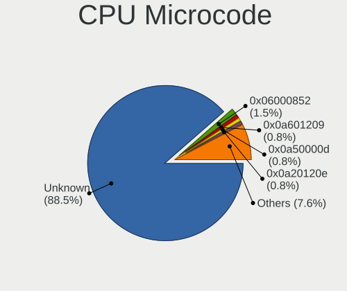

| Number     | Desktops | Percent |
|------------|----------|---------|
| Unknown    | 116      | 88.55%  |
| 0x06000852 | 2        | 1.53%   |
| 0x0a601209 | 1        | 0.76%   |
| 0x0a50000d | 1        | 0.76%   |
| 0x0a20120e | 1        | 0.76%   |
| 0x0a20102d | 1        | 0.76%   |
| 0x0a201016 | 1        | 0.76%   |
| 0x08701034 | 1        | 0.76%   |
| 0x08701033 | 1        | 0.76%   |
| 0x08701030 | 1        | 0.76%   |
| 0x08701021 | 1        | 0.76%   |
| 0x08108109 | 1        | 0.76%   |
| 0x06003106 | 1        | 0.76%   |
| 0x0600063d | 1        | 0.76%   |
| 0x010000dc | 1        | 0.76%   |

CPU Microarch
-------------

Microarchitecture

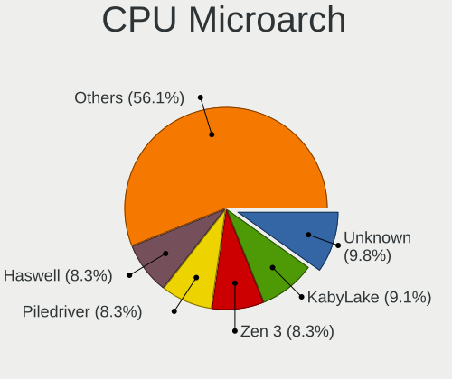

| Name             | Desktops | Percent |
|------------------|----------|---------|
| Unknown          | 13       | 9.85%   |
| KabyLake         | 12       | 9.09%   |
| Zen 3            | 11       | 8.33%   |
| Piledriver       | 11       | 8.33%   |
| Haswell          | 11       | 8.33%   |
| Penryn           | 9        | 6.82%   |
| IvyBridge        | 9        | 6.82%   |
| SandyBridge      | 8        | 6.06%   |
| Alderlake Hybrid | 8        | 6.06%   |
| Skylake          | 7        | 5.3%    |
| Zen 2            | 6        | 4.55%   |
| Steamroller      | 4        | 3.03%   |
| CometLake        | 4        | 3.03%   |
| Zen+             | 3        | 2.27%   |
| K10              | 3        | 2.27%   |
| Zen              | 2        | 1.52%   |
| Nehalem          | 2        | 1.52%   |
| K8 Hammer        | 2        | 1.52%   |
| Bulldozer        | 2        | 1.52%   |
| Westmere         | 1        | 0.76%   |
| Gracemont        | 1        | 0.76%   |
| Goldmont plus    | 1        | 0.76%   |
| Excavator        | 1        | 0.76%   |
| Core             | 1        | 0.76%   |

Graphics
--------

GPU Vendor
----------

Vendors of graphics cards

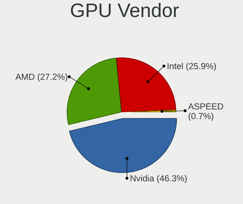

| Vendor            | Desktops | Percent |
|-------------------|----------|---------|
| Nvidia            | 68       | 46.26%  |
| AMD               | 40       | 27.21%  |
| Intel             | 38       | 25.85%  |
| ASPEED Technology | 1        | 0.68%   |

GPU Model
---------

Graphics card models

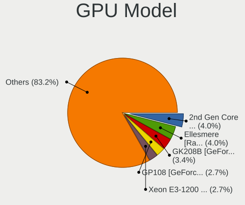

| Model                                                                       | Desktops | Percent |
|-----------------------------------------------------------------------------|----------|---------|
| Intel 2nd Generation Core Processor Family Integrated Graphics Controller   | 6        | 4.03%   |
| AMD Ellesmere [Radeon RX 470/480/570/570X/580/580X/590]                     | 6        | 4.03%   |
| Nvidia GK208B [GeForce GT 710]                                              | 5        | 3.36%   |
| Nvidia GP108 [GeForce GT 1030]                                              | 4        | 2.68%   |
| Intel Xeon E3-1200 v2/3rd Gen Core processor Graphics Controller            | 4        | 2.68%   |
| Intel CoffeeLake-S GT2 [UHD Graphics 630]                                   | 4        | 2.68%   |
| Intel 82G33/G31 Express Integrated Graphics Controller                      | 4        | 2.68%   |
| AMD Caicos [Radeon HD 6450/7450/8450 / R5 230 OEM]                          | 4        | 2.68%   |
| Nvidia GP107 [GeForce GTX 1050 Ti]                                          | 3        | 2.01%   |
| Nvidia GP106 [GeForce GTX 1060 6GB]                                         | 3        | 2.01%   |
| Nvidia GK208B [GeForce GT 730]                                              | 3        | 2.01%   |
| Nvidia GA106 [GeForce RTX 3060 Lite Hash Rate]                              | 3        | 2.01%   |
| Nvidia AD107 [GeForce RTX 4060]                                             | 3        | 2.01%   |
| Intel Xeon E3-1200 v3/4th Gen Core Processor Integrated Graphics Controller | 3        | 2.01%   |
| Intel Skylake-S GT2 [HD Graphics 530]                                       | 3        | 2.01%   |
| Intel Alder Lake-S GT1 [UHD Graphics 770]                                   | 3        | 2.01%   |
| AMD Raphael                                                                 | 3        | 2.01%   |
| Nvidia TU116 [GeForce GTX 1660 SUPER]                                       | 2        | 1.34%   |
| Nvidia GP106 [GeForce GTX 1060 3GB]                                         | 2        | 1.34%   |
| Nvidia GM206 [GeForce GTX 960]                                              | 2        | 1.34%   |
| Nvidia C77 [nForce 780a/980a SLI]                                           | 2        | 1.34%   |
| Nvidia AD106 [GeForce RTX 4060 Ti]                                          | 2        | 1.34%   |
| AMD Raven Ridge [Radeon Vega Series / Radeon Vega Mobile Series]            | 2        | 1.34%   |
| AMD Kaveri [Radeon R7 Graphics]                                             | 2        | 1.34%   |
| AMD Cezanne [Radeon Vega Series / Radeon Vega Mobile Series]                | 2        | 1.34%   |
| AMD Cape Verde PRO [Radeon HD 7750/8740 / R7 250E]                          | 2        | 1.34%   |
| Nvidia TU106 [GeForce RTX 2070]                                             | 1        | 0.67%   |
| Nvidia TU106 [GeForce RTX 2060 Rev. A]                                      | 1        | 0.67%   |
| Nvidia TU106 [CMP 40HX]                                                     | 1        | 0.67%   |
| Nvidia TU104 [GeForce RTX 2080 SUPER]                                       | 1        | 0.67%   |
| Nvidia GT200GL [Quadro FX 3800]                                             | 1        | 0.67%   |
| Nvidia GT200b [GeForce GTX 285]                                             | 1        | 0.67%   |
| Nvidia GP107 [GeForce GTX 1050]                                             | 1        | 0.67%   |
| Nvidia GP104 [GeForce GTX 1070]                                             | 1        | 0.67%   |
| Nvidia GM204 [GeForce GTX 980]                                              | 1        | 0.67%   |
| Nvidia GM204 [GeForce GTX 970]                                              | 1        | 0.67%   |
| Nvidia GM107GL [Quadro K2200]                                               | 1        | 0.67%   |
| Nvidia GK208 [GeForce GT 630 Rev. 2]                                        | 1        | 0.67%   |
| Nvidia GK107GL [Quadro K2000]                                               | 1        | 0.67%   |
| Nvidia GK107 [GeForce GT 640]                                               | 1        | 0.67%   |

GPU Combo
---------

Combinations of graphics cards

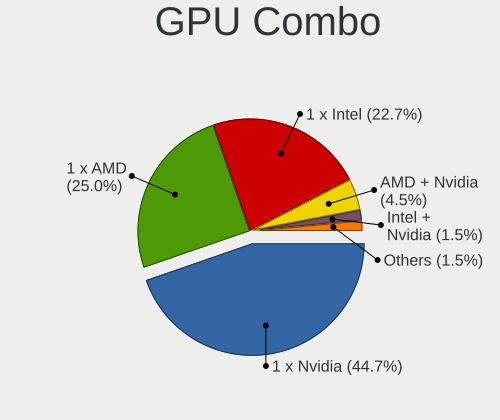

| Name            | Desktops | Percent |
|-----------------|----------|---------|
| 1 x Nvidia      | 59       | 44.7%   |
| 1 x AMD         | 33       | 25%     |
| 1 x Intel       | 30       | 22.73%  |
| AMD + Nvidia    | 6        | 4.55%   |
| Intel + Nvidia  | 2        | 1.52%   |
| 2 x AMD         | 1        | 0.76%   |
| Nvidia + ASPEED | 1        | 0.76%   |

GPU Driver
----------

Free vs proprietary

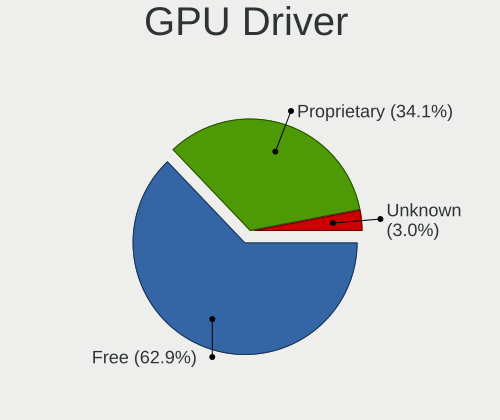

| Driver      | Desktops | Percent |
|-------------|----------|---------|
| Free        | 83       | 62.88%  |
| Proprietary | 45       | 34.09%  |
| Unknown     | 4        | 3.03%   |

GPU Memory
----------

Total video memory

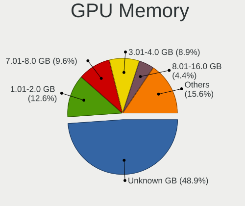

| Size in GB | Desktops | Percent |
|------------|----------|---------|
| Unknown    | 66       | 48.89%  |
| 1.01-2.0   | 17       | 12.59%  |
| 7.01-8.0   | 13       | 9.63%   |
| 3.01-4.0   | 12       | 8.89%   |
| 5.01-6.0   | 6        | 4.44%   |
| 8.01-16.0  | 6        | 4.44%   |
| 0.51-1.0   | 6        | 4.44%   |
| 0.01-0.5   | 6        | 4.44%   |
| 2.01-3.0   | 2        | 1.48%   |
| 16.01-24.0 | 1        | 0.74%   |

Monitor
-------

Monitor Vendor
--------------

Monitor vendors

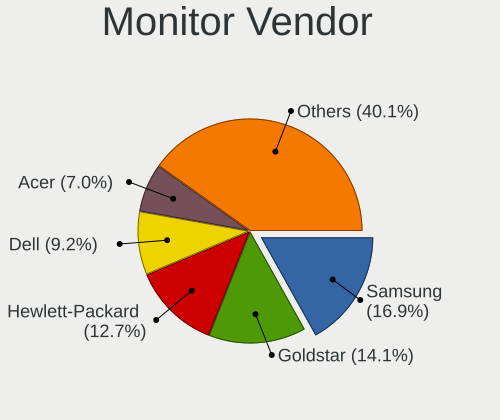

| Vendor               | Desktops | Percent |
|----------------------|----------|---------|
| Samsung Electronics  | 24       | 16.9%   |
| Goldstar             | 20       | 14.08%  |
| Hewlett-Packard      | 18       | 12.68%  |
| Dell                 | 13       | 9.15%   |
| Acer                 | 10       | 7.04%   |
| Philips              | 8        | 5.63%   |
| ViewSonic            | 6        | 4.23%   |
| Lenovo               | 4        | 2.82%   |
| Fujitsu Siemens      | 4        | 2.82%   |
| BenQ                 | 4        | 2.82%   |
| Iiyama               | 3        | 2.11%   |
| AOC                  | 3        | 2.11%   |
| Toshiba              | 2        | 1.41%   |
| Medion               | 2        | 1.41%   |
| HannStar             | 2        | 1.41%   |
| Gigabyte Technology  | 2        | 1.41%   |
| Eizo                 | 2        | 1.41%   |
| ASUSTek Computer     | 2        | 1.41%   |
| Ancor Communications | 2        | 1.41%   |
| TIM                  | 1        | 0.7%    |
| TCL                  | 1        | 0.7%    |
| Sony                 | 1        | 0.7%    |
| SKG                  | 1        | 0.7%    |
| SIE                  | 1        | 0.7%    |
| SGT                  | 1        | 0.7%    |
| Sceptre Tech         | 1        | 0.7%    |
| LRX                  | 1        | 0.7%    |
| Lanix                | 1        | 0.7%    |
| IFS                  | 1        | 0.7%    |
| Compal               | 1        | 0.7%    |

Monitor Model
-------------

Monitor models

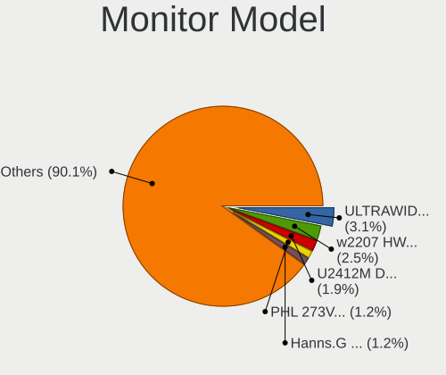

| Model                                                                   | Desktops | Percent |
|-------------------------------------------------------------------------|----------|---------|
| Goldstar ULTRAWIDE GSM59F2 2560x1080 677x290mm 29.0-inch                | 5        | 3.09%   |
| Hewlett-Packard w2207 HWP26A9 1680x1050 473x296mm 22.0-inch             | 4        | 2.47%   |
| Dell U2412M DELA07A 1920x1200 518x324mm 24.1-inch                       | 3        | 1.85%   |
| Philips PHL 273V7 PHLC156 1920x1080 598x336mm 27.0-inch                 | 2        | 1.23%   |
| HannStar Hanns.G HA195 HSD4B16 1366x768 410x230mm 18.5-inch             | 2        | 1.23%   |
| Goldstar ULTRAWIDE GSM7768 3440x1440 800x334mm 34.1-inch                | 2        | 1.23%   |
| Goldstar Ultra HD GSM5B09 3840x2160 600x340mm 27.2-inch                 | 2        | 1.23%   |
| Goldstar LG IPS FULLHD GSM5AB8 1920x1080 480x270mm 21.7-inch            | 2        | 1.23%   |
| Goldstar HDR 4K GSM7706 3840x2160 600x340mm 27.2-inch                   | 2        | 1.23%   |
| Dell U2410 DELF017 1920x1200 520x320mm 24.0-inch                        | 2        | 1.23%   |
| Dell U2410 DELF016 1920x1200 518x324mm 24.1-inch                        | 2        | 1.23%   |
| AOC 24B1W1 AOC2401 1920x1080 527x296mm 23.8-inch                        | 2        | 1.23%   |
| ViewSonic VX4381-4K VSC4E3B 3840x2160 941x529mm 42.5-inch               | 1        | 0.62%   |
| ViewSonic VX2457 VSCB931 1920x1080 521x293mm 23.5-inch                  | 1        | 0.62%   |
| ViewSonic VG2448 VSC3B35 1920x1080 527x296mm 23.8-inch                  | 1        | 0.62%   |
| ViewSonic VA2055 Series VSC3C31 1920x1080 435x239mm 19.5-inch           | 1        | 0.62%   |
| ViewSonic VA1926w-5 VSC5920 1440x900 410x256mm 19.0-inch                | 1        | 0.62%   |
| ViewSonic E70f-10 VSC3B1E 1280x960 310x230mm 15.2-inch                  | 1        | 0.62%   |
| Toshiba ScreenXpert TSB8888 1080x2160                                   | 1        | 0.62%   |
| Toshiba 43UHD_LCD_TV TSB3700 3840x2160 940x540mm 42.7-inch              | 1        | 0.62%   |
| TIM CM3202/03QPS TIM3203 2560x1440 768x432mm 34.7-inch                  | 1        | 0.62%   |
| TCL Beyond TV TCL2875 3840x2160 1210x680mm 54.6-inch                    | 1        | 0.62%   |
| Sony TV SNY4B03 1920x1080 886x498mm 40.0-inch                           | 1        | 0.62%   |
| SKG DEXP DF24N2 SKG2413 1920x1080 597x336mm 27.0-inch                   | 1        | 0.62%   |
| SIE MCM 212V SIE0040 1600x1200 400x300mm 19.7-inch                      | 1        | 0.62%   |
| SGT MDS-156F18 SGT0156 3840x2160 345x194mm 15.6-inch                    | 1        | 0.62%   |
| Sceptre Tech Sceptre J20 SPT080D 1600x900 435x237mm 19.5-inch           | 1        | 0.62%   |
| Samsung Electronics U28E590 SAM0C4D 3840x2160 607x345mm 27.5-inch       | 1        | 0.62%   |
| Samsung Electronics SyncMaster SAM05CC 1920x1080 530x300mm 24.0-inch    | 1        | 0.62%   |
| Samsung Electronics SyncMaster SAM0522 1600x900 443x249mm 20.0-inch     | 1        | 0.62%   |
| Samsung Electronics SyncMaster SAM03D0 1440x900 410x257mm 19.1-inch     | 1        | 0.62%   |
| Samsung Electronics SMS22A200/460 SAM0832 1920x1080 477x268mm 21.5-inch | 1        | 0.62%   |
| Samsung Electronics SA300/SA350 SAM07D2 1920x1080 477x268mm 21.5-inch   | 1        | 0.62%   |
| Samsung Electronics S27H65x SAM0E5A 1920x1080 598x336mm 27.0-inch       | 1        | 0.62%   |
| Samsung Electronics S27F358 SAM0D73 1920x1080 598x336mm 27.0-inch       | 1        | 0.62%   |
| Samsung Electronics S27E450 SAM0C83 1920x1080 598x336mm 27.0-inch       | 1        | 0.62%   |
| Samsung Electronics S27D590 SAM0BE9 1920x1080 598x336mm 27.0-inch       | 1        | 0.62%   |
| Samsung Electronics S27C31x SAM7312 1920x1080 597x336mm 27.0-inch       | 1        | 0.62%   |
| Samsung Electronics S27B350 SAM08DC 1920x1080 598x336mm 27.0-inch       | 1        | 0.62%   |
| Samsung Electronics S24E650 SAM0CC1 1920x1200 518x324mm 24.1-inch       | 1        | 0.62%   |

Monitor Resolution
------------------

Monitor screen resolution

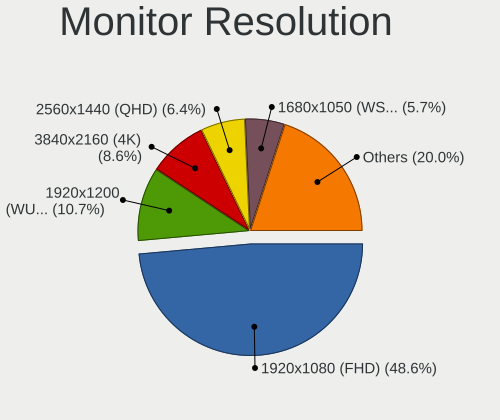

| Resolution         | Desktops | Percent |
|--------------------|----------|---------|
| 1920x1080 (FHD)    | 68       | 48.57%  |
| 1920x1200 (WUXGA)  | 15       | 10.71%  |
| 3840x2160 (4K)     | 12       | 8.57%   |
| 2560x1440 (QHD)    | 9        | 6.43%   |
| 1680x1050 (WSXGA+) | 8        | 5.71%   |
| 2560x1080          | 7        | 5%      |
| 1440x900 (WXGA+)   | 5        | 3.57%   |
| 1280x1024 (SXGA)   | 5        | 3.57%   |
| 3440x1440          | 3        | 2.14%   |
| 1366x768 (WXGA)    | 3        | 2.14%   |
| 3840x1600          | 2        | 1.43%   |
| 1600x900 (HD+)     | 2        | 1.43%   |
| 1600x1200          | 1        | 0.71%   |

Monitor Diagonal
----------------

Diagonal size in inches

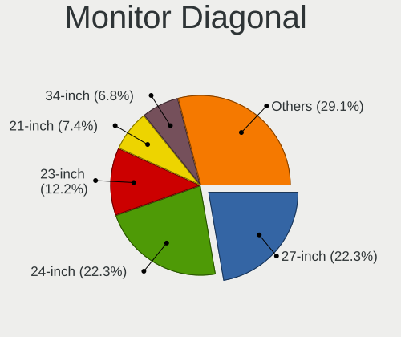

| Inches  | Desktops | Percent |
|---------|----------|---------|
| 27      | 33       | 22.3%   |
| 24      | 33       | 22.3%   |
| 23      | 18       | 12.16%  |
| 21      | 11       | 7.43%   |
| 34      | 10       | 6.76%   |
| 19      | 10       | 6.76%   |
| 22      | 8        | 5.41%   |
| 84      | 3        | 2.03%   |
| 18      | 3        | 2.03%   |
| 54      | 2        | 1.35%   |
| 26      | 2        | 1.35%   |
| 25      | 2        | 1.35%   |
| 15      | 2        | 1.35%   |
| 86      | 1        | 0.68%   |
| 69      | 1        | 0.68%   |
| 63      | 1        | 0.68%   |
| 50      | 1        | 0.68%   |
| 48      | 1        | 0.68%   |
| 42      | 1        | 0.68%   |
| 32      | 1        | 0.68%   |
| 31      | 1        | 0.68%   |
| 28      | 1        | 0.68%   |
| 20      | 1        | 0.68%   |
| Unknown | 1        | 0.68%   |

Monitor Width
-------------

Physical width

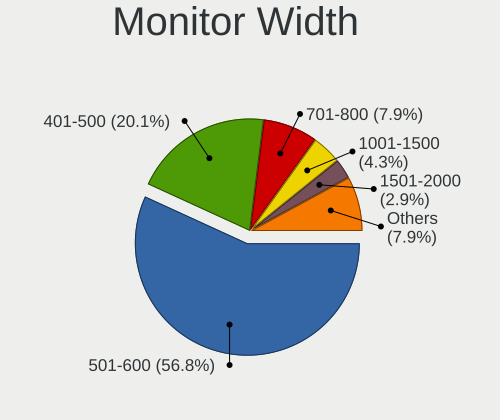

| Width in mm | Desktops | Percent |
|-------------|----------|---------|
| 501-600     | 79       | 56.83%  |
| 401-500     | 28       | 20.14%  |
| 701-800     | 11       | 7.91%   |
| 1001-1500   | 6        | 4.32%   |
| 351-400     | 4        | 2.88%   |
| 1501-2000   | 4        | 2.88%   |
| 601-700     | 3        | 2.16%   |
| 301-350     | 2        | 1.44%   |
| 901-1000    | 1        | 0.72%   |
| Unknown     | 1        | 0.72%   |

Aspect Ratio
------------

Proportional relationship between the width and the height

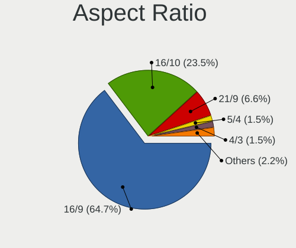

| Ratio   | Desktops | Percent |
|---------|----------|---------|
| 16/9    | 88       | 64.71%  |
| 16/10   | 32       | 23.53%  |
| 21/9    | 9        | 6.62%   |
| 5/4     | 2        | 1.47%   |
| 4/3     | 2        | 1.47%   |
| 6/5     | 1        | 0.74%   |
| 0.56    | 1        | 0.74%   |
| Unknown | 1        | 0.74%   |

Monitor Area
------------

Area in inch²

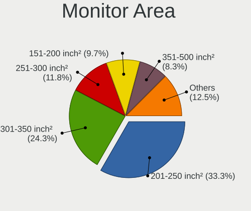

| Area in inch² | Desktops | Percent |
|----------------|----------|---------|
| 201-250        | 48       | 33.33%  |
| 301-350        | 35       | 24.31%  |
| 251-300        | 17       | 11.81%  |
| 151-200        | 14       | 9.72%   |
| 351-500        | 12       | 8.33%   |
| More than 1000 | 10       | 6.94%   |
| 141-150        | 3        | 2.08%   |
| 501-1000       | 2        | 1.39%   |
| 111-120        | 1        | 0.69%   |
| 101-110        | 1        | 0.69%   |
| Unknown        | 1        | 0.69%   |

Pixel Density
-------------

Pixels per inch

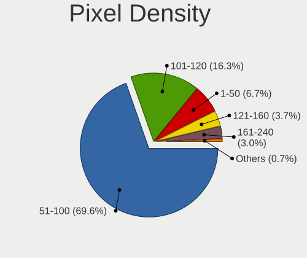

| Density | Desktops | Percent |
|---------|----------|---------|
| 51-100  | 94       | 69.63%  |
| 101-120 | 22       | 16.3%   |
| 1-50    | 9        | 6.67%   |
| 121-160 | 5        | 3.7%    |
| 161-240 | 4        | 2.96%   |
| Unknown | 1        | 0.74%   |

Multiple Monitors
-----------------

Total monitors connected

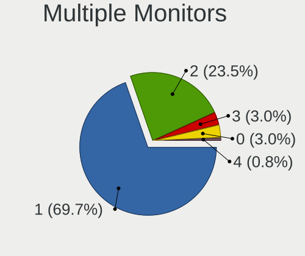

| Total | Desktops | Percent |
|-------|----------|---------|
| 1     | 92       | 69.7%   |
| 2     | 31       | 23.48%  |
| 3     | 4        | 3.03%   |
| 0     | 4        | 3.03%   |
| 4     | 1        | 0.76%   |

Network
-------

Net Controller Vendor
---------------------

Controller vendors

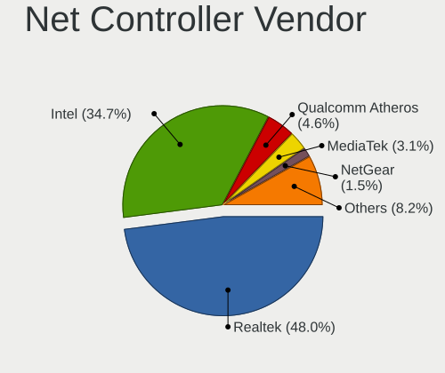

| Vendor                | Desktops | Percent |
|-----------------------|----------|---------|
| Realtek Semiconductor | 94       | 47.96%  |
| Intel                 | 68       | 34.69%  |
| Qualcomm Atheros      | 9        | 4.59%   |
| MediaTek              | 6        | 3.06%   |
| NetGear               | 3        | 1.53%   |
| D-Link System         | 2        | 1.02%   |
| ASIX Electronics      | 2        | 1.02%   |
| Ralink Technology     | 1        | 0.51%   |
| Ralink                | 1        | 0.51%   |
| Nvidia                | 1        | 0.51%   |
| Huawei Technologies   | 1        | 0.51%   |
| DisplayLink           | 1        | 0.51%   |
| D-Link                | 1        | 0.51%   |
| Broadcom              | 1        | 0.51%   |
| ASUSTek Computer      | 1        | 0.51%   |
| Aquantia              | 1        | 0.51%   |
| American Megatrends   | 1        | 0.51%   |
| AMD                   | 1        | 0.51%   |
| Adafruit              | 1        | 0.51%   |

Net Controller Model
--------------------

Controller models

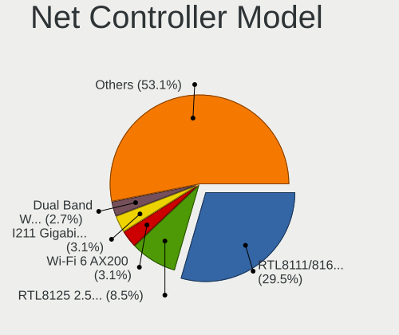

| Model                                                                  | Desktops | Percent |
|------------------------------------------------------------------------|----------|---------|
| Realtek RTL8111/8168/8211/8411 PCI Express Gigabit Ethernet Controller | 66       | 29.46%  |
| Realtek RTL8125 2.5GbE Controller                                      | 19       | 8.48%   |
| Intel Wi-Fi 6 AX200                                                    | 7        | 3.13%   |
| Intel I211 Gigabit Network Connection                                  | 7        | 3.13%   |
| Intel Dual Band Wireless-AC 3168NGW [Stone Peak]                       | 6        | 2.68%   |
| Intel 82579LM Gigabit Network Connection (Lewisville)                  | 6        | 2.68%   |
| Intel Ethernet Controller I225-V                                       | 5        | 2.23%   |
| Intel Ethernet Connection (2) I219-V                                   | 5        | 2.23%   |
| MediaTek MT7922 802.11ax PCI Express Wireless Network Adapter          | 4        | 1.79%   |
| Intel Wi-Fi 5(802.11ac) Wireless-AC 9x6x [Thunder Peak]                | 4        | 1.79%   |
| Intel 700 Series Chipset CNVi WiFi                                     | 4        | 1.79%   |
| Realtek RTL8852BE PCIe 802.11ax Wireless Network Controller            | 3        | 1.34%   |
| Realtek 802.11ac NIC                                                   | 3        | 1.34%   |
| Intel Wi-Fi 6E(802.11ax) AX210/AX1675* 2x2 [Typhoon Peak]              | 3        | 1.34%   |
| Intel 82574L Gigabit Network Connection                                | 3        | 1.34%   |
| Realtek RTL8169 PCI Gigabit Ethernet Controller                        | 2        | 0.89%   |
| Realtek RTL810xE PCI Express Fast Ethernet controller                  | 2        | 0.89%   |
| Qualcomm Atheros AR93xx Wireless Network Adapter                       | 2        | 0.89%   |
| Intel Wireless 7260                                                    | 2        | 0.89%   |
| Intel Ethernet Connection I217-LM                                      | 2        | 0.89%   |
| Intel Ethernet Connection (7) I219-V                                   | 2        | 0.89%   |
| Intel Ethernet Connection (2) I218-LM                                  | 2        | 0.89%   |
| Intel 82583V Gigabit Network Connection                                | 2        | 0.89%   |
| Intel 82579V Gigabit Network Connection                                | 2        | 0.89%   |
| Intel 82578DM Gigabit Network Connection                               | 2        | 0.89%   |
| Intel 80003ES2LAN Gigabit Ethernet Controller (Copper)                 | 2        | 0.89%   |
| ASIX AX88179 Gigabit Ethernet                                          | 2        | 0.89%   |
| Realtek RTL8822CE 802.11ac PCIe Wireless Network Adapter               | 1        | 0.45%   |
| Realtek RTL8822BE 802.11a/b/g/n/ac WiFi adapter                        | 1        | 0.45%   |
| Realtek RTL8821CE 802.11ac PCIe Wireless Network Adapter               | 1        | 0.45%   |
| Realtek RTL8812AU 802.11a/b/g/n/ac 2T2R DB WLAN Adapter                | 1        | 0.45%   |
| Realtek RTL8192EU 802.11b/g/n WLAN Adapter                             | 1        | 0.45%   |
| Realtek RTL8192EE PCIe Wireless Network Adapter                        | 1        | 0.45%   |
| Realtek RTL8192CU 802.11n WLAN Adapter                                 | 1        | 0.45%   |
| Realtek RTL8191SEvB Wireless LAN Controller                            | 1        | 0.45%   |
| Realtek RTL8188FTV 802.11b/g/n 1T1R 2.4G WLAN Adapter                  | 1        | 0.45%   |
| Realtek RTL8188EUS 802.11n Wireless Network Adapter                    | 1        | 0.45%   |
| Realtek RTL8153 Gigabit Ethernet Adapter                               | 1        | 0.45%   |
| Realtek RTL8111/8168/8411 PCI Express Gigabit Ethernet Controller      | 1        | 0.45%   |
| Realtek RTL-8100/8101L/8139 PCI Fast Ethernet Adapter                  | 1        | 0.45%   |

Wireless Vendor
---------------

Wireless vendors

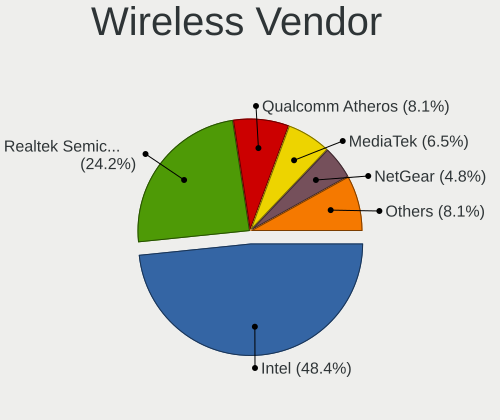

| Vendor                | Desktops | Percent |
|-----------------------|----------|---------|
| Intel                 | 30       | 48.39%  |
| Realtek Semiconductor | 15       | 24.19%  |
| Qualcomm Atheros      | 5        | 8.06%   |
| MediaTek              | 4        | 6.45%   |
| NetGear               | 3        | 4.84%   |
| Ralink Technology     | 1        | 1.61%   |
| Ralink                | 1        | 1.61%   |
| D-Link System         | 1        | 1.61%   |
| D-Link                | 1        | 1.61%   |
| ASUSTek Computer      | 1        | 1.61%   |

Wireless Model
--------------

Wireless models

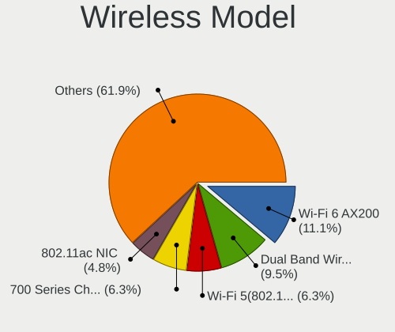

| Model                                                                                 | Desktops | Percent |
|---------------------------------------------------------------------------------------|----------|---------|
| Intel Wi-Fi 6 AX200                                                                   | 7        | 11.11%  |
| Intel Dual Band Wireless-AC 3168NGW [Stone Peak]                                      | 6        | 9.52%   |
| Intel Wi-Fi 5(802.11ac) Wireless-AC 9x6x [Thunder Peak]                               | 4        | 6.35%   |
| Intel 700 Series Chipset CNVi WiFi                                                    | 4        | 6.35%   |
| Realtek 802.11ac NIC                                                                  | 3        | 4.76%   |
| MediaTek MT7922 802.11ax PCI Express Wireless Network Adapter                         | 3        | 4.76%   |
| Intel Wi-Fi 6E(802.11ax) AX210/AX1675* 2x2 [Typhoon Peak]                             | 3        | 4.76%   |
| Realtek RTL8852BE PCIe 802.11ax Wireless Network Controller                           | 2        | 3.17%   |
| Qualcomm Atheros AR93xx Wireless Network Adapter                                      | 2        | 3.17%   |
| Intel Wireless 7260                                                                   | 2        | 3.17%   |
| Realtek RTL8822CE 802.11ac PCIe Wireless Network Adapter                              | 1        | 1.59%   |
| Realtek RTL8822BE 802.11a/b/g/n/ac WiFi adapter                                       | 1        | 1.59%   |
| Realtek RTL8821CE 802.11ac PCIe Wireless Network Adapter                              | 1        | 1.59%   |
| Realtek RTL8812AU 802.11a/b/g/n/ac 2T2R DB WLAN Adapter                               | 1        | 1.59%   |
| Realtek RTL8192EU 802.11b/g/n WLAN Adapter                                            | 1        | 1.59%   |
| Realtek RTL8192EE PCIe Wireless Network Adapter                                       | 1        | 1.59%   |
| Realtek RTL8192CU 802.11n WLAN Adapter                                                | 1        | 1.59%   |
| Realtek RTL8191SEvB Wireless LAN Controller                                           | 1        | 1.59%   |
| Realtek RTL8188FTV 802.11b/g/n 1T1R 2.4G WLAN Adapter                                 | 1        | 1.59%   |
| Realtek RTL8188EUS 802.11n Wireless Network Adapter                                   | 1        | 1.59%   |
| Ralink MT7601U Wireless Adapter                                                       | 1        | 1.59%   |
| Ralink RT2561/RT61 rev B 802.11g                                                      | 1        | 1.59%   |
| Qualcomm Atheros QCA9565 / AR9565 Wireless Network Adapter                            | 1        | 1.59%   |
| Qualcomm Atheros AR9485 Wireless Network Adapter                                      | 1        | 1.59%   |
| Qualcomm Atheros AR5418 Wireless Network Adapter [AR5008E 802.11(a)bgn] (PCI-Express) | 1        | 1.59%   |
| NetGear WNDA3100v3 802.11abgn 2x2:2 [MediaTek MT7632U]                                | 1        | 1.59%   |
| NetGear A6210                                                                         | 1        | 1.59%   |
| NetGear A6150                                                                         | 1        | 1.59%   |
| MediaTek WiFi                                                                         | 1        | 1.59%   |
| MediaTek MT7612U 802.11a/b/g/n/ac Wireless Adapter                                    | 1        | 1.59%   |
| Intel Wireless 7265                                                                   | 1        | 1.59%   |
| Intel Cannon Lake PCH CNVi WiFi                                                       | 1        | 1.59%   |
| Intel Alder Lake-S PCH CNVi WiFi                                                      | 1        | 1.59%   |
| Intel Alder Lake-P PCH CNVi WiFi                                                      | 1        | 1.59%   |
| D-Link System AirPlus G DWL-G122 Wireless Adapter(rev.C1) [Ralink RT2571W]            | 1        | 1.59%   |
| D-Link 11ac adapter                                                                   | 1        | 1.59%   |
| ASUS 802.11n WLAN Adapter                                                             | 1        | 1.59%   |

Ethernet Vendor
---------------

Ethernet vendors

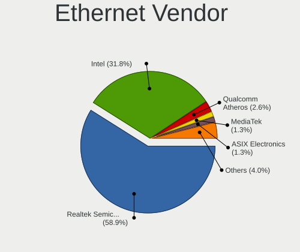

| Vendor                | Desktops | Percent |
|-----------------------|----------|---------|
| Realtek Semiconductor | 89       | 58.94%  |
| Intel                 | 48       | 31.79%  |
| Qualcomm Atheros      | 4        | 2.65%   |
| MediaTek              | 2        | 1.32%   |
| ASIX Electronics      | 2        | 1.32%   |
| Nvidia                | 1        | 0.66%   |
| DisplayLink           | 1        | 0.66%   |
| D-Link System         | 1        | 0.66%   |
| Broadcom              | 1        | 0.66%   |
| Aquantia              | 1        | 0.66%   |
| American Megatrends   | 1        | 0.66%   |

Ethernet Model
--------------

Ethernet models

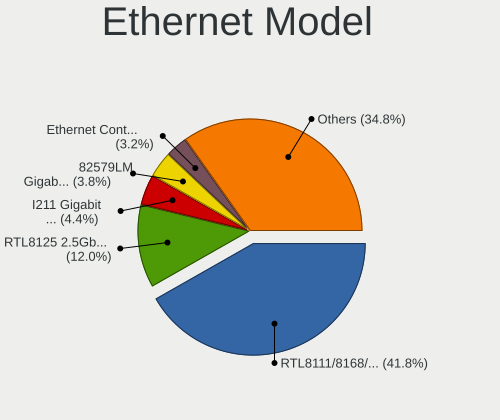

| Model                                                                           | Desktops | Percent |
|---------------------------------------------------------------------------------|----------|---------|
| Realtek RTL8111/8168/8211/8411 PCI Express Gigabit Ethernet Controller          | 66       | 41.77%  |
| Realtek RTL8125 2.5GbE Controller                                               | 19       | 12.03%  |
| Intel I211 Gigabit Network Connection                                           | 7        | 4.43%   |
| Intel 82579LM Gigabit Network Connection (Lewisville)                           | 6        | 3.8%    |
| Intel Ethernet Controller I225-V                                                | 5        | 3.16%   |
| Intel Ethernet Connection (2) I219-V                                            | 5        | 3.16%   |
| Intel 82574L Gigabit Network Connection                                         | 3        | 1.9%    |
| Realtek RTL8169 PCI Gigabit Ethernet Controller                                 | 2        | 1.27%   |
| Realtek RTL810xE PCI Express Fast Ethernet controller                           | 2        | 1.27%   |
| Intel Ethernet Connection I217-LM                                               | 2        | 1.27%   |
| Intel Ethernet Connection (7) I219-V                                            | 2        | 1.27%   |
| Intel Ethernet Connection (2) I218-LM                                           | 2        | 1.27%   |
| Intel 82583V Gigabit Network Connection                                         | 2        | 1.27%   |
| Intel 82579V Gigabit Network Connection                                         | 2        | 1.27%   |
| Intel 82578DM Gigabit Network Connection                                        | 2        | 1.27%   |
| Intel 80003ES2LAN Gigabit Ethernet Controller (Copper)                          | 2        | 1.27%   |
| ASIX AX88179 Gigabit Ethernet                                                   | 2        | 1.27%   |
| Realtek RTL8852BE PCIe 802.11ax Wireless Network Controller                     | 1        | 0.63%   |
| Realtek RTL8153 Gigabit Ethernet Adapter                                        | 1        | 0.63%   |
| Realtek RTL8111/8168/8411 PCI Express Gigabit Ethernet Controller               | 1        | 0.63%   |
| Realtek RTL-8100/8101L/8139 PCI Fast Ethernet Adapter                           | 1        | 0.63%   |
| Qualcomm Atheros Killer E2400 Gigabit Ethernet Controller                       | 1        | 0.63%   |
| Qualcomm Atheros Killer E220x Gigabit Ethernet Controller                       | 1        | 0.63%   |
| Qualcomm Atheros Ethernet controller                                            | 1        | 0.63%   |
| Qualcomm Atheros AR8161 Gigabit Ethernet                                        | 1        | 0.63%   |
| Nvidia MCP77 Ethernet                                                           | 1        | 0.63%   |
| MediaTek MT7925 802.11be 160MHz 2x2 PCIe Wireless Network Adapter [Filogic 360] | 1        | 0.63%   |
| MediaTek MT7922 802.11ax PCI Express Wireless Network Adapter                   | 1        | 0.63%   |
| Intel I210 Gigabit Network Connection                                           | 1        | 0.63%   |
| Intel Ethernet Controller X710 for 10GBASE-T                                    | 1        | 0.63%   |
| Intel Ethernet Controller I226-V                                                | 1        | 0.63%   |
| Intel Ethernet Connection I219-LM                                               | 1        | 0.63%   |
| Intel Ethernet Connection (7) I219-LM                                           | 1        | 0.63%   |
| Intel Ethernet Connection (5) I219-LM                                           | 1        | 0.63%   |
| Intel Ethernet Connection (2) I219-LM                                           | 1        | 0.63%   |
| Intel Ethernet Connection (2) I218-V                                            | 1        | 0.63%   |
| Intel Ethernet Connection (17) I219-V                                           | 1        | 0.63%   |
| Intel Ethernet Connection (11) I219-LM                                          | 1        | 0.63%   |
| Intel 82567LM-3 Gigabit Network Connection                                      | 1        | 0.63%   |
| DisplayLink StarTech USB3DOCKHDPC                                               | 1        | 0.63%   |

Net Controller Kind
-------------------

Ethernet, WiFi or modem

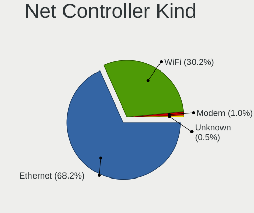

| Kind     | Desktops | Percent |
|----------|----------|---------|
| Ethernet | 131      | 68.23%  |
| WiFi     | 58       | 30.21%  |
| Modem    | 2        | 1.04%   |
| Unknown  | 1        | 0.52%   |

Used Controller
---------------

Currently used network controller

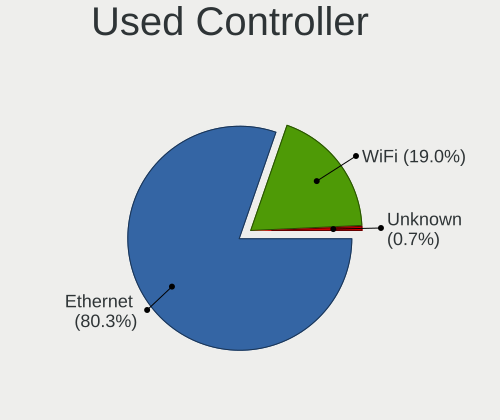

| Kind     | Desktops | Percent |
|----------|----------|---------|
| Ethernet | 110      | 80.29%  |
| WiFi     | 26       | 18.98%  |
| Unknown  | 1        | 0.73%   |

NICs
----

Total network controllers on board

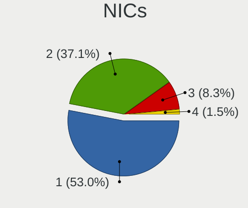

| Total | Desktops | Percent |
|-------|----------|---------|
| 1     | 70       | 53.03%  |
| 2     | 49       | 37.12%  |
| 3     | 11       | 8.33%   |
| 4     | 2        | 1.52%   |

IPv6
----

IPv6 vs IPv4

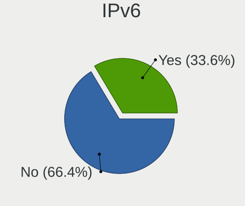

| Used | Desktops | Percent |
|------|----------|---------|
| No   | 87       | 66.41%  |
| Yes  | 44       | 33.59%  |

Bluetooth
---------

Bluetooth Vendor
----------------

Controller vendors

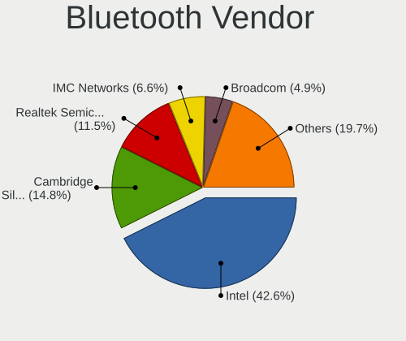

| Vendor                          | Desktops | Percent |
|---------------------------------|----------|---------|
| Intel                           | 26       | 42.62%  |
| Cambridge Silicon Radio         | 9        | 14.75%  |
| Realtek Semiconductor           | 7        | 11.48%  |
| IMC Networks                    | 4        | 6.56%   |
| Broadcom                        | 3        | 4.92%   |
| MediaTek                        | 2        | 3.28%   |
| Edimax Technology               | 2        | 3.28%   |
| ASUSTek Computer                | 2        | 3.28%   |
| TP-Link                         | 1        | 1.64%   |
| Qualcomm Atheros Communications | 1        | 1.64%   |
| Mercucys                        | 1        | 1.64%   |
| Foxconn / Hon Hai               | 1        | 1.64%   |
| Apple                           | 1        | 1.64%   |
| Unknown                         | 1        | 1.64%   |

Bluetooth Model
---------------

Controller models

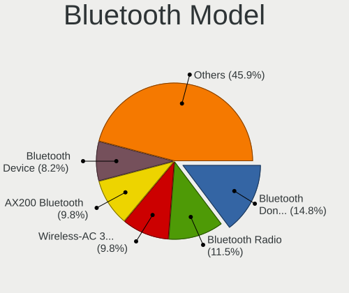

| Model                                               | Desktops | Percent |
|-----------------------------------------------------|----------|---------|
| Cambridge Silicon Radio Bluetooth Dongle (HCI mode) | 9        | 14.75%  |
| Realtek Bluetooth Radio                             | 7        | 11.48%  |
| Intel Wireless-AC 3168 Bluetooth                    | 6        | 9.84%   |
| Intel AX200 Bluetooth                               | 6        | 9.84%   |
| Intel Bluetooth Device                              | 5        | 8.2%    |
| Intel Wireless-AC 9260 Bluetooth Adapter            | 3        | 4.92%   |
| MediaTek Wireless_Device                            | 2        | 3.28%   |
| Intel Bluetooth wireless interface                  | 2        | 3.28%   |
| Intel AX210 Bluetooth                               | 2        | 3.28%   |
| IMC Networks Wireless_Device                        | 2        | 3.28%   |
| IMC Networks Bluetooth Radio                        | 2        | 3.28%   |
| Edimax Bluetooth Device                             | 2        | 3.28%   |
| Broadcom BCM20702A0 Bluetooth 4.0                   | 2        | 3.28%   |
| TP-Link TP-T@- UB500 Adapter                        | 1        | 1.64%   |
| Qualcomm Atheros  Bluetooth Device                  | 1        | 1.64%   |
| Mercucys Mercusys MA530 Adapter                     | 1        | 1.64%   |
| Intel Bluetooth 9460/9560 Jefferson Peak (JfP)      | 1        | 1.64%   |
| Intel AX201 Bluetooth                               | 1        | 1.64%   |
| Foxconn / Hon Hai Wireless_Device                   | 1        | 1.64%   |
| Broadcom Bluetooth 2.0+eDR dongle                   | 1        | 1.64%   |
| ASUS Broadcom BCM20702A0 Bluetooth                  | 1        | 1.64%   |
| ASUS Bluetooth Adapter                              | 1        | 1.64%   |
| Apple Bluetooth HCI                                 | 1        | 1.64%   |
| Unknown                                             | 1        | 1.64%   |

Sound
-----

Sound Vendor
------------

Sound card vendors

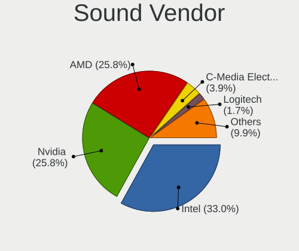

| Vendor                                       | Desktops | Percent |
|----------------------------------------------|----------|---------|
| Intel                                        | 77       | 33.05%  |
| Nvidia                                       | 60       | 25.75%  |
| AMD                                          | 60       | 25.75%  |
| C-Media Electronics                          | 9        | 3.86%   |
| Logitech                                     | 4        | 1.72%   |
| VIA Technologies                             | 2        | 0.86%   |
| FiiO Electronics Technology                  | 2        | 0.86%   |
| DSEA A/S                                     | 2        | 0.86%   |
| Creative Labs                                | 2        | 0.86%   |
| Zoran Co. Personal Media Division (Nogatech) | 1        | 0.43%   |
| USB MICROPHONE                               | 1        | 0.43%   |
| Turtle Beach                                 | 1        | 0.43%   |
| TTGK Technology                              | 1        | 0.43%   |
| Quanta                                       | 1        | 0.43%   |
| Plantronics                                  | 1        | 0.43%   |
| Microsoft                                    | 1        | 0.43%   |
| KORG                                         | 1        | 0.43%   |
| Kingston Technology                          | 1        | 0.43%   |
| GYROCOM C&C                                  | 1        | 0.43%   |
| GN Netcom                                    | 1        | 0.43%   |
| Creative Technology                          | 1        | 0.43%   |
| Conexant Systems                             | 1        | 0.43%   |
| Cambridge Silicon Radio                      | 1        | 0.43%   |
| Audioengine                                  | 1        | 0.43%   |

Sound Model
-----------

Sound card models

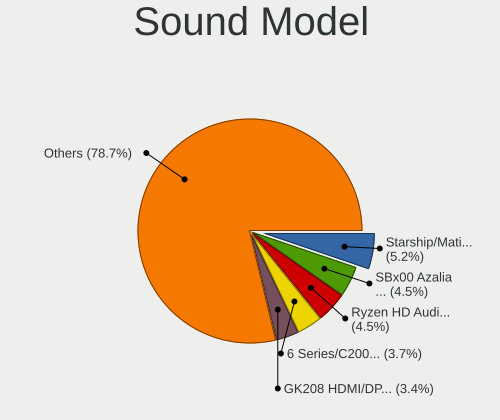

| Model                                                                             | Desktops | Percent |
|-----------------------------------------------------------------------------------|----------|---------|
| AMD Starship/Matisse HD Audio Controller                                          | 14       | 5.22%   |
| AMD SBx00 Azalia (Intel HDA)                                                      | 12       | 4.48%   |
| AMD Ryzen HD Audio Controller                                                     | 12       | 4.48%   |
| Intel 6 Series/C200 Series Chipset Family High Definition Audio Controller        | 10       | 3.73%   |
| Nvidia GK208 HDMI/DP Audio Controller                                             | 9        | 3.36%   |
| Intel 7 Series/C216 Chipset Family High Definition Audio Controller               | 7        | 2.61%   |
| Intel 200 Series PCH HD Audio                                                     | 7        | 2.61%   |
| AMD FCH Azalia Controller                                                         | 7        | 2.61%   |
| Intel NM10/ICH7 Family High Definition Audio Controller                           | 6        | 2.24%   |
| Intel Cannon Lake PCH cAVS                                                        | 6        | 2.24%   |
| Intel 8 Series/C220 Series Chipset High Definition Audio Controller               | 6        | 2.24%   |
| AMD Oland/Hainan/Cape Verde/Pitcairn HDMI Audio [Radeon HD 7000 Series]           | 6        | 2.24%   |
| AMD Ellesmere HDMI Audio [Radeon RX 470/480 / 570/580/590]                        | 6        | 2.24%   |
| Nvidia GP106 High Definition Audio Controller                                     | 5        | 1.87%   |
| Intel Raptor Lake High Definition Audio Controller                                | 5        | 1.87%   |
| Intel Alder Lake-S HD Audio Controller                                            | 5        | 1.87%   |
| Intel 100 Series/C230 Series Chipset Family HD Audio Controller                   | 5        | 1.87%   |
| Nvidia GP108 High Definition Audio Controller                                     | 4        | 1.49%   |
| Nvidia GP107GL High Definition Audio Controller                                   | 4        | 1.49%   |
| Nvidia GA106 High Definition Audio Controller                                     | 4        | 1.49%   |
| AMD Renoir/Cezanne HDMI/DP Audio Controller                                       | 4        | 1.49%   |
| AMD Radeon High Definition Audio Controller                                       | 4        | 1.49%   |
| AMD Caicos HDMI Audio [Radeon HD 6450 / 7450/8450/8490 OEM / R5 230/235/235X OEM] | 4        | 1.49%   |
| Nvidia GF108 High Definition Audio Controller                                     | 3        | 1.12%   |
| Nvidia AD107 High Definition Audio Controller                                     | 3        | 1.12%   |
| Intel Xeon E3-1200 v3/4th Gen Core Processor HD Audio Controller                  | 3        | 1.12%   |
| Intel Comet Lake PCH cAVS                                                         | 3        | 1.12%   |
| Intel C610/X99 series chipset HD Audio Controller                                 | 3        | 1.12%   |
| C-Media Electronics Audio Adapter (Unitek Y-247A)                                 | 3        | 1.12%   |
| VIA Technologies ICE1712 [Envy24] PCI Multi-Channel I/O Controller                | 2        | 0.75%   |
| Nvidia TU116 High Definition Audio Controller                                     | 2        | 0.75%   |
| Nvidia TU106 High Definition Audio Controller                                     | 2        | 0.75%   |
| Nvidia MCP72XE/MCP72P/MCP78U/MCP78S High Definition Audio                         | 2        | 0.75%   |
| Nvidia GM206 High Definition Audio Controller                                     | 2        | 0.75%   |
| Nvidia GM204 High Definition Audio Controller                                     | 2        | 0.75%   |
| Nvidia GK107 HDMI Audio Controller                                                | 2        | 0.75%   |
| Nvidia GK104 HDMI Audio Controller                                                | 2        | 0.75%   |
| Nvidia GA104 High Definition Audio Controller                                     | 2        | 0.75%   |
| Nvidia GA102 High Definition Audio Controller                                     | 2        | 0.75%   |
| Intel 9 Series Chipset Family HD Audio Controller                                 | 2        | 0.75%   |

Memory
------

Memory Vendor
-------------

Memory module vendors

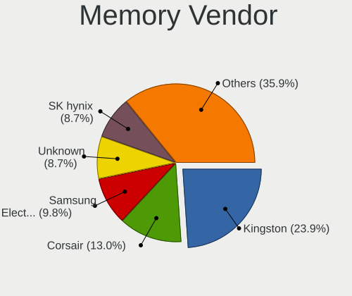

| Vendor              | Desktops | Percent |
|---------------------|----------|---------|
| Kingston            | 22       | 23.91%  |
| Corsair             | 12       | 13.04%  |
| Samsung Electronics | 9        | 9.78%   |
| Unknown             | 8        | 8.7%    |
| SK hynix            | 8        | 8.7%    |
| Crucial             | 8        | 8.7%    |
| Micron Technology   | 7        | 7.61%   |
| G.Skill             | 7        | 7.61%   |
| Unknown             | 3        | 3.26%   |
| A-DATA Technology   | 2        | 2.17%   |
| Unknown (ABCD)      | 1        | 1.09%   |
| Unknown (0x0E9D)    | 1        | 1.09%   |
| Team                | 1        | 1.09%   |
| Patriot Memory      | 1        | 1.09%   |
| Kingmax             | 1        | 1.09%   |
| Elpida              | 1        | 1.09%   |

Memory Model
------------

Memory module models

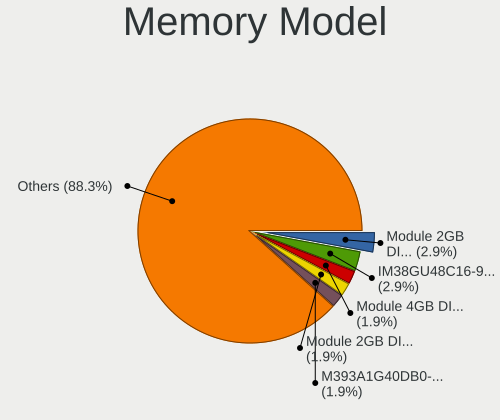

| Model                                                              | Desktops | Percent |
|--------------------------------------------------------------------|----------|---------|
| Unknown RAM Module 2GB DIMM 800MT/s                                | 3        | 2.91%   |
| Unknown                                                            | 3        | 2.91%   |
| Unknown RAM Module 4GB DIMM DDR3 1333MT/s                          | 2        | 1.94%   |
| Unknown RAM Module 2GB DIMM DDR2 800MT/s                           | 2        | 1.94%   |
| SK hynix RAM HMA81GU6AFR8N-UH 8GB DIMM DDR4 2400MT/s               | 2        | 1.94%   |
| Samsung RAM M393A1G40DB0-CPB 8GB DIMM DDR4 2667MT/s                | 2        | 1.94%   |
| Kingston RAM KHX3200C16D4/32GX 32GB DIMM DDR4 3200MT/s             | 2        | 1.94%   |
| Kingston RAM KHX3200C16D4/16GX 16GB DIMM DDR4 3600MT/s             | 2        | 1.94%   |
| Kingston RAM KHX1866C10D3/8G 8GB DIMM DDR3 1867MT/s                | 2        | 1.94%   |
| Kingston RAM KHX1600C10D3/8G 8GB DIMM DDR3 2133MT/s                | 2        | 1.94%   |
| Kingston RAM KF560C36-32 32GB DIMM DDR5 6200MT/s                   | 2        | 1.94%   |
| Unknown RAM Module 4GB DIMM 1333MT/s                               | 1        | 0.97%   |
| Unknown RAM Module 2GB DIMM DDR3 1333MT/s                          | 1        | 0.97%   |
| Unknown (ABCD) RAM 123456789012345678 2GB DIMM LPDDR4 2133MT/s     | 1        | 0.97%   |
| Unknown (0x0E9D) RAM KINSOTIN16GB2666MHZ 16GB SODIMM DDR4 2667MT/s | 1        | 0.97%   |
| Team RAM Elite-1600 8GB DIMM DDR3 1600MT/s                         | 1        | 0.97%   |
| SK hynix RAM Module 4GB SODIMM DDR3 1333MT/s                       | 1        | 0.97%   |
| SK hynix RAM Module 4GB DIMM DDR3 1333MT/s                         | 1        | 0.97%   |
| SK hynix RAM HMT41GU6DFR8A-PB 8GB DIMM DDR3 1600MT/s               | 1        | 0.97%   |
| SK hynix RAM HMT41GU6BFR8A-PB 8GB DIMM DDR3 2000MT/s               | 1        | 0.97%   |
| SK hynix RAM HMT351U7CFR8A-PB 4GB DIMM DDR3 1600MT/s               | 1        | 0.97%   |
| SK hynix RAM HMT125S6BFR8C-H9 2GB DIMM SDRAM 4199MT/s              | 1        | 0.97%   |
| Samsung RAM M393A2G40DB0-CPB 16GB DIMM DDR4 2133MT/s               | 1        | 0.97%   |
| Samsung RAM M391B5173QH0-YK0 4GB DIMM DDR3 1600MT/s                | 1        | 0.97%   |
| Samsung RAM M378B5773CH0-CK0 2GB DIMM DDR3 1600MT/s                | 1        | 0.97%   |
| Samsung RAM M378B5673FH0-CH9 2GB DIMM DDR3 1600MT/s                | 1        | 0.97%   |
| Samsung RAM M378B5273CH0-CH9 4GB DIMM DDR3 1867MT/s                | 1        | 0.97%   |
| Samsung RAM M378A2G43AB3-CWE 16GB DIMM DDR4 3200MT/s               | 1        | 0.97%   |
| Samsung RAM M378A1K43CB2-CRC 8GB DIMM DDR4 3500MT/s                | 1        | 0.97%   |
| Samsung RAM M378A1K43BB2-CRC 8GB DIMM DDR4 3400MT/s                | 1        | 0.97%   |
| Samsung RAM LO8G1600CL11 8GB DIMM DDR3 1600MT/s                    | 1        | 0.97%   |
| Patriot Memory RAM 6000 Series 16GB DIMM DDR5 4800MT/s             | 1        | 0.97%   |
| Micron RAM 8ATF1G64AZ-3G2J1 8GB DIMM DDR4 3200MT/s                 | 1        | 0.97%   |
| Micron RAM 8ATF1G64AZ-2G6E1 8GB DIMM DDR4 2667MT/s                 | 1        | 0.97%   |
| Micron RAM 18KSF1G72AZ-1G6E1 8GB DIMM DDR3 1600MT/s                | 1        | 0.97%   |
| Micron RAM 18ASF1G72PZ-2G1A2 8GB DIMM DDR4 2400MT/s                | 1        | 0.97%   |
| Micron RAM 18ASF1G72AZ-2G1B1 8GB DIMM DDR4 2133MT/s                | 1        | 0.97%   |
| Micron RAM 16KTF1G64AZ-1G6P1 8GB DIMM DDR3 1600MT/s                | 1        | 0.97%   |
| Micron RAM 16JTF51264AZ-1G4M1 4GB DIMM DDR3 1333MT/s               | 1        | 0.97%   |
| Kingston RAM LV32D4U2S8ME-16X 16GB DIMM DDR4 3200MT/s              | 1        | 0.97%   |

Memory Kind
-----------

Memory module kinds

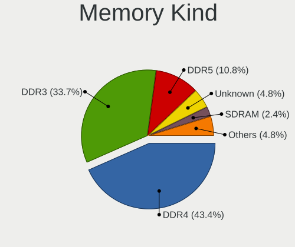

| Kind    | Desktops | Percent |
|---------|----------|---------|
| DDR4    | 36       | 43.37%  |
| DDR3    | 28       | 33.73%  |
| DDR5    | 9        | 10.84%  |
| Unknown | 4        | 4.82%   |
| SDRAM   | 2        | 2.41%   |
| DDR2    | 2        | 2.41%   |
| LPDDR4  | 1        | 1.2%    |
| DRAM    | 1        | 1.2%    |

Memory Form Factor
------------------

Physical design of the memory module

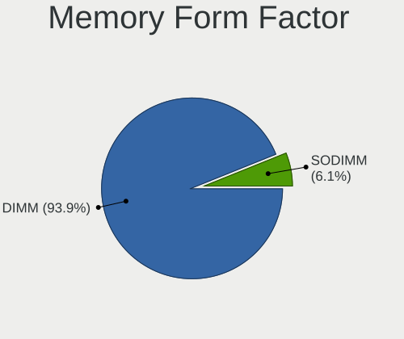

| Name   | Desktops | Percent |
|--------|----------|---------|
| DIMM   | 77       | 93.9%   |
| SODIMM | 5        | 6.1%    |

Memory Size
-----------

Memory module size

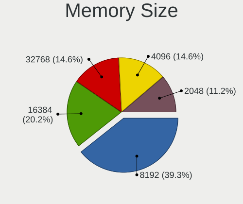

| Size  | Desktops | Percent |
|-------|----------|---------|
| 8192  | 35       | 39.33%  |
| 16384 | 18       | 20.22%  |
| 32768 | 13       | 14.61%  |
| 4096  | 13       | 14.61%  |
| 2048  | 10       | 11.24%  |

Memory Speed
------------

Memory module speed

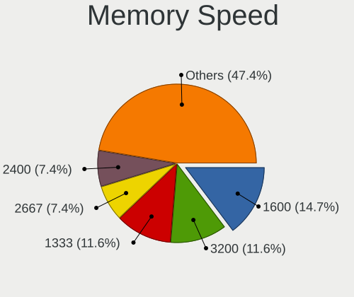

| Speed | Desktops | Percent |
|-------|----------|---------|
| 1600  | 14       | 14.74%  |
| 3200  | 11       | 11.58%  |
| 1333  | 11       | 11.58%  |
| 2667  | 7        | 7.37%   |
| 2400  | 7        | 7.37%   |
| 2133  | 6        | 6.32%   |
| 3600  | 5        | 5.26%   |
| 800   | 5        | 5.26%   |
| 5600  | 3        | 3.16%   |
| 3400  | 3        | 3.16%   |
| 1867  | 3        | 3.16%   |
| 6200  | 2        | 2.11%   |
| 4800  | 2        | 2.11%   |
| 2933  | 2        | 2.11%   |
| 6400  | 1        | 1.05%   |
| 5200  | 1        | 1.05%   |
| 4199  | 1        | 1.05%   |
| 4000  | 1        | 1.05%   |
| 3933  | 1        | 1.05%   |
| 3800  | 1        | 1.05%   |
| 3733  | 1        | 1.05%   |
| 3604  | 1        | 1.05%   |
| 3500  | 1        | 1.05%   |
| 3000  | 1        | 1.05%   |
| 2666  | 1        | 1.05%   |
| 2000  | 1        | 1.05%   |
| 1866  | 1        | 1.05%   |
| 1800  | 1        | 1.05%   |

Printers & scanners
-------------------

Printer Vendor
--------------

Printer device vendors

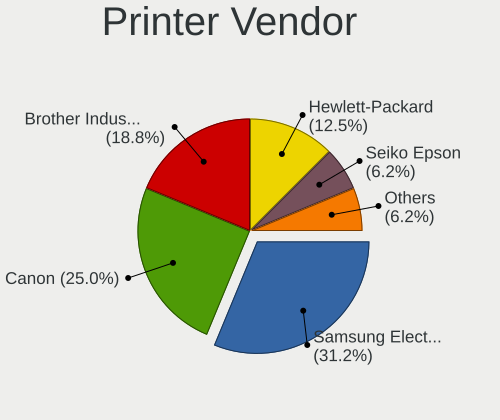

| Vendor              | Desktops | Percent |
|---------------------|----------|---------|
| Samsung Electronics | 5        | 31.25%  |
| Canon               | 4        | 25%     |
| Brother Industries  | 3        | 18.75%  |
| Hewlett-Packard     | 2        | 12.5%   |
| Seiko Epson         | 1        | 6.25%   |
| QinHeng Electronics | 1        | 6.25%   |

Printer Model
-------------

Printer device models

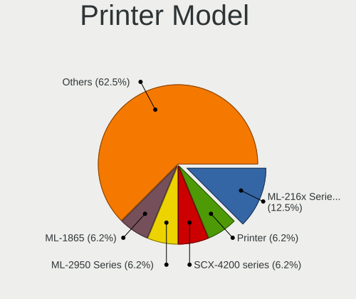

| Model                                | Desktops | Percent |
|--------------------------------------|----------|---------|
| Samsung ML-216x Series Laser Printer | 2        | 12.5%   |
| Seiko Epson Printer                  | 1        | 6.25%   |
| Samsung SCX-4200 series              | 1        | 6.25%   |
| Samsung ML-2950 Series               | 1        | 6.25%   |
| Samsung ML-1865                      | 1        | 6.25%   |
| QinHeng CH340S                       | 1        | 6.25%   |
| HP Smart Tank 660-670 series         | 1        | 6.25%   |
| HP LaserJet 1320                     | 1        | 6.25%   |
| Canon LiDE 300                       | 1        | 6.25%   |
| Canon iP7200 series                  | 1        | 6.25%   |
| Canon GX4000 series                  | 1        | 6.25%   |
| Canon G3010 series                   | 1        | 6.25%   |
| Brother MFC-L2730DW series           | 1        | 6.25%   |
| Brother HL-L2310D series             | 1        | 6.25%   |
| Brother HL-1210W series              | 1        | 6.25%   |

Scanner Vendor
--------------

Scanner device vendors

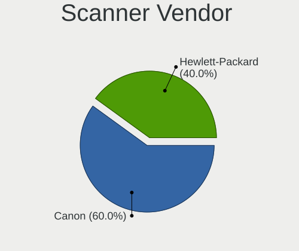

| Vendor          | Desktops | Percent |
|-----------------|----------|---------|
| Canon           | 3        | 60%     |
| Hewlett-Packard | 2        | 40%     |

Scanner Model
-------------

Scanner device models

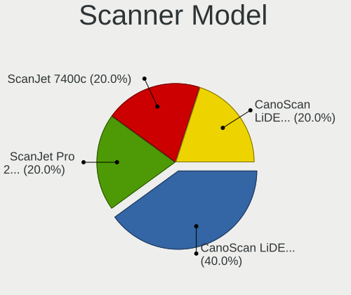

| Model                                  | Desktops | Percent |
|----------------------------------------|----------|---------|
| Canon CanoScan LiDE 210                | 2        | 40%     |
| HP ScanJet Pro 2500 f1                 | 1        | 20%     |
| HP ScanJet 7400c                       | 1        | 20%     |
| Canon CanoScan LiDE 50/LiDE 35/LiDE 40 | 1        | 20%     |

Camera
------

Camera Vendor
-------------

Camera device vendors

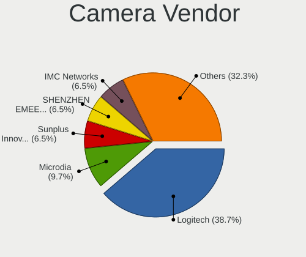

| Vendor                        | Desktops | Percent |
|-------------------------------|----------|---------|
| Logitech                      | 12       | 38.71%  |
| Microdia                      | 3        | 9.68%   |
| Sunplus Innovation Technology | 2        | 6.45%   |
| SHENZHEN EMEET TECHNOLOGY     | 2        | 6.45%   |
| IMC Networks                  | 2        | 6.45%   |
| USB Cam Manufacturer          | 1        | 3.23%   |
| SunplusIT                     | 1        | 3.23%   |
| Realtek Semiconductor         | 1        | 3.23%   |
| Quanta                        | 1        | 3.23%   |
| Microsoft                     | 1        | 3.23%   |
| MacroSilicon                  | 1        | 3.23%   |
| KYE Systems (Mouse Systems)   | 1        | 3.23%   |
| Huawei Technologies           | 1        | 3.23%   |
| Hewlett-Packard               | 1        | 3.23%   |
| AVerMedia Technologies        | 1        | 3.23%   |

Camera Model
------------

Camera device models

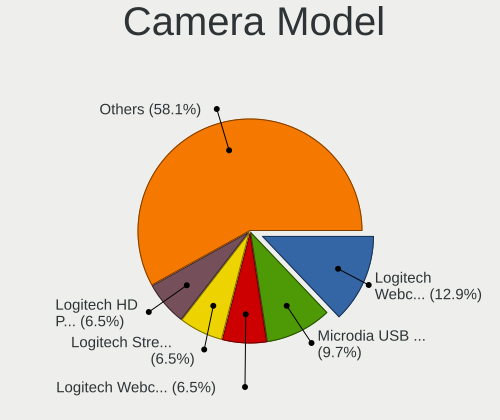

| Model                                          | Desktops | Percent |
|------------------------------------------------|----------|---------|
| Logitech Webcam C270                           | 4        | 12.9%   |
| Microdia USB 2.0 Camera                        | 3        | 9.68%   |
| Logitech Webcam C170                           | 2        | 6.45%   |
| Logitech StreamCam                             | 2        | 6.45%   |
| Logitech HD Pro Webcam C920                    | 2        | 6.45%   |
| USB Cam Manufacturer HDMI USB Camera           | 1        | 3.23%   |
| SunplusIT USB 2.0 Camera                       | 1        | 3.23%   |
| Sunplus UHD Capture                            | 1        | 3.23%   |
| Sunplus Integrated Camera                      | 1        | 3.23%   |
| SHENZHEN EMEET TECHNOLOGY HD Webcam eMeet C960 | 1        | 3.23%   |
| SHENZHEN EMEET TECHNOLOGY eMeet Nova           | 1        | 3.23%   |
| Realtek Dell_Monitor_IR_Webcam                 | 1        | 3.23%   |
| Quanta HD Camera                               | 1        | 3.23%   |
| Microsoft Modern Webcam                        | 1        | 3.23%   |
| MacroSilicon USB Video                         | 1        | 3.23%   |
| Logitech QuickCam Pro 9000                     | 1        | 3.23%   |
| Logitech HD Webcam C615                        | 1        | 3.23%   |
| KYE Systems (Mouse Systems) FaceCam 310        | 1        | 3.23%   |
| IMC Networks XHC Camera                        | 1        | 3.23%   |
| IMC Networks USB 2.0 Camera                    | 1        | 3.23%   |
| Huawei HiCamera                                | 1        | 3.23%   |
| HP 325 FHD Webcam                              | 1        | 3.23%   |
| AVerMedia Live Streamer CAM 310P               | 1        | 3.23%   |

Security
--------

Fingerprint Vendor
------------------

Fingerprint sensor vendors

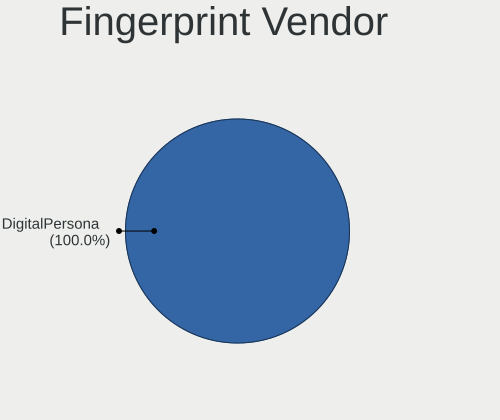

| Vendor         | Desktops | Percent |
|----------------|----------|---------|
| DigitalPersona | 1        | 100%    |

Fingerprint Model
-----------------

Fingerprint sensor models

| Model                             | Desktops | Percent |
|-----------------------------------|----------|---------|
| DigitalPersona Fingerprint Reader | 1        | 100%    |

Chipcard Vendor
---------------

Chipcard module vendors

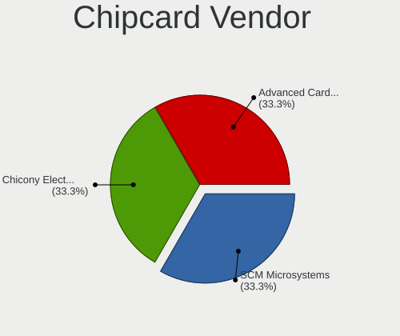

| Vendor                | Desktops | Percent |
|-----------------------|----------|---------|
| SCM Microsystems      | 1        | 33.33%  |
| Chicony Electronics   | 1        | 33.33%  |
| Advanced Card Systems | 1        | 33.33%  |

Chipcard Model
--------------

Chipcard module models

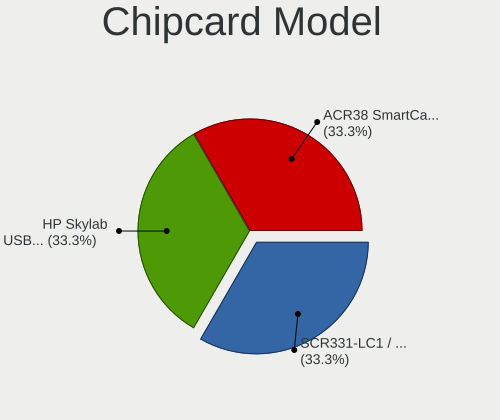

| Model                                                  | Desktops | Percent |
|--------------------------------------------------------|----------|---------|
| SCM Microsystems SCR331-LC1 / SCR3310 SmartCard Reader | 1        | 33.33%  |
| Chicony Electronics HP Skylab USB Smartcard Keyboard   | 1        | 33.33%  |
| Advanced Card Systems ACR38 SmartCard Reader           | 1        | 33.33%  |

Unsupported
-----------

Unsupported Devices
-------------------

Total unsupported devices on board

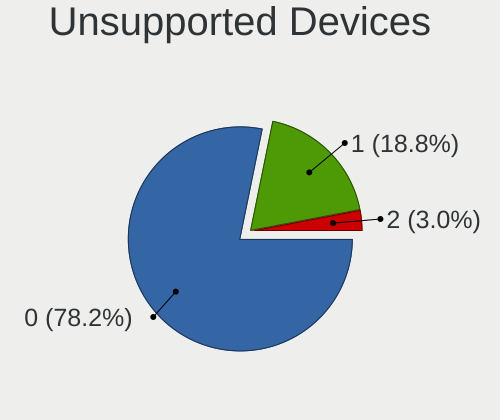

| Total | Desktops | Percent |
|-------|----------|---------|
| 0     | 104      | 78.2%   |
| 1     | 25       | 18.8%   |
| 2     | 4        | 3.01%   |

Unsupported Device Types
------------------------

Types of unsupported devices

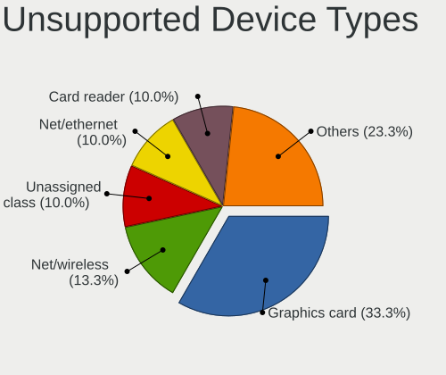

| Type                     | Desktops | Percent |
|--------------------------|----------|---------|
| Graphics card            | 10       | 33.33%  |
| Net/wireless             | 4        | 13.33%  |
| Unassigned class         | 3        | 10%     |
| Net/ethernet             | 3        | 10%     |
| Card reader              | 3        | 10%     |
| Multimedia controller    | 2        | 6.67%   |
| Chipcard                 | 2        | 6.67%   |
| Fingerprint reader       | 1        | 3.33%   |
| Communication controller | 1        | 3.33%   |
| Bluetooth                | 1        | 3.33%   |

