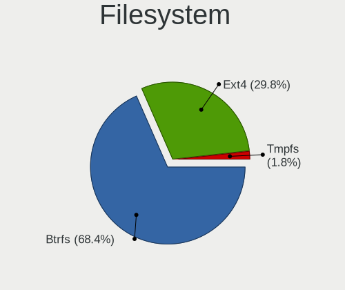
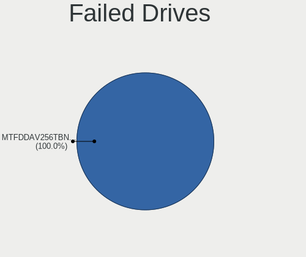
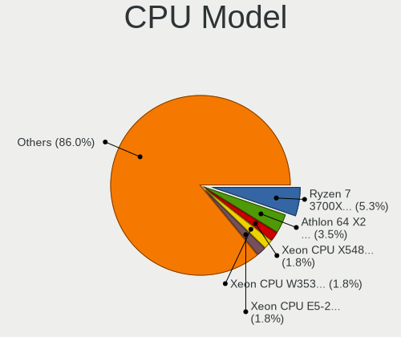
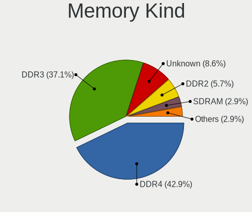
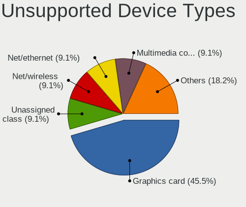

openSUSE Leap-15.6 - Tested Hardware & Statistics (Desktops)
------------------------------------------------------------

A project to collect tested hardware configurations for openSUSE Leap-15.6.

Anyone can contribute to this report by the [hw-probe](https://github.com/linuxhw/hw-probe) tool:

    sudo -E hw-probe -all -upload

Please contribute! Especially if your hardware is rare.

Contents
--------

* [ Test Cases ](#test-cases)

* [ System ](#system)
  - [ Kernel                   ](#kernel)
  - [ Kernel Family            ](#kernel-family)
  - [ Kernel Major Ver.        ](#kernel-major-ver)
  - [ Arch                     ](#arch)
  - [ DE                       ](#de)
  - [ Display Server           ](#display-server)
  - [ Display Manager          ](#display-manager)
  - [ OS Lang                  ](#os-lang)
  - [ Boot Mode                ](#boot-mode)
  - [ Filesystem               ](#filesystem)
  - [ Part. scheme             ](#part-scheme)
  - [ Dual Boot with Linux/BSD ](#dual-boot-with-linuxbsd)
  - [ Dual Boot (Win)          ](#dual-boot-win)

* [ Board ](#board)
  - [ Vendor                   ](#vendor)
  - [ Model                    ](#model)
  - [ Model Family             ](#model-family)
  - [ MFG Year                 ](#mfg-year)
  - [ Form Factor              ](#form-factor)
  - [ Secure Boot              ](#secure-boot)
  - [ Coreboot                 ](#coreboot)
  - [ RAM Size                 ](#ram-size)
  - [ RAM Used                 ](#ram-used)
  - [ Total Drives             ](#total-drives)
  - [ Has CD-ROM               ](#has-cd-rom)
  - [ Has Ethernet             ](#has-ethernet)
  - [ Has WiFi                 ](#has-wifi)
  - [ Has Bluetooth            ](#has-bluetooth)

* [ Location ](#location)
  - [ Country                  ](#country)
  - [ City                     ](#city)

* [ Drives ](#drives)
  - [ Drive Vendor             ](#drive-vendor)
  - [ Drive Model              ](#drive-model)
  - [ HDD Vendor               ](#hdd-vendor)
  - [ SSD Vendor               ](#ssd-vendor)
  - [ Drive Kind               ](#drive-kind)
  - [ Drive Connector          ](#drive-connector)
  - [ Drive Size               ](#drive-size)
  - [ Space Total              ](#space-total)
  - [ Space Used               ](#space-used)
  - [ Malfunc. Drives          ](#malfunc-drives)
  - [ Malfunc. Drive Vendor    ](#malfunc-drive-vendor)
  - [ Malfunc. HDD Vendor      ](#malfunc-hdd-vendor)
  - [ Malfunc. Drive Kind      ](#malfunc-drive-kind)
  - [ Failed Drives            ](#failed-drives)
  - [ Failed Drive Vendor      ](#failed-drive-vendor)
  - [ Drive Status             ](#drive-status)

* [ Storage controller ](#storage-controller)
  - [ Storage Vendor           ](#storage-vendor)
  - [ Storage Model            ](#storage-model)
  - [ Storage Kind             ](#storage-kind)

* [ Processor ](#processor)
  - [ CPU Vendor               ](#cpu-vendor)
  - [ CPU Model                ](#cpu-model)
  - [ CPU Model Family         ](#cpu-model-family)
  - [ CPU Cores                ](#cpu-cores)
  - [ CPU Sockets              ](#cpu-sockets)
  - [ CPU Threads              ](#cpu-threads)
  - [ CPU Op-Modes             ](#cpu-op-modes)
  - [ CPU Microcode            ](#cpu-microcode)
  - [ CPU Microarch            ](#cpu-microarch)

* [ Graphics ](#graphics)
  - [ GPU Vendor               ](#gpu-vendor)
  - [ GPU Model                ](#gpu-model)
  - [ GPU Combo                ](#gpu-combo)
  - [ GPU Driver               ](#gpu-driver)
  - [ GPU Memory               ](#gpu-memory)

* [ Monitor ](#monitor)
  - [ Monitor Vendor           ](#monitor-vendor)
  - [ Monitor Model            ](#monitor-model)
  - [ Monitor Resolution       ](#monitor-resolution)
  - [ Monitor Diagonal         ](#monitor-diagonal)
  - [ Monitor Width            ](#monitor-width)
  - [ Aspect Ratio             ](#aspect-ratio)
  - [ Monitor Area             ](#monitor-area)
  - [ Pixel Density            ](#pixel-density)
  - [ Multiple Monitors        ](#multiple-monitors)

* [ Network ](#network)
  - [ Net Controller Vendor    ](#net-controller-vendor)
  - [ Net Controller Model     ](#net-controller-model)
  - [ Wireless Vendor          ](#wireless-vendor)
  - [ Wireless Model           ](#wireless-model)
  - [ Ethernet Vendor          ](#ethernet-vendor)
  - [ Ethernet Model           ](#ethernet-model)
  - [ Net Controller Kind      ](#net-controller-kind)
  - [ Used Controller          ](#used-controller)
  - [ NICs                     ](#nics)
  - [ IPv6                     ](#ipv6)

* [ Bluetooth ](#bluetooth)
  - [ Bluetooth Vendor         ](#bluetooth-vendor)
  - [ Bluetooth Model          ](#bluetooth-model)

* [ Sound ](#sound)
  - [ Sound Vendor             ](#sound-vendor)
  - [ Sound Model              ](#sound-model)

* [ Memory ](#memory)
  - [ Memory Vendor            ](#memory-vendor)
  - [ Memory Model             ](#memory-model)
  - [ Memory Kind              ](#memory-kind)
  - [ Memory Form Factor       ](#memory-form-factor)
  - [ Memory Size              ](#memory-size)
  - [ Memory Speed             ](#memory-speed)

* [ Printers & scanners ](#printers--scanners)
  - [ Printer Vendor           ](#printer-vendor)
  - [ Printer Model            ](#printer-model)
  - [ Scanner Vendor           ](#scanner-vendor)
  - [ Scanner Model            ](#scanner-model)

* [ Camera ](#camera)
  - [ Camera Vendor            ](#camera-vendor)
  - [ Camera Model             ](#camera-model)

* [ Security ](#security)
  - [ Fingerprint Vendor       ](#fingerprint-vendor)
  - [ Fingerprint Model        ](#fingerprint-model)
  - [ Chipcard Vendor          ](#chipcard-vendor)
  - [ Chipcard Model           ](#chipcard-model)

* [ Unsupported ](#unsupported)
  - [ Unsupported Devices      ](#unsupported-devices)
  - [ Unsupported Device Types ](#unsupported-device-types)

Test Cases
----------

Total: 70

| Vendor   | Model                       | Probe                                                      | Date         |
|----------|-----------------------------|------------------------------------------------------------|--------------|
| Gigabyte | B450 AORUS ELITE            | [896517452f](https://linux-hardware.org/?probe=896517452f) | Jan 01, 2025 |
| Gigabyte | GA-78LMT-USB3 x.x           | [2e5a903c16](https://linux-hardware.org/?probe=2e5a903c16) | Dec 24, 2024 |
| Lenovo   | ThinkServer TS140           | [8d0ead0400](https://linux-hardware.org/?probe=8d0ead0400) | Dec 18, 2024 |
| Unknown  | Unknown                     | [0653c463df](https://linux-hardware.org/?probe=0653c463df) | Dec 17, 2024 |
| MSI      | PRO Z690-A DDR4             | [c2fe7d3fe9](https://linux-hardware.org/?probe=c2fe7d3fe9) | Dec 16, 2024 |
| ASUSTek  | M3N-HT DELUXE               | [85960cdc58](https://linux-hardware.org/?probe=85960cdc58) | Dec 12, 2024 |
| Gigabyte | B550 AORUS PRO AC           | [9d331af926](https://linux-hardware.org/?probe=9d331af926) | Dec 11, 2024 |
| Dell     | 0R790T A00                  | [544de4f6e5](https://linux-hardware.org/?probe=544de4f6e5) | Dec 07, 2024 |
| Gigabyte | Z490 UD                     | [93ed7e1b8b](https://linux-hardware.org/?probe=93ed7e1b8b) | Dec 03, 2024 |
| MSI      | A88X-G43                    | [ed81ddd35f](https://linux-hardware.org/?probe=ed81ddd35f) | Dec 01, 2024 |
| Fujitsu  | D3230-A1 S26361-D3230-A1    | [f8b592b091](https://linux-hardware.org/?probe=f8b592b091) | Nov 27, 2024 |
| HP       | 0B4Ch D                     | [34657f16df](https://linux-hardware.org/?probe=34657f16df) | Nov 27, 2024 |
| MSI      | PRO Z690-A DDR4             | [e102d2434c](https://linux-hardware.org/?probe=e102d2434c) | Nov 22, 2024 |
| ASUSTek  | PRIME X670-P WIFI           | [82cde68696](https://linux-hardware.org/?probe=82cde68696) | Nov 14, 2024 |
| Gigabyte | P31-ES3G                    | [1e5662dbe7](https://linux-hardware.org/?probe=1e5662dbe7) | Nov 14, 2024 |
| Gigabyte | Z170X-Gaming 5              | [329a323c09](https://linux-hardware.org/?probe=329a323c09) | Nov 13, 2024 |
| ASRock   | X570 Steel Legend           | [8da35569fd](https://linux-hardware.org/?probe=8da35569fd) | Nov 10, 2024 |
| Gigabyte | Z270P-D3-CF                 | [eb136f4faf](https://linux-hardware.org/?probe=eb136f4faf) | Nov 07, 2024 |
| Gigabyte | B450 I AORUS PRO WIFI-CF    | [7edfbce2b4](https://linux-hardware.org/?probe=7edfbce2b4) | Nov 05, 2024 |
| ASUSTek  | P8Z77-V LK                  | [5ef99b9e94](https://linux-hardware.org/?probe=5ef99b9e94) | Oct 29, 2024 |
| HP       | 3397                        | [bff622bbdc](https://linux-hardware.org/?probe=bff622bbdc) | Oct 27, 2024 |
| MSI      | PRO Z690-A DDR4             | [94a8b7f4b4](https://linux-hardware.org/?probe=94a8b7f4b4) | Oct 26, 2024 |
| ASUSTek  | ROG STRIX B450-F GAMING     | [ff6ad443e3](https://linux-hardware.org/?probe=ff6ad443e3) | Oct 20, 2024 |
| ASUSTek  | ROG STRIX B450-F GAMING     | [d8ac94db45](https://linux-hardware.org/?probe=d8ac94db45) | Oct 20, 2024 |
| HP       | 3031h                       | [4a1f4140dc](https://linux-hardware.org/?probe=4a1f4140dc) | Oct 19, 2024 |
| MSI      | A68HM-E33 V2                | [dc035c1f73](https://linux-hardware.org/?probe=dc035c1f73) | Oct 18, 2024 |
| ASRock   | A320M Pro4-F                | [b1b3e21e4a](https://linux-hardware.org/?probe=b1b3e21e4a) | Oct 17, 2024 |
| MSI      | A88X-G43                    | [f2e61556e5](https://linux-hardware.org/?probe=f2e61556e5) | Oct 13, 2024 |
| Gigabyte | GA-990XA-UD3                | [7d81a61c55](https://linux-hardware.org/?probe=7d81a61c55) | Oct 11, 2024 |
| ASUSTek  | CM6630_CM6730_CM6830        | [65a5985998](https://linux-hardware.org/?probe=65a5985998) | Oct 11, 2024 |
| ASUSTek  | H87-PRO                     | [e4e1104b5f](https://linux-hardware.org/?probe=e4e1104b5f) | Oct 11, 2024 |
| MSI      | H310M PRO-M2 PLUS           | [2a7230a950](https://linux-hardware.org/?probe=2a7230a950) | Oct 05, 2024 |
| Acer     | Aspire XC600 v1.0           | [a804ec25cb](https://linux-hardware.org/?probe=a804ec25cb) | Oct 04, 2024 |
| Medion   | MS-7621                     | [a020fe8c37](https://linux-hardware.org/?probe=a020fe8c37) | Oct 01, 2024 |
| ASUSTek  | P8Z77-V LK                  | [c2cf58b4cb](https://linux-hardware.org/?probe=c2cf58b4cb) | Sep 30, 2024 |
| MSI      | 760GM-P23                   | [40e69da1e5](https://linux-hardware.org/?probe=40e69da1e5) | Sep 28, 2024 |
| Gigabyte | GA-990XA-UD3                | [ab7b5b59ba](https://linux-hardware.org/?probe=ab7b5b59ba) | Sep 24, 2024 |
| Apple    | Mac-F42C88C8 Proto1         | [783d23aea5](https://linux-hardware.org/?probe=783d23aea5) | Sep 21, 2024 |
| ASUSTek  | TUF Gaming X570-PLUS        | [c0d2ab907a](https://linux-hardware.org/?probe=c0d2ab907a) | Sep 16, 2024 |
| Fujitsu  | D2991-A1 S26361-D2991-A1    | [4a01efc0f3](https://linux-hardware.org/?probe=4a01efc0f3) | Sep 16, 2024 |
| Dell     | 0C522T A01                  | [874c0b8f0e](https://linux-hardware.org/?probe=874c0b8f0e) | Sep 16, 2024 |
| Gigabyte | B550M DS3H                  | [e42fc20d2e](https://linux-hardware.org/?probe=e42fc20d2e) | Sep 16, 2024 |
| Lenovo   | 3741 SDK0T76463 WIN 3422... | [2e0b97edbb](https://linux-hardware.org/?probe=2e0b97edbb) | Sep 14, 2024 |
| ASUSTek  | PRIME B550M-A               | [607347fc6d](https://linux-hardware.org/?probe=607347fc6d) | Sep 10, 2024 |
| Gigabyte | G31M-S2L                    | [02af5a246c](https://linux-hardware.org/?probe=02af5a246c) | Sep 06, 2024 |
| ASUSTek  | A88XM-PLUS                  | [a2bb2feb80](https://linux-hardware.org/?probe=a2bb2feb80) | Aug 21, 2024 |
| JGINYUE  | B760M GAMING VER            | [00613c356e](https://linux-hardware.org/?probe=00613c356e) | Aug 20, 2024 |
| Lenovo   | 3741 SDK0T76463 WIN 3422... | [f6b5d49b9b](https://linux-hardware.org/?probe=f6b5d49b9b) | Aug 20, 2024 |
| ASUSTek  | A88XM-PLUS                  | [3f0faf54dc](https://linux-hardware.org/?probe=3f0faf54dc) | Aug 18, 2024 |
| Lenovo   | ThinkCentre Edge71 1577N... | [e94e38b1bd](https://linux-hardware.org/?probe=e94e38b1bd) | Aug 16, 2024 |
| Gigabyte | H510M H V2                  | [55881326bf](https://linux-hardware.org/?probe=55881326bf) | Aug 09, 2024 |
| ASRock   | Z390 Extreme4               | [f6c2be6c81](https://linux-hardware.org/?probe=f6c2be6c81) | Jul 31, 2024 |
| HP       | 212A                        | [5810b6b462](https://linux-hardware.org/?probe=5810b6b462) | Jul 03, 2024 |
| ASUSTek  | TUF Gaming Z690-PLUS D4     | [7e0f424897](https://linux-hardware.org/?probe=7e0f424897) | Jun 30, 2024 |
| Gigabyte | GA-78LMT-USB3               | [cb4e4e36a3](https://linux-hardware.org/?probe=cb4e4e36a3) | Jun 26, 2024 |
| Gigabyte | GA-78LMT-USB3               | [7a634da0ca](https://linux-hardware.org/?probe=7a634da0ca) | Jun 26, 2024 |
| Gigabyte | B75M-HD3                    | [9e9ebd16d8](https://linux-hardware.org/?probe=9e9ebd16d8) | Jun 25, 2024 |
| Gigabyte | B75M-HD3                    | [2bd6383e6f](https://linux-hardware.org/?probe=2bd6383e6f) | Jun 25, 2024 |
| ASUSTek  | P8H61                       | [dce75a0f56](https://linux-hardware.org/?probe=dce75a0f56) | Jun 25, 2024 |
| Gigabyte | G31M-S2L                    | [9fdc46fdc1](https://linux-hardware.org/?probe=9fdc46fdc1) | Jun 20, 2024 |
| ASUSTek  | P5KPL-AM SE                 | [e119bba3d8](https://linux-hardware.org/?probe=e119bba3d8) | Jun 20, 2024 |
| ASUSTek  | P5KPL-AM SE                 | [3d108be501](https://linux-hardware.org/?probe=3d108be501) | Jun 20, 2024 |
| Dell     | 0NW6H5 A00                  | [3bef550041](https://linux-hardware.org/?probe=3bef550041) | Jun 15, 2024 |
| Gigabyte | B760M AORUS ELITE AX        | [858c4c0d13](https://linux-hardware.org/?probe=858c4c0d13) | Jun 15, 2024 |
| Lenovo   | 3741 SDK0T76463 WIN 3422... | [c003b74b65](https://linux-hardware.org/?probe=c003b74b65) | Jun 15, 2024 |
| Dell     | 0NW6H5 A00                  | [4fe80b4aa2](https://linux-hardware.org/?probe=4fe80b4aa2) | May 24, 2024 |
| ASUSTek  | M3N-HT DELUXE               | [1f1cef32a6](https://linux-hardware.org/?probe=1f1cef32a6) | May 13, 2024 |
| Gigabyte | P41T-D3P                    | [3470a0f79b](https://linux-hardware.org/?probe=3470a0f79b) | Jan 18, 2024 |
| Gigabyte | P41T-D3P                    | [1519e94620](https://linux-hardware.org/?probe=1519e94620) | Jan 15, 2024 |
| ASUSTek  | P8Z68-V PRO GEN3            | [76c38ed49a](https://linux-hardware.org/?probe=76c38ed49a) | Dec 11, 2023 |

System
------

Kernel
------

Version of the Linux kernel

| Version                    | Desktops | Percent |
|----------------------------|----------|---------|
| 6.4.0-150600.23.25-default | 22       | 36.07%  |
| 6.4.0-150600.23.17-default | 10       | 16.39%  |
| 6.4.0-150600.21-default    | 9        | 14.75%  |
| 6.4.0-150600.23.22-default | 6        | 9.84%   |
| 6.4.0-150600.23.30-default | 4        | 6.56%   |
| 6.4.0-150600.23.7-default  | 3        | 4.92%   |
| 6.4.0-150600.4-default     | 2        | 3.28%   |
| 6.4.0-150600.23.14-default | 2        | 3.28%   |
| 6.6.5-dron                 | 1        | 1.64%   |
| 6.4.0-150600.16-default    | 1        | 1.64%   |
| 6.11.8-lp156.4-default     | 1        | 1.64%   |

Kernel Family
-------------

Linux kernel without a distro release

| Version | Desktops | Percent |
|---------|----------|---------|
| 6.4.0   | 56       | 96.55%  |
| 6.6.5   | 1        | 1.72%   |
| 6.11.8  | 1        | 1.72%   |

Kernel Major Ver.
-----------------

Linux kernel major version

| Version | Desktops | Percent |
|---------|----------|---------|
| 6.4     | 56       | 96.55%  |
| 6.6     | 1        | 1.72%   |
| 6.11    | 1        | 1.72%   |

Arch
----

OS architecture (x86_64, i586, etc.)

| Name   | Desktops | Percent |
|--------|----------|---------|
| x86_64 | 57       | 100%    |

DE
--

Desktop Environment

| Name     | Desktops | Percent |
|----------|----------|---------|
| KDE5     | 47       | 82.46%  |
| GNOME    | 5        | 8.77%   |
| XFCE     | 4        | 7.02%   |
| Cinnamon | 1        | 1.75%   |

Display Server
--------------

X11 or Wayland

| Name    | Desktops | Percent |
|---------|----------|---------|
| X11     | 49       | 85.96%  |
| Wayland | 8        | 14.04%  |

Display Manager
---------------

SDDM, LightDM, etc.

| Name    | Desktops | Percent |
|---------|----------|---------|
| SDDM    | 29       | 50%     |
| Unknown | 22       | 37.93%  |
| LightDM | 4        | 6.9%    |
| GDM     | 3        | 5.17%   |

OS Lang
-------

Language

| Lang  | Desktops | Percent |
|-------|----------|---------|
| POSIX | 13       | 22.81%  |
| en_US | 13       | 22.81%  |
| de_DE | 13       | 22.81%  |
| ru_RU | 7        | 12.28%  |
| es_ES | 3        | 5.26%   |
| nl_NL | 2        | 3.51%   |
| fr_FR | 2        | 3.51%   |
| en_GB | 2        | 3.51%   |
| it_IT | 1        | 1.75%   |
| en_BW | 1        | 1.75%   |

Boot Mode
---------

EFI or BIOS

| Mode | Desktops | Percent |
|------|----------|---------|
| BIOS | 38       | 65.52%  |
| EFI  | 20       | 34.48%  |

Filesystem
----------

Type of filesystem

| Type  | Desktops | Percent |
|-------|----------|---------|
| Btrfs | 39       | 68.42%  |
| Ext4  | 17       | 29.82%  |
| Tmpfs | 1        | 1.75%   |

Part. scheme
------------

Scheme of partitioning

| Type    | Desktops | Percent |
|---------|----------|---------|
| GPT     | 29       | 50%     |
| Unknown | 22       | 37.93%  |
| MBR     | 7        | 12.07%  |

Dual Boot with Linux/BSD
------------------------

Hosting more than one Linux/BSD

| Dual boot | Desktops | Percent |
|-----------|----------|---------|
| No        | 54       | 94.74%  |
| Yes       | 3        | 5.26%   |

Dual Boot (Win)
---------------

Hosting Linux and Windows

| Dual boot | Desktops | Percent |
|-----------|----------|---------|
| No        | 37       | 64.91%  |
| Yes       | 20       | 35.09%  |

Board
-----

Vendor
------

Motherboard manufacturer

| Name                | Desktops | Percent |
|---------------------|----------|---------|
| Gigabyte Technology | 17       | 29.82%  |
| ASUSTek Computer    | 15       | 26.32%  |
| MSI                 | 5        | 8.77%   |
| Hewlett-Packard     | 4        | 7.02%   |
| Lenovo              | 3        | 5.26%   |
| Dell                | 3        | 5.26%   |
| ASRock              | 3        | 5.26%   |
| Fujitsu             | 2        | 3.51%   |
| Medion              | 1        | 1.75%   |
| JGINYUE             | 1        | 1.75%   |
| Apple               | 1        | 1.75%   |
| Acer                | 1        | 1.75%   |
| Unknown             | 1        | 1.75%   |

Model
-----

Motherboard model

| Name                                        | Desktops | Percent |
|---------------------------------------------|----------|---------|
| Gigabyte G31M-ES2L                          | 2        | 3.51%   |
| ASUS P5KPL-AM SE                            | 2        | 3.51%   |
| ASUS M3N-HT DELUXE                          | 2        | 3.51%   |
| MSI MS-7D25                                 | 1        | 1.75%   |
| MSI MS-7C08                                 | 1        | 1.75%   |
| MSI MS-7793                                 | 1        | 1.75%   |
| MSI MS-7721                                 | 1        | 1.75%   |
| MSI MS-7641                                 | 1        | 1.75%   |
| Medion MS-7621                              | 1        | 1.75%   |
| Lenovo ThinkCentre Edge71 1577N8G           | 1        | 1.75%   |
| Lenovo IdeaCentre Gaming5 17IAB7 90T100BHMZ | 1        | 1.75%   |
| Lenovo 70A4001MUX ThinkServer TS140         | 1        | 1.75%   |
| JGINYUE B760M GAMING                        | 1        | 1.75%   |
| HP Z640 Workstation                         | 1        | 1.75%   |
| HP Z400 Workstation                         | 1        | 1.75%   |
| HP Compaq Elite 8300 SFF                    | 1        | 1.75%   |
| HP Compaq dc7900 Small Form Factor          | 1        | 1.75%   |
| Gigabyte Z490 UD                            | 1        | 1.75%   |
| Gigabyte Z270P-D3                           | 1        | 1.75%   |
| Gigabyte Z170X-Gaming 5                     | 1        | 1.75%   |
| Gigabyte P41T-D3P                           | 1        | 1.75%   |
| Gigabyte P31-ES3G                           | 1        | 1.75%   |
| Gigabyte H510M H V2                         | 1        | 1.75%   |
| Gigabyte GA-990XA-UD3                       | 1        | 1.75%   |
| Gigabyte GA-78LMT-USB3 6.0                  | 1        | 1.75%   |
| Gigabyte GA-78LMT-USB3                      | 1        | 1.75%   |
| Gigabyte B760M AORUS ELITE AX               | 1        | 1.75%   |
| Gigabyte B75M-HD3                           | 1        | 1.75%   |
| Gigabyte B550M DS3H                         | 1        | 1.75%   |
| Gigabyte B550 AORUS PRO AC                  | 1        | 1.75%   |
| Gigabyte B450 I AORUS PRO WIFI              | 1        | 1.75%   |
| Gigabyte B450 AORUS ELITE                   | 1        | 1.75%   |
| Fujitsu ESPRIMO P420                        | 1        | 1.75%   |
| Fujitsu ESPRIMO E500                        | 1        | 1.75%   |
| Dell OptiPlex 980                           | 1        | 1.75%   |
| Dell OptiPlex 7050                          | 1        | 1.75%   |
| Dell OptiPlex 5040                          | 1        | 1.75%   |
| ASUS TUF Gaming Z690-PLUS D4                | 1        | 1.75%   |
| ASUS TUF Gaming X570-PLUS                   | 1        | 1.75%   |
| ASUS ROG STRIX B450-F GAMING                | 1        | 1.75%   |

Model Family
------------

Motherboard model prefix

| Name                   | Desktops | Percent |
|------------------------|----------|---------|
| Dell OptiPlex          | 3        | 5.26%   |
| HP Compaq              | 2        | 3.51%   |
| Gigabyte GA-78LMT-USB3 | 2        | 3.51%   |
| Gigabyte G31M-ES2L     | 2        | 3.51%   |
| Gigabyte B450          | 2        | 3.51%   |
| Fujitsu ESPRIMO        | 2        | 3.51%   |
| ASUS TUF               | 2        | 3.51%   |
| ASUS PRIME             | 2        | 3.51%   |
| ASUS P5KPL-AM          | 2        | 3.51%   |
| ASUS M3N-HT            | 2        | 3.51%   |
| MSI MS-7D25            | 1        | 1.75%   |
| MSI MS-7C08            | 1        | 1.75%   |
| MSI MS-7793            | 1        | 1.75%   |
| MSI MS-7721            | 1        | 1.75%   |
| MSI MS-7641            | 1        | 1.75%   |
| Medion MS-7621         | 1        | 1.75%   |
| Lenovo ThinkCentre     | 1        | 1.75%   |
| Lenovo IdeaCentre      | 1        | 1.75%   |
| Lenovo 70A4001MUX      | 1        | 1.75%   |
| JGINYUE B760M          | 1        | 1.75%   |
| HP Z640                | 1        | 1.75%   |
| HP Z400                | 1        | 1.75%   |
| Gigabyte Z490          | 1        | 1.75%   |
| Gigabyte Z270P-D3      | 1        | 1.75%   |
| Gigabyte Z170X-Gaming  | 1        | 1.75%   |
| Gigabyte P41T-D3P      | 1        | 1.75%   |
| Gigabyte P31-ES3G      | 1        | 1.75%   |
| Gigabyte H510M         | 1        | 1.75%   |
| Gigabyte GA-990XA-UD3  | 1        | 1.75%   |
| Gigabyte B760M         | 1        | 1.75%   |
| Gigabyte B75M-HD3      | 1        | 1.75%   |
| Gigabyte B550M         | 1        | 1.75%   |
| Gigabyte B550          | 1        | 1.75%   |
| ASUS ROG               | 1        | 1.75%   |
| ASUS P8Z77-V           | 1        | 1.75%   |
| ASUS P8Z68-V           | 1        | 1.75%   |
| ASUS P8H61             | 1        | 1.75%   |
| ASUS CM6630            | 1        | 1.75%   |
| ASUS All               | 1        | 1.75%   |
| ASUS A88XM-PLUS        | 1        | 1.75%   |

MFG Year
--------

Motherboard manufacture year

| Year | Desktops | Percent |
|------|----------|---------|
| 2008 | 9        | 15.79%  |
| 2012 | 7        | 12.28%  |
| 2011 | 6        | 10.53%  |
| 2013 | 5        | 8.77%   |
| 2020 | 4        | 7.02%   |
| 2018 | 4        | 7.02%   |
| 2023 | 3        | 5.26%   |
| 2022 | 3        | 5.26%   |
| 2019 | 3        | 5.26%   |
| 2015 | 3        | 5.26%   |
| 2010 | 3        | 5.26%   |
| 2021 | 2        | 3.51%   |
| 2017 | 2        | 3.51%   |
| 2016 | 1        | 1.75%   |
| 2014 | 1        | 1.75%   |
| 2009 | 1        | 1.75%   |

Form Factor
-----------

Physical design of the computer

| Name    | Desktops | Percent |
|---------|----------|---------|
| Desktop | 57       | 100%    |

Secure Boot
-----------

Enabled or disabled

| State    | Desktops | Percent |
|----------|----------|---------|
| Disabled | 54       | 94.74%  |
| Enabled  | 3        | 5.26%   |

Coreboot
--------

Have coreboot on board

| Used | Desktops | Percent |
|------|----------|---------|
| No   | 57       | 100%    |

RAM Size
--------

Total RAM memory

| Size in GB  | Desktops | Percent |
|-------------|----------|---------|
| 16.01-24.0  | 16       | 28.07%  |
| 32.01-64.0  | 9        | 15.79%  |
| 8.01-16.0   | 9        | 15.79%  |
| 4.01-8.0    | 7        | 12.28%  |
| 3.01-4.0    | 6        | 10.53%  |
| 64.01-256.0 | 5        | 8.77%   |
| 1.01-2.0    | 3        | 5.26%   |
| 24.01-32.0  | 2        | 3.51%   |

RAM Used
--------

Used RAM memory

| Used GB    | Desktops | Percent |
|------------|----------|---------|
| 2.01-3.0   | 20       | 32.79%  |
| 4.01-8.0   | 15       | 24.59%  |
| 3.01-4.0   | 15       | 24.59%  |
| 1.01-2.0   | 4        | 6.56%   |
| 0.51-1.0   | 3        | 4.92%   |
| 8.01-16.0  | 2        | 3.28%   |
| 32.01-64.0 | 1        | 1.64%   |
| 0.01-0.5   | 1        | 1.64%   |

Total Drives
------------

Number of drives on board

| Drives | Desktops | Percent |
|--------|----------|---------|
| 1      | 17       | 29.31%  |
| 2      | 16       | 27.59%  |
| 3      | 15       | 25.86%  |
| 4      | 5        | 8.62%   |
| 5      | 3        | 5.17%   |
| 10     | 1        | 1.72%   |
| 9      | 1        | 1.72%   |

Has CD-ROM
----------

Has CD-ROM on board

| Presented | Desktops | Percent |
|-----------|----------|---------|
| Yes       | 35       | 61.4%   |
| No        | 22       | 38.6%   |

Has Ethernet
------------

Has Ethernet on board

| Presented | Desktops | Percent |
|-----------|----------|---------|
| Yes       | 57       | 100%    |

Has WiFi
--------

Has WiFi module

| Presented | Desktops | Percent |
|-----------|----------|---------|
| No        | 35       | 61.4%   |
| Yes       | 22       | 38.6%   |

Has Bluetooth
-------------

Has Bluetooth module

| Presented | Desktops | Percent |
|-----------|----------|---------|
| No        | 34       | 59.65%  |
| Yes       | 23       | 40.35%  |

Location
--------

Country
-------

Geographic location (country)

| Country     | Desktops | Percent |
|-------------|----------|---------|
| Germany     | 15       | 26.32%  |
| USA         | 8        | 14.04%  |
| Russia      | 8        | 14.04%  |
| Spain       | 7        | 12.28%  |
| France      | 3        | 5.26%   |
| UK          | 2        | 3.51%   |
| Netherlands | 2        | 3.51%   |
| Argentina   | 2        | 3.51%   |
| Vietnam     | 1        | 1.75%   |
| Taiwan      | 1        | 1.75%   |
| Switzerland | 1        | 1.75%   |
| Sweden      | 1        | 1.75%   |
| Romania     | 1        | 1.75%   |
| Italy       | 1        | 1.75%   |
| Iceland     | 1        | 1.75%   |
| Belgium     | 1        | 1.75%   |
| Austria     | 1        | 1.75%   |
| Australia   | 1        | 1.75%   |

City
----

Geographic location (city)

| City               | Desktops | Percent |
|--------------------|----------|---------|
| Vigo               | 6        | 10.53%  |
| Soltau             | 2        | 3.51%   |
| Moscow             | 2        | 3.51%   |
| Leipzig            | 2        | 3.51%   |
| Berlin             | 2        | 3.51%   |
| Zuchwil            | 1        | 1.75%   |
| West Bend          | 1        | 1.75%   |
| Vienna             | 1        | 1.75%   |
| Vadstena           | 1        | 1.75%   |
| Tikhvin            | 1        | 1.75%   |
| Stuttgart          | 1        | 1.75%   |
| St Petersburg      | 1        | 1.75%   |
| Simi Valley        | 1        | 1.75%   |
| Seversk            | 1        | 1.75%   |
| Rostov-on-Don      | 1        | 1.75%   |
| Richmond           | 1        | 1.75%   |
| Reykjavik          | 1        | 1.75%   |
| Pontcharraud       | 1        | 1.75%   |
| Pocahontas         | 1        | 1.75%   |
| North Hills        | 1        | 1.75%   |
| New Taipei         | 1        | 1.75%   |
| Münster           | 1        | 1.75%   |
| Meerbusch          | 1        | 1.75%   |
| London             | 1        | 1.75%   |
| Lomonosov          | 1        | 1.75%   |
| Lipetsk            | 1        | 1.75%   |
| Izegem             | 1        | 1.75%   |
| Ituzaingo          | 1        | 1.75%   |
| Harderwijk         | 1        | 1.75%   |
| Hagen              | 1        | 1.75%   |
| Haar               | 1        | 1.75%   |
| Grafenau           | 1        | 1.75%   |
| Geelong            | 1        | 1.75%   |
| Fontenay-sous-Bois | 1        | 1.75%   |
| Detroit            | 1        | 1.75%   |
| Da Nang            | 1        | 1.75%   |
| Columbus           | 1        | 1.75%   |
| Colon              | 1        | 1.75%   |
| Cologne            | 1        | 1.75%   |
| Codlea             | 1        | 1.75%   |

Drives
------

Drive Vendor
------------

Hard drive vendors

| Vendor                       | Desktops | Drives | Percent |
|------------------------------|----------|--------|---------|
| Seagate                      | 24       | 30     | 20.34%  |
| Samsung Electronics          | 17       | 25     | 14.41%  |
| WDC                          | 16       | 29     | 13.56%  |
| Kingston                     | 7        | 10     | 5.93%   |
| Toshiba                      | 6        | 7      | 5.08%   |
| Sandisk                      | 6        | 8      | 5.08%   |
| Crucial                      | 5        | 12     | 4.24%   |
| Intel                        | 4        | 4      | 3.39%   |
| Hitachi                      | 3        | 4      | 2.54%   |
| ADATA Technology             | 3        | 3      | 2.54%   |
| Shenzhen Longsys Electronics | 2        | 4      | 1.69%   |
| Micron Technology            | 2        | 2      | 1.69%   |
| HGST                         | 2        | 3      | 1.69%   |
| China                        | 2        | 2      | 1.69%   |
| A-DATA Technology            | 2        | 2      | 1.69%   |
| SPCC                         | 1        | 1      | 0.85%   |
| Solid                        | 1        | 1      | 0.85%   |
| SK hynix                     | 1        | 1      | 0.85%   |
| Silicon Motion               | 1        | 1      | 0.85%   |
| SD                           | 1        | 1      | 0.85%   |
| PNY                          | 1        | 1      | 0.85%   |
| Phison Electronics           | 1        | 1      | 0.85%   |
| Micron/Crucial Technology    | 1        | 1      | 0.85%   |
| MAXIO Technology (Hangzhou)  | 1        | 1      | 0.85%   |
| Inateck                      | 1        | 1      | 0.85%   |
| HUAWEI                       | 1        | 2      | 0.85%   |
| Hikvision                    | 1        | 1      | 0.85%   |
| Emtec                        | 1        | 1      | 0.85%   |
| ASMT                         | 1        | 1      | 0.85%   |
| Apple                        | 1        | 1      | 0.85%   |
| AGI                          | 1        | 1      | 0.85%   |
| Unknown                      | 1        | 1      | 0.85%   |

Drive Model
-----------

Hard drive models

| Model                                                | Desktops | Percent |
|------------------------------------------------------|----------|---------|
| Seagate ST2000DM008-2FR102 2TB                       | 3        | 2.24%   |
| Samsung SSD 850 EVO 250GB                            | 3        | 2.24%   |
| Samsung NVMe SSD Controller SM981/PM981/PM983 512GB  | 3        | 2.24%   |
| Kingston SA400S37960G 960GB SSD                      | 3        | 2.24%   |
| Toshiba HDWD120 2TB                                  | 2        | 1.49%   |
| Seagate ST3250318AS 250GB                            | 2        | 1.49%   |
| Seagate ST3160318AS 160GB                            | 2        | 1.49%   |
| Seagate ST31500341AS 1TB                             | 2        | 1.49%   |
| Samsung SSD 840 EVO 250GB                            | 2        | 1.49%   |
| Samsung NVMe SSD Controller PM9A1/PM9A3/980PRO 512GB | 2        | 1.49%   |
| Crucial CT500MX500SSD1 500GB                         | 2        | 1.49%   |
| WDC WDS100T2B0A-00SM50 1TB SSD                       | 1        | 0.75%   |
| WDC WD60EFAX-68JH4N1 6TB                             | 1        | 0.75%   |
| WDC WD5003ABYX-88 LEN 500GB                          | 1        | 0.75%   |
| WDC WD5003ABYX-01WERA0 500GB                         | 1        | 0.75%   |
| WDC WD5002ABYS-02B1B0 500GB                          | 1        | 0.75%   |
| WDC WD40EZAZ-19SF3B0 4TB                             | 1        | 0.75%   |
| WDC WD4005FZBX-00K5WB0 4TB                           | 1        | 0.75%   |
| WDC WD3200AAKX-00ERMA0 320GB                         | 1        | 0.75%   |
| WDC WD3200AAJS-56B4A0 320GB                          | 1        | 0.75%   |
| WDC WD2500JD-00HBB0 250GB                            | 1        | 0.75%   |
| WDC WD20EZRZ-00Z5HB0 2TB                             | 1        | 0.75%   |
| WDC WD20EARX-00PASB0 2TB                             | 1        | 0.75%   |
| WDC WD2000JB-00GVA0 200GB                            | 1        | 0.75%   |
| WDC WD1600JS-61MHB1 160GB                            | 1        | 0.75%   |
| WDC WD1600AAJS-61WAA0 160GB                          | 1        | 0.75%   |
| WDC WD10JPVX-22JC3T0 1TB                             | 1        | 0.75%   |
| WDC WD10EZEX-60ZF5A0 1TB                             | 1        | 0.75%   |
| WDC WD10EZEX-60M2NA0 1TB                             | 1        | 0.75%   |
| WDC WD10EZEX-00BBHA0 1TB                             | 1        | 0.75%   |
| WDC WD10EURX-73C57Y0 1TB                             | 1        | 0.75%   |
| WDC WD10EARS-00Y5B1 1TB                              | 1        | 0.75%   |
| WDC WD1002FBYS-02A6B0 1TB                            | 1        | 0.75%   |
| WDC WD1002FAEX-00Z3A0 1TB                            | 1        | 0.75%   |
| Toshiba MQ01ABD100 1TB                               | 1        | 0.75%   |
| Toshiba MG03ACA200 2TB                               | 1        | 0.75%   |
| Toshiba KXG50ZNV256G 256GB                           | 1        | 0.75%   |
| Toshiba DT01ACA200 2TB                               | 1        | 0.75%   |
| SPCC Solid State Disk 1024GB                         | 1        | 0.75%   |
| Solid SSD0240S00 240GB                               | 1        | 0.75%   |

HDD Vendor
----------

Hard disk drive vendors

| Vendor              | Desktops | Drives | Percent |
|---------------------|----------|--------|---------|
| Seagate             | 23       | 28     | 43.4%   |
| WDC                 | 15       | 27     | 28.3%   |
| Toshiba             | 5        | 6      | 9.43%   |
| Hitachi             | 3        | 4      | 5.66%   |
| Samsung Electronics | 2        | 3      | 3.77%   |
| HGST                | 2        | 3      | 3.77%   |
| Inateck             | 1        | 1      | 1.89%   |
| ASMT                | 1        | 1      | 1.89%   |
| Apple               | 1        | 1      | 1.89%   |

SSD Vendor
----------

Solid state drive vendors

| Vendor              | Desktops | Drives | Percent |
|---------------------|----------|--------|---------|
| Samsung Electronics | 12       | 16     | 28.57%  |
| Kingston            | 6        | 8      | 14.29%  |
| Crucial             | 5        | 12     | 11.9%   |
| SanDisk             | 2        | 2      | 4.76%   |
| Micron Technology   | 2        | 2      | 4.76%   |
| Intel               | 2        | 2      | 4.76%   |
| China               | 2        | 2      | 4.76%   |
| A-DATA Technology   | 2        | 2      | 4.76%   |
| WDC                 | 1        | 2      | 2.38%   |
| SPCC                | 1        | 1      | 2.38%   |
| Solid               | 1        | 1      | 2.38%   |
| SD                  | 1        | 1      | 2.38%   |
| PNY                 | 1        | 1      | 2.38%   |
| Hikvision           | 1        | 1      | 2.38%   |
| Emtec               | 1        | 1      | 2.38%   |
| AGI                 | 1        | 1      | 2.38%   |
| Unknown             | 1        | 1      | 2.38%   |

Drive Kind
----------

HDD or SSD

| Kind    | Desktops | Drives | Percent |
|---------|----------|--------|---------|
| HDD     | 39       | 74     | 42.86%  |
| SSD     | 33       | 56     | 36.26%  |
| NVMe    | 17       | 29     | 18.68%  |
| Unknown | 2        | 4      | 2.2%    |

Drive Connector
---------------

SATA, SAS, NVMe, etc.

| Type | Desktops | Drives | Percent |
|------|----------|--------|---------|
| SATA | 50       | 122    | 66.67%  |
| NVMe | 17       | 29     | 22.67%  |
| SAS  | 8        | 12     | 10.67%  |

Drive Size
----------

Size of hard drive

| Size in TB | Desktops | Drives | Percent |
|------------|----------|--------|---------|
| 0.01-0.5   | 36       | 55     | 42.35%  |
| 0.51-1.0   | 22       | 35     | 25.88%  |
| 1.01-2.0   | 16       | 21     | 18.82%  |
| 3.01-4.0   | 5        | 10     | 5.88%   |
| 4.01-10.0  | 3        | 6      | 3.53%   |
| 10.01-20.0 | 2        | 2      | 2.35%   |
| 2.01-3.0   | 1        | 1      | 1.18%   |

Space Total
-----------

Amount of disk space available on the file system

| Size in GB     | Desktops | Percent |
|----------------|----------|---------|
| More than 3000 | 24       | 41.38%  |
| 1001-2000      | 14       | 24.14%  |
| 2001-3000      | 8        | 13.79%  |
| 501-1000       | 6        | 10.34%  |
| 251-500        | 3        | 5.17%   |
| 101-250        | 3        | 5.17%   |

Space Used
----------

Amount of used disk space

| Used GB        | Desktops | Percent |
|----------------|----------|---------|
| 101-250        | 13       | 22.03%  |
| More than 3000 | 9        | 15.25%  |
| 251-500        | 9        | 15.25%  |
| 501-1000       | 9        | 15.25%  |
| 51-100         | 8        | 13.56%  |
| 1001-2000      | 7        | 11.86%  |
| 1-20           | 2        | 3.39%   |
| 21-50          | 1        | 1.69%   |
| 2001-3000      | 1        | 1.69%   |

Malfunc. Drives
---------------

Drive models with a malfunction

| Model                                          | Desktops | Drives | Percent |
|------------------------------------------------|----------|--------|---------|
| WDC WD5003ABYX-01WERA0 500GB                   | 1        | 1      | 10%     |
| WDC WD5002ABYS-02B1B0 500GB                    | 1        | 1      | 10%     |
| WDC WD3200AAKX-00ERMA0 320GB                   | 1        | 1      | 10%     |
| Seagate ST3250318AS 250GB                      | 1        | 1      | 10%     |
| Seagate ST3000DM001-1ER166 3TB                 | 1        | 1      | 10%     |
| Micron Technology MTFDDAK256MAM-1K12 256GB SSD | 1        | 1      | 10%     |
| Intel SSDSCKKW256G8 256GB                      | 1        | 1      | 10%     |
| Intel SSDSC2KG960G8 960GB                      | 1        | 1      | 10%     |
| Hitachi HDS721616PLA380 160GB                  | 1        | 2      | 10%     |
| AGI AGI512G17AI178 512GB SSD                   | 1        | 1      | 10%     |

Malfunc. Drive Vendor
---------------------

Vendors of faulty drives

| Vendor            | Desktops | Drives | Percent |
|-------------------|----------|--------|---------|
| WDC               | 2        | 3      | 22.22%  |
| Seagate           | 2        | 2      | 22.22%  |
| Intel             | 2        | 2      | 22.22%  |
| Micron Technology | 1        | 1      | 11.11%  |
| Hitachi           | 1        | 2      | 11.11%  |
| AGI               | 1        | 1      | 11.11%  |

Malfunc. HDD Vendor
-------------------

Vendors of faulty HDD drives

| Vendor  | Desktops | Drives | Percent |
|---------|----------|--------|---------|
| WDC     | 2        | 3      | 40%     |
| Seagate | 2        | 2      | 40%     |
| Hitachi | 1        | 2      | 20%     |

Malfunc. Drive Kind
-------------------

Kinds of faulty drives

| Kind | Desktops | Drives | Percent |
|------|----------|--------|---------|
| HDD  | 5        | 7      | 55.56%  |
| SSD  | 4        | 4      | 44.44%  |

Failed Drives
-------------

Failed drive models

| Model                                               | Desktops | Drives | Percent |
|-----------------------------------------------------|----------|--------|---------|
| Micron Technology MTFDDAV256TBN-1AR15ABHA 256GB SSD | 1        | 1      | 100%    |

Failed Drive Vendor
-------------------

Failed drive vendors

| Vendor            | Desktops | Drives | Percent |
|-------------------|----------|--------|---------|
| Micron Technology | 1        | 1      | 100%    |

Drive Status
------------

Number of failed and malfunc. drives

| Status   | Desktops | Drives | Percent |
|----------|----------|--------|---------|
| Works    | 34       | 62     | 50%     |
| Detected | 26       | 89     | 38.24%  |
| Malfunc  | 7        | 11     | 10.29%  |
| Failed   | 1        | 1      | 1.47%   |

Storage controller
------------------

Storage Vendor
--------------

Storage controller vendors

| Vendor                       | Desktops | Percent |
|------------------------------|----------|---------|
| Intel                        | 37       | 43.02%  |
| AMD                          | 17       | 19.77%  |
| Samsung Electronics          | 5        | 5.81%   |
| SanDisk                      | 4        | 4.65%   |
| Nvidia                       | 3        | 3.49%   |
| Marvell Technology Group     | 3        | 3.49%   |
| ADATA Technology             | 3        | 3.49%   |
| Shenzhen Longsys Electronics | 2        | 2.33%   |
| ASMedia Technology           | 2        | 2.33%   |
| Toshiba America Info Systems | 1        | 1.16%   |
| SK hynix                     | 1        | 1.16%   |
| Silicon Motion               | 1        | 1.16%   |
| Phison Electronics           | 1        | 1.16%   |
| Micron/Crucial Technology    | 1        | 1.16%   |
| MAXIO Technology (Hangzhou)  | 1        | 1.16%   |
| Kingston Technology Company  | 1        | 1.16%   |
| JMicron Technology           | 1        | 1.16%   |
| Broadcom / LSI               | 1        | 1.16%   |
| Adaptec                      | 1        | 1.16%   |

Storage Model
-------------

Storage controller models

| Model                                                                                                              | Desktops | Percent |
|--------------------------------------------------------------------------------------------------------------------|----------|---------|
| AMD FCH SATA Controller [AHCI mode]                                                                                | 9        | 8.65%   |
| Intel NM10/ICH7 Family SATA Controller [IDE mode]                                                                  | 6        | 5.77%   |
| Intel 6 Series/C200 Series Chipset Family 6 port Desktop SATA AHCI Controller                                      | 6        | 5.77%   |
| Samsung NVMe SSD Controller SM981/PM981/PM983                                                                      | 3        | 2.88%   |
| Intel Alder Lake-S PCH SATA Controller [AHCI Mode]                                                                 | 3        | 2.88%   |
| Intel 8 Series/C220 Series Chipset Family 6-port SATA Controller 1 [AHCI mode]                                     | 3        | 2.88%   |
| Intel 7 Series/C210 Series Chipset Family 6-port SATA Controller [AHCI mode]                                       | 3        | 2.88%   |
| Intel 200 Series PCH SATA controller [AHCI mode]                                                                   | 3        | 2.88%   |
| AMD SB7x0/SB8x0/SB9x0 IDE Controller                                                                               | 3        | 2.88%   |
| AMD 500 Series Chipset SATA Controller                                                                             | 3        | 2.88%   |
| AMD 400 Series Chipset SATA Controller                                                                             | 3        | 2.88%   |
| SanDisk WD Black SN770 / PC SN740 256GB / PC SN560 (DRAM-less) NVMe SSD                                            | 2        | 1.92%   |
| Samsung NVMe SSD Controller PM9A1/PM9A3/980PRO                                                                     | 2        | 1.92%   |
| Nvidia MCP78S [GeForce 8200] SATA Controller (non-AHCI mode)                                                       | 2        | 1.92%   |
| Nvidia MCP78S [GeForce 8200] IDE                                                                                   | 2        | 1.92%   |
| Marvell Group 88SE6111/6121 SATA II / PATA Controller                                                              | 2        | 1.92%   |
| Intel Raptor Lake SATA AHCI Controller                                                                             | 2        | 1.92%   |
| Intel Q170/Q150/B150/H170/H110/Z170/CM236 Chipset SATA Controller [AHCI Mode]                                      | 2        | 1.92%   |
| Intel Comet Lake SATA AHCI Controller                                                                              | 2        | 1.92%   |
| Intel 82801G (ICH7 Family) IDE Controller                                                                          | 2        | 1.92%   |
| ASMedia ASM1061/ASM1062 Serial ATA Controller                                                                      | 2        | 1.92%   |
| AMD SB7x0/SB8x0/SB9x0 SATA Controller [IDE mode]                                                                   | 2        | 1.92%   |
| Toshiba America Info Systems XG5 NVMe SSD Controller                                                               | 1        | 0.96%   |
| SK hynix BC511 NVMe SSD                                                                                            | 1        | 0.96%   |
| Silicon Motion SM2263EN/SM2263XT (DRAM-less) NVMe SSD Controllers                                                  | 1        | 0.96%   |
| Shenzhen Longsys Lexar NM790 NVME SSD (DRAM-less)                                                                  | 1        | 0.96%   |
| Shenzhen Longsys FORESEE XP1000 / Lexar Professional CFexpress Type B Gold series, NM620 PCIe NVME SSD (DRAM-less) | 1        | 0.96%   |
| SanDisk WD PC SN810 / Black SN850 NVMe SSD                                                                         | 1        | 0.96%   |
| SanDisk Extreme Pro / WD Black SN750 / PC SN730 / Red SN700 NVMe SSD                                               | 1        | 0.96%   |
| Phison E16 PCIe4 NVMe Controller                                                                                   | 1        | 0.96%   |
| Nvidia MCP79 AHCI Controller                                                                                       | 1        | 0.96%   |
| Micron/Crucial P2 [Nick P2] / P3 / P3 Plus NVMe PCIe SSD (DRAM-less)                                               | 1        | 0.96%   |
| MAXIO (Hangzhou) NVMe SSD Controller MAP1202 (DRAM-less)                                                           | 1        | 0.96%   |
| Marvell Group 88SE9172 SATA 6Gb/s Controller                                                                       | 1        | 0.96%   |
| Kingston Company KC3000/FURY Renegade NVMe SSD [E18]                                                               | 1        | 0.96%   |
| JMicron JMB362 SATA Controller                                                                                     | 1        | 0.96%   |
| Intel Volume Management Device NVMe RAID Controller                                                                | 1        | 0.96%   |
| Intel SSD 660P Series                                                                                              | 1        | 0.96%   |
| Intel SSD 600P Series                                                                                              | 1        | 0.96%   |
| Intel Cannon Lake PCH SATA AHCI Controller                                                                         | 1        | 0.96%   |

Storage Kind
------------

Kind of storage controller (IDE, SATA, NVMe, SAS, ...)

| Kind | Desktops | Percent |
|------|----------|---------|
| SATA | 46       | 56.1%   |
| NVMe | 17       | 20.73%  |
| IDE  | 15       | 18.29%  |
| RAID | 3        | 3.66%   |
| SCSI | 1        | 1.22%   |

Processor
---------

CPU Vendor
----------

Processor vendors

| Vendor | Desktops | Percent |
|--------|----------|---------|
| Intel  | 38       | 66.67%  |
| AMD    | 19       | 33.33%  |

CPU Model
---------

Processor models

| Model                                       | Desktops | Percent |
|---------------------------------------------|----------|---------|
| AMD Ryzen 7 3700X 8-Core Processor          | 3        | 5.26%   |
| AMD Athlon 64 X2 Dual Core Processor 5600+  | 2        | 3.51%   |
| Intel Xeon CPU X5482 @ 3.20GHz              | 1        | 1.75%   |
| Intel Xeon CPU W3530 @ 2.80GHz              | 1        | 1.75%   |
| Intel Xeon CPU E5-2620 v3 @ 2.40GHz         | 1        | 1.75%   |
| Intel Xeon CPU E3-1225 v3 @ 3.20GHz         | 1        | 1.75%   |
| Intel Pentium Dual-Core CPU T4500 @ 2.30GHz | 1        | 1.75%   |
| Intel Pentium Dual-Core CPU E6700 @ 3.20GHz | 1        | 1.75%   |
| Intel Pentium Dual-Core CPU E5700 @ 3.00GHz | 1        | 1.75%   |
| Intel Pentium CPU G850 @ 2.90GHz            | 1        | 1.75%   |
| Intel Pentium CPU G3220 @ 3.00GHz           | 1        | 1.75%   |
| Intel Pentium CPU G2030 @ 3.00GHz           | 1        | 1.75%   |
| Intel N100                                  | 1        | 1.75%   |
| Intel Core i9-9900K CPU @ 3.60GHz           | 1        | 1.75%   |
| Intel Core i7-7700 CPU @ 3.60GHz            | 1        | 1.75%   |
| Intel Core i7-6700 CPU @ 3.40GHz            | 1        | 1.75%   |
| Intel Core i7-2600 CPU @ 3.40GHz            | 1        | 1.75%   |
| Intel Core i5-9500F CPU @ 3.00GHz           | 1        | 1.75%   |
| Intel Core i5-6600K CPU @ 3.50GHz           | 1        | 1.75%   |
| Intel Core i5-6500 CPU @ 3.20GHz            | 1        | 1.75%   |
| Intel Core i5-4670 CPU @ 3.40GHz            | 1        | 1.75%   |
| Intel Core i5-3570S CPU @ 3.10GHz           | 1        | 1.75%   |
| Intel Core i5-3570K CPU @ 3.40GHz           | 1        | 1.75%   |
| Intel Core i5-3570 CPU @ 3.40GHz            | 1        | 1.75%   |
| Intel Core i5-2310 CPU @ 2.90GHz            | 1        | 1.75%   |
| Intel Core i5-10600K CPU @ 4.10GHz          | 1        | 1.75%   |
| Intel Core i5-10400F CPU @ 2.90GHz          | 1        | 1.75%   |
| Intel Core i5 CPU 750 @ 2.67GHz             | 1        | 1.75%   |
| Intel Core i3-3210 CPU @ 3.20GHz            | 1        | 1.75%   |
| Intel Core i3-2120 CPU @ 3.30GHz            | 1        | 1.75%   |
| Intel Core 2 Quad CPU Q9550 @ 2.83GHz       | 1        | 1.75%   |
| Intel Core 2 Quad CPU Q9450 @ 2.66GHz       | 1        | 1.75%   |
| Intel Core 2 Quad CPU Q8200 @ 2.33GHz       | 1        | 1.75%   |
| Intel Core 2 Quad CPU Q6600 @ 2.40GHz       | 1        | 1.75%   |
| Intel Core 2 Duo CPU E8400 @ 3.00GHz        | 1        | 1.75%   |
| Intel 12th Gen Core i7-12700KF              | 1        | 1.75%   |
| Intel 12th Gen Core i7-12700K               | 1        | 1.75%   |
| Intel 12th Gen Core i7-12700                | 1        | 1.75%   |
| Intel 12th Gen Core i5-12500                | 1        | 1.75%   |
| Intel 12th Gen Core i5-12400F               | 1        | 1.75%   |

CPU Model Family
----------------

Processor model prefix

| Model                   | Desktops | Percent |
|-------------------------|----------|---------|
| Intel Core i5           | 11       | 19.3%   |
| Other                   | 6        | 10.53%  |
| Intel Xeon              | 4        | 7.02%   |
| Intel Core 2 Quad       | 4        | 7.02%   |
| AMD Ryzen 7             | 4        | 7.02%   |
| Intel Pentium Dual-Core | 3        | 5.26%   |
| Intel Pentium           | 3        | 5.26%   |
| Intel Core i7           | 3        | 5.26%   |
| AMD Ryzen 5             | 3        | 5.26%   |
| AMD FX                  | 3        | 5.26%   |
| Intel Core i3           | 2        | 3.51%   |
| AMD Ryzen 9             | 2        | 3.51%   |
| AMD Athlon 64 X2        | 2        | 3.51%   |
| AMD A10                 | 2        | 3.51%   |
| Intel Core i9           | 1        | 1.75%   |
| Intel Core 2 Duo        | 1        | 1.75%   |
| AMD Ryzen 5 PRO         | 1        | 1.75%   |
| AMD Phenom II X6        | 1        | 1.75%   |
| AMD A8                  | 1        | 1.75%   |

CPU Cores
---------

Number of processor cores

| Number | Desktops | Percent |
|--------|----------|---------|
| 4      | 21       | 36.84%  |
| 2      | 15       | 26.32%  |
| 6      | 10       | 17.54%  |
| 8      | 6        | 10.53%  |
| 12     | 3        | 5.26%   |
| 16     | 2        | 3.51%   |

CPU Sockets
-----------

Number of sockets

| Number | Desktops | Percent |
|--------|----------|---------|
| 1      | 56       | 98.25%  |
| 2      | 1        | 1.75%   |

CPU Threads
-----------

Threads per core (Hyper-Threading)

| Number | Desktops | Percent |
|--------|----------|---------|
| 2      | 31       | 54.39%  |
| 1      | 26       | 45.61%  |

CPU Op-Modes
------------

CPU Operation Modes (32-bit, 64-bit)

| Op mode        | Desktops | Percent |
|----------------|----------|---------|
| 32-bit, 64-bit | 57       | 100%    |

CPU Microcode
-------------

Microcode number

| Number     | Desktops | Percent |
|------------|----------|---------|
| Unknown    | 51       | 89.47%  |
| 0x0a201016 | 1        | 1.75%   |
| 0x08701033 | 1        | 1.75%   |
| 0x08701030 | 1        | 1.75%   |
| 0x08701021 | 1        | 1.75%   |
| 0x08108109 | 1        | 1.75%   |
| 0x06003106 | 1        | 1.75%   |

CPU Microarch
-------------

Microarchitecture

| Name             | Desktops | Percent |
|------------------|----------|---------|
| Penryn           | 8        | 13.79%  |
| IvyBridge        | 5        | 8.62%   |
| Zen 3            | 4        | 6.9%    |
| Zen 2            | 4        | 6.9%    |
| SandyBridge      | 4        | 6.9%    |
| Haswell          | 4        | 6.9%    |
| Alderlake Hybrid | 4        | 6.9%    |
| Skylake          | 3        | 5.17%   |
| Piledriver       | 3        | 5.17%   |
| KabyLake         | 3        | 5.17%   |
| Unknown          | 3        | 5.17%   |
| Steamroller      | 2        | 3.45%   |
| Nehalem          | 2        | 3.45%   |
| K8 Hammer        | 2        | 3.45%   |
| CometLake        | 2        | 3.45%   |
| Zen+             | 1        | 1.72%   |
| K10              | 1        | 1.72%   |
| Gracemont        | 1        | 1.72%   |
| Core             | 1        | 1.72%   |
| Bulldozer        | 1        | 1.72%   |

Graphics
--------

GPU Vendor
----------

Vendors of graphics cards

| Vendor | Desktops | Percent |
|--------|----------|---------|
| Nvidia | 30       | 47.62%  |
| Intel  | 18       | 28.57%  |
| AMD    | 15       | 23.81%  |

GPU Model
---------

Graphics card models

| Model                                                                       | Desktops | Percent |
|-----------------------------------------------------------------------------|----------|---------|
| Intel 82G33/G31 Express Integrated Graphics Controller                      | 4        | 6.15%   |
| Intel Xeon E3-1200 v2/3rd Gen Core processor Graphics Controller            | 3        | 4.62%   |
| Nvidia GP108 [GeForce GT 1030]                                              | 2        | 3.08%   |
| Nvidia GP107 [GeForce GTX 1050 Ti]                                          | 2        | 3.08%   |
| Nvidia GK208B [GeForce GT 730]                                              | 2        | 3.08%   |
| Nvidia GK208B [GeForce GT 710]                                              | 2        | 3.08%   |
| Nvidia C77 [nForce 780a/980a SLI]                                           | 2        | 3.08%   |
| Intel HD Graphics 530                                                       | 2        | 3.08%   |
| Intel 2nd Generation Core Processor Family Integrated Graphics Controller   | 2        | 3.08%   |
| AMD Ellesmere [Radeon RX 470/480/570/570X/580/580X/590]                     | 2        | 3.08%   |
| AMD Cezanne [Radeon Vega Series / Radeon Vega Mobile Series]                | 2        | 3.08%   |
| AMD Caicos [Radeon HD 6450/7450/8450 / R5 230 OEM]                          | 2        | 3.08%   |
| Nvidia TU116 [GeForce GTX 1660 SUPER]                                       | 1        | 1.54%   |
| Nvidia TU106 [CMP 40HX]                                                     | 1        | 1.54%   |
| Nvidia TU104 [GeForce RTX 2080 SUPER]                                       | 1        | 1.54%   |
| Nvidia GT200b [GeForce GTX 285]                                             | 1        | 1.54%   |
| Nvidia GP106 [GeForce GTX 1060 6GB]                                         | 1        | 1.54%   |
| Nvidia GP106 [GeForce GTX 1060 3GB]                                         | 1        | 1.54%   |
| Nvidia GM206 [GeForce GTX 960]                                              | 1        | 1.54%   |
| Nvidia GM107GL [Quadro K2200]                                               | 1        | 1.54%   |
| Nvidia GF119 [GeForce GT 620 OEM]                                           | 1        | 1.54%   |
| Nvidia GF108 [GeForce GT 730]                                               | 1        | 1.54%   |
| Nvidia GF108 [GeForce GT 620]                                               | 1        | 1.54%   |
| Nvidia GA107 [GeForce RTX 3050 6GB]                                         | 1        | 1.54%   |
| Nvidia GA106 [GeForce RTX 3060]                                             | 1        | 1.54%   |
| Nvidia GA106 [GeForce RTX 3060 Lite Hash Rate]                              | 1        | 1.54%   |
| Nvidia GA104 [GeForce RTX 3070 Ti]                                          | 1        | 1.54%   |
| Nvidia GA102 [GeForce RTX 3080 Ti]                                          | 1        | 1.54%   |
| Nvidia G96 [GeForce 9500 GS]                                                | 1        | 1.54%   |
| Nvidia G92 [GeForce 9800 GT]                                                | 1        | 1.54%   |
| Nvidia G80 [GeForce 8800 GTS]                                               | 1        | 1.54%   |
| Nvidia C79 [GeForce 9100M G]                                                | 1        | 1.54%   |
| Intel Xeon E3-1200 v3/4th Gen Core Processor Integrated Graphics Controller | 1        | 1.54%   |
| Intel IvyBridge GT2 [HD Graphics 4000]                                      | 1        | 1.54%   |
| Intel CoffeeLake-S GT2 [UHD Graphics 630]                                   | 1        | 1.54%   |
| Intel AlderLake-S GT1                                                       | 1        | 1.54%   |
| Intel Alder Lake-S GT1 [UHD Graphics 770]                                   | 1        | 1.54%   |
| Intel Alder Lake-N [UHD Graphics]                                           | 1        | 1.54%   |
| Intel 4 Series Chipset Integrated Graphics Controller                       | 1        | 1.54%   |
| AMD Turks PRO [Radeon HD 6570/7570/8550 / R5 230]                           | 1        | 1.54%   |

GPU Combo
---------

Combinations of graphics cards

| Name           | Desktops | Percent |
|----------------|----------|---------|
| 1 x Nvidia     | 27       | 47.37%  |
| 1 x Intel      | 14       | 24.56%  |
| 1 x AMD        | 12       | 21.05%  |
| AMD + Nvidia   | 2        | 3.51%   |
| 2 x AMD        | 1        | 1.75%   |
| Intel + Nvidia | 1        | 1.75%   |

GPU Driver
----------

Free vs proprietary

| Driver      | Desktops | Percent |
|-------------|----------|---------|
| Free        | 40       | 68.97%  |
| Proprietary | 17       | 29.31%  |
| Unknown     | 1        | 1.72%   |

GPU Memory
----------

Total video memory

| Size in GB | Desktops | Percent |
|------------|----------|---------|
| Unknown    | 30       | 50.85%  |
| 1.01-2.0   | 7        | 11.86%  |
| 3.01-4.0   | 5        | 8.47%   |
| 7.01-8.0   | 4        | 6.78%   |
| 0.51-1.0   | 4        | 6.78%   |
| 5.01-6.0   | 3        | 5.08%   |
| 0.01-0.5   | 3        | 5.08%   |
| 8.01-16.0  | 2        | 3.39%   |
| 2.01-3.0   | 1        | 1.69%   |

Monitor
-------

Monitor Vendor
--------------

Monitor vendors

| Vendor              | Desktops | Percent |
|---------------------|----------|---------|
| Hewlett-Packard     | 12       | 19.35%  |
| Goldstar            | 12       | 19.35%  |
| Samsung Electronics | 10       | 16.13%  |
| Dell                | 6        | 9.68%   |
| ViewSonic           | 4        | 6.45%   |
| Philips             | 3        | 4.84%   |
| AOC                 | 3        | 4.84%   |
| Acer                | 3        | 4.84%   |
| HannStar            | 2        | 3.23%   |
| Toshiba             | 1        | 1.61%   |
| TIM                 | 1        | 1.61%   |
| SKG                 | 1        | 1.61%   |
| Gigabyte Technology | 1        | 1.61%   |
| Fujitsu Siemens     | 1        | 1.61%   |
| BenQ                | 1        | 1.61%   |
| ASUSTek Computer    | 1        | 1.61%   |

Monitor Model
-------------

Monitor models

| Model                                                                  | Desktops | Percent |
|------------------------------------------------------------------------|----------|---------|
| Goldstar ULTRAWIDE GSM59F2 2560x1080 798x334mm 34.1-inch               | 5        | 7.46%   |
| Hewlett-Packard w2207 HWP26A9 1680x1050 473x296mm 22.0-inch            | 4        | 5.97%   |
| HannStar Hanns.G HA195 HSD4B16 1366x768 410x230mm 18.5-inch            | 2        | 2.99%   |
| Goldstar HDR 4K GSM7706 3840x2160 600x340mm 27.2-inch                  | 2        | 2.99%   |
| AOC 24B1W1 AOC2401 1920x1080 527x296mm 23.8-inch                       | 2        | 2.99%   |
| ViewSonic VX2457 VSCB931 1920x1080 521x293mm 23.5-inch                 | 1        | 1.49%   |
| ViewSonic VG2448 VSC3B35 1920x1080 527x296mm 23.8-inch                 | 1        | 1.49%   |
| ViewSonic VA2055 Series VSC3C31 1920x1080 435x239mm 19.5-inch          | 1        | 1.49%   |
| ViewSonic E70f-10 VSC3B1E 1280x960 310x230mm 15.2-inch                 | 1        | 1.49%   |
| Toshiba ScreenXpert TSB8888 1080x2160                                  | 1        | 1.49%   |
| TIM CM3202/03QPS TIM3203 2560x1440 768x432mm 34.7-inch                 | 1        | 1.49%   |
| SKG DEXP DF24N2 SKG2413 1920x1080 597x336mm 27.0-inch                  | 1        | 1.49%   |
| Samsung Electronics SyncMaster SAM0522 1600x900 443x249mm 20.0-inch    | 1        | 1.49%   |
| Samsung Electronics SyncMaster SAM03D0 1440x900 410x257mm 19.1-inch    | 1        | 1.49%   |
| Samsung Electronics SMS22A350H SAM07D2 1920x1080 477x268mm 21.5-inch   | 1        | 1.49%   |
| Samsung Electronics S27B350 SAM08DC 1920x1080 598x336mm 27.0-inch      | 1        | 1.49%   |
| Samsung Electronics S24B300 SAM08B4 1920x1080 521x293mm 23.5-inch      | 1        | 1.49%   |
| Samsung Electronics S24B150 SAM0983 1920x1080 521x293mm 23.5-inch      | 1        | 1.49%   |
| Samsung Electronics LCD Monitor SAM712A 3840x1600 950x540mm 43.0-inch  | 1        | 1.49%   |
| Samsung Electronics LCD Monitor SAM0A7A 1920x1080 1060x626mm 48.5-inch | 1        | 1.49%   |
| Samsung Electronics LCD Monitor SAM07C3 1920x1080 700x390mm 31.5-inch  | 1        | 1.49%   |
| Samsung Electronics C27R50x SAM0F9D 1920x1080 598x336mm 27.0-inch      | 1        | 1.49%   |
| Samsung Electronics C24F390 SAM0D2C 1920x1080 521x293mm 23.5-inch      | 1        | 1.49%   |
| Philips PHL 273V5 PHLC0D2 1920x1080 598x336mm 27.0-inch                | 1        | 1.49%   |
| Philips 273EL PHLC07C 1920x1080 598x336mm 27.0-inch                    | 1        | 1.49%   |
| Philips 190S PHL082F 1280x1024 338x270mm 17.0-inch                     | 1        | 1.49%   |
| Hewlett-Packard ZR2440w HWP2955 1920x1200 520x320mm 24.0-inch          | 1        | 1.49%   |
| Hewlett-Packard Z24n G3 HPN36C9 1920x1200 518x324mm 24.1-inch          | 1        | 1.49%   |
| Hewlett-Packard Z24n G3 HPN36C8 1920x1200 518x324mm 24.1-inch          | 1        | 1.49%   |
| Hewlett-Packard Z24i HWP309E 1920x1200 518x324mm 24.1-inch             | 1        | 1.49%   |
| Hewlett-Packard P222va HWP322B 1920x1080 476x268mm 21.5-inch           | 1        | 1.49%   |
| Hewlett-Packard LA2205 HWP2849 1680x1050 473x296mm 22.0-inch           | 1        | 1.49%   |
| Hewlett-Packard L2208w HWP26FA 1680x1050 473x296mm 22.0-inch           | 1        | 1.49%   |
| Hewlett-Packard E233 HPN3461 1920x1080 509x286mm 23.0-inch             | 1        | 1.49%   |
| Hewlett-Packard 27h HPN392B 1920x1080 597x336mm 27.0-inch              | 1        | 1.49%   |
| Hewlett-Packard 27f HPN354B 1920x1080 598x336mm 27.0-inch              | 1        | 1.49%   |
| Goldstar ULTRAWIDE GSM7768 3440x1440 800x334mm 34.1-inch               | 1        | 1.49%   |
| Goldstar ULTRAGEAR GSM773A 2560x1080 531x298mm 24.0-inch               | 1        | 1.49%   |
| Goldstar HDR WFHD GSM7714 2560x1080 798x334mm 34.1-inch                | 1        | 1.49%   |
| Goldstar E1942 GSM4C09 1366x768 410x230mm 18.5-inch                    | 1        | 1.49%   |

Monitor Resolution
------------------

Monitor screen resolution

| Resolution         | Desktops | Percent |
|--------------------|----------|---------|
| 1920x1080 (FHD)    | 28       | 43.75%  |
| 2560x1080          | 7        | 10.94%  |
| 1680x1050 (WSXGA+) | 6        | 9.38%   |
| 2560x1440 (QHD)    | 5        | 7.81%   |
| 1920x1200 (WUXGA)  | 5        | 7.81%   |
| 3840x2160 (4K)     | 3        | 4.69%   |
| 1366x768 (WXGA)    | 3        | 4.69%   |
| 3440x1440          | 2        | 3.13%   |
| 1280x1024 (SXGA)   | 2        | 3.13%   |
| 3840x1600          | 1        | 1.56%   |
| 1600x900 (HD+)     | 1        | 1.56%   |
| 1440x900 (WXGA+)   | 1        | 1.56%   |

Monitor Diagonal
----------------

Diagonal size in inches

| Inches | Desktops | Percent |
|--------|----------|---------|
| 27     | 16       | 25.4%   |
| 24     | 13       | 20.63%  |
| 34     | 10       | 15.87%  |
| 22     | 6        | 9.52%   |
| 23     | 4        | 6.35%   |
| 19     | 3        | 4.76%   |
| 18     | 3        | 4.76%   |
| 21     | 2        | 3.17%   |
| 86     | 1        | 1.59%   |
| 84     | 1        | 1.59%   |
| 54     | 1        | 1.59%   |
| 48     | 1        | 1.59%   |
| 20     | 1        | 1.59%   |
| 15     | 1        | 1.59%   |

Monitor Width
-------------

Physical width

| Width in mm | Desktops | Percent |
|-------------|----------|---------|
| 501-600     | 32       | 51.61%  |
| 401-500     | 14       | 22.58%  |
| 701-800     | 10       | 16.13%  |
| 1001-1500   | 3        | 4.84%   |
| 351-400     | 1        | 1.61%   |
| 301-350     | 1        | 1.61%   |
| 1501-2000   | 1        | 1.61%   |

Aspect Ratio
------------

Proportional relationship between the width and the height

| Ratio | Desktops | Percent |
|-------|----------|---------|
| 16/9  | 35       | 56.45%  |
| 16/10 | 15       | 24.19%  |
| 21/9  | 9        | 14.52%  |
| 5/4   | 1        | 1.61%   |
| 4/3   | 1        | 1.61%   |
| 0.56  | 1        | 1.61%   |

Monitor Area
------------

Area in inch²

| Area in inch² | Desktops | Percent |
|----------------|----------|---------|
| 301-350        | 16       | 25.4%   |
| 201-250        | 16       | 25.4%   |
| 351-500        | 9        | 14.29%  |
| 251-300        | 9        | 14.29%  |
| More than 1000 | 4        | 6.35%   |
| 151-200        | 4        | 6.35%   |
| 141-150        | 3        | 4.76%   |
| 111-120        | 1        | 1.59%   |
| 501-1000       | 1        | 1.59%   |

Pixel Density
-------------

Pixels per inch

| Density | Desktops | Percent |
|---------|----------|---------|
| 51-100  | 42       | 73.68%  |
| 101-120 | 8        | 14.04%  |
| 1-50    | 4        | 7.02%   |
| 161-240 | 3        | 5.26%   |

Multiple Monitors
-----------------

Total monitors connected

| Total | Desktops | Percent |
|-------|----------|---------|
| 1     | 43       | 74.14%  |
| 2     | 11       | 18.97%  |
| 3     | 3        | 5.17%   |
| 0     | 1        | 1.72%   |

Network
-------

Net Controller Vendor
---------------------

Controller vendors

| Vendor                | Desktops | Percent |
|-----------------------|----------|---------|
| Realtek Semiconductor | 39       | 49.37%  |
| Intel                 | 25       | 31.65%  |
| Qualcomm Atheros      | 4        | 5.06%   |
| NetGear               | 2        | 2.53%   |
| Ralink Technology     | 1        | 1.27%   |
| Ralink                | 1        | 1.27%   |
| Nvidia                | 1        | 1.27%   |
| MediaTek              | 1        | 1.27%   |
| Huawei Technologies   | 1        | 1.27%   |
| D-Link System         | 1        | 1.27%   |
| D-Link                | 1        | 1.27%   |
| Broadcom              | 1        | 1.27%   |
| AMD                   | 1        | 1.27%   |

Net Controller Model
--------------------

Controller models

| Model                                                                                 | Desktops | Percent |
|---------------------------------------------------------------------------------------|----------|---------|
| Realtek RTL8111/8168/8211/8411 PCI Express Gigabit Ethernet Controller                | 30       | 33.33%  |
| Realtek RTL8125 2.5GbE Controller                                                     | 5        | 5.56%   |
| Intel Wi-Fi 6 AX200                                                                   | 3        | 3.33%   |
| Intel Wi-Fi 5(802.11ac) Wireless-AC 9x6x [Thunder Peak]                               | 3        | 3.33%   |
| Intel I211 Gigabit Network Connection                                                 | 3        | 3.33%   |
| Intel Ethernet Connection (2) I219-V                                                  | 3        | 3.33%   |
| Realtek RTL8852BE PCIe 802.11ax Wireless Network Controller                           | 2        | 2.22%   |
| Realtek RTL8169 PCI Gigabit Ethernet Controller                                       | 2        | 2.22%   |
| Realtek RTL810xE PCI Express Fast Ethernet controller                                 | 2        | 2.22%   |
| Intel Wireless 7260                                                                   | 2        | 2.22%   |
| Intel Ethernet Controller I225-V                                                      | 2        | 2.22%   |
| Intel 82579V Gigabit Network Connection                                               | 2        | 2.22%   |
| Realtek RTL8821CE 802.11ac PCIe Wireless Network Adapter                              | 1        | 1.11%   |
| Realtek RTL8192EE PCIe Wireless Network Adapter                                       | 1        | 1.11%   |
| Realtek RTL8191SEvB Wireless LAN Controller                                           | 1        | 1.11%   |
| Realtek RTL8188EUS 802.11n Wireless Network Adapter                                   | 1        | 1.11%   |
| Ralink MT7601U Wireless Adapter                                                       | 1        | 1.11%   |
| Ralink RT2561/RT61 rev B 802.11g                                                      | 1        | 1.11%   |
| Qualcomm Atheros Killer E2400 Gigabit Ethernet Controller                             | 1        | 1.11%   |
| Qualcomm Atheros Ethernet controller                                                  | 1        | 1.11%   |
| Qualcomm Atheros AR93xx Wireless Network Adapter                                      | 1        | 1.11%   |
| Qualcomm Atheros AR5418 Wireless Network Adapter [AR5008E 802.11(a)bgn] (PCI-Express) | 1        | 1.11%   |
| Nvidia MCP77 Ethernet                                                                 | 1        | 1.11%   |
| NetGear A6210                                                                         | 1        | 1.11%   |
| NetGear A6150                                                                         | 1        | 1.11%   |
| MediaTek MT7612U 802.11a/b/g/n/ac Wireless Adapter                                    | 1        | 1.11%   |
| Intel Wi-Fi 6E(802.11ax) AX210/AX1675* 2x2 [Typhoon Peak]                             | 1        | 1.11%   |
| Intel Raptor Lake-S PCH CNVi WiFi                                                     | 1        | 1.11%   |
| Intel Ethernet Connection I217-LM                                                     | 1        | 1.11%   |
| Intel Ethernet Connection (7) I219-V                                                  | 1        | 1.11%   |
| Intel Ethernet Connection (5) I219-LM                                                 | 1        | 1.11%   |
| Intel Ethernet Connection (2) I218-LM                                                 | 1        | 1.11%   |
| Intel Dual Band Wireless-AC 3168NGW [Stone Peak]                                      | 1        | 1.11%   |
| Intel 82579LM Gigabit Network Connection (Lewisville)                                 | 1        | 1.11%   |
| Intel 82578DM Gigabit Network Connection                                              | 1        | 1.11%   |
| Intel 82574L Gigabit Network Connection                                               | 1        | 1.11%   |
| Intel 82567LM-3 Gigabit Network Connection                                            | 1        | 1.11%   |
| Intel 80003ES2LAN Gigabit Ethernet Controller (Copper)                                | 1        | 1.11%   |
| Huawei Modem/Networkcard                                                              | 1        | 1.11%   |
| D-Link System DGE-530T Gigabit Ethernet Adapter (rev 11)                              | 1        | 1.11%   |

Wireless Vendor
---------------

Wireless vendors

| Vendor                | Desktops | Percent |
|-----------------------|----------|---------|
| Intel                 | 11       | 45.83%  |
| Realtek Semiconductor | 5        | 20.83%  |
| Qualcomm Atheros      | 2        | 8.33%   |
| NetGear               | 2        | 8.33%   |
| Ralink Technology     | 1        | 4.17%   |
| Ralink                | 1        | 4.17%   |
| MediaTek              | 1        | 4.17%   |
| D-Link                | 1        | 4.17%   |

Wireless Model
--------------

Wireless models

| Model                                                                                 | Desktops | Percent |
|---------------------------------------------------------------------------------------|----------|---------|
| Intel Wi-Fi 6 AX200                                                                   | 3        | 12.5%   |
| Intel Wi-Fi 5(802.11ac) Wireless-AC 9x6x [Thunder Peak]                               | 3        | 12.5%   |
| Intel Wireless 7260                                                                   | 2        | 8.33%   |
| Realtek RTL8852BE PCIe 802.11ax Wireless Network Controller                           | 1        | 4.17%   |
| Realtek RTL8821CE 802.11ac PCIe Wireless Network Adapter                              | 1        | 4.17%   |
| Realtek RTL8192EE PCIe Wireless Network Adapter                                       | 1        | 4.17%   |
| Realtek RTL8191SEvB Wireless LAN Controller                                           | 1        | 4.17%   |
| Realtek RTL8188EUS 802.11n Wireless Network Adapter                                   | 1        | 4.17%   |
| Ralink MT7601U Wireless Adapter                                                       | 1        | 4.17%   |
| Ralink RT2561/RT61 rev B 802.11g                                                      | 1        | 4.17%   |
| Qualcomm Atheros AR93xx Wireless Network Adapter                                      | 1        | 4.17%   |
| Qualcomm Atheros AR5418 Wireless Network Adapter [AR5008E 802.11(a)bgn] (PCI-Express) | 1        | 4.17%   |
| NetGear A6210                                                                         | 1        | 4.17%   |
| NetGear A6150                                                                         | 1        | 4.17%   |
| MediaTek MT7612U 802.11a/b/g/n/ac Wireless Adapter                                    | 1        | 4.17%   |
| Intel Wi-Fi 6E(802.11ax) AX210/AX1675* 2x2 [Typhoon Peak]                             | 1        | 4.17%   |
| Intel Raptor Lake-S PCH CNVi WiFi                                                     | 1        | 4.17%   |
| Intel Dual Band Wireless-AC 3168NGW [Stone Peak]                                      | 1        | 4.17%   |
| D-Link 11ac adapter                                                                   | 1        | 4.17%   |

Ethernet Vendor
---------------

Ethernet vendors

| Vendor                | Desktops | Percent |
|-----------------------|----------|---------|
| Realtek Semiconductor | 39       | 62.9%   |
| Intel                 | 18       | 29.03%  |
| Qualcomm Atheros      | 2        | 3.23%   |
| Nvidia                | 1        | 1.61%   |
| D-Link System         | 1        | 1.61%   |
| Broadcom              | 1        | 1.61%   |

Ethernet Model
--------------

Ethernet models

| Model                                                                  | Desktops | Percent |
|------------------------------------------------------------------------|----------|---------|
| Realtek RTL8111/8168/8211/8411 PCI Express Gigabit Ethernet Controller | 30       | 46.88%  |
| Realtek RTL8125 2.5GbE Controller                                      | 5        | 7.81%   |
| Intel I211 Gigabit Network Connection                                  | 3        | 4.69%   |
| Intel Ethernet Connection (2) I219-V                                   | 3        | 4.69%   |
| Realtek RTL8169 PCI Gigabit Ethernet Controller                        | 2        | 3.13%   |
| Realtek RTL810xE PCI Express Fast Ethernet controller                  | 2        | 3.13%   |
| Intel Ethernet Controller I225-V                                       | 2        | 3.13%   |
| Intel 82579V Gigabit Network Connection                                | 2        | 3.13%   |
| Realtek RTL8852BE PCIe 802.11ax Wireless Network Controller            | 1        | 1.56%   |
| Qualcomm Atheros Killer E2400 Gigabit Ethernet Controller              | 1        | 1.56%   |
| Qualcomm Atheros Ethernet controller                                   | 1        | 1.56%   |
| Nvidia MCP77 Ethernet                                                  | 1        | 1.56%   |
| Intel Ethernet Connection I217-LM                                      | 1        | 1.56%   |
| Intel Ethernet Connection (7) I219-V                                   | 1        | 1.56%   |
| Intel Ethernet Connection (5) I219-LM                                  | 1        | 1.56%   |
| Intel Ethernet Connection (2) I218-LM                                  | 1        | 1.56%   |
| Intel 82579LM Gigabit Network Connection (Lewisville)                  | 1        | 1.56%   |
| Intel 82578DM Gigabit Network Connection                               | 1        | 1.56%   |
| Intel 82574L Gigabit Network Connection                                | 1        | 1.56%   |
| Intel 82567LM-3 Gigabit Network Connection                             | 1        | 1.56%   |
| Intel 80003ES2LAN Gigabit Ethernet Controller (Copper)                 | 1        | 1.56%   |
| D-Link System DGE-530T Gigabit Ethernet Adapter (rev 11)               | 1        | 1.56%   |
| Broadcom NetXtreme BCM5764M Gigabit Ethernet PCIe                      | 1        | 1.56%   |

Net Controller Kind
-------------------

Ethernet, WiFi or modem

| Kind     | Desktops | Percent |
|----------|----------|---------|
| Ethernet | 57       | 70.37%  |
| WiFi     | 22       | 27.16%  |
| Modem    | 1        | 1.23%   |
| Unknown  | 1        | 1.23%   |

Used Controller
---------------

Currently used network controller

| Kind     | Desktops | Percent |
|----------|----------|---------|
| Ethernet | 45       | 77.59%  |
| WiFi     | 12       | 20.69%  |
| Unknown  | 1        | 1.72%   |

NICs
----

Total network controllers on board

| Total | Desktops | Percent |
|-------|----------|---------|
| 1     | 37       | 64.91%  |
| 2     | 13       | 22.81%  |
| 3     | 6        | 10.53%  |
| 4     | 1        | 1.75%   |

IPv6
----

IPv6 vs IPv4

| Used | Desktops | Percent |
|------|----------|---------|
| No   | 36       | 63.16%  |
| Yes  | 21       | 36.84%  |

Bluetooth
---------

Bluetooth Vendor
----------------

Controller vendors

| Vendor                  | Desktops | Percent |
|-------------------------|----------|---------|
| Intel                   | 8        | 33.33%  |
| Cambridge Silicon Radio | 6        | 25%     |
| Realtek Semiconductor   | 4        | 16.67%  |
| ASUSTek Computer        | 2        | 8.33%   |
| IMC Networks            | 1        | 4.17%   |
| Edimax Technology       | 1        | 4.17%   |
| Broadcom                | 1        | 4.17%   |
| Apple                   | 1        | 4.17%   |

Bluetooth Model
---------------

Controller models

| Model                                               | Desktops | Percent |
|-----------------------------------------------------|----------|---------|
| Cambridge Silicon Radio Bluetooth Dongle (HCI mode) | 6        | 25%     |
| Realtek Bluetooth Radio                             | 4        | 16.67%  |
| Intel AX200 Bluetooth                               | 3        | 12.5%   |
| Intel Wireless-AC 9260 Bluetooth Adapter            | 2        | 8.33%   |
| Intel Wireless-AC 3168 Bluetooth                    | 1        | 4.17%   |
| Intel Bluetooth wireless interface                  | 1        | 4.17%   |
| Intel AX211 Bluetooth                               | 1        | 4.17%   |
| IMC Networks Bluetooth Radio                        | 1        | 4.17%   |
| Edimax Bluetooth Adapter                            | 1        | 4.17%   |
| Broadcom BCM20702A0 Bluetooth 4.0                   | 1        | 4.17%   |
| ASUS Broadcom BCM20702A0 Bluetooth                  | 1        | 4.17%   |
| ASUS Bluetooth Adapter                              | 1        | 4.17%   |
| Apple Bluetooth HCI                                 | 1        | 4.17%   |

Sound
-----

Sound Vendor
------------

Sound card vendors

| Vendor                                       | Desktops | Percent |
|----------------------------------------------|----------|---------|
| Intel                                        | 36       | 38.71%  |
| Nvidia                                       | 25       | 26.88%  |
| AMD                                          | 21       | 22.58%  |
| DSEA A/S                                     | 2        | 2.15%   |
| C-Media Electronics                          | 2        | 2.15%   |
| Zoran Co. Personal Media Division (Nogatech) | 1        | 1.08%   |
| TTGK Technology                              | 1        | 1.08%   |
| Plantronics                                  | 1        | 1.08%   |
| Microsoft                                    | 1        | 1.08%   |
| Logitech                                     | 1        | 1.08%   |
| FiiO Electronics Technology                  | 1        | 1.08%   |
| DEXP U700 microphone                         | 1        | 1.08%   |

Sound Model
-----------

Sound card models

| Model                                                                             | Desktops | Percent |
|-----------------------------------------------------------------------------------|----------|---------|
| Intel NM10/ICH7 Family High Definition Audio Controller                           | 6        | 5.66%   |
| Intel 6 Series/C200 Series Chipset Family High Definition Audio Controller        | 6        | 5.66%   |
| AMD Starship/Matisse HD Audio Controller                                          | 6        | 5.66%   |
| Nvidia GK208 HDMI/DP Audio Controller                                             | 4        | 3.77%   |
| AMD SBx00 Azalia (Intel HDA)                                                      | 4        | 3.77%   |
| AMD Family 17h/19h/1ah HD Audio Controller                                        | 4        | 3.77%   |
| Intel Alder Lake-S HD Audio Controller                                            | 3        | 2.83%   |
| Intel 8 Series/C220 Series Chipset High Definition Audio Controller               | 3        | 2.83%   |
| Intel 7 Series/C216 Chipset Family High Definition Audio Controller               | 3        | 2.83%   |
| Intel 200 Series PCH HD Audio                                                     | 3        | 2.83%   |
| AMD FCH Azalia Controller                                                         | 3        | 2.83%   |
| Nvidia MCP72XE/MCP72P/MCP78U/MCP78S High Definition Audio                         | 2        | 1.89%   |
| Nvidia GP108 High Definition Audio Controller                                     | 2        | 1.89%   |
| Nvidia GP107GL High Definition Audio Controller                                   | 2        | 1.89%   |
| Nvidia GP106 High Definition Audio Controller                                     | 2        | 1.89%   |
| Nvidia GF108 High Definition Audio Controller                                     | 2        | 1.89%   |
| Nvidia GA106 High Definition Audio Controller                                     | 2        | 1.89%   |
| Intel Comet Lake PCH cAVS                                                         | 2        | 1.89%   |
| Intel 100 Series/C230 Series Chipset Family HD Audio Controller                   | 2        | 1.89%   |
| AMD Renoir Radeon High Definition Audio Controller                                | 2        | 1.89%   |
| AMD Ellesmere HDMI Audio [Radeon RX 470/480 / 570/580/590]                        | 2        | 1.89%   |
| AMD Caicos HDMI Audio [Radeon HD 6450 / 7450/8450/8490 OEM / R5 230/235/235X OEM] | 2        | 1.89%   |
| Zoran Co. Personal Media Division (Nogatech) USB Audio and HID                    | 1        | 0.94%   |
| TTGK Technology Audio                                                             | 1        | 0.94%   |
| Plantronics BT600                                                                 | 1        | 0.94%   |
| Nvidia TU116 High Definition Audio Controller                                     | 1        | 0.94%   |
| Nvidia TU104 HD Audio Controller                                                  | 1        | 0.94%   |
| Nvidia MCP79 High Definition Audio                                                | 1        | 0.94%   |
| Nvidia GM206 High Definition Audio Controller                                     | 1        | 0.94%   |
| Nvidia GM107 High Definition Audio Controller [GeForce 940MX]                     | 1        | 0.94%   |
| Nvidia GF119 HDMI Audio Controller                                                | 1        | 0.94%   |
| Nvidia GA107 High Definition Audio Controller                                     | 1        | 0.94%   |
| Nvidia GA104 High Definition Audio Controller                                     | 1        | 0.94%   |
| Nvidia GA102 High Definition Audio Controller                                     | 1        | 0.94%   |
| Microsoft LifeChat LX-3000 Headset                                                | 1        | 0.94%   |
| Logitech [G533 Wireless Headset Dongle]                                           | 1        | 0.94%   |
| Intel Xeon E3-1200 v3/4th Gen Core Processor HD Audio Controller                  | 1        | 0.94%   |
| Intel Raptor Lake High Definition Audio Controller                                | 1        | 0.94%   |
| Intel Cannon Lake PCH cAVS                                                        | 1        | 0.94%   |
| Intel C610/X99 series chipset HD Audio Controller                                 | 1        | 0.94%   |

Memory
------

Memory Vendor
-------------

Memory module vendors

| Vendor              | Desktops | Percent |
|---------------------|----------|---------|
| Kingston            | 8        | 19.51%  |
| Unknown             | 6        | 14.63%  |
| SK hynix            | 4        | 9.76%   |
| Samsung Electronics | 4        | 9.76%   |
| Micron Technology   | 4        | 9.76%   |
| Crucial             | 4        | 9.76%   |
| Corsair             | 3        | 7.32%   |
| G.Skill             | 2        | 4.88%   |
| A-DATA Technology   | 2        | 4.88%   |
| Unknown             | 2        | 4.88%   |
| Unknown (0x0E9D)    | 1        | 2.44%   |
| Kingmax             | 1        | 2.44%   |

Memory Model
------------

Memory module models

| Model                                                              | Desktops | Percent |
|--------------------------------------------------------------------|----------|---------|
| Unknown RAM Module 2GB DIMM 800MT/s                                | 3        | 6.67%   |
| Unknown RAM Module 2GB DIMM DDR2 800MT/s                           | 2        | 4.44%   |
| Kingston RAM KHX3200C16D4/16GX 16GB DIMM DDR4 3600MT/s             | 2        | 4.44%   |
| Unknown                                                            | 2        | 4.44%   |
| Unknown RAM Module 4GB DIMM DDR3 1333MT/s                          | 1        | 2.22%   |
| Unknown (0x0E9D) RAM KINSOTIN16GB2666MHZ 16GB SODIMM DDR4 2667MT/s | 1        | 2.22%   |
| SK hynix RAM HMT41GU6DFR8A-PB 8GB DIMM DDR3 1600MT/s               | 1        | 2.22%   |
| SK hynix RAM HMT351U7CFR8A-PB 4GB DIMM DDR3 1600MT/s               | 1        | 2.22%   |
| SK hynix RAM HMT125S6BFR8C-H9 2GB DIMM SDRAM 4199MT/s              | 1        | 2.22%   |
| SK hynix RAM HMA81GU6AFR8N-UH 8GB DIMM DDR4 2400MT/s               | 1        | 2.22%   |
| Samsung RAM M393A1G40DB0-CPB 8GB DIMM DDR4 2133MT/s                | 1        | 2.22%   |
| Samsung RAM M391B5173QH0-YK0 4GB DIMM DDR3 1600MT/s                | 1        | 2.22%   |
| Samsung RAM M378B5273CH0-CH9 4GB DIMM DDR3 1867MT/s                | 1        | 2.22%   |
| Samsung RAM M378A2G43AB3-CWE 16GB DIMM DDR4 3200MT/s               | 1        | 2.22%   |
| Micron RAM 18KSF1G72AZ-1G6E1 8GB DIMM DDR3 1600MT/s                | 1        | 2.22%   |
| Micron RAM 18ASF1G72PZ-2G1A2 8192MB DIMM DDR4 2400MT/s             | 1        | 2.22%   |
| Micron RAM 16KTF1G64AZ-1G6P1 8GB DIMM DDR3 1600MT/s                | 1        | 2.22%   |
| Micron RAM 16JTF51264AZ-1G4M1 4096MB DIMM DDR3 1333MT/s            | 1        | 2.22%   |
| Kingston RAM KP4T2F-PSB 4GB DIMM DDR3 1600MT/s                     | 1        | 2.22%   |
| Kingston RAM KP223C-ELD 2048MB DIMM DDR3 1600MT/s                  | 1        | 2.22%   |
| Kingston RAM KHX3200C16D4/32GX 32GB DIMM DDR4 3200MT/s             | 1        | 2.22%   |
| Kingston RAM KHX3000C15D4/8GX 8GB DIMM DDR4 3400MT/s               | 1        | 2.22%   |
| Kingston RAM KHX3000C15D4/4GX 4GB DIMM DDR4 3000MT/s               | 1        | 2.22%   |
| Kingston RAM KHX1866C10D3/8G 8GB DIMM DDR3 2133MT/s                | 1        | 2.22%   |
| Kingston RAM KHX1600C9D3/4GX 4GB DIMM DDR3 1800MT/s                | 1        | 2.22%   |
| Kingston RAM KHX1600C10D3/8G 8GB DIMM DDR3 1600MT/s                | 1        | 2.22%   |
| Kingmax RAM FLGG45F-D8KMB 8GB DIMM DDR3 1600MT/s                   | 1        | 2.22%   |
| Kingmax RAM FLGG45F-D8KJB 8GB DIMM DDR3 1600MT/s                   | 1        | 2.22%   |
| G.Skill RAM F4-3200C16-8GTZB 8GB DIMM DDR4 3200MT/s                | 1        | 2.22%   |
| G.Skill RAM F4-2666C19-8GNT 8GB DIMM DDR4 2933MT/s                 | 1        | 2.22%   |
| Crucial RAM CT8G4DFS8266.M8FE 8GB DIMM DDR4 2667MT/s               | 1        | 2.22%   |
| Crucial RAM CT32G4DFD832A.C16FE 32GB DIMM DDR4 3200MT/s            | 1        | 2.22%   |
| Crucial RAM CT16G4DFD824A.C16FAD 16GB DIMM DDR4 2400MT/s           | 1        | 2.22%   |
| Crucial RAM BLS8G3D1609DS1S00. 8GB DIMM DDR3 1800MT/s              | 1        | 2.22%   |
| Corsair RAM CML8GX3M1A1600C9 8GB DIMM DDR3 1600MT/s                | 1        | 2.22%   |
| Corsair RAM CML8GX3M1A1600C10 8GB DIMM DDR3 1600MT/s               | 1        | 2.22%   |
| Corsair RAM CMK64GX5M2B5200C40 32GB DIMM DDR5 5200MT/s             | 1        | 2.22%   |
| Corsair RAM CMK16GX4M2Z2666C16 8GB DIMM DDR4 2667MT/s              | 1        | 2.22%   |
| A-DATA RAM Module 8GB DIMM DDR4 2666MT/s                           | 1        | 2.22%   |
| A-DATA RAM EL63I1C1624ZV 4GB DIMM DDR3 1333MT/s                    | 1        | 2.22%   |

Memory Kind
-----------

Memory module kinds

| Kind    | Desktops | Percent |
|---------|----------|---------|
| DDR4    | 15       | 42.86%  |
| DDR3    | 13       | 37.14%  |
| Unknown | 3        | 8.57%   |
| DDR2    | 2        | 5.71%   |
| SDRAM   | 1        | 2.86%   |
| DDR5    | 1        | 2.86%   |

Memory Form Factor
------------------

Physical design of the memory module

| Name   | Desktops | Percent |
|--------|----------|---------|
| DIMM   | 34       | 97.14%  |
| SODIMM | 1        | 2.86%   |

Memory Size
-----------

Memory module size

| Size  | Desktops | Percent |
|-------|----------|---------|
| 8192  | 16       | 42.11%  |
| 4096  | 7        | 18.42%  |
| 2048  | 7        | 18.42%  |
| 16384 | 5        | 13.16%  |
| 32768 | 3        | 7.89%   |

Memory Speed
------------

Memory module speed

| Speed | Desktops | Percent |
|-------|----------|---------|
| 1600  | 8        | 20%     |
| 800   | 5        | 12.5%   |
| 3200  | 4        | 10%     |
| 2400  | 4        | 10%     |
| 2667  | 3        | 7.5%    |
| 1333  | 3        | 7.5%    |
| 3600  | 2        | 5%      |
| 2133  | 2        | 5%      |
| 1867  | 2        | 5%      |
| 5200  | 1        | 2.5%    |
| 4199  | 1        | 2.5%    |
| 3400  | 1        | 2.5%    |
| 3000  | 1        | 2.5%    |
| 2933  | 1        | 2.5%    |
| 2666  | 1        | 2.5%    |
| 1800  | 1        | 2.5%    |

Printers & scanners
-------------------

Printer Vendor
--------------

Printer device vendors

| Vendor              | Desktops | Percent |
|---------------------|----------|---------|
| Samsung Electronics | 4        | 66.67%  |
| Hewlett-Packard     | 1        | 16.67%  |
| Canon               | 1        | 16.67%  |

Printer Model
-------------

Printer device models

| Model                                | Desktops | Percent |
|--------------------------------------|----------|---------|
| Samsung ML-216x Series Laser Printer | 2        | 33.33%  |
| Samsung SCX-4200 series              | 1        | 16.67%  |
| Samsung ML-1865                      | 1        | 16.67%  |
| HP LaserJet 1320                     | 1        | 16.67%  |
| Canon G3010 series                   | 1        | 16.67%  |

Scanner Vendor
--------------

Scanner device vendors

| Vendor          | Desktops | Percent |
|-----------------|----------|---------|
| Canon           | 2        | 66.67%  |
| Hewlett-Packard | 1        | 33.33%  |

Scanner Model
-------------

Scanner device models

| Model                   | Desktops | Percent |
|-------------------------|----------|---------|
| Canon CanoScan LiDE 210 | 2        | 66.67%  |
| HP ScanJet 7400c        | 1        | 33.33%  |

Camera
------

Camera Vendor
-------------

Camera device vendors

| Vendor                        | Desktops | Percent |
|-------------------------------|----------|---------|
| Logitech                      | 4        | 36.36%  |
| Microdia                      | 3        | 27.27%  |
| SunplusIT                     | 1        | 9.09%   |
| Sunplus Innovation Technology | 1        | 9.09%   |
| KYE Systems (Mouse Systems)   | 1        | 9.09%   |
| IMC Networks                  | 1        | 9.09%   |

Camera Model
------------

Camera device models

| Model                                   | Desktops | Percent |
|-----------------------------------------|----------|---------|
| Microdia USB 2.0 Camera                 | 3        | 27.27%  |
| Logitech Webcam C270                    | 2        | 18.18%  |
| SunplusIT USB 2.0 Camera                | 1        | 9.09%   |
| Sunplus FHD Capture                     | 1        | 9.09%   |
| Logitech Webcam C170                    | 1        | 9.09%   |
| Logitech HD Webcam C615                 | 1        | 9.09%   |
| KYE Systems (Mouse Systems) FaceCam 310 | 1        | 9.09%   |
| IMC Networks USB 2.0 Camera             | 1        | 9.09%   |

Security
--------

Fingerprint Vendor
------------------

Fingerprint sensor vendors

Zero info for selected period =(

Fingerprint Model
-----------------

Fingerprint sensor models

Zero info for selected period =(

Chipcard Vendor
---------------

Chipcard module vendors

| Vendor                | Desktops | Percent |
|-----------------------|----------|---------|
| Advanced Card Systems | 1        | 100%    |

Chipcard Model
--------------

Chipcard module models

| Model                                        | Desktops | Percent |
|----------------------------------------------|----------|---------|
| Advanced Card Systems ACR38 SmartCard Reader | 1        | 100%    |

Unsupported
-----------

Unsupported Devices
-------------------

Total unsupported devices on board

| Total | Desktops | Percent |
|-------|----------|---------|
| 0     | 47       | 81.03%  |
| 1     | 11       | 18.97%  |

Unsupported Device Types
------------------------

Types of unsupported devices

| Type                  | Desktops | Percent |
|-----------------------|----------|---------|
| Graphics card         | 5        | 45.45%  |
| Unassigned class      | 1        | 9.09%   |
| Net/wireless          | 1        | 9.09%   |
| Net/ethernet          | 1        | 9.09%   |
| Multimedia controller | 1        | 9.09%   |
| Chipcard              | 1        | 9.09%   |
| Card reader           | 1        | 9.09%   |

