openSUSE Leap-15.6 - Tested Hardware & Statistics (Notebooks)
-------------------------------------------------------------

A project to collect tested hardware configurations for openSUSE Leap-15.6.

Anyone can contribute to this report by the [hw-probe](https://github.com/linuxhw/hw-probe) tool:

    sudo -E hw-probe -all -upload

Please contribute! Especially if your hardware is rare.

Contents
--------

* [ Test Cases ](#test-cases)

* [ System ](#system)
  - [ Kernel                   ](#kernel)
  - [ Kernel Family            ](#kernel-family)
  - [ Kernel Major Ver.        ](#kernel-major-ver)
  - [ Arch                     ](#arch)
  - [ DE                       ](#de)
  - [ Display Server           ](#display-server)
  - [ Display Manager          ](#display-manager)
  - [ OS Lang                  ](#os-lang)
  - [ Boot Mode                ](#boot-mode)
  - [ Filesystem               ](#filesystem)
  - [ Part. scheme             ](#part-scheme)
  - [ Dual Boot with Linux/BSD ](#dual-boot-with-linuxbsd)
  - [ Dual Boot (Win)          ](#dual-boot-win)

* [ Board ](#board)
  - [ Vendor                   ](#vendor)
  - [ Model                    ](#model)
  - [ Model Family             ](#model-family)
  - [ MFG Year                 ](#mfg-year)
  - [ Form Factor              ](#form-factor)
  - [ Secure Boot              ](#secure-boot)
  - [ Coreboot                 ](#coreboot)
  - [ RAM Size                 ](#ram-size)
  - [ RAM Used                 ](#ram-used)
  - [ Total Drives             ](#total-drives)
  - [ Has CD-ROM               ](#has-cd-rom)
  - [ Has Ethernet             ](#has-ethernet)
  - [ Has WiFi                 ](#has-wifi)
  - [ Has Bluetooth            ](#has-bluetooth)

* [ Location ](#location)
  - [ Country                  ](#country)
  - [ City                     ](#city)

* [ Drives ](#drives)
  - [ Drive Vendor             ](#drive-vendor)
  - [ Drive Model              ](#drive-model)
  - [ HDD Vendor               ](#hdd-vendor)
  - [ SSD Vendor               ](#ssd-vendor)
  - [ Drive Kind               ](#drive-kind)
  - [ Drive Connector          ](#drive-connector)
  - [ Drive Size               ](#drive-size)
  - [ Space Total              ](#space-total)
  - [ Space Used               ](#space-used)
  - [ Malfunc. Drives          ](#malfunc-drives)
  - [ Malfunc. Drive Vendor    ](#malfunc-drive-vendor)
  - [ Malfunc. HDD Vendor      ](#malfunc-hdd-vendor)
  - [ Malfunc. Drive Kind      ](#malfunc-drive-kind)
  - [ Failed Drives            ](#failed-drives)
  - [ Failed Drive Vendor      ](#failed-drive-vendor)
  - [ Drive Status             ](#drive-status)

* [ Storage controller ](#storage-controller)
  - [ Storage Vendor           ](#storage-vendor)
  - [ Storage Model            ](#storage-model)
  - [ Storage Kind             ](#storage-kind)

* [ Processor ](#processor)
  - [ CPU Vendor               ](#cpu-vendor)
  - [ CPU Model                ](#cpu-model)
  - [ CPU Model Family         ](#cpu-model-family)
  - [ CPU Cores                ](#cpu-cores)
  - [ CPU Sockets              ](#cpu-sockets)
  - [ CPU Threads              ](#cpu-threads)
  - [ CPU Op-Modes             ](#cpu-op-modes)
  - [ CPU Microcode            ](#cpu-microcode)
  - [ CPU Microarch            ](#cpu-microarch)

* [ Graphics ](#graphics)
  - [ GPU Vendor               ](#gpu-vendor)
  - [ GPU Model                ](#gpu-model)
  - [ GPU Combo                ](#gpu-combo)
  - [ GPU Driver               ](#gpu-driver)
  - [ GPU Memory               ](#gpu-memory)

* [ Monitor ](#monitor)
  - [ Monitor Vendor           ](#monitor-vendor)
  - [ Monitor Model            ](#monitor-model)
  - [ Monitor Resolution       ](#monitor-resolution)
  - [ Monitor Diagonal         ](#monitor-diagonal)
  - [ Monitor Width            ](#monitor-width)
  - [ Aspect Ratio             ](#aspect-ratio)
  - [ Monitor Area             ](#monitor-area)
  - [ Pixel Density            ](#pixel-density)
  - [ Multiple Monitors        ](#multiple-monitors)

* [ Network ](#network)
  - [ Net Controller Vendor    ](#net-controller-vendor)
  - [ Net Controller Model     ](#net-controller-model)
  - [ Wireless Vendor          ](#wireless-vendor)
  - [ Wireless Model           ](#wireless-model)
  - [ Ethernet Vendor          ](#ethernet-vendor)
  - [ Ethernet Model           ](#ethernet-model)
  - [ Net Controller Kind      ](#net-controller-kind)
  - [ Used Controller          ](#used-controller)
  - [ NICs                     ](#nics)
  - [ IPv6                     ](#ipv6)

* [ Bluetooth ](#bluetooth)
  - [ Bluetooth Vendor         ](#bluetooth-vendor)
  - [ Bluetooth Model          ](#bluetooth-model)

* [ Sound ](#sound)
  - [ Sound Vendor             ](#sound-vendor)
  - [ Sound Model              ](#sound-model)

* [ Memory ](#memory)
  - [ Memory Vendor            ](#memory-vendor)
  - [ Memory Model             ](#memory-model)
  - [ Memory Kind              ](#memory-kind)
  - [ Memory Form Factor       ](#memory-form-factor)
  - [ Memory Size              ](#memory-size)
  - [ Memory Speed             ](#memory-speed)

* [ Printers & scanners ](#printers--scanners)
  - [ Printer Vendor           ](#printer-vendor)
  - [ Printer Model            ](#printer-model)
  - [ Scanner Vendor           ](#scanner-vendor)
  - [ Scanner Model            ](#scanner-model)

* [ Camera ](#camera)
  - [ Camera Vendor            ](#camera-vendor)
  - [ Camera Model             ](#camera-model)

* [ Security ](#security)
  - [ Fingerprint Vendor       ](#fingerprint-vendor)
  - [ Fingerprint Model        ](#fingerprint-model)
  - [ Chipcard Vendor          ](#chipcard-vendor)
  - [ Chipcard Model           ](#chipcard-model)

* [ Unsupported ](#unsupported)
  - [ Unsupported Devices      ](#unsupported-devices)
  - [ Unsupported Device Types ](#unsupported-device-types)

Test Cases
----------

Total: 206

| Vendor        | Model                       | Probe                                                      | Date         |
|---------------|-----------------------------|------------------------------------------------------------|--------------|
| Lenovo        | ThinkPad SL 2746EHG         | [5244ca87d3](https://linux-hardware.org/?probe=5244ca87d3) | Dec 28, 2025 |
| Lenovo        | ThinkPad SL 2746EHG         | [378aecab98](https://linux-hardware.org/?probe=378aecab98) | Dec 21, 2025 |
| Acer          | Nitro AN517-51              | [6aeb2d3986](https://linux-hardware.org/?probe=6aeb2d3986) | Dec 20, 2025 |
| Dell          | Inspiron 3179               | [6730afb4ec](https://linux-hardware.org/?probe=6730afb4ec) | Dec 08, 2025 |
| Lenovo        | IdeaPad 110-15IBR 80W2      | [b9696cacf4](https://linux-hardware.org/?probe=b9696cacf4) | Dec 02, 2025 |
| Lenovo        | IdeaPad 110-15IBR 80W2      | [1de55db875](https://linux-hardware.org/?probe=1de55db875) | Dec 02, 2025 |
| Lenovo        | IdeaPad Z510 20287          | [493f860637](https://linux-hardware.org/?probe=493f860637) | Nov 22, 2025 |
| HP            | ENVY Laptop 17-cg0xxx       | [ac571d1d9c](https://linux-hardware.org/?probe=ac571d1d9c) | Nov 18, 2025 |
| HP            | Pavilion Gaming Laptop 1... | [d7ac7f6f50](https://linux-hardware.org/?probe=d7ac7f6f50) | Nov 16, 2025 |
| Lenovo        | ThinkPad SL 2746EHG         | [2dbd8cf1eb](https://linux-hardware.org/?probe=2dbd8cf1eb) | Nov 15, 2025 |
| HP            | Pavilion Gaming Laptop 1... | [933e823c56](https://linux-hardware.org/?probe=933e823c56) | Nov 06, 2025 |
| Dell          | Precision 7510              | [8d39f1697c](https://linux-hardware.org/?probe=8d39f1697c) | Oct 29, 2025 |
| Lenovo        | ThinkPad X280 20KES1L700    | [510533364d](https://linux-hardware.org/?probe=510533364d) | Oct 24, 2025 |
| Lenovo        | ThinkPad SL 2746EHG         | [5ee6cd2270](https://linux-hardware.org/?probe=5ee6cd2270) | Oct 17, 2025 |
| HUAWEI        | MCLG-XX                     | [aa8db64c91](https://linux-hardware.org/?probe=aa8db64c91) | Oct 11, 2025 |
| Lenovo        | ThinkPad SL 2746EHG         | [35758963bb](https://linux-hardware.org/?probe=35758963bb) | Oct 03, 2025 |
| ASUSTek       | VivoBook_ASUSLaptop K360... | [db14039bcc](https://linux-hardware.org/?probe=db14039bcc) | Sep 28, 2025 |
| Lenovo        | ThinkPad SL 2746EHG         | [2e3cab13b9](https://linux-hardware.org/?probe=2e3cab13b9) | Sep 27, 2025 |
| HP            | Compaq 615                  | [004b94514c](https://linux-hardware.org/?probe=004b94514c) | Sep 16, 2025 |
| ASUSTek       | Q302LAB                     | [38491c798c](https://linux-hardware.org/?probe=38491c798c) | Sep 15, 2025 |
| Lenovo        | ThinkPad X260 20F5S16B00    | [753e1e6745](https://linux-hardware.org/?probe=753e1e6745) | Sep 15, 2025 |
| Acer          | Aspire A315-44P             | [bcaf81697b](https://linux-hardware.org/?probe=bcaf81697b) | Sep 11, 2025 |
| ASUSTek       | VivoBook_ASUSLaptop X160... | [f31cdea7b1](https://linux-hardware.org/?probe=f31cdea7b1) | Sep 07, 2025 |
| HP            | Victus by Laptop 16-e0xx... | [14b3b34dd2](https://linux-hardware.org/?probe=14b3b34dd2) | Sep 05, 2025 |
| Lenovo        | ThinkPad SL 2746EHG         | [b2858bf034](https://linux-hardware.org/?probe=b2858bf034) | Aug 29, 2025 |
| Google        | Eve                         | [d498fe654b](https://linux-hardware.org/?probe=d498fe654b) | Aug 25, 2025 |
| Google        | Eve                         | [887a9961fa](https://linux-hardware.org/?probe=887a9961fa) | Aug 25, 2025 |
| Acer          | TravelMate 7730             | [49d07d9496](https://linux-hardware.org/?probe=49d07d9496) | Aug 24, 2025 |
| Acer          | TravelMate 7730             | [0b9300c4fb](https://linux-hardware.org/?probe=0b9300c4fb) | Aug 24, 2025 |
| HP            | Notebook                    | [06d4654444](https://linux-hardware.org/?probe=06d4654444) | Aug 16, 2025 |
| Apple         | MacBook9,1                  | [97d856c908](https://linux-hardware.org/?probe=97d856c908) | Aug 07, 2025 |
| ASUSTek       | Vivobook Go E1504GAB_E15... | [6615204bf8](https://linux-hardware.org/?probe=6615204bf8) | Aug 07, 2025 |
| ASUSTek       | Vivobook Go E1504GAB_E15... | [933ebd8306](https://linux-hardware.org/?probe=933ebd8306) | Aug 06, 2025 |
| Unknown       | E142                        | [5dc79c499d](https://linux-hardware.org/?probe=5dc79c499d) | Jul 30, 2025 |
| Lenovo        | ThinkPad SL 2746EHG         | [4aab9e61ba](https://linux-hardware.org/?probe=4aab9e61ba) | Jul 16, 2025 |
| Wortmann      | 1220571_1470066             | [a1088bc7a2](https://linux-hardware.org/?probe=a1088bc7a2) | Jul 14, 2025 |
| Lenovo        | ThinkPad X280 20KES1L700    | [5694fee339](https://linux-hardware.org/?probe=5694fee339) | Jul 11, 2025 |
| ASUSTek       | N76VB                       | [5665da57de](https://linux-hardware.org/?probe=5665da57de) | Jul 11, 2025 |
| Lenovo        | ThinkPad X280 20KES1L700    | [1c42358e98](https://linux-hardware.org/?probe=1c42358e98) | Jul 06, 2025 |
| HP            | ENVY Laptop 17-ae1xx        | [ff3b311468](https://linux-hardware.org/?probe=ff3b311468) | Jun 29, 2025 |
| Apple         | MacBookPro11,1              | [b635a4de2b](https://linux-hardware.org/?probe=b635a4de2b) | Jun 19, 2025 |
| Lenovo        | ThinkPad P14s Gen 4 21K5... | [ee845a4809](https://linux-hardware.org/?probe=ee845a4809) | Jun 16, 2025 |
| Lenovo        | ThinkPad SL 2746EHG         | [e4d39c2a86](https://linux-hardware.org/?probe=e4d39c2a86) | Jun 13, 2025 |
| Lenovo        | ThinkPad SL 2746EHG         | [9cfc12a7c5](https://linux-hardware.org/?probe=9cfc12a7c5) | Jun 09, 2025 |
| Acer          | Nitro AN517-51              | [34e5d91ed5](https://linux-hardware.org/?probe=34e5d91ed5) | Jun 04, 2025 |
| Apple         | MacBookAir6,2               | [1dda9c4581](https://linux-hardware.org/?probe=1dda9c4581) | Jun 04, 2025 |
| Acer          | Aspire A315-42              | [87b9912feb](https://linux-hardware.org/?probe=87b9912feb) | May 31, 2025 |
| Lenovo        | Legion 5 Pro 16ACH6H 82J... | [d066fc8df1](https://linux-hardware.org/?probe=d066fc8df1) | May 30, 2025 |
| Lenovo        | ThinkPad T15g Gen 2i 20Y... | [472364fe12](https://linux-hardware.org/?probe=472364fe12) | May 29, 2025 |
| HP            | Laptop 15-dw1xxx            | [73222cb7e6](https://linux-hardware.org/?probe=73222cb7e6) | May 27, 2025 |
| Apple         | MacBookAir6,2               | [e6bb0c3107](https://linux-hardware.org/?probe=e6bb0c3107) | May 25, 2025 |
| Lenovo        | ThinkPad T480s 20L8002TM... | [387cc8f2e3](https://linux-hardware.org/?probe=387cc8f2e3) | May 13, 2025 |
| Acer          | Aspire VN7-792G             | [d51b370004](https://linux-hardware.org/?probe=d51b370004) | May 12, 2025 |
| HP            | Laptop 17-cp0xxx            | [f56f7582e0](https://linux-hardware.org/?probe=f56f7582e0) | May 12, 2025 |
| Dell          | Latitude 5510               | [01d8e7ba4f](https://linux-hardware.org/?probe=01d8e7ba4f) | May 11, 2025 |
| Lenovo        | ThinkPad T520 4242CF2       | [825dbe48ff](https://linux-hardware.org/?probe=825dbe48ff) | May 10, 2025 |
| Lenovo        | ThinkPad T520 4242CF2       | [fb42a5952b](https://linux-hardware.org/?probe=fb42a5952b) | May 10, 2025 |
| Acer          | Aspire A317-51              | [488e181822](https://linux-hardware.org/?probe=488e181822) | May 07, 2025 |
| Apple         | MacBookPro11,2              | [7fc5f40e67](https://linux-hardware.org/?probe=7fc5f40e67) | May 06, 2025 |
| Apple         | MacBookPro11,2              | [321fb57b34](https://linux-hardware.org/?probe=321fb57b34) | May 06, 2025 |
| Lenovo        | ThinkPad SL 2746EHG         | [3ede3ed669](https://linux-hardware.org/?probe=3ede3ed669) | May 05, 2025 |
| HP            | Laptop 15-da0xxx            | [153a3ae913](https://linux-hardware.org/?probe=153a3ae913) | May 02, 2025 |
| Dell          | Latitude 5510               | [70eec9a754](https://linux-hardware.org/?probe=70eec9a754) | Apr 20, 2025 |
| Dell          | Latitude 5510               | [73223cc9a4](https://linux-hardware.org/?probe=73223cc9a4) | Apr 19, 2025 |
| Lenovo        | ThinkPad X1 Carbon Gen 1... | [39638273af](https://linux-hardware.org/?probe=39638273af) | Apr 18, 2025 |
| ASUSTek       | VivoBook_ASUSLaptop X509... | [3850d00dff](https://linux-hardware.org/?probe=3850d00dff) | Apr 17, 2025 |
| Lenovo        | ThinkPad SL 2746EHG         | [01d505e12e](https://linux-hardware.org/?probe=01d505e12e) | Apr 13, 2025 |
| Lenovo        | ThinkPad SL 2746EHG         | [7452528b1f](https://linux-hardware.org/?probe=7452528b1f) | Apr 11, 2025 |
| Lenovo        | ThinkPad T14 Gen 3 21AHC... | [e044fe6e34](https://linux-hardware.org/?probe=e044fe6e34) | Apr 08, 2025 |
| Dell          | Precision 3510              | [ad3d8067e5](https://linux-hardware.org/?probe=ad3d8067e5) | Apr 02, 2025 |
| Lenovo        | ThinkPad SL 2746EHG         | [3ca45c70ac](https://linux-hardware.org/?probe=3ca45c70ac) | Mar 28, 2025 |
| Dell          | Latitude 5320               | [38d0e2826d](https://linux-hardware.org/?probe=38d0e2826d) | Mar 22, 2025 |
| HP            | EliteBook 630 13.3 inch ... | [9ae1c60c90](https://linux-hardware.org/?probe=9ae1c60c90) | Mar 20, 2025 |
| HP            | 245 G6                      | [846b76e667](https://linux-hardware.org/?probe=846b76e667) | Mar 20, 2025 |
| Lenovo        | ThinkPad SL 2746EHG         | [0ddf481ee1](https://linux-hardware.org/?probe=0ddf481ee1) | Mar 16, 2025 |
| Dell          | Latitude 5320               | [64faed4d82](https://linux-hardware.org/?probe=64faed4d82) | Mar 15, 2025 |
| Dell          | Latitude 5320               | [4e99647865](https://linux-hardware.org/?probe=4e99647865) | Mar 09, 2025 |
| ASUSTek       | ASUS EXPERTBOOK B1400CEA... | [46d40863cc](https://linux-hardware.org/?probe=46d40863cc) | Mar 05, 2025 |
| Lenovo        | ThinkPad E14 Gen 6 21M70... | [a66b6dccb4](https://linux-hardware.org/?probe=a66b6dccb4) | Mar 04, 2025 |
| HP            | 245 G6                      | [a856a5a8ab](https://linux-hardware.org/?probe=a856a5a8ab) | Mar 02, 2025 |
| ASUSTek       | X556UA                      | [0c0aa75a9f](https://linux-hardware.org/?probe=0c0aa75a9f) | Feb 27, 2025 |
| HP            | EliteBook 850 G8 Noteboo... | [373b1c30e9](https://linux-hardware.org/?probe=373b1c30e9) | Feb 26, 2025 |
| ASUSTek       | Vivobook Go E1504GAB_E15... | [81361131a3](https://linux-hardware.org/?probe=81361131a3) | Feb 25, 2025 |
| ASUSTek       | Vivobook Go E1504GAB_E15... | [a274de3943](https://linux-hardware.org/?probe=a274de3943) | Feb 25, 2025 |
| Dell          | Latitude 5320               | [23e765b417](https://linux-hardware.org/?probe=23e765b417) | Feb 25, 2025 |
| Acer          | Aspire A317-51              | [921c5109a2](https://linux-hardware.org/?probe=921c5109a2) | Feb 24, 2025 |
| Acer          | Aspire A317-51              | [c244bc70b5](https://linux-hardware.org/?probe=c244bc70b5) | Feb 24, 2025 |
| Lenovo        | IdeaPad 5 Pro 16ARH7 82S... | [18fb8db6d1](https://linux-hardware.org/?probe=18fb8db6d1) | Feb 22, 2025 |
| ASUSTek       | X556UA                      | [66bcf22a57](https://linux-hardware.org/?probe=66bcf22a57) | Feb 22, 2025 |
| Lenovo        | ThinkPad SL 2746EHG         | [bc89d3c42e](https://linux-hardware.org/?probe=bc89d3c42e) | Feb 20, 2025 |
| ASUSTek       | VivoBook 15_ASUS Laptop ... | [c71a5cc2a0](https://linux-hardware.org/?probe=c71a5cc2a0) | Feb 18, 2025 |
| ASUSTek       | VivoBook 15_ASUS Laptop ... | [1103fe9481](https://linux-hardware.org/?probe=1103fe9481) | Feb 18, 2025 |
| Lenovo        | ThinkPad S1 Yoga 12 20DK... | [a38a017528](https://linux-hardware.org/?probe=a38a017528) | Feb 16, 2025 |
| Lenovo        | Y520-15IKBN 80WK            | [0e671c910a](https://linux-hardware.org/?probe=0e671c910a) | Feb 12, 2025 |
| HP            | EliteBook 850 G3            | [894fcad7d2](https://linux-hardware.org/?probe=894fcad7d2) | Feb 10, 2025 |
| Lenovo        | ThinkPad X270 W10DG 20K6... | [2729224cea](https://linux-hardware.org/?probe=2729224cea) | Feb 09, 2025 |
| ASUSTek       | N550JK                      | [bf501043c9](https://linux-hardware.org/?probe=bf501043c9) | Feb 08, 2025 |
| ASUSTek       | ASUS EXPERTBOOK B1400CEA... | [d308014e1e](https://linux-hardware.org/?probe=d308014e1e) | Feb 08, 2025 |
| Dell          | Latitude 7490               | [4ca69d2fe3](https://linux-hardware.org/?probe=4ca69d2fe3) | Feb 07, 2025 |
| Toshiba       | Satellite L775D             | [3625408ffb](https://linux-hardware.org/?probe=3625408ffb) | Feb 06, 2025 |
| TUXEDO        | InfinityBook Pro Intel G... | [5571150dd3](https://linux-hardware.org/?probe=5571150dd3) | Jan 31, 2025 |
| Dell          | Latitude 7490               | [364d2769e4](https://linux-hardware.org/?probe=364d2769e4) | Jan 27, 2025 |
| ASUSTek       | VivoBook_ASUSLaptop M140... | [67b8cca52d](https://linux-hardware.org/?probe=67b8cca52d) | Jan 26, 2025 |
| Lenovo        | IdeaPad Slim 3 15ABR8 82... | [8f90a95ee4](https://linux-hardware.org/?probe=8f90a95ee4) | Jan 23, 2025 |
| Lenovo        | IdeaPad 1 15ALC7 82R4       | [284de96bec](https://linux-hardware.org/?probe=284de96bec) | Jan 18, 2025 |
| Lenovo        | IdeaPad 1 15ALC7 82R4       | [b2f12e4a8e](https://linux-hardware.org/?probe=b2f12e4a8e) | Jan 18, 2025 |
| HP            | ZBook Fury 16 G9 Mobile ... | [d4ddb44966](https://linux-hardware.org/?probe=d4ddb44966) | Jan 18, 2025 |
| Lenovo        | ThinkPad SL 2746EHG         | [08a59f4340](https://linux-hardware.org/?probe=08a59f4340) | Jan 17, 2025 |
| ASUSTek       | N550JK                      | [888e722160](https://linux-hardware.org/?probe=888e722160) | Jan 15, 2025 |
| HP            | ZBook Fury 16 G9 Mobile ... | [89e2b721ec](https://linux-hardware.org/?probe=89e2b721ec) | Jan 13, 2025 |
| Dell          | Latitude 7370               | [6a2a5f3841](https://linux-hardware.org/?probe=6a2a5f3841) | Jan 12, 2025 |
| Lenovo        | IdeaPad Slim 3 15ABR8 82... | [d6c0aea805](https://linux-hardware.org/?probe=d6c0aea805) | Jan 11, 2025 |
| HP            | Laptop 15-fd0xxx            | [19df2581ca](https://linux-hardware.org/?probe=19df2581ca) | Jan 11, 2025 |
| HP            | Laptop 15-fd0xxx            | [15b8b42c0a](https://linux-hardware.org/?probe=15b8b42c0a) | Jan 11, 2025 |
| ASUSTek       | ASUS Vivobook Pro 15 N65... | [7b915687fc](https://linux-hardware.org/?probe=7b915687fc) | Jan 06, 2025 |
| ASUSTek       | ASUS Vivobook Pro 15 N65... | [6ccd45a853](https://linux-hardware.org/?probe=6ccd45a853) | Jan 06, 2025 |
| Lenovo        | ThinkPad SL 2746EHG         | [c058e70d59](https://linux-hardware.org/?probe=c058e70d59) | Dec 30, 2024 |
| Dell          | Latitude E5550              | [2512980572](https://linux-hardware.org/?probe=2512980572) | Dec 25, 2024 |
| Acer          | Swift SF314-54G             | [3f7732cb40](https://linux-hardware.org/?probe=3f7732cb40) | Dec 19, 2024 |
| Acer          | Swift SF314-54G             | [c2b2b94ff9](https://linux-hardware.org/?probe=c2b2b94ff9) | Dec 19, 2024 |
| Toshiba       | Satellite U400              | [c38b4b8f12](https://linux-hardware.org/?probe=c38b4b8f12) | Dec 15, 2024 |
| Toshiba       | Satellite U400              | [0df632ce9a](https://linux-hardware.org/?probe=0df632ce9a) | Dec 15, 2024 |
| Dell          | Latitude 7490               | [94a563e506](https://linux-hardware.org/?probe=94a563e506) | Dec 13, 2024 |
| Lenovo        | ThinkPad SL 2746EHG         | [af38d9b12e](https://linux-hardware.org/?probe=af38d9b12e) | Dec 12, 2024 |
| Dell          | Latitude 5500               | [089651bb7e](https://linux-hardware.org/?probe=089651bb7e) | Dec 12, 2024 |
| ASUSTek       | X556UA                      | [12e9edd8a6](https://linux-hardware.org/?probe=12e9edd8a6) | Dec 11, 2024 |
| HP            | Laptop 15-gw0xxx            | [cbf590d898](https://linux-hardware.org/?probe=cbf590d898) | Dec 11, 2024 |
| HP            | Laptop 15-gw0xxx            | [fc18ca43fa](https://linux-hardware.org/?probe=fc18ca43fa) | Dec 11, 2024 |
| Lenovo        | Y520-15IKBN 80WK            | [23c377735b](https://linux-hardware.org/?probe=23c377735b) | Dec 09, 2024 |
| ASUSTek       | GL752VW                     | [4df66d6d25](https://linux-hardware.org/?probe=4df66d6d25) | Nov 23, 2024 |
| Acer          | Aspire A315-56              | [d52da57ed4](https://linux-hardware.org/?probe=d52da57ed4) | Nov 22, 2024 |
| Acer          | Aspire A315-56              | [8bcaa93bb4](https://linux-hardware.org/?probe=8bcaa93bb4) | Nov 22, 2024 |
| Toshiba       | Satellite Pro C50-A-1L6     | [aef1b82a78](https://linux-hardware.org/?probe=aef1b82a78) | Nov 20, 2024 |
| Acer          | Aspire A317-54              | [bf63a85231](https://linux-hardware.org/?probe=bf63a85231) | Nov 16, 2024 |
| Medion        | E15433                      | [d8fa665bcd](https://linux-hardware.org/?probe=d8fa665bcd) | Nov 15, 2024 |
| Positivo      | C8256AI-14                  | [509c3d8d69](https://linux-hardware.org/?probe=509c3d8d69) | Nov 14, 2024 |
| HP            | EliteBook 850 G5            | [3c3ef88749](https://linux-hardware.org/?probe=3c3ef88749) | Nov 13, 2024 |
| HP            | Laptop 15s-eq1xxx           | [2ca5d70008](https://linux-hardware.org/?probe=2ca5d70008) | Nov 12, 2024 |
| HP            | OMEN by Laptop 15-ce0xx     | [386e8d6e8c](https://linux-hardware.org/?probe=386e8d6e8c) | Nov 10, 2024 |
| ASUSTek       | ASUS EXPERTBOOK B1400CEA... | [2c197b5dba](https://linux-hardware.org/?probe=2c197b5dba) | Nov 07, 2024 |
| TUXEDO        | InfinityBook Pro Intel G... | [6dab5c3afe](https://linux-hardware.org/?probe=6dab5c3afe) | Nov 06, 2024 |
| Lenovo        | IdeaPad 330-15AST 81D6      | [b592bf3e31](https://linux-hardware.org/?probe=b592bf3e31) | Oct 26, 2024 |
| HP            | Notebook                    | [14ae1d2eda](https://linux-hardware.org/?probe=14ae1d2eda) | Oct 26, 2024 |
| HP            | Notebook                    | [f50f582dd0](https://linux-hardware.org/?probe=f50f582dd0) | Oct 26, 2024 |
| Lenovo        | ThinkPad X240 20ALA0NCJP    | [da905b3fdf](https://linux-hardware.org/?probe=da905b3fdf) | Oct 25, 2024 |
| ASUSTek       | ASUS EXPERTBOOK B1400CEA... | [c8c74572b4](https://linux-hardware.org/?probe=c8c74572b4) | Oct 24, 2024 |
| Lenovo        | ThinkPad X240 20ALA0NCJP    | [ca3a28a903](https://linux-hardware.org/?probe=ca3a28a903) | Oct 23, 2024 |
| HP            | Pavilion 17                 | [e9fa4efce7](https://linux-hardware.org/?probe=e9fa4efce7) | Oct 20, 2024 |
| Lenovo        | ThinkPad T16 Gen 2 21HH0... | [8adcd5ebfb](https://linux-hardware.org/?probe=8adcd5ebfb) | Oct 16, 2024 |
| Acer          | Aspire E5-573G              | [5849ebaf14](https://linux-hardware.org/?probe=5849ebaf14) | Oct 12, 2024 |
| ASUSTek       | VivoBook_ASUSLaptop X513... | [e4750ebdbd](https://linux-hardware.org/?probe=e4750ebdbd) | Oct 11, 2024 |
| ASUSTek       | VivoBook_ASUSLaptop X513... | [514b67b5e4](https://linux-hardware.org/?probe=514b67b5e4) | Oct 11, 2024 |
| Acer          | Aspire A517-51              | [5111cb29f6](https://linux-hardware.org/?probe=5111cb29f6) | Oct 11, 2024 |
| Dell          | Precision 5530              | [19bfbd7cdb](https://linux-hardware.org/?probe=19bfbd7cdb) | Oct 09, 2024 |
| Lenovo        | IdeaPad 3 15ALC6 82MF       | [746a5763bf](https://linux-hardware.org/?probe=746a5763bf) | Oct 08, 2024 |
| Dell          | G15 5530                    | [10ffd756e1](https://linux-hardware.org/?probe=10ffd756e1) | Oct 07, 2024 |
| Apple         | MacBookPro14,3              | [d159b869bf](https://linux-hardware.org/?probe=d159b869bf) | Sep 29, 2024 |
| Apple         | MacBookPro14,3              | [0f3ef459af](https://linux-hardware.org/?probe=0f3ef459af) | Sep 29, 2024 |
| HP            | ProBook 4530s               | [d80120206b](https://linux-hardware.org/?probe=d80120206b) | Sep 18, 2024 |
| HP            | EliteBook 850 G1            | [d4775a99f9](https://linux-hardware.org/?probe=d4775a99f9) | Sep 16, 2024 |
| Notebook      | NLx0MU                      | [b2f408a54b](https://linux-hardware.org/?probe=b2f408a54b) | Sep 12, 2024 |
| Lenovo        | IdeaPad Slim 5 16AHP9 83... | [4edb703ebb](https://linux-hardware.org/?probe=4edb703ebb) | Sep 06, 2024 |
| HP            | Pavilion g6                 | [f3bedec4ea](https://linux-hardware.org/?probe=f3bedec4ea) | Sep 05, 2024 |
| Alienware     | M17xR4                      | [88ac52fe8d](https://linux-hardware.org/?probe=88ac52fe8d) | Aug 28, 2024 |
| Toshiba       | Satellite C45-A             | [1a81d7fa5c](https://linux-hardware.org/?probe=1a81d7fa5c) | Aug 26, 2024 |
| Acer          | Nitro AN515-42              | [a4ad90766e](https://linux-hardware.org/?probe=a4ad90766e) | Aug 26, 2024 |
| ASUSTek       | GL752VW                     | [7b575fa627](https://linux-hardware.org/?probe=7b575fa627) | Aug 21, 2024 |
| Dell          | Latitude 9430               | [4ac646d0d0](https://linux-hardware.org/?probe=4ac646d0d0) | Aug 21, 2024 |
| HP            | EliteBook 840 G6            | [517209d8cc](https://linux-hardware.org/?probe=517209d8cc) | Aug 20, 2024 |
| Lenovo        | IdeaPad 3 15ITL6 82MD       | [3864206d01](https://linux-hardware.org/?probe=3864206d01) | Aug 17, 2024 |
| Lenovo        | IdeaPad 3 15ITL6 82MD       | [1f09456a76](https://linux-hardware.org/?probe=1f09456a76) | Aug 15, 2024 |
| HP            | ZBook 17                    | [283449f61f](https://linux-hardware.org/?probe=283449f61f) | Aug 10, 2024 |
| HP            | Laptop 15-gw0xxx            | [d087631352](https://linux-hardware.org/?probe=d087631352) | Aug 10, 2024 |
| Panasonic     | FZ40-1                      | [5efd2ae3b1](https://linux-hardware.org/?probe=5efd2ae3b1) | Aug 05, 2024 |
| HP            | EliteBook 845 G8 Noteboo... | [ca42d2caea](https://linux-hardware.org/?probe=ca42d2caea) | Aug 01, 2024 |
| HP            | Laptop 17-cp1xxx            | [64461ea28c](https://linux-hardware.org/?probe=64461ea28c) | Aug 01, 2024 |
| HP            | Laptop 15s-eq0xxx           | [db857a7338](https://linux-hardware.org/?probe=db857a7338) | Jul 31, 2024 |
| HP            | ProBook 650 G8 Notebook ... | [fbcb71709e](https://linux-hardware.org/?probe=fbcb71709e) | Jul 30, 2024 |
| Dell          | Latitude 5320               | [ab0a7c1046](https://linux-hardware.org/?probe=ab0a7c1046) | Jul 30, 2024 |
| HP            | Laptop 17-cp1xxx            | [c27f226417](https://linux-hardware.org/?probe=c27f226417) | Jul 30, 2024 |
| ASUSTek       | TUF Gaming FX505GT_FX505... | [8ec0bcd37b](https://linux-hardware.org/?probe=8ec0bcd37b) | Jul 28, 2024 |
| Alienware     | x15 R1                      | [e917bd3115](https://linux-hardware.org/?probe=e917bd3115) | Jul 25, 2024 |
| Dell          | Latitude 7490               | [08ca656ad8](https://linux-hardware.org/?probe=08ca656ad8) | Jul 20, 2024 |
| Dell          | Latitude 7490               | [618941109f](https://linux-hardware.org/?probe=618941109f) | Jul 20, 2024 |
| Lenovo        | ThinkPad E16 Gen 2 21M5C... | [8b8ec83665](https://linux-hardware.org/?probe=8b8ec83665) | Jul 17, 2024 |
| Dell          | Precision M6800             | [63f70ee6fc](https://linux-hardware.org/?probe=63f70ee6fc) | Jul 08, 2024 |
| Samsung       | 340XAA/350XAA/550XAA        | [6bb78285d7](https://linux-hardware.org/?probe=6bb78285d7) | Jul 08, 2024 |
| Notebook      | NKx0Kx                      | [b61f1206a6](https://linux-hardware.org/?probe=b61f1206a6) | Jul 01, 2024 |
| Inter Sale... | NID-11125DE                 | [ad493324a9](https://linux-hardware.org/?probe=ad493324a9) | Jun 23, 2024 |
| Dell          | Inspiron 5502               | [67990e04f0](https://linux-hardware.org/?probe=67990e04f0) | Jun 23, 2024 |
| Acer          | Swift SFX14-41G             | [2995bf268e](https://linux-hardware.org/?probe=2995bf268e) | Jun 21, 2024 |
| Dell          | Inspiron 5502               | [10e4447596](https://linux-hardware.org/?probe=10e4447596) | Jun 18, 2024 |
| Notebook      | NS50_70MU                   | [dcd8f923f3](https://linux-hardware.org/?probe=dcd8f923f3) | Jun 16, 2024 |
| HP            | Pavilion Notebook           | [d206663ba5](https://linux-hardware.org/?probe=d206663ba5) | Jun 14, 2024 |
| Lenovo        | Legion Pro 7 16ARX8H 82W... | [5028f23eed](https://linux-hardware.org/?probe=5028f23eed) | May 28, 2024 |
| Dell          | XPS 13 9300                 | [8eb4271be9](https://linux-hardware.org/?probe=8eb4271be9) | May 27, 2024 |
| ASUSTek       | VivoBook_ASUSLaptop X160... | [621c3eb0bf](https://linux-hardware.org/?probe=621c3eb0bf) | May 26, 2024 |
| HP            | ZBook 17 G3                 | [4ef68996e8](https://linux-hardware.org/?probe=4ef68996e8) | May 22, 2024 |
| Dell          | Latitude 7490               | [5c2a2e98b4](https://linux-hardware.org/?probe=5c2a2e98b4) | Apr 22, 2024 |
| Dell          | Inspiron 15 5510            | [6f93eb6232](https://linux-hardware.org/?probe=6f93eb6232) | Apr 14, 2024 |
| Lenovo        | ThinkPad T16 Gen 1 21BWS... | [b0c568a57a](https://linux-hardware.org/?probe=b0c568a57a) | Mar 27, 2024 |
| Lenovo        | ThinkPad T16 Gen 1 21BWS... | [d055521ca4](https://linux-hardware.org/?probe=d055521ca4) | Mar 27, 2024 |
| HUAWEI        | KLVL-WXXW                   | [75c61bce6d](https://linux-hardware.org/?probe=75c61bce6d) | Dec 22, 2023 |
| Medion        | Unknown                     | [8fce2ae281](https://linux-hardware.org/?probe=8fce2ae281) | Dec 03, 2023 |
| Medion        | Unknown                     | [c99fd8f0b0](https://linux-hardware.org/?probe=c99fd8f0b0) | Dec 03, 2023 |
| Apple         | MacBookPro8,1               | [eb9615352b](https://linux-hardware.org/?probe=eb9615352b) | Nov 25, 2023 |

System
------

Kernel
------

Version of the Linux kernel

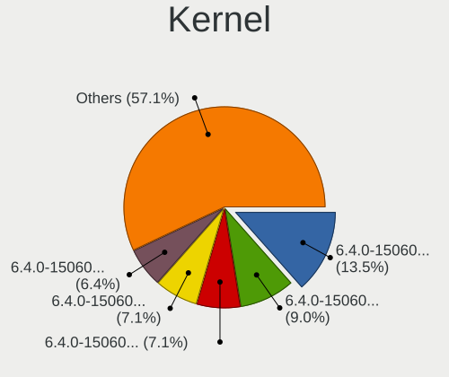

| Version                          | Notebooks | Percent |
|----------------------------------|-----------|---------|
| 6.4.0-150600.23.25-default       | 21        | 13.46%  |
| 6.4.0-150600.23.17-default       | 14        | 8.97%   |
| 6.4.0-150600.23.33-default       | 11        | 7.05%   |
| 6.4.0-150600.21-default          | 11        | 7.05%   |
| 6.4.0-150600.23.47-default       | 10        | 6.41%   |
| 6.4.0-150600.23.38-default       | 10        | 6.41%   |
| 6.4.0-150600.23.14-default       | 9         | 5.77%   |
| 6.4.0-150600.23.53-default       | 8         | 5.13%   |
| 6.4.0-150600.23.50-default       | 8         | 5.13%   |
| 6.4.0-150600.23.30-default       | 7         | 4.49%   |
| 6.4.0-150600.23.42-default       | 6         | 3.85%   |
| 6.4.0-150600.23.7-default        | 5         | 3.21%   |
| 6.4.0-150600.23.65-default       | 5         | 3.21%   |
| 6.4.0-150600.23.60-default       | 5         | 3.21%   |
| 6.4.0-150600.23.22-default       | 5         | 3.21%   |
| 6.4.0-150600.23.73-default       | 4         | 2.56%   |
| 6.4.0-150600.23.70-default       | 3         | 1.92%   |
| 6.4.0-150600.23.78-default       | 2         | 1.28%   |
| 6.4.0-150600.12-default          | 2         | 1.28%   |
| 6.4.0-150600.1-default           | 2         | 1.28%   |
| 6.4.0-150600.4-default           | 1         | 0.64%   |
| 6.4.0-150600.23.81-default       | 1         | 0.64%   |
| 6.4.0-150600.20-default          | 1         | 0.64%   |
| 6.4.0-150600.10-default          | 1         | 0.64%   |
| 6.17.8-lp156.6.gb980365-default  | 1         | 0.64%   |
| 6.14.2-lp156.10.g9881558-default | 1         | 0.64%   |
| 6.13.4-lp156.2.g9f6800f-default  | 1         | 0.64%   |
| 5.14.21-150500.55.88-default     | 1         | 0.64%   |

Kernel Family
-------------

Linux kernel without a distro release

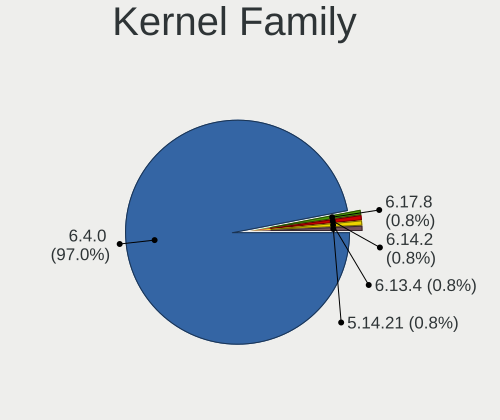

| Version | Notebooks | Percent |
|---------|-----------|---------|
| 6.4.0   | 128       | 96.97%  |
| 6.17.8  | 1         | 0.76%   |
| 6.14.2  | 1         | 0.76%   |
| 6.13.4  | 1         | 0.76%   |
| 5.14.21 | 1         | 0.76%   |

Kernel Major Ver.
-----------------

Linux kernel major version

| Version | Notebooks | Percent |
|---------|-----------|---------|
| 6.4     | 128       | 96.97%  |
| 6.17    | 1         | 0.76%   |
| 6.14    | 1         | 0.76%   |
| 6.13    | 1         | 0.76%   |
| 5.14    | 1         | 0.76%   |

Arch
----

OS architecture (x86_64, i586, etc.)

| Name   | Notebooks | Percent |
|--------|-----------|---------|
| x86_64 | 131       | 100%    |

DE
--

Desktop Environment

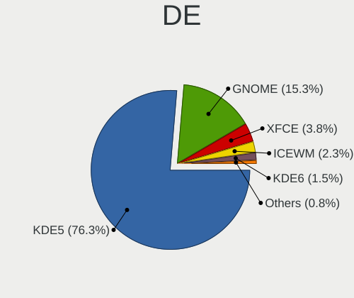

| Name    | Notebooks | Percent |
|---------|-----------|---------|
| KDE5    | 100       | 76.34%  |
| GNOME   | 20        | 15.27%  |
| XFCE    | 5         | 3.82%   |
| ICEWM   | 3         | 2.29%   |
| KDE6    | 2         | 1.53%   |
| Unknown | 1         | 0.76%   |

Display Server
--------------

X11 or Wayland

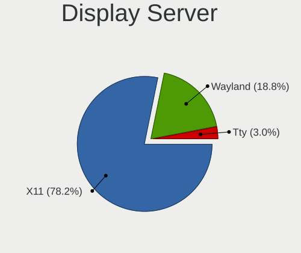

| Name    | Notebooks | Percent |
|---------|-----------|---------|
| X11     | 104       | 78.2%   |
| Wayland | 25        | 18.8%   |
| Tty     | 4         | 3.01%   |

Display Manager
---------------

SDDM, LightDM, etc.

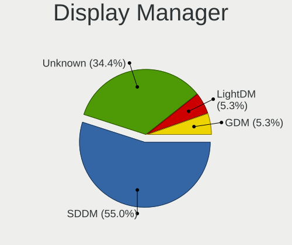

| Name    | Notebooks | Percent |
|---------|-----------|---------|
| SDDM    | 72        | 54.96%  |
| Unknown | 45        | 34.35%  |
| LightDM | 7         | 5.34%   |
| GDM     | 7         | 5.34%   |

OS Lang
-------

Language

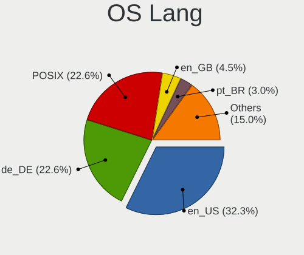

| Lang  | Notebooks | Percent |
|-------|-----------|---------|
| en_US | 43        | 32.33%  |
| POSIX | 30        | 22.56%  |
| de_DE | 30        | 22.56%  |
| en_GB | 6         | 4.51%   |
| pt_BR | 4         | 3.01%   |
| ru_RU | 3         | 2.26%   |
| fr_FR | 3         | 2.26%   |
| es_ES | 3         | 2.26%   |
| it_IT | 2         | 1.5%    |
| bg_BG | 2         | 1.5%    |
| sv_SE | 1         | 0.75%   |
| pt_PT | 1         | 0.75%   |
| nl_BE | 1         | 0.75%   |
| nb_NO | 1         | 0.75%   |
| ja_JP | 1         | 0.75%   |
| en_BW | 1         | 0.75%   |
| cs_CZ | 1         | 0.75%   |

Boot Mode
---------

EFI or BIOS

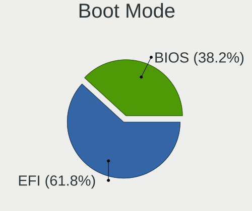

| Mode | Notebooks | Percent |
|------|-----------|---------|
| EFI  | 81        | 61.83%  |
| BIOS | 50        | 38.17%  |

Filesystem
----------

Type of filesystem

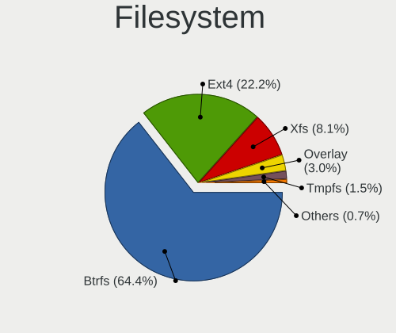

| Type    | Notebooks | Percent |
|---------|-----------|---------|
| Btrfs   | 87        | 64.44%  |
| Ext4    | 30        | 22.22%  |
| Xfs     | 11        | 8.15%   |
| Overlay | 4         | 2.96%   |
| Tmpfs   | 2         | 1.48%   |
| Ext2    | 1         | 0.74%   |

Part. scheme
------------

Scheme of partitioning

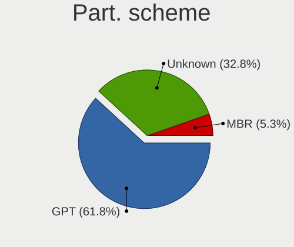

| Type    | Notebooks | Percent |
|---------|-----------|---------|
| GPT     | 81        | 61.83%  |
| Unknown | 43        | 32.82%  |
| MBR     | 7         | 5.34%   |

Dual Boot with Linux/BSD
------------------------

Hosting more than one Linux/BSD

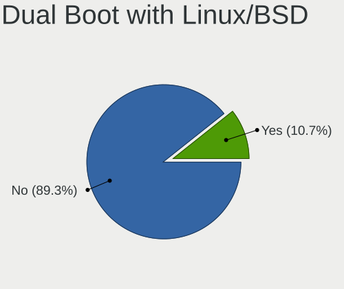

| Dual boot | Notebooks | Percent |
|-----------|-----------|---------|
| No        | 117       | 89.31%  |
| Yes       | 14        | 10.69%  |

Dual Boot (Win)
---------------

Hosting Linux and Windows

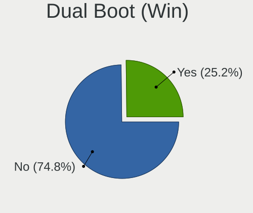

| Dual boot | Notebooks | Percent |
|-----------|-----------|---------|
| No        | 98        | 74.81%  |
| Yes       | 33        | 25.19%  |

Board
-----

Vendor
------

Motherboard manufacturer

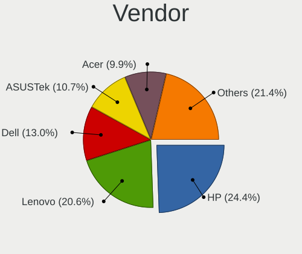

| Name                | Notebooks | Percent |
|---------------------|-----------|---------|
| Hewlett-Packard     | 32        | 24.43%  |
| Lenovo              | 27        | 20.61%  |
| Dell                | 17        | 12.98%  |
| ASUSTek Computer    | 14        | 10.69%  |
| Acer                | 13        | 9.92%   |
| Apple               | 7         | 5.34%   |
| Toshiba             | 4         | 3.05%   |
| Notebook            | 3         | 2.29%   |
| Medion              | 2         | 1.53%   |
| HUAWEI              | 2         | 1.53%   |
| Alienware           | 2         | 1.53%   |
| Wortmann AG         | 1         | 0.76%   |
| TUXEDO              | 1         | 0.76%   |
| Samsung Electronics | 1         | 0.76%   |
| Positivo            | 1         | 0.76%   |
| Panasonic           | 1         | 0.76%   |
| Inter Sales A/S     | 1         | 0.76%   |
| Google              | 1         | 0.76%   |
| Unknown             | 1         | 0.76%   |

Model
-----

Motherboard model

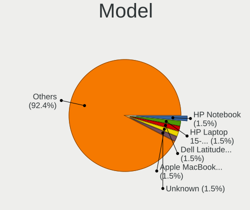

| Name                                        | Notebooks | Percent |
|---------------------------------------------|-----------|---------|
| HP Notebook                                 | 2         | 1.53%   |
| HP Laptop 15-fd0xxx                         | 2         | 1.53%   |
| Dell Latitude 5320                          | 2         | 1.53%   |
| Apple MacBookAir6,2                         | 2         | 1.53%   |
| Unknown                                     | 2         | 1.53%   |
| Wortmann AG 1220571_1470066                 | 1         | 0.76%   |
| TUXEDO InfinityBook Pro Intel Gen9          | 1         | 0.76%   |
| Toshiba Satellite U400                      | 1         | 0.76%   |
| Toshiba Satellite Pro C50-A-1L6             | 1         | 0.76%   |
| Toshiba Satellite L775D                     | 1         | 0.76%   |
| Toshiba Satellite C45-A                     | 1         | 0.76%   |
| Samsung 340XAA/350XAA/550XAA                | 1         | 0.76%   |
| Positivo C8256AI-14                         | 1         | 0.76%   |
| Panasonic FZ40-1                            | 1         | 0.76%   |
| Notebook NS50_70MU                          | 1         | 0.76%   |
| Notebook NLx0MU                             | 1         | 0.76%   |
| Notebook NKx0Kx                             | 1         | 0.76%   |
| Medion E15433                               | 1         | 0.76%   |
| Lenovo Y520-15IKBN 80WK                     | 1         | 0.76%   |
| Lenovo ThinkPad X280 20KES1L700             | 1         | 0.76%   |
| Lenovo ThinkPad X270 W10DG 20K6S0X900       | 1         | 0.76%   |
| Lenovo ThinkPad X240 20ALA0NCJP             | 1         | 0.76%   |
| Lenovo ThinkPad X1 Carbon Gen 13 21NS0010MZ | 1         | 0.76%   |
| Lenovo ThinkPad T520 4242CF2                | 1         | 0.76%   |
| Lenovo ThinkPad T480s 20L8002TMX            | 1         | 0.76%   |
| Lenovo ThinkPad T16 Gen 2 21HH002WGE        | 1         | 0.76%   |
| Lenovo ThinkPad T16 Gen 1 21BWS1JE00        | 1         | 0.76%   |
| Lenovo ThinkPad T15g Gen 2i 20YS005UUS      | 1         | 0.76%   |
| Lenovo ThinkPad T14 Gen 3 21AHCTO1WW        | 1         | 0.76%   |
| Lenovo ThinkPad SL 2746EHG                  | 1         | 0.76%   |
| Lenovo ThinkPad S1 Yoga 12 20DKS1MA00       | 1         | 0.76%   |
| Lenovo ThinkPad P14s Gen 4 21K5S03P00       | 1         | 0.76%   |
| Lenovo ThinkPad E16 Gen 2 21M5CTO1WW        | 1         | 0.76%   |
| Lenovo ThinkPad E14 Gen 6 21M70015CK        | 1         | 0.76%   |
| Lenovo Legion Pro 7 16ARX8H 82WS            | 1         | 0.76%   |
| Lenovo Legion 5 Pro 16ACH6H 82JQ            | 1         | 0.76%   |
| Lenovo IdeaPad Z510 20287                   | 1         | 0.76%   |
| Lenovo IdeaPad Slim 5 16AHP9 83DD           | 1         | 0.76%   |
| Lenovo IdeaPad Slim 3 15ABR8 82XM           | 1         | 0.76%   |
| Lenovo IdeaPad 5 Pro 16ARH7 82SN            | 1         | 0.76%   |

Model Family
------------

Motherboard model prefix

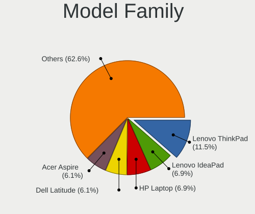

| Name                        | Notebooks | Percent |
|-----------------------------|-----------|---------|
| Lenovo ThinkPad             | 15        | 11.45%  |
| Lenovo IdeaPad              | 9         | 6.87%   |
| HP Laptop                   | 9         | 6.87%   |
| Dell Latitude               | 8         | 6.11%   |
| Acer Aspire                 | 8         | 6.11%   |
| HP EliteBook                | 7         | 5.34%   |
| ASUS VivoBook               | 6         | 4.58%   |
| Toshiba Satellite           | 4         | 3.05%   |
| HP Pavilion                 | 4         | 3.05%   |
| Dell Precision              | 4         | 3.05%   |
| Dell Inspiron               | 3         | 2.29%   |
| Lenovo Legion               | 2         | 1.53%   |
| HP ZBook                    | 2         | 1.53%   |
| HP ProBook                  | 2         | 1.53%   |
| HP Notebook                 | 2         | 1.53%   |
| HP ENVY                     | 2         | 1.53%   |
| ASUS ASUS                   | 2         | 1.53%   |
| Apple MacBookPro11          | 2         | 1.53%   |
| Apple MacBookAir6           | 2         | 1.53%   |
| Acer Swift                  | 2         | 1.53%   |
| Acer Nitro                  | 2         | 1.53%   |
| Unknown                     | 2         | 1.53%   |
| Wortmann AG 1220571         | 1         | 0.76%   |
| TUXEDO InfinityBook         | 1         | 0.76%   |
| Samsung 340XAA              | 1         | 0.76%   |
| Positivo C8256AI-14         | 1         | 0.76%   |
| Panasonic FZ40-1            | 1         | 0.76%   |
| Notebook NS50               | 1         | 0.76%   |
| Notebook NLx0MU             | 1         | 0.76%   |
| Notebook NKx0Kx             | 1         | 0.76%   |
| Medion E15433               | 1         | 0.76%   |
| Lenovo Y520-15IKBN          | 1         | 0.76%   |
| Inter Sales A/S NID-11125DE | 1         | 0.76%   |
| HUAWEI MCLG-XX              | 1         | 0.76%   |
| HUAWEI KLVL-WXXW            | 1         | 0.76%   |
| HP Victus                   | 1         | 0.76%   |
| HP OMEN                     | 1         | 0.76%   |
| HP Compaq                   | 1         | 0.76%   |
| HP 245                      | 1         | 0.76%   |
| Google Eve                  | 1         | 0.76%   |

MFG Year
--------

Motherboard manufacture year

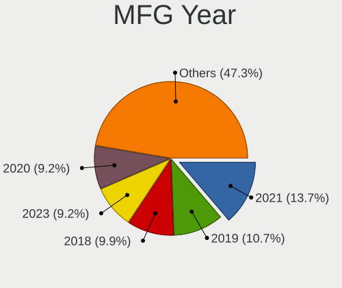

| Year | Notebooks | Percent |
|------|-----------|---------|
| 2021 | 18        | 13.74%  |
| 2019 | 14        | 10.69%  |
| 2018 | 13        | 9.92%   |
| 2023 | 12        | 9.16%   |
| 2020 | 12        | 9.16%   |
| 2013 | 10        | 7.63%   |
| 2022 | 9         | 6.87%   |
| 2024 | 8         | 6.11%   |
| 2016 | 7         | 5.34%   |
| 2015 | 6         | 4.58%   |
| 2014 | 6         | 4.58%   |
| 2017 | 5         | 3.82%   |
| 2011 | 5         | 3.82%   |
| 2008 | 3         | 2.29%   |
| 2025 | 1         | 0.76%   |
| 2012 | 1         | 0.76%   |
| 2009 | 1         | 0.76%   |

Form Factor
-----------

Physical design of the computer

| Name     | Notebooks | Percent |
|----------|-----------|---------|
| Notebook | 131       | 100%    |

Secure Boot
-----------

Enabled or disabled

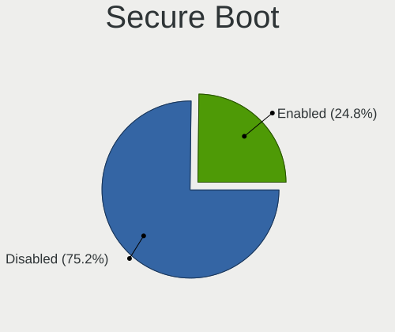

| State    | Notebooks | Percent |
|----------|-----------|---------|
| Disabled | 100       | 75.19%  |
| Enabled  | 33        | 24.81%  |

Coreboot
--------

Have coreboot on board

| Used | Notebooks | Percent |
|------|-----------|---------|
| No   | 130       | 99.24%  |
| Yes  | 1         | 0.76%   |

RAM Size
--------

Total RAM memory

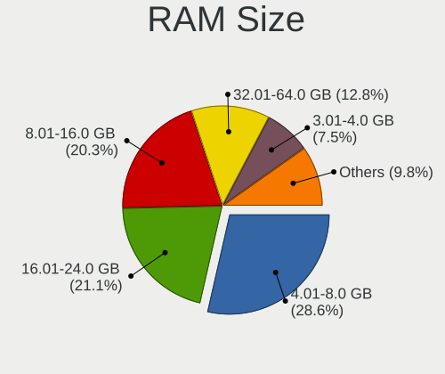

| Size in GB  | Notebooks | Percent |
|-------------|-----------|---------|
| 4.01-8.0    | 38        | 28.57%  |
| 16.01-24.0  | 28        | 21.05%  |
| 8.01-16.0   | 27        | 20.3%   |
| 32.01-64.0  | 17        | 12.78%  |
| 3.01-4.0    | 10        | 7.52%   |
| 24.01-32.0  | 8         | 6.02%   |
| 2.01-3.0    | 3         | 2.26%   |
| 64.01-256.0 | 2         | 1.5%    |

RAM Used
--------

Used RAM memory

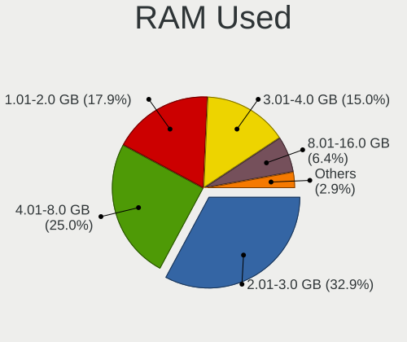

| Used GB    | Notebooks | Percent |
|------------|-----------|---------|
| 2.01-3.0   | 46        | 32.86%  |
| 4.01-8.0   | 35        | 25%     |
| 1.01-2.0   | 25        | 17.86%  |
| 3.01-4.0   | 21        | 15%     |
| 8.01-16.0  | 9         | 6.43%   |
| 0.51-1.0   | 3         | 2.14%   |
| 16.01-24.0 | 1         | 0.71%   |

Total Drives
------------

Number of drives on board

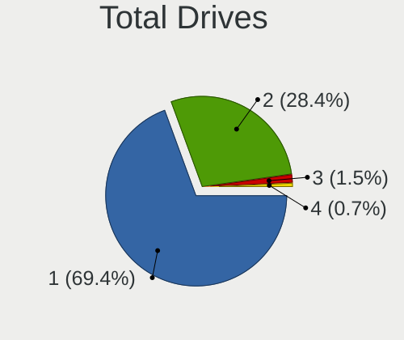

| Drives | Notebooks | Percent |
|--------|-----------|---------|
| 1      | 93        | 69.4%   |
| 2      | 38        | 28.36%  |
| 3      | 2         | 1.49%   |
| 4      | 1         | 0.75%   |

Has CD-ROM
----------

Has CD-ROM on board

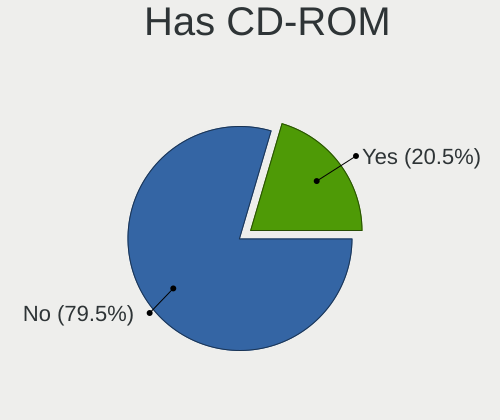

| Presented | Notebooks | Percent |
|-----------|-----------|---------|
| No        | 105       | 79.55%  |
| Yes       | 27        | 20.45%  |

Has Ethernet
------------

Has Ethernet on board

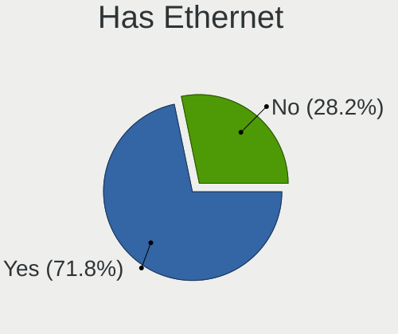

| Presented | Notebooks | Percent |
|-----------|-----------|---------|
| Yes       | 94        | 71.76%  |
| No        | 37        | 28.24%  |

Has WiFi
--------

Has WiFi module

| Presented | Notebooks | Percent |
|-----------|-----------|---------|
| Yes       | 128       | 97.71%  |
| No        | 3         | 2.29%   |

Has Bluetooth
-------------

Has Bluetooth module

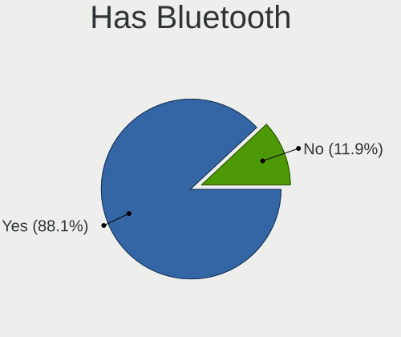

| Presented | Notebooks | Percent |
|-----------|-----------|---------|
| Yes       | 118       | 88.06%  |
| No        | 16        | 11.94%  |

Location
--------

Country
-------

Geographic location (country)

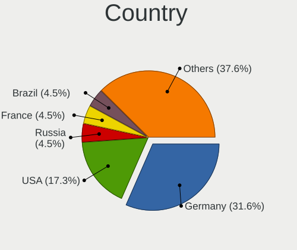

| Country     | Notebooks | Percent |
|-------------|-----------|---------|
| Germany     | 42        | 31.58%  |
| USA         | 23        | 17.29%  |
| Russia      | 6         | 4.51%   |
| France      | 6         | 4.51%   |
| Brazil      | 6         | 4.51%   |
| Spain       | 5         | 3.76%   |
| UK          | 4         | 3.01%   |
| Switzerland | 3         | 2.26%   |
| Italy       | 3         | 2.26%   |
| Vietnam     | 2         | 1.5%    |
| Sweden      | 2         | 1.5%    |
| Japan       | 2         | 1.5%    |
| Hungary     | 2         | 1.5%    |
| Canada      | 2         | 1.5%    |
| Bulgaria    | 2         | 1.5%    |
| Belgium     | 2         | 1.5%    |
| Ukraine     | 1         | 0.75%   |
| UAE         | 1         | 0.75%   |
| Turkey      | 1         | 0.75%   |
| Tunisia     | 1         | 0.75%   |
| Slovakia    | 1         | 0.75%   |
| Senegal     | 1         | 0.75%   |
| Portugal    | 1         | 0.75%   |
| Poland      | 1         | 0.75%   |
| Peru        | 1         | 0.75%   |
| Norway      | 1         | 0.75%   |
| Netherlands | 1         | 0.75%   |
| Malaysia    | 1         | 0.75%   |
| Latvia      | 1         | 0.75%   |
| Kazakhstan  | 1         | 0.75%   |
| India       | 1         | 0.75%   |
| Iceland     | 1         | 0.75%   |
| Czechia     | 1         | 0.75%   |
| Cuba        | 1         | 0.75%   |
| Chile       | 1         | 0.75%   |
| Austria     | 1         | 0.75%   |
| Australia   | 1         | 0.75%   |

City
----

Geographic location (city)

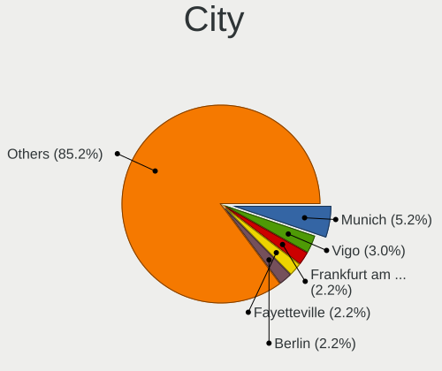

| City              | Notebooks | Percent |
|-------------------|-----------|---------|
| Munich            | 7         | 5.19%   |
| Vigo              | 4         | 2.96%   |
| Frankfurt am Main | 3         | 2.22%   |
| Fayetteville      | 3         | 2.22%   |
| Berlin            | 3         | 2.22%   |
| Zittau            | 2         | 1.48%   |
| St Louis          | 2         | 1.48%   |
| Sofia             | 2         | 1.48%   |
| Budapest          | 2         | 1.48%   |
| Ballwin           | 2         | 1.48%   |
| Zurich            | 1         | 0.74%   |
| Wroclaw           | 1         | 0.74%   |
| Vienna            | 1         | 0.74%   |
| Umirim            | 1         | 0.74%   |
| Tranent           | 1         | 0.74%   |
| Tokyo             | 1         | 0.74%   |
| Thun              | 1         | 0.74%   |
| Swindon           | 1         | 0.74%   |
| Stuttgart         | 1         | 0.74%   |
| Strasbourg        | 1         | 0.74%   |
| Stockholm         | 1         | 0.74%   |
| Stavanger         | 1         | 0.74%   |
| St Petersburg     | 1         | 0.74%   |
| Southwark         | 1         | 0.74%   |
| Soltau            | 1         | 0.74%   |
| Sharjah           | 1         | 0.74%   |
| Schweinfurt       | 1         | 0.74%   |
| San Bonifacio     | 1         | 0.74%   |
| Rostock           | 1         | 0.74%   |
| Roemerberg        | 1         | 0.74%   |
| Rockledge         | 1         | 0.74%   |
| Riga              | 1         | 0.74%   |
| Reutov            | 1         | 0.74%   |
| Prague            | 1         | 0.74%   |
| Pouzay            | 1         | 0.74%   |
| Pitrufquen        | 1         | 0.74%   |
| Pisa              | 1         | 0.74%   |
| Pirapetinga       | 1         | 0.74%   |
| Phoenix           | 1         | 0.74%   |
| Perm              | 1         | 0.74%   |

Drives
------

Drive Vendor
------------

Hard drive vendors

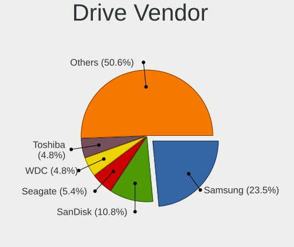

| Vendor                      | Notebooks | Drives | Percent |
|-----------------------------|-----------|--------|---------|
| Samsung Electronics         | 39        | 62     | 23.49%  |
| SanDisk                     | 18        | 22     | 10.84%  |
| Seagate                     | 9         | 13     | 5.42%   |
| WDC                         | 8         | 8      | 4.82%   |
| Toshiba                     | 8         | 8      | 4.82%   |
| SK hynix                    | 7         | 7      | 4.22%   |
| Unknown                     | 6         | 6      | 3.61%   |
| KIOXIA                      | 6         | 6      | 3.61%   |
| HGST                        | 6         | 7      | 3.61%   |
| Intel                       | 5         | 6      | 3.01%   |
| Crucial                     | 5         | 5      | 3.01%   |
| Apple                       | 5         | 6      | 3.01%   |
| Micron Technology           | 4         | 6      | 2.41%   |
| Kingston                    | 4         | 4      | 2.41%   |
| A-DATA Technology           | 3         | 3      | 1.81%   |
| USB                         | 2         | 3      | 1.2%    |
| PNY                         | 2         | 2      | 1.2%    |
| Phison Electronics          | 2         | 2      | 1.2%    |
| MAXIO Technology (Hangzhou) | 2         | 5      | 1.2%    |
| Intenso                     | 2         | 3      | 1.2%    |
| China                       | 2         | 2      | 1.2%    |
| Verbatim                    | 1         | 1      | 0.6%    |
| Transcend                   | 1         | 1      | 0.6%    |
| SSK Port                    | 1         | 1      | 0.6%    |
| SPCC                        | 1         | 1      | 0.6%    |
| SOLIDIGM                    | 1         | 2      | 0.6%    |
| Solid State Storage         | 1         | 1      | 0.6%    |
| Silicon Motion              | 1         | 1      | 0.6%    |
| Plextor                     | 1         | 1      | 0.6%    |
| Phison                      | 1         | 1      | 0.6%    |
| MS310                       | 1         | 1      | 0.6%    |
| Micron/Crucial Technology   | 1         | 1      | 0.6%    |
| MAXSUN                      | 1         | 1      | 0.6%    |
| LITEON                      | 1         | 5      | 0.6%    |
| Lexar                       | 1         | 1      | 0.6%    |
| Leven                       | 1         | 1      | 0.6%    |
| Kingston Technology Company | 1         | 2      | 0.6%    |
| KingSpec                    | 1         | 1      | 0.6%    |
| Hewlett-Packard             | 1         | 1      | 0.6%    |
| External                    | 1         | 1      | 0.6%    |

Drive Model
-----------

Hard drive models

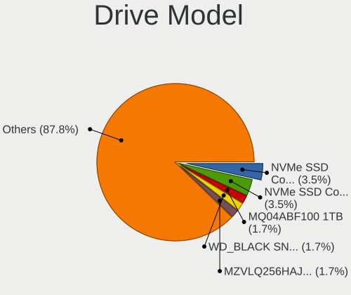

| Model                                              | Notebooks | Percent |
|----------------------------------------------------|-----------|---------|
| Samsung NVMe SSD Controller SM981/PM981/PM983 1TB  | 6         | 3.49%   |
| Samsung NVMe SSD Controller PM9A1/PM9A3/980PRO 1TB | 6         | 3.49%   |
| Toshiba MQ04ABF100 1TB                             | 3         | 1.74%   |
| Sandisk WD_BLACK SN770 2TB                         | 3         | 1.74%   |
| Samsung MZVLQ256HAJD-000H1 256GB                   | 3         | 1.74%   |
| HGST HTS721010A9E630 1TB                           | 3         | 1.74%   |
| Unknown MMC Card  512GB                            | 2         | 1.16%   |
| Seagate ST2000LM003 HN-M201RAD 2TB                 | 2         | 1.16%   |
| Seagate ST1000LM048-2E7172 1TB                     | 2         | 1.16%   |
| Sandisk WD Blue SN570 2TB                          | 2         | 1.16%   |
| Sandisk WD Blue SN500 / PC SN520 NVMe SSD 128GB    | 2         | 1.16%   |
| Sandisk WD Black SN750 / PC SN730 NVMe SSD 500GB   | 2         | 1.16%   |
| Samsung SSD 990 PRO 4TB                            | 2         | 1.16%   |
| Samsung SSD 860 EVO 1TB                            | 2         | 1.16%   |
| Samsung MZVL4256HBJD-00BH1 256GB                   | 2         | 1.16%   |
| Samsung MZAL81T0HDLB-00BLL 1TB                     | 2         | 1.16%   |
| Phison PS5013 E13 NVMe Controller 500GB            | 2         | 1.16%   |
| Micron 2400_MTFDKBA512QFM 512GB                    | 2         | 1.16%   |
| KIOXIA EXCERIA PLUS G3 SSD 1TB                     | 2         | 1.16%   |
| Crucial CT1000MX500SSD1 1TB                        | 2         | 1.16%   |
| Apple SSD SD0128F 121GB                            | 2         | 1.16%   |
| WDC WDS250G1B0A-00H9H0 250GB SSD                   | 1         | 0.58%   |
| WDC WD10SPZX-60Z10T0 1TB                           | 1         | 0.58%   |
| WDC WD10SPZX-24Z10 1TB                             | 1         | 0.58%   |
| WDC WD10SPZX-21Z10T0 1TB                           | 1         | 0.58%   |
| WDC WD10JPVX-60JC3T1 1TB                           | 1         | 0.58%   |
| WDC WD10JPVX-00JC3T0 1TB                           | 1         | 0.58%   |
| WDC WD10 JPVX-75JC3T0 1TB                          | 1         | 0.58%   |
| WDC PC SN730 SDBPNTY-512G-1006 512GB               | 1         | 0.58%   |
| Verbatim Vi560 S3 512GB SSD                        | 1         | 0.58%   |
| USB SanDisk 3.2Gen1 496GB                          | 1         | 0.58%   |
| USB Disk 500GB                                     | 1         | 0.58%   |
| Unknown MMC Card  64GB                             | 1         | 0.58%   |
| Unknown MMC Card  250GB                            | 1         | 0.58%   |
| Unknown MMC Card  16GB                             | 1         | 0.58%   |
| Unknown MMC Card  128GB                            | 1         | 0.58%   |
| Transcend TS128GSSD230S 128GB                      | 1         | 0.58%   |
| Toshiba XG4 NVMe SSD Controller 256GB              | 1         | 0.58%   |
| Toshiba MQ01ABF050 500GB                           | 1         | 0.58%   |
| Toshiba MQ01ABD100 1TB                             | 1         | 0.58%   |

HDD Vendor
----------

Hard disk drive vendors

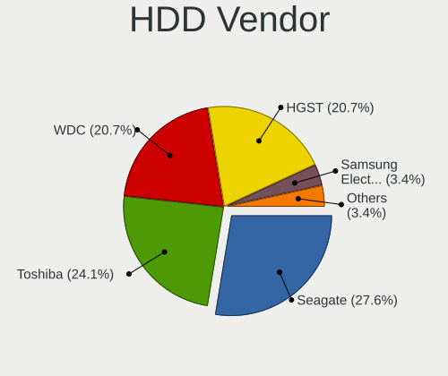

| Vendor              | Notebooks | Drives | Percent |
|---------------------|-----------|--------|---------|
| Seagate             | 8         | 10     | 27.59%  |
| Toshiba             | 7         | 7      | 24.14%  |
| WDC                 | 6         | 6      | 20.69%  |
| HGST                | 6         | 7      | 20.69%  |
| Samsung Electronics | 1         | 1      | 3.45%   |
| External            | 1         | 1      | 3.45%   |

SSD Vendor
----------

Solid state drive vendors

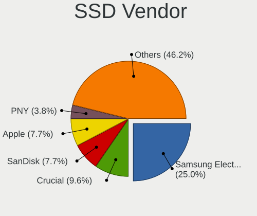

| Vendor              | Notebooks | Drives | Percent |
|---------------------|-----------|--------|---------|
| Samsung Electronics | 13        | 27     | 25%     |
| Crucial             | 5         | 5      | 9.62%   |
| SanDisk             | 4         | 4      | 7.69%   |
| Apple               | 4         | 4      | 7.69%   |
| PNY                 | 2         | 2      | 3.85%   |
| Kingston            | 2         | 2      | 3.85%   |
| Intenso             | 2         | 3      | 3.85%   |
| China               | 2         | 2      | 3.85%   |
| A-DATA Technology   | 2         | 2      | 3.85%   |
| WDC                 | 1         | 1      | 1.92%   |
| Verbatim            | 1         | 1      | 1.92%   |
| Transcend           | 1         | 1      | 1.92%   |
| SSK Port            | 1         | 1      | 1.92%   |
| SPCC                | 1         | 1      | 1.92%   |
| SK hynix            | 1         | 1      | 1.92%   |
| Plextor             | 1         | 1      | 1.92%   |
| Phison              | 1         | 1      | 1.92%   |
| MS310               | 1         | 1      | 1.92%   |
| MAXSUN              | 1         | 1      | 1.92%   |
| LITEON              | 1         | 5      | 1.92%   |
| Lexar               | 1         | 1      | 1.92%   |
| Leven               | 1         | 1      | 1.92%   |
| KingSpec            | 1         | 1      | 1.92%   |
| Intel               | 1         | 2      | 1.92%   |
| Hewlett-Packard     | 1         | 1      | 1.92%   |

Drive Kind
----------

HDD or SSD

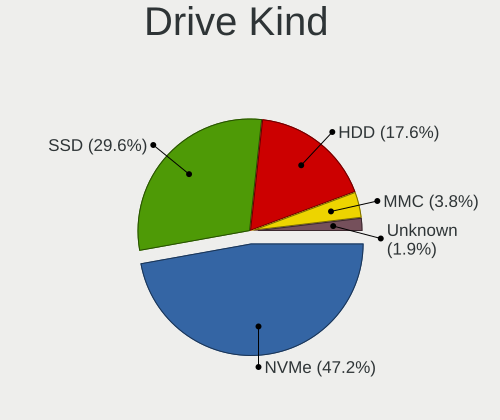

| Kind    | Notebooks | Drives | Percent |
|---------|-----------|--------|---------|
| NVMe    | 75        | 97     | 47.17%  |
| SSD     | 47        | 72     | 29.56%  |
| HDD     | 28        | 32     | 17.61%  |
| MMC     | 6         | 6      | 3.77%   |
| Unknown | 3         | 6      | 1.89%   |

Drive Connector
---------------

SATA, SAS, NVMe, etc.

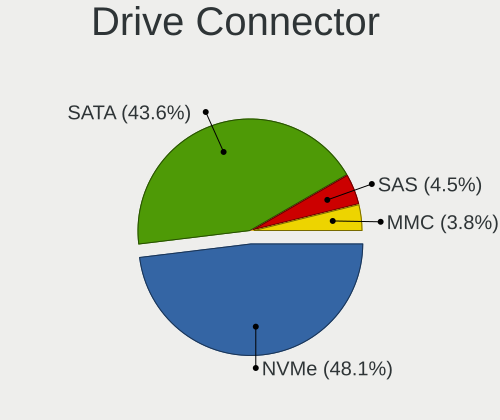

| Type | Notebooks | Drives | Percent |
|------|-----------|--------|---------|
| NVMe | 75        | 97     | 48.08%  |
| SATA | 68        | 97     | 43.59%  |
| SAS  | 7         | 13     | 4.49%   |
| MMC  | 6         | 6      | 3.85%   |

Drive Size
----------

Size of hard drive

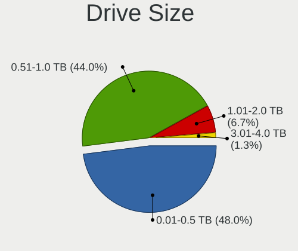

| Size in TB | Notebooks | Drives | Percent |
|------------|-----------|--------|---------|
| 0.01-0.5   | 36        | 59     | 48%     |
| 0.51-1.0   | 33        | 37     | 44%     |
| 1.01-2.0   | 5         | 6      | 6.67%   |
| 3.01-4.0   | 1         | 2      | 1.33%   |

Space Total
-----------

Amount of disk space available on the file system

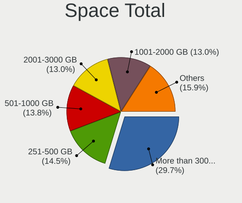

| Size in GB     | Notebooks | Percent |
|----------------|-----------|---------|
| More than 3000 | 41        | 29.71%  |
| 251-500        | 20        | 14.49%  |
| 501-1000       | 19        | 13.77%  |
| 2001-3000      | 18        | 13.04%  |
| 1001-2000      | 18        | 13.04%  |
| 101-250        | 15        | 10.87%  |
| 51-100         | 3         | 2.17%   |
| 21-50          | 2         | 1.45%   |
| 1-20           | 1         | 0.72%   |
| Unknown        | 1         | 0.72%   |

Space Used
----------

Amount of used disk space

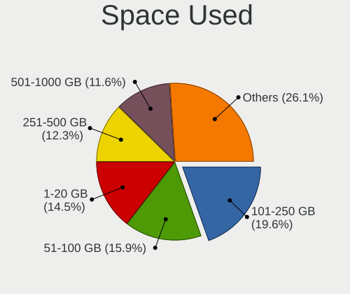

| Used GB        | Notebooks | Percent |
|----------------|-----------|---------|
| 101-250        | 27        | 19.57%  |
| 51-100         | 22        | 15.94%  |
| 1-20           | 20        | 14.49%  |
| 251-500        | 17        | 12.32%  |
| 501-1000       | 16        | 11.59%  |
| More than 3000 | 11        | 7.97%   |
| 21-50          | 10        | 7.25%   |
| 1001-2000      | 10        | 7.25%   |
| 2001-3000      | 4         | 2.9%    |
| Unknown        | 1         | 0.72%   |

Malfunc. Drives
---------------

Drive models with a malfunction

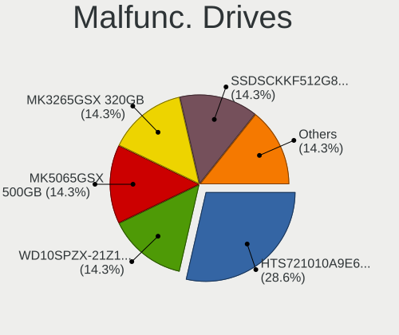

| Model                          | Notebooks | Drives | Percent |
|--------------------------------|-----------|--------|---------|
| HGST HTS721010A9E630 1TB       | 2         | 2      | 28.57%  |
| WDC WD10SPZX-21Z10T0 1TB       | 1         | 1      | 14.29%  |
| Toshiba MK5065GSX 500GB        | 1         | 1      | 14.29%  |
| Toshiba MK3265GSX 320GB        | 1         | 1      | 14.29%  |
| Intel SSDSCKKF512G8 SATA 512GB | 1         | 2      | 14.29%  |
| HGST HTS725050A7E630 500GB     | 1         | 1      | 14.29%  |

Malfunc. Drive Vendor
---------------------

Vendors of faulty drives

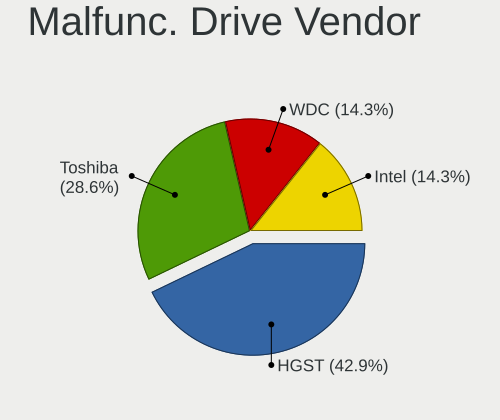

| Vendor  | Notebooks | Drives | Percent |
|---------|-----------|--------|---------|
| HGST    | 3         | 3      | 42.86%  |
| Toshiba | 2         | 2      | 28.57%  |
| WDC     | 1         | 1      | 14.29%  |
| Intel   | 1         | 2      | 14.29%  |

Malfunc. HDD Vendor
-------------------

Vendors of faulty HDD drives

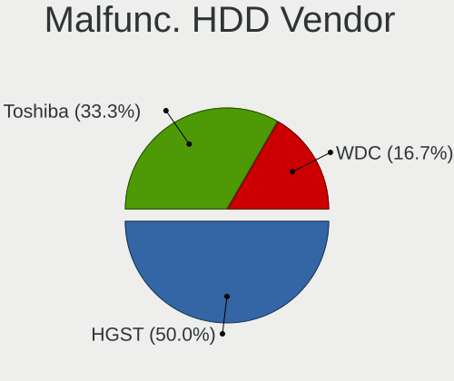

| Vendor  | Notebooks | Drives | Percent |
|---------|-----------|--------|---------|
| HGST    | 3         | 3      | 50%     |
| Toshiba | 2         | 2      | 33.33%  |
| WDC     | 1         | 1      | 16.67%  |

Malfunc. Drive Kind
-------------------

Kinds of faulty drives

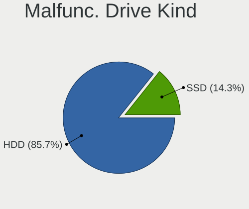

| Kind | Notebooks | Drives | Percent |
|------|-----------|--------|---------|
| HDD  | 6         | 6      | 85.71%  |
| SSD  | 1         | 2      | 14.29%  |

Failed Drives
-------------

Failed drive models

Zero info for selected period =(

Failed Drive Vendor
-------------------

Failed drive vendors

Zero info for selected period =(

Drive Status
------------

Number of failed and malfunc. drives

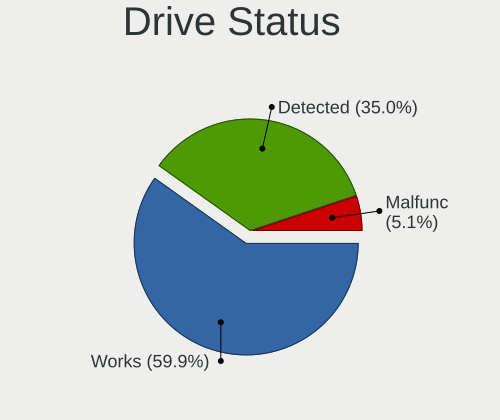

| Status   | Notebooks | Drives | Percent |
|----------|-----------|--------|---------|
| Works    | 82        | 106    | 59.85%  |
| Detected | 48        | 99     | 35.04%  |
| Malfunc  | 7         | 8      | 5.11%   |

Storage controller
------------------

Storage Vendor
--------------

Storage controller vendors

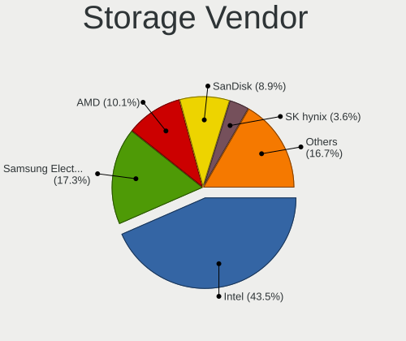

| Vendor                         | Notebooks | Percent |
|--------------------------------|-----------|---------|
| Intel                          | 73        | 43.45%  |
| Samsung Electronics            | 29        | 17.26%  |
| AMD                            | 17        | 10.12%  |
| SanDisk                        | 15        | 8.93%   |
| SK hynix                       | 6         | 3.57%   |
| KIOXIA                         | 6         | 3.57%   |
| Micron Technology              | 4         | 2.38%   |
| Kingston Technology Company    | 3         | 1.79%   |
| Phison Electronics             | 2         | 1.19%   |
| MAXIO Technology (Hangzhou)    | 2         | 1.19%   |
| Marvell Technology Group       | 2         | 1.19%   |
| ADATA Technology               | 2         | 1.19%   |
| Toshiba America Info Systems   | 1         | 0.6%    |
| Solidigm                       | 1         | 0.6%    |
| Solid State Storage Technology | 1         | 0.6%    |
| Silicon Motion                 | 1         | 0.6%    |
| Seagate Technology             | 1         | 0.6%    |
| Micron/Crucial Technology      | 1         | 0.6%    |
| Apple                          | 1         | 0.6%    |

Storage Model
-------------

Storage controller models

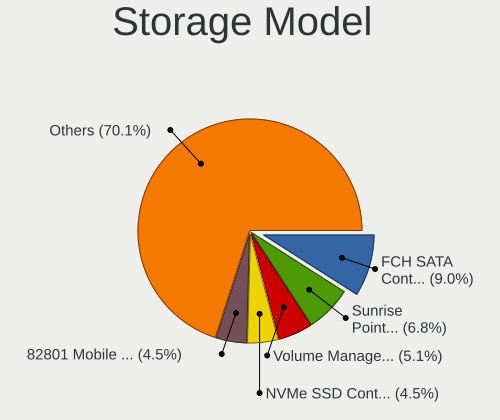

| Model                                                                            | Notebooks | Percent |
|----------------------------------------------------------------------------------|-----------|---------|
| AMD FCH SATA Controller [AHCI mode]                                              | 16        | 9.04%   |
| Intel Sunrise Point-LP SATA Controller [AHCI mode]                               | 12        | 6.78%   |
| Intel Volume Management Device NVMe RAID Controller                              | 9         | 5.08%   |
| Samsung NVMe SSD Controller 980 (DRAM-less)                                      | 8         | 4.52%   |
| Intel 82801 Mobile SATA Controller [RAID mode]                                   | 8         | 4.52%   |
| SanDisk WD SN560/SN740/SN770/SN5000 NVMe SSD                                     | 6         | 3.39%   |
| Samsung NVMe SSD Controller SM981/PM981/PM983                                    | 6         | 3.39%   |
| Samsung NVMe SSD Controller PM9A1/PM9A3/980PRO                                   | 6         | 3.39%   |
| Intel Tiger Lake-LP SATA Controller                                              | 5         | 2.82%   |
| Samsung NVMe SSD Controller PM9C1a (DRAM-less)                                   | 4         | 2.26%   |
| Intel HM170/QM170 Chipset SATA Controller [AHCI Mode]                            | 4         | 2.26%   |
| Intel 8 Series/C220 Series Chipset Family 6-port SATA Controller 1 [AHCI mode]   | 4         | 2.26%   |
| SK hynix Gold P31/BC711/PC711 NVMe Solid State Drive                             | 3         | 1.69%   |
| SanDisk Extreme Pro / WD Black SN750 / PC SN730 / Red SN700 NVMe SSD             | 3         | 1.69%   |
| Intel Q170/Q150/B150/H170/H110/Z170/CM236 Chipset SATA Controller [AHCI Mode]    | 3         | 1.69%   |
| Intel Cannon Lake Mobile PCH SATA AHCI Controller                                | 3         | 1.69%   |
| Intel 82801IBM/IEM (ICH9M/ICH9M-E) 4 port SATA Controller [AHCI mode]            | 3         | 1.69%   |
| Intel 8 Series SATA Controller 1 [AHCI mode]                                     | 3         | 1.69%   |
| Intel 6 Series/C200 Series Chipset Family 6 port Mobile SATA AHCI Controller     | 3         | 1.69%   |
| SanDisk WD Blue SN570 NVMe SSD 2TB                                               | 2         | 1.13%   |
| SanDisk WD Blue SN500 / PC SN520 x2 M.2 2280 NVMe SSD                            | 2         | 1.13%   |
| Samsung S4LN053X01 AHCI SSD Controller(Apple slot)                               | 2         | 1.13%   |
| Samsung NVMe SSD Controller S4LV008[Pascal]                                      | 2         | 1.13%   |
| Samsung NVMe SSD Controller PM9B1 (DRAM-less)                                    | 2         | 1.13%   |
| Phison PS5013-E13 PCIe3 NVMe Controller (DRAM-less)                              | 2         | 1.13%   |
| Micron 2400 NVMe SSD (DRAM-less)                                                 | 2         | 1.13%   |
| Marvell Group 88SS9183 PCIe SSD Controller                                       | 2         | 1.13%   |
| KIOXIA NVMe SSD Controller BG5 (DRAM-less)                                       | 2         | 1.13%   |
| KIOXIA NVMe SSD Controller BG4 (DRAM-less)                                       | 2         | 1.13%   |
| KIOXIA Exceria Plus G3 NVMe SSD (DRAM-less)                                      | 2         | 1.13%   |
| Intel Wildcat Point-LP SATA Controller [AHCI Mode]                               | 2         | 1.13%   |
| Intel Celeron N3350/Pentium N4200/Atom E3900 Series SATA AHCI Controller         | 2         | 1.13%   |
| Intel Atom/Celeron/Pentium Processor x5-E8000/J3xxx/N3xxx Series SATA Controller | 2         | 1.13%   |
| Intel Alder Lake-P SATA AHCI Controller                                          | 2         | 1.13%   |
| Intel 7 Series Chipset Family 6-port SATA Controller [AHCI mode]                 | 2         | 1.13%   |
| Toshiba America Info Systems XG4 NVMe SSD Controller                             | 1         | 0.56%   |
| Solidigm P41 Plus NVMe SSD (DRAM-less) [Echo Harbor]                             | 1         | 0.56%   |
| Solid State Storage CL1-3D256-Q11 NVMe SSD M.2                                   | 1         | 0.56%   |
| SK hynix PCB01 NVMe Solid State Drive                                            | 1         | 0.56%   |
| SK hynix PC401 NVMe Solid State Drive 256GB                                      | 1         | 0.56%   |

Storage Kind
------------

Kind of storage controller (IDE, SATA, NVMe, SAS, ...)

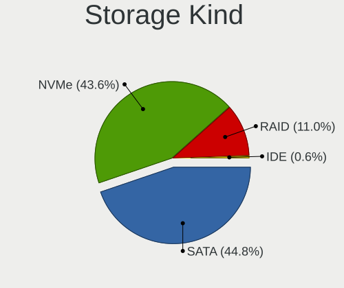

| Kind | Notebooks | Percent |
|------|-----------|---------|
| SATA | 77        | 44.77%  |
| NVMe | 75        | 43.6%   |
| RAID | 19        | 11.05%  |
| IDE  | 1         | 0.58%   |

Processor
---------

CPU Vendor
----------

Processor vendors

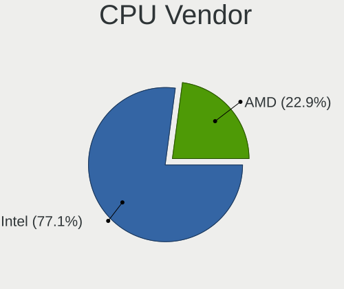

| Vendor | Notebooks | Percent |
|--------|-----------|---------|
| Intel  | 101       | 77.1%   |
| AMD    | 30        | 22.9%   |

CPU Model
---------

Processor models

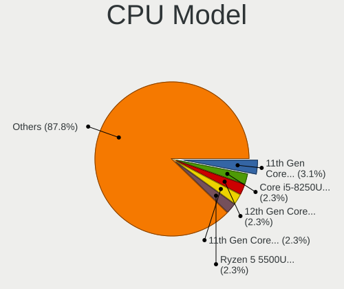

| Model                                         | Notebooks | Percent |
|-----------------------------------------------|-----------|---------|
| Intel 11th Gen Core i7-1165G7 @ 2.80GHz       | 4         | 3.05%   |
| Intel Core i5-8250U CPU @ 1.60GHz             | 3         | 2.29%   |
| Intel 12th Gen Core i3-1215U                  | 3         | 2.29%   |
| Intel 11th Gen Core i5-1145G7 @ 2.60GHz       | 3         | 2.29%   |
| AMD Ryzen 5 5500U with Radeon Graphics        | 3         | 2.29%   |
| Intel Core Ultra 7 155H                       | 2         | 1.53%   |
| Intel Core i7-8550U CPU @ 1.80GHz             | 2         | 1.53%   |
| Intel Core i7-6700HQ CPU @ 2.60GHz            | 2         | 1.53%   |
| Intel Core i7-1065G7 CPU @ 1.30GHz            | 2         | 1.53%   |
| Intel Core i5-8350U CPU @ 1.70GHz             | 2         | 1.53%   |
| Intel Core i5-8265U CPU @ 1.60GHz             | 2         | 1.53%   |
| Intel Core i5-6200U CPU @ 2.30GHz             | 2         | 1.53%   |
| Intel Core i5-4210U CPU @ 1.70GHz             | 2         | 1.53%   |
| Intel Core i5-4200M CPU @ 2.50GHz             | 2         | 1.53%   |
| Intel Core i5-10210U CPU @ 1.60GHz            | 2         | 1.53%   |
| Intel Celeron CPU N3350 @ 1.10GHz             | 2         | 1.53%   |
| Intel 11th Gen Core i7-1185G7 @ 3.00GHz       | 2         | 1.53%   |
| Intel 11th Gen Core i3-1115G4 @ 3.00GHz       | 2         | 1.53%   |
| AMD Ryzen 5 3500U with Radeon Vega Mobile Gfx | 2         | 1.53%   |
| AMD A6-9225 RADEON R4, 5 COMPUTE CORES 2C+3G  | 2         | 1.53%   |
| Intel Xeon W-11855M CPU @ 3.20GHz             | 1         | 0.76%   |
| Intel Xeon CPU E3-1505M v5 @ 2.80GHz          | 1         | 0.76%   |
| Intel Pentium Dual-Core CPU T4200 @ 2.00GHz   | 1         | 0.76%   |
| Intel Pentium CPU N3710 @ 1.60GHz             | 1         | 0.76%   |
| Intel Core Ultra 9 185H                       | 1         | 0.76%   |
| Intel Core Ultra 7 258V                       | 1         | 0.76%   |
| Intel Core Ultra 5 135U                       | 1         | 0.76%   |
| Intel Core m5-6Y57 CPU @ 1.10GHz              | 1         | 0.76%   |
| Intel Core m3-7Y30 CPU @ 1.00GHz              | 1         | 0.76%   |
| Intel Core m3-6Y30 CPU @ 0.90GHz              | 1         | 0.76%   |
| Intel Core i7-9750H CPU @ 2.60GHz             | 1         | 0.76%   |
| Intel Core i7-8850H CPU @ 2.60GHz             | 1         | 0.76%   |
| Intel Core i7-7820HQ CPU @ 2.90GHz            | 1         | 0.76%   |
| Intel Core i7-7700HQ CPU @ 2.80GHz            | 1         | 0.76%   |
| Intel Core i7-6920HQ CPU @ 2.90GHz            | 1         | 0.76%   |
| Intel Core i7-6820HQ CPU @ 2.70GHz            | 1         | 0.76%   |
| Intel Core i7-6500U CPU @ 2.50GHz             | 1         | 0.76%   |
| Intel Core i7-4810MQ CPU @ 2.80GHz            | 1         | 0.76%   |
| Intel Core i7-4750HQ CPU @ 2.00GHz            | 1         | 0.76%   |
| Intel Core i7-4710HQ CPU @ 2.50GHz            | 1         | 0.76%   |

CPU Model Family
----------------

Processor model prefix

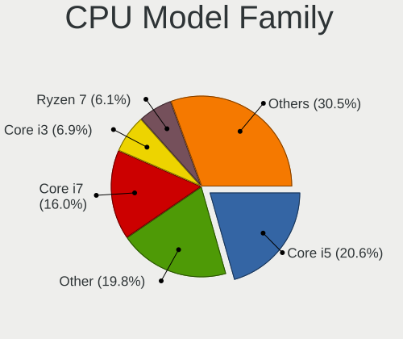

| Model                   | Notebooks | Percent |
|-------------------------|-----------|---------|
| Intel Core i5           | 27        | 20.61%  |
| Other                   | 26        | 19.85%  |
| Intel Core i7           | 21        | 16.03%  |
| Intel Core i3           | 9         | 6.87%   |
| AMD Ryzen 7             | 8         | 6.11%   |
| AMD Ryzen 5             | 7         | 5.34%   |
| Intel Core              | 5         | 3.82%   |
| Intel Celeron           | 4         | 3.05%   |
| AMD Ryzen 3             | 4         | 3.05%   |
| AMD A6                  | 3         | 2.29%   |
| Intel Xeon              | 2         | 1.53%   |
| Intel Core m3           | 2         | 1.53%   |
| Intel Core 2 Duo        | 2         | 1.53%   |
| AMD Ryzen 7 PRO         | 2         | 1.53%   |
| AMD A10                 | 2         | 1.53%   |
| Intel Pentium Dual-Core | 1         | 0.76%   |
| Intel Pentium           | 1         | 0.76%   |
| Intel Core m5           | 1         | 0.76%   |
| AMD Ryzen 9             | 1         | 0.76%   |
| AMD Athlon X2           | 1         | 0.76%   |
| AMD Athlon              | 1         | 0.76%   |
| AMD A8                  | 1         | 0.76%   |

CPU Cores
---------

Number of processor cores

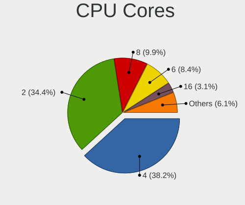

| Number | Notebooks | Percent |
|--------|-----------|---------|
| 4      | 50        | 38.17%  |
| 2      | 45        | 34.35%  |
| 8      | 13        | 9.92%   |
| 6      | 11        | 8.4%    |
| 16     | 4         | 3.05%   |
| 12     | 4         | 3.05%   |
| 10     | 4         | 3.05%   |

CPU Sockets
-----------

Number of sockets

| Number | Notebooks | Percent |
|--------|-----------|---------|
| 1      | 131       | 100%    |

CPU Threads
-----------

Threads per core (Hyper-Threading)

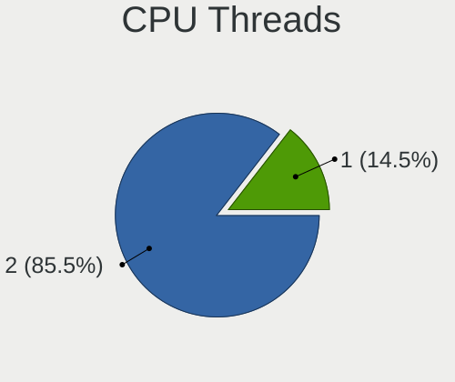

| Number | Notebooks | Percent |
|--------|-----------|---------|
| 2      | 112       | 85.5%   |
| 1      | 19        | 14.5%   |

CPU Op-Modes
------------

CPU Operation Modes (32-bit, 64-bit)

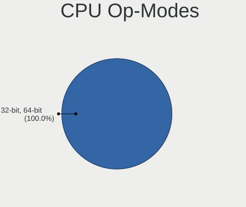

| Op mode        | Notebooks | Percent |
|----------------|-----------|---------|
| 32-bit, 64-bit | 131       | 100%    |

CPU Microcode
-------------

Microcode number

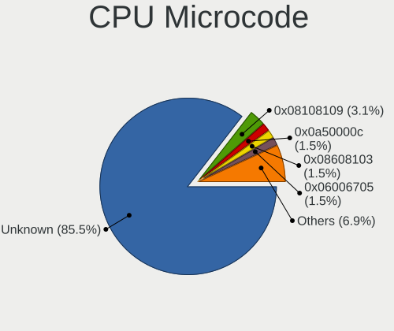

| Number     | Notebooks | Percent |
|------------|-----------|---------|
| Unknown    | 112       | 85.5%   |
| 0x08108109 | 4         | 3.05%   |
| 0x0a50000c | 2         | 1.53%   |
| 0x08608103 | 2         | 1.53%   |
| 0x06006705 | 2         | 1.53%   |
| 0x0a705203 | 1         | 0.76%   |
| 0x0a601206 | 1         | 0.76%   |
| 0x0a500011 | 1         | 0.76%   |
| 0x0a404107 | 1         | 0.76%   |
| 0x0a404102 | 1         | 0.76%   |
| 0x08608108 | 1         | 0.76%   |
| 0x08608102 | 1         | 0.76%   |
| 0x07030106 | 1         | 0.76%   |
| 0x06001119 | 1         | 0.76%   |

CPU Microarch
-------------

Microarchitecture

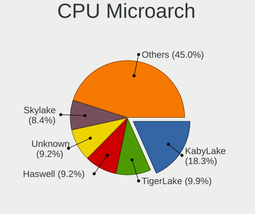

| Name              | Notebooks | Percent |
|-------------------|-----------|---------|
| KabyLake          | 24        | 18.32%  |
| TigerLake         | 13        | 9.92%   |
| Haswell           | 12        | 9.16%   |
| Unknown           | 12        | 9.16%   |
| Skylake           | 11        | 8.4%    |
| Alderlake Hybrid  | 9         | 6.87%   |
| Zen+              | 6         | 4.58%   |
| Zen 3             | 6         | 4.58%   |
| IceLake           | 6         | 4.58%   |
| Meteorlake Hybrid | 4         | 3.05%   |
| SandyBridge       | 3         | 2.29%   |
| Penryn            | 3         | 2.29%   |
| IvyBridge         | 3         | 2.29%   |
| Excavator         | 3         | 2.29%   |
| Broadwell         | 3         | 2.29%   |
| Silvermont        | 2         | 1.53%   |
| Goldmont          | 2         | 1.53%   |
| Zen               | 1         | 0.76%   |
| Westmere          | 1         | 0.76%   |
| Puma              | 1         | 0.76%   |
| Piledriver        | 1         | 0.76%   |
| Lunarlake Hybrid  | 1         | 0.76%   |
| K8 & K10 hybrid   | 1         | 0.76%   |
| K10 Llano         | 1         | 0.76%   |
| Gracemont         | 1         | 0.76%   |
| Goldmont plus     | 1         | 0.76%   |

Graphics
--------

GPU Vendor
----------

Vendors of graphics cards

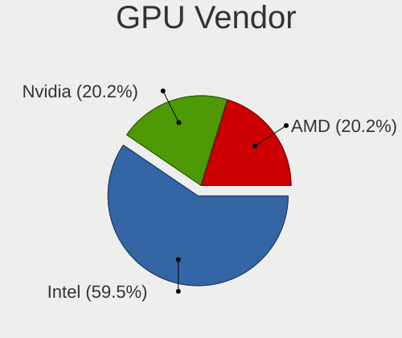

| Vendor | Notebooks | Percent |
|--------|-----------|---------|
| Intel  | 97        | 59.51%  |
| Nvidia | 33        | 20.25%  |
| AMD    | 33        | 20.25%  |

GPU Model
---------

Graphics card models

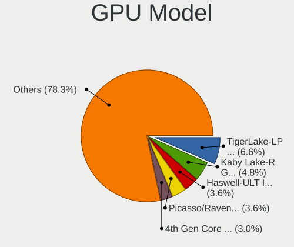

| Model                                                                                    | Notebooks | Percent |
|------------------------------------------------------------------------------------------|-----------|---------|
| Intel TigerLake-LP GT2 [Iris Xe Graphics]                                                | 11        | 6.63%   |
| Intel Kaby Lake-R GT2 [UHD Graphics 620]                                                 | 8         | 4.82%   |
| Intel Haswell-ULT Integrated Graphics Controller                                         | 6         | 3.61%   |
| AMD Picasso/Raven 2 [Radeon Vega Series / Radeon Vega Mobile Series]                     | 6         | 3.61%   |
| Intel 4th Gen Core Processor Integrated Graphics Controller                              | 5         | 3.01%   |
| AMD Lucienne                                                                             | 5         | 3.01%   |
| Intel Skylake-U GT2 [HD Graphics 520]                                                    | 4         | 2.41%   |
| Intel Skylake-H GT2 [HD Graphics 530]                                                    | 4         | 2.41%   |
| Intel CoffeeLake-H GT2 [UHD Graphics 630]                                                | 4         | 2.41%   |
| Intel Meteor Lake-P [Intel Arc Graphics]                                                 | 3         | 1.81%   |
| Intel CometLake-U GT2 [UHD Graphics]                                                     | 3         | 1.81%   |
| Intel Broadwell-U GT2 [HD Graphics 5500]                                                 | 3         | 1.81%   |
| Intel Alder Lake-UP3 GT1 [UHD Graphics]                                                  | 3         | 1.81%   |
| AMD Cezanne [Radeon Vega Series / Radeon Vega Mobile Series]                             | 3         | 1.81%   |
| Nvidia TU117M [GeForce GTX 1650 Mobile / Max-Q]                                          | 2         | 1.2%    |
| Nvidia GP108M [GeForce MX330]                                                            | 2         | 1.2%    |
| Nvidia GP108M [GeForce MX150]                                                            | 2         | 1.2%    |
| Nvidia GP107M [GeForce GTX 1050 Mobile]                                                  | 2         | 1.2%    |
| Nvidia GM108M [GeForce 940M]                                                             | 2         | 1.2%    |
| Nvidia GM107M [GeForce GTX 960M]                                                         | 2         | 1.2%    |
| Nvidia GA107M [GeForce RTX 3050 Mobile]                                                  | 2         | 1.2%    |
| Nvidia GA107BM / GN20-P0-R-K2 [GeForce RTX 3050 6GB Laptop GPU]                          | 2         | 1.2%    |
| Intel WhiskeyLake-U GT2 [UHD Graphics 620]                                               | 2         | 1.2%    |
| Intel Tiger Lake-LP GT2 [UHD Graphics G4]                                                | 2         | 1.2%    |
| Intel Skylake-Y GT2 [HD Graphics 515]                                                    | 2         | 1.2%    |
| Intel Mobile 4 Series Chipset Integrated Graphics Controller                             | 2         | 1.2%    |
| Intel Kaby Lake-Y GT2 [HD Graphics 615]                                                  | 2         | 1.2%    |
| Intel Kaby Lake-U GT2 [HD Graphics 620]                                                  | 2         | 1.2%    |
| Intel Kaby Lake-H GT2 [HD Graphics 630]                                                  | 2         | 1.2%    |
| Intel Iris Plus Graphics G7                                                              | 2         | 1.2%    |
| Intel Atom/Celeron/Pentium Processor x5-E8000/J3xxx/N3xxx Integrated Graphics Controller | 2         | 1.2%    |
| Intel Apollo Lake GT1 [HD Graphics 500]                                                  | 2         | 1.2%    |
| Intel Alder Lake-UP3 GT2 [Iris Xe Graphics]                                              | 2         | 1.2%    |
| Intel Alder Lake-P GT2 [Iris Xe Graphics]                                                | 2         | 1.2%    |
| Intel 3rd Gen Core processor Graphics Controller                                         | 2         | 1.2%    |
| Intel 2nd Generation Core Processor Family Integrated Graphics Controller                | 2         | 1.2%    |
| AMD Stoney [Radeon R2/R3/R4/R5 Graphics]                                                 | 2         | 1.2%    |
| AMD Rembrandt [Radeon 680M]                                                              | 2         | 1.2%    |
| AMD Barcelo                                                                              | 2         | 1.2%    |
| AMD Baffin [Radeon RX 460/560D / Pro 450/455/460/555/555X/560/560X]                      | 2         | 1.2%    |

GPU Combo
---------

Combinations of graphics cards

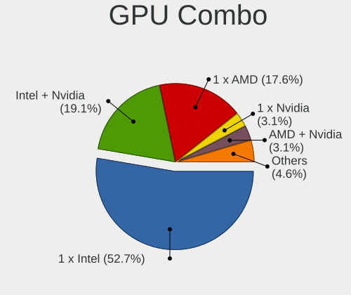

| Name           | Notebooks | Percent |
|----------------|-----------|---------|
| 1 x Intel      | 69        | 52.67%  |
| Intel + Nvidia | 25        | 19.08%  |
| 1 x AMD        | 23        | 17.56%  |
| 1 x Nvidia     | 4         | 3.05%   |
| AMD + Nvidia   | 4         | 3.05%   |
| 2 x AMD        | 3         | 2.29%   |
| Intel + AMD    | 3         | 2.29%   |

GPU Driver
----------

Free vs proprietary

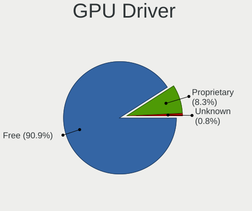

| Driver      | Notebooks | Percent |
|-------------|-----------|---------|
| Free        | 120       | 90.91%  |
| Proprietary | 11        | 8.33%   |
| Unknown     | 1         | 0.76%   |

GPU Memory
----------

Total video memory

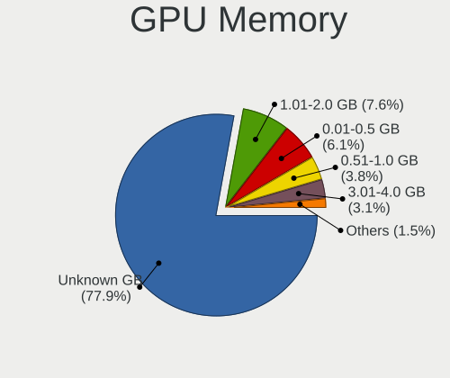

| Size in GB | Notebooks | Percent |
|------------|-----------|---------|
| Unknown    | 102       | 77.86%  |
| 1.01-2.0   | 10        | 7.63%   |
| 0.01-0.5   | 8         | 6.11%   |
| 0.51-1.0   | 5         | 3.82%   |
| 3.01-4.0   | 4         | 3.05%   |
| 7.01-8.0   | 2         | 1.53%   |

Monitor
-------

Monitor Vendor
--------------

Monitor vendors

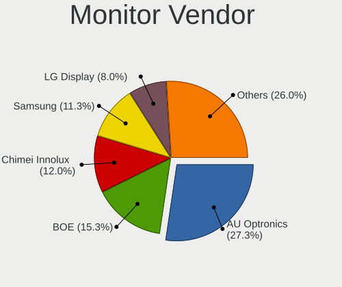

| Vendor              | Notebooks | Percent |
|---------------------|-----------|---------|
| AU Optronics        | 41        | 27.33%  |
| BOE                 | 23        | 15.33%  |
| Chimei Innolux      | 18        | 12%     |
| Samsung Electronics | 17        | 11.33%  |
| LG Display          | 12        | 8%      |
| Apple               | 7         | 4.67%   |
| Sharp               | 4         | 2.67%   |
| PANDA               | 3         | 2%      |
| Lenovo              | 3         | 2%      |
| Goldstar            | 3         | 2%      |
| Dell                | 3         | 2%      |
| CSOT                | 3         | 2%      |
| Westinghouse        | 1         | 0.67%   |
| SuperFrame          | 1         | 0.67%   |
| Philips             | 1         | 0.67%   |
| NEC Computers       | 1         | 0.67%   |
| MSD                 | 1         | 0.67%   |
| LG Philips          | 1         | 0.67%   |
| InfoVision          | 1         | 0.67%   |
| HannStar            | 1         | 0.67%   |
| Fujitsu Siemens     | 1         | 0.67%   |
| CSW                 | 1         | 0.67%   |
| CSO                 | 1         | 0.67%   |
| BenQ                | 1         | 0.67%   |
| Acer                | 1         | 0.67%   |

Monitor Model
-------------

Monitor models

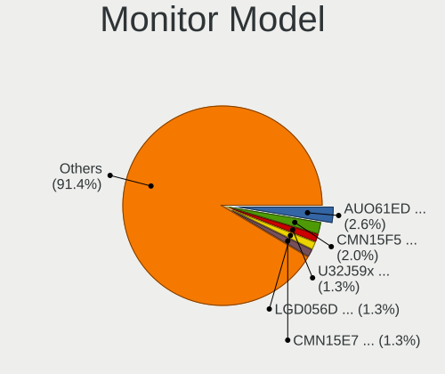

| Model                                                                 | Notebooks | Percent |
|-----------------------------------------------------------------------|-----------|---------|
| AU Optronics LCD Monitor AUO61ED 1920x1080 344x194mm 15.5-inch        | 4         | 2.63%   |
| Chimei Innolux LCD Monitor CMN15F5 1920x1080 344x193mm 15.5-inch      | 3         | 1.97%   |
| Samsung Electronics U32J59x SAM0F52 3840x2160 697x392mm 31.5-inch     | 2         | 1.32%   |
| LG Display LCD Monitor LGD056D 1920x1080 382x215mm 17.3-inch          | 2         | 1.32%   |
| Chimei Innolux LCD Monitor CMN15E7 1920x1080 344x193mm 15.5-inch      | 2         | 1.32%   |
| BOE LCD Monitor BOE094A 1920x1080 344x194mm 15.5-inch                 | 2         | 1.32%   |
| AU Optronics LCD Monitor AUO5191 1366x768 344x193mm 15.5-inch         | 2         | 1.32%   |
| Apple Color LCD APP9CF0 1440x900 290x180mm 13.4-inch                  | 2         | 1.32%   |
| Westinghouse WD32HB1120 WET000A 1366x768 700x390mm 31.5-inch          | 1         | 0.66%   |
| SuperFrame SFP2412FHD SUE2412 1920x1080 600x330mm 27.0-inch           | 1         | 0.66%   |
| Sharp LQ123P1JX32 SHP148A 2400x1600 259x173mm 12.3-inch               | 1         | 0.66%   |
| Sharp LCD Monitor SHP14CC 3840x2400 288x180mm 13.4-inch               | 1         | 0.66%   |
| Sharp LCD Monitor SHP149A 1920x1080 344x194mm 15.5-inch               | 1         | 0.66%   |
| Sharp LCD Monitor SHP1461 3200x1800 294x165mm 13.3-inch               | 1         | 0.66%   |
| Samsung Electronics SyncMaster SAM027E 1680x1050 474x296mm 22.0-inch  | 1         | 0.66%   |
| Samsung Electronics S27B970 SAM0985 2560x1440 518x324mm 24.1-inch     | 1         | 0.66%   |
| Samsung Electronics S22D300 SAM0B3F 1920x1080 477x268mm 21.5-inch     | 1         | 0.66%   |
| Samsung Electronics LCD Monitor SEC4351 1366x768 344x194mm 15.5-inch  | 1         | 0.66%   |
| Samsung Electronics LCD Monitor SEC4251 1366x768 344x194mm 15.5-inch  | 1         | 0.66%   |
| Samsung Electronics LCD Monitor SEC3251 1366x768 344x194mm 15.5-inch  | 1         | 0.66%   |
| Samsung Electronics LCD Monitor SDC5441 1366x768 344x193mm 15.5-inch  | 1         | 0.66%   |
| Samsung Electronics LCD Monitor SDC4447 1366x768 344x193mm 15.5-inch  | 1         | 0.66%   |
| Samsung Electronics LCD Monitor SDC424B 3840x2160 344x194mm 15.5-inch | 1         | 0.66%   |
| Samsung Electronics LCD Monitor SDC41A7 2048x1280 345x215mm 16.0-inch | 1         | 0.66%   |
| Samsung Electronics LCD Monitor SDC419F 2880x1800 302x189mm 14.0-inch | 1         | 0.66%   |
| Samsung Electronics LCD Monitor SDC4165 3840x2400 344x215mm 16.0-inch | 1         | 0.66%   |
| Samsung Electronics LCD Monitor SDC4161 1920x1080 344x194mm 15.5-inch | 1         | 0.66%   |
| Samsung Electronics LCD Monitor SDC4157 3840x2160 344x194mm 15.5-inch | 1         | 0.66%   |
| Samsung Electronics LCD Monitor SDC3754 1600x900 382x215mm 17.3-inch  | 1         | 0.66%   |
| Samsung Electronics LCD Monitor SDC3654 1600x900 382x215mm 17.3-inch  | 1         | 0.66%   |
| Philips PHL 223V5 PHLC0CF 1920x1080 477x268mm 21.5-inch               | 1         | 0.66%   |
| PANDA LCD Monitor NCP004F 1920x1080 309x174mm 14.0-inch               | 1         | 0.66%   |
| PANDA LCD Monitor NCP004D 1920x1080 344x194mm 15.5-inch               | 1         | 0.66%   |
| PANDA LCD Monitor NCP002D 1920x1080 344x194mm 15.5-inch               | 1         | 0.66%   |
| NEC Computers PA272W NEC6948 2560x1440 596x335mm 26.9-inch            | 1         | 0.66%   |
| MSD CR340HD MSD3400 3440x1440 797x334mm 34.0-inch                     | 1         | 0.66%   |
| LG Philips LCD Monitor LPL2601 1280x800 286x179mm 13.3-inch           | 1         | 0.66%   |
| LG Display LCD Monitor LGD0683 1920x1080 344x194mm 15.5-inch          | 1         | 0.66%   |
| LG Display LCD Monitor LGD05DC 1920x1080 294x165mm 13.3-inch          | 1         | 0.66%   |
| LG Display LCD Monitor LGD05D8 1920x1080 344x194mm 15.5-inch          | 1         | 0.66%   |

Monitor Resolution
------------------

Monitor screen resolution

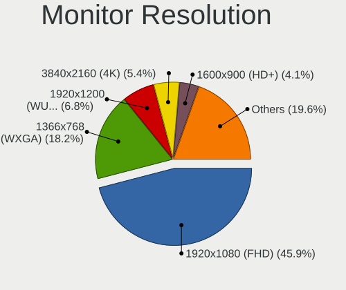

| Resolution         | Notebooks | Percent |
|--------------------|-----------|---------|
| 1920x1080 (FHD)    | 68        | 45.95%  |
| 1366x768 (WXGA)    | 27        | 18.24%  |
| 1920x1200 (WUXGA)  | 10        | 6.76%   |
| 3840x2160 (4K)     | 8         | 5.41%   |
| 1600x900 (HD+)     | 6         | 4.05%   |
| 2880x1800          | 4         | 2.7%    |
| 2560x1600          | 4         | 2.7%    |
| 3840x2400          | 3         | 2.03%   |
| 2560x1440 (QHD)    | 3         | 2.03%   |
| 1440x900 (WXGA+)   | 3         | 2.03%   |
| 3440x1440          | 2         | 1.35%   |
| 1680x1050 (WSXGA+) | 2         | 1.35%   |
| 1280x800 (WXGA)    | 2         | 1.35%   |
| 3840x1600          | 1         | 0.68%   |
| 3200x1800 (QHD+)   | 1         | 0.68%   |
| 2400x1600          | 1         | 0.68%   |
| 2304x1440          | 1         | 0.68%   |
| 2160x1440          | 1         | 0.68%   |
| 2048x1280          | 1         | 0.68%   |

Monitor Diagonal
----------------

Diagonal size in inches

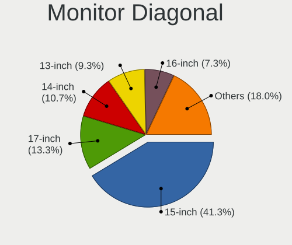

| Inches  | Notebooks | Percent |
|---------|-----------|---------|
| 15      | 62        | 41.33%  |
| 17      | 20        | 13.33%  |
| 14      | 16        | 10.67%  |
| 13      | 14        | 9.33%   |
| 16      | 11        | 7.33%   |
| 12      | 6         | 4%      |
| 27      | 4         | 2.67%   |
| 31      | 3         | 2%      |
| 24      | 3         | 2%      |
| 34      | 2         | 1.33%   |
| 21      | 2         | 1.33%   |
| 11      | 2         | 1.33%   |
| 37      | 1         | 0.67%   |
| 36      | 1         | 0.67%   |
| 26      | 1         | 0.67%   |
| 22      | 1         | 0.67%   |
| Unknown | 1         | 0.67%   |

Monitor Width
-------------

Physical width

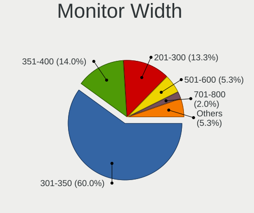

| Width in mm | Notebooks | Percent |
|-------------|-----------|---------|
| 301-350     | 90        | 60%     |
| 351-400     | 21        | 14%     |
| 201-300     | 20        | 13.33%  |
| 501-600     | 8         | 5.33%   |
| 701-800     | 3         | 2%      |
| 601-700     | 3         | 2%      |
| 401-500     | 3         | 2%      |
| 801-900     | 1         | 0.67%   |
| Unknown     | 1         | 0.67%   |

Aspect Ratio
------------

Proportional relationship between the width and the height

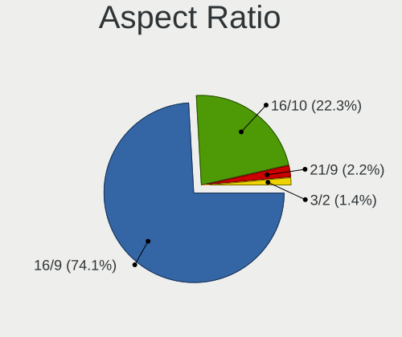

| Ratio | Notebooks | Percent |
|-------|-----------|---------|
| 16/9  | 103       | 74.1%   |
| 16/10 | 31        | 22.3%   |
| 21/9  | 3         | 2.16%   |
| 3/2   | 2         | 1.44%   |

Monitor Area
------------

Area in inch²

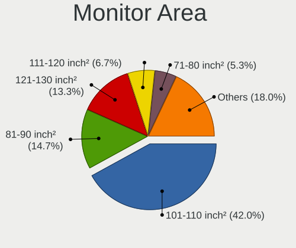

| Area in inch² | Notebooks | Percent |
|----------------|-----------|---------|
| 101-110        | 63        | 42%     |
| 81-90          | 22        | 14.67%  |
| 121-130        | 20        | 13.33%  |
| 111-120        | 10        | 6.67%   |
| 71-80          | 8         | 5.33%   |
| 61-70          | 6         | 4%      |
| 351-500        | 5         | 3.33%   |
| 301-350        | 5         | 3.33%   |
| 201-250        | 4         | 2.67%   |
| 51-60          | 2         | 1.33%   |
| 251-300        | 2         | 1.33%   |
| 501-1000       | 2         | 1.33%   |
| Unknown        | 1         | 0.67%   |

Pixel Density
-------------

Pixels per inch

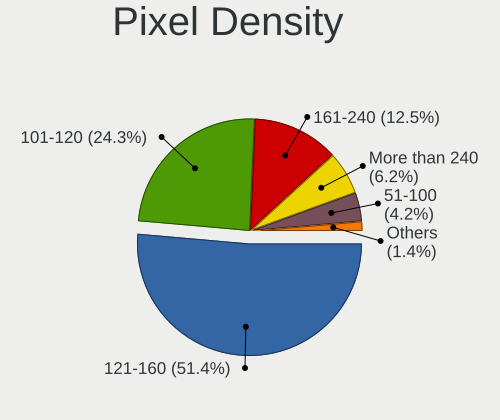

| Density       | Notebooks | Percent |
|---------------|-----------|---------|
| 121-160       | 74        | 51.39%  |
| 101-120       | 35        | 24.31%  |
| 161-240       | 18        | 12.5%   |
| More than 240 | 9         | 6.25%   |
| 51-100        | 6         | 4.17%   |
| 1-50          | 1         | 0.69%   |
| Unknown       | 1         | 0.69%   |

Multiple Monitors
-----------------

Total monitors connected

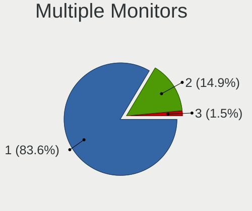

| Total | Notebooks | Percent |
|-------|-----------|---------|
| 1     | 112       | 83.58%  |
| 2     | 20        | 14.93%  |
| 3     | 2         | 1.49%   |

Network
-------

Net Controller Vendor
---------------------

Controller vendors

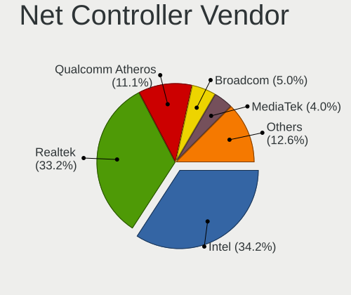

| Vendor                                 | Notebooks | Percent |
|----------------------------------------|-----------|---------|
| Intel                                  | 68        | 34.17%  |
| Realtek Semiconductor                  | 66        | 33.17%  |
| Qualcomm Atheros                       | 22        | 11.06%  |
| Broadcom                               | 10        | 5.03%   |
| MediaTek                               | 8         | 4.02%   |
| Broadcom Limited                       | 4         | 2.01%   |
| ASIX Electronics                       | 4         | 2.01%   |
| Dell                                   | 3         | 1.51%   |
| Ralink Technology                      | 2         | 1.01%   |
| Marvell Technology Group               | 2         | 1.01%   |
| Lenovo                                 | 2         | 1.01%   |
| Xiaomi                                 | 1         | 0.5%    |
| Suzhou Motorcomm Electronic Technology | 1         | 0.5%    |
| Qualcomm                               | 1         | 0.5%    |
| Motorola PCS                           | 1         | 0.5%    |
| Linksys                                | 1         | 0.5%    |
| Fibocom                                | 1         | 0.5%    |
| DisplayLink                            | 1         | 0.5%    |
| ASUSTek Computer                       | 1         | 0.5%    |

Net Controller Model
--------------------

Controller models

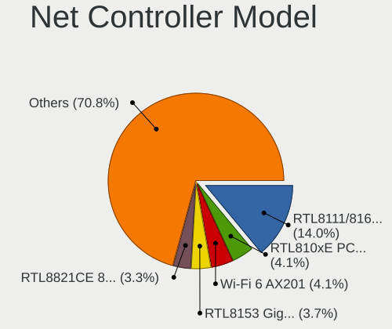

| Model                                                                  | Notebooks | Percent |
|------------------------------------------------------------------------|-----------|---------|
| Realtek RTL8111/8168/8211/8411 PCI Express Gigabit Ethernet Controller | 34        | 13.99%  |
| Realtek RTL810xE PCI Express Fast Ethernet controller                  | 10        | 4.12%   |
| Intel Wi-Fi 6 AX201                                                    | 10        | 4.12%   |
| Realtek RTL8153 Gigabit Ethernet Adapter                               | 9         | 3.7%    |
| Realtek RTL8821CE 802.11ac PCIe Wireless Network Adapter               | 8         | 3.29%   |
| Qualcomm Atheros QCA9377 802.11ac Wireless Network Adapter             | 7         | 2.88%   |
| Intel Wireless 7265                                                    | 7         | 2.88%   |
| Intel Wireless 8260                                                    | 6         | 2.47%   |
| Intel Wi-Fi 6 AX200                                                    | 6         | 2.47%   |
| Qualcomm Atheros QCA9565 / AR9565 Wireless Network Adapter             | 5         | 2.06%   |
| Intel Wireless 8265 / 8275                                             | 5         | 2.06%   |
| Intel Wi-Fi 6E(802.11ax) AX210/AX1675* 2x2 [Typhoon Peak]              | 5         | 2.06%   |
| Realtek RTL8822CE 802.11ac PCIe Wireless Network Adapter               | 4         | 1.65%   |
| MediaTek MT7902 802.11ax PCIe Wireless Network Adapter [Filogic 310]   | 4         | 1.65%   |
| Intel Meteor Lake PCH CNVi WiFi                                        | 4         | 1.65%   |
| Intel Alder Lake-P PCH CNVi WiFi                                       | 4         | 1.65%   |
| Intel Ethernet Connection (2) I219-LM                                  | 3         | 1.23%   |
| Broadcom Limited BCM4360 802.11ac Dual Band Wireless Network Adapter   | 3         | 1.23%   |
| ASIX AX88179 Gigabit Ethernet                                          | 3         | 1.23%   |
| Realtek RTL8852CE PCIe 802.11ax Wireless Network Controller            | 2         | 0.82%   |
| Realtek RTL8852BE PCIe 802.11ax Wireless Network Controller            | 2         | 0.82%   |
| Realtek RTL8188EE Wireless Network Adapter                             | 2         | 0.82%   |
| Realtek 802.11n WLAN Adapter                                           | 2         | 0.82%   |
| Qualcomm Atheros QCA6174 802.11ac Wireless Network Adapter             | 2         | 0.82%   |
| Qualcomm Atheros AR9285 Wireless Network Adapter (PCI-Express)         | 2         | 0.82%   |
| MediaTek MT7921 802.11ax PCIe Wireless Network Adapter [Filogic 330]   | 2         | 0.82%   |
| Lenovo USB-C Dock Ethernet                                             | 2         | 0.82%   |
| Intel Wireless 7260                                                    | 2         | 0.82%   |
| Intel Wireless 3165                                                    | 2         | 0.82%   |
| Intel Raptor Lake PCH CNVi WiFi                                        | 2         | 0.82%   |
| Intel Ethernet Connection I218-LM                                      | 2         | 0.82%   |
| Intel Ethernet Connection I217-LM                                      | 2         | 0.82%   |
| Intel Ethernet Connection (6) I219-V                                   | 2         | 0.82%   |
| Intel Ethernet Connection (4) I219-V                                   | 2         | 0.82%   |
| Intel Ethernet Connection (18) I219-LM                                 | 2         | 0.82%   |
| Intel Ethernet Connection (13) I219-V                                  | 2         | 0.82%   |
| Intel Ethernet Connection (13) I219-LM                                 | 2         | 0.82%   |
| Broadcom NetXtreme BCM57762 Gigabit Ethernet PCIe                      | 2         | 0.82%   |
| Xiaomi Mi/Redmi series (RNDIS + ADB)                                   | 1         | 0.41%   |
| Suzhou Motorcomm Electronic YT6801 Gigabit Ethernet Controller         | 1         | 0.41%   |

Wireless Vendor
---------------

Wireless vendors

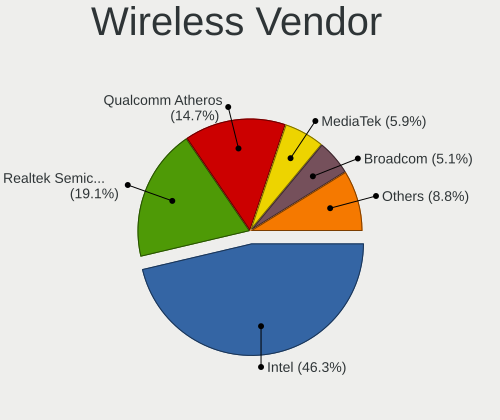

| Vendor                | Notebooks | Percent |
|-----------------------|-----------|---------|
| Intel                 | 63        | 46.32%  |
| Realtek Semiconductor | 26        | 19.12%  |
| Qualcomm Atheros      | 20        | 14.71%  |
| MediaTek              | 8         | 5.88%   |
| Broadcom              | 7         | 5.15%   |
| Broadcom Limited      | 4         | 2.94%   |
| Dell                  | 3         | 2.21%   |
| Ralink Technology     | 2         | 1.47%   |
| Qualcomm              | 1         | 0.74%   |
| Fibocom               | 1         | 0.74%   |
| ASUSTek Computer      | 1         | 0.74%   |

Wireless Model
--------------

Wireless models

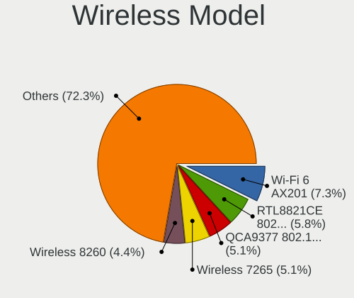

| Model                                                                   | Notebooks | Percent |
|-------------------------------------------------------------------------|-----------|---------|
| Intel Wi-Fi 6 AX201                                                     | 10        | 7.3%    |
| Realtek RTL8821CE 802.11ac PCIe Wireless Network Adapter                | 8         | 5.84%   |
| Qualcomm Atheros QCA9377 802.11ac Wireless Network Adapter              | 7         | 5.11%   |
| Intel Wireless 7265                                                     | 7         | 5.11%   |
| Intel Wireless 8260                                                     | 6         | 4.38%   |
| Intel Wi-Fi 6 AX200                                                     | 6         | 4.38%   |
| Qualcomm Atheros QCA9565 / AR9565 Wireless Network Adapter              | 5         | 3.65%   |
| Intel Wireless 8265 / 8275                                              | 5         | 3.65%   |
| Intel Wi-Fi 6E(802.11ax) AX210/AX1675* 2x2 [Typhoon Peak]               | 5         | 3.65%   |
| Realtek RTL8822CE 802.11ac PCIe Wireless Network Adapter                | 4         | 2.92%   |
| MediaTek MT7902 802.11ax PCIe Wireless Network Adapter [Filogic 310]    | 4         | 2.92%   |
| Intel Meteor Lake PCH CNVi WiFi                                         | 4         | 2.92%   |
| Broadcom Limited BCM4360 802.11ac Dual Band Wireless Network Adapter    | 3         | 2.19%   |
| Realtek RTL8852BE PCIe 802.11ax Wireless Network Controller             | 2         | 1.46%   |
| Realtek RTL8188EE Wireless Network Adapter                              | 2         | 1.46%   |
| Realtek 802.11n WLAN Adapter                                            | 2         | 1.46%   |
| Qualcomm Atheros QCA6174 802.11ac Wireless Network Adapter              | 2         | 1.46%   |
| Qualcomm Atheros AR9285 Wireless Network Adapter (PCI-Express)          | 2         | 1.46%   |
| MediaTek MT7921 802.11ax PCIe Wireless Network Adapter [Filogic 330]    | 2         | 1.46%   |
| Intel Wireless 7260                                                     | 2         | 1.46%   |
| Intel Wireless 3165                                                     | 2         | 1.46%   |
| Intel Raptor Lake PCH CNVi WiFi                                         | 2         | 1.46%   |
| Intel Alder Lake-P PCH CNVi WiFi                                        | 2         | 1.46%   |
| Realtek RTL88x2bu [AC1200 Techkey]                                      | 1         | 0.73%   |
| Realtek RTL8852CE PCIe 802.11ax Wireless Network Controller             | 1         | 0.73%   |
| Realtek RTL8852AE 802.11ax PCIe Wireless Network Adapter                | 1         | 0.73%   |
| Realtek RTL8822BE 802.11a/b/g/n/ac WiFi adapter                         | 1         | 0.73%   |
| Realtek RTL8723DE Wireless Network Adapter                              | 1         | 0.73%   |
| Realtek RTL8723BE PCIe Wireless Network Adapter                         | 1         | 0.73%   |
| Realtek RTL8191SU 802.11n WLAN Adapter                                  | 1         | 0.73%   |
| Realtek RTL8188CE 802.11b/g/n WiFi Adapter                              | 1         | 0.73%   |
| Realtek 802.11ac NIC                                                    | 1         | 0.73%   |
| Ralink RT5370 Wireless Adapter                                          | 1         | 0.73%   |
| Ralink RT2870/RT3070 Wireless Adapter                                   | 1         | 0.73%   |
| Qualcomm QCNFA765 Wireless Network Adapter                              | 1         | 0.73%   |
| Qualcomm Atheros AR9485 Wireless Network Adapter                        | 1         | 0.73%   |
| Qualcomm Atheros AR9462 Wireless Network Adapter                        | 1         | 0.73%   |
| Qualcomm Atheros AR928X Wireless Network Adapter (PCI-Express)          | 1         | 0.73%   |
| Qualcomm Atheros AR242x / AR542x Wireless Network Adapter (PCI-Express) | 1         | 0.73%   |
| MediaTek MT7922 802.11ax PCI Express Wireless Network Adapter           | 1         | 0.73%   |

Ethernet Vendor
---------------

Ethernet vendors

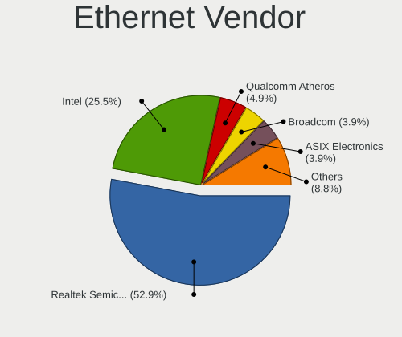

| Vendor                                 | Notebooks | Percent |
|----------------------------------------|-----------|---------|
| Realtek Semiconductor                  | 54        | 52.94%  |
| Intel                                  | 26        | 25.49%  |
| Qualcomm Atheros                       | 5         | 4.9%    |
| Broadcom                               | 4         | 3.92%   |
| ASIX Electronics                       | 4         | 3.92%   |
| Marvell Technology Group               | 2         | 1.96%   |
| Lenovo                                 | 2         | 1.96%   |
| Xiaomi                                 | 1         | 0.98%   |
| Suzhou Motorcomm Electronic Technology | 1         | 0.98%   |
| Motorola PCS                           | 1         | 0.98%   |
| Linksys                                | 1         | 0.98%   |
| DisplayLink                            | 1         | 0.98%   |

Ethernet Model
--------------

Ethernet models

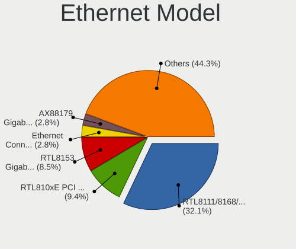

| Model                                                                  | Notebooks | Percent |
|------------------------------------------------------------------------|-----------|---------|
| Realtek RTL8111/8168/8211/8411 PCI Express Gigabit Ethernet Controller | 34        | 32.08%  |
| Realtek RTL810xE PCI Express Fast Ethernet controller                  | 10        | 9.43%   |
| Realtek RTL8153 Gigabit Ethernet Adapter                               | 9         | 8.49%   |
| Intel Ethernet Connection (2) I219-LM                                  | 3         | 2.83%   |
| ASIX AX88179 Gigabit Ethernet                                          | 3         | 2.83%   |
| Lenovo USB-C Dock Ethernet                                             | 2         | 1.89%   |
| Intel Ethernet Connection I218-LM                                      | 2         | 1.89%   |
| Intel Ethernet Connection I217-LM                                      | 2         | 1.89%   |
| Intel Ethernet Connection (6) I219-V                                   | 2         | 1.89%   |
| Intel Ethernet Connection (4) I219-V                                   | 2         | 1.89%   |
| Intel Ethernet Connection (18) I219-LM                                 | 2         | 1.89%   |
| Intel Ethernet Connection (13) I219-V                                  | 2         | 1.89%   |
| Intel Ethernet Connection (13) I219-LM                                 | 2         | 1.89%   |
| Intel Alder Lake-P PCH CNVi WiFi                                       | 2         | 1.89%   |
| Broadcom NetXtreme BCM57762 Gigabit Ethernet PCIe                      | 2         | 1.89%   |
| Xiaomi Mi/Redmi series (RNDIS + ADB)                                   | 1         | 0.94%   |
| Suzhou Motorcomm Electronic YT6801 Gigabit Ethernet Controller         | 1         | 0.94%   |
| Realtek USB 10/100/1G/2.5 LAN                                          | 1         | 0.94%   |
| Realtek RTL8852CE PCIe 802.11ax Wireless Network Controller            | 1         | 0.94%   |
| Qualcomm Atheros QCA8171 Gigabit Ethernet                              | 1         | 0.94%   |
| Qualcomm Atheros Killer E2500 Gigabit Ethernet Controller              | 1         | 0.94%   |
| Qualcomm Atheros AR8162 Fast Ethernet                                  | 1         | 0.94%   |
| Qualcomm Atheros AR8161 Gigabit Ethernet                               | 1         | 0.94%   |
| Qualcomm Atheros AR8151 v2.0 Gigabit Ethernet                          | 1         | 0.94%   |
| Motorola PCS motorola one 5G ace                                       | 1         | 0.94%   |
| Marvell Group 88E8042 PCI-E Fast Ethernet Controller                   | 1         | 0.94%   |
| Marvell Group 88E8040T PCI-E Fast Ethernet Controller                  | 1         | 0.94%   |
| Linksys Gigabit Ethernet Adapter                                       | 1         | 0.94%   |
| Intel Ethernet Controller I225-LM                                      | 1         | 0.94%   |
| Intel Ethernet Controller (2) I225-LMvP                                | 1         | 0.94%   |
| Intel Ethernet Connection I219-V                                       | 1         | 0.94%   |
| Intel Ethernet Connection I219-LM                                      | 1         | 0.94%   |
| Intel Ethernet Connection (4) I219-LM                                  | 1         | 0.94%   |
| Intel Ethernet Connection (3) I218-LM                                  | 1         | 0.94%   |
| Intel Ethernet Connection (23) I219-V                                  | 1         | 0.94%   |
| Intel Ethernet Connection (16) I219-V                                  | 1         | 0.94%   |
| Intel Ethernet Connection (16) I219-LM                                 | 1         | 0.94%   |
| Intel 82579LM Gigabit Network Connection (Lewisville)                  | 1         | 0.94%   |
| DisplayLink HP Port Replicator (Composite Device)                      | 1         | 0.94%   |
| Broadcom NetXtreme BCM57765 Gigabit Ethernet PCIe                      | 1         | 0.94%   |

Net Controller Kind
-------------------

Ethernet, WiFi or modem

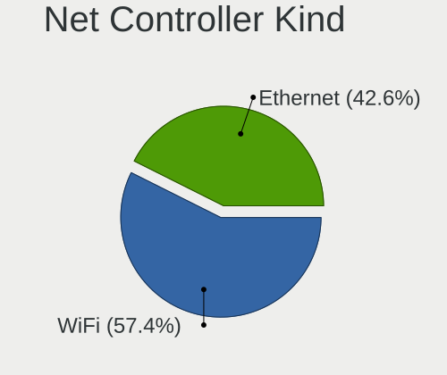

| Kind     | Notebooks | Percent |
|----------|-----------|---------|
| WiFi     | 128       | 57.4%   |
| Ethernet | 95        | 42.6%   |

Used Controller
---------------

Currently used network controller

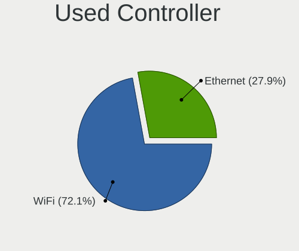

| Kind     | Notebooks | Percent |
|----------|-----------|---------|
| WiFi     | 101       | 72.14%  |
| Ethernet | 39        | 27.86%  |

NICs
----

Total network controllers on board

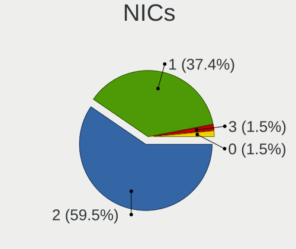

| Total | Notebooks | Percent |
|-------|-----------|---------|
| 2     | 78        | 59.54%  |
| 1     | 49        | 37.4%   |
| 3     | 2         | 1.53%   |
| 0     | 2         | 1.53%   |

IPv6
----

IPv6 vs IPv4

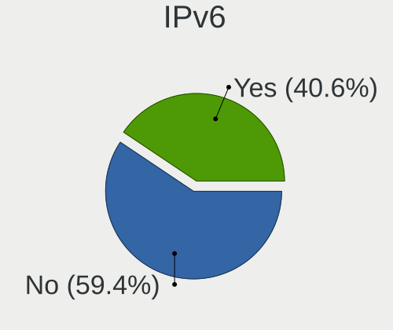

| Used | Notebooks | Percent |
|------|-----------|---------|
| No   | 79        | 59.4%   |
| Yes  | 54        | 40.6%   |

Bluetooth
---------

Bluetooth Vendor
----------------

Controller vendors

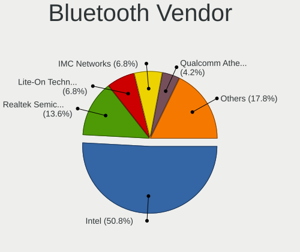

| Vendor                          | Notebooks | Percent |
|---------------------------------|-----------|---------|
| Intel                           | 60        | 50.85%  |
| Realtek Semiconductor           | 16        | 13.56%  |
| Lite-On Technology              | 8         | 6.78%   |
| IMC Networks                    | 8         | 6.78%   |
| Qualcomm Atheros Communications | 5         | 4.24%   |
| Broadcom                        | 5         | 4.24%   |
| Apple                           | 5         | 4.24%   |
| MediaTek                        | 2         | 1.69%   |
| Foxconn / Hon Hai               | 2         | 1.69%   |
| USI                             | 1         | 0.85%   |
| Toshiba                         | 1         | 0.85%   |
| Realtek                         | 1         | 0.85%   |
| Hewlett-Packard                 | 1         | 0.85%   |
| Foxconn International           | 1         | 0.85%   |
| Dell                            | 1         | 0.85%   |
| Cambridge Silicon Radio         | 1         | 0.85%   |

Bluetooth Model
---------------

Controller models

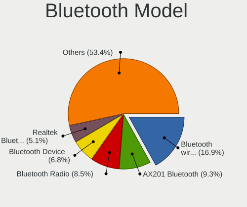

| Model                                               | Notebooks | Percent |
|-----------------------------------------------------|-----------|---------|
| Intel Bluetooth wireless interface                  | 20        | 16.95%  |
| Intel AX201 Bluetooth                               | 11        | 9.32%   |
| Realtek Bluetooth Radio                             | 10        | 8.47%   |
| Intel Bluetooth Device                              | 8         | 6.78%   |
| Realtek  Bluetooth 4.2 Adapter                      | 6         | 5.08%   |
| Intel AX200 Bluetooth                               | 6         | 5.08%   |
| Lite-On Qualcomm Atheros QCA9377 Bluetooth          | 5         | 4.24%   |
| Intel Bluetooth 9460/9560 Jefferson Peak (JfP)      | 5         | 4.24%   |
| Intel AX210 Bluetooth                               | 5         | 4.24%   |
| Qualcomm Atheros  Bluetooth Device                  | 3         | 2.54%   |
| Apple Bluetooth Host Controller                     | 3         | 2.54%   |
| MediaTek Wireless_Device                            | 2         | 1.69%   |
| Lite-On Wireless_Device                             | 2         | 1.69%   |
| Intel Centrino Bluetooth Wireless Transceiver       | 2         | 1.69%   |
| IMC Networks Wireless_Device                        | 2         | 1.69%   |
| IMC Networks Bluetooth Radio                        | 2         | 1.69%   |
| IMC Networks Bluetooth Device                       | 2         | 1.69%   |
| Broadcom BCM2045 Bluetooth                          | 2         | 1.69%   |
| Apple Bluetooth USB Host Controller                 | 2         | 1.69%   |
| USI Bluetooth Device                                | 1         | 0.85%   |
| Toshiba Integrated Bluetooth (Taiyo Yuden)          | 1         | 0.85%   |
| Realtek Bluetooth Radio                             | 1         | 0.85%   |
| Qualcomm Atheros QCA61x4 Bluetooth 4.0              | 1         | 0.85%   |
| Qualcomm Atheros AR3011 Bluetooth                   | 1         | 0.85%   |
| Lite-On Bluetooth Device                            | 1         | 0.85%   |
| Intel Wireless-AC 9260 Bluetooth Adapter            | 1         | 0.85%   |
| Intel Wireless-AC 3168 Bluetooth                    | 1         | 0.85%   |
| Intel Bluetooth                                     | 1         | 0.85%   |
| IMC Networks Atheros AR3012 Bluetooth 4.0 Adapter   | 1         | 0.85%   |
| IMC Networks Atheros AR3012 Bluetooth               | 1         | 0.85%   |
| HP Broadcom 2070 Bluetooth Combo                    | 1         | 0.85%   |
| Foxconn International BCM43142A0 Bluetooth module   | 1         | 0.85%   |
| Foxconn / Hon Hai Wireless_Device                   | 1         | 0.85%   |
| Foxconn / Hon Hai MediaTek Bluetooth Adapter        | 1         | 0.85%   |
| Dell Broadcom BCM20702A0 Bluetooth                  | 1         | 0.85%   |
| Cambridge Silicon Radio Bluetooth Dongle (HCI mode) | 1         | 0.85%   |
| Broadcom HP Portable Bumble Bee                     | 1         | 0.85%   |
| Broadcom BCM2045B (BDC-2.1) [Bluetooth Controller]  | 1         | 0.85%   |
| Broadcom BCM2045B (BDC-2.1)                         | 1         | 0.85%   |

Sound
-----

Sound Vendor
------------

Sound card vendors

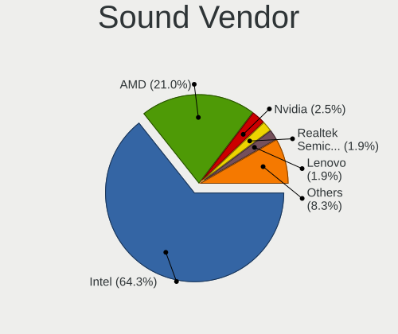

| Vendor                     | Notebooks | Percent |
|----------------------------|-----------|---------|
| Intel                      | 101       | 64.33%  |
| AMD                        | 33        | 21.02%  |
| Nvidia                     | 4         | 2.55%   |
| Realtek Semiconductor      | 3         | 1.91%   |
| Lenovo                     | 3         | 1.91%   |
| Hewlett-Packard            | 2         | 1.27%   |
| ASUSTek Computer           | 2         | 1.27%   |
| Texas Instruments          | 1         | 0.64%   |
| Plantronics                | 1         | 0.64%   |
| Phoenix Audio Technologies | 1         | 0.64%   |
| Logitech                   | 1         | 0.64%   |
| GN Netcom                  | 1         | 0.64%   |
| DSEA A/S                   | 1         | 0.64%   |
| DisplayLink                | 1         | 0.64%   |
| Conexant Systems           | 1         | 0.64%   |
| C-Media Electronics        | 1         | 0.64%   |

Sound Model
-----------

Sound card models

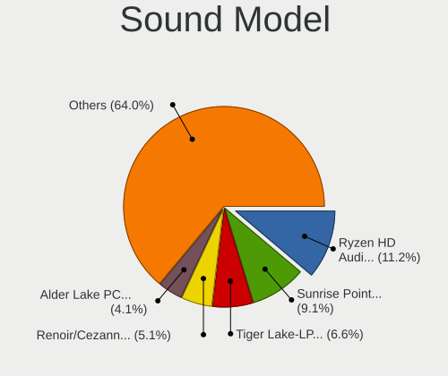

| Model                                                                                             | Notebooks | Percent |
|---------------------------------------------------------------------------------------------------|-----------|---------|
| AMD Ryzen HD Audio Controller                                                                     | 22        | 11.17%  |
| Intel Sunrise Point-LP HD Audio                                                                   | 18        | 9.14%   |
| Intel Tiger Lake-LP Smart Sound Technology Audio Controller                                       | 13        | 6.6%    |
| AMD Renoir/Cezanne HDMI/DP Audio Controller                                                       | 10        | 5.08%   |
| Intel Alder Lake PCH-P High Definition Audio Controller                                           | 8         | 4.06%   |
| AMD Raven/Raven2/Fenghuang HDMI/DP Audio Controller                                               | 7         | 3.55%   |
| Intel Haswell-ULT HD Audio Controller                                                             | 6         | 3.05%   |
| Intel 8 Series/C220 Series Chipset High Definition Audio Controller                               | 6         | 3.05%   |
| Intel 8 Series HD Audio Controller                                                                | 6         | 3.05%   |
| Intel 100 Series/C230 Series Chipset Family HD Audio Controller                                   | 6         | 3.05%   |
| Intel Xeon E3-1200 v3/4th Gen Core Processor HD Audio Controller                                  | 4         | 2.03%   |
| Intel Meteor Lake-P HD Audio Controller                                                           | 4         | 2.03%   |
| Intel Cannon Lake PCH cAVS                                                                        | 4         | 2.03%   |
| AMD Radeon High Definition Audio Controller                                                       | 4         | 2.03%   |
| Realtek Semiconductor USB Audio                                                                   | 3         | 1.52%   |
| Intel Wildcat Point-LP High Definition Audio Controller                                           | 3         | 1.52%   |
| Intel Tiger Lake-H HD Audio Controller                                                            | 3         | 1.52%   |
| Intel Ice Lake-LP Smart Sound Technology Audio Controller                                         | 3         | 1.52%   |
| Intel Comet Lake PCH-LP cAVS                                                                      | 3         | 1.52%   |
| Intel Broadwell-U Audio Controller                                                                | 3         | 1.52%   |
| Intel 82801I (ICH9 Family) HD Audio Controller                                                    | 3         | 1.52%   |
| Intel 7 Series/C216 Chipset Family High Definition Audio Controller                               | 3         | 1.52%   |
| Intel 6 Series/C200 Series Chipset Family High Definition Audio Controller                        | 3         | 1.52%   |
| AMD FCH Azalia Controller                                                                         | 3         | 1.52%   |
| AMD Family 15h (Models 60h-6fh) Audio Controller                                                  | 3         | 1.52%   |
| Lenovo ThinkPad USB-C Dock Gen2 USB Audio                                                         | 2         | 1.02%   |
| Intel Raptor Lake-P/U/H cAVS                                                                      | 2         | 1.02%   |
| Intel CM238 HD Audio Controller                                                                   | 2         | 1.02%   |
| Intel Celeron N3350/Pentium N4200/Atom E3900 Series Audio Cluster                                 | 2         | 1.02%   |
| Intel Cannon Point-LP High Definition Audio Controller                                            | 2         | 1.02%   |
| Intel Atom/Celeron/Pentium Processor x5-E8000/J3xxx/N3xxx Series High Definition Audio Controller | 2         | 1.02%   |
| Hewlett-Packard USB Audio                                                                         | 2         | 1.02%   |
| ASUSTek Computer C-Media Audio                                                                    | 2         | 1.02%   |
| AMD Kabini HDMI/DP Audio                                                                          | 2         | 1.02%   |
| AMD High Definition Audio Controller                                                              | 2         | 1.02%   |
| Texas Instruments PCM2900C Audio CODEC                                                            | 1         | 0.51%   |
| Plantronics BT600                                                                                 | 1         | 0.51%   |
| Phoenix Audio Technologies Phnx MT202pcs                                                          | 1         | 0.51%   |
| Nvidia TU107 GeForce GTX 1650 High Definition Audio Controller                                    | 1         | 0.51%   |
| Nvidia GA107 High Definition Audio Controller                                                     | 1         | 0.51%   |

Memory
------

Memory Vendor
-------------

Memory module vendors

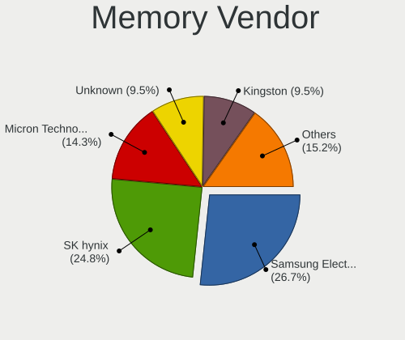

| Vendor              | Notebooks | Percent |
|---------------------|-----------|---------|
| Samsung Electronics | 28        | 26.67%  |
| SK hynix            | 26        | 24.76%  |
| Micron Technology   | 15        | 14.29%  |
| Unknown             | 10        | 9.52%   |
| Kingston            | 10        | 9.52%   |
| Crucial             | 6         | 5.71%   |
| Unknown (ABCD)      | 3         | 2.86%   |
| Ramaxel Technology  | 2         | 1.9%    |
| Team                | 1         | 0.95%   |
| Smart Brazil        | 1         | 0.95%   |
| Elpida              | 1         | 0.95%   |
| A-DATA Technology   | 1         | 0.95%   |
| Unknown             | 1         | 0.95%   |

Memory Model
------------

Memory module models

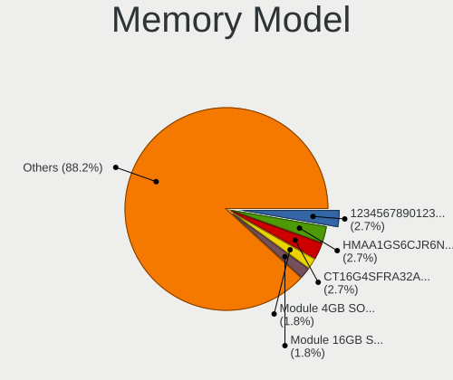

| Model                                                            | Notebooks | Percent |
|------------------------------------------------------------------|-----------|---------|
| Unknown (ABCD) RAM 123456789012345678 2GB SODIMM LPDDR4 2400MT/s | 3         | 2.73%   |
| SK hynix RAM HMAA1GS6CJR6N-XN 8GB Row Of Chips DDR4 3200MT/s     | 3         | 2.73%   |
| Crucial RAM CT16G4SFRA32A.M16FE 16GB SODIMM DDR4 3200MT/s        | 3         | 2.73%   |
| Unknown RAM Module 4GB SODIMM DDR3 1600MT/s                      | 2         | 1.82%   |
| SK hynix RAM HMA851S6JJR6N-VK 4GB SODIMM DDR4 2667MT/s           | 2         | 1.82%   |
| SK hynix RAM HMA851S6AFR6N-UH 4GB SODIMM DDR4 2667MT/s           | 2         | 1.82%   |
| SK hynix RAM HMA81GS6JJR8N-VK 8GB SODIMM DDR4 2667MT/s           | 2         | 1.82%   |
| Samsung RAM Module 16GB SODIMM DDR4 3200MT/s                     | 2         | 1.82%   |
| Samsung RAM M471A5244CB0-CTD 4GB SODIMM DDR4 3266MT/s            | 2         | 1.82%   |
| Samsung RAM M471A5244CB0-CRC 4GB SODIMM DDR4 2667MT/s            | 2         | 1.82%   |
| Samsung RAM M471A1K43BB1-CRC 8GB SODIMM DDR4 2667MT/s            | 2         | 1.82%   |
| Samsung RAM M425R2GA3BB0-CWMOD 16GiB SODIMM DDR5 5600MT/s        | 2         | 1.82%   |
| Micron RAM MT62F2G32D4DS-026 WT 8GiB SODIMM LPDDR5 7500MT/s      | 2         | 1.82%   |
| Micron RAM 4ATF1G64HZ-3G2FA 8GB SODIMM DDR4 3200MT/s             | 2         | 1.82%   |
| Micron RAM 4ATF1G64HZ-3G2F1 8GB SODIMM DDR4 3200MT/s             | 2         | 1.82%   |
| Unknown RAM Module 8GB SODIMM DDR4 3200MT/s                      | 1         | 0.91%   |
| Unknown RAM Module 8GB SODIMM DDR4 2400MT/s                      | 1         | 0.91%   |
| Unknown RAM Module 8GB Row Of Chips LPDDR4 4267MT/s              | 1         | 0.91%   |
| Unknown RAM Module 4GB SODIMM LPDDR3 1600MT/s                    | 1         | 0.91%   |
| Unknown RAM Module 2GB SODIMM DDR2 800MT/s                       | 1         | 0.91%   |
| Unknown RAM Module 2GB SODIMM 800MT/s                            | 1         | 0.91%   |
| Unknown RAM Module 2GB Row Of Chips LPDDR4 4267MT/s              | 1         | 0.91%   |
| Unknown RAM Module 1GB SODIMM 800MT/s                            | 1         | 0.91%   |
| Unknown RAM Module 1536MB SODIMM DDR3 1600MT/s                   | 1         | 0.91%   |
| Team RAM TEAMGROUP-SD4-3200 16GB SODIMM DDR4 3200MT/s            | 1         | 0.91%   |
| Smart Brazil RAM SMS4WEC3C0K0446SCG 4GB SODIMM DDR4 3200MT/s     | 1         | 0.91%   |
| Smart Brazil RAM Module 4GB Row Of Chips DDR4 3200MT/s           | 1         | 0.91%   |
| SK hynix RAM Module 8GB SODIMM DDR4 3200MT/s                     | 1         | 0.91%   |
| SK hynix RAM Module 8GB SODIMM DDR4 2133MT/s                     | 1         | 0.91%   |
| SK hynix RAM Module 8GB SODIMM DDR3 1600MT/s                     | 1         | 0.91%   |
| SK hynix RAM Module 2GB SODIMM DDR3 1600MT/s                     | 1         | 0.91%   |
| SK hynix RAM HMT451S6AFR8A-PB 4GB SODIMM DDR3 1600MT/s           | 1         | 0.91%   |
| SK hynix RAM HMT351S6EFR8A-PB 4GB SODIMM DDR3 1600MT/s           | 1         | 0.91%   |
| SK hynix RAM HMT351S6BFR8C-H9 4GB SODIMM DDR3 1333MT/s           | 1         | 0.91%   |
| SK hynix RAM HMCG78AGBSA095N 16GB SODIMM DDR5 5600MT/s           | 1         | 0.91%   |
| SK hynix RAM HMCG66MEBSA092N 8GB SODIMM DDR5 4800MT/s            | 1         | 0.91%   |
| SK hynix RAM HMAG68EXNSA051N 8GB SODIMM DDR4 3200MT/s            | 1         | 0.91%   |
| SK hynix RAM HMAB2GS6CMR6N-XN 16GB SODIMM DDR4 3200MT/s          | 1         | 0.91%   |
| SK hynix RAM HMAA1GS6CJR6N-XN 8GB SODIMM DDR4 3200MT/s           | 1         | 0.91%   |
| SK hynix RAM HMA851S6DJR6N-XN 4GB Row Of Chips DDR4 3200MT/s     | 1         | 0.91%   |

Memory Kind
-----------

Memory module kinds

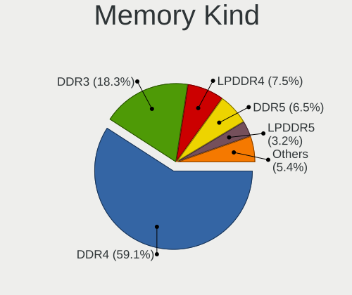

| Kind    | Notebooks | Percent |
|---------|-----------|---------|
| DDR4    | 55        | 59.14%  |
| DDR3    | 17        | 18.28%  |
| LPDDR4  | 7         | 7.53%   |
| DDR5    | 6         | 6.45%   |
| LPDDR5  | 3         | 3.23%   |
| LPDDR3  | 2         | 2.15%   |
| DDR2    | 2         | 2.15%   |
| Unknown | 1         | 1.08%   |

Memory Form Factor
------------------

Physical design of the memory module

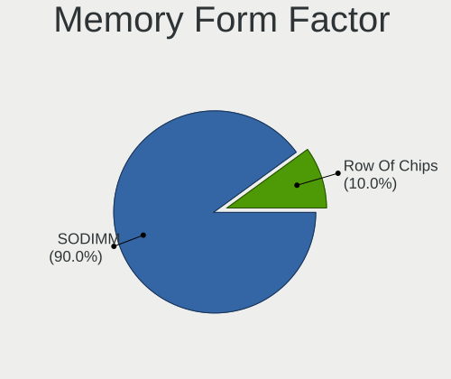

| Name         | Notebooks | Percent |
|--------------|-----------|---------|
| SODIMM       | 81        | 90%     |
| Row Of Chips | 9         | 10%     |

Memory Size
-----------

Memory module size

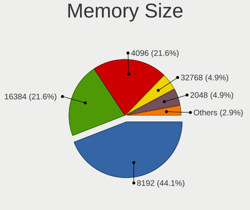

| Size  | Notebooks | Percent |
|-------|-----------|---------|
| 8192  | 45        | 44.12%  |
| 16384 | 22        | 21.57%  |
| 4096  | 22        | 21.57%  |
| 32768 | 5         | 4.9%    |
| 2048  | 5         | 4.9%    |
| 1024  | 2         | 1.96%   |
| 1536  | 1         | 0.98%   |

Memory Speed
------------

Memory module speed

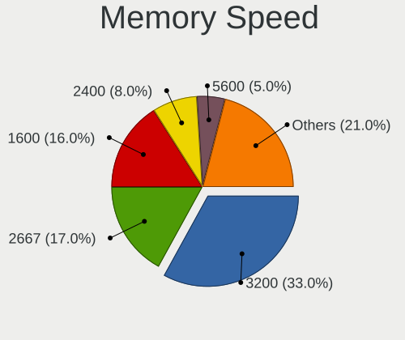

| Speed | Notebooks | Percent |
|-------|-----------|---------|
| 3200  | 33        | 33%     |
| 2667  | 17        | 17%     |
| 1600  | 16        | 16%     |
| 2400  | 8         | 8%      |
| 5600  | 5         | 5%      |
| 2133  | 5         | 5%      |
| 800   | 3         | 3%      |
| 7500  | 2         | 2%      |
| 4267  | 2         | 2%      |
| 3266  | 2         | 2%      |
| 8533  | 1         | 1%      |
| 8400  | 1         | 1%      |
| 4800  | 1         | 1%      |
| 1867  | 1         | 1%      |
| 1334  | 1         | 1%      |
| 1333  | 1         | 1%      |
| 975   | 1         | 1%      |

Printers & scanners
-------------------

Printer Vendor
--------------

Printer device vendors

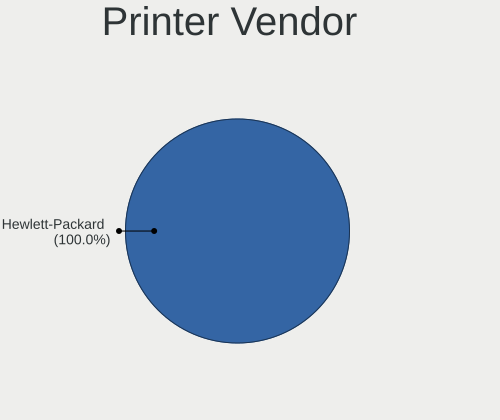

| Vendor          | Notebooks | Percent |
|-----------------|-----------|---------|
| Hewlett-Packard | 1         | 100%    |

Printer Model
-------------

Printer device models

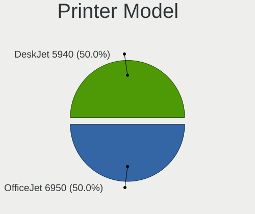

| Model             | Notebooks | Percent |
|-------------------|-----------|---------|
| HP OfficeJet 6950 | 1         | 50%     |
| HP DeskJet 5940   | 1         | 50%     |

Scanner Vendor
--------------

Scanner device vendors

Zero info for selected period =(

Scanner Model
-------------

Scanner device models

Zero info for selected period =(

Camera
------

Camera Vendor
-------------

Camera device vendors

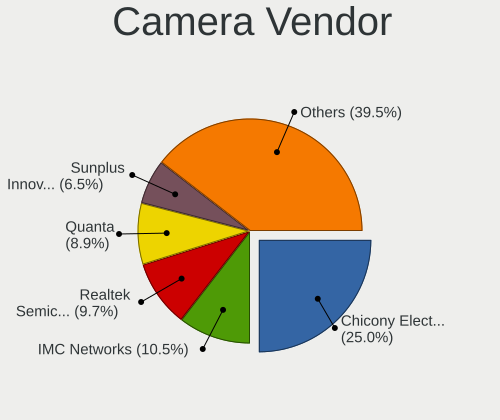

| Vendor                                 | Notebooks | Percent |
|----------------------------------------|-----------|---------|
| Chicony Electronics                    | 31        | 25%     |
| IMC Networks                           | 13        | 10.48%  |
| Realtek Semiconductor                  | 12        | 9.68%   |
| Quanta                                 | 11        | 8.87%   |
| Sunplus Innovation Technology          | 8         | 6.45%   |
| Syntek                                 | 7         | 5.65%   |
| Microdia                               | 6         | 4.84%   |
| Cheng Uei Precision Industry (Foxlink) | 6         | 4.84%   |
| Bison Electronics                      | 6         | 4.84%   |
| Luxvisions Innotech Limited            | 5         | 4.03%   |
| Logitech                               | 4         | 3.23%   |
| Suyin                                  | 2         | 1.61%   |
| Sunwingroup                            | 1         | 0.81%   |
| Silicon Motion                         | 1         | 0.81%   |
| Shinetech                              | 1         | 0.81%   |
| Samsung Electronics                    | 1         | 0.81%   |
| Microsoft                              | 1         | 0.81%   |
| Lite-On Technology                     | 1         | 0.81%   |
| kingcome                               | 1         | 0.81%   |
| icSpring                               | 1         | 0.81%   |
| Generalplus Technology                 | 1         | 0.81%   |
| Canon                                  | 1         | 0.81%   |
| BillionPixels                          | 1         | 0.81%   |
| Apple                                  | 1         | 0.81%   |
| Unknown                                | 1         | 0.81%   |

Camera Model
------------

Camera device models

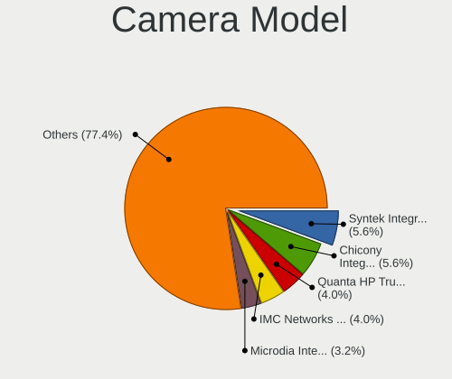

| Model                                                           | Notebooks | Percent |
|-----------------------------------------------------------------|-----------|---------|
| Syntek Integrated Camera                                        | 7         | 5.65%   |
| Chicony Integrated Camera                                       | 7         | 5.65%   |
| Quanta HP TrueVision HD Camera                                  | 5         | 4.03%   |
| IMC Networks USB2.0 HD UVC WebCam                               | 5         | 4.03%   |
| Microdia Integrated_Webcam_HD                                   | 4         | 3.23%   |
| Sunplus Integrated_Webcam_HD                                    | 3         | 2.42%   |
| Realtek Integrated_Webcam_HD                                    | 3         | 2.42%   |
| Quanta HD Webcam                                                | 3         | 2.42%   |
| Chicony HP HD Camera                                            | 3         | 2.42%   |
| Realtek HD Webcam - Realtek                                     | 2         | 1.61%   |
| Quanta HP HD Camera                                             | 2         | 1.61%   |
| IMC Networks USB2.0 VGA UVC WebCam                              | 2         | 1.61%   |
| Chicony VGA WebCam                                              | 2         | 1.61%   |
| Chicony HP Wide Vision HD Camera                                | 2         | 1.61%   |
| Chicony HD User Facing                                          | 2         | 1.61%   |
| Cheng Uei Precision Industry (Foxlink) HP True Vision HD Camera | 2         | 1.61%   |
| Bison EasyCamera                                                | 2         | 1.61%   |
| Bison BisonCam,NB Pro                                           | 2         | 1.61%   |
| Suyin Laptop_Integrated_Webcam_FHD                              | 1         | 0.81%   |
| Suyin Acer/HP Integrated Webcam [CN0314]                        | 1         | 0.81%   |
| Sunwingroup HD Camera                                           | 1         | 0.81%   |
| Sunplus MTD Camera                                              | 1         | 0.81%   |
| Sunplus Integrated Camera                                       | 1         | 0.81%   |
| Sunplus HP HD Webcam [Fixed]                                    | 1         | 0.81%   |
| Sunplus HD User Facing                                          | 1         | 0.81%   |
| Sunplus Asus Webcam                                             | 1         | 0.81%   |
| Silicon Motion Web Camera                                       | 1         | 0.81%   |
| Shinetech ASUS 5M WebCam                                        | 1         | 0.81%   |
| Samsung Galaxy series, misc. (MTP mode)                         | 1         | 0.81%   |
| Realtek WebCamera                                               | 1         | 0.81%   |
| Realtek USB2.0 HD UVC WebCam                                    | 1         | 0.81%   |
| Realtek USB Video device                                        | 1         | 0.81%   |
| Realtek USB Camera                                              | 1         | 0.81%   |
| Realtek HP Wide Vision FHD Camera                               | 1         | 0.81%   |
| Realtek HP Truevision HD integrated webcam                      | 1         | 0.81%   |
| Realtek Bluetooth Radio                                         | 1         | 0.81%   |
| Quanta VGA WebCam                                               | 1         | 0.81%   |
| Microsoft LifeCam VX-800                                        | 1         | 0.81%   |
| Microdia Integrated Webcam                                      | 1         | 0.81%   |
| Microdia HP Integrated Webcam                                   | 1         | 0.81%   |

Security
--------

Fingerprint Vendor
------------------

Fingerprint sensor vendors

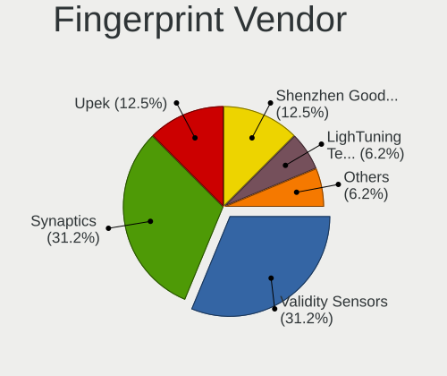

| Vendor                     | Notebooks | Percent |
|----------------------------|-----------|---------|
| Validity Sensors           | 5         | 31.25%  |
| Synaptics                  | 5         | 31.25%  |
| Upek                       | 2         | 12.5%   |
| Shenzhen Goodix Technology | 2         | 12.5%   |
| LighTuning Technology      | 1         | 6.25%   |
| Elan Microelectronics      | 1         | 6.25%   |

Fingerprint Model
-----------------

Fingerprint sensor models

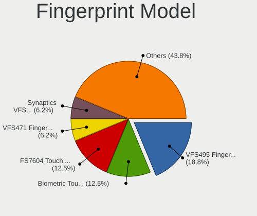

| Model                                                                      | Notebooks | Percent |
|----------------------------------------------------------------------------|-----------|---------|
| Validity Sensors VFS495 Fingerprint Reader                                 | 3         | 18.75%  |
| Upek Biometric Touchchip/Touchstrip Fingerprint Sensor                     | 2         | 12.5%   |
| Synaptics FS7604 Touch Fingerprint Sensor with PurePrint                   | 2         | 12.5%   |
| Validity Sensors VFS471 Fingerprint Reader                                 | 1         | 6.25%   |
| Validity Sensors Synaptics VFS7552 Touch Fingerprint Sensor with PurePrint | 1         | 6.25%   |
| Synaptics UWP WBDI Device                                                  | 1         | 6.25%   |
| Synaptics Prometheus MIS Touch Fingerprint Reader                          | 1         | 6.25%   |
| Synaptics Metallica MIS Touch Fingerprint Reader                           | 1         | 6.25%   |
| Shenzhen Goodix  Fingerprint Device                                        | 1         | 6.25%   |
| Shenzhen Goodix FingerPrint                                                | 1         | 6.25%   |
| LighTuning EgisTec Touch Fingerprint Sensor                                | 1         | 6.25%   |
| Elan ELAN:ARM-M4                                                           | 1         | 6.25%   |

Chipcard Vendor
---------------

Chipcard module vendors

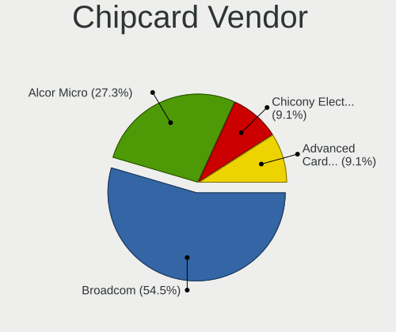

| Vendor                | Notebooks | Percent |
|-----------------------|-----------|---------|
| Broadcom              | 6         | 54.55%  |
| Alcor Micro           | 3         | 27.27%  |
| Chicony Electronics   | 1         | 9.09%   |
| Advanced Card Systems | 1         | 9.09%   |

Chipcard Model
--------------

Chipcard module models

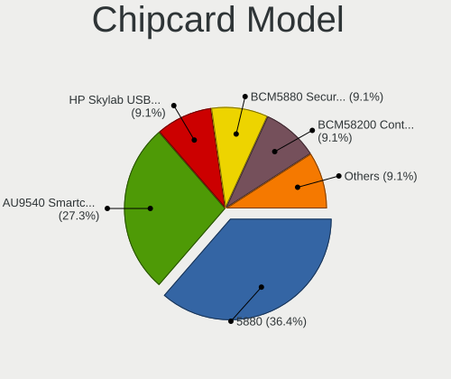

| Model                                                                       | Notebooks | Percent |
|-----------------------------------------------------------------------------|-----------|---------|
| Broadcom 5880                                                               | 4         | 36.36%  |
| Alcor Micro AU9540 Smartcard Reader                                         | 3         | 27.27%  |
| Chicony Electronics HP Skylab USB Smartcard Keyboard                        | 1         | 9.09%   |
| Broadcom BCM5880 Secure Applications Processor                              | 1         | 9.09%   |
| Broadcom BCM58200 ControlVault 3 (FingerPrint sensor + Contacted SmartCard) | 1         | 9.09%   |
| Advanced Card Systems ACR39U                                                | 1         | 9.09%   |

Unsupported
-----------

Unsupported Devices
-------------------

Total unsupported devices on board

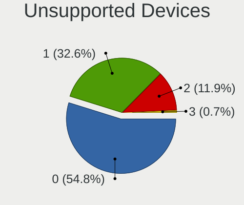

| Total | Notebooks | Percent |
|-------|-----------|---------|
| 0     | 74        | 54.81%  |
| 1     | 44        | 32.59%  |
| 2     | 16        | 11.85%  |
| 3     | 1         | 0.74%   |

Unsupported Device Types
------------------------

Types of unsupported devices

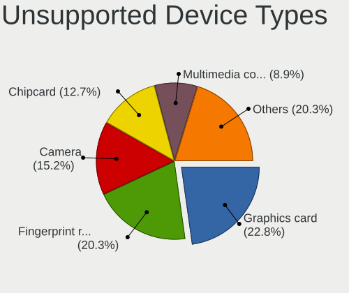

| Type                     | Notebooks | Percent |
|--------------------------|-----------|---------|
| Graphics card            | 18        | 22.78%  |
| Fingerprint reader       | 16        | 20.25%  |
| Camera                   | 12        | 15.19%  |
| Chipcard                 | 10        | 12.66%  |
| Multimedia controller    | 7         | 8.86%   |
| Sound                    | 5         | 6.33%   |
| Net/wireless             | 5         | 6.33%   |
| Bluetooth                | 2         | 2.53%   |
| Storage                  | 1         | 1.27%   |
| Net/ethernet             | 1         | 1.27%   |
| Communication controller | 1         | 1.27%   |
| Card reader              | 1         | 1.27%   |

