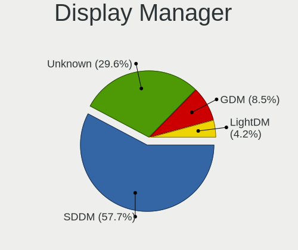
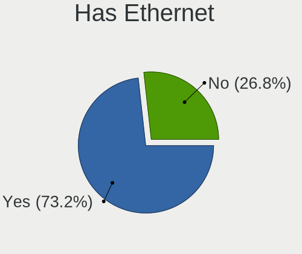
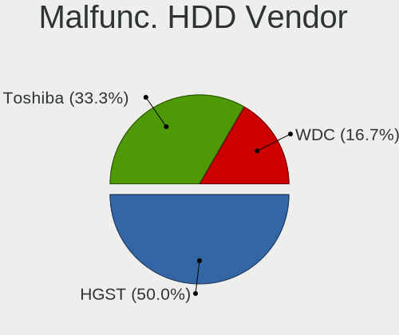
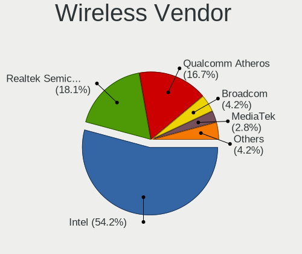
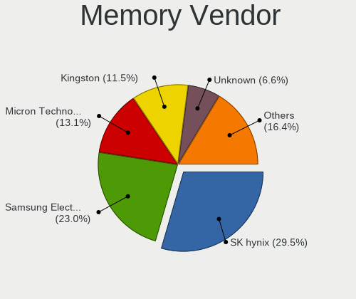

openSUSE Leap-15.6 - Tested Hardware & Statistics (Notebooks)
-------------------------------------------------------------

A project to collect tested hardware configurations for openSUSE Leap-15.6.

Anyone can contribute to this report by the [hw-probe](https://github.com/linuxhw/hw-probe) tool:

    sudo -E hw-probe -all -upload

Please contribute! Especially if your hardware is rare.

Contents
--------

* [ Test Cases ](#test-cases)

* [ System ](#system)
  - [ Kernel                   ](#kernel)
  - [ Kernel Family            ](#kernel-family)
  - [ Kernel Major Ver.        ](#kernel-major-ver)
  - [ Arch                     ](#arch)
  - [ DE                       ](#de)
  - [ Display Server           ](#display-server)
  - [ Display Manager          ](#display-manager)
  - [ OS Lang                  ](#os-lang)
  - [ Boot Mode                ](#boot-mode)
  - [ Filesystem               ](#filesystem)
  - [ Part. scheme             ](#part-scheme)
  - [ Dual Boot with Linux/BSD ](#dual-boot-with-linuxbsd)
  - [ Dual Boot (Win)          ](#dual-boot-win)

* [ Board ](#board)
  - [ Vendor                   ](#vendor)
  - [ Model                    ](#model)
  - [ Model Family             ](#model-family)
  - [ MFG Year                 ](#mfg-year)
  - [ Form Factor              ](#form-factor)
  - [ Secure Boot              ](#secure-boot)
  - [ Coreboot                 ](#coreboot)
  - [ RAM Size                 ](#ram-size)
  - [ RAM Used                 ](#ram-used)
  - [ Total Drives             ](#total-drives)
  - [ Has CD-ROM               ](#has-cd-rom)
  - [ Has Ethernet             ](#has-ethernet)
  - [ Has WiFi                 ](#has-wifi)
  - [ Has Bluetooth            ](#has-bluetooth)

* [ Location ](#location)
  - [ Country                  ](#country)
  - [ City                     ](#city)

* [ Drives ](#drives)
  - [ Drive Vendor             ](#drive-vendor)
  - [ Drive Model              ](#drive-model)
  - [ HDD Vendor               ](#hdd-vendor)
  - [ SSD Vendor               ](#ssd-vendor)
  - [ Drive Kind               ](#drive-kind)
  - [ Drive Connector          ](#drive-connector)
  - [ Drive Size               ](#drive-size)
  - [ Space Total              ](#space-total)
  - [ Space Used               ](#space-used)
  - [ Malfunc. Drives          ](#malfunc-drives)
  - [ Malfunc. Drive Vendor    ](#malfunc-drive-vendor)
  - [ Malfunc. HDD Vendor      ](#malfunc-hdd-vendor)
  - [ Malfunc. Drive Kind      ](#malfunc-drive-kind)
  - [ Failed Drives            ](#failed-drives)
  - [ Failed Drive Vendor      ](#failed-drive-vendor)
  - [ Drive Status             ](#drive-status)

* [ Storage controller ](#storage-controller)
  - [ Storage Vendor           ](#storage-vendor)
  - [ Storage Model            ](#storage-model)
  - [ Storage Kind             ](#storage-kind)

* [ Processor ](#processor)
  - [ CPU Vendor               ](#cpu-vendor)
  - [ CPU Model                ](#cpu-model)
  - [ CPU Model Family         ](#cpu-model-family)
  - [ CPU Cores                ](#cpu-cores)
  - [ CPU Sockets              ](#cpu-sockets)
  - [ CPU Threads              ](#cpu-threads)
  - [ CPU Op-Modes             ](#cpu-op-modes)
  - [ CPU Microcode            ](#cpu-microcode)
  - [ CPU Microarch            ](#cpu-microarch)

* [ Graphics ](#graphics)
  - [ GPU Vendor               ](#gpu-vendor)
  - [ GPU Model                ](#gpu-model)
  - [ GPU Combo                ](#gpu-combo)
  - [ GPU Driver               ](#gpu-driver)
  - [ GPU Memory               ](#gpu-memory)

* [ Monitor ](#monitor)
  - [ Monitor Vendor           ](#monitor-vendor)
  - [ Monitor Model            ](#monitor-model)
  - [ Monitor Resolution       ](#monitor-resolution)
  - [ Monitor Diagonal         ](#monitor-diagonal)
  - [ Monitor Width            ](#monitor-width)
  - [ Aspect Ratio             ](#aspect-ratio)
  - [ Monitor Area             ](#monitor-area)
  - [ Pixel Density            ](#pixel-density)
  - [ Multiple Monitors        ](#multiple-monitors)

* [ Network ](#network)
  - [ Net Controller Vendor    ](#net-controller-vendor)
  - [ Net Controller Model     ](#net-controller-model)
  - [ Wireless Vendor          ](#wireless-vendor)
  - [ Wireless Model           ](#wireless-model)
  - [ Ethernet Vendor          ](#ethernet-vendor)
  - [ Ethernet Model           ](#ethernet-model)
  - [ Net Controller Kind      ](#net-controller-kind)
  - [ Used Controller          ](#used-controller)
  - [ NICs                     ](#nics)
  - [ IPv6                     ](#ipv6)

* [ Bluetooth ](#bluetooth)
  - [ Bluetooth Vendor         ](#bluetooth-vendor)
  - [ Bluetooth Model          ](#bluetooth-model)

* [ Sound ](#sound)
  - [ Sound Vendor             ](#sound-vendor)
  - [ Sound Model              ](#sound-model)

* [ Memory ](#memory)
  - [ Memory Vendor            ](#memory-vendor)
  - [ Memory Model             ](#memory-model)
  - [ Memory Kind              ](#memory-kind)
  - [ Memory Form Factor       ](#memory-form-factor)
  - [ Memory Size              ](#memory-size)
  - [ Memory Speed             ](#memory-speed)

* [ Printers & scanners ](#printers--scanners)
  - [ Printer Vendor           ](#printer-vendor)
  - [ Printer Model            ](#printer-model)
  - [ Scanner Vendor           ](#scanner-vendor)
  - [ Scanner Model            ](#scanner-model)

* [ Camera ](#camera)
  - [ Camera Vendor            ](#camera-vendor)
  - [ Camera Model             ](#camera-model)

* [ Security ](#security)
  - [ Fingerprint Vendor       ](#fingerprint-vendor)
  - [ Fingerprint Model        ](#fingerprint-model)
  - [ Chipcard Vendor          ](#chipcard-vendor)
  - [ Chipcard Model           ](#chipcard-model)

* [ Unsupported ](#unsupported)
  - [ Unsupported Devices      ](#unsupported-devices)
  - [ Unsupported Device Types ](#unsupported-device-types)

Test Cases
----------

Total: 92

| Vendor        | Model                       | Probe                                                      | Date         |
|---------------|-----------------------------|------------------------------------------------------------|--------------|
| ASUSTek       | ASUS Vivobook Pro 15 N65... | [7b915687fc](https://linux-hardware.org/?probe=7b915687fc) | Jan 06, 2025 |
| ASUSTek       | ASUS Vivobook Pro 15 N65... | [6ccd45a853](https://linux-hardware.org/?probe=6ccd45a853) | Jan 06, 2025 |
| Lenovo        | ThinkPad SL 2746EHG         | [c058e70d59](https://linux-hardware.org/?probe=c058e70d59) | Dec 30, 2024 |
| Dell          | Latitude E5550              | [2512980572](https://linux-hardware.org/?probe=2512980572) | Dec 25, 2024 |
| Acer          | Swift SF314-54G             | [3f7732cb40](https://linux-hardware.org/?probe=3f7732cb40) | Dec 19, 2024 |
| Acer          | Swift SF314-54G             | [c2b2b94ff9](https://linux-hardware.org/?probe=c2b2b94ff9) | Dec 19, 2024 |
| Toshiba       | Satellite U400              | [c38b4b8f12](https://linux-hardware.org/?probe=c38b4b8f12) | Dec 15, 2024 |
| Toshiba       | Satellite U400              | [0df632ce9a](https://linux-hardware.org/?probe=0df632ce9a) | Dec 15, 2024 |
| Dell          | Latitude 7490               | [94a563e506](https://linux-hardware.org/?probe=94a563e506) | Dec 13, 2024 |
| Lenovo        | ThinkPad SL 2746EHG         | [af38d9b12e](https://linux-hardware.org/?probe=af38d9b12e) | Dec 12, 2024 |
| Dell          | Latitude 5500               | [089651bb7e](https://linux-hardware.org/?probe=089651bb7e) | Dec 12, 2024 |
| ASUSTek       | X556UA                      | [12e9edd8a6](https://linux-hardware.org/?probe=12e9edd8a6) | Dec 11, 2024 |
| HP            | Laptop 15-gw0xxx            | [cbf590d898](https://linux-hardware.org/?probe=cbf590d898) | Dec 11, 2024 |
| HP            | Laptop 15-gw0xxx            | [fc18ca43fa](https://linux-hardware.org/?probe=fc18ca43fa) | Dec 11, 2024 |
| Lenovo        | Y520-15IKBN 80WK            | [23c377735b](https://linux-hardware.org/?probe=23c377735b) | Dec 09, 2024 |
| ASUSTek       | GL752VW                     | [4df66d6d25](https://linux-hardware.org/?probe=4df66d6d25) | Nov 23, 2024 |
| Acer          | Aspire A315-56              | [d52da57ed4](https://linux-hardware.org/?probe=d52da57ed4) | Nov 22, 2024 |
| Acer          | Aspire A315-56              | [8bcaa93bb4](https://linux-hardware.org/?probe=8bcaa93bb4) | Nov 22, 2024 |
| Toshiba       | Satellite Pro C50-A-1L6     | [aef1b82a78](https://linux-hardware.org/?probe=aef1b82a78) | Nov 20, 2024 |
| Acer          | Aspire A317-54              | [bf63a85231](https://linux-hardware.org/?probe=bf63a85231) | Nov 16, 2024 |
| Medion        | E15433                      | [d8fa665bcd](https://linux-hardware.org/?probe=d8fa665bcd) | Nov 15, 2024 |
| Positivo      | C8256AI-14                  | [509c3d8d69](https://linux-hardware.org/?probe=509c3d8d69) | Nov 14, 2024 |
| HP            | EliteBook 850 G5            | [3c3ef88749](https://linux-hardware.org/?probe=3c3ef88749) | Nov 13, 2024 |
| HP            | Laptop 15s-eq1xxx           | [2ca5d70008](https://linux-hardware.org/?probe=2ca5d70008) | Nov 12, 2024 |
| HP            | OMEN by Laptop 15-ce0xx     | [386e8d6e8c](https://linux-hardware.org/?probe=386e8d6e8c) | Nov 10, 2024 |
| ASUSTek       | ASUS EXPERTBOOK B1400CEA... | [2c197b5dba](https://linux-hardware.org/?probe=2c197b5dba) | Nov 07, 2024 |
| TUXEDO        | InfinityBook Pro Intel G... | [6dab5c3afe](https://linux-hardware.org/?probe=6dab5c3afe) | Nov 06, 2024 |
| Lenovo        | IdeaPad 330-15AST 81D6      | [b592bf3e31](https://linux-hardware.org/?probe=b592bf3e31) | Oct 26, 2024 |
| HP            | Notebook                    | [14ae1d2eda](https://linux-hardware.org/?probe=14ae1d2eda) | Oct 26, 2024 |
| HP            | Notebook                    | [f50f582dd0](https://linux-hardware.org/?probe=f50f582dd0) | Oct 26, 2024 |
| Lenovo        | ThinkPad X240 20ALA0NCJP    | [da905b3fdf](https://linux-hardware.org/?probe=da905b3fdf) | Oct 25, 2024 |
| ASUSTek       | ASUS EXPERTBOOK B1400CEA... | [c8c74572b4](https://linux-hardware.org/?probe=c8c74572b4) | Oct 24, 2024 |
| Lenovo        | ThinkPad X240 20ALA0NCJP    | [ca3a28a903](https://linux-hardware.org/?probe=ca3a28a903) | Oct 23, 2024 |
| HP            | Pavilion 17                 | [e9fa4efce7](https://linux-hardware.org/?probe=e9fa4efce7) | Oct 20, 2024 |
| Lenovo        | ThinkPad T16 Gen 2 21HH0... | [8adcd5ebfb](https://linux-hardware.org/?probe=8adcd5ebfb) | Oct 16, 2024 |
| Acer          | Aspire E5-573G              | [5849ebaf14](https://linux-hardware.org/?probe=5849ebaf14) | Oct 12, 2024 |
| ASUSTek       | VivoBook_ASUSLaptop X513... | [e4750ebdbd](https://linux-hardware.org/?probe=e4750ebdbd) | Oct 11, 2024 |
| ASUSTek       | VivoBook_ASUSLaptop X513... | [514b67b5e4](https://linux-hardware.org/?probe=514b67b5e4) | Oct 11, 2024 |
| Acer          | Aspire A517-51              | [5111cb29f6](https://linux-hardware.org/?probe=5111cb29f6) | Oct 11, 2024 |
| Dell          | Precision 5530              | [19bfbd7cdb](https://linux-hardware.org/?probe=19bfbd7cdb) | Oct 09, 2024 |
| Lenovo        | IdeaPad 3 15ALC6 82MF       | [746a5763bf](https://linux-hardware.org/?probe=746a5763bf) | Oct 08, 2024 |
| Dell          | G15 5530                    | [10ffd756e1](https://linux-hardware.org/?probe=10ffd756e1) | Oct 07, 2024 |
| Apple         | MacBookPro14,3              | [d159b869bf](https://linux-hardware.org/?probe=d159b869bf) | Sep 29, 2024 |
| Apple         | MacBookPro14,3              | [0f3ef459af](https://linux-hardware.org/?probe=0f3ef459af) | Sep 29, 2024 |
| HP            | ProBook 4530s               | [d80120206b](https://linux-hardware.org/?probe=d80120206b) | Sep 18, 2024 |
| HP            | EliteBook 850 G1            | [d4775a99f9](https://linux-hardware.org/?probe=d4775a99f9) | Sep 16, 2024 |
| Notebook      | NLx0MU                      | [b2f408a54b](https://linux-hardware.org/?probe=b2f408a54b) | Sep 12, 2024 |
| Lenovo        | IdeaPad Slim 5 16AHP9 83... | [4edb703ebb](https://linux-hardware.org/?probe=4edb703ebb) | Sep 06, 2024 |
| HP            | Pavilion g6                 | [f3bedec4ea](https://linux-hardware.org/?probe=f3bedec4ea) | Sep 05, 2024 |
| Alienware     | M17xR4                      | [88ac52fe8d](https://linux-hardware.org/?probe=88ac52fe8d) | Aug 28, 2024 |
| Toshiba       | Satellite C45-A             | [1a81d7fa5c](https://linux-hardware.org/?probe=1a81d7fa5c) | Aug 26, 2024 |
| Acer          | Nitro AN515-42              | [a4ad90766e](https://linux-hardware.org/?probe=a4ad90766e) | Aug 26, 2024 |
| ASUSTek       | GL752VW                     | [7b575fa627](https://linux-hardware.org/?probe=7b575fa627) | Aug 21, 2024 |
| Dell          | Latitude 9430               | [4ac646d0d0](https://linux-hardware.org/?probe=4ac646d0d0) | Aug 21, 2024 |
| HP            | EliteBook 840 G6            | [517209d8cc](https://linux-hardware.org/?probe=517209d8cc) | Aug 20, 2024 |
| Lenovo        | IdeaPad 3 15ITL6 82MD       | [3864206d01](https://linux-hardware.org/?probe=3864206d01) | Aug 17, 2024 |
| Lenovo        | IdeaPad 3 15ITL6 82MD       | [1f09456a76](https://linux-hardware.org/?probe=1f09456a76) | Aug 15, 2024 |
| HP            | ZBook 17                    | [283449f61f](https://linux-hardware.org/?probe=283449f61f) | Aug 10, 2024 |
| HP            | Laptop 15-gw0xxx            | [d087631352](https://linux-hardware.org/?probe=d087631352) | Aug 10, 2024 |
| Panasonic     | FZ40-1                      | [5efd2ae3b1](https://linux-hardware.org/?probe=5efd2ae3b1) | Aug 05, 2024 |
| HP            | EliteBook 845 G8 Noteboo... | [ca42d2caea](https://linux-hardware.org/?probe=ca42d2caea) | Aug 01, 2024 |
| HP            | Laptop 17-cp1xxx            | [64461ea28c](https://linux-hardware.org/?probe=64461ea28c) | Aug 01, 2024 |
| HP            | Laptop 15s-eq0xxx           | [db857a7338](https://linux-hardware.org/?probe=db857a7338) | Jul 31, 2024 |
| HP            | ProBook 650 G8 Notebook ... | [fbcb71709e](https://linux-hardware.org/?probe=fbcb71709e) | Jul 30, 2024 |
| Dell          | Latitude 5320               | [ab0a7c1046](https://linux-hardware.org/?probe=ab0a7c1046) | Jul 30, 2024 |
| HP            | Laptop 17-cp1xxx            | [c27f226417](https://linux-hardware.org/?probe=c27f226417) | Jul 30, 2024 |
| ASUSTek       | TUF Gaming FX505GT_FX505... | [8ec0bcd37b](https://linux-hardware.org/?probe=8ec0bcd37b) | Jul 28, 2024 |
| Alienware     | x15 R1                      | [e917bd3115](https://linux-hardware.org/?probe=e917bd3115) | Jul 25, 2024 |
| Dell          | Latitude 7490               | [08ca656ad8](https://linux-hardware.org/?probe=08ca656ad8) | Jul 20, 2024 |
| Dell          | Latitude 7490               | [618941109f](https://linux-hardware.org/?probe=618941109f) | Jul 20, 2024 |
| Lenovo        | ThinkPad E16 Gen 2 21M5C... | [8b8ec83665](https://linux-hardware.org/?probe=8b8ec83665) | Jul 17, 2024 |
| Dell          | Precision M6800             | [63f70ee6fc](https://linux-hardware.org/?probe=63f70ee6fc) | Jul 08, 2024 |
| Samsung       | 340XAA/350XAA/550XAA        | [6bb78285d7](https://linux-hardware.org/?probe=6bb78285d7) | Jul 08, 2024 |
| Notebook      | NKx0Kx                      | [b61f1206a6](https://linux-hardware.org/?probe=b61f1206a6) | Jul 01, 2024 |
| Inter Sale... | NID-11125DE                 | [ad493324a9](https://linux-hardware.org/?probe=ad493324a9) | Jun 23, 2024 |
| Dell          | Inspiron 5502               | [67990e04f0](https://linux-hardware.org/?probe=67990e04f0) | Jun 23, 2024 |
| Acer          | Swift SFX14-41G             | [2995bf268e](https://linux-hardware.org/?probe=2995bf268e) | Jun 21, 2024 |
| Dell          | Inspiron 5502               | [10e4447596](https://linux-hardware.org/?probe=10e4447596) | Jun 18, 2024 |
| Notebook      | NS50_70MU                   | [dcd8f923f3](https://linux-hardware.org/?probe=dcd8f923f3) | Jun 16, 2024 |
| HP            | Pavilion Notebook           | [d206663ba5](https://linux-hardware.org/?probe=d206663ba5) | Jun 14, 2024 |
| Lenovo        | Legion Pro 7 16ARX8H 82W... | [5028f23eed](https://linux-hardware.org/?probe=5028f23eed) | May 28, 2024 |
| Dell          | XPS 13 9300                 | [8eb4271be9](https://linux-hardware.org/?probe=8eb4271be9) | May 27, 2024 |
| ASUSTek       | VivoBook_ASUSLaptop X160... | [621c3eb0bf](https://linux-hardware.org/?probe=621c3eb0bf) | May 26, 2024 |
| HP            | ZBook 17 G3                 | [4ef68996e8](https://linux-hardware.org/?probe=4ef68996e8) | May 22, 2024 |
| Dell          | Latitude 7490               | [5c2a2e98b4](https://linux-hardware.org/?probe=5c2a2e98b4) | Apr 22, 2024 |
| Dell          | Inspiron 15 5510            | [6f93eb6232](https://linux-hardware.org/?probe=6f93eb6232) | Apr 14, 2024 |
| Lenovo        | ThinkPad T16 Gen 1 21BWS... | [b0c568a57a](https://linux-hardware.org/?probe=b0c568a57a) | Mar 27, 2024 |
| Lenovo        | ThinkPad T16 Gen 1 21BWS... | [d055521ca4](https://linux-hardware.org/?probe=d055521ca4) | Mar 27, 2024 |
| HUAWEI        | KLVL-WXXW                   | [75c61bce6d](https://linux-hardware.org/?probe=75c61bce6d) | Dec 22, 2023 |
| Medion        | Unknown                     | [8fce2ae281](https://linux-hardware.org/?probe=8fce2ae281) | Dec 03, 2023 |
| Medion        | Unknown                     | [c99fd8f0b0](https://linux-hardware.org/?probe=c99fd8f0b0) | Dec 03, 2023 |
| Apple         | MacBookPro8,1               | [eb9615352b](https://linux-hardware.org/?probe=eb9615352b) | Nov 25, 2023 |

System
------

Kernel
------

Version of the Linux kernel

| Version                    | Notebooks | Percent |
|----------------------------|-----------|---------|
| 6.4.0-150600.23.25-default | 21        | 28%     |
| 6.4.0-150600.23.17-default | 14        | 18.67%  |
| 6.4.0-150600.21-default    | 11        | 14.67%  |
| 6.4.0-150600.23.14-default | 9         | 12%     |
| 6.4.0-150600.23.7-default  | 5         | 6.67%   |
| 6.4.0-150600.23.22-default | 5         | 6.67%   |
| 6.4.0-150600.23.30-default | 3         | 4%      |
| 6.4.0-150600.12-default    | 2         | 2.67%   |
| 6.4.0-150600.1-default     | 2         | 2.67%   |
| 6.4.0-150600.4-default     | 1         | 1.33%   |
| 6.4.0-150600.20-default    | 1         | 1.33%   |
| 6.4.0-150600.10-default    | 1         | 1.33%   |

Kernel Family
-------------

Linux kernel without a distro release

| Version | Notebooks | Percent |
|---------|-----------|---------|
| 6.4.0   | 71        | 100%    |

Kernel Major Ver.
-----------------

Linux kernel major version

| Version | Notebooks | Percent |
|---------|-----------|---------|
| 6.4     | 71        | 100%    |

Arch
----

OS architecture (x86_64, i586, etc.)

| Name   | Notebooks | Percent |
|--------|-----------|---------|
| x86_64 | 71        | 100%    |

DE
--

Desktop Environment

| Name    | Notebooks | Percent |
|---------|-----------|---------|
| KDE5    | 53        | 74.65%  |
| GNOME   | 12        | 16.9%   |
| XFCE    | 3         | 4.23%   |
| KDE6    | 1         | 1.41%   |
| ICEWM   | 1         | 1.41%   |
| Unknown | 1         | 1.41%   |

Display Server
--------------

X11 or Wayland

| Name    | Notebooks | Percent |
|---------|-----------|---------|
| X11     | 58        | 80.56%  |
| Wayland | 12        | 16.67%  |
| Tty     | 2         | 2.78%   |

Display Manager
---------------

SDDM, LightDM, etc.

| Name    | Notebooks | Percent |
|---------|-----------|---------|
| SDDM    | 41        | 57.75%  |
| Unknown | 21        | 29.58%  |
| GDM     | 6         | 8.45%   |
| LightDM | 3         | 4.23%   |

OS Lang
-------

Language

| Lang  | Notebooks | Percent |
|-------|-----------|---------|
| de_DE | 19        | 26.39%  |
| POSIX | 18        | 25%     |
| en_US | 17        | 23.61%  |
| en_GB | 4         | 5.56%   |
| pt_BR | 3         | 4.17%   |
| ru_RU | 2         | 2.78%   |
| fr_FR | 2         | 2.78%   |
| es_ES | 2         | 2.78%   |
| pt_PT | 1         | 1.39%   |
| nl_BE | 1         | 1.39%   |
| nb_NO | 1         | 1.39%   |
| ja_JP | 1         | 1.39%   |
| it_IT | 1         | 1.39%   |

Boot Mode
---------

EFI or BIOS

| Mode | Notebooks | Percent |
|------|-----------|---------|
| EFI  | 45        | 63.38%  |
| BIOS | 26        | 36.62%  |

Filesystem
----------

Type of filesystem

| Type    | Notebooks | Percent |
|---------|-----------|---------|
| Btrfs   | 53        | 74.65%  |
| Ext4    | 10        | 14.08%  |
| Xfs     | 5         | 7.04%   |
| Tmpfs   | 1         | 1.41%   |
| Overlay | 1         | 1.41%   |
| Ext2    | 1         | 1.41%   |

Part. scheme
------------

Scheme of partitioning

| Type    | Notebooks | Percent |
|---------|-----------|---------|
| GPT     | 46        | 64.79%  |
| Unknown | 21        | 29.58%  |
| MBR     | 4         | 5.63%   |

Dual Boot with Linux/BSD
------------------------

Hosting more than one Linux/BSD

| Dual boot | Notebooks | Percent |
|-----------|-----------|---------|
| No        | 64        | 90.14%  |
| Yes       | 7         | 9.86%   |

Dual Boot (Win)
---------------

Hosting Linux and Windows

| Dual boot | Notebooks | Percent |
|-----------|-----------|---------|
| No        | 53        | 74.65%  |
| Yes       | 18        | 25.35%  |

Board
-----

Vendor
------

Motherboard manufacturer

| Name                | Notebooks | Percent |
|---------------------|-----------|---------|
| Hewlett-Packard     | 17        | 23.94%  |
| Lenovo              | 11        | 15.49%  |
| Dell                | 11        | 15.49%  |
| ASUSTek Computer    | 7         | 9.86%   |
| Acer                | 7         | 9.86%   |
| Toshiba             | 3         | 4.23%   |
| Notebook            | 3         | 4.23%   |
| Medion              | 2         | 2.82%   |
| Apple               | 2         | 2.82%   |
| Alienware           | 2         | 2.82%   |
| TUXEDO              | 1         | 1.41%   |
| Samsung Electronics | 1         | 1.41%   |
| Positivo            | 1         | 1.41%   |
| Panasonic           | 1         | 1.41%   |
| Inter Sales A/S     | 1         | 1.41%   |
| HUAWEI              | 1         | 1.41%   |

Model
-----

Motherboard model

| Name                                 | Notebooks | Percent |
|--------------------------------------|-----------|---------|
| TUXEDO InfinityBook Pro Intel Gen9   | 1         | 1.41%   |
| Toshiba Satellite U400               | 1         | 1.41%   |
| Toshiba Satellite Pro C50-A-1L6      | 1         | 1.41%   |
| Toshiba Satellite C45-A              | 1         | 1.41%   |
| Samsung 340XAA/350XAA/550XAA         | 1         | 1.41%   |
| Positivo C8256AI-14                  | 1         | 1.41%   |
| Panasonic FZ40-1                     | 1         | 1.41%   |
| Notebook NS50_70MU                   | 1         | 1.41%   |
| Notebook NLx0MU                      | 1         | 1.41%   |
| Notebook NKx0Kx                      | 1         | 1.41%   |
| Medion E15433                        | 1         | 1.41%   |
| Lenovo Y520-15IKBN 80WK              | 1         | 1.41%   |
| Lenovo ThinkPad X240 20ALA0NCJP      | 1         | 1.41%   |
| Lenovo ThinkPad T16 Gen 2 21HH002WGE | 1         | 1.41%   |
| Lenovo ThinkPad T16 Gen 1 21BWS1JE00 | 1         | 1.41%   |
| Lenovo ThinkPad SL 2746EHG           | 1         | 1.41%   |
| Lenovo ThinkPad E16 Gen 2 21M5CTO1WW | 1         | 1.41%   |
| Lenovo Legion Pro 7 16ARX8H 82WS     | 1         | 1.41%   |
| Lenovo IdeaPad Slim 5 16AHP9 83DD    | 1         | 1.41%   |
| Lenovo IdeaPad 330-15AST 81D6        | 1         | 1.41%   |
| Lenovo IdeaPad 3 15ITL6 82MD         | 1         | 1.41%   |
| Lenovo IdeaPad 3 15ALC6 82MF         | 1         | 1.41%   |
| Inter Sales A/S NID-11125DE          | 1         | 1.41%   |
| HUAWEI KLVL-WXXW                     | 1         | 1.41%   |
| HP ZBook 17 G3                       | 1         | 1.41%   |
| HP ZBook 17                          | 1         | 1.41%   |
| HP ProBook 650 G8 Notebook PC        | 1         | 1.41%   |
| HP ProBook 4530s                     | 1         | 1.41%   |
| HP Pavilion Notebook                 | 1         | 1.41%   |
| HP Pavilion g6                       | 1         | 1.41%   |
| HP Pavilion 17                       | 1         | 1.41%   |
| HP OMEN by Laptop 15-ce0xx           | 1         | 1.41%   |
| HP Notebook                          | 1         | 1.41%   |
| HP Laptop 17-cp1xxx                  | 1         | 1.41%   |
| HP Laptop 15s-eq1xxx                 | 1         | 1.41%   |
| HP Laptop 15s-eq0xxx                 | 1         | 1.41%   |
| HP Laptop 15-gw0xxx                  | 1         | 1.41%   |
| HP EliteBook 850 G5                  | 1         | 1.41%   |
| HP EliteBook 850 G1                  | 1         | 1.41%   |
| HP EliteBook 845 G8 Notebook PC      | 1         | 1.41%   |

Model Family
------------

Motherboard model prefix

| Name                        | Notebooks | Percent |
|-----------------------------|-----------|---------|
| Lenovo ThinkPad             | 5         | 7.04%   |
| Dell Latitude               | 5         | 7.04%   |
| Lenovo IdeaPad              | 4         | 5.63%   |
| HP Laptop                   | 4         | 5.63%   |
| HP EliteBook                | 4         | 5.63%   |
| Acer Aspire                 | 4         | 5.63%   |
| Toshiba Satellite           | 3         | 4.23%   |
| HP Pavilion                 | 3         | 4.23%   |
| HP ZBook                    | 2         | 2.82%   |
| HP ProBook                  | 2         | 2.82%   |
| Dell Precision              | 2         | 2.82%   |
| Dell Inspiron               | 2         | 2.82%   |
| ASUS VivoBook               | 2         | 2.82%   |
| ASUS ASUS                   | 2         | 2.82%   |
| Acer Swift                  | 2         | 2.82%   |
| TUXEDO InfinityBook         | 1         | 1.41%   |
| Samsung 340XAA              | 1         | 1.41%   |
| Positivo C8256AI-14         | 1         | 1.41%   |
| Panasonic FZ40-1            | 1         | 1.41%   |
| Notebook NS50               | 1         | 1.41%   |
| Notebook NLx0MU             | 1         | 1.41%   |
| Notebook NKx0Kx             | 1         | 1.41%   |
| Medion E15433               | 1         | 1.41%   |
| Lenovo Y520-15IKBN          | 1         | 1.41%   |
| Lenovo Legion               | 1         | 1.41%   |
| Inter Sales A/S NID-11125DE | 1         | 1.41%   |
| HUAWEI KLVL-WXXW            | 1         | 1.41%   |
| HP OMEN                     | 1         | 1.41%   |
| HP Notebook                 | 1         | 1.41%   |
| Dell XPS                    | 1         | 1.41%   |
| Dell G15                    | 1         | 1.41%   |
| ASUS X556UA                 | 1         | 1.41%   |
| ASUS TUF                    | 1         | 1.41%   |
| ASUS GL752VW                | 1         | 1.41%   |
| Apple MacBookPro8           | 1         | 1.41%   |
| Apple MacBookPro14          | 1         | 1.41%   |
| Alienware x15               | 1         | 1.41%   |
| Alienware M17xR4            | 1         | 1.41%   |
| Acer Nitro                  | 1         | 1.41%   |
| Unknown                     | 1         | 1.41%   |

MFG Year
--------

Motherboard manufacture year

| Year | Notebooks | Percent |
|------|-----------|---------|
| 2021 | 11        | 15.49%  |
| 2020 | 9         | 12.68%  |
| 2018 | 7         | 9.86%   |
| 2023 | 6         | 8.45%   |
| 2022 | 6         | 8.45%   |
| 2019 | 6         | 8.45%   |
| 2024 | 5         | 7.04%   |
| 2014 | 4         | 5.63%   |
| 2013 | 4         | 5.63%   |
| 2017 | 3         | 4.23%   |
| 2015 | 3         | 4.23%   |
| 2011 | 3         | 4.23%   |
| 2008 | 2         | 2.82%   |
| 2016 | 1         | 1.41%   |
| 2012 | 1         | 1.41%   |

Form Factor
-----------

Physical design of the computer

| Name     | Notebooks | Percent |
|----------|-----------|---------|
| Notebook | 71        | 100%    |

Secure Boot
-----------

Enabled or disabled

| State    | Notebooks | Percent |
|----------|-----------|---------|
| Disabled | 51        | 70.83%  |
| Enabled  | 21        | 29.17%  |

Coreboot
--------

Have coreboot on board

| Used | Notebooks | Percent |
|------|-----------|---------|
| No   | 71        | 100%    |

RAM Size
--------

Total RAM memory

| Size in GB  | Notebooks | Percent |
|-------------|-----------|---------|
| 16.01-24.0  | 20        | 27.78%  |
| 4.01-8.0    | 16        | 22.22%  |
| 8.01-16.0   | 16        | 22.22%  |
| 32.01-64.0  | 7         | 9.72%   |
| 24.01-32.0  | 6         | 8.33%   |
| 3.01-4.0    | 4         | 5.56%   |
| 2.01-3.0    | 2         | 2.78%   |
| 64.01-256.0 | 1         | 1.39%   |

RAM Used
--------

Used RAM memory

| Used GB   | Notebooks | Percent |
|-----------|-----------|---------|
| 2.01-3.0  | 28        | 38.36%  |
| 4.01-8.0  | 19        | 26.03%  |
| 1.01-2.0  | 11        | 15.07%  |
| 3.01-4.0  | 8         | 10.96%  |
| 8.01-16.0 | 5         | 6.85%   |
| 0.51-1.0  | 2         | 2.74%   |

Total Drives
------------

Number of drives on board

| Drives | Notebooks | Percent |
|--------|-----------|---------|
| 1      | 45        | 63.38%  |
| 2      | 24        | 33.8%   |
| 4      | 1         | 1.41%   |
| 3      | 1         | 1.41%   |

Has CD-ROM
----------

Has CD-ROM on board

| Presented | Notebooks | Percent |
|-----------|-----------|---------|
| No        | 58        | 81.69%  |
| Yes       | 13        | 18.31%  |

Has Ethernet
------------

Has Ethernet on board

| Presented | Notebooks | Percent |
|-----------|-----------|---------|
| Yes       | 52        | 73.24%  |
| No        | 19        | 26.76%  |

Has WiFi
--------

Has WiFi module

| Presented | Notebooks | Percent |
|-----------|-----------|---------|
| Yes       | 69        | 97.18%  |
| No        | 2         | 2.82%   |

Has Bluetooth
-------------

Has Bluetooth module

| Presented | Notebooks | Percent |
|-----------|-----------|---------|
| Yes       | 60        | 84.51%  |
| No        | 11        | 15.49%  |

Location
--------

Country
-------

Geographic location (country)

| Country     | Notebooks | Percent |
|-------------|-----------|---------|
| Germany     | 24        | 33.33%  |
| USA         | 8         | 11.11%  |
| Brazil      | 5         | 6.94%   |
| Spain       | 4         | 5.56%   |
| Russia      | 4         | 5.56%   |
| UK          | 3         | 4.17%   |
| France      | 3         | 4.17%   |
| Vietnam     | 2         | 2.78%   |
| Italy       | 2         | 2.78%   |
| Canada      | 2         | 2.78%   |
| Turkey      | 1         | 1.39%   |
| Switzerland | 1         | 1.39%   |
| Sweden      | 1         | 1.39%   |
| Senegal     | 1         | 1.39%   |
| Portugal    | 1         | 1.39%   |
| Poland      | 1         | 1.39%   |
| Peru        | 1         | 1.39%   |
| Norway      | 1         | 1.39%   |
| Netherlands | 1         | 1.39%   |
| Kazakhstan  | 1         | 1.39%   |
| Japan       | 1         | 1.39%   |
| Chile       | 1         | 1.39%   |
| Belgium     | 1         | 1.39%   |
| Austria     | 1         | 1.39%   |
| Australia   | 1         | 1.39%   |

City
----

Geographic location (city)

| City              | Notebooks | Percent |
|-------------------|-----------|---------|
| Munich            | 4         | 5.56%   |
| Vigo              | 3         | 4.17%   |
| Zittau            | 2         | 2.78%   |
| Frankfurt am Main | 2         | 2.78%   |
| Ballwin           | 2         | 2.78%   |
| Zurich            | 1         | 1.39%   |
| Wroclaw           | 1         | 1.39%   |
| Vienna            | 1         | 1.39%   |
| Umirim            | 1         | 1.39%   |
| Tokyo             | 1         | 1.39%   |
| Swindon           | 1         | 1.39%   |
| Stuttgart         | 1         | 1.39%   |
| Stavanger         | 1         | 1.39%   |
| St Petersburg     | 1         | 1.39%   |
| Southwark         | 1         | 1.39%   |
| Soltau            | 1         | 1.39%   |
| Schweinfurt       | 1         | 1.39%   |
| San Bonifacio     | 1         | 1.39%   |
| Rostock           | 1         | 1.39%   |
| Rockledge         | 1         | 1.39%   |
| Pitrufquen        | 1         | 1.39%   |
| Pisa              | 1         | 1.39%   |
| Pirapetinga       | 1         | 1.39%   |
| Perm              | 1         | 1.39%   |
| Paris             | 1         | 1.39%   |
| Oklahoma City     | 1         | 1.39%   |
| Northwich         | 1         | 1.39%   |
| Moscow            | 1         | 1.39%   |
| Marly-le-Roi      | 1         | 1.39%   |
| Maersta           | 1         | 1.39%   |
| Louisville        | 1         | 1.39%   |
| Lomonosov         | 1         | 1.39%   |
| Lisbon            | 1         | 1.39%   |
| Leverkusen        | 1         | 1.39%   |
| Langley           | 1         | 1.39%   |
| Konstanz          | 1         | 1.39%   |
| Kelowna           | 1         | 1.39%   |
| Ieper             | 1         | 1.39%   |
| Huancayo          | 1         | 1.39%   |
| Hiddenhausen      | 1         | 1.39%   |

Drives
------

Drive Vendor
------------

Hard drive vendors

| Vendor                      | Notebooks | Drives | Percent |
|-----------------------------|-----------|--------|---------|
| Samsung Electronics         | 19        | 22     | 20.43%  |
| Sandisk                     | 11        | 13     | 11.83%  |
| WDC                         | 5         | 5      | 5.38%   |
| Toshiba                     | 5         | 5      | 5.38%   |
| Seagate                     | 5         | 8      | 5.38%   |
| SK hynix                    | 4         | 4      | 4.3%    |
| HGST                        | 4         | 5      | 4.3%    |
| Unknown                     | 3         | 3      | 3.23%   |
| KIOXIA                      | 3         | 3      | 3.23%   |
| Intel                       | 3         | 3      | 3.23%   |
| Micron Technology           | 2         | 3      | 2.15%   |
| MAXIO Technology (Hangzhou) | 2         | 3      | 2.15%   |
| Intenso                     | 2         | 3      | 2.15%   |
| China                       | 2         | 2      | 2.15%   |
| A-DATA Technology           | 2         | 2      | 2.15%   |
| USB                         | 1         | 2      | 1.08%   |
| Transcend                   | 1         | 1      | 1.08%   |
| Solid State Storage         | 1         | 1      | 1.08%   |
| Silicon Motion              | 1         | 1      | 1.08%   |
| PNY                         | 1         | 1      | 1.08%   |
| Phison Electronics          | 1         | 1      | 1.08%   |
| Phison                      | 1         | 1      | 1.08%   |
| MS310                       | 1         | 1      | 1.08%   |
| Micron/Crucial Technology   | 1         | 1      | 1.08%   |
| MAXSUN                      | 1         | 1      | 1.08%   |
| LITEON                      | 1         | 3      | 1.08%   |
| Lexar                       | 1         | 1      | 1.08%   |
| Leven                       | 1         | 1      | 1.08%   |
| Kingston Technology Company | 1         | 2      | 1.08%   |
| Kingston                    | 1         | 1      | 1.08%   |
| KingSpec                    | 1         | 1      | 1.08%   |
| Hewlett-Packard             | 1         | 1      | 1.08%   |
| External                    | 1         | 1      | 1.08%   |
| Crucial                     | 1         | 1      | 1.08%   |
| ADATA Technology            | 1         | 1      | 1.08%   |
| Unknown                     | 1         | 1      | 1.08%   |

Drive Model
-----------

Hard drive models

| Model                                                | Notebooks | Percent |
|------------------------------------------------------|-----------|---------|
| Samsung NVMe SSD Controller PM9A1/PM9A3/980PRO 512GB | 4         | 4.12%   |
| Toshiba MQ04ABF100 1TB                               | 3         | 3.09%   |
| Sandisk WD_BLACK SN770 2TB                           | 3         | 3.09%   |
| HGST HTS721010A9E630 1TB                             | 3         | 3.09%   |
| Sandisk WD Blue SN570 2TB                            | 2         | 2.06%   |
| Samsung SSD 990 PRO 4TB                              | 2         | 2.06%   |
| Samsung NVMe SSD Controller SM981/PM981/PM983 512GB  | 2         | 2.06%   |
| Samsung MZVLQ256HAJD-000H1 256GB                     | 2         | 2.06%   |
| WDC WD10SPZX-24Z10 1TB                               | 1         | 1.03%   |
| WDC WD10SPZX-21Z10T0 1TB                             | 1         | 1.03%   |
| WDC WD10JPVX-60JC3T1 1TB                             | 1         | 1.03%   |
| WDC WD10JPVX-00JC3T0 1TB                             | 1         | 1.03%   |
| WDC PC SN730 SDBPNTY-512G-1006 512GB                 | 1         | 1.03%   |
| USB Disk 1TB                                         | 1         | 1.03%   |
| Unknown MMC Card  64GB                               | 1         | 1.03%   |
| Unknown MMC Card  512GB                              | 1         | 1.03%   |
| Unknown MMC Card  250GB                              | 1         | 1.03%   |
| Transcend TS128GSSD230S 128GB                        | 1         | 1.03%   |
| Toshiba MK5065GSX 500GB                              | 1         | 1.03%   |
| Toshiba MK3265GSX 320GB                              | 1         | 1.03%   |
| Solid State Storage SSSTC CL1-4D256 256GB            | 1         | 1.03%   |
| SK hynix PC401 NVMe Solid State Drive 256GB          | 1         | 1.03%   |
| SK hynix HFS256G39TND-N210A 256GB SSD                | 1         | 1.03%   |
| SK hynix BC711 NVMe 512GB                            | 1         | 1.03%   |
| SK hynix BC711 NVMe 256GB                            | 1         | 1.03%   |
| Silicon Motion SM2262/SM2262EN SSD Controller 2TB    | 1         | 1.03%   |
| Seagate ST2000LM015-2E8174 2TB                       | 1         | 1.03%   |
| Seagate ST2000LM003 HN-M201RAD 2TB                   | 1         | 1.03%   |
| Seagate ST1000LM048-2E7172 1TB                       | 1         | 1.03%   |
| Seagate ST1000LM014-1EJ164-SSHD 1TB                  | 1         | 1.03%   |
| Seagate Expansion Desk 5TB                           | 1         | 1.03%   |
| Seagate Backup+ Desk 4TB                             | 1         | 1.03%   |
| Sandisk WD_BLACK SN770 1TB                           | 1         | 1.03%   |
| Sandisk WD Blue SN580 500GB                          | 1         | 1.03%   |
| Sandisk WD Blue SN550 NVMe SSD 256GB                 | 1         | 1.03%   |
| Sandisk WD Blue SN500 / PC SN520 NVMe SSD 256GB      | 1         | 1.03%   |
| SanDisk SDSSDP128G 128GB                             | 1         | 1.03%   |
| SanDisk SD7SN6S-256G-1006 256GB SSD                  | 1         | 1.03%   |
| Samsung SSD 980 250GB                                | 1         | 1.03%   |
| Samsung SSD 870 EVO 500GB                            | 1         | 1.03%   |

HDD Vendor
----------

Hard disk drive vendors

| Vendor   | Notebooks | Drives | Percent |
|----------|-----------|--------|---------|
| Toshiba  | 5         | 5      | 26.32%  |
| Seagate  | 5         | 6      | 26.32%  |
| WDC      | 4         | 4      | 21.05%  |
| HGST     | 4         | 5      | 21.05%  |
| External | 1         | 1      | 5.26%   |

SSD Vendor
----------

Solid state drive vendors

| Vendor              | Notebooks | Drives | Percent |
|---------------------|-----------|--------|---------|
| Samsung Electronics | 6         | 6      | 23.08%  |
| SanDisk             | 2         | 2      | 7.69%   |
| Intenso             | 2         | 3      | 7.69%   |
| China               | 2         | 2      | 7.69%   |
| Transcend           | 1         | 1      | 3.85%   |
| SK hynix            | 1         | 1      | 3.85%   |
| PNY                 | 1         | 1      | 3.85%   |
| Phison              | 1         | 1      | 3.85%   |
| MS310               | 1         | 1      | 3.85%   |
| MAXSUN              | 1         | 1      | 3.85%   |
| LITEON              | 1         | 3      | 3.85%   |
| Lexar               | 1         | 1      | 3.85%   |
| Leven               | 1         | 1      | 3.85%   |
| Kingston            | 1         | 1      | 3.85%   |
| KingSpec            | 1         | 1      | 3.85%   |
| Hewlett-Packard     | 1         | 1      | 3.85%   |
| Crucial             | 1         | 1      | 3.85%   |
| A-DATA Technology   | 1         | 1      | 3.85%   |

Drive Kind
----------

HDD or SSD

| Kind    | Notebooks | Drives | Percent |
|---------|-----------|--------|---------|
| NVMe    | 42        | 51     | 47.73%  |
| SSD     | 23        | 29     | 26.14%  |
| HDD     | 18        | 21     | 20.45%  |
| MMC     | 3         | 3      | 3.41%   |
| Unknown | 2         | 5      | 2.27%   |

Drive Connector
---------------

SATA, SAS, NVMe, etc.

| Type | Notebooks | Drives | Percent |
|------|-----------|--------|---------|
| NVMe | 42        | 51     | 49.41%  |
| SATA | 37        | 47     | 43.53%  |
| SAS  | 3         | 8      | 3.53%   |
| MMC  | 3         | 3      | 3.53%   |

Drive Size
----------

Size of hard drive

| Size in TB | Notebooks | Drives | Percent |
|------------|-----------|--------|---------|
| 0.01-0.5   | 20        | 26     | 50%     |
| 0.51-1.0   | 17        | 20     | 42.5%   |
| 1.01-2.0   | 2         | 2      | 5%      |
| 4.01-10.0  | 1         | 2      | 2.5%    |

Space Total
-----------

Amount of disk space available on the file system

| Size in GB     | Notebooks | Percent |
|----------------|-----------|---------|
| More than 3000 | 26        | 36.11%  |
| 1001-2000      | 11        | 15.28%  |
| 2001-3000      | 9         | 12.5%   |
| 501-1000       | 9         | 12.5%   |
| 251-500        | 8         | 11.11%  |
| 101-250        | 6         | 8.33%   |
| 51-100         | 2         | 2.78%   |
| 1-20           | 1         | 1.39%   |

Space Used
----------

Amount of used disk space

| Used GB        | Notebooks | Percent |
|----------------|-----------|---------|
| 51-100         | 17        | 23.61%  |
| 101-250        | 14        | 19.44%  |
| 251-500        | 12        | 16.67%  |
| 1-20           | 9         | 12.5%   |
| 501-1000       | 8         | 11.11%  |
| 1001-2000      | 6         | 8.33%   |
| More than 3000 | 5         | 6.94%   |
| 21-50          | 1         | 1.39%   |

Malfunc. Drives
---------------

Drive models with a malfunction

| Model                      | Notebooks | Drives | Percent |
|----------------------------|-----------|--------|---------|
| HGST HTS721010A9E630 1TB   | 2         | 2      | 33.33%  |
| WDC WD10SPZX-21Z10T0 1TB   | 1         | 1      | 16.67%  |
| Toshiba MK5065GSX 500GB    | 1         | 1      | 16.67%  |
| Toshiba MK3265GSX 320GB    | 1         | 1      | 16.67%  |
| HGST HTS725050A7E630 500GB | 1         | 1      | 16.67%  |

Malfunc. Drive Vendor
---------------------

Vendors of faulty drives

| Vendor  | Notebooks | Drives | Percent |
|---------|-----------|--------|---------|
| HGST    | 3         | 3      | 50%     |
| Toshiba | 2         | 2      | 33.33%  |
| WDC     | 1         | 1      | 16.67%  |

Malfunc. HDD Vendor
-------------------

Vendors of faulty HDD drives

| Vendor  | Notebooks | Drives | Percent |
|---------|-----------|--------|---------|
| HGST    | 3         | 3      | 50%     |
| Toshiba | 2         | 2      | 33.33%  |
| WDC     | 1         | 1      | 16.67%  |

Malfunc. Drive Kind
-------------------

Kinds of faulty drives

| Kind | Notebooks | Drives | Percent |
|------|-----------|--------|---------|
| HDD  | 6         | 6      | 100%    |

Failed Drives
-------------

Failed drive models

Zero info for selected period =(

Failed Drive Vendor
-------------------

Failed drive vendors

Zero info for selected period =(

Drive Status
------------

Number of failed and malfunc. drives

| Status   | Notebooks | Drives | Percent |
|----------|-----------|--------|---------|
| Works    | 45        | 58     | 60%     |
| Detected | 24        | 45     | 32%     |
| Malfunc  | 6         | 6      | 8%      |

Storage controller
------------------

Storage Vendor
--------------

Storage controller vendors

| Vendor                         | Notebooks | Percent |
|--------------------------------|-----------|---------|
| Intel                          | 44        | 47.83%  |
| Samsung Electronics            | 13        | 14.13%  |
| SanDisk                        | 10        | 10.87%  |
| AMD                            | 8         | 8.7%    |
| SK hynix                       | 3         | 3.26%   |
| KIOXIA                         | 3         | 3.26%   |
| Micron Technology              | 2         | 2.17%   |
| MAXIO Technology (Hangzhou)    | 2         | 2.17%   |
| ADATA Technology               | 2         | 2.17%   |
| Solid State Storage Technology | 1         | 1.09%   |
| Silicon Motion                 | 1         | 1.09%   |
| Phison Electronics             | 1         | 1.09%   |
| Micron/Crucial Technology      | 1         | 1.09%   |
| Kingston Technology Company    | 1         | 1.09%   |

Storage Model
-------------

Storage controller models

| Model                                                                          | Notebooks | Percent |
|--------------------------------------------------------------------------------|-----------|---------|
| AMD FCH SATA Controller [AHCI mode]                                            | 8         | 8%      |
| Intel Volume Management Device NVMe RAID Controller                            | 7         | 7%      |
| Intel Sunrise Point-LP SATA Controller [AHCI mode]                             | 6         | 6%      |
| Intel Tiger Lake-LP SATA Controller                                            | 5         | 5%      |
| SanDisk WD Black SN770 / PC SN740 256GB / PC SN560 (DRAM-less) NVMe SSD        | 4         | 4%      |
| Samsung NVMe SSD Controller PM9A1/PM9A3/980PRO                                 | 4         | 4%      |
| Samsung NVMe SSD Controller 980 (DRAM-less)                                    | 4         | 4%      |
| Intel 82801 Mobile SATA Controller [RAID mode]                                 | 4         | 4%      |
| Intel HM170/QM170 Chipset SATA Controller [AHCI Mode]                          | 3         | 3%      |
| Intel 8 Series SATA Controller 1 [AHCI mode]                                   | 3         | 3%      |
| SK hynix Gold P31/BC711/PC711 NVMe Solid State Drive                           | 2         | 2%      |
| SanDisk WD Blue SN570 NVMe SSD 2TB                                             | 2         | 2%      |
| Samsung NVMe SSD Controller SM981/PM981/PM983                                  | 2         | 2%      |
| Samsung NVMe SSD Controller S4LV008[Pascal]                                    | 2         | 2%      |
| Samsung NVMe SSD Controller PM9C1a (DRAM-less)                                 | 2         | 2%      |
| KIOXIA NVMe SSD Controller BG4 (DRAM-less)                                     | 2         | 2%      |
| Intel Cannon Lake Mobile PCH SATA AHCI Controller                              | 2         | 2%      |
| Intel Alder Lake-P SATA AHCI Controller                                        | 2         | 2%      |
| Intel 82801IBM/IEM (ICH9M/ICH9M-E) 4 port SATA Controller [AHCI mode]          | 2         | 2%      |
| Intel 8 Series/C220 Series Chipset Family 6-port SATA Controller 1 [AHCI mode] | 2         | 2%      |
| Intel 6 Series/C200 Series Chipset Family 6 port Mobile SATA AHCI Controller   | 2         | 2%      |
| Solid State Storage CL1-3D256-Q11 NVMe SSD M.2                                 | 1         | 1%      |
| SK hynix PC401 NVMe Solid State Drive 256GB                                    | 1         | 1%      |
| Silicon Motion SM2262/SM2262EN SSD Controller                                  | 1         | 1%      |
| Sandisk WD Blue SN580 NVMe SSD (DRAM-less)                                     | 1         | 1%      |
| SanDisk WD Blue SN500 / PC SN520 x2 M.2 2280 NVMe SSD                          | 1         | 1%      |
| SanDisk Ultra 3D / WD PC SN530, IX SN530, Blue SN550 NVMe SSD (DRAM-less)      | 1         | 1%      |
| SanDisk Extreme Pro / WD Black SN750 / PC SN730 / Red SN700 NVMe SSD           | 1         | 1%      |
| Samsung NVMe SSD Controller SM961/PM961/SM963                                  | 1         | 1%      |
| Phison PS5013-E13 PCIe3 NVMe Controller (DRAM-less)                            | 1         | 1%      |
| Micron/Crucial P2 [Nick P2] / P3 / P3 Plus NVMe PCIe SSD (DRAM-less)           | 1         | 1%      |
| Micron 2450 NVMe SSD [HendrixV] (DRAM-less)                                    | 1         | 1%      |
| Micron 2400 NVMe SSD (DRAM-less)                                               | 1         | 1%      |
| MAXIO (Hangzhou) NVMe SSD Controller MAP1602 (DRAM-less)                       | 1         | 1%      |
| MAXIO (Hangzhou) NVMe SSD Controller MAP1202 (DRAM-less)                       | 1         | 1%      |
| KIOXIA Exceria Plus G3 NVMe SSD (DRAM-less)                                    | 1         | 1%      |
| Kingston Company NV2 NVMe SSD [E21T] (DRAM-less)                               | 1         | 1%      |
| Intel Volume Management Device NVMe RAID Controller Intel Corporation          | 1         | 1%      |
| Intel SSD 670p Series [Keystone Harbor]                                        | 1         | 1%      |
| Intel SSD 660P Series                                                          | 1         | 1%      |

Storage Kind
------------

Kind of storage controller (IDE, SATA, NVMe, SAS, ...)

| Kind | Notebooks | Percent |
|------|-----------|---------|
| SATA | 43        | 44.33%  |
| NVMe | 42        | 43.3%   |
| RAID | 12        | 12.37%  |

Processor
---------

CPU Vendor
----------

Processor vendors

| Vendor | Notebooks | Percent |
|--------|-----------|---------|
| Intel  | 55        | 77.46%  |
| AMD    | 16        | 22.54%  |

CPU Model
---------

Processor models

| Model                                       | Notebooks | Percent |
|---------------------------------------------|-----------|---------|
| Intel 11th Gen Core i7-1165G7 @ 2.80GHz     | 4         | 5.63%   |
| Intel 11th Gen Core i5-1145G7 @ 2.60GHz     | 3         | 4.23%   |
| Intel Core i5-8265U CPU @ 1.60GHz           | 2         | 2.82%   |
| Intel Core i5-6200U CPU @ 2.30GHz           | 2         | 2.82%   |
| Intel Core i5-4210U CPU @ 1.70GHz           | 2         | 2.82%   |
| Intel 11th Gen Core i3-1115G4 @ 3.00GHz     | 2         | 2.82%   |
| AMD Ryzen 5 5500U with Radeon Graphics      | 2         | 2.82%   |
| Intel Pentium Dual-Core CPU T4200 @ 2.00GHz | 1         | 1.41%   |
| Intel Core Ultra 9 185H                     | 1         | 1.41%   |
| Intel Core Ultra 7 155H                     | 1         | 1.41%   |
| Intel Core i7-9750H CPU @ 2.60GHz           | 1         | 1.41%   |
| Intel Core i7-8850H CPU @ 2.60GHz           | 1         | 1.41%   |
| Intel Core i7-8550U CPU @ 1.80GHz           | 1         | 1.41%   |
| Intel Core i7-7820HQ CPU @ 2.90GHz          | 1         | 1.41%   |
| Intel Core i7-7700HQ CPU @ 2.80GHz          | 1         | 1.41%   |
| Intel Core i7-6820HQ CPU @ 2.70GHz          | 1         | 1.41%   |
| Intel Core i7-6700HQ CPU @ 2.60GHz          | 1         | 1.41%   |
| Intel Core i7-4810MQ CPU @ 2.80GHz          | 1         | 1.41%   |
| Intel Core i7-4700MQ CPU @ 2.40GHz          | 1         | 1.41%   |
| Intel Core i7-3610QM CPU @ 2.30GHz          | 1         | 1.41%   |
| Intel Core i7-1065G7 CPU @ 1.30GHz          | 1         | 1.41%   |
| Intel Core i5-8350U CPU @ 1.70GHz           | 1         | 1.41%   |
| Intel Core i5-8250U CPU @ 1.60GHz           | 1         | 1.41%   |
| Intel Core i5-7300HQ CPU @ 2.50GHz          | 1         | 1.41%   |
| Intel Core i5-7200U CPU @ 2.50GHz           | 1         | 1.41%   |
| Intel Core i5-4200U CPU @ 1.60GHz           | 1         | 1.41%   |
| Intel Core i5-4200M CPU @ 2.50GHz           | 1         | 1.41%   |
| Intel Core i5-3230M CPU @ 2.60GHz           | 1         | 1.41%   |
| Intel Core i5-2415M CPU @ 2.30GHz           | 1         | 1.41%   |
| Intel Core i3-7020U CPU @ 2.30GHz           | 1         | 1.41%   |
| Intel Core i3-5010U CPU @ 2.10GHz           | 1         | 1.41%   |
| Intel Core i3-2310M CPU @ 2.10GHz           | 1         | 1.41%   |
| Intel Core i3-1005G1 CPU @ 1.20GHz          | 1         | 1.41%   |
| Intel Core i3 CPU M 380 @ 2.53GHz           | 1         | 1.41%   |
| Intel Core 2 Duo CPU P7570 @ 2.26GHz        | 1         | 1.41%   |
| Intel Celeron N4020 CPU @ 1.10GHz           | 1         | 1.41%   |
| Intel Celeron CPU N3350 @ 1.10GHz           | 1         | 1.41%   |
| Intel 13th Gen Core i7-1355U                | 1         | 1.41%   |
| Intel 13th Gen Core i5-13450HX              | 1         | 1.41%   |
| Intel 12th Gen Core i7-1270P                | 1         | 1.41%   |

CPU Model Family
----------------

Processor model prefix

| Model                   | Notebooks | Percent |
|-------------------------|-----------|---------|
| Other                   | 19        | 26.76%  |
| Intel Core i5           | 14        | 19.72%  |
| Intel Core i7           | 11        | 15.49%  |
| Intel Core i3           | 5         | 7.04%   |
| AMD Ryzen 5             | 4         | 5.63%   |
| AMD Ryzen 7             | 3         | 4.23%   |
| AMD Ryzen 3             | 3         | 4.23%   |
| Intel Core              | 2         | 2.82%   |
| Intel Celeron           | 2         | 2.82%   |
| Intel Pentium Dual-Core | 1         | 1.41%   |
| Intel Core 2 Duo        | 1         | 1.41%   |
| AMD Ryzen 9             | 1         | 1.41%   |
| AMD Ryzen 7 PRO         | 1         | 1.41%   |
| AMD Athlon              | 1         | 1.41%   |
| AMD A8                  | 1         | 1.41%   |
| AMD A6                  | 1         | 1.41%   |
| AMD A10                 | 1         | 1.41%   |

CPU Cores
---------

Number of processor cores

| Number | Notebooks | Percent |
|--------|-----------|---------|
| 4      | 27        | 38.03%  |
| 2      | 25        | 35.21%  |
| 6      | 6         | 8.45%   |
| 8      | 5         | 7.04%   |
| 10     | 4         | 5.63%   |
| 16     | 3         | 4.23%   |
| 12     | 1         | 1.41%   |

CPU Sockets
-----------

Number of sockets

| Number | Notebooks | Percent |
|--------|-----------|---------|
| 1      | 71        | 100%    |

CPU Threads
-----------

Threads per core (Hyper-Threading)

| Number | Notebooks | Percent |
|--------|-----------|---------|
| 2      | 62        | 87.32%  |
| 1      | 9         | 12.68%  |

CPU Op-Modes
------------

CPU Operation Modes (32-bit, 64-bit)

| Op mode        | Notebooks | Percent |
|----------------|-----------|---------|
| 32-bit, 64-bit | 71        | 100%    |

CPU Microcode
-------------

Microcode number

| Number     | Notebooks | Percent |
|------------|-----------|---------|
| Unknown    | 58        | 81.69%  |
| 0x08108109 | 3         | 4.23%   |
| 0x0a50000c | 2         | 2.82%   |
| 0x0a705203 | 1         | 1.41%   |
| 0x0a601206 | 1         | 1.41%   |
| 0x0a404102 | 1         | 1.41%   |
| 0x08608103 | 1         | 1.41%   |
| 0x08608102 | 1         | 1.41%   |
| 0x07030106 | 1         | 1.41%   |
| 0x06006705 | 1         | 1.41%   |
| 0x06001119 | 1         | 1.41%   |

CPU Microarch
-------------

Microarchitecture

| Name              | Notebooks | Percent |
|-------------------|-----------|---------|
| KabyLake          | 12        | 16.9%   |
| TigerLake         | 11        | 15.49%  |
| Haswell           | 6         | 8.45%   |
| Unknown           | 6         | 8.45%   |
| Alderlake Hybrid  | 5         | 7.04%   |
| Zen+              | 4         | 5.63%   |
| Skylake           | 4         | 5.63%   |
| IceLake           | 4         | 5.63%   |
| Zen 3             | 3         | 4.23%   |
| SandyBridge       | 2         | 2.82%   |
| Penryn            | 2         | 2.82%   |
| Meteorlake Hybrid | 2         | 2.82%   |
| IvyBridge         | 2         | 2.82%   |
| Zen               | 1         | 1.41%   |
| Westmere          | 1         | 1.41%   |
| Puma              | 1         | 1.41%   |
| Piledriver        | 1         | 1.41%   |
| Goldmont plus     | 1         | 1.41%   |
| Goldmont          | 1         | 1.41%   |
| Excavator         | 1         | 1.41%   |
| Broadwell         | 1         | 1.41%   |

Graphics
--------

GPU Vendor
----------

Vendors of graphics cards

| Vendor | Notebooks | Percent |
|--------|-----------|---------|
| Intel  | 52        | 58.43%  |
| Nvidia | 19        | 21.35%  |
| AMD    | 18        | 20.22%  |

GPU Model
---------

Graphics card models

| Model                                                                     | Notebooks | Percent |
|---------------------------------------------------------------------------|-----------|---------|
| Intel TigerLake-LP GT2 [Iris Xe Graphics]                                 | 9         | 9.78%   |
| AMD Picasso/Raven 2 [Radeon Vega Series / Radeon Vega Mobile Series]      | 4         | 4.35%   |
| Intel UHD Graphics 620                                                    | 3         | 3.26%   |
| Intel Haswell-ULT Integrated Graphics Controller                          | 3         | 3.26%   |
| Intel 4th Gen Core Processor Integrated Graphics Controller               | 3         | 3.26%   |
| Nvidia GP107M [GeForce GTX 1050 Mobile]                                   | 2         | 2.17%   |
| Nvidia GM108M [GeForce 940M]                                              | 2         | 2.17%   |
| Nvidia GA107M [GeForce RTX 3050 Mobile]                                   | 2         | 2.17%   |
| Nvidia GA107BM / GN20-P0-R-K2 [GeForce RTX 3050 6GB Laptop GPU]           | 2         | 2.17%   |
| Intel WhiskeyLake-U GT2 [UHD Graphics 620]                                | 2         | 2.17%   |
| Intel Tiger Lake-LP GT2 [UHD Graphics G4]                                 | 2         | 2.17%   |
| Intel Skylake GT2 [HD Graphics 520]                                       | 2         | 2.17%   |
| Intel Meteor Lake-P [Intel Arc Graphics]                                  | 2         | 2.17%   |
| Intel HD Graphics 630                                                     | 2         | 2.17%   |
| Intel HD Graphics 620                                                     | 2         | 2.17%   |
| Intel HD Graphics 530                                                     | 2         | 2.17%   |
| Intel CoffeeLake-H GT2 [UHD Graphics 630]                                 | 2         | 2.17%   |
| Intel Alder Lake-UP3 GT2 [Iris Xe Graphics]                               | 2         | 2.17%   |
| Intel 2nd Generation Core Processor Family Integrated Graphics Controller | 2         | 2.17%   |
| AMD Lucienne                                                              | 2         | 2.17%   |
| AMD Cezanne [Radeon Vega Series / Radeon Vega Mobile Series]              | 2         | 2.17%   |
| AMD Baffin [Radeon RX 460/560D / Pro 450/455/460/555/555X/560/560X]       | 2         | 2.17%   |
| Nvidia TU117M [GeForce GTX 1650 Mobile / Max-Q]                           | 1         | 1.09%   |
| Nvidia GP108M [GeForce MX330]                                             | 1         | 1.09%   |
| Nvidia GP108M [GeForce MX150]                                             | 1         | 1.09%   |
| Nvidia GP107GLM [Quadro P2000 Mobile]                                     | 1         | 1.09%   |
| Nvidia GM204GLM [Quadro M3000M]                                           | 1         | 1.09%   |
| Nvidia GM107M [GeForce GTX 960M]                                          | 1         | 1.09%   |
| Nvidia GK208GLM [Quadro K610M]                                            | 1         | 1.09%   |
| Nvidia GK104M [GeForce GTX 680M]                                          | 1         | 1.09%   |
| Nvidia GA106M [GeForce RTX 3060 Mobile / Max-Q]                           | 1         | 1.09%   |
| Nvidia G98M [GeForce G 105M]                                              | 1         | 1.09%   |
| Nvidia AD104M [GeForce RTX 4080 Max-Q / Mobile]                           | 1         | 1.09%   |
| Intel TigerLake-H GT1 [UHD Graphics]                                      | 1         | 1.09%   |
| Intel RocketLake-S GT1 [UHD Graphics 750]                                 | 1         | 1.09%   |
| Intel Raptor Lake-S UHD Graphics                                          | 1         | 1.09%   |
| Intel Raptor Lake-P [Iris Xe Graphics]                                    | 1         | 1.09%   |
| Intel Mobile 4 Series Chipset Integrated Graphics Controller              | 1         | 1.09%   |
| Intel Iris Plus Graphics G7                                               | 1         | 1.09%   |
| Intel Iris Plus Graphics G1 (Ice Lake)                                    | 1         | 1.09%   |

GPU Combo
---------

Combinations of graphics cards

| Name           | Notebooks | Percent |
|----------------|-----------|---------|
| 1 x Intel      | 36        | 50.7%   |
| Intel + Nvidia | 15        | 21.13%  |
| 1 x AMD        | 12        | 16.9%   |
| 2 x AMD        | 3         | 4.23%   |
| 1 x Nvidia     | 2         | 2.82%   |
| AMD + Nvidia   | 2         | 2.82%   |
| Intel + AMD    | 1         | 1.41%   |

GPU Driver
----------

Free vs proprietary

| Driver      | Notebooks | Percent |
|-------------|-----------|---------|
| Free        | 64        | 90.14%  |
| Proprietary | 7         | 9.86%   |

GPU Memory
----------

Total video memory

| Size in GB | Notebooks | Percent |
|------------|-----------|---------|
| Unknown    | 57        | 80.28%  |
| 1.01-2.0   | 5         | 7.04%   |
| 0.51-1.0   | 4         | 5.63%   |
| 0.01-0.5   | 4         | 5.63%   |
| 3.01-4.0   | 1         | 1.41%   |

Monitor
-------

Monitor Vendor
--------------

Monitor vendors

| Vendor              | Notebooks | Percent |
|---------------------|-----------|---------|
| AU Optronics        | 20        | 24.69%  |
| Samsung Electronics | 12        | 14.81%  |
| BOE                 | 12        | 14.81%  |
| Chimei Innolux      | 11        | 13.58%  |
| LG Display          | 8         | 9.88%   |
| PANDA               | 3         | 3.7%    |
| Sharp               | 2         | 2.47%   |
| Goldstar            | 2         | 2.47%   |
| Apple               | 2         | 2.47%   |
| Westinghouse        | 1         | 1.23%   |
| SuperFrame          | 1         | 1.23%   |
| LG Philips          | 1         | 1.23%   |
| Lenovo              | 1         | 1.23%   |
| InfoVision          | 1         | 1.23%   |
| Dell                | 1         | 1.23%   |
| CSW                 | 1         | 1.23%   |
| CSO                 | 1         | 1.23%   |
| Acer                | 1         | 1.23%   |

Monitor Model
-------------

Monitor models

| Model                                                                 | Notebooks | Percent |
|-----------------------------------------------------------------------|-----------|---------|
| Samsung Electronics U32J59x SAM0F52 3840x2160 697x392mm 31.5-inch     | 2         | 2.41%   |
| Chimei Innolux LCD Monitor CMN15F5 1920x1080 344x193mm 15.5-inch      | 2         | 2.41%   |
| BOE LCD Monitor BOE094A 1920x1080 344x194mm 15.5-inch                 | 2         | 2.41%   |
| AU Optronics LCD Monitor AUO61ED 1920x1080 344x194mm 15.5-inch        | 2         | 2.41%   |
| Westinghouse WD32HB1120 WET000A 1366x768 700x390mm 31.5-inch          | 1         | 1.2%    |
| SuperFrame SFP2412FHD SUE2412 1920x1080 600x330mm 27.0-inch           | 1         | 1.2%    |
| Sharp LCD Monitor SHP14CC 3840x2400 288x180mm 13.4-inch               | 1         | 1.2%    |
| Sharp LCD Monitor SHP149A 1920x1080 344x194mm 15.5-inch               | 1         | 1.2%    |
| Samsung Electronics SyncMaster SAM027E 1680x1050 474x296mm 22.0-inch  | 1         | 1.2%    |
| Samsung Electronics S27B970 SAM0985 2560x1440 518x324mm 24.1-inch     | 1         | 1.2%    |
| Samsung Electronics S22D300 SAM0B3F 1920x1080 477x268mm 21.5-inch     | 1         | 1.2%    |
| Samsung Electronics LCD Monitor SEC4351 1366x768 344x194mm 15.5-inch  | 1         | 1.2%    |
| Samsung Electronics LCD Monitor SEC4251 1366x768 344x194mm 15.5-inch  | 1         | 1.2%    |
| Samsung Electronics LCD Monitor SDC4447 1366x768 344x193mm 15.5-inch  | 1         | 1.2%    |
| Samsung Electronics LCD Monitor SDC41A7 2048x1280 345x215mm 16.0-inch | 1         | 1.2%    |
| Samsung Electronics LCD Monitor SDC4165 3840x2400 344x215mm 16.0-inch | 1         | 1.2%    |
| Samsung Electronics LCD Monitor SDC4161 1920x1080 344x194mm 15.5-inch | 1         | 1.2%    |
| Samsung Electronics LCD Monitor SDC3754 1600x900 382x215mm 17.3-inch  | 1         | 1.2%    |
| Samsung Electronics LCD Monitor SDC3654 1600x900 382x215mm 17.3-inch  | 1         | 1.2%    |
| PANDA LCD Monitor NCP004F 1920x1080 309x174mm 14.0-inch               | 1         | 1.2%    |
| PANDA LCD Monitor NCP004D 1920x1080 344x194mm 15.5-inch               | 1         | 1.2%    |
| PANDA LCD Monitor NCP002D 1920x1080 344x194mm 15.5-inch               | 1         | 1.2%    |
| LG Philips LCD Monitor LPL2601 1280x800 286x179mm 13.3-inch           | 1         | 1.2%    |
| LG Display LCD Monitor LGD0683 1920x1080 344x194mm 15.5-inch          | 1         | 1.2%    |
| LG Display LCD Monitor LGD05DC 1920x1080 294x165mm 13.3-inch          | 1         | 1.2%    |
| LG Display LCD Monitor LGD05D8 1920x1080 344x194mm 15.5-inch          | 1         | 1.2%    |
| LG Display LCD Monitor LGD0590 1920x1080 344x194mm 15.5-inch          | 1         | 1.2%    |
| LG Display LCD Monitor LGD056D 1920x1080 382x215mm 17.3-inch          | 1         | 1.2%    |
| LG Display LCD Monitor LGD04E2 1366x768 344x194mm 15.5-inch           | 1         | 1.2%    |
| LG Display LCD Monitor LGD03ED 1366x768 277x156mm 12.5-inch           | 1         | 1.2%    |
| LG Display LCD Monitor LGD033C 1366x768 309x174mm 14.0-inch           | 1         | 1.2%    |
| Lenovo LCD Monitor LEN4053 1680x1050 331x207mm 15.4-inch              | 1         | 1.2%    |
| InfoVision LCD Monitor IVO057D 1920x1080 309x174mm 14.0-inch          | 1         | 1.2%    |
| Goldstar ULTRAWIDE GSM77BE 1920x1080 800x334mm 34.1-inch              | 1         | 1.2%    |
| Goldstar LG ULTRAWIDE GSM77BF 1920x1080 400x330mm 20.4-inch           | 1         | 1.2%    |
| Goldstar HDR 4K GSM7706 3840x2160 600x340mm 27.2-inch                 | 1         | 1.2%    |
| Dell P2719H DEL4184 1920x1080 598x336mm 27.0-inch                     | 1         | 1.2%    |
| CSW MNE007ZA3-2 CSW1431 2880x1800 301x188mm 14.0-inch                 | 1         | 1.2%    |
| CSO LCD Monitor CSO1506 1920x1080 344x194mm 15.5-inch                 | 1         | 1.2%    |
| Chimei Innolux LCD Monitor CMN176F 1920x1080 381x214mm 17.2-inch      | 1         | 1.2%    |

Monitor Resolution
------------------

Monitor screen resolution

| Resolution         | Notebooks | Percent |
|--------------------|-----------|---------|
| 1920x1080 (FHD)    | 42        | 52.5%   |
| 1366x768 (WXGA)    | 14        | 17.5%   |
| 1920x1200 (WUXGA)  | 4         | 5%      |
| 1600x900 (HD+)     | 4         | 5%      |
| 3840x2160 (4K)     | 3         | 3.75%   |
| 3840x2400          | 2         | 2.5%    |
| 2880x1800          | 2         | 2.5%    |
| 1680x1050 (WSXGA+) | 2         | 2.5%    |
| 1280x800 (WXGA)    | 2         | 2.5%    |
| 3440x1440          | 1         | 1.25%   |
| 2560x1600          | 1         | 1.25%   |
| 2560x1440 (QHD)    | 1         | 1.25%   |
| 2160x1440          | 1         | 1.25%   |
| 2048x1280          | 1         | 1.25%   |

Monitor Diagonal
----------------

Diagonal size in inches

| Inches | Notebooks | Percent |
|--------|-----------|---------|
| 15     | 36        | 44.44%  |
| 17     | 11        | 13.58%  |
| 14     | 10        | 12.35%  |
| 16     | 6         | 7.41%   |
| 13     | 6         | 7.41%   |
| 31     | 3         | 3.7%    |
| 27     | 3         | 3.7%    |
| 34     | 1         | 1.23%   |
| 24     | 1         | 1.23%   |
| 22     | 1         | 1.23%   |
| 21     | 1         | 1.23%   |
| 12     | 1         | 1.23%   |
| 11     | 1         | 1.23%   |

Monitor Width
-------------

Physical width

| Width in mm | Notebooks | Percent |
|-------------|-----------|---------|
| 301-350     | 53        | 65.43%  |
| 351-400     | 11        | 13.58%  |
| 201-300     | 7         | 8.64%   |
| 501-600     | 4         | 4.94%   |
| 601-700     | 3         | 3.7%    |
| 401-500     | 2         | 2.47%   |
| 701-800     | 1         | 1.23%   |

Aspect Ratio
------------

Proportional relationship between the width and the height

| Ratio | Notebooks | Percent |
|-------|-----------|---------|
| 16/9  | 58        | 77.33%  |
| 16/10 | 15        | 20%     |
| 3/2   | 1         | 1.33%   |
| 21/9  | 1         | 1.33%   |

Monitor Area
------------

Area in inch

| Area in inch | Notebooks | Percent |
|----------------|-----------|---------|
| 101-110        | 36        | 44.44%  |
| 81-90          | 13        | 16.05%  |
| 121-130        | 11        | 13.58%  |
| 111-120        | 6         | 7.41%   |
| 351-500        | 4         | 4.94%   |
| 71-80          | 3         | 3.7%    |
| 301-350        | 3         | 3.7%    |
| 201-250        | 2         | 2.47%   |
| 61-70          | 1         | 1.23%   |
| 51-60          | 1         | 1.23%   |
| 251-300        | 1         | 1.23%   |

Pixel Density
-------------

Pixels per inch

| Density       | Notebooks | Percent |
|---------------|-----------|---------|
| 121-160       | 45        | 59.21%  |
| 101-120       | 18        | 23.68%  |
| 161-240       | 6         | 7.89%   |
| More than 240 | 3         | 3.95%   |
| 51-100        | 3         | 3.95%   |
| 1-50          | 1         | 1.32%   |

Multiple Monitors
-----------------

Total monitors connected

| Total | Notebooks | Percent |
|-------|-----------|---------|
| 1     | 61        | 85.92%  |
| 2     | 8         | 11.27%  |
| 3     | 2         | 2.82%   |

Network
-------

Net Controller Vendor
---------------------

Controller vendors

| Vendor                                 | Notebooks | Percent |
|----------------------------------------|-----------|---------|
| Intel                                  | 42        | 39.62%  |
| Realtek Semiconductor                  | 37        | 34.91%  |
| Qualcomm Atheros                       | 13        | 12.26%  |
| Broadcom                               | 4         | 3.77%   |
| MediaTek                               | 3         | 2.83%   |
| Suzhou Motorcomm Electronic Technology | 1         | 0.94%   |
| Marvell Technology Group               | 1         | 0.94%   |
| Lenovo                                 | 1         | 0.94%   |
| Dell                                   | 1         | 0.94%   |
| Broadcom Limited                       | 1         | 0.94%   |
| ASUSTek Computer                       | 1         | 0.94%   |
| ASIX Electronics                       | 1         | 0.94%   |

Net Controller Model
--------------------

Controller models

| Model                                                                   | Notebooks | Percent |
|-------------------------------------------------------------------------|-----------|---------|
| Realtek RTL8111/8168/8211/8411 PCI Express Gigabit Ethernet Controller  | 19        | 14.84%  |
| Intel Wi-Fi 6 AX201                                                     | 8         | 6.25%   |
| Realtek RTL810xE PCI Express Fast Ethernet controller                   | 6         | 4.69%   |
| Realtek RTL8822CE 802.11ac PCIe Wireless Network Adapter                | 4         | 3.13%   |
| Realtek RTL8153 Gigabit Ethernet Adapter                                | 4         | 3.13%   |
| Qualcomm Atheros QCA9565 / AR9565 Wireless Network Adapter              | 4         | 3.13%   |
| Qualcomm Atheros QCA9377 802.11ac Wireless Network Adapter              | 4         | 3.13%   |
| Intel Wireless 7265                                                     | 4         | 3.13%   |
| Intel Wi-Fi 6 AX200                                                     | 4         | 3.13%   |
| Intel Wireless 8265 / 8275                                              | 3         | 2.34%   |
| Intel Alder Lake-P PCH CNVi WiFi                                        | 3         | 2.34%   |
| Realtek RTL8852CE PCIe 802.11ax Wireless Network Controller             | 2         | 1.56%   |
| Realtek RTL8821CE 802.11ac PCIe Wireless Network Adapter                | 2         | 1.56%   |
| Realtek 802.11n WLAN Adapter                                            | 2         | 1.56%   |
| Qualcomm Atheros AR9285 Wireless Network Adapter (PCI-Express)          | 2         | 1.56%   |
| Intel Wi-Fi 6E(802.11ax) AX210/AX1675* 2x2 [Typhoon Peak]               | 2         | 1.56%   |
| Intel Meteor Lake PCH CNVi WiFi                                         | 2         | 1.56%   |
| Intel Ethernet Connection I218-LM                                       | 2         | 1.56%   |
| Intel Ethernet Connection I217-LM                                       | 2         | 1.56%   |
| Intel Ethernet Connection (6) I219-V                                    | 2         | 1.56%   |
| Intel Ethernet Connection (13) I219-V                                   | 2         | 1.56%   |
| Intel Ethernet Connection (13) I219-LM                                  | 2         | 1.56%   |
| Suzhou Motorcomm Electronic YT6801 Gigabit Ethernet Controller          | 1         | 0.78%   |
| Realtek RTL88x2bu [AC1200 Techkey]                                      | 1         | 0.78%   |
| Realtek RTL8852BE PCIe 802.11ax Wireless Network Controller             | 1         | 0.78%   |
| Realtek RTL8723BE PCIe Wireless Network Adapter                         | 1         | 0.78%   |
| Realtek RTL8191SU 802.11n WLAN Adapter                                  | 1         | 0.78%   |
| Realtek RTL8188EE Wireless Network Adapter                              | 1         | 0.78%   |
| Qualcomm Atheros QCA8171 Gigabit Ethernet                               | 1         | 0.78%   |
| Qualcomm Atheros QCA6174 802.11ac Wireless Network Adapter              | 1         | 0.78%   |
| Qualcomm Atheros AR8162 Fast Ethernet                                   | 1         | 0.78%   |
| Qualcomm Atheros AR8151 v2.0 Gigabit Ethernet                           | 1         | 0.78%   |
| Qualcomm Atheros AR242x / AR542x Wireless Network Adapter (PCI-Express) | 1         | 0.78%   |
| MediaTek Wi-Fi 6E MT7902 Wireless Network Adapter                       | 1         | 0.78%   |
| MediaTek MT7922 802.11ax PCI Express Wireless Network Adapter           | 1         | 0.78%   |
| MediaTek MT7663 802.11ac PCI Express Wireless Network Adapter           | 1         | 0.78%   |
| Marvell Group 88E8040T PCI-E Fast Ethernet Controller                   | 1         | 0.78%   |
| Lenovo USB-C Dock Ethernet                                              | 1         | 0.78%   |
| Intel Wireless 8260                                                     | 1         | 0.78%   |
| Intel Wireless 7260                                                     | 1         | 0.78%   |

Wireless Vendor
---------------

Wireless vendors

| Vendor                | Notebooks | Percent |
|-----------------------|-----------|---------|
| Intel                 | 39        | 54.17%  |
| Realtek Semiconductor | 13        | 18.06%  |
| Qualcomm Atheros      | 12        | 16.67%  |
| Broadcom              | 3         | 4.17%   |
| MediaTek              | 2         | 2.78%   |
| Dell                  | 1         | 1.39%   |
| Broadcom Limited      | 1         | 1.39%   |
| ASUSTek Computer      | 1         | 1.39%   |

Wireless Model
--------------

Wireless models

| Model                                                                   | Notebooks | Percent |
|-------------------------------------------------------------------------|-----------|---------|
| Intel Wi-Fi 6 AX201                                                     | 8         | 10.96%  |
| Realtek RTL8822CE 802.11ac PCIe Wireless Network Adapter                | 4         | 5.48%   |
| Qualcomm Atheros QCA9565 / AR9565 Wireless Network Adapter              | 4         | 5.48%   |
| Qualcomm Atheros QCA9377 802.11ac Wireless Network Adapter              | 4         | 5.48%   |
| Intel Wireless 7265                                                     | 4         | 5.48%   |
| Intel Wi-Fi 6 AX200                                                     | 4         | 5.48%   |
| Intel Wireless 8265 / 8275                                              | 3         | 4.11%   |
| Intel Alder Lake-P PCH CNVi WiFi                                        | 3         | 4.11%   |
| Realtek RTL8821CE 802.11ac PCIe Wireless Network Adapter                | 2         | 2.74%   |
| Realtek 802.11n WLAN Adapter                                            | 2         | 2.74%   |
| Qualcomm Atheros AR9285 Wireless Network Adapter (PCI-Express)          | 2         | 2.74%   |
| Intel Wi-Fi 6E(802.11ax) AX210/AX1675* 2x2 [Typhoon Peak]               | 2         | 2.74%   |
| Intel Meteor Lake PCH CNVi WiFi                                         | 2         | 2.74%   |
| Realtek RTL88x2bu [AC1200 Techkey]                                      | 1         | 1.37%   |
| Realtek RTL8852CE PCIe 802.11ax Wireless Network Controller             | 1         | 1.37%   |
| Realtek RTL8852BE PCIe 802.11ax Wireless Network Controller             | 1         | 1.37%   |
| Realtek RTL8723BE PCIe Wireless Network Adapter                         | 1         | 1.37%   |
| Realtek RTL8191SU 802.11n WLAN Adapter                                  | 1         | 1.37%   |
| Realtek RTL8188EE Wireless Network Adapter                              | 1         | 1.37%   |
| Qualcomm Atheros QCA6174 802.11ac Wireless Network Adapter              | 1         | 1.37%   |
| Qualcomm Atheros AR242x / AR542x Wireless Network Adapter (PCI-Express) | 1         | 1.37%   |
| MediaTek Wi-Fi 6E MT7902 Wireless Network Adapter                       | 1         | 1.37%   |
| MediaTek MT7663 802.11ac PCI Express Wireless Network Adapter           | 1         | 1.37%   |
| Intel Wireless 8260                                                     | 1         | 1.37%   |
| Intel Wireless 7260                                                     | 1         | 1.37%   |
| Intel Wireless 3165                                                     | 1         | 1.37%   |
| Intel Wi-Fi 5(802.11ac) Wireless-AC 9x6x [Thunder Peak]                 | 1         | 1.37%   |
| Intel Raptor Lake-S PCH CNVi WiFi                                       | 1         | 1.37%   |
| Intel Raptor Lake PCH CNVi WiFi                                         | 1         | 1.37%   |
| Intel PRO/Wireless 5100 AGN [Shiloh] Network Connection                 | 1         | 1.37%   |
| Intel Ice Lake-LP PCH CNVi WiFi                                         | 1         | 1.37%   |
| Intel Dual Band Wireless-AC 3168NGW [Stone Peak]                        | 1         | 1.37%   |
| Intel Centrino Wireless-N 2230                                          | 1         | 1.37%   |
| Intel Centrino Advanced-N 6235                                          | 1         | 1.37%   |
| Intel Cannon Point-LP CNVi [Wireless-AC]                                | 1         | 1.37%   |
| Intel Cannon Lake PCH CNVi WiFi                                         | 1         | 1.37%   |
| Dell USB 10/100/1G/2.5G LAN                                             | 1         | 1.37%   |
| Broadcom Limited BCM4352 802.11ac Dual Band Wireless Network Adapter    | 1         | 1.37%   |
| Broadcom BCM43602 802.11ac Wireless LAN SoC                             | 1         | 1.37%   |
| Broadcom BCM4331 802.11a/b/g/n                                          | 1         | 1.37%   |

Ethernet Vendor
---------------

Ethernet vendors

| Vendor                                 | Notebooks | Percent |
|----------------------------------------|-----------|---------|
| Realtek Semiconductor                  | 30        | 54.55%  |
| Intel                                  | 15        | 27.27%  |
| Qualcomm Atheros                       | 3         | 5.45%   |
| Broadcom                               | 2         | 3.64%   |
| Suzhou Motorcomm Electronic Technology | 1         | 1.82%   |
| MediaTek                               | 1         | 1.82%   |
| Marvell Technology Group               | 1         | 1.82%   |
| Lenovo                                 | 1         | 1.82%   |
| ASIX Electronics                       | 1         | 1.82%   |

Ethernet Model
--------------

Ethernet models

| Model                                                                  | Notebooks | Percent |
|------------------------------------------------------------------------|-----------|---------|
| Realtek RTL8111/8168/8211/8411 PCI Express Gigabit Ethernet Controller | 19        | 34.55%  |
| Realtek RTL810xE PCI Express Fast Ethernet controller                  | 6         | 10.91%  |
| Realtek RTL8153 Gigabit Ethernet Adapter                               | 4         | 7.27%   |
| Intel Ethernet Connection I218-LM                                      | 2         | 3.64%   |
| Intel Ethernet Connection I217-LM                                      | 2         | 3.64%   |
| Intel Ethernet Connection (6) I219-V                                   | 2         | 3.64%   |
| Intel Ethernet Connection (13) I219-V                                  | 2         | 3.64%   |
| Intel Ethernet Connection (13) I219-LM                                 | 2         | 3.64%   |
| Suzhou Motorcomm Electronic YT6801 Gigabit Ethernet Controller         | 1         | 1.82%   |
| Realtek RTL8852CE PCIe 802.11ax Wireless Network Controller            | 1         | 1.82%   |
| Qualcomm Atheros QCA8171 Gigabit Ethernet                              | 1         | 1.82%   |
| Qualcomm Atheros AR8162 Fast Ethernet                                  | 1         | 1.82%   |
| Qualcomm Atheros AR8151 v2.0 Gigabit Ethernet                          | 1         | 1.82%   |
| MediaTek MT7922 802.11ax PCI Express Wireless Network Adapter          | 1         | 1.82%   |
| Marvell Group 88E8040T PCI-E Fast Ethernet Controller                  | 1         | 1.82%   |
| Lenovo USB-C Dock Ethernet                                             | 1         | 1.82%   |
| Intel Ethernet Connection (4) I219-V                                   | 1         | 1.82%   |
| Intel Ethernet Connection (3) I218-LM                                  | 1         | 1.82%   |
| Intel Ethernet Connection (23) I219-V                                  | 1         | 1.82%   |
| Intel Ethernet Connection (2) I219-LM                                  | 1         | 1.82%   |
| Intel Ethernet Connection (16) I219-LM                                 | 1         | 1.82%   |
| Broadcom NetXtreme BCM57765 Gigabit Ethernet PCIe                      | 1         | 1.82%   |
| Broadcom NetXtreme BCM57762 Gigabit Ethernet PCIe                      | 1         | 1.82%   |
| ASIX AX88179 Gigabit Ethernet                                          | 1         | 1.82%   |

Net Controller Kind
-------------------

Ethernet, WiFi or modem

| Kind     | Notebooks | Percent |
|----------|-----------|---------|
| WiFi     | 69        | 57.02%  |
| Ethernet | 52        | 42.98%  |

Used Controller
---------------

Currently used network controller

| Kind     | Notebooks | Percent |
|----------|-----------|---------|
| WiFi     | 56        | 74.67%  |
| Ethernet | 19        | 25.33%  |

NICs
----

Total network controllers on board

| Total | Notebooks | Percent |
|-------|-----------|---------|
| 2     | 45        | 63.38%  |
| 1     | 23        | 32.39%  |
| 0     | 2         | 2.82%   |
| 3     | 1         | 1.41%   |

IPv6
----

IPv6 vs IPv4

| Used | Notebooks | Percent |
|------|-----------|---------|
| No   | 46        | 64.79%  |
| Yes  | 25        | 35.21%  |

Bluetooth
---------

Bluetooth Vendor
----------------

Controller vendors

| Vendor                          | Notebooks | Percent |
|---------------------------------|-----------|---------|
| Intel                           | 36        | 60%     |
| Realtek Semiconductor           | 8         | 13.33%  |
| Qualcomm Atheros Communications | 4         | 6.67%   |
| Lite-On Technology              | 4         | 6.67%   |
| Broadcom                        | 2         | 3.33%   |
| Toshiba                         | 1         | 1.67%   |
| Realtek                         | 1         | 1.67%   |
| IMC Networks                    | 1         | 1.67%   |
| Foxconn / Hon Hai               | 1         | 1.67%   |
| Dell                            | 1         | 1.67%   |
| Apple                           | 1         | 1.67%   |

Bluetooth Model
---------------

Controller models

| Model                                              | Notebooks | Percent |
|----------------------------------------------------|-----------|---------|
| Intel Bluetooth wireless interface                 | 9         | 15%     |
| Intel AX201 Bluetooth                              | 7         | 11.67%  |
| Realtek Bluetooth Radio                            | 5         | 8.33%   |
| Intel Bluetooth 9460/9560 Jefferson Peak (JfP)     | 5         | 8.33%   |
| Intel AX211 Bluetooth                              | 5         | 8.33%   |
| Intel AX200 Bluetooth                              | 4         | 6.67%   |
| Lite-On Qualcomm Atheros QCA9377 Bluetooth         | 3         | 5%      |
| Realtek  Bluetooth 4.2 Adapter                     | 2         | 3.33%   |
| Qualcomm Atheros  Bluetooth Device                 | 2         | 3.33%   |
| Intel Centrino Bluetooth Wireless Transceiver      | 2         | 3.33%   |
| Intel AX210 Bluetooth                              | 2         | 3.33%   |
| Toshiba Integrated Bluetooth (Taiyo Yuden)         | 1         | 1.67%   |
| Realtek 802.11ac WLAN Adapter                      | 1         | 1.67%   |
| Realtek Bluetooth Radio                            | 1         | 1.67%   |
| Qualcomm Atheros QCA61x4 Bluetooth 4.0             | 1         | 1.67%   |
| Qualcomm Atheros AR3011 Bluetooth                  | 1         | 1.67%   |
| Lite-On Wireless_Device                            | 1         | 1.67%   |
| Intel Wireless-AC 9260 Bluetooth Adapter           | 1         | 1.67%   |
| Intel Wireless-AC 3168 Bluetooth                   | 1         | 1.67%   |
| IMC Networks Wireless_Device                       | 1         | 1.67%   |
| Foxconn / Hon Hai Wireless_Device                  | 1         | 1.67%   |
| Dell Broadcom BCM20702A0 Bluetooth                 | 1         | 1.67%   |
| Broadcom HP Portable Bumble Bee                    | 1         | 1.67%   |
| Broadcom BCM2045B (BDC-2.1) [Bluetooth Controller] | 1         | 1.67%   |
| Apple Bluetooth Host Controller                    | 1         | 1.67%   |

Sound
-----

Sound Vendor
------------

Sound card vendors

| Vendor              | Notebooks | Percent |
|---------------------|-----------|---------|
| Intel               | 55        | 63.95%  |
| AMD                 | 18        | 20.93%  |
| Nvidia              | 3         | 3.49%   |
| Hewlett-Packard     | 2         | 2.33%   |
| ASUSTek Computer    | 2         | 2.33%   |
| Plantronics         | 1         | 1.16%   |
| Logitech            | 1         | 1.16%   |
| Lenovo              | 1         | 1.16%   |
| DSEA A/S            | 1         | 1.16%   |
| Conexant Systems    | 1         | 1.16%   |
| C-Media Electronics | 1         | 1.16%   |

Sound Model
-----------

Sound card models

| Model                                                                      | Notebooks | Percent |
|----------------------------------------------------------------------------|-----------|---------|
| AMD Family 17h/19h/1ah HD Audio Controller                                 | 12        | 11.32%  |
| Intel Tiger Lake-LP Smart Sound Technology Audio Controller                | 11        | 10.38%  |
| Intel Sunrise Point-LP HD Audio                                            | 7         | 6.6%    |
| AMD Renoir Radeon High Definition Audio Controller                         | 5         | 4.72%   |
| AMD Raven/Raven2/Fenghuang HDMI/DP Audio Controller                        | 5         | 4.72%   |
| Intel Alder Lake PCH-P High Definition Audio Controller                    | 4         | 3.77%   |
| Intel Haswell-ULT HD Audio Controller                                      | 3         | 2.83%   |
| Intel 8 Series/C220 Series Chipset High Definition Audio Controller        | 3         | 2.83%   |
| Intel 8 Series HD Audio Controller                                         | 3         | 2.83%   |
| Intel 100 Series/C230 Series Chipset Family HD Audio Controller            | 3         | 2.83%   |
| Intel Xeon E3-1200 v3/4th Gen Core Processor HD Audio Controller           | 2         | 1.89%   |
| Intel Tiger Lake-H HD Audio Controller                                     | 2         | 1.89%   |
| Intel Meteor Lake-P HD Audio Controller                                    | 2         | 1.89%   |
| Intel Ice Lake-LP Smart Sound Technology Audio Controller                  | 2         | 1.89%   |
| Intel CM238 HD Audio Controller                                            | 2         | 1.89%   |
| Intel Cannon Point-LP High Definition Audio Controller                     | 2         | 1.89%   |
| Intel Cannon Lake PCH cAVS                                                 | 2         | 1.89%   |
| Intel 82801I (ICH9 Family) HD Audio Controller                             | 2         | 1.89%   |
| Intel 7 Series/C216 Chipset Family High Definition Audio Controller        | 2         | 1.89%   |
| Intel 6 Series/C200 Series Chipset Family High Definition Audio Controller | 2         | 1.89%   |
| Hewlett-Packard USB Audio                                                  | 2         | 1.89%   |
| ASUSTek Computer C-Media Audio                                             | 2         | 1.89%   |
| AMD Rembrandt Radeon High Definition Audio Controller                      | 2         | 1.89%   |
| AMD FCH Azalia Controller                                                  | 2         | 1.89%   |
| Plantronics BT600                                                          | 1         | 0.94%   |
| Nvidia TU107 GeForce GTX 1650 High Definition Audio Controller             | 1         | 0.94%   |
| Nvidia GA107 High Definition Audio Controller                              | 1         | 0.94%   |
| Nvidia AD104 High Definition Audio Controller                              | 1         | 0.94%   |
| Logitech Headset H390                                                      | 1         | 0.94%   |
| Lenovo ThinkPad USB-C Dock Gen2 USB Audio                                  | 1         | 0.94%   |
| Intel Wildcat Point-LP High Definition Audio Controller                    | 1         | 0.94%   |
| Intel Raptor Lake-P/U/H cAVS                                               | 1         | 0.94%   |
| Intel Raptor Lake High Definition Audio Controller                         | 1         | 0.94%   |
| Intel Celeron/Pentium Silver Processor High Definition Audio               | 1         | 0.94%   |
| Intel Celeron N3350/Pentium N4200/Atom E3900 Series Audio Cluster          | 1         | 0.94%   |
| Intel Broadwell-U Audio Controller                                         | 1         | 0.94%   |
| Intel 5 Series/3400 Series Chipset High Definition Audio                   | 1         | 0.94%   |
| DSEA A/S EPOS ADAPT 230                                                    | 1         | 0.94%   |
| Conexant Systems HP Dock Audio                                             | 1         | 0.94%   |
| C-Media Electronics USB Advanced Audio Device                              | 1         | 0.94%   |

Memory
------

Memory Vendor
-------------

Memory module vendors

| Vendor              | Notebooks | Percent |
|---------------------|-----------|---------|
| SK hynix            | 18        | 29.51%  |
| Samsung Electronics | 14        | 22.95%  |
| Micron Technology   | 8         | 13.11%  |
| Kingston            | 7         | 11.48%  |
| Unknown             | 4         | 6.56%   |
| Crucial             | 3         | 4.92%   |
| Unknown (ABCD)      | 2         | 3.28%   |
| Ramaxel Technology  | 2         | 3.28%   |
| Team                | 1         | 1.64%   |
| Smart Brazil        | 1         | 1.64%   |
| Unknown             | 1         | 1.64%   |

Memory Model
------------

Memory module models

| Model                                                            | Notebooks | Percent |
|------------------------------------------------------------------|-----------|---------|
| Unknown (ABCD) RAM 123456789012345678 2GB SODIMM LPDDR3 2400MT/s | 2         | 3.08%   |
| SK hynix RAM HMAA1GS6CJR6N-XN 8GB Row Of Chips DDR4 3200MT/s     | 2         | 3.08%   |
| SK hynix RAM HMA851S6AFR6N-UH 4GB SODIMM DDR4 2667MT/s           | 2         | 3.08%   |
| Samsung RAM M425R2GA3BB0-CWMOD 16GB SODIMM DDR5 5600MT/s         | 2         | 3.08%   |
| Crucial RAM CT16G4SFRA32A.M16FE 16GB SODIMM DDR4 3200MT/s        | 2         | 3.08%   |
| Unknown RAM Module 8GB SODIMM DDR4 3200MT/s                      | 1         | 1.54%   |
| Unknown RAM Module 8GB Row Of Chips LPDDR4 4267MT/s              | 1         | 1.54%   |
| Unknown RAM Module 4GB SODIMM DDR3 1600MT/s                      | 1         | 1.54%   |
| Unknown RAM Module 2GB SODIMM 800MT/s                            | 1         | 1.54%   |
| Unknown RAM Module 1GB SODIMM 800MT/s                            | 1         | 1.54%   |
| Team RAM TEAMGROUP-SD4-3200 16GB SODIMM DDR4 3200MT/s            | 1         | 1.54%   |
| Smart Brazil RAM SMS4WEC3C0K0446SCG 4GB SODIMM DDR4 3200MT/s     | 1         | 1.54%   |
| Smart Brazil RAM Module 4GB Row Of Chips DDR4 3200MT/s           | 1         | 1.54%   |
| SK hynix RAM Module 8GB SODIMM DDR4 3200MT/s                     | 1         | 1.54%   |
| SK hynix RAM Module 8GB SODIMM DDR4 2133MT/s                     | 1         | 1.54%   |
| SK hynix RAM HMT351S6BFR8C-H9 4GB SODIMM DDR3 1333MT/s           | 1         | 1.54%   |
| SK hynix RAM HMCG78AGBSA095N 16GB SODIMM DDR5 5600MT/s           | 1         | 1.54%   |
| SK hynix RAM HMCG66MEBSA092N 8GB SODIMM DDR5 4800MT/s            | 1         | 1.54%   |
| SK hynix RAM HMAG68EXNSA051N 8GB SODIMM DDR4 3200MT/s            | 1         | 1.54%   |
| SK hynix RAM HMAB2GS6CMR6N-XN 16GB SODIMM DDR4 3200MT/s          | 1         | 1.54%   |
| SK hynix RAM HMAA1GS6CJR6N-XN 8GB SODIMM DDR4 3200MT/s           | 1         | 1.54%   |
| SK hynix RAM HMA851S6JJR6N-VK 4GB SODIMM DDR4 2667MT/s           | 1         | 1.54%   |
| SK hynix RAM HMA851S6DJR6N-XN 4GB Row Of Chips DDR4 3200MT/s     | 1         | 1.54%   |
| SK hynix RAM HMA851S6CJR6N-VK 4GB SODIMM DDR4 2667MT/s           | 1         | 1.54%   |
| SK hynix RAM HMA81GS6JJR8N-VK 8GB SODIMM DDR4 2667MT/s           | 1         | 1.54%   |
| SK hynix RAM HMA81GS6DJR8N-XN 8GB SODIMM DDR4 3200MT/s           | 1         | 1.54%   |
| SK hynix RAM HMA81GS6AFR8N-UH 8GB SODIMM DDR4 2667MT/s           | 1         | 1.54%   |
| SK hynix RAM H5CG46AGBDX 8GB SODIMM DDR5 5600MT/s                | 1         | 1.54%   |
| Samsung RAM Module 16GB SODIMM DDR4 3200MT/s                     | 1         | 1.54%   |
| Samsung RAM Module 16GB SODIMM DDR4 2133MT/s                     | 1         | 1.54%   |
| Samsung RAM M471B5273DH0-CH9 4GB SODIMM DDR3 1334MT/s            | 1         | 1.54%   |
| Samsung RAM M471B5173DB0-YK0 4GB SODIMM DDR3 1600MT/s            | 1         | 1.54%   |
| Samsung RAM M471B1G73QH0-YK0 8GB SODIMM DDR3 1600MT/s            | 1         | 1.54%   |
| Samsung RAM M471B1G73EB0-YK0 8GB SODIMM DDR3 1600MT/s            | 1         | 1.54%   |
| Samsung RAM M471A5244CB0-CWE 4096MB SODIMM DDR4 3200MT/s         | 1         | 1.54%   |
| Samsung RAM M471A5244CB0-CRC 4GB SODIMM DDR4 2667MT/s            | 1         | 1.54%   |
| Samsung RAM M471A2G43BB2-CWE 16GB SODIMM DDR4 3200MT/s           | 1         | 1.54%   |
| Samsung RAM M471A2G43AB2-CWE 16GB SODIMM DDR4 3200MT/s           | 1         | 1.54%   |
| Samsung RAM M471A1K43DB1-CWE 8GB SODIMM DDR4 3200MT/s            | 1         | 1.54%   |
| Samsung RAM M471A1K43BB1-CRC 8GB SODIMM DDR4 2667MT/s            | 1         | 1.54%   |

Memory Kind
-----------

Memory module kinds

| Kind    | Notebooks | Percent |
|---------|-----------|---------|
| DDR4    | 31        | 59.62%  |
| DDR3    | 9         | 17.31%  |
| LPDDR4  | 5         | 9.62%   |
| DDR5    | 5         | 9.62%   |
| LPDDR5  | 1         | 1.92%   |
| Unknown | 1         | 1.92%   |

Memory Form Factor
------------------

Physical design of the memory module

| Name         | Notebooks | Percent |
|--------------|-----------|---------|
| SODIMM       | 46        | 90.2%   |
| Row Of Chips | 5         | 9.8%    |

Memory Size
-----------

Memory module size

| Size  | Notebooks | Percent |
|-------|-----------|---------|
| 8192  | 28        | 49.12%  |
| 16384 | 14        | 24.56%  |
| 4096  | 10        | 17.54%  |
| 32768 | 3         | 5.26%   |
| 2048  | 1         | 1.75%   |
| 1024  | 1         | 1.75%   |

Memory Speed
------------

Memory module speed

| Speed | Notebooks | Percent |
|-------|-----------|---------|
| 3200  | 20        | 36.36%  |
| 2667  | 12        | 21.82%  |
| 1600  | 7         | 12.73%  |
| 5600  | 4         | 7.27%   |
| 2400  | 4         | 7.27%   |
| 2133  | 2         | 3.64%   |
| 7500  | 1         | 1.82%   |
| 4800  | 1         | 1.82%   |
| 4267  | 1         | 1.82%   |
| 1334  | 1         | 1.82%   |
| 1333  | 1         | 1.82%   |
| 800   | 1         | 1.82%   |

Printers & scanners
-------------------

Printer Vendor
--------------

Printer device vendors

Zero info for selected period =(

Printer Model
-------------

Printer device models

Zero info for selected period =(

Scanner Vendor
--------------

Scanner device vendors

Zero info for selected period =(

Scanner Model
-------------

Scanner device models

Zero info for selected period =(

Camera
------

Camera Vendor
-------------

Camera device vendors

| Vendor                                 | Notebooks | Percent |
|----------------------------------------|-----------|---------|
| Chicony Electronics                    | 16        | 23.19%  |
| Realtek Semiconductor                  | 6         | 8.7%    |
| Quanta                                 | 6         | 8.7%    |
| IMC Networks                           | 6         | 8.7%    |
| Sunplus Innovation Technology          | 5         | 7.25%   |
| Syntek                                 | 4         | 5.8%    |
| Microdia                               | 4         | 5.8%    |
| Cheng Uei Precision Industry (Foxlink) | 4         | 5.8%    |
| Luxvisions Innotech Limited            | 2         | 2.9%    |
| Logitech                               | 2         | 2.9%    |
| Acer                                   | 2         | 2.9%    |
| Suyin                                  | 1         | 1.45%   |
| Silicon Motion                         | 1         | 1.45%   |
| Shinetech                              | 1         | 1.45%   |
| Microsoft                              | 1         | 1.45%   |
| Lite-On Technology                     | 1         | 1.45%   |
| kingcome                               | 1         | 1.45%   |
| icSpring                               | 1         | 1.45%   |
| Generalplus Technology                 | 1         | 1.45%   |
| Canon                                  | 1         | 1.45%   |
| Bison Electronics                      | 1         | 1.45%   |
| Apple                                  | 1         | 1.45%   |
| Unknown                                | 1         | 1.45%   |

Camera Model
------------

Camera device models

| Model                                               | Notebooks | Percent |
|-----------------------------------------------------|-----------|---------|
| Syntek Integrated Camera                            | 4         | 5.8%    |
| IMC Networks USB2.0 HD UVC WebCam                   | 4         | 5.8%    |
| Realtek Integrated_Webcam_HD                        | 3         | 4.35%   |
| Microdia Integrated_Webcam_HD                       | 3         | 4.35%   |
| Chicony Integrated Camera                           | 3         | 4.35%   |
| Sunplus Integrated_Webcam_HD                        | 2         | 2.9%    |
| Quanta HP TrueVision HD Camera                      | 2         | 2.9%    |
| Quanta HP HD Camera                                 | 2         | 2.9%    |
| Chicony HP HD Camera                                | 2         | 2.9%    |
| Acer BisonCam,NB Pro                                | 2         | 2.9%    |
| Suyin Laptop_Integrated_Webcam_FHD                  | 1         | 1.45%   |
| Sunplus MTD Camera                                  | 1         | 1.45%   |
| Sunplus HP HD Webcam [Fixed]                        | 1         | 1.45%   |
| Sunplus HD User Facing                              | 1         | 1.45%   |
| Silicon Motion Web Camera                           | 1         | 1.45%   |
| Shinetech ASUS 5M WebCam                            | 1         | 1.45%   |
| Realtek HP Truevision HD integrated webcam          | 1         | 1.45%   |
| Realtek HD Webcam - Realtek                         | 1         | 1.45%   |
| Realtek Bluetooth Radio                             | 1         | 1.45%   |
| Quanta HD Webcam                                    | 1         | 1.45%   |
| Quanta ACER HD User Facing                          | 1         | 1.45%   |
| Microsoft LifeCam VX-800                            | 1         | 1.45%   |
| Microdia Integrated Webcam                          | 1         | 1.45%   |
| Luxvisions Innotech Limited Integrated Camera       | 1         | 1.45%   |
| Luxvisions Innotech Limited HP TrueVision HD Camera | 1         | 1.45%   |
| Logitech QuickCam Pro for Notebooks                 | 1         | 1.45%   |
| Logitech HD Pro Webcam C920                         | 1         | 1.45%   |
| Lite-On HP HD Camera                                | 1         | 1.45%   |
| kingcome FHD WebCam                                 | 1         | 1.45%   |
| IMC Networks TOSHIBA Web Camera - HD                | 1         | 1.45%   |
| IMC Networks EasyCamera                             | 1         | 1.45%   |
| icSpring camera                                     | 1         | 1.45%   |
| Generalplus GENERAL WEBCAM                          | 1         | 1.45%   |
| Chicony VGA WebCam                                  | 1         | 1.45%   |
| Chicony USB2.0 HD UVC WebCam                        | 1         | 1.45%   |
| Chicony USB2.0 Camera                               | 1         | 1.45%   |
| Chicony USB 2.0 Camera                              | 1         | 1.45%   |
| Chicony TOSHIBA Web Camera - HD                     | 1         | 1.45%   |
| Chicony Integrated HD WebCam                        | 1         | 1.45%   |
| Chicony HP TrueVision HD Camera                     | 1         | 1.45%   |

Security
--------

Fingerprint Vendor
------------------

Fingerprint sensor vendors

| Vendor                     | Notebooks | Percent |
|----------------------------|-----------|---------|
| Validity Sensors           | 4         | 36.36%  |
| Synaptics                  | 2         | 18.18%  |
| Shenzhen Goodix Technology | 2         | 18.18%  |
| Upek                       | 1         | 9.09%   |
| LighTuning Technology      | 1         | 9.09%   |
| Elan Microelectronics      | 1         | 9.09%   |

Fingerprint Model
-----------------

Fingerprint sensor models

| Model                                                                      | Notebooks | Percent |
|----------------------------------------------------------------------------|-----------|---------|
| Validity Sensors VFS495 Fingerprint Reader                                 | 2         | 18.18%  |
| Validity Sensors VFS471 Fingerprint Reader                                 | 1         | 9.09%   |
| Validity Sensors Synaptics VFS7552 Touch Fingerprint Sensor with PurePrint | 1         | 9.09%   |
| Upek Biometric Touchchip/Touchstrip Fingerprint Sensor                     | 1         | 9.09%   |
| Synaptics UWP WBDI Device                                                  | 1         | 9.09%   |
| Synaptics FS7604 Touch Fingerprint Sensor with PurePrint                   | 1         | 9.09%   |
| Shenzhen Goodix  Fingerprint Device                                        | 1         | 9.09%   |
| Shenzhen Goodix FingerPrint                                                | 1         | 9.09%   |
| LighTuning EgisTec Touch Fingerprint Sensor                                | 1         | 9.09%   |
| Elan ELAN:ARM-M4                                                           | 1         | 9.09%   |

Chipcard Vendor
---------------

Chipcard module vendors

| Vendor      | Notebooks | Percent |
|-------------|-----------|---------|
| Broadcom    | 3         | 75%     |
| Alcor Micro | 1         | 25%     |

Chipcard Model
--------------

Chipcard module models

| Model                                          | Notebooks | Percent |
|------------------------------------------------|-----------|---------|
| Broadcom BCM5880 Secure Applications Processor | 1         | 25%     |
| Broadcom 5880                                  | 1         | 25%     |
| Broadcom 58200                                 | 1         | 25%     |
| Alcor Micro AU9540 Smartcard Reader            | 1         | 25%     |

Unsupported
-----------

Unsupported Devices
-------------------

Total unsupported devices on board

| Total | Notebooks | Percent |
|-------|-----------|---------|
| 0     | 40        | 55.56%  |
| 1     | 27        | 37.5%   |
| 2     | 4         | 5.56%   |
| 3     | 1         | 1.39%   |

Unsupported Device Types
------------------------

Types of unsupported devices

| Type                  | Notebooks | Percent |
|-----------------------|-----------|---------|
| Fingerprint reader    | 11        | 29.73%  |
| Graphics card         | 9         | 24.32%  |
| Chipcard              | 4         | 10.81%  |
| Sound                 | 3         | 8.11%   |
| Multimedia controller | 3         | 8.11%   |
| Camera                | 3         | 8.11%   |
| Storage               | 1         | 2.7%    |
| Net/wireless          | 1         | 2.7%    |
| Net/ethernet          | 1         | 2.7%    |
| Card reader           | 1         | 2.7%    |

