openSUSE Leap-15.6 - Tested Hardware & Statistics
-------------------------------------------------

A project to collect tested hardware configurations for openSUSE Leap-15.6.

Anyone can contribute to this report by the [hw-probe](https://github.com/linuxhw/hw-probe) tool:

    sudo -E hw-probe -all -upload

Please contribute! Especially if your hardware is rare.

This is a report for all computer types. See also reports for [desktops](/Dist/openSUSE_Leap-15.6/Desktop/README.md) and [notebooks](/Dist/openSUSE_Leap-15.6/Notebook/README.md).

Contents
--------

* [ Test Cases ](#test-cases)

* [ System ](#system)
  - [ Kernel                   ](#kernel)
  - [ Kernel Family            ](#kernel-family)
  - [ Kernel Major Ver.        ](#kernel-major-ver)
  - [ Arch                     ](#arch)
  - [ DE                       ](#de)
  - [ Display Server           ](#display-server)
  - [ Display Manager          ](#display-manager)
  - [ OS Lang                  ](#os-lang)
  - [ Boot Mode                ](#boot-mode)
  - [ Filesystem               ](#filesystem)
  - [ Part. scheme             ](#part-scheme)
  - [ Dual Boot with Linux/BSD ](#dual-boot-with-linuxbsd)
  - [ Dual Boot (Win)          ](#dual-boot-win)

* [ Board ](#board)
  - [ Vendor                   ](#vendor)
  - [ Model                    ](#model)
  - [ Model Family             ](#model-family)
  - [ MFG Year                 ](#mfg-year)
  - [ Form Factor              ](#form-factor)
  - [ Secure Boot              ](#secure-boot)
  - [ Coreboot                 ](#coreboot)
  - [ RAM Size                 ](#ram-size)
  - [ RAM Used                 ](#ram-used)
  - [ Total Drives             ](#total-drives)
  - [ Has CD-ROM               ](#has-cd-rom)
  - [ Has Ethernet             ](#has-ethernet)
  - [ Has WiFi                 ](#has-wifi)
  - [ Has Bluetooth            ](#has-bluetooth)

* [ Location ](#location)
  - [ Country                  ](#country)
  - [ City                     ](#city)

* [ Drives ](#drives)
  - [ Drive Vendor             ](#drive-vendor)
  - [ Drive Model              ](#drive-model)
  - [ HDD Vendor               ](#hdd-vendor)
  - [ SSD Vendor               ](#ssd-vendor)
  - [ Drive Kind               ](#drive-kind)
  - [ Drive Connector          ](#drive-connector)
  - [ Drive Size               ](#drive-size)
  - [ Space Total              ](#space-total)
  - [ Space Used               ](#space-used)
  - [ Malfunc. Drives          ](#malfunc-drives)
  - [ Malfunc. Drive Vendor    ](#malfunc-drive-vendor)
  - [ Malfunc. HDD Vendor      ](#malfunc-hdd-vendor)
  - [ Malfunc. Drive Kind      ](#malfunc-drive-kind)
  - [ Failed Drives            ](#failed-drives)
  - [ Failed Drive Vendor      ](#failed-drive-vendor)
  - [ Drive Status             ](#drive-status)

* [ Storage controller ](#storage-controller)
  - [ Storage Vendor           ](#storage-vendor)
  - [ Storage Model            ](#storage-model)
  - [ Storage Kind             ](#storage-kind)

* [ Processor ](#processor)
  - [ CPU Vendor               ](#cpu-vendor)
  - [ CPU Model                ](#cpu-model)
  - [ CPU Model Family         ](#cpu-model-family)
  - [ CPU Cores                ](#cpu-cores)
  - [ CPU Sockets              ](#cpu-sockets)
  - [ CPU Threads              ](#cpu-threads)
  - [ CPU Op-Modes             ](#cpu-op-modes)
  - [ CPU Microcode            ](#cpu-microcode)
  - [ CPU Microarch            ](#cpu-microarch)

* [ Graphics ](#graphics)
  - [ GPU Vendor               ](#gpu-vendor)
  - [ GPU Model                ](#gpu-model)
  - [ GPU Combo                ](#gpu-combo)
  - [ GPU Driver               ](#gpu-driver)
  - [ GPU Memory               ](#gpu-memory)

* [ Monitor ](#monitor)
  - [ Monitor Vendor           ](#monitor-vendor)
  - [ Monitor Model            ](#monitor-model)
  - [ Monitor Resolution       ](#monitor-resolution)
  - [ Monitor Diagonal         ](#monitor-diagonal)
  - [ Monitor Width            ](#monitor-width)
  - [ Aspect Ratio             ](#aspect-ratio)
  - [ Monitor Area             ](#monitor-area)
  - [ Pixel Density            ](#pixel-density)
  - [ Multiple Monitors        ](#multiple-monitors)

* [ Network ](#network)
  - [ Net Controller Vendor    ](#net-controller-vendor)
  - [ Net Controller Model     ](#net-controller-model)
  - [ Wireless Vendor          ](#wireless-vendor)
  - [ Wireless Model           ](#wireless-model)
  - [ Ethernet Vendor          ](#ethernet-vendor)
  - [ Ethernet Model           ](#ethernet-model)
  - [ Net Controller Kind      ](#net-controller-kind)
  - [ Used Controller          ](#used-controller)
  - [ NICs                     ](#nics)
  - [ IPv6                     ](#ipv6)

* [ Bluetooth ](#bluetooth)
  - [ Bluetooth Vendor         ](#bluetooth-vendor)
  - [ Bluetooth Model          ](#bluetooth-model)

* [ Sound ](#sound)
  - [ Sound Vendor             ](#sound-vendor)
  - [ Sound Model              ](#sound-model)

* [ Memory ](#memory)
  - [ Memory Vendor            ](#memory-vendor)
  - [ Memory Model             ](#memory-model)
  - [ Memory Kind              ](#memory-kind)
  - [ Memory Form Factor       ](#memory-form-factor)
  - [ Memory Size              ](#memory-size)
  - [ Memory Speed             ](#memory-speed)

* [ Printers & scanners ](#printers--scanners)
  - [ Printer Vendor           ](#printer-vendor)
  - [ Printer Model            ](#printer-model)
  - [ Scanner Vendor           ](#scanner-vendor)
  - [ Scanner Model            ](#scanner-model)

* [ Camera ](#camera)
  - [ Camera Vendor            ](#camera-vendor)
  - [ Camera Model             ](#camera-model)

* [ Security ](#security)
  - [ Fingerprint Vendor       ](#fingerprint-vendor)
  - [ Fingerprint Model        ](#fingerprint-model)
  - [ Chipcard Vendor          ](#chipcard-vendor)
  - [ Chipcard Model           ](#chipcard-model)

* [ Unsupported ](#unsupported)
  - [ Unsupported Devices      ](#unsupported-devices)
  - [ Unsupported Device Types ](#unsupported-device-types)

Test Cases
----------

Total: 427

| Vendor        | Model                       | Form-Factor | Probe                                                      | Date         |
|---------------|-----------------------------|-------------|------------------------------------------------------------|--------------|
| ASUSTek       | PRIME Z390-A                | Desktop     | [ae8965d372](https://linux-hardware.org/?probe=ae8965d372) | Dec 28, 2025 |
| Lenovo        | ThinkPad SL 2746EHG         | Notebook    | [5244ca87d3](https://linux-hardware.org/?probe=5244ca87d3) | Dec 28, 2025 |
| HP            | 82F2                        | Desktop     | [f4f77bcf19](https://linux-hardware.org/?probe=f4f77bcf19) | Dec 27, 2025 |
| ASRock        | 970 Pro3 R2.0               | Desktop     | [31be5bd9ff](https://linux-hardware.org/?probe=31be5bd9ff) | Dec 26, 2025 |
| ASUSTek       | PRIME Z390-A                | Desktop     | [eac61889fd](https://linux-hardware.org/?probe=eac61889fd) | Dec 24, 2025 |
| Lenovo        | ThinkPad SL 2746EHG         | Notebook    | [378aecab98](https://linux-hardware.org/?probe=378aecab98) | Dec 21, 2025 |
| GEEKOM        | A7                          | Desktop     | [be7f489463](https://linux-hardware.org/?probe=be7f489463) | Dec 21, 2025 |
| Acer          | Nitro AN517-51              | Notebook    | [6aeb2d3986](https://linux-hardware.org/?probe=6aeb2d3986) | Dec 20, 2025 |
| Dell          | Inspiron 3179               | Notebook    | [6730afb4ec](https://linux-hardware.org/?probe=6730afb4ec) | Dec 08, 2025 |
| ASUSTek       | Pro WS WRX90E-SAGE SE       | Desktop     | [f7e760bb91](https://linux-hardware.org/?probe=f7e760bb91) | Dec 07, 2025 |
| ASUSTek       | Pro WS WRX90E-SAGE SE       | Desktop     | [deeb928978](https://linux-hardware.org/?probe=deeb928978) | Dec 07, 2025 |
| ASUSTek       | H170-PRO                    | Desktop     | [224109580d](https://linux-hardware.org/?probe=224109580d) | Dec 06, 2025 |
| ASRock        | B550M-ITX/ac                | Desktop     | [6e5f46c545](https://linux-hardware.org/?probe=6e5f46c545) | Dec 04, 2025 |
| Lenovo        | IdeaPad 110-15IBR 80W2      | Notebook    | [b9696cacf4](https://linux-hardware.org/?probe=b9696cacf4) | Dec 02, 2025 |
| Lenovo        | IdeaPad 110-15IBR 80W2      | Notebook    | [1de55db875](https://linux-hardware.org/?probe=1de55db875) | Dec 02, 2025 |
| Gigabyte      | MFLP3AP-00\2.x              | Desktop     | [d4b77f3634](https://linux-hardware.org/?probe=d4b77f3634) | Nov 25, 2025 |
| Gigabyte      | B760 GAMING X AX            | Desktop     | [786e67b566](https://linux-hardware.org/?probe=786e67b566) | Nov 24, 2025 |
| Gigabyte      | B450M S2H                   | Desktop     | [217076854b](https://linux-hardware.org/?probe=217076854b) | Nov 24, 2025 |
| Gigabyte      | B450M S2H                   | Desktop     | [0fb12cc6b9](https://linux-hardware.org/?probe=0fb12cc6b9) | Nov 24, 2025 |
| Lenovo        | IdeaPad Z510 20287          | Notebook    | [493f860637](https://linux-hardware.org/?probe=493f860637) | Nov 22, 2025 |
| MSI           | MPG X570 GAMING EDGE WIF... | Desktop     | [f62772f206](https://linux-hardware.org/?probe=f62772f206) | Nov 20, 2025 |
| ASUSTek       | B85M-G                      | Desktop     | [3a2e07fc2c](https://linux-hardware.org/?probe=3a2e07fc2c) | Nov 20, 2025 |
| ASUSTek       | B85M-G                      | Desktop     | [ff2a759598](https://linux-hardware.org/?probe=ff2a759598) | Nov 20, 2025 |
| HP            | ENVY Laptop 17-cg0xxx       | Notebook    | [ac571d1d9c](https://linux-hardware.org/?probe=ac571d1d9c) | Nov 18, 2025 |
| HP            | 212A                        | Desktop     | [3d6c11cfc6](https://linux-hardware.org/?probe=3d6c11cfc6) | Nov 16, 2025 |
| HP            | Pavilion Gaming Laptop 1... | Notebook    | [d7ac7f6f50](https://linux-hardware.org/?probe=d7ac7f6f50) | Nov 16, 2025 |
| Lenovo        | ThinkPad SL 2746EHG         | Notebook    | [2dbd8cf1eb](https://linux-hardware.org/?probe=2dbd8cf1eb) | Nov 15, 2025 |
| Dell          | 0TY177 A05                  | Server      | [f5b5d6de16](https://linux-hardware.org/?probe=f5b5d6de16) | Nov 14, 2025 |
| HP            | Pavilion Gaming Laptop 1... | Notebook    | [933e823c56](https://linux-hardware.org/?probe=933e823c56) | Nov 06, 2025 |
| Dell          | Precision 7510              | Notebook    | [8d39f1697c](https://linux-hardware.org/?probe=8d39f1697c) | Oct 29, 2025 |
| Supermicro    | X11SSA-F                    | Server      | [acb4d93cdf](https://linux-hardware.org/?probe=acb4d93cdf) | Oct 25, 2025 |
| HP            | 1494                        | Desktop     | [581f19732e](https://linux-hardware.org/?probe=581f19732e) | Oct 24, 2025 |
| Lenovo        | ThinkPad X280 20KES1L700    | Notebook    | [510533364d](https://linux-hardware.org/?probe=510533364d) | Oct 24, 2025 |
| ASUSTek       | SABERTOOTH 990FX R2.0       | Desktop     | [e902d4e1de](https://linux-hardware.org/?probe=e902d4e1de) | Oct 23, 2025 |
| ASRock        | 985GM-GS3 FX                | Desktop     | [561fd827bb](https://linux-hardware.org/?probe=561fd827bb) | Oct 18, 2025 |
| Lenovo        | ThinkPad SL 2746EHG         | Notebook    | [5ee6cd2270](https://linux-hardware.org/?probe=5ee6cd2270) | Oct 17, 2025 |
| HP            | 82FE 11                     | Desktop     | [5cf3f44137](https://linux-hardware.org/?probe=5cf3f44137) | Oct 15, 2025 |
| HP            | ENVY x360 Convertible 15... | Convertible | [3536f74ee7](https://linux-hardware.org/?probe=3536f74ee7) | Oct 14, 2025 |
| HUAWEI        | MCLG-XX                     | Notebook    | [aa8db64c91](https://linux-hardware.org/?probe=aa8db64c91) | Oct 11, 2025 |
| TYAN Compu... | D2568 S26361-D2568-A11      | Desktop     | [9fbff4383b](https://linux-hardware.org/?probe=9fbff4383b) | Oct 10, 2025 |
| Acidanther... | Mac-942B59F58194171B iMa... | All in one  | [8af1cadef6](https://linux-hardware.org/?probe=8af1cadef6) | Oct 06, 2025 |
| Lenovo        | ThinkPad SL 2746EHG         | Notebook    | [35758963bb](https://linux-hardware.org/?probe=35758963bb) | Oct 03, 2025 |
| Gigabyte      | Q77M-D2H                    | Desktop     | [83fc4d4889](https://linux-hardware.org/?probe=83fc4d4889) | Oct 03, 2025 |
| MSI           | B760M GAMING PLUS WIFI      | Desktop     | [214d1afcd9](https://linux-hardware.org/?probe=214d1afcd9) | Oct 01, 2025 |
| HP            | 1494                        | Desktop     | [0760b05c0d](https://linux-hardware.org/?probe=0760b05c0d) | Sep 29, 2025 |
| ASUSTek       | SABERTOOTH 990FX R2.0       | Desktop     | [e95aff9224](https://linux-hardware.org/?probe=e95aff9224) | Sep 28, 2025 |
| ASUSTek       | VivoBook_ASUSLaptop K360... | Notebook    | [db14039bcc](https://linux-hardware.org/?probe=db14039bcc) | Sep 28, 2025 |
| Lenovo        | ThinkPad SL 2746EHG         | Notebook    | [2e3cab13b9](https://linux-hardware.org/?probe=2e3cab13b9) | Sep 27, 2025 |
| HP            | 82F2                        | Desktop     | [2f2bcb950d](https://linux-hardware.org/?probe=2f2bcb950d) | Sep 24, 2025 |
| MSI           | MAG X670E TOMAHAWK WIFI     | Desktop     | [2c32cbf17f](https://linux-hardware.org/?probe=2c32cbf17f) | Sep 24, 2025 |
| HP            | 304Ah                       | Desktop     | [00b19c8b43](https://linux-hardware.org/?probe=00b19c8b43) | Sep 20, 2025 |
| HP            | 1905                        | Desktop     | [ec79a286ba](https://linux-hardware.org/?probe=ec79a286ba) | Sep 18, 2025 |
| HP            | ENVY x360 Convertible 15... | Convertible | [10dc4011f7](https://linux-hardware.org/?probe=10dc4011f7) | Sep 18, 2025 |
| MSI           | MAG B550M MORTAR WIFI       | Desktop     | [00a5c08066](https://linux-hardware.org/?probe=00a5c08066) | Sep 18, 2025 |
| HP            | Compaq 615                  | Notebook    | [004b94514c](https://linux-hardware.org/?probe=004b94514c) | Sep 16, 2025 |
| ASUSTek       | Q302LAB                     | Notebook    | [38491c798c](https://linux-hardware.org/?probe=38491c798c) | Sep 15, 2025 |
| Lenovo        | ThinkPad X260 20F5S16B00    | Notebook    | [753e1e6745](https://linux-hardware.org/?probe=753e1e6745) | Sep 15, 2025 |
| Intel         | NUC11DBBi9 M17026-402       | Mini pc     | [2ecbbec942](https://linux-hardware.org/?probe=2ecbbec942) | Sep 15, 2025 |
| MSI           | MPG X570 GAMING EDGE WIF... | Desktop     | [c838568c08](https://linux-hardware.org/?probe=c838568c08) | Sep 12, 2025 |
| Acer          | Aspire A315-44P             | Notebook    | [bcaf81697b](https://linux-hardware.org/?probe=bcaf81697b) | Sep 11, 2025 |
| Gigabyte      | Z97-HD3                     | Desktop     | [04f7730010](https://linux-hardware.org/?probe=04f7730010) | Sep 07, 2025 |
| ASUSTek       | VivoBook_ASUSLaptop X160... | Notebook    | [f31cdea7b1](https://linux-hardware.org/?probe=f31cdea7b1) | Sep 07, 2025 |
| Lenovo        | MAHOBAY 31900003 STD        | All in one  | [e55759ac97](https://linux-hardware.org/?probe=e55759ac97) | Sep 06, 2025 |
| Lenovo        | MAHOBAY 31900003 STD        | All in one  | [ced9d44ea9](https://linux-hardware.org/?probe=ced9d44ea9) | Sep 06, 2025 |
| ASRock        | B450 Steel Legend           | Desktop     | [c07093bf8a](https://linux-hardware.org/?probe=c07093bf8a) | Sep 05, 2025 |
| HP            | Victus by Laptop 16-e0xx... | Notebook    | [14b3b34dd2](https://linux-hardware.org/?probe=14b3b34dd2) | Sep 05, 2025 |
| MSI           | A88X-G43                    | Desktop     | [5e2641daa9](https://linux-hardware.org/?probe=5e2641daa9) | Sep 04, 2025 |
| Getac         | K120G3                      | Tablet      | [b733a4b45b](https://linux-hardware.org/?probe=b733a4b45b) | Sep 03, 2025 |
| MSI           | PRO Z690-A DDR4             | Desktop     | [ebd874e31a](https://linux-hardware.org/?probe=ebd874e31a) | Sep 01, 2025 |
| Lenovo        | ThinkPad SL 2746EHG         | Notebook    | [b2858bf034](https://linux-hardware.org/?probe=b2858bf034) | Aug 29, 2025 |
| Lenovo        | 3132 SDK0J40697 WIN 3305... | Desktop     | [162c5a4355](https://linux-hardware.org/?probe=162c5a4355) | Aug 29, 2025 |
| Lenovo        | 3132 SDK0J40697 WIN 3305... | Desktop     | [a09e98c585](https://linux-hardware.org/?probe=a09e98c585) | Aug 29, 2025 |
| Gigabyte      | Z68XP-D3                    | Desktop     | [f2f708df1e](https://linux-hardware.org/?probe=f2f708df1e) | Aug 28, 2025 |
| Gigabyte      | Z68XP-D3                    | Desktop     | [badf7b7a8e](https://linux-hardware.org/?probe=badf7b7a8e) | Aug 28, 2025 |
| Google        | Eve                         | Notebook    | [d498fe654b](https://linux-hardware.org/?probe=d498fe654b) | Aug 25, 2025 |
| Google        | Eve                         | Notebook    | [887a9961fa](https://linux-hardware.org/?probe=887a9961fa) | Aug 25, 2025 |
| Acer          | TravelMate 7730             | Notebook    | [49d07d9496](https://linux-hardware.org/?probe=49d07d9496) | Aug 24, 2025 |
| Acer          | TravelMate 7730             | Notebook    | [0b9300c4fb](https://linux-hardware.org/?probe=0b9300c4fb) | Aug 24, 2025 |
| HP            | Notebook                    | Notebook    | [06d4654444](https://linux-hardware.org/?probe=06d4654444) | Aug 16, 2025 |
| Apple         | MacBook9,1                  | Notebook    | [97d856c908](https://linux-hardware.org/?probe=97d856c908) | Aug 07, 2025 |
| ASUSTek       | Vivobook Go E1504GAB_E15... | Notebook    | [6615204bf8](https://linux-hardware.org/?probe=6615204bf8) | Aug 07, 2025 |
| ASUSTek       | Vivobook Go E1504GAB_E15... | Notebook    | [933ebd8306](https://linux-hardware.org/?probe=933ebd8306) | Aug 06, 2025 |
| MSI           | H87-G43 GAMING              | Desktop     | [64378f3067](https://linux-hardware.org/?probe=64378f3067) | Aug 05, 2025 |
| MSI           | 970A SLI Krait Edition      | Desktop     | [9aaeb08ae3](https://linux-hardware.org/?probe=9aaeb08ae3) | Aug 04, 2025 |
| MSI           | X299 RAIDER                 | Desktop     | [55c8894ff9](https://linux-hardware.org/?probe=55c8894ff9) | Aug 03, 2025 |
| TYAN Compu... | D2568 S26361-D2568-A11      | Desktop     | [50e23ee24b](https://linux-hardware.org/?probe=50e23ee24b) | Jul 30, 2025 |
| Unknown       | E142                        | Notebook    | [5dc79c499d](https://linux-hardware.org/?probe=5dc79c499d) | Jul 30, 2025 |
| Gigabyte      | B450 I AORUS PRO WIFI-CF    | Desktop     | [b59bfbd336](https://linux-hardware.org/?probe=b59bfbd336) | Jul 30, 2025 |
| Gigabyte      | B450 I AORUS PRO WIFI-CF    | Desktop     | [3ff2bc01b1](https://linux-hardware.org/?probe=3ff2bc01b1) | Jul 27, 2025 |
| ASUSTek       | ROG CROSSHAIR VIII HERO     | Desktop     | [21f41ef308](https://linux-hardware.org/?probe=21f41ef308) | Jul 17, 2025 |
| ASUSTek       | ROG Maximus X HERO          | Desktop     | [caf42392b2](https://linux-hardware.org/?probe=caf42392b2) | Jul 17, 2025 |
| Lenovo        | ThinkPad SL 2746EHG         | Notebook    | [4aab9e61ba](https://linux-hardware.org/?probe=4aab9e61ba) | Jul 16, 2025 |
| Dell          | 0D4MD1 A00                  | Desktop     | [161727c01b](https://linux-hardware.org/?probe=161727c01b) | Jul 16, 2025 |
| Wortmann      | 1220571_1470066             | Notebook    | [a1088bc7a2](https://linux-hardware.org/?probe=a1088bc7a2) | Jul 14, 2025 |
| Intel         | NUC11DBBi9 M17026-402       | Mini pc     | [c9c59d0589](https://linux-hardware.org/?probe=c9c59d0589) | Jul 14, 2025 |
| ASUSTek       | TUF Gaming Z690-PLUS WIF... | Desktop     | [d6e252aae6](https://linux-hardware.org/?probe=d6e252aae6) | Jul 13, 2025 |
| Lenovo        | ThinkPad X280 20KES1L700    | Notebook    | [5694fee339](https://linux-hardware.org/?probe=5694fee339) | Jul 11, 2025 |
| ASUSTek       | N76VB                       | Notebook    | [5665da57de](https://linux-hardware.org/?probe=5665da57de) | Jul 11, 2025 |
| ASUSTek       | PRIME H610M-A WIFI          | Desktop     | [e45023a036](https://linux-hardware.org/?probe=e45023a036) | Jul 10, 2025 |
| MSI           | MS-B0A81                    | Desktop     | [94d81feeaa](https://linux-hardware.org/?probe=94d81feeaa) | Jul 10, 2025 |
| Gigabyte      | H410M H                     | Desktop     | [1be43d119e](https://linux-hardware.org/?probe=1be43d119e) | Jul 10, 2025 |
| Gigabyte      | H410M H                     | Desktop     | [3acc46261e](https://linux-hardware.org/?probe=3acc46261e) | Jul 10, 2025 |
| MSI           | FM2-A55M-E33                | Desktop     | [1e98277645](https://linux-hardware.org/?probe=1e98277645) | Jul 08, 2025 |
| Lenovo        | ThinkPad X280 20KES1L700    | Notebook    | [1c42358e98](https://linux-hardware.org/?probe=1c42358e98) | Jul 06, 2025 |
| Acer          | RB102-14H V1.0              | Mini pc     | [683828f3e5](https://linux-hardware.org/?probe=683828f3e5) | Jul 06, 2025 |
| HP            | 82FE 11                     | Desktop     | [bdb8aa08a9](https://linux-hardware.org/?probe=bdb8aa08a9) | Jul 04, 2025 |
| HP            | 82FE 11                     | Desktop     | [59f91a91f4](https://linux-hardware.org/?probe=59f91a91f4) | Jul 04, 2025 |
| HP            | ENVY Laptop 17-ae1xx        | Notebook    | [ff3b311468](https://linux-hardware.org/?probe=ff3b311468) | Jun 29, 2025 |
| Acer          | RB102-14H V1.0              | Mini pc     | [6a9855b34d](https://linux-hardware.org/?probe=6a9855b34d) | Jun 28, 2025 |
| Lenovo        | 3716 SDK0R32862 WIN 3258... | Desktop     | [935a207dec](https://linux-hardware.org/?probe=935a207dec) | Jun 24, 2025 |
| HP            | 2129                        | Desktop     | [37d10001ce](https://linux-hardware.org/?probe=37d10001ce) | Jun 20, 2025 |
| ASUSTek       | PRIME B840M-A WIFI          | Desktop     | [f6514e8750](https://linux-hardware.org/?probe=f6514e8750) | Jun 19, 2025 |
| Apple         | MacBookPro11,1              | Notebook    | [b635a4de2b](https://linux-hardware.org/?probe=b635a4de2b) | Jun 19, 2025 |
| TYAN Compu... | D2568 S26361-D2568-A11      | Desktop     | [5623765282](https://linux-hardware.org/?probe=5623765282) | Jun 19, 2025 |
| ASUSTek       | CROSSHAIR V FORMULA-Z       | Desktop     | [23fb29f251](https://linux-hardware.org/?probe=23fb29f251) | Jun 16, 2025 |
| Lenovo        | ThinkPad P14s Gen 4 21K5... | Notebook    | [ee845a4809](https://linux-hardware.org/?probe=ee845a4809) | Jun 16, 2025 |
| Lenovo        | ThinkPad SL 2746EHG         | Notebook    | [e4d39c2a86](https://linux-hardware.org/?probe=e4d39c2a86) | Jun 13, 2025 |
| Lenovo        | ThinkPad SL 2746EHG         | Notebook    | [9cfc12a7c5](https://linux-hardware.org/?probe=9cfc12a7c5) | Jun 09, 2025 |
| AZW           | SER V1.3                    | Mini pc     | [a9c555921d](https://linux-hardware.org/?probe=a9c555921d) | Jun 09, 2025 |
| AZW           | SER V1.3                    | Mini pc     | [caa0dfadc5](https://linux-hardware.org/?probe=caa0dfadc5) | Jun 06, 2025 |
| Acer          | Nitro AN517-51              | Notebook    | [34e5d91ed5](https://linux-hardware.org/?probe=34e5d91ed5) | Jun 04, 2025 |
| Apple         | MacBookAir6,2               | Notebook    | [1dda9c4581](https://linux-hardware.org/?probe=1dda9c4581) | Jun 04, 2025 |
| Shenzhen D... | MP100                       | Desktop     | [10bf45551d](https://linux-hardware.org/?probe=10bf45551d) | May 31, 2025 |
| Acer          | Aspire A315-42              | Notebook    | [87b9912feb](https://linux-hardware.org/?probe=87b9912feb) | May 31, 2025 |
| Gigabyte      | B450 AORUS M                | Desktop     | [27cb93266c](https://linux-hardware.org/?probe=27cb93266c) | May 30, 2025 |
| HP            | 0B4Ch D                     | Desktop     | [82e9e5c85f](https://linux-hardware.org/?probe=82e9e5c85f) | May 30, 2025 |
| Lenovo        | Legion 5 Pro 16ACH6H 82J... | Notebook    | [d066fc8df1](https://linux-hardware.org/?probe=d066fc8df1) | May 30, 2025 |
| Lenovo        | ThinkPad T15g Gen 2i 20Y... | Notebook    | [472364fe12](https://linux-hardware.org/?probe=472364fe12) | May 29, 2025 |
| HP            | Laptop 15-dw1xxx            | Notebook    | [73222cb7e6](https://linux-hardware.org/?probe=73222cb7e6) | May 27, 2025 |
| ASUSTek       | PRIME B840M-A WIFI          | Desktop     | [a79556481f](https://linux-hardware.org/?probe=a79556481f) | May 27, 2025 |
| ASUSTek       | M5A97 R2.0                  | Desktop     | [c609db2912](https://linux-hardware.org/?probe=c609db2912) | May 25, 2025 |
| Apple         | MacBookAir6,2               | Notebook    | [e6bb0c3107](https://linux-hardware.org/?probe=e6bb0c3107) | May 25, 2025 |
| ASUSTek       | M5A97 R2.0                  | Desktop     | [b98a67525f](https://linux-hardware.org/?probe=b98a67525f) | May 21, 2025 |
| ASUSTek       | PRIME B760M-A               | Desktop     | [42ab4ff277](https://linux-hardware.org/?probe=42ab4ff277) | May 21, 2025 |
| Intel         | NUC11DBBi9 M17026-402       | Mini pc     | [f97481635c](https://linux-hardware.org/?probe=f97481635c) | May 20, 2025 |
| ASRock        | FM2A68M-HD+                 | Desktop     | [286dbe7da6](https://linux-hardware.org/?probe=286dbe7da6) | May 19, 2025 |
| ASRock        | FM2A68M-HD+                 | Desktop     | [201524de66](https://linux-hardware.org/?probe=201524de66) | May 19, 2025 |
| HP            | Pavilion x360 m3 Convert... | Convertible | [5e6ebf15bb](https://linux-hardware.org/?probe=5e6ebf15bb) | May 17, 2025 |
| ASUSTek       | PRIME Z890M-PLUS WIFI       | Desktop     | [bd4147437c](https://linux-hardware.org/?probe=bd4147437c) | May 17, 2025 |
| TYAN Compu... | D2568 S26361-D2568-A11      | Desktop     | [82804d8553](https://linux-hardware.org/?probe=82804d8553) | May 17, 2025 |
| Biostar       | H310MHC2                    | Desktop     | [d6bc43b908](https://linux-hardware.org/?probe=d6bc43b908) | May 15, 2025 |
| Lenovo        | ThinkPad T480s 20L8002TM... | Notebook    | [387cc8f2e3](https://linux-hardware.org/?probe=387cc8f2e3) | May 13, 2025 |
| Acer          | Aspire VN7-792G             | Notebook    | [d51b370004](https://linux-hardware.org/?probe=d51b370004) | May 12, 2025 |
| HP            | Laptop 17-cp0xxx            | Notebook    | [f56f7582e0](https://linux-hardware.org/?probe=f56f7582e0) | May 12, 2025 |
| Dell          | Latitude 5510               | Notebook    | [01d8e7ba4f](https://linux-hardware.org/?probe=01d8e7ba4f) | May 11, 2025 |
| Lenovo        | ThinkPad T520 4242CF2       | Notebook    | [825dbe48ff](https://linux-hardware.org/?probe=825dbe48ff) | May 10, 2025 |
| Lenovo        | ThinkPad T520 4242CF2       | Notebook    | [fb42a5952b](https://linux-hardware.org/?probe=fb42a5952b) | May 10, 2025 |
| Dell          | 0Y7WYT A00                  | Desktop     | [cd240ec83c](https://linux-hardware.org/?probe=cd240ec83c) | May 09, 2025 |
| MSI           | PRO Z790-P WIFI DDR4        | Desktop     | [fbf370f726](https://linux-hardware.org/?probe=fbf370f726) | May 08, 2025 |
| Acer          | Aspire A317-51              | Notebook    | [488e181822](https://linux-hardware.org/?probe=488e181822) | May 07, 2025 |
| Apple         | MacBookPro11,2              | Notebook    | [7fc5f40e67](https://linux-hardware.org/?probe=7fc5f40e67) | May 06, 2025 |
| Apple         | MacBookPro11,2              | Notebook    | [321fb57b34](https://linux-hardware.org/?probe=321fb57b34) | May 06, 2025 |
| Lenovo        | ThinkPad SL 2746EHG         | Notebook    | [3ede3ed669](https://linux-hardware.org/?probe=3ede3ed669) | May 05, 2025 |
| HP            | Laptop 15-da0xxx            | Notebook    | [153a3ae913](https://linux-hardware.org/?probe=153a3ae913) | May 02, 2025 |
| Unknown       | Unknown                     | Desktop     | [d4d065fd4c](https://linux-hardware.org/?probe=d4d065fd4c) | Apr 29, 2025 |
| Shenzhen M... | Mini PC AMD HX90 v1.0       | Mini pc     | [a4bdc7dea7](https://linux-hardware.org/?probe=a4bdc7dea7) | Apr 26, 2025 |
| Apple         | Mac-4B682C642B45593E iMa... | All in one  | [30d44600fe](https://linux-hardware.org/?probe=30d44600fe) | Apr 23, 2025 |
| ASUSTek       | Z9PG-D16 Series             | Server      | [2fd37b8a46](https://linux-hardware.org/?probe=2fd37b8a46) | Apr 23, 2025 |
| AZW           | SER V1.0                    | Mini pc     | [4e77be194b](https://linux-hardware.org/?probe=4e77be194b) | Apr 20, 2025 |
| Dell          | Latitude 5510               | Notebook    | [70eec9a754](https://linux-hardware.org/?probe=70eec9a754) | Apr 20, 2025 |
| Dell          | Latitude 5510               | Notebook    | [73223cc9a4](https://linux-hardware.org/?probe=73223cc9a4) | Apr 19, 2025 |
| Lenovo        | ThinkPad X1 Carbon Gen 1... | Notebook    | [39638273af](https://linux-hardware.org/?probe=39638273af) | Apr 18, 2025 |
| ASUSTek       | VivoBook_ASUSLaptop X509... | Notebook    | [3850d00dff](https://linux-hardware.org/?probe=3850d00dff) | Apr 17, 2025 |
| Intel         | NUC11DBBi9 M17026-402       | Mini pc     | [7818076cec](https://linux-hardware.org/?probe=7818076cec) | Apr 15, 2025 |
| Intel         | NUC11DBBi9 M17026-402       | Mini pc     | [b15b4658a0](https://linux-hardware.org/?probe=b15b4658a0) | Apr 14, 2025 |
| Lenovo        | ThinkPad SL 2746EHG         | Notebook    | [01d505e12e](https://linux-hardware.org/?probe=01d505e12e) | Apr 13, 2025 |
| Lenovo        | ThinkPad SL 2746EHG         | Notebook    | [7452528b1f](https://linux-hardware.org/?probe=7452528b1f) | Apr 11, 2025 |
| HP            | 8ACC                        | All in one  | [5b85c4bad9](https://linux-hardware.org/?probe=5b85c4bad9) | Apr 10, 2025 |
| ASUSTek       | PRIME Z390-P                | Desktop     | [b00a1b4c75](https://linux-hardware.org/?probe=b00a1b4c75) | Apr 10, 2025 |
| ASUSTek       | PRIME Z390-P                | Desktop     | [900f23c326](https://linux-hardware.org/?probe=900f23c326) | Apr 10, 2025 |
| Lenovo        | ThinkPad T14 Gen 3 21AHC... | Notebook    | [e044fe6e34](https://linux-hardware.org/?probe=e044fe6e34) | Apr 08, 2025 |
| ASRock        | B450 Steel Legend           | Desktop     | [1311dcfd35](https://linux-hardware.org/?probe=1311dcfd35) | Apr 05, 2025 |
| ASUSTek       | ROG CROSSHAIR VIII HERO     | Desktop     | [105da9ab85](https://linux-hardware.org/?probe=105da9ab85) | Apr 04, 2025 |
| Dell          | Precision 3510              | Notebook    | [ad3d8067e5](https://linux-hardware.org/?probe=ad3d8067e5) | Apr 02, 2025 |
| Lenovo        | ThinkPad SL 2746EHG         | Notebook    | [3ca45c70ac](https://linux-hardware.org/?probe=3ca45c70ac) | Mar 28, 2025 |
| Dell          | 0KRXWM A02                  | Desktop     | [c96d0a49d1](https://linux-hardware.org/?probe=c96d0a49d1) | Mar 26, 2025 |
| HP            | Elite Dragonfly             | Convertible | [abcc856443](https://linux-hardware.org/?probe=abcc856443) | Mar 26, 2025 |
| ASUSTek       | PRIME Z390-P                | Desktop     | [b1666c0a55](https://linux-hardware.org/?probe=b1666c0a55) | Mar 25, 2025 |
| ASUSTek       | M5A78L-M PLUS/USB3          | Desktop     | [40a476686c](https://linux-hardware.org/?probe=40a476686c) | Mar 22, 2025 |
| Dell          | Latitude 5320               | Notebook    | [38d0e2826d](https://linux-hardware.org/?probe=38d0e2826d) | Mar 22, 2025 |
| HP            | EliteBook 630 13.3 inch ... | Notebook    | [9ae1c60c90](https://linux-hardware.org/?probe=9ae1c60c90) | Mar 20, 2025 |
| HP            | 245 G6                      | Notebook    | [846b76e667](https://linux-hardware.org/?probe=846b76e667) | Mar 20, 2025 |
| ASUSTek       | PRIME Z390-P                | Desktop     | [94aafd523d](https://linux-hardware.org/?probe=94aafd523d) | Mar 17, 2025 |
| Dell          | 0T8DWP A01                  | Mini pc     | [fb967ce070](https://linux-hardware.org/?probe=fb967ce070) | Mar 17, 2025 |
| Lenovo        | ThinkPad SL 2746EHG         | Notebook    | [0ddf481ee1](https://linux-hardware.org/?probe=0ddf481ee1) | Mar 16, 2025 |
| Dell          | Latitude 5320               | Notebook    | [64faed4d82](https://linux-hardware.org/?probe=64faed4d82) | Mar 15, 2025 |
| Dell          | Latitude 5320               | Notebook    | [4e99647865](https://linux-hardware.org/?probe=4e99647865) | Mar 09, 2025 |
| ASUSTek       | ASUS EXPERTBOOK B1400CEA... | Notebook    | [46d40863cc](https://linux-hardware.org/?probe=46d40863cc) | Mar 05, 2025 |
| Lenovo        | ThinkPad E14 Gen 6 21M70... | Notebook    | [a66b6dccb4](https://linux-hardware.org/?probe=a66b6dccb4) | Mar 04, 2025 |
| HP            | 245 G6                      | Notebook    | [a856a5a8ab](https://linux-hardware.org/?probe=a856a5a8ab) | Mar 02, 2025 |
| MSI           | B150M PRO-VD                | Desktop     | [6e338f52af](https://linux-hardware.org/?probe=6e338f52af) | Mar 02, 2025 |
| ASUSTek       | ROG STRIX B550-XE GAMING... | Desktop     | [fec1c35298](https://linux-hardware.org/?probe=fec1c35298) | Feb 28, 2025 |
| ASUSTek       | X556UA                      | Notebook    | [0c0aa75a9f](https://linux-hardware.org/?probe=0c0aa75a9f) | Feb 27, 2025 |
| HP            | EliteBook 850 G8 Noteboo... | Notebook    | [373b1c30e9](https://linux-hardware.org/?probe=373b1c30e9) | Feb 26, 2025 |
| ASUSTek       | Vivobook Go E1504GAB_E15... | Notebook    | [81361131a3](https://linux-hardware.org/?probe=81361131a3) | Feb 25, 2025 |
| ASUSTek       | Vivobook Go E1504GAB_E15... | Notebook    | [a274de3943](https://linux-hardware.org/?probe=a274de3943) | Feb 25, 2025 |
| Getac         | K120G3                      | Tablet      | [f0eb1c66aa](https://linux-hardware.org/?probe=f0eb1c66aa) | Feb 25, 2025 |
| Getac         | K120G3                      | Tablet      | [e3bb6fb1e6](https://linux-hardware.org/?probe=e3bb6fb1e6) | Feb 25, 2025 |
| HP            | 1496                        | Desktop     | [c5910a7b2a](https://linux-hardware.org/?probe=c5910a7b2a) | Feb 25, 2025 |
| HP            | 1496                        | Desktop     | [1ddf359cf1](https://linux-hardware.org/?probe=1ddf359cf1) | Feb 25, 2025 |
| Dell          | Latitude 5320               | Notebook    | [23e765b417](https://linux-hardware.org/?probe=23e765b417) | Feb 25, 2025 |
| Gigabyte      | F2A88XM-HD3                 | Desktop     | [58fc77655e](https://linux-hardware.org/?probe=58fc77655e) | Feb 25, 2025 |
| Acer          | Aspire A317-51              | Notebook    | [921c5109a2](https://linux-hardware.org/?probe=921c5109a2) | Feb 24, 2025 |
| Acer          | Aspire A317-51              | Notebook    | [c244bc70b5](https://linux-hardware.org/?probe=c244bc70b5) | Feb 24, 2025 |
| Lenovo        | IdeaPad 5 Pro 16ARH7 82S... | Notebook    | [18fb8db6d1](https://linux-hardware.org/?probe=18fb8db6d1) | Feb 22, 2025 |
| ASUSTek       | X556UA                      | Notebook    | [66bcf22a57](https://linux-hardware.org/?probe=66bcf22a57) | Feb 22, 2025 |
| Lenovo        | ThinkPad SL 2746EHG         | Notebook    | [bc89d3c42e](https://linux-hardware.org/?probe=bc89d3c42e) | Feb 20, 2025 |
| Dell          | 0H4VK7 A01                  | Desktop     | [756a3fdab0](https://linux-hardware.org/?probe=756a3fdab0) | Feb 19, 2025 |
| ASUSTek       | VivoBook 15_ASUS Laptop ... | Notebook    | [c71a5cc2a0](https://linux-hardware.org/?probe=c71a5cc2a0) | Feb 18, 2025 |
| ASUSTek       | VivoBook 15_ASUS Laptop ... | Notebook    | [1103fe9481](https://linux-hardware.org/?probe=1103fe9481) | Feb 18, 2025 |
| Lenovo        | ThinkPad S1 Yoga 12 20DK... | Notebook    | [a38a017528](https://linux-hardware.org/?probe=a38a017528) | Feb 16, 2025 |
| Dell          | 0NW6H5 A00                  | Desktop     | [4fa38fe398](https://linux-hardware.org/?probe=4fa38fe398) | Feb 15, 2025 |
| Lenovo        | Y520-15IKBN 80WK            | Notebook    | [0e671c910a](https://linux-hardware.org/?probe=0e671c910a) | Feb 12, 2025 |
| Dell          | 0773VG A02                  | Desktop     | [9156885873](https://linux-hardware.org/?probe=9156885873) | Feb 12, 2025 |
| ASRock        | Z97 Extreme6                | Desktop     | [99724c4337](https://linux-hardware.org/?probe=99724c4337) | Feb 11, 2025 |
| ASRock        | Z97 Extreme6                | Desktop     | [d39e075fbd](https://linux-hardware.org/?probe=d39e075fbd) | Feb 11, 2025 |
| HP            | 1497                        | Desktop     | [351f4c5db0](https://linux-hardware.org/?probe=351f4c5db0) | Feb 10, 2025 |
| HP            | EliteBook 850 G3            | Notebook    | [894fcad7d2](https://linux-hardware.org/?probe=894fcad7d2) | Feb 10, 2025 |
| Gigabyte      | Z77X-D3H                    | Desktop     | [93734a4200](https://linux-hardware.org/?probe=93734a4200) | Feb 09, 2025 |
| Lenovo        | ThinkPad X270 W10DG 20K6... | Notebook    | [2729224cea](https://linux-hardware.org/?probe=2729224cea) | Feb 09, 2025 |
| ASUSTek       | N550JK                      | Notebook    | [bf501043c9](https://linux-hardware.org/?probe=bf501043c9) | Feb 08, 2025 |
| ASUSTek       | PRIME X670-P WIFI           | Desktop     | [d2f87f41be](https://linux-hardware.org/?probe=d2f87f41be) | Feb 08, 2025 |
| ASUSTek       | ASUS EXPERTBOOK B1400CEA... | Notebook    | [d308014e1e](https://linux-hardware.org/?probe=d308014e1e) | Feb 08, 2025 |
| Dell          | Latitude 7490               | Notebook    | [4ca69d2fe3](https://linux-hardware.org/?probe=4ca69d2fe3) | Feb 07, 2025 |
| Toshiba       | Satellite L775D             | Notebook    | [3625408ffb](https://linux-hardware.org/?probe=3625408ffb) | Feb 06, 2025 |
| HP            | 0B4Ch D                     | Desktop     | [ec48cff0a2](https://linux-hardware.org/?probe=ec48cff0a2) | Feb 04, 2025 |
| Gigabyte      | X570 AORUS MASTER           | Desktop     | [06e12b80b2](https://linux-hardware.org/?probe=06e12b80b2) | Feb 03, 2025 |
| ASRock        | X670E Pro RS                | Desktop     | [1ce28a0344](https://linux-hardware.org/?probe=1ce28a0344) | Feb 03, 2025 |
| Gigabyte      | B450 AORUS ELITE V2         | Desktop     | [c460e7a5f0](https://linux-hardware.org/?probe=c460e7a5f0) | Feb 01, 2025 |
| TUXEDO        | InfinityBook Pro Intel G... | Notebook    | [5571150dd3](https://linux-hardware.org/?probe=5571150dd3) | Jan 31, 2025 |
| Gigabyte      | F2A88XM-D3H                 | Desktop     | [0af0f1ab07](https://linux-hardware.org/?probe=0af0f1ab07) | Jan 30, 2025 |
| Dell          | Latitude 7490               | Notebook    | [364d2769e4](https://linux-hardware.org/?probe=364d2769e4) | Jan 27, 2025 |
| ASUSTek       | VivoBook_ASUSLaptop M140... | Notebook    | [67b8cca52d](https://linux-hardware.org/?probe=67b8cca52d) | Jan 26, 2025 |
| Lenovo        | IdeaPad Slim 3 15ABR8 82... | Notebook    | [8f90a95ee4](https://linux-hardware.org/?probe=8f90a95ee4) | Jan 23, 2025 |
| Lenovo        | IdeaPad 1 15ALC7 82R4       | Notebook    | [284de96bec](https://linux-hardware.org/?probe=284de96bec) | Jan 18, 2025 |
| Lenovo        | IdeaPad 1 15ALC7 82R4       | Notebook    | [b2f12e4a8e](https://linux-hardware.org/?probe=b2f12e4a8e) | Jan 18, 2025 |
| HP            | ZBook Fury 16 G9 Mobile ... | Notebook    | [d4ddb44966](https://linux-hardware.org/?probe=d4ddb44966) | Jan 18, 2025 |
| Chatreey      | AC1-DP                      | Desktop     | [f14df3e83a](https://linux-hardware.org/?probe=f14df3e83a) | Jan 17, 2025 |
| Lenovo        | ThinkPad SL 2746EHG         | Notebook    | [08a59f4340](https://linux-hardware.org/?probe=08a59f4340) | Jan 17, 2025 |
| ASUSTek       | N550JK                      | Notebook    | [888e722160](https://linux-hardware.org/?probe=888e722160) | Jan 15, 2025 |
| ASUSTek       | CROSSHAIR V FORMULA-Z       | Desktop     | [745d8e0522](https://linux-hardware.org/?probe=745d8e0522) | Jan 14, 2025 |
| Gigabyte      | GA-970A-UD3                 | Desktop     | [6cc428a79f](https://linux-hardware.org/?probe=6cc428a79f) | Jan 14, 2025 |
| Intel         | NUC10i7FNB K61360-305       | Mini pc     | [f9a3a10514](https://linux-hardware.org/?probe=f9a3a10514) | Jan 13, 2025 |
| Apple         | Mac-031B6874CF7F642A iMa... | All in one  | [465eb6877a](https://linux-hardware.org/?probe=465eb6877a) | Jan 13, 2025 |
| HP            | ZBook Fury 16 G9 Mobile ... | Notebook    | [89e2b721ec](https://linux-hardware.org/?probe=89e2b721ec) | Jan 13, 2025 |
| Dell          | Latitude 7370               | Notebook    | [6a2a5f3841](https://linux-hardware.org/?probe=6a2a5f3841) | Jan 12, 2025 |
| Lenovo        | IdeaPad Slim 3 15ABR8 82... | Notebook    | [d6c0aea805](https://linux-hardware.org/?probe=d6c0aea805) | Jan 11, 2025 |
| HP            | Laptop 15-fd0xxx            | Notebook    | [19df2581ca](https://linux-hardware.org/?probe=19df2581ca) | Jan 11, 2025 |
| ASUSTek       | M5A97 R2.0                  | Desktop     | [f49f91ea39](https://linux-hardware.org/?probe=f49f91ea39) | Jan 11, 2025 |
| HP            | Laptop 15-fd0xxx            | Notebook    | [15b8b42c0a](https://linux-hardware.org/?probe=15b8b42c0a) | Jan 11, 2025 |
| ASUSTek       | ASUS Vivobook Pro 15 N65... | Notebook    | [7b915687fc](https://linux-hardware.org/?probe=7b915687fc) | Jan 06, 2025 |
| ASUSTek       | ASUS Vivobook Pro 15 N65... | Notebook    | [6ccd45a853](https://linux-hardware.org/?probe=6ccd45a853) | Jan 06, 2025 |
| Gigabyte      | B450 AORUS ELITE            | Desktop     | [896517452f](https://linux-hardware.org/?probe=896517452f) | Jan 01, 2025 |
| Lenovo        | ThinkPad SL 2746EHG         | Notebook    | [c058e70d59](https://linux-hardware.org/?probe=c058e70d59) | Dec 30, 2024 |
| Dell          | Latitude E5550              | Notebook    | [2512980572](https://linux-hardware.org/?probe=2512980572) | Dec 25, 2024 |
| HP            | 2B3E                        | All in one  | [72fddcce30](https://linux-hardware.org/?probe=72fddcce30) | Dec 25, 2024 |
| HP            | 2B3E                        | All in one  | [3ee1db7559](https://linux-hardware.org/?probe=3ee1db7559) | Dec 25, 2024 |
| Gigabyte      | GA-78LMT-USB3 x.x           | Desktop     | [2e5a903c16](https://linux-hardware.org/?probe=2e5a903c16) | Dec 24, 2024 |
| Acer          | Swift SF314-54G             | Notebook    | [3f7732cb40](https://linux-hardware.org/?probe=3f7732cb40) | Dec 19, 2024 |
| Acer          | Swift SF314-54G             | Notebook    | [c2b2b94ff9](https://linux-hardware.org/?probe=c2b2b94ff9) | Dec 19, 2024 |
| Getac         | K120G3                      | Tablet      | [cbcde33e6c](https://linux-hardware.org/?probe=cbcde33e6c) | Dec 19, 2024 |
| Lenovo        | ThinkServer TS140           | Desktop     | [8d0ead0400](https://linux-hardware.org/?probe=8d0ead0400) | Dec 18, 2024 |
| Unknown       | Unknown                     | Desktop     | [0653c463df](https://linux-hardware.org/?probe=0653c463df) | Dec 17, 2024 |
| MSI           | PRO Z690-A DDR4             | Desktop     | [c2fe7d3fe9](https://linux-hardware.org/?probe=c2fe7d3fe9) | Dec 16, 2024 |
| Toshiba       | Satellite U400              | Notebook    | [c38b4b8f12](https://linux-hardware.org/?probe=c38b4b8f12) | Dec 15, 2024 |
| Toshiba       | Satellite U400              | Notebook    | [0df632ce9a](https://linux-hardware.org/?probe=0df632ce9a) | Dec 15, 2024 |
| Dell          | Latitude 7490               | Notebook    | [94a563e506](https://linux-hardware.org/?probe=94a563e506) | Dec 13, 2024 |
| Lenovo        | ThinkPad SL 2746EHG         | Notebook    | [af38d9b12e](https://linux-hardware.org/?probe=af38d9b12e) | Dec 12, 2024 |
| Dell          | Latitude 5500               | Notebook    | [089651bb7e](https://linux-hardware.org/?probe=089651bb7e) | Dec 12, 2024 |
| ASUSTek       | M3N-HT DELUXE               | Desktop     | [85960cdc58](https://linux-hardware.org/?probe=85960cdc58) | Dec 12, 2024 |
| ASUSTek       | X556UA                      | Notebook    | [12e9edd8a6](https://linux-hardware.org/?probe=12e9edd8a6) | Dec 11, 2024 |
| Gigabyte      | B550 AORUS PRO AC           | Desktop     | [9d331af926](https://linux-hardware.org/?probe=9d331af926) | Dec 11, 2024 |
| HP            | Laptop 15-gw0xxx            | Notebook    | [cbf590d898](https://linux-hardware.org/?probe=cbf590d898) | Dec 11, 2024 |
| HP            | Laptop 15-gw0xxx            | Notebook    | [fc18ca43fa](https://linux-hardware.org/?probe=fc18ca43fa) | Dec 11, 2024 |
| Lenovo        | Y520-15IKBN 80WK            | Notebook    | [23c377735b](https://linux-hardware.org/?probe=23c377735b) | Dec 09, 2024 |
| Dell          | 0R790T A00                  | Desktop     | [544de4f6e5](https://linux-hardware.org/?probe=544de4f6e5) | Dec 07, 2024 |
| Gigabyte      | Z490 UD                     | Desktop     | [93ed7e1b8b](https://linux-hardware.org/?probe=93ed7e1b8b) | Dec 03, 2024 |
| MSI           | A88X-G43                    | Desktop     | [ed81ddd35f](https://linux-hardware.org/?probe=ed81ddd35f) | Dec 01, 2024 |
| Fujitsu       | D3230-A1 S26361-D3230-A1    | Desktop     | [f8b592b091](https://linux-hardware.org/?probe=f8b592b091) | Nov 27, 2024 |
| HP            | 0B4Ch D                     | Desktop     | [34657f16df](https://linux-hardware.org/?probe=34657f16df) | Nov 27, 2024 |
| Apple         | Mac-031AEE4D24BFF0B1 Mac... | Mini pc     | [a883b65a14](https://linux-hardware.org/?probe=a883b65a14) | Nov 23, 2024 |
| ASUSTek       | GL752VW                     | Notebook    | [4df66d6d25](https://linux-hardware.org/?probe=4df66d6d25) | Nov 23, 2024 |
| MSI           | PRO Z690-A DDR4             | Desktop     | [e102d2434c](https://linux-hardware.org/?probe=e102d2434c) | Nov 22, 2024 |
| Acer          | Aspire A315-56              | Notebook    | [d52da57ed4](https://linux-hardware.org/?probe=d52da57ed4) | Nov 22, 2024 |
| Acer          | Aspire A315-56              | Notebook    | [8bcaa93bb4](https://linux-hardware.org/?probe=8bcaa93bb4) | Nov 22, 2024 |
| Toshiba       | Satellite Pro C50-A-1L6     | Notebook    | [aef1b82a78](https://linux-hardware.org/?probe=aef1b82a78) | Nov 20, 2024 |
| Acer          | Aspire A317-54              | Notebook    | [bf63a85231](https://linux-hardware.org/?probe=bf63a85231) | Nov 16, 2024 |
| HP            | Elite x2 G4                 | Tablet      | [c43e6e357d](https://linux-hardware.org/?probe=c43e6e357d) | Nov 15, 2024 |
| Medion        | E15433                      | Notebook    | [d8fa665bcd](https://linux-hardware.org/?probe=d8fa665bcd) | Nov 15, 2024 |
| ASUSTek       | PRIME X670-P WIFI           | Desktop     | [82cde68696](https://linux-hardware.org/?probe=82cde68696) | Nov 14, 2024 |
| Gigabyte      | P31-ES3G                    | Desktop     | [1e5662dbe7](https://linux-hardware.org/?probe=1e5662dbe7) | Nov 14, 2024 |
| Positivo      | C8256AI-14                  | Notebook    | [509c3d8d69](https://linux-hardware.org/?probe=509c3d8d69) | Nov 14, 2024 |
| Gigabyte      | Z170X-Gaming 5              | Desktop     | [329a323c09](https://linux-hardware.org/?probe=329a323c09) | Nov 13, 2024 |
| HP            | EliteBook 850 G5            | Notebook    | [3c3ef88749](https://linux-hardware.org/?probe=3c3ef88749) | Nov 13, 2024 |
| HP            | Laptop 15s-eq1xxx           | Notebook    | [2ca5d70008](https://linux-hardware.org/?probe=2ca5d70008) | Nov 12, 2024 |
| ASRock        | X570 Steel Legend           | Desktop     | [8da35569fd](https://linux-hardware.org/?probe=8da35569fd) | Nov 10, 2024 |
| HP            | OMEN by Laptop 15-ce0xx     | Notebook    | [386e8d6e8c](https://linux-hardware.org/?probe=386e8d6e8c) | Nov 10, 2024 |
| Gigabyte      | Z270P-D3-CF                 | Desktop     | [eb136f4faf](https://linux-hardware.org/?probe=eb136f4faf) | Nov 07, 2024 |
| ASUSTek       | ASUS EXPERTBOOK B1400CEA... | Notebook    | [2c197b5dba](https://linux-hardware.org/?probe=2c197b5dba) | Nov 07, 2024 |
| TUXEDO        | InfinityBook Pro Intel G... | Notebook    | [6dab5c3afe](https://linux-hardware.org/?probe=6dab5c3afe) | Nov 06, 2024 |
| Gigabyte      | B450 I AORUS PRO WIFI-CF    | Desktop     | [7edfbce2b4](https://linux-hardware.org/?probe=7edfbce2b4) | Nov 05, 2024 |
| ASUSTek       | P8Z77-V LK                  | Desktop     | [5ef99b9e94](https://linux-hardware.org/?probe=5ef99b9e94) | Oct 29, 2024 |
| Apple         | Mac-031AEE4D24BFF0B1 Mac... | Mini pc     | [5b8fe403b8](https://linux-hardware.org/?probe=5b8fe403b8) | Oct 28, 2024 |
| IBM           | 4852E66 4852E66             | All in one  | [cbb7da4932](https://linux-hardware.org/?probe=cbb7da4932) | Oct 27, 2024 |
| HP            | 3397                        | Desktop     | [bff622bbdc](https://linux-hardware.org/?probe=bff622bbdc) | Oct 27, 2024 |
| Lenovo        | IdeaPad 330-15AST 81D6      | Notebook    | [b592bf3e31](https://linux-hardware.org/?probe=b592bf3e31) | Oct 26, 2024 |
| HP            | Notebook                    | Notebook    | [14ae1d2eda](https://linux-hardware.org/?probe=14ae1d2eda) | Oct 26, 2024 |
| HP            | Notebook                    | Notebook    | [f50f582dd0](https://linux-hardware.org/?probe=f50f582dd0) | Oct 26, 2024 |
| MSI           | PRO Z690-A DDR4             | Desktop     | [94a8b7f4b4](https://linux-hardware.org/?probe=94a8b7f4b4) | Oct 26, 2024 |
| Lenovo        | ThinkPad X240 20ALA0NCJP    | Notebook    | [da905b3fdf](https://linux-hardware.org/?probe=da905b3fdf) | Oct 25, 2024 |
| ASUSTek       | ASUS EXPERTBOOK B1400CEA... | Notebook    | [c8c74572b4](https://linux-hardware.org/?probe=c8c74572b4) | Oct 24, 2024 |
| Lenovo        | Yoga 510-15ISK 80S8         | Convertible | [7d97b653a5](https://linux-hardware.org/?probe=7d97b653a5) | Oct 23, 2024 |
| Lenovo        | ThinkPad X240 20ALA0NCJP    | Notebook    | [ca3a28a903](https://linux-hardware.org/?probe=ca3a28a903) | Oct 23, 2024 |
| ASUSTek       | ROG STRIX B450-F GAMING     | Desktop     | [ff6ad443e3](https://linux-hardware.org/?probe=ff6ad443e3) | Oct 20, 2024 |
| ASUSTek       | ROG STRIX B450-F GAMING     | Desktop     | [d8ac94db45](https://linux-hardware.org/?probe=d8ac94db45) | Oct 20, 2024 |
| HP            | Pavilion 17                 | Notebook    | [e9fa4efce7](https://linux-hardware.org/?probe=e9fa4efce7) | Oct 20, 2024 |
| HP            | 3031h                       | Desktop     | [4a1f4140dc](https://linux-hardware.org/?probe=4a1f4140dc) | Oct 19, 2024 |
| MSI           | A68HM-E33 V2                | Desktop     | [dc035c1f73](https://linux-hardware.org/?probe=dc035c1f73) | Oct 18, 2024 |
| ASRock        | A320M Pro4-F                | Desktop     | [b1b3e21e4a](https://linux-hardware.org/?probe=b1b3e21e4a) | Oct 17, 2024 |
| Lenovo        | ThinkPad T16 Gen 2 21HH0... | Notebook    | [8adcd5ebfb](https://linux-hardware.org/?probe=8adcd5ebfb) | Oct 16, 2024 |
| MSI           | A88X-G43                    | Desktop     | [f2e61556e5](https://linux-hardware.org/?probe=f2e61556e5) | Oct 13, 2024 |
| Acer          | Aspire E5-573G              | Notebook    | [5849ebaf14](https://linux-hardware.org/?probe=5849ebaf14) | Oct 12, 2024 |
| Gigabyte      | GA-990XA-UD3                | Desktop     | [7d81a61c55](https://linux-hardware.org/?probe=7d81a61c55) | Oct 11, 2024 |
| ASUSTek       | VivoBook_ASUSLaptop X513... | Notebook    | [e4750ebdbd](https://linux-hardware.org/?probe=e4750ebdbd) | Oct 11, 2024 |
| ASUSTek       | VivoBook_ASUSLaptop X513... | Notebook    | [514b67b5e4](https://linux-hardware.org/?probe=514b67b5e4) | Oct 11, 2024 |
| Acer          | Aspire A517-51              | Notebook    | [5111cb29f6](https://linux-hardware.org/?probe=5111cb29f6) | Oct 11, 2024 |
| ASUSTek       | CM6630_CM6730_CM6830        | Desktop     | [65a5985998](https://linux-hardware.org/?probe=65a5985998) | Oct 11, 2024 |
| ASUSTek       | H87-PRO                     | Desktop     | [e4e1104b5f](https://linux-hardware.org/?probe=e4e1104b5f) | Oct 11, 2024 |
| Dell          | Precision 5530              | Notebook    | [19bfbd7cdb](https://linux-hardware.org/?probe=19bfbd7cdb) | Oct 09, 2024 |
| Lenovo        | IdeaPad 3 15ALC6 82MF       | Notebook    | [746a5763bf](https://linux-hardware.org/?probe=746a5763bf) | Oct 08, 2024 |
| Dell          | G15 5530                    | Notebook    | [10ffd756e1](https://linux-hardware.org/?probe=10ffd756e1) | Oct 07, 2024 |
| HP            | ProLiant DL380p Gen8        | Server      | [5f9bc5dadc](https://linux-hardware.org/?probe=5f9bc5dadc) | Oct 06, 2024 |
| MSI           | H310M PRO-M2 PLUS           | Desktop     | [2a7230a950](https://linux-hardware.org/?probe=2a7230a950) | Oct 05, 2024 |
| Acer          | Aspire XC600 v1.0           | Desktop     | [a804ec25cb](https://linux-hardware.org/?probe=a804ec25cb) | Oct 04, 2024 |
| Medion        | MS-7621                     | Desktop     | [a020fe8c37](https://linux-hardware.org/?probe=a020fe8c37) | Oct 01, 2024 |
| ASUSTek       | P8Z77-V LK                  | Desktop     | [c2cf58b4cb](https://linux-hardware.org/?probe=c2cf58b4cb) | Sep 30, 2024 |
| Apple         | MacBookPro14,3              | Notebook    | [d159b869bf](https://linux-hardware.org/?probe=d159b869bf) | Sep 29, 2024 |
| Apple         | MacBookPro14,3              | Notebook    | [0f3ef459af](https://linux-hardware.org/?probe=0f3ef459af) | Sep 29, 2024 |
| MSI           | 760GM-P23                   | Desktop     | [40e69da1e5](https://linux-hardware.org/?probe=40e69da1e5) | Sep 28, 2024 |
| Lenovo        | Aptio CRB SDK0F82993 WIN    | Mini pc     | [ed37dd2be2](https://linux-hardware.org/?probe=ed37dd2be2) | Sep 27, 2024 |
| Gigabyte      | GA-990XA-UD3                | Desktop     | [ab7b5b59ba](https://linux-hardware.org/?probe=ab7b5b59ba) | Sep 24, 2024 |
| Apple         | Mac-F42C88C8 Proto1         | Desktop     | [783d23aea5](https://linux-hardware.org/?probe=783d23aea5) | Sep 21, 2024 |
| HP            | ProBook 4530s               | Notebook    | [d80120206b](https://linux-hardware.org/?probe=d80120206b) | Sep 18, 2024 |
| Supermicro    | H12SSL-i                    | Server      | [656b2e45c3](https://linux-hardware.org/?probe=656b2e45c3) | Sep 18, 2024 |
| ASUSTek       | TUF Gaming X570-PLUS        | Desktop     | [c0d2ab907a](https://linux-hardware.org/?probe=c0d2ab907a) | Sep 16, 2024 |
| Fujitsu       | D2991-A1 S26361-D2991-A1    | Desktop     | [4a01efc0f3](https://linux-hardware.org/?probe=4a01efc0f3) | Sep 16, 2024 |
| Dell          | 0C522T A01                  | Desktop     | [874c0b8f0e](https://linux-hardware.org/?probe=874c0b8f0e) | Sep 16, 2024 |
| HP            | EliteBook 850 G1            | Notebook    | [d4775a99f9](https://linux-hardware.org/?probe=d4775a99f9) | Sep 16, 2024 |
| Gigabyte      | B550M DS3H                  | Desktop     | [e42fc20d2e](https://linux-hardware.org/?probe=e42fc20d2e) | Sep 16, 2024 |
| Lenovo        | 3741 SDK0T76463 WIN 3422... | Desktop     | [2e0b97edbb](https://linux-hardware.org/?probe=2e0b97edbb) | Sep 14, 2024 |
| Notebook      | NLx0MU                      | Notebook    | [b2f408a54b](https://linux-hardware.org/?probe=b2f408a54b) | Sep 12, 2024 |
| ASUSTek       | PRIME B550M-A               | Desktop     | [607347fc6d](https://linux-hardware.org/?probe=607347fc6d) | Sep 10, 2024 |
| Gigabyte      | G31M-S2L                    | Desktop     | [02af5a246c](https://linux-hardware.org/?probe=02af5a246c) | Sep 06, 2024 |
| Lenovo        | IdeaPad Slim 5 16AHP9 83... | Notebook    | [4edb703ebb](https://linux-hardware.org/?probe=4edb703ebb) | Sep 06, 2024 |
| HP            | Pavilion g6                 | Notebook    | [f3bedec4ea](https://linux-hardware.org/?probe=f3bedec4ea) | Sep 05, 2024 |
| HP            | ProLiant DL380p Gen8        | Server      | [9dced27993](https://linux-hardware.org/?probe=9dced27993) | Aug 29, 2024 |
| Alienware     | M17xR4                      | Notebook    | [88ac52fe8d](https://linux-hardware.org/?probe=88ac52fe8d) | Aug 28, 2024 |
| Toshiba       | Satellite C45-A             | Notebook    | [1a81d7fa5c](https://linux-hardware.org/?probe=1a81d7fa5c) | Aug 26, 2024 |
| Acer          | Nitro AN515-42              | Notebook    | [a4ad90766e](https://linux-hardware.org/?probe=a4ad90766e) | Aug 26, 2024 |
| ASUSTek       | GL752VW                     | Notebook    | [7b575fa627](https://linux-hardware.org/?probe=7b575fa627) | Aug 21, 2024 |
| Dell          | Latitude 9430               | Notebook    | [4ac646d0d0](https://linux-hardware.org/?probe=4ac646d0d0) | Aug 21, 2024 |
| ASUSTek       | A88XM-PLUS                  | Desktop     | [a2bb2feb80](https://linux-hardware.org/?probe=a2bb2feb80) | Aug 21, 2024 |
| JGINYUE       | B760M GAMING VER            | Desktop     | [00613c356e](https://linux-hardware.org/?probe=00613c356e) | Aug 20, 2024 |
| HP            | EliteBook 840 G6            | Notebook    | [517209d8cc](https://linux-hardware.org/?probe=517209d8cc) | Aug 20, 2024 |
| Lenovo        | 3741 SDK0T76463 WIN 3422... | Desktop     | [f6b5d49b9b](https://linux-hardware.org/?probe=f6b5d49b9b) | Aug 20, 2024 |
| ASUSTek       | A88XM-PLUS                  | Desktop     | [3f0faf54dc](https://linux-hardware.org/?probe=3f0faf54dc) | Aug 18, 2024 |
| Lenovo        | IdeaPad 3 15ITL6 82MD       | Notebook    | [3864206d01](https://linux-hardware.org/?probe=3864206d01) | Aug 17, 2024 |
| Lenovo        | ThinkCentre Edge71 1577N... | Desktop     | [e94e38b1bd](https://linux-hardware.org/?probe=e94e38b1bd) | Aug 16, 2024 |
| Lenovo        | IdeaPad 3 15ITL6 82MD       | Notebook    | [1f09456a76](https://linux-hardware.org/?probe=1f09456a76) | Aug 15, 2024 |
| HP            | ZBook 17                    | Notebook    | [283449f61f](https://linux-hardware.org/?probe=283449f61f) | Aug 10, 2024 |
| HP            | Laptop 15-gw0xxx            | Notebook    | [d087631352](https://linux-hardware.org/?probe=d087631352) | Aug 10, 2024 |
| Gigabyte      | H510M H V2                  | Desktop     | [55881326bf](https://linux-hardware.org/?probe=55881326bf) | Aug 09, 2024 |
| Panasonic     | FZ40-1                      | Notebook    | [5efd2ae3b1](https://linux-hardware.org/?probe=5efd2ae3b1) | Aug 05, 2024 |
| HP            | EliteBook 845 G8 Noteboo... | Notebook    | [ca42d2caea](https://linux-hardware.org/?probe=ca42d2caea) | Aug 01, 2024 |
| Dell          | Latitude 7230 Rugged Ext... | Convertible | [222424edf7](https://linux-hardware.org/?probe=222424edf7) | Aug 01, 2024 |
| HP            | Laptop 17-cp1xxx            | Notebook    | [64461ea28c](https://linux-hardware.org/?probe=64461ea28c) | Aug 01, 2024 |
| ASRock        | Z390 Extreme4               | Desktop     | [f6c2be6c81](https://linux-hardware.org/?probe=f6c2be6c81) | Jul 31, 2024 |
| HP            | Laptop 15s-eq0xxx           | Notebook    | [db857a7338](https://linux-hardware.org/?probe=db857a7338) | Jul 31, 2024 |
| HP            | ProBook 650 G8 Notebook ... | Notebook    | [fbcb71709e](https://linux-hardware.org/?probe=fbcb71709e) | Jul 30, 2024 |
| Dell          | Latitude 5320               | Notebook    | [ab0a7c1046](https://linux-hardware.org/?probe=ab0a7c1046) | Jul 30, 2024 |
| HP            | Laptop 17-cp1xxx            | Notebook    | [c27f226417](https://linux-hardware.org/?probe=c27f226417) | Jul 30, 2024 |
| ASUSTek       | TUF Gaming FX505GT_FX505... | Notebook    | [8ec0bcd37b](https://linux-hardware.org/?probe=8ec0bcd37b) | Jul 28, 2024 |
| Alienware     | x15 R1                      | Notebook    | [e917bd3115](https://linux-hardware.org/?probe=e917bd3115) | Jul 25, 2024 |
| Dell          | Latitude 7490               | Notebook    | [08ca656ad8](https://linux-hardware.org/?probe=08ca656ad8) | Jul 20, 2024 |
| Dell          | Latitude 7490               | Notebook    | [618941109f](https://linux-hardware.org/?probe=618941109f) | Jul 20, 2024 |
| Lenovo        | ThinkPad E16 Gen 2 21M5C... | Notebook    | [8b8ec83665](https://linux-hardware.org/?probe=8b8ec83665) | Jul 17, 2024 |
| Gigabyte      | MW50-SV0 01234567           | Server      | [c0e68fb2e1](https://linux-hardware.org/?probe=c0e68fb2e1) | Jul 08, 2024 |
| Dell          | Precision M6800             | Notebook    | [63f70ee6fc](https://linux-hardware.org/?probe=63f70ee6fc) | Jul 08, 2024 |
| Gigabyte      | MW50-SV0 01234567           | Server      | [9ee382246d](https://linux-hardware.org/?probe=9ee382246d) | Jul 08, 2024 |
| Samsung       | 340XAA/350XAA/550XAA        | Notebook    | [6bb78285d7](https://linux-hardware.org/?probe=6bb78285d7) | Jul 08, 2024 |
| HP            | 212A                        | Desktop     | [5810b6b462](https://linux-hardware.org/?probe=5810b6b462) | Jul 03, 2024 |
| Notebook      | NKx0Kx                      | Notebook    | [b61f1206a6](https://linux-hardware.org/?probe=b61f1206a6) | Jul 01, 2024 |
| ASUSTek       | TUF Gaming Z690-PLUS D4     | Desktop     | [7e0f424897](https://linux-hardware.org/?probe=7e0f424897) | Jun 30, 2024 |
| Gigabyte      | GA-78LMT-USB3               | Desktop     | [cb4e4e36a3](https://linux-hardware.org/?probe=cb4e4e36a3) | Jun 26, 2024 |
| Gigabyte      | GA-78LMT-USB3               | Desktop     | [7a634da0ca](https://linux-hardware.org/?probe=7a634da0ca) | Jun 26, 2024 |
| Gigabyte      | B75M-HD3                    | Desktop     | [9e9ebd16d8](https://linux-hardware.org/?probe=9e9ebd16d8) | Jun 25, 2024 |
| Gigabyte      | B75M-HD3                    | Desktop     | [2bd6383e6f](https://linux-hardware.org/?probe=2bd6383e6f) | Jun 25, 2024 |
| ASUSTek       | P8H61                       | Desktop     | [dce75a0f56](https://linux-hardware.org/?probe=dce75a0f56) | Jun 25, 2024 |
| Inter Sale... | NID-11125DE                 | Notebook    | [ad493324a9](https://linux-hardware.org/?probe=ad493324a9) | Jun 23, 2024 |
| Dell          | Inspiron 5502               | Notebook    | [67990e04f0](https://linux-hardware.org/?probe=67990e04f0) | Jun 23, 2024 |
| Acer          | Swift SFX14-41G             | Notebook    | [2995bf268e](https://linux-hardware.org/?probe=2995bf268e) | Jun 21, 2024 |
| Gigabyte      | G31M-S2L                    | Desktop     | [9fdc46fdc1](https://linux-hardware.org/?probe=9fdc46fdc1) | Jun 20, 2024 |
| ASUSTek       | P5KPL-AM SE                 | Desktop     | [e119bba3d8](https://linux-hardware.org/?probe=e119bba3d8) | Jun 20, 2024 |
| ASUSTek       | P5KPL-AM SE                 | Desktop     | [3d108be501](https://linux-hardware.org/?probe=3d108be501) | Jun 20, 2024 |
| Dell          | Inspiron 5502               | Notebook    | [10e4447596](https://linux-hardware.org/?probe=10e4447596) | Jun 18, 2024 |
| Notebook      | NS50_70MU                   | Notebook    | [dcd8f923f3](https://linux-hardware.org/?probe=dcd8f923f3) | Jun 16, 2024 |
| Dell          | 0NW6H5 A00                  | Desktop     | [3bef550041](https://linux-hardware.org/?probe=3bef550041) | Jun 15, 2024 |
| Gigabyte      | B760M AORUS ELITE AX        | Desktop     | [858c4c0d13](https://linux-hardware.org/?probe=858c4c0d13) | Jun 15, 2024 |
| Lenovo        | 3741 SDK0T76463 WIN 3422... | Desktop     | [c003b74b65](https://linux-hardware.org/?probe=c003b74b65) | Jun 15, 2024 |
| HP            | Pavilion Notebook           | Notebook    | [d206663ba5](https://linux-hardware.org/?probe=d206663ba5) | Jun 14, 2024 |
| Lenovo        | Legion Pro 7 16ARX8H 82W... | Notebook    | [5028f23eed](https://linux-hardware.org/?probe=5028f23eed) | May 28, 2024 |
| Dell          | XPS 13 9300                 | Notebook    | [8eb4271be9](https://linux-hardware.org/?probe=8eb4271be9) | May 27, 2024 |
| ASUSTek       | VivoBook_ASUSLaptop X160... | Notebook    | [621c3eb0bf](https://linux-hardware.org/?probe=621c3eb0bf) | May 26, 2024 |
| Dell          | 0NW6H5 A00                  | Desktop     | [4fe80b4aa2](https://linux-hardware.org/?probe=4fe80b4aa2) | May 24, 2024 |
| HP            | ZBook 17 G3                 | Notebook    | [4ef68996e8](https://linux-hardware.org/?probe=4ef68996e8) | May 22, 2024 |
| ASUSTek       | M3N-HT DELUXE               | Desktop     | [1f1cef32a6](https://linux-hardware.org/?probe=1f1cef32a6) | May 13, 2024 |
| Dell          | Latitude 7490               | Notebook    | [5c2a2e98b4](https://linux-hardware.org/?probe=5c2a2e98b4) | Apr 22, 2024 |
| Dell          | Inspiron 15 5510            | Notebook    | [6f93eb6232](https://linux-hardware.org/?probe=6f93eb6232) | Apr 14, 2024 |
| Lenovo        | ThinkPad T16 Gen 1 21BWS... | Notebook    | [b0c568a57a](https://linux-hardware.org/?probe=b0c568a57a) | Mar 27, 2024 |
| Lenovo        | ThinkPad T16 Gen 1 21BWS... | Notebook    | [d055521ca4](https://linux-hardware.org/?probe=d055521ca4) | Mar 27, 2024 |
| Gigabyte      | P41T-D3P                    | Desktop     | [3470a0f79b](https://linux-hardware.org/?probe=3470a0f79b) | Jan 18, 2024 |
| Gigabyte      | P41T-D3P                    | Desktop     | [1519e94620](https://linux-hardware.org/?probe=1519e94620) | Jan 15, 2024 |
| HUAWEI        | KLVL-WXXW                   | Notebook    | [75c61bce6d](https://linux-hardware.org/?probe=75c61bce6d) | Dec 22, 2023 |
| ASUSTek       | P8Z68-V PRO GEN3            | Desktop     | [76c38ed49a](https://linux-hardware.org/?probe=76c38ed49a) | Dec 11, 2023 |
| Medion        | Unknown                     | Notebook    | [8fce2ae281](https://linux-hardware.org/?probe=8fce2ae281) | Dec 03, 2023 |
| Medion        | Unknown                     | Notebook    | [c99fd8f0b0](https://linux-hardware.org/?probe=c99fd8f0b0) | Dec 03, 2023 |
| Apple         | MacBookPro8,1               | Notebook    | [eb9615352b](https://linux-hardware.org/?probe=eb9615352b) | Nov 25, 2023 |

System
------

Kernel
------

Version of the Linux kernel

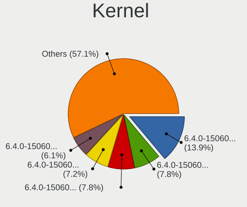

| Version                          | Computers | Percent |
|----------------------------------|-----------|---------|
| 6.4.0-150600.23.25-default       | 48        | 13.91%  |
| 6.4.0-150600.23.47-default       | 27        | 7.83%   |
| 6.4.0-150600.23.17-default       | 27        | 7.83%   |
| 6.4.0-150600.21-default          | 25        | 7.25%   |
| 6.4.0-150600.23.53-default       | 21        | 6.09%   |
| 6.4.0-150600.23.33-default       | 21        | 6.09%   |
| 6.4.0-150600.23.30-default       | 18        | 5.22%   |
| 6.4.0-150600.23.50-default       | 17        | 4.93%   |
| 6.4.0-150600.23.65-default       | 15        | 4.35%   |
| 6.4.0-150600.23.38-default       | 15        | 4.35%   |
| 6.4.0-150600.23.60-default       | 13        | 3.77%   |
| 6.4.0-150600.23.42-default       | 13        | 3.77%   |
| 6.4.0-150600.23.22-default       | 13        | 3.77%   |
| 6.4.0-150600.23.70-default       | 12        | 3.48%   |
| 6.4.0-150600.23.14-default       | 11        | 3.19%   |
| 6.4.0-150600.23.7-default        | 10        | 2.9%    |
| 6.4.0-150600.23.73-default       | 9         | 2.61%   |
| 6.4.0-150600.23.78-default       | 7         | 2.03%   |
| 6.4.0-150600.23.81-default       | 4         | 1.16%   |
| 6.4.0-150600.4-default           | 3         | 0.87%   |
| 6.4.0-150600.12-default          | 2         | 0.58%   |
| 6.4.0-150600.1-default           | 2         | 0.58%   |
| 6.6.5-dron                       | 1         | 0.29%   |
| 6.4.0-150600.21-ceno             | 1         | 0.29%   |
| 6.4.0-150600.20-default          | 1         | 0.29%   |
| 6.4.0-150600.16-default          | 1         | 0.29%   |
| 6.4.0-150600.10-default          | 1         | 0.29%   |
| 6.18.0-lp156.16.ga1b61b5-default | 1         | 0.29%   |
| 6.17.8-lp156.6.gb980365-default  | 1         | 0.29%   |
| 6.14.2-lp156.10.g9881558-default | 1         | 0.29%   |
| 6.13.7-lp156.3.gb2c3b6a-default  | 1         | 0.29%   |
| 6.13.4-lp156.2.g9f6800f-default  | 1         | 0.29%   |
| 6.11.8-lp156.4-default           | 1         | 0.29%   |
| 5.14.21-150500.55.88-default     | 1         | 0.29%   |

Kernel Family
-------------

Linux kernel without a distro release

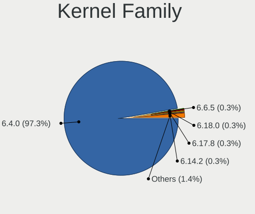

| Version | Computers | Percent |
|---------|-----------|---------|
| 6.4.0   | 288       | 97.3%   |
| 6.6.5   | 1         | 0.34%   |
| 6.18.0  | 1         | 0.34%   |
| 6.17.8  | 1         | 0.34%   |
| 6.14.2  | 1         | 0.34%   |
| 6.13.7  | 1         | 0.34%   |
| 6.13.4  | 1         | 0.34%   |
| 6.11.8  | 1         | 0.34%   |
| 5.14.21 | 1         | 0.34%   |

Kernel Major Ver.
-----------------

Linux kernel major version

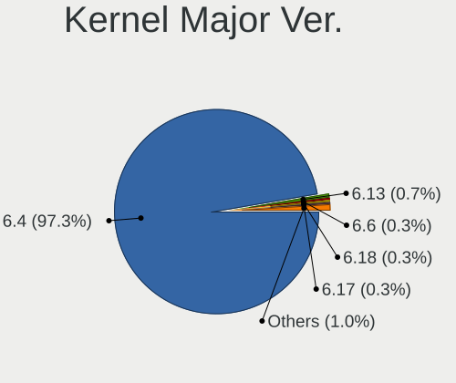

| Version | Computers | Percent |
|---------|-----------|---------|
| 6.4     | 288       | 97.3%   |
| 6.13    | 2         | 0.68%   |
| 6.6     | 1         | 0.34%   |
| 6.18    | 1         | 0.34%   |
| 6.17    | 1         | 0.34%   |
| 6.14    | 1         | 0.34%   |
| 6.11    | 1         | 0.34%   |
| 5.14    | 1         | 0.34%   |

Arch
----

OS architecture (x86_64, i586, etc.)

| Name   | Computers | Percent |
|--------|-----------|---------|
| x86_64 | 294       | 100%    |

DE
--

Desktop Environment

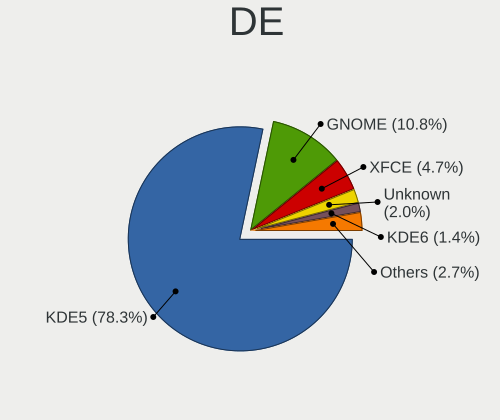

| Name     | Computers | Percent |
|----------|-----------|---------|
| KDE5     | 231       | 78.31%  |
| GNOME    | 32        | 10.85%  |
| XFCE     | 14        | 4.75%   |
| Unknown  | 6         | 2.03%   |
| KDE6     | 4         | 1.36%   |
| ICEWM    | 3         | 1.02%   |
| LXDE     | 2         | 0.68%   |
| Deepin   | 2         | 0.68%   |
| Cinnamon | 1         | 0.34%   |

Display Server
--------------

X11 or Wayland

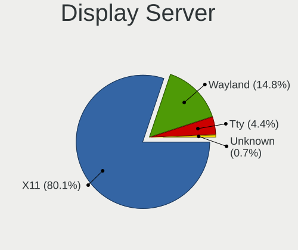

| Name    | Computers | Percent |
|---------|-----------|---------|
| X11     | 238       | 80.13%  |
| Wayland | 44        | 14.81%  |
| Tty     | 13        | 4.38%   |
| Unknown | 2         | 0.67%   |

Display Manager
---------------

SDDM, LightDM, etc.

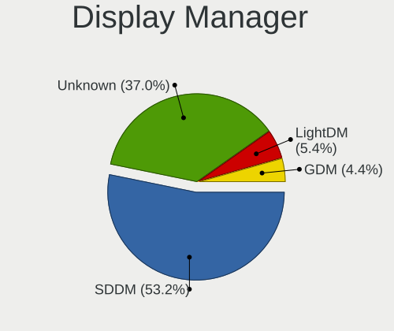

| Name    | Computers | Percent |
|---------|-----------|---------|
| SDDM    | 158       | 53.2%   |
| Unknown | 110       | 37.04%  |
| LightDM | 16        | 5.39%   |
| GDM     | 13        | 4.38%   |

OS Lang
-------

Language

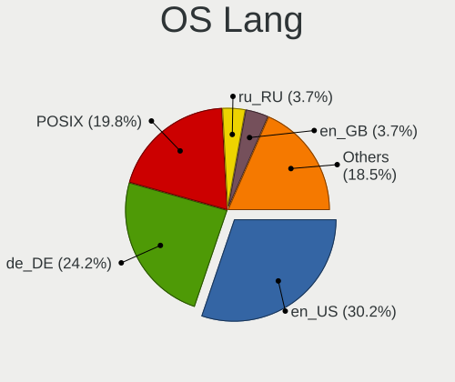

| Lang  | Computers | Percent |
|-------|-----------|---------|
| en_US | 90        | 30.2%   |
| de_DE | 72        | 24.16%  |
| POSIX | 59        | 19.8%   |
| ru_RU | 11        | 3.69%   |
| en_GB | 11        | 3.69%   |
| es_ES | 9         | 3.02%   |
| fr_FR | 8         | 2.68%   |
| pt_BR | 5         | 1.68%   |
| it_IT | 5         | 1.68%   |
| en_BW | 5         | 1.68%   |
| nl_NL | 4         | 1.34%   |
| bg_BG | 4         | 1.34%   |
| pl_PL | 3         | 1.01%   |
| zh_CN | 2         | 0.67%   |
| cs_CZ | 2         | 0.67%   |
| sv_SE | 1         | 0.34%   |
| sl_SI | 1         | 0.34%   |
| pt_PT | 1         | 0.34%   |
| nl_BE | 1         | 0.34%   |
| nb_NO | 1         | 0.34%   |
| ja_JP | 1         | 0.34%   |
| en_DK | 1         | 0.34%   |
| da_DK | 1         | 0.34%   |

Boot Mode
---------

EFI or BIOS

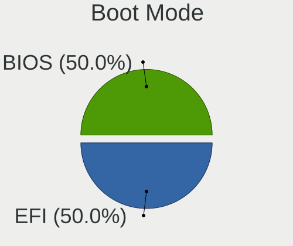

| Mode | Computers | Percent |
|------|-----------|---------|
| BIOS | 148       | 50%     |
| EFI  | 148       | 50%     |

Filesystem
----------

Type of filesystem

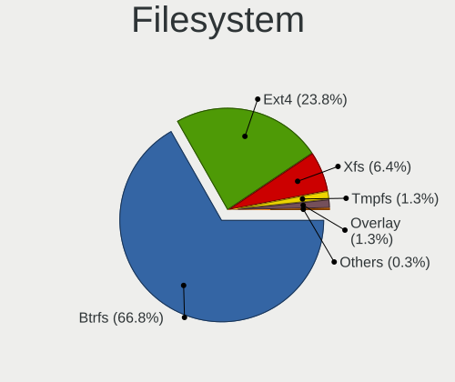

| Type    | Computers | Percent |
|---------|-----------|---------|
| Btrfs   | 199       | 66.78%  |
| Ext4    | 71        | 23.83%  |
| Xfs     | 19        | 6.38%   |
| Tmpfs   | 4         | 1.34%   |
| Overlay | 4         | 1.34%   |
| Ext2    | 1         | 0.34%   |

Part. scheme
------------

Scheme of partitioning

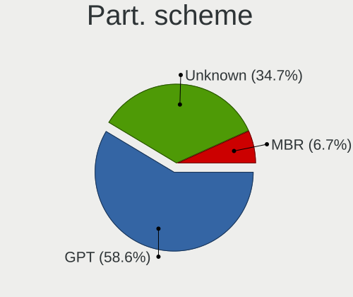

| Type    | Computers | Percent |
|---------|-----------|---------|
| GPT     | 174       | 58.59%  |
| Unknown | 103       | 34.68%  |
| MBR     | 20        | 6.73%   |

Dual Boot with Linux/BSD
------------------------

Hosting more than one Linux/BSD

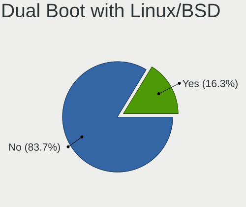

| Dual boot | Computers | Percent |
|-----------|-----------|---------|
| No        | 247       | 83.73%  |
| Yes       | 48        | 16.27%  |

Dual Boot (Win)
---------------

Hosting Linux and Windows

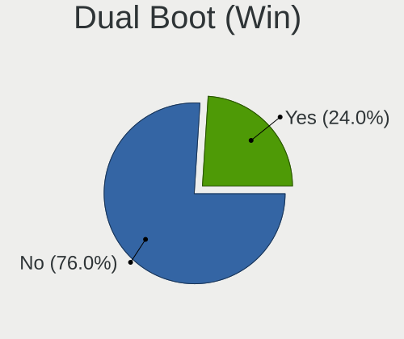

| Dual boot | Computers | Percent |
|-----------|-----------|---------|
| No        | 225       | 76.01%  |
| Yes       | 71        | 23.99%  |

Board
-----

Vendor
------

Motherboard manufacturer

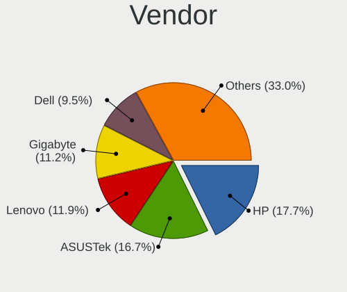

| Name                                 | Computers | Percent |
|--------------------------------------|-----------|---------|
| Hewlett-Packard                      | 52        | 17.69%  |
| ASUSTek Computer                     | 49        | 16.67%  |
| Lenovo                               | 35        | 11.9%   |
| Gigabyte Technology                  | 33        | 11.22%  |
| Dell                                 | 28        | 9.52%   |
| MSI                                  | 16        | 5.44%   |
| Acer                                 | 16        | 5.44%   |
| Apple                                | 11        | 3.74%   |
| ASRock                               | 10        | 3.4%    |
| Toshiba                              | 4         | 1.36%   |
| Notebook                             | 3         | 1.02%   |
| Medion                               | 3         | 1.02%   |
| Getac                                | 3         | 1.02%   |
| Unknown                              | 3         | 1.02%   |
| Supermicro                           | 2         | 0.68%   |
| Intel                                | 2         | 0.68%   |
| HUAWEI                               | 2         | 0.68%   |
| Fujitsu                              | 2         | 0.68%   |
| AZW                                  | 2         | 0.68%   |
| Alienware                            | 2         | 0.68%   |
| Wortmann AG                          | 1         | 0.34%   |
| TYAN Computer                        | 1         | 0.34%   |
| TUXEDO                               | 1         | 0.34%   |
| Shenzhen Meigao Electronic Equipment | 1         | 0.34%   |
| Shenzhen DOKE electronic             | 1         | 0.34%   |
| Samsung Electronics                  | 1         | 0.34%   |
| Positivo                             | 1         | 0.34%   |
| Panasonic                            | 1         | 0.34%   |
| JGINYUE                              | 1         | 0.34%   |
| Inter Sales A/S                      | 1         | 0.34%   |
| IBM                                  | 1         | 0.34%   |
| Google                               | 1         | 0.34%   |
| GEEKOM                               | 1         | 0.34%   |
| Chatreey                             | 1         | 0.34%   |
| Biostar                              | 1         | 0.34%   |
| Acidanthera                          | 1         | 0.34%   |

Model
-----

Motherboard model

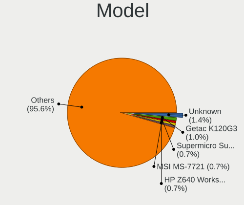

| Name                                            | Computers | Percent |
|-------------------------------------------------|-----------|---------|
| Unknown                                         | 4         | 1.36%   |
| Getac K120G3                                    | 3         | 1.02%   |
| Supermicro Super Server                         | 2         | 0.68%   |
| MSI MS-7721                                     | 2         | 0.68%   |
| HP Z640 Workstation                             | 2         | 0.68%   |
| HP Notebook                                     | 2         | 0.68%   |
| HP Laptop 15-fd0xxx                             | 2         | 0.68%   |
| Gigabyte G31M-ES2L                              | 2         | 0.68%   |
| Gigabyte B450 I AORUS PRO WIFI                  | 2         | 0.68%   |
| Dell Latitude 5320                              | 2         | 0.68%   |
| AZW SER                                         | 2         | 0.68%   |
| ASUS ROG CROSSHAIR VIII HERO                    | 2         | 0.68%   |
| ASUS P5KPL-AM SE                                | 2         | 0.68%   |
| ASUS M3N-HT DELUXE                              | 2         | 0.68%   |
| ASUS CROSSHAIR V FORMULA-Z                      | 2         | 0.68%   |
| ASUS All Series                                 | 2         | 0.68%   |
| Apple MacBookAir6,2                             | 2         | 0.68%   |
| Acer RB102                                      | 2         | 0.68%   |
| Wortmann AG 1220571_1470066                     | 1         | 0.34%   |
| TYAN CELSIUS R650                               | 1         | 0.34%   |
| TUXEDO InfinityBook Pro Intel Gen9              | 1         | 0.34%   |
| Toshiba Satellite U400                          | 1         | 0.34%   |
| Toshiba Satellite Pro C50-A-1L6                 | 1         | 0.34%   |
| Toshiba Satellite L775D                         | 1         | 0.34%   |
| Toshiba Satellite C45-A                         | 1         | 0.34%   |
| Shenzhen Meigao Electronic Equipment AMD 5900HX | 1         | 0.34%   |
| Shenzhen DOKE electronic MP100                  | 1         | 0.34%   |
| Samsung 340XAA/350XAA/550XAA                    | 1         | 0.34%   |
| Positivo C8256AI-14                             | 1         | 0.34%   |
| Panasonic FZ40-1                                | 1         | 0.34%   |
| Notebook NS50_70MU                              | 1         | 0.34%   |
| Notebook NLx0MU                                 | 1         | 0.34%   |
| Notebook NKx0Kx                                 | 1         | 0.34%   |
| MSI PRO ADL-U Cubi 5 (MS-B0A8)                  | 1         | 0.34%   |
| MSI MS-7E12                                     | 1         | 0.34%   |
| MSI MS-7E06                                     | 1         | 0.34%   |
| MSI MS-7D99                                     | 1         | 0.34%   |
| MSI MS-7D25                                     | 1         | 0.34%   |
| MSI MS-7C94                                     | 1         | 0.34%   |
| MSI MS-7C37                                     | 1         | 0.34%   |

Model Family
------------

Motherboard model prefix

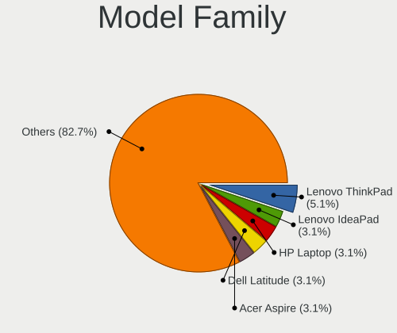

| Name                   | Computers | Percent |
|------------------------|-----------|---------|
| Lenovo ThinkPad        | 15        | 5.1%    |
| Lenovo IdeaPad         | 9         | 3.06%   |
| HP Laptop              | 9         | 3.06%   |
| Dell Latitude          | 9         | 3.06%   |
| Acer Aspire            | 9         | 3.06%   |
| ASUS PRIME             | 8         | 2.72%   |
| HP Pavilion            | 7         | 2.38%   |
| HP EliteBook           | 7         | 2.38%   |
| HP Compaq              | 6         | 2.04%   |
| Dell OptiPlex          | 6         | 2.04%   |
| ASUS Vivobook          | 6         | 2.04%   |
| Gigabyte B450          | 5         | 1.7%    |
| Dell Precision         | 5         | 1.7%    |
| ASUS ROG               | 5         | 1.7%    |
| Toshiba Satellite      | 4         | 1.36%   |
| Dell Inspiron          | 4         | 1.36%   |
| ASUS TUF               | 4         | 1.36%   |
| Unknown                | 4         | 1.36%   |
| Lenovo Legion          | 3         | 1.02%   |
| HP ENVY                | 3         | 1.02%   |
| Getac K120G3           | 3         | 1.02%   |
| Supermicro Super       | 2         | 0.68%   |
| MSI MS-7721            | 2         | 0.68%   |
| Lenovo ThinkCentre     | 2         | 0.68%   |
| HP ZBook               | 2         | 0.68%   |
| HP Z640                | 2         | 0.68%   |
| HP ProBook             | 2         | 0.68%   |
| HP Notebook            | 2         | 0.68%   |
| HP Elite               | 2         | 0.68%   |
| Gigabyte GA-78LMT-USB3 | 2         | 0.68%   |
| Gigabyte G31M-ES2L     | 2         | 0.68%   |
| Fujitsu ESPRIMO        | 2         | 0.68%   |
| AZW SER                | 2         | 0.68%   |
| ASUS P5KPL-AM          | 2         | 0.68%   |
| ASUS M3N-HT            | 2         | 0.68%   |
| ASUS CROSSHAIR         | 2         | 0.68%   |
| ASUS ASUS              | 2         | 0.68%   |
| ASUS All               | 2         | 0.68%   |
| Apple MacBookPro11     | 2         | 0.68%   |
| Apple MacBookAir6      | 2         | 0.68%   |

MFG Year
--------

Motherboard manufacture year

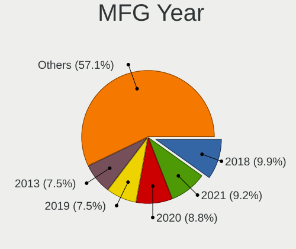

| Year | Computers | Percent |
|------|-----------|---------|
| 2018 | 29        | 9.86%   |
| 2021 | 27        | 9.18%   |
| 2020 | 26        | 8.84%   |
| 2019 | 22        | 7.48%   |
| 2013 | 22        | 7.48%   |
| 2023 | 21        | 7.14%   |
| 2024 | 19        | 6.46%   |
| 2022 | 18        | 6.12%   |
| 2011 | 18        | 6.12%   |
| 2015 | 16        | 5.44%   |
| 2012 | 16        | 5.44%   |
| 2014 | 15        | 5.1%    |
| 2008 | 14        | 4.76%   |
| 2016 | 12        | 4.08%   |
| 2017 | 9         | 3.06%   |
| 2025 | 4         | 1.36%   |
| 2010 | 3         | 1.02%   |
| 2009 | 3         | 1.02%   |

Form Factor
-----------

Physical design of the computer

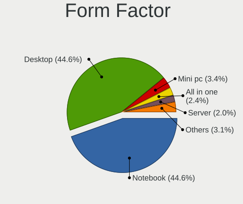

| Name        | Computers | Percent |
|-------------|-----------|---------|
| Desktop     | 131       | 44.56%  |
| Notebook    | 131       | 44.56%  |
| Mini pc     | 10        | 3.4%    |
| All in one  | 7         | 2.38%   |
| Server      | 6         | 2.04%   |
| Convertible | 5         | 1.7%    |
| Tablet      | 4         | 1.36%   |

Secure Boot
-----------

Enabled or disabled

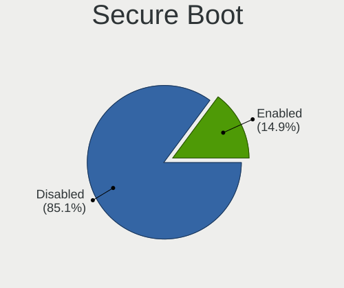

| State    | Computers | Percent |
|----------|-----------|---------|
| Disabled | 252       | 85.14%  |
| Enabled  | 44        | 14.86%  |

Coreboot
--------

Have coreboot on board

| Used | Computers | Percent |
|------|-----------|---------|
| No   | 293       | 99.66%  |
| Yes  | 1         | 0.34%   |

RAM Size
--------

Total RAM memory

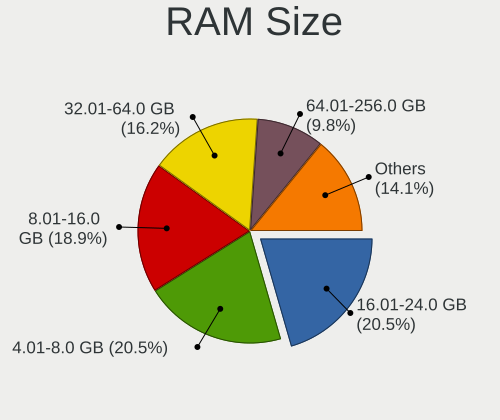

| Size in GB      | Computers | Percent |
|-----------------|-----------|---------|
| 4.01-8.0        | 61        | 20.54%  |
| 16.01-24.0      | 61        | 20.54%  |
| 8.01-16.0       | 56        | 18.86%  |
| 32.01-64.0      | 48        | 16.16%  |
| 64.01-256.0     | 29        | 9.76%   |
| 3.01-4.0        | 19        | 6.4%    |
| 24.01-32.0      | 14        | 4.71%   |
| 1.01-2.0        | 4         | 1.35%   |
| 2.01-3.0        | 3         | 1.01%   |
| More than 256.0 | 2         | 0.67%   |

RAM Used
--------

Used RAM memory

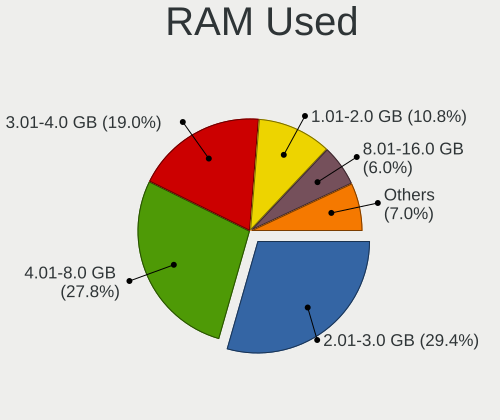

| Used GB     | Computers | Percent |
|-------------|-----------|---------|
| 2.01-3.0    | 93        | 29.43%  |
| 4.01-8.0    | 88        | 27.85%  |
| 3.01-4.0    | 60        | 18.99%  |
| 1.01-2.0    | 34        | 10.76%  |
| 8.01-16.0   | 19        | 6.01%   |
| 0.51-1.0    | 10        | 3.16%   |
| 32.01-64.0  | 4         | 1.27%   |
| 16.01-24.0  | 4         | 1.27%   |
| 24.01-32.0  | 2         | 0.63%   |
| 64.01-256.0 | 1         | 0.32%   |
| 0.01-0.5    | 1         | 0.32%   |

Total Drives
------------

Number of drives on board

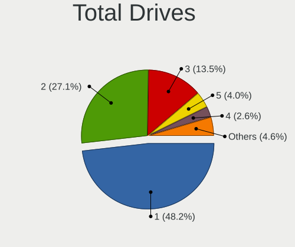

| Drives | Computers | Percent |
|--------|-----------|---------|
| 1      | 146       | 48.18%  |
| 2      | 82        | 27.06%  |
| 3      | 41        | 13.53%  |
| 5      | 12        | 3.96%   |
| 4      | 8         | 2.64%   |
| 6      | 4         | 1.32%   |
| 10     | 2         | 0.66%   |
| 9      | 2         | 0.66%   |
| 7      | 2         | 0.66%   |
| 30     | 1         | 0.33%   |
| 14     | 1         | 0.33%   |
| 13     | 1         | 0.33%   |
| 11     | 1         | 0.33%   |

Has CD-ROM
----------

Has CD-ROM on board

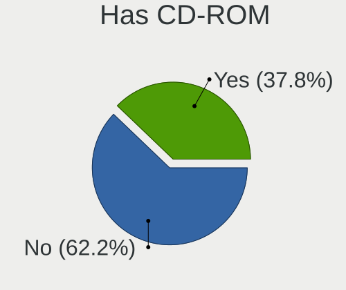

| Presented | Computers | Percent |
|-----------|-----------|---------|
| No        | 184       | 62.16%  |
| Yes       | 112       | 37.84%  |

Has Ethernet
------------

Has Ethernet on board

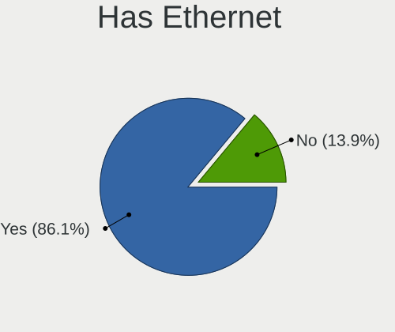

| Presented | Computers | Percent |
|-----------|-----------|---------|
| Yes       | 253       | 86.05%  |
| No        | 41        | 13.95%  |

Has WiFi
--------

Has WiFi module

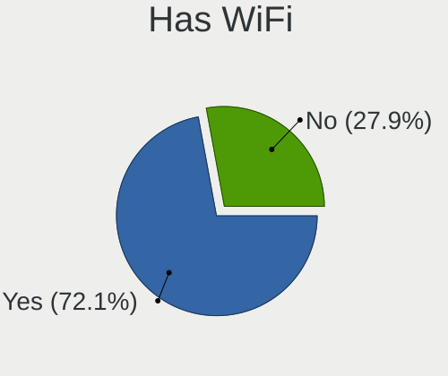

| Presented | Computers | Percent |
|-----------|-----------|---------|
| Yes       | 212       | 72.11%  |
| No        | 82        | 27.89%  |

Has Bluetooth
-------------

Has Bluetooth module

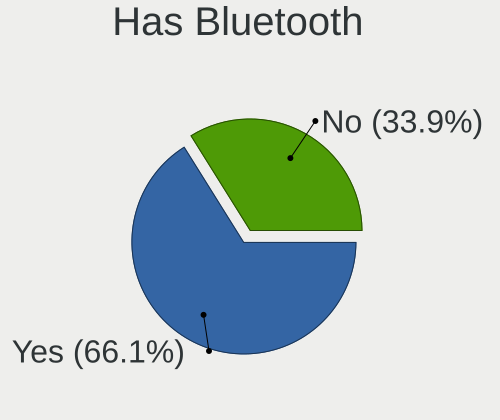

| Presented | Computers | Percent |
|-----------|-----------|---------|
| Yes       | 197       | 66.11%  |
| No        | 101       | 33.89%  |

Location
--------

Country
-------

Geographic location (country)

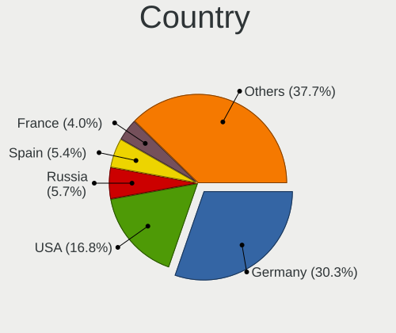

| Country         | Computers | Percent |
|-----------------|-----------|---------|
| Germany         | 90        | 30.3%   |
| USA             | 50        | 16.84%  |
| Russia          | 17        | 5.72%   |
| Spain           | 16        | 5.39%   |
| France          | 12        | 4.04%   |
| UK              | 10        | 3.37%   |
| Brazil          | 8         | 2.69%   |
| Italy           | 7         | 2.36%   |
| Switzerland     | 6         | 2.02%   |
| Australia       | 6         | 2.02%   |
| Belgium         | 5         | 1.68%   |
| Poland          | 4         | 1.35%   |
| Netherlands     | 4         | 1.35%   |
| Canada          | 4         | 1.35%   |
| Bulgaria        | 4         | 1.35%   |
| Austria         | 4         | 1.35%   |
| Vietnam         | 3         | 1.01%   |
| Sweden          | 3         | 1.01%   |
| Czechia         | 3         | 1.01%   |
| Argentina       | 3         | 1.01%   |
| Turkey          | 2         | 0.67%   |
| Saudi Arabia    | 2         | 0.67%   |
| Norway          | 2         | 0.67%   |
| Japan           | 2         | 0.67%   |
| Iceland         | 2         | 0.67%   |
| Hungary         | 2         | 0.67%   |
| Hong Kong       | 2         | 0.67%   |
| Chile           | 2         | 0.67%   |
| Ukraine         | 1         | 0.34%   |
| UAE             | 1         | 0.34%   |
| Tunisia         | 1         | 0.34%   |
| The Netherlands | 1         | 0.34%   |
| Thailand        | 1         | 0.34%   |
| Taiwan          | 1         | 0.34%   |
| Slovenia        | 1         | 0.34%   |
| Slovakia        | 1         | 0.34%   |
| Senegal         | 1         | 0.34%   |
| Romania         | 1         | 0.34%   |
| Portugal        | 1         | 0.34%   |
| Peru            | 1         | 0.34%   |

City
----

Geographic location (city)

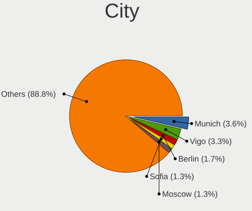

| City              | Computers | Percent |
|-------------------|-----------|---------|
| Munich            | 11        | 3.63%   |
| Vigo              | 10        | 3.3%    |
| Berlin            | 5         | 1.65%   |
| Sofia             | 4         | 1.32%   |
| Moscow            | 4         | 1.32%   |
| Leipzig           | 4         | 1.32%   |
| Düsseldorf       | 4         | 1.32%   |
| Vienna            | 3         | 0.99%   |
| Soltau            | 3         | 0.99%   |
| Frankfurt am Main | 3         | 0.99%   |
| Fayetteville      | 3         | 0.99%   |
| Zurich            | 2         | 0.66%   |
| Zittau            | 2         | 0.66%   |
| Warsaw            | 2         | 0.66%   |
| Townsville        | 2         | 0.66%   |
| Stuttgart         | 2         | 0.66%   |
| St Petersburg     | 2         | 0.66%   |
| St Louis          | 2         | 0.66%   |
| Prague            | 2         | 0.66%   |
| Perm              | 2         | 0.66%   |
| Madrid            | 2         | 0.66%   |
| Lomonosov         | 2         | 0.66%   |
| Kindenheim        | 2         | 0.66%   |
| Hallstadt         | 2         | 0.66%   |
| Denver            | 2         | 0.66%   |
| Budapest          | 2         | 0.66%   |
| Brussels          | 2         | 0.66%   |
| Ballwin           | 2         | 0.66%   |
| Zuchwil           | 1         | 0.33%   |
| Zaragoza          | 1         | 0.33%   |
| Zagreb            | 1         | 0.33%   |
| Yarm              | 1         | 0.33%   |
| Wroclaw           | 1         | 0.33%   |
| Wiesbaden         | 1         | 0.33%   |
| West Bloomfield   | 1         | 0.33%   |
| West Bend         | 1         | 0.33%   |
| Weisswasser       | 1         | 0.33%   |
| Wedemark          | 1         | 0.33%   |
| Wanchai           | 1         | 0.33%   |
| Vitória          | 1         | 0.33%   |

Drives
------

Drive Vendor
------------

Hard drive vendors

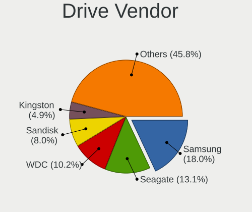

| Vendor                         | Computers | Drives | Percent |
|--------------------------------|-----------|--------|---------|
| Samsung Electronics            | 88        | 161    | 18%     |
| Seagate                        | 64        | 98     | 13.09%  |
| WDC                            | 50        | 106    | 10.22%  |
| Sandisk                        | 39        | 52     | 7.98%   |
| Kingston                       | 24        | 34     | 4.91%   |
| Toshiba                        | 23        | 29     | 4.7%    |
| Crucial                        | 20        | 33     | 4.09%   |
| Unknown                        | 15        | 20     | 3.07%   |
| Micron Technology              | 12        | 14     | 2.45%   |
| Intel                          | 11        | 12     | 2.25%   |
| SK hynix                       | 10        | 11     | 2.04%   |
| HGST                           | 10        | 12     | 2.04%   |
| Apple                          | 9         | 10     | 1.84%   |
| Intenso                        | 8         | 11     | 1.64%   |
| KIOXIA                         | 7         | 7      | 1.43%   |
| A-DATA Technology              | 7         | 7      | 1.43%   |
| MAXIO Technology (Hangzhou)    | 6         | 10     | 1.23%   |
| Hitachi                        | 6         | 8      | 1.23%   |
| ADATA Technology               | 6         | 7      | 1.23%   |
| PNY                            | 5         | 5      | 1.02%   |
| Phison Electronics             | 5         | 8      | 1.02%   |
| Kingston Technology Company    | 5         | 8      | 1.02%   |
| Micron/Crucial Technology      | 4         | 4      | 0.82%   |
| Hewlett-Packard                | 4         | 4      | 0.82%   |
| China                          | 4         | 4      | 0.82%   |
| SPCC                           | 3         | 4      | 0.61%   |
| USB                            | 2         | 3      | 0.41%   |
| Solid State Storage Technology | 2         | 2      | 0.41%   |
| Silicon Motion                 | 2         | 2      | 0.41%   |
| Shenzhen Longsys Electronics   | 2         | 5      | 0.41%   |
| External                       | 2         | 2      | 0.41%   |
| Emtec                          | 2         | 2      | 0.41%   |
| Unknown                        | 2         | 2      | 0.41%   |
| ZADAK                          | 1         | 1      | 0.2%    |
| Verbatim                       | 1         | 1      | 0.2%    |
| Transcend                      | 1         | 1      | 0.2%    |
| SSK Port                       | 1         | 1      | 0.2%    |
| SOLIDIGM                       | 1         | 2      | 0.2%    |
| Solid State Storage            | 1         | 1      | 0.2%    |
| Solid                          | 1         | 1      | 0.2%    |

Drive Model
-----------

Hard drive models

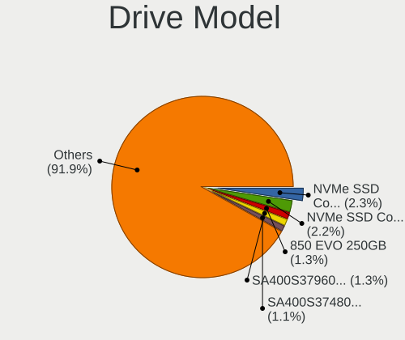

| Model                                                              | Computers | Percent |
|--------------------------------------------------------------------|-----------|---------|
| Samsung NVMe SSD Controller PM9A1/PM9A3/980PRO 1TB                 | 13        | 2.34%   |
| Samsung NVMe SSD Controller SM981/PM981/PM983 1TB                  | 12        | 2.16%   |
| Samsung SSD 850 EVO 250GB                                          | 7         | 1.26%   |
| Kingston SA400S37960G 960GB SSD                                    | 7         | 1.26%   |
| Kingston SA400S37480G 480GB SSD                                    | 6         | 1.08%   |
| Crucial CT1000MX500SSD1 1TB                                        | 6         | 1.08%   |
| Samsung SSD 870 EVO 500GB                                          | 5         | 0.9%    |
| Samsung NVMe SSD Controller SM961/PM961/SM963 1024GB               | 5         | 0.9%    |
| WDC WD20EZBX-00AYRA0 2TB                                           | 4         | 0.72%   |
| Toshiba MQ04ABF100 1TB                                             | 4         | 0.72%   |
| Seagate ST1000DM010-2EP102 1TB                                     | 4         | 0.72%   |
| Sandisk WD_BLACK SN770 2TB                                         | 4         | 0.72%   |
| Samsung SSD 870 EVO 1TB                                            | 4         | 0.72%   |
| MAXIO (Hangzhou) NVMe SSD Controller MAP1202 2TB                   | 4         | 0.72%   |
| Seagate ST2000DM008-2UB102 2TB                                     | 3         | 0.54%   |
| Seagate ST2000DM008-2FR102 2TB                                     | 3         | 0.54%   |
| Seagate ST1000DM003-1SB102 1TB                                     | 3         | 0.54%   |
| Sandisk WD Black SN750 / PC SN730 NVMe SSD 500GB                   | 3         | 0.54%   |
| Samsung SSD 990 PRO 4TB                                            | 3         | 0.54%   |
| Samsung SSD 980 1TB                                                | 3         | 0.54%   |
| Samsung SSD 870 QVO 2TB                                            | 3         | 0.54%   |
| Samsung SSD 860 EVO 1TB                                            | 3         | 0.54%   |
| Samsung MZVLQ256HAJD-000H1 256GB                                   | 3         | 0.54%   |
| Micron/Crucial P2 NVMe PCIe SSD 2TB                                | 3         | 0.54%   |
| KIOXIA EXCERIA PLUS G3 SSD 1TB                                     | 3         | 0.54%   |
| Kingston SV300S37A120G 120GB SSD                                   | 3         | 0.54%   |
| Kingston SA400S37120G 120GB SSD                                    | 3         | 0.54%   |
| Intenso SSD 256GB                                                  | 3         | 0.54%   |
| HGST HTS721010A9E630 1TB                                           | 3         | 0.54%   |
| Crucial CT2000MX500SSD1 2TB                                        | 3         | 0.54%   |
| Crucial CT1000BX500SSD1 1TB                                        | 3         | 0.54%   |
| ADATA XPG SX8200 Pro PCIe Gen3x4 M.2 2280 Solid State Drive 1024GB | 3         | 0.54%   |
| WDC WD40EZAZ-19SF3B0 4TB                                           | 2         | 0.36%   |
| WDC WD20EZRZ-00Z5HB0 2TB                                           | 2         | 0.36%   |
| WDC WD10EZEX-60WN4A0 1TB                                           | 2         | 0.36%   |
| WDC WD10EARS-00Y5B1 1TB                                            | 2         | 0.36%   |
| Unknown SD/MMC/MS PRO 2GB                                          | 2         | 0.36%   |
| Unknown NVMe SSD Drive 512GB                                       | 2         | 0.36%   |
| Unknown MMC Card  64GB                                             | 2         | 0.36%   |
| Unknown MMC Card  512GB                                            | 2         | 0.36%   |

HDD Vendor
----------

Hard disk drive vendors

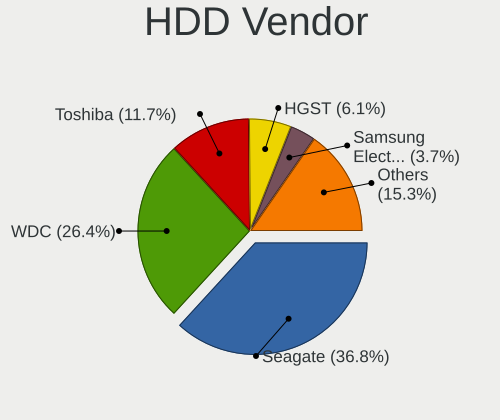

| Vendor              | Computers | Drives | Percent |
|---------------------|-----------|--------|---------|
| Seagate             | 60        | 86     | 36.81%  |
| WDC                 | 43        | 95     | 26.38%  |
| Toshiba             | 19        | 25     | 11.66%  |
| HGST                | 10        | 12     | 6.13%   |
| Samsung Electronics | 6         | 8      | 3.68%   |
| Hitachi             | 6         | 8      | 3.68%   |
| Apple               | 4         | 4      | 2.45%   |
| Unknown             | 3         | 5      | 1.84%   |
| Hewlett-Packard     | 3         | 3      | 1.84%   |
| Intenso             | 2         | 2      | 1.23%   |
| External            | 2         | 2      | 1.23%   |
| Maxtor              | 1         | 1      | 0.61%   |
| Inateck             | 1         | 1      | 0.61%   |
| HPE                 | 1         | 32     | 0.61%   |
| Fujitsu             | 1         | 8      | 0.61%   |
| ASMT                | 1         | 1      | 0.61%   |

SSD Vendor
----------

Solid state drive vendors

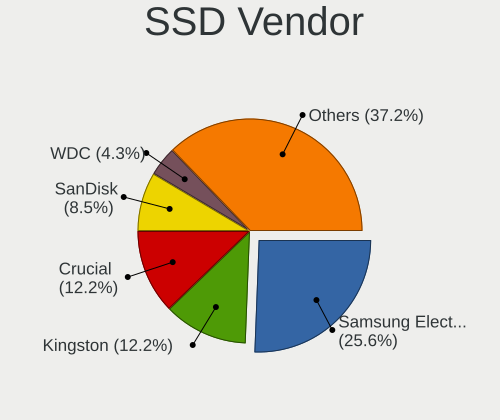

| Vendor              | Computers | Drives | Percent |
|---------------------|-----------|--------|---------|
| Samsung Electronics | 42        | 86     | 25.61%  |
| Kingston            | 20        | 27     | 12.2%   |
| Crucial             | 20        | 33     | 12.2%   |
| SanDisk             | 14        | 17     | 8.54%   |
| WDC                 | 7         | 10     | 4.27%   |
| Intenso             | 6         | 9      | 3.66%   |
| A-DATA Technology   | 6         | 6      | 3.66%   |
| PNY                 | 5         | 5      | 3.05%   |
| Intel               | 5         | 6      | 3.05%   |
| China               | 4         | 4      | 2.44%   |
| Apple               | 4         | 4      | 2.44%   |
| SPCC                | 3         | 4      | 1.83%   |
| Micron Technology   | 3         | 3      | 1.83%   |
| Emtec               | 2         | 2      | 1.22%   |
| ZADAK               | 1         | 1      | 0.61%   |
| Verbatim            | 1         | 1      | 0.61%   |
| Transcend           | 1         | 1      | 0.61%   |
| SSK Port            | 1         | 1      | 0.61%   |
| Solid               | 1         | 1      | 0.61%   |
| SK hynix            | 1         | 1      | 0.61%   |
| Seagate             | 1         | 1      | 0.61%   |
| SD                  | 1         | 1      | 0.61%   |
| Plextor             | 1         | 1      | 0.61%   |
| Phison              | 1         | 1      | 0.61%   |
| MSI                 | 1         | 1      | 0.61%   |
| MS310               | 1         | 1      | 0.61%   |
| MAXSUN              | 1         | 1      | 0.61%   |
| LITEON              | 1         | 5      | 0.61%   |
| Lexar               | 1         | 1      | 0.61%   |
| Leven               | 1         | 1      | 0.61%   |
| KingSpec            | 1         | 1      | 0.61%   |
| Hikvision           | 1         | 1      | 0.61%   |
| Hewlett-Packard     | 1         | 1      | 0.61%   |
| Gigabyte Technology | 1         | 1      | 0.61%   |
| Corsair             | 1         | 1      | 0.61%   |
| AGI                 | 1         | 1      | 0.61%   |
| Unknown             | 1         | 1      | 0.61%   |

Drive Kind
----------

HDD or SSD

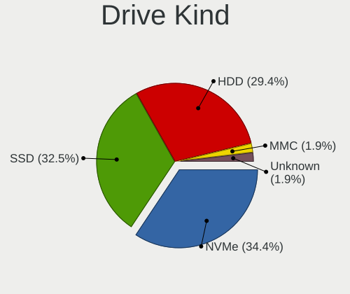

| Kind    | Computers | Drives | Percent |
|---------|-----------|--------|---------|
| NVMe    | 145       | 215    | 34.36%  |
| SSD     | 137       | 243    | 32.46%  |
| HDD     | 124       | 293    | 29.38%  |
| MMC     | 8         | 8      | 1.9%    |
| Unknown | 8         | 13     | 1.9%    |

Drive Connector
---------------

SATA, SAS, NVMe, etc.

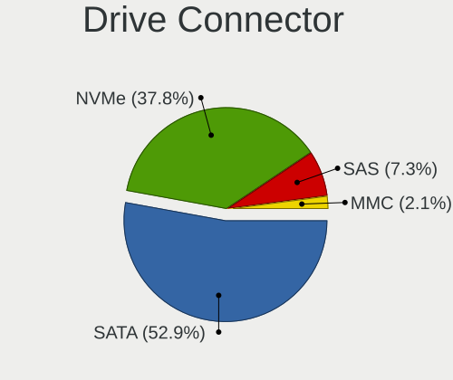

| Type | Computers | Drives | Percent |
|------|-----------|--------|---------|
| SATA | 203       | 498    | 52.86%  |
| NVMe | 145       | 215    | 37.76%  |
| SAS  | 28        | 51     | 7.29%   |
| MMC  | 8         | 8      | 2.08%   |

Drive Size
----------

Size of hard drive

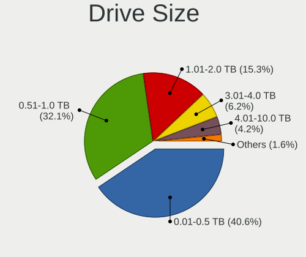

| Size in TB | Computers | Drives | Percent |
|------------|-----------|--------|---------|
| 0.01-0.5   | 125       | 206    | 40.58%  |
| 0.51-1.0   | 99        | 181    | 32.14%  |
| 1.01-2.0   | 47        | 75     | 15.26%  |
| 3.01-4.0   | 19        | 32     | 6.17%   |
| 4.01-10.0  | 13        | 34     | 4.22%   |
| 2.01-3.0   | 2         | 5      | 0.65%   |
| 10.01-20.0 | 2         | 2      | 0.65%   |
| 20.01-50.0 | 1         | 1      | 0.32%   |

Space Total
-----------

Amount of disk space available on the file system

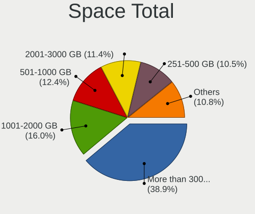

| Size in GB     | Computers | Percent |
|----------------|-----------|---------|
| More than 3000 | 119       | 38.89%  |
| 1001-2000      | 49        | 16.01%  |
| 501-1000       | 38        | 12.42%  |
| 2001-3000      | 35        | 11.44%  |
| 251-500        | 32        | 10.46%  |
| 101-250        | 24        | 7.84%   |
| 51-100         | 5         | 1.63%   |
| 21-50          | 2         | 0.65%   |
| 1-20           | 1         | 0.33%   |
| Unknown        | 1         | 0.33%   |

Space Used
----------

Amount of used disk space

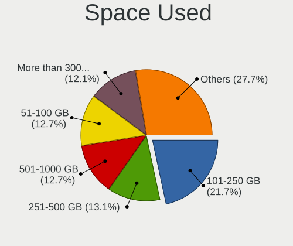

| Used GB        | Computers | Percent |
|----------------|-----------|---------|
| 101-250        | 68        | 21.66%  |
| 251-500        | 41        | 13.06%  |
| 501-1000       | 40        | 12.74%  |
| 51-100         | 40        | 12.74%  |
| More than 3000 | 38        | 12.1%   |
| 1001-2000      | 32        | 10.19%  |
| 1-20           | 26        | 8.28%   |
| 21-50          | 18        | 5.73%   |
| 2001-3000      | 10        | 3.18%   |
| Unknown        | 1         | 0.32%   |

Malfunc. Drives
---------------

Drive models with a malfunction

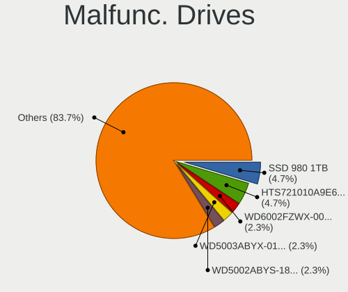

| Model                                          | Computers | Drives | Percent |
|------------------------------------------------|-----------|--------|---------|
| Samsung Electronics SSD 980 1TB                | 2         | 2      | 4.65%   |
| HGST HTS721010A9E630 1TB                       | 2         | 2      | 4.65%   |
| WDC WD6002FZWX-00GBGB0 6TB                     | 1         | 3      | 2.33%   |
| WDC WD5003ABYX-01WERA0 500GB                   | 1         | 1      | 2.33%   |
| WDC WD5002ABYS-18B1B0 500GB                    | 1         | 1      | 2.33%   |
| WDC WD5002ABYS-02B1B0 500GB                    | 1         | 1      | 2.33%   |
| WDC WD40EFRX-68N32N0 4TB                       | 1         | 2      | 2.33%   |
| WDC WD3200AAKX-00ERMA0 320GB                   | 1         | 1      | 2.33%   |
| WDC WD20EFRX-68EUZN0 2TB                       | 1         | 1      | 2.33%   |
| WDC WD10SPZX-21Z10T0 1TB                       | 1         | 1      | 2.33%   |
| WDC WD10EZRX-00L4HB0 1TB                       | 1         | 2      | 2.33%   |
| WDC WD10EZEX-60WN4A0 1TB                       | 1         | 2      | 2.33%   |
| WDC WD10EZEX-22RKKA0 1TB                       | 1         | 2      | 2.33%   |
| Toshiba MK5065GSX 500GB                        | 1         | 1      | 2.33%   |
| Toshiba MK3265GSX 320GB                        | 1         | 1      | 2.33%   |
| Seagate ST9320423AS 320GB                      | 1         | 2      | 2.33%   |
| Seagate ST8000VN0022-2EL112 8TB                | 1         | 3      | 2.33%   |
| Seagate ST8000NT001-3LZ101 8TB                 | 1         | 2      | 2.33%   |
| Seagate ST500DM002-1BD142 500GB                | 1         | 1      | 2.33%   |
| Seagate ST3250318AS 250GB                      | 1         | 1      | 2.33%   |
| Seagate ST3250312AS 250GB                      | 1         | 2      | 2.33%   |
| Seagate ST3000DM001-1ER166 3TB                 | 1         | 1      | 2.33%   |
| Seagate ST16000NM000J-2TW103 16TB              | 1         | 1      | 2.33%   |
| Seagate ST1000DM010-2EP102 1TB                 | 1         | 1      | 2.33%   |
| SanDisk SD6SB1M064G1022I 64GB SSD              | 1         | 1      | 2.33%   |
| Samsung Electronics SSD 870 EVO 2TB            | 1         | 2      | 2.33%   |
| Samsung Electronics HD502IJ 500GB              | 1         | 1      | 2.33%   |
| Micron Technology MTFDDAK256MAM-1K12 256GB SSD | 1         | 1      | 2.33%   |
| Maxtor 6L250S0 256GB                           | 1         | 1      | 2.33%   |
| Kingston SV300S37A120G 120GB SSD               | 1         | 1      | 2.33%   |
| Kingston SHFS37A120G 120GB SSD                 | 1         | 2      | 2.33%   |
| Intel SSDSCKKW256G8 256GB                      | 1         | 1      | 2.33%   |
| Intel SSDSCKKF512G8 SATA 512GB                 | 1         | 2      | 2.33%   |
| Intel SSDSC2KG960G8 960GB                      | 1         | 1      | 2.33%   |
| Intel SSDSC2BB012T7O 1TB                       | 1         | 1      | 2.33%   |
| HPE MM1000GBKAL 1TB                            | 1         | 32     | 2.33%   |
| Hitachi HDT721016SLA380 160GB                  | 1         | 1      | 2.33%   |
| Hitachi HDS721616PLA380 160GB                  | 1         | 2      | 2.33%   |
| HGST HTS725050A7E630 500GB                     | 1         | 1      | 2.33%   |
| Crucial CT500MX200SSD3 500GB                   | 1         | 1      | 2.33%   |

Malfunc. Drive Vendor
---------------------

Vendors of faulty drives

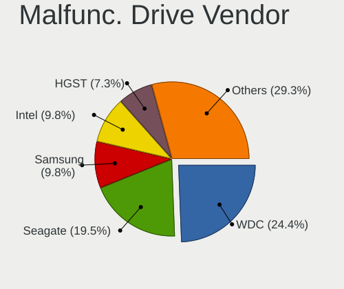

| Vendor              | Computers | Drives | Percent |
|---------------------|-----------|--------|---------|
| WDC                 | 10        | 17     | 24.39%  |
| Seagate             | 8         | 14     | 19.51%  |
| Samsung Electronics | 4         | 5      | 9.76%   |
| Intel               | 4         | 5      | 9.76%   |
| HGST                | 3         | 3      | 7.32%   |
| Toshiba             | 2         | 2      | 4.88%   |
| Kingston            | 2         | 3      | 4.88%   |
| Hitachi             | 2         | 3      | 4.88%   |
| SanDisk             | 1         | 1      | 2.44%   |
| Micron Technology   | 1         | 1      | 2.44%   |
| Maxtor              | 1         | 1      | 2.44%   |
| HPE                 | 1         | 32     | 2.44%   |
| Crucial             | 1         | 1      | 2.44%   |
| AGI                 | 1         | 1      | 2.44%   |

Malfunc. HDD Vendor
-------------------

Vendors of faulty HDD drives

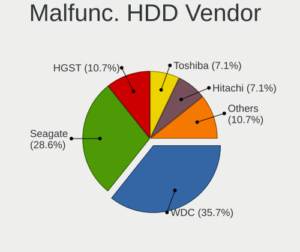

| Vendor              | Computers | Drives | Percent |
|---------------------|-----------|--------|---------|
| WDC                 | 10        | 17     | 35.71%  |
| Seagate             | 8         | 14     | 28.57%  |
| HGST                | 3         | 3      | 10.71%  |
| Toshiba             | 2         | 2      | 7.14%   |
| Hitachi             | 2         | 3      | 7.14%   |
| Samsung Electronics | 1         | 1      | 3.57%   |
| Maxtor              | 1         | 1      | 3.57%   |
| HPE                 | 1         | 32     | 3.57%   |

Malfunc. Drive Kind
-------------------

Kinds of faulty drives

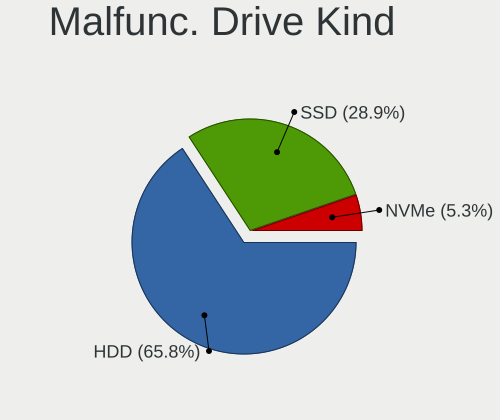

| Kind | Computers | Drives | Percent |
|------|-----------|--------|---------|
| HDD  | 25        | 73     | 65.79%  |
| SSD  | 11        | 14     | 28.95%  |
| NVMe | 2         | 2      | 5.26%   |

Failed Drives
-------------

Failed drive models

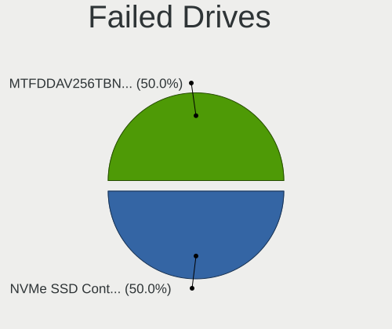

| Model                                                         | Computers | Drives | Percent |
|---------------------------------------------------------------|-----------|--------|---------|
| Samsung Electronics NVMe SSD Controller SM981/PM981/PM983 1TB | 1         | 1      | 50%     |
| Micron Technology MTFDDAV256TBN-1AR15ABHA 256GB SSD           | 1         | 1      | 50%     |

Failed Drive Vendor
-------------------

Failed drive vendors

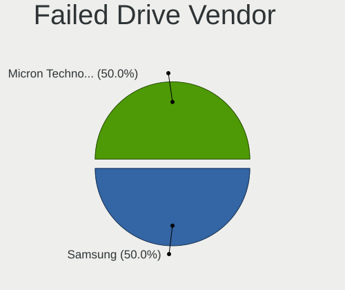

| Vendor              | Computers | Drives | Percent |
|---------------------|-----------|--------|---------|
| Samsung Electronics | 1         | 1      | 50%     |
| Micron Technology   | 1         | 1      | 50%     |

Drive Status
------------

Number of failed and malfunc. drives

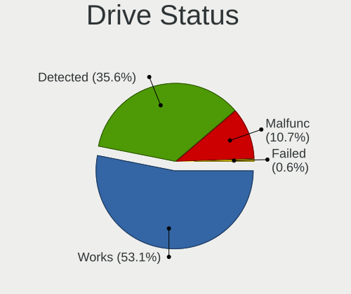

| Status   | Computers | Drives | Percent |
|----------|-----------|--------|---------|
| Works    | 179       | 365    | 53.12%  |
| Detected | 120       | 316    | 35.61%  |
| Malfunc  | 36        | 89     | 10.68%  |
| Failed   | 2         | 2      | 0.59%   |

Storage controller
------------------

Storage Vendor
--------------

Storage controller vendors

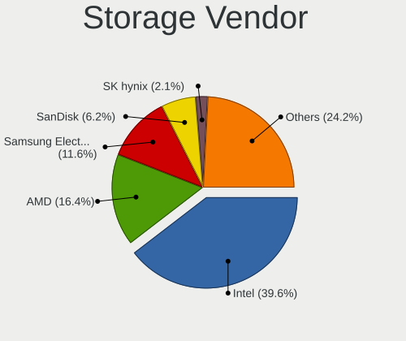

| Vendor                         | Computers | Percent |
|--------------------------------|-----------|---------|
| Intel                          | 167       | 39.57%  |
| AMD                            | 69        | 16.35%  |
| Samsung Electronics            | 49        | 11.61%  |
| SanDisk                        | 26        | 6.16%   |
| SK hynix                       | 9         | 2.13%   |
| Micron Technology              | 9         | 2.13%   |
| Marvell Technology Group       | 9         | 2.13%   |
| Kingston Technology Company    | 9         | 2.13%   |
| ASMedia Technology             | 9         | 2.13%   |
| KIOXIA                         | 8         | 1.9%    |
| ADATA Technology               | 7         | 1.66%   |
| MAXIO Technology (Hangzhou)    | 6         | 1.42%   |
| Phison Electronics             | 5         | 1.18%   |
| Toshiba America Info Systems   | 4         | 0.95%   |
| Micron/Crucial Technology      | 4         | 0.95%   |
| Solid State Storage Technology | 3         | 0.71%   |
| Seagate Technology             | 3         | 0.71%   |
| Nvidia                         | 3         | 0.71%   |
| Broadcom / LSI                 | 3         | 0.71%   |
| Silicon Motion                 | 2         | 0.47%   |
| Shenzhen Wodposit Electronics  | 2         | 0.47%   |
| Shenzhen Longsys Electronics   | 2         | 0.47%   |
| LSI Logic / Symbios Logic      | 2         | 0.47%   |
| Hewlett-Packard                | 2         | 0.47%   |
| Adaptec                        | 2         | 0.47%   |
| TenaFe                         | 1         | 0.24%   |
| Solidigm                       | 1         | 0.24%   |
| Silicon Image                  | 1         | 0.24%   |
| OCZ Technology Group           | 1         | 0.24%   |
| JMicron Technology             | 1         | 0.24%   |
| INNOGRIT                       | 1         | 0.24%   |
| Areca Technology               | 1         | 0.24%   |
| Apple                          | 1         | 0.24%   |

Storage Model
-------------

Storage controller models

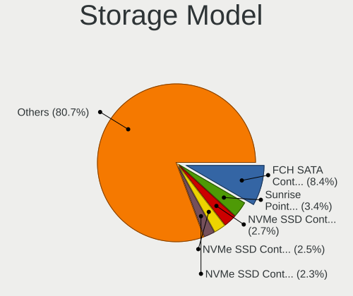

| Model                                                                          | Computers | Percent |
|--------------------------------------------------------------------------------|-----------|---------|
| AMD FCH SATA Controller [AHCI mode]                                            | 40        | 8.4%    |
| Intel Sunrise Point-LP SATA Controller [AHCI mode]                             | 16        | 3.36%   |
| Samsung NVMe SSD Controller PM9A1/PM9A3/980PRO                                 | 13        | 2.73%   |
| Samsung NVMe SSD Controller SM981/PM981/PM983                                  | 12        | 2.52%   |
| Samsung NVMe SSD Controller 980 (DRAM-less)                                    | 11        | 2.31%   |
| Intel Volume Management Device NVMe RAID Controller                            | 11        | 2.31%   |
| Intel 6 Series/C200 Series Chipset Family 6 port Desktop SATA AHCI Controller  | 11        | 2.31%   |
| Intel 8 Series/C220 Series Chipset Family 6-port SATA Controller 1 [AHCI mode] | 10        | 2.1%    |
| SanDisk WD SN560/SN740/SN770/SN5000 NVMe SSD                                   | 9         | 1.89%   |
| Intel Q170/Q150/B150/H170/H110/Z170/CM236 Chipset SATA Controller [AHCI Mode]  | 9         | 1.89%   |
| Intel 82801 Mobile SATA Controller [RAID mode]                                 | 8         | 1.68%   |
| ASMedia ASM1061/ASM1062 Serial ATA Controller                                  | 8         | 1.68%   |
| AMD SB7x0/SB8x0/SB9x0 SATA Controller [AHCI mode]                              | 8         | 1.68%   |
| AMD 500 Series Chipset SATA Controller                                         | 8         | 1.68%   |
| AMD 400 Series Chipset SATA Controller                                         | 8         | 1.68%   |
| Intel 7 Series/C210 Series Chipset Family 6-port SATA Controller [AHCI mode]   | 7         | 1.47%   |
| Intel 200 Series PCH SATA controller [AHCI mode]                               | 7         | 1.47%   |
| AMD SB7x0/SB8x0/SB9x0 IDE Controller                                           | 7         | 1.47%   |
| Intel Raptor Lake SATA AHCI Controller                                         | 6         | 1.26%   |
| Intel NM10/ICH7 Family SATA Controller [IDE mode]                              | 6         | 1.26%   |
| Samsung NVMe SSD Controller SM961/PM961/SM963                                  | 5         | 1.05%   |
| Samsung NVMe SSD Controller S4LV008[Pascal]                                    | 5         | 1.05%   |
| Intel Tiger Lake-LP SATA Controller                                            | 5         | 1.05%   |
| Intel Comet Lake SATA AHCI Controller                                          | 5         | 1.05%   |
| Intel Alder Lake-S PCH SATA Controller [AHCI Mode]                             | 5         | 1.05%   |
| AMD SB7x0/SB8x0/SB9x0 SATA Controller [IDE mode]                               | 5         | 1.05%   |
| SanDisk Extreme Pro / WD Black SN750 / PC SN730 / Red SN700 NVMe SSD           | 4         | 0.84%   |
| Samsung NVMe SSD Controller PM9C1a (DRAM-less)                                 | 4         | 0.84%   |
| Micron 2550 NVMe SSD (DRAM-less)                                               | 4         | 0.84%   |
| MAXIO (Hangzhou) NVMe SSD Controller MAP1202 (DRAM-less)                       | 4         | 0.84%   |
| Intel SATA Controller [RAID mode]                                              | 4         | 0.84%   |
| Intel HM170/QM170 Chipset SATA Controller [AHCI Mode]                          | 4         | 0.84%   |
| Intel Cannon Lake PCH SATA AHCI Controller                                     | 4         | 0.84%   |
| AMD 600 Series Chipset SATA Controller                                         | 4         | 0.84%   |
| SK hynix Gold P31/BC711/PC711 NVMe Solid State Drive                           | 3         | 0.63%   |
| Micron/Crucial P2 [Nick P2] / P3 / P3 Plus NVMe PCIe SSD (DRAM-less)           | 3         | 0.63%   |
| KIOXIA Exceria Plus G3 NVMe SSD (DRAM-less)                                    | 3         | 0.63%   |
| Kingston Company NV2 NVMe SSD [E21T] (DRAM-less)                               | 3         | 0.63%   |
| Intel RST Volume Management Device Controller                                  | 3         | 0.63%   |
| Intel Cannon Lake Mobile PCH SATA AHCI Controller                              | 3         | 0.63%   |

Storage Kind
------------

Kind of storage controller (IDE, SATA, NVMe, SAS, ...)

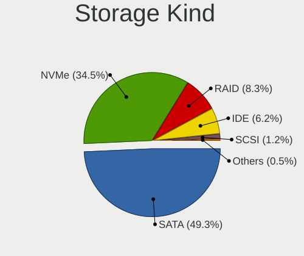

| Kind | Computers | Percent |
|------|-----------|---------|
| SATA | 207       | 49.29%  |
| NVMe | 145       | 34.52%  |
| RAID | 35        | 8.33%   |
| IDE  | 26        | 6.19%   |
| SCSI | 5         | 1.19%   |
| SAS  | 2         | 0.48%   |

Processor
---------

CPU Vendor
----------

Processor vendors

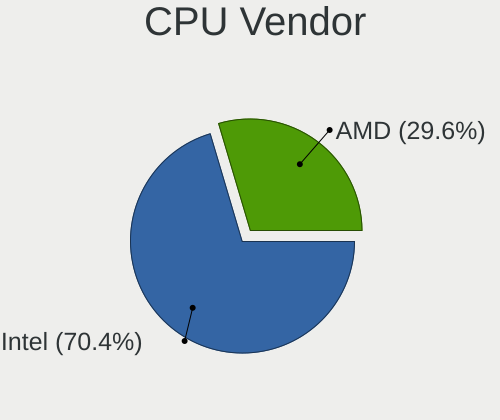

| Vendor | Computers | Percent |
|--------|-----------|---------|
| Intel  | 207       | 70.41%  |
| AMD    | 87        | 29.59%  |

CPU Model
---------

Processor models

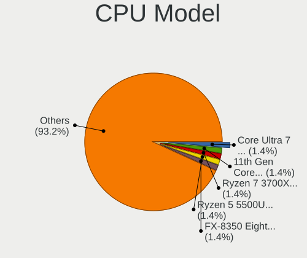

| Model                                         | Computers | Percent |
|-----------------------------------------------|-----------|---------|
| Intel Core Ultra 7 155H                       | 4         | 1.36%   |
| Intel 11th Gen Core i7-1165G7 @ 2.80GHz       | 4         | 1.36%   |
| AMD Ryzen 7 3700X 8-Core Processor            | 4         | 1.36%   |
| AMD Ryzen 5 5500U with Radeon Graphics        | 4         | 1.36%   |
| AMD FX-8350 Eight-Core Processor              | 4         | 1.36%   |
| Intel Core i7-6700 CPU @ 3.40GHz              | 3         | 1.02%   |
| Intel Core i5-8265U CPU @ 1.60GHz             | 3         | 1.02%   |
| Intel Core i5-8250U CPU @ 1.60GHz             | 3         | 1.02%   |
| Intel Core i5-6200U CPU @ 2.30GHz             | 3         | 1.02%   |
| Intel 12th Gen Core i3-1215U                  | 3         | 1.02%   |
| Intel 11th Gen Core i5-1145G7 @ 2.60GHz       | 3         | 1.02%   |
| AMD Ryzen 9 5950X 16-Core Processor           | 3         | 1.02%   |
| AMD Ryzen 7 5800X 8-Core Processor            | 3         | 1.02%   |
| Intel Xeon CPU E5-2620 v3 @ 2.40GHz           | 2         | 0.68%   |
| Intel Pentium CPU G3220 @ 3.00GHz             | 2         | 0.68%   |
| Intel Core i7-8550U CPU @ 1.80GHz             | 2         | 0.68%   |
| Intel Core i7-6700HQ CPU @ 2.60GHz            | 2         | 0.68%   |
| Intel Core i7-3770 CPU @ 3.40GHz              | 2         | 0.68%   |
| Intel Core i7-2600 CPU @ 3.40GHz              | 2         | 0.68%   |
| Intel Core i7-14700                           | 2         | 0.68%   |
| Intel Core i7-1065G7 CPU @ 1.30GHz            | 2         | 0.68%   |
| Intel Core i5-8350U CPU @ 1.70GHz             | 2         | 0.68%   |
| Intel Core i5-7200U CPU @ 2.50GHz             | 2         | 0.68%   |
| Intel Core i5-6500 CPU @ 3.20GHz              | 2         | 0.68%   |
| Intel Core i5-4440 CPU @ 3.10GHz              | 2         | 0.68%   |
| Intel Core i5-4210U CPU @ 1.70GHz             | 2         | 0.68%   |
| Intel Core i5-4200M CPU @ 2.50GHz             | 2         | 0.68%   |
| Intel Core i5-2400 CPU @ 3.10GHz              | 2         | 0.68%   |
| Intel Core i5-10210U CPU @ 1.60GHz            | 2         | 0.68%   |
| Intel Celeron CPU N3350 @ 1.10GHz             | 2         | 0.68%   |
| Intel 13th Gen Core i5-1345U                  | 2         | 0.68%   |
| Intel 12th Gen Core i7-12700KF                | 2         | 0.68%   |
| Intel 12th Gen Core i7-12700K                 | 2         | 0.68%   |
| Intel 11th Gen Core i7-1185G7 @ 3.00GHz       | 2         | 0.68%   |
| Intel 11th Gen Core i3-1115G4 @ 3.00GHz       | 2         | 0.68%   |
| AMD Ryzen 9 5900X 12-Core Processor           | 2         | 0.68%   |
| AMD Ryzen 7 5800H with Radeon Graphics        | 2         | 0.68%   |
| AMD Ryzen 7 5700U with Radeon Graphics        | 2         | 0.68%   |
| AMD Ryzen 5 5600G with Radeon Graphics        | 2         | 0.68%   |
| AMD Ryzen 5 3500U with Radeon Vega Mobile Gfx | 2         | 0.68%   |

CPU Model Family
----------------

Processor model prefix

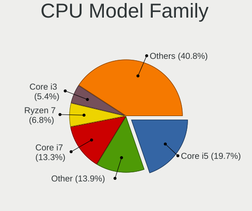

| Model                   | Computers | Percent |
|-------------------------|-----------|---------|
| Intel Core i5           | 58        | 19.73%  |
| Other                   | 41        | 13.95%  |
| Intel Core i7           | 39        | 13.27%  |
| AMD Ryzen 7             | 20        | 6.8%    |
| Intel Core i3           | 16        | 5.44%   |
| Intel Xeon              | 14        | 4.76%   |
| AMD Ryzen 5             | 14        | 4.76%   |
| AMD Ryzen 9             | 11        | 3.74%   |
| AMD FX                  | 10        | 3.4%    |
| Intel Core              | 8         | 2.72%   |
| Intel Celeron           | 7         | 2.38%   |
| AMD A10                 | 6         | 2.04%   |
| Intel Pentium           | 5         | 1.7%    |
| AMD Ryzen 3             | 5         | 1.7%    |
| Intel Pentium Dual-Core | 4         | 1.36%   |
| Intel Core i9           | 4         | 1.36%   |
| Intel Core 2 Quad       | 4         | 1.36%   |
| Intel Core 2 Duo        | 3         | 1.02%   |
| AMD A8                  | 3         | 1.02%   |
| AMD A6                  | 3         | 1.02%   |
| Intel Core m3           | 2         | 0.68%   |
| AMD Ryzen 7 PRO         | 2         | 0.68%   |
| AMD Ryzen 5 PRO         | 2         | 0.68%   |
| AMD Phenom II X6        | 2         | 0.68%   |
| AMD Athlon 64 X2        | 2         | 0.68%   |
| Intel Core m5           | 1         | 0.34%   |
| Intel Atom              | 1         | 0.34%   |
| AMD Ryzen Threadripper  | 1         | 0.34%   |
| AMD Phenom II X4        | 1         | 0.34%   |
| AMD EPYC                | 1         | 0.34%   |
| AMD Athlon X4           | 1         | 0.34%   |
| AMD Athlon X2           | 1         | 0.34%   |
| AMD Athlon              | 1         | 0.34%   |
| AMD A12                 | 1         | 0.34%   |

CPU Cores
---------

Number of processor cores

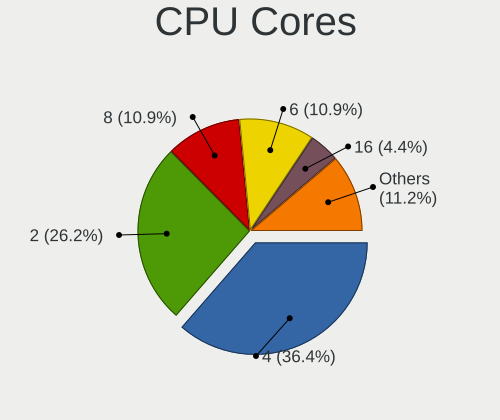

| Number | Computers | Percent |
|--------|-----------|---------|
| 4      | 107       | 36.39%  |
| 2      | 77        | 26.19%  |
| 8      | 32        | 10.88%  |
| 6      | 32        | 10.88%  |
| 16     | 13        | 4.42%   |
| 12     | 13        | 4.42%   |
| 10     | 9         | 3.06%   |
| 20     | 4         | 1.36%   |
| 24     | 2         | 0.68%   |
| 3      | 2         | 0.68%   |
| 48     | 1         | 0.34%   |
| 32     | 1         | 0.34%   |
| 18     | 1         | 0.34%   |

CPU Sockets
-----------

Number of sockets

| Number | Computers | Percent |
|--------|-----------|---------|
| 1      | 287       | 97.62%  |
| 2      | 6         | 2.04%   |
| 20     | 1         | 0.34%   |

CPU Threads
-----------

Threads per core (Hyper-Threading)

| Number | Computers | Percent |
|--------|-----------|---------|
| 2      | 221       | 75.17%  |
| 1      | 73        | 24.83%  |

CPU Op-Modes
------------

CPU Operation Modes (32-bit, 64-bit)

| Op mode        | Computers | Percent |
|----------------|-----------|---------|
| 32-bit, 64-bit | 294       | 100%    |

CPU Microcode
-------------

Microcode number

| Number     | Computers | Percent |
|------------|-----------|---------|
| Unknown    | 257       | 87.41%  |
| 0x08108109 | 5         | 1.7%    |
| 0x0a500011 | 3         | 1.02%   |
| 0x0a50000c | 2         | 0.68%   |
| 0x08608103 | 2         | 0.68%   |
| 0x06006705 | 2         | 0.68%   |
| 0x06000852 | 2         | 0.68%   |
| 0x0a705203 | 1         | 0.34%   |
| 0x0a601209 | 1         | 0.34%   |
| 0x0a601206 | 1         | 0.34%   |
| 0x0a50000d | 1         | 0.34%   |
| 0x0a404107 | 1         | 0.34%   |
| 0x0a404102 | 1         | 0.34%   |
| 0x0a20120e | 1         | 0.34%   |
| 0x0a20102d | 1         | 0.34%   |
| 0x0a201016 | 1         | 0.34%   |
| 0x08701034 | 1         | 0.34%   |
| 0x08701033 | 1         | 0.34%   |
| 0x08701030 | 1         | 0.34%   |
| 0x08701021 | 1         | 0.34%   |
| 0x08608108 | 1         | 0.34%   |
| 0x08608102 | 1         | 0.34%   |
| 0x0830107c | 1         | 0.34%   |
| 0x07030106 | 1         | 0.34%   |
| 0x06003106 | 1         | 0.34%   |
| 0x06001119 | 1         | 0.34%   |
| 0x0600063d | 1         | 0.34%   |
| 0x010000dc | 1         | 0.34%   |

CPU Microarch
-------------

Microarchitecture

| Name              | Computers | Percent |
|-------------------|-----------|---------|
| KabyLake          | 40        | 13.56%  |
| Unknown           | 29        | 9.83%   |
| Haswell           | 25        | 8.47%   |
| Skylake           | 21        | 7.12%   |
| Alderlake Hybrid  | 21        | 7.12%   |
| Zen 3             | 19        | 6.44%   |
| IvyBridge         | 15        | 5.08%   |
| TigerLake         | 13        | 4.41%   |
| SandyBridge       | 13        | 4.41%   |
| Penryn            | 13        | 4.41%   |
| Piledriver        | 12        | 4.07%   |
| Zen+              | 9         | 3.05%   |
| Zen 2             | 7         | 2.37%   |
| Icelake           | 7         | 2.37%   |
| CometLake         | 5         | 1.69%   |
| Zen               | 4         | 1.36%   |
| Steamroller       | 4         | 1.36%   |
| Silvermont        | 4         | 1.36%   |
| Meteorlake Hybrid | 4         | 1.36%   |
| Excavator         | 4         | 1.36%   |
| K10               | 3         | 1.02%   |
| Broadwell         | 3         | 1.02%   |
| Westmere          | 2         | 0.68%   |
| Nehalem           | 2         | 0.68%   |
| K8 Hammer         | 2         | 0.68%   |
| Gracemont         | 2         | 0.68%   |
| Goldmont plus     | 2         | 0.68%   |
| Goldmont          | 2         | 0.68%   |
| Core              | 2         | 0.68%   |
| Bulldozer         | 2         | 0.68%   |
| Puma              | 1         | 0.34%   |
| Lunarlake Hybrid  | 1         | 0.34%   |
| K8 & K10 hybrid   | 1         | 0.34%   |
| K10 Llano         | 1         | 0.34%   |

Graphics
--------

GPU Vendor
----------

Vendors of graphics cards

| Vendor                     | Computers | Percent |
|----------------------------|-----------|---------|
| Intel                      | 157       | 45.11%  |
| Nvidia                     | 106       | 30.46%  |
| AMD                        | 80        | 22.99%  |
| ASPEED Technology          | 4         | 1.15%   |
| Matrox Electronics Systems | 1         | 0.29%   |

GPU Model
---------

Graphics card models

| Model                                                                                    | Computers | Percent |
|------------------------------------------------------------------------------------------|-----------|---------|
| Intel TigerLake-LP GT2 [Iris Xe Graphics]                                                | 11        | 3.11%   |
| Intel 2nd Generation Core Processor Family Integrated Graphics Controller                | 9         | 2.54%   |
| Intel Kaby Lake-R GT2 [UHD Graphics 620]                                                 | 8         | 2.26%   |
| AMD Lucienne                                                                             | 7         | 1.98%   |
| AMD Cezanne [Radeon Vega Series / Radeon Vega Mobile Series]                             | 7         | 1.98%   |
| Intel Haswell-ULT Integrated Graphics Controller                                         | 6         | 1.69%   |
| AMD Picasso/Raven 2 [Radeon Vega Series / Radeon Vega Mobile Series]                     | 6         | 1.69%   |
| AMD Ellesmere [Radeon RX 470/480/570/570X/580/580X/590]                                  | 6         | 1.69%   |
| Nvidia GK208B [GeForce GT 730]                                                           | 5         | 1.41%   |
| Nvidia GK208B [GeForce GT 710]                                                           | 5         | 1.41%   |
| Intel Xeon E3-1200 v2/3rd Gen Core processor Graphics Controller                         | 5         | 1.41%   |
| Intel Skylake-U GT2 [HD Graphics 520]                                                    | 5         | 1.41%   |
| Intel 4th Gen Core Processor Integrated Graphics Controller                              | 5         | 1.41%   |
| Nvidia GP108 [GeForce GT 1030]                                                           | 4         | 1.13%   |
| Intel WhiskeyLake-U GT2 [UHD Graphics 620]                                               | 4         | 1.13%   |
| Intel Skylake-S GT2 [HD Graphics 530]                                                    | 4         | 1.13%   |
| Intel Skylake-H GT2 [HD Graphics 530]                                                    | 4         | 1.13%   |
| Intel Raptor Lake-P [Iris Xe Graphics]                                                   | 4         | 1.13%   |
| Intel Kaby Lake-U GT2 [HD Graphics 620]                                                  | 4         | 1.13%   |
| Intel CoffeeLake-S GT2 [UHD Graphics 630]                                                | 4         | 1.13%   |
| Intel CoffeeLake-H GT2 [UHD Graphics 630]                                                | 4         | 1.13%   |
| Intel 82G33/G31 Express Integrated Graphics Controller                                   | 4         | 1.13%   |
| ASPEED Technology ASPEED Graphics Family                                                 | 4         | 1.13%   |
| AMD Raven Ridge [Radeon Vega Series / Radeon Vega Mobile Series]                         | 4         | 1.13%   |
| AMD Raphael                                                                              | 4         | 1.13%   |
| AMD Caicos [Radeon HD 6450/7450/8450 / R5 230 OEM]                                       | 4         | 1.13%   |
| Nvidia GP107 [GeForce GTX 1050 Ti]                                                       | 3         | 0.85%   |
| Nvidia GP106 [GeForce GTX 1060 6GB]                                                      | 3         | 0.85%   |
| Nvidia GA106 [GeForce RTX 3060 Lite Hash Rate]                                           | 3         | 0.85%   |
| Nvidia AD107 [GeForce RTX 4060]                                                          | 3         | 0.85%   |
| Intel Xeon E3-1200 v3/4th Gen Core Processor Integrated Graphics Controller              | 3         | 0.85%   |
| Intel Meteor Lake-P [Intel Graphics]                                                     | 3         | 0.85%   |
| Intel Meteor Lake-P [Intel Arc Graphics]                                                 | 3         | 0.85%   |
| Intel CometLake-U GT2 [UHD Graphics]                                                     | 3         | 0.85%   |
| Intel Broadwell-U GT2 [HD Graphics 5500]                                                 | 3         | 0.85%   |
| Intel Atom/Celeron/Pentium Processor x5-E8000/J3xxx/N3xxx Integrated Graphics Controller | 3         | 0.85%   |
| Intel Alder Lake-UP3 GT2 [Iris Xe Graphics]                                              | 3         | 0.85%   |
| Intel Alder Lake-UP3 GT1 [UHD Graphics]                                                  | 3         | 0.85%   |
| Intel Alder Lake-S GT1 [UHD Graphics 770]                                                | 3         | 0.85%   |
| Intel 3rd Gen Core processor Graphics Controller                                         | 3         | 0.85%   |

GPU Combo
---------

Combinations of graphics cards

| Name                    | Computers | Percent |
|-------------------------|-----------|---------|
| 1 x Intel               | 119       | 40.34%  |
| 1 x Nvidia              | 65        | 22.03%  |
| 1 x AMD                 | 60        | 20.34%  |
| Intel + Nvidia          | 27        | 9.15%   |
| AMD + Nvidia            | 11        | 3.73%   |
| 2 x AMD                 | 4         | 1.36%   |
| Intel + AMD             | 4         | 1.36%   |
| Nvidia + ASPEED         | 2         | 0.68%   |
| 2 x Nvidia + 1 x ASPEED | 1         | 0.34%   |
| 2 x AMD + 1 x ASPEED    | 1         | 0.34%   |
| 1 x Matrox              | 1         | 0.34%   |

GPU Driver
----------

Free vs proprietary

| Driver      | Computers | Percent |
|-------------|-----------|---------|
| Free        | 231       | 78.04%  |
| Proprietary | 60        | 20.27%  |
| Unknown     | 5         | 1.69%   |

GPU Memory
----------

Total video memory

| Size in GB | Computers | Percent |
|------------|-----------|---------|
| Unknown    | 194       | 65.1%   |
| 1.01-2.0   | 30        | 10.07%  |
| 7.01-8.0   | 16        | 5.37%   |
| 3.01-4.0   | 16        | 5.37%   |
| 0.01-0.5   | 15        | 5.03%   |
| 0.51-1.0   | 11        | 3.69%   |
| 5.01-6.0   | 6         | 2.01%   |
| 8.01-16.0  | 6         | 2.01%   |
| 2.01-3.0   | 3         | 1.01%   |
| 16.01-24.0 | 1         | 0.34%   |

Monitor
-------

Monitor Vendor
--------------

Monitor vendors

| Vendor               | Computers | Percent |
|----------------------|-----------|---------|
| Samsung Electronics  | 43        | 13.15%  |
| AU Optronics         | 42        | 12.84%  |
| Goldstar             | 25        | 7.65%   |
| BOE                  | 25        | 7.65%   |
| Chimei Innolux       | 22        | 6.73%   |
| Hewlett-Packard      | 20        | 6.12%   |
| Dell                 | 19        | 5.81%   |
| LG Display           | 13        | 3.98%   |
| Acer                 | 12        | 3.67%   |
| Philips              | 10        | 3.06%   |
| Apple                | 10        | 3.06%   |
| Lenovo               | 8         | 2.45%   |
| BenQ                 | 8         | 2.45%   |
| ViewSonic            | 7         | 2.14%   |
| Sharp                | 5         | 1.53%   |
| Iiyama               | 5         | 1.53%   |
| Fujitsu Siemens      | 5         | 1.53%   |
| AOC                  | 4         | 1.22%   |
| PANDA                | 3         | 0.92%   |
| HannStar             | 3         | 0.92%   |
| Eizo                 | 3         | 0.92%   |
| CSOT                 | 3         | 0.92%   |
| Ancor Communications | 3         | 0.92%   |
| Toshiba              | 2         | 0.61%   |
| Medion               | 2         | 0.61%   |
| InfoVision           | 2         | 0.61%   |
| Gigabyte Technology  | 2         | 0.61%   |
| ASUSTek Computer     | 2         | 0.61%   |
| Westinghouse         | 1         | 0.31%   |
| TIM                  | 1         | 0.31%   |
| TCL                  | 1         | 0.31%   |
| SuperFrame           | 1         | 0.31%   |
| Sony                 | 1         | 0.31%   |
| SKG                  | 1         | 0.31%   |
| SIE                  | 1         | 0.31%   |
| SGT                  | 1         | 0.31%   |
| Sceptre Tech         | 1         | 0.31%   |
| NEC Computers        | 1         | 0.31%   |
| MSD                  | 1         | 0.31%   |
| LRX                  | 1         | 0.31%   |

Monitor Model
-------------

Monitor models

| Model                                                             | Computers | Percent |
|-------------------------------------------------------------------|-----------|---------|
| Goldstar ULTRAWIDE GSM59F2 2560x1080 677x290mm 29.0-inch          | 5         | 1.43%   |
| Goldstar HDR 4K GSM7706 3840x2160 600x340mm 27.2-inch             | 5         | 1.43%   |
| Hewlett-Packard w2207 HWP26A9 1680x1050 473x296mm 22.0-inch       | 4         | 1.15%   |
| AU Optronics LCD Monitor AUO61ED 1920x1080 344x194mm 15.5-inch    | 4         | 1.15%   |
| Dell U2412M DELA07A 1920x1200 518x324mm 24.1-inch                 | 3         | 0.86%   |
| Chimei Innolux LCD Monitor CMN15F5 1920x1080 344x193mm 15.5-inch  | 3         | 0.86%   |
| Chimei Innolux LCD Monitor CMN124A 1920x1080 276x155mm 12.5-inch  | 3         | 0.86%   |
| Samsung Electronics U32J59x SAM0F52 3840x2160 697x392mm 31.5-inch | 2         | 0.57%   |
| Philips PHL 273V7 PHLC156 1920x1080 598x336mm 27.0-inch           | 2         | 0.57%   |
| Philips PHL 223V5 PHLC0CF 1920x1080 477x268mm 21.5-inch           | 2         | 0.57%   |
| LG Display LCD Monitor LGD056D 1920x1080 382x215mm 17.3-inch      | 2         | 0.57%   |
| Iiyama PL2470H IVM615B 1920x1080 527x296mm 23.8-inch              | 2         | 0.57%   |
| HannStar Hanns.G HA195 HSD4B16 1366x768 410x230mm 18.5-inch       | 2         | 0.57%   |
| Goldstar ULTRAWIDE GSM7768 3440x1440 800x334mm 34.1-inch          | 2         | 0.57%   |
| Goldstar Ultra HD GSM5B09 3840x2160 600x340mm 27.2-inch           | 2         | 0.57%   |
| Goldstar LG IPS FULLHD GSM5AB8 1920x1080 480x270mm 21.7-inch      | 2         | 0.57%   |
| Fujitsu Siemens P24W-7 LED FUS0850 1920x1200 518x324mm 24.1-inch  | 2         | 0.57%   |
| Dell U2410 DELF017 1920x1200 520x320mm 24.0-inch                  | 2         | 0.57%   |
| Dell U2410 DELF016 1920x1200 518x324mm 24.1-inch                  | 2         | 0.57%   |
| Dell P2422H DELA1C5 1920x1080 527x296mm 23.8-inch                 | 2         | 0.57%   |
| Chimei Innolux LCD Monitor CMN15E7 1920x1080 344x193mm 15.5-inch  | 2         | 0.57%   |
| BOE LCD Monitor BOE094A 1920x1080 344x194mm 15.5-inch             | 2         | 0.57%   |
| BenQ EL2870U BNQ7949 3840x2160 621x341mm 27.9-inch                | 2         | 0.57%   |
| AU Optronics LCD Monitor AUO5191 1366x768 344x193mm 15.5-inch     | 2         | 0.57%   |
| Apple iMac APPA012 1920x1080 475x267mm 21.5-inch                  | 2         | 0.57%   |
| Apple Color LCD APP9CF0 1440x900 290x180mm 13.4-inch              | 2         | 0.57%   |
| AOC 24B1W1 AOC2401 1920x1080 527x296mm 23.8-inch                  | 2         | 0.57%   |
| Westinghouse WD32HB1120 WET000A 1366x768 700x390mm 31.5-inch      | 1         | 0.29%   |
| ViewSonic VX4381-4K VSC4E3B 3840x2160 941x529mm 42.5-inch         | 1         | 0.29%   |
| ViewSonic VX2457 VSCB931 1920x1080 521x293mm 23.5-inch            | 1         | 0.29%   |
| ViewSonic VG2448 VSC3B35 1920x1080 527x296mm 23.8-inch            | 1         | 0.29%   |
| ViewSonic VA2431 Series VSCD824 1920x1080 521x293mm 23.5-inch     | 1         | 0.29%   |
| ViewSonic VA2055 Series VSC3C31 1920x1080 435x239mm 19.5-inch     | 1         | 0.29%   |
| ViewSonic VA1926w-5 VSC5920 1440x900 410x256mm 19.0-inch          | 1         | 0.29%   |
| ViewSonic E70f-10 VSC3B1E 1280x960 310x230mm 15.2-inch            | 1         | 0.29%   |
| Toshiba ScreenXpert TSB8888 1080x2160                             | 1         | 0.29%   |
| Toshiba 43UHD_LCD_TV TSB3700 3840x2160 940x540mm 42.7-inch        | 1         | 0.29%   |
| TIM CM3202/03QPS TIM3203 2560x1440 768x432mm 34.7-inch            | 1         | 0.29%   |
| TCL Beyond TV TCL2875 3840x2160 1210x680mm 54.6-inch              | 1         | 0.29%   |
| SuperFrame SFP2412FHD SUE2412 1920x1080 600x330mm 27.0-inch       | 1         | 0.29%   |

Monitor Resolution
------------------

Monitor screen resolution

| Resolution         | Computers | Percent |
|--------------------|-----------|---------|
| 1920x1080 (FHD)    | 155       | 48.14%  |
| 1366x768 (WXGA)    | 30        | 9.32%   |
| 1920x1200 (WUXGA)  | 26        | 8.07%   |
| 3840x2160 (4K)     | 25        | 7.76%   |
| 2560x1440 (QHD)    | 16        | 4.97%   |
| 1680x1050 (WSXGA+) | 10        | 3.11%   |
| 2560x1080          | 8         | 2.48%   |
| 1600x900 (HD+)     | 8         | 2.48%   |
| 1440x900 (WXGA+)   | 8         | 2.48%   |
| 3440x1440          | 6         | 1.86%   |
| 1280x1024 (SXGA)   | 6         | 1.86%   |
| 2880x1800          | 4         | 1.24%   |
| 2560x1600          | 4         | 1.24%   |
| 3840x2400          | 3         | 0.93%   |
| 3840x1600          | 3         | 0.93%   |
| 1280x800 (WXGA)    | 2         | 0.62%   |
| 3200x1800 (QHD+)   | 1         | 0.31%   |
| 2400x1600          | 1         | 0.31%   |
| 2304x1440          | 1         | 0.31%   |
| 2160x1440          | 1         | 0.31%   |
| 2048x1280          | 1         | 0.31%   |
| 1920x1280          | 1         | 0.31%   |
| 1600x1200          | 1         | 0.31%   |
| 1024x768 (XGA)     | 1         | 0.31%   |

Monitor Diagonal
----------------

Diagonal size in inches

| Inches  | Computers | Percent |
|---------|-----------|---------|
| 15      | 66        | 19.88%  |
| 27      | 45        | 13.55%  |
| 24      | 40        | 12.05%  |
| 17      | 20        | 6.02%   |
| 23      | 19        | 5.72%   |
| 21      | 17        | 5.12%   |
| 14      | 16        | 4.82%   |
| 13      | 16        | 4.82%   |
| 34      | 13        | 3.92%   |
| 19      | 11        | 3.31%   |
| 16      | 11        | 3.31%   |
| 12      | 11        | 3.31%   |
| 22      | 9         | 2.71%   |
| 31      | 5         | 1.51%   |
| 84      | 4         | 1.2%    |
| 26      | 4         | 1.2%    |
| 18      | 4         | 1.2%    |
| Unknown | 3         | 0.9%    |
| 54      | 2         | 0.6%    |
| 36      | 2         | 0.6%    |
| 25      | 2         | 0.6%    |
| 11      | 2         | 0.6%    |
| 86      | 1         | 0.3%    |
| 69      | 1         | 0.3%    |
| 63      | 1         | 0.3%    |
| 50      | 1         | 0.3%    |
| 48      | 1         | 0.3%    |
| 42      | 1         | 0.3%    |
| 37      | 1         | 0.3%    |
| 32      | 1         | 0.3%    |
| 28      | 1         | 0.3%    |
| 20      | 1         | 0.3%    |

Monitor Width
-------------

Physical width

| Width in mm | Computers | Percent |
|-------------|-----------|---------|
| 501-600     | 100       | 31.06%  |
| 301-350     | 94        | 29.19%  |
| 401-500     | 35        | 10.87%  |
| 351-400     | 27        | 8.39%   |
| 201-300     | 27        | 8.39%   |
| 701-800     | 16        | 4.97%   |
| 601-700     | 7         | 2.17%   |
| 1001-1500   | 6         | 1.86%   |
| 1501-2000   | 5         | 1.55%   |
| Unknown     | 3         | 0.93%   |
| 801-900     | 1         | 0.31%   |
| 901-1000    | 1         | 0.31%   |

Aspect Ratio
------------

Proportional relationship between the width and the height

| Ratio   | Computers | Percent |
|---------|-----------|---------|
| 16/9    | 215       | 70.49%  |
| 16/10   | 65        | 21.31%  |
| 21/9    | 13        | 4.26%   |
| 4/3     | 3         | 0.98%   |
| 3/2     | 3         | 0.98%   |
| 6/5     | 2         | 0.66%   |
| 5/4     | 2         | 0.66%   |
| 0.56    | 1         | 0.33%   |
| Unknown | 1         | 0.33%   |

Monitor Area
------------

Area in inch²

| Area in inch² | Computers | Percent |
|----------------|-----------|---------|
| 101-110        | 66        | 20.12%  |
| 201-250        | 61        | 18.6%   |
| 301-350        | 49        | 14.94%  |
| 81-90          | 22        | 6.71%   |
| 121-130        | 20        | 6.1%    |
| 351-500        | 19        | 5.79%   |
| 251-300        | 19        | 5.79%   |
| 151-200        | 15        | 4.57%   |
| More than 1000 | 11        | 3.35%   |
| 71-80          | 11        | 3.35%   |
| 111-120        | 11        | 3.35%   |
| 61-70          | 10        | 3.05%   |
| 501-1000       | 5         | 1.52%   |
| 141-150        | 4         | 1.22%   |
| Unknown        | 3         | 0.91%   |
| 51-60          | 2         | 0.61%   |

Pixel Density
-------------

Pixels per inch

| Density       | Computers | Percent |
|---------------|-----------|---------|
| 51-100        | 109       | 35.16%  |
| 121-160       | 82        | 26.45%  |
| 101-120       | 65        | 20.97%  |
| 161-240       | 32        | 10.32%  |
| 1-50          | 10        | 3.23%   |
| More than 240 | 9         | 2.9%    |
| Unknown       | 3         | 0.97%   |

Multiple Monitors
-----------------

Total monitors connected

| Total | Computers | Percent |
|-------|-----------|---------|
| 1     | 228       | 76.51%  |
| 2     | 55        | 18.46%  |
| 3     | 7         | 2.35%   |
| 0     | 7         | 2.35%   |
| 4     | 1         | 0.34%   |

Network
-------

Net Controller Vendor
---------------------

Controller vendors

| Vendor                                 | Computers | Percent |
|----------------------------------------|-----------|---------|
| Realtek Semiconductor                  | 171       | 37.92%  |
| Intel                                  | 155       | 34.37%  |
| Qualcomm Atheros                       | 34        | 7.54%   |
| Broadcom                               | 19        | 4.21%   |
| MediaTek                               | 15        | 3.33%   |
| ASIX Electronics                       | 9         | 2%      |
| Ralink Technology                      | 5         | 1.11%   |
| Broadcom Limited                       | 4         | 0.89%   |
| Sierra Wireless                        | 3         | 0.67%   |
| NetGear                                | 3         | 0.67%   |
| Dell                                   | 3         | 0.67%   |
| ASUSTek Computer                       | 3         | 0.67%   |
| Marvell Technology Group               | 2         | 0.44%   |
| Lenovo                                 | 2         | 0.44%   |
| DisplayLink                            | 2         | 0.44%   |
| D-Link System                          | 2         | 0.44%   |
| Xiaomi                                 | 1         | 0.22%   |
| U-Blox                                 | 1         | 0.22%   |
| TP-Link                                | 1         | 0.22%   |
| Suzhou Motorcomm Electronic Technology | 1         | 0.22%   |
| Ralink                                 | 1         | 0.22%   |
| Qualcomm Atheros Communications        | 1         | 0.22%   |
| Qualcomm                               | 1         | 0.22%   |
| Nvidia                                 | 1         | 0.22%   |
| Motorola PCS                           | 1         | 0.22%   |
| Mercucys                               | 1         | 0.22%   |
| Linksys                                | 1         | 0.22%   |
| Insyde Software                        | 1         | 0.22%   |
| Huawei Technologies                    | 1         | 0.22%   |
| Fibocom                                | 1         | 0.22%   |
| D-Link                                 | 1         | 0.22%   |
| Aquantia                               | 1         | 0.22%   |
| American Megatrends                    | 1         | 0.22%   |
| AMD                                    | 1         | 0.22%   |
| Adafruit                               | 1         | 0.22%   |

Net Controller Model
--------------------

Controller models

| Model                                                                  | Computers | Percent |
|------------------------------------------------------------------------|-----------|---------|
| Realtek RTL8111/8168/8211/8411 PCI Express Gigabit Ethernet Controller | 106       | 19.78%  |
| Realtek RTL8125 2.5GbE Controller                                      | 21        | 3.92%   |
| Intel Wi-Fi 6 AX200                                                    | 17        | 3.17%   |
| Realtek RTL810xE PCI Express Fast Ethernet controller                  | 13        | 2.43%   |
| Realtek RTL8153 Gigabit Ethernet Adapter                               | 11        | 2.05%   |
| Intel Wi-Fi 6E(802.11ax) AX210/AX1675* 2x2 [Typhoon Peak]              | 10        | 1.87%   |
| Intel Wi-Fi 6 AX201                                                    | 10        | 1.87%   |
| Realtek RTL8821CE 802.11ac PCIe Wireless Network Adapter               | 9         | 1.68%   |
| Intel Wireless 7265                                                    | 9         | 1.68%   |
| Qualcomm Atheros QCA9377 802.11ac Wireless Network Adapter             | 8         | 1.49%   |
| ASIX AX88179 Gigabit Ethernet                                          | 8         | 1.49%   |
| Intel I211 Gigabit Network Connection                                  | 7         | 1.31%   |
| Intel Dual Band Wireless-AC 3168NGW [Stone Peak]                       | 7         | 1.31%   |
| Intel 82579LM Gigabit Network Connection (Lewisville)                  | 7         | 1.31%   |
| Qualcomm Atheros QCA9565 / AR9565 Wireless Network Adapter             | 6         | 1.12%   |
| Intel Wireless 8260                                                    | 6         | 1.12%   |
| Intel Meteor Lake PCH CNVi WiFi                                        | 6         | 1.12%   |
| Intel Ethernet Controller I225-V                                       | 6         | 1.12%   |
| Intel Alder Lake-P PCH CNVi WiFi                                       | 6         | 1.12%   |
| Realtek RTL8852BE PCIe 802.11ax Wireless Network Controller            | 5         | 0.93%   |
| Realtek RTL8822CE 802.11ac PCIe Wireless Network Adapter               | 5         | 0.93%   |
| MediaTek MT7922 802.11ax PCI Express Wireless Network Adapter          | 5         | 0.93%   |
| Intel Wireless 8265 / 8275                                             | 5         | 0.93%   |
| Intel Wi-Fi 5(802.11ac) Wireless-AC 9x6x [Thunder Peak]                | 5         | 0.93%   |
| Intel Raptor Lake PCH CNVi WiFi                                        | 5         | 0.93%   |
| Intel Ethernet Connection (2) I219-V                                   | 5         | 0.93%   |
| Intel 700 Series Chipset CNVi WiFi                                     | 5         | 0.93%   |
| Realtek 802.11ac NIC                                                   | 4         | 0.75%   |
| MediaTek MT7902 802.11ax PCIe Wireless Network Adapter [Filogic 310]   | 4         | 0.75%   |
| Intel Wireless 7260                                                    | 4         | 0.75%   |
| Intel Ethernet Connection I217-LM                                      | 4         | 0.75%   |
| Intel Ethernet Connection (2) I219-LM                                  | 4         | 0.75%   |
| Intel 82574L Gigabit Network Connection                                | 4         | 0.75%   |
| Sierra Wireless Sierra Wireless EM7511 Qualcomm Snapdragon X16 LTE-A   | 3         | 0.56%   |
| Realtek RTL8822BE 802.11a/b/g/n/ac WiFi adapter                        | 3         | 0.56%   |
| Realtek RTL8188EE Wireless Network Adapter                             | 3         | 0.56%   |
| Qualcomm Atheros AR9485 Wireless Network Adapter                       | 3         | 0.56%   |
| Qualcomm Atheros AR93xx Wireless Network Adapter                       | 3         | 0.56%   |
| Intel I210 Gigabit Network Connection                                  | 3         | 0.56%   |
| Intel Ethernet Connection (23) I219-LM                                 | 3         | 0.56%   |

Wireless Vendor
---------------

Wireless vendors

| Vendor                          | Computers | Percent |
|---------------------------------|-----------|---------|
| Intel                           | 108       | 46.75%  |
| Realtek Semiconductor           | 43        | 18.61%  |
| Qualcomm Atheros                | 28        | 12.12%  |
| MediaTek                        | 13        | 5.63%   |
| Broadcom                        | 10        | 4.33%   |
| Ralink Technology               | 5         | 2.16%   |
| Broadcom Limited                | 4         | 1.73%   |
| Sierra Wireless                 | 3         | 1.3%    |
| NetGear                         | 3         | 1.3%    |
| Dell                            | 3         | 1.3%    |
| ASUSTek Computer                | 3         | 1.3%    |
| TP-Link                         | 1         | 0.43%   |
| Ralink                          | 1         | 0.43%   |
| Qualcomm Atheros Communications | 1         | 0.43%   |
| Qualcomm                        | 1         | 0.43%   |
| Mercucys                        | 1         | 0.43%   |
| Fibocom                         | 1         | 0.43%   |
| D-Link System                   | 1         | 0.43%   |
| D-Link                          | 1         | 0.43%   |

Wireless Model
--------------

Wireless models

| Model                                                                | Computers | Percent |
|----------------------------------------------------------------------|-----------|---------|
| Intel Wi-Fi 6 AX200                                                  | 17        | 7.26%   |
| Intel Wi-Fi 6E(802.11ax) AX210/AX1675* 2x2 [Typhoon Peak]            | 10        | 4.27%   |
| Intel Wi-Fi 6 AX201                                                  | 10        | 4.27%   |
| Realtek RTL8821CE 802.11ac PCIe Wireless Network Adapter             | 9         | 3.85%   |
| Intel Wireless 7265                                                  | 9         | 3.85%   |
| Qualcomm Atheros QCA9377 802.11ac Wireless Network Adapter           | 8         | 3.42%   |
| Intel Dual Band Wireless-AC 3168NGW [Stone Peak]                     | 7         | 2.99%   |
| Qualcomm Atheros QCA9565 / AR9565 Wireless Network Adapter           | 6         | 2.56%   |
| Intel Wireless 8260                                                  | 6         | 2.56%   |
| Intel Meteor Lake PCH CNVi WiFi                                      | 6         | 2.56%   |
| Realtek RTL8822CE 802.11ac PCIe Wireless Network Adapter             | 5         | 2.14%   |
| Intel Wireless 8265 / 8275                                           | 5         | 2.14%   |
| Intel Wi-Fi 5(802.11ac) Wireless-AC 9x6x [Thunder Peak]              | 5         | 2.14%   |
| Intel Raptor Lake PCH CNVi WiFi                                      | 5         | 2.14%   |
| Intel 700 Series Chipset CNVi WiFi                                   | 5         | 2.14%   |
| Realtek RTL8852BE PCIe 802.11ax Wireless Network Controller          | 4         | 1.71%   |
| Realtek 802.11ac NIC                                                 | 4         | 1.71%   |
| MediaTek MT7922 802.11ax PCI Express Wireless Network Adapter        | 4         | 1.71%   |
| MediaTek MT7902 802.11ax PCIe Wireless Network Adapter [Filogic 310] | 4         | 1.71%   |
| Intel Wireless 7260                                                  | 4         | 1.71%   |
| Intel Alder Lake-P PCH CNVi WiFi                                     | 4         | 1.71%   |
| Sierra Wireless Sierra Wireless EM7511 Qualcomm Snapdragon X16 LTE-A | 3         | 1.28%   |
| Realtek RTL8822BE 802.11a/b/g/n/ac WiFi adapter                      | 3         | 1.28%   |
| Realtek RTL8188EE Wireless Network Adapter                           | 3         | 1.28%   |
| Qualcomm Atheros AR9485 Wireless Network Adapter                     | 3         | 1.28%   |
| Qualcomm Atheros AR93xx Wireless Network Adapter                     | 3         | 1.28%   |
| Broadcom Limited BCM4360 802.11ac Dual Band Wireless Network Adapter | 3         | 1.28%   |
| Realtek 802.11n WLAN Adapter                                         | 2         | 0.85%   |
| Ralink MT7610U ("Archer T2U" 2.4G+5G WLAN Adapter                    | 2         | 0.85%   |
| Qualcomm Atheros QCA6174 802.11ac Wireless Network Adapter           | 2         | 0.85%   |
| Qualcomm Atheros AR9285 Wireless Network Adapter (PCI-Express)       | 2         | 0.85%   |
| MediaTek MT7921 802.11ax PCIe Wireless Network Adapter [Filogic 330] | 2         | 0.85%   |
| Intel Wireless 3165                                                  | 2         | 0.85%   |
| Intel Comet Lake PCH-LP CNVi WiFi                                    | 2         | 0.85%   |
| Intel Cannon Lake PCH CNVi WiFi                                      | 2         | 0.85%   |
| Broadcom BCM43602 802.11ac Wireless LAN SoC                          | 2         | 0.85%   |
| Broadcom BCM4360 802.11ac Dual Band Wireless Network Adapter         | 2         | 0.85%   |
| Broadcom BCM4331 802.11a/b/g/n                                       | 2         | 0.85%   |
| TP-Link Archer T3U [Realtek RTL8812BU]                               | 1         | 0.43%   |
| TP-Link 802.11ac NIC                                                 | 1         | 0.43%   |

Ethernet Vendor
---------------

Ethernet vendors

| Vendor                                 | Computers | Percent |
|----------------------------------------|-----------|---------|
| Realtek Semiconductor                  | 153       | 53.5%   |
| Intel                                  | 85        | 29.72%  |
| Broadcom                               | 13        | 4.55%   |
| Qualcomm Atheros                       | 9         | 3.15%   |
| ASIX Electronics                       | 9         | 3.15%   |
| MediaTek                               | 2         | 0.7%    |
| Marvell Technology Group               | 2         | 0.7%    |
| Lenovo                                 | 2         | 0.7%    |
| DisplayLink                            | 2         | 0.7%    |
| Xiaomi                                 | 1         | 0.35%   |
| Suzhou Motorcomm Electronic Technology | 1         | 0.35%   |
| Nvidia                                 | 1         | 0.35%   |
| Motorola PCS                           | 1         | 0.35%   |
| Linksys                                | 1         | 0.35%   |
| Insyde Software                        | 1         | 0.35%   |
| D-Link System                          | 1         | 0.35%   |
| Aquantia                               | 1         | 0.35%   |
| American Megatrends                    | 1         | 0.35%   |

Ethernet Model
--------------

Ethernet models

| Model                                                                  | Computers | Percent |
|------------------------------------------------------------------------|-----------|---------|
| Realtek RTL8111/8168/8211/8411 PCI Express Gigabit Ethernet Controller | 106       | 35.57%  |
| Realtek RTL8125 2.5GbE Controller                                      | 21        | 7.05%   |
| Realtek RTL810xE PCI Express Fast Ethernet controller                  | 13        | 4.36%   |
| Realtek RTL8153 Gigabit Ethernet Adapter                               | 11        | 3.69%   |
| ASIX AX88179 Gigabit Ethernet                                          | 8         | 2.68%   |
| Intel I211 Gigabit Network Connection                                  | 7         | 2.35%   |
| Intel 82579LM Gigabit Network Connection (Lewisville)                  | 7         | 2.35%   |
| Intel Ethernet Controller I225-V                                       | 6         | 2.01%   |
| Intel Ethernet Connection (2) I219-V                                   | 5         | 1.68%   |
| Intel Ethernet Connection I217-LM                                      | 4         | 1.34%   |
| Intel Ethernet Connection (2) I219-LM                                  | 4         | 1.34%   |
| Intel 82574L Gigabit Network Connection                                | 4         | 1.34%   |
| Intel I210 Gigabit Network Connection                                  | 3         | 1.01%   |
| Intel Ethernet Connection (23) I219-LM                                 | 3         | 1.01%   |
| Intel Ethernet Connection (2) I218-LM                                  | 3         | 1.01%   |
| Broadcom NetXtreme BCM57766 Gigabit Ethernet PCIe                      | 3         | 1.01%   |
| Realtek RTL8169 PCI Gigabit Ethernet Controller                        | 2         | 0.67%   |
| Qualcomm Atheros AR8161 Gigabit Ethernet                               | 2         | 0.67%   |
| Lenovo USB-C Dock Ethernet                                             | 2         | 0.67%   |
| Intel Ethernet Controller I225-LM                                      | 2         | 0.67%   |
| Intel Ethernet Connection I219-LM                                      | 2         | 0.67%   |
| Intel Ethernet Connection I218-LM                                      | 2         | 0.67%   |
| Intel Ethernet Connection (7) I219-V                                   | 2         | 0.67%   |
| Intel Ethernet Connection (6) I219-V                                   | 2         | 0.67%   |
| Intel Ethernet Connection (4) I219-V                                   | 2         | 0.67%   |
| Intel Ethernet Connection (18) I219-LM                                 | 2         | 0.67%   |
| Intel Ethernet Connection (16) I219-LM                                 | 2         | 0.67%   |
| Intel Ethernet Connection (13) I219-V                                  | 2         | 0.67%   |
| Intel Ethernet Connection (13) I219-LM                                 | 2         | 0.67%   |
| Intel Alder Lake-P PCH CNVi WiFi                                       | 2         | 0.67%   |
| Intel 82583V Gigabit Network Connection                                | 2         | 0.67%   |
| Intel 82579V Gigabit Network Connection                                | 2         | 0.67%   |
| Intel 82578DM Gigabit Network Connection                               | 2         | 0.67%   |
| Intel 80003ES2LAN Gigabit Ethernet Controller (Copper)                 | 2         | 0.67%   |
| Broadcom NetXtreme BCM57765 Gigabit Ethernet PCIe                      | 2         | 0.67%   |
| Broadcom NetXtreme BCM57762 Gigabit Ethernet PCIe                      | 2         | 0.67%   |
| Broadcom NetXtreme BCM5764M Gigabit Ethernet PCIe                      | 2         | 0.67%   |
| Xiaomi Mi/Redmi series (RNDIS + ADB)                                   | 1         | 0.34%   |
| Suzhou Motorcomm Electronic YT6801 Gigabit Ethernet Controller         | 1         | 0.34%   |
| Realtek USB 10/100/1G/2.5 LAN                                          | 1         | 0.34%   |

Net Controller Kind
-------------------

Ethernet, WiFi or modem

| Kind     | Computers | Percent |
|----------|-----------|---------|
| Ethernet | 254       | 54.04%  |
| WiFi     | 212       | 45.11%  |
| Modem    | 3         | 0.64%   |
| Unknown  | 1         | 0.21%   |

Used Controller
---------------

Currently used network controller

| Kind     | Computers | Percent |
|----------|-----------|---------|
| Ethernet | 166       | 53.38%  |
| WiFi     | 144       | 46.3%   |
| Unknown  | 1         | 0.32%   |

NICs
----

Total network controllers on board

| Total | Computers | Percent |
|-------|-----------|---------|
| 2     | 149       | 50.51%  |
| 1     | 126       | 42.71%  |
| 3     | 15        | 5.08%   |
| 4     | 3         | 1.02%   |
| 0     | 2         | 0.68%   |

IPv6
----

IPv6 vs IPv4

| Used | Computers | Percent |
|------|-----------|---------|
| No   | 188       | 63.51%  |
| Yes  | 108       | 36.49%  |

Bluetooth
---------

Bluetooth Vendor
----------------

Controller vendors

| Vendor                          | Computers | Percent |
|---------------------------------|-----------|---------|
| Intel                           | 100       | 49.75%  |
| Realtek Semiconductor           | 24        | 11.94%  |
| IMC Networks                    | 12        | 5.97%   |
| Cambridge Silicon Radio         | 11        | 5.47%   |
| Apple                           | 10        | 4.98%   |
| Lite-On Technology              | 8         | 3.98%   |
| Broadcom                        | 8         | 3.98%   |
| Qualcomm Atheros Communications | 7         | 3.48%   |
| MediaTek                        | 5         | 2.49%   |
| Foxconn / Hon Hai               | 3         | 1.49%   |
| Edimax Technology               | 2         | 1%      |
| ASUSTek Computer                | 2         | 1%      |
| USI                             | 1         | 0.5%    |
| TP-Link                         | 1         | 0.5%    |
| Toshiba                         | 1         | 0.5%    |
| Realtek                         | 1         | 0.5%    |
| Mercucys                        | 1         | 0.5%    |
| Hewlett-Packard                 | 1         | 0.5%    |
| Foxconn International           | 1         | 0.5%    |
| Dell                            | 1         | 0.5%    |
| Unknown                         | 1         | 0.5%    |

Bluetooth Model
---------------

Controller models

| Model                                               | Computers | Percent |
|-----------------------------------------------------|-----------|---------|
| Intel Bluetooth wireless interface                  | 23        | 11.44%  |
| Intel Bluetooth Device                              | 18        | 8.96%   |
| Realtek Bluetooth Radio                             | 17        | 8.46%   |
| Intel AX201 Bluetooth                               | 15        | 7.46%   |
| Intel AX200 Bluetooth                               | 15        | 7.46%   |
| Cambridge Silicon Radio Bluetooth Dongle (HCI mode) | 11        | 5.47%   |
| Intel AX210 Bluetooth                               | 9         | 4.48%   |
| Realtek  Bluetooth 4.2 Adapter                      | 7         | 3.48%   |
| Intel Wireless-AC 3168 Bluetooth                    | 7         | 3.48%   |
| Intel Bluetooth 9460/9560 Jefferson Peak (JfP)      | 6         | 2.99%   |
| Qualcomm Atheros  Bluetooth Device                  | 5         | 2.49%   |
| MediaTek Wireless_Device                            | 5         | 2.49%   |
| Lite-On Qualcomm Atheros QCA9377 Bluetooth          | 5         | 2.49%   |
| Intel Wireless-AC 9260 Bluetooth Adapter            | 4         | 1.99%   |
| IMC Networks Wireless_Device                        | 4         | 1.99%   |
| IMC Networks Bluetooth Radio                        | 4         | 1.99%   |
| Apple Bluetooth USB Host Controller                 | 4         | 1.99%   |
| Apple Bluetooth Host Controller                     | 4         | 1.99%   |
| Lite-On Wireless_Device                             | 2         | 1%      |
| Intel Centrino Bluetooth Wireless Transceiver       | 2         | 1%      |
| IMC Networks Bluetooth Device                       | 2         | 1%      |
| Foxconn / Hon Hai Wireless_Device                   | 2         | 1%      |
| Edimax Bluetooth Device                             | 2         | 1%      |
| Broadcom BCM20702A0 Bluetooth 4.0                   | 2         | 1%      |
| Broadcom BCM2045 Bluetooth                          | 2         | 1%      |
| USI Bluetooth Device                                | 1         | 0.5%    |
| TP-Link TP-T@- UB500 Adapter                        | 1         | 0.5%    |
| Toshiba Integrated Bluetooth (Taiyo Yuden)          | 1         | 0.5%    |
| Realtek Bluetooth Radio                             | 1         | 0.5%    |
| Qualcomm Atheros QCA61x4 Bluetooth 4.0              | 1         | 0.5%    |
| Qualcomm Atheros AR3011 Bluetooth                   | 1         | 0.5%    |
| Mercucys Mercusys MA530 Adapter                     | 1         | 0.5%    |
| Lite-On Bluetooth Device                            | 1         | 0.5%    |
| Intel Bluetooth                                     | 1         | 0.5%    |
| IMC Networks Atheros AR3012 Bluetooth 4.0 Adapter   | 1         | 0.5%    |
| IMC Networks Atheros AR3012 Bluetooth               | 1         | 0.5%    |
| HP Broadcom 2070 Bluetooth Combo                    | 1         | 0.5%    |
| Foxconn International BCM43142A0 Bluetooth module   | 1         | 0.5%    |
| Foxconn / Hon Hai MediaTek Bluetooth Adapter        | 1         | 0.5%    |
| Dell Broadcom BCM20702A0 Bluetooth                  | 1         | 0.5%    |

Sound
-----

Sound Vendor
------------

Sound card vendors

| Vendor                                       | Computers | Percent |
|----------------------------------------------|-----------|---------|
| Intel                                        | 200       | 47.06%  |
| AMD                                          | 98        | 23.06%  |
| Nvidia                                       | 68        | 16%     |
| C-Media Electronics                          | 12        | 2.82%   |
| Logitech                                     | 5         | 1.18%   |
| Realtek Semiconductor                        | 3         | 0.71%   |
| Lenovo                                       | 3         | 0.71%   |
| Hewlett-Packard                              | 3         | 0.71%   |
| DSEA A/S                                     | 3         | 0.71%   |
| Creative Labs                                | 3         | 0.71%   |
| VIA Technologies                             | 2         | 0.47%   |
| Plantronics                                  | 2         | 0.47%   |
| GN Netcom                                    | 2         | 0.47%   |
| FiiO Electronics Technology                  | 2         | 0.47%   |
| Conexant Systems                             | 2         | 0.47%   |
| ASUSTek Computer                             | 2         | 0.47%   |
| Zoran Co. Personal Media Division (Nogatech) | 1         | 0.24%   |
| USB MICROPHONE                               | 1         | 0.24%   |
| Turtle Beach                                 | 1         | 0.24%   |
| TTGK Technology                              | 1         | 0.24%   |
| Texas Instruments                            | 1         | 0.24%   |
| Quanta                                       | 1         | 0.24%   |
| Phoenix Audio Technologies                   | 1         | 0.24%   |
| Microsoft                                    | 1         | 0.24%   |
| KORG                                         | 1         | 0.24%   |
| Kingston Technology                          | 1         | 0.24%   |
| GYROCOM C&C                                  | 1         | 0.24%   |
| DisplayLink                                  | 1         | 0.24%   |
| Creative Technology                          | 1         | 0.24%   |
| Cambridge Silicon Radio                      | 1         | 0.24%   |
| Audioengine                                  | 1         | 0.24%   |

Sound Model
-----------

Sound card models

| Model                                                                             | Computers | Percent |
|-----------------------------------------------------------------------------------|-----------|---------|
| AMD Ryzen HD Audio Controller                                                     | 38        | 7.52%   |
| Intel Sunrise Point-LP HD Audio                                                   | 22        | 4.36%   |
| AMD Renoir/Cezanne HDMI/DP Audio Controller                                       | 17        | 3.37%   |
| Intel 6 Series/C200 Series Chipset Family High Definition Audio Controller        | 15        | 2.97%   |
| AMD Starship/Matisse HD Audio Controller                                          | 14        | 2.77%   |
| Intel Tiger Lake-LP Smart Sound Technology Audio Controller                       | 13        | 2.57%   |
| Intel 8 Series/C220 Series Chipset High Definition Audio Controller               | 13        | 2.57%   |
| AMD SBx00 Azalia (Intel HDA)                                                      | 13        | 2.57%   |
| Intel 100 Series/C230 Series Chipset Family HD Audio Controller                   | 12        | 2.38%   |
| Nvidia GK208 HDMI/DP Audio Controller                                             | 11        | 2.18%   |
| Intel 7 Series/C216 Chipset Family High Definition Audio Controller               | 11        | 2.18%   |
| Intel Cannon Lake PCH cAVS                                                        | 10        | 1.98%   |
| AMD Raven/Raven2/Fenghuang HDMI/DP Audio Controller                               | 10        | 1.98%   |
| AMD FCH Azalia Controller                                                         | 10        | 1.98%   |
| Intel Alder Lake PCH-P High Definition Audio Controller                           | 9         | 1.78%   |
| AMD Radeon High Definition Audio Controller                                       | 8         | 1.58%   |
| Intel Xeon E3-1200 v3/4th Gen Core Processor HD Audio Controller                  | 7         | 1.39%   |
| Intel 200 Series PCH HD Audio                                                     | 7         | 1.39%   |
| AMD Oland/Hainan/Cape Verde/Pitcairn HDMI Audio [Radeon HD 7000 Series]           | 7         | 1.39%   |
| Intel Raptor Lake High Definition Audio Controller                                | 6         | 1.19%   |
| Intel NM10/ICH7 Family High Definition Audio Controller                           | 6         | 1.19%   |
| Intel Meteor Lake-P HD Audio Controller                                           | 6         | 1.19%   |
| Intel Haswell-ULT HD Audio Controller                                             | 6         | 1.19%   |
| Intel Alder Lake-S HD Audio Controller                                            | 6         | 1.19%   |
| Intel 8 Series HD Audio Controller                                                | 6         | 1.19%   |
| AMD Ellesmere HDMI Audio [Radeon RX 470/480 / 570/580/590]                        | 6         | 1.19%   |
| Nvidia GP106 High Definition Audio Controller                                     | 5         | 0.99%   |
| Intel Raptor Lake-P/U/H cAVS                                                      | 5         | 0.99%   |
| Nvidia GP108 High Definition Audio Controller                                     | 4         | 0.79%   |
| Nvidia GP107GL High Definition Audio Controller                                   | 4         | 0.79%   |
| Nvidia GA106 High Definition Audio Controller                                     | 4         | 0.79%   |
| Intel Tiger Lake-H HD Audio Controller                                            | 4         | 0.79%   |
| Intel Comet Lake PCH-LP cAVS                                                      | 4         | 0.79%   |
| Intel Cannon Point-LP High Definition Audio Controller                            | 4         | 0.79%   |
| Intel C610/X99 series chipset HD Audio Controller                                 | 4         | 0.79%   |
| Intel 82801I (ICH9 Family) HD Audio Controller                                    | 4         | 0.79%   |
| C-Media Electronics Audio Adapter (Unitek Y-247A)                                 | 4         | 0.79%   |
| AMD Family 15h (Models 60h-6fh) Audio Controller                                  | 4         | 0.79%   |
| AMD Caicos HDMI Audio [Radeon HD 6450 / 7450/8450/8490 OEM / R5 230/235/235X OEM] | 4         | 0.79%   |
| Realtek Semiconductor USB Audio                                                   | 3         | 0.59%   |

Memory
------

Memory Vendor
-------------

Memory module vendors

| Vendor              | Computers | Percent |
|---------------------|-----------|---------|
| Samsung Electronics | 41        | 18.64%  |
| SK hynix            | 40        | 18.18%  |
| Kingston            | 36        | 16.36%  |
| Micron Technology   | 24        | 10.91%  |
| Unknown             | 19        | 8.64%   |
| Crucial             | 16        | 7.27%   |
| Corsair             | 12        | 5.45%   |
| G.Skill             | 7         | 3.18%   |
| Unknown             | 6         | 2.73%   |
| Unknown (ABCD)      | 4         | 1.82%   |
| A-DATA Technology   | 3         | 1.36%   |
| Team                | 2         | 0.91%   |
| Ramaxel Technology  | 2         | 0.91%   |
| Elpida              | 2         | 0.91%   |
| Unknown (0x0E9D)    | 1         | 0.45%   |
| Smart Brazil        | 1         | 0.45%   |
| Patriot Memory      | 1         | 0.45%   |
| Kingmax             | 1         | 0.45%   |
| Hewlett-Packard     | 1         | 0.45%   |
| Golden Empire       | 1         | 0.45%   |

Memory Model
------------

Memory module models

| Model                                                            | Computers | Percent |
|------------------------------------------------------------------|-----------|---------|
| Unknown                                                          | 6         | 2.52%   |
| Unknown RAM Module 2GB DIMM DDR2 800MT/s                         | 3         | 1.26%   |
| Unknown RAM Module 2GB DIMM 800MT/s                              | 3         | 1.26%   |
| Unknown (ABCD) RAM 123456789012345678 2GB SODIMM LPDDR4 2400MT/s | 3         | 1.26%   |
| SK hynix RAM HMAA1GS6CJR6N-XN 8GB Row Of Chips DDR4 3200MT/s     | 3         | 1.26%   |
| Crucial RAM CT16G4SFRA32A.M16FE 16GB SODIMM DDR4 3200MT/s        | 3         | 1.26%   |
| Unknown RAM Module 4GB SODIMM DDR3 1600MT/s                      | 2         | 0.84%   |
| Unknown RAM Module 4GB DIMM DDR3 1333MT/s                        | 2         | 0.84%   |
| SK hynix RAM Module 8GB Row Of Chips LPDDR3 2133MT/s             | 2         | 0.84%   |
| SK hynix RAM HMA851S6JJR6N-VK 4GB SODIMM DDR4 2667MT/s           | 2         | 0.84%   |
| SK hynix RAM HMA851S6AFR6N-UH 4GB SODIMM DDR4 2667MT/s           | 2         | 0.84%   |
| SK hynix RAM HMA81GU6AFR8N-UH 8GB DIMM DDR4 2400MT/s             | 2         | 0.84%   |
| SK hynix RAM HMA81GS6JJR8N-VK 8GB SODIMM DDR4 2667MT/s           | 2         | 0.84%   |
| Samsung RAM Module 16GB SODIMM DDR4 3200MT/s                     | 2         | 0.84%   |
| Samsung RAM M471B5273DH0-CH9 4GB SODIMM DDR3 1600MT/s            | 2         | 0.84%   |
| Samsung RAM M471A5244CB0-CTD 4GB SODIMM DDR4 3266MT/s            | 2         | 0.84%   |
| Samsung RAM M471A5244CB0-CRC 4GB SODIMM DDR4 2667MT/s            | 2         | 0.84%   |
| Samsung RAM M471A1K43BB1-CRC 8GB SODIMM DDR4 2667MT/s            | 2         | 0.84%   |
| Samsung RAM M425R2GA3BB0-CWMOD 16GiB SODIMM DDR5 5600MT/s        | 2         | 0.84%   |
| Samsung RAM M393A1G40DB0-CPB 8GB DIMM DDR4 2667MT/s              | 2         | 0.84%   |
| Micron RAM MT62F2G32D4DS-026 WT 8GiB SODIMM LPDDR5 7500MT/s      | 2         | 0.84%   |
| Micron RAM 8ATF1G64HZ-3G2R1 8GB SODIMM DDR4 3200MT/s             | 2         | 0.84%   |
| Micron RAM 4ATF1G64HZ-3G2FA 8GB SODIMM DDR4 3200MT/s             | 2         | 0.84%   |
| Micron RAM 4ATF1G64HZ-3G2F1 8GB SODIMM DDR4 3200MT/s             | 2         | 0.84%   |
| Kingston RAM KHX3200C16D4/32GX 32GB DIMM DDR4 3200MT/s           | 2         | 0.84%   |
| Kingston RAM KHX3200C16D4/16GX 16GB DIMM DDR4 3600MT/s           | 2         | 0.84%   |
| Kingston RAM KHX1866C10D3/8G 8GB DIMM DDR3 1867MT/s              | 2         | 0.84%   |
| Kingston RAM KHX1600C10D3/8G 8GB DIMM DDR3 2133MT/s              | 2         | 0.84%   |
| Kingston RAM KF560C36-32 32GB DIMM DDR5 6200MT/s                 | 2         | 0.84%   |
| Unknown RAM Module 8GB SODIMM DDR4 3200MT/s                      | 1         | 0.42%   |
| Unknown RAM Module 8GB SODIMM DDR4 2400MT/s                      | 1         | 0.42%   |
| Unknown RAM Module 8GB Row Of Chips LPDDR4 4267MT/s              | 1         | 0.42%   |
| Unknown RAM Module 4GB SODIMM LPDDR3 1600MT/s                    | 1         | 0.42%   |
| Unknown RAM Module 4GB DIMM 1333MT/s                             | 1         | 0.42%   |
| Unknown RAM Module 2GB SODIMM DDR2 800MT/s                       | 1         | 0.42%   |
| Unknown RAM Module 2GB SODIMM 800MT/s                            | 1         | 0.42%   |
| Unknown RAM Module 2GB Row Of Chips LPDDR4 4267MT/s              | 1         | 0.42%   |
| Unknown RAM Module 2GB DIMM DDR3 1333MT/s                        | 1         | 0.42%   |
| Unknown RAM Module 1GB SODIMM 800MT/s                            | 1         | 0.42%   |
| Unknown RAM Module 1536MB SODIMM DDR3 1600MT/s                   | 1         | 0.42%   |

Memory Kind
-----------

Memory module kinds

| Kind    | Computers | Percent |
|---------|-----------|---------|
| DDR4    | 99        | 49.5%   |
| DDR3    | 51        | 25.5%   |
| DDR5    | 18        | 9%      |
| LPDDR4  | 9         | 4.5%    |
| DDR2    | 6         | 3%      |
| Unknown | 5         | 2.5%    |
| LPDDR3  | 4         | 2%      |
| SDRAM   | 3         | 1.5%    |
| LPDDR5  | 3         | 1.5%    |
| DRAM    | 2         | 1%      |

Memory Form Factor
------------------

Physical design of the memory module

| Name         | Computers | Percent |
|--------------|-----------|---------|
| SODIMM       | 99        | 50.77%  |
| DIMM         | 84        | 43.08%  |
| Row Of Chips | 12        | 6.15%   |

Memory Size
-----------

Memory module size

| Size  | Computers | Percent |
|-------|-----------|---------|
| 8192  | 88        | 40.74%  |
| 16384 | 44        | 20.37%  |
| 4096  | 41        | 18.98%  |
| 32768 | 21        | 9.72%   |
| 2048  | 18        | 8.33%   |
| 1024  | 2         | 0.93%   |
| 65536 | 1         | 0.46%   |
| 1536  | 1         | 0.46%   |

Memory Speed
------------

Memory module speed

| Speed | Computers | Percent |
|-------|-----------|---------|
| 3200  | 49        | 22.37%  |
| 1600  | 35        | 15.98%  |
| 2667  | 25        | 11.42%  |
| 2400  | 16        | 7.31%   |
| 2133  | 15        | 6.85%   |
| 1333  | 12        | 5.48%   |
| 5600  | 11        | 5.02%   |
| 800   | 9         | 4.11%   |
| 3600  | 5         | 2.28%   |
| 1867  | 4         | 1.83%   |
| 4800  | 3         | 1.37%   |
| 3400  | 3         | 1.37%   |
| 7500  | 2         | 0.91%   |
| 6400  | 2         | 0.91%   |
| 6200  | 2         | 0.91%   |
| 4267  | 2         | 0.91%   |
| 4199  | 2         | 0.91%   |
| 3266  | 2         | 0.91%   |
| 2933  | 2         | 0.91%   |
| 1866  | 2         | 0.91%   |
| 8533  | 1         | 0.46%   |
| 8400  | 1         | 0.46%   |
| 5200  | 1         | 0.46%   |
| 4000  | 1         | 0.46%   |
| 3933  | 1         | 0.46%   |
| 3800  | 1         | 0.46%   |
| 3733  | 1         | 0.46%   |
| 3604  | 1         | 0.46%   |
| 3500  | 1         | 0.46%   |
| 3000  | 1         | 0.46%   |
| 2666  | 1         | 0.46%   |
| 2000  | 1         | 0.46%   |
| 1800  | 1         | 0.46%   |
| 1334  | 1         | 0.46%   |
| 975   | 1         | 0.46%   |
| 667   | 1         | 0.46%   |

Printers & scanners
-------------------

Printer Vendor
--------------

Printer device vendors

| Vendor              | Computers | Percent |
|---------------------|-----------|---------|
| Samsung Electronics | 5         | 29.41%  |
| Canon               | 4         | 23.53%  |
| Hewlett-Packard     | 3         | 17.65%  |
| Brother Industries  | 3         | 17.65%  |
| Seiko Epson         | 1         | 5.88%   |
| QinHeng Electronics | 1         | 5.88%   |

Printer Model
-------------

Printer device models

| Model                                | Computers | Percent |
|--------------------------------------|-----------|---------|
| Samsung ML-216x Series Laser Printer | 2         | 11.11%  |
| Seiko Epson Printer                  | 1         | 5.56%   |
| Samsung SCX-4200 series              | 1         | 5.56%   |
| Samsung ML-2950 Series               | 1         | 5.56%   |
| Samsung ML-1865                      | 1         | 5.56%   |
| QinHeng CH340S                       | 1         | 5.56%   |
| HP Smart Tank 660-670 series         | 1         | 5.56%   |
| HP OfficeJet 6950                    | 1         | 5.56%   |
| HP LaserJet 1320                     | 1         | 5.56%   |
| HP DeskJet 5940                      | 1         | 5.56%   |
| Canon LiDE 300                       | 1         | 5.56%   |
| Canon iP7200 series                  | 1         | 5.56%   |
| Canon GX4000 series                  | 1         | 5.56%   |
| Canon G3010 series                   | 1         | 5.56%   |
| Brother MFC-L2730DW series           | 1         | 5.56%   |
| Brother HL-L2310D series             | 1         | 5.56%   |
| Brother HL-1210W series              | 1         | 5.56%   |

Scanner Vendor
--------------

Scanner device vendors

| Vendor          | Computers | Percent |
|-----------------|-----------|---------|
| Canon           | 3         | 60%     |
| Hewlett-Packard | 2         | 40%     |

Scanner Model
-------------

Scanner device models

| Model                                  | Computers | Percent |
|----------------------------------------|-----------|---------|
| Canon CanoScan LiDE 210                | 2         | 40%     |
| HP ScanJet Pro 2500 f1                 | 1         | 20%     |
| HP ScanJet 7400c                       | 1         | 20%     |
| Canon CanoScan LiDE 50/LiDE 35/LiDE 40 | 1         | 20%     |

Camera
------

Camera Vendor
-------------

Camera device vendors

| Vendor                                 | Computers | Percent |
|----------------------------------------|-----------|---------|
| Chicony Electronics                    | 37        | 21.76%  |
| Logitech                               | 16        | 9.41%   |
| IMC Networks                           | 15        | 8.82%   |
| Realtek Semiconductor                  | 14        | 8.24%   |
| Quanta                                 | 13        | 7.65%   |
| Sunplus Innovation Technology          | 11        | 6.47%   |
| Microdia                               | 9         | 5.29%   |
| Syntek                                 | 7         | 4.12%   |
| Cheng Uei Precision Industry (Foxlink) | 7         | 4.12%   |
| Luxvisions Innotech Limited            | 6         | 3.53%   |
| Bison Electronics                      | 6         | 3.53%   |
| Apple                                  | 4         | 2.35%   |
| Suyin                                  | 2         | 1.18%   |
| SHENZHEN EMEET TECHNOLOGY              | 2         | 1.18%   |
| Microsoft                              | 2         | 1.18%   |
| Z-Star Microelectronics                | 1         | 0.59%   |
| USB Cam Manufacturer                   | 1         | 0.59%   |
| Sunwingroup                            | 1         | 0.59%   |
| SunplusIT                              | 1         | 0.59%   |
| Silicon Motion                         | 1         | 0.59%   |
| Shinetech                              | 1         | 0.59%   |
| Samsung Electronics                    | 1         | 0.59%   |
| MacroSilicon                           | 1         | 0.59%   |
| Lite-On Technology                     | 1         | 0.59%   |
| KYE Systems (Mouse Systems)            | 1         | 0.59%   |
| kingcome                               | 1         | 0.59%   |
| icSpring                               | 1         | 0.59%   |
| Huawei Technologies                    | 1         | 0.59%   |
| Hewlett-Packard                        | 1         | 0.59%   |
| Generalplus Technology                 | 1         | 0.59%   |
| Canon                                  | 1         | 0.59%   |
| BillionPixels                          | 1         | 0.59%   |
| AVerMedia Technologies                 | 1         | 0.59%   |
| Unknown                                | 1         | 0.59%   |

Camera Model
------------

Camera device models

| Model                                                           | Computers | Percent |
|-----------------------------------------------------------------|-----------|---------|
| Syntek Integrated Camera                                        | 7         | 4.05%   |
| Chicony Integrated Camera                                       | 7         | 4.05%   |
| Quanta HP TrueVision HD Camera                                  | 5         | 2.89%   |
| IMC Networks USB2.0 HD UVC WebCam                               | 5         | 2.89%   |
| Microdia Integrated_Webcam_HD                                   | 4         | 2.31%   |
| Logitech Webcam C270                                            | 4         | 2.31%   |
| Sunplus Integrated_Webcam_HD                                    | 3         | 1.73%   |
| Realtek Integrated_Webcam_HD                                    | 3         | 1.73%   |
| Quanta HD Webcam                                                | 3         | 1.73%   |
| Microdia USB 2.0 Camera                                         | 3         | 1.73%   |
| Logitech HD Pro Webcam C920                                     | 3         | 1.73%   |
| Chicony USB 8M Camera-2                                         | 3         | 1.73%   |
| Chicony HP HD Camera                                            | 3         | 1.73%   |
| Chicony 5M camera                                               | 3         | 1.73%   |
| Apple FaceTime HD Camera (Built-in)                             | 3         | 1.73%   |
| Sunplus Integrated Camera                                       | 2         | 1.16%   |
| Realtek HD Webcam - Realtek                                     | 2         | 1.16%   |
| Quanta HP HD Camera                                             | 2         | 1.16%   |
| Luxvisions Innotech Limited HP HD Camera                        | 2         | 1.16%   |
| Logitech Webcam C170                                            | 2         | 1.16%   |
| Logitech StreamCam                                              | 2         | 1.16%   |
| IMC Networks USB2.0 VGA UVC WebCam                              | 2         | 1.16%   |
| Chicony VGA WebCam                                              | 2         | 1.16%   |
| Chicony HP Wide Vision HD Camera                                | 2         | 1.16%   |
| Chicony HD User Facing                                          | 2         | 1.16%   |
| Cheng Uei Precision Industry (Foxlink) HP True Vision HD Camera | 2         | 1.16%   |
| Bison EasyCamera                                                | 2         | 1.16%   |
| Bison BisonCam,NB Pro                                           | 2         | 1.16%   |
| Z-Star Lenovo USB2.0 UVC Camera                                 | 1         | 0.58%   |
| USB Cam Manufacturer HDMI USB Camera                            | 1         | 0.58%   |
| Suyin Laptop_Integrated_Webcam_FHD                              | 1         | 0.58%   |
| Suyin Acer/HP Integrated Webcam [CN0314]                        | 1         | 0.58%   |
| Sunwingroup HD Camera                                           | 1         | 0.58%   |
| SunplusIT USB 2.0 Camera                                        | 1         | 0.58%   |
| Sunplus UHD Capture                                             | 1         | 0.58%   |
| Sunplus MTD Camera                                              | 1         | 0.58%   |
| Sunplus HP HD Webcam [Fixed]                                    | 1         | 0.58%   |
| Sunplus HP 8MP Camera                                           | 1         | 0.58%   |
| Sunplus HD User Facing                                          | 1         | 0.58%   |
| Sunplus Asus Webcam                                             | 1         | 0.58%   |

Security
--------

Fingerprint Vendor
------------------

Fingerprint sensor vendors

| Vendor                     | Computers | Percent |
|----------------------------|-----------|---------|
| Validity Sensors           | 5         | 29.41%  |
| Synaptics                  | 5         | 29.41%  |
| Upek                       | 2         | 11.76%  |
| Shenzhen Goodix Technology | 2         | 11.76%  |
| LighTuning Technology      | 1         | 5.88%   |
| Elan Microelectronics      | 1         | 5.88%   |
| DigitalPersona             | 1         | 5.88%   |

Fingerprint Model
-----------------

Fingerprint sensor models

| Model                                                                      | Computers | Percent |
|----------------------------------------------------------------------------|-----------|---------|
| Validity Sensors VFS495 Fingerprint Reader                                 | 3         | 17.65%  |
| Upek Biometric Touchchip/Touchstrip Fingerprint Sensor                     | 2         | 11.76%  |
| Synaptics FS7604 Touch Fingerprint Sensor with PurePrint                   | 2         | 11.76%  |
| Validity Sensors VFS471 Fingerprint Reader                                 | 1         | 5.88%   |
| Validity Sensors Synaptics VFS7552 Touch Fingerprint Sensor with PurePrint | 1         | 5.88%   |
| Synaptics UWP WBDI Device                                                  | 1         | 5.88%   |
| Synaptics Prometheus MIS Touch Fingerprint Reader                          | 1         | 5.88%   |
| Synaptics Metallica MIS Touch Fingerprint Reader                           | 1         | 5.88%   |
| Shenzhen Goodix  Fingerprint Device                                        | 1         | 5.88%   |
| Shenzhen Goodix FingerPrint                                                | 1         | 5.88%   |
| LighTuning EgisTec Touch Fingerprint Sensor                                | 1         | 5.88%   |
| Elan ELAN:ARM-M4                                                           | 1         | 5.88%   |
| DigitalPersona Fingerprint Reader                                          | 1         | 5.88%   |

Chipcard Vendor
---------------

Chipcard module vendors

| Vendor                | Computers | Percent |
|-----------------------|-----------|---------|
| Broadcom              | 7         | 46.67%  |
| Alcor Micro           | 3         | 20%     |
| Chicony Electronics   | 2         | 13.33%  |
| Advanced Card Systems | 2         | 13.33%  |
| SCM Microsystems      | 1         | 6.67%   |

Chipcard Model
--------------

Chipcard module models

| Model                                                                       | Computers | Percent |
|-----------------------------------------------------------------------------|-----------|---------|
| Broadcom 5880                                                               | 4         | 26.67%  |
| Alcor Micro AU9540 Smartcard Reader                                         | 3         | 20%     |
| Chicony Electronics HP Skylab USB Smartcard Keyboard                        | 2         | 13.33%  |
| SCM Microsystems SCR331-LC1 / SCR3310 SmartCard Reader                      | 1         | 6.67%   |
| Broadcom BCM5880 Secure Applications Processor                              | 1         | 6.67%   |
| Broadcom BCM58200 ControlVault 3 (FingerPrint sensor + Contacted SmartCard) | 1         | 6.67%   |
| Broadcom 58200                                                              | 1         | 6.67%   |
| Advanced Card Systems ACR39U                                                | 1         | 6.67%   |
| Advanced Card Systems ACR38 SmartCard Reader                                | 1         | 6.67%   |

Unsupported
-----------

Unsupported Devices
-------------------

Total unsupported devices on board

| Total | Computers | Percent |
|-------|-----------|---------|
| 0     | 204       | 68%     |
| 1     | 72        | 24%     |
| 2     | 23        | 7.67%   |
| 3     | 1         | 0.33%   |

Unsupported Device Types
------------------------

Types of unsupported devices

| Type                     | Computers | Percent |
|--------------------------|-----------|---------|
| Graphics card            | 29        | 24.79%  |
| Fingerprint reader       | 17        | 14.53%  |
| Chipcard                 | 13        | 11.11%  |
| Camera                   | 12        | 10.26%  |
| Net/wireless             | 11        | 9.4%    |
| Multimedia controller    | 10        | 8.55%   |
| Sound                    | 5         | 4.27%   |
| Unassigned class         | 4         | 3.42%   |
| Net/ethernet             | 4         | 3.42%   |
| Card reader              | 4         | 3.42%   |
| Communication controller | 3         | 2.56%   |
| Bluetooth                | 3         | 2.56%   |
| Storage                  | 1         | 0.85%   |
| Network                  | 1         | 0.85%   |

