Linux in Algeria - Tested Hardware & Statistics
-----------------------------------------------

A project to collect tested hardware configurations for Linux in Algeria.

Anyone can contribute to this report by the [hw-probe](https://github.com/linuxhw/hw-probe) tool:

    sudo -E hw-probe -all -upload

Please contribute! Especially if your hardware is rare.

This is a report for all computer types. See also reports for [desktops](/Location/Algeria/Desktop/README.md) and [notebooks](/Location/Algeria/Notebook/README.md).

Contents
--------

* [ Test Cases ](#test-cases)

* [ System ](#system)
  - [ OS                       ](#os)
  - [ OS Family                ](#os-family)
  - [ Kernel                   ](#kernel)
  - [ Kernel Family            ](#kernel-family)
  - [ Kernel Major Ver.        ](#kernel-major-ver)
  - [ Arch                     ](#arch)
  - [ DE                       ](#de)
  - [ Display Server           ](#display-server)
  - [ Display Manager          ](#display-manager)
  - [ OS Lang                  ](#os-lang)
  - [ Boot Mode                ](#boot-mode)
  - [ Filesystem               ](#filesystem)
  - [ Part. scheme             ](#part-scheme)
  - [ Dual Boot with Linux/BSD ](#dual-boot-with-linuxbsd)
  - [ Dual Boot (Win)          ](#dual-boot-win)

* [ Board ](#board)
  - [ Vendor                   ](#vendor)
  - [ Model                    ](#model)
  - [ Model Family             ](#model-family)
  - [ MFG Year                 ](#mfg-year)
  - [ Form Factor              ](#form-factor)
  - [ Secure Boot              ](#secure-boot)
  - [ Coreboot                 ](#coreboot)
  - [ RAM Size                 ](#ram-size)
  - [ RAM Used                 ](#ram-used)
  - [ Total Drives             ](#total-drives)
  - [ Has CD-ROM               ](#has-cd-rom)
  - [ Has Ethernet             ](#has-ethernet)
  - [ Has WiFi                 ](#has-wifi)
  - [ Has Bluetooth            ](#has-bluetooth)

* [ Location ](#location)
  - [ Country                  ](#country)
  - [ City                     ](#city)

* [ Drives ](#drives)
  - [ Drive Vendor             ](#drive-vendor)
  - [ Drive Model              ](#drive-model)
  - [ HDD Vendor               ](#hdd-vendor)
  - [ SSD Vendor               ](#ssd-vendor)
  - [ Drive Kind               ](#drive-kind)
  - [ Drive Connector          ](#drive-connector)
  - [ Drive Size               ](#drive-size)
  - [ Space Total              ](#space-total)
  - [ Space Used               ](#space-used)
  - [ Malfunc. Drives          ](#malfunc-drives)
  - [ Malfunc. Drive Vendor    ](#malfunc-drive-vendor)
  - [ Malfunc. HDD Vendor      ](#malfunc-hdd-vendor)
  - [ Malfunc. Drive Kind      ](#malfunc-drive-kind)
  - [ Failed Drives            ](#failed-drives)
  - [ Failed Drive Vendor      ](#failed-drive-vendor)
  - [ Drive Status             ](#drive-status)

* [ Storage controller ](#storage-controller)
  - [ Storage Vendor           ](#storage-vendor)
  - [ Storage Model            ](#storage-model)
  - [ Storage Kind             ](#storage-kind)

* [ Processor ](#processor)
  - [ CPU Vendor               ](#cpu-vendor)
  - [ CPU Model                ](#cpu-model)
  - [ CPU Model Family         ](#cpu-model-family)
  - [ CPU Cores                ](#cpu-cores)
  - [ CPU Sockets              ](#cpu-sockets)
  - [ CPU Threads              ](#cpu-threads)
  - [ CPU Op-Modes             ](#cpu-op-modes)
  - [ CPU Microcode            ](#cpu-microcode)
  - [ CPU Microarch            ](#cpu-microarch)

* [ Graphics ](#graphics)
  - [ GPU Vendor               ](#gpu-vendor)
  - [ GPU Model                ](#gpu-model)
  - [ GPU Combo                ](#gpu-combo)
  - [ GPU Driver               ](#gpu-driver)
  - [ GPU Memory               ](#gpu-memory)

* [ Monitor ](#monitor)
  - [ Monitor Vendor           ](#monitor-vendor)
  - [ Monitor Model            ](#monitor-model)
  - [ Monitor Resolution       ](#monitor-resolution)
  - [ Monitor Diagonal         ](#monitor-diagonal)
  - [ Monitor Width            ](#monitor-width)
  - [ Aspect Ratio             ](#aspect-ratio)
  - [ Monitor Area             ](#monitor-area)
  - [ Pixel Density            ](#pixel-density)
  - [ Multiple Monitors        ](#multiple-monitors)

* [ Network ](#network)
  - [ Net Controller Vendor    ](#net-controller-vendor)
  - [ Net Controller Model     ](#net-controller-model)
  - [ Wireless Vendor          ](#wireless-vendor)
  - [ Wireless Model           ](#wireless-model)
  - [ Ethernet Vendor          ](#ethernet-vendor)
  - [ Ethernet Model           ](#ethernet-model)
  - [ Net Controller Kind      ](#net-controller-kind)
  - [ Used Controller          ](#used-controller)
  - [ NICs                     ](#nics)
  - [ IPv6                     ](#ipv6)

* [ Bluetooth ](#bluetooth)
  - [ Bluetooth Vendor         ](#bluetooth-vendor)
  - [ Bluetooth Model          ](#bluetooth-model)

* [ Sound ](#sound)
  - [ Sound Vendor             ](#sound-vendor)
  - [ Sound Model              ](#sound-model)

* [ Memory ](#memory)
  - [ Memory Vendor            ](#memory-vendor)
  - [ Memory Model             ](#memory-model)
  - [ Memory Kind              ](#memory-kind)
  - [ Memory Form Factor       ](#memory-form-factor)
  - [ Memory Size              ](#memory-size)
  - [ Memory Speed             ](#memory-speed)

* [ Printers & scanners ](#printers--scanners)
  - [ Printer Vendor           ](#printer-vendor)
  - [ Printer Model            ](#printer-model)
  - [ Scanner Vendor           ](#scanner-vendor)
  - [ Scanner Model            ](#scanner-model)

* [ Camera ](#camera)
  - [ Camera Vendor            ](#camera-vendor)
  - [ Camera Model             ](#camera-model)

* [ Security ](#security)
  - [ Fingerprint Vendor       ](#fingerprint-vendor)
  - [ Fingerprint Model        ](#fingerprint-model)
  - [ Chipcard Vendor          ](#chipcard-vendor)
  - [ Chipcard Model           ](#chipcard-model)

* [ Unsupported ](#unsupported)
  - [ Unsupported Devices      ](#unsupported-devices)
  - [ Unsupported Device Types ](#unsupported-device-types)

Test Cases
----------

Total: 262

| Vendor        | Model                       | Form-Factor | Probe                                                      | Date         |
|---------------|-----------------------------|-------------|------------------------------------------------------------|--------------|
| Gigabyte      | GA-E7AUM-DS2H               | Desktop     | [9f18dbe621](https://linux-hardware.org/?probe=9f18dbe621) | May 26, 2022 |
| HP            | ProBook 4720s               | Notebook    | [887ea9cd89](https://linux-hardware.org/?probe=887ea9cd89) | May 16, 2022 |
| HP            | ProBook 4720s               | Notebook    | [09bb5a5088](https://linux-hardware.org/?probe=09bb5a5088) | May 16, 2022 |
| ASUSTek       | X205TAW                     | Notebook    | [57d9d59b56](https://linux-hardware.org/?probe=57d9d59b56) | May 13, 2022 |
| ASUSTek       | X205TAW                     | Notebook    | [577c71e530](https://linux-hardware.org/?probe=577c71e530) | May 06, 2022 |
| Biostar       | H61MLV2                     | Desktop     | [43a89f5d91](https://linux-hardware.org/?probe=43a89f5d91) | Apr 14, 2022 |
| HP            | EliteBook 840 G3            | Notebook    | [95d53f5fc0](https://linux-hardware.org/?probe=95d53f5fc0) | Mar 31, 2022 |
| Dell          | 07N90W A02                  | Desktop     | [4fd59735d6](https://linux-hardware.org/?probe=4fd59735d6) | Mar 30, 2022 |
| HP            | EliteBook 840 G3            | Notebook    | [698654a73f](https://linux-hardware.org/?probe=698654a73f) | Mar 26, 2022 |
| Foxconn       | G41MXE/G41MXE-K             | Desktop     | [cd5c0f974e](https://linux-hardware.org/?probe=cd5c0f974e) | Mar 18, 2022 |
| Gigabyte      | X570 GAMING X               | Desktop     | [4f7aa0f57c](https://linux-hardware.org/?probe=4f7aa0f57c) | Mar 10, 2022 |
| Acer          | Aspire E5-511               | Notebook    | [00e72ee0ce](https://linux-hardware.org/?probe=00e72ee0ce) | Mar 04, 2022 |
| Lenovo        | B50-70 20384                | Notebook    | [eb4abb6e15](https://linux-hardware.org/?probe=eb4abb6e15) | Mar 02, 2022 |
| Packard Be... | DOT S                       | Notebook    | [4110664747](https://linux-hardware.org/?probe=4110664747) | Mar 02, 2022 |
| Lenovo        | B50-70 20384                | Notebook    | [9d0a21adb1](https://linux-hardware.org/?probe=9d0a21adb1) | Mar 02, 2022 |
| Gigabyte      | B450 AORUS ELITE V2         | Desktop     | [7bdf3a8998](https://linux-hardware.org/?probe=7bdf3a8998) | Feb 27, 2022 |
| HP            | 630                         | Notebook    | [6bf505d86b](https://linux-hardware.org/?probe=6bf505d86b) | Feb 26, 2022 |
| Gigabyte      | H61M-DS2                    | Desktop     | [214381cf00](https://linux-hardware.org/?probe=214381cf00) | Feb 16, 2022 |
| Lenovo        | 0B98417 PRO                 | Desktop     | [6e5fa50531](https://linux-hardware.org/?probe=6e5fa50531) | Feb 13, 2022 |
| Intel         | H55                         | Desktop     | [1b1b5c3ed8](https://linux-hardware.org/?probe=1b1b5c3ed8) | Feb 12, 2022 |
| Lenovo        | IdeaPad 330-15ARR 81D2      | Notebook    | [3f5b85f478](https://linux-hardware.org/?probe=3f5b85f478) | Feb 07, 2022 |
| Apple         | MacBook7,1                  | Notebook    | [9f4f77f51d](https://linux-hardware.org/?probe=9f4f77f51d) | Feb 06, 2022 |
| Dell          | Latitude E7440              | Notebook    | [03d4a4af15](https://linux-hardware.org/?probe=03d4a4af15) | Feb 05, 2022 |
| Apple         | MacBook7,1                  | Notebook    | [b6d5344f4e](https://linux-hardware.org/?probe=b6d5344f4e) | Feb 04, 2022 |
| MSI           | H61M-S20                    | Desktop     | [7d0384b2d2](https://linux-hardware.org/?probe=7d0384b2d2) | Jan 28, 2022 |
| Dell          | Inspiron N5110              | Notebook    | [3253470667](https://linux-hardware.org/?probe=3253470667) | Jan 22, 2022 |
| HP            | ProBook 450 G3              | Notebook    | [0d6dacc5dc](https://linux-hardware.org/?probe=0d6dacc5dc) | Jan 20, 2022 |
| ECS           | H61H2-M4                    | Desktop     | [2995a79728](https://linux-hardware.org/?probe=2995a79728) | Jan 07, 2022 |
| Dell          | Inspiron 5570               | Notebook    | [8834da8d25](https://linux-hardware.org/?probe=8834da8d25) | Jan 02, 2022 |
| Unknown       | X79                         | Desktop     | [ec1620ee82](https://linux-hardware.org/?probe=ec1620ee82) | Jan 01, 2022 |
| Dell          | Inspiron 3520               | Notebook    | [33df9edd07](https://linux-hardware.org/?probe=33df9edd07) | Dec 25, 2021 |
| LDLC          | Mercure MH                  | Notebook    | [ff094fa4f3](https://linux-hardware.org/?probe=ff094fa4f3) | Dec 23, 2021 |
| Sony          | VGN-AW21M_H                 | Notebook    | [b4cf74ec7d](https://linux-hardware.org/?probe=b4cf74ec7d) | Dec 23, 2021 |
| ASUSTek       | X55U                        | Notebook    | [6260fe5ca9](https://linux-hardware.org/?probe=6260fe5ca9) | Dec 13, 2021 |
| Lenovo        | IdeaPad 310-15IKB 80TV      | Notebook    | [5cd58ae5d9](https://linux-hardware.org/?probe=5cd58ae5d9) | Dec 12, 2021 |
| ASUSTek       | PRIME B360M-A               | Desktop     | [69ecf03c84](https://linux-hardware.org/?probe=69ecf03c84) | Dec 12, 2021 |
| Acer          | Aspire A515-51G             | Notebook    | [dfa992fc24](https://linux-hardware.org/?probe=dfa992fc24) | Dec 12, 2021 |
| Lenovo        | IdeaPad 310-15IKB 80TV      | Notebook    | [15e97e023d](https://linux-hardware.org/?probe=15e97e023d) | Dec 12, 2021 |
| ASUSTek       | X555LAB                     | Notebook    | [c07bccb6c7](https://linux-hardware.org/?probe=c07bccb6c7) | Dec 07, 2021 |
| Sony          | SVF1531GSFB                 | Notebook    | [fb251b93e9](https://linux-hardware.org/?probe=fb251b93e9) | Dec 04, 2021 |
| MSI           | H61M-S20                    | Desktop     | [5e73200702](https://linux-hardware.org/?probe=5e73200702) | Dec 02, 2021 |
| MSI           | H61M-S20                    | Desktop     | [7e1fdb578c](https://linux-hardware.org/?probe=7e1fdb578c) | Dec 02, 2021 |
| ASUSTek       | K50IE                       | Notebook    | [49a6b75a43](https://linux-hardware.org/?probe=49a6b75a43) | Nov 29, 2021 |
| Foxconn       | 17A0                        | Desktop     | [0fc17817a1](https://linux-hardware.org/?probe=0fc17817a1) | Nov 23, 2021 |
| Dell          | Latitude E7240              | Notebook    | [e26d674874](https://linux-hardware.org/?probe=e26d674874) | Nov 14, 2021 |
| MSI           | B450M-A PRO MAX             | Desktop     | [233d576651](https://linux-hardware.org/?probe=233d576651) | Nov 12, 2021 |
| Foxconn       | H61M/H61M-S                 | Desktop     | [62ae26dca0](https://linux-hardware.org/?probe=62ae26dca0) | Nov 07, 2021 |
| Foxconn       | H61M/H61M-S                 | Desktop     | [7f3894059d](https://linux-hardware.org/?probe=7f3894059d) | Nov 04, 2021 |
| Dell          | Inspiron 3542               | Notebook    | [0862dc626b](https://linux-hardware.org/?probe=0862dc626b) | Oct 29, 2021 |
| Gigabyte      | GA-E7AUM-DS2H               | Desktop     | [545b983e7c](https://linux-hardware.org/?probe=545b983e7c) | Oct 22, 2021 |
| Unknown       | G41 Series V10              | Desktop     | [ce791f779f](https://linux-hardware.org/?probe=ce791f779f) | Oct 21, 2021 |
| Pegatron      | 2A94h                       | Desktop     | [ebd6264587](https://linux-hardware.org/?probe=ebd6264587) | Oct 19, 2021 |
| Dell          | Inspiron 15-3567            | Notebook    | [a629aeaa1b](https://linux-hardware.org/?probe=a629aeaa1b) | Oct 15, 2021 |
| Gigabyte      | B85M-DS3H-A                 | Desktop     | [9855c138d4](https://linux-hardware.org/?probe=9855c138d4) | Oct 11, 2021 |
| MSI           | H61M-S20                    | Desktop     | [9669908158](https://linux-hardware.org/?probe=9669908158) | Sep 29, 2021 |
| MSI           | H61M-S20                    | Desktop     | [481ecaa854](https://linux-hardware.org/?probe=481ecaa854) | Sep 28, 2021 |
| Lenovo        | B50-70 20384                | Notebook    | [8641901755](https://linux-hardware.org/?probe=8641901755) | Sep 27, 2021 |
| Lenovo        | 0x30F617AA NOK              | Desktop     | [d986a2e532](https://linux-hardware.org/?probe=d986a2e532) | Sep 26, 2021 |
| Gigabyte      | G31M-S2C                    | Desktop     | [3b43d9b42f](https://linux-hardware.org/?probe=3b43d9b42f) | Sep 22, 2021 |
| Lenovo        | G560 20042                  | Notebook    | [a31437072c](https://linux-hardware.org/?probe=a31437072c) | Sep 20, 2021 |
| Lenovo        | IdeaPad 300-15ISK 80Q7      | Notebook    | [1c77028990](https://linux-hardware.org/?probe=1c77028990) | Sep 18, 2021 |
| Lenovo        | G500 20236                  | Notebook    | [b740654686](https://linux-hardware.org/?probe=b740654686) | Sep 17, 2021 |
| ASRock        | K10N78FullHD-hSLI           | Desktop     | [e817658118](https://linux-hardware.org/?probe=e817658118) | Sep 10, 2021 |
| Sony          | SVE1713A6EW                 | Notebook    | [b8661880d2](https://linux-hardware.org/?probe=b8661880d2) | Sep 07, 2021 |
| Gigabyte      | B85M-DS3H-A                 | Desktop     | [95d654f778](https://linux-hardware.org/?probe=95d654f778) | Sep 04, 2021 |
| ASRock        | K10N78FullHD-hSLI           | Desktop     | [78886ef280](https://linux-hardware.org/?probe=78886ef280) | Aug 31, 2021 |
| Lenovo        | Yoga 910-13IKB 80VF         | Convertible | [82aceb2458](https://linux-hardware.org/?probe=82aceb2458) | Aug 30, 2021 |
| HP            | 15                          | Notebook    | [5520042e14](https://linux-hardware.org/?probe=5520042e14) | Aug 28, 2021 |
| HP            | 15                          | Notebook    | [cc4e936b38](https://linux-hardware.org/?probe=cc4e936b38) | Aug 26, 2021 |
| Lenovo        | B50-70 20384                | Notebook    | [8a71545b54](https://linux-hardware.org/?probe=8a71545b54) | Aug 26, 2021 |
| Lenovo        | B50-70 20384                | Notebook    | [297e2e187c](https://linux-hardware.org/?probe=297e2e187c) | Aug 25, 2021 |
| ECS           | P4M900T-M2                  | Desktop     | [b1490652d3](https://linux-hardware.org/?probe=b1490652d3) | Aug 20, 2021 |
| HP            | ProBook 450 G6              | Notebook    | [47ed88595b](https://linux-hardware.org/?probe=47ed88595b) | Aug 20, 2021 |
| Sony          | SVE1713A6EW                 | Notebook    | [cf362e966f](https://linux-hardware.org/?probe=cf362e966f) | Aug 19, 2021 |
| Acer          | Aspire A515-56G             | Notebook    | [795edc5779](https://linux-hardware.org/?probe=795edc5779) | Aug 15, 2021 |
| Dell          | Latitude E6400              | Notebook    | [eb029acad6](https://linux-hardware.org/?probe=eb029acad6) | Aug 12, 2021 |
| Dell          | Latitude E5430 vPro         | Notebook    | [84199b59aa](https://linux-hardware.org/?probe=84199b59aa) | Aug 10, 2021 |
| Dell          | Latitude E5430 vPro         | Notebook    | [a4be1b3322](https://linux-hardware.org/?probe=a4be1b3322) | Aug 10, 2021 |
| MSI           | CR610M                      | Notebook    | [68759b0315](https://linux-hardware.org/?probe=68759b0315) | Aug 08, 2021 |
| HP            | EliteBook Folio 9470m       | Notebook    | [007cd499bf](https://linux-hardware.org/?probe=007cd499bf) | Aug 06, 2021 |
| Lenovo        | G560 20042                  | Notebook    | [405dddebf5](https://linux-hardware.org/?probe=405dddebf5) | Aug 05, 2021 |
| Microsoft     | Surface Pro 3               | Tablet      | [57037eb714](https://linux-hardware.org/?probe=57037eb714) | Aug 05, 2021 |
| Microsoft     | Surface Pro 3               | Tablet      | [89852ab731](https://linux-hardware.org/?probe=89852ab731) | Aug 05, 2021 |
| Dell          | Latitude 7380               | Notebook    | [c83f32076d](https://linux-hardware.org/?probe=c83f32076d) | Aug 05, 2021 |
| Dell          | 0WG864                      | Desktop     | [2e28996126](https://linux-hardware.org/?probe=2e28996126) | Jul 28, 2021 |
| Acer          | Aspire A515-56G             | Notebook    | [185f27f184](https://linux-hardware.org/?probe=185f27f184) | Jul 22, 2021 |
| Foxconn       | H61MXT1/F2/-S/-V            | Desktop     | [cf7ebc455f](https://linux-hardware.org/?probe=cf7ebc455f) | Jul 20, 2021 |
| Dell          | Latitude E7440              | Notebook    | [d8fd7fe06d](https://linux-hardware.org/?probe=d8fd7fe06d) | Jul 20, 2021 |
| Intel         | H55                         | Desktop     | [47c7c454ac](https://linux-hardware.org/?probe=47c7c454ac) | Jul 09, 2021 |
| Intel         | H55                         | Desktop     | [9e4504d3a3](https://linux-hardware.org/?probe=9e4504d3a3) | Jul 09, 2021 |
| Dell          | Latitude 7480               | Notebook    | [28d1d17f13](https://linux-hardware.org/?probe=28d1d17f13) | Jun 22, 2021 |
| HP            | 2B34                        | Desktop     | [d2c91c450b](https://linux-hardware.org/?probe=d2c91c450b) | May 31, 2021 |
| MSI           | ZH77A-G41                   | Desktop     | [8755040ea2](https://linux-hardware.org/?probe=8755040ea2) | May 25, 2021 |
| Toshiba       | Satellite C50-A539          | Notebook    | [c6c8ae87d9](https://linux-hardware.org/?probe=c6c8ae87d9) | May 25, 2021 |
| Unknown       | Unknown                     | Desktop     | [f54143a81d](https://linux-hardware.org/?probe=f54143a81d) | May 24, 2021 |
| Toshiba       | Satellite C50-A545          | Notebook    | [8a9dc6ab53](https://linux-hardware.org/?probe=8a9dc6ab53) | May 24, 2021 |
| HP            | ProBook 450 G2              | Notebook    | [36b88b7391](https://linux-hardware.org/?probe=36b88b7391) | May 23, 2021 |
| Toshiba       | Satellite C50-A545          | Notebook    | [34c12e6041](https://linux-hardware.org/?probe=34c12e6041) | May 18, 2021 |
| Toshiba       | Satellite C50-A545          | Notebook    | [d91a5890c9](https://linux-hardware.org/?probe=d91a5890c9) | May 18, 2021 |
| Toshiba       | Satellite C50-A545          | Notebook    | [d12a52a705](https://linux-hardware.org/?probe=d12a52a705) | May 14, 2021 |
| Dell          | Inspiron 3576               | Notebook    | [be3e7aa080](https://linux-hardware.org/?probe=be3e7aa080) | May 09, 2021 |
| HP            | Laptop 15-bw0xx             | Notebook    | [0252beb838](https://linux-hardware.org/?probe=0252beb838) | May 04, 2021 |
| HP            | Laptop 15-bw0xx             | Notebook    | [bd06d6bb56](https://linux-hardware.org/?probe=bd06d6bb56) | May 04, 2021 |
| HP            | 2B34                        | Desktop     | [861a11fe04](https://linux-hardware.org/?probe=861a11fe04) | May 04, 2021 |
| HP            | 2B34                        | Desktop     | [66faef6161](https://linux-hardware.org/?probe=66faef6161) | May 02, 2021 |
| Lenovo        | G560 20042                  | Notebook    | [62fc21894d](https://linux-hardware.org/?probe=62fc21894d) | Apr 28, 2021 |
| ASUSTek       | H81M-K                      | Desktop     | [7a97f404a4](https://linux-hardware.org/?probe=7a97f404a4) | Apr 24, 2021 |
| ASUSTek       | H81M-K                      | Desktop     | [ba300d050b](https://linux-hardware.org/?probe=ba300d050b) | Apr 24, 2021 |
| Lenovo        | G560 20042                  | Notebook    | [7a72fc45b4](https://linux-hardware.org/?probe=7a72fc45b4) | Apr 22, 2021 |
| Apple         | MacBookPro8,2               | Notebook    | [b46bb85400](https://linux-hardware.org/?probe=b46bb85400) | Apr 21, 2021 |
| Dell          | Latitude E7440              | Notebook    | [4acb0ea358](https://linux-hardware.org/?probe=4acb0ea358) | Apr 19, 2021 |
| eMachines     | eME732                      | Notebook    | [a48b0c422f](https://linux-hardware.org/?probe=a48b0c422f) | Apr 19, 2021 |
| eMachines     | eME732                      | Notebook    | [6fd83225c1](https://linux-hardware.org/?probe=6fd83225c1) | Apr 18, 2021 |
| Dell          | XPS 13 9350                 | Notebook    | [2953bef8d1](https://linux-hardware.org/?probe=2953bef8d1) | Apr 18, 2021 |
| ECS           | P4M900T-M2                  | Desktop     | [f3b2236c7a](https://linux-hardware.org/?probe=f3b2236c7a) | Apr 15, 2021 |
| Dell          | Inspiron 15-3567            | Notebook    | [8e5a3a6e19](https://linux-hardware.org/?probe=8e5a3a6e19) | Apr 05, 2021 |
| Fujitsu       | LIFEBOOK A532               | Notebook    | [843dae0f43](https://linux-hardware.org/?probe=843dae0f43) | Apr 04, 2021 |
| MSI           | Z77A-G43                    | Desktop     | [2df99824aa](https://linux-hardware.org/?probe=2df99824aa) | Apr 03, 2021 |
| Toshiba       | PORTEGE R30-A               | Notebook    | [765ae993b9](https://linux-hardware.org/?probe=765ae993b9) | Mar 16, 2021 |
| ECS           | H61H2-MV                    | Desktop     | [6408cdb8b2](https://linux-hardware.org/?probe=6408cdb8b2) | Mar 14, 2021 |
| Lenovo        | ThinkPad X201 3680AQ1       | Notebook    | [210d440087](https://linux-hardware.org/?probe=210d440087) | Mar 13, 2021 |
| Lenovo        | ThinkPad X201 3680AQ1       | Notebook    | [a9068d7ec4](https://linux-hardware.org/?probe=a9068d7ec4) | Mar 12, 2021 |
| Lenovo        | G580 2189                   | Notebook    | [387b714e2f](https://linux-hardware.org/?probe=387b714e2f) | Mar 12, 2021 |
| Unknown       | Unknown                     | Desktop     | [5f41497264](https://linux-hardware.org/?probe=5f41497264) | Mar 02, 2021 |
| Lenovo        | IdeaPad 300-15ISK 80Q7      | Notebook    | [5cf7ce91a7](https://linux-hardware.org/?probe=5cf7ce91a7) | Mar 01, 2021 |
| Acer          | Extensa 2508                | Notebook    | [7fb16dc91b](https://linux-hardware.org/?probe=7fb16dc91b) | Feb 28, 2021 |
| Lenovo        | ThinkPad X201 3680AQ1       | Notebook    | [0eb94c0487](https://linux-hardware.org/?probe=0eb94c0487) | Feb 26, 2021 |
| Lenovo        | ThinkPad X201 3680AQ1       | Notebook    | [5582abd577](https://linux-hardware.org/?probe=5582abd577) | Feb 26, 2021 |
| Lenovo        | ThinkPad X260 20F5S1G104    | Notebook    | [97f3e486f0](https://linux-hardware.org/?probe=97f3e486f0) | Feb 22, 2021 |
| Lenovo        | ThinkPad X260 20F5S1G104    | Notebook    | [d4273cb949](https://linux-hardware.org/?probe=d4273cb949) | Feb 22, 2021 |
| Samsung       | N102SP/N100SP/N101SP        | Notebook    | [7ec7f64225](https://linux-hardware.org/?probe=7ec7f64225) | Feb 20, 2021 |
| Sony          | SVE1513K1EW                 | Notebook    | [35ca18e322](https://linux-hardware.org/?probe=35ca18e322) | Feb 18, 2021 |
| Sony          | SVE1513K1EW                 | Notebook    | [67702a7546](https://linux-hardware.org/?probe=67702a7546) | Feb 17, 2021 |
| HP            | ProBook 4540s               | Notebook    | [f6618c225b](https://linux-hardware.org/?probe=f6618c225b) | Feb 16, 2021 |
| Acer          | Aspire 5738                 | Notebook    | [c107fc9c40](https://linux-hardware.org/?probe=c107fc9c40) | Feb 15, 2021 |
| HP            | Pavilion Notebook           | Notebook    | [74fb8b5b1d](https://linux-hardware.org/?probe=74fb8b5b1d) | Feb 14, 2021 |
| ECS           | H61H2-MV                    | Desktop     | [da10465006](https://linux-hardware.org/?probe=da10465006) | Feb 08, 2021 |
| ECS           | H61H2-MV                    | Desktop     | [b050103b48](https://linux-hardware.org/?probe=b050103b48) | Feb 04, 2021 |
| ECS           | H61H2-MV                    | Desktop     | [8c36c3c601](https://linux-hardware.org/?probe=8c36c3c601) | Feb 03, 2021 |
| Gigabyte      | H61M-S2P-R3                 | Desktop     | [807a0ea003](https://linux-hardware.org/?probe=807a0ea003) | Jan 31, 2021 |
| Dell          | Precision M6600             | Notebook    | [3731eb952c](https://linux-hardware.org/?probe=3731eb952c) | Jan 29, 2021 |
| Acer          | Aspire V5-571               | Notebook    | [74f0d86e1e](https://linux-hardware.org/?probe=74f0d86e1e) | Jan 28, 2021 |
| Dell          | Precision M6600             | Notebook    | [105a9a66c3](https://linux-hardware.org/?probe=105a9a66c3) | Jan 23, 2021 |
| Dell          | Precision M6600             | Notebook    | [84d3a754fb](https://linux-hardware.org/?probe=84d3a754fb) | Jan 23, 2021 |
| Sony          | VPCEH2H1E                   | Notebook    | [891e9364e0](https://linux-hardware.org/?probe=891e9364e0) | Jan 14, 2021 |
| Gigabyte      | H61M-S2P-R3                 | Desktop     | [9286a611a0](https://linux-hardware.org/?probe=9286a611a0) | Jan 04, 2021 |
| Dell          | Inspiron 3543               | Notebook    | [aae61a1ca3](https://linux-hardware.org/?probe=aae61a1ca3) | Dec 22, 2020 |
| Dell          | Inspiron 3543               | Notebook    | [ce37e65007](https://linux-hardware.org/?probe=ce37e65007) | Dec 21, 2020 |
| Biostar       | P4M89-M7B Ver:1.0           | Desktop     | [cf12b04ead](https://linux-hardware.org/?probe=cf12b04ead) | Dec 21, 2020 |
| Lenovo        | G50-30 80G0                 | Notebook    | [9e347f10ee](https://linux-hardware.org/?probe=9e347f10ee) | Dec 12, 2020 |
| Unknown       | Unknown                     | Desktop     | [83507a1ac0](https://linux-hardware.org/?probe=83507a1ac0) | Dec 11, 2020 |
| Unknown       | Unknown                     | Desktop     | [688a7e3a73](https://linux-hardware.org/?probe=688a7e3a73) | Dec 11, 2020 |
| Lenovo        | IdeaPad 300-15ISK 80Q7      | Notebook    | [3bab146c4c](https://linux-hardware.org/?probe=3bab146c4c) | Dec 10, 2020 |
| Lenovo        | IdeaPad 300-15ISK 80Q7      | Notebook    | [997a066f37](https://linux-hardware.org/?probe=997a066f37) | Dec 08, 2020 |
| Lenovo        | IdeaPad 300-15ISK 80Q7      | Notebook    | [356e5f32f8](https://linux-hardware.org/?probe=356e5f32f8) | Dec 08, 2020 |
| Gigabyte      | G41MT-S2PT                  | Desktop     | [8dec91d656](https://linux-hardware.org/?probe=8dec91d656) | Dec 01, 2020 |
| Dell          | Vostro 3500                 | Notebook    | [a76707659b](https://linux-hardware.org/?probe=a76707659b) | Nov 29, 2020 |
| Dell          | 0T656F A02                  | Desktop     | [668f859641](https://linux-hardware.org/?probe=668f859641) | Nov 28, 2020 |
| Gigabyte      | P61A-D3                     | Desktop     | [c547f76923](https://linux-hardware.org/?probe=c547f76923) | Nov 21, 2020 |
| Dell          | Inspiron 3543               | Notebook    | [cfbfec849d](https://linux-hardware.org/?probe=cfbfec849d) | Nov 21, 2020 |
| Dell          | Inspiron 3543               | Notebook    | [97d5763d6b](https://linux-hardware.org/?probe=97d5763d6b) | Nov 21, 2020 |
| Acer          | Aspire 5738                 | Notebook    | [4ead657ec9](https://linux-hardware.org/?probe=4ead657ec9) | Nov 21, 2020 |
| Unknown       | Unknown                     | Desktop     | [a9f4ce29b9](https://linux-hardware.org/?probe=a9f4ce29b9) | Nov 15, 2020 |
| MSI           | G41M-P33 Combo              | Desktop     | [36ffd6debb](https://linux-hardware.org/?probe=36ffd6debb) | Nov 13, 2020 |
| Unknown       | Unknown                     | Desktop     | [51b974180e](https://linux-hardware.org/?probe=51b974180e) | Nov 11, 2020 |
| Acer          | Aspire F5-572               | Notebook    | [1bbbaf1f8c](https://linux-hardware.org/?probe=1bbbaf1f8c) | Oct 31, 2020 |
| HP            | EliteBook Folio 9470m       | Notebook    | [39251e283c](https://linux-hardware.org/?probe=39251e283c) | Oct 29, 2020 |
| HP            | ProBook 450 G0              | Notebook    | [85e77f85c7](https://linux-hardware.org/?probe=85e77f85c7) | Oct 26, 2020 |
| Dell          | Latitude E5430 non-vPro     | Notebook    | [230a4dff71](https://linux-hardware.org/?probe=230a4dff71) | Oct 26, 2020 |
| HP            | ProBook 4540s               | Notebook    | [e2bb03b7da](https://linux-hardware.org/?probe=e2bb03b7da) | Oct 23, 2020 |
| Gigabyte      | GA-E7AUM-DS2H               | Desktop     | [1425d1ebde](https://linux-hardware.org/?probe=1425d1ebde) | Oct 20, 2020 |
| Gigabyte      | GA-E7AUM-DS2H               | Desktop     | [f1040f264c](https://linux-hardware.org/?probe=f1040f264c) | Oct 19, 2020 |
| Gigabyte      | GA-E7AUM-DS2H               | Desktop     | [6a54c56b7a](https://linux-hardware.org/?probe=6a54c56b7a) | Oct 19, 2020 |
| HP            | ProBook 4540s               | Notebook    | [b369817417](https://linux-hardware.org/?probe=b369817417) | Oct 15, 2020 |
| Lenovo        | G50-30 80G0                 | Notebook    | [b12687c62b](https://linux-hardware.org/?probe=b12687c62b) | Oct 12, 2020 |
| Sony          | VPCEH2H1E                   | Notebook    | [07077a7194](https://linux-hardware.org/?probe=07077a7194) | Oct 02, 2020 |
| Sony          | VPCEH2H1E                   | Notebook    | [c35dfa149d](https://linux-hardware.org/?probe=c35dfa149d) | Sep 24, 2020 |
| Lenovo        | IdeaPad 100-15IBY 80MJ      | Notebook    | [1efd90cecb](https://linux-hardware.org/?probe=1efd90cecb) | Sep 20, 2020 |
| Lenovo        | IdeaPad 100-15IBY 80MJ      | Notebook    | [ebaa6b30e4](https://linux-hardware.org/?probe=ebaa6b30e4) | Sep 20, 2020 |
| HP            | 3397                        | Desktop     | [5232568c4a](https://linux-hardware.org/?probe=5232568c4a) | Sep 06, 2020 |
| ASRock        | X470 Taichi                 | Desktop     | [ec99eca757](https://linux-hardware.org/?probe=ec99eca757) | Sep 03, 2020 |
| Acer          | Aspire F5-572               | Notebook    | [9ab161c8d7](https://linux-hardware.org/?probe=9ab161c8d7) | Sep 03, 2020 |
| ECS           | P4M900T-M2                  | Desktop     | [c4e5d02631](https://linux-hardware.org/?probe=c4e5d02631) | Sep 02, 2020 |
| HP            | ZBook 15 G4                 | Notebook    | [c36d170750](https://linux-hardware.org/?probe=c36d170750) | Aug 27, 2020 |
| HP            | ZBook 15 G4                 | Notebook    | [00d13faf2a](https://linux-hardware.org/?probe=00d13faf2a) | Aug 27, 2020 |
| Packard Be... | EasyNote LJ71               | Notebook    | [8848f3250d](https://linux-hardware.org/?probe=8848f3250d) | Aug 26, 2020 |
| HP            | 250 G4                      | Notebook    | [84bd70a658](https://linux-hardware.org/?probe=84bd70a658) | Jul 24, 2020 |
| HP            | 250 G4                      | Notebook    | [bb773c0ade](https://linux-hardware.org/?probe=bb773c0ade) | Jul 24, 2020 |
| HP            | ProBook 650 G1              | Notebook    | [33e5e60503](https://linux-hardware.org/?probe=33e5e60503) | Jul 05, 2020 |
| HP            | EliteBook Folio 9470m       | Notebook    | [2273ab39c8](https://linux-hardware.org/?probe=2273ab39c8) | Jun 27, 2020 |
| HP            | Pavilion Notebook           | Notebook    | [734c3a7d86](https://linux-hardware.org/?probe=734c3a7d86) | Jun 22, 2020 |
| HP            | Pavilion Notebook           | Notebook    | [9451ca4468](https://linux-hardware.org/?probe=9451ca4468) | Jun 22, 2020 |
| Toshiba       | Satellite C50-A560          | Notebook    | [cb406c43ec](https://linux-hardware.org/?probe=cb406c43ec) | Jun 21, 2020 |
| Toshiba       | Satellite C50-A560          | Notebook    | [46894e19cd](https://linux-hardware.org/?probe=46894e19cd) | Jun 21, 2020 |
| HP            | ProBook 450 G2              | Notebook    | [81cf9fa7cf](https://linux-hardware.org/?probe=81cf9fa7cf) | Jun 11, 2020 |
| ECS           | P4M900T-M2                  | Desktop     | [b4ef87de2d](https://linux-hardware.org/?probe=b4ef87de2d) | Jun 04, 2020 |
| Dell          | Inspiron N5110              | Notebook    | [c349a84934](https://linux-hardware.org/?probe=c349a84934) | Jun 02, 2020 |
| Toshiba       | Satellite C55-B             | Notebook    | [0bc2465c23](https://linux-hardware.org/?probe=0bc2465c23) | May 25, 2020 |
| ASUSTek       | X541UV                      | Notebook    | [25108243d2](https://linux-hardware.org/?probe=25108243d2) | May 23, 2020 |
| HP            | ProBook 450 G2              | Notebook    | [148b457da1](https://linux-hardware.org/?probe=148b457da1) | May 21, 2020 |
| Acer          | Extensa 2510                | Notebook    | [3c56d54986](https://linux-hardware.org/?probe=3c56d54986) | May 16, 2020 |
| Toshiba       | Satellite C55-B             | Notebook    | [800fe450a7](https://linux-hardware.org/?probe=800fe450a7) | May 16, 2020 |
| Gigabyte      | GA-E7AUM-DS2H               | Desktop     | [ad602ee170](https://linux-hardware.org/?probe=ad602ee170) | May 15, 2020 |
| Dell          | Inspiron 3558               | Notebook    | [e1f352ee7e](https://linux-hardware.org/?probe=e1f352ee7e) | May 15, 2020 |
| Acer          | Aspire 5733                 | Notebook    | [42424919ae](https://linux-hardware.org/?probe=42424919ae) | May 14, 2020 |
| HP            | ProBook 450 G2              | Notebook    | [165c5e3446](https://linux-hardware.org/?probe=165c5e3446) | May 11, 2020 |
| Gigabyte      | GA-E7AUM-DS2H               | Desktop     | [9deb8b9d38](https://linux-hardware.org/?probe=9deb8b9d38) | May 01, 2020 |
| HP            | 15                          | Notebook    | [bc0640c653](https://linux-hardware.org/?probe=bc0640c653) | May 01, 2020 |
| Gigabyte      | X470 AORUS ULTRA GAMING-... | Desktop     | [30806c27ea](https://linux-hardware.org/?probe=30806c27ea) | May 01, 2020 |
| Dell          | Inspiron 3558               | Notebook    | [bc3989f5fd](https://linux-hardware.org/?probe=bc3989f5fd) | Apr 30, 2020 |
| Lenovo        | ThinkPad T450 20BUS2RN1H    | Notebook    | [eb26a0a6dd](https://linux-hardware.org/?probe=eb26a0a6dd) | Apr 26, 2020 |
| Lenovo        | ThinkPad T450 20BUS2RN1H    | Notebook    | [27139478ff](https://linux-hardware.org/?probe=27139478ff) | Apr 24, 2020 |
| Gigabyte      | Z68AP-D3                    | Desktop     | [1e23113365](https://linux-hardware.org/?probe=1e23113365) | Apr 19, 2020 |
| Gigabyte      | Z68AP-D3                    | Desktop     | [a06745a31b](https://linux-hardware.org/?probe=a06745a31b) | Apr 19, 2020 |
| Biostar       | P4M89-M7B Ver:1.0           | Desktop     | [300ccfbb68](https://linux-hardware.org/?probe=300ccfbb68) | Apr 15, 2020 |
| Gigabyte      | X470 AORUS ULTRA GAMING-... | Desktop     | [32919aba44](https://linux-hardware.org/?probe=32919aba44) | Apr 08, 2020 |
| Sony          | SVE1713A6EW                 | Notebook    | [998290195d](https://linux-hardware.org/?probe=998290195d) | Mar 26, 2020 |
| Dell          | Precision M4600             | Notebook    | [995809b82f](https://linux-hardware.org/?probe=995809b82f) | Mar 12, 2020 |
| Dell          | Latitude 7490               | Notebook    | [394723d5ec](https://linux-hardware.org/?probe=394723d5ec) | Mar 12, 2020 |
| Dell          | Latitude 7490               | Notebook    | [9a4b04d5c6](https://linux-hardware.org/?probe=9a4b04d5c6) | Mar 10, 2020 |
| Dell          | Latitude 7490               | Notebook    | [3b7100f499](https://linux-hardware.org/?probe=3b7100f499) | Mar 10, 2020 |
| HP            | Pavilion Notebook           | Notebook    | [b0b0e640c9](https://linux-hardware.org/?probe=b0b0e640c9) | Mar 01, 2020 |
| ECS           | G41T-M7                     | Desktop     | [39f9889169](https://linux-hardware.org/?probe=39f9889169) | Feb 26, 2020 |
| Lenovo        | IdeaPad 300-15ISK 80Q7      | Notebook    | [46a39dcec8](https://linux-hardware.org/?probe=46a39dcec8) | Feb 10, 2020 |
| Dell          | Inspiron 15-3567            | Notebook    | [52020faf85](https://linux-hardware.org/?probe=52020faf85) | Feb 05, 2020 |
| Dell          | 0F0TGN A00                  | Desktop     | [1f4a60f810](https://linux-hardware.org/?probe=1f4a60f810) | Feb 03, 2020 |
| Toshiba       | PORTEGE M780                | Notebook    | [ed6be60ed5](https://linux-hardware.org/?probe=ed6be60ed5) | Jan 07, 2020 |
| Toshiba       | PORTEGE M780                | Notebook    | [b8f52696c7](https://linux-hardware.org/?probe=b8f52696c7) | Jan 07, 2020 |
| MSI           | H55M-E21                    | Desktop     | [a586112d3f](https://linux-hardware.org/?probe=a586112d3f) | Jan 01, 2020 |
| MSI           | H55M-E21                    | Desktop     | [71183fc4d2](https://linux-hardware.org/?probe=71183fc4d2) | Jan 01, 2020 |
| Dell          | Inspiron 3542               | Notebook    | [170967f63e](https://linux-hardware.org/?probe=170967f63e) | Dec 31, 2019 |
| HP            | Pavilion 15                 | Notebook    | [e190391a64](https://linux-hardware.org/?probe=e190391a64) | Dec 10, 2019 |
| Lenovo        | ThinkPad T440 20B6S00200    | Notebook    | [8491772fe8](https://linux-hardware.org/?probe=8491772fe8) | Nov 19, 2019 |
| ASUSTek       | GL753VD                     | Notebook    | [3aed06c634](https://linux-hardware.org/?probe=3aed06c634) | Nov 05, 2019 |
| ASUSTek       | GL753VD                     | Notebook    | [80803b7502](https://linux-hardware.org/?probe=80803b7502) | Nov 05, 2019 |
| Sony          | VPCEJ2S1E                   | Notebook    | [909ce7c754](https://linux-hardware.org/?probe=909ce7c754) | Oct 25, 2019 |
| Toshiba       | Satellite C850-A979         | Notebook    | [742402d677](https://linux-hardware.org/?probe=742402d677) | Oct 01, 2019 |
| Toshiba       | Satellite C850-A979         | Notebook    | [bf938959f0](https://linux-hardware.org/?probe=bf938959f0) | Sep 30, 2019 |
| MSI           | Z77A-G45                    | Desktop     | [169e8e49d9](https://linux-hardware.org/?probe=169e8e49d9) | Sep 27, 2019 |
| HP            | 3397                        | Desktop     | [4367666d7a](https://linux-hardware.org/?probe=4367666d7a) | Sep 18, 2019 |
| HP            | 3397                        | Desktop     | [148b5948f9](https://linux-hardware.org/?probe=148b5948f9) | Sep 18, 2019 |
| HP            | Pavilion 15                 | Notebook    | [7e407e7cd4](https://linux-hardware.org/?probe=7e407e7cd4) | Sep 15, 2019 |
| HP            | Pavilion 15                 | Notebook    | [447f75484c](https://linux-hardware.org/?probe=447f75484c) | Sep 11, 2019 |
| HP            | Pavilion 15                 | Notebook    | [9352d1efae](https://linux-hardware.org/?probe=9352d1efae) | Sep 11, 2019 |
| Intel         | H55                         | Desktop     | [4529486397](https://linux-hardware.org/?probe=4529486397) | Jul 17, 2019 |
| Fujitsu       | LIFEBOOK AH532/G21          | Notebook    | [a9f20406b7](https://linux-hardware.org/?probe=a9f20406b7) | Jul 17, 2019 |
| Packard Be... | EasyNote TJ75               | Notebook    | [84742985cb](https://linux-hardware.org/?probe=84742985cb) | Apr 30, 2019 |
| Dell          | Latitude E5430 vPro         | Notebook    | [d88e664ef7](https://linux-hardware.org/?probe=d88e664ef7) | Apr 29, 2019 |
| ASUSTek       | P8H61-M LX                  | Desktop     | [ec6b1b90c3](https://linux-hardware.org/?probe=ec6b1b90c3) | Apr 22, 2019 |
| Lenovo        | G50-30 80G0                 | Notebook    | [5aeb26c21c](https://linux-hardware.org/?probe=5aeb26c21c) | Apr 10, 2019 |
| Samsung       | 700Z3A/700Z4A/700Z5A/700... | Notebook    | [92ce529502](https://linux-hardware.org/?probe=92ce529502) | Apr 10, 2019 |
| ASUSTek       | T102HA                      | Tablet      | [53ac040baf](https://linux-hardware.org/?probe=53ac040baf) | Mar 28, 2019 |
| HP            | Notebook                    | Notebook    | [a94921a2ad](https://linux-hardware.org/?probe=a94921a2ad) | Dec 29, 2018 |
| WeiBu         | SIMM INT G-41D3 G1.0L       | Desktop     | [d8be685baa](https://linux-hardware.org/?probe=d8be685baa) | Dec 01, 2018 |
| Dell          | 0TP406                      | Desktop     | [620c3d413f](https://linux-hardware.org/?probe=620c3d413f) | Nov 28, 2018 |
| Dell          | 0TP406                      | Desktop     | [e33d9fb70d](https://linux-hardware.org/?probe=e33d9fb70d) | Nov 28, 2018 |
| Unknown       | Unknown                     | Desktop     | [1ee83f48b0](https://linux-hardware.org/?probe=1ee83f48b0) | Oct 14, 2018 |
| MSI           | H55-GD65                    | Desktop     | [6cbd59f0a9](https://linux-hardware.org/?probe=6cbd59f0a9) | Feb 27, 2018 |
| HP            | Pavilion Notebook           | Notebook    | [283bc29327](https://linux-hardware.org/?probe=283bc29327) | Dec 24, 2017 |
| HP            | Pavilion Notebook           | Notebook    | [af28f98e0a](https://linux-hardware.org/?probe=af28f98e0a) | Dec 07, 2017 |
| MSI           | 970A-G46                    | Desktop     | [693800273f](https://linux-hardware.org/?probe=693800273f) | Apr 01, 2017 |
| ASUSTek       | X540SA                      | Notebook    | [f76ee802c9](https://linux-hardware.org/?probe=f76ee802c9) | Mar 09, 2017 |

System
------

OS
--

Installed operating systems

| Name                | Computers | Percent |
|---------------------|-----------|---------|
| Ubuntu 20.04        | 45        | 23.81%  |
| Ubuntu 18.04        | 19        | 10.05%  |
| OpenMandriva 4.2    | 14        | 7.41%   |
| Linux Mint 20.1     | 7         | 3.7%    |
| KDE neon 20.04      | 6         | 3.17%   |
| Pop!_OS 20.04       | 5         | 2.65%   |
| OpenMandriva 4.3    | 5         | 2.65%   |
| Arch                | 5         | 2.65%   |
| Ubuntu 21.04        | 4         | 2.12%   |
| Ubuntu 19.10        | 4         | 2.12%   |
| ArcoLinux Rolling   | 4         | 2.12%   |
| Xubuntu 20.04       | 3         | 1.59%   |
| Ubuntu 20.10        | 3         | 1.59%   |
| ROSA R10            | 3         | 1.59%   |
| Manjaro             | 3         | 1.59%   |
| Fedora 35           | 3         | 1.59%   |
| BlackPanther 18.1   | 3         | 1.59%   |
| Zorin 16            | 2         | 1.06%   |
| Ubuntu 19.04        | 2         | 1.06%   |
| Ubuntu 16.04        | 2         | 1.06%   |
| ROSA R8.1           | 2         | 1.06%   |
| ROSA R11            | 2         | 1.06%   |
| Manjaro 20.1        | 2         | 1.06%   |
| Linux Mint 20.2     | 2         | 1.06%   |
| Kubuntu 20.04       | 2         | 1.06%   |
| Kali 2021.2         | 2         | 1.06%   |
| Kali 2021.1         | 2         | 1.06%   |
| Fedora 33           | 2         | 1.06%   |
| Debian 10           | 2         | 1.06%   |
| Xubuntu 18.04       | 1         | 0.53%   |
| UbuntuDDE 20.04     | 1         | 0.53%   |
| Ubuntu 22.04        | 1         | 0.53%   |
| Ubuntu 21.10        | 1         | 0.53%   |
| Skygate 1.6-16219   | 1         | 0.53%   |
| Pop!_OS 21.10       | 1         | 0.53%   |
| Pop!_OS 21.04       | 1         | 0.53%   |
| Pop!_OS 20.10       | 1         | 0.53%   |
| Peppermint 9        | 1         | 0.53%   |
| Peppermint 10       | 1         | 0.53%   |
| Pear OS 20.04       | 1         | 0.53%   |
| Parrot 5.0          | 1         | 0.53%   |
| Parrot 4.11         | 1         | 0.53%   |
| OpenMandriva 4.50   | 1         | 0.53%   |
| MX 19               | 1         | 0.53%   |
| Manjaro 21.2.4      | 1         | 0.53%   |
| Manjaro 18.0.4      | 1         | 0.53%   |
| Linux Mint 20       | 1         | 0.53%   |
| Linux Mint 19.2     | 1         | 0.53%   |
| Linux Mint 19       | 1         | 0.53%   |
| Kubuntu 2.0         | 1         | 0.53%   |
| Kali 2021.4         | 1         | 0.53%   |
| Fedora 31           | 1         | 0.53%   |
| Fedora 29           | 1         | 0.53%   |
| Debian 11           | 1         | 0.53%   |
| Clear Linux 34640   | 1         | 0.53%   |
| CentOS 7            | 1         | 0.53%   |
| Artix Rolling       | 1         | 0.53%   |
| ArchLabs 2020.11.04 | 1         | 0.53%   |

OS Family
---------

OS without a version

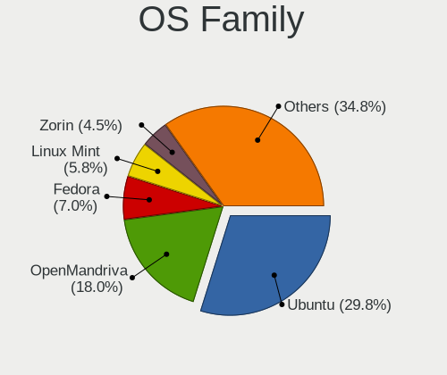

| Name         | Computers | Percent |
|--------------|-----------|---------|
| Ubuntu       | 77        | 41.85%  |
| OpenMandriva | 20        | 10.87%  |
| Linux Mint   | 12        | 6.52%   |
| Pop!_OS      | 8         | 4.35%   |
| Manjaro      | 7         | 3.8%    |
| Fedora       | 7         | 3.8%    |
| ROSA         | 6         | 3.26%   |
| KDE neon     | 6         | 3.26%   |
| Kali         | 5         | 2.72%   |
| Arch         | 5         | 2.72%   |
| Xubuntu      | 4         | 2.17%   |
| ArcoLinux    | 4         | 2.17%   |
| Kubuntu      | 3         | 1.63%   |
| Debian       | 3         | 1.63%   |
| BlackPanther | 3         | 1.63%   |
| Zorin        | 2         | 1.09%   |
| Peppermint   | 2         | 1.09%   |
| Parrot       | 2         | 1.09%   |
| UbuntuDDE    | 1         | 0.54%   |
| Skygate      | 1         | 0.54%   |
| Pear OS      | 1         | 0.54%   |
| MX           | 1         | 0.54%   |
| Clear Linux  | 1         | 0.54%   |
| CentOS       | 1         | 0.54%   |
| Artix        | 1         | 0.54%   |
| ArchLabs     | 1         | 0.54%   |

Kernel
------

Version of the Linux kernel

| Version                         | Computers | Percent |
|---------------------------------|-----------|---------|
| 5.10.14-desktop-1omv4002        | 14        | 7.07%   |
| 5.4.0-42-generic                | 5         | 2.53%   |
| 5.16.7-desktop-1omv4003         | 5         | 2.53%   |
| 5.8.0-50-generic                | 4         | 2.02%   |
| 5.4.0-72-generic                | 4         | 2.02%   |
| 5.4.0-54-generic                | 4         | 2.02%   |
| 5.4.0-29-generic                | 4         | 2.02%   |
| 5.0.0-37-generic                | 4         | 2.02%   |
| 5.4.0-65-generic                | 3         | 1.52%   |
| 5.4.0-56-generic                | 3         | 1.52%   |
| 5.4.0-52-generic                | 3         | 1.52%   |
| 5.3.0-46-generic                | 3         | 1.52%   |
| 5.13.0-30-generic               | 3         | 1.52%   |
| 5.11.0-38-generic               | 3         | 1.52%   |
| 5.11.0-27-generic               | 3         | 1.52%   |
| 5.8.0-44-generic                | 2         | 1.01%   |
| 5.4.0-88-generic                | 2         | 1.01%   |
| 5.4.0-81-generic                | 2         | 1.01%   |
| 5.4.0-80-generic                | 2         | 1.01%   |
| 5.4.0-7625-generic              | 2         | 1.01%   |
| 5.4.0-48-generic                | 2         | 1.01%   |
| 5.4.0-33-generic                | 2         | 1.01%   |
| 5.3.0-40-generic                | 2         | 1.01%   |
| 5.11.0-40-generic               | 2         | 1.01%   |
| 5.11.0-36-generic               | 2         | 1.01%   |
| 5.11.0-34-generic               | 2         | 1.01%   |
| 5.11.0-25-generic               | 2         | 1.01%   |
| 5.0.0-29-generic                | 2         | 1.01%   |
| 5.0.0-23-generic                | 2         | 1.01%   |
| 4.9.60-nrj-desktop-1rosa-x86_64 | 2         | 1.01%   |
| 4.18.16-desktop-1bP             | 2         | 1.01%   |
| 4.15.0-42-generic               | 2         | 1.01%   |
| 5.9.11-3-MANJARO                | 1         | 0.51%   |
| 5.8.18-300.fc33.x86_64          | 1         | 0.51%   |
| 5.8.0-7630-generic              | 1         | 0.51%   |
| 5.8.0-63-generic                | 1         | 0.51%   |
| 5.8.0-59-generic                | 1         | 0.51%   |
| 5.8.0-48-generic                | 1         | 0.51%   |
| 5.8.0-45-generic                | 1         | 0.51%   |
| 5.8.0-43-generic                | 1         | 0.51%   |
| 5.8.0-36-generic                | 1         | 0.51%   |
| 5.8.0-29-generic                | 1         | 0.51%   |
| 5.7.17-2-MANJARO                | 1         | 0.51%   |
| 5.7.0-kali1-amd64               | 1         | 0.51%   |
| 5.6.14-desktop-2bP              | 1         | 0.51%   |
| 5.6.0-2-amd64                   | 1         | 0.51%   |
| 5.4.72-1-lts                    | 1         | 0.51%   |
| 5.4.60-2-MANJARO                | 1         | 0.51%   |
| 5.4.15-200.fc31.x86_64          | 1         | 0.51%   |
| 5.4.0-77-generic                | 1         | 0.51%   |
| 5.4.0-7642-generic              | 1         | 0.51%   |
| 5.4.0-7626-generic              | 1         | 0.51%   |
| 5.4.0-71-generic                | 1         | 0.51%   |
| 5.4.0-70-generic                | 1         | 0.51%   |
| 5.4.0-58-generic                | 1         | 0.51%   |
| 5.4.0-51-generic                | 1         | 0.51%   |
| 5.4.0-47-generic                | 1         | 0.51%   |
| 5.4.0-40-generic                | 1         | 0.51%   |
| 5.4.0-39-generic                | 1         | 0.51%   |
| 5.4.0-37-generic                | 1         | 0.51%   |

Kernel Family
-------------

Linux kernel without a distro release

| Version | Computers | Percent |
|---------|-----------|---------|
| 5.4.0   | 44        | 23.66%  |
| 5.11.0  | 16        | 8.6%    |
| 5.8.0   | 14        | 7.53%   |
| 5.10.14 | 14        | 7.53%   |
| 4.15.0  | 12        | 6.45%   |
| 5.3.0   | 10        | 5.38%   |
| 5.0.0   | 10        | 5.38%   |
| 5.16.7  | 5         | 2.69%   |
| 5.13.0  | 5         | 2.69%   |
| 5.10.0  | 5         | 2.69%   |
| 4.18.16 | 3         | 1.61%   |
| 5.15.7  | 2         | 1.08%   |
| 5.15.0  | 2         | 1.08%   |
| 5.14.0  | 2         | 1.08%   |
| 4.9.60  | 2         | 1.08%   |
| 4.4.0   | 2         | 1.08%   |
| 4.19.0  | 2         | 1.08%   |
| 5.9.11  | 1         | 0.54%   |
| 5.8.18  | 1         | 0.54%   |
| 5.7.17  | 1         | 0.54%   |
| 5.7.0   | 1         | 0.54%   |
| 5.6.14  | 1         | 0.54%   |
| 5.6.0   | 1         | 0.54%   |
| 5.4.72  | 1         | 0.54%   |
| 5.4.60  | 1         | 0.54%   |
| 5.4.15  | 1         | 0.54%   |
| 5.17.4  | 1         | 0.54%   |
| 5.16.11 | 1         | 0.54%   |
| 5.15.8  | 1         | 0.54%   |
| 5.15.5  | 1         | 0.54%   |
| 5.15.25 | 1         | 0.54%   |
| 5.15.15 | 1         | 0.54%   |
| 5.15.11 | 1         | 0.54%   |
| 5.15.10 | 1         | 0.54%   |
| 5.14.18 | 1         | 0.54%   |
| 5.14.16 | 1         | 0.54%   |
| 5.13.2  | 1         | 0.54%   |
| 5.12.5  | 1         | 0.54%   |
| 5.12.4  | 1         | 0.54%   |
| 5.12.15 | 1         | 0.54%   |
| 5.11.2  | 1         | 0.54%   |
| 5.11.15 | 1         | 0.54%   |
| 5.10.82 | 1         | 0.54%   |
| 5.10.75 | 1         | 0.54%   |
| 5.10.4  | 1         | 0.54%   |
| 5.10.3  | 1         | 0.54%   |
| 4.9.9   | 1         | 0.54%   |
| 4.9.76  | 1         | 0.54%   |
| 4.19.79 | 1         | 0.54%   |
| 4.19.30 | 1         | 0.54%   |
| 4.18.0  | 1         | 0.54%   |
| 4.1.38  | 1         | 0.54%   |
| 3.10.0  | 1         | 0.54%   |

Kernel Major Ver.
-----------------

Linux kernel major version

| Version | Computers | Percent |
|---------|-----------|---------|
| 5.4     | 47        | 25.27%  |
| 5.10    | 23        | 12.37%  |
| 5.11    | 18        | 9.68%   |
| 5.8     | 15        | 8.06%   |
| 4.15    | 12        | 6.45%   |
| 5.3     | 10        | 5.38%   |
| 5.15    | 10        | 5.38%   |
| 5.0     | 10        | 5.38%   |
| 5.16    | 6         | 3.23%   |
| 5.13    | 6         | 3.23%   |
| 5.14    | 4         | 2.15%   |
| 4.9     | 4         | 2.15%   |
| 4.19    | 4         | 2.15%   |
| 4.18    | 4         | 2.15%   |
| 5.12    | 3         | 1.61%   |
| 5.7     | 2         | 1.08%   |
| 5.6     | 2         | 1.08%   |
| 4.4     | 2         | 1.08%   |
| 5.9     | 1         | 0.54%   |
| 5.17    | 1         | 0.54%   |
| 4.1     | 1         | 0.54%   |
| 3.10    | 1         | 0.54%   |

Arch
----

OS architecture (x86_64, i586, etc.)

| Name   | Computers | Percent |
|--------|-----------|---------|
| x86_64 | 164       | 98.2%   |
| i686   | 3         | 1.8%    |

DE
--

Desktop Environment

| Name            | Computers | Percent |
|-----------------|-----------|---------|
| GNOME           | 78        | 43.82%  |
| KDE5            | 35        | 19.66%  |
| Unknown         | 24        | 13.48%  |
| XFCE            | 9         | 5.06%   |
| X-Cinnamon      | 7         | 3.93%   |
| KDE             | 5         | 2.81%   |
| MATE            | 4         | 2.25%   |
| KDE4            | 4         | 2.25%   |
| Cinnamon        | 3         | 1.69%   |
| LXQt            | 2         | 1.12%   |
| i3              | 2         | 1.12%   |
| Unity           | 1         | 0.56%   |
| Peppermint      | 1         | 0.56%   |
| LXDE            | 1         | 0.56%   |
| GNOME Flashback | 1         | 0.56%   |
| Deepin          | 1         | 0.56%   |

Display Server
--------------

X11 or Wayland

| Name    | Computers | Percent |
|---------|-----------|---------|
| X11     | 149       | 87.65%  |
| Unknown | 11        | 6.47%   |
| Wayland | 9         | 5.29%   |
| Tty     | 1         | 0.59%   |

Display Manager
---------------

SDDM, LightDM, etc.

| Name    | Computers | Percent |
|---------|-----------|---------|
| Unknown | 101       | 57.39%  |
| SDDM    | 30        | 17.05%  |
| GDM     | 16        | 9.09%   |
| LightDM | 11        | 6.25%   |
| TDM     | 7         | 3.98%   |
| GDM3    | 6         | 3.41%   |
| KDM     | 4         | 2.27%   |
| SLiM    | 1         | 0.57%   |

OS Lang
-------

Language

| Lang        | Computers | Percent |
|-------------|-----------|---------|
| en_US       | 69        | 39.88%  |
| fr_FR       | 56        | 32.37%  |
| Unknown     | 25        | 14.45%  |
| en_GB       | 8         | 4.62%   |
| C           | 5         | 2.89%   |
| ar_DZ       | 4         | 2.31%   |
| fr_DZ       | 2         | 1.16%   |
| ar_EG       | 2         | 1.16%   |
| fr_BE       | 1         | 0.58%   |
| en-US-UTF-8 | 1         | 0.58%   |

Boot Mode
---------

EFI or BIOS

| Mode | Computers | Percent |
|------|-----------|---------|
| BIOS | 121       | 70.76%  |
| EFI  | 50        | 29.24%  |

Filesystem
----------

Type of filesystem

| Type    | Computers | Percent |
|---------|-----------|---------|
| Ext4    | 129       | 74.57%  |
| Overlay | 21        | 12.14%  |
| Btrfs   | 9         | 5.2%    |
| Unknown | 9         | 5.2%    |
| Ext2    | 3         | 1.73%   |
| Xfs     | 1         | 0.58%   |
| Ext3    | 1         | 0.58%   |

Part. scheme
------------

Scheme of partitioning

| Type    | Computers | Percent |
|---------|-----------|---------|
| Unknown | 110       | 64.71%  |
| MBR     | 34        | 20%     |
| GPT     | 26        | 15.29%  |

Dual Boot with Linux/BSD
------------------------

Hosting more than one Linux/BSD

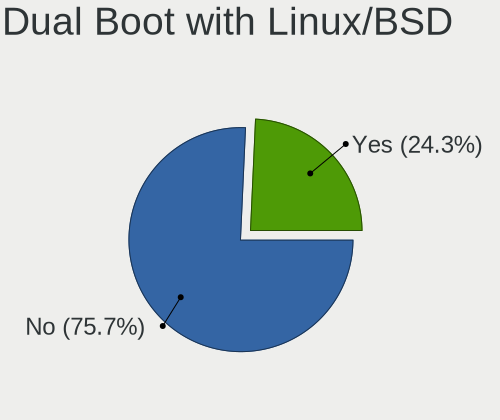

| Dual boot | Computers | Percent |
|-----------|-----------|---------|
| No        | 140       | 80.92%  |
| Yes       | 33        | 19.08%  |

Dual Boot (Win)
---------------

Hosting Linux and Windows

| Dual boot | Computers | Percent |
|-----------|-----------|---------|
| No        | 87        | 50.88%  |
| Yes       | 84        | 49.12%  |

Board
-----

Vendor
------

Motherboard manufacturer

| Name                | Computers | Percent |
|---------------------|-----------|---------|
| Dell                | 30        | 17.96%  |
| Hewlett-Packard     | 22        | 13.17%  |
| Lenovo              | 20        | 11.98%  |
| Gigabyte Technology | 12        | 7.19%   |
| MSI                 | 11        | 6.59%   |
| ASUSTek Computer    | 11        | 6.59%   |
| Acer                | 10        | 5.99%   |
| Toshiba             | 8         | 4.79%   |
| Sony                | 6         | 3.59%   |
| Unknown             | 6         | 3.59%   |
| ECS                 | 5         | 2.99%   |
| Foxconn             | 4         | 2.4%    |
| Packard Bell        | 3         | 1.8%    |
| Intel               | 3         | 1.8%    |
| Biostar             | 3         | 1.8%    |
| Samsung Electronics | 2         | 1.2%    |
| Fujitsu             | 2         | 1.2%    |
| ASRock              | 2         | 1.2%    |
| Apple               | 2         | 1.2%    |
| WeiBu               | 1         | 0.6%    |
| Pegatron            | 1         | 0.6%    |
| Microsoft           | 1         | 0.6%    |
| LDLC                | 1         | 0.6%    |
| eMachines           | 1         | 0.6%    |

Model
-----

Motherboard model

| Name                                | Computers | Percent |
|-------------------------------------|-----------|---------|
| Unknown                             | 6         | 3.59%   |
| Intel H55                           | 3         | 1.8%    |
| Toshiba Satellite C55-B             | 2         | 1.2%    |
| MSI MS-7758                         | 2         | 1.2%    |
| MSI MS-7636                         | 2         | 1.2%    |
| Lenovo IdeaPad 300-15ISK 80Q7       | 2         | 1.2%    |
| Lenovo G560 20042                   | 2         | 1.2%    |
| Lenovo G50-30 80G0                  | 2         | 1.2%    |
| Lenovo B50-70 20384                 | 2         | 1.2%    |
| HP ProBook 4540s                    | 2         | 1.2%    |
| HP Pavilion 15                      | 2         | 1.2%    |
| HP 15                               | 2         | 1.2%    |
| Gigabyte B85M-DS3H-A                | 2         | 1.2%    |
| ECS H61H2-MV                        | 2         | 1.2%    |
| Dell Latitude E7440                 | 2         | 1.2%    |
| Dell Latitude E5430 vPro            | 2         | 1.2%    |
| Dell Inspiron N5110                 | 2         | 1.2%    |
| Dell Inspiron 3542                  | 2         | 1.2%    |
| Dell Inspiron 15-3567               | 2         | 1.2%    |
| Biostar P4M89-M7B                   | 2         | 1.2%    |
| Acer Aspire 5738                    | 2         | 1.2%    |
| WeiBu SIMM INT G-41D3 G1.0L         | 1         | 0.6%    |
| Toshiba Satellite C850-A979         | 1         | 0.6%    |
| Toshiba Satellite C50-A560          | 1         | 0.6%    |
| Toshiba Satellite C50-A545          | 1         | 0.6%    |
| Toshiba Satellite C50-A539          | 1         | 0.6%    |
| Toshiba PORTEGE R30-A               | 1         | 0.6%    |
| Toshiba PORTEGE M780                | 1         | 0.6%    |
| Sony VPCEJ2S1E                      | 1         | 0.6%    |
| Sony VPCEH2H1E                      | 1         | 0.6%    |
| Sony VGN-AW21M_H                    | 1         | 0.6%    |
| Sony SVF1531GSFB                    | 1         | 0.6%    |
| Sony SVE1713A6EW                    | 1         | 0.6%    |
| Sony SVE1513K1EW                    | 1         | 0.6%    |
| Samsung N102SP/N100SP/N101SP        | 1         | 0.6%    |
| Samsung 700Z3A/700Z4A/700Z5A/700Z5B | 1         | 0.6%    |
| Pegatron 2A94h                      | 1         | 0.6%    |
| Packard Bell EasyNote TJ75          | 1         | 0.6%    |
| Packard Bell EasyNote LJ71          | 1         | 0.6%    |
| Packard Bell DOT S                  | 1         | 0.6%    |
| MSI MS-7C52                         | 1         | 0.6%    |
| MSI MS-7788                         | 1         | 0.6%    |
| MSI MS-7752                         | 1         | 0.6%    |
| MSI MS-7693                         | 1         | 0.6%    |
| MSI MS-7637                         | 1         | 0.6%    |
| MSI MS-7592                         | 1         | 0.6%    |
| MSI CR610M                          | 1         | 0.6%    |
| Microsoft Surface Pro 3             | 1         | 0.6%    |
| Lenovo Yoga 910-13IKB 80VF          | 1         | 0.6%    |
| Lenovo ThinkPad X260 20F5S1G104     | 1         | 0.6%    |
| Lenovo ThinkPad X201 3680AQ1        | 1         | 0.6%    |
| Lenovo ThinkPad T450 20BUS2RN1H     | 1         | 0.6%    |
| Lenovo ThinkPad T440 20B6S00200     | 1         | 0.6%    |
| Lenovo S510 10KW005NFM              | 1         | 0.6%    |
| Lenovo IdeaPad 330-15ARR 81D2       | 1         | 0.6%    |
| Lenovo IdeaPad 310-15IKB 80TV       | 1         | 0.6%    |
| Lenovo IdeaPad 100-15IBY 80MJ       | 1         | 0.6%    |
| Lenovo G580 2189                    | 1         | 0.6%    |
| Lenovo G500 20236                   | 1         | 0.6%    |
| Lenovo 0B98417 PRO                  | 1         | 0.6%    |

Model Family
------------

Motherboard model prefix

| Name                  | Computers | Percent |
|-----------------------|-----------|---------|
| Dell Inspiron         | 11        | 6.59%   |
| Dell Latitude         | 10        | 5.99%   |
| HP ProBook            | 8         | 4.79%   |
| Acer Aspire           | 8         | 4.79%   |
| Toshiba Satellite     | 6         | 3.59%   |
| Unknown               | 6         | 3.59%   |
| Lenovo IdeaPad        | 5         | 2.99%   |
| Lenovo ThinkPad       | 4         | 2.4%    |
| Intel H55             | 3         | 1.8%    |
| HP Pavilion           | 3         | 1.8%    |
| Toshiba PORTEGE       | 2         | 1.2%    |
| Packard Bell EasyNote | 2         | 1.2%    |
| MSI MS-7758           | 2         | 1.2%    |
| MSI MS-7636           | 2         | 1.2%    |
| Lenovo G560           | 2         | 1.2%    |
| Lenovo G50-30         | 2         | 1.2%    |
| Lenovo B50-70         | 2         | 1.2%    |
| HP EliteBook          | 2         | 1.2%    |
| HP 15                 | 2         | 1.2%    |
| Gigabyte B85M-DS3H-A  | 2         | 1.2%    |
| Fujitsu LIFEBOOK      | 2         | 1.2%    |
| ECS H61H2-MV          | 2         | 1.2%    |
| Dell Vostro           | 2         | 1.2%    |
| Dell Precision        | 2         | 1.2%    |
| Dell OptiPlex         | 2         | 1.2%    |
| Biostar P4M89-M7B     | 2         | 1.2%    |
| Acer Extensa          | 2         | 1.2%    |
| WeiBu SIMM            | 1         | 0.6%    |
| Sony VPCEJ2S1E        | 1         | 0.6%    |
| Sony VPCEH2H1E        | 1         | 0.6%    |
| Sony VGN-AW21M        | 1         | 0.6%    |
| Sony SVF1531GSFB      | 1         | 0.6%    |
| Sony SVE1713A6EW      | 1         | 0.6%    |
| Sony SVE1513K1EW      | 1         | 0.6%    |
| Samsung N102SP        | 1         | 0.6%    |
| Samsung 700Z3A        | 1         | 0.6%    |
| Pegatron 2A94h        | 1         | 0.6%    |
| Packard Bell DOT      | 1         | 0.6%    |
| MSI MS-7C52           | 1         | 0.6%    |
| MSI MS-7788           | 1         | 0.6%    |
| MSI MS-7752           | 1         | 0.6%    |
| MSI MS-7693           | 1         | 0.6%    |
| MSI MS-7637           | 1         | 0.6%    |
| MSI MS-7592           | 1         | 0.6%    |
| MSI CR610M            | 1         | 0.6%    |
| Microsoft Surface     | 1         | 0.6%    |
| Lenovo Yoga           | 1         | 0.6%    |
| Lenovo S510           | 1         | 0.6%    |
| Lenovo G580           | 1         | 0.6%    |
| Lenovo G500           | 1         | 0.6%    |
| Lenovo 0B98417        | 1         | 0.6%    |
| LDLC Mercure          | 1         | 0.6%    |
| HP ZBook              | 1         | 0.6%    |
| HP Notebook           | 1         | 0.6%    |
| HP Laptop             | 1         | 0.6%    |
| HP Compaq             | 1         | 0.6%    |
| HP 630                | 1         | 0.6%    |
| HP 280                | 1         | 0.6%    |
| HP 250                | 1         | 0.6%    |
| Gigabyte Z68AP-D3     | 1         | 0.6%    |

MFG Year
--------

Motherboard manufacture year

| Year | Computers | Percent |
|------|-----------|---------|
| 2012 | 33        | 19.76%  |
| 2014 | 23        | 13.77%  |
| 2013 | 18        | 10.78%  |
| 2011 | 15        | 8.98%   |
| 2015 | 13        | 7.78%   |
| 2016 | 12        | 7.19%   |
| 2010 | 12        | 7.19%   |
| 2017 | 10        | 5.99%   |
| 2018 | 9         | 5.39%   |
| 2009 | 8         | 4.79%   |
| 2008 | 4         | 2.4%    |
| 2007 | 4         | 2.4%    |
| 2019 | 3         | 1.8%    |
| 2021 | 1         | 0.6%    |
| 2020 | 1         | 0.6%    |
| 2006 | 1         | 0.6%    |

Form Factor
-----------

Physical design of the computer

| Name        | Computers | Percent |
|-------------|-----------|---------|
| Notebook    | 105       | 62.87%  |
| Desktop     | 59        | 35.33%  |
| Tablet      | 2         | 1.2%    |
| Convertible | 1         | 0.6%    |

Secure Boot
-----------

Enabled or disabled

| State    | Computers | Percent |
|----------|-----------|---------|
| Disabled | 164       | 98.2%   |
| Enabled  | 3         | 1.8%    |

Coreboot
--------

Have coreboot on board

| Used | Computers | Percent |
|------|-----------|---------|
| No   | 167       | 100%    |

RAM Size
--------

Total RAM memory

| Size in GB  | Computers | Percent |
|-------------|-----------|---------|
| 3.01-4.0    | 64        | 37.87%  |
| 4.01-8.0    | 39        | 23.08%  |
| 8.01-16.0   | 31        | 18.34%  |
| 1.01-2.0    | 15        | 8.88%   |
| 16.01-24.0  | 8         | 4.73%   |
| 2.01-3.0    | 6         | 3.55%   |
| 32.01-64.0  | 3         | 1.78%   |
| 0.51-1.0    | 2         | 1.18%   |
| 64.01-256.0 | 1         | 0.59%   |

RAM Used
--------

Used RAM memory

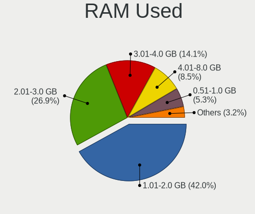

| Used GB   | Computers | Percent |
|-----------|-----------|---------|
| 1.01-2.0  | 91        | 49.46%  |
| 2.01-3.0  | 49        | 26.63%  |
| 3.01-4.0  | 16        | 8.7%    |
| 0.51-1.0  | 14        | 7.61%   |
| 4.01-8.0  | 11        | 5.98%   |
| 8.01-16.0 | 2         | 1.09%   |
| 0.01-0.5  | 1         | 0.54%   |

Total Drives
------------

Number of drives on board

| Drives | Computers | Percent |
|--------|-----------|---------|
| 1      | 116       | 68.24%  |
| 2      | 41        | 24.12%  |
| 3      | 8         | 4.71%   |
| 4      | 3         | 1.76%   |
| 0      | 2         | 1.18%   |

Has CD-ROM
----------

Has CD-ROM on board

| Presented | Computers | Percent |
|-----------|-----------|---------|
| Yes       | 108       | 64.29%  |
| No        | 60        | 35.71%  |

Has Ethernet
------------

Has Ethernet on board

| Presented | Computers | Percent |
|-----------|-----------|---------|
| Yes       | 157       | 94.01%  |
| No        | 10        | 5.99%   |

Has WiFi
--------

Has WiFi module

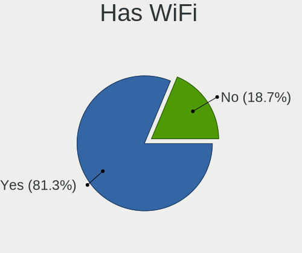

| Presented | Computers | Percent |
|-----------|-----------|---------|
| Yes       | 132       | 78.11%  |
| No        | 37        | 21.89%  |

Has Bluetooth
-------------

Has Bluetooth module

| Presented | Computers | Percent |
|-----------|-----------|---------|
| No        | 87        | 50.88%  |
| Yes       | 84        | 49.12%  |

Location
--------

Country
-------

Geographic location (country)

| Country | Computers | Percent |
|---------|-----------|---------|
| Algeria | 167       | 100%    |

City
----

Geographic location (city)

| City               | Computers | Percent |
|--------------------|-----------|---------|
| Algiers            | 29        | 15.43%  |
| Oran               | 9         | 4.79%   |
| Belcourt           | 9         | 4.79%   |
| Tlemcen            | 8         | 4.26%   |
| Annaba             | 8         | 4.26%   |
| Skikda             | 5         | 2.66%   |
| Blida              | 5         | 2.66%   |
| Biskra             | 5         | 2.66%   |
| Stif             | 4         | 2.13%   |
| Relizane           | 4         | 2.13%   |
| Cheraga            | 4         | 2.13%   |
| Birkhadem          | 4         | 2.13%   |
| Batna City         | 4         | 2.13%   |
| Tipasa             | 3         | 1.6%    |
| Mostaganem         | 3         | 1.6%    |
| Laghouat           | 3         | 1.6%    |
| Jijelli            | 3         | 1.6%    |
| Bjaa           | 3         | 1.6%    |
| ash-Shalif         | 3         | 1.6%    |
| Tizi Ouzou         | 2         | 1.06%   |
| Sidi Akkacha       | 2         | 1.06%   |
| Saida              | 2         | 1.06%   |
| Ouenza             | 2         | 1.06%   |
| Kouba              | 2         | 1.06%   |
| Khenchela          | 2         | 1.06%   |
| Draria             | 2         | 1.06%   |
| Djelfa             | 2         | 1.06%   |
| Constantine        | 2         | 1.06%   |
| Bir el Djir        | 2         | 1.06%   |
| Bab Ezzouar        | 2         | 1.06%   |
| Ain Fakroun        | 2         | 1.06%   |
| Tolga              | 1         | 0.53%   |
| Tichi              | 1         | 0.53%   |
| Tazoult-Lambese    | 1         | 0.53%   |
| Tadjenanet         | 1         | 0.53%   |
| Souma              | 1         | 0.53%   |
| Sig                | 1         | 0.53%   |
| Sidi Kada          | 1         | 0.53%   |
| Sidi Bel Abbes     | 1         | 0.53%   |
| Saoula             | 1         | 0.53%   |
| Reguiba            | 1         | 0.53%   |
| Oum el Bouaghi     | 1         | 0.53%   |
| Oued Smar          | 1         | 0.53%   |
| Ouargla            | 1         | 0.53%   |
| M'Sila             | 1         | 0.53%   |
| Larba            | 1         | 0.53%   |
| Khraicia           | 1         | 0.53%   |
| Hassi Bahbah       | 1         | 0.53%   |
| El Oued            | 1         | 0.53%   |
| El Khroub          | 1         | 0.53%   |
| El Eulma           | 1         | 0.53%   |
| El Aouinet         | 1         | 0.53%   |
| Dunqulah           | 1         | 0.53%   |
| Debila             | 1         | 0.53%   |
| Brezina            | 1         | 0.53%   |
| Boura          | 1         | 0.53%   |
| Boumerdes          | 1         | 0.53%   |
| Boura            | 1         | 0.53%   |
| Bordj el Kiffan    | 1         | 0.53%   |
| Bordj Bou Arreridj | 1         | 0.53%   |

Drives
------

Drive Vendor
------------

Hard drive vendors

| Vendor                    | Computers | Drives | Percent |
|---------------------------|-----------|--------|---------|
| WDC                       | 47        | 67     | 22.27%  |
| Seagate                   | 36        | 46     | 17.06%  |
| Toshiba                   | 28        | 29     | 13.27%  |
| Samsung Electronics       | 20        | 21     | 9.48%   |
| Hitachi                   | 19        | 28     | 9%      |
| HGST                      | 12        | 16     | 5.69%   |
| A-DATA Technology         | 10        | 10     | 4.74%   |
| SanDisk                   | 5         | 5      | 2.37%   |
| MAXTOR                    | 4         | 5      | 1.9%    |
| LITEON                    | 4         | 7      | 1.9%    |
| Lexar                     | 4         | 4      | 1.9%    |
| Realtek Semiconductor     | 3         | 3      | 1.42%   |
| XPG                       | 2         | 2      | 0.95%   |
| Unknown                   | 2         | 3      | 0.95%   |
| Kingston                  | 2         | 2      | 0.95%   |
| Intel                     | 2         | 2      | 0.95%   |
| ZTE                       | 1         | 1      | 0.47%   |
| WD MediaMax               | 1         | 1      | 0.47%   |
| T-FORCE                   | 1         | 1      | 0.47%   |
| SK Hynix                  | 1         | 1      | 0.47%   |
| Silicon Motion            | 1         | 1      | 0.47%   |
| PNY                       | 1         | 1      | 0.47%   |
| Micron/Crucial Technology | 1         | 1      | 0.47%   |
| Micron Technology         | 1         | 2      | 0.47%   |
| HUAWEI                    | 1         | 1      | 0.47%   |
| Fujitsu                   | 1         | 2      | 0.47%   |
| Crucial                   | 1         | 1      | 0.47%   |

Drive Model
-----------

Hard drive models

| Model                              | Computers | Percent |
|------------------------------------|-----------|---------|
| Toshiba MQ01ABF050 500GB           | 8         | 3.57%   |
| WDC WD5000LPCX-24C6HT0 500GB       | 4         | 1.79%   |
| Seagate ST500LT012-1DG142 500GB    | 4         | 1.79%   |
| WDC WD10EZEX-08WN4A0 1TB           | 3         | 1.34%   |
| WDC WD10EZEX-00WN4A0 1TB           | 3         | 1.34%   |
| Toshiba MQ01ABD100 1TB             | 3         | 1.34%   |
| Toshiba DT01ACA100 1TB             | 3         | 1.34%   |
| Toshiba DT01ACA050 500GB           | 3         | 1.34%   |
| Seagate ST1000LM035-1RK172 1TB     | 3         | 1.34%   |
| Seagate Expansion 4TB              | 3         | 1.34%   |
| HGST HTS545050A7E380 500GB         | 3         | 1.34%   |
| XPG SX950U 960GB                   | 2         | 0.89%   |
| WDC WDS500G2B0A-00SM50 500GB SSD   | 2         | 0.89%   |
| WDC WD5000AVVS-63M8B0 500GB        | 2         | 0.89%   |
| Unknown MMC Card  64GB             | 2         | 0.89%   |
| Seagate ST500VT000-1DK142 500GB    | 2         | 0.89%   |
| Seagate ST500LM021-1KJ152 500GB    | 2         | 0.89%   |
| Seagate ST3500312CS 500GB          | 2         | 0.89%   |
| Seagate ST320LT020-9YG142 320GB    | 2         | 0.89%   |
| Seagate ST1000LM024 HN-M101MBB 1TB | 2         | 0.89%   |
| Samsung NVMe SSD Drive 256GB       | 2         | 0.89%   |
| Lexar 128GB SSD                    | 2         | 0.89%   |
| Hitachi HTS545050B9A300 500GB      | 2         | 0.89%   |
| Hitachi HTS545050A7E380 500GB      | 2         | 0.89%   |
| Hitachi HDS721616PLA380 164GB      | 2         | 0.89%   |
| HGST HTS725050A7E630 500GB         | 2         | 0.89%   |
| HGST HTS545050A7E680 500GB         | 2         | 0.89%   |
| HGST HTS541010A9E680 1TB           | 2         | 0.89%   |
| A-DATA SU630 240GB SSD             | 2         | 0.89%   |
| ZTE MMC Storage 8GB                | 1         | 0.45%   |
| WDC WDS120G2G0A-00JH30 120GB SSD   | 1         | 0.45%   |
| WDC WDS100T2B0B-00YS70 1TB SSD     | 1         | 0.45%   |
| WDC WD800JD-55MUA1 80GB            | 1         | 0.45%   |
| WDC WD7500AYYS-01RCA0 752GB        | 1         | 0.45%   |
| WDC WD5000LUCT-62RC2Y0 500GB       | 1         | 0.45%   |
| WDC WD5000LPVX-75V0TT0 500GB       | 1         | 0.45%   |
| WDC WD5000LPVX-22V0TT0 500GB       | 1         | 0.45%   |
| WDC WD5000LPVT-16G33T0 500GB       | 1         | 0.45%   |
| WDC WD5000LPCX-60VHAT1 500GB       | 1         | 0.45%   |
| WDC WD5000LPCX-24VHAT0 500GB       | 1         | 0.45%   |
| WDC WD5000LPCX-21VHAT0 500GB       | 1         | 0.45%   |
| WDC WD5000BPVT-75HXZT3 500GB       | 1         | 0.45%   |
| WDC WD5000AZLX-08K2TA0 500GB       | 1         | 0.45%   |
| WDC WD5000AVCS-632DY1 500GB        | 1         | 0.45%   |
| WDC WD5000AAKX-603CA0 500GB        | 1         | 0.45%   |
| WDC WD5000AAKX-083CA1 500GB        | 1         | 0.45%   |
| WDC WD5000AAKX-00U6AA0 500GB       | 1         | 0.45%   |
| WDC WD5000AAKX-00ERMA0 500GB       | 1         | 0.45%   |
| WDC WD5000AAKX-001CA0 500GB        | 1         | 0.45%   |
| WDC WD5000AAKS-00A7B0 500GB        | 1         | 0.45%   |
| WDC WD5000AADS-00S9B0 500GB        | 1         | 0.45%   |
| WDC WD3200BVVT-63A26Y0 320GB       | 1         | 0.45%   |
| WDC WD3200BPVT-22JJ5T0 320GB       | 1         | 0.45%   |
| WDC WD3200BEKT-75PVMT1 320GB       | 1         | 0.45%   |
| WDC WD3200BEKT-75KA9T0 320GB       | 1         | 0.45%   |
| WDC WD3200AVJS-63B6A0 320GB        | 1         | 0.45%   |
| WDC WD3200AAKS-75L9A0 320GB        | 1         | 0.45%   |
| WDC WD3200AAJS-60M0A1 320GB        | 1         | 0.45%   |
| WDC WD2500AVJS-63TBA0 250GB        | 1         | 0.45%   |
| WDC WD20PURZ-85GU6Y0 2TB           | 1         | 0.45%   |

HDD Vendor
----------

Hard disk drive vendors

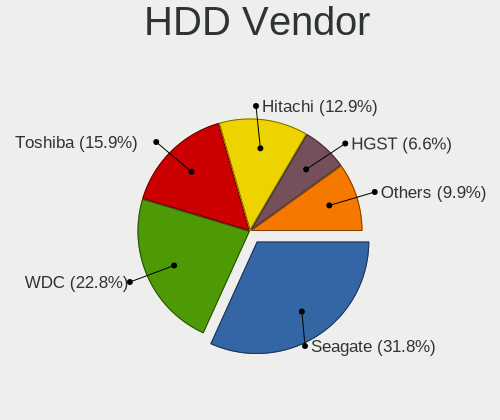

| Vendor              | Computers | Drives | Percent |
|---------------------|-----------|--------|---------|
| WDC                 | 45        | 62     | 28.85%  |
| Seagate             | 36        | 46     | 23.08%  |
| Toshiba             | 28        | 29     | 17.95%  |
| Hitachi             | 19        | 28     | 12.18%  |
| HGST                | 12        | 16     | 7.69%   |
| Samsung Electronics | 10        | 11     | 6.41%   |
| MAXTOR              | 4         | 5      | 2.56%   |
| WD MediaMax         | 1         | 1      | 0.64%   |
| Fujitsu             | 1         | 2      | 0.64%   |

SSD Vendor
----------

Solid state drive vendors

| Vendor              | Computers | Drives | Percent |
|---------------------|-----------|--------|---------|
| A-DATA Technology   | 7         | 7      | 20%     |
| WDC                 | 4         | 5      | 11.43%  |
| SanDisk             | 4         | 4      | 11.43%  |
| Samsung Electronics | 4         | 4      | 11.43%  |
| LITEON              | 4         | 7      | 11.43%  |
| Lexar               | 3         | 3      | 8.57%   |
| XPG                 | 2         | 2      | 5.71%   |
| Intel               | 2         | 2      | 5.71%   |
| T-FORCE             | 1         | 1      | 2.86%   |
| SK Hynix            | 1         | 1      | 2.86%   |
| PNY                 | 1         | 1      | 2.86%   |
| Kingston            | 1         | 1      | 2.86%   |
| Crucial             | 1         | 1      | 2.86%   |

Drive Kind
----------

HDD or SSD

| Kind    | Computers | Drives | Percent |
|---------|-----------|--------|---------|
| HDD     | 140       | 200    | 73.3%   |
| SSD     | 32        | 39     | 16.75%  |
| NVMe    | 13        | 17     | 6.81%   |
| MMC     | 3         | 4      | 1.57%   |
| Unknown | 3         | 3      | 1.57%   |

Drive Connector
---------------

SATA, SAS, NVMe, etc.

| Type | Computers | Drives | Percent |
|------|-----------|--------|---------|
| SATA | 155       | 236    | 87.57%  |
| NVMe | 13        | 17     | 7.34%   |
| SAS  | 6         | 6      | 3.39%   |
| MMC  | 3         | 4      | 1.69%   |

Drive Size
----------

Size of hard drive

| Size in TB | Computers | Drives | Percent |
|------------|-----------|--------|---------|
| 0.01-0.5   | 124       | 179    | 70.45%  |
| 0.51-1.0   | 44        | 52     | 25%     |
| 1.01-2.0   | 5         | 5      | 2.84%   |
| 3.01-4.0   | 3         | 3      | 1.7%    |

Space Total
-----------

Amount of disk space available on the file system

| Size in GB | Computers | Percent |
|------------|-----------|---------|
| 251-500    | 51        | 28.65%  |
| 101-250    | 30        | 16.85%  |
| 51-100     | 29        | 16.29%  |
| 1-20       | 20        | 11.24%  |
| 501-1000   | 20        | 11.24%  |
| 21-50      | 14        | 7.87%   |
| 1001-2000  | 10        | 5.62%   |
| Unknown    | 3         | 1.69%   |
| 2001-3000  | 1         | 0.56%   |

Space Used
----------

Amount of used disk space

| Used GB   | Computers | Percent |
|-----------|-----------|---------|
| 1-20      | 90        | 48.91%  |
| 21-50     | 35        | 19.02%  |
| 101-250   | 21        | 11.41%  |
| 51-100    | 15        | 8.15%   |
| 251-500   | 12        | 6.52%   |
| 501-1000  | 6         | 3.26%   |
| Unknown   | 3         | 1.63%   |
| 1001-2000 | 2         | 1.09%   |

Malfunc. Drives
---------------

Drive models with a malfunction

| Model                             | Computers | Drives | Percent |
|-----------------------------------|-----------|--------|---------|
| WDC WD5000AVVS-63M8B0 500GB       | 1         | 1      | 3.85%   |
| WDC WD5000AVCS-632DY1 500GB       | 1         | 1      | 3.85%   |
| WDC WD5000AAKX-00ERMA0 500GB      | 1         | 1      | 3.85%   |
| WDC WD3200BPVT-22JJ5T0 320GB      | 1         | 1      | 3.85%   |
| WDC WD3200AVJS-63B6A0 320GB       | 1         | 1      | 3.85%   |
| WDC WD1600AAJS-08WAA0 160GB       | 1         | 1      | 3.85%   |
| WDC WD1001FALS-403AA0 1TB         | 1         | 1      | 3.85%   |
| WD MediaMax WL120GBSATA           | 1         | 1      | 3.85%   |
| Toshiba MQ01ABF050 500GB          | 1         | 1      | 3.85%   |
| Toshiba MQ01ABD100 1TB            | 1         | 1      | 3.85%   |
| Seagate ST9320325AS 320GB         | 1         | 1      | 3.85%   |
| Seagate ST500LT012-9WS142 500GB   | 1         | 1      | 3.85%   |
| Seagate ST500LT012-1DG142 500GB   | 1         | 1      | 3.85%   |
| Seagate ST500LM021-1KJ152 500GB   | 1         | 1      | 3.85%   |
| Samsung Electronics HM320HJ 320GB | 1         | 1      | 3.85%   |
| Samsung Electronics HD502HI 500GB | 1         | 1      | 3.85%   |
| Samsung Electronics HD256GJ 250GB | 1         | 1      | 3.85%   |
| Samsung Electronics HD160JJ 160GB | 1         | 1      | 3.85%   |
| Samsung Electronics HD103SI 1TB   | 1         | 1      | 3.85%   |
| MAXTOR 6L300S0 304GB              | 1         | 1      | 3.85%   |
| MAXTOR 32049H2 20GB               | 1         | 1      | 3.85%   |
| Hitachi HTS723225L9A360 250GB     | 1         | 1      | 3.85%   |
| Hitachi HTS547564A9E384 640GB     | 1         | 1      | 3.85%   |
| Hitachi HTS542516K9SA00 160GB     | 1         | 1      | 3.85%   |
| Hitachi HDS721032CLA362 320GB     | 1         | 1      | 3.85%   |
| HGST HTS725050A7E630 500GB        | 1         | 3      | 3.85%   |

Malfunc. Drive Vendor
---------------------

Vendors of faulty drives

| Vendor              | Computers | Drives | Percent |
|---------------------|-----------|--------|---------|
| WDC                 | 6         | 7      | 24%     |
| Samsung Electronics | 5         | 5      | 20%     |
| Seagate             | 4         | 4      | 16%     |
| Hitachi             | 4         | 4      | 16%     |
| Toshiba             | 2         | 2      | 8%      |
| MAXTOR              | 2         | 2      | 8%      |
| WD MediaMax         | 1         | 1      | 4%      |
| HGST                | 1         | 3      | 4%      |

Malfunc. HDD Vendor
-------------------

Vendors of faulty HDD drives

| Vendor              | Computers | Drives | Percent |
|---------------------|-----------|--------|---------|
| WDC                 | 6         | 7      | 24%     |
| Samsung Electronics | 5         | 5      | 20%     |
| Seagate             | 4         | 4      | 16%     |
| Hitachi             | 4         | 4      | 16%     |
| Toshiba             | 2         | 2      | 8%      |
| MAXTOR              | 2         | 2      | 8%      |
| WD MediaMax         | 1         | 1      | 4%      |
| HGST                | 1         | 3      | 4%      |

Malfunc. Drive Kind
-------------------

Kinds of faulty drives

| Kind | Computers | Drives | Percent |
|------|-----------|--------|---------|
| HDD  | 24        | 28     | 100%    |

Failed Drives
-------------

Failed drive models

Zero info for selected period =(

Failed Drive Vendor
-------------------

Failed drive vendors

Zero info for selected period =(

Drive Status
------------

Number of failed and malfunc. drives

| Status   | Computers | Drives | Percent |
|----------|-----------|--------|---------|
| Detected | 114       | 181    | 64.04%  |
| Works    | 40        | 54     | 22.47%  |
| Malfunc  | 24        | 28     | 13.48%  |

Storage controller
------------------

Storage Vendor
--------------

Storage controller vendors

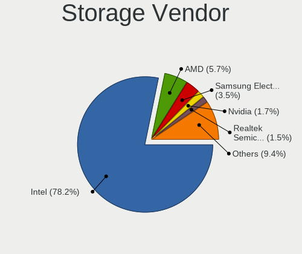

| Vendor                      | Computers | Percent |
|-----------------------------|-----------|---------|
| Intel                       | 145       | 79.23%  |
| AMD                         | 11        | 6.01%   |
| Samsung Electronics         | 5         | 2.73%   |
| Realtek Semiconductor       | 5         | 2.73%   |
| Nvidia                      | 4         | 2.19%   |
| VIA Technologies            | 3         | 1.64%   |
| Silicon Motion              | 2         | 1.09%   |
| JMicron Technology          | 2         | 1.09%   |
| ASMedia Technology          | 2         | 1.09%   |
| Micron/Crucial Technology   | 1         | 0.55%   |
| Micron Technology           | 1         | 0.55%   |
| Marvell Technology Group    | 1         | 0.55%   |
| Kingston Technology Company | 1         | 0.55%   |

Storage Model
-------------

Storage controller models

| Model                                                                                   | Computers | Percent |
|-----------------------------------------------------------------------------------------|-----------|---------|
| Intel 7 Series Chipset Family 6-port SATA Controller [AHCI mode]                        | 20        | 9.01%   |
| Intel Sunrise Point-LP SATA Controller [AHCI mode]                                      | 15        | 6.76%   |
| Intel 6 Series/C200 Series Chipset Family Desktop SATA Controller (IDE mode, ports 4-5) | 13        | 5.86%   |
| Intel 6 Series/C200 Series Chipset Family Desktop SATA Controller (IDE mode, ports 0-3) | 13        | 5.86%   |
| Intel 82801 Mobile SATA Controller [RAID mode]                                          | 11        | 4.95%   |
| Intel NM10/ICH7 Family SATA Controller [IDE mode]                                       | 10        | 4.5%    |
| Intel 8 Series SATA Controller 1 [AHCI mode]                                            | 9         | 4.05%   |
| AMD FCH SATA Controller [AHCI mode]                                                     | 9         | 4.05%   |
| Intel 82801G (ICH7 Family) IDE Controller                                               | 7         | 3.15%   |
| Intel 8 Series/C220 Series Chipset Family 6-port SATA Controller 1 [AHCI mode]          | 7         | 3.15%   |
| Intel 5 Series/3400 Series Chipset 4 port SATA IDE Controller                           | 7         | 3.15%   |
| Intel 5 Series/3400 Series Chipset 2 port SATA IDE Controller                           | 7         | 3.15%   |
| Intel Wildcat Point-LP SATA Controller [AHCI Mode]                                      | 6         | 2.7%    |
| Intel 6 Series/C200 Series Chipset Family 6 port Mobile SATA AHCI Controller            | 6         | 2.7%    |
| Intel 5 Series/3400 Series Chipset 4 port SATA AHCI Controller                          | 6         | 2.7%    |
| Realtek Realtek Non-Volatile memory controller                                          | 5         | 2.25%   |
| Intel 7 Series/C210 Series Chipset Family 6-port SATA Controller [AHCI mode]            | 5         | 2.25%   |
| Intel Atom Processor E3800 Series SATA AHCI Controller                                  | 4         | 1.8%    |
| AMD 400 Series Chipset SATA Controller                                                  | 4         | 1.8%    |
| VIA VT82C586A/B/VT82C686/A/B/VT823x/A/C PIPC Bus Master IDE                             | 3         | 1.35%   |
| Intel 82801IBM/IEM (ICH9M/ICH9M-E) 4 port SATA Controller [AHCI mode]                   | 3         | 1.35%   |
| Intel 6 Series/C200 Series Chipset Family 6 port Desktop SATA AHCI Controller           | 3         | 1.35%   |
| Intel 5 Series/3400 Series Chipset 6 port SATA AHCI Controller                          | 3         | 1.35%   |
| VIA Serial ATA Controller                                                               | 2         | 0.9%    |
| Silicon Motion SM2263EN/SM2263XT SSD Controller                                         | 2         | 0.9%    |
| Samsung NVMe SSD Controller SM981/PM981/PM983                                           | 2         | 0.9%    |
| Nvidia MCP79 AHCI Controller                                                            | 2         | 0.9%    |
| Intel SATA Controller [RAID mode]                                                       | 2         | 0.9%    |
| Intel Q170/Q150/B150/H170/H110/Z170/CM236 Chipset SATA Controller [AHCI Mode]           | 2         | 0.9%    |
| Intel NM10/ICH7 Family SATA Controller [AHCI mode]                                      | 2         | 0.9%    |
| Intel Atom Processor E3800 Series SATA IDE Controller                                   | 2         | 0.9%    |
| Intel 82801IBM/IEM (ICH9M/ICH9M-E) 2 port SATA Controller [IDE mode]                    | 2         | 0.9%    |
| VIA VT8237/8251 Serial ATA Controller                                                   | 1         | 0.45%   |
| Samsung NVMe SSD Controller SM961/PM961/SM963                                           | 1         | 0.45%   |
| Samsung NVMe SSD Controller SM951/PM951                                                 | 1         | 0.45%   |
| Samsung NVMe SSD Controller 980                                                         | 1         | 0.45%   |
| Nvidia MCP89 SATA Controller                                                            | 1         | 0.45%   |
| Nvidia MCP79 SATA Controller                                                            | 1         | 0.45%   |
| Nvidia MCP78S [GeForce 8200] SATA Controller (non-AHCI mode)                            | 1         | 0.45%   |
| Nvidia MCP78S [GeForce 8200] IDE                                                        | 1         | 0.45%   |
| Micron/Crucial P2 NVMe PCIe SSD                                                         | 1         | 0.45%   |
| Micron Non-Volatile memory controller                                                   | 1         | 0.45%   |
| Marvell Group 88SE9172 SATA 6Gb/s Controller                                            | 1         | 0.45%   |
| Kingston Company A2000 NVMe SSD                                                         | 1         | 0.45%   |
| JMicron JMB368 IDE controller                                                           | 1         | 0.45%   |
| JMicron JMB363 SATA/IDE Controller                                                      | 1         | 0.45%   |
| Intel Volume Management Device NVMe RAID Controller                                     | 1         | 0.45%   |
| Intel Tiger Lake-LP SATA Controller [AHCI mode]                                         | 1         | 0.45%   |
| Intel Mobile 4 Series Chipset PT IDER Controller                                        | 1         | 0.45%   |
| Intel HM170/QM170 Chipset SATA Controller [AHCI Mode]                                   | 1         | 0.45%   |
| Intel Celeron N3350/Pentium N4200/Atom E3900 Series SATA AHCI Controller                | 1         | 0.45%   |
| Intel Cannon Point-LP SATA Controller [AHCI Mode]                                       | 1         | 0.45%   |
| Intel Cannon Lake PCH SATA AHCI Controller                                              | 1         | 0.45%   |
| Intel Atom/Celeron/Pentium Processor x5-E8000/J3xxx/N3xxx Series SATA Controller        | 1         | 0.45%   |
| Intel 82801JI (ICH10 Family) SATA AHCI Controller                                       | 1         | 0.45%   |
| ASMedia ASM1062 Serial ATA Controller                                                   | 1         | 0.45%   |
| ASMedia ASM1061 SATA IDE Controller                                                     | 1         | 0.45%   |
| AMD SB7x0/SB8x0/SB9x0 SATA Controller [IDE mode]                                        | 1         | 0.45%   |
| AMD SB7x0/SB8x0/SB9x0 SATA Controller [AHCI mode]                                       | 1         | 0.45%   |
| AMD SB7x0/SB8x0/SB9x0 IDE Controller                                                    | 1         | 0.45%   |

Storage Kind
------------

Kind of storage controller (IDE, SATA, NVMe, SAS, ...)

| Kind | Computers | Percent |
|------|-----------|---------|
| SATA | 112       | 61.88%  |
| IDE  | 42        | 23.2%   |
| RAID | 14        | 7.73%   |
| NVMe | 13        | 7.18%   |

Processor
---------

CPU Vendor
----------

Processor vendors

| Vendor | Computers | Percent |
|--------|-----------|---------|
| Intel  | 155       | 92.81%  |
| AMD    | 12        | 7.19%   |

CPU Model
---------

Processor models

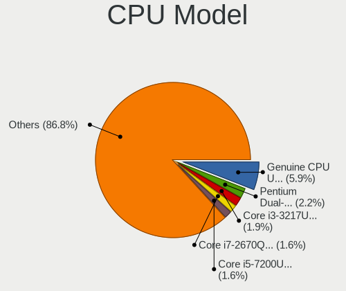

| Model                                       | Computers | Percent |
|---------------------------------------------|-----------|---------|
| Intel Core i3 CPU M 370 @ 2.40GHz           | 6         | 3.59%   |
| Intel Pentium CPU G2020 @ 2.90GHz           | 4         | 2.4%    |
| Intel Core i3-3217U CPU @ 1.80GHz           | 4         | 2.4%    |
| Intel Core i3-3110M CPU @ 2.40GHz           | 4         | 2.4%    |
| Intel Pentium Dual-Core CPU E5700 @ 3.00GHz | 3         | 1.8%    |
| Intel Core i7-2760QM CPU @ 2.40GHz          | 3         | 1.8%    |
| Intel Core i5-7200U CPU @ 2.50GHz           | 3         | 1.8%    |
| Intel Core i5-3210M CPU @ 2.50GHz           | 3         | 1.8%    |
| Intel Core i3 CPU M 380 @ 2.53GHz           | 3         | 1.8%    |
| Intel Core i3 CPU 540 @ 3.07GHz             | 3         | 1.8%    |
| Intel Pentium Dual-Core CPU T4500 @ 2.30GHz | 2         | 1.2%    |
| Intel Pentium Dual-Core CPU E5300 @ 2.60GHz | 2         | 1.2%    |
| Intel Pentium Dual CPU E2200 @ 2.20GHz      | 2         | 1.2%    |
| Intel Pentium CPU N3540 @ 2.16GHz           | 2         | 1.2%    |
| Intel Core i7-7700HQ CPU @ 2.80GHz          | 2         | 1.2%    |
| Intel Core i7-7500U CPU @ 2.70GHz           | 2         | 1.2%    |
| Intel Core i7-6500U CPU @ 2.50GHz           | 2         | 1.2%    |
| Intel Core i7-4500U CPU @ 1.80GHz           | 2         | 1.2%    |
| Intel Core i7-2700K CPU @ 3.50GHz           | 2         | 1.2%    |
| Intel Core i5-8250U CPU @ 1.60GHz           | 2         | 1.2%    |
| Intel Core i5-6200U CPU @ 2.30GHz           | 2         | 1.2%    |
| Intel Core i5-5200U CPU @ 2.20GHz           | 2         | 1.2%    |
| Intel Core i5-4210U CPU @ 1.70GHz           | 2         | 1.2%    |
| Intel Core i5-3320M CPU @ 2.60GHz           | 2         | 1.2%    |
| Intel Core i5-3230M CPU @ 2.60GHz           | 2         | 1.2%    |
| Intel Core i5 CPU M 520 @ 2.40GHz           | 2         | 1.2%    |
| Intel Core i3-6100U CPU @ 2.30GHz           | 2         | 1.2%    |
| Intel Core i3-5005U CPU @ 2.00GHz           | 2         | 1.2%    |
| Intel Core i3-4130 CPU @ 3.40GHz            | 2         | 1.2%    |
| Intel Core i3-4030U CPU @ 1.90GHz           | 2         | 1.2%    |
| Intel Core i3-3240 CPU @ 3.40GHz            | 2         | 1.2%    |
| Intel Core i3-3220 CPU @ 3.30GHz            | 2         | 1.2%    |
| Intel Core i3-3120M CPU @ 2.50GHz           | 2         | 1.2%    |
| Intel Core i3-2330M CPU @ 2.20GHz           | 2         | 1.2%    |
| Intel Core i3-2120 CPU @ 3.30GHz            | 2         | 1.2%    |
| Intel Core i3 CPU M 330 @ 2.13GHz           | 2         | 1.2%    |
| Intel Core 2 Duo CPU P8600 @ 2.40GHz        | 2         | 1.2%    |
| Intel Core 2 Duo CPU E8400 @ 3.00GHz        | 2         | 1.2%    |
| Intel Core 2 Duo CPU E7500 @ 2.93GHz        | 2         | 1.2%    |
| Intel Celeron CPU N2840 @ 2.16GHz           | 2         | 1.2%    |
| AMD Ryzen 7 2700X Eight-Core Processor      | 2         | 1.2%    |
| Intel Xeon CPU E5-1650 v2 @ 3.50GHz         | 1         | 0.6%    |
| Intel Pentium Dual-Core CPU T4400 @ 2.20GHz | 1         | 0.6%    |
| Intel Pentium Dual-Core CPU E5800 @ 3.20GHz | 1         | 0.6%    |
| Intel Pentium Dual-Core CPU E5500 @ 2.80GHz | 1         | 0.6%    |
| Intel Pentium Dual-Core CPU E5400 @ 2.70GHz | 1         | 0.6%    |
| Intel Pentium D CPU 3.00GHz                 | 1         | 0.6%    |
| Intel Pentium CPU N3530 @ 2.16GHz           | 1         | 0.6%    |
| Intel Pentium CPU G850 @ 2.90GHz            | 1         | 0.6%    |
| Intel Pentium CPU G3240 @ 3.10GHz           | 1         | 0.6%    |
| Intel Pentium CPU G2010 @ 2.80GHz           | 1         | 0.6%    |
| Intel Pentium CPU B980 @ 2.40GHz            | 1         | 0.6%    |
| Intel Pentium CPU 2020M @ 2.40GHz           | 1         | 0.6%    |
| Intel Pentium 4 CPU 3.20GHz                 | 1         | 0.6%    |
| Intel Pentium 3805U @ 1.90GHz               | 1         | 0.6%    |
| Intel Core i7-8650U CPU @ 1.90GHz           | 1         | 0.6%    |
| Intel Core i7-8550U CPU @ 1.80GHz           | 1         | 0.6%    |
| Intel Core i7-7600U CPU @ 2.80GHz           | 1         | 0.6%    |
| Intel Core i7-6600U CPU @ 2.60GHz           | 1         | 0.6%    |
| Intel Core i7-4650U CPU @ 1.70GHz           | 1         | 0.6%    |

CPU Model Family
----------------

Processor model prefix

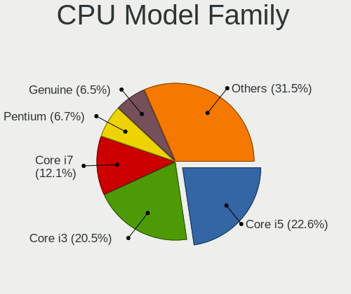

| Model                   | Computers | Percent |
|-------------------------|-----------|---------|
| Intel Core i3           | 49        | 29.34%  |
| Intel Core i5           | 34        | 20.36%  |
| Intel Core i7           | 23        | 13.77%  |
| Intel Pentium           | 13        | 7.78%   |
| Intel Pentium Dual-Core | 11        | 6.59%   |
| Intel Core 2 Duo        | 9         | 5.39%   |
| Intel Celeron           | 5         | 2.99%   |
| Intel Atom              | 4         | 2.4%    |
| Intel Pentium Dual      | 2         | 1.2%    |
| AMD Ryzen 7             | 2         | 1.2%    |
| Other                   | 1         | 0.6%    |
| Intel Xeon              | 1         | 0.6%    |
| Intel Pentium D         | 1         | 0.6%    |
| Intel Pentium 4         | 1         | 0.6%    |
| Intel Core 2 Quad       | 1         | 0.6%    |
| AMD Ryzen 9             | 1         | 0.6%    |
| AMD Ryzen 5 PRO         | 1         | 0.6%    |
| AMD Ryzen 5             | 1         | 0.6%    |
| AMD Ryzen 3             | 1         | 0.6%    |
| AMD FX                  | 1         | 0.6%    |
| AMD E2                  | 1         | 0.6%    |
| AMD E1                  | 1         | 0.6%    |
| AMD Athlon II Dual-Core | 1         | 0.6%    |
| AMD Athlon 64           | 1         | 0.6%    |
| AMD A4                  | 1         | 0.6%    |

CPU Cores
---------

Number of processor cores

| Number | Computers | Percent |
|--------|-----------|---------|
| 2      | 129       | 77.25%  |
| 4      | 27        | 16.17%  |
| 1      | 4         | 2.4%    |
| 6      | 3         | 1.8%    |
| 8      | 2         | 1.2%    |
| 16     | 1         | 0.6%    |
| 3      | 1         | 0.6%    |

CPU Sockets
-----------

Number of sockets

| Number | Computers | Percent |
|--------|-----------|---------|
| 1      | 167       | 100%    |

CPU Threads
-----------

Threads per core (Hyper-Threading)

| Number | Computers | Percent |
|--------|-----------|---------|
| 2      | 113       | 67.66%  |
| 1      | 54        | 32.34%  |

CPU Op-Modes
------------

CPU Operation Modes (32-bit, 64-bit)

| Op mode        | Computers | Percent |
|----------------|-----------|---------|
| 32-bit, 64-bit | 165       | 98.21%  |
| Unknown        | 3         | 1.79%   |

CPU Microcode
-------------

Microcode number

| Number     | Computers | Percent |
|------------|-----------|---------|
| 0x306a9    | 28        | 16.09%  |
| Unknown    | 27        | 15.52%  |
| 0x206a7    | 16        | 9.2%    |
| 0x1067a    | 15        | 8.62%   |
| 0x20655    | 13        | 7.47%   |
| 0x40651    | 10        | 5.75%   |
| 0x406e3    | 8         | 4.6%    |
| 0x30678    | 7         | 4.02%   |
| 0x306d4    | 6         | 3.45%   |
| 0x806e9    | 5         | 2.87%   |
| 0x306c3    | 5         | 2.87%   |
| 0x806ea    | 4         | 2.3%    |
| 0x20652    | 3         | 1.72%   |
| 0x906e9    | 2         | 1.15%   |
| 0x6fd      | 2         | 1.15%   |
| 0x30661    | 2         | 1.15%   |
| 0x0800820d | 2         | 1.15%   |
| 0xf65      | 1         | 0.57%   |
| 0x906eb    | 1         | 0.57%   |
| 0x806ec    | 1         | 0.57%   |
| 0x806c1    | 1         | 0.57%   |
| 0x6fb      | 1         | 0.57%   |
| 0x506e3    | 1         | 0.57%   |
| 0x506c9    | 1         | 0.57%   |
| 0x406c4    | 1         | 0.57%   |
| 0x406c3    | 1         | 0.57%   |
| 0x306e4    | 1         | 0.57%   |
| 0x10676    | 1         | 0.57%   |
| 0x0a201016 | 1         | 0.57%   |
| 0x08701021 | 1         | 0.57%   |
| 0x08600106 | 1         | 0.57%   |
| 0x0810100b | 1         | 0.57%   |
| 0x0700010f | 1         | 0.57%   |
| 0x06006705 | 1         | 0.57%   |
| 0x0600063d | 1         | 0.57%   |
| 0x05000119 | 1         | 0.57%   |

CPU Microarch
-------------

Microarchitecture

| Name        | Computers | Percent |
|-------------|-----------|---------|
| IvyBridge   | 32        | 19.16%  |
| SandyBridge | 20        | 11.98%  |
| Penryn      | 19        | 11.38%  |
| Haswell     | 19        | 11.38%  |
| Westmere    | 16        | 9.58%   |
| KabyLake    | 14        | 8.38%   |
| Skylake     | 10        | 5.99%   |
| Silvermont  | 9         | 5.39%   |
| Broadwell   | 6         | 3.59%   |
| Core        | 4         | 2.4%    |
| Zen+        | 2         | 1.2%    |
| Zen 2       | 2         | 1.2%    |
| NetBurst    | 2         | 1.2%    |
| Bonnell     | 2         | 1.2%    |
| Zen 3       | 1         | 0.6%    |
| Zen         | 1         | 0.6%    |
| TigerLake   | 1         | 0.6%    |
| K8 Hammer   | 1         | 0.6%    |
| K10         | 1         | 0.6%    |
| Jaguar      | 1         | 0.6%    |
| Goldmont    | 1         | 0.6%    |
| Excavator   | 1         | 0.6%    |
| Bulldozer   | 1         | 0.6%    |
| Bobcat      | 1         | 0.6%    |

Graphics
--------

GPU Vendor
----------

Vendors of graphics cards

| Vendor           | Computers | Percent |
|------------------|-----------|---------|
| Intel            | 122       | 60.1%   |
| Nvidia           | 40        | 19.7%   |
| AMD              | 39        | 19.21%  |
| VIA Technologies | 2         | 0.99%   |

GPU Model
---------

Graphics card models

| Model                                                                                    | Computers | Percent |
|------------------------------------------------------------------------------------------|-----------|---------|
| Intel 3rd Gen Core processor Graphics Controller                                         | 18        | 8.87%   |
| Intel 2nd Generation Core Processor Family Integrated Graphics Controller                | 14        | 6.9%    |
| Intel Haswell-ULT Integrated Graphics Controller                                         | 12        | 5.91%   |
| Intel Core Processor Integrated Graphics Controller                                      | 10        | 4.93%   |
| Intel Skylake GT2 [HD Graphics 520]                                                      | 8         | 3.94%   |
| AMD Cedar [Radeon HD 5000/6000/7350/8350 Series]                                         | 8         | 3.94%   |
| Intel Xeon E3-1200 v2/3rd Gen Core processor Graphics Controller                         | 7         | 3.45%   |
| Intel Atom Processor Z36xxx/Z37xxx Series Graphics & Display                             | 7         | 3.45%   |
| Intel 4 Series Chipset Integrated Graphics Controller                                    | 7         | 3.45%   |
| Intel HD Graphics 620                                                                    | 6         | 2.96%   |
| AMD Sun XT [Radeon HD 8670A/8670M/8690M / R5 M330 / M430 / Radeon 520 Mobile]            | 6         | 2.96%   |
| Nvidia GF117M [GeForce 610M/710M/810M/820M / GT 620M/625M/630M/720M]                     | 5         | 2.46%   |
| Intel HD Graphics 5500                                                                   | 5         | 2.46%   |
| Intel UHD Graphics 620                                                                   | 4         | 1.97%   |
| Intel Mobile 4 Series Chipset Integrated Graphics Controller                             | 3         | 1.48%   |
| Intel 4th Generation Core Processor Family Integrated Graphics Controller                | 3         | 1.48%   |
| Intel 4th Gen Core Processor Integrated Graphics Controller                              | 3         | 1.48%   |
| Nvidia GT218 [GeForce 210]                                                               | 2         | 0.99%   |
| Nvidia GM108M [GeForce 920MX]                                                            | 2         | 0.99%   |
| Nvidia GF108 [GeForce GT 630]                                                            | 2         | 0.99%   |
| Intel HD Graphics 630                                                                    | 2         | 0.99%   |
| Intel Atom/Celeron/Pentium Processor x5-E8000/J3xxx/N3xxx Integrated Graphics Controller | 2         | 0.99%   |
| Intel Atom Processor D2xxx/N2xxx Integrated Graphics Controller                          | 2         | 0.99%   |
| AMD Topaz XT [Radeon R7 M260/M265 / M340/M360 / M440/M445 / 530/535 / 620/625 Mobile]    | 2         | 0.99%   |
| AMD Thames [Radeon HD 7550M/7570M/7650M]                                                 | 2         | 0.99%   |
| AMD RV710/M92 [Mobility Radeon HD 4530/4570/545v]                                        | 2         | 0.99%   |
| AMD Caicos [Radeon HD 6450/7450/8450 / R5 230 OEM]                                       | 2         | 0.99%   |
| VIA Technologies P4M890 [S3 UniChrome Pro]                                               | 1         | 0.49%   |
| VIA Technologies CN896/VN896/P4M900 [Chrome 9 HC]                                        | 1         | 0.49%   |
| Nvidia TU117 [GeForce GTX 1650]                                                          | 1         | 0.49%   |
| Nvidia TU116 [GeForce GTX 1660 SUPER]                                                    | 1         | 0.49%   |
| Nvidia MCP89 [GeForce 320M]                                                              | 1         | 0.49%   |
| Nvidia GT218M [GeForce 310M]                                                             | 1         | 0.49%   |
| Nvidia GP107M [GeForce MX350]                                                            | 1         | 0.49%   |
| Nvidia GP107M [GeForce GTX 1050 Mobile]                                                  | 1         | 0.49%   |
| Nvidia GP107 [GeForce GTX 1050]                                                          | 1         | 0.49%   |
| Nvidia GP104 [GeForce GTX 1070]                                                          | 1         | 0.49%   |
| Nvidia GM108M [GeForce MX130]                                                            | 1         | 0.49%   |
| Nvidia GM108M [GeForce 940M]                                                             | 1         | 0.49%   |
| Nvidia GM107GLM [Quadro M1200 Mobile]                                                    | 1         | 0.49%   |
| Nvidia GM107 [GeForce GTX 750]                                                           | 1         | 0.49%   |
| Nvidia GM107 [GeForce GTX 750 Ti]                                                        | 1         | 0.49%   |
| Nvidia GK208M [GeForce GT 740M]                                                          | 1         | 0.49%   |
| Nvidia GK208B [GeForce GT 710]                                                           | 1         | 0.49%   |
| Nvidia GK106 [GeForce GTX 660]                                                           | 1         | 0.49%   |
| Nvidia GK104GLM [Quadro K4000M]                                                          | 1         | 0.49%   |
| Nvidia GK104 [GeForce GTX 760]                                                           | 1         | 0.49%   |
| Nvidia GF119M [GeForce 410M]                                                             | 1         | 0.49%   |
| Nvidia GF119 [GeForce GT 610]                                                            | 1         | 0.49%   |
| Nvidia GF108M [GeForce GT 620M]                                                          | 1         | 0.49%   |
| Nvidia GF108 [GeForce GT 730]                                                            | 1         | 0.49%   |
| Nvidia GF108 [GeForce GT 430]                                                            | 1         | 0.49%   |
| Nvidia GF106GLM [Quadro 2000M]                                                           | 1         | 0.49%   |
| Nvidia GA104 [GeForce RTX 3060 Ti Lite Hash Rate]                                        | 1         | 0.49%   |
| Nvidia G98M [GeForce 9300M GS]                                                           | 1         | 0.49%   |
| Nvidia G96C [GeForce 9500 GT]                                                            | 1         | 0.49%   |
| Nvidia C79 [GeForce 9400]                                                                | 1         | 0.49%   |
| Nvidia C77 [GeForce 8200]                                                                | 1         | 0.49%   |
| Intel Xeon E3-1200 v3/4th Gen Core Processor Integrated Graphics Controller              | 1         | 0.49%   |
| Intel WhiskeyLake-U GT2 [UHD Graphics 620]                                               | 1         | 0.49%   |

GPU Combo
---------

Combinations of graphics cards

| Name           | Computers | Percent |
|----------------|-----------|---------|
| 1 x Intel      | 89        | 52.66%  |
| 1 x Nvidia     | 23        | 13.61%  |
| 1 x AMD        | 22        | 13.02%  |
| Intel + Nvidia | 16        | 9.47%   |
| Intel + AMD    | 16        | 9.47%   |
| 1 x VIA        | 2         | 1.18%   |
| AMD + Nvidia   | 1         | 0.59%   |

GPU Driver
----------

Free vs proprietary

| Driver      | Computers | Percent |
|-------------|-----------|---------|
| Free        | 144       | 84.21%  |
| Proprietary | 20        | 11.7%   |
| Unknown     | 7         | 4.09%   |

GPU Memory
----------

Total video memory

| Size in GB | Computers | Percent |
|------------|-----------|---------|
| Unknown    | 99        | 57.89%  |
| 1.01-2.0   | 39        | 22.81%  |
| 0.51-1.0   | 14        | 8.19%   |
| 0.01-0.5   | 11        | 6.43%   |
| 3.01-4.0   | 6         | 3.51%   |
| 7.01-8.0   | 2         | 1.17%   |

Monitor
-------

Monitor Vendor
--------------

Monitor vendors

| Vendor                  | Computers | Percent |
|-------------------------|-----------|---------|
| Samsung Electronics     | 37        | 23.13%  |
| LG Display              | 22        | 13.75%  |
| AU Optronics            | 19        | 11.88%  |
| BOE                     | 13        | 8.13%   |
| Chimei Innolux          | 12        | 7.5%    |
| Hewlett-Packard         | 9         | 5.63%   |
| AOC                     | 7         | 4.38%   |
| Chi Mei Optoelectronics | 6         | 3.75%   |
| KTC                     | 4         | 2.5%    |
| Acer                    | 4         | 2.5%    |
| BenQ                    | 3         | 1.88%   |
| Ancor Communications    | 3         | 1.88%   |
| Lenovo                  | 2         | 1.25%   |
| Goldstar                | 2         | 1.25%   |
| Dell                    | 2         | 1.25%   |
| Apple                   | 2         | 1.25%   |
| Unknown (XXX)           | 1         | 0.63%   |
| Unknown                 | 1         | 0.63%   |
| TSN                     | 1         | 0.63%   |
| SKY                     | 1         | 0.63%   |
| Sharp                   | 1         | 0.63%   |
| PTW                     | 1         | 0.63%   |
| PiLot                   | 1         | 0.63%   |
| PANDA                   | 1         | 0.63%   |
| MStar                   | 1         | 0.63%   |
| LGD                     | 1         | 0.63%   |
| InnoLux Display         | 1         | 0.63%   |
| EMP                     | 1         | 0.63%   |
| Unknown                 | 1         | 0.63%   |

Monitor Model
-------------

Monitor models

| Model                                                                 | Computers | Percent |
|-----------------------------------------------------------------------|-----------|---------|
| Samsung Electronics SMS22A100 SAM0868 1920x1080 477x268mm 21.5-inch   | 3         | 1.85%   |
| Samsung Electronics LCD Monitor SDC4347 1366x768 344x193mm 15.5-inch  | 3         | 1.85%   |
| BOE LCD Monitor BOE0672 1366x768 344x194mm 15.5-inch                  | 3         | 1.85%   |
| AU Optronics LCD Monitor AUO22EC 1366x768 344x193mm 15.5-inch         | 3         | 1.85%   |
| AOC F22 AOC2200 1920x1080 476x268mm 21.5-inch                         | 3         | 1.85%   |
| Samsung Electronics LCD Monitor SEC5441 1366x768 309x174mm 14.0-inch  | 2         | 1.23%   |
| Samsung Electronics LCD Monitor SEC3642 1366x768 309x174mm 14.0-inch  | 2         | 1.23%   |
| Samsung Electronics LCD Monitor SDC4C51 1366x768 344x194mm 15.5-inch  | 2         | 1.23%   |
| Samsung Electronics LCD Monitor SDC4146 1366x768 344x194mm 15.5-inch  | 2         | 1.23%   |
| LG Display LP156WH1-TLA3 LGD01C2 1366x768 344x194mm 15.5-inch         | 2         | 1.23%   |
| LG Display LCD Monitor LGD04BD 1366x768 344x194mm 15.5-inch           | 2         | 1.23%   |
| LG Display LCD Monitor LGD0465 1366x768 344x194mm 15.5-inch           | 2         | 1.23%   |
| LG Display LCD Monitor LGD045C 1366x768 345x194mm 15.6-inch           | 2         | 1.23%   |
| LG Display LCD Monitor LGD0395 1366x768 344x194mm 15.5-inch           | 2         | 1.23%   |
| LG Display LCD Monitor LGD038E 1366x768 344x194mm 15.5-inch           | 2         | 1.23%   |
| KTC 19L17A-H-CS KTC1852 1360x768 477x268mm 21.5-inch                  | 2         | 1.23%   |
| Chimei Innolux LCD Monitor CMN15CA 1366x768 344x193mm 15.5-inch       | 2         | 1.23%   |
| Chimei Innolux LCD Monitor CMN14D3 1920x1080 309x173mm 13.9-inch      | 2         | 1.23%   |
| BOE LCD Monitor BOE0615 1366x768 309x173mm 13.9-inch                  | 2         | 1.23%   |
| AU Optronics LCD Monitor AUO41EC 1366x768 344x193mm 15.5-inch         | 2         | 1.23%   |
| AU Optronics LCD Monitor AUO40EC 1366x768 344x193mm 15.5-inch         | 2         | 1.23%   |
| Unknown LCD Monitor SAMSUNG 1920x1080                                 | 1         | 0.62%   |
| Unknown (XXX) HDMI XXX0029 1920x1080 1152x648mm 52.0-inch             | 1         | 0.62%   |
| TSN 24 Monitor TSN2400 1360x768 510x287mm 23.0-inch                   | 1         | 0.62%   |
| SKY TV-PHILCO SKY0104 1920x1080 885x498mm 40.0-inch                   | 1         | 0.62%   |
| Sharp LCD Monitor SHP1449 1920x1080 294x165mm 13.3-inch               | 1         | 0.62%   |
| Samsung Electronics SyncMaster SAM04D5 1920x540                       | 1         | 0.62%   |
| Samsung Electronics SyncMaster SAM027F 1680x1050 474x296mm 22.0-inch  | 1         | 0.62%   |
| Samsung Electronics SyncMaster SAM00A6 1280x1024 380x310mm 19.3-inch  | 1         | 0.62%   |
| Samsung Electronics SME1920N SAM06A3 1366x768 410x230mm 18.5-inch     | 1         | 0.62%   |
| Samsung Electronics SMBX1931N SAM0768 1366x768 410x230mm 18.5-inch    | 1         | 0.62%   |
| Samsung Electronics SMB2230N SAM0635 1920x1080 477x268mm 21.5-inch    | 1         | 0.62%   |
| Samsung Electronics S22E390 SAM0C18 1920x1080 477x268mm 21.5-inch     | 1         | 0.62%   |
| Samsung Electronics S22D300 SAM0B3C 1920x1080 477x268mm 21.5-inch     | 1         | 0.62%   |
| Samsung Electronics S22C150 SAM0AE5 1920x1080 477x268mm 21.5-inch     | 1         | 0.62%   |
| Samsung Electronics LCD Monitor SEC494A 1366x768 344x193mm 15.5-inch  | 1         | 0.62%   |
| Samsung Electronics LCD Monitor SEC4351 1366x768 344x194mm 15.5-inch  | 1         | 0.62%   |
| Samsung Electronics LCD Monitor SEC3542 2160x1440 254x169mm 12.0-inch | 1         | 0.62%   |
| Samsung Electronics LCD Monitor SEC3442 1366x768 344x194mm 15.5-inch  | 1         | 0.62%   |
| Samsung Electronics LCD Monitor SEC3254 1600x900 370x230mm 17.2-inch  | 1         | 0.62%   |
| Samsung Electronics LCD Monitor SEC3241 1366x768 344x194mm 15.5-inch  | 1         | 0.62%   |
| Samsung Electronics LCD Monitor SEC314B 1600x900 344x194mm 15.5-inch  | 1         | 0.62%   |
| Samsung Electronics LCD Monitor SDC4E51 1366x768 344x194mm 15.5-inch  | 1         | 0.62%   |
| Samsung Electronics LCD Monitor SDC4852 1366x768 344x194mm 15.5-inch  | 1         | 0.62%   |
| Samsung Electronics LCD Monitor SDC4752 1366x768 344x194mm 15.5-inch  | 1         | 0.62%   |
| Samsung Electronics LCD Monitor SDC4651 1366x768 344x194mm 15.5-inch  | 1         | 0.62%   |
| Samsung Electronics LCD Monitor SAM0900 1366x768 410x230mm 18.5-inch  | 1         | 0.62%   |
| Samsung Electronics LCD Monitor SAM07C0 1920x1080 700x390mm 31.5-inch | 1         | 0.62%   |
| Samsung Electronics LCD Monitor SA300/SA350 1600x900                  | 1         | 0.62%   |
| Samsung Electronics LCD Monitor S22E390 1920x1080                     | 1         | 0.62%   |
| Samsung Electronics C24B550 SAM0956 1920x1080 531x299mm 24.0-inch     | 1         | 0.62%   |
| PTW 22GM55L PTW0866 1920x1080 477x268mm 21.5-inch                     | 1         | 0.62%   |
| PiLot monitor PLT1850 1366x768 368x207mm 16.6-inch                    | 1         | 0.62%   |
| PANDA LCD Monitor NCP0040 1920x1080 344x194mm 15.5-inch               | 1         | 0.62%   |
| MStar Demo MST0030 1920x1080 708x398mm 32.0-inch                      | 1         | 0.62%   |
| LGD LCD Monitor 1600x900                                              | 1         | 0.62%   |
| LG Display LCD Monitor LGD057E 1920x1080 344x194mm 15.5-inch          | 1         | 0.62%   |
| LG Display LCD Monitor LGD0525 1366x768 344x194mm 15.5-inch           | 1         | 0.62%   |
| LG Display LCD Monitor LGD04E8 1920x1080 382x215mm 17.3-inch          | 1         | 0.62%   |
| LG Display LCD Monitor LGD03EA 1920x1080 309x174mm 14.0-inch          | 1         | 0.62%   |

Monitor Resolution
------------------

Monitor screen resolution

| Resolution         | Computers | Percent |
|--------------------|-----------|---------|
| 1366x768 (WXGA)    | 81        | 51.92%  |
| 1920x1080 (FHD)    | 40        | 25.64%  |
| 1600x900 (HD+)     | 7         | 4.49%   |
| 1440x900 (WXGA+)   | 6         | 3.85%   |
| 1280x1024 (SXGA)   | 4         | 2.56%   |
| 2560x1440 (QHD)    | 3         | 1.92%   |
| 1360x768           | 3         | 1.92%   |
| 1280x800 (WXGA)    | 3         | 1.92%   |
| 3840x2160 (4K)     | 2         | 1.28%   |
| 1680x1050 (WSXGA+) | 2         | 1.28%   |
| 2160x1440          | 1         | 0.64%   |
| 1920x540           | 1         | 0.64%   |
| 1680x945           | 1         | 0.64%   |
| 1600x1200          | 1         | 0.64%   |
| 1024x600           | 1         | 0.64%   |

Monitor Diagonal
----------------

Diagonal size in inches

| Inches  | Computers | Percent |
|---------|-----------|---------|
| 15      | 73        | 45.06%  |
| 18      | 12        | 7.41%   |
| 21      | 11        | 6.79%   |
| 13      | 10        | 6.17%   |
| 17      | 7         | 4.32%   |
| 14      | 7         | 4.32%   |
| 19      | 6         | 3.7%    |
| Unknown | 6         | 3.7%    |
| 23      | 5         | 3.09%   |
| 27      | 4         | 2.47%   |
| 24      | 4         | 2.47%   |
| 12      | 4         | 2.47%   |
| 52      | 2         | 1.23%   |
| 40      | 2         | 1.23%   |
| 22      | 2         | 1.23%   |
| 20      | 2         | 1.23%   |
| 32      | 1         | 0.62%   |
| 31      | 1         | 0.62%   |
| 16      | 1         | 0.62%   |
| 11      | 1         | 0.62%   |
| 10      | 1         | 0.62%   |

Monitor Width
-------------

Physical width

| Width in mm | Computers | Percent |
|-------------|-----------|---------|
| 301-350     | 88        | 55%     |
| 401-500     | 28        | 17.5%   |
| 501-600     | 13        | 8.13%   |
| 351-400     | 11        | 6.88%   |
| 201-300     | 8         | 5%      |
| Unknown     | 6         | 3.75%   |
| 801-900     | 2         | 1.25%   |
| 1001-1500   | 2         | 1.25%   |
| 701-800     | 1         | 0.63%   |
| 601-700     | 1         | 0.63%   |

Aspect Ratio
------------

Proportional relationship between the width and the height

| Ratio   | Computers | Percent |
|---------|-----------|---------|
| 16/9    | 131       | 85.06%  |
| 16/10   | 10        | 6.49%   |
| Unknown | 5         | 3.25%   |
| 5/4     | 4         | 2.6%    |
| 6/5     | 1         | 0.65%   |
| 4/3     | 1         | 0.65%   |
| 32/9    | 1         | 0.65%   |
| 3/2     | 1         | 0.65%   |

Monitor Area
------------

Area in inch

| Area in inch | Computers | Percent |
|----------------|-----------|---------|
| 101-110        | 72        | 44.72%  |
| 201-250        | 16        | 9.94%   |
| 81-90          | 15        | 9.32%   |
| 151-200        | 14        | 8.7%    |
| 141-150        | 13        | 8.07%   |
| Unknown        | 6         | 3.73%   |
| 61-70          | 4         | 2.48%   |
| 301-350        | 4         | 2.48%   |
| 121-130        | 3         | 1.86%   |
| More than 1000 | 2         | 1.24%   |
| 71-80          | 2         | 1.24%   |
| 351-500        | 2         | 1.24%   |
| 131-140        | 2         | 1.24%   |
| 111-120        | 2         | 1.24%   |
| 501-1000       | 2         | 1.24%   |
| 51-60          | 1         | 0.62%   |
| 41-50          | 1         | 0.62%   |

Pixel Density
-------------

Pixels per inch

| Density | Computers | Percent |
|---------|-----------|---------|
| 101-120 | 81        | 50.63%  |
| 51-100  | 45        | 28.13%  |
| 121-160 | 23        | 14.38%  |
| Unknown | 6         | 3.75%   |
| 1-50    | 3         | 1.88%   |
| 161-240 | 2         | 1.25%   |

Multiple Monitors
-----------------

Total monitors connected

| Total | Computers | Percent |
|-------|-----------|---------|
| 1     | 152       | 89.41%  |
| 2     | 10        | 5.88%   |
| 0     | 8         | 4.71%   |

Network
-------

Net Controller Vendor
---------------------

Controller vendors

| Vendor                          | Computers | Percent |
|---------------------------------|-----------|---------|
| Realtek Semiconductor           | 106       | 38.13%  |
| Qualcomm Atheros                | 47        | 16.91%  |
| Intel                           | 41        | 14.75%  |
| Broadcom                        | 28        | 10.07%  |
| Ralink Technology               | 16        | 5.76%   |
| Ralink                          | 10        | 3.6%    |
| VIA Technologies                | 3         | 1.08%   |
| Samsung Electronics             | 3         | 1.08%   |
| Nvidia                          | 3         | 1.08%   |
| MEDIATEK                        | 3         | 1.08%   |
| D-Link System                   | 3         | 1.08%   |
| Xiaomi                          | 2         | 0.72%   |
| Qualcomm Atheros Communications | 2         | 0.72%   |
| Marvell Technology Group        | 2         | 0.72%   |
| Huawei Technologies             | 2         | 0.72%   |
| Broadcom Limited                | 2         | 0.72%   |
| TP-Link                         | 1         | 0.36%   |
| Sierra Wireless                 | 1         | 0.36%   |
| LG Electronics                  | 1         | 0.36%   |
| D-Link                          | 1         | 0.36%   |
| AMD                             | 1         | 0.36%   |

Net Controller Model
--------------------

Controller models

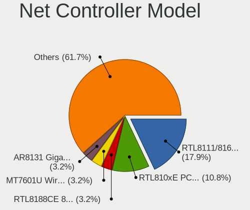

| Model                                                                | Computers | Percent |
|----------------------------------------------------------------------|-----------|---------|
| Realtek RTL8111/8168/8411 PCI Express Gigabit Ethernet Controller    | 63        | 19.94%  |
| Realtek RTL810xE PCI Express Fast Ethernet controller                | 40        | 12.66%  |
| Broadcom BCM43142 802.11b/g/n                                        | 12        | 3.8%    |
| Qualcomm Atheros AR9285 Wireless Network Adapter (PCI-Express)       | 11        | 3.48%   |
| Qualcomm Atheros QCA9565 / AR9565 Wireless Network Adapter           | 10        | 3.16%   |
| Qualcomm Atheros QCA9377 802.11ac Wireless Network Adapter           | 7         | 2.22%   |
| Ralink MT7601U Wireless Adapter                                      | 6         | 1.9%    |
| Intel 82579LM Gigabit Network Connection (Lewisville)                | 6         | 1.9%    |
| Ralink RT2870/RT3070 Wireless Adapter                                | 5         | 1.58%   |
| Realtek RTL8723BE PCIe Wireless Network Adapter                      | 4         | 1.27%   |
| Ralink RT5370 Wireless Adapter                                       | 4         | 1.27%   |
| Ralink RT3290 Wireless 802.11n 1T/1R PCIe                            | 4         | 1.27%   |
| Qualcomm Atheros QCA8172 Fast Ethernet                               | 4         | 1.27%   |
| Qualcomm Atheros AR9485 Wireless Network Adapter                     | 4         | 1.27%   |
| Intel Wireless 8265 / 8275                                           | 4         | 1.27%   |
| VIA VT6102/VT6103 [Rhine-II]                                         | 3         | 0.95%   |
| Intel Wireless 8260                                                  | 3         | 0.95%   |
| Intel Wireless 7260                                                  | 3         | 0.95%   |
| Intel Wireless 3160                                                  | 3         | 0.95%   |
| Intel Ethernet Connection I218-LM                                    | 3         | 0.95%   |
| Intel Ethernet Connection (4) I219-LM                                | 3         | 0.95%   |
| Broadcom NetLink BCM57780 Gigabit Ethernet PCIe                      | 3         | 0.95%   |
| Broadcom BCM43228 802.11a/b/g/n                                      | 3         | 0.95%   |
| Xiaomi Mi/Redmi series (RNDIS)                                       | 2         | 0.63%   |
| Samsung GT-I9070 (network tethering, USB debugging enabled)          | 2         | 0.63%   |
| Realtek RTL8192EE PCIe Wireless Network Adapter                      | 2         | 0.63%   |
| Ralink RT2561/RT61 802.11g PCI                                       | 2         | 0.63%   |
| Qualcomm Atheros AR9271 802.11n                                      | 2         | 0.63%   |
| Qualcomm Atheros AR928X Wireless Network Adapter (PCI-Express)       | 2         | 0.63%   |
| Qualcomm Atheros AR9287 Wireless Network Adapter (PCI-Express)       | 2         | 0.63%   |
| Qualcomm Atheros AR8161 Gigabit Ethernet                             | 2         | 0.63%   |
| Qualcomm Atheros AR8151 v2.0 Gigabit Ethernet                        | 2         | 0.63%   |
| MediaTek Vodafone Smart N10                                          | 2         | 0.63%   |
| Intel Wireless 7265                                                  | 2         | 0.63%   |
| Intel WiFi Link 5100                                                 | 2         | 0.63%   |
| Intel I211 Gigabit Network Connection                                | 2         | 0.63%   |
| Intel Ethernet Connection I219-LM                                    | 2         | 0.63%   |
| Intel Dual Band Wireless-AC 3165 Plus Bluetooth                      | 2         | 0.63%   |
| Intel Centrino Wireless-N 2230                                       | 2         | 0.63%   |
| Intel Centrino Wireless-N 135                                        | 2         | 0.63%   |
| Intel Centrino Ultimate-N 6300                                       | 2         | 0.63%   |
| Intel Centrino Advanced-N 6205 [Taylor Peak]                         | 2         | 0.63%   |
| Intel Centrino Advanced-N 6200                                       | 2         | 0.63%   |
| Intel 82577LM Gigabit Network Connection                             | 2         | 0.63%   |
| D-Link System DWA-125 Wireless N 150 Adapter(rev.A2) [Ralink RT3070] | 2         | 0.63%   |
| Broadcom NetXtreme BCM5764M Gigabit Ethernet PCIe                    | 2         | 0.63%   |
| Broadcom NetLink BCM5784M Gigabit Ethernet PCIe                      | 2         | 0.63%   |
| TP-Link TL-WN821N Version 5 RTL8192EU                                | 1         | 0.32%   |
| Sierra Wireless EM7305                                               | 1         | 0.32%   |
| Samsung Galaxy series, misc. (tethering mode)                        | 1         | 0.32%   |
| Realtek RTL8821CE 802.11ac PCIe Wireless Network Adapter             | 1         | 0.32%   |
| Realtek RTL8821AE 802.11ac PCIe Wireless Network Adapter             | 1         | 0.32%   |
| Realtek RTL8814AU 802.11a/b/g/n/ac Wireless Adapter                  | 1         | 0.32%   |
| Realtek RTL8723DE Wireless Network Adapter                           | 1         | 0.32%   |
| Realtek RTL8723BU 802.11b/g/n WLAN Adapter                           | 1         | 0.32%   |
| Realtek RTL8723AE PCIe Wireless Network Adapter                      | 1         | 0.32%   |
| Realtek RTL8188GU 802.11n WLAN Adapter (After Modeswitch)            | 1         | 0.32%   |
| Realtek RTL8188EUS 802.11n Wireless Network Adapter                  | 1         | 0.32%   |
| Realtek RTL8188EE Wireless Network Adapter                           | 1         | 0.32%   |
| Ralink RT2070 Wireless Adapter                                       | 1         | 0.32%   |

Wireless Vendor
---------------

Wireless vendors

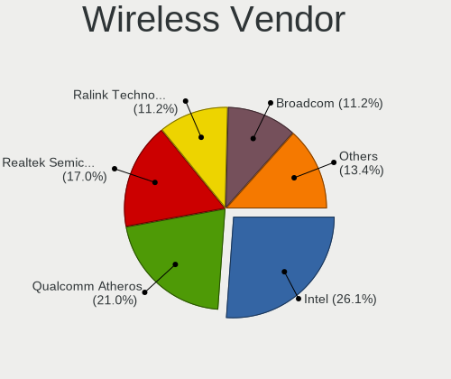

| Vendor                          | Computers | Percent |
|---------------------------------|-----------|---------|
| Qualcomm Atheros                | 40        | 27.21%  |
| Intel                           | 35        | 23.81%  |
| Broadcom                        | 20        | 13.61%  |
| Ralink Technology               | 16        | 10.88%  |
| Realtek Semiconductor           | 15        | 10.2%   |
| Ralink                          | 10        | 6.8%    |
| D-Link System                   | 3         | 2.04%   |
| Qualcomm Atheros Communications | 2         | 1.36%   |
| TP-Link                         | 1         | 0.68%   |
| Sierra Wireless                 | 1         | 0.68%   |
| MEDIATEK                        | 1         | 0.68%   |
| Marvell Technology Group        | 1         | 0.68%   |
| D-Link                          | 1         | 0.68%   |
| Broadcom Limited                | 1         | 0.68%   |

Wireless Model
--------------

Wireless models

| Model                                                                | Computers | Percent |
|----------------------------------------------------------------------|-----------|---------|
| Broadcom BCM43142 802.11b/g/n                                        | 12        | 8.16%   |
| Qualcomm Atheros AR9285 Wireless Network Adapter (PCI-Express)       | 11        | 7.48%   |
| Qualcomm Atheros QCA9565 / AR9565 Wireless Network Adapter           | 10        | 6.8%    |
| Qualcomm Atheros QCA9377 802.11ac Wireless Network Adapter           | 7         | 4.76%   |
| Ralink MT7601U Wireless Adapter                                      | 6         | 4.08%   |
| Ralink RT2870/RT3070 Wireless Adapter                                | 5         | 3.4%    |
| Realtek RTL8723BE PCIe Wireless Network Adapter                      | 4         | 2.72%   |
| Ralink RT5370 Wireless Adapter                                       | 4         | 2.72%   |
| Ralink RT3290 Wireless 802.11n 1T/1R PCIe                            | 4         | 2.72%   |
| Qualcomm Atheros AR9485 Wireless Network Adapter                     | 4         | 2.72%   |
| Intel Wireless 8265 / 8275                                           | 4         | 2.72%   |
| Intel Wireless 8260                                                  | 3         | 2.04%   |
| Intel Wireless 7260                                                  | 3         | 2.04%   |
| Intel Wireless 3160                                                  | 3         | 2.04%   |
| Broadcom BCM43228 802.11a/b/g/n                                      | 3         | 2.04%   |
| Realtek RTL8192EE PCIe Wireless Network Adapter                      | 2         | 1.36%   |
| Ralink RT2561/RT61 802.11g PCI                                       | 2         | 1.36%   |
| Qualcomm Atheros AR9271 802.11n                                      | 2         | 1.36%   |
| Qualcomm Atheros AR928X Wireless Network Adapter (PCI-Express)       | 2         | 1.36%   |
| Qualcomm Atheros AR9287 Wireless Network Adapter (PCI-Express)       | 2         | 1.36%   |
| Intel Wireless 7265                                                  | 2         | 1.36%   |
| Intel WiFi Link 5100                                                 | 2         | 1.36%   |
| Intel Dual Band Wireless-AC 3165 Plus Bluetooth                      | 2         | 1.36%   |
| Intel Centrino Wireless-N 2230                                       | 2         | 1.36%   |
| Intel Centrino Wireless-N 135                                        | 2         | 1.36%   |
| Intel Centrino Ultimate-N 6300                                       | 2         | 1.36%   |
| Intel Centrino Advanced-N 6205 [Taylor Peak]                         | 2         | 1.36%   |
| Intel Centrino Advanced-N 6200                                       | 2         | 1.36%   |
| D-Link System DWA-125 Wireless N 150 Adapter(rev.A2) [Ralink RT3070] | 2         | 1.36%   |
| TP-Link TL-WN821N Version 5 RTL8192EU                                | 1         | 0.68%   |
| Sierra Wireless EM7305                                               | 1         | 0.68%   |
| Realtek RTL8821CE 802.11ac PCIe Wireless Network Adapter             | 1         | 0.68%   |
| Realtek RTL8821AE 802.11ac PCIe Wireless Network Adapter             | 1         | 0.68%   |
| Realtek RTL8814AU 802.11a/b/g/n/ac Wireless Adapter                  | 1         | 0.68%   |
| Realtek RTL8723DE Wireless Network Adapter                           | 1         | 0.68%   |
| Realtek RTL8723BU 802.11b/g/n WLAN Adapter                           | 1         | 0.68%   |
| Realtek RTL8723AE PCIe Wireless Network Adapter                      | 1         | 0.68%   |
| Realtek RTL8188GU 802.11n WLAN Adapter (After Modeswitch)            | 1         | 0.68%   |
| Realtek RTL8188EUS 802.11n Wireless Network Adapter                  | 1         | 0.68%   |
| Realtek RTL8188EE Wireless Network Adapter                           | 1         | 0.68%   |
| Ralink RT2070 Wireless Adapter                                       | 1         | 0.68%   |
| Ralink RT5390 Wireless 802.11n 1T/1R PCIe                            | 1         | 0.68%   |
| Ralink RT3090 Wireless 802.11n 1T/1R PCIe                            | 1         | 0.68%   |
| Ralink RT2600 802.11 MIMO                                            | 1         | 0.68%   |
| Ralink RT2561/RT61 rev B 802.11g                                     | 1         | 0.68%   |
| Qualcomm Atheros QCA6174 802.11ac Wireless Network Adapter           | 1         | 0.68%   |
| Qualcomm Atheros AR9227 Wireless Network Adapter                     | 1         | 0.68%   |
| Qualcomm Atheros AR5212/5213/2414 Wireless Network Adapter           | 1         | 0.68%   |
| Qualcomm Atheros AR2417 Wireless Network Adapter [AR5007G 802.11bg]  | 1         | 0.68%   |
| MEDIATEK MT7921 802.11ax PCI Express Wireless Network Adapter        | 1         | 0.68%   |
| Marvell Group 88W8897 [AVASTAR] 802.11ac Wireless                    | 1         | 0.68%   |
| Intel Wireless 3165                                                  | 1         | 0.68%   |
| Intel Dual Band Wireless-AC 3168NGW [Stone Peak]                     | 1         | 0.68%   |
| Intel Centrino Wireless-N 1030 [Rainbow Peak]                        | 1         | 0.68%   |
| Intel Centrino Advanced-N 6235                                       | 1         | 0.68%   |
| Intel Centrino Advanced-N + WiMAX 6250 [Kilmer Peak]                 | 1         | 0.68%   |
| Intel Cannon Point-LP CNVi [Wireless-AC]                             | 1         | 0.68%   |
| D-Link System DWA-125 Wireless N 150 Adapter(rev.A1) [Ralink RT3070] | 1         | 0.68%   |
| D-Link 802.11 n WLAN                                                 | 1         | 0.68%   |
| Broadcom Limited BCM4313 802.11bgn Wireless Network Adapter          | 1         | 0.68%   |

Ethernet Vendor
---------------

Ethernet vendors

| Vendor                   | Computers | Percent |
|--------------------------|-----------|---------|
| Realtek Semiconductor    | 103       | 61.68%  |
| Intel                    | 26        | 15.57%  |
| Qualcomm Atheros         | 10        | 5.99%   |
| Broadcom                 | 10        | 5.99%   |
| VIA Technologies         | 3         | 1.8%    |
| Samsung Electronics      | 3         | 1.8%    |
| Nvidia                   | 3         | 1.8%    |
| Xiaomi                   | 2         | 1.2%    |
| MediaTek                 | 2         | 1.2%    |
| Marvell Technology Group | 1         | 0.6%    |
| LG Electronics           | 1         | 0.6%    |
| Huawei Technologies      | 1         | 0.6%    |
| Broadcom Limited         | 1         | 0.6%    |
| AMD                      | 1         | 0.6%    |

Ethernet Model
--------------

Ethernet models

| Model                                                             | Computers | Percent |
|-------------------------------------------------------------------|-----------|---------|
| Realtek RTL8111/8168/8411 PCI Express Gigabit Ethernet Controller | 63        | 37.5%   |
| Realtek RTL810xE PCI Express Fast Ethernet controller             | 40        | 23.81%  |
| Intel 82579LM Gigabit Network Connection (Lewisville)             | 6         | 3.57%   |
| Qualcomm Atheros QCA8172 Fast Ethernet                            | 4         | 2.38%   |
| VIA VT6102/VT6103 [Rhine-II]                                      | 3         | 1.79%   |
| Intel Ethernet Connection I218-LM                                 | 3         | 1.79%   |
| Intel Ethernet Connection (4) I219-LM                             | 3         | 1.79%   |
| Broadcom NetLink BCM57780 Gigabit Ethernet PCIe                   | 3         | 1.79%   |
| Xiaomi Mi/Redmi series (RNDIS)                                    | 2         | 1.19%   |
| Samsung GT-I9070 (network tethering, USB debugging enabled)       | 2         | 1.19%   |
| Qualcomm Atheros AR8161 Gigabit Ethernet                          | 2         | 1.19%   |
| Qualcomm Atheros AR8151 v2.0 Gigabit Ethernet                     | 2         | 1.19%   |
| MediaTek Vodafone Smart N10                                       | 2         | 1.19%   |
| Intel I211 Gigabit Network Connection                             | 2         | 1.19%   |
| Intel Ethernet Connection I219-LM                                 | 2         | 1.19%   |
| Intel 82577LM Gigabit Network Connection                          | 2         | 1.19%   |
| Broadcom NetXtreme BCM5764M Gigabit Ethernet PCIe                 | 2         | 1.19%   |
| Broadcom NetLink BCM5784M Gigabit Ethernet PCIe                   | 2         | 1.19%   |
| Samsung Galaxy series, misc. (tethering mode)                     | 1         | 0.6%    |
| Qualcomm Atheros AR8162 Fast Ethernet                             | 1         | 0.6%    |
| Qualcomm Atheros AR8152 v2.0 Fast Ethernet                        | 1         | 0.6%    |
| Nvidia MCP89 Ethernet                                             | 1         | 0.6%    |
| Nvidia MCP79 Ethernet                                             | 1         | 0.6%    |
| Nvidia MCP77 Ethernet                                             | 1         | 0.6%    |
| Marvell Group 88E8055 PCI-E Gigabit Ethernet Controller           | 1         | 0.6%    |
| LG G2 Android Phone [tethering mode]                              | 1         | 0.6%    |
| Intel WiMAX Connection 2400m                                      | 1         | 0.6%    |
| Intel Ethernet Connection I218-V                                  | 1         | 0.6%    |
| Intel Ethernet Connection I217-V                                  | 1         | 0.6%    |
| Intel Ethernet Connection I217-LM                                 | 1         | 0.6%    |
| Intel Ethernet Connection (3) I218-LM                             | 1         | 0.6%    |
| Intel Ethernet Connection (2) I219-LM                             | 1         | 0.6%    |
| Intel 82567LM Gigabit Network Connection                          | 1         | 0.6%    |
| Intel 82566DC-2 Gigabit Network Connection                        | 1         | 0.6%    |
| Intel 82562V 10/100 Network Connection                            | 1         | 0.6%    |
| Huawei E353/E3131                                                 | 1         | 0.6%    |
| Broadcom NetXtreme BCM57765 Gigabit Ethernet PCIe                 | 1         | 0.6%    |
| Broadcom NetXtreme BCM5761 Gigabit Ethernet PCIe                  | 1         | 0.6%    |
| Broadcom NetLink BCM57788 Gigabit Ethernet PCIe                   | 1         | 0.6%    |
| Broadcom Limited NetLink BCM57780 Gigabit Ethernet PCIe           | 1         | 0.6%    |
| AMD 79c970 [PCnet32 LANCE]                                        | 1         | 0.6%    |

Net Controller Kind
-------------------

Ethernet, WiFi or modem

| Kind     | Computers | Percent |
|----------|-----------|---------|
| Ethernet | 157       | 54.14%  |
| WiFi     | 132       | 45.52%  |
| Modem    | 1         | 0.34%   |

Used Controller
---------------

Currently used network controller

| Kind     | Computers | Percent |
|----------|-----------|---------|
| WiFi     | 110       | 66.27%  |
| Ethernet | 56        | 33.73%  |

NICs
----

Total network controllers on board

| Total | Computers | Percent |
|-------|-----------|---------|
| 2     | 111       | 64.91%  |
| 1     | 58        | 33.92%  |
| 0     | 2         | 1.17%   |

IPv6
----

IPv6 vs IPv4

| Used | Computers | Percent |
|------|-----------|---------|
| No   | 167       | 100%    |

Bluetooth
---------

Bluetooth Vendor
----------------

Controller vendors

| Vendor                          | Computers | Percent |
|---------------------------------|-----------|---------|
| Intel                           | 22        | 26.19%  |
| Qualcomm Atheros Communications | 12        | 14.29%  |
| Broadcom                        | 10        | 11.9%   |
| Realtek Semiconductor           | 7         | 8.33%   |
| Lite-On Technology              | 5         | 5.95%   |
| Foxconn / Hon Hai               | 5         | 5.95%   |
| Ralink                          | 4         | 4.76%   |
| IMC Networks                    | 3         | 3.57%   |
| Foxconn International           | 3         | 3.57%   |
| Dell                            | 3         | 3.57%   |
| Cambridge Silicon Radio         | 2         | 2.38%   |
| Apple                           | 2         | 2.38%   |
| Toshiba                         | 1         | 1.19%   |
| Ralink Technology               | 1         | 1.19%   |
| Marvell Semiconductor           | 1         | 1.19%   |
| Integrated System Solution      | 1         | 1.19%   |
| Chicony Electronics             | 1         | 1.19%   |
| Alps Electric                   | 1         | 1.19%   |

Bluetooth Model
---------------

Controller models

| Model                                                 | Computers | Percent |
|-------------------------------------------------------|-----------|---------|
| Intel Bluetooth wireless interface                    | 15        | 17.86%  |
| Qualcomm Atheros  Bluetooth Device                    | 6         | 7.14%   |
| Intel Centrino Bluetooth Wireless Transceiver         | 5         | 5.95%   |
| Realtek Bluetooth Radio                               | 4         | 4.76%   |
| Ralink RT3290 Bluetooth                               | 4         | 4.76%   |
| Qualcomm Atheros AR3011 Bluetooth                     | 3         | 3.57%   |
| IMC Networks Bluetooth Device                         | 3         | 3.57%   |
| Foxconn International BCM43142A0 Bluetooth module     | 3         | 3.57%   |
| Broadcom BCM43142 Bluetooth 4.0                       | 3         | 3.57%   |
| Realtek RTL8723B Bluetooth                            | 2         | 2.38%   |
| Lite-On Qualcomm Atheros QCA9377 Bluetooth            | 2         | 2.38%   |
| Foxconn / Hon Hai Bluetooth Device                    | 2         | 2.38%   |
| Cambridge Silicon Radio Bluetooth Dongle (HCI mode)   | 2         | 2.38%   |
| Broadcom BCM43142A0 Bluetooth 4.0                     | 2         | 2.38%   |
| Apple Bluetooth Host Controller                       | 2         | 2.38%   |
| Toshiba Bluetooth Device                              | 1         | 1.19%   |
| Realtek  Bluetooth 4.2 Adapter                        | 1         | 1.19%   |
| Ralink Motorola BC4 Bluetooth 3.0+HS Adapter          | 1         | 1.19%   |
| Qualcomm Atheros QCA61x4 Bluetooth 4.0                | 1         | 1.19%   |
| Qualcomm Atheros Bluetooth                            | 1         | 1.19%   |
| Qualcomm Atheros AR3012 Bluetooth 4.0                 | 1         | 1.19%   |
| Marvell Bluetooth and Wireless LAN Composite Device   | 1         | 1.19%   |
| Lite-On Wireless_Device                               | 1         | 1.19%   |
| Lite-On Bluetooth 4.0 [Broadcom BCM20702A0]           | 1         | 1.19%   |
| Lite-On BCM43142A0                                    | 1         | 1.19%   |
| Intel Wireless-AC 3168 Bluetooth                      | 1         | 1.19%   |
| Intel Bluetooth 9460/9560 Jefferson Peak (JfP)        | 1         | 1.19%   |
| Integrated System Solution KY-BT100 Bluetooth Adapter | 1         | 1.19%   |
| Foxconn / Hon Hai Bluetooth USB Host Controller       | 1         | 1.19%   |
| Foxconn / Hon Hai BCM43142A0                          | 1         | 1.19%   |
| Foxconn / Hon Hai Acer Module                         | 1         | 1.19%   |
| Dell Wireless 365 Bluetooth                           | 1         | 1.19%   |
| Dell DW375 Bluetooth Module                           | 1         | 1.19%   |
| Dell BCM20702A0 Bluetooth Module                      | 1         | 1.19%   |
| Chicony Bluetooth Radio                               | 1         | 1.19%   |
| Broadcom HP Portable Bumble Bee                       | 1         | 1.19%   |
| Broadcom Bluetooth Device                             | 1         | 1.19%   |
| Broadcom BCM92045B3 ROM                               | 1         | 1.19%   |
| Broadcom BCM2070 Bluetooth 2.1 + EDR                  | 1         | 1.19%   |
| Broadcom BCM2045B (BDC-2.1)                           | 1         | 1.19%   |
| Alps Electric BCM2046 Bluetooth Device                | 1         | 1.19%   |

Sound
-----

Sound Vendor
------------

Sound card vendors

| Vendor                | Computers | Percent |
|-----------------------|-----------|---------|
| Intel                 | 147       | 69.67%  |
| AMD                   | 31        | 14.69%  |
| Nvidia                | 24        | 11.37%  |
| VIA Technologies      | 3         | 1.42%   |
| JMTek                 | 2         | 0.95%   |
| Texas Instruments     | 1         | 0.47%   |
| Logitech              | 1         | 0.47%   |
| Logic3 / SpectraVideo | 1         | 0.47%   |
| Guillemot             | 1         | 0.47%   |

Sound Model
-----------

Sound card models

| Model                                                                                             | Computers | Percent |
|---------------------------------------------------------------------------------------------------|-----------|---------|
| Intel 7 Series/C216 Chipset Family High Definition Audio Controller                               | 28        | 11.57%  |
| Intel 6 Series/C200 Series Chipset Family High Definition Audio Controller                        | 24        | 9.92%   |
| Intel Sunrise Point-LP HD Audio                                                                   | 19        | 7.85%   |
| Intel 5 Series/3400 Series Chipset High Definition Audio                                          | 16        | 6.61%   |
| Intel NM10/ICH7 Family High Definition Audio Controller                                           | 12        | 4.96%   |
| Intel Haswell-ULT HD Audio Controller                                                             | 12        | 4.96%   |
| Intel 8 Series HD Audio Controller                                                                | 12        | 4.96%   |
| AMD Cedar HDMI Audio [Radeon HD 5400/6300/7300 Series]                                            | 9         | 3.72%   |
| Intel 82801I (ICH9 Family) HD Audio Controller                                                    | 7         | 2.89%   |
| Intel 8 Series/C220 Series Chipset High Definition Audio Controller                               | 7         | 2.89%   |
| Intel Wildcat Point-LP High Definition Audio Controller                                           | 6         | 2.48%   |
| Intel Broadwell-U Audio Controller                                                                | 6         | 2.48%   |
| Intel Atom Processor Z36xxx/Z37xxx Series High Definition Audio Controller                        | 6         | 2.48%   |
| Intel Xeon E3-1200 v3/4th Gen Core Processor HD Audio Controller                                  | 5         | 2.07%   |
| VIA Technologies VX900/VT8xxx High Definition Audio Controller                                    | 3         | 1.24%   |
| Nvidia High Definition Audio Controller                                                           | 3         | 1.24%   |
| Nvidia GF119 HDMI Audio Controller                                                                | 3         | 1.24%   |
| Nvidia GF108 High Definition Audio Controller                                                     | 3         | 1.24%   |
| Nvidia MCP79 High Definition Audio                                                                | 2         | 0.83%   |
| Nvidia GM107 High Definition Audio Controller [GeForce 940MX]                                     | 2         | 0.83%   |
| Nvidia GK104 HDMI Audio Controller                                                                | 2         | 0.83%   |
| JMTek USB PnP Audio Device                                                                        | 2         | 0.83%   |
| Intel CM238 HD Audio Controller                                                                   | 2         | 0.83%   |
| AMD Turks HDMI Audio [Radeon HD 6500/6600 / 6700M Series]                                         | 2         | 0.83%   |
| AMD Starship/Matisse HD Audio Controller                                                          | 2         | 0.83%   |
| AMD SBx00 Azalia (Intel HDA)                                                                      | 2         | 0.83%   |
| AMD RV710/730 HDMI Audio [Radeon HD 4000 series]                                                  | 2         | 0.83%   |
| AMD Oland/Hainan/Cape Verde/Pitcairn HDMI Audio [Radeon HD 7000 Series]                           | 2         | 0.83%   |
| AMD FCH Azalia Controller                                                                         | 2         | 0.83%   |
| AMD Family 17h/19h HD Audio Controller                                                            | 2         | 0.83%   |
| AMD Family 17h (Models 00h-0fh) HD Audio Controller                                               | 2         | 0.83%   |
| AMD Caicos HDMI Audio [Radeon HD 6450 / 7450/8450/8490 OEM / R5 230/235/235X OEM]                 | 2         | 0.83%   |
| AMD Barts HDMI Audio [Radeon HD 6790/6850/6870 / 7720 OEM]                                        | 2         | 0.83%   |
| Texas Instruments PCM2902 Audio Codec                                                             | 1         | 0.41%   |
| Nvidia TU116 High Definition Audio Controller                                                     | 1         | 0.41%   |
| Nvidia TU107 GeForce GTX 1650 High Definition Audio Controller                                    | 1         | 0.41%   |
| Nvidia MCP89 High Definition Audio                                                                | 1         | 0.41%   |
| Nvidia MCP72XE/MCP72P/MCP78U/MCP78S High Definition Audio                                         | 1         | 0.41%   |
| Nvidia GP107GL High Definition Audio Controller                                                   | 1         | 0.41%   |
| Nvidia GP104 High Definition Audio Controller                                                     | 1         | 0.41%   |
| Nvidia GK208 HDMI/DP Audio Controller                                                             | 1         | 0.41%   |
| Nvidia GK106 HDMI Audio Controller                                                                | 1         | 0.41%   |
| Nvidia GF106 High Definition Audio Controller                                                     | 1         | 0.41%   |
| Nvidia GA104 High Definition Audio Controller                                                     | 1         | 0.41%   |
| Logitech H600 [Wireless Headset]                                                                  | 1         | 0.41%   |
| Logic3 / SpectraVideo USB Audio Device                                                            | 1         | 0.41%   |
| Intel Tiger Lake-LP Smart Sound Technology Audio Controller                                       | 1         | 0.41%   |
| Intel Celeron N3350/Pentium N4200/Atom E3900 Series Audio Cluster                                 | 1         | 0.41%   |
| Intel Cannon Point-LP High Definition Audio Controller                                            | 1         | 0.41%   |
| Intel Cannon Lake PCH cAVS                                                                        | 1         | 0.41%   |
| Intel Atom/Celeron/Pentium Processor x5-E8000/J3xxx/N3xxx Series High Definition Audio Controller | 1         | 0.41%   |
| Intel 82801JI (ICH10 Family) HD Audio Controller                                                  | 1         | 0.41%   |
| Intel 82801H (ICH8 Family) HD Audio Controller                                                    | 1         | 0.41%   |
| Intel 100 Series/C230 Series Chipset Family HD Audio Controller                                   | 1         | 0.41%   |
| Guillemot Hercules Blog Webcam                                                                    | 1         | 0.41%   |
| AMD Wrestler HDMI Audio                                                                           | 1         | 0.41%   |
| AMD RS880 HDMI Audio [Radeon HD 4200 Series]                                                      | 1         | 0.41%   |
| AMD Renoir Radeon High Definition Audio Controller                                                | 1         | 0.41%   |
| AMD Redwood HDMI Audio [Radeon HD 5000 Series]                                                    | 1         | 0.41%   |
| AMD Raven/Raven2/Fenghuang HDMI/DP Audio Controller                                               | 1         | 0.41%   |

Memory
------

Memory Vendor
-------------

Memory module vendors

| Vendor              | Computers | Percent |
|---------------------|-----------|---------|
| Unknown             | 23        | 22.77%  |
| Samsung Electronics | 21        | 20.79%  |
| SK Hynix            | 20        | 19.8%   |
| Micron Technology   | 12        | 11.88%  |
| A-DATA Technology   | 8         | 7.92%   |
| Kingston            | 4         | 3.96%   |
| TwinMOS             | 2         | 1.98%   |
| Nanya Technology    | 2         | 1.98%   |
| Thermaltake         | 1         | 0.99%   |
| Team                | 1         | 0.99%   |
| Ramaxel Technology  | 1         | 0.99%   |
| Patriot             | 1         | 0.99%   |
| GeIL                | 1         | 0.99%   |
| Elpida              | 1         | 0.99%   |
| Dynet               | 1         | 0.99%   |
| Crucial             | 1         | 0.99%   |
| ASint Technology    | 1         | 0.99%   |

Memory Model
------------

Memory module models

| Model                                                       | Computers | Percent |
|-------------------------------------------------------------|-----------|---------|
| Samsung RAM M471B5173QH0-YK0 4GB SODIMM DDR3 1600MT/s       | 4         | 3.54%   |
| Unknown RAM Module 4GB DIMM DDR3 1333MT/s                   | 3         | 2.65%   |
| SK Hynix RAM HMT451S6BFR8A-PB 4GB SODIMM DDR3 1600MT/s      | 3         | 2.65%   |
| SK Hynix RAM HMA81GS6AFR8N-UH 8GB SODIMM DDR4 2667MT/s      | 3         | 2.65%   |
| Unknown RAM Module 4096MB SODIMM DDR3 1600MT/s              | 2         | 1.77%   |
| Unknown RAM Module 4096MB SODIMM DDR3                       | 2         | 1.77%   |
| Unknown RAM Module 2GB DIMM DDR3 1333MT/s                   | 2         | 1.77%   |
| Samsung RAM M471A5244CB0-CTD 4GB SODIMM DDR4 3266MT/s       | 2         | 1.77%   |
| Unknown RAM Module 8GB SODIMM DDR3 1600MT/s                 | 1         | 0.88%   |
| Unknown RAM Module 8192MB SODIMM DDR3 1600MT/s              | 1         | 0.88%   |
| Unknown RAM Module 4GB SODIMM DDR3 1333MT/s                 | 1         | 0.88%   |
| Unknown RAM Module 4GB SODIMM DDR2                          | 1         | 0.88%   |
| Unknown RAM Module 4GB DIMM SDRAM                           | 1         | 0.88%   |
| Unknown RAM Module 4096MB SODIMM DDR3 1333MT/s              | 1         | 0.88%   |
| Unknown RAM Module 4096MB SODIMM DDR2                       | 1         | 0.88%   |
| Unknown RAM Module 4096MB DIMM SDRAM 1333MT/s               | 1         | 0.88%   |
| Unknown RAM Module 4096MB DIMM SDRAM                        | 1         | 0.88%   |
| Unknown RAM Module 4096MB DIMM DDR3 800MT/s                 | 1         | 0.88%   |
| Unknown RAM Module 4096MB DIMM 1333MT/s                     | 1         | 0.88%   |
| Unknown RAM Module 2GB DIMM SDRAM                           | 1         | 0.88%   |
| Unknown RAM Module 2048MB DIMM SDRAM 800MT/s                | 1         | 0.88%   |
| Unknown RAM Module 2048MB DIMM SDRAM 1333MT/s               | 1         | 0.88%   |
| Unknown RAM Module 2048MB DIMM SDRAM                        | 1         | 0.88%   |
| Unknown RAM Module 2048MB DIMM DDR2                         | 1         | 0.88%   |
| Unknown RAM Module 1GB DIMM 800MT/s                         | 1         | 0.88%   |
| Unknown RAM Module 1GB DIMM 533MT/s                         | 1         | 0.88%   |
| Unknown RAM Module 1024MB DIMM DDR2 266MT/s                 | 1         | 0.88%   |
| Unknown RAM Module 1024MB DIMM DDR2 200MT/s                 | 1         | 0.88%   |
| Unknown RAM Module 1024MB DIMM DDR2                         | 1         | 0.88%   |
| TwinMOS RAM 9DPCBNZB-TATP 4GB DIMM DDR3 1333MT/s            | 1         | 0.88%   |
| TwinMOS RAM 9DECBNZB-TATP 4GB DIMM DDR3 1333MT/s            | 1         | 0.88%   |
| Thermaltake RAM R019D408GX2-3200C16A 8GB DIMM DDR4 2666MT/s | 1         | 0.88%   |
| Team RAM TEAMGROUP-SD4-2666 16384MB SODIMM DDR4 2667MT/s    | 1         | 0.88%   |
| SK Hynix RAM Module 4GB SODIMM DDR3 1600MT/s                | 1         | 0.88%   |
| SK Hynix RAM Module 16384MB SODIMM DDR4 2400MT/s            | 1         | 0.88%   |
| SK Hynix RAM HMT451U6BFR8A-PB 4GB DIMM DDR3 1600MT/s        | 1         | 0.88%   |
| SK Hynix RAM HMT451S6AFR8A-PB 4GB SODIMM DDR3 1600MT/s      | 1         | 0.88%   |
| SK Hynix RAM HMT425S6CFR6A-PB 2GB SODIMM DDR3 1600MT/s      | 1         | 0.88%   |
| SK Hynix RAM HMT425S6CFR6A-PB 2048MB SODIMM DDR3 1600MT/s   | 1         | 0.88%   |
| SK Hynix RAM HMT41GS6BFR8A-PB 8GB SODIMM DDR3 1600MT/s      | 1         | 0.88%   |
| SK Hynix RAM HMT41GS6AFR8A-PB 8GB SODIMM DDR3 1600MT/s      | 1         | 0.88%   |
| SK Hynix RAM HMT351S6EFR8C-PB 4096MB SODIMM DDR3 1600MT/s   | 1         | 0.88%   |
| SK Hynix RAM HMT351S6CFR8C-PB 4GB SODIMM DDR3 1600MT/s      | 1         | 0.88%   |
| SK Hynix RAM HMT351S6CFR8C-H9 4096MB SODIMM DDR3 1334MT/s   | 1         | 0.88%   |
| SK Hynix RAM HMT325S6EFR8C-PB 2GB SODIMM DDR3 1600MT/s      | 1         | 0.88%   |
| SK Hynix RAM HMT325S6CFR8C-H9 2048MB SODIMM DDR3 1333MT/s   | 1         | 0.88%   |
| SK Hynix RAM HMT125U6TFR8C-H9 2048MB DIMM DDR3              | 1         | 0.88%   |
| SK Hynix RAM HMA851S6CJR6N-VK 4GB SODIMM DDR4 2667MT/s      | 1         | 0.88%   |
| SK Hynix RAM HMA851S6AFR6N-UH 4GB SODIMM DDR4 2667MT/s      | 1         | 0.88%   |
| SK Hynix RAM HMA425S6BJR6N-UH 2GB SODIMM DDR4 2667MT/s      | 1         | 0.88%   |
| Samsung RAM Module 8192MB SODIMM DDR4 2667MT/s              | 1         | 0.88%   |
| Samsung RAM M471B5773CHS-CK0 2GB SODIMM DDR3 1600MT/s       | 1         | 0.88%   |
| Samsung RAM M471B5674QH0-YK0 2GB SODIMM DDR3 1600MT/s       | 1         | 0.88%   |
| Samsung RAM M471B5673FH0-CH9 2GB SODIMM DDR3 1334MT/s       | 1         | 0.88%   |
| Samsung RAM M471B5273EB0-YK0 4GB SODIMM DDR3 1600MT/s       | 1         | 0.88%   |
| Samsung RAM M471B5273DH0-YK0 4GB SODIMM DDR3 1600MT/s       | 1         | 0.88%   |
| Samsung RAM M471B5173DB0-YK0 4GB SODIMM DDR3 1600MT/s       | 1         | 0.88%   |
| Samsung RAM M471B2873FHS-CH9 1GB SODIMM DDR3 1334MT/s       | 1         | 0.88%   |
| Samsung RAM M471B1G73QH0-YK0 8192MB SODIMM DDR3 1600MT/s    | 1         | 0.88%   |
| Samsung RAM M471B1G73EB0-YK0 8192MB SODIMM DDR3 1600MT/s    | 1         | 0.88%   |

Memory Kind
-----------

Memory module kinds

| Kind    | Computers | Percent |
|---------|-----------|---------|
| DDR3    | 49        | 59.76%  |
| DDR4    | 18        | 21.95%  |
| SDRAM   | 6         | 7.32%   |
| DDR2    | 5         | 6.1%    |
| Unknown | 2         | 2.44%   |
| LPDDR4  | 1         | 1.22%   |
| DDR     | 1         | 1.22%   |

Memory Form Factor
------------------

Physical design of the memory module

| Name   | Computers | Percent |
|--------|-----------|---------|
| SODIMM | 50        | 62.5%   |
| DIMM   | 30        | 37.5%   |

Memory Size
-----------

Memory module size

| Size  | Computers | Percent |
|-------|-----------|---------|
| 4096  | 45        | 47.37%  |
| 2048  | 22        | 23.16%  |
| 8192  | 17        | 17.89%  |
| 1024  | 5         | 5.26%   |
| 16384 | 3         | 3.16%   |
| 32768 | 2         | 2.11%   |
| 512   | 1         | 1.05%   |

Memory Speed
------------

Memory module speed

| Speed   | Computers | Percent |
|---------|-----------|---------|
| 1600    | 30        | 33.33%  |
| 1333    | 15        | 16.67%  |
| 2667    | 9         | 10%     |
| Unknown | 6         | 6.67%   |
| 1334    | 4         | 4.44%   |
| 800     | 4         | 4.44%   |
| 3200    | 3         | 3.33%   |
| 2400    | 3         | 3.33%   |
| 3266    | 2         | 2.22%   |
| 2666    | 2         | 2.22%   |
| 2133    | 2         | 2.22%   |
| 4199    | 1         | 1.11%   |
| 3800    | 1         | 1.11%   |
| 3066    | 1         | 1.11%   |
| 2200    | 1         | 1.11%   |
| 1639    | 1         | 1.11%   |
| 1067    | 1         | 1.11%   |
| 667     | 1         | 1.11%   |
| 533     | 1         | 1.11%   |
| 266     | 1         | 1.11%   |
| 200     | 1         | 1.11%   |

Printers & scanners
-------------------

Printer Vendor
--------------

Printer device vendors

| Vendor             | Computers | Percent |
|--------------------|-----------|---------|
| Canon              | 6         | 54.55%  |
| Seiko Epson        | 3         | 27.27%  |
| Hewlett-Packard    | 1         | 9.09%   |
| Brother Industries | 1         | 9.09%   |

Printer Model
-------------

Printer device models

| Model                             | Computers | Percent |
|-----------------------------------|-----------|---------|
| Canon LBP6000                     | 2         | 18.18%  |
| Seiko Epson XP-243 245 247 Series | 1         | 9.09%   |
| Seiko Epson XP-202 203 206 Series | 1         | 9.09%   |
| Seiko Epson Printer               | 1         | 9.09%   |
| HP DeskJet 5810 series            | 1         | 9.09%   |
| Canon MG5700 series               | 1         | 9.09%   |
| Canon LBP6030/6030B/6018L         | 1         | 9.09%   |
| Canon LBP6020                     | 1         | 9.09%   |
| Canon LBP2900                     | 1         | 9.09%   |
| Brother MFC-J480DW                | 1         | 9.09%   |

Scanner Vendor
--------------

Scanner device vendors

Zero info for selected period =(

Scanner Model
-------------

Scanner device models

Zero info for selected period =(

Camera
------

Camera Vendor
-------------

Camera device vendors

| Vendor                                 | Computers | Percent |
|----------------------------------------|-----------|---------|
| Chicony Electronics                    | 24        | 24%     |
| Microdia                               | 14        | 14%     |
| Realtek Semiconductor                  | 9         | 9%      |
| Cheng Uei Precision Industry (Foxlink) | 8         | 8%      |
| Acer                                   | 8         | 8%      |
| Sunplus Innovation Technology          | 7         | 7%      |
| Suyin                                  | 5         | 5%      |
| Syntek                                 | 4         | 4%      |
| IMC Networks                           | 3         | 3%      |
| Apple                                  | 3         | 3%      |
| Silicon Motion                         | 2         | 2%      |
| Samsung Electronics                    | 2         | 2%      |
| Quanta                                 | 2         | 2%      |
| Lite-On Technology                     | 2         | 2%      |
| Primax Electronics                     | 1         | 1%      |
| Pixart Imaging                         | 1         | 1%      |
| Microsoft                              | 1         | 1%      |
| GEMBIRD                                | 1         | 1%      |
| Aveo Technology                        | 1         | 1%      |
| Arkmicro Technologies                  | 1         | 1%      |
| Alcor Micro                            | 1         | 1%      |

Camera Model
------------

Camera device models

| Model                                               | Computers | Percent |
|-----------------------------------------------------|-----------|---------|
| Acer Lenovo EasyCamera                              | 6         | 5.94%   |
| Microdia Integrated_Webcam_HD                       | 4         | 3.96%   |
| Chicony TOSHIBA Web Camera - HD                     | 4         | 3.96%   |
| Microdia Laptop_Integrated_Webcam_E4HD              | 3         | 2.97%   |
| Microdia Integrated Webcam                          | 3         | 2.97%   |
| Syntek Lenovo EasyCamera                            | 2         | 1.98%   |
| Suyin HP Truevision HD                              | 2         | 1.98%   |
| Sunplus Laptop_Integrated_Webcam_FHD                | 2         | 1.98%   |
| Sunplus Integrated_Webcam_HD                        | 2         | 1.98%   |
| Samsung Galaxy A5 (MTP)                             | 2         | 1.98%   |
| Chicony USB2.0 VGA UVC WebCam                       | 2         | 1.98%   |
| Chicony Integrated Camera                           | 2         | 1.98%   |
| Chicony HD WebCam                                   | 2         | 1.98%   |
| Chicony Acer CrystalEye Webcam                      | 2         | 1.98%   |
| Cheng Uei Precision Industry (Foxlink) Webcam       | 2         | 1.98%   |
| Cheng Uei Precision Industry (Foxlink) HP HD Camera | 2         | 1.98%   |
| Apple iPhone 5/5C/5S/6/SE                           | 2         | 1.98%   |
| Syntek USB2.0 Camera                                | 1         | 0.99%   |
| Syntek EasyCamera                                   | 1         | 0.99%   |
| Suyin WebCam                                        | 1         | 0.99%   |
| Suyin Integrated_Webcam_HD                          | 1         | 0.99%   |
| Suyin Acer/HP Integrated Webcam [CN0314]            | 1         | 0.99%   |
| Sunplus Laptop Integrated Webcam HD                 | 1         | 0.99%   |
| Sunplus HP HD Webcam [Fixed]                        | 1         | 0.99%   |
| Sunplus Dell HD Webcam                              | 1         | 0.99%   |
| Silicon Motion WebCam SC-13HDL11431N                | 1         | 0.99%   |
| Silicon Motion WebCam SC-0311139N                   | 1         | 0.99%   |
| Realtek USB2.0 VGA UVC WebCam                       | 1         | 0.99%   |
| Realtek USB Camera                                  | 1         | 0.99%   |
| Realtek Lenovo EasyCamera                           | 1         | 0.99%   |
| Realtek Integrated Webcam_HD                        | 1         | 0.99%   |
| Realtek Integrated Webcam                           | 1         | 0.99%   |
| Realtek HP Webcam                                   | 1         | 0.99%   |
| Realtek HP Truevision HD                            | 1         | 0.99%   |
| Realtek HD Webcam - Realtek                         | 1         | 0.99%   |
| Realtek Acer 640 x 480 laptop camera                | 1         | 0.99%   |
| Quanta HD Webcam                                    | 1         | 0.99%   |
| Quanta HD User Facing                               | 1         | 0.99%   |
| Primax webcam                                       | 1         | 0.99%   |
| Pixart Imaging VGA Webcam                           | 1         | 0.99%   |
| Microsoft LifeCam Rear                              | 1         | 0.99%   |
| Microsoft LifeCam Front                             | 1         | 0.99%   |
| Microdia Sony Visual Communication Camera           | 1         | 0.99%   |
| Microdia Laptop_Integrated_Webcam_HD                | 1         | 0.99%   |
| Microdia Laptop_Integrated_Webcam_2M                | 1         | 0.99%   |
| Microdia Laptop_Integrated_Webcam_0.3M              | 1         | 0.99%   |
| Lite-On TOSHIBA Web Camera - HD                     | 1         | 0.99%   |
| Lite-On Integrated Camera                           | 1         | 0.99%   |
| IMC Networks USB2.0 HD UVC WebCam                   | 1         | 0.99%   |
| IMC Networks Lenovo EasyCamera                      | 1         | 0.99%   |
| IMC Networks Integrated Webcam                      | 1         | 0.99%   |
| GEMBIRD Generic UVC 1.00 camera [AppoTech AX2311]   | 1         | 0.99%   |
| Chicony WebCam                                      | 1         | 0.99%   |
| Chicony UVC 1.00 device HD UVC WebCam               | 1         | 0.99%   |
| Chicony Sony Visual Communication Camera            | 1         | 0.99%   |
| Chicony Lenovo EasyCamera                           | 1         | 0.99%   |
| Chicony HP Webcam                                   | 1         | 0.99%   |
| Chicony HP Truevision HD                            | 1         | 0.99%   |
| Chicony HP HD Webcam [Fixed]                        | 1         | 0.99%   |
| Chicony HP HD Camera                                | 1         | 0.99%   |

Security
--------

Fingerprint Vendor
------------------

Fingerprint sensor vendors

| Vendor                | Computers | Percent |
|-----------------------|-----------|---------|
| Validity Sensors      | 10        | 71.43%  |
| AuthenTec             | 2         | 14.29%  |
| Synaptics             | 1         | 7.14%   |
| Elan Microelectronics | 1         | 7.14%   |

Fingerprint Model
-----------------

Fingerprint sensor models

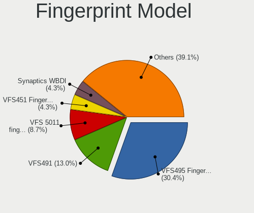

| Model                                                      | Computers | Percent |
|------------------------------------------------------------|-----------|---------|
| Validity Sensors VFS495 Fingerprint Reader                 | 4         | 28.57%  |
| Validity Sensors VFS491                                    | 2         | 14.29%  |
| Validity Sensors VFS 5011 fingerprint sensor               | 2         | 14.29%  |
| Validity Sensors VFS451 Fingerprint Reader                 | 1         | 7.14%   |
| Validity Sensors Synaptics WBDI                            | 1         | 7.14%   |
| Synaptics  VFS7552 Touch Fingerprint Sensor with PurePrint | 1         | 7.14%   |
| Elan ELAN:Fingerprint                                      | 1         | 7.14%   |
| AuthenTec AES2810                                          | 1         | 7.14%   |
| AuthenTec AES1600                                          | 1         | 7.14%   |

Chipcard Vendor
---------------

Chipcard module vendors

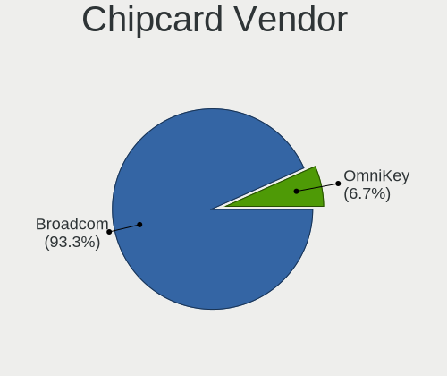

| Vendor   | Computers | Percent |
|----------|-----------|---------|
| Broadcom | 7         | 87.5%   |
| OmniKey  | 1         | 12.5%   |

Chipcard Model
--------------

Chipcard module models

| Model                                                                        | Computers | Percent |
|------------------------------------------------------------------------------|-----------|---------|
| Broadcom BCM5880 Secure Applications Processor                               | 3         | 37.5%   |
| Broadcom 5880                                                                | 3         | 37.5%   |
| OmniKey CardMan 4321                                                         | 1         | 12.5%   |
| Broadcom BCM5880 Secure Applications Processor with fingerprint swipe sensor | 1         | 12.5%   |

Unsupported
-----------

Unsupported Devices
-------------------

Total unsupported devices on board

| Total | Computers | Percent |
|-------|-----------|---------|
| 0     | 120       | 70.59%  |
| 1     | 43        | 25.29%  |
| 2     | 6         | 3.53%   |
| 3     | 1         | 0.59%   |

Unsupported Device Types
------------------------

Types of unsupported devices

| Type                     | Computers | Percent |
|--------------------------|-----------|---------|
| Fingerprint reader       | 14        | 23.73%  |
| Graphics card            | 13        | 22.03%  |
| Net/wireless             | 10        | 16.95%  |
| Chipcard                 | 8         | 13.56%  |
| Bluetooth                | 4         | 6.78%   |
| Storage                  | 2         | 3.39%   |
| Net/ethernet             | 2         | 3.39%   |
| Multimedia controller    | 2         | 3.39%   |
| Communication controller | 2         | 3.39%   |
| Card reader              | 1         | 1.69%   |
| Camera                   | 1         | 1.69%   |

