Linux in Algeria - Tested Hardware & Statistics (Desktops)
----------------------------------------------------------

A project to collect tested hardware configurations for Linux in Algeria.

Anyone can contribute to this report by the [hw-probe](https://github.com/linuxhw/hw-probe) tool:

    sudo -E hw-probe -all -upload

Please contribute! Especially if your hardware is rare.

Contents
--------

* [ Test Cases ](#test-cases)

* [ System ](#system)
  - [ OS                       ](#os)
  - [ OS Family                ](#os-family)
  - [ Kernel                   ](#kernel)
  - [ Kernel Family            ](#kernel-family)
  - [ Kernel Major Ver.        ](#kernel-major-ver)
  - [ Arch                     ](#arch)
  - [ DE                       ](#de)
  - [ Display Server           ](#display-server)
  - [ Display Manager          ](#display-manager)
  - [ OS Lang                  ](#os-lang)
  - [ Boot Mode                ](#boot-mode)
  - [ Filesystem               ](#filesystem)
  - [ Part. scheme             ](#part-scheme)
  - [ Dual Boot with Linux/BSD ](#dual-boot-with-linuxbsd)
  - [ Dual Boot (Win)          ](#dual-boot-win)

* [ Board ](#board)
  - [ Vendor                   ](#vendor)
  - [ Model                    ](#model)
  - [ Model Family             ](#model-family)
  - [ MFG Year                 ](#mfg-year)
  - [ Form Factor              ](#form-factor)
  - [ Secure Boot              ](#secure-boot)
  - [ Coreboot                 ](#coreboot)
  - [ RAM Size                 ](#ram-size)
  - [ RAM Used                 ](#ram-used)
  - [ Total Drives             ](#total-drives)
  - [ Has CD-ROM               ](#has-cd-rom)
  - [ Has Ethernet             ](#has-ethernet)
  - [ Has WiFi                 ](#has-wifi)
  - [ Has Bluetooth            ](#has-bluetooth)

* [ Location ](#location)
  - [ Country                  ](#country)
  - [ City                     ](#city)

* [ Drives ](#drives)
  - [ Drive Vendor             ](#drive-vendor)
  - [ Drive Model              ](#drive-model)
  - [ HDD Vendor               ](#hdd-vendor)
  - [ SSD Vendor               ](#ssd-vendor)
  - [ Drive Kind               ](#drive-kind)
  - [ Drive Connector          ](#drive-connector)
  - [ Drive Size               ](#drive-size)
  - [ Space Total              ](#space-total)
  - [ Space Used               ](#space-used)
  - [ Malfunc. Drives          ](#malfunc-drives)
  - [ Malfunc. Drive Vendor    ](#malfunc-drive-vendor)
  - [ Malfunc. HDD Vendor      ](#malfunc-hdd-vendor)
  - [ Malfunc. Drive Kind      ](#malfunc-drive-kind)
  - [ Failed Drives            ](#failed-drives)
  - [ Failed Drive Vendor      ](#failed-drive-vendor)
  - [ Drive Status             ](#drive-status)

* [ Storage controller ](#storage-controller)
  - [ Storage Vendor           ](#storage-vendor)
  - [ Storage Model            ](#storage-model)
  - [ Storage Kind             ](#storage-kind)

* [ Processor ](#processor)
  - [ CPU Vendor               ](#cpu-vendor)
  - [ CPU Model                ](#cpu-model)
  - [ CPU Model Family         ](#cpu-model-family)
  - [ CPU Cores                ](#cpu-cores)
  - [ CPU Sockets              ](#cpu-sockets)
  - [ CPU Threads              ](#cpu-threads)
  - [ CPU Op-Modes             ](#cpu-op-modes)
  - [ CPU Microcode            ](#cpu-microcode)
  - [ CPU Microarch            ](#cpu-microarch)

* [ Graphics ](#graphics)
  - [ GPU Vendor               ](#gpu-vendor)
  - [ GPU Model                ](#gpu-model)
  - [ GPU Combo                ](#gpu-combo)
  - [ GPU Driver               ](#gpu-driver)
  - [ GPU Memory               ](#gpu-memory)

* [ Monitor ](#monitor)
  - [ Monitor Vendor           ](#monitor-vendor)
  - [ Monitor Model            ](#monitor-model)
  - [ Monitor Resolution       ](#monitor-resolution)
  - [ Monitor Diagonal         ](#monitor-diagonal)
  - [ Monitor Width            ](#monitor-width)
  - [ Aspect Ratio             ](#aspect-ratio)
  - [ Monitor Area             ](#monitor-area)
  - [ Pixel Density            ](#pixel-density)
  - [ Multiple Monitors        ](#multiple-monitors)

* [ Network ](#network)
  - [ Net Controller Vendor    ](#net-controller-vendor)
  - [ Net Controller Model     ](#net-controller-model)
  - [ Wireless Vendor          ](#wireless-vendor)
  - [ Wireless Model           ](#wireless-model)
  - [ Ethernet Vendor          ](#ethernet-vendor)
  - [ Ethernet Model           ](#ethernet-model)
  - [ Net Controller Kind      ](#net-controller-kind)
  - [ Used Controller          ](#used-controller)
  - [ NICs                     ](#nics)
  - [ IPv6                     ](#ipv6)

* [ Bluetooth ](#bluetooth)
  - [ Bluetooth Vendor         ](#bluetooth-vendor)
  - [ Bluetooth Model          ](#bluetooth-model)

* [ Sound ](#sound)
  - [ Sound Vendor             ](#sound-vendor)
  - [ Sound Model              ](#sound-model)

* [ Memory ](#memory)
  - [ Memory Vendor            ](#memory-vendor)
  - [ Memory Model             ](#memory-model)
  - [ Memory Kind              ](#memory-kind)
  - [ Memory Form Factor       ](#memory-form-factor)
  - [ Memory Size              ](#memory-size)
  - [ Memory Speed             ](#memory-speed)

* [ Printers & scanners ](#printers--scanners)
  - [ Printer Vendor           ](#printer-vendor)
  - [ Printer Model            ](#printer-model)
  - [ Scanner Vendor           ](#scanner-vendor)
  - [ Scanner Model            ](#scanner-model)

* [ Camera ](#camera)
  - [ Camera Vendor            ](#camera-vendor)
  - [ Camera Model             ](#camera-model)

* [ Security ](#security)
  - [ Fingerprint Vendor       ](#fingerprint-vendor)
  - [ Fingerprint Model        ](#fingerprint-model)
  - [ Chipcard Vendor          ](#chipcard-vendor)
  - [ Chipcard Model           ](#chipcard-model)

* [ Unsupported ](#unsupported)
  - [ Unsupported Devices      ](#unsupported-devices)
  - [ Unsupported Device Types ](#unsupported-device-types)

Test Cases
----------

Total: 233

| Vendor        | Model                       | Probe                                                      | Date         |
|---------------|-----------------------------|------------------------------------------------------------|--------------|
| Unknown       | Unknown                     | [960aa7cc3b](https://linux-hardware.org/?probe=960aa7cc3b) | Jan 03, 2026 |
| Unknown       | Unknown                     | [1e30355424](https://linux-hardware.org/?probe=1e30355424) | Jan 03, 2026 |
| Biostar       | G41D3C                      | [603906e26c](https://linux-hardware.org/?probe=603906e26c) | Dec 27, 2025 |
| ASRock        | H81M-DGS R2.0               | [2cdf1272ed](https://linux-hardware.org/?probe=2cdf1272ed) | Dec 23, 2025 |
| Lenovo        | 3111 SDK0K13476 WIN 3306... | [fdbba923b5](https://linux-hardware.org/?probe=fdbba923b5) | Dec 19, 2025 |
| By O.E.M.     | H81BD3G V2.0                | [3ed30edefc](https://linux-hardware.org/?probe=3ed30edefc) | Dec 19, 2025 |
| ASUSTek       | PRIME H610M-K               | [ff8d94a38a](https://linux-hardware.org/?probe=ff8d94a38a) | Dec 13, 2025 |
| HP            | 83F3                        | [877db5390e](https://linux-hardware.org/?probe=877db5390e) | Dec 07, 2025 |
| Gigabyte      | B760 GAMING X DDR4          | [c9bfb959b9](https://linux-hardware.org/?probe=c9bfb959b9) | Dec 06, 2025 |
| Gigabyte      | H61M-S2P-R3                 | [dd22213072](https://linux-hardware.org/?probe=dd22213072) | Nov 17, 2025 |
| ASUSTek       | H61M-K                      | [175cafe282](https://linux-hardware.org/?probe=175cafe282) | Nov 08, 2025 |
| Gigabyte      | Z690 UD AX                  | [7c564e3e0c](https://linux-hardware.org/?probe=7c564e3e0c) | Sep 27, 2025 |
| Dell          | 042P49 A00                  | [3660960c12](https://linux-hardware.org/?probe=3660960c12) | Sep 25, 2025 |
| Biostar       | G41D3C                      | [28ba8b3093](https://linux-hardware.org/?probe=28ba8b3093) | Sep 23, 2025 |
| Lenovo        | SHARKBAY 0B98401 PRO        | [0d3b9802bb](https://linux-hardware.org/?probe=0d3b9802bb) | Sep 16, 2025 |
| Intel         | H61                         | [6deca30b35](https://linux-hardware.org/?probe=6deca30b35) | Sep 10, 2025 |
| Pegatron      | 2AC3                        | [b3c6425900](https://linux-hardware.org/?probe=b3c6425900) | Sep 08, 2025 |
| Pegatron      | 2AC3                        | [dadf2437b6](https://linux-hardware.org/?probe=dadf2437b6) | Sep 03, 2025 |
| Lenovo        | 3111 SDK0K13476 WIN 3306... | [0801221244](https://linux-hardware.org/?probe=0801221244) | Aug 19, 2025 |
| MSI           | B550M-A PRO                 | [4c0f276180](https://linux-hardware.org/?probe=4c0f276180) | Aug 06, 2025 |
| ASUSTek       | PRIME B550M-K               | [378e2e4e52](https://linux-hardware.org/?probe=378e2e4e52) | Jul 19, 2025 |
| HP            | 2B5E                        | [ea177493d1](https://linux-hardware.org/?probe=ea177493d1) | Jul 18, 2025 |
| Dell          | 07WP95 A02                  | [079bb498bc](https://linux-hardware.org/?probe=079bb498bc) | Jul 05, 2025 |
| HP            | 18E9                        | [d433d480cb](https://linux-hardware.org/?probe=d433d480cb) | Jul 01, 2025 |
| HP            | 18E9                        | [db73ddd46d](https://linux-hardware.org/?probe=db73ddd46d) | Jun 30, 2025 |
| Intel         | H61                         | [1099b4676e](https://linux-hardware.org/?probe=1099b4676e) | Jun 07, 2025 |
| Intel         | Unknown                     | [bd27b78e52](https://linux-hardware.org/?probe=bd27b78e52) | May 24, 2025 |
| Packard Be... | IMEDIA S2110A               | [59366f9ac9](https://linux-hardware.org/?probe=59366f9ac9) | May 12, 2025 |
| Gigabyte      | G41MT-S2PT                  | [38eb2f7527](https://linux-hardware.org/?probe=38eb2f7527) | May 08, 2025 |
| Dell          | 07WP95 A02                  | [5ec8fddbe6](https://linux-hardware.org/?probe=5ec8fddbe6) | May 04, 2025 |
| ASUSTek       | H61M-K                      | [b3d9a4412d](https://linux-hardware.org/?probe=b3d9a4412d) | May 03, 2025 |
| Intel         | H81                         | [b026bbb2f2](https://linux-hardware.org/?probe=b026bbb2f2) | May 02, 2025 |
| Acer          | Extensa M2610 V:1.0         | [d9c50940e3](https://linux-hardware.org/?probe=d9c50940e3) | Apr 20, 2025 |
| Acer          | Extensa M2610 V:1.0         | [088a7a8bf0](https://linux-hardware.org/?probe=088a7a8bf0) | Apr 20, 2025 |
| MSI           | H67MA-E35                   | [e223ac9434](https://linux-hardware.org/?probe=e223ac9434) | Apr 08, 2025 |
| Unknown       | Unknown                     | [fd79c62a46](https://linux-hardware.org/?probe=fd79c62a46) | Apr 02, 2025 |
| Gigabyte      | Z97-HD3                     | [15650f0ac6](https://linux-hardware.org/?probe=15650f0ac6) | Mar 31, 2025 |
| Foxconn       | H61MXL/H61MXL-K             | [0f3b3dfcde](https://linux-hardware.org/?probe=0f3b3dfcde) | Mar 15, 2025 |
| Biostar       | G41D3C                      | [8613287c92](https://linux-hardware.org/?probe=8613287c92) | Mar 15, 2025 |
| ASUSTek       | PRIME H310M-K R2.0          | [4bc128dfe2](https://linux-hardware.org/?probe=4bc128dfe2) | Mar 14, 2025 |
| Biostar       | A520MT                      | [3925a78085](https://linux-hardware.org/?probe=3925a78085) | Feb 05, 2025 |
| ASUSTek       | PRIME B660-PLUS D4          | [99b60aca41](https://linux-hardware.org/?probe=99b60aca41) | Jan 28, 2025 |
| Gigabyte      | Z87-HD3                     | [9a6161c165](https://linux-hardware.org/?probe=9a6161c165) | Jan 21, 2025 |
| Unknown       | Unknown                     | [ebdb7727f3](https://linux-hardware.org/?probe=ebdb7727f3) | Jan 19, 2025 |
| MSI           | H61M-P20                    | [89c1f4e76d](https://linux-hardware.org/?probe=89c1f4e76d) | Jan 18, 2025 |
| Gigabyte      | G31M-ES2L                   | [f7634fbd96](https://linux-hardware.org/?probe=f7634fbd96) | Jan 10, 2025 |
| MSI           | H61M-P22                    | [ea858ac153](https://linux-hardware.org/?probe=ea858ac153) | Dec 28, 2024 |
| MSI           | MPG Z490 GAMING EDGE WIF... | [675e3b2432](https://linux-hardware.org/?probe=675e3b2432) | Dec 20, 2024 |
| MSI           | MPG Z490 GAMING EDGE WIF... | [28c2c92f61](https://linux-hardware.org/?probe=28c2c92f61) | Dec 19, 2024 |
| Gigabyte      | G41MT-S2PT                  | [a4239ba143](https://linux-hardware.org/?probe=a4239ba143) | Dec 17, 2024 |
| Supermicro    | X7DVL-3                     | [871c1bb144](https://linux-hardware.org/?probe=871c1bb144) | Nov 20, 2024 |
| Supermicro    | X7DVL-3                     | [3e09e8757c](https://linux-hardware.org/?probe=3e09e8757c) | Nov 20, 2024 |
| Dell          | 07WP95 A02                  | [ad630acc87](https://linux-hardware.org/?probe=ad630acc87) | Nov 18, 2024 |
| Dell          | 07WP95 A02                  | [a5cf2b973a](https://linux-hardware.org/?probe=a5cf2b973a) | Nov 17, 2024 |
| ASRock        | B550M-HVS SE                | [4259078823](https://linux-hardware.org/?probe=4259078823) | Nov 09, 2024 |
| MSI           | H61M-P20                    | [b19de2a571](https://linux-hardware.org/?probe=b19de2a571) | Nov 03, 2024 |
| MSI           | H61M-P20                    | [dbd2254213](https://linux-hardware.org/?probe=dbd2254213) | Nov 03, 2024 |
| Pegatron      | 2A73h                       | [b089bc4cec](https://linux-hardware.org/?probe=b089bc4cec) | Aug 31, 2024 |
| Pegatron      | 2A73h                       | [8ba01a7663](https://linux-hardware.org/?probe=8ba01a7663) | Aug 31, 2024 |
| Unknown       | Unknown                     | [a66eadcbfc](https://linux-hardware.org/?probe=a66eadcbfc) | Aug 06, 2024 |
| Gigabyte      | P41T-D3                     | [cc80c6a7cb](https://linux-hardware.org/?probe=cc80c6a7cb) | Jul 09, 2024 |
| MSI           | A320M-A PRO MAX             | [877b8a130e](https://linux-hardware.org/?probe=877b8a130e) | Jul 05, 2024 |
| MSI           | A320M-A PRO MAX             | [497ab84801](https://linux-hardware.org/?probe=497ab84801) | Jul 05, 2024 |
| ASUSTek       | H81M-K                      | [9978535f5e](https://linux-hardware.org/?probe=9978535f5e) | Jul 01, 2024 |
| HP            | 3048h                       | [d2376a292e](https://linux-hardware.org/?probe=d2376a292e) | Jun 26, 2024 |
| Packard Be... | MCP73PV                     | [cee96d28a1](https://linux-hardware.org/?probe=cee96d28a1) | Jun 13, 2024 |
| Foxconn       | H61MXV/H61MXV-LE/H67MXV ... | [bc79f3daa4](https://linux-hardware.org/?probe=bc79f3daa4) | May 30, 2024 |
| Packard Be... | MCP73PV                     | [62a8a9494e](https://linux-hardware.org/?probe=62a8a9494e) | May 22, 2024 |
| Gigabyte      | G41MT-S2PT                  | [a415a1e824](https://linux-hardware.org/?probe=a415a1e824) | May 08, 2024 |
| ASUSTek       | TUF Gaming X570-PLUS        | [b8f62dc34c](https://linux-hardware.org/?probe=b8f62dc34c) | Apr 13, 2024 |
| Foxconn       | H61MXL/H61MXL-K             | [333a0e4aa4](https://linux-hardware.org/?probe=333a0e4aa4) | Mar 29, 2024 |
| LORD ELECT... | LORD G4x 775 ICH7 8712 A... | [9616627427](https://linux-hardware.org/?probe=9616627427) | Feb 13, 2024 |
| MSI           | H61M-P20                    | [b364c76f36](https://linux-hardware.org/?probe=b364c76f36) | Feb 10, 2024 |
| MSI           | H61M-P20                    | [2dd188e5d9](https://linux-hardware.org/?probe=2dd188e5d9) | Feb 10, 2024 |
| Gigabyte      | H61M-S2PV                   | [28dfa3aae0](https://linux-hardware.org/?probe=28dfa3aae0) | Jan 20, 2024 |
| Gigabyte      | H61M-S2PV                   | [bf37fabc09](https://linux-hardware.org/?probe=bf37fabc09) | Jan 13, 2024 |
| ASUSTek       | PRIME B450M-K II            | [3055333756](https://linux-hardware.org/?probe=3055333756) | Jan 03, 2024 |
| Gigabyte      | D-700                       | [18e3ee84cc](https://linux-hardware.org/?probe=18e3ee84cc) | Dec 11, 2023 |
| AMI           | Intel                       | [7fdef1f7fc](https://linux-hardware.org/?probe=7fdef1f7fc) | Dec 04, 2023 |
| Gigabyte      | G41MT-S2P                   | [0ff86eddc6](https://linux-hardware.org/?probe=0ff86eddc6) | Nov 27, 2023 |
| Intel         | H61                         | [56e954caa1](https://linux-hardware.org/?probe=56e954caa1) | Nov 11, 2023 |
| Gigabyte      | 945GCM-S2C                  | [c714bf35c2](https://linux-hardware.org/?probe=c714bf35c2) | Nov 06, 2023 |
| HP            | 2B34                        | [52737869e2](https://linux-hardware.org/?probe=52737869e2) | Nov 06, 2023 |
| Gigabyte      | H61M-S2PV                   | [523fd59139](https://linux-hardware.org/?probe=523fd59139) | Nov 01, 2023 |
| ASUSTek       | ROG STRIX Z690-E GAMING ... | [d2d21dcf50](https://linux-hardware.org/?probe=d2d21dcf50) | Nov 01, 2023 |
| AMI           | Intel                       | [c4587092bf](https://linux-hardware.org/?probe=c4587092bf) | Nov 01, 2023 |
| Foxconn       | H61MXL/H61MXL-K             | [b5b49fefb3](https://linux-hardware.org/?probe=b5b49fefb3) | Sep 09, 2023 |
| Gigabyte      | B450 AORUS ELITE V2         | [ba40b3b859](https://linux-hardware.org/?probe=ba40b3b859) | Sep 01, 2023 |
| HP            | 18E9                        | [fd1f6decb2](https://linux-hardware.org/?probe=fd1f6decb2) | Sep 01, 2023 |
| Intel         | H61                         | [4d6bf88f48](https://linux-hardware.org/?probe=4d6bf88f48) | Aug 21, 2023 |
| Foxconn       | H61MXL/H61MXL-K             | [e51e841817](https://linux-hardware.org/?probe=e51e841817) | Jul 31, 2023 |
| ASUSTek       | PRIME A320M-K               | [a0a79ddb19](https://linux-hardware.org/?probe=a0a79ddb19) | Jul 27, 2023 |
| MSI           | Z87-G43 GAMING              | [99dadfd3f5](https://linux-hardware.org/?probe=99dadfd3f5) | Jul 21, 2023 |
| MSI           | 2A9C                        | [676f61f0c9](https://linux-hardware.org/?probe=676f61f0c9) | Jul 17, 2023 |
| MSI           | 2A9C                        | [87dd24dabe](https://linux-hardware.org/?probe=87dd24dabe) | Jul 17, 2023 |
| Gigabyte      | H61M-S2PV                   | [8c816d8f1b](https://linux-hardware.org/?probe=8c816d8f1b) | Jul 07, 2023 |
| Lenovo        | MAHOBAY                     | [46ed210eb0](https://linux-hardware.org/?probe=46ed210eb0) | Jun 26, 2023 |
| HP            | 2B34                        | [d0b5c9767f](https://linux-hardware.org/?probe=d0b5c9767f) | Jun 07, 2023 |
| ASUSTek       | P8H67                       | [d1d1ef644d](https://linux-hardware.org/?probe=d1d1ef644d) | May 15, 2023 |
| Foxconn       | H61MXV/H67MXV               | [ffb03b8bd4](https://linux-hardware.org/?probe=ffb03b8bd4) | May 05, 2023 |
| ASUSTek       | TUF Gaming B550M-PLUS       | [98ffa037d9](https://linux-hardware.org/?probe=98ffa037d9) | Apr 24, 2023 |
| ASUSTek       | Maximus VII FORMULA         | [0d45b24479](https://linux-hardware.org/?probe=0d45b24479) | Apr 23, 2023 |
| MSI           | G41M-P26                    | [80c102169c](https://linux-hardware.org/?probe=80c102169c) | Apr 16, 2023 |
| MSI           | G41M-P26                    | [5b6831f7fc](https://linux-hardware.org/?probe=5b6831f7fc) | Apr 12, 2023 |
| ASUSTek       | TUF B450M-PRO GAMING        | [a6e4c91ee0](https://linux-hardware.org/?probe=a6e4c91ee0) | Apr 07, 2023 |
| ASUSTek       | H61M-K                      | [f4b76d1e01](https://linux-hardware.org/?probe=f4b76d1e01) | Apr 03, 2023 |
| ASUSTek       | TUF Gaming B550M-PLUS       | [3711318620](https://linux-hardware.org/?probe=3711318620) | Mar 26, 2023 |
| Dell          | 07N90W A02                  | [267dad60ba](https://linux-hardware.org/?probe=267dad60ba) | Mar 18, 2023 |
| MSI           | B75MA-E33                   | [314245636a](https://linux-hardware.org/?probe=314245636a) | Mar 18, 2023 |
| Gigabyte      | H61M-S2PV                   | [6752797fe9](https://linux-hardware.org/?probe=6752797fe9) | Mar 14, 2023 |
| Gigabyte      | H61M-S2PV                   | [2e0019e450](https://linux-hardware.org/?probe=2e0019e450) | Mar 14, 2023 |
| MSI           | B75MA-E33                   | [57a009cdd4](https://linux-hardware.org/?probe=57a009cdd4) | Feb 25, 2023 |
| MSI           | B75MA-E33                   | [fc1a3d88ae](https://linux-hardware.org/?probe=fc1a3d88ae) | Feb 25, 2023 |
| MSI           | G41M-P33 Combo              | [91c8d45121](https://linux-hardware.org/?probe=91c8d45121) | Feb 24, 2023 |
| LORD ELECT... | LORD G4x 775 ICH7 8712 A... | [fd2b985f41](https://linux-hardware.org/?probe=fd2b985f41) | Feb 21, 2023 |
| Unknown       | Unknown                     | [515525584c](https://linux-hardware.org/?probe=515525584c) | Feb 14, 2023 |
| LORD ELECT... | LORD G4x 775 ICH7 8712 A... | [c69ee15636](https://linux-hardware.org/?probe=c69ee15636) | Feb 14, 2023 |
| Unknown       | Unknown                     | [46981444b1](https://linux-hardware.org/?probe=46981444b1) | Feb 13, 2023 |
| Unknown       | Unknown                     | [ce78e6cdb9](https://linux-hardware.org/?probe=ce78e6cdb9) | Feb 11, 2023 |
| Unknown       | Unknown                     | [f5e5e27e8e](https://linux-hardware.org/?probe=f5e5e27e8e) | Feb 11, 2023 |
| Unknown       | Unknown                     | [cb0a834e1a](https://linux-hardware.org/?probe=cb0a834e1a) | Feb 10, 2023 |
| ASRock        | H81M-GL                     | [059a818847](https://linux-hardware.org/?probe=059a818847) | Feb 09, 2023 |
| HP            | 1589                        | [1872d63c2b](https://linux-hardware.org/?probe=1872d63c2b) | Feb 05, 2023 |
| HP            | 1589                        | [69c0ab962c](https://linux-hardware.org/?probe=69c0ab962c) | Feb 05, 2023 |
| HP            | 18E7                        | [01cbafc241](https://linux-hardware.org/?probe=01cbafc241) | Jan 28, 2023 |
| MSI           | H270-A PRO                  | [f150327257](https://linux-hardware.org/?probe=f150327257) | Jan 14, 2023 |
| MSI           | Z87-G45 GAMING              | [c2d592a9e5](https://linux-hardware.org/?probe=c2d592a9e5) | Dec 30, 2022 |
| Wistron       | ProLiant ML110 G5           | [67cc68fbfe](https://linux-hardware.org/?probe=67cc68fbfe) | Nov 23, 2022 |
| ECS           | G41T-M7                     | [f97036df33](https://linux-hardware.org/?probe=f97036df33) | Nov 18, 2022 |
| Unknown       | X79                         | [fd8f23bc70](https://linux-hardware.org/?probe=fd8f23bc70) | Oct 21, 2022 |
| ECS           | G41T-M7                     | [3abe70653e](https://linux-hardware.org/?probe=3abe70653e) | Oct 16, 2022 |
| Gigabyte      | H61M-S2PV                   | [cd06f54882](https://linux-hardware.org/?probe=cd06f54882) | Sep 30, 2022 |
| Gigabyte      | H61M-S2P-R3                 | [21d9eb0a71](https://linux-hardware.org/?probe=21d9eb0a71) | Sep 26, 2022 |
| MSI           | Z390-A PRO                  | [e78a82387b](https://linux-hardware.org/?probe=e78a82387b) | Sep 24, 2022 |
| HP            | 2B34                        | [a9e82bbb40](https://linux-hardware.org/?probe=a9e82bbb40) | Sep 19, 2022 |
| MSI           | H110M PRO-VD PLUS           | [e61fe6932b](https://linux-hardware.org/?probe=e61fe6932b) | Sep 13, 2022 |
| Dell          | 042P49 A02                  | [3b1c07d561](https://linux-hardware.org/?probe=3b1c07d561) | Sep 01, 2022 |
| ASUSTek       | H61M-K                      | [26c9be116e](https://linux-hardware.org/?probe=26c9be116e) | Aug 24, 2022 |
| ASUSTek       | H61M-K                      | [1f4f742288](https://linux-hardware.org/?probe=1f4f742288) | Aug 23, 2022 |
| Gigabyte      | H61M-S2PT                   | [b7e6228017](https://linux-hardware.org/?probe=b7e6228017) | Aug 22, 2022 |
| Foxconn       | H61MXL/H61MXL-K             | [708f9572ad](https://linux-hardware.org/?probe=708f9572ad) | Jul 26, 2022 |
| ECS           | G41T-M16                    | [5a3363d66f](https://linux-hardware.org/?probe=5a3363d66f) | Jun 28, 2022 |
| Gigabyte      | GA-E7AUM-DS2H               | [0dd5791ff8](https://linux-hardware.org/?probe=0dd5791ff8) | Jun 05, 2022 |
| Gigabyte      | GA-E7AUM-DS2H               | [1b7a237b9b](https://linux-hardware.org/?probe=1b7a237b9b) | Jun 05, 2022 |
| Gigabyte      | GA-E7AUM-DS2H               | [9f18dbe621](https://linux-hardware.org/?probe=9f18dbe621) | May 26, 2022 |
| Biostar       | H61MLV2                     | [43a89f5d91](https://linux-hardware.org/?probe=43a89f5d91) | Apr 14, 2022 |
| Dell          | 07N90W A02                  | [4fd59735d6](https://linux-hardware.org/?probe=4fd59735d6) | Mar 30, 2022 |
| Foxconn       | G41MXE/G41MXE-K             | [cd5c0f974e](https://linux-hardware.org/?probe=cd5c0f974e) | Mar 18, 2022 |
| Gigabyte      | X570 GAMING X               | [4f7aa0f57c](https://linux-hardware.org/?probe=4f7aa0f57c) | Mar 10, 2022 |
| Gigabyte      | B450 AORUS ELITE V2         | [7bdf3a8998](https://linux-hardware.org/?probe=7bdf3a8998) | Feb 27, 2022 |
| Gigabyte      | H61M-DS2                    | [214381cf00](https://linux-hardware.org/?probe=214381cf00) | Feb 16, 2022 |
| Lenovo        | 0B98417 PRO                 | [6e5fa50531](https://linux-hardware.org/?probe=6e5fa50531) | Feb 13, 2022 |
| Intel         | H55                         | [1b1b5c3ed8](https://linux-hardware.org/?probe=1b1b5c3ed8) | Feb 12, 2022 |
| MSI           | H61M-S20                    | [7d0384b2d2](https://linux-hardware.org/?probe=7d0384b2d2) | Jan 28, 2022 |
| ECS           | H61H2-M4                    | [2995a79728](https://linux-hardware.org/?probe=2995a79728) | Jan 07, 2022 |
| Unknown       | X79                         | [ec1620ee82](https://linux-hardware.org/?probe=ec1620ee82) | Jan 01, 2022 |
| ASUSTek       | PRIME B360M-A               | [69ecf03c84](https://linux-hardware.org/?probe=69ecf03c84) | Dec 12, 2021 |
| MSI           | H61M-S20                    | [5e73200702](https://linux-hardware.org/?probe=5e73200702) | Dec 02, 2021 |
| MSI           | H61M-S20                    | [7e1fdb578c](https://linux-hardware.org/?probe=7e1fdb578c) | Dec 02, 2021 |
| Foxconn       | 17A0                        | [0fc17817a1](https://linux-hardware.org/?probe=0fc17817a1) | Nov 23, 2021 |
| MSI           | B450M-A PRO MAX             | [233d576651](https://linux-hardware.org/?probe=233d576651) | Nov 12, 2021 |
| Foxconn       | H61M/H61M-S                 | [62ae26dca0](https://linux-hardware.org/?probe=62ae26dca0) | Nov 07, 2021 |
| Foxconn       | H61M/H61M-S                 | [7f3894059d](https://linux-hardware.org/?probe=7f3894059d) | Nov 04, 2021 |
| Gigabyte      | GA-E7AUM-DS2H               | [545b983e7c](https://linux-hardware.org/?probe=545b983e7c) | Oct 22, 2021 |
| Unknown       | G41 Series V10              | [ce791f779f](https://linux-hardware.org/?probe=ce791f779f) | Oct 21, 2021 |
| Pegatron      | 2A94h                       | [ebd6264587](https://linux-hardware.org/?probe=ebd6264587) | Oct 19, 2021 |
| Gigabyte      | B85M-DS3H-A                 | [9855c138d4](https://linux-hardware.org/?probe=9855c138d4) | Oct 11, 2021 |
| MSI           | H61M-S20                    | [9669908158](https://linux-hardware.org/?probe=9669908158) | Sep 29, 2021 |
| MSI           | H61M-S20                    | [481ecaa854](https://linux-hardware.org/?probe=481ecaa854) | Sep 28, 2021 |
| Lenovo        | 0x30F617AA NOK              | [d986a2e532](https://linux-hardware.org/?probe=d986a2e532) | Sep 26, 2021 |
| Gigabyte      | G31M-S2C                    | [3b43d9b42f](https://linux-hardware.org/?probe=3b43d9b42f) | Sep 22, 2021 |
| ASRock        | K10N78FullHD-hSLI           | [e817658118](https://linux-hardware.org/?probe=e817658118) | Sep 10, 2021 |
| Gigabyte      | B85M-DS3H-A                 | [95d654f778](https://linux-hardware.org/?probe=95d654f778) | Sep 04, 2021 |
| ASRock        | K10N78FullHD-hSLI           | [78886ef280](https://linux-hardware.org/?probe=78886ef280) | Aug 31, 2021 |
| ECS           | P4M900T-M2                  | [b1490652d3](https://linux-hardware.org/?probe=b1490652d3) | Aug 20, 2021 |
| Dell          | 0WG864                      | [2e28996126](https://linux-hardware.org/?probe=2e28996126) | Jul 28, 2021 |
| Foxconn       | H61MXT1/F2/-S/-V            | [cf7ebc455f](https://linux-hardware.org/?probe=cf7ebc455f) | Jul 20, 2021 |
| Intel         | H55                         | [47c7c454ac](https://linux-hardware.org/?probe=47c7c454ac) | Jul 09, 2021 |
| Intel         | H55                         | [9e4504d3a3](https://linux-hardware.org/?probe=9e4504d3a3) | Jul 09, 2021 |
| HP            | 2B34                        | [d2c91c450b](https://linux-hardware.org/?probe=d2c91c450b) | May 31, 2021 |
| MSI           | ZH77A-G41                   | [8755040ea2](https://linux-hardware.org/?probe=8755040ea2) | May 25, 2021 |
| Unknown       | Unknown                     | [f54143a81d](https://linux-hardware.org/?probe=f54143a81d) | May 24, 2021 |
| HP            | 2B34                        | [861a11fe04](https://linux-hardware.org/?probe=861a11fe04) | May 04, 2021 |
| HP            | 2B34                        | [66faef6161](https://linux-hardware.org/?probe=66faef6161) | May 02, 2021 |
| ASUSTek       | H81M-K                      | [7a97f404a4](https://linux-hardware.org/?probe=7a97f404a4) | Apr 24, 2021 |
| ASUSTek       | H81M-K                      | [ba300d050b](https://linux-hardware.org/?probe=ba300d050b) | Apr 24, 2021 |
| ECS           | P4M900T-M2                  | [f3b2236c7a](https://linux-hardware.org/?probe=f3b2236c7a) | Apr 15, 2021 |
| MSI           | Z77A-G43                    | [2df99824aa](https://linux-hardware.org/?probe=2df99824aa) | Apr 03, 2021 |
| ECS           | H61H2-MV                    | [6408cdb8b2](https://linux-hardware.org/?probe=6408cdb8b2) | Mar 14, 2021 |
| Unknown       | Unknown                     | [5f41497264](https://linux-hardware.org/?probe=5f41497264) | Mar 02, 2021 |
| ECS           | H61H2-MV                    | [da10465006](https://linux-hardware.org/?probe=da10465006) | Feb 08, 2021 |
| ECS           | H61H2-MV                    | [b050103b48](https://linux-hardware.org/?probe=b050103b48) | Feb 04, 2021 |
| ECS           | H61H2-MV                    | [8c36c3c601](https://linux-hardware.org/?probe=8c36c3c601) | Feb 03, 2021 |
| Gigabyte      | H61M-S2P-R3                 | [807a0ea003](https://linux-hardware.org/?probe=807a0ea003) | Jan 31, 2021 |
| Gigabyte      | H61M-S2P-R3                 | [9286a611a0](https://linux-hardware.org/?probe=9286a611a0) | Jan 04, 2021 |
| Biostar       | P4M89-M7B Ver:1.0           | [cf12b04ead](https://linux-hardware.org/?probe=cf12b04ead) | Dec 21, 2020 |
| Unknown       | Unknown                     | [83507a1ac0](https://linux-hardware.org/?probe=83507a1ac0) | Dec 11, 2020 |
| Unknown       | Unknown                     | [688a7e3a73](https://linux-hardware.org/?probe=688a7e3a73) | Dec 11, 2020 |
| Gigabyte      | G41MT-S2PT                  | [8dec91d656](https://linux-hardware.org/?probe=8dec91d656) | Dec 01, 2020 |
| Dell          | 0T656F A02                  | [668f859641](https://linux-hardware.org/?probe=668f859641) | Nov 28, 2020 |
| Gigabyte      | P61A-D3                     | [c547f76923](https://linux-hardware.org/?probe=c547f76923) | Nov 21, 2020 |
| Unknown       | Unknown                     | [a9f4ce29b9](https://linux-hardware.org/?probe=a9f4ce29b9) | Nov 15, 2020 |
| MSI           | G41M-P33 Combo              | [36ffd6debb](https://linux-hardware.org/?probe=36ffd6debb) | Nov 13, 2020 |
| Unknown       | Unknown                     | [51b974180e](https://linux-hardware.org/?probe=51b974180e) | Nov 11, 2020 |
| Gigabyte      | GA-E7AUM-DS2H               | [1425d1ebde](https://linux-hardware.org/?probe=1425d1ebde) | Oct 20, 2020 |
| Gigabyte      | GA-E7AUM-DS2H               | [f1040f264c](https://linux-hardware.org/?probe=f1040f264c) | Oct 19, 2020 |
| Gigabyte      | GA-E7AUM-DS2H               | [6a54c56b7a](https://linux-hardware.org/?probe=6a54c56b7a) | Oct 19, 2020 |
| HP            | 3397                        | [5232568c4a](https://linux-hardware.org/?probe=5232568c4a) | Sep 06, 2020 |
| ASRock        | X470 Taichi                 | [ec99eca757](https://linux-hardware.org/?probe=ec99eca757) | Sep 03, 2020 |
| ECS           | P4M900T-M2                  | [c4e5d02631](https://linux-hardware.org/?probe=c4e5d02631) | Sep 02, 2020 |
| ECS           | P4M900T-M2                  | [b4ef87de2d](https://linux-hardware.org/?probe=b4ef87de2d) | Jun 04, 2020 |
| Gigabyte      | GA-E7AUM-DS2H               | [ad602ee170](https://linux-hardware.org/?probe=ad602ee170) | May 15, 2020 |
| Gigabyte      | GA-E7AUM-DS2H               | [9deb8b9d38](https://linux-hardware.org/?probe=9deb8b9d38) | May 01, 2020 |
| Gigabyte      | X470 AORUS ULTRA GAMING-... | [30806c27ea](https://linux-hardware.org/?probe=30806c27ea) | May 01, 2020 |
| Gigabyte      | Z68AP-D3                    | [1e23113365](https://linux-hardware.org/?probe=1e23113365) | Apr 19, 2020 |
| Gigabyte      | Z68AP-D3                    | [a06745a31b](https://linux-hardware.org/?probe=a06745a31b) | Apr 19, 2020 |
| Biostar       | P4M89-M7B Ver:1.0           | [300ccfbb68](https://linux-hardware.org/?probe=300ccfbb68) | Apr 15, 2020 |
| Gigabyte      | X470 AORUS ULTRA GAMING-... | [32919aba44](https://linux-hardware.org/?probe=32919aba44) | Apr 08, 2020 |
| ECS           | G41T-M7                     | [39f9889169](https://linux-hardware.org/?probe=39f9889169) | Feb 26, 2020 |
| Dell          | 0F0TGN A00                  | [1f4a60f810](https://linux-hardware.org/?probe=1f4a60f810) | Feb 03, 2020 |
| MSI           | H55M-E21                    | [a586112d3f](https://linux-hardware.org/?probe=a586112d3f) | Jan 01, 2020 |
| MSI           | H55M-E21                    | [71183fc4d2](https://linux-hardware.org/?probe=71183fc4d2) | Jan 01, 2020 |
| MSI           | Z77A-G45                    | [169e8e49d9](https://linux-hardware.org/?probe=169e8e49d9) | Sep 27, 2019 |
| HP            | 3397                        | [4367666d7a](https://linux-hardware.org/?probe=4367666d7a) | Sep 18, 2019 |
| HP            | 3397                        | [148b5948f9](https://linux-hardware.org/?probe=148b5948f9) | Sep 18, 2019 |
| Intel         | H55                         | [4529486397](https://linux-hardware.org/?probe=4529486397) | Jul 17, 2019 |
| ASUSTek       | P8H61-M LX                  | [ec6b1b90c3](https://linux-hardware.org/?probe=ec6b1b90c3) | Apr 22, 2019 |
| WeiBu         | SIMM INT G-41D3 G1.0L       | [d8be685baa](https://linux-hardware.org/?probe=d8be685baa) | Dec 01, 2018 |
| Dell          | 0TP406                      | [620c3d413f](https://linux-hardware.org/?probe=620c3d413f) | Nov 28, 2018 |
| Dell          | 0TP406                      | [e33d9fb70d](https://linux-hardware.org/?probe=e33d9fb70d) | Nov 28, 2018 |
| Unknown       | Unknown                     | [1ee83f48b0](https://linux-hardware.org/?probe=1ee83f48b0) | Oct 14, 2018 |
| MSI           | H55-GD65                    | [6cbd59f0a9](https://linux-hardware.org/?probe=6cbd59f0a9) | Feb 27, 2018 |
| MSI           | 970A-G46                    | [693800273f](https://linux-hardware.org/?probe=693800273f) | Apr 01, 2017 |

System
------

OS
--

Installed operating systems

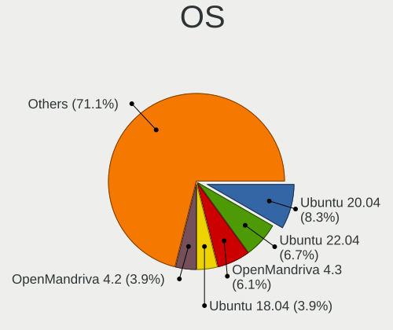

| Name               | Desktops | Percent |
|--------------------|----------|---------|
| Ubuntu 20.04       | 15       | 8.33%   |
| Ubuntu 22.04       | 12       | 6.67%   |
| OpenMandriva 4.3   | 11       | 6.11%   |
| Ubuntu 18.04       | 7        | 3.89%   |
| OpenMandriva 4.2   | 7        | 3.89%   |
| OpenMandriva 23.03 | 6        | 3.33%   |
| Zorin 17           | 5        | 2.78%   |
| Ubuntu 24.04       | 5        | 2.78%   |
| OpenMandriva 24.12 | 5        | 2.78%   |
| OpenMandriva 23.08 | 5        | 2.78%   |
| Debian 12          | 4        | 2.22%   |
| ArcoLinux Rolling  | 4        | 2.22%   |
| Zorin 16           | 3        | 1.67%   |
| Ubuntu 21.04       | 3        | 1.67%   |
| Pop!_OS 22.04      | 3        | 1.67%   |
| OpenMandriva 25.90 | 3        | 1.67%   |
| Ubuntu 19.10       | 2        | 1.11%   |
| Ubuntu 19.04       | 2        | 1.11%   |
| ROSA R10           | 2        | 1.11%   |
| OpenMandriva 5.0   | 2        | 1.11%   |
| OpenMandriva 25.06 | 2        | 1.11%   |
| Manjaro            | 2        | 1.11%   |
| Linux Mint 21.3    | 2        | 1.11%   |
| Linux Mint 20.2    | 2        | 1.11%   |
| Fedora 40          | 2        | 1.11%   |
| Fedora 37          | 2        | 1.11%   |
| Fedora 33          | 2        | 1.11%   |
| Debian 10          | 2        | 1.11%   |
| BlackPanther 18.1  | 2        | 1.11%   |
| Arch               | 2        | 1.11%   |
| Zorin 18           | 1        | 0.56%   |
| Xubuntu 24.04      | 1        | 0.56%   |
| Xubuntu 18.04      | 1        | 0.56%   |
| Xero Rolling       | 1        | 0.56%   |
| Ubuntu MATE 22.04  | 1        | 0.56%   |
| Ubuntu MATE 18.04  | 1        | 0.56%   |
| Ubuntu 25.04       | 1        | 0.56%   |
| Ubuntu 20.10       | 1        | 0.56%   |
| Ubuntu 1.3.5       | 1        | 0.56%   |
| Ubuntu 1.3.3       | 1        | 0.56%   |

OS Family
---------

OS without a version

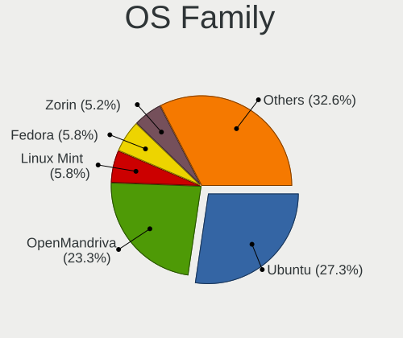

| Name         | Desktops | Percent |
|--------------|----------|---------|
| Ubuntu       | 47       | 27.33%  |
| OpenMandriva | 40       | 23.26%  |
| Linux Mint   | 10       | 5.81%   |
| Fedora       | 10       | 5.81%   |
| Zorin        | 9        | 5.23%   |
| Debian       | 7        | 4.07%   |
| Pop!_OS      | 6        | 3.49%   |
| ROSA         | 4        | 2.33%   |
| Manjaro      | 4        | 2.33%   |
| ArcoLinux    | 4        | 2.33%   |
| Parrot       | 3        | 1.74%   |
| KDE neon     | 3        | 1.74%   |
| Kali         | 3        | 1.74%   |
| Arch         | 3        | 1.74%   |
| Xubuntu      | 2        | 1.16%   |
| Ubuntu MATE  | 2        | 1.16%   |
| Peppermint   | 2        | 1.16%   |
| openSUSE     | 2        | 1.16%   |
| Kubuntu      | 2        | 1.16%   |
| BlackPanther | 2        | 1.16%   |
| Xero         | 1        | 0.58%   |
| Skygate      | 1        | 0.58%   |
| MX           | 1        | 0.58%   |
| Lubuntu      | 1        | 0.58%   |
| Endless      | 1        | 0.58%   |
| Athena       | 1        | 0.58%   |
| Alpine       | 1        | 0.58%   |

Kernel
------

Version of the Linux kernel

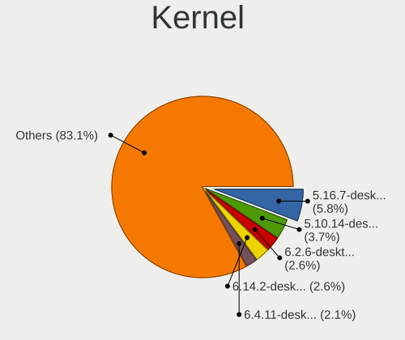

| Version                             | Desktops | Percent |
|-------------------------------------|----------|---------|
| 5.16.7-desktop-1omv4003             | 11       | 5.82%   |
| 5.10.14-desktop-1omv4002            | 7        | 3.7%    |
| 6.2.6-desktop-1omv2390              | 5        | 2.65%   |
| 6.14.2-desktop-3omv2590             | 5        | 2.65%   |
| 6.4.11-desktop-1omv2390             | 4        | 2.12%   |
| 6.12.1-desktop-1omv2490             | 4        | 2.12%   |
| 6.14.0-37-generic                   | 3        | 1.59%   |
| 5.15.0-47-generic                   | 3        | 1.59%   |
| 5.11.0-38-generic                   | 3        | 1.59%   |
| 5.0.0-37-generic                    | 3        | 1.59%   |
| 6.8.0-60-generic                    | 2        | 1.06%   |
| 6.8.0-41-generic                    | 2        | 1.06%   |
| 6.6.2-desktop-1omv2390              | 2        | 1.06%   |
| 6.5.0-17-generic                    | 2        | 1.06%   |
| 6.14.0-36-generic                   | 2        | 1.06%   |
| 6.14.0-27-generic                   | 2        | 1.06%   |
| 6.1.1-desktop-1omv2290              | 2        | 1.06%   |
| 5.8.0-50-generic                    | 2        | 1.06%   |
| 5.4.0-88-generic                    | 2        | 1.06%   |
| 5.3.0-46-generic                    | 2        | 1.06%   |
| 5.15.0-60-generic                   | 2        | 1.06%   |
| 5.15.0-126-generic                  | 2        | 1.06%   |
| 4.15.0-42-generic                   | 2        | 1.06%   |
| 6.9.7-200.fc40.x86_64               | 1        | 0.53%   |
| 6.8.0-79-generic                    | 1        | 0.53%   |
| 6.8.0-76060800daily20240311-generic | 1        | 0.53%   |
| 6.8.0-57-generic                    | 1        | 0.53%   |
| 6.8.0-48-generic                    | 1        | 0.53%   |
| 6.7.4-zen1-1-zen                    | 1        | 0.53%   |
| 6.6.9-amd64                         | 1        | 0.53%   |
| 6.6.8-200.fc39.x86_64               | 1        | 0.53%   |
| 6.5.6-76060506-generic              | 1        | 0.53%   |
| 6.5.0-35-generic                    | 1        | 0.53%   |
| 6.4.9-arch1-1                       | 1        | 0.53%   |
| 6.4.8-desktop-2omv2390              | 1        | 0.53%   |
| 6.4.4-1-default                     | 1        | 0.53%   |
| 6.2.11-300.fc38.x86_64              | 1        | 0.53%   |
| 6.2.0-37-generic                    | 1        | 0.53%   |
| 6.2.0-35-generic                    | 1        | 0.53%   |
| 6.17.9-arch1-1                      | 1        | 0.53%   |

Kernel Family
-------------

Linux kernel without a distro release

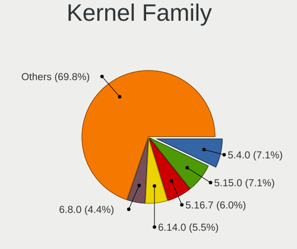

| Version | Desktops | Percent |
|---------|----------|---------|
| 5.4.0   | 13       | 7.14%   |
| 5.15.0  | 13       | 7.14%   |
| 5.16.7  | 11       | 6.04%   |
| 6.14.0  | 10       | 5.49%   |
| 6.8.0   | 8        | 4.4%    |
| 5.11.0  | 8        | 4.4%    |
| 4.15.0  | 8        | 4.4%    |
| 5.10.14 | 7        | 3.85%   |
| 5.0.0   | 6        | 3.3%    |
| 6.2.6   | 5        | 2.75%   |
| 6.14.2  | 5        | 2.75%   |
| 5.8.0   | 5        | 2.75%   |
| 6.4.11  | 4        | 2.2%    |
| 6.12.1  | 4        | 2.2%    |
| 6.1.0   | 4        | 2.2%    |
| 6.5.0   | 3        | 1.65%   |
| 5.3.0   | 3        | 1.65%   |
| 5.19.0  | 3        | 1.65%   |
| 6.6.2   | 2        | 1.1%    |
| 6.2.0   | 2        | 1.1%    |
| 6.12.10 | 2        | 1.1%    |
| 6.10.0  | 2        | 1.1%    |
| 6.1.1   | 2        | 1.1%    |
| 5.10.0  | 2        | 1.1%    |
| 6.9.7   | 1        | 0.55%   |
| 6.7.4   | 1        | 0.55%   |
| 6.6.9   | 1        | 0.55%   |
| 6.6.8   | 1        | 0.55%   |
| 6.5.6   | 1        | 0.55%   |
| 6.4.9   | 1        | 0.55%   |
| 6.4.8   | 1        | 0.55%   |
| 6.4.4   | 1        | 0.55%   |
| 6.2.11  | 1        | 0.55%   |
| 6.17.9  | 1        | 0.55%   |
| 6.17.7  | 1        | 0.55%   |
| 6.16.7  | 1        | 0.55%   |
| 6.15.2  | 1        | 0.55%   |
| 6.14.4  | 1        | 0.55%   |
| 6.13.2  | 1        | 0.55%   |
| 6.12.6  | 1        | 0.55%   |

Kernel Major Ver.
-----------------

Linux kernel major version

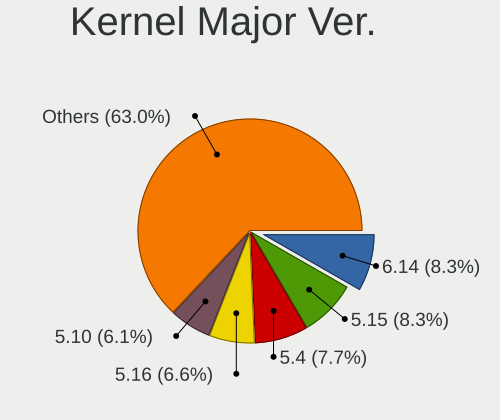

| Version | Desktops | Percent |
|---------|----------|---------|
| 6.14    | 15       | 8.29%   |
| 5.15    | 15       | 8.29%   |
| 5.4     | 14       | 7.73%   |
| 5.16    | 12       | 6.63%   |
| 5.10    | 11       | 6.08%   |
| 6.1     | 10       | 5.52%   |
| 5.11    | 9        | 4.97%   |
| 6.8     | 8        | 4.42%   |
| 6.2     | 8        | 4.42%   |
| 6.12    | 8        | 4.42%   |
| 4.15    | 8        | 4.42%   |
| 6.4     | 7        | 3.87%   |
| 5.8     | 6        | 3.31%   |
| 5.19    | 6        | 3.31%   |
| 5.0     | 6        | 3.31%   |
| 6.6     | 4        | 2.21%   |
| 6.5     | 4        | 2.21%   |
| 5.14    | 4        | 2.21%   |
| 6.10    | 3        | 1.66%   |
| 6.0     | 3        | 1.66%   |
| 5.3     | 3        | 1.66%   |
| 6.17    | 2        | 1.1%    |
| 5.18    | 2        | 1.1%    |
| 4.9     | 2        | 1.1%    |
| 6.9     | 1        | 0.55%   |
| 6.7     | 1        | 0.55%   |
| 6.16    | 1        | 0.55%   |
| 6.15    | 1        | 0.55%   |
| 6.13    | 1        | 0.55%   |
| 6.11    | 1        | 0.55%   |
| 5.6     | 1        | 0.55%   |
| 5.13    | 1        | 0.55%   |
| 4.19    | 1        | 0.55%   |
| 4.18    | 1        | 0.55%   |
| 4.1     | 1        | 0.55%   |

Arch
----

OS architecture (x86_64, i586, etc.)

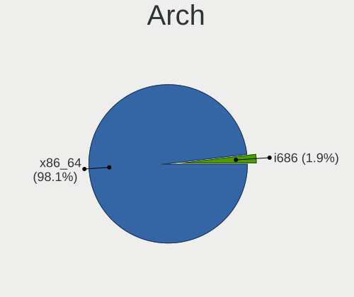

| Name   | Desktops | Percent |
|--------|----------|---------|
| x86_64 | 156      | 98.11%  |
| i686   | 3        | 1.89%   |

DE
--

Desktop Environment

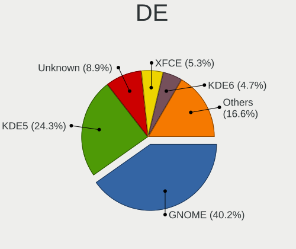

| Name            | Desktops | Percent |
|-----------------|----------|---------|
| GNOME           | 68       | 40.24%  |
| KDE5            | 41       | 24.26%  |
| Unknown         | 15       | 8.88%   |
| XFCE            | 9        | 5.33%   |
| KDE6            | 8        | 4.73%   |
| X-Cinnamon      | 6        | 3.55%   |
| MATE            | 6        | 3.55%   |
| LXQt            | 4        | 2.37%   |
| KDE4            | 3        | 1.78%   |
| Cinnamon        | 3        | 1.78%   |
| Peppermint      | 1        | 0.59%   |
| LXDE            | 1        | 0.59%   |
| KDE             | 1        | 0.59%   |
| i3              | 1        | 0.59%   |
| Hyprland        | 1        | 0.59%   |
| GNOME Flashback | 1        | 0.59%   |

Display Server
--------------

X11 or Wayland

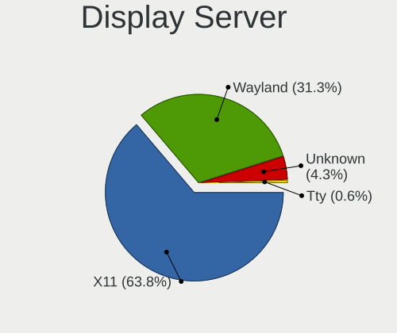

| Name    | Desktops | Percent |
|---------|----------|---------|
| X11     | 104      | 63.8%   |
| Wayland | 51       | 31.29%  |
| Unknown | 7        | 4.29%   |
| Tty     | 1        | 0.61%   |

Display Manager
---------------

SDDM, LightDM, etc.

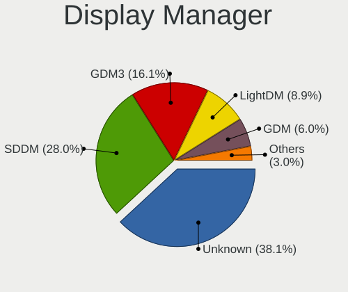

| Name    | Desktops | Percent |
|---------|----------|---------|
| Unknown | 64       | 38.1%   |
| SDDM    | 47       | 27.98%  |
| GDM3    | 27       | 16.07%  |
| LightDM | 15       | 8.93%   |
| GDM     | 10       | 5.95%   |
| KDM     | 3        | 1.79%   |
| TDM     | 1        | 0.6%    |
| GREETD  | 1        | 0.6%    |

OS Lang
-------

Language

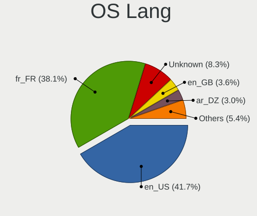

| Lang        | Desktops | Percent |
|-------------|----------|---------|
| en_US       | 70       | 41.67%  |
| fr_FR       | 64       | 38.1%   |
| Unknown     | 14       | 8.33%   |
| en_GB       | 6        | 3.57%   |
| C           | 5        | 2.98%   |
| ar_DZ       | 5        | 2.98%   |
| fr_DZ       | 1        | 0.6%    |
| en-US-UTF-8 | 1        | 0.6%    |
| ar_EG       | 1        | 0.6%    |
| ar_AE       | 1        | 0.6%    |

Boot Mode
---------

EFI or BIOS

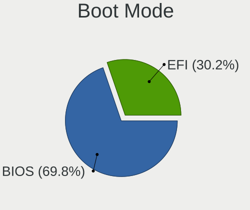

| Mode | Desktops | Percent |
|------|----------|---------|
| BIOS | 113      | 69.75%  |
| EFI  | 49       | 30.25%  |

Filesystem
----------

Type of filesystem

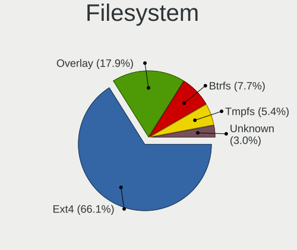

| Type    | Desktops | Percent |
|---------|----------|---------|
| Ext4    | 111      | 66.07%  |
| Overlay | 30       | 17.86%  |
| Btrfs   | 13       | 7.74%   |
| Tmpfs   | 9        | 5.36%   |
| Unknown | 5        | 2.98%   |

Part. scheme
------------

Scheme of partitioning

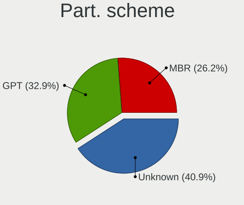

| Type    | Desktops | Percent |
|---------|----------|---------|
| Unknown | 67       | 40.85%  |
| GPT     | 54       | 32.93%  |
| MBR     | 43       | 26.22%  |

Dual Boot with Linux/BSD
------------------------

Hosting more than one Linux/BSD

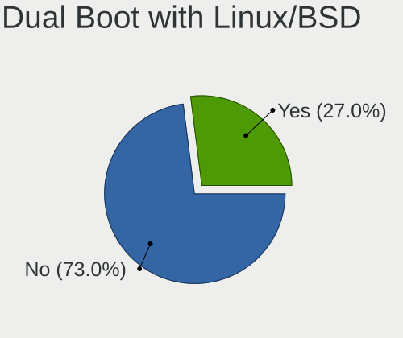

| Dual boot | Desktops | Percent |
|-----------|----------|---------|
| No        | 119      | 73.01%  |
| Yes       | 44       | 26.99%  |

Dual Boot (Win)
---------------

Hosting Linux and Windows

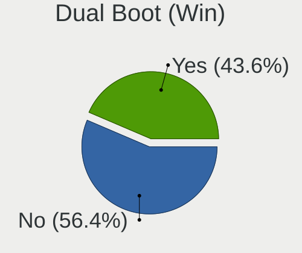

| Dual boot | Desktops | Percent |
|-----------|----------|---------|
| No        | 92       | 56.44%  |
| Yes       | 71       | 43.56%  |

Board
-----

Vendor
------

Motherboard manufacturer

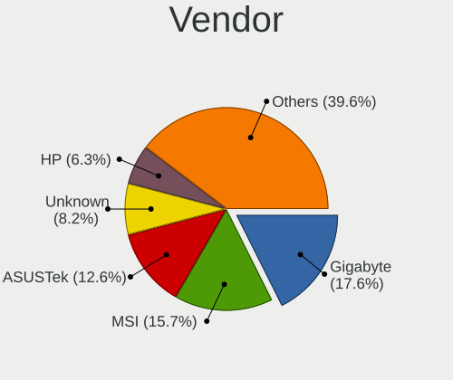

| Name                | Desktops | Percent |
|---------------------|----------|---------|
| Gigabyte Technology | 28       | 17.61%  |
| MSI                 | 25       | 15.72%  |
| ASUSTek Computer    | 20       | 12.58%  |
| Unknown             | 13       | 8.18%   |
| Hewlett-Packard     | 10       | 6.29%   |
| Intel               | 9        | 5.66%   |
| Foxconn             | 9        | 5.66%   |
| ECS                 | 8        | 5.03%   |
| Dell                | 8        | 5.03%   |
| Biostar             | 6        | 3.77%   |
| Lenovo              | 5        | 3.14%   |
| ASRock              | 5        | 3.14%   |
| Pegatron            | 3        | 1.89%   |
| Packard Bell        | 2        | 1.26%   |
| LORD ELECTRONICS    | 2        | 1.26%   |
| Wistron             | 1        | 0.63%   |
| WeiBu               | 1        | 0.63%   |
| Supermicro          | 1        | 0.63%   |
| By O.E.M.           | 1        | 0.63%   |
| AMI                 | 1        | 0.63%   |
| Acer                | 1        | 0.63%   |

Model
-----

Motherboard model

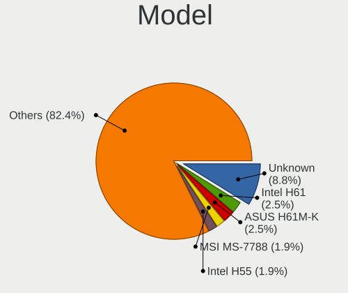

| Name                                              | Desktops | Percent |
|---------------------------------------------------|----------|---------|
| Unknown                                           | 14       | 8.81%   |
| Intel H61                                         | 4        | 2.52%   |
| ASUS H61M-K                                       | 4        | 2.52%   |
| MSI MS-7788                                       | 3        | 1.89%   |
| Intel H55                                         | 3        | 1.89%   |
| HP 280 G1 MT                                      | 3        | 1.89%   |
| Gigabyte H61M-S2PV                                | 3        | 1.89%   |
| Gigabyte G41MT-S2PT                               | 3        | 1.89%   |
| Foxconn H61MXL/H61MXL-K                           | 3        | 1.89%   |
| ECS G41T-M7                                       | 3        | 1.89%   |
| ASUS All Series                                   | 3        | 1.89%   |
| MSI MS-7C52                                       | 2        | 1.26%   |
| MSI MS-7758                                       | 2        | 1.26%   |
| MSI MS-7680                                       | 2        | 1.26%   |
| MSI MS-7636                                       | 2        | 1.26%   |
| MSI MS-7592                                       | 2        | 1.26%   |
| LORD ELECTRONICS LORD G4x 775 ICH7 8712 As Design | 2        | 1.26%   |
| Gigabyte H61M-S2P-R3                              | 2        | 1.26%   |
| Gigabyte B85M-DS3H-A                              | 2        | 1.26%   |
| ECS H61H2-MV                                      | 2        | 1.26%   |
| Dell OptiPlex 3010                                | 2        | 1.26%   |
| Biostar P4M89-M7B                                 | 2        | 1.26%   |
| Biostar G41D3C                                    | 2        | 1.26%   |
| Wistron ProLiant ML110 G5                         | 1        | 0.63%   |
| WeiBu SIMM INT G-41D3 G1.0L                       | 1        | 0.63%   |
| Supermicro X7DVL-3                                | 1        | 0.63%   |
| Pegatron TouchSmart 7320 Lavaca-B EU L6 PC        | 1        | 0.63%   |
| Pegatron Compaq dx2400 Microtower PC              | 1        | 0.63%   |
| Pegatron 2A94h                                    | 1        | 0.63%   |
| Packard Bell IMEDIA S3720                         | 1        | 0.63%   |
| Packard Bell IMEDIA S2110                         | 1        | 0.63%   |
| MSI MS-7C96                                       | 1        | 0.63%   |
| MSI MS-7C79                                       | 1        | 0.63%   |
| MSI MS-7B98                                       | 1        | 0.63%   |
| MSI MS-7A71                                       | 1        | 0.63%   |
| MSI MS-7A15                                       | 1        | 0.63%   |
| MSI MS-7821                                       | 1        | 0.63%   |
| MSI MS-7816                                       | 1        | 0.63%   |
| MSI MS-7808                                       | 1        | 0.63%   |
| MSI MS-7752                                       | 1        | 0.63%   |

Model Family
------------

Motherboard model prefix

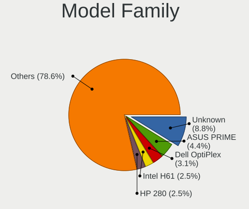

| Name                  | Desktops | Percent |
|-----------------------|----------|---------|
| Unknown               | 14       | 8.81%   |
| ASUS PRIME            | 7        | 4.4%    |
| Dell OptiPlex         | 5        | 3.14%   |
| Intel H61             | 4        | 2.52%   |
| HP 280                | 4        | 2.52%   |
| ASUS H61M-K           | 4        | 2.52%   |
| MSI MS-7788           | 3        | 1.89%   |
| Lenovo ThinkCentre    | 3        | 1.89%   |
| Intel H55             | 3        | 1.89%   |
| HP ProDesk            | 3        | 1.89%   |
| Gigabyte H61M-S2PV    | 3        | 1.89%   |
| Gigabyte G41MT-S2PT   | 3        | 1.89%   |
| Foxconn H61MXL        | 3        | 1.89%   |
| ECS G41T-M7           | 3        | 1.89%   |
| ASUS TUF              | 3        | 1.89%   |
| ASUS All              | 3        | 1.89%   |
| Packard Bell IMEDIA   | 2        | 1.26%   |
| MSI MS-7C52           | 2        | 1.26%   |
| MSI MS-7758           | 2        | 1.26%   |
| MSI MS-7680           | 2        | 1.26%   |
| MSI MS-7636           | 2        | 1.26%   |
| MSI MS-7592           | 2        | 1.26%   |
| LORD ELECTRONICS LORD | 2        | 1.26%   |
| Gigabyte H61M-S2P-R3  | 2        | 1.26%   |
| Gigabyte B85M-DS3H-A  | 2        | 1.26%   |
| Foxconn H61MXV        | 2        | 1.26%   |
| ECS H61H2-MV          | 2        | 1.26%   |
| Biostar P4M89-M7B     | 2        | 1.26%   |
| Biostar G41D3C        | 2        | 1.26%   |
| Wistron ProLiant      | 1        | 0.63%   |
| WeiBu SIMM            | 1        | 0.63%   |
| Supermicro X7DVL-3    | 1        | 0.63%   |
| Pegatron TouchSmart   | 1        | 0.63%   |
| Pegatron Compaq       | 1        | 0.63%   |
| Pegatron 2A94h        | 1        | 0.63%   |
| MSI MS-7C96           | 1        | 0.63%   |
| MSI MS-7C79           | 1        | 0.63%   |
| MSI MS-7B98           | 1        | 0.63%   |
| MSI MS-7A71           | 1        | 0.63%   |
| MSI MS-7A15           | 1        | 0.63%   |

MFG Year
--------

Motherboard manufacture year

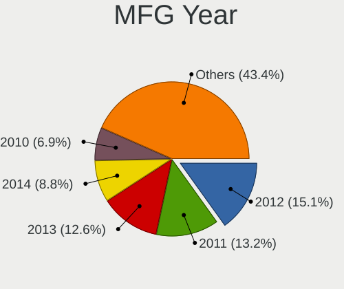

| Year | Desktops | Percent |
|------|----------|---------|
| 2012 | 24       | 15.09%  |
| 2011 | 21       | 13.21%  |
| 2013 | 20       | 12.58%  |
| 2014 | 14       | 8.81%   |
| 2010 | 11       | 6.92%   |
| 2019 | 9        | 5.66%   |
| 2009 | 9        | 5.66%   |
| 2020 | 8        | 5.03%   |
| 2018 | 8        | 5.03%   |
| 2008 | 6        | 3.77%   |
| 2016 | 5        | 3.14%   |
| 2015 | 5        | 3.14%   |
| 2007 | 5        | 3.14%   |
| 2023 | 4        | 2.52%   |
| 2021 | 3        | 1.89%   |
| 2017 | 3        | 1.89%   |
| 2022 | 2        | 1.26%   |
| 2024 | 1        | 0.63%   |
| 2006 | 1        | 0.63%   |

Form Factor
-----------

Physical design of the computer

| Name    | Desktops | Percent |
|---------|----------|---------|
| Desktop | 159      | 100%    |

Secure Boot
-----------

Enabled or disabled

| State    | Desktops | Percent |
|----------|----------|---------|
| Disabled | 154      | 96.86%  |
| Enabled  | 5        | 3.14%   |

Coreboot
--------

Have coreboot on board

| Used | Desktops | Percent |
|------|----------|---------|
| No   | 159      | 100%    |

RAM Size
--------

Total RAM memory

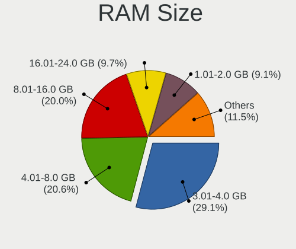

| Size in GB  | Desktops | Percent |
|-------------|----------|---------|
| 3.01-4.0    | 48       | 29.09%  |
| 4.01-8.0    | 34       | 20.61%  |
| 8.01-16.0   | 33       | 20%     |
| 16.01-24.0  | 16       | 9.7%    |
| 1.01-2.0    | 15       | 9.09%   |
| 32.01-64.0  | 8        | 4.85%   |
| 2.01-3.0    | 5        | 3.03%   |
| 0.51-1.0    | 4        | 2.42%   |
| 64.01-256.0 | 2        | 1.21%   |

RAM Used
--------

Used RAM memory

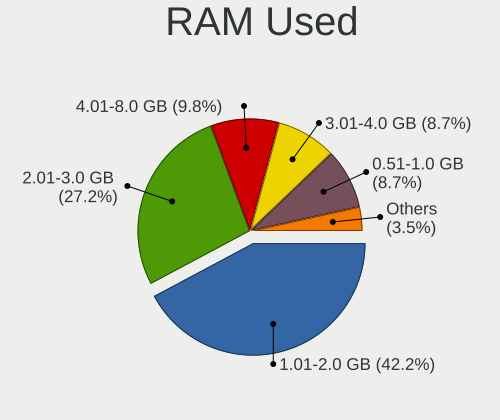

| Used GB    | Desktops | Percent |
|------------|----------|---------|
| 1.01-2.0   | 73       | 42.2%   |
| 2.01-3.0   | 47       | 27.17%  |
| 4.01-8.0   | 17       | 9.83%   |
| 3.01-4.0   | 15       | 8.67%   |
| 0.51-1.0   | 15       | 8.67%   |
| 0.01-0.5   | 3        | 1.73%   |
| 8.01-16.0  | 2        | 1.16%   |
| 32.01-64.0 | 1        | 0.58%   |

Total Drives
------------

Number of drives on board

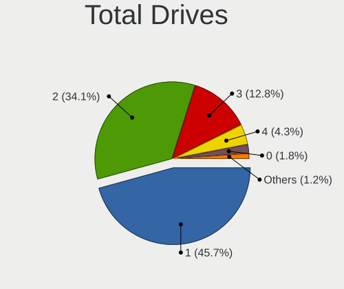

| Drives | Desktops | Percent |
|--------|----------|---------|
| 1      | 75       | 45.73%  |
| 2      | 56       | 34.15%  |
| 3      | 21       | 12.8%   |
| 4      | 7        | 4.27%   |
| 0      | 3        | 1.83%   |
| 7      | 1        | 0.61%   |
| 5      | 1        | 0.61%   |

Has CD-ROM
----------

Has CD-ROM on board

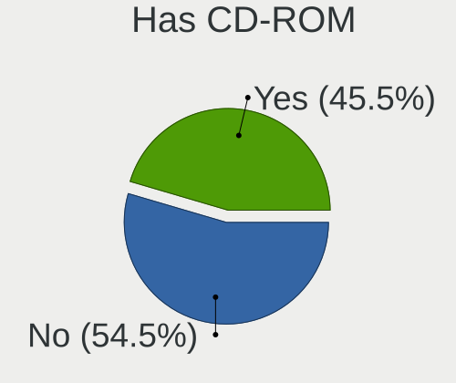

| Presented | Desktops | Percent |
|-----------|----------|---------|
| No        | 90       | 54.55%  |
| Yes       | 75       | 45.45%  |

Has Ethernet
------------

Has Ethernet on board

| Presented | Desktops | Percent |
|-----------|----------|---------|
| Yes       | 157      | 98.74%  |
| No        | 2        | 1.26%   |

Has WiFi
--------

Has WiFi module

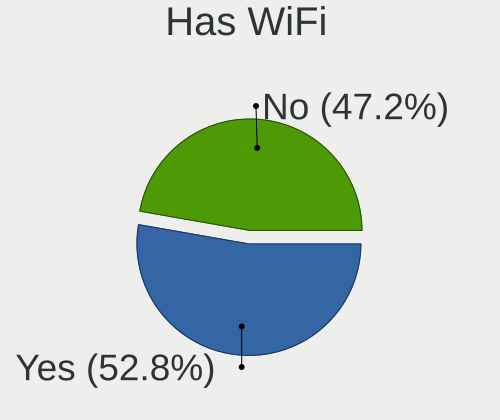

| Presented | Desktops | Percent |
|-----------|----------|---------|
| Yes       | 86       | 52.76%  |
| No        | 77       | 47.24%  |

Has Bluetooth
-------------

Has Bluetooth module

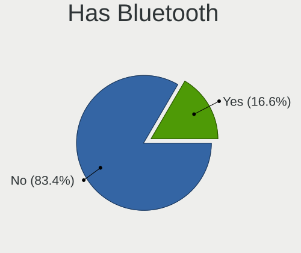

| Presented | Desktops | Percent |
|-----------|----------|---------|
| No        | 136      | 83.44%  |
| Yes       | 27       | 16.56%  |

Location
--------

Country
-------

Geographic location (country)

| Country | Desktops | Percent |
|---------|----------|---------|
| Algeria | 159      | 100%    |

City
----

Geographic location (city)

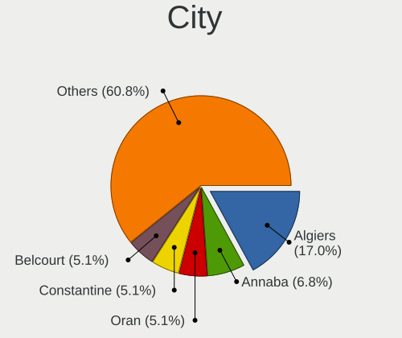

| City           | Desktops | Percent |
|----------------|----------|---------|
| Algiers        | 30       | 17.05%  |
| Annaba         | 12       | 6.82%   |
| Oran           | 9        | 5.11%   |
| Constantine    | 9        | 5.11%   |
| Belcourt       | 9        | 5.11%   |
| Batna City     | 6        | 3.41%   |
| Tlemcen        | 4        | 2.27%   |
| Tizi Ouzou     | 4        | 2.27%   |
| Blida          | 4        | 2.27%   |
| Skikda         | 3        | 1.7%    |
| Sidi Bel Abbes | 3        | 1.7%    |
| Sétif         | 3        | 1.7%    |
| Ouargla        | 3        | 1.7%    |
| Mostaganem     | 3        | 1.7%    |
| Jijelli        | 3        | 1.7%    |
| Djelfa         | 3        | 1.7%    |
| Biskra         | 3        | 1.7%    |
| Béchar        | 3        | 1.7%    |
| Bab Ezzouar    | 3        | 1.7%    |
| Sidi Akkacha   | 2        | 1.14%   |
| Medea          | 2        | 1.14%   |
| L'Agha         | 2        | 1.14%   |
| Khenchela      | 2        | 1.14%   |
| Chlef          | 2        | 1.14%   |
| Bir el Ater    | 2        | 1.14%   |
| ash-Shalif     | 2        | 1.14%   |
| Ain Defla      | 2        | 1.14%   |
| Tolga          | 1        | 0.57%   |
| Tipasa         | 1        | 0.57%   |
| Timizart       | 1        | 0.57%   |
| Tiaret         | 1        | 0.57%   |
| Tamanghasset   | 1        | 0.57%   |
| Tadmait        | 1        | 0.57%   |
| Tadjenanet     | 1        | 0.57%   |
| Sig            | 1        | 0.57%   |
| Sidi Okba      | 1        | 0.57%   |
| Saoula         | 1        | 0.57%   |
| Reghaia        | 1        | 0.57%   |
| Oum el Bouaghi | 1        | 0.57%   |
| Oued Smar      | 1        | 0.57%   |

Drives
------

Drive Vendor
------------

Hard drive vendors

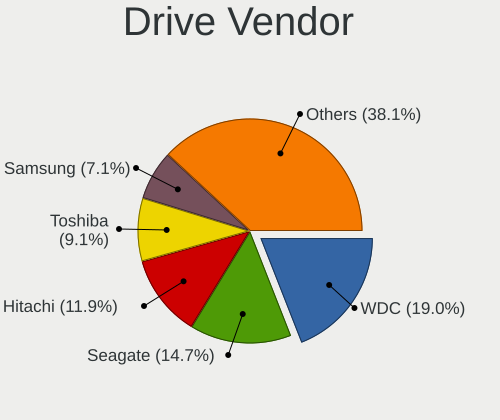

| Vendor                         | Desktops | Drives | Percent |
|--------------------------------|----------|--------|---------|
| WDC                            | 48       | 74     | 19.05%  |
| Seagate                        | 37       | 47     | 14.68%  |
| Hitachi                        | 30       | 41     | 11.9%   |
| Toshiba                        | 23       | 27     | 9.13%   |
| Samsung Electronics            | 18       | 21     | 7.14%   |
| A-DATA Technology              | 17       | 23     | 6.75%   |
| Maxtor                         | 7        | 9      | 2.78%   |
| Team                           | 6        | 6      | 2.38%   |
| SanDisk                        | 6        | 6      | 2.38%   |
| TwinMOS                        | 3        | 3      | 1.19%   |
| Silicon Motion                 | 3        | 3      | 1.19%   |
| Realtek Semiconductor          | 3        | 3      | 1.19%   |
| Lexar                          | 3        | 5      | 1.19%   |
| China                          | 3        | 5      | 1.19%   |
| ZTE                            | 2        | 2      | 0.79%   |
| XPG                            | 2        | 2      | 0.79%   |
| Unknown                        | 2        | 7      | 0.79%   |
| MDT                            | 2        | 2      | 0.79%   |
| MAXIO Technology (Hangzhou)    | 2        | 2      | 0.79%   |
| Kingston                       | 2        | 2      | 0.79%   |
| HGST                           | 2        | 4      | 0.79%   |
| Hewlett-Packard                | 2        | 2      | 0.79%   |
| ExcelStor                      | 2        | 3      | 0.79%   |
| Crucial                        | 2        | 2      | 0.79%   |
| ADATA Technology               | 2        | 3      | 0.79%   |
| XrayDisk                       | 1        | 2      | 0.4%    |
| WD MediaMax                    | 1        | 1      | 0.4%    |
| WALRAM                         | 1        | 1      | 0.4%    |
| ValueTech                      | 1        | 1      | 0.4%    |
| tecmiyo                        | 1        | 1      | 0.4%    |
| T-FORCE                        | 1        | 1      | 0.4%    |
| Solid State Storage Technology | 1        | 1      | 0.4%    |
| Phison Electronics             | 1        | 1      | 0.4%    |
| Phison                         | 1        | 1      | 0.4%    |
| Micron/Crucial Technology      | 1        | 1      | 0.4%    |
| Micron Technology              | 1        | 1      | 0.4%    |
| Magnetic Data                  | 1        | 1      | 0.4%    |
| LITEON                         | 1        | 1      | 0.4%    |
| Kston                          | 1        | 1      | 0.4%    |
| Kingston Technology Company    | 1        | 2      | 0.4%    |

Drive Model
-----------

Hard drive models

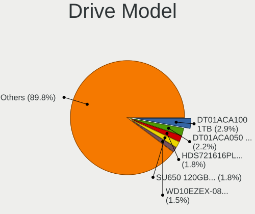

| Model                                                 | Desktops | Percent |
|-------------------------------------------------------|----------|---------|
| Toshiba DT01ACA100 1TB                                | 8        | 2.92%   |
| Toshiba DT01ACA050 500GB                              | 6        | 2.19%   |
| Hitachi HDS721616PLA380 160GB                         | 5        | 1.82%   |
| A-DATA SU650 120GB SSD                                | 5        | 1.82%   |
| WDC WD10EZEX-08WN4A0 1TB                              | 4        | 1.46%   |
| WDC WD10EZEX-00WN4A0 1TB                              | 4        | 1.46%   |
| Seagate ST500LT012-9WS142 500GB                       | 4        | 1.46%   |
| A-DATA SU630 240GB SSD                                | 4        | 1.46%   |
| WDC WD5000AAKX-001CA0 500GB                           | 3        | 1.09%   |
| Seagate ST500DM002-1SB10A 500GB                       | 3        | 1.09%   |
| Seagate ST500DM002-1BD142 500GB                       | 3        | 1.09%   |
| Hitachi HDP725025GLA380 250GB                         | 3        | 1.09%   |
| ZTE MMC Storage 942MB                                 | 2        | 0.73%   |
| WDC WD5000AVVS-63M8B0 500GB                           | 2        | 0.73%   |
| WDC WD5000AVCS-632DY1 500GB                           | 2        | 0.73%   |
| WDC WD5000AAKX-603CA0 500GB                           | 2        | 0.73%   |
| WDC WD1600AVJS-63WNA0 160GB                           | 2        | 0.73%   |
| Unknown SD/MMC 16GB                                   | 2        | 0.73%   |
| Unknown M.S./M.S.Pro/HG 16GB                          | 2        | 0.73%   |
| Unknown Compact Flash 977MB                           | 2        | 0.73%   |
| TwinMOS SSD 256GB                                     | 2        | 0.73%   |
| Toshiba MQ01ABD100 1TB                                | 2        | 0.73%   |
| Toshiba HDWD110 1TB                                   | 2        | 0.73%   |
| Toshiba HDWD105 500GB                                 | 2        | 0.73%   |
| Team T253256GB SSD                                    | 2        | 0.73%   |
| Silicon Motion SM2263EN/SM2263XT SSD Controller 512GB | 2        | 0.73%   |
| Seagate ST3500413AS 500GB                             | 2        | 0.73%   |
| Seagate ST3500312CS 500GB                             | 2        | 0.73%   |
| Seagate ST1000DM010-2EP102 1TB                        | 2        | 0.73%   |
| Seagate ST1000DM003-1SB10C 1TB                        | 2        | 0.73%   |
| Seagate ST1000DM003-1CH162 1TB                        | 2        | 0.73%   |
| Samsung HD503HI 500GB                                 | 2        | 0.73%   |
| Samsung HD502HI 500GB                                 | 2        | 0.73%   |
| Samsung HD103SI 1TB                                   | 2        | 0.73%   |
| Maxtor STM380215AS 80GB                               | 2        | 0.73%   |
| MAXIO (Hangzhou) NVMe SSD Controller MAP1202 2TB      | 2        | 0.73%   |
| Hitachi HDS721050CLA662 500GB                         | 2        | 0.73%   |
| Hitachi HCP725032GLA380 320GB                         | 2        | 0.73%   |
| Crucial CT240BX500SSD1 240GB                          | 2        | 0.73%   |
| A-DATA LEGEND 710 512GB                               | 2        | 0.73%   |

HDD Vendor
----------

Hard disk drive vendors

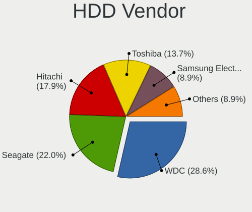

| Vendor              | Desktops | Drives | Percent |
|---------------------|----------|--------|---------|
| WDC                 | 48       | 69     | 28.57%  |
| Seagate             | 37       | 47     | 22.02%  |
| Hitachi             | 30       | 41     | 17.86%  |
| Toshiba             | 23       | 27     | 13.69%  |
| Samsung Electronics | 15       | 18     | 8.93%   |
| Maxtor              | 7        | 9      | 4.17%   |
| HGST                | 2        | 4      | 1.19%   |
| ExcelStor           | 2        | 3      | 1.19%   |
| WD MediaMax         | 1        | 1      | 0.6%    |
| Magnetic Data       | 1        | 1      | 0.6%    |
| Hewlett-Packard     | 1        | 1      | 0.6%    |
| Fujitsu             | 1        | 1      | 0.6%    |

SSD Vendor
----------

Solid state drive vendors

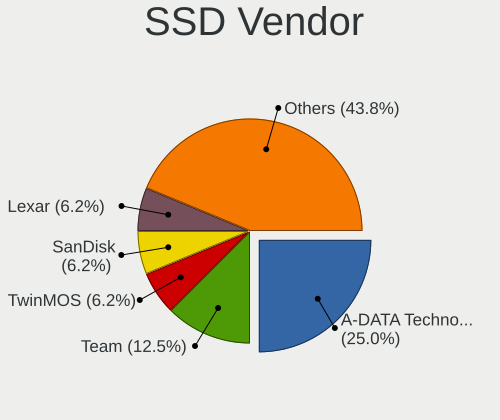

| Vendor              | Desktops | Drives | Percent |
|---------------------|----------|--------|---------|
| A-DATA Technology   | 12       | 16     | 25%     |
| Team                | 6        | 6      | 12.5%   |
| TwinMOS             | 3        | 3      | 6.25%   |
| SanDisk             | 3        | 3      | 6.25%   |
| Lexar               | 3        | 5      | 6.25%   |
| China               | 3        | 5      | 6.25%   |
| Samsung Electronics | 2        | 2      | 4.17%   |
| Crucial             | 2        | 2      | 4.17%   |
| XrayDisk            | 1        | 2      | 2.08%   |
| XPG                 | 1        | 1      | 2.08%   |
| WDC                 | 1        | 3      | 2.08%   |
| ValueTech           | 1        | 1      | 2.08%   |
| tecmiyo             | 1        | 1      | 2.08%   |
| T-FORCE             | 1        | 1      | 2.08%   |
| LITEON              | 1        | 1      | 2.08%   |
| Kston               | 1        | 1      | 2.08%   |
| Kingston            | 1        | 1      | 2.08%   |
| Hewlett-Packard     | 1        | 1      | 2.08%   |
| Dahua               | 1        | 1      | 2.08%   |
| Corsair             | 1        | 1      | 2.08%   |
| Asgard              | 1        | 1      | 2.08%   |
| AGI                 | 1        | 1      | 2.08%   |

Drive Kind
----------

HDD or SSD

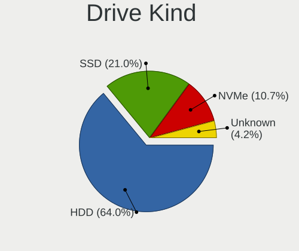

| Kind    | Desktops | Drives | Percent |
|---------|----------|--------|---------|
| HDD     | 137      | 222    | 64.02%  |
| SSD     | 45       | 59     | 21.03%  |
| NVMe    | 23       | 36     | 10.75%  |
| Unknown | 9        | 14     | 4.21%   |

Drive Connector
---------------

SATA, SAS, NVMe, etc.

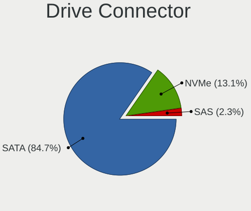

| Type | Desktops | Drives | Percent |
|------|----------|--------|---------|
| SATA | 149      | 286    | 84.66%  |
| NVMe | 23       | 36     | 13.07%  |
| SAS  | 4        | 9      | 2.27%   |

Drive Size
----------

Size of hard drive

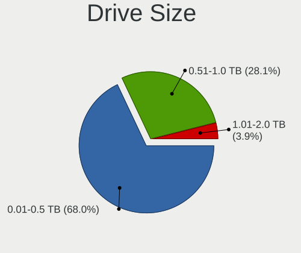

| Size in TB | Desktops | Drives | Percent |
|------------|----------|--------|---------|
| 0.01-0.5   | 121      | 199    | 67.98%  |
| 0.51-1.0   | 50       | 73     | 28.09%  |
| 1.01-2.0   | 7        | 9      | 3.93%   |

Space Total
-----------

Amount of disk space available on the file system

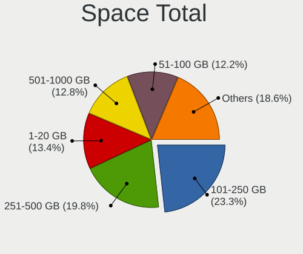

| Size in GB     | Desktops | Percent |
|----------------|----------|---------|
| 101-250        | 40       | 23.26%  |
| 251-500        | 34       | 19.77%  |
| 1-20           | 23       | 13.37%  |
| 501-1000       | 22       | 12.79%  |
| 51-100         | 21       | 12.21%  |
| 21-50          | 11       | 6.4%    |
| 1001-2000      | 9        | 5.23%   |
| Unknown        | 7        | 4.07%   |
| 2001-3000      | 3        | 1.74%   |
| More than 3000 | 2        | 1.16%   |

Space Used
----------

Amount of used disk space

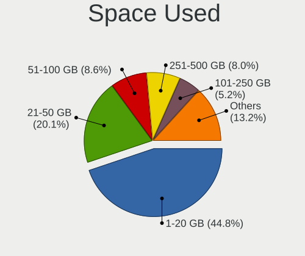

| Used GB   | Desktops | Percent |
|-----------|----------|---------|
| 1-20      | 78       | 44.83%  |
| 21-50     | 35       | 20.11%  |
| 51-100    | 15       | 8.62%   |
| 251-500   | 14       | 8.05%   |
| 101-250   | 9        | 5.17%   |
| 1001-2000 | 7        | 4.02%   |
| 501-1000  | 7        | 4.02%   |
| Unknown   | 7        | 4.02%   |
| 2001-3000 | 1        | 0.57%   |
| 0         | 1        | 0.57%   |

Malfunc. Drives
---------------

Drive models with a malfunction

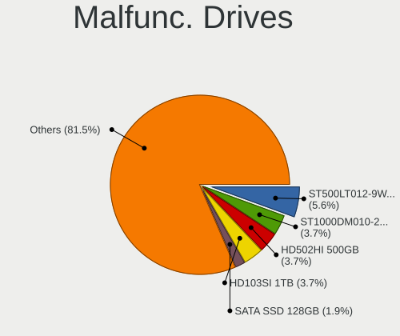

| Model                                        | Desktops | Drives | Percent |
|----------------------------------------------|----------|--------|---------|
| Seagate ST500LT012-9WS142 500GB              | 3        | 3      | 5.56%   |
| Seagate ST1000DM010-2EP102 1TB               | 2        | 4      | 3.7%    |
| Samsung Electronics HD502HI 500GB            | 2        | 2      | 3.7%    |
| Samsung Electronics HD103SI 1TB              | 2        | 2      | 3.7%    |
| XPG SPECTRIX S40G 1TB                        | 1        | 1      | 1.85%   |
| WDC WD7500AARS-00Y5B1 752GB                  | 1        | 1      | 1.85%   |
| WDC WD5000AVVS-63M8B0 500GB                  | 1        | 1      | 1.85%   |
| WDC WD5000AVCS-632DY1 500GB                  | 1        | 1      | 1.85%   |
| WDC WD5000AAKX-00ERMA0 500GB                 | 1        | 1      | 1.85%   |
| WDC WD400EB-00CPF0 40GB                      | 1        | 1      | 1.85%   |
| WDC WD3200AVJS-63B6A0 320GB                  | 1        | 1      | 1.85%   |
| WDC WD1600AAJS-08WAA0 160GB                  | 1        | 1      | 1.85%   |
| WDC WD10EZEX-60WN4A0 1TB                     | 1        | 2      | 1.85%   |
| WDC WD10EURX-63UY4Y0 1TB                     | 1        | 1      | 1.85%   |
| WDC WD1001FALS-403AA0 1TB                    | 1        | 1      | 1.85%   |
| WD MediaMax WL120GBSATA                      | 1        | 1      | 1.85%   |
| Toshiba DT01ACA100 1TB                       | 1        | 1      | 1.85%   |
| Toshiba DT01ACA050 500GB                     | 1        | 1      | 1.85%   |
| tecmiyo SATA SSD 128GB                       | 1        | 1      | 1.85%   |
| Seagate ST500LM021-1KJ152 500GB              | 1        | 1      | 1.85%   |
| Seagate ST500DM002-1BD142 500GB              | 1        | 2      | 1.85%   |
| Seagate ST3500413AS 500GB                    | 1        | 1      | 1.85%   |
| Seagate ST3250310AS 250GB                    | 1        | 1      | 1.85%   |
| Samsung Electronics SSD PM810 2.5 7mm 128GB  | 1        | 1      | 1.85%   |
| Samsung Electronics SP0411N 40GB             | 1        | 2      | 1.85%   |
| Samsung Electronics HD256GJ 250GB            | 1        | 1      | 1.85%   |
| Samsung Electronics HD160JJ 160GB            | 1        | 1      | 1.85%   |
| Realtek Semiconductor ADATA SX6000PNP 1024GB | 1        | 1      | 1.85%   |
| Maxtor STM380215AS 80GB                      | 1        | 1      | 1.85%   |
| Maxtor STM3320613AS 320GB                    | 1        | 1      | 1.85%   |
| Maxtor STM3160215AS 160GB                    | 1        | 1      | 1.85%   |
| Maxtor 6L300S0 304GB                         | 1        | 1      | 1.85%   |
| Maxtor 32049H2 20GB                          | 1        | 1      | 1.85%   |
| Magnetic Data MD07500-ALDW-RO 752GB          | 1        | 1      | 1.85%   |
| Hitachi HTS722010K9SA00 100GB                | 1        | 1      | 1.85%   |
| Hitachi HDT725025VLA380 250GB                | 1        | 1      | 1.85%   |
| Hitachi HDS721050KLA33R RSD HUA 500GB        | 1        | 1      | 1.85%   |
| Hitachi HDS721032CLA362 320GB                | 1        | 1      | 1.85%   |
| Hitachi HDS721025CLA382 250GB                | 1        | 1      | 1.85%   |
| Hitachi HDP725025GLA380 250GB                | 1        | 1      | 1.85%   |

Malfunc. Drive Vendor
---------------------

Vendors of faulty drives

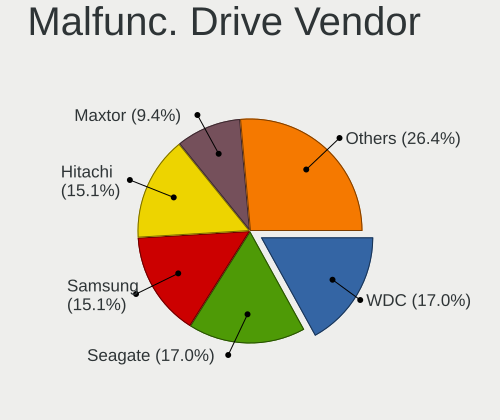

| Vendor                | Desktops | Drives | Percent |
|-----------------------|----------|--------|---------|
| WDC                   | 9        | 11     | 16.98%  |
| Seagate               | 9        | 12     | 16.98%  |
| Samsung Electronics   | 8        | 9      | 15.09%  |
| Hitachi               | 8        | 8      | 15.09%  |
| Maxtor                | 5        | 5      | 9.43%   |
| Toshiba               | 2        | 2      | 3.77%   |
| A-DATA Technology     | 2        | 2      | 3.77%   |
| XPG                   | 1        | 1      | 1.89%   |
| WD MediaMax           | 1        | 1      | 1.89%   |
| tecmiyo               | 1        | 1      | 1.89%   |
| Realtek Semiconductor | 1        | 1      | 1.89%   |
| Magnetic Data         | 1        | 1      | 1.89%   |
| Hikvision             | 1        | 1      | 1.89%   |
| HGST                  | 1        | 1      | 1.89%   |
| Fujitsu               | 1        | 1      | 1.89%   |
| ExcelStor             | 1        | 1      | 1.89%   |
| China                 | 1        | 1      | 1.89%   |

Malfunc. HDD Vendor
-------------------

Vendors of faulty HDD drives

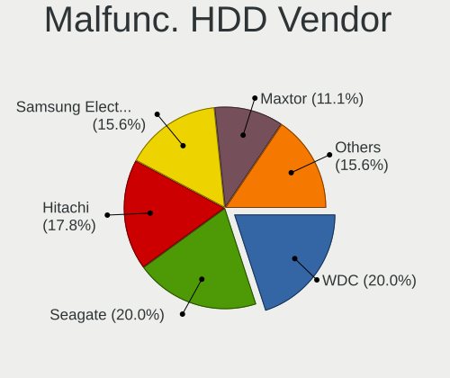

| Vendor              | Desktops | Drives | Percent |
|---------------------|----------|--------|---------|
| WDC                 | 9        | 11     | 20%     |
| Seagate             | 9        | 12     | 20%     |
| Hitachi             | 8        | 8      | 17.78%  |
| Samsung Electronics | 7        | 8      | 15.56%  |
| Maxtor              | 5        | 5      | 11.11%  |
| Toshiba             | 2        | 2      | 4.44%   |
| WD MediaMax         | 1        | 1      | 2.22%   |
| Magnetic Data       | 1        | 1      | 2.22%   |
| HGST                | 1        | 1      | 2.22%   |
| Fujitsu             | 1        | 1      | 2.22%   |
| ExcelStor           | 1        | 1      | 2.22%   |

Malfunc. Drive Kind
-------------------

Kinds of faulty drives

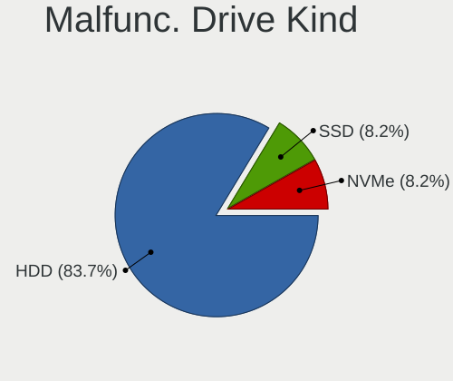

| Kind | Desktops | Drives | Percent |
|------|----------|--------|---------|
| HDD  | 41       | 51     | 83.67%  |
| NVMe | 4        | 4      | 8.16%   |
| SSD  | 4        | 4      | 8.16%   |

Failed Drives
-------------

Failed drive models

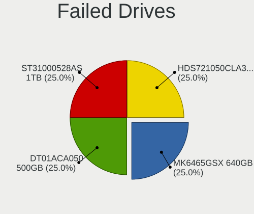

| Model                         | Desktops | Drives | Percent |
|-------------------------------|----------|--------|---------|
| Toshiba MK6465GSX 640GB       | 1        | 1      | 25%     |
| Toshiba DT01ACA050 500GB      | 1        | 1      | 25%     |
| Seagate ST31000528AS 1TB      | 1        | 1      | 25%     |
| Hitachi HDS721050CLA360 500GB | 1        | 1      | 25%     |

Failed Drive Vendor
-------------------

Failed drive vendors

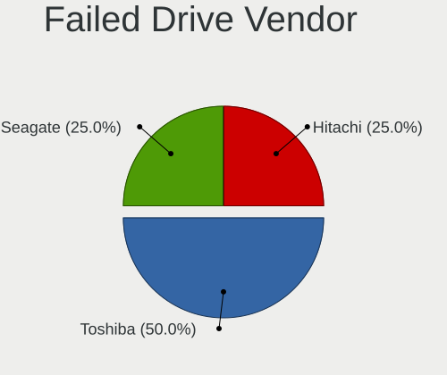

| Vendor  | Desktops | Drives | Percent |
|---------|----------|--------|---------|
| Toshiba | 2        | 2      | 50%     |
| Seagate | 1        | 1      | 25%     |
| Hitachi | 1        | 1      | 25%     |

Drive Status
------------

Number of failed and malfunc. drives

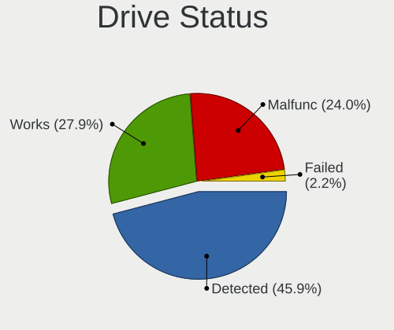

| Status   | Desktops | Drives | Percent |
|----------|----------|--------|---------|
| Detected | 84       | 183    | 45.9%   |
| Works    | 51       | 85     | 27.87%  |
| Malfunc  | 44       | 59     | 24.04%  |
| Failed   | 4        | 4      | 2.19%   |

Storage controller
------------------

Storage Vendor
--------------

Storage controller vendors

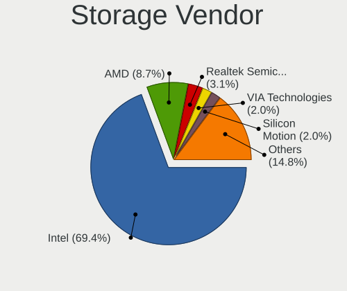

| Vendor                         | Desktops | Percent |
|--------------------------------|----------|---------|
| Intel                          | 136      | 69.39%  |
| AMD                            | 17       | 8.67%   |
| Realtek Semiconductor          | 6        | 3.06%   |
| VIA Technologies               | 4        | 2.04%   |
| Silicon Motion                 | 4        | 2.04%   |
| SanDisk                        | 4        | 2.04%   |
| ASMedia Technology             | 4        | 2.04%   |
| ADATA Technology               | 4        | 2.04%   |
| Nvidia                         | 3        | 1.53%   |
| MAXIO Technology (Hangzhou)    | 3        | 1.53%   |
| Phison Electronics             | 2        | 1.02%   |
| Kingston Technology Company    | 2        | 1.02%   |
| JMicron Technology             | 2        | 1.02%   |
| Solid State Storage Technology | 1        | 0.51%   |
| Micron/Crucial Technology      | 1        | 0.51%   |
| Micron Technology              | 1        | 0.51%   |
| Marvell Technology Group       | 1        | 0.51%   |
| Broadcom / LSI                 | 1        | 0.51%   |

Storage Model
-------------

Storage controller models

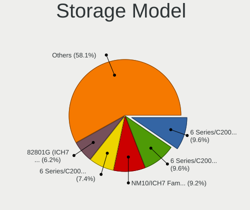

| Model                                                                                   | Desktops | Percent |
|-----------------------------------------------------------------------------------------|----------|---------|
| Intel 6 Series/C200 Series Chipset Family Desktop SATA Controller (IDE mode, ports 4-5) | 26       | 9.56%   |
| Intel 6 Series/C200 Series Chipset Family Desktop SATA Controller (IDE mode, ports 0-3) | 26       | 9.56%   |
| Intel NM10/ICH7 Family SATA Controller [IDE mode]                                       | 25       | 9.19%   |
| Intel 6 Series/C200 Series Chipset Family 6 port Desktop SATA AHCI Controller           | 20       | 7.35%   |
| Intel 82801G (ICH7 Family) IDE Controller                                               | 17       | 6.25%   |
| Intel 8 Series/C220 Series Chipset Family 6-port SATA Controller 1 [AHCI mode]          | 17       | 6.25%   |
| AMD FCH SATA Controller [AHCI mode]                                                     | 8        | 2.94%   |
| Intel 7 Series/C210 Series Chipset Family 6-port SATA Controller [AHCI mode]            | 7        | 2.57%   |
| Intel 5 Series/3400 Series Chipset 4 port SATA IDE Controller                           | 7        | 2.57%   |
| Intel 5 Series/3400 Series Chipset 2 port SATA IDE Controller                           | 7        | 2.57%   |
| AMD 400 Series Chipset SATA Controller                                                  | 6        | 2.21%   |
| Realtek RTS5763DL NVMe SSD Controller (DRAM-less)                                       | 5        | 1.84%   |
| AMD 500 Series Chipset SATA Controller                                                  | 5        | 1.84%   |
| Silicon Motion SM2263EN/SM2263XT (DRAM-less) NVMe SSD Controllers                       | 4        | 1.47%   |
| Intel SATA Controller [RAID mode]                                                       | 4        | 1.47%   |
| Intel Cannon Lake PCH SATA AHCI Controller                                              | 4        | 1.47%   |
| Intel Alder Lake-S PCH SATA Controller [AHCI Mode]                                      | 4        | 1.47%   |
| ADATA XPG GAMMIXS1 1L, XPG GAMMIX S5, LEGEND 710 / 740, SWORDFISH NVMe SSD (DRAM-less)  | 4        | 1.47%   |
| VIA VT82C586A/B/VT82C686/A/B/VT823x/A/C PIPC Bus Master IDE                             | 3        | 1.1%    |
| MAXIO (Hangzhou) NVMe SSD Controller MAP1202 (DRAM-less)                                | 3        | 1.1%    |
| Intel Q170/Q150/B150/H170/H110/Z170/CM236 Chipset SATA Controller [AHCI Mode]           | 3        | 1.1%    |
| Intel 9 Series Chipset Family SATA Controller [AHCI Mode]                               | 3        | 1.1%    |
| Intel 200 Series PCH SATA controller [AHCI mode]                                        | 3        | 1.1%    |
| ASMedia ASM1061/ASM1062 Serial ATA Controller                                           | 3        | 1.1%    |
| VIA VT8237A Integrated SATA Controller                                                  | 2        | 0.74%   |
| Intel RST Volume Management Device Controller                                           | 2        | 0.74%   |
| Intel Celeron/Pentium Silver Processor SATA Controller                                  | 2        | 0.74%   |
| Intel 82801IR/IO/IH (ICH9R/DO/DH) 4 port SATA Controller [IDE mode]                     | 2        | 0.74%   |
| Intel 82801IBM/IEM (ICH9M/ICH9M-E) 2 port SATA Controller [IDE mode]                    | 2        | 0.74%   |
| Intel 82801I (ICH9 Family) 2 port SATA Controller [IDE mode]                            | 2        | 0.74%   |
| AMD A320 Chipset SATA Controller [AHCI mode]                                            | 2        | 0.74%   |
| VIA VT8237S SATA Controller                                                             | 1        | 0.37%   |
| VIA VT6415 PATA IDE Host Controller                                                     | 1        | 0.37%   |
| Solid State Storage CL1-3D256-Q11 NVMe SSD M.2                                          | 1        | 0.37%   |
| SanDisk WD PC SN810 / Black SN850 NVMe SSD                                              | 1        | 0.37%   |
| Sandisk WD PC SN5000S M.2 2280 NVMe SSD (DRAM-less)                                     | 1        | 0.37%   |
| SanDisk PC SN735 / WD_BLACK SN750 SE NVMe SSD (DRAM-less)                               | 1        | 0.37%   |
| SanDisk PC SN520 x2 M.2 2230 NVMe SSD                                                   | 1        | 0.37%   |
| Realtek RTS5762 NVMe SSD Controller                                                     | 1        | 0.37%   |
| Phison PS5015-E15 PCIe3 NVMe Controller (DRAM-less)                                     | 1        | 0.37%   |

Storage Kind
------------

Kind of storage controller (IDE, SATA, NVMe, SAS, ...)

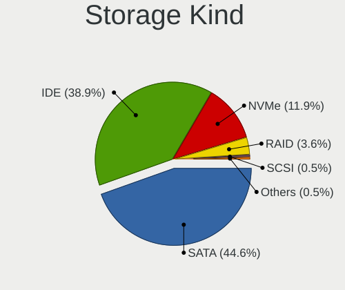

| Kind | Desktops | Percent |
|------|----------|---------|
| SATA | 86       | 44.56%  |
| IDE  | 75       | 38.86%  |
| NVMe | 23       | 11.92%  |
| RAID | 7        | 3.63%   |
| SAS  | 1        | 0.52%   |
| SCSI | 1        | 0.52%   |

Processor
---------

CPU Vendor
----------

Processor vendors

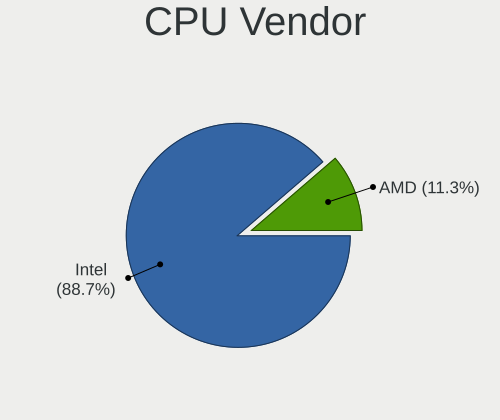

| Vendor | Desktops | Percent |
|--------|----------|---------|
| Intel  | 141      | 88.68%  |
| AMD    | 18       | 11.32%  |

CPU Model
---------

Processor models

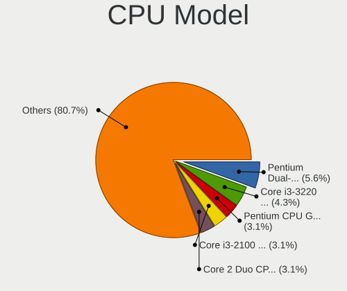

| Model                                       | Desktops | Percent |
|---------------------------------------------|----------|---------|
| Intel Pentium Dual-Core CPU E5700 @ 3.00GHz | 9        | 5.59%   |
| Intel Core i3-3220 CPU @ 3.30GHz            | 7        | 4.35%   |
| Intel Pentium CPU G2020 @ 2.90GHz           | 5        | 3.11%   |
| Intel Core i3-2100 CPU @ 3.10GHz            | 5        | 3.11%   |
| Intel Core 2 Duo CPU E7500 @ 2.93GHz        | 5        | 3.11%   |
| Intel Pentium Dual CPU E2200 @ 2.20GHz      | 4        | 2.48%   |
| Intel Pentium CPU G620 @ 2.60GHz            | 4        | 2.48%   |
| Intel Core i3-2120 CPU @ 3.30GHz            | 4        | 2.48%   |
| Intel Pentium Dual-Core CPU E5400 @ 2.70GHz | 3        | 1.86%   |
| Intel Pentium Dual-Core CPU E5300 @ 2.60GHz | 3        | 1.86%   |
| Intel Core i5-4590 CPU @ 3.30GHz            | 3        | 1.86%   |
| Intel Core i5-4460 CPU @ 3.20GHz            | 3        | 1.86%   |
| Intel Core i5-3470 CPU @ 3.20GHz            | 3        | 1.86%   |
| Intel Core i3-3240 CPU @ 3.40GHz            | 3        | 1.86%   |
| Intel Core i3 CPU 540 @ 3.07GHz             | 3        | 1.86%   |
| Intel Core 2 Duo CPU E8400 @ 3.00GHz        | 3        | 1.86%   |
| AMD Ryzen 5 5600G with Radeon Graphics      | 3        | 1.86%   |
| Intel Xeon CPU E5-1650 v2 @ 3.50GHz         | 2        | 1.24%   |
| Intel Pentium CPU G645 @ 2.90GHz            | 2        | 1.24%   |
| Intel Pentium CPU G2030 @ 3.00GHz           | 2        | 1.24%   |
| Intel Core i7-3770 CPU @ 3.40GHz            | 2        | 1.24%   |
| Intel Core i7-2700K CPU @ 3.50GHz           | 2        | 1.24%   |
| Intel Core i7-2600 CPU @ 3.40GHz            | 2        | 1.24%   |
| Intel Core i5-4570 CPU @ 3.20GHz            | 2        | 1.24%   |
| Intel Core i5-3450 CPU @ 3.10GHz            | 2        | 1.24%   |
| Intel Core i3-6100 CPU @ 3.70GHz            | 2        | 1.24%   |
| Intel Core i3-4130 CPU @ 3.40GHz            | 2        | 1.24%   |
| Intel Core i3 CPU M 370 @ 2.40GHz           | 2        | 1.24%   |
| Intel Core 2 Quad CPU Q6600 @ 2.40GHz       | 2        | 1.24%   |
| AMD Ryzen 7 2700X Eight-Core Processor      | 2        | 1.24%   |
| AMD Ryzen 5 3600 6-Core Processor           | 2        | 1.24%   |
| AMD Ryzen 5 3400G with Radeon Vega Graphics | 2        | 1.24%   |
| Intel Xeon CPU E5405 @ 2.00GHz              | 1        | 0.62%   |
| Intel Xeon CPU E5-1620 0 @ 3.60GHz          | 1        | 0.62%   |
| Intel Xeon CPU 3065 @ 2.33GHz               | 1        | 0.62%   |
| Intel Pentium Dual-Core CPU E5800 @ 3.20GHz | 1        | 0.62%   |
| Intel Pentium Dual-Core CPU E5500 @ 2.80GHz | 1        | 0.62%   |
| Intel Pentium Dual CPU E2220 @ 2.40GHz      | 1        | 0.62%   |
| Intel Pentium Dual CPU E2180 @ 2.00GHz      | 1        | 0.62%   |
| Intel Pentium D CPU 3.00GHz                 | 1        | 0.62%   |

CPU Model Family
----------------

Processor model prefix

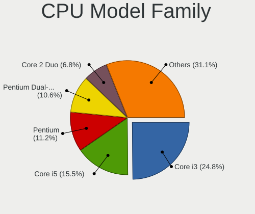

| Model                   | Desktops | Percent |
|-------------------------|----------|---------|
| Intel Core i3           | 40       | 24.84%  |
| Intel Core i5           | 25       | 15.53%  |
| Intel Pentium           | 18       | 11.18%  |
| Intel Pentium Dual-Core | 17       | 10.56%  |
| Intel Core 2 Duo        | 11       | 6.83%   |
| Intel Core i7           | 10       | 6.21%   |
| AMD Ryzen 5             | 7        | 4.35%   |
| Intel Pentium Dual      | 6        | 3.73%   |
| Intel Xeon              | 5        | 3.11%   |
| AMD Ryzen 7             | 5        | 3.11%   |
| Other                   | 3        | 1.86%   |
| Intel Pentium 4         | 2        | 1.24%   |
| Intel Core 2 Quad       | 2        | 1.24%   |
| Intel Celeron           | 2        | 1.24%   |
| AMD Ryzen 5 PRO         | 2        | 1.24%   |
| Intel Pentium D         | 1        | 0.62%   |
| Intel Core i9           | 1        | 0.62%   |
| AMD Ryzen 9             | 1        | 0.62%   |
| AMD FX                  | 1        | 0.62%   |
| AMD E1                  | 1        | 0.62%   |
| AMD Athlon 64           | 1        | 0.62%   |

CPU Cores
---------

Number of processor cores

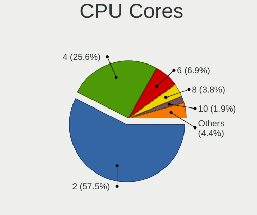

| Number | Desktops | Percent |
|--------|----------|---------|
| 2      | 92       | 57.5%   |
| 4      | 41       | 25.63%  |
| 6      | 11       | 6.88%   |
| 8      | 6        | 3.75%   |
| 10     | 3        | 1.88%   |
| 1      | 3        | 1.88%   |
| 16     | 2        | 1.25%   |
| 14     | 1        | 0.63%   |
| 3      | 1        | 0.63%   |

CPU Sockets
-----------

Number of sockets

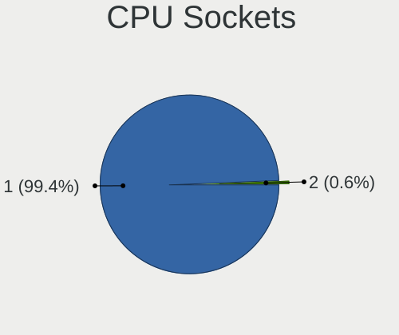

| Number | Desktops | Percent |
|--------|----------|---------|
| 1      | 158      | 99.37%  |
| 2      | 1        | 0.63%   |

CPU Threads
-----------

Threads per core (Hyper-Threading)

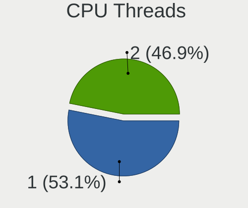

| Number | Desktops | Percent |
|--------|----------|---------|
| 1      | 85       | 53.13%  |
| 2      | 75       | 46.88%  |

CPU Op-Modes
------------

CPU Operation Modes (32-bit, 64-bit)

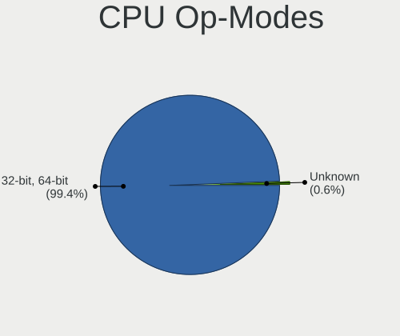

| Op mode        | Desktops | Percent |
|----------------|----------|---------|
| 32-bit, 64-bit | 159      | 99.38%  |
| Unknown        | 1        | 0.63%   |

CPU Microcode
-------------

Microcode number

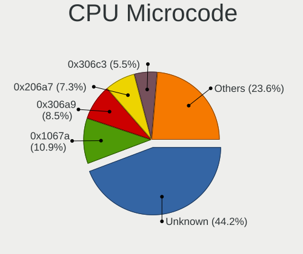

| Number     | Desktops | Percent |
|------------|----------|---------|
| Unknown    | 73       | 44.24%  |
| 0x1067a    | 18       | 10.91%  |
| 0x306a9    | 14       | 8.48%   |
| 0x206a7    | 12       | 7.27%   |
| 0x306c3    | 9        | 5.45%   |
| 0x20655    | 6        | 3.64%   |
| 0x6fd      | 4        | 2.42%   |
| 0x0a50000d | 3        | 1.82%   |
| 0x6fb      | 2        | 1.21%   |
| 0x506e3    | 2        | 1.21%   |
| 0x306e4    | 2        | 1.21%   |
| 0x10676    | 2        | 1.21%   |
| 0x08701021 | 2        | 1.21%   |
| 0x0800820d | 2        | 1.21%   |
| 0xf65      | 1        | 0.61%   |
| 0xf49      | 1        | 0.61%   |
| 0x906eb    | 1        | 0.61%   |
| 0x906e9    | 1        | 0.61%   |
| 0x706a8    | 1        | 0.61%   |
| 0x706a1    | 1        | 0.61%   |
| 0x206d7    | 1        | 0.61%   |
| 0x20652    | 1        | 0.61%   |
| 0x0a201016 | 1        | 0.61%   |
| 0x0a201005 | 1        | 0.61%   |
| 0x08600106 | 1        | 0.61%   |
| 0x08108109 | 1        | 0.61%   |
| 0x0600063d | 1        | 0.61%   |
| 0x0500010d | 1        | 0.61%   |

CPU Microarch
-------------

Microarchitecture

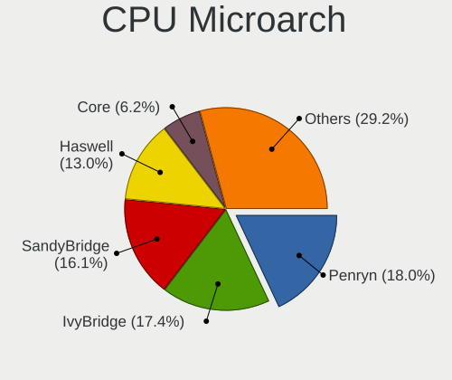

| Name             | Desktops | Percent |
|------------------|----------|---------|
| Penryn           | 29       | 18.01%  |
| IvyBridge        | 28       | 17.39%  |
| SandyBridge      | 26       | 16.15%  |
| Haswell          | 21       | 13.04%  |
| Core             | 10       | 6.21%   |
| Zen 3            | 8        | 4.97%   |
| Westmere         | 8        | 4.97%   |
| KabyLake         | 7        | 4.35%   |
| Zen+             | 4        | 2.48%   |
| Zen 2            | 3        | 1.86%   |
| Skylake          | 3        | 1.86%   |
| NetBurst         | 3        | 1.86%   |
| Alderlake Hybrid | 3        | 1.86%   |
| Goldmont plus    | 2        | 1.24%   |
| Unknown          | 2        | 1.24%   |
| K8 Hammer        | 1        | 0.62%   |
| CometLake        | 1        | 0.62%   |
| Bulldozer        | 1        | 0.62%   |
| Bobcat           | 1        | 0.62%   |

Graphics
--------

GPU Vendor
----------

Vendors of graphics cards

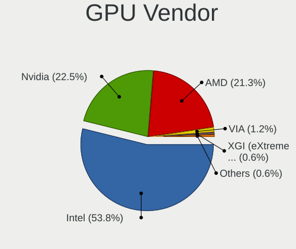

| Vendor                                       | Desktops | Percent |
|----------------------------------------------|----------|---------|
| Intel                                        | 91       | 53.85%  |
| Nvidia                                       | 38       | 22.49%  |
| AMD                                          | 36       | 21.3%   |
| VIA Technologies                             | 2        | 1.18%   |
| XGI Technology (eXtreme Graphics Innovation) | 1        | 0.59%   |
| Matrox Electronics Systems                   | 1        | 0.59%   |

GPU Model
---------

Graphics card models

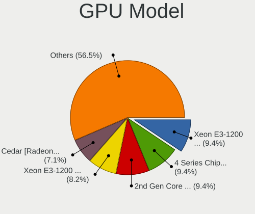

| Model                                                                       | Desktops | Percent |
|-----------------------------------------------------------------------------|----------|---------|
| Intel Xeon E3-1200 v2/3rd Gen Core processor Graphics Controller            | 16       | 9.41%   |
| Intel 4 Series Chipset Integrated Graphics Controller                       | 16       | 9.41%   |
| Intel 2nd Generation Core Processor Family Integrated Graphics Controller   | 16       | 9.41%   |
| Intel Xeon E3-1200 v3/4th Gen Core Processor Integrated Graphics Controller | 14       | 8.24%   |
| AMD Cedar [Radeon HD 5000/6000/7350/8350 Series]                            | 12       | 7.06%   |
| Nvidia GT218 [GeForce 210]                                                  | 5        | 2.94%   |
| AMD Cezanne [Radeon Vega Series / Radeon Vega Mobile Series]                | 5        | 2.94%   |
| Intel Core Processor Integrated Graphics Controller                         | 4        | 2.35%   |
| Intel 4th Generation Core Processor Family Integrated Graphics Controller   | 4        | 2.35%   |
| Nvidia GK208B [GeForce GT 710]                                              | 3        | 1.76%   |
| Nvidia GF108 [GeForce GT 730]                                               | 3        | 1.76%   |
| Intel Skylake-S GT2 [HD Graphics 530]                                       | 3        | 1.76%   |
| Intel 82G33/G31 Express Integrated Graphics Controller                      | 3        | 1.76%   |
| Nvidia TU116 [GeForce GTX 1660 SUPER]                                       | 2        | 1.18%   |
| Nvidia GF119 [GeForce GT 520]                                               | 2        | 1.18%   |
| Nvidia GF108 [GeForce GT 630]                                               | 2        | 1.18%   |
| Intel Mobile 4 Series Chipset Integrated Graphics Controller                | 2        | 1.18%   |
| Intel Kaby Lake-S GT2 [HD Graphics 630]                                     | 2        | 1.18%   |
| Intel IvyBridge GT2 [HD Graphics 4000]                                      | 2        | 1.18%   |
| Intel GeminiLake [UHD Graphics 600]                                         | 2        | 1.18%   |
| Intel CoffeeLake-S GT2 [UHD Graphics 630]                                   | 2        | 1.18%   |
| AMD Polaris 20 XL [Radeon RX 580 2048SP]                                    | 2        | 1.18%   |
| AMD Picasso/Raven 2 [Radeon Vega Series / Radeon Vega Mobile Series]        | 2        | 1.18%   |
| AMD Hawaii PRO [Radeon R9 290/390]                                          | 2        | 1.18%   |
| AMD Ellesmere [Radeon RX 470/480/570/570X/580/580X/590]                     | 2        | 1.18%   |
| AMD Caicos [Radeon HD 6450/7450/8450 / R5 230 OEM]                          | 2        | 1.18%   |
| XGI Technology (eXtreme Graphics Innovation) Z7/Z9 (XG20 core)              | 1        | 0.59%   |
| VIA Technologies P4M890 [S3 UniChrome Pro]                                  | 1        | 0.59%   |
| VIA Technologies CN896/VN896/P4M900 [Chrome 9 HC]                           | 1        | 0.59%   |
| Nvidia TU117 [GeForce GTX 1650]                                             | 1        | 0.59%   |
| Nvidia GT218 [GeForce 310]                                                  | 1        | 0.59%   |
| Nvidia GT216 [GeForce GT 220]                                               | 1        | 0.59%   |
| Nvidia GP107 [GeForce GTX 1050]                                             | 1        | 0.59%   |
| Nvidia GP106 [GeForce GTX 1060 6GB]                                         | 1        | 0.59%   |
| Nvidia GP104 [GeForce GTX 1070]                                             | 1        | 0.59%   |
| Nvidia GM107 [GeForce GTX 750]                                              | 1        | 0.59%   |
| Nvidia GM107 [GeForce GTX 750 Ti]                                           | 1        | 0.59%   |
| Nvidia GK110 [GeForce GTX 780]                                              | 1        | 0.59%   |
| Nvidia GK106 [GeForce GTX 660]                                              | 1        | 0.59%   |
| Nvidia GK104 [GeForce GTX 760]                                              | 1        | 0.59%   |

GPU Combo
---------

Combinations of graphics cards

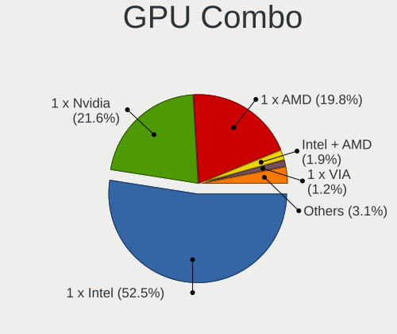

| Name           | Desktops | Percent |
|----------------|----------|---------|
| 1 x Intel      | 85       | 52.47%  |
| 1 x Nvidia     | 35       | 21.6%   |
| 1 x AMD        | 32       | 19.75%  |
| Intel + AMD    | 3        | 1.85%   |
| 1 x VIA        | 2        | 1.23%   |
| 2 x Nvidia     | 1        | 0.62%   |
| 1 x XGI        | 1        | 0.62%   |
| 1 x Matrox     | 1        | 0.62%   |
| Intel + Nvidia | 1        | 0.62%   |
| AMD + Nvidia   | 1        | 0.62%   |

GPU Driver
----------

Free vs proprietary

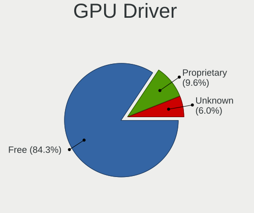

| Driver      | Desktops | Percent |
|-------------|----------|---------|
| Free        | 140      | 84.34%  |
| Proprietary | 16       | 9.64%   |
| Unknown     | 10       | 6.02%   |

GPU Memory
----------

Total video memory

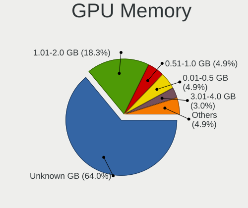

| Size in GB | Desktops | Percent |
|------------|----------|---------|
| Unknown    | 105      | 64.02%  |
| 1.01-2.0   | 30       | 18.29%  |
| 0.51-1.0   | 8        | 4.88%   |
| 0.01-0.5   | 8        | 4.88%   |
| 3.01-4.0   | 5        | 3.05%   |
| 7.01-8.0   | 4        | 2.44%   |
| 5.01-6.0   | 2        | 1.22%   |
| 2.01-3.0   | 1        | 0.61%   |
| 8.01-16.0  | 1        | 0.61%   |

Monitor
-------

Monitor Vendor
--------------

Monitor vendors

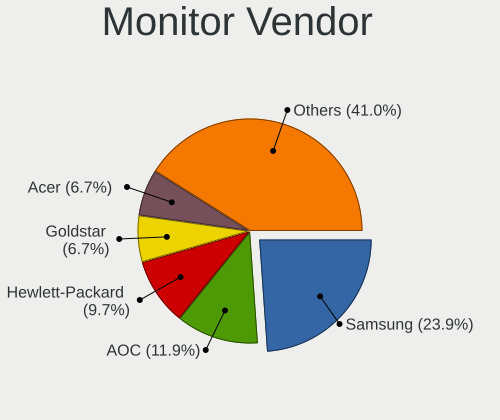

| Vendor                  | Desktops | Percent |
|-------------------------|----------|---------|
| Samsung Electronics     | 32       | 23.88%  |
| AOC                     | 16       | 11.94%  |
| Hewlett-Packard         | 13       | 9.7%    |
| Goldstar                | 9        | 6.72%   |
| Acer                    | 9        | 6.72%   |
| Dell                    | 7        | 5.22%   |
| KTC                     | 6        | 4.48%   |
| BenQ                    | 4        | 2.99%   |
| Ancor Communications    | 4        | 2.99%   |
| Unknown (XXX)           | 2        | 1.49%   |
| Unknown                 | 2        | 1.49%   |
| SKY                     | 2        | 1.49%   |
| Fujitsu Siemens         | 2        | 1.49%   |
| Denver                  | 2        | 1.49%   |
| ASUSTek Computer        | 2        | 1.49%   |
| Unknown                 | 2        | 1.49%   |
| Westinghouse            | 1        | 0.75%   |
| TSN                     | 1        | 0.75%   |
| TGC                     | 1        | 0.75%   |
| STD                     | 1        | 0.75%   |
| Skyworth                | 1        | 0.75%   |
| Sharp                   | 1        | 0.75%   |
| SGT                     | 1        | 0.75%   |
| PTW                     | 1        | 0.75%   |
| PiLot                   | 1        | 0.75%   |
| Philips                 | 1        | 0.75%   |
| Packard Bell            | 1        | 0.75%   |
| Lenovo                  | 1        | 0.75%   |
| ITE                     | 1        | 0.75%   |
| HKC                     | 1        | 0.75%   |
| Hitachi                 | 1        | 0.75%   |
| HannStar                | 1        | 0.75%   |
| EMP                     | 1        | 0.75%   |
| EDW                     | 1        | 0.75%   |
| DHI                     | 1        | 0.75%   |
| Chi Mei Optoelectronics | 1        | 0.75%   |

Monitor Model
-------------

Monitor models

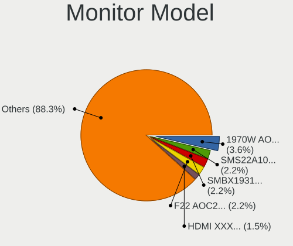

| Model                                                                   | Desktops | Percent |
|-------------------------------------------------------------------------|----------|---------|
| AOC 1970W AOC1970 1366x768 410x230mm 18.5-inch                          | 5        | 3.65%   |
| Samsung Electronics SMS22A100 SAM0868 1920x1080 477x268mm 21.5-inch     | 3        | 2.19%   |
| Samsung Electronics SMBX1931N SAM0768 1366x768 410x230mm 18.5-inch      | 3        | 2.19%   |
| AOC F22 AOC2200 1920x1080 476x268mm 21.5-inch                           | 3        | 2.19%   |
| Unknown (XXX) HDMI XXX0029 1920x1080 1152x648mm 52.0-inch               | 2        | 1.46%   |
| Samsung Electronics SMS19A100 SAM0867 1366x768 410x230mm 18.5-inch      | 2        | 1.46%   |
| Samsung Electronics SMB2030N SAM0634 1600x900 443x249mm 20.0-inch       | 2        | 1.46%   |
| Samsung Electronics S19C150 SAM0AE6 1366x768 410x230mm 18.5-inch        | 2        | 1.46%   |
| KTC W9023S5 KTC1852 1360x768 410x230mm 18.5-inch                        | 2        | 1.46%   |
| AOC 2250W AOC2250 1920x1080 477x268mm 21.5-inch                         | 2        | 1.46%   |
| Acer V193W ACR0025 1440x900 408x255mm 18.9-inch                         | 2        | 1.46%   |
| Unknown                                                                 | 2        | 1.46%   |
| Westinghouse LED-TV WET3663 1680x1050 640x384mm 29.4-inch               | 1        | 0.73%   |
| Unknown LCD TV 9000 1360x768 1600x900mm 72.3-inch                       | 1        | 0.73%   |
| Unknown LCD Monitor SAMSUNG 1920x1080                                   | 1        | 0.73%   |
| TSN 24 Monitor TSN2400 1360x768 510x287mm 23.0-inch                     | 1        | 0.73%   |
| TGC 48205LG TGC4820 1024x768 304x228mm 15.0-inch                        | 1        | 0.73%   |
| STD LED STD2145 1680x1050 470x300mm 22.0-inch                           | 1        | 0.73%   |
| Skyworth TV-monitor SKY0104 1920x1080 885x498mm 40.0-inch               | 1        | 0.73%   |
| SKY TV-PHILCO SKY0104 1920x1080 885x498mm 40.0-inch                     | 1        | 0.73%   |
| SKY TV-monitor SKY0402 1920x1080 890x500mm 40.2-inch                    | 1        | 0.73%   |
| Sharp HDMI SHP10DB 1920x1080 1330x750mm 60.1-inch                       | 1        | 0.73%   |
| SGT '' SGT2200 1680x1050 410x260mm 19.1-inch                            | 1        | 0.73%   |
| Samsung Electronics T27C370 SAM0ADE 1920x1080 598x336mm 27.0-inch       | 1        | 0.73%   |
| Samsung Electronics SyncMaster SAM052A 1920x1080 510x287mm 23.0-inch    | 1        | 0.73%   |
| Samsung Electronics SyncMaster SAM0522 1600x900 443x249mm 20.0-inch     | 1        | 0.73%   |
| Samsung Electronics SyncMaster SAM04D5 1920x540                         | 1        | 0.73%   |
| Samsung Electronics SyncMaster SAM02AD 1440x900 410x257mm 19.1-inch     | 1        | 0.73%   |
| Samsung Electronics SyncMaster SAM027F 1680x1050 474x296mm 22.0-inch    | 1        | 0.73%   |
| Samsung Electronics SyncMaster SAM00A6 1280x1024 376x301mm 19.0-inch    | 1        | 0.73%   |
| Samsung Electronics SME1920N SAM06A3 1366x768 410x230mm 18.5-inch       | 1        | 0.73%   |
| Samsung Electronics SMBX2031N SAM0769 1600x900 443x249mm 20.0-inch      | 1        | 0.73%   |
| Samsung Electronics SMB2230N SAM0635 1920x1080 477x268mm 21.5-inch      | 1        | 0.73%   |
| Samsung Electronics S24B300 SAM08CC 1920x1080 521x293mm 23.5-inch       | 1        | 0.73%   |
| Samsung Electronics S22E390 SAM0C18 1920x1080 477x268mm 21.5-inch       | 1        | 0.73%   |
| Samsung Electronics S22D300 SAM0B3E 1920x1080 477x268mm 21.5-inch       | 1        | 0.73%   |
| Samsung Electronics S22C150 SAM0AE5 1920x1080 477x268mm 21.5-inch       | 1        | 0.73%   |
| Samsung Electronics LF24T35 SAM707D 1920x1080 528x297mm 23.9-inch       | 1        | 0.73%   |
| Samsung Electronics LCD Monitor SAM7591 3840x2160 1872x1053mm 84.6-inch | 1        | 0.73%   |
| Samsung Electronics LCD Monitor SAM0A7D 1920x1080 1060x626mm 48.5-inch  | 1        | 0.73%   |

Monitor Resolution
------------------

Monitor screen resolution

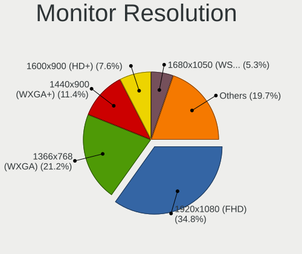

| Resolution         | Desktops | Percent |
|--------------------|----------|---------|
| 1920x1080 (FHD)    | 46       | 34.85%  |
| 1366x768 (WXGA)    | 28       | 21.21%  |
| 1440x900 (WXGA+)   | 15       | 11.36%  |
| 1600x900 (HD+)     | 10       | 7.58%   |
| 1680x1050 (WSXGA+) | 7        | 5.3%    |
| 1280x1024 (SXGA)   | 7        | 5.3%    |
| 1360x768           | 5        | 3.79%   |
| 3840x2160 (4K)     | 4        | 3.03%   |
| 2560x1440 (QHD)    | 4        | 3.03%   |
| 1920x540           | 1        | 0.76%   |
| 1920x1200 (WUXGA)  | 1        | 0.76%   |
| 1600x1200          | 1        | 0.76%   |
| 1280x720 (HD)      | 1        | 0.76%   |
| 1152x864           | 1        | 0.76%   |
| 1024x768 (XGA)     | 1        | 0.76%   |

Monitor Diagonal
----------------

Diagonal size in inches

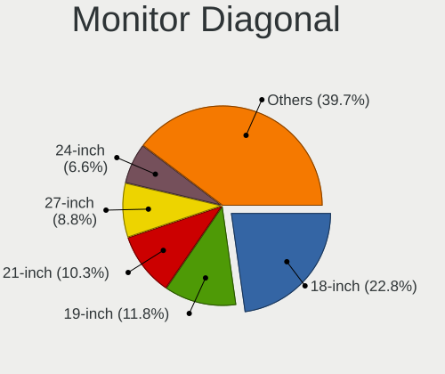

| Inches  | Desktops | Percent |
|---------|----------|---------|
| 18      | 31       | 22.79%  |
| 19      | 16       | 11.76%  |
| 21      | 14       | 10.29%  |
| 27      | 12       | 8.82%   |
| 24      | 9        | 6.62%   |
| 23      | 9        | 6.62%   |
| 20      | 8        | 5.88%   |
| 22      | 7        | 5.15%   |
| Unknown | 6        | 4.41%   |
| 17      | 4        | 2.94%   |
| 15      | 4        | 2.94%   |
| 52      | 3        | 2.21%   |
| 40      | 3        | 2.21%   |
| 84      | 1        | 0.74%   |
| 72      | 1        | 0.74%   |
| 60      | 1        | 0.74%   |
| 49      | 1        | 0.74%   |
| 48      | 1        | 0.74%   |
| 46      | 1        | 0.74%   |
| 32      | 1        | 0.74%   |
| 31      | 1        | 0.74%   |
| 29      | 1        | 0.74%   |
| 16      | 1        | 0.74%   |

Monitor Width
-------------

Physical width

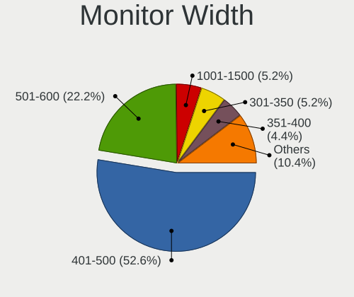

| Width in mm | Desktops | Percent |
|-------------|----------|---------|
| 401-500     | 71       | 52.59%  |
| 501-600     | 30       | 22.22%  |
| 301-350     | 7        | 5.19%   |
| 1001-1500   | 7        | 5.19%   |
| 351-400     | 6        | 4.44%   |
| Unknown     | 6        | 4.44%   |
| 801-900     | 3        | 2.22%   |
| 601-700     | 2        | 1.48%   |
| 1501-2000   | 2        | 1.48%   |
| 701-800     | 1        | 0.74%   |

Aspect Ratio
------------

Proportional relationship between the width and the height

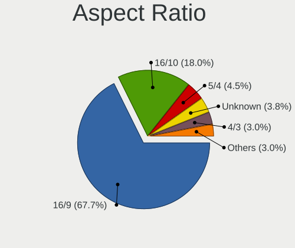

| Ratio   | Desktops | Percent |
|---------|----------|---------|
| 16/9    | 90       | 67.67%  |
| 16/10   | 24       | 18.05%  |
| 5/4     | 6        | 4.51%   |
| Unknown | 5        | 3.76%   |
| 4/3     | 4        | 3.01%   |
| 32/9    | 2        | 1.5%    |
| 6/5     | 1        | 0.75%   |
| 3/2     | 1        | 0.75%   |

Monitor Area
------------

Area in inch²

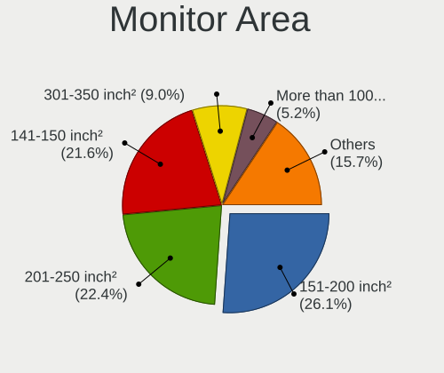

| Area in inch² | Desktops | Percent |
|----------------|----------|---------|
| 151-200        | 35       | 26.12%  |
| 201-250        | 30       | 22.39%  |
| 141-150        | 29       | 21.64%  |
| 301-350        | 12       | 8.96%   |
| More than 1000 | 7        | 5.22%   |
| Unknown        | 6        | 4.48%   |
| 501-1000       | 5        | 3.73%   |
| 111-120        | 4        | 2.99%   |
| 351-500        | 3        | 2.24%   |
| 251-300        | 1        | 0.75%   |
| 121-130        | 1        | 0.75%   |
| 101-110        | 1        | 0.75%   |

Pixel Density
-------------

Pixels per inch

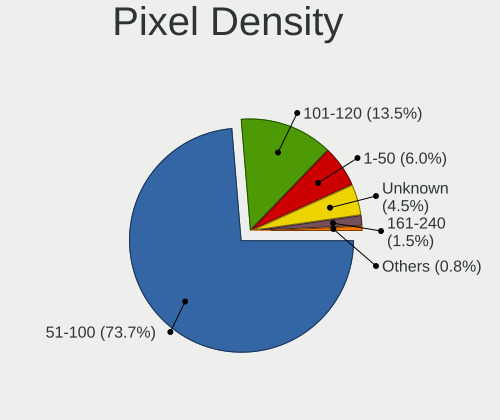

| Density | Desktops | Percent |
|---------|----------|---------|
| 51-100  | 98       | 73.68%  |
| 101-120 | 18       | 13.53%  |
| 1-50    | 8        | 6.02%   |
| Unknown | 6        | 4.51%   |
| 161-240 | 2        | 1.5%    |
| 121-160 | 1        | 0.75%   |

Multiple Monitors
-----------------

Total monitors connected

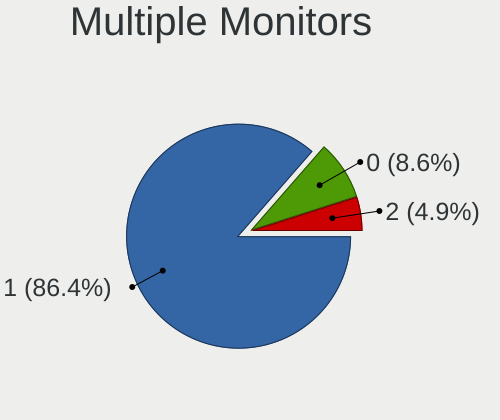

| Total | Desktops | Percent |
|-------|----------|---------|
| 1     | 140      | 86.42%  |
| 0     | 14       | 8.64%   |
| 2     | 8        | 4.94%   |

Network
-------

Net Controller Vendor
---------------------

Controller vendors

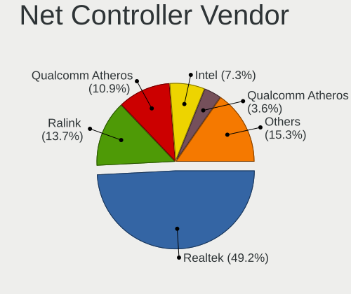

| Vendor                          | Desktops | Percent |
|---------------------------------|----------|---------|
| Realtek Semiconductor           | 122      | 49.19%  |
| Ralink Technology               | 34       | 13.71%  |
| Qualcomm Atheros                | 27       | 10.89%  |
| Intel                           | 18       | 7.26%   |
| Qualcomm Atheros Communications | 9        | 3.63%   |
| Ralink                          | 7        | 2.82%   |
| D-Link                          | 7        | 2.82%   |
| Broadcom                        | 4        | 1.61%   |
| Xiaomi                          | 3        | 1.21%   |
| VIA Technologies                | 3        | 1.21%   |
| Nvidia                          | 3        | 1.21%   |
| Samsung Electronics             | 2        | 0.81%   |
| MediaTek                        | 2        | 0.81%   |
| D-Link System                   | 2        | 0.81%   |
| ZTopInc                         | 1        | 0.4%    |
| ZTE WCDMA Technologies MSM      | 1        | 0.4%    |
| TP-Link                         | 1        | 0.4%    |
| Broadcom Limited                | 1        | 0.4%    |
| AMD                             | 1        | 0.4%    |

Net Controller Model
--------------------

Controller models

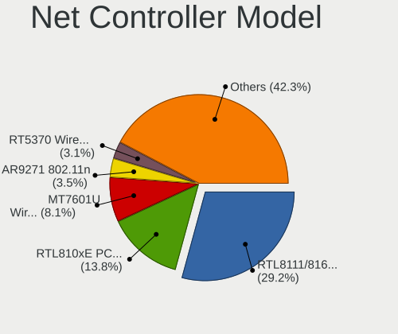

| Model                                                                  | Desktops | Percent |
|------------------------------------------------------------------------|----------|---------|
| Realtek RTL8111/8168/8211/8411 PCI Express Gigabit Ethernet Controller | 76       | 29.23%  |
| Realtek RTL810xE PCI Express Fast Ethernet controller                  | 36       | 13.85%  |
| Ralink MT7601U Wireless Adapter                                        | 21       | 8.08%   |
| Qualcomm Atheros AR9271 802.11n                                        | 9        | 3.46%   |
| Ralink RT5370 Wireless Adapter                                         | 8        | 3.08%   |
| Realtek RTL8125 2.5GbE Controller                                      | 5        | 1.92%   |
| Qualcomm Atheros AR9285 Wireless Network Adapter (PCI-Express)         | 5        | 1.92%   |
| Qualcomm Atheros AR8152 v2.0 Fast Ethernet                             | 5        | 1.92%   |
| Qualcomm Atheros AR8151 v2.0 Gigabit Ethernet                          | 5        | 1.92%   |
| Ralink RT2870/RT3070 Wireless Adapter                                  | 4        | 1.54%   |
| VIA VT6102/VT6103 [Rhine-II]                                           | 3        | 1.15%   |
| Qualcomm Atheros AR9485 Wireless Network Adapter                       | 3        | 1.15%   |
| D-Link 802.11 n WLAN                                                   | 3        | 1.15%   |
| Xiaomi Mi/Redmi series (RNDIS + ADB)                                   | 2        | 0.77%   |
| Samsung GT-I9070 (network tethering, USB debugging enabled)            | 2        | 0.77%   |
| Realtek RTL8821CE 802.11ac PCIe Wireless Network Adapter               | 2        | 0.77%   |
| Realtek RTL8192EU 802.11b/g/n WLAN Adapter                             | 2        | 0.77%   |
| Realtek RTL8192EE PCIe Wireless Network Adapter                        | 2        | 0.77%   |
| Realtek RTL8188FTV 802.11b/g/n 1T1R 2.4G WLAN Adapter                  | 2        | 0.77%   |
| Ralink RT2561/RT61 rev B 802.11g                                       | 2        | 0.77%   |
| Ralink RT2561/RT61 802.11g PCI                                         | 2        | 0.77%   |
| MediaTek Infinix HOT 50i                                               | 2        | 0.77%   |
| Intel I211 Gigabit Network Connection                                  | 2        | 0.77%   |
| Intel Ethernet Connection I217-LM                                      | 2        | 0.77%   |
| Intel 82579LM Gigabit Network Connection (Lewisville)                  | 2        | 0.77%   |
| D-Link System DWA-125 Wireless N 150 Adapter(rev.A2) [Ralink RT3070]   | 2        | 0.77%   |
| D-Link DWA-140 RangeBooster N Adapter(rev.B3) [Ralink RT5372]          | 2        | 0.77%   |
| ZTopInc 802.11n NIC                                                    | 1        | 0.38%   |
| ZTE WCDMA MSM ZTE Mobile Broadband                                     | 1        | 0.38%   |
| Xiaomi Mi/Redmi series (RNDIS)                                         | 1        | 0.38%   |
| TP-Link TL-WN821N v5/v6 [RTL8192EU]                                    | 1        | 0.38%   |
| Realtek RTL8723BE PCIe Wireless Network Adapter                        | 1        | 0.38%   |
| Realtek RTL8188GU 802.11n WLAN Adapter (After Modeswitch)              | 1        | 0.38%   |
| Realtek RTL8188EUS 802.11n Wireless Network Adapter                    | 1        | 0.38%   |
| Realtek RTL8188EE Wireless Network Adapter                             | 1        | 0.38%   |
| Realtek RTL-8100/8101L/8139 PCI Fast Ethernet Adapter                  | 1        | 0.38%   |
| Ralink RT2870 Wireless Adapter                                         | 1        | 0.38%   |
| Ralink RT2070 Wireless Adapter                                         | 1        | 0.38%   |
| Ralink RT5390 Wireless 802.11n 1T/1R PCIe                              | 1        | 0.38%   |
| Ralink RT2790 Wireless 802.11n 1T/2R PCIe                              | 1        | 0.38%   |

Wireless Vendor
---------------

Wireless vendors

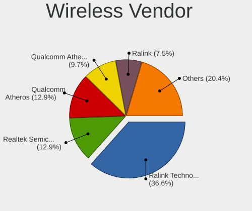

| Vendor                          | Desktops | Percent |
|---------------------------------|----------|---------|
| Ralink Technology               | 34       | 36.56%  |
| Realtek Semiconductor           | 12       | 12.9%   |
| Qualcomm Atheros                | 12       | 12.9%   |
| Qualcomm Atheros Communications | 9        | 9.68%   |
| Ralink                          | 7        | 7.53%   |
| Intel                           | 7        | 7.53%   |
| D-Link                          | 7        | 7.53%   |
| D-Link System                   | 2        | 2.15%   |
| ZTopInc                         | 1        | 1.08%   |
| TP-Link                         | 1        | 1.08%   |
| Broadcom                        | 1        | 1.08%   |

Wireless Model
--------------

Wireless models

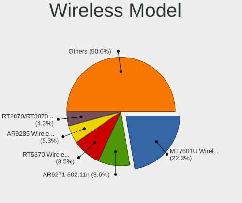

| Model                                                                | Desktops | Percent |
|----------------------------------------------------------------------|----------|---------|
| Ralink MT7601U Wireless Adapter                                      | 21       | 22.34%  |
| Qualcomm Atheros AR9271 802.11n                                      | 9        | 9.57%   |
| Ralink RT5370 Wireless Adapter                                       | 8        | 8.51%   |
| Qualcomm Atheros AR9285 Wireless Network Adapter (PCI-Express)       | 5        | 5.32%   |
| Ralink RT2870/RT3070 Wireless Adapter                                | 4        | 4.26%   |
| Qualcomm Atheros AR9485 Wireless Network Adapter                     | 3        | 3.19%   |
| D-Link 802.11 n WLAN                                                 | 3        | 3.19%   |
| Realtek RTL8821CE 802.11ac PCIe Wireless Network Adapter             | 2        | 2.13%   |
| Realtek RTL8192EU 802.11b/g/n WLAN Adapter                           | 2        | 2.13%   |
| Realtek RTL8192EE PCIe Wireless Network Adapter                      | 2        | 2.13%   |
| Realtek RTL8188FTV 802.11b/g/n 1T1R 2.4G WLAN Adapter                | 2        | 2.13%   |
| Ralink RT2561/RT61 rev B 802.11g                                     | 2        | 2.13%   |
| Ralink RT2561/RT61 802.11g PCI                                       | 2        | 2.13%   |
| D-Link System DWA-125 Wireless N 150 Adapter(rev.A2) [Ralink RT3070] | 2        | 2.13%   |
| D-Link DWA-140 RangeBooster N Adapter(rev.B3) [Ralink RT5372]        | 2        | 2.13%   |
| ZTopInc 802.11n NIC                                                  | 1        | 1.06%   |
| TP-Link TL-WN821N v5/v6 [RTL8192EU]                                  | 1        | 1.06%   |
| Realtek RTL8723BE PCIe Wireless Network Adapter                      | 1        | 1.06%   |
| Realtek RTL8188GU 802.11n WLAN Adapter (After Modeswitch)            | 1        | 1.06%   |
| Realtek RTL8188EUS 802.11n Wireless Network Adapter                  | 1        | 1.06%   |
| Realtek RTL8188EE Wireless Network Adapter                           | 1        | 1.06%   |
| Ralink RT2870 Wireless Adapter                                       | 1        | 1.06%   |
| Ralink RT2070 Wireless Adapter                                       | 1        | 1.06%   |
| Ralink RT5390 Wireless 802.11n 1T/1R PCIe                            | 1        | 1.06%   |
| Ralink RT2790 Wireless 802.11n 1T/2R PCIe                            | 1        | 1.06%   |
| Ralink RT2600 802.11 MIMO                                            | 1        | 1.06%   |
| Qualcomm Atheros AR9287 Wireless Network Adapter (PCI-Express)       | 1        | 1.06%   |
| Qualcomm Atheros AR9227 Wireless Network Adapter                     | 1        | 1.06%   |
| Qualcomm Atheros AR5212/5213/2414 Wireless Network Adapter           | 1        | 1.06%   |
| Qualcomm Atheros AR2417 Wireless Network Adapter [AR5007G 802.11bg]  | 1        | 1.06%   |
| Intel Wireless 8260                                                  | 1        | 1.06%   |
| Intel Wi-Fi 6E(802.11ax) AX210/AX1675* 2x2 [Typhoon Peak]            | 1        | 1.06%   |
| Intel Wi-Fi 5(802.11ac) Wireless-AC 9x6x [Thunder Peak]              | 1        | 1.06%   |
| Intel Dual Band Wireless-AC 3168NGW [Stone Peak]                     | 1        | 1.06%   |
| Intel Dual Band Wireless-AC 3165 Plus Bluetooth                      | 1        | 1.06%   |
| Intel Comet Lake PCH CNVi WiFi                                       | 1        | 1.06%   |
| Intel Alder Lake-S PCH CNVi WiFi                                     | 1        | 1.06%   |
| D-Link DWA-137 Wireless N High-Gain Adapter [Ralink RT5372]          | 1        | 1.06%   |
| D-Link DWA-131 Wireless N Nano Adapter (Rev. E1) [Realtek RTL8192EU] | 1        | 1.06%   |
| Broadcom BCM4352 802.11ac Dual Band Wireless Network Adapter         | 1        | 1.06%   |

Ethernet Vendor
---------------

Ethernet vendors

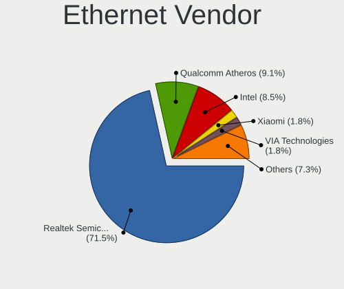

| Vendor                | Desktops | Percent |
|-----------------------|----------|---------|
| Realtek Semiconductor | 118      | 71.52%  |
| Qualcomm Atheros      | 15       | 9.09%   |
| Intel                 | 14       | 8.48%   |
| Xiaomi                | 3        | 1.82%   |
| VIA Technologies      | 3        | 1.82%   |
| Nvidia                | 3        | 1.82%   |
| Broadcom              | 3        | 1.82%   |
| Samsung Electronics   | 2        | 1.21%   |
| MediaTek              | 2        | 1.21%   |
| Broadcom Limited      | 1        | 0.61%   |
| AMD                   | 1        | 0.61%   |

Ethernet Model
--------------

Ethernet models

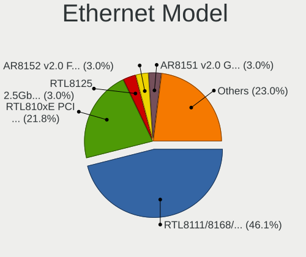

| Model                                                                  | Desktops | Percent |
|------------------------------------------------------------------------|----------|---------|
| Realtek RTL8111/8168/8211/8411 PCI Express Gigabit Ethernet Controller | 76       | 46.06%  |
| Realtek RTL810xE PCI Express Fast Ethernet controller                  | 36       | 21.82%  |
| Realtek RTL8125 2.5GbE Controller                                      | 5        | 3.03%   |
| Qualcomm Atheros AR8152 v2.0 Fast Ethernet                             | 5        | 3.03%   |
| Qualcomm Atheros AR8151 v2.0 Gigabit Ethernet                          | 5        | 3.03%   |
| VIA VT6102/VT6103 [Rhine-II]                                           | 3        | 1.82%   |
| Xiaomi Mi/Redmi series (RNDIS + ADB)                                   | 2        | 1.21%   |
| Samsung GT-I9070 (network tethering, USB debugging enabled)            | 2        | 1.21%   |
| MediaTek Infinix HOT 50i                                               | 2        | 1.21%   |
| Intel I211 Gigabit Network Connection                                  | 2        | 1.21%   |
| Intel Ethernet Connection I217-LM                                      | 2        | 1.21%   |
| Intel 82579LM Gigabit Network Connection (Lewisville)                  | 2        | 1.21%   |
| Xiaomi Mi/Redmi series (RNDIS)                                         | 1        | 0.61%   |
| Realtek RTL-8100/8101L/8139 PCI Fast Ethernet Adapter                  | 1        | 0.61%   |
| Qualcomm Atheros Killer E220x Gigabit Ethernet Controller              | 1        | 0.61%   |
| Qualcomm Atheros AR8161 Gigabit Ethernet                               | 1        | 0.61%   |
| Qualcomm Atheros AR8151 v1.0 Gigabit Ethernet                          | 1        | 0.61%   |
| Qualcomm Atheros AR8132 Fast Ethernet                                  | 1        | 0.61%   |
| Qualcomm Atheros AR8131 Gigabit Ethernet                               | 1        | 0.61%   |
| Nvidia MCP79 Ethernet                                                  | 1        | 0.61%   |
| Nvidia MCP77 Ethernet                                                  | 1        | 0.61%   |
| Nvidia MCP73 Ethernet                                                  | 1        | 0.61%   |
| Intel Ethernet Controller I225-V                                       | 1        | 0.61%   |
| Intel Ethernet Connection (7) I219-V                                   | 1        | 0.61%   |
| Intel Ethernet Connection (2) I219-V                                   | 1        | 0.61%   |
| Intel Ethernet Connection (2) I218-V                                   | 1        | 0.61%   |
| Intel 82567LM-3 Gigabit Network Connection                             | 1        | 0.61%   |
| Intel 82566DC-2 Gigabit Network Connection                             | 1        | 0.61%   |
| Intel 82562V 10/100 Network Connection                                 | 1        | 0.61%   |
| Intel 80003ES2LAN Gigabit Ethernet Controller (Copper)                 | 1        | 0.61%   |
| Broadcom NetLink BCM5784M Gigabit Ethernet PCIe                        | 1        | 0.61%   |
| Broadcom NetLink BCM57788 Gigabit Ethernet PCIe                        | 1        | 0.61%   |
| Broadcom NetLink BCM57780 Gigabit Ethernet PCIe                        | 1        | 0.61%   |
| Broadcom Limited NetXtreme BCM5722 Gigabit Ethernet PCI Express        | 1        | 0.61%   |
| AMD 79C97x [PCnet32 LANCE]                                             | 1        | 0.61%   |

Net Controller Kind
-------------------

Ethernet, WiFi or modem

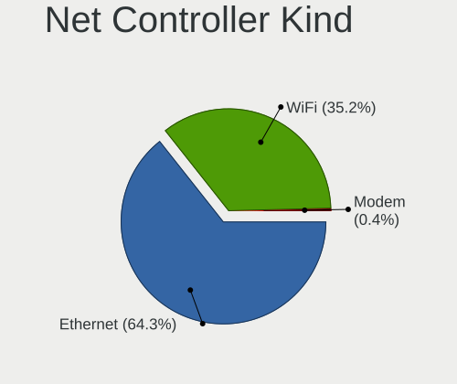

| Kind     | Desktops | Percent |
|----------|----------|---------|
| Ethernet | 157      | 64.34%  |
| WiFi     | 86       | 35.25%  |
| Modem    | 1        | 0.41%   |

Used Controller
---------------

Currently used network controller

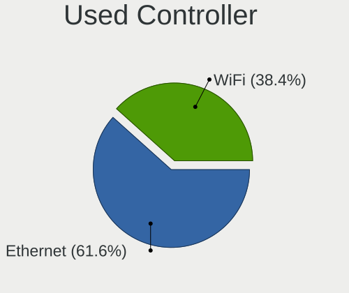

| Kind     | Desktops | Percent |
|----------|----------|---------|
| Ethernet | 98       | 61.64%  |
| WiFi     | 61       | 38.36%  |

NICs
----

Total network controllers on board

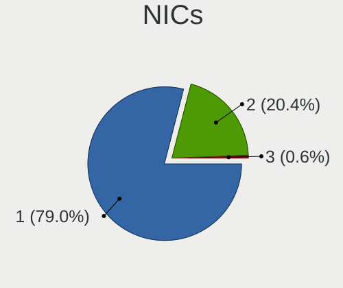

| Total | Desktops | Percent |
|-------|----------|---------|
| 1     | 128      | 79.01%  |
| 2     | 33       | 20.37%  |
| 3     | 1        | 0.62%   |

IPv6
----

IPv6 vs IPv4

| Used | Desktops | Percent |
|------|----------|---------|
| No   | 159      | 100%    |

Bluetooth
---------

Bluetooth Vendor
----------------

Controller vendors

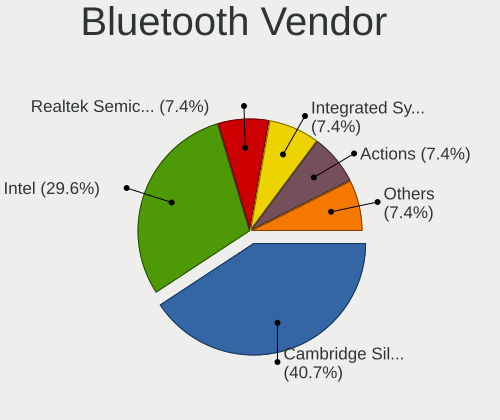

| Vendor                     | Desktops | Percent |
|----------------------------|----------|---------|
| Cambridge Silicon Radio    | 11       | 40.74%  |
| Intel                      | 8        | 29.63%  |
| Realtek Semiconductor      | 2        | 7.41%   |
| Integrated System Solution | 2        | 7.41%   |
| Actions                    | 2        | 7.41%   |
| SiW                        | 1        | 3.7%    |
| ASUSTek Computer           | 1        | 3.7%    |

Bluetooth Model
---------------

Controller models

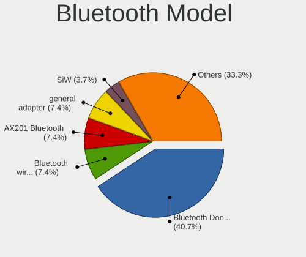

| Model                                                 | Desktops | Percent |
|-------------------------------------------------------|----------|---------|
| Cambridge Silicon Radio Bluetooth Dongle (HCI mode)   | 11       | 40.74%  |
| Intel Bluetooth wireless interface                    | 2        | 7.41%   |
| Intel AX201 Bluetooth                                 | 2        | 7.41%   |
| Actions general adapter                               | 2        | 7.41%   |
| SiW SiW                                               | 1        | 3.7%    |
| Realtek  Bluetooth 4.2 Adapter                        | 1        | 3.7%    |
| Realtek Bluetooth Radio                               | 1        | 3.7%    |
| Intel Wireless-AC 9260 Bluetooth Adapter              | 1        | 3.7%    |
| Intel Wireless-AC 3168 Bluetooth                      | 1        | 3.7%    |
| Intel AX210 Bluetooth                                 | 1        | 3.7%    |
| Intel AX200 Bluetooth                                 | 1        | 3.7%    |
| Integrated System Solution KY-BT100 Bluetooth Adapter | 1        | 3.7%    |
| Integrated System Solution Bluetooth Device           | 1        | 3.7%    |
| ASUS BCM20702A0                                       | 1        | 3.7%    |

Sound
-----

Sound Vendor
------------

Sound card vendors

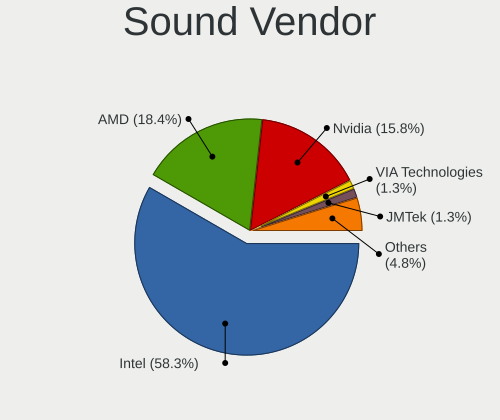

| Vendor                 | Desktops | Percent |
|------------------------|----------|---------|
| Intel                  | 133      | 58.33%  |
| AMD                    | 42       | 18.42%  |
| Nvidia                 | 36       | 15.79%  |
| VIA Technologies       | 3        | 1.32%   |
| JMTek                  | 3        | 1.32%   |
| Sony                   | 1        | 0.44%   |
| Microdia               | 1        | 0.44%   |
| Logitech               | 1        | 0.44%   |
| Logic3 / SpectraVideo  | 1        | 0.44%   |
| Hewlett-Packard        | 1        | 0.44%   |
| Guillemot              | 1        | 0.44%   |
| Goldvish               | 1        | 0.44%   |
| GN Netcom              | 1        | 0.44%   |
| Generalplus Technology | 1        | 0.44%   |
| C-Media Electronics    | 1        | 0.44%   |
| ASUSTek Computer       | 1        | 0.44%   |

Sound Model
-----------

Sound card models

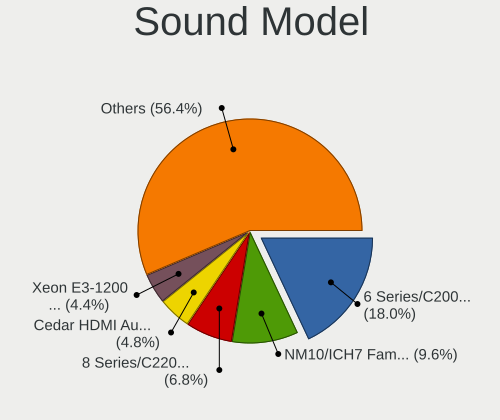

| Model                                                                             | Desktops | Percent |
|-----------------------------------------------------------------------------------|----------|---------|
| Intel 6 Series/C200 Series Chipset Family High Definition Audio Controller        | 45       | 18%     |
| Intel NM10/ICH7 Family High Definition Audio Controller                           | 24       | 9.6%    |
| Intel 8 Series/C220 Series Chipset High Definition Audio Controller               | 17       | 6.8%    |
| AMD Cedar HDMI Audio [Radeon HD 5400/6300/7300 Series]                            | 12       | 4.8%    |
| Intel Xeon E3-1200 v3/4th Gen Core Processor HD Audio Controller                  | 11       | 4.4%    |
| Intel 5 Series/3400 Series Chipset High Definition Audio                          | 8        | 3.2%    |
| AMD Ryzen HD Audio Controller                                                     | 8        | 3.2%    |
| Intel 7 Series/C216 Chipset Family High Definition Audio Controller               | 7        | 2.8%    |
| Nvidia High Definition Audio Controller                                           | 6        | 2.4%    |
| AMD Renoir/Cezanne HDMI/DP Audio Controller                                       | 6        | 2.4%    |
| Nvidia GF119 HDMI Audio Controller                                                | 5        | 2%      |
| AMD Starship/Matisse HD Audio Controller                                          | 5        | 2%      |
| Nvidia GF108 High Definition Audio Controller                                     | 4        | 1.6%    |
| Intel Cannon Lake PCH cAVS                                                        | 4        | 1.6%    |
| Intel Alder Lake-S HD Audio Controller                                            | 4        | 1.6%    |
| Intel 82801I (ICH9 Family) HD Audio Controller                                    | 4        | 1.6%    |
| AMD Ellesmere HDMI Audio [Radeon RX 470/480 / 570/580/590]                        | 4        | 1.6%    |
| VIA Technologies VX900/VT8xxx High Definition Audio Controller                    | 3        | 1.2%    |
| Nvidia GK208 HDMI/DP Audio Controller                                             | 3        | 1.2%    |
| JMTek USB PnP Audio Device                                                        | 3        | 1.2%    |
| Intel 9 Series Chipset Family HD Audio Controller                                 | 3        | 1.2%    |
| Intel 200 Series PCH HD Audio                                                     | 3        | 1.2%    |
| Intel 100 Series/C230 Series Chipset Family HD Audio Controller                   | 3        | 1.2%    |
| Nvidia TU116 High Definition Audio Controller                                     | 2        | 0.8%    |
| Nvidia GM107 High Definition Audio Controller [GeForce 940MX]                     | 2        | 0.8%    |
| Nvidia GA104 High Definition Audio Controller                                     | 2        | 0.8%    |
| Intel Celeron/Pentium Silver Processor High Definition Audio                      | 2        | 0.8%    |
| Intel 82801H (ICH8 Family) HD Audio Controller                                    | 2        | 0.8%    |
| AMD SBx00 Azalia (Intel HDA)                                                      | 2        | 0.8%    |
| AMD Raven/Raven2/Fenghuang HDMI/DP Audio Controller                               | 2        | 0.8%    |
| AMD Hawaii HDMI Audio [Radeon R9 290/290X / 390/390X]                             | 2        | 0.8%    |
| AMD Family 17h (Models 00h-0fh) HD Audio Controller                               | 2        | 0.8%    |
| AMD Caicos HDMI Audio [Radeon HD 6450 / 7450/8450/8490 OEM / R5 230/235/235X OEM] | 2        | 0.8%    |
| AMD Barts HDMI Audio [Radeon HD 6790/6850/6870 / 7720 OEM]                        | 2        | 0.8%    |
| Sony DualShock 4 [CUH-ZCT2x]                                                      | 1        | 0.4%    |
| Nvidia TU107 GeForce GTX 1650 High Definition Audio Controller                    | 1        | 0.4%    |
| Nvidia MCP79 High Definition Audio                                                | 1        | 0.4%    |
| Nvidia MCP73 High Definition Audio                                                | 1        | 0.4%    |
| Nvidia MCP72XE/MCP72P/MCP78U/MCP78S High Definition Audio                         | 1        | 0.4%    |
| Nvidia GT216 HDMI Audio Controller                                                | 1        | 0.4%    |

Memory
------

Memory Vendor
-------------

Memory module vendors

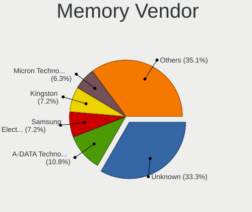

| Vendor                             | Desktops | Percent |
|------------------------------------|----------|---------|
| Unknown                            | 37       | 33.33%  |
| A-DATA Technology                  | 12       | 10.81%  |
| Samsung Electronics                | 8        | 7.21%   |
| Kingston                           | 8        | 7.21%   |
| Micron Technology                  | 7        | 6.31%   |
| SK hynix                           | 6        | 5.41%   |
| Corsair                            | 4        | 3.6%    |
| Unknown                            | 4        | 3.6%    |
| Crucial                            | 3        | 2.7%    |
| TwinMOS                            | 2        | 1.8%    |
| Thermaltake                        | 2        | 1.8%    |
| Patriot                            | 2        | 1.8%    |
| Nanya Technology                   | 2        | 1.8%    |
| Unknown (ABCD)                     | 1        | 0.9%    |
| Unifosa                            | 1        | 0.9%    |
| Transcend                          | 1        | 0.9%    |
| Team                               | 1        | 0.9%    |
| SemsoTai                           | 1        | 0.9%    |
| Ramaxel Technology                 | 1        | 0.9%    |
| KingSpec                           | 1        | 0.9%    |
| Kimtigo Semiconductor (HK) Limited | 1        | 0.9%    |
| Goldkey                            | 1        | 0.9%    |
| GeIL                               | 1        | 0.9%    |
| G.Skill                            | 1        | 0.9%    |
| Dynet                              | 1        | 0.9%    |
| CSX                                | 1        | 0.9%    |
| Asgard                             | 1        | 0.9%    |

Memory Model
------------

Memory module models

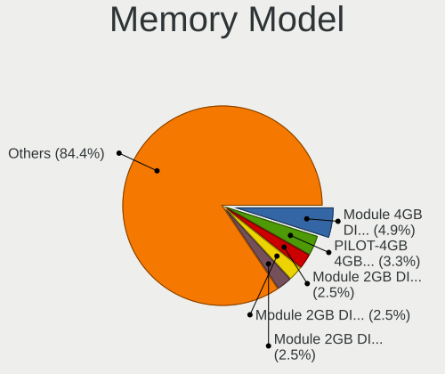

| Model                                                          | Desktops | Percent |
|----------------------------------------------------------------|----------|---------|
| Unknown RAM Module 4GB DIMM DDR3 1333MT/s                      | 6        | 4.92%   |
| Unknown                                                        | 4        | 3.28%   |
| Unknown RAM Module 2GB DIMM DDR3 1333MT/s                      | 3        | 2.46%   |
| Unknown RAM Module 2GB DIMM 800MT/s                            | 3        | 2.46%   |
| Unknown RAM Module 2GB DIMM 400MT/s                            | 3        | 2.46%   |
| Unknown RAM Module 4GB DIMM SDRAM                              | 2        | 1.64%   |
| Unknown RAM Module 2GB DIMM SDRAM                              | 2        | 1.64%   |
| Unknown RAM Module 2GB DIMM 667MT/s                            | 2        | 1.64%   |
| SK hynix RAM HMT451U6BFR8A-PB 4GB DIMM DDR3 1600MT/s           | 2        | 1.64%   |
| SK hynix RAM HMT125U6TFR8C-H9 2GB DIMM DDR3 1333MT/s           | 2        | 1.64%   |
| Micron RAM 8JTF51264AZ-1G6E1 4GB DIMM DDR3 1600MT/s            | 2        | 1.64%   |
| A-DATA RAM DDR4 3200 16GB DIMM DDR4 3600MT/s                   | 2        | 1.64%   |
| Unknown RAM Module 4GB SODIMM DDR2                             | 1        | 0.82%   |
| Unknown RAM Module 4GB DIMM DDR3 1600MT/s                      | 1        | 0.82%   |
| Unknown RAM Module 4GB DIMM DDR3 1067MT/s                      | 1        | 0.82%   |
| Unknown RAM Module 4GB DIMM 400MT/s                            | 1        | 0.82%   |
| Unknown RAM Module 4096MB SODIMM DDR2                          | 1        | 0.82%   |
| Unknown RAM Module 4096MB DIMM SDRAM 1333MT/s                  | 1        | 0.82%   |
| Unknown RAM Module 4096MB DIMM SDRAM                           | 1        | 0.82%   |
| Unknown RAM Module 4096MB DIMM DDR3 800MT/s                    | 1        | 0.82%   |
| Unknown RAM Module 4096MB DIMM DDR3 1333MT/s                   | 1        | 0.82%   |
| Unknown RAM Module 4096MB DIMM 1333MT/s                        | 1        | 0.82%   |
| Unknown RAM Module 2GB DIMM SDRAM 1066MT/s                     | 1        | 0.82%   |
| Unknown RAM Module 2GB DIMM DDR3 1066MT/s                      | 1        | 0.82%   |
| Unknown RAM Module 2048MB DIMM SDRAM 800MT/s                   | 1        | 0.82%   |
| Unknown RAM Module 2048MB DIMM SDRAM 1333MT/s                  | 1        | 0.82%   |
| Unknown RAM Module 2048MB DIMM SDRAM                           | 1        | 0.82%   |
| Unknown RAM Module 2048MB DIMM DDR2 800MT/s                    | 1        | 0.82%   |
| Unknown RAM Module 2048MB DIMM DDR2                            | 1        | 0.82%   |
| Unknown RAM Module 1GB DIMM DDR3 1333MT/s                      | 1        | 0.82%   |
| Unknown RAM Module 1GB DIMM DDR2 667MT/s                       | 1        | 0.82%   |
| Unknown RAM Module 1GB DIMM 800MT/s                            | 1        | 0.82%   |
| Unknown RAM Module 1GB DIMM 533MT/s                            | 1        | 0.82%   |
| Unknown RAM Module 1024MB DIMM SDRAM                           | 1        | 0.82%   |
| Unknown RAM Module 1024MB DIMM DDR2 266MT/s                    | 1        | 0.82%   |
| Unknown RAM Module 1024MB DIMM DDR2 200MT/s                    | 1        | 0.82%   |
| Unknown RAM Module 1024MB DIMM DDR2                            | 1        | 0.82%   |
| Unknown (ABCD) RAM 123456789012345678 2GB DIMM LPDDR4 2133MT/s | 1        | 0.82%   |
| Unifosa RAM GU342G0ALEPR692C6F 2GB DIMM DDR2 800MT/s           | 1        | 0.82%   |
| TwinMOS RAM 9DPCBNZB-TATP 4GB DIMM DDR3 1333MT/s               | 1        | 0.82%   |

Memory Kind
-----------

Memory module kinds

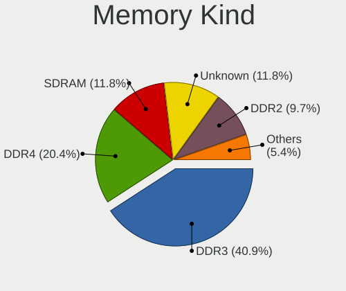

| Kind    | Desktops | Percent |
|---------|----------|---------|
| DDR3    | 38       | 40.86%  |
| DDR4    | 19       | 20.43%  |
| SDRAM   | 11       | 11.83%  |
| Unknown | 11       | 11.83%  |
| DDR2    | 9        | 9.68%   |
| DDR5    | 3        | 3.23%   |
| LPDDR4  | 1        | 1.08%   |
| DDR     | 1        | 1.08%   |

Memory Form Factor
------------------

Physical design of the memory module

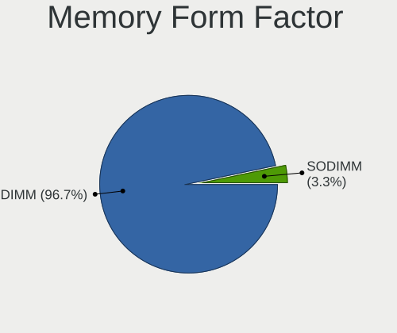

| Name   | Desktops | Percent |
|--------|----------|---------|
| DIMM   | 88       | 96.7%   |
| SODIMM | 3        | 3.3%    |

Memory Size
-----------

Memory module size

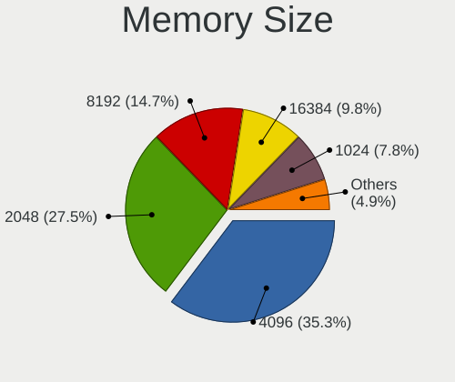

| Size  | Desktops | Percent |
|-------|----------|---------|
| 4096  | 36       | 35.29%  |
| 2048  | 28       | 27.45%  |
| 8192  | 15       | 14.71%  |
| 16384 | 10       | 9.8%    |
| 1024  | 8        | 7.84%   |
| 32768 | 4        | 3.92%   |
| 512   | 1        | 0.98%   |

Memory Speed
------------

Memory module speed

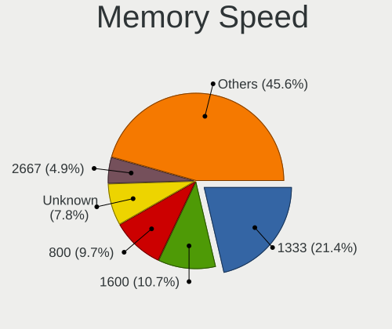

| Speed   | Desktops | Percent |
|---------|----------|---------|
| 1333    | 22       | 21.36%  |
| 1600    | 11       | 10.68%  |
| 800     | 10       | 9.71%   |
| Unknown | 8        | 7.77%   |
| 2667    | 5        | 4.85%   |
| 3200    | 4        | 3.88%   |
| 2400    | 4        | 3.88%   |
| 667     | 4        | 3.88%   |
| 400     | 4        | 3.88%   |
| 2133    | 3        | 2.91%   |
| 1067    | 3        | 2.91%   |
| 4800    | 2        | 1.94%   |
| 3800    | 2        | 1.94%   |
| 3600    | 2        | 1.94%   |
| 2666    | 2        | 1.94%   |
| 1648    | 2        | 1.94%   |
| 1066    | 2        | 1.94%   |
| 6400    | 1        | 0.97%   |
| 3066    | 1        | 0.97%   |
| 3000    | 1        | 0.97%   |
| 2200    | 1        | 0.97%   |
| 2000    | 1        | 0.97%   |
| 1867    | 1        | 0.97%   |
| 1800    | 1        | 0.97%   |
| 1639    | 1        | 0.97%   |
| 1400    | 1        | 0.97%   |
| 1334    | 1        | 0.97%   |
| 533     | 1        | 0.97%   |
| 266     | 1        | 0.97%   |
| 200     | 1        | 0.97%   |

Printers & scanners
-------------------

Printer Vendor
--------------

Printer device vendors

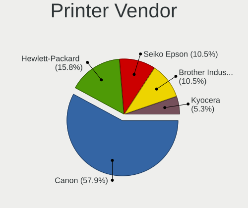

| Vendor             | Desktops | Percent |
|--------------------|----------|---------|
| Canon              | 11       | 57.89%  |
| Hewlett-Packard    | 3        | 15.79%  |
| Seiko Epson        | 2        | 10.53%  |
| Brother Industries | 2        | 10.53%  |
| Kyocera            | 1        | 5.26%   |

Printer Model
-------------

Printer device models

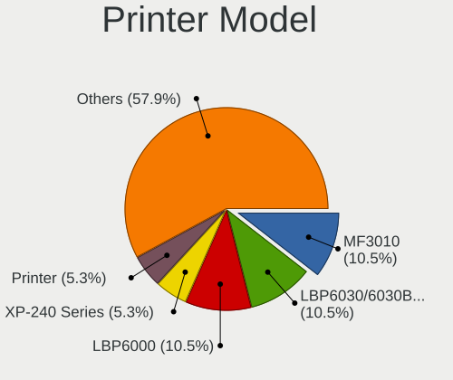

| Model                     | Desktops | Percent |
|---------------------------|----------|---------|
| Canon MF3010              | 2        | 10.53%  |
| Canon LBP6030/6030B/6018L | 2        | 10.53%  |
| Canon LBP6000             | 2        | 10.53%  |
| Seiko Epson XP-240 Series | 1        | 5.26%   |
| Seiko Epson Printer       | 1        | 5.26%   |
| Kyocera FS-1040           | 1        | 5.26%   |
| HP LaserJet 1010          | 1        | 5.26%   |
| HP Ink Tank 310 series    | 1        | 5.26%   |
| HP DeskJet 5810 series    | 1        | 5.26%   |
| Canon MG5700 series       | 1        | 5.26%   |
| Canon MF4010 series       | 1        | 5.26%   |
| Canon LBP3000             | 1        | 5.26%   |
| Canon LBP2900             | 1        | 5.26%   |
| Canon CAPT USB Device     | 1        | 5.26%   |
| Brother MFC-J480DW        | 1        | 5.26%   |
| Brother DCP-J132W         | 1        | 5.26%   |

Scanner Vendor
--------------

Scanner device vendors

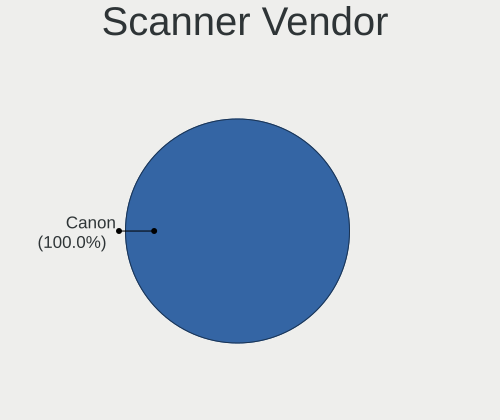

| Vendor | Desktops | Percent |
|--------|----------|---------|
| Canon  | 1        | 100%    |

Scanner Model
-------------

Scanner device models

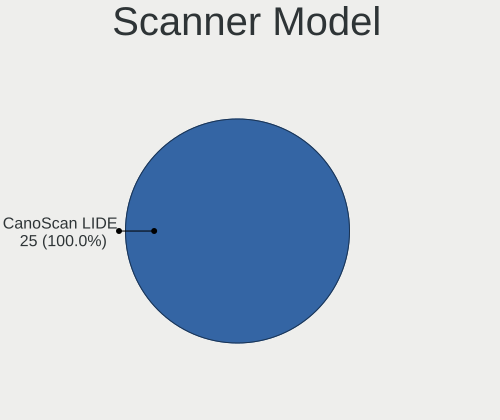

| Model                  | Desktops | Percent |
|------------------------|----------|---------|
| Canon CanoScan LIDE 25 | 1        | 100%    |

Camera
------

Camera Vendor
-------------

Camera device vendors

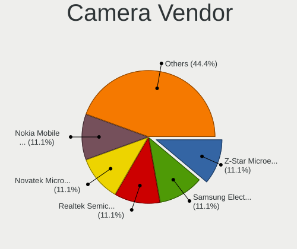

| Vendor                   | Desktops | Percent |
|--------------------------|----------|---------|
| Z-Star Microelectronics  | 1        | 11.11%  |
| Samsung Electronics      | 1        | 11.11%  |
| Realtek Semiconductor    | 1        | 11.11%  |
| Novatek Microelectronics | 1        | 11.11%  |
| Nokia Mobile Phones      | 1        | 11.11%  |
| Logitech                 | 1        | 11.11%  |
| GEMBIRD                  | 1        | 11.11%  |
| Cubeternet               | 1        | 11.11%  |
| Arkmicro Technologies    | 1        | 11.11%  |

Camera Model
------------

Camera device models

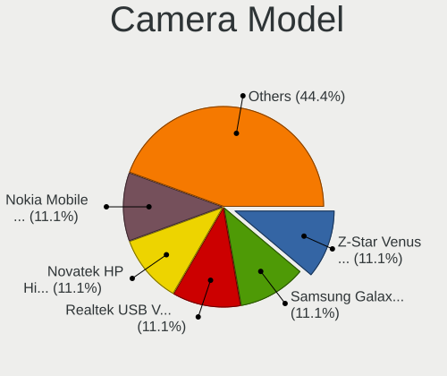

| Model                                             | Desktops | Percent |
|---------------------------------------------------|----------|---------|
| Z-Star Venus USB2.0 Camera                        | 1        | 11.11%  |
| Samsung Galaxy series, misc. (MTP mode)           | 1        | 11.11%  |
| Realtek USB Video device                          | 1        | 11.11%  |
| Novatek HP High Definition 2MP Webcam             | 1        | 11.11%  |
| Nokia Mobile Phones Lumia 640 Phone               | 1        | 11.11%  |
| Logitech HD Pro Webcam C920                       | 1        | 11.11%  |
| GEMBIRD Generic UVC 1.00 camera [AppoTech AX2311] | 1        | 11.11%  |
| Cubeternet USB2.0 Camera                          | 1        | 11.11%  |
| Arkmicro Webcam Carrefour                         | 1        | 11.11%  |

Security
--------

Fingerprint Vendor
------------------

Fingerprint sensor vendors

Zero info for selected period =(

Fingerprint Model
-----------------

Fingerprint sensor models

Zero info for selected period =(

Chipcard Vendor
---------------

Chipcard module vendors

Zero info for selected period =(

Chipcard Model
--------------

Chipcard module models

Zero info for selected period =(

Unsupported
-----------

Unsupported Devices
-------------------

Total unsupported devices on board

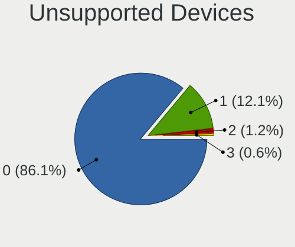

| Total | Desktops | Percent |
|-------|----------|---------|
| 0     | 142      | 86.06%  |
| 1     | 20       | 12.12%  |
| 2     | 2        | 1.21%   |
| 3     | 1        | 0.61%   |

Unsupported Device Types
------------------------

Types of unsupported devices

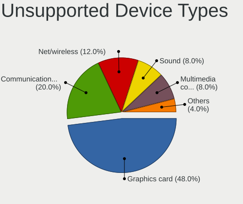

| Type                     | Desktops | Percent |
|--------------------------|----------|---------|
| Graphics card            | 12       | 48%     |
| Communication controller | 5        | 20%     |
| Net/wireless             | 3        | 12%     |
| Sound                    | 2        | 8%      |
| Multimedia controller    | 2        | 8%      |
| Camera                   | 1        | 4%      |

