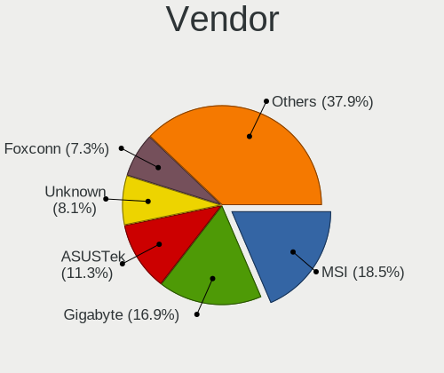
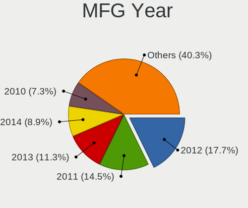
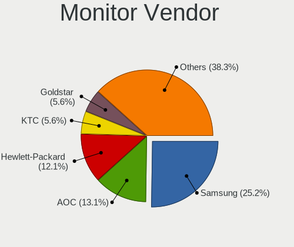
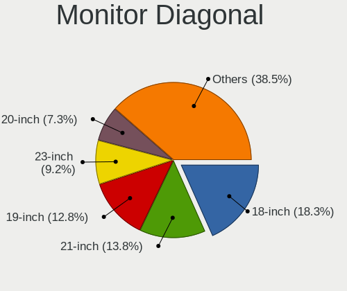
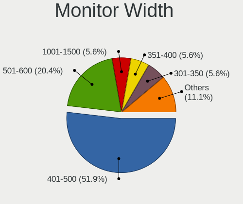
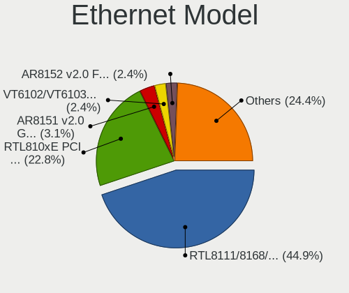
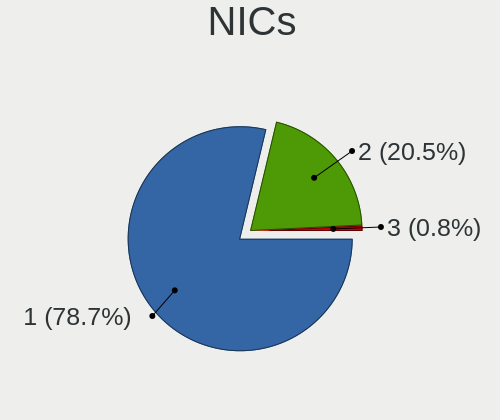
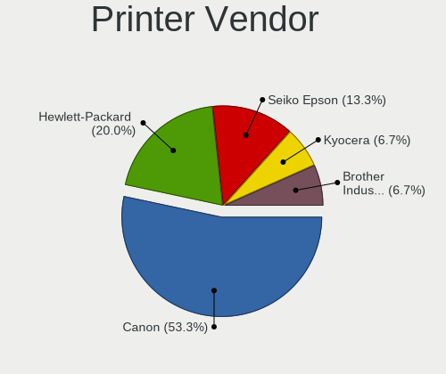
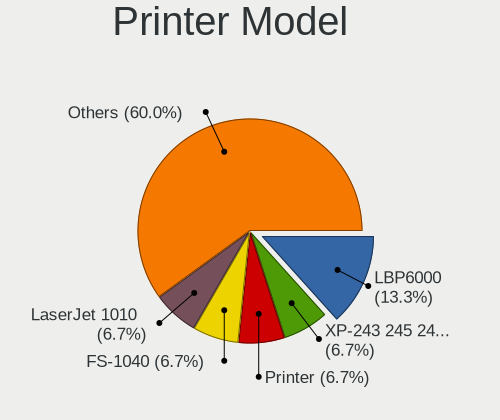

Linux in Algeria - Tested Hardware & Statistics (Desktops)
----------------------------------------------------------

A project to collect tested hardware configurations for Linux in Algeria.

Anyone can contribute to this report by the [hw-probe](https://github.com/linuxhw/hw-probe) tool:

    sudo -E hw-probe -all -upload

Please contribute! Especially if your hardware is rare.

Contents
--------

* [ Test Cases ](#test-cases)

* [ System ](#system)
  - [ OS                       ](#os)
  - [ OS Family                ](#os-family)
  - [ Kernel                   ](#kernel)
  - [ Kernel Family            ](#kernel-family)
  - [ Kernel Major Ver.        ](#kernel-major-ver)
  - [ Arch                     ](#arch)
  - [ DE                       ](#de)
  - [ Display Server           ](#display-server)
  - [ Display Manager          ](#display-manager)
  - [ OS Lang                  ](#os-lang)
  - [ Boot Mode                ](#boot-mode)
  - [ Filesystem               ](#filesystem)
  - [ Part. scheme             ](#part-scheme)
  - [ Dual Boot with Linux/BSD ](#dual-boot-with-linuxbsd)
  - [ Dual Boot (Win)          ](#dual-boot-win)

* [ Board ](#board)
  - [ Vendor                   ](#vendor)
  - [ Model                    ](#model)
  - [ Model Family             ](#model-family)
  - [ MFG Year                 ](#mfg-year)
  - [ Form Factor              ](#form-factor)
  - [ Secure Boot              ](#secure-boot)
  - [ Coreboot                 ](#coreboot)
  - [ RAM Size                 ](#ram-size)
  - [ RAM Used                 ](#ram-used)
  - [ Total Drives             ](#total-drives)
  - [ Has CD-ROM               ](#has-cd-rom)
  - [ Has Ethernet             ](#has-ethernet)
  - [ Has WiFi                 ](#has-wifi)
  - [ Has Bluetooth            ](#has-bluetooth)

* [ Location ](#location)
  - [ Country                  ](#country)
  - [ City                     ](#city)

* [ Drives ](#drives)
  - [ Drive Vendor             ](#drive-vendor)
  - [ Drive Model              ](#drive-model)
  - [ HDD Vendor               ](#hdd-vendor)
  - [ SSD Vendor               ](#ssd-vendor)
  - [ Drive Kind               ](#drive-kind)
  - [ Drive Connector          ](#drive-connector)
  - [ Drive Size               ](#drive-size)
  - [ Space Total              ](#space-total)
  - [ Space Used               ](#space-used)
  - [ Malfunc. Drives          ](#malfunc-drives)
  - [ Malfunc. Drive Vendor    ](#malfunc-drive-vendor)
  - [ Malfunc. HDD Vendor      ](#malfunc-hdd-vendor)
  - [ Malfunc. Drive Kind      ](#malfunc-drive-kind)
  - [ Failed Drives            ](#failed-drives)
  - [ Failed Drive Vendor      ](#failed-drive-vendor)
  - [ Drive Status             ](#drive-status)

* [ Storage controller ](#storage-controller)
  - [ Storage Vendor           ](#storage-vendor)
  - [ Storage Model            ](#storage-model)
  - [ Storage Kind             ](#storage-kind)

* [ Processor ](#processor)
  - [ CPU Vendor               ](#cpu-vendor)
  - [ CPU Model                ](#cpu-model)
  - [ CPU Model Family         ](#cpu-model-family)
  - [ CPU Cores                ](#cpu-cores)
  - [ CPU Sockets              ](#cpu-sockets)
  - [ CPU Threads              ](#cpu-threads)
  - [ CPU Op-Modes             ](#cpu-op-modes)
  - [ CPU Microcode            ](#cpu-microcode)
  - [ CPU Microarch            ](#cpu-microarch)

* [ Graphics ](#graphics)
  - [ GPU Vendor               ](#gpu-vendor)
  - [ GPU Model                ](#gpu-model)
  - [ GPU Combo                ](#gpu-combo)
  - [ GPU Driver               ](#gpu-driver)
  - [ GPU Memory               ](#gpu-memory)

* [ Monitor ](#monitor)
  - [ Monitor Vendor           ](#monitor-vendor)
  - [ Monitor Model            ](#monitor-model)
  - [ Monitor Resolution       ](#monitor-resolution)
  - [ Monitor Diagonal         ](#monitor-diagonal)
  - [ Monitor Width            ](#monitor-width)
  - [ Aspect Ratio             ](#aspect-ratio)
  - [ Monitor Area             ](#monitor-area)
  - [ Pixel Density            ](#pixel-density)
  - [ Multiple Monitors        ](#multiple-monitors)

* [ Network ](#network)
  - [ Net Controller Vendor    ](#net-controller-vendor)
  - [ Net Controller Model     ](#net-controller-model)
  - [ Wireless Vendor          ](#wireless-vendor)
  - [ Wireless Model           ](#wireless-model)
  - [ Ethernet Vendor          ](#ethernet-vendor)
  - [ Ethernet Model           ](#ethernet-model)
  - [ Net Controller Kind      ](#net-controller-kind)
  - [ Used Controller          ](#used-controller)
  - [ NICs                     ](#nics)
  - [ IPv6                     ](#ipv6)

* [ Bluetooth ](#bluetooth)
  - [ Bluetooth Vendor         ](#bluetooth-vendor)
  - [ Bluetooth Model          ](#bluetooth-model)

* [ Sound ](#sound)
  - [ Sound Vendor             ](#sound-vendor)
  - [ Sound Model              ](#sound-model)

* [ Memory ](#memory)
  - [ Memory Vendor            ](#memory-vendor)
  - [ Memory Model             ](#memory-model)
  - [ Memory Kind              ](#memory-kind)
  - [ Memory Form Factor       ](#memory-form-factor)
  - [ Memory Size              ](#memory-size)
  - [ Memory Speed             ](#memory-speed)

* [ Printers & scanners ](#printers--scanners)
  - [ Printer Vendor           ](#printer-vendor)
  - [ Printer Model            ](#printer-model)
  - [ Scanner Vendor           ](#scanner-vendor)
  - [ Scanner Model            ](#scanner-model)

* [ Camera ](#camera)
  - [ Camera Vendor            ](#camera-vendor)
  - [ Camera Model             ](#camera-model)

* [ Security ](#security)
  - [ Fingerprint Vendor       ](#fingerprint-vendor)
  - [ Fingerprint Model        ](#fingerprint-model)
  - [ Chipcard Vendor          ](#chipcard-vendor)
  - [ Chipcard Model           ](#chipcard-model)

* [ Unsupported ](#unsupported)
  - [ Unsupported Devices      ](#unsupported-devices)
  - [ Unsupported Device Types ](#unsupported-device-types)

Test Cases
----------

Total: 165

| Vendor        | Model                       | Probe                                                      | Date         |
|---------------|-----------------------------|------------------------------------------------------------|--------------|
| Gigabyte      | G41MT-S2PT                  | [a415a1e824](https://linux-hardware.org/?probe=a415a1e824) | May 08, 2024 |
| ASUSTek       | TUF Gaming X570-PLUS        | [b8f62dc34c](https://linux-hardware.org/?probe=b8f62dc34c) | Apr 13, 2024 |
| Foxconn       | H61MXL/H61MXL-K             | [333a0e4aa4](https://linux-hardware.org/?probe=333a0e4aa4) | Mar 29, 2024 |
| LORD ELECT... | LORD G4x 775 ICH7 8712 A... | [9616627427](https://linux-hardware.org/?probe=9616627427) | Feb 13, 2024 |
| MSI           | H61M-P20                    | [b364c76f36](https://linux-hardware.org/?probe=b364c76f36) | Feb 10, 2024 |
| MSI           | H61M-P20                    | [2dd188e5d9](https://linux-hardware.org/?probe=2dd188e5d9) | Feb 10, 2024 |
| Gigabyte      | H61M-S2PV                   | [28dfa3aae0](https://linux-hardware.org/?probe=28dfa3aae0) | Jan 20, 2024 |
| Gigabyte      | H61M-S2PV                   | [bf37fabc09](https://linux-hardware.org/?probe=bf37fabc09) | Jan 13, 2024 |
| ASUSTek       | PRIME B450M-K II            | [3055333756](https://linux-hardware.org/?probe=3055333756) | Jan 03, 2024 |
| Gigabyte      | D-700                       | [18e3ee84cc](https://linux-hardware.org/?probe=18e3ee84cc) | Dec 11, 2023 |
| AMI           | Intel                       | [7fdef1f7fc](https://linux-hardware.org/?probe=7fdef1f7fc) | Dec 04, 2023 |
| Gigabyte      | G41MT-S2P                   | [0ff86eddc6](https://linux-hardware.org/?probe=0ff86eddc6) | Nov 27, 2023 |
| Intel         | H61                         | [56e954caa1](https://linux-hardware.org/?probe=56e954caa1) | Nov 11, 2023 |
| Gigabyte      | 945GCM-S2C                  | [c714bf35c2](https://linux-hardware.org/?probe=c714bf35c2) | Nov 06, 2023 |
| HP            | 2B34                        | [52737869e2](https://linux-hardware.org/?probe=52737869e2) | Nov 06, 2023 |
| Gigabyte      | H61M-S2PV                   | [523fd59139](https://linux-hardware.org/?probe=523fd59139) | Nov 01, 2023 |
| ASUSTek       | ROG STRIX Z690-E GAMING ... | [d2d21dcf50](https://linux-hardware.org/?probe=d2d21dcf50) | Nov 01, 2023 |
| AMI           | Intel                       | [c4587092bf](https://linux-hardware.org/?probe=c4587092bf) | Nov 01, 2023 |
| Foxconn       | H61MXL/H61MXL-K             | [b5b49fefb3](https://linux-hardware.org/?probe=b5b49fefb3) | Sep 09, 2023 |
| Gigabyte      | B450 AORUS ELITE V2         | [ba40b3b859](https://linux-hardware.org/?probe=ba40b3b859) | Sep 01, 2023 |
| HP            | 18E9                        | [fd1f6decb2](https://linux-hardware.org/?probe=fd1f6decb2) | Sep 01, 2023 |
| Intel         | H61                         | [4d6bf88f48](https://linux-hardware.org/?probe=4d6bf88f48) | Aug 21, 2023 |
| Foxconn       | H61MXL/H61MXL-K             | [e51e841817](https://linux-hardware.org/?probe=e51e841817) | Jul 31, 2023 |
| ASUSTek       | PRIME A320M-K               | [a0a79ddb19](https://linux-hardware.org/?probe=a0a79ddb19) | Jul 27, 2023 |
| MSI           | Z87-G43 GAMING              | [99dadfd3f5](https://linux-hardware.org/?probe=99dadfd3f5) | Jul 21, 2023 |
| MSI           | 2A9C                        | [676f61f0c9](https://linux-hardware.org/?probe=676f61f0c9) | Jul 17, 2023 |
| MSI           | 2A9C                        | [87dd24dabe](https://linux-hardware.org/?probe=87dd24dabe) | Jul 17, 2023 |
| Gigabyte      | H61M-S2PV                   | [8c816d8f1b](https://linux-hardware.org/?probe=8c816d8f1b) | Jul 07, 2023 |
| Lenovo        | MAHOBAY                     | [46ed210eb0](https://linux-hardware.org/?probe=46ed210eb0) | Jun 26, 2023 |
| HP            | 2B34                        | [d0b5c9767f](https://linux-hardware.org/?probe=d0b5c9767f) | Jun 07, 2023 |
| ASUSTek       | P8H67                       | [d1d1ef644d](https://linux-hardware.org/?probe=d1d1ef644d) | May 15, 2023 |
| Foxconn       | H61MXV/H67MXV               | [ffb03b8bd4](https://linux-hardware.org/?probe=ffb03b8bd4) | May 05, 2023 |
| ASUSTek       | TUF Gaming B550M-PLUS       | [98ffa037d9](https://linux-hardware.org/?probe=98ffa037d9) | Apr 24, 2023 |
| ASUSTek       | Maximus VII FORMULA         | [0d45b24479](https://linux-hardware.org/?probe=0d45b24479) | Apr 23, 2023 |
| MSI           | G41M-P26                    | [80c102169c](https://linux-hardware.org/?probe=80c102169c) | Apr 16, 2023 |
| MSI           | G41M-P26                    | [5b6831f7fc](https://linux-hardware.org/?probe=5b6831f7fc) | Apr 12, 2023 |
| ASUSTek       | TUF B450M-PRO GAMING        | [a6e4c91ee0](https://linux-hardware.org/?probe=a6e4c91ee0) | Apr 07, 2023 |
| ASUSTek       | H61M-K                      | [f4b76d1e01](https://linux-hardware.org/?probe=f4b76d1e01) | Apr 03, 2023 |
| ASUSTek       | TUF Gaming B550M-PLUS       | [3711318620](https://linux-hardware.org/?probe=3711318620) | Mar 26, 2023 |
| Dell          | 07N90W A02                  | [267dad60ba](https://linux-hardware.org/?probe=267dad60ba) | Mar 18, 2023 |
| MSI           | B75MA-E33                   | [314245636a](https://linux-hardware.org/?probe=314245636a) | Mar 18, 2023 |
| Gigabyte      | H61M-S2PV                   | [6752797fe9](https://linux-hardware.org/?probe=6752797fe9) | Mar 14, 2023 |
| Gigabyte      | H61M-S2PV                   | [2e0019e450](https://linux-hardware.org/?probe=2e0019e450) | Mar 14, 2023 |
| MSI           | B75MA-E33                   | [57a009cdd4](https://linux-hardware.org/?probe=57a009cdd4) | Feb 25, 2023 |
| MSI           | B75MA-E33                   | [fc1a3d88ae](https://linux-hardware.org/?probe=fc1a3d88ae) | Feb 25, 2023 |
| MSI           | G41M-P33 Combo              | [91c8d45121](https://linux-hardware.org/?probe=91c8d45121) | Feb 24, 2023 |
| LORD ELECT... | LORD G4x 775 ICH7 8712 A... | [fd2b985f41](https://linux-hardware.org/?probe=fd2b985f41) | Feb 21, 2023 |
| Unknown       | Unknown                     | [515525584c](https://linux-hardware.org/?probe=515525584c) | Feb 14, 2023 |
| LORD ELECT... | LORD G4x 775 ICH7 8712 A... | [c69ee15636](https://linux-hardware.org/?probe=c69ee15636) | Feb 14, 2023 |
| Unknown       | Unknown                     | [46981444b1](https://linux-hardware.org/?probe=46981444b1) | Feb 13, 2023 |
| Unknown       | Unknown                     | [ce78e6cdb9](https://linux-hardware.org/?probe=ce78e6cdb9) | Feb 11, 2023 |
| Unknown       | Unknown                     | [f5e5e27e8e](https://linux-hardware.org/?probe=f5e5e27e8e) | Feb 11, 2023 |
| Unknown       | Unknown                     | [cb0a834e1a](https://linux-hardware.org/?probe=cb0a834e1a) | Feb 10, 2023 |
| ASRock        | H81M-GL                     | [059a818847](https://linux-hardware.org/?probe=059a818847) | Feb 09, 2023 |
| HP            | 1589                        | [1872d63c2b](https://linux-hardware.org/?probe=1872d63c2b) | Feb 05, 2023 |
| HP            | 1589                        | [69c0ab962c](https://linux-hardware.org/?probe=69c0ab962c) | Feb 05, 2023 |
| HP            | 18E7                        | [01cbafc241](https://linux-hardware.org/?probe=01cbafc241) | Jan 28, 2023 |
| MSI           | H270-A PRO                  | [f150327257](https://linux-hardware.org/?probe=f150327257) | Jan 14, 2023 |
| MSI           | Z87-G45 GAMING              | [c2d592a9e5](https://linux-hardware.org/?probe=c2d592a9e5) | Dec 30, 2022 |
| Wistron       | ProLiant ML110 G5           | [67cc68fbfe](https://linux-hardware.org/?probe=67cc68fbfe) | Nov 23, 2022 |
| ECS           | G41T-M7                     | [f97036df33](https://linux-hardware.org/?probe=f97036df33) | Nov 18, 2022 |
| Unknown       | X79                         | [fd8f23bc70](https://linux-hardware.org/?probe=fd8f23bc70) | Oct 21, 2022 |
| ECS           | G41T-M7                     | [3abe70653e](https://linux-hardware.org/?probe=3abe70653e) | Oct 16, 2022 |
| Gigabyte      | H61M-S2PV                   | [cd06f54882](https://linux-hardware.org/?probe=cd06f54882) | Sep 30, 2022 |
| Gigabyte      | H61M-S2P-R3                 | [21d9eb0a71](https://linux-hardware.org/?probe=21d9eb0a71) | Sep 26, 2022 |
| MSI           | Z390-A PRO                  | [e78a82387b](https://linux-hardware.org/?probe=e78a82387b) | Sep 24, 2022 |
| HP            | 2B34                        | [a9e82bbb40](https://linux-hardware.org/?probe=a9e82bbb40) | Sep 19, 2022 |
| MSI           | H110M PRO-VD PLUS           | [e61fe6932b](https://linux-hardware.org/?probe=e61fe6932b) | Sep 13, 2022 |
| Dell          | 042P49 A02                  | [3b1c07d561](https://linux-hardware.org/?probe=3b1c07d561) | Sep 01, 2022 |
| ASUSTek       | H61M-K                      | [26c9be116e](https://linux-hardware.org/?probe=26c9be116e) | Aug 24, 2022 |
| ASUSTek       | H61M-K                      | [1f4f742288](https://linux-hardware.org/?probe=1f4f742288) | Aug 23, 2022 |
| Gigabyte      | H61M-S2PT                   | [b7e6228017](https://linux-hardware.org/?probe=b7e6228017) | Aug 22, 2022 |
| Foxconn       | H61MXL/H61MXL-K             | [708f9572ad](https://linux-hardware.org/?probe=708f9572ad) | Jul 26, 2022 |
| ECS           | G41T-M16                    | [5a3363d66f](https://linux-hardware.org/?probe=5a3363d66f) | Jun 28, 2022 |
| Gigabyte      | GA-E7AUM-DS2H               | [0dd5791ff8](https://linux-hardware.org/?probe=0dd5791ff8) | Jun 05, 2022 |
| Gigabyte      | GA-E7AUM-DS2H               | [1b7a237b9b](https://linux-hardware.org/?probe=1b7a237b9b) | Jun 05, 2022 |
| Gigabyte      | GA-E7AUM-DS2H               | [9f18dbe621](https://linux-hardware.org/?probe=9f18dbe621) | May 26, 2022 |
| Biostar       | H61MLV2                     | [43a89f5d91](https://linux-hardware.org/?probe=43a89f5d91) | Apr 14, 2022 |
| Dell          | 07N90W A02                  | [4fd59735d6](https://linux-hardware.org/?probe=4fd59735d6) | Mar 30, 2022 |
| Foxconn       | G41MXE/G41MXE-K             | [cd5c0f974e](https://linux-hardware.org/?probe=cd5c0f974e) | Mar 18, 2022 |
| Gigabyte      | X570 GAMING X               | [4f7aa0f57c](https://linux-hardware.org/?probe=4f7aa0f57c) | Mar 10, 2022 |
| Gigabyte      | B450 AORUS ELITE V2         | [7bdf3a8998](https://linux-hardware.org/?probe=7bdf3a8998) | Feb 27, 2022 |
| Gigabyte      | H61M-DS2                    | [214381cf00](https://linux-hardware.org/?probe=214381cf00) | Feb 16, 2022 |
| Lenovo        | 0B98417 PRO                 | [6e5fa50531](https://linux-hardware.org/?probe=6e5fa50531) | Feb 13, 2022 |
| Intel         | H55                         | [1b1b5c3ed8](https://linux-hardware.org/?probe=1b1b5c3ed8) | Feb 12, 2022 |
| MSI           | H61M-S20                    | [7d0384b2d2](https://linux-hardware.org/?probe=7d0384b2d2) | Jan 28, 2022 |
| ECS           | H61H2-M4                    | [2995a79728](https://linux-hardware.org/?probe=2995a79728) | Jan 07, 2022 |
| Unknown       | X79                         | [ec1620ee82](https://linux-hardware.org/?probe=ec1620ee82) | Jan 01, 2022 |
| ASUSTek       | PRIME B360M-A               | [69ecf03c84](https://linux-hardware.org/?probe=69ecf03c84) | Dec 12, 2021 |
| MSI           | H61M-S20                    | [5e73200702](https://linux-hardware.org/?probe=5e73200702) | Dec 02, 2021 |
| MSI           | H61M-S20                    | [7e1fdb578c](https://linux-hardware.org/?probe=7e1fdb578c) | Dec 02, 2021 |
| Foxconn       | 17A0                        | [0fc17817a1](https://linux-hardware.org/?probe=0fc17817a1) | Nov 23, 2021 |
| MSI           | B450M-A PRO MAX             | [233d576651](https://linux-hardware.org/?probe=233d576651) | Nov 12, 2021 |
| Foxconn       | H61M/H61M-S                 | [62ae26dca0](https://linux-hardware.org/?probe=62ae26dca0) | Nov 07, 2021 |
| Foxconn       | H61M/H61M-S                 | [7f3894059d](https://linux-hardware.org/?probe=7f3894059d) | Nov 04, 2021 |
| Gigabyte      | GA-E7AUM-DS2H               | [545b983e7c](https://linux-hardware.org/?probe=545b983e7c) | Oct 22, 2021 |
| Unknown       | G41 Series V10              | [ce791f779f](https://linux-hardware.org/?probe=ce791f779f) | Oct 21, 2021 |
| Pegatron      | 2A94h                       | [ebd6264587](https://linux-hardware.org/?probe=ebd6264587) | Oct 19, 2021 |
| Gigabyte      | B85M-DS3H-A                 | [9855c138d4](https://linux-hardware.org/?probe=9855c138d4) | Oct 11, 2021 |
| MSI           | H61M-S20                    | [9669908158](https://linux-hardware.org/?probe=9669908158) | Sep 29, 2021 |
| MSI           | H61M-S20                    | [481ecaa854](https://linux-hardware.org/?probe=481ecaa854) | Sep 28, 2021 |
| Lenovo        | 0x30F617AA NOK              | [d986a2e532](https://linux-hardware.org/?probe=d986a2e532) | Sep 26, 2021 |
| Gigabyte      | G31M-S2C                    | [3b43d9b42f](https://linux-hardware.org/?probe=3b43d9b42f) | Sep 22, 2021 |
| ASRock        | K10N78FullHD-hSLI           | [e817658118](https://linux-hardware.org/?probe=e817658118) | Sep 10, 2021 |
| Gigabyte      | B85M-DS3H-A                 | [95d654f778](https://linux-hardware.org/?probe=95d654f778) | Sep 04, 2021 |
| ASRock        | K10N78FullHD-hSLI           | [78886ef280](https://linux-hardware.org/?probe=78886ef280) | Aug 31, 2021 |
| ECS           | P4M900T-M2                  | [b1490652d3](https://linux-hardware.org/?probe=b1490652d3) | Aug 20, 2021 |
| Dell          | 0WG864                      | [2e28996126](https://linux-hardware.org/?probe=2e28996126) | Jul 28, 2021 |
| Foxconn       | H61MXT1/F2/-S/-V            | [cf7ebc455f](https://linux-hardware.org/?probe=cf7ebc455f) | Jul 20, 2021 |
| Intel         | H55                         | [47c7c454ac](https://linux-hardware.org/?probe=47c7c454ac) | Jul 09, 2021 |
| Intel         | H55                         | [9e4504d3a3](https://linux-hardware.org/?probe=9e4504d3a3) | Jul 09, 2021 |
| HP            | 2B34                        | [d2c91c450b](https://linux-hardware.org/?probe=d2c91c450b) | May 31, 2021 |
| MSI           | ZH77A-G41                   | [8755040ea2](https://linux-hardware.org/?probe=8755040ea2) | May 25, 2021 |
| Unknown       | Unknown                     | [f54143a81d](https://linux-hardware.org/?probe=f54143a81d) | May 24, 2021 |
| HP            | 2B34                        | [861a11fe04](https://linux-hardware.org/?probe=861a11fe04) | May 04, 2021 |
| HP            | 2B34                        | [66faef6161](https://linux-hardware.org/?probe=66faef6161) | May 02, 2021 |
| ASUSTek       | H81M-K                      | [7a97f404a4](https://linux-hardware.org/?probe=7a97f404a4) | Apr 24, 2021 |
| ASUSTek       | H81M-K                      | [ba300d050b](https://linux-hardware.org/?probe=ba300d050b) | Apr 24, 2021 |
| ECS           | P4M900T-M2                  | [f3b2236c7a](https://linux-hardware.org/?probe=f3b2236c7a) | Apr 15, 2021 |
| MSI           | Z77A-G43                    | [2df99824aa](https://linux-hardware.org/?probe=2df99824aa) | Apr 03, 2021 |
| ECS           | H61H2-MV                    | [6408cdb8b2](https://linux-hardware.org/?probe=6408cdb8b2) | Mar 14, 2021 |
| Unknown       | Unknown                     | [5f41497264](https://linux-hardware.org/?probe=5f41497264) | Mar 02, 2021 |
| ECS           | H61H2-MV                    | [da10465006](https://linux-hardware.org/?probe=da10465006) | Feb 08, 2021 |
| ECS           | H61H2-MV                    | [b050103b48](https://linux-hardware.org/?probe=b050103b48) | Feb 04, 2021 |
| ECS           | H61H2-MV                    | [8c36c3c601](https://linux-hardware.org/?probe=8c36c3c601) | Feb 03, 2021 |
| Gigabyte      | H61M-S2P-R3                 | [807a0ea003](https://linux-hardware.org/?probe=807a0ea003) | Jan 31, 2021 |
| Gigabyte      | H61M-S2P-R3                 | [9286a611a0](https://linux-hardware.org/?probe=9286a611a0) | Jan 04, 2021 |
| Biostar       | P4M89-M7B Ver:1.0           | [cf12b04ead](https://linux-hardware.org/?probe=cf12b04ead) | Dec 21, 2020 |
| Unknown       | Unknown                     | [83507a1ac0](https://linux-hardware.org/?probe=83507a1ac0) | Dec 11, 2020 |
| Unknown       | Unknown                     | [688a7e3a73](https://linux-hardware.org/?probe=688a7e3a73) | Dec 11, 2020 |
| Gigabyte      | G41MT-S2PT                  | [8dec91d656](https://linux-hardware.org/?probe=8dec91d656) | Dec 01, 2020 |
| Dell          | 0T656F A02                  | [668f859641](https://linux-hardware.org/?probe=668f859641) | Nov 28, 2020 |
| Gigabyte      | P61A-D3                     | [c547f76923](https://linux-hardware.org/?probe=c547f76923) | Nov 21, 2020 |
| Unknown       | Unknown                     | [a9f4ce29b9](https://linux-hardware.org/?probe=a9f4ce29b9) | Nov 15, 2020 |
| MSI           | G41M-P33 Combo              | [36ffd6debb](https://linux-hardware.org/?probe=36ffd6debb) | Nov 13, 2020 |
| Unknown       | Unknown                     | [51b974180e](https://linux-hardware.org/?probe=51b974180e) | Nov 11, 2020 |
| Gigabyte      | GA-E7AUM-DS2H               | [1425d1ebde](https://linux-hardware.org/?probe=1425d1ebde) | Oct 20, 2020 |
| Gigabyte      | GA-E7AUM-DS2H               | [f1040f264c](https://linux-hardware.org/?probe=f1040f264c) | Oct 19, 2020 |
| Gigabyte      | GA-E7AUM-DS2H               | [6a54c56b7a](https://linux-hardware.org/?probe=6a54c56b7a) | Oct 19, 2020 |
| HP            | 3397                        | [5232568c4a](https://linux-hardware.org/?probe=5232568c4a) | Sep 06, 2020 |
| ASRock        | X470 Taichi                 | [ec99eca757](https://linux-hardware.org/?probe=ec99eca757) | Sep 03, 2020 |
| ECS           | P4M900T-M2                  | [c4e5d02631](https://linux-hardware.org/?probe=c4e5d02631) | Sep 02, 2020 |
| ECS           | P4M900T-M2                  | [b4ef87de2d](https://linux-hardware.org/?probe=b4ef87de2d) | Jun 04, 2020 |
| Gigabyte      | GA-E7AUM-DS2H               | [ad602ee170](https://linux-hardware.org/?probe=ad602ee170) | May 15, 2020 |
| Gigabyte      | GA-E7AUM-DS2H               | [9deb8b9d38](https://linux-hardware.org/?probe=9deb8b9d38) | May 01, 2020 |
| Gigabyte      | X470 AORUS ULTRA GAMING-... | [30806c27ea](https://linux-hardware.org/?probe=30806c27ea) | May 01, 2020 |
| Gigabyte      | Z68AP-D3                    | [1e23113365](https://linux-hardware.org/?probe=1e23113365) | Apr 19, 2020 |
| Gigabyte      | Z68AP-D3                    | [a06745a31b](https://linux-hardware.org/?probe=a06745a31b) | Apr 19, 2020 |
| Biostar       | P4M89-M7B Ver:1.0           | [300ccfbb68](https://linux-hardware.org/?probe=300ccfbb68) | Apr 15, 2020 |
| Gigabyte      | X470 AORUS ULTRA GAMING-... | [32919aba44](https://linux-hardware.org/?probe=32919aba44) | Apr 08, 2020 |
| ECS           | G41T-M7                     | [39f9889169](https://linux-hardware.org/?probe=39f9889169) | Feb 26, 2020 |
| Dell          | 0F0TGN A00                  | [1f4a60f810](https://linux-hardware.org/?probe=1f4a60f810) | Feb 03, 2020 |
| MSI           | H55M-E21                    | [a586112d3f](https://linux-hardware.org/?probe=a586112d3f) | Jan 01, 2020 |
| MSI           | H55M-E21                    | [71183fc4d2](https://linux-hardware.org/?probe=71183fc4d2) | Jan 01, 2020 |
| MSI           | Z77A-G45                    | [169e8e49d9](https://linux-hardware.org/?probe=169e8e49d9) | Sep 27, 2019 |
| HP            | 3397                        | [4367666d7a](https://linux-hardware.org/?probe=4367666d7a) | Sep 18, 2019 |
| HP            | 3397                        | [148b5948f9](https://linux-hardware.org/?probe=148b5948f9) | Sep 18, 2019 |
| Intel         | H55                         | [4529486397](https://linux-hardware.org/?probe=4529486397) | Jul 17, 2019 |
| ASUSTek       | P8H61-M LX                  | [ec6b1b90c3](https://linux-hardware.org/?probe=ec6b1b90c3) | Apr 22, 2019 |
| WeiBu         | SIMM INT G-41D3 G1.0L       | [d8be685baa](https://linux-hardware.org/?probe=d8be685baa) | Dec 01, 2018 |
| Dell          | 0TP406                      | [620c3d413f](https://linux-hardware.org/?probe=620c3d413f) | Nov 28, 2018 |
| Dell          | 0TP406                      | [e33d9fb70d](https://linux-hardware.org/?probe=e33d9fb70d) | Nov 28, 2018 |
| Unknown       | Unknown                     | [1ee83f48b0](https://linux-hardware.org/?probe=1ee83f48b0) | Oct 14, 2018 |
| MSI           | H55-GD65                    | [6cbd59f0a9](https://linux-hardware.org/?probe=6cbd59f0a9) | Feb 27, 2018 |
| MSI           | 970A-G46                    | [693800273f](https://linux-hardware.org/?probe=693800273f) | Apr 01, 2017 |

System
------

OS
--

Installed operating systems

| Name                         | Desktops | Percent |
|------------------------------|----------|---------|
| Ubuntu 20.04                 | 14       | 11.11%  |
| Ubuntu 22.04                 | 11       | 8.73%   |
| OpenMandriva 4.3             | 11       | 8.73%   |
| Ubuntu 18.04                 | 7        | 5.56%   |
| OpenMandriva 4.2             | 6        | 4.76%   |
| OpenMandriva 23.03           | 6        | 4.76%   |
| Zorin 16                     | 3        | 2.38%   |
| Ubuntu 21.04                 | 3        | 2.38%   |
| OpenMandriva 23.08           | 3        | 2.38%   |
| Zorin 17                     | 2        | 1.59%   |
| Ubuntu 19.10                 | 2        | 1.59%   |
| Ubuntu 19.04                 | 2        | 1.59%   |
| ROSA R10                     | 2        | 1.59%   |
| Linux Mint 20.2              | 2        | 1.59%   |
| Fedora 37                    | 2        | 1.59%   |
| Fedora 33                    | 2        | 1.59%   |
| ArcoLinux Rolling            | 2        | 1.59%   |
| Arch                         | 2        | 1.59%   |
| Xubuntu 18.04                | 1        | 0.79%   |
| Xero Rolling                 | 1        | 0.79%   |
| Ubuntu MATE 22.04            | 1        | 0.79%   |
| Ubuntu MATE 18.04            | 1        | 0.79%   |
| Ubuntu 20.10                 | 1        | 0.79%   |
| Skygate 1.6-16219            | 1        | 0.79%   |
| ROSA R8.1                    | 1        | 0.79%   |
| ROSA R11                     | 1        | 0.79%   |
| Pop!_OS 22.04                | 1        | 0.79%   |
| Pop!_OS 21.10                | 1        | 0.79%   |
| Pop!_OS 20.10                | 1        | 0.79%   |
| Pop!_OS 20.04                | 1        | 0.79%   |
| Peppermint 9                 | 1        | 0.79%   |
| Peppermint 10                | 1        | 0.79%   |
| Parrot 5.2                   | 1        | 0.79%   |
| Parrot 5.0                   | 1        | 0.79%   |
| openSUSE Tumbleweed-XXXXXXXX | 1        | 0.79%   |
| openSUSE Leap-15.5           | 1        | 0.79%   |
| OpenMandriva 4.90            | 1        | 0.79%   |
| OpenMandriva 23.01           | 1        | 0.79%   |
| MX 23                        | 1        | 0.79%   |
| Manjaro 21.2.4               | 1        | 0.79%   |

OS Family
---------

OS without a version

| Name         | Desktops | Percent |
|--------------|----------|---------|
| Ubuntu       | 37       | 31.09%  |
| OpenMandriva | 25       | 21.01%  |
| Linux Mint   | 7        | 5.88%   |
| Fedora       | 6        | 5.04%   |
| Zorin        | 5        | 4.2%    |
| ROSA         | 4        | 3.36%   |
| Pop!_OS      | 4        | 3.36%   |
| Manjaro      | 3        | 2.52%   |
| Debian       | 3        | 2.52%   |
| Ubuntu MATE  | 2        | 1.68%   |
| Peppermint   | 2        | 1.68%   |
| Parrot       | 2        | 1.68%   |
| openSUSE     | 2        | 1.68%   |
| KDE neon     | 2        | 1.68%   |
| Kali         | 2        | 1.68%   |
| ArcoLinux    | 2        | 1.68%   |
| Arch         | 2        | 1.68%   |
| Xubuntu      | 1        | 0.84%   |
| Xero         | 1        | 0.84%   |
| Skygate      | 1        | 0.84%   |
| MX           | 1        | 0.84%   |
| Kubuntu      | 1        | 0.84%   |
| Endless      | 1        | 0.84%   |
| BlackPanther | 1        | 0.84%   |
| Athena       | 1        | 0.84%   |
| Alpine       | 1        | 0.84%   |

Kernel
------

Version of the Linux kernel

| Version                  | Desktops | Percent |
|--------------------------|----------|---------|
| 5.16.7-desktop-1omv4003  | 11       | 8.33%   |
| 5.10.14-desktop-1omv4002 | 6        | 4.55%   |
| 6.2.6-desktop-1omv2390   | 5        | 3.79%   |
| 5.15.0-47-generic        | 3        | 2.27%   |
| 5.11.0-38-generic        | 3        | 2.27%   |
| 5.0.0-37-generic         | 3        | 2.27%   |
| 6.5.0-17-generic         | 2        | 1.52%   |
| 6.4.11-desktop-1omv2390  | 2        | 1.52%   |
| 6.1.1-desktop-1omv2290   | 2        | 1.52%   |
| 5.8.0-50-generic         | 2        | 1.52%   |
| 5.4.0-88-generic         | 2        | 1.52%   |
| 5.3.0-46-generic         | 2        | 1.52%   |
| 5.15.0-60-generic        | 2        | 1.52%   |
| 4.15.0-42-generic        | 2        | 1.52%   |
| 6.7.4-zen1-1-zen         | 1        | 0.76%   |
| 6.6.8-200.fc39.x86_64    | 1        | 0.76%   |
| 6.5.6-76060506-generic   | 1        | 0.76%   |
| 6.4.9-arch1-1            | 1        | 0.76%   |
| 6.4.8-desktop-2omv2390   | 1        | 0.76%   |
| 6.4.4-1-default          | 1        | 0.76%   |
| 6.2.11-300.fc38.x86_64   | 1        | 0.76%   |
| 6.2.0-37-generic         | 1        | 0.76%   |
| 6.2.0-35-generic         | 1        | 0.76%   |
| 6.1.61-0-lts             | 1        | 0.76%   |
| 6.1.18-200.fc37.x86_64   | 1        | 0.76%   |
| 6.1.12-zen1-1-zen        | 1        | 0.76%   |
| 6.1.0-13-amd64           | 1        | 0.76%   |
| 6.1.0-10-amd64           | 1        | 0.76%   |
| 6.0.9-060009-generic     | 1        | 0.76%   |
| 6.0.7-301.fc37.x86_64    | 1        | 0.76%   |
| 6.0.0-12parrot1-amd64    | 1        | 0.76%   |
| 5.8.18-300.fc33.x86_64   | 1        | 0.76%   |
| 5.8.0-7630-generic       | 1        | 0.76%   |
| 5.8.0-59-generic         | 1        | 0.76%   |
| 5.8.0-29-generic         | 1        | 0.76%   |
| 5.6.14-desktop-2bP       | 1        | 0.76%   |
| 5.4.60-2-MANJARO         | 1        | 0.76%   |
| 5.4.0-84-generic         | 1        | 0.76%   |
| 5.4.0-81-generic         | 1        | 0.76%   |
| 5.4.0-77-generic         | 1        | 0.76%   |

Kernel Family
-------------

Linux kernel without a distro release

| Version | Desktops | Percent |
|---------|----------|---------|
| 5.4.0   | 13       | 10.32%  |
| 5.16.7  | 11       | 8.73%   |
| 5.15.0  | 10       | 7.94%   |
| 5.11.0  | 8        | 6.35%   |
| 4.15.0  | 8        | 6.35%   |
| 5.10.14 | 6        | 4.76%   |
| 5.0.0   | 6        | 4.76%   |
| 6.2.6   | 5        | 3.97%   |
| 5.8.0   | 5        | 3.97%   |
| 5.3.0   | 3        | 2.38%   |
| 5.19.0  | 3        | 2.38%   |
| 6.5.0   | 2        | 1.59%   |
| 6.4.11  | 2        | 1.59%   |
| 6.2.0   | 2        | 1.59%   |
| 6.1.1   | 2        | 1.59%   |
| 6.1.0   | 2        | 1.59%   |
| 5.10.0  | 2        | 1.59%   |
| 6.7.4   | 1        | 0.79%   |
| 6.6.8   | 1        | 0.79%   |
| 6.5.6   | 1        | 0.79%   |
| 6.4.9   | 1        | 0.79%   |
| 6.4.8   | 1        | 0.79%   |
| 6.4.4   | 1        | 0.79%   |
| 6.2.11  | 1        | 0.79%   |
| 6.1.61  | 1        | 0.79%   |
| 6.1.18  | 1        | 0.79%   |
| 6.1.12  | 1        | 0.79%   |
| 6.0.9   | 1        | 0.79%   |
| 6.0.7   | 1        | 0.79%   |
| 6.0.0   | 1        | 0.79%   |
| 5.8.18  | 1        | 0.79%   |
| 5.6.14  | 1        | 0.79%   |
| 5.4.60  | 1        | 0.79%   |
| 5.19.3  | 1        | 0.79%   |
| 5.19.14 | 1        | 0.79%   |
| 5.19.10 | 1        | 0.79%   |
| 5.18.19 | 1        | 0.79%   |
| 5.18.12 | 1        | 0.79%   |
| 5.16.0  | 1        | 0.79%   |
| 5.15.25 | 1        | 0.79%   |

Kernel Major Ver.
-----------------

Linux kernel major version

| Version | Desktops | Percent |
|---------|----------|---------|
| 5.4     | 14       | 11.11%  |
| 5.16    | 12       | 9.52%   |
| 5.15    | 12       | 9.52%   |
| 5.10    | 10       | 7.94%   |
| 5.11    | 9        | 7.14%   |
| 6.2     | 8        | 6.35%   |
| 4.15    | 8        | 6.35%   |
| 6.1     | 7        | 5.56%   |
| 5.8     | 6        | 4.76%   |
| 5.19    | 6        | 4.76%   |
| 5.0     | 6        | 4.76%   |
| 6.4     | 5        | 3.97%   |
| 5.14    | 4        | 3.17%   |
| 6.5     | 3        | 2.38%   |
| 6.0     | 3        | 2.38%   |
| 5.3     | 3        | 2.38%   |
| 5.18    | 2        | 1.59%   |
| 4.9     | 2        | 1.59%   |
| 6.7     | 1        | 0.79%   |
| 6.6     | 1        | 0.79%   |
| 5.6     | 1        | 0.79%   |
| 5.13    | 1        | 0.79%   |
| 4.19    | 1        | 0.79%   |
| 4.1     | 1        | 0.79%   |

Arch
----

OS architecture (x86_64, i586, etc.)

| Name   | Desktops | Percent |
|--------|----------|---------|
| x86_64 | 107      | 97.27%  |
| i686   | 3        | 2.73%   |

DE
--

Desktop Environment

| Name            | Desktops | Percent |
|-----------------|----------|---------|
| GNOME           | 48       | 41.03%  |
| KDE5            | 34       | 29.06%  |
| Unknown         | 11       | 9.4%    |
| XFCE            | 5        | 4.27%   |
| MATE            | 4        | 3.42%   |
| X-Cinnamon      | 3        | 2.56%   |
| KDE4            | 3        | 2.56%   |
| Cinnamon        | 3        | 2.56%   |
| Peppermint      | 1        | 0.85%   |
| LXQt            | 1        | 0.85%   |
| LXDE            | 1        | 0.85%   |
| KDE             | 1        | 0.85%   |
| i3              | 1        | 0.85%   |
| GNOME Flashback | 1        | 0.85%   |

Display Server
--------------

X11 or Wayland

| Name    | Desktops | Percent |
|---------|----------|---------|
| X11     | 82       | 72.57%  |
| Wayland | 24       | 21.24%  |
| Unknown | 6        | 5.31%   |
| Tty     | 1        | 0.88%   |

Display Manager
---------------

SDDM, LightDM, etc.

| Name    | Desktops | Percent |
|---------|----------|---------|
| Unknown | 48       | 41.38%  |
| SDDM    | 32       | 27.59%  |
| GDM3    | 17       | 14.66%  |
| LightDM | 8        | 6.9%    |
| GDM     | 7        | 6.03%   |
| KDM     | 3        | 2.59%   |
| TDM     | 1        | 0.86%   |

OS Lang
-------

Language

| Lang        | Desktops | Percent |
|-------------|----------|---------|
| fr_FR       | 46       | 38.98%  |
| en_US       | 44       | 37.29%  |
| Unknown     | 12       | 10.17%  |
| en_GB       | 6        | 5.08%   |
| C           | 3        | 2.54%   |
| ar_DZ       | 3        | 2.54%   |
| fr_DZ       | 1        | 0.85%   |
| en-US-UTF-8 | 1        | 0.85%   |
| ar_EG       | 1        | 0.85%   |
| ar_AE       | 1        | 0.85%   |

Boot Mode
---------

EFI or BIOS

| Mode | Desktops | Percent |
|------|----------|---------|
| BIOS | 78       | 69.64%  |
| EFI  | 34       | 30.36%  |

Filesystem
----------

Type of filesystem

| Type    | Desktops | Percent |
|---------|----------|---------|
| Ext4    | 82       | 71.3%   |
| Overlay | 19       | 16.52%  |
| Btrfs   | 8        | 6.96%   |
| Unknown | 5        | 4.35%   |
| Tmpfs   | 1        | 0.87%   |

Part. scheme
------------

Scheme of partitioning

| Type    | Desktops | Percent |
|---------|----------|---------|
| Unknown | 52       | 45.61%  |
| MBR     | 32       | 28.07%  |
| GPT     | 30       | 26.32%  |

Dual Boot with Linux/BSD
------------------------

Hosting more than one Linux/BSD

| Dual boot | Desktops | Percent |
|-----------|----------|---------|
| No        | 82       | 73.21%  |
| Yes       | 30       | 26.79%  |

Dual Boot (Win)
---------------

Hosting Linux and Windows

| Dual boot | Desktops | Percent |
|-----------|----------|---------|
| No        | 65       | 57.52%  |
| Yes       | 48       | 42.48%  |

Board
-----

Vendor
------

Motherboard manufacturer

| Name                | Desktops | Percent |
|---------------------|----------|---------|
| Gigabyte Technology | 20       | 18.18%  |
| MSI                 | 19       | 17.27%  |
| ASUSTek Computer    | 13       | 11.82%  |
| Unknown             | 9        | 8.18%   |
| Foxconn             | 8        | 7.27%   |
| ECS                 | 8        | 7.27%   |
| Hewlett-Packard     | 7        | 6.36%   |
| Dell                | 6        | 5.45%   |
| Intel               | 5        | 4.55%   |
| Lenovo              | 3        | 2.73%   |
| Biostar             | 3        | 2.73%   |
| ASRock              | 3        | 2.73%   |
| LORD ELECTRONICS    | 2        | 1.82%   |
| Wistron             | 1        | 0.91%   |
| WeiBu               | 1        | 0.91%   |
| Pegatron            | 1        | 0.91%   |
| AMI                 | 1        | 0.91%   |

Model
-----

Motherboard model

| Name                                              | Desktops | Percent |
|---------------------------------------------------|----------|---------|
| Unknown                                           | 9        | 8.18%   |
| Intel H55                                         | 3        | 2.73%   |
| HP 280 G1 MT                                      | 3        | 2.73%   |
| Gigabyte H61M-S2PV                                | 3        | 2.73%   |
| Foxconn H61MXL/H61MXL-K                           | 3        | 2.73%   |
| ECS G41T-M7                                       | 3        | 2.73%   |
| MSI MS-7788                                       | 2        | 1.82%   |
| MSI MS-7758                                       | 2        | 1.82%   |
| MSI MS-7636                                       | 2        | 1.82%   |
| MSI MS-7592                                       | 2        | 1.82%   |
| LORD ELECTRONICS LORD G4x 775 ICH7 8712 As Design | 2        | 1.82%   |
| Intel H61                                         | 2        | 1.82%   |
| Gigabyte G41MT-S2PT                               | 2        | 1.82%   |
| Gigabyte B85M-DS3H-A                              | 2        | 1.82%   |
| ECS H61H2-MV                                      | 2        | 1.82%   |
| Biostar P4M89-M7B                                 | 2        | 1.82%   |
| ASUS H61M-K                                       | 2        | 1.82%   |
| ASUS All Series                                   | 2        | 1.82%   |
| Wistron ProLiant ML110 G5                         | 1        | 0.91%   |
| WeiBu SIMM INT G-41D3 G1.0L                       | 1        | 0.91%   |
| Pegatron 2A94h                                    | 1        | 0.91%   |
| MSI MS-7C52                                       | 1        | 0.91%   |
| MSI MS-7B98                                       | 1        | 0.91%   |
| MSI MS-7A71                                       | 1        | 0.91%   |
| MSI MS-7A15                                       | 1        | 0.91%   |
| MSI MS-7821                                       | 1        | 0.91%   |
| MSI MS-7816                                       | 1        | 0.91%   |
| MSI MS-7808                                       | 1        | 0.91%   |
| MSI MS-7752                                       | 1        | 0.91%   |
| MSI MS-7693                                       | 1        | 0.91%   |
| MSI MS-7637                                       | 1        | 0.91%   |
| MSI G5320fr                                       | 1        | 0.91%   |
| Lenovo ThinkCentre M72e 3267A37                   | 1        | 0.91%   |
| Lenovo S510 10KW005NFM                            | 1        | 0.91%   |
| Lenovo 0B98417 PRO                                | 1        | 0.91%   |
| HP Z420 Workstation                               | 1        | 0.91%   |
| HP ProDesk 600 G1 TWR                             | 1        | 0.91%   |
| HP ProDesk 400 G1 SFF                             | 1        | 0.91%   |
| HP Compaq Elite 8300 SFF                          | 1        | 0.91%   |
| Gigabyte Z68AP-D3                                 | 1        | 0.91%   |

Model Family
------------

Motherboard model prefix

| Name                  | Desktops | Percent |
|-----------------------|----------|---------|
| Unknown               | 9        | 8.18%   |
| Intel H55             | 3        | 2.73%   |
| HP 280                | 3        | 2.73%   |
| Gigabyte H61M-S2PV    | 3        | 2.73%   |
| Foxconn H61MXL        | 3        | 2.73%   |
| ECS G41T-M7           | 3        | 2.73%   |
| Dell OptiPlex         | 3        | 2.73%   |
| ASUS TUF              | 3        | 2.73%   |
| ASUS PRIME            | 3        | 2.73%   |
| MSI MS-7788           | 2        | 1.82%   |
| MSI MS-7758           | 2        | 1.82%   |
| MSI MS-7636           | 2        | 1.82%   |
| MSI MS-7592           | 2        | 1.82%   |
| LORD ELECTRONICS LORD | 2        | 1.82%   |
| Intel H61             | 2        | 1.82%   |
| HP ProDesk            | 2        | 1.82%   |
| Gigabyte G41MT-S2PT   | 2        | 1.82%   |
| Gigabyte B85M-DS3H-A  | 2        | 1.82%   |
| ECS H61H2-MV          | 2        | 1.82%   |
| Biostar P4M89-M7B     | 2        | 1.82%   |
| ASUS H61M-K           | 2        | 1.82%   |
| ASUS All              | 2        | 1.82%   |
| Wistron ProLiant      | 1        | 0.91%   |
| WeiBu SIMM            | 1        | 0.91%   |
| Pegatron 2A94h        | 1        | 0.91%   |
| MSI MS-7C52           | 1        | 0.91%   |
| MSI MS-7B98           | 1        | 0.91%   |
| MSI MS-7A71           | 1        | 0.91%   |
| MSI MS-7A15           | 1        | 0.91%   |
| MSI MS-7821           | 1        | 0.91%   |
| MSI MS-7816           | 1        | 0.91%   |
| MSI MS-7808           | 1        | 0.91%   |
| MSI MS-7752           | 1        | 0.91%   |
| MSI MS-7693           | 1        | 0.91%   |
| MSI MS-7637           | 1        | 0.91%   |
| MSI G5320fr           | 1        | 0.91%   |
| Lenovo ThinkCentre    | 1        | 0.91%   |
| Lenovo S510           | 1        | 0.91%   |
| Lenovo 0B98417        | 1        | 0.91%   |
| HP Z420               | 1        | 0.91%   |

MFG Year
--------

Motherboard manufacture year

| Year | Desktops | Percent |
|------|----------|---------|
| 2012 | 20       | 18.18%  |
| 2011 | 17       | 15.45%  |
| 2013 | 13       | 11.82%  |
| 2014 | 11       | 10%     |
| 2010 | 7        | 6.36%   |
| 2019 | 6        | 5.45%   |
| 2018 | 6        | 5.45%   |
| 2007 | 5        | 4.55%   |
| 2020 | 4        | 3.64%   |
| 2017 | 4        | 3.64%   |
| 2016 | 4        | 3.64%   |
| 2015 | 4        | 3.64%   |
| 2009 | 3        | 2.73%   |
| 2008 | 3        | 2.73%   |
| 2023 | 1        | 0.91%   |
| 2021 | 1        | 0.91%   |
| 2006 | 1        | 0.91%   |

Form Factor
-----------

Physical design of the computer

| Name    | Desktops | Percent |
|---------|----------|---------|
| Desktop | 110      | 100%    |

Secure Boot
-----------

Enabled or disabled

| State    | Desktops | Percent |
|----------|----------|---------|
| Disabled | 108      | 98.18%  |
| Enabled  | 2        | 1.82%   |

Coreboot
--------

Have coreboot on board

| Used | Desktops | Percent |
|------|----------|---------|
| No   | 110      | 100%    |

RAM Size
--------

Total RAM memory

| Size in GB  | Desktops | Percent |
|-------------|----------|---------|
| 3.01-4.0    | 38       | 32.76%  |
| 4.01-8.0    | 23       | 19.83%  |
| 8.01-16.0   | 21       | 18.1%   |
| 1.01-2.0    | 12       | 10.34%  |
| 16.01-24.0  | 7        | 6.03%   |
| 32.01-64.0  | 5        | 4.31%   |
| 2.01-3.0    | 5        | 4.31%   |
| 0.51-1.0    | 3        | 2.59%   |
| 64.01-256.0 | 2        | 1.72%   |

RAM Used
--------

Used RAM memory

| Used GB    | Desktops | Percent |
|------------|----------|---------|
| 1.01-2.0   | 51       | 43.22%  |
| 2.01-3.0   | 31       | 26.27%  |
| 4.01-8.0   | 11       | 9.32%   |
| 0.51-1.0   | 11       | 9.32%   |
| 3.01-4.0   | 9        | 7.63%   |
| 8.01-16.0  | 2        | 1.69%   |
| 0.01-0.5   | 2        | 1.69%   |
| 32.01-64.0 | 1        | 0.85%   |

Total Drives
------------

Number of drives on board

| Drives | Desktops | Percent |
|--------|----------|---------|
| 1      | 56       | 49.56%  |
| 2      | 37       | 32.74%  |
| 3      | 12       | 10.62%  |
| 4      | 4        | 3.54%   |
| 0      | 2        | 1.77%   |
| 7      | 1        | 0.88%   |
| 5      | 1        | 0.88%   |

Has CD-ROM
----------

Has CD-ROM on board

| Presented | Desktops | Percent |
|-----------|----------|---------|
| Yes       | 59       | 51.3%   |
| No        | 56       | 48.7%   |

Has Ethernet
------------

Has Ethernet on board

| Presented | Desktops | Percent |
|-----------|----------|---------|
| Yes       | 108      | 98.18%  |
| No        | 2        | 1.82%   |

Has WiFi
--------

Has WiFi module

| Presented | Desktops | Percent |
|-----------|----------|---------|
| No        | 59       | 52.21%  |
| Yes       | 54       | 47.79%  |

Has Bluetooth
-------------

Has Bluetooth module

| Presented | Desktops | Percent |
|-----------|----------|---------|
| No        | 98       | 86.73%  |
| Yes       | 15       | 13.27%  |

Location
--------

Country
-------

Geographic location (country)

| Country | Desktops | Percent |
|---------|----------|---------|
| Algeria | 110      | 100%    |

City
----

Geographic location (city)

| City           | Desktops | Percent |
|----------------|----------|---------|
| Algiers        | 18       | 14.63%  |
| Belcourt       | 9        | 7.32%   |
| Annaba         | 8        | 6.5%    |
| Oran           | 6        | 4.88%   |
| Constantine    | 6        | 4.88%   |
| Batna City     | 5        | 4.07%   |
| Ouargla        | 3        | 2.44%   |
| Mostaganem     | 3        | 2.44%   |
| Jijelli        | 3        | 2.44%   |
| Blida          | 3        | 2.44%   |
| Biskra         | 3        | 2.44%   |
| Béchar        | 3        | 2.44%   |
| Tlemcen        | 2        | 1.63%   |
| Skikda         | 2        | 1.63%   |
| Sidi Akkacha   | 2        | 1.63%   |
| Sétif         | 2        | 1.63%   |
| Khenchela      | 2        | 1.63%   |
| Bir el Ater    | 2        | 1.63%   |
| ash-Shalif     | 2        | 1.63%   |
| Ain Defla      | 2        | 1.63%   |
| Tolga          | 1        | 0.81%   |
| Tizi Ouzou     | 1        | 0.81%   |
| Tipasa         | 1        | 0.81%   |
| Timizart       | 1        | 0.81%   |
| Tamanghasset   | 1        | 0.81%   |
| Tadmait        | 1        | 0.81%   |
| Tadjenanet     | 1        | 0.81%   |
| Sig            | 1        | 0.81%   |
| Sidi Bel Abbes | 1        | 0.81%   |
| Saoula         | 1        | 0.81%   |
| Oum el Bouaghi | 1        | 0.81%   |
| Oued Smar      | 1        | 0.81%   |
| Mascara        | 1        | 0.81%   |
| Laghouat       | 1        | 0.81%   |
| L'Agha         | 1        | 0.81%   |
| Khraicia       | 1        | 0.81%   |
| Iferhounene    | 1        | 0.81%   |
| Hassi Bahbah   | 1        | 0.81%   |
| Hammam Dalaa   | 1        | 0.81%   |
| El Matmar      | 1        | 0.81%   |

Drives
------

Drive Vendor
------------

Hard drive vendors

| Vendor                      | Desktops | Drives | Percent |
|-----------------------------|----------|--------|---------|
| WDC                         | 36       | 56     | 21.3%   |
| Seagate                     | 29       | 38     | 17.16%  |
| Hitachi                     | 20       | 28     | 11.83%  |
| Toshiba                     | 16       | 18     | 9.47%   |
| Samsung Electronics         | 14       | 15     | 8.28%   |
| A-DATA Technology           | 12       | 14     | 7.1%    |
| Maxtor                      | 6        | 8      | 3.55%   |
| ZTE                         | 2        | 2      | 1.18%   |
| Unknown                     | 2        | 7      | 1.18%   |
| Team                        | 2        | 2      | 1.18%   |
| Silicon Motion              | 2        | 2      | 1.18%   |
| SanDisk                     | 2        | 2      | 1.18%   |
| Realtek Semiconductor       | 2        | 2      | 1.18%   |
| Lexar                       | 2        | 4      | 1.18%   |
| Kingston                    | 2        | 2      | 1.18%   |
| XrayDisk                    | 1        | 2      | 0.59%   |
| XPG                         | 1        | 1      | 0.59%   |
| WD MediaMax                 | 1        | 1      | 0.59%   |
| TwinMOS                     | 1        | 1      | 0.59%   |
| tecmiyo                     | 1        | 1      | 0.59%   |
| T-FORCE                     | 1        | 1      | 0.59%   |
| Micron/Crucial Technology   | 1        | 1      | 0.59%   |
| MDT                         | 1        | 1      | 0.59%   |
| MAXIO Technology (Hangzhou) | 1        | 1      | 0.59%   |
| Magnetic Data               | 1        | 1      | 0.59%   |
| LITEON                      | 1        | 1      | 0.59%   |
| Kingston Technology Company | 1        | 2      | 0.59%   |
| HS-SSD-E100                 | 1        | 1      | 0.59%   |
| HGST                        | 1        | 3      | 0.59%   |
| Hewlett-Packard             | 1        | 1      | 0.59%   |
| Fujitsu                     | 1        | 1      | 0.59%   |
| Crucial                     | 1        | 1      | 0.59%   |
| Corsair                     | 1        | 1      | 0.59%   |
| China                       | 1        | 2      | 0.59%   |
| ADATA Technology            | 1        | 1      | 0.59%   |

Drive Model
-----------

Hard drive models

| Model                            | Desktops | Percent |
|----------------------------------|----------|---------|
| Toshiba DT01ACA100 1TB           | 5        | 2.69%   |
| Toshiba DT01ACA050 500GB         | 5        | 2.69%   |
| Hitachi HDS721616PLA380 160GB    | 4        | 2.15%   |
| A-DATA SU630 240GB SSD           | 4        | 2.15%   |
| WDC WD5000AAKX-001CA0 500GB      | 3        | 1.61%   |
| WDC WD10EZEX-08WN4A0 1TB         | 3        | 1.61%   |
| WDC WD10EZEX-00WN4A0 1TB         | 3        | 1.61%   |
| Seagate ST500LT012-9WS142 500GB  | 3        | 1.61%   |
| ZTE MMC Storage 942MB            | 2        | 1.08%   |
| WDC WD5000AVVS-63M8B0 500GB      | 2        | 1.08%   |
| WDC WD1600AVJS-63WNA0 160GB      | 2        | 1.08%   |
| Unknown SD/MMC 2GB               | 2        | 1.08%   |
| Unknown M.S./M.S.Pro/HG 16GB     | 2        | 1.08%   |
| Unknown Compact Flash 977MB      | 2        | 1.08%   |
| Toshiba MQ01ABD100 1TB           | 2        | 1.08%   |
| Seagate ST500DM002-1BD142 500GB  | 2        | 1.08%   |
| Seagate ST3500413AS 500GB        | 2        | 1.08%   |
| Seagate ST3500312CS 500GB        | 2        | 1.08%   |
| Seagate ST1000DM010-2EP102 1TB   | 2        | 1.08%   |
| Seagate ST1000DM003-1SB10C 1TB   | 2        | 1.08%   |
| Seagate ST1000DM003-1CH162 1TB   | 2        | 1.08%   |
| Samsung HD503HI 500GB            | 2        | 1.08%   |
| Samsung HD502HI 500GB            | 2        | 1.08%   |
| Hitachi HDS721050CLA662 500GB    | 2        | 1.08%   |
| Hitachi HDP725025GLA380 250GB    | 2        | 1.08%   |
| Hitachi HCP725032GLA380 320GB    | 2        | 1.08%   |
| A-DATA SU650 120GB SSD           | 2        | 1.08%   |
| A-DATA LEGEND 710 512GB          | 2        | 1.08%   |
| XrayDisk 480GB SSD               | 1        | 0.54%   |
| XPG SX950U 240GB                 | 1        | 0.54%   |
| WDC WDS500G2B0A-00SM50 500GB SSD | 1        | 0.54%   |
| WDC WD800JD-55MUA1 80GB          | 1        | 0.54%   |
| WDC WD7500AYYS-01RCA0 752GB      | 1        | 0.54%   |
| WDC WD5000LPCX-24C6HT0 500GB     | 1        | 0.54%   |
| WDC WD5000AZLX-08K2TA0 500GB     | 1        | 0.54%   |
| WDC WD5000AVCS-632DY1 500GB      | 1        | 0.54%   |
| WDC WD5000AAKX-603CA0 500GB      | 1        | 0.54%   |
| WDC WD5000AAKX-083CA1 500GB      | 1        | 0.54%   |
| WDC WD5000AAKX-00U6AA0 500GB     | 1        | 0.54%   |
| WDC WD5000AAKX-00ERMA0 500GB     | 1        | 0.54%   |

HDD Vendor
----------

Hard disk drive vendors

| Vendor              | Desktops | Drives | Percent |
|---------------------|----------|--------|---------|
| WDC                 | 36       | 53     | 29.27%  |
| Seagate             | 29       | 38     | 23.58%  |
| Hitachi             | 20       | 28     | 16.26%  |
| Toshiba             | 16       | 18     | 13.01%  |
| Samsung Electronics | 11       | 12     | 8.94%   |
| Maxtor              | 6        | 8      | 4.88%   |
| WD MediaMax         | 1        | 1      | 0.81%   |
| Magnetic Data       | 1        | 1      | 0.81%   |
| HGST                | 1        | 3      | 0.81%   |
| Hewlett-Packard     | 1        | 1      | 0.81%   |
| Fujitsu             | 1        | 1      | 0.81%   |

SSD Vendor
----------

Solid state drive vendors

| Vendor              | Desktops | Drives | Percent |
|---------------------|----------|--------|---------|
| A-DATA Technology   | 7        | 7      | 26.92%  |
| Team                | 2        | 2      | 7.69%   |
| SanDisk             | 2        | 2      | 7.69%   |
| Samsung Electronics | 2        | 2      | 7.69%   |
| Lexar               | 2        | 4      | 7.69%   |
| XrayDisk            | 1        | 2      | 3.85%   |
| XPG                 | 1        | 1      | 3.85%   |
| WDC                 | 1        | 3      | 3.85%   |
| TwinMOS             | 1        | 1      | 3.85%   |
| tecmiyo             | 1        | 1      | 3.85%   |
| T-FORCE             | 1        | 1      | 3.85%   |
| LITEON              | 1        | 1      | 3.85%   |
| Kingston            | 1        | 1      | 3.85%   |
| Crucial             | 1        | 1      | 3.85%   |
| Corsair             | 1        | 1      | 3.85%   |
| China               | 1        | 2      | 3.85%   |

Drive Kind
----------

HDD or SSD

| Kind    | Desktops | Drives | Percent |
|---------|----------|--------|---------|
| HDD     | 100      | 164    | 69.93%  |
| SSD     | 24       | 32     | 16.78%  |
| NVMe    | 12       | 17     | 8.39%   |
| Unknown | 7        | 12     | 4.9%    |

Drive Connector
---------------

SATA, SAS, NVMe, etc.

| Type | Desktops | Drives | Percent |
|------|----------|--------|---------|
| SATA | 105      | 199    | 86.78%  |
| NVMe | 12       | 17     | 9.92%   |
| SAS  | 4        | 9      | 3.31%   |

Drive Size
----------

Size of hard drive

| Size in TB | Desktops | Drives | Percent |
|------------|----------|--------|---------|
| 0.01-0.5   | 88       | 144    | 69.84%  |
| 0.51-1.0   | 31       | 43     | 24.6%   |
| 1.01-2.0   | 7        | 9      | 5.56%   |

Space Total
-----------

Amount of disk space available on the file system

| Size in GB     | Desktops | Percent |
|----------------|----------|---------|
| 251-500        | 27       | 22.5%   |
| 101-250        | 24       | 20%     |
| 1-20           | 19       | 15.83%  |
| 51-100         | 15       | 12.5%   |
| 501-1000       | 13       | 10.83%  |
| 21-50          | 10       | 8.33%   |
| 1001-2000      | 8        | 6.67%   |
| 2001-3000      | 2        | 1.67%   |
| More than 3000 | 1        | 0.83%   |
| Unknown        | 1        | 0.83%   |

Space Used
----------

Amount of used disk space

| Used GB   | Desktops | Percent |
|-----------|----------|---------|
| 1-20      | 61       | 51.26%  |
| 21-50     | 21       | 17.65%  |
| 51-100    | 10       | 8.4%    |
| 251-500   | 9        | 7.56%   |
| 101-250   | 7        | 5.88%   |
| 501-1000  | 5        | 4.2%    |
| 1001-2000 | 4        | 3.36%   |
| 2001-3000 | 1        | 0.84%   |
| Unknown   | 1        | 0.84%   |

Malfunc. Drives
---------------

Drive models with a malfunction

| Model                                       | Desktops | Drives | Percent |
|---------------------------------------------|----------|--------|---------|
| Seagate ST500LT012-9WS142 500GB             | 2        | 2      | 5.71%   |
| Seagate ST1000DM010-2EP102 1TB              | 2        | 3      | 5.71%   |
| Samsung Electronics HD502HI 500GB           | 2        | 2      | 5.71%   |
| WDC WD5000AVVS-63M8B0 500GB                 | 1        | 1      | 2.86%   |
| WDC WD5000AVCS-632DY1 500GB                 | 1        | 1      | 2.86%   |
| WDC WD5000AAKX-00ERMA0 500GB                | 1        | 1      | 2.86%   |
| WDC WD400EB-00CPF0 40GB                     | 1        | 1      | 2.86%   |
| WDC WD3200AVJS-63B6A0 320GB                 | 1        | 1      | 2.86%   |
| WDC WD1600AAJS-08WAA0 160GB                 | 1        | 1      | 2.86%   |
| WDC WD1001FALS-403AA0 1TB                   | 1        | 1      | 2.86%   |
| WD MediaMax WL120GBSATA                     | 1        | 1      | 2.86%   |
| Toshiba DT01ACA050 500GB                    | 1        | 1      | 2.86%   |
| tecmiyo SATA SSD 128GB                      | 1        | 1      | 2.86%   |
| Seagate ST500LM021-1KJ152 500GB             | 1        | 1      | 2.86%   |
| Seagate ST500DM002-1BD142 500GB             | 1        | 2      | 2.86%   |
| Seagate ST3500413AS 500GB                   | 1        | 1      | 2.86%   |
| Seagate ST3250310AS 250GB                   | 1        | 1      | 2.86%   |
| Samsung Electronics SSD PM810 2.5 7mm 128GB | 1        | 1      | 2.86%   |
| Samsung Electronics HD256GJ 250GB           | 1        | 1      | 2.86%   |
| Samsung Electronics HD160JJ 160GB           | 1        | 1      | 2.86%   |
| Samsung Electronics HD103SI 1TB             | 1        | 1      | 2.86%   |
| Maxtor STM3320613AS 320GB                   | 1        | 1      | 2.86%   |
| Maxtor STM3160215AS 160GB                   | 1        | 1      | 2.86%   |
| Maxtor 6L300S0 304GB                        | 1        | 1      | 2.86%   |
| Maxtor 32049H2 20GB                         | 1        | 1      | 2.86%   |
| Magnetic Data MD07500-ALDW-RO 752GB         | 1        | 1      | 2.86%   |
| Hitachi HTS722010K9SA00 100GB               | 1        | 1      | 2.86%   |
| Hitachi HDS721032CLA362 320GB               | 1        | 1      | 2.86%   |
| Hitachi HCP725032GLA380 320GB               | 1        | 1      | 2.86%   |
| Fujitsu MHY2160BH 160GB                     | 1        | 1      | 2.86%   |
| A-DATA Technology SP800 64GB SSD            | 1        | 1      | 2.86%   |
| A-DATA Technology FALCON 256GB              | 1        | 1      | 2.86%   |

Malfunc. Drive Vendor
---------------------

Vendors of faulty drives

| Vendor              | Desktops | Drives | Percent |
|---------------------|----------|--------|---------|
| Seagate             | 8        | 10     | 23.53%  |
| WDC                 | 6        | 7      | 17.65%  |
| Samsung Electronics | 6        | 6      | 17.65%  |
| Maxtor              | 4        | 4      | 11.76%  |
| Hitachi             | 3        | 3      | 8.82%   |
| A-DATA Technology   | 2        | 2      | 5.88%   |
| WD MediaMax         | 1        | 1      | 2.94%   |
| Toshiba             | 1        | 1      | 2.94%   |
| tecmiyo             | 1        | 1      | 2.94%   |
| Magnetic Data       | 1        | 1      | 2.94%   |
| Fujitsu             | 1        | 1      | 2.94%   |

Malfunc. HDD Vendor
-------------------

Vendors of faulty HDD drives

| Vendor              | Desktops | Drives | Percent |
|---------------------|----------|--------|---------|
| Seagate             | 8        | 10     | 26.67%  |
| WDC                 | 6        | 7      | 20%     |
| Samsung Electronics | 5        | 5      | 16.67%  |
| Maxtor              | 4        | 4      | 13.33%  |
| Hitachi             | 3        | 3      | 10%     |
| WD MediaMax         | 1        | 1      | 3.33%   |
| Toshiba             | 1        | 1      | 3.33%   |
| Magnetic Data       | 1        | 1      | 3.33%   |
| Fujitsu             | 1        | 1      | 3.33%   |

Malfunc. Drive Kind
-------------------

Kinds of faulty drives

| Kind | Desktops | Drives | Percent |
|------|----------|--------|---------|
| HDD  | 28       | 33     | 87.5%   |
| SSD  | 3        | 3      | 9.38%   |
| NVMe | 1        | 1      | 3.13%   |

Failed Drives
-------------

Failed drive models

| Model                    | Desktops | Drives | Percent |
|--------------------------|----------|--------|---------|
| Toshiba DT01ACA050 500GB | 1        | 1      | 50%     |
| Seagate ST31000528AS 1TB | 1        | 1      | 50%     |

Failed Drive Vendor
-------------------

Failed drive vendors

| Vendor  | Desktops | Drives | Percent |
|---------|----------|--------|---------|
| Toshiba | 1        | 1      | 50%     |
| Seagate | 1        | 1      | 50%     |

Drive Status
------------

Number of failed and malfunc. drives

| Status   | Desktops | Drives | Percent |
|----------|----------|--------|---------|
| Detected | 61       | 135    | 48.8%   |
| Works    | 32       | 51     | 25.6%   |
| Malfunc  | 30       | 37     | 24%     |
| Failed   | 2        | 2      | 1.6%    |

Storage controller
------------------

Storage Vendor
--------------

Storage controller vendors

| Vendor                      | Desktops | Percent |
|-----------------------------|----------|---------|
| Intel                       | 94       | 71.76%  |
| AMD                         | 11       | 8.4%    |
| VIA Technologies            | 4        | 3.05%   |
| Realtek Semiconductor       | 4        | 3.05%   |
| ASMedia Technology          | 4        | 3.05%   |
| ADATA Technology            | 3        | 2.29%   |
| Silicon Motion              | 2        | 1.53%   |
| Nvidia                      | 2        | 1.53%   |
| Kingston Technology Company | 2        | 1.53%   |
| JMicron Technology          | 2        | 1.53%   |
| Micron/Crucial Technology   | 1        | 0.76%   |
| MAXIO Technology (Hangzhou) | 1        | 0.76%   |
| Marvell Technology Group    | 1        | 0.76%   |

Storage Model
-------------

Storage controller models

| Model                                                                                   | Desktops | Percent |
|-----------------------------------------------------------------------------------------|----------|---------|
| Intel 6 Series/C200 Series Chipset Family Desktop SATA Controller (IDE mode, ports 4-5) | 23       | 11.98%  |
| Intel 6 Series/C200 Series Chipset Family Desktop SATA Controller (IDE mode, ports 0-3) | 23       | 11.98%  |
| Intel NM10/ICH7 Family SATA Controller [IDE mode]                                       | 20       | 10.42%  |
| Intel 82801G (ICH7 Family) IDE Controller                                               | 15       | 7.81%   |
| Intel 6 Series/C200 Series Chipset Family 6 port Desktop SATA AHCI Controller           | 11       | 5.73%   |
| Intel 8 Series/C220 Series Chipset Family 6-port SATA Controller 1 [AHCI mode]          | 10       | 5.21%   |
| AMD FCH SATA Controller [AHCI mode]                                                     | 8        | 4.17%   |
| Intel 7 Series/C210 Series Chipset Family 6-port SATA Controller [AHCI mode]            | 7        | 3.65%   |
| Intel 5 Series/3400 Series Chipset 4 port SATA IDE Controller                           | 6        | 3.13%   |
| Intel 5 Series/3400 Series Chipset 2 port SATA IDE Controller                           | 6        | 3.13%   |
| AMD 400 Series Chipset SATA Controller                                                  | 6        | 3.13%   |
| Realtek RTS5763DL NVMe SSD Controller (DRAM-less)                                       | 4        | 2.08%   |
| Intel SATA Controller [RAID Mode]                                                       | 4        | 2.08%   |
| VIA VT82C586A/B/VT82C686/A/B/VT823x/A/C PIPC Bus Master IDE                             | 3        | 1.56%   |
| ASMedia ASM1061/ASM1062 Serial ATA Controller                                           | 3        | 1.56%   |
| ADATA XPG GAMMIXS1 1L, XPG GAMMIX S5, LEGEND 710 / 740, SWORDFISH NVMe SSD (DRAM-less)  | 3        | 1.56%   |
| VIA Serial ATA Controller                                                               | 2        | 1.04%   |
| Silicon Motion SM2263EN/SM2263XT (DRAM-less) NVMe SSD Controllers                       | 2        | 1.04%   |
| Intel Q170/Q150/B150/H170/H110/Z170/CM236 Chipset SATA Controller [AHCI Mode]           | 2        | 1.04%   |
| Intel Cannon Lake PCH SATA AHCI Controller                                              | 2        | 1.04%   |
| Intel 9 Series Chipset Family SATA Controller [AHCI Mode]                               | 2        | 1.04%   |
| Intel 82801IBM/IEM (ICH9M/ICH9M-E) 2 port SATA Controller [IDE mode]                    | 2        | 1.04%   |
| VIA VT8237/8251 Serial ATA Controller                                                   | 1        | 0.52%   |
| VIA VT6415 PATA IDE Host Controller                                                     | 1        | 0.52%   |
| Nvidia MCP79 SATA Controller                                                            | 1        | 0.52%   |
| Nvidia MCP79 AHCI Controller                                                            | 1        | 0.52%   |
| Nvidia MCP78S [GeForce 8200] SATA Controller (non-AHCI mode)                            | 1        | 0.52%   |
| Nvidia MCP78S [GeForce 8200] IDE                                                        | 1        | 0.52%   |
| Micron/Crucial P2 [Nick P2] / P3 / P3 Plus NVMe PCIe SSD (DRAM-less)                    | 1        | 0.52%   |
| MAXIO (Hangzhou) NVMe SSD Controller MAP1202 (DRAM-less)                                | 1        | 0.52%   |
| Marvell Group 88SE9172 SATA 6Gb/s Controller                                            | 1        | 0.52%   |
| Kingston Company KC2000/KC2500 NVMe SSD SM2262EN                                        | 1        | 0.52%   |
| Kingston Company A2000 NVMe SSD SM2263EN                                                | 1        | 0.52%   |
| JMicron JMB368 IDE controller                                                           | 1        | 0.52%   |
| JMicron JMB363 SATA/IDE Controller                                                      | 1        | 0.52%   |
| Intel Volume Management Device NVMe RAID Controller Intel Corporation                   | 1        | 0.52%   |
| Intel Celeron/Pentium Silver Processor SATA Controller                                  | 1        | 0.52%   |
| Intel C602 chipset 4-Port SATA Storage Control Unit                                     | 1        | 0.52%   |
| Intel C600/X79 series chipset IDE-r Controller                                          | 1        | 0.52%   |
| Intel Alder Lake-S PCH SATA Controller [AHCI Mode]                                      | 1        | 0.52%   |

Storage Kind
------------

Kind of storage controller (IDE, SATA, NVMe, SAS, ...)

| Kind | Desktops | Percent |
|------|----------|---------|
| IDE  | 60       | 46.51%  |
| SATA | 51       | 39.53%  |
| NVMe | 12       | 9.3%    |
| RAID | 5        | 3.88%   |
| SAS  | 1        | 0.78%   |

Processor
---------

CPU Vendor
----------

Processor vendors

| Vendor | Desktops | Percent |
|--------|----------|---------|
| Intel  | 98       | 89.09%  |
| AMD    | 12       | 10.91%  |

CPU Model
---------

Processor models

| Model                                       | Desktops | Percent |
|---------------------------------------------|----------|---------|
| Intel Pentium Dual-Core CPU E5700 @ 3.00GHz | 8        | 7.14%   |
| Intel Pentium CPU G2020 @ 2.90GHz           | 5        | 4.46%   |
| Intel Pentium CPU G620 @ 2.60GHz            | 4        | 3.57%   |
| Intel Core i3-2120 CPU @ 3.30GHz            | 4        | 3.57%   |
| Intel Pentium Dual CPU E2200 @ 2.20GHz      | 3        | 2.68%   |
| Intel Core i5-4460 CPU @ 3.20GHz            | 3        | 2.68%   |
| Intel Core i3-3240 CPU @ 3.40GHz            | 3        | 2.68%   |
| Intel Core i3-3220 CPU @ 3.30GHz            | 3        | 2.68%   |
| Intel Core i3 CPU 540 @ 3.07GHz             | 3        | 2.68%   |
| Intel Core 2 Duo CPU E8400 @ 3.00GHz        | 3        | 2.68%   |
| Intel Core 2 Duo CPU E7500 @ 2.93GHz        | 3        | 2.68%   |
| Intel Xeon CPU E5-1650 v2 @ 3.50GHz         | 2        | 1.79%   |
| Intel Pentium Dual-Core CPU E5300 @ 2.60GHz | 2        | 1.79%   |
| Intel Pentium CPU G645 @ 2.90GHz            | 2        | 1.79%   |
| Intel Pentium CPU G2030 @ 3.00GHz           | 2        | 1.79%   |
| Intel Core i7-2700K CPU @ 3.50GHz           | 2        | 1.79%   |
| Intel Core i7-2600 CPU @ 3.40GHz            | 2        | 1.79%   |
| Intel Core i5-3470 CPU @ 3.20GHz            | 2        | 1.79%   |
| Intel Core i3-4130 CPU @ 3.40GHz            | 2        | 1.79%   |
| Intel Core i3-2100 CPU @ 3.10GHz            | 2        | 1.79%   |
| Intel Core i3 CPU M 370 @ 2.40GHz           | 2        | 1.79%   |
| Intel Core 2 Quad CPU Q6600 @ 2.40GHz       | 2        | 1.79%   |
| AMD Ryzen 7 2700X Eight-Core Processor      | 2        | 1.79%   |
| AMD Ryzen 5 5600G with Radeon Graphics      | 2        | 1.79%   |
| AMD Ryzen 5 3600 6-Core Processor           | 2        | 1.79%   |
| Intel Xeon CPU E5-1620 0 @ 3.60GHz          | 1        | 0.89%   |
| Intel Xeon CPU 3065 @ 2.33GHz               | 1        | 0.89%   |
| Intel Pentium Dual-Core CPU E5800 @ 3.20GHz | 1        | 0.89%   |
| Intel Pentium Dual-Core CPU E5500 @ 2.80GHz | 1        | 0.89%   |
| Intel Pentium Dual-Core CPU E5400 @ 2.70GHz | 1        | 0.89%   |
| Intel Pentium Dual CPU E2220 @ 2.40GHz      | 1        | 0.89%   |
| Intel Pentium D CPU 3.00GHz                 | 1        | 0.89%   |
| Intel Pentium CPU G850 @ 2.90GHz            | 1        | 0.89%   |
| Intel Pentium CPU G3240 @ 3.10GHz           | 1        | 0.89%   |
| Intel Pentium CPU G2010 @ 2.80GHz           | 1        | 0.89%   |
| Intel Pentium CPU E5700 @ 3.00GHz           | 1        | 0.89%   |
| Intel Pentium 4 CPU 3.20GHz                 | 1        | 0.89%   |
| Intel Core i7-4790 CPU @ 3.60GHz            | 1        | 0.89%   |
| Intel Core i7-4770 CPU @ 3.40GHz            | 1        | 0.89%   |
| Intel Core i7-2600K CPU @ 3.40GHz           | 1        | 0.89%   |

CPU Model Family
----------------

Processor model prefix

| Model                   | Desktops | Percent |
|-------------------------|----------|---------|
| Intel Core i3           | 27       | 24.11%  |
| Intel Pentium           | 17       | 15.18%  |
| Intel Core i5           | 14       | 12.5%   |
| Intel Pentium Dual-Core | 13       | 11.61%  |
| Intel Core 2 Duo        | 8        | 7.14%   |
| Intel Core i7           | 7        | 6.25%   |
| Intel Xeon              | 4        | 3.57%   |
| Intel Pentium Dual      | 4        | 3.57%   |
| AMD Ryzen 7             | 4        | 3.57%   |
| AMD Ryzen 5             | 4        | 3.57%   |
| Intel Core 2 Quad       | 2        | 1.79%   |
| Other                   | 1        | 0.89%   |
| Intel Pentium D         | 1        | 0.89%   |
| Intel Pentium 4         | 1        | 0.89%   |
| Intel Celeron           | 1        | 0.89%   |
| AMD Ryzen 9             | 1        | 0.89%   |
| AMD Ryzen 5 PRO         | 1        | 0.89%   |
| AMD FX                  | 1        | 0.89%   |
| AMD Athlon 64           | 1        | 0.89%   |

CPU Cores
---------

Number of processor cores

| Number | Desktops | Percent |
|--------|----------|---------|
| 2      | 69       | 62.16%  |
| 4      | 25       | 22.52%  |
| 6      | 8        | 7.21%   |
| 8      | 4        | 3.6%    |
| 16     | 2        | 1.8%    |
| 1      | 2        | 1.8%    |
| 3      | 1        | 0.9%    |

CPU Sockets
-----------

Number of sockets

| Number | Desktops | Percent |
|--------|----------|---------|
| 1      | 110      | 100%    |

CPU Threads
-----------

Threads per core (Hyper-Threading)

| Number | Desktops | Percent |
|--------|----------|---------|
| 1      | 62       | 55.86%  |
| 2      | 49       | 44.14%  |

CPU Op-Modes
------------

CPU Operation Modes (32-bit, 64-bit)

| Op mode        | Desktops | Percent |
|----------------|----------|---------|
| 32-bit, 64-bit | 110      | 99.1%   |
| Unknown        | 1        | 0.9%    |

CPU Microcode
-------------

Microcode number

| Number     | Desktops | Percent |
|------------|----------|---------|
| Unknown    | 32       | 27.59%  |
| 0x1067a    | 17       | 14.66%  |
| 0x306a9    | 13       | 11.21%  |
| 0x206a7    | 12       | 10.34%  |
| 0x306c3    | 8        | 6.9%    |
| 0x20655    | 6        | 5.17%   |
| 0x6fd      | 4        | 3.45%   |
| 0x6fb      | 2        | 1.72%   |
| 0x506e3    | 2        | 1.72%   |
| 0x306e4    | 2        | 1.72%   |
| 0x10676    | 2        | 1.72%   |
| 0x0a50000d | 2        | 1.72%   |
| 0x08701021 | 2        | 1.72%   |
| 0x0800820d | 2        | 1.72%   |
| 0xf65      | 1        | 0.86%   |
| 0x906eb    | 1        | 0.86%   |
| 0x906e9    | 1        | 0.86%   |
| 0x706a1    | 1        | 0.86%   |
| 0x206d7    | 1        | 0.86%   |
| 0x20652    | 1        | 0.86%   |
| 0x0a201016 | 1        | 0.86%   |
| 0x0a201005 | 1        | 0.86%   |
| 0x08600106 | 1        | 0.86%   |
| 0x0600063d | 1        | 0.86%   |

CPU Microarch
-------------

Microarchitecture

| Name          | Desktops | Percent |
|---------------|----------|---------|
| SandyBridge   | 22       | 19.64%  |
| Penryn        | 21       | 18.75%  |
| IvyBridge     | 20       | 17.86%  |
| Haswell       | 13       | 11.61%  |
| Core          | 8        | 7.14%   |
| Westmere      | 7        | 6.25%   |
| Zen 3         | 5        | 4.46%   |
| Zen 2         | 3        | 2.68%   |
| KabyLake      | 3        | 2.68%   |
| Zen+          | 2        | 1.79%   |
| Skylake       | 2        | 1.79%   |
| NetBurst      | 2        | 1.79%   |
| K8 Hammer     | 1        | 0.89%   |
| Goldmont plus | 1        | 0.89%   |
| Bulldozer     | 1        | 0.89%   |
| Unknown       | 1        | 0.89%   |

Graphics
--------

GPU Vendor
----------

Vendors of graphics cards

| Vendor                     | Desktops | Percent |
|----------------------------|----------|---------|
| Intel                      | 63       | 53.39%  |
| Nvidia                     | 29       | 24.58%  |
| AMD                        | 23       | 19.49%  |
| VIA Technologies           | 2        | 1.69%   |
| Matrox Electronics Systems | 1        | 0.85%   |

GPU Model
---------

Graphics card models

| Model                                                                       | Desktops | Percent |
|-----------------------------------------------------------------------------|----------|---------|
| Intel 4 Series Chipset Integrated Graphics Controller                       | 14       | 11.86%  |
| Intel 2nd Generation Core Processor Family Integrated Graphics Controller   | 14       | 11.86%  |
| Intel Xeon E3-1200 v2/3rd Gen Core processor Graphics Controller            | 12       | 10.17%  |
| AMD Cedar [Radeon HD 5000/6000/7350/8350 Series]                            | 10       | 8.47%   |
| Intel Xeon E3-1200 v3/4th Gen Core Processor Integrated Graphics Controller | 9        | 7.63%   |
| Nvidia GF108 [GeForce GT 730]                                               | 3        | 2.54%   |
| Intel Core Processor Integrated Graphics Controller                         | 3        | 2.54%   |
| Intel 4th Generation Core Processor Family Integrated Graphics Controller   | 3        | 2.54%   |
| Nvidia TU116 [GeForce GTX 1660 SUPER]                                       | 2        | 1.69%   |
| Nvidia GT218 [GeForce 210]                                                  | 2        | 1.69%   |
| Nvidia GK208B [GeForce GT 710]                                              | 2        | 1.69%   |
| Nvidia GF108 [GeForce GT 630]                                               | 2        | 1.69%   |
| Intel Mobile 4 Series Chipset Integrated Graphics Controller                | 2        | 1.69%   |
| Intel HD Graphics 530                                                       | 2        | 1.69%   |
| AMD Cezanne [Radeon Vega Series / Radeon Vega Mobile Series]                | 2        | 1.69%   |
| AMD Caicos [Radeon HD 6450/7450/8450 / R5 230 OEM]                          | 2        | 1.69%   |
| VIA Technologies P4M890 [S3 UniChrome Pro]                                  | 1        | 0.85%   |
| VIA Technologies CN896/VN896/P4M900 [Chrome 9 HC]                           | 1        | 0.85%   |
| Nvidia TU117 [GeForce GTX 1650]                                             | 1        | 0.85%   |
| Nvidia GT216 [GeForce GT 220]                                               | 1        | 0.85%   |
| Nvidia GP107 [GeForce GTX 1050]                                             | 1        | 0.85%   |
| Nvidia GP106 [GeForce GTX 1060 6GB]                                         | 1        | 0.85%   |
| Nvidia GP104 [GeForce GTX 1070]                                             | 1        | 0.85%   |
| Nvidia GM107 [GeForce GTX 750]                                              | 1        | 0.85%   |
| Nvidia GM107 [GeForce GTX 750 Ti]                                           | 1        | 0.85%   |
| Nvidia GK110 [GeForce GTX 780]                                              | 1        | 0.85%   |
| Nvidia GK106 [GeForce GTX 660]                                              | 1        | 0.85%   |
| Nvidia GK104 [GeForce GTX 760]                                              | 1        | 0.85%   |
| Nvidia GF119 [GeForce GT 610]                                               | 1        | 0.85%   |
| Nvidia GF119 [GeForce GT 520]                                               | 1        | 0.85%   |
| Nvidia GF108 [GeForce GT 430]                                               | 1        | 0.85%   |
| Nvidia GA104 [GeForce RTX 3070]                                             | 1        | 0.85%   |
| Nvidia GA104 [GeForce RTX 3060 Ti Lite Hash Rate]                           | 1        | 0.85%   |
| Nvidia G96C [GeForce 9500 GT]                                               | 1        | 0.85%   |
| Nvidia C79 [GeForce 9400]                                                   | 1        | 0.85%   |
| Nvidia C77 [GeForce 8200]                                                   | 1        | 0.85%   |
| Matrox Electronics Systems MGA G200e [Pilot] ServerEngines (SEP1)           | 1        | 0.85%   |
| Intel HD Graphics 630                                                       | 1        | 0.85%   |
| Intel GeminiLake [UHD Graphics 600]                                         | 1        | 0.85%   |
| Intel 82G965 Integrated Graphics Controller                                 | 1        | 0.85%   |

GPU Combo
---------

Combinations of graphics cards

| Name         | Desktops | Percent |
|--------------|----------|---------|
| 1 x Intel    | 58       | 51.79%  |
| 1 x Nvidia   | 28       | 25%     |
| 1 x AMD      | 19       | 16.96%  |
| Intel + AMD  | 3        | 2.68%   |
| 1 x VIA      | 2        | 1.79%   |
| 1 x Matrox   | 1        | 0.89%   |
| AMD + Nvidia | 1        | 0.89%   |

GPU Driver
----------

Free vs proprietary

| Driver      | Desktops | Percent |
|-------------|----------|---------|
| Free        | 94       | 81.74%  |
| Proprietary | 14       | 12.17%  |
| Unknown     | 7        | 6.09%   |

GPU Memory
----------

Total video memory

| Size in GB | Desktops | Percent |
|------------|----------|---------|
| Unknown    | 65       | 57.02%  |
| 1.01-2.0   | 26       | 22.81%  |
| 0.51-1.0   | 7        | 6.14%   |
| 0.01-0.5   | 5        | 4.39%   |
| 7.01-8.0   | 4        | 3.51%   |
| 3.01-4.0   | 4        | 3.51%   |
| 5.01-6.0   | 2        | 1.75%   |
| 2.01-3.0   | 1        | 0.88%   |

Monitor
-------

Monitor Vendor
--------------

Monitor vendors

| Vendor                  | Desktops | Percent |
|-------------------------|----------|---------|
| Samsung Electronics     | 26       | 26.26%  |
| AOC                     | 13       | 13.13%  |
| Hewlett-Packard         | 12       | 12.12%  |
| KTC                     | 6        | 6.06%   |
| Goldstar                | 5        | 5.05%   |
| Acer                    | 5        | 5.05%   |
| Dell                    | 4        | 4.04%   |
| Ancor Communications    | 4        | 4.04%   |
| Unknown (XXX)           | 2        | 2.02%   |
| Unknown                 | 2        | 2.02%   |
| SKY                     | 2        | 2.02%   |
| Fujitsu Siemens         | 2        | 2.02%   |
| BenQ                    | 2        | 2.02%   |
| Unknown                 | 2        | 2.02%   |
| Westinghouse            | 1        | 1.01%   |
| TSN                     | 1        | 1.01%   |
| TGC                     | 1        | 1.01%   |
| Sharp                   | 1        | 1.01%   |
| PTW                     | 1        | 1.01%   |
| PiLot                   | 1        | 1.01%   |
| Lenovo                  | 1        | 1.01%   |
| ITE                     | 1        | 1.01%   |
| Hitachi                 | 1        | 1.01%   |
| EMP                     | 1        | 1.01%   |
| EDW                     | 1        | 1.01%   |
| Chi Mei Optoelectronics | 1        | 1.01%   |

Monitor Model
-------------

Monitor models

| Model                                                                 | Desktops | Percent |
|-----------------------------------------------------------------------|----------|---------|
| AOC 1970W AOC1970 1366x768 410x230mm 18.5-inch                        | 4        | 3.92%   |
| Samsung Electronics SMS22A100 SAM0868 1920x1080 477x268mm 21.5-inch   | 3        | 2.94%   |
| AOC F22 AOC2200 1920x1080 476x268mm 21.5-inch                         | 3        | 2.94%   |
| Unknown (XXX) HDMI XXX0029 1920x1080 1152x648mm 52.0-inch             | 2        | 1.96%   |
| Samsung Electronics SMBX1931N SAM0768 1366x768 410x230mm 18.5-inch    | 2        | 1.96%   |
| Samsung Electronics SMB2030N SAM0634 1600x900 443x249mm 20.0-inch     | 2        | 1.96%   |
| KTC W9023S5 KTC1852 1360x768 410x230mm 18.5-inch                      | 2        | 1.96%   |
| Unknown                                                               | 2        | 1.96%   |
| Westinghouse LED-TV WET3663 1680x1050 640x384mm 29.4-inch             | 1        | 0.98%   |
| Unknown LCD TV 9000 1360x768 1600x900mm 72.3-inch                     | 1        | 0.98%   |
| Unknown LCD Monitor SAMSUNG 1920x1080                                 | 1        | 0.98%   |
| TSN 24 Monitor TSN2400 1360x768 510x287mm 23.0-inch                   | 1        | 0.98%   |
| TGC 48205LG TGC4820 1024x768 304x228mm 15.0-inch                      | 1        | 0.98%   |
| SKY TV-PHILCO SKY0104 1920x1080 885x498mm 40.0-inch                   | 1        | 0.98%   |
| SKY TV-monitor SKY0402 1920x1080 890x500mm 40.2-inch                  | 1        | 0.98%   |
| Sharp HDMI SHP10DB 1920x1080 1330x750mm 60.1-inch                     | 1        | 0.98%   |
| Samsung Electronics SyncMaster SAM052A 1920x1080 510x290mm 23.1-inch  | 1        | 0.98%   |
| Samsung Electronics SyncMaster SAM0522 1600x900 443x249mm 20.0-inch   | 1        | 0.98%   |
| Samsung Electronics SyncMaster SAM04D5 1920x540                       | 1        | 0.98%   |
| Samsung Electronics SyncMaster SAM02AD 1440x900 410x257mm 19.1-inch   | 1        | 0.98%   |
| Samsung Electronics SyncMaster SAM027F 1680x1050 474x296mm 22.0-inch  | 1        | 0.98%   |
| Samsung Electronics SyncMaster SAM00A6 1280x1024 376x301mm 19.0-inch  | 1        | 0.98%   |
| Samsung Electronics SMS19A100 SAM0867 1366x768 410x230mm 18.5-inch    | 1        | 0.98%   |
| Samsung Electronics SME1920N SAM06A3 1366x768 410x230mm 18.5-inch     | 1        | 0.98%   |
| Samsung Electronics SMBX2031N SAM0769 1600x900 443x249mm 20.0-inch    | 1        | 0.98%   |
| Samsung Electronics SMB2230N SAM0635 1920x1080 477x268mm 21.5-inch    | 1        | 0.98%   |
| Samsung Electronics S24B300 SAM08CC 1920x1080 521x293mm 23.5-inch     | 1        | 0.98%   |
| Samsung Electronics S22E390 SAM0C18 1920x1080 477x268mm 21.5-inch     | 1        | 0.98%   |
| Samsung Electronics S22D300 SAM0B3E 1920x1080 477x268mm 21.5-inch     | 1        | 0.98%   |
| Samsung Electronics S22C150 SAM0AE5 1920x1080 480x270mm 21.7-inch     | 1        | 0.98%   |
| Samsung Electronics LF24T35 SAM707D 1920x1080 528x297mm 23.9-inch     | 1        | 0.98%   |
| Samsung Electronics LCD Monitor SAM0A7D 1920x1080 410x230mm 18.5-inch | 1        | 0.98%   |
| Samsung Electronics LCD Monitor SAM0900 1366x768 700x390mm 31.5-inch  | 1        | 0.98%   |
| Samsung Electronics LCD Monitor SAM07C0 1920x1080 700x390mm 31.5-inch | 1        | 0.98%   |
| Samsung Electronics LCD Monitor SA300/SA350 1600x900                  | 1        | 0.98%   |
| Samsung Electronics LCD Monitor S22E390 1920x1080                     | 1        | 0.98%   |
| Samsung Electronics C24B550 SAM0956 1920x1080 531x299mm 24.0-inch     | 1        | 0.98%   |
| PTW 22GM55L PTW0866 1920x1080 477x268mm 21.5-inch                     | 1        | 0.98%   |
| PiLot monitor PLT1850 1366x768 368x207mm 16.6-inch                    | 1        | 0.98%   |
| Lenovo LT2252p Wide LEN0A0C 1680x1050 474x296mm 22.0-inch             | 1        | 0.98%   |

Monitor Resolution
------------------

Monitor screen resolution

| Resolution         | Desktops | Percent |
|--------------------|----------|---------|
| 1920x1080 (FHD)    | 35       | 36.08%  |
| 1366x768 (WXGA)    | 18       | 18.56%  |
| 1600x900 (HD+)     | 10       | 10.31%  |
| 1440x900 (WXGA+)   | 10       | 10.31%  |
| 1680x1050 (WSXGA+) | 5        | 5.15%   |
| 1360x768           | 5        | 5.15%   |
| 1280x1024 (SXGA)   | 5        | 5.15%   |
| 2560x1440 (QHD)    | 3        | 3.09%   |
| 1920x540           | 1        | 1.03%   |
| 1920x1200 (WUXGA)  | 1        | 1.03%   |
| 1600x1200          | 1        | 1.03%   |
| 1280x720 (HD)      | 1        | 1.03%   |
| 1152x864           | 1        | 1.03%   |
| 1024x768 (XGA)     | 1        | 1.03%   |

Monitor Diagonal
----------------

Diagonal size in inches

| Inches  | Desktops | Percent |
|---------|----------|---------|
| 18      | 17       | 16.83%  |
| 21      | 14       | 13.86%  |
| 19      | 13       | 12.87%  |
| 23      | 8        | 7.92%   |
| 20      | 8        | 7.92%   |
| 27      | 6        | 5.94%   |
| Unknown | 6        | 5.94%   |
| 24      | 5        | 4.95%   |
| 22      | 4        | 3.96%   |
| 15      | 4        | 3.96%   |
| 52      | 3        | 2.97%   |
| 17      | 3        | 2.97%   |
| 40      | 2        | 1.98%   |
| 72      | 1        | 0.99%   |
| 60      | 1        | 0.99%   |
| 48      | 1        | 0.99%   |
| 46      | 1        | 0.99%   |
| 32      | 1        | 0.99%   |
| 31      | 1        | 0.99%   |
| 29      | 1        | 0.99%   |
| 16      | 1        | 0.99%   |

Monitor Width
-------------

Physical width

| Width in mm | Desktops | Percent |
|-------------|----------|---------|
| 401-500     | 52       | 52%     |
| 501-600     | 19       | 19%     |
| 301-350     | 6        | 6%      |
| 1001-1500   | 6        | 6%      |
| Unknown     | 6        | 6%      |
| 351-400     | 5        | 5%      |
| 801-900     | 2        | 2%      |
| 601-700     | 2        | 2%      |
| 701-800     | 1        | 1%      |
| 1501-2000   | 1        | 1%      |

Aspect Ratio
------------

Proportional relationship between the width and the height

| Ratio   | Desktops | Percent |
|---------|----------|---------|
| 16/9    | 67       | 68.37%  |
| 16/10   | 15       | 15.31%  |
| Unknown | 5        | 5.1%    |
| 5/4     | 4        | 4.08%   |
| 4/3     | 4        | 4.08%   |
| 6/5     | 1        | 1.02%   |
| 32/9    | 1        | 1.02%   |
| 3/2     | 1        | 1.02%   |

Monitor Area
------------

Area in inch²

| Area in inch² | Desktops | Percent |
|----------------|----------|---------|
| 151-200        | 26       | 26.26%  |
| 201-250        | 24       | 24.24%  |
| 141-150        | 18       | 18.18%  |
| More than 1000 | 6        | 6.06%   |
| 301-350        | 6        | 6.06%   |
| Unknown        | 6        | 6.06%   |
| 111-120        | 4        | 4.04%   |
| 351-500        | 3        | 3.03%   |
| 501-1000       | 3        | 3.03%   |
| 251-300        | 1        | 1.01%   |
| 121-130        | 1        | 1.01%   |
| 101-110        | 1        | 1.01%   |

Pixel Density
-------------

Pixels per inch

| Density | Desktops | Percent |
|---------|----------|---------|
| 51-100  | 67       | 68.37%  |
| 101-120 | 16       | 16.33%  |
| 1-50    | 8        | 8.16%   |
| Unknown | 6        | 6.12%   |
| 121-160 | 1        | 1.02%   |

Multiple Monitors
-----------------

Total monitors connected

| Total | Desktops | Percent |
|-------|----------|---------|
| 1     | 97       | 86.61%  |
| 2     | 8        | 7.14%   |
| 0     | 7        | 6.25%   |

Network
-------

Net Controller Vendor
---------------------

Controller vendors

| Vendor                          | Desktops | Percent |
|---------------------------------|----------|---------|
| Realtek Semiconductor           | 81       | 48.8%   |
| Qualcomm Atheros                | 21       | 12.65%  |
| Ralink Technology               | 17       | 10.24%  |
| Intel                           | 11       | 6.63%   |
| Ralink                          | 6        | 3.61%   |
| Qualcomm Atheros Communications | 6        | 3.61%   |
| D-Link                          | 4        | 2.41%   |
| Broadcom                        | 4        | 2.41%   |
| VIA Technologies                | 3        | 1.81%   |
| Xiaomi                          | 2        | 1.2%    |
| Nvidia                          | 2        | 1.2%    |
| MediaTek                        | 2        | 1.2%    |
| D-Link System                   | 2        | 1.2%    |
| ZTE WCDMA Technologies MSM      | 1        | 0.6%    |
| TP-Link                         | 1        | 0.6%    |
| Samsung Electronics             | 1        | 0.6%    |
| Broadcom Limited                | 1        | 0.6%    |
| AMD                             | 1        | 0.6%    |

Net Controller Model
--------------------

Controller models

| Model                                                                  | Desktops | Percent |
|------------------------------------------------------------------------|----------|---------|
| Realtek RTL8111/8168/8211/8411 PCI Express Gigabit Ethernet Controller | 50       | 28.74%  |
| Realtek RTL810xE PCI Express Fast Ethernet controller                  | 27       | 15.52%  |
| Ralink MT7601U Wireless Adapter                                        | 7        | 4.02%   |
| Ralink RT5370 Wireless Adapter                                         | 6        | 3.45%   |
| Qualcomm Atheros AR9271 802.11n                                        | 6        | 3.45%   |
| Qualcomm Atheros AR9285 Wireless Network Adapter (PCI-Express)         | 4        | 2.3%    |
| Qualcomm Atheros AR8151 v2.0 Gigabit Ethernet                          | 4        | 2.3%    |
| VIA VT6102/VT6103 [Rhine-II]                                           | 3        | 1.72%   |
| Ralink RT2870/RT3070 Wireless Adapter                                  | 3        | 1.72%   |
| Qualcomm Atheros AR8152 v2.0 Fast Ethernet                             | 3        | 1.72%   |
| Ralink RT2561/RT61 rev B 802.11g                                       | 2        | 1.15%   |
| Ralink RT2561/RT61 802.11g PCI                                         | 2        | 1.15%   |
| Qualcomm Atheros AR9485 Wireless Network Adapter                       | 2        | 1.15%   |
| MediaTek RMX3085                                                       | 2        | 1.15%   |
| Intel I211 Gigabit Network Connection                                  | 2        | 1.15%   |
| Intel 82579LM Gigabit Network Connection (Lewisville)                  | 2        | 1.15%   |
| D-Link System DWA-125 Wireless N 150 Adapter(rev.A2) [Ralink RT3070]   | 2        | 1.15%   |
| D-Link DWA-140 RangeBooster N Adapter(rev.B3) [Ralink RT5372]          | 2        | 1.15%   |
| ZTE WCDMA MSM DEMO Mobile Boardband                                    | 1        | 0.57%   |
| Xiaomi Mi/Redmi series (RNDIS)                                         | 1        | 0.57%   |
| Xiaomi Mi/Redmi series (RNDIS + ADB)                                   | 1        | 0.57%   |
| TP-Link TL-WN821N v5/v6 [RTL8192EU]                                    | 1        | 0.57%   |
| Samsung GT-I9070 (network tethering, USB debugging enabled)            | 1        | 0.57%   |
| Realtek RTL8821CE 802.11ac PCIe Wireless Network Adapter               | 1        | 0.57%   |
| Realtek RTL8723BE PCIe Wireless Network Adapter                        | 1        | 0.57%   |
| Realtek RTL8192EU 802.11b/g/n WLAN Adapter                             | 1        | 0.57%   |
| Realtek RTL8192EE PCIe Wireless Network Adapter                        | 1        | 0.57%   |
| Realtek RTL8188GU 802.11n WLAN Adapter (After Modeswitch)              | 1        | 0.57%   |
| Realtek RTL8188FTV 802.11b/g/n 1T1R 2.4G WLAN Adapter                  | 1        | 0.57%   |
| Realtek RTL8188EUS 802.11n Wireless Network Adapter                    | 1        | 0.57%   |
| Realtek RTL8188EE Wireless Network Adapter                             | 1        | 0.57%   |
| Realtek RTL8125 2.5GbE Controller                                      | 1        | 0.57%   |
| Ralink RT2870 Wireless Adapter                                         | 1        | 0.57%   |
| Ralink RT2070 Wireless Adapter                                         | 1        | 0.57%   |
| Ralink RT2790 Wireless 802.11n 1T/2R PCIe                              | 1        | 0.57%   |
| Ralink RT2600 802.11 MIMO                                              | 1        | 0.57%   |
| Qualcomm Atheros Killer E220x Gigabit Ethernet Controller              | 1        | 0.57%   |
| Qualcomm Atheros AR9287 Wireless Network Adapter (PCI-Express)         | 1        | 0.57%   |
| Qualcomm Atheros AR9227 Wireless Network Adapter                       | 1        | 0.57%   |
| Qualcomm Atheros AR8161 Gigabit Ethernet                               | 1        | 0.57%   |

Wireless Vendor
---------------

Wireless vendors

| Vendor                          | Desktops | Percent |
|---------------------------------|----------|---------|
| Ralink Technology               | 17       | 29.31%  |
| Qualcomm Atheros                | 10       | 17.24%  |
| Realtek Semiconductor           | 8        | 13.79%  |
| Ralink                          | 6        | 10.34%  |
| Qualcomm Atheros Communications | 6        | 10.34%  |
| D-Link                          | 4        | 6.9%    |
| Intel                           | 3        | 5.17%   |
| D-Link System                   | 2        | 3.45%   |
| TP-Link                         | 1        | 1.72%   |
| Broadcom                        | 1        | 1.72%   |

Wireless Model
--------------

Wireless models

| Model                                                                | Desktops | Percent |
|----------------------------------------------------------------------|----------|---------|
| Ralink MT7601U Wireless Adapter                                      | 7        | 11.86%  |
| Ralink RT5370 Wireless Adapter                                       | 6        | 10.17%  |
| Qualcomm Atheros AR9271 802.11n                                      | 6        | 10.17%  |
| Qualcomm Atheros AR9285 Wireless Network Adapter (PCI-Express)       | 4        | 6.78%   |
| Ralink RT2870/RT3070 Wireless Adapter                                | 3        | 5.08%   |
| Ralink RT2561/RT61 rev B 802.11g                                     | 2        | 3.39%   |
| Ralink RT2561/RT61 802.11g PCI                                       | 2        | 3.39%   |
| Qualcomm Atheros AR9485 Wireless Network Adapter                     | 2        | 3.39%   |
| D-Link System DWA-125 Wireless N 150 Adapter(rev.A2) [Ralink RT3070] | 2        | 3.39%   |
| D-Link DWA-140 RangeBooster N Adapter(rev.B3) [Ralink RT5372]        | 2        | 3.39%   |
| TP-Link TL-WN821N v5/v6 [RTL8192EU]                                  | 1        | 1.69%   |
| Realtek RTL8821CE 802.11ac PCIe Wireless Network Adapter             | 1        | 1.69%   |
| Realtek RTL8723BE PCIe Wireless Network Adapter                      | 1        | 1.69%   |
| Realtek RTL8192EU 802.11b/g/n WLAN Adapter                           | 1        | 1.69%   |
| Realtek RTL8192EE PCIe Wireless Network Adapter                      | 1        | 1.69%   |
| Realtek RTL8188GU 802.11n WLAN Adapter (After Modeswitch)            | 1        | 1.69%   |
| Realtek RTL8188FTV 802.11b/g/n 1T1R 2.4G WLAN Adapter                | 1        | 1.69%   |
| Realtek RTL8188EUS 802.11n Wireless Network Adapter                  | 1        | 1.69%   |
| Realtek RTL8188EE Wireless Network Adapter                           | 1        | 1.69%   |
| Ralink RT2870 Wireless Adapter                                       | 1        | 1.69%   |
| Ralink RT2070 Wireless Adapter                                       | 1        | 1.69%   |
| Ralink RT2790 Wireless 802.11n 1T/2R PCIe                            | 1        | 1.69%   |
| Ralink RT2600 802.11 MIMO                                            | 1        | 1.69%   |
| Qualcomm Atheros AR9287 Wireless Network Adapter (PCI-Express)       | 1        | 1.69%   |
| Qualcomm Atheros AR9227 Wireless Network Adapter                     | 1        | 1.69%   |
| Qualcomm Atheros AR5212/5213/2414 Wireless Network Adapter           | 1        | 1.69%   |
| Qualcomm Atheros AR2417 Wireless Network Adapter [AR5007G 802.11bg]  | 1        | 1.69%   |
| Intel Wi-Fi 6E(802.11ax) AX210/AX1675* 2x2 [Typhoon Peak]            | 1        | 1.69%   |
| Intel Wi-Fi 5(802.11ac) Wireless-AC 9x6x [Thunder Peak]              | 1        | 1.69%   |
| Intel Dual Band Wireless-AC 3168NGW [Stone Peak]                     | 1        | 1.69%   |
| D-Link DWA-137 Wireless N High-Gain Adapter [Ralink RT5372]          | 1        | 1.69%   |
| D-Link 802.11 n WLAN                                                 | 1        | 1.69%   |
| Broadcom BCM4352 802.11ac Dual Band Wireless Network Adapter         | 1        | 1.69%   |

Ethernet Vendor
---------------

Ethernet vendors

| Vendor                     | Desktops | Percent |
|----------------------------|----------|---------|
| Realtek Semiconductor      | 78       | 67.83%  |
| Qualcomm Atheros           | 11       | 9.57%   |
| Intel                      | 10       | 8.7%    |
| VIA Technologies           | 3        | 2.61%   |
| Broadcom                   | 3        | 2.61%   |
| Xiaomi                     | 2        | 1.74%   |
| Nvidia                     | 2        | 1.74%   |
| MediaTek                   | 2        | 1.74%   |
| ZTE WCDMA Technologies MSM | 1        | 0.87%   |
| Samsung Electronics        | 1        | 0.87%   |
| Broadcom Limited           | 1        | 0.87%   |
| AMD                        | 1        | 0.87%   |

Ethernet Model
--------------

Ethernet models

| Model                                                                  | Desktops | Percent |
|------------------------------------------------------------------------|----------|---------|
| Realtek RTL8111/8168/8211/8411 PCI Express Gigabit Ethernet Controller | 50       | 43.48%  |
| Realtek RTL810xE PCI Express Fast Ethernet controller                  | 27       | 23.48%  |
| Qualcomm Atheros AR8151 v2.0 Gigabit Ethernet                          | 4        | 3.48%   |
| VIA VT6102/VT6103 [Rhine-II]                                           | 3        | 2.61%   |
| Qualcomm Atheros AR8152 v2.0 Fast Ethernet                             | 3        | 2.61%   |
| MediaTek RMX3085                                                       | 2        | 1.74%   |
| Intel I211 Gigabit Network Connection                                  | 2        | 1.74%   |
| Intel 82579LM Gigabit Network Connection (Lewisville)                  | 2        | 1.74%   |
| ZTE WCDMA MSM DEMO Mobile Boardband                                    | 1        | 0.87%   |
| Xiaomi Mi/Redmi series (RNDIS)                                         | 1        | 0.87%   |
| Xiaomi Mi/Redmi series (RNDIS + ADB)                                   | 1        | 0.87%   |
| Samsung GT-I9070 (network tethering, USB debugging enabled)            | 1        | 0.87%   |
| Realtek RTL8125 2.5GbE Controller                                      | 1        | 0.87%   |
| Qualcomm Atheros Killer E220x Gigabit Ethernet Controller              | 1        | 0.87%   |
| Qualcomm Atheros AR8161 Gigabit Ethernet                               | 1        | 0.87%   |
| Qualcomm Atheros AR8151 v1.0 Gigabit Ethernet                          | 1        | 0.87%   |
| Qualcomm Atheros AR8132 Fast Ethernet                                  | 1        | 0.87%   |
| Nvidia MCP79 Ethernet                                                  | 1        | 0.87%   |
| Nvidia MCP77 Ethernet                                                  | 1        | 0.87%   |
| Intel Ethernet Controller I225-V                                       | 1        | 0.87%   |
| Intel Ethernet Connection I217-LM                                      | 1        | 0.87%   |
| Intel Ethernet Connection (7) I219-V                                   | 1        | 0.87%   |
| Intel Ethernet Connection (2) I218-V                                   | 1        | 0.87%   |
| Intel 82566DC-2 Gigabit Network Connection                             | 1        | 0.87%   |
| Intel 82562V 10/100 Network Connection                                 | 1        | 0.87%   |
| Broadcom NetLink BCM5784M Gigabit Ethernet PCIe                        | 1        | 0.87%   |
| Broadcom NetLink BCM57788 Gigabit Ethernet PCIe                        | 1        | 0.87%   |
| Broadcom NetLink BCM57780 Gigabit Ethernet PCIe                        | 1        | 0.87%   |
| Broadcom Limited NetXtreme BCM5722 Gigabit Ethernet PCI Express        | 1        | 0.87%   |
| AMD 79C97x [PCnet32 LANCE]                                             | 1        | 0.87%   |

Net Controller Kind
-------------------

Ethernet, WiFi or modem

| Kind     | Desktops | Percent |
|----------|----------|---------|
| Ethernet | 108      | 66.67%  |
| WiFi     | 54       | 33.33%  |

Used Controller
---------------

Currently used network controller

| Kind     | Desktops | Percent |
|----------|----------|---------|
| Ethernet | 75       | 67.57%  |
| WiFi     | 36       | 32.43%  |

NICs
----

Total network controllers on board

| Total | Desktops | Percent |
|-------|----------|---------|
| 1     | 90       | 79.65%  |
| 2     | 22       | 19.47%  |
| 3     | 1        | 0.88%   |

IPv6
----

IPv6 vs IPv4

| Used | Desktops | Percent |
|------|----------|---------|
| No   | 110      | 100%    |

Bluetooth
---------

Bluetooth Vendor
----------------

Controller vendors

| Vendor                     | Desktops | Percent |
|----------------------------|----------|---------|
| Cambridge Silicon Radio    | 7        | 46.67%  |
| Intel                      | 3        | 20%     |
| SiW                        | 1        | 6.67%   |
| Realtek Semiconductor      | 1        | 6.67%   |
| Integrated System Solution | 1        | 6.67%   |
| ASUSTek Computer           | 1        | 6.67%   |
| Actions                    | 1        | 6.67%   |

Bluetooth Model
---------------

Controller models

| Model                                                 | Desktops | Percent |
|-------------------------------------------------------|----------|---------|
| Cambridge Silicon Radio Bluetooth Dongle (HCI mode)   | 7        | 46.67%  |
| SiW SiW                                               | 1        | 6.67%   |
| Realtek Bluetooth Radio                               | 1        | 6.67%   |
| Intel Wireless-AC 9260 Bluetooth Adapter              | 1        | 6.67%   |
| Intel Wireless-AC 3168 Bluetooth                      | 1        | 6.67%   |
| Intel AX210 Bluetooth                                 | 1        | 6.67%   |
| Integrated System Solution KY-BT100 Bluetooth Adapter | 1        | 6.67%   |
| ASUS BCM20702A0                                       | 1        | 6.67%   |
| Actions general adapter                               | 1        | 6.67%   |

Sound
-----

Sound Vendor
------------

Sound card vendors

| Vendor                 | Desktops | Percent |
|------------------------|----------|---------|
| Intel                  | 92       | 56.79%  |
| AMD                    | 29       | 17.9%   |
| Nvidia                 | 28       | 17.28%  |
| VIA Technologies       | 3        | 1.85%   |
| JMTek                  | 3        | 1.85%   |
| Logitech               | 1        | 0.62%   |
| Logic3 / SpectraVideo  | 1        | 0.62%   |
| Guillemot              | 1        | 0.62%   |
| Goldvish               | 1        | 0.62%   |
| GN Netcom              | 1        | 0.62%   |
| Generalplus Technology | 1        | 0.62%   |
| ASUSTek Computer       | 1        | 0.62%   |

Sound Model
-----------

Sound card models

| Model                                                                             | Desktops | Percent |
|-----------------------------------------------------------------------------------|----------|---------|
| Intel 6 Series/C200 Series Chipset Family High Definition Audio Controller        | 33       | 19.08%  |
| Intel NM10/ICH7 Family High Definition Audio Controller                           | 19       | 10.98%  |
| Intel 8 Series/C220 Series Chipset High Definition Audio Controller               | 11       | 6.36%   |
| AMD Cedar HDMI Audio [Radeon HD 5400/6300/7300 Series]                            | 10       | 5.78%   |
| Intel 7 Series/C216 Chipset Family High Definition Audio Controller               | 7        | 4.05%   |
| Intel 5 Series/3400 Series Chipset High Definition Audio                          | 7        | 4.05%   |
| Intel Xeon E3-1200 v3/4th Gen Core Processor HD Audio Controller                  | 6        | 3.47%   |
| AMD Starship/Matisse HD Audio Controller                                          | 5        | 2.89%   |
| Nvidia GF119 HDMI Audio Controller                                                | 4        | 2.31%   |
| Nvidia GF108 High Definition Audio Controller                                     | 4        | 2.31%   |
| VIA Technologies VX900/VT8xxx High Definition Audio Controller                    | 3        | 1.73%   |
| JMTek USB PnP Audio Device                                                        | 3        | 1.73%   |
| Intel 82801I (ICH9 Family) HD Audio Controller                                    | 3        | 1.73%   |
| AMD Renoir Radeon High Definition Audio Controller                                | 3        | 1.73%   |
| AMD Family 17h/19h HD Audio Controller                                            | 3        | 1.73%   |
| Nvidia TU116 High Definition Audio Controller                                     | 2        | 1.16%   |
| Nvidia High Definition Audio Controller                                           | 2        | 1.16%   |
| Nvidia GM107 High Definition Audio Controller [GeForce 940MX]                     | 2        | 1.16%   |
| Nvidia GK208 HDMI/DP Audio Controller                                             | 2        | 1.16%   |
| Nvidia GA104 High Definition Audio Controller                                     | 2        | 1.16%   |
| Intel Cannon Lake PCH cAVS                                                        | 2        | 1.16%   |
| Intel 9 Series Chipset Family HD Audio Controller                                 | 2        | 1.16%   |
| Intel 100 Series/C230 Series Chipset Family HD Audio Controller                   | 2        | 1.16%   |
| AMD Family 17h (Models 00h-0fh) HD Audio Controller                               | 2        | 1.16%   |
| AMD Ellesmere HDMI Audio [Radeon RX 470/480 / 570/580/590]                        | 2        | 1.16%   |
| AMD Caicos HDMI Audio [Radeon HD 6450 / 7450/8450/8490 OEM / R5 230/235/235X OEM] | 2        | 1.16%   |
| AMD Barts HDMI Audio [Radeon HD 6790/6850/6870 / 7720 OEM]                        | 2        | 1.16%   |
| Nvidia TU107 GeForce GTX 1650 High Definition Audio Controller                    | 1        | 0.58%   |
| Nvidia MCP79 High Definition Audio                                                | 1        | 0.58%   |
| Nvidia MCP72XE/MCP72P/MCP78U/MCP78S High Definition Audio                         | 1        | 0.58%   |
| Nvidia GT216 HDMI Audio Controller                                                | 1        | 0.58%   |
| Nvidia GP107GL High Definition Audio Controller                                   | 1        | 0.58%   |
| Nvidia GP106 High Definition Audio Controller                                     | 1        | 0.58%   |
| Nvidia GP104 High Definition Audio Controller                                     | 1        | 0.58%   |
| Nvidia GK110 High Definition Audio Controller                                     | 1        | 0.58%   |
| Nvidia GK106 HDMI Audio Controller                                                | 1        | 0.58%   |
| Nvidia GK104 HDMI Audio Controller                                                | 1        | 0.58%   |
| Logitech H600 [Wireless Headset]                                                  | 1        | 0.58%   |
| Logic3 / SpectraVideo USB Audio Device                                            | 1        | 0.58%   |
| Intel Celeron/Pentium Silver Processor High Definition Audio                      | 1        | 0.58%   |

Memory
------

Memory Vendor
-------------

Memory module vendors

| Vendor              | Desktops | Percent |
|---------------------|----------|---------|
| Unknown             | 29       | 35.37%  |
| A-DATA Technology   | 10       | 12.2%   |
| Samsung Electronics | 7        | 8.54%   |
| Micron Technology   | 7        | 8.54%   |
| Kingston            | 6        | 7.32%   |
| SK hynix            | 5        | 6.1%    |
| TwinMOS             | 2        | 2.44%   |
| Crucial             | 2        | 2.44%   |
| Unknown             | 2        | 2.44%   |
| Unknown (ABCD)      | 1        | 1.22%   |
| Thermaltake         | 1        | 1.22%   |
| SemsoTai            | 1        | 1.22%   |
| Patriot             | 1        | 1.22%   |
| Nanya Technology    | 1        | 1.22%   |
| Goldkey             | 1        | 1.22%   |
| GeIL                | 1        | 1.22%   |
| G.Skill             | 1        | 1.22%   |
| Dynet               | 1        | 1.22%   |
| CSX                 | 1        | 1.22%   |
| Corsair             | 1        | 1.22%   |
| Asgard              | 1        | 1.22%   |

Memory Model
------------

Memory module models

| Model                                                        | Desktops | Percent |
|--------------------------------------------------------------|----------|---------|
| Unknown RAM Module 4GB DIMM DDR3 1333MT/s                    | 6        | 6.45%   |
| Unknown RAM Module 2GB DIMM DDR3 1333MT/s                    | 3        | 3.23%   |
| Unknown RAM Module 2GB DIMM 800MT/s                          | 2        | 2.15%   |
| Unknown RAM Module 2GB DIMM 667MT/s                          | 2        | 2.15%   |
| SK hynix RAM HMT125U6TFR8C-H9 2GB DIMM DDR3 1333MT/s         | 2        | 2.15%   |
| Micron RAM 8JTF51264AZ-1G6E1 4GB DIMM DDR3 1600MT/s          | 2        | 2.15%   |
| A-DATA RAM DDR4 3200 8GB DIMM DDR4 3600MT/s                  | 2        | 2.15%   |
| Unknown                                                      | 2        | 2.15%   |
| Unknown RAM Module 4GB SODIMM DDR2                           | 1        | 1.08%   |
| Unknown RAM Module 4GB DIMM SDRAM                            | 1        | 1.08%   |
| Unknown RAM Module 4GB DIMM DDR3 1067MT/s                    | 1        | 1.08%   |
| Unknown RAM Module 4GB DIMM 400MT/s                          | 1        | 1.08%   |
| Unknown RAM Module 4096MB SODIMM DDR2                        | 1        | 1.08%   |
| Unknown RAM Module 4096MB DIMM SDRAM 1333MT/s                | 1        | 1.08%   |
| Unknown RAM Module 4096MB DIMM SDRAM                         | 1        | 1.08%   |
| Unknown RAM Module 4096MB DIMM DDR3 800MT/s                  | 1        | 1.08%   |
| Unknown RAM Module 4096MB DIMM DDR3 1333MT/s                 | 1        | 1.08%   |
| Unknown RAM Module 4096MB DIMM 1333MT/s                      | 1        | 1.08%   |
| Unknown RAM Module 2GB DIMM SDRAM 1066MT/s                   | 1        | 1.08%   |
| Unknown RAM Module 2GB DIMM SDRAM                            | 1        | 1.08%   |
| Unknown RAM Module 2GB DIMM 400MT/s                          | 1        | 1.08%   |
| Unknown RAM Module 2048MB DIMM SDRAM 800MT/s                 | 1        | 1.08%   |
| Unknown RAM Module 2048MB DIMM SDRAM 1333MT/s                | 1        | 1.08%   |
| Unknown RAM Module 2048MB DIMM SDRAM                         | 1        | 1.08%   |
| Unknown RAM Module 2048MB DIMM DDR2 800MT/s                  | 1        | 1.08%   |
| Unknown RAM Module 2048MB DIMM DDR2                          | 1        | 1.08%   |
| Unknown RAM Module 1GB DIMM DDR3 1333MT/s                    | 1        | 1.08%   |
| Unknown RAM Module 1GB DIMM DDR2 667MT/s                     | 1        | 1.08%   |
| Unknown RAM Module 1GB DIMM 800MT/s                          | 1        | 1.08%   |
| Unknown RAM Module 1GB DIMM 533MT/s                          | 1        | 1.08%   |
| Unknown RAM Module 1024MB DIMM DDR2 266MT/s                  | 1        | 1.08%   |
| Unknown RAM Module 1024MB DIMM DDR2 200MT/s                  | 1        | 1.08%   |
| Unknown RAM Module 1024MB DIMM DDR2                          | 1        | 1.08%   |
| Unknown (ABCD) RAM 123456789012345678 4GB DIMM DDR4 2400MT/s | 1        | 1.08%   |
| TwinMOS RAM 9DPCBNZB-TATP 4GB DIMM DDR3 1333MT/s             | 1        | 1.08%   |
| TwinMOS RAM 9DECBNZB-TATP 4GB DIMM DDR3 1333MT/s             | 1        | 1.08%   |
| Thermaltake RAM R019D408GX2-3200C16A 8GB DIMM DDR4 2666MT/s  | 1        | 1.08%   |
| SK hynix RAM HMT451U6BFR8A-PB 4GB DIMM DDR3 1600MT/s         | 1        | 1.08%   |
| SK hynix RAM HMT451U6AFR8C-PB 4GB DIMM DDR3 1600MT/s         | 1        | 1.08%   |
| SK hynix RAM HMT351U6CFR8C-PB 4GB DIMM DDR3 1800MT/s         | 1        | 1.08%   |

Memory Kind
-----------

Memory module kinds

| Kind    | Desktops | Percent |
|---------|----------|---------|
| DDR3    | 28       | 43.75%  |
| DDR4    | 11       | 17.19%  |
| Unknown | 8        | 12.5%   |
| SDRAM   | 7        | 10.94%  |
| DDR2    | 7        | 10.94%  |
| LPDDR4  | 1        | 1.56%   |
| DDR5    | 1        | 1.56%   |
| DDR     | 1        | 1.56%   |

Memory Form Factor
------------------

Physical design of the memory module

| Name   | Desktops | Percent |
|--------|----------|---------|
| DIMM   | 61       | 96.83%  |
| SODIMM | 2        | 3.17%   |

Memory Size
-----------

Memory module size

| Size  | Desktops | Percent |
|-------|----------|---------|
| 4096  | 29       | 39.73%  |
| 2048  | 21       | 28.77%  |
| 8192  | 8        | 10.96%  |
| 1024  | 7        | 9.59%   |
| 16384 | 4        | 5.48%   |
| 32768 | 3        | 4.11%   |
| 512   | 1        | 1.37%   |

Memory Speed
------------

Memory module speed

| Speed   | Desktops | Percent |
|---------|----------|---------|
| 1333    | 20       | 26.67%  |
| 800     | 7        | 9.33%   |
| 1600    | 6        | 8%      |
| Unknown | 5        | 6.67%   |
| 2400    | 4        | 5.33%   |
| 667     | 4        | 5.33%   |
| 1067    | 3        | 4%      |
| 3600    | 2        | 2.67%   |
| 3200    | 2        | 2.67%   |
| 2133    | 2        | 2.67%   |
| 400     | 2        | 2.67%   |
| 6400    | 1        | 1.33%   |
| 3800    | 1        | 1.33%   |
| 3066    | 1        | 1.33%   |
| 3000    | 1        | 1.33%   |
| 2667    | 1        | 1.33%   |
| 2666    | 1        | 1.33%   |
| 2200    | 1        | 1.33%   |
| 2000    | 1        | 1.33%   |
| 1867    | 1        | 1.33%   |
| 1800    | 1        | 1.33%   |
| 1648    | 1        | 1.33%   |
| 1639    | 1        | 1.33%   |
| 1400    | 1        | 1.33%   |
| 1334    | 1        | 1.33%   |
| 1066    | 1        | 1.33%   |
| 533     | 1        | 1.33%   |
| 266     | 1        | 1.33%   |
| 200     | 1        | 1.33%   |

Printers & scanners
-------------------

Printer Vendor
--------------

Printer device vendors

| Vendor             | Desktops | Percent |
|--------------------|----------|---------|
| Canon              | 8        | 61.54%  |
| Seiko Epson        | 2        | 15.38%  |
| Hewlett-Packard    | 2        | 15.38%  |
| Brother Industries | 1        | 7.69%   |

Printer Model
-------------

Printer device models

| Model                     | Desktops | Percent |
|---------------------------|----------|---------|
| Canon LBP6000             | 2        | 15.38%  |
| Seiko Epson XP-240 Series | 1        | 7.69%   |
| Seiko Epson Printer       | 1        | 7.69%   |
| HP Ink Tank 310 series    | 1        | 7.69%   |
| HP DeskJet 5810 series    | 1        | 7.69%   |
| Canon MG5700 series       | 1        | 7.69%   |
| Canon MF4010 series       | 1        | 7.69%   |
| Canon MF3010              | 1        | 7.69%   |
| Canon LBP6030w/6018w      | 1        | 7.69%   |
| Canon LBP3000             | 1        | 7.69%   |
| Canon CAPT USB Device     | 1        | 7.69%   |
| Brother MFC-J480DW        | 1        | 7.69%   |

Scanner Vendor
--------------

Scanner device vendors

| Vendor | Desktops | Percent |
|--------|----------|---------|
| Canon  | 1        | 100%    |

Scanner Model
-------------

Scanner device models

| Model                  | Desktops | Percent |
|------------------------|----------|---------|
| Canon CanoScan LIDE 25 | 1        | 100%    |

Camera
------

Camera Vendor
-------------

Camera device vendors

| Vendor                | Desktops | Percent |
|-----------------------|----------|---------|
| Samsung Electronics   | 1        | 20%     |
| Logitech              | 1        | 20%     |
| GEMBIRD               | 1        | 20%     |
| Cubeternet            | 1        | 20%     |
| Arkmicro Technologies | 1        | 20%     |

Camera Model
------------

Camera device models

| Model                                             | Desktops | Percent |
|---------------------------------------------------|----------|---------|
| Samsung Galaxy series, misc. (MTP mode)           | 1        | 20%     |
| Logitech HD Pro Webcam C920                       | 1        | 20%     |
| GEMBIRD Generic UVC 1.00 camera [AppoTech AX2311] | 1        | 20%     |
| Cubeternet USB2.0 Camera                          | 1        | 20%     |
| Arkmicro Webcam Carrefour                         | 1        | 20%     |

Security
--------

Fingerprint Vendor
------------------

Fingerprint sensor vendors

Zero info for selected period =(

Fingerprint Model
-----------------

Fingerprint sensor models

Zero info for selected period =(

Chipcard Vendor
---------------

Chipcard module vendors

Zero info for selected period =(

Chipcard Model
--------------

Chipcard module models

Zero info for selected period =(

Unsupported
-----------

Unsupported Devices
-------------------

Total unsupported devices on board

| Total | Desktops | Percent |
|-------|----------|---------|
| 0     | 96       | 84.21%  |
| 1     | 16       | 14.04%  |
| 3     | 1        | 0.88%   |
| 2     | 1        | 0.88%   |

Unsupported Device Types
------------------------

Types of unsupported devices

| Type                     | Desktops | Percent |
|--------------------------|----------|---------|
| Graphics card            | 8        | 40%     |
| Communication controller | 5        | 25%     |
| Sound                    | 2        | 10%     |
| Net/wireless             | 2        | 10%     |
| Multimedia controller    | 2        | 10%     |
| Camera                   | 1        | 5%      |

