Linux in Algeria - Tested Hardware & Statistics (Desktops)
----------------------------------------------------------

A project to collect tested hardware configurations for Linux in Algeria.

Anyone can contribute to this report by the [hw-probe](https://github.com/linuxhw/hw-probe) tool:

    sudo -E hw-probe -all -upload

Please contribute! Especially if your hardware is rare.

Contents
--------

* [ Test Cases ](#test-cases)

* [ System ](#system)
  - [ OS                       ](#os)
  - [ OS Family                ](#os-family)
  - [ Kernel                   ](#kernel)
  - [ Kernel Family            ](#kernel-family)
  - [ Kernel Major Ver.        ](#kernel-major-ver)
  - [ Arch                     ](#arch)
  - [ DE                       ](#de)
  - [ Display Server           ](#display-server)
  - [ Display Manager          ](#display-manager)
  - [ OS Lang                  ](#os-lang)
  - [ Boot Mode                ](#boot-mode)
  - [ Filesystem               ](#filesystem)
  - [ Part. scheme             ](#part-scheme)
  - [ Dual Boot with Linux/BSD ](#dual-boot-with-linuxbsd)
  - [ Dual Boot (Win)          ](#dual-boot-win)

* [ Board ](#board)
  - [ Vendor                   ](#vendor)
  - [ Model                    ](#model)
  - [ Model Family             ](#model-family)
  - [ MFG Year                 ](#mfg-year)
  - [ Form Factor              ](#form-factor)
  - [ Secure Boot              ](#secure-boot)
  - [ Coreboot                 ](#coreboot)
  - [ RAM Size                 ](#ram-size)
  - [ RAM Used                 ](#ram-used)
  - [ Total Drives             ](#total-drives)
  - [ Has CD-ROM               ](#has-cd-rom)
  - [ Has Ethernet             ](#has-ethernet)
  - [ Has WiFi                 ](#has-wifi)
  - [ Has Bluetooth            ](#has-bluetooth)

* [ Location ](#location)
  - [ Country                  ](#country)
  - [ City                     ](#city)

* [ Drives ](#drives)
  - [ Drive Vendor             ](#drive-vendor)
  - [ Drive Model              ](#drive-model)
  - [ HDD Vendor               ](#hdd-vendor)
  - [ SSD Vendor               ](#ssd-vendor)
  - [ Drive Kind               ](#drive-kind)
  - [ Drive Connector          ](#drive-connector)
  - [ Drive Size               ](#drive-size)
  - [ Space Total              ](#space-total)
  - [ Space Used               ](#space-used)
  - [ Malfunc. Drives          ](#malfunc-drives)
  - [ Malfunc. Drive Vendor    ](#malfunc-drive-vendor)
  - [ Malfunc. HDD Vendor      ](#malfunc-hdd-vendor)
  - [ Malfunc. Drive Kind      ](#malfunc-drive-kind)
  - [ Failed Drives            ](#failed-drives)
  - [ Failed Drive Vendor      ](#failed-drive-vendor)
  - [ Drive Status             ](#drive-status)

* [ Storage controller ](#storage-controller)
  - [ Storage Vendor           ](#storage-vendor)
  - [ Storage Model            ](#storage-model)
  - [ Storage Kind             ](#storage-kind)

* [ Processor ](#processor)
  - [ CPU Vendor               ](#cpu-vendor)
  - [ CPU Model                ](#cpu-model)
  - [ CPU Model Family         ](#cpu-model-family)
  - [ CPU Cores                ](#cpu-cores)
  - [ CPU Sockets              ](#cpu-sockets)
  - [ CPU Threads              ](#cpu-threads)
  - [ CPU Op-Modes             ](#cpu-op-modes)
  - [ CPU Microcode            ](#cpu-microcode)
  - [ CPU Microarch            ](#cpu-microarch)

* [ Graphics ](#graphics)
  - [ GPU Vendor               ](#gpu-vendor)
  - [ GPU Model                ](#gpu-model)
  - [ GPU Combo                ](#gpu-combo)
  - [ GPU Driver               ](#gpu-driver)
  - [ GPU Memory               ](#gpu-memory)

* [ Monitor ](#monitor)
  - [ Monitor Vendor           ](#monitor-vendor)
  - [ Monitor Model            ](#monitor-model)
  - [ Monitor Resolution       ](#monitor-resolution)
  - [ Monitor Diagonal         ](#monitor-diagonal)
  - [ Monitor Width            ](#monitor-width)
  - [ Aspect Ratio             ](#aspect-ratio)
  - [ Monitor Area             ](#monitor-area)
  - [ Pixel Density            ](#pixel-density)
  - [ Multiple Monitors        ](#multiple-monitors)

* [ Network ](#network)
  - [ Net Controller Vendor    ](#net-controller-vendor)
  - [ Net Controller Model     ](#net-controller-model)
  - [ Wireless Vendor          ](#wireless-vendor)
  - [ Wireless Model           ](#wireless-model)
  - [ Ethernet Vendor          ](#ethernet-vendor)
  - [ Ethernet Model           ](#ethernet-model)
  - [ Net Controller Kind      ](#net-controller-kind)
  - [ Used Controller          ](#used-controller)
  - [ NICs                     ](#nics)
  - [ IPv6                     ](#ipv6)

* [ Bluetooth ](#bluetooth)
  - [ Bluetooth Vendor         ](#bluetooth-vendor)
  - [ Bluetooth Model          ](#bluetooth-model)

* [ Sound ](#sound)
  - [ Sound Vendor             ](#sound-vendor)
  - [ Sound Model              ](#sound-model)

* [ Memory ](#memory)
  - [ Memory Vendor            ](#memory-vendor)
  - [ Memory Model             ](#memory-model)
  - [ Memory Kind              ](#memory-kind)
  - [ Memory Form Factor       ](#memory-form-factor)
  - [ Memory Size              ](#memory-size)
  - [ Memory Speed             ](#memory-speed)

* [ Printers & scanners ](#printers--scanners)
  - [ Printer Vendor           ](#printer-vendor)
  - [ Printer Model            ](#printer-model)
  - [ Scanner Vendor           ](#scanner-vendor)
  - [ Scanner Model            ](#scanner-model)

* [ Camera ](#camera)
  - [ Camera Vendor            ](#camera-vendor)
  - [ Camera Model             ](#camera-model)

* [ Security ](#security)
  - [ Fingerprint Vendor       ](#fingerprint-vendor)
  - [ Fingerprint Model        ](#fingerprint-model)
  - [ Chipcard Vendor          ](#chipcard-vendor)
  - [ Chipcard Model           ](#chipcard-model)

* [ Unsupported ](#unsupported)
  - [ Unsupported Devices      ](#unsupported-devices)
  - [ Unsupported Device Types ](#unsupported-device-types)

Test Cases
----------

Total: 107

| Vendor   | Model                       | Probe                                                      | Date         |
|----------|-----------------------------|------------------------------------------------------------|--------------|
| MSI      | Z87-G45 GAMING              | [c2d592a9e5](https://linux-hardware.org/?probe=c2d592a9e5) | Dec 30, 2022 |
| Wistron  | ProLiant ML110 G5           | [67cc68fbfe](https://linux-hardware.org/?probe=67cc68fbfe) | Nov 23, 2022 |
| ECS      | G41T-M7                     | [f97036df33](https://linux-hardware.org/?probe=f97036df33) | Nov 18, 2022 |
| Unknown  | X79                         | [fd8f23bc70](https://linux-hardware.org/?probe=fd8f23bc70) | Oct 21, 2022 |
| ECS      | G41T-M7                     | [3abe70653e](https://linux-hardware.org/?probe=3abe70653e) | Oct 16, 2022 |
| Gigabyte | H61M-S2PV                   | [cd06f54882](https://linux-hardware.org/?probe=cd06f54882) | Sep 30, 2022 |
| Gigabyte | H61M-S2P-R3                 | [21d9eb0a71](https://linux-hardware.org/?probe=21d9eb0a71) | Sep 26, 2022 |
| MSI      | Z390-A PRO                  | [e78a82387b](https://linux-hardware.org/?probe=e78a82387b) | Sep 24, 2022 |
| HP       | 2B34                        | [a9e82bbb40](https://linux-hardware.org/?probe=a9e82bbb40) | Sep 19, 2022 |
| MSI      | H110M PRO-VD PLUS           | [e61fe6932b](https://linux-hardware.org/?probe=e61fe6932b) | Sep 13, 2022 |
| Dell     | 042P49 A02                  | [3b1c07d561](https://linux-hardware.org/?probe=3b1c07d561) | Sep 01, 2022 |
| ASUSTek  | H61M-K                      | [26c9be116e](https://linux-hardware.org/?probe=26c9be116e) | Aug 24, 2022 |
| ASUSTek  | H61M-K                      | [1f4f742288](https://linux-hardware.org/?probe=1f4f742288) | Aug 23, 2022 |
| Gigabyte | H61M-S2PT                   | [b7e6228017](https://linux-hardware.org/?probe=b7e6228017) | Aug 22, 2022 |
| Foxconn  | H61MXL/H61MXL-K             | [708f9572ad](https://linux-hardware.org/?probe=708f9572ad) | Jul 26, 2022 |
| ECS      | G41T-M16                    | [5a3363d66f](https://linux-hardware.org/?probe=5a3363d66f) | Jun 28, 2022 |
| Gigabyte | GA-E7AUM-DS2H               | [0dd5791ff8](https://linux-hardware.org/?probe=0dd5791ff8) | Jun 05, 2022 |
| Gigabyte | GA-E7AUM-DS2H               | [1b7a237b9b](https://linux-hardware.org/?probe=1b7a237b9b) | Jun 05, 2022 |
| Gigabyte | GA-E7AUM-DS2H               | [9f18dbe621](https://linux-hardware.org/?probe=9f18dbe621) | May 26, 2022 |
| Biostar  | H61MLV2                     | [43a89f5d91](https://linux-hardware.org/?probe=43a89f5d91) | Apr 14, 2022 |
| Dell     | 07N90W A02                  | [4fd59735d6](https://linux-hardware.org/?probe=4fd59735d6) | Mar 30, 2022 |
| Foxconn  | G41MXE/G41MXE-K             | [cd5c0f974e](https://linux-hardware.org/?probe=cd5c0f974e) | Mar 18, 2022 |
| Gigabyte | X570 GAMING X               | [4f7aa0f57c](https://linux-hardware.org/?probe=4f7aa0f57c) | Mar 10, 2022 |
| Gigabyte | B450 AORUS ELITE V2         | [7bdf3a8998](https://linux-hardware.org/?probe=7bdf3a8998) | Feb 27, 2022 |
| Gigabyte | H61M-DS2                    | [214381cf00](https://linux-hardware.org/?probe=214381cf00) | Feb 16, 2022 |
| Lenovo   | 0B98417 PRO                 | [6e5fa50531](https://linux-hardware.org/?probe=6e5fa50531) | Feb 13, 2022 |
| Intel    | H55                         | [1b1b5c3ed8](https://linux-hardware.org/?probe=1b1b5c3ed8) | Feb 12, 2022 |
| MSI      | H61M-S20                    | [7d0384b2d2](https://linux-hardware.org/?probe=7d0384b2d2) | Jan 28, 2022 |
| ECS      | H61H2-M4                    | [2995a79728](https://linux-hardware.org/?probe=2995a79728) | Jan 07, 2022 |
| Unknown  | X79                         | [ec1620ee82](https://linux-hardware.org/?probe=ec1620ee82) | Jan 01, 2022 |
| ASUSTek  | PRIME B360M-A               | [69ecf03c84](https://linux-hardware.org/?probe=69ecf03c84) | Dec 12, 2021 |
| MSI      | H61M-S20                    | [5e73200702](https://linux-hardware.org/?probe=5e73200702) | Dec 02, 2021 |
| MSI      | H61M-S20                    | [7e1fdb578c](https://linux-hardware.org/?probe=7e1fdb578c) | Dec 02, 2021 |
| Foxconn  | 17A0                        | [0fc17817a1](https://linux-hardware.org/?probe=0fc17817a1) | Nov 23, 2021 |
| MSI      | B450M-A PRO MAX             | [233d576651](https://linux-hardware.org/?probe=233d576651) | Nov 12, 2021 |
| Foxconn  | H61M/H61M-S                 | [62ae26dca0](https://linux-hardware.org/?probe=62ae26dca0) | Nov 07, 2021 |
| Foxconn  | H61M/H61M-S                 | [7f3894059d](https://linux-hardware.org/?probe=7f3894059d) | Nov 04, 2021 |
| Gigabyte | GA-E7AUM-DS2H               | [545b983e7c](https://linux-hardware.org/?probe=545b983e7c) | Oct 22, 2021 |
| Unknown  | G41 Series V10              | [ce791f779f](https://linux-hardware.org/?probe=ce791f779f) | Oct 21, 2021 |
| Pegatron | 2A94h                       | [ebd6264587](https://linux-hardware.org/?probe=ebd6264587) | Oct 19, 2021 |
| Gigabyte | B85M-DS3H-A                 | [9855c138d4](https://linux-hardware.org/?probe=9855c138d4) | Oct 11, 2021 |
| MSI      | H61M-S20                    | [9669908158](https://linux-hardware.org/?probe=9669908158) | Sep 29, 2021 |
| MSI      | H61M-S20                    | [481ecaa854](https://linux-hardware.org/?probe=481ecaa854) | Sep 28, 2021 |
| Lenovo   | 0x30F617AA NOK              | [d986a2e532](https://linux-hardware.org/?probe=d986a2e532) | Sep 26, 2021 |
| Gigabyte | G31M-S2C                    | [3b43d9b42f](https://linux-hardware.org/?probe=3b43d9b42f) | Sep 22, 2021 |
| ASRock   | K10N78FullHD-hSLI           | [e817658118](https://linux-hardware.org/?probe=e817658118) | Sep 10, 2021 |
| Gigabyte | B85M-DS3H-A                 | [95d654f778](https://linux-hardware.org/?probe=95d654f778) | Sep 04, 2021 |
| ASRock   | K10N78FullHD-hSLI           | [78886ef280](https://linux-hardware.org/?probe=78886ef280) | Aug 31, 2021 |
| ECS      | P4M900T-M2                  | [b1490652d3](https://linux-hardware.org/?probe=b1490652d3) | Aug 20, 2021 |
| Dell     | 0WG864                      | [2e28996126](https://linux-hardware.org/?probe=2e28996126) | Jul 28, 2021 |
| Foxconn  | H61MXT1/F2/-S/-V            | [cf7ebc455f](https://linux-hardware.org/?probe=cf7ebc455f) | Jul 20, 2021 |
| Intel    | H55                         | [47c7c454ac](https://linux-hardware.org/?probe=47c7c454ac) | Jul 09, 2021 |
| Intel    | H55                         | [9e4504d3a3](https://linux-hardware.org/?probe=9e4504d3a3) | Jul 09, 2021 |
| HP       | 2B34                        | [d2c91c450b](https://linux-hardware.org/?probe=d2c91c450b) | May 31, 2021 |
| MSI      | ZH77A-G41                   | [8755040ea2](https://linux-hardware.org/?probe=8755040ea2) | May 25, 2021 |
| Unknown  | Unknown                     | [f54143a81d](https://linux-hardware.org/?probe=f54143a81d) | May 24, 2021 |
| HP       | 2B34                        | [861a11fe04](https://linux-hardware.org/?probe=861a11fe04) | May 04, 2021 |
| HP       | 2B34                        | [66faef6161](https://linux-hardware.org/?probe=66faef6161) | May 02, 2021 |
| ASUSTek  | H81M-K                      | [7a97f404a4](https://linux-hardware.org/?probe=7a97f404a4) | Apr 24, 2021 |
| ASUSTek  | H81M-K                      | [ba300d050b](https://linux-hardware.org/?probe=ba300d050b) | Apr 24, 2021 |
| ECS      | P4M900T-M2                  | [f3b2236c7a](https://linux-hardware.org/?probe=f3b2236c7a) | Apr 15, 2021 |
| MSI      | Z77A-G43                    | [2df99824aa](https://linux-hardware.org/?probe=2df99824aa) | Apr 03, 2021 |
| ECS      | H61H2-MV                    | [6408cdb8b2](https://linux-hardware.org/?probe=6408cdb8b2) | Mar 14, 2021 |
| Unknown  | Unknown                     | [5f41497264](https://linux-hardware.org/?probe=5f41497264) | Mar 02, 2021 |
| ECS      | H61H2-MV                    | [da10465006](https://linux-hardware.org/?probe=da10465006) | Feb 08, 2021 |
| ECS      | H61H2-MV                    | [b050103b48](https://linux-hardware.org/?probe=b050103b48) | Feb 04, 2021 |
| ECS      | H61H2-MV                    | [8c36c3c601](https://linux-hardware.org/?probe=8c36c3c601) | Feb 03, 2021 |
| Gigabyte | H61M-S2P-R3                 | [807a0ea003](https://linux-hardware.org/?probe=807a0ea003) | Jan 31, 2021 |
| Gigabyte | H61M-S2P-R3                 | [9286a611a0](https://linux-hardware.org/?probe=9286a611a0) | Jan 04, 2021 |
| Biostar  | P4M89-M7B Ver:1.0           | [cf12b04ead](https://linux-hardware.org/?probe=cf12b04ead) | Dec 21, 2020 |
| Unknown  | Unknown                     | [83507a1ac0](https://linux-hardware.org/?probe=83507a1ac0) | Dec 11, 2020 |
| Unknown  | Unknown                     | [688a7e3a73](https://linux-hardware.org/?probe=688a7e3a73) | Dec 11, 2020 |
| Gigabyte | G41MT-S2PT                  | [8dec91d656](https://linux-hardware.org/?probe=8dec91d656) | Dec 01, 2020 |
| Dell     | 0T656F A02                  | [668f859641](https://linux-hardware.org/?probe=668f859641) | Nov 28, 2020 |
| Gigabyte | P61A-D3                     | [c547f76923](https://linux-hardware.org/?probe=c547f76923) | Nov 21, 2020 |
| Unknown  | Unknown                     | [a9f4ce29b9](https://linux-hardware.org/?probe=a9f4ce29b9) | Nov 15, 2020 |
| MSI      | G41M-P33 Combo              | [36ffd6debb](https://linux-hardware.org/?probe=36ffd6debb) | Nov 13, 2020 |
| Unknown  | Unknown                     | [51b974180e](https://linux-hardware.org/?probe=51b974180e) | Nov 11, 2020 |
| Gigabyte | GA-E7AUM-DS2H               | [1425d1ebde](https://linux-hardware.org/?probe=1425d1ebde) | Oct 20, 2020 |
| Gigabyte | GA-E7AUM-DS2H               | [f1040f264c](https://linux-hardware.org/?probe=f1040f264c) | Oct 19, 2020 |
| Gigabyte | GA-E7AUM-DS2H               | [6a54c56b7a](https://linux-hardware.org/?probe=6a54c56b7a) | Oct 19, 2020 |
| HP       | 3397                        | [5232568c4a](https://linux-hardware.org/?probe=5232568c4a) | Sep 06, 2020 |
| ASRock   | X470 Taichi                 | [ec99eca757](https://linux-hardware.org/?probe=ec99eca757) | Sep 03, 2020 |
| ECS      | P4M900T-M2                  | [c4e5d02631](https://linux-hardware.org/?probe=c4e5d02631) | Sep 02, 2020 |
| ECS      | P4M900T-M2                  | [b4ef87de2d](https://linux-hardware.org/?probe=b4ef87de2d) | Jun 04, 2020 |
| Gigabyte | GA-E7AUM-DS2H               | [ad602ee170](https://linux-hardware.org/?probe=ad602ee170) | May 15, 2020 |
| Gigabyte | GA-E7AUM-DS2H               | [9deb8b9d38](https://linux-hardware.org/?probe=9deb8b9d38) | May 01, 2020 |
| Gigabyte | X470 AORUS ULTRA GAMING-... | [30806c27ea](https://linux-hardware.org/?probe=30806c27ea) | May 01, 2020 |
| Gigabyte | Z68AP-D3                    | [1e23113365](https://linux-hardware.org/?probe=1e23113365) | Apr 19, 2020 |
| Gigabyte | Z68AP-D3                    | [a06745a31b](https://linux-hardware.org/?probe=a06745a31b) | Apr 19, 2020 |
| Biostar  | P4M89-M7B Ver:1.0           | [300ccfbb68](https://linux-hardware.org/?probe=300ccfbb68) | Apr 15, 2020 |
| Gigabyte | X470 AORUS ULTRA GAMING-... | [32919aba44](https://linux-hardware.org/?probe=32919aba44) | Apr 08, 2020 |
| ECS      | G41T-M7                     | [39f9889169](https://linux-hardware.org/?probe=39f9889169) | Feb 26, 2020 |
| Dell     | 0F0TGN A00                  | [1f4a60f810](https://linux-hardware.org/?probe=1f4a60f810) | Feb 03, 2020 |
| MSI      | H55M-E21                    | [a586112d3f](https://linux-hardware.org/?probe=a586112d3f) | Jan 01, 2020 |
| MSI      | H55M-E21                    | [71183fc4d2](https://linux-hardware.org/?probe=71183fc4d2) | Jan 01, 2020 |
| MSI      | Z77A-G45                    | [169e8e49d9](https://linux-hardware.org/?probe=169e8e49d9) | Sep 27, 2019 |
| HP       | 3397                        | [4367666d7a](https://linux-hardware.org/?probe=4367666d7a) | Sep 18, 2019 |
| HP       | 3397                        | [148b5948f9](https://linux-hardware.org/?probe=148b5948f9) | Sep 18, 2019 |
| Intel    | H55                         | [4529486397](https://linux-hardware.org/?probe=4529486397) | Jul 17, 2019 |
| ASUSTek  | P8H61-M LX                  | [ec6b1b90c3](https://linux-hardware.org/?probe=ec6b1b90c3) | Apr 22, 2019 |
| WeiBu    | SIMM INT G-41D3 G1.0L       | [d8be685baa](https://linux-hardware.org/?probe=d8be685baa) | Dec 01, 2018 |
| Dell     | 0TP406                      | [620c3d413f](https://linux-hardware.org/?probe=620c3d413f) | Nov 28, 2018 |
| Dell     | 0TP406                      | [e33d9fb70d](https://linux-hardware.org/?probe=e33d9fb70d) | Nov 28, 2018 |
| Unknown  | Unknown                     | [1ee83f48b0](https://linux-hardware.org/?probe=1ee83f48b0) | Oct 14, 2018 |
| MSI      | H55-GD65                    | [6cbd59f0a9](https://linux-hardware.org/?probe=6cbd59f0a9) | Feb 27, 2018 |
| MSI      | 970A-G46                    | [693800273f](https://linux-hardware.org/?probe=693800273f) | Apr 01, 2017 |

System
------

OS
--

Installed operating systems

| Name              | Desktops | Percent |
|-------------------|----------|---------|
| Ubuntu 20.04      | 13       | 15.85%  |
| OpenMandriva 4.3  | 9        | 10.98%  |
| Ubuntu 22.04      | 6        | 7.32%   |
| Ubuntu 18.04      | 6        | 7.32%   |
| OpenMandriva 4.2  | 5        | 6.1%    |
| Ubuntu 21.04      | 3        | 3.66%   |
| Ubuntu 19.10      | 2        | 2.44%   |
| Ubuntu 19.04      | 2        | 2.44%   |
| ROSA R10          | 2        | 2.44%   |
| Linux Mint 20.2   | 2        | 2.44%   |
| Fedora 33         | 2        | 2.44%   |
| Arch              | 2        | 2.44%   |
| Zorin 16          | 1        | 1.22%   |
| Xubuntu 18.04     | 1        | 1.22%   |
| Ubuntu 20.10      | 1        | 1.22%   |
| Skygate 1.6-16219 | 1        | 1.22%   |
| ROSA R8.1         | 1        | 1.22%   |
| ROSA R11          | 1        | 1.22%   |
| Pop!_OS 21.10     | 1        | 1.22%   |
| Pop!_OS 20.10     | 1        | 1.22%   |
| Pop!_OS 20.04     | 1        | 1.22%   |
| Peppermint 9      | 1        | 1.22%   |
| Peppermint 10     | 1        | 1.22%   |
| Parrot 5.0        | 1        | 1.22%   |
| OpenMandriva 4.90 | 1        | 1.22%   |
| Manjaro 21.2.4    | 1        | 1.22%   |
| Manjaro 20.1      | 1        | 1.22%   |
| Manjaro           | 1        | 1.22%   |
| Linux Mint 20.1   | 1        | 1.22%   |
| Linux Mint 19.2   | 1        | 1.22%   |
| Linux Mint 19     | 1        | 1.22%   |
| Kubuntu 2.0       | 1        | 1.22%   |
| KDE neon 20.04    | 1        | 1.22%   |
| Kali 2021.4       | 1        | 1.22%   |
| Kali 2021.2       | 1        | 1.22%   |
| Fedora 36         | 1        | 1.22%   |
| Debian 11         | 1        | 1.22%   |
| Debian 10         | 1        | 1.22%   |
| BlackPanther 18.1 | 1        | 1.22%   |
| ArcoLinux Rolling | 1        | 1.22%   |

OS Family
---------

OS without a version

| Name         | Desktops | Percent |
|--------------|----------|---------|
| Ubuntu       | 30       | 37.97%  |
| OpenMandriva | 15       | 18.99%  |
| Linux Mint   | 5        | 6.33%   |
| ROSA         | 4        | 5.06%   |
| Pop!_OS      | 3        | 3.8%    |
| Manjaro      | 3        | 3.8%    |
| Fedora       | 3        | 3.8%    |
| Peppermint   | 2        | 2.53%   |
| Kali         | 2        | 2.53%   |
| Debian       | 2        | 2.53%   |
| Arch         | 2        | 2.53%   |
| Zorin        | 1        | 1.27%   |
| Xubuntu      | 1        | 1.27%   |
| Skygate      | 1        | 1.27%   |
| Parrot       | 1        | 1.27%   |
| Kubuntu      | 1        | 1.27%   |
| KDE neon     | 1        | 1.27%   |
| BlackPanther | 1        | 1.27%   |
| ArcoLinux    | 1        | 1.27%   |

Kernel
------

Version of the Linux kernel

| Version                  | Desktops | Percent |
|--------------------------|----------|---------|
| 5.16.7-desktop-1omv4003  | 9        | 10.47%  |
| 5.10.14-desktop-1omv4002 | 5        | 5.81%   |
| 5.11.0-38-generic        | 3        | 3.49%   |
| 5.0.0-37-generic         | 3        | 3.49%   |
| 5.8.0-50-generic         | 2        | 2.33%   |
| 5.4.0-88-generic         | 2        | 2.33%   |
| 5.3.0-46-generic         | 2        | 2.33%   |
| 5.15.0-47-generic        | 2        | 2.33%   |
| 4.15.0-42-generic        | 2        | 2.33%   |
| 6.0.9-060009-generic     | 1        | 1.16%   |
| 5.8.18-300.fc33.x86_64   | 1        | 1.16%   |
| 5.8.0-7630-generic       | 1        | 1.16%   |
| 5.8.0-59-generic         | 1        | 1.16%   |
| 5.8.0-29-generic         | 1        | 1.16%   |
| 5.6.14-desktop-2bP       | 1        | 1.16%   |
| 5.4.60-2-MANJARO         | 1        | 1.16%   |
| 5.4.0-81-generic         | 1        | 1.16%   |
| 5.4.0-77-generic         | 1        | 1.16%   |
| 5.4.0-7642-generic       | 1        | 1.16%   |
| 5.4.0-71-generic         | 1        | 1.16%   |
| 5.4.0-65-generic         | 1        | 1.16%   |
| 5.4.0-56-generic         | 1        | 1.16%   |
| 5.4.0-54-generic         | 1        | 1.16%   |
| 5.4.0-52-generic         | 1        | 1.16%   |
| 5.4.0-42-generic         | 1        | 1.16%   |
| 5.4.0-28-generic         | 1        | 1.16%   |
| 5.4.0-21-generic         | 1        | 1.16%   |
| 5.3.0-64-generic         | 1        | 1.16%   |
| 5.3.0-55-generic         | 1        | 1.16%   |
| 5.19.3-051903-generic    | 1        | 1.16%   |
| 5.19.14-200.fc36.x86_64  | 1        | 1.16%   |
| 5.19.10-arch1-1          | 1        | 1.16%   |
| 5.18.12-desktop-3omv4090 | 1        | 1.16%   |
| 5.16.0-12parrot1-amd64   | 1        | 1.16%   |
| 5.15.25-1-MANJARO        | 1        | 1.16%   |
| 5.15.11-76051511-generic | 1        | 1.16%   |
| 5.15.0-48-generic        | 1        | 1.16%   |
| 5.15.0-33-generic        | 1        | 1.16%   |
| 5.14.18-100.fc33.x86_64  | 1        | 1.16%   |
| 5.14.16-arch1-1          | 1        | 1.16%   |

Kernel Family
-------------

Linux kernel without a distro release

| Version | Desktops | Percent |
|---------|----------|---------|
| 5.4.0   | 11       | 13.41%  |
| 5.16.7  | 9        | 10.98%  |
| 5.11.0  | 8        | 9.76%   |
| 4.15.0  | 8        | 9.76%   |
| 5.0.0   | 6        | 7.32%   |
| 5.8.0   | 5        | 6.1%    |
| 5.10.14 | 5        | 6.1%    |
| 5.15.0  | 4        | 4.88%   |
| 5.3.0   | 3        | 3.66%   |
| 5.10.0  | 2        | 2.44%   |
| 6.0.9   | 1        | 1.22%   |
| 5.8.18  | 1        | 1.22%   |
| 5.6.14  | 1        | 1.22%   |
| 5.4.60  | 1        | 1.22%   |
| 5.19.3  | 1        | 1.22%   |
| 5.19.14 | 1        | 1.22%   |
| 5.19.10 | 1        | 1.22%   |
| 5.18.12 | 1        | 1.22%   |
| 5.16.0  | 1        | 1.22%   |
| 5.15.25 | 1        | 1.22%   |
| 5.15.11 | 1        | 1.22%   |
| 5.14.18 | 1        | 1.22%   |
| 5.14.16 | 1        | 1.22%   |
| 5.14.0  | 1        | 1.22%   |
| 5.11.2  | 1        | 1.22%   |
| 5.10.75 | 1        | 1.22%   |
| 5.10.4  | 1        | 1.22%   |
| 4.9.76  | 1        | 1.22%   |
| 4.9.60  | 1        | 1.22%   |
| 4.19.0  | 1        | 1.22%   |
| 4.1.38  | 1        | 1.22%   |

Kernel Major Ver.
-----------------

Linux kernel major version

| Version | Desktops | Percent |
|---------|----------|---------|
| 5.4     | 12       | 14.63%  |
| 5.16    | 10       | 12.2%   |
| 5.11    | 9        | 10.98%  |
| 5.10    | 9        | 10.98%  |
| 4.15    | 8        | 9.76%   |
| 5.8     | 6        | 7.32%   |
| 5.15    | 6        | 7.32%   |
| 5.0     | 6        | 7.32%   |
| 5.3     | 3        | 3.66%   |
| 5.19    | 3        | 3.66%   |
| 5.14    | 3        | 3.66%   |
| 4.9     | 2        | 2.44%   |
| 6.0     | 1        | 1.22%   |
| 5.6     | 1        | 1.22%   |
| 5.18    | 1        | 1.22%   |
| 4.19    | 1        | 1.22%   |
| 4.1     | 1        | 1.22%   |

Arch
----

OS architecture (x86_64, i586, etc.)

| Name   | Desktops | Percent |
|--------|----------|---------|
| x86_64 | 71       | 97.26%  |
| i686   | 2        | 2.74%   |

DE
--

Desktop Environment

| Name            | Desktops | Percent |
|-----------------|----------|---------|
| GNOME           | 29       | 37.18%  |
| KDE5            | 22       | 28.21%  |
| Unknown         | 11       | 14.1%   |
| X-Cinnamon      | 3        | 3.85%   |
| KDE4            | 3        | 3.85%   |
| XFCE            | 2        | 2.56%   |
| Peppermint      | 1        | 1.28%   |
| MATE            | 1        | 1.28%   |
| LXQt            | 1        | 1.28%   |
| LXDE            | 1        | 1.28%   |
| KDE             | 1        | 1.28%   |
| i3              | 1        | 1.28%   |
| GNOME Flashback | 1        | 1.28%   |
| Cinnamon        | 1        | 1.28%   |

Display Server
--------------

X11 or Wayland

| Name    | Desktops | Percent |
|---------|----------|---------|
| X11     | 61       | 81.33%  |
| Wayland | 9        | 12%     |
| Unknown | 5        | 6.67%   |

Display Manager
---------------

SDDM, LightDM, etc.

| Name    | Desktops | Percent |
|---------|----------|---------|
| Unknown | 37       | 48.68%  |
| SDDM    | 20       | 26.32%  |
| GDM3    | 9        | 11.84%  |
| LightDM | 4        | 5.26%   |
| KDM     | 3        | 3.95%   |
| GDM     | 2        | 2.63%   |
| TDM     | 1        | 1.32%   |

OS Lang
-------

Language

| Lang        | Desktops | Percent |
|-------------|----------|---------|
| fr_FR       | 31       | 39.74%  |
| en_US       | 24       | 30.77%  |
| Unknown     | 12       | 15.38%  |
| en_GB       | 4        | 5.13%   |
| C           | 2        | 2.56%   |
| ar_DZ       | 2        | 2.56%   |
| fr_DZ       | 1        | 1.28%   |
| en-US-UTF-8 | 1        | 1.28%   |
| ar_EG       | 1        | 1.28%   |

Boot Mode
---------

EFI or BIOS

| Mode | Desktops | Percent |
|------|----------|---------|
| BIOS | 58       | 79.45%  |
| EFI  | 15       | 20.55%  |

Filesystem
----------

Type of filesystem

| Type    | Desktops | Percent |
|---------|----------|---------|
| Ext4    | 51       | 68.92%  |
| Overlay | 14       | 18.92%  |
| Unknown | 5        | 6.76%   |
| Btrfs   | 4        | 5.41%   |

Part. scheme
------------

Scheme of partitioning

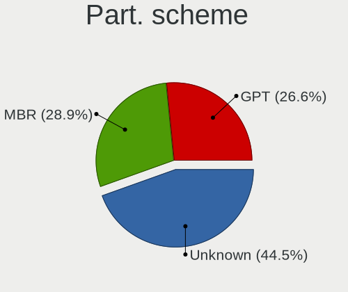

| Type    | Desktops | Percent |
|---------|----------|---------|
| Unknown | 41       | 56.16%  |
| MBR     | 21       | 28.77%  |
| GPT     | 11       | 15.07%  |

Dual Boot with Linux/BSD
------------------------

Hosting more than one Linux/BSD

| Dual boot | Desktops | Percent |
|-----------|----------|---------|
| No        | 56       | 74.67%  |
| Yes       | 19       | 25.33%  |

Dual Boot (Win)
---------------

Hosting Linux and Windows

| Dual boot | Desktops | Percent |
|-----------|----------|---------|
| No        | 45       | 60%     |
| Yes       | 30       | 40%     |

Board
-----

Vendor
------

Motherboard manufacturer

| Name                | Desktops | Percent |
|---------------------|----------|---------|
| Gigabyte Technology | 14       | 19.18%  |
| MSI                 | 13       | 17.81%  |
| ECS                 | 8        | 10.96%  |
| Unknown             | 7        | 9.59%   |
| Dell                | 6        | 8.22%   |
| Foxconn             | 5        | 6.85%   |
| ASUSTek Computer    | 4        | 5.48%   |
| Intel               | 3        | 4.11%   |
| Hewlett-Packard     | 3        | 4.11%   |
| Biostar             | 3        | 4.11%   |
| Lenovo              | 2        | 2.74%   |
| ASRock              | 2        | 2.74%   |
| Wistron             | 1        | 1.37%   |
| WeiBu               | 1        | 1.37%   |
| Pegatron            | 1        | 1.37%   |

Model
-----

Motherboard model

| Name                             | Desktops | Percent |
|----------------------------------|----------|---------|
| Unknown                          | 7        | 9.59%   |
| Intel H55                        | 3        | 4.11%   |
| ECS G41T-M7                      | 3        | 4.11%   |
| MSI MS-7758                      | 2        | 2.74%   |
| MSI MS-7636                      | 2        | 2.74%   |
| HP 280 G1 MT                     | 2        | 2.74%   |
| Gigabyte B85M-DS3H-A             | 2        | 2.74%   |
| ECS H61H2-MV                     | 2        | 2.74%   |
| Biostar P4M89-M7B                | 2        | 2.74%   |
| Wistron ProLiant ML110 G5        | 1        | 1.37%   |
| WeiBu SIMM INT G-41D3 G1.0L      | 1        | 1.37%   |
| Pegatron 2A94h                   | 1        | 1.37%   |
| MSI MS-7C52                      | 1        | 1.37%   |
| MSI MS-7B98                      | 1        | 1.37%   |
| MSI MS-7A15                      | 1        | 1.37%   |
| MSI MS-7821                      | 1        | 1.37%   |
| MSI MS-7788                      | 1        | 1.37%   |
| MSI MS-7752                      | 1        | 1.37%   |
| MSI MS-7693                      | 1        | 1.37%   |
| MSI MS-7637                      | 1        | 1.37%   |
| MSI MS-7592                      | 1        | 1.37%   |
| Lenovo S510 10KW005NFM           | 1        | 1.37%   |
| Lenovo 0B98417 PRO               | 1        | 1.37%   |
| HP Compaq Elite 8300 SFF         | 1        | 1.37%   |
| Gigabyte Z68AP-D3                | 1        | 1.37%   |
| Gigabyte X570 GAMING X           | 1        | 1.37%   |
| Gigabyte X470 AORUS ULTRA GAMING | 1        | 1.37%   |
| Gigabyte P61A-D3                 | 1        | 1.37%   |
| Gigabyte H61M-S2PV               | 1        | 1.37%   |
| Gigabyte H61M-S2PT               | 1        | 1.37%   |
| Gigabyte H61M-S2P-R3             | 1        | 1.37%   |
| Gigabyte H61M-DS2                | 1        | 1.37%   |
| Gigabyte GA-E7AUM-DS2H           | 1        | 1.37%   |
| Gigabyte G41MT-S2PT              | 1        | 1.37%   |
| Gigabyte G31M-ES2C               | 1        | 1.37%   |
| Gigabyte B450 AORUS ELITE V2     | 1        | 1.37%   |
| Foxconn Pro 3330 MT              | 1        | 1.37%   |
| Foxconn H61MXT1/F2/-S/-V         | 1        | 1.37%   |
| Foxconn H61MXL/H61MXL-K          | 1        | 1.37%   |
| Foxconn H61M/H61M-S              | 1        | 1.37%   |

Model Family
------------

Motherboard model prefix

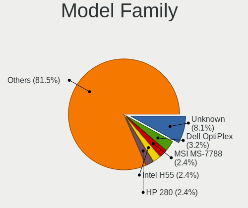

| Name                   | Desktops | Percent |
|------------------------|----------|---------|
| Unknown                | 7        | 9.59%   |
| Intel H55              | 3        | 4.11%   |
| ECS G41T-M7            | 3        | 4.11%   |
| Dell OptiPlex          | 3        | 4.11%   |
| MSI MS-7758            | 2        | 2.74%   |
| MSI MS-7636            | 2        | 2.74%   |
| HP 280                 | 2        | 2.74%   |
| Gigabyte B85M-DS3H-A   | 2        | 2.74%   |
| ECS H61H2-MV           | 2        | 2.74%   |
| Biostar P4M89-M7B      | 2        | 2.74%   |
| Wistron ProLiant       | 1        | 1.37%   |
| WeiBu SIMM             | 1        | 1.37%   |
| Pegatron 2A94h         | 1        | 1.37%   |
| MSI MS-7C52            | 1        | 1.37%   |
| MSI MS-7B98            | 1        | 1.37%   |
| MSI MS-7A15            | 1        | 1.37%   |
| MSI MS-7821            | 1        | 1.37%   |
| MSI MS-7788            | 1        | 1.37%   |
| MSI MS-7752            | 1        | 1.37%   |
| MSI MS-7693            | 1        | 1.37%   |
| MSI MS-7637            | 1        | 1.37%   |
| MSI MS-7592            | 1        | 1.37%   |
| Lenovo S510            | 1        | 1.37%   |
| Lenovo 0B98417         | 1        | 1.37%   |
| HP Compaq              | 1        | 1.37%   |
| Gigabyte Z68AP-D3      | 1        | 1.37%   |
| Gigabyte X570          | 1        | 1.37%   |
| Gigabyte X470          | 1        | 1.37%   |
| Gigabyte P61A-D3       | 1        | 1.37%   |
| Gigabyte H61M-S2PV     | 1        | 1.37%   |
| Gigabyte H61M-S2PT     | 1        | 1.37%   |
| Gigabyte H61M-S2P-R3   | 1        | 1.37%   |
| Gigabyte H61M-DS2      | 1        | 1.37%   |
| Gigabyte GA-E7AUM-DS2H | 1        | 1.37%   |
| Gigabyte G41MT-S2PT    | 1        | 1.37%   |
| Gigabyte G31M-ES2C     | 1        | 1.37%   |
| Gigabyte B450          | 1        | 1.37%   |
| Foxconn Pro            | 1        | 1.37%   |
| Foxconn H61MXT1        | 1        | 1.37%   |
| Foxconn H61MXL         | 1        | 1.37%   |

MFG Year
--------

Motherboard manufacture year

| Year | Desktops | Percent |
|------|----------|---------|
| 2012 | 15       | 20.55%  |
| 2011 | 11       | 15.07%  |
| 2013 | 10       | 13.7%   |
| 2018 | 5        | 6.85%   |
| 2015 | 5        | 6.85%   |
| 2014 | 5        | 6.85%   |
| 2010 | 5        | 6.85%   |
| 2019 | 4        | 5.48%   |
| 2007 | 4        | 5.48%   |
| 2008 | 3        | 4.11%   |
| 2016 | 2        | 2.74%   |
| 2009 | 2        | 2.74%   |
| 2020 | 1        | 1.37%   |
| 2006 | 1        | 1.37%   |

Form Factor
-----------

Physical design of the computer

| Name    | Desktops | Percent |
|---------|----------|---------|
| Desktop | 73       | 100%    |

Secure Boot
-----------

Enabled or disabled

| State    | Desktops | Percent |
|----------|----------|---------|
| Disabled | 72       | 98.63%  |
| Enabled  | 1        | 1.37%   |

Coreboot
--------

Have coreboot on board

| Used | Desktops | Percent |
|------|----------|---------|
| No   | 73       | 100%    |

RAM Size
--------

Total RAM memory

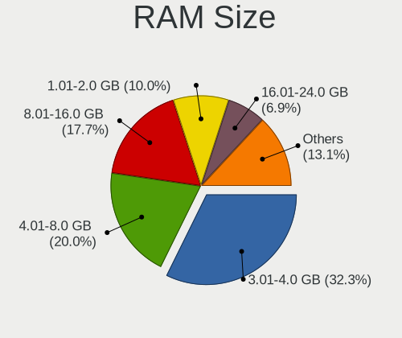

| Size in GB  | Desktops | Percent |
|-------------|----------|---------|
| 3.01-4.0    | 21       | 28%     |
| 4.01-8.0    | 14       | 18.67%  |
| 8.01-16.0   | 13       | 17.33%  |
| 1.01-2.0    | 11       | 14.67%  |
| 16.01-24.0  | 5        | 6.67%   |
| 2.01-3.0    | 4        | 5.33%   |
| 32.01-64.0  | 3        | 4%      |
| 0.51-1.0    | 3        | 4%      |
| 64.01-256.0 | 1        | 1.33%   |

RAM Used
--------

Used RAM memory

| Used GB   | Desktops | Percent |
|-----------|----------|---------|
| 1.01-2.0  | 36       | 47.37%  |
| 2.01-3.0  | 16       | 21.05%  |
| 0.51-1.0  | 9        | 11.84%  |
| 4.01-8.0  | 7        | 9.21%   |
| 3.01-4.0  | 4        | 5.26%   |
| 8.01-16.0 | 2        | 2.63%   |
| 0.01-0.5  | 2        | 2.63%   |

Total Drives
------------

Number of drives on board

| Drives | Desktops | Percent |
|--------|----------|---------|
| 1      | 39       | 51.32%  |
| 2      | 22       | 28.95%  |
| 3      | 11       | 14.47%  |
| 4      | 3        | 3.95%   |
| 0      | 1        | 1.32%   |

Has CD-ROM
----------

Has CD-ROM on board

| Presented | Desktops | Percent |
|-----------|----------|---------|
| Yes       | 42       | 56%     |
| No        | 33       | 44%     |

Has Ethernet
------------

Has Ethernet on board

| Presented | Desktops | Percent |
|-----------|----------|---------|
| Yes       | 71       | 97.26%  |
| No        | 2        | 2.74%   |

Has WiFi
--------

Has WiFi module

| Presented | Desktops | Percent |
|-----------|----------|---------|
| No        | 42       | 56.76%  |
| Yes       | 32       | 43.24%  |

Has Bluetooth
-------------

Has Bluetooth module

| Presented | Desktops | Percent |
|-----------|----------|---------|
| No        | 68       | 89.47%  |
| Yes       | 8        | 10.53%  |

Location
--------

Country
-------

Geographic location (country)

| Country | Desktops | Percent |
|---------|----------|---------|
| Algeria | 73       | 100%    |

City
----

Geographic location (city)

| City            | Desktops | Percent |
|-----------------|----------|---------|
| Algiers         | 11       | 14.1%   |
| Annaba          | 7        | 8.97%   |
| Oran            | 4        | 5.13%   |
| Belcourt        | 4        | 5.13%   |
| Mostaganem      | 3        | 3.85%   |
| Biskra          | 3        | 3.85%   |
| Batna City      | 3        | 3.85%   |
| Tlemcen         | 2        | 2.56%   |
| Sidi Akkacha    | 2        | 2.56%   |
| Sétif          | 2        | 2.56%   |
| Ouargla         | 2        | 2.56%   |
| Khenchela       | 2        | 2.56%   |
| Jijelli         | 2        | 2.56%   |
| Blida           | 2        | 2.56%   |
| Ain Defla       | 2        | 2.56%   |
| Tipasa          | 1        | 1.28%   |
| Tamanghasset    | 1        | 1.28%   |
| Tadjenanet      | 1        | 1.28%   |
| Skikda          | 1        | 1.28%   |
| Sig             | 1        | 1.28%   |
| Oum el Bouaghi  | 1        | 1.28%   |
| Oued Smar       | 1        | 1.28%   |
| Mascara         | 1        | 1.28%   |
| Khraicia        | 1        | 1.28%   |
| Hassi Bahbah    | 1        | 1.28%   |
| Hammam Dalaa    | 1        | 1.28%   |
| El Matmar       | 1        | 1.28%   |
| El Aouinet      | 1        | 1.28%   |
| Draria          | 1        | 1.28%   |
| Constantine     | 1        | 1.28%   |
| Bouïra         | 1        | 1.28%   |
| Bordj el Kiffan | 1        | 1.28%   |
| Bir el Ater     | 1        | 1.28%   |
| Ben ’Aknoûn  | 1        | 1.28%   |
| Béchar         | 1        | 1.28%   |
| Babar           | 1        | 1.28%   |
| Bab Ezzouar     | 1        | 1.28%   |
| Aoulef          | 1        | 1.28%   |
| 'Ain Merane     | 1        | 1.28%   |
| 'Ain el Melh    | 1        | 1.28%   |

Drives
------

Drive Vendor
------------

Hard drive vendors

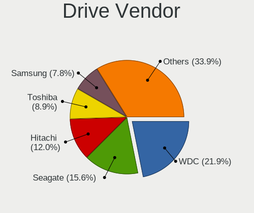

| Vendor                    | Desktops | Drives | Percent |
|---------------------------|----------|--------|---------|
| WDC                       | 30       | 50     | 27.27%  |
| Seagate                   | 18       | 22     | 16.36%  |
| Samsung Electronics       | 12       | 13     | 10.91%  |
| Hitachi                   | 10       | 17     | 9.09%   |
| Toshiba                   | 9        | 10     | 8.18%   |
| A-DATA Technology         | 7        | 7      | 6.36%   |
| Maxtor                    | 4        | 5      | 3.64%   |
| Silicon Motion            | 2        | 2      | 1.82%   |
| Realtek Semiconductor     | 2        | 2      | 1.82%   |
| Lexar                     | 2        | 2      | 1.82%   |
| ZTE                       | 1        | 1      | 0.91%   |
| XPG                       | 1        | 1      | 0.91%   |
| WD MediaMax               | 1        | 1      | 0.91%   |
| TwinMOS                   | 1        | 1      | 0.91%   |
| T-FORCE                   | 1        | 1      | 0.91%   |
| SanDisk                   | 1        | 1      | 0.91%   |
| Micron/Crucial Technology | 1        | 1      | 0.91%   |
| MDT                       | 1        | 1      | 0.91%   |
| Magnetic Data             | 1        | 1      | 0.91%   |
| LITEON                    | 1        | 1      | 0.91%   |
| Kingston                  | 1        | 1      | 0.91%   |
| HGST                      | 1        | 1      | 0.91%   |
| Hewlett-Packard           | 1        | 1      | 0.91%   |
| Crucial                   | 1        | 1      | 0.91%   |

Drive Model
-----------

Hard drive models

| Model                            | Desktops | Percent |
|----------------------------------|----------|---------|
| WDC WD10EZEX-08WN4A0 1TB         | 3        | 2.46%   |
| WDC WD10EZEX-00WN4A0 1TB         | 3        | 2.46%   |
| Toshiba DT01ACA100 1TB           | 3        | 2.46%   |
| Toshiba DT01ACA050 500GB         | 3        | 2.46%   |
| A-DATA SU630 240GB SSD           | 3        | 2.46%   |
| WDC WD5000AVVS-63M8B0 500GB      | 2        | 1.64%   |
| Seagate ST500LT012-9WS142 500GB  | 2        | 1.64%   |
| Seagate ST500DM002-1BD142 500GB  | 2        | 1.64%   |
| Seagate ST3500312CS 500GB        | 2        | 1.64%   |
| Hitachi HDS721616PLA380 160GB    | 2        | 1.64%   |
| ZTE MMC Storage 942MB            | 1        | 0.82%   |
| XPG SX950U 240GB                 | 1        | 0.82%   |
| WDC WDS500G2B0A-00SM50 500GB SSD | 1        | 0.82%   |
| WDC WD800JD-55MUA1 80GB          | 1        | 0.82%   |
| WDC WD7500AYYS-01RCA0 752GB      | 1        | 0.82%   |
| WDC WD5000LPCX-24C6HT0 500GB     | 1        | 0.82%   |
| WDC WD5000AZLX-08K2TA0 500GB     | 1        | 0.82%   |
| WDC WD5000AVCS-632DY1 500GB      | 1        | 0.82%   |
| WDC WD5000AAKX-603CA0 500GB      | 1        | 0.82%   |
| WDC WD5000AAKX-083CA1 500GB      | 1        | 0.82%   |
| WDC WD5000AAKX-00U6AA0 500GB     | 1        | 0.82%   |
| WDC WD5000AAKX-00ERMA0 500GB     | 1        | 0.82%   |
| WDC WD5000AAKX-001CA0 500GB      | 1        | 0.82%   |
| WDC WD5000AAKS-00A7B0 500GB      | 1        | 0.82%   |
| WDC WD5000AADS-00S9B0 500GB      | 1        | 0.82%   |
| WDC WD400EB-00CPF0 40GB          | 1        | 0.82%   |
| WDC WD3200AVJS-63N9A0 320GB      | 1        | 0.82%   |
| WDC WD3200AVJS-63B6A0 320GB      | 1        | 0.82%   |
| WDC WD3200AAKS-75L9A0 320GB      | 1        | 0.82%   |
| WDC WD3200AAJS-60M0A1 320GB      | 1        | 0.82%   |
| WDC WD2500AVJS-63TBA0 250GB      | 1        | 0.82%   |
| WDC WD20PURZ-85GU6Y0 2TB         | 1        | 0.82%   |
| WDC WD1600AVJS-63WNA0 160GB      | 1        | 0.82%   |
| WDC WD1600AAJS-75M0A0 160GB      | 1        | 0.82%   |
| WDC WD1600AAJS-61WAA0 160GB      | 1        | 0.82%   |
| WDC WD1600AAJS-08WAA0 160GB      | 1        | 0.82%   |
| WDC WD10EZRX-00DC0B0 1TB         | 1        | 0.82%   |
| WDC WD10EZEX-08Y20A0 1TB         | 1        | 0.82%   |
| WDC WD10EZEX-00BN5A0 1TB         | 1        | 0.82%   |
| WDC WD1003FZEX-00MK2A0 1TB       | 1        | 0.82%   |

HDD Vendor
----------

Hard disk drive vendors

| Vendor              | Desktops | Drives | Percent |
|---------------------|----------|--------|---------|
| WDC                 | 30       | 47     | 35.71%  |
| Seagate             | 18       | 22     | 21.43%  |
| Hitachi             | 10       | 17     | 11.9%   |
| Toshiba             | 9        | 10     | 10.71%  |
| Samsung Electronics | 9        | 10     | 10.71%  |
| Maxtor              | 4        | 5      | 4.76%   |
| WD MediaMax         | 1        | 1      | 1.19%   |
| Magnetic Data       | 1        | 1      | 1.19%   |
| HGST                | 1        | 1      | 1.19%   |
| Hewlett-Packard     | 1        | 1      | 1.19%   |

SSD Vendor
----------

Solid state drive vendors

| Vendor              | Desktops | Drives | Percent |
|---------------------|----------|--------|---------|
| A-DATA Technology   | 4        | 4      | 26.67%  |
| Samsung Electronics | 2        | 2      | 13.33%  |
| Lexar               | 2        | 2      | 13.33%  |
| XPG                 | 1        | 1      | 6.67%   |
| WDC                 | 1        | 3      | 6.67%   |
| TwinMOS             | 1        | 1      | 6.67%   |
| T-FORCE             | 1        | 1      | 6.67%   |
| SanDisk             | 1        | 1      | 6.67%   |
| LITEON              | 1        | 1      | 6.67%   |
| Crucial             | 1        | 1      | 6.67%   |

Drive Kind
----------

HDD or SSD

| Kind    | Desktops | Drives | Percent |
|---------|----------|--------|---------|
| HDD     | 69       | 115    | 74.19%  |
| SSD     | 14       | 17     | 15.05%  |
| NVMe    | 7        | 9      | 7.53%   |
| Unknown | 3        | 3      | 3.23%   |

Drive Connector
---------------

SATA, SAS, NVMe, etc.

| Type | Desktops | Drives | Percent |
|------|----------|--------|---------|
| SATA | 71       | 134    | 89.87%  |
| NVMe | 7        | 9      | 8.86%   |
| SAS  | 1        | 1      | 1.27%   |

Drive Size
----------

Size of hard drive

| Size in TB | Desktops | Drives | Percent |
|------------|----------|--------|---------|
| 0.01-0.5   | 59       | 98     | 69.41%  |
| 0.51-1.0   | 22       | 30     | 25.88%  |
| 1.01-2.0   | 4        | 4      | 4.71%   |

Space Total
-----------

Amount of disk space available on the file system

| Size in GB | Desktops | Percent |
|------------|----------|---------|
| 251-500    | 19       | 24.36%  |
| 101-250    | 14       | 17.95%  |
| 1-20       | 13       | 16.67%  |
| 51-100     | 9        | 11.54%  |
| 1001-2000  | 8        | 10.26%  |
| 501-1000   | 8        | 10.26%  |
| 21-50      | 5        | 6.41%   |
| 2001-3000  | 1        | 1.28%   |
| Unknown    | 1        | 1.28%   |

Space Used
----------

Amount of used disk space

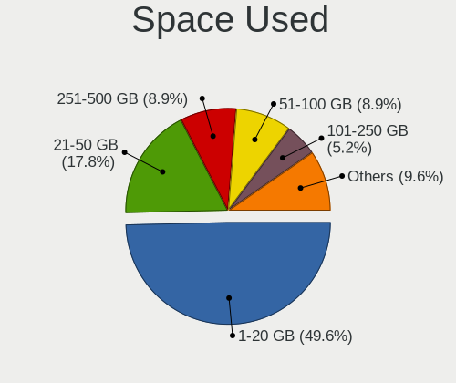

| Used GB   | Desktops | Percent |
|-----------|----------|---------|
| 1-20      | 41       | 52.56%  |
| 21-50     | 12       | 15.38%  |
| 251-500   | 7        | 8.97%   |
| 51-100    | 7        | 8.97%   |
| 501-1000  | 4        | 5.13%   |
| 101-250   | 3        | 3.85%   |
| 1001-2000 | 3        | 3.85%   |
| Unknown   | 1        | 1.28%   |

Malfunc. Drives
---------------

Drive models with a malfunction

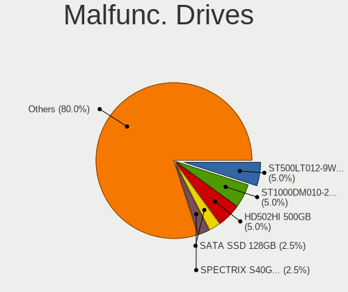

| Model                                       | Desktops | Drives | Percent |
|---------------------------------------------|----------|--------|---------|
| WDC WD5000AVVS-63M8B0 500GB                 | 1        | 1      | 4.76%   |
| WDC WD5000AVCS-632DY1 500GB                 | 1        | 1      | 4.76%   |
| WDC WD5000AAKX-00ERMA0 500GB                | 1        | 1      | 4.76%   |
| WDC WD400EB-00CPF0 40GB                     | 1        | 1      | 4.76%   |
| WDC WD3200AVJS-63B6A0 320GB                 | 1        | 1      | 4.76%   |
| WDC WD1600AAJS-08WAA0 160GB                 | 1        | 1      | 4.76%   |
| WDC WD1001FALS-403AA0 1TB                   | 1        | 1      | 4.76%   |
| WD MediaMax WL120GBSATA                     | 1        | 1      | 4.76%   |
| Seagate ST500LT012-9WS142 500GB             | 1        | 1      | 4.76%   |
| Seagate ST500DM002-1BD142 500GB             | 1        | 1      | 4.76%   |
| Seagate ST3250310AS 250GB                   | 1        | 1      | 4.76%   |
| Samsung Electronics SSD PM810 2.5 7mm 128GB | 1        | 1      | 4.76%   |
| Samsung Electronics HD502HI 500GB           | 1        | 1      | 4.76%   |
| Samsung Electronics HD256GJ 250GB           | 1        | 1      | 4.76%   |
| Samsung Electronics HD160JJ/ 160GB          | 1        | 1      | 4.76%   |
| Samsung Electronics HD103SI 1TB             | 1        | 1      | 4.76%   |
| Maxtor 6L300S0 304GB                        | 1        | 1      | 4.76%   |
| Maxtor 32049H2 20GB                         | 1        | 1      | 4.76%   |
| Magnetic Data MD07500-ALDW-RO 752GB         | 1        | 1      | 4.76%   |
| Hitachi HTS722010K9SA00 100GB               | 1        | 1      | 4.76%   |
| Hitachi HDS721032CLA362 320GB               | 1        | 1      | 4.76%   |

Malfunc. Drive Vendor
---------------------

Vendors of faulty drives

| Vendor              | Desktops | Drives | Percent |
|---------------------|----------|--------|---------|
| WDC                 | 6        | 7      | 30%     |
| Samsung Electronics | 5        | 5      | 25%     |
| Seagate             | 3        | 3      | 15%     |
| Maxtor              | 2        | 2      | 10%     |
| Hitachi             | 2        | 2      | 10%     |
| WD MediaMax         | 1        | 1      | 5%      |
| Magnetic Data       | 1        | 1      | 5%      |

Malfunc. HDD Vendor
-------------------

Vendors of faulty HDD drives

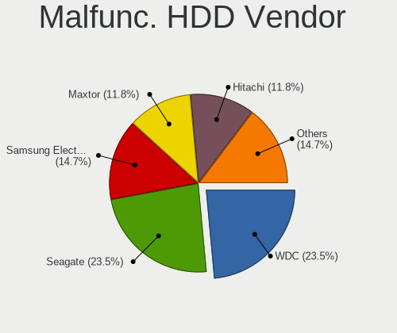

| Vendor              | Desktops | Drives | Percent |
|---------------------|----------|--------|---------|
| WDC                 | 6        | 7      | 31.58%  |
| Samsung Electronics | 4        | 4      | 21.05%  |
| Seagate             | 3        | 3      | 15.79%  |
| Maxtor              | 2        | 2      | 10.53%  |
| Hitachi             | 2        | 2      | 10.53%  |
| WD MediaMax         | 1        | 1      | 5.26%   |
| Magnetic Data       | 1        | 1      | 5.26%   |

Malfunc. Drive Kind
-------------------

Kinds of faulty drives

| Kind | Desktops | Drives | Percent |
|------|----------|--------|---------|
| HDD  | 18       | 20     | 94.74%  |
| SSD  | 1        | 1      | 5.26%   |

Failed Drives
-------------

Failed drive models

Zero info for selected period =(

Failed Drive Vendor
-------------------

Failed drive vendors

Zero info for selected period =(

Drive Status
------------

Number of failed and malfunc. drives

| Status   | Desktops | Drives | Percent |
|----------|----------|--------|---------|
| Detected | 45       | 98     | 54.88%  |
| Malfunc  | 19       | 21     | 23.17%  |
| Works    | 18       | 25     | 21.95%  |

Storage controller
------------------

Storage Vendor
--------------

Storage controller vendors

| Vendor                      | Desktops | Percent |
|-----------------------------|----------|---------|
| Intel                       | 62       | 72.09%  |
| AMD                         | 6        | 6.98%   |
| Realtek Semiconductor       | 4        | 4.65%   |
| VIA Technologies            | 3        | 3.49%   |
| Silicon Motion              | 2        | 2.33%   |
| Nvidia                      | 2        | 2.33%   |
| JMicron Technology          | 2        | 2.33%   |
| ASMedia Technology          | 2        | 2.33%   |
| Micron/Crucial Technology   | 1        | 1.16%   |
| Marvell Technology Group    | 1        | 1.16%   |
| Kingston Technology Company | 1        | 1.16%   |

Storage Model
-------------

Storage controller models

| Model                                                                                   | Desktops | Percent |
|-----------------------------------------------------------------------------------------|----------|---------|
| Intel 6 Series/C200 Series Chipset Family Desktop SATA Controller (IDE mode, ports 4-5) | 15       | 11.72%  |
| Intel 6 Series/C200 Series Chipset Family Desktop SATA Controller (IDE mode, ports 0-3) | 15       | 11.72%  |
| Intel NM10/ICH7 Family SATA Controller [IDE mode]                                       | 13       | 10.16%  |
| Intel 82801G (ICH7 Family) IDE Controller                                               | 10       | 7.81%   |
| Intel 8 Series/C220 Series Chipset Family 6-port SATA Controller 1 [AHCI mode]          | 6        | 4.69%   |
| Intel 7 Series/C210 Series Chipset Family 6-port SATA Controller [AHCI mode]            | 6        | 4.69%   |
| Intel 6 Series/C200 Series Chipset Family 6 port Desktop SATA AHCI Controller           | 6        | 4.69%   |
| Intel 5 Series/3400 Series Chipset 4 port SATA IDE Controller                           | 6        | 4.69%   |
| Intel 5 Series/3400 Series Chipset 2 port SATA IDE Controller                           | 6        | 4.69%   |
| AMD FCH SATA Controller [AHCI mode]                                                     | 5        | 3.91%   |
| Realtek Realtek Non-Volatile memory controller                                          | 4        | 3.13%   |
| AMD 400 Series Chipset SATA Controller                                                  | 4        | 3.13%   |
| VIA VT82C586A/B/VT82C686/A/B/VT823x/A/C PIPC Bus Master IDE                             | 3        | 2.34%   |
| VIA Serial ATA Controller                                                               | 2        | 1.56%   |
| Silicon Motion SM2263EN/SM2263XT SSD Controller                                         | 2        | 1.56%   |
| Intel SATA Controller [RAID mode]                                                       | 2        | 1.56%   |
| Intel Q170/Q150/B150/H170/H110/Z170/CM236 Chipset SATA Controller [AHCI Mode]           | 2        | 1.56%   |
| Intel Cannon Lake PCH SATA AHCI Controller                                              | 2        | 1.56%   |
| Intel 82801IBM/IEM (ICH9M/ICH9M-E) 2 port SATA Controller [IDE mode]                    | 2        | 1.56%   |
| VIA VT8237/8251 Serial ATA Controller                                                   | 1        | 0.78%   |
| Nvidia MCP79 SATA Controller                                                            | 1        | 0.78%   |
| Nvidia MCP79 AHCI Controller                                                            | 1        | 0.78%   |
| Nvidia MCP78S [GeForce 8200] SATA Controller (non-AHCI mode)                            | 1        | 0.78%   |
| Nvidia MCP78S [GeForce 8200] IDE                                                        | 1        | 0.78%   |
| Micron/Crucial P2 NVMe PCIe SSD                                                         | 1        | 0.78%   |
| Marvell Group 88SE9172 SATA 6Gb/s Controller                                            | 1        | 0.78%   |
| Kingston Company A2000 NVMe SSD                                                         | 1        | 0.78%   |
| JMicron JMB368 IDE controller                                                           | 1        | 0.78%   |
| JMicron JMB363 SATA/IDE Controller                                                      | 1        | 0.78%   |
| Intel 82801JI (ICH10 Family) SATA AHCI Controller                                       | 1        | 0.78%   |
| Intel 82801IR/IO/IH (ICH9R/DO/DH) 4 port SATA Controller [IDE mode]                     | 1        | 0.78%   |
| Intel 82801I (ICH9 Family) 2 port SATA Controller [IDE mode]                            | 1        | 0.78%   |
| ASMedia ASM1062 Serial ATA Controller                                                   | 1        | 0.78%   |
| ASMedia ASM1061 SATA IDE Controller                                                     | 1        | 0.78%   |
| AMD SB7x0/SB8x0/SB9x0 SATA Controller [IDE mode]                                        | 1        | 0.78%   |
| AMD SB7x0/SB8x0/SB9x0 IDE Controller                                                    | 1        | 0.78%   |

Storage Kind
------------

Kind of storage controller (IDE, SATA, NVMe, SAS, ...)

| Kind | Desktops | Percent |
|------|----------|---------|
| IDE  | 43       | 51.81%  |
| SATA | 31       | 37.35%  |
| NVMe | 7        | 8.43%   |
| RAID | 2        | 2.41%   |

Processor
---------

CPU Vendor
----------

Processor vendors

| Vendor | Desktops | Percent |
|--------|----------|---------|
| Intel  | 66       | 90.41%  |
| AMD    | 7        | 9.59%   |

CPU Model
---------

Processor models

| Model                                       | Desktops | Percent |
|---------------------------------------------|----------|---------|
| Intel Pentium Dual-Core CPU E5700 @ 3.00GHz | 5        | 6.85%   |
| Intel Pentium CPU G2020 @ 2.90GHz           | 4        | 5.48%   |
| Intel Core i3-3240 CPU @ 3.40GHz            | 3        | 4.11%   |
| Intel Core i3-3220 CPU @ 3.30GHz            | 3        | 4.11%   |
| Intel Core i3-2120 CPU @ 3.30GHz            | 3        | 4.11%   |
| Intel Core i3 CPU 540 @ 3.07GHz             | 3        | 4.11%   |
| Intel Xeon CPU E5-1650 v2 @ 3.50GHz         | 2        | 2.74%   |
| Intel Pentium Dual-Core CPU E5300 @ 2.60GHz | 2        | 2.74%   |
| Intel Pentium Dual CPU E2200 @ 2.20GHz      | 2        | 2.74%   |
| Intel Core i7-2700K CPU @ 3.50GHz           | 2        | 2.74%   |
| Intel Core i3-4130 CPU @ 3.40GHz            | 2        | 2.74%   |
| Intel Core i3 CPU M 370 @ 2.40GHz           | 2        | 2.74%   |
| Intel Core 2 Duo CPU E8400 @ 3.00GHz        | 2        | 2.74%   |
| Intel Core 2 Duo CPU E7500 @ 2.93GHz        | 2        | 2.74%   |
| AMD Ryzen 7 2700X Eight-Core Processor      | 2        | 2.74%   |
| Intel Xeon CPU 3065 @ 2.33GHz               | 1        | 1.37%   |
| Intel Pentium Dual-Core CPU E5800 @ 3.20GHz | 1        | 1.37%   |
| Intel Pentium Dual-Core CPU E5500 @ 2.80GHz | 1        | 1.37%   |
| Intel Pentium Dual-Core CPU E5400 @ 2.70GHz | 1        | 1.37%   |
| Intel Pentium Dual CPU E2220 @ 2.40GHz      | 1        | 1.37%   |
| Intel Pentium D CPU 3.00GHz                 | 1        | 1.37%   |
| Intel Pentium CPU G850 @ 2.90GHz            | 1        | 1.37%   |
| Intel Pentium CPU G620 @ 2.60GHz            | 1        | 1.37%   |
| Intel Pentium CPU G3240 @ 3.10GHz           | 1        | 1.37%   |
| Intel Pentium CPU G2030 @ 3.00GHz           | 1        | 1.37%   |
| Intel Pentium CPU G2010 @ 2.80GHz           | 1        | 1.37%   |
| Intel Pentium 4 CPU 3.20GHz                 | 1        | 1.37%   |
| Intel Core i7-4770 CPU @ 3.40GHz            | 1        | 1.37%   |
| Intel Core i7-2600K CPU @ 3.40GHz           | 1        | 1.37%   |
| Intel Core i7-2600 CPU @ 3.40GHz            | 1        | 1.37%   |
| Intel Core i5-9400F CPU @ 2.90GHz           | 1        | 1.37%   |
| Intel Core i5-4460 CPU @ 3.20GHz            | 1        | 1.37%   |
| Intel Core i5-3470 CPU @ 3.20GHz            | 1        | 1.37%   |
| Intel Core i5-3450 CPU @ 3.10GHz            | 1        | 1.37%   |
| Intel Core i5-2400 CPU @ 3.10GHz            | 1        | 1.37%   |
| Intel Core i3-8300 CPU @ 3.70GHz            | 1        | 1.37%   |
| Intel Core i3-7100 CPU @ 3.90GHz            | 1        | 1.37%   |
| Intel Core i3-6100 CPU @ 3.70GHz            | 1        | 1.37%   |
| Intel Core i3-4160 CPU @ 3.60GHz            | 1        | 1.37%   |
| Intel Core i3-3210 CPU @ 3.20GHz            | 1        | 1.37%   |

CPU Model Family
----------------

Processor model prefix

| Model                   | Desktops | Percent |
|-------------------------|----------|---------|
| Intel Core i3           | 22       | 30.14%  |
| Intel Pentium Dual-Core | 10       | 13.7%   |
| Intel Pentium           | 9        | 12.33%  |
| Intel Core 2 Duo        | 6        | 8.22%   |
| Intel Core i7           | 5        | 6.85%   |
| Intel Core i5           | 5        | 6.85%   |
| Intel Xeon              | 3        | 4.11%   |
| Intel Pentium Dual      | 3        | 4.11%   |
| AMD Ryzen 7             | 2        | 2.74%   |
| Intel Pentium D         | 1        | 1.37%   |
| Intel Pentium 4         | 1        | 1.37%   |
| Intel Core 2 Quad       | 1        | 1.37%   |
| AMD Ryzen 9             | 1        | 1.37%   |
| AMD Ryzen 5 PRO         | 1        | 1.37%   |
| AMD Ryzen 5             | 1        | 1.37%   |
| AMD FX                  | 1        | 1.37%   |
| AMD Athlon 64           | 1        | 1.37%   |

CPU Cores
---------

Number of processor cores

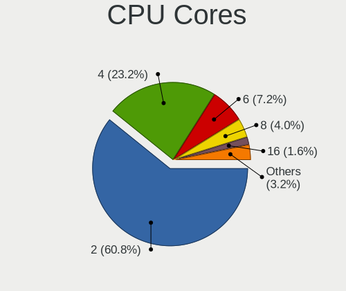

| Number | Desktops | Percent |
|--------|----------|---------|
| 2      | 51       | 69.86%  |
| 4      | 11       | 15.07%  |
| 6      | 5        | 6.85%   |
| 8      | 2        | 2.74%   |
| 1      | 2        | 2.74%   |
| 16     | 1        | 1.37%   |
| 3      | 1        | 1.37%   |

CPU Sockets
-----------

Number of sockets

| Number | Desktops | Percent |
|--------|----------|---------|
| 1      | 73       | 100%    |

CPU Threads
-----------

Threads per core (Hyper-Threading)

| Number | Desktops | Percent |
|--------|----------|---------|
| 1      | 38       | 52.05%  |
| 2      | 35       | 47.95%  |

CPU Op-Modes
------------

CPU Operation Modes (32-bit, 64-bit)

| Op mode        | Desktops | Percent |
|----------------|----------|---------|
| 32-bit, 64-bit | 73       | 98.65%  |
| Unknown        | 1        | 1.35%   |

CPU Microcode
-------------

Microcode number

| Number     | Desktops | Percent |
|------------|----------|---------|
| Unknown    | 14       | 18.67%  |
| 0x1067a    | 13       | 17.33%  |
| 0x306a9    | 12       | 16%     |
| 0x206a7    | 7        | 9.33%   |
| 0x306c3    | 5        | 6.67%   |
| 0x20655    | 5        | 6.67%   |
| 0x6fd      | 3        | 4%      |
| 0x6fb      | 2        | 2.67%   |
| 0x306e4    | 2        | 2.67%   |
| 0x0800820d | 2        | 2.67%   |
| 0xf65      | 1        | 1.33%   |
| 0x906eb    | 1        | 1.33%   |
| 0x906e9    | 1        | 1.33%   |
| 0x506e3    | 1        | 1.33%   |
| 0x20652    | 1        | 1.33%   |
| 0x10676    | 1        | 1.33%   |
| 0x0a201016 | 1        | 1.33%   |
| 0x08701021 | 1        | 1.33%   |
| 0x08600106 | 1        | 1.33%   |
| 0x0600063d | 1        | 1.33%   |

CPU Microarch
-------------

Microarchitecture

| Name        | Desktops | Percent |
|-------------|----------|---------|
| IvyBridge   | 17       | 23.29%  |
| Penryn      | 15       | 20.55%  |
| SandyBridge | 10       | 13.7%   |
| Westmere    | 6        | 8.22%   |
| Haswell     | 6        | 8.22%   |
| Core        | 6        | 8.22%   |
| KabyLake    | 3        | 4.11%   |
| Zen+        | 2        | 2.74%   |
| Zen 2       | 2        | 2.74%   |
| NetBurst    | 2        | 2.74%   |
| Zen 3       | 1        | 1.37%   |
| Skylake     | 1        | 1.37%   |
| K8 Hammer   | 1        | 1.37%   |
| Bulldozer   | 1        | 1.37%   |

Graphics
--------

GPU Vendor
----------

Vendors of graphics cards

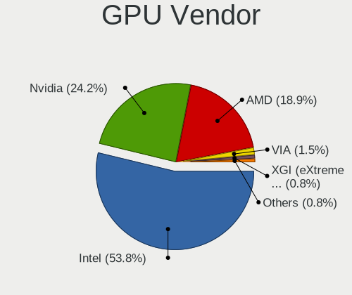

| Vendor                     | Desktops | Percent |
|----------------------------|----------|---------|
| Intel                      | 37       | 46.84%  |
| Nvidia                     | 23       | 29.11%  |
| AMD                        | 16       | 20.25%  |
| VIA Technologies           | 2        | 2.53%   |
| Matrox Electronics Systems | 1        | 1.27%   |

GPU Model
---------

Graphics card models

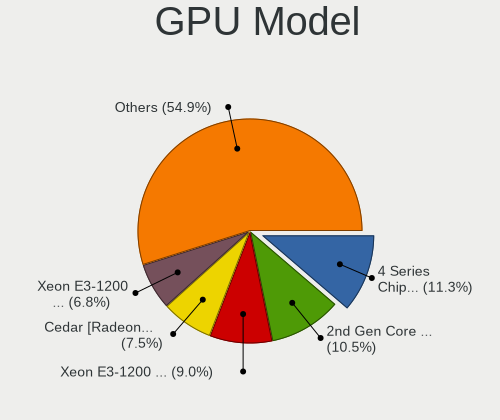

| Model                                                                       | Desktops | Percent |
|-----------------------------------------------------------------------------|----------|---------|
| Intel 4 Series Chipset Integrated Graphics Controller                       | 10       | 12.66%  |
| Intel Xeon E3-1200 v2/3rd Gen Core processor Graphics Controller            | 9        | 11.39%  |
| AMD Cedar [Radeon HD 5000/6000/7350/8350 Series]                            | 8        | 10.13%  |
| Intel 2nd Generation Core Processor Family Integrated Graphics Controller   | 4        | 5.06%   |
| Nvidia GF108 [GeForce GT 730]                                               | 3        | 3.8%    |
| Intel Xeon E3-1200 v3/4th Gen Core Processor Integrated Graphics Controller | 3        | 3.8%    |
| Intel 4th Generation Core Processor Family Integrated Graphics Controller   | 3        | 3.8%    |
| Nvidia GT218 [GeForce 210]                                                  | 2        | 2.53%   |
| Nvidia GF108 [GeForce GT 630]                                               | 2        | 2.53%   |
| Intel Mobile 4 Series Chipset Integrated Graphics Controller                | 2        | 2.53%   |
| Intel Core Processor Integrated Graphics Controller                         | 2        | 2.53%   |
| AMD Caicos [Radeon HD 6450/7450/8450 / R5 230 OEM]                          | 2        | 2.53%   |
| VIA Technologies P4M890 [S3 UniChrome Pro]                                  | 1        | 1.27%   |
| VIA Technologies CN896/VN896/P4M900 [Chrome 9 HC]                           | 1        | 1.27%   |
| Nvidia TU117 [GeForce GTX 1650]                                             | 1        | 1.27%   |
| Nvidia TU116 [GeForce GTX 1660 SUPER]                                       | 1        | 1.27%   |
| Nvidia GP107 [GeForce GTX 1050]                                             | 1        | 1.27%   |
| Nvidia GP104 [GeForce GTX 1070]                                             | 1        | 1.27%   |
| Nvidia GM107 [GeForce GTX 750]                                              | 1        | 1.27%   |
| Nvidia GM107 [GeForce GTX 750 Ti]                                           | 1        | 1.27%   |
| Nvidia GK208B [GeForce GT 710]                                              | 1        | 1.27%   |
| Nvidia GK106 [GeForce GTX 660]                                              | 1        | 1.27%   |
| Nvidia GK104 [GeForce GTX 760]                                              | 1        | 1.27%   |
| Nvidia GF119 [GeForce GT 610]                                               | 1        | 1.27%   |
| Nvidia GF119 [GeForce GT 520]                                               | 1        | 1.27%   |
| Nvidia GF108 [GeForce GT 430]                                               | 1        | 1.27%   |
| Nvidia GA104 [GeForce RTX 3060 Ti Lite Hash Rate]                           | 1        | 1.27%   |
| Nvidia G96C [GeForce 9500 GT]                                               | 1        | 1.27%   |
| Nvidia C79 [GeForce 9400]                                                   | 1        | 1.27%   |
| Nvidia C77 [GeForce 8200]                                                   | 1        | 1.27%   |
| Matrox Electronics Systems MGA G200e [Pilot] ServerEngines (SEP1)           | 1        | 1.27%   |
| Intel HD Graphics 630                                                       | 1        | 1.27%   |
| Intel HD Graphics 530                                                       | 1        | 1.27%   |
| Intel 82G965 Integrated Graphics Controller                                 | 1        | 1.27%   |
| Intel 82G33/G31 Express Integrated Graphics Controller                      | 1        | 1.27%   |
| AMD Renoir                                                                  | 1        | 1.27%   |
| AMD Oland PRO [Radeon R7 240/340 / Radeon 520]                              | 1        | 1.27%   |
| AMD Juniper XT [Radeon HD 5770]                                             | 1        | 1.27%   |
| AMD Ellesmere [Radeon RX 470/480/570/570X/580/580X/590]                     | 1        | 1.27%   |
| AMD Barts XT [Radeon HD 6870]                                               | 1        | 1.27%   |

GPU Combo
---------

Combinations of graphics cards

| Name         | Desktops | Percent |
|--------------|----------|---------|
| 1 x Intel    | 34       | 45.33%  |
| 1 x Nvidia   | 22       | 29.33%  |
| 1 x AMD      | 13       | 17.33%  |
| 1 x VIA      | 2        | 2.67%   |
| Intel + AMD  | 2        | 2.67%   |
| 1 x Matrox   | 1        | 1.33%   |
| AMD + Nvidia | 1        | 1.33%   |

GPU Driver
----------

Free vs proprietary

| Driver      | Desktops | Percent |
|-------------|----------|---------|
| Free        | 60       | 77.92%  |
| Proprietary | 11       | 14.29%  |
| Unknown     | 6        | 7.79%   |

GPU Memory
----------

Total video memory

| Size in GB | Desktops | Percent |
|------------|----------|---------|
| Unknown    | 39       | 51.32%  |
| 1.01-2.0   | 23       | 30.26%  |
| 0.51-1.0   | 6        | 7.89%   |
| 3.01-4.0   | 3        | 3.95%   |
| 0.01-0.5   | 3        | 3.95%   |
| 7.01-8.0   | 2        | 2.63%   |

Monitor
-------

Monitor Vendor
--------------

Monitor vendors

| Vendor               | Desktops | Percent |
|----------------------|----------|---------|
| Samsung Electronics  | 15       | 24.59%  |
| Hewlett-Packard      | 9        | 14.75%  |
| AOC                  | 9        | 14.75%  |
| KTC                  | 5        | 8.2%    |
| Dell                 | 3        | 4.92%   |
| Ancor Communications | 3        | 4.92%   |
| Acer                 | 3        | 4.92%   |
| Unknown (XXX)        | 2        | 3.28%   |
| BenQ                 | 2        | 3.28%   |
| Unknown              | 2        | 3.28%   |
| Unknown              | 1        | 1.64%   |
| TSN                  | 1        | 1.64%   |
| SKY                  | 1        | 1.64%   |
| PTW                  | 1        | 1.64%   |
| PiLot                | 1        | 1.64%   |
| Lenovo               | 1        | 1.64%   |
| Goldstar             | 1        | 1.64%   |
| EMP                  | 1        | 1.64%   |

Monitor Model
-------------

Monitor models

| Model                                                                 | Desktops | Percent |
|-----------------------------------------------------------------------|----------|---------|
| Samsung Electronics SMS22A100 SAM0868 1920x1080 477x268mm 21.5-inch   | 3        | 4.76%   |
| AOC F22 AOC2200 1920x1080 476x268mm 21.5-inch                         | 3        | 4.76%   |
| Unknown (XXX) HDMI XXX0029 1920x1080 1152x648mm 52.0-inch             | 2        | 3.17%   |
| KTC W9023S5 KTC1852 1360x768 410x230mm 18.5-inch                      | 2        | 3.17%   |
| Unknown                                                               | 2        | 3.17%   |
| Unknown LCD Monitor SAMSUNG 1920x1080                                 | 1        | 1.59%   |
| TSN 24 Monitor TSN2400 1360x768 510x287mm 23.0-inch                   | 1        | 1.59%   |
| SKY TV-monitor SKY0104 1920x1080 885x498mm 40.0-inch                  | 1        | 1.59%   |
| Samsung Electronics SyncMaster SAM052A 1920x1080 510x287mm 23.0-inch  | 1        | 1.59%   |
| Samsung Electronics SyncMaster SAM04D5 1920x540                       | 1        | 1.59%   |
| Samsung Electronics SyncMaster SAM027F 1680x1050 474x296mm 22.0-inch  | 1        | 1.59%   |
| Samsung Electronics SyncMaster SAM00A6 1280x1024 380x310mm 19.3-inch  | 1        | 1.59%   |
| Samsung Electronics SME1920N SAM06A3 1366x768 410x230mm 18.5-inch     | 1        | 1.59%   |
| Samsung Electronics SMBX1931N SAM0768 1366x768 410x230mm 18.5-inch    | 1        | 1.59%   |
| Samsung Electronics SMB2230N SAM0635 1920x1080 477x268mm 21.5-inch    | 1        | 1.59%   |
| Samsung Electronics S22E390 SAM0C18 1920x1080 477x268mm 21.5-inch     | 1        | 1.59%   |
| Samsung Electronics S22C150 SAM0AE5 1920x1080 477x268mm 21.5-inch     | 1        | 1.59%   |
| Samsung Electronics LCD Monitor SAM0900 1366x768 700x390mm 31.5-inch  | 1        | 1.59%   |
| Samsung Electronics LCD Monitor SAM07C0 1920x1080 890x500mm 40.2-inch | 1        | 1.59%   |
| Samsung Electronics LCD Monitor SA300/SA350 1600x900                  | 1        | 1.59%   |
| Samsung Electronics LCD Monitor S22E390 1920x1080                     | 1        | 1.59%   |
| Samsung Electronics C24B550 SAM0956 1920x1080 531x299mm 24.0-inch     | 1        | 1.59%   |
| PTW 22GM55L PTW0866 1920x1080 477x268mm 21.5-inch                     | 1        | 1.59%   |
| PiLot monitor PLT1850 1366x768 368x207mm 16.6-inch                    | 1        | 1.59%   |
| Lenovo LT2252p Wide LEN0A0C 1680x1050 474x296mm 22.0-inch             | 1        | 1.59%   |
| KTC W9006S-N KTC1992 1440x900 410x256mm 19.0-inch                     | 1        | 1.59%   |
| KTC W7010S KTC1732 1600x900 380x210mm 17.1-inch                       | 1        | 1.59%   |
| KTC 32T72-H-AN KTC3200 1360x768 698x392mm 31.5-inch                   | 1        | 1.59%   |
| Hewlett-Packard Z27n G2 HPN3489 2560x1440 597x336mm 27.0-inch         | 1        | 1.59%   |
| Hewlett-Packard w2216 HWP280B 1680x1050 465x291mm 21.6-inch           | 1        | 1.59%   |
| Hewlett-Packard W2072a HWP3000 1600x900 443x249mm 20.0-inch           | 1        | 1.59%   |
| Hewlett-Packard V212a HWP3290 1920x1080 458x258mm 20.7-inch           | 1        | 1.59%   |
| Hewlett-Packard V193 HWP3178 1366x768 410x230mm 18.5-inch             | 1        | 1.59%   |
| Hewlett-Packard S1932 HWP2930 1366x768 410x230mm 18.5-inch            | 1        | 1.59%   |
| Hewlett-Packard N246v HPN350B 1920x1080 530x300mm 24.0-inch           | 1        | 1.59%   |
| Hewlett-Packard L1710 HWP26EB 1280x1024 340x270mm 17.1-inch           | 1        | 1.59%   |
| Hewlett-Packard 2311gt HWP2981 1920x1080 510x287mm 23.0-inch          | 1        | 1.59%   |
| Goldstar W1934 GSM4B7A 1440x900 410x256mm 19.0-inch                   | 1        | 1.59%   |
| EMP 775 MODEL EMP0775 1600x1200 320x240mm 15.7-inch                   | 1        | 1.59%   |
| Dell U2410 DELF002 1920x1200 518x324mm 24.1-inch                      | 1        | 1.59%   |

Monitor Resolution
------------------

Monitor screen resolution

| Resolution         | Desktops | Percent |
|--------------------|----------|---------|
| 1920x1080 (FHD)    | 24       | 40%     |
| 1366x768 (WXGA)    | 12       | 20%     |
| 1440x900 (WXGA+)   | 5        | 8.33%   |
| 1600x900 (HD+)     | 4        | 6.67%   |
| 2560x1440 (QHD)    | 3        | 5%      |
| 1680x1050 (WSXGA+) | 3        | 5%      |
| 1360x768           | 3        | 5%      |
| 1280x1024 (SXGA)   | 2        | 3.33%   |
| 1920x540           | 1        | 1.67%   |
| 1920x1200 (WUXGA)  | 1        | 1.67%   |
| 1600x1200          | 1        | 1.67%   |
| 1280x720 (HD)      | 1        | 1.67%   |

Monitor Diagonal
----------------

Diagonal size in inches

| Inches  | Desktops | Percent |
|---------|----------|---------|
| 21      | 12       | 19.05%  |
| 18      | 11       | 17.46%  |
| 23      | 7        | 11.11%  |
| 19      | 6        | 9.52%   |
| Unknown | 6        | 9.52%   |
| 24      | 4        | 6.35%   |
| 27      | 3        | 4.76%   |
| 52      | 2        | 3.17%   |
| 22      | 2        | 3.17%   |
| 20      | 2        | 3.17%   |
| 17      | 2        | 3.17%   |
| 46      | 1        | 1.59%   |
| 40      | 1        | 1.59%   |
| 32      | 1        | 1.59%   |
| 31      | 1        | 1.59%   |
| 16      | 1        | 1.59%   |
| 15      | 1        | 1.59%   |

Monitor Width
-------------

Physical width

| Width in mm | Desktops | Percent |
|-------------|----------|---------|
| 401-500     | 30       | 48.39%  |
| 501-600     | 14       | 22.58%  |
| Unknown     | 6        | 9.68%   |
| 351-400     | 4        | 6.45%   |
| 1001-1500   | 3        | 4.84%   |
| 301-350     | 2        | 3.23%   |
| 801-900     | 1        | 1.61%   |
| 701-800     | 1        | 1.61%   |
| 601-700     | 1        | 1.61%   |

Aspect Ratio
------------

Proportional relationship between the width and the height

| Ratio   | Desktops | Percent |
|---------|----------|---------|
| 16/9    | 43       | 70.49%  |
| 16/10   | 8        | 13.11%  |
| Unknown | 5        | 8.2%    |
| 5/4     | 2        | 3.28%   |
| 6/5     | 1        | 1.64%   |
| 4/3     | 1        | 1.64%   |
| 32/9    | 1        | 1.64%   |

Monitor Area
------------

Area in inch²

| Area in inch² | Desktops | Percent |
|----------------|----------|---------|
| 201-250        | 19       | 30.65%  |
| 151-200        | 13       | 20.97%  |
| 141-150        | 11       | 17.74%  |
| Unknown        | 6        | 9.68%   |
| 301-350        | 3        | 4.84%   |
| More than 1000 | 2        | 3.23%   |
| 351-500        | 2        | 3.23%   |
| 111-120        | 2        | 3.23%   |
| 501-1000       | 2        | 3.23%   |
| 251-300        | 1        | 1.61%   |
| 121-130        | 1        | 1.61%   |

Pixel Density
-------------

Pixels per inch

| Density | Desktops | Percent |
|---------|----------|---------|
| 51-100  | 37       | 60.66%  |
| 101-120 | 13       | 21.31%  |
| Unknown | 6        | 9.84%   |
| 1-50    | 4        | 6.56%   |
| 121-160 | 1        | 1.64%   |

Multiple Monitors
-----------------

Total monitors connected

| Total | Desktops | Percent |
|-------|----------|---------|
| 1     | 65       | 86.67%  |
| 0     | 7        | 9.33%   |
| 2     | 3        | 4%      |

Network
-------

Net Controller Vendor
---------------------

Controller vendors

| Vendor                          | Desktops | Percent |
|---------------------------------|----------|---------|
| Realtek Semiconductor           | 52       | 49.06%  |
| Qualcomm Atheros                | 13       | 12.26%  |
| Ralink Technology               | 10       | 9.43%   |
| Intel                           | 6        | 5.66%   |
| Ralink                          | 4        | 3.77%   |
| VIA Technologies                | 3        | 2.83%   |
| Qualcomm Atheros Communications | 3        | 2.83%   |
| Broadcom                        | 3        | 2.83%   |
| Nvidia                          | 2        | 1.89%   |
| D-Link System                   | 2        | 1.89%   |
| D-Link                          | 2        | 1.89%   |
| Xiaomi                          | 1        | 0.94%   |
| TP-Link                         | 1        | 0.94%   |
| Samsung Electronics             | 1        | 0.94%   |
| MediaTek                        | 1        | 0.94%   |
| Broadcom Limited                | 1        | 0.94%   |
| AMD                             | 1        | 0.94%   |

Net Controller Model
--------------------

Controller models

| Model                                                                | Desktops | Percent |
|----------------------------------------------------------------------|----------|---------|
| Realtek RTL8111/8168/8411 PCI Express Gigabit Ethernet Controller    | 31       | 28.18%  |
| Realtek RTL810xE PCI Express Fast Ethernet controller                | 19       | 17.27%  |
| VIA VT6102/VT6103 [Rhine-II]                                         | 3        | 2.73%   |
| Ralink RT5370 Wireless Adapter                                       | 3        | 2.73%   |
| Ralink RT2870/RT3070 Wireless Adapter                                | 3        | 2.73%   |
| Qualcomm Atheros AR9271 802.11n                                      | 3        | 2.73%   |
| Qualcomm Atheros AR9285 Wireless Network Adapter (PCI-Express)       | 3        | 2.73%   |
| Qualcomm Atheros AR8151 v2.0 Gigabit Ethernet                        | 3        | 2.73%   |
| Ralink MT7601U Wireless Adapter                                      | 2        | 1.82%   |
| Ralink RT2561/RT61 802.11g PCI                                       | 2        | 1.82%   |
| Intel I211 Gigabit Network Connection                                | 2        | 1.82%   |
| D-Link System DWA-125 Wireless N 150 Adapter(rev.A2) [Ralink RT3070] | 2        | 1.82%   |
| Xiaomi Mi/Redmi series (RNDIS)                                       | 1        | 0.91%   |
| TP-Link TL-WN821N v5/v6 [RTL8192EU]                                  | 1        | 0.91%   |
| Samsung GT-I9070 (network tethering, USB debugging enabled)          | 1        | 0.91%   |
| Realtek RTL8723BE PCIe Wireless Network Adapter                      | 1        | 0.91%   |
| Realtek RTL8192EU 802.11b/g/n WLAN Adapter                           | 1        | 0.91%   |
| Realtek RTL8192EE PCIe Wireless Network Adapter                      | 1        | 0.91%   |
| Realtek RTL8188GU 802.11n WLAN Adapter (After Modeswitch)            | 1        | 0.91%   |
| Realtek RTL8188EE Wireless Network Adapter                           | 1        | 0.91%   |
| Ralink RT2870 Wireless Adapter                                       | 1        | 0.91%   |
| Ralink RT2070 Wireless Adapter                                       | 1        | 0.91%   |
| Ralink RT2600 802.11 MIMO                                            | 1        | 0.91%   |
| Ralink RT2561/RT61 rev B 802.11g                                     | 1        | 0.91%   |
| Qualcomm Atheros Killer E220x Gigabit Ethernet Controller            | 1        | 0.91%   |
| Qualcomm Atheros AR9287 Wireless Network Adapter (PCI-Express)       | 1        | 0.91%   |
| Qualcomm Atheros AR9227 Wireless Network Adapter                     | 1        | 0.91%   |
| Qualcomm Atheros AR8161 Gigabit Ethernet                             | 1        | 0.91%   |
| Qualcomm Atheros AR8152 v2.0 Fast Ethernet                           | 1        | 0.91%   |
| Qualcomm Atheros AR5212/5213/2414 Wireless Network Adapter           | 1        | 0.91%   |
| Qualcomm Atheros AR2417 Wireless Network Adapter [AR5007G 802.11bg]  | 1        | 0.91%   |
| Nvidia MCP79 Ethernet                                                | 1        | 0.91%   |
| Nvidia MCP77 Ethernet                                                | 1        | 0.91%   |
| MediaTek Infinix NOTE 11                                             | 1        | 0.91%   |
| Intel Ethernet Connection (7) I219-V                                 | 1        | 0.91%   |
| Intel Dual Band Wireless-AC 3168NGW [Stone Peak]                     | 1        | 0.91%   |
| Intel 82579LM Gigabit Network Connection (Lewisville)                | 1        | 0.91%   |
| Intel 82566DC-2 Gigabit Network Connection                           | 1        | 0.91%   |
| Intel 82562V 10/100 Network Connection                               | 1        | 0.91%   |
| D-Link DWA-137 Wireless N High-Gain Adapter [Ralink RT5372]          | 1        | 0.91%   |

Wireless Vendor
---------------

Wireless vendors

| Vendor                          | Desktops | Percent |
|---------------------------------|----------|---------|
| Ralink Technology               | 10       | 28.57%  |
| Qualcomm Atheros                | 7        | 20%     |
| Realtek Semiconductor           | 5        | 14.29%  |
| Ralink                          | 4        | 11.43%  |
| Qualcomm Atheros Communications | 3        | 8.57%   |
| D-Link System                   | 2        | 5.71%   |
| D-Link                          | 2        | 5.71%   |
| TP-Link                         | 1        | 2.86%   |
| Intel                           | 1        | 2.86%   |

Wireless Model
--------------

Wireless models

| Model                                                                | Desktops | Percent |
|----------------------------------------------------------------------|----------|---------|
| Ralink RT5370 Wireless Adapter                                       | 3        | 8.57%   |
| Ralink RT2870/RT3070 Wireless Adapter                                | 3        | 8.57%   |
| Qualcomm Atheros AR9271 802.11n                                      | 3        | 8.57%   |
| Qualcomm Atheros AR9285 Wireless Network Adapter (PCI-Express)       | 3        | 8.57%   |
| Ralink MT7601U Wireless Adapter                                      | 2        | 5.71%   |
| Ralink RT2561/RT61 802.11g PCI                                       | 2        | 5.71%   |
| D-Link System DWA-125 Wireless N 150 Adapter(rev.A2) [Ralink RT3070] | 2        | 5.71%   |
| TP-Link TL-WN821N v5/v6 [RTL8192EU]                                  | 1        | 2.86%   |
| Realtek RTL8723BE PCIe Wireless Network Adapter                      | 1        | 2.86%   |
| Realtek RTL8192EU 802.11b/g/n WLAN Adapter                           | 1        | 2.86%   |
| Realtek RTL8192EE PCIe Wireless Network Adapter                      | 1        | 2.86%   |
| Realtek RTL8188GU 802.11n WLAN Adapter (After Modeswitch)            | 1        | 2.86%   |
| Realtek RTL8188EE Wireless Network Adapter                           | 1        | 2.86%   |
| Ralink RT2870 Wireless Adapter                                       | 1        | 2.86%   |
| Ralink RT2070 Wireless Adapter                                       | 1        | 2.86%   |
| Ralink RT2600 802.11 MIMO                                            | 1        | 2.86%   |
| Ralink RT2561/RT61 rev B 802.11g                                     | 1        | 2.86%   |
| Qualcomm Atheros AR9287 Wireless Network Adapter (PCI-Express)       | 1        | 2.86%   |
| Qualcomm Atheros AR9227 Wireless Network Adapter                     | 1        | 2.86%   |
| Qualcomm Atheros AR5212/5213/2414 Wireless Network Adapter           | 1        | 2.86%   |
| Qualcomm Atheros AR2417 Wireless Network Adapter [AR5007G 802.11bg]  | 1        | 2.86%   |
| Intel Dual Band Wireless-AC 3168NGW [Stone Peak]                     | 1        | 2.86%   |
| D-Link DWA-137 Wireless N High-Gain Adapter [Ralink RT5372]          | 1        | 2.86%   |
| D-Link 802.11 n WLAN                                                 | 1        | 2.86%   |

Ethernet Vendor
---------------

Ethernet vendors

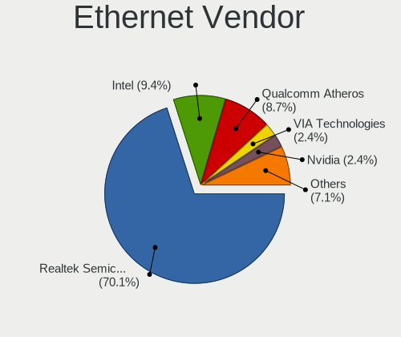

| Vendor                | Desktops | Percent |
|-----------------------|----------|---------|
| Realtek Semiconductor | 50       | 66.67%  |
| Qualcomm Atheros      | 6        | 8%      |
| Intel                 | 6        | 8%      |
| VIA Technologies      | 3        | 4%      |
| Broadcom              | 3        | 4%      |
| Nvidia                | 2        | 2.67%   |
| Xiaomi                | 1        | 1.33%   |
| Samsung Electronics   | 1        | 1.33%   |
| MediaTek              | 1        | 1.33%   |
| Broadcom Limited      | 1        | 1.33%   |
| AMD                   | 1        | 1.33%   |

Ethernet Model
--------------

Ethernet models

| Model                                                             | Desktops | Percent |
|-------------------------------------------------------------------|----------|---------|
| Realtek RTL8111/8168/8411 PCI Express Gigabit Ethernet Controller | 31       | 41.33%  |
| Realtek RTL810xE PCI Express Fast Ethernet controller             | 19       | 25.33%  |
| VIA VT6102/VT6103 [Rhine-II]                                      | 3        | 4%      |
| Qualcomm Atheros AR8151 v2.0 Gigabit Ethernet                     | 3        | 4%      |
| Intel I211 Gigabit Network Connection                             | 2        | 2.67%   |
| Xiaomi Mi/Redmi series (RNDIS)                                    | 1        | 1.33%   |
| Samsung GT-I9070 (network tethering, USB debugging enabled)       | 1        | 1.33%   |
| Qualcomm Atheros Killer E220x Gigabit Ethernet Controller         | 1        | 1.33%   |
| Qualcomm Atheros AR8161 Gigabit Ethernet                          | 1        | 1.33%   |
| Qualcomm Atheros AR8152 v2.0 Fast Ethernet                        | 1        | 1.33%   |
| Nvidia MCP79 Ethernet                                             | 1        | 1.33%   |
| Nvidia MCP77 Ethernet                                             | 1        | 1.33%   |
| MediaTek Infinix NOTE 11                                          | 1        | 1.33%   |
| Intel Ethernet Connection (7) I219-V                              | 1        | 1.33%   |
| Intel 82579LM Gigabit Network Connection (Lewisville)             | 1        | 1.33%   |
| Intel 82566DC-2 Gigabit Network Connection                        | 1        | 1.33%   |
| Intel 82562V 10/100 Network Connection                            | 1        | 1.33%   |
| Broadcom NetLink BCM5784M Gigabit Ethernet PCIe                   | 1        | 1.33%   |
| Broadcom NetLink BCM57788 Gigabit Ethernet PCIe                   | 1        | 1.33%   |
| Broadcom NetLink BCM57780 Gigabit Ethernet PCIe                   | 1        | 1.33%   |
| Broadcom Limited NetXtreme BCM5722 Gigabit Ethernet PCI Express   | 1        | 1.33%   |
| AMD 79c970 [PCnet32 LANCE]                                        | 1        | 1.33%   |

Net Controller Kind
-------------------

Ethernet, WiFi or modem

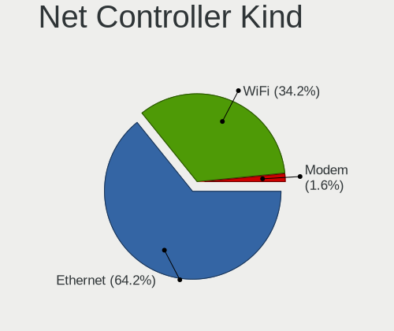

| Kind     | Desktops | Percent |
|----------|----------|---------|
| Ethernet | 71       | 68.93%  |
| WiFi     | 32       | 31.07%  |

Used Controller
---------------

Currently used network controller

| Kind     | Desktops | Percent |
|----------|----------|---------|
| Ethernet | 50       | 68.49%  |
| WiFi     | 23       | 31.51%  |

NICs
----

Total network controllers on board

| Total | Desktops | Percent |
|-------|----------|---------|
| 1     | 62       | 82.67%  |
| 2     | 13       | 17.33%  |

IPv6
----

IPv6 vs IPv4

| Used | Desktops | Percent |
|------|----------|---------|
| No   | 73       | 100%    |

Bluetooth
---------

Bluetooth Vendor
----------------

Controller vendors

| Vendor                     | Desktops | Percent |
|----------------------------|----------|---------|
| Cambridge Silicon Radio    | 5        | 62.5%   |
| Intel                      | 1        | 12.5%   |
| Integrated System Solution | 1        | 12.5%   |
| Broadcom                   | 1        | 12.5%   |

Bluetooth Model
---------------

Controller models

| Model                                                 | Desktops | Percent |
|-------------------------------------------------------|----------|---------|
| Cambridge Silicon Radio Bluetooth Dongle (HCI mode)   | 5        | 62.5%   |
| Intel Wireless-AC 3168 Bluetooth                      | 1        | 12.5%   |
| Integrated System Solution KY-BT100 Bluetooth Adapter | 1        | 12.5%   |
| Broadcom BCM92045B3 ROM                               | 1        | 12.5%   |

Sound
-----

Sound Vendor
------------

Sound card vendors

| Vendor                | Desktops | Percent |
|-----------------------|----------|---------|
| Intel                 | 61       | 54.95%  |
| Nvidia                | 22       | 19.82%  |
| AMD                   | 20       | 18.02%  |
| VIA Technologies      | 3        | 2.7%    |
| JMTek                 | 2        | 1.8%    |
| Logitech              | 1        | 0.9%    |
| Logic3 / SpectraVideo | 1        | 0.9%    |
| Guillemot             | 1        | 0.9%    |

Sound Model
-----------

Sound card models

| Model                                                                             | Desktops | Percent |
|-----------------------------------------------------------------------------------|----------|---------|
| Intel 6 Series/C200 Series Chipset Family High Definition Audio Controller        | 21       | 18.1%   |
| Intel NM10/ICH7 Family High Definition Audio Controller                           | 13       | 11.21%  |
| AMD Cedar HDMI Audio [Radeon HD 5400/6300/7300 Series]                            | 8        | 6.9%    |
| Intel 8 Series/C220 Series Chipset High Definition Audio Controller               | 6        | 5.17%   |
| Intel 7 Series/C216 Chipset Family High Definition Audio Controller               | 6        | 5.17%   |
| Intel 5 Series/3400 Series Chipset High Definition Audio                          | 6        | 5.17%   |
| Nvidia GF119 HDMI Audio Controller                                                | 4        | 3.45%   |
| Nvidia GF108 High Definition Audio Controller                                     | 4        | 3.45%   |
| VIA Technologies VX900/VT8xxx High Definition Audio Controller                    | 3        | 2.59%   |
| Intel Xeon E3-1200 v3/4th Gen Core Processor HD Audio Controller                  | 3        | 2.59%   |
| Intel 82801I (ICH9 Family) HD Audio Controller                                    | 3        | 2.59%   |
| Nvidia High Definition Audio Controller                                           | 2        | 1.72%   |
| Nvidia GM107 High Definition Audio Controller [GeForce 940MX]                     | 2        | 1.72%   |
| JMTek USB PnP Audio Device                                                        | 2        | 1.72%   |
| Intel Cannon Lake PCH cAVS                                                        | 2        | 1.72%   |
| Intel 100 Series/C230 Series Chipset Family HD Audio Controller                   | 2        | 1.72%   |
| AMD Starship/Matisse HD Audio Controller                                          | 2        | 1.72%   |
| AMD Family 17h (Models 00h-0fh) HD Audio Controller                               | 2        | 1.72%   |
| AMD Caicos HDMI Audio [Radeon HD 6450 / 7450/8450/8490 OEM / R5 230/235/235X OEM] | 2        | 1.72%   |
| AMD Barts HDMI Audio [Radeon HD 6790/6850/6870 / 7720 OEM]                        | 2        | 1.72%   |
| Nvidia TU116 High Definition Audio Controller                                     | 1        | 0.86%   |
| Nvidia TU107 GeForce GTX 1650 High Definition Audio Controller                    | 1        | 0.86%   |
| Nvidia MCP79 High Definition Audio                                                | 1        | 0.86%   |
| Nvidia MCP72XE/MCP72P/MCP78U/MCP78S High Definition Audio                         | 1        | 0.86%   |
| Nvidia GP107GL High Definition Audio Controller                                   | 1        | 0.86%   |
| Nvidia GP104 High Definition Audio Controller                                     | 1        | 0.86%   |
| Nvidia GK208 HDMI/DP Audio Controller                                             | 1        | 0.86%   |
| Nvidia GK106 HDMI Audio Controller                                                | 1        | 0.86%   |
| Nvidia GK104 HDMI Audio Controller                                                | 1        | 0.86%   |
| Nvidia GA104 High Definition Audio Controller                                     | 1        | 0.86%   |
| Logitech H600 [Wireless Headset]                                                  | 1        | 0.86%   |
| Logic3 / SpectraVideo USB Audio Device                                            | 1        | 0.86%   |
| Intel 82801JI (ICH10 Family) HD Audio Controller                                  | 1        | 0.86%   |
| Intel 82801H (ICH8 Family) HD Audio Controller                                    | 1        | 0.86%   |
| Guillemot Hercules Blog Webcam                                                    | 1        | 0.86%   |
| AMD SBx00 Azalia (Intel HDA)                                                      | 1        | 0.86%   |
| AMD Renoir Radeon High Definition Audio Controller                                | 1        | 0.86%   |
| AMD Oland/Hainan/Cape Verde/Pitcairn HDMI Audio [Radeon HD 7000 Series]           | 1        | 0.86%   |
| AMD Juniper HDMI Audio [Radeon HD 5700 Series]                                    | 1        | 0.86%   |
| AMD Family 17h/19h HD Audio Controller                                            | 1        | 0.86%   |

Memory
------

Memory Vendor
-------------

Memory module vendors

| Vendor              | Desktops | Percent |
|---------------------|----------|---------|
| Unknown             | 22       | 43.14%  |
| A-DATA Technology   | 8        | 15.69%  |
| Micron Technology   | 5        | 9.8%    |
| Kingston            | 4        | 7.84%   |
| Samsung Electronics | 3        | 5.88%   |
| TwinMOS             | 2        | 3.92%   |
| SK hynix            | 2        | 3.92%   |
| Thermaltake         | 1        | 1.96%   |
| Patriot             | 1        | 1.96%   |
| Nanya Technology    | 1        | 1.96%   |
| GeIL                | 1        | 1.96%   |
| Dynet               | 1        | 1.96%   |

Memory Model
------------

Memory module models

| Model                                                       | Desktops | Percent |
|-------------------------------------------------------------|----------|---------|
| Unknown RAM Module 4GB DIMM DDR3 1333MT/s                   | 3        | 5.26%   |
| Unknown RAM Module 2GB DIMM DDR3 1333MT/s                   | 2        | 3.51%   |
| Unknown RAM Module 2GB DIMM 800MT/s                         | 2        | 3.51%   |
| Unknown RAM Module 4GB SODIMM DDR2                          | 1        | 1.75%   |
| Unknown RAM Module 4GB DIMM SDRAM                           | 1        | 1.75%   |
| Unknown RAM Module 4GB DIMM DDR3 1067MT/s                   | 1        | 1.75%   |
| Unknown RAM Module 4096MB SODIMM DDR2                       | 1        | 1.75%   |
| Unknown RAM Module 4096MB DIMM SDRAM 1333MT/s               | 1        | 1.75%   |
| Unknown RAM Module 4096MB DIMM SDRAM                        | 1        | 1.75%   |
| Unknown RAM Module 4096MB DIMM DDR3 800MT/s                 | 1        | 1.75%   |
| Unknown RAM Module 4096MB DIMM 1333MT/s                     | 1        | 1.75%   |
| Unknown RAM Module 2GB DIMM SDRAM                           | 1        | 1.75%   |
| Unknown RAM Module 2GB DIMM 667MT/s                         | 1        | 1.75%   |
| Unknown RAM Module 2048MB DIMM SDRAM 800MT/s                | 1        | 1.75%   |
| Unknown RAM Module 2048MB DIMM SDRAM 1333MT/s               | 1        | 1.75%   |
| Unknown RAM Module 2048MB DIMM SDRAM                        | 1        | 1.75%   |
| Unknown RAM Module 2048MB DIMM DDR2 800MT/s                 | 1        | 1.75%   |
| Unknown RAM Module 2048MB DIMM DDR2                         | 1        | 1.75%   |
| Unknown RAM Module 1GB DIMM DDR2 667MT/s                    | 1        | 1.75%   |
| Unknown RAM Module 1GB DIMM 800MT/s                         | 1        | 1.75%   |
| Unknown RAM Module 1GB DIMM 533MT/s                         | 1        | 1.75%   |
| Unknown RAM Module 1024MB DIMM DDR2 266MT/s                 | 1        | 1.75%   |
| Unknown RAM Module 1024MB DIMM DDR2 200MT/s                 | 1        | 1.75%   |
| Unknown RAM Module 1024MB DIMM DDR2                         | 1        | 1.75%   |
| TwinMOS RAM 9DPCBNZB-TATP 4GB DIMM DDR3 1333MT/s            | 1        | 1.75%   |
| TwinMOS RAM 9DECBNZB-TATP 4GB DIMM DDR3 1333MT/s            | 1        | 1.75%   |
| Thermaltake RAM R019D408GX2-3200C16A 8GB DIMM DDR4 2666MT/s | 1        | 1.75%   |
| SK hynix RAM HMT451U6BFR8A-PB 4GB DIMM DDR3 1648MT/s        | 1        | 1.75%   |
| SK hynix RAM HMT125U6TFR8C-H9 2GB DIMM DDR3 1333MT/s        | 1        | 1.75%   |
| Samsung RAM M378B5273DH0-CK0 4096MB DIMM DDR3 2200MT/s      | 1        | 1.75%   |
| Samsung RAM M378B5273DH0-CH9 4096MB DIMM DDR3 2133MT/s      | 1        | 1.75%   |
| Samsung RAM M378A5244CB0-CRC 4GB DIMM DDR4 3066MT/s         | 1        | 1.75%   |
| Patriot RAM PSD32G133381 2GB DIMM DDR3 1333MT/s             | 1        | 1.75%   |
| Nanya RAM NT512T64U88B0BY-3C 512MB DIMM DDR2 667MT/s        | 1        | 1.75%   |
| Micron RAM V01D3LF2GB26818813 2GB DIMM DDR3 1333MT/s        | 1        | 1.75%   |
| Micron RAM 8JTF51264AZ-1G6E1 4GB DIMM DDR3 1600MT/s         | 1        | 1.75%   |
| Micron RAM 8HTF12864AY-800J1 1GB DIMM DDR2 800MT/s          | 1        | 1.75%   |
| Micron RAM 18KSF51272AZ-1G6K1 4GB DIMM DDR3 1600MT/s        | 1        | 1.75%   |
| Micron RAM 16JTF51264AZ-1G4M1 4GB DIMM DDR3 1333MT/s        | 1        | 1.75%   |
| Kingston RAM KTC1G-UDIMM 1024MB DIMM DDR 1639MT/s           | 1        | 1.75%   |

Memory Kind
-----------

Memory module kinds

| Kind    | Desktops | Percent |
|---------|----------|---------|
| DDR3    | 14       | 34.15%  |
| DDR4    | 9        | 21.95%  |
| DDR2    | 7        | 17.07%  |
| SDRAM   | 5        | 12.2%   |
| Unknown | 5        | 12.2%   |
| DDR     | 1        | 2.44%   |

Memory Form Factor
------------------

Physical design of the memory module

| Name   | Desktops | Percent |
|--------|----------|---------|
| DIMM   | 39       | 97.5%   |
| SODIMM | 1        | 2.5%    |

Memory Size
-----------

Memory module size

| Size  | Desktops | Percent |
|-------|----------|---------|
| 4096  | 18       | 39.13%  |
| 2048  | 13       | 28.26%  |
| 1024  | 6        | 13.04%  |
| 8192  | 5        | 10.87%  |
| 16384 | 2        | 4.35%   |
| 32768 | 1        | 2.17%   |
| 512   | 1        | 2.17%   |

Memory Speed
------------

Memory module speed

| Speed   | Desktops | Percent |
|---------|----------|---------|
| 1333    | 13       | 27.66%  |
| 800     | 7        | 14.89%  |
| Unknown | 4        | 8.51%   |
| 2400    | 3        | 6.38%   |
| 667     | 3        | 6.38%   |
| 1600    | 2        | 4.26%   |
| 3800    | 1        | 2.13%   |
| 3400    | 1        | 2.13%   |
| 3200    | 1        | 2.13%   |
| 3066    | 1        | 2.13%   |
| 3000    | 1        | 2.13%   |
| 2667    | 1        | 2.13%   |
| 2666    | 1        | 2.13%   |
| 2200    | 1        | 2.13%   |
| 2133    | 1        | 2.13%   |
| 1648    | 1        | 2.13%   |
| 1639    | 1        | 2.13%   |
| 1067    | 1        | 2.13%   |
| 533     | 1        | 2.13%   |
| 266     | 1        | 2.13%   |
| 200     | 1        | 2.13%   |

Printers & scanners
-------------------

Printer Vendor
--------------

Printer device vendors

| Vendor             | Desktops | Percent |
|--------------------|----------|---------|
| Canon              | 7        | 63.64%  |
| Seiko Epson        | 2        | 18.18%  |
| Hewlett-Packard    | 1        | 9.09%   |
| Brother Industries | 1        | 9.09%   |

Printer Model
-------------

Printer device models

| Model                             | Desktops | Percent |
|-----------------------------------|----------|---------|
| Canon LBP6000                     | 2        | 18.18%  |
| Seiko Epson XP-243 245 247 Series | 1        | 9.09%   |
| Seiko Epson Printer               | 1        | 9.09%   |
| HP DeskJet 5810 series            | 1        | 9.09%   |
| Canon MG5700 series               | 1        | 9.09%   |
| Canon MF3010                      | 1        | 9.09%   |
| Canon LBP6030w/6018w              | 1        | 9.09%   |
| Canon LBP6020                     | 1        | 9.09%   |
| Canon LBP3000                     | 1        | 9.09%   |
| Brother MFC-J480DW                | 1        | 9.09%   |

Scanner Vendor
--------------

Scanner device vendors

| Vendor | Desktops | Percent |
|--------|----------|---------|
| Canon  | 1        | 100%    |

Scanner Model
-------------

Scanner device models

| Model                  | Desktops | Percent |
|------------------------|----------|---------|
| Canon CanoScan LIDE 25 | 1        | 100%    |

Camera
------

Camera Vendor
-------------

Camera device vendors

| Vendor                | Desktops | Percent |
|-----------------------|----------|---------|
| Samsung Electronics   | 1        | 25%     |
| GEMBIRD               | 1        | 25%     |
| Cubeternet            | 1        | 25%     |
| Arkmicro Technologies | 1        | 25%     |

Camera Model
------------

Camera device models

| Model                                             | Desktops | Percent |
|---------------------------------------------------|----------|---------|
| Samsung Galaxy A5 (MTP)                           | 1        | 25%     |
| GEMBIRD Generic UVC 1.00 camera [AppoTech AX2311] | 1        | 25%     |
| Cubeternet USB2.0 Camera                          | 1        | 25%     |
| Arkmicro Webcam Carrefour                         | 1        | 25%     |

Security
--------

Fingerprint Vendor
------------------

Fingerprint sensor vendors

Zero info for selected period =(

Fingerprint Model
-----------------

Fingerprint sensor models

Zero info for selected period =(

Chipcard Vendor
---------------

Chipcard module vendors

Zero info for selected period =(

Chipcard Model
--------------

Chipcard module models

Zero info for selected period =(

Unsupported
-----------

Unsupported Devices
-------------------

Total unsupported devices on board

| Total | Desktops | Percent |
|-------|----------|---------|
| 0     | 63       | 84%     |
| 1     | 11       | 14.67%  |
| 2     | 1        | 1.33%   |

Unsupported Device Types
------------------------

Types of unsupported devices

| Type                     | Desktops | Percent |
|--------------------------|----------|---------|
| Graphics card            | 7        | 53.85%  |
| Multimedia controller    | 2        | 15.38%  |
| Communication controller | 2        | 15.38%  |
| Net/wireless             | 1        | 7.69%   |
| Camera                   | 1        | 7.69%   |

