Linux in Algeria - Tested Hardware & Statistics (Notebooks)
-----------------------------------------------------------

A project to collect tested hardware configurations for Linux in Algeria.

Anyone can contribute to this report by the [hw-probe](https://github.com/linuxhw/hw-probe) tool:

    sudo -E hw-probe -all -upload

Please contribute! Especially if your hardware is rare.

Contents
--------

* [ Test Cases ](#test-cases)

* [ System ](#system)
  - [ OS                       ](#os)
  - [ OS Family                ](#os-family)
  - [ Kernel                   ](#kernel)
  - [ Kernel Family            ](#kernel-family)
  - [ Kernel Major Ver.        ](#kernel-major-ver)
  - [ Arch                     ](#arch)
  - [ DE                       ](#de)
  - [ Display Server           ](#display-server)
  - [ Display Manager          ](#display-manager)
  - [ OS Lang                  ](#os-lang)
  - [ Boot Mode                ](#boot-mode)
  - [ Filesystem               ](#filesystem)
  - [ Part. scheme             ](#part-scheme)
  - [ Dual Boot with Linux/BSD ](#dual-boot-with-linuxbsd)
  - [ Dual Boot (Win)          ](#dual-boot-win)

* [ Board ](#board)
  - [ Vendor                   ](#vendor)
  - [ Model                    ](#model)
  - [ Model Family             ](#model-family)
  - [ MFG Year                 ](#mfg-year)
  - [ Form Factor              ](#form-factor)
  - [ Secure Boot              ](#secure-boot)
  - [ Coreboot                 ](#coreboot)
  - [ RAM Size                 ](#ram-size)
  - [ RAM Used                 ](#ram-used)
  - [ Total Drives             ](#total-drives)
  - [ Has CD-ROM               ](#has-cd-rom)
  - [ Has Ethernet             ](#has-ethernet)
  - [ Has WiFi                 ](#has-wifi)
  - [ Has Bluetooth            ](#has-bluetooth)

* [ Location ](#location)
  - [ Country                  ](#country)
  - [ City                     ](#city)

* [ Drives ](#drives)
  - [ Drive Vendor             ](#drive-vendor)
  - [ Drive Model              ](#drive-model)
  - [ HDD Vendor               ](#hdd-vendor)
  - [ SSD Vendor               ](#ssd-vendor)
  - [ Drive Kind               ](#drive-kind)
  - [ Drive Connector          ](#drive-connector)
  - [ Drive Size               ](#drive-size)
  - [ Space Total              ](#space-total)
  - [ Space Used               ](#space-used)
  - [ Malfunc. Drives          ](#malfunc-drives)
  - [ Malfunc. Drive Vendor    ](#malfunc-drive-vendor)
  - [ Malfunc. HDD Vendor      ](#malfunc-hdd-vendor)
  - [ Malfunc. Drive Kind      ](#malfunc-drive-kind)
  - [ Failed Drives            ](#failed-drives)
  - [ Failed Drive Vendor      ](#failed-drive-vendor)
  - [ Drive Status             ](#drive-status)

* [ Storage controller ](#storage-controller)
  - [ Storage Vendor           ](#storage-vendor)
  - [ Storage Model            ](#storage-model)
  - [ Storage Kind             ](#storage-kind)

* [ Processor ](#processor)
  - [ CPU Vendor               ](#cpu-vendor)
  - [ CPU Model                ](#cpu-model)
  - [ CPU Model Family         ](#cpu-model-family)
  - [ CPU Cores                ](#cpu-cores)
  - [ CPU Sockets              ](#cpu-sockets)
  - [ CPU Threads              ](#cpu-threads)
  - [ CPU Op-Modes             ](#cpu-op-modes)
  - [ CPU Microcode            ](#cpu-microcode)
  - [ CPU Microarch            ](#cpu-microarch)

* [ Graphics ](#graphics)
  - [ GPU Vendor               ](#gpu-vendor)
  - [ GPU Model                ](#gpu-model)
  - [ GPU Combo                ](#gpu-combo)
  - [ GPU Driver               ](#gpu-driver)
  - [ GPU Memory               ](#gpu-memory)

* [ Monitor ](#monitor)
  - [ Monitor Vendor           ](#monitor-vendor)
  - [ Monitor Model            ](#monitor-model)
  - [ Monitor Resolution       ](#monitor-resolution)
  - [ Monitor Diagonal         ](#monitor-diagonal)
  - [ Monitor Width            ](#monitor-width)
  - [ Aspect Ratio             ](#aspect-ratio)
  - [ Monitor Area             ](#monitor-area)
  - [ Pixel Density            ](#pixel-density)
  - [ Multiple Monitors        ](#multiple-monitors)

* [ Network ](#network)
  - [ Net Controller Vendor    ](#net-controller-vendor)
  - [ Net Controller Model     ](#net-controller-model)
  - [ Wireless Vendor          ](#wireless-vendor)
  - [ Wireless Model           ](#wireless-model)
  - [ Ethernet Vendor          ](#ethernet-vendor)
  - [ Ethernet Model           ](#ethernet-model)
  - [ Net Controller Kind      ](#net-controller-kind)
  - [ Used Controller          ](#used-controller)
  - [ NICs                     ](#nics)
  - [ IPv6                     ](#ipv6)

* [ Bluetooth ](#bluetooth)
  - [ Bluetooth Vendor         ](#bluetooth-vendor)
  - [ Bluetooth Model          ](#bluetooth-model)

* [ Sound ](#sound)
  - [ Sound Vendor             ](#sound-vendor)
  - [ Sound Model              ](#sound-model)

* [ Memory ](#memory)
  - [ Memory Vendor            ](#memory-vendor)
  - [ Memory Model             ](#memory-model)
  - [ Memory Kind              ](#memory-kind)
  - [ Memory Form Factor       ](#memory-form-factor)
  - [ Memory Size              ](#memory-size)
  - [ Memory Speed             ](#memory-speed)

* [ Printers & scanners ](#printers--scanners)
  - [ Printer Vendor           ](#printer-vendor)
  - [ Printer Model            ](#printer-model)
  - [ Scanner Vendor           ](#scanner-vendor)
  - [ Scanner Model            ](#scanner-model)

* [ Camera ](#camera)
  - [ Camera Vendor            ](#camera-vendor)
  - [ Camera Model             ](#camera-model)

* [ Security ](#security)
  - [ Fingerprint Vendor       ](#fingerprint-vendor)
  - [ Fingerprint Model        ](#fingerprint-model)
  - [ Chipcard Vendor          ](#chipcard-vendor)
  - [ Chipcard Model           ](#chipcard-model)

* [ Unsupported ](#unsupported)
  - [ Unsupported Devices      ](#unsupported-devices)
  - [ Unsupported Device Types ](#unsupported-device-types)

Test Cases
----------

Total: 462

| Vendor        | Model                       | Probe                                                      | Date         |
|---------------|-----------------------------|------------------------------------------------------------|--------------|
| ASUSTek       | UL80VT                      | [24af6615ea](https://linux-hardware.org/?probe=24af6615ea) | Jan 03, 2026 |
| HP            | Laptop 15-db1xxx            | [c8215f0470](https://linux-hardware.org/?probe=c8215f0470) | Dec 18, 2025 |
| Lenovo        | ThinkBook 14 G6 IRL 21KG    | [9512d3ad71](https://linux-hardware.org/?probe=9512d3ad71) | Dec 17, 2025 |
| Lenovo        | ThinkBook 14 G6 IRL 21KG    | [398c75668c](https://linux-hardware.org/?probe=398c75668c) | Dec 16, 2025 |
| Dell          | Latitude 5490               | [7ae7f6c7d1](https://linux-hardware.org/?probe=7ae7f6c7d1) | Dec 08, 2025 |
| ASUSTek       | UL80VT                      | [575da95b7b](https://linux-hardware.org/?probe=575da95b7b) | Dec 05, 2025 |
| Dell          | Inspiron 15-3567            | [90955a934b](https://linux-hardware.org/?probe=90955a934b) | Nov 27, 2025 |
| Acer          | Aspire 5733Z                | [3e063ea35d](https://linux-hardware.org/?probe=3e063ea35d) | Nov 10, 2025 |
| Samsung       | N102SP/N100SP/N101SP        | [d2b87afbc0](https://linux-hardware.org/?probe=d2b87afbc0) | Nov 10, 2025 |
| Panasonic     | FZ-M1CDB49E3                | [7479c60463](https://linux-hardware.org/?probe=7479c60463) | Nov 09, 2025 |
| ASUSTek       | UL80VT                      | [dc91d09bba](https://linux-hardware.org/?probe=dc91d09bba) | Nov 08, 2025 |
| Lenovo        | ThinkPad X270 W10DG 20K5... | [23d498b41b](https://linux-hardware.org/?probe=23d498b41b) | Nov 08, 2025 |
| Lenovo        | ThinkPad X270 W10DG 20K5... | [385771f573](https://linux-hardware.org/?probe=385771f573) | Nov 08, 2025 |
| ASUSTek       | Vivobook Go E1504FA_E150... | [1aef49dbbd](https://linux-hardware.org/?probe=1aef49dbbd) | Nov 07, 2025 |
| HP            | ProBook 645 G4              | [36ca08e09b](https://linux-hardware.org/?probe=36ca08e09b) | Nov 03, 2025 |
| HP            | EliteBook 840 G5            | [2569382b9a](https://linux-hardware.org/?probe=2569382b9a) | Nov 02, 2025 |
| Panasonic     | FZ-M1CDB49E3                | [23fb617cbb](https://linux-hardware.org/?probe=23fb617cbb) | Oct 31, 2025 |
| Panasonic     | FZ-M1CDB49E3                | [e49c6f78d8](https://linux-hardware.org/?probe=e49c6f78d8) | Oct 28, 2025 |
| ASUSTek       | UL80VT                      | [74922dd6cd](https://linux-hardware.org/?probe=74922dd6cd) | Oct 20, 2025 |
| Dell          | Latitude 5520               | [fe3c3ad8a1](https://linux-hardware.org/?probe=fe3c3ad8a1) | Oct 19, 2025 |
| Dell          | Latitude D830               | [5eb4bec66d](https://linux-hardware.org/?probe=5eb4bec66d) | Oct 09, 2025 |
| Fujitsu       | LIFEBOOK AH530              | [b1754e8bbc](https://linux-hardware.org/?probe=b1754e8bbc) | Oct 04, 2025 |
| ASUSTek       | UL80VT                      | [aa29ebb7cc](https://linux-hardware.org/?probe=aa29ebb7cc) | Sep 28, 2025 |
| Dell          | Precision 5520              | [b5fde4c407](https://linux-hardware.org/?probe=b5fde4c407) | Sep 27, 2025 |
| Dell          | Latitude 7420               | [77d35c56e4](https://linux-hardware.org/?probe=77d35c56e4) | Sep 17, 2025 |
| HP            | ZBook 15u G6                | [b9ca881ffb](https://linux-hardware.org/?probe=b9ca881ffb) | Sep 16, 2025 |
| ASUSTek       | UL80VT                      | [7b9a8bb059](https://linux-hardware.org/?probe=7b9a8bb059) | Sep 10, 2025 |
| Packard Be... | EasyNote TV44HC             | [5d3d27d8ff](https://linux-hardware.org/?probe=5d3d27d8ff) | Sep 09, 2025 |
| Dell          | Precision 5520              | [3e3f12d3ff](https://linux-hardware.org/?probe=3e3f12d3ff) | Aug 17, 2025 |
| HP            | Laptop 15-da0xxx            | [c06c83ddab](https://linux-hardware.org/?probe=c06c83ddab) | Aug 15, 2025 |
| Dell          | Inspiron 3543               | [aeedeb3eda](https://linux-hardware.org/?probe=aeedeb3eda) | Aug 10, 2025 |
| Toshiba       | Satellite C55-B             | [aff9e09ce0](https://linux-hardware.org/?probe=aff9e09ce0) | Aug 05, 2025 |
| Toshiba       | Satellite C55-B             | [611a0decd7](https://linux-hardware.org/?probe=611a0decd7) | Aug 05, 2025 |
| Unknown       | Unknown                     | [9ad934f331](https://linux-hardware.org/?probe=9ad934f331) | Jul 31, 2025 |
| Dell          | Inspiron 3543               | [ce8a2ba138](https://linux-hardware.org/?probe=ce8a2ba138) | Jul 28, 2025 |
| ASUSTek       | UL80VT                      | [392b8196e2](https://linux-hardware.org/?probe=392b8196e2) | Jul 18, 2025 |
| Lenovo        | IdeaPad 3 15IML05 81WB      | [f44d4218cc](https://linux-hardware.org/?probe=f44d4218cc) | Jul 18, 2025 |
| HP            | ProBook 630 G8 Notebook ... | [af2df6261c](https://linux-hardware.org/?probe=af2df6261c) | Jul 09, 2025 |
| HP            | ProBook 630 G8 Notebook ... | [4038c45b00](https://linux-hardware.org/?probe=4038c45b00) | Jul 09, 2025 |
| HP            | EliteBook 840 G3            | [ebefe180af](https://linux-hardware.org/?probe=ebefe180af) | Jun 15, 2025 |
| ASUSTek       | A8Sc                        | [68f5758a56](https://linux-hardware.org/?probe=68f5758a56) | Jun 10, 2025 |
| Lenovo        | ThinkPad X1 Carbon Gen 1... | [de417e669e](https://linux-hardware.org/?probe=de417e669e) | Jun 09, 2025 |
| Lenovo        | ThinkPad X1 Carbon Gen 1... | [91f88b917e](https://linux-hardware.org/?probe=91f88b917e) | Jun 02, 2025 |
| ASUSTek       | UL80VT                      | [73b0d364cc](https://linux-hardware.org/?probe=73b0d364cc) | Jun 02, 2025 |
| HP            | Pavilion g6                 | [e18eaad348](https://linux-hardware.org/?probe=e18eaad348) | Jun 01, 2025 |
| HP            | ProBook 630 G8 Notebook ... | [39a0f20664](https://linux-hardware.org/?probe=39a0f20664) | May 31, 2025 |
| HP            | ProBook 630 G8 Notebook ... | [ea0067c941](https://linux-hardware.org/?probe=ea0067c941) | May 31, 2025 |
| HP            | OMEN Gaming Laptop 17-db... | [da63ab692e](https://linux-hardware.org/?probe=da63ab692e) | May 27, 2025 |
| ASUSTek       | ASUS TUF Gaming A16 FA61... | [e649ec9a15](https://linux-hardware.org/?probe=e649ec9a15) | May 11, 2025 |
| Lenovo        | IdeaPad 310-15IKB 80TV      | [b30fa3b4aa](https://linux-hardware.org/?probe=b30fa3b4aa) | May 09, 2025 |
| Dell          | Inspiron 16 5620            | [45d4c25627](https://linux-hardware.org/?probe=45d4c25627) | May 05, 2025 |
| ASUSTek       | UL80VT                      | [b0172761e8](https://linux-hardware.org/?probe=b0172761e8) | May 03, 2025 |
| Lenovo        | ThinkPad SL510 2847DEG      | [252c2a0b14](https://linux-hardware.org/?probe=252c2a0b14) | May 02, 2025 |
| Lenovo        | ThinkPad SL510 2847DEG      | [530d708851](https://linux-hardware.org/?probe=530d708851) | May 01, 2025 |
| Dell          | Inspiron 3543               | [7d1305377d](https://linux-hardware.org/?probe=7d1305377d) | Apr 27, 2025 |
| HP            | EliteBook 8440p (VD485AV... | [e91702bb6b](https://linux-hardware.org/?probe=e91702bb6b) | Apr 15, 2025 |
| Dell          | Latitude 5490               | [fb8fe9d447](https://linux-hardware.org/?probe=fb8fe9d447) | Apr 11, 2025 |
| ASUSTek       | UL80VT                      | [b112ae85d9](https://linux-hardware.org/?probe=b112ae85d9) | Apr 10, 2025 |
| HP            | Notebook                    | [1272564567](https://linux-hardware.org/?probe=1272564567) | Apr 06, 2025 |
| HP            | Pavilion 17                 | [9f34548faf](https://linux-hardware.org/?probe=9f34548faf) | Apr 05, 2025 |
| HP            | Pavilion 17                 | [8401521eef](https://linux-hardware.org/?probe=8401521eef) | Apr 05, 2025 |
| HP            | Notebook                    | [e60da8ea98](https://linux-hardware.org/?probe=e60da8ea98) | Apr 05, 2025 |
| Dell          | Inspiron 3521               | [540c1b043f](https://linux-hardware.org/?probe=540c1b043f) | Apr 03, 2025 |
| Dell          | Studio 1537                 | [a8d986d84a](https://linux-hardware.org/?probe=a8d986d84a) | Mar 20, 2025 |
| ASUSTek       | UL80VT                      | [7baad9c10b](https://linux-hardware.org/?probe=7baad9c10b) | Mar 16, 2025 |
| Lenovo        | ThinkPad X270 W10DG 20K5... | [8adf08fae4](https://linux-hardware.org/?probe=8adf08fae4) | Mar 16, 2025 |
| Dell          | Inspiron N5110              | [676a991f6b](https://linux-hardware.org/?probe=676a991f6b) | Mar 15, 2025 |
| Samsung       | RC410/RC510/RC710           | [0c5e569a5a](https://linux-hardware.org/?probe=0c5e569a5a) | Mar 14, 2025 |
| HP            | EliteBook 840 G8 Noteboo... | [be3b843788](https://linux-hardware.org/?probe=be3b843788) | Mar 10, 2025 |
| Fujitsu       | LIFEBOOK A544               | [c9b2d3e644](https://linux-hardware.org/?probe=c9b2d3e644) | Mar 02, 2025 |
| HP            | EliteBook 8440p (VD485AV... | [6cd6326638](https://linux-hardware.org/?probe=6cd6326638) | Mar 01, 2025 |
| ASUSTek       | UL80VT                      | [d516c75f9f](https://linux-hardware.org/?probe=d516c75f9f) | Feb 03, 2025 |
| ASUSTek       | UL80VT                      | [83e2226fe4](https://linux-hardware.org/?probe=83e2226fe4) | Jan 19, 2025 |
| Lenovo        | ThinkPad T470 W10DG 20JN... | [5e4bd8261f](https://linux-hardware.org/?probe=5e4bd8261f) | Jan 11, 2025 |
| HP            | EliteBook 840 G3            | [83a5d94914](https://linux-hardware.org/?probe=83a5d94914) | Jan 07, 2025 |
| ASUSTek       | UL80VT                      | [51fb360728](https://linux-hardware.org/?probe=51fb360728) | Jan 01, 2025 |
| Apple         | MacBookPro9,2               | [e6da658e0f](https://linux-hardware.org/?probe=e6da658e0f) | Jan 01, 2025 |
| ASUSTek       | X750JB                      | [c3848bc769](https://linux-hardware.org/?probe=c3848bc769) | Dec 28, 2024 |
| Lenovo        | ThinkPad E15 Gen 4 21E7S... | [ce166a3364](https://linux-hardware.org/?probe=ce166a3364) | Dec 28, 2024 |
| Lenovo        | IdeaPad 3 15ITL6 82H8       | [2a99f4c635](https://linux-hardware.org/?probe=2a99f4c635) | Dec 26, 2024 |
| Lenovo        | IdeaPad 3 15ITL6 82H8       | [0b609d2a62](https://linux-hardware.org/?probe=0b609d2a62) | Dec 26, 2024 |
| Lenovo        | IdeaPad 100-15IBD 80QQ      | [3dafc8c3c6](https://linux-hardware.org/?probe=3dafc8c3c6) | Dec 06, 2024 |
| Lenovo        | IdeaPad 100-15IBD 80QQ      | [34f8b6bc0b](https://linux-hardware.org/?probe=34f8b6bc0b) | Dec 06, 2024 |
| Samsung       | 350V5C/350V5X/350V4C/350... | [8aeea5fc7c](https://linux-hardware.org/?probe=8aeea5fc7c) | Nov 27, 2024 |
| ASUSTek       | UL80VT                      | [e19cedbb78](https://linux-hardware.org/?probe=e19cedbb78) | Nov 25, 2024 |
| Samsung       | 350V5C/350V5X/350V4C/350... | [4f167ce54b](https://linux-hardware.org/?probe=4f167ce54b) | Nov 24, 2024 |
| Lenovo        | Legion 5 15ARH05H 82B1      | [abd518a26a](https://linux-hardware.org/?probe=abd518a26a) | Nov 23, 2024 |
| Samsung       | 350V5C/350V5X/350V4C/350... | [acc6910742](https://linux-hardware.org/?probe=acc6910742) | Nov 22, 2024 |
| Dell          | Latitude 5580               | [23ae65a443](https://linux-hardware.org/?probe=23ae65a443) | Nov 15, 2024 |
| Samsung       | 350V5C/350V5X/350V4C/350... | [af47ab24d4](https://linux-hardware.org/?probe=af47ab24d4) | Nov 14, 2024 |
| ASUSTek       | UL80VT                      | [9e47f77eb2](https://linux-hardware.org/?probe=9e47f77eb2) | Nov 05, 2024 |
| Dell          | Inspiron 3543               | [e0b72cc4f7](https://linux-hardware.org/?probe=e0b72cc4f7) | Nov 02, 2024 |
| HP            | Laptop 15-dy2xxx            | [b98436c123](https://linux-hardware.org/?probe=b98436c123) | Oct 24, 2024 |
| Google        | Drobit                      | [26edf296d3](https://linux-hardware.org/?probe=26edf296d3) | Oct 20, 2024 |
| Lenovo        | Legion 5 15ARH05H 82B1      | [2c5dd173ae](https://linux-hardware.org/?probe=2c5dd173ae) | Oct 18, 2024 |
| Dell          | Inspiron 3543               | [eb86e7059c](https://linux-hardware.org/?probe=eb86e7059c) | Oct 16, 2024 |
| ASUSTek       | UL80VT                      | [c6cc761721](https://linux-hardware.org/?probe=c6cc761721) | Oct 13, 2024 |
| Dell          | Inspiron 3543               | [e5860959f4](https://linux-hardware.org/?probe=e5860959f4) | Oct 09, 2024 |
| Dell          | Inspiron 3543               | [1fcb3d5c10](https://linux-hardware.org/?probe=1fcb3d5c10) | Oct 03, 2024 |
| Lenovo        | ThinkPad T470 W10DG 20JN... | [2a065d3b6e](https://linux-hardware.org/?probe=2a065d3b6e) | Sep 27, 2024 |
| Dell          | Latitude 5490               | [897e69a84d](https://linux-hardware.org/?probe=897e69a84d) | Sep 27, 2024 |
| Dell          | Vostro 3520                 | [fc512f0d70](https://linux-hardware.org/?probe=fc512f0d70) | Sep 27, 2024 |
| ASUSTek       | VivoBook_ASUSLaptop X521... | [42bd818b1e](https://linux-hardware.org/?probe=42bd818b1e) | Sep 24, 2024 |
| Unknown       | Unknown                     | [556cdc2448](https://linux-hardware.org/?probe=556cdc2448) | Sep 21, 2024 |
| Unknown       | Unknown                     | [7e13c15a7b](https://linux-hardware.org/?probe=7e13c15a7b) | Sep 21, 2024 |
| HP            | EliteBook 840 G5            | [abdf739930](https://linux-hardware.org/?probe=abdf739930) | Sep 12, 2024 |
| ASUSTek       | X441SA                      | [35fe8d4aa5](https://linux-hardware.org/?probe=35fe8d4aa5) | Sep 09, 2024 |
| ASUSTek       | UL80VT                      | [7d4ad043e7](https://linux-hardware.org/?probe=7d4ad043e7) | Sep 08, 2024 |
| ASUSTek       | X540LJ                      | [82349f49b3](https://linux-hardware.org/?probe=82349f49b3) | Aug 28, 2024 |
| Samsung       | 300E5EV/300E4EV/270E5EV/... | [c51c37be47](https://linux-hardware.org/?probe=c51c37be47) | Aug 20, 2024 |
| ASUSTek       | UL80VT                      | [2dfcfbc9d9](https://linux-hardware.org/?probe=2dfcfbc9d9) | Aug 18, 2024 |
| Lenovo        | Yoga Slim 9 14IAP7 82T0     | [53709855bd](https://linux-hardware.org/?probe=53709855bd) | Aug 16, 2024 |
| Lenovo        | Yoga Slim 9 14IAP7 82T0     | [dfd8518d3e](https://linux-hardware.org/?probe=dfd8518d3e) | Aug 16, 2024 |
| ASUSTek       | X540SC                      | [88d86a9a73](https://linux-hardware.org/?probe=88d86a9a73) | Jul 21, 2024 |
| Acer          | Aspire F5-572               | [25a7a5ebdd](https://linux-hardware.org/?probe=25a7a5ebdd) | Jul 19, 2024 |
| SPA CONDOR    | P401                        | [bb7d750281](https://linux-hardware.org/?probe=bb7d750281) | Jul 17, 2024 |
| Dell          | Inspiron 3521               | [3c2a399aef](https://linux-hardware.org/?probe=3c2a399aef) | Jul 15, 2024 |
| Acer          | TravelMate 5744             | [dd44567736](https://linux-hardware.org/?probe=dd44567736) | Jul 09, 2024 |
| ASUSTek       | UL80VT                      | [f43d972a57](https://linux-hardware.org/?probe=f43d972a57) | Jul 09, 2024 |
| Dell          | Inspiron 3521               | [64d61866bd](https://linux-hardware.org/?probe=64d61866bd) | Jul 04, 2024 |
| Dell          | Inspiron 3521               | [8f03d5365d](https://linux-hardware.org/?probe=8f03d5365d) | Jul 04, 2024 |
| HP            | Pavilion g6                 | [01e6b073ab](https://linux-hardware.org/?probe=01e6b073ab) | Jun 23, 2024 |
| HP            | Pavilion g6                 | [0f4c9ec0a7](https://linux-hardware.org/?probe=0f4c9ec0a7) | Jun 23, 2024 |
| HP            | ProBook 4540s               | [0c0ddd802d](https://linux-hardware.org/?probe=0c0ddd802d) | Jun 11, 2024 |
| Lenovo        | ThinkPad E14 Gen 2 20T60... | [8c1450cf10](https://linux-hardware.org/?probe=8c1450cf10) | May 28, 2024 |
| ASUSTek       | UL80VT                      | [b732300ffb](https://linux-hardware.org/?probe=b732300ffb) | May 19, 2024 |
| HP            | EliteBook 840 G3            | [ad7c6b6a36](https://linux-hardware.org/?probe=ad7c6b6a36) | May 19, 2024 |
| Acer          | Aspire V5-121               | [ee7af6bc3d](https://linux-hardware.org/?probe=ee7af6bc3d) | May 09, 2024 |
| ASUSTek       | VivoBook_ASUSLaptop X350... | [3c551032a7](https://linux-hardware.org/?probe=3c551032a7) | Apr 30, 2024 |
| HP            | EliteBook Folio 9470m       | [0d587f3e64](https://linux-hardware.org/?probe=0d587f3e64) | Apr 27, 2024 |
| HP            | EliteBook Folio 9470m       | [30d9ddd3f9](https://linux-hardware.org/?probe=30d9ddd3f9) | Apr 27, 2024 |
| HP            | EliteBook 8570p             | [cbe3543005](https://linux-hardware.org/?probe=cbe3543005) | Apr 26, 2024 |
| Dell          | Inspiron N5110              | [1d379b09d7](https://linux-hardware.org/?probe=1d379b09d7) | Apr 11, 2024 |
| ASUSTek       | UL80VT                      | [8c290e2826](https://linux-hardware.org/?probe=8c290e2826) | Apr 07, 2024 |
| Apple         | MacBookPro14,2              | [8af3aa3110](https://linux-hardware.org/?probe=8af3aa3110) | Mar 27, 2024 |
| ASUSTek       | ASUS TUF Dash F15 FX516P... | [b97398e770](https://linux-hardware.org/?probe=b97398e770) | Mar 23, 2024 |
| Acer          | Aspire A315-21              | [99e9828926](https://linux-hardware.org/?probe=99e9828926) | Mar 15, 2024 |
| Lenovo        | ThinkPad T480 20L6S69X08    | [63c84de71e](https://linux-hardware.org/?probe=63c84de71e) | Mar 15, 2024 |
| Acer          | Aspire ES1-571              | [e8fe3e1197](https://linux-hardware.org/?probe=e8fe3e1197) | Mar 13, 2024 |
| Lenovo        | G560 20042                  | [d7fffe52e5](https://linux-hardware.org/?probe=d7fffe52e5) | Mar 05, 2024 |
| Lenovo        | ThinkPad T480 20L6S69X08    | [16326b521f](https://linux-hardware.org/?probe=16326b521f) | Mar 01, 2024 |
| Dell          | Inspiron N5110              | [0338bf3523](https://linux-hardware.org/?probe=0338bf3523) | Mar 01, 2024 |
| HP            | 250 15.6 inch G9 Noteboo... | [c6209a30c6](https://linux-hardware.org/?probe=c6209a30c6) | Feb 28, 2024 |
| HP            | 250 15.6 inch G9 Noteboo... | [3d502260aa](https://linux-hardware.org/?probe=3d502260aa) | Feb 28, 2024 |
| Dell          | Inspiron N5110              | [ad7bc2d3d3](https://linux-hardware.org/?probe=ad7bc2d3d3) | Feb 21, 2024 |
| ASUSTek       | UL80VT                      | [f186dd9b24](https://linux-hardware.org/?probe=f186dd9b24) | Feb 19, 2024 |
| Acer          | Aspire M3-581T              | [5d8055a703](https://linux-hardware.org/?probe=5d8055a703) | Feb 19, 2024 |
| Dell          | Vostro 15-3568              | [dd1878c08e](https://linux-hardware.org/?probe=dd1878c08e) | Feb 18, 2024 |
| Dell          | Vostro 15-3568              | [75d09cfc27](https://linux-hardware.org/?probe=75d09cfc27) | Feb 18, 2024 |
| HP            | Pavilion dm3 Notebook PC    | [3e0f898cc8](https://linux-hardware.org/?probe=3e0f898cc8) | Feb 16, 2024 |
| Fujitsu       | LIFEBOOK E544               | [2cb0310c0f](https://linux-hardware.org/?probe=2cb0310c0f) | Feb 09, 2024 |
| Lenovo        | ThinkPad X240 20AMS5K70S    | [3ca238a44f](https://linux-hardware.org/?probe=3ca238a44f) | Feb 05, 2024 |
| ASUSTek       | UL80VT                      | [e2f97be622](https://linux-hardware.org/?probe=e2f97be622) | Feb 03, 2024 |
| Dell          | Inspiron N5110              | [e7338ad21d](https://linux-hardware.org/?probe=e7338ad21d) | Feb 01, 2024 |
| Lenovo        | Yoga Slim 7 14ITL05 82A3    | [98dc9736d7](https://linux-hardware.org/?probe=98dc9736d7) | Feb 01, 2024 |
| Lenovo        | Yoga Slim 7 14ITL05 82A3    | [4661ceab45](https://linux-hardware.org/?probe=4661ceab45) | Feb 01, 2024 |
| ASUSTek       | UL80VT                      | [865619250b](https://linux-hardware.org/?probe=865619250b) | Feb 01, 2024 |
| Acer          | Aspire E5-571               | [6ebe6ae5be](https://linux-hardware.org/?probe=6ebe6ae5be) | Jan 28, 2024 |
| HP            | Laptop 15 da0018nk          | [11c54a0e5b](https://linux-hardware.org/?probe=11c54a0e5b) | Jan 12, 2024 |
| HP            | Pavilion 15                 | [dad46e573f](https://linux-hardware.org/?probe=dad46e573f) | Jan 07, 2024 |
| Dell          | Inspiron N5110              | [0f0d661119](https://linux-hardware.org/?probe=0f0d661119) | Jan 06, 2024 |
| ASUSTek       | UL80VT                      | [7780af9eb5](https://linux-hardware.org/?probe=7780af9eb5) | Jan 05, 2024 |
| Dell          | Inspiron N5110              | [bf974230c7](https://linux-hardware.org/?probe=bf974230c7) | Jan 01, 2024 |
| HP            | EliteBook 820 G1            | [60a0cb2296](https://linux-hardware.org/?probe=60a0cb2296) | Jan 01, 2024 |
| Dell          | Inspiron N5110              | [439d746143](https://linux-hardware.org/?probe=439d746143) | Dec 31, 2023 |
| Dell          | Latitude 7480               | [9872ef6241](https://linux-hardware.org/?probe=9872ef6241) | Dec 31, 2023 |
| Dell          | Latitude 7480               | [527544c2de](https://linux-hardware.org/?probe=527544c2de) | Dec 31, 2023 |
| ASUSTek       | X750JB                      | [3c2f9bd15e](https://linux-hardware.org/?probe=3c2f9bd15e) | Dec 28, 2023 |
| ASUSTek       | UL80VT                      | [5b04b67d44](https://linux-hardware.org/?probe=5b04b67d44) | Dec 23, 2023 |
| Dell          | Inspiron N5110              | [761103087e](https://linux-hardware.org/?probe=761103087e) | Dec 19, 2023 |
| HP            | EliteBook 840 G4            | [6440dbccd4](https://linux-hardware.org/?probe=6440dbccd4) | Dec 13, 2023 |
| Dell          | Inspiron N5110              | [c7a949f9e8](https://linux-hardware.org/?probe=c7a949f9e8) | Dec 09, 2023 |
| Dell          | Latitude 6430U              | [45d1723559](https://linux-hardware.org/?probe=45d1723559) | Dec 03, 2023 |
| Dell          | Latitude 6430U              | [1e4dda911f](https://linux-hardware.org/?probe=1e4dda911f) | Dec 03, 2023 |
| HP            | Pavilion Notebook           | [39dd843280](https://linux-hardware.org/?probe=39dd843280) | Nov 28, 2023 |
| ASUSTek       | X540SC                      | [5a56e0886b](https://linux-hardware.org/?probe=5a56e0886b) | Nov 27, 2023 |
| ASUSTek       | UL80VT                      | [21f0f94735](https://linux-hardware.org/?probe=21f0f94735) | Nov 22, 2023 |
| Apple         | MacBookPro7,1               | [e0f2e8180d](https://linux-hardware.org/?probe=e0f2e8180d) | Nov 21, 2023 |
| Acer          | Aspire A515-56              | [f8d242150d](https://linux-hardware.org/?probe=f8d242150d) | Nov 19, 2023 |
| Lenovo        | IdeaPad 300-15ISK 80Q7      | [d297e1365c](https://linux-hardware.org/?probe=d297e1365c) | Nov 16, 2023 |
| ASUSTek       | UL80VT                      | [25fe802d18](https://linux-hardware.org/?probe=25fe802d18) | Nov 06, 2023 |
| Dell          | Inspiron N5110              | [ad0e3ec9ea](https://linux-hardware.org/?probe=ad0e3ec9ea) | Nov 01, 2023 |
| Dell          | Latitude 5490               | [fcee866d9a](https://linux-hardware.org/?probe=fcee866d9a) | Oct 31, 2023 |
| Notebook      | PA70Hx                      | [627ed781b5](https://linux-hardware.org/?probe=627ed781b5) | Oct 30, 2023 |
| Notebook      | PA70Hx                      | [e13de47400](https://linux-hardware.org/?probe=e13de47400) | Oct 29, 2023 |
| HP            | Compaq 15                   | [83fab35dec](https://linux-hardware.org/?probe=83fab35dec) | Oct 26, 2023 |
| HP            | Compaq 15                   | [41ada9e77d](https://linux-hardware.org/?probe=41ada9e77d) | Oct 26, 2023 |
| UNOWHY        | Y13G012S4EI                 | [eb2ef3f8d5](https://linux-hardware.org/?probe=eb2ef3f8d5) | Oct 24, 2023 |
| ASUSTek       | UL80VT                      | [7991ecc4ee](https://linux-hardware.org/?probe=7991ecc4ee) | Oct 22, 2023 |
| HP            | Stream Laptop 14-ax0XX      | [67e51cbac1](https://linux-hardware.org/?probe=67e51cbac1) | Oct 19, 2023 |
| Dell          | Vostro 1015                 | [35a5d0ac7c](https://linux-hardware.org/?probe=35a5d0ac7c) | Oct 14, 2023 |
| Dell          | Vostro 1015                 | [081856b4e9](https://linux-hardware.org/?probe=081856b4e9) | Oct 14, 2023 |
| Lenovo        | ThinkPad E14 Gen 2 20T60... | [7a11989cb0](https://linux-hardware.org/?probe=7a11989cb0) | Oct 08, 2023 |
| Lenovo        | ThinkPad E14 Gen 2 20T60... | [1ce86e7416](https://linux-hardware.org/?probe=1ce86e7416) | Oct 08, 2023 |
| ASUSTek       | UL80VT                      | [fc4a10d945](https://linux-hardware.org/?probe=fc4a10d945) | Oct 04, 2023 |
| HP            | Pavilion 15                 | [b54af646b7](https://linux-hardware.org/?probe=b54af646b7) | Oct 03, 2023 |
| HP            | Pavilion 15                 | [96c6a8d31e](https://linux-hardware.org/?probe=96c6a8d31e) | Oct 03, 2023 |
| Dell          | Latitude 5480               | [3672418d7a](https://linux-hardware.org/?probe=3672418d7a) | Oct 02, 2023 |
| ASUSTek       | UL80VT                      | [1d3c36ccf4](https://linux-hardware.org/?probe=1d3c36ccf4) | Sep 25, 2023 |
| Dell          | Inspiron N5110              | [e98b118b85](https://linux-hardware.org/?probe=e98b118b85) | Sep 22, 2023 |
| ASUSTek       | VivoBook_ASUSLaptop X415... | [162a680d7d](https://linux-hardware.org/?probe=162a680d7d) | Sep 19, 2023 |
| Dell          | Inspiron N5110              | [6903c7fc50](https://linux-hardware.org/?probe=6903c7fc50) | Sep 18, 2023 |
| Dell          | Inspiron 15-3552            | [eaf6dbaf3e](https://linux-hardware.org/?probe=eaf6dbaf3e) | Sep 09, 2023 |
| Dell          | Latitude E5470              | [a404e86063](https://linux-hardware.org/?probe=a404e86063) | Sep 08, 2023 |
| ASUSTek       | UL80VT                      | [daa7101bf4](https://linux-hardware.org/?probe=daa7101bf4) | Sep 07, 2023 |
| Unknown       | TBYF-1014WIN32              | [11ef48e0c0](https://linux-hardware.org/?probe=11ef48e0c0) | Sep 06, 2023 |
| ASUSTek       | UL80VT                      | [aec41416ac](https://linux-hardware.org/?probe=aec41416ac) | Sep 05, 2023 |
| Lenovo        | ThinkPad X1 Carbon 7th 2... | [471b71bda5](https://linux-hardware.org/?probe=471b71bda5) | Sep 04, 2023 |
| ASUSTek       | UL80VT                      | [858a6c3ea1](https://linux-hardware.org/?probe=858a6c3ea1) | Aug 26, 2023 |
| Dell          | Latitude 7430               | [7daf0301c5](https://linux-hardware.org/?probe=7daf0301c5) | Aug 24, 2023 |
| MSI           | CR610M                      | [e2432b72a5](https://linux-hardware.org/?probe=e2432b72a5) | Aug 22, 2023 |
| Dell          | Latitude 7430               | [1ccbb8329f](https://linux-hardware.org/?probe=1ccbb8329f) | Aug 22, 2023 |
| Lenovo        | G50-70 20351                | [439b66555d](https://linux-hardware.org/?probe=439b66555d) | Aug 17, 2023 |
| Lenovo        | G50-70 20351                | [e11ae0d2b7](https://linux-hardware.org/?probe=e11ae0d2b7) | Aug 17, 2023 |
| Dell          | Inspiron N5110              | [8218626de4](https://linux-hardware.org/?probe=8218626de4) | Aug 06, 2023 |
| HUAWEI        | BOHB-WAX9                   | [e6c5dadeef](https://linux-hardware.org/?probe=e6c5dadeef) | Jul 14, 2023 |
| HUAWEI        | BOHB-WAX9                   | [b72c043646](https://linux-hardware.org/?probe=b72c043646) | Jul 13, 2023 |
| Dell          | Inspiron N5110              | [355ccda3d5](https://linux-hardware.org/?probe=355ccda3d5) | Jul 05, 2023 |
| Dell          | Inspiron N5110              | [354dd05c7f](https://linux-hardware.org/?probe=354dd05c7f) | Jul 01, 2023 |
| Dell          | Inspiron N5110              | [b465607eea](https://linux-hardware.org/?probe=b465607eea) | Jun 30, 2023 |
| Dell          | Inspiron N5110              | [0668932749](https://linux-hardware.org/?probe=0668932749) | Jun 30, 2023 |
| Lenovo        | ThinkPad W520 428425G       | [48d9a1b9fc](https://linux-hardware.org/?probe=48d9a1b9fc) | Jun 26, 2023 |
| Lenovo        | ThinkPad W520 428425G       | [813d5adfd5](https://linux-hardware.org/?probe=813d5adfd5) | Jun 26, 2023 |
| Lenovo        | ThinkPad X1 Carbon 7th 2... | [3de2e4c6f9](https://linux-hardware.org/?probe=3de2e4c6f9) | Jun 10, 2023 |
| Lenovo        | ThinkPad X1 Carbon 7th 2... | [2e6901471f](https://linux-hardware.org/?probe=2e6901471f) | Jun 10, 2023 |
| Lenovo        | IdeaPad 310-15IKB 80TV      | [04e50de864](https://linux-hardware.org/?probe=04e50de864) | May 28, 2023 |
| Lenovo        | ThinkPad E595 20NFS0TH00    | [c843de4a39](https://linux-hardware.org/?probe=c843de4a39) | May 23, 2023 |
| ASUSTek       | N75SF                       | [a385375f4d](https://linux-hardware.org/?probe=a385375f4d) | May 23, 2023 |
| Dell          | Inspiron N5110              | [2d5e375a3d](https://linux-hardware.org/?probe=2d5e375a3d) | May 09, 2023 |
| Dell          | Inspiron 15-3567            | [fccfcd375f](https://linux-hardware.org/?probe=fccfcd375f) | May 06, 2023 |
| HP            | Notebook                    | [749fa6a38e](https://linux-hardware.org/?probe=749fa6a38e) | May 02, 2023 |
| HP            | Laptop 15-bs1xx             | [e68f2bc46e](https://linux-hardware.org/?probe=e68f2bc46e) | Apr 27, 2023 |
| Toshiba       | Satellite Pro A100          | [4240870be8](https://linux-hardware.org/?probe=4240870be8) | Apr 19, 2023 |
| Dell          | Inspiron N5110              | [48b2d021fa](https://linux-hardware.org/?probe=48b2d021fa) | Apr 17, 2023 |
| Dell          | Inspiron N5110              | [065b7d4c01](https://linux-hardware.org/?probe=065b7d4c01) | Apr 13, 2023 |
| ASUSTek       | ASUS TUF Gaming F15 FX50... | [3792cccd19](https://linux-hardware.org/?probe=3792cccd19) | Apr 11, 2023 |
| Dell          | Inspiron N5110              | [a3ecc0f893](https://linux-hardware.org/?probe=a3ecc0f893) | Apr 07, 2023 |
| Lenovo        | IdeaPad 330-15ARR 81D2      | [e27fc333c6](https://linux-hardware.org/?probe=e27fc333c6) | Apr 05, 2023 |
| Toshiba       | Satellite C55-B             | [da341e3be8](https://linux-hardware.org/?probe=da341e3be8) | Apr 02, 2023 |
| Dell          | Inspiron N5110              | [aa74b25c97](https://linux-hardware.org/?probe=aa74b25c97) | Apr 02, 2023 |
| Dell          | Latitude E7470              | [ee66bc49a5](https://linux-hardware.org/?probe=ee66bc49a5) | Apr 01, 2023 |
| Dell          | Inspiron N5110              | [7ff133a50e](https://linux-hardware.org/?probe=7ff133a50e) | Mar 27, 2023 |
| Dell          | Inspiron N5110              | [6b3c579924](https://linux-hardware.org/?probe=6b3c579924) | Mar 27, 2023 |
| Dell          | Inspiron N5110              | [69e58cde56](https://linux-hardware.org/?probe=69e58cde56) | Mar 23, 2023 |
| Dell          | Inspiron N5110              | [2be6f0d943](https://linux-hardware.org/?probe=2be6f0d943) | Mar 22, 2023 |
| HP            | EliteBook 8570p             | [015c8dac04](https://linux-hardware.org/?probe=015c8dac04) | Mar 21, 2023 |
| Dell          | Inspiron 15-3567            | [f6b6b24623](https://linux-hardware.org/?probe=f6b6b24623) | Feb 24, 2023 |
| Dell          | Latitude E7470              | [6b5f9db086](https://linux-hardware.org/?probe=6b5f9db086) | Feb 21, 2023 |
| Lenovo        | IdeaPad 310-15IKB 80TV      | [28a0794b08](https://linux-hardware.org/?probe=28a0794b08) | Feb 20, 2023 |
| Lenovo        | IdeaPad 310-15IKB 80TV      | [e87f489185](https://linux-hardware.org/?probe=e87f489185) | Feb 20, 2023 |
| HP            | Notebook                    | [2c17c1256f](https://linux-hardware.org/?probe=2c17c1256f) | Feb 19, 2023 |
| Dell          | Latitude E7470              | [5c8d26c4ff](https://linux-hardware.org/?probe=5c8d26c4ff) | Feb 05, 2023 |
| Dell          | Latitude E7470              | [d68227808b](https://linux-hardware.org/?probe=d68227808b) | Feb 05, 2023 |
| HP            | EliteBook Revolve 810 G3    | [1f55ca148f](https://linux-hardware.org/?probe=1f55ca148f) | Jan 30, 2023 |
| Dell          | Vostro 1520                 | [b2eb47268c](https://linux-hardware.org/?probe=b2eb47268c) | Jan 27, 2023 |
| Dell          | Vostro 1520                 | [6a8408404e](https://linux-hardware.org/?probe=6a8408404e) | Jan 27, 2023 |
| Lenovo        | ThinkPad E14 Gen 2 20T60... | [5169fb5013](https://linux-hardware.org/?probe=5169fb5013) | Jan 17, 2023 |
| Acer          | Aspire M3-581T              | [f0ed3b4989](https://linux-hardware.org/?probe=f0ed3b4989) | Jan 14, 2023 |
| Acer          | Calpella                    | [108843a25a](https://linux-hardware.org/?probe=108843a25a) | Jan 14, 2023 |
| HP            | Pavilion dv6000 (GA131UA... | [115a479990](https://linux-hardware.org/?probe=115a479990) | Jan 05, 2023 |
| Sony          | VGN-NS10J_S                 | [3789038010](https://linux-hardware.org/?probe=3789038010) | Jan 04, 2023 |
| Toshiba       | Satellite C55-B             | [8f81c02bbf](https://linux-hardware.org/?probe=8f81c02bbf) | Dec 21, 2022 |
| Dell          | Inspiron N7010              | [de5dc0c3ea](https://linux-hardware.org/?probe=de5dc0c3ea) | Dec 17, 2022 |
| HP            | EliteBook Revolve 810 G3    | [3b340e6b29](https://linux-hardware.org/?probe=3b340e6b29) | Dec 16, 2022 |
| Dell          | Latitude 5480               | [01c96ca524](https://linux-hardware.org/?probe=01c96ca524) | Dec 11, 2022 |
| HP            | EliteBook Revolve 810 G3    | [ca043cff45](https://linux-hardware.org/?probe=ca043cff45) | Nov 30, 2022 |
| Dell          | Inspiron 15-3567            | [20219ca82a](https://linux-hardware.org/?probe=20219ca82a) | Nov 29, 2022 |
| HP            | EliteBook Revolve 810 G3    | [08d7f00868](https://linux-hardware.org/?probe=08d7f00868) | Nov 24, 2022 |
| HP            | EliteBook Revolve 810 G3    | [da02cb82bf](https://linux-hardware.org/?probe=da02cb82bf) | Nov 23, 2022 |
| ASUSTek       | S300CA                      | [3efc297b44](https://linux-hardware.org/?probe=3efc297b44) | Nov 23, 2022 |
| Lenovo        | G580 20150                  | [cae1dbbb12](https://linux-hardware.org/?probe=cae1dbbb12) | Nov 12, 2022 |
| Lenovo        | G580 20150                  | [64c65685da](https://linux-hardware.org/?probe=64c65685da) | Nov 03, 2022 |
| Lenovo        | V130-15IGM 81HL             | [5dbeb8f7dd](https://linux-hardware.org/?probe=5dbeb8f7dd) | Nov 03, 2022 |
| Dell          | Inspiron 3542               | [6c979bdf58](https://linux-hardware.org/?probe=6c979bdf58) | Oct 27, 2022 |
| Dell          | Inspiron 15-3567            | [4727244665](https://linux-hardware.org/?probe=4727244665) | Oct 18, 2022 |
| Samsung       | 300E5EV/300E4EV/270E5EV/... | [6a0a056c36](https://linux-hardware.org/?probe=6a0a056c36) | Oct 15, 2022 |
| Samsung       | 300E5EV/300E4EV/270E5EV/... | [fefb833511](https://linux-hardware.org/?probe=fefb833511) | Oct 14, 2022 |
| Dell          | Precision M4800             | [be05dcbe15](https://linux-hardware.org/?probe=be05dcbe15) | Oct 08, 2022 |
| Apple         | MacBookAir7,2               | [7d65aefb93](https://linux-hardware.org/?probe=7d65aefb93) | Oct 06, 2022 |
| Apple         | MacBookAir7,2               | [719ac47bc6](https://linux-hardware.org/?probe=719ac47bc6) | Oct 06, 2022 |
| Lenovo        | IdeaPad 310-15IKB 80TV      | [d547ed6f83](https://linux-hardware.org/?probe=d547ed6f83) | Sep 30, 2022 |
| Lenovo        | IdeaPad 310-15IKB 80TV      | [9781419cc1](https://linux-hardware.org/?probe=9781419cc1) | Sep 30, 2022 |
| HP            | ProBook 450 G4              | [4308420b28](https://linux-hardware.org/?probe=4308420b28) | Sep 27, 2022 |
| Dell          | Latitude 7480               | [e1a3ca1d32](https://linux-hardware.org/?probe=e1a3ca1d32) | Sep 22, 2022 |
| Lenovo        | ThinkPad X230 2325CZ1       | [b484febc13](https://linux-hardware.org/?probe=b484febc13) | Sep 17, 2022 |
| HP            | Pavilion dm3                | [7152a48ede](https://linux-hardware.org/?probe=7152a48ede) | Aug 10, 2022 |
| Acer          | Aspire 7741                 | [02e9f6a808](https://linux-hardware.org/?probe=02e9f6a808) | Jul 29, 2022 |
| HP            | ElitePad 1000 G2            | [e478f31175](https://linux-hardware.org/?probe=e478f31175) | Jun 25, 2022 |
| HP            | EliteBook 820 G3            | [4eadb7ee17](https://linux-hardware.org/?probe=4eadb7ee17) | Jun 19, 2022 |
| Dell          | Inspiron N7010              | [149eb0bab7](https://linux-hardware.org/?probe=149eb0bab7) | Jun 14, 2022 |
| HP            | ElitePad 1000 G2            | [9ff02a8c0c](https://linux-hardware.org/?probe=9ff02a8c0c) | Jun 12, 2022 |
| HP            | ElitePad 1000 G2            | [9273aa4844](https://linux-hardware.org/?probe=9273aa4844) | Jun 12, 2022 |
| ASUSTek       | X551CA                      | [15532b1663](https://linux-hardware.org/?probe=15532b1663) | Jun 07, 2022 |
| HP            | ProBook 4720s               | [887ea9cd89](https://linux-hardware.org/?probe=887ea9cd89) | May 16, 2022 |
| HP            | ProBook 4720s               | [09bb5a5088](https://linux-hardware.org/?probe=09bb5a5088) | May 16, 2022 |
| ASUSTek       | X205TAW                     | [57d9d59b56](https://linux-hardware.org/?probe=57d9d59b56) | May 13, 2022 |
| ASUSTek       | X205TAW                     | [577c71e530](https://linux-hardware.org/?probe=577c71e530) | May 06, 2022 |
| HP            | EliteBook 840 G3            | [95d53f5fc0](https://linux-hardware.org/?probe=95d53f5fc0) | Mar 31, 2022 |
| HP            | EliteBook 840 G3            | [698654a73f](https://linux-hardware.org/?probe=698654a73f) | Mar 26, 2022 |
| Acer          | Aspire E5-511               | [00e72ee0ce](https://linux-hardware.org/?probe=00e72ee0ce) | Mar 04, 2022 |
| Lenovo        | B50-70 20384                | [eb4abb6e15](https://linux-hardware.org/?probe=eb4abb6e15) | Mar 02, 2022 |
| Packard Be... | DOT S                       | [4110664747](https://linux-hardware.org/?probe=4110664747) | Mar 02, 2022 |
| Lenovo        | B50-70 20384                | [9d0a21adb1](https://linux-hardware.org/?probe=9d0a21adb1) | Mar 02, 2022 |
| HP            | 630                         | [6bf505d86b](https://linux-hardware.org/?probe=6bf505d86b) | Feb 26, 2022 |
| Lenovo        | IdeaPad 330-15ARR 81D2      | [3f5b85f478](https://linux-hardware.org/?probe=3f5b85f478) | Feb 07, 2022 |
| Apple         | MacBook7,1                  | [9f4f77f51d](https://linux-hardware.org/?probe=9f4f77f51d) | Feb 06, 2022 |
| Dell          | Latitude E7440              | [03d4a4af15](https://linux-hardware.org/?probe=03d4a4af15) | Feb 05, 2022 |
| Apple         | MacBook7,1                  | [b6d5344f4e](https://linux-hardware.org/?probe=b6d5344f4e) | Feb 04, 2022 |
| Dell          | Inspiron N5110              | [3253470667](https://linux-hardware.org/?probe=3253470667) | Jan 22, 2022 |
| HP            | ProBook 450 G3              | [0d6dacc5dc](https://linux-hardware.org/?probe=0d6dacc5dc) | Jan 20, 2022 |
| Dell          | Inspiron 5570               | [8834da8d25](https://linux-hardware.org/?probe=8834da8d25) | Jan 02, 2022 |
| Dell          | Inspiron 3520               | [33df9edd07](https://linux-hardware.org/?probe=33df9edd07) | Dec 25, 2021 |
| LDLC          | Mercure MH                  | [ff094fa4f3](https://linux-hardware.org/?probe=ff094fa4f3) | Dec 23, 2021 |
| Sony          | VGN-AW21M_H                 | [b4cf74ec7d](https://linux-hardware.org/?probe=b4cf74ec7d) | Dec 23, 2021 |
| ASUSTek       | X55U                        | [6260fe5ca9](https://linux-hardware.org/?probe=6260fe5ca9) | Dec 13, 2021 |
| Lenovo        | IdeaPad 310-15IKB 80TV      | [5cd58ae5d9](https://linux-hardware.org/?probe=5cd58ae5d9) | Dec 12, 2021 |
| Acer          | Aspire A515-51G             | [dfa992fc24](https://linux-hardware.org/?probe=dfa992fc24) | Dec 12, 2021 |
| Lenovo        | IdeaPad 310-15IKB 80TV      | [15e97e023d](https://linux-hardware.org/?probe=15e97e023d) | Dec 12, 2021 |
| ASUSTek       | X555LAB                     | [c07bccb6c7](https://linux-hardware.org/?probe=c07bccb6c7) | Dec 07, 2021 |
| Sony          | SVF1531GSFB                 | [fb251b93e9](https://linux-hardware.org/?probe=fb251b93e9) | Dec 04, 2021 |
| ASUSTek       | K50IE                       | [49a6b75a43](https://linux-hardware.org/?probe=49a6b75a43) | Nov 29, 2021 |
| Dell          | Latitude E7240              | [e26d674874](https://linux-hardware.org/?probe=e26d674874) | Nov 14, 2021 |
| Dell          | Inspiron 3542               | [0862dc626b](https://linux-hardware.org/?probe=0862dc626b) | Oct 29, 2021 |
| Dell          | Inspiron 15-3567            | [a629aeaa1b](https://linux-hardware.org/?probe=a629aeaa1b) | Oct 15, 2021 |
| Lenovo        | B50-70 20384                | [8641901755](https://linux-hardware.org/?probe=8641901755) | Sep 27, 2021 |
| Lenovo        | G560 20042                  | [a31437072c](https://linux-hardware.org/?probe=a31437072c) | Sep 20, 2021 |
| Lenovo        | IdeaPad 300-15ISK 80Q7      | [1c77028990](https://linux-hardware.org/?probe=1c77028990) | Sep 18, 2021 |
| Lenovo        | G500 20236                  | [b740654686](https://linux-hardware.org/?probe=b740654686) | Sep 17, 2021 |
| Sony          | SVE1713A6EW                 | [b8661880d2](https://linux-hardware.org/?probe=b8661880d2) | Sep 07, 2021 |
| HP            | 15                          | [5520042e14](https://linux-hardware.org/?probe=5520042e14) | Aug 28, 2021 |
| HP            | 15                          | [cc4e936b38](https://linux-hardware.org/?probe=cc4e936b38) | Aug 26, 2021 |
| Lenovo        | B50-70 20384                | [8a71545b54](https://linux-hardware.org/?probe=8a71545b54) | Aug 26, 2021 |
| Lenovo        | B50-70 20384                | [297e2e187c](https://linux-hardware.org/?probe=297e2e187c) | Aug 25, 2021 |
| HP            | ProBook 450 G6              | [47ed88595b](https://linux-hardware.org/?probe=47ed88595b) | Aug 20, 2021 |
| Sony          | SVE1713A6EW                 | [cf362e966f](https://linux-hardware.org/?probe=cf362e966f) | Aug 19, 2021 |
| Acer          | Aspire A515-56G             | [795edc5779](https://linux-hardware.org/?probe=795edc5779) | Aug 15, 2021 |
| Dell          | Latitude E6400              | [eb029acad6](https://linux-hardware.org/?probe=eb029acad6) | Aug 12, 2021 |
| Dell          | Latitude E5430 vPro         | [84199b59aa](https://linux-hardware.org/?probe=84199b59aa) | Aug 10, 2021 |
| Dell          | Latitude E5430 vPro         | [a4be1b3322](https://linux-hardware.org/?probe=a4be1b3322) | Aug 10, 2021 |
| MSI           | CR610M                      | [68759b0315](https://linux-hardware.org/?probe=68759b0315) | Aug 08, 2021 |
| HP            | EliteBook Folio 9470m       | [007cd499bf](https://linux-hardware.org/?probe=007cd499bf) | Aug 06, 2021 |
| Lenovo        | G560 20042                  | [405dddebf5](https://linux-hardware.org/?probe=405dddebf5) | Aug 05, 2021 |
| Dell          | Latitude 7380               | [c83f32076d](https://linux-hardware.org/?probe=c83f32076d) | Aug 05, 2021 |
| Acer          | Aspire A515-56G             | [185f27f184](https://linux-hardware.org/?probe=185f27f184) | Jul 22, 2021 |
| Dell          | Latitude E7440              | [d8fd7fe06d](https://linux-hardware.org/?probe=d8fd7fe06d) | Jul 20, 2021 |
| Dell          | Latitude 7480               | [28d1d17f13](https://linux-hardware.org/?probe=28d1d17f13) | Jun 22, 2021 |
| Toshiba       | Satellite C50-A539          | [c6c8ae87d9](https://linux-hardware.org/?probe=c6c8ae87d9) | May 25, 2021 |
| Toshiba       | Satellite C50-A545          | [8a9dc6ab53](https://linux-hardware.org/?probe=8a9dc6ab53) | May 24, 2021 |
| HP            | ProBook 450 G2              | [36b88b7391](https://linux-hardware.org/?probe=36b88b7391) | May 23, 2021 |
| Toshiba       | Satellite C50-A545          | [34c12e6041](https://linux-hardware.org/?probe=34c12e6041) | May 18, 2021 |
| Toshiba       | Satellite C50-A545          | [d91a5890c9](https://linux-hardware.org/?probe=d91a5890c9) | May 18, 2021 |
| Toshiba       | Satellite C50-A545          | [d12a52a705](https://linux-hardware.org/?probe=d12a52a705) | May 14, 2021 |
| Dell          | Inspiron 3576               | [be3e7aa080](https://linux-hardware.org/?probe=be3e7aa080) | May 09, 2021 |
| HP            | Laptop 15-bw0xx             | [0252beb838](https://linux-hardware.org/?probe=0252beb838) | May 04, 2021 |
| HP            | Laptop 15-bw0xx             | [bd06d6bb56](https://linux-hardware.org/?probe=bd06d6bb56) | May 04, 2021 |
| Lenovo        | G560 20042                  | [62fc21894d](https://linux-hardware.org/?probe=62fc21894d) | Apr 28, 2021 |
| Lenovo        | G560 20042                  | [7a72fc45b4](https://linux-hardware.org/?probe=7a72fc45b4) | Apr 22, 2021 |
| Apple         | MacBookPro8,2               | [b46bb85400](https://linux-hardware.org/?probe=b46bb85400) | Apr 21, 2021 |
| Dell          | Latitude E7440              | [4acb0ea358](https://linux-hardware.org/?probe=4acb0ea358) | Apr 19, 2021 |
| eMachines     | eME732                      | [a48b0c422f](https://linux-hardware.org/?probe=a48b0c422f) | Apr 19, 2021 |
| eMachines     | eME732                      | [6fd83225c1](https://linux-hardware.org/?probe=6fd83225c1) | Apr 18, 2021 |
| Dell          | XPS 13 9350                 | [2953bef8d1](https://linux-hardware.org/?probe=2953bef8d1) | Apr 18, 2021 |
| Dell          | Inspiron 15-3567            | [8e5a3a6e19](https://linux-hardware.org/?probe=8e5a3a6e19) | Apr 05, 2021 |
| Fujitsu       | LIFEBOOK A532               | [843dae0f43](https://linux-hardware.org/?probe=843dae0f43) | Apr 04, 2021 |
| Toshiba       | PORTEGE R30-A               | [765ae993b9](https://linux-hardware.org/?probe=765ae993b9) | Mar 16, 2021 |
| Lenovo        | ThinkPad X201 3680AQ1       | [210d440087](https://linux-hardware.org/?probe=210d440087) | Mar 13, 2021 |
| Lenovo        | ThinkPad X201 3680AQ1       | [a9068d7ec4](https://linux-hardware.org/?probe=a9068d7ec4) | Mar 12, 2021 |
| Lenovo        | G580 2189                   | [387b714e2f](https://linux-hardware.org/?probe=387b714e2f) | Mar 12, 2021 |
| Lenovo        | IdeaPad 300-15ISK 80Q7      | [5cf7ce91a7](https://linux-hardware.org/?probe=5cf7ce91a7) | Mar 01, 2021 |
| Acer          | Extensa 2508                | [7fb16dc91b](https://linux-hardware.org/?probe=7fb16dc91b) | Feb 28, 2021 |
| Lenovo        | ThinkPad X201 3680AQ1       | [0eb94c0487](https://linux-hardware.org/?probe=0eb94c0487) | Feb 26, 2021 |
| Lenovo        | ThinkPad X201 3680AQ1       | [5582abd577](https://linux-hardware.org/?probe=5582abd577) | Feb 26, 2021 |
| Lenovo        | ThinkPad X260 20F5S1G104    | [97f3e486f0](https://linux-hardware.org/?probe=97f3e486f0) | Feb 22, 2021 |
| Lenovo        | ThinkPad X260 20F5S1G104    | [d4273cb949](https://linux-hardware.org/?probe=d4273cb949) | Feb 22, 2021 |
| Samsung       | N102SP/N100SP/N101SP        | [7ec7f64225](https://linux-hardware.org/?probe=7ec7f64225) | Feb 20, 2021 |
| Sony          | SVE1513K1EW                 | [35ca18e322](https://linux-hardware.org/?probe=35ca18e322) | Feb 18, 2021 |
| Sony          | SVE1513K1EW                 | [67702a7546](https://linux-hardware.org/?probe=67702a7546) | Feb 17, 2021 |
| HP            | ProBook 4540s               | [f6618c225b](https://linux-hardware.org/?probe=f6618c225b) | Feb 16, 2021 |
| Acer          | Aspire 5738                 | [c107fc9c40](https://linux-hardware.org/?probe=c107fc9c40) | Feb 15, 2021 |
| HP            | Pavilion Notebook           | [74fb8b5b1d](https://linux-hardware.org/?probe=74fb8b5b1d) | Feb 14, 2021 |
| Dell          | Precision M6600             | [3731eb952c](https://linux-hardware.org/?probe=3731eb952c) | Jan 29, 2021 |
| Acer          | Aspire V5-571               | [74f0d86e1e](https://linux-hardware.org/?probe=74f0d86e1e) | Jan 28, 2021 |
| Dell          | Precision M6600             | [105a9a66c3](https://linux-hardware.org/?probe=105a9a66c3) | Jan 23, 2021 |
| Dell          | Precision M6600             | [84d3a754fb](https://linux-hardware.org/?probe=84d3a754fb) | Jan 23, 2021 |
| Sony          | VPCEH2H1E                   | [891e9364e0](https://linux-hardware.org/?probe=891e9364e0) | Jan 14, 2021 |
| Dell          | Inspiron 3543               | [aae61a1ca3](https://linux-hardware.org/?probe=aae61a1ca3) | Dec 22, 2020 |
| Dell          | Inspiron 3543               | [ce37e65007](https://linux-hardware.org/?probe=ce37e65007) | Dec 21, 2020 |
| Lenovo        | G50-30 80G0                 | [9e347f10ee](https://linux-hardware.org/?probe=9e347f10ee) | Dec 12, 2020 |
| Lenovo        | IdeaPad 300-15ISK 80Q7      | [3bab146c4c](https://linux-hardware.org/?probe=3bab146c4c) | Dec 10, 2020 |
| Lenovo        | IdeaPad 300-15ISK 80Q7      | [997a066f37](https://linux-hardware.org/?probe=997a066f37) | Dec 08, 2020 |
| Lenovo        | IdeaPad 300-15ISK 80Q7      | [356e5f32f8](https://linux-hardware.org/?probe=356e5f32f8) | Dec 08, 2020 |
| Dell          | Vostro 3500                 | [a76707659b](https://linux-hardware.org/?probe=a76707659b) | Nov 29, 2020 |
| Dell          | Inspiron 3543               | [cfbfec849d](https://linux-hardware.org/?probe=cfbfec849d) | Nov 21, 2020 |
| Dell          | Inspiron 3543               | [97d5763d6b](https://linux-hardware.org/?probe=97d5763d6b) | Nov 21, 2020 |
| Acer          | Aspire 5738                 | [4ead657ec9](https://linux-hardware.org/?probe=4ead657ec9) | Nov 21, 2020 |
| Acer          | Aspire F5-572               | [1bbbaf1f8c](https://linux-hardware.org/?probe=1bbbaf1f8c) | Oct 31, 2020 |
| HP            | EliteBook Folio 9470m       | [39251e283c](https://linux-hardware.org/?probe=39251e283c) | Oct 29, 2020 |
| HP            | ProBook 450 G0              | [85e77f85c7](https://linux-hardware.org/?probe=85e77f85c7) | Oct 26, 2020 |
| Dell          | Latitude E5430 non-vPro     | [230a4dff71](https://linux-hardware.org/?probe=230a4dff71) | Oct 26, 2020 |
| HP            | ProBook 4540s               | [e2bb03b7da](https://linux-hardware.org/?probe=e2bb03b7da) | Oct 23, 2020 |
| HP            | ProBook 4540s               | [b369817417](https://linux-hardware.org/?probe=b369817417) | Oct 15, 2020 |
| Lenovo        | G50-30 80G0                 | [b12687c62b](https://linux-hardware.org/?probe=b12687c62b) | Oct 12, 2020 |
| Sony          | VPCEH2H1E                   | [07077a7194](https://linux-hardware.org/?probe=07077a7194) | Oct 02, 2020 |
| Sony          | VPCEH2H1E                   | [c35dfa149d](https://linux-hardware.org/?probe=c35dfa149d) | Sep 24, 2020 |
| Lenovo        | IdeaPad 100-15IBY 80MJ      | [1efd90cecb](https://linux-hardware.org/?probe=1efd90cecb) | Sep 20, 2020 |
| Lenovo        | IdeaPad 100-15IBY 80MJ      | [ebaa6b30e4](https://linux-hardware.org/?probe=ebaa6b30e4) | Sep 20, 2020 |
| Acer          | Aspire F5-572               | [9ab161c8d7](https://linux-hardware.org/?probe=9ab161c8d7) | Sep 03, 2020 |
| HP            | ZBook 15 G4                 | [c36d170750](https://linux-hardware.org/?probe=c36d170750) | Aug 27, 2020 |
| HP            | ZBook 15 G4                 | [00d13faf2a](https://linux-hardware.org/?probe=00d13faf2a) | Aug 27, 2020 |
| Packard Be... | EasyNote LJ71               | [8848f3250d](https://linux-hardware.org/?probe=8848f3250d) | Aug 26, 2020 |
| HP            | 250 G4                      | [84bd70a658](https://linux-hardware.org/?probe=84bd70a658) | Jul 24, 2020 |
| HP            | 250 G4                      | [bb773c0ade](https://linux-hardware.org/?probe=bb773c0ade) | Jul 24, 2020 |
| HP            | ProBook 650 G1              | [33e5e60503](https://linux-hardware.org/?probe=33e5e60503) | Jul 05, 2020 |
| HP            | EliteBook Folio 9470m       | [2273ab39c8](https://linux-hardware.org/?probe=2273ab39c8) | Jun 27, 2020 |
| HP            | Pavilion Notebook           | [734c3a7d86](https://linux-hardware.org/?probe=734c3a7d86) | Jun 22, 2020 |
| HP            | Pavilion Notebook           | [9451ca4468](https://linux-hardware.org/?probe=9451ca4468) | Jun 22, 2020 |
| Toshiba       | Satellite C50-A560          | [cb406c43ec](https://linux-hardware.org/?probe=cb406c43ec) | Jun 21, 2020 |
| Toshiba       | Satellite C50-A560          | [46894e19cd](https://linux-hardware.org/?probe=46894e19cd) | Jun 21, 2020 |
| HP            | ProBook 450 G2              | [81cf9fa7cf](https://linux-hardware.org/?probe=81cf9fa7cf) | Jun 11, 2020 |
| Dell          | Inspiron N5110              | [c349a84934](https://linux-hardware.org/?probe=c349a84934) | Jun 02, 2020 |
| Toshiba       | Satellite C55-B             | [0bc2465c23](https://linux-hardware.org/?probe=0bc2465c23) | May 25, 2020 |
| ASUSTek       | X541UV                      | [25108243d2](https://linux-hardware.org/?probe=25108243d2) | May 23, 2020 |
| HP            | ProBook 450 G2              | [148b457da1](https://linux-hardware.org/?probe=148b457da1) | May 21, 2020 |
| Acer          | Extensa 2510                | [3c56d54986](https://linux-hardware.org/?probe=3c56d54986) | May 16, 2020 |
| Toshiba       | Satellite C55-B             | [800fe450a7](https://linux-hardware.org/?probe=800fe450a7) | May 16, 2020 |
| Dell          | Inspiron 3558               | [e1f352ee7e](https://linux-hardware.org/?probe=e1f352ee7e) | May 15, 2020 |
| Acer          | Aspire 5733                 | [42424919ae](https://linux-hardware.org/?probe=42424919ae) | May 14, 2020 |
| HP            | ProBook 450 G2              | [165c5e3446](https://linux-hardware.org/?probe=165c5e3446) | May 11, 2020 |
| HP            | 15                          | [bc0640c653](https://linux-hardware.org/?probe=bc0640c653) | May 01, 2020 |
| Dell          | Inspiron 3558               | [bc3989f5fd](https://linux-hardware.org/?probe=bc3989f5fd) | Apr 30, 2020 |
| Lenovo        | ThinkPad T450 20BUS2RN1H    | [eb26a0a6dd](https://linux-hardware.org/?probe=eb26a0a6dd) | Apr 26, 2020 |
| Lenovo        | ThinkPad T450 20BUS2RN1H    | [27139478ff](https://linux-hardware.org/?probe=27139478ff) | Apr 24, 2020 |
| Sony          | SVE1713A6EW                 | [998290195d](https://linux-hardware.org/?probe=998290195d) | Mar 26, 2020 |
| Dell          | Precision M4600             | [995809b82f](https://linux-hardware.org/?probe=995809b82f) | Mar 12, 2020 |
| Dell          | Latitude 7490               | [394723d5ec](https://linux-hardware.org/?probe=394723d5ec) | Mar 12, 2020 |
| Dell          | Latitude 7490               | [9a4b04d5c6](https://linux-hardware.org/?probe=9a4b04d5c6) | Mar 10, 2020 |
| Dell          | Latitude 7490               | [3b7100f499](https://linux-hardware.org/?probe=3b7100f499) | Mar 10, 2020 |
| HP            | Pavilion Notebook           | [b0b0e640c9](https://linux-hardware.org/?probe=b0b0e640c9) | Mar 01, 2020 |
| Lenovo        | IdeaPad 300-15ISK 80Q7      | [46a39dcec8](https://linux-hardware.org/?probe=46a39dcec8) | Feb 10, 2020 |
| Dell          | Inspiron 15-3567            | [52020faf85](https://linux-hardware.org/?probe=52020faf85) | Feb 05, 2020 |
| Toshiba       | PORTEGE M780                | [ed6be60ed5](https://linux-hardware.org/?probe=ed6be60ed5) | Jan 07, 2020 |
| Toshiba       | PORTEGE M780                | [b8f52696c7](https://linux-hardware.org/?probe=b8f52696c7) | Jan 07, 2020 |
| Dell          | Inspiron 3542               | [170967f63e](https://linux-hardware.org/?probe=170967f63e) | Dec 31, 2019 |
| HP            | Pavilion 15                 | [e190391a64](https://linux-hardware.org/?probe=e190391a64) | Dec 10, 2019 |
| Lenovo        | ThinkPad T440 20B6S00200    | [8491772fe8](https://linux-hardware.org/?probe=8491772fe8) | Nov 19, 2019 |
| ASUSTek       | GL753VD                     | [3aed06c634](https://linux-hardware.org/?probe=3aed06c634) | Nov 05, 2019 |
| ASUSTek       | GL753VD                     | [80803b7502](https://linux-hardware.org/?probe=80803b7502) | Nov 05, 2019 |
| Sony          | VPCEJ2S1E                   | [909ce7c754](https://linux-hardware.org/?probe=909ce7c754) | Oct 25, 2019 |
| Toshiba       | Satellite C850-A979         | [742402d677](https://linux-hardware.org/?probe=742402d677) | Oct 01, 2019 |
| Toshiba       | Satellite C850-A979         | [bf938959f0](https://linux-hardware.org/?probe=bf938959f0) | Sep 30, 2019 |
| HP            | Pavilion 15                 | [7e407e7cd4](https://linux-hardware.org/?probe=7e407e7cd4) | Sep 15, 2019 |
| HP            | Pavilion 15                 | [447f75484c](https://linux-hardware.org/?probe=447f75484c) | Sep 11, 2019 |
| HP            | Pavilion 15                 | [9352d1efae](https://linux-hardware.org/?probe=9352d1efae) | Sep 11, 2019 |
| Fujitsu       | LIFEBOOK AH532/G21          | [a9f20406b7](https://linux-hardware.org/?probe=a9f20406b7) | Jul 17, 2019 |
| Packard Be... | EasyNote TJ75               | [84742985cb](https://linux-hardware.org/?probe=84742985cb) | Apr 30, 2019 |
| Dell          | Latitude E5430 vPro         | [d88e664ef7](https://linux-hardware.org/?probe=d88e664ef7) | Apr 29, 2019 |
| Lenovo        | G50-30 80G0                 | [5aeb26c21c](https://linux-hardware.org/?probe=5aeb26c21c) | Apr 10, 2019 |
| Samsung       | 700Z3A/700Z4A/700Z5A/700... | [92ce529502](https://linux-hardware.org/?probe=92ce529502) | Apr 10, 2019 |
| HP            | Notebook                    | [a94921a2ad](https://linux-hardware.org/?probe=a94921a2ad) | Dec 29, 2018 |
| HP            | Pavilion Notebook           | [283bc29327](https://linux-hardware.org/?probe=283bc29327) | Dec 24, 2017 |
| HP            | Pavilion Notebook           | [af28f98e0a](https://linux-hardware.org/?probe=af28f98e0a) | Dec 07, 2017 |
| ASUSTek       | X540SA                      | [f76ee802c9](https://linux-hardware.org/?probe=f76ee802c9) | Mar 09, 2017 |

System
------

OS
--

Installed operating systems

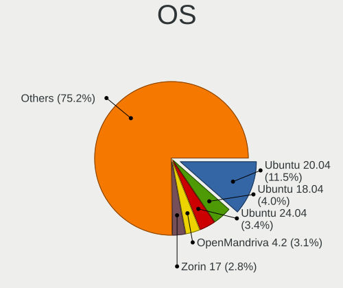

| Name                         | Notebooks | Percent |
|------------------------------|-----------|---------|
| Ubuntu 20.04                 | 37        | 11.49%  |
| Ubuntu 18.04                 | 13        | 4.04%   |
| Ubuntu 24.04                 | 11        | 3.42%   |
| OpenMandriva 4.2             | 10        | 3.11%   |
| Zorin 17                     | 9         | 2.8%    |
| Ubuntu 22.04                 | 9         | 2.8%    |
| Debian 12                    | 9         | 2.8%    |
| Zorin 16                     | 6         | 1.86%   |
| OpenMandriva 4.3             | 6         | 1.86%   |
| OpenMandriva 25.06           | 6         | 1.86%   |
| Linux Mint 20.1              | 6         | 1.86%   |
| Fedora 35                    | 6         | 1.86%   |
| KDE neon 20.04               | 5         | 1.55%   |
| Fedora 39                    | 5         | 1.55%   |
| ArcoLinux Rolling            | 5         | 1.55%   |
| Pop!_OS 22.04                | 4         | 1.24%   |
| Pop!_OS 20.04                | 4         | 1.24%   |
| OpenMandriva 24.12           | 4         | 1.24%   |
| OpenMandriva 24.07           | 4         | 1.24%   |
| OpenMandriva 23.11           | 4         | 1.24%   |
| OpenMandriva 23.09           | 4         | 1.24%   |
| Manjaro                      | 4         | 1.24%   |
| KDE neon 22.04               | 4         | 1.24%   |
| Xubuntu 20.04                | 3         | 0.93%   |
| openSUSE Tumbleweed-XXXXXXXX | 3         | 0.93%   |
| OpenMandriva 25.90           | 3         | 0.93%   |
| OpenMandriva 25.04           | 3         | 0.93%   |
| OpenMandriva 24.09           | 3         | 0.93%   |
| OpenMandriva 24.01           | 3         | 0.93%   |
| OpenMandriva 23.01           | 3         | 0.93%   |
| Fedora 40                    | 3         | 0.93%   |
| Debian 11                    | 3         | 0.93%   |
| Arch Rolling                 | 3         | 0.93%   |
| Arch                         | 3         | 0.93%   |
| Zorin 15                     | 2         | 0.62%   |
| Ubuntu 25.04                 | 2         | 0.62%   |
| Ubuntu 21.10                 | 2         | 0.62%   |
| Ubuntu 20.10                 | 2         | 0.62%   |
| Ubuntu 19.10                 | 2         | 0.62%   |
| ROSA R11                     | 2         | 0.62%   |

OS Family
---------

OS without a version

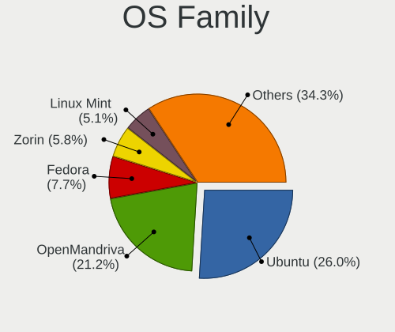

| Name          | Notebooks | Percent |
|---------------|-----------|---------|
| Ubuntu        | 81        | 25.96%  |
| OpenMandriva  | 66        | 21.15%  |
| Fedora        | 24        | 7.69%   |
| Zorin         | 18        | 5.77%   |
| Linux Mint    | 16        | 5.13%   |
| Debian        | 16        | 5.13%   |
| Pop!_OS       | 9         | 2.88%   |
| KDE neon      | 9         | 2.88%   |
| Manjaro       | 6         | 1.92%   |
| Kali          | 6         | 1.92%   |
| Arch          | 6         | 1.92%   |
| Xubuntu       | 5         | 1.6%    |
| ROSA          | 5         | 1.6%    |
| ArcoLinux     | 5         | 1.6%    |
| Parrot        | 3         | 0.96%   |
| openSUSE      | 3         | 0.96%   |
| MX            | 3         | 0.96%   |
| Q4OS          | 2         | 0.64%   |
| Kubuntu       | 2         | 0.64%   |
| Gentoo        | 2         | 0.64%   |
| Garuda Linux  | 2         | 0.64%   |
| CachyOS       | 2         | 0.64%   |
| BlackPanther  | 2         | 0.64%   |
| antiX         | 2         | 0.64%   |
| UbuntuDDE     | 1         | 0.32%   |
| Ubuntu Unity  | 1         | 0.32%   |
| Ubuntu Budgie | 1         | 0.32%   |
| TUXEDO OS     | 1         | 0.32%   |
| Pear OS       | 1         | 0.32%   |
| Lubuntu       | 1         | 0.32%   |
| LMDE          | 1         | 0.32%   |
| EndeavourOS   | 1         | 0.32%   |
| Elementary    | 1         | 0.32%   |
| Deepin        | 1         | 0.32%   |
| Clear Linux   | 1         | 0.32%   |
| ChimeraOS     | 1         | 0.32%   |
| CentOS        | 1         | 0.32%   |
| Bazzite       | 1         | 0.32%   |
| Athenaos      | 1         | 0.32%   |
| Artix         | 1         | 0.32%   |

Kernel
------

Version of the Linux kernel

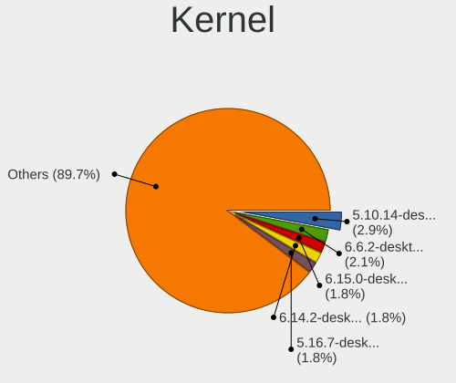

| Version                       | Notebooks | Percent |
|-------------------------------|-----------|---------|
| 5.10.14-desktop-1omv4002      | 10        | 2.93%   |
| 6.6.2-desktop-1omv2390        | 7         | 2.05%   |
| 6.15.0-desktop-0.rc2.3omv2590 | 6         | 1.76%   |
| 6.14.2-desktop-3omv2590       | 6         | 1.76%   |
| 5.16.7-desktop-1omv4003       | 6         | 1.76%   |
| 6.5.0-15-generic              | 4         | 1.17%   |
| 5.4.0-72-generic              | 4         | 1.17%   |
| 5.4.0-42-generic              | 4         | 1.17%   |
| 5.4.0-29-generic              | 4         | 1.17%   |
| 6.5.5-desktop-1omv2390        | 3         | 0.88%   |
| 6.2.0-33-generic              | 3         | 0.88%   |
| 6.10.0-desktop-1omv2490       | 3         | 0.88%   |
| 6.0.12-100.fc35.x86_64        | 3         | 0.88%   |
| 5.4.0-54-generic              | 3         | 0.88%   |
| 5.15.0-86-generic             | 3         | 0.88%   |
| 5.15.0-56-generic             | 3         | 0.88%   |
| 5.13.0-30-generic             | 3         | 0.88%   |
| 6.9.7-desktop-1omv2490        | 2         | 0.59%   |
| 6.8.0-51-generic              | 2         | 0.59%   |
| 6.8.0-45-generic              | 2         | 0.59%   |
| 6.5.0-desktop-1omv2390        | 2         | 0.59%   |
| 6.5.0-41-generic              | 2         | 0.59%   |
| 6.2.0-36-generic              | 2         | 0.59%   |
| 6.17.5-300.fc43.x86_64        | 2         | 0.59%   |
| 6.14.3-300.fc42.x86_64        | 2         | 0.59%   |
| 6.14.0-35-generic             | 2         | 0.59%   |
| 6.14.0-27-generic             | 2         | 0.59%   |
| 6.12.6-desktop-1omv2490       | 2         | 0.59%   |
| 6.12.1-desktop-1omv2490       | 2         | 0.59%   |
| 6.11.0-desktop-2omv2490       | 2         | 0.59%   |
| 6.10.1-desktop-1omv2490       | 2         | 0.59%   |
| 6.1.1-desktop-1omv2290        | 2         | 0.59%   |
| 6.1.0-31-amd64                | 2         | 0.59%   |
| 6.1.0-21-amd64                | 2         | 0.59%   |
| 6.1.0-13-amd64                | 2         | 0.59%   |
| 5.8.0-50-generic              | 2         | 0.59%   |
| 5.8.0-44-generic              | 2         | 0.59%   |
| 5.4.0-80-generic              | 2         | 0.59%   |
| 5.4.0-7625-generic            | 2         | 0.59%   |
| 5.4.0-65-generic              | 2         | 0.59%   |

Kernel Family
-------------

Linux kernel without a distro release

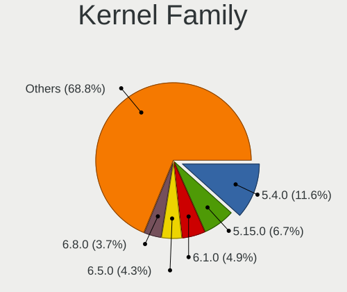

| Version | Notebooks | Percent |
|---------|-----------|---------|
| 5.4.0   | 38        | 11.62%  |
| 5.15.0  | 22        | 6.73%   |
| 6.1.0   | 16        | 4.89%   |
| 6.5.0   | 14        | 4.28%   |
| 6.8.0   | 12        | 3.67%   |
| 5.10.14 | 10        | 3.06%   |
| 6.14.0  | 9         | 2.75%   |
| 5.8.0   | 9         | 2.75%   |
| 5.13.0  | 8         | 2.45%   |
| 6.6.2   | 7         | 2.14%   |
| 5.3.0   | 7         | 2.14%   |
| 5.11.0  | 7         | 2.14%   |
| 6.2.0   | 6         | 1.83%   |
| 6.15.0  | 6         | 1.83%   |
| 6.14.2  | 6         | 1.83%   |
| 6.11.0  | 6         | 1.83%   |
| 5.16.7  | 6         | 1.83%   |
| 5.10.0  | 5         | 1.53%   |
| 4.15.0  | 5         | 1.53%   |
| 6.8.7   | 4         | 1.22%   |
| 5.0.0   | 4         | 1.22%   |
| 6.5.5   | 3         | 0.92%   |
| 6.10.0  | 3         | 0.92%   |
| 6.0.12  | 3         | 0.92%   |
| 4.18.16 | 3         | 0.92%   |
| 6.9.7   | 2         | 0.61%   |
| 6.7.9   | 2         | 0.61%   |
| 6.2.8   | 2         | 0.61%   |
| 6.2.6   | 2         | 0.61%   |
| 6.18.0  | 2         | 0.61%   |
| 6.17.5  | 2         | 0.61%   |
| 6.15.1  | 2         | 0.61%   |
| 6.14.3  | 2         | 0.61%   |
| 6.12.6  | 2         | 0.61%   |
| 6.12.1  | 2         | 0.61%   |
| 6.10.1  | 2         | 0.61%   |
| 6.1.1   | 2         | 0.61%   |
| 5.19.0  | 2         | 0.61%   |
| 5.15.7  | 2         | 0.61%   |
| 4.4.0   | 2         | 0.61%   |

Kernel Major Ver.
-----------------

Linux kernel major version

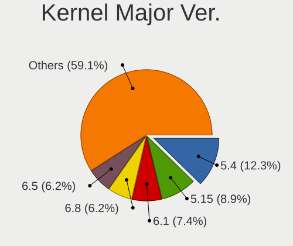

| Version | Notebooks | Percent |
|---------|-----------|---------|
| 5.4     | 40        | 12.31%  |
| 5.15    | 29        | 8.92%   |
| 6.1     | 24        | 7.38%   |
| 6.8     | 20        | 6.15%   |
| 6.5     | 20        | 6.15%   |
| 6.14    | 19        | 5.85%   |
| 5.10    | 18        | 5.54%   |
| 6.6     | 12        | 3.69%   |
| 6.2     | 11        | 3.38%   |
| 6.12    | 10        | 3.08%   |
| 6.15    | 9         | 2.77%   |
| 5.8     | 9         | 2.77%   |
| 5.13    | 9         | 2.77%   |
| 6.11    | 8         | 2.46%   |
| 5.11    | 8         | 2.46%   |
| 5.3     | 7         | 2.15%   |
| 5.16    | 7         | 2.15%   |
| 6.10    | 6         | 1.85%   |
| 6.9     | 5         | 1.54%   |
| 4.15    | 5         | 1.54%   |
| 6.4     | 4         | 1.23%   |
| 6.0     | 4         | 1.23%   |
| 5.19    | 4         | 1.23%   |
| 5.0     | 4         | 1.23%   |
| 4.18    | 4         | 1.23%   |
| 6.7     | 3         | 0.92%   |
| 5.12    | 3         | 0.92%   |
| 6.3     | 2         | 0.62%   |
| 6.18    | 2         | 0.62%   |
| 6.17    | 2         | 0.62%   |
| 6.16    | 2         | 0.62%   |
| 5.7     | 2         | 0.62%   |
| 5.17    | 2         | 0.62%   |
| 4.9     | 2         | 0.62%   |
| 4.4     | 2         | 0.62%   |
| 4.19    | 2         | 0.62%   |
| 6.13    | 1         | 0.31%   |
| 5.9     | 1         | 0.31%   |
| 5.6     | 1         | 0.31%   |
| 5.14    | 1         | 0.31%   |

Arch
----

OS architecture (x86_64, i586, etc.)

| Name   | Notebooks | Percent |
|--------|-----------|---------|
| x86_64 | 281       | 97.57%  |
| i686   | 7         | 2.43%   |

DE
--

Desktop Environment

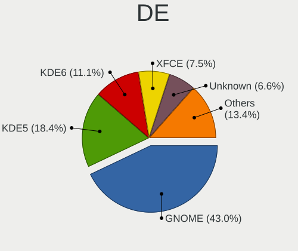

| Name             | Notebooks | Percent |
|------------------|-----------|---------|
| GNOME            | 131       | 42.95%  |
| KDE5             | 56        | 18.36%  |
| KDE6             | 34        | 11.15%  |
| XFCE             | 23        | 7.54%   |
| Unknown          | 20        | 6.56%   |
| X-Cinnamon       | 12        | 3.93%   |
| MATE             | 5         | 1.64%   |
| KDE              | 4         | 1.31%   |
| Cinnamon         | 4         | 1.31%   |
| i3               | 3         | 0.98%   |
| LXQt             | 2         | 0.66%   |
| KDE4             | 2         | 0.66%   |
| Unity            | 1         | 0.33%   |
| Trinity          | 1         | 0.33%   |
| Pantheon         | 1         | 0.33%   |
| lightdm-xsession | 1         | 0.33%   |
| icewm            | 1         | 0.33%   |
| fluxbox          | 1         | 0.33%   |
| Deepin           | 1         | 0.33%   |
| DDE              | 1         | 0.33%   |
| Budgie           | 1         | 0.33%   |

Display Server
--------------

X11 or Wayland

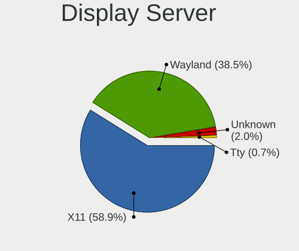

| Name    | Notebooks | Percent |
|---------|-----------|---------|
| X11     | 176       | 58.86%  |
| Wayland | 115       | 38.46%  |
| Unknown | 6         | 2.01%   |
| Tty     | 2         | 0.67%   |

Display Manager
---------------

SDDM, LightDM, etc.

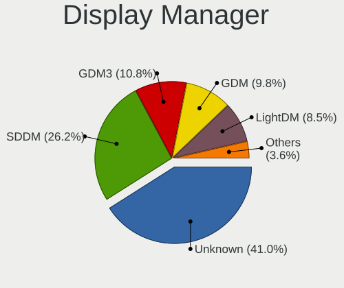

| Name    | Notebooks | Percent |
|---------|-----------|---------|
| Unknown | 125       | 40.98%  |
| SDDM    | 80        | 26.23%  |
| GDM3    | 33        | 10.82%  |
| GDM     | 30        | 9.84%   |
| LightDM | 26        | 8.52%   |
| TDM     | 5         | 1.64%   |
| SLIMSKI | 2         | 0.66%   |
| KDM     | 2         | 0.66%   |
| SLiM    | 1         | 0.33%   |
| I3      | 1         | 0.33%   |

OS Lang
-------

Language

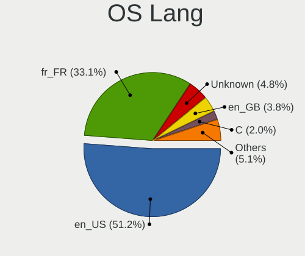

| Lang    | Notebooks | Percent |
|---------|-----------|---------|
| en_US   | 150       | 51.19%  |
| fr_FR   | 97        | 33.11%  |
| Unknown | 14        | 4.78%   |
| en_GB   | 11        | 3.75%   |
| C       | 6         | 2.05%   |
| ar_DZ   | 4         | 1.37%   |
| ar_EG   | 3         | 1.02%   |
| fr_BE   | 2         | 0.68%   |
| es_ES   | 2         | 0.68%   |
| en_DK   | 2         | 0.68%   |
| fr_DZ   | 1         | 0.34%   |
| en_IE   | 1         | 0.34%   |

Boot Mode
---------

EFI or BIOS

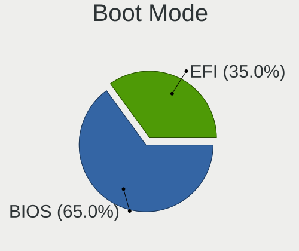

| Mode | Notebooks | Percent |
|------|-----------|---------|
| BIOS | 195       | 65%     |
| EFI  | 105       | 35%     |

Filesystem
----------

Type of filesystem

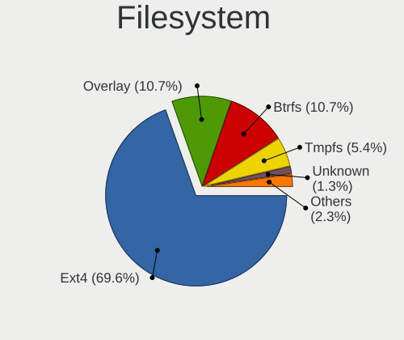

| Type    | Notebooks | Percent |
|---------|-----------|---------|
| Ext4    | 208       | 69.57%  |
| Overlay | 32        | 10.7%   |
| Btrfs   | 32        | 10.7%   |
| Tmpfs   | 16        | 5.35%   |
| Unknown | 4         | 1.34%   |
| Xfs     | 3         | 1%      |
| Ext2    | 3         | 1%      |
| Ext3    | 1         | 0.33%   |

Part. scheme
------------

Scheme of partitioning

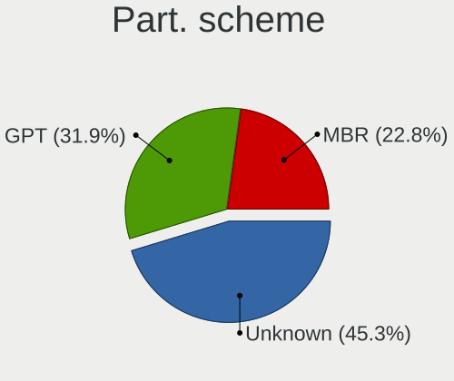

| Type    | Notebooks | Percent |
|---------|-----------|---------|
| Unknown | 135       | 45.3%   |
| GPT     | 95        | 31.88%  |
| MBR     | 68        | 22.82%  |

Dual Boot with Linux/BSD
------------------------

Hosting more than one Linux/BSD

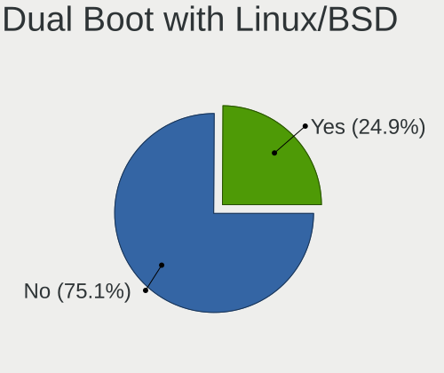

| Dual boot | Notebooks | Percent |
|-----------|-----------|---------|
| No        | 226       | 75.08%  |
| Yes       | 75        | 24.92%  |

Dual Boot (Win)
---------------

Hosting Linux and Windows

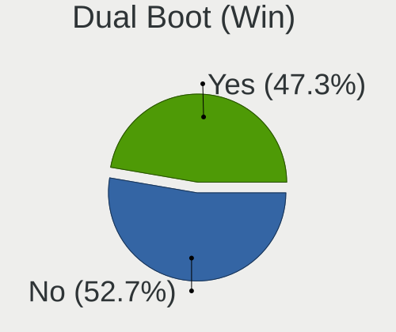

| Dual boot | Notebooks | Percent |
|-----------|-----------|---------|
| No        | 156       | 52.7%   |
| Yes       | 140       | 47.3%   |

Board
-----

Vendor
------

Motherboard manufacturer

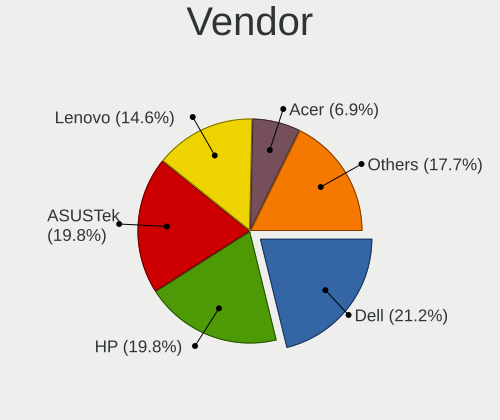

| Name                | Notebooks | Percent |
|---------------------|-----------|---------|
| Dell                | 61        | 21.18%  |
| Hewlett-Packard     | 57        | 19.79%  |
| ASUSTek Computer    | 57        | 19.79%  |
| Lenovo              | 42        | 14.58%  |
| Acer                | 20        | 6.94%   |
| Toshiba             | 12        | 4.17%   |
| Sony                | 7         | 2.43%   |
| Samsung Electronics | 6         | 2.08%   |
| Fujitsu             | 5         | 1.74%   |
| Apple               | 5         | 1.74%   |
| Packard Bell        | 4         | 1.39%   |
| Unknown             | 3         | 1.04%   |
| UNOWHY              | 1         | 0.35%   |
| SPA CONDOR          | 1         | 0.35%   |
| Panasonic           | 1         | 0.35%   |
| Notebook            | 1         | 0.35%   |
| MSI                 | 1         | 0.35%   |
| LDLC                | 1         | 0.35%   |
| HUAWEI              | 1         | 0.35%   |
| Google              | 1         | 0.35%   |
| eMachines           | 1         | 0.35%   |

Model
-----

Motherboard model

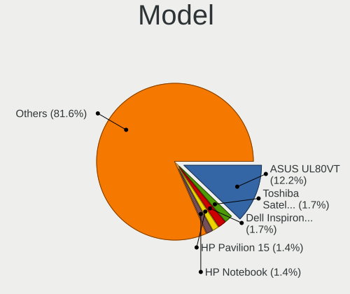

| Name                          | Notebooks | Percent |
|-------------------------------|-----------|---------|
| ASUS UL80VT                   | 35        | 12.15%  |
| Toshiba Satellite C55-B       | 5         | 1.74%   |
| Dell Inspiron N5110           | 5         | 1.74%   |
| HP Pavilion 15                | 4         | 1.39%   |
| HP Notebook                   | 4         | 1.39%   |
| HP EliteBook 840 G3           | 4         | 1.39%   |
| Dell Latitude 5490            | 4         | 1.39%   |
| Dell Inspiron 15-3567         | 4         | 1.39%   |
| Lenovo IdeaPad 300-15ISK 80Q7 | 3         | 1.04%   |
| Lenovo G560 20042             | 3         | 1.04%   |
| HP ProBook 4540s              | 3         | 1.04%   |
| Dell Latitude 7480            | 3         | 1.04%   |
| Dell Inspiron 3543            | 3         | 1.04%   |
| Dell Inspiron 3542            | 3         | 1.04%   |
| Unknown                       | 3         | 1.04%   |
| Samsung N102SP/N100SP/N101SP  | 2         | 0.69%   |
| Lenovo G50-30 80G0            | 2         | 0.69%   |
| Lenovo B50-70 20384           | 2         | 0.69%   |
| HP EliteBook 840 G5           | 2         | 0.69%   |
| HP 15                         | 2         | 0.69%   |
| Dell Latitude E7440           | 2         | 0.69%   |
| Dell Latitude E5430 vPro      | 2         | 0.69%   |
| Dell Latitude 5480            | 2         | 0.69%   |
| Dell Inspiron 3521            | 2         | 0.69%   |
| Acer Aspire 5738              | 2         | 0.69%   |
| UNOWHY Y13G012S4EI            | 1         | 0.35%   |
| Toshiba Satellite Pro A100    | 1         | 0.35%   |
| Toshiba Satellite C850-A979   | 1         | 0.35%   |
| Toshiba Satellite C50-A560    | 1         | 0.35%   |
| Toshiba Satellite C50-A545    | 1         | 0.35%   |
| Toshiba Satellite C50-A539    | 1         | 0.35%   |
| Toshiba PORTEGE R30-A         | 1         | 0.35%   |
| Toshiba PORTEGE M780          | 1         | 0.35%   |
| SPA CONDOR P401               | 1         | 0.35%   |
| Sony VPCEJ2S1E                | 1         | 0.35%   |
| Sony VPCEH2H1E                | 1         | 0.35%   |
| Sony VGN-NS10J_S              | 1         | 0.35%   |
| Sony VGN-AW21M_H              | 1         | 0.35%   |
| Sony SVF1531GSFB              | 1         | 0.35%   |
| Sony SVE1713A6EW              | 1         | 0.35%   |

Model Family
------------

Motherboard model prefix

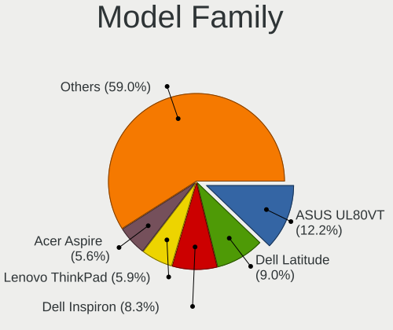

| Name                  | Notebooks | Percent |
|-----------------------|-----------|---------|
| ASUS UL80VT           | 35        | 12.15%  |
| Dell Latitude         | 26        | 9.03%   |
| Dell Inspiron         | 24        | 8.33%   |
| Lenovo ThinkPad       | 17        | 5.9%    |
| Acer Aspire           | 16        | 5.56%   |
| HP EliteBook          | 14        | 4.86%   |
| HP ProBook            | 12        | 4.17%   |
| Toshiba Satellite     | 10        | 3.47%   |
| HP Pavilion           | 10        | 3.47%   |
| Lenovo IdeaPad        | 9         | 3.13%   |
| HP Laptop             | 6         | 2.08%   |
| Fujitsu LIFEBOOK      | 5         | 1.74%   |
| Dell Vostro           | 5         | 1.74%   |
| HP Notebook           | 4         | 1.39%   |
| Dell Precision        | 4         | 1.39%   |
| ASUS Vivobook         | 4         | 1.39%   |
| Packard Bell EasyNote | 3         | 1.04%   |
| Lenovo G560           | 3         | 1.04%   |
| ASUS ASUS             | 3         | 1.04%   |
| Unknown               | 3         | 1.04%   |
| Toshiba PORTEGE       | 2         | 0.69%   |
| Samsung N102SP        | 2         | 0.69%   |
| Lenovo Yoga           | 2         | 0.69%   |
| Lenovo G580           | 2         | 0.69%   |
| Lenovo G50-30         | 2         | 0.69%   |
| Lenovo B50-70         | 2         | 0.69%   |
| HP ZBook              | 2         | 0.69%   |
| HP 250                | 2         | 0.69%   |
| HP 15                 | 2         | 0.69%   |
| Acer Extensa          | 2         | 0.69%   |
| UNOWHY Y13G012S4EI    | 1         | 0.35%   |
| SPA CONDOR P401       | 1         | 0.35%   |
| Sony VPCEJ2S1E        | 1         | 0.35%   |
| Sony VPCEH2H1E        | 1         | 0.35%   |
| Sony VGN-NS10J        | 1         | 0.35%   |
| Sony VGN-AW21M        | 1         | 0.35%   |
| Sony SVF1531GSFB      | 1         | 0.35%   |
| Sony SVE1713A6EW      | 1         | 0.35%   |
| Sony SVE1513K1EW      | 1         | 0.35%   |
| Samsung RC410         | 1         | 0.35%   |

MFG Year
--------

Motherboard manufacture year

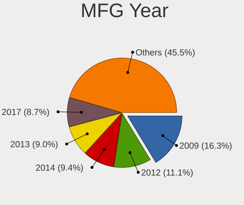

| Year    | Notebooks | Percent |
|---------|-----------|---------|
| 2009    | 47        | 16.32%  |
| 2012    | 32        | 11.11%  |
| 2014    | 27        | 9.38%   |
| 2013    | 26        | 9.03%   |
| 2017    | 25        | 8.68%   |
| 2016    | 21        | 7.29%   |
| 2015    | 21        | 7.29%   |
| 2011    | 17        | 5.9%    |
| 2018    | 15        | 5.21%   |
| 2010    | 13        | 4.51%   |
| 2021    | 9         | 3.13%   |
| 2020    | 8         | 2.78%   |
| 2022    | 7         | 2.43%   |
| 2023    | 5         | 1.74%   |
| 2019    | 4         | 1.39%   |
| 2008    | 4         | 1.39%   |
| 2024    | 2         | 0.69%   |
| 2007    | 2         | 0.69%   |
| 2006    | 2         | 0.69%   |
| Unknown | 1         | 0.35%   |

Form Factor
-----------

Physical design of the computer

| Name     | Notebooks | Percent |
|----------|-----------|---------|
| Notebook | 288       | 100%    |

Secure Boot
-----------

Enabled or disabled

| State    | Notebooks | Percent |
|----------|-----------|---------|
| Disabled | 280       | 96.89%  |
| Enabled  | 9         | 3.11%   |

Coreboot
--------

Have coreboot on board

| Used | Notebooks | Percent |
|------|-----------|---------|
| No   | 287       | 99.65%  |
| Yes  | 1         | 0.35%   |

RAM Size
--------

Total RAM memory

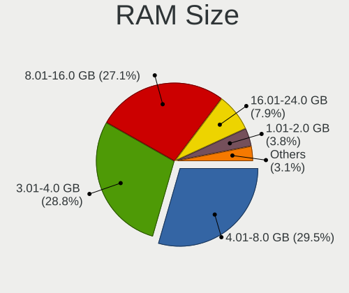

| Size in GB | Notebooks | Percent |
|------------|-----------|---------|
| 4.01-8.0   | 86        | 29.45%  |
| 3.01-4.0   | 84        | 28.77%  |
| 8.01-16.0  | 79        | 27.05%  |
| 16.01-24.0 | 23        | 7.88%   |
| 1.01-2.0   | 11        | 3.77%   |
| 32.01-64.0 | 4         | 1.37%   |
| 2.01-3.0   | 3         | 1.03%   |
| 24.01-32.0 | 1         | 0.34%   |
| 0.51-1.0   | 1         | 0.34%   |

RAM Used
--------

Used RAM memory

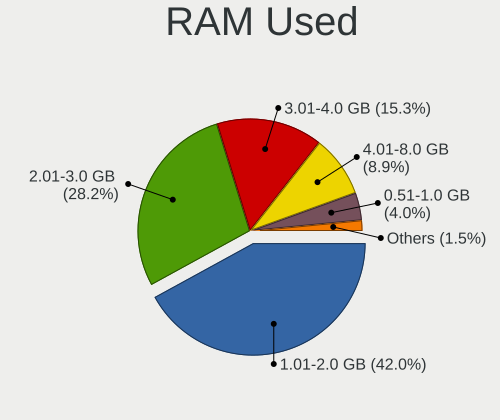

| Used GB   | Notebooks | Percent |
|-----------|-----------|---------|
| 1.01-2.0  | 137       | 42.02%  |
| 2.01-3.0  | 92        | 28.22%  |
| 3.01-4.0  | 50        | 15.34%  |
| 4.01-8.0  | 29        | 8.9%    |
| 0.51-1.0  | 13        | 3.99%   |
| 8.01-16.0 | 5         | 1.53%   |

Total Drives
------------

Number of drives on board

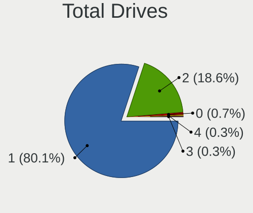

| Drives | Notebooks | Percent |
|--------|-----------|---------|
| 1      | 237       | 80.07%  |
| 2      | 55        | 18.58%  |
| 0      | 2         | 0.68%   |
| 4      | 1         | 0.34%   |
| 3      | 1         | 0.34%   |

Has CD-ROM
----------

Has CD-ROM on board

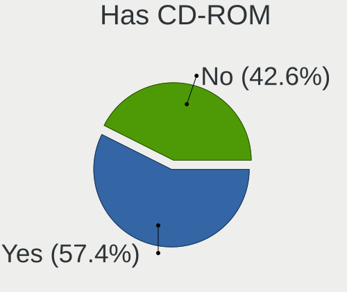

| Presented | Notebooks | Percent |
|-----------|-----------|---------|
| Yes       | 167       | 57.39%  |
| No        | 124       | 42.61%  |

Has Ethernet
------------

Has Ethernet on board

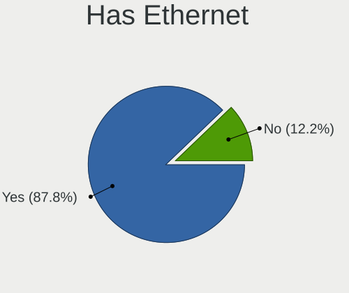

| Presented | Notebooks | Percent |
|-----------|-----------|---------|
| Yes       | 253       | 87.85%  |
| No        | 35        | 12.15%  |

Has WiFi
--------

Has WiFi module

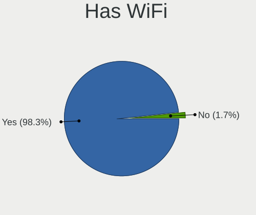

| Presented | Notebooks | Percent |
|-----------|-----------|---------|
| Yes       | 284       | 98.27%  |
| No        | 5         | 1.73%   |

Has Bluetooth
-------------

Has Bluetooth module

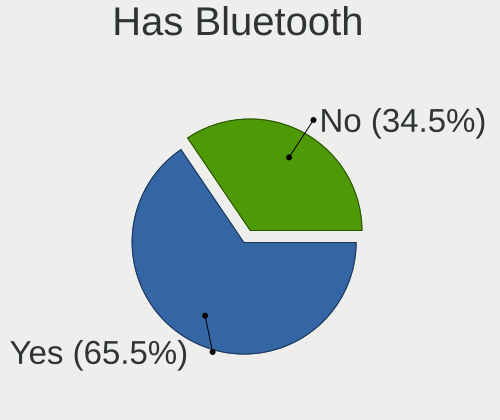

| Presented | Notebooks | Percent |
|-----------|-----------|---------|
| Yes       | 192       | 65.53%  |
| No        | 101       | 34.47%  |

Location
--------

Country
-------

Geographic location (country)

| Country | Notebooks | Percent |
|---------|-----------|---------|
| Algeria | 288       | 100%    |

City
----

Geographic location (city)

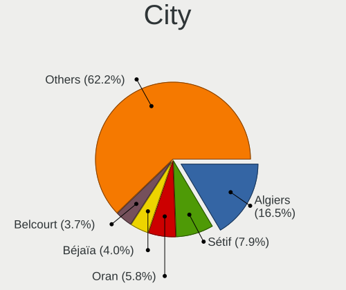

| City               | Notebooks | Percent |
|--------------------|-----------|---------|
| Algiers            | 54        | 16.46%  |
| Sétif             | 26        | 7.93%   |
| Oran               | 19        | 5.79%   |
| Béjaïa           | 13        | 3.96%   |
| Belcourt           | 12        | 3.66%   |
| Tlemcen            | 11        | 3.35%   |
| Tizi Ouzou         | 9         | 2.74%   |
| Annaba             | 9         | 2.74%   |
| Relizane           | 7         | 2.13%   |
| Constantine        | 7         | 2.13%   |
| Cheraga            | 7         | 2.13%   |
| Skikda             | 5         | 1.52%   |
| Blida              | 5         | 1.52%   |
| Birkhadem          | 5         | 1.52%   |
| Batna City         | 5         | 1.52%   |
| Tipasa             | 4         | 1.22%   |
| Ouargla            | 4         | 1.22%   |
| Laghouat           | 4         | 1.22%   |
| Bordj el Kiffan    | 4         | 1.22%   |
| Bordj Bou Arreridj | 4         | 1.22%   |
| Bab Ezzouar        | 4         | 1.22%   |
| Amizour            | 4         | 1.22%   |
| Saida              | 3         | 0.91%   |
| Kouba              | 3         | 0.91%   |
| Jijelli            | 3         | 0.91%   |
| Djelfa             | 3         | 0.91%   |
| Ben ’Aknoûn     | 3         | 0.91%   |
| ash-Shalif         | 3         | 0.91%   |
| Souk Ahras         | 2         | 0.61%   |
| Sidi Bel Abbes     | 2         | 0.61%   |
| Saoula             | 2         | 0.61%   |
| Mostaganem         | 2         | 0.61%   |
| Kherrata           | 2         | 0.61%   |
| Hassi Messaoud     | 2         | 0.61%   |
| El Khroub          | 2         | 0.61%   |
| Debila             | 2         | 0.61%   |
| Boumerdes          | 2         | 0.61%   |
| Boudouaou          | 2         | 0.61%   |
| Biskra             | 2         | 0.61%   |
| Bir el Djir        | 2         | 0.61%   |

Drives
------

Drive Vendor
------------

Hard drive vendors

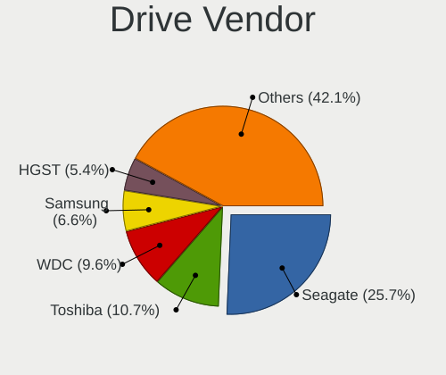

| Vendor                | Notebooks | Drives | Percent |
|-----------------------|-----------|--------|---------|
| Seagate               | 86        | 104    | 25.67%  |
| Toshiba               | 36        | 52     | 10.75%  |
| WDC                   | 32        | 37     | 9.55%   |
| Samsung Electronics   | 22        | 24     | 6.57%   |
| HGST                  | 18        | 23     | 5.37%   |
| Hitachi               | 17        | 20     | 5.07%   |
| SanDisk               | 13        | 16     | 3.88%   |
| SK hynix              | 12        | 15     | 3.58%   |
| Intel                 | 12        | 14     | 3.58%   |
| Team                  | 9         | 10     | 2.69%   |
| Unknown               | 8         | 9      | 2.39%   |
| Lexar                 | 8         | 10     | 2.39%   |
| A-DATA Technology     | 8         | 12     | 2.39%   |
| China                 | 6         | 7      | 1.79%   |
| Micron Technology     | 5         | 6      | 1.49%   |
| LITEON                | 4         | 8      | 1.19%   |
| Fujitsu               | 3         | 4      | 0.9%    |
| Crucial               | 3         | 3      | 0.9%    |
| XrayDisk              | 2         | 2      | 0.6%    |
| KIOXIA                | 2         | 2      | 0.6%    |
| KingSpec              | 2         | 2      | 0.6%    |
| HS-SSD-E100           | 2         | 3      | 0.6%    |
| XPG                   | 1         | 1      | 0.3%    |
| tecmiyo               | 1         | 1      | 0.3%    |
| STAR                  | 1         | 1      | 0.3%    |
| SSSTC                 | 1         | 1      | 0.3%    |
| Solid State Storage   | 1         | 2      | 0.3%    |
| Realtek Semiconductor | 1         | 1      | 0.3%    |
| PNY                   | 1         | 1      | 0.3%    |
| MAX                   | 1         | 1      | 0.3%    |
| Londisk               | 1         | 1      | 0.3%    |
| LITEONIT              | 1         | 1      | 0.3%    |
| Lenovo                | 1         | 1      | 0.3%    |
| KODAK                 | 1         | 2      | 0.3%    |
| Kingston              | 1         | 1      | 0.3%    |
| KESU                  | 1         | 1      | 0.3%    |
| JMicron Technology    | 1         | 1      | 0.3%    |
| Initio                | 1         | 1      | 0.3%    |
| HUAWEI                | 1         | 1      | 0.3%    |
| HS-SSD-C100           | 1         | 2      | 0.3%    |

Drive Model
-----------

Hard drive models

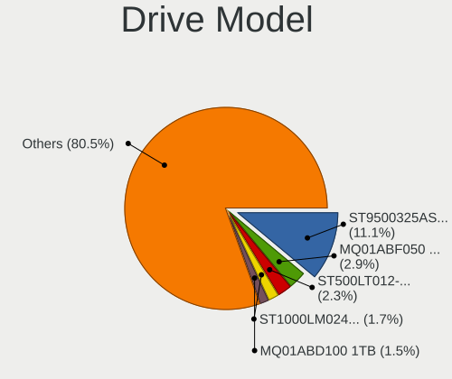

| Model                               | Notebooks | Percent |
|-------------------------------------|-----------|---------|
| Seagate ST9500325AS 500GB           | 38        | 11.08%  |
| Toshiba MQ01ABF050 500GB            | 10        | 2.92%   |
| Seagate ST500LT012-1DG142 500GB     | 8         | 2.33%   |
| Seagate ST1000LM024 HN-M101MBB 1TB  | 6         | 1.75%   |
| Toshiba MQ01ABD100 1TB              | 5         | 1.46%   |
| Seagate ST500VT000-1DK142 500GB     | 5         | 1.46%   |
| Seagate Expansion 2TB               | 5         | 1.46%   |
| Intel SSDPEKNU512GZ 512GB           | 5         | 1.46%   |
| Team T253512GB SSD                  | 4         | 1.17%   |
| Seagate ST1000LM035-1RK172 1TB      | 4         | 1.17%   |
| HGST HTS545050A7E680 500GB          | 4         | 1.17%   |
| HGST HTS545050A7E380 500GB          | 4         | 1.17%   |
| WDC WD5000LPCX-24C6HT0 500GB        | 3         | 0.87%   |
| Unknown MMC Card  64GB              | 3         | 0.87%   |
| Toshiba MQ01ABD050V 500GB           | 3         | 0.87%   |
| SanDisk SD8SN8U-256G-1006 256GB SSD | 3         | 0.87%   |
| Lexar 512GB SSD                     | 3         | 0.87%   |
| Hitachi HTS545050B9A300 500GB       | 3         | 0.87%   |
| Hitachi HTS545050A7E380 500GB       | 3         | 0.87%   |
| HGST HTS725050A7E630 500GB          | 3         | 0.87%   |
| HGST HTS541010A9E680 1TB            | 3         | 0.87%   |
| China SSD 256GB                     | 3         | 0.87%   |
| XrayDisk 512GB SSD                  | 2         | 0.58%   |
| Unknown MMC Card  32GB              | 2         | 0.58%   |
| Toshiba MQ04ABF100 1TB              | 2         | 0.58%   |
| Toshiba MQ01ABD075 752GB            | 2         | 0.58%   |
| Team T253256GB SSD                  | 2         | 0.58%   |
| Seagate ST500LM021-1KJ152 500GB     | 2         | 0.58%   |
| Seagate ST320LT020-9YG142 320GB     | 2         | 0.58%   |
| Samsung MZVLQ256HAJD-000H1 256GB    | 2         | 0.58%   |
| Lexar 128GB SSD                     | 2         | 0.58%   |
| Intel SSD 600P Series 1024GB        | 2         | 0.58%   |
| A-DATA SU650 120GB SSD              | 2         | 0.58%   |
| XPG SX950U 240GB SSD                | 1         | 0.29%   |
| WDC WDS500G2B0B 500GB SSD           | 1         | 0.29%   |
| WDC WDS500G2B0A-00SM50 500GB        | 1         | 0.29%   |
| WDC WDS120G2G0A-00JH30 120GB SSD    | 1         | 0.29%   |
| WDC WDS100T2B0B-00YS70 1TB SSD      | 1         | 0.29%   |
| WDC WD7500BPKX-75HPJT0 752GB        | 1         | 0.29%   |
| WDC WD5000LUCT-62RC2Y0 500GB        | 1         | 0.29%   |

HDD Vendor
----------

Hard disk drive vendors

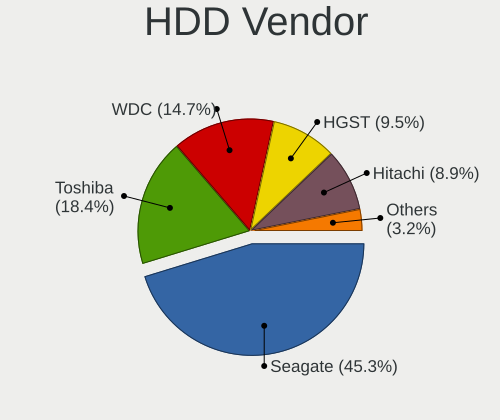

| Vendor              | Notebooks | Drives | Percent |
|---------------------|-----------|--------|---------|
| Seagate             | 86        | 104    | 45.26%  |
| Toshiba             | 35        | 49     | 18.42%  |
| WDC                 | 28        | 32     | 14.74%  |
| HGST                | 18        | 23     | 9.47%   |
| Hitachi             | 17        | 20     | 8.95%   |
| Fujitsu             | 3         | 4      | 1.58%   |
| Samsung Electronics | 1         | 1      | 0.53%   |
| JMicron Technology  | 1         | 1      | 0.53%   |
| Initio              | 1         | 1      | 0.53%   |

SSD Vendor
----------

Solid state drive vendors

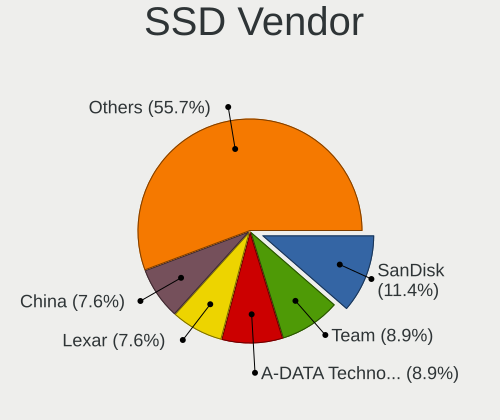

| Vendor              | Notebooks | Drives | Percent |
|---------------------|-----------|--------|---------|
| SanDisk             | 9         | 10     | 11.39%  |
| Team                | 7         | 8      | 8.86%   |
| A-DATA Technology   | 7         | 11     | 8.86%   |
| Lexar               | 6         | 8      | 7.59%   |
| China               | 6         | 7      | 7.59%   |
| Samsung Electronics | 5         | 6      | 6.33%   |
| WDC                 | 4         | 4      | 5.06%   |
| SK hynix            | 4         | 6      | 5.06%   |
| LITEON              | 4         | 8      | 5.06%   |
| Intel               | 3         | 4      | 3.8%    |
| Crucial             | 3         | 3      | 3.8%    |
| XrayDisk            | 2         | 2      | 2.53%   |
| KingSpec            | 2         | 2      | 2.53%   |
| XPG                 | 1         | 1      | 1.27%   |
| tecmiyo             | 1         | 1      | 1.27%   |
| STAR                | 1         | 1      | 1.27%   |
| PNY                 | 1         | 1      | 1.27%   |
| Micron Technology   | 1         | 1      | 1.27%   |
| MAX                 | 1         | 1      | 1.27%   |
| Londisk             | 1         | 1      | 1.27%   |
| LITEONIT            | 1         | 1      | 1.27%   |
| Lenovo              | 1         | 1      | 1.27%   |
| KODAK               | 1         | 2      | 1.27%   |
| Kingston            | 1         | 1      | 1.27%   |
| HS-SSD-E100         | 1         | 1      | 1.27%   |
| HS-SSD-C100         | 1         | 1      | 1.27%   |
| Dahua               | 1         | 1      | 1.27%   |
| CONSISTENT          | 1         | 1      | 1.27%   |
| Apple               | 1         | 1      | 1.27%   |
| Unknown             | 1         | 1      | 1.27%   |

Drive Kind
----------

HDD or SSD

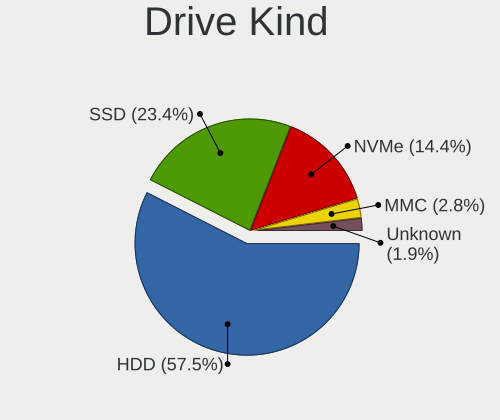

| Kind    | Notebooks | Drives | Percent |
|---------|-----------|--------|---------|
| HDD     | 184       | 235    | 57.5%   |
| SSD     | 75        | 97     | 23.44%  |
| NVMe    | 46        | 62     | 14.38%  |
| MMC     | 9         | 11     | 2.81%   |
| Unknown | 6         | 7      | 1.88%   |

Drive Connector
---------------

SATA, SAS, NVMe, etc.

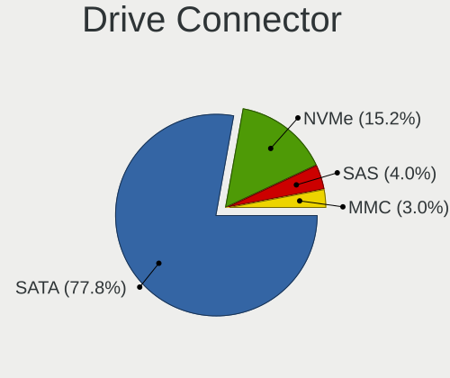

| Type | Notebooks | Drives | Percent |
|------|-----------|--------|---------|
| SATA | 235       | 328    | 77.81%  |
| NVMe | 46        | 61     | 15.23%  |
| SAS  | 12        | 12     | 3.97%   |
| MMC  | 9         | 11     | 2.98%   |

Drive Size
----------

Size of hard drive

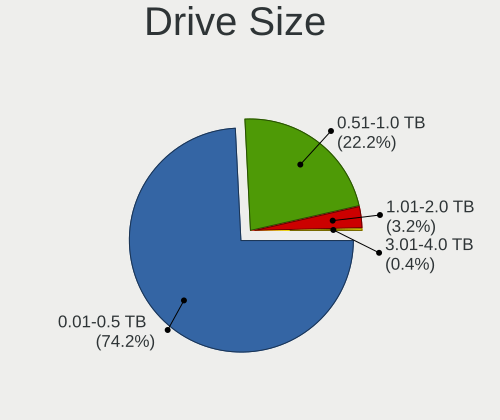

| Size in TB | Notebooks | Drives | Percent |
|------------|-----------|--------|---------|
| 0.01-0.5   | 187       | 250    | 74.21%  |
| 0.51-1.0   | 56        | 72     | 22.22%  |
| 1.01-2.0   | 8         | 9      | 3.17%   |
| 3.01-4.0   | 1         | 1      | 0.4%    |

Space Total
-----------

Amount of disk space available on the file system

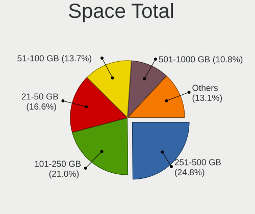

| Size in GB     | Notebooks | Percent |
|----------------|-----------|---------|
| 251-500        | 78        | 24.84%  |
| 101-250        | 66        | 21.02%  |
| 21-50          | 52        | 16.56%  |
| 51-100         | 43        | 13.69%  |
| 501-1000       | 34        | 10.83%  |
| 1-20           | 24        | 7.64%   |
| 1001-2000      | 10        | 3.18%   |
| Unknown        | 5         | 1.59%   |
| More than 3000 | 1         | 0.32%   |
| 2001-3000      | 1         | 0.32%   |

Space Used
----------

Amount of used disk space

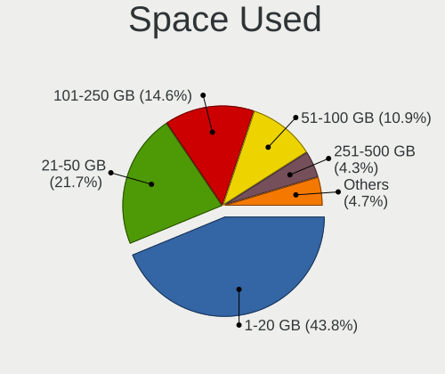

| Used GB   | Notebooks | Percent |
|-----------|-----------|---------|
| 1-20      | 141       | 43.79%  |
| 21-50     | 70        | 21.74%  |
| 101-250   | 47        | 14.6%   |
| 51-100    | 35        | 10.87%  |
| 251-500   | 14        | 4.35%   |
| 501-1000  | 9         | 2.8%    |
| Unknown   | 5         | 1.55%   |
| 1001-2000 | 1         | 0.31%   |

Malfunc. Drives
---------------

Drive models with a malfunction

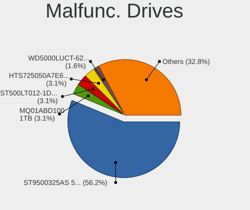

| Model                              | Notebooks | Drives | Percent |
|------------------------------------|-----------|--------|---------|
| Seagate ST9500325AS 500GB          | 36        | 36     | 56.25%  |
| Toshiba MQ01ABD100 1TB             | 2         | 2      | 3.13%   |
| Seagate ST500LT012-1DG142 500GB    | 2         | 2      | 3.13%   |
| HGST HTS725050A7E630 500GB         | 2         | 5      | 3.13%   |
| WDC WD5000LUCT-62C26Y0 500GB       | 1         | 1      | 1.56%   |
| WDC WD5000BEVT-24A0RT0 500GB       | 1         | 1      | 1.56%   |
| WDC WD5000BEVT-22A0RT0 500GB       | 1         | 1      | 1.56%   |
| WDC WD3200BPVT-22JJ5T0 320GB       | 1         | 1      | 1.56%   |
| Toshiba MQ01ABF050 500GB           | 1         | 1      | 1.56%   |
| Seagate ST9320325AS 320GB          | 1         | 1      | 1.56%   |
| Seagate ST9250410AS 250GB          | 1         | 1      | 1.56%   |
| Seagate ST500LT012-9WS142 500GB    | 1         | 1      | 1.56%   |
| Seagate ST500LM021-1KJ152 500GB    | 1         | 1      | 1.56%   |
| Seagate ST1000LM048-2E7172 1TB     | 1         | 1      | 1.56%   |
| Seagate ST1000LM035-1RK172 1TB     | 1         | 1      | 1.56%   |
| Seagate ST1000LM024 HN-M101MBB 1TB | 1         | 1      | 1.56%   |
| Samsung Electronics HM320HJ 320GB  | 1         | 1      | 1.56%   |
| LITEONIT L8T-256L6G-HP 256GB SSD   | 1         | 1      | 1.56%   |
| Lexar 512GB SSD                    | 1         | 1      | 1.56%   |
| KingSpec P3-128 128GB SSD          | 1         | 1      | 1.56%   |
| Hitachi HTS723225L9A360 250GB      | 1         | 2      | 1.56%   |
| Hitachi HTS547564A9E384 640GB      | 1         | 1      | 1.56%   |
| Hitachi HTS545050B9A300 500GB      | 1         | 1      | 1.56%   |
| Hitachi HTS542516K9SA00 160GB      | 1         | 1      | 1.56%   |
| HGST HTS545050A7E680 500GB         | 1         | 1      | 1.56%   |
| Crucial CT250BX100SSD1 250GB       | 1         | 1      | 1.56%   |

Malfunc. Drive Vendor
---------------------

Vendors of faulty drives

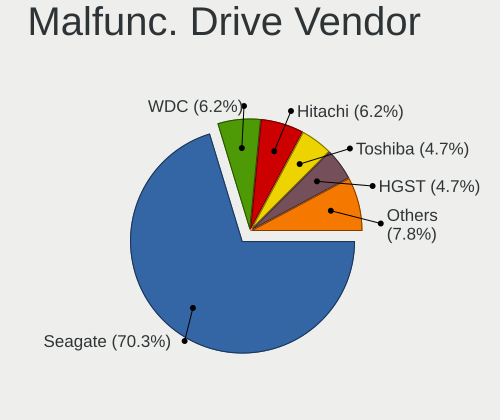

| Vendor              | Notebooks | Drives | Percent |
|---------------------|-----------|--------|---------|
| Seagate             | 45        | 45     | 70.31%  |
| WDC                 | 4         | 4      | 6.25%   |
| Hitachi             | 4         | 5      | 6.25%   |
| Toshiba             | 3         | 3      | 4.69%   |
| HGST                | 3         | 6      | 4.69%   |
| Samsung Electronics | 1         | 1      | 1.56%   |
| LITEONIT            | 1         | 1      | 1.56%   |
| Lexar               | 1         | 1      | 1.56%   |
| KingSpec            | 1         | 1      | 1.56%   |
| Crucial             | 1         | 1      | 1.56%   |

Malfunc. HDD Vendor
-------------------

Vendors of faulty HDD drives

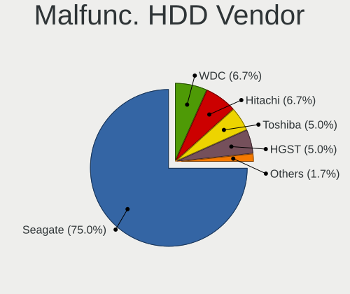

| Vendor              | Notebooks | Drives | Percent |
|---------------------|-----------|--------|---------|
| Seagate             | 45        | 45     | 75%     |
| WDC                 | 4         | 4      | 6.67%   |
| Hitachi             | 4         | 5      | 6.67%   |
| Toshiba             | 3         | 3      | 5%      |
| HGST                | 3         | 6      | 5%      |
| Samsung Electronics | 1         | 1      | 1.67%   |

Malfunc. Drive Kind
-------------------

Kinds of faulty drives

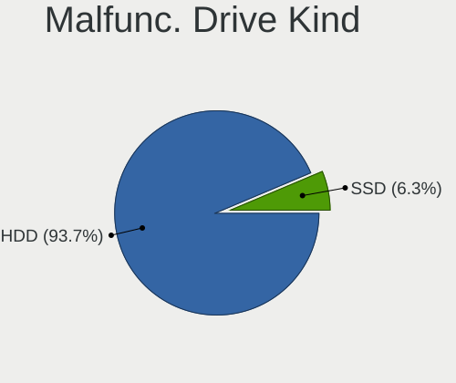

| Kind | Notebooks | Drives | Percent |
|------|-----------|--------|---------|
| HDD  | 59        | 64     | 93.65%  |
| SSD  | 4         | 4      | 6.35%   |

Failed Drives
-------------

Failed drive models

Zero info for selected period =(

Failed Drive Vendor
-------------------

Failed drive vendors

Zero info for selected period =(

Drive Status
------------

Number of failed and malfunc. drives

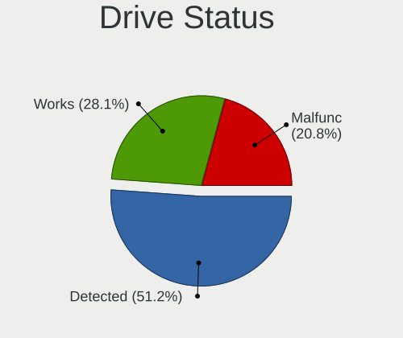

| Status   | Notebooks | Drives | Percent |
|----------|-----------|--------|---------|
| Detected | 155       | 226    | 51.16%  |
| Works    | 85        | 118    | 28.05%  |
| Malfunc  | 63        | 68     | 20.79%  |

Storage controller
------------------

Storage Vendor
--------------

Storage controller vendors

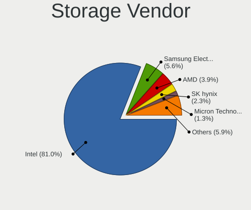

| Vendor                         | Notebooks | Percent |
|--------------------------------|-----------|---------|
| Intel                          | 247       | 80.98%  |
| Samsung Electronics            | 17        | 5.57%   |
| AMD                            | 12        | 3.93%   |
| SK hynix                       | 7         | 2.3%    |
| Micron Technology              | 4         | 1.31%   |
| SanDisk                        | 3         | 0.98%   |
| Nvidia                         | 3         | 0.98%   |
| Realtek Semiconductor          | 2         | 0.66%   |
| KIOXIA                         | 2         | 0.66%   |
| ADATA Technology               | 2         | 0.66%   |
| Toshiba America Info Systems   | 1         | 0.33%   |
| Solid State Storage Technology | 1         | 0.33%   |
| Silicon Motion                 | 1         | 0.33%   |
| Shenzhen Longsys Electronics   | 1         | 0.33%   |
| MAXIO Technology (Hangzhou)    | 1         | 0.33%   |
| Hosin Global Electronics       | 1         | 0.33%   |

Storage Model
-------------

Storage controller models

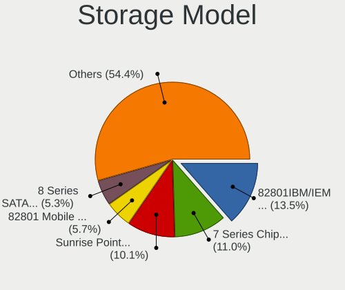

| Model                                                                                  | Notebooks | Percent |
|----------------------------------------------------------------------------------------|-----------|---------|
| Intel 82801IBM/IEM (ICH9M/ICH9M-E) 4 port SATA Controller [AHCI mode]                  | 43        | 13.52%  |
| Intel 7 Series Chipset Family 6-port SATA Controller [AHCI mode]                       | 35        | 11.01%  |
| Intel Sunrise Point-LP SATA Controller [AHCI mode]                                     | 32        | 10.06%  |
| Intel 82801 Mobile SATA Controller [RAID mode]                                         | 18        | 5.66%   |
| Intel 8 Series SATA Controller 1 [AHCI mode]                                           | 17        | 5.35%   |
| Intel Wildcat Point-LP SATA Controller [AHCI Mode]                                     | 13        | 4.09%   |
| Intel 5 Series/3400 Series Chipset 4 port SATA AHCI Controller                         | 13        | 4.09%   |
| Intel 6 Series/C200 Series Chipset Family 6 port Mobile SATA AHCI Controller           | 12        | 3.77%   |
| AMD FCH SATA Controller [AHCI mode]                                                    | 10        | 3.14%   |
| Intel Volume Management Device NVMe RAID Controller                                    | 9         | 2.83%   |
| Intel 8 Series/C220 Series Chipset Family 6-port SATA Controller 1 [AHCI mode]         | 7         | 2.2%    |
| Samsung NVMe SSD Controller 980 (DRAM-less)                                            | 6         | 1.89%   |
| Intel SSD 670p Series [Keystone Harbor]                                                | 6         | 1.89%   |
| Intel Atom Processor E3800 Series SATA AHCI Controller                                 | 5         | 1.57%   |
| Intel 5 Series/3400 Series Chipset 6 port SATA AHCI Controller                         | 5         | 1.57%   |
| Samsung NVMe SSD Controller SM981/PM981/PM983                                          | 4         | 1.26%   |
| Intel Atom/Celeron/Pentium Processor x5-E8000/J3xxx/N3xxx Series SATA Controller       | 4         | 1.26%   |
| Samsung NVMe SSD Controller SM961/PM961/SM963                                          | 3         | 0.94%   |
| Intel Tiger Lake-LP SATA Controller                                                    | 3         | 0.94%   |
| Intel SATA Controller [RAID mode]                                                      | 3         | 0.94%   |
| Intel NM10/ICH7 Family SATA Controller [AHCI mode]                                     | 3         | 0.94%   |
| Intel Comet Lake SATA AHCI Controller                                                  | 3         | 0.94%   |
| Intel Celeron/Pentium Silver Processor SATA Controller                                 | 3         | 0.94%   |
| Intel Alder Lake-P SATA AHCI Controller                                                | 3         | 0.94%   |
| SK hynix Gold P31/BC711/PC711 NVMe Solid State Drive                                   | 2         | 0.63%   |
| SK hynix BC901 NVMe Solid State Drive (DRAM-less)                                      | 2         | 0.63%   |
| Realtek RTS5765DL NVMe SSD Controller (DRAM-less)                                      | 2         | 0.63%   |
| Intel SSD 600P Series                                                                  | 2         | 0.63%   |
| Intel HM170/QM170 Chipset SATA Controller [AHCI Mode]                                  | 2         | 0.63%   |
| Intel Atom Processor E3800 Series SATA IDE Controller                                  | 2         | 0.63%   |
| Intel 82801HM/HEM (ICH8M/ICH8M-E) IDE Controller                                       | 2         | 0.63%   |
| AMD SB7x0/SB8x0/SB9x0 SATA Controller [AHCI mode]                                      | 2         | 0.63%   |
| ADATA XPG GAMMIXS1 1L, XPG GAMMIX S5, LEGEND 710 / 740, SWORDFISH NVMe SSD (DRAM-less) | 2         | 0.63%   |
| Toshiba America Info Systems XG6 NVMe SSD Controller                                   | 1         | 0.31%   |
| Solid State Storage CL1-3D256-Q11 NVMe SSD M.2                                         | 1         | 0.31%   |
| SK hynix PC611 NVMe Solid State Drive                                                  | 1         | 0.31%   |
| SK hynix BC511 NVMe SSD                                                                | 1         | 0.31%   |
| SK hynix BC501 NVMe Solid State Drive                                                  | 1         | 0.31%   |
| Silicon Motion SM2263EN/SM2263XT (DRAM-less) NVMe SSD Controllers                      | 1         | 0.31%   |
| Shenzhen Longsys Lexar NM790 / Patriot Viper VP4300 Lite NVMe SSD (DRAM-less)          | 1         | 0.31%   |

Storage Kind
------------

Kind of storage controller (IDE, SATA, NVMe, SAS, ...)

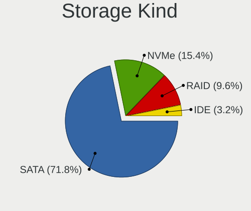

| Kind | Notebooks | Percent |
|------|-----------|---------|
| SATA | 224       | 71.79%  |
| NVMe | 48        | 15.38%  |
| RAID | 30        | 9.62%   |
| IDE  | 10        | 3.21%   |

Processor
---------

CPU Vendor
----------

Processor vendors

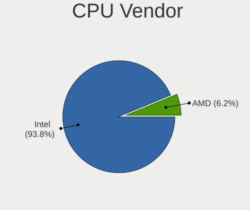

| Vendor | Notebooks | Percent |
|--------|-----------|---------|
| Intel  | 270       | 93.75%  |
| AMD    | 18        | 6.25%   |

CPU Model
---------

Processor models

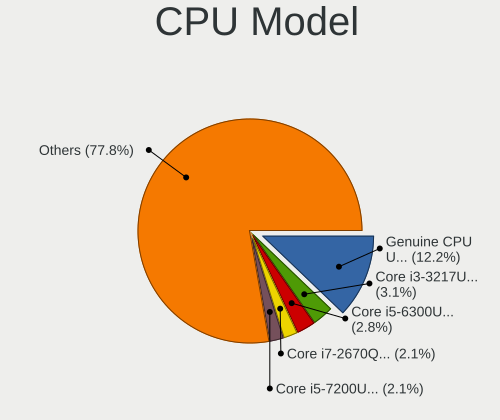

| Model                                       | Notebooks | Percent |
|---------------------------------------------|-----------|---------|
| Intel Genuine CPU U7300 @ 1.30GHz           | 35        | 12.15%  |
| Intel Core i3-3217U CPU @ 1.80GHz           | 9         | 3.13%   |
| Intel Core i5-6300U CPU @ 2.40GHz           | 8         | 2.78%   |
| Intel Core i7-2670QM CPU @ 2.20GHz          | 6         | 2.08%   |
| Intel Core i5-7200U CPU @ 2.50GHz           | 6         | 2.08%   |
| Intel Core i3 CPU M 380 @ 2.53GHz           | 6         | 2.08%   |
| Intel Core i5-8350U CPU @ 1.70GHz           | 5         | 1.74%   |
| Intel Core i5-5200U CPU @ 2.20GHz           | 5         | 1.74%   |
| Intel Core i5-3210M CPU @ 2.50GHz           | 5         | 1.74%   |
| Intel Core i3-5005U CPU @ 2.00GHz           | 5         | 1.74%   |
| Intel Core i3-4005U CPU @ 1.70GHz           | 5         | 1.74%   |
| Intel Core i3-3110M CPU @ 2.40GHz           | 5         | 1.74%   |
| Intel Core i7-6600U CPU @ 2.60GHz           | 4         | 1.39%   |
| Intel Core i5-8250U CPU @ 1.60GHz           | 4         | 1.39%   |
| Intel Core i5-6200U CPU @ 2.30GHz           | 4         | 1.39%   |
| Intel Core i3 CPU M 370 @ 2.40GHz           | 4         | 1.39%   |
| Intel Celeron CPU N3060 @ 1.60GHz           | 4         | 1.39%   |
| Intel 11th Gen Core i7-1165G7 @ 2.80GHz     | 4         | 1.39%   |
| Intel 11th Gen Core i5-1135G7 @ 2.40GHz     | 4         | 1.39%   |
| Intel Pentium Dual-Core CPU T4500 @ 2.30GHz | 3         | 1.04%   |
| Intel Pentium CPU N3540 @ 2.16GHz           | 3         | 1.04%   |
| Intel Core i7-7700HQ CPU @ 2.80GHz          | 3         | 1.04%   |
| Intel Core i7-6500U CPU @ 2.50GHz           | 3         | 1.04%   |
| Intel Core i7-2760QM CPU @ 2.40GHz          | 3         | 1.04%   |
| Intel Core i5-4210U CPU @ 1.70GHz           | 3         | 1.04%   |
| Intel Core i5-3320M CPU @ 2.60GHz           | 3         | 1.04%   |
| Intel Core i5 CPU M 480 @ 2.67GHz           | 3         | 1.04%   |
| Intel Core i3-3120M CPU @ 2.50GHz           | 3         | 1.04%   |
| Intel Core 2 Duo CPU P8600 @ 2.40GHz        | 3         | 1.04%   |
| Intel Core i7-8650U CPU @ 1.90GHz           | 2         | 0.69%   |
| Intel Core i7-8550U CPU @ 1.80GHz           | 2         | 0.69%   |
| Intel Core i7-7820HQ CPU @ 2.90GHz          | 2         | 0.69%   |
| Intel Core i7-7600U CPU @ 2.80GHz           | 2         | 0.69%   |
| Intel Core i7-7500U CPU @ 2.70GHz           | 2         | 0.69%   |
| Intel Core i7-4500U CPU @ 1.80GHz           | 2         | 0.69%   |
| Intel Core i5-4210M CPU @ 2.60GHz           | 2         | 0.69%   |
| Intel Core i5-4200U CPU @ 1.60GHz           | 2         | 0.69%   |
| Intel Core i5-4200M CPU @ 2.50GHz           | 2         | 0.69%   |
| Intel Core i5-3230M CPU @ 2.60GHz           | 2         | 0.69%   |
| Intel Core i5-2430M CPU @ 2.40GHz           | 2         | 0.69%   |

CPU Model Family
----------------

Processor model prefix

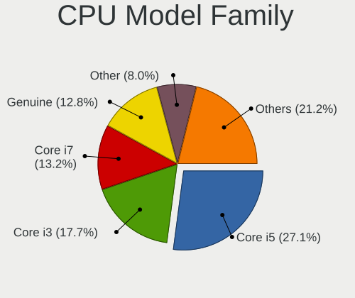

| Model                   | Notebooks | Percent |
|-------------------------|-----------|---------|
| Intel Core i5           | 78        | 27.08%  |
| Intel Core i3           | 51        | 17.71%  |
| Intel Core i7           | 38        | 13.19%  |
| Intel Genuine           | 37        | 12.85%  |
| Other                   | 23        | 7.99%   |
| Intel Celeron           | 14        | 4.86%   |
| Intel Pentium           | 10        | 3.47%   |
| Intel Core 2 Duo        | 9         | 3.13%   |
| Intel Atom              | 6         | 2.08%   |
| Intel Pentium Dual-Core | 4         | 1.39%   |
| AMD Ryzen 5             | 3         | 1.04%   |
| AMD Ryzen 7             | 2         | 0.69%   |
| AMD Ryzen 3             | 2         | 0.69%   |
| AMD A4                  | 2         | 0.69%   |
| Intel Pentium Dual      | 1         | 0.35%   |
| AMD Ryzen 7 PRO         | 1         | 0.35%   |
| AMD E2                  | 1         | 0.35%   |
| AMD E1                  | 1         | 0.35%   |
| AMD C-70                | 1         | 0.35%   |
| AMD Athlon Neo X2       | 1         | 0.35%   |
| AMD Athlon II Dual-Core | 1         | 0.35%   |
| AMD Athlon              | 1         | 0.35%   |
| AMD A8                  | 1         | 0.35%   |

CPU Cores
---------

Number of processor cores

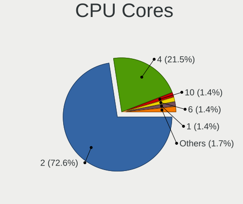

| Number | Notebooks | Percent |
|--------|-----------|---------|
| 2      | 209       | 72.57%  |
| 4      | 62        | 21.53%  |
| 10     | 4         | 1.39%   |
| 6      | 4         | 1.39%   |
| 1      | 4         | 1.39%   |
| 12     | 2         | 0.69%   |
| 8      | 2         | 0.69%   |
| 14     | 1         | 0.35%   |

CPU Sockets
-----------

Number of sockets

| Number | Notebooks | Percent |
|--------|-----------|---------|
| 1      | 288       | 100%    |

CPU Threads
-----------

Threads per core (Hyper-Threading)

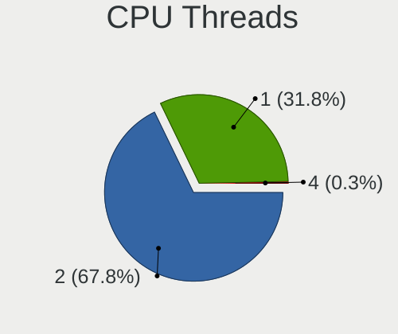

| Number | Notebooks | Percent |
|--------|-----------|---------|
| 2      | 196       | 67.82%  |
| 1      | 92        | 31.83%  |
| 4      | 1         | 0.35%   |

CPU Op-Modes
------------

CPU Operation Modes (32-bit, 64-bit)

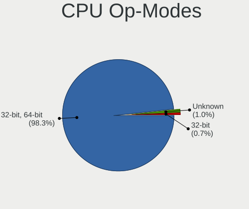

| Op mode        | Notebooks | Percent |
|----------------|-----------|---------|
| 32-bit, 64-bit | 283       | 98.26%  |
| Unknown        | 3         | 1.04%   |
| 32-bit         | 2         | 0.69%   |

CPU Microcode
-------------

Microcode number

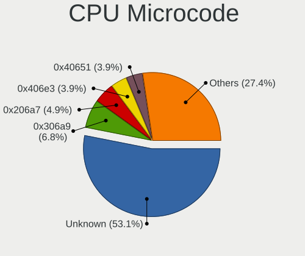

| Number     | Notebooks | Percent |
|------------|-----------|---------|
| Unknown    | 163       | 53.09%  |
| 0x306a9    | 21        | 6.84%   |
| 0x206a7    | 15        | 4.89%   |
| 0x406e3    | 12        | 3.91%   |
| 0x40651    | 12        | 3.91%   |
| 0x20655    | 12        | 3.91%   |
| 0x306d4    | 9         | 2.93%   |
| 0x806e9    | 8         | 2.61%   |
| 0x30678    | 8         | 2.61%   |
| 0x1067a    | 7         | 2.28%   |
| 0x806ea    | 5         | 1.63%   |
| 0x906e9    | 4         | 1.3%    |
| 0x306c3    | 4         | 1.3%    |
| 0x806ec    | 2         | 0.65%   |
| 0x806c1    | 2         | 0.65%   |
| 0x706a8    | 2         | 0.65%   |
| 0x6fd      | 2         | 0.65%   |
| 0x30661    | 2         | 0.65%   |
| 0x20652    | 2         | 0.65%   |
| 0x05000119 | 2         | 0.65%   |
| 0xa0652    | 1         | 0.33%   |
| 0x906a4    | 1         | 0.33%   |
| 0x6ec      | 1         | 0.33%   |
| 0x6e8      | 1         | 0.33%   |
| 0x506c9    | 1         | 0.33%   |
| 0x406c4    | 1         | 0.33%   |
| 0x406c3    | 1         | 0.33%   |
| 0x08600106 | 1         | 0.33%   |
| 0x08108102 | 1         | 0.33%   |
| 0x0810100b | 1         | 0.33%   |
| 0x07000110 | 1         | 0.33%   |
| 0x0700010f | 1         | 0.33%   |
| 0x06006705 | 1         | 0.33%   |

CPU Microarch
-------------

Microarchitecture

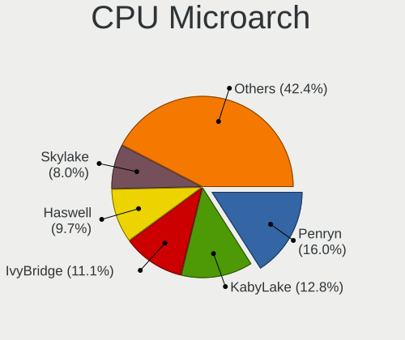

| Name             | Notebooks | Percent |
|------------------|-----------|---------|
| Penryn           | 46        | 15.97%  |
| KabyLake         | 37        | 12.85%  |
| IvyBridge        | 32        | 11.11%  |
| Haswell          | 28        | 9.72%   |
| Skylake          | 23        | 7.99%   |
| SandyBridge      | 20        | 6.94%   |
| Westmere         | 19        | 6.6%    |
| Silvermont       | 16        | 5.56%   |
| Broadwell        | 14        | 4.86%   |
| TigerLake        | 13        | 4.51%   |
| Unknown          | 7         | 2.43%   |
| Alderlake Hybrid | 5         | 1.74%   |
| Goldmont plus    | 3         | 1.04%   |
| Core             | 3         | 1.04%   |
| Bonnell          | 3         | 1.04%   |
| Zen+             | 2         | 0.69%   |
| Zen 2            | 2         | 0.69%   |
| Zen              | 2         | 0.69%   |
| P6               | 2         | 0.69%   |
| Jaguar           | 2         | 0.69%   |
| Excavator        | 2         | 0.69%   |
| Bobcat           | 2         | 0.69%   |
| Puma             | 1         | 0.35%   |
| K8 Hammer        | 1         | 0.35%   |
| K10              | 1         | 0.35%   |
| Goldmont         | 1         | 0.35%   |
| CometLake        | 1         | 0.35%   |

Graphics
--------

GPU Vendor
----------

Vendors of graphics cards

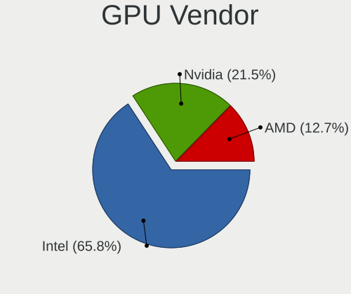

| Vendor | Notebooks | Percent |
|--------|-----------|---------|
| Intel  | 254       | 65.8%   |
| Nvidia | 83        | 21.5%   |
| AMD    | 49        | 12.69%  |

GPU Model
---------

Graphics card models

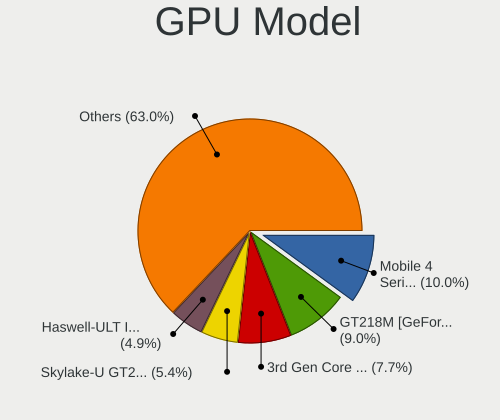

| Model                                                                                    | Notebooks | Percent |
|------------------------------------------------------------------------------------------|-----------|---------|
| Intel Mobile 4 Series Chipset Integrated Graphics Controller                             | 39        | 10.03%  |
| Nvidia GT218M [GeForce G210M]                                                            | 35        | 9%      |
| Intel 3rd Gen Core processor Graphics Controller                                         | 30        | 7.71%   |
| Intel Skylake-U GT2 [HD Graphics 520]                                                    | 21        | 5.4%    |
| Intel Haswell-ULT Integrated Graphics Controller                                         | 19        | 4.88%   |
| Intel 2nd Generation Core Processor Family Integrated Graphics Controller                | 19        | 4.88%   |
| Intel Core Processor Integrated Graphics Controller                                      | 16        | 4.11%   |
| Intel TigerLake-LP GT2 [Iris Xe Graphics]                                                | 13        | 3.34%   |
| Intel Kaby Lake-R GT2 [UHD Graphics 620]                                                 | 13        | 3.34%   |
| Intel Kaby Lake-U GT2 [HD Graphics 620]                                                  | 12        | 3.08%   |
| Intel Broadwell-U GT2 [HD Graphics 5500]                                                 | 12        | 3.08%   |
| AMD Sun XT [Radeon HD 8670A/8670M/8690M / R5 M330 / M430 / Radeon 520 Mobile]            | 11        | 2.83%   |
| Intel Atom Processor Z36xxx/Z37xxx Series Graphics & Display                             | 10        | 2.57%   |
| Intel 4th Gen Core Processor Integrated Graphics Controller                              | 8         | 2.06%   |
| Nvidia GF117M [GeForce 610M/710M/810M/820M / GT 620M/625M/630M/720M]                     | 6         | 1.54%   |
| Intel Atom/Celeron/Pentium Processor x5-E8000/J3xxx/N3xxx Integrated Graphics Controller | 6         | 1.54%   |
| Intel Kaby Lake-H GT2 [HD Graphics 630]                                                  | 5         | 1.29%   |
| Nvidia GF108M [GeForce GT 525M]                                                          | 3         | 0.77%   |
| Intel WhiskeyLake-U GT2 [UHD Graphics 620]                                               | 3         | 0.77%   |
| Intel GeminiLake [UHD Graphics 600]                                                      | 3         | 0.77%   |
| Intel CometLake-U GT2 [UHD Graphics]                                                     | 3         | 0.77%   |
| Intel Atom Processor D2xxx/N2xxx Integrated Graphics Controller                          | 3         | 0.77%   |
| Intel Alder Lake-P GT2 [Iris Xe Graphics]                                                | 3         | 0.77%   |
| AMD Topaz XT [Radeon R7 M260/M265 / M340/M360 / M440/M445 / 530/535 / 620/625 Mobile]    | 3         | 0.77%   |
| AMD Thames [Radeon HD 7550M/7570M/7650M]                                                 | 3         | 0.77%   |
| Nvidia MCP89 [GeForce 320M]                                                              | 2         | 0.51%   |
| Nvidia GP107M [GeForce MX350]                                                            | 2         | 0.51%   |
| Nvidia GM108M [GeForce MX130]                                                            | 2         | 0.51%   |
| Nvidia GM108M [GeForce 920MX]                                                            | 2         | 0.51%   |
| Nvidia GM107GLM [Quadro M1200 Mobile]                                                    | 2         | 0.51%   |
| Nvidia GK208M [GeForce GT 740M]                                                          | 2         | 0.51%   |
| Nvidia GK208BM [GeForce 920M]                                                            | 2         | 0.51%   |
| Nvidia GA107M [GeForce RTX 3050 Mobile]                                                  | 2         | 0.51%   |
| Nvidia G98M [GeForce 9300M GS]                                                           | 2         | 0.51%   |
| Intel Mobile 945GM/GMS/GME, 943/940GML Express Integrated Graphics Controller            | 2         | 0.51%   |
| Intel Mobile 945GM/GMS, 943/940GML Express Integrated Graphics Controller                | 2         | 0.51%   |
| Intel Alder Lake-UP3 GT2 [Iris Xe Graphics]                                              | 2         | 0.51%   |
| AMD Thames [Radeon HD 7500M/7600M Series]                                                | 2         | 0.51%   |
| AMD Stoney [Radeon R2/R3/R4/R5 Graphics]                                                 | 2         | 0.51%   |
| AMD RV710/M92 [Mobility Radeon HD 4530/4570/5145/530v/540v/545v]                         | 2         | 0.51%   |

GPU Combo
---------

Combinations of graphics cards

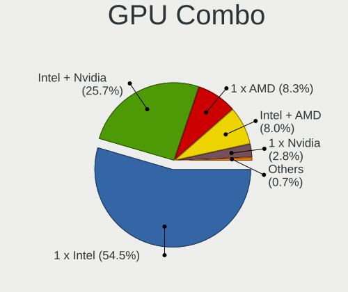

| Name           | Notebooks | Percent |
|----------------|-----------|---------|
| 1 x Intel      | 157       | 54.51%  |
| Intel + Nvidia | 74        | 25.69%  |
| 1 x AMD        | 24        | 8.33%   |
| Intel + AMD    | 23        | 7.99%   |
| 1 x Nvidia     | 8         | 2.78%   |
| 2 x AMD        | 1         | 0.35%   |
| AMD + Nvidia   | 1         | 0.35%   |

GPU Driver
----------

Free vs proprietary

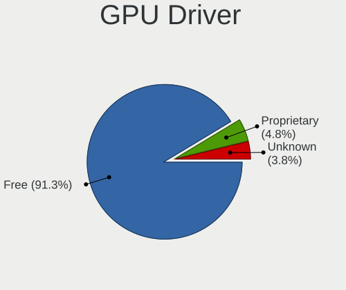

| Driver      | Notebooks | Percent |
|-------------|-----------|---------|
| Free        | 264       | 91.35%  |
| Proprietary | 14        | 4.84%   |
| Unknown     | 11        | 3.81%   |

GPU Memory
----------

Total video memory

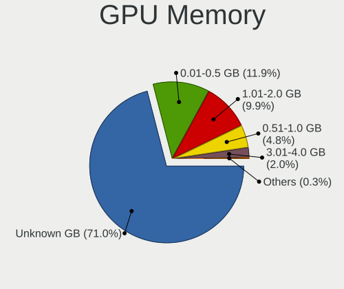

| Size in GB | Notebooks | Percent |
|------------|-----------|---------|
| Unknown    | 208       | 70.99%  |
| 0.01-0.5   | 35        | 11.95%  |
| 1.01-2.0   | 29        | 9.9%    |
| 0.51-1.0   | 14        | 4.78%   |
| 3.01-4.0   | 6         | 2.05%   |
| 7.01-8.0   | 1         | 0.34%   |

Monitor
-------

Monitor Vendor
--------------

Monitor vendors

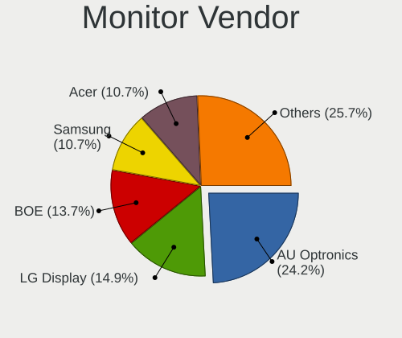

| Vendor                  | Notebooks | Percent |
|-------------------------|-----------|---------|
| AU Optronics            | 81        | 24.18%  |
| LG Display              | 50        | 14.93%  |
| BOE                     | 46        | 13.73%  |
| Samsung Electronics     | 36        | 10.75%  |
| Acer                    | 36        | 10.75%  |
| Chimei Innolux          | 30        | 8.96%   |
| Chi Mei Optoelectronics | 16        | 4.78%   |
| Apple                   | 6         | 1.79%   |
| Lenovo                  | 4         | 1.19%   |
| InfoVision              | 4         | 1.19%   |
| Hewlett-Packard         | 4         | 1.19%   |
| Sharp                   | 3         | 0.9%    |
| PANDA                   | 2         | 0.6%    |
| MStar                   | 2         | 0.6%    |
| BenQ                    | 2         | 0.6%    |
| AOC                     | 2         | 0.6%    |
| Unknown                 | 2         | 0.6%    |
| ___                     | 1         | 0.3%    |
| TMU                     | 1         | 0.3%    |
| MDA                     | 1         | 0.3%    |
| LGD                     | 1         | 0.3%    |
| KTC                     | 1         | 0.3%    |
| InnoLux Display         | 1         | 0.3%    |
| Goldstar                | 1         | 0.3%    |
| CPT                     | 1         | 0.3%    |
| AGO                     | 1         | 0.3%    |

Monitor Model
-------------

Monitor models

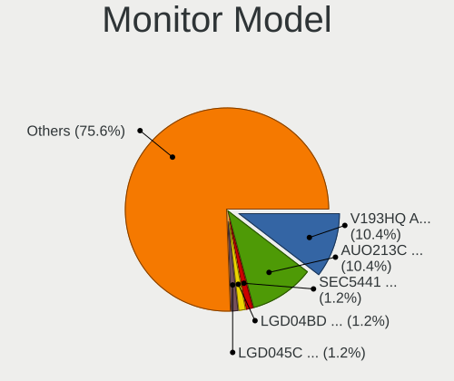

| Model                                                                    | Notebooks | Percent |
|--------------------------------------------------------------------------|-----------|---------|
| AU Optronics LCD Monitor AUO213C 1366x768 309x174mm 14.0-inch            | 35        | 10.42%  |
| Acer V193HQ ACR00F9 1366x768 410x230mm 18.5-inch                         | 35        | 10.42%  |
| Samsung Electronics LCD Monitor SEC5441 1280x800 331x207mm 15.4-inch     | 4         | 1.19%   |
| LG Display LCD Monitor LGD04BD 1366x768 344x194mm 15.5-inch              | 4         | 1.19%   |
| LG Display LCD Monitor LGD045C 1366x768 345x194mm 15.6-inch              | 4         | 1.19%   |
| Chimei Innolux LCD Monitor CMN15CA 1366x768 344x193mm 15.5-inch          | 4         | 1.19%   |
| Chimei Innolux LCD Monitor CMN14C0 1920x1080 308x173mm 13.9-inch         | 4         | 1.19%   |
| Chi Mei Optoelectronics LCD Monitor CMO15A4 1366x768 344x194mm 15.5-inch | 4         | 1.19%   |
| BOE LCD Monitor BOE0671 1366x768 344x194mm 15.5-inch                     | 4         | 1.19%   |
| BOE LCD Monitor BOE0615 1366x768 309x173mm 13.9-inch                     | 4         | 1.19%   |
| AU Optronics LCD Monitor AUO22EC 1366x768 344x193mm 15.5-inch            | 4         | 1.19%   |
| Samsung Electronics LCD Monitor SEC3642 1366x768 344x194mm 15.5-inch     | 3         | 0.89%   |
| Samsung Electronics LCD Monitor SDC4347 1366x768 344x193mm 15.5-inch     | 3         | 0.89%   |
| Samsung Electronics LCD Monitor SDC4146 1366x768 344x194mm 15.5-inch     | 3         | 0.89%   |
| Chimei Innolux LCD Monitor CMN15DB 1366x768 344x193mm 15.5-inch          | 3         | 0.89%   |
| BOE LCD Monitor BOE070D 1366x768 309x173mm 13.9-inch                     | 3         | 0.89%   |
| BOE LCD Monitor BOE0672 1366x768 344x194mm 15.5-inch                     | 3         | 0.89%   |
| AU Optronics LCD Monitor AUO40EC 1366x768 344x193mm 15.5-inch            | 3         | 0.89%   |
| Samsung Electronics LCD Monitor SDC4C51 1366x768 344x194mm 15.5-inch     | 2         | 0.6%    |
| MStar Demo MST0030 1920x1080 708x398mm 32.0-inch                         | 2         | 0.6%    |
| LG Display LP156WH1-TLA3 LGD01C2 1366x768 344x194mm 15.5-inch            | 2         | 0.6%    |
| LG Display LCD Monitor LGD0525 1366x768 344x194mm 15.5-inch              | 2         | 0.6%    |
| LG Display LCD Monitor LGD0465 1366x768 344x194mm 15.5-inch              | 2         | 0.6%    |
| LG Display LCD Monitor LGD039F 1366x768 345x194mm 15.6-inch              | 2         | 0.6%    |
| LG Display LCD Monitor LGD0395 1366x768 344x194mm 15.5-inch              | 2         | 0.6%    |
| LG Display LCD Monitor LGD038E 1366x768 344x194mm 15.5-inch              | 2         | 0.6%    |
| LG Display LCD Monitor LGD033A 1366x768 344x194mm 15.5-inch              | 2         | 0.6%    |
| LG Display LCD Monitor LGD02DC 1366x768 344x194mm 15.5-inch              | 2         | 0.6%    |
| Lenovo LCD Monitor LEN40B0 1366x768 344x194mm 15.5-inch                  | 2         | 0.6%    |
| Chimei Innolux LCD Monitor CMN15DC 1366x768 344x193mm 15.5-inch          | 2         | 0.6%    |
| Chimei Innolux LCD Monitor CMN15C6 1366x768 344x193mm 15.5-inch          | 2         | 0.6%    |
| Chimei Innolux LCD Monitor CMN14D3 1920x1080 309x173mm 13.9-inch         | 2         | 0.6%    |
| Chimei Innolux LCD Monitor CMN14C3 1366x768 309x173mm 13.9-inch          | 2         | 0.6%    |
| Chi Mei Optoelectronics LCD Monitor CMO15A7 1366x768 344x193mm 15.5-inch | 2         | 0.6%    |
| Chi Mei Optoelectronics LCD Monitor CMO1592 1366x768 344x193mm 15.5-inch | 2         | 0.6%    |
| BOE LCD Monitor BOE0661 1366x768 344x194mm 15.5-inch                     | 2         | 0.6%    |
| AU Optronics LCD Monitor AUO71EC 1366x768 344x193mm 15.5-inch            | 2         | 0.6%    |
| AU Optronics LCD Monitor AUO41EC 1366x768 344x193mm 15.5-inch            | 2         | 0.6%    |
| AU Optronics LCD Monitor AUO23EC 1366x768 344x193mm 15.5-inch            | 2         | 0.6%    |
| Apple LCD Monitor APP9CC3 1280x800 286x179mm 13.3-inch                   | 2         | 0.6%    |

Monitor Resolution
------------------

Monitor screen resolution

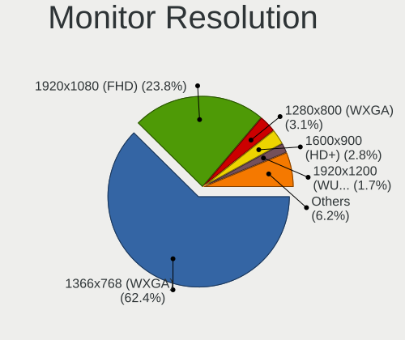

| Resolution        | Notebooks | Percent |
|-------------------|-----------|---------|
| 1366x768 (WXGA)   | 181       | 62.41%  |
| 1920x1080 (FHD)   | 69        | 23.79%  |
| 1280x800 (WXGA)   | 9         | 3.1%    |
| 1600x900 (HD+)    | 8         | 2.76%   |
| 1920x1200 (WUXGA) | 5         | 1.72%   |
| 3840x2160 (4K)    | 4         | 1.38%   |
| 1440x900 (WXGA+)  | 3         | 1.03%   |
| 2880x1800         | 2         | 0.69%   |
| 2560x1440 (QHD)   | 2         | 0.69%   |
| 1024x600          | 2         | 0.69%   |
| 3840x2400         | 1         | 0.34%   |
| 2560x1600         | 1         | 0.34%   |
| 1920x540          | 1         | 0.34%   |
| 1680x945          | 1         | 0.34%   |
| 1280x1024 (SXGA)  | 1         | 0.34%   |

Monitor Diagonal
----------------

Diagonal size in inches

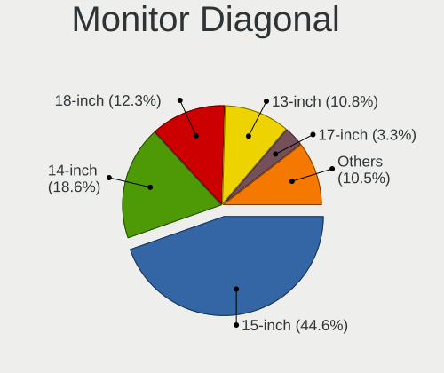

| Inches  | Notebooks | Percent |
|---------|-----------|---------|
| 15      | 149       | 44.61%  |
| 14      | 62        | 18.56%  |
| 18      | 41        | 12.28%  |
| 13      | 36        | 10.78%  |
| 17      | 11        | 3.29%   |
| 12      | 9         | 2.69%   |
| 16      | 3         | 0.9%    |
| 11      | 3         | 0.9%    |
| 10      | 3         | 0.9%    |
| Unknown | 3         | 0.9%    |
| 52      | 2         | 0.6%    |
| 24      | 2         | 0.6%    |
| 23      | 2         | 0.6%    |
| 60      | 1         | 0.3%    |
| 40      | 1         | 0.3%    |
| 37      | 1         | 0.3%    |
| 31      | 1         | 0.3%    |
| 27      | 1         | 0.3%    |
| 21      | 1         | 0.3%    |
| 20      | 1         | 0.3%    |
| 19      | 1         | 0.3%    |

Monitor Width
-------------

Physical width

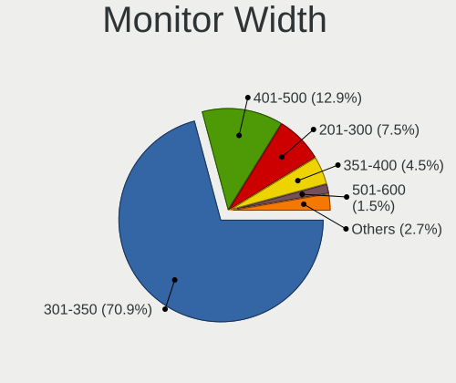

| Width in mm | Notebooks | Percent |
|-------------|-----------|---------|
| 301-350     | 236       | 70.87%  |
| 401-500     | 43        | 12.91%  |
| 201-300     | 25        | 7.51%   |
| 351-400     | 15        | 4.5%    |
| 501-600     | 5         | 1.5%    |
| 1001-1500   | 3         | 0.9%    |
| Unknown     | 3         | 0.9%    |
| 801-900     | 2         | 0.6%    |
| 601-700     | 1         | 0.3%    |

Aspect Ratio
------------

Proportional relationship between the width and the height

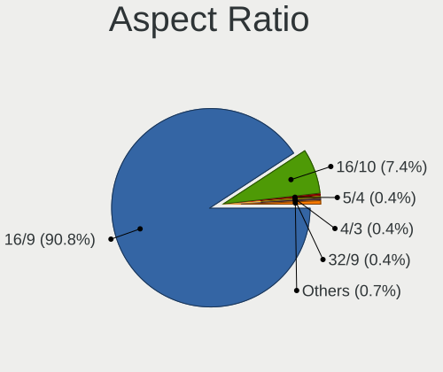

| Ratio   | Notebooks | Percent |
|---------|-----------|---------|
| 16/9    | 256       | 90.78%  |
| 16/10   | 21        | 7.45%   |
| 5/4     | 1         | 0.35%   |
| 4/3     | 1         | 0.35%   |
| 32/9    | 1         | 0.35%   |
| 3/2     | 1         | 0.35%   |
| Unknown | 1         | 0.35%   |

Monitor Area
------------

Area in inch²

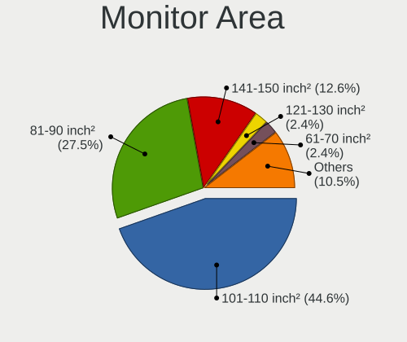

| Area in inch² | Notebooks | Percent |
|----------------|-----------|---------|
| 101-110        | 149       | 44.61%  |
| 81-90          | 92        | 27.54%  |
| 141-150        | 42        | 12.57%  |
| 61-70          | 8         | 2.4%    |
| 121-130        | 8         | 2.4%    |
| 71-80          | 7         | 2.1%    |
| 201-250        | 4         | 1.2%    |
| More than 1000 | 3         | 0.9%    |
| 51-60          | 3         | 0.9%    |
| 41-50          | 3         | 0.9%    |
| 151-200        | 3         | 0.9%    |
| 111-120        | 3         | 0.9%    |
| Unknown        | 3         | 0.9%    |
| 131-140        | 2         | 0.6%    |
| 501-1000       | 2         | 0.6%    |
| 351-500        | 1         | 0.3%    |
| 301-350        | 1         | 0.3%    |

Pixel Density
-------------

Pixels per inch

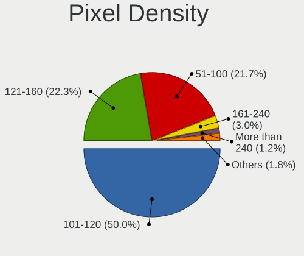

| Density       | Notebooks | Percent |
|---------------|-----------|---------|
| 101-120       | 166       | 50%     |
| 121-160       | 74        | 22.29%  |
| 51-100        | 72        | 21.69%  |
| 161-240       | 10        | 3.01%   |
| More than 240 | 4         | 1.2%    |
| 1-50          | 3         | 0.9%    |
| Unknown       | 3         | 0.9%    |

Multiple Monitors
-----------------

Total monitors connected

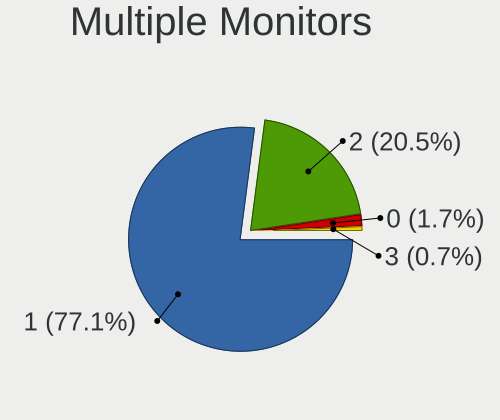

| Total | Notebooks | Percent |
|-------|-----------|---------|
| 1     | 225       | 77.05%  |
| 2     | 60        | 20.55%  |
| 0     | 5         | 1.71%   |
| 3     | 2         | 0.68%   |

Network
-------

Net Controller Vendor
---------------------

Controller vendors

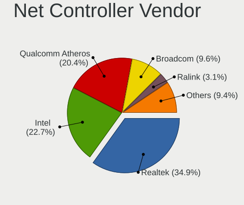

| Vendor                          | Notebooks | Percent |
|---------------------------------|-----------|---------|
| Realtek Semiconductor           | 168       | 34.93%  |
| Intel                           | 109       | 22.66%  |
| Qualcomm Atheros                | 98        | 20.37%  |
| Broadcom                        | 46        | 9.56%   |
| Ralink Technology               | 15        | 3.12%   |
| Ralink                          | 8         | 1.66%   |
| MediaTek                        | 7         | 1.46%   |
| Broadcom Limited                | 7         | 1.46%   |
| Samsung Electronics             | 5         | 1.04%   |
| Sierra Wireless                 | 3         | 0.62%   |
| Xiaomi                          | 2         | 0.42%   |
| TP-Link                         | 2         | 0.42%   |
| Marvell Technology Group        | 2         | 0.42%   |
| Huawei Technologies             | 2         | 0.42%   |
| Hewlett-Packard                 | 2         | 0.42%   |
| Qualcomm Atheros Communications | 1         | 0.21%   |
| OPPO Electronics                | 1         | 0.21%   |
| Nvidia                          | 1         | 0.21%   |
| LG Electronics                  | 1         | 0.21%   |
| D-Link System                   | 1         | 0.21%   |

Net Controller Model
--------------------

Controller models

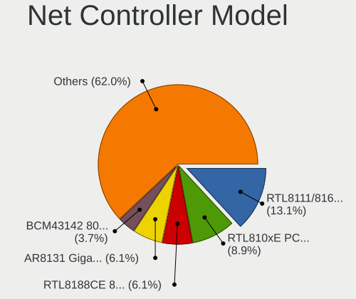

| Model                                                                  | Notebooks | Percent |
|------------------------------------------------------------------------|-----------|---------|
| Realtek RTL8111/8168/8211/8411 PCI Express Gigabit Ethernet Controller | 75        | 13.13%  |
| Realtek RTL810xE PCI Express Fast Ethernet controller                  | 51        | 8.93%   |
| Realtek RTL8188CE 802.11b/g/n WiFi Adapter                             | 35        | 6.13%   |
| Qualcomm Atheros AR8131 Gigabit Ethernet                               | 35        | 6.13%   |
| Broadcom BCM43142 802.11b/g/n                                          | 21        | 3.68%   |
| Intel Wireless 8265 / 8275                                             | 20        | 3.5%    |
| Qualcomm Atheros QCA9565 / AR9565 Wireless Network Adapter             | 17        | 2.98%   |
| Qualcomm Atheros AR9485 Wireless Network Adapter                       | 16        | 2.8%    |
| Intel Ethernet Connection (4) I219-LM                                  | 14        | 2.45%   |
| Qualcomm Atheros AR9285 Wireless Network Adapter (PCI-Express)         | 11        | 1.93%   |
| Intel Wireless 8260                                                    | 11        | 1.93%   |
| Ralink MT7601U Wireless Adapter                                        | 10        | 1.75%   |
| Qualcomm Atheros QCA9377 802.11ac Wireless Network Adapter             | 10        | 1.75%   |
| Intel Wi-Fi 6 AX201                                                    | 9         | 1.58%   |
| Intel 82579LM Gigabit Network Connection (Lewisville)                  | 9         | 1.58%   |
| Realtek RTL8723BE PCIe Wireless Network Adapter                        | 8         | 1.4%    |
| Intel Wireless 7260                                                    | 8         | 1.4%    |
| Intel Ethernet Connection I219-LM                                      | 8         | 1.4%    |
| Realtek RTL8821CE 802.11ac PCIe Wireless Network Adapter               | 6         | 1.05%   |
| Ralink RT3290 Wireless 802.11n 1T/1R PCIe                              | 6         | 1.05%   |
| Intel Wireless 7265                                                    | 6         | 1.05%   |
| MediaTek MT7921 802.11ax PCIe Wireless Network Adapter [Filogic 330]   | 5         | 0.88%   |
| Intel Ethernet Connection I218-LM                                      | 5         | 0.88%   |
| Intel Centrino Advanced-N 6205 [Taylor Peak]                           | 5         | 0.88%   |
| Broadcom NetLink BCM57780 Gigabit Ethernet PCIe                        | 5         | 0.88%   |
| Qualcomm Atheros QCA8172 Fast Ethernet                                 | 4         | 0.7%    |
| Intel Dual Band Wireless-AC 3165 Plus Bluetooth                        | 4         | 0.7%    |
| Intel Centrino Ultimate-N 6300                                         | 4         | 0.7%    |
| Intel Alder Lake-P PCH CNVi WiFi                                       | 4         | 0.7%    |
| Samsung Galaxy series, misc. (tethering mode)                          | 3         | 0.53%   |
| Intel Wireless 3160                                                    | 3         | 0.53%   |
| Intel WiFi Link 5100                                                   | 3         | 0.53%   |
| Intel Wi-Fi 6 AX200                                                    | 3         | 0.53%   |
| Intel PRO/Wireless 3945ABG [Golan] Network Connection                  | 3         | 0.53%   |
| Intel Comet Lake PCH-LP CNVi WiFi                                      | 3         | 0.53%   |
| Intel Centrino Advanced-N 6200                                         | 3         | 0.53%   |
| Intel Cannon Point-LP CNVi [Wireless-AC]                               | 3         | 0.53%   |
| Intel 82577LM Gigabit Network Connection                               | 3         | 0.53%   |
| Broadcom NetXtreme BCM5764M Gigabit Ethernet PCIe                      | 3         | 0.53%   |
| Broadcom Limited NetLink BCM57780 Gigabit Ethernet PCIe                | 3         | 0.53%   |

Wireless Vendor
---------------

Wireless vendors

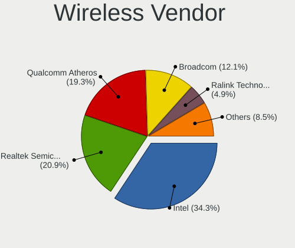

| Vendor                          | Notebooks | Percent |
|---------------------------------|-----------|---------|
| Intel                           | 105       | 34.31%  |
| Realtek Semiconductor           | 64        | 20.92%  |
| Qualcomm Atheros                | 59        | 19.28%  |
| Broadcom                        | 37        | 12.09%  |
| Ralink Technology               | 15        | 4.9%    |
| Ralink                          | 8         | 2.61%   |
| MediaTek                        | 6         | 1.96%   |
| Sierra Wireless                 | 3         | 0.98%   |
| Broadcom Limited                | 3         | 0.98%   |
| TP-Link                         | 2         | 0.65%   |
| Hewlett-Packard                 | 2         | 0.65%   |
| Qualcomm Atheros Communications | 1         | 0.33%   |
| D-Link System                   | 1         | 0.33%   |

Wireless Model
--------------

Wireless models

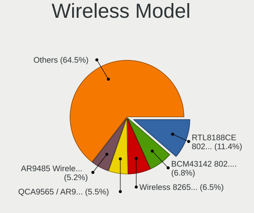

| Model                                                                | Notebooks | Percent |
|----------------------------------------------------------------------|-----------|---------|
| Realtek RTL8188CE 802.11b/g/n WiFi Adapter                           | 35        | 11.4%   |
| Broadcom BCM43142 802.11b/g/n                                        | 21        | 6.84%   |
| Intel Wireless 8265 / 8275                                           | 20        | 6.51%   |
| Qualcomm Atheros QCA9565 / AR9565 Wireless Network Adapter           | 17        | 5.54%   |
| Qualcomm Atheros AR9485 Wireless Network Adapter                     | 16        | 5.21%   |
| Qualcomm Atheros AR9285 Wireless Network Adapter (PCI-Express)       | 11        | 3.58%   |
| Intel Wireless 8260                                                  | 11        | 3.58%   |
| Ralink MT7601U Wireless Adapter                                      | 10        | 3.26%   |
| Qualcomm Atheros QCA9377 802.11ac Wireless Network Adapter           | 10        | 3.26%   |
| Intel Wi-Fi 6 AX201                                                  | 9         | 2.93%   |
| Realtek RTL8723BE PCIe Wireless Network Adapter                      | 8         | 2.61%   |
| Intel Wireless 7260                                                  | 8         | 2.61%   |
| Realtek RTL8821CE 802.11ac PCIe Wireless Network Adapter             | 6         | 1.95%   |
| Ralink RT3290 Wireless 802.11n 1T/1R PCIe                            | 6         | 1.95%   |
| Intel Wireless 7265                                                  | 6         | 1.95%   |
| MediaTek MT7921 802.11ax PCIe Wireless Network Adapter [Filogic 330] | 5         | 1.63%   |
| Intel Centrino Advanced-N 6205 [Taylor Peak]                         | 5         | 1.63%   |
| Intel Dual Band Wireless-AC 3165 Plus Bluetooth                      | 4         | 1.3%    |
| Intel Centrino Ultimate-N 6300                                       | 4         | 1.3%    |
| Intel Wireless 3160                                                  | 3         | 0.98%   |
| Intel WiFi Link 5100                                                 | 3         | 0.98%   |
| Intel Wi-Fi 6 AX200                                                  | 3         | 0.98%   |
| Intel PRO/Wireless 3945ABG [Golan] Network Connection                | 3         | 0.98%   |
| Intel Comet Lake PCH-LP CNVi WiFi                                    | 3         | 0.98%   |
| Intel Centrino Advanced-N 6200                                       | 3         | 0.98%   |
| Intel Cannon Point-LP CNVi [Wireless-AC]                             | 3         | 0.98%   |
| Intel Alder Lake-P PCH CNVi WiFi                                     | 3         | 0.98%   |
| Broadcom BCM43228 802.11a/b/g/n                                      | 3         | 0.98%   |
| Broadcom BCM4313 802.11bgn Wireless Network Adapter                  | 3         | 0.98%   |
| Sierra Wireless EM7305 Modem                                         | 2         | 0.65%   |
| Realtek RTL88x2bu [AC1200 Techkey]                                   | 2         | 0.65%   |
| Realtek RTL8852BE PCIe 802.11ax Wireless Network Controller          | 2         | 0.65%   |
| Realtek RTL8723DE Wireless Network Adapter                           | 2         | 0.65%   |
| Realtek RTL8188EE Wireless Network Adapter                           | 2         | 0.65%   |
| Ralink RT2870/RT3070 Wireless Adapter                                | 2         | 0.65%   |
| Ralink RT2870 Wireless Adapter                                       | 2         | 0.65%   |
| Qualcomm Atheros AR928X Wireless Network Adapter (PCI-Express)       | 2         | 0.65%   |
| Intel Raptor Lake PCH CNVi WiFi                                      | 2         | 0.65%   |
| Intel Centrino Wireless-N 2230                                       | 2         | 0.65%   |
| Intel Centrino Wireless-N 135                                        | 2         | 0.65%   |

Ethernet Vendor
---------------

Ethernet vendors

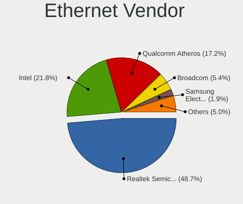

| Vendor                   | Notebooks | Percent |
|--------------------------|-----------|---------|
| Realtek Semiconductor    | 127       | 48.66%  |
| Intel                    | 57        | 21.84%  |
| Qualcomm Atheros         | 45        | 17.24%  |
| Broadcom                 | 14        | 5.36%   |
| Samsung Electronics      | 5         | 1.92%   |
| Broadcom Limited         | 4         | 1.53%   |
| Xiaomi                   | 2         | 0.77%   |
| Marvell Technology Group | 2         | 0.77%   |
| OPPO Electronics         | 1         | 0.38%   |
| Nvidia                   | 1         | 0.38%   |
| MediaTek                 | 1         | 0.38%   |
| LG Electronics           | 1         | 0.38%   |
| Huawei Technologies      | 1         | 0.38%   |

Ethernet Model
--------------

Ethernet models

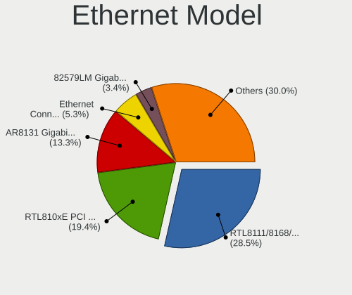

| Model                                                                  | Notebooks | Percent |
|------------------------------------------------------------------------|-----------|---------|
| Realtek RTL8111/8168/8211/8411 PCI Express Gigabit Ethernet Controller | 75        | 28.52%  |
| Realtek RTL810xE PCI Express Fast Ethernet controller                  | 51        | 19.39%  |
| Qualcomm Atheros AR8131 Gigabit Ethernet                               | 35        | 13.31%  |
| Intel Ethernet Connection (4) I219-LM                                  | 14        | 5.32%   |
| Intel 82579LM Gigabit Network Connection (Lewisville)                  | 9         | 3.42%   |
| Intel Ethernet Connection I219-LM                                      | 8         | 3.04%   |
| Intel Ethernet Connection I218-LM                                      | 5         | 1.9%    |
| Broadcom NetLink BCM57780 Gigabit Ethernet PCIe                        | 5         | 1.9%    |
| Qualcomm Atheros QCA8172 Fast Ethernet                                 | 4         | 1.52%   |
| Samsung Galaxy series, misc. (tethering mode)                          | 3         | 1.14%   |
| Intel 82577LM Gigabit Network Connection                               | 3         | 1.14%   |
| Broadcom NetXtreme BCM5764M Gigabit Ethernet PCIe                      | 3         | 1.14%   |
| Broadcom Limited NetLink BCM57780 Gigabit Ethernet PCIe                | 3         | 1.14%   |
| Xiaomi Mi/Redmi series (RNDIS)                                         | 2         | 0.76%   |
| Samsung GT-I9070 (network tethering, USB debugging enabled)            | 2         | 0.76%   |
| Qualcomm Atheros AR8162 Fast Ethernet                                  | 2         | 0.76%   |
| Qualcomm Atheros AR8161 Gigabit Ethernet                               | 2         | 0.76%   |
| Marvell Group 88E8055 PCI-E Gigabit Ethernet Controller                | 2         | 0.76%   |
| Intel PRO/100 VE Network Connection                                    | 2         | 0.76%   |
| Intel Ethernet Connection I217-LM                                      | 2         | 0.76%   |
| Intel Ethernet Connection (5) I219-LM                                  | 2         | 0.76%   |
| Intel Ethernet Connection (3) I218-LM                                  | 2         | 0.76%   |
| Broadcom NetXtreme BCM57765 Gigabit Ethernet PCIe                      | 2         | 0.76%   |
| Broadcom NetLink BCM5784M Gigabit Ethernet PCIe                        | 2         | 0.76%   |
| Realtek PCIe GbE Family Controller                                     | 1         | 0.38%   |
| Qualcomm Atheros AR8152 v1.1 Fast Ethernet                             | 1         | 0.38%   |
| Qualcomm Atheros AR8151 v2.0 Gigabit Ethernet                          | 1         | 0.38%   |
| OPPO Ace 3V                                                            | 1         | 0.38%   |
| Nvidia MCP89 Ethernet                                                  | 1         | 0.38%   |
| MediaTek Infinix HOT 50i                                               | 1         | 0.38%   |
| LG G2 Android Phone [tethering mode]                                   | 1         | 0.38%   |
| Intel WiMAX Connection 2400m                                           | 1         | 0.38%   |
| Intel Ethernet Connection I218-V                                       | 1         | 0.38%   |
| Intel Ethernet Connection I217-V                                       | 1         | 0.38%   |
| Intel Ethernet Connection (6) I219-V                                   | 1         | 0.38%   |
| Intel Ethernet Connection (6) I219-LM                                  | 1         | 0.38%   |
| Intel Ethernet Connection (4) I219-V                                   | 1         | 0.38%   |
| Intel Ethernet Connection (23) I219-V                                  | 1         | 0.38%   |
| Intel Ethernet Connection (2) I219-LM                                  | 1         | 0.38%   |
| Intel Ethernet Connection (16) I219-V                                  | 1         | 0.38%   |

Net Controller Kind
-------------------

Ethernet, WiFi or modem

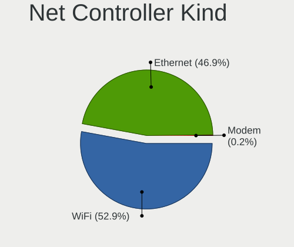

| Kind     | Notebooks | Percent |
|----------|-----------|---------|
| WiFi     | 284       | 52.89%  |
| Ethernet | 252       | 46.93%  |
| Modem    | 1         | 0.19%   |

Used Controller
---------------

Currently used network controller

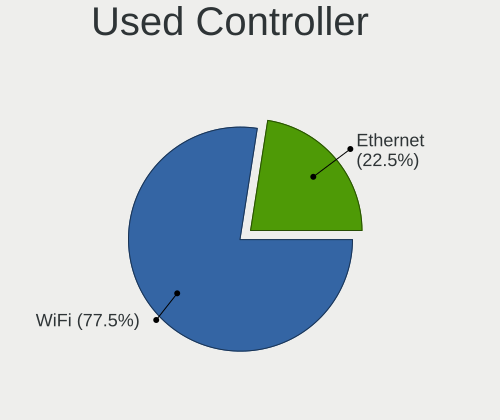

| Kind     | Notebooks | Percent |
|----------|-----------|---------|
| WiFi     | 244       | 77.46%  |
| Ethernet | 71        | 22.54%  |

NICs
----

Total network controllers on board

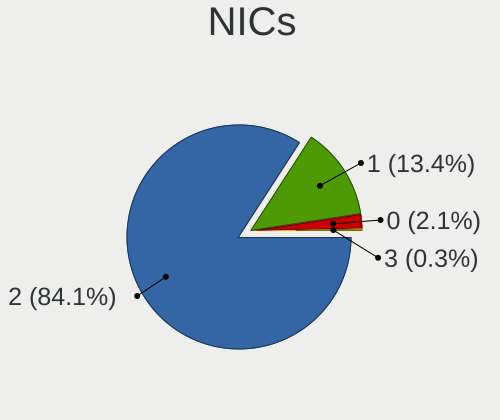

| Total | Notebooks | Percent |
|-------|-----------|---------|
| 2     | 244       | 84.14%  |
| 1     | 39        | 13.45%  |
| 0     | 6         | 2.07%   |
| 3     | 1         | 0.34%   |

IPv6
----

IPv6 vs IPv4

| Used | Notebooks | Percent |
|------|-----------|---------|
| No   | 288       | 100%    |

Bluetooth
---------

Bluetooth Vendor
----------------

Controller vendors

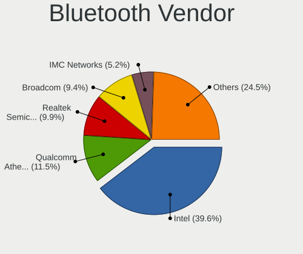

| Vendor                          | Notebooks | Percent |
|---------------------------------|-----------|---------|
| Intel                           | 76        | 39.58%  |
| Qualcomm Atheros Communications | 22        | 11.46%  |
| Realtek Semiconductor           | 19        | 9.9%    |
| Broadcom                        | 18        | 9.38%   |
| IMC Networks                    | 10        | 5.21%   |
| Lite-On Technology              | 8         | 4.17%   |
| Ralink                          | 6         | 3.13%   |
| Foxconn / Hon Hai               | 6         | 3.13%   |
| Toshiba                         | 5         | 2.6%    |
| Dell                            | 5         | 2.6%    |
| Apple                           | 5         | 2.6%    |
| Foxconn International           | 3         | 1.56%   |
| Hewlett-Packard                 | 2         | 1.04%   |
| Ralink Technology               | 1         | 0.52%   |
| Integrated System Solution      | 1         | 0.52%   |
| Chicony Electronics             | 1         | 0.52%   |
| Cambridge Silicon Radio         | 1         | 0.52%   |
| ASUSTek Computer                | 1         | 0.52%   |
| Askey Computer                  | 1         | 0.52%   |
| Alps Electric                   | 1         | 0.52%   |

Bluetooth Model
---------------

Controller models

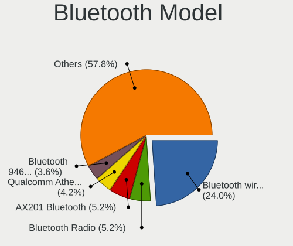

| Model                                                 | Notebooks | Percent |
|-------------------------------------------------------|-----------|---------|
| Intel Bluetooth wireless interface                    | 46        | 23.96%  |
| Realtek Bluetooth Radio                               | 10        | 5.21%   |
| Intel AX201 Bluetooth                                 | 10        | 5.21%   |
| Qualcomm Atheros  Bluetooth Device                    | 8         | 4.17%   |
| Intel Bluetooth 9460/9560 Jefferson Peak (JfP)        | 7         | 3.65%   |
| Broadcom BCM43142 Bluetooth 4.0                       | 7         | 3.65%   |
| Ralink RT3290 Bluetooth                               | 6         | 3.13%   |
| Qualcomm Atheros AR3012 Bluetooth 4.0                 | 6         | 3.13%   |
| Intel Centrino Bluetooth Wireless Transceiver         | 5         | 2.6%    |
| Realtek  Bluetooth 4.2 Adapter                        | 4         | 2.08%   |
| Qualcomm Atheros AR3011 Bluetooth                     | 4         | 2.08%   |
| Intel Bluetooth Device                                | 4         | 2.08%   |
| IMC Networks Wireless_Device                          | 4         | 2.08%   |
| IMC Networks Bluetooth Device                         | 4         | 2.08%   |
| Toshiba Bluetooth Device                              | 3         | 1.56%   |
| Realtek RTL8723B Bluetooth                            | 3         | 1.56%   |
| Lite-On Qualcomm Atheros QCA9377 Bluetooth            | 3         | 1.56%   |
| Intel AX200 Bluetooth                                 | 3         | 1.56%   |
| Foxconn International BCM43142A0 Bluetooth module     | 3         | 1.56%   |
| Foxconn / Hon Hai Bluetooth Device                    | 3         | 1.56%   |
| Broadcom BCM43142A0 Bluetooth 4.0                     | 3         | 1.56%   |
| Broadcom BCM2045B (BDC-2.1)                           | 3         | 1.56%   |
| Apple Bluetooth Host Controller                       | 3         | 1.56%   |
| Toshiba BCM43142A0                                    | 2         | 1.04%   |
| Qualcomm Atheros AR9462 Bluetooth                     | 2         | 1.04%   |
| Lite-On Wireless_Device                               | 2         | 1.04%   |
| Lite-On BCM43142A0                                    | 2         | 1.04%   |
| HP Broadcom 2070 Bluetooth Combo                      | 2         | 1.04%   |
| Dell Wireless 365 Bluetooth                           | 2         | 1.04%   |
| Dell BCM20702A0 Bluetooth Module                      | 2         | 1.04%   |
| Apple Bluetooth USB Host Controller                   | 2         | 1.04%   |
| Realtek RTL8822BE Bluetooth 4.2 Adapter               | 1         | 0.52%   |
| Realtek RTL8821A Bluetooth                            | 1         | 0.52%   |
| Ralink Motorola BC4 Bluetooth 3.0+HS Adapter          | 1         | 0.52%   |
| Qualcomm Atheros QCA61x4 Bluetooth 4.0                | 1         | 0.52%   |
| Qualcomm Atheros Bluetooth                            | 1         | 0.52%   |
| Lite-On Bluetooth 4.0 [Broadcom BCM20702A0]           | 1         | 0.52%   |
| Intel Wireless-AC 3168 Bluetooth                      | 1         | 0.52%   |
| Integrated System Solution KY-BT100 Bluetooth Adapter | 1         | 0.52%   |
| IMC Networks Bluetooth Radio                          | 1         | 0.52%   |

Sound
-----

Sound Vendor
------------

Sound card vendors

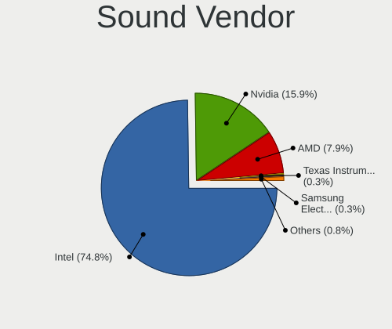

| Vendor              | Notebooks | Percent |
|---------------------|-----------|---------|
| Intel               | 264       | 74.79%  |
| Nvidia              | 56        | 15.86%  |
| AMD                 | 28        | 7.93%   |
| Texas Instruments   | 1         | 0.28%   |
| Samsung Electronics | 1         | 0.28%   |
| Medeli Electronics  | 1         | 0.28%   |
| JMTek               | 1         | 0.28%   |
| Goldvish            | 1         | 0.28%   |

Sound Model
-----------

Sound card models

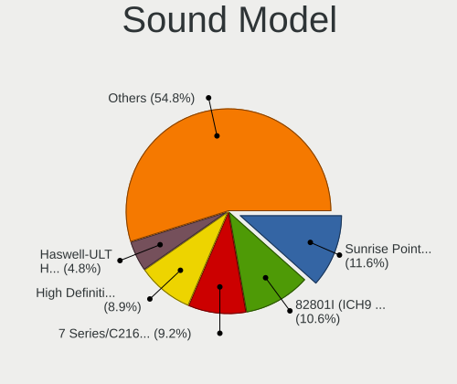

| Model                                                                                             | Notebooks | Percent |
|---------------------------------------------------------------------------------------------------|-----------|---------|
| Intel Sunrise Point-LP HD Audio                                                                   | 48        | 11.59%  |
| Intel 82801I (ICH9 Family) HD Audio Controller                                                    | 44        | 10.63%  |
| Intel 7 Series/C216 Chipset Family High Definition Audio Controller                               | 38        | 9.18%   |
| Nvidia High Definition Audio Controller                                                           | 37        | 8.94%   |
| Intel Haswell-ULT HD Audio Controller                                                             | 20        | 4.83%   |
| Intel 8 Series HD Audio Controller                                                                | 20        | 4.83%   |
| Intel 5 Series/3400 Series Chipset High Definition Audio                                          | 19        | 4.59%   |
| Intel Wildcat Point-LP High Definition Audio Controller                                           | 14        | 3.38%   |
| Intel Broadwell-U Audio Controller                                                                | 14        | 3.38%   |
| Intel 6 Series/C200 Series Chipset Family High Definition Audio Controller                        | 14        | 3.38%   |
| Intel Tiger Lake-LP Smart Sound Technology Audio Controller                                       | 13        | 3.14%   |
| AMD Ryzen HD Audio Controller                                                                     | 9         | 2.17%   |
| Intel Xeon E3-1200 v3/4th Gen Core Processor HD Audio Controller                                  | 8         | 1.93%   |
| Intel 8 Series/C220 Series Chipset High Definition Audio Controller                               | 8         | 1.93%   |
| Intel Atom Processor Z36xxx/Z37xxx Series High Definition Audio Controller                        | 7         | 1.69%   |
| Intel Alder Lake PCH-P High Definition Audio Controller                                           | 7         | 1.69%   |
| Intel CM238 HD Audio Controller                                                                   | 6         | 1.45%   |
| Intel Atom/Celeron/Pentium Processor x5-E8000/J3xxx/N3xxx Series High Definition Audio Controller | 6         | 1.45%   |
| Intel NM10/ICH7 Family High Definition Audio Controller                                           | 5         | 1.21%   |
| AMD FCH Azalia Controller                                                                         | 5         | 1.21%   |
| Nvidia GF108 High Definition Audio Controller                                                     | 4         | 0.97%   |
| AMD Raven/Raven2/Fenghuang HDMI/DP Audio Controller                                               | 4         | 0.97%   |
| Intel Comet Lake PCH-LP cAVS                                                                      | 3         | 0.72%   |
| Intel Celeron/Pentium Silver Processor High Definition Audio                                      | 3         | 0.72%   |
| Intel Cannon Point-LP High Definition Audio Controller                                            | 3         | 0.72%   |
| AMD Turks HDMI Audio [Radeon HD 6500/6600 / 6700M Series]                                         | 3         | 0.72%   |
| AMD Radeon High Definition Audio Controller                                                       | 3         | 0.72%   |
| AMD Kabini HDMI/DP Audio                                                                          | 3         | 0.72%   |
| Nvidia MCP89 High Definition Audio                                                                | 2         | 0.48%   |
| Nvidia GK208 HDMI/DP Audio Controller                                                             | 2         | 0.48%   |
| Nvidia GK107 HDMI Audio Controller                                                                | 2         | 0.48%   |
| Intel Raptor Lake-P/U/H cAVS                                                                      | 2         | 0.48%   |
| Intel 82801H (ICH8 Family) HD Audio Controller                                                    | 2         | 0.48%   |
| AMD Wrestler HDMI Audio                                                                           | 2         | 0.48%   |
| AMD SBx00 Azalia (Intel HDA)                                                                      | 2         | 0.48%   |
| AMD RV710/730 HDMI Audio [Radeon HD 4000 series]                                                  | 2         | 0.48%   |
| AMD High Definition Audio Controller                                                              | 2         | 0.48%   |
| AMD Family 15h (Models 60h-6fh) Audio Controller                                                  | 2         | 0.48%   |
| AMD Cedar HDMI Audio [Radeon HD 5400/6300/7300 Series]                                            | 2         | 0.48%   |
| Texas Instruments PCM2902 Audio Codec                                                             | 1         | 0.24%   |

Memory
------

Memory Vendor
-------------

Memory module vendors

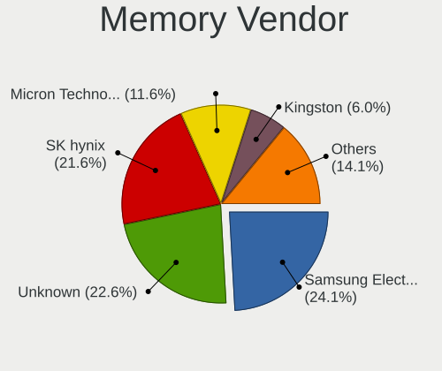

| Vendor              | Notebooks | Percent |
|---------------------|-----------|---------|
| Samsung Electronics | 48        | 24.12%  |
| Unknown             | 45        | 22.61%  |
| SK hynix            | 43        | 21.61%  |
| Micron Technology   | 23        | 11.56%  |
| Kingston            | 12        | 6.03%   |
| Ramaxel Technology  | 7         | 3.52%   |
| Nanya Technology    | 4         | 2.01%   |
| Crucial             | 4         | 2.01%   |
| Elpida              | 2         | 1.01%   |
| A-DATA Technology   | 2         | 1.01%   |
| Unknown (ABCD)      | 1         | 0.5%    |
| TwinMOS             | 1         | 0.5%    |
| Team                | 1         | 0.5%    |
| PNY                 | 1         | 0.5%    |
| Hikvision           | 1         | 0.5%    |
| Goldkey             | 1         | 0.5%    |
| Corsair             | 1         | 0.5%    |
| ASint Technology    | 1         | 0.5%    |
| 8CB900000080        | 1         | 0.5%    |

Memory Model
------------

Memory module models

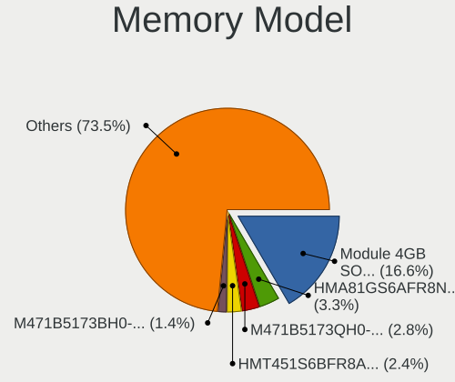

| Model                                                            | Notebooks | Percent |
|------------------------------------------------------------------|-----------|---------|
| Unknown RAM Module 4GB SODIMM 1066MT/s                           | 35        | 16.59%  |
| SK hynix RAM HMA81GS6AFR8N-UH 8GB SODIMM DDR4 2667MT/s           | 7         | 3.32%   |
| Samsung RAM M471B5173QH0-YK0 4GB SODIMM DDR3 1600MT/s            | 6         | 2.84%   |
| SK hynix RAM HMT451S6BFR8A-PB 4GB SODIMM DDR3 1600MT/s           | 5         | 2.37%   |
| SK hynix RAM HMT451S6AFR8A-PB 4GB SODIMM DDR3 1600MT/s           | 3         | 1.42%   |
| SK hynix RAM HMT41GS6BFR8A-PB 8GB SODIMM DDR3 2667MT/s           | 3         | 1.42%   |
| SK hynix RAM HMA851S6AFR6N-UH 4GB SODIMM DDR4 2667MT/s           | 3         | 1.42%   |
| Samsung RAM M471B5173BH0-CK0 4GB SODIMM DDR3 1600MT/s            | 3         | 1.42%   |
| Samsung RAM M471A5244CB0-CTD 4GB SODIMM DDR4 3266MT/s            | 3         | 1.42%   |
| Samsung RAM M471A1G44AB0-CWE 8GiB SODIMM DDR4 3200MT/s           | 3         | 1.42%   |
| Micron RAM 8KTF51264HZ-1G6E1 4GB SODIMM DDR3 1600MT/s            | 3         | 1.42%   |
| Unknown RAM Module 4GB SODIMM DDR3 1333MT/s                      | 2         | 0.95%   |
| Unknown RAM Module 4096MB SODIMM DDR3                            | 2         | 0.95%   |
| SK hynix RAM HMT451S6CFR6A-PB 4GB SODIMM DDR3 1600MT/s           | 2         | 0.95%   |
| SK hynix RAM HMT425S6CFR6A-PB 2GB SODIMM DDR3 1600MT/s           | 2         | 0.95%   |
| Samsung RAM M471B5273EB0-CK0 4GB SODIMM DDR3 4199MT/s            | 2         | 0.95%   |
| Samsung RAM M471B5173DB0-YK0 4GB SODIMM DDR3 1600MT/s            | 2         | 0.95%   |
| Samsung RAM M471B1G73EB0-YK0 8192MB SODIMM DDR3 1600MT/s         | 2         | 0.95%   |
| Nanya RAM Module 8GB SODIMM DDR4 2667MT/s                        | 2         | 0.95%   |
| Micron RAM 16ATF1G64HZ-2G1B1 8GB SODIMM DDR4 2133MT/s            | 2         | 0.95%   |
| Kingston RAM ACR256X64D3S1333C9 2GB SODIMM DDR3 1334MT/s         | 2         | 0.95%   |
| Unknown RAM Module 8GB SODIMM DDR3 1600MT/s                      | 1         | 0.47%   |
| Unknown RAM Module 8192MB SODIMM DDR3 1600MT/s                   | 1         | 0.47%   |
| Unknown RAM Module 512MB SODIMM DDR2 533MT/s                     | 1         | 0.47%   |
| Unknown RAM Module 4096MB SODIMM DDR3 1600MT/s                   | 1         | 0.47%   |
| Unknown RAM Module 4096MB SODIMM DDR3 1333MT/s                   | 1         | 0.47%   |
| Unknown RAM Module 2GB SODIMM DDR3 1333MT/s                      | 1         | 0.47%   |
| Unknown RAM Module 2048MB SODIMM DDR3 1333MT/s                   | 1         | 0.47%   |
| Unknown RAM Module 1GB SODIMM DDR2 533MT/s                       | 1         | 0.47%   |
| Unknown (ABCD) RAM 123456789012345678 2GB SODIMM LPDDR4 2400MT/s | 1         | 0.47%   |
| TwinMOS RAM 9DHTBNIB-TATP 4GB SODIMM DDR3 1067MT/s               | 1         | 0.47%   |
| Team RAM TEAMGROUP-SD4-2666 8GB SODIMM DDR4 2667MT/s             | 1         | 0.47%   |
| SK hynix RAM Module 8GB SODIMM DDR4 3200MT/s                     | 1         | 0.47%   |
| SK hynix RAM Module 4GB SODIMM DDR3 1600MT/s                     | 1         | 0.47%   |
| SK hynix RAM Module 4GB Row Of Chips LPDDR3 2133MT/s             | 1         | 0.47%   |
| SK hynix RAM Module 2GB Row Of Chips DDR3 1600MT/s               | 1         | 0.47%   |
| SK hynix RAM Module 16384MB SODIMM DDR4 2400MT/s                 | 1         | 0.47%   |
| SK hynix RAM HMT425S6AFR6A-PB 2GB SODIMM DDR3 1600MT/s           | 1         | 0.47%   |
| SK hynix RAM HMT41GS6AFR8A-PB 8GiB SODIMM DDR3 2667MT/s          | 1         | 0.47%   |
| SK hynix RAM HMT351S6EFR8C-PB 4GB SODIMM DDR3 1600MT/s           | 1         | 0.47%   |

Memory Kind
-----------

Memory module kinds

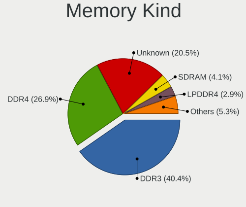

| Kind    | Notebooks | Percent |
|---------|-----------|---------|
| DDR3    | 69        | 40.35%  |
| DDR4    | 46        | 26.9%   |
| Unknown | 35        | 20.47%  |
| SDRAM   | 7         | 4.09%   |
| LPDDR4  | 5         | 2.92%   |
| DDR2    | 3         | 1.75%   |
| LPDDR5  | 2         | 1.17%   |
| LPDDR3  | 2         | 1.17%   |
| DDR5    | 2         | 1.17%   |

Memory Form Factor
------------------

Physical design of the memory module

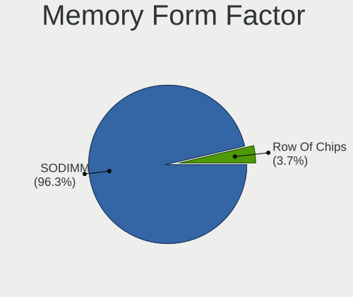

| Name         | Notebooks | Percent |
|--------------|-----------|---------|
| SODIMM       | 158       | 96.34%  |
| Row Of Chips | 6         | 3.66%   |

Memory Size
-----------

Memory module size

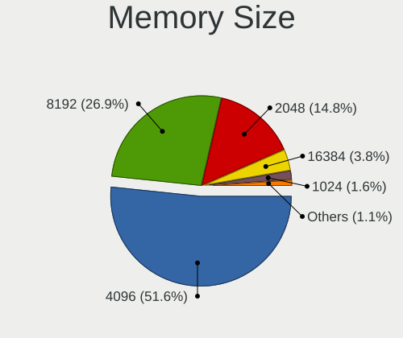

| Size  | Notebooks | Percent |
|-------|-----------|---------|
| 4096  | 94        | 51.65%  |
| 8192  | 49        | 26.92%  |
| 2048  | 27        | 14.84%  |
| 16384 | 7         | 3.85%   |
| 1024  | 3         | 1.65%   |
| 32768 | 1         | 0.55%   |
| 512   | 1         | 0.55%   |

Memory Speed
------------

Memory module speed

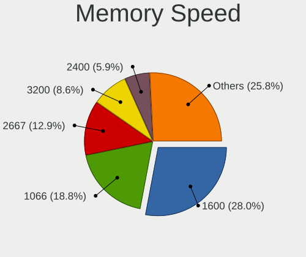

| Speed   | Notebooks | Percent |
|---------|-----------|---------|
| 1600    | 52        | 27.96%  |
| 1066    | 35        | 18.82%  |
| 2667    | 24        | 12.9%   |
| 3200    | 16        | 8.6%    |
| 2400    | 11        | 5.91%   |
| 2133    | 8         | 4.3%    |
| 1334    | 8         | 4.3%    |
| 1333    | 8         | 4.3%    |
| 4199    | 6         | 3.23%   |
| 3266    | 3         | 1.61%   |
| 1067    | 3         | 1.61%   |
| 6400    | 2         | 1.08%   |
| Unknown | 2         | 1.08%   |
| 5600    | 1         | 0.54%   |
| 4800    | 1         | 0.54%   |
| 4267    | 1         | 0.54%   |
| 2048    | 1         | 0.54%   |
| 975     | 1         | 0.54%   |
| 667     | 1         | 0.54%   |
| 533     | 1         | 0.54%   |
| 333     | 1         | 0.54%   |

Printers & scanners
-------------------

Printer Vendor
--------------

Printer device vendors

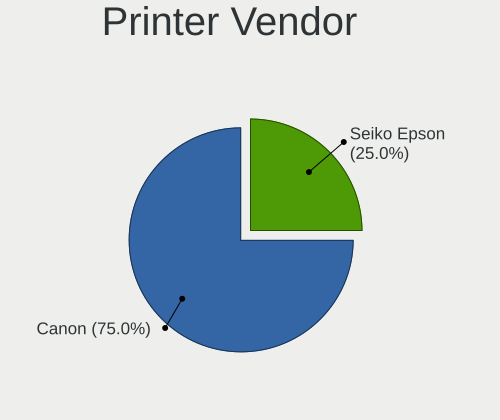

| Vendor      | Notebooks | Percent |
|-------------|-----------|---------|
| Canon       | 3         | 60%     |
| Seiko Epson | 2         | 40%     |

Printer Model
-------------

Printer device models

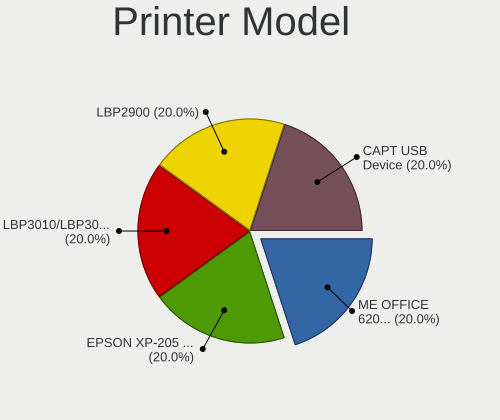

| Model                                                                 | Notebooks | Percent |
|-----------------------------------------------------------------------|-----------|---------|
| Seiko Epson ME OFFICE 620F Series/Stylus Office BX305F/BX305FW/TX320F | 1         | 20%     |
| Seiko Epson EPSON XP-205 207 Series                                   | 1         | 20%     |
| Canon LBP3010/LBP3018/LBP3050                                         | 1         | 20%     |
| Canon LBP2900                                                         | 1         | 20%     |
| Canon CAPT USB Device                                                 | 1         | 20%     |

Scanner Vendor
--------------

Scanner device vendors

Zero info for selected period =(

Scanner Model
-------------

Scanner device models

Zero info for selected period =(

Camera
------

Camera Vendor
-------------

Camera device vendors

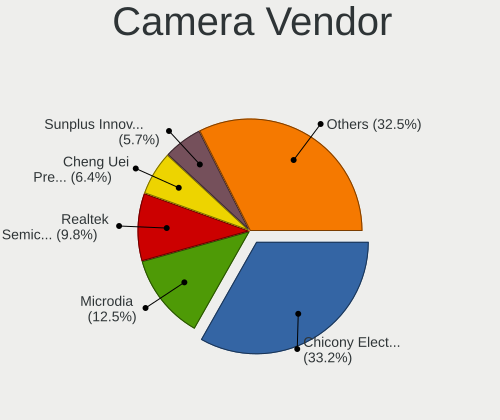

| Vendor                                 | Notebooks | Percent |
|----------------------------------------|-----------|---------|
| Chicony Electronics                    | 88        | 33.21%  |
| Microdia                               | 33        | 12.45%  |
| Realtek Semiconductor                  | 26        | 9.81%   |
| Cheng Uei Precision Industry (Foxlink) | 17        | 6.42%   |
| Sunplus Innovation Technology          | 15        | 5.66%   |
| IMC Networks                           | 13        | 4.91%   |
| Bison Electronics                      | 13        | 4.91%   |
| Suyin                                  | 11        | 4.15%   |
| Syntek                                 | 8         | 3.02%   |
| Quanta                                 | 8         | 3.02%   |
| Apple                                  | 5         | 1.89%   |
| Silicon Motion                         | 4         | 1.51%   |
| Samsung Electronics                    | 3         | 1.13%   |
| Luxvisions Innotech Limited            | 3         | 1.13%   |
| Lite-On Technology                     | 3         | 1.13%   |
| Sonix Technology                       | 2         | 0.75%   |
| Alcor Micro                            | 2         | 0.75%   |
| Acer                                   | 2         | 0.75%   |
| ShineTech                              | 1         | 0.38%   |
| Ricoh                                  | 1         | 0.38%   |
| Primax Electronics                     | 1         | 0.38%   |
| Pixart Imaging                         | 1         | 0.38%   |
| Lenovo                                 | 1         | 0.38%   |
| Foxlink                                | 1         | 0.38%   |
| DigiTech                               | 1         | 0.38%   |
| Aveo Technology                        | 1         | 0.38%   |
| ALi                                    | 1         | 0.38%   |

Camera Model
------------

Camera device models

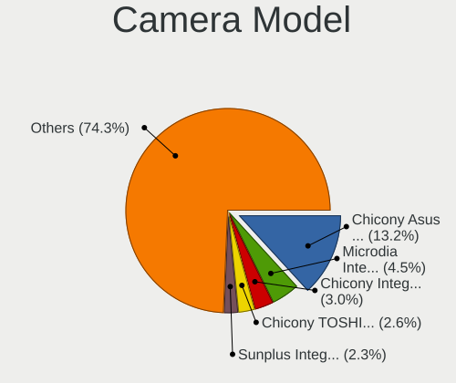

| Model                                               | Notebooks | Percent |
|-----------------------------------------------------|-----------|---------|
| Chicony Asus Integrated 0.3M UVC Webcam             | 35        | 13.21%  |
| Microdia Integrated_Webcam_HD                       | 12        | 4.53%   |
| Chicony Integrated Camera                           | 8         | 3.02%   |
| Chicony TOSHIBA Web Camera - HD                     | 7         | 2.64%   |
| Sunplus Integrated_Webcam_HD                        | 6         | 2.26%   |
| Chicony HP Truevision HD                            | 6         | 2.26%   |
| Bison Lenovo EasyCamera                             | 6         | 2.26%   |
| Microdia Laptop_Integrated_Webcam_HD                | 5         | 1.89%   |
| Cheng Uei Precision Industry (Foxlink) HP HD Camera | 5         | 1.89%   |
| Realtek USB2.0 VGA UVC WebCam                       | 4         | 1.51%   |
| Realtek Integrated_Webcam_HD                        | 4         | 1.51%   |
| IMC Networks Integrated Camera                      | 4         | 1.51%   |
| Chicony HD WebCam                                   | 4         | 1.51%   |
| Syntek Lenovo EasyCamera                            | 3         | 1.13%   |
| Suyin HP Truevision HD                              | 3         | 1.13%   |
| Samsung Galaxy series, misc. (MTP mode)             | 3         | 1.13%   |
| Realtek Integrated Webcam HD                        | 3         | 1.13%   |
| Realtek Integrated Webcam                           | 3         | 1.13%   |
| Quanta HP HD Camera                                 | 3         | 1.13%   |
| Microdia Laptop_Integrated_Webcam_E4HD              | 3         | 1.13%   |
| Microdia Integrated Webcam                          | 3         | 1.13%   |
| IMC Networks Lenovo EasyCamera                      | 3         | 1.13%   |
| Chicony HP HD Webcam [Fixed]                        | 3         | 1.13%   |
| Chicony FJ Camera                                   | 3         | 1.13%   |
| Cheng Uei Precision Industry (Foxlink) Webcam       | 3         | 1.13%   |
| Syntek Integrated Camera                            | 2         | 0.75%   |
| Suyin WebCam                                        | 2         | 0.75%   |
| Suyin HD WebCam                                     | 2         | 0.75%   |
| Sunplus Laptop_Integrated_Webcam_FHD                | 2         | 0.75%   |
| Sonix USB2.0 HD UVC WebCam                          | 2         | 0.75%   |
| Silicon Motion WebCam SC-0311139N                   | 2         | 0.75%   |
| Realtek HP Truevision HD                            | 2         | 0.75%   |
| Realtek Acer 640 x 480 laptop camera                | 2         | 0.75%   |
| Microdia Laptop_Integrated_Webcam_2M                | 2         | 0.75%   |
| Microdia Integrated_Webcam_FHD                      | 2         | 0.75%   |
| Luxvisions Innotech Limited HP TrueVision HD Camera | 2         | 0.75%   |
| IMC Networks USB2.0 HD UVC WebCam                   | 2         | 0.75%   |
| Chicony USB2.0 VGA UVC WebCam                       | 2         | 0.75%   |
| Chicony HP Webcam                                   | 2         | 0.75%   |
| Chicony HP HD Camera                                | 2         | 0.75%   |

Security
--------

Fingerprint Vendor
------------------

Fingerprint sensor vendors

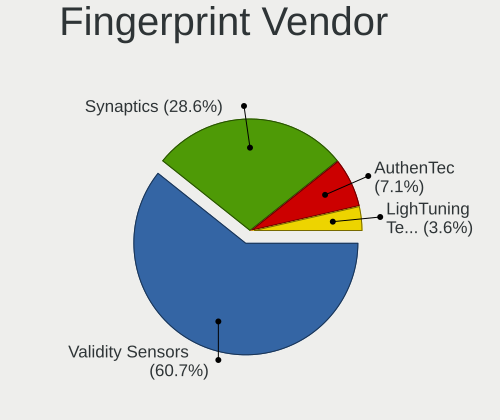

| Vendor                | Notebooks | Percent |
|-----------------------|-----------|---------|
| Validity Sensors      | 17        | 60.71%  |
| Synaptics             | 8         | 28.57%  |
| AuthenTec             | 2         | 7.14%   |
| LighTuning Technology | 1         | 3.57%   |

Fingerprint Model
-----------------

Fingerprint sensor models

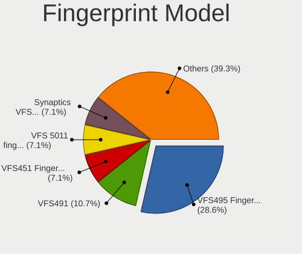

| Model                                                                      | Notebooks | Percent |
|----------------------------------------------------------------------------|-----------|---------|
| Validity Sensors VFS495 Fingerprint Reader                                 | 8         | 28.57%  |
| Validity Sensors VFS491                                                    | 3         | 10.71%  |
| Validity Sensors VFS451 Fingerprint Reader                                 | 2         | 7.14%   |
| Validity Sensors VFS 5011 fingerprint sensor                               | 2         | 7.14%   |
| Validity Sensors Synaptics VFS7552 Touch Fingerprint Sensor with PurePrint | 2         | 7.14%   |
| Synaptics FS7604 Touch Fingerprint Sensor with PurePrint                   | 2         | 7.14%   |
| Synaptics Fingerprint reader [HP G6]                                       | 2         | 7.14%   |
| Synaptics WBDI Device                                                      | 1         | 3.57%   |
| Synaptics Prometheus MIS Touch Fingerprint Reader                          | 1         | 3.57%   |
| Synaptics Prometheus Fingerprint Reader                                    | 1         | 3.57%   |
| Synaptics Metallica MIS Touch Fingerprint Reader                           | 1         | 3.57%   |
| LighTuning ES603 Swipe Fingerprint Sensor                                  | 1         | 3.57%   |
| AuthenTec AES2810                                                          | 1         | 3.57%   |
| AuthenTec AES1600                                                          | 1         | 3.57%   |

Chipcard Vendor
---------------

Chipcard module vendors

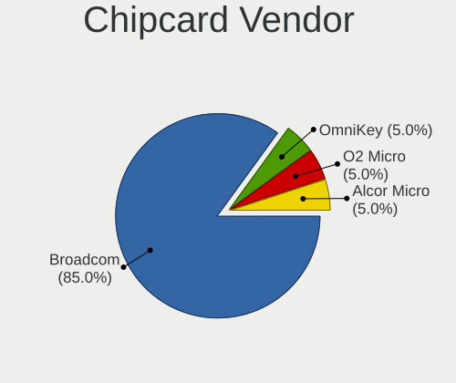

| Vendor      | Notebooks | Percent |
|-------------|-----------|---------|
| Broadcom    | 17        | 85%     |
| OmniKey     | 1         | 5%      |
| O2 Micro    | 1         | 5%      |
| Alcor Micro | 1         | 5%      |

Chipcard Model
--------------

Chipcard module models

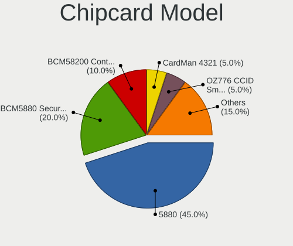

| Model                                                                        | Notebooks | Percent |
|------------------------------------------------------------------------------|-----------|---------|
| Broadcom 5880                                                                | 9         | 45%     |
| Broadcom BCM5880 Secure Applications Processor                               | 4         | 20%     |
| Broadcom BCM58200 ControlVault 3 (FingerPrint sensor + Contacted SmartCard)  | 2         | 10%     |
| OmniKey CardMan 4321                                                         | 1         | 5%      |
| O2 Micro OZ776 CCID Smartcard Reader                                         | 1         | 5%      |
| Broadcom BCM5880 Secure Applications Processor with fingerprint swipe sensor | 1         | 5%      |
| Broadcom 58200                                                               | 1         | 5%      |
| Alcor Micro AU9540 Smartcard Reader                                          | 1         | 5%      |

Unsupported
-----------

Unsupported Devices
-------------------

Total unsupported devices on board

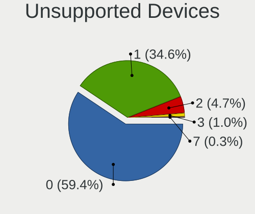

| Total | Notebooks | Percent |
|-------|-----------|---------|
| 0     | 177       | 59.4%   |
| 1     | 103       | 34.56%  |
| 2     | 14        | 4.7%    |
| 3     | 3         | 1.01%   |
| 7     | 1         | 0.34%   |

Unsupported Device Types
------------------------

Types of unsupported devices

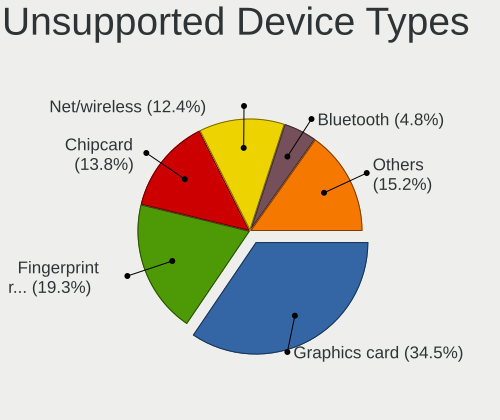

| Type                     | Notebooks | Percent |
|--------------------------|-----------|---------|
| Graphics card            | 50        | 34.48%  |
| Fingerprint reader       | 28        | 19.31%  |
| Chipcard                 | 20        | 13.79%  |
| Net/wireless             | 18        | 12.41%  |
| Bluetooth                | 7         | 4.83%   |
| Communication controller | 6         | 4.14%   |
| Storage                  | 3         | 2.07%   |
| Net/ethernet             | 3         | 2.07%   |
| Camera                   | 3         | 2.07%   |
| Sound                    | 2         | 1.38%   |
| Multimedia controller    | 2         | 1.38%   |
| Storage/nvme             | 1         | 0.69%   |
| Storage/ata              | 1         | 0.69%   |
| Card reader              | 1         | 0.69%   |

