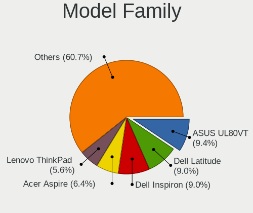
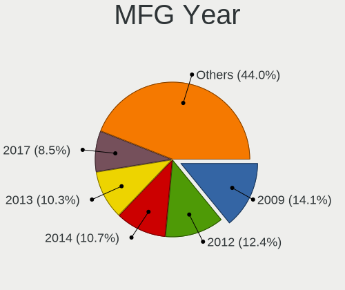
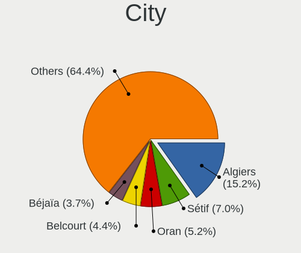
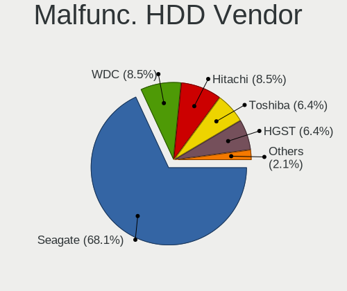
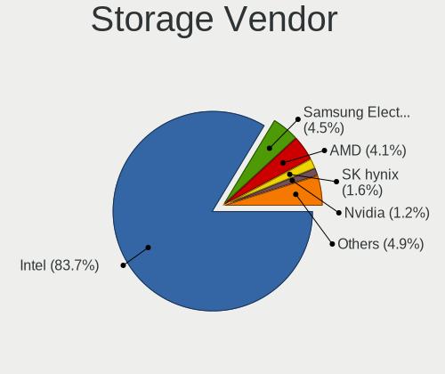
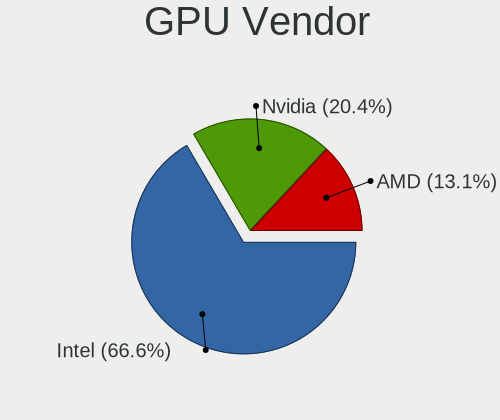
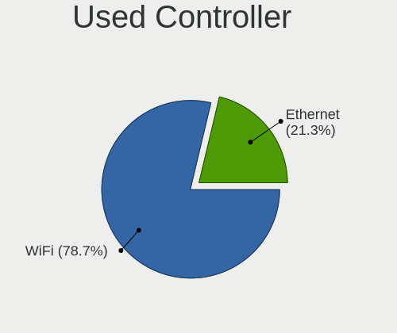
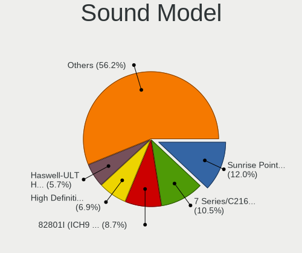

Linux in Algeria - Tested Hardware & Statistics (Notebooks)
-----------------------------------------------------------

A project to collect tested hardware configurations for Linux in Algeria.

Anyone can contribute to this report by the [hw-probe](https://github.com/linuxhw/hw-probe) tool:

    sudo -E hw-probe -all -upload

Please contribute! Especially if your hardware is rare.

Contents
--------

* [ Test Cases ](#test-cases)

* [ System ](#system)
  - [ OS                       ](#os)
  - [ OS Family                ](#os-family)
  - [ Kernel                   ](#kernel)
  - [ Kernel Family            ](#kernel-family)
  - [ Kernel Major Ver.        ](#kernel-major-ver)
  - [ Arch                     ](#arch)
  - [ DE                       ](#de)
  - [ Display Server           ](#display-server)
  - [ Display Manager          ](#display-manager)
  - [ OS Lang                  ](#os-lang)
  - [ Boot Mode                ](#boot-mode)
  - [ Filesystem               ](#filesystem)
  - [ Part. scheme             ](#part-scheme)
  - [ Dual Boot with Linux/BSD ](#dual-boot-with-linuxbsd)
  - [ Dual Boot (Win)          ](#dual-boot-win)

* [ Board ](#board)
  - [ Vendor                   ](#vendor)
  - [ Model                    ](#model)
  - [ Model Family             ](#model-family)
  - [ MFG Year                 ](#mfg-year)
  - [ Form Factor              ](#form-factor)
  - [ Secure Boot              ](#secure-boot)
  - [ Coreboot                 ](#coreboot)
  - [ RAM Size                 ](#ram-size)
  - [ RAM Used                 ](#ram-used)
  - [ Total Drives             ](#total-drives)
  - [ Has CD-ROM               ](#has-cd-rom)
  - [ Has Ethernet             ](#has-ethernet)
  - [ Has WiFi                 ](#has-wifi)
  - [ Has Bluetooth            ](#has-bluetooth)

* [ Location ](#location)
  - [ Country                  ](#country)
  - [ City                     ](#city)

* [ Drives ](#drives)
  - [ Drive Vendor             ](#drive-vendor)
  - [ Drive Model              ](#drive-model)
  - [ HDD Vendor               ](#hdd-vendor)
  - [ SSD Vendor               ](#ssd-vendor)
  - [ Drive Kind               ](#drive-kind)
  - [ Drive Connector          ](#drive-connector)
  - [ Drive Size               ](#drive-size)
  - [ Space Total              ](#space-total)
  - [ Space Used               ](#space-used)
  - [ Malfunc. Drives          ](#malfunc-drives)
  - [ Malfunc. Drive Vendor    ](#malfunc-drive-vendor)
  - [ Malfunc. HDD Vendor      ](#malfunc-hdd-vendor)
  - [ Malfunc. Drive Kind      ](#malfunc-drive-kind)
  - [ Failed Drives            ](#failed-drives)
  - [ Failed Drive Vendor      ](#failed-drive-vendor)
  - [ Drive Status             ](#drive-status)

* [ Storage controller ](#storage-controller)
  - [ Storage Vendor           ](#storage-vendor)
  - [ Storage Model            ](#storage-model)
  - [ Storage Kind             ](#storage-kind)

* [ Processor ](#processor)
  - [ CPU Vendor               ](#cpu-vendor)
  - [ CPU Model                ](#cpu-model)
  - [ CPU Model Family         ](#cpu-model-family)
  - [ CPU Cores                ](#cpu-cores)
  - [ CPU Sockets              ](#cpu-sockets)
  - [ CPU Threads              ](#cpu-threads)
  - [ CPU Op-Modes             ](#cpu-op-modes)
  - [ CPU Microcode            ](#cpu-microcode)
  - [ CPU Microarch            ](#cpu-microarch)

* [ Graphics ](#graphics)
  - [ GPU Vendor               ](#gpu-vendor)
  - [ GPU Model                ](#gpu-model)
  - [ GPU Combo                ](#gpu-combo)
  - [ GPU Driver               ](#gpu-driver)
  - [ GPU Memory               ](#gpu-memory)

* [ Monitor ](#monitor)
  - [ Monitor Vendor           ](#monitor-vendor)
  - [ Monitor Model            ](#monitor-model)
  - [ Monitor Resolution       ](#monitor-resolution)
  - [ Monitor Diagonal         ](#monitor-diagonal)
  - [ Monitor Width            ](#monitor-width)
  - [ Aspect Ratio             ](#aspect-ratio)
  - [ Monitor Area             ](#monitor-area)
  - [ Pixel Density            ](#pixel-density)
  - [ Multiple Monitors        ](#multiple-monitors)

* [ Network ](#network)
  - [ Net Controller Vendor    ](#net-controller-vendor)
  - [ Net Controller Model     ](#net-controller-model)
  - [ Wireless Vendor          ](#wireless-vendor)
  - [ Wireless Model           ](#wireless-model)
  - [ Ethernet Vendor          ](#ethernet-vendor)
  - [ Ethernet Model           ](#ethernet-model)
  - [ Net Controller Kind      ](#net-controller-kind)
  - [ Used Controller          ](#used-controller)
  - [ NICs                     ](#nics)
  - [ IPv6                     ](#ipv6)

* [ Bluetooth ](#bluetooth)
  - [ Bluetooth Vendor         ](#bluetooth-vendor)
  - [ Bluetooth Model          ](#bluetooth-model)

* [ Sound ](#sound)
  - [ Sound Vendor             ](#sound-vendor)
  - [ Sound Model              ](#sound-model)

* [ Memory ](#memory)
  - [ Memory Vendor            ](#memory-vendor)
  - [ Memory Model             ](#memory-model)
  - [ Memory Kind              ](#memory-kind)
  - [ Memory Form Factor       ](#memory-form-factor)
  - [ Memory Size              ](#memory-size)
  - [ Memory Speed             ](#memory-speed)

* [ Printers & scanners ](#printers--scanners)
  - [ Printer Vendor           ](#printer-vendor)
  - [ Printer Model            ](#printer-model)
  - [ Scanner Vendor           ](#scanner-vendor)
  - [ Scanner Model            ](#scanner-model)

* [ Camera ](#camera)
  - [ Camera Vendor            ](#camera-vendor)
  - [ Camera Model             ](#camera-model)

* [ Security ](#security)
  - [ Fingerprint Vendor       ](#fingerprint-vendor)
  - [ Fingerprint Model        ](#fingerprint-model)
  - [ Chipcard Vendor          ](#chipcard-vendor)
  - [ Chipcard Model           ](#chipcard-model)

* [ Unsupported ](#unsupported)
  - [ Unsupported Devices      ](#unsupported-devices)
  - [ Unsupported Device Types ](#unsupported-device-types)

Test Cases
----------

Total: 209

| Vendor        | Model                       | Probe                                                      | Date         |
|---------------|-----------------------------|------------------------------------------------------------|--------------|
| HP            | EliteBook Revolve 810 G3    | [1f55ca148f](https://linux-hardware.org/?probe=1f55ca148f) | Jan 30, 2023 |
| Dell          | Vostro 1520                 | [b2eb47268c](https://linux-hardware.org/?probe=b2eb47268c) | Jan 27, 2023 |
| Dell          | Vostro 1520                 | [6a8408404e](https://linux-hardware.org/?probe=6a8408404e) | Jan 27, 2023 |
| Lenovo        | ThinkPad E14 Gen 2 20T60... | [5169fb5013](https://linux-hardware.org/?probe=5169fb5013) | Jan 17, 2023 |
| Acer          | Aspire M3-581T              | [f0ed3b4989](https://linux-hardware.org/?probe=f0ed3b4989) | Jan 14, 2023 |
| Acer          | Calpella                    | [108843a25a](https://linux-hardware.org/?probe=108843a25a) | Jan 14, 2023 |
| HP            | Pavilion dv6000 (GA131UA... | [115a479990](https://linux-hardware.org/?probe=115a479990) | Jan 05, 2023 |
| Sony          | VGN-NS10J_S                 | [3789038010](https://linux-hardware.org/?probe=3789038010) | Jan 04, 2023 |
| Toshiba       | Satellite C55-B             | [8f81c02bbf](https://linux-hardware.org/?probe=8f81c02bbf) | Dec 21, 2022 |
| Dell          | Inspiron N7010              | [de5dc0c3ea](https://linux-hardware.org/?probe=de5dc0c3ea) | Dec 17, 2022 |
| HP            | EliteBook Revolve 810 G3    | [3b340e6b29](https://linux-hardware.org/?probe=3b340e6b29) | Dec 16, 2022 |
| Dell          | Latitude 5480               | [01c96ca524](https://linux-hardware.org/?probe=01c96ca524) | Dec 11, 2022 |
| HP            | EliteBook Revolve 810 G3    | [ca043cff45](https://linux-hardware.org/?probe=ca043cff45) | Nov 30, 2022 |
| Dell          | Inspiron 15-3567            | [20219ca82a](https://linux-hardware.org/?probe=20219ca82a) | Nov 29, 2022 |
| HP            | EliteBook Revolve 810 G3    | [08d7f00868](https://linux-hardware.org/?probe=08d7f00868) | Nov 24, 2022 |
| HP            | EliteBook Revolve 810 G3    | [da02cb82bf](https://linux-hardware.org/?probe=da02cb82bf) | Nov 23, 2022 |
| ASUSTek       | S300CA                      | [3efc297b44](https://linux-hardware.org/?probe=3efc297b44) | Nov 23, 2022 |
| Lenovo        | G580 20150                  | [cae1dbbb12](https://linux-hardware.org/?probe=cae1dbbb12) | Nov 12, 2022 |
| Lenovo        | G580 20150                  | [64c65685da](https://linux-hardware.org/?probe=64c65685da) | Nov 03, 2022 |
| Lenovo        | V130-15IGM 81HL             | [5dbeb8f7dd](https://linux-hardware.org/?probe=5dbeb8f7dd) | Nov 03, 2022 |
| Dell          | Inspiron 3542               | [6c979bdf58](https://linux-hardware.org/?probe=6c979bdf58) | Oct 27, 2022 |
| Dell          | Inspiron 15-3567            | [4727244665](https://linux-hardware.org/?probe=4727244665) | Oct 18, 2022 |
| Samsung       | 300E5EV/300E4EV/270E5EV/... | [6a0a056c36](https://linux-hardware.org/?probe=6a0a056c36) | Oct 15, 2022 |
| Samsung       | 300E5EV/300E4EV/270E5EV/... | [fefb833511](https://linux-hardware.org/?probe=fefb833511) | Oct 14, 2022 |
| Dell          | Precision M4800             | [be05dcbe15](https://linux-hardware.org/?probe=be05dcbe15) | Oct 08, 2022 |
| Apple         | MacBookAir7,2               | [7d65aefb93](https://linux-hardware.org/?probe=7d65aefb93) | Oct 06, 2022 |
| Apple         | MacBookAir7,2               | [719ac47bc6](https://linux-hardware.org/?probe=719ac47bc6) | Oct 06, 2022 |
| Lenovo        | IdeaPad 310-15IKB 80TV      | [d547ed6f83](https://linux-hardware.org/?probe=d547ed6f83) | Sep 30, 2022 |
| Lenovo        | IdeaPad 310-15IKB 80TV      | [9781419cc1](https://linux-hardware.org/?probe=9781419cc1) | Sep 30, 2022 |
| HP            | ProBook 450 G4              | [4308420b28](https://linux-hardware.org/?probe=4308420b28) | Sep 27, 2022 |
| Dell          | Latitude 7480               | [e1a3ca1d32](https://linux-hardware.org/?probe=e1a3ca1d32) | Sep 22, 2022 |
| Lenovo        | ThinkPad X230 2325CZ1       | [b484febc13](https://linux-hardware.org/?probe=b484febc13) | Sep 17, 2022 |
| HP            | Pavilion dm3                | [7152a48ede](https://linux-hardware.org/?probe=7152a48ede) | Aug 10, 2022 |
| Acer          | Aspire 7741                 | [02e9f6a808](https://linux-hardware.org/?probe=02e9f6a808) | Jul 29, 2022 |
| HP            | ElitePad 1000 G2            | [e478f31175](https://linux-hardware.org/?probe=e478f31175) | Jun 25, 2022 |
| HP            | EliteBook 820 G3            | [4eadb7ee17](https://linux-hardware.org/?probe=4eadb7ee17) | Jun 19, 2022 |
| Dell          | Inspiron N7010              | [149eb0bab7](https://linux-hardware.org/?probe=149eb0bab7) | Jun 14, 2022 |
| HP            | ElitePad 1000 G2            | [9ff02a8c0c](https://linux-hardware.org/?probe=9ff02a8c0c) | Jun 12, 2022 |
| HP            | ElitePad 1000 G2            | [9273aa4844](https://linux-hardware.org/?probe=9273aa4844) | Jun 12, 2022 |
| ASUSTek       | X551CA                      | [15532b1663](https://linux-hardware.org/?probe=15532b1663) | Jun 07, 2022 |
| HP            | ProBook 4720s               | [887ea9cd89](https://linux-hardware.org/?probe=887ea9cd89) | May 16, 2022 |
| HP            | ProBook 4720s               | [09bb5a5088](https://linux-hardware.org/?probe=09bb5a5088) | May 16, 2022 |
| ASUSTek       | X205TAW                     | [57d9d59b56](https://linux-hardware.org/?probe=57d9d59b56) | May 13, 2022 |
| ASUSTek       | X205TAW                     | [577c71e530](https://linux-hardware.org/?probe=577c71e530) | May 06, 2022 |
| HP            | EliteBook 840 G3            | [95d53f5fc0](https://linux-hardware.org/?probe=95d53f5fc0) | Mar 31, 2022 |
| HP            | EliteBook 840 G3            | [698654a73f](https://linux-hardware.org/?probe=698654a73f) | Mar 26, 2022 |
| Acer          | Aspire E5-511               | [00e72ee0ce](https://linux-hardware.org/?probe=00e72ee0ce) | Mar 04, 2022 |
| Lenovo        | B50-70 20384                | [eb4abb6e15](https://linux-hardware.org/?probe=eb4abb6e15) | Mar 02, 2022 |
| Packard Be... | DOT S                       | [4110664747](https://linux-hardware.org/?probe=4110664747) | Mar 02, 2022 |
| Lenovo        | B50-70 20384                | [9d0a21adb1](https://linux-hardware.org/?probe=9d0a21adb1) | Mar 02, 2022 |
| HP            | 630                         | [6bf505d86b](https://linux-hardware.org/?probe=6bf505d86b) | Feb 26, 2022 |
| Lenovo        | IdeaPad 330-15ARR 81D2      | [3f5b85f478](https://linux-hardware.org/?probe=3f5b85f478) | Feb 07, 2022 |
| Apple         | MacBook7,1                  | [9f4f77f51d](https://linux-hardware.org/?probe=9f4f77f51d) | Feb 06, 2022 |
| Dell          | Latitude E7440              | [03d4a4af15](https://linux-hardware.org/?probe=03d4a4af15) | Feb 05, 2022 |
| Apple         | MacBook7,1                  | [b6d5344f4e](https://linux-hardware.org/?probe=b6d5344f4e) | Feb 04, 2022 |
| Dell          | Inspiron N5110              | [3253470667](https://linux-hardware.org/?probe=3253470667) | Jan 22, 2022 |
| HP            | ProBook 450 G3              | [0d6dacc5dc](https://linux-hardware.org/?probe=0d6dacc5dc) | Jan 20, 2022 |
| Dell          | Inspiron 5570               | [8834da8d25](https://linux-hardware.org/?probe=8834da8d25) | Jan 02, 2022 |
| Dell          | Inspiron 3520               | [33df9edd07](https://linux-hardware.org/?probe=33df9edd07) | Dec 25, 2021 |
| LDLC          | Mercure MH                  | [ff094fa4f3](https://linux-hardware.org/?probe=ff094fa4f3) | Dec 23, 2021 |
| Sony          | VGN-AW21M_H                 | [b4cf74ec7d](https://linux-hardware.org/?probe=b4cf74ec7d) | Dec 23, 2021 |
| ASUSTek       | X55U                        | [6260fe5ca9](https://linux-hardware.org/?probe=6260fe5ca9) | Dec 13, 2021 |
| Lenovo        | IdeaPad 310-15IKB 80TV      | [5cd58ae5d9](https://linux-hardware.org/?probe=5cd58ae5d9) | Dec 12, 2021 |
| Acer          | Aspire A515-51G             | [dfa992fc24](https://linux-hardware.org/?probe=dfa992fc24) | Dec 12, 2021 |
| Lenovo        | IdeaPad 310-15IKB 80TV      | [15e97e023d](https://linux-hardware.org/?probe=15e97e023d) | Dec 12, 2021 |
| ASUSTek       | X555LAB                     | [c07bccb6c7](https://linux-hardware.org/?probe=c07bccb6c7) | Dec 07, 2021 |
| Sony          | SVF1531GSFB                 | [fb251b93e9](https://linux-hardware.org/?probe=fb251b93e9) | Dec 04, 2021 |
| ASUSTek       | K50IE                       | [49a6b75a43](https://linux-hardware.org/?probe=49a6b75a43) | Nov 29, 2021 |
| Dell          | Latitude E7240              | [e26d674874](https://linux-hardware.org/?probe=e26d674874) | Nov 14, 2021 |
| Dell          | Inspiron 3542               | [0862dc626b](https://linux-hardware.org/?probe=0862dc626b) | Oct 29, 2021 |
| Dell          | Inspiron 15-3567            | [a629aeaa1b](https://linux-hardware.org/?probe=a629aeaa1b) | Oct 15, 2021 |
| Lenovo        | B50-70 20384                | [8641901755](https://linux-hardware.org/?probe=8641901755) | Sep 27, 2021 |
| Lenovo        | G560 20042                  | [a31437072c](https://linux-hardware.org/?probe=a31437072c) | Sep 20, 2021 |
| Lenovo        | IdeaPad 300-15ISK 80Q7      | [1c77028990](https://linux-hardware.org/?probe=1c77028990) | Sep 18, 2021 |
| Lenovo        | G500 20236                  | [b740654686](https://linux-hardware.org/?probe=b740654686) | Sep 17, 2021 |
| Sony          | SVE1713A6EW                 | [b8661880d2](https://linux-hardware.org/?probe=b8661880d2) | Sep 07, 2021 |
| HP            | 15                          | [5520042e14](https://linux-hardware.org/?probe=5520042e14) | Aug 28, 2021 |
| HP            | 15                          | [cc4e936b38](https://linux-hardware.org/?probe=cc4e936b38) | Aug 26, 2021 |
| Lenovo        | B50-70 20384                | [8a71545b54](https://linux-hardware.org/?probe=8a71545b54) | Aug 26, 2021 |
| Lenovo        | B50-70 20384                | [297e2e187c](https://linux-hardware.org/?probe=297e2e187c) | Aug 25, 2021 |
| HP            | ProBook 450 G6              | [47ed88595b](https://linux-hardware.org/?probe=47ed88595b) | Aug 20, 2021 |
| Sony          | SVE1713A6EW                 | [cf362e966f](https://linux-hardware.org/?probe=cf362e966f) | Aug 19, 2021 |
| Acer          | Aspire A515-56G             | [795edc5779](https://linux-hardware.org/?probe=795edc5779) | Aug 15, 2021 |
| Dell          | Latitude E6400              | [eb029acad6](https://linux-hardware.org/?probe=eb029acad6) | Aug 12, 2021 |
| Dell          | Latitude E5430 vPro         | [84199b59aa](https://linux-hardware.org/?probe=84199b59aa) | Aug 10, 2021 |
| Dell          | Latitude E5430 vPro         | [a4be1b3322](https://linux-hardware.org/?probe=a4be1b3322) | Aug 10, 2021 |
| MSI           | CR610M                      | [68759b0315](https://linux-hardware.org/?probe=68759b0315) | Aug 08, 2021 |
| HP            | EliteBook Folio 9470m       | [007cd499bf](https://linux-hardware.org/?probe=007cd499bf) | Aug 06, 2021 |
| Lenovo        | G560 20042                  | [405dddebf5](https://linux-hardware.org/?probe=405dddebf5) | Aug 05, 2021 |
| Dell          | Latitude 7380               | [c83f32076d](https://linux-hardware.org/?probe=c83f32076d) | Aug 05, 2021 |
| Acer          | Aspire A515-56G             | [185f27f184](https://linux-hardware.org/?probe=185f27f184) | Jul 22, 2021 |
| Dell          | Latitude E7440              | [d8fd7fe06d](https://linux-hardware.org/?probe=d8fd7fe06d) | Jul 20, 2021 |
| Dell          | Latitude 7480               | [28d1d17f13](https://linux-hardware.org/?probe=28d1d17f13) | Jun 22, 2021 |
| Toshiba       | Satellite C50-A539          | [c6c8ae87d9](https://linux-hardware.org/?probe=c6c8ae87d9) | May 25, 2021 |
| Toshiba       | Satellite C50-A545          | [8a9dc6ab53](https://linux-hardware.org/?probe=8a9dc6ab53) | May 24, 2021 |
| HP            | ProBook 450 G2              | [36b88b7391](https://linux-hardware.org/?probe=36b88b7391) | May 23, 2021 |
| Toshiba       | Satellite C50-A545          | [34c12e6041](https://linux-hardware.org/?probe=34c12e6041) | May 18, 2021 |
| Toshiba       | Satellite C50-A545          | [d91a5890c9](https://linux-hardware.org/?probe=d91a5890c9) | May 18, 2021 |
| Toshiba       | Satellite C50-A545          | [d12a52a705](https://linux-hardware.org/?probe=d12a52a705) | May 14, 2021 |
| Dell          | Inspiron 3576               | [be3e7aa080](https://linux-hardware.org/?probe=be3e7aa080) | May 09, 2021 |
| HP            | Laptop 15-bw0xx             | [0252beb838](https://linux-hardware.org/?probe=0252beb838) | May 04, 2021 |
| HP            | Laptop 15-bw0xx             | [bd06d6bb56](https://linux-hardware.org/?probe=bd06d6bb56) | May 04, 2021 |
| Lenovo        | G560 20042                  | [62fc21894d](https://linux-hardware.org/?probe=62fc21894d) | Apr 28, 2021 |
| Lenovo        | G560 20042                  | [7a72fc45b4](https://linux-hardware.org/?probe=7a72fc45b4) | Apr 22, 2021 |
| Apple         | MacBookPro8,2               | [b46bb85400](https://linux-hardware.org/?probe=b46bb85400) | Apr 21, 2021 |
| Dell          | Latitude E7440              | [4acb0ea358](https://linux-hardware.org/?probe=4acb0ea358) | Apr 19, 2021 |
| eMachines     | eME732                      | [a48b0c422f](https://linux-hardware.org/?probe=a48b0c422f) | Apr 19, 2021 |
| eMachines     | eME732                      | [6fd83225c1](https://linux-hardware.org/?probe=6fd83225c1) | Apr 18, 2021 |
| Dell          | XPS 13 9350                 | [2953bef8d1](https://linux-hardware.org/?probe=2953bef8d1) | Apr 18, 2021 |
| Dell          | Inspiron 15-3567            | [8e5a3a6e19](https://linux-hardware.org/?probe=8e5a3a6e19) | Apr 05, 2021 |
| Fujitsu       | LIFEBOOK A532               | [843dae0f43](https://linux-hardware.org/?probe=843dae0f43) | Apr 04, 2021 |
| Toshiba       | PORTEGE R30-A               | [765ae993b9](https://linux-hardware.org/?probe=765ae993b9) | Mar 16, 2021 |
| Lenovo        | ThinkPad X201 3680AQ1       | [210d440087](https://linux-hardware.org/?probe=210d440087) | Mar 13, 2021 |
| Lenovo        | ThinkPad X201 3680AQ1       | [a9068d7ec4](https://linux-hardware.org/?probe=a9068d7ec4) | Mar 12, 2021 |
| Lenovo        | G580 2189                   | [387b714e2f](https://linux-hardware.org/?probe=387b714e2f) | Mar 12, 2021 |
| Lenovo        | IdeaPad 300-15ISK 80Q7      | [5cf7ce91a7](https://linux-hardware.org/?probe=5cf7ce91a7) | Mar 01, 2021 |
| Acer          | Extensa 2508                | [7fb16dc91b](https://linux-hardware.org/?probe=7fb16dc91b) | Feb 28, 2021 |
| Lenovo        | ThinkPad X201 3680AQ1       | [0eb94c0487](https://linux-hardware.org/?probe=0eb94c0487) | Feb 26, 2021 |
| Lenovo        | ThinkPad X201 3680AQ1       | [5582abd577](https://linux-hardware.org/?probe=5582abd577) | Feb 26, 2021 |
| Lenovo        | ThinkPad X260 20F5S1G104    | [97f3e486f0](https://linux-hardware.org/?probe=97f3e486f0) | Feb 22, 2021 |
| Lenovo        | ThinkPad X260 20F5S1G104    | [d4273cb949](https://linux-hardware.org/?probe=d4273cb949) | Feb 22, 2021 |
| Samsung       | N102SP/N100SP/N101SP        | [7ec7f64225](https://linux-hardware.org/?probe=7ec7f64225) | Feb 20, 2021 |
| Sony          | SVE1513K1EW                 | [35ca18e322](https://linux-hardware.org/?probe=35ca18e322) | Feb 18, 2021 |
| Sony          | SVE1513K1EW                 | [67702a7546](https://linux-hardware.org/?probe=67702a7546) | Feb 17, 2021 |
| HP            | ProBook 4540s               | [f6618c225b](https://linux-hardware.org/?probe=f6618c225b) | Feb 16, 2021 |
| Acer          | Aspire 5738                 | [c107fc9c40](https://linux-hardware.org/?probe=c107fc9c40) | Feb 15, 2021 |
| HP            | Pavilion Notebook           | [74fb8b5b1d](https://linux-hardware.org/?probe=74fb8b5b1d) | Feb 14, 2021 |
| Dell          | Precision M6600             | [3731eb952c](https://linux-hardware.org/?probe=3731eb952c) | Jan 29, 2021 |
| Acer          | Aspire V5-571               | [74f0d86e1e](https://linux-hardware.org/?probe=74f0d86e1e) | Jan 28, 2021 |
| Dell          | Precision M6600             | [105a9a66c3](https://linux-hardware.org/?probe=105a9a66c3) | Jan 23, 2021 |
| Dell          | Precision M6600             | [84d3a754fb](https://linux-hardware.org/?probe=84d3a754fb) | Jan 23, 2021 |
| Sony          | VPCEH2H1E                   | [891e9364e0](https://linux-hardware.org/?probe=891e9364e0) | Jan 14, 2021 |
| Dell          | Inspiron 3543               | [aae61a1ca3](https://linux-hardware.org/?probe=aae61a1ca3) | Dec 22, 2020 |
| Dell          | Inspiron 3543               | [ce37e65007](https://linux-hardware.org/?probe=ce37e65007) | Dec 21, 2020 |
| Lenovo        | G50-30 80G0                 | [9e347f10ee](https://linux-hardware.org/?probe=9e347f10ee) | Dec 12, 2020 |
| Lenovo        | IdeaPad 300-15ISK 80Q7      | [3bab146c4c](https://linux-hardware.org/?probe=3bab146c4c) | Dec 10, 2020 |
| Lenovo        | IdeaPad 300-15ISK 80Q7      | [997a066f37](https://linux-hardware.org/?probe=997a066f37) | Dec 08, 2020 |
| Lenovo        | IdeaPad 300-15ISK 80Q7      | [356e5f32f8](https://linux-hardware.org/?probe=356e5f32f8) | Dec 08, 2020 |
| Dell          | Vostro 3500                 | [a76707659b](https://linux-hardware.org/?probe=a76707659b) | Nov 29, 2020 |
| Dell          | Inspiron 3543               | [cfbfec849d](https://linux-hardware.org/?probe=cfbfec849d) | Nov 21, 2020 |
| Dell          | Inspiron 3543               | [97d5763d6b](https://linux-hardware.org/?probe=97d5763d6b) | Nov 21, 2020 |
| Acer          | Aspire 5738                 | [4ead657ec9](https://linux-hardware.org/?probe=4ead657ec9) | Nov 21, 2020 |
| Acer          | Aspire F5-572               | [1bbbaf1f8c](https://linux-hardware.org/?probe=1bbbaf1f8c) | Oct 31, 2020 |
| HP            | EliteBook Folio 9470m       | [39251e283c](https://linux-hardware.org/?probe=39251e283c) | Oct 29, 2020 |
| HP            | ProBook 450 G0              | [85e77f85c7](https://linux-hardware.org/?probe=85e77f85c7) | Oct 26, 2020 |
| Dell          | Latitude E5430 non-vPro     | [230a4dff71](https://linux-hardware.org/?probe=230a4dff71) | Oct 26, 2020 |
| HP            | ProBook 4540s               | [e2bb03b7da](https://linux-hardware.org/?probe=e2bb03b7da) | Oct 23, 2020 |
| HP            | ProBook 4540s               | [b369817417](https://linux-hardware.org/?probe=b369817417) | Oct 15, 2020 |
| Lenovo        | G50-30 80G0                 | [b12687c62b](https://linux-hardware.org/?probe=b12687c62b) | Oct 12, 2020 |
| Sony          | VPCEH2H1E                   | [07077a7194](https://linux-hardware.org/?probe=07077a7194) | Oct 02, 2020 |
| Sony          | VPCEH2H1E                   | [c35dfa149d](https://linux-hardware.org/?probe=c35dfa149d) | Sep 24, 2020 |
| Lenovo        | IdeaPad 100-15IBY 80MJ      | [1efd90cecb](https://linux-hardware.org/?probe=1efd90cecb) | Sep 20, 2020 |
| Lenovo        | IdeaPad 100-15IBY 80MJ      | [ebaa6b30e4](https://linux-hardware.org/?probe=ebaa6b30e4) | Sep 20, 2020 |
| Acer          | Aspire F5-572               | [9ab161c8d7](https://linux-hardware.org/?probe=9ab161c8d7) | Sep 03, 2020 |
| HP            | ZBook 15 G4                 | [c36d170750](https://linux-hardware.org/?probe=c36d170750) | Aug 27, 2020 |
| HP            | ZBook 15 G4                 | [00d13faf2a](https://linux-hardware.org/?probe=00d13faf2a) | Aug 27, 2020 |
| Packard Be... | EasyNote LJ71               | [8848f3250d](https://linux-hardware.org/?probe=8848f3250d) | Aug 26, 2020 |
| HP            | 250 G4                      | [84bd70a658](https://linux-hardware.org/?probe=84bd70a658) | Jul 24, 2020 |
| HP            | 250 G4                      | [bb773c0ade](https://linux-hardware.org/?probe=bb773c0ade) | Jul 24, 2020 |
| HP            | ProBook 650 G1              | [33e5e60503](https://linux-hardware.org/?probe=33e5e60503) | Jul 05, 2020 |
| HP            | EliteBook Folio 9470m       | [2273ab39c8](https://linux-hardware.org/?probe=2273ab39c8) | Jun 27, 2020 |
| HP            | Pavilion Notebook           | [734c3a7d86](https://linux-hardware.org/?probe=734c3a7d86) | Jun 22, 2020 |
| HP            | Pavilion Notebook           | [9451ca4468](https://linux-hardware.org/?probe=9451ca4468) | Jun 22, 2020 |
| Toshiba       | Satellite C50-A560          | [cb406c43ec](https://linux-hardware.org/?probe=cb406c43ec) | Jun 21, 2020 |
| Toshiba       | Satellite C50-A560          | [46894e19cd](https://linux-hardware.org/?probe=46894e19cd) | Jun 21, 2020 |
| HP            | ProBook 450 G2              | [81cf9fa7cf](https://linux-hardware.org/?probe=81cf9fa7cf) | Jun 11, 2020 |
| Dell          | Inspiron N5110              | [c349a84934](https://linux-hardware.org/?probe=c349a84934) | Jun 02, 2020 |
| Toshiba       | Satellite C55-B             | [0bc2465c23](https://linux-hardware.org/?probe=0bc2465c23) | May 25, 2020 |
| ASUSTek       | X541UV                      | [25108243d2](https://linux-hardware.org/?probe=25108243d2) | May 23, 2020 |
| HP            | ProBook 450 G2              | [148b457da1](https://linux-hardware.org/?probe=148b457da1) | May 21, 2020 |
| Acer          | Extensa 2510                | [3c56d54986](https://linux-hardware.org/?probe=3c56d54986) | May 16, 2020 |
| Toshiba       | Satellite C55-B             | [800fe450a7](https://linux-hardware.org/?probe=800fe450a7) | May 16, 2020 |
| Dell          | Inspiron 3558               | [e1f352ee7e](https://linux-hardware.org/?probe=e1f352ee7e) | May 15, 2020 |
| Acer          | Aspire 5733                 | [42424919ae](https://linux-hardware.org/?probe=42424919ae) | May 14, 2020 |
| HP            | ProBook 450 G2              | [165c5e3446](https://linux-hardware.org/?probe=165c5e3446) | May 11, 2020 |
| HP            | 15                          | [bc0640c653](https://linux-hardware.org/?probe=bc0640c653) | May 01, 2020 |
| Dell          | Inspiron 3558               | [bc3989f5fd](https://linux-hardware.org/?probe=bc3989f5fd) | Apr 30, 2020 |
| Lenovo        | ThinkPad T450 20BUS2RN1H    | [eb26a0a6dd](https://linux-hardware.org/?probe=eb26a0a6dd) | Apr 26, 2020 |
| Lenovo        | ThinkPad T450 20BUS2RN1H    | [27139478ff](https://linux-hardware.org/?probe=27139478ff) | Apr 24, 2020 |
| Sony          | SVE1713A6EW                 | [998290195d](https://linux-hardware.org/?probe=998290195d) | Mar 26, 2020 |
| Dell          | Precision M4600             | [995809b82f](https://linux-hardware.org/?probe=995809b82f) | Mar 12, 2020 |
| Dell          | Latitude 7490               | [394723d5ec](https://linux-hardware.org/?probe=394723d5ec) | Mar 12, 2020 |
| Dell          | Latitude 7490               | [9a4b04d5c6](https://linux-hardware.org/?probe=9a4b04d5c6) | Mar 10, 2020 |
| Dell          | Latitude 7490               | [3b7100f499](https://linux-hardware.org/?probe=3b7100f499) | Mar 10, 2020 |
| HP            | Pavilion Notebook           | [b0b0e640c9](https://linux-hardware.org/?probe=b0b0e640c9) | Mar 01, 2020 |
| Lenovo        | IdeaPad 300-15ISK 80Q7      | [46a39dcec8](https://linux-hardware.org/?probe=46a39dcec8) | Feb 10, 2020 |
| Dell          | Inspiron 15-3567            | [52020faf85](https://linux-hardware.org/?probe=52020faf85) | Feb 05, 2020 |
| Toshiba       | PORTEGE M780                | [ed6be60ed5](https://linux-hardware.org/?probe=ed6be60ed5) | Jan 07, 2020 |
| Toshiba       | PORTEGE M780                | [b8f52696c7](https://linux-hardware.org/?probe=b8f52696c7) | Jan 07, 2020 |
| Dell          | Inspiron 3542               | [170967f63e](https://linux-hardware.org/?probe=170967f63e) | Dec 31, 2019 |
| HP            | Pavilion 15                 | [e190391a64](https://linux-hardware.org/?probe=e190391a64) | Dec 10, 2019 |
| Lenovo        | ThinkPad T440 20B6S00200    | [8491772fe8](https://linux-hardware.org/?probe=8491772fe8) | Nov 19, 2019 |
| ASUSTek       | GL753VD                     | [3aed06c634](https://linux-hardware.org/?probe=3aed06c634) | Nov 05, 2019 |
| ASUSTek       | GL753VD                     | [80803b7502](https://linux-hardware.org/?probe=80803b7502) | Nov 05, 2019 |
| Sony          | VPCEJ2S1E                   | [909ce7c754](https://linux-hardware.org/?probe=909ce7c754) | Oct 25, 2019 |
| Toshiba       | Satellite C850-A979         | [742402d677](https://linux-hardware.org/?probe=742402d677) | Oct 01, 2019 |
| Toshiba       | Satellite C850-A979         | [bf938959f0](https://linux-hardware.org/?probe=bf938959f0) | Sep 30, 2019 |
| HP            | Pavilion 15                 | [7e407e7cd4](https://linux-hardware.org/?probe=7e407e7cd4) | Sep 15, 2019 |
| HP            | Pavilion 15                 | [447f75484c](https://linux-hardware.org/?probe=447f75484c) | Sep 11, 2019 |
| HP            | Pavilion 15                 | [9352d1efae](https://linux-hardware.org/?probe=9352d1efae) | Sep 11, 2019 |
| Fujitsu       | LIFEBOOK AH532/G21          | [a9f20406b7](https://linux-hardware.org/?probe=a9f20406b7) | Jul 17, 2019 |
| Packard Be... | EasyNote TJ75               | [84742985cb](https://linux-hardware.org/?probe=84742985cb) | Apr 30, 2019 |
| Dell          | Latitude E5430 vPro         | [d88e664ef7](https://linux-hardware.org/?probe=d88e664ef7) | Apr 29, 2019 |
| Lenovo        | G50-30 80G0                 | [5aeb26c21c](https://linux-hardware.org/?probe=5aeb26c21c) | Apr 10, 2019 |
| Samsung       | 700Z3A/700Z4A/700Z5A/700... | [92ce529502](https://linux-hardware.org/?probe=92ce529502) | Apr 10, 2019 |
| HP            | Notebook                    | [a94921a2ad](https://linux-hardware.org/?probe=a94921a2ad) | Dec 29, 2018 |
| HP            | Pavilion Notebook           | [283bc29327](https://linux-hardware.org/?probe=283bc29327) | Dec 24, 2017 |
| HP            | Pavilion Notebook           | [af28f98e0a](https://linux-hardware.org/?probe=af28f98e0a) | Dec 07, 2017 |
| ASUSTek       | X540SA                      | [f76ee802c9](https://linux-hardware.org/?probe=f76ee802c9) | Mar 09, 2017 |

System
------

OS
--

Installed operating systems

| Name                | Notebooks | Percent |
|---------------------|-----------|---------|
| Ubuntu 20.04        | 33        | 22.6%   |
| Ubuntu 18.04        | 13        | 8.9%    |
| OpenMandriva 4.2    | 9         | 6.16%   |
| Linux Mint 20.1     | 6         | 4.11%   |
| Ubuntu 22.04        | 5         | 3.42%   |
| OpenMandriva 4.3    | 5         | 3.42%   |
| KDE neon 20.04      | 5         | 3.42%   |
| Pop!_OS 20.04       | 4         | 2.74%   |
| Xubuntu 20.04       | 3         | 2.05%   |
| Fedora 35           | 3         | 2.05%   |
| ArcoLinux Rolling   | 3         | 2.05%   |
| Arch                | 3         | 2.05%   |
| Zorin 16            | 2         | 1.37%   |
| Ubuntu 21.10        | 2         | 1.37%   |
| Ubuntu 20.10        | 2         | 1.37%   |
| Ubuntu 19.10        | 2         | 1.37%   |
| ROSA R11            | 2         | 1.37%   |
| OpenMandriva 23.01  | 2         | 1.37%   |
| Manjaro             | 2         | 1.37%   |
| Kubuntu 20.04       | 2         | 1.37%   |
| Kali 2021.1         | 2         | 1.37%   |
| Debian 11           | 2         | 1.37%   |
| BlackPanther 18.1   | 2         | 1.37%   |
| Zorin 15            | 1         | 0.68%   |
| UbuntuDDE 20.04     | 1         | 0.68%   |
| Ubuntu Unity 16.04  | 1         | 0.68%   |
| Ubuntu Budgie 22.04 | 1         | 0.68%   |
| Ubuntu 22.10        | 1         | 0.68%   |
| Ubuntu 21.04        | 1         | 0.68%   |
| Ubuntu 16.04        | 1         | 0.68%   |
| ROSA R8.1           | 1         | 0.68%   |
| ROSA R10            | 1         | 0.68%   |
| ROSA 12.2           | 1         | 0.68%   |
| Pop!_OS 21.04       | 1         | 0.68%   |
| Pear OS 20.04       | 1         | 0.68%   |
| Parrot 5.0          | 1         | 0.68%   |
| OpenMandriva 4.50   | 1         | 0.68%   |
| MX 19               | 1         | 0.68%   |
| Manjaro 20.1        | 1         | 0.68%   |
| Linux Mint 21       | 1         | 0.68%   |

OS Family
---------

OS without a version

| Name          | Notebooks | Percent |
|---------------|-----------|---------|
| Ubuntu        | 59        | 40.97%  |
| OpenMandriva  | 17        | 11.81%  |
| Linux Mint    | 11        | 7.64%   |
| KDE neon      | 6         | 4.17%   |
| Fedora        | 6         | 4.17%   |
| Pop!_OS       | 5         | 3.47%   |
| ROSA          | 4         | 2.78%   |
| Zorin         | 3         | 2.08%   |
| Xubuntu       | 3         | 2.08%   |
| Manjaro       | 3         | 2.08%   |
| Kali          | 3         | 2.08%   |
| Debian        | 3         | 2.08%   |
| ArcoLinux     | 3         | 2.08%   |
| Arch          | 3         | 2.08%   |
| Kubuntu       | 2         | 1.39%   |
| BlackPanther  | 2         | 1.39%   |
| UbuntuDDE     | 1         | 0.69%   |
| Ubuntu Unity  | 1         | 0.69%   |
| Ubuntu Budgie | 1         | 0.69%   |
| Pear OS       | 1         | 0.69%   |
| Parrot        | 1         | 0.69%   |
| MX            | 1         | 0.69%   |
| EndeavourOS   | 1         | 0.69%   |
| Clear Linux   | 1         | 0.69%   |
| CentOS        | 1         | 0.69%   |
| Artix         | 1         | 0.69%   |
| ArchLabs      | 1         | 0.69%   |

Kernel
------

Version of the Linux kernel

| Version                  | Notebooks | Percent |
|--------------------------|-----------|---------|
| 5.10.14-desktop-1omv4002 | 9         | 5.84%   |
| 5.16.7-desktop-1omv4003  | 5         | 3.25%   |
| 5.4.0-72-generic         | 4         | 2.6%    |
| 5.4.0-42-generic         | 4         | 2.6%    |
| 5.4.0-29-generic         | 4         | 2.6%    |
| 5.4.0-54-generic         | 3         | 1.95%   |
| 5.15.0-56-generic        | 3         | 1.95%   |
| 5.13.0-30-generic        | 3         | 1.95%   |
| 6.1.1-desktop-1omv2290   | 2         | 1.3%    |
| 5.8.0-50-generic         | 2         | 1.3%    |
| 5.8.0-44-generic         | 2         | 1.3%    |
| 5.4.0-80-generic         | 2         | 1.3%    |
| 5.4.0-7625-generic       | 2         | 1.3%    |
| 5.4.0-65-generic         | 2         | 1.3%    |
| 5.4.0-56-generic         | 2         | 1.3%    |
| 5.4.0-52-generic         | 2         | 1.3%    |
| 5.4.0-48-generic         | 2         | 1.3%    |
| 5.4.0-33-generic         | 2         | 1.3%    |
| 5.3.0-40-generic         | 2         | 1.3%    |
| 5.15.0-47-generic        | 2         | 1.3%    |
| 5.11.0-27-generic        | 2         | 1.3%    |
| 5.11.0-25-generic        | 2         | 1.3%    |
| 4.18.16-desktop-1bP      | 2         | 1.3%    |
| 5.9.11-3-MANJARO         | 1         | 0.65%   |
| 5.8.0-63-generic         | 1         | 0.65%   |
| 5.8.0-48-generic         | 1         | 0.65%   |
| 5.8.0-45-generic         | 1         | 0.65%   |
| 5.8.0-43-generic         | 1         | 0.65%   |
| 5.8.0-36-generic         | 1         | 0.65%   |
| 5.7.17-2-MANJARO         | 1         | 0.65%   |
| 5.7.0-kali1-amd64        | 1         | 0.65%   |
| 5.6.0-2-amd64            | 1         | 0.65%   |
| 5.4.72-1-lts             | 1         | 0.65%   |
| 5.4.15-200.fc31.x86_64   | 1         | 0.65%   |
| 5.4.0-81-generic         | 1         | 0.65%   |
| 5.4.0-7626-generic       | 1         | 0.65%   |
| 5.4.0-74-generic         | 1         | 0.65%   |
| 5.4.0-70-generic         | 1         | 0.65%   |
| 5.4.0-58-generic         | 1         | 0.65%   |
| 5.4.0-51-generic         | 1         | 0.65%   |

Kernel Family
-------------

Linux kernel without a distro release

| Version | Notebooks | Percent |
|---------|-----------|---------|
| 5.4.0   | 37        | 25.69%  |
| 5.15.0  | 11        | 7.64%   |
| 5.8.0   | 9         | 6.25%   |
| 5.10.14 | 9         | 6.25%   |
| 5.3.0   | 7         | 4.86%   |
| 5.13.0  | 7         | 4.86%   |
| 5.11.0  | 7         | 4.86%   |
| 5.16.7  | 5         | 3.47%   |
| 4.15.0  | 5         | 3.47%   |
| 5.10.0  | 4         | 2.78%   |
| 5.0.0   | 4         | 2.78%   |
| 4.18.16 | 3         | 2.08%   |
| 6.1.1   | 2         | 1.39%   |
| 5.15.7  | 2         | 1.39%   |
| 4.4.0   | 2         | 1.39%   |
| 5.9.11  | 1         | 0.69%   |
| 5.7.17  | 1         | 0.69%   |
| 5.7.0   | 1         | 0.69%   |
| 5.6.0   | 1         | 0.69%   |
| 5.4.72  | 1         | 0.69%   |
| 5.4.15  | 1         | 0.69%   |
| 5.19.12 | 1         | 0.69%   |
| 5.19.11 | 1         | 0.69%   |
| 5.19.0  | 1         | 0.69%   |
| 5.17.4  | 1         | 0.69%   |
| 5.16.11 | 1         | 0.69%   |
| 5.15.8  | 1         | 0.69%   |
| 5.15.5  | 1         | 0.69%   |
| 5.15.15 | 1         | 0.69%   |
| 5.15.10 | 1         | 0.69%   |
| 5.14.0  | 1         | 0.69%   |
| 5.13.2  | 1         | 0.69%   |
| 5.12.5  | 1         | 0.69%   |
| 5.12.4  | 1         | 0.69%   |
| 5.12.15 | 1         | 0.69%   |
| 5.11.15 | 1         | 0.69%   |
| 5.10.82 | 1         | 0.69%   |
| 5.10.74 | 1         | 0.69%   |
| 5.10.3  | 1         | 0.69%   |
| 4.9.9   | 1         | 0.69%   |

Kernel Major Ver.
-----------------

Linux kernel major version

| Version | Notebooks | Percent |
|---------|-----------|---------|
| 5.4     | 39        | 27.08%  |
| 5.15    | 17        | 11.81%  |
| 5.10    | 16        | 11.11%  |
| 5.8     | 9         | 6.25%   |
| 5.13    | 8         | 5.56%   |
| 5.11    | 8         | 5.56%   |
| 5.3     | 7         | 4.86%   |
| 5.16    | 6         | 4.17%   |
| 4.15    | 5         | 3.47%   |
| 5.0     | 4         | 2.78%   |
| 4.18    | 4         | 2.78%   |
| 5.19    | 3         | 2.08%   |
| 5.12    | 3         | 2.08%   |
| 6.1     | 2         | 1.39%   |
| 5.7     | 2         | 1.39%   |
| 4.9     | 2         | 1.39%   |
| 4.4     | 2         | 1.39%   |
| 4.19    | 2         | 1.39%   |
| 5.9     | 1         | 0.69%   |
| 5.6     | 1         | 0.69%   |
| 5.17    | 1         | 0.69%   |
| 5.14    | 1         | 0.69%   |
| 3.10    | 1         | 0.69%   |

Arch
----

OS architecture (x86_64, i586, etc.)

| Name   | Notebooks | Percent |
|--------|-----------|---------|
| x86_64 | 126       | 96.92%  |
| i686   | 4         | 3.08%   |

DE
--

Desktop Environment

| Name       | Notebooks | Percent |
|------------|-----------|---------|
| GNOME      | 65        | 47.1%   |
| KDE5       | 26        | 18.84%  |
| Unknown    | 13        | 9.42%   |
| XFCE       | 12        | 8.7%    |
| X-Cinnamon | 6         | 4.35%   |
| MATE       | 4         | 2.9%    |
| KDE        | 4         | 2.9%    |
| KDE4       | 2         | 1.45%   |
| Unity      | 1         | 0.72%   |
| LXQt       | 1         | 0.72%   |
| i3         | 1         | 0.72%   |
| Deepin     | 1         | 0.72%   |
| Cinnamon   | 1         | 0.72%   |
| Budgie     | 1         | 0.72%   |

Display Server
--------------

X11 or Wayland

| Name    | Notebooks | Percent |
|---------|-----------|---------|
| X11     | 111       | 83.46%  |
| Wayland | 15        | 11.28%  |
| Unknown | 6         | 4.51%   |
| Tty     | 1         | 0.75%   |

Display Manager
---------------

SDDM, LightDM, etc.

| Name    | Notebooks | Percent |
|---------|-----------|---------|
| Unknown | 73        | 52.9%   |
| SDDM    | 23        | 16.67%  |
| GDM     | 15        | 10.87%  |
| LightDM | 14        | 10.14%  |
| GDM3    | 6         | 4.35%   |
| TDM     | 4         | 2.9%    |
| KDM     | 2         | 1.45%   |
| SLiM    | 1         | 0.72%   |

OS Lang
-------

Language

| Lang    | Notebooks | Percent |
|---------|-----------|---------|
| en_US   | 63        | 47.73%  |
| fr_FR   | 42        | 31.82%  |
| Unknown | 13        | 9.85%   |
| en_GB   | 4         | 3.03%   |
| C       | 4         | 3.03%   |
| fr_BE   | 2         | 1.52%   |
| ar_DZ   | 2         | 1.52%   |
| fr_DZ   | 1         | 0.76%   |
| ar_EG   | 1         | 0.76%   |

Boot Mode
---------

EFI or BIOS

| Mode | Notebooks | Percent |
|------|-----------|---------|
| BIOS | 92        | 68.15%  |
| EFI  | 43        | 31.85%  |

Filesystem
----------

Type of filesystem

| Type    | Notebooks | Percent |
|---------|-----------|---------|
| Ext4    | 102       | 75%     |
| Overlay | 19        | 13.97%  |
| Btrfs   | 6         | 4.41%   |
| Unknown | 4         | 2.94%   |
| Ext2    | 3         | 2.21%   |
| Xfs     | 1         | 0.74%   |
| Ext3    | 1         | 0.74%   |

Part. scheme
------------

Scheme of partitioning

| Type    | Notebooks | Percent |
|---------|-----------|---------|
| Unknown | 83        | 61.94%  |
| GPT     | 29        | 21.64%  |
| MBR     | 22        | 16.42%  |

Dual Boot with Linux/BSD
------------------------

Hosting more than one Linux/BSD

| Dual boot | Notebooks | Percent |
|-----------|-----------|---------|
| No        | 112       | 83.58%  |
| Yes       | 22        | 16.42%  |

Dual Boot (Win)
---------------

Hosting Linux and Windows

| Dual boot | Notebooks | Percent |
|-----------|-----------|---------|
| No        | 67        | 50.38%  |
| Yes       | 66        | 49.62%  |

Board
-----

Vendor
------

Motherboard manufacturer

| Name                | Notebooks | Percent |
|---------------------|-----------|---------|
| Dell                | 31        | 23.85%  |
| Hewlett-Packard     | 26        | 20%     |
| Lenovo              | 21        | 16.15%  |
| Acer                | 13        | 10%     |
| Toshiba             | 9         | 6.92%   |
| ASUSTek Computer    | 9         | 6.92%   |
| Sony                | 7         | 5.38%   |
| Samsung Electronics | 3         | 2.31%   |
| Packard Bell        | 3         | 2.31%   |
| Apple               | 3         | 2.31%   |
| Fujitsu             | 2         | 1.54%   |
| MSI                 | 1         | 0.77%   |
| LDLC                | 1         | 0.77%   |
| eMachines           | 1         | 0.77%   |

Model
-----

Motherboard model

| Name                                                  | Notebooks | Percent |
|-------------------------------------------------------|-----------|---------|
| Toshiba Satellite C55-B                               | 3         | 2.31%   |
| Dell Inspiron 3542                                    | 3         | 2.31%   |
| Lenovo IdeaPad 300-15ISK 80Q7                         | 2         | 1.54%   |
| Lenovo G560 20042                                     | 2         | 1.54%   |
| Lenovo G50-30 80G0                                    | 2         | 1.54%   |
| Lenovo B50-70 20384                                   | 2         | 1.54%   |
| HP ProBook 4540s                                      | 2         | 1.54%   |
| HP Pavilion 15                                        | 2         | 1.54%   |
| HP 15                                                 | 2         | 1.54%   |
| Dell Latitude E7440                                   | 2         | 1.54%   |
| Dell Latitude E5430 vPro                              | 2         | 1.54%   |
| Dell Latitude 7480                                    | 2         | 1.54%   |
| Dell Inspiron N5110                                   | 2         | 1.54%   |
| Dell Inspiron 15-3567                                 | 2         | 1.54%   |
| Acer Aspire 5738                                      | 2         | 1.54%   |
| Toshiba Satellite C850-A979                           | 1         | 0.77%   |
| Toshiba Satellite C50-A560                            | 1         | 0.77%   |
| Toshiba Satellite C50-A545                            | 1         | 0.77%   |
| Toshiba Satellite C50-A539                            | 1         | 0.77%   |
| Toshiba PORTEGE R30-A                                 | 1         | 0.77%   |
| Toshiba PORTEGE M780                                  | 1         | 0.77%   |
| Sony VPCEJ2S1E                                        | 1         | 0.77%   |
| Sony VPCEH2H1E                                        | 1         | 0.77%   |
| Sony VGN-NS10J_S                                      | 1         | 0.77%   |
| Sony VGN-AW21M_H                                      | 1         | 0.77%   |
| Sony SVF1531GSFB                                      | 1         | 0.77%   |
| Sony SVE1713A6EW                                      | 1         | 0.77%   |
| Sony SVE1513K1EW                                      | 1         | 0.77%   |
| Samsung N102SP/N100SP/N101SP                          | 1         | 0.77%   |
| Samsung 700Z3A/700Z4A/700Z5A/700Z5B                   | 1         | 0.77%   |
| Samsung 300E5EV/300E4EV/270E5EV/270E4EV/2470EV/2470EE | 1         | 0.77%   |
| Packard Bell EasyNote TJ75                            | 1         | 0.77%   |
| Packard Bell EasyNote LJ71                            | 1         | 0.77%   |
| Packard Bell DOT S                                    | 1         | 0.77%   |
| MSI CR610M                                            | 1         | 0.77%   |
| Lenovo V130-15IGM 81HL                                | 1         | 0.77%   |
| Lenovo ThinkPad X260 20F5S1G104                       | 1         | 0.77%   |
| Lenovo ThinkPad X230 2325CZ1                          | 1         | 0.77%   |
| Lenovo ThinkPad X201 3680AQ1                          | 1         | 0.77%   |
| Lenovo ThinkPad T450 20BUS2RN1H                       | 1         | 0.77%   |

Model Family
------------

Motherboard model prefix

| Name                  | Notebooks | Percent |
|-----------------------|-----------|---------|
| Dell Inspiron         | 13        | 10%     |
| Dell Latitude         | 12        | 9.23%   |
| Acer Aspire           | 10        | 7.69%   |
| HP ProBook            | 9         | 6.92%   |
| Toshiba Satellite     | 7         | 5.38%   |
| Lenovo ThinkPad       | 6         | 4.62%   |
| Lenovo IdeaPad        | 5         | 3.85%   |
| HP Pavilion           | 5         | 3.85%   |
| HP EliteBook          | 4         | 3.08%   |
| Dell Precision        | 3         | 2.31%   |
| Toshiba PORTEGE       | 2         | 1.54%   |
| Packard Bell EasyNote | 2         | 1.54%   |
| Lenovo G580           | 2         | 1.54%   |
| Lenovo G560           | 2         | 1.54%   |
| Lenovo G50-30         | 2         | 1.54%   |
| Lenovo B50-70         | 2         | 1.54%   |
| HP 15                 | 2         | 1.54%   |
| Fujitsu LIFEBOOK      | 2         | 1.54%   |
| Dell Vostro           | 2         | 1.54%   |
| Acer Extensa          | 2         | 1.54%   |
| Sony VPCEJ2S1E        | 1         | 0.77%   |
| Sony VPCEH2H1E        | 1         | 0.77%   |
| Sony VGN-NS10J        | 1         | 0.77%   |
| Sony VGN-AW21M        | 1         | 0.77%   |
| Sony SVF1531GSFB      | 1         | 0.77%   |
| Sony SVE1713A6EW      | 1         | 0.77%   |
| Sony SVE1513K1EW      | 1         | 0.77%   |
| Samsung N102SP        | 1         | 0.77%   |
| Samsung 700Z3A        | 1         | 0.77%   |
| Samsung 300E5EV       | 1         | 0.77%   |
| Packard Bell DOT      | 1         | 0.77%   |
| MSI CR610M            | 1         | 0.77%   |
| Lenovo V130-15IGM     | 1         | 0.77%   |
| Lenovo G500           | 1         | 0.77%   |
| LDLC Mercure          | 1         | 0.77%   |
| HP ZBook              | 1         | 0.77%   |
| HP Notebook           | 1         | 0.77%   |
| HP Laptop             | 1         | 0.77%   |
| HP ElitePad           | 1         | 0.77%   |
| HP 630                | 1         | 0.77%   |

MFG Year
--------

Motherboard manufacture year

| Year | Notebooks | Percent |
|------|-----------|---------|
| 2012 | 24        | 18.46%  |
| 2014 | 20        | 15.38%  |
| 2013 | 17        | 13.08%  |
| 2015 | 13        | 10%     |
| 2017 | 11        | 8.46%   |
| 2010 | 10        | 7.69%   |
| 2016 | 9         | 6.92%   |
| 2009 | 9         | 6.92%   |
| 2011 | 7         | 5.38%   |
| 2018 | 6         | 4.62%   |
| 2008 | 2         | 1.54%   |
| 2021 | 1         | 0.77%   |
| 2020 | 1         | 0.77%   |

Form Factor
-----------

Physical design of the computer

| Name     | Notebooks | Percent |
|----------|-----------|---------|
| Notebook | 130       | 100%    |

Secure Boot
-----------

Enabled or disabled

| State    | Notebooks | Percent |
|----------|-----------|---------|
| Disabled | 129       | 99.23%  |
| Enabled  | 1         | 0.77%   |

Coreboot
--------

Have coreboot on board

| Used | Notebooks | Percent |
|------|-----------|---------|
| No   | 130       | 100%    |

RAM Size
--------

Total RAM memory

| Size in GB | Notebooks | Percent |
|------------|-----------|---------|
| 3.01-4.0   | 56        | 42.75%  |
| 4.01-8.0   | 37        | 28.24%  |
| 8.01-16.0  | 21        | 16.03%  |
| 1.01-2.0   | 7         | 5.34%   |
| 16.01-24.0 | 5         | 3.82%   |
| 2.01-3.0   | 3         | 2.29%   |
| 32.01-64.0 | 2         | 1.53%   |

RAM Used
--------

Used RAM memory

| Used GB   | Notebooks | Percent |
|-----------|-----------|---------|
| 1.01-2.0  | 75        | 51.02%  |
| 2.01-3.0  | 40        | 27.21%  |
| 3.01-4.0  | 18        | 12.24%  |
| 0.51-1.0  | 8         | 5.44%   |
| 4.01-8.0  | 4         | 2.72%   |
| 8.01-16.0 | 2         | 1.36%   |

Total Drives
------------

Number of drives on board

| Drives | Notebooks | Percent |
|--------|-----------|---------|
| 1      | 98        | 74.81%  |
| 2      | 30        | 22.9%   |
| 4      | 1         | 0.76%   |
| 3      | 1         | 0.76%   |
| 0      | 1         | 0.76%   |

Has CD-ROM
----------

Has CD-ROM on board

| Presented | Notebooks | Percent |
|-----------|-----------|---------|
| Yes       | 87        | 66.92%  |
| No        | 43        | 33.08%  |

Has Ethernet
------------

Has Ethernet on board

| Presented | Notebooks | Percent |
|-----------|-----------|---------|
| Yes       | 122       | 93.85%  |
| No        | 8         | 6.15%   |

Has WiFi
--------

Has WiFi module

| Presented | Notebooks | Percent |
|-----------|-----------|---------|
| Yes       | 128       | 97.71%  |
| No        | 3         | 2.29%   |

Has Bluetooth
-------------

Has Bluetooth module

| Presented | Notebooks | Percent |
|-----------|-----------|---------|
| Yes       | 90        | 68.18%  |
| No        | 42        | 31.82%  |

Location
--------

Country
-------

Geographic location (country)

| Country | Notebooks | Percent |
|---------|-----------|---------|
| Algeria | 130       | 100%    |

City
----

Geographic location (city)

| City            | Notebooks | Percent |
|-----------------|-----------|---------|
| Algiers         | 23        | 15.44%  |
| Tlemcen         | 7         | 4.7%    |
| Oran            | 7         | 4.7%    |
| Belcourt        | 7         | 4.7%    |
| Tipasa          | 4         | 2.68%   |
| Skikda          | 4         | 2.68%   |
| Relizane        | 4         | 2.68%   |
| Constantine     | 4         | 2.68%   |
| Cheraga         | 4         | 2.68%   |
| Birkhadem       | 4         | 2.68%   |
| Bjaa        | 4         | 2.68%   |
| Tizi Ouzou      | 3         | 2.01%   |
| Stif          | 3         | 2.01%   |
| Laghouat        | 3         | 2.01%   |
| Blida           | 3         | 2.01%   |
| ash-Shalif      | 3         | 2.01%   |
| Annaba          | 3         | 2.01%   |
| Saoula          | 2         | 1.34%   |
| Saida           | 2         | 1.34%   |
| Kouba           | 2         | 1.34%   |
| Djelfa          | 2         | 1.34%   |
| Biskra          | 2         | 1.34%   |
| Bir el Djir     | 2         | 1.34%   |
| Ben Aknon  | 2         | 1.34%   |
| Bab Ezzouar     | 2         | 1.34%   |
| Ain Fakroun     | 2         | 1.34%   |
| Tolga           | 1         | 0.67%   |
| Tichi           | 1         | 0.67%   |
| Tazoult-Lambese | 1         | 0.67%   |
| Souma           | 1         | 0.67%   |
| Souk Ahras      | 1         | 0.67%   |
| Sidi Kada       | 1         | 0.67%   |
| Sidi Bel Abbes  | 1         | 0.67%   |
| Sidi Akkacha    | 1         | 0.67%   |
| Reguiba         | 1         | 0.67%   |
| Ouenza          | 1         | 0.67%   |
| Ouargla         | 1         | 0.67%   |
| Naama           | 1         | 0.67%   |
| Mostaganem      | 1         | 0.67%   |
| Mila            | 1         | 0.67%   |

Drives
------

Drive Vendor
------------

Hard drive vendors

| Vendor                | Notebooks | Drives | Percent |
|-----------------------|-----------|--------|---------|
| Seagate               | 29        | 37     | 18.71%  |
| WDC                   | 23        | 27     | 14.84%  |
| Toshiba               | 22        | 23     | 14.19%  |
| Hitachi               | 15        | 17     | 9.68%   |
| HGST                  | 13        | 17     | 8.39%   |
| Samsung Electronics   | 7         | 7      | 4.52%   |
| A-DATA Technology     | 6         | 7      | 3.87%   |
| SanDisk               | 5         | 5      | 3.23%   |
| Unknown               | 4         | 5      | 2.58%   |
| SK hynix              | 4         | 6      | 2.58%   |
| Lexar                 | 4         | 6      | 2.58%   |
| LITEON                | 3         | 6      | 1.94%   |
| Fujitsu               | 3         | 4      | 1.94%   |
| Team                  | 2         | 3      | 1.29%   |
| Intel                 | 2         | 2      | 1.29%   |
| China                 | 2         | 2      | 1.29%   |
| XPG                   | 1         | 1      | 0.65%   |
| Realtek Semiconductor | 1         | 1      | 0.65%   |
| PNY                   | 1         | 1      | 0.65%   |
| Micron Technology     | 1         | 2      | 0.65%   |
| Londisk               | 1         | 1      | 0.65%   |
| Kingston              | 1         | 1      | 0.65%   |
| KingSpec              | 1         | 1      | 0.65%   |
| KESU                  | 1         | 1      | 0.65%   |
| HUAWEI                | 1         | 1      | 0.65%   |
| HS-SSD-C100           | 1         | 1      | 0.65%   |
| Apple                 | 1         | 1      | 0.65%   |

Drive Model
-----------

Hard drive models

| Model                              | Notebooks | Percent |
|------------------------------------|-----------|---------|
| Toshiba MQ01ABF050 500GB           | 9         | 5.7%    |
| Seagate ST500LT012-1DG142 500GB    | 4         | 2.53%   |
| WDC WD5000LPCX-24C6HT0 500GB       | 3         | 1.9%    |
| Toshiba MQ01ABD100 1TB             | 3         | 1.9%    |
| Seagate ST1000LM035-1RK172 1TB     | 3         | 1.9%    |
| Seagate Expansion 240GB            | 3         | 1.9%    |
| Hitachi HTS545050B9A300 500GB      | 3         | 1.9%    |
| HGST HTS545050A7E680 500GB         | 3         | 1.9%    |
| HGST HTS545050A7E380 500GB         | 3         | 1.9%    |
| Unknown MMC Card  64GB             | 2         | 1.27%   |
| Seagate ST9500325AS 500GB          | 2         | 1.27%   |
| Seagate ST500VT000-1DK142 500GB    | 2         | 1.27%   |
| Seagate ST500LM021-1KJ152 500GB    | 2         | 1.27%   |
| Seagate ST320LT020-9YG142 320GB    | 2         | 1.27%   |
| Seagate ST1000LM024 HN-M101MBB 1TB | 2         | 1.27%   |
| Lexar 512GB SSD                    | 2         | 1.27%   |
| Hitachi HTS545050A7E380 500GB      | 2         | 1.27%   |
| HGST HTS725050A7E630 500GB         | 2         | 1.27%   |
| HGST HTS541010A9E680 1TB           | 2         | 1.27%   |
| XPG SX950U 240GB                   | 1         | 0.63%   |
| WDC WDS500G2B0A-00SM50 500GB SSD   | 1         | 0.63%   |
| WDC WDS120G2G0A-00JH30 120GB SSD   | 1         | 0.63%   |
| WDC WDS100T2B0B-00YS70 1TB SSD     | 1         | 0.63%   |
| WDC WD7500BPKX-75HPJT0 752GB       | 1         | 0.63%   |
| WDC WD5000LUCT-62RC2Y0 500GB       | 1         | 0.63%   |
| WDC WD5000LUCT-62C26Y0 500GB       | 1         | 0.63%   |
| WDC WD5000LPVX-75V0TT0 500GB       | 1         | 0.63%   |
| WDC WD5000LPVX-22V0TT0 500GB       | 1         | 0.63%   |
| WDC WD5000LPVT-16G33T0 500GB       | 1         | 0.63%   |
| WDC WD5000LPCX-60VHAT1 500GB       | 1         | 0.63%   |
| WDC WD5000LPCX-24VHAT0 500GB       | 1         | 0.63%   |
| WDC WD5000LPCX-21VHAT0 500GB       | 1         | 0.63%   |
| WDC WD5000BPVT-75HXZT3 500GB       | 1         | 0.63%   |
| WDC WD5000BEVT-22A0RT0 500GB       | 1         | 0.63%   |
| WDC WD3200BVVT-63A26Y0 320GB       | 1         | 0.63%   |
| WDC WD3200BPVT-22JJ5T0 320GB       | 1         | 0.63%   |
| WDC WD3200BEKT-75PVMT1 320GB       | 1         | 0.63%   |
| WDC WD3200BEKT-75KA9T0 320GB       | 1         | 0.63%   |
| WDC WD10SPZX-24Z10T0 1TB           | 1         | 0.63%   |
| WDC WD10JPVX-75JC3T0 1TB           | 1         | 0.63%   |

HDD Vendor
----------

Hard disk drive vendors

| Vendor              | Notebooks | Drives | Percent |
|---------------------|-----------|--------|---------|
| Seagate             | 29        | 37     | 27.88%  |
| Toshiba             | 22        | 23     | 21.15%  |
| WDC                 | 21        | 24     | 20.19%  |
| Hitachi             | 15        | 17     | 14.42%  |
| HGST                | 13        | 17     | 12.5%   |
| Fujitsu             | 3         | 4      | 2.88%   |
| Samsung Electronics | 1         | 1      | 0.96%   |

SSD Vendor
----------

Solid state drive vendors

| Vendor              | Notebooks | Drives | Percent |
|---------------------|-----------|--------|---------|
| A-DATA Technology   | 6         | 7      | 16.67%  |
| SanDisk             | 4         | 4      | 11.11%  |
| WDC                 | 3         | 3      | 8.33%   |
| SK hynix            | 3         | 5      | 8.33%   |
| LITEON              | 3         | 6      | 8.33%   |
| Lexar               | 3         | 5      | 8.33%   |
| Samsung Electronics | 2         | 2      | 5.56%   |
| Intel               | 2         | 2      | 5.56%   |
| China               | 2         | 2      | 5.56%   |
| XPG                 | 1         | 1      | 2.78%   |
| Team                | 1         | 2      | 2.78%   |
| PNY                 | 1         | 1      | 2.78%   |
| Londisk             | 1         | 1      | 2.78%   |
| Kingston            | 1         | 1      | 2.78%   |
| KingSpec            | 1         | 1      | 2.78%   |
| HS-SSD-C100         | 1         | 1      | 2.78%   |
| Apple               | 1         | 1      | 2.78%   |

Drive Kind
----------

HDD or SSD

| Kind    | Notebooks | Drives | Percent |
|---------|-----------|--------|---------|
| HDD     | 99        | 123    | 68.28%  |
| SSD     | 32        | 45     | 22.07%  |
| NVMe    | 8         | 10     | 5.52%   |
| MMC     | 4         | 6      | 2.76%   |
| Unknown | 2         | 2      | 1.38%   |

Drive Connector
---------------

SATA, SAS, NVMe, etc.

| Type | Notebooks | Drives | Percent |
|------|-----------|--------|---------|
| SATA | 119       | 163    | 86.23%  |
| NVMe | 8         | 10     | 5.8%    |
| SAS  | 7         | 7      | 5.07%   |
| MMC  | 4         | 6      | 2.9%    |

Drive Size
----------

Size of hard drive

| Size in TB | Notebooks | Drives | Percent |
|------------|-----------|--------|---------|
| 0.01-0.5   | 99        | 136    | 77.34%  |
| 0.51-1.0   | 28        | 31     | 21.88%  |
| 1.01-2.0   | 1         | 1      | 0.78%   |

Space Total
-----------

Amount of disk space available on the file system

| Size in GB | Notebooks | Percent |
|------------|-----------|---------|
| 251-500    | 37        | 26.81%  |
| 51-100     | 28        | 20.29%  |
| 101-250    | 23        | 16.67%  |
| 501-1000   | 17        | 12.32%  |
| 1-20       | 14        | 10.14%  |
| 21-50      | 12        | 8.7%    |
| 1001-2000  | 5         | 3.62%   |
| Unknown    | 2         | 1.45%   |

Space Used
----------

Amount of used disk space

| Used GB  | Notebooks | Percent |
|----------|-----------|---------|
| 1-20     | 72        | 49.32%  |
| 21-50    | 24        | 16.44%  |
| 101-250  | 23        | 15.75%  |
| 51-100   | 14        | 9.59%   |
| 251-500  | 7         | 4.79%   |
| 501-1000 | 4         | 2.74%   |
| Unknown  | 2         | 1.37%   |

Malfunc. Drives
---------------

Drive models with a malfunction

| Model                             | Notebooks | Drives | Percent |
|-----------------------------------|-----------|--------|---------|
| WDC WD5000LUCT-62C26Y0 500GB      | 1         | 1      | 5.56%   |
| WDC WD5000BEVT-22A0RT0 500GB      | 1         | 1      | 5.56%   |
| WDC WD3200BPVT-22JJ5T0 320GB      | 1         | 1      | 5.56%   |
| Toshiba MQ01ABF050 500GB          | 1         | 1      | 5.56%   |
| Toshiba MQ01ABD100 1TB            | 1         | 1      | 5.56%   |
| Seagate ST9500325AS 500GB         | 1         | 1      | 5.56%   |
| Seagate ST9320325AS 320GB         | 1         | 1      | 5.56%   |
| Seagate ST9250410AS 250GB         | 1         | 1      | 5.56%   |
| Seagate ST500LT012-9WS142 500GB   | 1         | 1      | 5.56%   |
| Seagate ST500LT012-1DG142 500GB   | 1         | 1      | 5.56%   |
| Seagate ST500LM021-1KJ152 500GB   | 1         | 1      | 5.56%   |
| Samsung Electronics HM320HJ 320GB | 1         | 1      | 5.56%   |
| Hitachi HTS723225L9A360 250GB     | 1         | 1      | 5.56%   |
| Hitachi HTS547564A9E384 640GB     | 1         | 1      | 5.56%   |
| Hitachi HTS545050B9A300 500GB     | 1         | 1      | 5.56%   |
| Hitachi HTS542516K9SA00 160GB     | 1         | 1      | 5.56%   |
| HGST HTS725050A7E630 500GB        | 1         | 3      | 5.56%   |
| HGST HTS545050A7E680 500GB        | 1         | 1      | 5.56%   |

Malfunc. Drive Vendor
---------------------

Vendors of faulty drives

| Vendor              | Notebooks | Drives | Percent |
|---------------------|-----------|--------|---------|
| Seagate             | 6         | 6      | 33.33%  |
| Hitachi             | 4         | 4      | 22.22%  |
| WDC                 | 3         | 3      | 16.67%  |
| Toshiba             | 2         | 2      | 11.11%  |
| HGST                | 2         | 4      | 11.11%  |
| Samsung Electronics | 1         | 1      | 5.56%   |

Malfunc. HDD Vendor
-------------------

Vendors of faulty HDD drives

| Vendor              | Notebooks | Drives | Percent |
|---------------------|-----------|--------|---------|
| Seagate             | 6         | 6      | 33.33%  |
| Hitachi             | 4         | 4      | 22.22%  |
| WDC                 | 3         | 3      | 16.67%  |
| Toshiba             | 2         | 2      | 11.11%  |
| HGST                | 2         | 4      | 11.11%  |
| Samsung Electronics | 1         | 1      | 5.56%   |

Malfunc. Drive Kind
-------------------

Kinds of faulty drives

| Kind | Notebooks | Drives | Percent |
|------|-----------|--------|---------|
| HDD  | 17        | 20     | 100%    |

Failed Drives
-------------

Failed drive models

Zero info for selected period =(

Failed Drive Vendor
-------------------

Failed drive vendors

Zero info for selected period =(

Drive Status
------------

Number of failed and malfunc. drives

| Status   | Notebooks | Drives | Percent |
|----------|-----------|--------|---------|
| Detected | 86        | 122    | 63.24%  |
| Works    | 33        | 44     | 24.26%  |
| Malfunc  | 17        | 20     | 12.5%   |

Storage controller
------------------

Storage Vendor
--------------

Storage controller vendors

| Vendor                      | Notebooks | Percent |
|-----------------------------|-----------|---------|
| Intel                       | 117       | 86.67%  |
| AMD                         | 6         | 4.44%   |
| Samsung Electronics         | 5         | 3.7%    |
| Nvidia                      | 2         | 1.48%   |
| Silicon Motion              | 1         | 0.74%   |
| SanDisk                     | 1         | 0.74%   |
| Realtek Semiconductor       | 1         | 0.74%   |
| Micron Technology           | 1         | 0.74%   |
| MAXIO Technology (Hangzhou) | 1         | 0.74%   |

Storage Model
-------------

Storage controller models

| Model                                                                            | Notebooks | Percent |
|----------------------------------------------------------------------------------|-----------|---------|
| Intel 7 Series Chipset Family 6-port SATA Controller [AHCI mode]                 | 26        | 18.71%  |
| Intel Sunrise Point-LP SATA Controller [AHCI mode]                               | 18        | 12.95%  |
| Intel 82801 Mobile SATA Controller [RAID mode]                                   | 11        | 7.91%   |
| Intel 8 Series SATA Controller 1 [AHCI mode]                                     | 10        | 7.19%   |
| Intel 5 Series/3400 Series Chipset 4 port SATA AHCI Controller                   | 8         | 5.76%   |
| Intel Wildcat Point-LP SATA Controller [AHCI Mode]                               | 7         | 5.04%   |
| Intel 6 Series/C200 Series Chipset Family 6 port Mobile SATA AHCI Controller     | 6         | 4.32%   |
| Intel 82801IBM/IEM (ICH9M/ICH9M-E) 4 port SATA Controller [AHCI mode]            | 5         | 3.6%    |
| Intel Atom Processor E3800 Series SATA AHCI Controller                           | 4         | 2.88%   |
| Intel 8 Series/C220 Series Chipset Family 6-port SATA Controller 1 [AHCI mode]   | 4         | 2.88%   |
| Intel 5 Series/3400 Series Chipset 6 port SATA AHCI Controller                   | 4         | 2.88%   |
| AMD FCH SATA Controller [AHCI mode]                                              | 4         | 2.88%   |
| Samsung NVMe SSD Controller SM981/PM981/PM983                                    | 2         | 1.44%   |
| Intel NM10/ICH7 Family SATA Controller [AHCI mode]                               | 2         | 1.44%   |
| Intel Atom Processor E3800 Series SATA IDE Controller                            | 2         | 1.44%   |
| AMD SB7x0/SB8x0/SB9x0 SATA Controller [AHCI mode]                                | 2         | 1.44%   |
| Silicon Motion SM2263EN/SM2263XT SSD Controller                                  | 1         | 0.72%   |
| SanDisk Non-Volatile memory controller                                           | 1         | 0.72%   |
| Samsung NVMe SSD Controller SM951/PM951                                          | 1         | 0.72%   |
| Samsung NVMe SSD Controller 980                                                  | 1         | 0.72%   |
| Samsung Electronics SATA controller                                              | 1         | 0.72%   |
| Realtek Realtek Non-Volatile memory controller                                   | 1         | 0.72%   |
| Nvidia MCP89 SATA Controller                                                     | 1         | 0.72%   |
| Nvidia MCP79 AHCI Controller                                                     | 1         | 0.72%   |
| Micron Non-Volatile memory controller                                            | 1         | 0.72%   |
| MAXIO (Hangzhou) NVMe SSD Controller MAP1202                                     | 1         | 0.72%   |
| Intel Volume Management Device NVMe RAID Controller                              | 1         | 0.72%   |
| Intel Tiger Lake-LP SATA Controller                                              | 1         | 0.72%   |
| Intel SATA Controller [RAID mode]                                                | 1         | 0.72%   |
| Intel Q170/Q150/B150/H170/H110/Z170/CM236 Chipset SATA Controller [AHCI Mode]    | 1         | 0.72%   |
| Intel Mobile 4 Series Chipset PT IDER Controller                                 | 1         | 0.72%   |
| Intel HM170/QM170 Chipset SATA Controller [AHCI Mode]                            | 1         | 0.72%   |
| Intel Celeron/Pentium Silver Processor SATA Controller                           | 1         | 0.72%   |
| Intel Celeron N3350/Pentium N4200/Atom E3900 Series SATA AHCI Controller         | 1         | 0.72%   |
| Intel Cannon Point-LP SATA Controller [AHCI Mode]                                | 1         | 0.72%   |
| Intel Atom/Celeron/Pentium Processor x5-E8000/J3xxx/N3xxx Series SATA Controller | 1         | 0.72%   |
| Intel 82801GBM/GHM (ICH7-M Family) SATA Controller [AHCI mode]                   | 1         | 0.72%   |
| Intel 82801G (ICH7 Family) IDE Controller                                        | 1         | 0.72%   |
| Intel 5 Series/3400 Series Chipset 4 port SATA IDE Controller                    | 1         | 0.72%   |
| Intel 5 Series/3400 Series Chipset 2 port SATA IDE Controller                    | 1         | 0.72%   |

Storage Kind
------------

Kind of storage controller (IDE, SATA, NVMe, SAS, ...)

| Kind | Notebooks | Percent |
|------|-----------|---------|
| SATA | 110       | 80.29%  |
| RAID | 13        | 9.49%   |
| NVMe | 8         | 5.84%   |
| IDE  | 6         | 4.38%   |

Processor
---------

CPU Vendor
----------

Processor vendors

| Vendor | Notebooks | Percent |
|--------|-----------|---------|
| Intel  | 123       | 94.62%  |
| AMD    | 7         | 5.38%   |

CPU Model
---------

Processor models

| Model                                       | Notebooks | Percent |
|---------------------------------------------|-----------|---------|
| Intel Core i3-3217U CPU @ 1.80GHz           | 6         | 4.62%   |
| Intel Core i5-7200U CPU @ 2.50GHz           | 4         | 3.08%   |
| Intel Core i3-3110M CPU @ 2.40GHz           | 4         | 3.08%   |
| Intel Core i3 CPU M 370 @ 2.40GHz           | 4         | 3.08%   |
| Intel Core i7-2760QM CPU @ 2.40GHz          | 3         | 2.31%   |
| Intel Core i5-6300U CPU @ 2.40GHz           | 3         | 2.31%   |
| Intel Core i5-5200U CPU @ 2.20GHz           | 3         | 2.31%   |
| Intel Core i5-3320M CPU @ 2.60GHz           | 3         | 2.31%   |
| Intel Core i5-3210M CPU @ 2.50GHz           | 3         | 2.31%   |
| Intel Core i3-4005U CPU @ 1.70GHz           | 3         | 2.31%   |
| Intel Core i3-3120M CPU @ 2.50GHz           | 3         | 2.31%   |
| Intel Core i3 CPU M 380 @ 2.53GHz           | 3         | 2.31%   |
| Intel Pentium Dual-Core CPU T4500 @ 2.30GHz | 2         | 1.54%   |
| Intel Pentium CPU N3540 @ 2.16GHz           | 2         | 1.54%   |
| Intel Core i7-7700HQ CPU @ 2.80GHz          | 2         | 1.54%   |
| Intel Core i7-6500U CPU @ 2.50GHz           | 2         | 1.54%   |
| Intel Core i7-4500U CPU @ 1.80GHz           | 2         | 1.54%   |
| Intel Core i5-8250U CPU @ 1.60GHz           | 2         | 1.54%   |
| Intel Core i5-6200U CPU @ 2.30GHz           | 2         | 1.54%   |
| Intel Core i5-4210U CPU @ 1.70GHz           | 2         | 1.54%   |
| Intel Core i5-3230M CPU @ 2.60GHz           | 2         | 1.54%   |
| Intel Core i5 CPU M 520 @ 2.40GHz           | 2         | 1.54%   |
| Intel Core i5 CPU M 480 @ 2.67GHz           | 2         | 1.54%   |
| Intel Core i3-6100U CPU @ 2.30GHz           | 2         | 1.54%   |
| Intel Core i3-5005U CPU @ 2.00GHz           | 2         | 1.54%   |
| Intel Core i3-4030U CPU @ 1.90GHz           | 2         | 1.54%   |
| Intel Core i3-2330M CPU @ 2.20GHz           | 2         | 1.54%   |
| Intel Core 2 Duo CPU P8600 @ 2.40GHz        | 2         | 1.54%   |
| Intel Celeron CPU N2840 @ 2.16GHz           | 2         | 1.54%   |
| Intel Pentium Dual-Core CPU T4400 @ 2.20GHz | 1         | 0.77%   |
| Intel Pentium CPU N3530 @ 2.16GHz           | 1         | 0.77%   |
| Intel Pentium CPU B980 @ 2.40GHz            | 1         | 0.77%   |
| Intel Pentium CPU 2020M @ 2.40GHz           | 1         | 0.77%   |
| Intel Pentium 3805U @ 1.90GHz               | 1         | 0.77%   |
| Intel Genuine CPU T2080 @ 1.73GHz           | 1         | 0.77%   |
| Intel Core i7-8650U CPU @ 1.90GHz           | 1         | 0.77%   |
| Intel Core i7-8550U CPU @ 1.80GHz           | 1         | 0.77%   |
| Intel Core i7-7820HQ CPU @ 2.90GHz          | 1         | 0.77%   |
| Intel Core i7-7600U CPU @ 2.80GHz           | 1         | 0.77%   |
| Intel Core i7-7500U CPU @ 2.70GHz           | 1         | 0.77%   |

CPU Model Family
----------------

Processor model prefix

| Model                   | Notebooks | Percent |
|-------------------------|-----------|---------|
| Intel Core i5           | 41        | 31.54%  |
| Intel Core i3           | 36        | 27.69%  |
| Intel Core i7           | 19        | 14.62%  |
| Intel Celeron           | 7         | 5.38%   |
| Intel Pentium           | 6         | 4.62%   |
| Intel Core 2 Duo        | 5         | 3.85%   |
| Intel Atom              | 4         | 3.08%   |
| Intel Pentium Dual-Core | 3         | 2.31%   |
| Other                   | 1         | 0.77%   |
| Intel Genuine           | 1         | 0.77%   |
| AMD Ryzen 5             | 1         | 0.77%   |
| AMD Ryzen 3             | 1         | 0.77%   |
| AMD E2                  | 1         | 0.77%   |
| AMD E1                  | 1         | 0.77%   |
| AMD Athlon Neo X2       | 1         | 0.77%   |
| AMD Athlon II Dual-Core | 1         | 0.77%   |
| AMD A4                  | 1         | 0.77%   |

CPU Cores
---------

Number of processor cores

| Number | Notebooks | Percent |
|--------|-----------|---------|
| 2      | 106       | 81.54%  |
| 4      | 20        | 15.38%  |
| 1      | 3         | 2.31%   |
| 6      | 1         | 0.77%   |

CPU Sockets
-----------

Number of sockets

| Number | Notebooks | Percent |
|--------|-----------|---------|
| 1      | 130       | 100%    |

CPU Threads
-----------

Threads per core (Hyper-Threading)

| Number | Notebooks | Percent |
|--------|-----------|---------|
| 2      | 98        | 75.38%  |
| 1      | 31        | 23.85%  |
| 4      | 1         | 0.77%   |

CPU Op-Modes
------------

CPU Operation Modes (32-bit, 64-bit)

| Op mode        | Notebooks | Percent |
|----------------|-----------|---------|
| 32-bit, 64-bit | 127       | 97.69%  |
| Unknown        | 2         | 1.54%   |
| 32-bit         | 1         | 0.77%   |

CPU Microcode
-------------

Microcode number

| Number     | Notebooks | Percent |
|------------|-----------|---------|
| Unknown    | 28        | 20.59%  |
| 0x306a9    | 19        | 13.97%  |
| 0x206a7    | 11        | 8.09%   |
| 0x20655    | 11        | 8.09%   |
| 0x40651    | 10        | 7.35%   |
| 0x406e3    | 9         | 6.62%   |
| 0x306d4    | 8         | 5.88%   |
| 0x30678    | 7         | 5.15%   |
| 0x806e9    | 5         | 3.68%   |
| 0x1067a    | 5         | 3.68%   |
| 0x806ea    | 4         | 2.94%   |
| 0x906e9    | 3         | 2.21%   |
| 0x306c3    | 2         | 1.47%   |
| 0x30661    | 2         | 1.47%   |
| 0x20652    | 2         | 1.47%   |
| 0x806ec    | 1         | 0.74%   |
| 0x806c1    | 1         | 0.74%   |
| 0x6fd      | 1         | 0.74%   |
| 0x6ec      | 1         | 0.74%   |
| 0x506c9    | 1         | 0.74%   |
| 0x406c3    | 1         | 0.74%   |
| 0x0810100b | 1         | 0.74%   |
| 0x0700010f | 1         | 0.74%   |
| 0x06006705 | 1         | 0.74%   |
| 0x05000119 | 1         | 0.74%   |

CPU Microarch
-------------

Microarchitecture

| Name          | Notebooks | Percent |
|---------------|-----------|---------|
| IvyBridge     | 24        | 18.46%  |
| Haswell       | 17        | 13.08%  |
| KabyLake      | 14        | 10.77%  |
| Westmere      | 13        | 10%     |
| SandyBridge   | 13        | 10%     |
| Skylake       | 11        | 8.46%   |
| Silvermont    | 9         | 6.92%   |
| Broadwell     | 8         | 6.15%   |
| Penryn        | 7         | 5.38%   |
| Bonnell       | 2         | 1.54%   |
| Zen 2         | 1         | 0.77%   |
| Zen           | 1         | 0.77%   |
| TigerLake     | 1         | 0.77%   |
| P6            | 1         | 0.77%   |
| K8 Hammer     | 1         | 0.77%   |
| K10           | 1         | 0.77%   |
| Jaguar        | 1         | 0.77%   |
| Goldmont plus | 1         | 0.77%   |
| Goldmont      | 1         | 0.77%   |
| Excavator     | 1         | 0.77%   |
| Core          | 1         | 0.77%   |
| Bobcat        | 1         | 0.77%   |

Graphics
--------

GPU Vendor
----------

Vendors of graphics cards

| Vendor | Notebooks | Percent |
|--------|-----------|---------|
| Intel  | 112       | 69.14%  |
| AMD    | 27        | 16.67%  |
| Nvidia | 23        | 14.2%   |

GPU Model
---------

Graphics card models

| Model                                                                                 | Notebooks | Percent |
|---------------------------------------------------------------------------------------|-----------|---------|
| Intel 3rd Gen Core processor Graphics Controller                                      | 23        | 14.11%  |
| Intel Haswell-ULT Integrated Graphics Controller                                      | 13        | 7.98%   |
| Intel 2nd Generation Core Processor Family Integrated Graphics Controller             | 12        | 7.36%   |
| Intel Skylake GT2 [HD Graphics 520]                                                   | 10        | 6.13%   |
| Intel Core Processor Integrated Graphics Controller                                   | 10        | 6.13%   |
| Intel Atom Processor Z36xxx/Z37xxx Series Graphics & Display                          | 8         | 4.91%   |
| Intel HD Graphics 620                                                                 | 6         | 3.68%   |
| Intel HD Graphics 5500                                                                | 6         | 3.68%   |
| AMD Sun XT [Radeon HD 8670A/8670M/8690M / R5 M330 / M430 / Radeon 520 Mobile]         | 6         | 3.68%   |
| Nvidia GF117M [GeForce 610M/710M/810M/820M / GT 620M/625M/630M/720M]                  | 5         | 3.07%   |
| Intel UHD Graphics 620                                                                | 4         | 2.45%   |
| Intel 4th Gen Core Processor Integrated Graphics Controller                           | 4         | 2.45%   |
| Intel HD Graphics 630                                                                 | 3         | 1.84%   |
| Nvidia GM108M [GeForce 920MX]                                                         | 2         | 1.23%   |
| Nvidia G98M [GeForce 9300M GS]                                                        | 2         | 1.23%   |
| Intel Mobile 4 Series Chipset Integrated Graphics Controller                          | 2         | 1.23%   |
| Intel Atom Processor D2xxx/N2xxx Integrated Graphics Controller                       | 2         | 1.23%   |
| AMD Topaz XT [Radeon R7 M260/M265 / M340/M360 / M440/M445 / 530/535 / 620/625 Mobile] | 2         | 1.23%   |
| AMD Thames [Radeon HD 7550M/7570M/7650M]                                              | 2         | 1.23%   |
| AMD RV710/M92 [Mobility Radeon HD 4530/4570/545v]                                     | 2         | 1.23%   |
| AMD Park [Mobility Radeon HD 5430/5450/5470]                                          | 2         | 1.23%   |
| Nvidia MCP89 [GeForce 320M]                                                           | 1         | 0.61%   |
| Nvidia GT218M [GeForce 310M]                                                          | 1         | 0.61%   |
| Nvidia GP107M [GeForce MX350]                                                         | 1         | 0.61%   |
| Nvidia GP107M [GeForce GTX 1050 Mobile]                                               | 1         | 0.61%   |
| Nvidia GM108M [GeForce MX130]                                                         | 1         | 0.61%   |
| Nvidia GM108M [GeForce 940M]                                                          | 1         | 0.61%   |
| Nvidia GM108M [GeForce 930MX]                                                         | 1         | 0.61%   |
| Nvidia GM107GLM [Quadro M1200 Mobile]                                                 | 1         | 0.61%   |
| Nvidia GK208M [GeForce GT 740M]                                                       | 1         | 0.61%   |
| Nvidia GK107GLM [Quadro K1100M]                                                       | 1         | 0.61%   |
| Nvidia GK104GLM [Quadro K4000M]                                                       | 1         | 0.61%   |
| Nvidia GF119M [GeForce 410M]                                                          | 1         | 0.61%   |
| Nvidia GF108M [GeForce GT 620M]                                                       | 1         | 0.61%   |
| Nvidia GF106GLM [Quadro 2000M]                                                        | 1         | 0.61%   |
| Intel WhiskeyLake-U GT2 [UHD Graphics 620]                                            | 1         | 0.61%   |
| Intel TigerLake-LP GT2 [Iris Xe Graphics]                                             | 1         | 0.61%   |
| Intel Mobile 945GM/GMS/GME, 943/940GML Express Integrated Graphics Controller         | 1         | 0.61%   |
| Intel Mobile 945GM/GMS, 943/940GML Express Integrated Graphics Controller             | 1         | 0.61%   |
| Intel HD Graphics 6000                                                                | 1         | 0.61%   |

GPU Combo
---------

Combinations of graphics cards

| Name           | Notebooks | Percent |
|----------------|-----------|---------|
| 1 x Intel      | 80        | 61.54%  |
| Intel + Nvidia | 18        | 13.85%  |
| Intel + AMD    | 14        | 10.77%  |
| 1 x AMD        | 13        | 10%     |
| 1 x Nvidia     | 5         | 3.85%   |

GPU Driver
----------

Free vs proprietary

| Driver      | Notebooks | Percent |
|-------------|-----------|---------|
| Free        | 119       | 90.84%  |
| Proprietary | 10        | 7.63%   |
| Unknown     | 2         | 1.53%   |

GPU Memory
----------

Total video memory

| Size in GB | Notebooks | Percent |
|------------|-----------|---------|
| Unknown    | 88        | 66.67%  |
| 1.01-2.0   | 21        | 15.91%  |
| 0.01-0.5   | 11        | 8.33%   |
| 0.51-1.0   | 8         | 6.06%   |
| 3.01-4.0   | 4         | 3.03%   |

Monitor
-------

Monitor Vendor
--------------

Monitor vendors

| Vendor                  | Notebooks | Percent |
|-------------------------|-----------|---------|
| LG Display              | 31        | 22.96%  |
| Samsung Electronics     | 24        | 17.78%  |
| AU Optronics            | 24        | 17.78%  |
| BOE                     | 14        | 10.37%  |
| Chimei Innolux          | 13        | 9.63%   |
| Chi Mei Optoelectronics | 8         | 5.93%   |
| Hewlett-Packard         | 4         | 2.96%   |
| Apple                   | 3         | 2.22%   |
| AOC                     | 2         | 1.48%   |
| ___                     | 1         | 0.74%   |
| Sharp                   | 1         | 0.74%   |
| PANDA                   | 1         | 0.74%   |
| MStar                   | 1         | 0.74%   |
| LGD                     | 1         | 0.74%   |
| Lenovo                  | 1         | 0.74%   |
| InnoLux Display         | 1         | 0.74%   |
| Goldstar                | 1         | 0.74%   |
| BenQ                    | 1         | 0.74%   |
| AGO                     | 1         | 0.74%   |
| Acer                    | 1         | 0.74%   |
| Unknown                 | 1         | 0.74%   |

Monitor Model
-------------

Monitor models

| Model                                                                    | Notebooks | Percent |
|--------------------------------------------------------------------------|-----------|---------|
| Samsung Electronics LCD Monitor SEC5441 1366x768 344x194mm 15.5-inch     | 3         | 2.21%   |
| Samsung Electronics LCD Monitor SDC4347 1366x768 344x193mm 15.5-inch     | 3         | 2.21%   |
| LG Display LCD Monitor LGD045C 1366x768 345x194mm 15.6-inch              | 3         | 2.21%   |
| BOE LCD Monitor BOE0672 1366x768 344x194mm 15.5-inch                     | 3         | 2.21%   |
| AU Optronics LCD Monitor AUO22EC 1366x768 344x193mm 15.5-inch            | 3         | 2.21%   |
| Samsung Electronics LCD Monitor SEC3642 1366x768 344x194mm 15.5-inch     | 2         | 1.47%   |
| Samsung Electronics LCD Monitor SDC4C51 1366x768 344x194mm 15.5-inch     | 2         | 1.47%   |
| Samsung Electronics LCD Monitor SDC4146 1366x768 344x194mm 15.5-inch     | 2         | 1.47%   |
| LG Display LP156WH1-TLA3 LGD01C2 1366x768 344x194mm 15.5-inch            | 2         | 1.47%   |
| LG Display LCD Monitor LGD04BD 1366x768 344x194mm 15.5-inch              | 2         | 1.47%   |
| LG Display LCD Monitor LGD0465 1366x768 344x194mm 15.5-inch              | 2         | 1.47%   |
| LG Display LCD Monitor LGD0395 1366x768 344x194mm 15.5-inch              | 2         | 1.47%   |
| LG Display LCD Monitor LGD038E 1366x768 344x194mm 15.5-inch              | 2         | 1.47%   |
| LG Display LCD Monitor LGD033A 1366x768 344x194mm 15.5-inch              | 2         | 1.47%   |
| Chimei Innolux LCD Monitor CMN15DB 1366x768 344x193mm 15.5-inch          | 2         | 1.47%   |
| Chimei Innolux LCD Monitor CMN15CA 1366x768 344x193mm 15.5-inch          | 2         | 1.47%   |
| Chimei Innolux LCD Monitor CMN14D3 1920x1080 309x173mm 13.9-inch         | 2         | 1.47%   |
| Chi Mei Optoelectronics LCD Monitor CMO15A7 1366x768 344x193mm 15.5-inch | 2         | 1.47%   |
| BOE LCD Monitor BOE0615 1366x768 309x173mm 13.9-inch                     | 2         | 1.47%   |
| AU Optronics LCD Monitor AUO41EC 1366x768 344x193mm 15.5-inch            | 2         | 1.47%   |
| AU Optronics LCD Monitor AUO40EC 1366x768 344x193mm 15.5-inch            | 2         | 1.47%   |
| ___ SMART TV ___9687 1920x1080 820x460mm 37.0-inch                       | 1         | 0.74%   |
| Sharp LCD Monitor SHP1449 1920x1080 294x165mm 13.3-inch                  | 1         | 0.74%   |
| Samsung Electronics S22D300 SAM0B3C 1920x1080 477x268mm 21.5-inch        | 1         | 0.74%   |
| Samsung Electronics LCD Monitor SEC494A 1366x768 344x193mm 15.5-inch     | 1         | 0.74%   |
| Samsung Electronics LCD Monitor SEC4351 1366x768 344x194mm 15.5-inch     | 1         | 0.74%   |
| Samsung Electronics LCD Monitor SEC3442 1366x768 344x194mm 15.5-inch     | 1         | 0.74%   |
| Samsung Electronics LCD Monitor SEC3345 1280x800 331x207mm 15.4-inch     | 1         | 0.74%   |
| Samsung Electronics LCD Monitor SEC3254 1600x900 367x230mm 17.1-inch     | 1         | 0.74%   |
| Samsung Electronics LCD Monitor SEC3241 1366x768 344x194mm 15.5-inch     | 1         | 0.74%   |
| Samsung Electronics LCD Monitor SEC314B 1600x900 344x194mm 15.5-inch     | 1         | 0.74%   |
| Samsung Electronics LCD Monitor SDC4E51 1366x768 344x194mm 15.5-inch     | 1         | 0.74%   |
| Samsung Electronics LCD Monitor SDC4852 3840x2160 340x190mm 15.3-inch    | 1         | 0.74%   |
| Samsung Electronics LCD Monitor SDC4752 1366x768 344x194mm 15.5-inch     | 1         | 0.74%   |
| Samsung Electronics LCD Monitor SDC4651 1366x768 344x194mm 15.5-inch     | 1         | 0.74%   |
| PANDA LCD Monitor NCP0040 1920x1080 344x194mm 15.5-inch                  | 1         | 0.74%   |
| MStar Demo MST0030 1920x1080 708x398mm 32.0-inch                         | 1         | 0.74%   |
| LGD LCD Monitor 1600x900                                                 | 1         | 0.74%   |
| LG Display LCD Monitor LGD05FA 1920x1080 309x174mm 14.0-inch             | 1         | 0.74%   |
| LG Display LCD Monitor LGD057E 1920x1080 344x194mm 15.5-inch             | 1         | 0.74%   |

Monitor Resolution
------------------

Monitor screen resolution

| Resolution        | Notebooks | Percent |
|-------------------|-----------|---------|
| 1366x768 (WXGA)   | 85        | 65.89%  |
| 1920x1080 (FHD)   | 26        | 20.16%  |
| 1600x900 (HD+)    | 5         | 3.88%   |
| 1280x800 (WXGA)   | 4         | 3.1%    |
| 1440x900 (WXGA+)  | 3         | 2.33%   |
| 3840x2160 (4K)    | 2         | 1.55%   |
| 1920x1200 (WUXGA) | 1         | 0.78%   |
| 1680x945          | 1         | 0.78%   |
| 1280x1024 (SXGA)  | 1         | 0.78%   |
| 1024x600          | 1         | 0.78%   |

Monitor Diagonal
----------------

Diagonal size in inches

| Inches  | Notebooks | Percent |
|---------|-----------|---------|
| 15      | 82        | 61.19%  |
| 13      | 14        | 10.45%  |
| 14      | 8         | 5.97%   |
| 12      | 7         | 5.22%   |
| 17      | 6         | 4.48%   |
| 18      | 5         | 3.73%   |
| 11      | 2         | 1.49%   |
| 10      | 2         | 1.49%   |
| 52      | 1         | 0.75%   |
| 37      | 1         | 0.75%   |
| 27      | 1         | 0.75%   |
| 24      | 1         | 0.75%   |
| 21      | 1         | 0.75%   |
| 20      | 1         | 0.75%   |
| 19      | 1         | 0.75%   |
| Unknown | 1         | 0.75%   |

Monitor Width
-------------

Physical width

| Width in mm | Notebooks | Percent |
|-------------|-----------|---------|
| 301-350     | 97        | 72.93%  |
| 201-300     | 16        | 12.03%  |
| 351-400     | 8         | 6.02%   |
| 401-500     | 7         | 5.26%   |
| 501-600     | 2         | 1.5%    |
| 801-900     | 1         | 0.75%   |
| 1001-1500   | 1         | 0.75%   |
| Unknown     | 1         | 0.75%   |

Aspect Ratio
------------

Proportional relationship between the width and the height

| Ratio   | Notebooks | Percent |
|---------|-----------|---------|
| 16/9    | 113       | 90.4%   |
| 16/10   | 8         | 6.4%    |
| 5/4     | 1         | 0.8%    |
| 4/3     | 1         | 0.8%    |
| 3/2     | 1         | 0.8%    |
| Unknown | 1         | 0.8%    |

Monitor Area
------------

Area in inch

| Area in inch | Notebooks | Percent |
|----------------|-----------|---------|
| 101-110        | 82        | 61.19%  |
| 81-90          | 18        | 13.43%  |
| 61-70          | 6         | 4.48%   |
| 141-150        | 6         | 4.48%   |
| 71-80          | 5         | 3.73%   |
| 151-200        | 3         | 2.24%   |
| 121-130        | 3         | 2.24%   |
| 51-60          | 2         | 1.49%   |
| 41-50          | 2         | 1.49%   |
| 131-140        | 2         | 1.49%   |
| More than 1000 | 1         | 0.75%   |
| 301-350        | 1         | 0.75%   |
| 201-250        | 1         | 0.75%   |
| 501-1000       | 1         | 0.75%   |
| Unknown        | 1         | 0.75%   |

Pixel Density
-------------

Pixels per inch

| Density | Notebooks | Percent |
|---------|-----------|---------|
| 101-120 | 76        | 57.58%  |
| 121-160 | 28        | 21.21%  |
| 51-100  | 21        | 15.91%  |
| 161-240 | 5         | 3.79%   |
| 1-50    | 1         | 0.76%   |
| Unknown | 1         | 0.76%   |

Multiple Monitors
-----------------

Total monitors connected

| Total | Notebooks | Percent |
|-------|-----------|---------|
| 1     | 117       | 89.31%  |
| 2     | 11        | 8.4%    |
| 0     | 2         | 1.53%   |
| 3     | 1         | 0.76%   |

Network
-------

Net Controller Vendor
---------------------

Controller vendors

| Vendor                          | Notebooks | Percent |
|---------------------------------|-----------|---------|
| Realtek Semiconductor           | 72        | 32%     |
| Intel                           | 48        | 21.33%  |
| Qualcomm Atheros                | 41        | 18.22%  |
| Broadcom                        | 30        | 13.33%  |
| Ralink Technology               | 9         | 4%      |
| Ralink                          | 6         | 2.67%   |
| Broadcom Limited                | 4         | 1.78%   |
| Samsung Electronics             | 2         | 0.89%   |
| MediaTek                        | 2         | 0.89%   |
| Marvell Technology Group        | 2         | 0.89%   |
| Huawei Technologies             | 2         | 0.89%   |
| Xiaomi                          | 1         | 0.44%   |
| Sierra Wireless                 | 1         | 0.44%   |
| Qualcomm Atheros Communications | 1         | 0.44%   |
| Nvidia                          | 1         | 0.44%   |
| LG Electronics                  | 1         | 0.44%   |
| Hewlett-Packard                 | 1         | 0.44%   |
| D-Link System                   | 1         | 0.44%   |

Net Controller Model
--------------------

Controller models

| Model                                                             | Notebooks | Percent |
|-------------------------------------------------------------------|-----------|---------|
| Realtek RTL8111/8168/8411 PCI Express Gigabit Ethernet Controller | 42        | 15.56%  |
| Realtek RTL810xE PCI Express Fast Ethernet controller             | 28        | 10.37%  |
| Broadcom BCM43142 802.11b/g/n                                     | 13        | 4.81%   |
| Qualcomm Atheros QCA9565 / AR9565 Wireless Network Adapter        | 11        | 4.07%   |
| Qualcomm Atheros AR9485 Wireless Network Adapter                  | 8         | 2.96%   |
| Qualcomm Atheros AR9285 Wireless Network Adapter (PCI-Express)    | 8         | 2.96%   |
| Ralink MT7601U Wireless Adapter                                   | 6         | 2.22%   |
| Qualcomm Atheros QCA9377 802.11ac Wireless Network Adapter        | 6         | 2.22%   |
| Intel Wireless 8265 / 8275                                        | 6         | 2.22%   |
| Intel 82579LM Gigabit Network Connection (Lewisville)             | 6         | 2.22%   |
| Realtek RTL8723BE PCIe Wireless Network Adapter                   | 4         | 1.48%   |
| Ralink RT3290 Wireless 802.11n 1T/1R PCIe                         | 4         | 1.48%   |
| Qualcomm Atheros QCA8172 Fast Ethernet                            | 4         | 1.48%   |
| Intel Wireless 8260                                               | 4         | 1.48%   |
| Intel Wireless 7265                                               | 4         | 1.48%   |
| Intel Ethernet Connection (4) I219-LM                             | 4         | 1.48%   |
| Broadcom NetLink BCM57780 Gigabit Ethernet PCIe                   | 4         | 1.48%   |
| Intel Wireless 7260                                               | 3         | 1.11%   |
| Intel Wireless 3160                                               | 3         | 1.11%   |
| Intel WiFi Link 5100                                              | 3         | 1.11%   |
| Intel Ethernet Connection I219-LM                                 | 3         | 1.11%   |
| Intel Ethernet Connection I218-LM                                 | 3         | 1.11%   |
| Intel Dual Band Wireless-AC 3165 Plus Bluetooth                   | 3         | 1.11%   |
| Intel Centrino Ultimate-N 6300                                    | 3         | 1.11%   |
| Intel Centrino Advanced-N 6205 [Taylor Peak]                      | 3         | 1.11%   |
| Broadcom BCM43228 802.11a/b/g/n                                   | 3         | 1.11%   |
| Ralink RT2870/RT3070 Wireless Adapter                             | 2         | 0.74%   |
| Qualcomm Atheros AR928X Wireless Network Adapter (PCI-Express)    | 2         | 0.74%   |
| Qualcomm Atheros AR8162 Fast Ethernet                             | 2         | 0.74%   |
| Qualcomm Atheros AR8161 Gigabit Ethernet                          | 2         | 0.74%   |
| Marvell Group 88E8055 PCI-E Gigabit Ethernet Controller           | 2         | 0.74%   |
| Intel Ethernet Connection I217-LM                                 | 2         | 0.74%   |
| Intel Ethernet Connection (3) I218-LM                             | 2         | 0.74%   |
| Intel Centrino Wireless-N 2230                                    | 2         | 0.74%   |
| Intel Centrino Wireless-N 135                                     | 2         | 0.74%   |
| Intel Centrino Advanced-N 6200                                    | 2         | 0.74%   |
| Intel 82577LM Gigabit Network Connection                          | 2         | 0.74%   |
| Broadcom NetXtreme BCM5764M Gigabit Ethernet PCIe                 | 2         | 0.74%   |
| Broadcom Limited NetLink BCM57780 Gigabit Ethernet PCIe           | 2         | 0.74%   |
| Broadcom BCM43225 802.11b/g/n                                     | 2         | 0.74%   |

Wireless Vendor
---------------

Wireless vendors

| Vendor                          | Notebooks | Percent |
|---------------------------------|-----------|---------|
| Intel                           | 45        | 31.91%  |
| Qualcomm Atheros                | 37        | 26.24%  |
| Broadcom                        | 24        | 17.02%  |
| Realtek Semiconductor           | 13        | 9.22%   |
| Ralink Technology               | 9         | 6.38%   |
| Ralink                          | 6         | 4.26%   |
| Broadcom Limited                | 2         | 1.42%   |
| Sierra Wireless                 | 1         | 0.71%   |
| Qualcomm Atheros Communications | 1         | 0.71%   |
| MediaTek                        | 1         | 0.71%   |
| Hewlett-Packard                 | 1         | 0.71%   |
| D-Link System                   | 1         | 0.71%   |

Wireless Model
--------------

Wireless models

| Model                                                          | Notebooks | Percent |
|----------------------------------------------------------------|-----------|---------|
| Broadcom BCM43142 802.11b/g/n                                  | 13        | 9.22%   |
| Qualcomm Atheros QCA9565 / AR9565 Wireless Network Adapter     | 11        | 7.8%    |
| Qualcomm Atheros AR9485 Wireless Network Adapter               | 8         | 5.67%   |
| Qualcomm Atheros AR9285 Wireless Network Adapter (PCI-Express) | 8         | 5.67%   |
| Ralink MT7601U Wireless Adapter                                | 6         | 4.26%   |
| Qualcomm Atheros QCA9377 802.11ac Wireless Network Adapter     | 6         | 4.26%   |
| Intel Wireless 8265 / 8275                                     | 6         | 4.26%   |
| Realtek RTL8723BE PCIe Wireless Network Adapter                | 4         | 2.84%   |
| Ralink RT3290 Wireless 802.11n 1T/1R PCIe                      | 4         | 2.84%   |
| Intel Wireless 8260                                            | 4         | 2.84%   |
| Intel Wireless 7265                                            | 4         | 2.84%   |
| Intel Wireless 7260                                            | 3         | 2.13%   |
| Intel Wireless 3160                                            | 3         | 2.13%   |
| Intel WiFi Link 5100                                           | 3         | 2.13%   |
| Intel Dual Band Wireless-AC 3165 Plus Bluetooth                | 3         | 2.13%   |
| Intel Centrino Ultimate-N 6300                                 | 3         | 2.13%   |
| Intel Centrino Advanced-N 6205 [Taylor Peak]                   | 3         | 2.13%   |
| Broadcom BCM43228 802.11a/b/g/n                                | 3         | 2.13%   |
| Ralink RT2870/RT3070 Wireless Adapter                          | 2         | 1.42%   |
| Qualcomm Atheros AR928X Wireless Network Adapter (PCI-Express) | 2         | 1.42%   |
| Intel Centrino Wireless-N 2230                                 | 2         | 1.42%   |
| Intel Centrino Wireless-N 135                                  | 2         | 1.42%   |
| Intel Centrino Advanced-N 6200                                 | 2         | 1.42%   |
| Broadcom BCM43225 802.11b/g/n                                  | 2         | 1.42%   |
| Sierra Wireless EM7305                                         | 1         | 0.71%   |
| Realtek RTL8821CE 802.11ac PCIe Wireless Network Adapter       | 1         | 0.71%   |
| Realtek RTL8821AE 802.11ac PCIe Wireless Network Adapter       | 1         | 0.71%   |
| Realtek RTL8814AU 802.11a/b/g/n/ac Wireless Adapter            | 1         | 0.71%   |
| Realtek RTL8723DE Wireless Network Adapter                     | 1         | 0.71%   |
| Realtek RTL8723BU 802.11b/g/n WLAN Adapter                     | 1         | 0.71%   |
| Realtek RTL8723AE PCIe Wireless Network Adapter                | 1         | 0.71%   |
| Realtek RTL8192EE PCIe Wireless Network Adapter                | 1         | 0.71%   |
| Realtek RTL8188EUS 802.11n Wireless Network Adapter            | 1         | 0.71%   |
| Realtek RTL8188EE Wireless Network Adapter                     | 1         | 0.71%   |
| Ralink RT5370 Wireless Adapter                                 | 1         | 0.71%   |
| Ralink RT5390 Wireless 802.11n 1T/1R PCIe                      | 1         | 0.71%   |
| Ralink RT3090 Wireless 802.11n 1T/1R PCIe                      | 1         | 0.71%   |
| Qualcomm Atheros AR9271 802.11n                                | 1         | 0.71%   |
| Qualcomm Atheros AR9462 Wireless Network Adapter               | 1         | 0.71%   |
| Qualcomm Atheros AR9287 Wireless Network Adapter (PCI-Express) | 1         | 0.71%   |

Ethernet Vendor
---------------

Ethernet vendors

| Vendor                   | Notebooks | Percent |
|--------------------------|-----------|---------|
| Realtek Semiconductor    | 70        | 55.12%  |
| Intel                    | 28        | 22.05%  |
| Qualcomm Atheros         | 9         | 7.09%   |
| Broadcom                 | 9         | 7.09%   |
| Samsung Electronics      | 2         | 1.57%   |
| Marvell Technology Group | 2         | 1.57%   |
| Broadcom Limited         | 2         | 1.57%   |
| Xiaomi                   | 1         | 0.79%   |
| Nvidia                   | 1         | 0.79%   |
| MediaTek                 | 1         | 0.79%   |
| LG Electronics           | 1         | 0.79%   |
| Huawei Technologies      | 1         | 0.79%   |

Ethernet Model
--------------

Ethernet models

| Model                                                             | Notebooks | Percent |
|-------------------------------------------------------------------|-----------|---------|
| Realtek RTL8111/8168/8411 PCI Express Gigabit Ethernet Controller | 42        | 32.81%  |
| Realtek RTL810xE PCI Express Fast Ethernet controller             | 28        | 21.88%  |
| Intel 82579LM Gigabit Network Connection (Lewisville)             | 6         | 4.69%   |
| Qualcomm Atheros QCA8172 Fast Ethernet                            | 4         | 3.13%   |
| Intel Ethernet Connection (4) I219-LM                             | 4         | 3.13%   |
| Broadcom NetLink BCM57780 Gigabit Ethernet PCIe                   | 4         | 3.13%   |
| Intel Ethernet Connection I219-LM                                 | 3         | 2.34%   |
| Intel Ethernet Connection I218-LM                                 | 3         | 2.34%   |
| Qualcomm Atheros AR8162 Fast Ethernet                             | 2         | 1.56%   |
| Qualcomm Atheros AR8161 Gigabit Ethernet                          | 2         | 1.56%   |
| Marvell Group 88E8055 PCI-E Gigabit Ethernet Controller           | 2         | 1.56%   |
| Intel Ethernet Connection I217-LM                                 | 2         | 1.56%   |
| Intel Ethernet Connection (3) I218-LM                             | 2         | 1.56%   |
| Intel 82577LM Gigabit Network Connection                          | 2         | 1.56%   |
| Broadcom NetXtreme BCM5764M Gigabit Ethernet PCIe                 | 2         | 1.56%   |
| Broadcom Limited NetLink BCM57780 Gigabit Ethernet PCIe           | 2         | 1.56%   |
| Xiaomi Mi/Redmi series (RNDIS)                                    | 1         | 0.78%   |
| Samsung GT-I9070 (network tethering, USB debugging enabled)       | 1         | 0.78%   |
| Samsung Galaxy series, misc. (tethering mode)                     | 1         | 0.78%   |
| Qualcomm Atheros AR8152 v1.1 Fast Ethernet                        | 1         | 0.78%   |
| Nvidia MCP89 Ethernet                                             | 1         | 0.78%   |
| MediaTek File-CD Gadget                                           | 1         | 0.78%   |
| LG G2 Android Phone [tethering mode]                              | 1         | 0.78%   |
| Intel WiMAX Connection 2400m                                      | 1         | 0.78%   |
| Intel PRO/100 VE Network Connection                               | 1         | 0.78%   |
| Intel Ethernet Connection I218-V                                  | 1         | 0.78%   |
| Intel Ethernet Connection I217-V                                  | 1         | 0.78%   |
| Intel Ethernet Connection (5) I219-LM                             | 1         | 0.78%   |
| Intel Ethernet Connection (2) I219-LM                             | 1         | 0.78%   |
| Intel 82567LM Gigabit Network Connection                          | 1         | 0.78%   |
| Huawei E353/E3131                                                 | 1         | 0.78%   |
| Broadcom NetXtreme BCM57765 Gigabit Ethernet PCIe                 | 1         | 0.78%   |
| Broadcom NetXtreme BCM5761 Gigabit Ethernet PCIe                  | 1         | 0.78%   |
| Broadcom NetLink BCM5784M Gigabit Ethernet PCIe                   | 1         | 0.78%   |

Net Controller Kind
-------------------

Ethernet, WiFi or modem

| Kind     | Notebooks | Percent |
|----------|-----------|---------|
| WiFi     | 128       | 51.2%   |
| Ethernet | 121       | 48.4%   |
| Modem    | 1         | 0.4%    |

Used Controller
---------------

Currently used network controller

| Kind     | Notebooks | Percent |
|----------|-----------|---------|
| WiFi     | 109       | 85.16%  |
| Ethernet | 19        | 14.84%  |

NICs
----

Total network controllers on board

| Total | Notebooks | Percent |
|-------|-----------|---------|
| 2     | 119       | 90.15%  |
| 1     | 10        | 7.58%   |
| 0     | 3         | 2.27%   |

IPv6
----

IPv6 vs IPv4

| Used | Notebooks | Percent |
|------|-----------|---------|
| No   | 130       | 100%    |

Bluetooth
---------

Bluetooth Vendor
----------------

Controller vendors

| Vendor                          | Notebooks | Percent |
|---------------------------------|-----------|---------|
| Intel                           | 27        | 30%     |
| Qualcomm Atheros Communications | 12        | 13.33%  |
| Broadcom                        | 10        | 11.11%  |
| Realtek Semiconductor           | 7         | 7.78%   |
| Foxconn / Hon Hai               | 6         | 6.67%   |
| Lite-On Technology              | 5         | 5.56%   |
| Ralink                          | 4         | 4.44%   |
| Dell                            | 4         | 4.44%   |
| IMC Networks                    | 3         | 3.33%   |
| Foxconn International           | 3         | 3.33%   |
| Apple                           | 3         | 3.33%   |
| Toshiba                         | 2         | 2.22%   |
| Ralink Technology               | 1         | 1.11%   |
| Hewlett-Packard                 | 1         | 1.11%   |
| Chicony Electronics             | 1         | 1.11%   |
| Alps Electric                   | 1         | 1.11%   |

Bluetooth Model
---------------

Controller models

| Model                                             | Notebooks | Percent |
|---------------------------------------------------|-----------|---------|
| Intel Bluetooth wireless interface                | 20        | 22.22%  |
| Qualcomm Atheros  Bluetooth Device                | 5         | 5.56%   |
| Intel Centrino Bluetooth Wireless Transceiver     | 5         | 5.56%   |
| Ralink RT3290 Bluetooth                           | 4         | 4.44%   |
| Broadcom BCM43142 Bluetooth 4.0                   | 4         | 4.44%   |
| Realtek Bluetooth Radio                           | 3         | 3.33%   |
| Qualcomm Atheros AR3011 Bluetooth                 | 3         | 3.33%   |
| Foxconn International BCM43142A0 Bluetooth module | 3         | 3.33%   |
| Foxconn / Hon Hai Bluetooth Device                | 3         | 3.33%   |
| Toshiba Bluetooth Device                          | 2         | 2.22%   |
| Realtek RTL8723B Bluetooth                        | 2         | 2.22%   |
| Qualcomm Atheros AR3012 Bluetooth 4.0             | 2         | 2.22%   |
| Lite-On Bluetooth Device                          | 2         | 2.22%   |
| IMC Networks Bluetooth Device                     | 2         | 2.22%   |
| Dell Wireless 365 Bluetooth                       | 2         | 2.22%   |
| Broadcom BCM43142A0 Bluetooth 4.0                 | 2         | 2.22%   |
| Apple Bluetooth Host Controller                   | 2         | 2.22%   |
| Realtek RTL8821A Bluetooth                        | 1         | 1.11%   |
| Realtek  Bluetooth 4.2 Adapter                    | 1         | 1.11%   |
| Ralink Motorola BC4 Bluetooth 3.0+HS Adapter      | 1         | 1.11%   |
| Qualcomm Atheros Bluetooth                        | 1         | 1.11%   |
| Qualcomm Atheros AR9462 Bluetooth                 | 1         | 1.11%   |
| Lite-On Wireless_Device                           | 1         | 1.11%   |
| Lite-On Bluetooth 4.0 [Broadcom BCM20702A0]       | 1         | 1.11%   |
| Lite-On BCM43142A0                                | 1         | 1.11%   |
| Intel Bluetooth 9460/9560 Jefferson Peak (JfP)    | 1         | 1.11%   |
| Intel AX200 Bluetooth                             | 1         | 1.11%   |
| IMC Networks Atheros AR3012 Bluetooth 4.0 Adapter | 1         | 1.11%   |
| HP Broadcom 2070 Bluetooth Combo                  | 1         | 1.11%   |
| Foxconn / Hon Hai Bluetooth USB Host Controller   | 1         | 1.11%   |
| Foxconn / Hon Hai BCM43142A0                      | 1         | 1.11%   |
| Foxconn / Hon Hai Acer Module                     | 1         | 1.11%   |
| Dell DW375 Bluetooth Module                       | 1         | 1.11%   |
| Dell BCM20702A0 Bluetooth Module                  | 1         | 1.11%   |
| Chicony Bluetooth (RTL8723BE)                     | 1         | 1.11%   |
| Broadcom HP Portable Bumble Bee                   | 1         | 1.11%   |
| Broadcom Bluetooth Device                         | 1         | 1.11%   |
| Broadcom BCM2070 Bluetooth 2.1 + EDR              | 1         | 1.11%   |
| Broadcom BCM2045B (BDC-2.1)                       | 1         | 1.11%   |
| Apple Bluetooth USB Host Controller               | 1         | 1.11%   |

Sound
-----

Sound Vendor
------------

Sound card vendors

| Vendor             | Notebooks | Percent |
|--------------------|-----------|---------|
| Intel              | 119       | 83.8%   |
| AMD                | 15        | 10.56%  |
| Nvidia             | 6         | 4.23%   |
| Texas Instruments  | 1         | 0.7%    |
| Medeli Electronics | 1         | 0.7%    |

Sound Model
-----------

Sound card models

| Model                                                                                             | Notebooks | Percent |
|---------------------------------------------------------------------------------------------------|-----------|---------|
| Intel 7 Series/C216 Chipset Family High Definition Audio Controller                               | 29        | 16.57%  |
| Intel Sunrise Point-LP HD Audio                                                                   | 21        | 12%     |
| Intel Haswell-ULT HD Audio Controller                                                             | 13        | 7.43%   |
| Intel 8 Series HD Audio Controller                                                                | 13        | 7.43%   |
| Intel 5 Series/3400 Series Chipset High Definition Audio                                          | 13        | 7.43%   |
| Intel Wildcat Point-LP High Definition Audio Controller                                           | 8         | 4.57%   |
| Intel Broadwell-U Audio Controller                                                                | 8         | 4.57%   |
| Intel 6 Series/C200 Series Chipset Family High Definition Audio Controller                        | 8         | 4.57%   |
| Intel Atom Processor Z36xxx/Z37xxx Series High Definition Audio Controller                        | 6         | 3.43%   |
| Intel 82801I (ICH9 Family) HD Audio Controller                                                    | 6         | 3.43%   |
| Intel Xeon E3-1200 v3/4th Gen Core Processor HD Audio Controller                                  | 4         | 2.29%   |
| Intel 8 Series/C220 Series Chipset High Definition Audio Controller                               | 4         | 2.29%   |
| Intel NM10/ICH7 Family High Definition Audio Controller                                           | 3         | 1.71%   |
| Intel CM238 HD Audio Controller                                                                   | 3         | 1.71%   |
| AMD Turks HDMI Audio [Radeon HD 6500/6600 / 6700M Series]                                         | 2         | 1.14%   |
| AMD SBx00 Azalia (Intel HDA)                                                                      | 2         | 1.14%   |
| AMD RV710/730 HDMI Audio [Radeon HD 4000 series]                                                  | 2         | 1.14%   |
| AMD FCH Azalia Controller                                                                         | 2         | 1.14%   |
| AMD Family 17h/19h HD Audio Controller                                                            | 2         | 1.14%   |
| AMD Cedar HDMI Audio [Radeon HD 5400/6300/7300 Series]                                            | 2         | 1.14%   |
| Texas Instruments PCM2902 Audio Codec                                                             | 1         | 0.57%   |
| Nvidia MCP89 High Definition Audio                                                                | 1         | 0.57%   |
| Nvidia MCP79 High Definition Audio                                                                | 1         | 0.57%   |
| Nvidia High Definition Audio Controller                                                           | 1         | 0.57%   |
| Nvidia GK107 HDMI Audio Controller                                                                | 1         | 0.57%   |
| Nvidia GK104 HDMI Audio Controller                                                                | 1         | 0.57%   |
| Nvidia GF119 HDMI Audio Controller                                                                | 1         | 0.57%   |
| Nvidia GF106 High Definition Audio Controller                                                     | 1         | 0.57%   |
| Medeli Electronics MU900                                                                          | 1         | 0.57%   |
| Intel Tiger Lake-LP Smart Sound Technology Audio Controller                                       | 1         | 0.57%   |
| Intel Celeron/Pentium Silver Processor High Definition Audio                                      | 1         | 0.57%   |
| Intel Celeron N3350/Pentium N4200/Atom E3900 Series Audio Cluster                                 | 1         | 0.57%   |
| Intel Cannon Point-LP High Definition Audio Controller                                            | 1         | 0.57%   |
| Intel Atom/Celeron/Pentium Processor x5-E8000/J3xxx/N3xxx Series High Definition Audio Controller | 1         | 0.57%   |
| AMD Wrestler HDMI Audio                                                                           | 1         | 0.57%   |
| AMD RS880 HDMI Audio [Radeon HD 4200 Series]                                                      | 1         | 0.57%   |
| AMD RS780 HDMI Audio [Radeon 3000/3100 / HD 3200/3300]                                            | 1         | 0.57%   |
| AMD Renoir Radeon High Definition Audio Controller                                                | 1         | 0.57%   |
| AMD Redwood HDMI Audio [Radeon HD 5000 Series]                                                    | 1         | 0.57%   |
| AMD Raven/Raven2/Fenghuang HDMI/DP Audio Controller                                               | 1         | 0.57%   |

Memory
------

Memory Vendor
-------------

Memory module vendors

| Vendor              | Notebooks | Percent |
|---------------------|-----------|---------|
| Samsung Electronics | 24        | 30.77%  |
| SK hynix            | 21        | 26.92%  |
| Micron Technology   | 12        | 15.38%  |
| Unknown             | 7         | 8.97%   |
| Kingston            | 5         | 6.41%   |
| Nanya Technology    | 2         | 2.56%   |
| TwinMOS             | 1         | 1.28%   |
| Team                | 1         | 1.28%   |
| Ramaxel Technology  | 1         | 1.28%   |
| Elpida              | 1         | 1.28%   |
| Crucial             | 1         | 1.28%   |
| ASint Technology    | 1         | 1.28%   |
| A-DATA Technology   | 1         | 1.28%   |

Memory Model
------------

Memory module models

| Model                                                     | Notebooks | Percent |
|-----------------------------------------------------------|-----------|---------|
| SK hynix RAM HMA81GS6AFR8N-UH 8192MB SODIMM DDR4 2667MT/s | 4         | 4.71%   |
| Samsung RAM M471B5173QH0-YK0 4GB SODIMM DDR3 1600MT/s     | 4         | 4.71%   |
| Unknown RAM Module 4096MB SODIMM DDR3                     | 2         | 2.35%   |
| SK hynix RAM HMT451S6BFR8A-PB 4GB SODIMM DDR3 1600MT/s    | 2         | 2.35%   |
| SK hynix RAM HMT451S6BFR8A-PB 4096MB SODIMM DDR3 1600MT/s | 2         | 2.35%   |
| SK hynix RAM HMT425S6CFR6A-PB 2GB SODIMM DDR3 1600MT/s    | 2         | 2.35%   |
| Samsung RAM M471B5173DB0-YK0 4GB SODIMM DDR3 1600MT/s     | 2         | 2.35%   |
| Samsung RAM M471B5173BH0-CK0 4GB SODIMM DDR3 1600MT/s     | 2         | 2.35%   |
| Samsung RAM M471A5244CB0-CTD 4GB SODIMM DDR4 3266MT/s     | 2         | 2.35%   |
| Micron RAM 8KTF51264HZ-1G6E1 4GB SODIMM DDR3 1600MT/s     | 2         | 2.35%   |
| Unknown RAM Module 8GB SODIMM DDR3 1600MT/s               | 1         | 1.18%   |
| Unknown RAM Module 8192MB SODIMM DDR3 1600MT/s            | 1         | 1.18%   |
| Unknown RAM Module 4GB SODIMM DDR3 1333MT/s               | 1         | 1.18%   |
| Unknown RAM Module 4096MB SODIMM DDR3 1600MT/s            | 1         | 1.18%   |
| Unknown RAM Module 4096MB SODIMM DDR3 1333MT/s            | 1         | 1.18%   |
| Unknown RAM Module 2GB SODIMM DDR3 1333MT/s               | 1         | 1.18%   |
| TwinMOS RAM 9DHTBNIB-TATP 4GB SODIMM DDR3 1067MT/s        | 1         | 1.18%   |
| Team RAM TEAMGROUP-SD4-2666 16GB SODIMM DDR4 2667MT/s     | 1         | 1.18%   |
| SK hynix RAM Module 4GB SODIMM DDR3 1600MT/s              | 1         | 1.18%   |
| SK hynix RAM Module 16384MB SODIMM DDR4 2400MT/s          | 1         | 1.18%   |
| SK hynix RAM HMT451S6AFR8A-PB 4GB SODIMM DDR3 1600MT/s    | 1         | 1.18%   |
| SK hynix RAM HMT451S6AFR8A-PB 4096MB SODIMM DDR3 1600MT/s | 1         | 1.18%   |
| SK hynix RAM HMT41GS6BFR8A-PB 8GB SODIMM DDR3 1600MT/s    | 1         | 1.18%   |
| SK hynix RAM HMT41GS6AFR8A-PB 8GB SODIMM DDR3 1600MT/s    | 1         | 1.18%   |
| SK hynix RAM HMT351S6EFR8C-PB 4096MB SODIMM DDR3 1600MT/s | 1         | 1.18%   |
| SK hynix RAM HMT351S6CFR8C-PB 4GB SODIMM DDR3 1600MT/s    | 1         | 1.18%   |
| SK hynix RAM HMT351S6CFR8C-H9 4GB SODIMM DDR3 1334MT/s    | 1         | 1.18%   |
| SK hynix RAM HMT325S6EFR8C-PB 2GB SODIMM DDR3 1600MT/s    | 1         | 1.18%   |
| SK hynix RAM HMT325S6CFR8C-H9 2GB SODIMM DDR3 1333MT/s    | 1         | 1.18%   |
| SK hynix RAM HMA851S6CJR6N-VK 8GB SODIMM DDR4 2667MT/s    | 1         | 1.18%   |
| SK hynix RAM HMA851S6AFR6N-UH 4GB SODIMM DDR4 2667MT/s    | 1         | 1.18%   |
| SK hynix RAM HMA425S6BJR6N-UH 2GB SODIMM DDR4 2667MT/s    | 1         | 1.18%   |
| Samsung RAM Module 8192MB SODIMM DDR4 2667MT/s            | 1         | 1.18%   |
| Samsung RAM M471B5773CHS-CK0 2GB SODIMM DDR3 1600MT/s     | 1         | 1.18%   |
| Samsung RAM M471B5773CHS-CH9 2GB SODIMM DDR3 4199MT/s     | 1         | 1.18%   |
| Samsung RAM M471B5674QH0-YK0 2GB SODIMM DDR3 1600MT/s     | 1         | 1.18%   |
| Samsung RAM M471B5673FH0-CH9 2GB SODIMM DDR3 1334MT/s     | 1         | 1.18%   |
| Samsung RAM M471B5273EB0-YK0 4GB SODIMM DDR3 1600MT/s     | 1         | 1.18%   |
| Samsung RAM M471B5273EB0-CK0 4GB SODIMM DDR3 4199MT/s     | 1         | 1.18%   |
| Samsung RAM M471B5273DH0-YK0 4GB SODIMM DDR3 1600MT/s     | 1         | 1.18%   |

Memory Kind
-----------

Memory module kinds

| Kind   | Notebooks | Percent |
|--------|-----------|---------|
| DDR3   | 46        | 71.88%  |
| DDR4   | 13        | 20.31%  |
| SDRAM  | 3         | 4.69%   |
| LPDDR4 | 1         | 1.56%   |
| DDR2   | 1         | 1.56%   |

Memory Form Factor
------------------

Physical design of the memory module

| Name   | Notebooks | Percent |
|--------|-----------|---------|
| SODIMM | 61        | 100%    |

Memory Size
-----------

Memory module size

| Size  | Notebooks | Percent |
|-------|-----------|---------|
| 4096  | 35        | 49.3%   |
| 8192  | 17        | 23.94%  |
| 2048  | 17        | 23.94%  |
| 32768 | 1         | 1.41%   |
| 16384 | 1         | 1.41%   |

Memory Speed
------------

Memory module speed

| Speed   | Notebooks | Percent |
|---------|-----------|---------|
| 1600    | 34        | 50%     |
| 2667    | 9         | 13.24%  |
| 1334    | 5         | 7.35%   |
| 1333    | 4         | 5.88%   |
| 4199    | 3         | 4.41%   |
| 3266    | 2         | 2.94%   |
| 2400    | 2         | 2.94%   |
| 2133    | 2         | 2.94%   |
| 1067    | 2         | 2.94%   |
| Unknown | 2         | 2.94%   |
| 3200    | 1         | 1.47%   |
| 667     | 1         | 1.47%   |
| 333     | 1         | 1.47%   |

Printers & scanners
-------------------

Printer Vendor
--------------

Printer device vendors

| Vendor      | Notebooks | Percent |
|-------------|-----------|---------|
| Canon       | 2         | 66.67%  |
| Seiko Epson | 1         | 33.33%  |

Printer Model
-------------

Printer device models

| Model                     | Notebooks | Percent |
|---------------------------|-----------|---------|
| Seiko Epson XP-200 Series | 1         | 33.33%  |
| Canon LBP6020             | 1         | 33.33%  |
| Canon LBP2900             | 1         | 33.33%  |

Scanner Vendor
--------------

Scanner device vendors

Zero info for selected period =(

Scanner Model
-------------

Scanner device models

Zero info for selected period =(

Camera
------

Camera Vendor
-------------

Camera device vendors

| Vendor                                 | Notebooks | Percent |
|----------------------------------------|-----------|---------|
| Chicony Electronics                    | 28        | 23.73%  |
| Microdia                               | 21        | 17.8%   |
| Cheng Uei Precision Industry (Foxlink) | 11        | 9.32%   |
| Realtek Semiconductor                  | 10        | 8.47%   |
| Acer                                   | 10        | 8.47%   |
| Sunplus Innovation Technology          | 7         | 5.93%   |
| Suyin                                  | 5         | 4.24%   |
| Syntek                                 | 4         | 3.39%   |
| IMC Networks                           | 4         | 3.39%   |
| Silicon Motion                         | 3         | 2.54%   |
| Apple                                  | 3         | 2.54%   |
| Quanta                                 | 2         | 1.69%   |
| Lite-On Technology                     | 2         | 1.69%   |
| Alcor Micro                            | 2         | 1.69%   |
| Samsung Electronics                    | 1         | 0.85%   |
| Ricoh                                  | 1         | 0.85%   |
| Primax Electronics                     | 1         | 0.85%   |
| Pixart Imaging                         | 1         | 0.85%   |
| Aveo Technology                        | 1         | 0.85%   |
| ALi                                    | 1         | 0.85%   |

Camera Model
------------

Camera device models

| Model                                                                    | Notebooks | Percent |
|--------------------------------------------------------------------------|-----------|---------|
| Microdia Integrated_Webcam_HD                                            | 6         | 5.08%   |
| Acer Lenovo EasyCamera                                                   | 6         | 5.08%   |
| Chicony Integrated Camera                                                | 4         | 3.39%   |
| Cheng Uei Precision Industry (Foxlink) HP HD Camera                      | 4         | 3.39%   |
| Microdia Laptop_Integrated_Webcam_E4HD                                   | 3         | 2.54%   |
| Microdia Integrated Webcam                                               | 3         | 2.54%   |
| Chicony Web Camera - HD                                                  | 3         | 2.54%   |
| Chicony HD WebCam                                                        | 3         | 2.54%   |
| Syntek Lenovo EasyCamera                                                 | 2         | 1.69%   |
| Suyin HP Truevision HD                                                   | 2         | 1.69%   |
| Sunplus Laptop_Integrated_Webcam_FHD                                     | 2         | 1.69%   |
| Sunplus Integrated_Webcam_HD                                             | 2         | 1.69%   |
| Microdia Laptop_Integrated_Webcam_HD                                     | 2         | 1.69%   |
| Chicony USB2.0 VGA UVC WebCam                                            | 2         | 1.69%   |
| Chicony TOSHIBA Web Camera - HD                                          | 2         | 1.69%   |
| Chicony Acer CrystalEye Webcam                                           | 2         | 1.69%   |
| Cheng Uei Precision Industry (Foxlink) Webcam                            | 2         | 1.69%   |
| Cheng Uei Precision Industry (Foxlink) HP EliteBook integrated HD Webcam | 2         | 1.69%   |
| Apple iPhone 5/5C/5S/6/SE                                                | 2         | 1.69%   |
| Syntek USB2.0 Camera                                                     | 1         | 0.85%   |
| Syntek EasyCamera                                                        | 1         | 0.85%   |
| Suyin WebCam                                                             | 1         | 0.85%   |
| Suyin Integrated_Webcam_HD                                               | 1         | 0.85%   |
| Suyin Acer/HP Integrated Webcam [CN0314]                                 | 1         | 0.85%   |
| Sunplus Laptop Integrated Webcam HD                                      | 1         | 0.85%   |
| Sunplus HP HD Webcam [Fixed]                                             | 1         | 0.85%   |
| Sunplus Dell HD Webcam                                                   | 1         | 0.85%   |
| Silicon Motion WebCam SC-13HDL11431N                                     | 1         | 0.85%   |
| Silicon Motion WebCam SC-10HDD12636N                                     | 1         | 0.85%   |
| Silicon Motion WebCam SC-0311139N                                        | 1         | 0.85%   |
| Samsung Galaxy A5 (MTP)                                                  | 1         | 0.85%   |
| Ricoh Sony Vaio Integrated Webcam                                        | 1         | 0.85%   |
| Realtek USB2.0 VGA UVC WebCam                                            | 1         | 0.85%   |
| Realtek USB Camera                                                       | 1         | 0.85%   |
| Realtek Lenovo EasyCamera                                                | 1         | 0.85%   |
| Realtek Integrated Webcam_HD                                             | 1         | 0.85%   |
| Realtek Integrated Webcam HD                                             | 1         | 0.85%   |
| Realtek Integrated Webcam                                                | 1         | 0.85%   |
| Realtek HP Webcam                                                        | 1         | 0.85%   |
| Realtek HP Truevision HD                                                 | 1         | 0.85%   |

Security
--------

Fingerprint Vendor
------------------

Fingerprint sensor vendors

| Vendor           | Notebooks | Percent |
|------------------|-----------|---------|
| Validity Sensors | 10        | 76.92%  |
| AuthenTec        | 2         | 15.38%  |
| Synaptics        | 1         | 7.69%   |

Fingerprint Model
-----------------

Fingerprint sensor models

| Model                                                      | Notebooks | Percent |
|------------------------------------------------------------|-----------|---------|
| Validity Sensors VFS495 Fingerprint Reader                 | 5         | 38.46%  |
| Validity Sensors VFS491                                    | 2         | 15.38%  |
| Validity Sensors VFS 5011 fingerprint sensor               | 2         | 15.38%  |
| Validity Sensors VFS451 Fingerprint Reader                 | 1         | 7.69%   |
| Synaptics  VFS7552 Touch Fingerprint Sensor with PurePrint | 1         | 7.69%   |
| AuthenTec AES2810                                          | 1         | 7.69%   |
| AuthenTec AES1600                                          | 1         | 7.69%   |

Chipcard Vendor
---------------

Chipcard module vendors

| Vendor   | Notebooks | Percent |
|----------|-----------|---------|
| Broadcom | 9         | 90%     |
| OmniKey  | 1         | 10%     |

Chipcard Model
--------------

Chipcard module models

| Model                                                                        | Notebooks | Percent |
|------------------------------------------------------------------------------|-----------|---------|
| Broadcom BCM5880 Secure Applications Processor                               | 4         | 40%     |
| Broadcom 5880                                                                | 4         | 40%     |
| OmniKey CardMan 4321                                                         | 1         | 10%     |
| Broadcom BCM5880 Secure Applications Processor with fingerprint swipe sensor | 1         | 10%     |

Unsupported
-----------

Unsupported Devices
-------------------

Total unsupported devices on board

| Total | Notebooks | Percent |
|-------|-----------|---------|
| 0     | 85        | 64.39%  |
| 1     | 41        | 31.06%  |
| 2     | 5         | 3.79%   |
| 3     | 1         | 0.76%   |

Unsupported Device Types
------------------------

Types of unsupported devices

| Type                  | Notebooks | Percent |
|-----------------------|-----------|---------|
| Fingerprint reader    | 13        | 23.64%  |
| Net/wireless          | 10        | 18.18%  |
| Graphics card         | 10        | 18.18%  |
| Chipcard              | 10        | 18.18%  |
| Bluetooth             | 4         | 7.27%   |
| Storage               | 3         | 5.45%   |
| Net/ethernet          | 2         | 3.64%   |
| Multimedia controller | 2         | 3.64%   |
| Card reader           | 1         | 1.82%   |

