Linux in Algeria - Tested Hardware & Statistics
-----------------------------------------------

A project to collect tested hardware configurations for Linux in Algeria.

Anyone can contribute to this report by the [hw-probe](https://github.com/linuxhw/hw-probe) tool:

    sudo -E hw-probe -all -upload

Please contribute! Especially if your hardware is rare.

This is a report for all computer types. See also reports for [desktops](/Location/Algeria/Desktop/README.md) and [notebooks](/Location/Algeria/Notebook/README.md).

Contents
--------

* [ Test Cases ](#test-cases)

* [ System ](#system)
  - [ OS                       ](#os)
  - [ OS Family                ](#os-family)
  - [ Kernel                   ](#kernel)
  - [ Kernel Family            ](#kernel-family)
  - [ Kernel Major Ver.        ](#kernel-major-ver)
  - [ Arch                     ](#arch)
  - [ DE                       ](#de)
  - [ Display Server           ](#display-server)
  - [ Display Manager          ](#display-manager)
  - [ OS Lang                  ](#os-lang)
  - [ Boot Mode                ](#boot-mode)
  - [ Filesystem               ](#filesystem)
  - [ Part. scheme             ](#part-scheme)
  - [ Dual Boot with Linux/BSD ](#dual-boot-with-linuxbsd)
  - [ Dual Boot (Win)          ](#dual-boot-win)

* [ Board ](#board)
  - [ Vendor                   ](#vendor)
  - [ Model                    ](#model)
  - [ Model Family             ](#model-family)
  - [ MFG Year                 ](#mfg-year)
  - [ Form Factor              ](#form-factor)
  - [ Secure Boot              ](#secure-boot)
  - [ Coreboot                 ](#coreboot)
  - [ RAM Size                 ](#ram-size)
  - [ RAM Used                 ](#ram-used)
  - [ Total Drives             ](#total-drives)
  - [ Has CD-ROM               ](#has-cd-rom)
  - [ Has Ethernet             ](#has-ethernet)
  - [ Has WiFi                 ](#has-wifi)
  - [ Has Bluetooth            ](#has-bluetooth)

* [ Location ](#location)
  - [ Country                  ](#country)
  - [ City                     ](#city)

* [ Drives ](#drives)
  - [ Drive Vendor             ](#drive-vendor)
  - [ Drive Model              ](#drive-model)
  - [ HDD Vendor               ](#hdd-vendor)
  - [ SSD Vendor               ](#ssd-vendor)
  - [ Drive Kind               ](#drive-kind)
  - [ Drive Connector          ](#drive-connector)
  - [ Drive Size               ](#drive-size)
  - [ Space Total              ](#space-total)
  - [ Space Used               ](#space-used)
  - [ Malfunc. Drives          ](#malfunc-drives)
  - [ Malfunc. Drive Vendor    ](#malfunc-drive-vendor)
  - [ Malfunc. HDD Vendor      ](#malfunc-hdd-vendor)
  - [ Malfunc. Drive Kind      ](#malfunc-drive-kind)
  - [ Failed Drives            ](#failed-drives)
  - [ Failed Drive Vendor      ](#failed-drive-vendor)
  - [ Drive Status             ](#drive-status)

* [ Storage controller ](#storage-controller)
  - [ Storage Vendor           ](#storage-vendor)
  - [ Storage Model            ](#storage-model)
  - [ Storage Kind             ](#storage-kind)

* [ Processor ](#processor)
  - [ CPU Vendor               ](#cpu-vendor)
  - [ CPU Model                ](#cpu-model)
  - [ CPU Model Family         ](#cpu-model-family)
  - [ CPU Cores                ](#cpu-cores)
  - [ CPU Sockets              ](#cpu-sockets)
  - [ CPU Threads              ](#cpu-threads)
  - [ CPU Op-Modes             ](#cpu-op-modes)
  - [ CPU Microcode            ](#cpu-microcode)
  - [ CPU Microarch            ](#cpu-microarch)

* [ Graphics ](#graphics)
  - [ GPU Vendor               ](#gpu-vendor)
  - [ GPU Model                ](#gpu-model)
  - [ GPU Combo                ](#gpu-combo)
  - [ GPU Driver               ](#gpu-driver)
  - [ GPU Memory               ](#gpu-memory)

* [ Monitor ](#monitor)
  - [ Monitor Vendor           ](#monitor-vendor)
  - [ Monitor Model            ](#monitor-model)
  - [ Monitor Resolution       ](#monitor-resolution)
  - [ Monitor Diagonal         ](#monitor-diagonal)
  - [ Monitor Width            ](#monitor-width)
  - [ Aspect Ratio             ](#aspect-ratio)
  - [ Monitor Area             ](#monitor-area)
  - [ Pixel Density            ](#pixel-density)
  - [ Multiple Monitors        ](#multiple-monitors)

* [ Network ](#network)
  - [ Net Controller Vendor    ](#net-controller-vendor)
  - [ Net Controller Model     ](#net-controller-model)
  - [ Wireless Vendor          ](#wireless-vendor)
  - [ Wireless Model           ](#wireless-model)
  - [ Ethernet Vendor          ](#ethernet-vendor)
  - [ Ethernet Model           ](#ethernet-model)
  - [ Net Controller Kind      ](#net-controller-kind)
  - [ Used Controller          ](#used-controller)
  - [ NICs                     ](#nics)
  - [ IPv6                     ](#ipv6)

* [ Bluetooth ](#bluetooth)
  - [ Bluetooth Vendor         ](#bluetooth-vendor)
  - [ Bluetooth Model          ](#bluetooth-model)

* [ Sound ](#sound)
  - [ Sound Vendor             ](#sound-vendor)
  - [ Sound Model              ](#sound-model)

* [ Memory ](#memory)
  - [ Memory Vendor            ](#memory-vendor)
  - [ Memory Model             ](#memory-model)
  - [ Memory Kind              ](#memory-kind)
  - [ Memory Form Factor       ](#memory-form-factor)
  - [ Memory Size              ](#memory-size)
  - [ Memory Speed             ](#memory-speed)

* [ Printers & scanners ](#printers--scanners)
  - [ Printer Vendor           ](#printer-vendor)
  - [ Printer Model            ](#printer-model)
  - [ Scanner Vendor           ](#scanner-vendor)
  - [ Scanner Model            ](#scanner-model)

* [ Camera ](#camera)
  - [ Camera Vendor            ](#camera-vendor)
  - [ Camera Model             ](#camera-model)

* [ Security ](#security)
  - [ Fingerprint Vendor       ](#fingerprint-vendor)
  - [ Fingerprint Model        ](#fingerprint-model)
  - [ Chipcard Vendor          ](#chipcard-vendor)
  - [ Chipcard Model           ](#chipcard-model)

* [ Unsupported ](#unsupported)
  - [ Unsupported Devices      ](#unsupported-devices)
  - [ Unsupported Device Types ](#unsupported-device-types)

Test Cases
----------

Total: 711

| Vendor        | Model                       | Form-Factor | Probe                                                      | Date         |
|---------------|-----------------------------|-------------|------------------------------------------------------------|--------------|
| ASUSTek       | UL80VT                      | Notebook    | [24af6615ea](https://linux-hardware.org/?probe=24af6615ea) | Jan 03, 2026 |
| Unknown       | Unknown                     | Desktop     | [960aa7cc3b](https://linux-hardware.org/?probe=960aa7cc3b) | Jan 03, 2026 |
| Unknown       | Unknown                     | Desktop     | [1e30355424](https://linux-hardware.org/?probe=1e30355424) | Jan 03, 2026 |
| Biostar       | G41D3C                      | Desktop     | [603906e26c](https://linux-hardware.org/?probe=603906e26c) | Dec 27, 2025 |
| ASRock        | H81M-DGS R2.0               | Desktop     | [2cdf1272ed](https://linux-hardware.org/?probe=2cdf1272ed) | Dec 23, 2025 |
| Lenovo        | 3111 SDK0K13476 WIN 3306... | Desktop     | [fdbba923b5](https://linux-hardware.org/?probe=fdbba923b5) | Dec 19, 2025 |
| By O.E.M.     | H81BD3G V2.0                | Desktop     | [3ed30edefc](https://linux-hardware.org/?probe=3ed30edefc) | Dec 19, 2025 |
| HP            | Laptop 15-db1xxx            | Notebook    | [c8215f0470](https://linux-hardware.org/?probe=c8215f0470) | Dec 18, 2025 |
| Lenovo        | ThinkBook 14 G6 IRL 21KG    | Notebook    | [9512d3ad71](https://linux-hardware.org/?probe=9512d3ad71) | Dec 17, 2025 |
| Lenovo        | ThinkBook 14 G6 IRL 21KG    | Notebook    | [398c75668c](https://linux-hardware.org/?probe=398c75668c) | Dec 16, 2025 |
| ASUSTek       | PRIME H610M-K               | Desktop     | [ff8d94a38a](https://linux-hardware.org/?probe=ff8d94a38a) | Dec 13, 2025 |
| Dell          | Latitude 5490               | Notebook    | [7ae7f6c7d1](https://linux-hardware.org/?probe=7ae7f6c7d1) | Dec 08, 2025 |
| HP            | 83F3                        | Desktop     | [877db5390e](https://linux-hardware.org/?probe=877db5390e) | Dec 07, 2025 |
| Gigabyte      | B760 GAMING X DDR4          | Desktop     | [c9bfb959b9](https://linux-hardware.org/?probe=c9bfb959b9) | Dec 06, 2025 |
| ASUSTek       | UL80VT                      | Notebook    | [575da95b7b](https://linux-hardware.org/?probe=575da95b7b) | Dec 05, 2025 |
| Dell          | Inspiron 15-3567            | Notebook    | [90955a934b](https://linux-hardware.org/?probe=90955a934b) | Nov 27, 2025 |
| Gigabyte      | H61M-S2P-R3                 | Desktop     | [dd22213072](https://linux-hardware.org/?probe=dd22213072) | Nov 17, 2025 |
| Acer          | Aspire 5733Z                | Notebook    | [3e063ea35d](https://linux-hardware.org/?probe=3e063ea35d) | Nov 10, 2025 |
| Samsung       | N102SP/N100SP/N101SP        | Notebook    | [d2b87afbc0](https://linux-hardware.org/?probe=d2b87afbc0) | Nov 10, 2025 |
| Panasonic     | FZ-M1CDB49E3                | Notebook    | [7479c60463](https://linux-hardware.org/?probe=7479c60463) | Nov 09, 2025 |
| ASUSTek       | UL80VT                      | Notebook    | [dc91d09bba](https://linux-hardware.org/?probe=dc91d09bba) | Nov 08, 2025 |
| Lenovo        | ThinkPad X270 W10DG 20K5... | Notebook    | [23d498b41b](https://linux-hardware.org/?probe=23d498b41b) | Nov 08, 2025 |
| Lenovo        | ThinkPad X270 W10DG 20K5... | Notebook    | [385771f573](https://linux-hardware.org/?probe=385771f573) | Nov 08, 2025 |
| ASUSTek       | H61M-K                      | Desktop     | [175cafe282](https://linux-hardware.org/?probe=175cafe282) | Nov 08, 2025 |
| ASUSTek       | Vivobook Go E1504FA_E150... | Notebook    | [1aef49dbbd](https://linux-hardware.org/?probe=1aef49dbbd) | Nov 07, 2025 |
| HP            | ProBook 645 G4              | Notebook    | [36ca08e09b](https://linux-hardware.org/?probe=36ca08e09b) | Nov 03, 2025 |
| HP            | EliteBook 840 G5            | Notebook    | [2569382b9a](https://linux-hardware.org/?probe=2569382b9a) | Nov 02, 2025 |
| Panasonic     | FZ-M1CDB49E3                | Notebook    | [23fb617cbb](https://linux-hardware.org/?probe=23fb617cbb) | Oct 31, 2025 |
| Panasonic     | FZ-M1CDB49E3                | Notebook    | [e49c6f78d8](https://linux-hardware.org/?probe=e49c6f78d8) | Oct 28, 2025 |
| ASUSTek       | UL80VT                      | Notebook    | [74922dd6cd](https://linux-hardware.org/?probe=74922dd6cd) | Oct 20, 2025 |
| Dell          | Latitude 5520               | Notebook    | [fe3c3ad8a1](https://linux-hardware.org/?probe=fe3c3ad8a1) | Oct 19, 2025 |
| Dell          | Latitude D830               | Notebook    | [5eb4bec66d](https://linux-hardware.org/?probe=5eb4bec66d) | Oct 09, 2025 |
| Fujitsu       | LIFEBOOK AH530              | Notebook    | [b1754e8bbc](https://linux-hardware.org/?probe=b1754e8bbc) | Oct 04, 2025 |
| ASUSTek       | UL80VT                      | Notebook    | [aa29ebb7cc](https://linux-hardware.org/?probe=aa29ebb7cc) | Sep 28, 2025 |
| Gigabyte      | Z690 UD AX                  | Desktop     | [7c564e3e0c](https://linux-hardware.org/?probe=7c564e3e0c) | Sep 27, 2025 |
| Dell          | Precision 5520              | Notebook    | [b5fde4c407](https://linux-hardware.org/?probe=b5fde4c407) | Sep 27, 2025 |
| Dell          | 042P49 A00                  | Desktop     | [3660960c12](https://linux-hardware.org/?probe=3660960c12) | Sep 25, 2025 |
| Biostar       | G41D3C                      | Desktop     | [28ba8b3093](https://linux-hardware.org/?probe=28ba8b3093) | Sep 23, 2025 |
| Acer          | TravelMate Spin B311R-31    | Convertible | [6418dc78d3](https://linux-hardware.org/?probe=6418dc78d3) | Sep 21, 2025 |
| Dell          | Latitude 7420               | Notebook    | [77d35c56e4](https://linux-hardware.org/?probe=77d35c56e4) | Sep 17, 2025 |
| Lenovo        | SHARKBAY 0B98401 PRO        | Desktop     | [0d3b9802bb](https://linux-hardware.org/?probe=0d3b9802bb) | Sep 16, 2025 |
| HP            | ZBook 15u G6                | Notebook    | [b9ca881ffb](https://linux-hardware.org/?probe=b9ca881ffb) | Sep 16, 2025 |
| Intel         | H61                         | Desktop     | [6deca30b35](https://linux-hardware.org/?probe=6deca30b35) | Sep 10, 2025 |
| ASUSTek       | UL80VT                      | Notebook    | [7b9a8bb059](https://linux-hardware.org/?probe=7b9a8bb059) | Sep 10, 2025 |
| Packard Be... | EasyNote TV44HC             | Notebook    | [5d3d27d8ff](https://linux-hardware.org/?probe=5d3d27d8ff) | Sep 09, 2025 |
| Pegatron      | 2AC3                        | Desktop     | [b3c6425900](https://linux-hardware.org/?probe=b3c6425900) | Sep 08, 2025 |
| Pegatron      | 2AC3                        | Desktop     | [dadf2437b6](https://linux-hardware.org/?probe=dadf2437b6) | Sep 03, 2025 |
| Lenovo        | 3111 SDK0K13476 WIN 3306... | Desktop     | [0801221244](https://linux-hardware.org/?probe=0801221244) | Aug 19, 2025 |
| Dell          | Precision 5520              | Notebook    | [3e3f12d3ff](https://linux-hardware.org/?probe=3e3f12d3ff) | Aug 17, 2025 |
| HP            | Laptop 15-da0xxx            | Notebook    | [c06c83ddab](https://linux-hardware.org/?probe=c06c83ddab) | Aug 15, 2025 |
| Dell          | Inspiron 3543               | Notebook    | [aeedeb3eda](https://linux-hardware.org/?probe=aeedeb3eda) | Aug 10, 2025 |
| MSI           | B550M-A PRO                 | Desktop     | [4c0f276180](https://linux-hardware.org/?probe=4c0f276180) | Aug 06, 2025 |
| Toshiba       | Satellite C55-B             | Notebook    | [aff9e09ce0](https://linux-hardware.org/?probe=aff9e09ce0) | Aug 05, 2025 |
| Toshiba       | Satellite C55-B             | Notebook    | [611a0decd7](https://linux-hardware.org/?probe=611a0decd7) | Aug 05, 2025 |
| Unknown       | Unknown                     | Notebook    | [9ad934f331](https://linux-hardware.org/?probe=9ad934f331) | Jul 31, 2025 |
| Dell          | Inspiron 3543               | Notebook    | [ce8a2ba138](https://linux-hardware.org/?probe=ce8a2ba138) | Jul 28, 2025 |
| ASUSTek       | PRIME B550M-K               | Desktop     | [378e2e4e52](https://linux-hardware.org/?probe=378e2e4e52) | Jul 19, 2025 |
| ASUSTek       | UL80VT                      | Notebook    | [392b8196e2](https://linux-hardware.org/?probe=392b8196e2) | Jul 18, 2025 |
| HP            | 2B5E                        | Desktop     | [ea177493d1](https://linux-hardware.org/?probe=ea177493d1) | Jul 18, 2025 |
| Lenovo        | IdeaPad 3 15IML05 81WB      | Notebook    | [f44d4218cc](https://linux-hardware.org/?probe=f44d4218cc) | Jul 18, 2025 |
| HP            | ProBook 630 G8 Notebook ... | Notebook    | [af2df6261c](https://linux-hardware.org/?probe=af2df6261c) | Jul 09, 2025 |
| HP            | ProBook 630 G8 Notebook ... | Notebook    | [4038c45b00](https://linux-hardware.org/?probe=4038c45b00) | Jul 09, 2025 |
| Dell          | 07WP95 A02                  | Desktop     | [079bb498bc](https://linux-hardware.org/?probe=079bb498bc) | Jul 05, 2025 |
| HP            | 18E9                        | Desktop     | [d433d480cb](https://linux-hardware.org/?probe=d433d480cb) | Jul 01, 2025 |
| HP            | 18E9                        | Desktop     | [db73ddd46d](https://linux-hardware.org/?probe=db73ddd46d) | Jun 30, 2025 |
| HP            | EliteBook 840 G3            | Notebook    | [ebefe180af](https://linux-hardware.org/?probe=ebefe180af) | Jun 15, 2025 |
| ASUSTek       | A8Sc                        | Notebook    | [68f5758a56](https://linux-hardware.org/?probe=68f5758a56) | Jun 10, 2025 |
| Lenovo        | ThinkPad X1 Carbon Gen 1... | Notebook    | [de417e669e](https://linux-hardware.org/?probe=de417e669e) | Jun 09, 2025 |
| Intel         | H61                         | Desktop     | [1099b4676e](https://linux-hardware.org/?probe=1099b4676e) | Jun 07, 2025 |
| Lenovo        | ThinkPad X1 Carbon Gen 1... | Notebook    | [91f88b917e](https://linux-hardware.org/?probe=91f88b917e) | Jun 02, 2025 |
| ASUSTek       | UL80VT                      | Notebook    | [73b0d364cc](https://linux-hardware.org/?probe=73b0d364cc) | Jun 02, 2025 |
| HP            | Pavilion g6                 | Notebook    | [e18eaad348](https://linux-hardware.org/?probe=e18eaad348) | Jun 01, 2025 |
| HP            | ProBook 630 G8 Notebook ... | Notebook    | [39a0f20664](https://linux-hardware.org/?probe=39a0f20664) | May 31, 2025 |
| HP            | ProBook 630 G8 Notebook ... | Notebook    | [ea0067c941](https://linux-hardware.org/?probe=ea0067c941) | May 31, 2025 |
| HP            | OMEN Gaming Laptop 17-db... | Notebook    | [da63ab692e](https://linux-hardware.org/?probe=da63ab692e) | May 27, 2025 |
| Intel         | Unknown                     | Desktop     | [bd27b78e52](https://linux-hardware.org/?probe=bd27b78e52) | May 24, 2025 |
| Packard Be... | IMEDIA S2110A               | Desktop     | [59366f9ac9](https://linux-hardware.org/?probe=59366f9ac9) | May 12, 2025 |
| ASUSTek       | ASUS TUF Gaming A16 FA61... | Notebook    | [e649ec9a15](https://linux-hardware.org/?probe=e649ec9a15) | May 11, 2025 |
| Lenovo        | IdeaPad 310-15IKB 80TV      | Notebook    | [b30fa3b4aa](https://linux-hardware.org/?probe=b30fa3b4aa) | May 09, 2025 |
| Gigabyte      | G41MT-S2PT                  | Desktop     | [38eb2f7527](https://linux-hardware.org/?probe=38eb2f7527) | May 08, 2025 |
| Dell          | Inspiron 16 5620            | Notebook    | [45d4c25627](https://linux-hardware.org/?probe=45d4c25627) | May 05, 2025 |
| Dell          | 07WP95 A02                  | Desktop     | [5ec8fddbe6](https://linux-hardware.org/?probe=5ec8fddbe6) | May 04, 2025 |
| ASUSTek       | H61M-K                      | Desktop     | [b3d9a4412d](https://linux-hardware.org/?probe=b3d9a4412d) | May 03, 2025 |
| ASUSTek       | UL80VT                      | Notebook    | [b0172761e8](https://linux-hardware.org/?probe=b0172761e8) | May 03, 2025 |
| Intel         | H81                         | Desktop     | [b026bbb2f2](https://linux-hardware.org/?probe=b026bbb2f2) | May 02, 2025 |
| Lenovo        | ThinkPad SL510 2847DEG      | Notebook    | [252c2a0b14](https://linux-hardware.org/?probe=252c2a0b14) | May 02, 2025 |
| Lenovo        | ThinkPad SL510 2847DEG      | Notebook    | [530d708851](https://linux-hardware.org/?probe=530d708851) | May 01, 2025 |
| Dell          | Inspiron 3543               | Notebook    | [7d1305377d](https://linux-hardware.org/?probe=7d1305377d) | Apr 27, 2025 |
| Acer          | Extensa M2610 V:1.0         | Desktop     | [d9c50940e3](https://linux-hardware.org/?probe=d9c50940e3) | Apr 20, 2025 |
| Acer          | Extensa M2610 V:1.0         | Desktop     | [088a7a8bf0](https://linux-hardware.org/?probe=088a7a8bf0) | Apr 20, 2025 |
| HP            | EliteBook 8440p (VD485AV... | Notebook    | [e91702bb6b](https://linux-hardware.org/?probe=e91702bb6b) | Apr 15, 2025 |
| Dell          | Latitude 5490               | Notebook    | [fb8fe9d447](https://linux-hardware.org/?probe=fb8fe9d447) | Apr 11, 2025 |
| ASUSTek       | UL80VT                      | Notebook    | [b112ae85d9](https://linux-hardware.org/?probe=b112ae85d9) | Apr 10, 2025 |
| MSI           | H67MA-E35                   | Desktop     | [e223ac9434](https://linux-hardware.org/?probe=e223ac9434) | Apr 08, 2025 |
| HP            | Notebook                    | Notebook    | [1272564567](https://linux-hardware.org/?probe=1272564567) | Apr 06, 2025 |
| HP            | Pavilion 17                 | Notebook    | [9f34548faf](https://linux-hardware.org/?probe=9f34548faf) | Apr 05, 2025 |
| HP            | Pavilion 17                 | Notebook    | [8401521eef](https://linux-hardware.org/?probe=8401521eef) | Apr 05, 2025 |
| HP            | Notebook                    | Notebook    | [e60da8ea98](https://linux-hardware.org/?probe=e60da8ea98) | Apr 05, 2025 |
| Dell          | Inspiron 3521               | Notebook    | [540c1b043f](https://linux-hardware.org/?probe=540c1b043f) | Apr 03, 2025 |
| Unknown       | Unknown                     | Desktop     | [fd79c62a46](https://linux-hardware.org/?probe=fd79c62a46) | Apr 02, 2025 |
| Gigabyte      | Z97-HD3                     | Desktop     | [15650f0ac6](https://linux-hardware.org/?probe=15650f0ac6) | Mar 31, 2025 |
| Dell          | Studio 1537                 | Notebook    | [a8d986d84a](https://linux-hardware.org/?probe=a8d986d84a) | Mar 20, 2025 |
| ASUSTek       | UL80VT                      | Notebook    | [7baad9c10b](https://linux-hardware.org/?probe=7baad9c10b) | Mar 16, 2025 |
| Lenovo        | ThinkPad X270 W10DG 20K5... | Notebook    | [8adf08fae4](https://linux-hardware.org/?probe=8adf08fae4) | Mar 16, 2025 |
| Foxconn       | H61MXL/H61MXL-K             | Desktop     | [0f3b3dfcde](https://linux-hardware.org/?probe=0f3b3dfcde) | Mar 15, 2025 |
| Biostar       | G41D3C                      | Desktop     | [8613287c92](https://linux-hardware.org/?probe=8613287c92) | Mar 15, 2025 |
| Dell          | Inspiron N5110              | Notebook    | [676a991f6b](https://linux-hardware.org/?probe=676a991f6b) | Mar 15, 2025 |
| Samsung       | RC410/RC510/RC710           | Notebook    | [0c5e569a5a](https://linux-hardware.org/?probe=0c5e569a5a) | Mar 14, 2025 |
| ASUSTek       | PRIME H310M-K R2.0          | Desktop     | [4bc128dfe2](https://linux-hardware.org/?probe=4bc128dfe2) | Mar 14, 2025 |
| HP            | EliteBook 840 G8 Noteboo... | Notebook    | [be3b843788](https://linux-hardware.org/?probe=be3b843788) | Mar 10, 2025 |
| Fujitsu       | LIFEBOOK A544               | Notebook    | [c9b2d3e644](https://linux-hardware.org/?probe=c9b2d3e644) | Mar 02, 2025 |
| HP            | EliteBook 8440p (VD485AV... | Notebook    | [6cd6326638](https://linux-hardware.org/?probe=6cd6326638) | Mar 01, 2025 |
| Biostar       | A520MT                      | Desktop     | [3925a78085](https://linux-hardware.org/?probe=3925a78085) | Feb 05, 2025 |
| ASUSTek       | UL80VT                      | Notebook    | [d516c75f9f](https://linux-hardware.org/?probe=d516c75f9f) | Feb 03, 2025 |
| ASUSTek       | PRIME B660-PLUS D4          | Desktop     | [99b60aca41](https://linux-hardware.org/?probe=99b60aca41) | Jan 28, 2025 |
| Gigabyte      | Z87-HD3                     | Desktop     | [9a6161c165](https://linux-hardware.org/?probe=9a6161c165) | Jan 21, 2025 |
| ASUSTek       | UL80VT                      | Notebook    | [83e2226fe4](https://linux-hardware.org/?probe=83e2226fe4) | Jan 19, 2025 |
| Unknown       | Unknown                     | Desktop     | [ebdb7727f3](https://linux-hardware.org/?probe=ebdb7727f3) | Jan 19, 2025 |
| MSI           | H61M-P20                    | Desktop     | [89c1f4e76d](https://linux-hardware.org/?probe=89c1f4e76d) | Jan 18, 2025 |
| Lenovo        | ThinkPad T470 W10DG 20JN... | Notebook    | [5e4bd8261f](https://linux-hardware.org/?probe=5e4bd8261f) | Jan 11, 2025 |
| Gigabyte      | G31M-ES2L                   | Desktop     | [f7634fbd96](https://linux-hardware.org/?probe=f7634fbd96) | Jan 10, 2025 |
| HP            | EliteBook 840 G3            | Notebook    | [83a5d94914](https://linux-hardware.org/?probe=83a5d94914) | Jan 07, 2025 |
| ASUSTek       | UL80VT                      | Notebook    | [51fb360728](https://linux-hardware.org/?probe=51fb360728) | Jan 01, 2025 |
| Apple         | MacBookPro9,2               | Notebook    | [e6da658e0f](https://linux-hardware.org/?probe=e6da658e0f) | Jan 01, 2025 |
| ASUSTek       | X750JB                      | Notebook    | [c3848bc769](https://linux-hardware.org/?probe=c3848bc769) | Dec 28, 2024 |
| Lenovo        | ThinkPad E15 Gen 4 21E7S... | Notebook    | [ce166a3364](https://linux-hardware.org/?probe=ce166a3364) | Dec 28, 2024 |
| MSI           | H61M-P22                    | Desktop     | [ea858ac153](https://linux-hardware.org/?probe=ea858ac153) | Dec 28, 2024 |
| Lenovo        | IdeaPad 3 15ITL6 82H8       | Notebook    | [2a99f4c635](https://linux-hardware.org/?probe=2a99f4c635) | Dec 26, 2024 |
| Lenovo        | IdeaPad 3 15ITL6 82H8       | Notebook    | [0b609d2a62](https://linux-hardware.org/?probe=0b609d2a62) | Dec 26, 2024 |
| MSI           | MPG Z490 GAMING EDGE WIF... | Desktop     | [675e3b2432](https://linux-hardware.org/?probe=675e3b2432) | Dec 20, 2024 |
| MSI           | MPG Z490 GAMING EDGE WIF... | Desktop     | [28c2c92f61](https://linux-hardware.org/?probe=28c2c92f61) | Dec 19, 2024 |
| Gigabyte      | G41MT-S2PT                  | Desktop     | [a4239ba143](https://linux-hardware.org/?probe=a4239ba143) | Dec 17, 2024 |
| Lenovo        | IdeaPad 100-15IBD 80QQ      | Notebook    | [3dafc8c3c6](https://linux-hardware.org/?probe=3dafc8c3c6) | Dec 06, 2024 |
| Lenovo        | IdeaPad 100-15IBD 80QQ      | Notebook    | [34f8b6bc0b](https://linux-hardware.org/?probe=34f8b6bc0b) | Dec 06, 2024 |
| Samsung       | 350V5C/350V5X/350V4C/350... | Notebook    | [8aeea5fc7c](https://linux-hardware.org/?probe=8aeea5fc7c) | Nov 27, 2024 |
| ASUSTek       | UL80VT                      | Notebook    | [e19cedbb78](https://linux-hardware.org/?probe=e19cedbb78) | Nov 25, 2024 |
| Samsung       | 350V5C/350V5X/350V4C/350... | Notebook    | [4f167ce54b](https://linux-hardware.org/?probe=4f167ce54b) | Nov 24, 2024 |
| Lenovo        | Legion 5 15ARH05H 82B1      | Notebook    | [abd518a26a](https://linux-hardware.org/?probe=abd518a26a) | Nov 23, 2024 |
| Samsung       | 350V5C/350V5X/350V4C/350... | Notebook    | [acc6910742](https://linux-hardware.org/?probe=acc6910742) | Nov 22, 2024 |
| Supermicro    | X7DVL-3                     | Desktop     | [871c1bb144](https://linux-hardware.org/?probe=871c1bb144) | Nov 20, 2024 |
| Supermicro    | X7DVL-3                     | Desktop     | [3e09e8757c](https://linux-hardware.org/?probe=3e09e8757c) | Nov 20, 2024 |
| Dell          | 07WP95 A02                  | Desktop     | [ad630acc87](https://linux-hardware.org/?probe=ad630acc87) | Nov 18, 2024 |
| Dell          | 07WP95 A02                  | Desktop     | [a5cf2b973a](https://linux-hardware.org/?probe=a5cf2b973a) | Nov 17, 2024 |
| Dell          | Latitude 5580               | Notebook    | [23ae65a443](https://linux-hardware.org/?probe=23ae65a443) | Nov 15, 2024 |
| Samsung       | 350V5C/350V5X/350V4C/350... | Notebook    | [af47ab24d4](https://linux-hardware.org/?probe=af47ab24d4) | Nov 14, 2024 |
| ASRock        | B550M-HVS SE                | Desktop     | [4259078823](https://linux-hardware.org/?probe=4259078823) | Nov 09, 2024 |
| ASUSTek       | UL80VT                      | Notebook    | [9e47f77eb2](https://linux-hardware.org/?probe=9e47f77eb2) | Nov 05, 2024 |
| MSI           | H61M-P20                    | Desktop     | [b19de2a571](https://linux-hardware.org/?probe=b19de2a571) | Nov 03, 2024 |
| MSI           | H61M-P20                    | Desktop     | [dbd2254213](https://linux-hardware.org/?probe=dbd2254213) | Nov 03, 2024 |
| Dell          | Inspiron 3543               | Notebook    | [e0b72cc4f7](https://linux-hardware.org/?probe=e0b72cc4f7) | Nov 02, 2024 |
| HP            | Laptop 15-dy2xxx            | Notebook    | [b98436c123](https://linux-hardware.org/?probe=b98436c123) | Oct 24, 2024 |
| Google        | Drobit                      | Notebook    | [26edf296d3](https://linux-hardware.org/?probe=26edf296d3) | Oct 20, 2024 |
| Lenovo        | Legion 5 15ARH05H 82B1      | Notebook    | [2c5dd173ae](https://linux-hardware.org/?probe=2c5dd173ae) | Oct 18, 2024 |
| Dell          | Inspiron 3543               | Notebook    | [eb86e7059c](https://linux-hardware.org/?probe=eb86e7059c) | Oct 16, 2024 |
| ASUSTek       | UL80VT                      | Notebook    | [c6cc761721](https://linux-hardware.org/?probe=c6cc761721) | Oct 13, 2024 |
| Dell          | Inspiron 3543               | Notebook    | [e5860959f4](https://linux-hardware.org/?probe=e5860959f4) | Oct 09, 2024 |
| Dell          | Inspiron 3543               | Notebook    | [1fcb3d5c10](https://linux-hardware.org/?probe=1fcb3d5c10) | Oct 03, 2024 |
| Lenovo        | ThinkPad T470 W10DG 20JN... | Notebook    | [2a065d3b6e](https://linux-hardware.org/?probe=2a065d3b6e) | Sep 27, 2024 |
| Dell          | Latitude 5490               | Notebook    | [897e69a84d](https://linux-hardware.org/?probe=897e69a84d) | Sep 27, 2024 |
| Dell          | Vostro 3520                 | Notebook    | [fc512f0d70](https://linux-hardware.org/?probe=fc512f0d70) | Sep 27, 2024 |
| ASUSTek       | VivoBook_ASUSLaptop X521... | Notebook    | [42bd818b1e](https://linux-hardware.org/?probe=42bd818b1e) | Sep 24, 2024 |
| Unknown       | Unknown                     | Notebook    | [556cdc2448](https://linux-hardware.org/?probe=556cdc2448) | Sep 21, 2024 |
| Unknown       | Unknown                     | Notebook    | [7e13c15a7b](https://linux-hardware.org/?probe=7e13c15a7b) | Sep 21, 2024 |
| HP            | EliteBook 840 G5            | Notebook    | [abdf739930](https://linux-hardware.org/?probe=abdf739930) | Sep 12, 2024 |
| ASUSTek       | X441SA                      | Notebook    | [35fe8d4aa5](https://linux-hardware.org/?probe=35fe8d4aa5) | Sep 09, 2024 |
| ASUSTek       | UL80VT                      | Notebook    | [7d4ad043e7](https://linux-hardware.org/?probe=7d4ad043e7) | Sep 08, 2024 |
| Pegatron      | 2A73h                       | Desktop     | [b089bc4cec](https://linux-hardware.org/?probe=b089bc4cec) | Aug 31, 2024 |
| Pegatron      | 2A73h                       | Desktop     | [8ba01a7663](https://linux-hardware.org/?probe=8ba01a7663) | Aug 31, 2024 |
| ASUSTek       | X540LJ                      | Notebook    | [82349f49b3](https://linux-hardware.org/?probe=82349f49b3) | Aug 28, 2024 |
| Samsung       | 300E5EV/300E4EV/270E5EV/... | Notebook    | [c51c37be47](https://linux-hardware.org/?probe=c51c37be47) | Aug 20, 2024 |
| ASUSTek       | UL80VT                      | Notebook    | [2dfcfbc9d9](https://linux-hardware.org/?probe=2dfcfbc9d9) | Aug 18, 2024 |
| Lenovo        | Yoga Slim 9 14IAP7 82T0     | Notebook    | [53709855bd](https://linux-hardware.org/?probe=53709855bd) | Aug 16, 2024 |
| Lenovo        | Yoga Slim 9 14IAP7 82T0     | Notebook    | [dfd8518d3e](https://linux-hardware.org/?probe=dfd8518d3e) | Aug 16, 2024 |
| Unknown       | Unknown                     | Desktop     | [a66eadcbfc](https://linux-hardware.org/?probe=a66eadcbfc) | Aug 06, 2024 |
| ASUSTek       | X540SC                      | Notebook    | [88d86a9a73](https://linux-hardware.org/?probe=88d86a9a73) | Jul 21, 2024 |
| Acer          | Aspire F5-572               | Notebook    | [25a7a5ebdd](https://linux-hardware.org/?probe=25a7a5ebdd) | Jul 19, 2024 |
| Unknown       | Unknown                     | Tablet      | [f456628e1b](https://linux-hardware.org/?probe=f456628e1b) | Jul 17, 2024 |
| SPA CONDOR    | P401                        | Notebook    | [bb7d750281](https://linux-hardware.org/?probe=bb7d750281) | Jul 17, 2024 |
| Dell          | Inspiron 3521               | Notebook    | [3c2a399aef](https://linux-hardware.org/?probe=3c2a399aef) | Jul 15, 2024 |
| Acer          | TravelMate 5744             | Notebook    | [dd44567736](https://linux-hardware.org/?probe=dd44567736) | Jul 09, 2024 |
| ASUSTek       | UL80VT                      | Notebook    | [f43d972a57](https://linux-hardware.org/?probe=f43d972a57) | Jul 09, 2024 |
| Gigabyte      | P41T-D3                     | Desktop     | [cc80c6a7cb](https://linux-hardware.org/?probe=cc80c6a7cb) | Jul 09, 2024 |
| MSI           | A320M-A PRO MAX             | Desktop     | [877b8a130e](https://linux-hardware.org/?probe=877b8a130e) | Jul 05, 2024 |
| MSI           | A320M-A PRO MAX             | Desktop     | [497ab84801](https://linux-hardware.org/?probe=497ab84801) | Jul 05, 2024 |
| Dell          | Inspiron 3521               | Notebook    | [64d61866bd](https://linux-hardware.org/?probe=64d61866bd) | Jul 04, 2024 |
| Dell          | Inspiron 3521               | Notebook    | [8f03d5365d](https://linux-hardware.org/?probe=8f03d5365d) | Jul 04, 2024 |
| ASUSTek       | H81M-K                      | Desktop     | [9978535f5e](https://linux-hardware.org/?probe=9978535f5e) | Jul 01, 2024 |
| Dell          | 05WNJ2 A02                  | Server      | [506164554c](https://linux-hardware.org/?probe=506164554c) | Jun 29, 2024 |
| HP            | 3048h                       | Desktop     | [d2376a292e](https://linux-hardware.org/?probe=d2376a292e) | Jun 26, 2024 |
| HP            | Pavilion g6                 | Notebook    | [01e6b073ab](https://linux-hardware.org/?probe=01e6b073ab) | Jun 23, 2024 |
| HP            | Pavilion g6                 | Notebook    | [0f4c9ec0a7](https://linux-hardware.org/?probe=0f4c9ec0a7) | Jun 23, 2024 |
| Packard Be... | MCP73PV                     | Desktop     | [cee96d28a1](https://linux-hardware.org/?probe=cee96d28a1) | Jun 13, 2024 |
| HP            | ProBook 4540s               | Notebook    | [0c0ddd802d](https://linux-hardware.org/?probe=0c0ddd802d) | Jun 11, 2024 |
| Foxconn       | H61MXV/H61MXV-LE/H67MXV ... | Desktop     | [bc79f3daa4](https://linux-hardware.org/?probe=bc79f3daa4) | May 30, 2024 |
| Lenovo        | ThinkPad E14 Gen 2 20T60... | Notebook    | [8c1450cf10](https://linux-hardware.org/?probe=8c1450cf10) | May 28, 2024 |
| Packard Be... | MCP73PV                     | Desktop     | [62a8a9494e](https://linux-hardware.org/?probe=62a8a9494e) | May 22, 2024 |
| Apple         | Mac-F2268CC8                | All in one  | [50de34aa91](https://linux-hardware.org/?probe=50de34aa91) | May 19, 2024 |
| Apple         | Mac-F2268CC8                | All in one  | [a28400a750](https://linux-hardware.org/?probe=a28400a750) | May 19, 2024 |
| ASUSTek       | UL80VT                      | Notebook    | [b732300ffb](https://linux-hardware.org/?probe=b732300ffb) | May 19, 2024 |
| HP            | EliteBook 840 G3            | Notebook    | [ad7c6b6a36](https://linux-hardware.org/?probe=ad7c6b6a36) | May 19, 2024 |
| Acer          | Aspire V5-121               | Notebook    | [ee7af6bc3d](https://linux-hardware.org/?probe=ee7af6bc3d) | May 09, 2024 |
| Gigabyte      | G41MT-S2PT                  | Desktop     | [a415a1e824](https://linux-hardware.org/?probe=a415a1e824) | May 08, 2024 |
| ASUSTek       | VivoBook_ASUSLaptop X350... | Notebook    | [3c551032a7](https://linux-hardware.org/?probe=3c551032a7) | Apr 30, 2024 |
| HP            | EliteBook Folio 9470m       | Notebook    | [0d587f3e64](https://linux-hardware.org/?probe=0d587f3e64) | Apr 27, 2024 |
| HP            | EliteBook Folio 9470m       | Notebook    | [30d9ddd3f9](https://linux-hardware.org/?probe=30d9ddd3f9) | Apr 27, 2024 |
| HP            | EliteBook 8570p             | Notebook    | [cbe3543005](https://linux-hardware.org/?probe=cbe3543005) | Apr 26, 2024 |
| ASUSTek       | TUF Gaming X570-PLUS        | Desktop     | [b8f62dc34c](https://linux-hardware.org/?probe=b8f62dc34c) | Apr 13, 2024 |
| Dell          | Inspiron N5110              | Notebook    | [1d379b09d7](https://linux-hardware.org/?probe=1d379b09d7) | Apr 11, 2024 |
| ASUSTek       | UL80VT                      | Notebook    | [8c290e2826](https://linux-hardware.org/?probe=8c290e2826) | Apr 07, 2024 |
| Foxconn       | H61MXL/H61MXL-K             | Desktop     | [333a0e4aa4](https://linux-hardware.org/?probe=333a0e4aa4) | Mar 29, 2024 |
| Apple         | MacBookPro14,2              | Notebook    | [8af3aa3110](https://linux-hardware.org/?probe=8af3aa3110) | Mar 27, 2024 |
| ASUSTek       | ASUS TUF Dash F15 FX516P... | Notebook    | [b97398e770](https://linux-hardware.org/?probe=b97398e770) | Mar 23, 2024 |
| Acer          | Aspire A315-21              | Notebook    | [99e9828926](https://linux-hardware.org/?probe=99e9828926) | Mar 15, 2024 |
| Lenovo        | ThinkPad T480 20L6S69X08    | Notebook    | [63c84de71e](https://linux-hardware.org/?probe=63c84de71e) | Mar 15, 2024 |
| Acer          | Aspire ES1-571              | Notebook    | [e8fe3e1197](https://linux-hardware.org/?probe=e8fe3e1197) | Mar 13, 2024 |
| Lenovo        | G560 20042                  | Notebook    | [d7fffe52e5](https://linux-hardware.org/?probe=d7fffe52e5) | Mar 05, 2024 |
| Lenovo        | ThinkPad T480 20L6S69X08    | Notebook    | [16326b521f](https://linux-hardware.org/?probe=16326b521f) | Mar 01, 2024 |
| Dell          | Inspiron N5110              | Notebook    | [0338bf3523](https://linux-hardware.org/?probe=0338bf3523) | Mar 01, 2024 |
| HP            | 250 15.6 inch G9 Noteboo... | Notebook    | [c6209a30c6](https://linux-hardware.org/?probe=c6209a30c6) | Feb 28, 2024 |
| HP            | 250 15.6 inch G9 Noteboo... | Notebook    | [3d502260aa](https://linux-hardware.org/?probe=3d502260aa) | Feb 28, 2024 |
| Dell          | Inspiron N5110              | Notebook    | [ad7bc2d3d3](https://linux-hardware.org/?probe=ad7bc2d3d3) | Feb 21, 2024 |
| ASUSTek       | UL80VT                      | Notebook    | [f186dd9b24](https://linux-hardware.org/?probe=f186dd9b24) | Feb 19, 2024 |
| Acer          | Aspire M3-581T              | Notebook    | [5d8055a703](https://linux-hardware.org/?probe=5d8055a703) | Feb 19, 2024 |
| Dell          | Vostro 15-3568              | Notebook    | [dd1878c08e](https://linux-hardware.org/?probe=dd1878c08e) | Feb 18, 2024 |
| Dell          | Vostro 15-3568              | Notebook    | [75d09cfc27](https://linux-hardware.org/?probe=75d09cfc27) | Feb 18, 2024 |
| HP            | Pavilion dm3 Notebook PC    | Notebook    | [3e0f898cc8](https://linux-hardware.org/?probe=3e0f898cc8) | Feb 16, 2024 |
| LORD ELECT... | LORD G4x 775 ICH7 8712 A... | Desktop     | [9616627427](https://linux-hardware.org/?probe=9616627427) | Feb 13, 2024 |
| MSI           | H61M-P20                    | Desktop     | [b364c76f36](https://linux-hardware.org/?probe=b364c76f36) | Feb 10, 2024 |
| MSI           | H61M-P20                    | Desktop     | [2dd188e5d9](https://linux-hardware.org/?probe=2dd188e5d9) | Feb 10, 2024 |
| Fujitsu       | LIFEBOOK E544               | Notebook    | [2cb0310c0f](https://linux-hardware.org/?probe=2cb0310c0f) | Feb 09, 2024 |
| Lenovo        | ThinkPad X240 20AMS5K70S    | Notebook    | [3ca238a44f](https://linux-hardware.org/?probe=3ca238a44f) | Feb 05, 2024 |
| ASUSTek       | UL80VT                      | Notebook    | [e2f97be622](https://linux-hardware.org/?probe=e2f97be622) | Feb 03, 2024 |
| Lenovo        | MIIX 520-12IKB 20M3         | Tablet      | [0fb22a9b60](https://linux-hardware.org/?probe=0fb22a9b60) | Feb 02, 2024 |
| Dell          | Inspiron N5110              | Notebook    | [e7338ad21d](https://linux-hardware.org/?probe=e7338ad21d) | Feb 01, 2024 |
| Lenovo        | Yoga Slim 7 14ITL05 82A3    | Notebook    | [98dc9736d7](https://linux-hardware.org/?probe=98dc9736d7) | Feb 01, 2024 |
| Lenovo        | Yoga Slim 7 14ITL05 82A3    | Notebook    | [4661ceab45](https://linux-hardware.org/?probe=4661ceab45) | Feb 01, 2024 |
| ASUSTek       | UL80VT                      | Notebook    | [865619250b](https://linux-hardware.org/?probe=865619250b) | Feb 01, 2024 |
| Acer          | Aspire E5-571               | Notebook    | [6ebe6ae5be](https://linux-hardware.org/?probe=6ebe6ae5be) | Jan 28, 2024 |
| Gigabyte      | H61M-S2PV                   | Desktop     | [28dfa3aae0](https://linux-hardware.org/?probe=28dfa3aae0) | Jan 20, 2024 |
| Gigabyte      | H61M-S2PV                   | Desktop     | [bf37fabc09](https://linux-hardware.org/?probe=bf37fabc09) | Jan 13, 2024 |
| HP            | Laptop 15 da0018nk          | Notebook    | [11c54a0e5b](https://linux-hardware.org/?probe=11c54a0e5b) | Jan 12, 2024 |
| HP            | Pavilion 15                 | Notebook    | [dad46e573f](https://linux-hardware.org/?probe=dad46e573f) | Jan 07, 2024 |
| Dell          | Inspiron N5110              | Notebook    | [0f0d661119](https://linux-hardware.org/?probe=0f0d661119) | Jan 06, 2024 |
| ASUSTek       | UL80VT                      | Notebook    | [7780af9eb5](https://linux-hardware.org/?probe=7780af9eb5) | Jan 05, 2024 |
| ASUSTek       | PRIME B450M-K II            | Desktop     | [3055333756](https://linux-hardware.org/?probe=3055333756) | Jan 03, 2024 |
| Dell          | Inspiron N5110              | Notebook    | [bf974230c7](https://linux-hardware.org/?probe=bf974230c7) | Jan 01, 2024 |
| HP            | EliteBook 820 G1            | Notebook    | [60a0cb2296](https://linux-hardware.org/?probe=60a0cb2296) | Jan 01, 2024 |
| Dell          | Inspiron N5110              | Notebook    | [439d746143](https://linux-hardware.org/?probe=439d746143) | Dec 31, 2023 |
| Dell          | Latitude 7480               | Notebook    | [9872ef6241](https://linux-hardware.org/?probe=9872ef6241) | Dec 31, 2023 |
| Dell          | Latitude 7480               | Notebook    | [527544c2de](https://linux-hardware.org/?probe=527544c2de) | Dec 31, 2023 |
| ASUSTek       | X750JB                      | Notebook    | [3c2f9bd15e](https://linux-hardware.org/?probe=3c2f9bd15e) | Dec 28, 2023 |
| ASUSTek       | UL80VT                      | Notebook    | [5b04b67d44](https://linux-hardware.org/?probe=5b04b67d44) | Dec 23, 2023 |
| Dell          | Inspiron N5110              | Notebook    | [761103087e](https://linux-hardware.org/?probe=761103087e) | Dec 19, 2023 |
| HP            | EliteBook 840 G4            | Notebook    | [6440dbccd4](https://linux-hardware.org/?probe=6440dbccd4) | Dec 13, 2023 |
| Gigabyte      | D-700                       | Desktop     | [18e3ee84cc](https://linux-hardware.org/?probe=18e3ee84cc) | Dec 11, 2023 |
| Dell          | Inspiron N5110              | Notebook    | [c7a949f9e8](https://linux-hardware.org/?probe=c7a949f9e8) | Dec 09, 2023 |
| AMI           | Intel                       | Desktop     | [7fdef1f7fc](https://linux-hardware.org/?probe=7fdef1f7fc) | Dec 04, 2023 |
| Dell          | Latitude 6430U              | Notebook    | [45d1723559](https://linux-hardware.org/?probe=45d1723559) | Dec 03, 2023 |
| Dell          | Latitude 6430U              | Notebook    | [1e4dda911f](https://linux-hardware.org/?probe=1e4dda911f) | Dec 03, 2023 |
| HP            | Pavilion Notebook           | Notebook    | [39dd843280](https://linux-hardware.org/?probe=39dd843280) | Nov 28, 2023 |
| ASUSTek       | X540SC                      | Notebook    | [5a56e0886b](https://linux-hardware.org/?probe=5a56e0886b) | Nov 27, 2023 |
| Gigabyte      | G41MT-S2P                   | Desktop     | [0ff86eddc6](https://linux-hardware.org/?probe=0ff86eddc6) | Nov 27, 2023 |
| ASUSTek       | UL80VT                      | Notebook    | [21f0f94735](https://linux-hardware.org/?probe=21f0f94735) | Nov 22, 2023 |
| Apple         | MacBookPro7,1               | Notebook    | [e0f2e8180d](https://linux-hardware.org/?probe=e0f2e8180d) | Nov 21, 2023 |
| Acer          | Aspire A515-56              | Notebook    | [f8d242150d](https://linux-hardware.org/?probe=f8d242150d) | Nov 19, 2023 |
| Lenovo        | IdeaPad 300-15ISK 80Q7      | Notebook    | [d297e1365c](https://linux-hardware.org/?probe=d297e1365c) | Nov 16, 2023 |
| Intel         | H61                         | Desktop     | [56e954caa1](https://linux-hardware.org/?probe=56e954caa1) | Nov 11, 2023 |
| ASUSTek       | UL80VT                      | Notebook    | [25fe802d18](https://linux-hardware.org/?probe=25fe802d18) | Nov 06, 2023 |
| Gigabyte      | 945GCM-S2C                  | Desktop     | [c714bf35c2](https://linux-hardware.org/?probe=c714bf35c2) | Nov 06, 2023 |
| HP            | 2B34                        | Desktop     | [52737869e2](https://linux-hardware.org/?probe=52737869e2) | Nov 06, 2023 |
| Dell          | Inspiron N5110              | Notebook    | [ad0e3ec9ea](https://linux-hardware.org/?probe=ad0e3ec9ea) | Nov 01, 2023 |
| Gigabyte      | H61M-S2PV                   | Desktop     | [523fd59139](https://linux-hardware.org/?probe=523fd59139) | Nov 01, 2023 |
| ASUSTek       | ROG STRIX Z690-E GAMING ... | Desktop     | [d2d21dcf50](https://linux-hardware.org/?probe=d2d21dcf50) | Nov 01, 2023 |
| AMI           | Intel                       | Desktop     | [c4587092bf](https://linux-hardware.org/?probe=c4587092bf) | Nov 01, 2023 |
| Dell          | Latitude 5490               | Notebook    | [fcee866d9a](https://linux-hardware.org/?probe=fcee866d9a) | Oct 31, 2023 |
| Notebook      | PA70Hx                      | Notebook    | [627ed781b5](https://linux-hardware.org/?probe=627ed781b5) | Oct 30, 2023 |
| Notebook      | PA70Hx                      | Notebook    | [e13de47400](https://linux-hardware.org/?probe=e13de47400) | Oct 29, 2023 |
| HP            | Compaq 15                   | Notebook    | [83fab35dec](https://linux-hardware.org/?probe=83fab35dec) | Oct 26, 2023 |
| HP            | Compaq 15                   | Notebook    | [41ada9e77d](https://linux-hardware.org/?probe=41ada9e77d) | Oct 26, 2023 |
| UNOWHY        | Y13G012S4EI                 | Notebook    | [eb2ef3f8d5](https://linux-hardware.org/?probe=eb2ef3f8d5) | Oct 24, 2023 |
| ASUSTek       | UL80VT                      | Notebook    | [7991ecc4ee](https://linux-hardware.org/?probe=7991ecc4ee) | Oct 22, 2023 |
| HP            | Stream Laptop 14-ax0XX      | Notebook    | [67e51cbac1](https://linux-hardware.org/?probe=67e51cbac1) | Oct 19, 2023 |
| Dell          | Vostro 1015                 | Notebook    | [35a5d0ac7c](https://linux-hardware.org/?probe=35a5d0ac7c) | Oct 14, 2023 |
| Dell          | Vostro 1015                 | Notebook    | [081856b4e9](https://linux-hardware.org/?probe=081856b4e9) | Oct 14, 2023 |
| Lenovo        | ThinkPad E14 Gen 2 20T60... | Notebook    | [7a11989cb0](https://linux-hardware.org/?probe=7a11989cb0) | Oct 08, 2023 |
| Lenovo        | ThinkPad E14 Gen 2 20T60... | Notebook    | [1ce86e7416](https://linux-hardware.org/?probe=1ce86e7416) | Oct 08, 2023 |
| ASUSTek       | UL80VT                      | Notebook    | [fc4a10d945](https://linux-hardware.org/?probe=fc4a10d945) | Oct 04, 2023 |
| HP            | Pavilion 15                 | Notebook    | [b54af646b7](https://linux-hardware.org/?probe=b54af646b7) | Oct 03, 2023 |
| HP            | Pavilion 15                 | Notebook    | [96c6a8d31e](https://linux-hardware.org/?probe=96c6a8d31e) | Oct 03, 2023 |
| Dell          | Latitude 5480               | Notebook    | [3672418d7a](https://linux-hardware.org/?probe=3672418d7a) | Oct 02, 2023 |
| ASUSTek       | UL80VT                      | Notebook    | [1d3c36ccf4](https://linux-hardware.org/?probe=1d3c36ccf4) | Sep 25, 2023 |
| Dell          | Inspiron N5110              | Notebook    | [e98b118b85](https://linux-hardware.org/?probe=e98b118b85) | Sep 22, 2023 |
| ASUSTek       | VivoBook_ASUSLaptop X415... | Notebook    | [162a680d7d](https://linux-hardware.org/?probe=162a680d7d) | Sep 19, 2023 |
| Dell          | Inspiron N5110              | Notebook    | [6903c7fc50](https://linux-hardware.org/?probe=6903c7fc50) | Sep 18, 2023 |
| Foxconn       | H61MXL/H61MXL-K             | Desktop     | [b5b49fefb3](https://linux-hardware.org/?probe=b5b49fefb3) | Sep 09, 2023 |
| Dell          | Inspiron 15-3552            | Notebook    | [eaf6dbaf3e](https://linux-hardware.org/?probe=eaf6dbaf3e) | Sep 09, 2023 |
| Dell          | Latitude E5470              | Notebook    | [a404e86063](https://linux-hardware.org/?probe=a404e86063) | Sep 08, 2023 |
| ASUSTek       | UL80VT                      | Notebook    | [daa7101bf4](https://linux-hardware.org/?probe=daa7101bf4) | Sep 07, 2023 |
| Unknown       | TBYF-1014WIN32              | Notebook    | [11ef48e0c0](https://linux-hardware.org/?probe=11ef48e0c0) | Sep 06, 2023 |
| ASUSTek       | UL80VT                      | Notebook    | [aec41416ac](https://linux-hardware.org/?probe=aec41416ac) | Sep 05, 2023 |
| Lenovo        | ThinkPad X1 Carbon 7th 2... | Notebook    | [471b71bda5](https://linux-hardware.org/?probe=471b71bda5) | Sep 04, 2023 |
| Gigabyte      | B450 AORUS ELITE V2         | Desktop     | [ba40b3b859](https://linux-hardware.org/?probe=ba40b3b859) | Sep 01, 2023 |
| HP            | 18E9                        | Desktop     | [fd1f6decb2](https://linux-hardware.org/?probe=fd1f6decb2) | Sep 01, 2023 |
| ASUSTek       | UL80VT                      | Notebook    | [858a6c3ea1](https://linux-hardware.org/?probe=858a6c3ea1) | Aug 26, 2023 |
| Dell          | Latitude 7430               | Notebook    | [7daf0301c5](https://linux-hardware.org/?probe=7daf0301c5) | Aug 24, 2023 |
| MSI           | CR610M                      | Notebook    | [e2432b72a5](https://linux-hardware.org/?probe=e2432b72a5) | Aug 22, 2023 |
| Dell          | Latitude 7430               | Notebook    | [1ccbb8329f](https://linux-hardware.org/?probe=1ccbb8329f) | Aug 22, 2023 |
| Intel         | H61                         | Desktop     | [4d6bf88f48](https://linux-hardware.org/?probe=4d6bf88f48) | Aug 21, 2023 |
| Lenovo        | G50-70 20351                | Notebook    | [439b66555d](https://linux-hardware.org/?probe=439b66555d) | Aug 17, 2023 |
| Lenovo        | G50-70 20351                | Notebook    | [e11ae0d2b7](https://linux-hardware.org/?probe=e11ae0d2b7) | Aug 17, 2023 |
| Dell          | Inspiron N5110              | Notebook    | [8218626de4](https://linux-hardware.org/?probe=8218626de4) | Aug 06, 2023 |
| Foxconn       | H61MXL/H61MXL-K             | Desktop     | [e51e841817](https://linux-hardware.org/?probe=e51e841817) | Jul 31, 2023 |
| ASUSTek       | PRIME A320M-K               | Desktop     | [a0a79ddb19](https://linux-hardware.org/?probe=a0a79ddb19) | Jul 27, 2023 |
| MSI           | Z87-G43 GAMING              | Desktop     | [99dadfd3f5](https://linux-hardware.org/?probe=99dadfd3f5) | Jul 21, 2023 |
| MSI           | 2A9C                        | Desktop     | [676f61f0c9](https://linux-hardware.org/?probe=676f61f0c9) | Jul 17, 2023 |
| MSI           | 2A9C                        | Desktop     | [87dd24dabe](https://linux-hardware.org/?probe=87dd24dabe) | Jul 17, 2023 |
| HUAWEI        | BOHB-WAX9                   | Notebook    | [e6c5dadeef](https://linux-hardware.org/?probe=e6c5dadeef) | Jul 14, 2023 |
| HUAWEI        | BOHB-WAX9                   | Notebook    | [b72c043646](https://linux-hardware.org/?probe=b72c043646) | Jul 13, 2023 |
| Gigabyte      | H61M-S2PV                   | Desktop     | [8c816d8f1b](https://linux-hardware.org/?probe=8c816d8f1b) | Jul 07, 2023 |
| Dell          | Inspiron N5110              | Notebook    | [355ccda3d5](https://linux-hardware.org/?probe=355ccda3d5) | Jul 05, 2023 |
| Dell          | Inspiron N5110              | Notebook    | [354dd05c7f](https://linux-hardware.org/?probe=354dd05c7f) | Jul 01, 2023 |
| Dell          | Inspiron N5110              | Notebook    | [b465607eea](https://linux-hardware.org/?probe=b465607eea) | Jun 30, 2023 |
| Dell          | Inspiron N5110              | Notebook    | [0668932749](https://linux-hardware.org/?probe=0668932749) | Jun 30, 2023 |
| Lenovo        | ThinkPad W520 428425G       | Notebook    | [48d9a1b9fc](https://linux-hardware.org/?probe=48d9a1b9fc) | Jun 26, 2023 |
| Lenovo        | MAHOBAY                     | Desktop     | [46ed210eb0](https://linux-hardware.org/?probe=46ed210eb0) | Jun 26, 2023 |
| Lenovo        | ThinkPad W520 428425G       | Notebook    | [813d5adfd5](https://linux-hardware.org/?probe=813d5adfd5) | Jun 26, 2023 |
| Lenovo        | ThinkPad X1 Carbon 7th 2... | Notebook    | [3de2e4c6f9](https://linux-hardware.org/?probe=3de2e4c6f9) | Jun 10, 2023 |
| Lenovo        | ThinkPad X1 Carbon 7th 2... | Notebook    | [2e6901471f](https://linux-hardware.org/?probe=2e6901471f) | Jun 10, 2023 |
| HP            | 2B34                        | Desktop     | [d0b5c9767f](https://linux-hardware.org/?probe=d0b5c9767f) | Jun 07, 2023 |
| Lenovo        | IdeaPad 310-15IKB 80TV      | Notebook    | [04e50de864](https://linux-hardware.org/?probe=04e50de864) | May 28, 2023 |
| Lenovo        | ThinkPad E595 20NFS0TH00    | Notebook    | [c843de4a39](https://linux-hardware.org/?probe=c843de4a39) | May 23, 2023 |
| ASUSTek       | N75SF                       | Notebook    | [a385375f4d](https://linux-hardware.org/?probe=a385375f4d) | May 23, 2023 |
| ASUSTek       | P8H67                       | Desktop     | [d1d1ef644d](https://linux-hardware.org/?probe=d1d1ef644d) | May 15, 2023 |
| Dell          | Inspiron N5110              | Notebook    | [2d5e375a3d](https://linux-hardware.org/?probe=2d5e375a3d) | May 09, 2023 |
| Dell          | Inspiron 15-3567            | Notebook    | [fccfcd375f](https://linux-hardware.org/?probe=fccfcd375f) | May 06, 2023 |
| Foxconn       | H61MXV/H67MXV               | Desktop     | [ffb03b8bd4](https://linux-hardware.org/?probe=ffb03b8bd4) | May 05, 2023 |
| HP            | Notebook                    | Notebook    | [749fa6a38e](https://linux-hardware.org/?probe=749fa6a38e) | May 02, 2023 |
| HP            | Laptop 15-bs1xx             | Notebook    | [e68f2bc46e](https://linux-hardware.org/?probe=e68f2bc46e) | Apr 27, 2023 |
| ASUSTek       | TUF Gaming B550M-PLUS       | Desktop     | [98ffa037d9](https://linux-hardware.org/?probe=98ffa037d9) | Apr 24, 2023 |
| ASUSTek       | Maximus VII FORMULA         | Desktop     | [0d45b24479](https://linux-hardware.org/?probe=0d45b24479) | Apr 23, 2023 |
| Toshiba       | Satellite Pro A100          | Notebook    | [4240870be8](https://linux-hardware.org/?probe=4240870be8) | Apr 19, 2023 |
| Dell          | Inspiron N5110              | Notebook    | [48b2d021fa](https://linux-hardware.org/?probe=48b2d021fa) | Apr 17, 2023 |
| MSI           | G41M-P26                    | Desktop     | [80c102169c](https://linux-hardware.org/?probe=80c102169c) | Apr 16, 2023 |
| Dell          | Inspiron N5110              | Notebook    | [065b7d4c01](https://linux-hardware.org/?probe=065b7d4c01) | Apr 13, 2023 |
| MSI           | G41M-P26                    | Desktop     | [5b6831f7fc](https://linux-hardware.org/?probe=5b6831f7fc) | Apr 12, 2023 |
| ASUSTek       | ASUS TUF Gaming F15 FX50... | Notebook    | [3792cccd19](https://linux-hardware.org/?probe=3792cccd19) | Apr 11, 2023 |
| Dell          | Inspiron N5110              | Notebook    | [a3ecc0f893](https://linux-hardware.org/?probe=a3ecc0f893) | Apr 07, 2023 |
| ASUSTek       | TUF B450M-PRO GAMING        | Desktop     | [a6e4c91ee0](https://linux-hardware.org/?probe=a6e4c91ee0) | Apr 07, 2023 |
| Lenovo        | IdeaPad 330-15ARR 81D2      | Notebook    | [e27fc333c6](https://linux-hardware.org/?probe=e27fc333c6) | Apr 05, 2023 |
| ASUSTek       | M5401WUA                    | All in one  | [f6285d1100](https://linux-hardware.org/?probe=f6285d1100) | Apr 03, 2023 |
| ASUSTek       | H61M-K                      | Desktop     | [f4b76d1e01](https://linux-hardware.org/?probe=f4b76d1e01) | Apr 03, 2023 |
| Toshiba       | Satellite C55-B             | Notebook    | [da341e3be8](https://linux-hardware.org/?probe=da341e3be8) | Apr 02, 2023 |
| Dell          | Inspiron N5110              | Notebook    | [aa74b25c97](https://linux-hardware.org/?probe=aa74b25c97) | Apr 02, 2023 |
| Dell          | Latitude E7470              | Notebook    | [ee66bc49a5](https://linux-hardware.org/?probe=ee66bc49a5) | Apr 01, 2023 |
| Dell          | Inspiron N5110              | Notebook    | [7ff133a50e](https://linux-hardware.org/?probe=7ff133a50e) | Mar 27, 2023 |
| Dell          | Inspiron N5110              | Notebook    | [6b3c579924](https://linux-hardware.org/?probe=6b3c579924) | Mar 27, 2023 |
| ASUSTek       | TUF Gaming B550M-PLUS       | Desktop     | [3711318620](https://linux-hardware.org/?probe=3711318620) | Mar 26, 2023 |
| Dell          | Inspiron N5110              | Notebook    | [69e58cde56](https://linux-hardware.org/?probe=69e58cde56) | Mar 23, 2023 |
| Dell          | Inspiron N5110              | Notebook    | [2be6f0d943](https://linux-hardware.org/?probe=2be6f0d943) | Mar 22, 2023 |
| HP            | EliteBook 8570p             | Notebook    | [015c8dac04](https://linux-hardware.org/?probe=015c8dac04) | Mar 21, 2023 |
| Dell          | 07N90W A02                  | Desktop     | [267dad60ba](https://linux-hardware.org/?probe=267dad60ba) | Mar 18, 2023 |
| MSI           | B75MA-E33                   | Desktop     | [314245636a](https://linux-hardware.org/?probe=314245636a) | Mar 18, 2023 |
| Gigabyte      | H61M-S2PV                   | Desktop     | [6752797fe9](https://linux-hardware.org/?probe=6752797fe9) | Mar 14, 2023 |
| Gigabyte      | H61M-S2PV                   | Desktop     | [2e0019e450](https://linux-hardware.org/?probe=2e0019e450) | Mar 14, 2023 |
| MSI           | B75MA-E33                   | Desktop     | [57a009cdd4](https://linux-hardware.org/?probe=57a009cdd4) | Feb 25, 2023 |
| MSI           | B75MA-E33                   | Desktop     | [fc1a3d88ae](https://linux-hardware.org/?probe=fc1a3d88ae) | Feb 25, 2023 |
| MSI           | G41M-P33 Combo              | Desktop     | [91c8d45121](https://linux-hardware.org/?probe=91c8d45121) | Feb 24, 2023 |
| Dell          | Inspiron 15-3567            | Notebook    | [f6b6b24623](https://linux-hardware.org/?probe=f6b6b24623) | Feb 24, 2023 |
| Dell          | Latitude E7470              | Notebook    | [6b5f9db086](https://linux-hardware.org/?probe=6b5f9db086) | Feb 21, 2023 |
| LORD ELECT... | LORD G4x 775 ICH7 8712 A... | Desktop     | [fd2b985f41](https://linux-hardware.org/?probe=fd2b985f41) | Feb 21, 2023 |
| Lenovo        | IdeaPad 310-15IKB 80TV      | Notebook    | [28a0794b08](https://linux-hardware.org/?probe=28a0794b08) | Feb 20, 2023 |
| Lenovo        | IdeaPad 310-15IKB 80TV      | Notebook    | [e87f489185](https://linux-hardware.org/?probe=e87f489185) | Feb 20, 2023 |
| HP            | Notebook                    | Notebook    | [2c17c1256f](https://linux-hardware.org/?probe=2c17c1256f) | Feb 19, 2023 |
| Unknown       | Unknown                     | Desktop     | [515525584c](https://linux-hardware.org/?probe=515525584c) | Feb 14, 2023 |
| LORD ELECT... | LORD G4x 775 ICH7 8712 A... | Desktop     | [c69ee15636](https://linux-hardware.org/?probe=c69ee15636) | Feb 14, 2023 |
| Unknown       | Unknown                     | Desktop     | [46981444b1](https://linux-hardware.org/?probe=46981444b1) | Feb 13, 2023 |
| Unknown       | Unknown                     | Desktop     | [ce78e6cdb9](https://linux-hardware.org/?probe=ce78e6cdb9) | Feb 11, 2023 |
| Unknown       | Unknown                     | Desktop     | [f5e5e27e8e](https://linux-hardware.org/?probe=f5e5e27e8e) | Feb 11, 2023 |
| Unknown       | Unknown                     | Desktop     | [cb0a834e1a](https://linux-hardware.org/?probe=cb0a834e1a) | Feb 10, 2023 |
| ASRock        | H81M-GL                     | Desktop     | [059a818847](https://linux-hardware.org/?probe=059a818847) | Feb 09, 2023 |
| Dell          | Latitude E7470              | Notebook    | [5c8d26c4ff](https://linux-hardware.org/?probe=5c8d26c4ff) | Feb 05, 2023 |
| Dell          | Latitude E7470              | Notebook    | [d68227808b](https://linux-hardware.org/?probe=d68227808b) | Feb 05, 2023 |
| HP            | 1589                        | Desktop     | [1872d63c2b](https://linux-hardware.org/?probe=1872d63c2b) | Feb 05, 2023 |
| HP            | 1589                        | Desktop     | [69c0ab962c](https://linux-hardware.org/?probe=69c0ab962c) | Feb 05, 2023 |
| HP            | EliteBook Revolve 810 G3    | Notebook    | [1f55ca148f](https://linux-hardware.org/?probe=1f55ca148f) | Jan 30, 2023 |
| Apple         | Mac-27ADBB7B4CEE8E61 iMa... | All in one  | [4042b92ee1](https://linux-hardware.org/?probe=4042b92ee1) | Jan 29, 2023 |
| HP            | 18E7                        | Desktop     | [01cbafc241](https://linux-hardware.org/?probe=01cbafc241) | Jan 28, 2023 |
| Apple         | Mac-27ADBB7B4CEE8E61 iMa... | All in one  | [f1f0543123](https://linux-hardware.org/?probe=f1f0543123) | Jan 28, 2023 |
| Dell          | Vostro 1520                 | Notebook    | [b2eb47268c](https://linux-hardware.org/?probe=b2eb47268c) | Jan 27, 2023 |
| Dell          | Vostro 1520                 | Notebook    | [6a8408404e](https://linux-hardware.org/?probe=6a8408404e) | Jan 27, 2023 |
| Lenovo        | ThinkPad E14 Gen 2 20T60... | Notebook    | [5169fb5013](https://linux-hardware.org/?probe=5169fb5013) | Jan 17, 2023 |
| Acer          | Aspire M3-581T              | Notebook    | [f0ed3b4989](https://linux-hardware.org/?probe=f0ed3b4989) | Jan 14, 2023 |
| MSI           | H270-A PRO                  | Desktop     | [f150327257](https://linux-hardware.org/?probe=f150327257) | Jan 14, 2023 |
| Acer          | Calpella                    | Notebook    | [108843a25a](https://linux-hardware.org/?probe=108843a25a) | Jan 14, 2023 |
| Apple         | Mac-F4238CC8 PVT            | All in one  | [9cc37ff271](https://linux-hardware.org/?probe=9cc37ff271) | Jan 09, 2023 |
| HP            | Pavilion dv6000 (GA131UA... | Notebook    | [115a479990](https://linux-hardware.org/?probe=115a479990) | Jan 05, 2023 |
| Sony          | VGN-NS10J_S                 | Notebook    | [3789038010](https://linux-hardware.org/?probe=3789038010) | Jan 04, 2023 |
| MSI           | Z87-G45 GAMING              | Desktop     | [c2d592a9e5](https://linux-hardware.org/?probe=c2d592a9e5) | Dec 30, 2022 |
| Toshiba       | Satellite C55-B             | Notebook    | [8f81c02bbf](https://linux-hardware.org/?probe=8f81c02bbf) | Dec 21, 2022 |
| Dell          | Inspiron N7010              | Notebook    | [de5dc0c3ea](https://linux-hardware.org/?probe=de5dc0c3ea) | Dec 17, 2022 |
| HP            | EliteBook Revolve 810 G3    | Notebook    | [3b340e6b29](https://linux-hardware.org/?probe=3b340e6b29) | Dec 16, 2022 |
| Dell          | Latitude 5480               | Notebook    | [01c96ca524](https://linux-hardware.org/?probe=01c96ca524) | Dec 11, 2022 |
| HP            | EliteBook Revolve 810 G3    | Notebook    | [ca043cff45](https://linux-hardware.org/?probe=ca043cff45) | Nov 30, 2022 |
| Dell          | Inspiron 15-3567            | Notebook    | [20219ca82a](https://linux-hardware.org/?probe=20219ca82a) | Nov 29, 2022 |
| HP            | EliteBook Revolve 810 G3    | Notebook    | [08d7f00868](https://linux-hardware.org/?probe=08d7f00868) | Nov 24, 2022 |
| sunxi         | LeMaker Banana Pi           | Soc         | [56f65f30b3](https://linux-hardware.org/?probe=56f65f30b3) | Nov 24, 2022 |
| Wistron       | ProLiant ML110 G5           | Desktop     | [67cc68fbfe](https://linux-hardware.org/?probe=67cc68fbfe) | Nov 23, 2022 |
| HP            | EliteBook Revolve 810 G3    | Notebook    | [da02cb82bf](https://linux-hardware.org/?probe=da02cb82bf) | Nov 23, 2022 |
| ASUSTek       | S300CA                      | Notebook    | [3efc297b44](https://linux-hardware.org/?probe=3efc297b44) | Nov 23, 2022 |
| ECS           | G41T-M7                     | Desktop     | [f97036df33](https://linux-hardware.org/?probe=f97036df33) | Nov 18, 2022 |
| Lenovo        | G580 20150                  | Notebook    | [cae1dbbb12](https://linux-hardware.org/?probe=cae1dbbb12) | Nov 12, 2022 |
| Lenovo        | G580 20150                  | Notebook    | [64c65685da](https://linux-hardware.org/?probe=64c65685da) | Nov 03, 2022 |
| Lenovo        | V130-15IGM 81HL             | Notebook    | [5dbeb8f7dd](https://linux-hardware.org/?probe=5dbeb8f7dd) | Nov 03, 2022 |
| Dell          | Inspiron 3542               | Notebook    | [6c979bdf58](https://linux-hardware.org/?probe=6c979bdf58) | Oct 27, 2022 |
| Unknown       | X79                         | Desktop     | [fd8f23bc70](https://linux-hardware.org/?probe=fd8f23bc70) | Oct 21, 2022 |
| Dell          | Inspiron 15-3567            | Notebook    | [4727244665](https://linux-hardware.org/?probe=4727244665) | Oct 18, 2022 |
| ECS           | G41T-M7                     | Desktop     | [3abe70653e](https://linux-hardware.org/?probe=3abe70653e) | Oct 16, 2022 |
| Samsung       | 300E5EV/300E4EV/270E5EV/... | Notebook    | [6a0a056c36](https://linux-hardware.org/?probe=6a0a056c36) | Oct 15, 2022 |
| Samsung       | 300E5EV/300E4EV/270E5EV/... | Notebook    | [fefb833511](https://linux-hardware.org/?probe=fefb833511) | Oct 14, 2022 |
| Dell          | Precision M4800             | Notebook    | [be05dcbe15](https://linux-hardware.org/?probe=be05dcbe15) | Oct 08, 2022 |
| Apple         | MacBookAir7,2               | Notebook    | [7d65aefb93](https://linux-hardware.org/?probe=7d65aefb93) | Oct 06, 2022 |
| Apple         | MacBookAir7,2               | Notebook    | [719ac47bc6](https://linux-hardware.org/?probe=719ac47bc6) | Oct 06, 2022 |
| Lenovo        | IdeaPad 310-15IKB 80TV      | Notebook    | [d547ed6f83](https://linux-hardware.org/?probe=d547ed6f83) | Sep 30, 2022 |
| Lenovo        | IdeaPad 310-15IKB 80TV      | Notebook    | [9781419cc1](https://linux-hardware.org/?probe=9781419cc1) | Sep 30, 2022 |
| Gigabyte      | H61M-S2PV                   | Desktop     | [cd06f54882](https://linux-hardware.org/?probe=cd06f54882) | Sep 30, 2022 |
| HP            | ProBook 450 G4              | Notebook    | [4308420b28](https://linux-hardware.org/?probe=4308420b28) | Sep 27, 2022 |
| Gigabyte      | H61M-S2P-R3                 | Desktop     | [21d9eb0a71](https://linux-hardware.org/?probe=21d9eb0a71) | Sep 26, 2022 |
| MSI           | Z390-A PRO                  | Desktop     | [e78a82387b](https://linux-hardware.org/?probe=e78a82387b) | Sep 24, 2022 |
| Dell          | Latitude 7480               | Notebook    | [e1a3ca1d32](https://linux-hardware.org/?probe=e1a3ca1d32) | Sep 22, 2022 |
| HP            | 2B34                        | Desktop     | [a9e82bbb40](https://linux-hardware.org/?probe=a9e82bbb40) | Sep 19, 2022 |
| Lenovo        | ThinkPad X230 2325CZ1       | Notebook    | [b484febc13](https://linux-hardware.org/?probe=b484febc13) | Sep 17, 2022 |
| MSI           | H110M PRO-VD PLUS           | Desktop     | [e61fe6932b](https://linux-hardware.org/?probe=e61fe6932b) | Sep 13, 2022 |
| Dell          | 042P49 A02                  | Desktop     | [3b1c07d561](https://linux-hardware.org/?probe=3b1c07d561) | Sep 01, 2022 |
| ASUSTek       | H61M-K                      | Desktop     | [26c9be116e](https://linux-hardware.org/?probe=26c9be116e) | Aug 24, 2022 |
| ASUSTek       | H61M-K                      | Desktop     | [1f4f742288](https://linux-hardware.org/?probe=1f4f742288) | Aug 23, 2022 |
| Gigabyte      | H61M-S2PT                   | Desktop     | [b7e6228017](https://linux-hardware.org/?probe=b7e6228017) | Aug 22, 2022 |
| HP            | Pavilion dm3                | Notebook    | [7152a48ede](https://linux-hardware.org/?probe=7152a48ede) | Aug 10, 2022 |
| Acer          | Aspire 7741                 | Notebook    | [02e9f6a808](https://linux-hardware.org/?probe=02e9f6a808) | Jul 29, 2022 |
| Foxconn       | H61MXL/H61MXL-K             | Desktop     | [708f9572ad](https://linux-hardware.org/?probe=708f9572ad) | Jul 26, 2022 |
| ECS           | G41T-M16                    | Desktop     | [5a3363d66f](https://linux-hardware.org/?probe=5a3363d66f) | Jun 28, 2022 |
| HP            | ElitePad 1000 G2            | Notebook    | [e478f31175](https://linux-hardware.org/?probe=e478f31175) | Jun 25, 2022 |
| HP            | EliteBook 820 G3            | Notebook    | [4eadb7ee17](https://linux-hardware.org/?probe=4eadb7ee17) | Jun 19, 2022 |
| ASUSTek       | M5401WUA                    | All in one  | [fd9f1b2ef6](https://linux-hardware.org/?probe=fd9f1b2ef6) | Jun 17, 2022 |
| Dell          | Inspiron N7010              | Notebook    | [149eb0bab7](https://linux-hardware.org/?probe=149eb0bab7) | Jun 14, 2022 |
| HP            | ElitePad 1000 G2            | Notebook    | [9ff02a8c0c](https://linux-hardware.org/?probe=9ff02a8c0c) | Jun 12, 2022 |
| HP            | ElitePad 1000 G2            | Notebook    | [9273aa4844](https://linux-hardware.org/?probe=9273aa4844) | Jun 12, 2022 |
| ASUSTek       | X551CA                      | Notebook    | [15532b1663](https://linux-hardware.org/?probe=15532b1663) | Jun 07, 2022 |
| Gigabyte      | GA-E7AUM-DS2H               | Desktop     | [0dd5791ff8](https://linux-hardware.org/?probe=0dd5791ff8) | Jun 05, 2022 |
| Gigabyte      | GA-E7AUM-DS2H               | Desktop     | [1b7a237b9b](https://linux-hardware.org/?probe=1b7a237b9b) | Jun 05, 2022 |
| Gigabyte      | GA-E7AUM-DS2H               | Desktop     | [9f18dbe621](https://linux-hardware.org/?probe=9f18dbe621) | May 26, 2022 |
| HP            | ProBook 4720s               | Notebook    | [887ea9cd89](https://linux-hardware.org/?probe=887ea9cd89) | May 16, 2022 |
| HP            | ProBook 4720s               | Notebook    | [09bb5a5088](https://linux-hardware.org/?probe=09bb5a5088) | May 16, 2022 |
| ASUSTek       | X205TAW                     | Notebook    | [57d9d59b56](https://linux-hardware.org/?probe=57d9d59b56) | May 13, 2022 |
| ASUSTek       | X205TAW                     | Notebook    | [577c71e530](https://linux-hardware.org/?probe=577c71e530) | May 06, 2022 |
| Biostar       | H61MLV2                     | Desktop     | [43a89f5d91](https://linux-hardware.org/?probe=43a89f5d91) | Apr 14, 2022 |
| HP            | EliteBook 840 G3            | Notebook    | [95d53f5fc0](https://linux-hardware.org/?probe=95d53f5fc0) | Mar 31, 2022 |
| Dell          | 07N90W A02                  | Desktop     | [4fd59735d6](https://linux-hardware.org/?probe=4fd59735d6) | Mar 30, 2022 |
| HP            | EliteBook 840 G3            | Notebook    | [698654a73f](https://linux-hardware.org/?probe=698654a73f) | Mar 26, 2022 |
| Foxconn       | G41MXE/G41MXE-K             | Desktop     | [cd5c0f974e](https://linux-hardware.org/?probe=cd5c0f974e) | Mar 18, 2022 |
| Gigabyte      | X570 GAMING X               | Desktop     | [4f7aa0f57c](https://linux-hardware.org/?probe=4f7aa0f57c) | Mar 10, 2022 |
| Acer          | Aspire E5-511               | Notebook    | [00e72ee0ce](https://linux-hardware.org/?probe=00e72ee0ce) | Mar 04, 2022 |
| Lenovo        | B50-70 20384                | Notebook    | [eb4abb6e15](https://linux-hardware.org/?probe=eb4abb6e15) | Mar 02, 2022 |
| Packard Be... | DOT S                       | Notebook    | [4110664747](https://linux-hardware.org/?probe=4110664747) | Mar 02, 2022 |
| Lenovo        | B50-70 20384                | Notebook    | [9d0a21adb1](https://linux-hardware.org/?probe=9d0a21adb1) | Mar 02, 2022 |
| Gigabyte      | B450 AORUS ELITE V2         | Desktop     | [7bdf3a8998](https://linux-hardware.org/?probe=7bdf3a8998) | Feb 27, 2022 |
| HP            | 630                         | Notebook    | [6bf505d86b](https://linux-hardware.org/?probe=6bf505d86b) | Feb 26, 2022 |
| Gigabyte      | H61M-DS2                    | Desktop     | [214381cf00](https://linux-hardware.org/?probe=214381cf00) | Feb 16, 2022 |
| Lenovo        | 0B98417 PRO                 | Desktop     | [6e5fa50531](https://linux-hardware.org/?probe=6e5fa50531) | Feb 13, 2022 |
| Intel         | H55                         | Desktop     | [1b1b5c3ed8](https://linux-hardware.org/?probe=1b1b5c3ed8) | Feb 12, 2022 |
| Lenovo        | IdeaPad 330-15ARR 81D2      | Notebook    | [3f5b85f478](https://linux-hardware.org/?probe=3f5b85f478) | Feb 07, 2022 |
| Apple         | MacBook7,1                  | Notebook    | [9f4f77f51d](https://linux-hardware.org/?probe=9f4f77f51d) | Feb 06, 2022 |
| Dell          | Latitude E7440              | Notebook    | [03d4a4af15](https://linux-hardware.org/?probe=03d4a4af15) | Feb 05, 2022 |
| Apple         | MacBook7,1                  | Notebook    | [b6d5344f4e](https://linux-hardware.org/?probe=b6d5344f4e) | Feb 04, 2022 |
| MSI           | H61M-S20                    | Desktop     | [7d0384b2d2](https://linux-hardware.org/?probe=7d0384b2d2) | Jan 28, 2022 |
| Dell          | Inspiron N5110              | Notebook    | [3253470667](https://linux-hardware.org/?probe=3253470667) | Jan 22, 2022 |
| HP            | ProBook 450 G3              | Notebook    | [0d6dacc5dc](https://linux-hardware.org/?probe=0d6dacc5dc) | Jan 20, 2022 |
| ECS           | H61H2-M4                    | Desktop     | [2995a79728](https://linux-hardware.org/?probe=2995a79728) | Jan 07, 2022 |
| Dell          | Inspiron 5570               | Notebook    | [8834da8d25](https://linux-hardware.org/?probe=8834da8d25) | Jan 02, 2022 |
| Unknown       | X79                         | Desktop     | [ec1620ee82](https://linux-hardware.org/?probe=ec1620ee82) | Jan 01, 2022 |
| Dell          | Inspiron 3520               | Notebook    | [33df9edd07](https://linux-hardware.org/?probe=33df9edd07) | Dec 25, 2021 |
| LDLC          | Mercure MH                  | Notebook    | [ff094fa4f3](https://linux-hardware.org/?probe=ff094fa4f3) | Dec 23, 2021 |
| Sony          | VGN-AW21M_H                 | Notebook    | [b4cf74ec7d](https://linux-hardware.org/?probe=b4cf74ec7d) | Dec 23, 2021 |
| ASUSTek       | X55U                        | Notebook    | [6260fe5ca9](https://linux-hardware.org/?probe=6260fe5ca9) | Dec 13, 2021 |
| Lenovo        | IdeaPad 310-15IKB 80TV      | Notebook    | [5cd58ae5d9](https://linux-hardware.org/?probe=5cd58ae5d9) | Dec 12, 2021 |
| ASUSTek       | PRIME B360M-A               | Desktop     | [69ecf03c84](https://linux-hardware.org/?probe=69ecf03c84) | Dec 12, 2021 |
| Acer          | Aspire A515-51G             | Notebook    | [dfa992fc24](https://linux-hardware.org/?probe=dfa992fc24) | Dec 12, 2021 |
| Lenovo        | IdeaPad 310-15IKB 80TV      | Notebook    | [15e97e023d](https://linux-hardware.org/?probe=15e97e023d) | Dec 12, 2021 |
| ASUSTek       | X555LAB                     | Notebook    | [c07bccb6c7](https://linux-hardware.org/?probe=c07bccb6c7) | Dec 07, 2021 |
| Sony          | SVF1531GSFB                 | Notebook    | [fb251b93e9](https://linux-hardware.org/?probe=fb251b93e9) | Dec 04, 2021 |
| MSI           | H61M-S20                    | Desktop     | [5e73200702](https://linux-hardware.org/?probe=5e73200702) | Dec 02, 2021 |
| MSI           | H61M-S20                    | Desktop     | [7e1fdb578c](https://linux-hardware.org/?probe=7e1fdb578c) | Dec 02, 2021 |
| ASUSTek       | K50IE                       | Notebook    | [49a6b75a43](https://linux-hardware.org/?probe=49a6b75a43) | Nov 29, 2021 |
| Foxconn       | 17A0                        | Desktop     | [0fc17817a1](https://linux-hardware.org/?probe=0fc17817a1) | Nov 23, 2021 |
| Dell          | Latitude E7240              | Notebook    | [e26d674874](https://linux-hardware.org/?probe=e26d674874) | Nov 14, 2021 |
| MSI           | B450M-A PRO MAX             | Desktop     | [233d576651](https://linux-hardware.org/?probe=233d576651) | Nov 12, 2021 |
| Foxconn       | H61M/H61M-S                 | Desktop     | [62ae26dca0](https://linux-hardware.org/?probe=62ae26dca0) | Nov 07, 2021 |
| Foxconn       | H61M/H61M-S                 | Desktop     | [7f3894059d](https://linux-hardware.org/?probe=7f3894059d) | Nov 04, 2021 |
| Dell          | Inspiron 3542               | Notebook    | [0862dc626b](https://linux-hardware.org/?probe=0862dc626b) | Oct 29, 2021 |
| Gigabyte      | GA-E7AUM-DS2H               | Desktop     | [545b983e7c](https://linux-hardware.org/?probe=545b983e7c) | Oct 22, 2021 |
| Unknown       | G41 Series V10              | Desktop     | [ce791f779f](https://linux-hardware.org/?probe=ce791f779f) | Oct 21, 2021 |
| Pegatron      | 2A94h                       | Desktop     | [ebd6264587](https://linux-hardware.org/?probe=ebd6264587) | Oct 19, 2021 |
| Dell          | Inspiron 15-3567            | Notebook    | [a629aeaa1b](https://linux-hardware.org/?probe=a629aeaa1b) | Oct 15, 2021 |
| Gigabyte      | B85M-DS3H-A                 | Desktop     | [9855c138d4](https://linux-hardware.org/?probe=9855c138d4) | Oct 11, 2021 |
| MSI           | H61M-S20                    | Desktop     | [9669908158](https://linux-hardware.org/?probe=9669908158) | Sep 29, 2021 |
| MSI           | H61M-S20                    | Desktop     | [481ecaa854](https://linux-hardware.org/?probe=481ecaa854) | Sep 28, 2021 |
| Lenovo        | B50-70 20384                | Notebook    | [8641901755](https://linux-hardware.org/?probe=8641901755) | Sep 27, 2021 |
| Lenovo        | 0x30F617AA NOK              | Desktop     | [d986a2e532](https://linux-hardware.org/?probe=d986a2e532) | Sep 26, 2021 |
| Gigabyte      | G31M-S2C                    | Desktop     | [3b43d9b42f](https://linux-hardware.org/?probe=3b43d9b42f) | Sep 22, 2021 |
| Lenovo        | G560 20042                  | Notebook    | [a31437072c](https://linux-hardware.org/?probe=a31437072c) | Sep 20, 2021 |
| Lenovo        | IdeaPad 300-15ISK 80Q7      | Notebook    | [1c77028990](https://linux-hardware.org/?probe=1c77028990) | Sep 18, 2021 |
| Lenovo        | G500 20236                  | Notebook    | [b740654686](https://linux-hardware.org/?probe=b740654686) | Sep 17, 2021 |
| ASRock        | K10N78FullHD-hSLI           | Desktop     | [e817658118](https://linux-hardware.org/?probe=e817658118) | Sep 10, 2021 |
| Sony          | SVE1713A6EW                 | Notebook    | [b8661880d2](https://linux-hardware.org/?probe=b8661880d2) | Sep 07, 2021 |
| Gigabyte      | B85M-DS3H-A                 | Desktop     | [95d654f778](https://linux-hardware.org/?probe=95d654f778) | Sep 04, 2021 |
| ASRock        | K10N78FullHD-hSLI           | Desktop     | [78886ef280](https://linux-hardware.org/?probe=78886ef280) | Aug 31, 2021 |
| Lenovo        | Yoga 910-13IKB 80VF         | Convertible | [82aceb2458](https://linux-hardware.org/?probe=82aceb2458) | Aug 30, 2021 |
| HP            | 15                          | Notebook    | [5520042e14](https://linux-hardware.org/?probe=5520042e14) | Aug 28, 2021 |
| HP            | 15                          | Notebook    | [cc4e936b38](https://linux-hardware.org/?probe=cc4e936b38) | Aug 26, 2021 |
| Lenovo        | B50-70 20384                | Notebook    | [8a71545b54](https://linux-hardware.org/?probe=8a71545b54) | Aug 26, 2021 |
| Lenovo        | B50-70 20384                | Notebook    | [297e2e187c](https://linux-hardware.org/?probe=297e2e187c) | Aug 25, 2021 |
| ECS           | P4M900T-M2                  | Desktop     | [b1490652d3](https://linux-hardware.org/?probe=b1490652d3) | Aug 20, 2021 |
| HP            | ProBook 450 G6              | Notebook    | [47ed88595b](https://linux-hardware.org/?probe=47ed88595b) | Aug 20, 2021 |
| Sony          | SVE1713A6EW                 | Notebook    | [cf362e966f](https://linux-hardware.org/?probe=cf362e966f) | Aug 19, 2021 |
| Acer          | Aspire A515-56G             | Notebook    | [795edc5779](https://linux-hardware.org/?probe=795edc5779) | Aug 15, 2021 |
| Dell          | Latitude E6400              | Notebook    | [eb029acad6](https://linux-hardware.org/?probe=eb029acad6) | Aug 12, 2021 |
| Dell          | Latitude E5430 vPro         | Notebook    | [84199b59aa](https://linux-hardware.org/?probe=84199b59aa) | Aug 10, 2021 |
| Dell          | Latitude E5430 vPro         | Notebook    | [a4be1b3322](https://linux-hardware.org/?probe=a4be1b3322) | Aug 10, 2021 |
| MSI           | CR610M                      | Notebook    | [68759b0315](https://linux-hardware.org/?probe=68759b0315) | Aug 08, 2021 |
| HP            | EliteBook Folio 9470m       | Notebook    | [007cd499bf](https://linux-hardware.org/?probe=007cd499bf) | Aug 06, 2021 |
| Lenovo        | G560 20042                  | Notebook    | [405dddebf5](https://linux-hardware.org/?probe=405dddebf5) | Aug 05, 2021 |
| Microsoft     | Surface Pro 3               | Tablet      | [57037eb714](https://linux-hardware.org/?probe=57037eb714) | Aug 05, 2021 |
| Microsoft     | Surface Pro 3               | Tablet      | [89852ab731](https://linux-hardware.org/?probe=89852ab731) | Aug 05, 2021 |
| Dell          | Latitude 7380               | Notebook    | [c83f32076d](https://linux-hardware.org/?probe=c83f32076d) | Aug 05, 2021 |
| Dell          | 0WG864                      | Desktop     | [2e28996126](https://linux-hardware.org/?probe=2e28996126) | Jul 28, 2021 |
| Acer          | Aspire A515-56G             | Notebook    | [185f27f184](https://linux-hardware.org/?probe=185f27f184) | Jul 22, 2021 |
| Foxconn       | H61MXT1/F2/-S/-V            | Desktop     | [cf7ebc455f](https://linux-hardware.org/?probe=cf7ebc455f) | Jul 20, 2021 |
| Dell          | Latitude E7440              | Notebook    | [d8fd7fe06d](https://linux-hardware.org/?probe=d8fd7fe06d) | Jul 20, 2021 |
| Intel         | H55                         | Desktop     | [47c7c454ac](https://linux-hardware.org/?probe=47c7c454ac) | Jul 09, 2021 |
| Intel         | H55                         | Desktop     | [9e4504d3a3](https://linux-hardware.org/?probe=9e4504d3a3) | Jul 09, 2021 |
| Dell          | Latitude 7480               | Notebook    | [28d1d17f13](https://linux-hardware.org/?probe=28d1d17f13) | Jun 22, 2021 |
| HP            | 2B34                        | Desktop     | [d2c91c450b](https://linux-hardware.org/?probe=d2c91c450b) | May 31, 2021 |
| MSI           | ZH77A-G41                   | Desktop     | [8755040ea2](https://linux-hardware.org/?probe=8755040ea2) | May 25, 2021 |
| Toshiba       | Satellite C50-A539          | Notebook    | [c6c8ae87d9](https://linux-hardware.org/?probe=c6c8ae87d9) | May 25, 2021 |
| Unknown       | Unknown                     | Desktop     | [f54143a81d](https://linux-hardware.org/?probe=f54143a81d) | May 24, 2021 |
| Toshiba       | Satellite C50-A545          | Notebook    | [8a9dc6ab53](https://linux-hardware.org/?probe=8a9dc6ab53) | May 24, 2021 |
| HP            | ProBook 450 G2              | Notebook    | [36b88b7391](https://linux-hardware.org/?probe=36b88b7391) | May 23, 2021 |
| Toshiba       | Satellite C50-A545          | Notebook    | [34c12e6041](https://linux-hardware.org/?probe=34c12e6041) | May 18, 2021 |
| Toshiba       | Satellite C50-A545          | Notebook    | [d91a5890c9](https://linux-hardware.org/?probe=d91a5890c9) | May 18, 2021 |
| Toshiba       | Satellite C50-A545          | Notebook    | [d12a52a705](https://linux-hardware.org/?probe=d12a52a705) | May 14, 2021 |
| Dell          | Inspiron 3576               | Notebook    | [be3e7aa080](https://linux-hardware.org/?probe=be3e7aa080) | May 09, 2021 |
| HP            | Laptop 15-bw0xx             | Notebook    | [0252beb838](https://linux-hardware.org/?probe=0252beb838) | May 04, 2021 |
| HP            | Laptop 15-bw0xx             | Notebook    | [bd06d6bb56](https://linux-hardware.org/?probe=bd06d6bb56) | May 04, 2021 |
| HP            | 2B34                        | Desktop     | [861a11fe04](https://linux-hardware.org/?probe=861a11fe04) | May 04, 2021 |
| HP            | 2B34                        | Desktop     | [66faef6161](https://linux-hardware.org/?probe=66faef6161) | May 02, 2021 |
| Lenovo        | G560 20042                  | Notebook    | [62fc21894d](https://linux-hardware.org/?probe=62fc21894d) | Apr 28, 2021 |
| ASUSTek       | H81M-K                      | Desktop     | [7a97f404a4](https://linux-hardware.org/?probe=7a97f404a4) | Apr 24, 2021 |
| ASUSTek       | H81M-K                      | Desktop     | [ba300d050b](https://linux-hardware.org/?probe=ba300d050b) | Apr 24, 2021 |
| Lenovo        | G560 20042                  | Notebook    | [7a72fc45b4](https://linux-hardware.org/?probe=7a72fc45b4) | Apr 22, 2021 |
| Apple         | MacBookPro8,2               | Notebook    | [b46bb85400](https://linux-hardware.org/?probe=b46bb85400) | Apr 21, 2021 |
| Dell          | Latitude E7440              | Notebook    | [4acb0ea358](https://linux-hardware.org/?probe=4acb0ea358) | Apr 19, 2021 |
| eMachines     | eME732                      | Notebook    | [a48b0c422f](https://linux-hardware.org/?probe=a48b0c422f) | Apr 19, 2021 |
| eMachines     | eME732                      | Notebook    | [6fd83225c1](https://linux-hardware.org/?probe=6fd83225c1) | Apr 18, 2021 |
| Dell          | XPS 13 9350                 | Notebook    | [2953bef8d1](https://linux-hardware.org/?probe=2953bef8d1) | Apr 18, 2021 |
| ECS           | P4M900T-M2                  | Desktop     | [f3b2236c7a](https://linux-hardware.org/?probe=f3b2236c7a) | Apr 15, 2021 |
| Dell          | Inspiron 15-3567            | Notebook    | [8e5a3a6e19](https://linux-hardware.org/?probe=8e5a3a6e19) | Apr 05, 2021 |
| Fujitsu       | LIFEBOOK A532               | Notebook    | [843dae0f43](https://linux-hardware.org/?probe=843dae0f43) | Apr 04, 2021 |
| MSI           | Z77A-G43                    | Desktop     | [2df99824aa](https://linux-hardware.org/?probe=2df99824aa) | Apr 03, 2021 |
| Toshiba       | PORTEGE R30-A               | Notebook    | [765ae993b9](https://linux-hardware.org/?probe=765ae993b9) | Mar 16, 2021 |
| ECS           | H61H2-MV                    | Desktop     | [6408cdb8b2](https://linux-hardware.org/?probe=6408cdb8b2) | Mar 14, 2021 |
| Lenovo        | ThinkPad X201 3680AQ1       | Notebook    | [210d440087](https://linux-hardware.org/?probe=210d440087) | Mar 13, 2021 |
| Lenovo        | ThinkPad X201 3680AQ1       | Notebook    | [a9068d7ec4](https://linux-hardware.org/?probe=a9068d7ec4) | Mar 12, 2021 |
| Lenovo        | G580 2189                   | Notebook    | [387b714e2f](https://linux-hardware.org/?probe=387b714e2f) | Mar 12, 2021 |
| Unknown       | Unknown                     | Desktop     | [5f41497264](https://linux-hardware.org/?probe=5f41497264) | Mar 02, 2021 |
| Lenovo        | IdeaPad 300-15ISK 80Q7      | Notebook    | [5cf7ce91a7](https://linux-hardware.org/?probe=5cf7ce91a7) | Mar 01, 2021 |
| Acer          | Extensa 2508                | Notebook    | [7fb16dc91b](https://linux-hardware.org/?probe=7fb16dc91b) | Feb 28, 2021 |
| Lenovo        | ThinkPad X201 3680AQ1       | Notebook    | [0eb94c0487](https://linux-hardware.org/?probe=0eb94c0487) | Feb 26, 2021 |
| Lenovo        | ThinkPad X201 3680AQ1       | Notebook    | [5582abd577](https://linux-hardware.org/?probe=5582abd577) | Feb 26, 2021 |
| Lenovo        | ThinkPad X260 20F5S1G104    | Notebook    | [97f3e486f0](https://linux-hardware.org/?probe=97f3e486f0) | Feb 22, 2021 |
| Lenovo        | ThinkPad X260 20F5S1G104    | Notebook    | [d4273cb949](https://linux-hardware.org/?probe=d4273cb949) | Feb 22, 2021 |
| Samsung       | N102SP/N100SP/N101SP        | Notebook    | [7ec7f64225](https://linux-hardware.org/?probe=7ec7f64225) | Feb 20, 2021 |
| Sony          | SVE1513K1EW                 | Notebook    | [35ca18e322](https://linux-hardware.org/?probe=35ca18e322) | Feb 18, 2021 |
| Sony          | SVE1513K1EW                 | Notebook    | [67702a7546](https://linux-hardware.org/?probe=67702a7546) | Feb 17, 2021 |
| HP            | ProBook 4540s               | Notebook    | [f6618c225b](https://linux-hardware.org/?probe=f6618c225b) | Feb 16, 2021 |
| Acer          | Aspire 5738                 | Notebook    | [c107fc9c40](https://linux-hardware.org/?probe=c107fc9c40) | Feb 15, 2021 |
| HP            | Pavilion Notebook           | Notebook    | [74fb8b5b1d](https://linux-hardware.org/?probe=74fb8b5b1d) | Feb 14, 2021 |
| ECS           | H61H2-MV                    | Desktop     | [da10465006](https://linux-hardware.org/?probe=da10465006) | Feb 08, 2021 |
| ECS           | H61H2-MV                    | Desktop     | [b050103b48](https://linux-hardware.org/?probe=b050103b48) | Feb 04, 2021 |
| ECS           | H61H2-MV                    | Desktop     | [8c36c3c601](https://linux-hardware.org/?probe=8c36c3c601) | Feb 03, 2021 |
| Gigabyte      | H61M-S2P-R3                 | Desktop     | [807a0ea003](https://linux-hardware.org/?probe=807a0ea003) | Jan 31, 2021 |
| Dell          | Precision M6600             | Notebook    | [3731eb952c](https://linux-hardware.org/?probe=3731eb952c) | Jan 29, 2021 |
| Acer          | Aspire V5-571               | Notebook    | [74f0d86e1e](https://linux-hardware.org/?probe=74f0d86e1e) | Jan 28, 2021 |
| Dell          | Precision M6600             | Notebook    | [105a9a66c3](https://linux-hardware.org/?probe=105a9a66c3) | Jan 23, 2021 |
| Dell          | Precision M6600             | Notebook    | [84d3a754fb](https://linux-hardware.org/?probe=84d3a754fb) | Jan 23, 2021 |
| Sony          | VPCEH2H1E                   | Notebook    | [891e9364e0](https://linux-hardware.org/?probe=891e9364e0) | Jan 14, 2021 |
| Gigabyte      | H61M-S2P-R3                 | Desktop     | [9286a611a0](https://linux-hardware.org/?probe=9286a611a0) | Jan 04, 2021 |
| Dell          | Inspiron 3543               | Notebook    | [aae61a1ca3](https://linux-hardware.org/?probe=aae61a1ca3) | Dec 22, 2020 |
| Dell          | Inspiron 3543               | Notebook    | [ce37e65007](https://linux-hardware.org/?probe=ce37e65007) | Dec 21, 2020 |
| Biostar       | P4M89-M7B Ver:1.0           | Desktop     | [cf12b04ead](https://linux-hardware.org/?probe=cf12b04ead) | Dec 21, 2020 |
| Lenovo        | G50-30 80G0                 | Notebook    | [9e347f10ee](https://linux-hardware.org/?probe=9e347f10ee) | Dec 12, 2020 |
| Unknown       | Unknown                     | Desktop     | [83507a1ac0](https://linux-hardware.org/?probe=83507a1ac0) | Dec 11, 2020 |
| Unknown       | Unknown                     | Desktop     | [688a7e3a73](https://linux-hardware.org/?probe=688a7e3a73) | Dec 11, 2020 |
| Lenovo        | IdeaPad 300-15ISK 80Q7      | Notebook    | [3bab146c4c](https://linux-hardware.org/?probe=3bab146c4c) | Dec 10, 2020 |
| Lenovo        | IdeaPad 300-15ISK 80Q7      | Notebook    | [997a066f37](https://linux-hardware.org/?probe=997a066f37) | Dec 08, 2020 |
| Lenovo        | IdeaPad 300-15ISK 80Q7      | Notebook    | [356e5f32f8](https://linux-hardware.org/?probe=356e5f32f8) | Dec 08, 2020 |
| Gigabyte      | G41MT-S2PT                  | Desktop     | [8dec91d656](https://linux-hardware.org/?probe=8dec91d656) | Dec 01, 2020 |
| Dell          | Vostro 3500                 | Notebook    | [a76707659b](https://linux-hardware.org/?probe=a76707659b) | Nov 29, 2020 |
| Dell          | 0T656F A02                  | Desktop     | [668f859641](https://linux-hardware.org/?probe=668f859641) | Nov 28, 2020 |
| Gigabyte      | P61A-D3                     | Desktop     | [c547f76923](https://linux-hardware.org/?probe=c547f76923) | Nov 21, 2020 |
| Dell          | Inspiron 3543               | Notebook    | [cfbfec849d](https://linux-hardware.org/?probe=cfbfec849d) | Nov 21, 2020 |
| Dell          | Inspiron 3543               | Notebook    | [97d5763d6b](https://linux-hardware.org/?probe=97d5763d6b) | Nov 21, 2020 |
| Acer          | Aspire 5738                 | Notebook    | [4ead657ec9](https://linux-hardware.org/?probe=4ead657ec9) | Nov 21, 2020 |
| Unknown       | Unknown                     | Desktop     | [a9f4ce29b9](https://linux-hardware.org/?probe=a9f4ce29b9) | Nov 15, 2020 |
| MSI           | G41M-P33 Combo              | Desktop     | [36ffd6debb](https://linux-hardware.org/?probe=36ffd6debb) | Nov 13, 2020 |
| Unknown       | Unknown                     | Desktop     | [51b974180e](https://linux-hardware.org/?probe=51b974180e) | Nov 11, 2020 |
| Acer          | Aspire F5-572               | Notebook    | [1bbbaf1f8c](https://linux-hardware.org/?probe=1bbbaf1f8c) | Oct 31, 2020 |
| HP            | EliteBook Folio 9470m       | Notebook    | [39251e283c](https://linux-hardware.org/?probe=39251e283c) | Oct 29, 2020 |
| HP            | ProBook 450 G0              | Notebook    | [85e77f85c7](https://linux-hardware.org/?probe=85e77f85c7) | Oct 26, 2020 |
| Dell          | Latitude E5430 non-vPro     | Notebook    | [230a4dff71](https://linux-hardware.org/?probe=230a4dff71) | Oct 26, 2020 |
| HP            | ProBook 4540s               | Notebook    | [e2bb03b7da](https://linux-hardware.org/?probe=e2bb03b7da) | Oct 23, 2020 |
| Gigabyte      | GA-E7AUM-DS2H               | Desktop     | [1425d1ebde](https://linux-hardware.org/?probe=1425d1ebde) | Oct 20, 2020 |
| Gigabyte      | GA-E7AUM-DS2H               | Desktop     | [f1040f264c](https://linux-hardware.org/?probe=f1040f264c) | Oct 19, 2020 |
| Gigabyte      | GA-E7AUM-DS2H               | Desktop     | [6a54c56b7a](https://linux-hardware.org/?probe=6a54c56b7a) | Oct 19, 2020 |
| HP            | ProBook 4540s               | Notebook    | [b369817417](https://linux-hardware.org/?probe=b369817417) | Oct 15, 2020 |
| Lenovo        | G50-30 80G0                 | Notebook    | [b12687c62b](https://linux-hardware.org/?probe=b12687c62b) | Oct 12, 2020 |
| Sony          | VPCEH2H1E                   | Notebook    | [07077a7194](https://linux-hardware.org/?probe=07077a7194) | Oct 02, 2020 |
| Sony          | VPCEH2H1E                   | Notebook    | [c35dfa149d](https://linux-hardware.org/?probe=c35dfa149d) | Sep 24, 2020 |
| Lenovo        | IdeaPad 100-15IBY 80MJ      | Notebook    | [1efd90cecb](https://linux-hardware.org/?probe=1efd90cecb) | Sep 20, 2020 |
| Lenovo        | IdeaPad 100-15IBY 80MJ      | Notebook    | [ebaa6b30e4](https://linux-hardware.org/?probe=ebaa6b30e4) | Sep 20, 2020 |
| HP            | 3397                        | Desktop     | [5232568c4a](https://linux-hardware.org/?probe=5232568c4a) | Sep 06, 2020 |
| ASRock        | X470 Taichi                 | Desktop     | [ec99eca757](https://linux-hardware.org/?probe=ec99eca757) | Sep 03, 2020 |
| Acer          | Aspire F5-572               | Notebook    | [9ab161c8d7](https://linux-hardware.org/?probe=9ab161c8d7) | Sep 03, 2020 |
| ECS           | P4M900T-M2                  | Desktop     | [c4e5d02631](https://linux-hardware.org/?probe=c4e5d02631) | Sep 02, 2020 |
| HP            | ZBook 15 G4                 | Notebook    | [c36d170750](https://linux-hardware.org/?probe=c36d170750) | Aug 27, 2020 |
| HP            | ZBook 15 G4                 | Notebook    | [00d13faf2a](https://linux-hardware.org/?probe=00d13faf2a) | Aug 27, 2020 |
| Packard Be... | EasyNote LJ71               | Notebook    | [8848f3250d](https://linux-hardware.org/?probe=8848f3250d) | Aug 26, 2020 |
| HP            | 250 G4                      | Notebook    | [84bd70a658](https://linux-hardware.org/?probe=84bd70a658) | Jul 24, 2020 |
| HP            | 250 G4                      | Notebook    | [bb773c0ade](https://linux-hardware.org/?probe=bb773c0ade) | Jul 24, 2020 |
| HP            | ProBook 650 G1              | Notebook    | [33e5e60503](https://linux-hardware.org/?probe=33e5e60503) | Jul 05, 2020 |
| HP            | EliteBook Folio 9470m       | Notebook    | [2273ab39c8](https://linux-hardware.org/?probe=2273ab39c8) | Jun 27, 2020 |
| HP            | Pavilion Notebook           | Notebook    | [734c3a7d86](https://linux-hardware.org/?probe=734c3a7d86) | Jun 22, 2020 |
| HP            | Pavilion Notebook           | Notebook    | [9451ca4468](https://linux-hardware.org/?probe=9451ca4468) | Jun 22, 2020 |
| Toshiba       | Satellite C50-A560          | Notebook    | [cb406c43ec](https://linux-hardware.org/?probe=cb406c43ec) | Jun 21, 2020 |
| Toshiba       | Satellite C50-A560          | Notebook    | [46894e19cd](https://linux-hardware.org/?probe=46894e19cd) | Jun 21, 2020 |
| HP            | ProBook 450 G2              | Notebook    | [81cf9fa7cf](https://linux-hardware.org/?probe=81cf9fa7cf) | Jun 11, 2020 |
| ECS           | P4M900T-M2                  | Desktop     | [b4ef87de2d](https://linux-hardware.org/?probe=b4ef87de2d) | Jun 04, 2020 |
| Dell          | Inspiron N5110              | Notebook    | [c349a84934](https://linux-hardware.org/?probe=c349a84934) | Jun 02, 2020 |
| Toshiba       | Satellite C55-B             | Notebook    | [0bc2465c23](https://linux-hardware.org/?probe=0bc2465c23) | May 25, 2020 |
| ASUSTek       | X541UV                      | Notebook    | [25108243d2](https://linux-hardware.org/?probe=25108243d2) | May 23, 2020 |
| HP            | ProBook 450 G2              | Notebook    | [148b457da1](https://linux-hardware.org/?probe=148b457da1) | May 21, 2020 |
| Acer          | Extensa 2510                | Notebook    | [3c56d54986](https://linux-hardware.org/?probe=3c56d54986) | May 16, 2020 |
| Toshiba       | Satellite C55-B             | Notebook    | [800fe450a7](https://linux-hardware.org/?probe=800fe450a7) | May 16, 2020 |
| Gigabyte      | GA-E7AUM-DS2H               | Desktop     | [ad602ee170](https://linux-hardware.org/?probe=ad602ee170) | May 15, 2020 |
| Dell          | Inspiron 3558               | Notebook    | [e1f352ee7e](https://linux-hardware.org/?probe=e1f352ee7e) | May 15, 2020 |
| Acer          | Aspire 5733                 | Notebook    | [42424919ae](https://linux-hardware.org/?probe=42424919ae) | May 14, 2020 |
| HP            | ProBook 450 G2              | Notebook    | [165c5e3446](https://linux-hardware.org/?probe=165c5e3446) | May 11, 2020 |
| Gigabyte      | GA-E7AUM-DS2H               | Desktop     | [9deb8b9d38](https://linux-hardware.org/?probe=9deb8b9d38) | May 01, 2020 |
| HP            | 15                          | Notebook    | [bc0640c653](https://linux-hardware.org/?probe=bc0640c653) | May 01, 2020 |
| Gigabyte      | X470 AORUS ULTRA GAMING-... | Desktop     | [30806c27ea](https://linux-hardware.org/?probe=30806c27ea) | May 01, 2020 |
| Dell          | Inspiron 3558               | Notebook    | [bc3989f5fd](https://linux-hardware.org/?probe=bc3989f5fd) | Apr 30, 2020 |
| Lenovo        | ThinkPad T450 20BUS2RN1H    | Notebook    | [eb26a0a6dd](https://linux-hardware.org/?probe=eb26a0a6dd) | Apr 26, 2020 |
| Lenovo        | ThinkPad T450 20BUS2RN1H    | Notebook    | [27139478ff](https://linux-hardware.org/?probe=27139478ff) | Apr 24, 2020 |
| Gigabyte      | Z68AP-D3                    | Desktop     | [1e23113365](https://linux-hardware.org/?probe=1e23113365) | Apr 19, 2020 |
| Gigabyte      | Z68AP-D3                    | Desktop     | [a06745a31b](https://linux-hardware.org/?probe=a06745a31b) | Apr 19, 2020 |
| Biostar       | P4M89-M7B Ver:1.0           | Desktop     | [300ccfbb68](https://linux-hardware.org/?probe=300ccfbb68) | Apr 15, 2020 |
| Gigabyte      | X470 AORUS ULTRA GAMING-... | Desktop     | [32919aba44](https://linux-hardware.org/?probe=32919aba44) | Apr 08, 2020 |
| Sony          | SVE1713A6EW                 | Notebook    | [998290195d](https://linux-hardware.org/?probe=998290195d) | Mar 26, 2020 |
| Dell          | Precision M4600             | Notebook    | [995809b82f](https://linux-hardware.org/?probe=995809b82f) | Mar 12, 2020 |
| Dell          | Latitude 7490               | Notebook    | [394723d5ec](https://linux-hardware.org/?probe=394723d5ec) | Mar 12, 2020 |
| Dell          | Latitude 7490               | Notebook    | [9a4b04d5c6](https://linux-hardware.org/?probe=9a4b04d5c6) | Mar 10, 2020 |
| Dell          | Latitude 7490               | Notebook    | [3b7100f499](https://linux-hardware.org/?probe=3b7100f499) | Mar 10, 2020 |
| HP            | Pavilion Notebook           | Notebook    | [b0b0e640c9](https://linux-hardware.org/?probe=b0b0e640c9) | Mar 01, 2020 |
| ECS           | G41T-M7                     | Desktop     | [39f9889169](https://linux-hardware.org/?probe=39f9889169) | Feb 26, 2020 |
| Lenovo        | IdeaPad 300-15ISK 80Q7      | Notebook    | [46a39dcec8](https://linux-hardware.org/?probe=46a39dcec8) | Feb 10, 2020 |
| Dell          | Inspiron 15-3567            | Notebook    | [52020faf85](https://linux-hardware.org/?probe=52020faf85) | Feb 05, 2020 |
| Dell          | 0F0TGN A00                  | Desktop     | [1f4a60f810](https://linux-hardware.org/?probe=1f4a60f810) | Feb 03, 2020 |
| Toshiba       | PORTEGE M780                | Notebook    | [ed6be60ed5](https://linux-hardware.org/?probe=ed6be60ed5) | Jan 07, 2020 |
| Toshiba       | PORTEGE M780                | Notebook    | [b8f52696c7](https://linux-hardware.org/?probe=b8f52696c7) | Jan 07, 2020 |
| MSI           | H55M-E21                    | Desktop     | [a586112d3f](https://linux-hardware.org/?probe=a586112d3f) | Jan 01, 2020 |
| MSI           | H55M-E21                    | Desktop     | [71183fc4d2](https://linux-hardware.org/?probe=71183fc4d2) | Jan 01, 2020 |
| Dell          | Inspiron 3542               | Notebook    | [170967f63e](https://linux-hardware.org/?probe=170967f63e) | Dec 31, 2019 |
| HP            | Pavilion 15                 | Notebook    | [e190391a64](https://linux-hardware.org/?probe=e190391a64) | Dec 10, 2019 |
| Lenovo        | ThinkPad T440 20B6S00200    | Notebook    | [8491772fe8](https://linux-hardware.org/?probe=8491772fe8) | Nov 19, 2019 |
| ASUSTek       | GL753VD                     | Notebook    | [3aed06c634](https://linux-hardware.org/?probe=3aed06c634) | Nov 05, 2019 |
| ASUSTek       | GL753VD                     | Notebook    | [80803b7502](https://linux-hardware.org/?probe=80803b7502) | Nov 05, 2019 |
| Sony          | VPCEJ2S1E                   | Notebook    | [909ce7c754](https://linux-hardware.org/?probe=909ce7c754) | Oct 25, 2019 |
| Toshiba       | Satellite C850-A979         | Notebook    | [742402d677](https://linux-hardware.org/?probe=742402d677) | Oct 01, 2019 |
| Toshiba       | Satellite C850-A979         | Notebook    | [bf938959f0](https://linux-hardware.org/?probe=bf938959f0) | Sep 30, 2019 |
| MSI           | Z77A-G45                    | Desktop     | [169e8e49d9](https://linux-hardware.org/?probe=169e8e49d9) | Sep 27, 2019 |
| HP            | 3397                        | Desktop     | [4367666d7a](https://linux-hardware.org/?probe=4367666d7a) | Sep 18, 2019 |
| HP            | 3397                        | Desktop     | [148b5948f9](https://linux-hardware.org/?probe=148b5948f9) | Sep 18, 2019 |
| HP            | Pavilion 15                 | Notebook    | [7e407e7cd4](https://linux-hardware.org/?probe=7e407e7cd4) | Sep 15, 2019 |
| HP            | Pavilion 15                 | Notebook    | [447f75484c](https://linux-hardware.org/?probe=447f75484c) | Sep 11, 2019 |
| HP            | Pavilion 15                 | Notebook    | [9352d1efae](https://linux-hardware.org/?probe=9352d1efae) | Sep 11, 2019 |
| Intel         | H55                         | Desktop     | [4529486397](https://linux-hardware.org/?probe=4529486397) | Jul 17, 2019 |
| Fujitsu       | LIFEBOOK AH532/G21          | Notebook    | [a9f20406b7](https://linux-hardware.org/?probe=a9f20406b7) | Jul 17, 2019 |
| Packard Be... | EasyNote TJ75               | Notebook    | [84742985cb](https://linux-hardware.org/?probe=84742985cb) | Apr 30, 2019 |
| Dell          | Latitude E5430 vPro         | Notebook    | [d88e664ef7](https://linux-hardware.org/?probe=d88e664ef7) | Apr 29, 2019 |
| ASUSTek       | P8H61-M LX                  | Desktop     | [ec6b1b90c3](https://linux-hardware.org/?probe=ec6b1b90c3) | Apr 22, 2019 |
| Lenovo        | G50-30 80G0                 | Notebook    | [5aeb26c21c](https://linux-hardware.org/?probe=5aeb26c21c) | Apr 10, 2019 |
| Samsung       | 700Z3A/700Z4A/700Z5A/700... | Notebook    | [92ce529502](https://linux-hardware.org/?probe=92ce529502) | Apr 10, 2019 |
| ASUSTek       | T102HA                      | Tablet      | [53ac040baf](https://linux-hardware.org/?probe=53ac040baf) | Mar 28, 2019 |
| HP            | Notebook                    | Notebook    | [a94921a2ad](https://linux-hardware.org/?probe=a94921a2ad) | Dec 29, 2018 |
| WeiBu         | SIMM INT G-41D3 G1.0L       | Desktop     | [d8be685baa](https://linux-hardware.org/?probe=d8be685baa) | Dec 01, 2018 |
| Dell          | 0TP406                      | Desktop     | [620c3d413f](https://linux-hardware.org/?probe=620c3d413f) | Nov 28, 2018 |
| Dell          | 0TP406                      | Desktop     | [e33d9fb70d](https://linux-hardware.org/?probe=e33d9fb70d) | Nov 28, 2018 |
| Unknown       | Unknown                     | Desktop     | [1ee83f48b0](https://linux-hardware.org/?probe=1ee83f48b0) | Oct 14, 2018 |
| MSI           | H55-GD65                    | Desktop     | [6cbd59f0a9](https://linux-hardware.org/?probe=6cbd59f0a9) | Feb 27, 2018 |
| HP            | Pavilion Notebook           | Notebook    | [283bc29327](https://linux-hardware.org/?probe=283bc29327) | Dec 24, 2017 |
| HP            | Pavilion Notebook           | Notebook    | [af28f98e0a](https://linux-hardware.org/?probe=af28f98e0a) | Dec 07, 2017 |
| MSI           | 970A-G46                    | Desktop     | [693800273f](https://linux-hardware.org/?probe=693800273f) | Apr 01, 2017 |
| ASUSTek       | X540SA                      | Notebook    | [f76ee802c9](https://linux-hardware.org/?probe=f76ee802c9) | Mar 09, 2017 |

...

See full list of test cases in the file [Test_Cases.md](</Location/Algeria/All/Test_Cases.md>).

System
------

OS
--

Installed operating systems

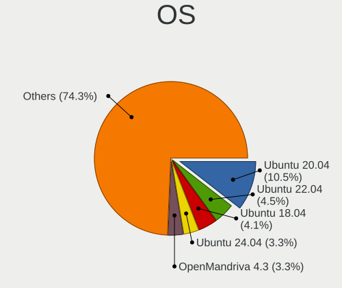

| Name                         | Computers | Percent |
|------------------------------|-----------|---------|
| Ubuntu 20.04                 | 54        | 10.51%  |
| Ubuntu 22.04                 | 23        | 4.47%   |
| Ubuntu 18.04                 | 21        | 4.09%   |
| Ubuntu 24.04                 | 17        | 3.31%   |
| OpenMandriva 4.3             | 17        | 3.31%   |
| OpenMandriva 4.2             | 17        | 3.31%   |
| Zorin 17                     | 14        | 2.72%   |
| Debian 12                    | 13        | 2.53%   |
| Zorin 16                     | 9         | 1.75%   |
| OpenMandriva 24.12           | 9         | 1.75%   |
| ArcoLinux Rolling            | 9         | 1.75%   |
| OpenMandriva 25.06           | 8         | 1.56%   |
| OpenMandriva 23.08           | 8         | 1.56%   |
| Pop!_OS 22.04                | 7         | 1.36%   |
| OpenMandriva 23.03           | 7         | 1.36%   |
| Linux Mint 20.1              | 7         | 1.36%   |
| OpenMandriva 25.90           | 6         | 1.17%   |
| Manjaro                      | 6         | 1.17%   |
| KDE neon 20.04               | 6         | 1.17%   |
| Fedora 39                    | 6         | 1.17%   |
| Fedora 35                    | 6         | 1.17%   |
| Pop!_OS 20.04                | 5         | 0.97%   |
| OpenMandriva 24.07           | 5         | 0.97%   |
| KDE neon 22.04               | 5         | 0.97%   |
| Fedora 40                    | 5         | 0.97%   |
| Arch Rolling                 | 5         | 0.97%   |
| Arch                         | 5         | 0.97%   |
| Ubuntu 21.04                 | 4         | 0.78%   |
| Ubuntu 19.10                 | 4         | 0.78%   |
| openSUSE Tumbleweed-XXXXXXXX | 4         | 0.78%   |
| OpenMandriva 23.11           | 4         | 0.78%   |
| OpenMandriva 23.09           | 4         | 0.78%   |
| OpenMandriva 23.01           | 4         | 0.78%   |
| Fedora 37                    | 4         | 0.78%   |
| Debian 11                    | 4         | 0.78%   |
| BlackPanther 18.1            | 4         | 0.78%   |
| Xubuntu 20.04                | 3         | 0.58%   |
| Ubuntu 25.04                 | 3         | 0.58%   |
| Ubuntu 20.10                 | 3         | 0.58%   |
| ROSA R11                     | 3         | 0.58%   |

OS Family
---------

OS without a version

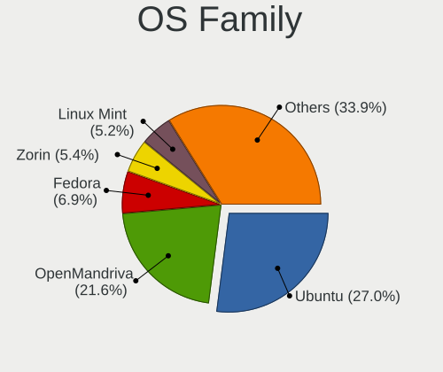

| Name          | Computers | Percent |
|---------------|-----------|---------|
| Ubuntu        | 134       | 27.02%  |
| OpenMandriva  | 107       | 21.57%  |
| Fedora        | 34        | 6.85%   |
| Zorin         | 27        | 5.44%   |
| Linux Mint    | 26        | 5.24%   |
| Debian        | 24        | 4.84%   |
| Pop!_OS       | 15        | 3.02%   |
| KDE neon      | 12        | 2.42%   |
| Manjaro       | 11        | 2.22%   |
| Arch          | 10        | 2.02%   |
| ROSA          | 9         | 1.81%   |
| Kali          | 9         | 1.81%   |
| ArcoLinux     | 9         | 1.81%   |
| Xubuntu       | 8         | 1.61%   |
| Parrot        | 7         | 1.41%   |
| openSUSE      | 5         | 1.01%   |
| MX            | 4         | 0.81%   |
| Kubuntu       | 4         | 0.81%   |
| BlackPanther  | 4         | 0.81%   |
| Ubuntu MATE   | 2         | 0.4%    |
| Q4OS          | 2         | 0.4%    |
| Peppermint    | 2         | 0.4%    |
| Lubuntu       | 2         | 0.4%    |
| Gentoo        | 2         | 0.4%    |
| Garuda Linux  | 2         | 0.4%    |
| CachyOS       | 2         | 0.4%    |
| antiX         | 2         | 0.4%    |
| Xero          | 1         | 0.2%    |
| UbuntuDDE     | 1         | 0.2%    |
| Ubuntu Unity  | 1         | 0.2%    |
| Ubuntu Budgie | 1         | 0.2%    |
| TUXEDO OS     | 1         | 0.2%    |
| Skygate       | 1         | 0.2%    |
| Pear OS       | 1         | 0.2%    |
| LMDE          | 1         | 0.2%    |
| Endless       | 1         | 0.2%    |
| EndeavourOS   | 1         | 0.2%    |
| Elementary    | 1         | 0.2%    |
| Deepin        | 1         | 0.2%    |
| Clear Linux   | 1         | 0.2%    |

Kernel
------

Version of the Linux kernel

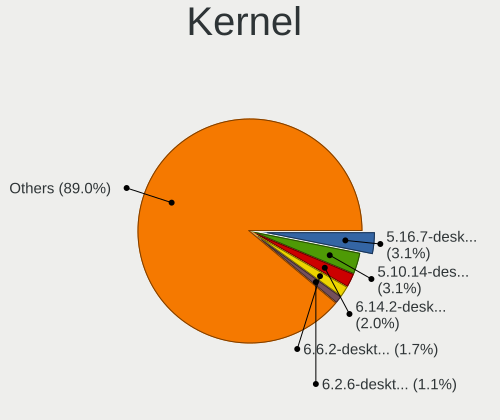

| Version                       | Computers | Percent |
|-------------------------------|-----------|---------|
| 5.16.7-desktop-1omv4003       | 17        | 3.13%   |
| 5.10.14-desktop-1omv4002      | 17        | 3.13%   |
| 6.14.2-desktop-3omv2590       | 11        | 2.03%   |
| 6.6.2-desktop-1omv2390        | 9         | 1.66%   |
| 6.2.6-desktop-1omv2390        | 6         | 1.1%    |
| 6.15.0-desktop-0.rc2.3omv2590 | 6         | 1.1%    |
| 6.12.1-desktop-1omv2490       | 6         | 1.1%    |
| 6.5.0-15-generic              | 5         | 0.92%   |
| 6.4.11-desktop-1omv2390       | 5         | 0.92%   |
| 5.4.0-42-generic              | 5         | 0.92%   |
| 5.15.0-47-generic             | 5         | 0.92%   |
| 6.14.0-37-generic             | 4         | 0.74%   |
| 6.14.0-27-generic             | 4         | 0.74%   |
| 6.10.0-desktop-1omv2490       | 4         | 0.74%   |
| 6.1.1-desktop-1omv2290        | 4         | 0.74%   |
| 5.8.0-50-generic              | 4         | 0.74%   |
| 5.4.0-72-generic              | 4         | 0.74%   |
| 5.4.0-54-generic              | 4         | 0.74%   |
| 5.4.0-29-generic              | 4         | 0.74%   |
| 5.0.0-37-generic              | 4         | 0.74%   |
| 6.5.5-desktop-1omv2390        | 3         | 0.55%   |
| 6.5.0-17-generic              | 3         | 0.55%   |
| 6.4.8-desktop-2omv2390        | 3         | 0.55%   |
| 6.2.0-33-generic              | 3         | 0.55%   |
| 6.14.0-35-generic             | 3         | 0.55%   |
| 6.12.6-desktop-1omv2490       | 3         | 0.55%   |
| 6.1.0-13-amd64                | 3         | 0.55%   |
| 6.0.12-100.fc35.x86_64        | 3         | 0.55%   |
| 5.4.0-65-generic              | 3         | 0.55%   |
| 5.4.0-56-generic              | 3         | 0.55%   |
| 5.4.0-52-generic              | 3         | 0.55%   |
| 5.3.0-46-generic              | 3         | 0.55%   |
| 5.15.0-86-generic             | 3         | 0.55%   |
| 5.15.0-58-generic             | 3         | 0.55%   |
| 5.15.0-56-generic             | 3         | 0.55%   |
| 5.13.0-30-generic             | 3         | 0.55%   |
| 5.11.0-38-generic             | 3         | 0.55%   |
| 5.11.0-27-generic             | 3         | 0.55%   |
| 4.18.16-desktop-1bP           | 3         | 0.55%   |
| 6.9.7-desktop-1omv2490        | 2         | 0.37%   |

Kernel Family
-------------

Linux kernel without a distro release

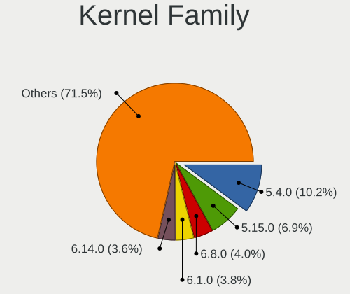

| Version | Computers | Percent |
|---------|-----------|---------|
| 5.4.0   | 53        | 10.15%  |
| 5.15.0  | 36        | 6.9%    |
| 6.8.0   | 21        | 4.02%   |
| 6.1.0   | 20        | 3.83%   |
| 6.14.0  | 19        | 3.64%   |
| 6.5.0   | 18        | 3.45%   |
| 5.16.7  | 17        | 3.26%   |
| 5.10.14 | 17        | 3.26%   |
| 5.11.0  | 16        | 3.07%   |
| 5.8.0   | 14        | 2.68%   |
| 4.15.0  | 13        | 2.49%   |
| 6.14.2  | 11        | 2.11%   |
| 5.3.0   | 10        | 1.92%   |
| 5.0.0   | 10        | 1.92%   |
| 6.6.2   | 9         | 1.72%   |
| 5.13.0  | 9         | 1.72%   |
| 6.2.0   | 8         | 1.53%   |
| 5.10.0  | 8         | 1.53%   |
| 6.2.6   | 7         | 1.34%   |
| 6.15.0  | 6         | 1.15%   |
| 6.12.1  | 6         | 1.15%   |
| 6.11.0  | 6         | 1.15%   |
| 6.4.11  | 5         | 0.96%   |
| 6.10.0  | 5         | 0.96%   |
| 5.19.0  | 5         | 0.96%   |
| 6.8.7   | 4         | 0.77%   |
| 6.1.1   | 4         | 0.77%   |
| 4.18.16 | 4         | 0.77%   |
| 6.9.7   | 3         | 0.57%   |
| 6.5.5   | 3         | 0.57%   |
| 6.4.8   | 3         | 0.57%   |
| 6.12.6  | 3         | 0.57%   |
| 6.0.12  | 3         | 0.57%   |
| 6.7.9   | 2         | 0.38%   |
| 6.6.9   | 2         | 0.38%   |
| 6.6.8   | 2         | 0.38%   |
| 6.5.6   | 2         | 0.38%   |
| 6.2.8   | 2         | 0.38%   |
| 6.18.0  | 2         | 0.38%   |
| 6.17.7  | 2         | 0.38%   |

Kernel Major Ver.
-----------------

Linux kernel major version

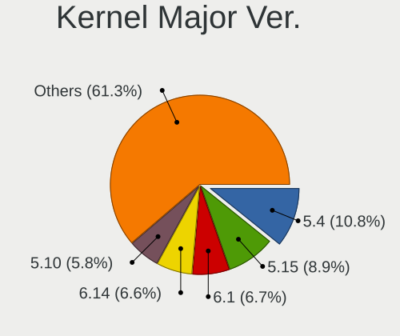

| Version | Computers | Percent |
|---------|-----------|---------|
| 5.4     | 56        | 10.79%  |
| 5.15    | 46        | 8.86%   |
| 6.1     | 35        | 6.74%   |
| 6.14    | 34        | 6.55%   |
| 5.10    | 30        | 5.78%   |
| 6.8     | 29        | 5.59%   |
| 6.5     | 25        | 4.82%   |
| 6.2     | 20        | 3.85%   |
| 5.16    | 19        | 3.66%   |
| 6.12    | 18        | 3.47%   |
| 5.11    | 18        | 3.47%   |
| 6.6     | 16        | 3.08%   |
| 5.8     | 15        | 2.89%   |
| 4.15    | 13        | 2.5%    |
| 6.4     | 12        | 2.31%   |
| 6.15    | 10        | 1.93%   |
| 5.3     | 10        | 1.93%   |
| 5.19    | 10        | 1.93%   |
| 5.13    | 10        | 1.93%   |
| 5.0     | 10        | 1.93%   |
| 6.11    | 9         | 1.73%   |
| 6.10    | 9         | 1.73%   |
| 6.0     | 7         | 1.35%   |
| 6.9     | 6         | 1.16%   |
| 5.14    | 5         | 0.96%   |
| 4.18    | 5         | 0.96%   |
| 6.7     | 4         | 0.77%   |
| 6.17    | 4         | 0.77%   |
| 4.9     | 4         | 0.77%   |
| 4.19    | 4         | 0.77%   |
| 6.16    | 3         | 0.58%   |
| 5.17    | 3         | 0.58%   |
| 5.12    | 3         | 0.58%   |
| 6.3     | 2         | 0.39%   |
| 6.18    | 2         | 0.39%   |
| 6.13    | 2         | 0.39%   |
| 5.7     | 2         | 0.39%   |
| 5.6     | 2         | 0.39%   |
| 5.18    | 2         | 0.39%   |
| 4.4     | 2         | 0.39%   |

Arch
----

OS architecture (x86_64, i586, etc.)

| Name   | Computers | Percent |
|--------|-----------|---------|
| x86_64 | 448       | 97.6%   |
| i686   | 10        | 2.18%   |
| armv7l | 1         | 0.22%   |

DE
--

Desktop Environment

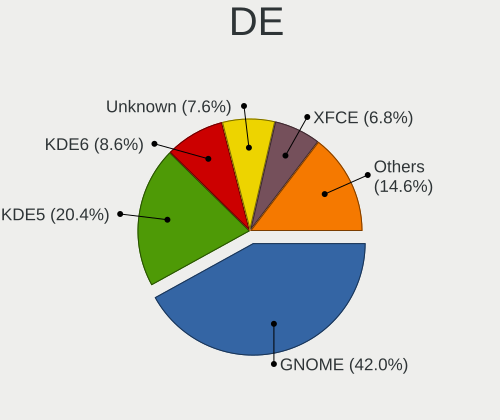

| Name             | Computers | Percent |
|------------------|-----------|---------|
| GNOME            | 204       | 41.98%  |
| KDE5             | 99        | 20.37%  |
| KDE6             | 42        | 8.64%   |
| Unknown          | 37        | 7.61%   |
| XFCE             | 33        | 6.79%   |
| X-Cinnamon       | 18        | 3.7%    |
| MATE             | 11        | 2.26%   |
| Cinnamon         | 8         | 1.65%   |
| LXQt             | 6         | 1.23%   |
| KDE4             | 5         | 1.03%   |
| KDE              | 5         | 1.03%   |
| i3               | 4         | 0.82%   |
| Unity            | 1         | 0.21%   |
| Trinity          | 1         | 0.21%   |
| Peppermint       | 1         | 0.21%   |
| Pantheon         | 1         | 0.21%   |
| LXDE             | 1         | 0.21%   |
| lightdm-xsession | 1         | 0.21%   |
| icewm            | 1         | 0.21%   |
| Hyprland         | 1         | 0.21%   |
| GNOME Flashback  | 1         | 0.21%   |
| fvwm             | 1         | 0.21%   |
| fluxbox          | 1         | 0.21%   |
| Deepin           | 1         | 0.21%   |
| DDE              | 1         | 0.21%   |
| Budgie           | 1         | 0.21%   |

Display Server
--------------

X11 or Wayland

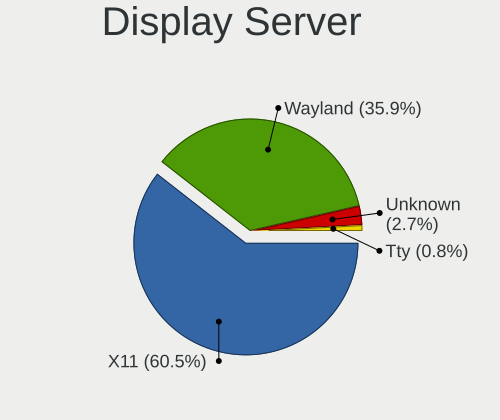

| Name    | Computers | Percent |
|---------|-----------|---------|
| X11     | 287       | 60.55%  |
| Wayland | 170       | 35.86%  |
| Unknown | 13        | 2.74%   |
| Tty     | 4         | 0.84%   |

Display Manager
---------------

SDDM, LightDM, etc.

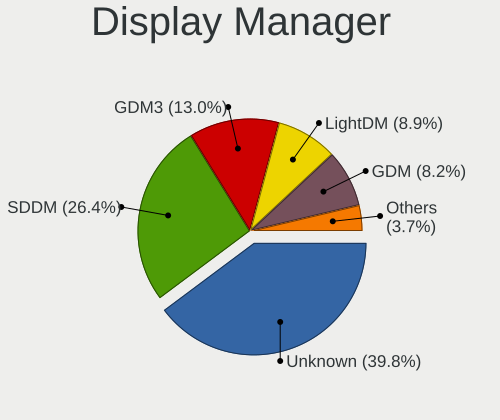

| Name    | Computers | Percent |
|---------|-----------|---------|
| Unknown | 193       | 39.79%  |
| SDDM    | 128       | 26.39%  |
| GDM3    | 63        | 12.99%  |
| LightDM | 43        | 8.87%   |
| GDM     | 40        | 8.25%   |
| TDM     | 8         | 1.65%   |
| KDM     | 5         | 1.03%   |
| SLIMSKI | 2         | 0.41%   |
| SLiM    | 1         | 0.21%   |
| I3      | 1         | 0.21%   |
| GREETD  | 1         | 0.21%   |

OS Lang
-------

Language

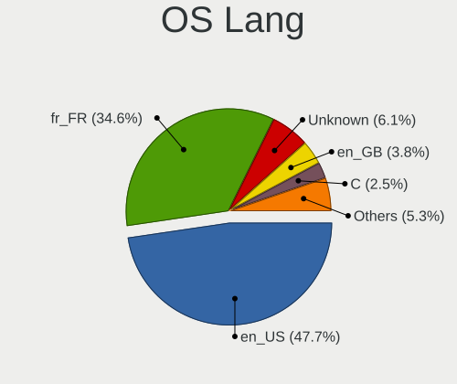

| Lang        | Computers | Percent |
|-------------|-----------|---------|
| en_US       | 226       | 47.68%  |
| fr_FR       | 164       | 34.6%   |
| Unknown     | 29        | 6.12%   |
| en_GB       | 18        | 3.8%    |
| C           | 12        | 2.53%   |
| ar_DZ       | 10        | 2.11%   |
| ar_EG       | 4         | 0.84%   |
| fr_DZ       | 2         | 0.42%   |
| fr_BE       | 2         | 0.42%   |
| es_ES       | 2         | 0.42%   |
| en_DK       | 2         | 0.42%   |
| en_IE       | 1         | 0.21%   |
| en-US-UTF-8 | 1         | 0.21%   |
| ar_AE       | 1         | 0.21%   |

Boot Mode
---------

EFI or BIOS

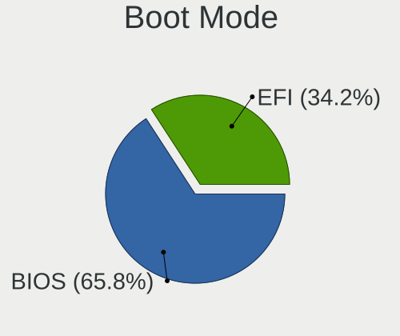

| Mode | Computers | Percent |
|------|-----------|---------|
| BIOS | 312       | 65.82%  |
| EFI  | 162       | 34.18%  |

Filesystem
----------

Type of filesystem

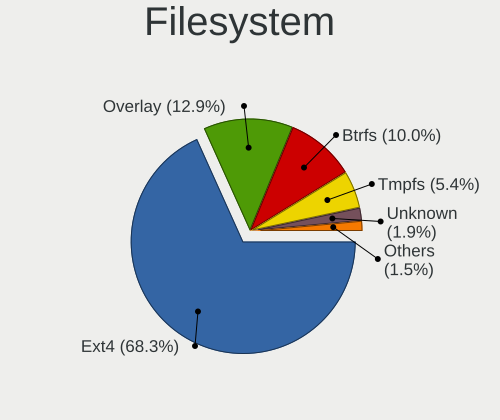

| Type    | Computers | Percent |
|---------|-----------|---------|
| Ext4    | 327       | 68.27%  |
| Overlay | 62        | 12.94%  |
| Btrfs   | 48        | 10.02%  |
| Tmpfs   | 26        | 5.43%   |
| Unknown | 9         | 1.88%   |
| Xfs     | 3         | 0.63%   |
| Ext2    | 3         | 0.63%   |
| Ext3    | 1         | 0.21%   |

Part. scheme
------------

Scheme of partitioning

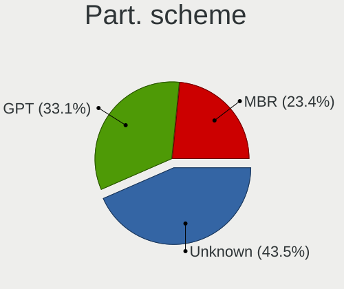

| Type    | Computers | Percent |
|---------|-----------|---------|
| Unknown | 206       | 43.46%  |
| GPT     | 157       | 33.12%  |
| MBR     | 111       | 23.42%  |

Dual Boot with Linux/BSD
------------------------

Hosting more than one Linux/BSD

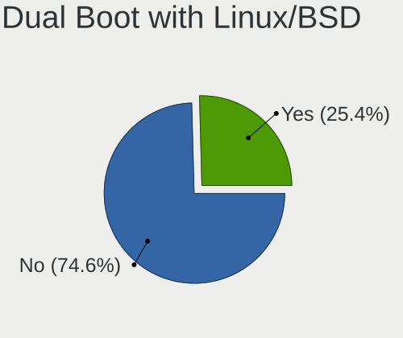

| Dual boot | Computers | Percent |
|-----------|-----------|---------|
| No        | 355       | 74.58%  |
| Yes       | 121       | 25.42%  |

Dual Boot (Win)
---------------

Hosting Linux and Windows

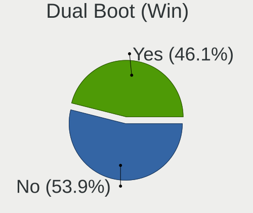

| Dual boot | Computers | Percent |
|-----------|-----------|---------|
| No        | 254       | 53.93%  |
| Yes       | 217       | 46.07%  |

Board
-----

Vendor
------

Motherboard manufacturer

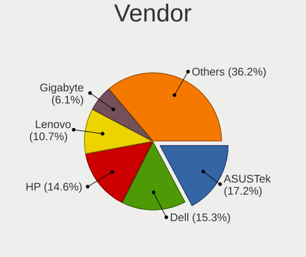

| Name                | Computers | Percent |
|---------------------|-----------|---------|
| ASUSTek Computer    | 79        | 17.21%  |
| Dell                | 70        | 15.25%  |
| Hewlett-Packard     | 67        | 14.6%   |
| Lenovo              | 49        | 10.68%  |
| Gigabyte Technology | 28        | 6.1%    |
| MSI                 | 26        | 5.66%   |
| Acer                | 22        | 4.79%   |
| Unknown             | 17        | 3.7%    |
| Toshiba             | 12        | 2.61%   |
| Intel               | 9         | 1.96%   |
| Foxconn             | 9         | 1.96%   |
| ECS                 | 8         | 1.74%   |
| Apple               | 8         | 1.74%   |
| Sony                | 7         | 1.53%   |
| Samsung Electronics | 6         | 1.31%   |
| Packard Bell        | 6         | 1.31%   |
| Biostar             | 6         | 1.31%   |
| Fujitsu             | 5         | 1.09%   |
| ASRock              | 5         | 1.09%   |
| Pegatron            | 3         | 0.65%   |
| LORD ELECTRONICS    | 2         | 0.44%   |
| Wistron             | 1         | 0.22%   |
| WeiBu               | 1         | 0.22%   |
| UNOWHY              | 1         | 0.22%   |
| Supermicro          | 1         | 0.22%   |
| sunxi               | 1         | 0.22%   |
| SPA CONDOR          | 1         | 0.22%   |
| Panasonic           | 1         | 0.22%   |
| Notebook            | 1         | 0.22%   |
| Microsoft           | 1         | 0.22%   |
| LDLC                | 1         | 0.22%   |
| HUAWEI              | 1         | 0.22%   |
| Google              | 1         | 0.22%   |
| eMachines           | 1         | 0.22%   |
| By O.E.M.           | 1         | 0.22%   |
| AMI                 | 1         | 0.22%   |

Model
-----

Motherboard model

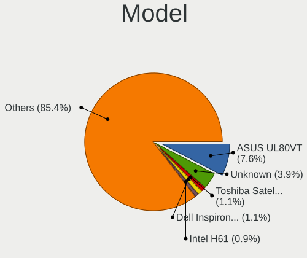

| Name                                              | Computers | Percent |
|---------------------------------------------------|-----------|---------|
| ASUS UL80VT                                       | 35        | 7.63%   |
| Unknown                                           | 18        | 3.92%   |
| Toshiba Satellite C55-B                           | 5         | 1.09%   |
| Dell Inspiron N5110                               | 5         | 1.09%   |
| Intel H61                                         | 4         | 0.87%   |
| HP Pavilion 15                                    | 4         | 0.87%   |
| HP Notebook                                       | 4         | 0.87%   |
| HP EliteBook 840 G3                               | 4         | 0.87%   |
| Dell Latitude 5490                                | 4         | 0.87%   |
| Dell Inspiron 15-3567                             | 4         | 0.87%   |
| ASUS H61M-K                                       | 4         | 0.87%   |
| MSI MS-7788                                       | 3         | 0.65%   |
| Lenovo IdeaPad 300-15ISK 80Q7                     | 3         | 0.65%   |
| Lenovo G560 20042                                 | 3         | 0.65%   |
| Intel H55                                         | 3         | 0.65%   |
| HP ProBook 4540s                                  | 3         | 0.65%   |
| HP 280 G1 MT                                      | 3         | 0.65%   |
| Gigabyte H61M-S2PV                                | 3         | 0.65%   |
| Gigabyte G41MT-S2PT                               | 3         | 0.65%   |
| Foxconn H61MXL/H61MXL-K                           | 3         | 0.65%   |
| ECS G41T-M7                                       | 3         | 0.65%   |
| Dell Latitude 7480                                | 3         | 0.65%   |
| Dell Inspiron 3543                                | 3         | 0.65%   |
| Dell Inspiron 3542                                | 3         | 0.65%   |
| ASUS All Series                                   | 3         | 0.65%   |
| Samsung N102SP/N100SP/N101SP                      | 2         | 0.44%   |
| MSI MS-7C52                                       | 2         | 0.44%   |
| MSI MS-7758                                       | 2         | 0.44%   |
| MSI MS-7680                                       | 2         | 0.44%   |
| MSI MS-7636                                       | 2         | 0.44%   |
| MSI MS-7592                                       | 2         | 0.44%   |
| LORD ELECTRONICS LORD G4x 775 ICH7 8712 As Design | 2         | 0.44%   |
| Lenovo G50-30 80G0                                | 2         | 0.44%   |
| Lenovo B50-70 20384                               | 2         | 0.44%   |
| HP EliteBook 840 G5                               | 2         | 0.44%   |
| HP 15                                             | 2         | 0.44%   |
| Gigabyte H61M-S2P-R3                              | 2         | 0.44%   |
| Gigabyte B85M-DS3H-A                              | 2         | 0.44%   |
| ECS H61H2-MV                                      | 2         | 0.44%   |
| Dell OptiPlex 3010                                | 2         | 0.44%   |

Model Family
------------

Motherboard model prefix

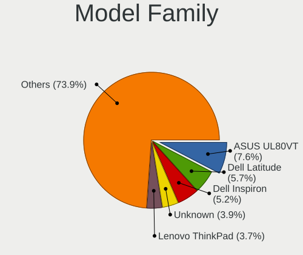

| Name                  | Computers | Percent |
|-----------------------|-----------|---------|
| ASUS UL80VT           | 35        | 7.63%   |
| Dell Latitude         | 26        | 5.66%   |
| Dell Inspiron         | 24        | 5.23%   |
| Unknown               | 18        | 3.92%   |
| Lenovo ThinkPad       | 17        | 3.7%    |
| Acer Aspire           | 16        | 3.49%   |
| HP EliteBook          | 14        | 3.05%   |
| HP ProBook            | 12        | 2.61%   |
| Toshiba Satellite     | 10        | 2.18%   |
| HP Pavilion           | 10        | 2.18%   |
| Lenovo IdeaPad        | 9         | 1.96%   |
| ASUS PRIME            | 7         | 1.53%   |
| HP Laptop             | 6         | 1.31%   |
| Dell Vostro           | 6         | 1.31%   |
| Fujitsu LIFEBOOK      | 5         | 1.09%   |
| Dell Precision        | 5         | 1.09%   |
| Dell OptiPlex         | 5         | 1.09%   |
| Intel H61             | 4         | 0.87%   |
| HP Notebook           | 4         | 0.87%   |
| HP 280                | 4         | 0.87%   |
| ASUS VivoBook         | 4         | 0.87%   |
| ASUS H61M-K           | 4         | 0.87%   |
| ASUS ASUS             | 4         | 0.87%   |
| Packard Bell EasyNote | 3         | 0.65%   |
| MSI MS-7788           | 3         | 0.65%   |
| Lenovo Yoga           | 3         | 0.65%   |
| Lenovo ThinkCentre    | 3         | 0.65%   |
| Lenovo G560           | 3         | 0.65%   |
| Intel H55             | 3         | 0.65%   |
| HP ProDesk            | 3         | 0.65%   |
| Gigabyte H61M-S2PV    | 3         | 0.65%   |
| Gigabyte G41MT-S2PT   | 3         | 0.65%   |
| Foxconn H61MXL        | 3         | 0.65%   |
| ECS G41T-M7           | 3         | 0.65%   |
| ASUS TUF              | 3         | 0.65%   |
| ASUS All              | 3         | 0.65%   |
| Acer Extensa          | 3         | 0.65%   |
| Toshiba PORTEGE       | 2         | 0.44%   |
| Samsung N102SP        | 2         | 0.44%   |
| Packard Bell IMEDIA   | 2         | 0.44%   |

MFG Year
--------

Motherboard manufacture year

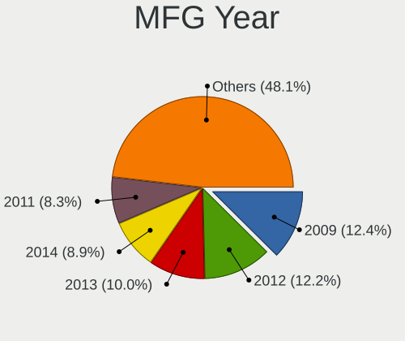

| Year    | Computers | Percent |
|---------|-----------|---------|
| 2009    | 57        | 12.42%  |
| 2012    | 56        | 12.2%   |
| 2013    | 46        | 10.02%  |
| 2014    | 41        | 8.93%   |
| 2011    | 38        | 8.28%   |
| 2017    | 29        | 6.32%   |
| 2016    | 28        | 6.1%    |
| 2015    | 27        | 5.88%   |
| 2018    | 24        | 5.23%   |
| 2010    | 24        | 5.23%   |
| 2020    | 17        | 3.7%    |
| 2019    | 14        | 3.05%   |
| 2021    | 13        | 2.83%   |
| 2023    | 10        | 2.18%   |
| 2008    | 10        | 2.18%   |
| 2022    | 9         | 1.96%   |
| 2007    | 8         | 1.74%   |
| 2024    | 3         | 0.65%   |
| 2006    | 3         | 0.65%   |
| Unknown | 2         | 0.44%   |

Form Factor
-----------

Physical design of the computer

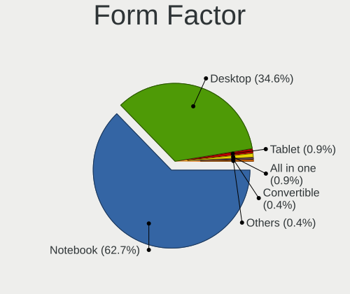

| Name           | Computers | Percent |
|----------------|-----------|---------|
| Notebook       | 288       | 62.75%  |
| Desktop        | 159       | 34.64%  |
| Tablet         | 4         | 0.87%   |
| All in one     | 4         | 0.87%   |
| Convertible    | 2         | 0.44%   |
| System on chip | 1         | 0.22%   |
| Server         | 1         | 0.22%   |

Secure Boot
-----------

Enabled or disabled

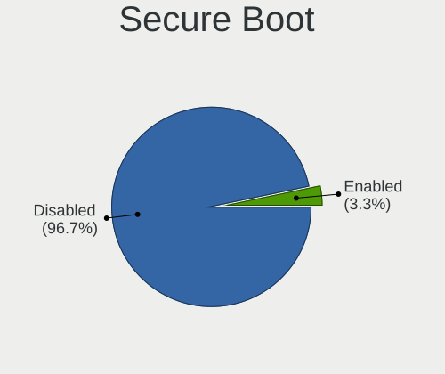

| State    | Computers | Percent |
|----------|-----------|---------|
| Disabled | 445       | 96.74%  |
| Enabled  | 15        | 3.26%   |

Coreboot
--------

Have coreboot on board

| Used | Computers | Percent |
|------|-----------|---------|
| No   | 458       | 99.78%  |
| Yes  | 1         | 0.22%   |

RAM Size
--------

Total RAM memory

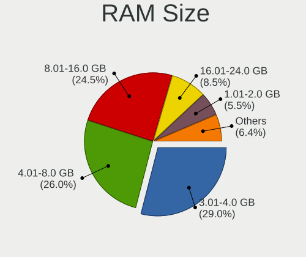

| Size in GB      | Computers | Percent |
|-----------------|-----------|---------|
| 3.01-4.0        | 136       | 29%     |
| 4.01-8.0        | 122       | 26.01%  |
| 8.01-16.0       | 115       | 24.52%  |
| 16.01-24.0      | 40        | 8.53%   |
| 1.01-2.0        | 26        | 5.54%   |
| 32.01-64.0      | 12        | 2.56%   |
| 2.01-3.0        | 8         | 1.71%   |
| 0.51-1.0        | 6         | 1.28%   |
| 64.01-256.0     | 2         | 0.43%   |
| More than 256.0 | 1         | 0.21%   |
| 24.01-32.0      | 1         | 0.21%   |

RAM Used
--------

Used RAM memory

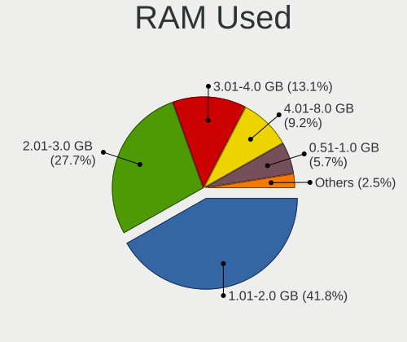

| Used GB    | Computers | Percent |
|------------|-----------|---------|
| 1.01-2.0   | 214       | 41.8%   |
| 2.01-3.0   | 142       | 27.73%  |
| 3.01-4.0   | 67        | 13.09%  |
| 4.01-8.0   | 47        | 9.18%   |
| 0.51-1.0   | 29        | 5.66%   |
| 8.01-16.0  | 8         | 1.56%   |
| 0.01-0.5   | 4         | 0.78%   |
| 32.01-64.0 | 1         | 0.2%    |

Total Drives
------------

Number of drives on board

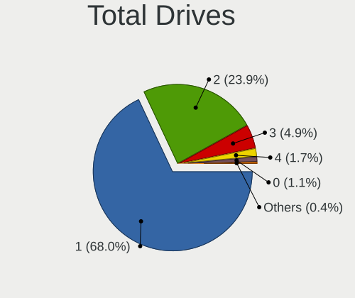

| Drives | Computers | Percent |
|--------|-----------|---------|
| 1      | 321       | 68.01%  |
| 2      | 113       | 23.94%  |
| 3      | 23        | 4.87%   |
| 4      | 8         | 1.69%   |
| 0      | 5         | 1.06%   |
| 7      | 1         | 0.21%   |
| 5      | 1         | 0.21%   |

Has CD-ROM
----------

Has CD-ROM on board

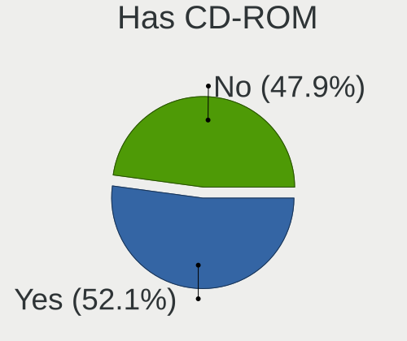

| Presented | Computers | Percent |
|-----------|-----------|---------|
| Yes       | 244       | 52.14%  |
| No        | 224       | 47.86%  |

Has Ethernet
------------

Has Ethernet on board

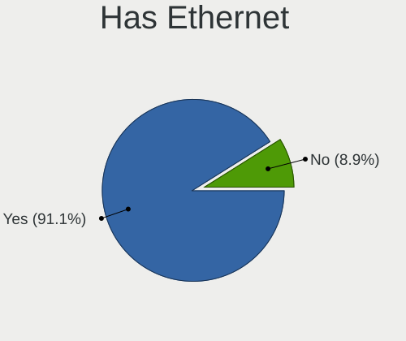

| Presented | Computers | Percent |
|-----------|-----------|---------|
| Yes       | 418       | 91.07%  |
| No        | 41        | 8.93%   |

Has WiFi
--------

Has WiFi module

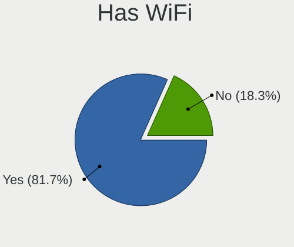

| Presented | Computers | Percent |
|-----------|-----------|---------|
| Yes       | 379       | 81.68%  |
| No        | 85        | 18.32%  |

Has Bluetooth
-------------

Has Bluetooth module

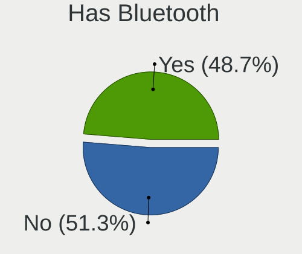

| Presented | Computers | Percent |
|-----------|-----------|---------|
| No        | 240       | 51.28%  |
| Yes       | 228       | 48.72%  |

Location
--------

Country
-------

Geographic location (country)

| Country | Computers | Percent |
|---------|-----------|---------|
| Algeria | 459       | 100%    |

City
----

Geographic location (city)

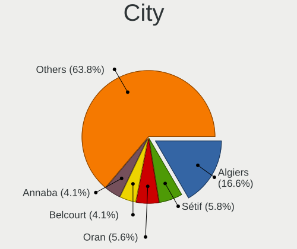

| City               | Computers | Percent |
|--------------------|-----------|---------|
| Algiers            | 86        | 16.63%  |
| Sétif             | 30        | 5.8%    |
| Oran               | 29        | 5.61%   |
| Belcourt           | 21        | 4.06%   |
| Annaba             | 21        | 4.06%   |
| Constantine        | 16        | 3.09%   |
| Tlemcen            | 15        | 2.9%    |
| Béjaïa           | 14        | 2.71%   |
| Tizi Ouzou         | 13        | 2.51%   |
| Batna City         | 11        | 2.13%   |
| Blida              | 9         | 1.74%   |
| Skikda             | 8         | 1.55%   |
| Relizane           | 7         | 1.35%   |
| Ouargla            | 7         | 1.35%   |
| Jijelli            | 7         | 1.35%   |
| Cheraga            | 7         | 1.35%   |
| Bab Ezzouar        | 7         | 1.35%   |
| Djelfa             | 6         | 1.16%   |
| Bordj Bou Arreridj | 6         | 1.16%   |
| Tipasa             | 5         | 0.97%   |
| Sidi Bel Abbes     | 5         | 0.97%   |
| Mostaganem         | 5         | 0.97%   |
| Laghouat           | 5         | 0.97%   |
| Bordj el Kiffan    | 5         | 0.97%   |
| Biskra             | 5         | 0.97%   |
| Birkhadem          | 5         | 0.97%   |
| ash-Shalif         | 5         | 0.97%   |
| Sidi Akkacha       | 4         | 0.77%   |
| Kouba              | 4         | 0.77%   |
| Ben ’Aknoûn     | 4         | 0.77%   |
| Béchar            | 4         | 0.77%   |
| Amizour            | 4         | 0.77%   |
| Tolga              | 3         | 0.58%   |
| Saoula             | 3         | 0.58%   |
| Saida              | 3         | 0.58%   |
| Medea              | 3         | 0.58%   |
| Boumerdes          | 3         | 0.58%   |
| Bir el Djir        | 3         | 0.58%   |
| Ain Defla          | 3         | 0.58%   |
| Souk Ahras         | 2         | 0.39%   |

Drives
------

Drive Vendor
------------

Hard drive vendors

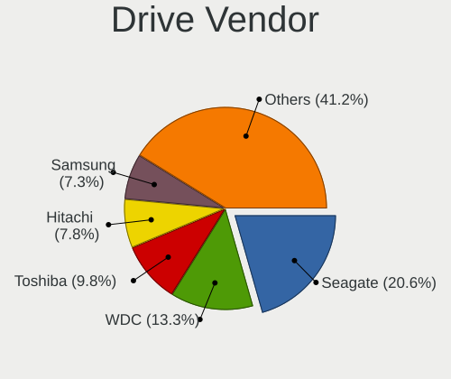

| Vendor                      | Computers | Drives | Percent |
|-----------------------------|-----------|--------|---------|
| Seagate                     | 124       | 153    | 20.6%   |
| WDC                         | 80        | 111    | 13.29%  |
| Toshiba                     | 59        | 79     | 9.8%    |
| Hitachi                     | 47        | 61     | 7.81%   |
| Samsung Electronics         | 44        | 52     | 7.31%   |
| A-DATA Technology           | 26        | 36     | 4.32%   |
| SanDisk                     | 20        | 23     | 3.32%   |
| HGST                        | 20        | 27     | 3.32%   |
| Team                        | 16        | 17     | 2.66%   |
| Intel                       | 14        | 17     | 2.33%   |
| Unknown                     | 12        | 18     | 1.99%   |
| SK hynix                    | 12        | 15     | 1.99%   |
| Lexar                       | 11        | 15     | 1.83%   |
| China                       | 9         | 12     | 1.5%    |
| Maxtor                      | 7         | 9      | 1.16%   |
| Micron Technology           | 6         | 7      | 1%      |
| LITEON                      | 5         | 9      | 0.83%   |
| Crucial                     | 5         | 5      | 0.83%   |
| Realtek Semiconductor       | 4         | 4      | 0.66%   |
| Fujitsu                     | 4         | 5      | 0.66%   |
| XrayDisk                    | 3         | 4      | 0.5%    |
| XPG                         | 3         | 3      | 0.5%    |
| TwinMOS                     | 3         | 3      | 0.5%    |
| Silicon Motion              | 3         | 3      | 0.5%    |
| Kingston                    | 3         | 3      | 0.5%    |
| HS-SSD-E100                 | 3         | 4      | 0.5%    |
| ADATA Technology            | 3         | 5      | 0.5%    |
| ZTE                         | 2         | 2      | 0.33%   |
| tecmiyo                     | 2         | 2      | 0.33%   |
| MDT                         | 2         | 2      | 0.33%   |
| MAXIO Technology (Hangzhou) | 2         | 2      | 0.33%   |
| KIOXIA                      | 2         | 2      | 0.33%   |
| KingSpec                    | 2         | 2      | 0.33%   |
| KESU                        | 2         | 2      | 0.33%   |
| Hewlett-Packard             | 2         | 2      | 0.33%   |
| ExcelStor                   | 2         | 3      | 0.33%   |
| Dahua                       | 2         | 2      | 0.33%   |
| Apple                       | 2         | 2      | 0.33%   |
| WD MediaMax                 | 1         | 1      | 0.17%   |
| WALRAM                      | 1         | 1      | 0.17%   |

Drive Model
-----------

Hard drive models

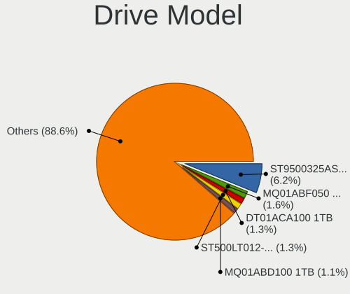

| Model                               | Computers | Percent |
|-------------------------------------|-----------|---------|
| Seagate ST9500325AS 500GB           | 39        | 6.16%   |
| Toshiba MQ01ABF050 500GB            | 10        | 1.58%   |
| Toshiba DT01ACA100 1TB              | 8         | 1.26%   |
| Seagate ST500LT012-1DG142 500GB     | 8         | 1.26%   |
| Toshiba MQ01ABD100 1TB              | 7         | 1.11%   |
| A-DATA SU650 120GB SSD              | 7         | 1.11%   |
| Toshiba DT01ACA050 500GB            | 6         | 0.95%   |
| Seagate ST500VT000-1DK142 500GB     | 6         | 0.95%   |
| Seagate ST1000LM024 HN-M101MBB 1TB  | 6         | 0.95%   |
| Team T253512GB SSD                  | 5         | 0.79%   |
| Team T253256GB SSD                  | 5         | 0.79%   |
| Seagate ST500LT012-9WS142 500GB     | 5         | 0.79%   |
| Seagate Expansion 2TB               | 5         | 0.79%   |
| Intel SSDPEKNU512GZ 512GB           | 5         | 0.79%   |
| Hitachi HDS721616PLA380 160GB       | 5         | 0.79%   |
| HGST HTS545050A7E680 500GB          | 5         | 0.79%   |
| WDC WD5000LPCX-24C6HT0 500GB        | 4         | 0.63%   |
| WDC WD10EZEX-08WN4A0 1TB            | 4         | 0.63%   |
| WDC WD10EZEX-00WN4A0 1TB            | 4         | 0.63%   |
| Seagate ST1000LM035-1RK172 1TB      | 4         | 0.63%   |
| Lexar 512GB SSD                     | 4         | 0.63%   |
| Hitachi HTS545050A7E380 500GB       | 4         | 0.63%   |
| HGST HTS545050A7E380 500GB          | 4         | 0.63%   |
| China SSD 256GB                     | 4         | 0.63%   |
| A-DATA SU630 240GB SSD              | 4         | 0.63%   |
| WDC WD5000AAKX-001CA0 500GB         | 3         | 0.47%   |
| Unknown MMC Card  64GB              | 3         | 0.47%   |
| Toshiba MQ01ABD050V 500GB           | 3         | 0.47%   |
| Seagate ST500LM021-1KJ152 500GB     | 3         | 0.47%   |
| Seagate ST500DM002-1SB10A 500GB     | 3         | 0.47%   |
| Seagate ST500DM002-1BD142 500GB     | 3         | 0.47%   |
| SanDisk SD8SN8U-256G-1006 256GB SSD | 3         | 0.47%   |
| Lexar 128GB SSD                     | 3         | 0.47%   |
| Hitachi HTS545050B9A300 500GB       | 3         | 0.47%   |
| Hitachi HDP725025GLA380 250GB       | 3         | 0.47%   |
| HGST HTS725050A7E630 500GB          | 3         | 0.47%   |
| HGST HTS541010A9E680 1TB            | 3         | 0.47%   |
| A-DATA LEGEND 710 512GB             | 3         | 0.47%   |
| ZTE MMC Storage 942MB               | 2         | 0.32%   |
| XrayDisk 512GB SSD                  | 2         | 0.32%   |

HDD Vendor
----------

Hard disk drive vendors

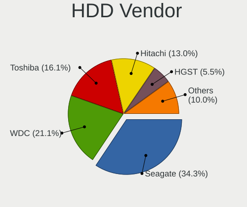

| Vendor              | Computers | Drives | Percent |
|---------------------|-----------|--------|---------|
| Seagate             | 124       | 153    | 34.35%  |
| WDC                 | 76        | 101    | 21.05%  |
| Toshiba             | 58        | 76     | 16.07%  |
| Hitachi             | 47        | 61     | 13.02%  |
| HGST                | 20        | 27     | 5.54%   |
| Samsung Electronics | 16        | 19     | 4.43%   |
| Maxtor              | 7         | 9      | 1.94%   |
| Fujitsu             | 4         | 5      | 1.11%   |
| ExcelStor           | 2         | 3      | 0.55%   |
| WD MediaMax         | 1         | 1      | 0.28%   |
| Magnetic Data       | 1         | 1      | 0.28%   |
| KESU                | 1         | 1      | 0.28%   |
| JMicron Technology  | 1         | 1      | 0.28%   |
| Initio              | 1         | 1      | 0.28%   |
| Hewlett-Packard     | 1         | 1      | 0.28%   |
| Apple               | 1         | 1      | 0.28%   |

SSD Vendor
----------

Solid state drive vendors

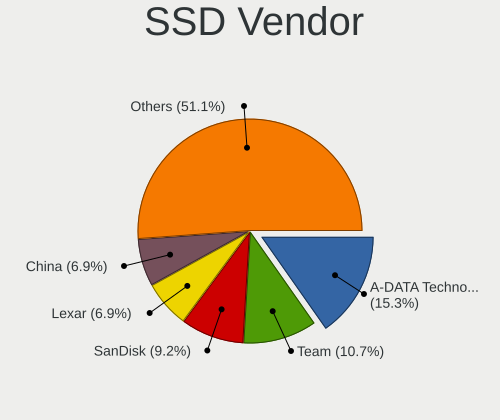

| Vendor              | Computers | Drives | Percent |
|---------------------|-----------|--------|---------|
| A-DATA Technology   | 20        | 28     | 15.27%  |
| Team                | 14        | 15     | 10.69%  |
| SanDisk             | 12        | 13     | 9.16%   |
| Lexar               | 9         | 13     | 6.87%   |
| China               | 9         | 12     | 6.87%   |
| Samsung Electronics | 8         | 9      | 6.11%   |
| WDC                 | 5         | 7      | 3.82%   |
| LITEON              | 5         | 9      | 3.82%   |
| Crucial             | 5         | 5      | 3.82%   |
| SK hynix            | 4         | 6      | 3.05%   |
| XrayDisk            | 3         | 4      | 2.29%   |
| TwinMOS             | 3         | 3      | 2.29%   |
| Intel               | 3         | 4      | 2.29%   |
| XPG                 | 2         | 2      | 1.53%   |
| tecmiyo             | 2         | 2      | 1.53%   |
| Kingston            | 2         | 2      | 1.53%   |
| KingSpec            | 2         | 2      | 1.53%   |
| Dahua               | 2         | 2      | 1.53%   |
| ValueTech           | 1         | 1      | 0.76%   |
| T-FORCE             | 1         | 1      | 0.76%   |
| STAR                | 1         | 1      | 0.76%   |
| PNY                 | 1         | 1      | 0.76%   |
| Micron Technology   | 1         | 1      | 0.76%   |
| MAX                 | 1         | 1      | 0.76%   |
| Londisk             | 1         | 1      | 0.76%   |
| LITEONIT            | 1         | 1      | 0.76%   |
| Lenovo              | 1         | 1      | 0.76%   |
| Kston               | 1         | 1      | 0.76%   |
| KODAK               | 1         | 2      | 0.76%   |
| HS-SSD-E100         | 1         | 1      | 0.76%   |
| HS-SSD-C100         | 1         | 1      | 0.76%   |
| Hewlett-Packard     | 1         | 1      | 0.76%   |
| faspeed             | 1         | 1      | 0.76%   |
| Corsair             | 1         | 1      | 0.76%   |
| CONSISTENT          | 1         | 1      | 0.76%   |
| Asgard              | 1         | 1      | 0.76%   |
| Apple               | 1         | 1      | 0.76%   |
| AGI                 | 1         | 1      | 0.76%   |
| Unknown             | 1         | 1      | 0.76%   |

Drive Kind
----------

HDD or SSD

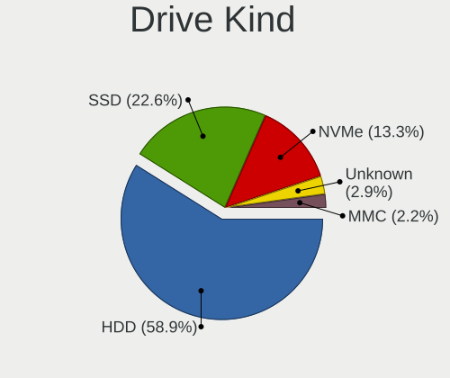

| Kind    | Computers | Drives | Percent |
|---------|-----------|--------|---------|
| HDD     | 323       | 461    | 58.94%  |
| SSD     | 124       | 160    | 22.63%  |
| NVMe    | 73        | 105    | 13.32%  |
| Unknown | 16        | 22     | 2.92%   |
| MMC     | 12        | 14     | 2.19%   |

Drive Connector
---------------

SATA, SAS, NVMe, etc.

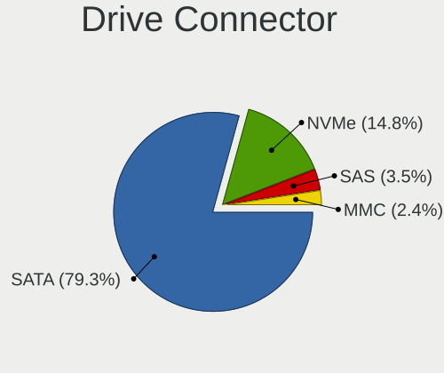

| Type | Computers | Drives | Percent |
|------|-----------|--------|---------|
| SATA | 390       | 621    | 79.27%  |
| NVMe | 73        | 104    | 14.84%  |
| SAS  | 17        | 23     | 3.46%   |
| MMC  | 12        | 14     | 2.44%   |

Drive Size
----------

Size of hard drive

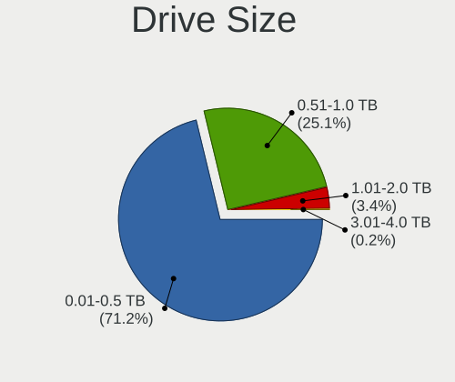

| Size in TB | Computers | Drives | Percent |
|------------|-----------|--------|---------|
| 0.01-0.5   | 312       | 453    | 71.23%  |
| 0.51-1.0   | 110       | 149    | 25.11%  |
| 1.01-2.0   | 15        | 18     | 3.42%   |
| 3.01-4.0   | 1         | 1      | 0.23%   |

Space Total
-----------

Amount of disk space available on the file system

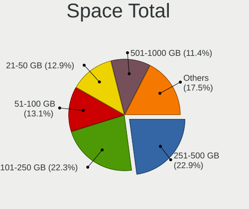

| Size in GB     | Computers | Percent |
|----------------|-----------|---------|
| 251-500        | 114       | 22.89%  |
| 101-250        | 111       | 22.29%  |
| 51-100         | 65        | 13.05%  |
| 21-50          | 64        | 12.85%  |
| 501-1000       | 57        | 11.45%  |
| 1-20           | 48        | 9.64%   |
| 1001-2000      | 19        | 3.82%   |
| Unknown        | 12        | 2.41%   |
| More than 3000 | 4         | 0.8%    |
| 2001-3000      | 4         | 0.8%    |

Space Used
----------

Amount of used disk space

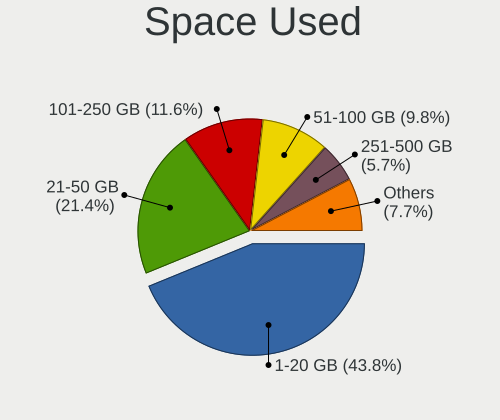

| Used GB   | Computers | Percent |
|-----------|-----------|---------|
| 1-20      | 223       | 43.81%  |
| 21-50     | 109       | 21.41%  |
| 101-250   | 59        | 11.59%  |
| 51-100    | 50        | 9.82%   |
| 251-500   | 29        | 5.7%    |
| 501-1000  | 16        | 3.14%   |
| Unknown   | 12        | 2.36%   |
| 1001-2000 | 9         | 1.77%   |
| 2001-3000 | 1         | 0.2%    |
| 0         | 1         | 0.2%    |

Malfunc. Drives
---------------

Drive models with a malfunction

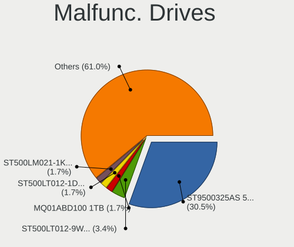

| Model                                       | Computers | Drives | Percent |
|---------------------------------------------|-----------|--------|---------|
| Seagate ST9500325AS 500GB                   | 36        | 36     | 30.51%  |
| Seagate ST500LT012-9WS142 500GB             | 4         | 4      | 3.39%   |
| Toshiba MQ01ABD100 1TB                      | 2         | 2      | 1.69%   |
| Seagate ST500LT012-1DG142 500GB             | 2         | 2      | 1.69%   |
| Seagate ST500LM021-1KJ152 500GB             | 2         | 2      | 1.69%   |
| Seagate ST1000DM010-2EP102 1TB              | 2         | 4      | 1.69%   |
| Samsung Electronics HD502HI 500GB           | 2         | 2      | 1.69%   |
| Samsung Electronics HD103SI 1TB             | 2         | 2      | 1.69%   |
| HGST HTS725050A7E630 500GB                  | 2         | 5      | 1.69%   |
| XPG SPECTRIX S40G 1TB                       | 1         | 1      | 0.85%   |
| WDC WD7500AARS-00Y5B1 752GB                 | 1         | 1      | 0.85%   |
| WDC WD5000LUCT-62C26Y0 500GB                | 1         | 1      | 0.85%   |
| WDC WD5000BEVT-24A0RT0 500GB                | 1         | 1      | 0.85%   |
| WDC WD5000BEVT-22A0RT0 500GB                | 1         | 1      | 0.85%   |
| WDC WD5000AVVS-63M8B0 500GB                 | 1         | 1      | 0.85%   |
| WDC WD5000AVCS-632DY1 500GB                 | 1         | 1      | 0.85%   |
| WDC WD5000AAKX-00ERMA0 500GB                | 1         | 1      | 0.85%   |
| WDC WD400EB-00CPF0 40GB                     | 1         | 1      | 0.85%   |
| WDC WD3200BPVT-22JJ5T0 320GB                | 1         | 1      | 0.85%   |
| WDC WD3200AVJS-63B6A0 320GB                 | 1         | 1      | 0.85%   |
| WDC WD1600AAJS-08WAA0 160GB                 | 1         | 1      | 0.85%   |
| WDC WD10EZEX-60WN4A0 1TB                    | 1         | 2      | 0.85%   |
| WDC WD10EURX-63UY4Y0 1TB                    | 1         | 1      | 0.85%   |
| WDC WD1001FALS-403AA0 1TB                   | 1         | 1      | 0.85%   |
| WD MediaMax WL120GBSATA                     | 1         | 1      | 0.85%   |
| Toshiba MQ01ABF050 500GB                    | 1         | 1      | 0.85%   |
| Toshiba DT01ACA100 1TB                      | 1         | 1      | 0.85%   |
| Toshiba DT01ACA050 500GB                    | 1         | 1      | 0.85%   |
| tecmiyo SATA SSD 128GB                      | 1         | 1      | 0.85%   |
| Seagate ST9320325AS 320GB                   | 1         | 1      | 0.85%   |
| Seagate ST9250410AS 250GB                   | 1         | 1      | 0.85%   |
| Seagate ST500DM002-1BD142 500GB             | 1         | 2      | 0.85%   |
| Seagate ST3500413AS 500GB                   | 1         | 1      | 0.85%   |
| Seagate ST3250310AS 250GB                   | 1         | 1      | 0.85%   |
| Seagate ST1000LM048-2E7172 1TB              | 1         | 1      | 0.85%   |
| Seagate ST1000LM035-1RK172 1TB              | 1         | 1      | 0.85%   |
| Seagate ST1000LM024 HN-M101MBB 1TB          | 1         | 1      | 0.85%   |
| Samsung Electronics SSD PM810 2.5 7mm 128GB | 1         | 1      | 0.85%   |
| Samsung Electronics SP0411N 40GB            | 1         | 2      | 0.85%   |
| Samsung Electronics HM320HJ 320GB           | 1         | 1      | 0.85%   |

Malfunc. Drive Vendor
---------------------

Vendors of faulty drives

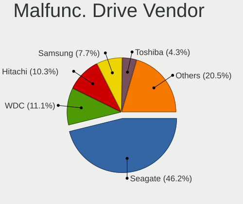

| Vendor                | Computers | Drives | Percent |
|-----------------------|-----------|--------|---------|
| Seagate               | 54        | 57     | 46.15%  |
| WDC                   | 13        | 15     | 11.11%  |
| Hitachi               | 12        | 13     | 10.26%  |
| Samsung Electronics   | 9         | 10     | 7.69%   |
| Toshiba               | 5         | 5      | 4.27%   |
| Maxtor                | 5         | 5      | 4.27%   |
| HGST                  | 4         | 7      | 3.42%   |
| A-DATA Technology     | 2         | 2      | 1.71%   |
| XPG                   | 1         | 1      | 0.85%   |
| WD MediaMax           | 1         | 1      | 0.85%   |
| tecmiyo               | 1         | 1      | 0.85%   |
| Realtek Semiconductor | 1         | 1      | 0.85%   |
| Magnetic Data         | 1         | 1      | 0.85%   |
| LITEONIT              | 1         | 1      | 0.85%   |
| Lexar                 | 1         | 1      | 0.85%   |
| KingSpec              | 1         | 1      | 0.85%   |
| Hikvision             | 1         | 1      | 0.85%   |
| Fujitsu               | 1         | 1      | 0.85%   |
| ExcelStor             | 1         | 1      | 0.85%   |
| Crucial               | 1         | 1      | 0.85%   |
| China                 | 1         | 1      | 0.85%   |

Malfunc. HDD Vendor
-------------------

Vendors of faulty HDD drives

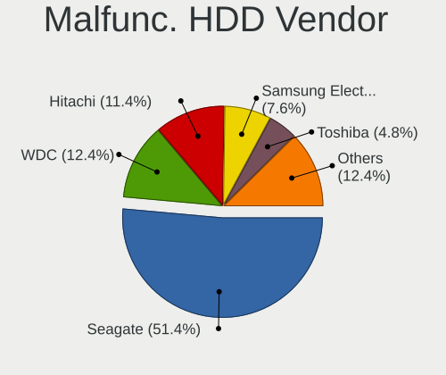

| Vendor              | Computers | Drives | Percent |
|---------------------|-----------|--------|---------|
| Seagate             | 54        | 57     | 51.43%  |
| WDC                 | 13        | 15     | 12.38%  |
| Hitachi             | 12        | 13     | 11.43%  |
| Samsung Electronics | 8         | 9      | 7.62%   |
| Toshiba             | 5         | 5      | 4.76%   |
| Maxtor              | 5         | 5      | 4.76%   |
| HGST                | 4         | 7      | 3.81%   |
| WD MediaMax         | 1         | 1      | 0.95%   |
| Magnetic Data       | 1         | 1      | 0.95%   |
| Fujitsu             | 1         | 1      | 0.95%   |
| ExcelStor           | 1         | 1      | 0.95%   |

Malfunc. Drive Kind
-------------------

Kinds of faulty drives

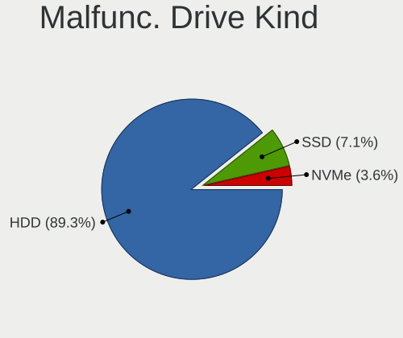

| Kind | Computers | Drives | Percent |
|------|-----------|--------|---------|
| HDD  | 100       | 115    | 89.29%  |
| SSD  | 8         | 8      | 7.14%   |
| NVMe | 4         | 4      | 3.57%   |

Failed Drives
-------------

Failed drive models

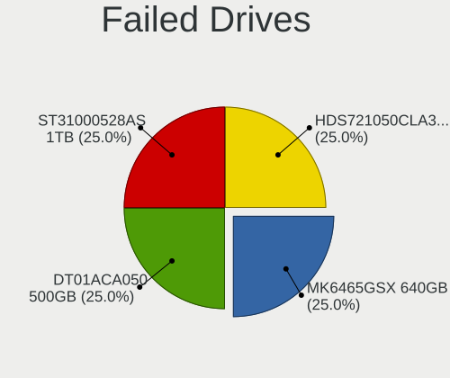

| Model                         | Computers | Drives | Percent |
|-------------------------------|-----------|--------|---------|
| Toshiba MK6465GSX 640GB       | 1         | 1      | 25%     |
| Toshiba DT01ACA050 500GB      | 1         | 1      | 25%     |
| Seagate ST31000528AS 1TB      | 1         | 1      | 25%     |
| Hitachi HDS721050CLA360 500GB | 1         | 1      | 25%     |

Failed Drive Vendor
-------------------

Failed drive vendors

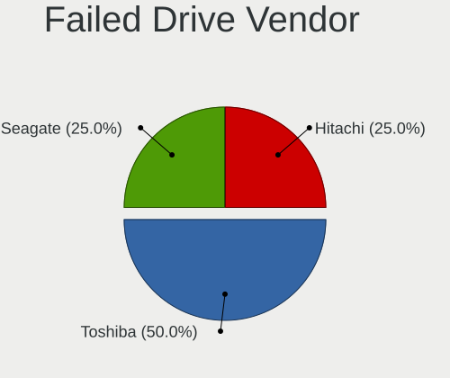

| Vendor  | Computers | Drives | Percent |
|---------|-----------|--------|---------|
| Toshiba | 2         | 2      | 50%     |
| Seagate | 1         | 1      | 25%     |
| Hitachi | 1         | 1      | 25%     |

Drive Status
------------

Number of failed and malfunc. drives

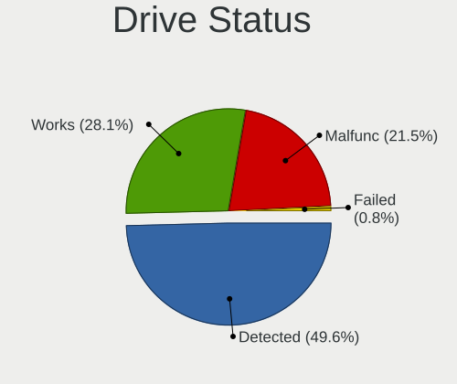

| Status   | Computers | Drives | Percent |
|----------|-----------|--------|---------|
| Detected | 247       | 421    | 49.6%   |
| Works    | 140       | 210    | 28.11%  |
| Malfunc  | 107       | 127    | 21.49%  |
| Failed   | 4         | 4      | 0.8%    |

Storage controller
------------------

Storage Vendor
--------------

Storage controller vendors

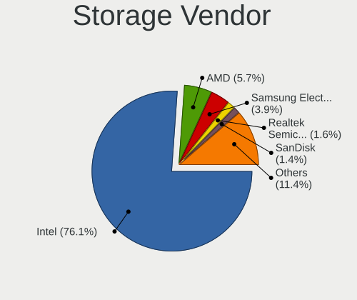

| Vendor                         | Computers | Percent |
|--------------------------------|-----------|---------|
| Intel                          | 389       | 76.13%  |
| AMD                            | 29        | 5.68%   |
| Samsung Electronics            | 20        | 3.91%   |
| Realtek Semiconductor          | 8         | 1.57%   |
| SK hynix                       | 7         | 1.37%   |
| SanDisk                        | 7         | 1.37%   |
| Nvidia                         | 7         | 1.37%   |
| ADATA Technology               | 6         | 1.17%   |
| Silicon Motion                 | 5         | 0.98%   |
| Micron Technology              | 5         | 0.98%   |
| VIA Technologies               | 4         | 0.78%   |
| MAXIO Technology (Hangzhou)    | 4         | 0.78%   |
| ASMedia Technology             | 4         | 0.78%   |
| Solid State Storage Technology | 2         | 0.39%   |
| Phison Electronics             | 2         | 0.39%   |
| KIOXIA                         | 2         | 0.39%   |
| Kingston Technology Company    | 2         | 0.39%   |
| JMicron Technology             | 2         | 0.39%   |
| Toshiba America Info Systems   | 1         | 0.2%    |
| Shenzhen Longsys Electronics   | 1         | 0.2%    |
| Micron/Crucial Technology      | 1         | 0.2%    |
| Marvell Technology Group       | 1         | 0.2%    |
| Hosin Global Electronics       | 1         | 0.2%    |
| Broadcom / LSI                 | 1         | 0.2%    |

Storage Model
-------------

Storage controller models

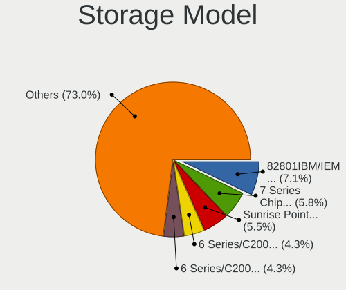

| Model                                                                                   | Computers | Percent |
|-----------------------------------------------------------------------------------------|-----------|---------|
| Intel 82801IBM/IEM (ICH9M/ICH9M-E) 4 port SATA Controller [AHCI mode]                   | 43        | 7.12%   |
| Intel 7 Series Chipset Family 6-port SATA Controller [AHCI mode]                        | 35        | 5.79%   |
| Intel Sunrise Point-LP SATA Controller [AHCI mode]                                      | 33        | 5.46%   |
| Intel 6 Series/C200 Series Chipset Family Desktop SATA Controller (IDE mode, ports 4-5) | 26        | 4.3%    |
| Intel 6 Series/C200 Series Chipset Family Desktop SATA Controller (IDE mode, ports 0-3) | 26        | 4.3%    |
| Intel NM10/ICH7 Family SATA Controller [IDE mode]                                       | 25        | 4.14%   |
| Intel 8 Series/C220 Series Chipset Family 6-port SATA Controller 1 [AHCI mode]          | 25        | 4.14%   |
| Intel 6 Series/C200 Series Chipset Family 6 port Desktop SATA AHCI Controller           | 20        | 3.31%   |
| Intel 82801G (ICH7 Family) IDE Controller                                               | 18        | 2.98%   |
| Intel 82801 Mobile SATA Controller [RAID mode]                                          | 18        | 2.98%   |
| Intel 8 Series SATA Controller 1 [AHCI mode]                                            | 18        | 2.98%   |
| AMD FCH SATA Controller [AHCI mode]                                                     | 18        | 2.98%   |
| Intel Wildcat Point-LP SATA Controller [AHCI Mode]                                      | 13        | 2.15%   |
| Intel 5 Series/3400 Series Chipset 4 port SATA AHCI Controller                          | 13        | 2.15%   |
| Intel 6 Series/C200 Series Chipset Family 6 port Mobile SATA AHCI Controller            | 12        | 1.99%   |
| Intel Volume Management Device NVMe RAID Controller                                     | 11        | 1.82%   |
| Intel 5 Series/3400 Series Chipset 4 port SATA IDE Controller                           | 8         | 1.32%   |
| Intel 5 Series/3400 Series Chipset 2 port SATA IDE Controller                           | 8         | 1.32%   |
| Samsung NVMe SSD Controller 980 (DRAM-less)                                             | 7         | 1.16%   |
| Intel SATA Controller [RAID mode]                                                       | 7         | 1.16%   |
| Intel 7 Series/C210 Series Chipset Family 6-port SATA Controller [AHCI mode]            | 7         | 1.16%   |
| Intel SSD 670p Series [Keystone Harbor]                                                 | 6         | 0.99%   |
| AMD 400 Series Chipset SATA Controller                                                  | 6         | 0.99%   |
| ADATA XPG GAMMIXS1 1L, XPG GAMMIX S5, LEGEND 710 / 740, SWORDFISH NVMe SSD (DRAM-less)  | 6         | 0.99%   |
| Silicon Motion SM2263EN/SM2263XT (DRAM-less) NVMe SSD Controllers                       | 5         | 0.83%   |
| Samsung NVMe SSD Controller SM961/PM961/SM963                                           | 5         | 0.83%   |
| Realtek RTS5763DL NVMe SSD Controller (DRAM-less)                                       | 5         | 0.83%   |
| Intel Celeron/Pentium Silver Processor SATA Controller                                  | 5         | 0.83%   |
| Intel Atom Processor E3800 Series SATA AHCI Controller                                  | 5         | 0.83%   |
| Intel 5 Series/3400 Series Chipset 6 port SATA AHCI Controller                          | 5         | 0.83%   |
| AMD 500 Series Chipset SATA Controller                                                  | 5         | 0.83%   |
| Samsung NVMe SSD Controller SM981/PM981/PM983                                           | 4         | 0.66%   |
| MAXIO (Hangzhou) NVMe SSD Controller MAP1202 (DRAM-less)                                | 4         | 0.66%   |
| Intel Q170/Q150/B150/H170/H110/Z170/CM236 Chipset SATA Controller [AHCI Mode]           | 4         | 0.66%   |
| Intel Comet Lake SATA AHCI Controller                                                   | 4         | 0.66%   |
| Intel Cannon Lake PCH SATA AHCI Controller                                              | 4         | 0.66%   |
| Intel Atom/Celeron/Pentium Processor x5-E8000/J3xxx/N3xxx Series SATA Controller        | 4         | 0.66%   |
| Intel Alder Lake-S PCH SATA Controller [AHCI Mode]                                      | 4         | 0.66%   |
| VIA VT82C586A/B/VT82C686/A/B/VT823x/A/C PIPC Bus Master IDE                             | 3         | 0.5%    |
| Nvidia MCP79 AHCI Controller                                                            | 3         | 0.5%    |

Storage Kind
------------

Kind of storage controller (IDE, SATA, NVMe, SAS, ...)

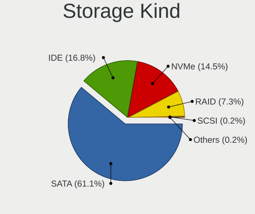

| Kind | Computers | Percent |
|------|-----------|---------|
| SATA | 317       | 61.08%  |
| IDE  | 87        | 16.76%  |
| NVMe | 75        | 14.45%  |
| RAID | 38        | 7.32%   |
| SAS  | 1         | 0.19%   |
| SCSI | 1         | 0.19%   |

Processor
---------

CPU Vendor
----------

Processor vendors

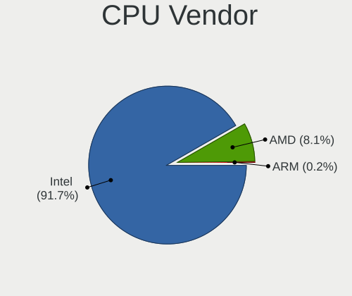

| Vendor | Computers | Percent |
|--------|-----------|---------|
| Intel  | 421       | 91.72%  |
| AMD    | 37        | 8.06%   |
| ARM    | 1         | 0.22%   |

CPU Model
---------

Processor models

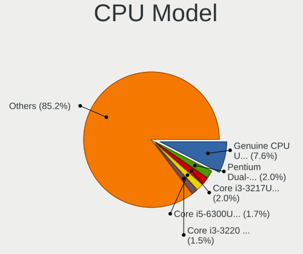

| Model                                       | Computers | Percent |
|---------------------------------------------|-----------|---------|
| Intel Genuine CPU U7300 @ 1.30GHz           | 35        | 7.59%   |
| Intel Pentium Dual-Core CPU E5700 @ 3.00GHz | 9         | 1.95%   |
| Intel Core i3-3217U CPU @ 1.80GHz           | 9         | 1.95%   |
| Intel Core i5-6300U CPU @ 2.40GHz           | 8         | 1.74%   |
| Intel Core i3-3220 CPU @ 3.30GHz            | 7         | 1.52%   |
| Intel Core i7-2670QM CPU @ 2.20GHz          | 6         | 1.3%    |
| Intel Core i5-7200U CPU @ 2.50GHz           | 6         | 1.3%    |
| Intel Core i3 CPU M 380 @ 2.53GHz           | 6         | 1.3%    |
| Intel Core i3 CPU M 370 @ 2.40GHz           | 6         | 1.3%    |
| Intel Pentium CPU G2020 @ 2.90GHz           | 5         | 1.08%   |
| Intel Core i5-8350U CPU @ 1.70GHz           | 5         | 1.08%   |
| Intel Core i5-8250U CPU @ 1.60GHz           | 5         | 1.08%   |
| Intel Core i5-5200U CPU @ 2.20GHz           | 5         | 1.08%   |
| Intel Core i5-3210M CPU @ 2.50GHz           | 5         | 1.08%   |
| Intel Core i3-5005U CPU @ 2.00GHz           | 5         | 1.08%   |
| Intel Core i3-4005U CPU @ 1.70GHz           | 5         | 1.08%   |
| Intel Core i3-3110M CPU @ 2.40GHz           | 5         | 1.08%   |
| Intel Core i3-2100 CPU @ 3.10GHz            | 5         | 1.08%   |
| Intel Core 2 Duo CPU E7500 @ 2.93GHz        | 5         | 1.08%   |
| Intel Pentium Dual CPU E2200 @ 2.20GHz      | 4         | 0.87%   |
| Intel Pentium CPU G620 @ 2.60GHz            | 4         | 0.87%   |
| Intel Core i7-6600U CPU @ 2.60GHz           | 4         | 0.87%   |
| Intel Core i5-6200U CPU @ 2.30GHz           | 4         | 0.87%   |
| Intel Core i3-2120 CPU @ 3.30GHz            | 4         | 0.87%   |
| Intel Celeron CPU N3060 @ 1.60GHz           | 4         | 0.87%   |
| Intel 11th Gen Core i7-1165G7 @ 2.80GHz     | 4         | 0.87%   |
| Intel 11th Gen Core i5-1135G7 @ 2.40GHz     | 4         | 0.87%   |
| Intel Pentium Dual-Core CPU T4500 @ 2.30GHz | 3         | 0.65%   |
| Intel Pentium Dual-Core CPU E5400 @ 2.70GHz | 3         | 0.65%   |
| Intel Pentium Dual-Core CPU E5300 @ 2.60GHz | 3         | 0.65%   |
| Intel Pentium CPU N3540 @ 2.16GHz           | 3         | 0.65%   |
| Intel Core i7-7700HQ CPU @ 2.80GHz          | 3         | 0.65%   |
| Intel Core i7-7500U CPU @ 2.70GHz           | 3         | 0.65%   |
| Intel Core i7-6500U CPU @ 2.50GHz           | 3         | 0.65%   |
| Intel Core i7-2760QM CPU @ 2.40GHz          | 3         | 0.65%   |
| Intel Core i5-4590 CPU @ 3.30GHz            | 3         | 0.65%   |
| Intel Core i5-4570 CPU @ 3.20GHz            | 3         | 0.65%   |
| Intel Core i5-4460 CPU @ 3.20GHz            | 3         | 0.65%   |
| Intel Core i5-4210U CPU @ 1.70GHz           | 3         | 0.65%   |
| Intel Core i5-3470 CPU @ 3.20GHz            | 3         | 0.65%   |

CPU Model Family
----------------

Processor model prefix

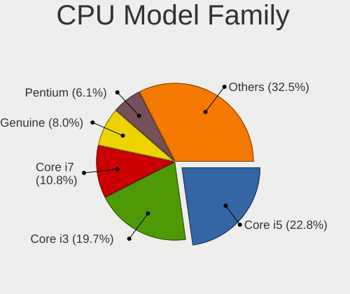

| Model                   | Computers | Percent |
|-------------------------|-----------|---------|
| Intel Core i5           | 105       | 22.78%  |
| Intel Core i3           | 91        | 19.74%  |
| Intel Core i7           | 50        | 10.85%  |
| Intel Genuine           | 37        | 8.03%   |
| Intel Pentium           | 28        | 6.07%   |
| Other                   | 26        | 5.64%   |
| Intel Core 2 Duo        | 22        | 4.77%   |
| Intel Pentium Dual-Core | 21        | 4.56%   |
| Intel Celeron           | 18        | 3.9%    |
| AMD Ryzen 5             | 10        | 2.17%   |
| AMD Ryzen 7             | 8         | 1.74%   |
| Intel Pentium Dual      | 7         | 1.52%   |
| Intel Atom              | 7         | 1.52%   |
| Intel Xeon              | 5         | 1.08%   |
| Intel Pentium 4         | 2         | 0.43%   |
| Intel Core 2 Quad       | 2         | 0.43%   |
| AMD Ryzen 5 PRO         | 2         | 0.43%   |
| AMD Ryzen 3             | 2         | 0.43%   |
| AMD E1                  | 2         | 0.43%   |
| AMD A4                  | 2         | 0.43%   |
| Intel Xeon Gold         | 1         | 0.22%   |
| Intel Pentium D         | 1         | 0.22%   |
| Intel Core i9           | 1         | 0.22%   |
| ARM Allwinner           | 1         | 0.22%   |
| AMD Ryzen 9             | 1         | 0.22%   |
| AMD Ryzen 7 PRO         | 1         | 0.22%   |
| AMD FX                  | 1         | 0.22%   |
| AMD E2                  | 1         | 0.22%   |
| AMD C-70                | 1         | 0.22%   |
| AMD Athlon Neo X2       | 1         | 0.22%   |
| AMD Athlon II Dual-Core | 1         | 0.22%   |
| AMD Athlon 64           | 1         | 0.22%   |
| AMD Athlon              | 1         | 0.22%   |
| AMD A8                  | 1         | 0.22%   |

CPU Cores
---------

Number of processor cores

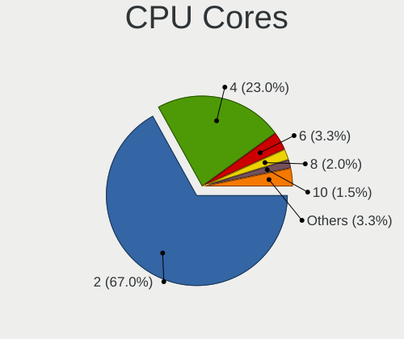

| Number | Computers | Percent |
|--------|-----------|---------|
| 2      | 308       | 66.96%  |
| 4      | 106       | 23.04%  |
| 6      | 15        | 3.26%   |
| 8      | 9         | 1.96%   |
| 10     | 7         | 1.52%   |
| 1      | 7         | 1.52%   |
| 16     | 2         | 0.43%   |
| 14     | 2         | 0.43%   |
| 12     | 2         | 0.43%   |
| 40     | 1         | 0.22%   |
| 3      | 1         | 0.22%   |

CPU Sockets
-----------

Number of sockets

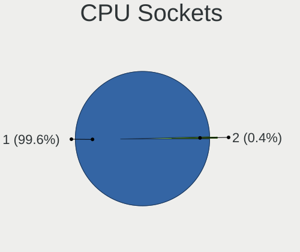

| Number | Computers | Percent |
|--------|-----------|---------|
| 1      | 457       | 99.56%  |
| 2      | 2         | 0.44%   |

CPU Threads
-----------

Threads per core (Hyper-Threading)

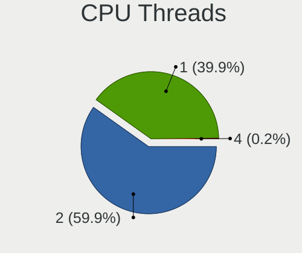

| Number | Computers | Percent |
|--------|-----------|---------|
| 2      | 276       | 59.87%  |
| 1      | 184       | 39.91%  |
| 4      | 1         | 0.22%   |

CPU Op-Modes
------------

CPU Operation Modes (32-bit, 64-bit)

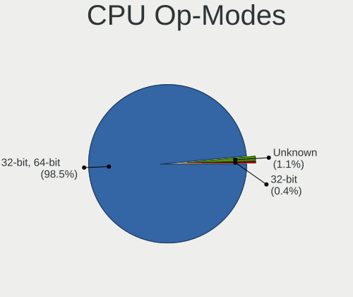

| Op mode        | Computers | Percent |
|----------------|-----------|---------|
| 32-bit, 64-bit | 453       | 98.48%  |
| Unknown        | 5         | 1.09%   |
| 32-bit         | 2         | 0.43%   |

CPU Microcode
-------------

Microcode number

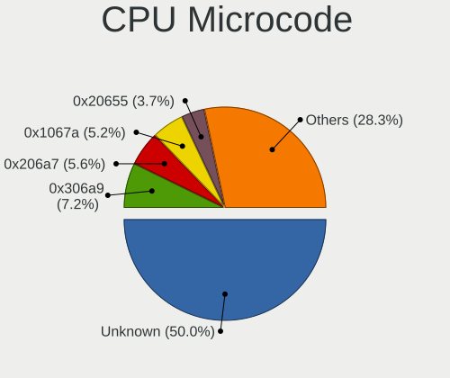

| Number     | Computers | Percent |
|------------|-----------|---------|
| Unknown    | 242       | 50%     |
| 0x306a9    | 35        | 7.23%   |
| 0x206a7    | 27        | 5.58%   |
| 0x1067a    | 25        | 5.17%   |
| 0x20655    | 18        | 3.72%   |
| 0x40651    | 13        | 2.69%   |
| 0x306c3    | 13        | 2.69%   |
| 0x406e3    | 12        | 2.48%   |
| 0x806e9    | 9         | 1.86%   |
| 0x306d4    | 9         | 1.86%   |
| 0x30678    | 8         | 1.65%   |
| 0x6fd      | 6         | 1.24%   |
| 0x906e9    | 5         | 1.03%   |
| 0x806ea    | 5         | 1.03%   |
| 0x706a8    | 3         | 0.62%   |
| 0x20652    | 3         | 0.62%   |
| 0x0a50000d | 3         | 0.62%   |
| 0x806ec    | 2         | 0.41%   |
| 0x806c1    | 2         | 0.41%   |
| 0x6fb      | 2         | 0.41%   |
| 0x506e3    | 2         | 0.41%   |
| 0x506c9    | 2         | 0.41%   |
| 0x406c4    | 2         | 0.41%   |
| 0x306e4    | 2         | 0.41%   |
| 0x30661    | 2         | 0.41%   |
| 0x10676    | 2         | 0.41%   |
| 0x08701021 | 2         | 0.41%   |
| 0x08600106 | 2         | 0.41%   |
| 0x0800820d | 2         | 0.41%   |
| 0x05000119 | 2         | 0.41%   |
| 0xf65      | 1         | 0.21%   |
| 0xf49      | 1         | 0.21%   |
| 0xa0652    | 1         | 0.21%   |
| 0x906eb    | 1         | 0.21%   |
| 0x906a4    | 1         | 0.21%   |
| 0x706a1    | 1         | 0.21%   |
| 0x6ec      | 1         | 0.21%   |
| 0x6e8      | 1         | 0.21%   |
| 0x50654    | 1         | 0.21%   |
| 0x406c3    | 1         | 0.21%   |

CPU Microarch
-------------

Microarchitecture

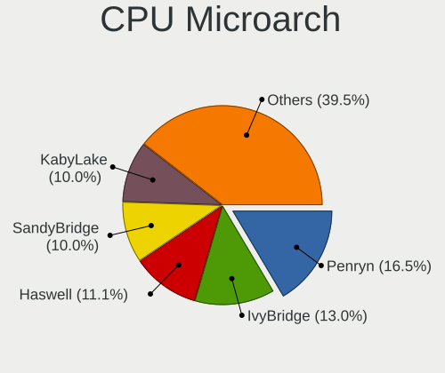

| Name             | Computers | Percent |
|------------------|-----------|---------|
| Penryn           | 76        | 16.49%  |
| IvyBridge        | 60        | 13.02%  |
| Haswell          | 51        | 11.06%  |
| SandyBridge      | 46        | 9.98%   |
| KabyLake         | 46        | 9.98%   |
| Westmere         | 27        | 5.86%   |
| Skylake          | 27        | 5.86%   |
| Silvermont       | 17        | 3.69%   |
| Core             | 14        | 3.04%   |
| Broadwell        | 14        | 3.04%   |
| TigerLake        | 13        | 2.82%   |
| Unknown          | 11        | 2.39%   |
| Zen 3            | 8         | 1.74%   |
| Alderlake Hybrid | 8         | 1.74%   |
| Zen+             | 6         | 1.3%    |
| Goldmont plus    | 6         | 1.3%    |
| Zen 2            | 5         | 1.08%   |
| NetBurst         | 3         | 0.65%   |
| Bonnell          | 3         | 0.65%   |
| Bobcat           | 3         | 0.65%   |
| Zen              | 2         | 0.43%   |
| P6               | 2         | 0.43%   |
| K8 Hammer        | 2         | 0.43%   |
| Jaguar           | 2         | 0.43%   |
| Goldmont         | 2         | 0.43%   |
| Excavator        | 2         | 0.43%   |
| CometLake        | 2         | 0.43%   |
| Puma             | 1         | 0.22%   |
| K10              | 1         | 0.22%   |
| Bulldozer        | 1         | 0.22%   |

Graphics
--------

GPU Vendor
----------

Vendors of graphics cards

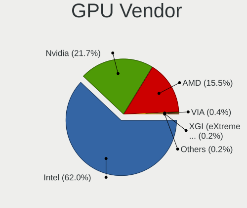

| Vendor                                       | Computers | Percent |
|----------------------------------------------|-----------|---------|
| Intel                                        | 351       | 62.01%  |
| Nvidia                                       | 123       | 21.73%  |
| AMD                                          | 88        | 15.55%  |
| VIA Technologies                             | 2         | 0.35%   |
| XGI Technology (eXtreme Graphics Innovation) | 1         | 0.18%   |
| Matrox Electronics Systems                   | 1         | 0.18%   |

GPU Model
---------

Graphics card models

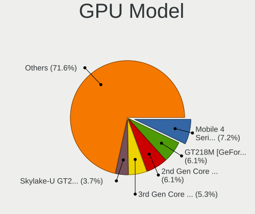

| Model                                                                                    | Computers | Percent |
|------------------------------------------------------------------------------------------|-----------|---------|
| Intel Mobile 4 Series Chipset Integrated Graphics Controller                             | 41        | 7.19%   |
| Nvidia GT218M [GeForce G210M]                                                            | 35        | 6.14%   |
| Intel 2nd Generation Core Processor Family Integrated Graphics Controller                | 35        | 6.14%   |
| Intel 3rd Gen Core processor Graphics Controller                                         | 30        | 5.26%   |
| Intel Skylake-U GT2 [HD Graphics 520]                                                    | 21        | 3.68%   |
| Intel Haswell-ULT Integrated Graphics Controller                                         | 20        | 3.51%   |
| Intel Core Processor Integrated Graphics Controller                                      | 20        | 3.51%   |
| Intel Xeon E3-1200 v2/3rd Gen Core processor Graphics Controller                         | 16        | 2.81%   |
| Intel 4 Series Chipset Integrated Graphics Controller                                    | 16        | 2.81%   |
| Intel Xeon E3-1200 v3/4th Gen Core Processor Integrated Graphics Controller              | 14        | 2.46%   |
| Intel Kaby Lake-R GT2 [UHD Graphics 620]                                                 | 14        | 2.46%   |
| Intel TigerLake-LP GT2 [Iris Xe Graphics]                                                | 13        | 2.28%   |
| Intel Kaby Lake-U GT2 [HD Graphics 620]                                                  | 13        | 2.28%   |
| Intel Broadwell-U GT2 [HD Graphics 5500]                                                 | 12        | 2.11%   |
| AMD Cedar [Radeon HD 5000/6000/7350/8350 Series]                                         | 12        | 2.11%   |
| AMD Sun XT [Radeon HD 8670A/8670M/8690M / R5 M330 / M430 / Radeon 520 Mobile]            | 11        | 1.93%   |
| Intel Atom Processor Z36xxx/Z37xxx Series Graphics & Display                             | 10        | 1.75%   |
| Intel 4th Gen Core Processor Integrated Graphics Controller                              | 8         | 1.4%    |
| Intel Atom/Celeron/Pentium Processor x5-E8000/J3xxx/N3xxx Integrated Graphics Controller | 7         | 1.23%   |
| Nvidia GF117M [GeForce 610M/710M/810M/820M / GT 620M/625M/630M/720M]                     | 6         | 1.05%   |
| Intel GeminiLake [UHD Graphics 600]                                                      | 6         | 1.05%   |
| Nvidia GT218 [GeForce 210]                                                               | 5         | 0.88%   |
| Intel Kaby Lake-H GT2 [HD Graphics 630]                                                  | 5         | 0.88%   |
| AMD Cezanne [Radeon Vega Series / Radeon Vega Mobile Series]                             | 5         | 0.88%   |
| Intel 4th Generation Core Processor Family Integrated Graphics Controller                | 4         | 0.7%    |
| AMD Picasso/Raven 2 [Radeon Vega Series / Radeon Vega Mobile Series]                     | 4         | 0.7%    |
| Nvidia GK208B [GeForce GT 710]                                                           | 3         | 0.53%   |
| Nvidia GF108M [GeForce GT 525M]                                                          | 3         | 0.53%   |
| Nvidia GF108 [GeForce GT 730]                                                            | 3         | 0.53%   |
| Intel WhiskeyLake-U GT2 [UHD Graphics 620]                                               | 3         | 0.53%   |
| Intel Skylake-S GT2 [HD Graphics 530]                                                    | 3         | 0.53%   |
| Intel CometLake-U GT2 [UHD Graphics]                                                     | 3         | 0.53%   |
| Intel Atom Processor D2xxx/N2xxx Integrated Graphics Controller                          | 3         | 0.53%   |
| Intel Alder Lake-P GT2 [Iris Xe Graphics]                                                | 3         | 0.53%   |
| Intel 82G33/G31 Express Integrated Graphics Controller                                   | 3         | 0.53%   |
| AMD Topaz XT [Radeon R7 M260/M265 / M340/M360 / M440/M445 / 530/535 / 620/625 Mobile]    | 3         | 0.53%   |
| AMD Thames [Radeon HD 7550M/7570M/7650M]                                                 | 3         | 0.53%   |
| AMD Renoir [Radeon Vega Series / Radeon Vega Mobile Series]                              | 3         | 0.53%   |
| Nvidia TU116 [GeForce GTX 1660 SUPER]                                                    | 2         | 0.35%   |
| Nvidia MCP89 [GeForce 320M]                                                              | 2         | 0.35%   |

GPU Combo
---------

Combinations of graphics cards

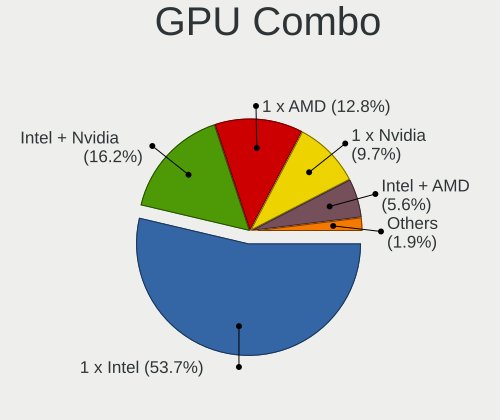

| Name           | Computers | Percent |
|----------------|-----------|---------|
| 1 x Intel      | 248       | 53.68%  |
| Intel + Nvidia | 75        | 16.23%  |
| 1 x AMD        | 59        | 12.77%  |
| 1 x Nvidia     | 45        | 9.74%   |
| Intel + AMD    | 26        | 5.63%   |
| 1 x VIA        | 2         | 0.43%   |
| AMD + Nvidia   | 2         | 0.43%   |
| Other          | 1         | 0.22%   |
| 2 x Nvidia     | 1         | 0.22%   |
| 2 x AMD        | 1         | 0.22%   |
| 1 x XGI        | 1         | 0.22%   |
| 1 x Matrox     | 1         | 0.22%   |

GPU Driver
----------

Free vs proprietary

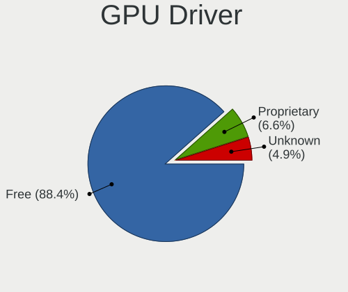

| Driver      | Computers | Percent |
|-------------|-----------|---------|
| Free        | 413       | 88.44%  |
| Proprietary | 31        | 6.64%   |
| Unknown     | 23        | 4.93%   |

GPU Memory
----------

Total video memory

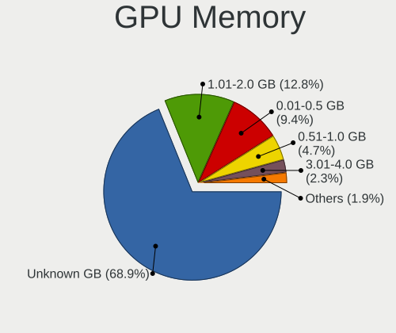

| Size in GB | Computers | Percent |
|------------|-----------|---------|
| Unknown    | 323       | 68.87%  |
| 1.01-2.0   | 60        | 12.79%  |
| 0.01-0.5   | 44        | 9.38%   |
| 0.51-1.0   | 22        | 4.69%   |
| 3.01-4.0   | 11        | 2.35%   |
| 7.01-8.0   | 5         | 1.07%   |
| 5.01-6.0   | 2         | 0.43%   |
| 2.01-3.0   | 1         | 0.21%   |
| 8.01-16.0  | 1         | 0.21%   |

Monitor
-------

Monitor Vendor
--------------

Monitor vendors

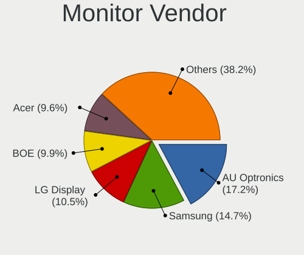

| Vendor                  | Computers | Percent |
|-------------------------|-----------|---------|
| AU Optronics            | 82        | 17.19%  |
| Samsung Electronics     | 70        | 14.68%  |
| LG Display              | 50        | 10.48%  |
| BOE                     | 47        | 9.85%   |
| Acer                    | 46        | 9.64%   |
| Chimei Innolux          | 31        | 6.5%    |
| AOC                     | 18        | 3.77%   |
| Hewlett-Packard         | 17        | 3.56%   |
| Chi Mei Optoelectronics | 17        | 3.56%   |
| Goldstar                | 10        | 2.1%    |
| Apple                   | 8         | 1.68%   |
| KTC                     | 7         | 1.47%   |
| Dell                    | 7         | 1.47%   |
| BenQ                    | 6         | 1.26%   |
| Lenovo                  | 5         | 1.05%   |
| Sharp                   | 4         | 0.84%   |
| InfoVision              | 4         | 0.84%   |
| Ancor Communications    | 4         | 0.84%   |
| Unknown                 | 4         | 0.84%   |
| Unknown (XXX)           | 2         | 0.42%   |
| Unknown                 | 2         | 0.42%   |
| SKY                     | 2         | 0.42%   |
| PANDA                   | 2         | 0.42%   |
| MStar                   | 2         | 0.42%   |
| Fujitsu Siemens         | 2         | 0.42%   |
| Denver                  | 2         | 0.42%   |
| ASUSTek Computer        | 2         | 0.42%   |
| ___                     | 1         | 0.21%   |
| Westinghouse            | 1         | 0.21%   |
| TSN                     | 1         | 0.21%   |
| TMU                     | 1         | 0.21%   |
| TGC                     | 1         | 0.21%   |
| STD                     | 1         | 0.21%   |
| Skyworth                | 1         | 0.21%   |
| SGT                     | 1         | 0.21%   |
| PTW                     | 1         | 0.21%   |
| PiLot                   | 1         | 0.21%   |
| Philips                 | 1         | 0.21%   |
| Packard Bell            | 1         | 0.21%   |
| MDA                     | 1         | 0.21%   |

Monitor Model
-------------

Monitor models

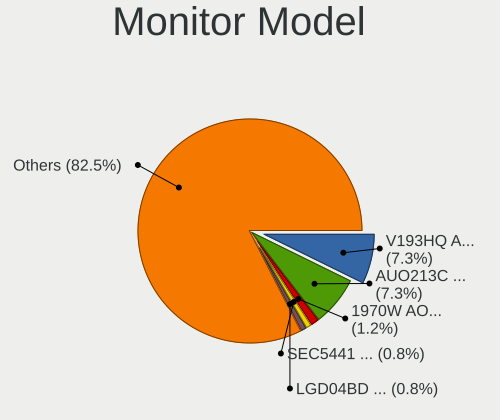

| Model                                                                    | Computers | Percent |
|--------------------------------------------------------------------------|-----------|---------|
| AU Optronics LCD Monitor AUO213C 1366x768 309x174mm 14.0-inch            | 35        | 7.28%   |
| Acer V193HQ ACR00F9 1366x768 410x230mm 18.5-inch                         | 35        | 7.28%   |
| AOC 1970W AOC1970 1366x768 410x230mm 18.5-inch                           | 6         | 1.25%   |
| Samsung Electronics LCD Monitor SEC5441 1280x800 331x207mm 15.4-inch     | 4         | 0.83%   |
| LG Display LCD Monitor LGD04BD 1366x768 344x194mm 15.5-inch              | 4         | 0.83%   |
| LG Display LCD Monitor LGD045C 1366x768 345x194mm 15.6-inch              | 4         | 0.83%   |
| Chimei Innolux LCD Monitor CMN15CA 1366x768 344x193mm 15.5-inch          | 4         | 0.83%   |
| Chimei Innolux LCD Monitor CMN14C0 1920x1080 308x173mm 13.9-inch         | 4         | 0.83%   |
| Chi Mei Optoelectronics LCD Monitor CMO15A4 1366x768 344x194mm 15.5-inch | 4         | 0.83%   |
| BOE LCD Monitor BOE0671 1366x768 344x194mm 15.5-inch                     | 4         | 0.83%   |
| BOE LCD Monitor BOE0615 1366x768 309x173mm 13.9-inch                     | 4         | 0.83%   |
| AU Optronics LCD Monitor AUO22EC 1366x768 344x193mm 15.5-inch            | 4         | 0.83%   |
| Unknown                                                                  | 4         | 0.83%   |
| Samsung Electronics SMS22A100 SAM0868 1920x1080 477x268mm 21.5-inch      | 3         | 0.62%   |
| Samsung Electronics SMBX1931N SAM0768 1366x768 410x230mm 18.5-inch       | 3         | 0.62%   |
| Samsung Electronics LCD Monitor SEC3642 1366x768 344x194mm 15.5-inch     | 3         | 0.62%   |
| Samsung Electronics LCD Monitor SDC4347 1366x768 344x193mm 15.5-inch     | 3         | 0.62%   |
| Samsung Electronics LCD Monitor SDC4146 1366x768 344x194mm 15.5-inch     | 3         | 0.62%   |
| Chimei Innolux LCD Monitor CMN15DB 1366x768 344x193mm 15.5-inch          | 3         | 0.62%   |
| BOE LCD Monitor BOE070D 1366x768 309x173mm 13.9-inch                     | 3         | 0.62%   |
| BOE LCD Monitor BOE0672 1366x768 344x194mm 15.5-inch                     | 3         | 0.62%   |
| AU Optronics LCD Monitor AUO40EC 1366x768 344x193mm 15.5-inch            | 3         | 0.62%   |
| AOC F22 AOC2200 1920x1080 476x268mm 21.5-inch                            | 3         | 0.62%   |
| Unknown (XXX) HDMI XXX0029 1920x1080 1152x648mm 52.0-inch                | 2         | 0.42%   |
| Sharp HDMI SHP10DB 1920x1080 1330x750mm 60.1-inch                        | 2         | 0.42%   |
| Samsung Electronics SMS19A100 SAM0867 1366x768 410x230mm 18.5-inch       | 2         | 0.42%   |
| Samsung Electronics SMB2030N SAM0634 1600x900 443x249mm 20.0-inch        | 2         | 0.42%   |
| Samsung Electronics S19C150 SAM0AE6 1366x768 410x230mm 18.5-inch         | 2         | 0.42%   |
| Samsung Electronics LF24T35 SAM707D 1920x1080 528x297mm 23.9-inch        | 2         | 0.42%   |
| Samsung Electronics LCD Monitor SDC4C51 1366x768 344x194mm 15.5-inch     | 2         | 0.42%   |
| MStar Demo MST0030 1920x1080 708x398mm 32.0-inch                         | 2         | 0.42%   |
| LG Display LP156WH1-TLA3 LGD01C2 1366x768 344x194mm 15.5-inch            | 2         | 0.42%   |
| LG Display LCD Monitor LGD0525 1366x768 344x194mm 15.5-inch              | 2         | 0.42%   |
| LG Display LCD Monitor LGD0465 1366x768 344x194mm 15.5-inch              | 2         | 0.42%   |
| LG Display LCD Monitor LGD039F 1366x768 345x194mm 15.6-inch              | 2         | 0.42%   |
| LG Display LCD Monitor LGD0395 1366x768 344x194mm 15.5-inch              | 2         | 0.42%   |
| LG Display LCD Monitor LGD038E 1366x768 344x194mm 15.5-inch              | 2         | 0.42%   |
| LG Display LCD Monitor LGD033A 1366x768 344x194mm 15.5-inch              | 2         | 0.42%   |
| LG Display LCD Monitor LGD02DC 1366x768 344x194mm 15.5-inch              | 2         | 0.42%   |
| Lenovo LCD Monitor LEN40B0 1366x768 344x194mm 15.5-inch                  | 2         | 0.42%   |

Monitor Resolution
------------------

Monitor screen resolution

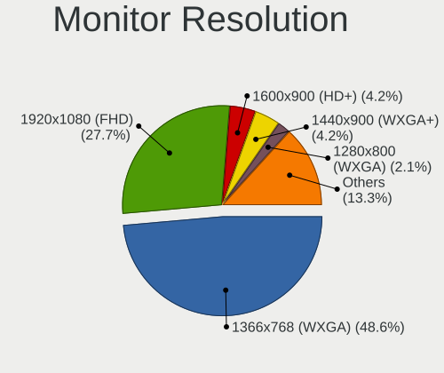

| Resolution         | Computers | Percent |
|--------------------|-----------|---------|
| 1366x768 (WXGA)    | 209       | 48.6%   |
| 1920x1080 (FHD)    | 119       | 27.67%  |
| 1600x900 (HD+)     | 18        | 4.19%   |
| 1440x900 (WXGA+)   | 18        | 4.19%   |
| 1280x800 (WXGA)    | 9         | 2.09%   |
| 3840x2160 (4K)     | 8         | 1.86%   |
| 2560x1440 (QHD)    | 8         | 1.86%   |
| 1680x1050 (WSXGA+) | 8         | 1.86%   |
| 1280x1024 (SXGA)   | 8         | 1.86%   |
| 1920x1200 (WUXGA)  | 6         | 1.4%    |
| 1360x768           | 5         | 1.16%   |
| 2880x1800          | 2         | 0.47%   |
| 1920x540           | 2         | 0.47%   |
| 1024x600           | 2         | 0.47%   |
| 3840x2400          | 1         | 0.23%   |
| 2560x1600          | 1         | 0.23%   |
| 2160x1440          | 1         | 0.23%   |
| 1680x945           | 1         | 0.23%   |
| 1600x1200          | 1         | 0.23%   |
| 1280x720 (HD)      | 1         | 0.23%   |
| 1152x864           | 1         | 0.23%   |
| 1024x768 (XGA)     | 1         | 0.23%   |

Monitor Diagonal
----------------

Diagonal size in inches

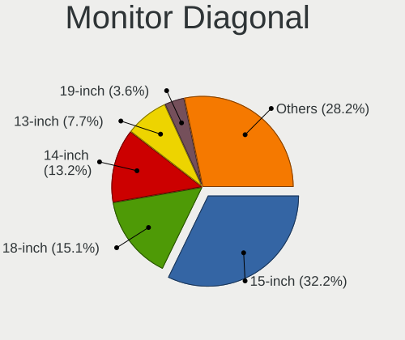

| Inches  | Computers | Percent |
|---------|-----------|---------|
| 15      | 154       | 32.22%  |
| 18      | 72        | 15.06%  |
| 14      | 63        | 13.18%  |
| 13      | 37        | 7.74%   |
| 19      | 17        | 3.56%   |
| 27      | 15        | 3.14%   |
| 21      | 15        | 3.14%   |
| 17      | 15        | 3.14%   |
| 23      | 12        | 2.51%   |
| 24      | 11        | 2.3%    |
| 20      | 10        | 2.09%   |
| Unknown | 10        | 2.09%   |
| 12      | 9         | 1.88%   |
| 22      | 7         | 1.46%   |
| 52      | 5         | 1.05%   |
| 40      | 4         | 0.84%   |
| 16      | 4         | 0.84%   |
| 11      | 3         | 0.63%   |
| 10      | 3         | 0.63%   |
| 60      | 2         | 0.42%   |
| 31      | 2         | 0.42%   |
| 84      | 1         | 0.21%   |
| 72      | 1         | 0.21%   |
| 49      | 1         | 0.21%   |
| 48      | 1         | 0.21%   |
| 46      | 1         | 0.21%   |
| 37      | 1         | 0.21%   |
| 32      | 1         | 0.21%   |
| 29      | 1         | 0.21%   |

Monitor Width
-------------

Physical width

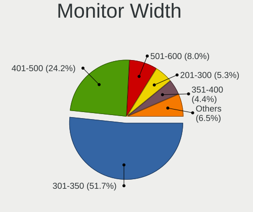

| Width in mm | Computers | Percent |
|-------------|-----------|---------|
| 301-350     | 246       | 51.68%  |
| 401-500     | 115       | 24.16%  |
| 501-600     | 38        | 7.98%   |
| 201-300     | 25        | 5.25%   |
| 351-400     | 21        | 4.41%   |
| 1001-1500   | 10        | 2.1%    |
| Unknown     | 10        | 2.1%    |
| 801-900     | 5         | 1.05%   |
| 601-700     | 3         | 0.63%   |
| 1501-2000   | 2         | 0.42%   |
| 701-800     | 1         | 0.21%   |

Aspect Ratio
------------

Proportional relationship between the width and the height

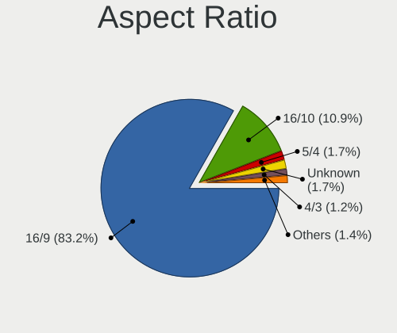

| Ratio   | Computers | Percent |
|---------|-----------|---------|
| 16/9    | 352       | 83.22%  |
| 16/10   | 46        | 10.87%  |
| 5/4     | 7         | 1.65%   |
| Unknown | 7         | 1.65%   |
| 4/3     | 5         | 1.18%   |
| 32/9    | 3         | 0.71%   |
| 3/2     | 2         | 0.47%   |
| 6/5     | 1         | 0.24%   |

Monitor Area
------------

Area in inch²

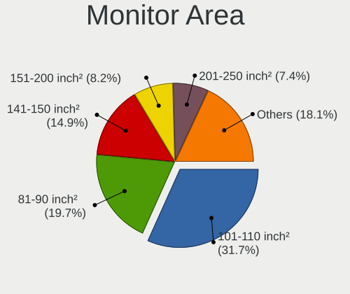

| Area in inch² | Computers | Percent |
|----------------|-----------|---------|
| 101-110        | 151       | 31.72%  |
| 81-90          | 94        | 19.75%  |
| 141-150        | 71        | 14.92%  |
| 151-200        | 39        | 8.19%   |
| 201-250        | 35        | 7.35%   |
| 301-350        | 15        | 3.15%   |
| More than 1000 | 10        | 2.1%    |
| Unknown        | 10        | 2.1%    |
| 121-130        | 9         | 1.89%   |
| 61-70          | 8         | 1.68%   |
| 71-80          | 7         | 1.47%   |
| 111-120        | 7         | 1.47%   |
| 501-1000       | 7         | 1.47%   |
| 351-500        | 4         | 0.84%   |
| 51-60          | 3         | 0.63%   |
| 41-50          | 3         | 0.63%   |
| 131-140        | 2         | 0.42%   |
| 251-300        | 1         | 0.21%   |

Pixel Density
-------------

Pixels per inch

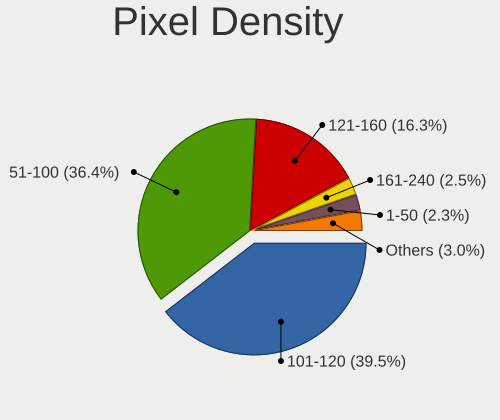

| Density       | Computers | Percent |
|---------------|-----------|---------|
| 101-120       | 187       | 39.53%  |
| 51-100        | 172       | 36.36%  |
| 121-160       | 77        | 16.28%  |
| 161-240       | 12        | 2.54%   |
| 1-50          | 11        | 2.33%   |
| Unknown       | 10        | 2.11%   |
| More than 240 | 4         | 0.85%   |

Multiple Monitors
-----------------

Total monitors connected

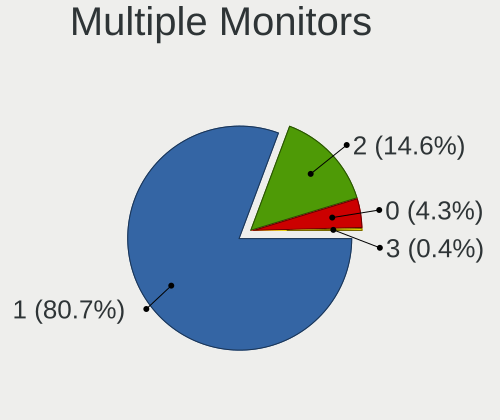

| Total | Computers | Percent |
|-------|-----------|---------|
| 1     | 376       | 80.69%  |
| 2     | 68        | 14.59%  |
| 0     | 20        | 4.29%   |
| 3     | 2         | 0.43%   |

Network
-------

Net Controller Vendor
---------------------

Controller vendors

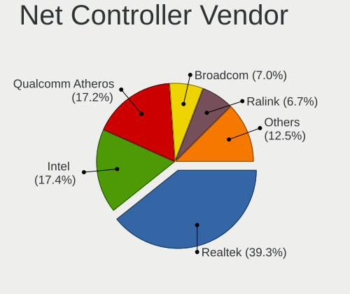

| Vendor                          | Computers | Percent |
|---------------------------------|-----------|---------|
| Realtek Semiconductor           | 293       | 39.28%  |
| Intel                           | 130       | 17.43%  |
| Qualcomm Atheros                | 128       | 17.16%  |
| Broadcom                        | 52        | 6.97%   |
| Ralink Technology               | 50        | 6.7%    |
| Ralink                          | 15        | 2.01%   |
| Qualcomm Atheros Communications | 10        | 1.34%   |
| MediaTek                        | 10        | 1.34%   |
| Broadcom Limited                | 8         | 1.07%   |
| Samsung Electronics             | 7         | 0.94%   |
| D-Link                          | 7         | 0.94%   |
| Xiaomi                          | 5         | 0.67%   |
| Nvidia                          | 5         | 0.67%   |
| TP-Link                         | 4         | 0.54%   |
| Marvell Technology Group        | 4         | 0.54%   |
| VIA Technologies                | 3         | 0.4%    |
| Sierra Wireless                 | 3         | 0.4%    |
| D-Link System                   | 3         | 0.4%    |
| Huawei Technologies             | 2         | 0.27%   |
| Hewlett-Packard                 | 2         | 0.27%   |
| ZTopInc                         | 1         | 0.13%   |
| ZTE WCDMA Technologies MSM      | 1         | 0.13%   |
| OPPO Electronics                | 1         | 0.13%   |
| LG Electronics                  | 1         | 0.13%   |
| AMD                             | 1         | 0.13%   |

Net Controller Model
--------------------

Controller models

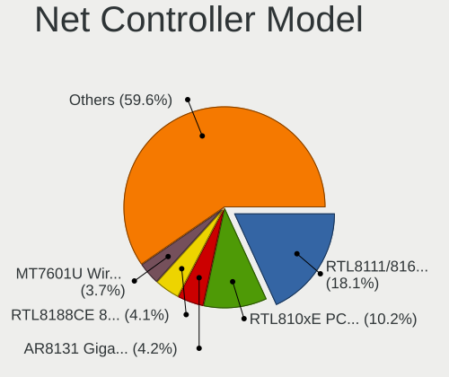

| Model                                                                  | Computers | Percent |
|------------------------------------------------------------------------|-----------|---------|
| Realtek RTL8111/8168/8211/8411 PCI Express Gigabit Ethernet Controller | 154       | 18.14%  |
| Realtek RTL810xE PCI Express Fast Ethernet controller                  | 87        | 10.25%  |
| Qualcomm Atheros AR8131 Gigabit Ethernet                               | 36        | 4.24%   |
| Realtek RTL8188CE 802.11b/g/n WiFi Adapter                             | 35        | 4.12%   |
| Ralink MT7601U Wireless Adapter                                        | 31        | 3.65%   |
| Broadcom BCM43142 802.11b/g/n                                          | 21        | 2.47%   |
| Intel Wireless 8265 / 8275                                             | 20        | 2.36%   |
| Qualcomm Atheros AR9485 Wireless Network Adapter                       | 19        | 2.24%   |
| Qualcomm Atheros QCA9565 / AR9565 Wireless Network Adapter             | 17        | 2%      |
| Qualcomm Atheros AR9285 Wireless Network Adapter (PCI-Express)         | 16        | 1.88%   |
| Intel Ethernet Connection (4) I219-LM                                  | 14        | 1.65%   |
| Intel Wireless 8260                                                    | 12        | 1.41%   |
| Qualcomm Atheros QCA9377 802.11ac Wireless Network Adapter             | 11        | 1.3%    |
| Intel 82579LM Gigabit Network Connection (Lewisville)                  | 11        | 1.3%    |
| Ralink RT5370 Wireless Adapter                                         | 10        | 1.18%   |
| Qualcomm Atheros AR9271 802.11n                                        | 10        | 1.18%   |
| Realtek RTL8723BE PCIe Wireless Network Adapter                        | 9         | 1.06%   |
| Intel Wi-Fi 6 AX201                                                    | 9         | 1.06%   |
| Realtek RTL8821CE 802.11ac PCIe Wireless Network Adapter               | 8         | 0.94%   |
| Intel Wireless 7260                                                    | 8         | 0.94%   |
| Intel Ethernet Connection I219-LM                                      | 8         | 0.94%   |
| Ralink RT2870/RT3070 Wireless Adapter                                  | 6         | 0.71%   |
| Ralink RT3290 Wireless 802.11n 1T/1R PCIe                              | 6         | 0.71%   |
| Qualcomm Atheros AR8151 v2.0 Gigabit Ethernet                          | 6         | 0.71%   |
| Intel Wireless 7265                                                    | 6         | 0.71%   |
| Broadcom NetLink BCM57780 Gigabit Ethernet PCIe                        | 6         | 0.71%   |
| Realtek RTL8125 2.5GbE Controller                                      | 5         | 0.59%   |
| Qualcomm Atheros AR8152 v2.0 Fast Ethernet                             | 5         | 0.59%   |
| MediaTek MT7921 802.11ax PCIe Wireless Network Adapter [Filogic 330]   | 5         | 0.59%   |
| Intel Ethernet Connection I218-LM                                      | 5         | 0.59%   |
| Intel Dual Band Wireless-AC 3165 Plus Bluetooth                        | 5         | 0.59%   |
| Intel Centrino Advanced-N 6205 [Taylor Peak]                           | 5         | 0.59%   |
| Samsung GT-I9070 (network tethering, USB debugging enabled)            | 4         | 0.47%   |
| Qualcomm Atheros QCA8172 Fast Ethernet                                 | 4         | 0.47%   |
| MediaTek Infinix HOT 50i                                               | 4         | 0.47%   |
| Intel Ethernet Connection I217-LM                                      | 4         | 0.47%   |
| Intel Centrino Ultimate-N 6300                                         | 4         | 0.47%   |
| Intel Alder Lake-P PCH CNVi WiFi                                       | 4         | 0.47%   |
| Xiaomi Mi/Redmi series (RNDIS)                                         | 3         | 0.35%   |
| VIA VT6102/VT6103 [Rhine-II]                                           | 3         | 0.35%   |

Wireless Vendor
---------------

Wireless vendors

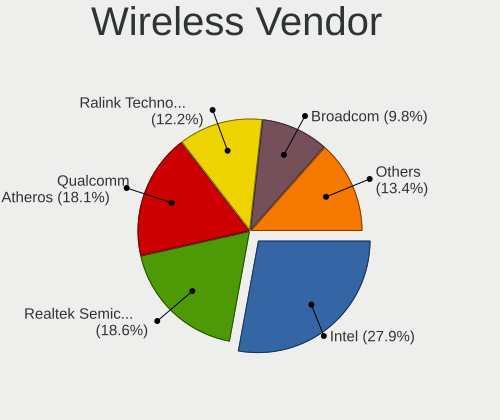

| Vendor                          | Computers | Percent |
|---------------------------------|-----------|---------|
| Intel                           | 114       | 27.87%  |
| Realtek Semiconductor           | 76        | 18.58%  |
| Qualcomm Atheros                | 74        | 18.09%  |
| Ralink Technology               | 50        | 12.22%  |
| Broadcom                        | 40        | 9.78%   |
| Ralink                          | 15        | 3.67%   |
| Qualcomm Atheros Communications | 10        | 2.44%   |
| D-Link                          | 7         | 1.71%   |
| MediaTek                        | 6         | 1.47%   |
| TP-Link                         | 4         | 0.98%   |
| Sierra Wireless                 | 3         | 0.73%   |
| D-Link System                   | 3         | 0.73%   |
| Broadcom Limited                | 3         | 0.73%   |
| Hewlett-Packard                 | 2         | 0.49%   |
| ZTopInc                         | 1         | 0.24%   |
| Marvell Technology Group        | 1         | 0.24%   |

Wireless Model
--------------

Wireless models

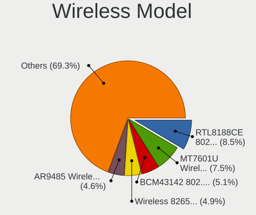

| Model                                                                | Computers | Percent |
|----------------------------------------------------------------------|-----------|---------|
| Realtek RTL8188CE 802.11b/g/n WiFi Adapter                           | 35        | 8.52%   |
| Ralink MT7601U Wireless Adapter                                      | 31        | 7.54%   |
| Broadcom BCM43142 802.11b/g/n                                        | 21        | 5.11%   |
| Intel Wireless 8265 / 8275                                           | 20        | 4.87%   |
| Qualcomm Atheros AR9485 Wireless Network Adapter                     | 19        | 4.62%   |
| Qualcomm Atheros QCA9565 / AR9565 Wireless Network Adapter           | 17        | 4.14%   |
| Qualcomm Atheros AR9285 Wireless Network Adapter (PCI-Express)       | 16        | 3.89%   |
| Intel Wireless 8260                                                  | 12        | 2.92%   |
| Qualcomm Atheros QCA9377 802.11ac Wireless Network Adapter           | 11        | 2.68%   |
| Ralink RT5370 Wireless Adapter                                       | 10        | 2.43%   |
| Qualcomm Atheros AR9271 802.11n                                      | 10        | 2.43%   |
| Realtek RTL8723BE PCIe Wireless Network Adapter                      | 9         | 2.19%   |
| Intel Wi-Fi 6 AX201                                                  | 9         | 2.19%   |
| Realtek RTL8821CE 802.11ac PCIe Wireless Network Adapter             | 8         | 1.95%   |
| Intel Wireless 7260                                                  | 8         | 1.95%   |
| Ralink RT2870/RT3070 Wireless Adapter                                | 6         | 1.46%   |
| Ralink RT3290 Wireless 802.11n 1T/1R PCIe                            | 6         | 1.46%   |
| Intel Wireless 7265                                                  | 6         | 1.46%   |
| MediaTek MT7921 802.11ax PCIe Wireless Network Adapter [Filogic 330] | 5         | 1.22%   |
| Intel Dual Band Wireless-AC 3165 Plus Bluetooth                      | 5         | 1.22%   |
| Intel Centrino Advanced-N 6205 [Taylor Peak]                         | 5         | 1.22%   |
| Intel Centrino Ultimate-N 6300                                       | 4         | 0.97%   |
| Realtek RTL8192EE PCIe Wireless Network Adapter                      | 3         | 0.73%   |
| Realtek RTL8188EE Wireless Network Adapter                           | 3         | 0.73%   |
| Ralink RT2870 Wireless Adapter                                       | 3         | 0.73%   |
| Qualcomm Atheros AR928X Wireless Network Adapter (PCI-Express)       | 3         | 0.73%   |
| Intel Wireless 3160                                                  | 3         | 0.73%   |
| Intel WiFi Link 5100                                                 | 3         | 0.73%   |
| Intel Wi-Fi 6 AX200                                                  | 3         | 0.73%   |
| Intel PRO/Wireless 3945ABG [Golan] Network Connection                | 3         | 0.73%   |
| Intel Comet Lake PCH-LP CNVi WiFi                                    | 3         | 0.73%   |
| Intel Centrino Advanced-N 6200                                       | 3         | 0.73%   |
| Intel Cannon Point-LP CNVi [Wireless-AC]                             | 3         | 0.73%   |
| Intel Alder Lake-P PCH CNVi WiFi                                     | 3         | 0.73%   |
| D-Link 802.11 n WLAN                                                 | 3         | 0.73%   |
| Broadcom BCM43228 802.11a/b/g/n                                      | 3         | 0.73%   |
| Broadcom BCM4313 802.11bgn Wireless Network Adapter                  | 3         | 0.73%   |
| Sierra Wireless EM7305 Modem                                         | 2         | 0.49%   |
| Realtek RTL88x2bu [AC1200 Techkey]                                   | 2         | 0.49%   |
| Realtek RTL8852BE PCIe 802.11ax Wireless Network Controller          | 2         | 0.49%   |

Ethernet Vendor
---------------

Ethernet vendors

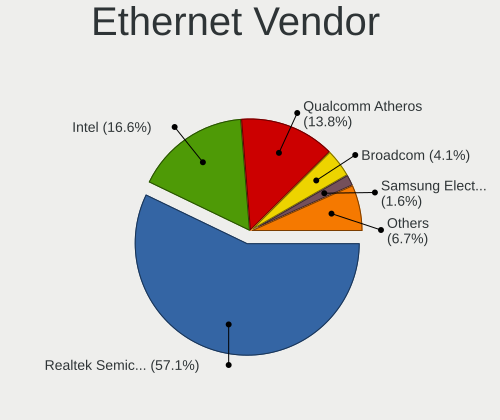

| Vendor                   | Computers | Percent |
|--------------------------|-----------|---------|
| Realtek Semiconductor    | 248       | 57.14%  |
| Intel                    | 72        | 16.59%  |
| Qualcomm Atheros         | 60        | 13.82%  |
| Broadcom                 | 18        | 4.15%   |
| Samsung Electronics      | 7         | 1.61%   |
| Xiaomi                   | 5         | 1.15%   |
| Nvidia                   | 5         | 1.15%   |
| Broadcom Limited         | 5         | 1.15%   |
| MediaTek                 | 4         | 0.92%   |
| VIA Technologies         | 3         | 0.69%   |
| Marvell Technology Group | 3         | 0.69%   |
| OPPO Electronics         | 1         | 0.23%   |
| LG Electronics           | 1         | 0.23%   |
| Huawei Technologies      | 1         | 0.23%   |
| AMD                      | 1         | 0.23%   |

Ethernet Model
--------------

Ethernet models

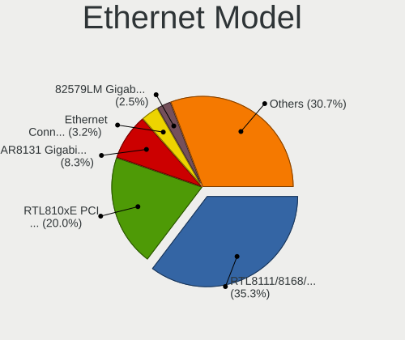

| Model                                                                  | Computers | Percent |
|------------------------------------------------------------------------|-----------|---------|
| Realtek RTL8111/8168/8211/8411 PCI Express Gigabit Ethernet Controller | 154       | 35.32%  |
| Realtek RTL810xE PCI Express Fast Ethernet controller                  | 87        | 19.95%  |
| Qualcomm Atheros AR8131 Gigabit Ethernet                               | 36        | 8.26%   |
| Intel Ethernet Connection (4) I219-LM                                  | 14        | 3.21%   |
| Intel 82579LM Gigabit Network Connection (Lewisville)                  | 11        | 2.52%   |
| Intel Ethernet Connection I219-LM                                      | 8         | 1.83%   |
| Qualcomm Atheros AR8151 v2.0 Gigabit Ethernet                          | 6         | 1.38%   |
| Broadcom NetLink BCM57780 Gigabit Ethernet PCIe                        | 6         | 1.38%   |
| Realtek RTL8125 2.5GbE Controller                                      | 5         | 1.15%   |
| Qualcomm Atheros AR8152 v2.0 Fast Ethernet                             | 5         | 1.15%   |
| Intel Ethernet Connection I218-LM                                      | 5         | 1.15%   |
| Samsung GT-I9070 (network tethering, USB debugging enabled)            | 4         | 0.92%   |
| Qualcomm Atheros QCA8172 Fast Ethernet                                 | 4         | 0.92%   |
| MediaTek Infinix HOT 50i                                               | 4         | 0.92%   |
| Intel Ethernet Connection I217-LM                                      | 4         | 0.92%   |
| Xiaomi Mi/Redmi series (RNDIS)                                         | 3         | 0.69%   |
| VIA VT6102/VT6103 [Rhine-II]                                           | 3         | 0.69%   |
| Samsung Galaxy series, misc. (tethering mode)                          | 3         | 0.69%   |
| Qualcomm Atheros AR8161 Gigabit Ethernet                               | 3         | 0.69%   |
| Intel 82577LM Gigabit Network Connection                               | 3         | 0.69%   |
| Broadcom NetXtreme BCM5764M Gigabit Ethernet PCIe                      | 3         | 0.69%   |
| Broadcom NetLink BCM5784M Gigabit Ethernet PCIe                        | 3         | 0.69%   |
| Broadcom Limited NetLink BCM57780 Gigabit Ethernet PCIe                | 3         | 0.69%   |
| Xiaomi Mi/Redmi series (RNDIS + ADB)                                   | 2         | 0.46%   |
| Qualcomm Atheros AR8162 Fast Ethernet                                  | 2         | 0.46%   |
| Nvidia MCP79 Ethernet                                                  | 2         | 0.46%   |
| Marvell Group 88E8055 PCI-E Gigabit Ethernet Controller                | 2         | 0.46%   |
| Intel PRO/100 VE Network Connection                                    | 2         | 0.46%   |
| Intel I211 Gigabit Network Connection                                  | 2         | 0.46%   |
| Intel Ethernet Connection (5) I219-LM                                  | 2         | 0.46%   |
| Intel Ethernet Connection (3) I218-LM                                  | 2         | 0.46%   |
| Broadcom NetXtreme BCM57765 Gigabit Ethernet PCIe                      | 2         | 0.46%   |
| Realtek RTL-8100/8101L/8139 PCI Fast Ethernet Adapter                  | 1         | 0.23%   |
| Realtek PCIe GbE Family Controller                                     | 1         | 0.23%   |
| Qualcomm Atheros Killer E220x Gigabit Ethernet Controller              | 1         | 0.23%   |
| Qualcomm Atheros AR8152 v1.1 Fast Ethernet                             | 1         | 0.23%   |
| Qualcomm Atheros AR8151 v1.0 Gigabit Ethernet                          | 1         | 0.23%   |
| Qualcomm Atheros AR8132 Fast Ethernet                                  | 1         | 0.23%   |
| OPPO Ace 3V                                                            | 1         | 0.23%   |
| Nvidia MCP89 Ethernet                                                  | 1         | 0.23%   |

Net Controller Kind
-------------------

Ethernet, WiFi or modem

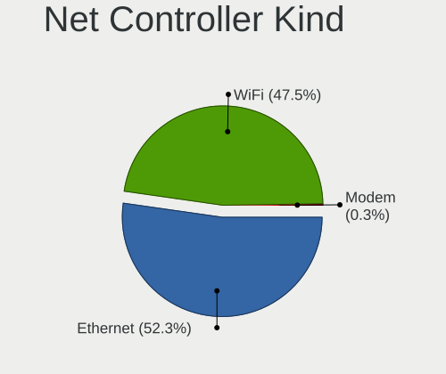

| Kind     | Computers | Percent |
|----------|-----------|---------|
| Ethernet | 417       | 52.26%  |
| WiFi     | 379       | 47.49%  |
| Modem    | 2         | 0.25%   |

Used Controller
---------------

Currently used network controller

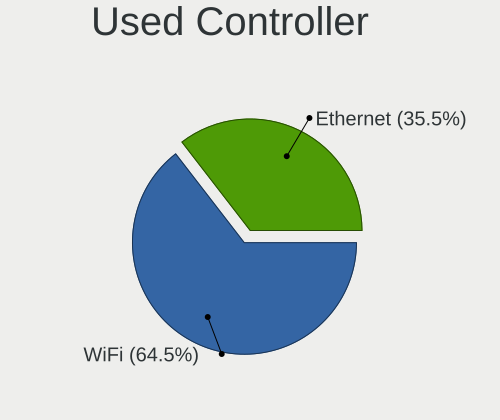

| Kind     | Computers | Percent |
|----------|-----------|---------|
| WiFi     | 313       | 64.54%  |
| Ethernet | 172       | 35.46%  |

NICs
----

Total network controllers on board

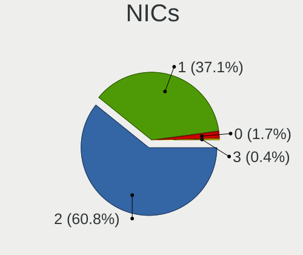

| Total | Computers | Percent |
|-------|-----------|---------|
| 2     | 282       | 60.78%  |
| 1     | 172       | 37.07%  |
| 0     | 8         | 1.72%   |
| 3     | 2         | 0.43%   |

IPv6
----

IPv6 vs IPv4

| Used | Computers | Percent |
|------|-----------|---------|
| No   | 459       | 100%    |

Bluetooth
---------

Bluetooth Vendor
----------------

Controller vendors

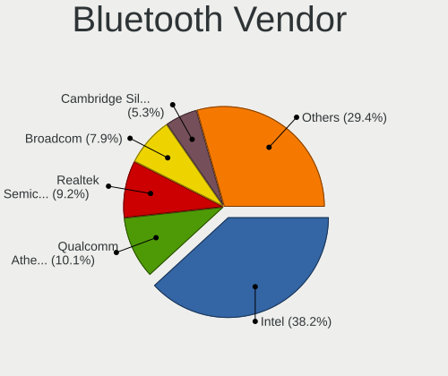

| Vendor                          | Computers | Percent |
|---------------------------------|-----------|---------|
| Intel                           | 87        | 38.16%  |
| Qualcomm Atheros Communications | 23        | 10.09%  |
| Realtek Semiconductor           | 21        | 9.21%   |
| Broadcom                        | 18        | 7.89%   |
| Cambridge Silicon Radio         | 12        | 5.26%   |
| IMC Networks                    | 11        | 4.82%   |
| Lite-On Technology              | 8         | 3.51%   |
| Apple                           | 8         | 3.51%   |
| Ralink                          | 6         | 2.63%   |
| Foxconn / Hon Hai               | 6         | 2.63%   |
| Toshiba                         | 5         | 2.19%   |
| Dell                            | 5         | 2.19%   |
| Integrated System Solution      | 3         | 1.32%   |
| Foxconn International           | 3         | 1.32%   |
| Hewlett-Packard                 | 2         | 0.88%   |
| ASUSTek Computer                | 2         | 0.88%   |
| Actions                         | 2         | 0.88%   |
| SiW                             | 1         | 0.44%   |
| Ralink Technology               | 1         | 0.44%   |
| Marvell Semiconductor           | 1         | 0.44%   |
| Chicony Electronics             | 1         | 0.44%   |
| Askey Computer                  | 1         | 0.44%   |
| Alps Electric                   | 1         | 0.44%   |

Bluetooth Model
---------------

Controller models

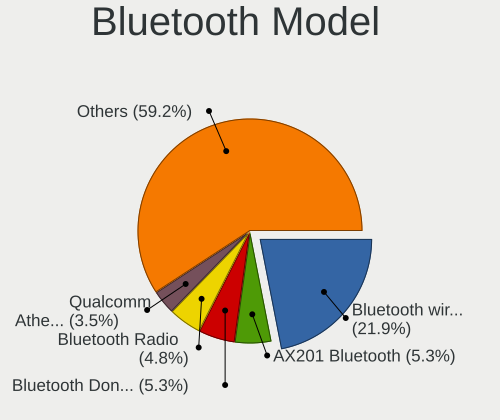

| Model                                                 | Computers | Percent |
|-------------------------------------------------------|-----------|---------|
| Intel Bluetooth wireless interface                    | 50        | 21.93%  |
| Intel AX201 Bluetooth                                 | 12        | 5.26%   |
| Cambridge Silicon Radio Bluetooth Dongle (HCI mode)   | 12        | 5.26%   |
| Realtek Bluetooth Radio                               | 11        | 4.82%   |
| Qualcomm Atheros  Bluetooth Device                    | 8         | 3.51%   |
| Intel Bluetooth 9460/9560 Jefferson Peak (JfP)        | 8         | 3.51%   |
| Broadcom BCM43142 Bluetooth 4.0                       | 7         | 3.07%   |
| Ralink RT3290 Bluetooth                               | 6         | 2.63%   |
| Qualcomm Atheros AR3012 Bluetooth 4.0                 | 6         | 2.63%   |
| Realtek  Bluetooth 4.2 Adapter                        | 5         | 2.19%   |
| Intel Centrino Bluetooth Wireless Transceiver         | 5         | 2.19%   |
| IMC Networks Bluetooth Device                         | 5         | 2.19%   |
| Qualcomm Atheros AR3011 Bluetooth                     | 4         | 1.75%   |
| Intel Bluetooth Device                                | 4         | 1.75%   |
| Intel AX200 Bluetooth                                 | 4         | 1.75%   |
| IMC Networks Wireless_Device                          | 4         | 1.75%   |
| Apple Bluetooth Host Controller                       | 4         | 1.75%   |
| Toshiba Bluetooth Device                              | 3         | 1.32%   |
| Realtek RTL8723B Bluetooth                            | 3         | 1.32%   |
| Lite-On Qualcomm Atheros QCA9377 Bluetooth            | 3         | 1.32%   |
| Foxconn International BCM43142A0 Bluetooth module     | 3         | 1.32%   |
| Foxconn / Hon Hai Bluetooth Device                    | 3         | 1.32%   |
| Broadcom BCM43142A0 Bluetooth 4.0                     | 3         | 1.32%   |
| Broadcom BCM2045B (BDC-2.1)                           | 3         | 1.32%   |
| Toshiba BCM43142A0                                    | 2         | 0.88%   |
| Qualcomm Atheros QCA61x4 Bluetooth 4.0                | 2         | 0.88%   |
| Qualcomm Atheros AR9462 Bluetooth                     | 2         | 0.88%   |
| Lite-On Wireless_Device                               | 2         | 0.88%   |
| Lite-On BCM43142A0                                    | 2         | 0.88%   |
| Intel Wireless-AC 3168 Bluetooth                      | 2         | 0.88%   |
| Integrated System Solution KY-BT100 Bluetooth Adapter | 2         | 0.88%   |
| HP Broadcom 2070 Bluetooth Combo                      | 2         | 0.88%   |
| Dell Wireless 365 Bluetooth                           | 2         | 0.88%   |
| Dell BCM20702A0 Bluetooth Module                      | 2         | 0.88%   |
| Apple Bluetooth USB Host Controller                   | 2         | 0.88%   |
| Actions general adapter                               | 2         | 0.88%   |
| SiW SiW                                               | 1         | 0.44%   |
| Realtek RTL8822BE Bluetooth 4.2 Adapter               | 1         | 0.44%   |
| Realtek RTL8821A Bluetooth                            | 1         | 0.44%   |
| Ralink Motorola BC4 Bluetooth 3.0+HS Adapter          | 1         | 0.44%   |

Sound
-----

Sound Vendor
------------

Sound card vendors

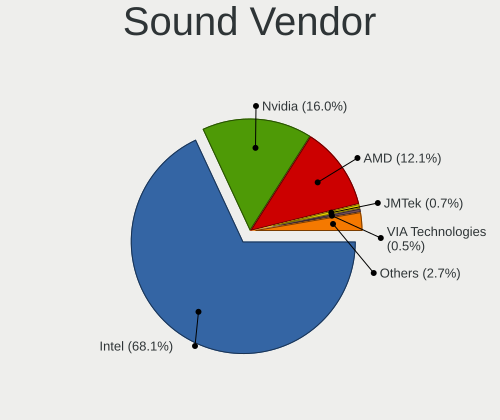

| Vendor                 | Computers | Percent |
|------------------------|-----------|---------|
| Intel                  | 405       | 68.07%  |
| Nvidia                 | 95        | 15.97%  |
| AMD                    | 72        | 12.1%   |
| JMTek                  | 4         | 0.67%   |
| VIA Technologies       | 3         | 0.5%    |
| Goldvish               | 2         | 0.34%   |
| C-Media Electronics    | 2         | 0.34%   |
| Texas Instruments      | 1         | 0.17%   |
| Sony                   | 1         | 0.17%   |
| Samsung Electronics    | 1         | 0.17%   |
| Microdia               | 1         | 0.17%   |
| Medeli Electronics     | 1         | 0.17%   |
| Logitech               | 1         | 0.17%   |
| Logic3 / SpectraVideo  | 1         | 0.17%   |
| Hewlett-Packard        | 1         | 0.17%   |
| Guillemot              | 1         | 0.17%   |
| GN Netcom              | 1         | 0.17%   |
| Generalplus Technology | 1         | 0.17%   |
| ASUSTek Computer       | 1         | 0.17%   |

Sound Model
-----------

Sound card models

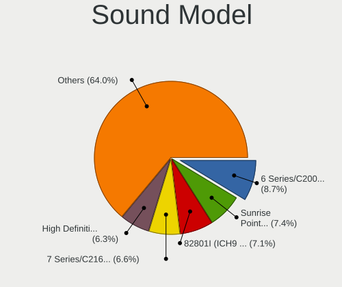

| Model                                                                                             | Computers | Percent |
|---------------------------------------------------------------------------------------------------|-----------|---------|
| Intel 6 Series/C200 Series Chipset Family High Definition Audio Controller                        | 59        | 8.68%   |
| Intel Sunrise Point-LP HD Audio                                                                   | 50        | 7.35%   |
| Intel 82801I (ICH9 Family) HD Audio Controller                                                    | 48        | 7.06%   |
| Intel 7 Series/C216 Chipset Family High Definition Audio Controller                               | 45        | 6.62%   |
| Nvidia High Definition Audio Controller                                                           | 43        | 6.32%   |
| Intel NM10/ICH7 Family High Definition Audio Controller                                           | 29        | 4.26%   |
| Intel 5 Series/3400 Series Chipset High Definition Audio                                          | 27        | 3.97%   |
| Intel 8 Series/C220 Series Chipset High Definition Audio Controller                               | 26        | 3.82%   |
| Intel Haswell-ULT HD Audio Controller                                                             | 21        | 3.09%   |
| Intel 8 Series HD Audio Controller                                                                | 21        | 3.09%   |
| Intel Xeon E3-1200 v3/4th Gen Core Processor HD Audio Controller                                  | 19        | 2.79%   |
| AMD Ryzen HD Audio Controller                                                                     | 18        | 2.65%   |
| Intel Wildcat Point-LP High Definition Audio Controller                                           | 14        | 2.06%   |
| Intel Broadwell-U Audio Controller                                                                | 14        | 2.06%   |
| AMD Cedar HDMI Audio [Radeon HD 5400/6300/7300 Series]                                            | 14        | 2.06%   |
| Intel Tiger Lake-LP Smart Sound Technology Audio Controller                                       | 13        | 1.91%   |
| Nvidia GF108 High Definition Audio Controller                                                     | 8         | 1.18%   |
| AMD Renoir/Cezanne HDMI/DP Audio Controller                                                       | 8         | 1.18%   |
| Intel Atom Processor Z36xxx/Z37xxx Series High Definition Audio Controller                        | 7         | 1.03%   |
| Intel Alder Lake PCH-P High Definition Audio Controller                                           | 7         | 1.03%   |
| Nvidia GF119 HDMI Audio Controller                                                                | 6         | 0.88%   |
| Intel CM238 HD Audio Controller                                                                   | 6         | 0.88%   |
| Intel Celeron/Pentium Silver Processor High Definition Audio                                      | 6         | 0.88%   |
| Intel Atom/Celeron/Pentium Processor x5-E8000/J3xxx/N3xxx Series High Definition Audio Controller | 6         | 0.88%   |
| AMD Raven/Raven2/Fenghuang HDMI/DP Audio Controller                                               | 6         | 0.88%   |
| Nvidia GK208 HDMI/DP Audio Controller                                                             | 5         | 0.74%   |
| Intel 82801H (ICH8 Family) HD Audio Controller                                                    | 5         | 0.74%   |
| AMD Starship/Matisse HD Audio Controller                                                          | 5         | 0.74%   |
| AMD FCH Azalia Controller                                                                         | 5         | 0.74%   |
| Nvidia GK107 HDMI Audio Controller                                                                | 4         | 0.59%   |
| JMTek USB PnP Audio Device                                                                        | 4         | 0.59%   |
| Intel Cannon Lake PCH cAVS                                                                        | 4         | 0.59%   |
| Intel Alder Lake-S HD Audio Controller                                                            | 4         | 0.59%   |
| AMD Turks HDMI Audio [Radeon HD 6500/6600 / 6700M Series]                                         | 4         | 0.59%   |
| AMD SBx00 Azalia (Intel HDA)                                                                      | 4         | 0.59%   |
| AMD Ellesmere HDMI Audio [Radeon RX 470/480 / 570/580/590]                                        | 4         | 0.59%   |
| VIA Technologies VX900/VT8xxx High Definition Audio Controller                                    | 3         | 0.44%   |
| Nvidia MCP79 High Definition Audio                                                                | 3         | 0.44%   |
| Nvidia GM107 High Definition Audio Controller [GeForce 940MX]                                     | 3         | 0.44%   |
| Intel Comet Lake PCH-LP cAVS                                                                      | 3         | 0.44%   |

Memory
------

Memory Vendor
-------------

Memory module vendors

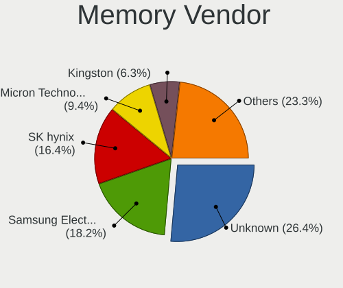

| Vendor                             | Computers | Percent |
|------------------------------------|-----------|---------|
| Unknown                            | 84        | 26.42%  |
| Samsung Electronics                | 58        | 18.24%  |
| SK hynix                           | 52        | 16.35%  |
| Micron Technology                  | 30        | 9.43%   |
| Kingston                           | 20        | 6.29%   |
| A-DATA Technology                  | 14        | 4.4%    |
| Ramaxel Technology                 | 8         | 2.52%   |
| Crucial                            | 7         | 2.2%    |
| Nanya Technology                   | 6         | 1.89%   |
| Corsair                            | 5         | 1.57%   |
| Unknown                            | 4         | 1.26%   |
| Unknown (ABCD)                     | 3         | 0.94%   |
| TwinMOS                            | 3         | 0.94%   |
| Thermaltake                        | 2         | 0.63%   |
| Team                               | 2         | 0.63%   |
| Patriot                            | 2         | 0.63%   |
| Goldkey                            | 2         | 0.63%   |
| Elpida                             | 2         | 0.63%   |
| Unifosa                            | 1         | 0.31%   |
| Transcend                          | 1         | 0.31%   |
| SemsoTai                           | 1         | 0.31%   |
| PNY                                | 1         | 0.31%   |
| KingSpec                           | 1         | 0.31%   |
| Kimtigo Semiconductor (HK) Limited | 1         | 0.31%   |
| Hikvision                          | 1         | 0.31%   |
| GeIL                               | 1         | 0.31%   |
| G.Skill                            | 1         | 0.31%   |
| Dynet                              | 1         | 0.31%   |
| CSX                                | 1         | 0.31%   |
| ASint Technology                   | 1         | 0.31%   |
| Asgard                             | 1         | 0.31%   |
| 8CB900000080                       | 1         | 0.31%   |

Memory Model
------------

Memory module models

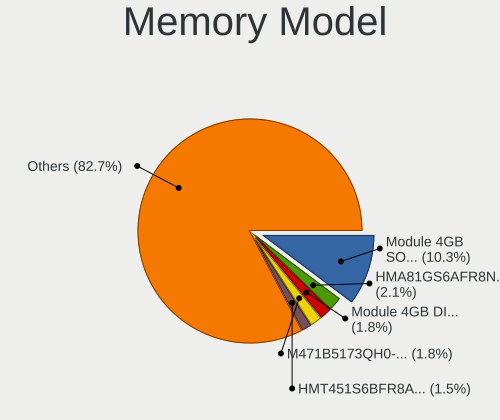

| Model                                                            | Computers | Percent |
|------------------------------------------------------------------|-----------|---------|
| Unknown RAM Module 4GB SODIMM 1066MT/s                           | 35        | 10.26%  |
| SK hynix RAM HMA81GS6AFR8N-UH 8GB SODIMM DDR4 2667MT/s           | 7         | 2.05%   |
| Unknown RAM Module 4GB DIMM DDR3 1333MT/s                        | 6         | 1.76%   |
| Samsung RAM M471B5173QH0-YK0 4GB SODIMM DDR3 1600MT/s            | 6         | 1.76%   |
| SK hynix RAM HMT451S6BFR8A-PB 4GB SODIMM DDR3 1600MT/s           | 5         | 1.47%   |
| Unknown                                                          | 4         | 1.17%   |
| Unknown RAM Module 2GB DIMM DDR3 1333MT/s                        | 3         | 0.88%   |
| Unknown RAM Module 2GB DIMM 800MT/s                              | 3         | 0.88%   |
| Unknown RAM Module 2GB DIMM 400MT/s                              | 3         | 0.88%   |
| SK hynix RAM HMT451S6AFR8A-PB 4GB SODIMM DDR3 1600MT/s           | 3         | 0.88%   |
| SK hynix RAM HMT41GS6BFR8A-PB 8GB SODIMM DDR3 2667MT/s           | 3         | 0.88%   |
| SK hynix RAM HMA851S6AFR6N-UH 4GB SODIMM DDR4 2667MT/s           | 3         | 0.88%   |
| Samsung RAM M471B5173BH0-CK0 4GB SODIMM DDR3 1600MT/s            | 3         | 0.88%   |
| Samsung RAM M471A5244CB0-CTD 4GB SODIMM DDR4 3266MT/s            | 3         | 0.88%   |
| Samsung RAM M471A1G44AB0-CWE 8GiB SODIMM DDR4 3200MT/s           | 3         | 0.88%   |
| Micron RAM 8KTF51264HZ-1G6E1 4GB SODIMM DDR3 1600MT/s            | 3         | 0.88%   |
| Unknown RAM Module 4GB SODIMM DDR3 1333MT/s                      | 2         | 0.59%   |
| Unknown RAM Module 4GB DIMM SDRAM                                | 2         | 0.59%   |
| Unknown RAM Module 4096MB SODIMM DDR3 1600MT/s                   | 2         | 0.59%   |
| Unknown RAM Module 4096MB SODIMM DDR3                            | 2         | 0.59%   |
| Unknown RAM Module 2GB DIMM SDRAM                                | 2         | 0.59%   |
| Unknown RAM Module 2GB DIMM 667MT/s                              | 2         | 0.59%   |
| Unknown (ABCD) RAM 123456789012345678 2GB SODIMM LPDDR4 2400MT/s | 2         | 0.59%   |
| SK hynix RAM Module 4GB SODIMM DDR3 1600MT/s                     | 2         | 0.59%   |
| SK hynix RAM HMT451U6BFR8A-PB 4GB DIMM DDR3 1600MT/s             | 2         | 0.59%   |
| SK hynix RAM HMT451S6CFR6A-PB 4GB SODIMM DDR3 1600MT/s           | 2         | 0.59%   |
| SK hynix RAM HMT425S6CFR6A-PB 2GB SODIMM DDR3 1600MT/s           | 2         | 0.59%   |
| SK hynix RAM HMT125U6TFR8C-H9 2GB DIMM DDR3 1333MT/s             | 2         | 0.59%   |
| Samsung RAM M471B5273EB0-CK0 4GB SODIMM DDR3 4199MT/s            | 2         | 0.59%   |
| Samsung RAM M471B5173DB0-YK0 4GB SODIMM DDR3 1600MT/s            | 2         | 0.59%   |
| Samsung RAM M471B1G73EB0-YK0 8192MB SODIMM DDR3 1600MT/s         | 2         | 0.59%   |
| Nanya RAM Module 8GB SODIMM DDR4 2667MT/s                        | 2         | 0.59%   |
| Micron RAM 8JTF51264AZ-1G6E1 4GB DIMM DDR3 1600MT/s              | 2         | 0.59%   |
| Micron RAM 16ATF1G64HZ-2G1B1 8GB SODIMM DDR4 2133MT/s            | 2         | 0.59%   |
| Kingston RAM ACR256X64D3S1333C9 2GB SODIMM DDR3 1334MT/s         | 2         | 0.59%   |
| A-DATA RAM DDR4 3200 16GB DIMM DDR4 3600MT/s                     | 2         | 0.59%   |
| Unknown RAM Module 8GB SODIMM DDR3 1600MT/s                      | 1         | 0.29%   |
| Unknown RAM Module 8192MB SODIMM DDR3 1600MT/s                   | 1         | 0.29%   |
| Unknown RAM Module 512MB SODIMM DDR2 533MT/s                     | 1         | 0.29%   |
| Unknown RAM Module 4GB SODIMM DDR3 1067MT/s                      | 1         | 0.29%   |

Memory Kind
-----------

Memory module kinds

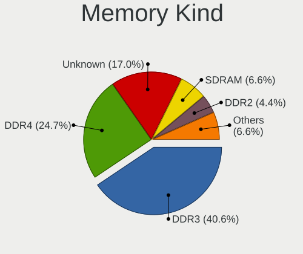

| Kind    | Computers | Percent |
|---------|-----------|---------|
| DDR3    | 110       | 40.59%  |
| DDR4    | 67        | 24.72%  |
| Unknown | 46        | 16.97%  |
| SDRAM   | 18        | 6.64%   |
| DDR2    | 12        | 4.43%   |
| LPDDR4  | 7         | 2.58%   |
| DDR5    | 5         | 1.85%   |
| LPDDR5  | 2         | 0.74%   |
| LPDDR3  | 2         | 0.74%   |
| DRAM    | 1         | 0.37%   |
| DDR     | 1         | 0.37%   |

Memory Form Factor
------------------

Physical design of the memory module

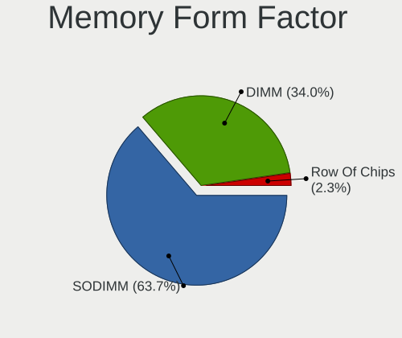

| Name         | Computers | Percent |
|--------------|-----------|---------|
| SODIMM       | 167       | 63.74%  |
| DIMM         | 89        | 33.97%  |
| Row Of Chips | 6         | 2.29%   |

Memory Size
-----------

Memory module size

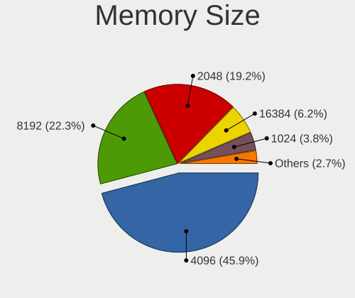

| Size  | Computers | Percent |
|-------|-----------|---------|
| 4096  | 134       | 45.89%  |
| 8192  | 65        | 22.26%  |
| 2048  | 56        | 19.18%  |
| 16384 | 18        | 6.16%   |
| 1024  | 11        | 3.77%   |
| 32768 | 5         | 1.71%   |
| 512   | 2         | 0.68%   |
| 65536 | 1         | 0.34%   |

Memory Speed
------------

Memory module speed

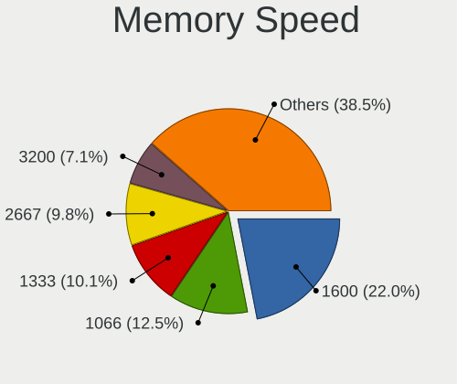

| Speed   | Computers | Percent |
|---------|-----------|---------|
| 1600    | 65        | 21.96%  |
| 1066    | 37        | 12.5%   |
| 1333    | 30        | 10.14%  |
| 2667    | 29        | 9.8%    |
| 3200    | 21        | 7.09%   |
| 2400    | 18        | 6.08%   |
| 2133    | 11        | 3.72%   |
| 800     | 10        | 3.38%   |
| Unknown | 10        | 3.38%   |
| 1334    | 9         | 3.04%   |
| 1067    | 7         | 2.36%   |
| 4199    | 6         | 2.03%   |
| 667     | 5         | 1.69%   |
| 400     | 4         | 1.35%   |
| 6400    | 3         | 1.01%   |
| 4800    | 3         | 1.01%   |
| 3266    | 3         | 1.01%   |
| 3800    | 2         | 0.68%   |
| 3600    | 2         | 0.68%   |
| 2666    | 2         | 0.68%   |
| 1648    | 2         | 0.68%   |
| 533     | 2         | 0.68%   |
| 5600    | 1         | 0.34%   |
| 4267    | 1         | 0.34%   |
| 3066    | 1         | 0.34%   |
| 3000    | 1         | 0.34%   |
| 2200    | 1         | 0.34%   |
| 2048    | 1         | 0.34%   |
| 2000    | 1         | 0.34%   |
| 1867    | 1         | 0.34%   |
| 1800    | 1         | 0.34%   |
| 1639    | 1         | 0.34%   |
| 1400    | 1         | 0.34%   |
| 975     | 1         | 0.34%   |
| 333     | 1         | 0.34%   |
| 266     | 1         | 0.34%   |
| 200     | 1         | 0.34%   |

Printers & scanners
-------------------

Printer Vendor
--------------

Printer device vendors

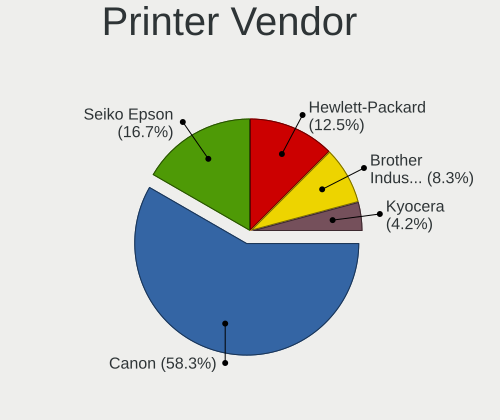

| Vendor             | Computers | Percent |
|--------------------|-----------|---------|
| Canon              | 14        | 58.33%  |
| Seiko Epson        | 4         | 16.67%  |
| Hewlett-Packard    | 3         | 12.5%   |
| Brother Industries | 2         | 8.33%   |
| Kyocera            | 1         | 4.17%   |

Printer Model
-------------

Printer device models

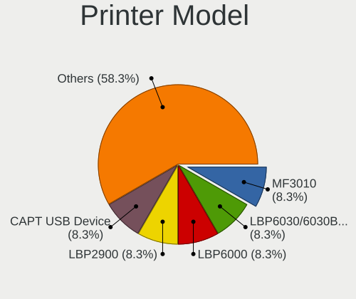

| Model                                                                 | Computers | Percent |
|-----------------------------------------------------------------------|-----------|---------|
| Canon MF3010                                                          | 2         | 8.33%   |
| Canon LBP6030/6030B/6018L                                             | 2         | 8.33%   |
| Canon LBP6000                                                         | 2         | 8.33%   |
| Canon LBP2900                                                         | 2         | 8.33%   |
| Canon CAPT USB Device                                                 | 2         | 8.33%   |
| Seiko Epson XP-240 Series                                             | 1         | 4.17%   |
| Seiko Epson Printer                                                   | 1         | 4.17%   |
| Seiko Epson ME OFFICE 620F Series/Stylus Office BX305F/BX305FW/TX320F | 1         | 4.17%   |
| Seiko Epson EPSON XP-205 207 Series                                   | 1         | 4.17%   |
| Kyocera FS-1040                                                       | 1         | 4.17%   |
| HP LaserJet 1010                                                      | 1         | 4.17%   |
| HP Ink Tank 310 series                                                | 1         | 4.17%   |
| HP DeskJet 5810 series                                                | 1         | 4.17%   |
| Canon MG5700 series                                                   | 1         | 4.17%   |
| Canon MF4010 series                                                   | 1         | 4.17%   |
| Canon LBP3010/LBP3018/LBP3050                                         | 1         | 4.17%   |
| Canon LBP3000                                                         | 1         | 4.17%   |
| Brother MFC-J480DW                                                    | 1         | 4.17%   |
| Brother DCP-J132W                                                     | 1         | 4.17%   |

Scanner Vendor
--------------

Scanner device vendors

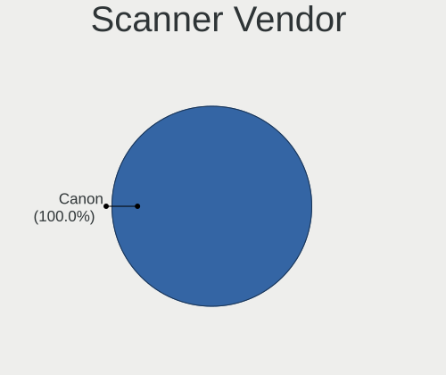

| Vendor | Computers | Percent |
|--------|-----------|---------|
| Canon  | 1         | 100%    |

Scanner Model
-------------

Scanner device models

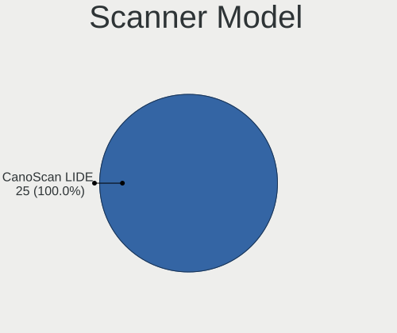

| Model                  | Computers | Percent |
|------------------------|-----------|---------|
| Canon CanoScan LIDE 25 | 1         | 100%    |

Camera
------

Camera Vendor
-------------

Camera device vendors

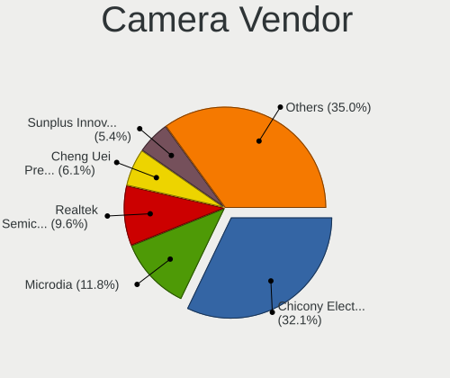

| Vendor                                 | Computers | Percent |
|----------------------------------------|-----------|---------|
| Chicony Electronics                    | 90        | 32.14%  |
| Microdia                               | 33        | 11.79%  |
| Realtek Semiconductor                  | 27        | 9.64%   |
| Cheng Uei Precision Industry (Foxlink) | 17        | 6.07%   |
| Sunplus Innovation Technology          | 15        | 5.36%   |
| IMC Networks                           | 13        | 4.64%   |
| Bison Electronics                      | 13        | 4.64%   |
| Suyin                                  | 11        | 3.93%   |
| Syntek                                 | 8         | 2.86%   |
| Quanta                                 | 8         | 2.86%   |
| Apple                                  | 8         | 2.86%   |
| Silicon Motion                         | 4         | 1.43%   |
| Samsung Electronics                    | 4         | 1.43%   |
| Luxvisions Innotech Limited            | 3         | 1.07%   |
| Lite-On Technology                     | 3         | 1.07%   |
| Sonix Technology                       | 2         | 0.71%   |
| Alcor Micro                            | 2         | 0.71%   |
| Acer                                   | 2         | 0.71%   |
| Z-Star Microelectronics                | 1         | 0.36%   |
| ShineTech                              | 1         | 0.36%   |
| Ricoh                                  | 1         | 0.36%   |
| Primax Electronics                     | 1         | 0.36%   |
| Pixart Imaging                         | 1         | 0.36%   |
| Novatek Microelectronics               | 1         | 0.36%   |
| Nokia Mobile Phones                    | 1         | 0.36%   |
| Microsoft                              | 1         | 0.36%   |
| Logitech                               | 1         | 0.36%   |
| Lenovo                                 | 1         | 0.36%   |
| GEMBIRD                                | 1         | 0.36%   |
| Foxlink                                | 1         | 0.36%   |
| DigiTech                               | 1         | 0.36%   |
| Cubeternet                             | 1         | 0.36%   |
| Aveo Technology                        | 1         | 0.36%   |
| Arkmicro Technologies                  | 1         | 0.36%   |
| ALi                                    | 1         | 0.36%   |

Camera Model
------------

Camera device models

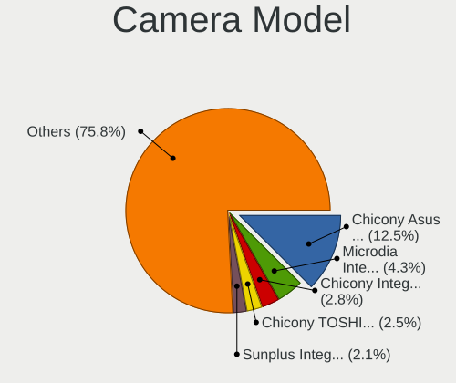

| Model                                               | Computers | Percent |
|-----------------------------------------------------|-----------|---------|
| Chicony Asus Integrated 0.3M UVC Webcam             | 35        | 12.46%  |
| Microdia Integrated_Webcam_HD                       | 12        | 4.27%   |
| Chicony Integrated Camera                           | 8         | 2.85%   |
| Chicony TOSHIBA Web Camera - HD                     | 7         | 2.49%   |
| Sunplus Integrated_Webcam_HD                        | 6         | 2.14%   |
| Chicony HP Truevision HD                            | 6         | 2.14%   |
| Bison Lenovo EasyCamera                             | 6         | 2.14%   |
| Microdia Laptop_Integrated_Webcam_HD                | 5         | 1.78%   |
| Cheng Uei Precision Industry (Foxlink) HP HD Camera | 5         | 1.78%   |
| Samsung Galaxy series, misc. (MTP mode)             | 4         | 1.42%   |
| Realtek USB2.0 VGA UVC WebCam                       | 4         | 1.42%   |
| Realtek Integrated_Webcam_HD                        | 4         | 1.42%   |
| IMC Networks Integrated Camera                      | 4         | 1.42%   |
| Chicony HD WebCam                                   | 4         | 1.42%   |
| Apple Built-in iSight                               | 4         | 1.42%   |
| Syntek Lenovo EasyCamera                            | 3         | 1.07%   |
| Suyin HP Truevision HD                              | 3         | 1.07%   |
| Realtek Integrated Webcam HD                        | 3         | 1.07%   |
| Realtek Integrated Webcam                           | 3         | 1.07%   |
| Quanta HP HD Camera                                 | 3         | 1.07%   |
| Microdia Laptop_Integrated_Webcam_E4HD              | 3         | 1.07%   |
| Microdia Integrated Webcam                          | 3         | 1.07%   |
| IMC Networks Lenovo EasyCamera                      | 3         | 1.07%   |
| Chicony HP HD Webcam [Fixed]                        | 3         | 1.07%   |
| Chicony FJ Camera                                   | 3         | 1.07%   |
| Cheng Uei Precision Industry (Foxlink) Webcam       | 3         | 1.07%   |
| Syntek Integrated Camera                            | 2         | 0.71%   |
| Suyin WebCam                                        | 2         | 0.71%   |
| Suyin HD WebCam                                     | 2         | 0.71%   |
| Sunplus Laptop_Integrated_Webcam_FHD                | 2         | 0.71%   |
| Sonix USB2.0 HD UVC WebCam                          | 2         | 0.71%   |
| Silicon Motion WebCam SC-0311139N                   | 2         | 0.71%   |
| Realtek HP Truevision HD                            | 2         | 0.71%   |
| Realtek Acer 640 x 480 laptop camera                | 2         | 0.71%   |
| Microdia Laptop_Integrated_Webcam_2M                | 2         | 0.71%   |
| Microdia Integrated_Webcam_FHD                      | 2         | 0.71%   |
| Luxvisions Innotech Limited HP TrueVision HD Camera | 2         | 0.71%   |
| IMC Networks USB2.0 HD UVC WebCam                   | 2         | 0.71%   |
| Chicony USB2.0 VGA UVC WebCam                       | 2         | 0.71%   |
| Chicony HP Webcam                                   | 2         | 0.71%   |

Security
--------

Fingerprint Vendor
------------------

Fingerprint sensor vendors

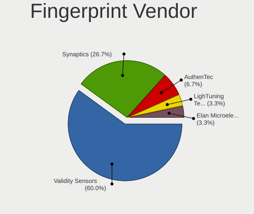

| Vendor                | Computers | Percent |
|-----------------------|-----------|---------|
| Validity Sensors      | 18        | 60%     |
| Synaptics             | 8         | 26.67%  |
| AuthenTec             | 2         | 6.67%   |
| LighTuning Technology | 1         | 3.33%   |
| Elan Microelectronics | 1         | 3.33%   |

Fingerprint Model
-----------------

Fingerprint sensor models

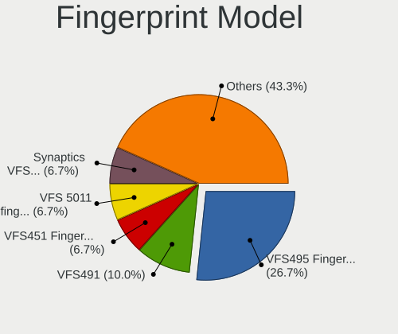

| Model                                                                      | Computers | Percent |
|----------------------------------------------------------------------------|-----------|---------|
| Validity Sensors VFS495 Fingerprint Reader                                 | 8         | 26.67%  |
| Validity Sensors VFS491                                                    | 3         | 10%     |
| Validity Sensors VFS451 Fingerprint Reader                                 | 2         | 6.67%   |
| Validity Sensors VFS 5011 fingerprint sensor                               | 2         | 6.67%   |
| Validity Sensors Synaptics VFS7552 Touch Fingerprint Sensor with PurePrint | 2         | 6.67%   |
| Synaptics FS7604 Touch Fingerprint Sensor with PurePrint                   | 2         | 6.67%   |
| Synaptics Fingerprint reader [HP G6]                                       | 2         | 6.67%   |
| Validity Sensors Synaptics WBDI                                            | 1         | 3.33%   |
| Synaptics WBDI Device                                                      | 1         | 3.33%   |
| Synaptics Prometheus MIS Touch Fingerprint Reader                          | 1         | 3.33%   |
| Synaptics Prometheus Fingerprint Reader                                    | 1         | 3.33%   |
| Synaptics Metallica MIS Touch Fingerprint Reader                           | 1         | 3.33%   |
| LighTuning ES603 Swipe Fingerprint Sensor                                  | 1         | 3.33%   |
| Elan ELAN:Fingerprint                                                      | 1         | 3.33%   |
| AuthenTec AES2810                                                          | 1         | 3.33%   |
| AuthenTec AES1600                                                          | 1         | 3.33%   |

Chipcard Vendor
---------------

Chipcard module vendors

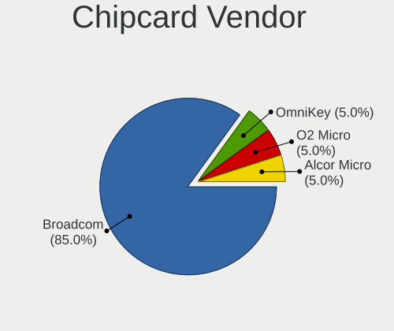

| Vendor      | Computers | Percent |
|-------------|-----------|---------|
| Broadcom    | 17        | 85%     |
| OmniKey     | 1         | 5%      |
| O2 Micro    | 1         | 5%      |
| Alcor Micro | 1         | 5%      |

Chipcard Model
--------------

Chipcard module models

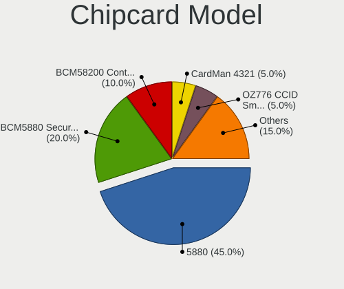

| Model                                                                        | Computers | Percent |
|------------------------------------------------------------------------------|-----------|---------|
| Broadcom 5880                                                                | 9         | 45%     |
| Broadcom BCM5880 Secure Applications Processor                               | 4         | 20%     |
| Broadcom BCM58200 ControlVault 3 (FingerPrint sensor + Contacted SmartCard)  | 2         | 10%     |
| OmniKey CardMan 4321                                                         | 1         | 5%      |
| O2 Micro OZ776 CCID Smartcard Reader                                         | 1         | 5%      |
| Broadcom BCM5880 Secure Applications Processor with fingerprint swipe sensor | 1         | 5%      |
| Broadcom 58200                                                               | 1         | 5%      |
| Alcor Micro AU9540 Smartcard Reader                                          | 1         | 5%      |

Unsupported
-----------

Unsupported Devices
-------------------

Total unsupported devices on board

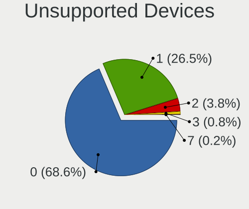

| Total | Computers | Percent |
|-------|-----------|---------|
| 0     | 326       | 68.63%  |
| 1     | 126       | 26.53%  |
| 2     | 18        | 3.79%   |
| 3     | 4         | 0.84%   |
| 7     | 1         | 0.21%   |

Unsupported Device Types
------------------------

Types of unsupported devices

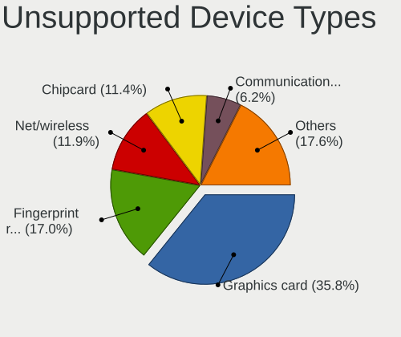

| Type                     | Computers | Percent |
|--------------------------|-----------|---------|
| Graphics card            | 63        | 35.8%   |
| Fingerprint reader       | 30        | 17.05%  |
| Net/wireless             | 21        | 11.93%  |
| Chipcard                 | 20        | 11.36%  |
| Communication controller | 11        | 6.25%   |
| Bluetooth                | 7         | 3.98%   |
| Multimedia controller    | 6         | 3.41%   |
| Sound                    | 4         | 2.27%   |
| Camera                   | 4         | 2.27%   |
| Storage                  | 3         | 1.7%    |
| Net/ethernet             | 3         | 1.7%    |
| Unassigned class         | 1         | 0.57%   |
| Storage/nvme             | 1         | 0.57%   |
| Storage/ata              | 1         | 0.57%   |
| Card reader              | 1         | 0.57%   |

