Linux in Argentina - Tested Hardware & Statistics
-------------------------------------------------

A project to collect tested hardware configurations for Linux in Argentina.

Anyone can contribute to this report by the [hw-probe](https://github.com/linuxhw/hw-probe) tool:

    sudo -E hw-probe -all -upload

Please contribute! Especially if your hardware is rare.

This is a report for all computer types. See also reports for [desktops](/Location/Argentina/Desktop/README.md) and [notebooks](/Location/Argentina/Notebook/README.md).

Contents
--------

* [ Test Cases ](#test-cases)

* [ System ](#system)
  - [ OS                       ](#os)
  - [ OS Family                ](#os-family)
  - [ Kernel                   ](#kernel)
  - [ Kernel Family            ](#kernel-family)
  - [ Kernel Major Ver.        ](#kernel-major-ver)
  - [ Arch                     ](#arch)
  - [ DE                       ](#de)
  - [ Display Server           ](#display-server)
  - [ Display Manager          ](#display-manager)
  - [ OS Lang                  ](#os-lang)
  - [ Boot Mode                ](#boot-mode)
  - [ Filesystem               ](#filesystem)
  - [ Part. scheme             ](#part-scheme)
  - [ Dual Boot with Linux/BSD ](#dual-boot-with-linuxbsd)
  - [ Dual Boot (Win)          ](#dual-boot-win)

* [ Board ](#board)
  - [ Vendor                   ](#vendor)
  - [ Model                    ](#model)
  - [ Model Family             ](#model-family)
  - [ MFG Year                 ](#mfg-year)
  - [ Form Factor              ](#form-factor)
  - [ Secure Boot              ](#secure-boot)
  - [ Coreboot                 ](#coreboot)
  - [ RAM Size                 ](#ram-size)
  - [ RAM Used                 ](#ram-used)
  - [ Total Drives             ](#total-drives)
  - [ Has CD-ROM               ](#has-cd-rom)
  - [ Has Ethernet             ](#has-ethernet)
  - [ Has WiFi                 ](#has-wifi)
  - [ Has Bluetooth            ](#has-bluetooth)

* [ Location ](#location)
  - [ Country                  ](#country)
  - [ City                     ](#city)

* [ Drives ](#drives)
  - [ Drive Vendor             ](#drive-vendor)
  - [ Drive Model              ](#drive-model)
  - [ HDD Vendor               ](#hdd-vendor)
  - [ SSD Vendor               ](#ssd-vendor)
  - [ Drive Kind               ](#drive-kind)
  - [ Drive Connector          ](#drive-connector)
  - [ Drive Size               ](#drive-size)
  - [ Space Total              ](#space-total)
  - [ Space Used               ](#space-used)
  - [ Malfunc. Drives          ](#malfunc-drives)
  - [ Malfunc. Drive Vendor    ](#malfunc-drive-vendor)
  - [ Malfunc. HDD Vendor      ](#malfunc-hdd-vendor)
  - [ Malfunc. Drive Kind      ](#malfunc-drive-kind)
  - [ Failed Drives            ](#failed-drives)
  - [ Failed Drive Vendor      ](#failed-drive-vendor)
  - [ Drive Status             ](#drive-status)

* [ Storage controller ](#storage-controller)
  - [ Storage Vendor           ](#storage-vendor)
  - [ Storage Model            ](#storage-model)
  - [ Storage Kind             ](#storage-kind)

* [ Processor ](#processor)
  - [ CPU Vendor               ](#cpu-vendor)
  - [ CPU Model                ](#cpu-model)
  - [ CPU Model Family         ](#cpu-model-family)
  - [ CPU Cores                ](#cpu-cores)
  - [ CPU Sockets              ](#cpu-sockets)
  - [ CPU Threads              ](#cpu-threads)
  - [ CPU Op-Modes             ](#cpu-op-modes)
  - [ CPU Microcode            ](#cpu-microcode)
  - [ CPU Microarch            ](#cpu-microarch)

* [ Graphics ](#graphics)
  - [ GPU Vendor               ](#gpu-vendor)
  - [ GPU Model                ](#gpu-model)
  - [ GPU Combo                ](#gpu-combo)
  - [ GPU Driver               ](#gpu-driver)
  - [ GPU Memory               ](#gpu-memory)

* [ Monitor ](#monitor)
  - [ Monitor Vendor           ](#monitor-vendor)
  - [ Monitor Model            ](#monitor-model)
  - [ Monitor Resolution       ](#monitor-resolution)
  - [ Monitor Diagonal         ](#monitor-diagonal)
  - [ Monitor Width            ](#monitor-width)
  - [ Aspect Ratio             ](#aspect-ratio)
  - [ Monitor Area             ](#monitor-area)
  - [ Pixel Density            ](#pixel-density)
  - [ Multiple Monitors        ](#multiple-monitors)

* [ Network ](#network)
  - [ Net Controller Vendor    ](#net-controller-vendor)
  - [ Net Controller Model     ](#net-controller-model)
  - [ Wireless Vendor          ](#wireless-vendor)
  - [ Wireless Model           ](#wireless-model)
  - [ Ethernet Vendor          ](#ethernet-vendor)
  - [ Ethernet Model           ](#ethernet-model)
  - [ Net Controller Kind      ](#net-controller-kind)
  - [ Used Controller          ](#used-controller)
  - [ NICs                     ](#nics)
  - [ IPv6                     ](#ipv6)

* [ Bluetooth ](#bluetooth)
  - [ Bluetooth Vendor         ](#bluetooth-vendor)
  - [ Bluetooth Model          ](#bluetooth-model)

* [ Sound ](#sound)
  - [ Sound Vendor             ](#sound-vendor)
  - [ Sound Model              ](#sound-model)

* [ Memory ](#memory)
  - [ Memory Vendor            ](#memory-vendor)
  - [ Memory Model             ](#memory-model)
  - [ Memory Kind              ](#memory-kind)
  - [ Memory Form Factor       ](#memory-form-factor)
  - [ Memory Size              ](#memory-size)
  - [ Memory Speed             ](#memory-speed)

* [ Printers & scanners ](#printers--scanners)
  - [ Printer Vendor           ](#printer-vendor)
  - [ Printer Model            ](#printer-model)
  - [ Scanner Vendor           ](#scanner-vendor)
  - [ Scanner Model            ](#scanner-model)

* [ Camera ](#camera)
  - [ Camera Vendor            ](#camera-vendor)
  - [ Camera Model             ](#camera-model)

* [ Security ](#security)
  - [ Fingerprint Vendor       ](#fingerprint-vendor)
  - [ Fingerprint Model        ](#fingerprint-model)
  - [ Chipcard Vendor          ](#chipcard-vendor)
  - [ Chipcard Model           ](#chipcard-model)

* [ Unsupported ](#unsupported)
  - [ Unsupported Devices      ](#unsupported-devices)
  - [ Unsupported Device Types ](#unsupported-device-types)

Test Cases
----------

Total: 4501

| Vendor        | Model                       | Form-Factor | Probe                                                      | Date         |
|---------------|-----------------------------|-------------|------------------------------------------------------------|--------------|
| Apple         | Mac-942B5BF58194151B        | All in one  | [c22a2c33ea](https://linux-hardware.org/?probe=c22a2c33ea) | Jan 02, 2026 |
| Dell          | Latitude 3420               | Notebook    | [abfeb95a4a](https://linux-hardware.org/?probe=abfeb95a4a) | Jan 01, 2026 |
| HP            | EliteBook x360 1030 G2      | Convertible | [296bfe59e3](https://linux-hardware.org/?probe=296bfe59e3) | Dec 31, 2025 |
| ASRock        | FM2A58M-VG3+ R2.0           | Desktop     | [d1337229da](https://linux-hardware.org/?probe=d1337229da) | Dec 29, 2025 |
| ASRock        | A320M-HDV R4.0              | Desktop     | [4fbadfcb23](https://linux-hardware.org/?probe=4fbadfcb23) | Dec 29, 2025 |
| JP.ik         | T304                        | Notebook    | [0a7276538c](https://linux-hardware.org/?probe=0a7276538c) | Dec 28, 2025 |
| MSI           | A320M PRO-VH PLUS           | Desktop     | [af4614b611](https://linux-hardware.org/?probe=af4614b611) | Dec 28, 2025 |
| Dell          | Latitude 5510               | Notebook    | [de6cd49772](https://linux-hardware.org/?probe=de6cd49772) | Dec 26, 2025 |
| HP            | EliteBook 745 G3            | Notebook    | [b027e0a476](https://linux-hardware.org/?probe=b027e0a476) | Dec 26, 2025 |
| Positivo      | AT560                       | Notebook    | [79e8d0130b](https://linux-hardware.org/?probe=79e8d0130b) | Dec 25, 2025 |
| Conectar I... | SF20GM7                     | Notebook    | [0c07676b0e](https://linux-hardware.org/?probe=0c07676b0e) | Dec 25, 2025 |
| ARDOR GAMI... | V15x_V17xRNx                | Notebook    | [8d4a574102](https://linux-hardware.org/?probe=8d4a574102) | Dec 25, 2025 |
| HP            | Laptop 15-bs0xx             | Notebook    | [363dc4cff7](https://linux-hardware.org/?probe=363dc4cff7) | Dec 25, 2025 |
| ASRock        | FM2A58M-VG3+ R2.0           | Desktop     | [387fe2526f](https://linux-hardware.org/?probe=387fe2526f) | Dec 24, 2025 |
| Dell          | Latitude 3420               | Notebook    | [9e676e8215](https://linux-hardware.org/?probe=9e676e8215) | Dec 23, 2025 |
| ASUSTek       | PRIME H510M-E               | Desktop     | [4502761769](https://linux-hardware.org/?probe=4502761769) | Dec 22, 2025 |
| Intel         | H61                         | Desktop     | [52c95e8022](https://linux-hardware.org/?probe=52c95e8022) | Dec 22, 2025 |
| Lenovo        | ThinkPad X250 20CLA0U2AR    | Notebook    | [bd2bb746e3](https://linux-hardware.org/?probe=bd2bb746e3) | Dec 20, 2025 |
| ASUSTek       | VivoBook_ASUSLaptop X515... | Notebook    | [397e5839b5](https://linux-hardware.org/?probe=397e5839b5) | Dec 19, 2025 |
| ASUSTek       | VivoBook_ASUSLaptop X515... | Notebook    | [c82686e766](https://linux-hardware.org/?probe=c82686e766) | Dec 19, 2025 |
| HP            | Laptop 14-dk1xxx            | Notebook    | [682f8cec95](https://linux-hardware.org/?probe=682f8cec95) | Dec 15, 2025 |
| Gigabyte      | B550M DS3H                  | Desktop     | [4d1f632947](https://linux-hardware.org/?probe=4d1f632947) | Dec 15, 2025 |
| Gigabyte      | Z390 UD                     | Desktop     | [c67657043c](https://linux-hardware.org/?probe=c67657043c) | Dec 15, 2025 |
| Gigabyte      | H510M K V2                  | Desktop     | [14e138d333](https://linux-hardware.org/?probe=14e138d333) | Dec 13, 2025 |
| Unknown       | Unknown                     | Notebook    | [85d8c48b72](https://linux-hardware.org/?probe=85d8c48b72) | Dec 11, 2025 |
| ASUSTek       | H61M-K                      | Desktop     | [3f65e2993b](https://linux-hardware.org/?probe=3f65e2993b) | Dec 11, 2025 |
| ASUSTek       | PRIME B460M-A R2.0          | Desktop     | [d0fac97de6](https://linux-hardware.org/?probe=d0fac97de6) | Dec 10, 2025 |
| Novatech      | NE14R510                    | Notebook    | [4edc75711d](https://linux-hardware.org/?probe=4edc75711d) | Dec 10, 2025 |
| Lenovo        | V14 G2 ALC 82KC             | Notebook    | [6c158a49da](https://linux-hardware.org/?probe=6c158a49da) | Dec 08, 2025 |
| Lenovo        | 30D2 SDK0J40705 WIN 3425... | Desktop     | [a6fda2589c](https://linux-hardware.org/?probe=a6fda2589c) | Dec 07, 2025 |
| Acer          | Nitro AN515-52              | Notebook    | [de8d4849dd](https://linux-hardware.org/?probe=de8d4849dd) | Dec 07, 2025 |
| ASUSTek       | ASUS TUF Gaming F15 FX50... | Notebook    | [3352c7b540](https://linux-hardware.org/?probe=3352c7b540) | Dec 07, 2025 |
| HP            | Laptop 15-bs0xx             | Notebook    | [cea08d1cad](https://linux-hardware.org/?probe=cea08d1cad) | Dec 06, 2025 |
| ASRock        | A320M/ac                    | Desktop     | [a9ff3ee29a](https://linux-hardware.org/?probe=a9ff3ee29a) | Dec 06, 2025 |
| ASUSTek       | P5SD2-VM                    | Desktop     | [815e1d491b](https://linux-hardware.org/?probe=815e1d491b) | Dec 05, 2025 |
| ASUSTek       | P5SD2-VM                    | Desktop     | [243c6ee32b](https://linux-hardware.org/?probe=243c6ee32b) | Dec 04, 2025 |
| Gigabyte      | X870E AORUS ELITE WIFI7     | Desktop     | [e0cfbd1d08](https://linux-hardware.org/?probe=e0cfbd1d08) | Dec 04, 2025 |
| Gigabyte      | X870E AORUS ELITE WIFI7     | Desktop     | [29ecb8da48](https://linux-hardware.org/?probe=29ecb8da48) | Dec 04, 2025 |
| MSI           | B450M PRO-M2 MAX            | Desktop     | [9028b6c4b3](https://linux-hardware.org/?probe=9028b6c4b3) | Dec 03, 2025 |
| BANGHO        | GM-15Z11 RTX3050 i5         | Notebook    | [7f5eff99e9](https://linux-hardware.org/?probe=7f5eff99e9) | Dec 03, 2025 |
| ASUSTek       | PRIME A320M-K               | Desktop     | [766decb306](https://linux-hardware.org/?probe=766decb306) | Dec 03, 2025 |
| Dell          | Latitude 3420               | Notebook    | [8e97ed0edf](https://linux-hardware.org/?probe=8e97ed0edf) | Dec 02, 2025 |
| Lenovo        | IdeaPad Y700-17ISK 80Q0     | Notebook    | [fc79b5954a](https://linux-hardware.org/?probe=fc79b5954a) | Dec 01, 2025 |
| Gigabyte      | GA-990FXA-UD3               | Desktop     | [0f84c98196](https://linux-hardware.org/?probe=0f84c98196) | Dec 01, 2025 |
| Conectar I... | SF20GM7                     | Notebook    | [c100bfa5fa](https://linux-hardware.org/?probe=c100bfa5fa) | Dec 01, 2025 |
| Apple         | Mac-F42386C8 PVT            | All in one  | [263d8a2c54](https://linux-hardware.org/?probe=263d8a2c54) | Nov 30, 2025 |
| Lenovo        | IdeaPad 1 14IGL05 81VU      | Notebook    | [4ffe130ec0](https://linux-hardware.org/?probe=4ffe130ec0) | Nov 30, 2025 |
| MSI           | A520M-A PRO                 | Desktop     | [1432227c1b](https://linux-hardware.org/?probe=1432227c1b) | Nov 30, 2025 |
| Lenovo        | IdeaPad 1 14IGL05 81VU      | Notebook    | [8ba2e0dc97](https://linux-hardware.org/?probe=8ba2e0dc97) | Nov 29, 2025 |
| Exo           | HR14                        | Notebook    | [06ddbd9420](https://linux-hardware.org/?probe=06ddbd9420) | Nov 26, 2025 |
| MSI           | H97 PC Mate                 | Desktop     | [d65b504a63](https://linux-hardware.org/?probe=d65b504a63) | Nov 26, 2025 |
| ASUSTek       | H110M-R                     | Desktop     | [e19ae485c7](https://linux-hardware.org/?probe=e19ae485c7) | Nov 23, 2025 |
| Gigabyte      | H510M K V2                  | Desktop     | [47caeb7f23](https://linux-hardware.org/?probe=47caeb7f23) | Nov 23, 2025 |
| Dell          | Latitude 3420               | Notebook    | [064670fd4a](https://linux-hardware.org/?probe=064670fd4a) | Nov 22, 2025 |
| Acer          | Aspire A315-44P             | Notebook    | [bb12868350](https://linux-hardware.org/?probe=bb12868350) | Nov 21, 2025 |
| Gigabyte      | H310M M.2                   | Desktop     | [cd601fc1ea](https://linux-hardware.org/?probe=cd601fc1ea) | Nov 21, 2025 |
| Dell          | Inspiron 3505               | Notebook    | [7af3cf1c12](https://linux-hardware.org/?probe=7af3cf1c12) | Nov 20, 2025 |
| HP            | ProBook 4440s               | Notebook    | [3d532c1a34](https://linux-hardware.org/?probe=3d532c1a34) | Nov 18, 2025 |
| HP            | ProBook 4440s               | Notebook    | [67e36a446c](https://linux-hardware.org/?probe=67e36a446c) | Nov 18, 2025 |
| MSI           | B460M PRO-VDH WIFI          | Desktop     | [338fdadcb8](https://linux-hardware.org/?probe=338fdadcb8) | Nov 17, 2025 |
| ASUSTek       | TUF Gaming B450-PLUS II     | Desktop     | [0198b5ba9d](https://linux-hardware.org/?probe=0198b5ba9d) | Nov 15, 2025 |
| Lenovo        | V15 G4 ABP 82YY             | Notebook    | [68e2d317cd](https://linux-hardware.org/?probe=68e2d317cd) | Nov 15, 2025 |
| JP.ik         | T304                        | Notebook    | [80f43933c1](https://linux-hardware.org/?probe=80f43933c1) | Nov 15, 2025 |
| HP            | 3031h                       | Desktop     | [c43bc41b78](https://linux-hardware.org/?probe=c43bc41b78) | Nov 13, 2025 |
| HP            | 3031h                       | Desktop     | [61bc4c9467](https://linux-hardware.org/?probe=61bc4c9467) | Nov 13, 2025 |
| MSI           | B550M PRO-VDH WIFI          | Desktop     | [4e21ff1545](https://linux-hardware.org/?probe=4e21ff1545) | Nov 13, 2025 |
| HP            | Stream Laptop 14-ax0XX      | Notebook    | [b2d8511070](https://linux-hardware.org/?probe=b2d8511070) | Nov 13, 2025 |
| ASUSTek       | SABERTOOTH Z97 MARK 2/US... | Desktop     | [6003eda3a0](https://linux-hardware.org/?probe=6003eda3a0) | Nov 13, 2025 |
| Gigabyte      | H81M-H                      | Desktop     | [75d95d58d5](https://linux-hardware.org/?probe=75d95d58d5) | Nov 12, 2025 |
| Sony          | VPCEB4M1E                   | Notebook    | [85d85991d2](https://linux-hardware.org/?probe=85d85991d2) | Nov 12, 2025 |
| Sony          | VPCEB4M1E                   | Notebook    | [e4afefa75f](https://linux-hardware.org/?probe=e4afefa75f) | Nov 12, 2025 |
| Gigabyte      | H81M-H                      | Desktop     | [f10ad59815](https://linux-hardware.org/?probe=f10ad59815) | Nov 12, 2025 |
| HP            | 250 G7 Notebook PC          | Notebook    | [3c03a2aa99](https://linux-hardware.org/?probe=3c03a2aa99) | Nov 12, 2025 |
| HP            | EliteBook x360 830 G6       | Convertible | [9453421178](https://linux-hardware.org/?probe=9453421178) | Nov 12, 2025 |
| HP            | Laptop 14-cm0xxx            | Notebook    | [92c62164eb](https://linux-hardware.org/?probe=92c62164eb) | Nov 11, 2025 |
| MSI           | A68HM-E33 V2                | Desktop     | [712ef32924](https://linux-hardware.org/?probe=712ef32924) | Nov 11, 2025 |
| MSI           | MS-7A39                     | Notebook    | [8c0ff31b59](https://linux-hardware.org/?probe=8c0ff31b59) | Nov 09, 2025 |
| Intel         | DG31PR AAD97573-206         | Desktop     | [a7519c698b](https://linux-hardware.org/?probe=a7519c698b) | Nov 08, 2025 |
| AIR           | CX309XX                     | Notebook    | [cda08c224e](https://linux-hardware.org/?probe=cda08c224e) | Nov 08, 2025 |
| AIR           | CX309XX                     | Notebook    | [8c4f8375a6](https://linux-hardware.org/?probe=8c4f8375a6) | Nov 08, 2025 |
| ASUSTek       | PRIME A320M-K               | Desktop     | [540b772ca7](https://linux-hardware.org/?probe=540b772ca7) | Nov 08, 2025 |
| ASUSTek       | PRIME A320M-K               | Desktop     | [196b926781](https://linux-hardware.org/?probe=196b926781) | Nov 07, 2025 |
| BANGHO        | Suma 1025                   | Tablet      | [5f15b2b502](https://linux-hardware.org/?probe=5f15b2b502) | Nov 07, 2025 |
| ASUSTek       | PRIME A320M-K               | Desktop     | [29879f8857](https://linux-hardware.org/?probe=29879f8857) | Nov 07, 2025 |
| BANGHO        | MAX G0101                   | Notebook    | [30dd1f77f3](https://linux-hardware.org/?probe=30dd1f77f3) | Nov 06, 2025 |
| MSI           | Z370 SLI PLUS               | Desktop     | [eb21698177](https://linux-hardware.org/?probe=eb21698177) | Nov 05, 2025 |
| HP            | ENVY x360 2-in-1 Laptop ... | Convertible | [2b56901b01](https://linux-hardware.org/?probe=2b56901b01) | Nov 04, 2025 |
| Dell          | Latitude E6410              | Notebook    | [fe00cd65f6](https://linux-hardware.org/?probe=fe00cd65f6) | Nov 03, 2025 |
| MSI           | B250M MORTAR ARCTIC         | Desktop     | [b7fdbe4de9](https://linux-hardware.org/?probe=b7fdbe4de9) | Nov 02, 2025 |
| Dell          | Latitude 3420               | Notebook    | [558e630867](https://linux-hardware.org/?probe=558e630867) | Nov 01, 2025 |
| Intel         | DZ77SL-50K AAG55115-300     | Desktop     | [12b4462cea](https://linux-hardware.org/?probe=12b4462cea) | Nov 01, 2025 |
| Dell          | Latitude 3420               | Notebook    | [184dc8e327](https://linux-hardware.org/?probe=184dc8e327) | Oct 31, 2025 |
| Lenovo        | V15 G3 ABA 82TV             | Notebook    | [bf17b81cb9](https://linux-hardware.org/?probe=bf17b81cb9) | Oct 31, 2025 |
| HP            | Laptop 15-dw3xxx            | Notebook    | [a3f68895d8](https://linux-hardware.org/?probe=a3f68895d8) | Oct 30, 2025 |
| MSI           | A520M-A PRO                 | Desktop     | [9a7f549cfd](https://linux-hardware.org/?probe=9a7f549cfd) | Oct 30, 2025 |
| Dell          | 0J3C2F A00                  | Desktop     | [e3ce4811fd](https://linux-hardware.org/?probe=e3ce4811fd) | Oct 29, 2025 |
| HP            | InsydeH2O EFI BIOS          | Notebook    | [271c62ba4b](https://linux-hardware.org/?probe=271c62ba4b) | Oct 28, 2025 |
| Lenovo        | 3140 NOK                    | Desktop     | [e7fbeb6a25](https://linux-hardware.org/?probe=e7fbeb6a25) | Oct 28, 2025 |
| Exo           | H510H6-M2                   | Desktop     | [b67dcab629](https://linux-hardware.org/?probe=b67dcab629) | Oct 27, 2025 |
| MSI           | PRO A620M-E                 | Desktop     | [4547265d2d](https://linux-hardware.org/?probe=4547265d2d) | Oct 26, 2025 |
| ASRock        | G31M-S                      | Desktop     | [42fbd8c657](https://linux-hardware.org/?probe=42fbd8c657) | Oct 26, 2025 |
| Acer          | Aspire 5745                 | Notebook    | [df94862b29](https://linux-hardware.org/?probe=df94862b29) | Oct 26, 2025 |
| Gigabyte      | G41MT-S2PT                  | Desktop     | [73a20fedac](https://linux-hardware.org/?probe=73a20fedac) | Oct 25, 2025 |
| Intel         | H61                         | Desktop     | [7e2e3fe947](https://linux-hardware.org/?probe=7e2e3fe947) | Oct 25, 2025 |
| Conectar I... | SF20GM7                     | Notebook    | [d3f6132647](https://linux-hardware.org/?probe=d3f6132647) | Oct 24, 2025 |
| AMI           | Aptio CRB                   | Mini pc     | [a1dc81665b](https://linux-hardware.org/?probe=a1dc81665b) | Oct 23, 2025 |
| AMI           | Aptio CRB                   | Mini pc     | [1c8b915558](https://linux-hardware.org/?probe=1c8b915558) | Oct 23, 2025 |
| Gigabyte      | G41MT-S2PT                  | Desktop     | [84ce3b153c](https://linux-hardware.org/?probe=84ce3b153c) | Oct 23, 2025 |
| Apple         | Mac-F2218FC8                | All in one  | [be8a6ba068](https://linux-hardware.org/?probe=be8a6ba068) | Oct 23, 2025 |
| Gigabyte      | AB350M-D3H-CF               | Desktop     | [f67c6f1801](https://linux-hardware.org/?probe=f67c6f1801) | Oct 22, 2025 |
| Samsung       | 940XGK                      | Notebook    | [486c011099](https://linux-hardware.org/?probe=486c011099) | Oct 21, 2025 |
| MSI           | Z370 SLI PLUS               | Desktop     | [84f388fbba](https://linux-hardware.org/?probe=84f388fbba) | Oct 21, 2025 |
| HP            | 240 G8 Notebook PC          | Notebook    | [b5c985760a](https://linux-hardware.org/?probe=b5c985760a) | Oct 21, 2025 |
| BANGHO        | MOV                         | Notebook    | [7f41ca5790](https://linux-hardware.org/?probe=7f41ca5790) | Oct 18, 2025 |
| Lenovo        | ThinkPad P51 20HJS0GW0M     | Notebook    | [fd89c20e54](https://linux-hardware.org/?probe=fd89c20e54) | Oct 17, 2025 |
| Kanji         | Tamura MAX DUO              | Convertible | [44ca8996d6](https://linux-hardware.org/?probe=44ca8996d6) | Oct 17, 2025 |
| Lenovo        | IdeaPad 5 14ALC05 82LM      | Notebook    | [c0780c4974](https://linux-hardware.org/?probe=c0780c4974) | Oct 17, 2025 |
| Dell          | Inspiron 3420               | Notebook    | [7861b419e7](https://linux-hardware.org/?probe=7861b419e7) | Oct 16, 2025 |
| ASUSTek       | PRIME H310M-E R2.0          | Desktop     | [b7f8cf48c2](https://linux-hardware.org/?probe=b7f8cf48c2) | Oct 15, 2025 |
| Conectar I... | SF20GM7                     | Notebook    | [b61038691b](https://linux-hardware.org/?probe=b61038691b) | Oct 15, 2025 |
| MSI           | Z370 SLI PLUS               | Desktop     | [760fe428a2](https://linux-hardware.org/?probe=760fe428a2) | Oct 13, 2025 |
| HP            | InsydeH2O EFI BIOS          | Notebook    | [448c8685af](https://linux-hardware.org/?probe=448c8685af) | Oct 12, 2025 |
| Conectar I... | SF20GM7                     | Notebook    | [0e7c007899](https://linux-hardware.org/?probe=0e7c007899) | Oct 12, 2025 |
| HP            | InsydeH2O EFI BIOS          | Notebook    | [72664beac4](https://linux-hardware.org/?probe=72664beac4) | Oct 10, 2025 |
| ASRock        | H81M-HG4                    | Desktop     | [0d6bbcb32b](https://linux-hardware.org/?probe=0d6bbcb32b) | Oct 09, 2025 |
| ASRock        | B450M/ac                    | Desktop     | [240eb7f049](https://linux-hardware.org/?probe=240eb7f049) | Oct 09, 2025 |
| ASUSTek       | ASUS TUF Gaming F17 FX70... | Notebook    | [09621dc838](https://linux-hardware.org/?probe=09621dc838) | Oct 08, 2025 |
| ASUSTek       | ASUS TUF Gaming F17 FX70... | Notebook    | [02f448b3f6](https://linux-hardware.org/?probe=02f448b3f6) | Oct 08, 2025 |
| Lenovo        | ThinkPad L490 20Q6S0YE1U    | Notebook    | [5341bdbccf](https://linux-hardware.org/?probe=5341bdbccf) | Oct 07, 2025 |
| ASUSTek       | M4N68T-M LE                 | Desktop     | [f0be91d8e2](https://linux-hardware.org/?probe=f0be91d8e2) | Oct 07, 2025 |
| Gigabyte      | Z370 AORUS Gaming 3         | Desktop     | [76731ebebe](https://linux-hardware.org/?probe=76731ebebe) | Oct 07, 2025 |
| Toshiba       | Satellite P55-A             | Notebook    | [7d101a5290](https://linux-hardware.org/?probe=7d101a5290) | Oct 07, 2025 |
| ASUSTek       | M4N68T-M LE                 | Desktop     | [fc9ee33254](https://linux-hardware.org/?probe=fc9ee33254) | Oct 07, 2025 |
| Gigabyte      | X870E AORUS ELITE WIFI7     | Desktop     | [a076aa9389](https://linux-hardware.org/?probe=a076aa9389) | Oct 06, 2025 |
| Lenovo        | V330-15IKB 81AX             | Notebook    | [2930e71117](https://linux-hardware.org/?probe=2930e71117) | Oct 06, 2025 |
| PCBOX         | Kant                        | Notebook    | [ae71a58f79](https://linux-hardware.org/?probe=ae71a58f79) | Oct 05, 2025 |
| Samsung       | 750QHA                      | Convertible | [e30b92baec](https://linux-hardware.org/?probe=e30b92baec) | Oct 05, 2025 |
| ASUSTek       | VivoBook_ASUSLaptop X509... | Notebook    | [68329254af](https://linux-hardware.org/?probe=68329254af) | Oct 04, 2025 |
| Conectar I... | SF20GM7                     | Notebook    | [b4c157cb9d](https://linux-hardware.org/?probe=b4c157cb9d) | Oct 03, 2025 |
| Sony          | SVF14415CLW                 | Notebook    | [b952b4f37a](https://linux-hardware.org/?probe=b952b4f37a) | Oct 03, 2025 |
| Acer          | Aspire V5-572P              | Notebook    | [86b14dbdcb](https://linux-hardware.org/?probe=86b14dbdcb) | Oct 03, 2025 |
| Acer          | Aspire V5-572P              | Notebook    | [65d158f56b](https://linux-hardware.org/?probe=65d158f56b) | Oct 03, 2025 |
| Dell          | Latitude 3420               | Notebook    | [519567e98e](https://linux-hardware.org/?probe=519567e98e) | Oct 03, 2025 |
| Positivo      | AT300n                      | Notebook    | [946cfe1b9f](https://linux-hardware.org/?probe=946cfe1b9f) | Oct 02, 2025 |
| HP            | Laptop 15-db0xxx            | Notebook    | [e59f218a0a](https://linux-hardware.org/?probe=e59f218a0a) | Oct 02, 2025 |
| Exo           | H510H6-M2                   | Desktop     | [f23088dbd7](https://linux-hardware.org/?probe=f23088dbd7) | Oct 02, 2025 |
| Dell          | Latitude 3420               | Notebook    | [e37e688302](https://linux-hardware.org/?probe=e37e688302) | Oct 01, 2025 |
| ASUSTek       | TUF Gaming B550-PLUS WIF... | Desktop     | [7e45688447](https://linux-hardware.org/?probe=7e45688447) | Oct 01, 2025 |
| MSI           | B760M GAMING PLUS WIFI      | Desktop     | [214d1afcd9](https://linux-hardware.org/?probe=214d1afcd9) | Oct 01, 2025 |
| Dell          | 0WX729                      | Desktop     | [6cfd463753](https://linux-hardware.org/?probe=6cfd463753) | Sep 29, 2025 |
| MSI           | B85-G43 GAMING              | Desktop     | [52eb2a9bbd](https://linux-hardware.org/?probe=52eb2a9bbd) | Sep 29, 2025 |
| Exo           | Smart Serie M               | Notebook    | [56957da81c](https://linux-hardware.org/?probe=56957da81c) | Sep 29, 2025 |
| Lenovo        | ThinkPad T430 2349DS5       | Notebook    | [6efa41a4db](https://linux-hardware.org/?probe=6efa41a4db) | Sep 26, 2025 |
| HP            | EliteBook 845 G8 Noteboo... | Notebook    | [032308173d](https://linux-hardware.org/?probe=032308173d) | Sep 23, 2025 |
| Dell          | Inspiron 7558               | Notebook    | [bbb274ae77](https://linux-hardware.org/?probe=bbb274ae77) | Sep 19, 2025 |
| Unknown       | Unknown                     | Desktop     | [77fa6b7531](https://linux-hardware.org/?probe=77fa6b7531) | Sep 19, 2025 |
| Lenovo        | ThinkPad T14 Gen 1 20UES... | Notebook    | [081027cab8](https://linux-hardware.org/?probe=081027cab8) | Sep 19, 2025 |
| Positivo      | Schoolmate 17 SF20PA2       | Notebook    | [7f2f257d27](https://linux-hardware.org/?probe=7f2f257d27) | Sep 19, 2025 |
| ASUSTek       | PRIME A520M-K               | Desktop     | [e938dd38a1](https://linux-hardware.org/?probe=e938dd38a1) | Sep 19, 2025 |
| Positivo      | Schoolmate 17 SF20PA2       | Notebook    | [1751841901](https://linux-hardware.org/?probe=1751841901) | Sep 18, 2025 |
| HP            | OmniBook X Flip Laptop 1... | Convertible | [8e01a518dd](https://linux-hardware.org/?probe=8e01a518dd) | Sep 18, 2025 |
| Exo           | H510H6-M2                   | Desktop     | [b3c3fd8bcc](https://linux-hardware.org/?probe=b3c3fd8bcc) | Sep 17, 2025 |
| Exo           | H510H6-M2                   | Desktop     | [7df4cd1528](https://linux-hardware.org/?probe=7df4cd1528) | Sep 17, 2025 |
| Biostar       | B450MHP                     | Desktop     | [39e8843a08](https://linux-hardware.org/?probe=39e8843a08) | Sep 17, 2025 |
| Gigabyte      | A520M K V2                  | Desktop     | [5423a2a6a0](https://linux-hardware.org/?probe=5423a2a6a0) | Sep 16, 2025 |
| Gigabyte      | B450M DS3H WIFI-CF          | Desktop     | [19a7f6d94d](https://linux-hardware.org/?probe=19a7f6d94d) | Sep 16, 2025 |
| Lenovo        | IdeaPad Slim 3 15AMN8 82... | Notebook    | [56044a6de1](https://linux-hardware.org/?probe=56044a6de1) | Sep 16, 2025 |
| ASRock        | B450M-HDV R4.0              | Desktop     | [1831d750a4](https://linux-hardware.org/?probe=1831d750a4) | Sep 15, 2025 |
| Gigabyte      | Z97M-D3H                    | Desktop     | [51a7e0f92e](https://linux-hardware.org/?probe=51a7e0f92e) | Sep 15, 2025 |
| Gigabyte      | H61M-S1                     | Desktop     | [19400ae618](https://linux-hardware.org/?probe=19400ae618) | Sep 15, 2025 |
| MSI           | PRO H610M-G DDR4            | Desktop     | [e2d2a0dea0](https://linux-hardware.org/?probe=e2d2a0dea0) | Sep 13, 2025 |
| Gigabyte      | H510M K V2                  | Desktop     | [a66abb46ed](https://linux-hardware.org/?probe=a66abb46ed) | Sep 13, 2025 |
| Lenovo        | B590 20208                  | Notebook    | [8d909bb349](https://linux-hardware.org/?probe=8d909bb349) | Sep 12, 2025 |
| Apple         | Mac-8ED6AF5B48C039E1 Mac... | Mini pc     | [07424653ad](https://linux-hardware.org/?probe=07424653ad) | Sep 12, 2025 |
| Lenovo        | ThinkPad T470s 20HGS4AL0... | Notebook    | [1c6c28583a](https://linux-hardware.org/?probe=1c6c28583a) | Sep 11, 2025 |
| Lenovo        | IdeaPad 330S-15IKB 81F5     | Notebook    | [25c3e20bde](https://linux-hardware.org/?probe=25c3e20bde) | Sep 10, 2025 |
| ASUSTek       | PRIME Z690-P WIFI           | Desktop     | [584b4216f7](https://linux-hardware.org/?probe=584b4216f7) | Sep 10, 2025 |
| PCBOX         | PCB-GLW2                    | Notebook    | [0d2fd19d0e](https://linux-hardware.org/?probe=0d2fd19d0e) | Sep 10, 2025 |
| Dell          | Latitude 3420               | Notebook    | [f16c3d061e](https://linux-hardware.org/?probe=f16c3d061e) | Sep 09, 2025 |
| Lenovo        | IdeaPad Slim 3 14AMN8 82... | Notebook    | [811255e096](https://linux-hardware.org/?probe=811255e096) | Sep 09, 2025 |
| Gigabyte      | X470 AORUS GAMING 5 WIFI... | Desktop     | [a505ecbd87](https://linux-hardware.org/?probe=a505ecbd87) | Sep 08, 2025 |
| ASUSTek       | ROG STRIX X870E-E GAMING... | Desktop     | [b9602caa33](https://linux-hardware.org/?probe=b9602caa33) | Sep 08, 2025 |
| Biostar       | GF8200C M2+                 | Desktop     | [7fb4d99ed2](https://linux-hardware.org/?probe=7fb4d99ed2) | Sep 08, 2025 |
| Biostar       | GF8200C M2+                 | Desktop     | [3bfb82a66b](https://linux-hardware.org/?probe=3bfb82a66b) | Sep 08, 2025 |
| ASUSTek       | N76VJ                       | Notebook    | [7f3e45fe0f](https://linux-hardware.org/?probe=7f3e45fe0f) | Sep 08, 2025 |
| ASUSTek       | VivoBook_ASUSLaptop X515... | Notebook    | [b0a2b7a9bf](https://linux-hardware.org/?probe=b0a2b7a9bf) | Sep 07, 2025 |
| ASUSTek       | VivoBook_ASUSLaptop M150... | Notebook    | [e189711869](https://linux-hardware.org/?probe=e189711869) | Sep 07, 2025 |
| Positivo      | ONE700                      | All in one  | [4435044a7b](https://linux-hardware.org/?probe=4435044a7b) | Sep 07, 2025 |
| Gigabyte      | Z370 AORUS Gaming 3         | Desktop     | [18ef85d0ff](https://linux-hardware.org/?probe=18ef85d0ff) | Sep 07, 2025 |
| Gigabyte      | Z370 AORUS Gaming 3         | Desktop     | [ebaf1a61cc](https://linux-hardware.org/?probe=ebaf1a61cc) | Sep 07, 2025 |
| Dell          | Latitude 3420               | Notebook    | [5836ba1110](https://linux-hardware.org/?probe=5836ba1110) | Sep 06, 2025 |
| Acer          | Aspire A315-56              | Notebook    | [7ca93517e7](https://linux-hardware.org/?probe=7ca93517e7) | Sep 06, 2025 |
| ASUSTek       | F1A75-M LE                  | Desktop     | [4c804c51ef](https://linux-hardware.org/?probe=4c804c51ef) | Sep 06, 2025 |
| Positivo      | Schoolmate 17 SF20PA2       | Notebook    | [99dd7b1fea](https://linux-hardware.org/?probe=99dd7b1fea) | Sep 06, 2025 |
| Gigabyte      | G41MT-S2PT                  | Desktop     | [c569c09da2](https://linux-hardware.org/?probe=c569c09da2) | Sep 06, 2025 |
| Toshiba       | Satellite C645              | Notebook    | [99c368c5f0](https://linux-hardware.org/?probe=99c368c5f0) | Sep 06, 2025 |
| Acer          | Aspire A515-51              | Notebook    | [428789cb1c](https://linux-hardware.org/?probe=428789cb1c) | Sep 05, 2025 |
| HP            | 802F                        | Desktop     | [b9923407e6](https://linux-hardware.org/?probe=b9923407e6) | Sep 04, 2025 |
| HP            | 802F                        | Desktop     | [f2664ae5d7](https://linux-hardware.org/?probe=f2664ae5d7) | Sep 04, 2025 |
| ASUSTek       | VivoBook_ASUSLaptop X515... | Notebook    | [134ecb9d7e](https://linux-hardware.org/?probe=134ecb9d7e) | Sep 04, 2025 |
| HP            | 0A60h                       | Desktop     | [82a4227864](https://linux-hardware.org/?probe=82a4227864) | Sep 03, 2025 |
| Acer          | Aspire V5-572P              | Notebook    | [a3ba90dbc3](https://linux-hardware.org/?probe=a3ba90dbc3) | Sep 03, 2025 |
| Acer          | Swift SF315-41G             | Notebook    | [ebfbbe5716](https://linux-hardware.org/?probe=ebfbbe5716) | Sep 02, 2025 |
| Lenovo        | IdeaPad Slim 3 14AMN8 82... | Notebook    | [892b23d843](https://linux-hardware.org/?probe=892b23d843) | Sep 02, 2025 |
| Gigabyte      | H510M K V2                  | Desktop     | [92b73dd867](https://linux-hardware.org/?probe=92b73dd867) | Sep 02, 2025 |
| Gigabyte      | H61M-D2P-B3                 | Desktop     | [7a3bdd9329](https://linux-hardware.org/?probe=7a3bdd9329) | Sep 01, 2025 |
| Dell          | Latitude 3420               | Notebook    | [773cb9b974](https://linux-hardware.org/?probe=773cb9b974) | Sep 01, 2025 |
| ASUSTek       | ROG STRIX B450-F GAMING ... | Desktop     | [d1f4a784ad](https://linux-hardware.org/?probe=d1f4a784ad) | Sep 01, 2025 |
| Lenovo        | ThinkPad T430 2349DS5       | Notebook    | [bc52c64723](https://linux-hardware.org/?probe=bc52c64723) | Aug 31, 2025 |
| ASUSTek       | VivoBook_ASUSLaptop X515... | Notebook    | [cdec8e7344](https://linux-hardware.org/?probe=cdec8e7344) | Aug 30, 2025 |
| Lenovo        | ThinkBook 14 G6 IRL 21KG    | Notebook    | [665cab915a](https://linux-hardware.org/?probe=665cab915a) | Aug 29, 2025 |
| Lenovo        | ThinkBook 14 G6 IRL 21KG    | Notebook    | [091ebded28](https://linux-hardware.org/?probe=091ebded28) | Aug 29, 2025 |
| MSI           | A68HM-E33 V2                | Desktop     | [43b2e2037d](https://linux-hardware.org/?probe=43b2e2037d) | Aug 28, 2025 |
| Gigabyte      | F2A68HM-H                   | Desktop     | [1688361761](https://linux-hardware.org/?probe=1688361761) | Aug 28, 2025 |
| ASUSTek       | X540NA                      | Notebook    | [e4974dee02](https://linux-hardware.org/?probe=e4974dee02) | Aug 27, 2025 |
| ASUSTek       | X540NA                      | Notebook    | [b8f786f6f1](https://linux-hardware.org/?probe=b8f786f6f1) | Aug 27, 2025 |
| ASRock        | H61M-HVS                    | Desktop     | [e3455d6ff9](https://linux-hardware.org/?probe=e3455d6ff9) | Aug 26, 2025 |
| Acer          | Aspire V5-572P              | Notebook    | [d5c62838df](https://linux-hardware.org/?probe=d5c62838df) | Aug 25, 2025 |
| Acer          | Aspire V5-572P              | Notebook    | [85eef396ae](https://linux-hardware.org/?probe=85eef396ae) | Aug 25, 2025 |
| Gigabyte      | A520M K V2                  | Desktop     | [1c238bd54a](https://linux-hardware.org/?probe=1c238bd54a) | Aug 25, 2025 |
| ASUSTek       | PRIME B660M-A D4            | Desktop     | [7de942da69](https://linux-hardware.org/?probe=7de942da69) | Aug 24, 2025 |
| Novatech      | C141EK3-CI3TX               | Notebook    | [f019008de0](https://linux-hardware.org/?probe=f019008de0) | Aug 23, 2025 |
| Apple         | MacBookPro9,2               | Notebook    | [63bd3c01c1](https://linux-hardware.org/?probe=63bd3c01c1) | Aug 23, 2025 |
| ASUSTek       | A68HM-PLUS                  | Desktop     | [8e3d2db280](https://linux-hardware.org/?probe=8e3d2db280) | Aug 23, 2025 |
| Juana Mans... | SF20GM7                     | Notebook    | [ba00efa86c](https://linux-hardware.org/?probe=ba00efa86c) | Aug 23, 2025 |
| ASUSTek       | TUF Gaming B650-PLUS WIF... | Desktop     | [0f7418c188](https://linux-hardware.org/?probe=0f7418c188) | Aug 21, 2025 |
| ASUSTek       | VivoBook_ASUSLaptop S540... | Notebook    | [ffc243bd95](https://linux-hardware.org/?probe=ffc243bd95) | Aug 20, 2025 |
| ASRock        | X870E Nova WiFi             | Desktop     | [844cf72d7c](https://linux-hardware.org/?probe=844cf72d7c) | Aug 20, 2025 |
| Dell          | Latitude E6410              | Notebook    | [ef62212c8d](https://linux-hardware.org/?probe=ef62212c8d) | Aug 20, 2025 |
| ASUSTek       | Strix 17 GL703GE            | Notebook    | [225099fdae](https://linux-hardware.org/?probe=225099fdae) | Aug 19, 2025 |
| ASRock        | Z370 Extreme4               | Desktop     | [6193a77a45](https://linux-hardware.org/?probe=6193a77a45) | Aug 19, 2025 |
| GRTY          | E160E                       | Notebook    | [e28ef17223](https://linux-hardware.org/?probe=e28ef17223) | Aug 18, 2025 |
| GRTY          | E160E                       | Notebook    | [3c7910031a](https://linux-hardware.org/?probe=3c7910031a) | Aug 18, 2025 |
| ASUSTek       | PRIME B660M-A D4            | Desktop     | [cded9ff661](https://linux-hardware.org/?probe=cded9ff661) | Aug 17, 2025 |
| Gigabyte      | H510M K V2                  | Desktop     | [97878d20f0](https://linux-hardware.org/?probe=97878d20f0) | Aug 16, 2025 |
| Acer          | Aspire A315-33              | Notebook    | [1024524e75](https://linux-hardware.org/?probe=1024524e75) | Aug 15, 2025 |
| VIT           | M2420                       | Notebook    | [8b9406ab14](https://linux-hardware.org/?probe=8b9406ab14) | Aug 15, 2025 |
| IBM           | 69Y4356 RF3                 | Server      | [3699662c0f](https://linux-hardware.org/?probe=3699662c0f) | Aug 14, 2025 |
| Lenovo        | 3140 NOK                    | Desktop     | [f678bc7293](https://linux-hardware.org/?probe=f678bc7293) | Aug 14, 2025 |
| ASUSTek       | PRIME A320M-K               | Desktop     | [33162b1bf1](https://linux-hardware.org/?probe=33162b1bf1) | Aug 13, 2025 |
| Lenovo        | IdeaPad 100S-14IBR 80R9     | Notebook    | [f22865b542](https://linux-hardware.org/?probe=f22865b542) | Aug 13, 2025 |
| ASRock        | AM1B-M                      | Desktop     | [bb51ea7cf3](https://linux-hardware.org/?probe=bb51ea7cf3) | Aug 13, 2025 |
| Lenovo        | Yoga Slim 7 14IMH9 83CV     | Notebook    | [67e301e33e](https://linux-hardware.org/?probe=67e301e33e) | Aug 13, 2025 |
| ASUSTek       | PRIME A520M-K               | Desktop     | [e3d95ba233](https://linux-hardware.org/?probe=e3d95ba233) | Aug 13, 2025 |
| ASUSTek       | ROG STRIX B365-F GAMING     | Desktop     | [1004bd753c](https://linux-hardware.org/?probe=1004bd753c) | Aug 12, 2025 |
| MSI           | B85-G43 GAMING              | Desktop     | [f1a0c0cd80](https://linux-hardware.org/?probe=f1a0c0cd80) | Aug 11, 2025 |
| Gigabyte      | B550 AORUS PRO V2           | Desktop     | [674558c9fa](https://linux-hardware.org/?probe=674558c9fa) | Aug 10, 2025 |
| Lenovo        | ThinkPad E14 Gen 4 21E40... | Notebook    | [5468308083](https://linux-hardware.org/?probe=5468308083) | Aug 10, 2025 |
| Acer          | Swift SF315-41G             | Notebook    | [037b83a9d7](https://linux-hardware.org/?probe=037b83a9d7) | Aug 09, 2025 |
| ASUSTek       | ASUS TUF Gaming F17 FX70... | Notebook    | [2659e44cb8](https://linux-hardware.org/?probe=2659e44cb8) | Aug 09, 2025 |
| Compaq        | Presario 21 VerK            | Notebook    | [3566b50596](https://linux-hardware.org/?probe=3566b50596) | Aug 09, 2025 |
| ASUSTek       | M5A97 PRO                   | Desktop     | [bc5b7f97c4](https://linux-hardware.org/?probe=bc5b7f97c4) | Aug 08, 2025 |
| Dell          | Inspiron N4020              | Notebook    | [360c68885d](https://linux-hardware.org/?probe=360c68885d) | Aug 08, 2025 |
| ASUSTek       | A8V-MX                      | Desktop     | [2c706aff49](https://linux-hardware.org/?probe=2c706aff49) | Aug 08, 2025 |
| ASUSTek       | TUF Gaming B550M-PLUS       | Desktop     | [cc191335fe](https://linux-hardware.org/?probe=cc191335fe) | Aug 08, 2025 |
| Positivo      | E900                        | Notebook    | [761ade2b9d](https://linux-hardware.org/?probe=761ade2b9d) | Aug 08, 2025 |
| Gigabyte      | F2A88XM-HD3                 | Desktop     | [3be4903ec2](https://linux-hardware.org/?probe=3be4903ec2) | Aug 08, 2025 |
| ASRock        | A320M-HDV R3.0              | Desktop     | [c6df3f78e3](https://linux-hardware.org/?probe=c6df3f78e3) | Aug 08, 2025 |
| ASRock        | A520M Phantom Gaming 4      | Desktop     | [89d95aa48b](https://linux-hardware.org/?probe=89d95aa48b) | Aug 08, 2025 |
| Chuwi         | Hi10 pro tablet             | Tablet      | [66c2a2b8d1](https://linux-hardware.org/?probe=66c2a2b8d1) | Aug 08, 2025 |
| Shenzhen M... | F7BSI                       | Mini pc     | [749c79a1cb](https://linux-hardware.org/?probe=749c79a1cb) | Aug 07, 2025 |
| Shenzhen M... | F7BSI                       | Mini pc     | [83add546b7](https://linux-hardware.org/?probe=83add546b7) | Aug 07, 2025 |
| Conectar I... | SF20GM7                     | Notebook    | [1908838267](https://linux-hardware.org/?probe=1908838267) | Aug 07, 2025 |
| Conectar I... | SF20GM7                     | Notebook    | [9916910acf](https://linux-hardware.org/?probe=9916910acf) | Aug 07, 2025 |
| Lenovo        | ThinkPad T14s Gen 5 21LT... | Notebook    | [13f6cb94e9](https://linux-hardware.org/?probe=13f6cb94e9) | Aug 06, 2025 |
| ASUSTek       | K53E                        | Notebook    | [0e8c9834cd](https://linux-hardware.org/?probe=0e8c9834cd) | Aug 05, 2025 |
| ASUSTek       | PRIME B460M-A R2.0          | Desktop     | [f29c93345c](https://linux-hardware.org/?probe=f29c93345c) | Aug 04, 2025 |
| ASRock        | H61M-VG3                    | Desktop     | [a42c652462](https://linux-hardware.org/?probe=a42c652462) | Aug 04, 2025 |
| Lenovo        | IdeaPad 1 14IGL05 81VU      | Notebook    | [6097599a43](https://linux-hardware.org/?probe=6097599a43) | Aug 02, 2025 |
| ASRock        | A320M-HDV R4.0              | Desktop     | [d4afda5286](https://linux-hardware.org/?probe=d4afda5286) | Aug 01, 2025 |
| Dell          | Latitude 3420               | Notebook    | [5d6d41ee19](https://linux-hardware.org/?probe=5d6d41ee19) | Aug 01, 2025 |
| ASRock        | B450M-HDV R4.0              | Desktop     | [0e8cec7ef7](https://linux-hardware.org/?probe=0e8cec7ef7) | Aug 01, 2025 |
| ASUSTek       | M2N68-AM Plus               | Desktop     | [47ceac732e](https://linux-hardware.org/?probe=47ceac732e) | Jul 31, 2025 |
| Acer          | Aspire one 1-431            | Notebook    | [8c04b9267a](https://linux-hardware.org/?probe=8c04b9267a) | Jul 31, 2025 |
| Intel         | ZERO G0505                  | Notebook    | [724e47cfdd](https://linux-hardware.org/?probe=724e47cfdd) | Jul 31, 2025 |
| ASUSTek       | PN50                        | Mini pc     | [b7f4f919ee](https://linux-hardware.org/?probe=b7f4f919ee) | Jul 30, 2025 |
| PCBOX         | Kant                        | Desktop     | [b8f7cb228b](https://linux-hardware.org/?probe=b8f7cb228b) | Jul 30, 2025 |
| ASUSTek       | PRIME B650M-A WIFI II       | Desktop     | [72e4561216](https://linux-hardware.org/?probe=72e4561216) | Jul 30, 2025 |
| ASUSTek       | PRIME B650M-A WIFI II       | Desktop     | [b19d94bdfa](https://linux-hardware.org/?probe=b19d94bdfa) | Jul 30, 2025 |
| Gigabyte      | B75M-HD3                    | Desktop     | [efcfddd1ed](https://linux-hardware.org/?probe=efcfddd1ed) | Jul 28, 2025 |
| Gigabyte      | B75M-HD3                    | Desktop     | [27a9fb9a4e](https://linux-hardware.org/?probe=27a9fb9a4e) | Jul 28, 2025 |
| Gigabyte      | GA-78LMT-S2                 | Desktop     | [3439a9cb7e](https://linux-hardware.org/?probe=3439a9cb7e) | Jul 28, 2025 |
| Gigabyte      | GA-78LMT-S2                 | Desktop     | [66e8bd13d2](https://linux-hardware.org/?probe=66e8bd13d2) | Jul 28, 2025 |
| Gigabyte      | A520M K V2                  | Desktop     | [a3b4b4f271](https://linux-hardware.org/?probe=a3b4b4f271) | Jul 27, 2025 |
| ASUSTek       | PRIME B460M-A               | Desktop     | [acaae27c91](https://linux-hardware.org/?probe=acaae27c91) | Jul 26, 2025 |
| Acer          | Aspire A315-54              | Notebook    | [d99e39f515](https://linux-hardware.org/?probe=d99e39f515) | Jul 23, 2025 |
| Lenovo        | 3705                        | All in one  | [3a2ef10d4a](https://linux-hardware.org/?probe=3a2ef10d4a) | Jul 23, 2025 |
| ASRock        | B450M-HDV R4.0              | Desktop     | [8d6e98fb0b](https://linux-hardware.org/?probe=8d6e98fb0b) | Jul 21, 2025 |
| ASRock        | G31M-VS                     | Desktop     | [eb6e00065c](https://linux-hardware.org/?probe=eb6e00065c) | Jul 21, 2025 |
| ASUSTek       | X541NA                      | Notebook    | [c12e68a7a8](https://linux-hardware.org/?probe=c12e68a7a8) | Jul 19, 2025 |
| Gigabyte      | F2A68HM-H                   | Desktop     | [c94d167cce](https://linux-hardware.org/?probe=c94d167cce) | Jul 18, 2025 |
| Apple         | MacBookPro4,1               | Notebook    | [7f673cb476](https://linux-hardware.org/?probe=7f673cb476) | Jul 17, 2025 |
| CX / Air C... | CX-H87-M1                   | Desktop     | [7bd3dfa8e1](https://linux-hardware.org/?probe=7bd3dfa8e1) | Jul 17, 2025 |
| Dell          | 0YNVJG A02                  | Desktop     | [973b462f4e](https://linux-hardware.org/?probe=973b462f4e) | Jul 16, 2025 |
| Apple         | MacBookPro4,1               | Notebook    | [80891f977c](https://linux-hardware.org/?probe=80891f977c) | Jul 16, 2025 |
| ASUSTek       | VivoBook_ASUSLaptop X160... | Notebook    | [04f5fd14e3](https://linux-hardware.org/?probe=04f5fd14e3) | Jul 16, 2025 |
| Samsung       | RV411/RV511/E3511/S3511/... | Notebook    | [03b8a6b9d1](https://linux-hardware.org/?probe=03b8a6b9d1) | Jul 16, 2025 |
| ASUSTek       | TUF Gaming A620M-PLUS WI... | Desktop     | [5d550aa725](https://linux-hardware.org/?probe=5d550aa725) | Jul 16, 2025 |
| Dell          | 0YNVJG A02                  | Desktop     | [8216817eee](https://linux-hardware.org/?probe=8216817eee) | Jul 15, 2025 |
| ASUSTek       | Zenbook UM3402YAR_UM3402... | Notebook    | [8e98596231](https://linux-hardware.org/?probe=8e98596231) | Jul 15, 2025 |
| ASUSTek       | H61M-K                      | Desktop     | [2b977e142a](https://linux-hardware.org/?probe=2b977e142a) | Jul 15, 2025 |
| Dell          | Latitude 3420               | Notebook    | [2371211010](https://linux-hardware.org/?probe=2371211010) | Jul 14, 2025 |
| ASRock        | A55M-VS                     | Desktop     | [8568c0223f](https://linux-hardware.org/?probe=8568c0223f) | Jul 14, 2025 |
| Lenovo        | ThinkPad T450 20BU000TAR    | Notebook    | [c55712940f](https://linux-hardware.org/?probe=c55712940f) | Jul 14, 2025 |
| HP            | Pavilion x360 Convertibl... | Convertible | [3118cb20ce](https://linux-hardware.org/?probe=3118cb20ce) | Jul 14, 2025 |
| ASUSTek       | PRIME A520M-K               | Desktop     | [02e411ac74](https://linux-hardware.org/?probe=02e411ac74) | Jul 14, 2025 |
| Lenovo        | Yoga C740-15IML 81TD        | Convertible | [a424c1e8d8](https://linux-hardware.org/?probe=a424c1e8d8) | Jul 14, 2025 |
| Toshiba       | Satellite C55t-C            | Notebook    | [d5ab675200](https://linux-hardware.org/?probe=d5ab675200) | Jul 13, 2025 |
| Gigabyte      | B250M-DS3H-CF               | Desktop     | [fcc02de185](https://linux-hardware.org/?probe=fcc02de185) | Jul 13, 2025 |
| HP            | Pavilion x360 Convertibl... | Convertible | [0ff964d6b6](https://linux-hardware.org/?probe=0ff964d6b6) | Jul 13, 2025 |
| Lenovo        | IdeaPad S145-14AST 81ST     | Notebook    | [9be03e5dd5](https://linux-hardware.org/?probe=9be03e5dd5) | Jul 12, 2025 |
| Lenovo        | ThinkPad T14s Gen 5 21LT... | Notebook    | [bddae11f98](https://linux-hardware.org/?probe=bddae11f98) | Jul 12, 2025 |
| Gigabyte      | GA-E6010N                   | Desktop     | [7587530390](https://linux-hardware.org/?probe=7587530390) | Jul 11, 2025 |
| HP            | Victus by Gaming Laptop ... | Notebook    | [31e1efebc3](https://linux-hardware.org/?probe=31e1efebc3) | Jul 10, 2025 |
| Lenovo        | IdeaPad 330-15IKB 81DE      | Notebook    | [78845ab937](https://linux-hardware.org/?probe=78845ab937) | Jul 10, 2025 |
| Dell          | Latitude E6410              | Notebook    | [349abb8bba](https://linux-hardware.org/?probe=349abb8bba) | Jul 10, 2025 |
| ASUSTek       | PRIME B450M-A               | Desktop     | [db7ad3e56f](https://linux-hardware.org/?probe=db7ad3e56f) | Jul 10, 2025 |
| ASUSTek       | ROG CROSSHAIR VII HERO      | Desktop     | [14e18aa610](https://linux-hardware.org/?probe=14e18aa610) | Jul 10, 2025 |
| NOBLEX        | N14WD21                     | Notebook    | [c1b6ce38b7](https://linux-hardware.org/?probe=c1b6ce38b7) | Jul 09, 2025 |
| Lenovo        | IdeaPad 330-15IKB 81DE      | Notebook    | [1dab526485](https://linux-hardware.org/?probe=1dab526485) | Jul 09, 2025 |
| ASRock        | H510M-HVS R2.0              | Desktop     | [fd38fb90bb](https://linux-hardware.org/?probe=fd38fb90bb) | Jul 08, 2025 |
| Intel         | powered classmate PC        | Tablet      | [c75ef36c1f](https://linux-hardware.org/?probe=c75ef36c1f) | Jul 07, 2025 |
| Samsung       | 750XFG                      | Notebook    | [b73fc77392](https://linux-hardware.org/?probe=b73fc77392) | Jul 07, 2025 |
| Dell          | Latitude E7240              | Notebook    | [5e843f5a84](https://linux-hardware.org/?probe=5e843f5a84) | Jul 06, 2025 |
| ASUSTek       | M5A97 EVO R2.0              | Desktop     | [be28cbde25](https://linux-hardware.org/?probe=be28cbde25) | Jul 06, 2025 |
| Intel         | powered classmate PC        | Tablet      | [af0c2ee3ff](https://linux-hardware.org/?probe=af0c2ee3ff) | Jul 06, 2025 |
| Dell          | Inspiron 3542               | Notebook    | [7deff1c284](https://linux-hardware.org/?probe=7deff1c284) | Jul 06, 2025 |
| Dell          | Inspiron 14-3467            | Notebook    | [369badb33e](https://linux-hardware.org/?probe=369badb33e) | Jul 05, 2025 |
| Lenovo        | ThinkPad T14s Gen 5 21LT... | Notebook    | [ad3a518247](https://linux-hardware.org/?probe=ad3a518247) | Jul 05, 2025 |
| MSI           | A88XM-E45 V2                | Desktop     | [0c6eb15575](https://linux-hardware.org/?probe=0c6eb15575) | Jul 05, 2025 |
| MSI           | A88XM-E45 V2                | Desktop     | [a072433dc0](https://linux-hardware.org/?probe=a072433dc0) | Jul 05, 2025 |
| Intel         | NUC7i3BNB J22859-312        | Mini pc     | [7a6c75246c](https://linux-hardware.org/?probe=7a6c75246c) | Jul 05, 2025 |
| Intel         | NUC7i3BNB J22859-312        | Mini pc     | [1039b02f87](https://linux-hardware.org/?probe=1039b02f87) | Jul 04, 2025 |
| ASUSTek       | H81M-K                      | Desktop     | [21b7c8ab61](https://linux-hardware.org/?probe=21b7c8ab61) | Jul 03, 2025 |
| Dell          | Latitude 3420               | Notebook    | [b386f08c87](https://linux-hardware.org/?probe=b386f08c87) | Jul 01, 2025 |
| Novatech      | C141EK5-CI5TX               | Notebook    | [c25572c846](https://linux-hardware.org/?probe=c25572c846) | Jun 30, 2025 |
| Dell          | Latitude 3450               | Notebook    | [d525ea0bf5](https://linux-hardware.org/?probe=d525ea0bf5) | Jun 30, 2025 |
| ASUSTek       | VivoBook_ASUSLaptop X509... | Notebook    | [a554752a3d](https://linux-hardware.org/?probe=a554752a3d) | Jun 29, 2025 |
| WINGS         | Nuvobook pro                | Notebook    | [b565045a0e](https://linux-hardware.org/?probe=b565045a0e) | Jun 29, 2025 |
| ASRock        | A320M/ac                    | Desktop     | [335f857333](https://linux-hardware.org/?probe=335f857333) | Jun 29, 2025 |
| Lenovo        | IdeaPad 3 14ARE05 81W3      | Notebook    | [d6395c7250](https://linux-hardware.org/?probe=d6395c7250) | Jun 29, 2025 |
| HP            | Pavilion x360 Convertibl... | Convertible | [010ca5991d](https://linux-hardware.org/?probe=010ca5991d) | Jun 29, 2025 |
| Gigabyte      | F2A55M-S1                   | Desktop     | [a02eec7d3d](https://linux-hardware.org/?probe=a02eec7d3d) | Jun 29, 2025 |
| HP            | Pavilion dv6                | Notebook    | [719586fb12](https://linux-hardware.org/?probe=719586fb12) | Jun 29, 2025 |
| Compal        | PCW20                       | Notebook    | [2ed1b40c0a](https://linux-hardware.org/?probe=2ed1b40c0a) | Jun 29, 2025 |
| WINGS         | Nuvobook pro                | Notebook    | [b14dbb5d21](https://linux-hardware.org/?probe=b14dbb5d21) | Jun 28, 2025 |
| Lenovo        | IdeaPad 310S-14AST 80UL     | Notebook    | [4c85cd4870](https://linux-hardware.org/?probe=4c85cd4870) | Jun 28, 2025 |
| Lenovo        | IdeaPad 310S-14AST 80UL     | Notebook    | [0d565fa947](https://linux-hardware.org/?probe=0d565fa947) | Jun 28, 2025 |
| Lenovo        | Remore CRB Win8 STD EM D... | All in one  | [8272ef17b9](https://linux-hardware.org/?probe=8272ef17b9) | Jun 28, 2025 |
| ASUSTek       | M2N68-AM Plus               | Desktop     | [115c5ef042](https://linux-hardware.org/?probe=115c5ef042) | Jun 27, 2025 |
| ASUSTek       | M2N68-AM Plus               | Desktop     | [296eb0a34e](https://linux-hardware.org/?probe=296eb0a34e) | Jun 27, 2025 |
| ASUSTek       | M5A97 R2.0                  | Desktop     | [27ad0f3824](https://linux-hardware.org/?probe=27ad0f3824) | Jun 27, 2025 |
| Samsung       | 300E5EV/300E4EV/270E5EV/... | Notebook    | [becbcdf52f](https://linux-hardware.org/?probe=becbcdf52f) | Jun 26, 2025 |
| Lenovo        | IdeaPad Gaming 3 15IMH05... | Notebook    | [8a2abfa932](https://linux-hardware.org/?probe=8a2abfa932) | Jun 26, 2025 |
| Gigabyte      | Z590 D                      | Desktop     | [464bbc0fc2](https://linux-hardware.org/?probe=464bbc0fc2) | Jun 25, 2025 |
| Biostar       | A320MH                      | Desktop     | [5c1f7966ba](https://linux-hardware.org/?probe=5c1f7966ba) | Jun 25, 2025 |
| Lenovo        | IdeaPad Y700-17ISK 80Q0     | Notebook    | [34fe0a54de](https://linux-hardware.org/?probe=34fe0a54de) | Jun 25, 2025 |
| Novatech      | C141EK5-CI5TX               | Notebook    | [15680745bd](https://linux-hardware.org/?probe=15680745bd) | Jun 24, 2025 |
| ASUSTek       | M3N78-VM                    | Desktop     | [761eb2b1f2](https://linux-hardware.org/?probe=761eb2b1f2) | Jun 24, 2025 |
| HP            | 81BB                        | All in one  | [d5bac78f36](https://linux-hardware.org/?probe=d5bac78f36) | Jun 22, 2025 |
| HP            | ProBook 650 G1              | Notebook    | [6acec05404](https://linux-hardware.org/?probe=6acec05404) | Jun 22, 2025 |
| Gigabyte      | B560M DS3H                  | Desktop     | [0b55df8fc5](https://linux-hardware.org/?probe=0b55df8fc5) | Jun 20, 2025 |
| MSI           | A320M PRO-M2 V2             | Desktop     | [f291d171f2](https://linux-hardware.org/?probe=f291d171f2) | Jun 19, 2025 |
| ECS           | H81H3-M4                    | Desktop     | [8f6e286e49](https://linux-hardware.org/?probe=8f6e286e49) | Jun 19, 2025 |
| ASUSTek       | ZenBook UX434IQ_Q407IQ      | Notebook    | [ac61963cb0](https://linux-hardware.org/?probe=ac61963cb0) | Jun 18, 2025 |
| HP            | EliteBook x360 830 G6       | Convertible | [35bbcf3c9d](https://linux-hardware.org/?probe=35bbcf3c9d) | Jun 18, 2025 |
| Exo           | EXOMATE SF22                | Notebook    | [f3018c54a3](https://linux-hardware.org/?probe=f3018c54a3) | Jun 18, 2025 |
| ASRock        | B450M/ac                    | Desktop     | [eacd9f3d88](https://linux-hardware.org/?probe=eacd9f3d88) | Jun 17, 2025 |
| HP            | Pavilion Laptop 15-eh0xx... | Notebook    | [17ccc073dc](https://linux-hardware.org/?probe=17ccc073dc) | Jun 17, 2025 |
| ASUSTek       | M5A78L-M/USB3               | Desktop     | [4e91343bde](https://linux-hardware.org/?probe=4e91343bde) | Jun 17, 2025 |
| ASRock        | B150M-HDS                   | Desktop     | [2ae36f25a8](https://linux-hardware.org/?probe=2ae36f25a8) | Jun 16, 2025 |
| ASUSTek       | A88XM-A/USB                 | Desktop     | [5e94bd7181](https://linux-hardware.org/?probe=5e94bd7181) | Jun 15, 2025 |
| ASUSTek       | H110M-A/M.2                 | Desktop     | [24c28b4ac3](https://linux-hardware.org/?probe=24c28b4ac3) | Jun 15, 2025 |
| Lenovo        | ThinkPad L450 20DS000XAR    | Notebook    | [b1aa83261c](https://linux-hardware.org/?probe=b1aa83261c) | Jun 15, 2025 |
| Gigabyte      | H55M-S2V                    | Desktop     | [409853c362](https://linux-hardware.org/?probe=409853c362) | Jun 15, 2025 |
| Lenovo        | IdeaPad S145-15IWL 81MV     | Notebook    | [bab46c9af6](https://linux-hardware.org/?probe=bab46c9af6) | Jun 15, 2025 |
| Dell          | Inspiron 15-3567            | Notebook    | [67e88e5327](https://linux-hardware.org/?probe=67e88e5327) | Jun 15, 2025 |
| Gigabyte      | GA-78LMT-S2                 | Desktop     | [592dc745fd](https://linux-hardware.org/?probe=592dc745fd) | Jun 14, 2025 |
| Lenovo        | ThinkPad X270 W10DG 20K5... | Notebook    | [b77cfd26b7](https://linux-hardware.org/?probe=b77cfd26b7) | Jun 13, 2025 |
| Packard Be... | EasyNote TS11SB             | Notebook    | [4367be9467](https://linux-hardware.org/?probe=4367be9467) | Jun 13, 2025 |
| Dell          | Latitude 3420               | Notebook    | [85fc725568](https://linux-hardware.org/?probe=85fc725568) | Jun 12, 2025 |
| Intel         | powered classmate PC        | Tablet      | [fd23acd9ad](https://linux-hardware.org/?probe=fd23acd9ad) | Jun 11, 2025 |
| Compal        | PCW20                       | Notebook    | [b59bb98ae5](https://linux-hardware.org/?probe=b59bb98ae5) | Jun 10, 2025 |
| Dell          | Inspiron 3501               | Notebook    | [b891081f43](https://linux-hardware.org/?probe=b891081f43) | Jun 10, 2025 |
| Lenovo        | ThinkPad T480 20L6S29E25    | Notebook    | [3339901412](https://linux-hardware.org/?probe=3339901412) | Jun 10, 2025 |
| Acer          | Nitro ANV15-51              | Notebook    | [a747e0dc0e](https://linux-hardware.org/?probe=a747e0dc0e) | Jun 10, 2025 |
| Lenovo        | ThinkPad T14 Gen 3 21AJ0... | Notebook    | [127f3adaf4](https://linux-hardware.org/?probe=127f3adaf4) | Jun 09, 2025 |
| Plan Sarmi... | SH20JL1                     | Notebook    | [dfbf9ab795](https://linux-hardware.org/?probe=dfbf9ab795) | Jun 08, 2025 |
| Gigabyte      | H97M-D3H                    | Desktop     | [9c2aaaa05c](https://linux-hardware.org/?probe=9c2aaaa05c) | Jun 07, 2025 |
| Gigabyte      | B450M DS3H-CF               | Desktop     | [8a9b8affd0](https://linux-hardware.org/?probe=8a9b8affd0) | Jun 05, 2025 |
| JP.ik         | T304                        | Notebook    | [21a57d1d88](https://linux-hardware.org/?probe=21a57d1d88) | Jun 05, 2025 |
| Dell          | Inspiron 3501               | Notebook    | [607b9e31e6](https://linux-hardware.org/?probe=607b9e31e6) | Jun 04, 2025 |
| Lenovo        | ThinkPad T14s Gen 5 21LT... | Notebook    | [aaafb1fa23](https://linux-hardware.org/?probe=aaafb1fa23) | Jun 03, 2025 |
| Lenovo        | ThinkPad T14s Gen 5 21LT... | Notebook    | [f50273004e](https://linux-hardware.org/?probe=f50273004e) | Jun 03, 2025 |
| Toshiba       | Satellite Pro L300D         | Notebook    | [83f7434b62](https://linux-hardware.org/?probe=83f7434b62) | Jun 02, 2025 |
| Toshiba       | Satellite Pro L300D         | Notebook    | [76ca7b7a86](https://linux-hardware.org/?probe=76ca7b7a86) | Jun 02, 2025 |
| Dell          | Latitude 3420               | Notebook    | [b0211112b7](https://linux-hardware.org/?probe=b0211112b7) | Jun 01, 2025 |
| ASUSTek       | PRIME Z390-P                | Desktop     | [a3cfde9aa1](https://linux-hardware.org/?probe=a3cfde9aa1) | Jun 01, 2025 |
| MSI           | A320M-A PRO MAX             | Desktop     | [6a243652f6](https://linux-hardware.org/?probe=6a243652f6) | Jun 01, 2025 |
| ASUSTek       | P5KPL-AM SE                 | Desktop     | [350699e4f2](https://linux-hardware.org/?probe=350699e4f2) | Jun 01, 2025 |
| Biostar       | TZ590-BTC DUO               | Desktop     | [64f05065c1](https://linux-hardware.org/?probe=64f05065c1) | May 31, 2025 |
| BANGHO        | Suma 1025                   | Tablet      | [b5ffbe42ff](https://linux-hardware.org/?probe=b5ffbe42ff) | May 31, 2025 |
| Intel         | powered classmate PC        | Tablet      | [d7119f4e70](https://linux-hardware.org/?probe=d7119f4e70) | May 30, 2025 |
| Intel         | powered classmate PC        | Tablet      | [44ad77f3e4](https://linux-hardware.org/?probe=44ad77f3e4) | May 30, 2025 |
| ASUSTek       | H81M-K                      | Desktop     | [4743ae511a](https://linux-hardware.org/?probe=4743ae511a) | May 30, 2025 |
| ASUSTek       | H81M-K                      | Desktop     | [f9041585af](https://linux-hardware.org/?probe=f9041585af) | May 30, 2025 |
| Lenovo        | ThinkPad E15 Gen 2 20TES... | Notebook    | [ceda8f0728](https://linux-hardware.org/?probe=ceda8f0728) | May 30, 2025 |
| Gigabyte      | A320M-S2H-CF                | Desktop     | [ba491331b1](https://linux-hardware.org/?probe=ba491331b1) | May 30, 2025 |
| Toshiba       | Satellite Pro L300D         | Notebook    | [eac78a3cb1](https://linux-hardware.org/?probe=eac78a3cb1) | May 30, 2025 |
| Dell          | Latitude 3420               | Notebook    | [7f9fb05656](https://linux-hardware.org/?probe=7f9fb05656) | May 29, 2025 |
| Samsung       | 960XFG                      | Notebook    | [8d5c145382](https://linux-hardware.org/?probe=8d5c145382) | May 29, 2025 |
| Dell          | XPS 13 9360                 | Notebook    | [428f2bc103](https://linux-hardware.org/?probe=428f2bc103) | May 29, 2025 |
| ASUSTek       | PRIME A320M-K               | Desktop     | [cdea5b8808](https://linux-hardware.org/?probe=cdea5b8808) | May 28, 2025 |
| ASUSTek       | P5KPL-AM SE                 | Desktop     | [068d147430](https://linux-hardware.org/?probe=068d147430) | May 28, 2025 |
| Lenovo        | ThinkBook 16p Gen 2 20YM    | Notebook    | [a923407bcb](https://linux-hardware.org/?probe=a923407bcb) | May 27, 2025 |
| BANGHO        | MOV                         | Notebook    | [ca1a648a8f](https://linux-hardware.org/?probe=ca1a648a8f) | May 27, 2025 |
| Intel         | DH55PJ AAE93812-301         | Desktop     | [d4aefa3aa8](https://linux-hardware.org/?probe=d4aefa3aa8) | May 27, 2025 |
| Acer          | Aspire F5-573G              | Notebook    | [0d774f6c93](https://linux-hardware.org/?probe=0d774f6c93) | May 27, 2025 |
| ASRock        | 960GM-VGS3 FX               | Desktop     | [1bfa8786a1](https://linux-hardware.org/?probe=1bfa8786a1) | May 26, 2025 |
| ASUSTek       | N56VB                       | Notebook    | [e6d21eab37](https://linux-hardware.org/?probe=e6d21eab37) | May 26, 2025 |
| ASRock        | 960GM-VGS3 FX               | Desktop     | [50993c10e6](https://linux-hardware.org/?probe=50993c10e6) | May 25, 2025 |
| BANGHO        | GM-15Z10 GF1650 i5          | Notebook    | [a690aee249](https://linux-hardware.org/?probe=a690aee249) | May 25, 2025 |
| Dell          | Inspiron 5559               | Notebook    | [61b418dce7](https://linux-hardware.org/?probe=61b418dce7) | May 24, 2025 |
| Lenovo        | LOQ 15ARP9 83JC             | Notebook    | [99c91ce97d](https://linux-hardware.org/?probe=99c91ce97d) | May 24, 2025 |
| Lenovo        | IdeaPad 330-15IKB 81DE      | Notebook    | [87519d46dc](https://linux-hardware.org/?probe=87519d46dc) | May 24, 2025 |
| Dell          | G3 3579                     | Notebook    | [ce24a88f4f](https://linux-hardware.org/?probe=ce24a88f4f) | May 24, 2025 |
| Toshiba       | Satellite Pro L300D         | Notebook    | [19b02a7b20](https://linux-hardware.org/?probe=19b02a7b20) | May 24, 2025 |
| Lenovo        | LOQ 15IRH8 82XV             | Notebook    | [9356aa062b](https://linux-hardware.org/?probe=9356aa062b) | May 24, 2025 |
| Lenovo        | ThinkPad X390 Yoga 20NQS... | Convertible | [ecc2d87800](https://linux-hardware.org/?probe=ecc2d87800) | May 23, 2025 |
| BANGHO        | Suma 1025                   | Tablet      | [6d8068fe6b](https://linux-hardware.org/?probe=6d8068fe6b) | May 23, 2025 |
| Lenovo        | IdeaPad Slim 3 15IAN8 82... | Notebook    | [cacec3084c](https://linux-hardware.org/?probe=cacec3084c) | May 23, 2025 |
| ASRock        | B450M Pro4 R2.0             | Desktop     | [4480c29b42](https://linux-hardware.org/?probe=4480c29b42) | May 23, 2025 |
| ECS           | H81H3-M4                    | Desktop     | [5e2fd5e8ad](https://linux-hardware.org/?probe=5e2fd5e8ad) | May 22, 2025 |
| HP            | Laptop 14-bs0xx             | Notebook    | [df9eeb5f3e](https://linux-hardware.org/?probe=df9eeb5f3e) | May 22, 2025 |
| Lenovo        | Legion 5 Pro 16ACH6H 82J... | Notebook    | [af243d4710](https://linux-hardware.org/?probe=af243d4710) | May 22, 2025 |
| BANGHO        | MAX G0406                   | Notebook    | [d5c9795c2f](https://linux-hardware.org/?probe=d5c9795c2f) | May 22, 2025 |
| Acer          | Swift SF315-41G             | Notebook    | [9aa5411a68](https://linux-hardware.org/?probe=9aa5411a68) | May 21, 2025 |
| HP            | Elite x2 1012 G2            | Tablet      | [f710d3e893](https://linux-hardware.org/?probe=f710d3e893) | May 21, 2025 |
| MSI           | 760GM-P34                   | Desktop     | [78151e520a](https://linux-hardware.org/?probe=78151e520a) | May 21, 2025 |
| HP            | Compaq 6530b (FG210EC#AC... | Notebook    | [8901c539cc](https://linux-hardware.org/?probe=8901c539cc) | May 20, 2025 |
| Gigabyte      | A320M-S2H-CF                | Desktop     | [c8f4af4981](https://linux-hardware.org/?probe=c8f4af4981) | May 19, 2025 |
| Gigabyte      | B75M-HD3                    | Desktop     | [c265a91bae](https://linux-hardware.org/?probe=c265a91bae) | May 19, 2025 |
| ASRock        | B450M Pro4 R2.0             | Desktop     | [bab6b405b9](https://linux-hardware.org/?probe=bab6b405b9) | May 19, 2025 |
| HP            | Pavilion dv7                | Notebook    | [029ede92f5](https://linux-hardware.org/?probe=029ede92f5) | May 18, 2025 |
| Acer          | Aspire A315-54K             | Notebook    | [f8aa8ff5e6](https://linux-hardware.org/?probe=f8aa8ff5e6) | May 18, 2025 |
| Acer          | Aspire A315-54K             | Notebook    | [c1229880b1](https://linux-hardware.org/?probe=c1229880b1) | May 18, 2025 |
| MSI           | PRO A620M-E                 | Desktop     | [244abe0720](https://linux-hardware.org/?probe=244abe0720) | May 17, 2025 |
| MSI           | PRO A620M-E                 | Desktop     | [71d8fcb3f4](https://linux-hardware.org/?probe=71d8fcb3f4) | May 17, 2025 |
| ASUSTek       | Z170-DELUXE                 | Desktop     | [e279ab6ab3](https://linux-hardware.org/?probe=e279ab6ab3) | May 16, 2025 |
| Dell          | Latitude 7420               | Convertible | [39977c56aa](https://linux-hardware.org/?probe=39977c56aa) | May 16, 2025 |
| Dell          | Latitude 7420               | Convertible | [dabb37d1dd](https://linux-hardware.org/?probe=dabb37d1dd) | May 16, 2025 |
| Positivo      | SW6H                        | Notebook    | [f6d4f6e6fb](https://linux-hardware.org/?probe=f6d4f6e6fb) | May 15, 2025 |
| HP            | Pavilion dm4                | Notebook    | [00223b4a35](https://linux-hardware.org/?probe=00223b4a35) | May 15, 2025 |
| HP            | 250 G6 Notebook PC          | Notebook    | [3b21551aab](https://linux-hardware.org/?probe=3b21551aab) | May 14, 2025 |
| ASUSTek       | Vivobook Go E1504GA_E150... | Notebook    | [0d110125b9](https://linux-hardware.org/?probe=0d110125b9) | May 14, 2025 |
| HP            | 250 G6 Notebook PC          | Notebook    | [c62acc847a](https://linux-hardware.org/?probe=c62acc847a) | May 14, 2025 |
| Gigabyte      | A320M-H-CF                  | Desktop     | [3a88e811d5](https://linux-hardware.org/?probe=3a88e811d5) | May 12, 2025 |
| Lenovo        | ThinkPad L14 Gen 1 20U6S... | Notebook    | [e32495d294](https://linux-hardware.org/?probe=e32495d294) | May 12, 2025 |
| Toshiba       | Satellite L645              | Notebook    | [76b40554cf](https://linux-hardware.org/?probe=76b40554cf) | May 11, 2025 |
| BANGHO        | Suma 1025                   | Tablet      | [4cc757f813](https://linux-hardware.org/?probe=4cc757f813) | May 10, 2025 |
| NOBLEX        | SF20BA                      | Notebook    | [124bd008a7](https://linux-hardware.org/?probe=124bd008a7) | May 09, 2025 |
| ASUSTek       | VivoBook_ASUSLaptop X515... | Notebook    | [f5a6af48e8](https://linux-hardware.org/?probe=f5a6af48e8) | May 09, 2025 |
| Lenovo        | IdeaPad L340-15IRH Gamin... | Notebook    | [6d7c7e541d](https://linux-hardware.org/?probe=6d7c7e541d) | May 07, 2025 |
| ASRock        | B550M-ITX/ac                | Desktop     | [f320d89ef6](https://linux-hardware.org/?probe=f320d89ef6) | May 07, 2025 |
| ASUSTek       | M5A99FX PRO R2.0            | Desktop     | [3a706f10b5](https://linux-hardware.org/?probe=3a706f10b5) | May 07, 2025 |
| ASUSTek       | A68HM-PLUS                  | Desktop     | [9b944786c1](https://linux-hardware.org/?probe=9b944786c1) | May 07, 2025 |
| ASRock        | J4005B-ITX                  | Desktop     | [3943071ad5](https://linux-hardware.org/?probe=3943071ad5) | May 06, 2025 |
| Toshiba       | Satellite L645              | Notebook    | [d80cdaf6bd](https://linux-hardware.org/?probe=d80cdaf6bd) | May 06, 2025 |
| BANGHO        | LITE E24                    | Desktop     | [da8af15ee1](https://linux-hardware.org/?probe=da8af15ee1) | May 06, 2025 |
| ASUSTek       | ROG Strix G16 G614JVR_G6... | Notebook    | [6d8743f60b](https://linux-hardware.org/?probe=6d8743f60b) | May 06, 2025 |
| HP            | 240 G8                      | Notebook    | [4be0aacd70](https://linux-hardware.org/?probe=4be0aacd70) | May 05, 2025 |
| Dell          | Latitude 3420               | Notebook    | [afde9197ee](https://linux-hardware.org/?probe=afde9197ee) | May 04, 2025 |
| AIR           | CX26000W                    | Notebook    | [8ec6fbb5b2](https://linux-hardware.org/?probe=8ec6fbb5b2) | May 04, 2025 |
| Exo           | EXOMATE X5                  | Notebook    | [46b3937111](https://linux-hardware.org/?probe=46b3937111) | May 04, 2025 |
| HP            | 83F3                        | Desktop     | [44d7842e0e](https://linux-hardware.org/?probe=44d7842e0e) | May 03, 2025 |
| Juana Mans... | SF20GM7                     | Notebook    | [0401e52f83](https://linux-hardware.org/?probe=0401e52f83) | May 03, 2025 |
| Intel         | powered classmate PC        | Notebook    | [c9014bff7c](https://linux-hardware.org/?probe=c9014bff7c) | May 03, 2025 |
| Juana Mans... | SF20GM7                     | Notebook    | [5823fd7a11](https://linux-hardware.org/?probe=5823fd7a11) | May 03, 2025 |
| PCBOX         | Kant                        | Notebook    | [66e3c4d87b](https://linux-hardware.org/?probe=66e3c4d87b) | May 02, 2025 |
| PCBOX         | Kant                        | Notebook    | [83055c623c](https://linux-hardware.org/?probe=83055c623c) | May 02, 2025 |
| Dell          | 0C27VV A00                  | Desktop     | [64ded1e2d3](https://linux-hardware.org/?probe=64ded1e2d3) | May 02, 2025 |
| HP            | Spectre x360 Convertible    | Convertible | [03dc266927](https://linux-hardware.org/?probe=03dc266927) | May 01, 2025 |
| Dell          | Inspiron 7472               | Notebook    | [70b70877bf](https://linux-hardware.org/?probe=70b70877bf) | May 01, 2025 |
| Toshiba       | Satellite C55D-A            | Notebook    | [611c1296da](https://linux-hardware.org/?probe=611c1296da) | May 01, 2025 |
| Dell          | Latitude 3420               | Notebook    | [4fe4b53c80](https://linux-hardware.org/?probe=4fe4b53c80) | May 01, 2025 |
| Gigabyte      | H310M M.2                   | Desktop     | [22ef82ef2a](https://linux-hardware.org/?probe=22ef82ef2a) | Apr 30, 2025 |
| A-DATA Tec... | XENIAXe15TI7G11GXELX        | Notebook    | [72b9613889](https://linux-hardware.org/?probe=72b9613889) | Apr 30, 2025 |
| ASRock        | B550M-ITX/ac                | Desktop     | [ea58e8a10a](https://linux-hardware.org/?probe=ea58e8a10a) | Apr 30, 2025 |
| Gigabyte      | 970A-DS3P                   | Desktop     | [4cf855cecb](https://linux-hardware.org/?probe=4cf855cecb) | Apr 29, 2025 |
| Lenovo        | ThinkPad E16 Gen 1 21JNS... | Notebook    | [3e334152e8](https://linux-hardware.org/?probe=3e334152e8) | Apr 28, 2025 |
| Unknown       | Unknown                     | Notebook    | [00e0f25783](https://linux-hardware.org/?probe=00e0f25783) | Apr 28, 2025 |
| Unknown       | Unknown                     | Notebook    | [4f3cf6e3e4](https://linux-hardware.org/?probe=4f3cf6e3e4) | Apr 28, 2025 |
| Intel         | D425KT AAE93083-301         | Mini pc     | [112bebaab6](https://linux-hardware.org/?probe=112bebaab6) | Apr 28, 2025 |
| ASUSTek       | STRIX B250F GAMING          | Desktop     | [cf811dd7f0](https://linux-hardware.org/?probe=cf811dd7f0) | Apr 27, 2025 |
| ASRock        | B650M PG Riptide            | Desktop     | [247da8e03a](https://linux-hardware.org/?probe=247da8e03a) | Apr 27, 2025 |
| Lenovo        | ThinkPad T530 2394CG6       | Notebook    | [346499d278](https://linux-hardware.org/?probe=346499d278) | Apr 27, 2025 |
| HDC           | Cloudbook CY-4020-464       | Notebook    | [d6e266d1bc](https://linux-hardware.org/?probe=d6e266d1bc) | Apr 27, 2025 |
| MSI           | 760GM-P34                   | Desktop     | [be08c58c8b](https://linux-hardware.org/?probe=be08c58c8b) | Apr 27, 2025 |
| ASRock        | B150M-HDS                   | Desktop     | [977a290b94](https://linux-hardware.org/?probe=977a290b94) | Apr 27, 2025 |
| MSI           | 760GM-P34                   | Desktop     | [5e0a749bc2](https://linux-hardware.org/?probe=5e0a749bc2) | Apr 27, 2025 |
| ASUSTek       | X555LAB                     | Notebook    | [82b072a6e8](https://linux-hardware.org/?probe=82b072a6e8) | Apr 26, 2025 |
| ASRock        | A320M-HDV R4.0              | Desktop     | [03ad579a09](https://linux-hardware.org/?probe=03ad579a09) | Apr 26, 2025 |
| Dell          | Latitude 5480               | Notebook    | [6e9c376ef1](https://linux-hardware.org/?probe=6e9c376ef1) | Apr 25, 2025 |
| Lenovo        | IdeaPad 3 15IML05 81WR      | Notebook    | [d939debf0e](https://linux-hardware.org/?probe=d939debf0e) | Apr 25, 2025 |
| Gigabyte      | B360M DS3H                  | Desktop     | [020053a2c0](https://linux-hardware.org/?probe=020053a2c0) | Apr 25, 2025 |
| ASUSTek       | PRIME A320M-K               | Desktop     | [d4bf8edb38](https://linux-hardware.org/?probe=d4bf8edb38) | Apr 24, 2025 |
| ASUSTek       | VivoBook_ASUSLaptop M150... | Notebook    | [df86c8c70e](https://linux-hardware.org/?probe=df86c8c70e) | Apr 23, 2025 |
| Toshiba       | Satellite L645              | Notebook    | [ddc93cf56f](https://linux-hardware.org/?probe=ddc93cf56f) | Apr 22, 2025 |
| ASRock        | X370M-HDV R4.0              | Desktop     | [0340d25697](https://linux-hardware.org/?probe=0340d25697) | Apr 22, 2025 |
| ASRock        | X370M-HDV R4.0              | Desktop     | [d8c2e14957](https://linux-hardware.org/?probe=d8c2e14957) | Apr 21, 2025 |
| Dell          | 0GX832 A01                  | Desktop     | [f4982347a9](https://linux-hardware.org/?probe=f4982347a9) | Apr 20, 2025 |
| Garbarino ... | A24                         | Notebook    | [e0ccfbe5bf](https://linux-hardware.org/?probe=e0ccfbe5bf) | Apr 20, 2025 |
| Gigabyte      | 990FXA-UD3 R5               | Desktop     | [e26e0cbcb0](https://linux-hardware.org/?probe=e26e0cbcb0) | Apr 20, 2025 |
| Dell          | Latitude 3420               | Notebook    | [a2adc43cc9](https://linux-hardware.org/?probe=a2adc43cc9) | Apr 20, 2025 |
| ASRock        | B150M-HDS                   | Desktop     | [14610b439b](https://linux-hardware.org/?probe=14610b439b) | Apr 19, 2025 |
| MSI           | H510M PLUS V3               | Desktop     | [dce1906518](https://linux-hardware.org/?probe=dce1906518) | Apr 18, 2025 |
| MSI           | H110M PRO-VH PLUS           | Desktop     | [63e38a34e3](https://linux-hardware.org/?probe=63e38a34e3) | Apr 17, 2025 |
| HP            | Notebook                    | Notebook    | [ba6c751f95](https://linux-hardware.org/?probe=ba6c751f95) | Apr 17, 2025 |
| HP            | Notebook                    | Notebook    | [03ffccb319](https://linux-hardware.org/?probe=03ffccb319) | Apr 17, 2025 |
| Gigabyte      | H310M M.2                   | Desktop     | [fed683cf2b](https://linux-hardware.org/?probe=fed683cf2b) | Apr 17, 2025 |
| ASUSTek       | VivoBook_ASUSLaptop X140... | Notebook    | [01ff5f6291](https://linux-hardware.org/?probe=01ff5f6291) | Apr 17, 2025 |
| Dell          | Inspiron 15 3515            | Notebook    | [142f88c0e7](https://linux-hardware.org/?probe=142f88c0e7) | Apr 15, 2025 |
| Gigabyte      | Z97-HD3                     | Desktop     | [73c593ea28](https://linux-hardware.org/?probe=73c593ea28) | Apr 14, 2025 |
| MSI           | MS-7A78                     | Notebook    | [bc5f88dfb7](https://linux-hardware.org/?probe=bc5f88dfb7) | Apr 13, 2025 |
| Dell          | Inspiron 5520               | Notebook    | [51e2c65d62](https://linux-hardware.org/?probe=51e2c65d62) | Apr 13, 2025 |
| MSI           | B550M PRO-VDH WIFI          | Desktop     | [50d66c8827](https://linux-hardware.org/?probe=50d66c8827) | Apr 13, 2025 |
| ASRock        | B450M-HDV R4.0              | Desktop     | [d892197283](https://linux-hardware.org/?probe=d892197283) | Apr 13, 2025 |
| Gigabyte      | B250M-DS3H-CF               | Desktop     | [f40ed5114f](https://linux-hardware.org/?probe=f40ed5114f) | Apr 12, 2025 |
| ASUSTek       | PRIME B450M-A II            | Desktop     | [e59ef2dc40](https://linux-hardware.org/?probe=e59ef2dc40) | Apr 11, 2025 |
| Acer          | Nitro ANV15-51              | Notebook    | [d3ff80a97c](https://linux-hardware.org/?probe=d3ff80a97c) | Apr 11, 2025 |
| ASUSTek       | VivoBook_ASUSLaptop X150... | Notebook    | [7da4b6f9d7](https://linux-hardware.org/?probe=7da4b6f9d7) | Apr 11, 2025 |
| ASUSTek       | PRIME B450M-A II            | Desktop     | [010a9a2362](https://linux-hardware.org/?probe=010a9a2362) | Apr 11, 2025 |
| Lenovo        | IdeaPadFlex 5 14ITL05 82... | Convertible | [83284cee5e](https://linux-hardware.org/?probe=83284cee5e) | Apr 11, 2025 |
| Lenovo        | G550 2958                   | Notebook    | [cb709b9f9e](https://linux-hardware.org/?probe=cb709b9f9e) | Apr 10, 2025 |
| Lenovo        | V15 G3 IAP 82TT             | Notebook    | [b57ce01314](https://linux-hardware.org/?probe=b57ce01314) | Apr 09, 2025 |
| Lenovo        | ThinkPad L490 20Q6S0YE1U    | Notebook    | [b5aa00235b](https://linux-hardware.org/?probe=b5aa00235b) | Apr 08, 2025 |
| HP            | OMEN Laptop 15-ek0xxx       | Notebook    | [bd2f325c6d](https://linux-hardware.org/?probe=bd2f325c6d) | Apr 08, 2025 |
| ASRock        | B450M-HDV R4.0              | Desktop     | [a9c07473f6](https://linux-hardware.org/?probe=a9c07473f6) | Apr 07, 2025 |
| ASUSTek       | Z87M-PLUS                   | Desktop     | [3f33cd30c3](https://linux-hardware.org/?probe=3f33cd30c3) | Apr 06, 2025 |
| Kanji         | KJ-NTB1001                  | Notebook    | [04da5ff6d2](https://linux-hardware.org/?probe=04da5ff6d2) | Apr 06, 2025 |
| Gigabyte      | Z97X-Gaming 3               | Desktop     | [d7f051ac4a](https://linux-hardware.org/?probe=d7f051ac4a) | Apr 06, 2025 |
| Gigabyte      | Z97X-Gaming 3               | Desktop     | [d540eeb3f7](https://linux-hardware.org/?probe=d540eeb3f7) | Apr 06, 2025 |
| Positivo      | E900                        | Notebook    | [081f4f065d](https://linux-hardware.org/?probe=081f4f065d) | Apr 06, 2025 |
| Gigabyte      | M68MT-S2                    | Desktop     | [59abddfbfa](https://linux-hardware.org/?probe=59abddfbfa) | Apr 03, 2025 |
| HP            | Laptop 15s-fq2xxx           | Notebook    | [2eaeca4807](https://linux-hardware.org/?probe=2eaeca4807) | Apr 02, 2025 |
| MSI           | H110M PRO-VH PLUS           | Desktop     | [e1736cb98b](https://linux-hardware.org/?probe=e1736cb98b) | Apr 02, 2025 |
| BANGHO        | W7x0S                       | Notebook    | [fd183e3437](https://linux-hardware.org/?probe=fd183e3437) | Apr 01, 2025 |
| Dell          | Inspiron 7386               | Convertible | [51bf094512](https://linux-hardware.org/?probe=51bf094512) | Apr 01, 2025 |
| Dell          | Latitude 3420               | Notebook    | [b949d2a056](https://linux-hardware.org/?probe=b949d2a056) | Apr 01, 2025 |
| Positivo      | W940TU-TV                   | Notebook    | [71bb267a7d](https://linux-hardware.org/?probe=71bb267a7d) | Mar 31, 2025 |
| Dell          | 0C27VV A00                  | Desktop     | [664aba4515](https://linux-hardware.org/?probe=664aba4515) | Mar 31, 2025 |
| Dell          | 0C27VV A00                  | Desktop     | [56e77672f0](https://linux-hardware.org/?probe=56e77672f0) | Mar 31, 2025 |
| Lenovo        | IdeaPad S340-15API 81NC     | Notebook    | [2902f8c9a9](https://linux-hardware.org/?probe=2902f8c9a9) | Mar 29, 2025 |
| ASUSTek       | GL553VD                     | Notebook    | [7282b89719](https://linux-hardware.org/?probe=7282b89719) | Mar 28, 2025 |
| ASUSTek       | TUF B450-PLUS GAMING        | Desktop     | [4ca2360498](https://linux-hardware.org/?probe=4ca2360498) | Mar 27, 2025 |
| Gigabyte      | B250M-DS3H-CF               | Desktop     | [e8a7695744](https://linux-hardware.org/?probe=e8a7695744) | Mar 26, 2025 |
| Gigabyte      | H310M H x.x                 | Desktop     | [9bcf75aa52](https://linux-hardware.org/?probe=9bcf75aa52) | Mar 25, 2025 |
| Dell          | Latitude 3420               | Notebook    | [d1a5c60aa4](https://linux-hardware.org/?probe=d1a5c60aa4) | Mar 25, 2025 |
| MSI           | H310M PRO-VDH PLUS          | Desktop     | [d5cf4899f3](https://linux-hardware.org/?probe=d5cf4899f3) | Mar 24, 2025 |
| Gigabyte      | B650M AORUS ELITE AX        | Desktop     | [362723a992](https://linux-hardware.org/?probe=362723a992) | Mar 24, 2025 |
| Google        | Crota                       | Notebook    | [3271135af3](https://linux-hardware.org/?probe=3271135af3) | Mar 24, 2025 |
| TPVAOC        | AA183M                      | Notebook    | [adacf935ca](https://linux-hardware.org/?probe=adacf935ca) | Mar 23, 2025 |
| Samsung       | 300E4A/300E5A/300E7A        | Notebook    | [ddeeba5a09](https://linux-hardware.org/?probe=ddeeba5a09) | Mar 21, 2025 |
| Google        | Link                        | Notebook    | [18bff38e0e](https://linux-hardware.org/?probe=18bff38e0e) | Mar 21, 2025 |
| Radxa         | ROCK3 Model A               | Soc         | [ef0b507cb7](https://linux-hardware.org/?probe=ef0b507cb7) | Mar 21, 2025 |
| HP            | 255 15.6 inch G10           | Notebook    | [f6fce79160](https://linux-hardware.org/?probe=f6fce79160) | Mar 21, 2025 |
| Intel         | HURONRIVER                  | Desktop     | [5781fb62af](https://linux-hardware.org/?probe=5781fb62af) | Mar 20, 2025 |
| Dell          | Inspiron 15-7568            | Notebook    | [3c877efc3c](https://linux-hardware.org/?probe=3c877efc3c) | Mar 20, 2025 |
| ASUSTek       | T100TAM                     | Notebook    | [b3969714ba](https://linux-hardware.org/?probe=b3969714ba) | Mar 19, 2025 |
| Gigabyte      | H410M H V3                  | Desktop     | [e0eb7cae1a](https://linux-hardware.org/?probe=e0eb7cae1a) | Mar 19, 2025 |
| Gigabyte      | A520M K V2                  | Desktop     | [e878402ab2](https://linux-hardware.org/?probe=e878402ab2) | Mar 19, 2025 |
| Gigabyte      | H310M M.2                   | Desktop     | [fb1041a621](https://linux-hardware.org/?probe=fb1041a621) | Mar 18, 2025 |
| Acer          | Aspire A315-59              | Notebook    | [f545fa1c5b](https://linux-hardware.org/?probe=f545fa1c5b) | Mar 18, 2025 |
| ASUSTek       | Maximus VIII RANGER         | Desktop     | [feca25f585](https://linux-hardware.org/?probe=feca25f585) | Mar 18, 2025 |
| MSI           | A320M-A PRO MAX             | Desktop     | [ba226d235f](https://linux-hardware.org/?probe=ba226d235f) | Mar 18, 2025 |
| Lenovo        | Yoga 730-15IKB 81CU         | Convertible | [db81b7088e](https://linux-hardware.org/?probe=db81b7088e) | Mar 18, 2025 |
| Gigabyte      | A320M-HD2-CF                | Desktop     | [29318490b2](https://linux-hardware.org/?probe=29318490b2) | Mar 18, 2025 |
| Lenovo        | Yoga 730-15IKB 81CU         | Convertible | [90f53f7a38](https://linux-hardware.org/?probe=90f53f7a38) | Mar 17, 2025 |
| Lenovo        | B570 1068A8U                | Notebook    | [495320a6a0](https://linux-hardware.org/?probe=495320a6a0) | Mar 17, 2025 |
| Intel         | powered classmate PC        | Notebook    | [8040000d11](https://linux-hardware.org/?probe=8040000d11) | Mar 16, 2025 |
| Dell          | Inspiron N5010              | Notebook    | [a6c14f0b5b](https://linux-hardware.org/?probe=a6c14f0b5b) | Mar 16, 2025 |
| ASUSTek       | Maximus VIII RANGER         | Desktop     | [97893a4838](https://linux-hardware.org/?probe=97893a4838) | Mar 16, 2025 |
| BANGHO        | Suma 1025                   | Tablet      | [22313e8eb9](https://linux-hardware.org/?probe=22313e8eb9) | Mar 16, 2025 |
| BANGHO        | M7x0K                       | Notebook    | [f7ce12b116](https://linux-hardware.org/?probe=f7ce12b116) | Mar 15, 2025 |
| Lenovo        | ThinkPad X280 20KES2XL00    | Notebook    | [619702c781](https://linux-hardware.org/?probe=619702c781) | Mar 15, 2025 |
| Lenovo        | ThinkPad T480 20L6S0CE1M    | Notebook    | [7a1382ee6b](https://linux-hardware.org/?probe=7a1382ee6b) | Mar 15, 2025 |
| MSI           | MAG B650 TOMAHAWK WIFI      | Desktop     | [bf514895de](https://linux-hardware.org/?probe=bf514895de) | Mar 14, 2025 |
| Gigabyte      | F2A68HM-H                   | Desktop     | [693c6bbc4e](https://linux-hardware.org/?probe=693c6bbc4e) | Mar 14, 2025 |
| MSI           | Katana GF66 12UD            | Notebook    | [357db5a21e](https://linux-hardware.org/?probe=357db5a21e) | Mar 14, 2025 |
| ASRock        | H510M-HVS R2.0              | Desktop     | [629602990b](https://linux-hardware.org/?probe=629602990b) | Mar 14, 2025 |
| Dell          | 0GXM1W A00                  | Desktop     | [d85cc99932](https://linux-hardware.org/?probe=d85cc99932) | Mar 14, 2025 |
| Dell          | Latitude 3490               | Notebook    | [9a875e1f16](https://linux-hardware.org/?probe=9a875e1f16) | Mar 13, 2025 |
| Juana Mans... | SF20GM7                     | Notebook    | [d0d2226a06](https://linux-hardware.org/?probe=d0d2226a06) | Mar 13, 2025 |
| ASUSTek       | ASUS TUF Gaming F15 FX50... | Notebook    | [0a1e37aaf6](https://linux-hardware.org/?probe=0a1e37aaf6) | Mar 12, 2025 |
| ASUSTek       | PRIME H310M-E R2.0          | Desktop     | [c8d12eaf14](https://linux-hardware.org/?probe=c8d12eaf14) | Mar 10, 2025 |
| Dell          | Latitude 3420               | Notebook    | [7495ecae6b](https://linux-hardware.org/?probe=7495ecae6b) | Mar 10, 2025 |
| HP            | Notebook                    | Notebook    | [2dda57bd11](https://linux-hardware.org/?probe=2dda57bd11) | Mar 09, 2025 |
| Compal        | PCW20                       | Notebook    | [12670d6de2](https://linux-hardware.org/?probe=12670d6de2) | Mar 09, 2025 |
| ASUSTek       | ROG STRIX X870E-E GAMING... | Desktop     | [3172050924](https://linux-hardware.org/?probe=3172050924) | Mar 09, 2025 |
| Apple         | MacBookPro8,2               | Notebook    | [4768e9b294](https://linux-hardware.org/?probe=4768e9b294) | Mar 09, 2025 |
| Positivo      | C500                        | Notebook    | [564dcf0b89](https://linux-hardware.org/?probe=564dcf0b89) | Mar 08, 2025 |
| Lenovo        | C205                        | All in one  | [4eb0c326fb](https://linux-hardware.org/?probe=4eb0c326fb) | Mar 08, 2025 |
| ASUSTek       | PRIME B760M-A               | Desktop     | [9060ade1be](https://linux-hardware.org/?probe=9060ade1be) | Mar 07, 2025 |
| Dell          | Latitude 5420               | Notebook    | [0461c4b639](https://linux-hardware.org/?probe=0461c4b639) | Mar 07, 2025 |
| Google        | Crota                       | Notebook    | [44a952f69c](https://linux-hardware.org/?probe=44a952f69c) | Mar 07, 2025 |
| Compal        | PCW20                       | Notebook    | [ab08541b3e](https://linux-hardware.org/?probe=ab08541b3e) | Mar 07, 2025 |
| Lenovo        | B50-80 80EW                 | Notebook    | [cff33f1e8d](https://linux-hardware.org/?probe=cff33f1e8d) | Mar 07, 2025 |
| Intel         | Z590                        | Desktop     | [5304c45dac](https://linux-hardware.org/?probe=5304c45dac) | Mar 06, 2025 |
| MSI           | PRO A620M-E                 | Desktop     | [98713b3845](https://linux-hardware.org/?probe=98713b3845) | Mar 06, 2025 |
| ASUSTek       | M5A97 LE R2.0               | Desktop     | [9467fb3ac2](https://linux-hardware.org/?probe=9467fb3ac2) | Mar 05, 2025 |
| ASUSTek       | M4A79T Deluxe               | Desktop     | [610436985c](https://linux-hardware.org/?probe=610436985c) | Mar 05, 2025 |
| Gfast         | N-550 SW                    | Notebook    | [3927cca0a2](https://linux-hardware.org/?probe=3927cca0a2) | Mar 05, 2025 |
| Gigabyte      | H81M-H                      | Desktop     | [bd39f4a655](https://linux-hardware.org/?probe=bd39f4a655) | Mar 05, 2025 |
| Dell          | Inspiron 1525               | Notebook    | [0666647ac2](https://linux-hardware.org/?probe=0666647ac2) | Mar 05, 2025 |
| HP            | 09F0h                       | Desktop     | [0fed1d2b90](https://linux-hardware.org/?probe=0fed1d2b90) | Mar 05, 2025 |
| ASRock        | FM2A68M-DG3+                | Desktop     | [15f49e6842](https://linux-hardware.org/?probe=15f49e6842) | Mar 04, 2025 |
| Lenovo        | IdeaPad 1 15ALC7 82R4       | Notebook    | [1ffca7388d](https://linux-hardware.org/?probe=1ffca7388d) | Mar 04, 2025 |
| Lenovo        | IdeaPad 330-15IKB 81DE      | Notebook    | [a8d45c26d6](https://linux-hardware.org/?probe=a8d45c26d6) | Mar 04, 2025 |
| HP            | OMEN by Laptop 15-ce0xx     | Notebook    | [c4cc932e01](https://linux-hardware.org/?probe=c4cc932e01) | Mar 04, 2025 |
| Gigabyte      | B450M DS3H V2               | Desktop     | [a114254cb4](https://linux-hardware.org/?probe=a114254cb4) | Mar 03, 2025 |
| ASUSTek       | ROG STRIX X570-E GAMING     | Desktop     | [92abae97f5](https://linux-hardware.org/?probe=92abae97f5) | Mar 03, 2025 |
| Lenovo        | ThinkPad L14 Gen 1 20U6S... | Notebook    | [f31ecd3853](https://linux-hardware.org/?probe=f31ecd3853) | Mar 02, 2025 |
| Samsung       | R580/R590                   | Notebook    | [69b58056b0](https://linux-hardware.org/?probe=69b58056b0) | Mar 02, 2025 |
| HP            | Pavilion Notebook           | Notebook    | [5b221c163e](https://linux-hardware.org/?probe=5b221c163e) | Mar 02, 2025 |
| HP            | Pavilion Sleekbook 15       | Notebook    | [fe3920d2c9](https://linux-hardware.org/?probe=fe3920d2c9) | Mar 02, 2025 |
| Lenovo        | ThinkPad X230 2325T55       | Notebook    | [8e9c2cca18](https://linux-hardware.org/?probe=8e9c2cca18) | Mar 01, 2025 |
| Gigabyte      | 970A-UD3P                   | Desktop     | [c052511b58](https://linux-hardware.org/?probe=c052511b58) | Mar 01, 2025 |
| ASUSTek       | PRIME B550M-A               | Desktop     | [fe38c6e610](https://linux-hardware.org/?probe=fe38c6e610) | Feb 28, 2025 |
| ASUSTek       | P8H77-M PRO                 | Desktop     | [1a359b6d91](https://linux-hardware.org/?probe=1a359b6d91) | Feb 27, 2025 |
| HP            | Notebook                    | Notebook    | [62e7f0023f](https://linux-hardware.org/?probe=62e7f0023f) | Feb 27, 2025 |
| ASUSTek       | ProArt B650-CREATOR         | Desktop     | [3ed834703c](https://linux-hardware.org/?probe=3ed834703c) | Feb 26, 2025 |
| HP            | OMEN by Laptop 15-ce0xx     | Notebook    | [5930d39ae7](https://linux-hardware.org/?probe=5930d39ae7) | Feb 26, 2025 |
| ASUSTek       | PRIME H610M-K D4            | Desktop     | [3ebe2ba11e](https://linux-hardware.org/?probe=3ebe2ba11e) | Feb 26, 2025 |
| Lenovo        | B40-80 80LS                 | Notebook    | [97faccc016](https://linux-hardware.org/?probe=97faccc016) | Feb 26, 2025 |
| Acer          | Aspire A315-31              | Notebook    | [5bb4fce706](https://linux-hardware.org/?probe=5bb4fce706) | Feb 26, 2025 |
| Lenovo        | Yoga Slim 7 14IMH9 83CV     | Notebook    | [d4f686bd7a](https://linux-hardware.org/?probe=d4f686bd7a) | Feb 24, 2025 |
| HP            | Pavilion Sleekbook 15       | Notebook    | [3ef46bae83](https://linux-hardware.org/?probe=3ef46bae83) | Feb 24, 2025 |
| MSI           | B150M PRO-VDH               | Desktop     | [bb06e412c8](https://linux-hardware.org/?probe=bb06e412c8) | Feb 24, 2025 |
| Lenovo        | ThinkPad E16 Gen 2 21M6S... | Notebook    | [f0d6f69071](https://linux-hardware.org/?probe=f0d6f69071) | Feb 24, 2025 |
| Intel         | Z590                        | Desktop     | [90fdcc97f3](https://linux-hardware.org/?probe=90fdcc97f3) | Feb 24, 2025 |
| Acer          | Aspire 4741                 | Notebook    | [dc42bcbcfe](https://linux-hardware.org/?probe=dc42bcbcfe) | Feb 23, 2025 |
| Lenovo        | ThinkPad E16 Gen 1 21JUS... | Notebook    | [10b1dc559f](https://linux-hardware.org/?probe=10b1dc559f) | Feb 23, 2025 |
| HP            | Laptop 15-ef2xxx            | Notebook    | [0b2ca935ee](https://linux-hardware.org/?probe=0b2ca935ee) | Feb 22, 2025 |
| Lenovo        | IdeaPad 330-14IGM 81D0      | Notebook    | [933a486ebf](https://linux-hardware.org/?probe=933a486ebf) | Feb 21, 2025 |
| Lenovo        | ThinkPad E16 Gen 1 21JUS... | Notebook    | [4226371b11](https://linux-hardware.org/?probe=4226371b11) | Feb 21, 2025 |
| Lenovo        | IdeaPad 330-14IGM 81D0      | Notebook    | [9226357bd6](https://linux-hardware.org/?probe=9226357bd6) | Feb 21, 2025 |
| Gigabyte      | B250M-DS3H-CF               | Desktop     | [824d2363ff](https://linux-hardware.org/?probe=824d2363ff) | Feb 21, 2025 |
| Acer          | Aspire 4741                 | Notebook    | [0fab7be2d0](https://linux-hardware.org/?probe=0fab7be2d0) | Feb 21, 2025 |
| ASRock        | N68-S UCC                   | Desktop     | [aed3706b17](https://linux-hardware.org/?probe=aed3706b17) | Feb 21, 2025 |
| ASRock        | X370 Taichi                 | Desktop     | [e3b1bf4395](https://linux-hardware.org/?probe=e3b1bf4395) | Feb 20, 2025 |
| Dell          | XPS 17 9710                 | Notebook    | [e56c9f18d8](https://linux-hardware.org/?probe=e56c9f18d8) | Feb 20, 2025 |
| ASRock        | H110M-HDV R3.0              | Desktop     | [01e6ab2aa8](https://linux-hardware.org/?probe=01e6ab2aa8) | Feb 20, 2025 |
| Lenovo        | ThinkPad E15 Gen 2 20TES... | Notebook    | [c4903b3ee3](https://linux-hardware.org/?probe=c4903b3ee3) | Feb 20, 2025 |
| ASRock        | H110M-HDV R3.0              | Desktop     | [5b1bd5af4b](https://linux-hardware.org/?probe=5b1bd5af4b) | Feb 20, 2025 |
| Gigabyte      | H81M-DS2                    | Desktop     | [d932a8d612](https://linux-hardware.org/?probe=d932a8d612) | Feb 20, 2025 |
| Lenovo        | V15 G3 IAP CTO 83C4         | Notebook    | [224629d0c7](https://linux-hardware.org/?probe=224629d0c7) | Feb 18, 2025 |
| Lenovo        | IdeaPad 1 15ALC7 82R4       | Notebook    | [d5873acf2a](https://linux-hardware.org/?probe=d5873acf2a) | Feb 18, 2025 |
| ASUSTek       | PRIME Z790-P WIFI           | Desktop     | [f400fba1a3](https://linux-hardware.org/?probe=f400fba1a3) | Feb 17, 2025 |
| ASUSTek       | ROG Strix G713QM_G713QM     | Notebook    | [08472ed6e2](https://linux-hardware.org/?probe=08472ed6e2) | Feb 17, 2025 |
| Dell          | Latitude 3490               | Notebook    | [2e695d8bb7](https://linux-hardware.org/?probe=2e695d8bb7) | Feb 16, 2025 |
| Unknown       | Unknown                     | Desktop     | [d91b0d01b2](https://linux-hardware.org/?probe=d91b0d01b2) | Feb 16, 2025 |
| Colorful T... | H410M-T PRO V20             | Desktop     | [a378ad2f0d](https://linux-hardware.org/?probe=a378ad2f0d) | Feb 16, 2025 |
| ASUSTek       | X455LA                      | Notebook    | [655f8f722c](https://linux-hardware.org/?probe=655f8f722c) | Feb 16, 2025 |
| ASRock        | N68-S UCC                   | Desktop     | [01c87011a3](https://linux-hardware.org/?probe=01c87011a3) | Feb 16, 2025 |
| MSI           | B250M PRO-VH                | Desktop     | [697bccac44](https://linux-hardware.org/?probe=697bccac44) | Feb 15, 2025 |
| Gigabyte      | B450M DS3H V2               | Desktop     | [799001bc99](https://linux-hardware.org/?probe=799001bc99) | Feb 15, 2025 |
| BANGHO        | MAX L4                      | Notebook    | [0a636026cf](https://linux-hardware.org/?probe=0a636026cf) | Feb 14, 2025 |
| Intel         | B75                         | Desktop     | [85a975c413](https://linux-hardware.org/?probe=85a975c413) | Feb 14, 2025 |
| Lenovo        | Legion 5 Pro 16ACH6H 82J... | Notebook    | [4bc8401568](https://linux-hardware.org/?probe=4bc8401568) | Feb 13, 2025 |
| Lenovo        | V14 G4 AMN 82YT             | Notebook    | [c49d18464a](https://linux-hardware.org/?probe=c49d18464a) | Feb 13, 2025 |
| ASUSTek       | P8H61-M PRO                 | Desktop     | [17eb905e70](https://linux-hardware.org/?probe=17eb905e70) | Feb 11, 2025 |
| Lenovo        | IdeaPad S340-14API 81NB     | Notebook    | [b2bec6b48b](https://linux-hardware.org/?probe=b2bec6b48b) | Feb 11, 2025 |
| Lenovo        | IdeaPad S145-15AST 81N3     | Notebook    | [23fdecf68f](https://linux-hardware.org/?probe=23fdecf68f) | Feb 08, 2025 |
| Gigabyte      | Q77M-D2H                    | Desktop     | [89b5ca33e3](https://linux-hardware.org/?probe=89b5ca33e3) | Feb 07, 2025 |
| Gigabyte      | Z390 AORUS PRO WIFI-CF      | Desktop     | [e80c3fc704](https://linux-hardware.org/?probe=e80c3fc704) | Feb 06, 2025 |
| Dell          | Latitude 5300               | Notebook    | [8973f19bc6](https://linux-hardware.org/?probe=8973f19bc6) | Feb 06, 2025 |
| ASRock        | B450M-HDV R4.0              | Desktop     | [fa0665afe1](https://linux-hardware.org/?probe=fa0665afe1) | Feb 06, 2025 |
| BANGHO        | AIO                         | All in one  | [1cb946bb47](https://linux-hardware.org/?probe=1cb946bb47) | Feb 05, 2025 |
| ASRock        | B550M-HDV                   | Desktop     | [7affd52fa1](https://linux-hardware.org/?probe=7affd52fa1) | Feb 05, 2025 |
| Dell          | XPS 17 9710                 | Notebook    | [22e8faa0c6](https://linux-hardware.org/?probe=22e8faa0c6) | Feb 04, 2025 |
| Positivo      | DC8CU41 POSITIVO            | All in one  | [9376be4987](https://linux-hardware.org/?probe=9376be4987) | Feb 03, 2025 |
| HP            | 245 G8                      | Notebook    | [d8a3698e6e](https://linux-hardware.org/?probe=d8a3698e6e) | Feb 03, 2025 |
| Gigabyte      | B660M DS3H AX DDR4          | Desktop     | [efaee43eb9](https://linux-hardware.org/?probe=efaee43eb9) | Feb 03, 2025 |
| MSI           | A320M-A PRO                 | Desktop     | [e448010d0f](https://linux-hardware.org/?probe=e448010d0f) | Feb 02, 2025 |
| Gigabyte      | Z390 AORUS PRO WIFI-CF      | Desktop     | [646ecda89e](https://linux-hardware.org/?probe=646ecda89e) | Feb 01, 2025 |
| GADNIC        | NOT000A3                    | Notebook    | [01d00b4a74](https://linux-hardware.org/?probe=01d00b4a74) | Feb 01, 2025 |
| MSI           | MS-AA511                    | All in one  | [669fefa7a1](https://linux-hardware.org/?probe=669fefa7a1) | Feb 01, 2025 |
| MSI           | MS-AA511                    | All in one  | [1955723bb0](https://linux-hardware.org/?probe=1955723bb0) | Jan 31, 2025 |
| Lenovo        | IdeaPad S400 VIUS3          | Notebook    | [521e8d8d1e](https://linux-hardware.org/?probe=521e8d8d1e) | Jan 28, 2025 |
| Gigabyte      | X670 GAMING X AX V2         | Desktop     | [44711533af](https://linux-hardware.org/?probe=44711533af) | Jan 28, 2025 |
| HP            | Notebook                    | Notebook    | [21335c6bc1](https://linux-hardware.org/?probe=21335c6bc1) | Jan 28, 2025 |
| Dell          | Latitude 3420               | Notebook    | [7a5fbdd7ca](https://linux-hardware.org/?probe=7a5fbdd7ca) | Jan 26, 2025 |
| Gigabyte      | AB350M-D3H-CF               | Desktop     | [b516ddf47b](https://linux-hardware.org/?probe=b516ddf47b) | Jan 26, 2025 |
| Positivo      | ONE500                      | Desktop     | [184725d24f](https://linux-hardware.org/?probe=184725d24f) | Jan 25, 2025 |
| Dell          | Latitude 3420               | Notebook    | [eb0397898e](https://linux-hardware.org/?probe=eb0397898e) | Jan 25, 2025 |
| GFAST         | N150                        | Notebook    | [752956fe22](https://linux-hardware.org/?probe=752956fe22) | Jan 23, 2025 |
| ASRock        | FM2A58M-VG3+ R2.0           | Desktop     | [00c8401401](https://linux-hardware.org/?probe=00c8401401) | Jan 23, 2025 |
| ASRock        | B450M Pro4-F R2.0           | Desktop     | [eee4f540fa](https://linux-hardware.org/?probe=eee4f540fa) | Jan 22, 2025 |
| HP            | Pavilion g6                 | Notebook    | [340e1aa1d8](https://linux-hardware.org/?probe=340e1aa1d8) | Jan 21, 2025 |
| ASUSTek       | A68HM-PLUS                  | Desktop     | [eeafc09b7a](https://linux-hardware.org/?probe=eeafc09b7a) | Jan 20, 2025 |
| BANGHO        | 1025                        | Notebook    | [f08f604815](https://linux-hardware.org/?probe=f08f604815) | Jan 20, 2025 |
| Dell          | Latitude 3420               | Notebook    | [bca5e20147](https://linux-hardware.org/?probe=bca5e20147) | Jan 20, 2025 |
| MSI           | A320M-A PRO                 | Desktop     | [66af96e448](https://linux-hardware.org/?probe=66af96e448) | Jan 18, 2025 |
| ASUSTek       | VivoBook_ASUSLaptop M350... | Notebook    | [e0d27d2eb7](https://linux-hardware.org/?probe=e0d27d2eb7) | Jan 18, 2025 |
| ASUSTek       | VivoBook_ASUSLaptop X509... | Notebook    | [23c85acd93](https://linux-hardware.org/?probe=23c85acd93) | Jan 18, 2025 |
| ASUSTek       | VivoBook_ASUSLaptop X140... | Notebook    | [8973356f09](https://linux-hardware.org/?probe=8973356f09) | Jan 18, 2025 |
| BANGHO        | MAX G5                      | Notebook    | [5cd37813d6](https://linux-hardware.org/?probe=5cd37813d6) | Jan 15, 2025 |
| Kelyx Arge... | Kelyx KL3450                | Notebook    | [118a340378](https://linux-hardware.org/?probe=118a340378) | Jan 14, 2025 |
| Gigabyte      | A320M-H-CF                  | Desktop     | [d4a672849d](https://linux-hardware.org/?probe=d4a672849d) | Jan 11, 2025 |
| Toshiba       | Satellite C55-B             | Notebook    | [2ac0bdf303](https://linux-hardware.org/?probe=2ac0bdf303) | Jan 10, 2025 |
| ASRock        | B450M-HDV R4.0              | Desktop     | [8e4750a8be](https://linux-hardware.org/?probe=8e4750a8be) | Jan 10, 2025 |
| ECS           | H61H2-MV                    | Desktop     | [8f41c3f6d1](https://linux-hardware.org/?probe=8f41c3f6d1) | Jan 10, 2025 |
| Lenovo        | V15 G2 ITL 82KB             | Notebook    | [76e591e87a](https://linux-hardware.org/?probe=76e591e87a) | Jan 09, 2025 |
| Gigabyte      | B250M-DS3H-CF               | Desktop     | [c6310cb3a8](https://linux-hardware.org/?probe=c6310cb3a8) | Jan 07, 2025 |
| NVN-ED01      | Unknown                     | Notebook    | [f3e890317d](https://linux-hardware.org/?probe=f3e890317d) | Jan 07, 2025 |
| Lenovo        | Legion 7 16ACHg6 82N6       | Notebook    | [1b43936860](https://linux-hardware.org/?probe=1b43936860) | Jan 07, 2025 |
| Gigabyte      | H61M-S1                     | Desktop     | [782adec028](https://linux-hardware.org/?probe=782adec028) | Jan 06, 2025 |
| Lenovo        | Yoga Slim 7 14IMH9 83CV     | Notebook    | [efa06f4775](https://linux-hardware.org/?probe=efa06f4775) | Jan 03, 2025 |
| ASRock        | G31M-S                      | Desktop     | [9b8ba4cb2c](https://linux-hardware.org/?probe=9b8ba4cb2c) | Jan 02, 2025 |
| HP            | EliteBook x360 1040 G5      | Notebook    | [997d557b49](https://linux-hardware.org/?probe=997d557b49) | Jan 02, 2025 |
| HP            | ENVY Laptop 13-ah0xxx       | Notebook    | [2bf35e6afa](https://linux-hardware.org/?probe=2bf35e6afa) | Jan 02, 2025 |
| ASUSTek       | M5A97 R2.0                  | Desktop     | [bb11de9504](https://linux-hardware.org/?probe=bb11de9504) | Jan 02, 2025 |
| Lenovo        | G470 20078                  | Notebook    | [9d15c84512](https://linux-hardware.org/?probe=9d15c84512) | Dec 31, 2024 |
| Packard Be... | EasyNote_MX45               | Notebook    | [e696c77b8f](https://linux-hardware.org/?probe=e696c77b8f) | Dec 30, 2024 |
| Toshiba       | Satellite C55-C             | Notebook    | [709c9b508d](https://linux-hardware.org/?probe=709c9b508d) | Dec 30, 2024 |
| Toshiba       | Satellite C55-C             | Notebook    | [dc3315e8ad](https://linux-hardware.org/?probe=dc3315e8ad) | Dec 29, 2024 |
| Packard Be... | EasyNote_MX45               | Notebook    | [8ef7bf6e6d](https://linux-hardware.org/?probe=8ef7bf6e6d) | Dec 29, 2024 |
| Lenovo        | IdeaPadFlex 5 14ARE05 81... | Convertible | [d502f19368](https://linux-hardware.org/?probe=d502f19368) | Dec 27, 2024 |
| ASUSTek       | PRIME H510M-K R2.0          | Desktop     | [0a2195b79e](https://linux-hardware.org/?probe=0a2195b79e) | Dec 25, 2024 |
| Intel         | B75                         | Desktop     | [b6021895af](https://linux-hardware.org/?probe=b6021895af) | Dec 24, 2024 |
| Acer          | Aspire A515-57              | Notebook    | [1e6b1c0777](https://linux-hardware.org/?probe=1e6b1c0777) | Dec 23, 2024 |
| HP            | Pavilion dv5                | Notebook    | [b5631c4228](https://linux-hardware.org/?probe=b5631c4228) | Dec 21, 2024 |
| Lenovo        | ThinkPad T430 23499C5       | Notebook    | [04426df402](https://linux-hardware.org/?probe=04426df402) | Dec 20, 2024 |
| ASUSTek       | PRIME H310M-E R2.0          | Desktop     | [d5fd6f7a36](https://linux-hardware.org/?probe=d5fd6f7a36) | Dec 20, 2024 |
| Acer          | Aspire A515-51              | Notebook    | [7784c8e1a1](https://linux-hardware.org/?probe=7784c8e1a1) | Dec 20, 2024 |
| ASRock        | FM2A68M-DG3+                | Desktop     | [c649082ef1](https://linux-hardware.org/?probe=c649082ef1) | Dec 19, 2024 |
| ASRock        | FM2A68M-DG3+                | Desktop     | [61b3ee9f74](https://linux-hardware.org/?probe=61b3ee9f74) | Dec 19, 2024 |
| ASUSTek       | J1800I-C                    | Desktop     | [e3e388fc18](https://linux-hardware.org/?probe=e3e388fc18) | Dec 18, 2024 |
| ASUSTek       | M5A78L-M LX3                | Desktop     | [5b0695c446](https://linux-hardware.org/?probe=5b0695c446) | Dec 18, 2024 |
| ASUSTek       | Z77-A                       | Desktop     | [905b20309d](https://linux-hardware.org/?probe=905b20309d) | Dec 17, 2024 |
| Gigabyte      | B760M G AX                  | Desktop     | [b0a2fd8b02](https://linux-hardware.org/?probe=b0a2fd8b02) | Dec 17, 2024 |
| Lenovo        | Legion 5 Pro 16ACH6H 82J... | Notebook    | [1db1f1c585](https://linux-hardware.org/?probe=1db1f1c585) | Dec 17, 2024 |
| ASUSTek       | VivoBook_ASUSLaptop X140... | Notebook    | [50315f1b60](https://linux-hardware.org/?probe=50315f1b60) | Dec 17, 2024 |
| Lenovo        | IdeaPad 320-15ABR 80XS      | Notebook    | [2c9b4ffff9](https://linux-hardware.org/?probe=2c9b4ffff9) | Dec 16, 2024 |
| ASUSTek       | ROG STRIX X670E-E GAMING... | Desktop     | [008bed58fb](https://linux-hardware.org/?probe=008bed58fb) | Dec 16, 2024 |
| Toshiba       | Satellite P55-A             | Notebook    | [d54a3b360d](https://linux-hardware.org/?probe=d54a3b360d) | Dec 15, 2024 |
| Gigabyte      | B450M DS3H V2               | Desktop     | [bfdca9bd38](https://linux-hardware.org/?probe=bfdca9bd38) | Dec 14, 2024 |
| Exo           | Smart E18                   | Notebook    | [5b02114290](https://linux-hardware.org/?probe=5b02114290) | Dec 14, 2024 |
| Kelyx Arge... | Kelyx KL3450                | Notebook    | [b6f256e9a7](https://linux-hardware.org/?probe=b6f256e9a7) | Dec 14, 2024 |
| ASRock        | G31M-S                      | Desktop     | [e909cba66c](https://linux-hardware.org/?probe=e909cba66c) | Dec 12, 2024 |
| Gigabyte      | M68MT-S2                    | Desktop     | [4040206002](https://linux-hardware.org/?probe=4040206002) | Dec 12, 2024 |
| Lenovo        | ThinkPad X13 Yoga Gen 4 ... | Convertible | [abaa889c70](https://linux-hardware.org/?probe=abaa889c70) | Dec 11, 2024 |
| Dell          | Inspiron 15 3515            | Notebook    | [a073fbc9bc](https://linux-hardware.org/?probe=a073fbc9bc) | Dec 10, 2024 |
| Gigabyte      | Z690 AORUS ELITE AX DDR4    | Desktop     | [7bcd9c0153](https://linux-hardware.org/?probe=7bcd9c0153) | Dec 10, 2024 |
| ASUSTek       | ROG STRIX X670E-F GAMING... | Desktop     | [708895b5bb](https://linux-hardware.org/?probe=708895b5bb) | Dec 09, 2024 |
| ASUSTek       | ROG STRIX X670E-F GAMING... | Desktop     | [537116bb8a](https://linux-hardware.org/?probe=537116bb8a) | Dec 09, 2024 |
| Gigabyte      | Z690 AORUS ELITE AX DDR4    | Desktop     | [3fb4762109](https://linux-hardware.org/?probe=3fb4762109) | Dec 08, 2024 |
| Compal        | PBL2021                     | Notebook    | [666f4c8979](https://linux-hardware.org/?probe=666f4c8979) | Dec 07, 2024 |
| Lenovo        | IdeaPad Gaming 3 15ARH05... | Notebook    | [9d798bd59a](https://linux-hardware.org/?probe=9d798bd59a) | Dec 07, 2024 |
| Dell          | Inspiron 15-3567            | Notebook    | [cbf6bf1b48](https://linux-hardware.org/?probe=cbf6bf1b48) | Dec 06, 2024 |
| Gigabyte      | B250M-DS3H-CF               | Desktop     | [5ccce88035](https://linux-hardware.org/?probe=5ccce88035) | Dec 05, 2024 |
| Intel         | NUC6CAYB J23203-403         | Mini pc     | [471682953f](https://linux-hardware.org/?probe=471682953f) | Dec 03, 2024 |
| ASUSTek       | PRIME A320M-K               | Desktop     | [6f54acb69c](https://linux-hardware.org/?probe=6f54acb69c) | Dec 03, 2024 |
| BANGHO        | Suma 1025                   | Tablet      | [da6ce4b361](https://linux-hardware.org/?probe=da6ce4b361) | Dec 03, 2024 |
| ASUSTek       | VivoBook_ASUSLaptop X140... | Notebook    | [bdb95c5d82](https://linux-hardware.org/?probe=bdb95c5d82) | Dec 02, 2024 |
| Dell          | Latitude E6410              | Notebook    | [9e58a81f87](https://linux-hardware.org/?probe=9e58a81f87) | Dec 02, 2024 |
| ASUSTek       | M5A88-M                     | Desktop     | [520539e9f6](https://linux-hardware.org/?probe=520539e9f6) | Dec 01, 2024 |
| ASUSTek       | VivoBook_ASUSLaptop X140... | Notebook    | [dce5b2ffb8](https://linux-hardware.org/?probe=dce5b2ffb8) | Dec 01, 2024 |
| Dell          | Latitude E7470              | Notebook    | [ac991cd0b2](https://linux-hardware.org/?probe=ac991cd0b2) | Nov 30, 2024 |
| ASUSTek       | H170I-PRO                   | Desktop     | [07587747a1](https://linux-hardware.org/?probe=07587747a1) | Nov 30, 2024 |
| ASUSTek       | TUF Gaming B560M-PLUS WI... | Desktop     | [f2cd67c0f6](https://linux-hardware.org/?probe=f2cd67c0f6) | Nov 29, 2024 |
| Acer          | Swift SF315-41G             | Notebook    | [4ceee24a7a](https://linux-hardware.org/?probe=4ceee24a7a) | Nov 29, 2024 |
| Samsung       | 100NZA                      | Notebook    | [6a49e4caae](https://linux-hardware.org/?probe=6a49e4caae) | Nov 28, 2024 |
| Acer          | Swift SF315-41G             | Notebook    | [40cb81624b](https://linux-hardware.org/?probe=40cb81624b) | Nov 27, 2024 |
| MSI           | 880GM-E41                   | Desktop     | [d2d4d7473b](https://linux-hardware.org/?probe=d2d4d7473b) | Nov 26, 2024 |
| Acer          | Nitro AN515-58              | Notebook    | [6220b5b948](https://linux-hardware.org/?probe=6220b5b948) | Nov 26, 2024 |
| ASUSTek       | TUF Gaming B660M-PLUS WI... | Desktop     | [ab34148bbb](https://linux-hardware.org/?probe=ab34148bbb) | Nov 25, 2024 |
| ASUSTek       | TUF Gaming B660M-PLUS WI... | Desktop     | [556e1e8117](https://linux-hardware.org/?probe=556e1e8117) | Nov 25, 2024 |
| ASRock        | J3355B-ITX                  | Desktop     | [a518434234](https://linux-hardware.org/?probe=a518434234) | Nov 25, 2024 |
| Exo           | Smart XL4                   | Notebook    | [b9367af1bd](https://linux-hardware.org/?probe=b9367af1bd) | Nov 23, 2024 |
| Exo           | Smart XL4                   | Notebook    | [264ffc04ec](https://linux-hardware.org/?probe=264ffc04ec) | Nov 23, 2024 |
| Unknown       | Unknown                     | Notebook    | [f3f336f89e](https://linux-hardware.org/?probe=f3f336f89e) | Nov 23, 2024 |
| Sony          | M730                        | Notebook    | [55d7e62f9d](https://linux-hardware.org/?probe=55d7e62f9d) | Nov 23, 2024 |
| Gigabyte      | H510M H                     | Desktop     | [19c3074d2a](https://linux-hardware.org/?probe=19c3074d2a) | Nov 23, 2024 |
| Gigabyte      | H510M H                     | Desktop     | [bb61554d7b](https://linux-hardware.org/?probe=bb61554d7b) | Nov 23, 2024 |
| Lenovo        | IdeaPad L340-15IRH Gamin... | Notebook    | [e3df5957f6](https://linux-hardware.org/?probe=e3df5957f6) | Nov 21, 2024 |
| Lenovo        | IdeaPad L340-15IRH Gamin... | Notebook    | [9f5168096d](https://linux-hardware.org/?probe=9f5168096d) | Nov 21, 2024 |
| BANGHO        | Suma 1025                   | Tablet      | [c3a82ec7e7](https://linux-hardware.org/?probe=c3a82ec7e7) | Nov 21, 2024 |
| Juana Mans... | SF20GM7                     | Notebook    | [3a223bc471](https://linux-hardware.org/?probe=3a223bc471) | Nov 21, 2024 |
| Gigabyte      | B450 AORUS PRO WIFI-CF      | Desktop     | [bec30cdc12](https://linux-hardware.org/?probe=bec30cdc12) | Nov 20, 2024 |
| ASUSTek       | VivoBook_ASUSLaptop M650... | Notebook    | [a0c89e3089](https://linux-hardware.org/?probe=a0c89e3089) | Nov 20, 2024 |
| HP            | 240 G8                      | Notebook    | [ac602e0e2e](https://linux-hardware.org/?probe=ac602e0e2e) | Nov 19, 2024 |
| Samsung       | 750XFG                      | Notebook    | [91b2c85a75](https://linux-hardware.org/?probe=91b2c85a75) | Nov 19, 2024 |
| Conectar I... | SF20GM7                     | Notebook    | [f5669a6587](https://linux-hardware.org/?probe=f5669a6587) | Nov 18, 2024 |
| Dell          | Inspiron 15-3567            | Notebook    | [815225e627](https://linux-hardware.org/?probe=815225e627) | Nov 18, 2024 |
| ASUSTek       | PRIME A320M-K               | Desktop     | [61d8a1bc22](https://linux-hardware.org/?probe=61d8a1bc22) | Nov 17, 2024 |
| Acer          | Aspire A315-59              | Notebook    | [47c865efcb](https://linux-hardware.org/?probe=47c865efcb) | Nov 16, 2024 |
| Juana Mans... | SF20GM7                     | Notebook    | [64e6606763](https://linux-hardware.org/?probe=64e6606763) | Nov 16, 2024 |
| ECS           | A55F-M4                     | Desktop     | [337e0bd665](https://linux-hardware.org/?probe=337e0bd665) | Nov 16, 2024 |
| HP            | 1000                        | Notebook    | [f3966ff7e5](https://linux-hardware.org/?probe=f3966ff7e5) | Nov 15, 2024 |
| Lenovo        | 5048AB6                     | Desktop     | [7ec246973c](https://linux-hardware.org/?probe=7ec246973c) | Nov 15, 2024 |
| Lenovo        | 5048AB6                     | Desktop     | [3779284413](https://linux-hardware.org/?probe=3779284413) | Nov 15, 2024 |
| ASRock        | A320M-HDV R4.0              | Desktop     | [bd75bc63f7](https://linux-hardware.org/?probe=bd75bc63f7) | Nov 15, 2024 |
| Lenovo        | Legion 5 Pro 16ACH6H 82J... | Notebook    | [b4ec08b540](https://linux-hardware.org/?probe=b4ec08b540) | Nov 15, 2024 |
| MSI           | B550M PRO-VDH               | Desktop     | [66893f034f](https://linux-hardware.org/?probe=66893f034f) | Nov 15, 2024 |
| Apple         | MacBook5,1                  | Notebook    | [53e7f70e1d](https://linux-hardware.org/?probe=53e7f70e1d) | Nov 14, 2024 |
| Unknown       | Unknown                     | Notebook    | [36f5fbf726](https://linux-hardware.org/?probe=36f5fbf726) | Nov 14, 2024 |
| ASRock        | H55M                        | Desktop     | [dd4d6e3552](https://linux-hardware.org/?probe=dd4d6e3552) | Nov 12, 2024 |
| ECS           | H61H2-M2                    | Desktop     | [ae2038c80a](https://linux-hardware.org/?probe=ae2038c80a) | Nov 11, 2024 |
| Lenovo        | Yoga 6 13ALC6 82ND          | Convertible | [6d0c685953](https://linux-hardware.org/?probe=6d0c685953) | Nov 10, 2024 |
| Gigabyte      | B650M K                     | Desktop     | [bd720fcae6](https://linux-hardware.org/?probe=bd720fcae6) | Nov 10, 2024 |
| Gigabyte      | H310M H x.x                 | Desktop     | [7714ddee54](https://linux-hardware.org/?probe=7714ddee54) | Nov 09, 2024 |
| Coradir       | Coradir/ES10IS5             | Notebook    | [80b81229af](https://linux-hardware.org/?probe=80b81229af) | Nov 09, 2024 |
| Intel         | HM570                       | Desktop     | [20d344cbd2](https://linux-hardware.org/?probe=20d344cbd2) | Nov 08, 2024 |
| ASUSTek       | TUF Gaming X570-PLUS        | Desktop     | [25543c5070](https://linux-hardware.org/?probe=25543c5070) | Nov 08, 2024 |
| ASUSTek       | PRIME H410M-E               | Desktop     | [4c356677c6](https://linux-hardware.org/?probe=4c356677c6) | Nov 08, 2024 |
| Gigabyte      | A320M-S2H-CF                | Desktop     | [78bc0e22a8](https://linux-hardware.org/?probe=78bc0e22a8) | Nov 08, 2024 |
| Gigabyte      | A320M-S2H-CF                | Desktop     | [1455b780ce](https://linux-hardware.org/?probe=1455b780ce) | Nov 07, 2024 |
| Conectar I... | SF20GM7                     | Notebook    | [1c43877e91](https://linux-hardware.org/?probe=1c43877e91) | Nov 06, 2024 |
| Lenovo        | ThinkPad T480 20L6S5VP3F    | Notebook    | [07edecf7e4](https://linux-hardware.org/?probe=07edecf7e4) | Nov 06, 2024 |
| Unknown       | Unknown                     | Notebook    | [f875fcd592](https://linux-hardware.org/?probe=f875fcd592) | Nov 06, 2024 |
| ASUSTek       | PRIME A520M-A II            | Desktop     | [2e677d7337](https://linux-hardware.org/?probe=2e677d7337) | Nov 06, 2024 |
| Dell          | 0FR6WH A01                  | Desktop     | [615e98c2e0](https://linux-hardware.org/?probe=615e98c2e0) | Nov 05, 2024 |
| Gigabyte      | H61M-S1                     | Desktop     | [4583180173](https://linux-hardware.org/?probe=4583180173) | Nov 04, 2024 |
| Apple         | Mac-942B5BF58194151B        | All in one  | [09a9cef9d1](https://linux-hardware.org/?probe=09a9cef9d1) | Nov 04, 2024 |
| Gigabyte      | H510M H                     | Desktop     | [23e16d82e3](https://linux-hardware.org/?probe=23e16d82e3) | Nov 03, 2024 |
| ASUSTek       | ProArt Z790-CREATOR WIFI    | Desktop     | [ffcb733233](https://linux-hardware.org/?probe=ffcb733233) | Nov 03, 2024 |
| Conectar I... | SF20GM7                     | Notebook    | [95da818f37](https://linux-hardware.org/?probe=95da818f37) | Nov 02, 2024 |
| HP            | 1493                        | Desktop     | [a5fc5d8cff](https://linux-hardware.org/?probe=a5fc5d8cff) | Nov 02, 2024 |
| ASRock        | N68-VS3 FX                  | Desktop     | [974c67550a](https://linux-hardware.org/?probe=974c67550a) | Nov 02, 2024 |
| HP            | 1493                        | Desktop     | [c94edc3dc1](https://linux-hardware.org/?probe=c94edc3dc1) | Nov 01, 2024 |
| HP            | ENVY x360 2-in-1 Laptop ... | Convertible | [362b153508](https://linux-hardware.org/?probe=362b153508) | Nov 01, 2024 |
| Intel         | powered classmate PC        | Notebook    | [f3e434817c](https://linux-hardware.org/?probe=f3e434817c) | Nov 01, 2024 |
| Lenovo        | IdeaPad S145-15IWL 81MV     | Notebook    | [f0c16f5194](https://linux-hardware.org/?probe=f0c16f5194) | Nov 01, 2024 |
| Dell          | Vostro 3405                 | Notebook    | [a5283e32a0](https://linux-hardware.org/?probe=a5283e32a0) | Nov 01, 2024 |
| ASRock        | N68-VS3 FX                  | Desktop     | [b4ae90645d](https://linux-hardware.org/?probe=b4ae90645d) | Nov 01, 2024 |
| MSI           | PRO A620M-E                 | Desktop     | [1d5498d1f7](https://linux-hardware.org/?probe=1d5498d1f7) | Oct 31, 2024 |
| Dell          | Latitude 6430U              | Notebook    | [2fa070b0bb](https://linux-hardware.org/?probe=2fa070b0bb) | Oct 30, 2024 |
| Dell          | Latitude 6430U              | Notebook    | [4abfaa378f](https://linux-hardware.org/?probe=4abfaa378f) | Oct 30, 2024 |
| BANGHO        | Suma 1025                   | Tablet      | [9dc2d138b4](https://linux-hardware.org/?probe=9dc2d138b4) | Oct 30, 2024 |
| BANGHO        | Suma 1025                   | Tablet      | [9ba3946dee](https://linux-hardware.org/?probe=9ba3946dee) | Oct 30, 2024 |
| ASUSTek       | M4N68T-M LE                 | Desktop     | [6403f7199d](https://linux-hardware.org/?probe=6403f7199d) | Oct 29, 2024 |
| ASUSTek       | PRIME A320M-K               | Desktop     | [046f64be70](https://linux-hardware.org/?probe=046f64be70) | Oct 28, 2024 |
| Samsung       | N150P                       | Notebook    | [ee76fc27fa](https://linux-hardware.org/?probe=ee76fc27fa) | Oct 28, 2024 |
| Sony          | VPCEE43EL                   | Notebook    | [f3fa378514](https://linux-hardware.org/?probe=f3fa378514) | Oct 28, 2024 |
| ASUSTek       | VivoBook_ASUSLaptop X515... | Notebook    | [73518c75af](https://linux-hardware.org/?probe=73518c75af) | Oct 27, 2024 |
| Juana Mans... | SF20GM7                     | Notebook    | [0b2f896cf6](https://linux-hardware.org/?probe=0b2f896cf6) | Oct 27, 2024 |
| Intel         | DP45SG AAE27733-402         | Desktop     | [80022aa1fa](https://linux-hardware.org/?probe=80022aa1fa) | Oct 24, 2024 |
| ASUSTek       | H81M-A                      | Desktop     | [d65dd94373](https://linux-hardware.org/?probe=d65dd94373) | Oct 24, 2024 |
| Intel         | DG31PR AAD97573-205         | Desktop     | [4b573de034](https://linux-hardware.org/?probe=4b573de034) | Oct 23, 2024 |
| ASUSTek       | Crosshair IV Formula        | Desktop     | [e459f477ce](https://linux-hardware.org/?probe=e459f477ce) | Oct 23, 2024 |
| ASUSTek       | M4A88TD-V EVO/USB3          | Desktop     | [594f81b2d2](https://linux-hardware.org/?probe=594f81b2d2) | Oct 23, 2024 |
| ASUSTek       | VivoBook_ASUSLaptop X512... | Notebook    | [a7d6a4d4d0](https://linux-hardware.org/?probe=a7d6a4d4d0) | Oct 23, 2024 |
| Positivo      | Schoolmate SF20GM7          | Notebook    | [4b0b1bae90](https://linux-hardware.org/?probe=4b0b1bae90) | Oct 21, 2024 |
| HP            | 255 15.6 inch G9 Noteboo... | Notebook    | [d2070e6e2d](https://linux-hardware.org/?probe=d2070e6e2d) | Oct 20, 2024 |
| Gigabyte      | B365 M AORUS ELITE-CF       | Desktop     | [1b092c455a](https://linux-hardware.org/?probe=1b092c455a) | Oct 20, 2024 |
| Gigabyte      | B365 M AORUS ELITE-CF       | Desktop     | [c3ac26fbb4](https://linux-hardware.org/?probe=c3ac26fbb4) | Oct 20, 2024 |
| Toshiba       | Satellite E55-A             | Notebook    | [3477416c16](https://linux-hardware.org/?probe=3477416c16) | Oct 20, 2024 |
| HP            | Pavilion Laptop 15-eh0xx... | Notebook    | [a3a538d592](https://linux-hardware.org/?probe=a3a538d592) | Oct 19, 2024 |
| ASUSTek       | M4A88TD-V EVO/USB3          | Desktop     | [60b027e69b](https://linux-hardware.org/?probe=60b027e69b) | Oct 19, 2024 |
| Exo           | Smart Serie L               | Notebook    | [0ca04a37d8](https://linux-hardware.org/?probe=0ca04a37d8) | Oct 19, 2024 |
| Exo           | Smart Serie L               | Notebook    | [c2c7184260](https://linux-hardware.org/?probe=c2c7184260) | Oct 19, 2024 |
| MSI           | A68HM-E33 V2                | Desktop     | [dc035c1f73](https://linux-hardware.org/?probe=dc035c1f73) | Oct 18, 2024 |
| Dell          | Latitude E5530 non-vPro     | Notebook    | [15d2f1b66d](https://linux-hardware.org/?probe=15d2f1b66d) | Oct 18, 2024 |
| Lenovo        | IdeaPad Slim 5 16AHP9 83... | Notebook    | [46abca1cb7](https://linux-hardware.org/?probe=46abca1cb7) | Oct 16, 2024 |
| MSI           | H97 PC Mate                 | Desktop     | [0e962b2246](https://linux-hardware.org/?probe=0e962b2246) | Oct 16, 2024 |
| ASUSTek       | PRIME H310M-E R2.0          | Desktop     | [4148c8a4fc](https://linux-hardware.org/?probe=4148c8a4fc) | Oct 16, 2024 |
| ASUSTek       | M2N-MX                      | Desktop     | [c83d3ba15d](https://linux-hardware.org/?probe=c83d3ba15d) | Oct 15, 2024 |
| ASUSTek       | T100TAM                     | Notebook    | [29be05b6a3](https://linux-hardware.org/?probe=29be05b6a3) | Oct 15, 2024 |
| Dell          | Inspiron 15 3520            | Notebook    | [3731e9c89a](https://linux-hardware.org/?probe=3731e9c89a) | Oct 15, 2024 |
| HP            | Pavilion Laptop 14-dv2xx... | Notebook    | [57f14e0b78](https://linux-hardware.org/?probe=57f14e0b78) | Oct 13, 2024 |
| Lenovo        | ThinkPad E15 Gen 2 20T9S... | Notebook    | [c4604e2890](https://linux-hardware.org/?probe=c4604e2890) | Oct 12, 2024 |
| Compaq        | Presario 21                 | Notebook    | [2f4ec418a1](https://linux-hardware.org/?probe=2f4ec418a1) | Oct 12, 2024 |
| Intel         | powered classmate PC        | Notebook    | [43678477ca](https://linux-hardware.org/?probe=43678477ca) | Oct 12, 2024 |
| Juana Mans... | SF20GM7                     | Notebook    | [8038ce30cd](https://linux-hardware.org/?probe=8038ce30cd) | Oct 11, 2024 |
| HP            | Pavilion Laptop 14-dv2xx... | Notebook    | [2a034b4114](https://linux-hardware.org/?probe=2a034b4114) | Oct 11, 2024 |
| HP            | Pavilion Laptop 14-dv2xx... | Notebook    | [b7355dce23](https://linux-hardware.org/?probe=b7355dce23) | Oct 11, 2024 |
| Acer          | Aspire A515-51G             | Notebook    | [020774040e](https://linux-hardware.org/?probe=020774040e) | Oct 10, 2024 |
| ECS           | Iris8                       | Desktop     | [7ebf751b4d](https://linux-hardware.org/?probe=7ebf751b4d) | Oct 10, 2024 |
| Gigabyte      | A320M-S2H-CF                | Desktop     | [810d5929bd](https://linux-hardware.org/?probe=810d5929bd) | Oct 09, 2024 |
| HP            | Notebook                    | Notebook    | [727a707ca9](https://linux-hardware.org/?probe=727a707ca9) | Oct 09, 2024 |
| HP            | Notebook                    | Notebook    | [a05da06d5d](https://linux-hardware.org/?probe=a05da06d5d) | Oct 08, 2024 |
| Exo           | EXOMATE X5                  | Notebook    | [0db79727e7](https://linux-hardware.org/?probe=0db79727e7) | Oct 08, 2024 |
| Gigabyte      | A320M-S2H-CF                | Desktop     | [052c9e17f8](https://linux-hardware.org/?probe=052c9e17f8) | Oct 06, 2024 |
| Biostar       | A320MH                      | Desktop     | [c281d9f2aa](https://linux-hardware.org/?probe=c281d9f2aa) | Oct 05, 2024 |
| Gigabyte      | Z390 AORUS XTREME-CF        | Desktop     | [88867b7fbc](https://linux-hardware.org/?probe=88867b7fbc) | Oct 04, 2024 |
| Lenovo        | IdeaPad 320-15IAP 80XR      | Notebook    | [045cd6bfce](https://linux-hardware.org/?probe=045cd6bfce) | Oct 03, 2024 |
| AMI           | Intel                       | Convertible | [375367c891](https://linux-hardware.org/?probe=375367c891) | Oct 03, 2024 |
| ASUSTek       | STRIX B250H GAMING          | Desktop     | [08b8d22dea](https://linux-hardware.org/?probe=08b8d22dea) | Oct 02, 2024 |
| Juana Mans... | SF20GM7                     | Notebook    | [ea96e0cd0f](https://linux-hardware.org/?probe=ea96e0cd0f) | Oct 01, 2024 |
| ASUSTek       | F2A85-M                     | Desktop     | [3be94df64a](https://linux-hardware.org/?probe=3be94df64a) | Oct 01, 2024 |
| Lenovo        | ThinkBook 15 G2 ITL 20VE    | Notebook    | [86a9c5b481](https://linux-hardware.org/?probe=86a9c5b481) | Sep 30, 2024 |
| ASUSTek       | PRIME H610M-K D4            | Desktop     | [8a8969c5bd](https://linux-hardware.org/?probe=8a8969c5bd) | Sep 30, 2024 |
| Unknown       | Unknown                     | Notebook    | [b2ac2537df](https://linux-hardware.org/?probe=b2ac2537df) | Sep 29, 2024 |
| ASUSTek       | X751SA                      | Notebook    | [e9d162de21](https://linux-hardware.org/?probe=e9d162de21) | Sep 29, 2024 |
| ASUSTek       | VivoBook_ASUSLaptop X140... | Notebook    | [767a70e7fe](https://linux-hardware.org/?probe=767a70e7fe) | Sep 29, 2024 |
| MSI           | 760GM-P23                   | Desktop     | [40e69da1e5](https://linux-hardware.org/?probe=40e69da1e5) | Sep 28, 2024 |
| ASUSTek       | PRIME B760M-A D4            | Desktop     | [d23f8a6d09](https://linux-hardware.org/?probe=d23f8a6d09) | Sep 28, 2024 |
| Dell          | Latitude 5310               | Notebook    | [8b86547f14](https://linux-hardware.org/?probe=8b86547f14) | Sep 27, 2024 |
| ASUSTek       | PRIME A320M-K               | Desktop     | [c65c6e145d](https://linux-hardware.org/?probe=c65c6e145d) | Sep 25, 2024 |
| MSI           | X570-A PRO                  | Desktop     | [68dfb88101](https://linux-hardware.org/?probe=68dfb88101) | Sep 24, 2024 |
| MSI           | X570-A PRO                  | Desktop     | [0f00b39900](https://linux-hardware.org/?probe=0f00b39900) | Sep 24, 2024 |
| ASUSTek       | X751SA                      | Notebook    | [1c6804c584](https://linux-hardware.org/?probe=1c6804c584) | Sep 23, 2024 |
| Lenovo        | IdeaPad 330-15IKB 81DE      | Notebook    | [0ceeb6e2c9](https://linux-hardware.org/?probe=0ceeb6e2c9) | Sep 23, 2024 |
| Lenovo        | 4068A15                     | Notebook    | [bf8b694cc9](https://linux-hardware.org/?probe=bf8b694cc9) | Sep 22, 2024 |
| Gigabyte      | H81M-H                      | Desktop     | [f371df363f](https://linux-hardware.org/?probe=f371df363f) | Sep 22, 2024 |
| HP            | Pavilion Gaming Laptop 1... | Notebook    | [7f49175066](https://linux-hardware.org/?probe=7f49175066) | Sep 21, 2024 |
| HP            | Pavilion Gaming Laptop 1... | Notebook    | [7dc0c6d7ef](https://linux-hardware.org/?probe=7dc0c6d7ef) | Sep 21, 2024 |
| Lenovo        | ThinkPad L14 Gen 2a 20X6... | Notebook    | [d6f682358b](https://linux-hardware.org/?probe=d6f682358b) | Sep 20, 2024 |
| Gigabyte      | X570 AORUS PRO WIFI         | Desktop     | [f480b14c3c](https://linux-hardware.org/?probe=f480b14c3c) | Sep 18, 2024 |
| Dell          | Latitude 3410               | Notebook    | [9bd77b4fd1](https://linux-hardware.org/?probe=9bd77b4fd1) | Sep 17, 2024 |
| Dell          | Latitude 3410               | Notebook    | [47a1358d9e](https://linux-hardware.org/?probe=47a1358d9e) | Sep 17, 2024 |
| ASUSTek       | N552VW                      | Notebook    | [d6e3386113](https://linux-hardware.org/?probe=d6e3386113) | Sep 17, 2024 |
| ASUSTek       | X555LAB                     | Notebook    | [89b2177889](https://linux-hardware.org/?probe=89b2177889) | Sep 16, 2024 |
| ASUSTek       | ZenBook Pro Duo UX582LR_... | Notebook    | [0f1839e516](https://linux-hardware.org/?probe=0f1839e516) | Sep 16, 2024 |
| HP            | Pavilion dv6700             | Notebook    | [79316bc8bf](https://linux-hardware.org/?probe=79316bc8bf) | Sep 16, 2024 |
| Lenovo        | 4068A15                     | Notebook    | [7b17fc2403](https://linux-hardware.org/?probe=7b17fc2403) | Sep 16, 2024 |
| Acer          | Extensa 215-23              | Notebook    | [4eb675a392](https://linux-hardware.org/?probe=4eb675a392) | Sep 16, 2024 |
| ASUSTek       | ZenBook Pro Duo UX582LR_... | Notebook    | [070de054b5](https://linux-hardware.org/?probe=070de054b5) | Sep 15, 2024 |
| Lenovo        | ThinkPad E14 Gen 2 20TBS... | Notebook    | [4d8958279f](https://linux-hardware.org/?probe=4d8958279f) | Sep 14, 2024 |
| Acer          | Aspire A315-22              | Notebook    | [b2466dce41](https://linux-hardware.org/?probe=b2466dce41) | Sep 13, 2024 |
| ASRock        | FM2A68M-DG3+                | Desktop     | [cac90131df](https://linux-hardware.org/?probe=cac90131df) | Sep 13, 2024 |
| Dell          | Latitude 5421               | Notebook    | [5934bb05e1](https://linux-hardware.org/?probe=5934bb05e1) | Sep 12, 2024 |
| ASRock        | FM2A68M-DG3+                | Desktop     | [47ced3aae0](https://linux-hardware.org/?probe=47ced3aae0) | Sep 12, 2024 |
| Dell          | Latitude E6410              | Notebook    | [8ce3baea7d](https://linux-hardware.org/?probe=8ce3baea7d) | Sep 12, 2024 |
| Dell          | Latitude E6410              | Notebook    | [f4784ee22f](https://linux-hardware.org/?probe=f4784ee22f) | Sep 11, 2024 |
| ASUSTek       | PN50                        | Mini pc     | [6c932b063f](https://linux-hardware.org/?probe=6c932b063f) | Sep 11, 2024 |
| Novatech      | NE14I310                    | Notebook    | [fbed0a081e](https://linux-hardware.org/?probe=fbed0a081e) | Sep 10, 2024 |
| Lenovo        | ThinkPad X1 Extreme 20MF... | Notebook    | [0d6f0b1194](https://linux-hardware.org/?probe=0d6f0b1194) | Sep 10, 2024 |
| HP            | Laptop 15-da0xxx            | Notebook    | [ab54585a81](https://linux-hardware.org/?probe=ab54585a81) | Sep 10, 2024 |
| Gigabyte      | P67A-UD3P-B3                | Desktop     | [6ae597c28f](https://linux-hardware.org/?probe=6ae597c28f) | Sep 09, 2024 |
| Gigabyte      | P67A-UD3P-B3                | Desktop     | [dcdf09a7a3](https://linux-hardware.org/?probe=dcdf09a7a3) | Sep 09, 2024 |
| Toshiba       | Satellite L845              | Notebook    | [aa428bfbd6](https://linux-hardware.org/?probe=aa428bfbd6) | Sep 07, 2024 |
| ASUSTek       | PRIME A320M-K               | Desktop     | [707b53abde](https://linux-hardware.org/?probe=707b53abde) | Sep 07, 2024 |
| Lenovo        | ThinkPad L15 Gen 2 20X4S... | Notebook    | [7ff9eab924](https://linux-hardware.org/?probe=7ff9eab924) | Sep 03, 2024 |
| Dell          | Latitude 5421               | Notebook    | [eb685ab4de](https://linux-hardware.org/?probe=eb685ab4de) | Sep 03, 2024 |
| ASUSTek       | PRIME A520M-K               | Desktop     | [148ad34394](https://linux-hardware.org/?probe=148ad34394) | Sep 02, 2024 |
| BANGHO        | Suma 1025                   | Tablet      | [f39b8f40f3](https://linux-hardware.org/?probe=f39b8f40f3) | Sep 02, 2024 |
| Gigabyte      | H81M-DS2                    | Desktop     | [cb4bfa7983](https://linux-hardware.org/?probe=cb4bfa7983) | Sep 01, 2024 |
| HP            | Notebook                    | Notebook    | [347326e919](https://linux-hardware.org/?probe=347326e919) | Sep 01, 2024 |
| ASUSTek       | X541SA                      | Notebook    | [9b00b4ca20](https://linux-hardware.org/?probe=9b00b4ca20) | Aug 31, 2024 |
| Compaq        | Presario 21                 | Notebook    | [d3296aeef8](https://linux-hardware.org/?probe=d3296aeef8) | Aug 31, 2024 |
| Dell          | Latitude 3540               | Notebook    | [743cd89273](https://linux-hardware.org/?probe=743cd89273) | Aug 31, 2024 |
| HP            | 8777 01011                  | Mini pc     | [85604280d8](https://linux-hardware.org/?probe=85604280d8) | Aug 31, 2024 |
| JP.ik         | T304                        | Notebook    | [bf5d965733](https://linux-hardware.org/?probe=bf5d965733) | Aug 30, 2024 |
| NOBLEX        | SF20BA                      | Notebook    | [b296b03019](https://linux-hardware.org/?probe=b296b03019) | Aug 30, 2024 |
| AZW           | GTR V02                     | Desktop     | [d9f34edd52](https://linux-hardware.org/?probe=d9f34edd52) | Aug 28, 2024 |
| ASUSTek       | PRIME A320M-A               | Desktop     | [78e11b8662](https://linux-hardware.org/?probe=78e11b8662) | Aug 28, 2024 |
| ASRock        | H61M-S                      | Desktop     | [6f46ff8666](https://linux-hardware.org/?probe=6f46ff8666) | Aug 27, 2024 |
| NOBLEX        | SF20BA                      | Notebook    | [0994013255](https://linux-hardware.org/?probe=0994013255) | Aug 27, 2024 |
| Positivo      | AT520LN                     | Notebook    | [ffcb1a1af6](https://linux-hardware.org/?probe=ffcb1a1af6) | Aug 26, 2024 |
| Positivo      | AT520LN                     | Notebook    | [5e1383b821](https://linux-hardware.org/?probe=5e1383b821) | Aug 26, 2024 |
| ASUSTek       | VivoBook_ASUSLaptop M650... | Notebook    | [5962340f2c](https://linux-hardware.org/?probe=5962340f2c) | Aug 26, 2024 |
| BANGHO        | MAX L5                      | Notebook    | [c3e45ad399](https://linux-hardware.org/?probe=c3e45ad399) | Aug 26, 2024 |
| ASUSTek       | VivoBook_ASUSLaptop X540... | Notebook    | [87322caba9](https://linux-hardware.org/?probe=87322caba9) | Aug 25, 2024 |
| Gigabyte      | AX370M-Gaming 3-CF          | Desktop     | [5270a32d58](https://linux-hardware.org/?probe=5270a32d58) | Aug 24, 2024 |
| Google        | Bobba                       | Notebook    | [2e4550465e](https://linux-hardware.org/?probe=2e4550465e) | Aug 24, 2024 |
| Acer          | Extensa 215-23              | Notebook    | [c1dc0b7db4](https://linux-hardware.org/?probe=c1dc0b7db4) | Aug 23, 2024 |
| Intel         | HM570                       | Desktop     | [85cb8eb6d0](https://linux-hardware.org/?probe=85cb8eb6d0) | Aug 23, 2024 |
| MSI           | A320M-A PRO MAX             | Desktop     | [90fe53af7c](https://linux-hardware.org/?probe=90fe53af7c) | Aug 22, 2024 |
| MSI           | A320M PRO-VH                | Desktop     | [0d6565a713](https://linux-hardware.org/?probe=0d6565a713) | Aug 22, 2024 |
| ASRock        | 775VM800                    | Desktop     | [e3fdbf1d31](https://linux-hardware.org/?probe=e3fdbf1d31) | Aug 22, 2024 |
| Acer          | Aspire A515-51G             | Notebook    | [97cc4dbe9e](https://linux-hardware.org/?probe=97cc4dbe9e) | Aug 21, 2024 |
| Gigabyte      | Z87-HD3                     | Desktop     | [5a68f860a3](https://linux-hardware.org/?probe=5a68f860a3) | Aug 19, 2024 |
| NOBLEX        | SF20BA                      | Notebook    | [4e4ca474ff](https://linux-hardware.org/?probe=4e4ca474ff) | Aug 19, 2024 |
| Gigabyte      | H61M-DS2 DVI                | Desktop     | [a9fd6f75e3](https://linux-hardware.org/?probe=a9fd6f75e3) | Aug 17, 2024 |
| Gigabyte      | Z590 UD AC                  | Desktop     | [94f52a1275](https://linux-hardware.org/?probe=94f52a1275) | Aug 17, 2024 |
| Acer          | Nitro AN17-41               | Notebook    | [da4f23c3b8](https://linux-hardware.org/?probe=da4f23c3b8) | Aug 16, 2024 |
| ASUSTek       | PRIME H310M-E R2.0          | Desktop     | [b71c0d2591](https://linux-hardware.org/?probe=b71c0d2591) | Aug 16, 2024 |
| HP            | 240 G7 Notebook PC          | Notebook    | [0b3772498c](https://linux-hardware.org/?probe=0b3772498c) | Aug 15, 2024 |
| Dell          | Latitude E4200              | Notebook    | [320805a7cd](https://linux-hardware.org/?probe=320805a7cd) | Aug 13, 2024 |
| Biostar       | G31D-M7                     | Desktop     | [71dfbf10b9](https://linux-hardware.org/?probe=71dfbf10b9) | Aug 13, 2024 |
| Dell          | Latitude E4300              | Notebook    | [866852235b](https://linux-hardware.org/?probe=866852235b) | Aug 12, 2024 |
| Lenovo        | 3140 NOK                    | Desktop     | [32ae3ccd44](https://linux-hardware.org/?probe=32ae3ccd44) | Aug 11, 2024 |
| Acer          | Aspire A315-33              | Notebook    | [e54bb1e3c8](https://linux-hardware.org/?probe=e54bb1e3c8) | Aug 11, 2024 |
| Lenovo        | 3140 NOK                    | Desktop     | [1061966037](https://linux-hardware.org/?probe=1061966037) | Aug 11, 2024 |
| Toshiba       | Unknown                     | Notebook    | [bfddb145c4](https://linux-hardware.org/?probe=bfddb145c4) | Aug 11, 2024 |
| Exo           | C147                        | Notebook    | [9353e8ee75](https://linux-hardware.org/?probe=9353e8ee75) | Aug 11, 2024 |
| Gigabyte      | H510M H                     | Desktop     | [ec1b475ff5](https://linux-hardware.org/?probe=ec1b475ff5) | Aug 10, 2024 |
| ASUSTek       | ZenBook UX482EGR_UX482EG... | Notebook    | [afbd01fc33](https://linux-hardware.org/?probe=afbd01fc33) | Aug 10, 2024 |
| ASUSTek       | M5A78L-M/USB3               | Desktop     | [b38807dffb](https://linux-hardware.org/?probe=b38807dffb) | Aug 10, 2024 |
| Lenovo        | IdeaPad 320-15ABR 80XS      | Notebook    | [e6a0f283c9](https://linux-hardware.org/?probe=e6a0f283c9) | Aug 10, 2024 |
| Gigabyte      | AX370M-Gaming 3-CF          | Desktop     | [225bb057dc](https://linux-hardware.org/?probe=225bb057dc) | Aug 09, 2024 |
| Acer          | Aspire A515-52              | Notebook    | [1b5bdd9983](https://linux-hardware.org/?probe=1b5bdd9983) | Aug 09, 2024 |
| Acer          | Aspire A515-52              | Notebook    | [d4c053f140](https://linux-hardware.org/?probe=d4c053f140) | Aug 09, 2024 |
| Lenovo        | 36DC SDK0J40700 WIN 3258... | All in one  | [31e93cfad3](https://linux-hardware.org/?probe=31e93cfad3) | Aug 07, 2024 |
| MSI           | MAG X570S TOMAHAWK MAX W... | Desktop     | [f2d62223f1](https://linux-hardware.org/?probe=f2d62223f1) | Aug 07, 2024 |
| Lenovo        | IdeaPad Y700-17ISK 80Q0     | Notebook    | [0b6fcf20b7](https://linux-hardware.org/?probe=0b6fcf20b7) | Aug 07, 2024 |
| Biostar       | G31D-M7                     | Desktop     | [b67c1be009](https://linux-hardware.org/?probe=b67c1be009) | Aug 07, 2024 |
| Lenovo        | IdeaPad S145-14IGM 81MW     | Notebook    | [0188b1f00f](https://linux-hardware.org/?probe=0188b1f00f) | Aug 07, 2024 |
| Dell          | Latitude 3410               | Notebook    | [4709ba4ef7](https://linux-hardware.org/?probe=4709ba4ef7) | Aug 06, 2024 |
| ECS           | H61H2-M2                    | Desktop     | [750680d07d](https://linux-hardware.org/?probe=750680d07d) | Aug 05, 2024 |
| ASUSTek       | PRIME A320M-K               | Desktop     | [ea27aaf797](https://linux-hardware.org/?probe=ea27aaf797) | Aug 05, 2024 |
| ASRock        | H61M-S                      | Desktop     | [01666aee8e](https://linux-hardware.org/?probe=01666aee8e) | Aug 05, 2024 |
| HP            | Pavilion 15                 | Notebook    | [f237100ca6](https://linux-hardware.org/?probe=f237100ca6) | Aug 05, 2024 |
| Compal        | PCW20                       | Notebook    | [12fd6e45c1](https://linux-hardware.org/?probe=12fd6e45c1) | Aug 05, 2024 |
| HP            | Pavilion 15                 | Notebook    | [f1f40fc065](https://linux-hardware.org/?probe=f1f40fc065) | Aug 04, 2024 |
| Dell          | 05YDCW A01                  | Desktop     | [6c2b33a984](https://linux-hardware.org/?probe=6c2b33a984) | Aug 04, 2024 |
| Dell          | 05YDCW A01                  | Desktop     | [97e0760074](https://linux-hardware.org/?probe=97e0760074) | Aug 04, 2024 |
| Gigabyte      | B85M-DS3H-A                 | Desktop     | [e4cccb1fad](https://linux-hardware.org/?probe=e4cccb1fad) | Aug 04, 2024 |
| Gigabyte      | GA-H110M-H-CF               | Desktop     | [fcfc6212cd](https://linux-hardware.org/?probe=fcfc6212cd) | Aug 04, 2024 |

...

See full list of test cases in the file [Test_Cases.md](</Location/Argentina/All/Test_Cases.md>).

System
------

OS
--

Installed operating systems

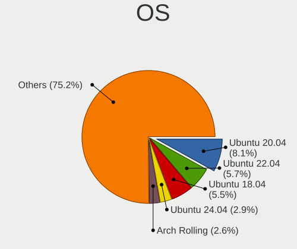

| Name                         | Computers | Percent |
|------------------------------|-----------|---------|
| Ubuntu 20.04                 | 266       | 8.08%   |
| Ubuntu 22.04                 | 189       | 5.74%   |
| Ubuntu 18.04                 | 180       | 5.47%   |
| Ubuntu 24.04                 | 96        | 2.92%   |
| Arch Rolling                 | 87        | 2.64%   |
| Debian 12                    | 85        | 2.58%   |
| Debian 11                    | 82        | 2.49%   |
| Zorin 17                     | 63        | 1.91%   |
| OpenMandriva 4.3             | 59        | 1.79%   |
| OpenMandriva 4.2             | 59        | 1.79%   |
| Manjaro                      | 48        | 1.46%   |
| Pop!_OS 22.04                | 47        | 1.43%   |
| ArcoLinux Rolling            | 47        | 1.43%   |
| Linux Mint 22.1              | 41        | 1.25%   |
| Zorin 16                     | 40        | 1.21%   |
| Zorin 15                     | 37        | 1.12%   |
| OpenMandriva 23.08           | 37        | 1.12%   |
| Linux Mint 20.3              | 35        | 1.06%   |
| Fedora 40                    | 35        | 1.06%   |
| Linux Mint 20.2              | 32        | 0.97%   |
| Fedora 39                    | 31        | 0.94%   |
| Linux Mint 21.2              | 30        | 0.91%   |
| Fedora 41                    | 30        | 0.91%   |
| Fedora 38                    | 29        | 0.88%   |
| Linux Mint 21.3              | 28        | 0.85%   |
| Xubuntu 20.04                | 27        | 0.82%   |
| Linux Mint 20.1              | 27        | 0.82%   |
| Linux Mint 20                | 26        | 0.79%   |
| BlackPanther 18.1            | 26        | 0.79%   |
| Linux Mint 19.3              | 25        | 0.76%   |
| KDE neon 20.04               | 25        | 0.76%   |
| Linux Mint 21.1              | 24        | 0.73%   |
| Fedora 36                    | 24        | 0.73%   |
| openSUSE Tumbleweed-XXXXXXXX | 23        | 0.7%    |
| OpenMandriva 5.0             | 22        | 0.67%   |
| OpenMandriva 25.90           | 22        | 0.67%   |
| Ubuntu 19.04                 | 21        | 0.64%   |
| OpenMandriva 23.03           | 21        | 0.64%   |
| Kubuntu 22.04                | 21        | 0.64%   |
| OpenMandriva 24.07           | 20        | 0.61%   |

OS Family
---------

OS without a version

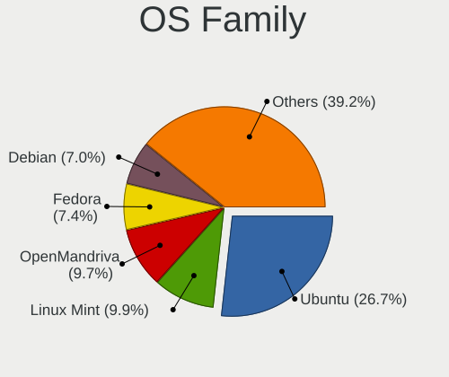

| Name          | Computers | Percent |
|---------------|-----------|---------|
| Ubuntu        | 839       | 26.75%  |
| Linux Mint    | 311       | 9.91%   |
| OpenMandriva  | 305       | 9.72%   |
| Fedora        | 233       | 7.43%   |
| Debian        | 220       | 7.01%   |
| Zorin         | 153       | 4.88%   |
| Arch          | 105       | 3.35%   |
| Pop!_OS       | 91        | 2.9%    |
| Manjaro       | 83        | 2.65%   |
| Xubuntu       | 71        | 2.26%   |
| Kubuntu       | 61        | 1.94%   |
| KDE neon      | 48        | 1.53%   |
| ArcoLinux     | 48        | 1.53%   |
| Endless       | 43        | 1.37%   |
| Elementary    | 41        | 1.31%   |
| Lubuntu       | 35        | 1.12%   |
| Nobara        | 34        | 1.08%   |
| openSUSE      | 31        | 0.99%   |
| ROSA          | 28        | 0.89%   |
| Ubuntu MATE   | 27        | 0.86%   |
| BlackPanther  | 26        | 0.83%   |
| Bazzite       | 25        | 0.8%    |
| LMDE          | 20        | 0.64%   |
| Kali          | 17        | 0.54%   |
| EndeavourOS   | 17        | 0.54%   |
| MX            | 15        | 0.48%   |
| Ubuntu Unity  | 14        | 0.45%   |
| Ubuntu Budgie | 14        | 0.45%   |
| Gentoo        | 13        | 0.41%   |
| Clear Linux   | 12        | 0.38%   |
| Xero          | 11        | 0.35%   |
| Peppermint    | 9         | 0.29%   |
| Huayra        | 8         | 0.26%   |
| SteamOS       | 7         | 0.22%   |
| Loc OS        | 7         | 0.22%   |
| UbuntuDDE     | 6         | 0.19%   |
| CachyOS       | 6         | 0.19%   |
| Slackware     | 5         | 0.16%   |
| Lilidog       | 5         | 0.16%   |
| Void Linux    | 4         | 0.13%   |

Kernel
------

Version of the Linux kernel

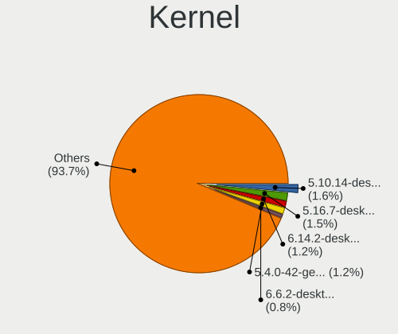

| Version                  | Computers | Percent |
|--------------------------|-----------|---------|
| 5.10.14-desktop-1omv4002 | 57        | 1.58%   |
| 5.16.7-desktop-1omv4003  | 55        | 1.53%   |
| 6.14.2-desktop-3omv2590  | 44        | 1.22%   |
| 5.4.0-42-generic         | 44        | 1.22%   |
| 6.6.2-desktop-1omv2390   | 27        | 0.75%   |
| 6.4.11-desktop-1omv2390  | 26        | 0.72%   |
| 5.4.0-26-generic         | 25        | 0.69%   |
| 4.18.16-desktop-1bP      | 24        | 0.67%   |
| 6.2.6-desktop-1omv2390   | 20        | 0.56%   |
| 5.4.0-52-generic         | 20        | 0.56%   |
| 5.4.0-48-generic         | 20        | 0.56%   |
| 6.8.0-51-generic         | 19        | 0.53%   |
| 6.10.0-desktop-1omv2490  | 19        | 0.53%   |
| 6.8.0-49-generic         | 18        | 0.5%    |
| 6.8.0-60-generic         | 17        | 0.47%   |
| 5.3.0-40-generic         | 17        | 0.47%   |
| 5.15.0-41-generic        | 16        | 0.44%   |
| 5.15.0-52-generic        | 15        | 0.42%   |
| 5.4.0-91-generic         | 14        | 0.39%   |
| 5.4.0-40-generic         | 14        | 0.39%   |
| 5.4.0-37-generic         | 14        | 0.39%   |
| 5.3.0-28-generic         | 14        | 0.39%   |
| 5.15.0-56-generic        | 14        | 0.39%   |
| 6.9.3-76060903-generic   | 13        | 0.36%   |
| 6.12.1-desktop-1omv2490  | 13        | 0.36%   |
| 5.4.0-74-generic         | 13        | 0.36%   |
| 5.3.0-46-generic         | 13        | 0.36%   |
| 6.8.0-31-generic         | 12        | 0.33%   |
| 6.5.0-28-generic         | 12        | 0.33%   |
| 6.4.8-desktop-2omv2390   | 12        | 0.33%   |
| 5.8.0-53-generic         | 12        | 0.33%   |
| 5.4.0-72-generic         | 12        | 0.33%   |
| 5.4.0-58-generic         | 12        | 0.33%   |
| 5.4.0-29-generic         | 12        | 0.33%   |
| 5.3.0-53-generic         | 12        | 0.33%   |
| 5.15.0-76-generic        | 12        | 0.33%   |
| 5.15.0-46-generic        | 12        | 0.33%   |
| 5.11.0-27-generic        | 12        | 0.33%   |
| 6.8.0-45-generic         | 11        | 0.31%   |
| 6.2.0-26-generic         | 11        | 0.31%   |

Kernel Family
-------------

Linux kernel without a distro release

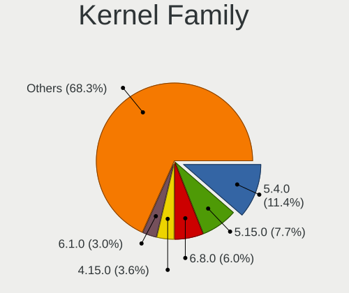

| Version | Computers | Percent |
|---------|-----------|---------|
| 5.4.0   | 387       | 11.35%  |
| 5.15.0  | 261       | 7.66%   |
| 6.8.0   | 206       | 6.04%   |
| 4.15.0  | 124       | 3.64%   |
| 6.1.0   | 103       | 3.02%   |
| 5.8.0   | 97        | 2.85%   |
| 5.3.0   | 96        | 2.82%   |
| 5.10.0  | 94        | 2.76%   |
| 6.5.0   | 85        | 2.49%   |
| 5.11.0  | 78        | 2.29%   |
| 5.13.0  | 75        | 2.2%    |
| 6.2.0   | 71        | 2.08%   |
| 5.19.0  | 65        | 1.91%   |
| 5.10.14 | 58        | 1.7%    |
| 6.14.0  | 57        | 1.67%   |
| 5.16.7  | 55        | 1.61%   |
| 5.0.0   | 55        | 1.61%   |
| 4.18.0  | 52        | 1.53%   |
| 6.11.0  | 50        | 1.47%   |
| 6.14.2  | 47        | 1.38%   |
| 4.19.0  | 31        | 0.91%   |
| 6.6.2   | 30        | 0.88%   |
| 6.4.11  | 30        | 0.88%   |
| 6.2.6   | 27        | 0.79%   |
| 4.18.16 | 25        | 0.73%   |
| 6.9.3   | 20        | 0.59%   |
| 6.10.0  | 20        | 0.59%   |
| 6.4.8   | 15        | 0.44%   |
| 5.14.0  | 15        | 0.44%   |
| 6.12.1  | 13        | 0.38%   |
| 6.17.7  | 11        | 0.32%   |
| 6.1.1   | 11        | 0.32%   |
| 6.8.5   | 10        | 0.29%   |
| 6.12.9  | 10        | 0.29%   |
| 5.11.12 | 9         | 0.26%   |
| 6.8.9   | 8         | 0.23%   |
| 6.8.7   | 8         | 0.23%   |
| 6.6.9   | 8         | 0.23%   |
| 6.5.5   | 8         | 0.23%   |
| 6.15.6  | 8         | 0.23%   |

Kernel Major Ver.
-----------------

Linux kernel major version

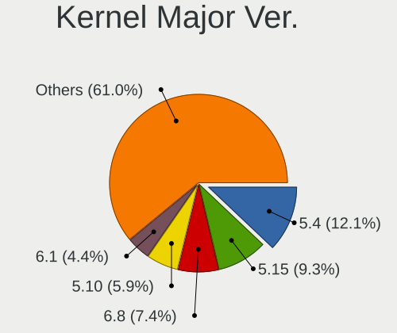

| Version | Computers | Percent |
|---------|-----------|---------|
| 5.4     | 404       | 12.06%  |
| 5.15    | 310       | 9.26%   |
| 6.8     | 249       | 7.44%   |
| 5.10    | 197       | 5.88%   |
| 6.1     | 147       | 4.39%   |
| 4.15    | 124       | 3.7%    |
| 6.2     | 122       | 3.64%   |
| 6.14    | 122       | 3.64%   |
| 6.5     | 120       | 3.58%   |
| 5.8     | 120       | 3.58%   |
| 5.11    | 101       | 3.02%   |
| 5.3     | 98        | 2.93%   |
| 5.13    | 96        | 2.87%   |
| 5.19    | 89        | 2.66%   |
| 6.12    | 86        | 2.57%   |
| 6.6     | 84        | 2.51%   |
| 6.11    | 80        | 2.39%   |
| 5.16    | 80        | 2.39%   |
| 4.18    | 79        | 2.36%   |
| 6.4     | 69        | 2.06%   |
| 5.0     | 59        | 1.76%   |
| 6.9     | 45        | 1.34%   |
| 6.10    | 43        | 1.28%   |
| 5.18    | 37        | 1.1%    |
| 6.15    | 36        | 1.07%   |
| 6.0     | 36        | 1.07%   |
| 4.19    | 34        | 1.02%   |
| 6.7     | 27        | 0.81%   |
| 5.14    | 27        | 0.81%   |
| 6.17    | 26        | 0.78%   |
| 5.17    | 25        | 0.75%   |
| 6.3     | 23        | 0.69%   |
| 6.13    | 22        | 0.66%   |
| 6.16    | 21        | 0.63%   |
| 5.9     | 18        | 0.54%   |
| 5.6     | 18        | 0.54%   |
| 4.9     | 18        | 0.54%   |
| 5.7     | 12        | 0.36%   |
| 5.12    | 12        | 0.36%   |
| 4.4     | 9         | 0.27%   |

Arch
----

OS architecture (x86_64, i586, etc.)

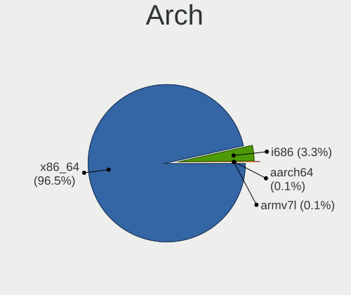

| Name    | Computers | Percent |
|---------|-----------|---------|
| x86_64  | 2918      | 96.49%  |
| i686    | 100       | 3.31%   |
| aarch64 | 4         | 0.13%   |
| armv7l  | 2         | 0.07%   |

DE
--

Desktop Environment

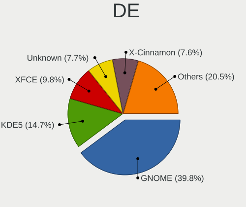

| Name             | Computers | Percent |
|------------------|-----------|---------|
| GNOME            | 1258      | 39.82%  |
| KDE5             | 463       | 14.66%  |
| XFCE             | 309       | 9.78%   |
| Unknown          | 242       | 7.66%   |
| X-Cinnamon       | 239       | 7.57%   |
| KDE6             | 172       | 5.44%   |
| MATE             | 121       | 3.83%   |
| LXQt             | 55        | 1.74%   |
| KDE              | 48        | 1.52%   |
| Pantheon         | 39        | 1.23%   |
| LXDE             | 36        | 1.14%   |
| i3               | 21        | 0.66%   |
| Cinnamon         | 21        | 0.66%   |
| KDE4             | 18        | 0.57%   |
| Budgie           | 18        | 0.57%   |
| Unity            | 14        | 0.44%   |
| Hyprland         | 12        | 0.38%   |
| Deepin           | 10        | 0.32%   |
| lightdm-xsession | 6         | 0.19%   |
| Qtile            | 5         | 0.16%   |
| GNOME Flashback  | 5         | 0.16%   |
| Trinity          | 4         | 0.13%   |
| openbox          | 4         | 0.13%   |
| Enlightenment    | 4         | 0.13%   |
| dwm              | 4         | 0.13%   |
| bspwm            | 4         | 0.13%   |
| xmonad           | 3         | 0.09%   |
| icewm            | 3         | 0.09%   |
| GNOME Classic    | 3         | 0.09%   |
| Endless:GNOME    | 3         | 0.09%   |
| COSMIC           | 3         | 0.09%   |
| sway             | 2         | 0.06%   |
| i3-with-shmlog   | 2         | 0.06%   |
| Cutefish         | 2         | 0.06%   |
| awesome          | 2         | 0.06%   |
| wlroots          | 1         | 0.03%   |
| UKUI             | 1         | 0.03%   |
| fluxbox          | 1         | 0.03%   |
| BunsenLabs       | 1         | 0.03%   |

Display Server
--------------

X11 or Wayland

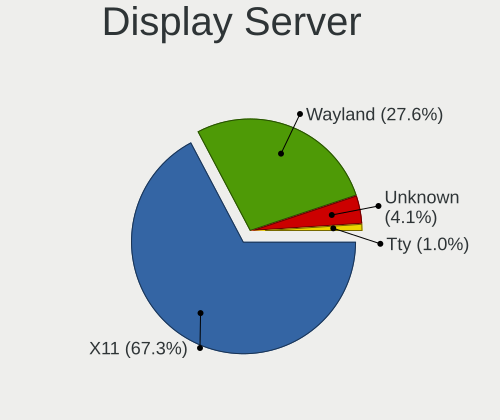

| Name    | Computers | Percent |
|---------|-----------|---------|
| X11     | 2098      | 67.27%  |
| Wayland | 861       | 27.61%  |
| Unknown | 128       | 4.1%    |
| Tty     | 32        | 1.03%   |

Display Manager
---------------

SDDM, LightDM, etc.

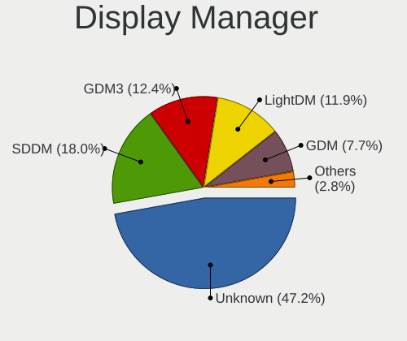

| Name    | Computers | Percent |
|---------|-----------|---------|
| Unknown | 1474      | 47.17%  |
| SDDM    | 562       | 17.98%  |
| GDM3    | 386       | 12.35%  |
| LightDM | 372       | 11.9%   |
| GDM     | 242       | 7.74%   |
| TDM     | 50        | 1.6%    |
| KDM     | 14        | 0.45%   |
| LXDM    | 9         | 0.29%   |
| SLiM    | 4         | 0.13%   |
| GREETD  | 4         | 0.13%   |
| XDM     | 3         | 0.1%    |
| SLIMSKI | 3         | 0.1%    |
| LY-DM   | 1         | 0.03%   |
| Ly      | 1         | 0.03%   |

OS Lang
-------

Language

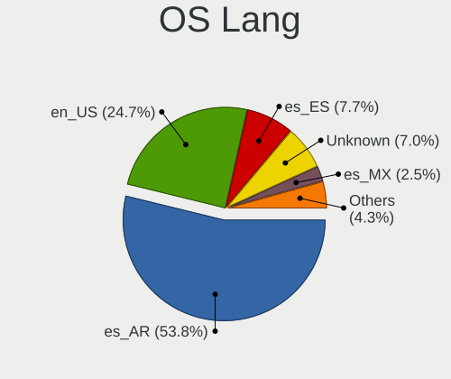

| Lang        | Computers | Percent |
|-------------|-----------|---------|
| es_AR       | 1678      | 53.82%  |
| en_US       | 769       | 24.66%  |
| es_ES       | 239       | 7.67%   |
| Unknown     | 219       | 7.02%   |
| es_MX       | 78        | 2.5%    |
| C           | 66        | 2.12%   |
| en_GB       | 29        | 0.93%   |
| pt_BR       | 5         | 0.16%   |
| ru_RU       | 4         | 0.13%   |
| es_CL       | 4         | 0.13%   |
| POSIX       | 3         | 0.1%    |
| es_US       | 3         | 0.1%    |
| it_IT       | 2         | 0.06%   |
| fr_FR       | 2         | 0.06%   |
| es_UY       | 2         | 0.06%   |
| en_CA       | 2         | 0.06%   |
| en_AG       | 2         | 0.06%   |
| C.UTF8      | 2         | 0.06%   |
| UTF-8       | 1         | 0.03%   |
| es_VE       | 1         | 0.03%   |
| es_DO       | 1         | 0.03%   |
| es_AR.UtF-8 | 1         | 0.03%   |
| es          | 1         | 0.03%   |
| en_UTF-8    | 1         | 0.03%   |
| en_US.UTF8  | 1         | 0.03%   |
| en_AU       | 1         | 0.03%   |
| de_DE       | 1         | 0.03%   |

Boot Mode
---------

EFI or BIOS

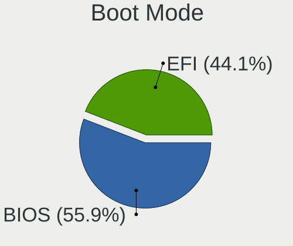

| Mode | Computers | Percent |
|------|-----------|---------|
| BIOS | 1728      | 55.87%  |
| EFI  | 1365      | 44.13%  |

Filesystem
----------

Type of filesystem

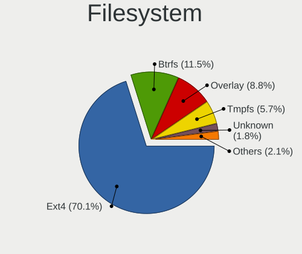

| Type    | Computers | Percent |
|---------|-----------|---------|
| Ext4    | 2182      | 70.14%  |
| Btrfs   | 359       | 11.54%  |
| Overlay | 274       | 8.81%   |
| Tmpfs   | 176       | 5.66%   |
| Unknown | 56        | 1.8%    |
| Xfs     | 37        | 1.19%   |
| Zfs     | 9         | 0.29%   |
| Ext2    | 6         | 0.19%   |
| F2fs    | 5         | 0.16%   |
| Ext3    | 5         | 0.16%   |
| Aufs    | 2         | 0.06%   |

Part. scheme
------------

Scheme of partitioning

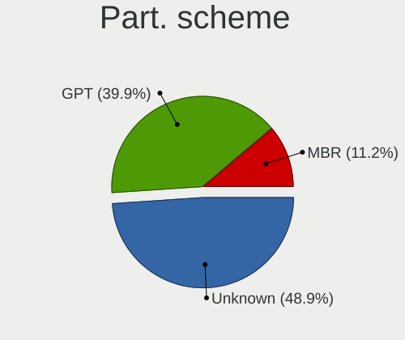

| Type    | Computers | Percent |
|---------|-----------|---------|
| Unknown | 1515      | 48.93%  |
| GPT     | 1235      | 39.89%  |
| MBR     | 346       | 11.18%  |

Dual Boot with Linux/BSD
------------------------

Hosting more than one Linux/BSD

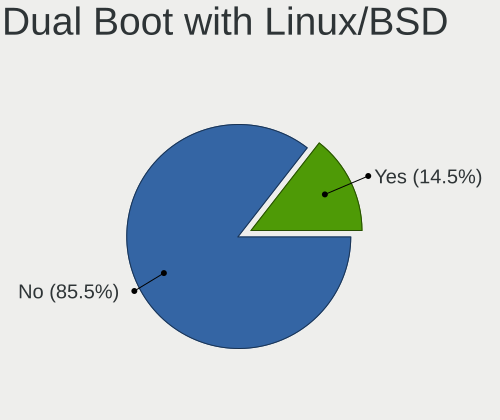

| Dual boot | Computers | Percent |
|-----------|-----------|---------|
| No        | 2631      | 85.53%  |
| Yes       | 445       | 14.47%  |

Dual Boot (Win)
---------------

Hosting Linux and Windows

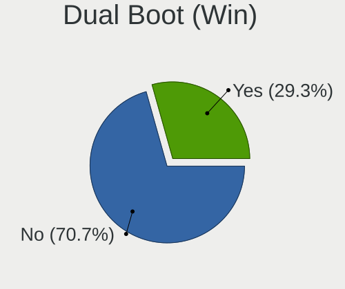

| Dual boot | Computers | Percent |
|-----------|-----------|---------|
| No        | 2172      | 70.66%  |
| Yes       | 902       | 29.34%  |

Board
-----

Vendor
------

Motherboard manufacturer

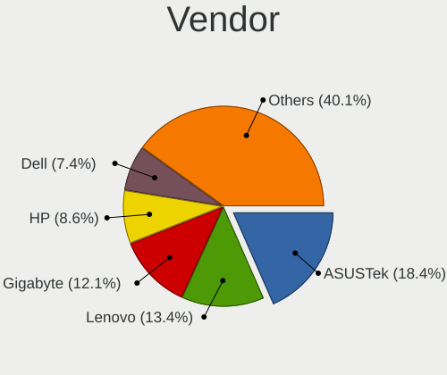

| Name                | Computers | Percent |
|---------------------|-----------|---------|
| ASUSTek Computer    | 557       | 18.43%  |
| Lenovo              | 405       | 13.4%   |
| Gigabyte Technology | 367       | 12.14%  |
| Hewlett-Packard     | 260       | 8.6%    |
| Dell                | 223       | 7.38%   |
| MSI                 | 183       | 6.05%   |
| ASRock              | 173       | 5.72%   |
| BANGHO              | 85        | 2.81%   |
| Acer                | 84        | 2.78%   |
| Intel               | 82        | 2.71%   |
| Toshiba             | 50        | 1.65%   |
| Exo                 | 48        | 1.59%   |
| Positivo            | 46        | 1.52%   |
| Samsung Electronics | 42        | 1.39%   |
| Apple               | 33        | 1.09%   |
| Unknown             | 29        | 0.96%   |
| ECS                 | 28        | 0.93%   |
| Sony                | 27        | 0.89%   |
| Juana Manso         | 23        | 0.76%   |
| Biostar             | 23        | 0.76%   |
| NOBLEX              | 14        | 0.46%   |
| Compal              | 13        | 0.43%   |
| Novatech            | 12        | 0.4%    |
| AMI                 | 12        | 0.4%    |
| PCBOX               | 9         | 0.3%    |
| Coradir             | 8         | 0.26%   |
| Clevo               | 8         | 0.26%   |
| NSX                 | 7         | 0.23%   |
| Quanta              | 6         | 0.2%    |
| Kelyx Argentina     | 6         | 0.2%    |
| Foxconn             | 6         | 0.2%    |
| Conectar Igualdad   | 6         | 0.2%    |
| Advantec            | 6         | 0.2%    |
| Standard            | 5         | 0.17%   |
| Kanji               | 5         | 0.17%   |
| JP.ik               | 5         | 0.17%   |
| HUAWEI              | 5         | 0.17%   |
| GFAST               | 5         | 0.17%   |
| Compaq              | 5         | 0.17%   |
| AIR                 | 5         | 0.17%   |

Model
-----

Motherboard model

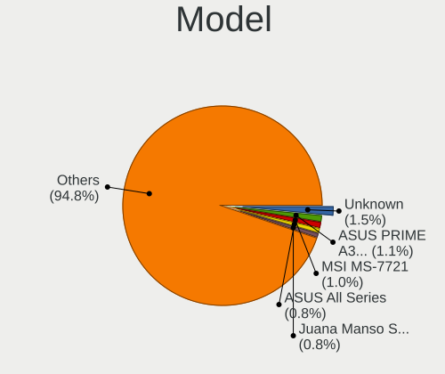

| Name                                   | Computers | Percent |
|----------------------------------------|-----------|---------|
| Unknown                                | 46        | 1.52%   |
| ASUS PRIME A320M-K                     | 33        | 1.09%   |
| MSI MS-7721                            | 30        | 0.99%   |
| ASUS All Series                        | 25        | 0.83%   |
| Juana Manso SF20GM7                    | 23        | 0.76%   |
| BANGHO Suma 1025                       | 22        | 0.73%   |
| Gigabyte F2A68HM-H                     | 19        | 0.63%   |
| Intel powered classmate PC             | 15        | 0.5%    |
| MSI MS-7C52                            | 14        | 0.46%   |
| Gigabyte H81M-H                        | 14        | 0.46%   |
| HP Notebook                            | 13        | 0.43%   |
| HP Laptop 15-bs0xx                     | 12        | 0.4%    |
| Gigabyte A320M-S2H                     | 12        | 0.4%    |
| BANGHO MOV                             | 12        | 0.4%    |
| Lenovo V330-15IKB 81AX                 | 11        | 0.36%   |
| Gigabyte H61M-S1                       | 11        | 0.36%   |
| ASUS PRIME B450M-A                     | 10        | 0.33%   |
| ASUS H61M-K                            | 10        | 0.33%   |
| ASRock A320M-HDV R4.0                  | 10        | 0.33%   |
| MSI MS-7A15                            | 9         | 0.3%    |
| Gigabyte M68MT-S2                      | 9         | 0.3%    |
| BANGHO MAX G0101                       | 9         | 0.3%    |
| ASUS VivoBook_ASUSLaptop X509JA_X509JA | 9         | 0.3%    |
| ASUS P5KPL-AM SE                       | 9         | 0.3%    |
| NOBLEX SF20BA                          | 8         | 0.26%   |
| Lenovo G470 20078                      | 8         | 0.26%   |
| Gigabyte H110M-H                       | 8         | 0.26%   |
| Gigabyte A320M-H                       | 8         | 0.26%   |
| Coradir Coradir/ES10IS5                | 8         | 0.26%   |
| ASRock N68-VS3 FX                      | 8         | 0.26%   |
| ASRock FM2A68M-DG3+                    | 8         | 0.26%   |
| ASRock B450M-HDV R4.0                  | 8         | 0.26%   |
| PCBOX Kant                             | 7         | 0.23%   |
| Lenovo ThinkPad L15 Gen 2 20X4S27200   | 7         | 0.23%   |
| HP Pavilion dv6                        | 7         | 0.23%   |
| Dell Latitude E6410                    | 7         | 0.23%   |
| Dell Inspiron 1525                     | 7         | 0.23%   |
| ASUS VivoBook_ASUSLaptop X515EA_X515EA | 7         | 0.23%   |
| MSI MS-7C96                            | 6         | 0.2%    |
| MSI MS-7C95                            | 6         | 0.2%    |

Model Family
------------

Motherboard model prefix

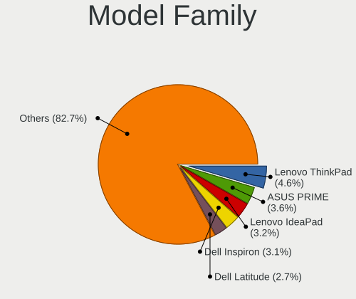

| Name                | Computers | Percent |
|---------------------|-----------|---------|
| Lenovo ThinkPad     | 139       | 4.6%    |
| ASUS PRIME          | 109       | 3.61%   |
| Lenovo IdeaPad      | 98        | 3.24%   |
| Dell Inspiron       | 95        | 3.14%   |
| Dell Latitude       | 81        | 2.68%   |
| ASUS VivoBook       | 71        | 2.35%   |
| HP Pavilion         | 67        | 2.22%   |
| Acer Aspire         | 67        | 2.22%   |
| Unknown             | 46        | 1.52%   |
| HP Laptop           | 43        | 1.42%   |
| Toshiba Satellite   | 35        | 1.16%   |
| MSI MS-7721         | 30        | 0.99%   |
| ASUS ROG            | 30        | 0.99%   |
| HP Compaq           | 25        | 0.83%   |
| ASUS All            | 25        | 0.83%   |
| Juana Manso SF20GM7 | 23        | 0.76%   |
| BANGHO Suma         | 23        | 0.76%   |
| Exo Smart           | 22        | 0.73%   |
| ASUS TUF            | 22        | 0.73%   |
| Dell OptiPlex       | 20        | 0.66%   |
| BANGHO MAX          | 20        | 0.66%   |
| Gigabyte F2A68HM-H  | 19        | 0.63%   |
| Gigabyte A320M-S2H  | 18        | 0.6%    |
| Lenovo ThinkBook    | 17        | 0.56%   |
| Gigabyte B450M      | 16        | 0.53%   |
| ASUS M5A78L-M       | 16        | 0.53%   |
| Intel powered       | 15        | 0.5%    |
| MSI MS-7C52         | 14        | 0.46%   |
| HP 250              | 14        | 0.46%   |
| Gigabyte H81M-H     | 14        | 0.46%   |
| ASUS ZenBook        | 14        | 0.46%   |
| HP Notebook         | 13        | 0.43%   |
| HP EliteBook        | 13        | 0.43%   |
| ASRock A320M-HDV    | 13        | 0.43%   |
| Lenovo Yoga         | 12        | 0.4%    |
| Lenovo ThinkCentre  | 12        | 0.4%    |
| BANGHO MOV          | 12        | 0.4%    |
| ASUS M5A97          | 12        | 0.4%    |
| Lenovo V330-15IKB   | 11        | 0.36%   |
| HP ENVY             | 11        | 0.36%   |

MFG Year
--------

Motherboard manufacture year

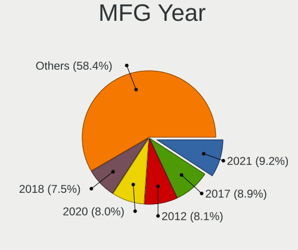

| Year    | Computers | Percent |
|---------|-----------|---------|
| 2021    | 278       | 9.2%    |
| 2017    | 268       | 8.87%   |
| 2012    | 244       | 8.07%   |
| 2020    | 242       | 8.01%   |
| 2018    | 226       | 7.48%   |
| 2013    | 193       | 6.38%   |
| 2011    | 192       | 6.35%   |
| 2019    | 191       | 6.32%   |
| 2014    | 181       | 5.99%   |
| 2010    | 168       | 5.56%   |
| 2015    | 162       | 5.36%   |
| 2016    | 129       | 4.27%   |
| 2008    | 118       | 3.9%    |
| 2009    | 102       | 3.37%   |
| 2022    | 98        | 3.24%   |
| 2023    | 71        | 2.35%   |
| 2007    | 63        | 2.08%   |
| 2006    | 42        | 1.39%   |
| 2024    | 24        | 0.79%   |
| Unknown | 13        | 0.43%   |
| 2005    | 7         | 0.23%   |
| 2004    | 6         | 0.2%    |
| 2025    | 4         | 0.13%   |
| 2001    | 1         | 0.03%   |

Form Factor
-----------

Physical design of the computer

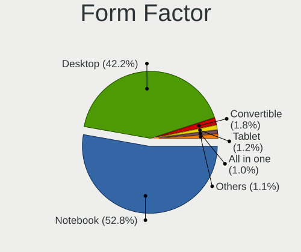

| Name           | Computers | Percent |
|----------------|-----------|---------|
| Notebook       | 1596      | 52.8%   |
| Desktop        | 1275      | 42.18%  |
| Convertible    | 53        | 1.75%   |
| Tablet         | 36        | 1.19%   |
| All in one     | 29        | 0.96%   |
| Mini pc        | 24        | 0.79%   |
| System on chip | 5         | 0.17%   |
| Server         | 4         | 0.13%   |
| Other          | 1         | 0.03%   |

Secure Boot
-----------

Enabled or disabled

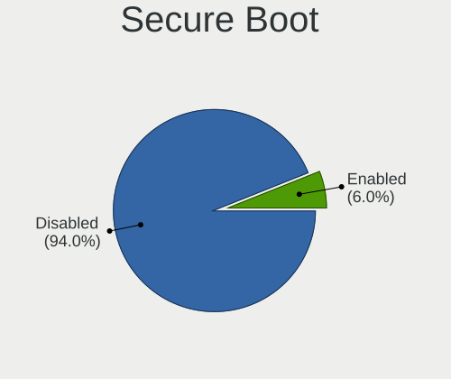

| State    | Computers | Percent |
|----------|-----------|---------|
| Disabled | 2861      | 93.96%  |
| Enabled  | 184       | 6.04%   |

Coreboot
--------

Have coreboot on board

| Used | Computers | Percent |
|------|-----------|---------|
| No   | 3018      | 99.83%  |
| Yes  | 5         | 0.17%   |

RAM Size
--------

Total RAM memory

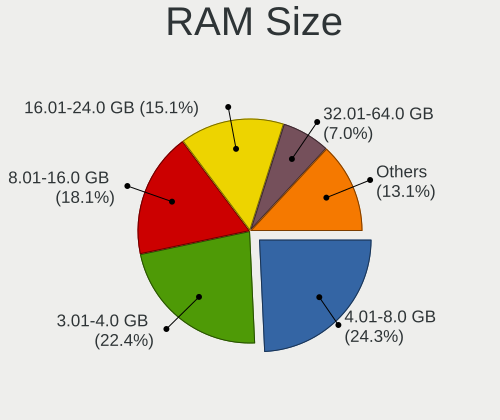

| Size in GB  | Computers | Percent |
|-------------|-----------|---------|
| 4.01-8.0    | 748       | 24.27%  |
| 3.01-4.0    | 691       | 22.42%  |
| 8.01-16.0   | 557       | 18.07%  |
| 16.01-24.0  | 466       | 15.12%  |
| 32.01-64.0  | 216       | 7.01%   |
| 1.01-2.0    | 204       | 6.62%   |
| 24.01-32.0  | 69        | 2.24%   |
| 2.01-3.0    | 59        | 1.91%   |
| 0.51-1.0    | 37        | 1.2%    |
| 64.01-256.0 | 33        | 1.07%   |
| 0.01-0.5    | 2         | 0.06%   |

RAM Used
--------

Used RAM memory

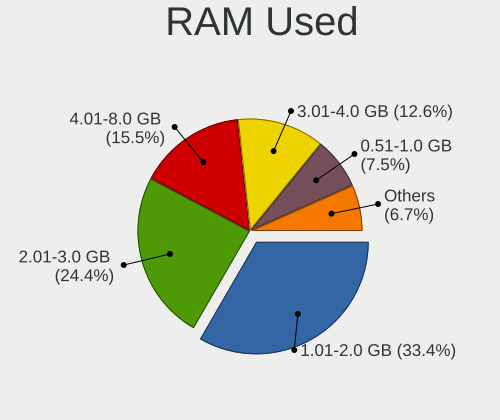

| Used GB    | Computers | Percent |
|------------|-----------|---------|
| 1.01-2.0   | 1114      | 33.35%  |
| 2.01-3.0   | 815       | 24.4%   |
| 4.01-8.0   | 518       | 15.51%  |
| 3.01-4.0   | 421       | 12.6%   |
| 0.51-1.0   | 249       | 7.46%   |
| 8.01-16.0  | 150       | 4.49%   |
| 0.01-0.5   | 42        | 1.26%   |
| 16.01-24.0 | 23        | 0.69%   |
| 24.01-32.0 | 6         | 0.18%   |
| 32.01-64.0 | 1         | 0.03%   |
| 0          | 1         | 0.03%   |

Total Drives
------------

Number of drives on board

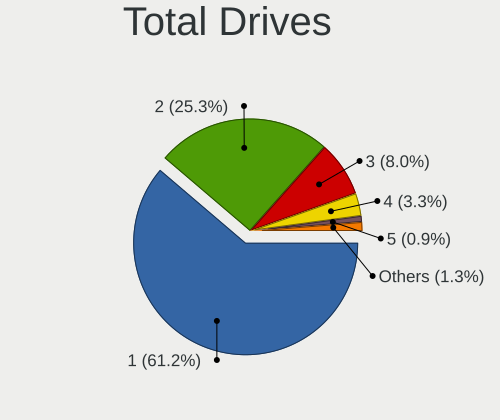

| Drives | Computers | Percent |
|--------|-----------|---------|
| 1      | 1899      | 61.24%  |
| 2      | 785       | 25.31%  |
| 3      | 248       | 8%      |
| 4      | 102       | 3.29%   |
| 5      | 27        | 0.87%   |
| 0      | 23        | 0.74%   |
| 6      | 9         | 0.29%   |
| 7      | 3         | 0.1%    |
| 9      | 2         | 0.06%   |
| 28     | 1         | 0.03%   |
| 20     | 1         | 0.03%   |
| 19     | 1         | 0.03%   |

Has CD-ROM
----------

Has CD-ROM on board

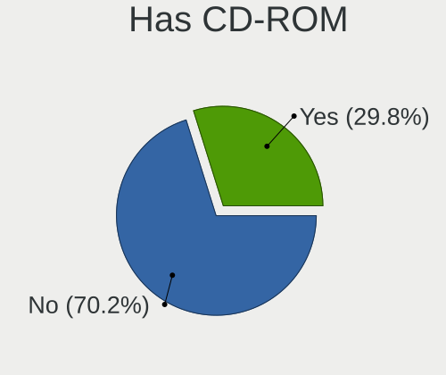

| Presented | Computers | Percent |
|-----------|-----------|---------|
| No        | 2140      | 70.16%  |
| Yes       | 910       | 29.84%  |

Has Ethernet
------------

Has Ethernet on board

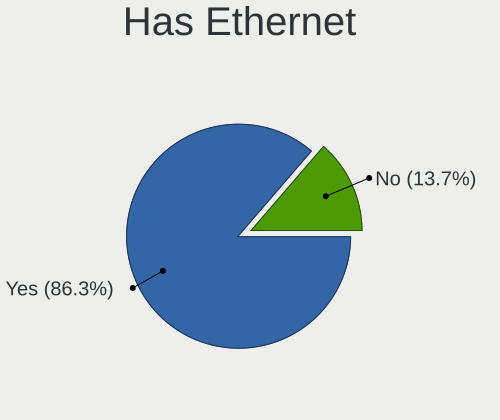

| Presented | Computers | Percent |
|-----------|-----------|---------|
| Yes       | 2613      | 86.32%  |
| No        | 414       | 13.68%  |

Has WiFi
--------

Has WiFi module

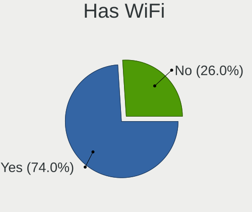

| Presented | Computers | Percent |
|-----------|-----------|---------|
| Yes       | 2262      | 73.97%  |
| No        | 796       | 26.03%  |

Has Bluetooth
-------------

Has Bluetooth module

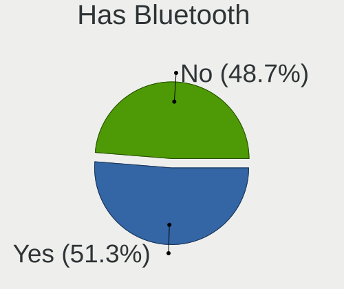

| Presented | Computers | Percent |
|-----------|-----------|---------|
| Yes       | 1569      | 51.27%  |
| No        | 1491      | 48.73%  |

Location
--------

Country
-------

Geographic location (country)

| Country   | Computers | Percent |
|-----------|-----------|---------|
| Argentina | 3023      | 100%    |

City
----

Geographic location (city)

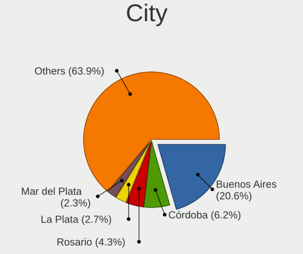

| City                   | Computers | Percent |
|------------------------|-----------|---------|
| Buenos Aires           | 653       | 20.6%   |
| Córdoba               | 198       | 6.25%   |
| Rosario                | 136       | 4.29%   |
| La Plata               | 85        | 2.68%   |
| Mar del Plata          | 73        | 2.3%    |
| Mendoza                | 46        | 1.45%   |
| Avellaneda             | 43        | 1.36%   |
| San Miguel de Tucumán | 40        | 1.26%   |
| Lanus                  | 40        | 1.26%   |
| Santa Fe               | 39        | 1.23%   |
| Quilmes                | 38        | 1.2%    |
| Corrientes             | 36        | 1.14%   |
| Neuquén               | 34        | 1.07%   |
| Villa Ballester        | 32        | 1.01%   |
| Salta                  | 31        | 0.98%   |
| Resistencia            | 30        | 0.95%   |
| Bahía Blanca          | 30        | 0.95%   |
| Lomas de Zamora        | 29        | 0.91%   |
| Ituzaingo              | 29        | 0.91%   |
| Paraná                | 28        | 0.88%   |
| Posadas                | 24        | 0.76%   |
| San Juan               | 23        | 0.73%   |
| Ramos Mejia            | 23        | 0.73%   |
| Isidro Casanova        | 23        | 0.73%   |
| Tandil                 | 22        | 0.69%   |
| Burzaco                | 21        | 0.66%   |
| Bariloche              | 21        | 0.66%   |
| Caseros                | 20        | 0.63%   |
| Viedma                 | 17        | 0.54%   |
| Olivos                 | 17        | 0.54%   |
| Florencio Varela       | 17        | 0.54%   |
| Moron                  | 16        | 0.5%    |
| Godoy Cruz             | 16        | 0.5%    |
| Tigre                  | 15        | 0.47%   |
| San Salvador de Jujuy  | 15        | 0.47%   |
| Pilar                  | 15        | 0.47%   |
| Martinez               | 15        | 0.47%   |
| Río Cuarto            | 14        | 0.44%   |
| San Fernando           | 13        | 0.41%   |
| Reconquista            | 13        | 0.41%   |

Drives
------

Drive Vendor
------------

Hard drive vendors

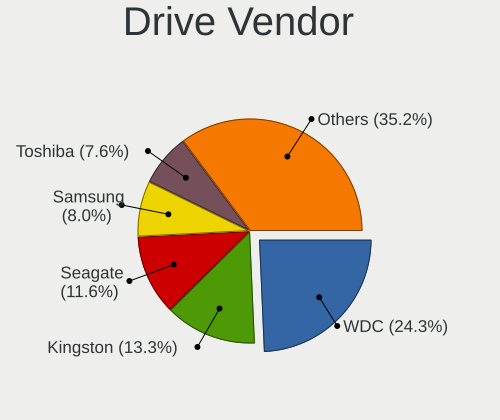

| Vendor                      | Computers | Drives | Percent |
|-----------------------------|-----------|--------|---------|
| WDC                         | 1042      | 1594   | 24.31%  |
| Kingston                    | 570       | 736    | 13.3%   |
| Seagate                     | 497       | 638    | 11.59%  |
| Samsung Electronics         | 345       | 484    | 8.05%   |
| Toshiba                     | 324       | 406    | 7.56%   |
| SanDisk                     | 173       | 229    | 4.04%   |
| Unknown                     | 114       | 141    | 2.66%   |
| Hitachi                     | 112       | 139    | 2.61%   |
| Crucial                     | 87        | 131    | 2.03%   |
| HGST                        | 82        | 92     | 1.91%   |
| Gigabyte Technology         | 75        | 110    | 1.75%   |
| A-DATA Technology           | 75        | 82     | 1.75%   |
| SK hynix                    | 65        | 82     | 1.52%   |
| Micron Technology           | 46        | 58     | 1.07%   |
| Intel                       | 37        | 59     | 0.86%   |
| PNY                         | 30        | 44     | 0.7%    |
| Lexar                       | 30        | 34     | 0.7%    |
| Patriot                     | 29        | 33     | 0.68%   |
| KIOXIA                      | 29        | 31     | 0.68%   |
| Kingston Technology Company | 28        | 33     | 0.65%   |
| Unknown                     | 28        | 30     | 0.65%   |
| China                       | 27        | 34     | 0.63%   |
| HS-SSD-WAVE(S)              | 24        | 28     | 0.56%   |
| Hewlett-Packard             | 23        | 32     | 0.54%   |
| Realtek Semiconductor       | 22        | 29     | 0.51%   |
| MAXIO Technology (Hangzhou) | 22        | 27     | 0.51%   |
| Phison Electronics          | 20        | 29     | 0.47%   |
| Maxtor                      | 18        | 21     | 0.42%   |
| ADATA Technology            | 18        | 21     | 0.42%   |
| Micron/Crucial Technology   | 17        | 25     | 0.4%    |
| Corsair                     | 17        | 20     | 0.4%    |
| Kimtigo                     | 15        | 15     | 0.35%   |
| Neo                         | 13        | 15     | 0.3%    |
| HS-SSD-C100                 | 12        | 16     | 0.28%   |
| Silicon Motion              | 10        | 14     | 0.23%   |
| XPG                         | 9         | 11     | 0.21%   |
| Phison                      | 9         | 10     | 0.21%   |
| Hikvision                   | 9         | 11     | 0.21%   |
| Fujitsu                     | 8         | 8      | 0.19%   |
| FORESEE                     | 7         | 7      | 0.16%   |

Drive Model
-----------

Hard drive models

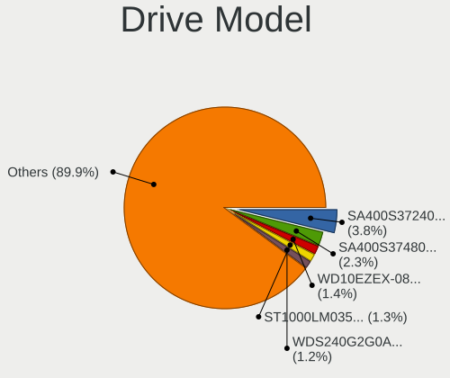

| Model                                            | Computers | Percent |
|--------------------------------------------------|-----------|---------|
| Kingston SA400S37240G 240GB SSD                  | 179       | 3.82%   |
| Kingston SA400S37480G 480GB SSD                  | 110       | 2.35%   |
| WDC WD10EZEX-08WN4A0 1TB                         | 67        | 1.43%   |
| Seagate ST1000LM035-1RK172 1TB                   | 61        | 1.3%    |
| WDC WDS240G2G0A-00JH30 240GB SSD                 | 58        | 1.24%   |
| Seagate ST1000DM010-2EP102 1TB                   | 48        | 1.02%   |
| Kingston SA400S37120G 120GB SSD                  | 46        | 0.98%   |
| Toshiba MQ01ABF050 500GB                         | 43        | 0.92%   |
| Toshiba MQ01ABD100 1TB                           | 37        | 0.79%   |
| Kingston SA400S37960G 960GB SSD                  | 35        | 0.75%   |
| Seagate ST1000LM024 HN-M101MBB 1TB               | 34        | 0.72%   |
| WDC WD10EZEX-00BN5A0 1TB                         | 32        | 0.68%   |
| Crucial CT240BX500SSD1 240GB                     | 29        | 0.62%   |
| Seagate ST500DM002-1BD142 500GB                  | 28        | 0.6%    |
| Kingston SV300S37A120G 120GB SSD                 | 28        | 0.6%    |
| Unknown                                          | 28        | 0.6%    |
| Toshiba MQ04ABF100 1TB                           | 27        | 0.58%   |
| Toshiba DT01ACA100 1TB                           | 27        | 0.58%   |
| WDC WD5000AAKX-001CA0 500GB                      | 26        | 0.55%   |
| Toshiba DT01ACA050 500GB                         | 26        | 0.55%   |
| Gigabyte GP-GSTFS31240GNTD 240GB SSD             | 26        | 0.55%   |
| WDC WDS120G2G0A-00JH30 120GB SSD                 | 25        | 0.53%   |
| WDC WD5000AAKX-00ERMA0 500GB                     | 25        | 0.53%   |
| WDC WD20EZRZ-00Z5HB0 2TB                         | 25        | 0.53%   |
| Unknown MMC Card  32GB                           | 25        | 0.53%   |
| Gigabyte GP-GSTFS31120GNTD 120GB SSD             | 25        | 0.53%   |
| A-DATA SU630 240GB SSD                           | 21        | 0.45%   |
| WDC WDS480G2G0A-00JH30 480GB SSD                 | 19        | 0.41%   |
| WDC WD1003FZEX-00MK2A0 1TB                       | 19        | 0.41%   |
| Unknown MMC Card  64GB                           | 19        | 0.41%   |
| Seagate ST500LM030-2E717D 500GB                  | 19        | 0.41%   |
| Kingston SNVS500G 500GB                          | 19        | 0.41%   |
| Kingston SNV2S500G 500GB                         | 19        | 0.41%   |
| HGST HTS721010A9E630 1TB                         | 19        | 0.41%   |
| MAXIO (Hangzhou) NVMe SSD Controller MAP1202 2TB | 18        | 0.38%   |
| Kingston SV300S37A240G 240GB SSD                 | 18        | 0.38%   |
| Kingston SUV400S37240G 240GB SSD                 | 18        | 0.38%   |
| WDC WD1600AABS-00PRA0 160GB                      | 17        | 0.36%   |
| Seagate ST500LT012-1DG142 500GB                  | 17        | 0.36%   |
| WDC WDS500G2B0A-00SM50 500GB                     | 16        | 0.34%   |

HDD Vendor
----------

Hard disk drive vendors

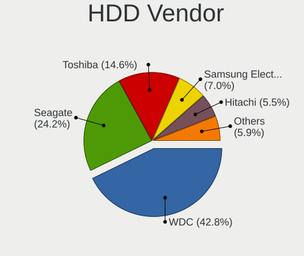

| Vendor              | Computers | Drives | Percent |
|---------------------|-----------|--------|---------|
| WDC                 | 867       | 1276   | 42.79%  |
| Seagate             | 490       | 628    | 24.19%  |
| Toshiba             | 296       | 372    | 14.61%  |
| Samsung Electronics | 141       | 192    | 6.96%   |
| Hitachi             | 112       | 139    | 5.53%   |
| HGST                | 82        | 92     | 4.05%   |
| Maxtor              | 15        | 16     | 0.74%   |
| Unknown             | 9         | 9      | 0.44%   |
| Fujitsu             | 8         | 8      | 0.39%   |
| USB3.0              | 1         | 1      | 0.05%   |
| Quantum             | 1         | 1      | 0.05%   |
| JMicron Technology  | 1         | 1      | 0.05%   |
| Inateck             | 1         | 1      | 0.05%   |
| ExcelStor           | 1         | 1      | 0.05%   |
| ASMT                | 1         | 2      | 0.05%   |

SSD Vendor
----------

Solid state drive vendors

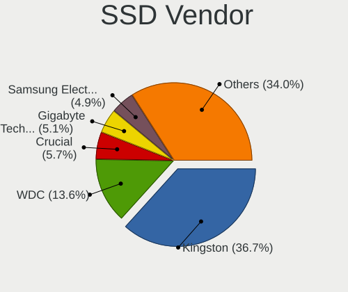

| Vendor              | Computers | Drives | Percent |
|---------------------|-----------|--------|---------|
| Kingston            | 499       | 644    | 36.69%  |
| WDC                 | 185       | 230    | 13.6%   |
| Crucial             | 77        | 119    | 5.66%   |
| Gigabyte Technology | 69        | 104    | 5.07%   |
| Samsung Electronics | 67        | 99     | 4.93%   |
| A-DATA Technology   | 66        | 71     | 4.85%   |
| SanDisk             | 52        | 62     | 3.82%   |
| PNY                 | 30        | 44     | 2.21%   |
| Lexar               | 28        | 32     | 2.06%   |
| Patriot             | 27        | 31     | 1.99%   |
| China               | 23        | 30     | 1.69%   |
| Kimtigo             | 15        | 15     | 1.1%    |
| Hewlett-Packard     | 15        | 21     | 1.1%    |
| SK hynix            | 13        | 14     | 0.96%   |
| Corsair             | 13        | 16     | 0.96%   |
| Micron Technology   | 10        | 14     | 0.74%   |
| Intel               | 10        | 11     | 0.74%   |
| Toshiba             | 9         | 9      | 0.66%   |
| HS-SSD-WAVE(S)      | 9         | 11     | 0.66%   |
| Colorful            | 7         | 9      | 0.51%   |
| Wodposit            | 6         | 6      | 0.44%   |
| Team                | 6         | 6      | 0.44%   |
| LITEONIT            | 6         | 6      | 0.44%   |
| HS-SSD-C100         | 6         | 10     | 0.44%   |
| Unknown             | 6         | 6      | 0.44%   |
| Vi550               | 5         | 6      | 0.37%   |
| Seagate             | 5         | 8      | 0.37%   |
| Netac               | 5         | 7      | 0.37%   |
| Neo                 | 5         | 7      | 0.37%   |
| Hikvision           | 5         | 5      | 0.37%   |
| FORESEE             | 5         | 5      | 0.37%   |
| Mushkin             | 4         | 6      | 0.29%   |
| LITEON              | 4         | 4      | 0.29%   |
| Apple               | 4         | 4      | 0.29%   |
| Super Talent        | 3         | 3      | 0.22%   |
| OCZ                 | 3         | 3      | 0.22%   |
| MSI                 | 3         | 3      | 0.22%   |
| Maxtor              | 3         | 5      | 0.22%   |
| GLOWAY              | 3         | 4      | 0.22%   |
| WDC WDS2            | 2         | 2      | 0.15%   |

Drive Kind
----------

HDD or SSD

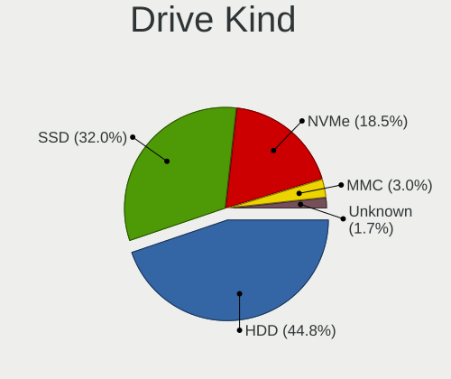

| Kind    | Computers | Drives | Percent |
|---------|-----------|--------|---------|
| HDD     | 1744      | 2739   | 44.8%   |
| SSD     | 1245      | 1786   | 31.98%  |
| NVMe    | 721       | 1049   | 18.52%  |
| MMC     | 116       | 146    | 2.98%   |
| Unknown | 67        | 75     | 1.72%   |

Drive Connector
---------------

SATA, SAS, NVMe, etc.

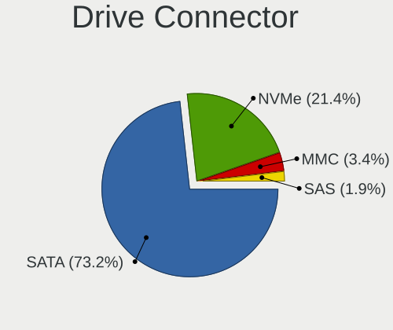

| Type | Computers | Drives | Percent |
|------|-----------|--------|---------|
| SATA | 2467      | 4525   | 73.25%  |
| NVMe | 721       | 1047   | 21.41%  |
| MMC  | 116       | 146    | 3.44%   |
| SAS  | 64        | 77     | 1.9%    |

Drive Size
----------

Size of hard drive

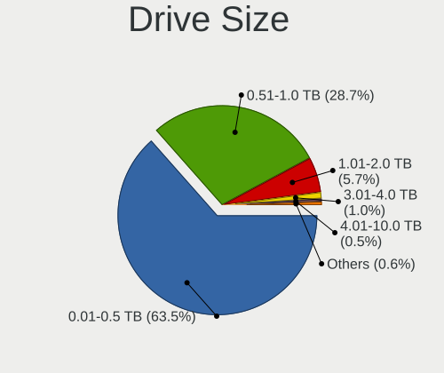

| Size in TB | Computers | Drives | Percent |
|------------|-----------|--------|---------|
| 0.01-0.5   | 1905      | 2849   | 63.48%  |
| 0.51-1.0   | 861       | 1297   | 28.69%  |
| 1.01-2.0   | 172       | 240    | 5.73%   |
| 3.01-4.0   | 31        | 44     | 1.03%   |
| 4.01-10.0  | 15        | 23     | 0.5%    |
| 2.01-3.0   | 14        | 17     | 0.47%   |
| 10.01-20.0 | 3         | 55     | 0.1%    |

Space Total
-----------

Amount of disk space available on the file system

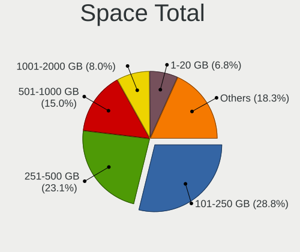

| Size in GB     | Computers | Percent |
|----------------|-----------|---------|
| 101-250        | 927       | 28.83%  |
| 251-500        | 742       | 23.08%  |
| 501-1000       | 482       | 14.99%  |
| 1001-2000      | 257       | 7.99%   |
| 1-20           | 220       | 6.84%   |
| 51-100         | 195       | 6.07%   |
| 21-50          | 123       | 3.83%   |
| 2001-3000      | 95        | 2.95%   |
| More than 3000 | 90        | 2.8%    |
| Unknown        | 84        | 2.61%   |

Space Used
----------

Amount of used disk space

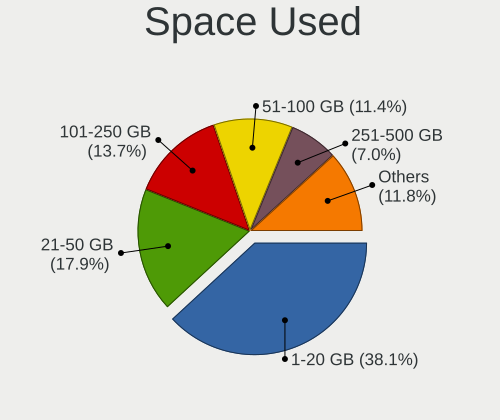

| Used GB        | Computers | Percent |
|----------------|-----------|---------|
| 1-20           | 1260      | 38.12%  |
| 21-50          | 593       | 17.94%  |
| 101-250        | 452       | 13.68%  |
| 51-100         | 378       | 11.44%  |
| 251-500        | 233       | 7.05%   |
| 501-1000       | 167       | 5.05%   |
| 1001-2000      | 86        | 2.6%    |
| Unknown        | 84        | 2.54%   |
| 2001-3000      | 26        | 0.79%   |
| More than 3000 | 24        | 0.73%   |
| 0              | 2         | 0.06%   |

Malfunc. Drives
---------------

Drive models with a malfunction

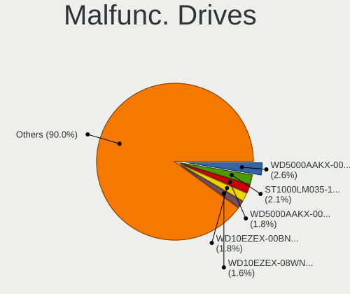

| Model                              | Computers | Drives | Percent |
|------------------------------------|-----------|--------|---------|
| WDC WD5000AAKX-00ERMA0 500GB       | 10        | 12     | 2.62%   |
| Seagate ST1000LM035-1RK172 1TB     | 8         | 8      | 2.1%    |
| WDC WD5000AAKX-001CA0 500GB        | 7         | 9      | 1.84%   |
| WDC WD10EZEX-00BN5A0 1TB           | 7         | 7      | 1.84%   |
| WDC WD10EZEX-08WN4A0 1TB           | 6         | 6      | 1.57%   |
| Toshiba MQ01ABF050 500GB           | 6         | 6      | 1.57%   |
| Toshiba MK1665GSX 160GB            | 6         | 6      | 1.57%   |
| Kingston SA400S37240G 240GB SSD    | 6         | 6      | 1.57%   |
| HGST HTS721010A9E630 1TB           | 6         | 8      | 1.57%   |
| Toshiba MQ01ABD100 1TB             | 5         | 8      | 1.31%   |
| Seagate ST500DM002-1BD142 500GB    | 5         | 6      | 1.31%   |
| WDC WDS240G2G0A-00JH30 240GB SSD   | 4         | 4      | 1.05%   |
| WDC WD5000BPVT-22HXZT3 500GB       | 4         | 4      | 1.05%   |
| WDC WD3200AAKS-00L9A0 320GB        | 4         | 4      | 1.05%   |
| WDC WD10EARS-00Y5B1 1TB            | 4         | 4      | 1.05%   |
| Toshiba DT01ACA050 500GB           | 4         | 4      | 1.05%   |
| Seagate ST9500325AS 500GB          | 4         | 4      | 1.05%   |
| WDC WDS480G2G0A-00JH30 480GB SSD   | 3         | 6      | 0.79%   |
| WDC WD1003FZEX-00MK2A0 1TB         | 3         | 4      | 0.79%   |
| WDC WD1002FAEX-00Z3A0 1TB          | 3         | 3      | 0.79%   |
| WDC WD1002FAEX-00Y9A0 1TB          | 3         | 3      | 0.79%   |
| WDC WD Green 2.5 240GB             | 3         | 3      | 0.79%   |
| Toshiba MQ01ABD050 500GB           | 3         | 4      | 0.79%   |
| Toshiba MK7559GSXP 752GB           | 3         | 4      | 0.79%   |
| Seagate ST9320325AS 320GB          | 3         | 3      | 0.79%   |
| Seagate ST500LT012-9WS142 500GB    | 3         | 3      | 0.79%   |
| Seagate ST500LM030-2E717D 500GB    | 3         | 3      | 0.79%   |
| Seagate ST1000LM024 HN-M101MBB 1TB | 3         | 3      | 0.79%   |
| Seagate ST1000DM003-1SB10C 1TB     | 3         | 3      | 0.79%   |
| HGST HTS541010A9E680 1TB           | 3         | 3      | 0.79%   |
| WDC WDS240G2G0B-00EPW0 240GB SSD   | 2         | 2      | 0.52%   |
| WDC WD5000AAKX-08ERMA0 500GB       | 2         | 2      | 0.52%   |
| WDC WD5000AAKS-00V1A0 500GB        | 2         | 2      | 0.52%   |
| WDC WD3200AAJS-56B4A0 320GB        | 2         | 3      | 0.52%   |
| WDC WD3200AAJS-00L7A0 320GB        | 2         | 2      | 0.52%   |
| WDC WD2500BEKT-75PVMT0 250GB       | 2         | 4      | 0.52%   |
| WDC WD20PURZ-85GU6Y0 2TB           | 2         | 3      | 0.52%   |
| WDC WD20EZRX-00D8PB0 2TB           | 2         | 2      | 0.52%   |
| WDC WD1600AABS-00PRA0 160GB        | 2         | 2      | 0.52%   |
| WDC WD10EZEX-00RKKA0 1TB           | 2         | 2      | 0.52%   |

Malfunc. Drive Vendor
---------------------

Vendors of faulty drives

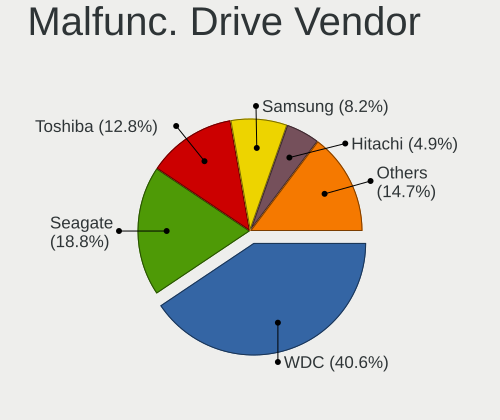

| Vendor                      | Computers | Drives | Percent |
|-----------------------------|-----------|--------|---------|
| WDC                         | 149       | 172    | 40.6%   |
| Seagate                     | 69        | 81     | 18.8%   |
| Toshiba                     | 47        | 53     | 12.81%  |
| Samsung Electronics         | 30        | 34     | 8.17%   |
| Hitachi                     | 18        | 20     | 4.9%    |
| Kingston                    | 16        | 16     | 4.36%   |
| HGST                        | 16        | 18     | 4.36%   |
| A-DATA Technology           | 4         | 4      | 1.09%   |
| Maxtor                      | 3         | 4      | 0.82%   |
| SanDisk                     | 2         | 2      | 0.54%   |
| Patriot                     | 2         | 2      | 0.54%   |
| LITEONIT                    | 2         | 2      | 0.54%   |
| XPG                         | 1         | 1      | 0.27%   |
| tecmiyo                     | 1         | 4      | 0.27%   |
| SMI                         | 1         | 1      | 0.27%   |
| Silicon Motion              | 1         | 1      | 0.27%   |
| Quantum                     | 1         | 1      | 0.27%   |
| Micron Technology           | 1         | 2      | 0.27%   |
| MAXIO Technology (Hangzhou) | 1         | 2      | 0.27%   |
| Fujitsu                     | 1         | 1      | 0.27%   |
| Crucial                     | 1         | 1      | 0.27%   |

Malfunc. HDD Vendor
-------------------

Vendors of faulty HDD drives

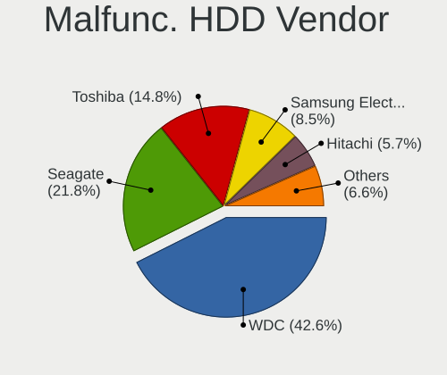

| Vendor              | Computers | Drives | Percent |
|---------------------|-----------|--------|---------|
| WDC                 | 135       | 155    | 42.59%  |
| Seagate             | 69        | 81     | 21.77%  |
| Toshiba             | 47        | 53     | 14.83%  |
| Samsung Electronics | 27        | 30     | 8.52%   |
| Hitachi             | 18        | 20     | 5.68%   |
| HGST                | 16        | 18     | 5.05%   |
| Maxtor              | 3         | 4      | 0.95%   |
| Quantum             | 1         | 1      | 0.32%   |
| Fujitsu             | 1         | 1      | 0.32%   |

Malfunc. Drive Kind
-------------------

Kinds of faulty drives

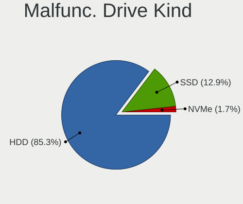

| Kind | Computers | Drives | Percent |
|------|-----------|--------|---------|
| HDD  | 297       | 363    | 85.34%  |
| SSD  | 45        | 52     | 12.93%  |
| NVMe | 6         | 7      | 1.72%   |

Failed Drives
-------------

Failed drive models

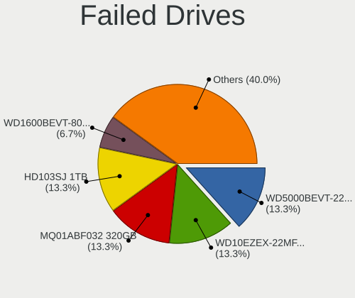

| Model                             | Computers | Drives | Percent |
|-----------------------------------|-----------|--------|---------|
| WDC WD5000BEVT-22ZAT0 500GB       | 2         | 3      | 13.33%  |
| WDC WD10EZEX-22MFCA0 1TB          | 2         | 2      | 13.33%  |
| Toshiba MQ01ABF032 320GB          | 2         | 2      | 13.33%  |
| Samsung Electronics HD103SJ 1TB   | 2         | 2      | 13.33%  |
| WDC WD1600BEVT-80A23T0 160GB      | 1         | 1      | 6.67%   |
| Toshiba MK6475GSX 640GB           | 1         | 1      | 6.67%   |
| Toshiba MK1665GSX 160GB           | 1         | 1      | 6.67%   |
| Seagate ST9320325AS 320GB         | 1         | 1      | 6.67%   |
| Samsung Electronics HD502HJ 500GB | 1         | 1      | 6.67%   |
| Kingston SV300S37A60G 64GB SSD    | 1         | 1      | 6.67%   |
| HGST HTS541010A9E680 1TB          | 1         | 1      | 6.67%   |

Failed Drive Vendor
-------------------

Failed drive vendors

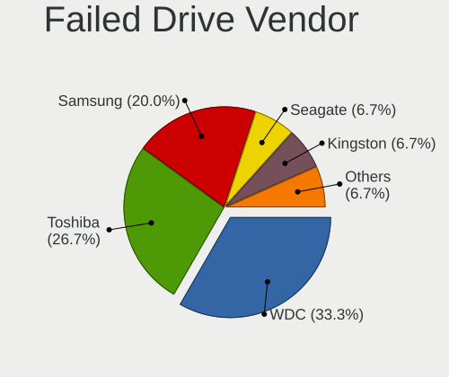

| Vendor              | Computers | Drives | Percent |
|---------------------|-----------|--------|---------|
| WDC                 | 5         | 6      | 33.33%  |
| Toshiba             | 4         | 4      | 26.67%  |
| Samsung Electronics | 3         | 3      | 20%     |
| Seagate             | 1         | 1      | 6.67%   |
| Kingston            | 1         | 1      | 6.67%   |
| HGST                | 1         | 1      | 6.67%   |

Drive Status
------------

Number of failed and malfunc. drives

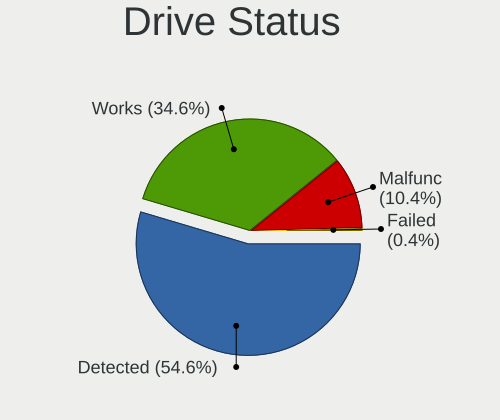

| Status   | Computers | Drives | Percent |
|----------|-----------|--------|---------|
| Detected | 1782      | 3347   | 54.6%   |
| Works    | 1129      | 2010   | 34.59%  |
| Malfunc  | 339       | 422    | 10.39%  |
| Failed   | 14        | 16     | 0.43%   |

Storage controller
------------------

Storage Vendor
--------------

Storage controller vendors

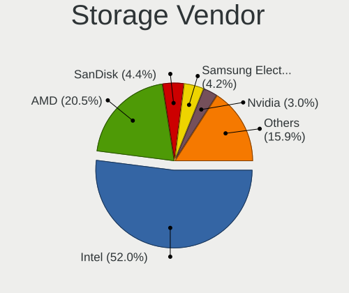

| Vendor                               | Computers | Percent |
|--------------------------------------|-----------|---------|
| Intel                                | 1864      | 52.02%  |
| AMD                                  | 735       | 20.51%  |
| SanDisk                              | 158       | 4.41%   |
| Samsung Electronics                  | 149       | 4.16%   |
| Nvidia                               | 108       | 3.01%   |
| Kingston Technology Company          | 105       | 2.93%   |
| SK hynix                             | 51        | 1.42%   |
| Phison Electronics                   | 37        | 1.03%   |
| Micron Technology                    | 36        | 1%      |
| VIA Technologies                     | 35        | 0.98%   |
| ASMedia Technology                   | 34        | 0.95%   |
| Realtek Semiconductor                | 31        | 0.87%   |
| KIOXIA                               | 31        | 0.87%   |
| MAXIO Technology (Hangzhou)          | 29        | 0.81%   |
| Micron/Crucial Technology            | 24        | 0.67%   |
| ADATA Technology                     | 23        | 0.64%   |
| Toshiba America Info Systems         | 22        | 0.61%   |
| Silicon Integrated Systems [SiS]     | 19        | 0.53%   |
| Silicon Motion                       | 17        | 0.47%   |
| Marvell Technology Group             | 17        | 0.47%   |
| JMicron Technology                   | 14        | 0.39%   |
| Shenzhen Longsys Electronics         | 9         | 0.25%   |
| Union Memory (Shenzhen)              | 8         | 0.22%   |
| Solid State Storage Technology       | 6         | 0.17%   |
| Solidigm                             | 2         | 0.06%   |
| Silicon Image                        | 2         | 0.06%   |
| Lite-On Technology                   | 2         | 0.06%   |
| INNOGRIT                             | 2         | 0.06%   |
| Apple                                | 2         | 0.06%   |
| Adaptec                              | 2         | 0.06%   |
| Ramaxel Technology(Shenzhen) Limited | 1         | 0.03%   |
| Promise Technology                   | 1         | 0.03%   |
| O2 Micro                             | 1         | 0.03%   |
| Nextorage                            | 1         | 0.03%   |
| LSI Logic / Symbios Logic            | 1         | 0.03%   |
| Lenovo                               | 1         | 0.03%   |
| Hosin Global Electronics             | 1         | 0.03%   |
| Broadcom / LSI                       | 1         | 0.03%   |
| Biwin Storage Technology             | 1         | 0.03%   |

Storage Model
-------------

Storage controller models

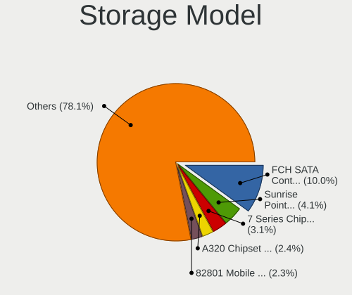

| Model                                                                                   | Computers | Percent |
|-----------------------------------------------------------------------------------------|-----------|---------|
| AMD FCH SATA Controller [AHCI mode]                                                     | 434       | 10.02%  |
| Intel Sunrise Point-LP SATA Controller [AHCI mode]                                      | 177       | 4.08%   |
| Intel 7 Series Chipset Family 6-port SATA Controller [AHCI mode]                        | 133       | 3.07%   |
| AMD A320 Chipset SATA Controller [AHCI mode]                                            | 104       | 2.4%    |
| Intel 82801 Mobile SATA Controller [RAID mode]                                          | 101       | 2.33%   |
| Intel Celeron/Pentium Silver Processor SATA Controller                                  | 94        | 2.17%   |
| Intel 8 Series/C220 Series Chipset Family 6-port SATA Controller 1 [AHCI mode]          | 92        | 2.12%   |
| Nvidia MCP61 SATA Controller                                                            | 89        | 2.05%   |
| Intel NM10/ICH7 Family SATA Controller [IDE mode]                                       | 87        | 2.01%   |
| AMD SB7x0/SB8x0/SB9x0 IDE Controller                                                    | 86        | 1.98%   |
| Intel Atom Processor E3800 Series SATA AHCI Controller                                  | 81        | 1.87%   |
| Intel 82801G (ICH7 Family) IDE Controller                                               | 78        | 1.8%    |
| AMD 400 Series Chipset SATA Controller                                                  | 76        | 1.75%   |
| Intel 6 Series/C200 Series Chipset Family 6 port Mobile SATA AHCI Controller            | 75        | 1.73%   |
| Nvidia MCP61 IDE                                                                        | 74        | 1.71%   |
| Intel Volume Management Device NVMe RAID Controller                                     | 67        | 1.55%   |
| AMD SB7x0/SB8x0/SB9x0 SATA Controller [IDE mode]                                        | 67        | 1.55%   |
| AMD SB7x0/SB8x0/SB9x0 SATA Controller [AHCI mode]                                       | 64        | 1.48%   |
| Intel Q170/Q150/B150/H170/H110/Z170/CM236 Chipset SATA Controller [AHCI Mode]           | 61        | 1.41%   |
| AMD 500 Series Chipset SATA Controller                                                  | 59        | 1.36%   |
| Intel 200 Series PCH SATA controller [AHCI mode]                                        | 57        | 1.32%   |
| Samsung NVMe SSD Controller 980 (DRAM-less)                                             | 53        | 1.22%   |
| Intel Tiger Lake-LP SATA Controller                                                     | 51        | 1.18%   |
| Samsung NVMe SSD Controller SM981/PM981/PM983                                           | 50        | 1.15%   |
| Intel Comet Lake SATA AHCI Controller                                                   | 48        | 1.11%   |
| Intel Wildcat Point-LP SATA Controller [AHCI Mode]                                      | 46        | 1.06%   |
| Intel 8 Series SATA Controller 1 [AHCI mode]                                            | 45        | 1.04%   |
| Intel 82801IBM/IEM (ICH9M/ICH9M-E) 4 port SATA Controller [AHCI mode]                   | 42        | 0.97%   |
| Intel 6 Series/C200 Series Chipset Family 6 port Desktop SATA AHCI Controller           | 42        | 0.97%   |
| AMD FCH SATA Controller [IDE mode]                                                      | 42        | 0.97%   |
| Intel NM10/ICH7 Family SATA Controller [AHCI mode]                                      | 40        | 0.92%   |
| AMD FCH IDE Controller                                                                  | 39        | 0.9%    |
| Intel 6 Series/C200 Series Chipset Family Desktop SATA Controller (IDE mode, ports 4-5) | 38        | 0.88%   |
| Intel 6 Series/C200 Series Chipset Family Desktop SATA Controller (IDE mode, ports 0-3) | 38        | 0.88%   |
| Intel 5 Series/3400 Series Chipset 4 port SATA AHCI Controller                          | 38        | 0.88%   |
| Intel Celeron N3350/Pentium N4200/Atom E3900 Series SATA AHCI Controller                | 37        | 0.85%   |
| Intel 500 Series Chipset Family SATA AHCI Controller                                    | 35        | 0.81%   |
| ASMedia ASM1061/ASM1062 Serial ATA Controller                                           | 31        | 0.72%   |
| SanDisk Ultra 3D / WD PC SN530, IX SN530, Blue SN550 NVMe SSD (DRAM-less)               | 30        | 0.69%   |
| Intel 82801HM/HEM (ICH8M/ICH8M-E) IDE Controller                                        | 28        | 0.65%   |

Storage Kind
------------

Kind of storage controller (IDE, SATA, NVMe, SAS, ...)

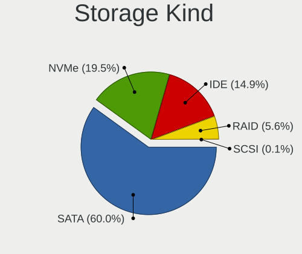

| Kind | Computers | Percent |
|------|-----------|---------|
| SATA | 2224      | 59.96%  |
| NVMe | 723       | 19.49%  |
| IDE  | 551       | 14.86%  |
| RAID | 208       | 5.61%   |
| SCSI | 3         | 0.08%   |

Processor
---------

CPU Vendor
----------

Processor vendors

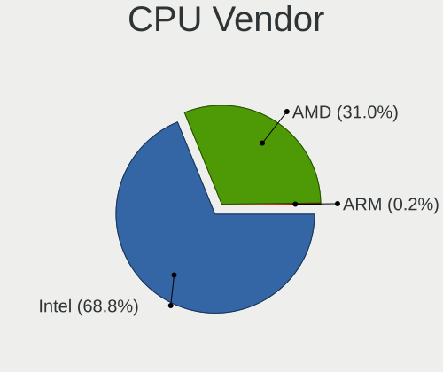

| Vendor | Computers | Percent |
|--------|-----------|---------|
| Intel  | 2082      | 68.85%  |
| AMD    | 936       | 30.95%  |
| ARM    | 6         | 0.2%    |

CPU Model
---------

Processor models

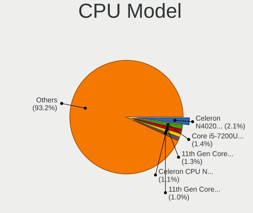

| Model                                         | Computers | Percent |
|-----------------------------------------------|-----------|---------|
| Intel Celeron N4020 CPU @ 1.10GHz             | 64        | 2.11%   |
| Intel Core i5-7200U CPU @ 2.50GHz             | 41        | 1.35%   |
| Intel 11th Gen Core i7-1165G7 @ 2.80GHz       | 38        | 1.25%   |
| Intel Celeron CPU N3350 @ 1.10GHz             | 32        | 1.06%   |
| Intel 11th Gen Core i5-1135G7 @ 2.40GHz       | 31        | 1.02%   |
| Intel Core i7-8550U CPU @ 1.80GHz             | 27        | 0.89%   |
| Intel Core i7-7500U CPU @ 2.70GHz             | 25        | 0.82%   |
| Intel Celeron N4000 CPU @ 1.10GHz             | 24        | 0.79%   |
| Intel Core i5-10210U CPU @ 1.60GHz            | 22        | 0.73%   |
| AMD Ryzen 5 5600G with Radeon Graphics        | 22        | 0.73%   |
| AMD Ryzen 3 3200G with Radeon Vega Graphics   | 22        | 0.73%   |
| Intel Core i7-6500U CPU @ 2.50GHz             | 21        | 0.69%   |
| Intel Core i5-8250U CPU @ 1.60GHz             | 21        | 0.69%   |
| Intel Core i5-3210M CPU @ 2.50GHz             | 21        | 0.69%   |
| Intel Atom x5-Z8350 CPU @ 1.44GHz             | 21        | 0.69%   |
| Intel Atom CPU N2600 @ 1.60GHz                | 20        | 0.66%   |
| AMD Ryzen 5 3600 6-Core Processor             | 20        | 0.66%   |
| AMD Ryzen 5 3400G with Radeon Vega Graphics   | 20        | 0.66%   |
| Intel Core i5-6200U CPU @ 2.30GHz             | 19        | 0.63%   |
| Intel Core i5-3320M CPU @ 2.60GHz             | 19        | 0.63%   |
| AMD Ryzen 7 5700G with Radeon Graphics        | 19        | 0.63%   |
| Intel Celeron CPU N2806 @ 1.60GHz             | 18        | 0.59%   |
| Intel 11th Gen Core i3-1115G4 @ 3.00GHz       | 18        | 0.59%   |
| AMD Ryzen 5 5600X 6-Core Processor            | 18        | 0.59%   |
| AMD Ryzen 5 2600 Six-Core Processor           | 18        | 0.59%   |
| Intel Core i5-1035G1 CPU @ 1.00GHz            | 17        | 0.56%   |
| Intel Celeron CPU N2808 @ 1.58GHz             | 17        | 0.56%   |
| Intel Core i5-5200U CPU @ 2.20GHz             | 16        | 0.53%   |
| Intel Celeron CPU N3060 @ 1.60GHz             | 16        | 0.53%   |
| Intel Core i3-1005G1 CPU @ 1.20GHz            | 15        | 0.49%   |
| AMD Ryzen 5 3450U with Radeon Vega Mobile Gfx | 15        | 0.49%   |
| AMD A4-4000 APU with Radeon HD Graphics       | 15        | 0.49%   |
| Intel Core i7-7700HQ CPU @ 2.80GHz            | 14        | 0.46%   |
| Intel Core i7-5500U CPU @ 2.40GHz             | 14        | 0.46%   |
| Intel Core i7-10510U CPU @ 1.80GHz            | 14        | 0.46%   |
| AMD FX-6300 Six-Core Processor                | 14        | 0.46%   |
| AMD FX-4100 Quad-Core Processor               | 14        | 0.46%   |
| Intel Core i5-8265U CPU @ 1.60GHz             | 13        | 0.43%   |
| Intel Core i5-7400 CPU @ 3.00GHz              | 13        | 0.43%   |
| Intel Core i5-4460 CPU @ 3.20GHz              | 13        | 0.43%   |

CPU Model Family
----------------

Processor model prefix

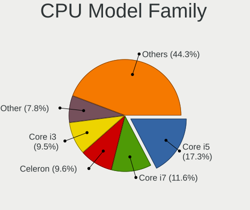

| Model                   | Computers | Percent |
|-------------------------|-----------|---------|
| Intel Core i5           | 525       | 17.33%  |
| Intel Core i7           | 352       | 11.62%  |
| Intel Celeron           | 290       | 9.57%   |
| Intel Core i3           | 287       | 9.47%   |
| Other                   | 235       | 7.76%   |
| AMD Ryzen 5             | 223       | 7.36%   |
| AMD Ryzen 7             | 113       | 3.73%   |
| Intel Atom              | 81        | 2.67%   |
| Intel Pentium           | 75        | 2.48%   |
| Intel Core 2 Duo        | 69        | 2.28%   |
| AMD Ryzen 3             | 65        | 2.15%   |
| Intel Pentium Dual-Core | 64        | 2.11%   |
| AMD FX                  | 59        | 1.95%   |
| AMD A8                  | 51        | 1.68%   |
| AMD A4                  | 43        | 1.42%   |
| AMD A10                 | 41        | 1.35%   |
| AMD A6                  | 38        | 1.25%   |
| Intel Pentium Dual      | 36        | 1.19%   |
| AMD Athlon II X2        | 31        | 1.02%   |
| AMD Athlon              | 30        | 0.99%   |
| AMD Ryzen 9             | 29        | 0.96%   |
| AMD Phenom II X4        | 25        | 0.83%   |
| AMD Athlon 64 X2        | 24        | 0.79%   |
| AMD Sempron             | 23        | 0.76%   |
| Intel Core 2            | 14        | 0.46%   |
| AMD Athlon II X4        | 13        | 0.43%   |
| Intel Xeon              | 12        | 0.4%    |
| Intel Pentium 4         | 12        | 0.4%    |
| Intel Genuine           | 12        | 0.4%    |
| Intel Core 2 Quad       | 12        | 0.4%    |
| AMD A12                 | 11        | 0.36%   |
| AMD Phenom II X6        | 10        | 0.33%   |
| Intel Pentium D         | 9         | 0.3%    |
| Intel Core i9           | 7         | 0.23%   |
| AMD Ryzen 7 PRO         | 7         | 0.23%   |
| AMD Phenom II X2        | 7         | 0.23%   |
| AMD E1                  | 7         | 0.23%   |
| AMD Athlon II X3        | 7         | 0.23%   |
| AMD Athlon II           | 7         | 0.23%   |
| Intel Pentium Gold      | 6         | 0.2%    |

CPU Cores
---------

Number of processor cores

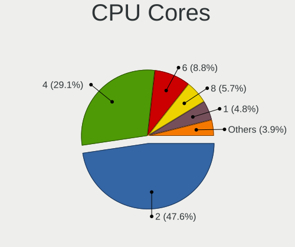

| Number  | Computers | Percent |
|---------|-----------|---------|
| 2       | 1445      | 47.64%  |
| 4       | 884       | 29.15%  |
| 6       | 268       | 8.84%   |
| 8       | 172       | 5.67%   |
| 1       | 145       | 4.78%   |
| 10      | 33        | 1.09%   |
| 3       | 26        | 0.86%   |
| 16      | 21        | 0.69%   |
| 12      | 17        | 0.56%   |
| 14      | 12        | 0.4%    |
| 24      | 5         | 0.16%   |
| Unknown | 4         | 0.13%   |
| 20      | 1         | 0.03%   |

CPU Sockets
-----------

Number of sockets

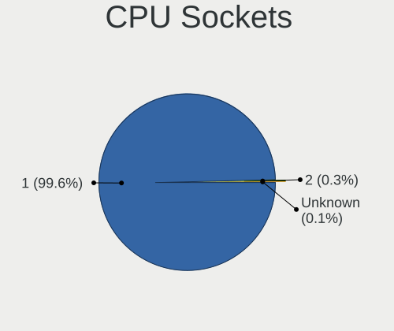

| Number  | Computers | Percent |
|---------|-----------|---------|
| 1       | 3013      | 99.6%   |
| 2       | 8         | 0.26%   |
| 4       | 2         | 0.07%   |
| Unknown | 2         | 0.07%   |

CPU Threads
-----------

Threads per core (Hyper-Threading)

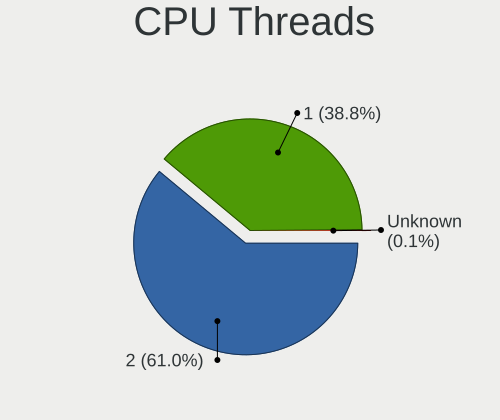

| Number  | Computers | Percent |
|---------|-----------|---------|
| 2       | 1851      | 61.05%  |
| 1       | 1177      | 38.82%  |
| Unknown | 4         | 0.13%   |

CPU Op-Modes
------------

CPU Operation Modes (32-bit, 64-bit)

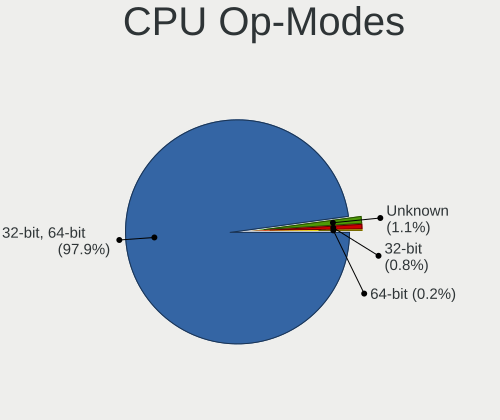

| Op mode        | Computers | Percent |
|----------------|-----------|---------|
| 32-bit, 64-bit | 2963      | 97.85%  |
| Unknown        | 34        | 1.12%   |
| 32-bit         | 24        | 0.79%   |
| 64-bit         | 7         | 0.23%   |

CPU Microcode
-------------

Microcode number

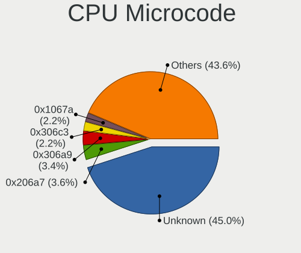

| Number     | Computers | Percent |
|------------|-----------|---------|
| Unknown    | 1421      | 45.03%  |
| 0x206a7    | 113       | 3.58%   |
| 0x306a9    | 106       | 3.36%   |
| 0x306c3    | 70        | 2.22%   |
| 0x1067a    | 69        | 2.19%   |
| 0x806e9    | 54        | 1.71%   |
| 0x806ec    | 51        | 1.62%   |
| 0x08108109 | 49        | 1.55%   |
| 0x806c1    | 46        | 1.46%   |
| 0x6fd      | 43        | 1.36%   |
| 0x010000c8 | 43        | 1.36%   |
| 0x406e3    | 40        | 1.27%   |
| 0x30678    | 40        | 1.27%   |
| 0x906e9    | 39        | 1.24%   |
| 0x06001119 | 36        | 1.14%   |
| 0x806ea    | 35        | 1.11%   |
| 0x306d4    | 33        | 1.05%   |
| 0x906ea    | 31        | 0.98%   |
| 0x06003106 | 31        | 0.98%   |
| 0x40651    | 30        | 0.95%   |
| 0x20655    | 30        | 0.95%   |
| 0x506e3    | 26        | 0.82%   |
| 0x406c4    | 26        | 0.82%   |
| 0x706a8    | 24        | 0.76%   |
| 0x08701021 | 24        | 0.76%   |
| 0x506c9    | 21        | 0.67%   |
| 0x706e5    | 20        | 0.63%   |
| 0x106ca    | 19        | 0.6%    |
| 0x706a1    | 18        | 0.57%   |
| 0x30661    | 18        | 0.57%   |
| 0x0a50000c | 18        | 0.57%   |
| 0x08101016 | 18        | 0.57%   |
| 0x06000852 | 16        | 0.51%   |
| 0x0600611a | 15        | 0.48%   |
| 0x06006118 | 15        | 0.48%   |
| 0x0600063e | 15        | 0.48%   |
| 0xa0653    | 14        | 0.44%   |
| 0x08608103 | 14        | 0.44%   |
| 0x20652    | 13        | 0.41%   |
| 0x10676    | 13        | 0.41%   |

CPU Microarch
-------------

Microarchitecture

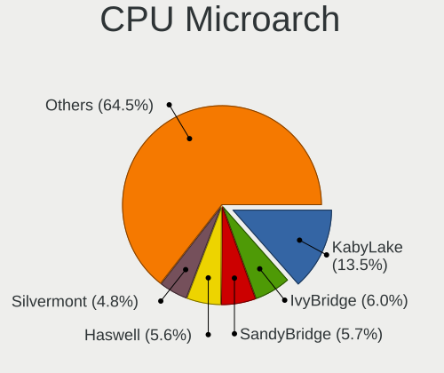

| Name              | Computers | Percent |
|-------------------|-----------|---------|
| KabyLake          | 409       | 13.5%   |
| IvyBridge         | 181       | 5.97%   |
| SandyBridge       | 172       | 5.68%   |
| Haswell           | 171       | 5.64%   |
| Silvermont        | 144       | 4.75%   |
| Penryn            | 136       | 4.49%   |
| Unknown           | 136       | 4.49%   |
| K10               | 130       | 4.29%   |
| Zen+              | 122       | 4.03%   |
| Zen 3             | 116       | 3.83%   |
| Skylake           | 104       | 3.43%   |
| Goldmont plus     | 103       | 3.4%    |
| TigerLake         | 97        | 3.2%    |
| Zen 2             | 90        | 2.97%   |
| Piledriver        | 90        | 2.97%   |
| Core              | 82        | 2.71%   |
| Zen               | 66        | 2.18%   |
| Westmere          | 66        | 2.18%   |
| Excavator         | 65        | 2.15%   |
| CometLake         | 63        | 2.08%   |
| IceLake           | 57        | 1.88%   |
| Bonnell           | 52        | 1.72%   |
| Broadwell         | 51        | 1.68%   |
| Steamroller       | 48        | 1.58%   |
| Alderlake Hybrid  | 46        | 1.52%   |
| K8 Hammer         | 45        | 1.49%   |
| Goldmont          | 37        | 1.22%   |
| NetBurst          | 25        | 0.83%   |
| Bulldozer         | 24        | 0.79%   |
| K10 Llano         | 21        | 0.69%   |
| Bobcat            | 18        | 0.59%   |
| Jaguar            | 16        | 0.53%   |
| P6                | 12        | 0.4%    |
| Nehalem           | 11        | 0.36%   |
| Puma              | 10        | 0.33%   |
| Meteorlake Hybrid | 4         | 0.13%   |
| K8 & K10 hybrid   | 4         | 0.13%   |
| Tremont           | 2         | 0.07%   |
| K6                | 2         | 0.07%   |
| Lunarlake Hybrid  | 1         | 0.03%   |

Graphics
--------

GPU Vendor
----------

Vendors of graphics cards

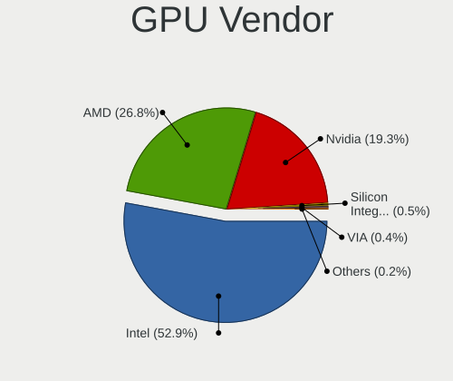

| Vendor                           | Computers | Percent |
|----------------------------------|-----------|---------|
| Intel                            | 1759      | 52.9%   |
| AMD                              | 890       | 26.77%  |
| Nvidia                           | 641       | 19.28%  |
| Silicon Integrated Systems [SiS] | 15        | 0.45%   |
| VIA Technologies                 | 13        | 0.39%   |
| ATI Technologies                 | 4         | 0.12%   |
| Matrox Electronics Systems       | 2         | 0.06%   |
| ASPEED Technology                | 1         | 0.03%   |

GPU Model
---------

Graphics card models

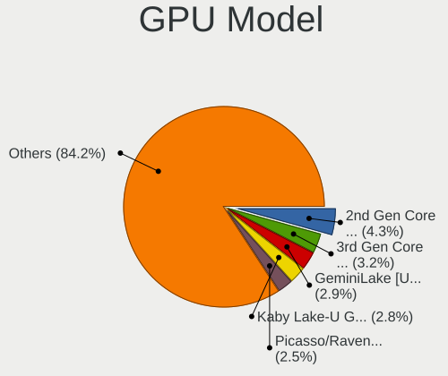

| Model                                                                                    | Computers | Percent |
|------------------------------------------------------------------------------------------|-----------|---------|
| Intel 2nd Generation Core Processor Family Integrated Graphics Controller                | 148       | 4.32%   |
| Intel 3rd Gen Core processor Graphics Controller                                         | 111       | 3.24%   |
| Intel GeminiLake [UHD Graphics 600]                                                      | 101       | 2.95%   |
| Intel Kaby Lake-U GT2 [HD Graphics 620]                                                  | 95        | 2.77%   |
| AMD Picasso/Raven 2 [Radeon Vega Series / Radeon Vega Mobile Series]                     | 86        | 2.51%   |
| Intel Atom Processor Z36xxx/Z37xxx Series Graphics & Display                             | 84        | 2.45%   |
| Intel TigerLake-LP GT2 [Iris Xe Graphics]                                                | 79        | 2.31%   |
| Intel Kaby Lake-R GT2 [UHD Graphics 620]                                                 | 63        | 1.84%   |
| Intel Atom/Celeron/Pentium Processor x5-E8000/J3xxx/N3xxx Integrated Graphics Controller | 60        | 1.75%   |
| Intel Skylake-U GT2 [HD Graphics 520]                                                    | 59        | 1.72%   |
| Intel Core Processor Integrated Graphics Controller                                      | 59        | 1.72%   |
| AMD Cezanne [Radeon Vega Series / Radeon Vega Mobile Series]                             | 56        | 1.64%   |
| Intel CometLake-U GT2 [UHD Graphics]                                                     | 53        | 1.55%   |
| AMD Ellesmere [Radeon RX 470/480/570/570X/580/580X/590]                                  | 52        | 1.52%   |
| Intel Mobile 4 Series Chipset Integrated Graphics Controller                             | 49        | 1.43%   |
| Intel Haswell-ULT Integrated Graphics Controller                                         | 49        | 1.43%   |
| Intel Xeon E3-1200 v3/4th Gen Core Processor Integrated Graphics Controller              | 46        | 1.34%   |
| Intel Broadwell-U GT2 [HD Graphics 5500]                                                 | 46        | 1.34%   |
| AMD Raven Ridge [Radeon Vega Series / Radeon Vega Mobile Series]                         | 42        | 1.23%   |
| Intel WhiskeyLake-U GT2 [UHD Graphics 620]                                               | 37        | 1.08%   |
| Intel Apollo Lake GT1 [HD Graphics 500]                                                  | 37        | 1.08%   |
| AMD Renoir [Radeon Vega Series / Radeon Vega Mobile Series]                              | 36        | 1.05%   |
| AMD Wani [Radeon R5/R6/R7 Graphics]                                                      | 35        | 1.02%   |
| AMD Kaveri [Radeon R7 Graphics]                                                          | 33        | 0.96%   |
| Intel Iris Plus Graphics G1 (Ice Lake)                                                   | 32        | 0.93%   |
| Nvidia C61 [GeForce 7025 / nForce 630a]                                                  | 31        | 0.91%   |
| Nvidia GT218 [GeForce 210]                                                               | 29        | 0.85%   |
| Nvidia GP107 [GeForce GTX 1050 Ti]                                                       | 29        | 0.85%   |
| Intel 4 Series Chipset Integrated Graphics Controller                                    | 29        | 0.85%   |
| Intel Xeon E3-1200 v2/3rd Gen Core processor Graphics Controller                         | 28        | 0.82%   |
| Intel CoffeeLake-S GT2 [UHD Graphics 630]                                                | 28        | 0.82%   |
| AMD Lucienne                                                                             | 27        | 0.79%   |
| Intel Atom Processor D4xx/D5xx/N4xx/N5xx Integrated Graphics Controller                  | 26        | 0.76%   |
| Intel 4th Gen Core Processor Integrated Graphics Controller                              | 26        | 0.76%   |
| Nvidia GK208B [GeForce GT 710]                                                           | 25        | 0.73%   |
| Intel Mobile GM965/GL960 Integrated Graphics Controller (secondary)                      | 25        | 0.73%   |
| Intel Mobile GM965/GL960 Integrated Graphics Controller (primary)                        | 25        | 0.73%   |
| AMD Stoney [Radeon R2/R3/R4/R5 Graphics]                                                 | 24        | 0.7%    |
| Intel CometLake-S GT2 [UHD Graphics 630]                                                 | 23        | 0.67%   |
| AMD Cedar [Radeon HD 5000/6000/7350/8350 Series]                                         | 23        | 0.67%   |

GPU Combo
---------

Combinations of graphics cards

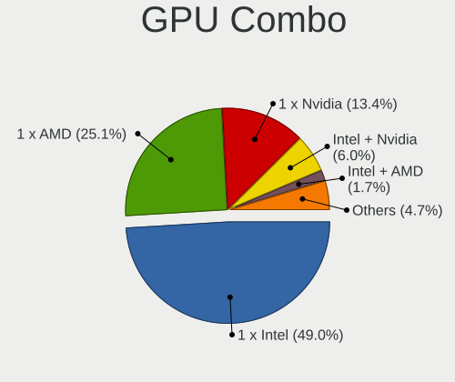

| Name           | Computers | Percent |
|----------------|-----------|---------|
| 1 x Intel      | 1494      | 49.05%  |
| 1 x AMD        | 764       | 25.08%  |
| 1 x Nvidia     | 409       | 13.43%  |
| Intel + Nvidia | 184       | 6.04%   |
| Intel + AMD    | 52        | 1.71%   |
| AMD + Nvidia   | 45        | 1.48%   |
| 2 x AMD        | 40        | 1.31%   |
| 2 x Intel      | 16        | 0.53%   |
| 1 x SiS        | 15        | 0.49%   |
| 1 x VIA        | 13        | 0.43%   |
| Other          | 8         | 0.26%   |
| 2 x Nvidia     | 3         | 0.1%    |
| 1 x Matrox     | 2         | 0.07%   |
| 1 x ASPEED     | 1         | 0.03%   |

GPU Driver
----------

Free vs proprietary

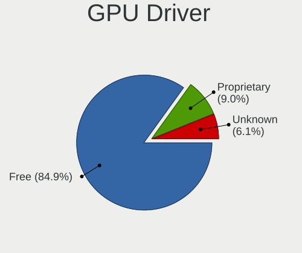

| Driver      | Computers | Percent |
|-------------|-----------|---------|
| Free        | 2597      | 84.92%  |
| Proprietary | 274       | 8.96%   |
| Unknown     | 187       | 6.12%   |

GPU Memory
----------

Total video memory

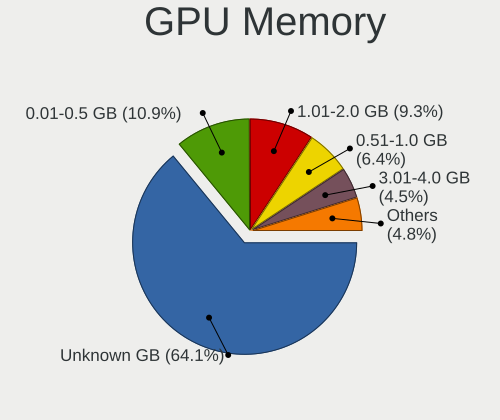

| Size in GB | Computers | Percent |
|------------|-----------|---------|
| Unknown    | 1985      | 64.05%  |
| 0.01-0.5   | 338       | 10.91%  |
| 1.01-2.0   | 289       | 9.33%   |
| 0.51-1.0   | 198       | 6.39%   |
| 3.01-4.0   | 139       | 4.49%   |
| 7.01-8.0   | 74        | 2.39%   |
| 5.01-6.0   | 32        | 1.03%   |
| 8.01-16.0  | 30        | 0.97%   |
| 2.01-3.0   | 11        | 0.35%   |
| 16.01-24.0 | 3         | 0.1%    |

Monitor
-------

Monitor Vendor
--------------

Monitor vendors

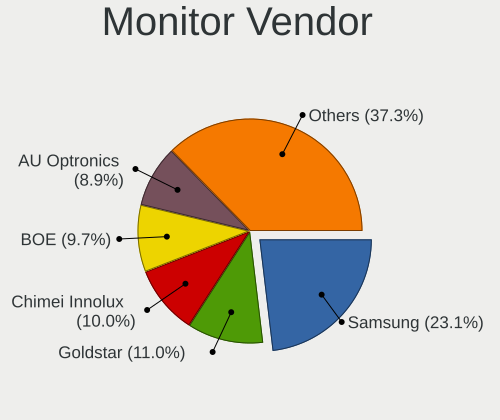

| Vendor                  | Computers | Percent |
|-------------------------|-----------|---------|
| Samsung Electronics     | 751       | 23.12%  |
| Goldstar                | 357       | 10.99%  |
| Chimei Innolux          | 324       | 9.98%   |
| BOE                     | 314       | 9.67%   |
| AU Optronics            | 290       | 8.93%   |
| LG Display              | 205       | 6.31%   |
| InfoVision              | 79        | 2.43%   |
| Philips                 | 76        | 2.34%   |
| Dell                    | 61        | 1.88%   |
| ViewSonic               | 49        | 1.51%   |
| BenQ                    | 42        | 1.29%   |
| Hitachi                 | 41        | 1.26%   |
| Lenovo                  | 40        | 1.23%   |
| Hewlett-Packard         | 39        | 1.2%    |
| Apple                   | 33        | 1.02%   |
| Chi Mei Optoelectronics | 28        | 0.86%   |
| SKY                     | 26        | 0.8%    |
| PANDA                   | 24        | 0.74%   |
| LG Electronics          | 24        | 0.74%   |
| Unknown                 | 20        | 0.62%   |
| STA                     | 20        | 0.62%   |
| ASUSTek Computer        | 19        | 0.58%   |
| Sony                    | 18        | 0.55%   |
| AOC                     | 17        | 0.52%   |
| LG Philips              | 16        | 0.49%   |
| Acer                    | 16        | 0.49%   |
| Sharp                   | 14        | 0.43%   |
| SAC                     | 13        | 0.4%    |
| InnoLux Display         | 13        | 0.4%    |
| Unknown (XXX)           | 12        | 0.37%   |
| HannStar                | 12        | 0.37%   |
| KDB                     | 11        | 0.34%   |
| HKC                     | 11        | 0.34%   |
| Gigabyte Technology     | 11        | 0.34%   |
| KDC                     | 9         | 0.28%   |
| MStar                   | 8         | 0.25%   |
| CPT                     | 8         | 0.25%   |
| Ancor Communications    | 8         | 0.25%   |
| UTV                     | 7         | 0.22%   |
| JRY                     | 7         | 0.22%   |

Monitor Model
-------------

Monitor models

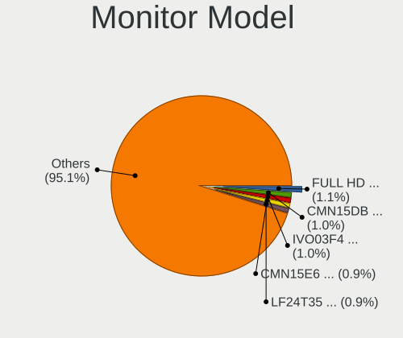

| Model                                                                | Computers | Percent |
|----------------------------------------------------------------------|-----------|---------|
| Goldstar FULL HD GSM5B55 1920x1080 480x270mm 21.7-inch               | 37        | 1.11%   |
| Chimei Innolux LCD Monitor CMN15DB 1366x768 344x193mm 15.5-inch      | 33        | 0.99%   |
| InfoVision LCD Monitor IVO03F4 1920x1080 309x173mm 13.9-inch         | 32        | 0.96%   |
| Chimei Innolux LCD Monitor CMN15E6 1366x768 344x193mm 15.5-inch      | 31        | 0.93%   |
| Samsung Electronics LF24T35 SAM707D 1920x1080 528x297mm 23.9-inch    | 30        | 0.9%    |
| Samsung Electronics C24F390 SAM0D2C 1920x1080 521x293mm 23.5-inch    | 29        | 0.87%   |
| Goldstar W1943 GSM4BAD 1360x768 406x229mm 18.4-inch                  | 28        | 0.84%   |
| Samsung Electronics S22D300 SAM0B3F 1920x1080 477x268mm 21.5-inch    | 27        | 0.81%   |
| Goldstar LG IPS FULLHD GSM5AB8 1920x1080 480x270mm 21.7-inch         | 21        | 0.63%   |
| Samsung Electronics LCD Monitor SEC5441 1280x800 331x207mm 15.4-inch | 20        | 0.6%    |
| Hitachi HDMI HEC0088 1920x540                                        | 20        | 0.6%    |
| Goldstar W2243 GSM56FE 1920x1080 477x269mm 21.6-inch                 | 20        | 0.6%    |
| AU Optronics LCD Monitor AUO2E3C 1366x768 309x173mm 13.9-inch        | 19        | 0.57%   |
| Samsung Electronics S22F350 SAM0D1A 1920x1080 477x268mm 21.5-inch    | 18        | 0.54%   |
| InfoVision LCD Monitor IVO03FA 1366x768 223x125mm 10.1-inch          | 18        | 0.54%   |
| Chimei Innolux LCD Monitor CMN15F5 1920x1080 344x193mm 15.5-inch     | 17        | 0.51%   |
| SKY TV-monitor SKY0001 1920x1080 885x498mm 40.0-inch                 | 16        | 0.48%   |
| Goldstar 23EA53 GSM59A9 1920x1080 510x290mm 23.1-inch                | 16        | 0.48%   |
| Chimei Innolux LCD Monitor CMN14D6 1366x768 309x173mm 13.9-inch      | 16        | 0.48%   |
| Samsung Electronics S19D300 SAM0B36 1366x768 410x230mm 18.5-inch     | 15        | 0.45%   |
| LG Display LCD Monitor LGD02E9 1366x768 309x174mm 14.0-inch          | 15        | 0.45%   |
| AU Optronics LCD Monitor AUO71EC 1366x768 344x193mm 15.5-inch        | 15        | 0.45%   |
| Chimei Innolux LCD Monitor CMN15E7 1920x1080 344x193mm 15.5-inch     | 14        | 0.42%   |
| Chimei Innolux LCD Monitor CMN1040 1366x768 222x125mm 10.0-inch      | 14        | 0.42%   |
| BOE LCD Monitor BOE06A4 1366x768 344x194mm 15.5-inch                 | 14        | 0.42%   |
| Samsung Electronics SA300/SA350 SAM0788 1366x768 410x230mm 18.5-inch | 13        | 0.39%   |
| Chimei Innolux LCD Monitor CMN14C3 1366x768 309x173mm 13.9-inch      | 13        | 0.39%   |
| Samsung Electronics S24F350 SAM0D20 1920x1080 521x293mm 23.5-inch    | 12        | 0.36%   |
| Samsung Electronics LF22T35 SAM707B 1920x1080 477x268mm 21.5-inch    | 12        | 0.36%   |
| Philips PHL 193V5 PHLC0CD 1366x768 410x230mm 18.5-inch               | 12        | 0.36%   |
| Samsung Electronics SMB1930N SAM0632 1366x768 410x230mm 18.5-inch    | 11        | 0.33%   |
| InfoVision M140NWR2 R1 IVO057A 1366x768 309x174mm 14.0-inch          | 11        | 0.33%   |
| Hitachi HDMI HEC0029 1920x1080 1152x648mm 52.0-inch                  | 11        | 0.33%   |
| BOE LCD Monitor BOE06A5 1366x768 344x194mm 15.5-inch                 | 11        | 0.33%   |
| Samsung Electronics S22D300 SAM0B3E 1920x1080 477x268mm 21.5-inch    | 10        | 0.3%    |
| Samsung Electronics LCD Monitor SEC4542 1366x768 309x174mm 14.0-inch | 10        | 0.3%    |
| Philips PHL 223V5 PHLC0CF 1920x1080 477x268mm 21.5-inch              | 10        | 0.3%    |
| Hitachi HISENSE HEC0030 3840x2160 1872x1053mm 84.6-inch              | 10        | 0.3%    |
| Goldstar 19EN33 GSM4C18 1366x768 410x230mm 18.5-inch                 | 10        | 0.3%    |
| AU Optronics LCD Monitor AUO183C 1366x768 309x173mm 13.9-inch        | 10        | 0.3%    |

Monitor Resolution
------------------

Monitor screen resolution

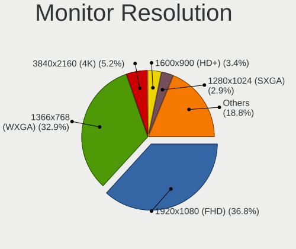

| Resolution         | Computers | Percent |
|--------------------|-----------|---------|
| 1920x1080 (FHD)    | 1151      | 36.78%  |
| 1366x768 (WXGA)    | 1030      | 32.92%  |
| 3840x2160 (4K)     | 163       | 5.21%   |
| 1600x900 (HD+)     | 105       | 3.36%   |
| 1280x1024 (SXGA)   | 92        | 2.94%   |
| 1360x768           | 86        | 2.75%   |
| 1440x900 (WXGA+)   | 70        | 2.24%   |
| 1920x1200 (WUXGA)  | 69        | 2.21%   |
| 1280x800 (WXGA)    | 64        | 2.05%   |
| 1680x1050 (WSXGA+) | 60        | 1.92%   |
| 2560x1440 (QHD)    | 27        | 0.86%   |
| 1920x540           | 27        | 0.86%   |
| 2560x1080          | 19        | 0.61%   |
| 1024x600           | 18        | 0.58%   |
| 1280x720 (HD)      | 15        | 0.48%   |
| 2560x1600          | 14        | 0.45%   |
| 1024x768 (XGA)     | 14        | 0.45%   |
| Unknown            | 13        | 0.42%   |
| 2880x1800          | 11        | 0.35%   |
| 2288x1287          | 9         | 0.29%   |
| 3200x1800 (QHD+)   | 7         | 0.22%   |
| 1152x864           | 5         | 0.16%   |
| 3840x2400          | 4         | 0.13%   |
| 3840x1080          | 4         | 0.13%   |
| 3440x1440          | 4         | 0.13%   |
| 1600x2560          | 4         | 0.13%   |
| 2880x1620          | 3         | 0.1%    |
| 2160x1440          | 3         | 0.1%    |
| 1280x960           | 3         | 0.1%    |
| 800x1280           | 2         | 0.06%   |
| 4093x4093          | 2         | 0.06%   |
| 3840x1100          | 2         | 0.06%   |
| 3456x2160          | 2         | 0.06%   |
| 2880x1920          | 2         | 0.06%   |
| 2048x1152          | 2         | 0.06%   |
| 1920x1440          | 2         | 0.06%   |
| 1920x1280          | 2         | 0.06%   |
| 3600x1200          | 1         | 0.03%   |
| 3286x1080          | 1         | 0.03%   |
| 3280x1080          | 1         | 0.03%   |

Monitor Diagonal
----------------

Diagonal size in inches

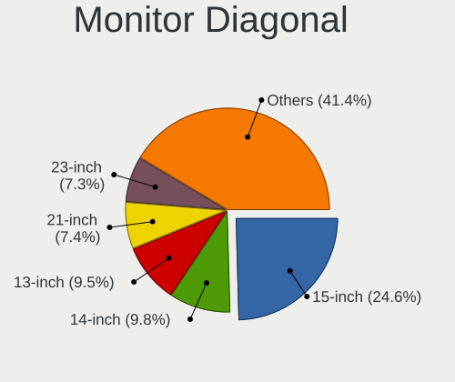

| Inches  | Computers | Percent |
|---------|-----------|---------|
| 15      | 805       | 24.56%  |
| 14      | 321       | 9.79%   |
| 13      | 311       | 9.49%   |
| 21      | 244       | 7.44%   |
| 23      | 239       | 7.29%   |
| 18      | 215       | 6.56%   |
| 24      | 125       | 3.81%   |
| 27      | 108       | 3.29%   |
| 17      | 100       | 3.05%   |
| Unknown | 88        | 2.68%   |
| 31      | 86        | 2.62%   |
| 19      | 84        | 2.56%   |
| 20      | 74        | 2.26%   |
| 10      | 54        | 1.65%   |
| 11      | 52        | 1.59%   |
| 40      | 46        | 1.4%    |
| 16      | 45        | 1.37%   |
| 84      | 31        | 0.95%   |
| 12      | 29        | 0.88%   |
| 22      | 26        | 0.79%   |
| 52      | 25        | 0.76%   |
| 32      | 25        | 0.76%   |
| 48      | 24        | 0.73%   |
| 54      | 21        | 0.64%   |
| 46      | 16        | 0.49%   |
| 34      | 13        | 0.4%    |
| 72      | 11        | 0.34%   |
| 142     | 9         | 0.27%   |
| 65      | 7         | 0.21%   |
| 63      | 7         | 0.21%   |
| 39      | 6         | 0.18%   |
| 26      | 6         | 0.18%   |
| 25      | 4         | 0.12%   |
| 42      | 3         | 0.09%   |
| 86      | 2         | 0.06%   |
| 64      | 2         | 0.06%   |
| 55      | 2         | 0.06%   |
| 41      | 2         | 0.06%   |
| 30      | 2         | 0.06%   |
| 7       | 2         | 0.06%   |

Monitor Width
-------------

Physical width

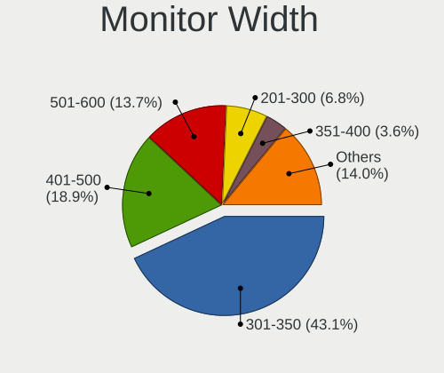

| Width in mm    | Computers | Percent |
|----------------|-----------|---------|
| 301-350        | 1392      | 43.06%  |
| 401-500        | 611       | 18.9%   |
| 501-600        | 444       | 13.73%  |
| 201-300        | 219       | 6.77%   |
| 351-400        | 115       | 3.56%   |
| 1001-1500      | 107       | 3.31%   |
| 601-700        | 105       | 3.25%   |
| Unknown        | 88        | 2.72%   |
| 801-900        | 54        | 1.67%   |
| 1501-2000      | 42        | 1.3%    |
| 701-800        | 38        | 1.18%   |
| More than 2000 | 9         | 0.28%   |
| 901-1000       | 6         | 0.19%   |
| 1-100          | 2         | 0.06%   |
| 101-200        | 1         | 0.03%   |

Aspect Ratio
------------

Proportional relationship between the width and the height

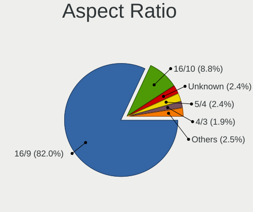

| Ratio   | Computers | Percent |
|---------|-----------|---------|
| 16/9    | 2381      | 81.96%  |
| 16/10   | 257       | 8.85%   |
| Unknown | 71        | 2.44%   |
| 5/4     | 69        | 2.38%   |
| 4/3     | 54        | 1.86%   |
| 1.96    | 20        | 0.69%   |
| 21/9    | 17        | 0.59%   |
| 3/2     | 16        | 0.55%   |
| 1.00    | 9         | 0.31%   |
| 32/9    | 2         | 0.07%   |
| 3.40    | 2         | 0.07%   |
| 0.67    | 2         | 0.07%   |
| 0.56    | 2         | 0.07%   |
| 6/5     | 1         | 0.03%   |
| 3.73    | 1         | 0.03%   |
| 0.89    | 1         | 0.03%   |

Monitor Area
------------

Area in inch²

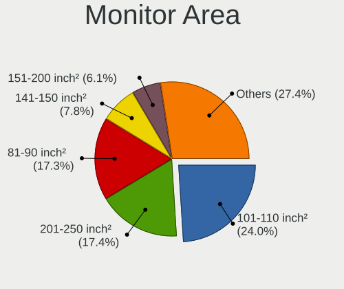

| Area in inch² | Computers | Percent |
|----------------|-----------|---------|
| 101-110        | 779       | 24.01%  |
| 201-250        | 564       | 17.38%  |
| 81-90          | 563       | 17.35%  |
| 141-150        | 252       | 7.77%   |
| 151-200        | 197       | 6.07%   |
| 351-500        | 126       | 3.88%   |
| More than 1000 | 117       | 3.61%   |
| 301-350        | 112       | 3.45%   |
| 501-1000       | 96        | 2.96%   |
| Unknown        | 88        | 2.71%   |
| 71-80          | 63        | 1.94%   |
| 51-60          | 54        | 1.66%   |
| 41-50          | 54        | 1.66%   |
| 121-130        | 54        | 1.66%   |
| 111-120        | 54        | 1.66%   |
| 61-70          | 23        | 0.71%   |
| 251-300        | 23        | 0.71%   |
| 91-100         | 12        | 0.37%   |
| 131-140        | 11        | 0.34%   |
| 1-40           | 3         | 0.09%   |

Pixel Density
-------------

Pixels per inch

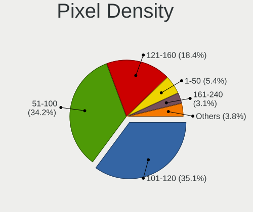

| Density       | Computers | Percent |
|---------------|-----------|---------|
| 101-120       | 1112      | 35.13%  |
| 51-100        | 1082      | 34.19%  |
| 121-160       | 583       | 18.42%  |
| 1-50          | 171       | 5.4%    |
| 161-240       | 97        | 3.06%   |
| Unknown       | 88        | 2.78%   |
| More than 240 | 32        | 1.01%   |

Multiple Monitors
-----------------

Total monitors connected

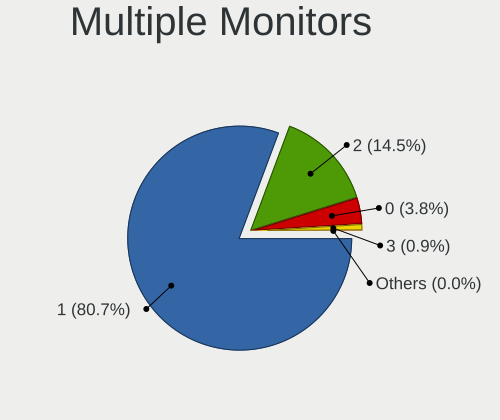

| Total | Computers | Percent |
|-------|-----------|---------|
| 1     | 2499      | 80.69%  |
| 2     | 449       | 14.5%   |
| 0     | 118       | 3.81%   |
| 3     | 28        | 0.9%    |
| 4     | 2         | 0.06%   |
| 5     | 1         | 0.03%   |

Network
-------

Net Controller Vendor
---------------------

Controller vendors

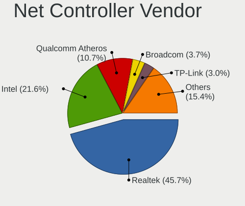

| Vendor                                | Computers | Percent |
|---------------------------------------|-----------|---------|
| Realtek Semiconductor                 | 2025      | 45.71%  |
| Intel                                 | 958       | 21.63%  |
| Qualcomm Atheros                      | 472       | 10.65%  |
| Broadcom                              | 162       | 3.66%   |
| TP-Link                               | 132       | 2.98%   |
| Nvidia                                | 94        | 2.12%   |
| MediaTek                              | 74        | 1.67%   |
| Ralink Technology                     | 72        | 1.63%   |
| Qualcomm Atheros Communications       | 47        | 1.06%   |
| Marvell Technology Group              | 46        | 1.04%   |
| Broadcom Limited                      | 42        | 0.95%   |
| Samsung Electronics                   | 40        | 0.9%    |
| Ralink                                | 37        | 0.84%   |
| JMicron Technology                    | 34        | 0.77%   |
| Motorola PCS                          | 26        | 0.59%   |
| VIA Technologies                      | 23        | 0.52%   |
| Silicon Integrated Systems [SiS]      | 19        | 0.43%   |
| Microsoft                             | 16        | 0.36%   |
| ASIX Electronics                      | 12        | 0.27%   |
| Xiaomi                                | 9         | 0.2%    |
| Sundance Technology Inc / IC Plus     | 5         | 0.11%   |
| T & A Mobile Phones                   | 4         | 0.09%   |
| NetGear                               | 4         | 0.09%   |
| DisplayLink                           | 4         | 0.09%   |
| D-Link System                         | 4         | 0.09%   |
| 3Com                                  | 4         | 0.09%   |
| Lenovo                                | 3         | 0.07%   |
| ICS Advent                            | 3         | 0.07%   |
| Ericsson Business Mobile Networks     | 3         | 0.07%   |
| D-Link                                | 3         | 0.07%   |
| Aquantia                              | 3         | 0.07%   |
| 802.11g Adapter [Linksys WUSB54GC v3] | 3         | 0.07%   |
| ZTE WCDMA Technologies MSM            | 2         | 0.05%   |
| Spreadtrum Communications             | 2         | 0.05%   |
| Qualcomm                              | 2         | 0.05%   |
| Ovislink                              | 2         | 0.05%   |
| Microchip Technology                  | 2         | 0.05%   |
| Mercucys                              | 2         | 0.05%   |
| Linksys                               | 2         | 0.05%   |
| LG Electronics                        | 2         | 0.05%   |

Net Controller Model
--------------------

Controller models

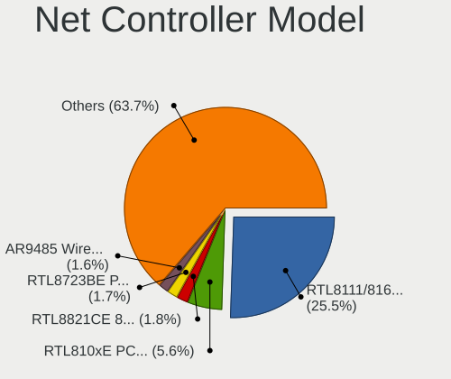

| Model                                                                  | Computers | Percent |
|------------------------------------------------------------------------|-----------|---------|
| Realtek RTL8111/8168/8211/8411 PCI Express Gigabit Ethernet Controller | 1335      | 25.53%  |
| Realtek RTL810xE PCI Express Fast Ethernet controller                  | 293       | 5.6%    |
| Realtek RTL8821CE 802.11ac PCIe Wireless Network Adapter               | 96        | 1.84%   |
| Realtek RTL8723BE PCIe Wireless Network Adapter                        | 91        | 1.74%   |
| Qualcomm Atheros AR9485 Wireless Network Adapter                       | 84        | 1.61%   |
| Nvidia MCP61 Ethernet                                                  | 79        | 1.51%   |
| Realtek RTL8822CE 802.11ac PCIe Wireless Network Adapter               | 76        | 1.45%   |
| Qualcomm Atheros QCA9377 802.11ac Wireless Network Adapter             | 70        | 1.34%   |
| Intel Wi-Fi 6 AX201                                                    | 63        | 1.2%    |
| Realtek RTL8188EUS 802.11n Wireless Network Adapter                    | 60        | 1.15%   |
| Qualcomm Atheros AR9285 Wireless Network Adapter (PCI-Express)         | 58        | 1.11%   |
| Realtek RTL8188CE 802.11b/g/n WiFi Adapter                             | 57        | 1.09%   |
| Realtek RTL8125 2.5GbE Controller                                      | 56        | 1.07%   |
| Intel Wi-Fi 6 AX200                                                    | 55        | 1.05%   |
| Intel Wireless 3160                                                    | 48        | 0.92%   |
| Intel Comet Lake PCH-LP CNVi WiFi                                      | 45        | 0.86%   |
| Qualcomm Atheros QCA9565 / AR9565 Wireless Network Adapter             | 44        | 0.84%   |
| Intel Wireless 7265                                                    | 44        | 0.84%   |
| Intel Wireless 8265 / 8275                                             | 43        | 0.82%   |
| Intel Wireless 3165                                                    | 42        | 0.8%    |
| Qualcomm Atheros AR9271 802.11n                                        | 41        | 0.78%   |
| Intel Dual Band Wireless-AC 3168NGW [Stone Peak]                       | 41        | 0.78%   |
| Intel Ethernet Connection (2) I219-V                                   | 38        | 0.73%   |
| Broadcom BCM4313 802.11bgn Wireless Network Adapter                    | 38        | 0.73%   |
| Ralink MT7601U Wireless Adapter                                        | 36        | 0.69%   |
| Realtek RTL8723DE Wireless Network Adapter                             | 35        | 0.67%   |
| Intel 82579LM Gigabit Network Connection (Lewisville)                  | 35        | 0.67%   |
| Realtek RTL8188EE Wireless Network Adapter                             | 34        | 0.65%   |
| Realtek 802.11n WLAN Adapter                                           | 34        | 0.65%   |
| Qualcomm Atheros AR8151 v2.0 Gigabit Ethernet                          | 34        | 0.65%   |
| Intel I211 Gigabit Network Connection                                  | 34        | 0.65%   |
| Intel Wireless 7260                                                    | 33        | 0.63%   |
| Samsung Galaxy series, misc. (tethering mode)                          | 32        | 0.61%   |
| Qualcomm Atheros AR8152 v2.0 Fast Ethernet                             | 32        | 0.61%   |
| Qualcomm Atheros QCA6174 802.11ac Wireless Network Adapter             | 31        | 0.59%   |
| Realtek RTL-8100/8101L/8139 PCI Fast Ethernet Adapter                  | 29        | 0.55%   |
| JMicron JMC250 PCI Express Gigabit Ethernet Controller                 | 29        | 0.55%   |
| TP-Link TL-WN722N v2/v3 [Realtek RTL8188EUS]                           | 28        | 0.54%   |
| Intel Gemini Lake PCH CNVi WiFi                                        | 28        | 0.54%   |
| Realtek RTL8723BU 802.11b/g/n WLAN Adapter                             | 27        | 0.52%   |

Wireless Vendor
---------------

Wireless vendors

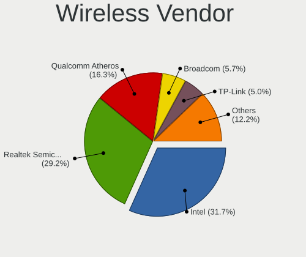

| Vendor                                | Computers | Percent |
|---------------------------------------|-----------|---------|
| Intel                                 | 755       | 31.71%  |
| Realtek Semiconductor                 | 695       | 29.19%  |
| Qualcomm Atheros                      | 388       | 16.3%   |
| Broadcom                              | 135       | 5.67%   |
| TP-Link                               | 118       | 4.96%   |
| Ralink Technology                     | 72        | 3.02%   |
| MediaTek                              | 63        | 2.65%   |
| Qualcomm Atheros Communications       | 47        | 1.97%   |
| Ralink                                | 37        | 1.55%   |
| Broadcom Limited                      | 22        | 0.92%   |
| Microsoft                             | 15        | 0.63%   |
| NetGear                               | 4         | 0.17%   |
| Marvell Technology Group              | 4         | 0.17%   |
| D-Link System                         | 4         | 0.17%   |
| D-Link                                | 3         | 0.13%   |
| 802.11g Adapter [Linksys WUSB54GC v3] | 3         | 0.13%   |
| Ovislink                              | 2         | 0.08%   |
| Mercucys                              | 2         | 0.08%   |
| Linksys                               | 2         | 0.08%   |
| Encore Electronics                    | 2         | 0.08%   |
| ZyDAS                                 | 1         | 0.04%   |
| ZTopInc                               | 1         | 0.04%   |
| Sierra Wireless                       | 1         | 0.04%   |
| Samsung Electronics                   | 1         | 0.04%   |
| Qualcomm                              | 1         | 0.04%   |
| Fibocom                               | 1         | 0.04%   |
| Dell                                  | 1         | 0.04%   |
| Cisco Aironet Wireless Communications | 1         | 0.04%   |

Wireless Model
--------------

Wireless models

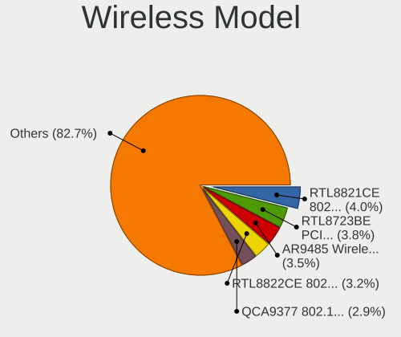

| Model                                                                | Computers | Percent |
|----------------------------------------------------------------------|-----------|---------|
| Realtek RTL8821CE 802.11ac PCIe Wireless Network Adapter             | 96        | 3.99%   |
| Realtek RTL8723BE PCIe Wireless Network Adapter                      | 91        | 3.78%   |
| Qualcomm Atheros AR9485 Wireless Network Adapter                     | 84        | 3.49%   |
| Realtek RTL8822CE 802.11ac PCIe Wireless Network Adapter             | 76        | 3.16%   |
| Qualcomm Atheros QCA9377 802.11ac Wireless Network Adapter           | 70        | 2.91%   |
| Intel Wi-Fi 6 AX201                                                  | 63        | 2.62%   |
| Realtek RTL8188EUS 802.11n Wireless Network Adapter                  | 60        | 2.49%   |
| Qualcomm Atheros AR9285 Wireless Network Adapter (PCI-Express)       | 58        | 2.41%   |
| Realtek RTL8188CE 802.11b/g/n WiFi Adapter                           | 57        | 2.37%   |
| Intel Wi-Fi 6 AX200                                                  | 55        | 2.29%   |
| Intel Wireless 3160                                                  | 48        | 2%      |
| Intel Comet Lake PCH-LP CNVi WiFi                                    | 45        | 1.87%   |
| Qualcomm Atheros QCA9565 / AR9565 Wireless Network Adapter           | 44        | 1.83%   |
| Intel Wireless 7265                                                  | 44        | 1.83%   |
| Intel Wireless 8265 / 8275                                           | 43        | 1.79%   |
| Intel Wireless 3165                                                  | 42        | 1.75%   |
| Qualcomm Atheros AR9271 802.11n                                      | 41        | 1.7%    |
| Intel Dual Band Wireless-AC 3168NGW [Stone Peak]                     | 41        | 1.7%    |
| Broadcom BCM4313 802.11bgn Wireless Network Adapter                  | 38        | 1.58%   |
| Ralink MT7601U Wireless Adapter                                      | 36        | 1.5%    |
| Realtek RTL8723DE Wireless Network Adapter                           | 35        | 1.45%   |
| Realtek RTL8188EE Wireless Network Adapter                           | 34        | 1.41%   |
| Realtek 802.11n WLAN Adapter                                         | 34        | 1.41%   |
| Intel Wireless 7260                                                  | 33        | 1.37%   |
| Qualcomm Atheros QCA6174 802.11ac Wireless Network Adapter           | 31        | 1.29%   |
| TP-Link TL-WN722N v2/v3 [Realtek RTL8188EUS]                         | 28        | 1.16%   |
| Intel Gemini Lake PCH CNVi WiFi                                      | 28        | 1.16%   |
| Realtek RTL8723BU 802.11b/g/n WLAN Adapter                           | 27        | 1.12%   |
| Intel Dual Band Wireless-AC 3165 Plus Bluetooth                      | 25        | 1.04%   |
| Ralink RT2870/RT3070 Wireless Adapter                                | 23        | 0.96%   |
| Intel Centrino Advanced-N 6205 [Taylor Peak]                         | 23        | 0.96%   |
| MediaTek MT7902 802.11ax PCIe Wireless Network Adapter [Filogic 310] | 21        | 0.87%   |
| Broadcom BCM43142 802.11b/g/n                                        | 21        | 0.87%   |
| Broadcom BCM4312 802.11b/g LP-PHY                                    | 21        | 0.87%   |
| Intel Wireless 8260                                                  | 20        | 0.83%   |
| Intel Cannon Point-LP CNVi [Wireless-AC]                             | 20        | 0.83%   |
| Intel Cannon Lake PCH CNVi WiFi                                      | 20        | 0.83%   |
| TP-Link TL-WN823N v2/v3 [Realtek RTL8192EU]                          | 19        | 0.79%   |
| Realtek RTL8191SEvB Wireless LAN Controller                          | 19        | 0.79%   |
| Qualcomm Atheros AR9287 Wireless Network Adapter (PCI-Express)       | 19        | 0.79%   |

Ethernet Vendor
---------------

Ethernet vendors

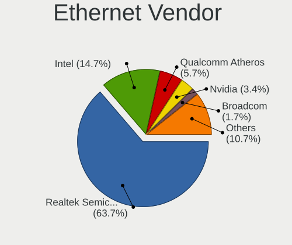

| Vendor                            | Computers | Percent |
|-----------------------------------|-----------|---------|
| Realtek Semiconductor             | 1763      | 63.72%  |
| Intel                             | 408       | 14.75%  |
| Qualcomm Atheros                  | 159       | 5.75%   |
| Nvidia                            | 94        | 3.4%    |
| Broadcom                          | 48        | 1.73%   |
| Marvell Technology Group          | 42        | 1.52%   |
| Samsung Electronics               | 39        | 1.41%   |
| JMicron Technology                | 34        | 1.23%   |
| Motorola PCS                      | 25        | 0.9%    |
| VIA Technologies                  | 23        | 0.83%   |
| Broadcom Limited                  | 20        | 0.72%   |
| Silicon Integrated Systems [SiS]  | 19        | 0.69%   |
| TP-Link                           | 16        | 0.58%   |
| ASIX Electronics                  | 12        | 0.43%   |
| MediaTek                          | 11        | 0.4%    |
| Xiaomi                            | 9         | 0.33%   |
| Sundance Technology Inc / IC Plus | 5         | 0.18%   |
| T & A Mobile Phones               | 4         | 0.14%   |
| DisplayLink                       | 4         | 0.14%   |
| 3Com                              | 4         | 0.14%   |
| Lenovo                            | 3         | 0.11%   |
| ICS Advent                        | 3         | 0.11%   |
| Aquantia                          | 3         | 0.11%   |
| Spreadtrum Communications         | 2         | 0.07%   |
| Microchip Technology              | 2         | 0.07%   |
| Davicom Semiconductor             | 2         | 0.07%   |
| ZTE WCDMA Technologies MSM        | 1         | 0.04%   |
| Solarflare Communications         | 1         | 0.04%   |
| Realtek                           | 1         | 0.04%   |
| Qualcomm                          | 1         | 0.04%   |
| QinHeng Electronics               | 1         | 0.04%   |
| Microsoft                         | 1         | 0.04%   |
| Macronix [MXIC]                   | 1         | 0.04%   |
| LG Electronics                    | 1         | 0.04%   |
| IBM                               | 1         | 0.04%   |
| Huawei Technologies               | 1         | 0.04%   |
| Digitech Systems                  | 1         | 0.04%   |
| Apple                             | 1         | 0.04%   |
| 3DSP                              | 1         | 0.04%   |

Ethernet Model
--------------

Ethernet models

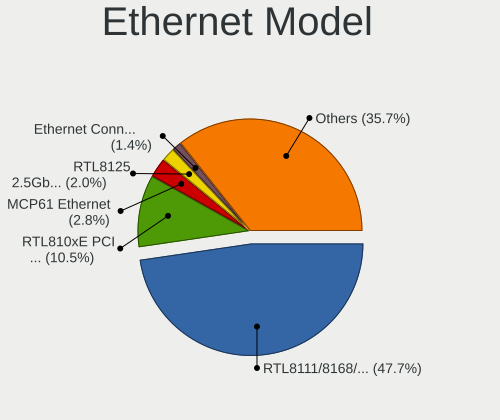

| Model                                                                  | Computers | Percent |
|------------------------------------------------------------------------|-----------|---------|
| Realtek RTL8111/8168/8211/8411 PCI Express Gigabit Ethernet Controller | 1335      | 47.68%  |
| Realtek RTL810xE PCI Express Fast Ethernet controller                  | 293       | 10.46%  |
| Nvidia MCP61 Ethernet                                                  | 79        | 2.82%   |
| Realtek RTL8125 2.5GbE Controller                                      | 56        | 2%      |
| Intel Ethernet Connection (2) I219-V                                   | 38        | 1.36%   |
| Intel 82579LM Gigabit Network Connection (Lewisville)                  | 35        | 1.25%   |
| Qualcomm Atheros AR8151 v2.0 Gigabit Ethernet                          | 34        | 1.21%   |
| Intel I211 Gigabit Network Connection                                  | 34        | 1.21%   |
| Samsung Galaxy series, misc. (tethering mode)                          | 32        | 1.14%   |
| Qualcomm Atheros AR8152 v2.0 Fast Ethernet                             | 32        | 1.14%   |
| Realtek RTL-8100/8101L/8139 PCI Fast Ethernet Adapter                  | 29        | 1.04%   |
| JMicron JMC250 PCI Express Gigabit Ethernet Controller                 | 29        | 1.04%   |
| Intel Ethernet Controller I225-V                                       | 24        | 0.86%   |
| Motorola PCS motorola one 5G ace                                       | 23        | 0.82%   |
| Realtek RTL8153 Gigabit Ethernet Adapter                               | 21        | 0.75%   |
| Intel Ethernet Connection (4) I219-LM                                  | 21        | 0.75%   |
| VIA VT6102/VT6103 [Rhine-II]                                           | 19        | 0.68%   |
| Marvell Group 88E8040 PCI-E Fast Ethernet Controller                   | 19        | 0.68%   |
| Realtek RTL8152 Fast Ethernet Adapter                                  | 18        | 0.64%   |
| Intel Ethernet Connection (7) I219-V                                   | 18        | 0.64%   |
| Silicon Integrated Systems [SiS] 191 Gigabit Ethernet Adapter          | 16        | 0.57%   |
| Intel Ethernet Connection (13) I219-V                                  | 16        | 0.57%   |
| Realtek RTL8169 PCI Gigabit Ethernet Controller                        | 15        | 0.54%   |
| Intel 82579V Gigabit Network Connection                                | 15        | 0.54%   |
| Intel Ethernet Connection (10) I219-V                                  | 14        | 0.5%    |
| Intel 82577LM Gigabit Network Connection                               | 14        | 0.5%    |
| Broadcom NetXtreme BCM57765 Gigabit Ethernet PCIe                      | 13        | 0.46%   |
| TP-Link UE300 10/100/1000 LAN (ethernet mode) [Realtek RTL8153]        | 11        | 0.39%   |
| Qualcomm Atheros QCA8171 Gigabit Ethernet                              | 11        | 0.39%   |
| Qualcomm Atheros AR8162 Fast Ethernet                                  | 11        | 0.39%   |
| Intel Ethernet Connection I218-LM                                      | 11        | 0.39%   |
| Intel Ethernet Connection I217-LM                                      | 11        | 0.39%   |
| Qualcomm Atheros Killer E2500 Gigabit Ethernet Controller              | 10        | 0.36%   |
| Qualcomm Atheros AR8161 Gigabit Ethernet                               | 10        | 0.36%   |
| Intel Ethernet Connection I217-V                                       | 10        | 0.36%   |
| Intel Ethernet Connection (14) I219-V                                  | 10        | 0.36%   |
| Intel Alder Lake-P PCH CNVi WiFi                                       | 10        | 0.36%   |
| Xiaomi Mi/Redmi series (RNDIS)                                         | 9         | 0.32%   |
| Realtek RTL8111/8168/8411 PCI Express Gigabit Ethernet Controller      | 9         | 0.32%   |
| Qualcomm Atheros Killer E220x Gigabit Ethernet Controller              | 9         | 0.32%   |

Net Controller Kind
-------------------

Ethernet, WiFi or modem

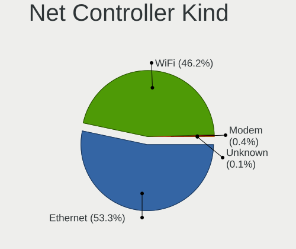

| Kind     | Computers | Percent |
|----------|-----------|---------|
| Ethernet | 2608      | 53.31%  |
| WiFi     | 2261      | 46.22%  |
| Modem    | 20        | 0.41%   |
| Unknown  | 3         | 0.06%   |

Used Controller
---------------

Currently used network controller

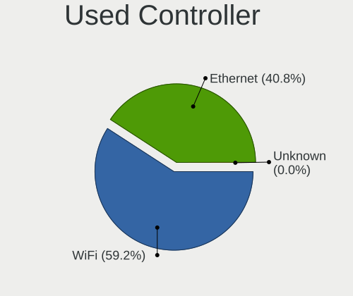

| Kind     | Computers | Percent |
|----------|-----------|---------|
| WiFi     | 1838      | 59.18%  |
| Ethernet | 1267      | 40.79%  |
| Unknown  | 1         | 0.03%   |

NICs
----

Total network controllers on board

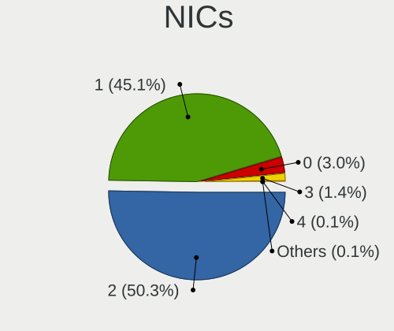

| Total | Computers | Percent |
|-------|-----------|---------|
| 2     | 1528      | 50.26%  |
| 1     | 1371      | 45.1%   |
| 0     | 91        | 2.99%   |
| 3     | 44        | 1.45%   |
| 4     | 3         | 0.1%    |
| 7     | 2         | 0.07%   |
| 32    | 1         | 0.03%   |

IPv6
----

IPv6 vs IPv4

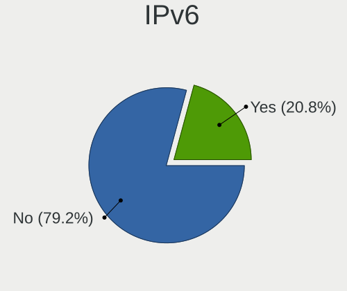

| Used | Computers | Percent |
|------|-----------|---------|
| No   | 2438      | 79.18%  |
| Yes  | 641       | 20.82%  |

Bluetooth
---------

Bluetooth Vendor
----------------

Controller vendors

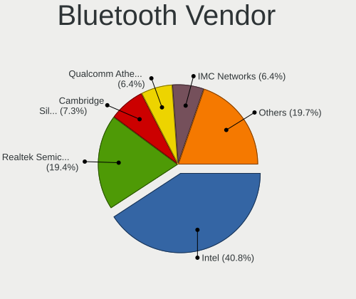

| Vendor                          | Computers | Percent |
|---------------------------------|-----------|---------|
| Intel                           | 649       | 40.79%  |
| Realtek Semiconductor           | 308       | 19.36%  |
| Cambridge Silicon Radio         | 116       | 7.29%   |
| Qualcomm Atheros Communications | 102       | 6.41%   |
| IMC Networks                    | 102       | 6.41%   |
| Broadcom                        | 60        | 3.77%   |
| Lite-On Technology              | 56        | 3.52%   |
| Foxconn / Hon Hai               | 41        | 2.58%   |
| Apple                           | 30        | 1.89%   |
| TP-Link                         | 25        | 1.57%   |
| Dell                            | 20        | 1.26%   |
| Toshiba                         | 13        | 0.82%   |
| ASUSTek Computer                | 13        | 0.82%   |
| MediaTek                        | 10        | 0.63%   |
| Ralink                          | 9         | 0.57%   |
| Integrated System Solution      | 6         | 0.38%   |
| Hewlett-Packard                 | 5         | 0.31%   |
| Conwise Technology              | 4         | 0.25%   |
| Alps Electric                   | 4         | 0.25%   |
| USI                             | 3         | 0.19%   |
| Qcom                            | 2         | 0.13%   |
| Marvell Semiconductor           | 2         | 0.13%   |
| Edimax Technology               | 2         | 0.13%   |
| Unknown                         | 2         | 0.13%   |
| Syntek                          | 1         | 0.06%   |
| Roper                           | 1         | 0.06%   |
| Realtek                         | 1         | 0.06%   |
| Ralink Technology               | 1         | 0.06%   |
| Mercucys                        | 1         | 0.06%   |
| Logitech                        | 1         | 0.06%   |
| Foxconn International           | 1         | 0.06%   |

Bluetooth Model
---------------

Controller models

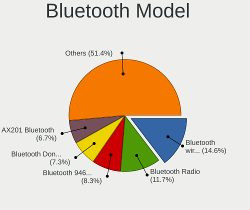

| Model                                               | Computers | Percent |
|-----------------------------------------------------|-----------|---------|
| Intel Bluetooth wireless interface                  | 233       | 14.64%  |
| Realtek Bluetooth Radio                             | 186       | 11.68%  |
| Intel Bluetooth 9460/9560 Jefferson Peak (JfP)      | 132       | 8.29%   |
| Cambridge Silicon Radio Bluetooth Dongle (HCI mode) | 116       | 7.29%   |
| Intel AX201 Bluetooth                               | 106       | 6.66%   |
| Realtek  Bluetooth 4.2 Adapter                      | 71        | 4.46%   |
| Qualcomm Atheros  Bluetooth Device                  | 60        | 3.77%   |
| Intel AX200 Bluetooth                               | 55        | 3.45%   |
| IMC Networks Bluetooth Radio                        | 44        | 2.76%   |
| Intel Wireless-AC 3168 Bluetooth                    | 41        | 2.58%   |
| Realtek RTL8723B Bluetooth                          | 39        | 2.45%   |
| IMC Networks Wireless_Device                        | 30        | 1.88%   |
| Intel Bluetooth Device                              | 26        | 1.63%   |
| TP-Link TP-T@- UB500 Adapter                        | 25        | 1.57%   |
| Lite-On Qualcomm Atheros QCA9377 Bluetooth          | 20        | 1.26%   |
| Intel Centrino Bluetooth Wireless Transceiver       | 19        | 1.19%   |
| Qualcomm Atheros AR3012 Bluetooth 4.0               | 18        | 1.13%   |
| Lite-On Bluetooth Device                            | 17        | 1.07%   |
| Intel AX210 Bluetooth                               | 17        | 1.07%   |
| IMC Networks Bluetooth Device                       | 15        | 0.94%   |
| Qualcomm Atheros QCA61x4 Bluetooth 4.0              | 11        | 0.69%   |
| Intel Centrino Advanced-N 6230 Bluetooth adapter    | 11        | 0.69%   |
| Broadcom BCM20702 Bluetooth 4.0 [ThinkPad]          | 11        | 0.69%   |
| MediaTek Wireless_Device                            | 10        | 0.63%   |
| Intel Wireless-AC 9260 Bluetooth Adapter            | 10        | 0.63%   |
| Ralink RT3290 Bluetooth                             | 9         | 0.57%   |
| Foxconn / Hon Hai Wireless_Device                   | 9         | 0.57%   |
| Broadcom BCM43142 Bluetooth 4.0                     | 9         | 0.57%   |
| Toshiba Bluetooth USB Host Controller               | 8         | 0.5%    |
| IMC Networks Atheros AR3012 Bluetooth 4.0 Adapter   | 8         | 0.5%    |
| Foxconn / Hon Hai MediaTek Bluetooth Adapter        | 8         | 0.5%    |
| Foxconn / Hon Hai Bluetooth Device                  | 8         | 0.5%    |
| Broadcom BCM2070 Bluetooth 2.1 + EDR                | 8         | 0.5%    |
| Apple Bluetooth USB Host Controller                 | 8         | 0.5%    |
| Apple Bluetooth Host Controller                     | 8         | 0.5%    |
| Realtek RTL8821A Bluetooth                          | 7         | 0.44%   |
| Qualcomm Atheros AR3011 Bluetooth                   | 7         | 0.44%   |
| Dell DW375 Bluetooth Module                         | 7         | 0.44%   |
| Lite-On Broadcom BCM43142A0 Bluetooth Device        | 6         | 0.38%   |
| Dell Wireless 365 Bluetooth                         | 6         | 0.38%   |

Sound
-----

Sound Vendor
------------

Sound card vendors

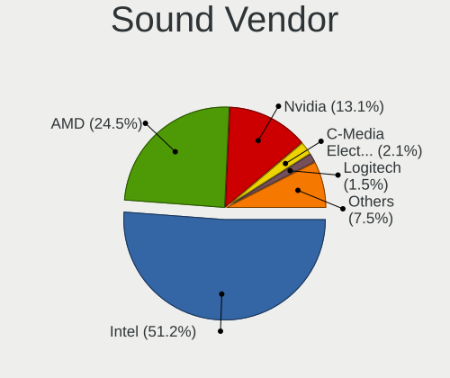

| Vendor                                          | Computers | Percent |
|-------------------------------------------------|-----------|---------|
| Intel                                           | 2002      | 51.19%  |
| AMD                                             | 960       | 24.55%  |
| Nvidia                                          | 513       | 13.12%  |
| C-Media Electronics                             | 84        | 2.15%   |
| Logitech                                        | 58        | 1.48%   |
| Kingston Technology                             | 33        | 0.84%   |
| VIA Technologies                                | 22        | 0.56%   |
| Texas Instruments                               | 19        | 0.49%   |
| Silicon Integrated Systems [SiS]                | 19        | 0.49%   |
| Generalplus Technology                          | 18        | 0.46%   |
| Creative Labs                                   | 14        | 0.36%   |
| JMTek                                           | 13        | 0.33%   |
| Focusrite-Novation                              | 10        | 0.26%   |
| GN Netcom                                       | 9         | 0.23%   |
| ASUSTek Computer                                | 9         | 0.23%   |
| Plantronics                                     | 7         | 0.18%   |
| Sony                                            | 6         | 0.15%   |
| Micro Star International                        | 6         | 0.15%   |
| M-Audio                                         | 6         | 0.15%   |
| BEHRINGER International                         | 6         | 0.15%   |
| ATI Technologies                                | 6         | 0.15%   |
| Samson Technologies                             | 5         | 0.13%   |
| Hewlett-Packard                                 | 5         | 0.13%   |
| Elite Silicon                                   | 5         | 0.13%   |
| Creative Technology                             | 5         | 0.13%   |
| Razer USA                                       | 4         | 0.1%    |
| Licensed by Sony Computer Entertainment America | 4         | 0.1%    |
| Fry's Electronics                               | 4         | 0.1%    |
| Corsair                                         | 4         | 0.1%    |
| Realtek Semiconductor                           | 3         | 0.08%   |
| Microsoft                                       | 3         | 0.08%   |
| ESI Audiotechnik                                | 3         | 0.08%   |
| Astro Gaming                                    | 3         | 0.08%   |
| TEAC                                            | 2         | 0.05%   |
| SteelSeries ApS                                 | 2         | 0.05%   |
| Lenovo                                          | 2         | 0.05%   |
| JBL                                             | 2         | 0.05%   |
| Harman International                            | 2         | 0.05%   |
| Ensoniq                                         | 2         | 0.05%   |
| Audient                                         | 2         | 0.05%   |

Sound Model
-----------

Sound card models

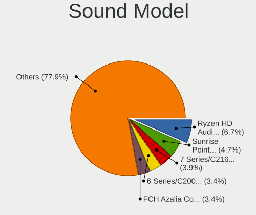

| Model                                                                      | Computers | Percent |
|----------------------------------------------------------------------------|-----------|---------|
| AMD Ryzen HD Audio Controller                                              | 320       | 6.68%   |
| Intel Sunrise Point-LP HD Audio                                            | 227       | 4.74%   |
| Intel 7 Series/C216 Chipset Family High Definition Audio Controller        | 186       | 3.88%   |
| Intel 6 Series/C200 Series Chipset Family High Definition Audio Controller | 164       | 3.42%   |
| AMD FCH Azalia Controller                                                  | 163       | 3.4%    |
| Intel NM10/ICH7 Family High Definition Audio Controller                    | 144       | 3%      |
| AMD SBx00 Azalia (Intel HDA)                                               | 136       | 2.84%   |
| AMD Renoir/Cezanne HDMI/DP Audio Controller                                | 133       | 2.77%   |
| AMD Raven/Raven2/Fenghuang HDMI/DP Audio Controller                        | 127       | 2.65%   |
| Intel Celeron/Pentium Silver Processor High Definition Audio               | 103       | 2.15%   |
| Intel Tiger Lake-LP Smart Sound Technology Audio Controller                | 97        | 2.02%   |
| Intel 8 Series/C220 Series Chipset High Definition Audio Controller        | 95        | 1.98%   |
| AMD Starship/Matisse HD Audio Controller                                   | 86        | 1.79%   |
| Nvidia MCP61 High Definition Audio                                         | 84        | 1.75%   |
| Intel Atom Processor Z36xxx/Z37xxx Series High Definition Audio Controller | 81        | 1.69%   |
| Intel Xeon E3-1200 v3/4th Gen Core Processor HD Audio Controller           | 79        | 1.65%   |
| Intel 5 Series/3400 Series Chipset High Definition Audio                   | 75        | 1.56%   |
| Intel 100 Series/C230 Series Chipset Family HD Audio Controller            | 68        | 1.42%   |
| Intel 82801I (ICH9 Family) HD Audio Controller                             | 61        | 1.27%   |
| Intel 200 Series PCH HD Audio                                              | 59        | 1.23%   |
| AMD Kabini HDMI/DP Audio                                                   | 57        | 1.19%   |
| AMD Family 15h (Models 60h-6fh) Audio Controller                           | 56        | 1.17%   |
| Intel Comet Lake PCH-LP cAVS                                               | 55        | 1.15%   |
| Nvidia GP107GL High Definition Audio Controller                            | 54        | 1.13%   |
| AMD Ellesmere HDMI Audio [Radeon RX 470/480 / 570/580/590]                 | 54        | 1.13%   |
| Intel Broadwell-U Audio Controller                                         | 51        | 1.06%   |
| Intel Haswell-ULT HD Audio Controller                                      | 50        | 1.04%   |
| Intel 8 Series HD Audio Controller                                         | 50        | 1.04%   |
| AMD Family 17h (Models 00h-0fh) HD Audio Controller                        | 48        | 1%      |
| Intel Wildcat Point-LP High Definition Audio Controller                    | 46        | 0.96%   |
| Intel Cannon Lake PCH cAVS                                                 | 46        | 0.96%   |
| AMD Oland/Hainan/Cape Verde/Pitcairn HDMI Audio [Radeon HD 7000 Series]    | 46        | 0.96%   |
| AMD Trinity HDMI Audio Controller                                          | 44        | 0.92%   |
| Intel Ice Lake-LP Smart Sound Technology Audio Controller                  | 41        | 0.86%   |
| Nvidia GK208 HDMI/DP Audio Controller                                      | 40        | 0.83%   |
| AMD Kaveri HDMI/DP Audio Controller                                        | 40        | 0.83%   |
| Intel Alder Lake PCH-P High Definition Audio Controller                    | 39        | 0.81%   |
| AMD Radeon High Definition Audio Controller                                | 39        | 0.81%   |
| Nvidia High Definition Audio Controller                                    | 38        | 0.79%   |
| Intel 82801H (ICH8 Family) HD Audio Controller                             | 38        | 0.79%   |

Memory
------

Memory Vendor
-------------

Memory module vendors

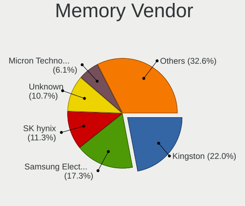

| Vendor              | Computers | Percent |
|---------------------|-----------|---------|
| Kingston            | 419       | 22.01%  |
| Samsung Electronics | 329       | 17.28%  |
| SK hynix            | 215       | 11.29%  |
| Unknown             | 204       | 10.71%  |
| Micron Technology   | 117       | 6.14%   |
| Crucial             | 96        | 5.04%   |
| A-DATA Technology   | 66        | 3.47%   |
| Corsair             | 63        | 3.31%   |
| Unknown (ABCD)      | 41        | 2.15%   |
| Unknown             | 33        | 1.73%   |
| Nanya Technology    | 24        | 1.26%   |
| Magnum Tech         | 22        | 1.16%   |
| Goldkey             | 20        | 1.05%   |
| Novatech            | 19        | 1%      |
| Hikvision           | 18        | 0.95%   |
| G.Skill             | 18        | 0.95%   |
| Ramaxel Technology  | 16        | 0.84%   |
| Elpida              | 15        | 0.79%   |
| Patriot             | 14        | 0.74%   |
| Neo Forza           | 13        | 0.68%   |
| Team                | 11        | 0.58%   |
| PNY                 | 11        | 0.58%   |
| Avant               | 11        | 0.58%   |
| Hewlett-Packard     | 8         | 0.42%   |
| Saikano             | 6         | 0.32%   |
| Memox               | 6         | 0.32%   |
| 48spaces            | 6         | 0.32%   |
| Transcend           | 5         | 0.26%   |
| Super Talent        | 5         | 0.26%   |
| Lexar               | 5         | 0.26%   |
| CSX                 | 5         | 0.26%   |
| Unknown (0x0B45)    | 4         | 0.21%   |
| Apacer              | 4         | 0.21%   |
| Teikon              | 3         | 0.16%   |
| Patriot Memory      | 3         | 0.16%   |
| Netac               | 3         | 0.16%   |
| Kingmax             | 3         | 0.16%   |
| Wodposit            | 2         | 0.11%   |
| Unknown (07D5)      | 2         | 0.11%   |
| Ramos Technology    | 2         | 0.11%   |

Memory Model
------------

Memory module models

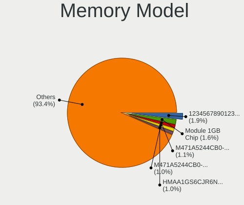

| Model                                                            | Computers | Percent |
|------------------------------------------------------------------|-----------|---------|
| Unknown (ABCD) RAM 123456789012345678 2GB SODIMM LPDDR4 2400MT/s | 39        | 1.89%   |
| Unknown                                                          | 33        | 1.6%    |
| Samsung RAM M471A5244CB0-CRC 4GB SODIMM DDR4 2667MT/s            | 22        | 1.07%   |
| Samsung RAM M471A5244CB0-CTD 4GB SODIMM DDR4 3266MT/s            | 21        | 1.02%   |
| SK hynix RAM HMAA1GS6CJR6N-XN 8GB SODIMM DDR4 3200MT/s           | 20        | 0.97%   |
| SK hynix RAM HMA81GS6AFR8N-UH 8GB SODIMM DDR4 2667MT/s           | 20        | 0.97%   |
| Samsung RAM M471A1G44AB0-CWE 8GiB SODIMM DDR4 3200MT/s           | 19        | 0.92%   |
| Magnum Tech RAM MAGNUMTECH 4GB SODIMM DDR3 1600MT/s              | 19        | 0.92%   |
| SK hynix RAM HMT451S6BFR8A-PB 4GB SODIMM DDR3 1600MT/s           | 14        | 0.68%   |
| Kingston RAM KHX2666C16/8G 8GiB DIMM DDR4 3466MT/s               | 13        | 0.63%   |
| Samsung RAM M471A5244CB0-CWE 4GB SODIMM DDR4 3200MT/s            | 12        | 0.58%   |
| Nanya RAM NT2GC64B88B0NS-CG 2048MB SODIMM DDR3 1334MT/s          | 12        | 0.58%   |
| Kingston RAM KHX1866C10D3/8G 8GB DIMM DDR3 1867MT/s              | 12        | 0.58%   |
| Kingston RAM 99U5471-054.A00LF 8GB DIMM DDR3 1600MT/s            | 12        | 0.58%   |
| Samsung RAM M471B5173EB0-YK0 4GB SODIMM DDR3 1600MT/s            | 11        | 0.53%   |
| Samsung RAM M471A1G44AB0-CWE 8GB Row Of Chips DDR4 3200MT/s      | 11        | 0.53%   |
| Kingston RAM KHX2400C15/8G 8GB DIMM DDR4 3400MT/s                | 11        | 0.53%   |
| Unknown RAM Module 4GB DIMM 1333MT/s                             | 10        | 0.49%   |
| Samsung RAM M471A1K43CB1-CRC 8GB SODIMM DDR4 8400MT/s            | 10        | 0.49%   |
| Samsung RAM M471B5773CHS-CH9 2GB SODIMM DDR3 4199MT/s            | 9         | 0.44%   |
| Samsung RAM M471B5273DH0-CH9 4GB SODIMM DDR3 1600MT/s            | 9         | 0.44%   |
| Samsung RAM M471B5273CH0-CH9 4GB SODIMM DDR3 1334MT/s            | 9         | 0.44%   |
| Samsung RAM M471B5173DB0-YK0 4GB SODIMM DDR3 1600MT/s            | 9         | 0.44%   |
| Samsung RAM M471A1K43DB1-CWE 8GB SODIMM DDR4 3200MT/s            | 9         | 0.44%   |
| Kingston RAM KF3200C16D4/16GX 16GB DIMM DDR4 3733MT/s            | 9         | 0.44%   |
| Unknown RAM Module 4GB SODIMM DDR3 1066MT/s                      | 8         | 0.39%   |
| Unknown RAM Module 2GB DIMM 1333MT/s                             | 8         | 0.39%   |
| Samsung RAM M471A1G44BB0-CWE 8GB SODIMM DDR4 3200MT/s            | 8         | 0.39%   |
| Unknown RAM Module 4GB SODIMM DDR3 1333MT/s                      | 7         | 0.34%   |
| Unknown RAM Module 4GB DIMM DDR3 1333MT/s                        | 7         | 0.34%   |
| Unknown RAM Module 4GB DIMM 1600MT/s                             | 7         | 0.34%   |
| Unknown RAM Module 2GB DIMM SDRAM                                | 7         | 0.34%   |
| SK hynix RAM HMT351S6CFR8C-PB 4GB SODIMM DDR3 1600MT/s           | 7         | 0.34%   |
| Micron RAM 4ATF1G64HZ-3G2F1 8GB SODIMM DDR4 3200MT/s             | 7         | 0.34%   |
| Kingston RAM KHX1866C10D3/4G 4GB DIMM DDR3 1867MT/s              | 7         | 0.34%   |
| Kingston RAM KHX1866C10D3/ 8192MB DIMM DDR3 1866MT/s             | 7         | 0.34%   |
| Kingston RAM KHX1600C10D3/8G 8GB DIMM DDR3 2133MT/s              | 7         | 0.34%   |
| Kingston RAM KF3200C16D4/8GX 8GiB DIMM DDR4 3600MT/s             | 7         | 0.34%   |
| Kingston RAM 99U5700-027.A00G 8GB SODIMM DDR4 2667MT/s           | 7         | 0.34%   |
| Kingston RAM 99U5584-005.A00LF 4GB DIMM DDR3 1600MT/s            | 7         | 0.34%   |

Memory Kind
-----------

Memory module kinds

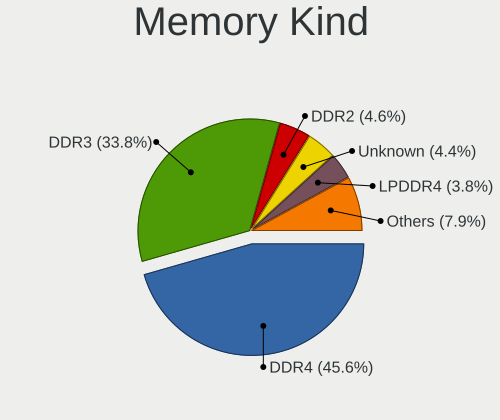

| Kind    | Computers | Percent |
|---------|-----------|---------|
| DDR4    | 729       | 45.56%  |
| DDR3    | 540       | 33.75%  |
| DDR2    | 73        | 4.56%   |
| Unknown | 70        | 4.38%   |
| LPDDR4  | 61        | 3.81%   |
| SDRAM   | 38        | 2.38%   |
| DDR5    | 30        | 1.88%   |
| LPDDR5  | 22        | 1.38%   |
| LPDDR3  | 18        | 1.13%   |
| DDR     | 12        | 0.75%   |
| DRAM    | 7         | 0.44%   |

Memory Form Factor
------------------

Physical design of the memory module

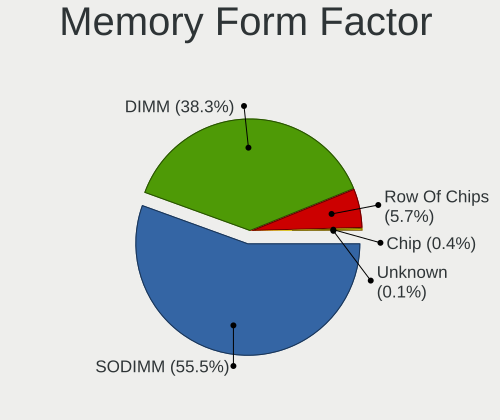

| Name         | Computers | Percent |
|--------------|-----------|---------|
| SODIMM       | 888       | 55.53%  |
| DIMM         | 613       | 38.34%  |
| Row Of Chips | 91        | 5.69%   |
| Chip         | 6         | 0.38%   |
| Unknown      | 1         | 0.06%   |

Memory Size
-----------

Memory module size

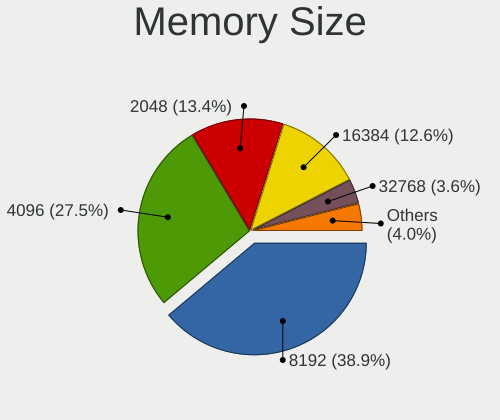

| Size  | Computers | Percent |
|-------|-----------|---------|
| 8192  | 705       | 38.89%  |
| 4096  | 499       | 27.52%  |
| 2048  | 243       | 13.4%   |
| 16384 | 229       | 12.63%  |
| 32768 | 65        | 3.59%   |
| 1024  | 60        | 3.31%   |
| 512   | 10        | 0.55%   |
| 6144  | 1         | 0.06%   |
| 256   | 1         | 0.06%   |

Memory Speed
------------

Memory module speed

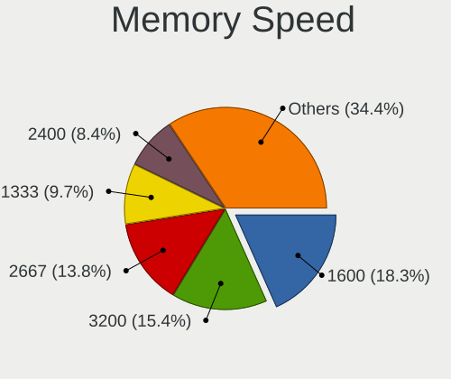

| Speed   | Computers | Percent |
|---------|-----------|---------|
| 1600    | 328       | 18.32%  |
| 3200    | 275       | 15.36%  |
| 2667    | 247       | 13.8%   |
| 1333    | 174       | 9.72%   |
| 2400    | 151       | 8.44%   |
| 2133    | 70        | 3.91%   |
| Unknown | 52        | 2.91%   |
| 3600    | 49        | 2.74%   |
| 1334    | 42        | 2.35%   |
| 667     | 39        | 2.18%   |
| 800     | 28        | 1.56%   |
| 1066    | 22        | 1.23%   |
| 3266    | 21        | 1.17%   |
| 3400    | 20        | 1.12%   |
| 3466    | 17        | 0.95%   |
| 533     | 16        | 0.89%   |
| 1866    | 15        | 0.84%   |
| 8400    | 14        | 0.78%   |
| 3733    | 14        | 0.78%   |
| 2666    | 14        | 0.78%   |
| 4800    | 13        | 0.73%   |
| 1067    | 13        | 0.73%   |
| 4199    | 12        | 0.67%   |
| 6400    | 11        | 0.61%   |
| 3000    | 10        | 0.56%   |
| 400     | 10        | 0.56%   |
| 333     | 10        | 0.56%   |
| 2933    | 9         | 0.5%    |
| 7500    | 7         | 0.39%   |
| 5600    | 7         | 0.39%   |
| 4267    | 6         | 0.34%   |
| 1867    | 6         | 0.34%   |
| 6000    | 5         | 0.28%   |
| 3933    | 5         | 0.28%   |
| 3800    | 5         | 0.28%   |
| 2048    | 5         | 0.28%   |
| 4266    | 4         | 0.22%   |
| 4000    | 4         | 0.22%   |
| 3066    | 4         | 0.22%   |
| 975     | 4         | 0.22%   |

Printers & scanners
-------------------

Printer Vendor
--------------

Printer device vendors

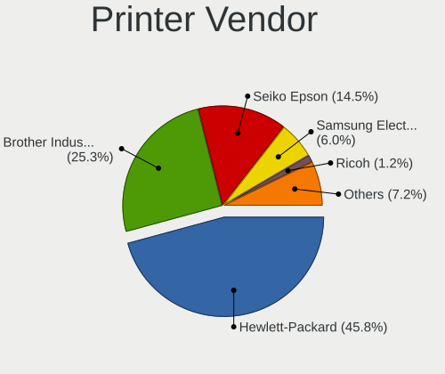

| Vendor              | Computers | Percent |
|---------------------|-----------|---------|
| Hewlett-Packard     | 38        | 45.78%  |
| Brother Industries  | 21        | 25.3%   |
| Seiko Epson         | 12        | 14.46%  |
| Samsung Electronics | 5         | 6.02%   |
| Ricoh               | 1         | 1.2%    |
| QinHeng Electronics | 1         | 1.2%    |
| Pantum              | 1         | 1.2%    |
| NXP Semiconductors  | 1         | 1.2%    |
| Kyocera             | 1         | 1.2%    |
| Graphtec America    | 1         | 1.2%    |
| Canon               | 1         | 1.2%    |

Printer Model
-------------

Printer device models

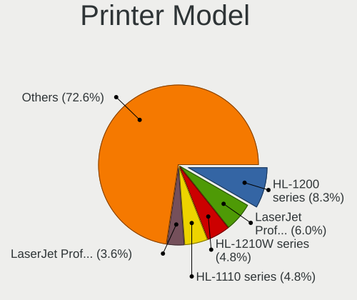

| Model                                         | Computers | Percent |
|-----------------------------------------------|-----------|---------|
| Brother HL-1200 series                        | 7         | 8.33%   |
| HP LaserJet Professional P1102w               | 5         | 5.95%   |
| Brother HL-1210W series                       | 4         | 4.76%   |
| Brother HL-1110 series                        | 4         | 4.76%   |
| HP LaserJet Professional P 1102w              | 3         | 3.57%   |
| HP LaserJet P1006                             | 3         | 3.57%   |
| Seiko Epson XP-240 Series                     | 2         | 2.38%   |
| Seiko Epson L355 Series                       | 2         | 2.38%   |
| Seiko Epson L210 Series                       | 2         | 2.38%   |
| Samsung M2020 Series                          | 2         | 2.38%   |
| HP LaserJet P1005                             | 2         | 2.38%   |
| HP LaserJet M203-M206                         | 2         | 2.38%   |
| HP LaserJet 1020                              | 2         | 2.38%   |
| HP Ink Tank 110 series                        | 2         | 2.38%   |
| HP DeskJet 2600 series                        | 2         | 2.38%   |
| Brother HL-2130 series                        | 2         | 2.38%   |
| Brother DCP-7055 scanner/printer              | 2         | 2.38%   |
| Seiko Epson XP-2100 Series                    | 1         | 1.19%   |
| Seiko Epson Printer                           | 1         | 1.19%   |
| Seiko Epson ME 340 Series/Stylus NX130 Series | 1         | 1.19%   |
| Seiko Epson L5190 Series                      | 1         | 1.19%   |
| Seiko Epson L3110 Series                      | 1         | 1.19%   |
| Seiko Epson L120 Series                       | 1         | 1.19%   |
| Seiko Epson ET-2700 Series                    | 1         | 1.19%   |
| Samsung Xerox Phaser 3117 Laser Printer       | 1         | 1.19%   |
| Samsung ML-1865                               | 1         | 1.19%   |
| Samsung CLP-360 Series                        | 1         | 1.19%   |
| Ricoh Printing Support                        | 1         | 1.19%   |
| QinHeng CH340S                                | 1         | 1.19%   |
| Pantum P2500W series                          | 1         | 1.19%   |
| NXP Semiconductors Elgin i8                   | 1         | 1.19%   |
| Kyocera ECOSYS M3550idn                       | 1         | 1.19%   |
| HP PSC 1400                                   | 1         | 1.19%   |
| HP Officejet 4500 G510a-f                     | 1         | 1.19%   |
| HP LaserJet Pro M428f-M429f                   | 1         | 1.19%   |
| HP Laserjet P1505                             | 1         | 1.19%   |
| HP LaserJet M109-M112                         | 1         | 1.19%   |
| HP LaserJet 3050                              | 1         | 1.19%   |
| HP LaserJet 1022                              | 1         | 1.19%   |
| HP Ink Tank Wireless 410 series               | 1         | 1.19%   |

Scanner Vendor
--------------

Scanner device vendors

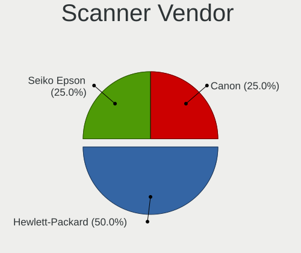

| Vendor          | Computers | Percent |
|-----------------|-----------|---------|
| Hewlett-Packard | 2         | 50%     |
| Seiko Epson     | 1         | 25%     |
| Canon           | 1         | 25%     |

Scanner Model
-------------

Scanner device models

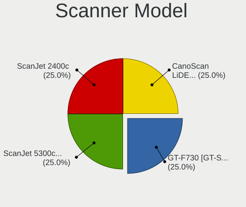

| Model                                                   | Computers | Percent |
|---------------------------------------------------------|-----------|---------|
| Seiko Epson GT-F730 [GT-S630/Perfection V33/V330 Photo] | 1         | 25%     |
| HP ScanJet 5300c/5370c                                  | 1         | 25%     |
| HP ScanJet 2400c                                        | 1         | 25%     |
| Canon CanoScan LiDE 200                                 | 1         | 25%     |

Camera
------

Camera Vendor
-------------

Camera device vendors

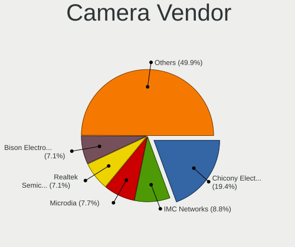

| Vendor                                 | Computers | Percent |
|----------------------------------------|-----------|---------|
| Chicony Electronics                    | 350       | 19.43%  |
| IMC Networks                           | 158       | 8.77%   |
| Microdia                               | 139       | 7.72%   |
| Realtek Semiconductor                  | 128       | 7.11%   |
| Bison Electronics                      | 127       | 7.05%   |
| Quanta                                 | 73        | 4.05%   |
| Sunplus Innovation Technology          | 72        | 4%      |
| Logitech                               | 69        | 3.83%   |
| Syntek                                 | 62        | 3.44%   |
| Cheng Uei Precision Industry (Foxlink) | 55        | 3.05%   |
| Suyin                                  | 51        | 2.83%   |
| Alcor Micro                            | 49        | 2.72%   |
| Silicon Motion                         | 46        | 2.55%   |
| Apple                                  | 32        | 1.78%   |
| Acer                                   | 31        | 1.72%   |
| SunplusIT                              | 29        | 1.61%   |
| Luxvisions Innotech Limited            | 29        | 1.61%   |
| Samsung Electronics                    | 26        | 1.44%   |
| Lite-On Technology                     | 23        | 1.28%   |
| Generalplus Technology                 | 23        | 1.28%   |
| KYE Systems (Mouse Systems)            | 22        | 1.22%   |
| Z-Star Microelectronics                | 21        | 1.17%   |
| Sonix Technology                       | 19        | 1.05%   |
| Ricoh                                  | 17        | 0.94%   |
| icSpring                               | 14        | 0.78%   |
| Microsoft                              | 11        | 0.61%   |
| Jieli Technology                       | 11        | 0.61%   |
| Y Media                                | 9         | 0.5%    |
| OmniVision Technologies                | 8         | 0.44%   |
| Importek                               | 8         | 0.44%   |
| globaloptics                           | 8         | 0.44%   |
| MacroSilicon                           | 6         | 0.33%   |
| Cubeternet                             | 6         | 0.33%   |
| ALi                                    | 5         | 0.28%   |
| USB Camera CS                          | 4         | 0.22%   |
| Lenovo                                 | 4         | 0.22%   |
| Genesys Logic                          | 4         | 0.22%   |
| GEMBIRD                                | 4         | 0.22%   |
| Aveo Technology                        | 4         | 0.22%   |
| Shine-optics                           | 3         | 0.17%   |

Camera Model
------------

Camera device models

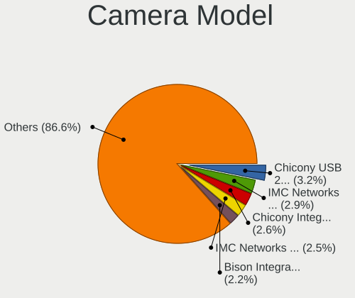

| Model                                                          | Computers | Percent |
|----------------------------------------------------------------|-----------|---------|
| Chicony USB 2.0 Camera                                         | 58        | 3.2%    |
| IMC Networks Integrated Camera                                 | 52        | 2.87%   |
| Chicony Integrated Camera                                      | 47        | 2.6%    |
| IMC Networks USB2.0 VGA UVC WebCam                             | 46        | 2.54%   |
| Bison Integrated Camera                                        | 40        | 2.21%   |
| Microdia Integrated_Webcam_HD                                  | 35        | 1.93%   |
| Alcor Micro USB 2.0 Camera                                     | 34        | 1.88%   |
| Syntek Integrated Camera                                       | 32        | 1.77%   |
| Realtek Integrated_Webcam_HD                                   | 32        | 1.77%   |
| IMC Networks USB2.0 HD UVC WebCam                              | 28        | 1.55%   |
| Sunplus Integrated_Webcam_HD                                   | 27        | 1.49%   |
| SunplusIT USB 2M Camera                                        | 25        | 1.38%   |
| Samsung Galaxy series, misc. (MTP mode)                        | 25        | 1.38%   |
| Chicony HD WebCam                                              | 22        | 1.21%   |
| Microdia USB 2.0 Camera                                        | 21        | 1.16%   |
| Logitech Webcam C270                                           | 20        | 1.1%    |
| Realtek USB Camera                                             | 19        | 1.05%   |
| Luxvisions Innotech Limited Integrated Camera                  | 19        | 1.05%   |
| Cheng Uei Precision Industry (Foxlink) HP TrueVision HD Camera | 19        | 1.05%   |
| Chicony Lenovo EasyCamera                                      | 17        | 0.94%   |
| Realtek USB2.0 camera                                          | 16        | 0.88%   |
| Bison Lenovo EasyCamera                                        | 16        | 0.88%   |
| Microdia Webcam Vitade AF                                      | 15        | 0.83%   |
| Chicony TOSHIBA Web Camera - HD                                | 15        | 0.83%   |
| Chicony HP TrueVision HD Camera                                | 15        | 0.83%   |
| Quanta HD Webcam                                               | 14        | 0.77%   |
| icSpring camera                                                | 14        | 0.77%   |
| Chicony EasyCamera                                             | 14        | 0.77%   |
| Logitech C922 Pro Stream Webcam                                | 12        | 0.66%   |
| Lite-On Integrated Camera                                      | 12        | 0.66%   |
| Generalplus GENERAL WEBCAM                                     | 12        | 0.66%   |
| Chicony HP Wide Vision HD Camera                               | 12        | 0.66%   |
| Chicony HD camera                                              | 12        | 0.66%   |
| Apple iPhone 5/5C/5S/6/SE/7/8/X                                | 12        | 0.66%   |
| Acer USB Camera                                                | 12        | 0.66%   |
| Syntek EasyCamera                                              | 11        | 0.61%   |
| Jieli USB PHY 2.0                                              | 11        | 0.61%   |
| Chicony HP Webcam                                              | 11        | 0.61%   |
| Bison USB HD Webcam                                            | 11        | 0.61%   |
| Silicon Motion WebCam SC-0311139N                              | 10        | 0.55%   |

Security
--------

Fingerprint Vendor
------------------

Fingerprint sensor vendors

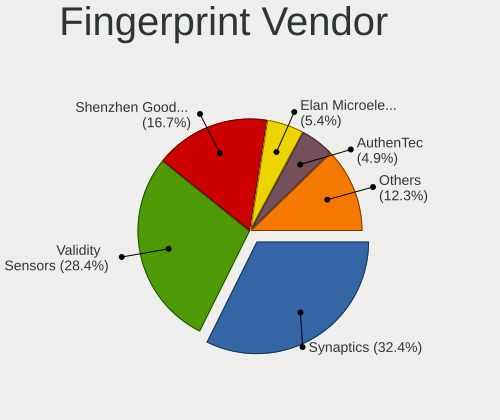

| Vendor                             | Computers | Percent |
|------------------------------------|-----------|---------|
| Synaptics                          | 66        | 32.35%  |
| Validity Sensors                   | 58        | 28.43%  |
| Shenzhen Goodix Technology         | 34        | 16.67%  |
| Elan Microelectronics              | 11        | 5.39%   |
| AuthenTec                          | 10        | 4.9%    |
| LighTuning Technology              | 9         | 4.41%   |
| Upek                               | 8         | 3.92%   |
| STMicroelectronics                 | 2         | 0.98%   |
| Realtek USB2.0 Finger Print Bridge | 2         | 0.98%   |
| DigitalPersona                     | 2         | 0.98%   |
| HOLTEK                             | 1         | 0.49%   |
| Focal-systems.Corp                 | 1         | 0.49%   |

Fingerprint Model
-----------------

Fingerprint sensor models

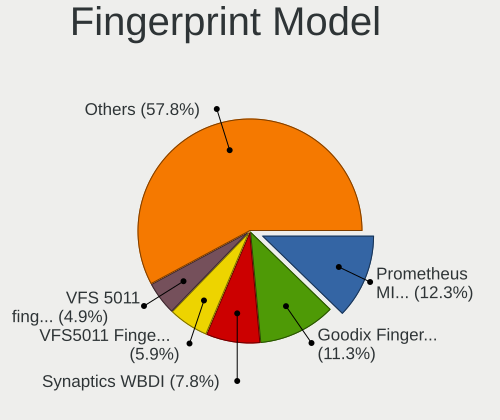

| Model                                                                      | Computers | Percent |
|----------------------------------------------------------------------------|-----------|---------|
| Synaptics Prometheus MIS Touch Fingerprint Reader                          | 25        | 12.25%  |
| Shenzhen Goodix  FingerPrint Device                                        | 23        | 11.27%  |
| Synaptics  WBDI                                                            | 16        | 7.84%   |
| Validity Sensors VFS5011 Fingerprint Reader                                | 12        | 5.88%   |
| Validity Sensors VFS 5011 fingerprint sensor                               | 10        | 4.9%    |
| Shenzhen Goodix Fingerprint Reader                                         | 10        | 4.9%    |
| Upek Biometric Touchchip/Touchstrip Fingerprint Sensor                     | 8         | 3.92%   |
| Synaptics Metallica MIS Touch Fingerprint Reader                           | 8         | 3.92%   |
| Validity Sensors Fingerprint scanner                                       | 7         | 3.43%   |
| Validity Sensors Synaptics WBDI                                            | 6         | 2.94%   |
| Elan ELAN:Fingerprint                                                      | 6         | 2.94%   |
| Validity Sensors VFS495 Fingerprint Reader                                 | 5         | 2.45%   |
| LighTuning ES603 Swipe Fingerprint Sensor                                  | 5         | 2.45%   |
| Elan ELAN:ARM-M4                                                           | 5         | 2.45%   |
| Validity Sensors VFS301 Fingerprint Reader                                 | 4         | 1.96%   |
| Validity Sensors Synaptics VFS7552 Touch Fingerprint Sensor with PurePrint | 4         | 1.96%   |
| Synaptics WBDI                                                             | 4         | 1.96%   |
| Synaptics UWP WBDI Device                                                  | 4         | 1.96%   |
| AuthenTec AES2501 Fingerprint Sensor                                       | 4         | 1.96%   |
| AuthenTec AES2810                                                          | 3         | 1.47%   |
| Validity Sensors VFS491                                                    | 2         | 0.98%   |
| Validity Sensors VFS101 Fingerprint Reader                                 | 2         | 0.98%   |
| Validity Sensors Swipe Fingerprint Sensor                                  | 2         | 0.98%   |
| Synaptics Fingerprint reader [HP G6]                                       | 2         | 0.98%   |
| STMicroelectronics Fingerprint Reader                                      | 2         | 0.98%   |
| Realtek USB2.0 Finger Print Bridge FocalTech Fingerprint Device            | 2         | 0.98%   |
| LighTuning Fingerprint Sensor                                              | 2         | 0.98%   |
| LighTuning EgisTec Touch Fingerprint Sensor                                | 2         | 0.98%   |
| DigitalPersona Fingerprint Reader                                          | 2         | 0.98%   |
| AuthenTec Fingerprint Sensor                                               | 2         | 0.98%   |
| Validity Sensors VFS7552 Touch Fingerprint Sensor                          | 1         | 0.49%   |
| Validity Sensors VFS7500 Touch Fingerprint Sensor                          | 1         | 0.49%   |
| Validity Sensors VFS300 Fingerprint Reader                                 | 1         | 0.49%   |
| Validity Sensors Synaptics VFS7552 Touch Fingerprint Sensor                | 1         | 0.49%   |
| Synaptics WBDI Fingerprint Reader USB 086                                  | 1         | 0.49%   |
| Synaptics UWP WBDI                                                         | 1         | 0.49%   |
| Synaptics TouchPad                                                         | 1         | 0.49%   |
| Synaptics  FS7604 Touch Fingerprint Sensor with PurePrint                  | 1         | 0.49%   |
| Synaptics Prometheus Fingerprint Reader                                    | 1         | 0.49%   |
| Synaptics FS7604 Touch Fingerprint Sensor with PurePrint                   | 1         | 0.49%   |

Chipcard Vendor
---------------

Chipcard module vendors

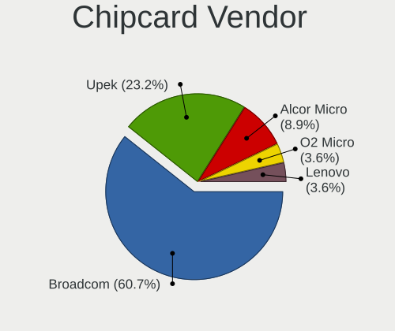

| Vendor      | Computers | Percent |
|-------------|-----------|---------|
| Broadcom    | 34        | 60.71%  |
| Upek        | 13        | 23.21%  |
| Alcor Micro | 5         | 8.93%   |
| O2 Micro    | 2         | 3.57%   |
| Lenovo      | 2         | 3.57%   |

Chipcard Model
--------------

Chipcard module models

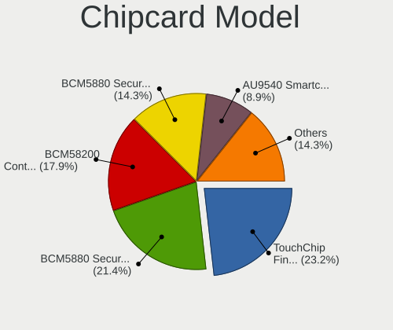

| Model                                                                        | Computers | Percent |
|------------------------------------------------------------------------------|-----------|---------|
| Upek TouchChip Fingerprint Coprocessor (WBF advanced mode)                   | 13        | 23.21%  |
| Broadcom BCM5880 Secure Applications Processor                               | 12        | 21.43%  |
| Broadcom BCM58200 ControlVault 3 (FingerPrint sensor + Contacted SmartCard)  | 10        | 17.86%  |
| Broadcom BCM5880 Secure Applications Processor with fingerprint swipe sensor | 8         | 14.29%  |
| Alcor Micro AU9540 Smartcard Reader                                          | 5         | 8.93%   |
| Broadcom 5880                                                                | 3         | 5.36%   |
| O2 Micro OZ776 CCID Smartcard Reader                                         | 2         | 3.57%   |
| Lenovo Integrated Smart Card Reader                                          | 2         | 3.57%   |
| Broadcom 58200                                                               | 1         | 1.79%   |

Unsupported
-----------

Unsupported Devices
-------------------

Total unsupported devices on board

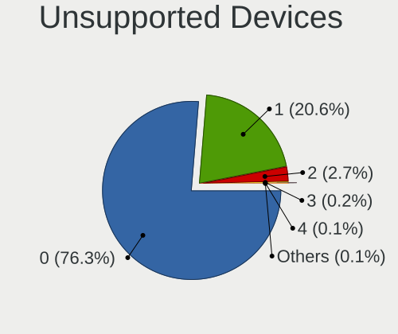

| Total | Computers | Percent |
|-------|-----------|---------|
| 0     | 2350      | 76.3%   |
| 1     | 635       | 20.62%  |
| 2     | 83        | 2.69%   |
| 3     | 5         | 0.16%   |
| 4     | 4         | 0.13%   |
| 8     | 1         | 0.03%   |
| 6     | 1         | 0.03%   |
| 5     | 1         | 0.03%   |

Unsupported Device Types
------------------------

Types of unsupported devices

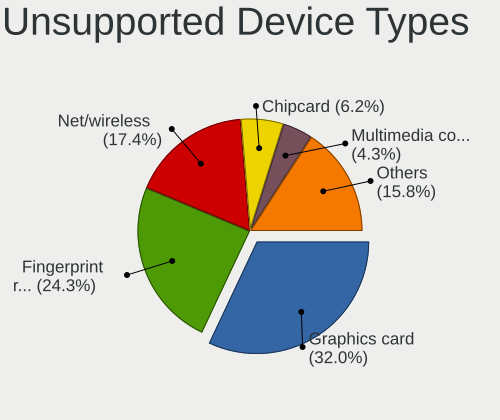

| Type                     | Computers | Percent |
|--------------------------|-----------|---------|
| Graphics card            | 265       | 32%     |
| Fingerprint reader       | 201       | 24.28%  |
| Net/wireless             | 144       | 17.39%  |
| Chipcard                 | 51        | 6.16%   |
| Multimedia controller    | 36        | 4.35%   |
| Camera                   | 31        | 3.74%   |
| Communication controller | 24        | 2.9%    |
| Sound                    | 17        | 2.05%   |
| Bluetooth                | 17        | 2.05%   |
| Net/ethernet             | 16        | 1.93%   |
| Network                  | 6         | 0.72%   |
| Unassigned class         | 5         | 0.6%    |
| Modem                    | 5         | 0.6%    |
| Storage/ide              | 2         | 0.24%   |
| Flash memory             | 2         | 0.24%   |
| Firewire controller      | 2         | 0.24%   |
| Card reader              | 2         | 0.24%   |
| Storage/raid             | 1         | 0.12%   |
| Dvb card                 | 1         | 0.12%   |

