Linux in Argentina - Tested Hardware & Statistics
-------------------------------------------------

A project to collect tested hardware configurations for Linux in Argentina.

Anyone can contribute to this report by the [hw-probe](https://github.com/linuxhw/hw-probe) tool:

    sudo -E hw-probe -all -upload

Please contribute! Especially if your hardware is rare.

This is a report for all computer types. See also reports for [desktops](/Location/Argentina/Desktop/README.md) and [notebooks](/Location/Argentina/Notebook/README.md).

Contents
--------

* [ Test Cases ](#test-cases)

* [ System ](#system)
  - [ OS                       ](#os)
  - [ OS Family                ](#os-family)
  - [ Kernel                   ](#kernel)
  - [ Kernel Family            ](#kernel-family)
  - [ Kernel Major Ver.        ](#kernel-major-ver)
  - [ Arch                     ](#arch)
  - [ DE                       ](#de)
  - [ Display Server           ](#display-server)
  - [ Display Manager          ](#display-manager)
  - [ OS Lang                  ](#os-lang)
  - [ Boot Mode                ](#boot-mode)
  - [ Filesystem               ](#filesystem)
  - [ Part. scheme             ](#part-scheme)
  - [ Dual Boot with Linux/BSD ](#dual-boot-with-linuxbsd)
  - [ Dual Boot (Win)          ](#dual-boot-win)

* [ Board ](#board)
  - [ Vendor                   ](#vendor)
  - [ Model                    ](#model)
  - [ Model Family             ](#model-family)
  - [ MFG Year                 ](#mfg-year)
  - [ Form Factor              ](#form-factor)
  - [ Secure Boot              ](#secure-boot)
  - [ Coreboot                 ](#coreboot)
  - [ RAM Size                 ](#ram-size)
  - [ RAM Used                 ](#ram-used)
  - [ Total Drives             ](#total-drives)
  - [ Has CD-ROM               ](#has-cd-rom)
  - [ Has Ethernet             ](#has-ethernet)
  - [ Has WiFi                 ](#has-wifi)
  - [ Has Bluetooth            ](#has-bluetooth)

* [ Location ](#location)
  - [ Country                  ](#country)
  - [ City                     ](#city)

* [ Drives ](#drives)
  - [ Drive Vendor             ](#drive-vendor)
  - [ Drive Model              ](#drive-model)
  - [ HDD Vendor               ](#hdd-vendor)
  - [ SSD Vendor               ](#ssd-vendor)
  - [ Drive Kind               ](#drive-kind)
  - [ Drive Connector          ](#drive-connector)
  - [ Drive Size               ](#drive-size)
  - [ Space Total              ](#space-total)
  - [ Space Used               ](#space-used)
  - [ Malfunc. Drives          ](#malfunc-drives)
  - [ Malfunc. Drive Vendor    ](#malfunc-drive-vendor)
  - [ Malfunc. HDD Vendor      ](#malfunc-hdd-vendor)
  - [ Malfunc. Drive Kind      ](#malfunc-drive-kind)
  - [ Failed Drives            ](#failed-drives)
  - [ Failed Drive Vendor      ](#failed-drive-vendor)
  - [ Drive Status             ](#drive-status)

* [ Storage controller ](#storage-controller)
  - [ Storage Vendor           ](#storage-vendor)
  - [ Storage Model            ](#storage-model)
  - [ Storage Kind             ](#storage-kind)

* [ Processor ](#processor)
  - [ CPU Vendor               ](#cpu-vendor)
  - [ CPU Model                ](#cpu-model)
  - [ CPU Model Family         ](#cpu-model-family)
  - [ CPU Cores                ](#cpu-cores)
  - [ CPU Sockets              ](#cpu-sockets)
  - [ CPU Threads              ](#cpu-threads)
  - [ CPU Op-Modes             ](#cpu-op-modes)
  - [ CPU Microcode            ](#cpu-microcode)
  - [ CPU Microarch            ](#cpu-microarch)

* [ Graphics ](#graphics)
  - [ GPU Vendor               ](#gpu-vendor)
  - [ GPU Model                ](#gpu-model)
  - [ GPU Combo                ](#gpu-combo)
  - [ GPU Driver               ](#gpu-driver)
  - [ GPU Memory               ](#gpu-memory)

* [ Monitor ](#monitor)
  - [ Monitor Vendor           ](#monitor-vendor)
  - [ Monitor Model            ](#monitor-model)
  - [ Monitor Resolution       ](#monitor-resolution)
  - [ Monitor Diagonal         ](#monitor-diagonal)
  - [ Monitor Width            ](#monitor-width)
  - [ Aspect Ratio             ](#aspect-ratio)
  - [ Monitor Area             ](#monitor-area)
  - [ Pixel Density            ](#pixel-density)
  - [ Multiple Monitors        ](#multiple-monitors)

* [ Network ](#network)
  - [ Net Controller Vendor    ](#net-controller-vendor)
  - [ Net Controller Model     ](#net-controller-model)
  - [ Wireless Vendor          ](#wireless-vendor)
  - [ Wireless Model           ](#wireless-model)
  - [ Ethernet Vendor          ](#ethernet-vendor)
  - [ Ethernet Model           ](#ethernet-model)
  - [ Net Controller Kind      ](#net-controller-kind)
  - [ Used Controller          ](#used-controller)
  - [ NICs                     ](#nics)
  - [ IPv6                     ](#ipv6)

* [ Bluetooth ](#bluetooth)
  - [ Bluetooth Vendor         ](#bluetooth-vendor)
  - [ Bluetooth Model          ](#bluetooth-model)

* [ Sound ](#sound)
  - [ Sound Vendor             ](#sound-vendor)
  - [ Sound Model              ](#sound-model)

* [ Memory ](#memory)
  - [ Memory Vendor            ](#memory-vendor)
  - [ Memory Model             ](#memory-model)
  - [ Memory Kind              ](#memory-kind)
  - [ Memory Form Factor       ](#memory-form-factor)
  - [ Memory Size              ](#memory-size)
  - [ Memory Speed             ](#memory-speed)

* [ Printers & scanners ](#printers--scanners)
  - [ Printer Vendor           ](#printer-vendor)
  - [ Printer Model            ](#printer-model)
  - [ Scanner Vendor           ](#scanner-vendor)
  - [ Scanner Model            ](#scanner-model)

* [ Camera ](#camera)
  - [ Camera Vendor            ](#camera-vendor)
  - [ Camera Model             ](#camera-model)

* [ Security ](#security)
  - [ Fingerprint Vendor       ](#fingerprint-vendor)
  - [ Fingerprint Model        ](#fingerprint-model)
  - [ Chipcard Vendor          ](#chipcard-vendor)
  - [ Chipcard Model           ](#chipcard-model)

* [ Unsupported ](#unsupported)
  - [ Unsupported Devices      ](#unsupported-devices)
  - [ Unsupported Device Types ](#unsupported-device-types)

Test Cases
----------

Total: 3784

| Vendor        | Model                       | Form-Factor | Probe                                                      | Date         |
|---------------|-----------------------------|-------------|------------------------------------------------------------|--------------|
| Lenovo        | Yoga Slim 7 14IMH9 83CV     | Notebook    | [efa06f4775](https://linux-hardware.org/?probe=efa06f4775) | Jan 03, 2025 |
| ASRock        | G31M-S                      | Desktop     | [9b8ba4cb2c](https://linux-hardware.org/?probe=9b8ba4cb2c) | Jan 02, 2025 |
| HP            | EliteBook x360 1040 G5      | Notebook    | [997d557b49](https://linux-hardware.org/?probe=997d557b49) | Jan 02, 2025 |
| HP            | ENVY Laptop 13-ah0xxx       | Notebook    | [2bf35e6afa](https://linux-hardware.org/?probe=2bf35e6afa) | Jan 02, 2025 |
| ASUSTek       | M5A97 R2.0                  | Desktop     | [bb11de9504](https://linux-hardware.org/?probe=bb11de9504) | Jan 02, 2025 |
| Lenovo        | G470 20078                  | Notebook    | [9d15c84512](https://linux-hardware.org/?probe=9d15c84512) | Dec 31, 2024 |
| Packard Be... | EasyNote_MX45               | Notebook    | [e696c77b8f](https://linux-hardware.org/?probe=e696c77b8f) | Dec 30, 2024 |
| Toshiba       | Satellite C55-C             | Notebook    | [709c9b508d](https://linux-hardware.org/?probe=709c9b508d) | Dec 30, 2024 |
| Toshiba       | Satellite C55-C             | Notebook    | [dc3315e8ad](https://linux-hardware.org/?probe=dc3315e8ad) | Dec 29, 2024 |
| Packard Be... | EasyNote_MX45               | Notebook    | [8ef7bf6e6d](https://linux-hardware.org/?probe=8ef7bf6e6d) | Dec 29, 2024 |
| Lenovo        | IdeaPadFlex 5 14ARE05 81... | Convertible | [d502f19368](https://linux-hardware.org/?probe=d502f19368) | Dec 27, 2024 |
| ASUSTek       | PRIME H510M-K R2.0          | Desktop     | [0a2195b79e](https://linux-hardware.org/?probe=0a2195b79e) | Dec 25, 2024 |
| Intel         | B75                         | Desktop     | [b6021895af](https://linux-hardware.org/?probe=b6021895af) | Dec 24, 2024 |
| Acer          | Aspire A515-57              | Notebook    | [1e6b1c0777](https://linux-hardware.org/?probe=1e6b1c0777) | Dec 23, 2024 |
| HP            | Pavilion dv5                | Notebook    | [b5631c4228](https://linux-hardware.org/?probe=b5631c4228) | Dec 21, 2024 |
| Lenovo        | ThinkPad T430 23499C5       | Notebook    | [04426df402](https://linux-hardware.org/?probe=04426df402) | Dec 20, 2024 |
| ASUSTek       | PRIME H310M-E R2.0          | Desktop     | [d5fd6f7a36](https://linux-hardware.org/?probe=d5fd6f7a36) | Dec 20, 2024 |
| Acer          | Aspire A515-51              | Notebook    | [7784c8e1a1](https://linux-hardware.org/?probe=7784c8e1a1) | Dec 20, 2024 |
| ASRock        | FM2A68M-DG3+                | Desktop     | [c649082ef1](https://linux-hardware.org/?probe=c649082ef1) | Dec 19, 2024 |
| ASRock        | FM2A68M-DG3+                | Desktop     | [61b3ee9f74](https://linux-hardware.org/?probe=61b3ee9f74) | Dec 19, 2024 |
| ASUSTek       | J1800I-C                    | Desktop     | [e3e388fc18](https://linux-hardware.org/?probe=e3e388fc18) | Dec 18, 2024 |
| ASUSTek       | M5A78L-M LX3                | Desktop     | [5b0695c446](https://linux-hardware.org/?probe=5b0695c446) | Dec 18, 2024 |
| ASUSTek       | Z77-A                       | Desktop     | [905b20309d](https://linux-hardware.org/?probe=905b20309d) | Dec 17, 2024 |
| Gigabyte      | B760M G AX                  | Desktop     | [b0a2fd8b02](https://linux-hardware.org/?probe=b0a2fd8b02) | Dec 17, 2024 |
| Lenovo        | Legion 5 Pro 16ACH6H 82J... | Notebook    | [1db1f1c585](https://linux-hardware.org/?probe=1db1f1c585) | Dec 17, 2024 |
| ASUSTek       | VivoBook_ASUSLaptop X140... | Notebook    | [50315f1b60](https://linux-hardware.org/?probe=50315f1b60) | Dec 17, 2024 |
| Lenovo        | IdeaPad 320-15ABR 80XS      | Notebook    | [2c9b4ffff9](https://linux-hardware.org/?probe=2c9b4ffff9) | Dec 16, 2024 |
| ASUSTek       | ROG STRIX X670E-E GAMING... | Desktop     | [008bed58fb](https://linux-hardware.org/?probe=008bed58fb) | Dec 16, 2024 |
| Toshiba       | Satellite P55-A             | Notebook    | [d54a3b360d](https://linux-hardware.org/?probe=d54a3b360d) | Dec 15, 2024 |
| Gigabyte      | B450M DS3H V2               | Desktop     | [bfdca9bd38](https://linux-hardware.org/?probe=bfdca9bd38) | Dec 14, 2024 |
| Exo           | Smart E18                   | Notebook    | [5b02114290](https://linux-hardware.org/?probe=5b02114290) | Dec 14, 2024 |
| Kelyx Arge... | Kelyx KL3450                | Notebook    | [b6f256e9a7](https://linux-hardware.org/?probe=b6f256e9a7) | Dec 14, 2024 |
| ASRock        | G31M-S                      | Desktop     | [e909cba66c](https://linux-hardware.org/?probe=e909cba66c) | Dec 12, 2024 |
| Gigabyte      | M68MT-S2                    | Desktop     | [4040206002](https://linux-hardware.org/?probe=4040206002) | Dec 12, 2024 |
| Lenovo        | ThinkPad X13 Yoga Gen 4 ... | Convertible | [abaa889c70](https://linux-hardware.org/?probe=abaa889c70) | Dec 11, 2024 |
| Dell          | Inspiron 15 3515            | Notebook    | [a073fbc9bc](https://linux-hardware.org/?probe=a073fbc9bc) | Dec 10, 2024 |
| Gigabyte      | Z690 AORUS ELITE AX DDR4    | Desktop     | [7bcd9c0153](https://linux-hardware.org/?probe=7bcd9c0153) | Dec 10, 2024 |
| ASUSTek       | ROG STRIX X670E-F GAMING... | Desktop     | [708895b5bb](https://linux-hardware.org/?probe=708895b5bb) | Dec 09, 2024 |
| ASUSTek       | ROG STRIX X670E-F GAMING... | Desktop     | [537116bb8a](https://linux-hardware.org/?probe=537116bb8a) | Dec 09, 2024 |
| Gigabyte      | Z690 AORUS ELITE AX DDR4    | Desktop     | [3fb4762109](https://linux-hardware.org/?probe=3fb4762109) | Dec 08, 2024 |
| Compal        | PBL2021                     | Notebook    | [666f4c8979](https://linux-hardware.org/?probe=666f4c8979) | Dec 07, 2024 |
| Lenovo        | IdeaPad Gaming 3 15ARH05... | Notebook    | [9d798bd59a](https://linux-hardware.org/?probe=9d798bd59a) | Dec 07, 2024 |
| Dell          | Inspiron 15-3567            | Notebook    | [cbf6bf1b48](https://linux-hardware.org/?probe=cbf6bf1b48) | Dec 06, 2024 |
| Gigabyte      | B250M-DS3H-CF               | Desktop     | [5ccce88035](https://linux-hardware.org/?probe=5ccce88035) | Dec 05, 2024 |
| Intel         | NUC6CAYB J23203-403         | Mini pc     | [471682953f](https://linux-hardware.org/?probe=471682953f) | Dec 03, 2024 |
| ASUSTek       | PRIME A320M-K               | Desktop     | [6f54acb69c](https://linux-hardware.org/?probe=6f54acb69c) | Dec 03, 2024 |
| BANGHO        | Suma 1025                   | Tablet      | [da6ce4b361](https://linux-hardware.org/?probe=da6ce4b361) | Dec 03, 2024 |
| ASUSTek       | VivoBook_ASUSLaptop X140... | Notebook    | [bdb95c5d82](https://linux-hardware.org/?probe=bdb95c5d82) | Dec 02, 2024 |
| Dell          | Latitude E6410              | Notebook    | [9e58a81f87](https://linux-hardware.org/?probe=9e58a81f87) | Dec 02, 2024 |
| ASUSTek       | M5A88-M                     | Desktop     | [520539e9f6](https://linux-hardware.org/?probe=520539e9f6) | Dec 01, 2024 |
| ASUSTek       | VivoBook_ASUSLaptop X140... | Notebook    | [dce5b2ffb8](https://linux-hardware.org/?probe=dce5b2ffb8) | Dec 01, 2024 |
| Dell          | Latitude E7470              | Notebook    | [ac991cd0b2](https://linux-hardware.org/?probe=ac991cd0b2) | Nov 30, 2024 |
| ASUSTek       | H170I-PRO                   | Desktop     | [07587747a1](https://linux-hardware.org/?probe=07587747a1) | Nov 30, 2024 |
| ASUSTek       | TUF Gaming B560M-PLUS WI... | Desktop     | [f2cd67c0f6](https://linux-hardware.org/?probe=f2cd67c0f6) | Nov 29, 2024 |
| Acer          | Swift SF315-41G             | Notebook    | [4ceee24a7a](https://linux-hardware.org/?probe=4ceee24a7a) | Nov 29, 2024 |
| Samsung       | 100NZA                      | Notebook    | [6a49e4caae](https://linux-hardware.org/?probe=6a49e4caae) | Nov 28, 2024 |
| Acer          | Swift SF315-41G             | Notebook    | [40cb81624b](https://linux-hardware.org/?probe=40cb81624b) | Nov 27, 2024 |
| MSI           | 880GM-E41                   | Desktop     | [d2d4d7473b](https://linux-hardware.org/?probe=d2d4d7473b) | Nov 26, 2024 |
| Acer          | Nitro AN515-58              | Notebook    | [6220b5b948](https://linux-hardware.org/?probe=6220b5b948) | Nov 26, 2024 |
| ASUSTek       | TUF Gaming B660M-PLUS WI... | Desktop     | [ab34148bbb](https://linux-hardware.org/?probe=ab34148bbb) | Nov 25, 2024 |
| ASUSTek       | TUF Gaming B660M-PLUS WI... | Desktop     | [556e1e8117](https://linux-hardware.org/?probe=556e1e8117) | Nov 25, 2024 |
| ASRock        | J3355B-ITX                  | Desktop     | [a518434234](https://linux-hardware.org/?probe=a518434234) | Nov 25, 2024 |
| Exo           | Smart XL4                   | Notebook    | [b9367af1bd](https://linux-hardware.org/?probe=b9367af1bd) | Nov 23, 2024 |
| Exo           | Smart XL4                   | Notebook    | [264ffc04ec](https://linux-hardware.org/?probe=264ffc04ec) | Nov 23, 2024 |
| Unknown       | Unknown                     | Notebook    | [f3f336f89e](https://linux-hardware.org/?probe=f3f336f89e) | Nov 23, 2024 |
| Sony          | M730                        | Notebook    | [55d7e62f9d](https://linux-hardware.org/?probe=55d7e62f9d) | Nov 23, 2024 |
| Gigabyte      | H510M H                     | Desktop     | [19c3074d2a](https://linux-hardware.org/?probe=19c3074d2a) | Nov 23, 2024 |
| Gigabyte      | H510M H                     | Desktop     | [bb61554d7b](https://linux-hardware.org/?probe=bb61554d7b) | Nov 23, 2024 |
| Lenovo        | IdeaPad L340-15IRH Gamin... | Notebook    | [e3df5957f6](https://linux-hardware.org/?probe=e3df5957f6) | Nov 21, 2024 |
| Lenovo        | IdeaPad L340-15IRH Gamin... | Notebook    | [9f5168096d](https://linux-hardware.org/?probe=9f5168096d) | Nov 21, 2024 |
| BANGHO        | Suma 1025                   | Tablet      | [c3a82ec7e7](https://linux-hardware.org/?probe=c3a82ec7e7) | Nov 21, 2024 |
| Juana Mans... | SF20GM7                     | Notebook    | [3a223bc471](https://linux-hardware.org/?probe=3a223bc471) | Nov 21, 2024 |
| Gigabyte      | B450 AORUS PRO WIFI-CF      | Desktop     | [bec30cdc12](https://linux-hardware.org/?probe=bec30cdc12) | Nov 20, 2024 |
| ASUSTek       | VivoBook_ASUSLaptop M650... | Notebook    | [a0c89e3089](https://linux-hardware.org/?probe=a0c89e3089) | Nov 20, 2024 |
| HP            | 240 G8                      | Notebook    | [ac602e0e2e](https://linux-hardware.org/?probe=ac602e0e2e) | Nov 19, 2024 |
| Samsung       | 750XFG                      | Notebook    | [91b2c85a75](https://linux-hardware.org/?probe=91b2c85a75) | Nov 19, 2024 |
| Conectar I... | SF20GM7                     | Notebook    | [f5669a6587](https://linux-hardware.org/?probe=f5669a6587) | Nov 18, 2024 |
| Dell          | Inspiron 15-3567            | Notebook    | [815225e627](https://linux-hardware.org/?probe=815225e627) | Nov 18, 2024 |
| ASUSTek       | PRIME A320M-K               | Desktop     | [61d8a1bc22](https://linux-hardware.org/?probe=61d8a1bc22) | Nov 17, 2024 |
| Acer          | Aspire A315-59              | Notebook    | [47c865efcb](https://linux-hardware.org/?probe=47c865efcb) | Nov 16, 2024 |
| Juana Mans... | SF20GM7                     | Notebook    | [64e6606763](https://linux-hardware.org/?probe=64e6606763) | Nov 16, 2024 |
| ECS           | A55F-M4                     | Desktop     | [337e0bd665](https://linux-hardware.org/?probe=337e0bd665) | Nov 16, 2024 |
| HP            | 1000                        | Notebook    | [f3966ff7e5](https://linux-hardware.org/?probe=f3966ff7e5) | Nov 15, 2024 |
| Lenovo        | 5048AB6                     | Desktop     | [7ec246973c](https://linux-hardware.org/?probe=7ec246973c) | Nov 15, 2024 |
| Lenovo        | 5048AB6                     | Desktop     | [3779284413](https://linux-hardware.org/?probe=3779284413) | Nov 15, 2024 |
| ASRock        | A320M-HDV R4.0              | Desktop     | [bd75bc63f7](https://linux-hardware.org/?probe=bd75bc63f7) | Nov 15, 2024 |
| Lenovo        | Legion 5 Pro 16ACH6H 82J... | Notebook    | [b4ec08b540](https://linux-hardware.org/?probe=b4ec08b540) | Nov 15, 2024 |
| MSI           | B550M PRO-VDH               | Desktop     | [66893f034f](https://linux-hardware.org/?probe=66893f034f) | Nov 15, 2024 |
| Apple         | MacBook5,1                  | Notebook    | [53e7f70e1d](https://linux-hardware.org/?probe=53e7f70e1d) | Nov 14, 2024 |
| Unknown       | Unknown                     | Notebook    | [36f5fbf726](https://linux-hardware.org/?probe=36f5fbf726) | Nov 14, 2024 |
| ASRock        | H55M                        | Desktop     | [dd4d6e3552](https://linux-hardware.org/?probe=dd4d6e3552) | Nov 12, 2024 |
| ECS           | H61H2-M2                    | Desktop     | [ae2038c80a](https://linux-hardware.org/?probe=ae2038c80a) | Nov 11, 2024 |
| Lenovo        | Yoga 6 13ALC6 82ND          | Convertible | [6d0c685953](https://linux-hardware.org/?probe=6d0c685953) | Nov 10, 2024 |
| Gigabyte      | B650M K                     | Desktop     | [bd720fcae6](https://linux-hardware.org/?probe=bd720fcae6) | Nov 10, 2024 |
| Gigabyte      | H310M H x.x                 | Desktop     | [7714ddee54](https://linux-hardware.org/?probe=7714ddee54) | Nov 09, 2024 |
| Coradir       | Coradir/ES10IS5             | Notebook    | [80b81229af](https://linux-hardware.org/?probe=80b81229af) | Nov 09, 2024 |
| Intel         | HM570                       | Desktop     | [20d344cbd2](https://linux-hardware.org/?probe=20d344cbd2) | Nov 08, 2024 |
| ASUSTek       | TUF Gaming X570-PLUS        | Desktop     | [25543c5070](https://linux-hardware.org/?probe=25543c5070) | Nov 08, 2024 |
| ASUSTek       | PRIME H410M-E               | Desktop     | [4c356677c6](https://linux-hardware.org/?probe=4c356677c6) | Nov 08, 2024 |
| Gigabyte      | A320M-S2H-CF                | Desktop     | [78bc0e22a8](https://linux-hardware.org/?probe=78bc0e22a8) | Nov 08, 2024 |
| Gigabyte      | A320M-S2H-CF                | Desktop     | [1455b780ce](https://linux-hardware.org/?probe=1455b780ce) | Nov 07, 2024 |
| Conectar I... | SF20GM7                     | Notebook    | [1c43877e91](https://linux-hardware.org/?probe=1c43877e91) | Nov 06, 2024 |
| Lenovo        | ThinkPad T480 20L6S5VP3F    | Notebook    | [07edecf7e4](https://linux-hardware.org/?probe=07edecf7e4) | Nov 06, 2024 |
| Unknown       | Unknown                     | Notebook    | [f875fcd592](https://linux-hardware.org/?probe=f875fcd592) | Nov 06, 2024 |
| ASUSTek       | PRIME A520M-A II            | Desktop     | [2e677d7337](https://linux-hardware.org/?probe=2e677d7337) | Nov 06, 2024 |
| Dell          | 0FR6WH A01                  | Desktop     | [615e98c2e0](https://linux-hardware.org/?probe=615e98c2e0) | Nov 05, 2024 |
| Gigabyte      | H61M-S1                     | Desktop     | [4583180173](https://linux-hardware.org/?probe=4583180173) | Nov 04, 2024 |
| Apple         | Mac-942B5BF58194151B        | All in one  | [09a9cef9d1](https://linux-hardware.org/?probe=09a9cef9d1) | Nov 04, 2024 |
| Gigabyte      | H510M H                     | Desktop     | [23e16d82e3](https://linux-hardware.org/?probe=23e16d82e3) | Nov 03, 2024 |
| ASUSTek       | ProArt Z790-CREATOR WIFI    | Desktop     | [ffcb733233](https://linux-hardware.org/?probe=ffcb733233) | Nov 03, 2024 |
| Conectar I... | SF20GM7                     | Notebook    | [95da818f37](https://linux-hardware.org/?probe=95da818f37) | Nov 02, 2024 |
| HP            | 1493                        | Desktop     | [a5fc5d8cff](https://linux-hardware.org/?probe=a5fc5d8cff) | Nov 02, 2024 |
| ASRock        | N68-VS3 FX                  | Desktop     | [974c67550a](https://linux-hardware.org/?probe=974c67550a) | Nov 02, 2024 |
| HP            | 1493                        | Desktop     | [c94edc3dc1](https://linux-hardware.org/?probe=c94edc3dc1) | Nov 01, 2024 |
| HP            | ENVY x360 2-in-1 Laptop ... | Convertible | [362b153508](https://linux-hardware.org/?probe=362b153508) | Nov 01, 2024 |
| Intel         | powered classmate PC        | Notebook    | [f3e434817c](https://linux-hardware.org/?probe=f3e434817c) | Nov 01, 2024 |
| Lenovo        | IdeaPad S145-15IWL 81MV     | Notebook    | [f0c16f5194](https://linux-hardware.org/?probe=f0c16f5194) | Nov 01, 2024 |
| Dell          | Vostro 3405                 | Notebook    | [a5283e32a0](https://linux-hardware.org/?probe=a5283e32a0) | Nov 01, 2024 |
| ASRock        | N68-VS3 FX                  | Desktop     | [b4ae90645d](https://linux-hardware.org/?probe=b4ae90645d) | Nov 01, 2024 |
| MSI           | PRO A620M-E                 | Desktop     | [1d5498d1f7](https://linux-hardware.org/?probe=1d5498d1f7) | Oct 31, 2024 |
| Dell          | Latitude 6430U              | Notebook    | [2fa070b0bb](https://linux-hardware.org/?probe=2fa070b0bb) | Oct 30, 2024 |
| Dell          | Latitude 6430U              | Notebook    | [4abfaa378f](https://linux-hardware.org/?probe=4abfaa378f) | Oct 30, 2024 |
| BANGHO        | Suma 1025                   | Tablet      | [9dc2d138b4](https://linux-hardware.org/?probe=9dc2d138b4) | Oct 30, 2024 |
| BANGHO        | Suma 1025                   | Tablet      | [9ba3946dee](https://linux-hardware.org/?probe=9ba3946dee) | Oct 30, 2024 |
| ASUSTek       | M4N68T-M LE                 | Desktop     | [6403f7199d](https://linux-hardware.org/?probe=6403f7199d) | Oct 29, 2024 |
| ASUSTek       | PRIME A320M-K               | Desktop     | [046f64be70](https://linux-hardware.org/?probe=046f64be70) | Oct 28, 2024 |
| Samsung       | N150P                       | Notebook    | [ee76fc27fa](https://linux-hardware.org/?probe=ee76fc27fa) | Oct 28, 2024 |
| Sony          | VPCEE43EL                   | Notebook    | [f3fa378514](https://linux-hardware.org/?probe=f3fa378514) | Oct 28, 2024 |
| ASUSTek       | VivoBook_ASUSLaptop X515... | Notebook    | [73518c75af](https://linux-hardware.org/?probe=73518c75af) | Oct 27, 2024 |
| Juana Mans... | SF20GM7                     | Notebook    | [0b2f896cf6](https://linux-hardware.org/?probe=0b2f896cf6) | Oct 27, 2024 |
| Intel         | DP45SG AAE27733-402         | Desktop     | [80022aa1fa](https://linux-hardware.org/?probe=80022aa1fa) | Oct 24, 2024 |
| ASUSTek       | H81M-A                      | Desktop     | [d65dd94373](https://linux-hardware.org/?probe=d65dd94373) | Oct 24, 2024 |
| Intel         | DG31PR AAD97573-205         | Desktop     | [4b573de034](https://linux-hardware.org/?probe=4b573de034) | Oct 23, 2024 |
| ASUSTek       | Crosshair IV Formula        | Desktop     | [e459f477ce](https://linux-hardware.org/?probe=e459f477ce) | Oct 23, 2024 |
| ASUSTek       | M4A88TD-V EVO/USB3          | Desktop     | [594f81b2d2](https://linux-hardware.org/?probe=594f81b2d2) | Oct 23, 2024 |
| ASUSTek       | VivoBook_ASUSLaptop X512... | Notebook    | [a7d6a4d4d0](https://linux-hardware.org/?probe=a7d6a4d4d0) | Oct 23, 2024 |
| Positivo      | Schoolmate SF20GM7          | Notebook    | [4b0b1bae90](https://linux-hardware.org/?probe=4b0b1bae90) | Oct 21, 2024 |
| HP            | 255 15.6 inch G9 Noteboo... | Notebook    | [d2070e6e2d](https://linux-hardware.org/?probe=d2070e6e2d) | Oct 20, 2024 |
| Gigabyte      | B365 M AORUS ELITE-CF       | Desktop     | [1b092c455a](https://linux-hardware.org/?probe=1b092c455a) | Oct 20, 2024 |
| Gigabyte      | B365 M AORUS ELITE-CF       | Desktop     | [c3ac26fbb4](https://linux-hardware.org/?probe=c3ac26fbb4) | Oct 20, 2024 |
| Toshiba       | Satellite E55-A             | Notebook    | [3477416c16](https://linux-hardware.org/?probe=3477416c16) | Oct 20, 2024 |
| HP            | Pavilion Laptop 15-eh0xx... | Notebook    | [a3a538d592](https://linux-hardware.org/?probe=a3a538d592) | Oct 19, 2024 |
| ASUSTek       | M4A88TD-V EVO/USB3          | Desktop     | [60b027e69b](https://linux-hardware.org/?probe=60b027e69b) | Oct 19, 2024 |
| Exo           | Smart Serie L               | Notebook    | [0ca04a37d8](https://linux-hardware.org/?probe=0ca04a37d8) | Oct 19, 2024 |
| Exo           | Smart Serie L               | Notebook    | [c2c7184260](https://linux-hardware.org/?probe=c2c7184260) | Oct 19, 2024 |
| MSI           | A68HM-E33 V2                | Desktop     | [dc035c1f73](https://linux-hardware.org/?probe=dc035c1f73) | Oct 18, 2024 |
| Dell          | Latitude E5530 non-vPro     | Notebook    | [15d2f1b66d](https://linux-hardware.org/?probe=15d2f1b66d) | Oct 18, 2024 |
| Lenovo        | IdeaPad Slim 5 16AHP9 83... | Notebook    | [46abca1cb7](https://linux-hardware.org/?probe=46abca1cb7) | Oct 16, 2024 |
| MSI           | H97 PC Mate                 | Desktop     | [0e962b2246](https://linux-hardware.org/?probe=0e962b2246) | Oct 16, 2024 |
| ASUSTek       | PRIME H310M-E R2.0          | Desktop     | [4148c8a4fc](https://linux-hardware.org/?probe=4148c8a4fc) | Oct 16, 2024 |
| ASUSTek       | M2N-MX                      | Desktop     | [c83d3ba15d](https://linux-hardware.org/?probe=c83d3ba15d) | Oct 15, 2024 |
| ASUSTek       | T100TAM                     | Notebook    | [29be05b6a3](https://linux-hardware.org/?probe=29be05b6a3) | Oct 15, 2024 |
| Dell          | Inspiron 15 3520            | Notebook    | [3731e9c89a](https://linux-hardware.org/?probe=3731e9c89a) | Oct 15, 2024 |
| HP            | Pavilion Laptop 14-dv2xx... | Notebook    | [57f14e0b78](https://linux-hardware.org/?probe=57f14e0b78) | Oct 13, 2024 |
| Lenovo        | ThinkPad E15 Gen 2 20T9S... | Notebook    | [c4604e2890](https://linux-hardware.org/?probe=c4604e2890) | Oct 12, 2024 |
| Compaq        | Presario 21                 | Notebook    | [2f4ec418a1](https://linux-hardware.org/?probe=2f4ec418a1) | Oct 12, 2024 |
| Intel         | powered classmate PC        | Notebook    | [43678477ca](https://linux-hardware.org/?probe=43678477ca) | Oct 12, 2024 |
| Juana Mans... | SF20GM7                     | Notebook    | [8038ce30cd](https://linux-hardware.org/?probe=8038ce30cd) | Oct 11, 2024 |
| HP            | Pavilion Laptop 14-dv2xx... | Notebook    | [2a034b4114](https://linux-hardware.org/?probe=2a034b4114) | Oct 11, 2024 |
| HP            | Pavilion Laptop 14-dv2xx... | Notebook    | [b7355dce23](https://linux-hardware.org/?probe=b7355dce23) | Oct 11, 2024 |
| Acer          | Aspire A515-51G             | Notebook    | [020774040e](https://linux-hardware.org/?probe=020774040e) | Oct 10, 2024 |
| ECS           | Iris8                       | Desktop     | [7ebf751b4d](https://linux-hardware.org/?probe=7ebf751b4d) | Oct 10, 2024 |
| Gigabyte      | A320M-S2H-CF                | Desktop     | [810d5929bd](https://linux-hardware.org/?probe=810d5929bd) | Oct 09, 2024 |
| HP            | Notebook                    | Notebook    | [727a707ca9](https://linux-hardware.org/?probe=727a707ca9) | Oct 09, 2024 |
| HP            | Notebook                    | Notebook    | [a05da06d5d](https://linux-hardware.org/?probe=a05da06d5d) | Oct 08, 2024 |
| Exo           | EXOMATE X5                  | Notebook    | [0db79727e7](https://linux-hardware.org/?probe=0db79727e7) | Oct 08, 2024 |
| Gigabyte      | A320M-S2H-CF                | Desktop     | [052c9e17f8](https://linux-hardware.org/?probe=052c9e17f8) | Oct 06, 2024 |
| Biostar       | A320MH                      | Desktop     | [c281d9f2aa](https://linux-hardware.org/?probe=c281d9f2aa) | Oct 05, 2024 |
| Gigabyte      | Z390 AORUS XTREME-CF        | Desktop     | [88867b7fbc](https://linux-hardware.org/?probe=88867b7fbc) | Oct 04, 2024 |
| Lenovo        | IdeaPad 320-15IAP 80XR      | Notebook    | [045cd6bfce](https://linux-hardware.org/?probe=045cd6bfce) | Oct 03, 2024 |
| AMI           | Intel                       | Convertible | [375367c891](https://linux-hardware.org/?probe=375367c891) | Oct 03, 2024 |
| ASUSTek       | STRIX B250H GAMING          | Desktop     | [08b8d22dea](https://linux-hardware.org/?probe=08b8d22dea) | Oct 02, 2024 |
| Juana Mans... | SF20GM7                     | Notebook    | [ea96e0cd0f](https://linux-hardware.org/?probe=ea96e0cd0f) | Oct 01, 2024 |
| ASUSTek       | F2A85-M                     | Desktop     | [3be94df64a](https://linux-hardware.org/?probe=3be94df64a) | Oct 01, 2024 |
| Lenovo        | ThinkBook 15 G2 ITL 20VE    | Notebook    | [86a9c5b481](https://linux-hardware.org/?probe=86a9c5b481) | Sep 30, 2024 |
| ASUSTek       | PRIME H610M-K D4            | Desktop     | [8a8969c5bd](https://linux-hardware.org/?probe=8a8969c5bd) | Sep 30, 2024 |
| Unknown       | Unknown                     | Notebook    | [b2ac2537df](https://linux-hardware.org/?probe=b2ac2537df) | Sep 29, 2024 |
| ASUSTek       | X751SA                      | Notebook    | [e9d162de21](https://linux-hardware.org/?probe=e9d162de21) | Sep 29, 2024 |
| ASUSTek       | VivoBook_ASUSLaptop X140... | Notebook    | [767a70e7fe](https://linux-hardware.org/?probe=767a70e7fe) | Sep 29, 2024 |
| MSI           | 760GM-P23                   | Desktop     | [40e69da1e5](https://linux-hardware.org/?probe=40e69da1e5) | Sep 28, 2024 |
| ASUSTek       | PRIME B760M-A D4            | Desktop     | [d23f8a6d09](https://linux-hardware.org/?probe=d23f8a6d09) | Sep 28, 2024 |
| Dell          | Latitude 5310               | Notebook    | [8b86547f14](https://linux-hardware.org/?probe=8b86547f14) | Sep 27, 2024 |
| ASUSTek       | PRIME A320M-K               | Desktop     | [c65c6e145d](https://linux-hardware.org/?probe=c65c6e145d) | Sep 25, 2024 |
| MSI           | X570-A PRO                  | Desktop     | [68dfb88101](https://linux-hardware.org/?probe=68dfb88101) | Sep 24, 2024 |
| MSI           | X570-A PRO                  | Desktop     | [0f00b39900](https://linux-hardware.org/?probe=0f00b39900) | Sep 24, 2024 |
| ASUSTek       | X751SA                      | Notebook    | [1c6804c584](https://linux-hardware.org/?probe=1c6804c584) | Sep 23, 2024 |
| Lenovo        | IdeaPad 330-15IKB 81DE      | Notebook    | [0ceeb6e2c9](https://linux-hardware.org/?probe=0ceeb6e2c9) | Sep 23, 2024 |
| Lenovo        | 4068A15                     | Notebook    | [bf8b694cc9](https://linux-hardware.org/?probe=bf8b694cc9) | Sep 22, 2024 |
| Gigabyte      | H81M-H                      | Desktop     | [f371df363f](https://linux-hardware.org/?probe=f371df363f) | Sep 22, 2024 |
| HP            | Pavilion Gaming Laptop 1... | Notebook    | [7f49175066](https://linux-hardware.org/?probe=7f49175066) | Sep 21, 2024 |
| HP            | Pavilion Gaming Laptop 1... | Notebook    | [7dc0c6d7ef](https://linux-hardware.org/?probe=7dc0c6d7ef) | Sep 21, 2024 |
| Lenovo        | ThinkPad L14 Gen 2a 20X6... | Notebook    | [d6f682358b](https://linux-hardware.org/?probe=d6f682358b) | Sep 20, 2024 |
| Gigabyte      | X570 AORUS PRO WIFI         | Desktop     | [f480b14c3c](https://linux-hardware.org/?probe=f480b14c3c) | Sep 18, 2024 |
| Dell          | Latitude 3410               | Notebook    | [9bd77b4fd1](https://linux-hardware.org/?probe=9bd77b4fd1) | Sep 17, 2024 |
| Dell          | Latitude 3410               | Notebook    | [47a1358d9e](https://linux-hardware.org/?probe=47a1358d9e) | Sep 17, 2024 |
| ASUSTek       | N552VW                      | Notebook    | [d6e3386113](https://linux-hardware.org/?probe=d6e3386113) | Sep 17, 2024 |
| ASUSTek       | X555LAB                     | Notebook    | [89b2177889](https://linux-hardware.org/?probe=89b2177889) | Sep 16, 2024 |
| ASUSTek       | ZenBook Pro Duo UX582LR_... | Notebook    | [0f1839e516](https://linux-hardware.org/?probe=0f1839e516) | Sep 16, 2024 |
| HP            | Pavilion dv6700             | Notebook    | [79316bc8bf](https://linux-hardware.org/?probe=79316bc8bf) | Sep 16, 2024 |
| Lenovo        | 4068A15                     | Notebook    | [7b17fc2403](https://linux-hardware.org/?probe=7b17fc2403) | Sep 16, 2024 |
| Acer          | Extensa 215-23              | Notebook    | [4eb675a392](https://linux-hardware.org/?probe=4eb675a392) | Sep 16, 2024 |
| ASUSTek       | ZenBook Pro Duo UX582LR_... | Notebook    | [070de054b5](https://linux-hardware.org/?probe=070de054b5) | Sep 15, 2024 |
| Lenovo        | ThinkPad E14 Gen 2 20TBS... | Notebook    | [4d8958279f](https://linux-hardware.org/?probe=4d8958279f) | Sep 14, 2024 |
| Acer          | Aspire A315-22              | Notebook    | [b2466dce41](https://linux-hardware.org/?probe=b2466dce41) | Sep 13, 2024 |
| ASRock        | FM2A68M-DG3+                | Desktop     | [cac90131df](https://linux-hardware.org/?probe=cac90131df) | Sep 13, 2024 |
| Dell          | Latitude 5421               | Notebook    | [5934bb05e1](https://linux-hardware.org/?probe=5934bb05e1) | Sep 12, 2024 |
| ASRock        | FM2A68M-DG3+                | Desktop     | [47ced3aae0](https://linux-hardware.org/?probe=47ced3aae0) | Sep 12, 2024 |
| Dell          | Latitude E6410              | Notebook    | [8ce3baea7d](https://linux-hardware.org/?probe=8ce3baea7d) | Sep 12, 2024 |
| Dell          | Latitude E6410              | Notebook    | [f4784ee22f](https://linux-hardware.org/?probe=f4784ee22f) | Sep 11, 2024 |
| ASUSTek       | PN50                        | Mini pc     | [6c932b063f](https://linux-hardware.org/?probe=6c932b063f) | Sep 11, 2024 |
| Novatech      | NE14I310                    | Notebook    | [fbed0a081e](https://linux-hardware.org/?probe=fbed0a081e) | Sep 10, 2024 |
| Lenovo        | ThinkPad X1 Extreme 20MF... | Notebook    | [0d6f0b1194](https://linux-hardware.org/?probe=0d6f0b1194) | Sep 10, 2024 |
| HP            | Laptop 15-da0xxx            | Notebook    | [ab54585a81](https://linux-hardware.org/?probe=ab54585a81) | Sep 10, 2024 |
| Gigabyte      | P67A-UD3P-B3                | Desktop     | [6ae597c28f](https://linux-hardware.org/?probe=6ae597c28f) | Sep 09, 2024 |
| Gigabyte      | P67A-UD3P-B3                | Desktop     | [dcdf09a7a3](https://linux-hardware.org/?probe=dcdf09a7a3) | Sep 09, 2024 |
| Toshiba       | Satellite L845              | Notebook    | [aa428bfbd6](https://linux-hardware.org/?probe=aa428bfbd6) | Sep 07, 2024 |
| ASUSTek       | PRIME A320M-K               | Desktop     | [707b53abde](https://linux-hardware.org/?probe=707b53abde) | Sep 07, 2024 |
| Lenovo        | ThinkPad L15 Gen 2 20X4S... | Notebook    | [7ff9eab924](https://linux-hardware.org/?probe=7ff9eab924) | Sep 03, 2024 |
| Dell          | Latitude 5421               | Notebook    | [eb685ab4de](https://linux-hardware.org/?probe=eb685ab4de) | Sep 03, 2024 |
| ASUSTek       | PRIME A520M-K               | Desktop     | [148ad34394](https://linux-hardware.org/?probe=148ad34394) | Sep 02, 2024 |
| BANGHO        | Suma 1025                   | Tablet      | [f39b8f40f3](https://linux-hardware.org/?probe=f39b8f40f3) | Sep 02, 2024 |
| Gigabyte      | H81M-DS2                    | Desktop     | [cb4bfa7983](https://linux-hardware.org/?probe=cb4bfa7983) | Sep 01, 2024 |
| HP            | Notebook                    | Notebook    | [347326e919](https://linux-hardware.org/?probe=347326e919) | Sep 01, 2024 |
| ASUSTek       | X541SA                      | Notebook    | [9b00b4ca20](https://linux-hardware.org/?probe=9b00b4ca20) | Aug 31, 2024 |
| Compaq        | Presario 21                 | Notebook    | [d3296aeef8](https://linux-hardware.org/?probe=d3296aeef8) | Aug 31, 2024 |
| Dell          | Latitude 3540               | Notebook    | [743cd89273](https://linux-hardware.org/?probe=743cd89273) | Aug 31, 2024 |
| HP            | 8777 01011                  | Mini pc     | [85604280d8](https://linux-hardware.org/?probe=85604280d8) | Aug 31, 2024 |
| JP.ik         | T304                        | Notebook    | [bf5d965733](https://linux-hardware.org/?probe=bf5d965733) | Aug 30, 2024 |
| NOBLEX        | SF20BA                      | Notebook    | [b296b03019](https://linux-hardware.org/?probe=b296b03019) | Aug 30, 2024 |
| AZW           | GTR V02                     | Desktop     | [d9f34edd52](https://linux-hardware.org/?probe=d9f34edd52) | Aug 28, 2024 |
| ASUSTek       | PRIME A320M-A               | Desktop     | [78e11b8662](https://linux-hardware.org/?probe=78e11b8662) | Aug 28, 2024 |
| ASRock        | H61M-S                      | Desktop     | [6f46ff8666](https://linux-hardware.org/?probe=6f46ff8666) | Aug 27, 2024 |
| NOBLEX        | SF20BA                      | Notebook    | [0994013255](https://linux-hardware.org/?probe=0994013255) | Aug 27, 2024 |
| Positivo      | AT520LN                     | Notebook    | [ffcb1a1af6](https://linux-hardware.org/?probe=ffcb1a1af6) | Aug 26, 2024 |
| Positivo      | AT520LN                     | Notebook    | [5e1383b821](https://linux-hardware.org/?probe=5e1383b821) | Aug 26, 2024 |
| ASUSTek       | VivoBook_ASUSLaptop M650... | Notebook    | [5962340f2c](https://linux-hardware.org/?probe=5962340f2c) | Aug 26, 2024 |
| BANGHO        | MAX L5                      | Notebook    | [c3e45ad399](https://linux-hardware.org/?probe=c3e45ad399) | Aug 26, 2024 |
| ASUSTek       | VivoBook_ASUSLaptop X540... | Notebook    | [87322caba9](https://linux-hardware.org/?probe=87322caba9) | Aug 25, 2024 |
| Gigabyte      | AX370M-Gaming 3-CF          | Desktop     | [5270a32d58](https://linux-hardware.org/?probe=5270a32d58) | Aug 24, 2024 |
| Google        | Bobba                       | Notebook    | [2e4550465e](https://linux-hardware.org/?probe=2e4550465e) | Aug 24, 2024 |
| Acer          | Extensa 215-23              | Notebook    | [c1dc0b7db4](https://linux-hardware.org/?probe=c1dc0b7db4) | Aug 23, 2024 |
| Intel         | HM570                       | Desktop     | [85cb8eb6d0](https://linux-hardware.org/?probe=85cb8eb6d0) | Aug 23, 2024 |
| MSI           | A320M-A PRO MAX             | Desktop     | [90fe53af7c](https://linux-hardware.org/?probe=90fe53af7c) | Aug 22, 2024 |
| MSI           | A320M PRO-VH                | Desktop     | [0d6565a713](https://linux-hardware.org/?probe=0d6565a713) | Aug 22, 2024 |
| ASRock        | 775VM800                    | Desktop     | [e3fdbf1d31](https://linux-hardware.org/?probe=e3fdbf1d31) | Aug 22, 2024 |
| Acer          | Aspire A515-51G             | Notebook    | [97cc4dbe9e](https://linux-hardware.org/?probe=97cc4dbe9e) | Aug 21, 2024 |
| Gigabyte      | Z87-HD3                     | Desktop     | [5a68f860a3](https://linux-hardware.org/?probe=5a68f860a3) | Aug 19, 2024 |
| NOBLEX        | SF20BA                      | Notebook    | [4e4ca474ff](https://linux-hardware.org/?probe=4e4ca474ff) | Aug 19, 2024 |
| Gigabyte      | H61M-DS2 DVI                | Desktop     | [a9fd6f75e3](https://linux-hardware.org/?probe=a9fd6f75e3) | Aug 17, 2024 |
| Gigabyte      | Z590 UD AC                  | Desktop     | [94f52a1275](https://linux-hardware.org/?probe=94f52a1275) | Aug 17, 2024 |
| Acer          | Nitro AN17-41               | Notebook    | [da4f23c3b8](https://linux-hardware.org/?probe=da4f23c3b8) | Aug 16, 2024 |
| ASUSTek       | PRIME H310M-E R2.0          | Desktop     | [b71c0d2591](https://linux-hardware.org/?probe=b71c0d2591) | Aug 16, 2024 |
| HP            | 240 G7 Notebook PC          | Notebook    | [0b3772498c](https://linux-hardware.org/?probe=0b3772498c) | Aug 15, 2024 |
| Dell          | Latitude E4200              | Notebook    | [320805a7cd](https://linux-hardware.org/?probe=320805a7cd) | Aug 13, 2024 |
| Biostar       | G31D-M7                     | Desktop     | [71dfbf10b9](https://linux-hardware.org/?probe=71dfbf10b9) | Aug 13, 2024 |
| Dell          | Latitude E4300              | Notebook    | [866852235b](https://linux-hardware.org/?probe=866852235b) | Aug 12, 2024 |
| Lenovo        | 3140 NOK                    | Desktop     | [32ae3ccd44](https://linux-hardware.org/?probe=32ae3ccd44) | Aug 11, 2024 |
| Acer          | Aspire A315-33              | Notebook    | [e54bb1e3c8](https://linux-hardware.org/?probe=e54bb1e3c8) | Aug 11, 2024 |
| Lenovo        | 3140 NOK                    | Desktop     | [1061966037](https://linux-hardware.org/?probe=1061966037) | Aug 11, 2024 |
| Toshiba       | Unknown                     | Notebook    | [bfddb145c4](https://linux-hardware.org/?probe=bfddb145c4) | Aug 11, 2024 |
| Exo           | C147                        | Notebook    | [9353e8ee75](https://linux-hardware.org/?probe=9353e8ee75) | Aug 11, 2024 |
| Gigabyte      | H510M H                     | Desktop     | [ec1b475ff5](https://linux-hardware.org/?probe=ec1b475ff5) | Aug 10, 2024 |
| ASUSTek       | ZenBook UX482EGR_UX482EG... | Notebook    | [afbd01fc33](https://linux-hardware.org/?probe=afbd01fc33) | Aug 10, 2024 |
| ASUSTek       | M5A78L-M/USB3               | Desktop     | [b38807dffb](https://linux-hardware.org/?probe=b38807dffb) | Aug 10, 2024 |
| Lenovo        | IdeaPad 320-15ABR 80XS      | Notebook    | [e6a0f283c9](https://linux-hardware.org/?probe=e6a0f283c9) | Aug 10, 2024 |
| Gigabyte      | AX370M-Gaming 3-CF          | Desktop     | [225bb057dc](https://linux-hardware.org/?probe=225bb057dc) | Aug 09, 2024 |
| Acer          | Aspire A515-52              | Notebook    | [1b5bdd9983](https://linux-hardware.org/?probe=1b5bdd9983) | Aug 09, 2024 |
| Acer          | Aspire A515-52              | Notebook    | [d4c053f140](https://linux-hardware.org/?probe=d4c053f140) | Aug 09, 2024 |
| Lenovo        | 36DC SDK0J40700 WIN 3258... | All in one  | [31e93cfad3](https://linux-hardware.org/?probe=31e93cfad3) | Aug 07, 2024 |
| MSI           | MAG X570S TOMAHAWK MAX W... | Desktop     | [f2d62223f1](https://linux-hardware.org/?probe=f2d62223f1) | Aug 07, 2024 |
| Lenovo        | IdeaPad Y700-17ISK 80Q0     | Notebook    | [0b6fcf20b7](https://linux-hardware.org/?probe=0b6fcf20b7) | Aug 07, 2024 |
| Biostar       | G31D-M7                     | Desktop     | [b67c1be009](https://linux-hardware.org/?probe=b67c1be009) | Aug 07, 2024 |
| Lenovo        | IdeaPad S145-14IGM 81MW     | Notebook    | [0188b1f00f](https://linux-hardware.org/?probe=0188b1f00f) | Aug 07, 2024 |
| Dell          | Latitude 3410               | Notebook    | [4709ba4ef7](https://linux-hardware.org/?probe=4709ba4ef7) | Aug 06, 2024 |
| ECS           | H61H2-M2                    | Desktop     | [750680d07d](https://linux-hardware.org/?probe=750680d07d) | Aug 05, 2024 |
| ASUSTek       | PRIME A320M-K               | Desktop     | [ea27aaf797](https://linux-hardware.org/?probe=ea27aaf797) | Aug 05, 2024 |
| ASRock        | H61M-S                      | Desktop     | [01666aee8e](https://linux-hardware.org/?probe=01666aee8e) | Aug 05, 2024 |
| HP            | Pavilion 15                 | Notebook    | [f237100ca6](https://linux-hardware.org/?probe=f237100ca6) | Aug 05, 2024 |
| Compal        | PCW20                       | Notebook    | [12fd6e45c1](https://linux-hardware.org/?probe=12fd6e45c1) | Aug 05, 2024 |
| HP            | Pavilion 15                 | Notebook    | [f1f40fc065](https://linux-hardware.org/?probe=f1f40fc065) | Aug 04, 2024 |
| Dell          | 05YDCW A01                  | Desktop     | [6c2b33a984](https://linux-hardware.org/?probe=6c2b33a984) | Aug 04, 2024 |
| Dell          | 05YDCW A01                  | Desktop     | [97e0760074](https://linux-hardware.org/?probe=97e0760074) | Aug 04, 2024 |
| Gigabyte      | B85M-DS3H-A                 | Desktop     | [e4cccb1fad](https://linux-hardware.org/?probe=e4cccb1fad) | Aug 04, 2024 |
| Gigabyte      | GA-H110M-H-CF               | Desktop     | [fcfc6212cd](https://linux-hardware.org/?probe=fcfc6212cd) | Aug 04, 2024 |
| Dell          | Latitude 3120               | Notebook    | [d64561a050](https://linux-hardware.org/?probe=d64561a050) | Aug 02, 2024 |
| Dell          | Latitude 3120               | Notebook    | [2efc045c60](https://linux-hardware.org/?probe=2efc045c60) | Aug 02, 2024 |
| Biostar       | G41D3B                      | Desktop     | [282aa3b1f5](https://linux-hardware.org/?probe=282aa3b1f5) | Aug 01, 2024 |
| MSI           | 760GMA-P34                  | Desktop     | [59404bc1cb](https://linux-hardware.org/?probe=59404bc1cb) | Aug 01, 2024 |
| NSX           | ARGUS                       | Notebook    | [3361cc21ed](https://linux-hardware.org/?probe=3361cc21ed) | Aug 01, 2024 |
| ASRock        | A320M-HDV R4.0              | Desktop     | [57ab838957](https://linux-hardware.org/?probe=57ab838957) | Jul 31, 2024 |
| Lenovo        | IdeaPad Y460                | Notebook    | [3addb65842](https://linux-hardware.org/?probe=3addb65842) | Jul 31, 2024 |
| Lenovo        | ThinkPad T440p 20AWA0W9A... | Notebook    | [1f69944e7a](https://linux-hardware.org/?probe=1f69944e7a) | Jul 31, 2024 |
| Lenovo        | Yoga Slim 7 14IMH9 83CV     | Notebook    | [a775b85ef8](https://linux-hardware.org/?probe=a775b85ef8) | Jul 30, 2024 |
| Kelyx Arge... | Kelyx KL3450                | Notebook    | [1e38fffa87](https://linux-hardware.org/?probe=1e38fffa87) | Jul 29, 2024 |
| ASRock        | B550 Phantom Gaming 4/ac    | Desktop     | [56df348e9a](https://linux-hardware.org/?probe=56df348e9a) | Jul 27, 2024 |
| ASRock        | B550 Phantom Gaming 4/ac    | Desktop     | [1099880bdb](https://linux-hardware.org/?probe=1099880bdb) | Jul 27, 2024 |
| Acer          | Aspire Z3730                | All in one  | [6a55579055](https://linux-hardware.org/?probe=6a55579055) | Jul 25, 2024 |
| NOBLEX        | NT1010E                     | Notebook    | [c27368454d](https://linux-hardware.org/?probe=c27368454d) | Jul 25, 2024 |
| Lenovo        | G50-70 20351                | Notebook    | [d301fa3aa9](https://linux-hardware.org/?probe=d301fa3aa9) | Jul 24, 2024 |
| HP            | ENVY TouchSmart Sleekboo... | Notebook    | [627c85bc2a](https://linux-hardware.org/?probe=627c85bc2a) | Jul 24, 2024 |
| MSI           | A320M PRO-VH PLUS           | Desktop     | [13e48f4585](https://linux-hardware.org/?probe=13e48f4585) | Jul 23, 2024 |
| Gigabyte      | AB350M-Gaming 3-CF          | Desktop     | [a3a0bfc94d](https://linux-hardware.org/?probe=a3a0bfc94d) | Jul 23, 2024 |
| GFAST         | N-140                       | Notebook    | [6501785daf](https://linux-hardware.org/?probe=6501785daf) | Jul 22, 2024 |
| Gigabyte      | B450M DS3H-CF               | Desktop     | [81143e3ffe](https://linux-hardware.org/?probe=81143e3ffe) | Jul 22, 2024 |
| Acer          | Aspire A515-57              | Notebook    | [1b89293c1b](https://linux-hardware.org/?probe=1b89293c1b) | Jul 22, 2024 |
| Lenovo        | IdeaPad 5 15ARE05 81YQ      | Notebook    | [aed5591da9](https://linux-hardware.org/?probe=aed5591da9) | Jul 22, 2024 |
| Gigabyte      | B450M DS3H-CF               | Desktop     | [122eec9c08](https://linux-hardware.org/?probe=122eec9c08) | Jul 22, 2024 |
| Gigabyte      | A320M-S2H-CF                | Desktop     | [310f665bb6](https://linux-hardware.org/?probe=310f665bb6) | Jul 22, 2024 |
| ASUSTek       | TUF Gaming B450M-PLUS II    | Desktop     | [755e1220c4](https://linux-hardware.org/?probe=755e1220c4) | Jul 22, 2024 |
| Dell          | Inspiron 1525               | Notebook    | [15d3d2eec8](https://linux-hardware.org/?probe=15d3d2eec8) | Jul 22, 2024 |
| Gigabyte      | M61PME-S2P                  | Desktop     | [7114d8bed6](https://linux-hardware.org/?probe=7114d8bed6) | Jul 21, 2024 |
| ASUSTek       | PRIME A320M-K               | Desktop     | [efa7cc7397](https://linux-hardware.org/?probe=efa7cc7397) | Jul 21, 2024 |
| Unknown       | Unknown                     | Desktop     | [16d35d6b0f](https://linux-hardware.org/?probe=16d35d6b0f) | Jul 20, 2024 |
| MSI           | PRO A620M-E                 | Desktop     | [d6358c7b9e](https://linux-hardware.org/?probe=d6358c7b9e) | Jul 20, 2024 |
| ASUSTek       | X555LB                      | Notebook    | [07092c8b8f](https://linux-hardware.org/?probe=07092c8b8f) | Jul 19, 2024 |
| HP            | Compaq Presario CQ60        | Notebook    | [31ea244748](https://linux-hardware.org/?probe=31ea244748) | Jul 19, 2024 |
| HP            | Compaq Presario CQ60        | Notebook    | [9b87ecb4dc](https://linux-hardware.org/?probe=9b87ecb4dc) | Jul 19, 2024 |
| Apple         | MacBookPro12,1              | Notebook    | [46160b383e](https://linux-hardware.org/?probe=46160b383e) | Jul 19, 2024 |
| Lenovo        | IdeaPad 3 15ITL6 82H8       | Notebook    | [e2350460b2](https://linux-hardware.org/?probe=e2350460b2) | Jul 18, 2024 |
| NOBLEX        | SF20BA                      | Notebook    | [4004760803](https://linux-hardware.org/?probe=4004760803) | Jul 17, 2024 |
| AMI           | Intel                       | Desktop     | [461763ad20](https://linux-hardware.org/?probe=461763ad20) | Jul 17, 2024 |
| Juana Mans... | SF20GM7                     | Notebook    | [49bee3d058](https://linux-hardware.org/?probe=49bee3d058) | Jul 16, 2024 |
| Juana Mans... | SF20GM7                     | Notebook    | [bbf20bcef9](https://linux-hardware.org/?probe=bbf20bcef9) | Jul 16, 2024 |
| HP            | Pavilion Gaming Laptop 1... | Notebook    | [132cb232ad](https://linux-hardware.org/?probe=132cb232ad) | Jul 16, 2024 |
| Gigabyte      | B85M-D3H                    | Desktop     | [2050081e07](https://linux-hardware.org/?probe=2050081e07) | Jul 15, 2024 |
| Gigabyte      | B85M-D3H                    | Desktop     | [78db81d92d](https://linux-hardware.org/?probe=78db81d92d) | Jul 15, 2024 |
| ASUSTek       | VivoBook_ASUSLaptop K660... | Notebook    | [1af716d016](https://linux-hardware.org/?probe=1af716d016) | Jul 15, 2024 |
| Lenovo        | V15-ADA 82C7                | Notebook    | [53644a2931](https://linux-hardware.org/?probe=53644a2931) | Jul 14, 2024 |
| ASUSTek       | M5A78L-M LX3                | Desktop     | [9b33f3fab6](https://linux-hardware.org/?probe=9b33f3fab6) | Jul 14, 2024 |
| Exo           | Smart XL4                   | Notebook    | [976ba80ed0](https://linux-hardware.org/?probe=976ba80ed0) | Jul 14, 2024 |
| Unknown       | Unknown                     | Desktop     | [8be7f502c9](https://linux-hardware.org/?probe=8be7f502c9) | Jul 13, 2024 |
| Lenovo        | MAHOBAY 0B98401 PRO         | Desktop     | [a675a84975](https://linux-hardware.org/?probe=a675a84975) | Jul 12, 2024 |
| Lenovo        | MAHOBAY 0B98401 PRO         | Desktop     | [d7d8b022c8](https://linux-hardware.org/?probe=d7d8b022c8) | Jul 12, 2024 |
| PCBOX         | Kant                        | Desktop     | [15c4a5cbe5](https://linux-hardware.org/?probe=15c4a5cbe5) | Jul 12, 2024 |
| Unknown       | Unknown                     | Notebook    | [d05d63f9bd](https://linux-hardware.org/?probe=d05d63f9bd) | Jul 11, 2024 |
| ASUSTek       | VivoBook_ASUSLaptop X150... | Notebook    | [d82aef88f6](https://linux-hardware.org/?probe=d82aef88f6) | Jul 11, 2024 |
| Gigabyte      | M68M-S2P                    | Desktop     | [efb65484ba](https://linux-hardware.org/?probe=efb65484ba) | Jul 11, 2024 |
| Lenovo        | IdeaPad Y700-17ISK 80Q0     | Notebook    | [fc07f7747d](https://linux-hardware.org/?probe=fc07f7747d) | Jul 10, 2024 |
| ASRock        | A320M-HDV R4.0              | Desktop     | [3bea9ca334](https://linux-hardware.org/?probe=3bea9ca334) | Jul 08, 2024 |
| BANGHO        | Suma 1025                   | Tablet      | [628e83be54](https://linux-hardware.org/?probe=628e83be54) | Jul 08, 2024 |
| HP            | Presario CQ56               | Notebook    | [1de5f0e8b0](https://linux-hardware.org/?probe=1de5f0e8b0) | Jul 07, 2024 |
| Lenovo        | IdeaPad Slim 5 16AHP9 83... | Notebook    | [eed80811d0](https://linux-hardware.org/?probe=eed80811d0) | Jul 07, 2024 |
| MSI           | MS-7222                     | Desktop     | [a75fc39208](https://linux-hardware.org/?probe=a75fc39208) | Jul 07, 2024 |
| Lenovo        | ThinkPad T440p 20AWA1PKA... | Notebook    | [5f96cb15b8](https://linux-hardware.org/?probe=5f96cb15b8) | Jul 07, 2024 |
| BANGHO        | Suma 1025                   | Tablet      | [95088bcd5a](https://linux-hardware.org/?probe=95088bcd5a) | Jul 07, 2024 |
| ASUSTek       | A55BM-A/USB3                | Desktop     | [51005133df](https://linux-hardware.org/?probe=51005133df) | Jul 06, 2024 |
| Daewoo        | DW-N14GR3001                | Notebook    | [7c52c62816](https://linux-hardware.org/?probe=7c52c62816) | Jul 06, 2024 |
| HP            | Laptop 15-da0xxx            | Notebook    | [89a5bde208](https://linux-hardware.org/?probe=89a5bde208) | Jul 06, 2024 |
| Apple         | MacBookPro11,3              | Notebook    | [1d4a0d0185](https://linux-hardware.org/?probe=1d4a0d0185) | Jul 06, 2024 |
| ASUSTek       | PRIME A320M-K               | Desktop     | [20d1b938e7](https://linux-hardware.org/?probe=20d1b938e7) | Jul 05, 2024 |
| ASUSTek       | PRO A320M-R WI-FI           | Desktop     | [7e09b2c0d1](https://linux-hardware.org/?probe=7e09b2c0d1) | Jul 05, 2024 |
| HP            | Pavilion Gaming Laptop 1... | Notebook    | [1381dc3206](https://linux-hardware.org/?probe=1381dc3206) | Jul 05, 2024 |
| Lenovo        | IdeaPad 3 14ADA05 81W0      | Notebook    | [abc15903ab](https://linux-hardware.org/?probe=abc15903ab) | Jul 04, 2024 |
| Lenovo        | ThinkPad P15 Gen 2i 20YR... | Notebook    | [1f5e51c251](https://linux-hardware.org/?probe=1f5e51c251) | Jul 04, 2024 |
| Acer          | Aspire A315-33              | Notebook    | [9aae97edb5](https://linux-hardware.org/?probe=9aae97edb5) | Jul 04, 2024 |
| HP            | 250 G7 Notebook PC          | Notebook    | [9b9860e0b1](https://linux-hardware.org/?probe=9b9860e0b1) | Jul 03, 2024 |
| BANGHO        | Suma 1025                   | Tablet      | [1e7d3d28aa](https://linux-hardware.org/?probe=1e7d3d28aa) | Jul 03, 2024 |
| Lenovo        | IdeaPad 5 Pro 16ACH6 82L... | Notebook    | [c942fe7cee](https://linux-hardware.org/?probe=c942fe7cee) | Jul 02, 2024 |
| Intel         | Crestline+ICH8M             | Notebook    | [4f503e25fb](https://linux-hardware.org/?probe=4f503e25fb) | Jul 02, 2024 |
| HP            | 240 G7 Notebook PC          | Notebook    | [05df30c8c7](https://linux-hardware.org/?probe=05df30c8c7) | Jul 02, 2024 |
| Gigabyte      | F2A68HM-H                   | Desktop     | [e4bf80206c](https://linux-hardware.org/?probe=e4bf80206c) | Jul 02, 2024 |
| HP            | Pavilion dv7                | Notebook    | [9b33b8a2a8](https://linux-hardware.org/?probe=9b33b8a2a8) | Jul 02, 2024 |
| ASUSTek       | ROG STRIX B450-F GAMING ... | Desktop     | [41454c13aa](https://linux-hardware.org/?probe=41454c13aa) | Jul 01, 2024 |
| ASRock        | Wolfdale1333-D667           | Desktop     | [d7f5ce177c](https://linux-hardware.org/?probe=d7f5ce177c) | Jul 01, 2024 |
| ASUSTek       | VivoBook_ASUSLaptop X515... | Notebook    | [4232ba0ac9](https://linux-hardware.org/?probe=4232ba0ac9) | Jul 01, 2024 |
| Dell          | Inspiron 15-3567            | Notebook    | [3eed7f4afe](https://linux-hardware.org/?probe=3eed7f4afe) | Jun 30, 2024 |
| ASUSTek       | ROG STRIX B450-F GAMING ... | Desktop     | [50a919ea52](https://linux-hardware.org/?probe=50a919ea52) | Jun 29, 2024 |
| Lenovo        | ThinkPad X270 20HMS1D100    | Notebook    | [70fdf5fee8](https://linux-hardware.org/?probe=70fdf5fee8) | Jun 29, 2024 |
| ASRock        | Z390 Phantom Gaming 4S/a... | Desktop     | [90c8161d07](https://linux-hardware.org/?probe=90c8161d07) | Jun 28, 2024 |
| ASRock        | N68C-GS4 FX                 | Desktop     | [ad8eefb95b](https://linux-hardware.org/?probe=ad8eefb95b) | Jun 28, 2024 |
| Lenovo        | IdeaPad Y700-17ISK 80Q0     | Notebook    | [8d9438d6cd](https://linux-hardware.org/?probe=8d9438d6cd) | Jun 28, 2024 |
| ASRock        | N68-VGS3 FX                 | Desktop     | [d6099b75c7](https://linux-hardware.org/?probe=d6099b75c7) | Jun 28, 2024 |
| Gigabyte      | Z87X-D3H-CF                 | Desktop     | [b18841e913](https://linux-hardware.org/?probe=b18841e913) | Jun 28, 2024 |
| GFAST         | N150                        | Notebook    | [1ece1399a0](https://linux-hardware.org/?probe=1ece1399a0) | Jun 28, 2024 |
| GFAST         | N150                        | Notebook    | [38ef7e5d91](https://linux-hardware.org/?probe=38ef7e5d91) | Jun 27, 2024 |
| HP            | Laptop 15-da0xxx            | Notebook    | [f44a6b32d8](https://linux-hardware.org/?probe=f44a6b32d8) | Jun 27, 2024 |
| HP            | 240 G7 Notebook PC          | Notebook    | [97929dfcfa](https://linux-hardware.org/?probe=97929dfcfa) | Jun 27, 2024 |
| HP            | ZBook 15v G5                | Notebook    | [a9c7714b51](https://linux-hardware.org/?probe=a9c7714b51) | Jun 26, 2024 |
| Lenovo        | ThinkPad X13 Yoga Gen 2 ... | Convertible | [5bd1a4c94d](https://linux-hardware.org/?probe=5bd1a4c94d) | Jun 25, 2024 |
| Acer          | Aspire A315-33              | Notebook    | [58d97520dd](https://linux-hardware.org/?probe=58d97520dd) | Jun 25, 2024 |
| Intel         | DQ35MP AAD82086-800         | Desktop     | [88b34d709b](https://linux-hardware.org/?probe=88b34d709b) | Jun 24, 2024 |
| ASRock        | Z390 Phantom Gaming 4S/a... | Desktop     | [ef3c76f8c6](https://linux-hardware.org/?probe=ef3c76f8c6) | Jun 24, 2024 |
| ASUSTek       | TUF Gaming B460M-PLUS       | Notebook    | [8a7573431f](https://linux-hardware.org/?probe=8a7573431f) | Jun 22, 2024 |
| Juana Mans... | SF20GM7                     | Notebook    | [7862b3eab6](https://linux-hardware.org/?probe=7862b3eab6) | Jun 21, 2024 |
| ASUSTek       | PRIME A320M-K               | Desktop     | [e496fc91ba](https://linux-hardware.org/?probe=e496fc91ba) | Jun 21, 2024 |
| Sony          | SVE14126PLB                 | Notebook    | [fc8f4cc14a](https://linux-hardware.org/?probe=fc8f4cc14a) | Jun 21, 2024 |
| ASUSTek       | PRO A320M-R WI-FI           | Desktop     | [3552d3f233](https://linux-hardware.org/?probe=3552d3f233) | Jun 20, 2024 |
| NOBLEX        | SF20BA                      | Notebook    | [783e484870](https://linux-hardware.org/?probe=783e484870) | Jun 20, 2024 |
| ASUSTek       | PRO A320M-R WI-FI           | Desktop     | [bab3f2fcc2](https://linux-hardware.org/?probe=bab3f2fcc2) | Jun 20, 2024 |
| MSI           | A520M-A PRO                 | Desktop     | [403cb5c8e4](https://linux-hardware.org/?probe=403cb5c8e4) | Jun 19, 2024 |
| Dell          | Latitude 5510               | Notebook    | [a6973e7969](https://linux-hardware.org/?probe=a6973e7969) | Jun 18, 2024 |
| Lenovo        | Legion 5 15ACH6H 82JU       | Notebook    | [46c6be774b](https://linux-hardware.org/?probe=46c6be774b) | Jun 18, 2024 |
| Gigabyte      | Z87X-D3H-CF                 | Desktop     | [2d08609342](https://linux-hardware.org/?probe=2d08609342) | Jun 18, 2024 |
| MSI           | B450M PRO-M2 MAX            | Desktop     | [3992b96d3a](https://linux-hardware.org/?probe=3992b96d3a) | Jun 18, 2024 |
| Novatech      | C141PP-A3                   | Notebook    | [cffe1742ee](https://linux-hardware.org/?probe=cffe1742ee) | Jun 18, 2024 |
| Lenovo        | Legion 5 Pro 16ACH6H 82J... | Notebook    | [7710275e91](https://linux-hardware.org/?probe=7710275e91) | Jun 17, 2024 |
| HP            | Laptop 15-da0xxx            | Notebook    | [fd080fb6a7](https://linux-hardware.org/?probe=fd080fb6a7) | Jun 17, 2024 |
| Gigabyte      | AM1M-S2H                    | Desktop     | [1f1d42d470](https://linux-hardware.org/?probe=1f1d42d470) | Jun 17, 2024 |
| Kelyx Arge... | Kelyx KL3450                | Notebook    | [4722dc8d2d](https://linux-hardware.org/?probe=4722dc8d2d) | Jun 17, 2024 |
| ASUSTek       | PRO A320M-R WI-FI           | Desktop     | [9ea068d785](https://linux-hardware.org/?probe=9ea068d785) | Jun 17, 2024 |
| Juana Mans... | SF20GM7                     | Notebook    | [98872e3ff5](https://linux-hardware.org/?probe=98872e3ff5) | Jun 17, 2024 |
| Toshiba       | NB100                       | Notebook    | [3ca4d2b945](https://linux-hardware.org/?probe=3ca4d2b945) | Jun 16, 2024 |
| HP            | Pavilion 14                 | Notebook    | [b673e9b54c](https://linux-hardware.org/?probe=b673e9b54c) | Jun 16, 2024 |
| Acer          | Aspire A315-59              | Notebook    | [6d9b678d66](https://linux-hardware.org/?probe=6d9b678d66) | Jun 16, 2024 |
| Intel         | KBL-U V1.x                  | Desktop     | [ecb0a6788e](https://linux-hardware.org/?probe=ecb0a6788e) | Jun 14, 2024 |
| Intel         | KBL-U V1.x                  | Desktop     | [af4503033d](https://linux-hardware.org/?probe=af4503033d) | Jun 14, 2024 |
| Gigabyte      | GA-880GM-USB3L              | Desktop     | [9a39054d68](https://linux-hardware.org/?probe=9a39054d68) | Jun 13, 2024 |
| PCBOX         | Kant                        | Desktop     | [388d462aa2](https://linux-hardware.org/?probe=388d462aa2) | Jun 12, 2024 |
| ASUSTek       | M5A78L-M LX                 | Desktop     | [2805459436](https://linux-hardware.org/?probe=2805459436) | Jun 12, 2024 |
| Lenovo        | ThinkPad T14 Gen 4 21K30... | Notebook    | [c8892d8439](https://linux-hardware.org/?probe=c8892d8439) | Jun 12, 2024 |
| ASUSTek       | X555LJ                      | Notebook    | [e07a39ff25](https://linux-hardware.org/?probe=e07a39ff25) | Jun 12, 2024 |
| TPV-INVENT... | 2AC6 A01                    | Desktop     | [f153cb875f](https://linux-hardware.org/?probe=f153cb875f) | Jun 12, 2024 |
| Gigabyte      | F2A68HM-H                   | Desktop     | [61ed5fb52e](https://linux-hardware.org/?probe=61ed5fb52e) | Jun 11, 2024 |
| Gigabyte      | A520M H                     | Desktop     | [4850d46dda](https://linux-hardware.org/?probe=4850d46dda) | Jun 11, 2024 |
| ASUSTek       | X751SA                      | Notebook    | [62e2a46f8c](https://linux-hardware.org/?probe=62e2a46f8c) | Jun 10, 2024 |
| Sun Micros... | Ultra 24 50                 | Desktop     | [b49eed0bf7](https://linux-hardware.org/?probe=b49eed0bf7) | Jun 10, 2024 |
| MSI           | A520M-A PRO                 | Desktop     | [6e2f604212](https://linux-hardware.org/?probe=6e2f604212) | Jun 10, 2024 |
| MSI           | B450M PRO-M2 MAX            | Desktop     | [b61275a908](https://linux-hardware.org/?probe=b61275a908) | Jun 09, 2024 |
| Acer          | Aspire A315-59              | Notebook    | [7efe067f73](https://linux-hardware.org/?probe=7efe067f73) | Jun 09, 2024 |
| HP            | Pavilion Laptop 15-cd0xx    | Notebook    | [2c9e7c3e57](https://linux-hardware.org/?probe=2c9e7c3e57) | Jun 08, 2024 |
| Gigabyte      | AB350-Gaming 3-CF           | Desktop     | [472120ba6f](https://linux-hardware.org/?probe=472120ba6f) | Jun 08, 2024 |
| BANGHO        | MAX L5                      | Notebook    | [b931bd28c5](https://linux-hardware.org/?probe=b931bd28c5) | Jun 07, 2024 |
| HDC           | Cloudbook CY-T141N464-GR... | Notebook    | [2f78447e94](https://linux-hardware.org/?probe=2f78447e94) | Jun 07, 2024 |
| Dell          | Inspiron 3501               | Notebook    | [7bd7c51885](https://linux-hardware.org/?probe=7bd7c51885) | Jun 07, 2024 |
| MSI           | A320M PRO-VH                | Desktop     | [569d81676c](https://linux-hardware.org/?probe=569d81676c) | Jun 07, 2024 |
| ASUSTek       | X551MA                      | Notebook    | [fb590ae5e1](https://linux-hardware.org/?probe=fb590ae5e1) | Jun 05, 2024 |
| Compal        | PCW20                       | Notebook    | [1059ef1348](https://linux-hardware.org/?probe=1059ef1348) | Jun 05, 2024 |
| Sun Micros... | Ultra 24 50                 | Desktop     | [9eaf4dd63d](https://linux-hardware.org/?probe=9eaf4dd63d) | Jun 05, 2024 |
| ASUSTek       | VivoBook_ASUSLaptop X509... | Notebook    | [827ca372c7](https://linux-hardware.org/?probe=827ca372c7) | Jun 05, 2024 |
| Gigabyte      | F2A68HM-H                   | Desktop     | [569af375ef](https://linux-hardware.org/?probe=569af375ef) | Jun 05, 2024 |
| BANGHO        | MAX G0101                   | Notebook    | [53888f2f02](https://linux-hardware.org/?probe=53888f2f02) | Jun 04, 2024 |
| BANGHO        | MAX G0406                   | Notebook    | [ca29e81c69](https://linux-hardware.org/?probe=ca29e81c69) | Jun 04, 2024 |
| ASUSTek       | PRIME B550M-K               | Desktop     | [371f3fd0e0](https://linux-hardware.org/?probe=371f3fd0e0) | Jun 03, 2024 |
| ASUSTek       | M5A78L-M LX3                | Desktop     | [1fc3d8e29b](https://linux-hardware.org/?probe=1fc3d8e29b) | Jun 03, 2024 |
| NOBLEX        | E11IS2                      | Notebook    | [327a12cc82](https://linux-hardware.org/?probe=327a12cc82) | Jun 02, 2024 |
| Gigabyte      | H81M-DS2                    | Desktop     | [643f4990ff](https://linux-hardware.org/?probe=643f4990ff) | Jun 02, 2024 |
| HP            | Compaq Mini CQ10-400        | Notebook    | [ad9a195e34](https://linux-hardware.org/?probe=ad9a195e34) | Jun 02, 2024 |
| Gigabyte      | A520M H                     | Desktop     | [199f375169](https://linux-hardware.org/?probe=199f375169) | Jun 01, 2024 |
| ASUSTek       | X551MA                      | Notebook    | [34b0167e5a](https://linux-hardware.org/?probe=34b0167e5a) | May 31, 2024 |
| ASUSTek       | ASUS TUF Gaming A15 FA50... | Notebook    | [1c0c62a5ba](https://linux-hardware.org/?probe=1c0c62a5ba) | May 31, 2024 |
| Timi          | TM1613                      | Notebook    | [9366c9ccc7](https://linux-hardware.org/?probe=9366c9ccc7) | May 31, 2024 |
| MSI           | H510M-A PRO                 | Desktop     | [70b4e886ab](https://linux-hardware.org/?probe=70b4e886ab) | May 30, 2024 |
| Lenovo        | IdeaPadFlex 5 14ITL05 82... | Convertible | [2a78cdc6e8](https://linux-hardware.org/?probe=2a78cdc6e8) | May 29, 2024 |
| Toshiba       | Satellite L515              | Notebook    | [b1a84edfde](https://linux-hardware.org/?probe=b1a84edfde) | May 28, 2024 |
| Lenovo        | ThinkPad T440 20B7S18Y0Y    | Notebook    | [8552bb69db](https://linux-hardware.org/?probe=8552bb69db) | May 27, 2024 |
| Dell          | Latitude 5285               | Tablet      | [c195eaaafc](https://linux-hardware.org/?probe=c195eaaafc) | May 26, 2024 |
| Gigabyte      | A520M AORUS ELITE           | Desktop     | [71228e5ed1](https://linux-hardware.org/?probe=71228e5ed1) | May 26, 2024 |
| Lenovo        | ThinkPad L15 Gen 1 20U4S... | Notebook    | [3d96a5de0e](https://linux-hardware.org/?probe=3d96a5de0e) | May 26, 2024 |
| HP            | Pavilion dv6700             | Notebook    | [d93df37396](https://linux-hardware.org/?probe=d93df37396) | May 25, 2024 |
| Gigabyte      | B660M DS3H DDR4             | Desktop     | [a48c13a6dc](https://linux-hardware.org/?probe=a48c13a6dc) | May 25, 2024 |
| Acer          | Swift SF713-51              | Notebook    | [b0f444cfe8](https://linux-hardware.org/?probe=b0f444cfe8) | May 25, 2024 |
| Gigabyte      | AB350M-DS3H V2-CF           | Desktop     | [b9d24fa4c6](https://linux-hardware.org/?probe=b9d24fa4c6) | May 24, 2024 |
| HP            | Laptop 15-bs0xx             | Notebook    | [667571bbca](https://linux-hardware.org/?probe=667571bbca) | May 22, 2024 |
| ASUSTek       | PRIME A320M-K               | Desktop     | [7353b755bd](https://linux-hardware.org/?probe=7353b755bd) | May 22, 2024 |
| ASRock        | N68C-GS4 FX                 | Desktop     | [00ed35f5cc](https://linux-hardware.org/?probe=00ed35f5cc) | May 22, 2024 |
| Lenovo        | ThinkPad X1 Carbon Gen 1... | Notebook    | [57e9f74acb](https://linux-hardware.org/?probe=57e9f74acb) | May 21, 2024 |
| HP            | Laptop 15-ef2xxx            | Notebook    | [9b83ae4bd5](https://linux-hardware.org/?probe=9b83ae4bd5) | May 21, 2024 |
| Lenovo        | Slim 9 14IAP7 82T1          | Notebook    | [fe64c6d593](https://linux-hardware.org/?probe=fe64c6d593) | May 20, 2024 |
| GFAST         | N-140                       | Notebook    | [4a10cbb9b9](https://linux-hardware.org/?probe=4a10cbb9b9) | May 20, 2024 |
| HP            | Laptop 15-bs0xx             | Notebook    | [38438713ba](https://linux-hardware.org/?probe=38438713ba) | May 20, 2024 |
| Lenovo        | Legion 5 Pro 16ACH6H 82J... | Notebook    | [98bf5d2efc](https://linux-hardware.org/?probe=98bf5d2efc) | May 20, 2024 |
| ASUSTek       | PRIME B550M-K               | Desktop     | [f4ab4fbff4](https://linux-hardware.org/?probe=f4ab4fbff4) | May 19, 2024 |
| Lenovo        | ThinkPad T430 23426QU       | Notebook    | [f82693a4a0](https://linux-hardware.org/?probe=f82693a4a0) | May 19, 2024 |
| Lenovo        | Slim 9 14IAP7 82T1          | Notebook    | [becbce9c87](https://linux-hardware.org/?probe=becbce9c87) | May 18, 2024 |
| ASUSTek       | ROG Strix G614JV_G614JV     | Notebook    | [21ebff2dbf](https://linux-hardware.org/?probe=21ebff2dbf) | May 18, 2024 |
| Gigabyte      | Z87-HD3                     | Desktop     | [a39e174db0](https://linux-hardware.org/?probe=a39e174db0) | May 18, 2024 |
| MSI           | B550M PRO-VDH WIFI          | Desktop     | [77bfa32ead](https://linux-hardware.org/?probe=77bfa32ead) | May 17, 2024 |
| MSI           | A320M-A PRO MAX             | Desktop     | [e9861fcc48](https://linux-hardware.org/?probe=e9861fcc48) | May 17, 2024 |
| GFAST         | N-140                       | Notebook    | [43195fd09f](https://linux-hardware.org/?probe=43195fd09f) | May 16, 2024 |
| Lenovo        | ThinkPad T450 20BV000BUS    | Notebook    | [dfdf6a3849](https://linux-hardware.org/?probe=dfdf6a3849) | May 16, 2024 |
| ECS           | H81H3-M4                    | Desktop     | [abd3e29f00](https://linux-hardware.org/?probe=abd3e29f00) | May 15, 2024 |
| ASRock        | H610M-ITX/ac                | Desktop     | [2ae845e15c](https://linux-hardware.org/?probe=2ae845e15c) | May 15, 2024 |
| ASRock        | H610M-ITX/ac                | Desktop     | [cd5affaf6b](https://linux-hardware.org/?probe=cd5affaf6b) | May 15, 2024 |
| ASUSTek       | ROG Strix G614JV_G614JV     | Notebook    | [ab0c6346cc](https://linux-hardware.org/?probe=ab0c6346cc) | May 15, 2024 |
| Gigabyte      | H61M-S1                     | Desktop     | [0891be8a65](https://linux-hardware.org/?probe=0891be8a65) | May 15, 2024 |
| HP            | 8777 01011                  | Mini pc     | [deb8dcec1d](https://linux-hardware.org/?probe=deb8dcec1d) | May 15, 2024 |
| MSI           | A320M-A PRO MAX             | Desktop     | [052d7d9fb4](https://linux-hardware.org/?probe=052d7d9fb4) | May 15, 2024 |
| Samsung       | RV411/RV511/E3511/S3511/... | Notebook    | [c83bce65a7](https://linux-hardware.org/?probe=c83bce65a7) | May 14, 2024 |
| GFAST         | N-140                       | Notebook    | [5f9ab6d37e](https://linux-hardware.org/?probe=5f9ab6d37e) | May 13, 2024 |
| Lenovo        | IdeaPad 3 15ALC6 82KU       | Notebook    | [ccf9b15f46](https://linux-hardware.org/?probe=ccf9b15f46) | May 13, 2024 |
| Lenovo        | IdeaPadFlex 5 14ITL05 82... | Convertible | [c2c01a6bde](https://linux-hardware.org/?probe=c2c01a6bde) | May 13, 2024 |
| Samsung       | RV411/RV511/E3511/S3511/... | Notebook    | [9c396f11fd](https://linux-hardware.org/?probe=9c396f11fd) | May 12, 2024 |
| Gigabyte      | B550M DS3H AC               | Desktop     | [8957a41459](https://linux-hardware.org/?probe=8957a41459) | May 12, 2024 |
| Gigabyte      | A320M-S2H-CF                | Desktop     | [702b0a33fe](https://linux-hardware.org/?probe=702b0a33fe) | May 11, 2024 |
| Gigabyte      | A320M-S2H-CF                | Desktop     | [eea7312460](https://linux-hardware.org/?probe=eea7312460) | May 11, 2024 |
| BANGHO        | GM-15Z12 RTX3060 i7         | Notebook    | [219434aa06](https://linux-hardware.org/?probe=219434aa06) | May 09, 2024 |
| Juana Mans... | SF20GM7                     | Notebook    | [ac83f29cd3](https://linux-hardware.org/?probe=ac83f29cd3) | May 09, 2024 |
| Juana Mans... | SF20GM7                     | Notebook    | [327fce663e](https://linux-hardware.org/?probe=327fce663e) | May 09, 2024 |
| Gigabyte      | H310M M.2 x.x               | Desktop     | [fc06be20c3](https://linux-hardware.org/?probe=fc06be20c3) | May 09, 2024 |
| ASUSTek       | ROG STRIX B450-F GAMING ... | Desktop     | [cdcaeb4d46](https://linux-hardware.org/?probe=cdcaeb4d46) | May 07, 2024 |
| Gigabyte      | H81M-H                      | Desktop     | [5ea3b70747](https://linux-hardware.org/?probe=5ea3b70747) | May 06, 2024 |
| Dell          | Latitude 3420               | Notebook    | [f0412b645c](https://linux-hardware.org/?probe=f0412b645c) | May 06, 2024 |
| ASUSTek       | ROG STRIX B450-F GAMING ... | Desktop     | [869ffa1875](https://linux-hardware.org/?probe=869ffa1875) | May 06, 2024 |
| Dell          | Vostro 3405                 | Notebook    | [85b53deb59](https://linux-hardware.org/?probe=85b53deb59) | May 05, 2024 |
| Dell          | Vostro 3405                 | Notebook    | [ae06ac7700](https://linux-hardware.org/?probe=ae06ac7700) | May 05, 2024 |
| Novatech      | NE14I310                    | Notebook    | [edf97226ed](https://linux-hardware.org/?probe=edf97226ed) | May 05, 2024 |
| ASUSTek       | PN50                        | Mini pc     | [bab451ff6f](https://linux-hardware.org/?probe=bab451ff6f) | May 05, 2024 |
| HP            | 240 G8                      | Notebook    | [8b7c23e6cb](https://linux-hardware.org/?probe=8b7c23e6cb) | May 05, 2024 |
| Novatech      | NE14I310                    | Notebook    | [f2a49ce1fc](https://linux-hardware.org/?probe=f2a49ce1fc) | May 05, 2024 |
| BANGHO        | Suma 1025                   | Tablet      | [e7c37d670f](https://linux-hardware.org/?probe=e7c37d670f) | May 05, 2024 |
| ASUSTek       | PRIME A320M-K               | Desktop     | [ceb76bac39](https://linux-hardware.org/?probe=ceb76bac39) | May 04, 2024 |
| ASRock        | A320M-HDV R4.0              | Desktop     | [3dea08aed3](https://linux-hardware.org/?probe=3dea08aed3) | May 04, 2024 |
| Gigabyte      | GA-78LMT-S2                 | Desktop     | [6a9fd41a39](https://linux-hardware.org/?probe=6a9fd41a39) | May 04, 2024 |
| Acer          | Aspire A315-59              | Notebook    | [7e25c15f34](https://linux-hardware.org/?probe=7e25c15f34) | May 04, 2024 |
| ECS           | H81H3-M4                    | Desktop     | [e9cfe50e27](https://linux-hardware.org/?probe=e9cfe50e27) | May 04, 2024 |
| Gigabyte      | B660M DS3H DDR4             | Desktop     | [88ac39e179](https://linux-hardware.org/?probe=88ac39e179) | May 04, 2024 |
| ASUSTek       | K8V-MX                      | Desktop     | [64054e7bf3](https://linux-hardware.org/?probe=64054e7bf3) | May 03, 2024 |
| HP            | ProBook 6470b               | Notebook    | [152863481c](https://linux-hardware.org/?probe=152863481c) | May 03, 2024 |
| Gigabyte      | B450M DS3H V2               | Desktop     | [87b5a4320e](https://linux-hardware.org/?probe=87b5a4320e) | May 03, 2024 |
| Dell          | XPS 15 9560                 | Notebook    | [023e102050](https://linux-hardware.org/?probe=023e102050) | May 02, 2024 |
| Gigabyte      | H310M M.2 x.x               | Desktop     | [1b1d2cd8c6](https://linux-hardware.org/?probe=1b1d2cd8c6) | May 02, 2024 |
| ASUSTek       | PRIME A520M-A II            | Desktop     | [49bbc3443a](https://linux-hardware.org/?probe=49bbc3443a) | May 02, 2024 |
| Intel         | powered classmate PC        | Notebook    | [2f4933a503](https://linux-hardware.org/?probe=2f4933a503) | May 02, 2024 |
| HP            | EliteBook x360 830 G6       | Convertible | [ed4c19870c](https://linux-hardware.org/?probe=ed4c19870c) | May 02, 2024 |
| Samsung       | RV411/RV511/E3511/S3511/... | Notebook    | [452d7c03be](https://linux-hardware.org/?probe=452d7c03be) | May 01, 2024 |
| Lenovo        | V15 G3 IAP 82TT             | Notebook    | [8e43832c47](https://linux-hardware.org/?probe=8e43832c47) | May 01, 2024 |
| ASUSTek       | PRIME A520M-A II            | Desktop     | [73aaa2984d](https://linux-hardware.org/?probe=73aaa2984d) | May 01, 2024 |
| Lenovo        | IdeaPad Y700-17ISK 80Q0     | Notebook    | [6df35e20b1](https://linux-hardware.org/?probe=6df35e20b1) | May 01, 2024 |
| Gigabyte      | GA-78LMT-S2                 | Desktop     | [56e690c86e](https://linux-hardware.org/?probe=56e690c86e) | Apr 30, 2024 |
| ASUSTek       | H61M-K                      | Desktop     | [4a0b5a5fd6](https://linux-hardware.org/?probe=4a0b5a5fd6) | Apr 30, 2024 |
| iQual         | NQ1                         | Notebook    | [8c657ecc80](https://linux-hardware.org/?probe=8c657ecc80) | Apr 29, 2024 |
| Gigabyte      | B660M DS3H DDR4             | Desktop     | [9d43e003e5](https://linux-hardware.org/?probe=9d43e003e5) | Apr 29, 2024 |
| HP            | Pavilion dm4                | Notebook    | [30eee9e9d3](https://linux-hardware.org/?probe=30eee9e9d3) | Apr 28, 2024 |
| Lenovo        | ThinkPad E15 Gen 2 20T9S... | Notebook    | [d4c1f97af3](https://linux-hardware.org/?probe=d4c1f97af3) | Apr 28, 2024 |
| Acer          | Aspire A315-33              | Notebook    | [6570c2a483](https://linux-hardware.org/?probe=6570c2a483) | Apr 28, 2024 |
| ASUSTek       | PRIME A520M-K               | Desktop     | [e76da56567](https://linux-hardware.org/?probe=e76da56567) | Apr 28, 2024 |
| Intel         | powered classmate PC MP ... | Notebook    | [7b243a5cb5](https://linux-hardware.org/?probe=7b243a5cb5) | Apr 28, 2024 |
| Novatech      | C141SC-N4                   | Notebook    | [bedb8538c8](https://linux-hardware.org/?probe=bedb8538c8) | Apr 27, 2024 |
| Novatech      | C141SC-N4                   | Notebook    | [f1534e7ed2](https://linux-hardware.org/?probe=f1534e7ed2) | Apr 27, 2024 |
| Lenovo        | ThinkPad Yoga 370 20JJS0... | Convertible | [b16979f0ec](https://linux-hardware.org/?probe=b16979f0ec) | Apr 27, 2024 |
| MSI           | MPG X570S CARBON MAX WIF... | Desktop     | [39557715aa](https://linux-hardware.org/?probe=39557715aa) | Apr 27, 2024 |
| BANGHO        | Suma 1025                   | Tablet      | [343b7ee8fa](https://linux-hardware.org/?probe=343b7ee8fa) | Apr 27, 2024 |
| HP            | 240 G8                      | Notebook    | [bf5325bd89](https://linux-hardware.org/?probe=bf5325bd89) | Apr 26, 2024 |
| BANGHO        | Suma 1025                   | Tablet      | [d056fe69ba](https://linux-hardware.org/?probe=d056fe69ba) | Apr 26, 2024 |
| Gigabyte      | F2A68HM-H                   | Desktop     | [03f841c32a](https://linux-hardware.org/?probe=03f841c32a) | Apr 26, 2024 |
| Gigabyte      | M68M-S2P                    | Desktop     | [1472c658c2](https://linux-hardware.org/?probe=1472c658c2) | Apr 25, 2024 |
| Gigabyte      | Z370 AORUS ULTRA GAMING-... | Desktop     | [849a82e562](https://linux-hardware.org/?probe=849a82e562) | Apr 25, 2024 |
| Lenovo        | Legion S7 16ARHA7 82UG      | Notebook    | [5b493ea8ca](https://linux-hardware.org/?probe=5b493ea8ca) | Apr 24, 2024 |
| Dell          | Inspiron 15-3567            | Notebook    | [e93fe83f01](https://linux-hardware.org/?probe=e93fe83f01) | Apr 24, 2024 |
| Gigabyte      | F2A58M-HD2                  | Desktop     | [4906ae2911](https://linux-hardware.org/?probe=4906ae2911) | Apr 24, 2024 |
| Gigabyte      | F2A58M-HD2                  | Desktop     | [6574256f49](https://linux-hardware.org/?probe=6574256f49) | Apr 24, 2024 |
| Gigabyte      | Z87X-D3H-CF                 | Desktop     | [8cf871883f](https://linux-hardware.org/?probe=8cf871883f) | Apr 22, 2024 |
| Packard Be... | EasyNote_MX45               | Notebook    | [2af5864c3c](https://linux-hardware.org/?probe=2af5864c3c) | Apr 22, 2024 |
| Positivo      | Z100                        | Notebook    | [f445e8595a](https://linux-hardware.org/?probe=f445e8595a) | Apr 22, 2024 |
| Positivo      | Z100                        | Notebook    | [b2af17f7a0](https://linux-hardware.org/?probe=b2af17f7a0) | Apr 22, 2024 |
| Gigabyte      | Z87X-D3H-CF                 | Desktop     | [210377b6e2](https://linux-hardware.org/?probe=210377b6e2) | Apr 21, 2024 |
| Gigabyte      | Z87X-D3H-CF                 | Desktop     | [5a6f41fef5](https://linux-hardware.org/?probe=5a6f41fef5) | Apr 21, 2024 |
| Dell          | Inspiron 15-3567            | Notebook    | [bf1e4f8d6a](https://linux-hardware.org/?probe=bf1e4f8d6a) | Apr 20, 2024 |
| ASUSTek       | VivoBook_ASUSLaptop X150... | Notebook    | [6006e10996](https://linux-hardware.org/?probe=6006e10996) | Apr 20, 2024 |
| MSI           | B550M PRO-VDH WIFI          | Desktop     | [b02f80cde5](https://linux-hardware.org/?probe=b02f80cde5) | Apr 20, 2024 |
| HP            | 240 G7 Notebook PC          | Notebook    | [831a27e202](https://linux-hardware.org/?probe=831a27e202) | Apr 19, 2024 |
| Lenovo        | IdeaPad Y700-17ISK 80Q0     | Notebook    | [5acad8a956](https://linux-hardware.org/?probe=5acad8a956) | Apr 19, 2024 |
| Dell          | Latitude 3420               | Notebook    | [711edc1751](https://linux-hardware.org/?probe=711edc1751) | Apr 18, 2024 |
| Dell          | Inspiron 15-7568            | Notebook    | [cf77d5e408](https://linux-hardware.org/?probe=cf77d5e408) | Apr 18, 2024 |
| ASUSTek       | P5N72-T PREMIUM             | Desktop     | [067b12dd29](https://linux-hardware.org/?probe=067b12dd29) | Apr 16, 2024 |
| Gigabyte      | B450M DS3H WIFI-CF          | Desktop     | [c21ac457c2](https://linux-hardware.org/?probe=c21ac457c2) | Apr 15, 2024 |
| Apple         | Mac-F42C88C8 Proto1         | Desktop     | [583357f85f](https://linux-hardware.org/?probe=583357f85f) | Apr 15, 2024 |
| Apple         | MacBookPro9,2               | Notebook    | [5a62c14a1f](https://linux-hardware.org/?probe=5a62c14a1f) | Apr 14, 2024 |
| HP            | Laptop 15-dy2xxx            | Notebook    | [0452d45604](https://linux-hardware.org/?probe=0452d45604) | Apr 14, 2024 |
| Apple         | MacBookPro9,2               | Notebook    | [97f0209510](https://linux-hardware.org/?probe=97f0209510) | Apr 14, 2024 |
| HP            | ENVY x360 Convertible 13... | Convertible | [d092f299b2](https://linux-hardware.org/?probe=d092f299b2) | Apr 12, 2024 |
| Dell          | Inspiron 15-7568            | Notebook    | [939c6125de](https://linux-hardware.org/?probe=939c6125de) | Apr 12, 2024 |
| Juana Mans... | SF20GM7                     | Notebook    | [2a01eeac36](https://linux-hardware.org/?probe=2a01eeac36) | Apr 12, 2024 |
| CX / Air C... | CX-H87-M1                   | Desktop     | [6ca85693a6](https://linux-hardware.org/?probe=6ca85693a6) | Apr 12, 2024 |
| Apple         | MacBookPro14,1              | Notebook    | [f6720efacd](https://linux-hardware.org/?probe=f6720efacd) | Apr 11, 2024 |
| Unknown       | M-140BI3                    | Notebook    | [491b1013ab](https://linux-hardware.org/?probe=491b1013ab) | Apr 11, 2024 |
| Jukebox       | KL8350                      | Notebook    | [42dce1ea91](https://linux-hardware.org/?probe=42dce1ea91) | Apr 11, 2024 |
| Gigabyte      | GA-78LMT-S2                 | Desktop     | [852f31cf06](https://linux-hardware.org/?probe=852f31cf06) | Apr 10, 2024 |
| Gateway       | NV570P                      | Notebook    | [328b47d899](https://linux-hardware.org/?probe=328b47d899) | Apr 09, 2024 |
| HP            | Pavilion dm4                | Notebook    | [5df83aab55](https://linux-hardware.org/?probe=5df83aab55) | Apr 09, 2024 |
| ASUSTek       | TUF Gaming B450-PLUS II     | Desktop     | [1163ac6ace](https://linux-hardware.org/?probe=1163ac6ace) | Apr 09, 2024 |
| Dell          | Inspiron 5570               | Notebook    | [3247065dc8](https://linux-hardware.org/?probe=3247065dc8) | Apr 08, 2024 |
| Acer          | Aspire Z3730                | All in one  | [063c69d03c](https://linux-hardware.org/?probe=063c69d03c) | Apr 07, 2024 |
| ASUSTek       | PRIME B350M-A               | Desktop     | [57145c3161](https://linux-hardware.org/?probe=57145c3161) | Apr 07, 2024 |
| Acer          | Aspire Z3730                | All in one  | [4ff5f776b4](https://linux-hardware.org/?probe=4ff5f776b4) | Apr 07, 2024 |
| Gigabyte      | B250M-DS3H-CF               | Desktop     | [f7f9591a0c](https://linux-hardware.org/?probe=f7f9591a0c) | Apr 06, 2024 |
| MSI           | PRO Z690-A WIFI DDR4        | Desktop     | [b453824271](https://linux-hardware.org/?probe=b453824271) | Apr 04, 2024 |
| Dell          | 0PM2CW A01                  | Server      | [11bece0a30](https://linux-hardware.org/?probe=11bece0a30) | Apr 03, 2024 |
| Dell          | 0PM2CW A01                  | Server      | [460042b62a](https://linux-hardware.org/?probe=460042b62a) | Apr 03, 2024 |
| Dell          | Latitude 3420               | Notebook    | [b25404125f](https://linux-hardware.org/?probe=b25404125f) | Apr 03, 2024 |
| Juana Mans... | SF20GM7                     | Notebook    | [8571d52a38](https://linux-hardware.org/?probe=8571d52a38) | Apr 02, 2024 |
| Gigabyte      | F2A68HM-H                   | Desktop     | [e9bf1ed29d](https://linux-hardware.org/?probe=e9bf1ed29d) | Apr 01, 2024 |
| ECS           | A960M-M3                    | Desktop     | [dce366554b](https://linux-hardware.org/?probe=dce366554b) | Apr 01, 2024 |
| Toshiba       | Satellite P55W-C            | Notebook    | [545bd0da64](https://linux-hardware.org/?probe=545bd0da64) | Apr 01, 2024 |
| Dell          | Inspiron 3185               | Notebook    | [80090c69a3](https://linux-hardware.org/?probe=80090c69a3) | Mar 31, 2024 |
| ASRock        | H81M-VG4                    | Desktop     | [d7d36bb4d6](https://linux-hardware.org/?probe=d7d36bb4d6) | Mar 31, 2024 |
| ASRock        | H81M-VG4                    | Desktop     | [20709f1a81](https://linux-hardware.org/?probe=20709f1a81) | Mar 31, 2024 |
| ASUSTek       | TUF Gaming A620M-PLUS WI... | Desktop     | [85fdc28bdc](https://linux-hardware.org/?probe=85fdc28bdc) | Mar 30, 2024 |
| Lenovo        | IdeaPad 3 15IAU7 82RK       | Notebook    | [015f6a28b2](https://linux-hardware.org/?probe=015f6a28b2) | Mar 30, 2024 |
| Positivo      | AT560W                      | Notebook    | [035ac6be27](https://linux-hardware.org/?probe=035ac6be27) | Mar 30, 2024 |
| ASUSTek       | ROG STRIX Z690-E GAMING ... | Desktop     | [7d992f4daa](https://linux-hardware.org/?probe=7d992f4daa) | Mar 29, 2024 |
| MSI           | A68HM-E33 V2                | Desktop     | [22b44252e3](https://linux-hardware.org/?probe=22b44252e3) | Mar 28, 2024 |
| ASUSTek       | VivoBook_ASUSLaptop X150... | Notebook    | [ea975c743d](https://linux-hardware.org/?probe=ea975c743d) | Mar 27, 2024 |
| ASRock        | N68-S UCC                   | Desktop     | [7874873da2](https://linux-hardware.org/?probe=7874873da2) | Mar 27, 2024 |
| Lenovo        | ThinkPad T470 20HES18R20    | Notebook    | [0c5f481d17](https://linux-hardware.org/?probe=0c5f481d17) | Mar 27, 2024 |
| NOBLEX        | N14WCE128                   | Notebook    | [7f6538d554](https://linux-hardware.org/?probe=7f6538d554) | Mar 26, 2024 |
| MSI           | MPG Z690 CARBON WIFI        | Desktop     | [4a67db9b8f](https://linux-hardware.org/?probe=4a67db9b8f) | Mar 26, 2024 |
| HP            | 240 G8                      | Notebook    | [7857994d5b](https://linux-hardware.org/?probe=7857994d5b) | Mar 25, 2024 |
| Juana Mans... | SF20GM7                     | Notebook    | [96b7025093](https://linux-hardware.org/?probe=96b7025093) | Mar 25, 2024 |
| HP            | ENVY x360 Convertible 13... | Convertible | [a3c279bd0e](https://linux-hardware.org/?probe=a3c279bd0e) | Mar 25, 2024 |
| ASUSTek       | PRIME B550M-K               | Desktop     | [c87fa27996](https://linux-hardware.org/?probe=c87fa27996) | Mar 24, 2024 |
| Gigabyte      | GA-880GM-USB3               | Desktop     | [5d0f3460a5](https://linux-hardware.org/?probe=5d0f3460a5) | Mar 23, 2024 |
| ASRock        | FM2A58M-VG3+ R2.0           | Desktop     | [e9415eea5c](https://linux-hardware.org/?probe=e9415eea5c) | Mar 22, 2024 |
| Toshiba       | Satellite P55W-C            | Notebook    | [ccfdb0f093](https://linux-hardware.org/?probe=ccfdb0f093) | Mar 22, 2024 |
| Dell          | 07WP95 A01                  | Desktop     | [91d3a8ab75](https://linux-hardware.org/?probe=91d3a8ab75) | Mar 21, 2024 |
| Dell          | 07WP95 A01                  | Desktop     | [8d213c1708](https://linux-hardware.org/?probe=8d213c1708) | Mar 21, 2024 |
| Intel         | DG41RQ AAE54511-203         | Desktop     | [21091584e0](https://linux-hardware.org/?probe=21091584e0) | Mar 21, 2024 |
| Raspberry ... | Raspberry Pi 4 Model B R... | Soc         | [164452e3b4](https://linux-hardware.org/?probe=164452e3b4) | Mar 21, 2024 |
| Gigabyte      | H61M-S2PV                   | Desktop     | [a8ead75f81](https://linux-hardware.org/?probe=a8ead75f81) | Mar 20, 2024 |
| Dell          | Inspiron 5570               | Notebook    | [12eb329aea](https://linux-hardware.org/?probe=12eb329aea) | Mar 19, 2024 |
| MSI           | B450M PRO-VDH MAX           | Desktop     | [d2157076ae](https://linux-hardware.org/?probe=d2157076ae) | Mar 18, 2024 |
| ASUSTek       | VivoBook_ASUSLaptop X515... | Notebook    | [8fd2ffdd66](https://linux-hardware.org/?probe=8fd2ffdd66) | Mar 18, 2024 |
| ASUSTek       | A55M-A                      | Desktop     | [15b0e5c885](https://linux-hardware.org/?probe=15b0e5c885) | Mar 18, 2024 |
| ASUSTek       | VivoBook_ASUSLaptop X515... | Notebook    | [f1df9c555f](https://linux-hardware.org/?probe=f1df9c555f) | Mar 18, 2024 |
| Exo           | Smart Serie T               | Notebook    | [5581b96f81](https://linux-hardware.org/?probe=5581b96f81) | Mar 13, 2024 |
| MSI           | A68HM-E33 V2                | Desktop     | [52b29bf885](https://linux-hardware.org/?probe=52b29bf885) | Mar 12, 2024 |
| ASRock        | H470M-HDV/M.2               | Desktop     | [e9c20372c1](https://linux-hardware.org/?probe=e9c20372c1) | Mar 12, 2024 |
| Lenovo        | V15 G2 ITL 82KB             | Notebook    | [cfb2591a20](https://linux-hardware.org/?probe=cfb2591a20) | Mar 12, 2024 |
| Lenovo        | V15 G2 ITL 82KB             | Notebook    | [9160e106f1](https://linux-hardware.org/?probe=9160e106f1) | Mar 12, 2024 |
| Dell          | Inspiron 3505               | Notebook    | [f3a4539b51](https://linux-hardware.org/?probe=f3a4539b51) | Mar 12, 2024 |
| Dell          | System XPS L502X            | Notebook    | [542c2b299e](https://linux-hardware.org/?probe=542c2b299e) | Mar 11, 2024 |
| MSI           | Modern 15 A11MU             | Notebook    | [147c498235](https://linux-hardware.org/?probe=147c498235) | Mar 10, 2024 |
| PCBOX         | Kant                        | Desktop     | [beb9c1f685](https://linux-hardware.org/?probe=beb9c1f685) | Mar 09, 2024 |
| Samsung       | 300E4A/300E5A/300E7A/343... | Notebook    | [14d4c471e4](https://linux-hardware.org/?probe=14d4c471e4) | Mar 07, 2024 |
| Samsung       | 300E4A/300E5A/300E7A/343... | Notebook    | [ee61065e1a](https://linux-hardware.org/?probe=ee61065e1a) | Mar 07, 2024 |
| HP            | Laptop 14-dq2xxx            | Notebook    | [59efd798b3](https://linux-hardware.org/?probe=59efd798b3) | Mar 07, 2024 |
| HP            | Compaq Presario CQ50        | Notebook    | [a690fc2f4c](https://linux-hardware.org/?probe=a690fc2f4c) | Mar 06, 2024 |
| Alienware     | 17 R4                       | Notebook    | [f3eab6ab63](https://linux-hardware.org/?probe=f3eab6ab63) | Mar 06, 2024 |
| HP            | ENVY x360 Convertible       | Convertible | [d6aa64ff6c](https://linux-hardware.org/?probe=d6aa64ff6c) | Mar 06, 2024 |
| HP            | Pavilion Gaming Laptop 1... | Notebook    | [0189a53925](https://linux-hardware.org/?probe=0189a53925) | Mar 05, 2024 |
| ASUSTek       | PRIME B460M-A R2.0          | Desktop     | [d3ece94c42](https://linux-hardware.org/?probe=d3ece94c42) | Mar 05, 2024 |
| MSI           | H110M PRO-VH PLUS           | Desktop     | [5a814bda6b](https://linux-hardware.org/?probe=5a814bda6b) | Mar 04, 2024 |
| ASUSTek       | P8H61-M PRO                 | Desktop     | [888ce42ec2](https://linux-hardware.org/?probe=888ce42ec2) | Mar 04, 2024 |
| Gigabyte      | B660M DS3H DDR4             | Desktop     | [110865b8b0](https://linux-hardware.org/?probe=110865b8b0) | Mar 04, 2024 |
| MSI           | A68HM-E33 V2                | Desktop     | [81f19d1d4a](https://linux-hardware.org/?probe=81f19d1d4a) | Mar 04, 2024 |
| Gigabyte      | GA-880GM-USB3L              | Desktop     | [61f2f3738a](https://linux-hardware.org/?probe=61f2f3738a) | Mar 03, 2024 |
| Gigabyte      | GA-880GM-USB3L              | Desktop     | [83e5cbff40](https://linux-hardware.org/?probe=83e5cbff40) | Mar 03, 2024 |
| HP            | Pavilion Gaming Laptop 1... | Notebook    | [e56fe68193](https://linux-hardware.org/?probe=e56fe68193) | Mar 01, 2024 |
| MSI           | MPG X570S CARBON MAX WIF... | Desktop     | [165a9a11e4](https://linux-hardware.org/?probe=165a9a11e4) | Mar 01, 2024 |
| Toshiba       | Satellite_C50-A             | Notebook    | [ab705071cf](https://linux-hardware.org/?probe=ab705071cf) | Feb 29, 2024 |
| Toshiba       | Satellite_C50-A             | Notebook    | [ea34b407a5](https://linux-hardware.org/?probe=ea34b407a5) | Feb 29, 2024 |
| Dell          | Inspiron 5570               | Notebook    | [8be61470af](https://linux-hardware.org/?probe=8be61470af) | Feb 29, 2024 |
| Juana Mans... | SF20GM7                     | Notebook    | [5436ace14c](https://linux-hardware.org/?probe=5436ace14c) | Feb 29, 2024 |
| ASUSTek       | ASUS TUF Gaming A15 FA50... | Notebook    | [a599204e74](https://linux-hardware.org/?probe=a599204e74) | Feb 28, 2024 |
| ASRock        | G965M-S                     | Desktop     | [d651d7c6e0](https://linux-hardware.org/?probe=d651d7c6e0) | Feb 27, 2024 |
| Gigabyte      | H510M S2H V2                | Desktop     | [6734ef66a6](https://linux-hardware.org/?probe=6734ef66a6) | Feb 26, 2024 |
| Positivo      | AT560                       | Notebook    | [0f755e1d3c](https://linux-hardware.org/?probe=0f755e1d3c) | Feb 26, 2024 |
| Intel         | DH61WW AAG23116-302         | Desktop     | [eda91e0749](https://linux-hardware.org/?probe=eda91e0749) | Feb 26, 2024 |
| Lenovo        | ThinkPad X1 Yoga 1st 20F... | Convertible | [10e6c3c518](https://linux-hardware.org/?probe=10e6c3c518) | Feb 24, 2024 |
| Lenovo        | IdeaPadFlex 5 14ALC7 82R... | Convertible | [440ed93473](https://linux-hardware.org/?probe=440ed93473) | Feb 23, 2024 |
| Lenovo        | IdeaPadFlex 5 14ALC7 82R... | Convertible | [8ed2299327](https://linux-hardware.org/?probe=8ed2299327) | Feb 23, 2024 |
| Gigabyte      | AB350-Gaming 3-CF           | Desktop     | [082b9f50ab](https://linux-hardware.org/?probe=082b9f50ab) | Feb 23, 2024 |
| HP            | 8777 01011                  | Mini pc     | [7694754fa7](https://linux-hardware.org/?probe=7694754fa7) | Feb 23, 2024 |
| HP            | Compaq Presario CQ50        | Notebook    | [dc0f4d581f](https://linux-hardware.org/?probe=dc0f4d581f) | Feb 23, 2024 |
| Dell          | Inspiron 5535               | Notebook    | [b286d69150](https://linux-hardware.org/?probe=b286d69150) | Feb 22, 2024 |
| MSI           | MAG B660M BAZOOKA DDR4      | Desktop     | [b870f14a33](https://linux-hardware.org/?probe=b870f14a33) | Feb 22, 2024 |
| FOUNDER Co... | M672+968                    | Notebook    | [0dd60ea26f](https://linux-hardware.org/?probe=0dd60ea26f) | Feb 22, 2024 |
| ASUSTek       | ZenBook UX434FL_UX434FL     | Notebook    | [309bc99f27](https://linux-hardware.org/?probe=309bc99f27) | Feb 22, 2024 |
| Dell          | Latitude 3420               | Notebook    | [fae61757cb](https://linux-hardware.org/?probe=fae61757cb) | Feb 21, 2024 |
| Gigabyte      | Z390 M-CF                   | Desktop     | [da7b2aabc9](https://linux-hardware.org/?probe=da7b2aabc9) | Feb 21, 2024 |
| MSI           | MAG B660M BAZOOKA DDR4      | Desktop     | [a655bdeb74](https://linux-hardware.org/?probe=a655bdeb74) | Feb 20, 2024 |
| ASUSTek       | PRIME B660M-A WIFI D4       | Desktop     | [22f8b911d8](https://linux-hardware.org/?probe=22f8b911d8) | Feb 20, 2024 |
| Dell          | Latitude 5410               | Notebook    | [d508379bb9](https://linux-hardware.org/?probe=d508379bb9) | Feb 19, 2024 |
| Gigabyte      | Z270-Gaming K3              | Desktop     | [03e4b54d18](https://linux-hardware.org/?probe=03e4b54d18) | Feb 18, 2024 |
| HP            | Presario M2000 (EE629LA#... | Notebook    | [302398d57c](https://linux-hardware.org/?probe=302398d57c) | Feb 18, 2024 |
| HP            | Presario M2000 (EE629LA#... | Notebook    | [c44f12d85d](https://linux-hardware.org/?probe=c44f12d85d) | Feb 18, 2024 |
| ASRock        | B450 Steel Legend           | Desktop     | [af374b16e0](https://linux-hardware.org/?probe=af374b16e0) | Feb 18, 2024 |
| MSI           | MEG Z690 UNIFY              | Desktop     | [bbeb64d139](https://linux-hardware.org/?probe=bbeb64d139) | Feb 17, 2024 |
| Dell          | Latitude 3490               | Notebook    | [6543669d2f](https://linux-hardware.org/?probe=6543669d2f) | Feb 16, 2024 |
| Dell          | Latitude 3490               | Notebook    | [0def17ed92](https://linux-hardware.org/?probe=0def17ed92) | Feb 16, 2024 |
| Lenovo        | ThinkPad T60 1951BS9        | Notebook    | [ead853576a](https://linux-hardware.org/?probe=ead853576a) | Feb 16, 2024 |
| Dell          | Latitude 3420               | Notebook    | [1014ac877a](https://linux-hardware.org/?probe=1014ac877a) | Feb 15, 2024 |
| Dell          | Latitude E5410              | Notebook    | [530aadfacc](https://linux-hardware.org/?probe=530aadfacc) | Feb 15, 2024 |
| ASUSTek       | P8Z77-V DELUXE              | Desktop     | [dcb4d71023](https://linux-hardware.org/?probe=dcb4d71023) | Feb 15, 2024 |
| GFAST         | N150                        | Notebook    | [4379401318](https://linux-hardware.org/?probe=4379401318) | Feb 14, 2024 |
| MSI           | PRO B650-P WIFI             | Desktop     | [572a664a23](https://linux-hardware.org/?probe=572a664a23) | Feb 14, 2024 |
| ASUSTek       | P8Z77-V DELUXE              | Desktop     | [2682d28ca9](https://linux-hardware.org/?probe=2682d28ca9) | Feb 14, 2024 |
| BANGHO        | MAX L5                      | Notebook    | [3ca729d54d](https://linux-hardware.org/?probe=3ca729d54d) | Feb 14, 2024 |
| Sony          | VPCSE25FX                   | Notebook    | [59d9bfad69](https://linux-hardware.org/?probe=59d9bfad69) | Feb 13, 2024 |
| Sony          | VGN-CS240T                  | Notebook    | [2fea8788d0](https://linux-hardware.org/?probe=2fea8788d0) | Feb 11, 2024 |
| HP            | Pavilion Laptop 15-cc5xx    | Notebook    | [6620b7311e](https://linux-hardware.org/?probe=6620b7311e) | Feb 11, 2024 |
| Dell          | 08NPPY A00                  | Desktop     | [887c943a6c](https://linux-hardware.org/?probe=887c943a6c) | Feb 10, 2024 |
| Dell          | Latitude 3420               | Notebook    | [edc46ecc90](https://linux-hardware.org/?probe=edc46ecc90) | Feb 10, 2024 |
| Exo           | Smart T                     | Notebook    | [6691435d42](https://linux-hardware.org/?probe=6691435d42) | Feb 10, 2024 |
| PCBOX         | Kant                        | Desktop     | [0379ca1e52](https://linux-hardware.org/?probe=0379ca1e52) | Feb 08, 2024 |
| MSI           | A320M-A PRO MAX             | Desktop     | [d0aeeebc1e](https://linux-hardware.org/?probe=d0aeeebc1e) | Feb 07, 2024 |
| MSI           | A320M-A PRO MAX             | Desktop     | [f2f39a59eb](https://linux-hardware.org/?probe=f2f39a59eb) | Feb 07, 2024 |
| ASUSTek       | PRIME B550M-K               | Desktop     | [f5c7365432](https://linux-hardware.org/?probe=f5c7365432) | Feb 07, 2024 |
| ASUSTek       | PRIME B550M-K               | Desktop     | [bebab5dcb0](https://linux-hardware.org/?probe=bebab5dcb0) | Feb 07, 2024 |
| Lenovo        | V15 G2 ITL 82KB             | Notebook    | [e873a8306a](https://linux-hardware.org/?probe=e873a8306a) | Feb 07, 2024 |
| MSI           | H81M-E33                    | Desktop     | [d9d07c2854](https://linux-hardware.org/?probe=d9d07c2854) | Feb 06, 2024 |
| NSX           | Celeron 14                  | Notebook    | [b949e80b9c](https://linux-hardware.org/?probe=b949e80b9c) | Feb 05, 2024 |
| JP.ik         | T304                        | Notebook    | [ee3eed230a](https://linux-hardware.org/?probe=ee3eed230a) | Feb 04, 2024 |
| Positivo      | Schoolmate 17 SF20PA2       | Notebook    | [d779dcc224](https://linux-hardware.org/?probe=d779dcc224) | Feb 04, 2024 |
| Positivo      | Schoolmate 17 SF20PA2       | Notebook    | [4be4aaae01](https://linux-hardware.org/?probe=4be4aaae01) | Feb 04, 2024 |
| ASUSTek       | PRIME A320M-K               | Desktop     | [63e5f0957e](https://linux-hardware.org/?probe=63e5f0957e) | Feb 03, 2024 |
| Lenovo        | IdeaPad S340-15API 81NC     | Notebook    | [7340c4abd7](https://linux-hardware.org/?probe=7340c4abd7) | Feb 01, 2024 |
| Gigabyte      | B560M DS3H AC               | Desktop     | [81a39a795c](https://linux-hardware.org/?probe=81a39a795c) | Jan 31, 2024 |
| Lenovo        | V310-15ISK 80SY             | Notebook    | [a72292c97b](https://linux-hardware.org/?probe=a72292c97b) | Jan 31, 2024 |
| ASUSTek       | M4N68T-M LE                 | Desktop     | [31e2d90ef4](https://linux-hardware.org/?probe=31e2d90ef4) | Jan 31, 2024 |
| Quanta        | S2S-MB 31S2SMB0050          | Server      | [26f324ef34](https://linux-hardware.org/?probe=26f324ef34) | Jan 29, 2024 |
| Quanta        | S2S-MB 31S2SMB0050          | Server      | [a2ed25aac4](https://linux-hardware.org/?probe=a2ed25aac4) | Jan 29, 2024 |
| Dell          | Latitude 3420               | Notebook    | [100cfc0b60](https://linux-hardware.org/?probe=100cfc0b60) | Jan 29, 2024 |
| Positivo      | SF37405                     | Notebook    | [5955478d22](https://linux-hardware.org/?probe=5955478d22) | Jan 28, 2024 |
| Dell          | Latitude 5490               | Notebook    | [02270e4c1f](https://linux-hardware.org/?probe=02270e4c1f) | Jan 28, 2024 |
| Dell          | Latitude 5490               | Notebook    | [6e91f2be02](https://linux-hardware.org/?probe=6e91f2be02) | Jan 28, 2024 |
| NVN-ED01      | Unknown                     | Notebook    | [d97aa8bd00](https://linux-hardware.org/?probe=d97aa8bd00) | Jan 27, 2024 |
| Gigabyte      | Z97X-SLI-CF                 | Desktop     | [1eb12a361c](https://linux-hardware.org/?probe=1eb12a361c) | Jan 26, 2024 |
| ASUSTek       | P5QPL-AM                    | Desktop     | [1f2bb560a8](https://linux-hardware.org/?probe=1f2bb560a8) | Jan 26, 2024 |
| ASUSTek       | ROG CROSSHAIR VIII DARK ... | Desktop     | [2ca75c65d6](https://linux-hardware.org/?probe=2ca75c65d6) | Jan 26, 2024 |
| ASRock        | B450M-HDV R4.0              | Desktop     | [48a4557102](https://linux-hardware.org/?probe=48a4557102) | Jan 25, 2024 |
| Acer          | Aspire VX5-591G             | Notebook    | [3e5671c66a](https://linux-hardware.org/?probe=3e5671c66a) | Jan 24, 2024 |
| ASUSTek       | VivoBook_ASUSLaptop X509... | Notebook    | [2e2349c377](https://linux-hardware.org/?probe=2e2349c377) | Jan 24, 2024 |
| Gigabyte      | H61M-S2V-B3                 | Desktop     | [74874054dd](https://linux-hardware.org/?probe=74874054dd) | Jan 24, 2024 |
| Novatech      | C141EK3-CI3TX               | Notebook    | [72b4b6b3ff](https://linux-hardware.org/?probe=72b4b6b3ff) | Jan 23, 2024 |
| Apple         | MacBookPro14,1              | Notebook    | [2be86e592f](https://linux-hardware.org/?probe=2be86e592f) | Jan 22, 2024 |
| ASRock        | H61M-HVS                    | Desktop     | [3cfc574d2d](https://linux-hardware.org/?probe=3cfc574d2d) | Jan 22, 2024 |
| HP            | Victus by Laptop 16-d0xx... | Notebook    | [11e78ca269](https://linux-hardware.org/?probe=11e78ca269) | Jan 20, 2024 |
| Gigabyte      | B560M DS3H                  | Desktop     | [8ffb8f68ca](https://linux-hardware.org/?probe=8ffb8f68ca) | Jan 19, 2024 |
| Lenovo        | V330-15IKB 81AX             | Notebook    | [b1151b6885](https://linux-hardware.org/?probe=b1151b6885) | Jan 19, 2024 |
| SPA CONDOR    | WM15-CCLPRO                 | Notebook    | [ad4f96e106](https://linux-hardware.org/?probe=ad4f96e106) | Jan 15, 2024 |
| Dell          | Latitude E5440              | Notebook    | [1af18a83ab](https://linux-hardware.org/?probe=1af18a83ab) | Jan 13, 2024 |
| ASRock        | X570 Steel Legend           | Notebook    | [2dc1dca01f](https://linux-hardware.org/?probe=2dc1dca01f) | Jan 13, 2024 |
| ASUSTek       | PRIME H510M-E               | Desktop     | [8d2d7ea755](https://linux-hardware.org/?probe=8d2d7ea755) | Jan 13, 2024 |
| Gigabyte      | B75M-D3H                    | Desktop     | [5edf7a7923](https://linux-hardware.org/?probe=5edf7a7923) | Jan 11, 2024 |
| HP            | Laptop 15s-eq2xxx           | Notebook    | [b0705704b0](https://linux-hardware.org/?probe=b0705704b0) | Jan 11, 2024 |
| Unknown       | Unknown                     | Desktop     | [6baa4ca11a](https://linux-hardware.org/?probe=6baa4ca11a) | Jan 11, 2024 |
| HP            | Laptop 15-bs0xx             | Notebook    | [c3c89654b8](https://linux-hardware.org/?probe=c3c89654b8) | Jan 10, 2024 |
| Sony          | VGN-CS190N                  | Notebook    | [2ac26516a6](https://linux-hardware.org/?probe=2ac26516a6) | Jan 09, 2024 |
| LG Electro... | 14U360-L.AJ12B6             | Tablet      | [15040c5ef1](https://linux-hardware.org/?probe=15040c5ef1) | Jan 09, 2024 |
| Gigabyte      | A320M-S2H V2-CF             | Desktop     | [ce4125a4f0](https://linux-hardware.org/?probe=ce4125a4f0) | Jan 09, 2024 |
| Samsung       | RV420/RV520/RV720/E3530/... | Notebook    | [565c995910](https://linux-hardware.org/?probe=565c995910) | Jan 08, 2024 |
| Gigabyte      | H67A-UD3H-B3                | Desktop     | [f43717fa8e](https://linux-hardware.org/?probe=f43717fa8e) | Jan 08, 2024 |
| PCBOX         | PCB-GLW2                    | Notebook    | [bfc329b172](https://linux-hardware.org/?probe=bfc329b172) | Jan 08, 2024 |
| Gigabyte      | B550M DS3H                  | Desktop     | [5fbc0c1bf0](https://linux-hardware.org/?probe=5fbc0c1bf0) | Jan 07, 2024 |
| Samsung       | 940XFG                      | Notebook    | [9f39debbee](https://linux-hardware.org/?probe=9f39debbee) | Jan 07, 2024 |
| Gigabyte      | B660M DS3H DDR4             | Notebook    | [3e8e2de847](https://linux-hardware.org/?probe=3e8e2de847) | Jan 06, 2024 |
| Gigabyte      | B550 AORUS PRO V2           | Desktop     | [3b6e799f22](https://linux-hardware.org/?probe=3b6e799f22) | Jan 06, 2024 |
| Gigabyte      | B550M DS3H                  | Desktop     | [5a34b13f94](https://linux-hardware.org/?probe=5a34b13f94) | Jan 05, 2024 |
| MSI           | A68HM-E33 V2                | Desktop     | [462cb61dd3](https://linux-hardware.org/?probe=462cb61dd3) | Jan 05, 2024 |
| ASUSTek       | P5G41T-M LX                 | Desktop     | [2c2729be68](https://linux-hardware.org/?probe=2c2729be68) | Jan 05, 2024 |
| Dell          | G5 5505                     | Notebook    | [fd284cda8a](https://linux-hardware.org/?probe=fd284cda8a) | Jan 04, 2024 |
| Gigabyte      | H510M S2H                   | Desktop     | [dde30793cf](https://linux-hardware.org/?probe=dde30793cf) | Jan 04, 2024 |
| HP            | Pavilion dv7                | Notebook    | [dc31f854de](https://linux-hardware.org/?probe=dc31f854de) | Jan 04, 2024 |
| MSI           | A320M PRO-VH                | Desktop     | [c83a0d34e5](https://linux-hardware.org/?probe=c83a0d34e5) | Jan 03, 2024 |
| Dell          | Latitude 3420               | Notebook    | [2a844ff0bf](https://linux-hardware.org/?probe=2a844ff0bf) | Jan 03, 2024 |
| Lenovo        | IdeaPad Slim 3 14IAN8 82... | Notebook    | [c9c25e51c8](https://linux-hardware.org/?probe=c9c25e51c8) | Jan 02, 2024 |
| iQual         | NQ4X                        | Notebook    | [5c66dfd710](https://linux-hardware.org/?probe=5c66dfd710) | Jan 02, 2024 |
| HP            | Notebook                    | Notebook    | [f6e5af2da0](https://linux-hardware.org/?probe=f6e5af2da0) | Jan 02, 2024 |
| Dell          | Latitude 3420               | Notebook    | [775325daa6](https://linux-hardware.org/?probe=775325daa6) | Dec 31, 2023 |
| Lenovo        | IdeaPad 110-14ISK 80UC      | Notebook    | [a55f917cf6](https://linux-hardware.org/?probe=a55f917cf6) | Dec 29, 2023 |
| Lenovo        | ThinkPad T410 2537BY8       | Notebook    | [0117a0ab48](https://linux-hardware.org/?probe=0117a0ab48) | Dec 29, 2023 |
| ASUSTek       | TUF Gaming B660M-PLUS WI... | Desktop     | [adcd184722](https://linux-hardware.org/?probe=adcd184722) | Dec 28, 2023 |
| Gigabyte      | B365 M AORUS ELITE-CF       | Desktop     | [0927068d89](https://linux-hardware.org/?probe=0927068d89) | Dec 27, 2023 |
| HP            | Pavilion dv7                | Notebook    | [c84d0249b0](https://linux-hardware.org/?probe=c84d0249b0) | Dec 27, 2023 |
| HP            | Pavilion dv7                | Notebook    | [a5fde2f725](https://linux-hardware.org/?probe=a5fde2f725) | Dec 27, 2023 |
| Lenovo        | IdeaPad Y700-17ISK 80Q0     | Notebook    | [925fd30c8a](https://linux-hardware.org/?probe=925fd30c8a) | Dec 27, 2023 |
| Dell          | Latitude 3420               | Notebook    | [d17deb16ca](https://linux-hardware.org/?probe=d17deb16ca) | Dec 26, 2023 |
| Juana Mans... | SF20GM7                     | Notebook    | [697c873386](https://linux-hardware.org/?probe=697c873386) | Dec 26, 2023 |
| Valve         | Jupiter                     | Notebook    | [6117a0c576](https://linux-hardware.org/?probe=6117a0c576) | Dec 25, 2023 |
| ASUSTek       | Zenbook UM3402YAR_UM3402... | Notebook    | [771d35e2bc](https://linux-hardware.org/?probe=771d35e2bc) | Dec 25, 2023 |
| MSI           | H110M PRO-VH PLUS           | Desktop     | [3c112941d6](https://linux-hardware.org/?probe=3c112941d6) | Dec 24, 2023 |
| MSI           | NF725M-P43                  | Desktop     | [43756d6fad](https://linux-hardware.org/?probe=43756d6fad) | Dec 21, 2023 |
| Lenovo        | G450 2949                   | Notebook    | [c8c0737175](https://linux-hardware.org/?probe=c8c0737175) | Dec 20, 2023 |
| Dell          | Latitude 3420               | Notebook    | [35a3241602](https://linux-hardware.org/?probe=35a3241602) | Dec 20, 2023 |
| Clevo         | W240BU                      | Notebook    | [a0d883bb3d](https://linux-hardware.org/?probe=a0d883bb3d) | Dec 20, 2023 |
| Dell          | Inspiron 5570               | Notebook    | [55a83cf2cb](https://linux-hardware.org/?probe=55a83cf2cb) | Dec 19, 2023 |
| MSI           | MEG Z690 UNIFY              | Desktop     | [33f139b941](https://linux-hardware.org/?probe=33f139b941) | Dec 19, 2023 |
| ASUSTek       | Q304UAK                     | Convertible | [fab514effd](https://linux-hardware.org/?probe=fab514effd) | Dec 18, 2023 |
| System76      | Lemur Pro                   | Notebook    | [85b70f2fdb](https://linux-hardware.org/?probe=85b70f2fdb) | Dec 18, 2023 |
| Dell          | Latitude 3420               | Notebook    | [59784d2788](https://linux-hardware.org/?probe=59784d2788) | Dec 18, 2023 |
| Dell          | Inspiron 7375               | Notebook    | [52f641256c](https://linux-hardware.org/?probe=52f641256c) | Dec 18, 2023 |
| System76      | Lemur Pro                   | Notebook    | [6ec95bc2bc](https://linux-hardware.org/?probe=6ec95bc2bc) | Dec 17, 2023 |
| Lenovo        | ThinkPad T440p 20AWA0W9A... | Notebook    | [e97e362650](https://linux-hardware.org/?probe=e97e362650) | Dec 17, 2023 |
| Notebook      | W94_95_97SU2,SUY,-C,-T      | Notebook    | [3834ee3d70](https://linux-hardware.org/?probe=3834ee3d70) | Dec 15, 2023 |
| ASRock        | G41M-VS3                    | Desktop     | [313b058c8c](https://linux-hardware.org/?probe=313b058c8c) | Dec 14, 2023 |
| ECS           | G41T-M                      | Desktop     | [a0017f196c](https://linux-hardware.org/?probe=a0017f196c) | Dec 14, 2023 |
| Acer          | Aspire A315-22              | Notebook    | [e1deaf47e9](https://linux-hardware.org/?probe=e1deaf47e9) | Dec 14, 2023 |
| Lenovo        | ThinkPad X201 3626W1P       | Notebook    | [bf54dfd215](https://linux-hardware.org/?probe=bf54dfd215) | Dec 13, 2023 |
| Lenovo        | ThinkPad X201 3626W1P       | Notebook    | [695a85cd79](https://linux-hardware.org/?probe=695a85cd79) | Dec 12, 2023 |
| MACHINIST     | X99-K9 V2.0                 | Desktop     | [68ba082c42](https://linux-hardware.org/?probe=68ba082c42) | Dec 12, 2023 |
| NVN-ED01      | Unknown                     | Notebook    | [3705f36f2b](https://linux-hardware.org/?probe=3705f36f2b) | Dec 11, 2023 |
| ASUSTek       | PRIME A320M-K               | Desktop     | [bc892e5d3b](https://linux-hardware.org/?probe=bc892e5d3b) | Dec 09, 2023 |
| HP            | Compaq 515                  | Notebook    | [025d4116ed](https://linux-hardware.org/?probe=025d4116ed) | Dec 09, 2023 |
| Lenovo        | G470 20078                  | Notebook    | [190ba583a3](https://linux-hardware.org/?probe=190ba583a3) | Dec 09, 2023 |
| System76      | Lemur Pro                   | Notebook    | [c8313d9e6f](https://linux-hardware.org/?probe=c8313d9e6f) | Dec 07, 2023 |
| ASRock        | 960GC-GS FX                 | Desktop     | [d1288cac0c](https://linux-hardware.org/?probe=d1288cac0c) | Dec 07, 2023 |
| Gigabyte      | H81M-H                      | Desktop     | [108ddf7f8e](https://linux-hardware.org/?probe=108ddf7f8e) | Dec 07, 2023 |
| Exo           | Smart XQ7                   | Notebook    | [f1ebc77dfc](https://linux-hardware.org/?probe=f1ebc77dfc) | Dec 05, 2023 |
| Exo           | Smart XQ7                   | Notebook    | [3d56eb720e](https://linux-hardware.org/?probe=3d56eb720e) | Dec 05, 2023 |
| Raspberry ... | Raspberry Pi 4 Model B R... | Soc         | [6d4537080b](https://linux-hardware.org/?probe=6d4537080b) | Dec 05, 2023 |
| Lenovo        | IdeaPad Yoga 13 20175       | Notebook    | [8d46bb6a3c](https://linux-hardware.org/?probe=8d46bb6a3c) | Dec 05, 2023 |
| ASUSTek       | GL553VD                     | Notebook    | [578cbbda94](https://linux-hardware.org/?probe=578cbbda94) | Dec 05, 2023 |
| Intel         | ChiefRiver                  | Desktop     | [6a4b7aebe9](https://linux-hardware.org/?probe=6a4b7aebe9) | Dec 05, 2023 |
| Gigabyte      | Z87-HD3                     | Desktop     | [b71e5d49a4](https://linux-hardware.org/?probe=b71e5d49a4) | Dec 04, 2023 |
| Lenovo        | ThinkPad T480 20L6S3ED18    | Notebook    | [03866b12cd](https://linux-hardware.org/?probe=03866b12cd) | Dec 04, 2023 |
| Gigabyte      | Z87-HD3                     | Desktop     | [638021e67d](https://linux-hardware.org/?probe=638021e67d) | Dec 04, 2023 |
| MSI           | B450 GAMING PLUS MAX        | Desktop     | [ce304df98f](https://linux-hardware.org/?probe=ce304df98f) | Dec 04, 2023 |
| ASUSTek       | VivoBook_ASUSLaptop X512... | Notebook    | [d25f6b4dd3](https://linux-hardware.org/?probe=d25f6b4dd3) | Dec 02, 2023 |
| Gigabyte      | GA-E6010N                   | Desktop     | [f36369aec0](https://linux-hardware.org/?probe=f36369aec0) | Dec 02, 2023 |
| Gigabyte      | A520M AORUS ELITE           | Desktop     | [ae6274f798](https://linux-hardware.org/?probe=ae6274f798) | Nov 30, 2023 |
| Kelyx Arge... | Kelyx KL3450                | Notebook    | [0d6ca3bd1a](https://linux-hardware.org/?probe=0d6ca3bd1a) | Nov 30, 2023 |
| MSI           | A320M-A PRO MAX             | Desktop     | [ea1580fdae](https://linux-hardware.org/?probe=ea1580fdae) | Nov 28, 2023 |
| Gigabyte      | A55M-DS2                    | Desktop     | [bb5c7bef3f](https://linux-hardware.org/?probe=bb5c7bef3f) | Nov 27, 2023 |
| ASUSTek       | A68HM-PLUS                  | Desktop     | [d848c8ed0e](https://linux-hardware.org/?probe=d848c8ed0e) | Nov 27, 2023 |
| ASUSTek       | PRIME J4005I-C              | Desktop     | [23f26e0c45](https://linux-hardware.org/?probe=23f26e0c45) | Nov 27, 2023 |
| Lenovo        | ThinkPad Yoga 370 20JJS0... | Convertible | [fdfc56bb5f](https://linux-hardware.org/?probe=fdfc56bb5f) | Nov 26, 2023 |
| Lenovo        | IdeaPad Slim 3 14IAN8 82... | Notebook    | [7eed706de5](https://linux-hardware.org/?probe=7eed706de5) | Nov 26, 2023 |
| Gigabyte      | AM1M-S2H                    | Desktop     | [c3bdc08988](https://linux-hardware.org/?probe=c3bdc08988) | Nov 26, 2023 |
| Lenovo        | ThinkPad T16 Gen 1 21BV0... | Notebook    | [06170c8841](https://linux-hardware.org/?probe=06170c8841) | Nov 25, 2023 |
| Lenovo        | IdeaPad Y700-17ISK 80Q0     | Notebook    | [be0df0a38d](https://linux-hardware.org/?probe=be0df0a38d) | Nov 25, 2023 |
| ASUSTek       | M5A97 LE R2.0               | Desktop     | [5ead75f7bc](https://linux-hardware.org/?probe=5ead75f7bc) | Nov 25, 2023 |
| MSI           | A320M PRO-VH PLUS           | Desktop     | [d781187df4](https://linux-hardware.org/?probe=d781187df4) | Nov 24, 2023 |
| Intel         | DH77EB AAG39073-304         | Desktop     | [c397c51bfb](https://linux-hardware.org/?probe=c397c51bfb) | Nov 24, 2023 |
| HP            | Spectre x360 Convertible... | Convertible | [7caae1b1a0](https://linux-hardware.org/?probe=7caae1b1a0) | Nov 24, 2023 |
| ASUSTek       | M4A88T-M                    | Desktop     | [65c6061eb3](https://linux-hardware.org/?probe=65c6061eb3) | Nov 23, 2023 |
| ASUSTek       | M5A97 LE R2.0               | Desktop     | [eeae51d065](https://linux-hardware.org/?probe=eeae51d065) | Nov 23, 2023 |
| System76      | Lemur Pro                   | Notebook    | [45a6298cb5](https://linux-hardware.org/?probe=45a6298cb5) | Nov 22, 2023 |
| MSI           | X370 GAMING PLUS            | Desktop     | [df5747727b](https://linux-hardware.org/?probe=df5747727b) | Nov 22, 2023 |
| Grupo Nucl... | Eurocase MB40               | Notebook    | [aaedd81604](https://linux-hardware.org/?probe=aaedd81604) | Nov 21, 2023 |
| Grupo Nucl... | Eurocase MB40               | Notebook    | [6c601d96d9](https://linux-hardware.org/?probe=6c601d96d9) | Nov 21, 2023 |
| MSI           | G31M3                       | Desktop     | [d9e2a5683a](https://linux-hardware.org/?probe=d9e2a5683a) | Nov 20, 2023 |
| Juana Mans... | SF20GM7                     | Notebook    | [82c49fc608](https://linux-hardware.org/?probe=82c49fc608) | Nov 19, 2023 |
| BANGHO        | Suma 1025                   | Tablet      | [a933d36c63](https://linux-hardware.org/?probe=a933d36c63) | Nov 18, 2023 |
| Gigabyte      | A520M H                     | Desktop     | [079ab24f27](https://linux-hardware.org/?probe=079ab24f27) | Nov 17, 2023 |
| Gigabyte      | A520M H                     | Desktop     | [1a59332837](https://linux-hardware.org/?probe=1a59332837) | Nov 17, 2023 |
| Dell          | 0GXM1W A00                  | Desktop     | [da8f5fa2e5](https://linux-hardware.org/?probe=da8f5fa2e5) | Nov 17, 2023 |
| ASUSTek       | N56VB                       | Notebook    | [3c0851b65b](https://linux-hardware.org/?probe=3c0851b65b) | Nov 17, 2023 |
| Samsung       | R430/R480/R440              | Notebook    | [0c90ddcfcf](https://linux-hardware.org/?probe=0c90ddcfcf) | Nov 15, 2023 |
| ASUSTek       | M4A88T-M                    | Desktop     | [0c9c1b8513](https://linux-hardware.org/?probe=0c9c1b8513) | Nov 15, 2023 |
| BANGHO        | 1025                        | Notebook    | [d1d51fc17a](https://linux-hardware.org/?probe=d1d51fc17a) | Nov 15, 2023 |
| Lenovo        | G550 2958                   | Notebook    | [b158de590e](https://linux-hardware.org/?probe=b158de590e) | Nov 14, 2023 |
| Lenovo        | G550 2958                   | Notebook    | [25455f055b](https://linux-hardware.org/?probe=25455f055b) | Nov 14, 2023 |
| Gigabyte      | GA-A55M-S2V                 | Desktop     | [780d61593a](https://linux-hardware.org/?probe=780d61593a) | Nov 14, 2023 |
| MSI           | MS-7309                     | Desktop     | [c6ca259cae](https://linux-hardware.org/?probe=c6ca259cae) | Nov 13, 2023 |
| Gigabyte      | B550M AORUS PRO-P           | Desktop     | [fe9c673ae1](https://linux-hardware.org/?probe=fe9c673ae1) | Nov 13, 2023 |
| BANGHO        | 1025                        | Notebook    | [97b39ed05d](https://linux-hardware.org/?probe=97b39ed05d) | Nov 13, 2023 |
| Advantec      | CX23500W                    | Notebook    | [30382192a1](https://linux-hardware.org/?probe=30382192a1) | Nov 11, 2023 |
| Lenovo        | IdeaPad 300-15IBR 80M3      | Notebook    | [46e69016d1](https://linux-hardware.org/?probe=46e69016d1) | Nov 11, 2023 |
| Gigabyte      | H410M H V3                  | Desktop     | [6406ede8d4](https://linux-hardware.org/?probe=6406ede8d4) | Nov 11, 2023 |
| ASUSTek       | N56VB                       | Notebook    | [2b545ce55f](https://linux-hardware.org/?probe=2b545ce55f) | Nov 10, 2023 |
| Lenovo        | IdeaPad 300-15IBR 80M3      | Notebook    | [1e2c26c06a](https://linux-hardware.org/?probe=1e2c26c06a) | Nov 09, 2023 |
| Exo           | Intel powered classmate ... | Notebook    | [135b2008b7](https://linux-hardware.org/?probe=135b2008b7) | Nov 09, 2023 |
| Sony          | SVF15N17CXB                 | Notebook    | [e8497bf6f6](https://linux-hardware.org/?probe=e8497bf6f6) | Nov 08, 2023 |
| System76      | Lemur Pro                   | Notebook    | [92d1345459](https://linux-hardware.org/?probe=92d1345459) | Nov 07, 2023 |
| Gigabyte      | B250M-DS3H-CF               | Desktop     | [25b39b698c](https://linux-hardware.org/?probe=25b39b698c) | Nov 05, 2023 |
| AMI           | Aptio CRB                   | Mini pc     | [f5cd797cc8](https://linux-hardware.org/?probe=f5cd797cc8) | Nov 05, 2023 |
| Lenovo        | S145-15IWL 81MV             | Notebook    | [d38fdaf0eb](https://linux-hardware.org/?probe=d38fdaf0eb) | Nov 04, 2023 |
| Lenovo        | G450 2949                   | Notebook    | [3f631dfb6e](https://linux-hardware.org/?probe=3f631dfb6e) | Nov 04, 2023 |
| AMI           | Aptio CRB                   | Mini pc     | [e7d16a3fc2](https://linux-hardware.org/?probe=e7d16a3fc2) | Nov 03, 2023 |
| Gigabyte      | H81M-DS2                    | Desktop     | [5ac9818b1f](https://linux-hardware.org/?probe=5ac9818b1f) | Nov 03, 2023 |
| BANGHO        | Suma 1025                   | Tablet      | [a0ed1238ea](https://linux-hardware.org/?probe=a0ed1238ea) | Nov 03, 2023 |
| ASRock        | H61M-HVS                    | Desktop     | [fbbb34a0cb](https://linux-hardware.org/?probe=fbbb34a0cb) | Nov 03, 2023 |
| MSI           | A68HM-E33 V2                | Desktop     | [e1edc2410b](https://linux-hardware.org/?probe=e1edc2410b) | Nov 03, 2023 |
| ASUSTek       | X551MA                      | Notebook    | [43a85c50bf](https://linux-hardware.org/?probe=43a85c50bf) | Nov 02, 2023 |
| Lenovo        | Legion 5 Pro 16ACH6H 82J... | Notebook    | [2d1120d99a](https://linux-hardware.org/?probe=2d1120d99a) | Nov 02, 2023 |
| Lenovo        | IdeaPad Y700-17ISK 80Q0     | Notebook    | [59d963de5b](https://linux-hardware.org/?probe=59d963de5b) | Nov 02, 2023 |
| HP            | Pavilion g6                 | Notebook    | [8c9de8be4f](https://linux-hardware.org/?probe=8c9de8be4f) | Nov 02, 2023 |
| HP            | Pavilion g6                 | Notebook    | [c35f9a55aa](https://linux-hardware.org/?probe=c35f9a55aa) | Nov 02, 2023 |
| PCChips       | P49G                        | Desktop     | [6b1de00356](https://linux-hardware.org/?probe=6b1de00356) | Nov 02, 2023 |
| Novatech      | C141EK5-CI5TX               | Notebook    | [ee65041e06](https://linux-hardware.org/?probe=ee65041e06) | Nov 01, 2023 |
| Lenovo        | IdeaPad S340-15API 81NC     | Notebook    | [af59fd3af9](https://linux-hardware.org/?probe=af59fd3af9) | Nov 01, 2023 |
| System76      | Lemur Pro                   | Notebook    | [847ae1ea8d](https://linux-hardware.org/?probe=847ae1ea8d) | Nov 01, 2023 |
| MSI           | B450M PRO-M2 V2             | Desktop     | [7296b22122](https://linux-hardware.org/?probe=7296b22122) | Oct 31, 2023 |
| ASUSTek       | N56VB                       | Notebook    | [9775caad00](https://linux-hardware.org/?probe=9775caad00) | Oct 31, 2023 |
| ASUSTek       | N56VB                       | Notebook    | [45280b44d0](https://linux-hardware.org/?probe=45280b44d0) | Oct 31, 2023 |
| Gigabyte      | Z87-HD3                     | Desktop     | [f6db4cc5a7](https://linux-hardware.org/?probe=f6db4cc5a7) | Oct 31, 2023 |
| Lenovo        | ThinkPad X230 2325T55       | Notebook    | [bb4d04c61d](https://linux-hardware.org/?probe=bb4d04c61d) | Oct 31, 2023 |
| Gigabyte      | Z87-HD3                     | Desktop     | [35fabc6811](https://linux-hardware.org/?probe=35fabc6811) | Oct 31, 2023 |
| ASRock        | H61M-HVS                    | Desktop     | [eccf9444b3](https://linux-hardware.org/?probe=eccf9444b3) | Oct 31, 2023 |
| Dell          | Precision M6800             | Notebook    | [a5e2100522](https://linux-hardware.org/?probe=a5e2100522) | Oct 29, 2023 |
| MSI           | X570-A PRO                  | Desktop     | [df6ef51245](https://linux-hardware.org/?probe=df6ef51245) | Oct 28, 2023 |
| MSI           | H310M PRO-VDH PLUS          | Desktop     | [9dad78d2eb](https://linux-hardware.org/?probe=9dad78d2eb) | Oct 27, 2023 |
| System76      | Lemur Pro                   | Notebook    | [e5b2c76907](https://linux-hardware.org/?probe=e5b2c76907) | Oct 27, 2023 |
| Lenovo        | IdeaPad 320-15IKB 80XL      | Notebook    | [acc4051b9c](https://linux-hardware.org/?probe=acc4051b9c) | Oct 26, 2023 |
| Exo           | Smart Serie R               | Notebook    | [d68b300ca7](https://linux-hardware.org/?probe=d68b300ca7) | Oct 26, 2023 |
| Novatech      | C141EK5-CI5TX               | Notebook    | [71f7f1372a](https://linux-hardware.org/?probe=71f7f1372a) | Oct 26, 2023 |
| Intel         | H61                         | Desktop     | [cb396f193e](https://linux-hardware.org/?probe=cb396f193e) | Oct 26, 2023 |
| Gigabyte      | B560M DS3H V2               | Desktop     | [b66ca0672b](https://linux-hardware.org/?probe=b66ca0672b) | Oct 25, 2023 |
| Gigabyte      | B560M DS3H V2               | Desktop     | [64908ddca3](https://linux-hardware.org/?probe=64908ddca3) | Oct 25, 2023 |
| Lenovo        | IdeaPad Y700-17ISK 80Q0     | Notebook    | [a71b3ca73a](https://linux-hardware.org/?probe=a71b3ca73a) | Oct 24, 2023 |
| Gigabyte      | B560M DS3H                  | Desktop     | [2100dab18e](https://linux-hardware.org/?probe=2100dab18e) | Oct 23, 2023 |
| Toshiba       | Satellite L635              | Notebook    | [6bc7726e0e](https://linux-hardware.org/?probe=6bc7726e0e) | Oct 22, 2023 |
| MSI           | A68HM-E33 V2                | Desktop     | [f6a5fcd391](https://linux-hardware.org/?probe=f6a5fcd391) | Oct 21, 2023 |
| ASUSTek       | H61M-K                      | Desktop     | [150a11b476](https://linux-hardware.org/?probe=150a11b476) | Oct 21, 2023 |
| ASUSTek       | PRIME H310M-E R2.0          | Desktop     | [673aa81f04](https://linux-hardware.org/?probe=673aa81f04) | Oct 21, 2023 |
| Lenovo        | Legion 5 Pro 16ACH6H 82J... | Notebook    | [2fb4202e3f](https://linux-hardware.org/?probe=2fb4202e3f) | Oct 21, 2023 |
| BANGHO        | M7x0K                       | Notebook    | [1f72eb6b91](https://linux-hardware.org/?probe=1f72eb6b91) | Oct 20, 2023 |
| Gigabyte      | B450M DS3H WIFI-CF          | Desktop     | [821b9544cf](https://linux-hardware.org/?probe=821b9544cf) | Oct 19, 2023 |
| Gigabyte      | B75M-D3V                    | Desktop     | [b02f1b04e3](https://linux-hardware.org/?probe=b02f1b04e3) | Oct 19, 2023 |
| Gigabyte      | B450M DS3H WIFI-CF          | Desktop     | [9998c3eea0](https://linux-hardware.org/?probe=9998c3eea0) | Oct 19, 2023 |
| Positivo      | AT300b                      | Notebook    | [a39989b55b](https://linux-hardware.org/?probe=a39989b55b) | Oct 18, 2023 |
| MSI           | MPG X570S CARBON MAX WIF... | Desktop     | [0566ab2287](https://linux-hardware.org/?probe=0566ab2287) | Oct 18, 2023 |
| MSI           | MPG X570S CARBON MAX WIF... | Desktop     | [bb941b90f8](https://linux-hardware.org/?probe=bb941b90f8) | Oct 18, 2023 |
| Juana Mans... | SF20GM7                     | Notebook    | [ea7e37eb5d](https://linux-hardware.org/?probe=ea7e37eb5d) | Oct 17, 2023 |
| Gigabyte      | B550M AORUS PRO-P           | Desktop     | [61c4ebff0f](https://linux-hardware.org/?probe=61c4ebff0f) | Oct 16, 2023 |
| BANGHO        | MAX G0101                   | Notebook    | [b0adb13b97](https://linux-hardware.org/?probe=b0adb13b97) | Oct 16, 2023 |
| Gigabyte      | H110M-H-CF                  | Desktop     | [6b4c286aca](https://linux-hardware.org/?probe=6b4c286aca) | Oct 16, 2023 |
| Gigabyte      | H61M-S2V-B3                 | Desktop     | [3a8e72ab3b](https://linux-hardware.org/?probe=3a8e72ab3b) | Oct 15, 2023 |
| System76      | Lemur Pro                   | Notebook    | [f969d7a459](https://linux-hardware.org/?probe=f969d7a459) | Oct 15, 2023 |
| ASRock        | Q1900B-ITX                  | Desktop     | [8625166ef3](https://linux-hardware.org/?probe=8625166ef3) | Oct 14, 2023 |
| Sony          | VAIO                        | All in one  | [653a82e6b9](https://linux-hardware.org/?probe=653a82e6b9) | Oct 14, 2023 |
| Valve         | Jupiter                     | Notebook    | [0d088b07f0](https://linux-hardware.org/?probe=0d088b07f0) | Oct 14, 2023 |
| Lenovo        | ThinkBook 15-IIL 20SM       | Notebook    | [a03109d57a](https://linux-hardware.org/?probe=a03109d57a) | Oct 14, 2023 |
| Novatech      | C141EK5-CI5TX               | Notebook    | [798d514e79](https://linux-hardware.org/?probe=798d514e79) | Oct 13, 2023 |
| ASUSTek       | PRIME A320M-K               | Desktop     | [4d6379353d](https://linux-hardware.org/?probe=4d6379353d) | Oct 13, 2023 |
| Gigabyte      | B250M-DS3H-CF               | Desktop     | [99092f3766](https://linux-hardware.org/?probe=99092f3766) | Oct 12, 2023 |
| Gigabyte      | B250M-DS3H-CF               | Desktop     | [0723750e07](https://linux-hardware.org/?probe=0723750e07) | Oct 12, 2023 |
| ECS           | H61H2-M2                    | Desktop     | [a06a09b119](https://linux-hardware.org/?probe=a06a09b119) | Oct 12, 2023 |
| MSI           | A68HM-E33                   | Desktop     | [71c8888ea4](https://linux-hardware.org/?probe=71c8888ea4) | Oct 12, 2023 |
| Compal        | PCW20                       | Notebook    | [94330b69a9](https://linux-hardware.org/?probe=94330b69a9) | Oct 11, 2023 |
| Gigabyte      | Z690 UD AX DDR4             | Desktop     | [78f21c3253](https://linux-hardware.org/?probe=78f21c3253) | Oct 10, 2023 |
| Lenovo        | ThinkBook 15 G2 ITL 20VE    | Notebook    | [801a2a4abf](https://linux-hardware.org/?probe=801a2a4abf) | Oct 09, 2023 |
| Biostar       | A320MH                      | Desktop     | [73bce2d7a8](https://linux-hardware.org/?probe=73bce2d7a8) | Oct 08, 2023 |
| HP            | Laptop 15-ef2xxx            | Notebook    | [ad00ca7536](https://linux-hardware.org/?probe=ad00ca7536) | Oct 07, 2023 |
| MSI           | MAG Z490 TOMAHAWK           | Desktop     | [192654dc77](https://linux-hardware.org/?probe=192654dc77) | Oct 06, 2023 |
| Lenovo        | 100-14IBY 80R7              | Notebook    | [f6389f0244](https://linux-hardware.org/?probe=f6389f0244) | Oct 06, 2023 |
| ASUSTek       | PRIME B450M-A               | Desktop     | [4b7adf3cf6](https://linux-hardware.org/?probe=4b7adf3cf6) | Oct 06, 2023 |
| Exo           | Smart Serie L               | Notebook    | [812041d985](https://linux-hardware.org/?probe=812041d985) | Oct 05, 2023 |
| MSI           | H310M PRO-VDH PLUS          | Desktop     | [6a56e8a819](https://linux-hardware.org/?probe=6a56e8a819) | Oct 05, 2023 |
| MSI           | G31TM-P21                   | Desktop     | [84d68335c3](https://linux-hardware.org/?probe=84d68335c3) | Oct 03, 2023 |
| Unknown       | Unknown                     | Notebook    | [a6849f7516](https://linux-hardware.org/?probe=a6849f7516) | Oct 03, 2023 |
| HUAWEI        | NBD-WXX9                    | Notebook    | [b978b6c62f](https://linux-hardware.org/?probe=b978b6c62f) | Oct 03, 2023 |
| ASUSTek       | X541UAK                     | Notebook    | [a8875273fb](https://linux-hardware.org/?probe=a8875273fb) | Oct 03, 2023 |
| ASUSTek       | VivoBook_ASUSLaptop M160... | Notebook    | [4462bfcb6d](https://linux-hardware.org/?probe=4462bfcb6d) | Oct 02, 2023 |
| System76      | Lemur Pro                   | Notebook    | [8486fb3080](https://linux-hardware.org/?probe=8486fb3080) | Oct 02, 2023 |
| ASUSTek       | PRIME B450M-A               | Desktop     | [1e825c5574](https://linux-hardware.org/?probe=1e825c5574) | Oct 01, 2023 |
| Juana Mans... | SF20GM7                     | Notebook    | [b2b359c659](https://linux-hardware.org/?probe=b2b359c659) | Sep 30, 2023 |
| ASUSTek       | Z450LA                      | Notebook    | [afa96a084e](https://linux-hardware.org/?probe=afa96a084e) | Sep 30, 2023 |
| Juana Mans... | SF20GM7                     | Notebook    | [b4a58da74c](https://linux-hardware.org/?probe=b4a58da74c) | Sep 30, 2023 |
| Juana Mans... | SF20GM7                     | Notebook    | [ccb9b4e795](https://linux-hardware.org/?probe=ccb9b4e795) | Sep 30, 2023 |
| BANGHO        | MAX G0101                   | Notebook    | [b867aa1824](https://linux-hardware.org/?probe=b867aa1824) | Sep 30, 2023 |
| HP            | Pavilion dv6                | Notebook    | [e2560d6378](https://linux-hardware.org/?probe=e2560d6378) | Sep 30, 2023 |
| ASUSTek       | ZenBook UX425QA_UM425QA     | Notebook    | [306bc123c4](https://linux-hardware.org/?probe=306bc123c4) | Sep 29, 2023 |
| HP            | 240 G8 Notebook PC          | Notebook    | [af9350dd38](https://linux-hardware.org/?probe=af9350dd38) | Sep 28, 2023 |
| HP            | 240 G8 Notebook PC          | Notebook    | [d40624877e](https://linux-hardware.org/?probe=d40624877e) | Sep 28, 2023 |
| System76      | Lemur Pro                   | Notebook    | [6013ab7f8a](https://linux-hardware.org/?probe=6013ab7f8a) | Sep 27, 2023 |
| Gigabyte      | GA-880GM-USB3L              | Desktop     | [f160911c14](https://linux-hardware.org/?probe=f160911c14) | Sep 27, 2023 |
| Lenovo        | ThinkBook 15 G2 ITL 20VE    | Notebook    | [92eb612b66](https://linux-hardware.org/?probe=92eb612b66) | Sep 26, 2023 |
| Lenovo        | IdeaPad Y700-17ISK 80Q0     | Notebook    | [742cfeafb0](https://linux-hardware.org/?probe=742cfeafb0) | Sep 26, 2023 |
| AIR           | CX28000W                    | Notebook    | [b4a65a0403](https://linux-hardware.org/?probe=b4a65a0403) | Sep 26, 2023 |
| Juana Mans... | SF20GM7                     | Notebook    | [355aaa1b07](https://linux-hardware.org/?probe=355aaa1b07) | Sep 26, 2023 |
| Dell          | Inspiron 5459               | Notebook    | [1095c770f0](https://linux-hardware.org/?probe=1095c770f0) | Sep 26, 2023 |
| ASRock        | H61M-HVS                    | Desktop     | [44c939ded2](https://linux-hardware.org/?probe=44c939ded2) | Sep 26, 2023 |
| ASRock        | H61M-HVS                    | Desktop     | [79309ad820](https://linux-hardware.org/?probe=79309ad820) | Sep 26, 2023 |
| Lenovo        | IdeaPad 3 15ALC6 82KU       | Notebook    | [a834cee874](https://linux-hardware.org/?probe=a834cee874) | Sep 24, 2023 |
| Dell          | Latitude 5420               | Notebook    | [0e22f551b9](https://linux-hardware.org/?probe=0e22f551b9) | Sep 24, 2023 |
| Dell          | Latitude 3410               | Notebook    | [c5473f5f6c](https://linux-hardware.org/?probe=c5473f5f6c) | Sep 23, 2023 |
| ASUSTek       | VivoBook_ASUSLaptop M350... | Notebook    | [c4b66b8208](https://linux-hardware.org/?probe=c4b66b8208) | Sep 23, 2023 |
| ASUSTek       | M5A78L-M LX3                | Desktop     | [80928b2dc9](https://linux-hardware.org/?probe=80928b2dc9) | Sep 21, 2023 |
| ASUSTek       | VivoBook_ASUSLaptop K650... | Notebook    | [290e0fd96b](https://linux-hardware.org/?probe=290e0fd96b) | Sep 21, 2023 |
| ASUSTek       | X455LD                      | Notebook    | [1e79e3536c](https://linux-hardware.org/?probe=1e79e3536c) | Sep 20, 2023 |
| Gigabyte      | H410M H V3                  | Desktop     | [6861d58ee0](https://linux-hardware.org/?probe=6861d58ee0) | Sep 20, 2023 |
| Apple         | MacBookPro12,1              | Notebook    | [0c71c0240e](https://linux-hardware.org/?probe=0c71c0240e) | Sep 20, 2023 |
| ASUSTek       | N56VB                       | Notebook    | [e4dae2f7c8](https://linux-hardware.org/?probe=e4dae2f7c8) | Sep 19, 2023 |
| ASUSTek       | N56VB                       | Notebook    | [79e8bd0911](https://linux-hardware.org/?probe=79e8bd0911) | Sep 19, 2023 |
| Gigabyte      | B75M-HD3                    | Desktop     | [fe4ef48e82](https://linux-hardware.org/?probe=fe4ef48e82) | Sep 19, 2023 |
| ECS           | H61H2-M2                    | Desktop     | [fe16b7a5a1](https://linux-hardware.org/?probe=fe16b7a5a1) | Sep 19, 2023 |
| ASUSTek       | M4A88TD-V EVO/USB3          | Desktop     | [67e6231304](https://linux-hardware.org/?probe=67e6231304) | Sep 18, 2023 |
| ASUSTek       | PRIME A320M-K               | Desktop     | [9c94944d56](https://linux-hardware.org/?probe=9c94944d56) | Sep 18, 2023 |
| Gigabyte      | GA-880GM-UD2H               | Desktop     | [5fa6a632ae](https://linux-hardware.org/?probe=5fa6a632ae) | Sep 18, 2023 |
| Lenovo        | G50-30 80G0                 | Notebook    | [fa9bd484cd](https://linux-hardware.org/?probe=fa9bd484cd) | Sep 17, 2023 |
| Unknown       | X79M2-Q                     | Desktop     | [670ca9e147](https://linux-hardware.org/?probe=670ca9e147) | Sep 17, 2023 |
| BANGHO        | Suma 1025                   | Tablet      | [755399496c](https://linux-hardware.org/?probe=755399496c) | Sep 16, 2023 |
| ASRock        | B650E Steel Legend WiFi     | Desktop     | [0f87ffad72](https://linux-hardware.org/?probe=0f87ffad72) | Sep 15, 2023 |
| Gigabyte      | Z97-HD3                     | Desktop     | [f9e5e93aba](https://linux-hardware.org/?probe=f9e5e93aba) | Sep 15, 2023 |
| Gigabyte      | Z97-HD3                     | Desktop     | [994cdaee5b](https://linux-hardware.org/?probe=994cdaee5b) | Sep 15, 2023 |
| Lenovo        | IdeaPad Y700-17ISK 80Q0     | Notebook    | [2d0ccc33ef](https://linux-hardware.org/?probe=2d0ccc33ef) | Sep 15, 2023 |
| ASUSTek       | P5N72-T PREMIUM             | Desktop     | [e5afd4ceda](https://linux-hardware.org/?probe=e5afd4ceda) | Sep 13, 2023 |
| ASUSTek       | M3N78-VM                    | Desktop     | [79e5a35fa4](https://linux-hardware.org/?probe=79e5a35fa4) | Sep 12, 2023 |
| Lenovo        | IdeaPad 5 14IIL05 81YH      | Notebook    | [e793b9e3d9](https://linux-hardware.org/?probe=e793b9e3d9) | Sep 12, 2023 |
| ASRock        | H570M Pro4                  | Desktop     | [4124ca4b35](https://linux-hardware.org/?probe=4124ca4b35) | Sep 10, 2023 |
| Acer          | Aspire A315-33              | Notebook    | [7c04fe4f52](https://linux-hardware.org/?probe=7c04fe4f52) | Sep 10, 2023 |
| Lenovo        | Yoga 6 13ALC6 82ND          | Convertible | [cd512452f9](https://linux-hardware.org/?probe=cd512452f9) | Sep 09, 2023 |
| Lenovo        | V330-15IKB 81AX             | Notebook    | [edb578f198](https://linux-hardware.org/?probe=edb578f198) | Sep 09, 2023 |
| Dell          | 00V62H A00                  | Desktop     | [fc7937d763](https://linux-hardware.org/?probe=fc7937d763) | Sep 09, 2023 |
| Lenovo        | IdeaPad Y700-17ISK 80Q0     | Notebook    | [2385447c50](https://linux-hardware.org/?probe=2385447c50) | Sep 07, 2023 |
| Gigabyte      | B75M-D3H                    | Desktop     | [8d4c48dd2f](https://linux-hardware.org/?probe=8d4c48dd2f) | Sep 06, 2023 |
| Lenovo        | IdeaPad 330S-15ARR 81FB     | Notebook    | [eb05baece5](https://linux-hardware.org/?probe=eb05baece5) | Sep 05, 2023 |
| System76      | Lemur Pro                   | Notebook    | [9ea11da090](https://linux-hardware.org/?probe=9ea11da090) | Sep 04, 2023 |
| Gigabyte      | B550M K                     | Desktop     | [95d0f9505b](https://linux-hardware.org/?probe=95d0f9505b) | Sep 03, 2023 |
| ASRock        | FM2A58M-VG3+ R2.0           | Desktop     | [70172e3461](https://linux-hardware.org/?probe=70172e3461) | Sep 03, 2023 |
| MSI           | A68HM-E33 V2                | Desktop     | [af96cda252](https://linux-hardware.org/?probe=af96cda252) | Sep 02, 2023 |
| Dell          | Latitude 5285               | Notebook    | [f1f48163f3](https://linux-hardware.org/?probe=f1f48163f3) | Sep 02, 2023 |
| SiS           | M672 Board SI94B-20+SI96... | Notebook    | [4b309ad43c](https://linux-hardware.org/?probe=4b309ad43c) | Sep 02, 2023 |
| Biostar       | N68S3B                      | Desktop     | [fc063709f7](https://linux-hardware.org/?probe=fc063709f7) | Sep 02, 2023 |
| Biostar       | A320MH                      | Desktop     | [8791e4dd20](https://linux-hardware.org/?probe=8791e4dd20) | Sep 02, 2023 |
| Intel         | powered classmate PC        | Notebook    | [f852524db2](https://linux-hardware.org/?probe=f852524db2) | Sep 01, 2023 |
| BGH           | C46G                        | Notebook    | [c56474510e](https://linux-hardware.org/?probe=c56474510e) | Sep 01, 2023 |
| ASUSTek       | H61M-K                      | Desktop     | [0e82099e8f](https://linux-hardware.org/?probe=0e82099e8f) | Sep 01, 2023 |
| Positivo      | ONE500                      | Desktop     | [1e84a5bf44](https://linux-hardware.org/?probe=1e84a5bf44) | Aug 31, 2023 |
| BANGHO        | GM-15Z12 RTX3060 i7         | Notebook    | [4e77460452](https://linux-hardware.org/?probe=4e77460452) | Aug 31, 2023 |
| HP            | 3115m                       | Notebook    | [85325be2ba](https://linux-hardware.org/?probe=85325be2ba) | Aug 31, 2023 |
| Dell          | System Inspiron N7110       | Notebook    | [c222da255e](https://linux-hardware.org/?probe=c222da255e) | Aug 31, 2023 |
| ASUSTek       | ROG Strix G733PZ_G733PZ     | Notebook    | [33b5107930](https://linux-hardware.org/?probe=33b5107930) | Aug 31, 2023 |
| ASUSTek       | VivoBook_ASUSLaptop X512... | Notebook    | [d169572a6b](https://linux-hardware.org/?probe=d169572a6b) | Aug 31, 2023 |
| ASUSTek       | VivoBook_ASUSLaptop X512... | Notebook    | [2bd35d44f1](https://linux-hardware.org/?probe=2bd35d44f1) | Aug 29, 2023 |
| ASUSTek       | X580VD                      | Notebook    | [c8bed4c7e6](https://linux-hardware.org/?probe=c8bed4c7e6) | Aug 29, 2023 |
| BANGHO        | Suma 1025                   | Tablet      | [fd3953acee](https://linux-hardware.org/?probe=fd3953acee) | Aug 28, 2023 |
| ASRock        | AM1B-M                      | Desktop     | [d35e6acf9a](https://linux-hardware.org/?probe=d35e6acf9a) | Aug 28, 2023 |
| NSX           | SB142G                      | Notebook    | [43b576c576](https://linux-hardware.org/?probe=43b576c576) | Aug 27, 2023 |

...

See full list of test cases in the file [Test_Cases.md](</Location/Argentina/All/Test_Cases.md>).

System
------

OS
--

Installed operating systems

| Name                         | Computers | Percent |
|------------------------------|-----------|---------|
| Ubuntu 20.04                 | 260       | 9.49%   |
| Ubuntu 22.04                 | 181       | 6.6%    |
| Ubuntu 18.04                 | 179       | 6.53%   |
| Debian 11                    | 79        | 2.88%   |
| Arch Rolling                 | 61        | 2.23%   |
| OpenMandriva 4.3             | 59        | 2.15%   |
| OpenMandriva 4.2             | 58        | 2.12%   |
| Ubuntu 24.04                 | 54        | 1.97%   |
| Debian 12                    | 52        | 1.9%    |
| ArcoLinux Rolling            | 43        | 1.57%   |
| Zorin 16                     | 40        | 1.46%   |
| Manjaro                      | 40        | 1.46%   |
| Zorin 15                     | 37        | 1.35%   |
| Pop!_OS 22.04                | 35        | 1.28%   |
| OpenMandriva 23.08           | 35        | 1.28%   |
| Linux Mint 20.3              | 34        | 1.24%   |
| Fedora 40                    | 33        | 1.2%    |
| Linux Mint 20.2              | 32        | 1.17%   |
| Zorin 17                     | 31        | 1.13%   |
| Linux Mint 21.2              | 30        | 1.09%   |
| Fedora 39                    | 30        | 1.09%   |
| Fedora 38                    | 29        | 1.06%   |
| Xubuntu 20.04                | 27        | 0.99%   |
| Linux Mint 20.1              | 27        | 0.99%   |
| Linux Mint 20                | 26        | 0.95%   |
| BlackPanther 18.1            | 26        | 0.95%   |
| KDE neon 20.04               | 25        | 0.91%   |
| Linux Mint 21.1              | 24        | 0.88%   |
| Linux Mint 19.3              | 24        | 0.88%   |
| Fedora 36                    | 24        | 0.88%   |
| Linux Mint 21.3              | 22        | 0.8%    |
| Ubuntu 19.04                 | 21        | 0.77%   |
| OpenMandriva 23.03           | 21        | 0.77%   |
| Kubuntu 22.04                | 21        | 0.77%   |
| openSUSE Tumbleweed-XXXXXXXX | 20        | 0.73%   |
| Arch                         | 20        | 0.73%   |
| OpenMandriva 24.07           | 19        | 0.69%   |
| Xubuntu 18.04                | 18        | 0.66%   |
| Fedora 33                    | 18        | 0.66%   |
| Ubuntu 19.10                 | 16        | 0.58%   |

OS Family
---------

OS without a version

| Name          | Computers | Percent |
|---------------|-----------|---------|
| Ubuntu        | 771       | 29.51%  |
| Linux Mint    | 240       | 9.18%   |
| OpenMandriva  | 227       | 8.69%   |
| Fedora        | 191       | 7.31%   |
| Debian        | 167       | 6.39%   |
| Zorin         | 110       | 4.21%   |
| Arch          | 79        | 3.02%   |
| Pop!_OS       | 77        | 2.95%   |
| Manjaro       | 70        | 2.68%   |
| Xubuntu       | 66        | 2.53%   |
| Kubuntu       | 51        | 1.95%   |
| ArcoLinux     | 44        | 1.68%   |
| Endless       | 42        | 1.61%   |
| KDE neon      | 40        | 1.53%   |
| Elementary    | 34        | 1.3%    |
| Lubuntu       | 32        | 1.22%   |
| Nobara        | 29        | 1.11%   |
| Ubuntu MATE   | 26        | 1%      |
| ROSA          | 26        | 1%      |
| openSUSE      | 26        | 1%      |
| BlackPanther  | 26        | 1%      |
| LMDE          | 17        | 0.65%   |
| Kali          | 15        | 0.57%   |
| Ubuntu Unity  | 14        | 0.54%   |
| Ubuntu Budgie | 14        | 0.54%   |
| EndeavourOS   | 14        | 0.54%   |
| Clear Linux   | 12        | 0.46%   |
| Xero          | 11        | 0.42%   |
| Gentoo        | 11        | 0.42%   |
| MX            | 10        | 0.38%   |
| Peppermint    | 9         | 0.34%   |
| Huayra        | 8         | 0.31%   |
| UbuntuDDE     | 6         | 0.23%   |
| SteamOS       | 6         | 0.23%   |
| Loc OS        | 6         | 0.23%   |
| Parrot        | 4         | 0.15%   |
| LinuxFX       | 4         | 0.15%   |
| Lilidog       | 4         | 0.15%   |
| Deepin        | 4         | 0.15%   |
| Artix         | 4         | 0.15%   |

Kernel
------

Version of the Linux kernel

| Version                  | Computers | Percent |
|--------------------------|-----------|---------|
| 5.10.14-desktop-1omv4002 | 56        | 1.87%   |
| 5.16.7-desktop-1omv4003  | 55        | 1.83%   |
| 5.4.0-42-generic         | 44        | 1.47%   |
| 6.4.11-desktop-1omv2390  | 25        | 0.83%   |
| 5.4.0-26-generic         | 25        | 0.83%   |
| 4.18.16-desktop-1bP      | 24        | 0.8%    |
| 6.2.6-desktop-1omv2390   | 20        | 0.67%   |
| 5.4.0-52-generic         | 20        | 0.67%   |
| 5.4.0-48-generic         | 20        | 0.67%   |
| 6.6.2-desktop-1omv2390   | 19        | 0.63%   |
| 6.10.0-desktop-1omv2490  | 17        | 0.57%   |
| 5.3.0-40-generic         | 17        | 0.57%   |
| 6.8.0-49-generic         | 16        | 0.53%   |
| 5.15.0-41-generic        | 16        | 0.53%   |
| 5.15.0-52-generic        | 15        | 0.5%    |
| 5.4.0-91-generic         | 14        | 0.47%   |
| 5.4.0-40-generic         | 14        | 0.47%   |
| 5.4.0-37-generic         | 14        | 0.47%   |
| 5.3.0-28-generic         | 14        | 0.47%   |
| 5.15.0-56-generic        | 14        | 0.47%   |
| 5.4.0-74-generic         | 13        | 0.43%   |
| 5.3.0-46-generic         | 13        | 0.43%   |
| 6.5.0-28-generic         | 12        | 0.4%    |
| 5.8.0-53-generic         | 12        | 0.4%    |
| 5.4.0-72-generic         | 12        | 0.4%    |
| 5.4.0-58-generic         | 12        | 0.4%    |
| 5.4.0-29-generic         | 12        | 0.4%    |
| 5.3.0-53-generic         | 12        | 0.4%    |
| 5.15.0-76-generic        | 12        | 0.4%    |
| 5.15.0-46-generic        | 12        | 0.4%    |
| 5.11.0-27-generic        | 12        | 0.4%    |
| 6.8.0-31-generic         | 11        | 0.37%   |
| 6.4.8-desktop-2omv2390   | 11        | 0.37%   |
| 6.2.0-26-generic         | 11        | 0.37%   |
| 5.4.0-80-generic         | 11        | 0.37%   |
| 5.4.0-47-generic         | 11        | 0.37%   |
| 5.4.0-19-generic         | 11        | 0.37%   |
| 5.19.0-35-generic        | 11        | 0.37%   |
| 5.15.0-48-generic        | 11        | 0.37%   |
| 5.13.0-28-generic        | 11        | 0.37%   |

Kernel Family
-------------

Linux kernel without a distro release

| Version | Computers | Percent |
|---------|-----------|---------|
| 5.4.0   | 384       | 13.56%  |
| 5.15.0  | 247       | 8.72%   |
| 4.15.0  | 124       | 4.38%   |
| 5.8.0   | 97        | 3.43%   |
| 6.8.0   | 96        | 3.39%   |
| 5.3.0   | 96        | 3.39%   |
| 5.10.0  | 93        | 3.28%   |
| 6.5.0   | 84        | 2.97%   |
| 5.11.0  | 78        | 2.75%   |
| 5.13.0  | 75        | 2.65%   |
| 6.2.0   | 70        | 2.47%   |
| 6.1.0   | 65        | 2.3%    |
| 5.19.0  | 65        | 2.3%    |
| 5.10.14 | 57        | 2.01%   |
| 5.16.7  | 55        | 1.94%   |
| 5.0.0   | 55        | 1.94%   |
| 4.18.0  | 52        | 1.84%   |
| 4.19.0  | 31        | 1.09%   |
| 6.4.11  | 29        | 1.02%   |
| 6.2.6   | 27        | 0.95%   |
| 4.18.16 | 25        | 0.88%   |
| 6.6.2   | 22        | 0.78%   |
| 6.10.0  | 18        | 0.64%   |
| 5.14.0  | 15        | 0.53%   |
| 6.9.3   | 14        | 0.49%   |
| 6.4.8   | 14        | 0.49%   |
| 6.1.1   | 11        | 0.39%   |
| 6.8.5   | 9         | 0.32%   |
| 6.8.9   | 8         | 0.28%   |
| 6.8.7   | 8         | 0.28%   |
| 6.6.9   | 8         | 0.28%   |
| 6.5.5   | 8         | 0.28%   |
| 6.11.0  | 8         | 0.28%   |
| 5.17.5  | 8         | 0.28%   |
| 4.4.0   | 8         | 0.28%   |
| 6.8.4   | 7         | 0.25%   |
| 6.3.5   | 7         | 0.25%   |
| 6.2.8   | 7         | 0.25%   |
| 5.15.5  | 7         | 0.25%   |
| 5.11.12 | 7         | 0.25%   |

Kernel Major Ver.
-----------------

Linux kernel major version

| Version | Computers | Percent |
|---------|-----------|---------|
| 5.4     | 400       | 14.37%  |
| 5.15    | 293       | 10.53%  |
| 5.10    | 189       | 6.79%   |
| 6.8     | 138       | 4.96%   |
| 4.15    | 124       | 4.46%   |
| 6.2     | 121       | 4.35%   |
| 5.8     | 120       | 4.31%   |
| 6.5     | 119       | 4.28%   |
| 6.1     | 107       | 3.84%   |
| 5.11    | 99        | 3.56%   |
| 5.3     | 98        | 3.52%   |
| 5.13    | 96        | 3.45%   |
| 5.19    | 89        | 3.2%    |
| 5.16    | 80        | 2.87%   |
| 4.18    | 79        | 2.84%   |
| 6.6     | 72        | 2.59%   |
| 6.4     | 66        | 2.37%   |
| 5.0     | 59        | 2.12%   |
| 6.10    | 41        | 1.47%   |
| 6.9     | 37        | 1.33%   |
| 5.18    | 37        | 1.33%   |
| 6.0     | 36        | 1.29%   |
| 4.19    | 34        | 1.22%   |
| 6.11    | 30        | 1.08%   |
| 6.7     | 27        | 0.97%   |
| 5.14    | 27        | 0.97%   |
| 5.17    | 25        | 0.9%    |
| 6.3     | 23        | 0.83%   |
| 5.9     | 18        | 0.65%   |
| 5.6     | 18        | 0.65%   |
| 4.9     | 18        | 0.65%   |
| 5.7     | 12        | 0.43%   |
| 5.12    | 12        | 0.43%   |
| 6.12    | 9         | 0.32%   |
| 4.4     | 9         | 0.32%   |
| 5.5     | 6         | 0.22%   |
| 4.1     | 3         | 0.11%   |
| 4.20    | 2         | 0.07%   |
| 4.13    | 2         | 0.07%   |
| 3.10    | 2         | 0.07%   |

Arch
----

OS architecture (x86_64, i586, etc.)

| Name    | Computers | Percent |
|---------|-----------|---------|
| x86_64  | 2415      | 95.91%  |
| i686    | 98        | 3.89%   |
| aarch64 | 3         | 0.12%   |
| armv7l  | 2         | 0.08%   |

DE
--

Desktop Environment

| Name             | Computers | Percent |
|------------------|-----------|---------|
| GNOME            | 1075      | 40.92%  |
| KDE5             | 432       | 16.44%  |
| XFCE             | 259       | 9.86%   |
| Unknown          | 245       | 9.33%   |
| X-Cinnamon       | 173       | 6.59%   |
| MATE             | 111       | 4.23%   |
| LXQt             | 46        | 1.75%   |
| KDE              | 44        | 1.67%   |
| KDE6             | 38        | 1.45%   |
| Pantheon         | 32        | 1.22%   |
| LXDE             | 29        | 1.1%    |
| Cinnamon         | 20        | 0.76%   |
| i3               | 17        | 0.65%   |
| Budgie           | 17        | 0.65%   |
| Unity            | 14        | 0.53%   |
| KDE4             | 14        | 0.53%   |
| Deepin           | 10        | 0.38%   |
| Qtile            | 5         | 0.19%   |
| lightdm-xsession | 5         | 0.19%   |
| GNOME Flashback  | 5         | 0.19%   |
| Hyprland         | 4         | 0.15%   |
| bspwm            | 4         | 0.15%   |
| xmonad           | 3         | 0.11%   |
| Trinity          | 3         | 0.11%   |
| openbox          | 3         | 0.11%   |
| DWM              | 3         | 0.11%   |
| icewm            | 2         | 0.08%   |
| i3-with-shmlog   | 2         | 0.08%   |
| Enlightenment    | 2         | 0.08%   |
| Endless:GNOME    | 2         | 0.08%   |
| Cutefish         | 2         | 0.08%   |
| awesome          | 2         | 0.08%   |
| UKUI             | 1         | 0.04%   |
| sway             | 1         | 0.04%   |
| GNOME Classic    | 1         | 0.04%   |
| BunsenLabs       | 1         | 0.04%   |

Display Server
--------------

X11 or Wayland

| Name    | Computers | Percent |
|---------|-----------|---------|
| X11     | 1845      | 71.1%   |
| Wayland | 604       | 23.28%  |
| Unknown | 120       | 4.62%   |
| Tty     | 26        | 1%      |

Display Manager
---------------

SDDM, LightDM, etc.

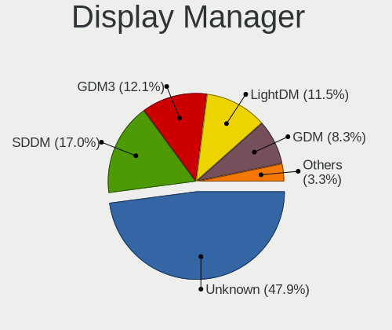

| Name    | Computers | Percent |
|---------|-----------|---------|
| Unknown | 1246      | 47.92%  |
| SDDM    | 442       | 17%     |
| GDM3    | 314       | 12.08%  |
| LightDM | 298       | 11.46%  |
| GDM     | 215       | 8.27%   |
| TDM     | 50        | 1.92%   |
| KDM     | 14        | 0.54%   |
| LXDM    | 8         | 0.31%   |
| SLiM    | 4         | 0.15%   |
| XDM     | 3         | 0.12%   |
| GREETD  | 3         | 0.12%   |
| SLIMSKI | 2         | 0.08%   |
| Ly      | 1         | 0.04%   |

OS Lang
-------

Language

| Lang        | Computers | Percent |
|-------------|-----------|---------|
| es_AR       | 1394      | 53.59%  |
| en_US       | 633       | 24.34%  |
| Unknown     | 218       | 8.38%   |
| es_ES       | 174       | 6.69%   |
| es_MX       | 73        | 2.81%   |
| C           | 52        | 2%      |
| en_GB       | 24        | 0.92%   |
| pt_BR       | 5         | 0.19%   |
| POSIX       | 3         | 0.12%   |
| es_US       | 3         | 0.12%   |
| es_CL       | 3         | 0.12%   |
| ru_RU       | 2         | 0.08%   |
| it_IT       | 2         | 0.08%   |
| fr_FR       | 2         | 0.08%   |
| es_UY       | 2         | 0.08%   |
| en_AG       | 2         | 0.08%   |
| UTF-8       | 1         | 0.04%   |
| es_DO       | 1         | 0.04%   |
| es_AR.UtF-8 | 1         | 0.04%   |
| es          | 1         | 0.04%   |
| en_UTF-8    | 1         | 0.04%   |
| en_US.UTF8  | 1         | 0.04%   |
| en_CA       | 1         | 0.04%   |
| de_DE       | 1         | 0.04%   |
| C.UTF8      | 1         | 0.04%   |

Boot Mode
---------

EFI or BIOS

| Mode | Computers | Percent |
|------|-----------|---------|
| BIOS | 1455      | 56.35%  |
| EFI  | 1127      | 43.65%  |

Filesystem
----------

Type of filesystem

| Type    | Computers | Percent |
|---------|-----------|---------|
| Ext4    | 1866      | 71.94%  |
| Btrfs   | 261       | 10.06%  |
| Overlay | 224       | 8.64%   |
| Tmpfs   | 132       | 5.09%   |
| Unknown | 55        | 2.12%   |
| Xfs     | 32        | 1.23%   |
| Zfs     | 9         | 0.35%   |
| Ext2    | 6         | 0.23%   |
| F2fs    | 4         | 0.15%   |
| Ext3    | 3         | 0.12%   |
| Aufs    | 2         | 0.08%   |

Part. scheme
------------

Scheme of partitioning

| Type    | Computers | Percent |
|---------|-----------|---------|
| Unknown | 1292      | 50.12%  |
| GPT     | 981       | 38.05%  |
| MBR     | 305       | 11.83%  |

Dual Boot with Linux/BSD
------------------------

Hosting more than one Linux/BSD

| Dual boot | Computers | Percent |
|-----------|-----------|---------|
| No        | 2189      | 85.47%  |
| Yes       | 372       | 14.53%  |

Dual Boot (Win)
---------------

Hosting Linux and Windows

| Dual boot | Computers | Percent |
|-----------|-----------|---------|
| No        | 1770      | 69.17%  |
| Yes       | 789       | 30.83%  |

Board
-----

Vendor
------

Motherboard manufacturer

| Name                    | Computers | Percent |
|-------------------------|-----------|---------|
| ASUSTek Computer        | 464       | 18.43%  |
| Lenovo                  | 328       | 13.03%  |
| Gigabyte Technology     | 313       | 12.43%  |
| Hewlett-Packard         | 215       | 8.54%   |
| Dell                    | 191       | 7.59%   |
| MSI                     | 154       | 6.12%   |
| ASRock                  | 136       | 5.4%    |
| Acer                    | 70        | 2.78%   |
| Intel                   | 69        | 2.74%   |
| BANGHO                  | 69        | 2.74%   |
| Toshiba                 | 43        | 1.71%   |
| Exo                     | 43        | 1.71%   |
| Samsung Electronics     | 36        | 1.43%   |
| Positivo                | 34        | 1.35%   |
| ECS                     | 27        | 1.07%   |
| Apple                   | 26        | 1.03%   |
| Sony                    | 25        | 0.99%   |
| Unknown                 | 25        | 0.99%   |
| Juana Manso             | 20        | 0.79%   |
| Biostar                 | 19        | 0.75%   |
| NOBLEX                  | 12        | 0.48%   |
| Compal                  | 12        | 0.48%   |
| AMI                     | 11        | 0.44%   |
| Novatech                | 9         | 0.36%   |
| Coradir                 | 8         | 0.32%   |
| Clevo                   | 8         | 0.32%   |
| NSX                     | 7         | 0.28%   |
| Quanta                  | 6         | 0.24%   |
| PCBOX                   | 6         | 0.24%   |
| Foxconn                 | 6         | 0.24%   |
| Advantec                | 6         | 0.24%   |
| Standard                | 5         | 0.2%    |
| KELYX ARGENTINA         | 5         | 0.2%    |
| HUAWEI                  | 5         | 0.2%    |
| System76                | 4         | 0.16%   |
| iQual                   | 4         | 0.16%   |
| Compaq                  | 4         | 0.16%   |
| A-DATA Technology       | 4         | 0.16%   |
| Raspberry Pi Foundation | 3         | 0.12%   |
| PCChips                 | 3         | 0.12%   |

Model
-----

Motherboard model

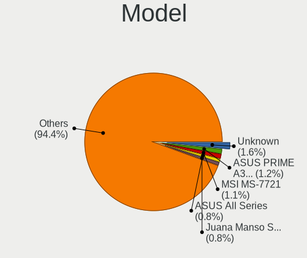

| Name                                   | Computers | Percent |
|----------------------------------------|-----------|---------|
| Unknown                                | 41        | 1.63%   |
| ASUS PRIME A320M-K                     | 30        | 1.19%   |
| MSI MS-7721                            | 28        | 1.11%   |
| ASUS All Series                        | 21        | 0.83%   |
| Juana Manso SF20GM7                    | 20        | 0.79%   |
| BANGHO Suma 1025                       | 18        | 0.71%   |
| Gigabyte F2A68HM-H                     | 17        | 0.68%   |
| MSI MS-7C52                            | 13        | 0.52%   |
| Gigabyte H81M-H                        | 12        | 0.48%   |
| Lenovo V330-15IKB 81AX                 | 11        | 0.44%   |
| HP Notebook                            | 11        | 0.44%   |
| Gigabyte A320M-S2H                     | 11        | 0.44%   |
| Intel powered classmate PC             | 10        | 0.4%    |
| HP Laptop 15-bs0xx                     | 10        | 0.4%    |
| BANGHO MOV                             | 10        | 0.4%    |
| Gigabyte M68MT-S2                      | 9         | 0.36%   |
| Gigabyte H61M-S1                       | 9         | 0.36%   |
| ASUS PRIME B450M-A                     | 9         | 0.36%   |
| MSI MS-7A15                            | 8         | 0.32%   |
| Lenovo G470 20078                      | 8         | 0.32%   |
| Gigabyte H110M-H                       | 8         | 0.32%   |
| Coradir Coradir/ES10IS5                | 8         | 0.32%   |
| BANGHO MAX G0101                       | 8         | 0.32%   |
| ASUS VivoBook_ASUSLaptop X509JA_X509JA | 8         | 0.32%   |
| ASUS P5KPL-AM SE                       | 8         | 0.32%   |
| ASUS H61M-K                            | 8         | 0.32%   |
| ASRock N68-VS3 FX                      | 8         | 0.32%   |
| ASRock FM2A68M-DG3+                    | 8         | 0.32%   |
| NOBLEX SF20BA                          | 7         | 0.28%   |
| Lenovo ThinkPad L15 Gen 2 20X4S27200   | 7         | 0.28%   |
| ASUS VivoBook_ASUSLaptop X515EA_X515EA | 7         | 0.28%   |
| ASRock A320M-HDV R4.0                  | 7         | 0.28%   |
| Lenovo IdeaPad 320-15ABR 80XS          | 6         | 0.24%   |
| HP Pavilion dv6                        | 6         | 0.24%   |
| Gigabyte H510M H                       | 6         | 0.24%   |
| Gigabyte F2A55M-HD2                    | 6         | 0.24%   |
| Gigabyte A320M-S2H V2                  | 6         | 0.24%   |
| Gigabyte A320M-H                       | 6         | 0.24%   |
| ECS H81H3-M4                           | 6         | 0.24%   |
| Dell Inspiron 1525                     | 6         | 0.24%   |

Model Family
------------

Motherboard model prefix

| Name                | Computers | Percent |
|---------------------|-----------|---------|
| Lenovo ThinkPad     | 113       | 4.49%   |
| ASUS PRIME          | 89        | 3.53%   |
| Dell Inspiron       | 81        | 3.22%   |
| Lenovo IdeaPad      | 73        | 2.9%    |
| Dell Latitude       | 71        | 2.82%   |
| HP Pavilion         | 59        | 2.34%   |
| ASUS VivoBook       | 58        | 2.3%    |
| Acer Aspire         | 55        | 2.18%   |
| Unknown             | 41        | 1.63%   |
| HP Laptop           | 34        | 1.35%   |
| Toshiba Satellite   | 28        | 1.11%   |
| MSI MS-7721         | 28        | 1.11%   |
| ASUS ROG            | 22        | 0.87%   |
| HP Compaq           | 21        | 0.83%   |
| Exo Smart           | 21        | 0.83%   |
| ASUS All            | 21        | 0.83%   |
| Juana Manso SF20GM7 | 20        | 0.79%   |
| BANGHO Suma         | 19        | 0.75%   |
| Gigabyte F2A68HM-H  | 17        | 0.68%   |
| Gigabyte A320M-S2H  | 17        | 0.68%   |
| BANGHO MAX          | 17        | 0.68%   |
| ASUS TUF            | 16        | 0.64%   |
| Lenovo ThinkBook    | 15        | 0.6%    |
| ASUS M5A78L-M       | 15        | 0.6%    |
| Dell OptiPlex       | 14        | 0.56%   |
| MSI MS-7C52         | 13        | 0.52%   |
| HP 250              | 12        | 0.48%   |
| Gigabyte H81M-H     | 12        | 0.48%   |
| Gigabyte B450M      | 12        | 0.48%   |
| ASUS ZenBook        | 12        | 0.48%   |
| Lenovo V330-15IKB   | 11        | 0.44%   |
| Lenovo ThinkCentre  | 11        | 0.44%   |
| HP Notebook         | 11        | 0.44%   |
| HP ENVY             | 11        | 0.44%   |
| Intel powered       | 10        | 0.4%    |
| HP EliteBook        | 10        | 0.4%    |
| BANGHO MOV          | 10        | 0.4%    |
| ASRock N68-VS3      | 10        | 0.4%    |
| ASRock A320M-HDV    | 10        | 0.4%    |
| Lenovo Yoga         | 9         | 0.36%   |

MFG Year
--------

Motherboard manufacture year

| Year    | Computers | Percent |
|---------|-----------|---------|
| 2021    | 234       | 9.29%   |
| 2017    | 229       | 9.09%   |
| 2012    | 210       | 8.34%   |
| 2020    | 190       | 7.55%   |
| 2018    | 177       | 7.03%   |
| 2011    | 171       | 6.79%   |
| 2019    | 168       | 6.67%   |
| 2013    | 168       | 6.67%   |
| 2014    | 154       | 6.12%   |
| 2010    | 149       | 5.92%   |
| 2015    | 135       | 5.36%   |
| 2016    | 110       | 4.37%   |
| 2008    | 102       | 4.05%   |
| 2009    | 95        | 3.77%   |
| 2022    | 61        | 2.42%   |
| 2007    | 61        | 2.42%   |
| 2006    | 41        | 1.63%   |
| 2023    | 35        | 1.39%   |
| Unknown | 11        | 0.44%   |
| 2004    | 6         | 0.24%   |
| 2024    | 5         | 0.2%    |
| 2005    | 5         | 0.2%    |
| 2001    | 1         | 0.04%   |

Form Factor
-----------

Physical design of the computer

| Name           | Computers | Percent |
|----------------|-----------|---------|
| Notebook       | 1341      | 53.26%  |
| Desktop        | 1065      | 42.3%   |
| Convertible    | 40        | 1.59%   |
| Tablet         | 28        | 1.11%   |
| Mini pc        | 18        | 0.71%   |
| All in one     | 18        | 0.71%   |
| System on chip | 4         | 0.16%   |
| Server         | 3         | 0.12%   |
| Other          | 1         | 0.04%   |

Secure Boot
-----------

Enabled or disabled

| State    | Computers | Percent |
|----------|-----------|---------|
| Disabled | 2375      | 93.69%  |
| Enabled  | 160       | 6.31%   |

Coreboot
--------

Have coreboot on board

| Used | Computers | Percent |
|------|-----------|---------|
| No   | 2515      | 99.88%  |
| Yes  | 3         | 0.12%   |

RAM Size
--------

Total RAM memory

| Size in GB  | Computers | Percent |
|-------------|-----------|---------|
| 4.01-8.0    | 620       | 24.21%  |
| 3.01-4.0    | 595       | 23.23%  |
| 8.01-16.0   | 465       | 18.16%  |
| 16.01-24.0  | 376       | 14.68%  |
| 1.01-2.0    | 189       | 7.38%   |
| 32.01-64.0  | 155       | 6.05%   |
| 2.01-3.0    | 53        | 2.07%   |
| 24.01-32.0  | 48        | 1.87%   |
| 0.51-1.0    | 35        | 1.37%   |
| 64.01-256.0 | 23        | 0.9%    |
| 0.01-0.5    | 2         | 0.08%   |

RAM Used
--------

Used RAM memory

| Used GB    | Computers | Percent |
|------------|-----------|---------|
| 1.01-2.0   | 969       | 34.82%  |
| 2.01-3.0   | 668       | 24%     |
| 4.01-8.0   | 398       | 14.3%   |
| 3.01-4.0   | 340       | 12.22%  |
| 0.51-1.0   | 233       | 8.37%   |
| 8.01-16.0  | 116       | 4.17%   |
| 0.01-0.5   | 38        | 1.37%   |
| 16.01-24.0 | 16        | 0.57%   |
| 24.01-32.0 | 4         | 0.14%   |
| 0          | 1         | 0.04%   |

Total Drives
------------

Number of drives on board

| Drives | Computers | Percent |
|--------|-----------|---------|
| 1      | 1597      | 61.85%  |
| 2      | 651       | 25.21%  |
| 3      | 206       | 7.98%   |
| 4      | 79        | 3.06%   |
| 5      | 18        | 0.7%    |
| 0      | 15        | 0.58%   |
| 6      | 8         | 0.31%   |
| 7      | 3         | 0.12%   |
| 9      | 2         | 0.08%   |
| 28     | 1         | 0.04%   |
| 20     | 1         | 0.04%   |
| 19     | 1         | 0.04%   |

Has CD-ROM
----------

Has CD-ROM on board

| Presented | Computers | Percent |
|-----------|-----------|---------|
| No        | 1723      | 67.81%  |
| Yes       | 818       | 32.19%  |

Has Ethernet
------------

Has Ethernet on board

| Presented | Computers | Percent |
|-----------|-----------|---------|
| Yes       | 2190      | 86.9%   |
| No        | 330       | 13.1%   |

Has WiFi
--------

Has WiFi module

| Presented | Computers | Percent |
|-----------|-----------|---------|
| Yes       | 1886      | 73.96%  |
| No        | 664       | 26.04%  |

Has Bluetooth
-------------

Has Bluetooth module

| Presented | Computers | Percent |
|-----------|-----------|---------|
| No        | 1287      | 50.55%  |
| Yes       | 1259      | 49.45%  |

Location
--------

Country
-------

Geographic location (country)

| Country   | Computers | Percent |
|-----------|-----------|---------|
| Argentina | 2518      | 100%    |

City
----

Geographic location (city)

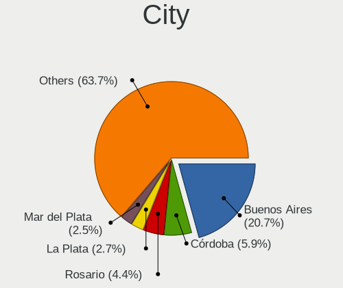

| City                   | Computers | Percent |
|------------------------|-----------|---------|
| Buenos Aires           | 547       | 20.72%  |
| Crdoba               | 155       | 5.87%   |
| Rosario                | 117       | 4.43%   |
| La Plata               | 71        | 2.69%   |
| Mar del Plata          | 67        | 2.54%   |
| Avellaneda             | 39        | 1.48%   |
| Quilmes                | 33        | 1.25%   |
| Santa Fe               | 32        | 1.21%   |
| Mendoza                | 32        | 1.21%   |
| Lanus                  | 32        | 1.21%   |
| Corrientes             | 31        | 1.17%   |
| San Miguel de Tucumn | 29        | 1.1%    |
| Baha Blanca          | 27        | 1.02%   |
| Paran                | 24        | 0.91%   |
| Neuqun               | 24        | 0.91%   |
| Lomas de Zamora        | 24        | 0.91%   |
| Villa Ballester        | 23        | 0.87%   |
| Resistencia            | 23        | 0.87%   |
| Ituzaingo              | 23        | 0.87%   |
| Salta                  | 21        | 0.8%    |
| Tandil                 | 20        | 0.76%   |
| Ramos Mejia            | 20        | 0.76%   |
| Posadas                | 19        | 0.72%   |
| Isidro Casanova        | 19        | 0.72%   |
| San Juan               | 18        | 0.68%   |
| Caseros                | 18        | 0.68%   |
| Burzaco                | 18        | 0.68%   |
| Bariloche              | 18        | 0.68%   |
| Viedma                 | 16        | 0.61%   |
| Olivos                 | 16        | 0.61%   |
| Godoy Cruz             | 15        | 0.57%   |
| Martinez               | 14        | 0.53%   |
| Florencio Varela       | 14        | 0.53%   |
| Tigre                  | 13        | 0.49%   |
| San Salvador de Jujuy  | 12        | 0.45%   |
| Pilar                  | 12        | 0.45%   |
| Moron                  | 12        | 0.45%   |
| Moreno                 | 12        | 0.45%   |
| Jose C. Paz            | 12        | 0.45%   |
| San Telmo              | 11        | 0.42%   |

Drives
------

Drive Vendor
------------

Hard drive vendors

| Vendor                      | Computers | Drives | Percent |
|-----------------------------|-----------|--------|---------|
| WDC                         | 894       | 1369   | 25.31%  |
| Kingston                    | 465       | 597    | 13.17%  |
| Seagate                     | 442       | 569    | 12.51%  |
| Samsung Electronics         | 291       | 413    | 8.24%   |
| Toshiba                     | 278       | 352    | 7.87%   |
| SanDisk                     | 121       | 170    | 3.43%   |
| Hitachi                     | 106       | 127    | 3%      |
| Unknown                     | 95        | 121    | 2.69%   |
| HGST                        | 72        | 80     | 2.04%   |
| Crucial                     | 70        | 103    | 1.98%   |
| Gigabyte Technology         | 58        | 86     | 1.64%   |
| A-DATA Technology           | 56        | 62     | 1.59%   |
| SK hynix                    | 54        | 68     | 1.53%   |
| Micron Technology           | 35        | 41     | 0.99%   |
| Intel                       | 28        | 48     | 0.79%   |
| Lexar                       | 24        | 27     | 0.68%   |
| China                       | 22        | 27     | 0.62%   |
| PNY                         | 21        | 34     | 0.59%   |
| KIOXIA                      | 21        | 22     | 0.59%   |
| Hewlett-Packard             | 21        | 29     | 0.59%   |
| Patriot                     | 20        | 23     | 0.57%   |
| Unknown                     | 20        | 21     | 0.57%   |
| Maxtor                      | 17        | 20     | 0.48%   |
| Realtek Semiconductor       | 16        | 22     | 0.45%   |
| Phison Electronics          | 14        | 19     | 0.4%    |
| Micron/Crucial Technology   | 14        | 21     | 0.4%    |
| MAXIO Technology (Hangzhou) | 14        | 17     | 0.4%    |
| Kingston Technology Company | 14        | 18     | 0.4%    |
| Corsair                     | 14        | 15     | 0.4%    |
| ADATA Technology            | 14        | 17     | 0.4%    |
| Kimtigo                     | 11        | 11     | 0.31%   |
| Silicon Motion              | 10        | 14     | 0.28%   |
| XPG                         | 9         | 11     | 0.25%   |
| HS-SSD-C100                 | 9         | 12     | 0.25%   |
| Neo                         | 8         | 8      | 0.23%   |
| Phison                      | 7         | 8      | 0.2%    |
| Hikvision                   | 7         | 8      | 0.2%    |
| Colorful                    | 7         | 9      | 0.2%    |
| Team                        | 6         | 6      | 0.17%   |
| Netac                       | 6         | 8      | 0.17%   |

Drive Model
-----------

Hard drive models

| Model                              | Computers | Percent |
|------------------------------------|-----------|---------|
| Kingston SA400S37240G 240GB SSD    | 147       | 3.79%   |
| Kingston SA400S37480G 480GB SSD    | 88        | 2.27%   |
| WDC WD10EZEX-08WN4A0 1TB           | 55        | 1.42%   |
| Seagate ST1000LM035-1RK172 1TB     | 53        | 1.37%   |
| WDC WDS240G2G0A-00JH30 240GB SSD   | 51        | 1.32%   |
| Seagate ST1000DM010-2EP102 1TB     | 41        | 1.06%   |
| Kingston SA400S37120G 120GB SSD    | 40        | 1.03%   |
| Toshiba MQ01ABF050 500GB           | 39        | 1.01%   |
| Toshiba MQ01ABD100 1TB             | 32        | 0.83%   |
| Seagate ST1000LM024 HN-M101MBB 1TB | 31        | 0.8%    |
| Seagate ST500DM002-1BD142 500GB    | 28        | 0.72%   |
| Kingston SV300S37A120G 120GB SSD   | 26        | 0.67%   |
| WDC WD10EZEX-00BN5A0 1TB           | 25        | 0.64%   |
| WDC WDS120G2G0A-00JH30 120GB SSD   | 24        | 0.62%   |
| WDC WD5000AAKX-001CA0 500GB        | 24        | 0.62%   |
| Toshiba DT01ACA050 500GB           | 24        | 0.62%   |
| Kingston SA400S37960G 960GB SSD    | 24        | 0.62%   |
| Unknown MMC Card  32GB             | 22        | 0.57%   |
| Toshiba MQ04ABF100 1TB             | 22        | 0.57%   |
| Crucial CT240BX500SSD1 240GB       | 22        | 0.57%   |
| Gigabyte GP-GSTFS31240GNTD 240GB   | 21        | 0.54%   |
| WDC WD20EZRZ-00Z5HB0 2TB           | 20        | 0.52%   |
| Unknown                            | 20        | 0.52%   |
| WDC WD5000AAKX-00ERMA0 500GB       | 19        | 0.49%   |
| Toshiba DT01ACA100 1TB             | 19        | 0.49%   |
| WDC WD1003FZEX-00MK2A0 1TB         | 18        | 0.46%   |
| Gigabyte GP-GSTFS31120GNTD 120GB   | 18        | 0.46%   |
| Seagate ST500LT012-1DG142 500GB    | 17        | 0.44%   |
| Seagate ST500LM030-2E717D 500GB    | 17        | 0.44%   |
| Kingston SNV2S500G 500GB           | 17        | 0.44%   |
| WDC WDS480G2G0A-00JH30 480GB SSD   | 16        | 0.41%   |
| Kingston SV300S37A240G 240GB SSD   | 16        | 0.41%   |
| Kingston SUV400S37240G 240GB SSD   | 16        | 0.41%   |
| HGST HTS721010A9E630 1TB           | 16        | 0.41%   |
| Unknown MMC Card  64GB             | 15        | 0.39%   |
| Kingston SNVS500G 500GB            | 15        | 0.39%   |
| A-DATA SU630 240GB SSD             | 15        | 0.39%   |
| WDC WD1600AABS-00PRA0 160GB        | 14        | 0.36%   |
| Toshiba MQ01ABD032 320GB           | 14        | 0.36%   |
| WDC WDS240G2G0B-00EPW0 240GB SSD   | 13        | 0.34%   |

HDD Vendor
----------

Hard disk drive vendors

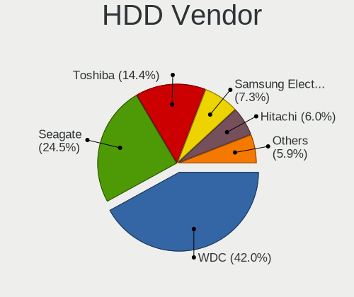

| Vendor              | Computers | Drives | Percent |
|---------------------|-----------|--------|---------|
| WDC                 | 746       | 1105   | 42%     |
| Seagate             | 435       | 560    | 24.49%  |
| Toshiba             | 255       | 323    | 14.36%  |
| Samsung Electronics | 129       | 178    | 7.26%   |
| Hitachi             | 106       | 127    | 5.97%   |
| HGST                | 72        | 80     | 4.05%   |
| Maxtor              | 14        | 15     | 0.79%   |
| Unknown             | 8         | 8      | 0.45%   |
| Fujitsu             | 5         | 5      | 0.28%   |
| SABRENT             | 1         | 1      | 0.06%   |
| Quantum             | 1         | 1      | 0.06%   |
| JMicron Technology  | 1         | 1      | 0.06%   |
| Inateck             | 1         | 1      | 0.06%   |
| ExcelStor           | 1         | 1      | 0.06%   |
| ASMT                | 1         | 2      | 0.06%   |

SSD Vendor
----------

Solid state drive vendors

| Vendor              | Computers | Drives | Percent |
|---------------------|-----------|--------|---------|
| Kingston            | 405       | 519    | 37.33%  |
| WDC                 | 150       | 191    | 13.82%  |
| Crucial             | 64        | 96     | 5.9%    |
| Samsung Electronics | 60        | 90     | 5.53%   |
| Gigabyte Technology | 53        | 81     | 4.88%   |
| A-DATA Technology   | 49        | 53     | 4.52%   |
| SanDisk             | 42        | 52     | 3.87%   |
| Lexar               | 22        | 25     | 2.03%   |
| PNY                 | 21        | 34     | 1.94%   |
| China               | 19        | 24     | 1.75%   |
| Patriot             | 18        | 21     | 1.66%   |
| Hewlett-Packard     | 13        | 18     | 1.2%    |
| SK hynix            | 11        | 12     | 1.01%   |
| Kimtigo             | 11        | 11     | 1.01%   |
| Micron Technology   | 10        | 13     | 0.92%   |
| Corsair             | 10        | 11     | 0.92%   |
| Toshiba             | 8         | 8      | 0.74%   |
| Intel               | 8         | 9      | 0.74%   |
| Colorful            | 7         | 9      | 0.65%   |
| Team                | 6         | 6      | 0.55%   |
| Seagate             | 5         | 7      | 0.46%   |
| Netac               | 5         | 7      | 0.46%   |
| LITEONIT            | 5         | 5      | 0.46%   |
| HS-SSD-C100         | 5         | 8      | 0.46%   |
| Unknown             | 5         | 5      | 0.46%   |
| Wodposit            | 4         | 4      | 0.37%   |
| Hikvision           | 4         | 4      | 0.37%   |
| FORESEE             | 4         | 4      | 0.37%   |
| Apple               | 4         | 4      | 0.37%   |
| Super Talent        | 3         | 3      | 0.28%   |
| OCZ                 | 3         | 3      | 0.28%   |
| Mushkin             | 3         | 3      | 0.28%   |
| Maxtor              | 3         | 5      | 0.28%   |
| LITEON              | 3         | 3      | 0.28%   |
| GLOWAY              | 3         | 4      | 0.28%   |
| WDC WDS2            | 2         | 2      | 0.18%   |
| WALRAM              | 2         | 2      | 0.18%   |
| SPCC                | 2         | 2      | 0.18%   |
| Hoodisk             | 2         | 2      | 0.18%   |
| HJDK                | 2         | 2      | 0.18%   |

Drive Kind
----------

HDD or SSD

| Kind    | Computers | Drives | Percent |
|---------|-----------|--------|---------|
| HDD     | 1532      | 2408   | 47.73%  |
| SSD     | 1003      | 1420   | 31.25%  |
| NVMe    | 540       | 799    | 16.82%  |
| MMC     | 94        | 120    | 2.93%   |
| Unknown | 41        | 45     | 1.28%   |

Drive Connector
---------------

SATA, SAS, NVMe, etc.

| Type | Computers | Drives | Percent |
|------|-----------|--------|---------|
| SATA | 2095      | 3811   | 75.31%  |
| NVMe | 540       | 797    | 19.41%  |
| MMC  | 94        | 120    | 3.38%   |
| SAS  | 53        | 64     | 1.91%   |

Drive Size
----------

Size of hard drive

| Size in TB | Computers | Drives | Percent |
|------------|-----------|--------|---------|
| 0.01-0.5   | 1622      | 2433   | 63.86%  |
| 0.51-1.0   | 728       | 1089   | 28.66%  |
| 1.01-2.0   | 131       | 184    | 5.16%   |
| 3.01-4.0   | 23        | 35     | 0.91%   |
| 4.01-10.0  | 17        | 25     | 0.67%   |
| 2.01-3.0   | 14        | 17     | 0.55%   |
| 10.01-20.0 | 5         | 45     | 0.2%    |

Space Total
-----------

Amount of disk space available on the file system

| Size in GB     | Computers | Percent |
|----------------|-----------|---------|
| 101-250        | 770       | 28.72%  |
| 251-500        | 620       | 23.13%  |
| 501-1000       | 410       | 15.29%  |
| 1001-2000      | 207       | 7.72%   |
| 1-20           | 191       | 7.12%   |
| 51-100         | 169       | 6.3%    |
| 21-50          | 110       | 4.1%    |
| 2001-3000      | 72        | 2.69%   |
| More than 3000 | 69        | 2.57%   |
| Unknown        | 63        | 2.35%   |

Space Used
----------

Amount of used disk space

| Used GB        | Computers | Percent |
|----------------|-----------|---------|
| 1-20           | 1084      | 39.26%  |
| 21-50          | 477       | 17.28%  |
| 101-250        | 391       | 14.16%  |
| 51-100         | 307       | 11.12%  |
| 251-500        | 190       | 6.88%   |
| 501-1000       | 140       | 5.07%   |
| 1001-2000      | 70        | 2.54%   |
| Unknown        | 63        | 2.28%   |
| 2001-3000      | 20        | 0.72%   |
| More than 3000 | 18        | 0.65%   |
| 0              | 1         | 0.04%   |

Malfunc. Drives
---------------

Drive models with a malfunction

| Model                               | Computers | Drives | Percent |
|-------------------------------------|-----------|--------|---------|
| WDC WD5000AAKX-00ERMA0 500GB        | 8         | 9      | 2.46%   |
| WDC WD5000AAKX-001CA0 500GB         | 7         | 9      | 2.15%   |
| Seagate ST1000LM035-1RK172 1TB      | 7         | 7      | 2.15%   |
| Kingston SA400S37240G 240GB SSD     | 6         | 6      | 1.85%   |
| WDC WD10EZEX-08WN4A0 1TB            | 5         | 5      | 1.54%   |
| WDC WD10EZEX-00BN5A0 1TB            | 5         | 5      | 1.54%   |
| Toshiba MQ01ABF050 500GB            | 5         | 5      | 1.54%   |
| Toshiba MK1665GSX 160GB             | 5         | 5      | 1.54%   |
| Seagate ST500DM002-1BD142 500GB     | 5         | 6      | 1.54%   |
| WDC WDS240G2G0A-00JH30 240GB SSD    | 4         | 4      | 1.23%   |
| WDC WD10EARS-00Y5B1 1TB             | 4         | 4      | 1.23%   |
| Toshiba DT01ACA050 500GB            | 4         | 4      | 1.23%   |
| HGST HTS721010A9E630 1TB            | 4         | 6      | 1.23%   |
| WDC WDS480G2G0A-00JH30 480GB SSD    | 3         | 6      | 0.92%   |
| WDC WD5000BPVT-22HXZT3 500GB        | 3         | 3      | 0.92%   |
| WDC WD3200AAKS-00L9A0 320GB         | 3         | 3      | 0.92%   |
| WDC WD1003FZEX-00MK2A0 1TB          | 3         | 4      | 0.92%   |
| WDC WD1002FAEX-00Z3A0 1TB           | 3         | 3      | 0.92%   |
| Toshiba MQ01ABD100 1TB              | 3         | 6      | 0.92%   |
| Toshiba MK7559GSXP 752GB            | 3         | 3      | 0.92%   |
| Seagate ST9320325AS 320GB           | 3         | 3      | 0.92%   |
| Seagate ST500LM030-2E717D 500GB     | 3         | 3      | 0.92%   |
| Seagate ST1000LM024 HN-M101MBB 1TB  | 3         | 3      | 0.92%   |
| Seagate ST1000DM003-1SB10C 1TB      | 3         | 3      | 0.92%   |
| HGST HTS541010A9E680 1TB            | 3         | 3      | 0.92%   |
| WDC WD5000AAKX-08ERMA0 500GB        | 2         | 2      | 0.62%   |
| WDC WD5000AAKS-00V1A0 500GB         | 2         | 2      | 0.62%   |
| WDC WD2500BEKT-75PVMT0 250GB        | 2         | 4      | 0.62%   |
| WDC WD20EZRX-00D8PB0 2TB            | 2         | 2      | 0.62%   |
| WDC WD10EZEX-00RKKA0 1TB            | 2         | 2      | 0.62%   |
| WDC WD1003FZEX-00K3CA0 1TB          | 2         | 2      | 0.62%   |
| WDC WD1002FAEX-00Y9A0 1TB           | 2         | 2      | 0.62%   |
| Toshiba MQ04ABF100 1TB              | 2         | 2      | 0.62%   |
| Toshiba MQ01ABD050 500GB            | 2         | 2      | 0.62%   |
| Toshiba MK6475GSX 640GB             | 2         | 2      | 0.62%   |
| Seagate ST9500325AS 500GB           | 2         | 2      | 0.62%   |
| Seagate ST9250315AS 250GB           | 2         | 2      | 0.62%   |
| Seagate ST500LT012-1DG142 500GB     | 2         | 5      | 0.62%   |
| Seagate ST320LM001 HN-M320MBB 320GB | 2         | 2      | 0.62%   |
| Seagate ST2000VM003-1CT164 2TB      | 2         | 2      | 0.62%   |

Malfunc. Drive Vendor
---------------------

Vendors of faulty drives

| Vendor              | Computers | Drives | Percent |
|---------------------|-----------|--------|---------|
| WDC                 | 120       | 141    | 38.46%  |
| Seagate             | 61        | 71     | 19.55%  |
| Toshiba             | 39        | 43     | 12.5%   |
| Samsung Electronics | 28        | 32     | 8.97%   |
| Hitachi             | 17        | 19     | 5.45%   |
| Kingston            | 15        | 15     | 4.81%   |
| HGST                | 13        | 15     | 4.17%   |
| A-DATA Technology   | 4         | 4      | 1.28%   |
| Maxtor              | 3         | 4      | 0.96%   |
| Patriot             | 2         | 2      | 0.64%   |
| LITEONIT            | 2         | 2      | 0.64%   |
| XPG                 | 1         | 1      | 0.32%   |
| tecmiyo             | 1         | 4      | 0.32%   |
| SMI                 | 1         | 1      | 0.32%   |
| Silicon Motion      | 1         | 1      | 0.32%   |
| SanDisk             | 1         | 1      | 0.32%   |
| Quantum             | 1         | 1      | 0.32%   |
| Micron Technology   | 1         | 2      | 0.32%   |
| Crucial             | 1         | 1      | 0.32%   |

Malfunc. HDD Vendor
-------------------

Vendors of faulty HDD drives

| Vendor              | Computers | Drives | Percent |
|---------------------|-----------|--------|---------|
| WDC                 | 109       | 127    | 40.67%  |
| Seagate             | 61        | 71     | 22.76%  |
| Toshiba             | 39        | 43     | 14.55%  |
| Samsung Electronics | 25        | 28     | 9.33%   |
| Hitachi             | 17        | 19     | 6.34%   |
| HGST                | 13        | 15     | 4.85%   |
| Maxtor              | 3         | 4      | 1.12%   |
| Quantum             | 1         | 1      | 0.37%   |

Malfunc. Drive Kind
-------------------

Kinds of faulty drives

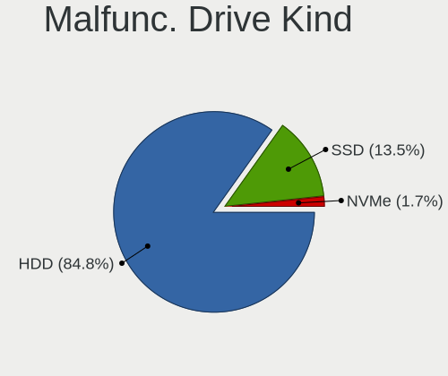

| Kind | Computers | Drives | Percent |
|------|-----------|--------|---------|
| HDD  | 252       | 308    | 84.85%  |
| SSD  | 40        | 47     | 13.47%  |
| NVMe | 5         | 5      | 1.68%   |

Failed Drives
-------------

Failed drive models

| Model                             | Computers | Drives | Percent |
|-----------------------------------|-----------|--------|---------|
| WDC WD5000BEVT-22ZAT0 500GB       | 2         | 3      | 16.67%  |
| WDC WD10EZEX-22MFCA0 1TB          | 2         | 2      | 16.67%  |
| Toshiba MQ01ABF032 320GB          | 2         | 2      | 16.67%  |
| WDC WD1600BEVT-80A23T0 160GB      | 1         | 1      | 8.33%   |
| Toshiba MK6475GSX 640GB           | 1         | 1      | 8.33%   |
| Toshiba MK1665GSX 160GB           | 1         | 1      | 8.33%   |
| Seagate ST9320325AS 320GB         | 1         | 1      | 8.33%   |
| Samsung Electronics HD502HJ 500GB | 1         | 1      | 8.33%   |
| Samsung Electronics HD103SJ 1TB   | 1         | 1      | 8.33%   |

Failed Drive Vendor
-------------------

Failed drive vendors

| Vendor              | Computers | Drives | Percent |
|---------------------|-----------|--------|---------|
| WDC                 | 5         | 6      | 41.67%  |
| Toshiba             | 4         | 4      | 33.33%  |
| Samsung Electronics | 2         | 2      | 16.67%  |
| Seagate             | 1         | 1      | 8.33%   |

Drive Status
------------

Number of failed and malfunc. drives

| Status   | Computers | Drives | Percent |
|----------|-----------|--------|---------|
| Detected | 1492      | 2800   | 54.79%  |
| Works    | 931       | 1619   | 34.19%  |
| Malfunc  | 289       | 360    | 10.61%  |
| Failed   | 11        | 13     | 0.4%    |

Storage controller
------------------

Storage Vendor
--------------

Storage controller vendors

| Vendor                               | Computers | Percent |
|--------------------------------------|-----------|---------|
| Intel                                | 1573      | 53.47%  |
| AMD                                  | 595       | 20.22%  |
| SanDisk                              | 115       | 3.91%   |
| Samsung Electronics                  | 112       | 3.81%   |
| Nvidia                               | 100       | 3.4%    |
| Kingston Technology Company          | 80        | 2.72%   |
| SK hynix                             | 43        | 1.46%   |
| VIA Technologies                     | 34        | 1.16%   |
| Phison Electronics                   | 29        | 0.99%   |
| Realtek Semiconductor                | 25        | 0.85%   |
| ASMedia Technology                   | 25        | 0.85%   |
| Micron Technology                    | 24        | 0.82%   |
| KIOXIA                               | 22        | 0.75%   |
| Toshiba America Info Systems         | 19        | 0.65%   |
| Micron/Crucial Technology            | 19        | 0.65%   |
| MAXIO Technology (Hangzhou)          | 19        | 0.65%   |
| Silicon Motion                       | 17        | 0.58%   |
| Silicon Integrated Systems [SiS]     | 17        | 0.58%   |
| ADATA Technology                     | 17        | 0.58%   |
| Marvell Technology Group             | 14        | 0.48%   |
| JMicron Technology                   | 13        | 0.44%   |
| Union Memory (Shenzhen)              | 7         | 0.24%   |
| Solid State Storage Technology       | 5         | 0.17%   |
| Shenzhen Longsys Electronics         | 4         | 0.14%   |
| Silicon Image                        | 2         | 0.07%   |
| Apple                                | 2         | 0.07%   |
| Solidigm                             | 1         | 0.03%   |
| Ramaxel Technology(Shenzhen) Limited | 1         | 0.03%   |
| Promise Technology                   | 1         | 0.03%   |
| O2 Micro                             | 1         | 0.03%   |
| Nextorage                            | 1         | 0.03%   |
| Lite-On Technology                   | 1         | 0.03%   |
| INNOGRIT                             | 1         | 0.03%   |
| Broadcom / LSI                       | 1         | 0.03%   |
| Biwin Storage Technology             | 1         | 0.03%   |
| Adaptec                              | 1         | 0.03%   |

Storage Model
-------------

Storage controller models

| Model                                                                                   | Computers | Percent |
|-----------------------------------------------------------------------------------------|-----------|---------|
| AMD FCH SATA Controller [AHCI mode]                                                     | 358       | 9.99%   |
| Intel Sunrise Point-LP SATA Controller [AHCI mode]                                      | 159       | 4.44%   |
| Intel 7 Series Chipset Family 6-port SATA Controller [AHCI mode]                        | 113       | 3.15%   |
| AMD A320 Chipset SATA Controller [AHCI mode]                                            | 88        | 2.46%   |
| Nvidia MCP61 SATA Controller                                                            | 84        | 2.34%   |
| Intel 82801 Mobile SATA Controller [RAID mode]                                          | 83        | 2.32%   |
| Intel 8 Series/C220 Series Chipset Family 6-port SATA Controller 1 [AHCI mode]          | 83        | 2.32%   |
| Intel NM10/ICH7 Family SATA Controller [IDE mode]                                       | 80        | 2.23%   |
| AMD SB7x0/SB8x0/SB9x0 IDE Controller                                                    | 78        | 2.18%   |
| Intel 82801G (ICH7 Family) IDE Controller                                               | 75        | 2.09%   |
| Intel Celeron/Pentium Silver Processor SATA Controller                                  | 73        | 2.04%   |
| Nvidia MCP61 IDE                                                                        | 71        | 1.98%   |
| Intel 6 Series/C200 Series Chipset Family 6 port Mobile SATA AHCI Controller            | 67        | 1.87%   |
| Intel Atom Processor E3800 Series SATA AHCI Controller                                  | 65        | 1.81%   |
| AMD SB7x0/SB8x0/SB9x0 SATA Controller [IDE mode]                                        | 60        | 1.67%   |
| AMD SB7x0/SB8x0/SB9x0 SATA Controller [AHCI mode]                                       | 55        | 1.54%   |
| AMD 400 Series Chipset SATA Controller                                                  | 54        | 1.51%   |
| Intel Q170/Q150/B150/H170/H110/Z170/CM236 Chipset SATA Controller [AHCI Mode]           | 52        | 1.45%   |
| Intel Volume Management Device NVMe RAID Controller                                     | 50        | 1.4%    |
| Intel 200 Series PCH SATA controller [AHCI mode]                                        | 45        | 1.26%   |
| Intel Comet Lake SATA AHCI Controller                                                   | 42        | 1.17%   |
| AMD 500 Series Chipset SATA Controller                                                  | 42        | 1.17%   |
| Samsung NVMe SSD Controller SM981/PM981/PM983                                           | 41        | 1.14%   |
| Intel Tiger Lake-LP SATA Controller                                                     | 40        | 1.12%   |
| Intel 8 Series SATA Controller 1 [AHCI mode]                                            | 40        | 1.12%   |
| Samsung NVMe SSD Controller 980 (DRAM-less)                                             | 39        | 1.09%   |
| Intel NM10/ICH7 Family SATA Controller [AHCI mode]                                      | 39        | 1.09%   |
| Intel 82801IBM/IEM (ICH9M/ICH9M-E) 4 port SATA Controller [AHCI mode]                   | 39        | 1.09%   |
| AMD FCH SATA Controller [IDE mode]                                                      | 37        | 1.03%   |
| Intel Wildcat Point-LP SATA Controller [AHCI Mode]                                      | 36        | 1%      |
| Intel 6 Series/C200 Series Chipset Family 6 port Desktop SATA AHCI Controller           | 35        | 0.98%   |
| AMD FCH IDE Controller                                                                  | 33        | 0.92%   |
| Intel 6 Series/C200 Series Chipset Family Desktop SATA Controller (IDE mode, ports 4-5) | 32        | 0.89%   |
| Intel 6 Series/C200 Series Chipset Family Desktop SATA Controller (IDE mode, ports 0-3) | 32        | 0.89%   |
| Intel 5 Series/3400 Series Chipset 4 port SATA AHCI Controller                          | 32        | 0.89%   |
| SanDisk Ultra 3D / WD PC SN530, IX SN530, Blue SN550 NVMe SSD (DRAM-less)               | 28        | 0.78%   |
| Intel 500 Series Chipset Family SATA AHCI Controller                                    | 28        | 0.78%   |
| Intel Celeron N3350/Pentium N4200/Atom E3900 Series SATA AHCI Controller                | 27        | 0.75%   |
| Intel 82801HM/HEM (ICH8M/ICH8M-E) IDE Controller                                        | 25        | 0.7%    |
| Intel 82801HM/HEM (ICH8M/ICH8M-E) SATA Controller [AHCI mode]                           | 24        | 0.67%   |

Storage Kind
------------

Kind of storage controller (IDE, SATA, NVMe, SAS, ...)

| Kind | Computers | Percent |
|------|-----------|---------|
| SATA | 1849      | 60.6%   |
| NVMe | 542       | 17.76%  |
| IDE  | 497       | 16.29%  |
| RAID | 162       | 5.31%   |
| SCSI | 1         | 0.03%   |

Processor
---------

CPU Vendor
----------

Processor vendors

| Vendor | Computers | Percent |
|--------|-----------|---------|
| Intel  | 1750      | 69.47%  |
| AMD    | 764       | 30.33%  |
| ARM    | 5         | 0.2%    |

CPU Model
---------

Processor models

| Model                                         | Computers | Percent |
|-----------------------------------------------|-----------|---------|
| Intel Celeron N4020 CPU @ 1.10GHz             | 49        | 1.94%   |
| Intel 11th Gen Core i7-1165G7 @ 2.80GHz       | 36        | 1.43%   |
| Intel Core i5-7200U CPU @ 2.50GHz             | 35        | 1.39%   |
| Intel 11th Gen Core i5-1135G7 @ 2.40GHz       | 26        | 1.03%   |
| Intel Celeron CPU N3350 @ 1.10GHz             | 23        | 0.91%   |
| Intel Core i7-8550U CPU @ 1.80GHz             | 22        | 0.87%   |
| Intel Core i7-7500U CPU @ 2.70GHz             | 22        | 0.87%   |
| Intel Core i7-6500U CPU @ 2.50GHz             | 21        | 0.83%   |
| Intel Celeron N4000 CPU @ 1.10GHz             | 21        | 0.83%   |
| Intel Core i5-8250U CPU @ 1.60GHz             | 20        | 0.79%   |
| Intel Core i5-10210U CPU @ 1.60GHz            | 20        | 0.79%   |
| Intel Atom CPU N2600 @ 1.60GHz                | 20        | 0.79%   |
| Intel Core i5-3210M CPU @ 2.50GHz             | 19        | 0.75%   |
| Intel Atom x5-Z8350 CPU @ 1.44GHz             | 19        | 0.75%   |
| AMD Ryzen 5 3400G with Radeon Vega Graphics   | 18        | 0.71%   |
| AMD Ryzen 5 5600G with Radeon Graphics        | 17        | 0.67%   |
| AMD Ryzen 5 3600 6-Core Processor             | 17        | 0.67%   |
| Intel Core i5-6200U CPU @ 2.30GHz             | 16        | 0.63%   |
| Intel Core i5-3320M CPU @ 2.60GHz             | 16        | 0.63%   |
| Intel Core i5-1035G1 CPU @ 1.00GHz            | 16        | 0.63%   |
| AMD Ryzen 3 3200G with Radeon Vega Graphics   | 16        | 0.63%   |
| AMD Ryzen 5 2600 Six-Core Processor           | 15        | 0.59%   |
| Intel Core i7-5500U CPU @ 2.40GHz             | 14        | 0.55%   |
| Intel Core i7-10510U CPU @ 1.80GHz            | 14        | 0.55%   |
| Intel Celeron CPU N3060 @ 1.60GHz             | 14        | 0.55%   |
| Intel Celeron CPU N2806 @ 1.60GHz             | 14        | 0.55%   |
| AMD Ryzen 5 5600X 6-Core Processor            | 14        | 0.55%   |
| AMD Ryzen 7 5700G with Radeon Graphics        | 13        | 0.51%   |
| AMD A4-4000 APU with Radeon HD Graphics       | 13        | 0.51%   |
| Intel Core i7-7700HQ CPU @ 2.80GHz            | 12        | 0.48%   |
| Intel Core i7-3770 CPU @ 3.40GHz              | 12        | 0.48%   |
| Intel Core i5-5200U CPU @ 2.20GHz             | 12        | 0.48%   |
| Intel Core i3-2330M CPU @ 2.20GHz             | 12        | 0.48%   |
| Intel Core i3-2310M CPU @ 2.10GHz             | 12        | 0.48%   |
| Intel Core i3-1005G1 CPU @ 1.20GHz            | 12        | 0.48%   |
| AMD Ryzen 5 3450U with Radeon Vega Mobile Gfx | 12        | 0.48%   |
| AMD Athlon II X2 250 Processor                | 12        | 0.48%   |
| Intel Core i5-8265U CPU @ 1.60GHz             | 11        | 0.44%   |
| Intel Core i5-4460 CPU @ 3.20GHz              | 11        | 0.44%   |
| Intel Core i3-6006U CPU @ 2.00GHz             | 11        | 0.44%   |

CPU Model Family
----------------

Processor model prefix

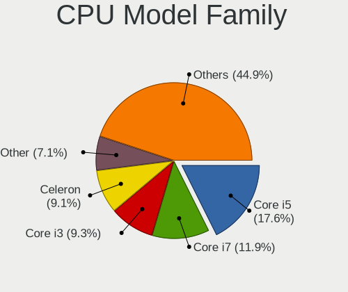

| Model                   | Computers | Percent |
|-------------------------|-----------|---------|
| Intel Core i5           | 445       | 17.63%  |
| Intel Core i7           | 301       | 11.93%  |
| Intel Core i3           | 235       | 9.31%   |
| Intel Celeron           | 230       | 9.11%   |
| Other                   | 179       | 7.09%   |
| AMD Ryzen 5             | 171       | 6.77%   |
| AMD Ryzen 7             | 80        | 3.17%   |
| Intel Atom              | 78        | 3.09%   |
| Intel Pentium           | 71        | 2.81%   |
| Intel Core 2 Duo        | 61        | 2.42%   |
| Intel Pentium Dual-Core | 59        | 2.34%   |
| AMD Ryzen 3             | 50        | 1.98%   |
| AMD FX                  | 49        | 1.94%   |
| AMD A8                  | 48        | 1.9%    |
| AMD A6                  | 36        | 1.43%   |
| AMD A4                  | 34        | 1.35%   |
| AMD A10                 | 34        | 1.35%   |
| Intel Pentium Dual      | 33        | 1.31%   |
| AMD Athlon II X2        | 29        | 1.15%   |
| AMD Athlon              | 26        | 1.03%   |
| AMD Phenom II X4        | 23        | 0.91%   |
| AMD Athlon 64 X2        | 23        | 0.91%   |
| AMD Sempron             | 21        | 0.83%   |
| AMD Ryzen 9             | 21        | 0.83%   |
| Intel Core 2            | 13        | 0.52%   |
| AMD Athlon II X4        | 12        | 0.48%   |
| Intel Pentium 4         | 11        | 0.44%   |
| Intel Genuine           | 11        | 0.44%   |
| Intel Core 2 Quad       | 11        | 0.44%   |
| Intel Xeon              | 10        | 0.4%    |
| AMD Phenom II X6        | 10        | 0.4%    |
| Intel Pentium D         | 9         | 0.36%   |
| AMD A12                 | 9         | 0.36%   |
| AMD Athlon II           | 7         | 0.28%   |
| Intel Core i9           | 6         | 0.24%   |
| AMD Phenom II X2        | 6         | 0.24%   |
| AMD E1                  | 6         | 0.24%   |
| AMD Athlon II X3        | 6         | 0.24%   |
| AMD Ryzen 7 PRO         | 5         | 0.2%    |
| AMD E                   | 5         | 0.2%    |

CPU Cores
---------

Number of processor cores

| Number  | Computers | Percent |
|---------|-----------|---------|
| 2       | 1242      | 49.19%  |
| 4       | 739       | 29.27%  |
| 6       | 203       | 8.04%   |
| 1       | 138       | 5.47%   |
| 8       | 120       | 4.75%   |
| 3       | 23        | 0.91%   |
| 10      | 21        | 0.83%   |
| 16      | 14        | 0.55%   |
| 12      | 13        | 0.51%   |
| 24      | 4         | 0.16%   |
| 14      | 4         | 0.16%   |
| Unknown | 4         | 0.16%   |

CPU Sockets
-----------

Number of sockets

| Number  | Computers | Percent |
|---------|-----------|---------|
| 1       | 2512      | 99.72%  |
| 2       | 5         | 0.2%    |
| Unknown | 2         | 0.08%   |

CPU Threads
-----------

Threads per core (Hyper-Threading)

| Number  | Computers | Percent |
|---------|-----------|---------|
| 2       | 1528      | 60.59%  |
| 1       | 990       | 39.25%  |
| Unknown | 4         | 0.16%   |

CPU Op-Modes
------------

CPU Operation Modes (32-bit, 64-bit)

| Op mode        | Computers | Percent |
|----------------|-----------|---------|
| 32-bit, 64-bit | 2458      | 97.42%  |
| Unknown        | 34        | 1.35%   |
| 32-bit         | 24        | 0.95%   |
| 64-bit         | 7         | 0.28%   |

CPU Microcode
-------------

Microcode number

| Number     | Computers | Percent |
|------------|-----------|---------|
| Unknown    | 955       | 36.22%  |
| 0x206a7    | 109       | 4.13%   |
| 0x306a9    | 105       | 3.98%   |
| 0x306c3    | 70        | 2.65%   |
| 0x1067a    | 69        | 2.62%   |
| 0x806e9    | 52        | 1.97%   |
| 0x806ec    | 48        | 1.82%   |
| 0x08108109 | 47        | 1.78%   |
| 0x806c1    | 45        | 1.71%   |
| 0x010000c8 | 43        | 1.63%   |
| 0x6fd      | 42        | 1.59%   |
| 0x406e3    | 40        | 1.52%   |
| 0x906e9    | 38        | 1.44%   |
| 0x30678    | 35        | 1.33%   |
| 0x06001119 | 35        | 1.33%   |
| 0x806ea    | 34        | 1.29%   |
| 0x306d4    | 32        | 1.21%   |
| 0x906ea    | 30        | 1.14%   |
| 0x40651    | 30        | 1.14%   |
| 0x06003106 | 30        | 1.14%   |
| 0x20655    | 29        | 1.1%    |
| 0x506e3    | 26        | 0.99%   |
| 0x406c4    | 26        | 0.99%   |
| 0x08701021 | 24        | 0.91%   |
| 0x706a8    | 21        | 0.8%    |
| 0x506c9    | 21        | 0.8%    |
| 0x706e5    | 20        | 0.76%   |
| 0x106ca    | 19        | 0.72%   |
| 0x30661    | 18        | 0.68%   |
| 0x0a50000c | 18        | 0.68%   |
| 0x08101016 | 18        | 0.68%   |
| 0x706a1    | 17        | 0.64%   |
| 0x06000852 | 16        | 0.61%   |
| 0x0600611a | 15        | 0.57%   |
| 0x08608103 | 14        | 0.53%   |
| 0x06006118 | 14        | 0.53%   |
| 0x0600063e | 14        | 0.53%   |
| 0xa0653    | 13        | 0.49%   |
| 0x0800820d | 13        | 0.49%   |
| 0x06006705 | 13        | 0.49%   |

CPU Microarch
-------------

Microarchitecture

| Name              | Computers | Percent |
|-------------------|-----------|---------|
| KabyLake          | 342       | 13.55%  |
| IvyBridge         | 156       | 6.18%   |
| SandyBridge       | 150       | 5.94%   |
| Haswell           | 150       | 5.94%   |
| Penryn            | 124       | 4.91%   |
| Silvermont        | 121       | 4.79%   |
| K10               | 121       | 4.79%   |
| Zen+              | 101       | 4%      |
| Skylake           | 91        | 3.61%   |
| Unknown           | 85        | 3.37%   |
| TigerLake         | 81        | 3.21%   |
| Zen 3             | 79        | 3.13%   |
| Goldmont plus     | 79        | 3.13%   |
| Piledriver        | 76        | 3.01%   |
| Core              | 74        | 2.93%   |
| Zen 2             | 71        | 2.81%   |
| Excavator         | 57        | 2.26%   |
| Zen               | 56        | 2.22%   |
| Westmere          | 56        | 2.22%   |
| Bonnell           | 51        | 2.02%   |
| IceLake           | 49        | 1.94%   |
| CometLake         | 47        | 1.86%   |
| Steamroller       | 44        | 1.74%   |
| Broadwell         | 41        | 1.62%   |
| K8 Hammer         | 40        | 1.58%   |
| Alderlake Hybrid  | 29        | 1.15%   |
| Goldmont          | 27        | 1.07%   |
| NetBurst          | 24        | 0.95%   |
| Bulldozer         | 19        | 0.75%   |
| K10 Llano         | 17        | 0.67%   |
| Bobcat            | 15        | 0.59%   |
| Jaguar            | 14        | 0.55%   |
| P6                | 12        | 0.48%   |
| Puma              | 8         | 0.32%   |
| Nehalem           | 8         | 0.32%   |
| K8 & K10 hybrid   | 4         | 0.16%   |
| K6                | 2         | 0.08%   |
| Tremont           | 1         | 0.04%   |
| Meteorlake Hybrid | 1         | 0.04%   |
| Gracemont         | 1         | 0.04%   |

Graphics
--------

GPU Vendor
----------

Vendors of graphics cards

| Vendor                           | Computers | Percent |
|----------------------------------|-----------|---------|
| Intel                            | 1489      | 53.7%   |
| AMD                              | 724       | 26.11%  |
| Nvidia                           | 527       | 19%     |
| Silicon Integrated Systems [SiS] | 14        | 0.5%    |
| VIA Technologies                 | 13        | 0.47%   |
| ATI Technologies                 | 4         | 0.14%   |
| Matrox Electronics Systems       | 1         | 0.04%   |
| ASPEED Technology                | 1         | 0.04%   |

GPU Model
---------

Graphics card models

| Model                                                                                    | Computers | Percent |
|------------------------------------------------------------------------------------------|-----------|---------|
| Intel 2nd Generation Core Processor Family Integrated Graphics Controller                | 130       | 4.54%   |
| Intel 3rd Gen Core processor Graphics Controller                                         | 95        | 3.32%   |
| Intel HD Graphics 620                                                                    | 83        | 2.9%    |
| Intel GeminiLake [UHD Graphics 600]                                                      | 79        | 2.76%   |
| AMD Picasso/Raven 2 [Radeon Vega Series / Radeon Vega Mobile Series]                     | 72        | 2.52%   |
| Intel TigerLake-LP GT2 [Iris Xe Graphics]                                                | 71        | 2.48%   |
| Intel Atom Processor Z36xxx/Z37xxx Series Graphics & Display                             | 68        | 2.38%   |
| Intel Skylake GT2 [HD Graphics 520]                                                      | 53        | 1.85%   |
| Intel Atom/Celeron/Pentium Processor x5-E8000/J3xxx/N3xxx Integrated Graphics Controller | 53        | 1.85%   |
| Intel UHD Graphics 620                                                                   | 52        | 1.82%   |
| Intel Core Processor Integrated Graphics Controller                                      | 52        | 1.82%   |
| Intel CometLake-U GT2 [UHD Graphics]                                                     | 49        | 1.71%   |
| Intel Mobile 4 Series Chipset Integrated Graphics Controller                             | 46        | 1.61%   |
| AMD Ellesmere [Radeon RX 470/480/570/570X/580/580X/590]                                  | 45        | 1.57%   |
| Intel Xeon E3-1200 v3/4th Gen Core Processor Integrated Graphics Controller              | 43        | 1.5%    |
| Intel Haswell-ULT Integrated Graphics Controller                                         | 43        | 1.5%    |
| AMD Cezanne [Radeon Vega Series / Radeon Vega Mobile Series]                             | 42        | 1.47%   |
| AMD Raven Ridge [Radeon Vega Series / Radeon Vega Mobile Series]                         | 38        | 1.33%   |
| Intel HD Graphics 5500                                                                   | 37        | 1.29%   |
| Intel HD Graphics 630                                                                    | 35        | 1.22%   |
| AMD Wani [Radeon R5/R6/R7 Graphics]                                                      | 32        | 1.12%   |
| Intel WhiskeyLake-U GT2 [UHD Graphics 620]                                               | 31        | 1.08%   |
| Nvidia C61 [GeForce 7025 / nForce 630a]                                                  | 29        | 1.01%   |
| AMD Kaveri [Radeon R7 Graphics]                                                          | 29        | 1.01%   |
| Intel Iris Plus Graphics G1 (Ice Lake)                                                   | 28        | 0.98%   |
| Intel HD Graphics 500                                                                    | 27        | 0.94%   |
| Nvidia GT218 [GeForce 210]                                                               | 26        | 0.91%   |
| Intel 4 Series Chipset Integrated Graphics Controller                                    | 26        | 0.91%   |
| AMD Renoir [Radeon Vega Series / Radeon Vega Mobile Series]                              | 26        | 0.91%   |
| Intel Atom Processor D4xx/D5xx/N4xx/N5xx Integrated Graphics Controller                  | 25        | 0.87%   |
| Intel Mobile GM965/GL960 Integrated Graphics Controller (secondary)                      | 24        | 0.84%   |
| Intel Mobile GM965/GL960 Integrated Graphics Controller (primary)                        | 24        | 0.84%   |
| Intel 4th Gen Core Processor Integrated Graphics Controller                              | 24        | 0.84%   |
| Nvidia GP107 [GeForce GTX 1050 Ti]                                                       | 23        | 0.8%    |
| Intel Xeon E3-1200 v2/3rd Gen Core processor Graphics Controller                         | 23        | 0.8%    |
| Nvidia GK208B [GeForce GT 710]                                                           | 22        | 0.77%   |
| AMD Cedar [Radeon HD 5000/6000/7350/8350 Series]                                         | 22        | 0.77%   |
| Intel CoffeeLake-S GT2 [UHD Graphics 630]                                                | 21        | 0.73%   |
| Intel Atom Processor D2xxx/N2xxx Integrated Graphics Controller                          | 20        | 0.7%    |
| AMD Lucienne                                                                             | 20        | 0.7%    |

GPU Combo
---------

Combinations of graphics cards

| Name           | Computers | Percent |
|----------------|-----------|---------|
| 1 x Intel      | 1264      | 49.84%  |
| 1 x AMD        | 618       | 24.37%  |
| 1 x Nvidia     | 334       | 13.17%  |
| Intel + Nvidia | 152       | 5.99%   |
| Intel + AMD    | 47        | 1.85%   |
| AMD + Nvidia   | 37        | 1.46%   |
| 2 x AMD        | 32        | 1.26%   |
| 2 x Intel      | 15        | 0.59%   |
| 1 x SiS        | 14        | 0.55%   |
| 1 x VIA        | 13        | 0.51%   |
| Other          | 6         | 0.24%   |
| 2 x Nvidia     | 2         | 0.08%   |
| 1 x Matrox     | 1         | 0.04%   |
| 1 x ASPEED     | 1         | 0.04%   |

GPU Driver
----------

Free vs proprietary

| Driver      | Computers | Percent |
|-------------|-----------|---------|
| Free        | 2156      | 84.62%  |
| Proprietary | 248       | 9.73%   |
| Unknown     | 144       | 5.65%   |

GPU Memory
----------

Total video memory

| Size in GB | Computers | Percent |
|------------|-----------|---------|
| Unknown    | 1604      | 62%     |
| 0.01-0.5   | 301       | 11.64%  |
| 1.01-2.0   | 262       | 10.13%  |
| 0.51-1.0   | 178       | 6.88%   |
| 3.01-4.0   | 118       | 4.56%   |
| 7.01-8.0   | 62        | 2.4%    |
| 5.01-6.0   | 30        | 1.16%   |
| 8.01-16.0  | 19        | 0.73%   |
| 2.01-3.0   | 11        | 0.43%   |
| 16.01-24.0 | 2         | 0.08%   |

Monitor
-------

Monitor Vendor
--------------

Monitor vendors

| Vendor                  | Computers | Percent |
|-------------------------|-----------|---------|
| Samsung Electronics     | 622       | 23.11%  |
| Goldstar                | 308       | 11.44%  |
| Chimei Innolux          | 267       | 9.92%   |
| BOE                     | 257       | 9.55%   |
| AU Optronics            | 244       | 9.06%   |
| LG Display              | 172       | 6.39%   |
| InfoVision              | 67        | 2.49%   |
| Philips                 | 59        | 2.19%   |
| Dell                    | 50        | 1.86%   |
| ViewSonic               | 41        | 1.52%   |
| BenQ                    | 36        | 1.34%   |
| Hitachi                 | 34        | 1.26%   |
| Hewlett-Packard         | 32        | 1.19%   |
| Lenovo                  | 30        | 1.11%   |
| SKY                     | 26        | 0.97%   |
| Apple                   | 26        | 0.97%   |
| Chi Mei Optoelectronics | 24        | 0.89%   |
| LG Electronics          | 23        | 0.85%   |
| PANDA                   | 19        | 0.71%   |
| AOC                     | 17        | 0.63%   |
| Unknown                 | 16        | 0.59%   |
| STA                     | 16        | 0.59%   |
| LG Philips              | 15        | 0.56%   |
| ASUSTek Computer        | 14        | 0.52%   |
| Sony                    | 13        | 0.48%   |
| Sharp                   | 13        | 0.48%   |
| Acer                    | 13        | 0.48%   |
| SAC                     | 12        | 0.45%   |
| InnoLux Display         | 12        | 0.45%   |
| Unknown (XXX)           | 11        | 0.41%   |
| HannStar                | 11        | 0.41%   |
| KDC                     | 8         | 0.3%    |
| KDB                     | 8         | 0.3%    |
| HKC                     | 8         | 0.3%    |
| CPT                     | 8         | 0.3%    |
| UTV                     | 7         | 0.26%   |
| JRY                     | 7         | 0.26%   |
| Gigabyte Technology     | 7         | 0.26%   |
| SANYO                   | 6         | 0.22%   |
| MStar                   | 6         | 0.22%   |

Monitor Model
-------------

Monitor models

| Model                                                                | Computers | Percent |
|----------------------------------------------------------------------|-----------|---------|
| Goldstar FULL HD GSM5B55 1920x1080 480x270mm 21.7-inch               | 32        | 1.15%   |
| InfoVision LCD Monitor IVO03F4 1920x1080 309x173mm 13.9-inch         | 30        | 1.08%   |
| Chimei Innolux LCD Monitor CMN15DB 1366x768 344x193mm 15.5-inch      | 30        | 1.08%   |
| Chimei Innolux LCD Monitor CMN15E6 1366x768 344x193mm 15.5-inch      | 26        | 0.94%   |
| Samsung Electronics C24F390 SAM0D2C 1920x1080 521x293mm 23.5-inch    | 24        | 0.87%   |
| Goldstar W1943 GSM4BAD 1360x768 406x229mm 18.4-inch                  | 22        | 0.79%   |
| Samsung Electronics S22D300 SAM0B3F 1920x1080 477x268mm 21.5-inch    | 20        | 0.72%   |
| Goldstar W2243 GSM56FE 1920x1080 477x268mm 21.5-inch                 | 18        | 0.65%   |
| Samsung Electronics LCD Monitor SEC5441 1280x800 286x179mm 13.3-inch | 17        | 0.61%   |
| SKY TV-monitor SKY0001 1920x1080 885x498mm 40.0-inch                 | 16        | 0.58%   |
| Samsung Electronics LF24T35 SAM707D 1920x1080 528x297mm 23.9-inch    | 16        | 0.58%   |
| Goldstar IPS FULLHD GSM5AB8 1920x1080 480x270mm 21.7-inch            | 16        | 0.58%   |
| Samsung Electronics S22F350 SAM0D1A 1920x1080 477x268mm 21.5-inch    | 15        | 0.54%   |
| Hitachi HDMI HEC0088 1920x540                                        | 15        | 0.54%   |
| AU Optronics LCD Monitor AUO2E3C 1366x768 309x173mm 13.9-inch        | 15        | 0.54%   |
| Goldstar 23EA53 GSM59A9 1920x1080 510x290mm 23.1-inch                | 14        | 0.51%   |
| Chimei Innolux LCD Monitor CMN15F5 1920x1080 344x193mm 15.5-inch     | 14        | 0.51%   |
| Samsung Electronics S19D300 SAM0B36 1366x768 410x230mm 18.5-inch     | 13        | 0.47%   |
| InfoVision LCD Monitor IVO03FA 1366x768 223x125mm 10.1-inch          | 13        | 0.47%   |
| Chimei Innolux LCD Monitor CMN14D6 1366x768 309x173mm 13.9-inch      | 13        | 0.47%   |
| BOE LCD Monitor BOE06A4 1366x768 344x194mm 15.5-inch                 | 13        | 0.47%   |
| LG Display LCD Monitor LGD02E9 1366x768 309x174mm 14.0-inch          | 12        | 0.43%   |
| Samsung Electronics SMB1930N SAM0632 1360x768 410x230mm 18.5-inch    | 11        | 0.4%    |
| Samsung Electronics SA300/SA350 SAM0788 1366x768 410x230mm 18.5-inch | 11        | 0.4%    |
| Samsung Electronics S24F350 SAM0D20 1920x1080 521x293mm 23.5-inch    | 11        | 0.4%    |
| Chimei Innolux LCD Monitor CMN14C3 1366x768 309x173mm 13.9-inch      | 11        | 0.4%    |
| BOE LCD Monitor BOE06A5 1366x768 344x194mm 15.5-inch                 | 11        | 0.4%    |
| AU Optronics LCD Monitor AUO71EC 1366x768 344x193mm 15.5-inch        | 11        | 0.4%    |
| Samsung Electronics LCD Monitor SEC4542 1366x768 309x174mm 14.0-inch | 10        | 0.36%   |
| Philips PHL 193V5 PHLC0CD 1366x768 410x230mm 18.5-inch               | 10        | 0.36%   |
| InfoVision M140NWR2 R1 IVO057A 1366x768 309x174mm 14.0-inch          | 10        | 0.36%   |
| Hitachi HDMI HEC0029 1920x1080 580x330mm 26.3-inch                   | 10        | 0.36%   |
| Goldstar 19EN33 GSM4C18 1366x768 410x230mm 18.5-inch                 | 10        | 0.36%   |
| Samsung Electronics S27F350 SAM0D22 1920x1080 598x336mm 27.0-inch    | 9         | 0.32%   |
| Samsung Electronics S22D300 SAM0B3E 1920x1080 477x268mm 21.5-inch    | 9         | 0.32%   |
| Hitachi HISENSE HEC0030 3840x2160 1872x1053mm 84.6-inch              | 9         | 0.32%   |
| Chimei Innolux LCD Monitor CMN1040 1366x768 222x125mm 10.0-inch      | 9         | 0.32%   |
| Samsung Electronics SMB2030N SAM0634 1600x900 443x249mm 20.0-inch    | 8         | 0.29%   |
| Samsung Electronics LF22T35 SAM707B 1920x1080 477x268mm 21.5-inch    | 8         | 0.29%   |
| Philips PHL 223V5 PHLC0CF 1920x1080 480x270mm 21.7-inch              | 8         | 0.29%   |

Monitor Resolution
------------------

Monitor screen resolution

| Resolution         | Computers | Percent |
|--------------------|-----------|---------|
| 1920x1080 (FHD)    | 937       | 36.09%  |
| 1366x768 (WXGA)    | 871       | 33.55%  |
| 3840x2160 (4K)     | 133       | 5.12%   |
| 1600x900 (HD+)     | 82        | 3.16%   |
| 1280x1024 (SXGA)   | 81        | 3.12%   |
| 1360x768           | 71        | 2.73%   |
| 1280x800 (WXGA)    | 61        | 2.35%   |
| 1680x1050 (WSXGA+) | 59        | 2.27%   |
| 1440x900 (WXGA+)   | 59        | 2.27%   |
| 1920x1200 (WUXGA)  | 51        | 1.96%   |
| 1920x540           | 22        | 0.85%   |
| 2560x1440 (QHD)    | 19        | 0.73%   |
| 1024x600           | 18        | 0.69%   |
| 1024x768 (XGA)     | 14        | 0.54%   |
| Unknown            | 13        | 0.5%    |
| 2560x1080          | 12        | 0.46%   |
| 1280x720 (HD)      | 12        | 0.46%   |
| 2560x1600          | 9         | 0.35%   |
| 2880x1800          | 8         | 0.31%   |
| 3200x1800 (QHD+)   | 5         | 0.19%   |
| 2288x1287          | 5         | 0.19%   |
| 1152x864           | 5         | 0.19%   |
| 3840x2400          | 4         | 0.15%   |
| 3840x1080          | 4         | 0.15%   |
| 3440x1440          | 3         | 0.12%   |
| 2880x1620          | 3         | 0.12%   |
| 1280x960           | 3         | 0.12%   |
| 800x1280           | 2         | 0.08%   |
| 3840x1100          | 2         | 0.08%   |
| 3456x2160          | 2         | 0.08%   |
| 2160x1440          | 2         | 0.08%   |
| 2048x1152          | 2         | 0.08%   |
| 1920x1280          | 2         | 0.08%   |
| 1600x2560          | 2         | 0.08%   |
| 4093x4093          | 1         | 0.04%   |
| 3600x1200          | 1         | 0.04%   |
| 3286x1080          | 1         | 0.04%   |
| 3280x1080          | 1         | 0.04%   |
| 3072x1920          | 1         | 0.04%   |
| 3046x1050          | 1         | 0.04%   |

Monitor Diagonal
----------------

Diagonal size in inches

| Inches  | Computers | Percent |
|---------|-----------|---------|
| 15      | 678       | 24.94%  |
| 14      | 269       | 9.89%   |
| 13      | 265       | 9.75%   |
| 21      | 204       | 7.5%    |
| 23      | 199       | 7.32%   |
| 18      | 181       | 6.66%   |
| 27      | 88        | 3.24%   |
| 17      | 85        | 3.13%   |
| 24      | 84        | 3.09%   |
| Unknown | 79        | 2.91%   |
| 19      | 72        | 2.65%   |
| 31      | 65        | 2.39%   |
| 20      | 63        | 2.32%   |
| 10      | 44        | 1.62%   |
| 11      | 41        | 1.51%   |
| 40      | 40        | 1.47%   |
| 16      | 34        | 1.25%   |
| 22      | 25        | 0.92%   |
| 84      | 24        | 0.88%   |
| 32      | 23        | 0.85%   |
| 12      | 23        | 0.85%   |
| 52      | 22        | 0.81%   |
| 54      | 20        | 0.74%   |
| 48      | 19        | 0.7%    |
| 46      | 15        | 0.55%   |
| 34      | 13        | 0.48%   |
| 72      | 7         | 0.26%   |
| 142     | 5         | 0.18%   |
| 65      | 4         | 0.15%   |
| 26      | 4         | 0.15%   |
| 43      | 3         | 0.11%   |
| 39      | 3         | 0.11%   |
| 86      | 2         | 0.07%   |
| 55      | 2         | 0.07%   |
| 42      | 2         | 0.07%   |
| 41      | 2         | 0.07%   |
| 30      | 2         | 0.07%   |
| 25      | 2         | 0.07%   |
| 7       | 2         | 0.07%   |
| 64      | 1         | 0.04%   |

Monitor Width
-------------

Physical width

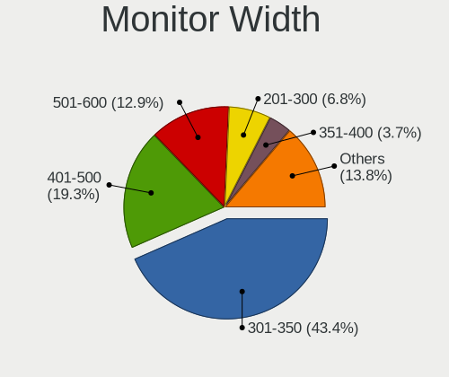

| Width in mm    | Computers | Percent |
|----------------|-----------|---------|
| 301-350        | 1165      | 43.42%  |
| 401-500        | 519       | 19.34%  |
| 501-600        | 347       | 12.93%  |
| 201-300        | 182       | 6.78%   |
| 351-400        | 99        | 3.69%   |
| 1001-1500      | 85        | 3.17%   |
| 601-700        | 80        | 2.98%   |
| Unknown        | 79        | 2.94%   |
| 801-900        | 45        | 1.68%   |
| 701-800        | 36        | 1.34%   |
| 1501-2000      | 31        | 1.16%   |
| 901-1000       | 7         | 0.26%   |
| More than 2000 | 5         | 0.19%   |
| 1-100          | 2         | 0.07%   |
| 101-200        | 1         | 0.04%   |

Aspect Ratio
------------

Proportional relationship between the width and the height

| Ratio   | Computers | Percent |
|---------|-----------|---------|
| 16/9    | 1964      | 81.33%  |
| 16/10   | 219       | 9.07%   |
| Unknown | 65        | 2.69%   |
| 5/4     | 59        | 2.44%   |
| 4/3     | 50        | 2.07%   |
| 1.96    | 15        | 0.62%   |
| 21/9    | 14        | 0.58%   |
| 3/2     | 13        | 0.54%   |
| 1.00    | 5         | 0.21%   |
| 32/9    | 2         | 0.08%   |
| 3.40    | 2         | 0.08%   |
| 0.67    | 2         | 0.08%   |
| 0.56    | 2         | 0.08%   |
| 6/5     | 1         | 0.04%   |
| 3.73    | 1         | 0.04%   |
| 0.89    | 1         | 0.04%   |

Monitor Area
------------

Area in inch

| Area in inch | Computers | Percent |
|----------------|-----------|---------|
| 101-110        | 657       | 24.37%  |
| 81-90          | 475       | 17.62%  |
| 201-250        | 453       | 16.8%   |
| 141-150        | 213       | 7.9%    |
| 151-200        | 174       | 6.45%   |
| 351-500        | 103       | 3.82%   |
| 301-350        | 90        | 3.34%   |
| More than 1000 | 88        | 3.26%   |
| 501-1000       | 81        | 3%      |
| Unknown        | 79        | 2.93%   |
| 71-80          | 54        | 2%      |
| 121-130        | 47        | 1.74%   |
| 41-50          | 44        | 1.63%   |
| 51-60          | 43        | 1.59%   |
| 111-120        | 41        | 1.52%   |
| 61-70          | 18        | 0.67%   |
| 251-300        | 15        | 0.56%   |
| 131-140        | 10        | 0.37%   |
| 91-100         | 8         | 0.3%    |
| 1-40           | 3         | 0.11%   |

Pixel Density
-------------

Pixels per inch

| Density       | Computers | Percent |
|---------------|-----------|---------|
| 101-120       | 950       | 36.2%   |
| 51-100        | 900       | 34.3%   |
| 121-160       | 464       | 17.68%  |
| 1-50          | 130       | 4.95%   |
| Unknown       | 79        | 3.01%   |
| 161-240       | 72        | 2.74%   |
| More than 240 | 29        | 1.11%   |

Multiple Monitors
-----------------

Total monitors connected

| Total | Computers | Percent |
|-------|-----------|---------|
| 1     | 2080      | 80.75%  |
| 2     | 370       | 14.36%  |
| 0     | 101       | 3.92%   |
| 3     | 22        | 0.85%   |
| 4     | 2         | 0.08%   |
| 5     | 1         | 0.04%   |

Network
-------

Net Controller Vendor
---------------------

Controller vendors

| Vendor                                | Computers | Percent |
|---------------------------------------|-----------|---------|
| Realtek Semiconductor                 | 1679      | 45.38%  |
| Intel                                 | 795       | 21.49%  |
| Qualcomm Atheros                      | 414       | 11.19%  |
| Broadcom                              | 133       | 3.59%   |
| TP-Link                               | 99        | 2.68%   |
| Nvidia                                | 87        | 2.35%   |
| Ralink Technology                     | 61        | 1.65%   |
| MediaTek                              | 48        | 1.3%    |
| Qualcomm Atheros Communications       | 42        | 1.14%   |
| Marvell Technology Group              | 41        | 1.11%   |
| Broadcom Limited                      | 35        | 0.95%   |
| Ralink                                | 34        | 0.92%   |
| Samsung Electronics                   | 32        | 0.86%   |
| JMicron Technology                    | 29        | 0.78%   |
| Motorola PCS                          | 23        | 0.62%   |
| VIA Technologies                      | 22        | 0.59%   |
| Silicon Integrated Systems [SiS]      | 17        | 0.46%   |
| Microsoft                             | 13        | 0.35%   |
| ASIX Electronics                      | 11        | 0.3%    |
| Xiaomi                                | 6         | 0.16%   |
| Sundance Technology Inc / IC Plus     | 4         | 0.11%   |
| NetGear                               | 4         | 0.11%   |
| DisplayLink                           | 4         | 0.11%   |
| D-Link System                         | 4         | 0.11%   |
| 3Com                                  | 4         | 0.11%   |
| T & A Mobile Phones                   | 3         | 0.08%   |
| ICS Advent                            | 3         | 0.08%   |
| Ericsson Business Mobile Networks     | 3         | 0.08%   |
| D-Link                                | 3         | 0.08%   |
| Aquantia                              | 3         | 0.08%   |
| 802.11g Adapter [Linksys WUSB54GC v3] | 3         | 0.08%   |
| ZTE WCDMA Technologies MSM            | 2         | 0.05%   |
| Spreadtrum Communications             | 2         | 0.05%   |
| Qualcomm                              | 2         | 0.05%   |
| Ovislink                              | 2         | 0.05%   |
| Microchip Technology                  | 2         | 0.05%   |
| Linksys                               | 2         | 0.05%   |
| LG Electronics                        | 2         | 0.05%   |
| Lenovo                                | 2         | 0.05%   |
| Huawei Technologies                   | 2         | 0.05%   |

Net Controller Model
--------------------

Controller models

| Model                                                                  | Computers | Percent |
|------------------------------------------------------------------------|-----------|---------|
| Realtek RTL8111/8168/8211/8411 PCI Express Gigabit Ethernet Controller | 1107      | 25.36%  |
| Realtek RTL810xE PCI Express Fast Ethernet controller                  | 254       | 5.82%   |
| Realtek RTL8821CE 802.11ac PCIe Wireless Network Adapter               | 76        | 1.74%   |
| Qualcomm Atheros AR9485 Wireless Network Adapter                       | 75        | 1.72%   |
| Nvidia MCP61 Ethernet                                                  | 75        | 1.72%   |
| Realtek RTL8723BE PCIe Wireless Network Adapter                        | 73        | 1.67%   |
| Qualcomm Atheros QCA9377 802.11ac Wireless Network Adapter             | 59        | 1.35%   |
| Realtek RTL8822CE 802.11ac PCIe Wireless Network Adapter               | 58        | 1.33%   |
| Intel Wi-Fi 6 AX201                                                    | 53        | 1.21%   |
| Qualcomm Atheros AR9285 Wireless Network Adapter (PCI-Express)         | 52        | 1.19%   |
| Realtek RTL8188EUS 802.11n Wireless Network Adapter                    | 51        | 1.17%   |
| Realtek RTL8188CE 802.11b/g/n WiFi Adapter                             | 51        | 1.17%   |
| Intel Wi-Fi 6 AX200                                                    | 44        | 1.01%   |
| Intel Wireless 3160                                                    | 41        | 0.94%   |
| Intel Comet Lake PCH-LP CNVi WiFi                                      | 41        | 0.94%   |
| Qualcomm Atheros QCA9565 / AR9565 Wireless Network Adapter             | 40        | 0.92%   |
| Realtek RTL8125 2.5GbE Controller                                      | 37        | 0.85%   |
| Qualcomm Atheros AR9271 802.11n                                        | 37        | 0.85%   |
| Intel Wireless 3165                                                    | 37        | 0.85%   |
| Intel Wireless 8265 / 8275                                             | 35        | 0.8%    |
| Intel Wireless 7265                                                    | 33        | 0.76%   |
| Ralink MT7601U Wireless Adapter                                        | 32        | 0.73%   |
| Qualcomm Atheros AR8152 v2.0 Fast Ethernet                             | 32        | 0.73%   |
| Intel Dual Band Wireless-AC 3168NGW [Stone Peak]                       | 32        | 0.73%   |
| Broadcom BCM4313 802.11bgn Wireless Network Adapter                    | 32        | 0.73%   |
| Realtek RTL8723DE Wireless Network Adapter                             | 31        | 0.71%   |
| Intel Wireless 7260                                                    | 30        | 0.69%   |
| Realtek RTL8188EE Wireless Network Adapter                             | 29        | 0.66%   |
| Realtek RTL-8100/8101L/8139 PCI Fast Ethernet Adapter                  | 29        | 0.66%   |
| Intel Ethernet Connection (2) I219-V                                   | 29        | 0.66%   |
| Realtek 802.11n WLAN Adapter                                           | 28        | 0.64%   |
| Intel I211 Gigabit Network Connection                                  | 28        | 0.64%   |
| Intel 82579LM Gigabit Network Connection (Lewisville)                  | 28        | 0.64%   |
| Samsung Galaxy series, misc. (tethering mode)                          | 27        | 0.62%   |
| Qualcomm Atheros QCA6174 802.11ac Wireless Network Adapter             | 27        | 0.62%   |
| Qualcomm Atheros AR8151 v2.0 Gigabit Ethernet                          | 27        | 0.62%   |
| JMicron JMC250 PCI Express Gigabit Ethernet Controller                 | 25        | 0.57%   |
| Intel Ethernet Controller I225-V                                       | 24        | 0.55%   |
| TP-Link TL-WN722N v2/v3 [Realtek RTL8188EUS]                           | 23        | 0.53%   |
| Realtek RTL8723BU 802.11b/g/n WLAN Adapter                             | 22        | 0.5%    |

Wireless Vendor
---------------

Wireless vendors

| Vendor                                | Computers | Percent |
|---------------------------------------|-----------|---------|
| Intel                                 | 636       | 32.14%  |
| Realtek Semiconductor                 | 564       | 28.5%   |
| Qualcomm Atheros                      | 342       | 17.28%  |
| Broadcom                              | 113       | 5.71%   |
| TP-Link                               | 88        | 4.45%   |
| Ralink Technology                     | 61        | 3.08%   |
| Qualcomm Atheros Communications       | 42        | 2.12%   |
| MediaTek                              | 36        | 1.82%   |
| Ralink                                | 34        | 1.72%   |
| Broadcom Limited                      | 19        | 0.96%   |
| Microsoft                             | 12        | 0.61%   |
| NetGear                               | 4         | 0.2%    |
| Marvell Technology Group              | 4         | 0.2%    |
| D-Link System                         | 4         | 0.2%    |
| D-Link                                | 3         | 0.15%   |
| 802.11g Adapter [Linksys WUSB54GC v3] | 3         | 0.15%   |
| Ovislink                              | 2         | 0.1%    |
| Linksys                               | 2         | 0.1%    |
| Encore Electronics                    | 2         | 0.1%    |
| ZyDAS                                 | 1         | 0.05%   |
| ZTopInc                               | 1         | 0.05%   |
| Sierra Wireless                       | 1         | 0.05%   |
| Samsung Electronics                   | 1         | 0.05%   |
| Qualcomm                              | 1         | 0.05%   |
| Mercucys                              | 1         | 0.05%   |
| Dell                                  | 1         | 0.05%   |
| Cisco Aironet Wireless Communications | 1         | 0.05%   |

Wireless Model
--------------

Wireless models

| Model                                                                   | Computers | Percent |
|-------------------------------------------------------------------------|-----------|---------|
| Realtek RTL8821CE 802.11ac PCIe Wireless Network Adapter                | 76        | 3.8%    |
| Qualcomm Atheros AR9485 Wireless Network Adapter                        | 75        | 3.75%   |
| Realtek RTL8723BE PCIe Wireless Network Adapter                         | 73        | 3.65%   |
| Qualcomm Atheros QCA9377 802.11ac Wireless Network Adapter              | 59        | 2.95%   |
| Realtek RTL8822CE 802.11ac PCIe Wireless Network Adapter                | 58        | 2.9%    |
| Intel Wi-Fi 6 AX201                                                     | 53        | 2.65%   |
| Qualcomm Atheros AR9285 Wireless Network Adapter (PCI-Express)          | 52        | 2.6%    |
| Realtek RTL8188EUS 802.11n Wireless Network Adapter                     | 51        | 2.55%   |
| Realtek RTL8188CE 802.11b/g/n WiFi Adapter                              | 51        | 2.55%   |
| Intel Wi-Fi 6 AX200                                                     | 44        | 2.2%    |
| Intel Wireless 3160                                                     | 41        | 2.05%   |
| Intel Comet Lake PCH-LP CNVi WiFi                                       | 41        | 2.05%   |
| Qualcomm Atheros QCA9565 / AR9565 Wireless Network Adapter              | 40        | 2%      |
| Qualcomm Atheros AR9271 802.11n                                         | 37        | 1.85%   |
| Intel Wireless 3165                                                     | 37        | 1.85%   |
| Intel Wireless 8265 / 8275                                              | 35        | 1.75%   |
| Intel Wireless 7265                                                     | 33        | 1.65%   |
| Ralink MT7601U Wireless Adapter                                         | 32        | 1.6%    |
| Intel Dual Band Wireless-AC 3168NGW [Stone Peak]                        | 32        | 1.6%    |
| Broadcom BCM4313 802.11bgn Wireless Network Adapter                     | 32        | 1.6%    |
| Realtek RTL8723DE Wireless Network Adapter                              | 31        | 1.55%   |
| Intel Wireless 7260                                                     | 30        | 1.5%    |
| Realtek RTL8188EE Wireless Network Adapter                              | 29        | 1.45%   |
| Realtek 802.11n WLAN Adapter                                            | 28        | 1.4%    |
| Qualcomm Atheros QCA6174 802.11ac Wireless Network Adapter              | 27        | 1.35%   |
| TP-Link TL-WN722N v2/v3 [Realtek RTL8188EUS]                            | 23        | 1.15%   |
| Realtek RTL8723BU 802.11b/g/n WLAN Adapter                              | 22        | 1.1%    |
| Intel Dual Band Wireless-AC 3165 Plus Bluetooth                         | 22        | 1.1%    |
| Intel Gemini Lake PCH CNVi WiFi                                         | 21        | 1.05%   |
| Ralink RT2870/RT3070 Wireless Adapter                                   | 19        | 0.95%   |
| Intel Centrino Advanced-N 6205 [Taylor Peak]                            | 19        | 0.95%   |
| Broadcom BCM4312 802.11b/g LP-PHY                                       | 19        | 0.95%   |
| Realtek RTL8191SEvB Wireless LAN Controller                             | 18        | 0.9%    |
| Intel Wireless 8260                                                     | 18        | 0.9%    |
| Intel PRO/Wireless 3945ABG [Golan] Network Connection                   | 18        | 0.9%    |
| Qualcomm Atheros AR9287 Wireless Network Adapter (PCI-Express)          | 17        | 0.85%   |
| Qualcomm Atheros AR242x / AR542x Wireless Network Adapter (PCI-Express) | 17        | 0.85%   |
| Intel Ice Lake-LP PCH CNVi WiFi                                         | 17        | 0.85%   |
| Intel Cannon Point-LP CNVi [Wireless-AC]                                | 17        | 0.85%   |
| Broadcom BCM43142 802.11b/g/n                                           | 17        | 0.85%   |

Ethernet Vendor
---------------

Ethernet vendors

| Vendor                            | Computers | Percent |
|-----------------------------------|-----------|---------|
| Realtek Semiconductor             | 1469      | 63.32%  |
| Intel                             | 336       | 14.48%  |
| Qualcomm Atheros                  | 141       | 6.08%   |
| Nvidia                            | 87        | 3.75%   |
| Broadcom                          | 38        | 1.64%   |
| Marvell Technology Group          | 37        | 1.59%   |
| JMicron Technology                | 29        | 1.25%   |
| Samsung Electronics               | 27        | 1.16%   |
| VIA Technologies                  | 22        | 0.95%   |
| Motorola PCS                      | 22        | 0.95%   |
| Silicon Integrated Systems [SiS]  | 17        | 0.73%   |
| Broadcom Limited                  | 16        | 0.69%   |
| TP-Link                           | 12        | 0.52%   |
| MediaTek                          | 12        | 0.52%   |
| ASIX Electronics                  | 11        | 0.47%   |
| Xiaomi                            | 6         | 0.26%   |
| Sundance Technology Inc / IC Plus | 4         | 0.17%   |
| DisplayLink                       | 4         | 0.17%   |
| 3Com                              | 4         | 0.17%   |
| T & A Mobile Phones               | 3         | 0.13%   |
| ICS Advent                        | 3         | 0.13%   |
| Aquantia                          | 3         | 0.13%   |
| Spreadtrum Communications         | 2         | 0.09%   |
| Microchip Technology              | 2         | 0.09%   |
| Lenovo                            | 2         | 0.09%   |
| Davicom Semiconductor             | 2         | 0.09%   |
| ZTE WCDMA Technologies MSM        | 1         | 0.04%   |
| Solarflare Communications         | 1         | 0.04%   |
| Qualcomm                          | 1         | 0.04%   |
| Microsoft                         | 1         | 0.04%   |
| Macronix [MXIC]                   | 1         | 0.04%   |
| LG Electronics                    | 1         | 0.04%   |
| Huawei Technologies               | 1         | 0.04%   |
| Digitech Systems                  | 1         | 0.04%   |
| 3DSP                              | 1         | 0.04%   |

Ethernet Model
--------------

Ethernet models

| Model                                                                  | Computers | Percent |
|------------------------------------------------------------------------|-----------|---------|
| Realtek RTL8111/8168/8211/8411 PCI Express Gigabit Ethernet Controller | 1107      | 47.29%  |
| Realtek RTL810xE PCI Express Fast Ethernet controller                  | 254       | 10.85%  |
| Nvidia MCP61 Ethernet                                                  | 75        | 3.2%    |
| Realtek RTL8125 2.5GbE Controller                                      | 37        | 1.58%   |
| Qualcomm Atheros AR8152 v2.0 Fast Ethernet                             | 32        | 1.37%   |
| Realtek RTL-8100/8101L/8139 PCI Fast Ethernet Adapter                  | 29        | 1.24%   |
| Intel Ethernet Connection (2) I219-V                                   | 29        | 1.24%   |
| Intel I211 Gigabit Network Connection                                  | 28        | 1.2%    |
| Intel 82579LM Gigabit Network Connection (Lewisville)                  | 28        | 1.2%    |
| Samsung Galaxy series, misc. (tethering mode)                          | 27        | 1.15%   |
| Qualcomm Atheros AR8151 v2.0 Gigabit Ethernet                          | 27        | 1.15%   |
| JMicron JMC250 PCI Express Gigabit Ethernet Controller                 | 25        | 1.07%   |
| Intel Ethernet Controller I225-V                                       | 24        | 1.03%   |
| Motorola PCS moto g84 5G                                               | 20        | 0.85%   |
| VIA VT6102/VT6103 [Rhine-II]                                           | 18        | 0.77%   |
| Marvell Group 88E8040 PCI-E Fast Ethernet Controller                   | 18        | 0.77%   |
| Realtek RTL8153 Gigabit Ethernet Adapter                               | 17        | 0.73%   |
| Realtek RTL8152 Fast Ethernet Adapter                                  | 17        | 0.73%   |
| Intel Ethernet Connection (7) I219-V                                   | 17        | 0.73%   |
| Intel Ethernet Connection (4) I219-LM                                  | 17        | 0.73%   |
| Intel Ethernet Connection (13) I219-V                                  | 15        | 0.64%   |
| Silicon Integrated Systems [SiS] 191 Gigabit Ethernet Adapter          | 14        | 0.6%    |
| Intel Ethernet Connection (10) I219-V                                  | 14        | 0.6%    |
| Intel 82579V Gigabit Network Connection                                | 14        | 0.6%    |
| Realtek RTL8169 PCI Gigabit Ethernet Controller                        | 13        | 0.56%   |
| Intel 82577LM Gigabit Network Connection                               | 12        | 0.51%   |
| Qualcomm Atheros AR8162 Fast Ethernet                                  | 11        | 0.47%   |
| Intel Ethernet Connection I217-LM                                      | 11        | 0.47%   |
| Qualcomm Atheros QCA8171 Gigabit Ethernet                              | 10        | 0.43%   |
| Intel Ethernet Connection I218-LM                                      | 9         | 0.38%   |
| Intel Ethernet Connection I217-V                                       | 9         | 0.38%   |
| Broadcom NetXtreme BCM57765 Gigabit Ethernet PCIe                      | 9         | 0.38%   |
| TP-Link UE300 10/100/1000 LAN (ethernet mode) [Realtek RTL8153]        | 8         | 0.34%   |
| Qualcomm Atheros Killer E2500 Gigabit Ethernet Controller              | 8         | 0.34%   |
| Qualcomm Atheros AR8161 Gigabit Ethernet                               | 8         | 0.34%   |
| Qualcomm Atheros AR8131 Gigabit Ethernet                               | 8         | 0.34%   |
| Intel Ethernet Connection I219-LM                                      | 8         | 0.34%   |
| Qualcomm Atheros Killer E220x Gigabit Ethernet Controller              | 7         | 0.3%    |
| Intel Ethernet Connection (14) I219-V                                  | 7         | 0.3%    |
| Broadcom NetLink BCM5906M Fast Ethernet PCI Express                    | 7         | 0.3%    |

Net Controller Kind
-------------------

Ethernet, WiFi or modem

| Kind     | Computers | Percent |
|----------|-----------|---------|
| Ethernet | 2186      | 53.37%  |
| WiFi     | 1885      | 46.02%  |
| Modem    | 23        | 0.56%   |
| Unknown  | 2         | 0.05%   |

Used Controller
---------------

Currently used network controller

| Kind     | Computers | Percent |
|----------|-----------|---------|
| WiFi     | 1541      | 59.52%  |
| Ethernet | 1047      | 40.44%  |
| Unknown  | 1         | 0.04%   |

NICs
----

Total network controllers on board

| Total | Computers | Percent |
|-------|-----------|---------|
| 2     | 1283      | 50.67%  |
| 1     | 1127      | 44.51%  |
| 0     | 78        | 3.08%   |
| 3     | 38        | 1.5%    |
| 4     | 3         | 0.12%   |
| 7     | 2         | 0.08%   |
| 32    | 1         | 0.04%   |

IPv6
----

IPv6 vs IPv4

| Used | Computers | Percent |
|------|-----------|---------|
| No   | 2106      | 82.36%  |
| Yes  | 451       | 17.64%  |

Bluetooth
---------

Bluetooth Vendor
----------------

Controller vendors

| Vendor                          | Computers | Percent |
|---------------------------------|-----------|---------|
| Intel                           | 526       | 41.25%  |
| Realtek Semiconductor           | 235       | 18.43%  |
| Cambridge Silicon Radio         | 94        | 7.37%   |
| Qualcomm Atheros Communications | 88        | 6.9%    |
| IMC Networks                    | 79        | 6.2%    |
| Broadcom                        | 52        | 4.08%   |
| Lite-On Technology              | 47        | 3.69%   |
| Foxconn / Hon Hai               | 33        | 2.59%   |
| Apple                           | 23        | 1.8%    |
| TP-Link                         | 16        | 1.25%   |
| Dell                            | 16        | 1.25%   |
| Toshiba                         | 13        | 1.02%   |
| ASUSTek Computer                | 12        | 0.94%   |
| Ralink                          | 8         | 0.63%   |
| Integrated System Solution      | 5         | 0.39%   |
| Hewlett-Packard                 | 5         | 0.39%   |
| Alps Electric                   | 4         | 0.31%   |
| USI                             | 3         | 0.24%   |
| MediaTek                        | 3         | 0.24%   |
| Qcom                            | 2         | 0.16%   |
| Marvell Semiconductor           | 2         | 0.16%   |
| Syntek                          | 1         | 0.08%   |
| Roper                           | 1         | 0.08%   |
| Realtek                         | 1         | 0.08%   |
| Ralink Technology               | 1         | 0.08%   |
| Logitech                        | 1         | 0.08%   |
| Foxconn International           | 1         | 0.08%   |
| Edimax Technology               | 1         | 0.08%   |
| Conwise Technology              | 1         | 0.08%   |
| Unknown                         | 1         | 0.08%   |

Bluetooth Model
---------------

Controller models

| Model                                               | Computers | Percent |
|-----------------------------------------------------|-----------|---------|
| Intel Bluetooth wireless interface                  | 195       | 15.28%  |
| Realtek Bluetooth Radio                             | 109       | 8.54%   |
| Intel Bluetooth 9460/9560 Jefferson Peak (JfP)      | 105       | 8.23%   |
| Cambridge Silicon Radio Bluetooth Dongle (HCI mode) | 94        | 7.37%   |
| Intel AX201 Bluetooth                               | 87        | 6.82%   |
| Realtek  Bluetooth 4.2 Adapter                      | 59        | 4.62%   |
| Qualcomm Atheros  Bluetooth Device                  | 50        | 3.92%   |
| Intel AX200 Bluetooth                               | 44        | 3.45%   |
| IMC Networks Bluetooth Radio                        | 33        | 2.59%   |
| Intel Wireless-AC 3168 Bluetooth                    | 32        | 2.51%   |
| Realtek RTL8723B Bluetooth                          | 30        | 2.35%   |
| Realtek 802.11ac WLAN Adapter                       | 28        | 2.19%   |
| IMC Networks Wireless_Device                        | 20        | 1.57%   |
| Intel Centrino Bluetooth Wireless Transceiver       | 18        | 1.41%   |
| TP-Link TP-Link Bluetooth USB Adapter               | 16        | 1.25%   |
| Qualcomm Atheros AR3012 Bluetooth 4.0               | 16        | 1.25%   |
| Lite-On Bluetooth Device                            | 16        | 1.25%   |
| Lite-On Qualcomm Atheros QCA9377 Bluetooth          | 15        | 1.18%   |
| Intel AX210 Bluetooth                               | 15        | 1.18%   |
| IMC Networks Bluetooth Device                       | 15        | 1.18%   |
| Intel AX211 Bluetooth                               | 14        | 1.1%    |
| Qualcomm Atheros QCA61x4 Bluetooth 4.0              | 11        | 0.86%   |
| Intel Centrino Advanced-N 6230 Bluetooth adapter    | 10        | 0.78%   |
| Broadcom BCM20702 Bluetooth 4.0 [ThinkPad]          | 9         | 0.71%   |
| Toshiba Bluetooth USB Host Controller               | 8         | 0.63%   |
| Ralink RT3290 Bluetooth                             | 8         | 0.63%   |
| Broadcom BCM43142 Bluetooth 4.0                     | 8         | 0.63%   |
| Realtek RTL8821A Bluetooth                          | 7         | 0.55%   |
| Intel Wireless-AC 9260 Bluetooth Adapter            | 7         | 0.55%   |
| Foxconn / Hon Hai Wireless_Device                   | 7         | 0.55%   |
| Foxconn / Hon Hai Bluetooth Device                  | 7         | 0.55%   |
| Broadcom BCM2070 Bluetooth 2.1 + EDR                | 7         | 0.55%   |
| Apple Bluetooth USB Host Controller                 | 7         | 0.55%   |
| Qualcomm Atheros AR3011 Bluetooth                   | 6         | 0.47%   |
| IMC Networks Atheros AR3012 Bluetooth 4.0 Adapter   | 6         | 0.47%   |
| Apple Bluetooth Host Controller                     | 6         | 0.47%   |
| Lite-On Broadcom BCM43142A0 Bluetooth Device        | 5         | 0.39%   |
| Lite-On Bluetooth Radio                             | 5         | 0.39%   |
| Foxconn / Hon Hai MediaTek Bluetooth Adapter        | 5         | 0.39%   |
| Foxconn / Hon Hai Broadcom Bluetooth 2.1 Device     | 5         | 0.39%   |

Sound
-----

Sound Vendor
------------

Sound card vendors

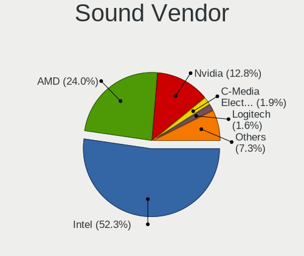

| Vendor                                          | Computers | Percent |
|-------------------------------------------------|-----------|---------|
| Intel                                           | 1674      | 52.3%   |
| AMD                                             | 769       | 24.02%  |
| Nvidia                                          | 410       | 12.81%  |
| C-Media Electronics                             | 62        | 1.94%   |
| Logitech                                        | 51        | 1.59%   |
| Kingston Technology                             | 27        | 0.84%   |
| VIA Technologies                                | 21        | 0.66%   |
| Silicon Integrated Systems [SiS]                | 17        | 0.53%   |
| Texas Instruments                               | 16        | 0.5%    |
| Generalplus Technology                          | 12        | 0.37%   |
| Creative Labs                                   | 12        | 0.37%   |
| JMTek                                           | 9         | 0.28%   |
| Focusrite-Novation                              | 7         | 0.22%   |
| ASUSTek Computer                                | 7         | 0.22%   |
| Plantronics                                     | 6         | 0.19%   |
| GN Netcom                                       | 6         | 0.19%   |
| Sony                                            | 5         | 0.16%   |
| Micro Star International                        | 5         | 0.16%   |
| M-Audio                                         | 5         | 0.16%   |
| Elite Silicon                                   | 5         | 0.16%   |
| ATI Technologies                                | 5         | 0.16%   |
| Samson Technologies                             | 4         | 0.12%   |
| Fry's Electronics                               | 4         | 0.12%   |
| Creative Technology                             | 4         | 0.12%   |
| BEHRINGER International                         | 4         | 0.12%   |
| Realtek Semiconductor                           | 3         | 0.09%   |
| Razer USA                                       | 3         | 0.09%   |
| Microsoft                                       | 3         | 0.09%   |
| Licensed by Sony Computer Entertainment America | 3         | 0.09%   |
| Hewlett-Packard                                 | 3         | 0.09%   |
| ESI Audiotechnik                                | 3         | 0.09%   |
| Corsair                                         | 3         | 0.09%   |
| Astro Gaming                                    | 3         | 0.09%   |
| TEAC                                            | 2         | 0.06%   |
| Lenovo                                          | 2         | 0.06%   |
| Ensoniq                                         | 2         | 0.06%   |
| Audient                                         | 2         | 0.06%   |
| Arturia                                         | 2         | 0.06%   |
| Yamaha                                          | 1         | 0.03%   |
| SteelSeries ApS                                 | 1         | 0.03%   |

Sound Model
-----------

Sound card models

| Model                                                                                             | Computers | Percent |
|---------------------------------------------------------------------------------------------------|-----------|---------|
| AMD Family 17h/19h/1ah HD Audio Controller                                                        | 230       | 5.87%   |
| Intel Sunrise Point-LP HD Audio                                                                   | 196       | 5%      |
| Intel 7 Series/C216 Chipset Family High Definition Audio Controller                               | 161       | 4.11%   |
| Intel 6 Series/C200 Series Chipset Family High Definition Audio Controller                        | 142       | 3.62%   |
| AMD FCH Azalia Controller                                                                         | 140       | 3.57%   |
| Intel NM10/ICH7 Family High Definition Audio Controller                                           | 136       | 3.47%   |
| AMD SBx00 Azalia (Intel HDA)                                                                      | 120       | 3.06%   |
| AMD Raven/Raven2/Fenghuang HDMI/DP Audio Controller                                               | 109       | 2.78%   |
| AMD Renoir Radeon High Definition Audio Controller                                                | 87        | 2.22%   |
| Intel 8 Series/C220 Series Chipset High Definition Audio Controller                               | 86        | 2.19%   |
| Intel Tiger Lake-LP Smart Sound Technology Audio Controller                                       | 81        | 2.07%   |
| Nvidia MCP61 High Definition Audio                                                                | 79        | 2.02%   |
| Intel Celeron/Pentium Silver Processor High Definition Audio                                      | 79        | 2.02%   |
| Intel Xeon E3-1200 v3/4th Gen Core Processor HD Audio Controller                                  | 73        | 1.86%   |
| AMD Starship/Matisse HD Audio Controller                                                          | 71        | 1.81%   |
| Intel Atom Processor Z36xxx/Z37xxx Series High Definition Audio Controller                        | 65        | 1.66%   |
| Intel 5 Series/3400 Series Chipset High Definition Audio                                          | 63        | 1.61%   |
| Intel 100 Series/C230 Series Chipset Family HD Audio Controller                                   | 58        | 1.48%   |
| Intel 82801I (ICH9 Family) HD Audio Controller                                                    | 57        | 1.45%   |
| Intel Comet Lake PCH-LP cAVS                                                                      | 51        | 1.3%    |
| AMD Kabini HDMI/DP Audio                                                                          | 51        | 1.3%    |
| AMD Family 15h (Models 60h-6fh) Audio Controller                                                  | 48        | 1.23%   |
| AMD Ellesmere HDMI Audio [Radeon RX 470/480 / 570/580/590]                                        | 46        | 1.17%   |
| Intel 200 Series PCH HD Audio                                                                     | 45        | 1.15%   |
| Intel Haswell-ULT HD Audio Controller                                                             | 44        | 1.12%   |
| Intel 8 Series HD Audio Controller                                                                | 44        | 1.12%   |
| Nvidia GP107GL High Definition Audio Controller                                                   | 41        | 1.05%   |
| Intel Broadwell-U Audio Controller                                                                | 41        | 1.05%   |
| AMD Family 17h (Models 00h-0fh) HD Audio Controller                                               | 39        | 1%      |
| AMD Trinity HDMI Audio Controller                                                                 | 38        | 0.97%   |
| AMD Oland/Hainan/Cape Verde/Pitcairn HDMI Audio [Radeon HD 7000 Series]                           | 38        | 0.97%   |
| Nvidia GK208 HDMI/DP Audio Controller                                                             | 36        | 0.92%   |
| Intel Wildcat Point-LP High Definition Audio Controller                                           | 36        | 0.92%   |
| AMD Kaveri HDMI/DP Audio Controller                                                               | 36        | 0.92%   |
| Intel Ice Lake-LP Smart Sound Technology Audio Controller                                         | 35        | 0.89%   |
| Intel Cannon Lake PCH cAVS                                                                        | 35        | 0.89%   |
| Nvidia High Definition Audio Controller                                                           | 33        | 0.84%   |
| Intel 82801H (ICH8 Family) HD Audio Controller                                                    | 33        | 0.84%   |
| Intel Cannon Point-LP High Definition Audio Controller                                            | 31        | 0.79%   |
| Intel Atom/Celeron/Pentium Processor x5-E8000/J3xxx/N3xxx Series High Definition Audio Controller | 30        | 0.77%   |

Memory
------

Memory Vendor
-------------

Memory module vendors

| Vendor              | Computers | Percent |
|---------------------|-----------|---------|
| Kingston            | 356       | 22.49%  |
| Samsung Electronics | 272       | 17.18%  |
| Unknown             | 182       | 11.5%   |
| SK hynix            | 177       | 11.18%  |
| Micron Technology   | 88        | 5.56%   |
| Crucial             | 80        | 5.05%   |
| A-DATA Technology   | 61        | 3.85%   |
| Corsair             | 51        | 3.22%   |
| Unknown (ABCD)      | 33        | 2.08%   |
| Unknown             | 28        | 1.77%   |
| Nanya Technology    | 21        | 1.33%   |
| Magnum Tech         | 19        | 1.2%    |
| Goldkey             | 18        | 1.14%   |
| Novatech            | 16        | 1.01%   |
| G.Skill             | 13        | 0.82%   |
| Ramaxel Technology  | 11        | 0.69%   |
| Patriot             | 11        | 0.69%   |
| Elpida              | 11        | 0.69%   |
| Avant               | 11        | 0.69%   |
| PNY                 | 9         | 0.57%   |
| Neo Forza           | 9         | 0.57%   |
| Team                | 8         | 0.51%   |
| Hewlett-Packard     | 8         | 0.51%   |
| Hikvision           | 7         | 0.44%   |
| Saikano             | 6         | 0.38%   |
| 48spaces            | 6         | 0.38%   |
| Transcend           | 5         | 0.32%   |
| Super Talent        | 5         | 0.32%   |
| Memox               | 5         | 0.32%   |
| CSX                 | 5         | 0.32%   |
| Unknown (0x0B45)    | 3         | 0.19%   |
| Teikon              | 3         | 0.19%   |
| Kingmax             | 3         | 0.19%   |
| Apacer              | 3         | 0.19%   |
| Ramos Technology    | 2         | 0.13%   |
| Patriot Memory      | 2         | 0.13%   |
| Netac               | 2         | 0.13%   |
| Lexar               | 2         | 0.13%   |
| Kimtigo             | 2         | 0.13%   |
| Innodisk            | 2         | 0.13%   |

Memory Model
------------

Memory module models

| Model                                                                     | Computers | Percent |
|---------------------------------------------------------------------------|-----------|---------|
| Unknown (ABCD) RAM 123456789012345678 2GB SODIMM LPDDR3 2400MT/s          | 31        | 1.81%   |
| Unknown                                                                   | 28        | 1.63%   |
| Samsung RAM M471A5244CB0-CRC 4GB SODIMM DDR4 2667MT/s                     | 21        | 1.22%   |
| SK hynix RAM HMAA1GS6CJR6N-XN 8GB SODIMM DDR4 3200MT/s                    | 19        | 1.11%   |
| SK hynix RAM HMA81GS6AFR8N-UH 8GB SODIMM DDR4 2667MT/s                    | 17        | 0.99%   |
| Samsung RAM M471A1G44AB0-CWE 8GB SODIMM DDR4 3200MT/s                     | 17        | 0.99%   |
| Magnum Tech RAM MAGNUMTECH 4GB SODIMM DDR3 1600MT/s                       | 16        | 0.93%   |
| Samsung RAM M471A5244CB0-CTD 4GB SODIMM DDR4 3266MT/s                     | 15        | 0.87%   |
| Kingston RAM KHX2666C16/8G 8GB DIMM DDR4 3466MT/s                         | 12        | 0.7%    |
| Kingston RAM 99U5471-054.A00LF 8GB DIMM DDR3 1600MT/s                     | 12        | 0.7%    |
| Samsung RAM M471B5173EB0-YK0 4GB SODIMM DDR3 1600MT/s                     | 11        | 0.64%   |
| Nanya RAM NT2GC64B88B0NS-CG 2GB SODIMM DDR3 1334MT/s                      | 11        | 0.64%   |
| Kingston RAM KHX1866C10D3/8G 8GB DIMM DDR3 2133MT/s                       | 11        | 0.64%   |
| Unknown RAM Module 4GB DIMM 1333MT/s                                      | 10        | 0.58%   |
| Samsung RAM M471A5244CB0-CWE 4096MB SODIMM DDR4 3200MT/s                  | 10        | 0.58%   |
| Samsung RAM M471A1K43CB1-CRC 8GB SODIMM DDR4 2667MT/s                     | 10        | 0.58%   |
| Samsung RAM M471A1G44AB0-CWE 8GB Row Of Chips DDR4 3200MT/s               | 10        | 0.58%   |
| Kingston RAM KHX2400C15/8G 8GB DIMM DDR4 3400MT/s                         | 10        | 0.58%   |
| Samsung RAM M471A1K43DB1-CWE 8GB SODIMM DDR4 3200MT/s                     | 9         | 0.52%   |
| Unknown RAM Module 2GB DIMM 1333MT/s                                      | 8         | 0.47%   |
| Samsung RAM M471B5273CH0-CH9 4GB SODIMM DDR3 1334MT/s                     | 8         | 0.47%   |
| Samsung RAM M471B5173DB0-YK0 4GB SODIMM DDR3 1600MT/s                     | 8         | 0.47%   |
| Unknown RAM Module 4GB DIMM 1600MT/s                                      | 7         | 0.41%   |
| Unknown RAM Module 2GB DIMM SDRAM                                         | 7         | 0.41%   |
| SK hynix RAM HMT451S6BFR8A-PB 4096MB SODIMM DDR3 1600MT/s                 | 7         | 0.41%   |
| Samsung RAM M471B5273DH0-CH9 4GB SODIMM DDR3 1334MT/s                     | 7         | 0.41%   |
| Kingston RAM KHX1866C10D3/4G 4GB DIMM DDR3 1923MT/s                       | 7         | 0.41%   |
| Kingston RAM 99U5584-005.A00LF 4GB DIMM DDR3 1600MT/s                     | 7         | 0.41%   |
| SK hynix RAM HMT451S6BFR8A-PB 4GB SODIMM DDR3 1600MT/s                    | 6         | 0.35%   |
| SK hynix RAM HMT351S6CFR8C-PB 4GB SODIMM DDR3 1600MT/s                    | 6         | 0.35%   |
| Samsung RAM M471B5773CHS-CH9 2GB SODIMM DDR3 4199MT/s                     | 6         | 0.35%   |
| Samsung RAM M471B1G73QH0-YK0 8GB SODIMM DDR3 1600MT/s                     | 6         | 0.35%   |
| Kingston RAM KHX1600C10D3/8G 8GB DIMM DDR3 1600MT/s                       | 6         | 0.35%   |
| Kingston RAM 99U5428-018.A00LF 8GB SODIMM DDR3 1600MT/s                   | 6         | 0.35%   |
| 48spaces RAM 012345678901234567890123456789012345 2GB SODIMM DDR2 667MT/s | 6         | 0.35%   |
| Unknown RAM Module 8GB DIMM 1333MT/s                                      | 5         | 0.29%   |
| Unknown RAM Module 4GB SODIMM DDR3 1333MT/s                               | 5         | 0.29%   |
| Unknown RAM Module 4GB SODIMM DDR3 1066MT/s                               | 5         | 0.29%   |
| Unknown RAM Module 4GB DIMM DDR3 1333MT/s                                 | 5         | 0.29%   |
| Unknown RAM Module 4096MB DIMM 1333MT/s                                   | 5         | 0.29%   |

Memory Kind
-----------

Memory module kinds

| Kind    | Computers | Percent |
|---------|-----------|---------|
| DDR4    | 595       | 44.6%   |
| DDR3    | 460       | 34.48%  |
| Unknown | 68        | 5.1%    |
| DDR2    | 65        | 4.87%   |
| LPDDR4  | 51        | 3.82%   |
| SDRAM   | 33        | 2.47%   |
| LPDDR3  | 17        | 1.27%   |
| DDR5    | 14        | 1.05%   |
| LPDDR5  | 13        | 0.97%   |
| DDR     | 11        | 0.82%   |
| DRAM    | 7         | 0.52%   |

Memory Form Factor
------------------

Physical design of the memory module

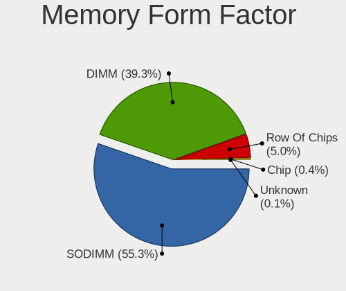

| Name         | Computers | Percent |
|--------------|-----------|---------|
| SODIMM       | 738       | 55.28%  |
| DIMM         | 524       | 39.25%  |
| Row Of Chips | 67        | 5.02%   |
| Chip         | 5         | 0.37%   |
| Unknown      | 1         | 0.07%   |

Memory Size
-----------

Memory module size

| Size  | Computers | Percent |
|-------|-----------|---------|
| 8192  | 578       | 38.3%   |
| 4096  | 427       | 28.3%   |
| 2048  | 216       | 14.31%  |
| 16384 | 184       | 12.19%  |
| 1024  | 52        | 3.45%   |
| 32768 | 42        | 2.78%   |
| 512   | 8         | 0.53%   |
| 6144  | 1         | 0.07%   |
| 256   | 1         | 0.07%   |

Memory Speed
------------

Memory module speed

| Speed   | Computers | Percent |
|---------|-----------|---------|
| 1600    | 273       | 18.21%  |
| 3200    | 217       | 14.48%  |
| 2667    | 212       | 14.14%  |
| 1333    | 157       | 10.47%  |
| 2400    | 135       | 9.01%   |
| 2133    | 57        | 3.8%    |
| Unknown | 51        | 3.4%    |
| 1334    | 46        | 3.07%   |
| 3600    | 39        | 2.6%    |
| 667     | 34        | 2.27%   |
| 800     | 24        | 1.6%    |
| 3400    | 17        | 1.13%   |
| 1066    | 17        | 1.13%   |
| 3466    | 16        | 1.07%   |
| 533     | 16        | 1.07%   |
| 3266    | 15        | 1%      |
| 2666    | 13        | 0.87%   |
| 1067    | 13        | 0.87%   |
| 4800    | 11        | 0.73%   |
| 1866    | 11        | 0.73%   |
| 1867    | 10        | 0.67%   |
| 333     | 10        | 0.67%   |
| 6400    | 8         | 0.53%   |
| 4199    | 8         | 0.53%   |
| 3000    | 7         | 0.47%   |
| 2933    | 7         | 0.47%   |
| 4267    | 6         | 0.4%    |
| 400     | 6         | 0.4%    |
| 2048    | 5         | 0.33%   |
| 3733    | 4         | 0.27%   |
| 3066    | 4         | 0.27%   |
| 975     | 4         | 0.27%   |
| 8400    | 3         | 0.2%    |
| 4266    | 3         | 0.2%    |
| 4000    | 3         | 0.2%    |
| 3933    | 3         | 0.2%    |
| 3800    | 3         | 0.2%    |
| 7500    | 2         | 0.13%   |
| 6000    | 2         | 0.13%   |
| 5500    | 2         | 0.13%   |

Printers & scanners
-------------------

Printer Vendor
--------------

Printer device vendors

| Vendor              | Computers | Percent |
|---------------------|-----------|---------|
| Hewlett-Packard     | 32        | 47.06%  |
| Brother Industries  | 17        | 25%     |
| Seiko Epson         | 8         | 11.76%  |
| Samsung Electronics | 4         | 5.88%   |
| Ricoh               | 1         | 1.47%   |
| QinHeng Electronics | 1         | 1.47%   |
| Pantum              | 1         | 1.47%   |
| NXP Semiconductors  | 1         | 1.47%   |
| Kyocera             | 1         | 1.47%   |
| Graphtec America    | 1         | 1.47%   |
| Canon               | 1         | 1.47%   |

Printer Model
-------------

Printer device models

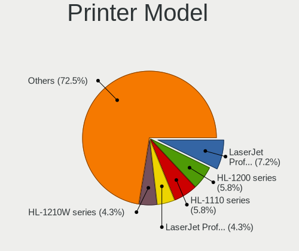

| Model                                         | Computers | Percent |
|-----------------------------------------------|-----------|---------|
| HP LaserJet Professional P1102w               | 5         | 7.25%   |
| Brother HL-1200 series                        | 4         | 5.8%    |
| Brother HL-1110 series                        | 4         | 5.8%    |
| HP LaserJet Professional P 1102w              | 3         | 4.35%   |
| Brother HL-1210W series                       | 3         | 4.35%   |
| Seiko Epson L355 Series                       | 2         | 2.9%    |
| Samsung M2020 Series                          | 2         | 2.9%    |
| HP LaserJet P1006                             | 2         | 2.9%    |
| HP LaserJet P1005                             | 2         | 2.9%    |
| HP LaserJet M203-M206                         | 2         | 2.9%    |
| HP LaserJet 1020                              | 2         | 2.9%    |
| HP Ink Tank 110 series                        | 2         | 2.9%    |
| HP DeskJet 2620 All-in-One Printer            | 2         | 2.9%    |
| Brother HL-2130 series                        | 2         | 2.9%    |
| Brother DCP-7055 scanner/printer              | 2         | 2.9%    |
| Seiko Epson XP-243 245 247 Series             | 1         | 1.45%   |
| Seiko Epson Printer                           | 1         | 1.45%   |
| Seiko Epson ME 340 Series/Stylus NX130 Series | 1         | 1.45%   |
| Seiko Epson L3110 Series                      | 1         | 1.45%   |
| Seiko Epson L210 Series                       | 1         | 1.45%   |
| Seiko Epson L120 Series                       | 1         | 1.45%   |
| Seiko Epson ET-2700 Series                    | 1         | 1.45%   |
| Samsung Xerox Phaser 3117 Laser Printer       | 1         | 1.45%   |
| Samsung ML-1865                               | 1         | 1.45%   |
| Ricoh Printing Support                        | 1         | 1.45%   |
| QinHeng CH340S                                | 1         | 1.45%   |
| Pantum P2500W series                          | 1         | 1.45%   |
| NXP Semiconductors Printer-80                 | 1         | 1.45%   |
| Kyocera ECOSYS M3550idn                       | 1         | 1.45%   |
| HP PSC 1400                                   | 1         | 1.45%   |
| HP Officejet 4500 G510a-f                     | 1         | 1.45%   |
| HP Laserjet P1505                             | 1         | 1.45%   |
| HP LaserJet 3050                              | 1         | 1.45%   |
| HP Ink Tank Wireless 410 series               | 1         | 1.45%   |
| HP DeskJet F4100 Printer series               | 1         | 1.45%   |
| HP DeskJet F300 series                        | 1         | 1.45%   |
| HP DeskJet 810c/812c                          | 1         | 1.45%   |
| HP DeskJet 3630 series                        | 1         | 1.45%   |
| HP Deskjet 3050 J610 series                   | 1         | 1.45%   |
| HP Deskjet 2050 J510                          | 1         | 1.45%   |

Scanner Vendor
--------------

Scanner device vendors

| Vendor          | Computers | Percent |
|-----------------|-----------|---------|
| Hewlett-Packard | 2         | 66.67%  |
| Canon           | 1         | 33.33%  |

Scanner Model
-------------

Scanner device models

| Model                   | Computers | Percent |
|-------------------------|-----------|---------|
| HP ScanJet 5300c/5370c  | 1         | 33.33%  |
| HP ScanJet 2400c        | 1         | 33.33%  |
| Canon CanoScan LiDE 200 | 1         | 33.33%  |

Camera
------

Camera Vendor
-------------

Camera device vendors

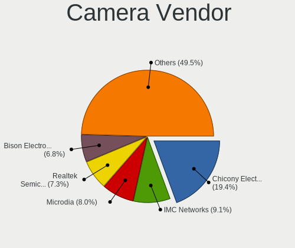

| Vendor                                 | Computers | Percent |
|----------------------------------------|-----------|---------|
| Chicony Electronics                    | 290       | 19.39%  |
| IMC Networks                           | 136       | 9.09%   |
| Microdia                               | 119       | 7.95%   |
| Realtek Semiconductor                  | 109       | 7.29%   |
| Bison Electronics                      | 101       | 6.75%   |
| Logitech                               | 59        | 3.94%   |
| Sunplus Innovation Technology          | 55        | 3.68%   |
| Quanta                                 | 55        | 3.68%   |
| Syntek                                 | 52        | 3.48%   |
| Suyin                                  | 48        | 3.21%   |
| Cheng Uei Precision Industry (Foxlink) | 46        | 3.07%   |
| Silicon Motion                         | 42        | 2.81%   |
| Alcor Micro                            | 42        | 2.81%   |
| Acer                                   | 34        | 2.27%   |
| Apple                                  | 25        | 1.67%   |
| Samsung Electronics                    | 23        | 1.54%   |
| SunplusIT                              | 22        | 1.47%   |
| Luxvisions Innotech Limited            | 21        | 1.4%    |
| Generalplus Technology                 | 20        | 1.34%   |
| KYE Systems (Mouse Systems)            | 19        | 1.27%   |
| Z-Star Microelectronics                | 17        | 1.14%   |
| Lite-On Technology                     | 17        | 1.14%   |
| Ricoh                                  | 15        | 1%      |
| Sonix Technology                       | 13        | 0.87%   |
| Microsoft                              | 10        | 0.67%   |
| Jieli Technology                       | 10        | 0.67%   |
| icSpring                               | 10        | 0.67%   |
| Y Media                                | 8         | 0.53%   |
| OmniVision Technologies                | 7         | 0.47%   |
| MacroSilicon                           | 5         | 0.33%   |
| Importek                               | 5         | 0.33%   |
| Cubeternet                             | 5         | 0.33%   |
| Lenovo                                 | 4         | 0.27%   |
| GEMBIRD                                | 4         | 0.27%   |
| Aveo Technology                        | 4         | 0.27%   |
| ALi                                    | 4         | 0.27%   |
| USB Camera CS                          | 3         | 0.2%    |
| Pixart Imaging                         | 3         | 0.2%    |
| globaloptics                           | 3         | 0.2%    |
| Genesys Logic                          | 3         | 0.2%    |

Camera Model
------------

Camera device models

| Model                                                          | Computers | Percent |
|----------------------------------------------------------------|-----------|---------|
| Chicony USB 2.0 Camera                                         | 48        | 3.19%   |
| IMC Networks Integrated Camera                                 | 43        | 2.86%   |
| IMC Networks USB2.0 VGA UVC WebCam                             | 41        | 2.73%   |
| Bison Integrated Camera                                        | 34        | 2.26%   |
| Chicony Integrated Camera                                      | 32        | 2.13%   |
| Microdia Integrated_Webcam_HD                                  | 31        | 2.06%   |
| Realtek Integrated_Webcam_HD                                   | 29        | 1.93%   |
| Alcor Micro USB 2.0 Camera                                     | 29        | 1.93%   |
| Syntek Integrated Camera                                       | 23        | 1.53%   |
| Samsung Galaxy series, misc. (MTP mode)                        | 22        | 1.46%   |
| IMC Networks USB2.0 HD UVC WebCam                              | 22        | 1.46%   |
| Sunplus Integrated_Webcam_HD                                   | 21        | 1.4%    |
| SunplusIT USB 2M Camera                                        | 20        | 1.33%   |
| Microdia USB 2.0 Camera                                        | 18        | 1.2%    |
| Logitech Webcam C270                                           | 16        | 1.06%   |
| Chicony Lenovo EasyCamera                                      | 16        | 1.06%   |
| Chicony HD WebCam                                              | 16        | 1.06%   |
| Realtek USB Camera                                             | 15        | 1%      |
| Cheng Uei Precision Industry (Foxlink) HP TrueVision HD Camera | 15        | 1%      |
| Realtek USB2.0 camera                                          | 14        | 0.93%   |
| Chicony TOSHIBA Web Camera - HD                                | 14        | 0.93%   |
| Microdia Webcam Vitade AF                                      | 13        | 0.86%   |
| Luxvisions Innotech Limited Integrated Camera                  | 13        | 0.86%   |
| Chicony USB2.0 Camera                                          | 13        | 0.86%   |
| Chicony HP TrueVision HD Camera                                | 13        | 0.86%   |
| Generalplus GENERAL WEBCAM                                     | 12        | 0.8%    |
| Acer USB Camera                                                | 12        | 0.8%    |
| Logitech C922 Pro Stream Webcam                                | 11        | 0.73%   |
| Chicony HP Wide Vision HD Camera                               | 11        | 0.73%   |
| Bison USB Camera                                               | 11        | 0.73%   |
| Apple iPhone 5/5C/5S/6/SE/7/8/X/XR                             | 11        | 0.73%   |
| Syntek EasyCamera                                              | 10        | 0.66%   |
| Silicon Motion WebCam SC-0311139N                              | 10        | 0.66%   |
| Jieli USB PHY 2.0                                              | 10        | 0.66%   |
| icSpring camera                                                | 10        | 0.66%   |
| Microdia Integrated Webcam                                     | 9         | 0.6%    |
| Lite-On Integrated Camera                                      | 9         | 0.6%    |
| Chicony USB2.0 VGA UVC WebCam                                  | 9         | 0.6%    |
| Chicony EasyCamera                                             | 9         | 0.6%    |
| Bison SunplusIT Integrated Camera                              | 9         | 0.6%    |

Security
--------

Fingerprint Vendor
------------------

Fingerprint sensor vendors

| Vendor                             | Computers | Percent |
|------------------------------------|-----------|---------|
| Synaptics                          | 60        | 32.79%  |
| Validity Sensors                   | 50        | 27.32%  |
| Shenzhen Goodix Technology         | 31        | 16.94%  |
| Elan Microelectronics              | 11        | 6.01%   |
| AuthenTec                          | 10        | 5.46%   |
| Upek                               | 8         | 4.37%   |
| LighTuning Technology              | 8         | 4.37%   |
| STMicroelectronics                 | 2         | 1.09%   |
| Realtek USB2.0 Finger Print Bridge | 1         | 0.55%   |
| Focal-systems.Corp                 | 1         | 0.55%   |
| DigitalPersona                     | 1         | 0.55%   |

Fingerprint Model
-----------------

Fingerprint sensor models

| Model                                                                      | Computers | Percent |
|----------------------------------------------------------------------------|-----------|---------|
| Synaptics Prometheus MIS Touch Fingerprint Reader                          | 23        | 12.57%  |
| Shenzhen Goodix  FingerPrint Device                                        | 22        | 12.02%  |
| Synaptics  WBDI                                                            | 15        | 8.2%    |
| Validity Sensors VFS5011 Fingerprint Reader                                | 11        | 6.01%   |
| Validity Sensors VFS 5011 fingerprint sensor                               | 9         | 4.92%   |
| Upek Biometric Touchchip/Touchstrip Fingerprint Sensor                     | 8         | 4.37%   |
| Shenzhen Goodix Fingerprint Reader                                         | 8         | 4.37%   |
| Validity Sensors Fingerprint scanner                                       | 6         | 3.28%   |
| Synaptics Metallica MIS Touch Fingerprint Reader                           | 6         | 3.28%   |
| Elan ELAN:Fingerprint                                                      | 6         | 3.28%   |
| Validity Sensors Synaptics WBDI                                            | 5         | 2.73%   |
| Elan ELAN:ARM-M4                                                           | 5         | 2.73%   |
| Validity Sensors VFS495 Fingerprint Reader                                 | 4         | 2.19%   |
| Validity Sensors Synaptics VFS7552 Touch Fingerprint Sensor with PurePrint | 4         | 2.19%   |
| Synaptics WBDI                                                             | 4         | 2.19%   |
| Synaptics UWP WBDI Device                                                  | 4         | 2.19%   |
| LighTuning ES603 Swipe Fingerprint Sensor                                  | 4         | 2.19%   |
| AuthenTec AES2501 Fingerprint Sensor                                       | 4         | 2.19%   |
| Validity Sensors VFS301 Fingerprint Reader                                 | 3         | 1.64%   |
| AuthenTec AES2810                                                          | 3         | 1.64%   |
| Validity Sensors VFS101 Fingerprint Reader                                 | 2         | 1.09%   |
| Validity Sensors Swipe Fingerprint Sensor                                  | 2         | 1.09%   |
| Synaptics Fingerprint reader [HP G6]                                       | 2         | 1.09%   |
| STMicroelectronics Fingerprint Reader                                      | 2         | 1.09%   |
| LighTuning Fingerprint Sensor                                              | 2         | 1.09%   |
| LighTuning EgisTec Touch Fingerprint Sensor                                | 2         | 1.09%   |
| AuthenTec Fingerprint Sensor                                               | 2         | 1.09%   |
| Validity Sensors VFS7552 Touch Fingerprint Sensor                          | 1         | 0.55%   |
| Validity Sensors VFS7500 Touch Fingerprint Sensor                          | 1         | 0.55%   |
| Validity Sensors VFS491                                                    | 1         | 0.55%   |
| Validity Sensors VFS300 Fingerprint Reader                                 | 1         | 0.55%   |
| Synaptics WBDI Fingerprint Reader USB 086                                  | 1         | 0.55%   |
| Synaptics UWP WBDI                                                         | 1         | 0.55%   |
| Synaptics TouchPad                                                         | 1         | 0.55%   |
| Synaptics  FS7604 Touch Fingerprint Sensor with PurePrint                  | 1         | 0.55%   |
| Synaptics Prometheus Fingerprint Reader                                    | 1         | 0.55%   |
| Shenzhen Goodix FingerPrint                                                | 1         | 0.55%   |
| Realtek USB2.0 Finger Print Bridge FocalTech Fingerprint Device            | 1         | 0.55%   |
| Focal-systems.Corp FT9201Fingerprint.                                  | 1         | 0.55%   |
| DigitalPersona Fingerprint Reader                                          | 1         | 0.55%   |

Chipcard Vendor
---------------

Chipcard module vendors

| Vendor      | Computers | Percent |
|-------------|-----------|---------|
| Broadcom    | 30        | 63.83%  |
| Upek        | 11        | 23.4%   |
| O2 Micro    | 2         | 4.26%   |
| Lenovo      | 2         | 4.26%   |
| Alcor Micro | 2         | 4.26%   |

Chipcard Model
--------------

Chipcard module models

| Model                                                                        | Computers | Percent |
|------------------------------------------------------------------------------|-----------|---------|
| Upek TouchChip Fingerprint Coprocessor (WBF advanced mode)                   | 11        | 23.4%   |
| Broadcom BCM5880 Secure Applications Processor                               | 10        | 21.28%  |
| Broadcom 58200                                                               | 9         | 19.15%  |
| Broadcom BCM5880 Secure Applications Processor with fingerprint swipe sensor | 8         | 17.02%  |
| Broadcom 5880                                                                | 3         | 6.38%   |
| O2 Micro OZ776 CCID Smartcard Reader                                         | 2         | 4.26%   |
| Lenovo Integrated Smart Card Reader                                          | 2         | 4.26%   |
| Alcor Micro AU9540 Smartcard Reader                                          | 2         | 4.26%   |

Unsupported
-----------

Unsupported Devices
-------------------

Total unsupported devices on board

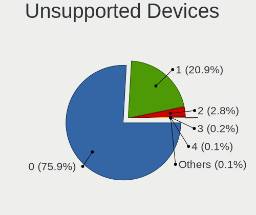

| Total | Computers | Percent |
|-------|-----------|---------|
| 0     | 1946      | 75.9%   |
| 1     | 535       | 20.87%  |
| 2     | 72        | 2.81%   |
| 3     | 5         | 0.2%    |
| 4     | 3         | 0.12%   |
| 8     | 1         | 0.04%   |
| 6     | 1         | 0.04%   |
| 5     | 1         | 0.04%   |

Unsupported Device Types
------------------------

Types of unsupported devices

| Type                     | Computers | Percent |
|--------------------------|-----------|---------|
| Graphics card            | 226       | 32.15%  |
| Fingerprint reader       | 180       | 25.6%   |
| Net/wireless             | 111       | 15.79%  |
| Chipcard                 | 43        | 6.12%   |
| Multimedia controller    | 29        | 4.13%   |
| Camera                   | 27        | 3.84%   |
| Communication controller | 19        | 2.7%    |
| Bluetooth                | 16        | 2.28%   |
| Net/ethernet             | 14        | 1.99%   |
| Sound                    | 13        | 1.85%   |
| Network                  | 6         | 0.85%   |
| Unassigned class         | 5         | 0.71%   |
| Modem                    | 5         | 0.71%   |
| Storage/ide              | 2         | 0.28%   |
| Flash memory             | 2         | 0.28%   |
| Firewire controller      | 2         | 0.28%   |
| Card reader              | 2         | 0.28%   |
| Dvb card                 | 1         | 0.14%   |

