Linux in Argentina - Tested Hardware & Statistics
-------------------------------------------------

A project to collect tested hardware configurations for Linux in Argentina.

Anyone can contribute to this report by the [hw-probe](https://github.com/linuxhw/hw-probe) tool:

    sudo -E hw-probe -all -upload

Please contribute! Especially if your hardware is rare.

This is a report for all computer types. See also reports for [desktops](/Location/Argentina/Desktop/README.md) and [notebooks](/Location/Argentina/Notebook/README.md).

Contents
--------

* [ Test Cases ](#test-cases)

* [ System ](#system)
  - [ OS                       ](#os)
  - [ OS Family                ](#os-family)
  - [ Kernel                   ](#kernel)
  - [ Kernel Family            ](#kernel-family)
  - [ Kernel Major Ver.        ](#kernel-major-ver)
  - [ Arch                     ](#arch)
  - [ DE                       ](#de)
  - [ Display Server           ](#display-server)
  - [ Display Manager          ](#display-manager)
  - [ OS Lang                  ](#os-lang)
  - [ Boot Mode                ](#boot-mode)
  - [ Filesystem               ](#filesystem)
  - [ Part. scheme             ](#part-scheme)
  - [ Dual Boot with Linux/BSD ](#dual-boot-with-linuxbsd)
  - [ Dual Boot (Win)          ](#dual-boot-win)

* [ Board ](#board)
  - [ Vendor                   ](#vendor)
  - [ Model                    ](#model)
  - [ Model Family             ](#model-family)
  - [ MFG Year                 ](#mfg-year)
  - [ Form Factor              ](#form-factor)
  - [ Secure Boot              ](#secure-boot)
  - [ Coreboot                 ](#coreboot)
  - [ RAM Size                 ](#ram-size)
  - [ RAM Used                 ](#ram-used)
  - [ Total Drives             ](#total-drives)
  - [ Has CD-ROM               ](#has-cd-rom)
  - [ Has Ethernet             ](#has-ethernet)
  - [ Has WiFi                 ](#has-wifi)
  - [ Has Bluetooth            ](#has-bluetooth)

* [ Location ](#location)
  - [ Country                  ](#country)
  - [ City                     ](#city)

* [ Drives ](#drives)
  - [ Drive Vendor             ](#drive-vendor)
  - [ Drive Model              ](#drive-model)
  - [ HDD Vendor               ](#hdd-vendor)
  - [ SSD Vendor               ](#ssd-vendor)
  - [ Drive Kind               ](#drive-kind)
  - [ Drive Connector          ](#drive-connector)
  - [ Drive Size               ](#drive-size)
  - [ Space Total              ](#space-total)
  - [ Space Used               ](#space-used)
  - [ Malfunc. Drives          ](#malfunc-drives)
  - [ Malfunc. Drive Vendor    ](#malfunc-drive-vendor)
  - [ Malfunc. HDD Vendor      ](#malfunc-hdd-vendor)
  - [ Malfunc. Drive Kind      ](#malfunc-drive-kind)
  - [ Failed Drives            ](#failed-drives)
  - [ Failed Drive Vendor      ](#failed-drive-vendor)
  - [ Drive Status             ](#drive-status)

* [ Storage controller ](#storage-controller)
  - [ Storage Vendor           ](#storage-vendor)
  - [ Storage Model            ](#storage-model)
  - [ Storage Kind             ](#storage-kind)

* [ Processor ](#processor)
  - [ CPU Vendor               ](#cpu-vendor)
  - [ CPU Model                ](#cpu-model)
  - [ CPU Model Family         ](#cpu-model-family)
  - [ CPU Cores                ](#cpu-cores)
  - [ CPU Sockets              ](#cpu-sockets)
  - [ CPU Threads              ](#cpu-threads)
  - [ CPU Op-Modes             ](#cpu-op-modes)
  - [ CPU Microcode            ](#cpu-microcode)
  - [ CPU Microarch            ](#cpu-microarch)

* [ Graphics ](#graphics)
  - [ GPU Vendor               ](#gpu-vendor)
  - [ GPU Model                ](#gpu-model)
  - [ GPU Combo                ](#gpu-combo)
  - [ GPU Driver               ](#gpu-driver)
  - [ GPU Memory               ](#gpu-memory)

* [ Monitor ](#monitor)
  - [ Monitor Vendor           ](#monitor-vendor)
  - [ Monitor Model            ](#monitor-model)
  - [ Monitor Resolution       ](#monitor-resolution)
  - [ Monitor Diagonal         ](#monitor-diagonal)
  - [ Monitor Width            ](#monitor-width)
  - [ Aspect Ratio             ](#aspect-ratio)
  - [ Monitor Area             ](#monitor-area)
  - [ Pixel Density            ](#pixel-density)
  - [ Multiple Monitors        ](#multiple-monitors)

* [ Network ](#network)
  - [ Net Controller Vendor    ](#net-controller-vendor)
  - [ Net Controller Model     ](#net-controller-model)
  - [ Wireless Vendor          ](#wireless-vendor)
  - [ Wireless Model           ](#wireless-model)
  - [ Ethernet Vendor          ](#ethernet-vendor)
  - [ Ethernet Model           ](#ethernet-model)
  - [ Net Controller Kind      ](#net-controller-kind)
  - [ Used Controller          ](#used-controller)
  - [ NICs                     ](#nics)
  - [ IPv6                     ](#ipv6)

* [ Bluetooth ](#bluetooth)
  - [ Bluetooth Vendor         ](#bluetooth-vendor)
  - [ Bluetooth Model          ](#bluetooth-model)

* [ Sound ](#sound)
  - [ Sound Vendor             ](#sound-vendor)
  - [ Sound Model              ](#sound-model)

* [ Memory ](#memory)
  - [ Memory Vendor            ](#memory-vendor)
  - [ Memory Model             ](#memory-model)
  - [ Memory Kind              ](#memory-kind)
  - [ Memory Form Factor       ](#memory-form-factor)
  - [ Memory Size              ](#memory-size)
  - [ Memory Speed             ](#memory-speed)

* [ Printers & scanners ](#printers--scanners)
  - [ Printer Vendor           ](#printer-vendor)
  - [ Printer Model            ](#printer-model)
  - [ Scanner Vendor           ](#scanner-vendor)
  - [ Scanner Model            ](#scanner-model)

* [ Camera ](#camera)
  - [ Camera Vendor            ](#camera-vendor)
  - [ Camera Model             ](#camera-model)

* [ Security ](#security)
  - [ Fingerprint Vendor       ](#fingerprint-vendor)
  - [ Fingerprint Model        ](#fingerprint-model)
  - [ Chipcard Vendor          ](#chipcard-vendor)
  - [ Chipcard Model           ](#chipcard-model)

* [ Unsupported ](#unsupported)
  - [ Unsupported Devices      ](#unsupported-devices)
  - [ Unsupported Device Types ](#unsupported-device-types)

Test Cases
----------

Total: 2213

| Vendor        | Model                       | Form-Factor | Probe                                                      | Date         |
|---------------|-----------------------------|-------------|------------------------------------------------------------|--------------|
| Lenovo        | ThinkPad E14 Gen 3 20YDS... | Notebook    | [c90b358eb5](https://linux-hardware.org/?probe=c90b358eb5) | Nov 01, 2022 |
| Acer          | Nitro AN515-42              | Notebook    | [3a00ca53c8](https://linux-hardware.org/?probe=3a00ca53c8) | Oct 31, 2022 |
| ASUSTek       | VivoBook_ASUSLaptop X515... | Notebook    | [deac1b706f](https://linux-hardware.org/?probe=deac1b706f) | Oct 31, 2022 |
| Intel         | powered classmate PC        | Notebook    | [5555da7553](https://linux-hardware.org/?probe=5555da7553) | Oct 31, 2022 |
| ECS           | H81H3-M4                    | Desktop     | [a4e0449df5](https://linux-hardware.org/?probe=a4e0449df5) | Oct 30, 2022 |
| Lenovo        | ThinkPad T440 20B7S18Y0Y    | Notebook    | [9cf3beb13f](https://linux-hardware.org/?probe=9cf3beb13f) | Oct 30, 2022 |
| Lenovo        | ThinkPad T440 20B7S18Y0Y    | Notebook    | [36b3303b35](https://linux-hardware.org/?probe=36b3303b35) | Oct 30, 2022 |
| ASUSTek       | TUF H370-PRO GAMING WIFI    | Desktop     | [48cbfa7a78](https://linux-hardware.org/?probe=48cbfa7a78) | Oct 28, 2022 |
| Compaq        | Presario 21 VerX            | Notebook    | [97ee92b9d1](https://linux-hardware.org/?probe=97ee92b9d1) | Oct 28, 2022 |
| Dell          | Inspiron 3558               | Notebook    | [3eeb2624bf](https://linux-hardware.org/?probe=3eeb2624bf) | Oct 27, 2022 |
| Lenovo        | G470 20078                  | Notebook    | [c923b6d506](https://linux-hardware.org/?probe=c923b6d506) | Oct 27, 2022 |
| Gigabyte      | 970A-DS3P                   | Desktop     | [1bc5db124b](https://linux-hardware.org/?probe=1bc5db124b) | Oct 27, 2022 |
| Intel         | X79G V2.x                   | Desktop     | [9c19f9e755](https://linux-hardware.org/?probe=9c19f9e755) | Oct 27, 2022 |
| ASUSTek       | X541UAK                     | Notebook    | [87ee863ba2](https://linux-hardware.org/?probe=87ee863ba2) | Oct 26, 2022 |
| Dell          | Latitude E6510              | Notebook    | [1949f78888](https://linux-hardware.org/?probe=1949f78888) | Oct 26, 2022 |
| ASUSTek       | PRIME X570-P                | Desktop     | [7910e04e13](https://linux-hardware.org/?probe=7910e04e13) | Oct 25, 2022 |
| ASUSTek       | M2N-MX SE Plus              | Desktop     | [eca0e58bd8](https://linux-hardware.org/?probe=eca0e58bd8) | Oct 25, 2022 |
| Dell          | Precision 5560              | Notebook    | [c6cfa3f96d](https://linux-hardware.org/?probe=c6cfa3f96d) | Oct 25, 2022 |
| Dell          | Precision 5560              | Notebook    | [e0dce17c1f](https://linux-hardware.org/?probe=e0dce17c1f) | Oct 25, 2022 |
| ASRock        | N68-S                       | Desktop     | [f1f502f834](https://linux-hardware.org/?probe=f1f502f834) | Oct 25, 2022 |
| HP            | OMEN by Laptop 15-ce0xx     | Notebook    | [0c60239460](https://linux-hardware.org/?probe=0c60239460) | Oct 25, 2022 |
| AMI           | Aptio CRB                   | Mini pc     | [3749438ef1](https://linux-hardware.org/?probe=3749438ef1) | Oct 24, 2022 |
| MSI           | MAG Z490 TOMAHAWK           | Desktop     | [25db15ea87](https://linux-hardware.org/?probe=25db15ea87) | Oct 24, 2022 |
| Lenovo        | Legion 5 15IAH7 82RC        | Notebook    | [8f793706c2](https://linux-hardware.org/?probe=8f793706c2) | Oct 23, 2022 |
| Lenovo        | ThinkPad E14 Gen 2 20T7S... | Notebook    | [4a17b0a89d](https://linux-hardware.org/?probe=4a17b0a89d) | Oct 22, 2022 |
| Intel         | Montevina CRB               | Notebook    | [11cb344c52](https://linux-hardware.org/?probe=11cb344c52) | Oct 22, 2022 |
| A-DATA Tec... | XENIA 14                    | Notebook    | [c8a0b8e94f](https://linux-hardware.org/?probe=c8a0b8e94f) | Oct 20, 2022 |
| MSI           | Modern 15 A11MU             | Notebook    | [2413dd813b](https://linux-hardware.org/?probe=2413dd813b) | Oct 19, 2022 |
| IP3 Tech      | GB3B                        | Mini pc     | [d565cdf4a5](https://linux-hardware.org/?probe=d565cdf4a5) | Oct 19, 2022 |
| Acer          | Aspire A315-21              | Notebook    | [3b8ac4e243](https://linux-hardware.org/?probe=3b8ac4e243) | Oct 19, 2022 |
| Positivo      | AT300i                      | Notebook    | [02190f570b](https://linux-hardware.org/?probe=02190f570b) | Oct 16, 2022 |
| Gigabyte      | A320M-S2H-CF                | Desktop     | [c4a0f6af56](https://linux-hardware.org/?probe=c4a0f6af56) | Oct 16, 2022 |
| Gigabyte      | A320M-S2H-CF                | Desktop     | [cde8c87a3a](https://linux-hardware.org/?probe=cde8c87a3a) | Oct 16, 2022 |
| Gigabyte      | B450M DS3H-CF               | Desktop     | [1be458024b](https://linux-hardware.org/?probe=1be458024b) | Oct 15, 2022 |
| Gigabyte      | B365M DS3H                  | Desktop     | [603fc4f4cd](https://linux-hardware.org/?probe=603fc4f4cd) | Oct 15, 2022 |
| Dell          | Latitude E5450              | Notebook    | [68e2c17e2f](https://linux-hardware.org/?probe=68e2c17e2f) | Oct 15, 2022 |
| A-DATA Tec... | XENIA 14                    | Notebook    | [85f4236c50](https://linux-hardware.org/?probe=85f4236c50) | Oct 15, 2022 |
| Gigabyte      | H510M H                     | Desktop     | [28a0b7d55f](https://linux-hardware.org/?probe=28a0b7d55f) | Oct 14, 2022 |
| BANGHO        | B801 IP-M23.62.06           | Other       | [5a66a855a8](https://linux-hardware.org/?probe=5a66a855a8) | Oct 14, 2022 |
| KELYX ARGE... | KL9120                      | Notebook    | [a14b57c22c](https://linux-hardware.org/?probe=a14b57c22c) | Oct 14, 2022 |
| ASRock        | AM2NF6G-VSTA                | Desktop     | [6a810d253c](https://linux-hardware.org/?probe=6a810d253c) | Oct 13, 2022 |
| Dell          | Latitude 7420               | Convertible | [dade6a2b21](https://linux-hardware.org/?probe=dade6a2b21) | Oct 13, 2022 |
| Gigabyte      | F2A58M-HD2                  | Desktop     | [944509d58b](https://linux-hardware.org/?probe=944509d58b) | Oct 12, 2022 |
| Lenovo        | B51-30 80LK                 | Notebook    | [13e68d4364](https://linux-hardware.org/?probe=13e68d4364) | Oct 12, 2022 |
| Lenovo        | B51-30 80LK                 | Notebook    | [1444f8cc5b](https://linux-hardware.org/?probe=1444f8cc5b) | Oct 12, 2022 |
| ASUSTek       | H81M-K                      | Desktop     | [31fbbb40a0](https://linux-hardware.org/?probe=31fbbb40a0) | Oct 11, 2022 |
| ASUSTek       | VivoBook_ASUSLaptop X513... | Notebook    | [e2deb8e15e](https://linux-hardware.org/?probe=e2deb8e15e) | Oct 11, 2022 |
| AMI           | Aptio CRB                   | Mini pc     | [77d21da9a2](https://linux-hardware.org/?probe=77d21da9a2) | Oct 11, 2022 |
| KELYX ARGE... | KL9120                      | Notebook    | [477851891a](https://linux-hardware.org/?probe=477851891a) | Oct 11, 2022 |
| ASUSTek       | ZenBook UX325EA_UX325EA     | Notebook    | [7dcd7050ae](https://linux-hardware.org/?probe=7dcd7050ae) | Oct 10, 2022 |
| Positivo      | AT300i                      | Notebook    | [62b9d61028](https://linux-hardware.org/?probe=62b9d61028) | Oct 09, 2022 |
| Positivo      | AT300i                      | Notebook    | [8bbd312832](https://linux-hardware.org/?probe=8bbd312832) | Oct 09, 2022 |
| MSI           | A68HM-E33 V2                | Desktop     | [6ea2c2d73b](https://linux-hardware.org/?probe=6ea2c2d73b) | Oct 08, 2022 |
| Gigabyte      | H81M-H                      | Desktop     | [7f78dda318](https://linux-hardware.org/?probe=7f78dda318) | Oct 07, 2022 |
| HP            | 339A                        | Desktop     | [0cb27058b8](https://linux-hardware.org/?probe=0cb27058b8) | Oct 07, 2022 |
| ASUSTek       | X505BP                      | Notebook    | [3ebba89d5e](https://linux-hardware.org/?probe=3ebba89d5e) | Oct 07, 2022 |
| HP            | x2 Detachable 10-p0XX       | Tablet      | [c621294169](https://linux-hardware.org/?probe=c621294169) | Oct 07, 2022 |
| Samsung       | 530U4E/540U4E               | Notebook    | [11ed7b9f37](https://linux-hardware.org/?probe=11ed7b9f37) | Oct 07, 2022 |
| KELYX ARGE... | KL9120                      | Notebook    | [faa5f13391](https://linux-hardware.org/?probe=faa5f13391) | Oct 06, 2022 |
| Gigabyte      | H510M H                     | Desktop     | [a4c0e2324f](https://linux-hardware.org/?probe=a4c0e2324f) | Oct 04, 2022 |
| ASUSTek       | PRIME B450M-A II            | Desktop     | [89400b60b0](https://linux-hardware.org/?probe=89400b60b0) | Oct 04, 2022 |
| BANGHO        | GAMER GM-X 15s              | Notebook    | [d3e2d5452a](https://linux-hardware.org/?probe=d3e2d5452a) | Oct 03, 2022 |
| Lenovo        | ThinkPad E15 Gen 2 20T9S... | Notebook    | [0a022a22c6](https://linux-hardware.org/?probe=0a022a22c6) | Oct 01, 2022 |
| Gigabyte      | B360 AORUS GAMING 3-CF      | Desktop     | [87a1c21540](https://linux-hardware.org/?probe=87a1c21540) | Oct 01, 2022 |
| HP            | Laptop 15-bs0xx             | Notebook    | [7ed786bee9](https://linux-hardware.org/?probe=7ed786bee9) | Sep 30, 2022 |
| Gigabyte      | H510M H                     | Desktop     | [51a7f36a69](https://linux-hardware.org/?probe=51a7f36a69) | Sep 29, 2022 |
| Lenovo        | V330-15IKB 81AX             | Notebook    | [0360123f76](https://linux-hardware.org/?probe=0360123f76) | Sep 29, 2022 |
| Biostar       | H55 HD                      | Desktop     | [bde8e0a133](https://linux-hardware.org/?probe=bde8e0a133) | Sep 28, 2022 |
| Lenovo        | ThinkPad L15 Gen 1 20U4S... | Notebook    | [d5a4d2ae41](https://linux-hardware.org/?probe=d5a4d2ae41) | Sep 28, 2022 |
| Positivo      | SW6H                        | Notebook    | [4cfa6665bb](https://linux-hardware.org/?probe=4cfa6665bb) | Sep 27, 2022 |
| MSI           | A68HM-E33 V2                | Desktop     | [d51c90a7a8](https://linux-hardware.org/?probe=d51c90a7a8) | Sep 27, 2022 |
| System76      | Lemur Pro                   | Notebook    | [35340e6221](https://linux-hardware.org/?probe=35340e6221) | Sep 26, 2022 |
| NSX           | Celeron 14                  | Notebook    | [b8fdb14beb](https://linux-hardware.org/?probe=b8fdb14beb) | Sep 25, 2022 |
| NSX           | Celeron 14                  | Notebook    | [1d358a2828](https://linux-hardware.org/?probe=1d358a2828) | Sep 25, 2022 |
| HP            | OMEN by Laptop 15-ce0xx     | Notebook    | [850b486cff](https://linux-hardware.org/?probe=850b486cff) | Sep 25, 2022 |
| ASUSTek       | PRO A320M-R WI-FI           | Desktop     | [e760f06cef](https://linux-hardware.org/?probe=e760f06cef) | Sep 25, 2022 |
| ASUSTek       | ROG CROSSHAIR VIII DARK ... | Desktop     | [9931b35717](https://linux-hardware.org/?probe=9931b35717) | Sep 24, 2022 |
| Lenovo        | Y50-70 Touch 20349          | Notebook    | [f038a5908f](https://linux-hardware.org/?probe=f038a5908f) | Sep 23, 2022 |
| HP            | OMEN by Laptop 15-ce0xx     | Notebook    | [2250b3380d](https://linux-hardware.org/?probe=2250b3380d) | Sep 22, 2022 |
| Lenovo        | IdeaPad 3 14ADA05 81W0      | Notebook    | [628fd0d32d](https://linux-hardware.org/?probe=628fd0d32d) | Sep 21, 2022 |
| Lenovo        | IdeaPad 3 14ADA05 81W0      | Notebook    | [b07937de6a](https://linux-hardware.org/?probe=b07937de6a) | Sep 20, 2022 |
| BANGHO        | BES G1529                   | Notebook    | [ce0db88361](https://linux-hardware.org/?probe=ce0db88361) | Sep 20, 2022 |
| Lenovo        | 30D9 SDK0J40705 WIN 3425... | Desktop     | [75854836f7](https://linux-hardware.org/?probe=75854836f7) | Sep 20, 2022 |
| Intel         | HURONRIVER                  | Desktop     | [e4e09c23e5](https://linux-hardware.org/?probe=e4e09c23e5) | Sep 19, 2022 |
| HP            | Laptop 15-ef2xxx            | Notebook    | [c9ab60a094](https://linux-hardware.org/?probe=c9ab60a094) | Sep 19, 2022 |
| Acer          | Swift SF314-42              | Notebook    | [f52b35d82d](https://linux-hardware.org/?probe=f52b35d82d) | Sep 19, 2022 |
| Gigabyte      | A320M-S2H-CF                | Desktop     | [7b95813c96](https://linux-hardware.org/?probe=7b95813c96) | Sep 18, 2022 |
| Gigabyte      | B450 I AORUS PRO WIFI-CF    | Desktop     | [b3350b3f69](https://linux-hardware.org/?probe=b3350b3f69) | Sep 17, 2022 |
| Gigabyte      | G31M-S2C                    | Desktop     | [f7f3a2e7c8](https://linux-hardware.org/?probe=f7f3a2e7c8) | Sep 17, 2022 |
| Dell          | Latitude E6510              | Notebook    | [ee09885560](https://linux-hardware.org/?probe=ee09885560) | Sep 16, 2022 |
| ASUSTek       | ROG STRIX B550-F GAMING     | Desktop     | [d4d8cc3f34](https://linux-hardware.org/?probe=d4d8cc3f34) | Sep 16, 2022 |
| Exo           | Smart XL4                   | Notebook    | [96f159b86f](https://linux-hardware.org/?probe=96f159b86f) | Sep 14, 2022 |
| Exo           | H310CH5-M2                  | Desktop     | [9154b5149b](https://linux-hardware.org/?probe=9154b5149b) | Sep 14, 2022 |
| HP            | Pavilion 17                 | Notebook    | [5d9be9b086](https://linux-hardware.org/?probe=5d9be9b086) | Sep 13, 2022 |
| Dell          | Precision 5550              | Notebook    | [82eebd67fd](https://linux-hardware.org/?probe=82eebd67fd) | Sep 13, 2022 |
| Lenovo        | ThinkPad T460 20FMA0APAR    | Notebook    | [89339e48f1](https://linux-hardware.org/?probe=89339e48f1) | Sep 13, 2022 |
| Lenovo        | ThinkPad T460 20FMA0APAR    | Notebook    | [d39dcbc8ed](https://linux-hardware.org/?probe=d39dcbc8ed) | Sep 13, 2022 |
| ASRock        | N68-S3 UCC                  | Desktop     | [e59aa2e1d5](https://linux-hardware.org/?probe=e59aa2e1d5) | Sep 13, 2022 |
| ASRock        | N68-S3 UCC                  | Desktop     | [930da2e105](https://linux-hardware.org/?probe=930da2e105) | Sep 13, 2022 |
| Gigabyte      | H61M-DS2                    | Desktop     | [105dae5731](https://linux-hardware.org/?probe=105dae5731) | Sep 11, 2022 |
| ASUSTek       | P8B75-M LX                  | Desktop     | [0533bc0e86](https://linux-hardware.org/?probe=0533bc0e86) | Sep 10, 2022 |
| Toshiba       | Satellite C55-C             | Notebook    | [c9b78bb640](https://linux-hardware.org/?probe=c9b78bb640) | Sep 10, 2022 |
| ASUSTek       | ASUS TUF Gaming A15 FA50... | Notebook    | [1f2be56ed4](https://linux-hardware.org/?probe=1f2be56ed4) | Sep 09, 2022 |
| ASUSTek       | ASUS TUF Gaming A15 FA50... | Notebook    | [31717bdcb1](https://linux-hardware.org/?probe=31717bdcb1) | Sep 09, 2022 |
| ASUSTek       | X555LAB                     | Notebook    | [7d108d27ee](https://linux-hardware.org/?probe=7d108d27ee) | Sep 09, 2022 |
| ASUSTek       | ZenBook UX331FA_UX331FA     | Notebook    | [a877bbf17d](https://linux-hardware.org/?probe=a877bbf17d) | Sep 09, 2022 |
| Gigabyte      | M68MT-S2                    | Desktop     | [86af6e4676](https://linux-hardware.org/?probe=86af6e4676) | Sep 08, 2022 |
| HP            | 245 G6                      | Notebook    | [054d226709](https://linux-hardware.org/?probe=054d226709) | Sep 07, 2022 |
| Samsung       | 300E4A/300E5A/300E7A        | Notebook    | [35ead5350d](https://linux-hardware.org/?probe=35ead5350d) | Sep 07, 2022 |
| HP            | Pavilion Gaming Laptop 1... | Notebook    | [c905c86c47](https://linux-hardware.org/?probe=c905c86c47) | Sep 07, 2022 |
| MSI           | A320M PRO-M2 V2             | Desktop     | [c211642362](https://linux-hardware.org/?probe=c211642362) | Sep 06, 2022 |
| Unknown       | Unknown                     | Notebook    | [efb1e9883d](https://linux-hardware.org/?probe=efb1e9883d) | Sep 05, 2022 |
| Unknown       | Unknown                     | Notebook    | [20178af23f](https://linux-hardware.org/?probe=20178af23f) | Sep 05, 2022 |
| ASUSTek       | ROG STRIX B550-F GAMING     | Desktop     | [fc5e3d8261](https://linux-hardware.org/?probe=fc5e3d8261) | Sep 05, 2022 |
| Intel         | powered classmate PC        | Notebook    | [ed36baccf9](https://linux-hardware.org/?probe=ed36baccf9) | Aug 31, 2022 |
| Gigabyte      | H110M-H-CF                  | Desktop     | [86fc2bf58f](https://linux-hardware.org/?probe=86fc2bf58f) | Aug 31, 2022 |
| Gigabyte      | BOLD E3032                  | Desktop     | [115b09b849](https://linux-hardware.org/?probe=115b09b849) | Aug 30, 2022 |
| Gigabyte      | H81M-DS2                    | Desktop     | [373a11a297](https://linux-hardware.org/?probe=373a11a297) | Aug 29, 2022 |
| AMI           | Aptio CRB                   | Mini pc     | [505eb9a97c](https://linux-hardware.org/?probe=505eb9a97c) | Aug 29, 2022 |
| MSI           | Modern 14 B10MW             | Notebook    | [c107217cf8](https://linux-hardware.org/?probe=c107217cf8) | Aug 28, 2022 |
| BANGHO        | AERO X2 I1002               | Notebook    | [f24ddb9619](https://linux-hardware.org/?probe=f24ddb9619) | Aug 28, 2022 |
| AMI           | Aptio CRB                   | Mini pc     | [11cd220cfd](https://linux-hardware.org/?probe=11cd220cfd) | Aug 27, 2022 |
| Exo           | Smart Serie L               | Notebook    | [5cbaef571b](https://linux-hardware.org/?probe=5cbaef571b) | Aug 27, 2022 |
| Microsoft     | Surface Pro 3               | Tablet      | [9fe64d4a60](https://linux-hardware.org/?probe=9fe64d4a60) | Aug 27, 2022 |
| HP            | Notebook                    | Notebook    | [2d11bc2975](https://linux-hardware.org/?probe=2d11bc2975) | Aug 26, 2022 |
| Gigabyte      | F2A68HM-H                   | Desktop     | [c824203d0a](https://linux-hardware.org/?probe=c824203d0a) | Aug 24, 2022 |
| Standard      | AHV                         | Notebook    | [1a4d477350](https://linux-hardware.org/?probe=1a4d477350) | Aug 24, 2022 |
| Lenovo        | V330-15IKB 81AX             | Notebook    | [c3ddddae2c](https://linux-hardware.org/?probe=c3ddddae2c) | Aug 24, 2022 |
| Gigabyte      | BOLD E3032                  | Desktop     | [4b70fe47a2](https://linux-hardware.org/?probe=4b70fe47a2) | Aug 23, 2022 |
| Lenovo        | G580 20150                  | Notebook    | [6c0183592b](https://linux-hardware.org/?probe=6c0183592b) | Aug 23, 2022 |
| Sony          | VGN-NR210FH                 | Notebook    | [8c007bfa55](https://linux-hardware.org/?probe=8c007bfa55) | Aug 23, 2022 |
| ASUSTek       | ZenBook UX534FTC_UX534FT    | Notebook    | [d4a7a111a7](https://linux-hardware.org/?probe=d4a7a111a7) | Aug 21, 2022 |
| Novatech      | C141WP-I5HS                 | Notebook    | [767c02caeb](https://linux-hardware.org/?probe=767c02caeb) | Aug 20, 2022 |
| Compaq        | Presario 21 VerX            | Notebook    | [97aa39b2ca](https://linux-hardware.org/?probe=97aa39b2ca) | Aug 19, 2022 |
| Lenovo        | ThinkPad W510 4391F66       | Notebook    | [a92e3ba61f](https://linux-hardware.org/?probe=a92e3ba61f) | Aug 19, 2022 |
| Lenovo        | ThinkPad E15 Gen 2 20T9S... | Notebook    | [0dbc32a26d](https://linux-hardware.org/?probe=0dbc32a26d) | Aug 17, 2022 |
| ASUSTek       | Z97-C                       | Desktop     | [58f88a4494](https://linux-hardware.org/?probe=58f88a4494) | Aug 17, 2022 |
| HP            | Notebook                    | Notebook    | [784ad31f68](https://linux-hardware.org/?probe=784ad31f68) | Aug 17, 2022 |
| ASUSTek       | Z97-C                       | Desktop     | [e68b5affa4](https://linux-hardware.org/?probe=e68b5affa4) | Aug 16, 2022 |
| HP            | Pavilion dv9700             | Notebook    | [7c3e324e4f](https://linux-hardware.org/?probe=7c3e324e4f) | Aug 16, 2022 |
| PCBOX         | Kant                        | Notebook    | [1b5c160d93](https://linux-hardware.org/?probe=1b5c160d93) | Aug 16, 2022 |
| Dell          | Latitude E6510              | Notebook    | [2a4c496cce](https://linux-hardware.org/?probe=2a4c496cce) | Aug 15, 2022 |
| ASRock        | H55M                        | Desktop     | [8d0bd0d2d2](https://linux-hardware.org/?probe=8d0bd0d2d2) | Aug 15, 2022 |
| ASUSTek       | Zephyrus G GU502DU_GA502... | Notebook    | [d5862f21f5](https://linux-hardware.org/?probe=d5862f21f5) | Aug 14, 2022 |
| Gigabyte      | B450M AORUS ELITE           | Desktop     | [c001e6e62b](https://linux-hardware.org/?probe=c001e6e62b) | Aug 12, 2022 |
| Lenovo        | IdeaPad S145-14IIL 81W6     | Notebook    | [d08cbbc3d8](https://linux-hardware.org/?probe=d08cbbc3d8) | Aug 12, 2022 |
| ASUSTek       | P5SD2-VM                    | Desktop     | [6b5082a45c](https://linux-hardware.org/?probe=6b5082a45c) | Aug 12, 2022 |
| ASUSTek       | P5SD2-VM                    | Desktop     | [d77caddb55](https://linux-hardware.org/?probe=d77caddb55) | Aug 12, 2022 |
| MSI           | A68HM-E33 V2                | Desktop     | [2f3db9cd91](https://linux-hardware.org/?probe=2f3db9cd91) | Aug 12, 2022 |
| HP            | Pavilion 17                 | Notebook    | [25a07691ec](https://linux-hardware.org/?probe=25a07691ec) | Aug 12, 2022 |
| Acer          | Predator PH315-52           | Notebook    | [fad6aace6a](https://linux-hardware.org/?probe=fad6aace6a) | Aug 11, 2022 |
| Lenovo        | IdeaPad S145-14AST 81ST     | Notebook    | [cac00fb432](https://linux-hardware.org/?probe=cac00fb432) | Aug 11, 2022 |
| ASUSTek       | Zephyrus G GU502DU_GA502... | Notebook    | [15488377fb](https://linux-hardware.org/?probe=15488377fb) | Aug 10, 2022 |
| Lenovo        | ThinkBook 16p Gen 2 20YM    | Notebook    | [5484873fd7](https://linux-hardware.org/?probe=5484873fd7) | Aug 10, 2022 |
| ASRock        | H81M-DGS                    | Desktop     | [31bdc504d4](https://linux-hardware.org/?probe=31bdc504d4) | Aug 10, 2022 |
| ASUSTek       | X510UNR                     | Notebook    | [a6f68827fb](https://linux-hardware.org/?probe=a6f68827fb) | Aug 09, 2022 |
| NVN-ED01      | Unknown                     | Notebook    | [0a677cad6c](https://linux-hardware.org/?probe=0a677cad6c) | Aug 09, 2022 |
| Lenovo        | ThinkPad L15 Gen 1 20U4S... | Notebook    | [b8ae818291](https://linux-hardware.org/?probe=b8ae818291) | Aug 08, 2022 |
| ASUSTek       | M5A88-V EVO                 | Desktop     | [b07157a232](https://linux-hardware.org/?probe=b07157a232) | Aug 08, 2022 |
| ASRock        | N68-VGS3 FX                 | Desktop     | [18d8a04343](https://linux-hardware.org/?probe=18d8a04343) | Aug 08, 2022 |
| Toshiba       | Satellite Pro L300D         | Notebook    | [b3ed30ac52](https://linux-hardware.org/?probe=b3ed30ac52) | Aug 07, 2022 |
| MSI           | CR620                       | Notebook    | [517b816cd7](https://linux-hardware.org/?probe=517b816cd7) | Aug 06, 2022 |
| Intel         | 945GCT-M                    | Desktop     | [0481d5180e](https://linux-hardware.org/?probe=0481d5180e) | Aug 06, 2022 |
| Gigabyte      | B450M AORUS ELITE           | Desktop     | [ab52d0fc52](https://linux-hardware.org/?probe=ab52d0fc52) | Aug 05, 2022 |
| Lenovo        | ThinkPad T450 20BUS0100G    | Notebook    | [0b4eaa2b43](https://linux-hardware.org/?probe=0b4eaa2b43) | Aug 03, 2022 |
| Lenovo        | ThinkPad T450 20BUS0100G    | Notebook    | [beaaaa6f6e](https://linux-hardware.org/?probe=beaaaa6f6e) | Aug 03, 2022 |
| LG Electro... | R480-L.B211P1               | Notebook    | [307f422c53](https://linux-hardware.org/?probe=307f422c53) | Aug 03, 2022 |
| Lenovo        | ThinkPad P1 Gen 3 20TJS2... | Notebook    | [e586e6ee53](https://linux-hardware.org/?probe=e586e6ee53) | Aug 02, 2022 |
| Intel         | DH55HC AAE70933-502         | Desktop     | [a484fb9cc8](https://linux-hardware.org/?probe=a484fb9cc8) | Aug 02, 2022 |
| Exo           | Exomate X352                | Notebook    | [3be8045452](https://linux-hardware.org/?probe=3be8045452) | Aug 02, 2022 |
| IFSA          | Positivo BGH                | Notebook    | [ec0aa9bc36](https://linux-hardware.org/?probe=ec0aa9bc36) | Aug 02, 2022 |
| Lenovo        | Legion 5 15ITH6H 82JH       | Notebook    | [0b8452087a](https://linux-hardware.org/?probe=0b8452087a) | Aug 02, 2022 |
| Toshiba       | Satellite-C845              | Notebook    | [6ee9ea90a5](https://linux-hardware.org/?probe=6ee9ea90a5) | Aug 01, 2022 |
| GPU Compan... | GWNR71517                   | Notebook    | [72278643e8](https://linux-hardware.org/?probe=72278643e8) | Aug 01, 2022 |
| Gigabyte      | F2A68HM-H                   | Desktop     | [047d3c88ad](https://linux-hardware.org/?probe=047d3c88ad) | Jul 31, 2022 |
| Intel         | DH61BF AAG81311-101         | Desktop     | [5a3ed0cf62](https://linux-hardware.org/?probe=5a3ed0cf62) | Jul 30, 2022 |
| Intel         | DH61BF AAG81311-101         | Desktop     | [719bbf817c](https://linux-hardware.org/?probe=719bbf817c) | Jul 30, 2022 |
| MSI           | B550M-A PRO                 | Desktop     | [14bbcb7e47](https://linux-hardware.org/?probe=14bbcb7e47) | Jul 30, 2022 |
| ASRock        | Z97 Pro4                    | Desktop     | [0db03812df](https://linux-hardware.org/?probe=0db03812df) | Jul 29, 2022 |
| MSI           | Z370 GAMING M5              | Desktop     | [b9ec9e3dd4](https://linux-hardware.org/?probe=b9ec9e3dd4) | Jul 28, 2022 |
| Gigabyte      | H410M H                     | Desktop     | [eb92148078](https://linux-hardware.org/?probe=eb92148078) | Jul 28, 2022 |
| Apple         | MacBook4,1                  | Notebook    | [b72463cb79](https://linux-hardware.org/?probe=b72463cb79) | Jul 28, 2022 |
| Lenovo        | ThinkPad T480s 20L8S31T0... | Notebook    | [60449c872b](https://linux-hardware.org/?probe=60449c872b) | Jul 27, 2022 |
| ASUSTek       | PRIME A520M-K               | Desktop     | [cea12b9c9c](https://linux-hardware.org/?probe=cea12b9c9c) | Jul 27, 2022 |
| A-DATA Tec... | XENIAXe15TI7G11GXELX        | Notebook    | [a2c2f04e29](https://linux-hardware.org/?probe=a2c2f04e29) | Jul 26, 2022 |
| Gigabyte      | Z87-D3HP-CF                 | Desktop     | [88b45b1956](https://linux-hardware.org/?probe=88b45b1956) | Jul 26, 2022 |
| ASUSTek       | X550ZA                      | Notebook    | [00126a3052](https://linux-hardware.org/?probe=00126a3052) | Jul 25, 2022 |
| Lenovo        | ThinkPad E14 Gen 3 20YDS... | Notebook    | [7ffde486ac](https://linux-hardware.org/?probe=7ffde486ac) | Jul 24, 2022 |
| ASUSTek       | VivoBook_ASUSLaptop X515... | Notebook    | [f84af529bb](https://linux-hardware.org/?probe=f84af529bb) | Jul 24, 2022 |
| Biostar       | G31-M7 TE                   | Desktop     | [df98c1834c](https://linux-hardware.org/?probe=df98c1834c) | Jul 23, 2022 |
| Gigabyte      | 970A-UD3P                   | Desktop     | [72a44c6eea](https://linux-hardware.org/?probe=72a44c6eea) | Jul 23, 2022 |
| ASUSTek       | Maximus IX HERO             | Desktop     | [73a12fbe59](https://linux-hardware.org/?probe=73a12fbe59) | Jul 21, 2022 |
| Gigabyte      | B75M-HD3                    | Desktop     | [321d2817a3](https://linux-hardware.org/?probe=321d2817a3) | Jul 21, 2022 |
| Lenovo        | B40-70 80F3                 | Notebook    | [6f5d960fdc](https://linux-hardware.org/?probe=6f5d960fdc) | Jul 21, 2022 |
| Lenovo        | B40-70 80F3                 | Notebook    | [2543aa4d88](https://linux-hardware.org/?probe=2543aa4d88) | Jul 21, 2022 |
| Lenovo        | Yoga Slim 7 14ARE05 82A2    | Notebook    | [dca2e009f0](https://linux-hardware.org/?probe=dca2e009f0) | Jul 20, 2022 |
| Dell          | 0DR845                      | Desktop     | [cf4bcf9de8](https://linux-hardware.org/?probe=cf4bcf9de8) | Jul 19, 2022 |
| Acer          | Aspire E3-112               | Notebook    | [475d626fd5](https://linux-hardware.org/?probe=475d626fd5) | Jul 19, 2022 |
| ASUSTek       | PRIME A320M-K               | Desktop     | [48d9b9f502](https://linux-hardware.org/?probe=48d9b9f502) | Jul 18, 2022 |
| Toshiba       | Satellite C55-B             | Notebook    | [70c17c522d](https://linux-hardware.org/?probe=70c17c522d) | Jul 18, 2022 |
| ASUSTek       | X555LAB                     | Notebook    | [8ae373a79c](https://linux-hardware.org/?probe=8ae373a79c) | Jul 17, 2022 |
| ASUSTek       | VivoBook_ASUSLaptop X515... | Notebook    | [5089cb3d81](https://linux-hardware.org/?probe=5089cb3d81) | Jul 17, 2022 |
| ASUSTek       | PRIME B460M-A R2.0          | Desktop     | [3e2c54f9f1](https://linux-hardware.org/?probe=3e2c54f9f1) | Jul 17, 2022 |
| NSX           | SB142G                      | Notebook    | [12329702b6](https://linux-hardware.org/?probe=12329702b6) | Jul 15, 2022 |
| ASUSTek       | X455LJ                      | Notebook    | [0c08648c4d](https://linux-hardware.org/?probe=0c08648c4d) | Jul 15, 2022 |
| ASRock        | A55M-VS                     | Desktop     | [844ac53526](https://linux-hardware.org/?probe=844ac53526) | Jul 14, 2022 |
| ASRock        | A55M-VS                     | Desktop     | [3b8f491017](https://linux-hardware.org/?probe=3b8f491017) | Jul 14, 2022 |
| ASUSTek       | X555LAB                     | Notebook    | [5c5b387f6c](https://linux-hardware.org/?probe=5c5b387f6c) | Jul 14, 2022 |
| Gigabyte      | Z270X-Ultra Gaming-CF       | Desktop     | [c90a0cbab7](https://linux-hardware.org/?probe=c90a0cbab7) | Jul 13, 2022 |
| Gigabyte      | Z270X-Ultra Gaming-CF       | Desktop     | [87fa08ea59](https://linux-hardware.org/?probe=87fa08ea59) | Jul 13, 2022 |
| Standard      | AHV                         | Notebook    | [2499cab6bd](https://linux-hardware.org/?probe=2499cab6bd) | Jul 12, 2022 |
| Lenovo        | ThinkPad L470 20J5S01L00    | Notebook    | [401e13e2a6](https://linux-hardware.org/?probe=401e13e2a6) | Jul 12, 2022 |
| Lenovo        | Annapurna CRB NOK           | Desktop     | [46d0d5dccc](https://linux-hardware.org/?probe=46d0d5dccc) | Jul 12, 2022 |
| Dell          | Inspiron 5520               | Notebook    | [67d1588e47](https://linux-hardware.org/?probe=67d1588e47) | Jul 12, 2022 |
| BANGHO        | W240HU/W250HUQ              | Notebook    | [4f064a8dbc](https://linux-hardware.org/?probe=4f064a8dbc) | Jul 10, 2022 |
| ASUSTek       | PN50                        | Mini pc     | [3aee4d5b24](https://linux-hardware.org/?probe=3aee4d5b24) | Jul 09, 2022 |
| ECS           | H110M4-C23                  | Desktop     | [4a4af6d2e9](https://linux-hardware.org/?probe=4a4af6d2e9) | Jul 08, 2022 |
| Dell          | Latitude 3520               | Notebook    | [8439c98834](https://linux-hardware.org/?probe=8439c98834) | Jul 07, 2022 |
| Intel         | DG35EC AAE29266-205         | Desktop     | [5b90bd12c7](https://linux-hardware.org/?probe=5b90bd12c7) | Jul 07, 2022 |
| Intel         | DG35EC AAE29266-205         | Desktop     | [9c2136e4eb](https://linux-hardware.org/?probe=9c2136e4eb) | Jul 07, 2022 |
| ASUSTek       | VivoBook_ASUSLaptop X515... | Notebook    | [244b168c32](https://linux-hardware.org/?probe=244b168c32) | Jul 06, 2022 |
| ASUSTek       | ROG Zephyrus Duo 15 SE G... | Notebook    | [a9d516466a](https://linux-hardware.org/?probe=a9d516466a) | Jul 06, 2022 |
| Gigabyte      | Z87-HD3                     | Desktop     | [95e6ec0822](https://linux-hardware.org/?probe=95e6ec0822) | Jul 05, 2022 |
| Intel         | DN2820FYB H24582-205        | Desktop     | [147320c75c](https://linux-hardware.org/?probe=147320c75c) | Jul 04, 2022 |
| NSX           | SB142G                      | Notebook    | [58158ab261](https://linux-hardware.org/?probe=58158ab261) | Jul 04, 2022 |
| Dell          | Inspiron 5570               | Notebook    | [2a161e0d10](https://linux-hardware.org/?probe=2a161e0d10) | Jul 04, 2022 |
| Novatech      | C141WP-I5HS                 | Notebook    | [c487164618](https://linux-hardware.org/?probe=c487164618) | Jul 04, 2022 |
| Gigabyte      | Z87-HD3                     | Desktop     | [28429fdd32](https://linux-hardware.org/?probe=28429fdd32) | Jul 02, 2022 |
| Lenovo        | ThinkBook 16p Gen 2 20YM    | Notebook    | [ad993981af](https://linux-hardware.org/?probe=ad993981af) | Jul 02, 2022 |
| Intel         | DX58SO AAE29331-703         | Desktop     | [3b22974574](https://linux-hardware.org/?probe=3b22974574) | Jul 01, 2022 |
| Gigabyte      | Z87-HD3                     | Desktop     | [c38c4e9cb9](https://linux-hardware.org/?probe=c38c4e9cb9) | Jun 30, 2022 |
| ASUSTek       | PRIME Z370-A                | Desktop     | [28479b3edf](https://linux-hardware.org/?probe=28479b3edf) | Jun 30, 2022 |
| Gigabyte      | Z87-HD3                     | Desktop     | [8d9a85c7f3](https://linux-hardware.org/?probe=8d9a85c7f3) | Jun 30, 2022 |
| MSI           | CR620                       | Notebook    | [0968b18823](https://linux-hardware.org/?probe=0968b18823) | Jun 30, 2022 |
| HUAWEI        | MACH-WX9                    | Notebook    | [329e3a150f](https://linux-hardware.org/?probe=329e3a150f) | Jun 30, 2022 |
| HP            | Pavilion x360 Convertibl... | Convertible | [8ddfd26738](https://linux-hardware.org/?probe=8ddfd26738) | Jun 29, 2022 |
| ASUSTek       | UX302LA                     | Notebook    | [6092e85ae8](https://linux-hardware.org/?probe=6092e85ae8) | Jun 29, 2022 |
| Dell          | Latitude 3410               | Notebook    | [050678128c](https://linux-hardware.org/?probe=050678128c) | Jun 29, 2022 |
| Dell          | Latitude 3590               | Notebook    | [b5d4509068](https://linux-hardware.org/?probe=b5d4509068) | Jun 29, 2022 |
| Gigabyte      | Z87X-D3H-CF                 | Desktop     | [ff60a3cb61](https://linux-hardware.org/?probe=ff60a3cb61) | Jun 28, 2022 |
| HP            | ProBook 455 G4              | Notebook    | [f54297787f](https://linux-hardware.org/?probe=f54297787f) | Jun 28, 2022 |
| Lenovo        | ThinkPad E14 Gen 3 20YDS... | Notebook    | [ec155fca3f](https://linux-hardware.org/?probe=ec155fca3f) | Jun 28, 2022 |
| Lenovo        | ThinkPad E14 Gen 3 20YDS... | Notebook    | [016ee6ec73](https://linux-hardware.org/?probe=016ee6ec73) | Jun 28, 2022 |
| Lenovo        | ThinkPad E14 Gen 3 20YDS... | Notebook    | [579410b791](https://linux-hardware.org/?probe=579410b791) | Jun 28, 2022 |
| ASUSTek       | PRIME A320M-K               | Desktop     | [af267c59cd](https://linux-hardware.org/?probe=af267c59cd) | Jun 28, 2022 |
| HP            | 8054                        | Desktop     | [82dd44f05f](https://linux-hardware.org/?probe=82dd44f05f) | Jun 26, 2022 |
| Apple         | Mac-F227BEC8 PVT            | All in one  | [90c166f77b](https://linux-hardware.org/?probe=90c166f77b) | Jun 25, 2022 |
| HP            | Laptop 15-ef2xxx            | Notebook    | [3e16709617](https://linux-hardware.org/?probe=3e16709617) | Jun 24, 2022 |
| MSI           | MAG X570S TOMAHAWK MAX W... | Desktop     | [1e7e58ae1d](https://linux-hardware.org/?probe=1e7e58ae1d) | Jun 23, 2022 |
| Gigabyte      | Z87-HD3                     | Desktop     | [21d2b9f0fb](https://linux-hardware.org/?probe=21d2b9f0fb) | Jun 23, 2022 |
| Gigabyte      | Z270X-Ultra Gaming-CF       | Desktop     | [92944b1e97](https://linux-hardware.org/?probe=92944b1e97) | Jun 22, 2022 |
| HP            | 3646h                       | Desktop     | [d27deccf27](https://linux-hardware.org/?probe=d27deccf27) | Jun 22, 2022 |
| Positivo      | VJF155F11UAR                | Notebook    | [77c5ca4f1e](https://linux-hardware.org/?probe=77c5ca4f1e) | Jun 22, 2022 |
| HP            | 255 G3                      | Notebook    | [def96ad707](https://linux-hardware.org/?probe=def96ad707) | Jun 21, 2022 |
| Dell          | 01HYR7 A01                  | Desktop     | [465ffdd126](https://linux-hardware.org/?probe=465ffdd126) | Jun 21, 2022 |
| Dell          | Latitude 3590               | Notebook    | [fdfd4be1e2](https://linux-hardware.org/?probe=fdfd4be1e2) | Jun 21, 2022 |
| System76      | Lemur Pro                   | Notebook    | [38b04af23d](https://linux-hardware.org/?probe=38b04af23d) | Jun 20, 2022 |
| ASUSTek       | UX410UAK                    | Notebook    | [0d2e384ebf](https://linux-hardware.org/?probe=0d2e384ebf) | Jun 19, 2022 |
| ASUSTek       | TUF Gaming FX504GD_FX80G... | Notebook    | [4e35a154b5](https://linux-hardware.org/?probe=4e35a154b5) | Jun 18, 2022 |
| Toshiba       | Satellite-L845              | Notebook    | [d617282ee0](https://linux-hardware.org/?probe=d617282ee0) | Jun 18, 2022 |
| Lenovo        | ThinkPad E15 Gen 3 20YHS... | Notebook    | [a56ff0b014](https://linux-hardware.org/?probe=a56ff0b014) | Jun 18, 2022 |
| ASRock        | G41M-GS                     | Desktop     | [9167934132](https://linux-hardware.org/?probe=9167934132) | Jun 18, 2022 |
| HP            | 0A60h                       | Desktop     | [cb42238223](https://linux-hardware.org/?probe=cb42238223) | Jun 17, 2022 |
| Lenovo        | ThinkPad E15 Gen 3 20YHS... | Notebook    | [9481bad179](https://linux-hardware.org/?probe=9481bad179) | Jun 17, 2022 |
| ASUSTek       | N56VB                       | Notebook    | [a87c22baee](https://linux-hardware.org/?probe=a87c22baee) | Jun 16, 2022 |
| HP            | Laptop 15-dw2xxx            | Notebook    | [7eee6145a1](https://linux-hardware.org/?probe=7eee6145a1) | Jun 16, 2022 |
| Lenovo        | B40-70 80F3                 | Notebook    | [41495c085a](https://linux-hardware.org/?probe=41495c085a) | Jun 16, 2022 |
| Dell          | 01HYR7 A01                  | Desktop     | [4e33fa1a1d](https://linux-hardware.org/?probe=4e33fa1a1d) | Jun 15, 2022 |
| Dell          | 01HYR7 A01                  | Desktop     | [71f9801165](https://linux-hardware.org/?probe=71f9801165) | Jun 15, 2022 |
| MSI           | 3664h                       | Desktop     | [5fbb22c653](https://linux-hardware.org/?probe=5fbb22c653) | Jun 15, 2022 |
| MSI           | B550M PRO-VDH               | Desktop     | [9916ed24a9](https://linux-hardware.org/?probe=9916ed24a9) | Jun 15, 2022 |
| Lenovo        | IdeaPad S400 VIUS3          | Notebook    | [a3f29fd594](https://linux-hardware.org/?probe=a3f29fd594) | Jun 14, 2022 |
| Intel         | DN2820FYB H24582-205        | Desktop     | [c8b26ae553](https://linux-hardware.org/?probe=c8b26ae553) | Jun 13, 2022 |
| HP            | Laptop 15-dw2xxx            | Notebook    | [cdc0b49b72](https://linux-hardware.org/?probe=cdc0b49b72) | Jun 13, 2022 |
| HP            | ProBook 440 G4              | Notebook    | [52efea465c](https://linux-hardware.org/?probe=52efea465c) | Jun 12, 2022 |
| HP            | ProBook 440 G4              | Notebook    | [731e6f4aa8](https://linux-hardware.org/?probe=731e6f4aa8) | Jun 12, 2022 |
| HP            | OMEN Laptop 15-en1xxx       | Notebook    | [cae8181e7d](https://linux-hardware.org/?probe=cae8181e7d) | Jun 11, 2022 |
| Gadnic        | NOT00A1                     | Notebook    | [d63fbf4c2e](https://linux-hardware.org/?probe=d63fbf4c2e) | Jun 10, 2022 |
| ASRock        | 960GM-VGS3 FX               | Desktop     | [82aa782cce](https://linux-hardware.org/?probe=82aa782cce) | Jun 08, 2022 |
| Dell          | Inspiron 3505               | Notebook    | [9ae6cc8594](https://linux-hardware.org/?probe=9ae6cc8594) | Jun 07, 2022 |
| ASRock        | H55M                        | Desktop     | [058eceb951](https://linux-hardware.org/?probe=058eceb951) | Jun 07, 2022 |
| Lenovo        | ThinkPad T14 Gen 1 20S1S... | Notebook    | [ea589a3279](https://linux-hardware.org/?probe=ea589a3279) | Jun 07, 2022 |
| ASRock        | Z97M Anniversary            | Desktop     | [1855124dd3](https://linux-hardware.org/?probe=1855124dd3) | Jun 07, 2022 |
| ASUSTek       | VivoBook_ASUSLaptop M760... | Notebook    | [09d190612b](https://linux-hardware.org/?probe=09d190612b) | Jun 06, 2022 |
| ASUSTek       | M5A78L-M LX PLUS            | Desktop     | [b3a7546aa9](https://linux-hardware.org/?probe=b3a7546aa9) | Jun 06, 2022 |
| ASRock        | A520M Pro4                  | Desktop     | [6c408a6fd7](https://linux-hardware.org/?probe=6c408a6fd7) | Jun 05, 2022 |
| Lenovo        | ThinkBook 15 G2 ITL 20VE    | Notebook    | [5e57fb2871](https://linux-hardware.org/?probe=5e57fb2871) | Jun 04, 2022 |
| Gigabyte      | B75M-D3H                    | Desktop     | [da04a03393](https://linux-hardware.org/?probe=da04a03393) | Jun 04, 2022 |
| HP            | Pavilion g4                 | Notebook    | [321300f927](https://linux-hardware.org/?probe=321300f927) | Jun 01, 2022 |
| MSI           | B550M-A PRO                 | Desktop     | [94a496851b](https://linux-hardware.org/?probe=94a496851b) | Jun 01, 2022 |
| Lenovo        | IdeaPad S400 VIUS3          | Notebook    | [ec364402d8](https://linux-hardware.org/?probe=ec364402d8) | May 31, 2022 |
| ASUSTek       | H81M-A                      | Desktop     | [d24672a3cd](https://linux-hardware.org/?probe=d24672a3cd) | May 31, 2022 |
| Positivo      | ONE700                      | All in one  | [0675afbbfb](https://linux-hardware.org/?probe=0675afbbfb) | May 29, 2022 |
| Gigabyte      | B75M-D3V                    | Desktop     | [30be732591](https://linux-hardware.org/?probe=30be732591) | May 29, 2022 |
| ASUSTek       | 970 PRO GAMING/AURA         | Desktop     | [7fd1e065eb](https://linux-hardware.org/?probe=7fd1e065eb) | May 29, 2022 |
| Lenovo        | ThinkPad T400 6474ES3       | Notebook    | [cf8b67714d](https://linux-hardware.org/?probe=cf8b67714d) | May 27, 2022 |
| MSI           | PRO B660M-A WIFI DDR4       | Desktop     | [8546d9cf10](https://linux-hardware.org/?probe=8546d9cf10) | May 27, 2022 |
| ASUSTek       | M4A88TD-V EVO/USB3          | Desktop     | [bb0591d5c8](https://linux-hardware.org/?probe=bb0591d5c8) | May 26, 2022 |
| Juana Mans... | SF20GM7                     | Notebook    | [2078b0ab3f](https://linux-hardware.org/?probe=2078b0ab3f) | May 26, 2022 |
| American M... | K7S41GX                     | Desktop     | [b311270c22](https://linux-hardware.org/?probe=b311270c22) | May 26, 2022 |
| ASRock        | Z270 Gaming K6              | Desktop     | [fbf8e08024](https://linux-hardware.org/?probe=fbf8e08024) | May 25, 2022 |
| Gigabyte      | B85M-D3H-A                  | Desktop     | [36e5918bc8](https://linux-hardware.org/?probe=36e5918bc8) | May 25, 2022 |
| Positivo      | AT510                       | Notebook    | [2845c5ebd6](https://linux-hardware.org/?probe=2845c5ebd6) | May 25, 2022 |
| Gigabyte      | A320M-S2H-CF                | Desktop     | [0754e1c6e6](https://linux-hardware.org/?probe=0754e1c6e6) | May 23, 2022 |
| Dell          | Inspiron M5030              | Notebook    | [e59616f367](https://linux-hardware.org/?probe=e59616f367) | May 23, 2022 |
| Dell          | 01HYR7 A01                  | Desktop     | [2cd1f7fd5e](https://linux-hardware.org/?probe=2cd1f7fd5e) | May 23, 2022 |
| Toshiba       | Unknown                     | Notebook    | [56ac954440](https://linux-hardware.org/?probe=56ac954440) | May 23, 2022 |
| Gigabyte      | A320M-S2H-CF                | Desktop     | [900181bbff](https://linux-hardware.org/?probe=900181bbff) | May 22, 2022 |
| Lenovo        | IdeaPadFlex 5 14ITL05 82... | Convertible | [6d384d3502](https://linux-hardware.org/?probe=6d384d3502) | May 21, 2022 |
| Lenovo        | IdeaPadFlex 5 14ITL05 82... | Convertible | [aa4b76df10](https://linux-hardware.org/?probe=aa4b76df10) | May 21, 2022 |
| Gigabyte      | AX370M-Gaming 3-CF          | Desktop     | [830532746e](https://linux-hardware.org/?probe=830532746e) | May 20, 2022 |
| Dell          | Inspiron 3502               | Notebook    | [0d26fe46da](https://linux-hardware.org/?probe=0d26fe46da) | May 19, 2022 |
| Gigabyte      | AX370M-Gaming 3-CF          | Desktop     | [27289062cb](https://linux-hardware.org/?probe=27289062cb) | May 19, 2022 |
| Gigabyte      | Z370 AORUS ULTRA GAMING-... | Desktop     | [ea23b1fec2](https://linux-hardware.org/?probe=ea23b1fec2) | May 18, 2022 |
| MSI           | A320M-A PRO MAX             | Desktop     | [13bacdb7b6](https://linux-hardware.org/?probe=13bacdb7b6) | May 18, 2022 |
| ASUSTek       | X555LD                      | Notebook    | [66a07f5e71](https://linux-hardware.org/?probe=66a07f5e71) | May 18, 2022 |
| ASUSTek       | X555LD                      | Notebook    | [3856a337bb](https://linux-hardware.org/?probe=3856a337bb) | May 18, 2022 |
| HP            | Pavilion Notebook           | Notebook    | [2b8318661b](https://linux-hardware.org/?probe=2b8318661b) | May 17, 2022 |
| Lenovo        | ThinkPad E14 Gen 3 20YDS... | Notebook    | [09c8ff393f](https://linux-hardware.org/?probe=09c8ff393f) | May 16, 2022 |
| Acer          | Swift SF515-51T             | Notebook    | [3e3380c801](https://linux-hardware.org/?probe=3e3380c801) | May 15, 2022 |
| MSI           | B550M PRO-VDH               | Desktop     | [fd15b34806](https://linux-hardware.org/?probe=fd15b34806) | May 13, 2022 |
| Intel         | DN2820FYB H24582-205        | Desktop     | [5af3adc742](https://linux-hardware.org/?probe=5af3adc742) | May 13, 2022 |
| Lenovo        | IdeaPad S400 VIUS3          | Notebook    | [40d9831b29](https://linux-hardware.org/?probe=40d9831b29) | May 12, 2022 |
| Gigabyte      | A520M H                     | Desktop     | [d3088d7665](https://linux-hardware.org/?probe=d3088d7665) | May 11, 2022 |
| Positivo      | AT300b                      | Notebook    | [7f5c5ceed4](https://linux-hardware.org/?probe=7f5c5ceed4) | May 11, 2022 |
| Intel         | DN2820FYB H24582-205        | Desktop     | [ba9835cb43](https://linux-hardware.org/?probe=ba9835cb43) | May 10, 2022 |
| Dell          | Latitude E6430              | Notebook    | [a188e200b3](https://linux-hardware.org/?probe=a188e200b3) | May 10, 2022 |
| Gigabyte      | B75M-D3H                    | Desktop     | [b9437261b7](https://linux-hardware.org/?probe=b9437261b7) | May 10, 2022 |
| Foxconn       | LIMA                        | Desktop     | [fc4662a00e](https://linux-hardware.org/?probe=fc4662a00e) | May 09, 2022 |
| HP            | Laptop 15-bs0xx             | Notebook    | [ed1e3083d6](https://linux-hardware.org/?probe=ed1e3083d6) | May 09, 2022 |
| ASUSTek       | 970 PRO GAMING/AURA         | Desktop     | [422c9f9cae](https://linux-hardware.org/?probe=422c9f9cae) | May 09, 2022 |
| HP            | ProBook 440 G4              | Notebook    | [1f0811673a](https://linux-hardware.org/?probe=1f0811673a) | May 09, 2022 |
| ASUSTek       | M5A97 LE R2.0               | Desktop     | [f84e562503](https://linux-hardware.org/?probe=f84e562503) | May 06, 2022 |
| MSI           | MPG Z490 GAMING EDGE WIF... | Desktop     | [76e6cc98aa](https://linux-hardware.org/?probe=76e6cc98aa) | May 05, 2022 |
| MSI           | B550M PRO-VDH               | Desktop     | [40f4bf344a](https://linux-hardware.org/?probe=40f4bf344a) | May 05, 2022 |
| ASUSTek       | VivoBook 15_ASUS Laptop ... | Notebook    | [5a8fc607c4](https://linux-hardware.org/?probe=5a8fc607c4) | May 04, 2022 |
| HP            | Pavilion Gaming Laptop 1... | Notebook    | [3be0a0d66d](https://linux-hardware.org/?probe=3be0a0d66d) | May 03, 2022 |
| Gigabyte      | H81M-S1                     | Desktop     | [8a7d82f85b](https://linux-hardware.org/?probe=8a7d82f85b) | May 03, 2022 |
| Packard Be... | EasyNote ENTG81BA           | Notebook    | [f3791f34b1](https://linux-hardware.org/?probe=f3791f34b1) | May 02, 2022 |
| Intel         | powered classmate PC        | Tablet      | [61790801c2](https://linux-hardware.org/?probe=61790801c2) | May 01, 2022 |
| HP            | ProBook 640 G8 Notebook ... | Notebook    | [dc1b877e42](https://linux-hardware.org/?probe=dc1b877e42) | May 01, 2022 |
| ASUSTek       | PRIME B550M-K               | Desktop     | [92c09fc927](https://linux-hardware.org/?probe=92c09fc927) | Apr 30, 2022 |
| Lenovo        | ThinkPad L15 Gen 2 20X4S... | Notebook    | [48d3759522](https://linux-hardware.org/?probe=48d3759522) | Apr 30, 2022 |
| NSX           | SB1402                      | Notebook    | [c9d79a4fe5](https://linux-hardware.org/?probe=c9d79a4fe5) | Apr 30, 2022 |
| Dell          | XPS 15 9510                 | Notebook    | [b92517268e](https://linux-hardware.org/?probe=b92517268e) | Apr 30, 2022 |
| Gigabyte      | X570 AORUS ULTRA            | Desktop     | [d3872db37e](https://linux-hardware.org/?probe=d3872db37e) | Apr 29, 2022 |
| Gigabyte      | Z370 AORUS Gaming 5-CF      | Desktop     | [2cfdf9b28a](https://linux-hardware.org/?probe=2cfdf9b28a) | Apr 29, 2022 |
| Dell          | Latitude 5411               | Notebook    | [34c470e595](https://linux-hardware.org/?probe=34c470e595) | Apr 28, 2022 |
| Dell          | 01HYR7 A01                  | Desktop     | [d7757bf097](https://linux-hardware.org/?probe=d7757bf097) | Apr 27, 2022 |
| NOBLEX        | N14WD21                     | Notebook    | [a8a7a4e1d5](https://linux-hardware.org/?probe=a8a7a4e1d5) | Apr 27, 2022 |
| ASRock        | B450 Steel Legend           | Desktop     | [bf0a56358c](https://linux-hardware.org/?probe=bf0a56358c) | Apr 27, 2022 |
| HP            | EliteBook 840 G1            | Notebook    | [74c6e22c86](https://linux-hardware.org/?probe=74c6e22c86) | Apr 27, 2022 |
| MSI           | 880GMA-E35                  | Desktop     | [6ff68166f7](https://linux-hardware.org/?probe=6ff68166f7) | Apr 26, 2022 |
| Gigabyte      | X570 AORUS ULTRA            | Desktop     | [00728feb75](https://linux-hardware.org/?probe=00728feb75) | Apr 26, 2022 |
| Lenovo        | ThinkPad E470 20H1A01YAC    | Notebook    | [cd8726de3c](https://linux-hardware.org/?probe=cd8726de3c) | Apr 26, 2022 |
| Dell          | Studio 1558                 | Notebook    | [b31435ef0c](https://linux-hardware.org/?probe=b31435ef0c) | Apr 24, 2022 |
| HP            | Notebook                    | Notebook    | [339f862ddd](https://linux-hardware.org/?probe=339f862ddd) | Apr 24, 2022 |
| Intel         | DN2820FYB H24582-205        | Desktop     | [fb612cbcd5](https://linux-hardware.org/?probe=fb612cbcd5) | Apr 24, 2022 |
| ASUSTek       | X556UB                      | Notebook    | [a9d2922649](https://linux-hardware.org/?probe=a9d2922649) | Apr 23, 2022 |
| ASUSTek       | H170M-PLUS                  | Desktop     | [86f45617ad](https://linux-hardware.org/?probe=86f45617ad) | Apr 22, 2022 |
| ASUSTek       | K53E                        | Notebook    | [14e628cbba](https://linux-hardware.org/?probe=14e628cbba) | Apr 22, 2022 |
| MSI           | GE62 6QD                    | Notebook    | [d66e41c50e](https://linux-hardware.org/?probe=d66e41c50e) | Apr 22, 2022 |
| ASUSTek       | H170M-PLUS                  | Desktop     | [c021555957](https://linux-hardware.org/?probe=c021555957) | Apr 21, 2022 |
| ASUSTek       | P5K Deluxe                  | Desktop     | [e7b66178ce](https://linux-hardware.org/?probe=e7b66178ce) | Apr 17, 2022 |
| HP            | Pavilion Gaming Laptop 1... | Notebook    | [6454c55f08](https://linux-hardware.org/?probe=6454c55f08) | Apr 16, 2022 |
| Apple         | Mac-8ED6AF5B48C039E1 Mac... | Mini pc     | [c00611352d](https://linux-hardware.org/?probe=c00611352d) | Apr 15, 2022 |
| HP            | Pavilion Notebook           | Notebook    | [8ea3af9aca](https://linux-hardware.org/?probe=8ea3af9aca) | Apr 14, 2022 |
| HP            | Pavilion Notebook           | Notebook    | [e2a600db96](https://linux-hardware.org/?probe=e2a600db96) | Apr 14, 2022 |
| ASUSTek       | ROG STRIX X570-E GAMING     | Desktop     | [f28318e17b](https://linux-hardware.org/?probe=f28318e17b) | Apr 14, 2022 |
| Dell          | Latitude E7250              | Notebook    | [2d0ac286da](https://linux-hardware.org/?probe=2d0ac286da) | Apr 14, 2022 |
| ASUSTek       | Maximus IX HERO             | Desktop     | [624c5a033e](https://linux-hardware.org/?probe=624c5a033e) | Apr 14, 2022 |
| Dell          | Latitude 3520               | Notebook    | [8003f0258a](https://linux-hardware.org/?probe=8003f0258a) | Apr 14, 2022 |
| ASUSTek       | P8H77-M                     | Desktop     | [a5a366f7e7](https://linux-hardware.org/?probe=a5a366f7e7) | Apr 13, 2022 |
| MSI           | H81M-E33                    | Desktop     | [460099f77f](https://linux-hardware.org/?probe=460099f77f) | Apr 13, 2022 |
| Lenovo        | ThinkPad L15 Gen 2 20X4S... | Notebook    | [9bcf0f1e4f](https://linux-hardware.org/?probe=9bcf0f1e4f) | Apr 12, 2022 |
| Lenovo        | ThinkPad L15 Gen 2 20X4S... | Notebook    | [52e0e2e934](https://linux-hardware.org/?probe=52e0e2e934) | Apr 12, 2022 |
| MSI           | H510M-A PRO                 | Desktop     | [d93ab23121](https://linux-hardware.org/?probe=d93ab23121) | Apr 10, 2022 |
| Acer          | Aspire E5-575G              | Notebook    | [de3e230ca3](https://linux-hardware.org/?probe=de3e230ca3) | Apr 10, 2022 |
| MSI           | A68HM-E33 V2                | Desktop     | [cfa5407b7f](https://linux-hardware.org/?probe=cfa5407b7f) | Apr 10, 2022 |
| Intel         | DN2820FYB H24582-205        | Desktop     | [48e5060f20](https://linux-hardware.org/?probe=48e5060f20) | Apr 10, 2022 |
| Unknown       | P4M800CE-8237               | Desktop     | [4c6b9a3f5e](https://linux-hardware.org/?probe=4c6b9a3f5e) | Apr 06, 2022 |
| Intel         | DN2820FYB H24582-205        | Desktop     | [a19db5a006](https://linux-hardware.org/?probe=a19db5a006) | Apr 05, 2022 |
| Advantec      | CX23500W                    | Notebook    | [a3152e0a0f](https://linux-hardware.org/?probe=a3152e0a0f) | Apr 02, 2022 |
| Advantec      | CX23500W                    | Notebook    | [feb5c20169](https://linux-hardware.org/?probe=feb5c20169) | Apr 02, 2022 |
| CX / Air C... | CX-H87-M1                   | Desktop     | [ddfbf2df5e](https://linux-hardware.org/?probe=ddfbf2df5e) | Apr 01, 2022 |
| CX / Air C... | CX-H87-M1                   | Desktop     | [5a8ee938ce](https://linux-hardware.org/?probe=5a8ee938ce) | Apr 01, 2022 |
| Gigabyte      | H370M DS3H-CF               | Desktop     | [1110b2974c](https://linux-hardware.org/?probe=1110b2974c) | Mar 31, 2022 |
| Exo           | Smart XQ5c                  | Notebook    | [5653a02bd3](https://linux-hardware.org/?probe=5653a02bd3) | Mar 31, 2022 |
| Lenovo        | ThinkPad E14 Gen 2 20TBS... | Notebook    | [14bd2cc137](https://linux-hardware.org/?probe=14bd2cc137) | Mar 31, 2022 |
| Dell          | Latitude 3410               | Notebook    | [fd37f4137d](https://linux-hardware.org/?probe=fd37f4137d) | Mar 30, 2022 |
| MSI           | MS-7388                     | Desktop     | [d5eabb8266](https://linux-hardware.org/?probe=d5eabb8266) | Mar 30, 2022 |
| Kanji         | Tamura MAX DUO              | Convertible | [1434c90e55](https://linux-hardware.org/?probe=1434c90e55) | Mar 30, 2022 |
| HP            | Pavilion 17                 | Notebook    | [f815e79449](https://linux-hardware.org/?probe=f815e79449) | Mar 30, 2022 |
| Lenovo        | V15-G2-ITL 82KB             | Notebook    | [38700103d3](https://linux-hardware.org/?probe=38700103d3) | Mar 29, 2022 |
| Toshiba       | PORTEGE R935                | Notebook    | [b209a8e000](https://linux-hardware.org/?probe=b209a8e000) | Mar 28, 2022 |
| HP            | 81BB                        | All in one  | [cb07426c3e](https://linux-hardware.org/?probe=cb07426c3e) | Mar 28, 2022 |
| Coradir       | Coradir/ES10IS5             | Notebook    | [dfc5a02c31](https://linux-hardware.org/?probe=dfc5a02c31) | Mar 28, 2022 |
| Gigabyte      | Z490 AORUS ELITE            | Desktop     | [f8c03d6697](https://linux-hardware.org/?probe=f8c03d6697) | Mar 28, 2022 |
| ASUSTek       | VivoBook_ASUSLaptop X512... | Notebook    | [92bbba70b0](https://linux-hardware.org/?probe=92bbba70b0) | Mar 28, 2022 |
| Lenovo        | IdeaPad D330-10IGL 82H0     | Tablet      | [dd1e7b6c4d](https://linux-hardware.org/?probe=dd1e7b6c4d) | Mar 28, 2022 |
| ASUSTek       | VivoBook_ASUSLaptop X512... | Notebook    | [981757ce36](https://linux-hardware.org/?probe=981757ce36) | Mar 28, 2022 |
| HP            | 81BB                        | All in one  | [d3fec7d8f4](https://linux-hardware.org/?probe=d3fec7d8f4) | Mar 28, 2022 |
| Positivo      | Z100                        | Notebook    | [5577927db3](https://linux-hardware.org/?probe=5577927db3) | Mar 27, 2022 |
| Gigabyte      | B450 GAMING X               | Desktop     | [2d57761ba8](https://linux-hardware.org/?probe=2d57761ba8) | Mar 26, 2022 |
| Intel         | DN2820FYB H24582-205        | Desktop     | [87a81b14f0](https://linux-hardware.org/?probe=87a81b14f0) | Mar 25, 2022 |
| ASUSTek       | M5A78L-M LX                 | Desktop     | [b5ee1f293e](https://linux-hardware.org/?probe=b5ee1f293e) | Mar 25, 2022 |
| Gigabyte      | H510M H                     | Desktop     | [d809ca0f7a](https://linux-hardware.org/?probe=d809ca0f7a) | Mar 25, 2022 |
| ASUSTek       | G75VW                       | Notebook    | [2e006b534b](https://linux-hardware.org/?probe=2e006b534b) | Mar 25, 2022 |
| HP            | Pavilion g6                 | Notebook    | [984b59ccb9](https://linux-hardware.org/?probe=984b59ccb9) | Mar 24, 2022 |
| Gigabyte      | H270-Gaming 3               | Desktop     | [90ce7b8310](https://linux-hardware.org/?probe=90ce7b8310) | Mar 24, 2022 |
| Lenovo        | IdeaPad D330-10IGL 82H0     | Tablet      | [d3623fd756](https://linux-hardware.org/?probe=d3623fd756) | Mar 24, 2022 |
| Lenovo        | IdeaPad D330-10IGL 82H0     | Tablet      | [1057b723a8](https://linux-hardware.org/?probe=1057b723a8) | Mar 24, 2022 |
| BGH e-Nova    | Unknown                     | Notebook    | [408be10e82](https://linux-hardware.org/?probe=408be10e82) | Mar 22, 2022 |
| Packard Be... | EasyNote_MX45               | Notebook    | [b7444c471c](https://linux-hardware.org/?probe=b7444c471c) | Mar 21, 2022 |
| Packard Be... | EasyNote_MX45               | Notebook    | [1fbe976538](https://linux-hardware.org/?probe=1fbe976538) | Mar 21, 2022 |
| Packard Be... | EasyNote_MX45               | Notebook    | [b664a23750](https://linux-hardware.org/?probe=b664a23750) | Mar 21, 2022 |
| HP            | 8054                        | Desktop     | [38288fadf8](https://linux-hardware.org/?probe=38288fadf8) | Mar 21, 2022 |
| Samsung       | RV420/RV520/RV720/E3530/... | Notebook    | [c845b9c738](https://linux-hardware.org/?probe=c845b9c738) | Mar 21, 2022 |
| Intel         | DG35EC AAE29266-205         | Desktop     | [0008f2b843](https://linux-hardware.org/?probe=0008f2b843) | Mar 20, 2022 |
| Intel         | DG35EC AAE29266-205         | Desktop     | [34d7600473](https://linux-hardware.org/?probe=34d7600473) | Mar 20, 2022 |
| BANGHO        | MAX G0101                   | Notebook    | [b40c195d54](https://linux-hardware.org/?probe=b40c195d54) | Mar 20, 2022 |
| HUAWEI        | KPL-W0X                     | Notebook    | [bd7accdfd5](https://linux-hardware.org/?probe=bd7accdfd5) | Mar 20, 2022 |
| Gigabyte      | X570 GAMING X               | Desktop     | [555255cb84](https://linux-hardware.org/?probe=555255cb84) | Mar 19, 2022 |
| Gigabyte      | B75M-D3V                    | Desktop     | [116074683a](https://linux-hardware.org/?probe=116074683a) | Mar 19, 2022 |
| ASUSTek       | P7H55D-M EVO                | Desktop     | [2e70de8c8d](https://linux-hardware.org/?probe=2e70de8c8d) | Mar 19, 2022 |
| Gigabyte      | M68MT-S2P                   | Desktop     | [74bdda89c3](https://linux-hardware.org/?probe=74bdda89c3) | Mar 18, 2022 |
| NSX           | SB142G                      | Notebook    | [0a13591ca3](https://linux-hardware.org/?probe=0a13591ca3) | Mar 18, 2022 |
| ASUSTek       | X505BP                      | Notebook    | [3dc5b19d13](https://linux-hardware.org/?probe=3dc5b19d13) | Mar 17, 2022 |
| Gigabyte      | B450M DS3H-CF               | Desktop     | [b2ec039a2e](https://linux-hardware.org/?probe=b2ec039a2e) | Mar 17, 2022 |
| Positivo      | VJF155F11UAR                | Notebook    | [39b60a2ef4](https://linux-hardware.org/?probe=39b60a2ef4) | Mar 17, 2022 |
| ASUSTek       | VivoBook_ASUSLaptop X515... | Notebook    | [25c0bbffe2](https://linux-hardware.org/?probe=25c0bbffe2) | Mar 15, 2022 |
| Lenovo        | Edge 15 80H1                | Notebook    | [bd2b981053](https://linux-hardware.org/?probe=bd2b981053) | Mar 14, 2022 |
| ASRock        | FM2A88X Extreme4+           | Desktop     | [7e32829960](https://linux-hardware.org/?probe=7e32829960) | Mar 13, 2022 |
| Dell          | Inspiron 5520               | Notebook    | [5d8f77310a](https://linux-hardware.org/?probe=5d8f77310a) | Mar 11, 2022 |
| Dell          | Inspiron 15-5578            | Notebook    | [c31b5d363f](https://linux-hardware.org/?probe=c31b5d363f) | Mar 10, 2022 |
| MSI           | H110M PRO-VH PLUS           | Desktop     | [fc3707d356](https://linux-hardware.org/?probe=fc3707d356) | Mar 09, 2022 |
| Gigabyte      | Z97X-Gaming 3               | Desktop     | [5aa4d54781](https://linux-hardware.org/?probe=5aa4d54781) | Mar 09, 2022 |
| NOBLEX        | N14WD21                     | Notebook    | [c166ec8175](https://linux-hardware.org/?probe=c166ec8175) | Mar 09, 2022 |
| HP            | Pavilion Gaming Laptop 1... | Notebook    | [96833919d2](https://linux-hardware.org/?probe=96833919d2) | Mar 08, 2022 |
| ASUSTek       | P5GC-MX/1333                | Desktop     | [7708a6ffb9](https://linux-hardware.org/?probe=7708a6ffb9) | Mar 07, 2022 |
| ASRock        | G41M-S3                     | Desktop     | [a5d8ab9493](https://linux-hardware.org/?probe=a5d8ab9493) | Mar 07, 2022 |
| Lenovo        | ThinkPad T60 6370A55        | Notebook    | [3a01549416](https://linux-hardware.org/?probe=3a01549416) | Mar 06, 2022 |
| Lenovo        | ThinkPad T60 6370A55        | Notebook    | [48d2d5d234](https://linux-hardware.org/?probe=48d2d5d234) | Mar 06, 2022 |
| Dell          | Latitude E5540              | Notebook    | [52a16c13b1](https://linux-hardware.org/?probe=52a16c13b1) | Mar 06, 2022 |
| Dell          | Inspiron 5593               | Notebook    | [eca1413f3f](https://linux-hardware.org/?probe=eca1413f3f) | Mar 04, 2022 |
| Nvidia        | Tegra                       | Soc         | [904f2d4f21](https://linux-hardware.org/?probe=904f2d4f21) | Feb 28, 2022 |
| ASUSTek       | P5KPL-AM SE                 | Desktop     | [e79a48e141](https://linux-hardware.org/?probe=e79a48e141) | Feb 27, 2022 |
| HP            | Pavilion 17                 | Notebook    | [d4a3fb2dfc](https://linux-hardware.org/?probe=d4a3fb2dfc) | Feb 26, 2022 |
| Gigabyte      | A320M-S2H V2-CF             | Desktop     | [65eae3fe4c](https://linux-hardware.org/?probe=65eae3fe4c) | Feb 25, 2022 |
| Lenovo        | IdeaPad 320-15ABR 80XS      | Notebook    | [bf565614ca](https://linux-hardware.org/?probe=bf565614ca) | Feb 24, 2022 |
| ASRock        | G31M-S                      | Desktop     | [1ecf0fe3af](https://linux-hardware.org/?probe=1ecf0fe3af) | Feb 24, 2022 |
| Lenovo        | ChiefRiver                  | All in one  | [019a150df4](https://linux-hardware.org/?probe=019a150df4) | Feb 23, 2022 |
| MSI           | B450M PRO-M2 MAX            | Desktop     | [3f99c8072a](https://linux-hardware.org/?probe=3f99c8072a) | Feb 23, 2022 |
| Lenovo        | V15-G2-ITL 82KB             | Notebook    | [6d10cb57e1](https://linux-hardware.org/?probe=6d10cb57e1) | Feb 23, 2022 |
| ASUSTek       | PRIME B450M-A II            | Desktop     | [09aca1c435](https://linux-hardware.org/?probe=09aca1c435) | Feb 22, 2022 |
| ASUSTek       | PRIME B450M-A II            | Desktop     | [35c00d5889](https://linux-hardware.org/?probe=35c00d5889) | Feb 22, 2022 |
| ASRock        | K10N78M                     | Desktop     | [f8a578c070](https://linux-hardware.org/?probe=f8a578c070) | Feb 21, 2022 |
| Samsung       | 500R4K/500R5H/5400RK/501... | Notebook    | [1391579931](https://linux-hardware.org/?probe=1391579931) | Feb 21, 2022 |
| HP            | Compaq Presario C700        | Notebook    | [52cff70be5](https://linux-hardware.org/?probe=52cff70be5) | Feb 21, 2022 |
| ASUSTek       | PRIME B450M-A II            | Desktop     | [265235f4f4](https://linux-hardware.org/?probe=265235f4f4) | Feb 21, 2022 |
| MSI           | B550M PRO-VDH               | Desktop     | [747899db53](https://linux-hardware.org/?probe=747899db53) | Feb 20, 2022 |
| ASUSTek       | PRIME B450M-A II            | Desktop     | [2a57fc9391](https://linux-hardware.org/?probe=2a57fc9391) | Feb 20, 2022 |
| ASUSTek       | X55C                        | Notebook    | [ae05784a4a](https://linux-hardware.org/?probe=ae05784a4a) | Feb 19, 2022 |
| Samsung       | SQ35S                       | Notebook    | [7f4f9ad483](https://linux-hardware.org/?probe=7f4f9ad483) | Feb 18, 2022 |
| ECS           | H81H3-M4                    | Desktop     | [d9f8a4991e](https://linux-hardware.org/?probe=d9f8a4991e) | Feb 18, 2022 |
| Advantec      | C15B                        | Desktop     | [708b68ac89](https://linux-hardware.org/?probe=708b68ac89) | Feb 17, 2022 |
| ASUSTek       | PRIME Z270M-PLUS            | Desktop     | [0faabbb741](https://linux-hardware.org/?probe=0faabbb741) | Feb 17, 2022 |
| Lenovo        | ThinkPad E15 Gen 2 20TES... | Notebook    | [da103e44c5](https://linux-hardware.org/?probe=da103e44c5) | Feb 17, 2022 |
| ASUSTek       | X540UA                      | Notebook    | [681b4aca6f](https://linux-hardware.org/?probe=681b4aca6f) | Feb 16, 2022 |
| Radio Vict... | B34 SLIM                    | Notebook    | [8a100feae7](https://linux-hardware.org/?probe=8a100feae7) | Feb 16, 2022 |
| MSI           | Delta 15 A5EFK              | Notebook    | [0937e1da6a](https://linux-hardware.org/?probe=0937e1da6a) | Feb 14, 2022 |
| Dell          | 0RF705                      | Desktop     | [4369e75c27](https://linux-hardware.org/?probe=4369e75c27) | Feb 14, 2022 |
| MSI           | Delta 15 A5EFK              | Notebook    | [581ebd9976](https://linux-hardware.org/?probe=581ebd9976) | Feb 13, 2022 |
| MSI           | GE62 6QD                    | Notebook    | [fc4efd1eff](https://linux-hardware.org/?probe=fc4efd1eff) | Feb 13, 2022 |
| Gigabyte      | F2A68HM-H                   | Desktop     | [a2a41e039c](https://linux-hardware.org/?probe=a2a41e039c) | Feb 13, 2022 |
| ASRock        | H55M                        | Desktop     | [85a293bc45](https://linux-hardware.org/?probe=85a293bc45) | Feb 13, 2022 |
| Gigabyte      | F2A68HM-H                   | Desktop     | [2f3941c9cb](https://linux-hardware.org/?probe=2f3941c9cb) | Feb 12, 2022 |
| ASUSTek       | PRIME A320M-K               | Desktop     | [196bd41500](https://linux-hardware.org/?probe=196bd41500) | Feb 12, 2022 |
| MSI           | H510M-A PRO                 | Desktop     | [e189ec36c5](https://linux-hardware.org/?probe=e189ec36c5) | Feb 12, 2022 |
| MSI           | GP72 6QE                    | Notebook    | [d4a2d3bb85](https://linux-hardware.org/?probe=d4a2d3bb85) | Feb 12, 2022 |
| MSI           | GP72 6QE                    | Notebook    | [9409e22a95](https://linux-hardware.org/?probe=9409e22a95) | Feb 12, 2022 |
| ASRock        | G31M-S                      | Desktop     | [0e52738a23](https://linux-hardware.org/?probe=0e52738a23) | Feb 11, 2022 |
| Dell          | Inspiron N4010              | Notebook    | [b04de36c04](https://linux-hardware.org/?probe=b04de36c04) | Feb 11, 2022 |
| Samsung       | 300E4A/300E5A/300E7A/343... | Notebook    | [0f65488b54](https://linux-hardware.org/?probe=0f65488b54) | Feb 11, 2022 |
| Gigabyte      | H81M-H                      | Desktop     | [da554d50b7](https://linux-hardware.org/?probe=da554d50b7) | Feb 10, 2022 |
| MSI           | GS63VR 6RF                  | Notebook    | [c20c87027e](https://linux-hardware.org/?probe=c20c87027e) | Feb 10, 2022 |
| BANGHO        | Suma 1025                   | Tablet      | [585ea8c657](https://linux-hardware.org/?probe=585ea8c657) | Feb 10, 2022 |
| Gigabyte      | B365M DS3H                  | Desktop     | [fc6c97721c](https://linux-hardware.org/?probe=fc6c97721c) | Feb 09, 2022 |
| Sony          | VJFE52A0711H                | Notebook    | [0a29c49c46](https://linux-hardware.org/?probe=0a29c49c46) | Feb 09, 2022 |
| Intel         | NUC6CAYB J23203-403         | Mini pc     | [5beef7a5b1](https://linux-hardware.org/?probe=5beef7a5b1) | Feb 08, 2022 |
| Dell          | Latitude E6410              | Notebook    | [c71db9d118](https://linux-hardware.org/?probe=c71db9d118) | Feb 08, 2022 |
| Dell          | Latitude E6410              | Notebook    | [61aae88463](https://linux-hardware.org/?probe=61aae88463) | Feb 08, 2022 |
| Gigabyte      | F2A55M-HD2                  | Desktop     | [c4cba809c4](https://linux-hardware.org/?probe=c4cba809c4) | Feb 08, 2022 |
| ASUSTek       | P8H61-M LX3 R2.0            | Desktop     | [dbfba11836](https://linux-hardware.org/?probe=dbfba11836) | Feb 08, 2022 |
| ASUSTek       | P8H61-M LX3 R2.0            | Desktop     | [b6df9d3243](https://linux-hardware.org/?probe=b6df9d3243) | Feb 08, 2022 |
| HP            | Pavilion dv6                | Notebook    | [0ba10bc3bb](https://linux-hardware.org/?probe=0ba10bc3bb) | Feb 07, 2022 |
| Gigabyte      | F2A88XM-D3HP                | Desktop     | [c6783b6b8b](https://linux-hardware.org/?probe=c6783b6b8b) | Feb 07, 2022 |
| HP            | 0A60h                       | Desktop     | [8c9b5ec56f](https://linux-hardware.org/?probe=8c9b5ec56f) | Feb 06, 2022 |
| Unknown       | 865G-M8                     | Desktop     | [ecc67cf3bc](https://linux-hardware.org/?probe=ecc67cf3bc) | Feb 06, 2022 |
| ASUSTek       | ASUS TUF Dash F15 FX516P... | Notebook    | [c1fe9c81a0](https://linux-hardware.org/?probe=c1fe9c81a0) | Feb 06, 2022 |
| ASUSTek       | ASUS TUF Dash F15 FX516P... | Notebook    | [f92b5e4b44](https://linux-hardware.org/?probe=f92b5e4b44) | Feb 06, 2022 |
| ASUSTek       | H61M-K                      | Desktop     | [0e2c677ddc](https://linux-hardware.org/?probe=0e2c677ddc) | Feb 03, 2022 |
| HP            | Laptop 14-bw0xx             | Notebook    | [fa4a95f3a5](https://linux-hardware.org/?probe=fa4a95f3a5) | Feb 03, 2022 |
| ASUSTek       | Maximus V GENE              | Desktop     | [749946734b](https://linux-hardware.org/?probe=749946734b) | Feb 03, 2022 |
| Gigabyte      | B75M-D3H                    | Desktop     | [23987146db](https://linux-hardware.org/?probe=23987146db) | Feb 02, 2022 |
| MSI           | A320M-A PRO MAX             | Desktop     | [a5298ee805](https://linux-hardware.org/?probe=a5298ee805) | Feb 02, 2022 |
| MSI           | A320M-A PRO MAX             | Desktop     | [c7af52d518](https://linux-hardware.org/?probe=c7af52d518) | Feb 02, 2022 |
| Gigabyte      | A320M-HD2-CF                | Desktop     | [6ad345c1a5](https://linux-hardware.org/?probe=6ad345c1a5) | Feb 01, 2022 |
| Gigabyte      | MFLP3AP-00\2.x              | Desktop     | [b7441a0e94](https://linux-hardware.org/?probe=b7441a0e94) | Jan 31, 2022 |
| Lenovo        | ThinkPad T440s 20ARS06C0... | Notebook    | [88085159bf](https://linux-hardware.org/?probe=88085159bf) | Jan 31, 2022 |
| Dell          | 0NX183 A01                  | Desktop     | [54e546f9ae](https://linux-hardware.org/?probe=54e546f9ae) | Jan 31, 2022 |
| HP            | Pavilion Gaming Laptop 1... | Notebook    | [c1494af863](https://linux-hardware.org/?probe=c1494af863) | Jan 30, 2022 |
| Gigabyte      | B450 AORUS M                | Desktop     | [690eba21e0](https://linux-hardware.org/?probe=690eba21e0) | Jan 30, 2022 |
| Unknown       | P4M800CE-8237               | Desktop     | [ff8ade4a5a](https://linux-hardware.org/?probe=ff8ade4a5a) | Jan 28, 2022 |
| ASUSTek       | M4A88TD-V EVO/USB3          | Desktop     | [350f00e69f](https://linux-hardware.org/?probe=350f00e69f) | Jan 27, 2022 |
| Dell          | Inspiron 3505               | Notebook    | [343ab23f97](https://linux-hardware.org/?probe=343ab23f97) | Jan 27, 2022 |
| Lenovo        | G40-80 80E4                 | Notebook    | [4c27ace709](https://linux-hardware.org/?probe=4c27ace709) | Jan 26, 2022 |
| MSI           | H110M PRO-VH PLUS           | Desktop     | [62e942ea94](https://linux-hardware.org/?probe=62e942ea94) | Jan 26, 2022 |
| Gigabyte      | H110M-H-CF                  | Desktop     | [f8afc9746e](https://linux-hardware.org/?probe=f8afc9746e) | Jan 24, 2022 |
| Samsung       | N150P/N210P/N220P           | Notebook    | [72a04dc661](https://linux-hardware.org/?probe=72a04dc661) | Jan 22, 2022 |
| Standard      | MB50II                      | Notebook    | [aa719e1665](https://linux-hardware.org/?probe=aa719e1665) | Jan 22, 2022 |
| Dell          | Latitude 5510               | Notebook    | [ab7eee3de9](https://linux-hardware.org/?probe=ab7eee3de9) | Jan 21, 2022 |
| Lenovo        | Yoga Slim 7 14ITL05 82A3    | Notebook    | [0f956f27ad](https://linux-hardware.org/?probe=0f956f27ad) | Jan 20, 2022 |
| Gadnic        | NOT00A1                     | Notebook    | [f1c6b56aa2](https://linux-hardware.org/?probe=f1c6b56aa2) | Jan 18, 2022 |
| ASUSTek       | B85M-G R2.0                 | Desktop     | [a6302c118b](https://linux-hardware.org/?probe=a6302c118b) | Jan 17, 2022 |
| ASUSTek       | B85M-G R2.0                 | Desktop     | [8a0c194baa](https://linux-hardware.org/?probe=8a0c194baa) | Jan 17, 2022 |
| HP            | Pavilion Gaming Laptop 1... | Notebook    | [b2ac4f1622](https://linux-hardware.org/?probe=b2ac4f1622) | Jan 13, 2022 |
| BANGHO        | MAX G0101                   | Notebook    | [0e5d4dfabf](https://linux-hardware.org/?probe=0e5d4dfabf) | Jan 13, 2022 |
| MSI           | MS-7309                     | Desktop     | [b980404ce1](https://linux-hardware.org/?probe=b980404ce1) | Jan 13, 2022 |
| Lenovo        | IdeaPad S145-14IGM 81MW     | Notebook    | [b5437027b1](https://linux-hardware.org/?probe=b5437027b1) | Jan 12, 2022 |
| ASUSTek       | ASUS TUF Gaming F15 FX50... | Notebook    | [2b44f3e733](https://linux-hardware.org/?probe=2b44f3e733) | Jan 12, 2022 |
| Lenovo        | IdeaPad Gaming 3 15ARH05... | Notebook    | [137736d936](https://linux-hardware.org/?probe=137736d936) | Jan 11, 2022 |
| HUAWEI        | MACH-WX9                    | Notebook    | [1c3636c882](https://linux-hardware.org/?probe=1c3636c882) | Jan 11, 2022 |
| Samsung       | N150P/N210P/N220P           | Notebook    | [7d5ceb70bb](https://linux-hardware.org/?probe=7d5ceb70bb) | Jan 10, 2022 |
| HUAWEI        | MACH-WX9                    | Notebook    | [2e91b4b88c](https://linux-hardware.org/?probe=2e91b4b88c) | Jan 10, 2022 |
| Apple         | MacBookPro13,3              | Notebook    | [6b1eb1745e](https://linux-hardware.org/?probe=6b1eb1745e) | Jan 10, 2022 |
| Gigabyte      | H61M-S1                     | Desktop     | [50adc5f773](https://linux-hardware.org/?probe=50adc5f773) | Jan 08, 2022 |
| Gigabyte      | GA-890FXA-UD5               | Desktop     | [1f828632ed](https://linux-hardware.org/?probe=1f828632ed) | Jan 07, 2022 |
| ASRock        | B450M-HDV R4.0              | Desktop     | [20dfc25b62](https://linux-hardware.org/?probe=20dfc25b62) | Jan 05, 2022 |
| Positivo      | VJF155F11UAR                | Notebook    | [9ac42b2131](https://linux-hardware.org/?probe=9ac42b2131) | Jan 04, 2022 |
| Positivo      | VJF155F11UAR                | Notebook    | [e8bc9392ff](https://linux-hardware.org/?probe=e8bc9392ff) | Jan 04, 2022 |
| MSI           | H110M PRO-VH PLUS           | Desktop     | [35c962a07f](https://linux-hardware.org/?probe=35c962a07f) | Jan 02, 2022 |
| VS Company    | MCP61M                      | Desktop     | [8009a6fbdf](https://linux-hardware.org/?probe=8009a6fbdf) | Jan 02, 2022 |
| ASUSTek       | VivoBook 12_ASUS Laptop ... | Notebook    | [b6b0572310](https://linux-hardware.org/?probe=b6b0572310) | Jan 02, 2022 |
| HUAWEI        | MACH-WX9                    | Notebook    | [dfa1412d12](https://linux-hardware.org/?probe=dfa1412d12) | Jan 01, 2022 |
| HP            | 0A60h                       | Desktop     | [2812050060](https://linux-hardware.org/?probe=2812050060) | Jan 01, 2022 |
| Dell          | Latitude E5540              | Notebook    | [1a112d75bc](https://linux-hardware.org/?probe=1a112d75bc) | Jan 01, 2022 |
| Gigabyte      | H110M-H-CF                  | Desktop     | [4754d83d04](https://linux-hardware.org/?probe=4754d83d04) | Jan 01, 2022 |
| Exo           | HR14                        | Notebook    | [3a16049e36](https://linux-hardware.org/?probe=3a16049e36) | Dec 31, 2021 |
| Exo           | HR14                        | Notebook    | [8c3bf46eb1](https://linux-hardware.org/?probe=8c3bf46eb1) | Dec 31, 2021 |
| Dell          | Inspiron 3505               | Notebook    | [c05333a0bc](https://linux-hardware.org/?probe=c05333a0bc) | Dec 31, 2021 |
| Intel         | Crestline & ICH8M Chipse... | Notebook    | [286566a874](https://linux-hardware.org/?probe=286566a874) | Dec 31, 2021 |
| HP            | Pavilion Gaming Laptop 1... | Notebook    | [9d60e196d4](https://linux-hardware.org/?probe=9d60e196d4) | Dec 31, 2021 |
| Lenovo        | G40-80 80E4                 | Notebook    | [993fe7cef6](https://linux-hardware.org/?probe=993fe7cef6) | Dec 30, 2021 |
| HP            | 15                          | Notebook    | [e0d79905e2](https://linux-hardware.org/?probe=e0d79905e2) | Dec 29, 2021 |
| Lenovo        | G470 20078                  | Notebook    | [d860437585](https://linux-hardware.org/?probe=d860437585) | Dec 28, 2021 |
| Intel         | DG965WH AAD41692-305        | Desktop     | [970dba93b8](https://linux-hardware.org/?probe=970dba93b8) | Dec 28, 2021 |
| Samsung       | 300E4A/300E5A/300E7A        | Notebook    | [8c9f72d757](https://linux-hardware.org/?probe=8c9f72d757) | Dec 27, 2021 |
| ASUSTek       | H61M-K                      | Desktop     | [d02d1bb775](https://linux-hardware.org/?probe=d02d1bb775) | Dec 27, 2021 |
| System76      | Lemur Pro                   | Notebook    | [6dbfd95ccb](https://linux-hardware.org/?probe=6dbfd95ccb) | Dec 27, 2021 |
| Gigabyte      | H110M-H-CF                  | Desktop     | [d8a2a90482](https://linux-hardware.org/?probe=d8a2a90482) | Dec 27, 2021 |
| Gigabyte      | H110M-H-CF                  | Desktop     | [d2e019564f](https://linux-hardware.org/?probe=d2e019564f) | Dec 26, 2021 |
| Gigabyte      | H110M-H-CF                  | Desktop     | [63b3337725](https://linux-hardware.org/?probe=63b3337725) | Dec 26, 2021 |
| Dell          | Inspiron 7791 2n1           | Convertible | [b5887ff3fd](https://linux-hardware.org/?probe=b5887ff3fd) | Dec 25, 2021 |
| HP            | Laptop 14-dk1xxx            | Notebook    | [ab7902b875](https://linux-hardware.org/?probe=ab7902b875) | Dec 24, 2021 |
| ASUSTek       | VivoBook_ASUSLaptop X509... | Notebook    | [da08b0d873](https://linux-hardware.org/?probe=da08b0d873) | Dec 22, 2021 |
| Lenovo        | IdeaPad 500-15ISK 80NT      | Notebook    | [64492ac63b](https://linux-hardware.org/?probe=64492ac63b) | Dec 22, 2021 |
| ASUSTek       | PRIME B360M-K               | Desktop     | [8df64a7f80](https://linux-hardware.org/?probe=8df64a7f80) | Dec 21, 2021 |
| ASUSTek       | P8Z68-V PRO                 | Desktop     | [ce7e7de4b4](https://linux-hardware.org/?probe=ce7e7de4b4) | Dec 20, 2021 |
| Dell          | Inspiron 3583               | Notebook    | [aaab97a820](https://linux-hardware.org/?probe=aaab97a820) | Dec 19, 2021 |
| Dell          | 0RF705                      | Desktop     | [b28693bf2b](https://linux-hardware.org/?probe=b28693bf2b) | Dec 19, 2021 |
| System76      | Lemur Pro                   | Notebook    | [aebe0acb39](https://linux-hardware.org/?probe=aebe0acb39) | Dec 18, 2021 |
| Compaq        | Presario 21                 | Notebook    | [86e7a85db3](https://linux-hardware.org/?probe=86e7a85db3) | Dec 16, 2021 |
| Samsung       | 300E4A/300E5A/300E7A        | Notebook    | [915303d28d](https://linux-hardware.org/?probe=915303d28d) | Dec 16, 2021 |
| HP            | Compaq Presario CQ40        | Notebook    | [15d1b4bba5](https://linux-hardware.org/?probe=15d1b4bba5) | Dec 16, 2021 |
| Lenovo        | IdeaPad 320-15ABR 80XS      | Notebook    | [4c02cd3e26](https://linux-hardware.org/?probe=4c02cd3e26) | Dec 15, 2021 |
| Lenovo        | ThinkPad X230 23254UY       | Notebook    | [99dbb19723](https://linux-hardware.org/?probe=99dbb19723) | Dec 15, 2021 |
| HONOR         | HLYL-WXX9                   | Notebook    | [0b6a9394b4](https://linux-hardware.org/?probe=0b6a9394b4) | Dec 15, 2021 |
| Gigabyte      | H110M-H-CF                  | Desktop     | [bc401cc9a6](https://linux-hardware.org/?probe=bc401cc9a6) | Dec 14, 2021 |
| Lenovo        | ThinkPad X230 23252CG       | Notebook    | [e2ed9e27c3](https://linux-hardware.org/?probe=e2ed9e27c3) | Dec 14, 2021 |
| Gigabyte      | H510M H                     | Desktop     | [e66c15a464](https://linux-hardware.org/?probe=e66c15a464) | Dec 13, 2021 |
| Gigabyte      | H510M H                     | Desktop     | [53588115a6](https://linux-hardware.org/?probe=53588115a6) | Dec 13, 2021 |
| Gigabyte      | B250M-D3H-CF                | Desktop     | [903dfc6f62](https://linux-hardware.org/?probe=903dfc6f62) | Dec 13, 2021 |
| ASUSTek       | X541UAK                     | Notebook    | [9c83d97134](https://linux-hardware.org/?probe=9c83d97134) | Dec 12, 2021 |
| Lenovo        | ThinkPad E15 Gen 2 20T9S... | Notebook    | [6df961216e](https://linux-hardware.org/?probe=6df961216e) | Dec 12, 2021 |
| Gigabyte      | H310M H x.x                 | Desktop     | [60cdd8ce45](https://linux-hardware.org/?probe=60cdd8ce45) | Dec 11, 2021 |
| Quanta        | 2AC5                        | Desktop     | [0e0fcca430](https://linux-hardware.org/?probe=0e0fcca430) | Dec 10, 2021 |
| Quanta        | 2AC5                        | Desktop     | [d0c9fba2a4](https://linux-hardware.org/?probe=d0c9fba2a4) | Dec 10, 2021 |
| Toshiba       | TE5                         | Notebook    | [fb39721f00](https://linux-hardware.org/?probe=fb39721f00) | Dec 10, 2021 |
| ASRock        | QC6000M                     | Desktop     | [3475206cb1](https://linux-hardware.org/?probe=3475206cb1) | Dec 10, 2021 |
| Lenovo        | ThinkPad T450 20BUS0100G    | Notebook    | [44fb1a2d77](https://linux-hardware.org/?probe=44fb1a2d77) | Dec 09, 2021 |
| Gigabyte      | H410M H                     | Desktop     | [a1b80c28f2](https://linux-hardware.org/?probe=a1b80c28f2) | Dec 09, 2021 |
| System76      | Lemur Pro                   | Notebook    | [6e54a15cf2](https://linux-hardware.org/?probe=6e54a15cf2) | Dec 08, 2021 |
| Exo           | C14C                        | Notebook    | [2e0765b245](https://linux-hardware.org/?probe=2e0765b245) | Dec 08, 2021 |
| ASUSTek       | M3A78-EM                    | Desktop     | [b041919f38](https://linux-hardware.org/?probe=b041919f38) | Dec 08, 2021 |
| Exo           | C14C                        | Notebook    | [1d4221ab9e](https://linux-hardware.org/?probe=1d4221ab9e) | Dec 06, 2021 |
| Positivo      | AT300b                      | Notebook    | [20b3635188](https://linux-hardware.org/?probe=20b3635188) | Dec 06, 2021 |
| Microsoft     | Surface Pro 6               | Tablet      | [adf5a1b645](https://linux-hardware.org/?probe=adf5a1b645) | Dec 04, 2021 |
| Acer          | Aspire 5251                 | Notebook    | [30ef0eefda](https://linux-hardware.org/?probe=30ef0eefda) | Dec 04, 2021 |
| Intel         | powered classmate PC        | Tablet      | [09bfb979b0](https://linux-hardware.org/?probe=09bfb979b0) | Dec 03, 2021 |
| Gigabyte      | Z87X-D3H-CF                 | Desktop     | [4c79974ae8](https://linux-hardware.org/?probe=4c79974ae8) | Dec 03, 2021 |
| HP            | 250 G7 Notebook PC          | Notebook    | [3f21e28b42](https://linux-hardware.org/?probe=3f21e28b42) | Dec 03, 2021 |
| Biostar       | NF61V-M2                    | Desktop     | [0d21d633c9](https://linux-hardware.org/?probe=0d21d633c9) | Dec 02, 2021 |
| BANGHO        | CLOUD                       | Notebook    | [214c91e455](https://linux-hardware.org/?probe=214c91e455) | Dec 01, 2021 |
| BANGHO        | MOV                         | Notebook    | [3e5867cd6a](https://linux-hardware.org/?probe=3e5867cd6a) | Dec 01, 2021 |
| Gigabyte      | B75M-D3H                    | Desktop     | [30820af902](https://linux-hardware.org/?probe=30820af902) | Nov 29, 2021 |
| ECS           | H81H3-M4                    | Desktop     | [4215fcadd9](https://linux-hardware.org/?probe=4215fcadd9) | Nov 25, 2021 |
| Intel         | DH67BL AAG10189-208         | Desktop     | [dbf2659c98](https://linux-hardware.org/?probe=dbf2659c98) | Nov 23, 2021 |
| ASRock        | A320M-HDV R4.0              | Desktop     | [6e2d7fbaed](https://linux-hardware.org/?probe=6e2d7fbaed) | Nov 22, 2021 |
| BANGHO        | Suma 1025                   | Tablet      | [4168edf1bf](https://linux-hardware.org/?probe=4168edf1bf) | Nov 22, 2021 |
| Exo           | Smart Serie M               | Notebook    | [cbf705cf51](https://linux-hardware.org/?probe=cbf705cf51) | Nov 22, 2021 |
| ASUSTek       | G551JW                      | Notebook    | [5f018a92ee](https://linux-hardware.org/?probe=5f018a92ee) | Nov 21, 2021 |
| Intel         | DP35DP AAD81073-205         | Desktop     | [be9ba487cd](https://linux-hardware.org/?probe=be9ba487cd) | Nov 21, 2021 |
| Intel         | DP35DP AAD81073-205         | Desktop     | [d8c73031f1](https://linux-hardware.org/?probe=d8c73031f1) | Nov 20, 2021 |
| Lenovo        | ThinkPad L15 Gen 2 20X4S... | Notebook    | [8dfec492a4](https://linux-hardware.org/?probe=8dfec492a4) | Nov 19, 2021 |
| Lenovo        | ThinkPad L15 Gen 2 20X4S... | Notebook    | [78341a1a16](https://linux-hardware.org/?probe=78341a1a16) | Nov 19, 2021 |
| Gigabyte      | A320M-H-CF                  | Desktop     | [8eeef70a27](https://linux-hardware.org/?probe=8eeef70a27) | Nov 19, 2021 |
| ASRock        | B450M Pro4-F R2.0           | Desktop     | [8dc5c4b2c1](https://linux-hardware.org/?probe=8dc5c4b2c1) | Nov 19, 2021 |
| MSI           | MPG X570 GAMING PLUS        | Desktop     | [5502066af1](https://linux-hardware.org/?probe=5502066af1) | Nov 18, 2021 |
| Gigabyte      | A320M-H-CF                  | Desktop     | [a8e3d44c9e](https://linux-hardware.org/?probe=a8e3d44c9e) | Nov 15, 2021 |
| Gigabyte      | GA-870A-UD3                 | Desktop     | [58809fa055](https://linux-hardware.org/?probe=58809fa055) | Nov 14, 2021 |
| ASRock        | 880GMH/USB3                 | Desktop     | [25aeb2bbf9](https://linux-hardware.org/?probe=25aeb2bbf9) | Nov 14, 2021 |
| ASRock        | 880GMH/USB3                 | Desktop     | [05ce0a8880](https://linux-hardware.org/?probe=05ce0a8880) | Nov 14, 2021 |
| Gigabyte      | H81M-H                      | Desktop     | [a895ed29e0](https://linux-hardware.org/?probe=a895ed29e0) | Nov 14, 2021 |
| Acer          | Aspire ES1-572              | Notebook    | [871bd7121a](https://linux-hardware.org/?probe=871bd7121a) | Nov 11, 2021 |
| Lenovo        | IdeaPad 3 14ADA05 81W0      | Notebook    | [c282ff2172](https://linux-hardware.org/?probe=c282ff2172) | Nov 10, 2021 |
| Lenovo        | ThinkPad L15 Gen 2 20X4S... | Notebook    | [eb66540889](https://linux-hardware.org/?probe=eb66540889) | Nov 10, 2021 |
| Kanji         | Tamura MAX DUO              | Convertible | [0cff4ea4dd](https://linux-hardware.org/?probe=0cff4ea4dd) | Nov 09, 2021 |
| ASRock        | A55M-VS                     | Desktop     | [3e40db1efb](https://linux-hardware.org/?probe=3e40db1efb) | Nov 09, 2021 |
| Lenovo        | 14w 81MQ00AHAR              | Notebook    | [17785cda04](https://linux-hardware.org/?probe=17785cda04) | Nov 09, 2021 |
| Gigabyte      | F2A68HM-H                   | Desktop     | [77b62d6178](https://linux-hardware.org/?probe=77b62d6178) | Nov 09, 2021 |
| Samsung       | 300E4C/300E5C/300E7C        | Notebook    | [fbc9822ad6](https://linux-hardware.org/?probe=fbc9822ad6) | Nov 09, 2021 |
| MSI           | 990XA-GD55                  | Desktop     | [461ac78561](https://linux-hardware.org/?probe=461ac78561) | Nov 08, 2021 |
| MSI           | MS-7369                     | Desktop     | [670cc450d8](https://linux-hardware.org/?probe=670cc450d8) | Nov 08, 2021 |
| ASUSTek       | PRIME H310M-R R2.0          | Desktop     | [c4fd612984](https://linux-hardware.org/?probe=c4fd612984) | Nov 07, 2021 |
| ASUSTek       | M5A97 LE R2.0               | Desktop     | [e21897758d](https://linux-hardware.org/?probe=e21897758d) | Nov 07, 2021 |
| ASUSTek       | A68HM-PLUS                  | Desktop     | [384fb31833](https://linux-hardware.org/?probe=384fb31833) | Nov 06, 2021 |
| ASUSTek       | A68HM-PLUS                  | Desktop     | [7b21a0bc71](https://linux-hardware.org/?probe=7b21a0bc71) | Nov 06, 2021 |
| ASUSTek       | ROG STRIX B550-F GAMING     | Desktop     | [03961f687b](https://linux-hardware.org/?probe=03961f687b) | Nov 06, 2021 |
| Quanta        | TW9/SW9                     | Notebook    | [86643edf2a](https://linux-hardware.org/?probe=86643edf2a) | Nov 06, 2021 |
| BANGHO        | MOV                         | Notebook    | [9c2b56129e](https://linux-hardware.org/?probe=9c2b56129e) | Nov 06, 2021 |
| Gigabyte      | H510M S2H                   | Desktop     | [1a749d9336](https://linux-hardware.org/?probe=1a749d9336) | Nov 05, 2021 |
| Lenovo        | G40-80 80E4                 | Notebook    | [57b9418a9c](https://linux-hardware.org/?probe=57b9418a9c) | Nov 05, 2021 |
| ASUSTek       | K52JT                       | Notebook    | [1f65cc3bef](https://linux-hardware.org/?probe=1f65cc3bef) | Nov 05, 2021 |
| HP            | 15                          | Notebook    | [0719e191d4](https://linux-hardware.org/?probe=0719e191d4) | Nov 04, 2021 |
| HP            | 630                         | Notebook    | [f01c95d959](https://linux-hardware.org/?probe=f01c95d959) | Nov 03, 2021 |
| Lenovo        | ThinkPad Edge E430 3254T... | Notebook    | [f9fbde199a](https://linux-hardware.org/?probe=f9fbde199a) | Nov 02, 2021 |
| ASUSTek       | PRO A320M-R WI-FI           | Desktop     | [a84ed9f4fc](https://linux-hardware.org/?probe=a84ed9f4fc) | Nov 02, 2021 |
| Lenovo        | G40-80 80E4                 | Notebook    | [f89ddc0ebd](https://linux-hardware.org/?probe=f89ddc0ebd) | Nov 02, 2021 |
| Intel         | HURONRIVER                  | Notebook    | [5ded89b4a5](https://linux-hardware.org/?probe=5ded89b4a5) | Nov 02, 2021 |
| MSI           | 760GM-P34                   | Desktop     | [1161af8368](https://linux-hardware.org/?probe=1161af8368) | Oct 31, 2021 |
| ASUSTek       | Q524UQK                     | Convertible | [84ceeeacf1](https://linux-hardware.org/?probe=84ceeeacf1) | Oct 27, 2021 |
| Notebook      | W94_95_97SU2,SUY,-C,-T      | Notebook    | [3da20846f5](https://linux-hardware.org/?probe=3da20846f5) | Oct 26, 2021 |
| Notebook      | W94_95_97SU2,SUY,-C,-T      | Notebook    | [2d19155e7f](https://linux-hardware.org/?probe=2d19155e7f) | Oct 26, 2021 |
| HP            | Pavilion dv4                | Notebook    | [f0ae431e2c](https://linux-hardware.org/?probe=f0ae431e2c) | Oct 26, 2021 |
| Apple         | MacBookPro9,2               | Notebook    | [c739ed76e3](https://linux-hardware.org/?probe=c739ed76e3) | Oct 26, 2021 |
| Unknown       | K8M800-8237                 | Desktop     | [91468b399e](https://linux-hardware.org/?probe=91468b399e) | Oct 25, 2021 |
| Gigabyte      | H410M H V3                  | Desktop     | [6a3a81abd6](https://linux-hardware.org/?probe=6a3a81abd6) | Oct 22, 2021 |
| Gigabyte      | H410M H V3                  | Desktop     | [2f0f49590b](https://linux-hardware.org/?probe=2f0f49590b) | Oct 22, 2021 |
| Lenovo        | ThinkPad L15 Gen 2 20X4S... | Notebook    | [7877fc09ba](https://linux-hardware.org/?probe=7877fc09ba) | Oct 22, 2021 |
| ASUSTek       | H81M-A                      | Desktop     | [c7a2305704](https://linux-hardware.org/?probe=c7a2305704) | Oct 21, 2021 |
| ASUSTek       | H81M-A                      | Desktop     | [8d1ec3a3b6](https://linux-hardware.org/?probe=8d1ec3a3b6) | Oct 21, 2021 |
| Lenovo        | IdeaPad 320-15IKB 80XL      | Notebook    | [3115478a9b](https://linux-hardware.org/?probe=3115478a9b) | Oct 20, 2021 |
| Apple         | MacBookAir4,2               | Notebook    | [f092832b93](https://linux-hardware.org/?probe=f092832b93) | Oct 19, 2021 |
| Lenovo        | ThinkPad L15 Gen 2 20X4S... | Notebook    | [0290c2ca6d](https://linux-hardware.org/?probe=0290c2ca6d) | Oct 19, 2021 |
| Toshiba       | Satellite A505              | Notebook    | [a955d2e293](https://linux-hardware.org/?probe=a955d2e293) | Oct 18, 2021 |
| Dell          | Inspiron 5423               | Notebook    | [f31078afd8](https://linux-hardware.org/?probe=f31078afd8) | Oct 18, 2021 |
| Apple         | MacBook3,1                  | Notebook    | [34fc60e37e](https://linux-hardware.org/?probe=34fc60e37e) | Oct 16, 2021 |
| Gigabyte      | B450 GAMING X               | Desktop     | [cb03c494cb](https://linux-hardware.org/?probe=cb03c494cb) | Oct 15, 2021 |
| HP            | Pavilion dv2000 (RD261LA... | Notebook    | [9f722a52d9](https://linux-hardware.org/?probe=9f722a52d9) | Oct 15, 2021 |
| HP            | Mini 110-3000               | Notebook    | [ee2ce4e3b9](https://linux-hardware.org/?probe=ee2ce4e3b9) | Oct 14, 2021 |
| NOBLEX        | E11IS2                      | Notebook    | [463e1f38e8](https://linux-hardware.org/?probe=463e1f38e8) | Oct 14, 2021 |
| MSI           | MPG X570 GAMING PRO CARB... | Desktop     | [a0c897a604](https://linux-hardware.org/?probe=a0c897a604) | Oct 13, 2021 |
| Lenovo        | V330-15IKB 81AX             | Notebook    | [000ac750e0](https://linux-hardware.org/?probe=000ac750e0) | Oct 13, 2021 |
| Gigabyte      | H81M-H                      | Desktop     | [a65d72b574](https://linux-hardware.org/?probe=a65d72b574) | Oct 13, 2021 |
| Lenovo        | Z50-70 20354                | Notebook    | [a852927b57](https://linux-hardware.org/?probe=a852927b57) | Oct 13, 2021 |
| ASRock        | 960GC-GS FX                 | Desktop     | [437c7ad805](https://linux-hardware.org/?probe=437c7ad805) | Oct 11, 2021 |
| Lenovo        | ThinkPad L15 Gen 2 20X4S... | Notebook    | [1bea81fd91](https://linux-hardware.org/?probe=1bea81fd91) | Oct 10, 2021 |
| Lenovo        | ThinkPad L15 Gen 2 20X4S... | Notebook    | [d5ea22ef16](https://linux-hardware.org/?probe=d5ea22ef16) | Oct 09, 2021 |
| MSI           | B150M PRO-VDH               | Desktop     | [da329b10c9](https://linux-hardware.org/?probe=da329b10c9) | Oct 08, 2021 |
| MSI           | B150M PRO-VDH               | Desktop     | [13f8e82e6a](https://linux-hardware.org/?probe=13f8e82e6a) | Oct 08, 2021 |
| MSI           | B550M PRO-VDH               | Desktop     | [b806a146d2](https://linux-hardware.org/?probe=b806a146d2) | Oct 08, 2021 |
| Dell          | Latitude 5480               | Notebook    | [3ed90a1781](https://linux-hardware.org/?probe=3ed90a1781) | Oct 07, 2021 |
| Apple         | MacBookAir4,2               | Notebook    | [8163e064d3](https://linux-hardware.org/?probe=8163e064d3) | Oct 07, 2021 |
| Gigabyte      | Z370 AORUS Gaming 5-CF      | Desktop     | [1939167a1c](https://linux-hardware.org/?probe=1939167a1c) | Oct 06, 2021 |
| Lenovo        | ThinkPad E15 Gen 2 20T9S... | Notebook    | [c111f21064](https://linux-hardware.org/?probe=c111f21064) | Oct 05, 2021 |
| Lenovo        | Yoga C740-14IML 81TC        | Convertible | [4d45d7e8b5](https://linux-hardware.org/?probe=4d45d7e8b5) | Oct 05, 2021 |
| Lenovo        | Z50-70 20354                | Notebook    | [beda62c6f4](https://linux-hardware.org/?probe=beda62c6f4) | Oct 05, 2021 |
| Dell          | G3 3779                     | Notebook    | [0257eadb71](https://linux-hardware.org/?probe=0257eadb71) | Oct 04, 2021 |
| ASUSTek       | ASUS TUF Gaming F15 FX50... | Notebook    | [bea39ba8be](https://linux-hardware.org/?probe=bea39ba8be) | Oct 03, 2021 |
| ASUSTek       | A68HM-PLUS                  | Desktop     | [00c624b592](https://linux-hardware.org/?probe=00c624b592) | Oct 03, 2021 |
| ASUSTek       | A68HM-PLUS                  | Desktop     | [09b4e39973](https://linux-hardware.org/?probe=09b4e39973) | Oct 03, 2021 |
| Dell          | Inspiron 15-3552            | Notebook    | [f1b660b91c](https://linux-hardware.org/?probe=f1b660b91c) | Oct 02, 2021 |
| Acer          | Aspire E5-432               | Notebook    | [2d6ea0cb46](https://linux-hardware.org/?probe=2d6ea0cb46) | Oct 02, 2021 |
| Lenovo        | ThinkPad E495 20NES0RR00    | Notebook    | [016f532a15](https://linux-hardware.org/?probe=016f532a15) | Oct 02, 2021 |
| HP            | EliteBook 840 G6            | Notebook    | [cd2412d37e](https://linux-hardware.org/?probe=cd2412d37e) | Oct 01, 2021 |
| Intel         | D425KT AAE93083-401         | Mini pc     | [9dc27fc5be](https://linux-hardware.org/?probe=9dc27fc5be) | Oct 01, 2021 |
| ASUSTek       | K53E                        | Notebook    | [c98e6e26ce](https://linux-hardware.org/?probe=c98e6e26ce) | Oct 01, 2021 |
| Exo           | SmartPro Q6                 | Notebook    | [5986a21d65](https://linux-hardware.org/?probe=5986a21d65) | Sep 30, 2021 |
| Lenovo        | ThinkPad T470 20HES57W00    | Notebook    | [482453f90b](https://linux-hardware.org/?probe=482453f90b) | Sep 30, 2021 |
| Lenovo        | IdeaPadFlex 5 14ARE05 81... | Convertible | [ff712cfd11](https://linux-hardware.org/?probe=ff712cfd11) | Sep 28, 2021 |
| Lenovo        | V15-IIL 82C5                | Notebook    | [781b63209d](https://linux-hardware.org/?probe=781b63209d) | Sep 28, 2021 |
| Acer          | Aspire 2930Z                | Notebook    | [95cf81718f](https://linux-hardware.org/?probe=95cf81718f) | Sep 28, 2021 |
| Dell          | Inspiron 3583               | Notebook    | [f936e50be4](https://linux-hardware.org/?probe=f936e50be4) | Sep 26, 2021 |
| Biostar       | P4M89-M7B Ver:1.0           | Desktop     | [c499580572](https://linux-hardware.org/?probe=c499580572) | Sep 26, 2021 |
| Biostar       | P4M89-M7B Ver:1.0           | Desktop     | [e540393e87](https://linux-hardware.org/?probe=e540393e87) | Sep 25, 2021 |
| Lenovo        | ThinkPad E15 Gen 2 20T9S... | Notebook    | [445b864b6e](https://linux-hardware.org/?probe=445b864b6e) | Sep 25, 2021 |
| ASUSTek       | PRIME B450M-A               | Desktop     | [c4a94c7628](https://linux-hardware.org/?probe=c4a94c7628) | Sep 23, 2021 |
| ASUSTek       | PRIME B450M-A               | Desktop     | [f93c2362ff](https://linux-hardware.org/?probe=f93c2362ff) | Sep 21, 2021 |
| HUAWEI        | NBLB-WAX9N                  | Notebook    | [9d25d0c5c7](https://linux-hardware.org/?probe=9d25d0c5c7) | Sep 21, 2021 |
| Acer          | Aspire 2930Z                | Notebook    | [837506804e](https://linux-hardware.org/?probe=837506804e) | Sep 20, 2021 |
| Acer          | Aspire 2930Z                | Notebook    | [720324554e](https://linux-hardware.org/?probe=720324554e) | Sep 20, 2021 |
| Acer          | Aspire 2930Z                | Notebook    | [85e19ff9ba](https://linux-hardware.org/?probe=85e19ff9ba) | Sep 20, 2021 |
| MSI           | MS-7253                     | Desktop     | [4be11be3f6](https://linux-hardware.org/?probe=4be11be3f6) | Sep 19, 2021 |
| Gigabyte      | 970A-D3                     | Desktop     | [8daebb1450](https://linux-hardware.org/?probe=8daebb1450) | Sep 19, 2021 |
| Lenovo        | V330-15IKB 81AX             | Notebook    | [9d10bffde2](https://linux-hardware.org/?probe=9d10bffde2) | Sep 18, 2021 |
| Unknown       | P4M800CE-8237               | Desktop     | [f7a252e496](https://linux-hardware.org/?probe=f7a252e496) | Sep 18, 2021 |
| Unknown       | P4M800CE-8237               | Desktop     | [13e024d15e](https://linux-hardware.org/?probe=13e024d15e) | Sep 18, 2021 |
| HP            | 0A64h                       | Desktop     | [edcb77e9a1](https://linux-hardware.org/?probe=edcb77e9a1) | Sep 15, 2021 |
| Lenovo        | ThinkPad E460 20EUA00AAC    | Notebook    | [c7d8dc11ca](https://linux-hardware.org/?probe=c7d8dc11ca) | Sep 15, 2021 |
| Lenovo        | G480 20150                  | Notebook    | [d7d8be3a08](https://linux-hardware.org/?probe=d7d8be3a08) | Sep 15, 2021 |
| Lenovo        | V330-15IKB 81AX             | Notebook    | [a062985645](https://linux-hardware.org/?probe=a062985645) | Sep 14, 2021 |
| Toshiba       | QOSMIO X75-A                | Notebook    | [8c87a96580](https://linux-hardware.org/?probe=8c87a96580) | Sep 14, 2021 |
| Toshiba       | QOSMIO X75-A                | Notebook    | [7fbbeca526](https://linux-hardware.org/?probe=7fbbeca526) | Sep 13, 2021 |
| ASRock        | FM2A58M-VG3+ R2.0           | Desktop     | [6d95dbecb4](https://linux-hardware.org/?probe=6d95dbecb4) | Sep 13, 2021 |
| Positivo      | SW6H                        | Notebook    | [2653f4ff4b](https://linux-hardware.org/?probe=2653f4ff4b) | Sep 12, 2021 |
| MSI           | A68HM-E33 V2                | Desktop     | [1fc1622a64](https://linux-hardware.org/?probe=1fc1622a64) | Sep 12, 2021 |
| Dell          | Inspiron 1525               | Notebook    | [c9a8c369e7](https://linux-hardware.org/?probe=c9a8c369e7) | Sep 10, 2021 |
| IBM           | ThinkPad T41 23737JY        | Notebook    | [86cf78a3cf](https://linux-hardware.org/?probe=86cf78a3cf) | Sep 09, 2021 |
| HP            | Laptop 15s-eq0xxx           | Notebook    | [361beeda3d](https://linux-hardware.org/?probe=361beeda3d) | Sep 08, 2021 |
| Lenovo        | ThinkPad T430 2349D10       | Notebook    | [11ab5d413d](https://linux-hardware.org/?probe=11ab5d413d) | Sep 08, 2021 |
| Intel         | Pine Trail - M Revision ... | Notebook    | [147f6959ad](https://linux-hardware.org/?probe=147f6959ad) | Sep 08, 2021 |
| Gigabyte      | A320M-S2H V2-CF             | Desktop     | [014c8bb745](https://linux-hardware.org/?probe=014c8bb745) | Sep 07, 2021 |
| ASUSTek       | P5G41T-M LX3                | Desktop     | [2f680da4b8](https://linux-hardware.org/?probe=2f680da4b8) | Sep 07, 2021 |
| Sony          | Serie VJC14                 | Notebook    | [27828e1dfb](https://linux-hardware.org/?probe=27828e1dfb) | Sep 07, 2021 |
| Sony          | Serie VJC14                 | Notebook    | [4c1200e7cf](https://linux-hardware.org/?probe=4c1200e7cf) | Sep 07, 2021 |
| Lenovo        | ThinkPad X250 20CMCTO1WW    | Notebook    | [409ed1f8a4](https://linux-hardware.org/?probe=409ed1f8a4) | Sep 06, 2021 |
| Lenovo        | V330-15IKB 81AX             | Notebook    | [797db05baf](https://linux-hardware.org/?probe=797db05baf) | Sep 06, 2021 |
| Gigabyte      | 970A-D3                     | Desktop     | [e7b06b1276](https://linux-hardware.org/?probe=e7b06b1276) | Sep 06, 2021 |
| Gigabyte      | 970A-D3                     | Desktop     | [df2dd7daca](https://linux-hardware.org/?probe=df2dd7daca) | Sep 06, 2021 |
| Gigabyte      | H61M-S1                     | Desktop     | [d1773b3e3d](https://linux-hardware.org/?probe=d1773b3e3d) | Sep 06, 2021 |
| Gigabyte      | H61M-S1                     | Desktop     | [5d2cc7f4ca](https://linux-hardware.org/?probe=5d2cc7f4ca) | Sep 06, 2021 |
| ASRock        | N68-GS4 FX                  | Desktop     | [b1147fa740](https://linux-hardware.org/?probe=b1147fa740) | Sep 05, 2021 |
| ASRock        | N68-GS4 FX                  | Desktop     | [e33cd98e47](https://linux-hardware.org/?probe=e33cd98e47) | Sep 05, 2021 |
| Intel         | DG31PR AAD97573-302         | Desktop     | [7122e4bd16](https://linux-hardware.org/?probe=7122e4bd16) | Sep 04, 2021 |
| MSI           | MPG X570 GAMING PRO CARB... | Desktop     | [16ef0eab27](https://linux-hardware.org/?probe=16ef0eab27) | Sep 04, 2021 |
| Lenovo        | ThinkPad E15 20RD002RUS     | Notebook    | [2140460960](https://linux-hardware.org/?probe=2140460960) | Sep 03, 2021 |
| ASUSTek       | VivoBook 15_ASUS Laptop ... | Notebook    | [0e9da9320c](https://linux-hardware.org/?probe=0e9da9320c) | Sep 03, 2021 |
| ASUSTek       | P5LD2-SE                    | Desktop     | [99767a5ca2](https://linux-hardware.org/?probe=99767a5ca2) | Sep 02, 2021 |
| Lenovo        | G470 20078                  | Notebook    | [b480871bf8](https://linux-hardware.org/?probe=b480871bf8) | Sep 02, 2021 |
| Dell          | Inspiron 7506 2n1           | Convertible | [caa58a3463](https://linux-hardware.org/?probe=caa58a3463) | Sep 01, 2021 |
| Gigabyte      | F2A55M-HD2                  | Desktop     | [e8b8cb1cf7](https://linux-hardware.org/?probe=e8b8cb1cf7) | Sep 01, 2021 |
| Gigabyte      | F2A55M-HD2                  | Desktop     | [0c05ab5b21](https://linux-hardware.org/?probe=0c05ab5b21) | Aug 30, 2021 |
| Gigabyte      | X470 AORUS ULTRA GAMING-... | Desktop     | [038868057d](https://linux-hardware.org/?probe=038868057d) | Aug 30, 2021 |
| Gigabyte      | F2A55M-HD2                  | Desktop     | [d2ce2247c6](https://linux-hardware.org/?probe=d2ce2247c6) | Aug 30, 2021 |
| ASUSTek       | PRIME A520M-A               | Desktop     | [91f168dd88](https://linux-hardware.org/?probe=91f168dd88) | Aug 29, 2021 |
| ASUSTek       | PRIME B450M-A               | Desktop     | [78eb1f5b7f](https://linux-hardware.org/?probe=78eb1f5b7f) | Aug 29, 2021 |
| BANGHO        | MAX G0101                   | Notebook    | [88ac236a11](https://linux-hardware.org/?probe=88ac236a11) | Aug 29, 2021 |
| Fujitsu Si... | ESPRIMO Mobile V6545        | Notebook    | [f597bdfe1a](https://linux-hardware.org/?probe=f597bdfe1a) | Aug 29, 2021 |
| Lenovo        | IdeaPad Gaming 3 15ARH05... | Notebook    | [97afdfd346](https://linux-hardware.org/?probe=97afdfd346) | Aug 29, 2021 |
| Gigabyte      | GA-890FXA-UD5               | Desktop     | [f6b7e268fe](https://linux-hardware.org/?probe=f6b7e268fe) | Aug 28, 2021 |
| Gigabyte      | B75M-D3V                    | Desktop     | [7f53bb7787](https://linux-hardware.org/?probe=7f53bb7787) | Aug 28, 2021 |
| Samsung       | 300E4C/300E5C/300E7C        | Notebook    | [50477e1758](https://linux-hardware.org/?probe=50477e1758) | Aug 27, 2021 |
| Samsung       | 300E4C/300E5C/300E7C        | Notebook    | [d51c8093ec](https://linux-hardware.org/?probe=d51c8093ec) | Aug 27, 2021 |
| Gigabyte      | A520M H                     | Desktop     | [4b126be26e](https://linux-hardware.org/?probe=4b126be26e) | Aug 26, 2021 |
| BANGHO        | MOV                         | Notebook    | [9bacff92e1](https://linux-hardware.org/?probe=9bacff92e1) | Aug 25, 2021 |
| AMI           | Aptio CRB                   | Mini pc     | [2882cf9963](https://linux-hardware.org/?probe=2882cf9963) | Aug 25, 2021 |
| ASUSTek       | AM1M-A                      | Desktop     | [17f2638893](https://linux-hardware.org/?probe=17f2638893) | Aug 24, 2021 |
| Positivo      | Unknown                     | Notebook    | [28bac734c5](https://linux-hardware.org/?probe=28bac734c5) | Aug 24, 2021 |
| Gigabyte      | Z390 AORUS MASTER-CF        | Desktop     | [f3f58765e6](https://linux-hardware.org/?probe=f3f58765e6) | Aug 24, 2021 |
| Gigabyte      | H510M S2H                   | Desktop     | [c10c8ceffe](https://linux-hardware.org/?probe=c10c8ceffe) | Aug 23, 2021 |
| Lenovo        | ThinkPad E15 Gen 2 20T9S... | Notebook    | [be114a1393](https://linux-hardware.org/?probe=be114a1393) | Aug 23, 2021 |
| ASUSTek       | PRIME H310M-E R2.0          | Desktop     | [4118ea79d0](https://linux-hardware.org/?probe=4118ea79d0) | Aug 23, 2021 |
| Lenovo        | IdeaPadFlex 5 14ARE05 81... | Convertible | [4a647bfabc](https://linux-hardware.org/?probe=4a647bfabc) | Aug 23, 2021 |
| ECS           | GeForce6100PM-M2            | Desktop     | [8f16ee8e8c](https://linux-hardware.org/?probe=8f16ee8e8c) | Aug 21, 2021 |
| ASUSTek       | TUF Gaming X570-PRO         | Desktop     | [7f83e1b3c8](https://linux-hardware.org/?probe=7f83e1b3c8) | Aug 21, 2021 |
| Dell          | Latitude 7400               | Notebook    | [61fd9efe24](https://linux-hardware.org/?probe=61fd9efe24) | Aug 21, 2021 |
| Dell          | Inspiron 5559               | Notebook    | [768bf35df4](https://linux-hardware.org/?probe=768bf35df4) | Aug 20, 2021 |
| Lenovo        | IdeaPad 1 14IGL05 81VU      | Notebook    | [6d7fb6d592](https://linux-hardware.org/?probe=6d7fb6d592) | Aug 19, 2021 |
| Dell          | Inspiron N4010              | Notebook    | [c83e0428a8](https://linux-hardware.org/?probe=c83e0428a8) | Aug 17, 2021 |
| Lenovo        | ThinkPad L15 Gen 2 20X4S... | Notebook    | [6e32aa4ffd](https://linux-hardware.org/?probe=6e32aa4ffd) | Aug 17, 2021 |
| Gigabyte      | A320M-S2H-CF                | Desktop     | [54369d3959](https://linux-hardware.org/?probe=54369d3959) | Aug 16, 2021 |
| Lenovo        | IdeaPadFlex 5 14ARE05 81... | Convertible | [ea9196699a](https://linux-hardware.org/?probe=ea9196699a) | Aug 16, 2021 |
| Intel         | powered classmate PC        | Tablet      | [978012ace1](https://linux-hardware.org/?probe=978012ace1) | Aug 15, 2021 |
| Intel         | powered classmate PC        | Tablet      | [0ef2caca24](https://linux-hardware.org/?probe=0ef2caca24) | Aug 15, 2021 |
| ASRock        | M3A785GMH/128M              | Desktop     | [4ace1ea1ac](https://linux-hardware.org/?probe=4ace1ea1ac) | Aug 15, 2021 |
| BANGHO        | Suma 1025                   | Tablet      | [50eebaa5c8](https://linux-hardware.org/?probe=50eebaa5c8) | Aug 14, 2021 |
| Gigabyte      | Z87X-D3H-CF                 | Desktop     | [c2c86f701d](https://linux-hardware.org/?probe=c2c86f701d) | Aug 13, 2021 |
| Lenovo        | B50-80 80EW                 | Notebook    | [f8af262ae5](https://linux-hardware.org/?probe=f8af262ae5) | Aug 13, 2021 |
| Gigabyte      | AB350M-Gaming 3-CF          | Desktop     | [b42acf7c50](https://linux-hardware.org/?probe=b42acf7c50) | Aug 12, 2021 |
| Gigabyte      | 970A-D3                     | Desktop     | [d62c66d9bd](https://linux-hardware.org/?probe=d62c66d9bd) | Aug 12, 2021 |
| Lenovo        | V330-15IKB 81AX             | Notebook    | [668328ae19](https://linux-hardware.org/?probe=668328ae19) | Aug 12, 2021 |
| Lenovo        | G40-80 80E4                 | Notebook    | [acd155c49f](https://linux-hardware.org/?probe=acd155c49f) | Aug 11, 2021 |
| Gigabyte      | H310M M.2 x.x               | Desktop     | [69e2e83b95](https://linux-hardware.org/?probe=69e2e83b95) | Aug 10, 2021 |
| Gigabyte      | H310M M.2 x.x               | Desktop     | [86d69a15b9](https://linux-hardware.org/?probe=86d69a15b9) | Aug 10, 2021 |
| Gigabyte      | B450 AORUS PRO WIFI-CF      | Desktop     | [4c28c43c28](https://linux-hardware.org/?probe=4c28c43c28) | Aug 10, 2021 |
| Gigabyte      | GA-A55M-DS2                 | Desktop     | [8beee2f359](https://linux-hardware.org/?probe=8beee2f359) | Aug 10, 2021 |
| Gigabyte      | GA-A55M-DS2                 | Desktop     | [d2e35c6ccb](https://linux-hardware.org/?probe=d2e35c6ccb) | Aug 10, 2021 |
| ASUSTek       | P7H55D-M EVO                | Desktop     | [88dcb8813a](https://linux-hardware.org/?probe=88dcb8813a) | Aug 10, 2021 |
| ASUSTek       | P7H55D-M EVO                | Desktop     | [07fad2e81c](https://linux-hardware.org/?probe=07fad2e81c) | Aug 10, 2021 |
| Lenovo        | ThinkPad X250 20CMCTO1WW    | Notebook    | [c3b36c30d8](https://linux-hardware.org/?probe=c3b36c30d8) | Aug 09, 2021 |
| Exo           | Ready J7W                   | Desktop     | [df3a9167c8](https://linux-hardware.org/?probe=df3a9167c8) | Aug 09, 2021 |
| Exo           | Ready J7W                   | Desktop     | [c18b993ce6](https://linux-hardware.org/?probe=c18b993ce6) | Aug 09, 2021 |
| ASUSTek       | M4A78LT-M LX                | Desktop     | [bdd403e11c](https://linux-hardware.org/?probe=bdd403e11c) | Aug 09, 2021 |
| ASUSTek       | M4N68T-M-LE-V2              | Desktop     | [53bb9bce29](https://linux-hardware.org/?probe=53bb9bce29) | Aug 08, 2021 |
| Gigabyte      | H81M-H                      | Desktop     | [a54ce42dd4](https://linux-hardware.org/?probe=a54ce42dd4) | Aug 07, 2021 |
| HP            | Pavilion Gaming Laptop 1... | Notebook    | [76ee9bfbac](https://linux-hardware.org/?probe=76ee9bfbac) | Aug 06, 2021 |
| HP            | Pavilion Gaming Laptop 1... | Notebook    | [8f1124f1fd](https://linux-hardware.org/?probe=8f1124f1fd) | Aug 06, 2021 |
| Lenovo        | IdeaPad Gaming 3 15ARH05... | Notebook    | [a4ba68cc4e](https://linux-hardware.org/?probe=a4ba68cc4e) | Aug 06, 2021 |
| Gigabyte      | 970A-D3                     | Desktop     | [91825066e0](https://linux-hardware.org/?probe=91825066e0) | Aug 04, 2021 |
| Lenovo        | IdeaPad U310                | Notebook    | [f57c372664](https://linux-hardware.org/?probe=f57c372664) | Aug 02, 2021 |
| Gigabyte      | Z170X-UD3-CF                | Desktop     | [491856c417](https://linux-hardware.org/?probe=491856c417) | Aug 02, 2021 |
| HP            | Pavilion Gaming Laptop 1... | Notebook    | [d09a20ffb6](https://linux-hardware.org/?probe=d09a20ffb6) | Aug 02, 2021 |
| Lenovo        | IdeaPad S340-15IWL 81N8     | Notebook    | [9452fd6e14](https://linux-hardware.org/?probe=9452fd6e14) | Aug 02, 2021 |
| ASUSTek       | P5KPL-AM SE                 | Desktop     | [a2afaa269d](https://linux-hardware.org/?probe=a2afaa269d) | Jul 31, 2021 |
| Lenovo        | ThinkPad T14 Gen 1 20UD0... | Notebook    | [d1450d6167](https://linux-hardware.org/?probe=d1450d6167) | Jul 30, 2021 |
| Lenovo        | ThinkPad T14 Gen 1 20UD0... | Notebook    | [c5adb7024d](https://linux-hardware.org/?probe=c5adb7024d) | Jul 30, 2021 |
| Lenovo        | G485                        | Notebook    | [1b8322cbee](https://linux-hardware.org/?probe=1b8322cbee) | Jul 29, 2021 |
| Lenovo        | G485                        | Notebook    | [19fb967e90](https://linux-hardware.org/?probe=19fb967e90) | Jul 29, 2021 |
| ASUSTek       | M2N68-AM Plus               | Desktop     | [0033aa7340](https://linux-hardware.org/?probe=0033aa7340) | Jul 28, 2021 |
| Gigabyte      | B75M-D3V                    | Desktop     | [22361fb7c3](https://linux-hardware.org/?probe=22361fb7c3) | Jul 28, 2021 |
| Intel         | DP55WB AAE64798-206         | Desktop     | [a9e6b7b07f](https://linux-hardware.org/?probe=a9e6b7b07f) | Jul 27, 2021 |
| HP            | Spectre x360 Convertible... | Convertible | [f2fa91ea29](https://linux-hardware.org/?probe=f2fa91ea29) | Jul 27, 2021 |
| Intel         | DP55WB AAE64798-206         | Desktop     | [7c880b70f2](https://linux-hardware.org/?probe=7c880b70f2) | Jul 27, 2021 |
| ASUSTek       | M2N68-AM Plus               | Desktop     | [af9bf0e1ff](https://linux-hardware.org/?probe=af9bf0e1ff) | Jul 27, 2021 |
| HP            | Compaq Presario CQ40        | Notebook    | [14b629549c](https://linux-hardware.org/?probe=14b629549c) | Jul 27, 2021 |
| Positivo      | Unknown                     | Notebook    | [f64cbc61eb](https://linux-hardware.org/?probe=f64cbc61eb) | Jul 26, 2021 |
| BANGHO        | Suma 1025                   | Tablet      | [a8fd7a9a44](https://linux-hardware.org/?probe=a8fd7a9a44) | Jul 26, 2021 |
| HP            | Compaq Presario CQ40        | Notebook    | [b82622eb33](https://linux-hardware.org/?probe=b82622eb33) | Jul 25, 2021 |
| ASUSTek       | H61M-K                      | Desktop     | [1cf0bdeec4](https://linux-hardware.org/?probe=1cf0bdeec4) | Jul 25, 2021 |
| Lenovo        | ThinkPad E15 Gen 2 20T9S... | Notebook    | [bd29e505b9](https://linux-hardware.org/?probe=bd29e505b9) | Jul 24, 2021 |
| Gigabyte      | A320M-S2H-CF                | Desktop     | [814e38361b](https://linux-hardware.org/?probe=814e38361b) | Jul 23, 2021 |
| Gigabyte      | A320M-S2H V2-CF             | Desktop     | [c8f7308ee9](https://linux-hardware.org/?probe=c8f7308ee9) | Jul 22, 2021 |
| Lenovo        | G485                        | Notebook    | [0810c75be3](https://linux-hardware.org/?probe=0810c75be3) | Jul 21, 2021 |
| HP            | Pavilion Gaming Laptop 1... | Notebook    | [87370c4ac2](https://linux-hardware.org/?probe=87370c4ac2) | Jul 20, 2021 |
| HP            | Pavilion Gaming Laptop 1... | Notebook    | [b5194fe4e7](https://linux-hardware.org/?probe=b5194fe4e7) | Jul 20, 2021 |
| Lenovo        | G485                        | Notebook    | [aa805dfe8d](https://linux-hardware.org/?probe=aa805dfe8d) | Jul 20, 2021 |
| HP            | ENVY Spectre XT Ultraboo... | Notebook    | [bf877db72a](https://linux-hardware.org/?probe=bf877db72a) | Jul 19, 2021 |
| ASUSTek       | M5A78L-M LX                 | Desktop     | [bf2209afbd](https://linux-hardware.org/?probe=bf2209afbd) | Jul 18, 2021 |
| HP            | Pavilion Gaming Laptop 1... | Notebook    | [03ffd337ec](https://linux-hardware.org/?probe=03ffd337ec) | Jul 16, 2021 |
| Gigabyte      | A320M-S2H V2-CF             | Desktop     | [2aeaab8842](https://linux-hardware.org/?probe=2aeaab8842) | Jul 15, 2021 |
| ASUSTek       | M4A88TD-V EVO/USB3          | Desktop     | [be94ca90cb](https://linux-hardware.org/?probe=be94ca90cb) | Jul 15, 2021 |
| Gigabyte      | F2A55M-HD2                  | Desktop     | [6a69f09403](https://linux-hardware.org/?probe=6a69f09403) | Jul 15, 2021 |
| ASUSTek       | H110T                       | Desktop     | [ffad10f62a](https://linux-hardware.org/?probe=ffad10f62a) | Jul 14, 2021 |
| ASUSTek       | H110T                       | Desktop     | [651a111373](https://linux-hardware.org/?probe=651a111373) | Jul 14, 2021 |
| Gigabyte      | B360 AORUS GAMING 3 WIFI... | Desktop     | [14b4d9f2ab](https://linux-hardware.org/?probe=14b4d9f2ab) | Jul 14, 2021 |
| Lenovo        | IdeaPad S145-15AST 81N3     | Notebook    | [2d432c99d0](https://linux-hardware.org/?probe=2d432c99d0) | Jul 13, 2021 |
| HP            | 250 G5 Notebook PC          | Notebook    | [f7013f52d0](https://linux-hardware.org/?probe=f7013f52d0) | Jul 12, 2021 |
| ASUSTek       | N53SV                       | Notebook    | [8044015dd8](https://linux-hardware.org/?probe=8044015dd8) | Jul 12, 2021 |
| HP            | ProBook 445 G7              | Notebook    | [4f0ee9421b](https://linux-hardware.org/?probe=4f0ee9421b) | Jul 12, 2021 |
| HP            | Pavilion Gaming Laptop 1... | Notebook    | [8f5ed33e46](https://linux-hardware.org/?probe=8f5ed33e46) | Jul 12, 2021 |
| Dell          | 0RY007                      | Desktop     | [c49f9f065b](https://linux-hardware.org/?probe=c49f9f065b) | Jul 11, 2021 |
| Dell          | 0RY007                      | Desktop     | [e075d2058a](https://linux-hardware.org/?probe=e075d2058a) | Jul 11, 2021 |
| Dell          | G3 3779                     | Notebook    | [2b3dc1130d](https://linux-hardware.org/?probe=2b3dc1130d) | Jul 09, 2021 |
| Dell          | G3 3779                     | Notebook    | [a7bcade120](https://linux-hardware.org/?probe=a7bcade120) | Jul 09, 2021 |
| ASUSTek       | PRIME H410M-E               | Desktop     | [3758d2a6b8](https://linux-hardware.org/?probe=3758d2a6b8) | Jul 09, 2021 |
| ASUSTek       | M2N-MX SE Plus              | Desktop     | [bb267d3e0f](https://linux-hardware.org/?probe=bb267d3e0f) | Jul 09, 2021 |
| ASUSTek       | M2N-MX SE Plus              | Desktop     | [4b5be18ffe](https://linux-hardware.org/?probe=4b5be18ffe) | Jul 09, 2021 |
| Dell          | Latitude 3510               | Notebook    | [c98fdfc9bc](https://linux-hardware.org/?probe=c98fdfc9bc) | Jul 06, 2021 |
| Toshiba       | Unknown                     | Notebook    | [fd862ec37e](https://linux-hardware.org/?probe=fd862ec37e) | Jul 05, 2021 |
| Dell          | Latitude 3510               | Notebook    | [0b97d64290](https://linux-hardware.org/?probe=0b97d64290) | Jul 03, 2021 |
| ASUSTek       | PRIME X470-PRO              | Desktop     | [448bcb8814](https://linux-hardware.org/?probe=448bcb8814) | Jul 02, 2021 |
| Dell          | Latitude 7490               | Notebook    | [a57352ca65](https://linux-hardware.org/?probe=a57352ca65) | Jul 02, 2021 |
| ASUSTek       | P8H61-M LX3 R2.0            | Desktop     | [dfe0d9fbaf](https://linux-hardware.org/?probe=dfe0d9fbaf) | Jun 29, 2021 |
| ASUSTek       | ROG STRIX B550-F GAMING     | Desktop     | [b8cc7c380d](https://linux-hardware.org/?probe=b8cc7c380d) | Jun 28, 2021 |
| System76      | Oryx Pro                    | Notebook    | [7ccf59ae28](https://linux-hardware.org/?probe=7ccf59ae28) | Jun 28, 2021 |
| ASUSTek       | ROG STRIX B550-F GAMING     | Desktop     | [2831e5a8cf](https://linux-hardware.org/?probe=2831e5a8cf) | Jun 28, 2021 |
| Dell          | Latitude E6400              | Notebook    | [d638a1b2b6](https://linux-hardware.org/?probe=d638a1b2b6) | Jun 28, 2021 |
| Dell          | Inspiron 7773               | Notebook    | [fb0644646a](https://linux-hardware.org/?probe=fb0644646a) | Jun 28, 2021 |
| Dell          | 0G261D A00                  | Desktop     | [5d234cd641](https://linux-hardware.org/?probe=5d234cd641) | Jun 28, 2021 |
| Gigabyte      | H81M-H                      | Desktop     | [0a704c2e3b](https://linux-hardware.org/?probe=0a704c2e3b) | Jun 28, 2021 |
| ASUSTek       | X455LJ                      | Notebook    | [b8a939ca9c](https://linux-hardware.org/?probe=b8a939ca9c) | Jun 27, 2021 |
| Lenovo        | ThinkPad E15 Gen 2 20T9S... | Notebook    | [795eda0f4c](https://linux-hardware.org/?probe=795eda0f4c) | Jun 27, 2021 |
| HP            | Pavilion dv6                | Notebook    | [13f36adbb0](https://linux-hardware.org/?probe=13f36adbb0) | Jun 27, 2021 |
| Lenovo        | ThinkPad E14 20RBS1RA00     | Notebook    | [d555c56ade](https://linux-hardware.org/?probe=d555c56ade) | Jun 27, 2021 |
| ASRock        | FM2A78M-HD+                 | Desktop     | [eae811c82c](https://linux-hardware.org/?probe=eae811c82c) | Jun 25, 2021 |
| ECS           | H81H3-M4                    | Desktop     | [838f10c576](https://linux-hardware.org/?probe=838f10c576) | Jun 25, 2021 |
| ECS           | H81H3-M4                    | Desktop     | [bfc9a4d537](https://linux-hardware.org/?probe=bfc9a4d537) | Jun 25, 2021 |
| Gigabyte      | B450 AORUS PRO WIFI-CF      | Desktop     | [95a3ae9f9f](https://linux-hardware.org/?probe=95a3ae9f9f) | Jun 24, 2021 |
| HP            | Pavilion dv7                | Notebook    | [590ba6b3a3](https://linux-hardware.org/?probe=590ba6b3a3) | Jun 23, 2021 |
| ASUSTek       | M5A97 LE R2.0               | Desktop     | [7fba4b1b78](https://linux-hardware.org/?probe=7fba4b1b78) | Jun 23, 2021 |
| Lenovo        | SHARKBAY SDK0E50510 WIN     | Desktop     | [fa222df71a](https://linux-hardware.org/?probe=fa222df71a) | Jun 21, 2021 |
| Acer          | Aspire E5-573               | Notebook    | [22e59e4d90](https://linux-hardware.org/?probe=22e59e4d90) | Jun 21, 2021 |
| Gigabyte      | H510M S2H                   | Desktop     | [c40ed6f57e](https://linux-hardware.org/?probe=c40ed6f57e) | Jun 21, 2021 |
| Gigabyte      | H510M S2H                   | Desktop     | [6c5f517ffe](https://linux-hardware.org/?probe=6c5f517ffe) | Jun 21, 2021 |
| Gigabyte      | Z390 AORUS MASTER-CF        | Desktop     | [b2c32f1c8d](https://linux-hardware.org/?probe=b2c32f1c8d) | Jun 19, 2021 |
| Gigabyte      | Z170X-UD3-CF                | Desktop     | [91f4695a06](https://linux-hardware.org/?probe=91f4695a06) | Jun 19, 2021 |
| HP            | Pavilion Gaming Laptop 1... | Notebook    | [3489fe1584](https://linux-hardware.org/?probe=3489fe1584) | Jun 18, 2021 |
| BANGHO        | MAX G5 i1                   | Notebook    | [ca05e3a059](https://linux-hardware.org/?probe=ca05e3a059) | Jun 15, 2021 |
| ASUSTek       | PRIME Z490-P                | Desktop     | [a6bdb9ad52](https://linux-hardware.org/?probe=a6bdb9ad52) | Jun 15, 2021 |
| Gigabyte      | Z87X-D3H-CF                 | Desktop     | [e49acd5f55](https://linux-hardware.org/?probe=e49acd5f55) | Jun 12, 2021 |
| Gigabyte      | Z370 AORUS Gaming 7         | Desktop     | [88df5f0e94](https://linux-hardware.org/?probe=88df5f0e94) | Jun 12, 2021 |
| ASUSTek       | M5A97 LE R2.0               | Desktop     | [3d47d96665](https://linux-hardware.org/?probe=3d47d96665) | Jun 12, 2021 |
| ASUSTek       | PRIME B450M-A               | Desktop     | [c9bea47caa](https://linux-hardware.org/?probe=c9bea47caa) | Jun 12, 2021 |
| HP            | 0A64h                       | Desktop     | [cd257e99d6](https://linux-hardware.org/?probe=cd257e99d6) | Jun 12, 2021 |
| ASUSTek       | PRIME B450M-A               | Desktop     | [c9c757474a](https://linux-hardware.org/?probe=c9c757474a) | Jun 12, 2021 |
| HP            | 250 G5 Notebook PC          | Notebook    | [4699d3c195](https://linux-hardware.org/?probe=4699d3c195) | Jun 10, 2021 |
| Gigabyte      | B450M DS3H-CF               | Desktop     | [c0a212ed13](https://linux-hardware.org/?probe=c0a212ed13) | Jun 10, 2021 |
| ASUSTek       | PRIME A320M-K               | Desktop     | [b47a3aad4b](https://linux-hardware.org/?probe=b47a3aad4b) | Jun 10, 2021 |
| ASUSTek       | PRIME A320M-K               | Desktop     | [5e0580b431](https://linux-hardware.org/?probe=5e0580b431) | Jun 08, 2021 |
| Gigabyte      | H81M-H                      | Desktop     | [cfc0aceaf9](https://linux-hardware.org/?probe=cfc0aceaf9) | Jun 08, 2021 |
| ASRock        | A320M-HDV R4.0              | Desktop     | [b9d021b1e4](https://linux-hardware.org/?probe=b9d021b1e4) | Jun 07, 2021 |
| Pegatron      | A15                         | Notebook    | [9156525a1e](https://linux-hardware.org/?probe=9156525a1e) | Jun 06, 2021 |
| Acer          | Aspire V3-551               | Notebook    | [ba274d73f0](https://linux-hardware.org/?probe=ba274d73f0) | Jun 04, 2021 |
| HP            | Pavilion Notebook           | Notebook    | [a4feb93464](https://linux-hardware.org/?probe=a4feb93464) | Jun 02, 2021 |
| Gigabyte      | F2A55M-HD2                  | Desktop     | [8daf7e0679](https://linux-hardware.org/?probe=8daf7e0679) | Jun 02, 2021 |
| ASUSTek       | X541NA                      | Notebook    | [daad255c87](https://linux-hardware.org/?probe=daad255c87) | Jun 01, 2021 |
| MSI           | H61M-E23                    | Desktop     | [d555f722d4](https://linux-hardware.org/?probe=d555f722d4) | Jun 01, 2021 |
| MSI           | A320M-A PRO MAX             | Desktop     | [f5bfeb4cb0](https://linux-hardware.org/?probe=f5bfeb4cb0) | Jun 01, 2021 |
| Sony          | VGN-NR230FE                 | Notebook    | [b97d7a8c66](https://linux-hardware.org/?probe=b97d7a8c66) | Jun 01, 2021 |
| HP            | Compaq tc4400 (GE179UP#A... | Notebook    | [eeaee9f1ad](https://linux-hardware.org/?probe=eeaee9f1ad) | Jun 01, 2021 |
| Gigabyte      | B450M DS3H-CF               | Desktop     | [3751085a36](https://linux-hardware.org/?probe=3751085a36) | May 31, 2021 |
| Gigabyte      | B450M DS3H-CF               | Desktop     | [d71af3d423](https://linux-hardware.org/?probe=d71af3d423) | May 31, 2021 |
| Gigabyte      | B365M DS3H                  | Desktop     | [f91a20dd51](https://linux-hardware.org/?probe=f91a20dd51) | May 30, 2021 |
| Gigabyte      | F2A55M-HD2                  | Desktop     | [6dde896b4f](https://linux-hardware.org/?probe=6dde896b4f) | May 30, 2021 |
| ASRock        | H81M-HG4                    | Desktop     | [9285d9b036](https://linux-hardware.org/?probe=9285d9b036) | May 29, 2021 |
| ASRock        | H81M-HG4                    | Desktop     | [c7752a5136](https://linux-hardware.org/?probe=c7752a5136) | May 29, 2021 |
| MSI           | A68HM-E33 V2                | Desktop     | [a9971ed939](https://linux-hardware.org/?probe=a9971ed939) | May 29, 2021 |
| ADMIRAL       | ADC14                       | Notebook    | [1cd2066013](https://linux-hardware.org/?probe=1cd2066013) | May 29, 2021 |
| ADMIRAL       | ADC14                       | Notebook    | [d3955b8ca9](https://linux-hardware.org/?probe=d3955b8ca9) | May 29, 2021 |
| A-DATA Tec... | XENIA159GENI72060           | Notebook    | [eee4dbbb99](https://linux-hardware.org/?probe=eee4dbbb99) | May 28, 2021 |
| ASUSTek       | M4N68T-M-LE-V2              | Desktop     | [2fffb102d8](https://linux-hardware.org/?probe=2fffb102d8) | May 28, 2021 |
| ASUSTek       | M5A97 PRO                   | Desktop     | [a7526aa47d](https://linux-hardware.org/?probe=a7526aa47d) | May 27, 2021 |
| Acer          | Aspire ES1-572              | Notebook    | [2dd5a68280](https://linux-hardware.org/?probe=2dd5a68280) | May 27, 2021 |
| Sony          | VPCEH35FM                   | Notebook    | [f88d733f75](https://linux-hardware.org/?probe=f88d733f75) | May 27, 2021 |
| Sony          | VPCEH35FM                   | Notebook    | [309cc53bcf](https://linux-hardware.org/?probe=309cc53bcf) | May 27, 2021 |
| Lenovo        | G40-30 80FY                 | Notebook    | [a890a2c019](https://linux-hardware.org/?probe=a890a2c019) | May 26, 2021 |
| ASUSTek       | M5A88-V EVO                 | Desktop     | [00f250e5c2](https://linux-hardware.org/?probe=00f250e5c2) | May 25, 2021 |
| Gigabyte      | GA-MA74GM-S2                | Desktop     | [a348b29a71](https://linux-hardware.org/?probe=a348b29a71) | May 25, 2021 |
| ASUSTek       | X555UJ                      | Notebook    | [9c148a1665](https://linux-hardware.org/?probe=9c148a1665) | May 25, 2021 |
| A-DATA Tec... | XENIA159GENI72060           | Notebook    | [e4c4563465](https://linux-hardware.org/?probe=e4c4563465) | May 24, 2021 |
| Samsung       | 300E4A/300E5A/300E7A/343... | Notebook    | [f8b9508953](https://linux-hardware.org/?probe=f8b9508953) | May 24, 2021 |
| ASUSTek       | VivoBook 15_ASUS Laptop ... | Notebook    | [170b220f5b](https://linux-hardware.org/?probe=170b220f5b) | May 23, 2021 |
| MSI           | MS-7369                     | Desktop     | [2a0863dd05](https://linux-hardware.org/?probe=2a0863dd05) | May 23, 2021 |
| MSI           | MS-7369                     | Desktop     | [69c762bef9](https://linux-hardware.org/?probe=69c762bef9) | May 22, 2021 |
| Samsung       | N150P/N210P/N220P           | Notebook    | [d4548d357f](https://linux-hardware.org/?probe=d4548d357f) | May 22, 2021 |
| Lenovo        | IdeaPad 3 15IIL05 81WE      | Notebook    | [5756ecab4b](https://linux-hardware.org/?probe=5756ecab4b) | May 22, 2021 |
| Lenovo        | IdeaPad 320-15ABR 80XS      | Notebook    | [0f8deb2aeb](https://linux-hardware.org/?probe=0f8deb2aeb) | May 21, 2021 |
| MSI           | H110M PRO-VH                | Desktop     | [4f4586d8e4](https://linux-hardware.org/?probe=4f4586d8e4) | May 20, 2021 |
| MSI           | A320M-A PRO MAX             | Desktop     | [9e9bc74757](https://linux-hardware.org/?probe=9e9bc74757) | May 20, 2021 |
| ASUSTek       | PRIME B450M-A               | Desktop     | [98bdee6a07](https://linux-hardware.org/?probe=98bdee6a07) | May 20, 2021 |
| ASUSTek       | M5A88-M                     | Desktop     | [893aa07acd](https://linux-hardware.org/?probe=893aa07acd) | May 19, 2021 |
| Lenovo        | V15-ADA 82C7                | Notebook    | [a36a726bba](https://linux-hardware.org/?probe=a36a726bba) | May 18, 2021 |
| Dell          | Latitude 7490               | Notebook    | [b3010001a3](https://linux-hardware.org/?probe=b3010001a3) | May 18, 2021 |
| Gigabyte      | Z170X-GamingG1              | Desktop     | [361469c7d5](https://linux-hardware.org/?probe=361469c7d5) | May 18, 2021 |
| Dell          | Inspiron 1440               | Notebook    | [d0f761fa17](https://linux-hardware.org/?probe=d0f761fa17) | May 17, 2021 |
| HP            | Pavilion Gaming Laptop 1... | Notebook    | [e32d9effa0](https://linux-hardware.org/?probe=e32d9effa0) | May 17, 2021 |
| ASUSTek       | M4A88TD-V EVO/USB3          | Desktop     | [955eb51481](https://linux-hardware.org/?probe=955eb51481) | May 17, 2021 |
| Coradir       | Coradir/ES10IS5             | Notebook    | [60844ab595](https://linux-hardware.org/?probe=60844ab595) | May 17, 2021 |
| Coradir       | Coradir/ES10IS5             | Notebook    | [acae784622](https://linux-hardware.org/?probe=acae784622) | May 17, 2021 |
| Lenovo        | IdeaPad 320-15IKB 80XL      | Notebook    | [df1bd5c40d](https://linux-hardware.org/?probe=df1bd5c40d) | May 16, 2021 |
| Lenovo        | IdeaPad 320-15IKB 80XL      | Notebook    | [86de26c862](https://linux-hardware.org/?probe=86de26c862) | May 16, 2021 |
| ASUSTek       | VivoBook 15_ASUS Laptop ... | Notebook    | [1ce350fb27](https://linux-hardware.org/?probe=1ce350fb27) | May 16, 2021 |
| ASUSTek       | PRIME A320M-K               | Desktop     | [14898777ea](https://linux-hardware.org/?probe=14898777ea) | May 16, 2021 |
| ASUSTek       | PRIME A320M-K               | Desktop     | [9d111b276a](https://linux-hardware.org/?probe=9d111b276a) | May 16, 2021 |
| Sony          | VPCEG11FX                   | Notebook    | [b17f63c46c](https://linux-hardware.org/?probe=b17f63c46c) | May 16, 2021 |
| Gigabyte      | F2A55M-HD2                  | Desktop     | [970f02b452](https://linux-hardware.org/?probe=970f02b452) | May 15, 2021 |
| ASUSTek       | VivoBook_ASUSLaptop X509... | Notebook    | [d311e9743d](https://linux-hardware.org/?probe=d311e9743d) | May 15, 2021 |
| Gigabyte      | F2A55M-HD2                  | Desktop     | [b39ddf3718](https://linux-hardware.org/?probe=b39ddf3718) | May 14, 2021 |
| Dell          | Inspiron 14-3467            | Notebook    | [511f638394](https://linux-hardware.org/?probe=511f638394) | May 14, 2021 |
| Gigabyte      | Z97X-UD3H-CF                | Desktop     | [2addb54096](https://linux-hardware.org/?probe=2addb54096) | May 13, 2021 |
| Lenovo        | G40-30 80FY                 | Notebook    | [822f3e9a7d](https://linux-hardware.org/?probe=822f3e9a7d) | May 13, 2021 |
| HP            | ENVY Spectre XT Ultraboo... | Notebook    | [b59cb43ed6](https://linux-hardware.org/?probe=b59cb43ed6) | May 13, 2021 |
| Lenovo        | ThinkPad T490s 20NYS04V0... | Notebook    | [18da93a841](https://linux-hardware.org/?probe=18da93a841) | May 12, 2021 |
| ASUSTek       | VivoBook 15_ASUS Laptop ... | Notebook    | [942ece6e49](https://linux-hardware.org/?probe=942ece6e49) | May 12, 2021 |
| HP            | Pavilion Notebook           | Notebook    | [435e18816a](https://linux-hardware.org/?probe=435e18816a) | May 12, 2021 |
| ASRock        | A320M-HDV                   | Desktop     | [f85fceb5f0](https://linux-hardware.org/?probe=f85fceb5f0) | May 11, 2021 |
| ASRock        | H81M-HG4                    | Desktop     | [ed6ba9cf41](https://linux-hardware.org/?probe=ed6ba9cf41) | May 11, 2021 |
| MSI           | H170A GAMING PRO            | Desktop     | [a7c97c0108](https://linux-hardware.org/?probe=a7c97c0108) | May 10, 2021 |
| Gigabyte      | A320M-H-CF                  | Desktop     | [f6defd08d6](https://linux-hardware.org/?probe=f6defd08d6) | May 10, 2021 |
| HP            | Pavilion Gaming Laptop 1... | Notebook    | [c9b4ee21fd](https://linux-hardware.org/?probe=c9b4ee21fd) | May 10, 2021 |
| Dell          | 0P096C A01                  | Desktop     | [36507e909e](https://linux-hardware.org/?probe=36507e909e) | May 10, 2021 |
| Dell          | 0P096C A01                  | Desktop     | [5975fc8fd0](https://linux-hardware.org/?probe=5975fc8fd0) | May 10, 2021 |
| Dell          | Inspiron 14-3467            | Notebook    | [2fd207a33d](https://linux-hardware.org/?probe=2fd207a33d) | May 10, 2021 |
| Lenovo        | 312A SDK0K17763 WIN 1801... | Desktop     | [735a791715](https://linux-hardware.org/?probe=735a791715) | May 10, 2021 |
| Dell          | Inspiron 14-3467            | Notebook    | [173baf5fdb](https://linux-hardware.org/?probe=173baf5fdb) | May 09, 2021 |
| Toshiba       | Satellite P55t-B            | Notebook    | [e7f87f2061](https://linux-hardware.org/?probe=e7f87f2061) | May 08, 2021 |
| ASRock        | N68-S                       | Desktop     | [ca240bb5bd](https://linux-hardware.org/?probe=ca240bb5bd) | May 08, 2021 |
| ASRock        | FM2A58M-VG3+ R2.0           | Desktop     | [9b6328f4f9](https://linux-hardware.org/?probe=9b6328f4f9) | May 07, 2021 |
| Samsung       | 300E4A/300E5A/300E7A/343... | Notebook    | [e313b9e956](https://linux-hardware.org/?probe=e313b9e956) | May 06, 2021 |
| Gigabyte      | A320M-S2H-CF                | Desktop     | [dc28c67e94](https://linux-hardware.org/?probe=dc28c67e94) | May 05, 2021 |
| MSI           | MAG B460M MORTAR            | Desktop     | [9b72abe5d8](https://linux-hardware.org/?probe=9b72abe5d8) | May 05, 2021 |
| ASUSTek       | TUF Gaming B460M-PLUS       | Desktop     | [70b0ad02d8](https://linux-hardware.org/?probe=70b0ad02d8) | May 03, 2021 |
| Lenovo        | 312A SDK0K17763 WIN 1801... | Desktop     | [5067d1973b](https://linux-hardware.org/?probe=5067d1973b) | May 03, 2021 |
| Acer          | AOD255E                     | Notebook    | [202573d3f1](https://linux-hardware.org/?probe=202573d3f1) | May 02, 2021 |
| ASUSTek       | P5GC-MX/1333                | Desktop     | [1a9b2e458a](https://linux-hardware.org/?probe=1a9b2e458a) | Apr 30, 2021 |
| ASRock        | D1800M                      | Desktop     | [ac1f5df594](https://linux-hardware.org/?probe=ac1f5df594) | Apr 30, 2021 |
| HP            | Pavilion Gaming Laptop 1... | Notebook    | [3401ccaf08](https://linux-hardware.org/?probe=3401ccaf08) | Apr 30, 2021 |
| Acer          | Aspire A315-56              | Notebook    | [ab06ace460](https://linux-hardware.org/?probe=ab06ace460) | Apr 29, 2021 |
| Samsung       | 300E4A/300E5A/300E7A        | Notebook    | [b4ec0e1cfe](https://linux-hardware.org/?probe=b4ec0e1cfe) | Apr 29, 2021 |
| MSI           | GF615M-P33                  | Desktop     | [4219571ca8](https://linux-hardware.org/?probe=4219571ca8) | Apr 29, 2021 |
| Lenovo        | ThinkPad E14 Gen 2 20TBS... | Notebook    | [c5ed725f00](https://linux-hardware.org/?probe=c5ed725f00) | Apr 29, 2021 |
| ASRock        | B450M/ac                    | Desktop     | [735520a94e](https://linux-hardware.org/?probe=735520a94e) | Apr 29, 2021 |
| HP            | EliteBook 820 G3            | Notebook    | [26c2c579ee](https://linux-hardware.org/?probe=26c2c579ee) | Apr 28, 2021 |
| HP            | Pavilion Gaming Laptop 1... | Notebook    | [90bc32f31e](https://linux-hardware.org/?probe=90bc32f31e) | Apr 27, 2021 |
| ASUSTek       | PRIME A320M-K               | Desktop     | [3be3ad06bb](https://linux-hardware.org/?probe=3be3ad06bb) | Apr 26, 2021 |
| Unknown       | Unknown                     | Notebook    | [e45a412c3d](https://linux-hardware.org/?probe=e45a412c3d) | Apr 26, 2021 |
| HP            | Pavilion Gaming Laptop 1... | Notebook    | [323f443cc2](https://linux-hardware.org/?probe=323f443cc2) | Apr 26, 2021 |
| Samsung       | 355V4C/356V4C/3445VC/354... | Notebook    | [5e53a72f7f](https://linux-hardware.org/?probe=5e53a72f7f) | Apr 25, 2021 |
| Lenovo        | IdeaPadFlex 4-1470 80SA     | Convertible | [f49067faab](https://linux-hardware.org/?probe=f49067faab) | Apr 25, 2021 |
| ASUSTek       | VivoBook 15_ASUS Laptop ... | Notebook    | [32062fd103](https://linux-hardware.org/?probe=32062fd103) | Apr 25, 2021 |

...

See full list of test cases in the file [Test_Cases.md](</Location/Argentina/All/Test_Cases.md>).

System
------

OS
--

Installed operating systems

| Name              | Computers | Percent |
|-------------------|-----------|---------|
| Ubuntu 20.04      | 240       | 15.1%   |
| Ubuntu 18.04      | 174       | 10.95%  |
| OpenMandriva 4.2  | 56        | 3.52%   |
| Ubuntu 22.04      | 54        | 3.4%    |
| OpenMandriva 4.3  | 46        | 2.89%   |
| Debian 11         | 41        | 2.58%   |
| Zorin 15          | 36        | 2.27%   |
| Linux Mint 20.2   | 31        | 1.95%   |
| Linux Mint 20.1   | 26        | 1.64%   |
| Linux Mint 20     | 26        | 1.64%   |
| KDE neon 20.04    | 25        | 1.57%   |
| Xubuntu 20.04     | 24        | 1.51%   |
| Linux Mint 20.3   | 24        | 1.51%   |
| Linux Mint 19.3   | 23        | 1.45%   |
| Fedora 36         | 23        | 1.45%   |
| BlackPanther 18.1 | 23        | 1.45%   |
| Ubuntu 19.04      | 21        | 1.32%   |
| Arch              | 20        | 1.26%   |
| Manjaro           | 19        | 1.2%    |
| Arch Rolling      | 19        | 1.2%    |
| Zorin 16          | 18        | 1.13%   |
| Xubuntu 18.04     | 18        | 1.13%   |
| Fedora 33         | 18        | 1.13%   |
| ArcoLinux Rolling | 17        | 1.07%   |
| Ubuntu 19.10      | 16        | 1.01%   |
| Pop!_OS 21.04     | 16        | 1.01%   |
| Kubuntu 20.04     | 16        | 1.01%   |
| Ubuntu MATE 20.04 | 15        | 0.94%   |
| Ubuntu 21.10      | 14        | 0.88%   |
| Ubuntu 21.04      | 14        | 0.88%   |
| Fedora 34         | 14        | 0.88%   |
| Fedora 32         | 14        | 0.88%   |
| Ubuntu 18.10      | 13        | 0.82%   |
| Pop!_OS 22.04     | 13        | 0.82%   |
| Pop!_OS 20.04     | 13        | 0.82%   |
| Ubuntu 20.10      | 12        | 0.76%   |
| Debian 10         | 11        | 0.69%   |
| Pop!_OS 20.10     | 10        | 0.63%   |
| LMDE 4            | 9         | 0.57%   |
| Fedora 35         | 9         | 0.57%   |

OS Family
---------

OS without a version

| Name          | Computers | Percent |
|---------------|-----------|---------|
| Ubuntu        | 550       | 36.02%  |
| Linux Mint    | 138       | 9.04%   |
| OpenMandriva  | 109       | 7.14%   |
| Fedora        | 82        | 5.37%   |
| Debian        | 65        | 4.26%   |
| Zorin         | 56        | 3.67%   |
| Pop!_OS       | 56        | 3.67%   |
| Xubuntu       | 53        | 3.47%   |
| Manjaro       | 40        | 2.62%   |
| Endless       | 37        | 2.42%   |
| Arch          | 37        | 2.42%   |
| KDE neon      | 29        | 1.9%    |
| Kubuntu       | 27        | 1.77%   |
| BlackPanther  | 23        | 1.51%   |
| ROSA          | 22        | 1.44%   |
| Elementary    | 21        | 1.38%   |
| Ubuntu MATE   | 20        | 1.31%   |
| ArcoLinux     | 18        | 1.18%   |
| Lubuntu       | 15        | 0.98%   |
| Ubuntu Budgie | 12        | 0.79%   |
| Ubuntu Unity  | 11        | 0.72%   |
| Clear Linux   | 11        | 0.72%   |
| LMDE          | 9         | 0.59%   |
| EndeavourOS   | 9         | 0.59%   |
| openSUSE      | 8         | 0.52%   |
| Gentoo        | 6         | 0.39%   |
| UbuntuDDE     | 5         | 0.33%   |
| Peppermint    | 5         | 0.33%   |
| Nobara        | 5         | 0.33%   |
| Kali          | 5         | 0.33%   |
| LinuxFX       | 4         | 0.26%   |
| RHEL          | 3         | 0.2%    |
| Deepin        | 3         | 0.2%    |
| Void Linux    | 2         | 0.13%   |
| Sparky        | 2         | 0.13%   |
| Reborn OS     | 2         | 0.13%   |
| Parrot        | 2         | 0.13%   |
| Huayra        | 2         | 0.13%   |
| Feren OS      | 2         | 0.13%   |
| Devuan        | 2         | 0.13%   |

Kernel
------

Version of the Linux kernel

| Version                  | Computers | Percent |
|--------------------------|-----------|---------|
| 5.10.14-desktop-1omv4002 | 54        | 3.14%   |
| 5.16.7-desktop-1omv4003  | 45        | 2.62%   |
| 5.4.0-42-generic         | 44        | 2.56%   |
| 5.4.0-26-generic         | 25        | 1.45%   |
| 4.18.16-desktop-1bP      | 22        | 1.28%   |
| 5.4.0-52-generic         | 20        | 1.16%   |
| 5.4.0-48-generic         | 20        | 1.16%   |
| 5.3.0-40-generic         | 17        | 0.99%   |
| 5.4.0-91-generic         | 14        | 0.81%   |
| 5.4.0-40-generic         | 14        | 0.81%   |
| 5.4.0-37-generic         | 14        | 0.81%   |
| 5.3.0-28-generic         | 14        | 0.81%   |
| 5.4.0-74-generic         | 13        | 0.76%   |
| 5.3.0-46-generic         | 13        | 0.76%   |
| 5.15.0-41-generic        | 13        | 0.76%   |
| 5.8.0-53-generic         | 12        | 0.7%    |
| 5.4.0-72-generic         | 12        | 0.7%    |
| 5.4.0-58-generic         | 12        | 0.7%    |
| 5.4.0-29-generic         | 12        | 0.7%    |
| 5.3.0-53-generic         | 12        | 0.7%    |
| 5.11.0-27-generic        | 12        | 0.7%    |
| 5.4.0-80-generic         | 11        | 0.64%   |
| 5.4.0-47-generic         | 11        | 0.64%   |
| 5.4.0-19-generic         | 11        | 0.64%   |
| 5.15.0-48-generic        | 11        | 0.64%   |
| 5.13.0-28-generic        | 11        | 0.64%   |
| 5.8.0-43-generic         | 10        | 0.58%   |
| 5.4.0-45-generic         | 10        | 0.58%   |
| 5.15.0-46-generic        | 10        | 0.58%   |
| 5.11.0-37-generic        | 10        | 0.58%   |
| 4.18.0-15-generic        | 10        | 0.58%   |
| 5.8.0-7630-generic       | 9         | 0.52%   |
| 5.8.0-59-generic         | 9         | 0.52%   |
| 5.4.0-65-generic         | 9         | 0.52%   |
| 5.4.0-31-generic         | 9         | 0.52%   |
| 5.10.0-9-amd64           | 9         | 0.52%   |
| 4.18.0-17-generic        | 9         | 0.52%   |
| 5.8.0-14-generic         | 8         | 0.47%   |
| 5.4.0-73-generic         | 8         | 0.47%   |
| 5.3.0-62-generic         | 8         | 0.47%   |

Kernel Family
-------------

Linux kernel without a distro release

| Version | Computers | Percent |
|---------|-----------|---------|
| 5.4.0   | 369       | 22.89%  |
| 4.15.0  | 118       | 7.32%   |
| 5.8.0   | 96        | 5.96%   |
| 5.3.0   | 96        | 5.96%   |
| 5.15.0  | 89        | 5.52%   |
| 5.11.0  | 76        | 4.71%   |
| 5.13.0  | 71        | 4.4%    |
| 5.10.14 | 55        | 3.41%   |
| 5.0.0   | 55        | 3.41%   |
| 4.18.0  | 51        | 3.16%   |
| 5.10.0  | 46        | 2.85%   |
| 5.16.7  | 45        | 2.79%   |
| 4.19.0  | 24        | 1.49%   |
| 4.18.16 | 23        | 1.43%   |
| 5.17.5  | 8         | 0.5%    |
| 5.14.0  | 8         | 0.5%    |
| 5.15.5  | 7         | 0.43%   |
| 5.11.12 | 7         | 0.43%   |
| 4.4.0   | 7         | 0.43%   |
| 5.19.0  | 6         | 0.37%   |
| 5.18.0  | 6         | 0.37%   |
| 5.13.13 | 6         | 0.37%   |
| 5.18.5  | 5         | 0.31%   |
| 5.18.16 | 5         | 0.31%   |
| 5.12.4  | 5         | 0.31%   |
| 4.9.20  | 5         | 0.31%   |
| 5.9.16  | 4         | 0.25%   |
| 5.9.10  | 4         | 0.25%   |
| 5.8.6   | 4         | 0.25%   |
| 5.8.16  | 4         | 0.25%   |
| 5.16.19 | 4         | 0.25%   |
| 5.16.16 | 4         | 0.25%   |
| 5.15.8  | 4         | 0.25%   |
| 5.13.19 | 4         | 0.25%   |
| 5.13.12 | 4         | 0.25%   |
| 5.9.11  | 3         | 0.19%   |
| 5.7.11  | 3         | 0.19%   |
| 5.6.16  | 3         | 0.19%   |
| 5.19.9  | 3         | 0.19%   |
| 5.19.16 | 3         | 0.19%   |

Kernel Major Ver.
-----------------

Linux kernel major version

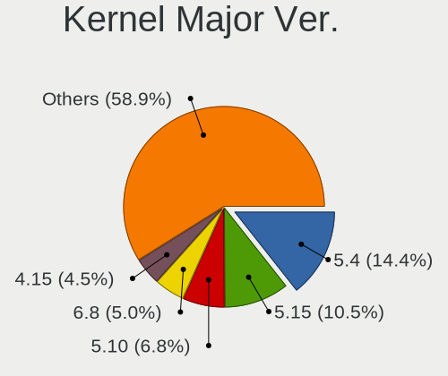

| Version | Computers | Percent |
|---------|-----------|---------|
| 5.4     | 384       | 24.11%  |
| 5.10    | 126       | 7.91%   |
| 5.15    | 123       | 7.72%   |
| 5.8     | 119       | 7.47%   |
| 4.15    | 118       | 7.41%   |
| 5.3     | 98        | 6.15%   |
| 5.11    | 97        | 6.09%   |
| 5.13    | 92        | 5.78%   |
| 4.18    | 76        | 4.77%   |
| 5.16    | 67        | 4.21%   |
| 5.0     | 59        | 3.7%    |
| 5.18    | 35        | 2.2%    |
| 5.19    | 27        | 1.69%   |
| 4.19    | 27        | 1.69%   |
| 5.17    | 23        | 1.44%   |
| 5.9     | 18        | 1.13%   |
| 4.9     | 17        | 1.07%   |
| 5.6     | 16        | 1%      |
| 5.14    | 16        | 1%      |
| 5.7     | 12        | 0.75%   |
| 5.12    | 12        | 0.75%   |
| 4.4     | 7         | 0.44%   |
| 5.5     | 6         | 0.38%   |
| 6.0     | 4         | 0.25%   |
| 4.1     | 3         | 0.19%   |
| 4.20    | 2         | 0.13%   |
| 4.13    | 2         | 0.13%   |
| 3.10    | 2         | 0.13%   |
| 5.2     | 1         | 0.06%   |
| 5.1     | 1         | 0.06%   |
| 4.17    | 1         | 0.06%   |
| 4.10    | 1         | 0.06%   |
| 3.16    | 1         | 0.06%   |

Arch
----

OS architecture (x86_64, i586, etc.)

| Name    | Computers | Percent |
|---------|-----------|---------|
| x86_64  | 1396      | 94.07%  |
| i686    | 85        | 5.73%   |
| aarch64 | 2         | 0.13%   |
| armv7l  | 1         | 0.07%   |

DE
--

Desktop Environment

| Name             | Computers | Percent |
|------------------|-----------|---------|
| GNOME            | 633       | 41.13%  |
| KDE5             | 226       | 14.68%  |
| Unknown          | 201       | 13.06%  |
| XFCE             | 141       | 9.16%   |
| X-Cinnamon       | 94        | 6.11%   |
| MATE             | 60        | 3.9%    |
| KDE              | 41        | 2.66%   |
| Pantheon         | 18        | 1.17%   |
| LXQt             | 17        | 1.1%    |
| KDE4             | 14        | 0.91%   |
| Cinnamon         | 14        | 0.91%   |
| LXDE             | 13        | 0.84%   |
| Budgie           | 13        | 0.84%   |
| Unity            | 11        | 0.71%   |
| i3               | 11        | 0.71%   |
| Deepin           | 8         | 0.52%   |
| qtile            | 3         | 0.19%   |
| GNOME Flashback  | 3         | 0.19%   |
| xmonad           | 2         | 0.13%   |
| lightdm-xsession | 2         | 0.13%   |
| i3-with-shmlog   | 2         | 0.13%   |
| Cutefish         | 2         | 0.13%   |
| bspwm            | 2         | 0.13%   |
| UKUI             | 1         | 0.06%   |
| trinity          | 1         | 0.06%   |
| sway             | 1         | 0.06%   |
| openbox          | 1         | 0.06%   |
| icewm            | 1         | 0.06%   |
| Enlightenment    | 1         | 0.06%   |
| DWM              | 1         | 0.06%   |
| awesome          | 1         | 0.06%   |

Display Server
--------------

X11 or Wayland

| Name    | Computers | Percent |
|---------|-----------|---------|
| X11     | 1225      | 81.02%  |
| Wayland | 161       | 10.65%  |
| Unknown | 111       | 7.34%   |
| Tty     | 15        | 0.99%   |

Display Manager
---------------

SDDM, LightDM, etc.

| Name    | Computers | Percent |
|---------|-----------|---------|
| Unknown | 882       | 57.87%  |
| SDDM    | 219       | 14.37%  |
| GDM     | 148       | 9.71%   |
| LightDM | 108       | 7.09%   |
| GDM3    | 95        | 6.23%   |
| TDM     | 49        | 3.22%   |
| KDM     | 14        | 0.92%   |
| SLiM    | 3         | 0.2%    |
| LXDM    | 3         | 0.2%    |
| XDM     | 2         | 0.13%   |
| GREETD  | 1         | 0.07%   |

OS Lang
-------

Language

| Lang        | Computers | Percent |
|-------------|-----------|---------|
| es_AR       | 825       | 54.46%  |
| en_US       | 324       | 21.39%  |
| Unknown     | 206       | 13.6%   |
| es_ES       | 86        | 5.68%   |
| es_MX       | 25        | 1.65%   |
| C           | 22        | 1.45%   |
| en_GB       | 10        | 0.66%   |
| pt_BR       | 4         | 0.26%   |
| es_CL       | 2         | 0.13%   |
| ru_RU       | 1         | 0.07%   |
| POSIX       | 1         | 0.07%   |
| fr_FR       | 1         | 0.07%   |
| es_UY       | 1         | 0.07%   |
| es_US       | 1         | 0.07%   |
| es_AR.UtF-8 | 1         | 0.07%   |
| en_UTF-8    | 1         | 0.07%   |
| en_US.UTF8  | 1         | 0.07%   |
| en_CA       | 1         | 0.07%   |
| en_AG       | 1         | 0.07%   |
| C.UTF8      | 1         | 0.07%   |

Boot Mode
---------

EFI or BIOS

| Mode | Computers | Percent |
|------|-----------|---------|
| BIOS | 893       | 59.1%   |
| EFI  | 618       | 40.9%   |

Filesystem
----------

Type of filesystem

| Type    | Computers | Percent |
|---------|-----------|---------|
| Ext4    | 1212      | 80.26%  |
| Overlay | 138       | 9.14%   |
| Btrfs   | 78        | 5.17%   |
| Unknown | 52        | 3.44%   |
| Xfs     | 16        | 1.06%   |
| Ext2    | 5         | 0.33%   |
| Zfs     | 3         | 0.2%    |
| Ext3    | 3         | 0.2%    |
| Tmpfs   | 1         | 0.07%   |
| F2fs    | 1         | 0.07%   |
| Aufs    | 1         | 0.07%   |

Part. scheme
------------

Scheme of partitioning

| Type    | Computers | Percent |
|---------|-----------|---------|
| Unknown | 938       | 62.41%  |
| GPT     | 387       | 25.75%  |
| MBR     | 178       | 11.84%  |

Dual Boot with Linux/BSD
------------------------

Hosting more than one Linux/BSD

| Dual boot | Computers | Percent |
|-----------|-----------|---------|
| No        | 1286      | 85.45%  |
| Yes       | 219       | 14.55%  |

Dual Boot (Win)
---------------

Hosting Linux and Windows

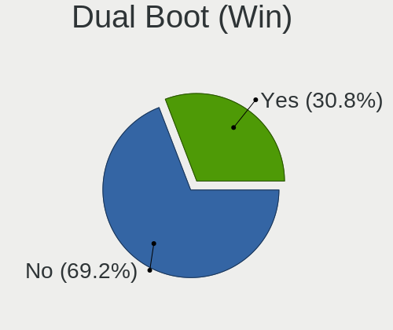

| Dual boot | Computers | Percent |
|-----------|-----------|---------|
| No        | 1010      | 67.11%  |
| Yes       | 495       | 32.89%  |

Board
-----

Vendor
------

Motherboard manufacturer

| Name                    | Computers | Percent |
|-------------------------|-----------|---------|
| ASUSTek Computer        | 283       | 19.07%  |
| Gigabyte Technology     | 185       | 12.47%  |
| Lenovo                  | 184       | 12.4%   |
| Hewlett-Packard         | 131       | 8.83%   |
| Dell                    | 114       | 7.68%   |
| MSI                     | 96        | 6.47%   |
| ASRock                  | 81        | 5.46%   |
| Intel                   | 44        | 2.96%   |
| Acer                    | 41        | 2.76%   |
| BANGHO                  | 39        | 2.63%   |
| Toshiba                 | 30        | 2.02%   |
| Exo                     | 26        | 1.75%   |
| Samsung Electronics     | 24        | 1.62%   |
| Positivo                | 21        | 1.42%   |
| Sony                    | 16        | 1.08%   |
| ECS                     | 14        | 0.94%   |
| Apple                   | 14        | 0.94%   |
| Biostar                 | 11        | 0.74%   |
| Unknown                 | 9         | 0.61%   |
| Compal                  | 8         | 0.54%   |
| AMI                     | 7         | 0.47%   |
| Clevo                   | 6         | 0.4%    |
| Standard                | 5         | 0.34%   |
| Quanta                  | 5         | 0.34%   |
| NOBLEX                  | 5         | 0.34%   |
| Foxconn                 | 5         | 0.34%   |
| Advantec                | 5         | 0.34%   |
| System76                | 4         | 0.27%   |
| NSX                     | 4         | 0.27%   |
| HUAWEI                  | 4         | 0.27%   |
| Coradir                 | 4         | 0.27%   |
| Kanji                   | 3         | 0.2%    |
| A-DATA Technology       | 3         | 0.2%    |
| Raspberry Pi Foundation | 2         | 0.13%   |
| Radio Victoria Fueguina | 2         | 0.13%   |
| Pegatron                | 2         | 0.13%   |
| PCChips                 | 2         | 0.13%   |
| PCBOX                   | 2         | 0.13%   |
| Packard Bell            | 2         | 0.13%   |
| Novatech                | 2         | 0.13%   |

Model
-----

Motherboard model

| Name                                   | Computers | Percent |
|----------------------------------------|-----------|---------|
| Unknown                                | 22        | 1.48%   |
| MSI MS-7721                            | 21        | 1.42%   |
| ASUS All Series                        | 15        | 1.01%   |
| ASUS PRIME A320M-K                     | 11        | 0.74%   |
| Gigabyte F2A68HM-H                     | 10        | 0.67%   |
| Lenovo V330-15IKB 81AX                 | 9         | 0.61%   |
| Gigabyte H81M-H                        | 8         | 0.54%   |
| Gigabyte A320M-S2H                     | 8         | 0.54%   |
| BANGHO MOV                             | 8         | 0.54%   |
| ASUS PRIME B450M-A                     | 8         | 0.54%   |
| HP Notebook                            | 7         | 0.47%   |
| HP Laptop 15-bs0xx                     | 7         | 0.47%   |
| BANGHO Suma 1025                       | 7         | 0.47%   |
| ASUS P5KPL-AM SE                       | 7         | 0.47%   |
| MSI MS-7A15                            | 6         | 0.4%    |
| Lenovo ThinkPad L15 Gen 2 20X4S27200   | 6         | 0.4%    |
| Intel powered classmate PC             | 6         | 0.4%    |
| Gigabyte H61M-S1                       | 6         | 0.4%    |
| MSI MS-7C52                            | 5         | 0.34%   |
| HP Pavilion dv6                        | 5         | 0.34%   |
| Gigabyte M68MT-S2                      | 5         | 0.34%   |
| Gigabyte H110M-H                       | 5         | 0.34%   |
| Gigabyte A320M-S2H V2                  | 5         | 0.34%   |
| Exo CloudbookE15                       | 5         | 0.34%   |
| Dell Inspiron 1525                     | 5         | 0.34%   |
| BANGHO MAX G0101                       | 5         | 0.34%   |
| ASUS VivoBook_ASUSLaptop X509JA_X509JA | 5         | 0.34%   |
| ASUS VivoBook 15_ASUS Laptop X540UAR   | 5         | 0.34%   |
| ASUS ROG STRIX B550-F GAMING           | 5         | 0.34%   |
| MSI MS-7309                            | 4         | 0.27%   |
| Lenovo IdeaPad 320-15ABR 80XS          | 4         | 0.27%   |
| Lenovo G470 20078                      | 4         | 0.27%   |
| Intel DN2820FYB H24582-205             | 4         | 0.27%   |
| HP Pavilion Notebook                   | 4         | 0.27%   |
| HP 250 G6 Notebook PC                  | 4         | 0.27%   |
| Gigabyte H510M H                       | 4         | 0.27%   |
| Gigabyte G31M-ES2C                     | 4         | 0.27%   |
| Gigabyte F2A55M-HD2                    | 4         | 0.27%   |
| Gigabyte B365M DS3H                    | 4         | 0.27%   |
| ECS H81H3-M4                           | 4         | 0.27%   |

Model Family
------------

Motherboard model prefix

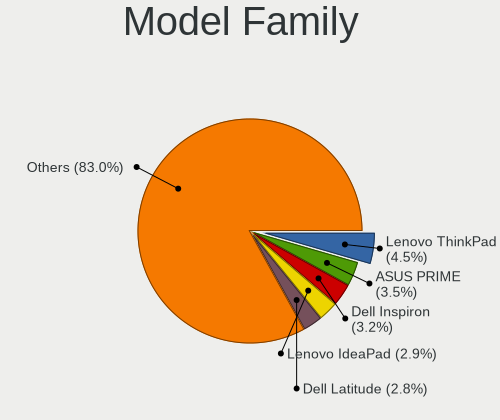

| Name               | Computers | Percent |
|--------------------|-----------|---------|
| Lenovo ThinkPad    | 65        | 4.38%   |
| Dell Inspiron      | 61        | 4.11%   |
| ASUS PRIME         | 41        | 2.76%   |
| HP Pavilion        | 37        | 2.49%   |
| Acer Aspire        | 35        | 2.36%   |
| Lenovo IdeaPad     | 34        | 2.29%   |
| Dell Latitude      | 34        | 2.29%   |
| ASUS VivoBook      | 28        | 1.89%   |
| Unknown            | 22        | 1.48%   |
| MSI MS-7721        | 21        | 1.42%   |
| HP Laptop          | 20        | 1.35%   |
| Toshiba Satellite  | 18        | 1.21%   |
| ASUS All           | 15        | 1.01%   |
| HP Compaq          | 14        | 0.94%   |
| Gigabyte A320M-S2H | 13        | 0.88%   |
| ASUS ROG           | 12        | 0.81%   |
| Gigabyte F2A68HM-H | 10        | 0.67%   |
| Lenovo V330-15IKB  | 9         | 0.61%   |
| HP 250             | 9         | 0.61%   |
| BANGHO MAX         | 9         | 0.61%   |
| ASUS M5A78L-M      | 9         | 0.61%   |
| Gigabyte H81M-H    | 8         | 0.54%   |
| Gigabyte B450      | 8         | 0.54%   |
| BANGHO Suma        | 8         | 0.54%   |
| BANGHO MOV         | 8         | 0.54%   |
| Lenovo ThinkCentre | 7         | 0.47%   |
| Lenovo ThinkBook   | 7         | 0.47%   |
| HP Notebook        | 7         | 0.47%   |
| Exo Smart          | 7         | 0.47%   |
| Dell OptiPlex      | 7         | 0.47%   |
| ASUS TUF           | 7         | 0.47%   |
| ASUS P5KPL-AM      | 7         | 0.47%   |
| Samsung 300E4A     | 6         | 0.4%    |
| MSI MS-7A15        | 6         | 0.4%    |
| Intel powered      | 6         | 0.4%    |
| HP ProBook         | 6         | 0.4%    |
| HP EliteBook       | 6         | 0.4%    |
| Gigabyte H61M-S1   | 6         | 0.4%    |
| ASUS M5A97         | 6         | 0.4%    |
| MSI MS-7C52        | 5         | 0.34%   |

MFG Year
--------

Motherboard manufacture year

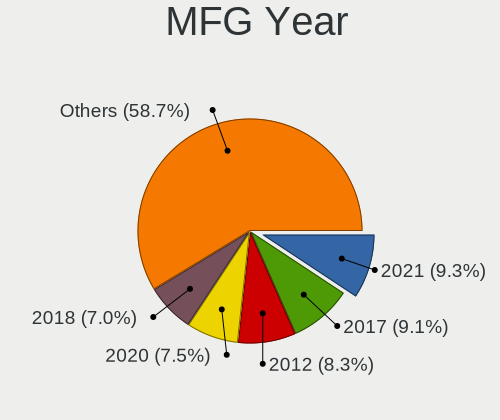

| Year    | Computers | Percent |
|---------|-----------|---------|
| 2017    | 145       | 9.77%   |
| 2012    | 137       | 9.23%   |
| 2018    | 115       | 7.75%   |
| 2011    | 114       | 7.68%   |
| 2020    | 106       | 7.14%   |
| 2015    | 104       | 7.01%   |
| 2014    | 98        | 6.6%    |
| 2013    | 98        | 6.6%    |
| 2019    | 95        | 6.4%    |
| 2010    | 92        | 6.2%    |
| 2016    | 79        | 5.32%   |
| 2008    | 73        | 4.92%   |
| 2021    | 64        | 4.31%   |
| 2009    | 59        | 3.98%   |
| 2007    | 51        | 3.44%   |
| 2006    | 32        | 2.16%   |
| Unknown | 9         | 0.61%   |
| 2022    | 5         | 0.34%   |
| 2004    | 4         | 0.27%   |
| 2005    | 3         | 0.2%    |
| 2001    | 1         | 0.07%   |

Form Factor
-----------

Physical design of the computer

| Name           | Computers | Percent |
|----------------|-----------|---------|
| Notebook       | 789       | 53.17%  |
| Desktop        | 639       | 43.06%  |
| Convertible    | 18        | 1.21%   |
| Tablet         | 15        | 1.01%   |
| Mini pc        | 12        | 0.81%   |
| All in one     | 6         | 0.4%    |
| System on chip | 3         | 0.2%    |
| Other          | 1         | 0.07%   |
| Server         | 1         | 0.07%   |

Secure Boot
-----------

Enabled or disabled

| State    | Computers | Percent |
|----------|-----------|---------|
| Disabled | 1397      | 93.76%  |
| Enabled  | 93        | 6.24%   |

Coreboot
--------

Have coreboot on board

| Used | Computers | Percent |
|------|-----------|---------|
| No   | 1482      | 99.87%  |
| Yes  | 2         | 0.13%   |

RAM Size
--------

Total RAM memory

| Size in GB  | Computers | Percent |
|-------------|-----------|---------|
| 3.01-4.0    | 378       | 25.22%  |
| 4.01-8.0    | 348       | 23.22%  |
| 8.01-16.0   | 283       | 18.88%  |
| 16.01-24.0  | 194       | 12.94%  |
| 1.01-2.0    | 140       | 9.34%   |
| 32.01-64.0  | 71        | 4.74%   |
| 2.01-3.0    | 38        | 2.54%   |
| 0.51-1.0    | 24        | 1.6%    |
| 24.01-32.0  | 15        | 1%      |
| 64.01-256.0 | 7         | 0.47%   |
| 0.01-0.5    | 1         | 0.07%   |

RAM Used
--------

Used RAM memory

| Used GB    | Computers | Percent |
|------------|-----------|---------|
| 1.01-2.0   | 622       | 38.61%  |
| 2.01-3.0   | 363       | 22.53%  |
| 4.01-8.0   | 185       | 11.48%  |
| 3.01-4.0   | 184       | 11.42%  |
| 0.51-1.0   | 167       | 10.37%  |
| 8.01-16.0  | 57        | 3.54%   |
| 0.01-0.5   | 26        | 1.61%   |
| 16.01-24.0 | 7         | 0.43%   |

Total Drives
------------

Number of drives on board

| Drives | Computers | Percent |
|--------|-----------|---------|
| 1      | 950       | 62.54%  |
| 2      | 383       | 25.21%  |
| 3      | 116       | 7.64%   |
| 4      | 43        | 2.83%   |
| 5      | 12        | 0.79%   |
| 0      | 10        | 0.66%   |
| 6      | 3         | 0.2%    |
| 7      | 2         | 0.13%   |

Has CD-ROM
----------

Has CD-ROM on board

| Presented | Computers | Percent |
|-----------|-----------|---------|
| No        | 913       | 61.07%  |
| Yes       | 582       | 38.93%  |

Has Ethernet
------------

Has Ethernet on board

| Presented | Computers | Percent |
|-----------|-----------|---------|
| Yes       | 1332      | 89.7%   |
| No        | 153       | 10.3%   |

Has WiFi
--------

Has WiFi module

| Presented | Computers | Percent |
|-----------|-----------|---------|
| Yes       | 1093      | 73.01%  |
| No        | 404       | 26.99%  |

Has Bluetooth
-------------

Has Bluetooth module

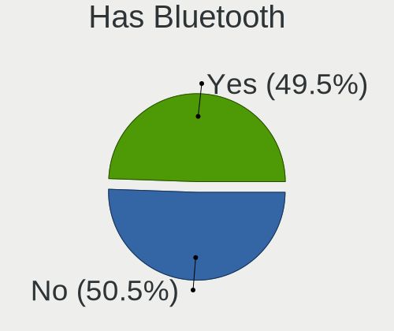

| Presented | Computers | Percent |
|-----------|-----------|---------|
| No        | 825       | 55.18%  |
| Yes       | 670       | 44.82%  |

Location
--------

Country
-------

Geographic location (country)

| Country   | Computers | Percent |
|-----------|-----------|---------|
| Argentina | 1484      | 100%    |

City
----

Geographic location (city)

| City                        | Computers | Percent |
|-----------------------------|-----------|---------|
| Buenos Aires                | 370       | 23.86%  |
| Crdoba                    | 100       | 6.45%   |
| Rosario                     | 64        | 4.13%   |
| Mar del Plata               | 41        | 2.64%   |
| La Plata                    | 41        | 2.64%   |
| San Miguel de Tucumn      | 19        | 1.23%   |
| Lanus                       | 19        | 1.23%   |
| Lomas de Zamora             | 18        | 1.16%   |
| Avellaneda                  | 18        | 1.16%   |
| Corrientes                  | 17        | 1.1%    |
| Mendoza                     | 16        | 1.03%   |
| Ramos Mejia                 | 15        | 0.97%   |
| Florencio Varela            | 15        | 0.97%   |
| Villa Ballester             | 13        | 0.84%   |
| Tandil                      | 13        | 0.84%   |
| Santa Fe                    | 13        | 0.84%   |
| Quilmes                     | 13        | 0.84%   |
| Paran                     | 13        | 0.84%   |
| Baha Blanca               | 13        | 0.84%   |
| Resistencia                 | 12        | 0.77%   |
| Salta                       | 11        | 0.71%   |
| Neuqun                    | 11        | 0.71%   |
| San Telmo                   | 10        | 0.64%   |
| San Juan                    | 10        | 0.64%   |
| Posadas                     | 10        | 0.64%   |
| Olivos                      | 10        | 0.64%   |
| Ituzaingo                   | 10        | 0.64%   |
| Caseros                     | 10        | 0.64%   |
| Villa Nueva                 | 9         | 0.58%   |
| Viedma                      | 9         | 0.58%   |
| San Martn de los Andes    | 9         | 0.58%   |
| Bariloche                   | 9         | 0.58%   |
| Yerba Buena                 | 8         | 0.52%   |
| San Nicols de los Arroyos | 8         | 0.52%   |
| San Luis                    | 7         | 0.45%   |
| San Isidro                  | 7         | 0.45%   |
| San Francisco               | 7         | 0.45%   |
| Martinez                    | 7         | 0.45%   |
| General San Martin          | 7         | 0.45%   |
| Burzaco                     | 7         | 0.45%   |

Drives
------

Drive Vendor
------------

Hard drive vendors

| Vendor                  | Computers | Drives | Percent |
|-------------------------|-----------|--------|---------|
| WDC                     | 568       | 839    | 28.26%  |
| Seagate                 | 283       | 351    | 14.08%  |
| Kingston                | 258       | 328    | 12.84%  |
| Samsung Electronics     | 174       | 241    | 8.66%   |
| Toshiba                 | 173       | 216    | 8.61%   |
| Hitachi                 | 75        | 81     | 3.73%   |
| Unknown                 | 56        | 73     | 2.79%   |
| SanDisk                 | 49        | 64     | 2.44%   |
| HGST                    | 47        | 51     | 2.34%   |
| A-DATA Technology       | 40        | 43     | 1.99%   |
| SK hynix                | 32        | 34     | 1.59%   |
| Gigabyte Technology     | 30        | 45     | 1.49%   |
| Crucial                 | 28        | 39     | 1.39%   |
| Intel                   | 17        | 35     | 0.85%   |
| Hewlett-Packard         | 16        | 21     | 0.8%    |
| Maxtor                  | 13        | 14     | 0.65%   |
| Corsair                 | 11        | 11     | 0.55%   |
| Micron Technology       | 10        | 12     | 0.5%    |
| PNY                     | 9         | 18     | 0.45%   |
| Realtek Semiconductor   | 8         | 10     | 0.4%    |
| XPG                     | 7         | 7      | 0.35%   |
| Patriot                 | 6         | 8      | 0.3%    |
| KIOXIA                  | 6         | 6      | 0.3%    |
| Colorful                | 6         | 6      | 0.3%    |
| China                   | 6         | 6      | 0.3%    |
| Silicon Motion          | 5         | 6      | 0.25%   |
| Phison                  | 5         | 6      | 0.25%   |
| ADATA Technology        | 5         | 6      | 0.25%   |
| Unknown                 | 5         | 5      | 0.25%   |
| Lexar                   | 4         | 5      | 0.2%    |
| Union Memory            | 3         | 3      | 0.15%   |
| OCZ                     | 3         | 3      | 0.15%   |
| Hikvision               | 3         | 3      | 0.15%   |
| Fujitsu                 | 3         | 3      | 0.15%   |
| Apple                   | 3         | 3      | 0.15%   |
| Union Memory (Shenzhen) | 2         | 2      | 0.1%    |
| SPCC                    | 2         | 2      | 0.1%    |
| Phison Electronics      | 2         | 2      | 0.1%    |
| Netac                   | 2         | 3      | 0.1%    |
| Neo                     | 2         | 2      | 0.1%    |

Drive Model
-----------

Hard drive models

| Model                              | Computers | Percent |
|------------------------------------|-----------|---------|
| Kingston SA400S37240G 240GB SSD    | 83        | 3.74%   |
| Kingston SA400S37480G 480GB SSD    | 46        | 2.07%   |
| Seagate ST1000LM035-1RK172 1TB     | 38        | 1.71%   |
| WDC WDS240G2G0A-00JH30 240GB SSD   | 32        | 1.44%   |
| WDC WD10EZEX-08WN4A0 1TB           | 31        | 1.4%    |
| Toshiba MQ01ABD100 1TB             | 27        | 1.22%   |
| Seagate ST1000LM024 HN-M101MBB 1TB | 26        | 1.17%   |
| Kingston SA400S37120G 120GB SSD    | 26        | 1.17%   |
| Toshiba MQ01ABF050 500GB           | 25        | 1.13%   |
| Seagate ST500DM002-1BD142 500GB    | 21        | 0.95%   |
| Seagate ST1000DM010-2EP102 1TB     | 20        | 0.9%    |
| WDC WDS120G2G0A-00JH30 120GB SSD   | 18        | 0.81%   |
| WDC WD5000AAKX-001CA0 500GB        | 18        | 0.81%   |
| Unknown MMC Card  32GB             | 17        | 0.77%   |
| Kingston SV300S37A120G 120GB SSD   | 17        | 0.77%   |
| WDC WD20EZRZ-00Z5HB0 2TB           | 16        | 0.72%   |
| WDC WD10EZEX-00BN5A0 1TB           | 16        | 0.72%   |
| Kingston SV300S37A240G 240GB SSD   | 14        | 0.63%   |
| Kingston SUV400S37240G 240GB SSD   | 14        | 0.63%   |
| WDC WDS480G2G0A-00JH30 480GB SSD   | 13        | 0.59%   |
| Toshiba DT01ACA100 1TB             | 13        | 0.59%   |
| WDC WD5000AAKX-00ERMA0 500GB       | 12        | 0.54%   |
| Toshiba MQ04ABF100 1TB             | 12        | 0.54%   |
| Toshiba MQ01ABD032 320GB           | 12        | 0.54%   |
| WDC WDS240G2G0B-00EPW0 240GB SSD   | 11        | 0.5%    |
| WDC WD1600AABS-00PRA0 160GB        | 11        | 0.5%    |
| Seagate ST500LT012-1DG142 500GB    | 11        | 0.5%    |
| Seagate ST500LM030-2E717D 500GB    | 11        | 0.5%    |
| Gigabyte GP-GSTFS31120GNTD 120GB   | 11        | 0.5%    |
| A-DATA SU630 240GB SSD             | 11        | 0.5%    |
| Toshiba DT01ACA050 500GB           | 10        | 0.45%   |
| WDC WDS500G2B0A-00SM50 500GB SSD   | 9         | 0.41%   |
| WDC WD10JPVX-60JC3T1 1TB           | 9         | 0.41%   |
| WDC WD10EZEX-21WN4A0 1TB           | 9         | 0.41%   |
| WDC WD1003FZEX-00MK2A0 1TB         | 9         | 0.41%   |
| Samsung HD502HJ 500GB              | 9         | 0.41%   |
| Samsung HD322HJ 320GB              | 9         | 0.41%   |
| HGST HTS721010A9E630 1TB           | 9         | 0.41%   |
| Gigabyte GP-GSTFS31240GNTD 240GB   | 9         | 0.41%   |
| Crucial CT240BX500SSD1 240GB       | 9         | 0.41%   |

HDD Vendor
----------

Hard disk drive vendors

| Vendor              | Computers | Drives | Percent |
|---------------------|-----------|--------|---------|
| WDC                 | 479       | 680    | 41.54%  |
| Seagate             | 278       | 345    | 24.11%  |
| Toshiba             | 159       | 199    | 13.79%  |
| Samsung Electronics | 94        | 125    | 8.15%   |
| Hitachi             | 75        | 81     | 6.5%    |
| HGST                | 47        | 51     | 4.08%   |
| Maxtor              | 10        | 10     | 0.87%   |
| Unknown             | 4         | 4      | 0.35%   |
| Fujitsu             | 3         | 3      | 0.26%   |
| USB3.0              | 1         | 1      | 0.09%   |
| Quantum             | 1         | 1      | 0.09%   |
| ExcelStor           | 1         | 1      | 0.09%   |
| ASMT                | 1         | 2      | 0.09%   |

SSD Vendor
----------

Solid state drive vendors

| Vendor              | Computers | Drives | Percent |
|---------------------|-----------|--------|---------|
| Kingston            | 238       | 303    | 40%     |
| WDC                 | 97        | 119    | 16.3%   |
| Samsung Electronics | 38        | 60     | 6.39%   |
| A-DATA Technology   | 35        | 36     | 5.88%   |
| SanDisk             | 28        | 36     | 4.71%   |
| Gigabyte Technology | 27        | 42     | 4.54%   |
| Crucial             | 27        | 38     | 4.54%   |
| PNY                 | 9         | 18     | 1.51%   |
| Hewlett-Packard     | 9         | 11     | 1.51%   |
| Corsair             | 9         | 9      | 1.51%   |
| SK hynix            | 8         | 9      | 1.34%   |
| Colorful            | 6         | 6      | 1.01%   |
| Toshiba             | 5         | 5      | 0.84%   |
| Patriot             | 5         | 7      | 0.84%   |
| Intel               | 5         | 6      | 0.84%   |
| China               | 5         | 5      | 0.84%   |
| Micron Technology   | 4         | 5      | 0.67%   |
| Lexar               | 4         | 5      | 0.67%   |
| Seagate             | 3         | 4      | 0.5%    |
| OCZ                 | 3         | 3      | 0.5%    |
| Maxtor              | 3         | 4      | 0.5%    |
| Unknown             | 3         | 3      | 0.5%    |
| SPCC                | 2         | 2      | 0.34%   |
| Netac               | 2         | 3      | 0.34%   |
| LITEONIT            | 2         | 2      | 0.34%   |
| Hikvision           | 2         | 2      | 0.34%   |
| FORESEE             | 2         | 2      | 0.34%   |
| Apple               | 2         | 2      | 0.34%   |
| XrayDisk            | 1         | 1      | 0.17%   |
| WDC WDS2            | 1         | 1      | 0.17%   |
| Transcend           | 1         | 1      | 0.17%   |
| tecmiyo             | 1         | 2      | 0.17%   |
| Team                | 1         | 1      | 0.17%   |
| Super Talent        | 1         | 1      | 0.17%   |
| SMI                 | 1         | 1      | 0.17%   |
| NGFF                | 1         | 2      | 0.17%   |
| Neo                 | 1         | 1      | 0.17%   |
| LITEON              | 1         | 1      | 0.17%   |
| KingDian            | 1         | 1      | 0.17%   |
| HS-SSD-C100         | 1         | 2      | 0.17%   |

Drive Kind
----------

HDD or SSD

| Kind    | Computers | Drives | Percent |
|---------|-----------|--------|---------|
| HDD     | 1008      | 1503   | 54.52%  |
| SSD     | 560       | 762    | 30.29%  |
| NVMe    | 214       | 304    | 11.57%  |
| MMC     | 53        | 71     | 2.87%   |
| Unknown | 14        | 12     | 0.76%   |

Drive Connector
---------------

SATA, SAS, NVMe, etc.

| Type | Computers | Drives | Percent |
|------|-----------|--------|---------|
| SATA | 1307      | 2255   | 81.84%  |
| NVMe | 214       | 303    | 13.4%   |
| MMC  | 53        | 71     | 3.32%   |
| SAS  | 23        | 23     | 1.44%   |

Drive Size
----------

Size of hard drive

| Size in TB | Computers | Drives | Percent |
|------------|-----------|--------|---------|
| 0.01-0.5   | 1001      | 1474   | 63.64%  |
| 0.51-1.0   | 462       | 638    | 29.37%  |
| 1.01-2.0   | 77        | 108    | 4.9%    |
| 3.01-4.0   | 11        | 19     | 0.7%    |
| 2.01-3.0   | 11        | 12     | 0.7%    |
| 4.01-10.0  | 11        | 14     | 0.7%    |

Space Total
-----------

Amount of disk space available on the file system

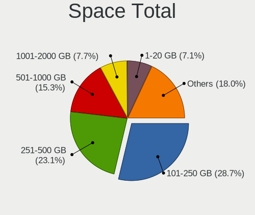

| Size in GB     | Computers | Percent |
|----------------|-----------|---------|
| 101-250        | 457       | 29.2%   |
| 251-500        | 365       | 23.32%  |
| 501-1000       | 244       | 15.59%  |
| 1001-2000      | 120       | 7.67%   |
| 1-20           | 99        | 6.33%   |
| 51-100         | 98        | 6.26%   |
| 21-50          | 80        | 5.11%   |
| Unknown        | 40        | 2.56%   |
| 2001-3000      | 36        | 2.3%    |
| More than 3000 | 26        | 1.66%   |

Space Used
----------

Amount of used disk space

| Used GB        | Computers | Percent |
|----------------|-----------|---------|
| 1-20           | 662       | 41.12%  |
| 21-50          | 267       | 16.58%  |
| 101-250        | 206       | 12.8%   |
| 51-100         | 182       | 11.3%   |
| 251-500        | 122       | 7.58%   |
| 501-1000       | 77        | 4.78%   |
| Unknown        | 40        | 2.48%   |
| 1001-2000      | 37        | 2.3%    |
| 2001-3000      | 9         | 0.56%   |
| More than 3000 | 8         | 0.5%    |

Malfunc. Drives
---------------

Drive models with a malfunction

| Model                              | Computers | Drives | Percent |
|------------------------------------|-----------|--------|---------|
| WDC WD5000AAKX-001CA0 500GB        | 7         | 9      | 3.91%   |
| Seagate ST1000LM035-1RK172 1TB     | 6         | 6      | 3.35%   |
| WDC WDS240G2G0A-00JH30 240GB SSD   | 3         | 3      | 1.68%   |
| WDC WD5000BPVT-22HXZT3 500GB       | 3         | 3      | 1.68%   |
| WDC WD5000AAKX-00ERMA0 500GB       | 3         | 3      | 1.68%   |
| WDC WD10EZEX-08WN4A0 1TB           | 3         | 3      | 1.68%   |
| WDC WD10EZEX-00BN5A0 1TB           | 3         | 3      | 1.68%   |
| WDC WD10EARS-00Y5B1 1TB            | 3         | 3      | 1.68%   |
| Toshiba MQ01ABF050 500GB           | 3         | 3      | 1.68%   |
| Toshiba MQ01ABD100 1TB             | 3         | 6      | 1.68%   |
| Toshiba MK1665GSX 160GB            | 3         | 3      | 1.68%   |
| Seagate ST500DM002-1BD142 500GB    | 3         | 3      | 1.68%   |
| Seagate ST1000LM024 HN-M101MBB 1TB | 3         | 3      | 1.68%   |
| Kingston SA400S37240G 240GB SSD    | 3         | 3      | 1.68%   |
| HGST HTS541010A9E680 1TB           | 3         | 3      | 1.68%   |
| WDC WD5000AAKX-08ERMA0 500GB       | 2         | 2      | 1.12%   |
| WDC WD1002FAEX-00Y9A0 1TB          | 2         | 2      | 1.12%   |
| Seagate ST9500325AS 500GB          | 2         | 2      | 1.12%   |
| Seagate ST500LT012-1DG142 500GB    | 2         | 4      | 1.12%   |
| Seagate ST500LM030-2E717D 500GB    | 2         | 2      | 1.12%   |
| Seagate ST1500DL003-9VT16L 1TB     | 2         | 2      | 1.12%   |
| Seagate ST1000DM003-1CH162 1TB     | 2         | 2      | 1.12%   |
| Samsung Electronics SP0411N 40GB   | 2         | 3      | 1.12%   |
| Samsung Electronics HN-M101MBB 1TB | 2         | 2      | 1.12%   |
| Samsung Electronics HD322HJ 320GB  | 2         | 2      | 1.12%   |
| Kingston SV300S37A120G 120GB SSD   | 2         | 2      | 1.12%   |
| Kingston SUV400S37240G 240GB SSD   | 2         | 2      | 1.12%   |
| HGST HTS721010A9E630 1TB           | 2         | 3      | 1.12%   |
| HGST HTS541075A9E680 752GB         | 2         | 2      | 1.12%   |
| WDC WDS480G2G0A-00JH30 480GB SSD   | 1         | 4      | 0.56%   |
| WDC WDS120G2G0A-00JH30 120GB SSD   | 1         | 1      | 0.56%   |
| WDC WD800JD-00MSA1 80GB            | 1         | 1      | 0.56%   |
| WDC WD800BD-22MRA1 80GB            | 1         | 1      | 0.56%   |
| WDC WD800BB-75JHC0 80GB            | 1         | 1      | 0.56%   |
| WDC WD800BB-00JHC0 80GB            | 1         | 1      | 0.56%   |
| WDC WD6400AAKS-65Z7B0 640GB        | 1         | 1      | 0.56%   |
| WDC WD5000AAVS-00G9B1 500GB        | 1         | 1      | 0.56%   |
| WDC WD5000AAKS-00V1A0 500GB        | 1         | 1      | 0.56%   |
| WDC WD400BB-23DEA0 37GB            | 1         | 1      | 0.56%   |
| WDC WD3200BPVT-00JJ5T0 320GB       | 1         | 1      | 0.56%   |

Malfunc. Drive Vendor
---------------------

Vendors of faulty drives

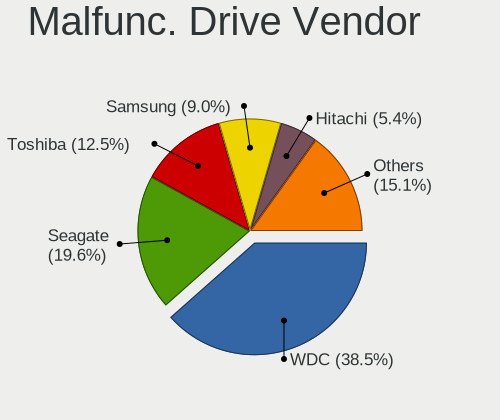

| Vendor              | Computers | Drives | Percent |
|---------------------|-----------|--------|---------|
| WDC                 | 64        | 80     | 37.87%  |
| Seagate             | 37        | 40     | 21.89%  |
| Toshiba             | 20        | 23     | 11.83%  |
| Samsung Electronics | 15        | 17     | 8.88%   |
| HGST                | 10        | 11     | 5.92%   |
| Kingston            | 8         | 8      | 4.73%   |
| Hitachi             | 8         | 8      | 4.73%   |
| Maxtor              | 2         | 2      | 1.18%   |
| A-DATA Technology   | 2         | 2      | 1.18%   |
| tecmiyo             | 1         | 2      | 0.59%   |
| SMI                 | 1         | 1      | 0.59%   |
| Quantum             | 1         | 1      | 0.59%   |

Malfunc. HDD Vendor
-------------------

Vendors of faulty HDD drives

| Vendor              | Computers | Drives | Percent |
|---------------------|-----------|--------|---------|
| WDC                 | 59        | 72     | 39.33%  |
| Seagate             | 37        | 40     | 24.67%  |
| Toshiba             | 20        | 23     | 13.33%  |
| Samsung Electronics | 13        | 15     | 8.67%   |
| HGST                | 10        | 11     | 6.67%   |
| Hitachi             | 8         | 8      | 5.33%   |
| Maxtor              | 2         | 2      | 1.33%   |
| Quantum             | 1         | 1      | 0.67%   |

Malfunc. Drive Kind
-------------------

Kinds of faulty drives

| Kind | Computers | Drives | Percent |
|------|-----------|--------|---------|
| HDD  | 141       | 172    | 88.13%  |
| SSD  | 19        | 23     | 11.88%  |

Failed Drives
-------------

Failed drive models

| Model                             | Computers | Drives | Percent |
|-----------------------------------|-----------|--------|---------|
| WDC WD5000BEVT-22ZAT0 500GB       | 2         | 2      | 28.57%  |
| WDC WD1600BEVT-80A23T0 160GB      | 1         | 1      | 14.29%  |
| Toshiba MK6475GSX 640GB           | 1         | 1      | 14.29%  |
| Toshiba MK1665GSX 160GB           | 1         | 1      | 14.29%  |
| Samsung Electronics HD502HJ 500GB | 1         | 1      | 14.29%  |
| Samsung Electronics HD103SJ 1TB   | 1         | 1      | 14.29%  |

Failed Drive Vendor
-------------------

Failed drive vendors

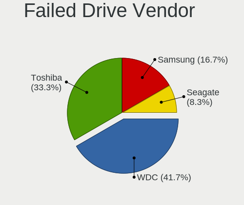

| Vendor              | Computers | Drives | Percent |
|---------------------|-----------|--------|---------|
| WDC                 | 3         | 3      | 42.86%  |
| Toshiba             | 2         | 2      | 28.57%  |
| Samsung Electronics | 2         | 2      | 28.57%  |

Drive Status
------------

Number of failed and malfunc. drives

| Status   | Computers | Drives | Percent |
|----------|-----------|--------|---------|
| Detected | 960       | 1692   | 60.8%   |
| Works    | 455       | 758    | 28.82%  |
| Malfunc  | 157       | 195    | 9.94%   |
| Failed   | 7         | 7      | 0.44%   |

Storage controller
------------------

Storage Vendor
--------------

Storage controller vendors

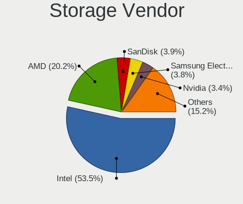

| Vendor                           | Computers | Percent |
|----------------------------------|-----------|---------|
| Intel                            | 947       | 57.43%  |
| AMD                              | 338       | 20.5%   |
| Nvidia                           | 68        | 4.12%   |
| Samsung Electronics              | 47        | 2.85%   |
| SanDisk                          | 46        | 2.79%   |
| VIA Technologies                 | 26        | 1.58%   |
| SK hynix                         | 24        | 1.46%   |
| Kingston Technology Company      | 24        | 1.46%   |
| Silicon Integrated Systems [SiS] | 15        | 0.91%   |
| Realtek Semiconductor            | 15        | 0.91%   |
| Phison Electronics               | 12        | 0.73%   |
| JMicron Technology               | 12        | 0.73%   |
| Silicon Motion                   | 11        | 0.67%   |
| ASMedia Technology               | 10        | 0.61%   |
| Toshiba America Info Systems     | 9         | 0.55%   |
| KIOXIA                           | 9         | 0.55%   |
| ADATA Technology                 | 8         | 0.49%   |
| Marvell Technology Group         | 7         | 0.42%   |
| Micron Technology                | 5         | 0.3%    |
| Union Memory (Shenzhen)          | 4         | 0.24%   |
| Micron/Crucial Technology        | 3         | 0.18%   |
| MAXIO Technology (Hangzhou)      | 2         | 0.12%   |
| Silicon Image                    | 1         | 0.06%   |
| Promise Technology               | 1         | 0.06%   |
| Lite-On Technology               | 1         | 0.06%   |
| Broadcom / LSI                   | 1         | 0.06%   |
| Biwin Storage Technology         | 1         | 0.06%   |
| Apple                            | 1         | 0.06%   |
| Adaptec                          | 1         | 0.06%   |

Storage Model
-------------

Storage controller models

| Model                                                                                   | Computers | Percent |
|-----------------------------------------------------------------------------------------|-----------|---------|
| AMD FCH SATA Controller [AHCI mode]                                                     | 216       | 10.54%  |
| Intel Sunrise Point-LP SATA Controller [AHCI mode]                                      | 108       | 5.27%   |
| Intel 7 Series Chipset Family 6-port SATA Controller [AHCI mode]                        | 83        | 4.05%   |
| Nvidia MCP61 SATA Controller                                                            | 58        | 2.83%   |
| Intel 8 Series/C220 Series Chipset Family 6-port SATA Controller 1 [AHCI mode]          | 56        | 2.73%   |
| Intel NM10/ICH7 Family SATA Controller [IDE mode]                                       | 54        | 2.63%   |
| Nvidia MCP61 IDE                                                                        | 51        | 2.49%   |
| Intel 82801G (ICH7 Family) IDE Controller                                               | 47        | 2.29%   |
| Intel 6 Series/C200 Series Chipset Family 6 port Mobile SATA AHCI Controller            | 47        | 2.29%   |
| Intel 82801 Mobile SATA Controller [RAID mode]                                          | 44        | 2.15%   |
| AMD SB7x0/SB8x0/SB9x0 IDE Controller                                                    | 44        | 2.15%   |
| Intel Q170/Q150/B150/H170/H110/Z170/CM236 Chipset SATA Controller [AHCI Mode]           | 42        | 2.05%   |
| AMD FCH SATA Controller D                                                               | 41        | 2%      |
| Intel Atom Processor E3800 Series SATA AHCI Controller                                  | 39        | 1.9%    |
| AMD SB7x0/SB8x0/SB9x0 SATA Controller [IDE mode]                                        | 35        | 1.71%   |
| AMD SB7x0/SB8x0/SB9x0 SATA Controller [AHCI mode]                                       | 34        | 1.66%   |
| AMD 400 Series Chipset SATA Controller                                                  | 30        | 1.46%   |
| Intel 82801IBM/IEM (ICH9M/ICH9M-E) 4 port SATA Controller [AHCI mode]                   | 28        | 1.37%   |
| Intel Wildcat Point-LP SATA Controller [AHCI Mode]                                      | 27        | 1.32%   |
| Intel 200 Series PCH SATA controller [AHCI mode]                                        | 27        | 1.32%   |
| Samsung NVMe SSD Controller SM981/PM981/PM983                                           | 26        | 1.27%   |
| Intel 8 Series SATA Controller 1 [AHCI mode]                                            | 25        | 1.22%   |
| Intel NM10/ICH7 Family SATA Controller [AHCI mode]                                      | 24        | 1.17%   |
| AMD FCH IDE Controller                                                                  | 24        | 1.17%   |
| AMD FCH SATA Controller [IDE mode]                                                      | 23        | 1.12%   |
| Intel 6 Series/C200 Series Chipset Family 6 port Desktop SATA AHCI Controller           | 21        | 1.02%   |
| Intel 5 Series/3400 Series Chipset 4 port SATA AHCI Controller                          | 21        | 1.02%   |
| Intel Celeron/Pentium Silver Processor SATA Controller                                  | 19        | 0.93%   |
| Intel 82801HM/HEM (ICH8M/ICH8M-E) IDE Controller                                        | 19        | 0.93%   |
| Intel 82801HM/HEM (ICH8M/ICH8M-E) SATA Controller [AHCI mode]                           | 18        | 0.88%   |
| Intel 6 Series/C200 Series Chipset Family Desktop SATA Controller (IDE mode, ports 4-5) | 18        | 0.88%   |
| Intel 6 Series/C200 Series Chipset Family Desktop SATA Controller (IDE mode, ports 0-3) | 18        | 0.88%   |
| Intel Celeron N3350/Pentium N4200/Atom E3900 Series SATA AHCI Controller                | 17        | 0.83%   |
| Samsung NVMe SSD Controller 980                                                         | 16        | 0.78%   |
| AMD 500 Series Chipset SATA Controller                                                  | 16        | 0.78%   |
| VIA VT82C586A/B/VT82C686/A/B/VT823x/A/C PIPC Bus Master IDE                             | 15        | 0.73%   |
| Silicon Integrated Systems [SiS] 5513 IDE Controller                                    | 15        | 0.73%   |
| SanDisk WD Blue SN550 NVMe SSD                                                          | 15        | 0.73%   |
| Intel HM170/QM170 Chipset SATA Controller [AHCI Mode]                                   | 14        | 0.68%   |
| Intel Comet Lake SATA AHCI Controller                                                   | 14        | 0.68%   |

Storage Kind
------------

Kind of storage controller (IDE, SATA, NVMe, SAS, ...)

| Kind | Computers | Percent |
|------|-----------|---------|
| SATA | 1085      | 63.23%  |
| IDE  | 346       | 20.16%  |
| NVMe | 216       | 12.59%  |
| RAID | 68        | 3.96%   |
| SCSI | 1         | 0.06%   |

Processor
---------

CPU Vendor
----------

Processor vendors

| Vendor | Computers | Percent |
|--------|-----------|---------|
| Intel  | 1045      | 70.42%  |
| AMD    | 436       | 29.38%  |
| ARM    | 3         | 0.2%    |

CPU Model
---------

Processor models

| Model                                         | Computers | Percent |
|-----------------------------------------------|-----------|---------|
| Intel Core i5-7200U CPU @ 2.50GHz             | 22        | 1.48%   |
| Intel 11th Gen Core i7-1165G7 @ 2.80GHz       | 18        | 1.21%   |
| Intel Core i7-7500U CPU @ 2.70GHz             | 15        | 1.01%   |
| Intel Core i7-6500U CPU @ 2.50GHz             | 15        | 1.01%   |
| Intel Core i5-8250U CPU @ 1.60GHz             | 15        | 1.01%   |
| Intel Celeron CPU N3350 @ 1.10GHz             | 15        | 1.01%   |
| Intel Core i7-8550U CPU @ 1.80GHz             | 14        | 0.94%   |
| Intel Core i5-3210M CPU @ 2.50GHz             | 14        | 0.94%   |
| Intel Atom x5-Z8350 CPU @ 1.44GHz             | 14        | 0.94%   |
| Intel Core i5-6200U CPU @ 2.30GHz             | 13        | 0.88%   |
| Intel Celeron N4000 CPU @ 1.10GHz             | 13        | 0.88%   |
| AMD Ryzen 5 3400G with Radeon Vega Graphics   | 13        | 0.88%   |
| Intel Core i5-1035G1 CPU @ 1.00GHz            | 12        | 0.81%   |
| Intel Core i7-5500U CPU @ 2.40GHz             | 10        | 0.67%   |
| Intel Core i5-5200U CPU @ 2.20GHz             | 10        | 0.67%   |
| Intel Core i5-3320M CPU @ 2.60GHz             | 10        | 0.67%   |
| Intel Core i3-7100U CPU @ 2.40GHz             | 10        | 0.67%   |
| Intel Atom CPU N2600 @ 1.60GHz                | 10        | 0.67%   |
| Intel Core i5-8265U CPU @ 1.60GHz             | 9         | 0.61%   |
| Intel Core i5-7400 CPU @ 3.00GHz              | 9         | 0.61%   |
| Intel Core i5-4460 CPU @ 3.20GHz              | 9         | 0.61%   |
| Intel Core i5-4440 CPU @ 3.10GHz              | 9         | 0.61%   |
| AMD Ryzen 3 3200G with Radeon Vega Graphics   | 9         | 0.61%   |
| AMD A8-9600 RADEON R7, 10 COMPUTE CORES 4C+6G | 9         | 0.61%   |
| Intel Pentium Dual-Core CPU T4200 @ 2.00GHz   | 8         | 0.54%   |
| Intel Pentium Dual CPU E2180 @ 2.00GHz        | 8         | 0.54%   |
| Intel Core i7-8565U CPU @ 1.80GHz             | 8         | 0.54%   |
| Intel Core i7-10510U CPU @ 1.80GHz            | 8         | 0.54%   |
| Intel Core i5-10210U CPU @ 1.60GHz            | 8         | 0.54%   |
| Intel Core i3-2330M CPU @ 2.20GHz             | 8         | 0.54%   |
| Intel Core i3-2310M CPU @ 2.10GHz             | 8         | 0.54%   |
| Intel Atom CPU N455 @ 1.66GHz                 | 8         | 0.54%   |
| AMD Ryzen 5 2600 Six-Core Processor           | 8         | 0.54%   |
| AMD Ryzen 5 2500U with Radeon Vega Mobile Gfx | 8         | 0.54%   |
| AMD Athlon II X2 250 Processor                | 8         | 0.54%   |
| Intel Pentium CPU N3540 @ 2.16GHz             | 7         | 0.47%   |
| Intel Core i7-3770 CPU @ 3.40GHz              | 7         | 0.47%   |
| Intel Core i5-8400 CPU @ 2.80GHz              | 7         | 0.47%   |
| Intel Core i5-3230M CPU @ 2.60GHz             | 7         | 0.47%   |
| Intel Core i5-2450M CPU @ 2.50GHz             | 7         | 0.47%   |

CPU Model Family
----------------

Processor model prefix

| Model                   | Computers | Percent |
|-------------------------|-----------|---------|
| Intel Core i5           | 297       | 20.01%  |
| Intel Core i7           | 198       | 13.34%  |
| Intel Core i3           | 147       | 9.91%   |
| Intel Celeron           | 114       | 7.68%   |
| AMD Ryzen 5             | 78        | 5.26%   |
| Intel Atom              | 52        | 3.5%    |
| Other                   | 49        | 3.3%    |
| Intel Pentium           | 43        | 2.9%    |
| Intel Core 2 Duo        | 41        | 2.76%   |
| AMD Ryzen 7             | 41        | 2.76%   |
| Intel Pentium Dual-Core | 35        | 2.36%   |
| AMD A8                  | 35        | 2.36%   |
| AMD FX                  | 29        | 1.95%   |
| AMD A6                  | 27        | 1.82%   |
| Intel Pentium Dual      | 25        | 1.68%   |
| AMD Ryzen 3             | 23        | 1.55%   |
| AMD Athlon 64 X2        | 21        | 1.42%   |
| AMD Athlon II X2        | 20        | 1.35%   |
| AMD A4                  | 20        | 1.35%   |
| AMD A10                 | 18        | 1.21%   |
| AMD Sempron             | 17        | 1.15%   |
| AMD Phenom II X4        | 11        | 0.74%   |
| AMD Athlon              | 11        | 0.74%   |
| Intel Core 2            | 10        | 0.67%   |
| Intel Pentium D         | 9         | 0.61%   |
| Intel Genuine           | 9         | 0.61%   |
| Intel Pentium 4         | 8         | 0.54%   |
| AMD Ryzen 9             | 8         | 0.54%   |
| AMD Phenom II X6        | 8         | 0.54%   |
| AMD Athlon II X4        | 7         | 0.47%   |
| AMD A12                 | 6         | 0.4%    |
| AMD E1                  | 5         | 0.34%   |
| AMD Athlon II X3        | 5         | 0.34%   |
| AMD Athlon II           | 5         | 0.34%   |
| Intel Xeon              | 4         | 0.27%   |
| Intel Core 2 Quad       | 4         | 0.27%   |
| AMD Phenom              | 4         | 0.27%   |
| Intel Pentium Gold      | 3         | 0.2%    |
| Intel Core i9           | 3         | 0.2%    |
| AMD Phenom II X2        | 3         | 0.2%    |

CPU Cores
---------

Number of processor cores

| Number  | Computers | Percent |
|---------|-----------|---------|
| 2       | 765       | 51.55%  |
| 4       | 441       | 29.72%  |
| 1       | 104       | 7.01%   |
| 6       | 91        | 6.13%   |
| 8       | 56        | 3.77%   |
| 3       | 16        | 1.08%   |
| 12      | 4         | 0.27%   |
| Unknown | 3         | 0.2%    |
| 16      | 2         | 0.13%   |
| 10      | 2         | 0.13%   |

CPU Sockets
-----------

Number of sockets

| Number  | Computers | Percent |
|---------|-----------|---------|
| 1       | 1481      | 99.8%   |
| 2       | 2         | 0.13%   |
| Unknown | 1         | 0.07%   |

CPU Threads
-----------

Threads per core (Hyper-Threading)

| Number  | Computers | Percent |
|---------|-----------|---------|
| 2       | 862       | 58.05%  |
| 1       | 620       | 41.75%  |
| Unknown | 3         | 0.2%    |

CPU Op-Modes
------------

CPU Operation Modes (32-bit, 64-bit)

| Op mode        | Computers | Percent |
|----------------|-----------|---------|
| 32-bit, 64-bit | 1433      | 96.24%  |
| Unknown        | 31        | 2.08%   |
| 32-bit         | 18        | 1.21%   |
| 64-bit         | 7         | 0.47%   |

CPU Microcode
-------------

Microcode number

| Number     | Computers | Percent |
|------------|-----------|---------|
| Unknown    | 283       | 18.45%  |
| 0x306a9    | 93        | 6.06%   |
| 0x206a7    | 91        | 5.93%   |
| 0x306c3    | 59        | 3.85%   |
| 0x1067a    | 54        | 3.52%   |
| 0x806e9    | 42        | 2.74%   |
| 0x6fd      | 36        | 2.35%   |
| 0x806ec    | 34        | 2.22%   |
| 0x906e9    | 31        | 2.02%   |
| 0x406e3    | 31        | 2.02%   |
| 0x08108109 | 31        | 2.02%   |
| 0x010000c8 | 31        | 2.02%   |
| 0x306d4    | 28        | 1.83%   |
| 0x30678    | 27        | 1.76%   |
| 0x906ea    | 26        | 1.69%   |
| 0x806ea    | 25        | 1.63%   |
| 0x506e3    | 24        | 1.56%   |
| 0x20655    | 23        | 1.5%    |
| 0x06001119 | 23        | 1.5%    |
| 0x806c1    | 22        | 1.43%   |
| 0x40651    | 22        | 1.43%   |
| 0x406c4    | 21        | 1.37%   |
| 0x06003106 | 19        | 1.24%   |
| 0x106ca    | 18        | 1.17%   |
| 0x706e5    | 17        | 1.11%   |
| 0x506c9    | 15        | 0.98%   |
| 0x706a1    | 13        | 0.85%   |
| 0x0800820d | 13        | 0.85%   |
| 0x0600611a | 13        | 0.85%   |
| 0x06000852 | 13        | 0.85%   |
| 0x08701021 | 12        | 0.78%   |
| 0x06006118 | 12        | 0.78%   |
| 0x30661    | 10        | 0.65%   |
| 0x20652    | 10        | 0.65%   |
| 0x10676    | 10        | 0.65%   |
| 0x0a50000c | 10        | 0.65%   |
| 0x08101016 | 10        | 0.65%   |
| 0x06006705 | 10        | 0.65%   |
| 0x0600063e | 10        | 0.65%   |
| 0x406c3    | 9         | 0.59%   |

CPU Microarch
-------------

Microarchitecture

| Name             | Computers | Percent |
|------------------|-----------|---------|
| KabyLake         | 208       | 14.02%  |
| IvyBridge        | 106       | 7.14%   |
| SandyBridge      | 102       | 6.87%   |
| Haswell          | 95        | 6.4%    |
| K10              | 79        | 5.32%   |
| Silvermont       | 74        | 4.99%   |
| Penryn           | 73        | 4.92%   |
| Skylake          | 68        | 4.58%   |
| Core             | 59        | 3.98%   |
| Zen+             | 58        | 3.91%   |
| Piledriver       | 46        | 3.1%    |
| Excavator        | 41        | 2.76%   |
| Zen 2            | 37        | 2.49%   |
| Westmere         | 34        | 2.29%   |
| K8 Hammer        | 34        | 2.29%   |
| Bonnell          | 32        | 2.16%   |
| Zen              | 31        | 2.09%   |
| TigerLake        | 30        | 2.02%   |
| Broadwell        | 30        | 2.02%   |
| Steamroller      | 27        | 1.82%   |
| Zen 3            | 26        | 1.75%   |
| IceLake          | 25        | 1.68%   |
| CometLake        | 25        | 1.68%   |
| Goldmont plus    | 23        | 1.55%   |
| NetBurst         | 20        | 1.35%   |
| Goldmont         | 17        | 1.15%   |
| Unknown          | 13        | 0.88%   |
| P6               | 11        | 0.74%   |
| K10 Llano        | 11        | 0.74%   |
| Bulldozer        | 11        | 0.74%   |
| Jaguar           | 9         | 0.61%   |
| Nehalem          | 8         | 0.54%   |
| Bobcat           | 8         | 0.54%   |
| Puma             | 7         | 0.47%   |
| K8 & K10 hybrid  | 2         | 0.13%   |
| K6               | 2         | 0.13%   |
| Alderlake Hybrid | 2         | 0.13%   |

Graphics
--------

GPU Vendor
----------

Vendors of graphics cards

| Vendor                           | Computers | Percent |
|----------------------------------|-----------|---------|
| Intel                            | 886       | 54.32%  |
| AMD                              | 411       | 25.2%   |
| Nvidia                           | 309       | 18.95%  |
| Silicon Integrated Systems [SiS] | 12        | 0.74%   |
| VIA Technologies                 | 11        | 0.67%   |
| ATI Technologies                 | 2         | 0.12%   |

GPU Model
---------

Graphics card models

| Model                                                                                    | Computers | Percent |
|------------------------------------------------------------------------------------------|-----------|---------|
| Intel 2nd Generation Core Processor Family Integrated Graphics Controller                | 91        | 5.39%   |
| Intel 3rd Gen Core processor Graphics Controller                                         | 68        | 4.03%   |
| Intel HD Graphics 620                                                                    | 50        | 2.96%   |
| Intel Atom Processor Z36xxx/Z37xxx Series Graphics & Display                             | 40        | 2.37%   |
| Intel Skylake GT2 [HD Graphics 520]                                                      | 39        | 2.31%   |
| AMD Picasso/Raven 2 [Radeon Vega Series / Radeon Vega Mobile Series]                     | 39        | 2.31%   |
| Intel Atom/Celeron/Pentium Processor x5-E8000/J3xxx/N3xxx Integrated Graphics Controller | 34        | 2.01%   |
| Intel UHD Graphics 620                                                                   | 33        | 1.95%   |
| Intel Mobile 4 Series Chipset Integrated Graphics Controller                             | 31        | 1.84%   |
| Intel Core Processor Integrated Graphics Controller                                      | 31        | 1.84%   |
| Intel Xeon E3-1200 v3/4th Gen Core Processor Integrated Graphics Controller              | 30        | 1.78%   |
| Intel HD Graphics 5500                                                                   | 28        | 1.66%   |
| Intel TigerLake-LP GT2 [Iris Xe Graphics]                                                | 27        | 1.6%    |
| Intel Haswell-ULT Integrated Graphics Controller                                         | 27        | 1.6%    |
| Intel WhiskeyLake-U GT2 [UHD Graphics 620]                                               | 24        | 1.42%   |
| Intel HD Graphics 630                                                                    | 24        | 1.42%   |
| AMD Wani [Radeon R5/R6/R7 Graphics]                                                      | 24        | 1.42%   |
| Intel GeminiLake [UHD Graphics 600]                                                      | 23        | 1.36%   |
| AMD Raven Ridge [Radeon Vega Series / Radeon Vega Mobile Series]                         | 23        | 1.36%   |
| AMD Ellesmere [Radeon RX 470/480/570/570X/580/580X/590]                                  | 21        | 1.24%   |
| Intel CometLake-U GT2 [UHD Graphics]                                                     | 20        | 1.18%   |
| Intel Mobile GM965/GL960 Integrated Graphics Controller (secondary)                      | 19        | 1.12%   |
| Intel Mobile GM965/GL960 Integrated Graphics Controller (primary)                        | 19        | 1.12%   |
| Intel Iris Plus Graphics G1 (Ice Lake)                                                   | 19        | 1.12%   |
| Intel Atom Processor D4xx/D5xx/N4xx/N5xx Integrated Graphics Controller                  | 19        | 1.12%   |
| AMD Kaveri [Radeon R7 Graphics]                                                          | 18        | 1.07%   |
| Nvidia C61 [GeForce 7025 / nForce 630a]                                                  | 17        | 1.01%   |
| Intel HD Graphics 500                                                                    | 17        | 1.01%   |
| AMD Renoir                                                                               | 17        | 1.01%   |
| Intel HD Graphics 530                                                                    | 16        | 0.95%   |
| AMD Cedar [Radeon HD 5000/6000/7350/8350 Series]                                         | 16        | 0.95%   |
| Nvidia GT218 [GeForce 210]                                                               | 15        | 0.89%   |
| Intel Xeon E3-1200 v2/3rd Gen Core processor Graphics Controller                         | 15        | 0.89%   |
| Intel CoffeeLake-S GT2 [UHD Graphics 630]                                                | 15        | 0.89%   |
| Nvidia GP107 [GeForce GTX 1050 Ti]                                                       | 14        | 0.83%   |
| Intel Mobile 945GM/GMS/GME, 943/940GML Express Integrated Graphics Controller            | 14        | 0.83%   |
| Intel 4 Series Chipset Integrated Graphics Controller                                    | 14        | 0.83%   |
| Intel 82G33/G31 Express Integrated Graphics Controller                                   | 13        | 0.77%   |
| AMD Stoney [Radeon R2/R3/R4/R5 Graphics]                                                 | 13        | 0.77%   |
| Nvidia GK208B [GeForce GT 710]                                                           | 12        | 0.71%   |

GPU Combo
---------

Combinations of graphics cards

| Name           | Computers | Percent |
|----------------|-----------|---------|
| 1 x Intel      | 757       | 50.87%  |
| 1 x AMD        | 346       | 23.25%  |
| 1 x Nvidia     | 199       | 13.37%  |
| Intel + Nvidia | 89        | 5.98%   |
| Intel + AMD    | 34        | 2.28%   |
| 2 x AMD        | 19        | 1.28%   |
| AMD + Nvidia   | 16        | 1.08%   |
| 1 x SiS        | 12        | 0.81%   |
| 1 x VIA        | 11        | 0.74%   |
| Other          | 3         | 0.2%    |
| 2 x Nvidia     | 2         | 0.13%   |

GPU Driver
----------

Free vs proprietary

| Driver      | Computers | Percent |
|-------------|-----------|---------|
| Free        | 1278      | 85.54%  |
| Proprietary | 134       | 8.97%   |
| Unknown     | 82        | 5.49%   |

GPU Memory
----------

Total video memory

| Size in GB | Computers | Percent |
|------------|-----------|---------|
| Unknown    | 870       | 57.2%   |
| 0.01-0.5   | 204       | 13.41%  |
| 1.01-2.0   | 178       | 11.7%   |
| 0.51-1.0   | 127       | 8.35%   |
| 3.01-4.0   | 84        | 5.52%   |
| 7.01-8.0   | 28        | 1.84%   |
| 5.01-6.0   | 17        | 1.12%   |
| 2.01-3.0   | 7         | 0.46%   |
| 8.01-16.0  | 6         | 0.39%   |

Monitor
-------

Monitor Vendor
--------------

Monitor vendors

| Vendor                  | Computers | Percent |
|-------------------------|-----------|---------|
| Samsung Electronics     | 386       | 24.78%  |
| Goldstar                | 188       | 12.07%  |
| AU Optronics            | 168       | 10.78%  |
| Chimei Innolux          | 127       | 8.15%   |
| BOE                     | 124       | 7.96%   |
| LG Display              | 112       | 7.19%   |
| InfoVision              | 38        | 2.44%   |
| Dell                    | 31        | 1.99%   |
| ViewSonic               | 30        | 1.93%   |
| BenQ                    | 23        | 1.48%   |
| Philips                 | 21        | 1.35%   |
| Hitachi                 | 20        | 1.28%   |
| LG Electronics          | 18        | 1.16%   |
| SKY                     | 17        | 1.09%   |
| Lenovo                  | 17        | 1.09%   |
| Hewlett-Packard         | 15        | 0.96%   |
| Chi Mei Optoelectronics | 14        | 0.9%    |
| Apple                   | 14        | 0.9%    |
| LG Philips              | 11        | 0.71%   |
| InnoLux Display         | 10        | 0.64%   |
| AOC                     | 10        | 0.64%   |
| Unknown                 | 9         | 0.58%   |
| SAC                     | 9         | 0.58%   |
| PANDA                   | 8         | 0.51%   |
| HannStar                | 8         | 0.51%   |
| Sony                    | 7         | 0.45%   |
| CPT                     | 7         | 0.45%   |
| ASUSTek Computer        | 7         | 0.45%   |
| STA                     | 6         | 0.39%   |
| Sharp                   | 6         | 0.39%   |
| MStar                   | 5         | 0.32%   |
| HKC                     | 5         | 0.32%   |
| KDC                     | 4         | 0.26%   |
| GDH                     | 4         | 0.26%   |
| CDR                     | 4         | 0.26%   |
| Acer                    | 4         | 0.26%   |
| UTV                     | 3         | 0.19%   |
| Unknown (XXX)           | 3         | 0.19%   |
| RTK                     | 3         | 0.19%   |
| KTC                     | 3         | 0.19%   |

Monitor Model
-------------

Monitor models

| Model                                                                | Computers | Percent |
|----------------------------------------------------------------------|-----------|---------|
| Chimei Innolux LCD Monitor CMN15DB 1366x768 344x193mm 15.5-inch      | 19        | 1.18%   |
| Goldstar FULL HD GSM5B55 1920x1080 480x270mm 21.7-inch               | 18        | 1.12%   |
| InfoVision LCD Monitor IVO03F4 1920x1080 309x173mm 13.9-inch         | 16        | 0.99%   |
| Samsung Electronics C24F390 SAM0D2C 1920x1080 520x290mm 23.4-inch    | 14        | 0.87%   |
| Goldstar W1943 GSM4BAD 1360x768 406x229mm 18.4-inch                  | 14        | 0.87%   |
| Chimei Innolux LCD Monitor CMN15E6 1366x768 344x193mm 15.5-inch      | 14        | 0.87%   |
| Samsung Electronics S22D300 SAM0B3F 1920x1080 477x268mm 21.5-inch    | 13        | 0.81%   |
| Hitachi HDMI HEC0088 1920x540                                        | 12        | 0.75%   |
| Goldstar W2243 GSM56FE 1920x1080 477x268mm 21.5-inch                 | 11        | 0.68%   |
| SKY SKYWORTH SKY0001 1920x1080 885x498mm 40.0-inch                   | 10        | 0.62%   |
| Samsung Electronics S22F350 SAM0D1A 1920x1080 480x270mm 21.7-inch    | 10        | 0.62%   |
| Samsung Electronics LCD Monitor SEC5441 1366x768 344x194mm 15.5-inch | 10        | 0.62%   |
| AU Optronics LCD Monitor AUO71EC 1366x768 344x193mm 15.5-inch        | 10        | 0.62%   |
| AU Optronics LCD Monitor AUO2E3C 1366x768 309x173mm 13.9-inch        | 10        | 0.62%   |
| BOE LCD Monitor BOE06A5 1366x768 344x194mm 15.5-inch                 | 9         | 0.56%   |
| Samsung Electronics SMB1930N SAM0632 1366x768 410x230mm 18.5-inch    | 8         | 0.5%    |
| LG Display LCD Monitor LGD02E9 1366x768 309x174mm 14.0-inch          | 8         | 0.5%    |
| InfoVision LCD Monitor IVO03FA 1366x768 223x125mm 10.1-inch          | 8         | 0.5%    |
| Goldstar IPS FULLHD GSM5AB8 1920x1080 480x270mm 21.7-inch            | 8         | 0.5%    |
| Goldstar 23EA53 GSM59A9 1920x1080 510x290mm 23.1-inch                | 8         | 0.5%    |
| Samsung Electronics SA300/SA350 SAM0788 1366x768 410x230mm 18.5-inch | 7         | 0.44%   |
| Samsung Electronics S24F350 SAM0D20 1920x1080 521x293mm 23.5-inch    | 7         | 0.44%   |
| Samsung Electronics LCD Monitor SEC4542 1366x768 309x174mm 14.0-inch | 7         | 0.44%   |
| Samsung Electronics C27F390 SAM0D32 1920x1080 598x336mm 27.0-inch    | 7         | 0.44%   |
| Chimei Innolux LCD Monitor CMN14C3 1366x768 309x173mm 13.9-inch      | 7         | 0.44%   |
| BOE LCD Monitor BOE06A4 1366x768 344x194mm 15.5-inch                 | 7         | 0.44%   |
| Samsung Electronics S19D300 SAM0B35 1366x768 410x230mm 18.5-inch     | 6         | 0.37%   |
| Samsung Electronics LCD Monitor SyncMaster 1680x1050                 | 6         | 0.37%   |
| Samsung Electronics LCD Monitor SEC4145 1366x768 310x170mm 13.9-inch | 6         | 0.37%   |
| Philips PHL 223V5 PHLC0CF 1920x1080 477x268mm 21.5-inch              | 6         | 0.37%   |
| InfoVision M140NWR2 R1 IVO057A 1366x768 309x174mm 14.0-inch          | 6         | 0.37%   |
| Chimei Innolux LCD Monitor CMN15F5 1920x1080 344x193mm 15.5-inch     | 6         | 0.37%   |
| BOE LCD Monitor BOE0672 1366x768 344x194mm 15.5-inch                 | 6         | 0.37%   |
| AU Optronics LCD Monitor AUO70EC 1366x768 344x193mm 15.5-inch        | 6         | 0.37%   |
| Samsung Electronics SMT24A550 SAM07B5 1920x1080 531x299mm 24.0-inch  | 5         | 0.31%   |
| Samsung Electronics SMB2030N SAM0634 1600x900 443x249mm 20.0-inch    | 5         | 0.31%   |
| Samsung Electronics S22D300 SAM0B3E 1920x1080 477x268mm 21.5-inch    | 5         | 0.31%   |
| Samsung Electronics C24F390 SAM0D2D 1920x1080 521x293mm 23.5-inch    | 5         | 0.31%   |
| SAC LED MONITOR SAC952D 1920x1080 480x270mm 21.7-inch                | 5         | 0.31%   |
| MStar Demo MST0030 1920x1080 708x398mm 32.0-inch                     | 5         | 0.31%   |

Monitor Resolution
------------------

Monitor screen resolution

| Resolution         | Computers | Percent |
|--------------------|-----------|---------|
| 1366x768 (WXGA)    | 531       | 35.14%  |
| 1920x1080 (FHD)    | 528       | 34.94%  |
| 3840x2160 (4K)     | 54        | 3.57%   |
| 1280x1024 (SXGA)   | 54        | 3.57%   |
| 1600x900 (HD+)     | 45        | 2.98%   |
| 1280x800 (WXGA)    | 45        | 2.98%   |
| 1680x1050 (WSXGA+) | 43        | 2.85%   |
| 1360x768           | 43        | 2.85%   |
| 1440x900 (WXGA+)   | 42        | 2.78%   |
| 1920x1200 (WUXGA)  | 22        | 1.46%   |
| 1920x540           | 15        | 0.99%   |
| 1024x600           | 10        | 0.66%   |
| 2560x1440 (QHD)    | 9         | 0.6%    |
| Unknown            | 9         | 0.6%    |
| 2560x1080          | 7         | 0.46%   |
| 1280x720 (HD)      | 7         | 0.46%   |
| 1024x768 (XGA)     | 6         | 0.4%    |
| 3200x1800 (QHD+)   | 5         | 0.33%   |
| 1152x864           | 4         | 0.26%   |
| 3840x1080          | 3         | 0.2%    |
| 2288x1287          | 3         | 0.2%    |
| 3840x2400          | 2         | 0.13%   |
| 3456x2160          | 2         | 0.13%   |
| 3440x1440          | 2         | 0.13%   |
| 2560x1600          | 2         | 0.13%   |
| 2048x1152          | 2         | 0.13%   |
| 1280x960           | 2         | 0.13%   |
| 3840x1100          | 1         | 0.07%   |
| 3286x1080          | 1         | 0.07%   |
| 3280x1080          | 1         | 0.07%   |
| 3046x1050          | 1         | 0.07%   |
| 3000x2000          | 1         | 0.07%   |
| 2880x1800          | 1         | 0.07%   |
| 2736x1824          | 1         | 0.07%   |
| 2646x1024          | 1         | 0.07%   |
| 2160x1440          | 1         | 0.07%   |
| 2048x1536          | 1         | 0.07%   |
| 1792x1344          | 1         | 0.07%   |
| 1680x945           | 1         | 0.07%   |
| 1600x1200          | 1         | 0.07%   |

Monitor Diagonal
----------------

Diagonal size in inches

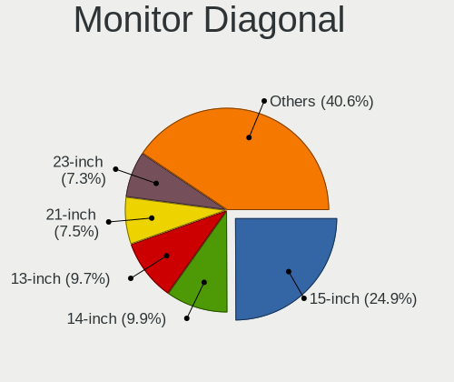

| Inches  | Computers | Percent |
|---------|-----------|---------|
| 15      | 418       | 26.46%  |
| 14      | 159       | 10.06%  |
| 13      | 144       | 9.11%   |
| 23      | 132       | 8.35%   |
| 21      | 131       | 8.29%   |
| 18      | 100       | 6.33%   |
| 17      | 54        | 3.42%   |
| Unknown | 53        | 3.35%   |
| 24      | 46        | 2.91%   |
| 19      | 44        | 2.78%   |
| 27      | 42        | 2.66%   |
| 20      | 37        | 2.34%   |
| 40      | 26        | 1.65%   |
| 10      | 25        | 1.58%   |
| 22      | 20        | 1.27%   |
| 48      | 15        | 0.95%   |
| 31      | 15        | 0.95%   |
| 16      | 15        | 0.95%   |
| 84      | 14        | 0.89%   |
| 52      | 14        | 0.89%   |
| 12      | 14        | 0.89%   |
| 46      | 12        | 0.76%   |
| 11      | 12        | 0.76%   |
| 34      | 7         | 0.44%   |
| 32      | 7         | 0.44%   |
| 54      | 5         | 0.32%   |
| 142     | 3         | 0.19%   |
| 39      | 3         | 0.19%   |
| 26      | 3         | 0.19%   |
| 72      | 2         | 0.13%   |
| 47      | 2         | 0.13%   |
| 25      | 2         | 0.13%   |
| 64      | 1         | 0.06%   |
| 43      | 1         | 0.06%   |
| 41      | 1         | 0.06%   |
| 30      | 1         | 0.06%   |

Monitor Width
-------------

Physical width

| Width in mm    | Computers | Percent |
|----------------|-----------|---------|
| 301-350        | 699       | 44.92%  |
| 401-500        | 317       | 20.37%  |
| 501-600        | 209       | 13.43%  |
| 201-300        | 86        | 5.53%   |
| 351-400        | 58        | 3.73%   |
| Unknown        | 53        | 3.41%   |
| 1001-1500      | 49        | 3.15%   |
| 801-900        | 29        | 1.86%   |
| 601-700        | 21        | 1.35%   |
| 1501-2000      | 16        | 1.03%   |
| 701-800        | 14        | 0.9%    |
| More than 2000 | 3         | 0.19%   |
| 901-1000       | 2         | 0.13%   |

Aspect Ratio
------------

Proportional relationship between the width and the height

| Ratio   | Computers | Percent |
|---------|-----------|---------|
| 16/9    | 1128      | 79.77%  |
| 16/10   | 137       | 9.69%   |
| Unknown | 46        | 3.25%   |
| 5/4     | 36        | 2.55%   |
| 4/3     | 33        | 2.33%   |
| 1.96    | 12        | 0.85%   |
| 3/2     | 8         | 0.57%   |
| 21/9    | 8         | 0.57%   |
| 1.00    | 3         | 0.21%   |
| 32/9    | 2         | 0.14%   |
| 3.40    | 1         | 0.07%   |

Monitor Area
------------

Area in inch

| Area in inch | Computers | Percent |
|----------------|-----------|---------|
| 101-110        | 400       | 25.59%  |
| 201-250        | 293       | 18.75%  |
| 81-90          | 277       | 17.72%  |
| 141-150        | 121       | 7.74%   |
| 151-200        | 104       | 6.65%   |
| 501-1000       | 57        | 3.65%   |
| Unknown        | 53        | 3.39%   |
| 301-350        | 45        | 2.88%   |
| More than 1000 | 40        | 2.56%   |
| 351-500        | 29        | 1.86%   |
| 71-80          | 28        | 1.79%   |
| 121-130        | 28        | 1.79%   |
| 41-50          | 25        | 1.6%    |
| 111-120        | 24        | 1.54%   |
| 51-60          | 13        | 0.83%   |
| 61-70          | 10        | 0.64%   |
| 251-300        | 7         | 0.45%   |
| 131-140        | 5         | 0.32%   |
| 91-100         | 4         | 0.26%   |

Pixel Density
-------------

Pixels per inch

| Density       | Computers | Percent |
|---------------|-----------|---------|
| 101-120       | 616       | 40.21%  |
| 51-100        | 519       | 33.88%  |
| 121-160       | 228       | 14.88%  |
| 1-50          | 79        | 5.16%   |
| Unknown       | 53        | 3.46%   |
| 161-240       | 23        | 1.5%    |
| More than 240 | 14        | 0.91%   |

Multiple Monitors
-----------------

Total monitors connected

| Total | Computers | Percent |
|-------|-----------|---------|
| 1     | 1224      | 80.58%  |
| 2     | 219       | 14.42%  |
| 0     | 66        | 4.34%   |
| 3     | 10        | 0.66%   |

Network
-------

Net Controller Vendor
---------------------

Controller vendors

| Vendor                                 | Computers | Percent |
|----------------------------------------|-----------|---------|
| Realtek Semiconductor                  | 979       | 44.66%  |
| Intel                                  | 444       | 20.26%  |
| Qualcomm Atheros                       | 280       | 12.77%  |
| Broadcom                               | 74        | 3.38%   |
| Nvidia                                 | 59        | 2.69%   |
| TP-Link                                | 55        | 2.51%   |
| Ralink Technology                      | 38        | 1.73%   |
| Broadcom Limited                       | 30        | 1.37%   |
| Qualcomm Atheros Communications        | 27        | 1.23%   |
| Marvell Technology Group               | 27        | 1.23%   |
| Ralink                                 | 21        | 0.96%   |
| JMicron Technology                     | 20        | 0.91%   |
| VIA Technologies                       | 17        | 0.78%   |
| Samsung Electronics                    | 16        | 0.73%   |
| Silicon Integrated Systems [SiS]       | 15        | 0.68%   |
| Motorola PCS                           | 12        | 0.55%   |
| Microsoft                              | 9         | 0.41%   |
| MediaTek                               | 9         | 0.41%   |
| NetGear                                | 4         | 0.18%   |
| D-Link System                          | 4         | 0.18%   |
| ASIX Electronics                       | 4         | 0.18%   |
| Ericsson Business Mobile Networks      | 3         | 0.14%   |
| DisplayLink                            | 3         | 0.14%   |
| 802.11g Adapter [Linksys WUSB54GC v3]  | 3         | 0.14%   |
| 3Com                                   | 3         | 0.14%   |
| ZTE WCDMA Technologies MSM             | 2         | 0.09%   |
| Xiaomi                                 | 2         | 0.09%   |
| T & A Mobile Phones                    | 2         | 0.09%   |
| Standard Microsystems                  | 2         | 0.09%   |
| Ovislink                               | 2         | 0.09%   |
| Linksys                                | 2         | 0.09%   |
| Encore Electronics                     | 2         | 0.09%   |
| Davicom Semiconductor                  | 2         | 0.09%   |
| D-Link                                 | 2         | 0.09%   |
| Arduino SA                             | 2         | 0.09%   |
| Unknown                                | 1         | 0.05%   |
| Sundance Technology Inc / IC Plus      | 1         | 0.05%   |
| Sony Ericsson Mobile Communications AB | 1         | 0.05%   |
| Smart Link                             | 1         | 0.05%   |
| Sierra Wireless                        | 1         | 0.05%   |

Net Controller Model
--------------------

Controller models

| Model                                                             | Computers | Percent |
|-------------------------------------------------------------------|-----------|---------|
| Realtek RTL8111/8168/8411 PCI Express Gigabit Ethernet Controller | 668       | 25.85%  |
| Realtek RTL810xE PCI Express Fast Ethernet controller             | 157       | 6.08%   |
| Nvidia MCP61 Ethernet                                             | 53        | 2.05%   |
| Qualcomm Atheros AR9485 Wireless Network Adapter                  | 52        | 2.01%   |
| Realtek RTL8723BE PCIe Wireless Network Adapter                   | 44        | 1.7%    |
| Realtek RTL8188CE 802.11b/g/n WiFi Adapter                        | 37        | 1.43%   |
| Qualcomm Atheros QCA9377 802.11ac Wireless Network Adapter        | 36        | 1.39%   |
| Qualcomm Atheros AR9285 Wireless Network Adapter (PCI-Express)    | 36        | 1.39%   |
| Realtek RTL8821CE 802.11ac PCIe Wireless Network Adapter          | 31        | 1.2%    |
| Intel Wireless 3160                                               | 30        | 1.16%   |
| Qualcomm Atheros QCA9565 / AR9565 Wireless Network Adapter        | 28        | 1.08%   |
| Realtek RTL8188EUS 802.11n Wireless Network Adapter               | 27        | 1.04%   |
| Intel Wi-Fi 6 AX200                                               | 26        | 1.01%   |
| Qualcomm Atheros AR9271 802.11n                                   | 25        | 0.97%   |
| Intel Wireless 3165                                               | 24        | 0.93%   |
| Realtek RTL8822CE 802.11ac PCIe Wireless Network Adapter          | 23        | 0.89%   |
| Realtek RTL8723DE Wireless Network Adapter                        | 23        | 0.89%   |
| Realtek RTL-8100/8101L/8139 PCI Fast Ethernet Adapter             | 23        | 0.89%   |
| Qualcomm Atheros AR8152 v2.0 Fast Ethernet                        | 22        | 0.85%   |
| Intel Ethernet Connection (2) I219-V                              | 22        | 0.85%   |
| Realtek RTL8188EE Wireless Network Adapter                        | 21        | 0.81%   |
| Intel Wi-Fi 6 AX201                                               | 21        | 0.81%   |
| Ralink MT7601U Wireless Adapter                                   | 20        | 0.77%   |
| Qualcomm Atheros AR8151 v2.0 Gigabit Ethernet                     | 20        | 0.77%   |
| Intel Wireless 8265 / 8275                                        | 19        | 0.74%   |
| JMicron JMC250 PCI Express Gigabit Ethernet Controller            | 18        | 0.7%    |
| Intel Wireless 7260                                               | 18        | 0.7%    |
| Intel Dual Band Wireless-AC 3168NGW [Stone Peak]                  | 18        | 0.7%    |
| Intel Dual Band Wireless-AC 3165 Plus Bluetooth                   | 17        | 0.66%   |
| Intel Comet Lake PCH-LP CNVi WiFi                                 | 17        | 0.66%   |
| Intel I211 Gigabit Network Connection                             | 16        | 0.62%   |
| Broadcom BCM4313 802.11bgn Wireless Network Adapter               | 16        | 0.62%   |
| Intel Wireless 7265                                               | 15        | 0.58%   |
| Intel PRO/Wireless 3945ABG [Golan] Network Connection             | 15        | 0.58%   |
| Intel Cannon Point-LP CNVi [Wireless-AC]                          | 15        | 0.58%   |
| Intel 82579LM Gigabit Network Connection (Lewisville)             | 15        | 0.58%   |
| VIA VT6102/VT6103 [Rhine-II]                                      | 14        | 0.54%   |
| TP-Link TL-WN722N v2/v3 [Realtek RTL8188EUS]                      | 14        | 0.54%   |
| Samsung Galaxy series, misc. (tethering mode)                     | 13        | 0.5%    |
| Realtek RTL8191SEvB Wireless LAN Controller                       | 13        | 0.5%    |

Wireless Vendor
---------------

Wireless vendors

| Vendor                                | Computers | Percent |
|---------------------------------------|-----------|---------|
| Intel                                 | 347       | 30.36%  |
| Realtek Semiconductor                 | 311       | 27.21%  |
| Qualcomm Atheros                      | 229       | 20.03%  |
| Broadcom                              | 63        | 5.51%   |
| TP-Link                               | 48        | 4.2%    |
| Ralink Technology                     | 38        | 3.32%   |
| Qualcomm Atheros Communications       | 27        | 2.36%   |
| Ralink                                | 21        | 1.84%   |
| Broadcom Limited                      | 18        | 1.57%   |
| Microsoft                             | 8         | 0.7%    |
| MediaTek                              | 7         | 0.61%   |
| NetGear                               | 4         | 0.35%   |
| D-Link System                         | 4         | 0.35%   |
| Marvell Technology Group              | 3         | 0.26%   |
| 802.11g Adapter [Linksys WUSB54GC v3] | 3         | 0.26%   |
| Ovislink                              | 2         | 0.17%   |
| Linksys                               | 2         | 0.17%   |
| Encore Electronics                    | 2         | 0.17%   |
| D-Link                                | 2         | 0.17%   |
| Sierra Wireless                       | 1         | 0.09%   |
| Samsung Electronics                   | 1         | 0.09%   |
| Dell                                  | 1         | 0.09%   |
| Cisco Aironet Wireless Communications | 1         | 0.09%   |

Wireless Model
--------------

Wireless models

| Model                                                                   | Computers | Percent |
|-------------------------------------------------------------------------|-----------|---------|
| Qualcomm Atheros AR9485 Wireless Network Adapter                        | 52        | 4.51%   |
| Realtek RTL8723BE PCIe Wireless Network Adapter                         | 44        | 3.81%   |
| Realtek RTL8188CE 802.11b/g/n WiFi Adapter                              | 37        | 3.21%   |
| Qualcomm Atheros QCA9377 802.11ac Wireless Network Adapter              | 36        | 3.12%   |
| Qualcomm Atheros AR9285 Wireless Network Adapter (PCI-Express)          | 36        | 3.12%   |
| Realtek RTL8821CE 802.11ac PCIe Wireless Network Adapter                | 31        | 2.69%   |
| Intel Wireless 3160                                                     | 30        | 2.6%    |
| Qualcomm Atheros QCA9565 / AR9565 Wireless Network Adapter              | 28        | 2.43%   |
| Realtek RTL8188EUS 802.11n Wireless Network Adapter                     | 27        | 2.34%   |
| Intel Wi-Fi 6 AX200                                                     | 26        | 2.25%   |
| Qualcomm Atheros AR9271 802.11n                                         | 25        | 2.17%   |
| Intel Wireless 3165                                                     | 24        | 2.08%   |
| Realtek RTL8822CE 802.11ac PCIe Wireless Network Adapter                | 23        | 1.99%   |
| Realtek RTL8723DE Wireless Network Adapter                              | 23        | 1.99%   |
| Realtek RTL8188EE Wireless Network Adapter                              | 21        | 1.82%   |
| Intel Wi-Fi 6 AX201                                                     | 21        | 1.82%   |
| Ralink MT7601U Wireless Adapter                                         | 20        | 1.73%   |
| Intel Wireless 8265 / 8275                                              | 19        | 1.65%   |
| Intel Wireless 7260                                                     | 18        | 1.56%   |
| Intel Dual Band Wireless-AC 3168NGW [Stone Peak]                        | 18        | 1.56%   |
| Intel Dual Band Wireless-AC 3165 Plus Bluetooth                         | 17        | 1.47%   |
| Intel Comet Lake PCH-LP CNVi WiFi                                       | 17        | 1.47%   |
| Broadcom BCM4313 802.11bgn Wireless Network Adapter                     | 16        | 1.39%   |
| Intel Wireless 7265                                                     | 15        | 1.3%    |
| Intel PRO/Wireless 3945ABG [Golan] Network Connection                   | 15        | 1.3%    |
| Intel Cannon Point-LP CNVi [Wireless-AC]                                | 15        | 1.3%    |
| TP-Link TL-WN722N v2/v3 [Realtek RTL8188EUS]                            | 14        | 1.21%   |
| Realtek RTL8191SEvB Wireless LAN Controller                             | 13        | 1.13%   |
| Qualcomm Atheros QCA6174 802.11ac Wireless Network Adapter              | 13        | 1.13%   |
| Realtek RTL8723BU 802.11b/g/n WLAN Adapter                              | 12        | 1.04%   |
| Qualcomm Atheros AR9287 Wireless Network Adapter (PCI-Express)          | 12        | 1.04%   |
| Intel Wireless 8260                                                     | 12        | 1.04%   |
| Broadcom BCM43142 802.11b/g/n                                           | 12        | 1.04%   |
| Realtek RTL8187B Wireless 802.11g 54Mbps Network Adapter                | 11        | 0.95%   |
| Ralink RT2870/RT3070 Wireless Adapter                                   | 11        | 0.95%   |
| Qualcomm Atheros AR9227 Wireless Network Adapter                        | 11        | 0.95%   |
| Qualcomm Atheros AR242x / AR542x Wireless Network Adapter (PCI-Express) | 11        | 0.95%   |
| Intel Ice Lake-LP PCH CNVi WiFi                                         | 11        | 0.95%   |
| TP-Link AC600 wireless Realtek RTL8811AU [Archer T2U Nano]              | 10        | 0.87%   |
| Intel Centrino Advanced-N 6205 [Taylor Peak]                            | 10        | 0.87%   |

Ethernet Vendor
---------------

Ethernet vendors

| Vendor                            | Computers | Percent |
|-----------------------------------|-----------|---------|
| Realtek Semiconductor             | 877       | 62.64%  |
| Intel                             | 189       | 13.5%   |
| Qualcomm Atheros                  | 106       | 7.57%   |
| Nvidia                            | 59        | 4.21%   |
| Marvell Technology Group          | 24        | 1.71%   |
| JMicron Technology                | 20        | 1.43%   |
| Broadcom                          | 19        | 1.36%   |
| VIA Technologies                  | 17        | 1.21%   |
| Silicon Integrated Systems [SiS]  | 15        | 1.07%   |
| Samsung Electronics               | 15        | 1.07%   |
| Broadcom Limited                  | 12        | 0.86%   |
| Motorola PCS                      | 10        | 0.71%   |
| TP-Link                           | 7         | 0.5%    |
| ASIX Electronics                  | 4         | 0.29%   |
| DisplayLink                       | 3         | 0.21%   |
| 3Com                              | 3         | 0.21%   |
| Xiaomi                            | 2         | 0.14%   |
| T & A Mobile Phones               | 2         | 0.14%   |
| Standard Microsystems             | 2         | 0.14%   |
| MediaTek                          | 2         | 0.14%   |
| Davicom Semiconductor             | 2         | 0.14%   |
| ZTE WCDMA Technologies MSM        | 1         | 0.07%   |
| Sundance Technology Inc / IC Plus | 1         | 0.07%   |
| Microsoft                         | 1         | 0.07%   |
| Macronix [MXIC]                   | 1         | 0.07%   |
| LG Electronics                    | 1         | 0.07%   |
| Lenovo                            | 1         | 0.07%   |
| ICS Advent                        | 1         | 0.07%   |
| Huawei Technologies               | 1         | 0.07%   |
| Digitech Systems                  | 1         | 0.07%   |
| Aquantia                          | 1         | 0.07%   |

Ethernet Model
--------------

Ethernet models

| Model                                                             | Computers | Percent |
|-------------------------------------------------------------------|-----------|---------|
| Realtek RTL8111/8168/8411 PCI Express Gigabit Ethernet Controller | 668       | 47.31%  |
| Realtek RTL810xE PCI Express Fast Ethernet controller             | 157       | 11.12%  |
| Nvidia MCP61 Ethernet                                             | 53        | 3.75%   |
| Realtek RTL-8100/8101L/8139 PCI Fast Ethernet Adapter             | 23        | 1.63%   |
| Qualcomm Atheros AR8152 v2.0 Fast Ethernet                        | 22        | 1.56%   |
| Intel Ethernet Connection (2) I219-V                              | 22        | 1.56%   |
| Qualcomm Atheros AR8151 v2.0 Gigabit Ethernet                     | 20        | 1.42%   |
| JMicron JMC250 PCI Express Gigabit Ethernet Controller            | 18        | 1.27%   |
| Intel I211 Gigabit Network Connection                             | 16        | 1.13%   |
| Intel 82579LM Gigabit Network Connection (Lewisville)             | 15        | 1.06%   |
| VIA VT6102/VT6103 [Rhine-II]                                      | 14        | 0.99%   |
| Samsung Galaxy series, misc. (tethering mode)                     | 13        | 0.92%   |
| Intel Ethernet Connection (7) I219-V                              | 13        | 0.92%   |
| Silicon Integrated Systems [SiS] 191 Gigabit Ethernet Adapter     | 12        | 0.85%   |
| Marvell Group 88E8040 PCI-E Fast Ethernet Controller              | 12        | 0.85%   |
| Realtek RTL8152 Fast Ethernet Adapter                             | 11        | 0.78%   |
| Qualcomm Atheros AR8162 Fast Ethernet                             | 11        | 0.78%   |
| Realtek RTL8125 2.5GbE Controller                                 | 10        | 0.71%   |
| Motorola PCS moto g(6) plus                                       | 10        | 0.71%   |
| Intel Ethernet Controller I225-V                                  | 10        | 0.71%   |
| Realtek RTL8169 PCI Gigabit Ethernet Controller                   | 9         | 0.64%   |
| Intel 82579V Gigabit Network Connection                           | 9         | 0.64%   |
| Realtek RTL8153 Gigabit Ethernet Adapter                          | 8         | 0.57%   |
| Intel Ethernet Connection (4) I219-LM                             | 8         | 0.57%   |
| Qualcomm Atheros QCA8171 Gigabit Ethernet                         | 7         | 0.5%    |
| Intel Ethernet Connection I217-V                                  | 7         | 0.5%    |
| Intel Ethernet Connection (13) I219-V                             | 7         | 0.5%    |
| Intel 82577LM Gigabit Network Connection                          | 7         | 0.5%    |
| Qualcomm Atheros Killer E2500 Gigabit Ethernet Controller         | 6         | 0.42%   |
| Qualcomm Atheros AR8161 Gigabit Ethernet                          | 6         | 0.42%   |
| Intel Ethernet Connection I219-LM                                 | 6         | 0.42%   |
| Intel Ethernet Connection I218-LM                                 | 6         | 0.42%   |
| Intel Ethernet Connection (10) I219-V                             | 6         | 0.42%   |
| Broadcom NetXtreme BCM57765 Gigabit Ethernet PCIe                 | 6         | 0.42%   |
| TP-Link UE300 10/100/1000 LAN (ethernet mode) [Realtek RTL8153]   | 5         | 0.35%   |
| Qualcomm Atheros Killer E2400 Gigabit Ethernet Controller         | 5         | 0.35%   |
| Qualcomm Atheros Killer E220x Gigabit Ethernet Controller         | 5         | 0.35%   |
| Qualcomm Atheros Attansic L2 Fast Ethernet                        | 5         | 0.35%   |
| Qualcomm Atheros AR8152 v1.1 Fast Ethernet                        | 5         | 0.35%   |
| Qualcomm Atheros AR8132 Fast Ethernet                             | 5         | 0.35%   |

Net Controller Kind
-------------------

Ethernet, WiFi or modem

| Kind     | Computers | Percent |
|----------|-----------|---------|
| Ethernet | 1331      | 54.53%  |
| WiFi     | 1093      | 44.78%  |
| Modem    | 14        | 0.57%   |
| Unknown  | 3         | 0.12%   |

Used Controller
---------------

Currently used network controller

| Kind     | Computers | Percent |
|----------|-----------|---------|
| WiFi     | 896       | 59.26%  |
| Ethernet | 615       | 40.67%  |
| Unknown  | 1         | 0.07%   |

NICs
----

Total network controllers on board

| Total | Computers | Percent |
|-------|-----------|---------|
| 2     | 790       | 53.06%  |
| 1     | 640       | 42.98%  |
| 0     | 40        | 2.69%   |
| 3     | 17        | 1.14%   |
| 32    | 1         | 0.07%   |
| 4     | 1         | 0.07%   |

IPv6
----

IPv6 vs IPv4

| Used | Computers | Percent |
|------|-----------|---------|
| No   | 1337      | 89.13%  |
| Yes  | 163       | 10.87%  |

Bluetooth
---------

Bluetooth Vendor
----------------

Controller vendors

| Vendor                          | Computers | Percent |
|---------------------------------|-----------|---------|
| Intel                           | 273       | 40.56%  |
| Realtek Semiconductor           | 124       | 18.42%  |
| Qualcomm Atheros Communications | 53        | 7.88%   |
| Cambridge Silicon Radio         | 41        | 6.09%   |
| IMC Networks                    | 36        | 5.35%   |
| Broadcom                        | 34        | 5.05%   |
| Lite-On Technology              | 30        | 4.46%   |
| Foxconn / Hon Hai               | 16        | 2.38%   |
| Apple                           | 13        | 1.93%   |
| Dell                            | 12        | 1.78%   |
| Toshiba                         | 9         | 1.34%   |
| ASUSTek Computer                | 7         | 1.04%   |
| Ralink                          | 6         | 0.89%   |
| Integrated System Solution      | 3         | 0.45%   |
| Hewlett-Packard                 | 3         | 0.45%   |
| Qcom                            | 2         | 0.3%    |
| Marvell Semiconductor           | 2         | 0.3%    |
| USI                             | 1         | 0.15%   |
| TP-Link                         | 1         | 0.15%   |
| Syntek                          | 1         | 0.15%   |
| Roper                           | 1         | 0.15%   |
| Realtek                         | 1         | 0.15%   |
| Logitech                        | 1         | 0.15%   |
| Foxconn International           | 1         | 0.15%   |
| Conwise Technology              | 1         | 0.15%   |
| Alps Electric                   | 1         | 0.15%   |

Bluetooth Model
---------------

Controller models

| Model                                               | Computers | Percent |
|-----------------------------------------------------|-----------|---------|
| Intel Bluetooth wireless interface                  | 119       | 17.68%  |
| Realtek Bluetooth Radio                             | 65        | 9.66%   |
| Intel Bluetooth 9460/9560 Jefferson Peak (JfP)      | 46        | 6.84%   |
| Cambridge Silicon Radio Bluetooth Dongle (HCI mode) | 41        | 6.09%   |
| Realtek  Bluetooth 4.2 Adapter                      | 37        | 5.5%    |
| Intel AX201 Bluetooth                               | 35        | 5.2%    |
| Intel AX200 Bluetooth                               | 27        | 4.01%   |
| Qualcomm Atheros  Bluetooth Device                  | 26        | 3.86%   |
| Intel Wireless-AC 3168 Bluetooth                    | 18        | 2.67%   |
| Realtek RTL8723B Bluetooth                          | 17        | 2.53%   |
| Intel Centrino Bluetooth Wireless Transceiver       | 14        | 2.08%   |
| Qualcomm Atheros AR3012 Bluetooth 4.0               | 13        | 1.93%   |
| IMC Networks Bluetooth Radio                        | 12        | 1.78%   |
| Lite-On Qualcomm Atheros QCA9377 Bluetooth          | 10        | 1.49%   |
| Lite-On Bluetooth Device                            | 10        | 1.49%   |
| IMC Networks Bluetooth Device                       | 10        | 1.49%   |
| Intel Centrino Advanced-N 6230 Bluetooth adapter    | 7         | 1.04%   |
| Broadcom BCM43142 Bluetooth 4.0                     | 7         | 1.04%   |
| Toshiba Bluetooth USB Host Controller               | 6         | 0.89%   |
| Ralink RT3290 Bluetooth                             | 6         | 0.89%   |
| Qualcomm Atheros QCA61x4 Bluetooth 4.0              | 6         | 0.89%   |
| IMC Networks Atheros AR3012 Bluetooth 4.0 Adapter   | 6         | 0.89%   |
| Foxconn / Hon Hai Bluetooth Device                  | 6         | 0.89%   |
| Broadcom BCM20702 Bluetooth 4.0 [ThinkPad]          | 6         | 0.89%   |
| Broadcom BCM2070 Bluetooth 2.1 + EDR                | 6         | 0.89%   |
| Apple Bluetooth USB Host Controller                 | 6         | 0.89%   |
| Qualcomm Atheros AR3011 Bluetooth                   | 5         | 0.74%   |
| Lite-On Broadcom BCM43142A0 Bluetooth Device        | 5         | 0.74%   |
| Dell Wireless 365 Bluetooth                         | 5         | 0.74%   |
| Realtek RTL8821A Bluetooth                          | 4         | 0.59%   |
| IMC Networks Wireless_Device                        | 4         | 0.59%   |
| Dell DW375 Bluetooth Module                         | 4         | 0.59%   |
| Apple Bluetooth HCI                                 | 4         | 0.59%   |
| Lite-On Atheros AR3012 Bluetooth                    | 3         | 0.45%   |
| Intel Wireless-AC 9260 Bluetooth Adapter            | 3         | 0.45%   |
| Intel AX210 Bluetooth                               | 3         | 0.45%   |
| ASUS Bluetooth Radio                                | 3         | 0.45%   |
| Toshiba Bluetooth Device                            | 2         | 0.3%    |
| Qualcomm Atheros AR9462 Bluetooth                   | 2         | 0.3%    |
| Qcom Broadcom Bluetooth USB                         | 2         | 0.3%    |

Sound
-----

Sound Vendor
------------

Sound card vendors

| Vendor                                          | Computers | Percent |
|-------------------------------------------------|-----------|---------|
| Intel                                           | 992       | 54.03%  |
| AMD                                             | 431       | 23.47%  |
| Nvidia                                          | 232       | 12.64%  |
| Logitech                                        | 32        | 1.74%   |
| C-Media Electronics                             | 23        | 1.25%   |
| VIA Technologies                                | 16        | 0.87%   |
| Silicon Integrated Systems [SiS]                | 15        | 0.82%   |
| Kingston Technology                             | 13        | 0.71%   |
| Creative Labs                                   | 7         | 0.38%   |
| Generalplus Technology                          | 6         | 0.33%   |
| Focusrite-Novation                              | 6         | 0.33%   |
| Plantronics                                     | 5         | 0.27%   |
| Texas Instruments                               | 4         | 0.22%   |
| M-Audio                                         | 4         | 0.22%   |
| GN Netcom                                       | 4         | 0.22%   |
| Samson Technologies                             | 3         | 0.16%   |
| Fry's Electronics                               | 3         | 0.16%   |
| ESI Audiotechnik                                | 3         | 0.16%   |
| Elite Silicon                                   | 3         | 0.16%   |
| Astro Gaming                                    | 3         | 0.16%   |
| Realtek Semiconductor                           | 2         | 0.11%   |
| Razer USA                                       | 2         | 0.11%   |
| Microsoft                                       | 2         | 0.11%   |
| Licensed by Sony Computer Entertainment America | 2         | 0.11%   |
| Creative Technology                             | 2         | 0.11%   |
| BEHRINGER International                         | 2         | 0.11%   |
| ATI Technologies                                | 2         | 0.11%   |
| ASUSTek Computer                                | 2         | 0.11%   |
| Yamaha                                          | 1         | 0.05%   |
| TEAC                                            | 1         | 0.05%   |
| Pro-Ject                                        | 1         | 0.05%   |
| Micro Star International                        | 1         | 0.05%   |
| Lenovo                                          | 1         | 0.05%   |
| JMTek                                           | 1         | 0.05%   |
| Holtek Semiconductor                            | 1         | 0.05%   |
| Ensoniq                                         | 1         | 0.05%   |
| Dell                                            | 1         | 0.05%   |
| Corsair                                         | 1         | 0.05%   |
| Cirrus Logic                                    | 1         | 0.05%   |
| Chicony Electronics                             | 1         | 0.05%   |

Sound Model
-----------

Sound card models

| Model                                                                      | Computers | Percent |
|----------------------------------------------------------------------------|-----------|---------|
| Intel Sunrise Point-LP HD Audio                                            | 125       | 5.59%   |
| Intel 7 Series/C216 Chipset Family High Definition Audio Controller        | 115       | 5.15%   |
| AMD Family 17h/19h HD Audio Controller                                     | 100       | 4.47%   |
| Intel NM10/ICH7 Family High Definition Audio Controller                    | 93        | 4.16%   |
| AMD FCH Azalia Controller                                                  | 92        | 4.12%   |
| Intel 6 Series/C200 Series Chipset Family High Definition Audio Controller | 91        | 4.07%   |
| AMD SBx00 Azalia (Intel HDA)                                               | 76        | 3.4%    |
| AMD Raven/Raven2/Fenghuang HDMI/DP Audio Controller                        | 62        | 2.77%   |
| Intel 8 Series/C220 Series Chipset High Definition Audio Controller        | 56        | 2.51%   |
| Nvidia MCP61 High Definition Audio                                         | 55        | 2.46%   |
| Intel 100 Series/C230 Series Chipset Family HD Audio Controller            | 47        | 2.1%    |
| Intel Xeon E3-1200 v3/4th Gen Core Processor HD Audio Controller           | 45        | 2.01%   |
| Intel 5 Series/3400 Series Chipset High Definition Audio                   | 41        | 1.83%   |
| Intel Atom Processor Z36xxx/Z37xxx Series High Definition Audio Controller | 39        | 1.74%   |
| Intel 82801I (ICH9 Family) HD Audio Controller                             | 38        | 1.7%    |
| AMD Kabini HDMI/DP Audio                                                   | 38        | 1.7%    |
| AMD Family 15h (Models 60h-6fh) Audio Controller                           | 34        | 1.52%   |
| AMD Starship/Matisse HD Audio Controller                                   | 31        | 1.39%   |
| Intel Tiger Lake-LP Smart Sound Technology Audio Controller                | 30        | 1.34%   |
| Intel Broadwell-U Audio Controller                                         | 30        | 1.34%   |
| AMD Renoir Radeon High Definition Audio Controller                         | 30        | 1.34%   |
| Intel Wildcat Point-LP High Definition Audio Controller                    | 28        | 1.25%   |
| Intel Haswell-ULT HD Audio Controller                                      | 27        | 1.21%   |
| Intel 8 Series HD Audio Controller                                         | 27        | 1.21%   |
| Intel 200 Series PCH HD Audio                                              | 27        | 1.21%   |
| Intel 82801H (ICH8 Family) HD Audio Controller                             | 26        | 1.16%   |
| AMD Oland/Hainan/Cape Verde/Pitcairn HDMI Audio [Radeon HD 7000 Series]    | 26        | 1.16%   |
| AMD Kaveri HDMI/DP Audio Controller                                        | 26        | 1.16%   |
| AMD Trinity HDMI Audio Controller                                          | 25        | 1.12%   |
| Intel Cannon Point-LP High Definition Audio Controller                     | 24        | 1.07%   |
| AMD Family 17h (Models 00h-0fh) HD Audio Controller                        | 24        | 1.07%   |
| Nvidia GP107GL High Definition Audio Controller                            | 23        | 1.03%   |
| Intel Celeron/Pentium Silver Processor High Definition Audio               | 23        | 1.03%   |
| Intel Cannon Lake PCH cAVS                                                 | 23        | 1.03%   |
| Intel Ice Lake-LP Smart Sound Technology Audio Controller                  | 22        | 0.98%   |
| Intel Comet Lake PCH-LP cAVS                                               | 21        | 0.94%   |
| AMD Ellesmere HDMI Audio [Radeon RX 470/480 / 570/580/590]                 | 21        | 0.94%   |
| Nvidia High Definition Audio Controller                                    | 20        | 0.89%   |
| AMD Cedar HDMI Audio [Radeon HD 5400/6300/7300 Series]                     | 20        | 0.89%   |
| Nvidia GK208 HDMI/DP Audio Controller                                      | 18        | 0.81%   |

Memory
------

Memory Vendor
-------------

Memory module vendors

| Vendor                                           | Computers | Percent |
|--------------------------------------------------|-----------|---------|
| Kingston                                         | 211       | 24.36%  |
| Samsung Electronics                              | 148       | 17.09%  |
| Unknown                                          | 106       | 12.24%  |
| SK hynix                                         | 106       | 12.24%  |
| Crucial                                          | 47        | 5.43%   |
| Micron Technology                                | 44        | 5.08%   |
| A-DATA Technology                                | 30        | 3.46%   |
| Corsair                                          | 27        | 3.12%   |
| Magnum Tech                                      | 13        | 1.5%    |
| Nanya Technology                                 | 11        | 1.27%   |
| G.Skill                                          | 10        | 1.15%   |
| Unknown (ABCD)                                   | 9         | 1.04%   |
| Novatech                                         | 9         | 1.04%   |
| Goldkey                                          | 9         | 1.04%   |
| Elpida                                           | 9         | 1.04%   |
| Avant                                            | 8         | 0.92%   |
| Patriot                                          | 6         | 0.69%   |
| Ramaxel Technology                               | 5         | 0.58%   |
| Memox                                            | 5         | 0.58%   |
| Hewlett-Packard                                  | 5         | 0.58%   |
| Transcend                                        | 4         | 0.46%   |
| Super Talent                                     | 4         | 0.46%   |
| Saikano                                          | 4         | 0.46%   |
| Unknown                                          | 4         | 0.46%   |
| Neo Forza                                        | 3         | 0.35%   |
| 48spaces                                         | 3         | 0.35%   |
| Teikon                                           | 2         | 0.23%   |
| Team                                             | 2         | 0.23%   |
| Ramos Technology                                 | 2         | 0.23%   |
| CSX                                              | 2         | 0.23%   |
| Apacer                                           | 2         | 0.23%   |
| Unknown (0x4E41324D3030314733374455202020202020) | 1         | 0.12%   |
| Unknown (0x4D342037305432393533455A332D43453620) | 1         | 0.12%   |
| Unknown (07D5)                                   | 1         | 0.12%   |
| Thermaltake                                      | 1         | 0.12%   |
| Qimonda                                          | 1         | 0.12%   |
| PNY                                              | 1         | 0.12%   |
| OLOY                                             | 1         | 0.12%   |
| Mushkin                                          | 1         | 0.12%   |
| Kreton                                           | 1         | 0.12%   |

Memory Model
------------

Memory module models

| Model                                                            | Computers | Percent |
|------------------------------------------------------------------|-----------|---------|
| Samsung RAM M471A5244CB0-CRC 4GB SODIMM DDR4 2667MT/s            | 17        | 1.8%    |
| SK hynix RAM HMA81GS6AFR8N-UH 8GB SODIMM DDR4 2667MT/s           | 12        | 1.27%   |
| Magnum Tech RAM MAGNUMTECH 4GB SODIMM DDR3 1600MT/s              | 12        | 1.27%   |
| SK hynix RAM HMT451S6BFR8A-PB 4GB SODIMM DDR3 1600MT/s           | 11        | 1.17%   |
| Samsung RAM M471A5244CB0-CTD 4GB SODIMM DDR4 3266MT/s            | 11        | 1.17%   |
| Unknown (ABCD) RAM 123456789012345678 2GB SODIMM LPDDR4 2400MT/s | 9         | 0.96%   |
| Kingston RAM KHX2400C15/8G 8GB DIMM DDR4 3400MT/s                | 9         | 0.96%   |
| Kingston RAM KHX1866C10D3/8G 8GB DIMM DDR3 2133MT/s              | 8         | 0.85%   |
| SK hynix RAM HMAA1GS6CJR6N-XN 8192MB SODIMM DDR4 3200MT/s        | 7         | 0.74%   |
| Samsung RAM M471A1K43DB1-CWE 8GB SODIMM DDR4 3200MT/s            | 7         | 0.74%   |
| Samsung RAM M471A1K43CB1-CRC 8GB SODIMM DDR4 2667MT/s            | 7         | 0.74%   |
| Samsung RAM M471A1G44AB0-CWE 8GB SODIMM DDR4 3200MT/s            | 7         | 0.74%   |
| Kingston RAM KHX2666C16/8G 8GB DIMM DDR4 3466MT/s                | 7         | 0.74%   |
| Samsung RAM M471B5173EB0-YK0 4GB SODIMM DDR3 1600MT/s            | 6         | 0.64%   |
| Samsung RAM M471B1G73QH0-YK0 8GB SODIMM DDR3 1600MT/s            | 6         | 0.64%   |
| Kingston RAM 99U5471-054.A00LF 8GB DIMM DDR3 1600MT/s            | 6         | 0.64%   |
| Unknown RAM Module 4096MB DIMM 1333MT/s                          | 5         | 0.53%   |
| Unknown RAM Module 2048MB DIMM 1333MT/s                          | 5         | 0.53%   |
| Samsung RAM M471B5173DB0-YK0 4GB SODIMM DDR3 1600MT/s            | 5         | 0.53%   |
| Samsung RAM M471A5244CB0-CWE 4GB SODIMM DDR4 3200MT/s            | 5         | 0.53%   |
| Nanya RAM NT2GC64B88B0NS-CG 2048MB SODIMM DDR3 1334MT/s          | 5         | 0.53%   |
| Kingston RAM 99U5584-005.A00LF 4096MB DIMM DDR3 1600MT/s         | 5         | 0.53%   |
| Unknown RAM Module 4GB DIMM 1333MT/s                             | 4         | 0.42%   |
| SK hynix RAM HMT351S6CFR8C-PB 4GB SODIMM DDR3 1600MT/s           | 4         | 0.42%   |
| Samsung RAM M471B1G73EB0-YK0 8GB SODIMM DDR3 1600MT/s            | 4         | 0.42%   |
| Samsung RAM M471A1K43BB1-CRC 8GB SODIMM DDR4 2667MT/s            | 4         | 0.42%   |
| Saikano RAM Memory 4GB SODIMM DDR3 1333MT/s                      | 4         | 0.42%   |
| Micron RAM 4ATF51264HZ-2G6E! 4GB SODIMM DDR4 2400MT/s            | 4         | 0.42%   |
| Kingston RAM KHX1866C10D3/4G 4GB DIMM DDR3 1867MT/s              | 4         | 0.42%   |
| Kingston RAM 99U5469-045.A00LF 4GB SODIMM DDR3 1600MT/s          | 4         | 0.42%   |
| Kingston RAM 99U5428-018.A00LF 8192MB SODIMM DDR3 1600MT/s       | 4         | 0.42%   |
| Crucial RAM BLS8G4D240FSEK.8FBD 8GB DIMM DDR4 2400MT/s           | 4         | 0.42%   |
| Unknown                                                          | 4         | 0.42%   |
| Unknown RAM Module 8GB DIMM 1600MT/s                             | 3         | 0.32%   |
| Unknown RAM Module 4GB SODIMM DDR3 1333MT/s                      | 3         | 0.32%   |
| Unknown RAM Module 4GB DIMM 1600MT/s                             | 3         | 0.32%   |
| Unknown RAM Module 4096MB SODIMM DDR3 1333MT/s                   | 3         | 0.32%   |
| Unknown RAM Module 4096MB DIMM 1066MT/s                          | 3         | 0.32%   |
| Unknown RAM Module 2GB SODIMM DDR3 1333MT/s                      | 3         | 0.32%   |
| Unknown RAM Module 2GB DIMM DDR2 333MT/s                         | 3         | 0.32%   |

Memory Kind
-----------

Memory module kinds

| Kind    | Computers | Percent |
|---------|-----------|---------|
| DDR4    | 299       | 41.47%  |
| DDR3    | 288       | 39.94%  |
| DDR2    | 39        | 5.41%   |
| Unknown | 38        | 5.27%   |
| LPDDR4  | 20        | 2.77%   |
| SDRAM   | 16        | 2.22%   |
| LPDDR3  | 8         | 1.11%   |
| DDR     | 8         | 1.11%   |
| DRAM    | 4         | 0.55%   |
| DDR5    | 1         | 0.14%   |

Memory Form Factor
------------------

Physical design of the memory module

| Name         | Computers | Percent |
|--------------|-----------|---------|
| SODIMM       | 403       | 55.74%  |
| DIMM         | 289       | 39.97%  |
| Row Of Chips | 28        | 3.87%   |
| Chip         | 2         | 0.28%   |
| Unknown      | 1         | 0.14%   |

Memory Size
-----------

Memory module size

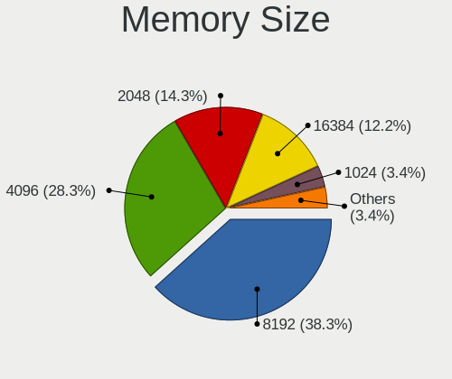

| Size  | Computers | Percent |
|-------|-----------|---------|
| 8192  | 299       | 36.6%   |
| 4096  | 272       | 33.29%  |
| 2048  | 125       | 15.3%   |
| 16384 | 75        | 9.18%   |
| 1024  | 32        | 3.92%   |
| 32768 | 9         | 1.1%    |
| 512   | 4         | 0.49%   |
| 6144  | 1         | 0.12%   |

Memory Speed
------------

Memory module speed

| Speed   | Computers | Percent |
|---------|-----------|---------|
| 1600    | 176       | 21.31%  |
| 2667    | 124       | 15.01%  |
| 1333    | 94        | 11.38%  |
| 3200    | 86        | 10.41%  |
| 2400    | 70        | 8.47%   |
| 2133    | 40        | 4.84%   |
| 1334    | 29        | 3.51%   |
| Unknown | 28        | 3.39%   |
| 667     | 23        | 2.78%   |
| 3600    | 12        | 1.45%   |
| 3400    | 12        | 1.45%   |
| 2666    | 12        | 1.45%   |
| 3266    | 11        | 1.33%   |
| 1066    | 10        | 1.21%   |
| 800     | 10        | 1.21%   |
| 533     | 9         | 1.09%   |
| 1067    | 8         | 0.97%   |
| 3466    | 7         | 0.85%   |
| 1866    | 7         | 0.85%   |
| 3000    | 6         | 0.73%   |
| 333     | 6         | 0.73%   |
| 1867    | 5         | 0.61%   |
| 400     | 5         | 0.61%   |
| 4267    | 4         | 0.48%   |
| 4199    | 4         | 0.48%   |
| 2933    | 4         | 0.48%   |
| 975     | 4         | 0.48%   |
| 2048    | 3         | 0.36%   |
| 3151    | 2         | 0.24%   |
| 3007    | 2         | 0.24%   |
| 8400    | 1         | 0.12%   |
| 4800    | 1         | 0.12%   |
| 4266    | 1         | 0.12%   |
| 3866    | 1         | 0.12%   |
| 3733    | 1         | 0.12%   |
| 3500    | 1         | 0.12%   |
| 3334    | 1         | 0.12%   |
| 3100    | 1         | 0.12%   |
| 2866    | 1         | 0.12%   |
| 2800    | 1         | 0.12%   |

Printers & scanners
-------------------

Printer Vendor
--------------

Printer device vendors

| Vendor              | Computers | Percent |
|---------------------|-----------|---------|
| Hewlett-Packard     | 21        | 42.86%  |
| Brother Industries  | 16        | 32.65%  |
| Seiko Epson         | 4         | 8.16%   |
| Samsung Electronics | 3         | 6.12%   |
| Ricoh               | 1         | 2.04%   |
| QinHeng Electronics | 1         | 2.04%   |
| Pantum              | 1         | 2.04%   |
| NXP Semiconductors  | 1         | 2.04%   |
| Graphtec America    | 1         | 2.04%   |

Printer Model
-------------

Printer device models

| Model                                         | Computers | Percent |
|-----------------------------------------------|-----------|---------|
| Brother HL-1200 series                        | 4         | 8.16%   |
| Brother HL-1110 series                        | 4         | 8.16%   |
| HP LaserJet Professional P 1102w              | 3         | 6.12%   |
| Brother HL-1210W series                       | 3         | 6.12%   |
| Samsung M2020 Series                          | 2         | 4.08%   |
| HP LaserJet Professional P1102w               | 2         | 4.08%   |
| HP LaserJet P1006                             | 2         | 4.08%   |
| HP LaserJet P1005                             | 2         | 4.08%   |
| HP Ink Tank 110 series                        | 2         | 4.08%   |
| Brother HL-2130 series                        | 2         | 4.08%   |
| Seiko Epson XP-243 245 247 Series             | 1         | 2.04%   |
| Seiko Epson ME 340 Series/Stylus NX130 Series | 1         | 2.04%   |
| Seiko Epson L4150 Series                      | 1         | 2.04%   |
| Seiko Epson L355 Series                       | 1         | 2.04%   |
| Samsung Xerox Phaser 3117 Laser Printer       | 1         | 2.04%   |
| Ricoh Printing Support                        | 1         | 2.04%   |
| QinHeng CH340S                                | 1         | 2.04%   |
| Pantum P2500W series                          | 1         | 2.04%   |
| NXP Semiconductors Printer-80                 | 1         | 2.04%   |
| HP PSC 1400                                   | 1         | 2.04%   |
| HP LaserJet 3050                              | 1         | 2.04%   |
| HP LaserJet 1020                              | 1         | 2.04%   |
| HP DeskJet F4100 Printer series               | 1         | 2.04%   |
| HP DeskJet F300 series                        | 1         | 2.04%   |
| HP DeskJet 3630 series                        | 1         | 2.04%   |
| HP Deskjet 3050 J610 series                   | 1         | 2.04%   |
| HP DeskJet 2620 All-in-One Printer            | 1         | 2.04%   |
| HP Deskjet 2050 J510                          | 1         | 2.04%   |
| HP Color LaserJet Pro M478f-9f                | 1         | 2.04%   |
| Graphtec America Graphtec Printer             | 1         | 2.04%   |
| Brother DCP-7055 scanner/printer              | 1         | 2.04%   |
| Brother DCP-1610NW                            | 1         | 2.04%   |
| Brother DCP-1600                              | 1         | 2.04%   |

Scanner Vendor
--------------

Scanner device vendors

| Vendor          | Computers | Percent |
|-----------------|-----------|---------|
| Hewlett-Packard | 1         | 100%    |

Scanner Model
-------------

Scanner device models

| Model            | Computers | Percent |
|------------------|-----------|---------|
| HP ScanJet 2400c | 1         | 100%    |

Camera
------

Camera Vendor
-------------

Camera device vendors

| Vendor                                 | Computers | Percent |
|----------------------------------------|-----------|---------|
| Chicony Electronics                    | 183       | 21.21%  |
| Acer                                   | 78        | 9.04%   |
| IMC Networks                           | 76        | 8.81%   |
| Realtek Semiconductor                  | 72        | 8.34%   |
| Microdia                               | 59        | 6.84%   |
| Sunplus Innovation Technology          | 37        | 4.29%   |
| Logitech                               | 37        | 4.29%   |
| Alcor Micro                            | 31        | 3.59%   |
| Syntek                                 | 29        | 3.36%   |
| Silicon Motion                         | 27        | 3.13%   |
| Cheng Uei Precision Industry (Foxlink) | 27        | 3.13%   |
| Suyin                                  | 26        | 3.01%   |
| Quanta                                 | 23        | 2.67%   |
| Apple                                  | 17        | 1.97%   |
| Samsung Electronics                    | 14        | 1.62%   |
| Z-Star Microelectronics                | 13        | 1.51%   |
| Luxvisions Innotech Limited            | 11        | 1.27%   |
| Lite-On Technology                     | 11        | 1.27%   |
| Ricoh                                  | 10        | 1.16%   |
| KYE Systems (Mouse Systems)            | 10        | 1.16%   |
| Generalplus Technology                 | 9         | 1.04%   |
| Microsoft                              | 7         | 0.81%   |
| OmniVision Technologies                | 6         | 0.7%    |
| Jieli Technology                       | 6         | 0.7%    |
| GEMBIRD                                | 4         | 0.46%   |
| ALi                                    | 4         | 0.46%   |
| MacroSilicon                           | 3         | 0.35%   |
| Lenovo                                 | 3         | 0.35%   |
| icSpring                               | 3         | 0.35%   |
| Cubeternet                             | 3         | 0.35%   |
| SunplusIT                              | 2         | 0.23%   |
| Sonix Technology                       | 2         | 0.23%   |
| Razer USA                              | 2         | 0.23%   |
| Pixart Imaging                         | 2         | 0.23%   |
| Intel                                  | 2         | 0.23%   |
| Importek                               | 2         | 0.23%   |
| Genesys Logic                          | 2         | 0.23%   |
| ARC International                      | 2         | 0.23%   |
| Y Media                                | 1         | 0.12%   |
| Sunplus Technology                     | 1         | 0.12%   |

Camera Model
------------

Camera device models

| Model                                                          | Computers | Percent |
|----------------------------------------------------------------|-----------|---------|
| Chicony USB 2.0 Camera                                         | 30        | 3.46%   |
| IMC Networks USB2.0 VGA UVC WebCam                             | 28        | 3.23%   |
| Acer Integrated Camera                                         | 23        | 2.65%   |
| Realtek Integrated_Webcam_HD                                   | 20        | 2.3%    |
| Alcor Micro USB 2.0 WebCamera                                  | 19        | 2.19%   |
| IMC Networks Integrated Camera                                 | 17        | 1.96%   |
| Chicony Integrated Camera                                      | 16        | 1.84%   |
| Microdia Integrated_Webcam_HD                                  | 15        | 1.73%   |
| Samsung Galaxy series, misc. (MTP mode)                        | 13        | 1.5%    |
| Logitech Webcam C270                                           | 13        | 1.5%    |
| Chicony USB2.0 Camera                                          | 12        | 1.38%   |
| Chicony Lenovo EasyCamera                                      | 12        | 1.38%   |
| Sunplus Integrated_Webcam_HD                                   | 11        | 1.27%   |
| Chicony HD Webcam                                              | 11        | 1.27%   |
| Acer USB Camera                                                | 11        | 1.27%   |
| Chicony TOSHIBA Web Camera - HD                                | 10        | 1.15%   |
| Realtek USB Camera                                             | 9         | 1.04%   |
| Luxvisions Innotech Limited Integrated Camera                  | 9         | 1.04%   |
| Apple iPhone 5/5C/5S/6/SE                                      | 9         | 1.04%   |
| Acer Lenovo EasyCamera                                         | 9         | 1.04%   |
| Syntek Integrated Camera                                       | 8         | 0.92%   |
| IMC Networks USB2.0 HD UVC WebCam                              | 8         | 0.92%   |
| Chicony USB2.0 VGA UVC WebCam                                  | 8         | 0.92%   |
| Acer SunplusIT Integrated Camera                               | 8         | 0.92%   |
| Acer BisonCam, NB Pro                                          | 8         | 0.92%   |
| Logitech C922 Pro Stream Webcam                                | 7         | 0.81%   |
| Chicony Integrated Camera (1280x720@30)                        | 7         | 0.81%   |
| Chicony HP Wide Vision HD Camera                               | 7         | 0.81%   |
| Cheng Uei Precision Industry (Foxlink) HP TrueVision HD Camera | 7         | 0.81%   |
| Alcor Micro USB2.0 Camera                                      | 7         | 0.81%   |
| Sunplus Asus Webcam                                            | 6         | 0.69%   |
| Silicon Motion WebCam SC-0311139N                              | 6         | 0.69%   |
| Microdia Laptop_Integrated_Webcam_HD                           | 6         | 0.69%   |
| Jieli USB PHY 2.0                                              | 6         | 0.69%   |
| Generalplus GENERAL WEBCAM                                     | 6         | 0.69%   |
| Chicony USB2.0 HD UVC WebCam                                   | 6         | 0.69%   |
| Chicony HP Webcam                                              | 6         | 0.69%   |
| Chicony HP TrueVision HD Camera                                | 6         | 0.69%   |
| Z-Star Webcam                                                  | 5         | 0.58%   |
| Syntek Lenovo EasyCamera                                       | 5         | 0.58%   |

Security
--------

Fingerprint Vendor
------------------

Fingerprint sensor vendors

| Vendor                     | Computers | Percent |
|----------------------------|-----------|---------|
| Synaptics                  | 34        | 35.42%  |
| Validity Sensors           | 28        | 29.17%  |
| Shenzhen Goodix Technology | 16        | 16.67%  |
| AuthenTec                  | 6         | 6.25%   |
| Upek                       | 4         | 4.17%   |
| Elan Microelectronics      | 4         | 4.17%   |
| LighTuning Technology      | 2         | 2.08%   |
| STMicroelectronics         | 1         | 1.04%   |
| Focal-systems.Corp         | 1         | 1.04%   |

Fingerprint Model
-----------------

Fingerprint sensor models

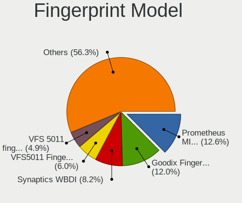

| Model                                                                      | Computers | Percent |
|----------------------------------------------------------------------------|-----------|---------|
| Synaptics Prometheus MIS Touch Fingerprint Reader                          | 13        | 13.54%  |
| Synaptics  WBDI                                                            | 12        | 12.5%   |
| Shenzhen Goodix  FingerPrint Device                                        | 11        | 11.46%  |
| Validity Sensors VFS5011 Fingerprint Reader                                | 7         | 7.29%   |
| Unknown                                                                    | 6         | 6.25%   |
| Validity Sensors VFS495 Fingerprint Reader                                 | 4         | 4.17%   |
| Validity Sensors VFS 5011 fingerprint sensor                               | 4         | 4.17%   |
| Upek Biometric Touchchip/Touchstrip Fingerprint Sensor                     | 4         | 4.17%   |
| Shenzhen Goodix Fingerprint Reader                                         | 4         | 4.17%   |
| Validity Sensors Fingerprint scanner                                       | 3         | 3.13%   |
| Elan ELAN:Fingerprint                                                      | 3         | 3.13%   |
| Validity Sensors VFS301 Fingerprint Reader                                 | 2         | 2.08%   |
| Validity Sensors VFS101 Fingerprint Reader                                 | 2         | 2.08%   |
| Validity Sensors Synaptics WBDI                                            | 2         | 2.08%   |
| Validity Sensors Swipe Fingerprint Sensor                                  | 2         | 2.08%   |
| Synaptics Metallica MIS Touch Fingerprint Reader                           | 2         | 2.08%   |
| AuthenTec Fingerprint Sensor                                               | 2         | 2.08%   |
| AuthenTec AES2501 Fingerprint Sensor                                       | 2         | 2.08%   |
| Validity Sensors VFS7552 Touch Fingerprint Sensor                          | 1         | 1.04%   |
| Validity Sensors Synaptics VFS7552 Touch Fingerprint Sensor with PurePrint | 1         | 1.04%   |
| Synaptics  VFS7552 Touch Fingerprint Sensor with PurePrint                 | 1         | 1.04%   |
| STMicroelectronics Fingerprint Reader                                      | 1         | 1.04%   |
| Shenzhen Goodix FingerPrint                                                | 1         | 1.04%   |
| LighTuning EgisTec_ES603                                                   | 1         | 1.04%   |
| LighTuning EgisTec Touch Fingerprint Sensor                                | 1         | 1.04%   |
| Focal-systems.Corp FT9201Fingerprint.                                      | 1         | 1.04%   |
| Elan ELAN:ARM-M4                                                           | 1         | 1.04%   |
| AuthenTec AES2810                                                          | 1         | 1.04%   |
| AuthenTec AES1660 Fingerprint Sensor                                       | 1         | 1.04%   |

Chipcard Vendor
---------------

Chipcard module vendors

| Vendor   | Computers | Percent |
|----------|-----------|---------|
| Broadcom | 18        | 62.07%  |
| Upek     | 8         | 27.59%  |
| Lenovo   | 2         | 6.9%    |
| O2 Micro | 1         | 3.45%   |

Chipcard Model
--------------

Chipcard module models

| Model                                                                        | Computers | Percent |
|------------------------------------------------------------------------------|-----------|---------|
| Upek TouchChip Fingerprint Coprocessor (WBF advanced mode)                   | 8         | 27.59%  |
| Broadcom BCM5880 Secure Applications Processor                               | 6         | 20.69%  |
| Broadcom 58200                                                               | 6         | 20.69%  |
| Broadcom BCM5880 Secure Applications Processor with fingerprint swipe sensor | 3         | 10.34%  |
| Broadcom 5880                                                                | 3         | 10.34%  |
| Lenovo Integrated Smart Card Reader                                          | 2         | 6.9%    |
| O2 Micro OZ776 CCID Smartcard Reader                                         | 1         | 3.45%   |

Unsupported
-----------

Unsupported Devices
-------------------

Total unsupported devices on board

| Total | Computers | Percent |
|-------|-----------|---------|
| 0     | 1156      | 76.56%  |
| 1     | 310       | 20.53%  |
| 2     | 37        | 2.45%   |
| 3     | 5         | 0.33%   |
| 8     | 1         | 0.07%   |
| 5     | 1         | 0.07%   |

Unsupported Device Types
------------------------

Types of unsupported devices

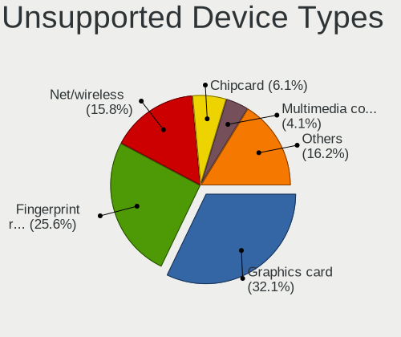

| Type                     | Computers | Percent |
|--------------------------|-----------|---------|
| Graphics card            | 117       | 29.25%  |
| Fingerprint reader       | 96        | 24%     |
| Net/wireless             | 70        | 17.5%   |
| Chipcard                 | 27        | 6.75%   |
| Camera                   | 18        | 4.5%    |
| Bluetooth                | 13        | 3.25%   |
| Multimedia controller    | 12        | 3%      |
| Communication controller | 12        | 3%      |
| Sound                    | 8         | 2%      |
| Net/ethernet             | 8         | 2%      |
| Modem                    | 5         | 1.25%   |
| Network                  | 4         | 1%      |
| Unassigned class         | 2         | 0.5%    |
| Flash memory             | 2         | 0.5%    |
| Firewire controller      | 2         | 0.5%    |
| Card reader              | 2         | 0.5%    |
| Storage/ide              | 1         | 0.25%   |
| Dvb card                 | 1         | 0.25%   |

