Linux in Argentina - Tested Hardware & Statistics (Desktops)
------------------------------------------------------------

A project to collect tested hardware configurations for Linux in Argentina.

Anyone can contribute to this report by the [hw-probe](https://github.com/linuxhw/hw-probe) tool:

    sudo -E hw-probe -all -upload

Please contribute! Especially if your hardware is rare.

Contents
--------

* [ Test Cases ](#test-cases)

* [ System ](#system)
  - [ OS                       ](#os)
  - [ OS Family                ](#os-family)
  - [ Kernel                   ](#kernel)
  - [ Kernel Family            ](#kernel-family)
  - [ Kernel Major Ver.        ](#kernel-major-ver)
  - [ Arch                     ](#arch)
  - [ DE                       ](#de)
  - [ Display Server           ](#display-server)
  - [ Display Manager          ](#display-manager)
  - [ OS Lang                  ](#os-lang)
  - [ Boot Mode                ](#boot-mode)
  - [ Filesystem               ](#filesystem)
  - [ Part. scheme             ](#part-scheme)
  - [ Dual Boot with Linux/BSD ](#dual-boot-with-linuxbsd)
  - [ Dual Boot (Win)          ](#dual-boot-win)

* [ Board ](#board)
  - [ Vendor                   ](#vendor)
  - [ Model                    ](#model)
  - [ Model Family             ](#model-family)
  - [ MFG Year                 ](#mfg-year)
  - [ Form Factor              ](#form-factor)
  - [ Secure Boot              ](#secure-boot)
  - [ Coreboot                 ](#coreboot)
  - [ RAM Size                 ](#ram-size)
  - [ RAM Used                 ](#ram-used)
  - [ Total Drives             ](#total-drives)
  - [ Has CD-ROM               ](#has-cd-rom)
  - [ Has Ethernet             ](#has-ethernet)
  - [ Has WiFi                 ](#has-wifi)
  - [ Has Bluetooth            ](#has-bluetooth)

* [ Location ](#location)
  - [ Country                  ](#country)
  - [ City                     ](#city)

* [ Drives ](#drives)
  - [ Drive Vendor             ](#drive-vendor)
  - [ Drive Model              ](#drive-model)
  - [ HDD Vendor               ](#hdd-vendor)
  - [ SSD Vendor               ](#ssd-vendor)
  - [ Drive Kind               ](#drive-kind)
  - [ Drive Connector          ](#drive-connector)
  - [ Drive Size               ](#drive-size)
  - [ Space Total              ](#space-total)
  - [ Space Used               ](#space-used)
  - [ Malfunc. Drives          ](#malfunc-drives)
  - [ Malfunc. Drive Vendor    ](#malfunc-drive-vendor)
  - [ Malfunc. HDD Vendor      ](#malfunc-hdd-vendor)
  - [ Malfunc. Drive Kind      ](#malfunc-drive-kind)
  - [ Failed Drives            ](#failed-drives)
  - [ Failed Drive Vendor      ](#failed-drive-vendor)
  - [ Drive Status             ](#drive-status)

* [ Storage controller ](#storage-controller)
  - [ Storage Vendor           ](#storage-vendor)
  - [ Storage Model            ](#storage-model)
  - [ Storage Kind             ](#storage-kind)

* [ Processor ](#processor)
  - [ CPU Vendor               ](#cpu-vendor)
  - [ CPU Model                ](#cpu-model)
  - [ CPU Model Family         ](#cpu-model-family)
  - [ CPU Cores                ](#cpu-cores)
  - [ CPU Sockets              ](#cpu-sockets)
  - [ CPU Threads              ](#cpu-threads)
  - [ CPU Op-Modes             ](#cpu-op-modes)
  - [ CPU Microcode            ](#cpu-microcode)
  - [ CPU Microarch            ](#cpu-microarch)

* [ Graphics ](#graphics)
  - [ GPU Vendor               ](#gpu-vendor)
  - [ GPU Model                ](#gpu-model)
  - [ GPU Combo                ](#gpu-combo)
  - [ GPU Driver               ](#gpu-driver)
  - [ GPU Memory               ](#gpu-memory)

* [ Monitor ](#monitor)
  - [ Monitor Vendor           ](#monitor-vendor)
  - [ Monitor Model            ](#monitor-model)
  - [ Monitor Resolution       ](#monitor-resolution)
  - [ Monitor Diagonal         ](#monitor-diagonal)
  - [ Monitor Width            ](#monitor-width)
  - [ Aspect Ratio             ](#aspect-ratio)
  - [ Monitor Area             ](#monitor-area)
  - [ Pixel Density            ](#pixel-density)
  - [ Multiple Monitors        ](#multiple-monitors)

* [ Network ](#network)
  - [ Net Controller Vendor    ](#net-controller-vendor)
  - [ Net Controller Model     ](#net-controller-model)
  - [ Wireless Vendor          ](#wireless-vendor)
  - [ Wireless Model           ](#wireless-model)
  - [ Ethernet Vendor          ](#ethernet-vendor)
  - [ Ethernet Model           ](#ethernet-model)
  - [ Net Controller Kind      ](#net-controller-kind)
  - [ Used Controller          ](#used-controller)
  - [ NICs                     ](#nics)
  - [ IPv6                     ](#ipv6)

* [ Bluetooth ](#bluetooth)
  - [ Bluetooth Vendor         ](#bluetooth-vendor)
  - [ Bluetooth Model          ](#bluetooth-model)

* [ Sound ](#sound)
  - [ Sound Vendor             ](#sound-vendor)
  - [ Sound Model              ](#sound-model)

* [ Memory ](#memory)
  - [ Memory Vendor            ](#memory-vendor)
  - [ Memory Model             ](#memory-model)
  - [ Memory Kind              ](#memory-kind)
  - [ Memory Form Factor       ](#memory-form-factor)
  - [ Memory Size              ](#memory-size)
  - [ Memory Speed             ](#memory-speed)

* [ Printers & scanners ](#printers--scanners)
  - [ Printer Vendor           ](#printer-vendor)
  - [ Printer Model            ](#printer-model)
  - [ Scanner Vendor           ](#scanner-vendor)
  - [ Scanner Model            ](#scanner-model)

* [ Camera ](#camera)
  - [ Camera Vendor            ](#camera-vendor)
  - [ Camera Model             ](#camera-model)

* [ Security ](#security)
  - [ Fingerprint Vendor       ](#fingerprint-vendor)
  - [ Fingerprint Model        ](#fingerprint-model)
  - [ Chipcard Vendor          ](#chipcard-vendor)
  - [ Chipcard Model           ](#chipcard-model)

* [ Unsupported ](#unsupported)
  - [ Unsupported Devices      ](#unsupported-devices)
  - [ Unsupported Device Types ](#unsupported-device-types)

Test Cases
----------

Total: 1923

| Vendor        | Model                       | Probe                                                      | Date         |
|---------------|-----------------------------|------------------------------------------------------------|--------------|
| ASRock        | FM2A58M-VG3+ R2.0           | [d1337229da](https://linux-hardware.org/?probe=d1337229da) | Dec 29, 2025 |
| ASRock        | A320M-HDV R4.0              | [4fbadfcb23](https://linux-hardware.org/?probe=4fbadfcb23) | Dec 29, 2025 |
| MSI           | A320M PRO-VH PLUS           | [af4614b611](https://linux-hardware.org/?probe=af4614b611) | Dec 28, 2025 |
| ASRock        | FM2A58M-VG3+ R2.0           | [387fe2526f](https://linux-hardware.org/?probe=387fe2526f) | Dec 24, 2025 |
| ASUSTek       | PRIME H510M-E               | [4502761769](https://linux-hardware.org/?probe=4502761769) | Dec 22, 2025 |
| Intel         | H61                         | [52c95e8022](https://linux-hardware.org/?probe=52c95e8022) | Dec 22, 2025 |
| Gigabyte      | B550M DS3H                  | [4d1f632947](https://linux-hardware.org/?probe=4d1f632947) | Dec 15, 2025 |
| Gigabyte      | Z390 UD                     | [c67657043c](https://linux-hardware.org/?probe=c67657043c) | Dec 15, 2025 |
| Gigabyte      | H510M K V2                  | [14e138d333](https://linux-hardware.org/?probe=14e138d333) | Dec 13, 2025 |
| ASUSTek       | H61M-K                      | [3f65e2993b](https://linux-hardware.org/?probe=3f65e2993b) | Dec 11, 2025 |
| ASUSTek       | PRIME B460M-A R2.0          | [d0fac97de6](https://linux-hardware.org/?probe=d0fac97de6) | Dec 10, 2025 |
| Lenovo        | 30D2 SDK0J40705 WIN 3425... | [a6fda2589c](https://linux-hardware.org/?probe=a6fda2589c) | Dec 07, 2025 |
| ASRock        | A320M/ac                    | [a9ff3ee29a](https://linux-hardware.org/?probe=a9ff3ee29a) | Dec 06, 2025 |
| ASUSTek       | P5SD2-VM                    | [815e1d491b](https://linux-hardware.org/?probe=815e1d491b) | Dec 05, 2025 |
| ASUSTek       | P5SD2-VM                    | [243c6ee32b](https://linux-hardware.org/?probe=243c6ee32b) | Dec 04, 2025 |
| Gigabyte      | X870E AORUS ELITE WIFI7     | [e0cfbd1d08](https://linux-hardware.org/?probe=e0cfbd1d08) | Dec 04, 2025 |
| Gigabyte      | X870E AORUS ELITE WIFI7     | [29ecb8da48](https://linux-hardware.org/?probe=29ecb8da48) | Dec 04, 2025 |
| MSI           | B450M PRO-M2 MAX            | [9028b6c4b3](https://linux-hardware.org/?probe=9028b6c4b3) | Dec 03, 2025 |
| ASUSTek       | PRIME A320M-K               | [766decb306](https://linux-hardware.org/?probe=766decb306) | Dec 03, 2025 |
| Gigabyte      | GA-990FXA-UD3               | [0f84c98196](https://linux-hardware.org/?probe=0f84c98196) | Dec 01, 2025 |
| MSI           | A520M-A PRO                 | [1432227c1b](https://linux-hardware.org/?probe=1432227c1b) | Nov 30, 2025 |
| MSI           | H97 PC Mate                 | [d65b504a63](https://linux-hardware.org/?probe=d65b504a63) | Nov 26, 2025 |
| ASUSTek       | H110M-R                     | [e19ae485c7](https://linux-hardware.org/?probe=e19ae485c7) | Nov 23, 2025 |
| Gigabyte      | H510M K V2                  | [47caeb7f23](https://linux-hardware.org/?probe=47caeb7f23) | Nov 23, 2025 |
| Gigabyte      | H310M M.2                   | [cd601fc1ea](https://linux-hardware.org/?probe=cd601fc1ea) | Nov 21, 2025 |
| MSI           | B460M PRO-VDH WIFI          | [338fdadcb8](https://linux-hardware.org/?probe=338fdadcb8) | Nov 17, 2025 |
| ASUSTek       | TUF Gaming B450-PLUS II     | [0198b5ba9d](https://linux-hardware.org/?probe=0198b5ba9d) | Nov 15, 2025 |
| HP            | 3031h                       | [c43bc41b78](https://linux-hardware.org/?probe=c43bc41b78) | Nov 13, 2025 |
| HP            | 3031h                       | [61bc4c9467](https://linux-hardware.org/?probe=61bc4c9467) | Nov 13, 2025 |
| MSI           | B550M PRO-VDH WIFI          | [4e21ff1545](https://linux-hardware.org/?probe=4e21ff1545) | Nov 13, 2025 |
| ASUSTek       | SABERTOOTH Z97 MARK 2/US... | [6003eda3a0](https://linux-hardware.org/?probe=6003eda3a0) | Nov 13, 2025 |
| Gigabyte      | H81M-H                      | [75d95d58d5](https://linux-hardware.org/?probe=75d95d58d5) | Nov 12, 2025 |
| Gigabyte      | H81M-H                      | [f10ad59815](https://linux-hardware.org/?probe=f10ad59815) | Nov 12, 2025 |
| MSI           | A68HM-E33 V2                | [712ef32924](https://linux-hardware.org/?probe=712ef32924) | Nov 11, 2025 |
| Intel         | DG31PR AAD97573-206         | [a7519c698b](https://linux-hardware.org/?probe=a7519c698b) | Nov 08, 2025 |
| ASUSTek       | PRIME A320M-K               | [540b772ca7](https://linux-hardware.org/?probe=540b772ca7) | Nov 08, 2025 |
| ASUSTek       | PRIME A320M-K               | [196b926781](https://linux-hardware.org/?probe=196b926781) | Nov 07, 2025 |
| ASUSTek       | PRIME A320M-K               | [29879f8857](https://linux-hardware.org/?probe=29879f8857) | Nov 07, 2025 |
| MSI           | Z370 SLI PLUS               | [eb21698177](https://linux-hardware.org/?probe=eb21698177) | Nov 05, 2025 |
| MSI           | B250M MORTAR ARCTIC         | [b7fdbe4de9](https://linux-hardware.org/?probe=b7fdbe4de9) | Nov 02, 2025 |
| Intel         | DZ77SL-50K AAG55115-300     | [12b4462cea](https://linux-hardware.org/?probe=12b4462cea) | Nov 01, 2025 |
| MSI           | A520M-A PRO                 | [9a7f549cfd](https://linux-hardware.org/?probe=9a7f549cfd) | Oct 30, 2025 |
| Dell          | 0J3C2F A00                  | [e3ce4811fd](https://linux-hardware.org/?probe=e3ce4811fd) | Oct 29, 2025 |
| Lenovo        | 3140 NOK                    | [e7fbeb6a25](https://linux-hardware.org/?probe=e7fbeb6a25) | Oct 28, 2025 |
| Exo           | H510H6-M2                   | [b67dcab629](https://linux-hardware.org/?probe=b67dcab629) | Oct 27, 2025 |
| MSI           | PRO A620M-E                 | [4547265d2d](https://linux-hardware.org/?probe=4547265d2d) | Oct 26, 2025 |
| ASRock        | G31M-S                      | [42fbd8c657](https://linux-hardware.org/?probe=42fbd8c657) | Oct 26, 2025 |
| Gigabyte      | G41MT-S2PT                  | [73a20fedac](https://linux-hardware.org/?probe=73a20fedac) | Oct 25, 2025 |
| Intel         | H61                         | [7e2e3fe947](https://linux-hardware.org/?probe=7e2e3fe947) | Oct 25, 2025 |
| Gigabyte      | G41MT-S2PT                  | [84ce3b153c](https://linux-hardware.org/?probe=84ce3b153c) | Oct 23, 2025 |
| Gigabyte      | AB350M-D3H-CF               | [f67c6f1801](https://linux-hardware.org/?probe=f67c6f1801) | Oct 22, 2025 |
| MSI           | Z370 SLI PLUS               | [84f388fbba](https://linux-hardware.org/?probe=84f388fbba) | Oct 21, 2025 |
| ASUSTek       | PRIME H310M-E R2.0          | [b7f8cf48c2](https://linux-hardware.org/?probe=b7f8cf48c2) | Oct 15, 2025 |
| MSI           | Z370 SLI PLUS               | [760fe428a2](https://linux-hardware.org/?probe=760fe428a2) | Oct 13, 2025 |
| ASRock        | H81M-HG4                    | [0d6bbcb32b](https://linux-hardware.org/?probe=0d6bbcb32b) | Oct 09, 2025 |
| ASRock        | B450M/ac                    | [240eb7f049](https://linux-hardware.org/?probe=240eb7f049) | Oct 09, 2025 |
| ASUSTek       | M4N68T-M LE                 | [f0be91d8e2](https://linux-hardware.org/?probe=f0be91d8e2) | Oct 07, 2025 |
| Gigabyte      | Z370 AORUS Gaming 3         | [76731ebebe](https://linux-hardware.org/?probe=76731ebebe) | Oct 07, 2025 |
| ASUSTek       | M4N68T-M LE                 | [fc9ee33254](https://linux-hardware.org/?probe=fc9ee33254) | Oct 07, 2025 |
| Gigabyte      | X870E AORUS ELITE WIFI7     | [a076aa9389](https://linux-hardware.org/?probe=a076aa9389) | Oct 06, 2025 |
| Exo           | H510H6-M2                   | [f23088dbd7](https://linux-hardware.org/?probe=f23088dbd7) | Oct 02, 2025 |
| ASUSTek       | TUF Gaming B550-PLUS WIF... | [7e45688447](https://linux-hardware.org/?probe=7e45688447) | Oct 01, 2025 |
| MSI           | B760M GAMING PLUS WIFI      | [214d1afcd9](https://linux-hardware.org/?probe=214d1afcd9) | Oct 01, 2025 |
| Dell          | 0WX729                      | [6cfd463753](https://linux-hardware.org/?probe=6cfd463753) | Sep 29, 2025 |
| MSI           | B85-G43 GAMING              | [52eb2a9bbd](https://linux-hardware.org/?probe=52eb2a9bbd) | Sep 29, 2025 |
| Unknown       | Unknown                     | [77fa6b7531](https://linux-hardware.org/?probe=77fa6b7531) | Sep 19, 2025 |
| ASUSTek       | PRIME A520M-K               | [e938dd38a1](https://linux-hardware.org/?probe=e938dd38a1) | Sep 19, 2025 |
| Exo           | H510H6-M2                   | [b3c3fd8bcc](https://linux-hardware.org/?probe=b3c3fd8bcc) | Sep 17, 2025 |
| Exo           | H510H6-M2                   | [7df4cd1528](https://linux-hardware.org/?probe=7df4cd1528) | Sep 17, 2025 |
| Biostar       | B450MHP                     | [39e8843a08](https://linux-hardware.org/?probe=39e8843a08) | Sep 17, 2025 |
| Gigabyte      | A520M K V2                  | [5423a2a6a0](https://linux-hardware.org/?probe=5423a2a6a0) | Sep 16, 2025 |
| Gigabyte      | B450M DS3H WIFI-CF          | [19a7f6d94d](https://linux-hardware.org/?probe=19a7f6d94d) | Sep 16, 2025 |
| ASRock        | B450M-HDV R4.0              | [1831d750a4](https://linux-hardware.org/?probe=1831d750a4) | Sep 15, 2025 |
| Gigabyte      | Z97M-D3H                    | [51a7e0f92e](https://linux-hardware.org/?probe=51a7e0f92e) | Sep 15, 2025 |
| Gigabyte      | H61M-S1                     | [19400ae618](https://linux-hardware.org/?probe=19400ae618) | Sep 15, 2025 |
| MSI           | PRO H610M-G DDR4            | [e2d2a0dea0](https://linux-hardware.org/?probe=e2d2a0dea0) | Sep 13, 2025 |
| Gigabyte      | H510M K V2                  | [a66abb46ed](https://linux-hardware.org/?probe=a66abb46ed) | Sep 13, 2025 |
| ASUSTek       | PRIME Z690-P WIFI           | [584b4216f7](https://linux-hardware.org/?probe=584b4216f7) | Sep 10, 2025 |
| Gigabyte      | X470 AORUS GAMING 5 WIFI... | [a505ecbd87](https://linux-hardware.org/?probe=a505ecbd87) | Sep 08, 2025 |
| ASUSTek       | ROG STRIX X870E-E GAMING... | [b9602caa33](https://linux-hardware.org/?probe=b9602caa33) | Sep 08, 2025 |
| Biostar       | GF8200C M2+                 | [7fb4d99ed2](https://linux-hardware.org/?probe=7fb4d99ed2) | Sep 08, 2025 |
| Biostar       | GF8200C M2+                 | [3bfb82a66b](https://linux-hardware.org/?probe=3bfb82a66b) | Sep 08, 2025 |
| Gigabyte      | Z370 AORUS Gaming 3         | [18ef85d0ff](https://linux-hardware.org/?probe=18ef85d0ff) | Sep 07, 2025 |
| Gigabyte      | Z370 AORUS Gaming 3         | [ebaf1a61cc](https://linux-hardware.org/?probe=ebaf1a61cc) | Sep 07, 2025 |
| ASUSTek       | F1A75-M LE                  | [4c804c51ef](https://linux-hardware.org/?probe=4c804c51ef) | Sep 06, 2025 |
| Gigabyte      | G41MT-S2PT                  | [c569c09da2](https://linux-hardware.org/?probe=c569c09da2) | Sep 06, 2025 |
| HP            | 802F                        | [b9923407e6](https://linux-hardware.org/?probe=b9923407e6) | Sep 04, 2025 |
| HP            | 802F                        | [f2664ae5d7](https://linux-hardware.org/?probe=f2664ae5d7) | Sep 04, 2025 |
| HP            | 0A60h                       | [82a4227864](https://linux-hardware.org/?probe=82a4227864) | Sep 03, 2025 |
| Gigabyte      | H510M K V2                  | [92b73dd867](https://linux-hardware.org/?probe=92b73dd867) | Sep 02, 2025 |
| Gigabyte      | H61M-D2P-B3                 | [7a3bdd9329](https://linux-hardware.org/?probe=7a3bdd9329) | Sep 01, 2025 |
| ASUSTek       | ROG STRIX B450-F GAMING ... | [d1f4a784ad](https://linux-hardware.org/?probe=d1f4a784ad) | Sep 01, 2025 |
| MSI           | A68HM-E33 V2                | [43b2e2037d](https://linux-hardware.org/?probe=43b2e2037d) | Aug 28, 2025 |
| Gigabyte      | F2A68HM-H                   | [1688361761](https://linux-hardware.org/?probe=1688361761) | Aug 28, 2025 |
| ASRock        | H61M-HVS                    | [e3455d6ff9](https://linux-hardware.org/?probe=e3455d6ff9) | Aug 26, 2025 |
| Gigabyte      | A520M K V2                  | [1c238bd54a](https://linux-hardware.org/?probe=1c238bd54a) | Aug 25, 2025 |
| ASUSTek       | PRIME B660M-A D4            | [7de942da69](https://linux-hardware.org/?probe=7de942da69) | Aug 24, 2025 |
| ASUSTek       | A68HM-PLUS                  | [8e3d2db280](https://linux-hardware.org/?probe=8e3d2db280) | Aug 23, 2025 |
| ASUSTek       | TUF Gaming B650-PLUS WIF... | [0f7418c188](https://linux-hardware.org/?probe=0f7418c188) | Aug 21, 2025 |
| ASRock        | X870E Nova WiFi             | [844cf72d7c](https://linux-hardware.org/?probe=844cf72d7c) | Aug 20, 2025 |
| ASRock        | Z370 Extreme4               | [6193a77a45](https://linux-hardware.org/?probe=6193a77a45) | Aug 19, 2025 |
| ASUSTek       | PRIME B660M-A D4            | [cded9ff661](https://linux-hardware.org/?probe=cded9ff661) | Aug 17, 2025 |
| Gigabyte      | H510M K V2                  | [97878d20f0](https://linux-hardware.org/?probe=97878d20f0) | Aug 16, 2025 |
| Lenovo        | 3140 NOK                    | [f678bc7293](https://linux-hardware.org/?probe=f678bc7293) | Aug 14, 2025 |
| ASUSTek       | PRIME A320M-K               | [33162b1bf1](https://linux-hardware.org/?probe=33162b1bf1) | Aug 13, 2025 |
| ASRock        | AM1B-M                      | [bb51ea7cf3](https://linux-hardware.org/?probe=bb51ea7cf3) | Aug 13, 2025 |
| ASUSTek       | PRIME A520M-K               | [e3d95ba233](https://linux-hardware.org/?probe=e3d95ba233) | Aug 13, 2025 |
| ASUSTek       | ROG STRIX B365-F GAMING     | [1004bd753c](https://linux-hardware.org/?probe=1004bd753c) | Aug 12, 2025 |
| MSI           | B85-G43 GAMING              | [f1a0c0cd80](https://linux-hardware.org/?probe=f1a0c0cd80) | Aug 11, 2025 |
| Gigabyte      | B550 AORUS PRO V2           | [674558c9fa](https://linux-hardware.org/?probe=674558c9fa) | Aug 10, 2025 |
| ASUSTek       | M5A97 PRO                   | [bc5b7f97c4](https://linux-hardware.org/?probe=bc5b7f97c4) | Aug 08, 2025 |
| ASUSTek       | A8V-MX                      | [2c706aff49](https://linux-hardware.org/?probe=2c706aff49) | Aug 08, 2025 |
| ASUSTek       | TUF Gaming B550M-PLUS       | [cc191335fe](https://linux-hardware.org/?probe=cc191335fe) | Aug 08, 2025 |
| Gigabyte      | F2A88XM-HD3                 | [3be4903ec2](https://linux-hardware.org/?probe=3be4903ec2) | Aug 08, 2025 |
| ASRock        | A320M-HDV R3.0              | [c6df3f78e3](https://linux-hardware.org/?probe=c6df3f78e3) | Aug 08, 2025 |
| ASRock        | A520M Phantom Gaming 4      | [89d95aa48b](https://linux-hardware.org/?probe=89d95aa48b) | Aug 08, 2025 |
| ASUSTek       | PRIME B460M-A R2.0          | [f29c93345c](https://linux-hardware.org/?probe=f29c93345c) | Aug 04, 2025 |
| ASRock        | H61M-VG3                    | [a42c652462](https://linux-hardware.org/?probe=a42c652462) | Aug 04, 2025 |
| ASRock        | A320M-HDV R4.0              | [d4afda5286](https://linux-hardware.org/?probe=d4afda5286) | Aug 01, 2025 |
| ASRock        | B450M-HDV R4.0              | [0e8cec7ef7](https://linux-hardware.org/?probe=0e8cec7ef7) | Aug 01, 2025 |
| ASUSTek       | M2N68-AM Plus               | [47ceac732e](https://linux-hardware.org/?probe=47ceac732e) | Jul 31, 2025 |
| PCBOX         | Kant                        | [b8f7cb228b](https://linux-hardware.org/?probe=b8f7cb228b) | Jul 30, 2025 |
| ASUSTek       | PRIME B650M-A WIFI II       | [72e4561216](https://linux-hardware.org/?probe=72e4561216) | Jul 30, 2025 |
| ASUSTek       | PRIME B650M-A WIFI II       | [b19d94bdfa](https://linux-hardware.org/?probe=b19d94bdfa) | Jul 30, 2025 |
| Gigabyte      | B75M-HD3                    | [efcfddd1ed](https://linux-hardware.org/?probe=efcfddd1ed) | Jul 28, 2025 |
| Gigabyte      | B75M-HD3                    | [27a9fb9a4e](https://linux-hardware.org/?probe=27a9fb9a4e) | Jul 28, 2025 |
| Gigabyte      | GA-78LMT-S2                 | [3439a9cb7e](https://linux-hardware.org/?probe=3439a9cb7e) | Jul 28, 2025 |
| Gigabyte      | GA-78LMT-S2                 | [66e8bd13d2](https://linux-hardware.org/?probe=66e8bd13d2) | Jul 28, 2025 |
| Gigabyte      | A520M K V2                  | [a3b4b4f271](https://linux-hardware.org/?probe=a3b4b4f271) | Jul 27, 2025 |
| ASUSTek       | PRIME B460M-A               | [acaae27c91](https://linux-hardware.org/?probe=acaae27c91) | Jul 26, 2025 |
| ASRock        | B450M-HDV R4.0              | [8d6e98fb0b](https://linux-hardware.org/?probe=8d6e98fb0b) | Jul 21, 2025 |
| ASRock        | G31M-VS                     | [eb6e00065c](https://linux-hardware.org/?probe=eb6e00065c) | Jul 21, 2025 |
| Gigabyte      | F2A68HM-H                   | [c94d167cce](https://linux-hardware.org/?probe=c94d167cce) | Jul 18, 2025 |
| CX / Air C... | CX-H87-M1                   | [7bd3dfa8e1](https://linux-hardware.org/?probe=7bd3dfa8e1) | Jul 17, 2025 |
| Dell          | 0YNVJG A02                  | [973b462f4e](https://linux-hardware.org/?probe=973b462f4e) | Jul 16, 2025 |
| ASUSTek       | TUF Gaming A620M-PLUS WI... | [5d550aa725](https://linux-hardware.org/?probe=5d550aa725) | Jul 16, 2025 |
| Dell          | 0YNVJG A02                  | [8216817eee](https://linux-hardware.org/?probe=8216817eee) | Jul 15, 2025 |
| ASUSTek       | H61M-K                      | [2b977e142a](https://linux-hardware.org/?probe=2b977e142a) | Jul 15, 2025 |
| ASRock        | A55M-VS                     | [8568c0223f](https://linux-hardware.org/?probe=8568c0223f) | Jul 14, 2025 |
| ASUSTek       | PRIME A520M-K               | [02e411ac74](https://linux-hardware.org/?probe=02e411ac74) | Jul 14, 2025 |
| Gigabyte      | B250M-DS3H-CF               | [fcc02de185](https://linux-hardware.org/?probe=fcc02de185) | Jul 13, 2025 |
| Gigabyte      | GA-E6010N                   | [7587530390](https://linux-hardware.org/?probe=7587530390) | Jul 11, 2025 |
| ASUSTek       | PRIME B450M-A               | [db7ad3e56f](https://linux-hardware.org/?probe=db7ad3e56f) | Jul 10, 2025 |
| ASUSTek       | ROG CROSSHAIR VII HERO      | [14e18aa610](https://linux-hardware.org/?probe=14e18aa610) | Jul 10, 2025 |
| ASRock        | H510M-HVS R2.0              | [fd38fb90bb](https://linux-hardware.org/?probe=fd38fb90bb) | Jul 08, 2025 |
| ASUSTek       | M5A97 EVO R2.0              | [be28cbde25](https://linux-hardware.org/?probe=be28cbde25) | Jul 06, 2025 |
| MSI           | A88XM-E45 V2                | [0c6eb15575](https://linux-hardware.org/?probe=0c6eb15575) | Jul 05, 2025 |
| MSI           | A88XM-E45 V2                | [a072433dc0](https://linux-hardware.org/?probe=a072433dc0) | Jul 05, 2025 |
| ASUSTek       | H81M-K                      | [21b7c8ab61](https://linux-hardware.org/?probe=21b7c8ab61) | Jul 03, 2025 |
| ASRock        | A320M/ac                    | [335f857333](https://linux-hardware.org/?probe=335f857333) | Jun 29, 2025 |
| Gigabyte      | F2A55M-S1                   | [a02eec7d3d](https://linux-hardware.org/?probe=a02eec7d3d) | Jun 29, 2025 |
| ASUSTek       | M2N68-AM Plus               | [115c5ef042](https://linux-hardware.org/?probe=115c5ef042) | Jun 27, 2025 |
| ASUSTek       | M2N68-AM Plus               | [296eb0a34e](https://linux-hardware.org/?probe=296eb0a34e) | Jun 27, 2025 |
| ASUSTek       | M5A97 R2.0                  | [27ad0f3824](https://linux-hardware.org/?probe=27ad0f3824) | Jun 27, 2025 |
| Gigabyte      | Z590 D                      | [464bbc0fc2](https://linux-hardware.org/?probe=464bbc0fc2) | Jun 25, 2025 |
| Biostar       | A320MH                      | [5c1f7966ba](https://linux-hardware.org/?probe=5c1f7966ba) | Jun 25, 2025 |
| ASUSTek       | M3N78-VM                    | [761eb2b1f2](https://linux-hardware.org/?probe=761eb2b1f2) | Jun 24, 2025 |
| Gigabyte      | B560M DS3H                  | [0b55df8fc5](https://linux-hardware.org/?probe=0b55df8fc5) | Jun 20, 2025 |
| MSI           | A320M PRO-M2 V2             | [f291d171f2](https://linux-hardware.org/?probe=f291d171f2) | Jun 19, 2025 |
| ECS           | H81H3-M4                    | [8f6e286e49](https://linux-hardware.org/?probe=8f6e286e49) | Jun 19, 2025 |
| ASRock        | B450M/ac                    | [eacd9f3d88](https://linux-hardware.org/?probe=eacd9f3d88) | Jun 17, 2025 |
| ASUSTek       | M5A78L-M/USB3               | [4e91343bde](https://linux-hardware.org/?probe=4e91343bde) | Jun 17, 2025 |
| ASRock        | B150M-HDS                   | [2ae36f25a8](https://linux-hardware.org/?probe=2ae36f25a8) | Jun 16, 2025 |
| ASUSTek       | A88XM-A/USB                 | [5e94bd7181](https://linux-hardware.org/?probe=5e94bd7181) | Jun 15, 2025 |
| ASUSTek       | H110M-A/M.2                 | [24c28b4ac3](https://linux-hardware.org/?probe=24c28b4ac3) | Jun 15, 2025 |
| Gigabyte      | H55M-S2V                    | [409853c362](https://linux-hardware.org/?probe=409853c362) | Jun 15, 2025 |
| Gigabyte      | GA-78LMT-S2                 | [592dc745fd](https://linux-hardware.org/?probe=592dc745fd) | Jun 14, 2025 |
| Gigabyte      | H97M-D3H                    | [9c2aaaa05c](https://linux-hardware.org/?probe=9c2aaaa05c) | Jun 07, 2025 |
| Gigabyte      | B450M DS3H-CF               | [8a9b8affd0](https://linux-hardware.org/?probe=8a9b8affd0) | Jun 05, 2025 |
| ASUSTek       | PRIME Z390-P                | [a3cfde9aa1](https://linux-hardware.org/?probe=a3cfde9aa1) | Jun 01, 2025 |
| MSI           | A320M-A PRO MAX             | [6a243652f6](https://linux-hardware.org/?probe=6a243652f6) | Jun 01, 2025 |
| ASUSTek       | P5KPL-AM SE                 | [350699e4f2](https://linux-hardware.org/?probe=350699e4f2) | Jun 01, 2025 |
| Biostar       | TZ590-BTC DUO               | [64f05065c1](https://linux-hardware.org/?probe=64f05065c1) | May 31, 2025 |
| ASUSTek       | H81M-K                      | [4743ae511a](https://linux-hardware.org/?probe=4743ae511a) | May 30, 2025 |
| ASUSTek       | H81M-K                      | [f9041585af](https://linux-hardware.org/?probe=f9041585af) | May 30, 2025 |
| Gigabyte      | A320M-S2H-CF                | [ba491331b1](https://linux-hardware.org/?probe=ba491331b1) | May 30, 2025 |
| ASUSTek       | PRIME A320M-K               | [cdea5b8808](https://linux-hardware.org/?probe=cdea5b8808) | May 28, 2025 |
| ASUSTek       | P5KPL-AM SE                 | [068d147430](https://linux-hardware.org/?probe=068d147430) | May 28, 2025 |
| Intel         | DH55PJ AAE93812-301         | [d4aefa3aa8](https://linux-hardware.org/?probe=d4aefa3aa8) | May 27, 2025 |
| ASRock        | 960GM-VGS3 FX               | [1bfa8786a1](https://linux-hardware.org/?probe=1bfa8786a1) | May 26, 2025 |
| ASRock        | 960GM-VGS3 FX               | [50993c10e6](https://linux-hardware.org/?probe=50993c10e6) | May 25, 2025 |
| ASRock        | B450M Pro4 R2.0             | [4480c29b42](https://linux-hardware.org/?probe=4480c29b42) | May 23, 2025 |
| ECS           | H81H3-M4                    | [5e2fd5e8ad](https://linux-hardware.org/?probe=5e2fd5e8ad) | May 22, 2025 |
| MSI           | 760GM-P34                   | [78151e520a](https://linux-hardware.org/?probe=78151e520a) | May 21, 2025 |
| Gigabyte      | A320M-S2H-CF                | [c8f4af4981](https://linux-hardware.org/?probe=c8f4af4981) | May 19, 2025 |
| Gigabyte      | B75M-HD3                    | [c265a91bae](https://linux-hardware.org/?probe=c265a91bae) | May 19, 2025 |
| ASRock        | B450M Pro4 R2.0             | [bab6b405b9](https://linux-hardware.org/?probe=bab6b405b9) | May 19, 2025 |
| MSI           | PRO A620M-E                 | [244abe0720](https://linux-hardware.org/?probe=244abe0720) | May 17, 2025 |
| MSI           | PRO A620M-E                 | [71d8fcb3f4](https://linux-hardware.org/?probe=71d8fcb3f4) | May 17, 2025 |
| ASUSTek       | Z170-DELUXE                 | [e279ab6ab3](https://linux-hardware.org/?probe=e279ab6ab3) | May 16, 2025 |
| Gigabyte      | A320M-H-CF                  | [3a88e811d5](https://linux-hardware.org/?probe=3a88e811d5) | May 12, 2025 |
| ASRock        | B550M-ITX/ac                | [f320d89ef6](https://linux-hardware.org/?probe=f320d89ef6) | May 07, 2025 |
| ASUSTek       | M5A99FX PRO R2.0            | [3a706f10b5](https://linux-hardware.org/?probe=3a706f10b5) | May 07, 2025 |
| ASUSTek       | A68HM-PLUS                  | [9b944786c1](https://linux-hardware.org/?probe=9b944786c1) | May 07, 2025 |
| ASRock        | J4005B-ITX                  | [3943071ad5](https://linux-hardware.org/?probe=3943071ad5) | May 06, 2025 |
| BANGHO        | LITE E24                    | [da8af15ee1](https://linux-hardware.org/?probe=da8af15ee1) | May 06, 2025 |
| HP            | 83F3                        | [44d7842e0e](https://linux-hardware.org/?probe=44d7842e0e) | May 03, 2025 |
| Dell          | 0C27VV A00                  | [64ded1e2d3](https://linux-hardware.org/?probe=64ded1e2d3) | May 02, 2025 |
| Gigabyte      | H310M M.2                   | [22ef82ef2a](https://linux-hardware.org/?probe=22ef82ef2a) | Apr 30, 2025 |
| ASRock        | B550M-ITX/ac                | [ea58e8a10a](https://linux-hardware.org/?probe=ea58e8a10a) | Apr 30, 2025 |
| Gigabyte      | 970A-DS3P                   | [4cf855cecb](https://linux-hardware.org/?probe=4cf855cecb) | Apr 29, 2025 |
| ASUSTek       | STRIX B250F GAMING          | [cf811dd7f0](https://linux-hardware.org/?probe=cf811dd7f0) | Apr 27, 2025 |
| ASRock        | B650M PG Riptide            | [247da8e03a](https://linux-hardware.org/?probe=247da8e03a) | Apr 27, 2025 |
| MSI           | 760GM-P34                   | [be08c58c8b](https://linux-hardware.org/?probe=be08c58c8b) | Apr 27, 2025 |
| ASRock        | B150M-HDS                   | [977a290b94](https://linux-hardware.org/?probe=977a290b94) | Apr 27, 2025 |
| MSI           | 760GM-P34                   | [5e0a749bc2](https://linux-hardware.org/?probe=5e0a749bc2) | Apr 27, 2025 |
| ASRock        | A320M-HDV R4.0              | [03ad579a09](https://linux-hardware.org/?probe=03ad579a09) | Apr 26, 2025 |
| Gigabyte      | B360M DS3H                  | [020053a2c0](https://linux-hardware.org/?probe=020053a2c0) | Apr 25, 2025 |
| ASUSTek       | PRIME A320M-K               | [d4bf8edb38](https://linux-hardware.org/?probe=d4bf8edb38) | Apr 24, 2025 |
| ASRock        | X370M-HDV R4.0              | [0340d25697](https://linux-hardware.org/?probe=0340d25697) | Apr 22, 2025 |
| ASRock        | X370M-HDV R4.0              | [d8c2e14957](https://linux-hardware.org/?probe=d8c2e14957) | Apr 21, 2025 |
| Dell          | 0GX832 A01                  | [f4982347a9](https://linux-hardware.org/?probe=f4982347a9) | Apr 20, 2025 |
| Gigabyte      | 990FXA-UD3 R5               | [e26e0cbcb0](https://linux-hardware.org/?probe=e26e0cbcb0) | Apr 20, 2025 |
| ASRock        | B150M-HDS                   | [14610b439b](https://linux-hardware.org/?probe=14610b439b) | Apr 19, 2025 |
| MSI           | H510M PLUS V3               | [dce1906518](https://linux-hardware.org/?probe=dce1906518) | Apr 18, 2025 |
| MSI           | H110M PRO-VH PLUS           | [63e38a34e3](https://linux-hardware.org/?probe=63e38a34e3) | Apr 17, 2025 |
| Gigabyte      | H310M M.2                   | [fed683cf2b](https://linux-hardware.org/?probe=fed683cf2b) | Apr 17, 2025 |
| Gigabyte      | Z97-HD3                     | [73c593ea28](https://linux-hardware.org/?probe=73c593ea28) | Apr 14, 2025 |
| MSI           | B550M PRO-VDH WIFI          | [50d66c8827](https://linux-hardware.org/?probe=50d66c8827) | Apr 13, 2025 |
| ASRock        | B450M-HDV R4.0              | [d892197283](https://linux-hardware.org/?probe=d892197283) | Apr 13, 2025 |
| Gigabyte      | B250M-DS3H-CF               | [f40ed5114f](https://linux-hardware.org/?probe=f40ed5114f) | Apr 12, 2025 |
| ASUSTek       | PRIME B450M-A II            | [e59ef2dc40](https://linux-hardware.org/?probe=e59ef2dc40) | Apr 11, 2025 |
| ASUSTek       | PRIME B450M-A II            | [010a9a2362](https://linux-hardware.org/?probe=010a9a2362) | Apr 11, 2025 |
| ASRock        | B450M-HDV R4.0              | [a9c07473f6](https://linux-hardware.org/?probe=a9c07473f6) | Apr 07, 2025 |
| ASUSTek       | Z87M-PLUS                   | [3f33cd30c3](https://linux-hardware.org/?probe=3f33cd30c3) | Apr 06, 2025 |
| Gigabyte      | Z97X-Gaming 3               | [d7f051ac4a](https://linux-hardware.org/?probe=d7f051ac4a) | Apr 06, 2025 |
| Gigabyte      | Z97X-Gaming 3               | [d540eeb3f7](https://linux-hardware.org/?probe=d540eeb3f7) | Apr 06, 2025 |
| Gigabyte      | M68MT-S2                    | [59abddfbfa](https://linux-hardware.org/?probe=59abddfbfa) | Apr 03, 2025 |
| MSI           | H110M PRO-VH PLUS           | [e1736cb98b](https://linux-hardware.org/?probe=e1736cb98b) | Apr 02, 2025 |
| Dell          | 0C27VV A00                  | [664aba4515](https://linux-hardware.org/?probe=664aba4515) | Mar 31, 2025 |
| Dell          | 0C27VV A00                  | [56e77672f0](https://linux-hardware.org/?probe=56e77672f0) | Mar 31, 2025 |
| ASUSTek       | TUF B450-PLUS GAMING        | [4ca2360498](https://linux-hardware.org/?probe=4ca2360498) | Mar 27, 2025 |
| Gigabyte      | B250M-DS3H-CF               | [e8a7695744](https://linux-hardware.org/?probe=e8a7695744) | Mar 26, 2025 |
| Gigabyte      | H310M H x.x                 | [9bcf75aa52](https://linux-hardware.org/?probe=9bcf75aa52) | Mar 25, 2025 |
| MSI           | H310M PRO-VDH PLUS          | [d5cf4899f3](https://linux-hardware.org/?probe=d5cf4899f3) | Mar 24, 2025 |
| Gigabyte      | B650M AORUS ELITE AX        | [362723a992](https://linux-hardware.org/?probe=362723a992) | Mar 24, 2025 |
| Intel         | HURONRIVER                  | [5781fb62af](https://linux-hardware.org/?probe=5781fb62af) | Mar 20, 2025 |
| Gigabyte      | H410M H V3                  | [e0eb7cae1a](https://linux-hardware.org/?probe=e0eb7cae1a) | Mar 19, 2025 |
| Gigabyte      | A520M K V2                  | [e878402ab2](https://linux-hardware.org/?probe=e878402ab2) | Mar 19, 2025 |
| Gigabyte      | H310M M.2                   | [fb1041a621](https://linux-hardware.org/?probe=fb1041a621) | Mar 18, 2025 |
| ASUSTek       | Maximus VIII RANGER         | [feca25f585](https://linux-hardware.org/?probe=feca25f585) | Mar 18, 2025 |
| MSI           | A320M-A PRO MAX             | [ba226d235f](https://linux-hardware.org/?probe=ba226d235f) | Mar 18, 2025 |
| Gigabyte      | A320M-HD2-CF                | [29318490b2](https://linux-hardware.org/?probe=29318490b2) | Mar 18, 2025 |
| ASUSTek       | Maximus VIII RANGER         | [97893a4838](https://linux-hardware.org/?probe=97893a4838) | Mar 16, 2025 |
| MSI           | MAG B650 TOMAHAWK WIFI      | [bf514895de](https://linux-hardware.org/?probe=bf514895de) | Mar 14, 2025 |
| Gigabyte      | F2A68HM-H                   | [693c6bbc4e](https://linux-hardware.org/?probe=693c6bbc4e) | Mar 14, 2025 |
| ASRock        | H510M-HVS R2.0              | [629602990b](https://linux-hardware.org/?probe=629602990b) | Mar 14, 2025 |
| Dell          | 0GXM1W A00                  | [d85cc99932](https://linux-hardware.org/?probe=d85cc99932) | Mar 14, 2025 |
| ASUSTek       | PRIME H310M-E R2.0          | [c8d12eaf14](https://linux-hardware.org/?probe=c8d12eaf14) | Mar 10, 2025 |
| ASUSTek       | ROG STRIX X870E-E GAMING... | [3172050924](https://linux-hardware.org/?probe=3172050924) | Mar 09, 2025 |
| ASUSTek       | PRIME B760M-A               | [9060ade1be](https://linux-hardware.org/?probe=9060ade1be) | Mar 07, 2025 |
| Intel         | Z590                        | [5304c45dac](https://linux-hardware.org/?probe=5304c45dac) | Mar 06, 2025 |
| MSI           | PRO A620M-E                 | [98713b3845](https://linux-hardware.org/?probe=98713b3845) | Mar 06, 2025 |
| ASUSTek       | M5A97 LE R2.0               | [9467fb3ac2](https://linux-hardware.org/?probe=9467fb3ac2) | Mar 05, 2025 |
| ASUSTek       | M4A79T Deluxe               | [610436985c](https://linux-hardware.org/?probe=610436985c) | Mar 05, 2025 |
| Gigabyte      | H81M-H                      | [bd39f4a655](https://linux-hardware.org/?probe=bd39f4a655) | Mar 05, 2025 |
| HP            | 09F0h                       | [0fed1d2b90](https://linux-hardware.org/?probe=0fed1d2b90) | Mar 05, 2025 |
| ASRock        | FM2A68M-DG3+                | [15f49e6842](https://linux-hardware.org/?probe=15f49e6842) | Mar 04, 2025 |
| Gigabyte      | B450M DS3H V2               | [a114254cb4](https://linux-hardware.org/?probe=a114254cb4) | Mar 03, 2025 |
| ASUSTek       | ROG STRIX X570-E GAMING     | [92abae97f5](https://linux-hardware.org/?probe=92abae97f5) | Mar 03, 2025 |
| Gigabyte      | 970A-UD3P                   | [c052511b58](https://linux-hardware.org/?probe=c052511b58) | Mar 01, 2025 |
| ASUSTek       | PRIME B550M-A               | [fe38c6e610](https://linux-hardware.org/?probe=fe38c6e610) | Feb 28, 2025 |
| ASUSTek       | P8H77-M PRO                 | [1a359b6d91](https://linux-hardware.org/?probe=1a359b6d91) | Feb 27, 2025 |
| ASUSTek       | ProArt B650-CREATOR         | [3ed834703c](https://linux-hardware.org/?probe=3ed834703c) | Feb 26, 2025 |
| ASUSTek       | PRIME H610M-K D4            | [3ebe2ba11e](https://linux-hardware.org/?probe=3ebe2ba11e) | Feb 26, 2025 |
| MSI           | B150M PRO-VDH               | [bb06e412c8](https://linux-hardware.org/?probe=bb06e412c8) | Feb 24, 2025 |
| Intel         | Z590                        | [90fdcc97f3](https://linux-hardware.org/?probe=90fdcc97f3) | Feb 24, 2025 |
| Gigabyte      | B250M-DS3H-CF               | [824d2363ff](https://linux-hardware.org/?probe=824d2363ff) | Feb 21, 2025 |
| ASRock        | N68-S UCC                   | [aed3706b17](https://linux-hardware.org/?probe=aed3706b17) | Feb 21, 2025 |
| ASRock        | X370 Taichi                 | [e3b1bf4395](https://linux-hardware.org/?probe=e3b1bf4395) | Feb 20, 2025 |
| ASRock        | H110M-HDV R3.0              | [01e6ab2aa8](https://linux-hardware.org/?probe=01e6ab2aa8) | Feb 20, 2025 |
| ASRock        | H110M-HDV R3.0              | [5b1bd5af4b](https://linux-hardware.org/?probe=5b1bd5af4b) | Feb 20, 2025 |
| Gigabyte      | H81M-DS2                    | [d932a8d612](https://linux-hardware.org/?probe=d932a8d612) | Feb 20, 2025 |
| ASUSTek       | PRIME Z790-P WIFI           | [f400fba1a3](https://linux-hardware.org/?probe=f400fba1a3) | Feb 17, 2025 |
| Unknown       | Unknown                     | [d91b0d01b2](https://linux-hardware.org/?probe=d91b0d01b2) | Feb 16, 2025 |
| Colorful T... | H410M-T PRO V20             | [a378ad2f0d](https://linux-hardware.org/?probe=a378ad2f0d) | Feb 16, 2025 |
| ASRock        | N68-S UCC                   | [01c87011a3](https://linux-hardware.org/?probe=01c87011a3) | Feb 16, 2025 |
| MSI           | B250M PRO-VH                | [697bccac44](https://linux-hardware.org/?probe=697bccac44) | Feb 15, 2025 |
| Gigabyte      | B450M DS3H V2               | [799001bc99](https://linux-hardware.org/?probe=799001bc99) | Feb 15, 2025 |
| Intel         | B75                         | [85a975c413](https://linux-hardware.org/?probe=85a975c413) | Feb 14, 2025 |
| ASUSTek       | P8H61-M PRO                 | [17eb905e70](https://linux-hardware.org/?probe=17eb905e70) | Feb 11, 2025 |
| Gigabyte      | Q77M-D2H                    | [89b5ca33e3](https://linux-hardware.org/?probe=89b5ca33e3) | Feb 07, 2025 |
| Gigabyte      | Z390 AORUS PRO WIFI-CF      | [e80c3fc704](https://linux-hardware.org/?probe=e80c3fc704) | Feb 06, 2025 |
| ASRock        | B450M-HDV R4.0              | [fa0665afe1](https://linux-hardware.org/?probe=fa0665afe1) | Feb 06, 2025 |
| ASRock        | B550M-HDV                   | [7affd52fa1](https://linux-hardware.org/?probe=7affd52fa1) | Feb 05, 2025 |
| Gigabyte      | B660M DS3H AX DDR4          | [efaee43eb9](https://linux-hardware.org/?probe=efaee43eb9) | Feb 03, 2025 |
| MSI           | A320M-A PRO                 | [e448010d0f](https://linux-hardware.org/?probe=e448010d0f) | Feb 02, 2025 |
| Gigabyte      | Z390 AORUS PRO WIFI-CF      | [646ecda89e](https://linux-hardware.org/?probe=646ecda89e) | Feb 01, 2025 |
| Gigabyte      | X670 GAMING X AX V2         | [44711533af](https://linux-hardware.org/?probe=44711533af) | Jan 28, 2025 |
| Gigabyte      | AB350M-D3H-CF               | [b516ddf47b](https://linux-hardware.org/?probe=b516ddf47b) | Jan 26, 2025 |
| Positivo      | ONE500                      | [184725d24f](https://linux-hardware.org/?probe=184725d24f) | Jan 25, 2025 |
| ASRock        | FM2A58M-VG3+ R2.0           | [00c8401401](https://linux-hardware.org/?probe=00c8401401) | Jan 23, 2025 |
| ASRock        | B450M Pro4-F R2.0           | [eee4f540fa](https://linux-hardware.org/?probe=eee4f540fa) | Jan 22, 2025 |
| ASUSTek       | A68HM-PLUS                  | [eeafc09b7a](https://linux-hardware.org/?probe=eeafc09b7a) | Jan 20, 2025 |
| MSI           | A320M-A PRO                 | [66af96e448](https://linux-hardware.org/?probe=66af96e448) | Jan 18, 2025 |
| Gigabyte      | A320M-H-CF                  | [d4a672849d](https://linux-hardware.org/?probe=d4a672849d) | Jan 11, 2025 |
| ASRock        | B450M-HDV R4.0              | [8e4750a8be](https://linux-hardware.org/?probe=8e4750a8be) | Jan 10, 2025 |
| ECS           | H61H2-MV                    | [8f41c3f6d1](https://linux-hardware.org/?probe=8f41c3f6d1) | Jan 10, 2025 |
| Gigabyte      | B250M-DS3H-CF               | [c6310cb3a8](https://linux-hardware.org/?probe=c6310cb3a8) | Jan 07, 2025 |
| Gigabyte      | H61M-S1                     | [782adec028](https://linux-hardware.org/?probe=782adec028) | Jan 06, 2025 |
| ASRock        | G31M-S                      | [9b8ba4cb2c](https://linux-hardware.org/?probe=9b8ba4cb2c) | Jan 02, 2025 |
| ASUSTek       | M5A97 R2.0                  | [bb11de9504](https://linux-hardware.org/?probe=bb11de9504) | Jan 02, 2025 |
| ASUSTek       | PRIME H510M-K R2.0          | [0a2195b79e](https://linux-hardware.org/?probe=0a2195b79e) | Dec 25, 2024 |
| Intel         | B75                         | [b6021895af](https://linux-hardware.org/?probe=b6021895af) | Dec 24, 2024 |
| ASUSTek       | PRIME H310M-E R2.0          | [d5fd6f7a36](https://linux-hardware.org/?probe=d5fd6f7a36) | Dec 20, 2024 |
| ASRock        | FM2A68M-DG3+                | [c649082ef1](https://linux-hardware.org/?probe=c649082ef1) | Dec 19, 2024 |
| ASRock        | FM2A68M-DG3+                | [61b3ee9f74](https://linux-hardware.org/?probe=61b3ee9f74) | Dec 19, 2024 |
| ASUSTek       | J1800I-C                    | [e3e388fc18](https://linux-hardware.org/?probe=e3e388fc18) | Dec 18, 2024 |
| ASUSTek       | M5A78L-M LX3                | [5b0695c446](https://linux-hardware.org/?probe=5b0695c446) | Dec 18, 2024 |
| ASUSTek       | Z77-A                       | [905b20309d](https://linux-hardware.org/?probe=905b20309d) | Dec 17, 2024 |
| Gigabyte      | B760M G AX                  | [b0a2fd8b02](https://linux-hardware.org/?probe=b0a2fd8b02) | Dec 17, 2024 |
| ASUSTek       | ROG STRIX X670E-E GAMING... | [008bed58fb](https://linux-hardware.org/?probe=008bed58fb) | Dec 16, 2024 |
| Gigabyte      | B450M DS3H V2               | [bfdca9bd38](https://linux-hardware.org/?probe=bfdca9bd38) | Dec 14, 2024 |
| ASRock        | G31M-S                      | [e909cba66c](https://linux-hardware.org/?probe=e909cba66c) | Dec 12, 2024 |
| Gigabyte      | M68MT-S2                    | [4040206002](https://linux-hardware.org/?probe=4040206002) | Dec 12, 2024 |
| Gigabyte      | Z690 AORUS ELITE AX DDR4    | [7bcd9c0153](https://linux-hardware.org/?probe=7bcd9c0153) | Dec 10, 2024 |
| ASUSTek       | ROG STRIX X670E-F GAMING... | [708895b5bb](https://linux-hardware.org/?probe=708895b5bb) | Dec 09, 2024 |
| ASUSTek       | ROG STRIX X670E-F GAMING... | [537116bb8a](https://linux-hardware.org/?probe=537116bb8a) | Dec 09, 2024 |
| Gigabyte      | Z690 AORUS ELITE AX DDR4    | [3fb4762109](https://linux-hardware.org/?probe=3fb4762109) | Dec 08, 2024 |
| Gigabyte      | B250M-DS3H-CF               | [5ccce88035](https://linux-hardware.org/?probe=5ccce88035) | Dec 05, 2024 |
| ASUSTek       | PRIME A320M-K               | [6f54acb69c](https://linux-hardware.org/?probe=6f54acb69c) | Dec 03, 2024 |
| ASUSTek       | M5A88-M                     | [520539e9f6](https://linux-hardware.org/?probe=520539e9f6) | Dec 01, 2024 |
| ASUSTek       | H170I-PRO                   | [07587747a1](https://linux-hardware.org/?probe=07587747a1) | Nov 30, 2024 |
| ASUSTek       | TUF Gaming B560M-PLUS WI... | [f2cd67c0f6](https://linux-hardware.org/?probe=f2cd67c0f6) | Nov 29, 2024 |
| MSI           | 880GM-E41                   | [d2d4d7473b](https://linux-hardware.org/?probe=d2d4d7473b) | Nov 26, 2024 |
| ASUSTek       | TUF Gaming B660M-PLUS WI... | [ab34148bbb](https://linux-hardware.org/?probe=ab34148bbb) | Nov 25, 2024 |
| ASUSTek       | TUF Gaming B660M-PLUS WI... | [556e1e8117](https://linux-hardware.org/?probe=556e1e8117) | Nov 25, 2024 |
| ASRock        | J3355B-ITX                  | [a518434234](https://linux-hardware.org/?probe=a518434234) | Nov 25, 2024 |
| Gigabyte      | H510M H                     | [19c3074d2a](https://linux-hardware.org/?probe=19c3074d2a) | Nov 23, 2024 |
| Gigabyte      | H510M H                     | [bb61554d7b](https://linux-hardware.org/?probe=bb61554d7b) | Nov 23, 2024 |
| Gigabyte      | B450 AORUS PRO WIFI-CF      | [bec30cdc12](https://linux-hardware.org/?probe=bec30cdc12) | Nov 20, 2024 |
| ASUSTek       | PRIME A320M-K               | [61d8a1bc22](https://linux-hardware.org/?probe=61d8a1bc22) | Nov 17, 2024 |
| ECS           | A55F-M4                     | [337e0bd665](https://linux-hardware.org/?probe=337e0bd665) | Nov 16, 2024 |
| Lenovo        | 5048AB6                     | [7ec246973c](https://linux-hardware.org/?probe=7ec246973c) | Nov 15, 2024 |
| Lenovo        | 5048AB6                     | [3779284413](https://linux-hardware.org/?probe=3779284413) | Nov 15, 2024 |
| ASRock        | A320M-HDV R4.0              | [bd75bc63f7](https://linux-hardware.org/?probe=bd75bc63f7) | Nov 15, 2024 |
| MSI           | B550M PRO-VDH               | [66893f034f](https://linux-hardware.org/?probe=66893f034f) | Nov 15, 2024 |
| ASRock        | H55M                        | [dd4d6e3552](https://linux-hardware.org/?probe=dd4d6e3552) | Nov 12, 2024 |
| ECS           | H61H2-M2                    | [ae2038c80a](https://linux-hardware.org/?probe=ae2038c80a) | Nov 11, 2024 |
| Gigabyte      | B650M K                     | [bd720fcae6](https://linux-hardware.org/?probe=bd720fcae6) | Nov 10, 2024 |
| Gigabyte      | H310M H x.x                 | [7714ddee54](https://linux-hardware.org/?probe=7714ddee54) | Nov 09, 2024 |
| Intel         | HM570                       | [20d344cbd2](https://linux-hardware.org/?probe=20d344cbd2) | Nov 08, 2024 |
| ASUSTek       | TUF Gaming X570-PLUS        | [25543c5070](https://linux-hardware.org/?probe=25543c5070) | Nov 08, 2024 |
| ASUSTek       | PRIME H410M-E               | [4c356677c6](https://linux-hardware.org/?probe=4c356677c6) | Nov 08, 2024 |
| Gigabyte      | A320M-S2H-CF                | [78bc0e22a8](https://linux-hardware.org/?probe=78bc0e22a8) | Nov 08, 2024 |
| Gigabyte      | A320M-S2H-CF                | [1455b780ce](https://linux-hardware.org/?probe=1455b780ce) | Nov 07, 2024 |
| ASUSTek       | PRIME A520M-A II            | [2e677d7337](https://linux-hardware.org/?probe=2e677d7337) | Nov 06, 2024 |
| Dell          | 0FR6WH A01                  | [615e98c2e0](https://linux-hardware.org/?probe=615e98c2e0) | Nov 05, 2024 |
| Gigabyte      | H61M-S1                     | [4583180173](https://linux-hardware.org/?probe=4583180173) | Nov 04, 2024 |
| Gigabyte      | H510M H                     | [23e16d82e3](https://linux-hardware.org/?probe=23e16d82e3) | Nov 03, 2024 |
| ASUSTek       | ProArt Z790-CREATOR WIFI    | [ffcb733233](https://linux-hardware.org/?probe=ffcb733233) | Nov 03, 2024 |
| HP            | 1493                        | [a5fc5d8cff](https://linux-hardware.org/?probe=a5fc5d8cff) | Nov 02, 2024 |
| ASRock        | N68-VS3 FX                  | [974c67550a](https://linux-hardware.org/?probe=974c67550a) | Nov 02, 2024 |
| HP            | 1493                        | [c94edc3dc1](https://linux-hardware.org/?probe=c94edc3dc1) | Nov 01, 2024 |
| ASRock        | N68-VS3 FX                  | [b4ae90645d](https://linux-hardware.org/?probe=b4ae90645d) | Nov 01, 2024 |
| MSI           | PRO A620M-E                 | [1d5498d1f7](https://linux-hardware.org/?probe=1d5498d1f7) | Oct 31, 2024 |
| ASUSTek       | M4N68T-M LE                 | [6403f7199d](https://linux-hardware.org/?probe=6403f7199d) | Oct 29, 2024 |
| ASUSTek       | PRIME A320M-K               | [046f64be70](https://linux-hardware.org/?probe=046f64be70) | Oct 28, 2024 |
| Intel         | DP45SG AAE27733-402         | [80022aa1fa](https://linux-hardware.org/?probe=80022aa1fa) | Oct 24, 2024 |
| ASUSTek       | H81M-A                      | [d65dd94373](https://linux-hardware.org/?probe=d65dd94373) | Oct 24, 2024 |
| Intel         | DG31PR AAD97573-205         | [4b573de034](https://linux-hardware.org/?probe=4b573de034) | Oct 23, 2024 |
| ASUSTek       | Crosshair IV Formula        | [e459f477ce](https://linux-hardware.org/?probe=e459f477ce) | Oct 23, 2024 |
| ASUSTek       | M4A88TD-V EVO/USB3          | [594f81b2d2](https://linux-hardware.org/?probe=594f81b2d2) | Oct 23, 2024 |
| Gigabyte      | B365 M AORUS ELITE-CF       | [1b092c455a](https://linux-hardware.org/?probe=1b092c455a) | Oct 20, 2024 |
| Gigabyte      | B365 M AORUS ELITE-CF       | [c3ac26fbb4](https://linux-hardware.org/?probe=c3ac26fbb4) | Oct 20, 2024 |
| ASUSTek       | M4A88TD-V EVO/USB3          | [60b027e69b](https://linux-hardware.org/?probe=60b027e69b) | Oct 19, 2024 |
| MSI           | A68HM-E33 V2                | [dc035c1f73](https://linux-hardware.org/?probe=dc035c1f73) | Oct 18, 2024 |
| MSI           | H97 PC Mate                 | [0e962b2246](https://linux-hardware.org/?probe=0e962b2246) | Oct 16, 2024 |
| ASUSTek       | PRIME H310M-E R2.0          | [4148c8a4fc](https://linux-hardware.org/?probe=4148c8a4fc) | Oct 16, 2024 |
| ASUSTek       | M2N-MX                      | [c83d3ba15d](https://linux-hardware.org/?probe=c83d3ba15d) | Oct 15, 2024 |
| ECS           | Iris8                       | [7ebf751b4d](https://linux-hardware.org/?probe=7ebf751b4d) | Oct 10, 2024 |
| Gigabyte      | A320M-S2H-CF                | [810d5929bd](https://linux-hardware.org/?probe=810d5929bd) | Oct 09, 2024 |
| Gigabyte      | A320M-S2H-CF                | [052c9e17f8](https://linux-hardware.org/?probe=052c9e17f8) | Oct 06, 2024 |
| Biostar       | A320MH                      | [c281d9f2aa](https://linux-hardware.org/?probe=c281d9f2aa) | Oct 05, 2024 |
| Gigabyte      | Z390 AORUS XTREME-CF        | [88867b7fbc](https://linux-hardware.org/?probe=88867b7fbc) | Oct 04, 2024 |
| ASUSTek       | STRIX B250H GAMING          | [08b8d22dea](https://linux-hardware.org/?probe=08b8d22dea) | Oct 02, 2024 |
| ASUSTek       | F2A85-M                     | [3be94df64a](https://linux-hardware.org/?probe=3be94df64a) | Oct 01, 2024 |
| ASUSTek       | PRIME H610M-K D4            | [8a8969c5bd](https://linux-hardware.org/?probe=8a8969c5bd) | Sep 30, 2024 |
| MSI           | 760GM-P23                   | [40e69da1e5](https://linux-hardware.org/?probe=40e69da1e5) | Sep 28, 2024 |
| ASUSTek       | PRIME B760M-A D4            | [d23f8a6d09](https://linux-hardware.org/?probe=d23f8a6d09) | Sep 28, 2024 |
| ASUSTek       | PRIME A320M-K               | [c65c6e145d](https://linux-hardware.org/?probe=c65c6e145d) | Sep 25, 2024 |
| MSI           | X570-A PRO                  | [68dfb88101](https://linux-hardware.org/?probe=68dfb88101) | Sep 24, 2024 |
| MSI           | X570-A PRO                  | [0f00b39900](https://linux-hardware.org/?probe=0f00b39900) | Sep 24, 2024 |
| Gigabyte      | H81M-H                      | [f371df363f](https://linux-hardware.org/?probe=f371df363f) | Sep 22, 2024 |
| Gigabyte      | X570 AORUS PRO WIFI         | [f480b14c3c](https://linux-hardware.org/?probe=f480b14c3c) | Sep 18, 2024 |
| ASRock        | FM2A68M-DG3+                | [cac90131df](https://linux-hardware.org/?probe=cac90131df) | Sep 13, 2024 |
| ASRock        | FM2A68M-DG3+                | [47ced3aae0](https://linux-hardware.org/?probe=47ced3aae0) | Sep 12, 2024 |
| Gigabyte      | P67A-UD3P-B3                | [6ae597c28f](https://linux-hardware.org/?probe=6ae597c28f) | Sep 09, 2024 |
| Gigabyte      | P67A-UD3P-B3                | [dcdf09a7a3](https://linux-hardware.org/?probe=dcdf09a7a3) | Sep 09, 2024 |
| ASUSTek       | PRIME A320M-K               | [707b53abde](https://linux-hardware.org/?probe=707b53abde) | Sep 07, 2024 |
| ASUSTek       | PRIME A520M-K               | [148ad34394](https://linux-hardware.org/?probe=148ad34394) | Sep 02, 2024 |
| Gigabyte      | H81M-DS2                    | [cb4bfa7983](https://linux-hardware.org/?probe=cb4bfa7983) | Sep 01, 2024 |
| AZW           | GTR V02                     | [d9f34edd52](https://linux-hardware.org/?probe=d9f34edd52) | Aug 28, 2024 |
| ASUSTek       | PRIME A320M-A               | [78e11b8662](https://linux-hardware.org/?probe=78e11b8662) | Aug 28, 2024 |
| ASRock        | H61M-S                      | [6f46ff8666](https://linux-hardware.org/?probe=6f46ff8666) | Aug 27, 2024 |
| Gigabyte      | AX370M-Gaming 3-CF          | [5270a32d58](https://linux-hardware.org/?probe=5270a32d58) | Aug 24, 2024 |
| Intel         | HM570                       | [85cb8eb6d0](https://linux-hardware.org/?probe=85cb8eb6d0) | Aug 23, 2024 |
| MSI           | A320M-A PRO MAX             | [90fe53af7c](https://linux-hardware.org/?probe=90fe53af7c) | Aug 22, 2024 |
| MSI           | A320M PRO-VH                | [0d6565a713](https://linux-hardware.org/?probe=0d6565a713) | Aug 22, 2024 |
| ASRock        | 775VM800                    | [e3fdbf1d31](https://linux-hardware.org/?probe=e3fdbf1d31) | Aug 22, 2024 |
| Gigabyte      | Z87-HD3                     | [5a68f860a3](https://linux-hardware.org/?probe=5a68f860a3) | Aug 19, 2024 |
| Gigabyte      | H61M-DS2 DVI                | [a9fd6f75e3](https://linux-hardware.org/?probe=a9fd6f75e3) | Aug 17, 2024 |
| Gigabyte      | Z590 UD AC                  | [94f52a1275](https://linux-hardware.org/?probe=94f52a1275) | Aug 17, 2024 |
| ASUSTek       | PRIME H310M-E R2.0          | [b71c0d2591](https://linux-hardware.org/?probe=b71c0d2591) | Aug 16, 2024 |
| Biostar       | G31D-M7                     | [71dfbf10b9](https://linux-hardware.org/?probe=71dfbf10b9) | Aug 13, 2024 |
| Lenovo        | 3140 NOK                    | [32ae3ccd44](https://linux-hardware.org/?probe=32ae3ccd44) | Aug 11, 2024 |
| Lenovo        | 3140 NOK                    | [1061966037](https://linux-hardware.org/?probe=1061966037) | Aug 11, 2024 |
| Gigabyte      | H510M H                     | [ec1b475ff5](https://linux-hardware.org/?probe=ec1b475ff5) | Aug 10, 2024 |
| ASUSTek       | M5A78L-M/USB3               | [b38807dffb](https://linux-hardware.org/?probe=b38807dffb) | Aug 10, 2024 |
| Gigabyte      | AX370M-Gaming 3-CF          | [225bb057dc](https://linux-hardware.org/?probe=225bb057dc) | Aug 09, 2024 |
| MSI           | MAG X570S TOMAHAWK MAX W... | [f2d62223f1](https://linux-hardware.org/?probe=f2d62223f1) | Aug 07, 2024 |
| Biostar       | G31D-M7                     | [b67c1be009](https://linux-hardware.org/?probe=b67c1be009) | Aug 07, 2024 |
| ECS           | H61H2-M2                    | [750680d07d](https://linux-hardware.org/?probe=750680d07d) | Aug 05, 2024 |
| ASUSTek       | PRIME A320M-K               | [ea27aaf797](https://linux-hardware.org/?probe=ea27aaf797) | Aug 05, 2024 |
| ASRock        | H61M-S                      | [01666aee8e](https://linux-hardware.org/?probe=01666aee8e) | Aug 05, 2024 |
| Dell          | 05YDCW A01                  | [6c2b33a984](https://linux-hardware.org/?probe=6c2b33a984) | Aug 04, 2024 |
| Dell          | 05YDCW A01                  | [97e0760074](https://linux-hardware.org/?probe=97e0760074) | Aug 04, 2024 |
| Gigabyte      | B85M-DS3H-A                 | [e4cccb1fad](https://linux-hardware.org/?probe=e4cccb1fad) | Aug 04, 2024 |
| Gigabyte      | GA-H110M-H-CF               | [fcfc6212cd](https://linux-hardware.org/?probe=fcfc6212cd) | Aug 04, 2024 |
| Biostar       | G41D3B                      | [282aa3b1f5](https://linux-hardware.org/?probe=282aa3b1f5) | Aug 01, 2024 |
| MSI           | 760GMA-P34                  | [59404bc1cb](https://linux-hardware.org/?probe=59404bc1cb) | Aug 01, 2024 |
| ASRock        | A320M-HDV R4.0              | [57ab838957](https://linux-hardware.org/?probe=57ab838957) | Jul 31, 2024 |
| ASRock        | B550 Phantom Gaming 4/ac    | [56df348e9a](https://linux-hardware.org/?probe=56df348e9a) | Jul 27, 2024 |
| ASRock        | B550 Phantom Gaming 4/ac    | [1099880bdb](https://linux-hardware.org/?probe=1099880bdb) | Jul 27, 2024 |
| MSI           | A320M PRO-VH PLUS           | [13e48f4585](https://linux-hardware.org/?probe=13e48f4585) | Jul 23, 2024 |
| Gigabyte      | AB350M-Gaming 3-CF          | [a3a0bfc94d](https://linux-hardware.org/?probe=a3a0bfc94d) | Jul 23, 2024 |
| Gigabyte      | B450M DS3H-CF               | [81143e3ffe](https://linux-hardware.org/?probe=81143e3ffe) | Jul 22, 2024 |
| Gigabyte      | B450M DS3H-CF               | [122eec9c08](https://linux-hardware.org/?probe=122eec9c08) | Jul 22, 2024 |
| Gigabyte      | A320M-S2H-CF                | [310f665bb6](https://linux-hardware.org/?probe=310f665bb6) | Jul 22, 2024 |
| ASUSTek       | TUF Gaming B450M-PLUS II    | [755e1220c4](https://linux-hardware.org/?probe=755e1220c4) | Jul 22, 2024 |
| Gigabyte      | M61PME-S2P                  | [7114d8bed6](https://linux-hardware.org/?probe=7114d8bed6) | Jul 21, 2024 |
| ASUSTek       | PRIME A320M-K               | [efa7cc7397](https://linux-hardware.org/?probe=efa7cc7397) | Jul 21, 2024 |
| Unknown       | Unknown                     | [16d35d6b0f](https://linux-hardware.org/?probe=16d35d6b0f) | Jul 20, 2024 |
| MSI           | PRO A620M-E                 | [d6358c7b9e](https://linux-hardware.org/?probe=d6358c7b9e) | Jul 20, 2024 |
| AMI           | Intel                       | [461763ad20](https://linux-hardware.org/?probe=461763ad20) | Jul 17, 2024 |
| Gigabyte      | B85M-D3H                    | [2050081e07](https://linux-hardware.org/?probe=2050081e07) | Jul 15, 2024 |
| Gigabyte      | B85M-D3H                    | [78db81d92d](https://linux-hardware.org/?probe=78db81d92d) | Jul 15, 2024 |
| ASUSTek       | M5A78L-M LX3                | [9b33f3fab6](https://linux-hardware.org/?probe=9b33f3fab6) | Jul 14, 2024 |
| Unknown       | Unknown                     | [8be7f502c9](https://linux-hardware.org/?probe=8be7f502c9) | Jul 13, 2024 |
| Lenovo        | MAHOBAY 0B98401 PRO         | [a675a84975](https://linux-hardware.org/?probe=a675a84975) | Jul 12, 2024 |
| Lenovo        | MAHOBAY 0B98401 PRO         | [d7d8b022c8](https://linux-hardware.org/?probe=d7d8b022c8) | Jul 12, 2024 |
| PCBOX         | Kant                        | [15c4a5cbe5](https://linux-hardware.org/?probe=15c4a5cbe5) | Jul 12, 2024 |
| Gigabyte      | M68M-S2P                    | [efb65484ba](https://linux-hardware.org/?probe=efb65484ba) | Jul 11, 2024 |
| ASRock        | A320M-HDV R4.0              | [3bea9ca334](https://linux-hardware.org/?probe=3bea9ca334) | Jul 08, 2024 |
| MSI           | MS-7222                     | [a75fc39208](https://linux-hardware.org/?probe=a75fc39208) | Jul 07, 2024 |
| ASUSTek       | A55BM-A/USB3                | [51005133df](https://linux-hardware.org/?probe=51005133df) | Jul 06, 2024 |
| ASUSTek       | PRIME A320M-K               | [20d1b938e7](https://linux-hardware.org/?probe=20d1b938e7) | Jul 05, 2024 |
| ASUSTek       | PRO A320M-R WI-FI           | [7e09b2c0d1](https://linux-hardware.org/?probe=7e09b2c0d1) | Jul 05, 2024 |
| Gigabyte      | F2A68HM-H                   | [e4bf80206c](https://linux-hardware.org/?probe=e4bf80206c) | Jul 02, 2024 |
| ASUSTek       | ROG STRIX B450-F GAMING ... | [41454c13aa](https://linux-hardware.org/?probe=41454c13aa) | Jul 01, 2024 |
| ASRock        | Wolfdale1333-D667           | [d7f5ce177c](https://linux-hardware.org/?probe=d7f5ce177c) | Jul 01, 2024 |
| ASUSTek       | ROG STRIX B450-F GAMING ... | [50a919ea52](https://linux-hardware.org/?probe=50a919ea52) | Jun 29, 2024 |
| ASRock        | Z390 Phantom Gaming 4S/a... | [90c8161d07](https://linux-hardware.org/?probe=90c8161d07) | Jun 28, 2024 |
| ASRock        | N68C-GS4 FX                 | [ad8eefb95b](https://linux-hardware.org/?probe=ad8eefb95b) | Jun 28, 2024 |
| ASRock        | N68-VGS3 FX                 | [d6099b75c7](https://linux-hardware.org/?probe=d6099b75c7) | Jun 28, 2024 |
| Gigabyte      | Z87X-D3H-CF                 | [b18841e913](https://linux-hardware.org/?probe=b18841e913) | Jun 28, 2024 |
| Intel         | DQ35MP AAD82086-800         | [88b34d709b](https://linux-hardware.org/?probe=88b34d709b) | Jun 24, 2024 |
| ASRock        | Z390 Phantom Gaming 4S/a... | [ef3c76f8c6](https://linux-hardware.org/?probe=ef3c76f8c6) | Jun 24, 2024 |
| ASUSTek       | PRIME A320M-K               | [e496fc91ba](https://linux-hardware.org/?probe=e496fc91ba) | Jun 21, 2024 |
| ASUSTek       | PRO A320M-R WI-FI           | [3552d3f233](https://linux-hardware.org/?probe=3552d3f233) | Jun 20, 2024 |
| ASUSTek       | PRO A320M-R WI-FI           | [bab3f2fcc2](https://linux-hardware.org/?probe=bab3f2fcc2) | Jun 20, 2024 |
| MSI           | A520M-A PRO                 | [403cb5c8e4](https://linux-hardware.org/?probe=403cb5c8e4) | Jun 19, 2024 |
| Gigabyte      | Z87X-D3H-CF                 | [2d08609342](https://linux-hardware.org/?probe=2d08609342) | Jun 18, 2024 |
| MSI           | B450M PRO-M2 MAX            | [3992b96d3a](https://linux-hardware.org/?probe=3992b96d3a) | Jun 18, 2024 |
| Gigabyte      | AM1M-S2H                    | [1f1d42d470](https://linux-hardware.org/?probe=1f1d42d470) | Jun 17, 2024 |
| ASUSTek       | PRO A320M-R WI-FI           | [9ea068d785](https://linux-hardware.org/?probe=9ea068d785) | Jun 17, 2024 |
| Intel         | KBL-U V1.x                  | [ecb0a6788e](https://linux-hardware.org/?probe=ecb0a6788e) | Jun 14, 2024 |
| Intel         | KBL-U V1.x                  | [af4503033d](https://linux-hardware.org/?probe=af4503033d) | Jun 14, 2024 |
| Gigabyte      | GA-880GM-USB3L              | [9a39054d68](https://linux-hardware.org/?probe=9a39054d68) | Jun 13, 2024 |
| PCBOX         | Kant                        | [388d462aa2](https://linux-hardware.org/?probe=388d462aa2) | Jun 12, 2024 |
| ASUSTek       | M5A78L-M LX                 | [2805459436](https://linux-hardware.org/?probe=2805459436) | Jun 12, 2024 |
| TPV-INVENT... | 2AC6 A01                    | [f153cb875f](https://linux-hardware.org/?probe=f153cb875f) | Jun 12, 2024 |
| Gigabyte      | F2A68HM-H                   | [61ed5fb52e](https://linux-hardware.org/?probe=61ed5fb52e) | Jun 11, 2024 |
| Gigabyte      | A520M H                     | [4850d46dda](https://linux-hardware.org/?probe=4850d46dda) | Jun 11, 2024 |
| Sun Micros... | Ultra 24 50                 | [b49eed0bf7](https://linux-hardware.org/?probe=b49eed0bf7) | Jun 10, 2024 |
| MSI           | A520M-A PRO                 | [6e2f604212](https://linux-hardware.org/?probe=6e2f604212) | Jun 10, 2024 |
| MSI           | B450M PRO-M2 MAX            | [b61275a908](https://linux-hardware.org/?probe=b61275a908) | Jun 09, 2024 |
| Gigabyte      | AB350-Gaming 3-CF           | [472120ba6f](https://linux-hardware.org/?probe=472120ba6f) | Jun 08, 2024 |
| MSI           | A320M PRO-VH                | [569d81676c](https://linux-hardware.org/?probe=569d81676c) | Jun 07, 2024 |
| Sun Micros... | Ultra 24 50                 | [9eaf4dd63d](https://linux-hardware.org/?probe=9eaf4dd63d) | Jun 05, 2024 |
| Gigabyte      | F2A68HM-H                   | [569af375ef](https://linux-hardware.org/?probe=569af375ef) | Jun 05, 2024 |
| ASUSTek       | PRIME B550M-K               | [371f3fd0e0](https://linux-hardware.org/?probe=371f3fd0e0) | Jun 03, 2024 |
| ASUSTek       | M5A78L-M LX3                | [1fc3d8e29b](https://linux-hardware.org/?probe=1fc3d8e29b) | Jun 03, 2024 |
| Gigabyte      | H81M-DS2                    | [643f4990ff](https://linux-hardware.org/?probe=643f4990ff) | Jun 02, 2024 |
| Gigabyte      | A520M H                     | [199f375169](https://linux-hardware.org/?probe=199f375169) | Jun 01, 2024 |
| MSI           | H510M-A PRO                 | [70b4e886ab](https://linux-hardware.org/?probe=70b4e886ab) | May 30, 2024 |
| Gigabyte      | A520M AORUS ELITE           | [71228e5ed1](https://linux-hardware.org/?probe=71228e5ed1) | May 26, 2024 |
| Gigabyte      | B660M DS3H DDR4             | [a48c13a6dc](https://linux-hardware.org/?probe=a48c13a6dc) | May 25, 2024 |
| Gigabyte      | AB350M-DS3H V2-CF           | [b9d24fa4c6](https://linux-hardware.org/?probe=b9d24fa4c6) | May 24, 2024 |
| ASUSTek       | PRIME A320M-K               | [7353b755bd](https://linux-hardware.org/?probe=7353b755bd) | May 22, 2024 |
| ASRock        | N68C-GS4 FX                 | [00ed35f5cc](https://linux-hardware.org/?probe=00ed35f5cc) | May 22, 2024 |
| ASUSTek       | PRIME B550M-K               | [f4ab4fbff4](https://linux-hardware.org/?probe=f4ab4fbff4) | May 19, 2024 |
| Gigabyte      | Z87-HD3                     | [a39e174db0](https://linux-hardware.org/?probe=a39e174db0) | May 18, 2024 |
| MSI           | B550M PRO-VDH WIFI          | [77bfa32ead](https://linux-hardware.org/?probe=77bfa32ead) | May 17, 2024 |
| MSI           | A320M-A PRO MAX             | [e9861fcc48](https://linux-hardware.org/?probe=e9861fcc48) | May 17, 2024 |
| ECS           | H81H3-M4                    | [abd3e29f00](https://linux-hardware.org/?probe=abd3e29f00) | May 15, 2024 |
| ASRock        | H610M-ITX/ac                | [2ae845e15c](https://linux-hardware.org/?probe=2ae845e15c) | May 15, 2024 |
| ASRock        | H610M-ITX/ac                | [cd5affaf6b](https://linux-hardware.org/?probe=cd5affaf6b) | May 15, 2024 |
| Gigabyte      | H61M-S1                     | [0891be8a65](https://linux-hardware.org/?probe=0891be8a65) | May 15, 2024 |
| MSI           | A320M-A PRO MAX             | [052d7d9fb4](https://linux-hardware.org/?probe=052d7d9fb4) | May 15, 2024 |
| Gigabyte      | B550M DS3H AC               | [8957a41459](https://linux-hardware.org/?probe=8957a41459) | May 12, 2024 |
| Gigabyte      | A320M-S2H-CF                | [702b0a33fe](https://linux-hardware.org/?probe=702b0a33fe) | May 11, 2024 |
| Gigabyte      | A320M-S2H-CF                | [eea7312460](https://linux-hardware.org/?probe=eea7312460) | May 11, 2024 |
| Gigabyte      | H310M M.2 x.x               | [fc06be20c3](https://linux-hardware.org/?probe=fc06be20c3) | May 09, 2024 |
| ASUSTek       | ROG STRIX B450-F GAMING ... | [cdcaeb4d46](https://linux-hardware.org/?probe=cdcaeb4d46) | May 07, 2024 |
| Gigabyte      | H81M-H                      | [5ea3b70747](https://linux-hardware.org/?probe=5ea3b70747) | May 06, 2024 |
| ASUSTek       | ROG STRIX B450-F GAMING ... | [869ffa1875](https://linux-hardware.org/?probe=869ffa1875) | May 06, 2024 |
| ASUSTek       | PRIME A320M-K               | [ceb76bac39](https://linux-hardware.org/?probe=ceb76bac39) | May 04, 2024 |
| ASRock        | A320M-HDV R4.0              | [3dea08aed3](https://linux-hardware.org/?probe=3dea08aed3) | May 04, 2024 |
| Gigabyte      | GA-78LMT-S2                 | [6a9fd41a39](https://linux-hardware.org/?probe=6a9fd41a39) | May 04, 2024 |
| ECS           | H81H3-M4                    | [e9cfe50e27](https://linux-hardware.org/?probe=e9cfe50e27) | May 04, 2024 |
| Gigabyte      | B660M DS3H DDR4             | [88ac39e179](https://linux-hardware.org/?probe=88ac39e179) | May 04, 2024 |
| ASUSTek       | K8V-MX                      | [64054e7bf3](https://linux-hardware.org/?probe=64054e7bf3) | May 03, 2024 |
| Gigabyte      | B450M DS3H V2               | [87b5a4320e](https://linux-hardware.org/?probe=87b5a4320e) | May 03, 2024 |
| Gigabyte      | H310M M.2 x.x               | [1b1d2cd8c6](https://linux-hardware.org/?probe=1b1d2cd8c6) | May 02, 2024 |
| ASUSTek       | PRIME A520M-A II            | [49bbc3443a](https://linux-hardware.org/?probe=49bbc3443a) | May 02, 2024 |
| ASUSTek       | PRIME A520M-A II            | [73aaa2984d](https://linux-hardware.org/?probe=73aaa2984d) | May 01, 2024 |
| Gigabyte      | GA-78LMT-S2                 | [56e690c86e](https://linux-hardware.org/?probe=56e690c86e) | Apr 30, 2024 |
| ASUSTek       | H61M-K                      | [4a0b5a5fd6](https://linux-hardware.org/?probe=4a0b5a5fd6) | Apr 30, 2024 |
| Gigabyte      | B660M DS3H DDR4             | [9d43e003e5](https://linux-hardware.org/?probe=9d43e003e5) | Apr 29, 2024 |
| ASUSTek       | PRIME A520M-K               | [e76da56567](https://linux-hardware.org/?probe=e76da56567) | Apr 28, 2024 |
| MSI           | MPG X570S CARBON MAX WIF... | [39557715aa](https://linux-hardware.org/?probe=39557715aa) | Apr 27, 2024 |
| Gigabyte      | F2A68HM-H                   | [03f841c32a](https://linux-hardware.org/?probe=03f841c32a) | Apr 26, 2024 |
| Gigabyte      | M68M-S2P                    | [1472c658c2](https://linux-hardware.org/?probe=1472c658c2) | Apr 25, 2024 |
| Gigabyte      | Z370 AORUS ULTRA GAMING-... | [849a82e562](https://linux-hardware.org/?probe=849a82e562) | Apr 25, 2024 |
| Gigabyte      | F2A58M-HD2                  | [4906ae2911](https://linux-hardware.org/?probe=4906ae2911) | Apr 24, 2024 |
| Gigabyte      | F2A58M-HD2                  | [6574256f49](https://linux-hardware.org/?probe=6574256f49) | Apr 24, 2024 |
| Gigabyte      | Z87X-D3H-CF                 | [8cf871883f](https://linux-hardware.org/?probe=8cf871883f) | Apr 22, 2024 |
| Gigabyte      | Z87X-D3H-CF                 | [210377b6e2](https://linux-hardware.org/?probe=210377b6e2) | Apr 21, 2024 |
| Gigabyte      | Z87X-D3H-CF                 | [5a6f41fef5](https://linux-hardware.org/?probe=5a6f41fef5) | Apr 21, 2024 |
| MSI           | B550M PRO-VDH WIFI          | [b02f80cde5](https://linux-hardware.org/?probe=b02f80cde5) | Apr 20, 2024 |
| ASUSTek       | P5N72-T PREMIUM             | [067b12dd29](https://linux-hardware.org/?probe=067b12dd29) | Apr 16, 2024 |
| Gigabyte      | B450M DS3H WIFI-CF          | [c21ac457c2](https://linux-hardware.org/?probe=c21ac457c2) | Apr 15, 2024 |
| Apple         | Mac-F42C88C8 Proto1         | [583357f85f](https://linux-hardware.org/?probe=583357f85f) | Apr 15, 2024 |
| CX / Air C... | CX-H87-M1                   | [6ca85693a6](https://linux-hardware.org/?probe=6ca85693a6) | Apr 12, 2024 |
| Gigabyte      | GA-78LMT-S2                 | [852f31cf06](https://linux-hardware.org/?probe=852f31cf06) | Apr 10, 2024 |
| ASUSTek       | TUF Gaming B450-PLUS II     | [1163ac6ace](https://linux-hardware.org/?probe=1163ac6ace) | Apr 09, 2024 |
| ASUSTek       | PRIME B350M-A               | [57145c3161](https://linux-hardware.org/?probe=57145c3161) | Apr 07, 2024 |
| Gigabyte      | B250M-DS3H-CF               | [f7f9591a0c](https://linux-hardware.org/?probe=f7f9591a0c) | Apr 06, 2024 |
| MSI           | PRO Z690-A WIFI DDR4        | [b453824271](https://linux-hardware.org/?probe=b453824271) | Apr 04, 2024 |
| Gigabyte      | F2A68HM-H                   | [e9bf1ed29d](https://linux-hardware.org/?probe=e9bf1ed29d) | Apr 01, 2024 |
| ECS           | A960M-M3                    | [dce366554b](https://linux-hardware.org/?probe=dce366554b) | Apr 01, 2024 |
| ASRock        | H81M-VG4                    | [d7d36bb4d6](https://linux-hardware.org/?probe=d7d36bb4d6) | Mar 31, 2024 |
| ASRock        | H81M-VG4                    | [20709f1a81](https://linux-hardware.org/?probe=20709f1a81) | Mar 31, 2024 |
| ASUSTek       | TUF Gaming A620M-PLUS WI... | [85fdc28bdc](https://linux-hardware.org/?probe=85fdc28bdc) | Mar 30, 2024 |
| ASUSTek       | ROG STRIX Z690-E GAMING ... | [7d992f4daa](https://linux-hardware.org/?probe=7d992f4daa) | Mar 29, 2024 |
| MSI           | A68HM-E33 V2                | [22b44252e3](https://linux-hardware.org/?probe=22b44252e3) | Mar 28, 2024 |
| ASRock        | N68-S UCC                   | [7874873da2](https://linux-hardware.org/?probe=7874873da2) | Mar 27, 2024 |
| MSI           | MPG Z690 CARBON WIFI        | [4a67db9b8f](https://linux-hardware.org/?probe=4a67db9b8f) | Mar 26, 2024 |
| ASUSTek       | PRIME B550M-K               | [c87fa27996](https://linux-hardware.org/?probe=c87fa27996) | Mar 24, 2024 |
| Gigabyte      | GA-880GM-USB3               | [5d0f3460a5](https://linux-hardware.org/?probe=5d0f3460a5) | Mar 23, 2024 |
| ASRock        | FM2A58M-VG3+ R2.0           | [e9415eea5c](https://linux-hardware.org/?probe=e9415eea5c) | Mar 22, 2024 |
| Dell          | 07WP95 A01                  | [91d3a8ab75](https://linux-hardware.org/?probe=91d3a8ab75) | Mar 21, 2024 |
| Dell          | 07WP95 A01                  | [8d213c1708](https://linux-hardware.org/?probe=8d213c1708) | Mar 21, 2024 |
| Intel         | DG41RQ AAE54511-203         | [21091584e0](https://linux-hardware.org/?probe=21091584e0) | Mar 21, 2024 |
| Gigabyte      | H61M-S2PV                   | [a8ead75f81](https://linux-hardware.org/?probe=a8ead75f81) | Mar 20, 2024 |
| MSI           | B450M PRO-VDH MAX           | [d2157076ae](https://linux-hardware.org/?probe=d2157076ae) | Mar 18, 2024 |
| ASUSTek       | A55M-A                      | [15b0e5c885](https://linux-hardware.org/?probe=15b0e5c885) | Mar 18, 2024 |
| MSI           | A68HM-E33 V2                | [52b29bf885](https://linux-hardware.org/?probe=52b29bf885) | Mar 12, 2024 |
| ASRock        | H470M-HDV/M.2               | [e9c20372c1](https://linux-hardware.org/?probe=e9c20372c1) | Mar 12, 2024 |
| PCBOX         | Kant                        | [beb9c1f685](https://linux-hardware.org/?probe=beb9c1f685) | Mar 09, 2024 |
| ASUSTek       | PRIME B460M-A R2.0          | [d3ece94c42](https://linux-hardware.org/?probe=d3ece94c42) | Mar 05, 2024 |
| MSI           | H110M PRO-VH PLUS           | [5a814bda6b](https://linux-hardware.org/?probe=5a814bda6b) | Mar 04, 2024 |
| ASUSTek       | P8H61-M PRO                 | [888ce42ec2](https://linux-hardware.org/?probe=888ce42ec2) | Mar 04, 2024 |
| Gigabyte      | B660M DS3H DDR4             | [110865b8b0](https://linux-hardware.org/?probe=110865b8b0) | Mar 04, 2024 |
| MSI           | A68HM-E33 V2                | [81f19d1d4a](https://linux-hardware.org/?probe=81f19d1d4a) | Mar 04, 2024 |
| Gigabyte      | GA-880GM-USB3L              | [61f2f3738a](https://linux-hardware.org/?probe=61f2f3738a) | Mar 03, 2024 |
| Gigabyte      | GA-880GM-USB3L              | [83e5cbff40](https://linux-hardware.org/?probe=83e5cbff40) | Mar 03, 2024 |
| MSI           | MPG X570S CARBON MAX WIF... | [165a9a11e4](https://linux-hardware.org/?probe=165a9a11e4) | Mar 01, 2024 |
| ASRock        | G965M-S                     | [d651d7c6e0](https://linux-hardware.org/?probe=d651d7c6e0) | Feb 27, 2024 |
| Gigabyte      | H510M S2H V2                | [6734ef66a6](https://linux-hardware.org/?probe=6734ef66a6) | Feb 26, 2024 |
| Intel         | DH61WW AAG23116-302         | [eda91e0749](https://linux-hardware.org/?probe=eda91e0749) | Feb 26, 2024 |
| Gigabyte      | AB350-Gaming 3-CF           | [082b9f50ab](https://linux-hardware.org/?probe=082b9f50ab) | Feb 23, 2024 |
| MSI           | MAG B660M BAZOOKA DDR4      | [b870f14a33](https://linux-hardware.org/?probe=b870f14a33) | Feb 22, 2024 |
| Gigabyte      | Z390 M-CF                   | [da7b2aabc9](https://linux-hardware.org/?probe=da7b2aabc9) | Feb 21, 2024 |
| MSI           | MAG B660M BAZOOKA DDR4      | [a655bdeb74](https://linux-hardware.org/?probe=a655bdeb74) | Feb 20, 2024 |
| ASUSTek       | PRIME B660M-A WIFI D4       | [22f8b911d8](https://linux-hardware.org/?probe=22f8b911d8) | Feb 20, 2024 |
| Gigabyte      | Z270-Gaming K3              | [03e4b54d18](https://linux-hardware.org/?probe=03e4b54d18) | Feb 18, 2024 |
| ASRock        | B450 Steel Legend           | [af374b16e0](https://linux-hardware.org/?probe=af374b16e0) | Feb 18, 2024 |
| MSI           | MEG Z690 UNIFY              | [bbeb64d139](https://linux-hardware.org/?probe=bbeb64d139) | Feb 17, 2024 |
| ASUSTek       | P8Z77-V DELUXE              | [dcb4d71023](https://linux-hardware.org/?probe=dcb4d71023) | Feb 15, 2024 |
| MSI           | PRO B650-P WIFI             | [572a664a23](https://linux-hardware.org/?probe=572a664a23) | Feb 14, 2024 |
| ASUSTek       | P8Z77-V DELUXE              | [2682d28ca9](https://linux-hardware.org/?probe=2682d28ca9) | Feb 14, 2024 |
| Dell          | 08NPPY A00                  | [887c943a6c](https://linux-hardware.org/?probe=887c943a6c) | Feb 10, 2024 |
| PCBOX         | Kant                        | [0379ca1e52](https://linux-hardware.org/?probe=0379ca1e52) | Feb 08, 2024 |
| MSI           | A320M-A PRO MAX             | [d0aeeebc1e](https://linux-hardware.org/?probe=d0aeeebc1e) | Feb 07, 2024 |
| MSI           | A320M-A PRO MAX             | [f2f39a59eb](https://linux-hardware.org/?probe=f2f39a59eb) | Feb 07, 2024 |
| ASUSTek       | PRIME B550M-K               | [f5c7365432](https://linux-hardware.org/?probe=f5c7365432) | Feb 07, 2024 |
| ASUSTek       | PRIME B550M-K               | [bebab5dcb0](https://linux-hardware.org/?probe=bebab5dcb0) | Feb 07, 2024 |
| MSI           | H81M-E33                    | [d9d07c2854](https://linux-hardware.org/?probe=d9d07c2854) | Feb 06, 2024 |
| ASUSTek       | PRIME A320M-K               | [63e5f0957e](https://linux-hardware.org/?probe=63e5f0957e) | Feb 03, 2024 |
| Gigabyte      | B560M DS3H AC               | [81a39a795c](https://linux-hardware.org/?probe=81a39a795c) | Jan 31, 2024 |
| ASUSTek       | M4N68T-M LE                 | [31e2d90ef4](https://linux-hardware.org/?probe=31e2d90ef4) | Jan 31, 2024 |
| Gigabyte      | Z97X-SLI-CF                 | [1eb12a361c](https://linux-hardware.org/?probe=1eb12a361c) | Jan 26, 2024 |
| ASUSTek       | P5QPL-AM                    | [1f2bb560a8](https://linux-hardware.org/?probe=1f2bb560a8) | Jan 26, 2024 |
| ASUSTek       | ROG CROSSHAIR VIII DARK ... | [2ca75c65d6](https://linux-hardware.org/?probe=2ca75c65d6) | Jan 26, 2024 |
| ASRock        | B450M-HDV R4.0              | [48a4557102](https://linux-hardware.org/?probe=48a4557102) | Jan 25, 2024 |
| Gigabyte      | H61M-S2V-B3                 | [74874054dd](https://linux-hardware.org/?probe=74874054dd) | Jan 24, 2024 |
| ASRock        | H61M-HVS                    | [3cfc574d2d](https://linux-hardware.org/?probe=3cfc574d2d) | Jan 22, 2024 |
| Gigabyte      | B560M DS3H                  | [8ffb8f68ca](https://linux-hardware.org/?probe=8ffb8f68ca) | Jan 19, 2024 |
| ASUSTek       | PRIME H510M-E               | [8d2d7ea755](https://linux-hardware.org/?probe=8d2d7ea755) | Jan 13, 2024 |
| Gigabyte      | B75M-D3H                    | [5edf7a7923](https://linux-hardware.org/?probe=5edf7a7923) | Jan 11, 2024 |
| Unknown       | Unknown                     | [6baa4ca11a](https://linux-hardware.org/?probe=6baa4ca11a) | Jan 11, 2024 |
| Gigabyte      | A320M-S2H V2-CF             | [ce4125a4f0](https://linux-hardware.org/?probe=ce4125a4f0) | Jan 09, 2024 |
| Gigabyte      | H67A-UD3H-B3                | [f43717fa8e](https://linux-hardware.org/?probe=f43717fa8e) | Jan 08, 2024 |
| Gigabyte      | B550M DS3H                  | [5fbc0c1bf0](https://linux-hardware.org/?probe=5fbc0c1bf0) | Jan 07, 2024 |
| Gigabyte      | B550 AORUS PRO V2           | [3b6e799f22](https://linux-hardware.org/?probe=3b6e799f22) | Jan 06, 2024 |
| Gigabyte      | B550M DS3H                  | [5a34b13f94](https://linux-hardware.org/?probe=5a34b13f94) | Jan 05, 2024 |
| MSI           | A68HM-E33 V2                | [462cb61dd3](https://linux-hardware.org/?probe=462cb61dd3) | Jan 05, 2024 |
| ASUSTek       | P5G41T-M LX                 | [2c2729be68](https://linux-hardware.org/?probe=2c2729be68) | Jan 05, 2024 |
| Gigabyte      | H510M S2H                   | [dde30793cf](https://linux-hardware.org/?probe=dde30793cf) | Jan 04, 2024 |
| MSI           | A320M PRO-VH                | [c83a0d34e5](https://linux-hardware.org/?probe=c83a0d34e5) | Jan 03, 2024 |
| ASUSTek       | TUF Gaming B660M-PLUS WI... | [adcd184722](https://linux-hardware.org/?probe=adcd184722) | Dec 28, 2023 |
| Gigabyte      | B365 M AORUS ELITE-CF       | [0927068d89](https://linux-hardware.org/?probe=0927068d89) | Dec 27, 2023 |
| MSI           | H110M PRO-VH PLUS           | [3c112941d6](https://linux-hardware.org/?probe=3c112941d6) | Dec 24, 2023 |
| MSI           | NF725M-P43                  | [43756d6fad](https://linux-hardware.org/?probe=43756d6fad) | Dec 21, 2023 |
| MSI           | MEG Z690 UNIFY              | [33f139b941](https://linux-hardware.org/?probe=33f139b941) | Dec 19, 2023 |
| ASRock        | G41M-VS3                    | [313b058c8c](https://linux-hardware.org/?probe=313b058c8c) | Dec 14, 2023 |
| ECS           | G41T-M                      | [a0017f196c](https://linux-hardware.org/?probe=a0017f196c) | Dec 14, 2023 |
| MACHINIST     | X99-K9 V2.0                 | [68ba082c42](https://linux-hardware.org/?probe=68ba082c42) | Dec 12, 2023 |
| ASUSTek       | PRIME A320M-K               | [bc892e5d3b](https://linux-hardware.org/?probe=bc892e5d3b) | Dec 09, 2023 |
| ASRock        | 960GC-GS FX                 | [d1288cac0c](https://linux-hardware.org/?probe=d1288cac0c) | Dec 07, 2023 |
| Gigabyte      | H81M-H                      | [108ddf7f8e](https://linux-hardware.org/?probe=108ddf7f8e) | Dec 07, 2023 |
| Intel         | ChiefRiver                  | [6a4b7aebe9](https://linux-hardware.org/?probe=6a4b7aebe9) | Dec 05, 2023 |
| Gigabyte      | Z87-HD3                     | [b71e5d49a4](https://linux-hardware.org/?probe=b71e5d49a4) | Dec 04, 2023 |
| Gigabyte      | Z87-HD3                     | [638021e67d](https://linux-hardware.org/?probe=638021e67d) | Dec 04, 2023 |
| MSI           | B450 GAMING PLUS MAX        | [ce304df98f](https://linux-hardware.org/?probe=ce304df98f) | Dec 04, 2023 |
| Gigabyte      | GA-E6010N                   | [f36369aec0](https://linux-hardware.org/?probe=f36369aec0) | Dec 02, 2023 |
| Gigabyte      | A520M AORUS ELITE           | [ae6274f798](https://linux-hardware.org/?probe=ae6274f798) | Nov 30, 2023 |
| MSI           | A320M-A PRO MAX             | [ea1580fdae](https://linux-hardware.org/?probe=ea1580fdae) | Nov 28, 2023 |
| Gigabyte      | A55M-DS2                    | [bb5c7bef3f](https://linux-hardware.org/?probe=bb5c7bef3f) | Nov 27, 2023 |
| ASUSTek       | A68HM-PLUS                  | [d848c8ed0e](https://linux-hardware.org/?probe=d848c8ed0e) | Nov 27, 2023 |
| ASUSTek       | PRIME J4005I-C              | [23f26e0c45](https://linux-hardware.org/?probe=23f26e0c45) | Nov 27, 2023 |
| Gigabyte      | AM1M-S2H                    | [c3bdc08988](https://linux-hardware.org/?probe=c3bdc08988) | Nov 26, 2023 |
| ASUSTek       | M5A97 LE R2.0               | [5ead75f7bc](https://linux-hardware.org/?probe=5ead75f7bc) | Nov 25, 2023 |
| MSI           | A320M PRO-VH PLUS           | [d781187df4](https://linux-hardware.org/?probe=d781187df4) | Nov 24, 2023 |
| Intel         | DH77EB AAG39073-304         | [c397c51bfb](https://linux-hardware.org/?probe=c397c51bfb) | Nov 24, 2023 |
| ASUSTek       | M4A88T-M                    | [65c6061eb3](https://linux-hardware.org/?probe=65c6061eb3) | Nov 23, 2023 |
| ASUSTek       | M5A97 LE R2.0               | [eeae51d065](https://linux-hardware.org/?probe=eeae51d065) | Nov 23, 2023 |
| MSI           | X370 GAMING PLUS            | [df5747727b](https://linux-hardware.org/?probe=df5747727b) | Nov 22, 2023 |
| MSI           | G31M3                       | [d9e2a5683a](https://linux-hardware.org/?probe=d9e2a5683a) | Nov 20, 2023 |
| Gigabyte      | A520M H                     | [079ab24f27](https://linux-hardware.org/?probe=079ab24f27) | Nov 17, 2023 |
| Gigabyte      | A520M H                     | [1a59332837](https://linux-hardware.org/?probe=1a59332837) | Nov 17, 2023 |
| Dell          | 0GXM1W A00                  | [da8f5fa2e5](https://linux-hardware.org/?probe=da8f5fa2e5) | Nov 17, 2023 |
| ASUSTek       | M4A88T-M                    | [0c9c1b8513](https://linux-hardware.org/?probe=0c9c1b8513) | Nov 15, 2023 |
| Gigabyte      | GA-A55M-S2V                 | [780d61593a](https://linux-hardware.org/?probe=780d61593a) | Nov 14, 2023 |
| MSI           | MS-7309                     | [c6ca259cae](https://linux-hardware.org/?probe=c6ca259cae) | Nov 13, 2023 |
| Gigabyte      | B550M AORUS PRO-P           | [fe9c673ae1](https://linux-hardware.org/?probe=fe9c673ae1) | Nov 13, 2023 |
| Gigabyte      | H410M H V3                  | [6406ede8d4](https://linux-hardware.org/?probe=6406ede8d4) | Nov 11, 2023 |
| Gigabyte      | B250M-DS3H-CF               | [25b39b698c](https://linux-hardware.org/?probe=25b39b698c) | Nov 05, 2023 |
| Gigabyte      | H81M-DS2                    | [5ac9818b1f](https://linux-hardware.org/?probe=5ac9818b1f) | Nov 03, 2023 |
| ASRock        | H61M-HVS                    | [fbbb34a0cb](https://linux-hardware.org/?probe=fbbb34a0cb) | Nov 03, 2023 |
| MSI           | A68HM-E33 V2                | [e1edc2410b](https://linux-hardware.org/?probe=e1edc2410b) | Nov 03, 2023 |
| PCChips       | P49G                        | [6b1de00356](https://linux-hardware.org/?probe=6b1de00356) | Nov 02, 2023 |
| MSI           | B450M PRO-M2 V2             | [7296b22122](https://linux-hardware.org/?probe=7296b22122) | Oct 31, 2023 |
| Gigabyte      | Z87-HD3                     | [f6db4cc5a7](https://linux-hardware.org/?probe=f6db4cc5a7) | Oct 31, 2023 |
| Gigabyte      | Z87-HD3                     | [35fabc6811](https://linux-hardware.org/?probe=35fabc6811) | Oct 31, 2023 |
| ASRock        | H61M-HVS                    | [eccf9444b3](https://linux-hardware.org/?probe=eccf9444b3) | Oct 31, 2023 |
| MSI           | X570-A PRO                  | [df6ef51245](https://linux-hardware.org/?probe=df6ef51245) | Oct 28, 2023 |
| MSI           | H310M PRO-VDH PLUS          | [9dad78d2eb](https://linux-hardware.org/?probe=9dad78d2eb) | Oct 27, 2023 |
| Intel         | H61                         | [cb396f193e](https://linux-hardware.org/?probe=cb396f193e) | Oct 26, 2023 |
| Gigabyte      | B560M DS3H V2               | [b66ca0672b](https://linux-hardware.org/?probe=b66ca0672b) | Oct 25, 2023 |
| Gigabyte      | B560M DS3H V2               | [64908ddca3](https://linux-hardware.org/?probe=64908ddca3) | Oct 25, 2023 |
| Gigabyte      | B560M DS3H                  | [2100dab18e](https://linux-hardware.org/?probe=2100dab18e) | Oct 23, 2023 |
| MSI           | A68HM-E33 V2                | [f6a5fcd391](https://linux-hardware.org/?probe=f6a5fcd391) | Oct 21, 2023 |
| ASUSTek       | H61M-K                      | [150a11b476](https://linux-hardware.org/?probe=150a11b476) | Oct 21, 2023 |
| ASUSTek       | PRIME H310M-E R2.0          | [673aa81f04](https://linux-hardware.org/?probe=673aa81f04) | Oct 21, 2023 |
| Gigabyte      | B450M DS3H WIFI-CF          | [821b9544cf](https://linux-hardware.org/?probe=821b9544cf) | Oct 19, 2023 |
| Gigabyte      | B75M-D3V                    | [b02f1b04e3](https://linux-hardware.org/?probe=b02f1b04e3) | Oct 19, 2023 |
| Gigabyte      | B450M DS3H WIFI-CF          | [9998c3eea0](https://linux-hardware.org/?probe=9998c3eea0) | Oct 19, 2023 |
| MSI           | MPG X570S CARBON MAX WIF... | [0566ab2287](https://linux-hardware.org/?probe=0566ab2287) | Oct 18, 2023 |
| MSI           | MPG X570S CARBON MAX WIF... | [bb941b90f8](https://linux-hardware.org/?probe=bb941b90f8) | Oct 18, 2023 |
| Gigabyte      | B550M AORUS PRO-P           | [61c4ebff0f](https://linux-hardware.org/?probe=61c4ebff0f) | Oct 16, 2023 |
| Gigabyte      | H110M-H-CF                  | [6b4c286aca](https://linux-hardware.org/?probe=6b4c286aca) | Oct 16, 2023 |
| Gigabyte      | H61M-S2V-B3                 | [3a8e72ab3b](https://linux-hardware.org/?probe=3a8e72ab3b) | Oct 15, 2023 |
| ASRock        | Q1900B-ITX                  | [8625166ef3](https://linux-hardware.org/?probe=8625166ef3) | Oct 14, 2023 |
| ASUSTek       | PRIME A320M-K               | [4d6379353d](https://linux-hardware.org/?probe=4d6379353d) | Oct 13, 2023 |
| Gigabyte      | B250M-DS3H-CF               | [99092f3766](https://linux-hardware.org/?probe=99092f3766) | Oct 12, 2023 |
| Gigabyte      | B250M-DS3H-CF               | [0723750e07](https://linux-hardware.org/?probe=0723750e07) | Oct 12, 2023 |
| ECS           | H61H2-M2                    | [a06a09b119](https://linux-hardware.org/?probe=a06a09b119) | Oct 12, 2023 |
| MSI           | A68HM-E33                   | [71c8888ea4](https://linux-hardware.org/?probe=71c8888ea4) | Oct 12, 2023 |
| Gigabyte      | Z690 UD AX DDR4             | [78f21c3253](https://linux-hardware.org/?probe=78f21c3253) | Oct 10, 2023 |
| Biostar       | A320MH                      | [73bce2d7a8](https://linux-hardware.org/?probe=73bce2d7a8) | Oct 08, 2023 |
| MSI           | MAG Z490 TOMAHAWK           | [192654dc77](https://linux-hardware.org/?probe=192654dc77) | Oct 06, 2023 |
| ASUSTek       | PRIME B450M-A               | [4b7adf3cf6](https://linux-hardware.org/?probe=4b7adf3cf6) | Oct 06, 2023 |
| MSI           | H310M PRO-VDH PLUS          | [6a56e8a819](https://linux-hardware.org/?probe=6a56e8a819) | Oct 05, 2023 |
| MSI           | G31TM-P21                   | [84d68335c3](https://linux-hardware.org/?probe=84d68335c3) | Oct 03, 2023 |
| ASUSTek       | PRIME B450M-A               | [1e825c5574](https://linux-hardware.org/?probe=1e825c5574) | Oct 01, 2023 |
| Gigabyte      | GA-880GM-USB3L              | [f160911c14](https://linux-hardware.org/?probe=f160911c14) | Sep 27, 2023 |
| ASRock        | H61M-HVS                    | [44c939ded2](https://linux-hardware.org/?probe=44c939ded2) | Sep 26, 2023 |
| ASRock        | H61M-HVS                    | [79309ad820](https://linux-hardware.org/?probe=79309ad820) | Sep 26, 2023 |
| ASUSTek       | M5A78L-M LX3                | [80928b2dc9](https://linux-hardware.org/?probe=80928b2dc9) | Sep 21, 2023 |
| Gigabyte      | H410M H V3                  | [6861d58ee0](https://linux-hardware.org/?probe=6861d58ee0) | Sep 20, 2023 |
| Gigabyte      | B75M-HD3                    | [fe4ef48e82](https://linux-hardware.org/?probe=fe4ef48e82) | Sep 19, 2023 |
| ECS           | H61H2-M2                    | [fe16b7a5a1](https://linux-hardware.org/?probe=fe16b7a5a1) | Sep 19, 2023 |
| ASUSTek       | M4A88TD-V EVO/USB3          | [67e6231304](https://linux-hardware.org/?probe=67e6231304) | Sep 18, 2023 |
| ASUSTek       | PRIME A320M-K               | [9c94944d56](https://linux-hardware.org/?probe=9c94944d56) | Sep 18, 2023 |
| Gigabyte      | GA-880GM-UD2H               | [5fa6a632ae](https://linux-hardware.org/?probe=5fa6a632ae) | Sep 18, 2023 |
| Unknown       | X79M2-Q                     | [670ca9e147](https://linux-hardware.org/?probe=670ca9e147) | Sep 17, 2023 |
| ASRock        | B650E Steel Legend WiFi     | [0f87ffad72](https://linux-hardware.org/?probe=0f87ffad72) | Sep 15, 2023 |
| Gigabyte      | Z97-HD3                     | [f9e5e93aba](https://linux-hardware.org/?probe=f9e5e93aba) | Sep 15, 2023 |
| Gigabyte      | Z97-HD3                     | [994cdaee5b](https://linux-hardware.org/?probe=994cdaee5b) | Sep 15, 2023 |
| ASUSTek       | P5N72-T PREMIUM             | [e5afd4ceda](https://linux-hardware.org/?probe=e5afd4ceda) | Sep 13, 2023 |
| ASUSTek       | M3N78-VM                    | [79e5a35fa4](https://linux-hardware.org/?probe=79e5a35fa4) | Sep 12, 2023 |
| ASRock        | H570M Pro4                  | [4124ca4b35](https://linux-hardware.org/?probe=4124ca4b35) | Sep 10, 2023 |
| Dell          | 00V62H A00                  | [fc7937d763](https://linux-hardware.org/?probe=fc7937d763) | Sep 09, 2023 |
| Gigabyte      | B75M-D3H                    | [8d4c48dd2f](https://linux-hardware.org/?probe=8d4c48dd2f) | Sep 06, 2023 |
| Gigabyte      | B550M K                     | [95d0f9505b](https://linux-hardware.org/?probe=95d0f9505b) | Sep 03, 2023 |
| ASRock        | FM2A58M-VG3+ R2.0           | [70172e3461](https://linux-hardware.org/?probe=70172e3461) | Sep 03, 2023 |
| MSI           | A68HM-E33 V2                | [af96cda252](https://linux-hardware.org/?probe=af96cda252) | Sep 02, 2023 |
| Biostar       | N68S3B                      | [fc063709f7](https://linux-hardware.org/?probe=fc063709f7) | Sep 02, 2023 |
| Biostar       | A320MH                      | [8791e4dd20](https://linux-hardware.org/?probe=8791e4dd20) | Sep 02, 2023 |
| ASUSTek       | H61M-K                      | [0e82099e8f](https://linux-hardware.org/?probe=0e82099e8f) | Sep 01, 2023 |
| Positivo      | ONE500                      | [1e84a5bf44](https://linux-hardware.org/?probe=1e84a5bf44) | Aug 31, 2023 |
| ASRock        | AM1B-M                      | [d35e6acf9a](https://linux-hardware.org/?probe=d35e6acf9a) | Aug 28, 2023 |
| Gigabyte      | GA-880GM-UD2H               | [08748d2c86](https://linux-hardware.org/?probe=08748d2c86) | Aug 27, 2023 |
| Gigabyte      | Z97X-UD3H-CF                | [78df724503](https://linux-hardware.org/?probe=78df724503) | Aug 26, 2023 |
| Gigabyte      | H81M-H                      | [7da367fdec](https://linux-hardware.org/?probe=7da367fdec) | Aug 25, 2023 |
| ASUSTek       | P5G41T-M LX                 | [a45010b5bb](https://linux-hardware.org/?probe=a45010b5bb) | Aug 25, 2023 |
| ASRock        | AM1B-M                      | [fe8df93529](https://linux-hardware.org/?probe=fe8df93529) | Aug 25, 2023 |
| Gigabyte      | B450M DS3H V2               | [7486221845](https://linux-hardware.org/?probe=7486221845) | Aug 23, 2023 |
| Biostar       | B450MH                      | [21f8924d2c](https://linux-hardware.org/?probe=21f8924d2c) | Aug 23, 2023 |
| ASUSTek       | H61M-E                      | [d4849fe5f4](https://linux-hardware.org/?probe=d4849fe5f4) | Aug 18, 2023 |
| Biostar       | A68MHE                      | [9295c879b8](https://linux-hardware.org/?probe=9295c879b8) | Aug 18, 2023 |
| Gigabyte      | H110M-H-CF                  | [bb4bf558dd](https://linux-hardware.org/?probe=bb4bf558dd) | Aug 15, 2023 |
| ASUSTek       | PRIME A320M-K               | [b53cba2654](https://linux-hardware.org/?probe=b53cba2654) | Aug 15, 2023 |
| ASUSTek       | F1A75-M LE                  | [f059d25382](https://linux-hardware.org/?probe=f059d25382) | Aug 14, 2023 |
| Gigabyte      | GA-990FXA-UD3               | [eedc2f2406](https://linux-hardware.org/?probe=eedc2f2406) | Aug 13, 2023 |
| ASUSTek       | TUF Gaming B660M-PLUS WI... | [e03e2f8abc](https://linux-hardware.org/?probe=e03e2f8abc) | Aug 13, 2023 |
| ASUSTek       | TUF Gaming B660M-PLUS WI... | [f7ab4aa00a](https://linux-hardware.org/?probe=f7ab4aa00a) | Aug 12, 2023 |
| MSI           | A55M-E33                    | [7d538db764](https://linux-hardware.org/?probe=7d538db764) | Aug 12, 2023 |
| MSI           | A55M-E33                    | [9e64865fbc](https://linux-hardware.org/?probe=9e64865fbc) | Aug 12, 2023 |
| MSI           | Z270 PC MATE                | [aa107173a1](https://linux-hardware.org/?probe=aa107173a1) | Aug 08, 2023 |
| Gigabyte      | B450M DS3H-CF               | [40b0ea74b1](https://linux-hardware.org/?probe=40b0ea74b1) | Aug 07, 2023 |
| Gigabyte      | F2A68HM-H                   | [4323af2ade](https://linux-hardware.org/?probe=4323af2ade) | Aug 07, 2023 |
| Gigabyte      | GA-880GM-UD2H               | [6622cd2887](https://linux-hardware.org/?probe=6622cd2887) | Aug 05, 2023 |
| MSI           | A68HM-E33 V2                | [44556227ff](https://linux-hardware.org/?probe=44556227ff) | Aug 05, 2023 |
| ASRock        | FM2A68M-DG3+                | [d930261042](https://linux-hardware.org/?probe=d930261042) | Aug 04, 2023 |
| ASUSTek       | M4A785T-M                   | [f297c8efa8](https://linux-hardware.org/?probe=f297c8efa8) | Aug 04, 2023 |
| Gigabyte      | H81M-H                      | [8c4c50cef9](https://linux-hardware.org/?probe=8c4c50cef9) | Aug 02, 2023 |
| Gigabyte      | M68MT-S2                    | [b1125cd76c](https://linux-hardware.org/?probe=b1125cd76c) | Jul 29, 2023 |
| Gigabyte      | B550M AORUS PRO AX          | [f53eed4658](https://linux-hardware.org/?probe=f53eed4658) | Jul 28, 2023 |
| MSI           | A520M-A PRO                 | [b731684f10](https://linux-hardware.org/?probe=b731684f10) | Jul 25, 2023 |
| ASUSTek       | H61M-E                      | [849a99d897](https://linux-hardware.org/?probe=849a99d897) | Jul 25, 2023 |
| ECS           | H61H2-MV                    | [69a0cd41e0](https://linux-hardware.org/?probe=69a0cd41e0) | Jul 20, 2023 |
| ASUSTek       | PRIME X570-P                | [e6bbbc4d41](https://linux-hardware.org/?probe=e6bbbc4d41) | Jul 20, 2023 |
| ASUSTek       | H61M-K                      | [b986a103da](https://linux-hardware.org/?probe=b986a103da) | Jul 18, 2023 |
| Gigabyte      | A520M S2H                   | [801b25d335](https://linux-hardware.org/?probe=801b25d335) | Jul 18, 2023 |
| Gigabyte      | GA-78LMT-S2                 | [a58b13cf37](https://linux-hardware.org/?probe=a58b13cf37) | Jul 17, 2023 |
| Dell          | 0GXM1W A00                  | [692ba8a4af](https://linux-hardware.org/?probe=692ba8a4af) | Jul 17, 2023 |
| HP            | 3396                        | [5713dca497](https://linux-hardware.org/?probe=5713dca497) | Jul 15, 2023 |
| ASRock        | FM2A68M-DG3+                | [19fdd69149](https://linux-hardware.org/?probe=19fdd69149) | Jul 14, 2023 |
| Dell          | 0GXM1W A00                  | [cbdd93f7d6](https://linux-hardware.org/?probe=cbdd93f7d6) | Jul 14, 2023 |
| Gigabyte      | AB350-Gaming 3-CF           | [e394b88e49](https://linux-hardware.org/?probe=e394b88e49) | Jul 08, 2023 |
| ASUSTek       | PRIME B350M-A               | [be65f2aa45](https://linux-hardware.org/?probe=be65f2aa45) | Jul 08, 2023 |
| ASUSTek       | PRIME A320M-K               | [e9709930a9](https://linux-hardware.org/?probe=e9709930a9) | Jul 07, 2023 |
| Gigabyte      | H61M-S2V-B3                 | [4b952291ac](https://linux-hardware.org/?probe=4b952291ac) | Jul 07, 2023 |
| Gigabyte      | F2A68HM-H                   | [e9b7499b4d](https://linux-hardware.org/?probe=e9b7499b4d) | Jul 06, 2023 |
| ASRock        | H510M-HDV/M.2               | [ec9ab3662c](https://linux-hardware.org/?probe=ec9ab3662c) | Jul 01, 2023 |
| ASUSTek       | PRIME H610M-K D4            | [196daaa768](https://linux-hardware.org/?probe=196daaa768) | Jun 30, 2023 |
| ASUSTek       | PRIME H610M-K D4            | [8e7db66929](https://linux-hardware.org/?probe=8e7db66929) | Jun 30, 2023 |
| Dell          | 08NPPY A00                  | [b1b4052442](https://linux-hardware.org/?probe=b1b4052442) | Jun 28, 2023 |
| ASRock        | Z270 Gaming K6              | [f94b4ddd1b](https://linux-hardware.org/?probe=f94b4ddd1b) | Jun 27, 2023 |
| Gigabyte      | GA-78LMT-S2                 | [a31908b24b](https://linux-hardware.org/?probe=a31908b24b) | Jun 25, 2023 |
| ASRock        | H61M-HVS                    | [a65485d236](https://linux-hardware.org/?probe=a65485d236) | Jun 25, 2023 |
| Gigabyte      | H110M-H-CF                  | [7baa53c127](https://linux-hardware.org/?probe=7baa53c127) | Jun 25, 2023 |
| ASUSTek       | H61M-K                      | [ddc5e387cb](https://linux-hardware.org/?probe=ddc5e387cb) | Jun 24, 2023 |
| ASRock        | A320M-HDV R3.0              | [f7dd657c90](https://linux-hardware.org/?probe=f7dd657c90) | Jun 17, 2023 |
| ASUSTek       | PRIME B550M-K               | [269309f364](https://linux-hardware.org/?probe=269309f364) | Jun 16, 2023 |
| MSI           | H110M PRO-VH                | [d22b8a57cf](https://linux-hardware.org/?probe=d22b8a57cf) | Jun 13, 2023 |
| ASUSTek       | A68HM-PLUS                  | [6b1f9dec93](https://linux-hardware.org/?probe=6b1f9dec93) | Jun 11, 2023 |
| ECS           | G41T-M                      | [2c148573fc](https://linux-hardware.org/?probe=2c148573fc) | Jun 11, 2023 |
| Gigabyte      | H81M-H                      | [fc025a599d](https://linux-hardware.org/?probe=fc025a599d) | Jun 10, 2023 |
| Gigabyte      | H81M-H                      | [f32fbdf6ea](https://linux-hardware.org/?probe=f32fbdf6ea) | Jun 10, 2023 |
| MSI           | 760GM-P23                   | [abc3a3d8a1](https://linux-hardware.org/?probe=abc3a3d8a1) | Jun 09, 2023 |
| MSI           | 760GM-P23                   | [fc826b3cb1](https://linux-hardware.org/?probe=fc826b3cb1) | Jun 09, 2023 |
| ECS           | H81H3-M4                    | [b457e63434](https://linux-hardware.org/?probe=b457e63434) | Jun 09, 2023 |
| ASUSTek       | Z97M-PLUS                   | [24f6f6e727](https://linux-hardware.org/?probe=24f6f6e727) | Jun 08, 2023 |
| ASUSTek       | Z97M-PLUS                   | [8d4e2bedde](https://linux-hardware.org/?probe=8d4e2bedde) | Jun 08, 2023 |
| Colorful T... | A520M-K PRO V14             | [48c4aa3d8c](https://linux-hardware.org/?probe=48c4aa3d8c) | Jun 08, 2023 |
| ASRock        | Z270 Gaming K6              | [31a7447d8b](https://linux-hardware.org/?probe=31a7447d8b) | Jun 08, 2023 |
| ASRock        | Z270 Gaming K6              | [267154b0d2](https://linux-hardware.org/?probe=267154b0d2) | Jun 08, 2023 |
| Gigabyte      | M68M-S2P                    | [ee2b6b0279](https://linux-hardware.org/?probe=ee2b6b0279) | Jun 08, 2023 |
| Intel         | HURONRIVER                  | [57035a777c](https://linux-hardware.org/?probe=57035a777c) | Jun 07, 2023 |
| ASUSTek       | PRIME B550M-K               | [e45ed702a4](https://linux-hardware.org/?probe=e45ed702a4) | Jun 07, 2023 |
| Lenovo        | ThinkCentre A58e 0841B4Y    | [fe410cd5db](https://linux-hardware.org/?probe=fe410cd5db) | Jun 07, 2023 |
| ASUSTek       | H61M-K                      | [c6ee1e5e32](https://linux-hardware.org/?probe=c6ee1e5e32) | Jun 02, 2023 |
| ASRock        | H110M-HDV R3.0              | [670044aef5](https://linux-hardware.org/?probe=670044aef5) | May 31, 2023 |
| ASUSTek       | Z97-DELUXE                  | [2723d218b7](https://linux-hardware.org/?probe=2723d218b7) | May 31, 2023 |
| ECS           | H81H3-M4                    | [21261aa270](https://linux-hardware.org/?probe=21261aa270) | May 28, 2023 |
| Intel         | X99                         | [70895d913f](https://linux-hardware.org/?probe=70895d913f) | May 28, 2023 |
| Gigabyte      | M68MT-S2                    | [bbd09f3d8f](https://linux-hardware.org/?probe=bbd09f3d8f) | May 27, 2023 |
| ASUSTek       | P5QPL-VM EPU                | [63ba811050](https://linux-hardware.org/?probe=63ba811050) | May 25, 2023 |
| ASUSTek       | P5QPL-VM EPU                | [380b9a5005](https://linux-hardware.org/?probe=380b9a5005) | May 25, 2023 |
| ECS           | H510H6-M2                   | [eba710b3de](https://linux-hardware.org/?probe=eba710b3de) | May 24, 2023 |
| ECS           | H510H6-M2                   | [b36784601b](https://linux-hardware.org/?probe=b36784601b) | May 24, 2023 |
| Gigabyte      | X570 I AORUS PRO WIFI       | [e4c9c425f8](https://linux-hardware.org/?probe=e4c9c425f8) | May 23, 2023 |
| MSI           | B460M PRO                   | [94ce62125f](https://linux-hardware.org/?probe=94ce62125f) | May 23, 2023 |
| Lenovo        | 3132 SDK0J40697 WIN 3305... | [8ae80f0665](https://linux-hardware.org/?probe=8ae80f0665) | May 23, 2023 |
| ASUSTek       | PRIME H410M-D               | [584c6658c6](https://linux-hardware.org/?probe=584c6658c6) | May 23, 2023 |
| ASUSTek       | PRIME H410M-D               | [e7d7c8f7d8](https://linux-hardware.org/?probe=e7d7c8f7d8) | May 23, 2023 |
| ASUSTek       | PRIME B550M-K               | [c571a25585](https://linux-hardware.org/?probe=c571a25585) | May 19, 2023 |
| Gigabyte      | M68MT-S2                    | [bd7e95bf66](https://linux-hardware.org/?probe=bd7e95bf66) | May 18, 2023 |
| ASRock        | FM2A68M-DG3+                | [ca3fda27b5](https://linux-hardware.org/?probe=ca3fda27b5) | May 18, 2023 |
| ASUSTek       | M5A78L-M LX                 | [f720713dda](https://linux-hardware.org/?probe=f720713dda) | May 13, 2023 |
| HP            | 339A                        | [2ba14f8397](https://linux-hardware.org/?probe=2ba14f8397) | May 12, 2023 |
| Gigabyte      | H110M-H-CF                  | [89b8dfaad7](https://linux-hardware.org/?probe=89b8dfaad7) | May 12, 2023 |
| ASRock        | H81M-VG4 R2.0               | [81711fd069](https://linux-hardware.org/?probe=81711fd069) | May 11, 2023 |
| 16280-BM-3... | BADWARE-335861024712484 ... | [8f3baa5ed5](https://linux-hardware.org/?probe=8f3baa5ed5) | May 10, 2023 |
| Gigabyte      | F2A55M-HD2                  | [efca4bf9af](https://linux-hardware.org/?probe=efca4bf9af) | May 10, 2023 |
| Gigabyte      | B450M AORUS ELITE           | [fbe7b6d2bf](https://linux-hardware.org/?probe=fbe7b6d2bf) | May 10, 2023 |
| ASUSTek       | A55BM-E                     | [4b1cb4d8cf](https://linux-hardware.org/?probe=4b1cb4d8cf) | May 10, 2023 |
| ASRock        | N68-VS3 FX                  | [26e8efdd69](https://linux-hardware.org/?probe=26e8efdd69) | May 08, 2023 |
| ASRock        | 775Dual-VSTA                | [89ccdd7262](https://linux-hardware.org/?probe=89ccdd7262) | May 08, 2023 |
| MSI           | H110M PRO-VH                | [d63bc9aeca](https://linux-hardware.org/?probe=d63bc9aeca) | May 07, 2023 |
| Unknown       | Unknown                     | [18dcba612c](https://linux-hardware.org/?probe=18dcba612c) | May 07, 2023 |
| Gigabyte      | Z590 AORUS ULTRA            | [6ec1762e12](https://linux-hardware.org/?probe=6ec1762e12) | May 07, 2023 |
| Gigabyte      | Z590 AORUS ULTRA            | [6816b3dddd](https://linux-hardware.org/?probe=6816b3dddd) | May 07, 2023 |
| MSI           | H310M PRO-VDH PLUS          | [e5488a0dc9](https://linux-hardware.org/?probe=e5488a0dc9) | May 06, 2023 |
| Gigabyte      | H510M S2H V2                | [2d41ef08f2](https://linux-hardware.org/?probe=2d41ef08f2) | May 05, 2023 |
| MSI           | H310M PRO-VDH PLUS          | [7cf447e261](https://linux-hardware.org/?probe=7cf447e261) | May 05, 2023 |
| Unknown       | Unknown                     | [e7f4d1fdda](https://linux-hardware.org/?probe=e7f4d1fdda) | May 05, 2023 |
| ASRock        | N68-VS3 FX                  | [1f3953650c](https://linux-hardware.org/?probe=1f3953650c) | May 05, 2023 |
| ASRock        | N68-VS3 FX                  | [417be33443](https://linux-hardware.org/?probe=417be33443) | May 05, 2023 |
| MSI           | 760GM-P34                   | [cb75fca473](https://linux-hardware.org/?probe=cb75fca473) | May 04, 2023 |
| Gigabyte      | H81M-H                      | [92c9651e22](https://linux-hardware.org/?probe=92c9651e22) | May 04, 2023 |
| Intel         | DG43GT AAE62768-300         | [e0f10df0f9](https://linux-hardware.org/?probe=e0f10df0f9) | May 03, 2023 |
| ASRock        | N68-S UCC                   | [f62abcbed6](https://linux-hardware.org/?probe=f62abcbed6) | May 02, 2023 |
| ASUSTek       | A55M-E                      | [927efc8106](https://linux-hardware.org/?probe=927efc8106) | May 02, 2023 |
| ASUSTek       | A55M-E                      | [ee1054dc5c](https://linux-hardware.org/?probe=ee1054dc5c) | May 01, 2023 |
| ECS           | H81H3-M4                    | [67da6cebd3](https://linux-hardware.org/?probe=67da6cebd3) | Apr 29, 2023 |
| Dell          | 03NVJ6 A01                  | [8db1376917](https://linux-hardware.org/?probe=8db1376917) | Apr 23, 2023 |
| HP            | 090Ch                       | [01d609bbab](https://linux-hardware.org/?probe=01d609bbab) | Apr 23, 2023 |
| Gigabyte      | X570 AORUS ULTRA            | [3fa24b1a91](https://linux-hardware.org/?probe=3fa24b1a91) | Apr 23, 2023 |
| Gigabyte      | 990FXA-UD3                  | [bf1dbf49a8](https://linux-hardware.org/?probe=bf1dbf49a8) | Apr 22, 2023 |
| Dell          | 03NVJ6 A01                  | [e60b9070a6](https://linux-hardware.org/?probe=e60b9070a6) | Apr 22, 2023 |
| Gigabyte      | B75M-HD3                    | [cde822d71c](https://linux-hardware.org/?probe=cde822d71c) | Apr 21, 2023 |
| Gigabyte      | A320M-H-CF                  | [b0b94f2462](https://linux-hardware.org/?probe=b0b94f2462) | Apr 21, 2023 |
| Gigabyte      | A320M-H-CF                  | [d429a2c865](https://linux-hardware.org/?probe=d429a2c865) | Apr 21, 2023 |
| MSI           | H310M PRO-VDH PLUS          | [f89cce4966](https://linux-hardware.org/?probe=f89cce4966) | Apr 21, 2023 |
| ASUSTek       | TUF Gaming B550M-PLUS       | [f5da23bee0](https://linux-hardware.org/?probe=f5da23bee0) | Apr 20, 2023 |
| ASUSTek       | AM1M-A                      | [b4e51d0af3](https://linux-hardware.org/?probe=b4e51d0af3) | Apr 17, 2023 |
| ASUSTek       | AM1M-A                      | [a6ba0d9290](https://linux-hardware.org/?probe=a6ba0d9290) | Apr 17, 2023 |
| Gigabyte      | M68MT-S2                    | [7b5363bc3e](https://linux-hardware.org/?probe=7b5363bc3e) | Apr 16, 2023 |
| ASUSTek       | PRIME B450M-A II            | [c5f2678609](https://linux-hardware.org/?probe=c5f2678609) | Apr 15, 2023 |
| ASUSTek       | A68HM-K                     | [6419c7fb77](https://linux-hardware.org/?probe=6419c7fb77) | Apr 15, 2023 |
| Gigabyte      | B365 HD3                    | [9d18bebcd7](https://linux-hardware.org/?probe=9d18bebcd7) | Apr 15, 2023 |
| Gigabyte      | B365 HD3                    | [921a57413c](https://linux-hardware.org/?probe=921a57413c) | Apr 15, 2023 |
| ASRock        | H61M-HVS                    | [1649a1f9b5](https://linux-hardware.org/?probe=1649a1f9b5) | Apr 12, 2023 |
| ASRock        | H61M-HVS                    | [497756c5ab](https://linux-hardware.org/?probe=497756c5ab) | Apr 12, 2023 |
| ASUSTek       | PRIME A320M-K               | [dc55b7997e](https://linux-hardware.org/?probe=dc55b7997e) | Apr 12, 2023 |
| ASUSTek       | PRIME A320M-K               | [b35d9a7487](https://linux-hardware.org/?probe=b35d9a7487) | Apr 12, 2023 |
| ASUSTek       | PRIME B550M-K               | [9f251621b1](https://linux-hardware.org/?probe=9f251621b1) | Apr 04, 2023 |
| Dell          | 00V62H A00                  | [f801258fa5](https://linux-hardware.org/?probe=f801258fa5) | Apr 04, 2023 |
| ASRock        | FM2A68M-DG3+                | [47c6d88922](https://linux-hardware.org/?probe=47c6d88922) | Apr 03, 2023 |
| MSI           | PRO H610M-B DDR4            | [5fc258772a](https://linux-hardware.org/?probe=5fc258772a) | Apr 01, 2023 |
| MSI           | PRO H610M-B DDR4            | [2addcb84c6](https://linux-hardware.org/?probe=2addcb84c6) | Apr 01, 2023 |
| Gigabyte      | B360 AORUS GAMING 3-CF      | [f54ccba86f](https://linux-hardware.org/?probe=f54ccba86f) | Apr 01, 2023 |
| Gigabyte      | H61M-S2V-B3                 | [45a242d18f](https://linux-hardware.org/?probe=45a242d18f) | Mar 31, 2023 |
| ASUSTek       | PRIME J4005I-C              | [193d27ceac](https://linux-hardware.org/?probe=193d27ceac) | Mar 31, 2023 |
| Gigabyte      | H61M-S2V-B3                 | [41a76fad3f](https://linux-hardware.org/?probe=41a76fad3f) | Mar 30, 2023 |
| Gigabyte      | H81M-H                      | [709242697d](https://linux-hardware.org/?probe=709242697d) | Mar 27, 2023 |
| MSI           | PRO H610M-B DDR4            | [a9ca07dc80](https://linux-hardware.org/?probe=a9ca07dc80) | Mar 27, 2023 |
| Intel         | DG41CN AAE82429-102         | [c671afb118](https://linux-hardware.org/?probe=c671afb118) | Mar 26, 2023 |
| MSI           | B450M BAZOOKA V2            | [3677f24e87](https://linux-hardware.org/?probe=3677f24e87) | Mar 25, 2023 |
| ASUSTek       | H61M-K                      | [dcae89c3e5](https://linux-hardware.org/?probe=dcae89c3e5) | Mar 21, 2023 |
| ASUSTek       | H61M-K                      | [9ff80f0344](https://linux-hardware.org/?probe=9ff80f0344) | Mar 21, 2023 |
| Gigabyte      | H81M-H                      | [0ac96925cd](https://linux-hardware.org/?probe=0ac96925cd) | Mar 16, 2023 |
| ECS           | A55F-M4                     | [eaee63c0f9](https://linux-hardware.org/?probe=eaee63c0f9) | Mar 14, 2023 |
| ECS           | A55F-M4                     | [667ab38865](https://linux-hardware.org/?probe=667ab38865) | Mar 14, 2023 |
| Gigabyte      | H110M-H-CF                  | [cc372ccf7d](https://linux-hardware.org/?probe=cc372ccf7d) | Mar 14, 2023 |
| Gigabyte      | B75M-D3H                    | [e035b82dec](https://linux-hardware.org/?probe=e035b82dec) | Mar 13, 2023 |
| Gigabyte      | H110M-H-CF                  | [91da2169aa](https://linux-hardware.org/?probe=91da2169aa) | Mar 12, 2023 |
| MSI           | A320M-A PRO MAX             | [07ebf171d6](https://linux-hardware.org/?probe=07ebf171d6) | Mar 12, 2023 |
| ASRock        | G41M-VS3                    | [309d95f00f](https://linux-hardware.org/?probe=309d95f00f) | Mar 11, 2023 |
| Intel         | H61                         | [5650f6d211](https://linux-hardware.org/?probe=5650f6d211) | Mar 11, 2023 |
| BANGHO        | LITE E34                    | [39f7b525e2](https://linux-hardware.org/?probe=39f7b525e2) | Mar 10, 2023 |
| Gigabyte      | B560M DS3H                  | [5523730c91](https://linux-hardware.org/?probe=5523730c91) | Mar 04, 2023 |
| ASRock        | N68-VS3 FX                  | [abb62fe86f](https://linux-hardware.org/?probe=abb62fe86f) | Mar 04, 2023 |
| ASRock        | N68-VS3 FX                  | [3c2ed7f053](https://linux-hardware.org/?probe=3c2ed7f053) | Mar 04, 2023 |
| Gigabyte      | H61M-S2V-B3                 | [aefca0b663](https://linux-hardware.org/?probe=aefca0b663) | Feb 28, 2023 |
| Gigabyte      | H61M-S2V-B3                 | [12ccf2fe8b](https://linux-hardware.org/?probe=12ccf2fe8b) | Feb 28, 2023 |
| MSI           | H310M PRO-VDH PLUS          | [c7bb2ebe8b](https://linux-hardware.org/?probe=c7bb2ebe8b) | Feb 24, 2023 |
| Gigabyte      | H61M-S2V-B3                 | [916f372721](https://linux-hardware.org/?probe=916f372721) | Feb 24, 2023 |
| Gigabyte      | H61M-S2V-B3                 | [6e82a5c5d6](https://linux-hardware.org/?probe=6e82a5c5d6) | Feb 24, 2023 |
| Gigabyte      | H510M H                     | [2f9c2ec647](https://linux-hardware.org/?probe=2f9c2ec647) | Feb 23, 2023 |
| ASUSTek       | PRIME B550M-K               | [cfcf2ff473](https://linux-hardware.org/?probe=cfcf2ff473) | Feb 21, 2023 |
| MSI           | H510M-A PRO                 | [bbef057c8f](https://linux-hardware.org/?probe=bbef057c8f) | Feb 21, 2023 |
| Gigabyte      | A320M-S2H-CF                | [b4b87d47fb](https://linux-hardware.org/?probe=b4b87d47fb) | Feb 17, 2023 |
| ASUSTek       | PRIME X570-P                | [74d6af0f75](https://linux-hardware.org/?probe=74d6af0f75) | Feb 11, 2023 |
| ASRock        | B560 Pro4                   | [0243fe3621](https://linux-hardware.org/?probe=0243fe3621) | Feb 07, 2023 |
| ASUSTek       | P8B75-M LE                  | [93ee4435a2](https://linux-hardware.org/?probe=93ee4435a2) | Feb 03, 2023 |
| ECS           | P4M800PRO-M                 | [f446d61863](https://linux-hardware.org/?probe=f446d61863) | Feb 02, 2023 |
| ECS           | A55F-M4                     | [08af507321](https://linux-hardware.org/?probe=08af507321) | Feb 01, 2023 |
| Gigabyte      | H510M H                     | [298b411767](https://linux-hardware.org/?probe=298b411767) | Jan 31, 2023 |
| MSI           | A320M-A PRO MAX             | [5abc8dccdb](https://linux-hardware.org/?probe=5abc8dccdb) | Jan 31, 2023 |
| ASRock        | N68-S UCC                   | [e8f09a159a](https://linux-hardware.org/?probe=e8f09a159a) | Jan 29, 2023 |
| Gigabyte      | H510M H                     | [d25a13d2c4](https://linux-hardware.org/?probe=d25a13d2c4) | Jan 28, 2023 |
| ASUSTek       | PRIME X570-P                | [b2c04ca4b9](https://linux-hardware.org/?probe=b2c04ca4b9) | Jan 26, 2023 |
| ASUSTek       | ROG STRIX Z590-E GAMING ... | [1099a3c6c9](https://linux-hardware.org/?probe=1099a3c6c9) | Jan 24, 2023 |
| ASUSTek       | ROG STRIX Z590-E GAMING ... | [4944e0cddd](https://linux-hardware.org/?probe=4944e0cddd) | Jan 24, 2023 |
| Gigabyte      | B450M S2H                   | [058de08b2b](https://linux-hardware.org/?probe=058de08b2b) | Jan 24, 2023 |
| ECS           | A55F-M4                     | [db65e68855](https://linux-hardware.org/?probe=db65e68855) | Jan 23, 2023 |
| Gigabyte      | H81M-DS2                    | [458bb94702](https://linux-hardware.org/?probe=458bb94702) | Jan 20, 2023 |
| ASRock        | N68-S UCC                   | [cb4c89a390](https://linux-hardware.org/?probe=cb4c89a390) | Jan 18, 2023 |
| MSI           | GF615M-P33                  | [bf838ee958](https://linux-hardware.org/?probe=bf838ee958) | Jan 18, 2023 |
| Gigabyte      | F2A68HM-H                   | [d8d6e517e0](https://linux-hardware.org/?probe=d8d6e517e0) | Jan 17, 2023 |
| Gigabyte      | M68MT-S2                    | [a728c46633](https://linux-hardware.org/?probe=a728c46633) | Jan 15, 2023 |
| ECS           | H81H3-M4                    | [08638b9441](https://linux-hardware.org/?probe=08638b9441) | Jan 13, 2023 |
| Gigabyte      | H61M-S2V-B3                 | [8243f25120](https://linux-hardware.org/?probe=8243f25120) | Jan 12, 2023 |
| ASUSTek       | PRIME A320M-K               | [46679246b9](https://linux-hardware.org/?probe=46679246b9) | Jan 11, 2023 |
| ASUSTek       | ROG STRIX B550-F GAMING     | [8c480c028a](https://linux-hardware.org/?probe=8c480c028a) | Jan 10, 2023 |
| ASUSTek       | M2N68-AM SE                 | [52a0fe59db](https://linux-hardware.org/?probe=52a0fe59db) | Jan 08, 2023 |
| Gigabyte      | X570 AORUS PRO WIFI         | [95db7fffba](https://linux-hardware.org/?probe=95db7fffba) | Jan 05, 2023 |
| ASUSTek       | PRIME B550M-K               | [11d17c68b8](https://linux-hardware.org/?probe=11d17c68b8) | Jan 05, 2023 |
| MSI           | A320M PRO-VH PLUS           | [aa23d3d6f0](https://linux-hardware.org/?probe=aa23d3d6f0) | Jan 04, 2023 |
| ASUSTek       | P5KPL-AM SE                 | [c6c0626dd1](https://linux-hardware.org/?probe=c6c0626dd1) | Dec 31, 2022 |
| Gigabyte      | Z87-HD3                     | [97f08bd689](https://linux-hardware.org/?probe=97f08bd689) | Dec 30, 2022 |
| Gigabyte      | H510M H                     | [24574296e5](https://linux-hardware.org/?probe=24574296e5) | Dec 29, 2022 |
| Gigabyte      | B550 AORUS PRO V2           | [7a7f335c4a](https://linux-hardware.org/?probe=7a7f335c4a) | Dec 29, 2022 |
| Gigabyte      | B550 AORUS PRO V2           | [6d56c4c392](https://linux-hardware.org/?probe=6d56c4c392) | Dec 27, 2022 |
| Gigabyte      | B550 AORUS PRO V2           | [d6a12148ec](https://linux-hardware.org/?probe=d6a12148ec) | Dec 27, 2022 |
| ASRock        | FM2A78M-HD+ R2.0            | [ff69d47b58](https://linux-hardware.org/?probe=ff69d47b58) | Dec 24, 2022 |
| ASRock        | FM2A78M-HD+ R2.0            | [696403dae4](https://linux-hardware.org/?probe=696403dae4) | Dec 24, 2022 |
| Gigabyte      | H510M H                     | [7de172c3b1](https://linux-hardware.org/?probe=7de172c3b1) | Dec 23, 2022 |
| Gigabyte      | H510M H                     | [d592546f0a](https://linux-hardware.org/?probe=d592546f0a) | Dec 23, 2022 |
| Gigabyte      | H510M H                     | [52f1e32fc8](https://linux-hardware.org/?probe=52f1e32fc8) | Dec 23, 2022 |
| Gigabyte      | H61M-S2V-B3                 | [1f8d567742](https://linux-hardware.org/?probe=1f8d567742) | Dec 20, 2022 |
| Gigabyte      | H510M H                     | [ccb746cd73](https://linux-hardware.org/?probe=ccb746cd73) | Dec 15, 2022 |
| Gigabyte      | F2A68HM-H                   | [f18234034f](https://linux-hardware.org/?probe=f18234034f) | Dec 15, 2022 |
| ASUSTek       | AM1M-A                      | [260a382d54](https://linux-hardware.org/?probe=260a382d54) | Dec 12, 2022 |
| MSI           | A55M-E33                    | [327967e6a4](https://linux-hardware.org/?probe=327967e6a4) | Dec 11, 2022 |
| Gigabyte      | H81M-H                      | [02ba14a443](https://linux-hardware.org/?probe=02ba14a443) | Dec 09, 2022 |
| ASRock        | 945GCM-S                    | [926787ea67](https://linux-hardware.org/?probe=926787ea67) | Dec 09, 2022 |
| MSI           | GF615M-P33                  | [af4d483414](https://linux-hardware.org/?probe=af4d483414) | Dec 08, 2022 |
| ASUSTek       | P5G41T-M LX3                | [7d42818fc5](https://linux-hardware.org/?probe=7d42818fc5) | Dec 06, 2022 |
| Lenovo        | ThinkCentre M70e 0809D1Y    | [0cd85fa9f3](https://linux-hardware.org/?probe=0cd85fa9f3) | Nov 30, 2022 |
| Gigabyte      | F2A55M-HD2                  | [8b3da34947](https://linux-hardware.org/?probe=8b3da34947) | Nov 28, 2022 |
| Foxconn       | A74ML-K                     | [438e3ff761](https://linux-hardware.org/?probe=438e3ff761) | Nov 27, 2022 |
| Gigabyte      | A320M-H-CF                  | [5f1188d448](https://linux-hardware.org/?probe=5f1188d448) | Nov 26, 2022 |
| Gigabyte      | A320M-H-CF                  | [771019bcc6](https://linux-hardware.org/?probe=771019bcc6) | Nov 26, 2022 |
| Gigabyte      | A320M-H-CF                  | [036dcac9fa](https://linux-hardware.org/?probe=036dcac9fa) | Nov 24, 2022 |
| ASUSTek       | P5KPL-AM SE                 | [eca478ef1d](https://linux-hardware.org/?probe=eca478ef1d) | Nov 23, 2022 |
| Gigabyte      | H110M-H-CF                  | [fdafa2db2a](https://linux-hardware.org/?probe=fdafa2db2a) | Nov 22, 2022 |
| MSI           | GF615M-P33                  | [7a6be335c4](https://linux-hardware.org/?probe=7a6be335c4) | Nov 22, 2022 |
| Gigabyte      | GA-990FX-GAMING             | [498c078586](https://linux-hardware.org/?probe=498c078586) | Nov 21, 2022 |
| Gigabyte      | GA-990FX-GAMING             | [abda5b4aaf](https://linux-hardware.org/?probe=abda5b4aaf) | Nov 21, 2022 |
| ASUSTek       | PRIME H510M-E               | [86159f4ef3](https://linux-hardware.org/?probe=86159f4ef3) | Nov 20, 2022 |
| Gigabyte      | H310M M.2 x.x               | [87406f0722](https://linux-hardware.org/?probe=87406f0722) | Nov 19, 2022 |
| Intel         | D946GZIS AAD66165-302       | [ef34a2a126](https://linux-hardware.org/?probe=ef34a2a126) | Nov 16, 2022 |
| Gigabyte      | BOLD E3032                  | [9d013ae9aa](https://linux-hardware.org/?probe=9d013ae9aa) | Nov 14, 2022 |
| Gigabyte      | H510M H                     | [97b0a5f239](https://linux-hardware.org/?probe=97b0a5f239) | Nov 14, 2022 |
| Gigabyte      | H510M H                     | [83e4ef99fb](https://linux-hardware.org/?probe=83e4ef99fb) | Nov 13, 2022 |
| ASUSTek       | A68HM-K                     | [842f768168](https://linux-hardware.org/?probe=842f768168) | Nov 12, 2022 |
| Gigabyte      | H61M-S1                     | [19dc931962](https://linux-hardware.org/?probe=19dc931962) | Nov 10, 2022 |
| Gigabyte      | Z87-HD3                     | [9b43ddbe11](https://linux-hardware.org/?probe=9b43ddbe11) | Nov 09, 2022 |
| Gigabyte      | B450M DS3H-CF               | [d71ebfae8b](https://linux-hardware.org/?probe=d71ebfae8b) | Nov 07, 2022 |
| Gigabyte      | Z87-HD3                     | [8e89ed396e](https://linux-hardware.org/?probe=8e89ed396e) | Nov 05, 2022 |
| Gigabyte      | Z87M-D3H                    | [f427764e2c](https://linux-hardware.org/?probe=f427764e2c) | Nov 03, 2022 |
| ECS           | H81H3-M4                    | [a4e0449df5](https://linux-hardware.org/?probe=a4e0449df5) | Oct 30, 2022 |
| ASUSTek       | TUF H370-PRO GAMING WIFI    | [48cbfa7a78](https://linux-hardware.org/?probe=48cbfa7a78) | Oct 28, 2022 |
| Gigabyte      | 970A-DS3P                   | [1bc5db124b](https://linux-hardware.org/?probe=1bc5db124b) | Oct 27, 2022 |
| Intel         | X79G V2.x                   | [9c19f9e755](https://linux-hardware.org/?probe=9c19f9e755) | Oct 27, 2022 |
| ASUSTek       | PRIME X570-P                | [7910e04e13](https://linux-hardware.org/?probe=7910e04e13) | Oct 25, 2022 |
| ASUSTek       | M2N-MX SE Plus              | [eca0e58bd8](https://linux-hardware.org/?probe=eca0e58bd8) | Oct 25, 2022 |
| ASRock        | N68-S                       | [f1f502f834](https://linux-hardware.org/?probe=f1f502f834) | Oct 25, 2022 |
| MSI           | MAG Z490 TOMAHAWK           | [25db15ea87](https://linux-hardware.org/?probe=25db15ea87) | Oct 24, 2022 |
| Gigabyte      | A320M-S2H-CF                | [c4a0f6af56](https://linux-hardware.org/?probe=c4a0f6af56) | Oct 16, 2022 |
| Gigabyte      | A320M-S2H-CF                | [cde8c87a3a](https://linux-hardware.org/?probe=cde8c87a3a) | Oct 16, 2022 |
| Gigabyte      | B450M DS3H-CF               | [1be458024b](https://linux-hardware.org/?probe=1be458024b) | Oct 15, 2022 |
| Gigabyte      | B365M DS3H                  | [603fc4f4cd](https://linux-hardware.org/?probe=603fc4f4cd) | Oct 15, 2022 |
| Gigabyte      | H510M H                     | [28a0b7d55f](https://linux-hardware.org/?probe=28a0b7d55f) | Oct 14, 2022 |
| ASRock        | AM2NF6G-VSTA                | [6a810d253c](https://linux-hardware.org/?probe=6a810d253c) | Oct 13, 2022 |
| Gigabyte      | F2A58M-HD2                  | [944509d58b](https://linux-hardware.org/?probe=944509d58b) | Oct 12, 2022 |
| ASUSTek       | H81M-K                      | [31fbbb40a0](https://linux-hardware.org/?probe=31fbbb40a0) | Oct 11, 2022 |
| MSI           | A68HM-E33 V2                | [6ea2c2d73b](https://linux-hardware.org/?probe=6ea2c2d73b) | Oct 08, 2022 |
| Gigabyte      | H81M-H                      | [7f78dda318](https://linux-hardware.org/?probe=7f78dda318) | Oct 07, 2022 |
| HP            | 339A                        | [0cb27058b8](https://linux-hardware.org/?probe=0cb27058b8) | Oct 07, 2022 |
| Gigabyte      | H510M H                     | [a4c0e2324f](https://linux-hardware.org/?probe=a4c0e2324f) | Oct 04, 2022 |
| ASUSTek       | PRIME B450M-A II            | [89400b60b0](https://linux-hardware.org/?probe=89400b60b0) | Oct 04, 2022 |
| Gigabyte      | B360 AORUS GAMING 3-CF      | [87a1c21540](https://linux-hardware.org/?probe=87a1c21540) | Oct 01, 2022 |
| Gigabyte      | H510M H                     | [51a7f36a69](https://linux-hardware.org/?probe=51a7f36a69) | Sep 29, 2022 |
| Biostar       | H55 HD                      | [bde8e0a133](https://linux-hardware.org/?probe=bde8e0a133) | Sep 28, 2022 |
| MSI           | A68HM-E33 V2                | [d51c90a7a8](https://linux-hardware.org/?probe=d51c90a7a8) | Sep 27, 2022 |
| ASUSTek       | PRO A320M-R WI-FI           | [e760f06cef](https://linux-hardware.org/?probe=e760f06cef) | Sep 25, 2022 |
| ASUSTek       | ROG CROSSHAIR VIII DARK ... | [9931b35717](https://linux-hardware.org/?probe=9931b35717) | Sep 24, 2022 |
| Lenovo        | 30D9 SDK0J40705 WIN 3425... | [75854836f7](https://linux-hardware.org/?probe=75854836f7) | Sep 20, 2022 |
| Intel         | HURONRIVER                  | [e4e09c23e5](https://linux-hardware.org/?probe=e4e09c23e5) | Sep 19, 2022 |
| Gigabyte      | A320M-S2H-CF                | [7b95813c96](https://linux-hardware.org/?probe=7b95813c96) | Sep 18, 2022 |
| Gigabyte      | B450 I AORUS PRO WIFI-CF    | [b3350b3f69](https://linux-hardware.org/?probe=b3350b3f69) | Sep 17, 2022 |
| Gigabyte      | G31M-S2C                    | [f7f3a2e7c8](https://linux-hardware.org/?probe=f7f3a2e7c8) | Sep 17, 2022 |
| ASUSTek       | ROG STRIX B550-F GAMING     | [d4d8cc3f34](https://linux-hardware.org/?probe=d4d8cc3f34) | Sep 16, 2022 |
| Exo           | H310CH5-M2                  | [9154b5149b](https://linux-hardware.org/?probe=9154b5149b) | Sep 14, 2022 |
| ASRock        | N68-S3 UCC                  | [e59aa2e1d5](https://linux-hardware.org/?probe=e59aa2e1d5) | Sep 13, 2022 |
| ASRock        | N68-S3 UCC                  | [930da2e105](https://linux-hardware.org/?probe=930da2e105) | Sep 13, 2022 |
| Gigabyte      | H61M-DS2                    | [105dae5731](https://linux-hardware.org/?probe=105dae5731) | Sep 11, 2022 |
| ASUSTek       | P8B75-M LX                  | [0533bc0e86](https://linux-hardware.org/?probe=0533bc0e86) | Sep 10, 2022 |
| Gigabyte      | M68MT-S2                    | [86af6e4676](https://linux-hardware.org/?probe=86af6e4676) | Sep 08, 2022 |
| MSI           | A320M PRO-M2 V2             | [c211642362](https://linux-hardware.org/?probe=c211642362) | Sep 06, 2022 |
| ASUSTek       | ROG STRIX B550-F GAMING     | [fc5e3d8261](https://linux-hardware.org/?probe=fc5e3d8261) | Sep 05, 2022 |
| Gigabyte      | H110M-H-CF                  | [86fc2bf58f](https://linux-hardware.org/?probe=86fc2bf58f) | Aug 31, 2022 |

...

See full list of test cases in the file [Test_Cases.md](</Location/Argentina/Desktop/Test_Cases.md>).

System
------

OS
--

Installed operating systems

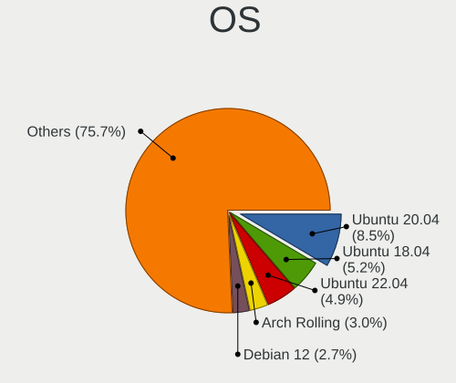

| Name                         | Desktops | Percent |
|------------------------------|----------|---------|
| Ubuntu 20.04                 | 120      | 8.52%   |
| Ubuntu 18.04                 | 73       | 5.18%   |
| Ubuntu 22.04                 | 69       | 4.9%    |
| Arch Rolling                 | 42       | 2.98%   |
| Debian 12                    | 38       | 2.7%    |
| OpenMandriva 4.3             | 36       | 2.56%   |
| Debian 11                    | 32       | 2.27%   |
| OpenMandriva 4.2             | 31       | 2.2%    |
| ArcoLinux Rolling            | 28       | 1.99%   |
| Manjaro                      | 25       | 1.78%   |
| Zorin 17                     | 24       | 1.7%    |
| Ubuntu 24.04                 | 24       | 1.7%    |
| Zorin 16                     | 21       | 1.49%   |
| Pop!_OS 22.04                | 18       | 1.28%   |
| OpenMandriva 23.08           | 17       | 1.21%   |
| Zorin 15                     | 16       | 1.14%   |
| Fedora 41                    | 16       | 1.14%   |
| Bazzite 42                   | 16       | 1.14%   |
| Linux Mint 21.2              | 15       | 1.07%   |
| Linux Mint 20.3              | 15       | 1.07%   |
| Linux Mint 20.2              | 15       | 1.07%   |
| KDE neon 20.04               | 15       | 1.07%   |
| Fedora 38                    | 15       | 1.07%   |
| Xubuntu 20.04                | 13       | 0.92%   |
| Linux Mint 20.1              | 13       | 0.92%   |
| Linux Mint 20                | 12       | 0.85%   |
| Linux Mint 19.3              | 12       | 0.85%   |
| Fedora 40                    | 12       | 0.85%   |
| Fedora 39                    | 12       | 0.85%   |
| OpenMandriva 5.0             | 11       | 0.78%   |
| OpenMandriva 24.07           | 11       | 0.78%   |
| Kubuntu 20.04                | 11       | 0.78%   |
| Xubuntu 18.04                | 10       | 0.71%   |
| Ubuntu 21.04                 | 10       | 0.71%   |
| openSUSE Tumbleweed-XXXXXXXX | 10       | 0.71%   |
| OpenMandriva 25.90           | 10       | 0.71%   |
| Linux Mint 22.2              | 10       | 0.71%   |
| Ubuntu MATE 20.04            | 9        | 0.64%   |
| Pop!_OS 21.04                | 9        | 0.64%   |
| OpenMandriva 6.0             | 9        | 0.64%   |

OS Family
---------

OS without a version

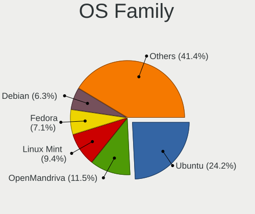

| Name          | Desktops | Percent |
|---------------|----------|---------|
| Ubuntu        | 323      | 24.21%  |
| OpenMandriva  | 154      | 11.54%  |
| Linux Mint    | 126      | 9.45%   |
| Fedora        | 95       | 7.12%   |
| Debian        | 84       | 6.3%    |
| Zorin         | 65       | 4.87%   |
| Arch          | 46       | 3.45%   |
| Manjaro       | 40       | 3%      |
| Pop!_OS       | 39       | 2.92%   |
| Xubuntu       | 32       | 2.4%    |
| Kubuntu       | 28       | 2.1%    |
| ArcoLinux     | 28       | 2.1%    |
| KDE neon      | 27       | 2.02%   |
| Nobara        | 23       | 1.72%   |
| Bazzite       | 19       | 1.42%   |
| Ubuntu MATE   | 18       | 1.35%   |
| ROSA          | 17       | 1.27%   |
| openSUSE      | 14       | 1.05%   |
| Elementary    | 14       | 1.05%   |
| Lubuntu       | 13       | 0.97%   |
| LMDE          | 8        | 0.6%    |
| Clear Linux   | 8        | 0.6%    |
| Ubuntu Unity  | 7        | 0.52%   |
| Kali          | 7        | 0.52%   |
| Gentoo        | 7        | 0.52%   |
| MX            | 6        | 0.45%   |
| Endless       | 6        | 0.45%   |
| BlackPanther  | 6        | 0.45%   |
| CachyOS       | 5        | 0.37%   |
| Ubuntu Budgie | 4        | 0.3%    |
| EndeavourOS   | 4        | 0.3%    |
| Xero          | 3        | 0.22%   |
| UbuntuDDE     | 3        | 0.22%   |
| SteamOS       | 3        | 0.22%   |
| Slackware     | 3        | 0.22%   |
| Lilidog       | 3        | 0.22%   |
| BigLinux      | 3        | 0.22%   |
| Alpine        | 3        | 0.22%   |
| TUXEDO OS     | 2        | 0.15%   |
| Sparky        | 2        | 0.15%   |

Kernel
------

Version of the Linux kernel

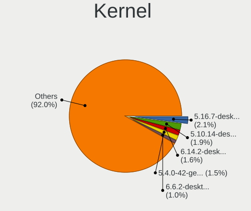

| Version                        | Desktops | Percent |
|--------------------------------|----------|---------|
| 5.16.7-desktop-1omv4003        | 32       | 2.08%   |
| 5.10.14-desktop-1omv4002       | 30       | 1.95%   |
| 6.14.2-desktop-3omv2590        | 24       | 1.56%   |
| 5.4.0-42-generic               | 23       | 1.49%   |
| 6.6.2-desktop-1omv2390         | 15       | 0.97%   |
| 5.4.0-48-generic               | 12       | 0.78%   |
| 6.4.11-desktop-1omv2390        | 11       | 0.71%   |
| 6.10.0-desktop-1omv2490        | 10       | 0.65%   |
| 5.4.0-26-generic               | 10       | 0.65%   |
| 5.8.0-53-generic               | 9        | 0.58%   |
| 5.4.0-52-generic               | 9        | 0.58%   |
| 6.8.0-49-generic               | 8        | 0.52%   |
| 6.2.6-desktop-1omv2390         | 8        | 0.52%   |
| 6.14.0-29-generic              | 8        | 0.52%   |
| 5.4.0-74-generic               | 8        | 0.52%   |
| 5.4.0-37-generic               | 8        | 0.52%   |
| 5.15.0-56-generic              | 8        | 0.52%   |
| 5.15.0-41-generic              | 8        | 0.52%   |
| 6.9.3-76060903-generic         | 7        | 0.45%   |
| 6.4.8-desktop-2omv2390         | 7        | 0.45%   |
| 6.12.1-desktop-1omv2490        | 7        | 0.45%   |
| 5.3.0-53-generic               | 7        | 0.45%   |
| 5.13.0-28-generic              | 7        | 0.45%   |
| 6.8.0-60-generic               | 6        | 0.39%   |
| 5.4.0-91-generic               | 6        | 0.39%   |
| 5.4.0-80-generic               | 6        | 0.39%   |
| 5.4.0-40-generic               | 6        | 0.39%   |
| 5.3.0-46-generic               | 6        | 0.39%   |
| 5.15.0-71-generic              | 6        | 0.39%   |
| 5.11.0-25-generic              | 6        | 0.39%   |
| 5.10.0-22-amd64                | 6        | 0.39%   |
| 6.8.0-51-generic               | 5        | 0.32%   |
| 6.8.0-48-generic               | 5        | 0.32%   |
| 6.8.0-45-generic               | 5        | 0.32%   |
| 6.8.0-40-generic               | 5        | 0.32%   |
| 6.5.0-44-generic               | 5        | 0.32%   |
| 6.5.0-35-generic               | 5        | 0.32%   |
| 6.2.0-36-generic               | 5        | 0.32%   |
| 6.15.6-105.bazzite.fc42.x86_64 | 5        | 0.32%   |
| 6.14.0-33-generic              | 5        | 0.32%   |

Kernel Family
-------------

Linux kernel without a distro release

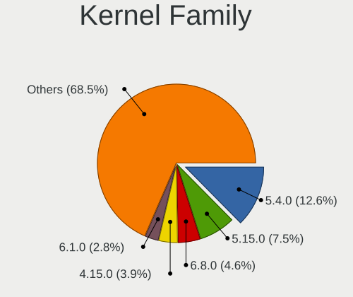

| Version | Desktops | Percent |
|---------|----------|---------|
| 5.4.0   | 182      | 12.58%  |
| 5.15.0  | 109      | 7.53%   |
| 6.8.0   | 67       | 4.63%   |
| 4.15.0  | 57       | 3.94%   |
| 6.1.0   | 41       | 2.83%   |
| 5.8.0   | 40       | 2.76%   |
| 5.10.0  | 39       | 2.7%    |
| 5.13.0  | 36       | 2.49%   |
| 5.3.0   | 35       | 2.42%   |
| 6.5.0   | 33       | 2.28%   |
| 5.11.0  | 33       | 2.28%   |
| 5.16.7  | 32       | 2.21%   |
| 5.10.14 | 31       | 2.14%   |
| 6.14.2  | 26       | 1.8%    |
| 5.19.0  | 26       | 1.8%    |
| 6.2.0   | 25       | 1.73%   |
| 6.14.0  | 25       | 1.73%   |
| 4.18.0  | 21       | 1.45%   |
| 5.0.0   | 20       | 1.38%   |
| 6.6.2   | 16       | 1.11%   |
| 6.4.11  | 12       | 0.83%   |
| 6.11.0  | 11       | 0.76%   |
| 6.10.0  | 11       | 0.76%   |
| 6.2.6   | 10       | 0.69%   |
| 6.4.8   | 8        | 0.55%   |
| 4.19.0  | 8        | 0.55%   |
| 6.9.3   | 7        | 0.48%   |
| 6.12.1  | 7        | 0.48%   |
| 6.8.9   | 6        | 0.41%   |
| 6.8.5   | 6        | 0.41%   |
| 6.6.9   | 6        | 0.41%   |
| 6.17.7  | 6        | 0.41%   |
| 6.15.6  | 6        | 0.41%   |
| 4.18.16 | 6        | 0.41%   |
| 6.15.9  | 5        | 0.35%   |
| 6.1.1   | 5        | 0.35%   |
| 5.16.13 | 5        | 0.35%   |
| 5.11.12 | 5        | 0.35%   |
| 4.4.0   | 5        | 0.35%   |
| 6.8.7   | 4        | 0.28%   |

Kernel Major Ver.
-----------------

Linux kernel major version

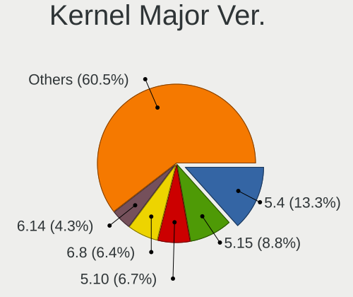

| Version | Desktops | Percent |
|---------|----------|---------|
| 5.4     | 190      | 13.34%  |
| 5.15    | 126      | 8.85%   |
| 5.10    | 95       | 6.67%   |
| 6.8     | 91       | 6.39%   |
| 6.14    | 61       | 4.28%   |
| 6.1     | 60       | 4.21%   |
| 4.15    | 57       | 4%      |
| 6.5     | 51       | 3.58%   |
| 5.8     | 50       | 3.51%   |
| 5.13    | 47       | 3.3%    |
| 6.6     | 45       | 3.16%   |
| 6.2     | 45       | 3.16%   |
| 5.16    | 44       | 3.09%   |
| 5.11    | 42       | 2.95%   |
| 6.12    | 38       | 2.67%   |
| 5.3     | 37       | 2.6%    |
| 5.19    | 33       | 2.32%   |
| 6.4     | 30       | 2.11%   |
| 4.18    | 27       | 1.9%    |
| 6.11    | 26       | 1.83%   |
| 5.0     | 22       | 1.54%   |
| 6.10    | 21       | 1.47%   |
| 6.7     | 19       | 1.33%   |
| 6.15    | 18       | 1.26%   |
| 6.9     | 15       | 1.05%   |
| 6.17    | 15       | 1.05%   |
| 6.0     | 14       | 0.98%   |
| 6.13    | 12       | 0.84%   |
| 6.3     | 10       | 0.7%    |
| 5.18    | 10       | 0.7%    |
| 5.17    | 9        | 0.63%   |
| 4.19    | 9        | 0.63%   |
| 6.16    | 8        | 0.56%   |
| 4.9     | 8        | 0.56%   |
| 5.6     | 6        | 0.42%   |
| 5.12    | 6        | 0.42%   |
| 5.7     | 5        | 0.35%   |
| 4.4     | 5        | 0.35%   |
| 5.9     | 4        | 0.28%   |
| 5.14    | 4        | 0.28%   |

Arch
----

OS architecture (x86_64, i586, etc.)

| Name   | Desktops | Percent |
|--------|----------|---------|
| x86_64 | 1238     | 97.02%  |
| i686   | 38       | 2.98%   |

DE
--

Desktop Environment

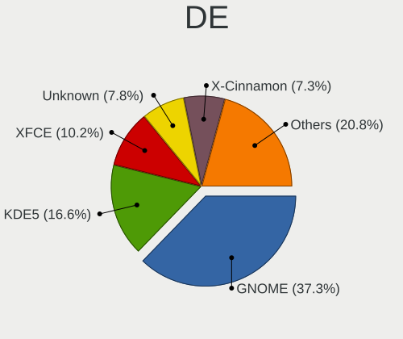

| Name             | Desktops | Percent |
|------------------|----------|---------|
| GNOME            | 503      | 37.26%  |
| KDE5             | 224      | 16.59%  |
| XFCE             | 138      | 10.22%  |
| Unknown          | 105      | 7.78%   |
| X-Cinnamon       | 99       | 7.33%   |
| KDE6             | 87       | 6.44%   |
| MATE             | 50       | 3.7%    |
| LXQt             | 24       | 1.78%   |
| KDE              | 24       | 1.78%   |
| Pantheon         | 12       | 0.89%   |
| LXDE             | 10       | 0.74%   |
| KDE4             | 9        | 0.67%   |
| i3               | 8        | 0.59%   |
| Cinnamon         | 8        | 0.59%   |
| Unity            | 7        | 0.52%   |
| lightdm-xsession | 4        | 0.3%    |
| Hyprland         | 4        | 0.3%    |
| Deepin           | 4        | 0.3%    |
| Budgie           | 4        | 0.3%    |
| Trinity          | 3        | 0.22%   |
| qtile            | 3        | 0.22%   |
| DWM              | 3        | 0.22%   |
| icewm            | 2        | 0.15%   |
| GNOME Flashback  | 2        | 0.15%   |
| COSMIC           | 2        | 0.15%   |
| bspwm            | 2        | 0.15%   |
| xmonad           | 1        | 0.07%   |
| wlroots          | 1        | 0.07%   |
| UKUI             | 1        | 0.07%   |
| i3-with-shmlog   | 1        | 0.07%   |
| fluxbox          | 1        | 0.07%   |
| Enlightenment    | 1        | 0.07%   |
| Cutefish         | 1        | 0.07%   |
| BunsenLabs       | 1        | 0.07%   |
| awesome          | 1        | 0.07%   |

Display Server
--------------

X11 or Wayland

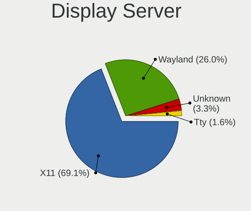

| Name    | Desktops | Percent |
|---------|----------|---------|
| X11     | 913      | 69.06%  |
| Wayland | 344      | 26.02%  |
| Unknown | 44       | 3.33%   |
| Tty     | 21       | 1.59%   |

Display Manager
---------------

SDDM, LightDM, etc.

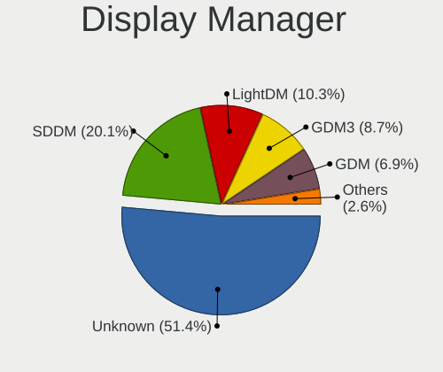

| Name    | Desktops | Percent |
|---------|----------|---------|
| Unknown | 682      | 51.43%  |
| SDDM    | 267      | 20.14%  |
| LightDM | 136      | 10.26%  |
| GDM3    | 116      | 8.75%   |
| GDM     | 91       | 6.86%   |
| TDM     | 17       | 1.28%   |
| KDM     | 8        | 0.6%    |
| SLiM    | 3        | 0.23%   |
| LXDM    | 2        | 0.15%   |
| XDM     | 1        | 0.08%   |
| SLIMSKI | 1        | 0.08%   |
| LY-DM   | 1        | 0.08%   |
| Ly      | 1        | 0.08%   |

OS Lang
-------

Language

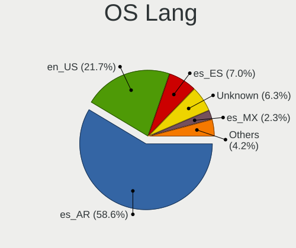

| Lang       | Desktops | Percent |
|------------|----------|---------|
| es_AR      | 773      | 58.61%  |
| en_US      | 286      | 21.68%  |
| es_ES      | 92       | 6.97%   |
| Unknown    | 83       | 6.29%   |
| es_MX      | 30       | 2.27%   |
| C          | 29       | 2.2%    |
| en_GB      | 14       | 1.06%   |
| es_CL      | 2        | 0.15%   |
| C.UTF8     | 2        | 0.15%   |
| UTF-8      | 1        | 0.08%   |
| ru_RU      | 1        | 0.08%   |
| es_VE      | 1        | 0.08%   |
| es_DO      | 1        | 0.08%   |
| es         | 1        | 0.08%   |
| en_UTF-8   | 1        | 0.08%   |
| en_US.UTF8 | 1        | 0.08%   |
| en_CA      | 1        | 0.08%   |

Boot Mode
---------

EFI or BIOS

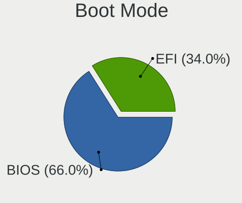

| Mode | Desktops | Percent |
|------|----------|---------|
| BIOS | 865      | 66.03%  |
| EFI  | 445      | 33.97%  |

Filesystem
----------

Type of filesystem

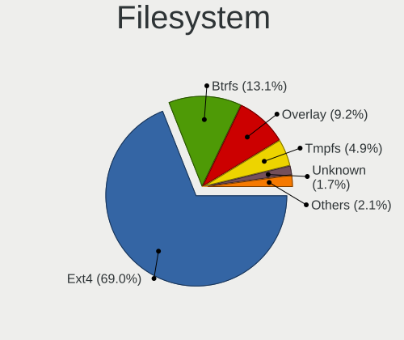

| Type    | Desktops | Percent |
|---------|----------|---------|
| Ext4    | 910      | 68.99%  |
| Btrfs   | 173      | 13.12%  |
| Overlay | 122      | 9.25%   |
| Tmpfs   | 64       | 4.85%   |
| Unknown | 22       | 1.67%   |
| Xfs     | 16       | 1.21%   |
| F2fs    | 4        | 0.3%    |
| Ext2    | 3        | 0.23%   |
| Zfs     | 2        | 0.15%   |
| Ext3    | 2        | 0.15%   |
| Aufs    | 1        | 0.08%   |

Part. scheme
------------

Scheme of partitioning

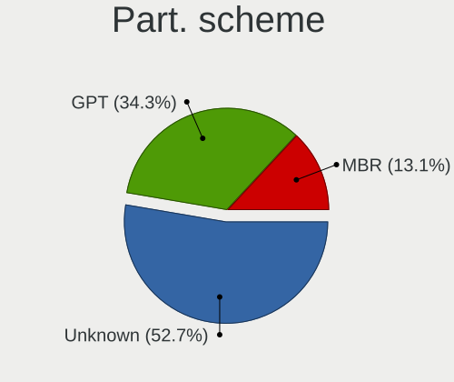

| Type    | Desktops | Percent |
|---------|----------|---------|
| Unknown | 689      | 52.68%  |
| GPT     | 448      | 34.25%  |
| MBR     | 171      | 13.07%  |

Dual Boot with Linux/BSD
------------------------

Hosting more than one Linux/BSD

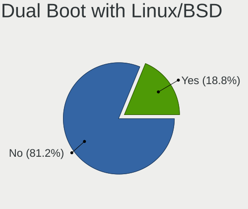

| Dual boot | Desktops | Percent |
|-----------|----------|---------|
| No        | 1061     | 81.24%  |
| Yes       | 245      | 18.76%  |

Dual Boot (Win)
---------------

Hosting Linux and Windows

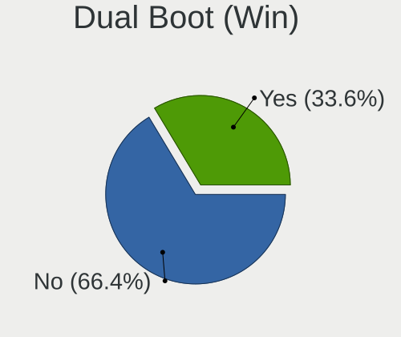

| Dual boot | Desktops | Percent |
|-----------|----------|---------|
| No        | 867      | 66.39%  |
| Yes       | 439      | 33.61%  |

Board
-----

Vendor
------

Motherboard manufacturer

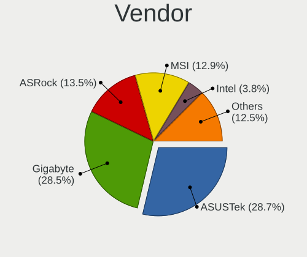

| Name                | Desktops | Percent |
|---------------------|----------|---------|
| ASUSTek Computer    | 366      | 28.71%  |
| Gigabyte Technology | 363      | 28.47%  |
| ASRock              | 172      | 13.49%  |
| MSI                 | 165      | 12.94%  |
| Intel               | 49       | 3.84%   |
| ECS                 | 27       | 2.12%   |
| Dell                | 23       | 1.8%    |
| Biostar             | 23       | 1.8%    |
| Hewlett-Packard     | 17       | 1.33%   |
| Lenovo              | 15       | 1.18%   |
| Unknown             | 13       | 1.02%   |
| Foxconn             | 6        | 0.47%   |
| Exo                 | 4        | 0.31%   |
| Quanta              | 3        | 0.24%   |
| PCChips             | 3        | 0.24%   |
| PCBOX               | 3        | 0.24%   |
| BANGHO              | 3        | 0.24%   |
| Sun Microsystems    | 2        | 0.16%   |
| Positivo            | 2        | 0.16%   |
| Colorful Technology | 2        | 0.16%   |
| VS Company          | 1        | 0.08%   |
| TPV-INVENTA         | 1        | 0.08%   |
| Supermicro          | 1        | 0.08%   |
| Pegatron            | 1        | 0.08%   |
| NCR                 | 1        | 0.08%   |
| MACHINIST           | 1        | 0.08%   |
| EPoX Computer       | 1        | 0.08%   |
| CX / Air Computers. | 1        | 0.08%   |
| AZW                 | 1        | 0.08%   |
| Apple               | 1        | 0.08%   |
| AMI                 | 1        | 0.08%   |
| American Megatrends | 1        | 0.08%   |
| Advantec            | 1        | 0.08%   |
| 16280-BM-32691      | 1        | 0.08%   |

Model
-----

Motherboard model

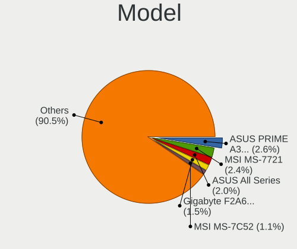

| Name                         | Desktops | Percent |
|------------------------------|----------|---------|
| ASUS PRIME A320M-K           | 33       | 2.59%   |
| MSI MS-7721                  | 30       | 2.35%   |
| ASUS All Series              | 25       | 1.96%   |
| Gigabyte F2A68HM-H           | 19       | 1.49%   |
| MSI MS-7C52                  | 14       | 1.1%    |
| Gigabyte H81M-H              | 14       | 1.1%    |
| Unknown                      | 13       | 1.02%   |
| Gigabyte A320M-S2H           | 12       | 0.94%   |
| Gigabyte H61M-S1             | 11       | 0.86%   |
| ASUS PRIME B450M-A           | 10       | 0.78%   |
| ASUS H61M-K                  | 10       | 0.78%   |
| ASRock A320M-HDV R4.0        | 10       | 0.78%   |
| MSI MS-7A15                  | 9        | 0.71%   |
| Gigabyte M68MT-S2            | 9        | 0.71%   |
| ASUS P5KPL-AM SE             | 9        | 0.71%   |
| Gigabyte H110M-H             | 8        | 0.63%   |
| Gigabyte A320M-H             | 8        | 0.63%   |
| ASRock N68-VS3 FX            | 8        | 0.63%   |
| ASRock FM2A68M-DG3+          | 8        | 0.63%   |
| ASRock B450M-HDV R4.0        | 8        | 0.63%   |
| MSI MS-7C96                  | 6        | 0.47%   |
| MSI MS-7C95                  | 6        | 0.47%   |
| MSI MS-7B84                  | 6        | 0.47%   |
| Gigabyte H510M H             | 6        | 0.47%   |
| Gigabyte GA-78LMT-S2         | 6        | 0.47%   |
| Gigabyte F2A55M-HD2          | 6        | 0.47%   |
| Gigabyte B450M DS3H          | 6        | 0.47%   |
| Gigabyte A320M-S2H V2        | 6        | 0.47%   |
| ECS H81H3-M4                 | 6        | 0.47%   |
| ASUS ROG STRIX B550-F GAMING | 6        | 0.47%   |
| ASUS PRIME A520M-K           | 6        | 0.47%   |
| ASRock G31M-S                | 6        | 0.47%   |
| MSI MS-7309                  | 5        | 0.39%   |
| Gigabyte H310M M.2 2.0       | 5        | 0.39%   |
| ASUS PRO A320M-R WI-FI       | 5        | 0.39%   |
| ASUS PRIME H310M-E R2.0      | 5        | 0.39%   |
| ASUS M5A97 LE R2.0           | 5        | 0.39%   |
| ASUS M5A78L-M LX3            | 5        | 0.39%   |
| ASUS M5A78L-M LX             | 5        | 0.39%   |
| ASUS M4A88TD-V EVO/USB3      | 5        | 0.39%   |

Model Family
------------

Motherboard model prefix

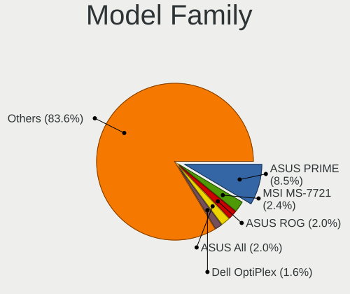

| Name                 | Desktops | Percent |
|----------------------|----------|---------|
| ASUS PRIME           | 109      | 8.55%   |
| MSI MS-7721          | 30       | 2.35%   |
| ASUS ROG             | 25       | 1.96%   |
| ASUS All             | 25       | 1.96%   |
| Dell OptiPlex        | 20       | 1.57%   |
| ASUS TUF             | 20       | 1.57%   |
| Gigabyte F2A68HM-H   | 19       | 1.49%   |
| Gigabyte A320M-S2H   | 18       | 1.41%   |
| Gigabyte B450M       | 16       | 1.25%   |
| ASUS M5A78L-M        | 16       | 1.25%   |
| MSI MS-7C52          | 14       | 1.1%    |
| Gigabyte H81M-H      | 14       | 1.1%    |
| ASRock A320M-HDV     | 13       | 1.02%   |
| Unknown              | 13       | 1.02%   |
| Lenovo ThinkCentre   | 12       | 0.94%   |
| ASUS M5A97           | 12       | 0.94%   |
| HP Compaq            | 11       | 0.86%   |
| Gigabyte H61M-S1     | 11       | 0.86%   |
| Gigabyte H510M       | 10       | 0.78%   |
| ASUS H61M-K          | 10       | 0.78%   |
| ASRock N68-VS3       | 10       | 0.78%   |
| MSI MS-7A15          | 9        | 0.71%   |
| Gigabyte M68MT-S2    | 9        | 0.71%   |
| Gigabyte B450        | 9        | 0.71%   |
| ASUS P5KPL-AM        | 9        | 0.71%   |
| ASRock N68-S         | 9        | 0.71%   |
| Gigabyte H310M       | 8        | 0.63%   |
| Gigabyte H110M-H     | 8        | 0.63%   |
| Gigabyte A520M       | 8        | 0.63%   |
| Gigabyte A320M-H     | 8        | 0.63%   |
| ASRock FM2A68M-DG3+  | 8        | 0.63%   |
| ASRock B450M-HDV     | 8        | 0.63%   |
| Gigabyte H410M       | 7        | 0.55%   |
| MSI MS-7C96          | 6        | 0.47%   |
| MSI MS-7C95          | 6        | 0.47%   |
| MSI MS-7B84          | 6        | 0.47%   |
| Gigabyte Z370        | 6        | 0.47%   |
| Gigabyte GA-78LMT-S2 | 6        | 0.47%   |
| Gigabyte F2A55M-HD2  | 6        | 0.47%   |
| Gigabyte B550M       | 6        | 0.47%   |

MFG Year
--------

Motherboard manufacture year

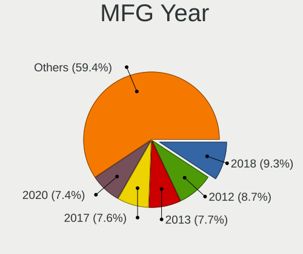

| Year | Desktops | Percent |
|------|----------|---------|
| 2018 | 118      | 9.25%   |
| 2012 | 111      | 8.71%   |
| 2013 | 98       | 7.69%   |
| 2017 | 97       | 7.61%   |
| 2020 | 94       | 7.37%   |
| 2011 | 90       | 7.06%   |
| 2014 | 77       | 6.04%   |
| 2010 | 74       | 5.8%    |
| 2021 | 73       | 5.73%   |
| 2019 | 69       | 5.41%   |
| 2015 | 67       | 5.25%   |
| 2009 | 63       | 4.94%   |
| 2016 | 52       | 4.08%   |
| 2008 | 52       | 4.08%   |
| 2007 | 41       | 3.22%   |
| 2022 | 34       | 2.67%   |
| 2006 | 30       | 2.35%   |
| 2023 | 17       | 1.33%   |
| 2024 | 7        | 0.55%   |
| 2004 | 5        | 0.39%   |
| 2005 | 4        | 0.31%   |
| 2025 | 1        | 0.08%   |
| 2001 | 1        | 0.08%   |

Form Factor
-----------

Physical design of the computer

| Name    | Desktops | Percent |
|---------|----------|---------|
| Desktop | 1275     | 100%    |

Secure Boot
-----------

Enabled or disabled

| State    | Desktops | Percent |
|----------|----------|---------|
| Disabled | 1254     | 97.66%  |
| Enabled  | 30       | 2.34%   |

Coreboot
--------

Have coreboot on board

| Used | Desktops | Percent |
|------|----------|---------|
| No   | 1275     | 100%    |

RAM Size
--------

Total RAM memory

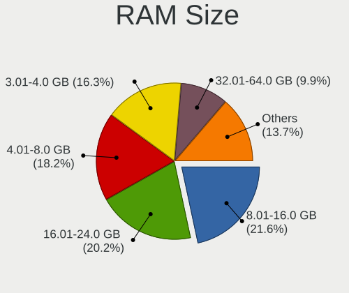

| Size in GB  | Desktops | Percent |
|-------------|----------|---------|
| 8.01-16.0   | 284      | 21.65%  |
| 16.01-24.0  | 265      | 20.2%   |
| 4.01-8.0    | 239      | 18.22%  |
| 3.01-4.0    | 214      | 16.31%  |
| 32.01-64.0  | 130      | 9.91%   |
| 1.01-2.0    | 76       | 5.79%   |
| 24.01-32.0  | 44       | 3.35%   |
| 2.01-3.0    | 26       | 1.98%   |
| 64.01-256.0 | 21       | 1.6%    |
| 0.51-1.0    | 11       | 0.84%   |
| 0.01-0.5    | 2        | 0.15%   |

RAM Used
--------

Used RAM memory

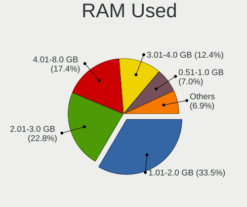

| Used GB    | Desktops | Percent |
|------------|----------|---------|
| 1.01-2.0   | 475      | 33.47%  |
| 2.01-3.0   | 324      | 22.83%  |
| 4.01-8.0   | 247      | 17.41%  |
| 3.01-4.0   | 176      | 12.4%   |
| 0.51-1.0   | 99       | 6.98%   |
| 8.01-16.0  | 58       | 4.09%   |
| 0.01-0.5   | 25       | 1.76%   |
| 16.01-24.0 | 10       | 0.7%    |
| 24.01-32.0 | 4        | 0.28%   |
| 0          | 1        | 0.07%   |

Total Drives
------------

Number of drives on board

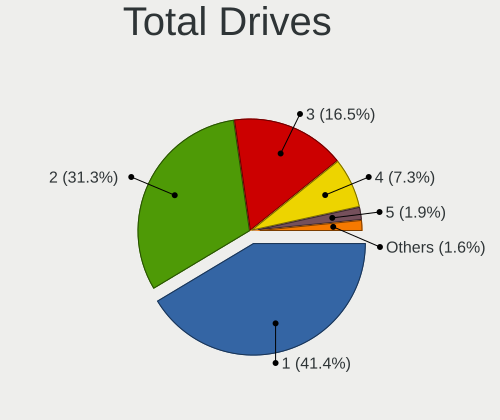

| Drives | Desktops | Percent |
|--------|----------|---------|
| 1      | 551      | 41.4%   |
| 2      | 417      | 31.33%  |
| 3      | 220      | 16.53%  |
| 4      | 97       | 7.29%   |
| 5      | 25       | 1.88%   |
| 6      | 9        | 0.68%   |
| 0      | 4        | 0.3%    |
| 7      | 3        | 0.23%   |
| 9      | 2        | 0.15%   |
| 28     | 1        | 0.08%   |
| 20     | 1        | 0.08%   |
| 19     | 1        | 0.08%   |

Has CD-ROM
----------

Has CD-ROM on board

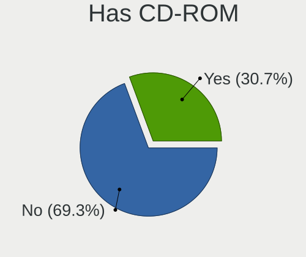

| Presented | Desktops | Percent |
|-----------|----------|---------|
| No        | 896      | 69.35%  |
| Yes       | 396      | 30.65%  |

Has Ethernet
------------

Has Ethernet on board

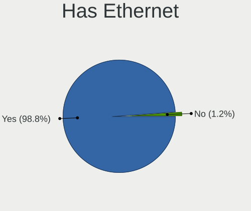

| Presented | Desktops | Percent |
|-----------|----------|---------|
| Yes       | 1260     | 98.82%  |
| No        | 15       | 1.18%   |

Has WiFi
--------

Has WiFi module

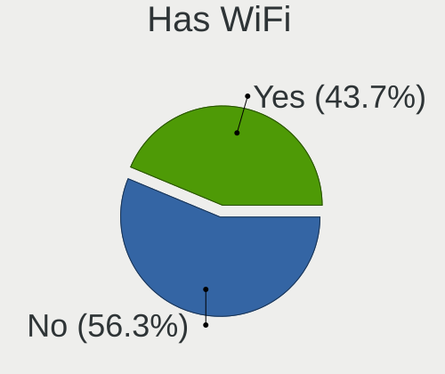

| Presented | Desktops | Percent |
|-----------|----------|---------|
| No        | 736      | 56.27%  |
| Yes       | 572      | 43.73%  |

Has Bluetooth
-------------

Has Bluetooth module

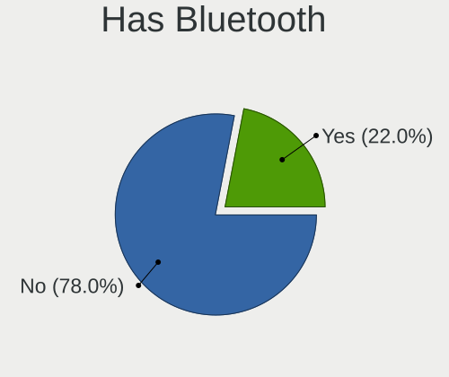

| Presented | Desktops | Percent |
|-----------|----------|---------|
| No        | 1015     | 78.02%  |
| Yes       | 286      | 21.98%  |

Location
--------

Country
-------

Geographic location (country)

| Country   | Desktops | Percent |
|-----------|----------|---------|
| Argentina | 1275     | 100%    |

City
----

Geographic location (city)

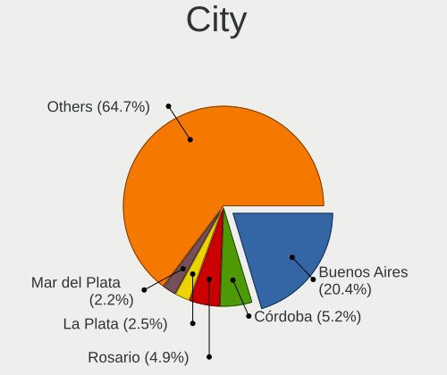

| City                   | Desktops | Percent |
|------------------------|----------|---------|
| Buenos Aires           | 272      | 20.36%  |
| Córdoba               | 70       | 5.24%   |
| Rosario                | 66       | 4.94%   |
| La Plata               | 33       | 2.47%   |
| Mar del Plata          | 30       | 2.25%   |
| Avellaneda             | 23       | 1.72%   |
| Quilmes                | 21       | 1.57%   |
| Lanus                  | 20       | 1.5%    |
| Santa Fe               | 18       | 1.35%   |
| Neuquén               | 17       | 1.27%   |
| Villa Ballester        | 16       | 1.2%    |
| Mendoza                | 16       | 1.2%    |
| Lomas de Zamora        | 16       | 1.2%    |
| Bahía Blanca          | 16       | 1.2%    |
| San Miguel de Tucumán | 15       | 1.12%   |
| Ituzaingo              | 15       | 1.12%   |
| Salta                  | 13       | 0.97%   |
| Paraná                | 13       | 0.97%   |
| Corrientes             | 13       | 0.97%   |
| Tandil                 | 12       | 0.9%    |
| San Juan               | 12       | 0.9%    |
| Resistencia            | 12       | 0.9%    |
| Ramos Mejia            | 12       | 0.9%    |
| Viedma                 | 10       | 0.75%   |
| Moron                  | 10       | 0.75%   |
| Isidro Casanova        | 10       | 0.75%   |
| Burzaco                | 10       | 0.75%   |
| Posadas                | 9        | 0.67%   |
| Moreno                 | 9        | 0.67%   |
| San Luis               | 8        | 0.6%    |
| Pilar                  | 8        | 0.6%    |
| Jose C. Paz            | 8        | 0.6%    |
| Hurlingham             | 8        | 0.6%    |
| Florencio Varela       | 8        | 0.6%    |
| Ciudad Evita           | 8        | 0.6%    |
| Caseros                | 8        | 0.6%    |
| Martinez               | 7        | 0.52%   |
| Concordia              | 7        | 0.52%   |
| Berazategui            | 7        | 0.52%   |
| Tigre                  | 6        | 0.45%   |

Drives
------

Drive Vendor
------------

Hard drive vendors

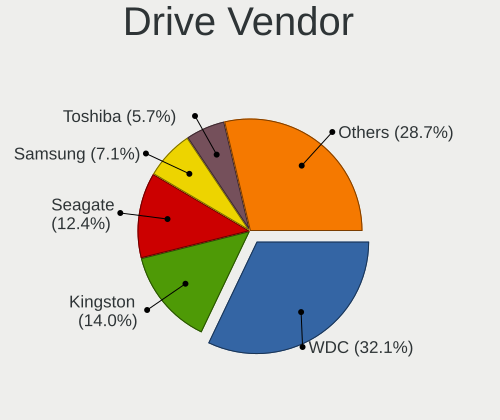

| Vendor                       | Desktops | Drives | Percent |
|------------------------------|----------|--------|---------|
| WDC                          | 708      | 1165   | 32.09%  |
| Kingston                     | 309      | 422    | 14.01%  |
| Seagate                      | 273      | 375    | 12.38%  |
| Samsung Electronics          | 157      | 241    | 7.12%   |
| Toshiba                      | 126      | 158    | 5.71%   |
| SanDisk                      | 71       | 85     | 3.22%   |
| Hitachi                      | 70       | 92     | 3.17%   |
| Gigabyte Technology          | 53       | 79     | 2.4%    |
| Crucial                      | 47       | 81     | 2.13%   |
| A-DATA Technology            | 46       | 51     | 2.09%   |
| Patriot                      | 19       | 22     | 0.86%   |
| Realtek Semiconductor        | 18       | 25     | 0.82%   |
| PNY                          | 18       | 27     | 0.82%   |
| Maxtor                       | 18       | 21     | 0.82%   |
| HGST                         | 18       | 21     | 0.82%   |
| Kingston Technology Company  | 17       | 22     | 0.77%   |
| MAXIO Technology (Hangzhou)  | 14       | 19     | 0.63%   |
| HS-SSD-WAVE(S)               | 14       | 18     | 0.63%   |
| Corsair                      | 14       | 16     | 0.63%   |
| China                        | 14       | 19     | 0.63%   |
| ADATA Technology             | 14       | 17     | 0.63%   |
| Phison Electronics           | 13       | 21     | 0.59%   |
| Hewlett-Packard              | 13       | 18     | 0.59%   |
| Micron/Crucial Technology    | 11       | 16     | 0.5%    |
| Lexar                        | 9        | 11     | 0.41%   |
| HS-SSD-C100                  | 8        | 9      | 0.36%   |
| SK hynix                     | 6        | 6      | 0.27%   |
| Phison                       | 6        | 7      | 0.27%   |
| XPG                          | 5        | 6      | 0.23%   |
| Team                         | 5        | 5      | 0.23%   |
| Silicon Motion               | 5        | 8      | 0.23%   |
| Colorful                     | 5        | 7      | 0.23%   |
| Shenzhen Longsys Electronics | 4        | 5      | 0.18%   |
| Micron Technology            | 4        | 8      | 0.18%   |
| Intel                        | 4        | 5      | 0.18%   |
| Hikvision                    | 4        | 4      | 0.18%   |
| Fujitsu                      | 4        | 4      | 0.18%   |
| Unknown                      | 4        | 5      | 0.18%   |
| T-FORCE                      | 3        | 5      | 0.14%   |
| Kimtigo                      | 3        | 3      | 0.14%   |

Drive Model
-----------

Hard drive models

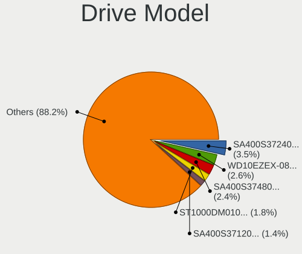

| Model                                            | Desktops | Percent |
|--------------------------------------------------|----------|---------|
| Kingston SA400S37240G 240GB SSD                  | 89       | 3.49%   |
| WDC WD10EZEX-08WN4A0 1TB                         | 67       | 2.63%   |
| Kingston SA400S37480G 480GB SSD                  | 62       | 2.43%   |
| Seagate ST1000DM010-2EP102 1TB                   | 47       | 1.84%   |
| Kingston SA400S37120G 120GB SSD                  | 36       | 1.41%   |
| WDC WDS240G2G0A-00JH30 240GB SSD                 | 32       | 1.25%   |
| WDC WD10EZEX-00BN5A0 1TB                         | 32       | 1.25%   |
| Seagate ST500DM002-1BD142 500GB                  | 28       | 1.1%    |
| Toshiba DT01ACA100 1TB                           | 27       | 1.06%   |
| WDC WD5000AAKX-001CA0 500GB                      | 26       | 1.02%   |
| Toshiba DT01ACA050 500GB                         | 26       | 1.02%   |
| WDC WD20EZRZ-00Z5HB0 2TB                         | 24       | 0.94%   |
| WDC WD5000AAKX-00ERMA0 500GB                     | 23       | 0.9%    |
| Kingston SV300S37A120G 120GB SSD                 | 23       | 0.9%    |
| Kingston SA400S37960G 960GB SSD                  | 23       | 0.9%    |
| Gigabyte GP-GSTFS31120GNTD 120GB SSD             | 21       | 0.82%   |
| WDC WDS120G2G0A-00JH30 120GB SSD                 | 20       | 0.78%   |
| WDC WD1003FZEX-00MK2A0 1TB                       | 18       | 0.71%   |
| Gigabyte GP-GSTFS31240GNTD 240GB SSD             | 17       | 0.67%   |
| WDC WD1600AABS-00PRA0 160GB                      | 16       | 0.63%   |
| WDC WD10EZEX-21WN4A0 1TB                         | 16       | 0.63%   |
| Crucial CT240BX500SSD1 240GB                     | 16       | 0.63%   |
| WDC WD10EZEX-00WN4A0 1TB                         | 13       | 0.51%   |
| Seagate ST2000DM008-2FR102 2TB                   | 13       | 0.51%   |
| WDC WD10EZEX-60WN4A0 1TB                         | 12       | 0.47%   |
| WDC WD10EZEX-22MFCA0 1TB                         | 12       | 0.47%   |
| WDC WD10EZEX-00BBHA0 1TB                         | 12       | 0.47%   |
| WDC WD10EARS-00Y5B1 1TB                          | 12       | 0.47%   |
| Samsung HD502HJ 500GB                            | 12       | 0.47%   |
| MAXIO (Hangzhou) NVMe SSD Controller MAP1202 2TB | 12       | 0.47%   |
| WDC WDS480G2G0A-00JH30 480GB SSD                 | 11       | 0.43%   |
| WDC WD20EZRX-00D8PB0 2TB                         | 11       | 0.43%   |
| Kingston SUV400S37240G 240GB SSD                 | 11       | 0.43%   |
| Kingston SNV2S500G 500GB                         | 11       | 0.43%   |
| A-DATA SU630 240GB SSD                           | 11       | 0.43%   |
| WDC WD3200AAJS-00L7A0 320GB                      | 10       | 0.39%   |
| Kingston SV300S37A240G 240GB SSD                 | 10       | 0.39%   |
| WDC WD3200AAKS-00L9A0 320GB                      | 9        | 0.35%   |
| WDC WD10EZEX-00KUWA0 1TB                         | 9        | 0.35%   |
| Toshiba MQ01ABF050 500GB                         | 9        | 0.35%   |

HDD Vendor
----------

Hard disk drive vendors

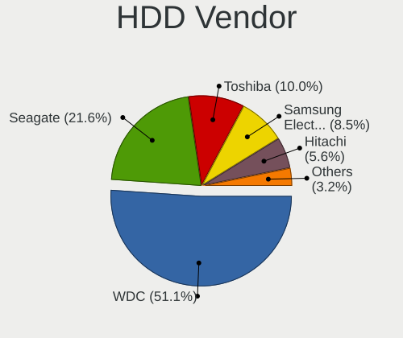

| Vendor              | Desktops | Drives | Percent |
|---------------------|----------|--------|---------|
| WDC                 | 638      | 1002   | 51.08%  |
| Seagate             | 270      | 371    | 21.62%  |
| Toshiba             | 125      | 155    | 10.01%  |
| Samsung Electronics | 106      | 152    | 8.49%   |
| Hitachi             | 70       | 92     | 5.6%    |
| HGST                | 18       | 21     | 1.44%   |
| Maxtor              | 15       | 16     | 1.2%    |
| Fujitsu             | 4        | 4      | 0.32%   |
| Quantum             | 1        | 1      | 0.08%   |
| ExcelStor           | 1        | 1      | 0.08%   |
| ASMT                | 1        | 2      | 0.08%   |

SSD Vendor
----------

Solid state drive vendors

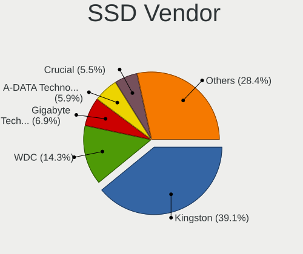

| Vendor              | Desktops | Drives | Percent |
|---------------------|----------|--------|---------|
| Kingston            | 279      | 378    | 39.08%  |
| WDC                 | 102      | 130    | 14.29%  |
| Gigabyte Technology | 49       | 75     | 6.86%   |
| A-DATA Technology   | 42       | 46     | 5.88%   |
| Crucial             | 39       | 71     | 5.46%   |
| Samsung Electronics | 31       | 46     | 4.34%   |
| SanDisk             | 23       | 26     | 3.22%   |
| PNY                 | 18       | 27     | 2.52%   |
| Patriot             | 18       | 21     | 2.52%   |
| China               | 13       | 18     | 1.82%   |
| Corsair             | 10       | 12     | 1.4%    |
| Lexar               | 8        | 10     | 1.12%   |
| Hewlett-Packard     | 8        | 9      | 1.12%   |
| HS-SSD-WAVE(S)      | 6        | 8      | 0.84%   |
| Team                | 5        | 5      | 0.7%    |
| Colorful            | 5        | 7      | 0.7%    |
| HS-SSD-C100         | 4        | 5      | 0.56%   |
| Hikvision           | 4        | 4      | 0.56%   |
| SK hynix            | 3        | 3      | 0.42%   |
| Seagate             | 3        | 4      | 0.42%   |
| Maxtor              | 3        | 5      | 0.42%   |
| Kimtigo             | 3        | 3      | 0.42%   |
| Intel               | 3        | 4      | 0.42%   |
| Vi550               | 2        | 2      | 0.28%   |
| Super Talent        | 2        | 2      | 0.28%   |
| OCZ                 | 2        | 2      | 0.28%   |
| Netac               | 2        | 3      | 0.28%   |
| Mushkin             | 2        | 2      | 0.28%   |
| Hoodisk             | 2        | 2      | 0.28%   |
| FREEBSD             | 2        | 36     | 0.28%   |
| FORESEE             | 2        | 2      | 0.28%   |
| Unknown             | 2        | 2      | 0.28%   |
| Wibtek              | 1        | 1      | 0.14%   |
| WALRAM              | 1        | 1      | 0.14%   |
| Toshiba             | 1        | 1      | 0.14%   |
| T-FORCE             | 1        | 2      | 0.14%   |
| sobetter            | 1        | 1      | 0.14%   |
| SABRENT             | 1        | 1      | 0.14%   |
| Neo                 | 1        | 2      | 0.14%   |
| LITEONIT            | 1        | 1      | 0.14%   |

Drive Kind
----------

HDD or SSD

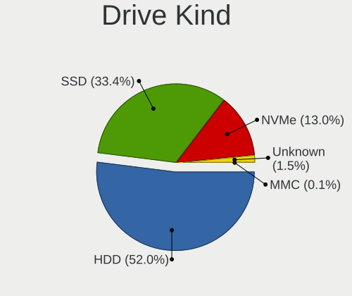

| Kind    | Desktops | Drives | Percent |
|---------|----------|--------|---------|
| HDD     | 984      | 1817   | 51.98%  |
| SSD     | 633      | 993    | 33.44%  |
| NVMe    | 246      | 381    | 13%     |
| Unknown | 29       | 36     | 1.53%   |
| MMC     | 1        | 1      | 0.05%   |

Drive Connector
---------------

SATA, SAS, NVMe, etc.

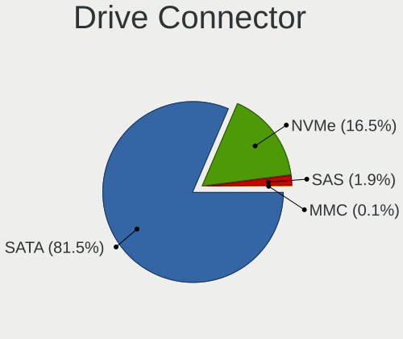

| Type | Desktops | Drives | Percent |
|------|----------|--------|---------|
| SATA | 1212     | 2810   | 81.45%  |
| NVMe | 246      | 380    | 16.53%  |
| SAS  | 29       | 37     | 1.95%   |
| MMC  | 1        | 1      | 0.07%   |

Drive Size
----------

Size of hard drive

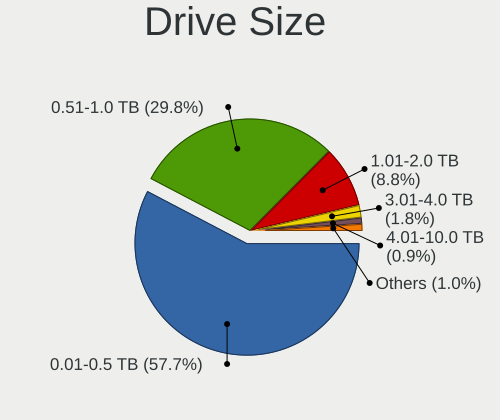

| Size in TB | Desktops | Drives | Percent |
|------------|----------|--------|---------|
| 0.01-0.5   | 961      | 1644   | 57.68%  |
| 0.51-1.0   | 496      | 820    | 29.77%  |
| 1.01-2.0   | 147      | 208    | 8.82%   |
| 3.01-4.0   | 30       | 43     | 1.8%    |
| 4.01-10.0  | 15       | 23     | 0.9%    |
| 2.01-3.0   | 14       | 17     | 0.84%   |
| 10.01-20.0 | 3        | 55     | 0.18%   |

Space Total
-----------

Amount of disk space available on the file system

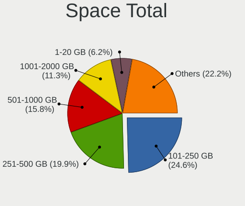

| Size in GB     | Desktops | Percent |
|----------------|----------|---------|
| 101-250        | 340      | 24.57%  |
| 251-500        | 275      | 19.87%  |
| 501-1000       | 219      | 15.82%  |
| 1001-2000      | 157      | 11.34%  |
| 1-20           | 86       | 6.21%   |
| 51-100         | 82       | 5.92%   |
| 2001-3000      | 78       | 5.64%   |
| More than 3000 | 68       | 4.91%   |
| 21-50          | 49       | 3.54%   |
| Unknown        | 30       | 2.17%   |

Space Used
----------

Amount of used disk space

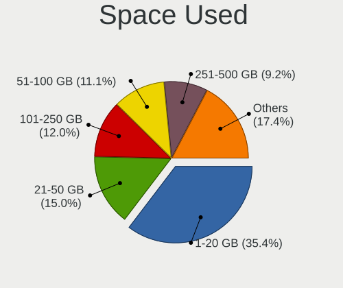

| Used GB        | Desktops | Percent |
|----------------|----------|---------|
| 1-20           | 501      | 35.36%  |
| 21-50          | 213      | 15.03%  |
| 101-250        | 170      | 12%     |
| 51-100         | 157      | 11.08%  |
| 251-500        | 130      | 9.17%   |
| 501-1000       | 107      | 7.55%   |
| 1001-2000      | 64       | 4.52%   |
| Unknown        | 30       | 2.12%   |
| More than 3000 | 22       | 1.55%   |
| 2001-3000      | 21       | 1.48%   |
| 0              | 2        | 0.14%   |

Malfunc. Drives
---------------

Drive models with a malfunction

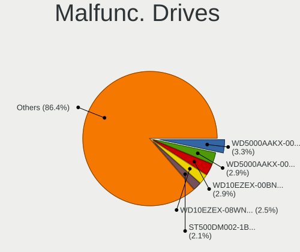

| Model                             | Desktops | Drives | Percent |
|-----------------------------------|----------|--------|---------|
| WDC WD5000AAKX-00ERMA0 500GB      | 8        | 10     | 3.31%   |
| WDC WD5000AAKX-001CA0 500GB       | 7        | 9      | 2.89%   |
| WDC WD10EZEX-00BN5A0 1TB          | 7        | 7      | 2.89%   |
| WDC WD10EZEX-08WN4A0 1TB          | 6        | 6      | 2.48%   |
| Seagate ST500DM002-1BD142 500GB   | 5        | 6      | 2.07%   |
| WDC WD3200AAKS-00L9A0 320GB       | 4        | 4      | 1.65%   |
| WDC WD10EARS-00Y5B1 1TB           | 4        | 4      | 1.65%   |
| Toshiba DT01ACA050 500GB          | 4        | 4      | 1.65%   |
| Kingston SA400S37240G 240GB SSD   | 4        | 4      | 1.65%   |
| WDC WD1003FZEX-00MK2A0 1TB        | 3        | 4      | 1.24%   |
| WDC WD1002FAEX-00Z3A0 1TB         | 3        | 3      | 1.24%   |
| WDC WD1002FAEX-00Y9A0 1TB         | 3        | 3      | 1.24%   |
| Seagate ST500LM030-2E717D 500GB   | 3        | 3      | 1.24%   |
| Seagate ST1000DM003-1SB10C 1TB    | 3        | 3      | 1.24%   |
| WDC WDS240G2G0A-00JH30 240GB SSD  | 2        | 2      | 0.83%   |
| WDC WD5000AAKX-08ERMA0 500GB      | 2        | 2      | 0.83%   |
| WDC WD5000AAKS-00V1A0 500GB       | 2        | 2      | 0.83%   |
| WDC WD3200AAJS-56B4A0 320GB       | 2        | 3      | 0.83%   |
| WDC WD3200AAJS-00L7A0 320GB       | 2        | 2      | 0.83%   |
| WDC WD20PURZ-85GU6Y0 2TB          | 2        | 3      | 0.83%   |
| WDC WD20EZRX-00D8PB0 2TB          | 2        | 2      | 0.83%   |
| WDC WD1600AABS-00PRA0 160GB       | 2        | 2      | 0.83%   |
| WDC WD10EZEX-00RKKA0 1TB          | 2        | 2      | 0.83%   |
| WDC WD1003FZEX-00K3CA0 1TB        | 2        | 2      | 0.83%   |
| Toshiba MQ01ABF050 500GB          | 2        | 2      | 0.83%   |
| Toshiba MK7559GSXP 752GB          | 2        | 3      | 0.83%   |
| Toshiba MK3263GSX 320GB           | 2        | 3      | 0.83%   |
| Toshiba MK1665GSX 160GB           | 2        | 2      | 0.83%   |
| Seagate ST9250315AS 250GB         | 2        | 2      | 0.83%   |
| Seagate ST2000VM003-1CT164 2TB    | 2        | 2      | 0.83%   |
| Seagate ST1500DL003-9VT16L 1TB    | 2        | 2      | 0.83%   |
| Seagate ST1000VM002-1CT162 1TB    | 2        | 2      | 0.83%   |
| Seagate ST1000DM003-9YN162 1TB    | 2        | 5      | 0.83%   |
| Seagate ST1000DM003-1CH162 1TB    | 2        | 2      | 0.83%   |
| Samsung Electronics SP0411N 40GB  | 2        | 3      | 0.83%   |
| Samsung Electronics HM641JI 640GB | 2        | 2      | 0.83%   |
| Samsung Electronics HD322HJ 320GB | 2        | 2      | 0.83%   |
| Samsung Electronics HD103SJ 1TB   | 2        | 2      | 0.83%   |
| Kingston SV300S37A120G 120GB SSD  | 2        | 2      | 0.83%   |
| Kingston SA400S37120G 120GB SSD   | 2        | 2      | 0.83%   |

Malfunc. Drive Vendor
---------------------

Vendors of faulty drives

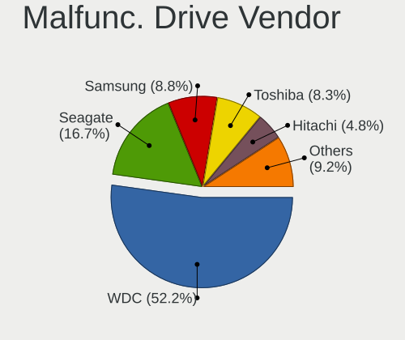

| Vendor                      | Desktops | Drives | Percent |
|-----------------------------|----------|--------|---------|
| WDC                         | 119      | 140    | 52.19%  |
| Seagate                     | 38       | 45     | 16.67%  |
| Samsung Electronics         | 20       | 23     | 8.77%   |
| Toshiba                     | 19       | 22     | 8.33%   |
| Hitachi                     | 11       | 11     | 4.82%   |
| Kingston                    | 9        | 9      | 3.95%   |
| Maxtor                      | 3        | 4      | 1.32%   |
| HGST                        | 2        | 2      | 0.88%   |
| A-DATA Technology           | 2        | 2      | 0.88%   |
| XPG                         | 1        | 1      | 0.44%   |
| Silicon Motion              | 1        | 1      | 0.44%   |
| Quantum                     | 1        | 1      | 0.44%   |
| MAXIO Technology (Hangzhou) | 1        | 2      | 0.44%   |
| Fujitsu                     | 1        | 1      | 0.44%   |

Malfunc. HDD Vendor
-------------------

Vendors of faulty HDD drives

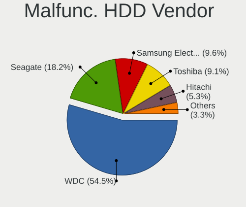

| Vendor              | Desktops | Drives | Percent |
|---------------------|----------|--------|---------|
| WDC                 | 114      | 132    | 54.55%  |
| Seagate             | 38       | 45     | 18.18%  |
| Samsung Electronics | 20       | 22     | 9.57%   |
| Toshiba             | 19       | 22     | 9.09%   |
| Hitachi             | 11       | 11     | 5.26%   |
| Maxtor              | 3        | 4      | 1.44%   |
| HGST                | 2        | 2      | 0.96%   |
| Quantum             | 1        | 1      | 0.48%   |
| Fujitsu             | 1        | 1      | 0.48%   |

Malfunc. Drive Kind
-------------------

Kinds of faulty drives

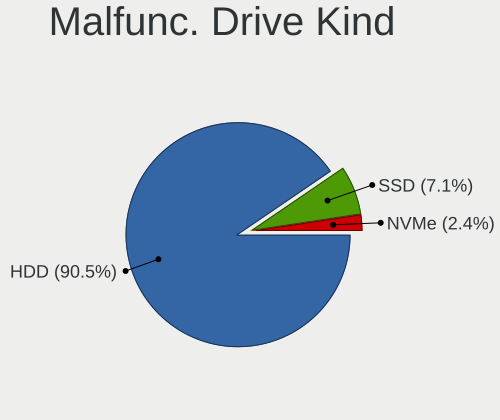

| Kind | Desktops | Drives | Percent |
|------|----------|--------|---------|
| HDD  | 190      | 240    | 90.48%  |
| SSD  | 15       | 18     | 7.14%   |
| NVMe | 5        | 6      | 2.38%   |

Failed Drives
-------------

Failed drive models

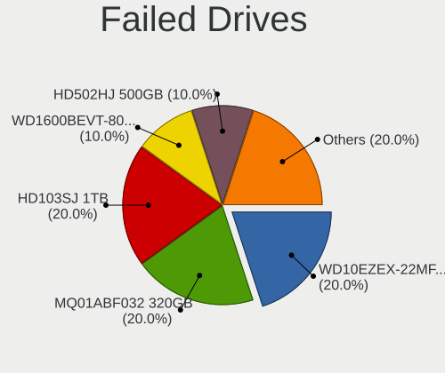

| Model                             | Desktops | Drives | Percent |
|-----------------------------------|----------|--------|---------|
| WDC WD10EZEX-22MFCA0 1TB          | 2        | 2      | 20%     |
| Toshiba MQ01ABF032 320GB          | 2        | 2      | 20%     |
| Samsung Electronics HD103SJ 1TB   | 2        | 2      | 20%     |
| WDC WD1600BEVT-80A23T0 160GB      | 1        | 1      | 10%     |
| Samsung Electronics HD502HJ 500GB | 1        | 1      | 10%     |
| Kingston SV300S37A60G 64GB SSD    | 1        | 1      | 10%     |
| HGST HTS541010A9E680 1TB          | 1        | 1      | 10%     |

Failed Drive Vendor
-------------------

Failed drive vendors

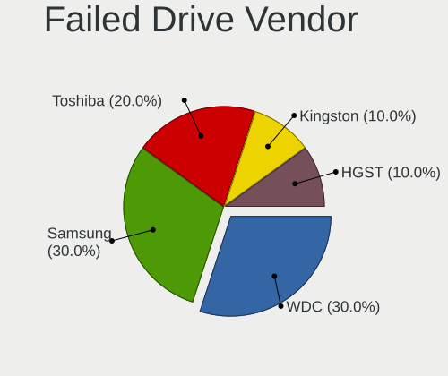

| Vendor              | Desktops | Drives | Percent |
|---------------------|----------|--------|---------|
| WDC                 | 3        | 3      | 30%     |
| Samsung Electronics | 3        | 3      | 30%     |
| Toshiba             | 2        | 2      | 20%     |
| Kingston            | 1        | 1      | 10%     |
| HGST                | 1        | 1      | 10%     |

Drive Status
------------

Number of failed and malfunc. drives

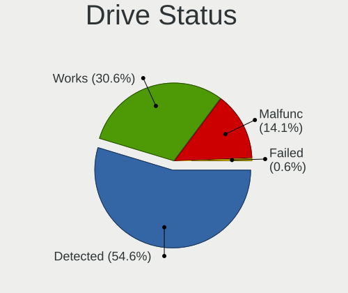

| Status   | Desktops | Drives | Percent |
|----------|----------|--------|---------|
| Detected | 788      | 1939   | 54.65%  |
| Works    | 441      | 1015   | 30.58%  |
| Malfunc  | 204      | 264    | 14.15%  |
| Failed   | 9        | 10     | 0.62%   |

Storage controller
------------------

Storage Vendor
--------------

Storage controller vendors

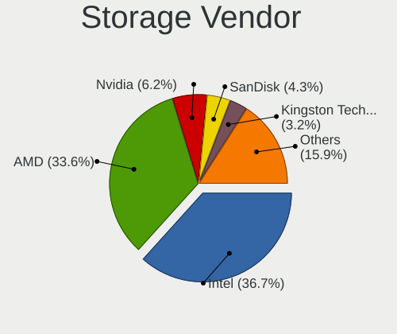

| Vendor                           | Desktops | Percent |
|----------------------------------|----------|---------|
| Intel                            | 599      | 36.7%   |
| AMD                              | 548      | 33.58%  |
| Nvidia                           | 102      | 6.25%   |
| SanDisk                          | 70       | 4.29%   |
| Kingston Technology Company      | 53       | 3.25%   |
| ASMedia Technology               | 34       | 2.08%   |
| VIA Technologies                 | 33       | 2.02%   |
| Samsung Electronics              | 28       | 1.72%   |
| Phison Electronics               | 26       | 1.59%   |
| Realtek Semiconductor            | 24       | 1.47%   |
| Micron/Crucial Technology        | 16       | 0.98%   |
| MAXIO Technology (Hangzhou)      | 16       | 0.98%   |
| Marvell Technology Group         | 16       | 0.98%   |
| ADATA Technology                 | 15       | 0.92%   |
| JMicron Technology               | 14       | 0.86%   |
| Silicon Motion                   | 10       | 0.61%   |
| Silicon Integrated Systems [SiS] | 5        | 0.31%   |
| Micron Technology                | 5        | 0.31%   |
| Shenzhen Longsys Electronics     | 4        | 0.25%   |
| SK hynix                         | 3        | 0.18%   |
| Silicon Image                    | 2        | 0.12%   |
| Adaptec                          | 2        | 0.12%   |
| Toshiba America Info Systems     | 1        | 0.06%   |
| Solidigm                         | 1        | 0.06%   |
| Solid State Storage Technology   | 1        | 0.06%   |
| Promise Technology               | 1        | 0.06%   |
| KIOXIA                           | 1        | 0.06%   |
| Hosin Global Electronics         | 1        | 0.06%   |
| Broadcom / LSI                   | 1        | 0.06%   |

Storage Model
-------------

Storage controller models

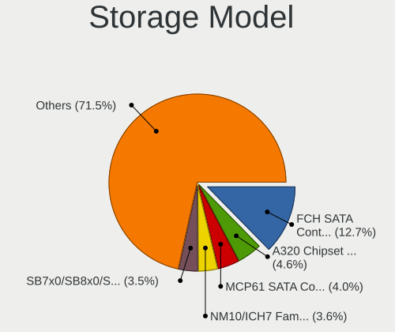

| Model                                                                                   | Desktops | Percent |
|-----------------------------------------------------------------------------------------|----------|---------|
| AMD FCH SATA Controller [AHCI mode]                                                     | 282      | 12.66%  |
| AMD A320 Chipset SATA Controller [AHCI mode]                                            | 103      | 4.62%   |
| Nvidia MCP61 SATA Controller                                                            | 89       | 3.99%   |
| Intel NM10/ICH7 Family SATA Controller [IDE mode]                                       | 81       | 3.64%   |
| AMD SB7x0/SB8x0/SB9x0 IDE Controller                                                    | 79       | 3.55%   |
| AMD 400 Series Chipset SATA Controller                                                  | 76       | 3.41%   |
| Nvidia MCP61 IDE                                                                        | 74       | 3.32%   |
| Intel 82801G (ICH7 Family) IDE Controller                                               | 67       | 3.01%   |
| Intel 8 Series/C220 Series Chipset Family 6-port SATA Controller 1 [AHCI mode]          | 66       | 2.96%   |
| AMD SB7x0/SB8x0/SB9x0 SATA Controller [IDE mode]                                        | 62       | 2.78%   |
| Intel Q170/Q150/B150/H170/H110/Z170/CM236 Chipset SATA Controller [AHCI Mode]           | 60       | 2.69%   |
| AMD 500 Series Chipset SATA Controller                                                  | 59       | 2.65%   |
| Intel 200 Series PCH SATA controller [AHCI mode]                                        | 56       | 2.51%   |
| AMD FCH SATA Controller [IDE mode]                                                      | 41       | 1.84%   |
| AMD SB7x0/SB8x0/SB9x0 SATA Controller [AHCI mode]                                       | 40       | 1.8%    |
| Intel 6 Series/C200 Series Chipset Family 6 port Desktop SATA AHCI Controller           | 38       | 1.71%   |
| Intel 6 Series/C200 Series Chipset Family Desktop SATA Controller (IDE mode, ports 4-5) | 37       | 1.66%   |
| Intel 6 Series/C200 Series Chipset Family Desktop SATA Controller (IDE mode, ports 0-3) | 37       | 1.66%   |
| AMD FCH IDE Controller                                                                  | 36       | 1.62%   |
| Intel 500 Series Chipset Family SATA AHCI Controller                                    | 35       | 1.57%   |
| ASMedia ASM1061/ASM1062 Serial ATA Controller                                           | 31       | 1.39%   |
| Intel Cannon Lake PCH SATA AHCI Controller                                              | 24       | 1.08%   |
| Intel Alder Lake-S PCH SATA Controller [AHCI Mode]                                      | 22       | 0.99%   |
| AMD 300 Series Chipset SATA Controller                                                  | 22       | 0.99%   |
| Intel 7 Series/C210 Series Chipset Family 6-port SATA Controller [AHCI mode]            | 21       | 0.94%   |
| Intel 9 Series Chipset Family SATA Controller [AHCI Mode]                               | 20       | 0.9%    |
| AMD 600 Series Chipset SATA Controller                                                  | 20       | 0.9%    |
| VIA VT82C586A/B/VT82C686/A/B/VT823x/A/C PIPC Bus Master IDE                             | 19       | 0.85%   |
| Samsung NVMe SSD Controller SM981/PM981/PM983                                           | 19       | 0.85%   |
| Intel SATA Controller [RAID mode]                                                       | 18       | 0.81%   |
| SanDisk WD Green SN350 240GB (DRAM-less) / SN560E NVMe SSD                              | 17       | 0.76%   |
| Intel 7 Series/C210 Series Chipset Family 4-port SATA Controller [IDE mode]             | 15       | 0.67%   |
| Intel 7 Series/C210 Series Chipset Family 2-port SATA Controller [IDE mode]             | 15       | 0.67%   |
| SanDisk Extreme Pro / WD Black SN750 / PC SN730 / Red SN700 NVMe SSD                    | 14       | 0.63%   |
| MAXIO (Hangzhou) NVMe SSD Controller MAP1202 (DRAM-less)                                | 14       | 0.63%   |
| Realtek RTS5762 NVMe SSD Controller                                                     | 13       | 0.58%   |
| Intel 400 Series Chipset Family SATA AHCI Controller                                    | 13       | 0.58%   |
| SanDisk Ultra 3D / WD PC SN530, IX SN530, Blue SN550 NVMe SSD (DRAM-less)               | 12       | 0.54%   |
| Kingston Company NV2 NVMe SSD [SM2267XT] (DRAM-less)                                    | 12       | 0.54%   |
| Kingston Company NV1 NVMe SSD [SM2263XT] (DRAM-less)                                    | 12       | 0.54%   |

Storage Kind
------------

Kind of storage controller (IDE, SATA, NVMe, SAS, ...)

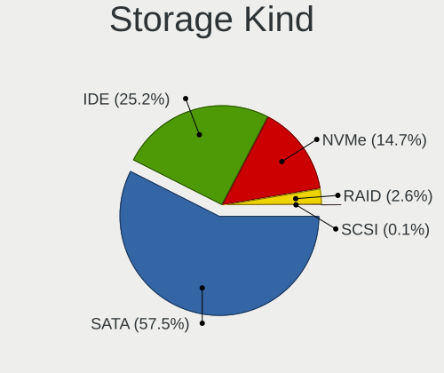

| Kind | Desktops | Percent |
|------|----------|---------|
| SATA | 967      | 57.46%  |
| IDE  | 424      | 25.19%  |
| NVMe | 247      | 14.68%  |
| RAID | 43       | 2.55%   |
| SCSI | 2        | 0.12%   |

Processor
---------

CPU Vendor
----------

Processor vendors

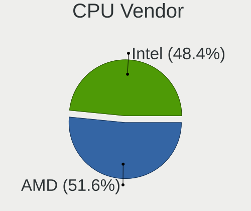

| Vendor | Desktops | Percent |
|--------|----------|---------|
| AMD    | 658      | 51.57%  |
| Intel  | 618      | 48.43%  |

CPU Model
---------

Processor models

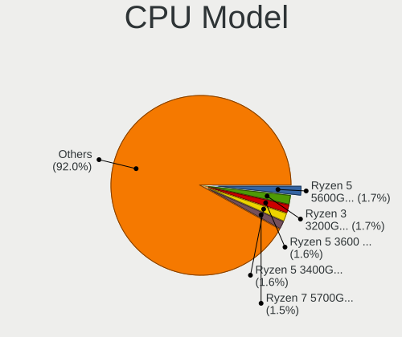

| Model                                         | Desktops | Percent |
|-----------------------------------------------|----------|---------|
| AMD Ryzen 5 5600G with Radeon Graphics        | 22       | 1.72%   |
| AMD Ryzen 3 3200G with Radeon Vega Graphics   | 22       | 1.72%   |
| AMD Ryzen 5 3600 6-Core Processor             | 20       | 1.56%   |
| AMD Ryzen 5 3400G with Radeon Vega Graphics   | 20       | 1.56%   |
| AMD Ryzen 7 5700G with Radeon Graphics        | 19       | 1.48%   |
| AMD Ryzen 5 2600 Six-Core Processor           | 18       | 1.4%    |
| AMD Ryzen 5 5600X 6-Core Processor            | 17       | 1.33%   |
| AMD A4-4000 APU with Radeon HD Graphics       | 15       | 1.17%   |
| AMD FX-6300 Six-Core Processor                | 14       | 1.09%   |
| AMD FX-4100 Quad-Core Processor               | 14       | 1.09%   |
| Intel Core i5-7400 CPU @ 3.00GHz              | 13       | 1.01%   |
| Intel Core i5-4460 CPU @ 3.20GHz              | 13       | 1.01%   |
| Intel Core i7-3770 CPU @ 3.40GHz              | 12       | 0.94%   |
| Intel Core i3-4170 CPU @ 3.70GHz              | 12       | 0.94%   |
| AMD Ryzen 3 2200G with Radeon Vega Graphics   | 12       | 0.94%   |
| AMD Athlon II X2 250 Processor                | 12       | 0.94%   |
| Intel Core i5-10400 CPU @ 2.90GHz             | 11       | 0.86%   |
| Intel Core i3-3220 CPU @ 3.30GHz              | 11       | 0.86%   |
| Intel Core 2 Duo CPU E7500 @ 2.93GHz          | 11       | 0.86%   |
| AMD Ryzen 5 2400G with Radeon Vega Graphics   | 11       | 0.86%   |
| AMD Athlon 3000G with Radeon Vega Graphics    | 11       | 0.86%   |
| AMD A8-9600 RADEON R7, 10 COMPUTE CORES 4C+6G | 11       | 0.86%   |
| Intel Core i7-4790 CPU @ 3.60GHz              | 10       | 0.78%   |
| Intel Core i5-4440 CPU @ 3.10GHz              | 10       | 0.78%   |
| AMD Ryzen 7 3700X 8-Core Processor            | 10       | 0.78%   |
| AMD A8-7600 Radeon R7, 10 Compute Cores 4C+6G | 10       | 0.78%   |
| AMD A4-6300 APU with Radeon HD Graphics       | 10       | 0.78%   |
| Intel Pentium Dual-Core CPU E5400 @ 2.70GHz   | 9        | 0.7%    |
| Intel Pentium Dual-Core CPU E5300 @ 2.60GHz   | 9        | 0.7%    |
| Intel Pentium Dual CPU E2180 @ 2.00GHz        | 9        | 0.7%    |
| Intel Core i7-7700 CPU @ 3.60GHz              | 9        | 0.7%    |
| Intel Core i5-9400 CPU @ 2.90GHz              | 9        | 0.7%    |
| Intel Core i3-2100 CPU @ 3.10GHz              | 9        | 0.7%    |
| AMD Phenom II X4 955 Processor                | 9        | 0.7%    |
| Intel Pentium CPU G4560 @ 3.50GHz             | 8        | 0.62%   |
| Intel Core i5-8400 CPU @ 2.80GHz              | 8        | 0.62%   |
| Intel Pentium Dual-Core CPU E5700 @ 3.00GHz   | 7        | 0.55%   |
| Intel Core i7-8700 CPU @ 3.20GHz              | 7        | 0.55%   |
| Intel Core i7-6700 CPU @ 3.40GHz              | 7        | 0.55%   |
| Intel Core i7-10700 CPU @ 2.90GHz             | 7        | 0.55%   |

CPU Model Family
----------------

Processor model prefix

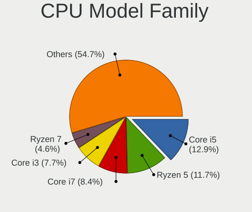

| Model                   | Desktops | Percent |
|-------------------------|----------|---------|
| Intel Core i5           | 165      | 12.89%  |
| AMD Ryzen 5             | 150      | 11.72%  |
| Intel Core i7           | 108      | 8.44%   |
| Intel Core i3           | 98       | 7.66%   |
| AMD Ryzen 7             | 59       | 4.61%   |
| AMD FX                  | 59       | 4.61%   |
| Other                   | 48       | 3.75%   |
| AMD Ryzen 3             | 46       | 3.59%   |
| AMD A8                  | 41       | 3.2%    |
| Intel Celeron           | 40       | 3.13%   |
| AMD A4                  | 34       | 2.66%   |
| Intel Pentium Dual-Core | 33       | 2.58%   |
| AMD A10                 | 32       | 2.5%    |
| AMD Athlon II X2        | 31       | 2.42%   |
| Intel Core 2 Duo        | 29       | 2.27%   |
| Intel Pentium           | 27       | 2.11%   |
| AMD Phenom II X4        | 25       | 1.95%   |
| AMD Athlon              | 25       | 1.95%   |
| AMD Sempron             | 23       | 1.8%    |
| AMD Athlon 64 X2        | 23       | 1.8%    |
| AMD A6                  | 23       | 1.8%    |
| AMD Ryzen 9             | 19       | 1.48%   |
| Intel Pentium Dual      | 15       | 1.17%   |
| AMD Athlon II X4        | 13       | 1.02%   |
| Intel Pentium 4         | 12       | 0.94%   |
| Intel Core 2 Quad       | 12       | 0.94%   |
| AMD Phenom II X6        | 10       | 0.78%   |
| Intel Pentium D         | 9        | 0.7%    |
| Intel Xeon              | 8        | 0.63%   |
| Intel Core 2            | 8        | 0.63%   |
| AMD Phenom II X2        | 7        | 0.55%   |
| AMD Athlon II X3        | 7        | 0.55%   |
| Intel Pentium Gold      | 6        | 0.47%   |
| Intel Core i9           | 5        | 0.39%   |
| AMD E1                  | 5        | 0.39%   |
| AMD Phenom              | 4        | 0.31%   |
| AMD Ryzen 5 PRO         | 3        | 0.23%   |
| AMD Ryzen 3 PRO         | 3        | 0.23%   |
| AMD Athlon 64           | 3        | 0.23%   |
| Intel Atom              | 2        | 0.16%   |

CPU Cores
---------

Number of processor cores

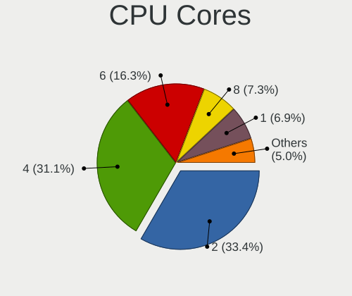

| Number  | Desktops | Percent |
|---------|----------|---------|
| 2       | 428      | 33.39%  |
| 4       | 399      | 31.12%  |
| 6       | 209      | 16.3%   |
| 8       | 93       | 7.25%   |
| 1       | 89       | 6.94%   |
| 3       | 25       | 1.95%   |
| 16      | 16       | 1.25%   |
| 12      | 10       | 0.78%   |
| 10      | 7        | 0.55%   |
| 24      | 2        | 0.16%   |
| 14      | 2        | 0.16%   |
| 20      | 1        | 0.08%   |
| Unknown | 1        | 0.08%   |

CPU Sockets
-----------

Number of sockets

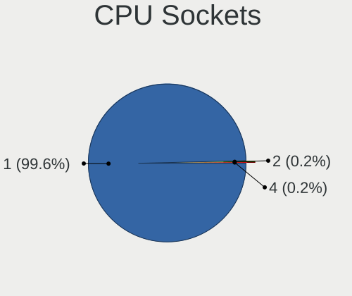

| Number | Desktops | Percent |
|--------|----------|---------|
| 1      | 1271     | 99.61%  |
| 2      | 3        | 0.24%   |
| 4      | 2        | 0.16%   |

CPU Threads
-----------

Threads per core (Hyper-Threading)

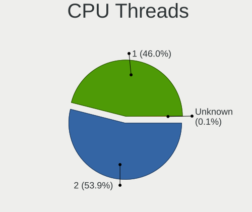

| Number  | Desktops | Percent |
|---------|----------|---------|
| 2       | 690      | 53.95%  |
| 1       | 588      | 45.97%  |
| Unknown | 1        | 0.08%   |

CPU Op-Modes
------------

CPU Operation Modes (32-bit, 64-bit)

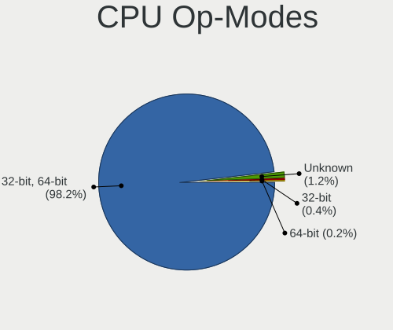

| Op mode        | Desktops | Percent |
|----------------|----------|---------|
| 32-bit, 64-bit | 1254     | 98.2%   |
| Unknown        | 15       | 1.17%   |
| 32-bit         | 5        | 0.39%   |
| 64-bit         | 3        | 0.23%   |

CPU Microcode
-------------

Microcode number

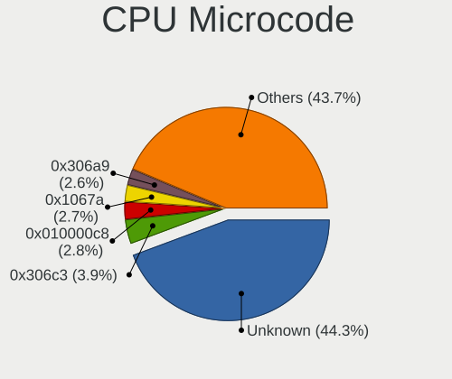

| Number     | Desktops | Percent |
|------------|----------|---------|
| Unknown    | 597      | 44.32%  |
| 0x306c3    | 53       | 3.93%   |
| 0x010000c8 | 38       | 2.82%   |
| 0x1067a    | 36       | 2.67%   |
| 0x306a9    | 35       | 2.6%    |
| 0x206a7    | 35       | 2.6%    |
| 0x08108109 | 34       | 2.52%   |
| 0x906e9    | 31       | 2.3%    |
| 0x06003106 | 30       | 2.23%   |
| 0x06001119 | 29       | 2.15%   |
| 0x906ea    | 24       | 1.78%   |
| 0x08701021 | 24       | 1.78%   |
| 0x506e3    | 22       | 1.63%   |
| 0x08101016 | 18       | 1.34%   |
| 0x06000852 | 16       | 1.19%   |
| 0x0600063e | 15       | 1.11%   |
| 0xa0653    | 14       | 1.04%   |
| 0x6fd      | 14       | 1.04%   |
| 0x0600611a | 14       | 1.04%   |
| 0x0800820d | 13       | 0.97%   |
| 0x010000c7 | 10       | 0.74%   |
| 0x0a50000c | 9        | 0.67%   |
| 0x0a201016 | 9        | 0.67%   |
| 0x010000db | 9        | 0.67%   |
| 0xa0655    | 8        | 0.59%   |
| 0x06006118 | 8        | 0.59%   |
| 0x10676    | 7        | 0.52%   |
| 0x0a50000d | 7        | 0.52%   |
| 0x010000dc | 7        | 0.52%   |
| 0x6f2      | 6        | 0.45%   |
| 0x03000027 | 6        | 0.45%   |
| 0x01000083 | 6        | 0.45%   |
| 0xf65      | 5        | 0.37%   |
| 0x906ed    | 5        | 0.37%   |
| 0x0a201009 | 5        | 0.37%   |
| 0x0700010f | 5        | 0.37%   |
| 0x010000b6 | 5        | 0.37%   |
| 0xf49      | 4        | 0.3%    |
| 0xf47      | 4        | 0.3%    |
| 0xa0671    | 4        | 0.3%    |

CPU Microarch
-------------

Microarchitecture

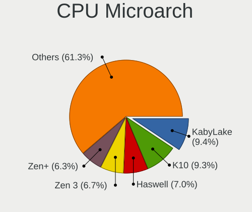

| Name             | Desktops | Percent |
|------------------|----------|---------|
| KabyLake         | 120      | 9.38%   |
| K10              | 119      | 9.3%    |
| Haswell          | 90       | 7.03%   |
| Zen 3            | 86       | 6.72%   |
| Zen+             | 81       | 6.33%   |
| Piledriver       | 79       | 6.17%   |
| Penryn           | 77       | 6.02%   |
| IvyBridge        | 66       | 5.16%   |
| Zen 2            | 57       | 4.45%   |
| SandyBridge      | 54       | 4.22%   |
| Unknown          | 52       | 4.06%   |
| Zen              | 50       | 3.91%   |
| CometLake        | 47       | 3.67%   |
| Steamroller      | 45       | 3.52%   |
| K8 Hammer        | 36       | 2.81%   |
| Skylake          | 33       | 2.58%   |
| Core             | 30       | 2.34%   |
| Excavator        | 28       | 2.19%   |
| NetBurst         | 24       | 1.88%   |
| Bulldozer        | 24       | 1.88%   |
| Silvermont       | 13       | 1.02%   |
| K10 Llano        | 13       | 1.02%   |
| Jaguar           | 12       | 0.94%   |
| Alderlake Hybrid | 10       | 0.78%   |
| Westmere         | 8        | 0.63%   |
| Icelake          | 8        | 0.63%   |
| Puma             | 5        | 0.39%   |
| Nehalem          | 4        | 0.31%   |
| K6               | 2        | 0.16%   |
| Goldmont plus    | 2        | 0.16%   |
| Goldmont         | 2        | 0.16%   |
| Bonnell          | 2        | 0.16%   |
| Bobcat           | 1        | 0.08%   |

Graphics
--------

GPU Vendor
----------

Vendors of graphics cards

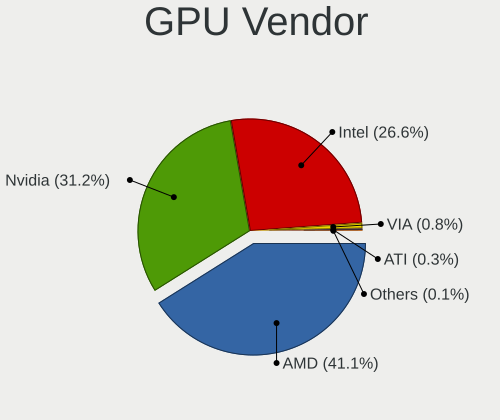

| Vendor                           | Desktops | Percent |
|----------------------------------|----------|---------|
| AMD                              | 558      | 41.06%  |
| Nvidia                           | 424      | 31.2%   |
| Intel                            | 361      | 26.56%  |
| VIA Technologies                 | 11       | 0.81%   |
| ATI Technologies                 | 4        | 0.29%   |
| Silicon Integrated Systems [SiS] | 1        | 0.07%   |

GPU Model
---------

Graphics card models

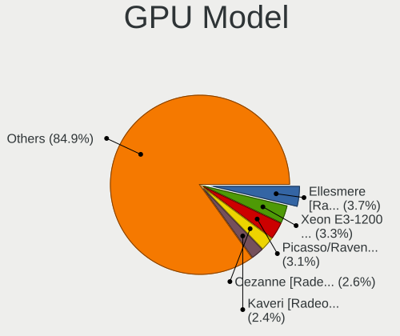

| Model                                                                       | Desktops | Percent |
|-----------------------------------------------------------------------------|----------|---------|
| AMD Ellesmere [Radeon RX 470/480/570/570X/580/580X/590]                     | 52       | 3.72%   |
| Intel Xeon E3-1200 v3/4th Gen Core Processor Integrated Graphics Controller | 46       | 3.29%   |
| AMD Picasso/Raven 2 [Radeon Vega Series / Radeon Vega Mobile Series]        | 44       | 3.15%   |
| AMD Cezanne [Radeon Vega Series / Radeon Vega Mobile Series]                | 36       | 2.58%   |
| AMD Kaveri [Radeon R7 Graphics]                                             | 33       | 2.36%   |
| Intel 2nd Generation Core Processor Family Integrated Graphics Controller   | 32       | 2.29%   |
| Nvidia C61 [GeForce 7025 / nForce 630a]                                     | 31       | 2.22%   |
| Nvidia GT218 [GeForce 210]                                                  | 29       | 2.08%   |
| AMD Raven Ridge [Radeon Vega Series / Radeon Vega Mobile Series]            | 29       | 2.08%   |
| Nvidia GP107 [GeForce GTX 1050 Ti]                                          | 28       | 2%      |
| Intel CoffeeLake-S GT2 [UHD Graphics 630]                                   | 28       | 2%      |
| Intel Xeon E3-1200 v2/3rd Gen Core processor Graphics Controller            | 27       | 1.93%   |
| Intel 4 Series Chipset Integrated Graphics Controller                       | 26       | 1.86%   |
| Nvidia GK208B [GeForce GT 710]                                              | 25       | 1.79%   |
| AMD Cedar [Radeon HD 5000/6000/7350/8350 Series]                            | 23       | 1.65%   |
| Intel CometLake-S GT2 [UHD Graphics 630]                                    | 22       | 1.57%   |
| AMD Wani [Radeon R5/R6/R7 Graphics]                                         | 22       | 1.57%   |
| Intel Kaby Lake-S GT2 [HD Graphics 630]                                     | 21       | 1.5%    |
| Intel 82G33/G31 Express Integrated Graphics Controller                      | 20       | 1.43%   |
| Intel Skylake-S GT2 [HD Graphics 530]                                       | 17       | 1.22%   |
| AMD Caicos [Radeon HD 6450/7450/8450 / R5 230 OEM]                          | 17       | 1.22%   |
| Nvidia GP108 [GeForce GT 1030]                                              | 16       | 1.15%   |
| AMD Lexa PRO [Radeon 540/540X/550/550X / RX 540X/550/550X]                  | 16       | 1.15%   |
| Intel 4th Generation Core Processor Family Integrated Graphics Controller   | 14       | 1%      |
| AMD Trinity 2 [Radeon HD 7480D]                                             | 14       | 1%      |
| AMD RS780L [Radeon 3000]                                                    | 14       | 1%      |
| Nvidia GM204 [GeForce GTX 970]                                              | 13       | 0.93%   |
| Nvidia G96C [GeForce 9500 GT]                                               | 13       | 0.93%   |
| Nvidia C61 [GeForce 6150SE nForce 430]                                      | 13       | 0.93%   |
| Intel 82945G/GZ Integrated Graphics Controller                              | 13       | 0.93%   |
| AMD Navi 23 [Radeon RX 6600/6600 XT/6600M]                                  | 13       | 0.93%   |
| AMD Navi 10 [Radeon RX 5600 OEM/5600 XT / 5700/5700 XT]                     | 13       | 0.93%   |
| Nvidia GP106 [GeForce GTX 1060 6GB]                                         | 11       | 0.79%   |
| Nvidia GP106 [GeForce GTX 1060 3GB]                                         | 11       | 0.79%   |
| Nvidia GA106 [GeForce RTX 3060 Lite Hash Rate]                              | 11       | 0.79%   |
| Nvidia GP107 [GeForce GTX 1050]                                             | 10       | 0.72%   |
| Nvidia GK208B [GeForce GT 730]                                              | 10       | 0.72%   |
| Intel IvyBridge GT2 [HD Graphics 4000]                                      | 10       | 0.72%   |
| Intel Atom Processor Z36xxx/Z37xxx Series Graphics & Display                | 10       | 0.72%   |
| AMD Oland XT [Radeon HD 8670 / R5 340X OEM / R7 250/350/350X OEM]           | 10       | 0.72%   |

GPU Combo
---------

Combinations of graphics cards

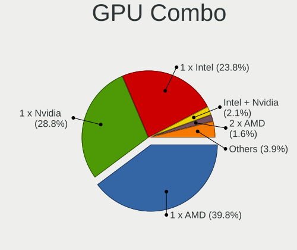

| Name           | Desktops | Percent |
|----------------|----------|---------|
| 1 x AMD        | 516      | 39.81%  |
| 1 x Nvidia     | 373      | 28.78%  |
| 1 x Intel      | 308      | 23.77%  |
| Intel + Nvidia | 27       | 2.08%   |
| 2 x AMD        | 21       | 1.62%   |
| AMD + Nvidia   | 20       | 1.54%   |
| Intel + AMD    | 12       | 0.93%   |
| 1 x VIA        | 11       | 0.85%   |
| 2 x Nvidia     | 3        | 0.23%   |
| Other          | 2        | 0.15%   |
| 2 x Intel      | 2        | 0.15%   |
| 1 x SiS        | 1        | 0.08%   |

GPU Driver
----------

Free vs proprietary

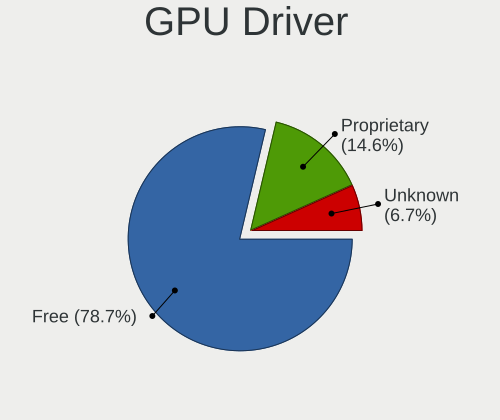

| Driver      | Desktops | Percent |
|-------------|----------|---------|
| Free        | 1019     | 78.69%  |
| Proprietary | 189      | 14.59%  |
| Unknown     | 87       | 6.72%   |

GPU Memory
----------

Total video memory

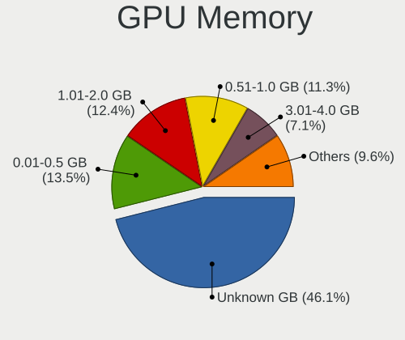

| Size in GB | Desktops | Percent |
|------------|----------|---------|
| Unknown    | 609      | 46.07%  |
| 0.01-0.5   | 178      | 13.46%  |
| 1.01-2.0   | 164      | 12.41%  |
| 0.51-1.0   | 150      | 11.35%  |
| 3.01-4.0   | 94       | 7.11%   |
| 7.01-8.0   | 70       | 5.3%    |
| 8.01-16.0  | 26       | 1.97%   |
| 5.01-6.0   | 20       | 1.51%   |
| 2.01-3.0   | 8        | 0.61%   |
| 16.01-24.0 | 3        | 0.23%   |

Monitor
-------

Monitor Vendor
--------------

Monitor vendors

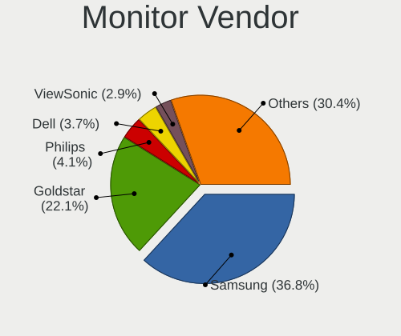

| Vendor               | Desktops | Percent |
|----------------------|----------|---------|
| Samsung Electronics  | 478      | 36.83%  |
| Goldstar             | 287      | 22.11%  |
| Philips              | 53       | 4.08%   |
| Dell                 | 48       | 3.7%    |
| ViewSonic            | 38       | 2.93%   |
| Hitachi              | 30       | 2.31%   |
| BenQ                 | 29       | 2.23%   |
| Hewlett-Packard      | 25       | 1.93%   |
| LG Electronics       | 24       | 1.85%   |
| SKY                  | 18       | 1.39%   |
| Unknown              | 17       | 1.31%   |
| Sony                 | 16       | 1.23%   |
| AOC                  | 15       | 1.16%   |
| Unknown (XXX)        | 12       | 0.92%   |
| SAC                  | 12       | 0.92%   |
| ASUSTek Computer     | 12       | 0.92%   |
| Acer                 | 11       | 0.85%   |
| Lenovo               | 9        | 0.69%   |
| HKC                  | 8        | 0.62%   |
| MStar                | 7        | 0.54%   |
| Gigabyte Technology  | 7        | 0.54%   |
| RTK                  | 6        | 0.46%   |
| JRY                  | 6        | 0.46%   |
| AU Optronics         | 6        | 0.46%   |
| UTV                  | 5        | 0.39%   |
| SANYO                | 5        | 0.39%   |
| ITE                  | 5        | 0.39%   |
| Ancor Communications | 5        | 0.39%   |
| STD                  | 4        | 0.31%   |
| Skyworth             | 4        | 0.31%   |
| DTV                  | 4        | 0.31%   |
| Daewoo               | 4        | 0.31%   |
| CDR                  | 4        | 0.31%   |
| ___                  | 3        | 0.23%   |
| Yuraku               | 3        | 0.23%   |
| LLL                  | 3        | 0.23%   |
| KTC                  | 3        | 0.23%   |
| GDH                  | 3        | 0.23%   |
| BANGHO               | 3        | 0.23%   |
| AGO                  | 3        | 0.23%   |

Monitor Model
-------------

Monitor models

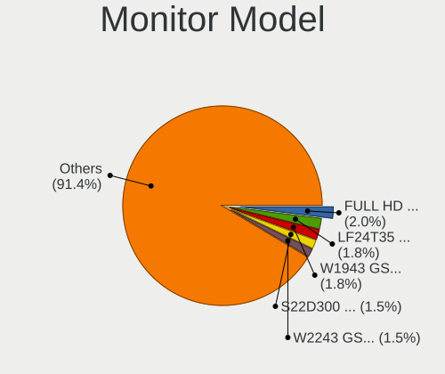

| Model                                                                | Desktops | Percent |
|----------------------------------------------------------------------|----------|---------|
| Goldstar FULL HD GSM5B55 1920x1080 480x270mm 21.7-inch               | 27       | 1.98%   |
| Samsung Electronics LF24T35 SAM707D 1920x1080 528x297mm 23.9-inch    | 25       | 1.83%   |
| Goldstar W1943 GSM4BAD 1360x768 406x229mm 18.4-inch                  | 24       | 1.76%   |
| Samsung Electronics S22D300 SAM0B3F 1920x1080 477x268mm 21.5-inch    | 21       | 1.54%   |
| Goldstar W2243 GSM56FE 1920x1080 477x269mm 21.6-inch                 | 20       | 1.47%   |
| Samsung Electronics C24F390 SAM0D2C 1920x1080 521x293mm 23.5-inch    | 19       | 1.39%   |
| Hitachi HDMI HEC0088 1920x540                                        | 18       | 1.32%   |
| Goldstar LG IPS FULLHD GSM5AB8 1920x1080 480x270mm 21.7-inch         | 17       | 1.25%   |
| Samsung Electronics S22F350 SAM0D1A 1920x1080 477x268mm 21.5-inch    | 14       | 1.03%   |
| Goldstar 23EA53 GSM59A9 1920x1080 510x290mm 23.1-inch                | 13       | 0.95%   |
| SKY TV-monitor SKY0001 1920x1080 885x498mm 40.0-inch                 | 11       | 0.81%   |
| Samsung Electronics SA300/SA350 SAM0788 1366x768 410x230mm 18.5-inch | 11       | 0.81%   |
| Samsung Electronics LF22T35 SAM707B 1920x1080 477x268mm 21.5-inch    | 10       | 0.73%   |
| Samsung Electronics SMB2030N SAM0634 1600x900 443x249mm 20.0-inch    | 9        | 0.66%   |
| Samsung Electronics SMB1930N SAM0632 1366x768 410x230mm 18.5-inch    | 9        | 0.66%   |
| Samsung Electronics S19D300 SAM0B36 1366x768 410x230mm 18.5-inch     | 9        | 0.66%   |
| Philips PHL 223V5 PHLC0CF 1920x1080 477x268mm 21.5-inch              | 9        | 0.66%   |
| Goldstar 19EN33 GSM4C18 1366x768 410x230mm 18.5-inch                 | 9        | 0.66%   |
| Samsung Electronics S24F350 SAM0D20 1920x1080 521x293mm 23.5-inch    | 8        | 0.59%   |
| Samsung Electronics S22D300 SAM0B3E 1920x1080 477x268mm 21.5-inch    | 8        | 0.59%   |
| Samsung Electronics S19D300 SAM0B35 1366x768 410x230mm 18.5-inch     | 8        | 0.59%   |
| Goldstar W2353 GSM56EE 1920x1080 474x296mm 22.0-inch                 | 8        | 0.59%   |
| Unknown (XXX) Union TV XXX2841 1920x1080 1209x680mm 54.6-inch        | 7        | 0.51%   |
| Samsung Electronics SyncMaster SAM0286 1280x720 372x209mm 16.8-inch  | 7        | 0.51%   |
| Samsung Electronics SMT24A550 SAM07B5 1920x1080 531x299mm 24.0-inch  | 7        | 0.51%   |
| Samsung Electronics S19B300 SAM08A5 1366x768 410x230mm 18.5-inch     | 7        | 0.51%   |
| MStar Demo MST0030 1920x1080 708x398mm 32.0-inch                     | 7        | 0.51%   |
| Unknown LCD Monitor FFFF 2288x1287 2550x2550mm 142.0-inch            | 6        | 0.44%   |
| Samsung Electronics SyncMaster SAM0599 1600x900 443x249mm 20.0-inch  | 6        | 0.44%   |
| Samsung Electronics SyncMaster SAM0499 1600x900 443x249mm 20.0-inch  | 6        | 0.44%   |
| Samsung Electronics S27F350 SAM0D22 1920x1080 598x336mm 27.0-inch    | 6        | 0.44%   |
| Samsung Electronics S20B300 SAM08A8 1600x900 443x249mm 20.0-inch     | 6        | 0.44%   |
| Samsung Electronics S19B150 SAM08A2 1366x768 410x230mm 18.5-inch     | 6        | 0.44%   |
| Samsung Electronics LCD Monitor SyncMaster 1680x1050                 | 6        | 0.44%   |
| Samsung Electronics LCD Monitor SAM0C3C 1366x768 609x347mm 27.6-inch | 6        | 0.44%   |
| Samsung Electronics C24F390 SAM0D2D 1920x1080 521x293mm 23.5-inch    | 6        | 0.44%   |
| SAC LED MONITOR SAC952D 1920x1080 480x270mm 21.7-inch                | 6        | 0.44%   |
| Philips PHL 221V8 PHLC211 1920x1080 477x268mm 21.5-inch              | 6        | 0.44%   |
| Hitachi HISENSE HEC0030 3840x2160 1872x1053mm 84.6-inch              | 6        | 0.44%   |
| Hitachi HDMI HEC0029 1920x1080 1152x648mm 52.0-inch                  | 6        | 0.44%   |

Monitor Resolution
------------------

Monitor screen resolution

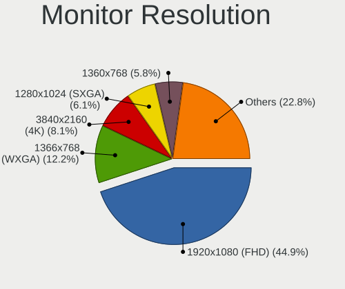

| Resolution         | Desktops | Percent |
|--------------------|----------|---------|
| 1920x1080 (FHD)    | 565      | 44.95%  |
| 1366x768 (WXGA)    | 153      | 12.17%  |
| 3840x2160 (4K)     | 102      | 8.11%   |
| 1280x1024 (SXGA)   | 77       | 6.13%   |
| 1360x768           | 73       | 5.81%   |
| 1600x900 (HD+)     | 62       | 4.93%   |
| 1680x1050 (WSXGA+) | 50       | 3.98%   |
| 1440x900 (WXGA+)   | 44       | 3.5%    |
| 1920x540           | 23       | 1.83%   |
| 2560x1440 (QHD)    | 18       | 1.43%   |
| 1280x720 (HD)      | 14       | 1.11%   |
| 1024x768 (XGA)     | 12       | 0.95%   |
| Unknown            | 12       | 0.95%   |
| 2560x1080          | 10       | 0.8%    |
| 2288x1287          | 6        | 0.48%   |
| 1920x1200 (WUXGA)  | 6        | 0.48%   |
| 1152x864           | 5        | 0.4%    |
| 3840x1080          | 3        | 0.24%   |
| 3440x1440          | 3        | 0.24%   |
| 1280x960           | 3        | 0.24%   |
| 4093x4093          | 2        | 0.16%   |
| 2048x1152          | 2        | 0.16%   |
| 1920x1440          | 2        | 0.16%   |
| 3600x1200          | 1        | 0.08%   |
| 3286x1080          | 1        | 0.08%   |
| 3280x1080          | 1        | 0.08%   |
| 3046x1050          | 1        | 0.08%   |
| 2646x1024          | 1        | 0.08%   |
| 2460x1383          | 1        | 0.08%   |
| 2048x1536          | 1        | 0.08%   |
| 1792x1344          | 1        | 0.08%   |
| 1600x1200          | 1        | 0.08%   |
| 1400x1050          | 1        | 0.08%   |

Monitor Diagonal
----------------

Diagonal size in inches

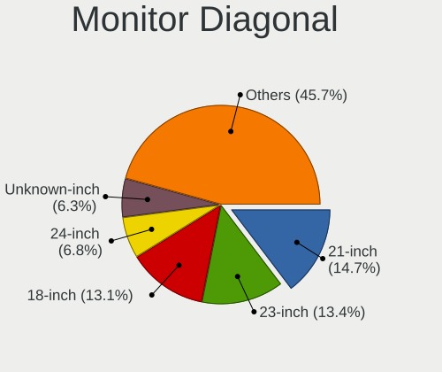

| Inches  | Desktops | Percent |
|---------|----------|---------|
| 21      | 193      | 14.67%  |
| 23      | 177      | 13.45%  |
| 18      | 172      | 13.07%  |
| 24      | 89       | 6.76%   |
| Unknown | 83       | 6.31%   |
| 27      | 69       | 5.24%   |
| 19      | 66       | 5.02%   |
| 31      | 65       | 4.94%   |
| 20      | 59       | 4.48%   |
| 17      | 47       | 3.57%   |
| 15      | 42       | 3.19%   |
| 40      | 29       | 2.2%    |
| 22      | 24       | 1.82%   |
| 84      | 21       | 1.6%    |
| 48      | 21       | 1.6%    |
| 32      | 20       | 1.52%   |
| 54      | 18       | 1.37%   |
| 16      | 17       | 1.29%   |
| 52      | 16       | 1.22%   |
| 72      | 10       | 0.76%   |
| 46      | 10       | 0.76%   |
| 14      | 9        | 0.68%   |
| 34      | 8        | 0.61%   |
| 13      | 8        | 0.61%   |
| 142     | 6        | 0.46%   |
| 39      | 5        | 0.38%   |
| 12      | 5        | 0.38%   |
| 63      | 4        | 0.3%    |
| 25      | 4        | 0.3%    |
| 65      | 3        | 0.23%   |
| 42      | 3        | 0.23%   |
| 26      | 3        | 0.23%   |
| 64      | 2        | 0.15%   |
| 55      | 2        | 0.15%   |
| 30      | 2        | 0.15%   |
| 58      | 1        | 0.08%   |
| 47      | 1        | 0.08%   |
| 43      | 1        | 0.08%   |
| 28      | 1        | 0.08%   |

Monitor Width
-------------

Physical width

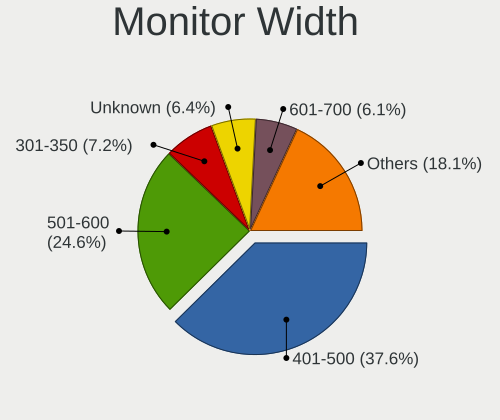

| Width in mm    | Desktops | Percent |
|----------------|----------|---------|
| 401-500        | 484      | 37.61%  |
| 501-600        | 316      | 24.55%  |
| 301-350        | 93       | 7.23%   |
| Unknown        | 83       | 6.45%   |
| 601-700        | 78       | 6.06%   |
| 1001-1500      | 77       | 5.98%   |
| 351-400        | 38       | 2.95%   |
| 801-900        | 35       | 2.72%   |
| 1501-2000      | 31       | 2.41%   |
| 701-800        | 28       | 2.18%   |
| 201-300        | 14       | 1.09%   |
| More than 2000 | 6        | 0.47%   |
| 901-1000       | 4        | 0.31%   |

Aspect Ratio
------------

Proportional relationship between the width and the height

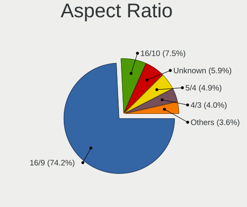

| Ratio   | Desktops | Percent |
|---------|----------|---------|
| 16/9    | 875      | 74.22%  |
| 16/10   | 88       | 7.46%   |
| Unknown | 69       | 5.85%   |
| 5/4     | 58       | 4.92%   |
| 4/3     | 47       | 3.99%   |
| 1.96    | 18       | 1.53%   |
| 21/9    | 12       | 1.02%   |
| 1.00    | 6        | 0.51%   |
| 3/2     | 5        | 0.42%   |
| 32/9    | 1        | 0.08%   |

Monitor Area
------------

Area in inch²

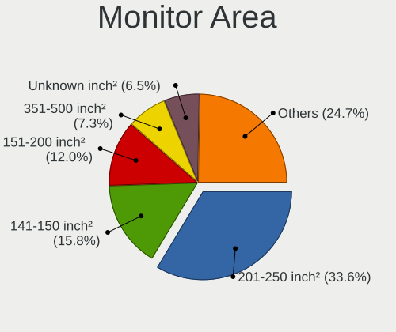

| Area in inch² | Desktops | Percent |
|----------------|----------|---------|
| 201-250        | 431      | 33.62%  |
| 141-150        | 203      | 15.83%  |
| 151-200        | 154      | 12.01%  |
| 351-500        | 94       | 7.33%   |
| Unknown        | 83       | 6.47%   |
| More than 1000 | 82       | 6.4%    |
| 301-350        | 71       | 5.54%   |
| 501-1000       | 66       | 5.15%   |
| 111-120        | 24       | 1.87%   |
| 101-110        | 21       | 1.64%   |
| 251-300        | 14       | 1.09%   |
| 81-90          | 13       | 1.01%   |
| 121-130        | 13       | 1.01%   |
| 131-140        | 6        | 0.47%   |
| 71-80          | 5        | 0.39%   |
| 91-100         | 2        | 0.16%   |

Pixel Density
-------------

Pixels per inch

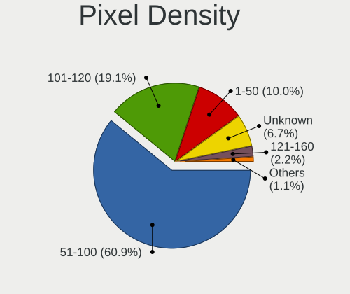

| Density | Desktops | Percent |
|---------|----------|---------|
| 51-100  | 753      | 60.92%  |
| 101-120 | 236      | 19.09%  |
| 1-50    | 124      | 10.03%  |
| Unknown | 83       | 6.72%   |
| 121-160 | 27       | 2.18%   |
| 161-240 | 13       | 1.05%   |

Multiple Monitors
-----------------

Total monitors connected

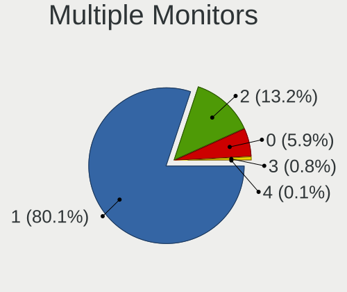

| Total | Desktops | Percent |
|-------|----------|---------|
| 1     | 1046     | 80.09%  |
| 2     | 172      | 13.17%  |
| 0     | 77       | 5.9%    |
| 3     | 10       | 0.77%   |
| 4     | 1        | 0.08%   |

Network
-------

Net Controller Vendor
---------------------

Controller vendors

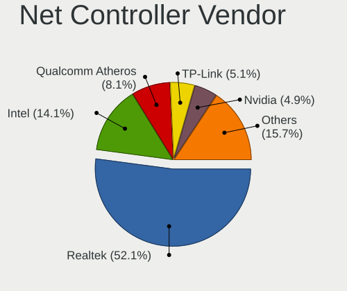

| Vendor                                 | Desktops | Percent |
|----------------------------------------|----------|---------|
| Realtek Semiconductor                  | 942      | 52.1%   |
| Intel                                  | 255      | 14.1%   |
| Qualcomm Atheros                       | 146      | 8.08%   |
| TP-Link                                | 93       | 5.14%   |
| Nvidia                                 | 88       | 4.87%   |
| Ralink Technology                      | 50       | 2.77%   |
| Qualcomm Atheros Communications        | 37       | 2.05%   |
| VIA Technologies                       | 21       | 1.16%   |
| MediaTek                               | 19       | 1.05%   |
| Broadcom                               | 19       | 1.05%   |
| Samsung Electronics                    | 18       | 1%      |
| Microsoft                              | 14       | 0.77%   |
| Ralink                                 | 12       | 0.66%   |
| Motorola PCS                           | 12       | 0.66%   |
| Marvell Technology Group               | 7        | 0.39%   |
| Broadcom Limited                       | 6        | 0.33%   |
| Sundance Technology Inc / IC Plus      | 5        | 0.28%   |
| Silicon Integrated Systems [SiS]       | 5        | 0.28%   |
| Xiaomi                                 | 4        | 0.22%   |
| NetGear                                | 4        | 0.22%   |
| JMicron Technology                     | 4        | 0.22%   |
| D-Link System                          | 4        | 0.22%   |
| 3Com                                   | 4        | 0.22%   |
| T & A Mobile Phones                    | 3        | 0.17%   |
| D-Link                                 | 3        | 0.17%   |
| ASIX Electronics                       | 3        | 0.17%   |
| Aquantia                               | 3        | 0.17%   |
| Mercucys                               | 2        | 0.11%   |
| Linksys                                | 2        | 0.11%   |
| LG Electronics                         | 2        | 0.11%   |
| Huawei Technologies                    | 2        | 0.11%   |
| Davicom Semiconductor                  | 2        | 0.11%   |
| 802.11g Adapter [Linksys WUSB54GC v3]  | 2        | 0.11%   |
| ZyDAS                                  | 1        | 0.06%   |
| ZTE WCDMA Technologies MSM             | 1        | 0.06%   |
| Unknown                                | 1        | 0.06%   |
| Sony Ericsson Mobile Communications AB | 1        | 0.06%   |
| Smart Link                             | 1        | 0.06%   |
| Qualcomm                               | 1        | 0.06%   |
| PCTel                                  | 1        | 0.06%   |

Net Controller Model
--------------------

Controller models

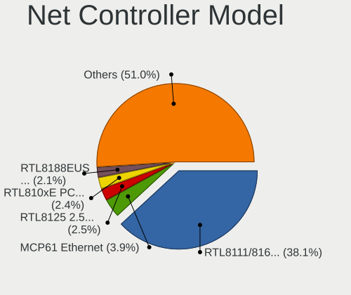

| Model                                                                  | Desktops | Percent |
|------------------------------------------------------------------------|----------|---------|
| Realtek RTL8111/8168/8211/8411 PCI Express Gigabit Ethernet Controller | 771      | 38.13%  |
| Nvidia MCP61 Ethernet                                                  | 79       | 3.91%   |
| Realtek RTL8125 2.5GbE Controller                                      | 50       | 2.47%   |
| Realtek RTL810xE PCI Express Fast Ethernet controller                  | 48       | 2.37%   |
| Realtek RTL8188EUS 802.11n Wireless Network Adapter                    | 43       | 2.13%   |
| Intel Ethernet Connection (2) I219-V                                   | 38       | 1.88%   |
| Intel I211 Gigabit Network Connection                                  | 33       | 1.63%   |
| Qualcomm Atheros AR9271 802.11n                                        | 32       | 1.58%   |
| Qualcomm Atheros AR9485 Wireless Network Adapter                       | 31       | 1.53%   |
| TP-Link TL-WN722N v2/v3 [Realtek RTL8188EUS]                           | 25       | 1.24%   |
| Ralink MT7601U Wireless Adapter                                        | 25       | 1.24%   |
| Intel Wi-Fi 6 AX200                                                    | 22       | 1.09%   |
| Realtek RTL-8100/8101L/8139 PCI Fast Ethernet Adapter                  | 18       | 0.89%   |
| VIA VT6102/VT6103 [Rhine-II]                                           | 17       | 0.84%   |
| Intel Ethernet Controller I225-V                                       | 17       | 0.84%   |
| Ralink RT2870/RT3070 Wireless Adapter                                  | 16       | 0.79%   |
| Qualcomm Atheros AR9227 Wireless Network Adapter                       | 16       | 0.79%   |
| Intel Ethernet Connection (7) I219-V                                   | 16       | 0.79%   |
| Intel Dual Band Wireless-AC 3168NGW [Stone Peak]                       | 16       | 0.79%   |
| TP-Link TL-WN823N v2/v3 [Realtek RTL8192EU]                            | 15       | 0.74%   |
| Samsung Galaxy series, misc. (tethering mode)                          | 15       | 0.74%   |
| Realtek RTL8169 PCI Gigabit Ethernet Controller                        | 15       | 0.74%   |
| Realtek RTL8188EE Wireless Network Adapter                             | 13       | 0.64%   |
| Qualcomm Atheros AR9287 Wireless Network Adapter (PCI-Express)         | 11       | 0.54%   |
| Qualcomm Atheros AR9285 Wireless Network Adapter (PCI-Express)         | 11       | 0.54%   |
| Qualcomm Atheros AR8151 v2.0 Gigabit Ethernet                          | 11       | 0.54%   |
| Intel Wireless 7265                                                    | 11       | 0.54%   |
| Intel Wi-Fi 6E(802.11ax) AX210/AX1675* 2x2 [Typhoon Peak]              | 11       | 0.54%   |
| Intel 82579LM Gigabit Network Connection (Lewisville)                  | 11       | 0.54%   |
| Realtek RTL8192EE PCIe Wireless Network Adapter                        | 10       | 0.49%   |
| Realtek 802.11ac NIC                                                   | 10       | 0.49%   |
| Motorola PCS motorola one 5G ace                                       | 10       | 0.49%   |
| Intel Ethernet Connection (14) I219-V                                  | 10       | 0.49%   |
| Intel Alder Lake-S PCH CNVi WiFi                                       | 10       | 0.49%   |
| Intel 82579V Gigabit Network Connection                                | 10       | 0.49%   |
| TP-Link AC600 wireless Realtek RTL8811AU [Archer T2U Nano]             | 9        | 0.45%   |
| Realtek RTL8111/8168/8411 PCI Express Gigabit Ethernet Controller      | 9        | 0.45%   |
| Qualcomm Atheros AR8152 v2.0 Fast Ethernet                             | 9        | 0.45%   |
| Intel Cannon Lake PCH CNVi WiFi                                        | 9        | 0.45%   |
| TP-Link 802.11n NIC                                                    | 8        | 0.4%    |

Wireless Vendor
---------------

Wireless vendors

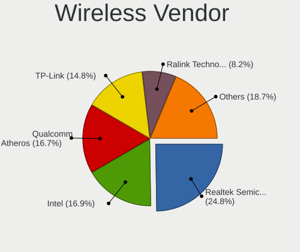

| Vendor                                | Desktops | Percent |
|---------------------------------------|----------|---------|
| Realtek Semiconductor                 | 151      | 24.75%  |
| Intel                                 | 103      | 16.89%  |
| Qualcomm Atheros                      | 102      | 16.72%  |
| TP-Link                               | 90       | 14.75%  |
| Ralink Technology                     | 50       | 8.2%    |
| Qualcomm Atheros Communications       | 37       | 6.07%   |
| MediaTek                              | 15       | 2.46%   |
| Microsoft                             | 14       | 2.3%    |
| Broadcom                              | 14       | 2.3%    |
| Ralink                                | 12       | 1.97%   |
| NetGear                               | 4        | 0.66%   |
| D-Link System                         | 4        | 0.66%   |
| D-Link                                | 3        | 0.49%   |
| Mercucys                              | 2        | 0.33%   |
| Marvell Technology Group              | 2        | 0.33%   |
| Linksys                               | 2        | 0.33%   |
| 802.11g Adapter [Linksys WUSB54GC v3] | 2        | 0.33%   |
| ZyDAS                                 | 1        | 0.16%   |
| Samsung Electronics                   | 1        | 0.16%   |
| Ovislink                              | 1        | 0.16%   |

Wireless Model
--------------

Wireless models

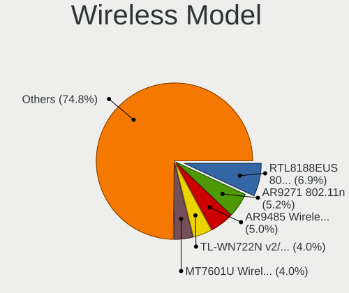

| Model                                                               | Desktops | Percent |
|---------------------------------------------------------------------|----------|---------|
| Realtek RTL8188EUS 802.11n Wireless Network Adapter                 | 43       | 6.95%   |
| Qualcomm Atheros AR9271 802.11n                                     | 32       | 5.17%   |
| Qualcomm Atheros AR9485 Wireless Network Adapter                    | 31       | 5.01%   |
| TP-Link TL-WN722N v2/v3 [Realtek RTL8188EUS]                        | 25       | 4.04%   |
| Ralink MT7601U Wireless Adapter                                     | 25       | 4.04%   |
| Intel Wi-Fi 6 AX200                                                 | 22       | 3.55%   |
| Ralink RT2870/RT3070 Wireless Adapter                               | 16       | 2.58%   |
| Qualcomm Atheros AR9227 Wireless Network Adapter                    | 16       | 2.58%   |
| Intel Dual Band Wireless-AC 3168NGW [Stone Peak]                    | 16       | 2.58%   |
| TP-Link TL-WN823N v2/v3 [Realtek RTL8192EU]                         | 15       | 2.42%   |
| Realtek RTL8188EE Wireless Network Adapter                          | 13       | 2.1%    |
| Qualcomm Atheros AR9287 Wireless Network Adapter (PCI-Express)      | 11       | 1.78%   |
| Qualcomm Atheros AR9285 Wireless Network Adapter (PCI-Express)      | 11       | 1.78%   |
| Intel Wireless 7265                                                 | 11       | 1.78%   |
| Intel Wi-Fi 6E(802.11ax) AX210/AX1675* 2x2 [Typhoon Peak]           | 11       | 1.78%   |
| Realtek RTL8192EE PCIe Wireless Network Adapter                     | 10       | 1.62%   |
| Realtek 802.11ac NIC                                                | 10       | 1.62%   |
| TP-Link AC600 wireless Realtek RTL8811AU [Archer T2U Nano]          | 9        | 1.45%   |
| Intel Cannon Lake PCH CNVi WiFi                                     | 9        | 1.45%   |
| TP-Link 802.11n NIC                                                 | 8        | 1.29%   |
| Realtek RTL8821CE 802.11ac PCIe Wireless Network Adapter            | 8        | 1.29%   |
| Realtek RTL8192CU 802.11n WLAN Adapter                              | 8        | 1.29%   |
| Realtek RTL-8185 IEEE 802.11a/b/g Wireless LAN Controller           | 8        | 1.29%   |
| Microsoft Xbox 360 Wireless Adapter                                 | 8        | 1.29%   |
| Intel Alder Lake-S PCH CNVi WiFi                                    | 8        | 1.29%   |
| Broadcom BCM4360 802.11ac Dual Band Wireless Network Adapter        | 8        | 1.29%   |
| TP-Link Archer T4U ver.3                                            | 7        | 1.13%   |
| Realtek RTL8192EU 802.11b/g/n WLAN Adapter                          | 7        | 1.13%   |
| Qualcomm Atheros AR93xx Wireless Network Adapter                    | 7        | 1.13%   |
| TP-Link Archer T3U [Realtek RTL8812BU]                              | 6        | 0.97%   |
| TP-Link 802.11ac WLAN Adapter                                       | 6        | 0.97%   |
| Realtek RTL8812AE 802.11ac PCIe Wireless Network Adapter            | 6        | 0.97%   |
| Realtek RTL8187 Wireless Adapter                                    | 6        | 0.97%   |
| Qualcomm Atheros AR2417 Wireless Network Adapter [AR5007G 802.11bg] | 6        | 0.97%   |
| Realtek RTL8812AU 802.11a/b/g/n/ac 2T2R DB WLAN Adapter             | 5        | 0.81%   |
| Realtek RTL8723BU 802.11b/g/n WLAN Adapter                          | 5        | 0.81%   |
| Qualcomm Atheros AR5212/5213/2414 Wireless Network Adapter          | 5        | 0.81%   |
| Microsoft Wireless XBox Controller Dongle                           | 5        | 0.81%   |
| MediaTek MT7922 802.11ax PCI Express Wireless Network Adapter       | 5        | 0.81%   |
| TP-Link 802.11ac NIC                                                | 4        | 0.65%   |

Ethernet Vendor
---------------

Ethernet vendors

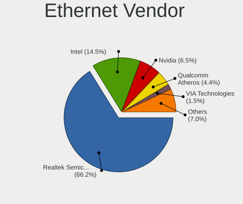

| Vendor                            | Desktops | Percent |
|-----------------------------------|----------|---------|
| Realtek Semiconductor             | 902      | 66.18%  |
| Intel                             | 197      | 14.45%  |
| Nvidia                            | 88       | 6.46%   |
| Qualcomm Atheros                  | 60       | 4.4%    |
| VIA Technologies                  | 21       | 1.54%   |
| Samsung Electronics               | 17       | 1.25%   |
| Motorola PCS                      | 12       | 0.88%   |
| Broadcom Limited                  | 6        | 0.44%   |
| Broadcom                          | 6        | 0.44%   |
| Sundance Technology Inc / IC Plus | 5        | 0.37%   |
| Silicon Integrated Systems [SiS]  | 5        | 0.37%   |
| Marvell Technology Group          | 5        | 0.37%   |
| Xiaomi                            | 4        | 0.29%   |
| TP-Link                           | 4        | 0.29%   |
| MediaTek                          | 4        | 0.29%   |
| JMicron Technology                | 4        | 0.29%   |
| 3Com                              | 4        | 0.29%   |
| T & A Mobile Phones               | 3        | 0.22%   |
| ASIX Electronics                  | 3        | 0.22%   |
| Aquantia                          | 3        | 0.22%   |
| Davicom Semiconductor             | 2        | 0.15%   |
| ZTE WCDMA Technologies MSM        | 1        | 0.07%   |
| Qualcomm                          | 1        | 0.07%   |
| Macronix [MXIC]                   | 1        | 0.07%   |
| LG Electronics                    | 1        | 0.07%   |
| Lenovo                            | 1        | 0.07%   |
| ICS Advent                        | 1        | 0.07%   |
| Huawei Technologies               | 1        | 0.07%   |
| Apple                             | 1        | 0.07%   |

Ethernet Model
--------------

Ethernet models

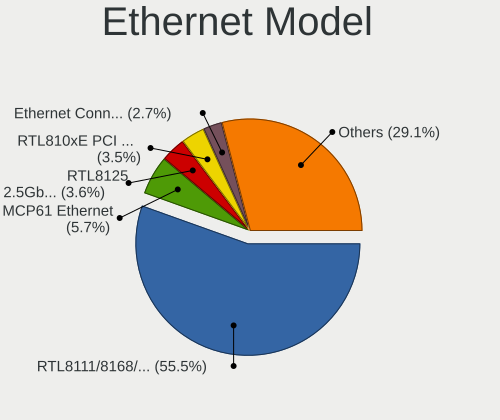

| Model                                                                      | Desktops | Percent |
|----------------------------------------------------------------------------|----------|---------|
| Realtek RTL8111/8168/8211/8411 PCI Express Gigabit Ethernet Controller     | 771      | 55.47%  |
| Nvidia MCP61 Ethernet                                                      | 79       | 5.68%   |
| Realtek RTL8125 2.5GbE Controller                                          | 50       | 3.6%    |
| Realtek RTL810xE PCI Express Fast Ethernet controller                      | 48       | 3.45%   |
| Intel Ethernet Connection (2) I219-V                                       | 38       | 2.73%   |
| Intel I211 Gigabit Network Connection                                      | 33       | 2.37%   |
| Realtek RTL-8100/8101L/8139 PCI Fast Ethernet Adapter                      | 18       | 1.29%   |
| VIA VT6102/VT6103 [Rhine-II]                                               | 17       | 1.22%   |
| Intel Ethernet Controller I225-V                                           | 17       | 1.22%   |
| Intel Ethernet Connection (7) I219-V                                       | 16       | 1.15%   |
| Samsung Galaxy series, misc. (tethering mode)                              | 15       | 1.08%   |
| Realtek RTL8169 PCI Gigabit Ethernet Controller                            | 15       | 1.08%   |
| Qualcomm Atheros AR8151 v2.0 Gigabit Ethernet                              | 11       | 0.79%   |
| Intel 82579LM Gigabit Network Connection (Lewisville)                      | 11       | 0.79%   |
| Motorola PCS motorola one 5G ace                                           | 10       | 0.72%   |
| Intel Ethernet Connection (14) I219-V                                      | 10       | 0.72%   |
| Intel 82579V Gigabit Network Connection                                    | 10       | 0.72%   |
| Realtek RTL8111/8168/8411 PCI Express Gigabit Ethernet Controller          | 9        | 0.65%   |
| Qualcomm Atheros AR8152 v2.0 Fast Ethernet                                 | 9        | 0.65%   |
| Intel Ethernet Connection I217-V                                           | 8        | 0.58%   |
| Qualcomm Atheros QCA8171 Gigabit Ethernet                                  | 7        | 0.5%    |
| Qualcomm Atheros Killer E2500 Gigabit Ethernet Controller                  | 7        | 0.5%    |
| Qualcomm Atheros Killer E220x Gigabit Ethernet Controller                  | 7        | 0.5%    |
| Intel Ethernet Connection (2) I218-V                                       | 7        | 0.5%    |
| Intel 82567LM-3 Gigabit Network Connection                                 | 7        | 0.5%    |
| Qualcomm Atheros Attansic L2 Fast Ethernet                                 | 6        | 0.43%   |
| Sundance Inc / IC Plus IC Plus IP100A Integrated 10/100 Ethernet MAC + PHY | 5        | 0.36%   |
| Nvidia MCP77 Ethernet                                                      | 5        | 0.36%   |
| Intel Ethernet Connection (17) I219-V                                      | 5        | 0.36%   |
| Intel 82578DC Gigabit Network Connection                                   | 5        | 0.36%   |
| Intel 82566DM-2 Gigabit Network Connection                                 | 5        | 0.36%   |
| Xiaomi Mi/Redmi series (RNDIS)                                             | 4        | 0.29%   |
| VIA VT6105/VT6106S [Rhine-III]                                             | 4        | 0.29%   |
| TP-Link UE300 10/100/1000 LAN (ethernet mode) [Realtek RTL8153]            | 4        | 0.29%   |
| JMicron JMC250 PCI Express Gigabit Ethernet Controller                     | 4        | 0.29%   |
| Intel Ethernet Connection (11) I219-V                                      | 4        | 0.29%   |
| Broadcom Limited NetXtreme BCM5755 Gigabit Ethernet PCI Express            | 4        | 0.29%   |
| 3Com 3c905B 100BaseTX [Cyclone]                                            | 4        | 0.29%   |
| Realtek RTL8153 Gigabit Ethernet Adapter                                   | 3        | 0.22%   |
| Realtek RTL8126 5GbE Controller                                            | 3        | 0.22%   |

Net Controller Kind
-------------------

Ethernet, WiFi or modem

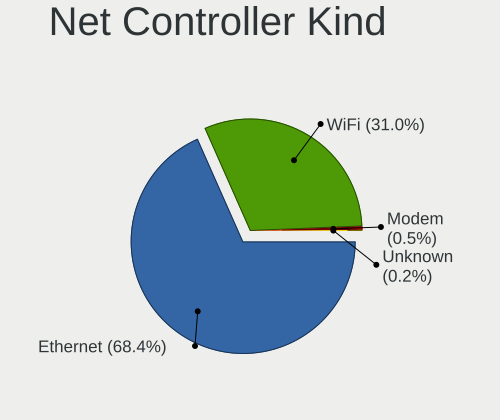

| Kind     | Desktops | Percent |
|----------|----------|---------|
| Ethernet | 1260     | 68.37%  |
| WiFi     | 571      | 30.98%  |
| Modem    | 9        | 0.49%   |
| Unknown  | 3        | 0.16%   |

Used Controller
---------------

Currently used network controller

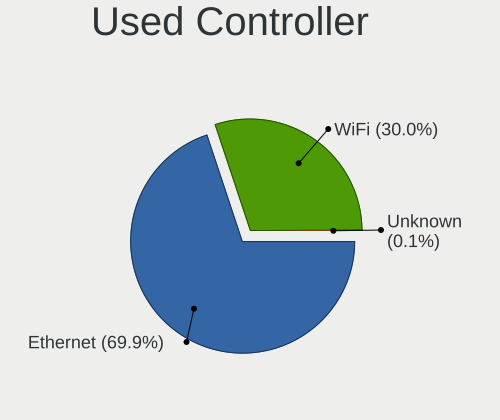

| Kind     | Desktops | Percent |
|----------|----------|---------|
| Ethernet | 924      | 69.89%  |
| WiFi     | 397      | 30.03%  |
| Unknown  | 1        | 0.08%   |

NICs
----

Total network controllers on board

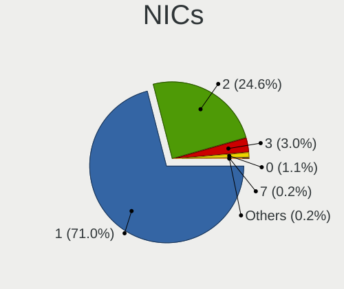

| Total | Desktops | Percent |
|-------|----------|---------|
| 1     | 916      | 71.01%  |
| 2     | 317      | 24.57%  |
| 3     | 39       | 3.02%   |
| 0     | 14       | 1.09%   |
| 7     | 2        | 0.16%   |
| 32    | 1        | 0.08%   |
| 4     | 1        | 0.08%   |

IPv6
----

IPv6 vs IPv4

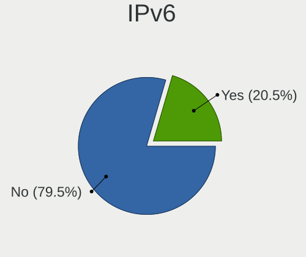

| Used | Desktops | Percent |
|------|----------|---------|
| No   | 1036     | 79.51%  |
| Yes  | 267      | 20.49%  |

Bluetooth
---------

Bluetooth Vendor
----------------

Controller vendors

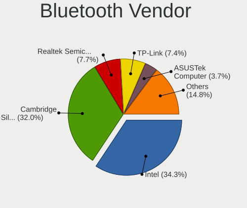

| Vendor                          | Desktops | Percent |
|---------------------------------|----------|---------|
| Intel                           | 102      | 34.34%  |
| Cambridge Silicon Radio         | 95       | 31.99%  |
| Realtek Semiconductor           | 23       | 7.74%   |
| TP-Link                         | 22       | 7.41%   |
| ASUSTek Computer                | 11       | 3.7%    |
| IMC Networks                    | 8        | 2.69%   |
| MediaTek                        | 7        | 2.36%   |
| Integrated System Solution      | 4        | 1.35%   |
| Conwise Technology              | 4        | 1.35%   |
| Broadcom                        | 4        | 1.35%   |
| Qualcomm Atheros Communications | 3        | 1.01%   |
| Hewlett-Packard                 | 3        | 1.01%   |
| Foxconn / Hon Hai               | 3        | 1.01%   |
| Edimax Technology               | 2        | 0.67%   |
| Roper                           | 1        | 0.34%   |
| Mercucys                        | 1        | 0.34%   |
| Logitech                        | 1        | 0.34%   |
| Lite-On Technology              | 1        | 0.34%   |
| Apple                           | 1        | 0.34%   |
| Unknown                         | 1        | 0.34%   |

Bluetooth Model
---------------

Controller models

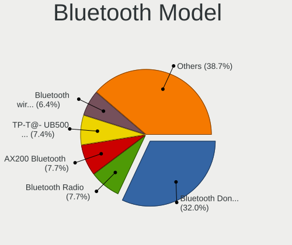

| Model                                                   | Desktops | Percent |
|---------------------------------------------------------|----------|---------|
| Cambridge Silicon Radio Bluetooth Dongle (HCI mode)     | 95       | 31.99%  |
| Realtek Bluetooth Radio                                 | 23       | 7.74%   |
| Intel AX200 Bluetooth                                   | 23       | 7.74%   |
| TP-Link TP-T@- UB500 Adapter                            | 22       | 7.41%   |
| Intel Bluetooth wireless interface                      | 19       | 6.4%    |
| Intel Wireless-AC 3168 Bluetooth                        | 16       | 5.39%   |
| Intel Bluetooth 9460/9560 Jefferson Peak (JfP)          | 11       | 3.7%    |
| Intel AX210 Bluetooth                                   | 11       | 3.7%    |
| Intel AX201 Bluetooth                                   | 10       | 3.37%   |
| MediaTek Wireless_Device                                | 7        | 2.36%   |
| IMC Networks Bluetooth Radio                            | 5        | 1.68%   |
| ASUS Bluetooth Radio                                    | 5        | 1.68%   |
| Intel Wireless-AC 9260 Bluetooth Adapter                | 4        | 1.35%   |
| Intel Centrino Bluetooth Wireless Transceiver           | 4        | 1.35%   |
| Intel Bluetooth Device                                  | 4        | 1.35%   |
| Conwise CW6622                                          | 4        | 1.35%   |
| HP Bluetooth Adapter                                    | 3        | 1.01%   |
| Foxconn / Hon Hai Wireless_Device                       | 3        | 1.01%   |
| ASUS Qualcomm Bluetooth 4.1                             | 3        | 1.01%   |
| Integrated System Solution KY-BT100 Bluetooth Adapter   | 2        | 0.67%   |
| Integrated System Solution Bluetooth Device             | 2        | 0.67%   |
| IMC Networks Wireless_Device                            | 2        | 0.67%   |
| Broadcom BCM20702A0 Bluetooth 4.0                       | 2        | 0.67%   |
| ASUS BCM20702A0                                         | 2        | 0.67%   |
| Roper Class 1 Bluetooth Dongle                          | 1        | 0.34%   |
| Qualcomm Atheros  Bluetooth Device                      | 1        | 0.34%   |
| Qualcomm Atheros QCA61x4 Bluetooth 4.0                  | 1        | 0.34%   |
| Qualcomm Atheros AR3011 Bluetooth                       | 1        | 0.34%   |
| Mercucys Mercusys MA530 Adapter                         | 1        | 0.34%   |
| Logitech BT Mini-Receiver (HCI mode)                    | 1        | 0.34%   |
| Lite-On Bluetooth Device                                | 1        | 0.34%   |
| IMC Networks Bluetooth                                  | 1        | 0.34%   |
| Edimax EW-7611ULB 802.11b/g/n and Bluetooth 4.0 Adapter | 1        | 0.34%   |
| Edimax Bluetooth Device                                 | 1        | 0.34%   |
| Broadcom HP Portable Bumble Bee                         | 1        | 0.34%   |
| Broadcom HP Bluethunder                                 | 1        | 0.34%   |
| ASUS Broadcom BCM20702 Single-Chip Bluetooth 4.0 + LE   | 1        | 0.34%   |
| Apple Bluetooth HCI MacBookPro (HID mode)               | 1        | 0.34%   |
| Unknown                                                 | 1        | 0.34%   |

Sound
-----

Sound Vendor
------------

Sound card vendors

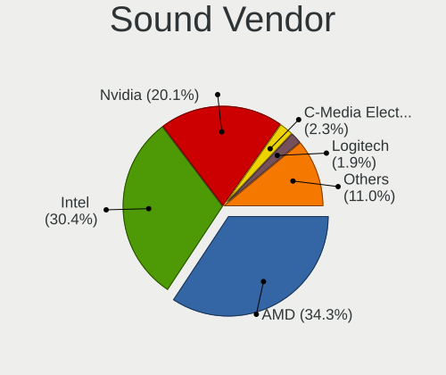

| Vendor                                          | Desktops | Percent |
|-------------------------------------------------|----------|---------|
| AMD                                             | 667      | 34.29%  |
| Intel                                           | 591      | 30.39%  |
| Nvidia                                          | 391      | 20.1%   |
| C-Media Electronics                             | 45       | 2.31%   |
| Logitech                                        | 37       | 1.9%    |
| Kingston Technology                             | 27       | 1.39%   |
| VIA Technologies                                | 20       | 1.03%   |
| Creative Labs                                   | 14       | 0.72%   |
| Generalplus Technology                          | 13       | 0.67%   |
| Texas Instruments                               | 12       | 0.62%   |
| JMTek                                           | 11       | 0.57%   |
| ASUSTek Computer                                | 8        | 0.41%   |
| Focusrite-Novation                              | 7        | 0.36%   |
| Micro Star International                        | 6        | 0.31%   |
| M-Audio                                         | 6        | 0.31%   |
| Silicon Integrated Systems [SiS]                | 5        | 0.26%   |
| Elite Silicon                                   | 5        | 0.26%   |
| Razer USA                                       | 4        | 0.21%   |
| Plantronics                                     | 4        | 0.21%   |
| Licensed by Sony Computer Entertainment America | 4        | 0.21%   |
| Fry's Electronics                               | 4        | 0.21%   |
| BEHRINGER International                         | 4        | 0.21%   |
| ATI Technologies                                | 4        | 0.21%   |
| Sony                                            | 3        | 0.15%   |
| Samson Technologies                             | 3        | 0.15%   |
| Hewlett-Packard                                 | 3        | 0.15%   |
| Creative Technology                             | 3        | 0.15%   |
| Corsair                                         | 3        | 0.15%   |
| SteelSeries ApS                                 | 2        | 0.1%    |
| Microsoft                                       | 2        | 0.1%    |
| Harman International                            | 2        | 0.1%    |
| ESI Audiotechnik                                | 2        | 0.1%    |
| Ensoniq                                         | 2        | 0.1%    |
| Audient                                         | 2        | 0.1%    |
| Astro Gaming                                    | 2        | 0.1%    |
| Arturia                                         | 2        | 0.1%    |
| Zoran Co. Personal Media Division (Nogatech)    | 1        | 0.05%   |
| Yamaha                                          | 1        | 0.05%   |
| Weltrend Semiconductor                          | 1        | 0.05%   |
| Trust                                           | 1        | 0.05%   |

Sound Model
-----------

Sound card models

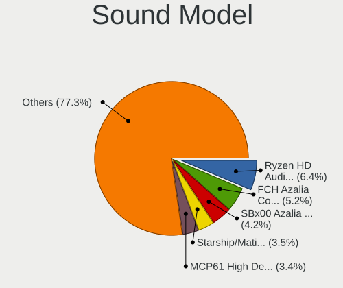

| Model                                                                             | Desktops | Percent |
|-----------------------------------------------------------------------------------|----------|---------|
| AMD Ryzen HD Audio Controller                                                     | 156      | 6.35%   |
| AMD FCH Azalia Controller                                                         | 128      | 5.21%   |
| AMD SBx00 Azalia (Intel HDA)                                                      | 104      | 4.24%   |
| AMD Starship/Matisse HD Audio Controller                                          | 85       | 3.46%   |
| Nvidia MCP61 High Definition Audio                                                | 84       | 3.42%   |
| Intel NM10/ICH7 Family High Definition Audio Controller                           | 79       | 3.22%   |
| Intel 6 Series/C200 Series Chipset Family High Definition Audio Controller        | 79       | 3.22%   |
| AMD Raven/Raven2/Fenghuang HDMI/DP Audio Controller                               | 73       | 2.97%   |
| Intel 8 Series/C220 Series Chipset High Definition Audio Controller               | 65       | 2.65%   |
| Intel 100 Series/C230 Series Chipset Family HD Audio Controller                   | 60       | 2.44%   |
| Intel 200 Series PCH HD Audio                                                     | 58       | 2.36%   |
| AMD Renoir/Cezanne HDMI/DP Audio Controller                                       | 56       | 2.28%   |
| AMD Ellesmere HDMI Audio [Radeon RX 470/480 / 570/580/590]                        | 54       | 2.2%    |
| Intel Xeon E3-1200 v3/4th Gen Core Processor HD Audio Controller                  | 51       | 2.08%   |
| AMD Oland/Hainan/Cape Verde/Pitcairn HDMI Audio [Radeon HD 7000 Series]           | 46       | 1.87%   |
| AMD Family 17h (Models 00h-0fh) HD Audio Controller                               | 46       | 1.87%   |
| Nvidia GP107GL High Definition Audio Controller                                   | 39       | 1.59%   |
| Intel 7 Series/C216 Chipset Family High Definition Audio Controller               | 39       | 1.59%   |
| AMD Kaveri HDMI/DP Audio Controller                                               | 37       | 1.51%   |
| Nvidia GK208 HDMI/DP Audio Controller                                             | 36       | 1.47%   |
| AMD Kabini HDMI/DP Audio                                                          | 35       | 1.43%   |
| Nvidia High Definition Audio Controller                                           | 33       | 1.34%   |
| AMD Trinity HDMI Audio Controller                                                 | 33       | 1.34%   |
| AMD Navi 21/23 HDMI/DP Audio Controller                                           | 32       | 1.3%    |
| Intel Cannon Lake PCH cAVS                                                        | 30       | 1.22%   |
| AMD Baffin HDMI/DP Audio [Radeon RX 550 640SP / RX 560/560X]                      | 28       | 1.14%   |
| AMD Cedar HDMI Audio [Radeon HD 5400/6300/7300 Series]                            | 26       | 1.06%   |
| Intel Smart Sound Technology (SST) Audio Controller                               | 23       | 0.94%   |
| Nvidia GP106 High Definition Audio Controller                                     | 22       | 0.9%    |
| Intel 9 Series Chipset Family HD Audio Controller                                 | 21       | 0.86%   |
| AMD Caicos HDMI Audio [Radeon HD 6450 / 7450/8450/8490 OEM / R5 230/235/235X OEM] | 21       | 0.86%   |
| Nvidia GA104 High Definition Audio Controller                                     | 20       | 0.81%   |
| Intel Alder Lake-S HD Audio Controller                                            | 20       | 0.81%   |
| C-Media Electronics USB Audio Device                                              | 20       | 0.81%   |
| AMD Radeon High Definition Audio Controller                                       | 19       | 0.77%   |
| AMD Navi 10 HDMI Audio                                                            | 19       | 0.77%   |
| AMD Family 15h (Models 60h-6fh) Audio Controller                                  | 19       | 0.77%   |
| Nvidia GP108 High Definition Audio Controller                                     | 16       | 0.65%   |
| AMD Tobago HDMI Audio [Radeon R7 360 / R9 360 OEM]                                | 16       | 0.65%   |
| Nvidia TU116 High Definition Audio Controller                                     | 15       | 0.61%   |

Memory
------

Memory Vendor
-------------

Memory module vendors

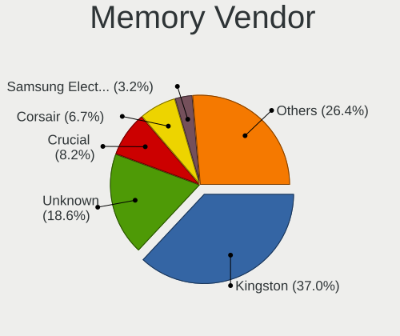

| Vendor                                  | Desktops | Percent |
|-----------------------------------------|----------|---------|
| Kingston                                | 258      | 36.96%  |
| Unknown                                 | 130      | 18.62%  |
| Crucial                                 | 57       | 8.17%   |
| Corsair                                 | 47       | 6.73%   |
| Samsung Electronics                     | 22       | 3.15%   |
| A-DATA Technology                       | 22       | 3.15%   |
| Unknown                                 | 19       | 2.72%   |
| G.Skill                                 | 15       | 2.15%   |
| SK hynix                                | 10       | 1.43%   |
| Patriot                                 | 10       | 1.43%   |
| Hikvision                               | 10       | 1.43%   |
| PNY                                     | 9        | 1.29%   |
| Team                                    | 8        | 1.15%   |
| Novatech                                | 8        | 1.15%   |
| Avant                                   | 8        | 1.15%   |
| Hewlett-Packard                         | 7        | 1%      |
| Goldkey                                 | 7        | 1%      |
| Micron Technology                       | 4        | 0.57%   |
| Magnum Tech                             | 4        | 0.57%   |
| Patriot Memory                          | 3        | 0.43%   |
| CSX                                     | 3        | 0.43%   |
| Transcend                               | 2        | 0.29%   |
| Super Talent                            | 2        | 0.29%   |
| Ramos Technology                        | 2        | 0.29%   |
| Nanya Technology                        | 2        | 0.29%   |
| Lexar                                   | 2        | 0.29%   |
| Gold Key                                | 2        | 0.29%   |
| GeIL                                    | 2        | 0.29%   |
| Elpida                                  | 2        | 0.29%   |
| Visipro                                 | 1        | 0.14%   |
| Unknown (ABCD)                          | 1        | 0.14%   |
| Toshiba                                 | 1        | 0.14%   |
| Thermaltake                             | 1        | 0.14%   |
| Teikon                                  | 1        | 0.14%   |
| Silicon Power Computer & Communications | 1        | 0.14%   |
| Saikano                                 | 1        | 0.14%   |
| Ramaxel Technology                      | 1        | 0.14%   |
| Quadratica                              | 1        | 0.14%   |
| pqi                                     | 1        | 0.14%   |
| Patriot Memory (PDP Systems)            | 1        | 0.14%   |

Memory Model
------------

Memory module models

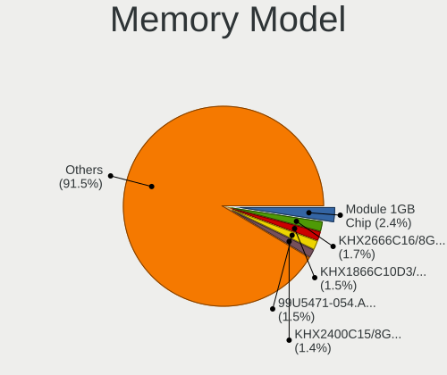

| Model                                                  | Desktops | Percent |
|--------------------------------------------------------|----------|---------|
| Unknown                                                | 19       | 2.42%   |
| Kingston RAM KHX2666C16/8G 8GiB DIMM DDR4 3466MT/s     | 13       | 1.66%   |
| Kingston RAM KHX1866C10D3/8G 8GB DIMM DDR3 1867MT/s    | 12       | 1.53%   |
| Kingston RAM 99U5471-054.A00LF 8GB DIMM DDR3 1600MT/s  | 12       | 1.53%   |
| Kingston RAM KHX2400C15/8G 8GB DIMM DDR4 3400MT/s      | 11       | 1.4%    |
| Unknown RAM Module 4GB DIMM 1333MT/s                   | 10       | 1.28%   |
| Kingston RAM KF3200C16D4/16GX 16GB DIMM DDR4 3733MT/s  | 9        | 1.15%   |
| Unknown RAM Module 2GB DIMM 1333MT/s                   | 8        | 1.02%   |
| Unknown RAM Module 4GB DIMM DDR3 1333MT/s              | 7        | 0.89%   |
| Unknown RAM Module 4GB DIMM 1600MT/s                   | 7        | 0.89%   |
| Unknown RAM Module 2GB DIMM SDRAM                      | 7        | 0.89%   |
| Kingston RAM KHX1866C10D3/4G 4GB DIMM DDR3 1867MT/s    | 7        | 0.89%   |
| Kingston RAM KHX1866C10D3/ 8192MB DIMM DDR3 1866MT/s   | 7        | 0.89%   |
| Kingston RAM KHX1600C10D3/8G 8GB DIMM DDR3 2133MT/s    | 7        | 0.89%   |
| Kingston RAM KF3200C16D4/8GX 8GiB DIMM DDR4 3600MT/s   | 7        | 0.89%   |
| Kingston RAM 99U5584-005.A00LF 4GB DIMM DDR3 1600MT/s  | 7        | 0.89%   |
| Kingston RAM KHX1600C9D3/4GX 4GB DIMM DDR3 1867MT/s    | 6        | 0.77%   |
| Kingston RAM 99U5474-028.A00LF 4GB DIMM DDR3 1333MT/s  | 6        | 0.77%   |
| Corsair RAM CMK16GX4M2B3200C16 8GB DIMM DDR4 3600MT/s  | 6        | 0.77%   |
| Unknown RAM Module 8GB DIMM 1333MT/s                   | 5        | 0.64%   |
| Unknown RAM Module 4096MB DIMM 1333MT/s                | 5        | 0.64%   |
| Unknown RAM Module 2GB DIMM DDR2 800MT/s               | 5        | 0.64%   |
| Unknown RAM Module 2048MB DIMM 1333MT/s                | 5        | 0.64%   |
| Kingston RAM KHX3200C16D4/16GX 16GB DIMM DDR4 3600MT/s | 5        | 0.64%   |
| Kingston RAM KHX1600C10D3/ 4GB DIMM DDR3 1600MT/s      | 5        | 0.64%   |
| Kingston RAM 99U5471-056.A00LF 8GB DIMM DDR3 1600MT/s  | 5        | 0.64%   |
| Unknown RAM Module 2GB DIMM DDR2 533MT/s               | 4        | 0.51%   |
| Unknown RAM Module 2GB DIMM DDR2 333MT/s               | 4        | 0.51%   |
| Kingston RAM KF3200C16D4/32GX 32GB DIMM DDR4 3933MT/s  | 4        | 0.51%   |
| Kingston RAM KF2666C16D4/8G 8GB DIMM DDR4 2667MT/s     | 4        | 0.51%   |
| Kingston RAM 99U5474-026.A00LF 4GB DIMM DDR3 1333MT/s  | 4        | 0.51%   |
| Kingston RAM 99U5471-020.A00LF 4GB DIMM 1600MT/s       | 4        | 0.51%   |
| Kingston RAM 9905702-119.A00G 8GB DIMM DDR4 2667MT/s   | 4        | 0.51%   |
| Crucial RAM BLS8G4D240FSEK.8FBD 8GB DIMM DDR4 2400MT/s | 4        | 0.51%   |
| Corsair RAM CMK8GX4M1A2400C16 8GB DIMM DDR4 3066MT/s   | 4        | 0.51%   |
| A-DATA RAM DDR4 3200 16GB DIMM DDR4 3600MT/s           | 4        | 0.51%   |
| Unknown RAM Module 8GB DIMM 1600MT/s                   | 3        | 0.38%   |
| Unknown RAM Module 4GB DIMM SDRAM                      | 3        | 0.38%   |
| Unknown RAM Module 4096MB DIMM DDR3 1333MT/s           | 3        | 0.38%   |
| Unknown RAM Module 4096MB DIMM 1066MT/s                | 3        | 0.38%   |

Memory Kind
-----------

Memory module kinds

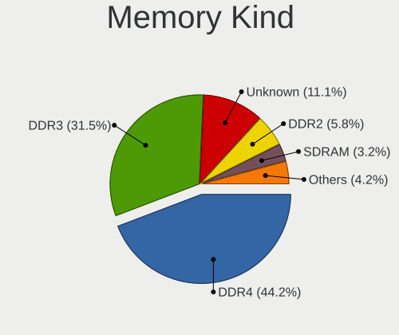

| Kind    | Desktops | Percent |
|---------|----------|---------|
| DDR4    | 275      | 44.21%  |
| DDR3    | 196      | 31.51%  |
| Unknown | 69       | 11.09%  |
| DDR2    | 36       | 5.79%   |
| SDRAM   | 20       | 3.22%   |
| DDR5    | 17       | 2.73%   |
| DDR     | 8        | 1.29%   |
| LPDDR4  | 1        | 0.16%   |

Memory Form Factor
------------------

Physical design of the memory module

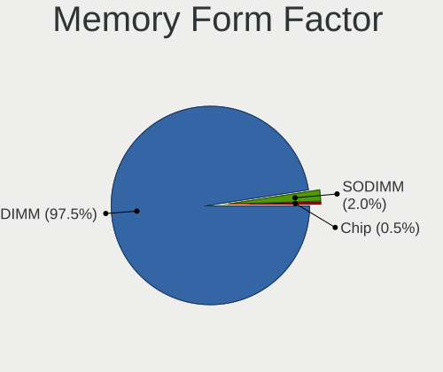

| Name   | Desktops | Percent |
|--------|----------|---------|
| DIMM   | 597      | 97.55%  |
| SODIMM | 12       | 1.96%   |
| Chip   | 3        | 0.49%   |

Memory Size
-----------

Memory module size

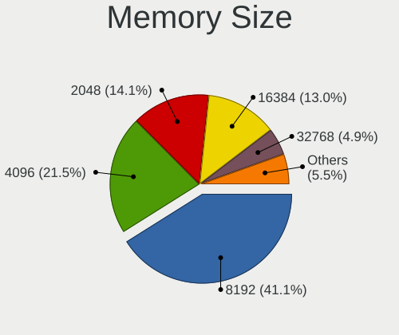

| Size  | Desktops | Percent |
|-------|----------|---------|
| 8192  | 285      | 41.07%  |
| 4096  | 149      | 21.47%  |
| 2048  | 98       | 14.12%  |
| 16384 | 90       | 12.97%  |
| 32768 | 34       | 4.9%    |
| 1024  | 31       | 4.47%   |
| 512   | 6        | 0.86%   |
| 256   | 1        | 0.14%   |

Memory Speed
------------

Memory module speed

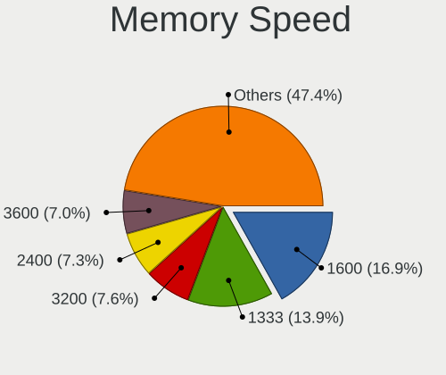

| Speed   | Desktops | Percent |
|---------|----------|---------|
| 1600    | 118      | 16.86%  |
| 1333    | 97       | 13.86%  |
| 3200    | 53       | 7.57%   |
| 2400    | 51       | 7.29%   |
| 3600    | 49       | 7%      |
| 2667    | 46       | 6.57%   |
| 2133    | 31       | 4.43%   |
| Unknown | 28       | 4%      |
| 3400    | 20       | 2.86%   |
| 667     | 18       | 2.57%   |
| 3466    | 17       | 2.43%   |
| 800     | 17       | 2.43%   |
| 1866    | 15       | 2.14%   |
| 3733    | 14       | 2%      |
| 2666    | 14       | 2%      |
| 3000    | 10       | 1.43%   |
| 333     | 10       | 1.43%   |
| 533     | 9        | 1.29%   |
| 400     | 9        | 1.29%   |
| 6000    | 5        | 0.71%   |
| 4800    | 5        | 0.71%   |
| 3933    | 5        | 0.71%   |
| 3800    | 5        | 0.71%   |
| 2933    | 5        | 0.71%   |
| 1066    | 5        | 0.71%   |
| 4000    | 4        | 0.57%   |
| 3066    | 4        | 0.57%   |
| 1334    | 3        | 0.43%   |
| 5600    | 2        | 0.29%   |
| 3334    | 2        | 0.29%   |
| 3151    | 2        | 0.29%   |
| 3007    | 2        | 0.29%   |
| 2800    | 2        | 0.29%   |
| 2733    | 2        | 0.29%   |
| 1867    | 2        | 0.29%   |
| 1800    | 2        | 0.29%   |
| 52217   | 1        | 0.14%   |
| 8400    | 1        | 0.14%   |
| 7000    | 1        | 0.14%   |
| 6400    | 1        | 0.14%   |

Printers & scanners
-------------------

Printer Vendor
--------------

Printer device vendors

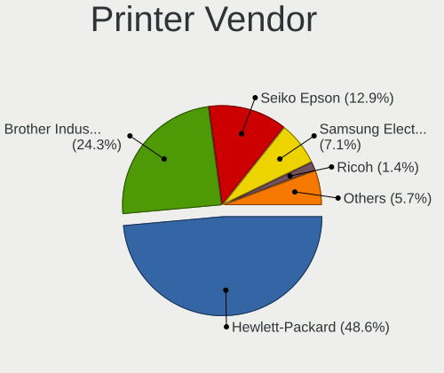

| Vendor              | Desktops | Percent |
|---------------------|----------|---------|
| Hewlett-Packard     | 34       | 48.57%  |
| Brother Industries  | 17       | 24.29%  |
| Seiko Epson         | 9        | 12.86%  |
| Samsung Electronics | 5        | 7.14%   |
| Ricoh               | 1        | 1.43%   |
| Pantum              | 1        | 1.43%   |
| NXP Semiconductors  | 1        | 1.43%   |
| Graphtec America    | 1        | 1.43%   |
| Canon               | 1        | 1.43%   |

Printer Model
-------------

Printer device models

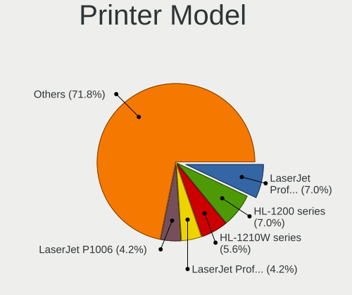

| Model                                         | Desktops | Percent |
|-----------------------------------------------|----------|---------|
| HP LaserJet Professional P1102w               | 5        | 7.04%   |
| Brother HL-1200 series                        | 5        | 7.04%   |
| Brother HL-1210W series                       | 4        | 5.63%   |
| HP LaserJet Professional P 1102w              | 3        | 4.23%   |
| HP LaserJet P1006                             | 3        | 4.23%   |
| Brother HL-1110 series                        | 3        | 4.23%   |
| Seiko Epson XP-240 Series                     | 2        | 2.82%   |
| Seiko Epson L355 Series                       | 2        | 2.82%   |
| Seiko Epson L210 Series                       | 2        | 2.82%   |
| Samsung M2020 Series                          | 2        | 2.82%   |
| HP LaserJet P1005                             | 2        | 2.82%   |
| HP LaserJet M203-M206                         | 2        | 2.82%   |
| HP Ink Tank 110 series                        | 2        | 2.82%   |
| HP DeskJet 2600 series                        | 2        | 2.82%   |
| Brother HL-2130 series                        | 2        | 2.82%   |
| Brother DCP-7055 scanner/printer              | 2        | 2.82%   |
| Seiko Epson ME 340 Series/Stylus NX130 Series | 1        | 1.41%   |
| Seiko Epson L5190 Series                      | 1        | 1.41%   |
| Seiko Epson L3110 Series                      | 1        | 1.41%   |
| Seiko Epson ET-2700 Series                    | 1        | 1.41%   |
| Samsung Xerox Phaser 3117 Laser Printer       | 1        | 1.41%   |
| Samsung ML-1865                               | 1        | 1.41%   |
| Samsung CLP-360 Series                        | 1        | 1.41%   |
| Ricoh Printing Support                        | 1        | 1.41%   |
| Pantum P2500W series                          | 1        | 1.41%   |
| NXP Semiconductors Elgin i8                   | 1        | 1.41%   |
| HP PSC 1400                                   | 1        | 1.41%   |
| HP Officejet 4500 G510a-f                     | 1        | 1.41%   |
| HP LaserJet Pro M428f-M429f                   | 1        | 1.41%   |
| HP Laserjet P1505                             | 1        | 1.41%   |
| HP LaserJet M109-M112                         | 1        | 1.41%   |
| HP LaserJet 3050                              | 1        | 1.41%   |
| HP Ink Tank Wireless 410 series               | 1        | 1.41%   |
| HP HP LaserJet M101-M106                      | 1        | 1.41%   |
| HP DeskJet F4100 Printer series               | 1        | 1.41%   |
| HP DeskJet 810c/812c                          | 1        | 1.41%   |
| HP DeskJet 6940 series                        | 1        | 1.41%   |
| HP DeskJet 3630 series                        | 1        | 1.41%   |
| HP Deskjet 3050 J610 series                   | 1        | 1.41%   |
| HP Deskjet 2050 J510                          | 1        | 1.41%   |

Scanner Vendor
--------------

Scanner device vendors

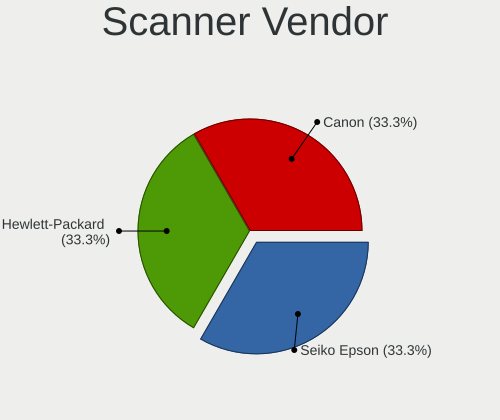

| Vendor          | Desktops | Percent |
|-----------------|----------|---------|
| Seiko Epson     | 1        | 33.33%  |
| Hewlett-Packard | 1        | 33.33%  |
| Canon           | 1        | 33.33%  |

Scanner Model
-------------

Scanner device models

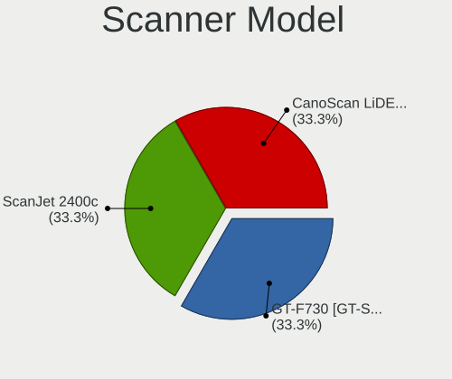

| Model                                                   | Desktops | Percent |
|---------------------------------------------------------|----------|---------|
| Seiko Epson GT-F730 [GT-S630/Perfection V33/V330 Photo] | 1        | 33.33%  |
| HP ScanJet 2400c                                        | 1        | 33.33%  |
| Canon CanoScan LiDE 200                                 | 1        | 33.33%  |

Camera
------

Camera Vendor
-------------

Camera device vendors

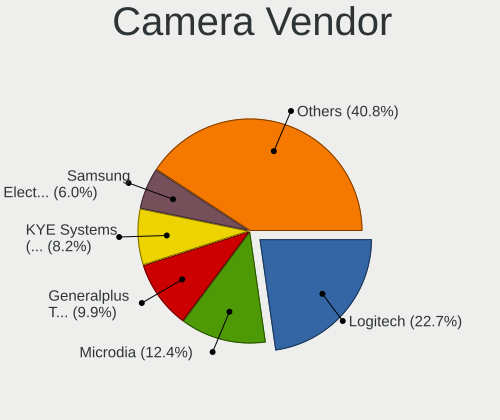

| Vendor                        | Desktops | Percent |
|-------------------------------|----------|---------|
| Logitech                      | 53       | 22.75%  |
| Microdia                      | 29       | 12.45%  |
| Generalplus Technology        | 23       | 9.87%   |
| KYE Systems (Mouse Systems)   | 19       | 8.15%   |
| Samsung Electronics           | 14       | 6.01%   |
| Chicony Electronics           | 11       | 4.72%   |
| Jieli Technology              | 9        | 3.86%   |
| Z-Star Microelectronics       | 8        | 3.43%   |
| Microsoft                     | 8        | 3.43%   |
| MacroSilicon                  | 6        | 2.58%   |
| Sunplus Innovation Technology | 5        | 2.15%   |
| Apple                         | 5        | 2.15%   |
| Alcor Micro                   | 5        | 2.15%   |
| Cubeternet                    | 4        | 1.72%   |
| Sonix Technology              | 3        | 1.29%   |
| Silicon Motion                | 3        | 1.29%   |
| Razer USA                     | 2        | 0.86%   |
| Pixart Imaging                | 2        | 0.86%   |
| OmniVision Technologies       | 2        | 0.86%   |
| Huawei Technologies           | 2        | 0.86%   |
| Genesys Logic                 | 2        | 0.86%   |
| Elgato Systems                | 2        | 0.86%   |
| Bison Electronics             | 2        | 0.86%   |
| Aveo Technology               | 2        | 0.86%   |
| ARC International             | 2        | 0.86%   |
| webcam                        | 1        | 0.43%   |
| Philips (or NXP)              | 1        | 0.43%   |
| Motorola PCS                  | 1        | 0.43%   |
| LG Electronics                | 1        | 0.43%   |
| KYE Systems                   | 1        | 0.43%   |
| IMC Networks                  | 1        | 0.43%   |
| bx ic                         | 1        | 0.43%   |
| Asuscom Network               | 1        | 0.43%   |
| Acer                          | 1        | 0.43%   |
| A4Tech                        | 1        | 0.43%   |

Camera Model
------------

Camera device models

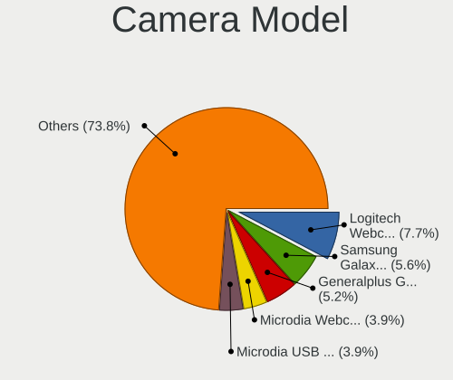

| Model                                              | Desktops | Percent |
|----------------------------------------------------|----------|---------|
| Logitech Webcam C270                               | 18       | 7.73%   |
| Samsung Galaxy series, misc. (MTP mode)            | 13       | 5.58%   |
| Generalplus GENERAL WEBCAM                         | 12       | 5.15%   |
| Microdia Webcam Vitade AF                          | 9        | 3.86%   |
| Microdia USB 2.0 Camera                            | 9        | 3.86%   |
| Jieli USB PHY 2.0                                  | 9        | 3.86%   |
| Generalplus 808 Camera #9 (web-cam mode)           | 8        | 3.43%   |
| Logitech HD Pro Webcam C920                        | 7        | 3%      |
| Logitech C922 Pro Stream Webcam                    | 7        | 3%      |
| Microdia Integrated Camera                         | 6        | 2.58%   |
| MacroSilicon USB Video                             | 6        | 2.58%   |
| Apple iPhone 5/5C/5S/6/SE/7/8/X                    | 5        | 2.15%   |
| Alcor Micro USB 2.0 PC Camera                      | 5        | 2.15%   |
| Microsoft LifeCam HD-3000                          | 4        | 1.72%   |
| KYE Systems (Mouse Systems) Genius Webcam          | 4        | 1.72%   |
| Chicony HP 0.3MP Webcam                            | 4        | 1.72%   |
| Z-Star Venus USB2.0 Camera                         | 3        | 1.29%   |
| Sunplus Integrated Camera                          | 3        | 1.29%   |
| Sonix GENERAL WEBCAM                               | 3        | 1.29%   |
| Microsoft LifeCam VX-800                           | 3        | 1.29%   |
| Logitech Webcam C170                               | 3        | 1.29%   |
| Logitech Logitech Webcam C925e                     | 3        | 1.29%   |
| Logitech BRIO Ultra HD Webcam                      | 3        | 1.29%   |
| KYE Systems (Mouse Systems) Genius FaceCam 320     | 3        | 1.29%   |
| KYE Systems (Mouse Systems) FaceCam 1000X          | 3        | 1.29%   |
| Generalplus WEB CAM                                | 3        | 1.29%   |
| Z-Star A4 TECH USB2.0 PC Camera E                  | 2        | 0.86%   |
| Microdia Camera                                    | 2        | 0.86%   |
| Logitech C505e HD Webcam                           | 2        | 0.86%   |
| KYE Systems (Mouse Systems) Genius iSlim 2000AF V2 | 2        | 0.86%   |
| Huawei HiCamera                                    | 2        | 0.86%   |
| Elgato Systems Game Capture HD60 X                 | 2        | 0.86%   |
| Cubeternet WebCam                                  | 2        | 0.86%   |
| Cubeternet USB2.0 Camera                           | 2        | 0.86%   |
| Chicony HP High Definition 1MP Webcam              | 2        | 0.86%   |
| Chicony HD Webcam                                  | 2        | 0.86%   |
| Aveo USB2.0 Camera                                 | 2        | 0.86%   |
| ARC International Camera                           | 2        | 0.86%   |
| Z-Star USB 2.0 Web Camera                          | 1        | 0.43%   |
| Z-Star Integrated Camera                           | 1        | 0.43%   |

Security
--------

Fingerprint Vendor
------------------

Fingerprint sensor vendors

| Vendor                | Desktops | Percent |
|-----------------------|----------|---------|
| DigitalPersona        | 2        | 66.67%  |
| LighTuning Technology | 1        | 33.33%  |

Fingerprint Model
-----------------

Fingerprint sensor models

| Model                             | Desktops | Percent |
|-----------------------------------|----------|---------|
| DigitalPersona Fingerprint Reader | 2        | 66.67%  |
| LighTuning Fingerprint Sensor     | 1        | 33.33%  |

Chipcard Vendor
---------------

Chipcard module vendors

Zero info for selected period =(

Chipcard Model
--------------

Chipcard module models

Zero info for selected period =(

Unsupported
-----------

Unsupported Devices
-------------------

Total unsupported devices on board

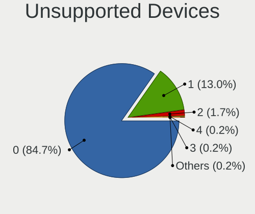

| Total | Desktops | Percent |
|-------|----------|---------|
| 0     | 1104     | 84.73%  |
| 1     | 170      | 13.05%  |
| 2     | 22       | 1.69%   |
| 4     | 3        | 0.23%   |
| 3     | 2        | 0.15%   |
| 6     | 1        | 0.08%   |
| 5     | 1        | 0.08%   |

Unsupported Device Types
------------------------

Types of unsupported devices

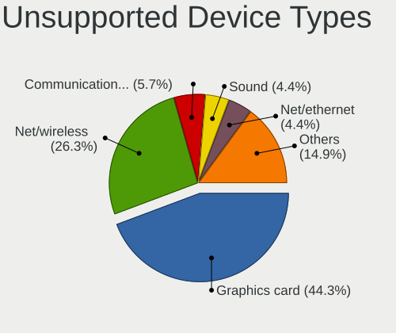

| Type                     | Desktops | Percent |
|--------------------------|----------|---------|
| Graphics card            | 101      | 44.3%   |
| Net/wireless             | 60       | 26.32%  |
| Communication controller | 13       | 5.7%    |
| Sound                    | 10       | 4.39%   |
| Net/ethernet             | 10       | 4.39%   |
| Camera                   | 9        | 3.95%   |
| Multimedia controller    | 4        | 1.75%   |
| Bluetooth                | 4        | 1.75%   |
| Unassigned class         | 3        | 1.32%   |
| Modem                    | 3        | 1.32%   |
| Fingerprint reader       | 3        | 1.32%   |
| Storage/ide              | 2        | 0.88%   |
| Network                  | 2        | 0.88%   |
| Firewire controller      | 2        | 0.88%   |
| Storage/raid             | 1        | 0.44%   |
| Dvb card                 | 1        | 0.44%   |

