Linux in Argentina - Tested Hardware & Statistics (Desktops)
------------------------------------------------------------

A project to collect tested hardware configurations for Linux in Argentina.

Anyone can contribute to this report by the [hw-probe](https://github.com/linuxhw/hw-probe) tool:

    sudo -E hw-probe -all -upload

Please contribute! Especially if your hardware is rare.

Contents
--------

* [ Test Cases ](#test-cases)

* [ System ](#system)
  - [ OS                       ](#os)
  - [ OS Family                ](#os-family)
  - [ Kernel                   ](#kernel)
  - [ Kernel Family            ](#kernel-family)
  - [ Kernel Major Ver.        ](#kernel-major-ver)
  - [ Arch                     ](#arch)
  - [ DE                       ](#de)
  - [ Display Server           ](#display-server)
  - [ Display Manager          ](#display-manager)
  - [ OS Lang                  ](#os-lang)
  - [ Boot Mode                ](#boot-mode)
  - [ Filesystem               ](#filesystem)
  - [ Part. scheme             ](#part-scheme)
  - [ Dual Boot with Linux/BSD ](#dual-boot-with-linuxbsd)
  - [ Dual Boot (Win)          ](#dual-boot-win)

* [ Board ](#board)
  - [ Vendor                   ](#vendor)
  - [ Model                    ](#model)
  - [ Model Family             ](#model-family)
  - [ MFG Year                 ](#mfg-year)
  - [ Form Factor              ](#form-factor)
  - [ Secure Boot              ](#secure-boot)
  - [ Coreboot                 ](#coreboot)
  - [ RAM Size                 ](#ram-size)
  - [ RAM Used                 ](#ram-used)
  - [ Total Drives             ](#total-drives)
  - [ Has CD-ROM               ](#has-cd-rom)
  - [ Has Ethernet             ](#has-ethernet)
  - [ Has WiFi                 ](#has-wifi)
  - [ Has Bluetooth            ](#has-bluetooth)

* [ Location ](#location)
  - [ Country                  ](#country)
  - [ City                     ](#city)

* [ Drives ](#drives)
  - [ Drive Vendor             ](#drive-vendor)
  - [ Drive Model              ](#drive-model)
  - [ HDD Vendor               ](#hdd-vendor)
  - [ SSD Vendor               ](#ssd-vendor)
  - [ Drive Kind               ](#drive-kind)
  - [ Drive Connector          ](#drive-connector)
  - [ Drive Size               ](#drive-size)
  - [ Space Total              ](#space-total)
  - [ Space Used               ](#space-used)
  - [ Malfunc. Drives          ](#malfunc-drives)
  - [ Malfunc. Drive Vendor    ](#malfunc-drive-vendor)
  - [ Malfunc. HDD Vendor      ](#malfunc-hdd-vendor)
  - [ Malfunc. Drive Kind      ](#malfunc-drive-kind)
  - [ Failed Drives            ](#failed-drives)
  - [ Failed Drive Vendor      ](#failed-drive-vendor)
  - [ Drive Status             ](#drive-status)

* [ Storage controller ](#storage-controller)
  - [ Storage Vendor           ](#storage-vendor)
  - [ Storage Model            ](#storage-model)
  - [ Storage Kind             ](#storage-kind)

* [ Processor ](#processor)
  - [ CPU Vendor               ](#cpu-vendor)
  - [ CPU Model                ](#cpu-model)
  - [ CPU Model Family         ](#cpu-model-family)
  - [ CPU Cores                ](#cpu-cores)
  - [ CPU Sockets              ](#cpu-sockets)
  - [ CPU Threads              ](#cpu-threads)
  - [ CPU Op-Modes             ](#cpu-op-modes)
  - [ CPU Microcode            ](#cpu-microcode)
  - [ CPU Microarch            ](#cpu-microarch)

* [ Graphics ](#graphics)
  - [ GPU Vendor               ](#gpu-vendor)
  - [ GPU Model                ](#gpu-model)
  - [ GPU Combo                ](#gpu-combo)
  - [ GPU Driver               ](#gpu-driver)
  - [ GPU Memory               ](#gpu-memory)

* [ Monitor ](#monitor)
  - [ Monitor Vendor           ](#monitor-vendor)
  - [ Monitor Model            ](#monitor-model)
  - [ Monitor Resolution       ](#monitor-resolution)
  - [ Monitor Diagonal         ](#monitor-diagonal)
  - [ Monitor Width            ](#monitor-width)
  - [ Aspect Ratio             ](#aspect-ratio)
  - [ Monitor Area             ](#monitor-area)
  - [ Pixel Density            ](#pixel-density)
  - [ Multiple Monitors        ](#multiple-monitors)

* [ Network ](#network)
  - [ Net Controller Vendor    ](#net-controller-vendor)
  - [ Net Controller Model     ](#net-controller-model)
  - [ Wireless Vendor          ](#wireless-vendor)
  - [ Wireless Model           ](#wireless-model)
  - [ Ethernet Vendor          ](#ethernet-vendor)
  - [ Ethernet Model           ](#ethernet-model)
  - [ Net Controller Kind      ](#net-controller-kind)
  - [ Used Controller          ](#used-controller)
  - [ NICs                     ](#nics)
  - [ IPv6                     ](#ipv6)

* [ Bluetooth ](#bluetooth)
  - [ Bluetooth Vendor         ](#bluetooth-vendor)
  - [ Bluetooth Model          ](#bluetooth-model)

* [ Sound ](#sound)
  - [ Sound Vendor             ](#sound-vendor)
  - [ Sound Model              ](#sound-model)

* [ Memory ](#memory)
  - [ Memory Vendor            ](#memory-vendor)
  - [ Memory Model             ](#memory-model)
  - [ Memory Kind              ](#memory-kind)
  - [ Memory Form Factor       ](#memory-form-factor)
  - [ Memory Size              ](#memory-size)
  - [ Memory Speed             ](#memory-speed)

* [ Printers & scanners ](#printers--scanners)
  - [ Printer Vendor           ](#printer-vendor)
  - [ Printer Model            ](#printer-model)
  - [ Scanner Vendor           ](#scanner-vendor)
  - [ Scanner Model            ](#scanner-model)

* [ Camera ](#camera)
  - [ Camera Vendor            ](#camera-vendor)
  - [ Camera Model             ](#camera-model)

* [ Security ](#security)
  - [ Fingerprint Vendor       ](#fingerprint-vendor)
  - [ Fingerprint Model        ](#fingerprint-model)
  - [ Chipcard Vendor          ](#chipcard-vendor)
  - [ Chipcard Model           ](#chipcard-model)

* [ Unsupported ](#unsupported)
  - [ Unsupported Devices      ](#unsupported-devices)
  - [ Unsupported Device Types ](#unsupported-device-types)

Test Cases
----------

Total: 1310

| Vendor        | Model                       | Probe                                                      | Date         |
|---------------|-----------------------------|------------------------------------------------------------|--------------|
| ASUSTek       | TUF Gaming B660M-PLUS WI... | [adcd184722](https://linux-hardware.org/?probe=adcd184722) | Dec 28, 2023 |
| Gigabyte      | B365 M AORUS ELITE-CF       | [0927068d89](https://linux-hardware.org/?probe=0927068d89) | Dec 27, 2023 |
| MSI           | H110M PRO-VH PLUS           | [3c112941d6](https://linux-hardware.org/?probe=3c112941d6) | Dec 24, 2023 |
| MSI           | NF725M-P43                  | [43756d6fad](https://linux-hardware.org/?probe=43756d6fad) | Dec 21, 2023 |
| MSI           | MEG Z690 UNIFY              | [33f139b941](https://linux-hardware.org/?probe=33f139b941) | Dec 19, 2023 |
| ASRock        | G41M-VS3                    | [313b058c8c](https://linux-hardware.org/?probe=313b058c8c) | Dec 14, 2023 |
| ECS           | G41T-M                      | [a0017f196c](https://linux-hardware.org/?probe=a0017f196c) | Dec 14, 2023 |
| MACHINIST     | X99-K9 V2.0                 | [68ba082c42](https://linux-hardware.org/?probe=68ba082c42) | Dec 12, 2023 |
| ASUSTek       | PRIME A320M-K               | [bc892e5d3b](https://linux-hardware.org/?probe=bc892e5d3b) | Dec 09, 2023 |
| ASRock        | 960GC-GS FX                 | [d1288cac0c](https://linux-hardware.org/?probe=d1288cac0c) | Dec 07, 2023 |
| Gigabyte      | H81M-H                      | [108ddf7f8e](https://linux-hardware.org/?probe=108ddf7f8e) | Dec 07, 2023 |
| Intel         | ChiefRiver                  | [6a4b7aebe9](https://linux-hardware.org/?probe=6a4b7aebe9) | Dec 05, 2023 |
| Gigabyte      | Z87-HD3                     | [b71e5d49a4](https://linux-hardware.org/?probe=b71e5d49a4) | Dec 04, 2023 |
| Gigabyte      | Z87-HD3                     | [638021e67d](https://linux-hardware.org/?probe=638021e67d) | Dec 04, 2023 |
| MSI           | B450 GAMING PLUS MAX        | [ce304df98f](https://linux-hardware.org/?probe=ce304df98f) | Dec 04, 2023 |
| Gigabyte      | GA-E6010N                   | [f36369aec0](https://linux-hardware.org/?probe=f36369aec0) | Dec 02, 2023 |
| Gigabyte      | A520M AORUS ELITE           | [ae6274f798](https://linux-hardware.org/?probe=ae6274f798) | Nov 30, 2023 |
| MSI           | A320M-A PRO MAX             | [ea1580fdae](https://linux-hardware.org/?probe=ea1580fdae) | Nov 28, 2023 |
| Gigabyte      | A55M-DS2                    | [bb5c7bef3f](https://linux-hardware.org/?probe=bb5c7bef3f) | Nov 27, 2023 |
| ASUSTek       | A68HM-PLUS                  | [d848c8ed0e](https://linux-hardware.org/?probe=d848c8ed0e) | Nov 27, 2023 |
| ASUSTek       | PRIME J4005I-C              | [23f26e0c45](https://linux-hardware.org/?probe=23f26e0c45) | Nov 27, 2023 |
| Gigabyte      | AM1M-S2H                    | [c3bdc08988](https://linux-hardware.org/?probe=c3bdc08988) | Nov 26, 2023 |
| ASUSTek       | M5A97 LE R2.0               | [5ead75f7bc](https://linux-hardware.org/?probe=5ead75f7bc) | Nov 25, 2023 |
| MSI           | A320M PRO-VH PLUS           | [d781187df4](https://linux-hardware.org/?probe=d781187df4) | Nov 24, 2023 |
| Intel         | DH77EB AAG39073-304         | [c397c51bfb](https://linux-hardware.org/?probe=c397c51bfb) | Nov 24, 2023 |
| ASUSTek       | M4A88T-M                    | [65c6061eb3](https://linux-hardware.org/?probe=65c6061eb3) | Nov 23, 2023 |
| ASUSTek       | M5A97 LE R2.0               | [eeae51d065](https://linux-hardware.org/?probe=eeae51d065) | Nov 23, 2023 |
| MSI           | X370 GAMING PLUS            | [df5747727b](https://linux-hardware.org/?probe=df5747727b) | Nov 22, 2023 |
| MSI           | G31M3                       | [d9e2a5683a](https://linux-hardware.org/?probe=d9e2a5683a) | Nov 20, 2023 |
| Gigabyte      | A520M H                     | [079ab24f27](https://linux-hardware.org/?probe=079ab24f27) | Nov 17, 2023 |
| Gigabyte      | A520M H                     | [1a59332837](https://linux-hardware.org/?probe=1a59332837) | Nov 17, 2023 |
| Dell          | 0GXM1W A00                  | [da8f5fa2e5](https://linux-hardware.org/?probe=da8f5fa2e5) | Nov 17, 2023 |
| ASUSTek       | M4A88T-M                    | [0c9c1b8513](https://linux-hardware.org/?probe=0c9c1b8513) | Nov 15, 2023 |
| Gigabyte      | GA-A55M-S2V                 | [780d61593a](https://linux-hardware.org/?probe=780d61593a) | Nov 14, 2023 |
| MSI           | MS-7309                     | [c6ca259cae](https://linux-hardware.org/?probe=c6ca259cae) | Nov 13, 2023 |
| Gigabyte      | B550M AORUS PRO-P           | [fe9c673ae1](https://linux-hardware.org/?probe=fe9c673ae1) | Nov 13, 2023 |
| Gigabyte      | H410M H V3                  | [6406ede8d4](https://linux-hardware.org/?probe=6406ede8d4) | Nov 11, 2023 |
| Gigabyte      | B250M-DS3H-CF               | [25b39b698c](https://linux-hardware.org/?probe=25b39b698c) | Nov 05, 2023 |
| Gigabyte      | H81M-DS2                    | [5ac9818b1f](https://linux-hardware.org/?probe=5ac9818b1f) | Nov 03, 2023 |
| ASRock        | H61M-HVS                    | [fbbb34a0cb](https://linux-hardware.org/?probe=fbbb34a0cb) | Nov 03, 2023 |
| MSI           | A68HM-E33 V2                | [e1edc2410b](https://linux-hardware.org/?probe=e1edc2410b) | Nov 03, 2023 |
| PCChips       | P49G                        | [6b1de00356](https://linux-hardware.org/?probe=6b1de00356) | Nov 02, 2023 |
| MSI           | B450M PRO-M2 V2             | [7296b22122](https://linux-hardware.org/?probe=7296b22122) | Oct 31, 2023 |
| Gigabyte      | Z87-HD3                     | [f6db4cc5a7](https://linux-hardware.org/?probe=f6db4cc5a7) | Oct 31, 2023 |
| Gigabyte      | Z87-HD3                     | [35fabc6811](https://linux-hardware.org/?probe=35fabc6811) | Oct 31, 2023 |
| ASRock        | H61M-HVS                    | [eccf9444b3](https://linux-hardware.org/?probe=eccf9444b3) | Oct 31, 2023 |
| MSI           | X570-A PRO                  | [df6ef51245](https://linux-hardware.org/?probe=df6ef51245) | Oct 28, 2023 |
| MSI           | H310M PRO-VDH PLUS          | [9dad78d2eb](https://linux-hardware.org/?probe=9dad78d2eb) | Oct 27, 2023 |
| Intel         | H61                         | [cb396f193e](https://linux-hardware.org/?probe=cb396f193e) | Oct 26, 2023 |
| Gigabyte      | B560M DS3H V2               | [b66ca0672b](https://linux-hardware.org/?probe=b66ca0672b) | Oct 25, 2023 |
| Gigabyte      | B560M DS3H V2               | [64908ddca3](https://linux-hardware.org/?probe=64908ddca3) | Oct 25, 2023 |
| Gigabyte      | B560M DS3H                  | [2100dab18e](https://linux-hardware.org/?probe=2100dab18e) | Oct 23, 2023 |
| MSI           | A68HM-E33 V2                | [f6a5fcd391](https://linux-hardware.org/?probe=f6a5fcd391) | Oct 21, 2023 |
| ASUSTek       | H61M-K                      | [150a11b476](https://linux-hardware.org/?probe=150a11b476) | Oct 21, 2023 |
| ASUSTek       | PRIME H310M-E R2.0          | [673aa81f04](https://linux-hardware.org/?probe=673aa81f04) | Oct 21, 2023 |
| Gigabyte      | B450M DS3H WIFI-CF          | [821b9544cf](https://linux-hardware.org/?probe=821b9544cf) | Oct 19, 2023 |
| Gigabyte      | B75M-D3V                    | [b02f1b04e3](https://linux-hardware.org/?probe=b02f1b04e3) | Oct 19, 2023 |
| Gigabyte      | B450M DS3H WIFI-CF          | [9998c3eea0](https://linux-hardware.org/?probe=9998c3eea0) | Oct 19, 2023 |
| MSI           | MPG X570S CARBON MAX WIF... | [0566ab2287](https://linux-hardware.org/?probe=0566ab2287) | Oct 18, 2023 |
| MSI           | MPG X570S CARBON MAX WIF... | [bb941b90f8](https://linux-hardware.org/?probe=bb941b90f8) | Oct 18, 2023 |
| Gigabyte      | B550M AORUS PRO-P           | [61c4ebff0f](https://linux-hardware.org/?probe=61c4ebff0f) | Oct 16, 2023 |
| Gigabyte      | H110M-H-CF                  | [6b4c286aca](https://linux-hardware.org/?probe=6b4c286aca) | Oct 16, 2023 |
| Gigabyte      | H61M-S2V-B3                 | [3a8e72ab3b](https://linux-hardware.org/?probe=3a8e72ab3b) | Oct 15, 2023 |
| ASRock        | Q1900B-ITX                  | [8625166ef3](https://linux-hardware.org/?probe=8625166ef3) | Oct 14, 2023 |
| ASUSTek       | PRIME A320M-K               | [4d6379353d](https://linux-hardware.org/?probe=4d6379353d) | Oct 13, 2023 |
| Gigabyte      | B250M-DS3H-CF               | [99092f3766](https://linux-hardware.org/?probe=99092f3766) | Oct 12, 2023 |
| Gigabyte      | B250M-DS3H-CF               | [0723750e07](https://linux-hardware.org/?probe=0723750e07) | Oct 12, 2023 |
| ECS           | H61H2-M2                    | [a06a09b119](https://linux-hardware.org/?probe=a06a09b119) | Oct 12, 2023 |
| MSI           | A68HM-E33                   | [71c8888ea4](https://linux-hardware.org/?probe=71c8888ea4) | Oct 12, 2023 |
| Gigabyte      | Z690 UD AX DDR4             | [78f21c3253](https://linux-hardware.org/?probe=78f21c3253) | Oct 10, 2023 |
| Biostar       | A320MH                      | [73bce2d7a8](https://linux-hardware.org/?probe=73bce2d7a8) | Oct 08, 2023 |
| MSI           | MAG Z490 TOMAHAWK           | [192654dc77](https://linux-hardware.org/?probe=192654dc77) | Oct 06, 2023 |
| ASUSTek       | PRIME B450M-A               | [4b7adf3cf6](https://linux-hardware.org/?probe=4b7adf3cf6) | Oct 06, 2023 |
| MSI           | H310M PRO-VDH PLUS          | [6a56e8a819](https://linux-hardware.org/?probe=6a56e8a819) | Oct 05, 2023 |
| MSI           | G31TM-P21                   | [84d68335c3](https://linux-hardware.org/?probe=84d68335c3) | Oct 03, 2023 |
| ASUSTek       | PRIME B450M-A               | [1e825c5574](https://linux-hardware.org/?probe=1e825c5574) | Oct 01, 2023 |
| Gigabyte      | GA-880GM-USB3L              | [f160911c14](https://linux-hardware.org/?probe=f160911c14) | Sep 27, 2023 |
| ASRock        | H61M-HVS                    | [44c939ded2](https://linux-hardware.org/?probe=44c939ded2) | Sep 26, 2023 |
| ASRock        | H61M-HVS                    | [79309ad820](https://linux-hardware.org/?probe=79309ad820) | Sep 26, 2023 |
| ASUSTek       | M5A78L-M LX3                | [80928b2dc9](https://linux-hardware.org/?probe=80928b2dc9) | Sep 21, 2023 |
| Gigabyte      | H410M H V3                  | [6861d58ee0](https://linux-hardware.org/?probe=6861d58ee0) | Sep 20, 2023 |
| Gigabyte      | B75M-HD3                    | [fe4ef48e82](https://linux-hardware.org/?probe=fe4ef48e82) | Sep 19, 2023 |
| ECS           | H61H2-M2                    | [fe16b7a5a1](https://linux-hardware.org/?probe=fe16b7a5a1) | Sep 19, 2023 |
| ASUSTek       | M4A88TD-V EVO/USB3          | [67e6231304](https://linux-hardware.org/?probe=67e6231304) | Sep 18, 2023 |
| ASUSTek       | PRIME A320M-K               | [9c94944d56](https://linux-hardware.org/?probe=9c94944d56) | Sep 18, 2023 |
| Gigabyte      | GA-880GM-UD2H               | [5fa6a632ae](https://linux-hardware.org/?probe=5fa6a632ae) | Sep 18, 2023 |
| Unknown       | X79M2-Q                     | [670ca9e147](https://linux-hardware.org/?probe=670ca9e147) | Sep 17, 2023 |
| ASRock        | B650E Steel Legend WiFi     | [0f87ffad72](https://linux-hardware.org/?probe=0f87ffad72) | Sep 15, 2023 |
| Gigabyte      | Z97-HD3                     | [f9e5e93aba](https://linux-hardware.org/?probe=f9e5e93aba) | Sep 15, 2023 |
| Gigabyte      | Z97-HD3                     | [994cdaee5b](https://linux-hardware.org/?probe=994cdaee5b) | Sep 15, 2023 |
| ASUSTek       | P5N72-T PREMIUM             | [e5afd4ceda](https://linux-hardware.org/?probe=e5afd4ceda) | Sep 13, 2023 |
| ASUSTek       | M3N78-VM                    | [79e5a35fa4](https://linux-hardware.org/?probe=79e5a35fa4) | Sep 12, 2023 |
| ASRock        | H570M Pro4                  | [4124ca4b35](https://linux-hardware.org/?probe=4124ca4b35) | Sep 10, 2023 |
| Dell          | 00V62H A00                  | [fc7937d763](https://linux-hardware.org/?probe=fc7937d763) | Sep 09, 2023 |
| Gigabyte      | B75M-D3H                    | [8d4c48dd2f](https://linux-hardware.org/?probe=8d4c48dd2f) | Sep 06, 2023 |
| Gigabyte      | B550M K                     | [95d0f9505b](https://linux-hardware.org/?probe=95d0f9505b) | Sep 03, 2023 |
| ASRock        | FM2A58M-VG3+ R2.0           | [70172e3461](https://linux-hardware.org/?probe=70172e3461) | Sep 03, 2023 |
| MSI           | A68HM-E33 V2                | [af96cda252](https://linux-hardware.org/?probe=af96cda252) | Sep 02, 2023 |
| Biostar       | N68S3B                      | [fc063709f7](https://linux-hardware.org/?probe=fc063709f7) | Sep 02, 2023 |
| Biostar       | A320MH                      | [8791e4dd20](https://linux-hardware.org/?probe=8791e4dd20) | Sep 02, 2023 |
| ASUSTek       | H61M-K                      | [0e82099e8f](https://linux-hardware.org/?probe=0e82099e8f) | Sep 01, 2023 |
| Positivo      | ONE500                      | [1e84a5bf44](https://linux-hardware.org/?probe=1e84a5bf44) | Aug 31, 2023 |
| ASRock        | AM1B-M                      | [d35e6acf9a](https://linux-hardware.org/?probe=d35e6acf9a) | Aug 28, 2023 |
| Gigabyte      | GA-880GM-UD2H               | [08748d2c86](https://linux-hardware.org/?probe=08748d2c86) | Aug 27, 2023 |
| Gigabyte      | Z97X-UD3H-CF                | [78df724503](https://linux-hardware.org/?probe=78df724503) | Aug 26, 2023 |
| Gigabyte      | H81M-H                      | [7da367fdec](https://linux-hardware.org/?probe=7da367fdec) | Aug 25, 2023 |
| ASUSTek       | P5G41T-M LX                 | [a45010b5bb](https://linux-hardware.org/?probe=a45010b5bb) | Aug 25, 2023 |
| ASRock        | AM1B-M                      | [fe8df93529](https://linux-hardware.org/?probe=fe8df93529) | Aug 25, 2023 |
| Gigabyte      | B450M DS3H V2               | [7486221845](https://linux-hardware.org/?probe=7486221845) | Aug 23, 2023 |
| Biostar       | B450MH                      | [21f8924d2c](https://linux-hardware.org/?probe=21f8924d2c) | Aug 23, 2023 |
| ASUSTek       | H61M-E                      | [d4849fe5f4](https://linux-hardware.org/?probe=d4849fe5f4) | Aug 18, 2023 |
| Biostar       | A68MHE                      | [9295c879b8](https://linux-hardware.org/?probe=9295c879b8) | Aug 18, 2023 |
| Gigabyte      | H110M-H-CF                  | [bb4bf558dd](https://linux-hardware.org/?probe=bb4bf558dd) | Aug 15, 2023 |
| ASUSTek       | PRIME A320M-K               | [b53cba2654](https://linux-hardware.org/?probe=b53cba2654) | Aug 15, 2023 |
| ASUSTek       | F1A75-M LE                  | [f059d25382](https://linux-hardware.org/?probe=f059d25382) | Aug 14, 2023 |
| Gigabyte      | GA-990FXA-UD3               | [eedc2f2406](https://linux-hardware.org/?probe=eedc2f2406) | Aug 13, 2023 |
| ASUSTek       | TUF Gaming B660M-PLUS WI... | [e03e2f8abc](https://linux-hardware.org/?probe=e03e2f8abc) | Aug 13, 2023 |
| ASUSTek       | TUF Gaming B660M-PLUS WI... | [f7ab4aa00a](https://linux-hardware.org/?probe=f7ab4aa00a) | Aug 12, 2023 |
| MSI           | A55M-E33                    | [7d538db764](https://linux-hardware.org/?probe=7d538db764) | Aug 12, 2023 |
| MSI           | A55M-E33                    | [9e64865fbc](https://linux-hardware.org/?probe=9e64865fbc) | Aug 12, 2023 |
| MSI           | Z270 PC MATE                | [aa107173a1](https://linux-hardware.org/?probe=aa107173a1) | Aug 08, 2023 |
| Gigabyte      | B450M DS3H-CF               | [40b0ea74b1](https://linux-hardware.org/?probe=40b0ea74b1) | Aug 07, 2023 |
| Gigabyte      | F2A68HM-H                   | [4323af2ade](https://linux-hardware.org/?probe=4323af2ade) | Aug 07, 2023 |
| Gigabyte      | GA-880GM-UD2H               | [6622cd2887](https://linux-hardware.org/?probe=6622cd2887) | Aug 05, 2023 |
| MSI           | A68HM-E33 V2                | [44556227ff](https://linux-hardware.org/?probe=44556227ff) | Aug 05, 2023 |
| ASRock        | FM2A68M-DG3+                | [d930261042](https://linux-hardware.org/?probe=d930261042) | Aug 04, 2023 |
| ASUSTek       | M4A785T-M                   | [f297c8efa8](https://linux-hardware.org/?probe=f297c8efa8) | Aug 04, 2023 |
| Gigabyte      | H81M-H                      | [8c4c50cef9](https://linux-hardware.org/?probe=8c4c50cef9) | Aug 02, 2023 |
| Gigabyte      | M68MT-S2                    | [b1125cd76c](https://linux-hardware.org/?probe=b1125cd76c) | Jul 29, 2023 |
| Gigabyte      | B550M AORUS PRO AX          | [f53eed4658](https://linux-hardware.org/?probe=f53eed4658) | Jul 28, 2023 |
| MSI           | A520M-A PRO                 | [b731684f10](https://linux-hardware.org/?probe=b731684f10) | Jul 25, 2023 |
| ASUSTek       | H61M-E                      | [849a99d897](https://linux-hardware.org/?probe=849a99d897) | Jul 25, 2023 |
| ECS           | H61H2-MV                    | [69a0cd41e0](https://linux-hardware.org/?probe=69a0cd41e0) | Jul 20, 2023 |
| ASUSTek       | PRIME X570-P                | [e6bbbc4d41](https://linux-hardware.org/?probe=e6bbbc4d41) | Jul 20, 2023 |
| ASUSTek       | H61M-K                      | [b986a103da](https://linux-hardware.org/?probe=b986a103da) | Jul 18, 2023 |
| Gigabyte      | A520M S2H                   | [801b25d335](https://linux-hardware.org/?probe=801b25d335) | Jul 18, 2023 |
| Gigabyte      | GA-78LMT-S2                 | [a58b13cf37](https://linux-hardware.org/?probe=a58b13cf37) | Jul 17, 2023 |
| Dell          | 0GXM1W A00                  | [692ba8a4af](https://linux-hardware.org/?probe=692ba8a4af) | Jul 17, 2023 |
| HP            | 3396                        | [5713dca497](https://linux-hardware.org/?probe=5713dca497) | Jul 15, 2023 |
| ASRock        | FM2A68M-DG3+                | [19fdd69149](https://linux-hardware.org/?probe=19fdd69149) | Jul 14, 2023 |
| Dell          | 0GXM1W A00                  | [cbdd93f7d6](https://linux-hardware.org/?probe=cbdd93f7d6) | Jul 14, 2023 |
| Gigabyte      | AB350-Gaming 3-CF           | [e394b88e49](https://linux-hardware.org/?probe=e394b88e49) | Jul 08, 2023 |
| ASUSTek       | PRIME B350M-A               | [be65f2aa45](https://linux-hardware.org/?probe=be65f2aa45) | Jul 08, 2023 |
| ASUSTek       | PRIME A320M-K               | [e9709930a9](https://linux-hardware.org/?probe=e9709930a9) | Jul 07, 2023 |
| Gigabyte      | H61M-S2V-B3                 | [4b952291ac](https://linux-hardware.org/?probe=4b952291ac) | Jul 07, 2023 |
| Gigabyte      | F2A68HM-H                   | [e9b7499b4d](https://linux-hardware.org/?probe=e9b7499b4d) | Jul 06, 2023 |
| ASRock        | H510M-HDV/M.2               | [ec9ab3662c](https://linux-hardware.org/?probe=ec9ab3662c) | Jul 01, 2023 |
| ASUSTek       | PRIME H610M-K D4            | [196daaa768](https://linux-hardware.org/?probe=196daaa768) | Jun 30, 2023 |
| ASUSTek       | PRIME H610M-K D4            | [8e7db66929](https://linux-hardware.org/?probe=8e7db66929) | Jun 30, 2023 |
| Dell          | 08NPPY A00                  | [b1b4052442](https://linux-hardware.org/?probe=b1b4052442) | Jun 28, 2023 |
| ASRock        | Z270 Gaming K6              | [f94b4ddd1b](https://linux-hardware.org/?probe=f94b4ddd1b) | Jun 27, 2023 |
| Gigabyte      | GA-78LMT-S2                 | [a31908b24b](https://linux-hardware.org/?probe=a31908b24b) | Jun 25, 2023 |
| ASRock        | H61M-HVS                    | [a65485d236](https://linux-hardware.org/?probe=a65485d236) | Jun 25, 2023 |
| Gigabyte      | H110M-H-CF                  | [7baa53c127](https://linux-hardware.org/?probe=7baa53c127) | Jun 25, 2023 |
| ASUSTek       | H61M-K                      | [ddc5e387cb](https://linux-hardware.org/?probe=ddc5e387cb) | Jun 24, 2023 |
| ASRock        | A320M-HDV R3.0              | [f7dd657c90](https://linux-hardware.org/?probe=f7dd657c90) | Jun 17, 2023 |
| ASUSTek       | PRIME B550M-K               | [269309f364](https://linux-hardware.org/?probe=269309f364) | Jun 16, 2023 |
| MSI           | H110M PRO-VH                | [d22b8a57cf](https://linux-hardware.org/?probe=d22b8a57cf) | Jun 13, 2023 |
| ASUSTek       | A68HM-PLUS                  | [6b1f9dec93](https://linux-hardware.org/?probe=6b1f9dec93) | Jun 11, 2023 |
| ECS           | G41T-M                      | [2c148573fc](https://linux-hardware.org/?probe=2c148573fc) | Jun 11, 2023 |
| Gigabyte      | H81M-H                      | [fc025a599d](https://linux-hardware.org/?probe=fc025a599d) | Jun 10, 2023 |
| Gigabyte      | H81M-H                      | [f32fbdf6ea](https://linux-hardware.org/?probe=f32fbdf6ea) | Jun 10, 2023 |
| MSI           | 760GM-P23                   | [abc3a3d8a1](https://linux-hardware.org/?probe=abc3a3d8a1) | Jun 09, 2023 |
| MSI           | 760GM-P23                   | [fc826b3cb1](https://linux-hardware.org/?probe=fc826b3cb1) | Jun 09, 2023 |
| ECS           | H81H3-M4                    | [b457e63434](https://linux-hardware.org/?probe=b457e63434) | Jun 09, 2023 |
| ASUSTek       | Z97M-PLUS                   | [24f6f6e727](https://linux-hardware.org/?probe=24f6f6e727) | Jun 08, 2023 |
| ASUSTek       | Z97M-PLUS                   | [8d4e2bedde](https://linux-hardware.org/?probe=8d4e2bedde) | Jun 08, 2023 |
| Colorful T... | A520M-K PRO V14             | [48c4aa3d8c](https://linux-hardware.org/?probe=48c4aa3d8c) | Jun 08, 2023 |
| ASRock        | Z270 Gaming K6              | [31a7447d8b](https://linux-hardware.org/?probe=31a7447d8b) | Jun 08, 2023 |
| ASRock        | Z270 Gaming K6              | [267154b0d2](https://linux-hardware.org/?probe=267154b0d2) | Jun 08, 2023 |
| Gigabyte      | M68M-S2P                    | [ee2b6b0279](https://linux-hardware.org/?probe=ee2b6b0279) | Jun 08, 2023 |
| ASUSTek       | PRIME B550M-K               | [e45ed702a4](https://linux-hardware.org/?probe=e45ed702a4) | Jun 07, 2023 |
| Lenovo        | ThinkCentre A58e 0841B4Y    | [fe410cd5db](https://linux-hardware.org/?probe=fe410cd5db) | Jun 07, 2023 |
| ASUSTek       | H61M-K                      | [c6ee1e5e32](https://linux-hardware.org/?probe=c6ee1e5e32) | Jun 02, 2023 |
| ASRock        | H110M-HDV R3.0              | [670044aef5](https://linux-hardware.org/?probe=670044aef5) | May 31, 2023 |
| ASUSTek       | Z97-DELUXE                  | [2723d218b7](https://linux-hardware.org/?probe=2723d218b7) | May 31, 2023 |
| ECS           | H81H3-M4                    | [21261aa270](https://linux-hardware.org/?probe=21261aa270) | May 28, 2023 |
| Intel         | X99                         | [70895d913f](https://linux-hardware.org/?probe=70895d913f) | May 28, 2023 |
| Gigabyte      | M68MT-S2                    | [bbd09f3d8f](https://linux-hardware.org/?probe=bbd09f3d8f) | May 27, 2023 |
| ASUSTek       | P5QPL-VM EPU                | [63ba811050](https://linux-hardware.org/?probe=63ba811050) | May 25, 2023 |
| ASUSTek       | P5QPL-VM EPU                | [380b9a5005](https://linux-hardware.org/?probe=380b9a5005) | May 25, 2023 |
| ECS           | H510H6-M2                   | [eba710b3de](https://linux-hardware.org/?probe=eba710b3de) | May 24, 2023 |
| ECS           | H510H6-M2                   | [b36784601b](https://linux-hardware.org/?probe=b36784601b) | May 24, 2023 |
| Gigabyte      | X570 I AORUS PRO WIFI       | [e4c9c425f8](https://linux-hardware.org/?probe=e4c9c425f8) | May 23, 2023 |
| MSI           | B460M PRO                   | [94ce62125f](https://linux-hardware.org/?probe=94ce62125f) | May 23, 2023 |
| Lenovo        | 3132 SDK0J40697 WIN 3305... | [8ae80f0665](https://linux-hardware.org/?probe=8ae80f0665) | May 23, 2023 |
| ASUSTek       | PRIME H410M-D               | [584c6658c6](https://linux-hardware.org/?probe=584c6658c6) | May 23, 2023 |
| ASUSTek       | PRIME H410M-D               | [e7d7c8f7d8](https://linux-hardware.org/?probe=e7d7c8f7d8) | May 23, 2023 |
| ASUSTek       | PRIME B550M-K               | [c571a25585](https://linux-hardware.org/?probe=c571a25585) | May 19, 2023 |
| Gigabyte      | M68MT-S2                    | [bd7e95bf66](https://linux-hardware.org/?probe=bd7e95bf66) | May 18, 2023 |
| ASRock        | FM2A68M-DG3+                | [ca3fda27b5](https://linux-hardware.org/?probe=ca3fda27b5) | May 18, 2023 |
| ASUSTek       | M5A78L-M LX                 | [f720713dda](https://linux-hardware.org/?probe=f720713dda) | May 13, 2023 |
| HP            | 339A                        | [2ba14f8397](https://linux-hardware.org/?probe=2ba14f8397) | May 12, 2023 |
| Gigabyte      | H110M-H-CF                  | [89b8dfaad7](https://linux-hardware.org/?probe=89b8dfaad7) | May 12, 2023 |
| ASRock        | H81M-VG4 R2.0               | [81711fd069](https://linux-hardware.org/?probe=81711fd069) | May 11, 2023 |
| 16280-BM-3... | BADWARE-335861024712484 ... | [8f3baa5ed5](https://linux-hardware.org/?probe=8f3baa5ed5) | May 10, 2023 |
| Gigabyte      | F2A55M-HD2                  | [efca4bf9af](https://linux-hardware.org/?probe=efca4bf9af) | May 10, 2023 |
| Gigabyte      | B450M AORUS ELITE           | [fbe7b6d2bf](https://linux-hardware.org/?probe=fbe7b6d2bf) | May 10, 2023 |
| ASUSTek       | A55BM-E                     | [4b1cb4d8cf](https://linux-hardware.org/?probe=4b1cb4d8cf) | May 10, 2023 |
| ASRock        | N68-VS3 FX                  | [26e8efdd69](https://linux-hardware.org/?probe=26e8efdd69) | May 08, 2023 |
| ASRock        | 775Dual-VSTA                | [89ccdd7262](https://linux-hardware.org/?probe=89ccdd7262) | May 08, 2023 |
| MSI           | H110M PRO-VH                | [d63bc9aeca](https://linux-hardware.org/?probe=d63bc9aeca) | May 07, 2023 |
| Unknown       | Unknown                     | [18dcba612c](https://linux-hardware.org/?probe=18dcba612c) | May 07, 2023 |
| Gigabyte      | Z590 AORUS ULTRA            | [6ec1762e12](https://linux-hardware.org/?probe=6ec1762e12) | May 07, 2023 |
| Gigabyte      | Z590 AORUS ULTRA            | [6816b3dddd](https://linux-hardware.org/?probe=6816b3dddd) | May 07, 2023 |
| MSI           | H310M PRO-VDH PLUS          | [e5488a0dc9](https://linux-hardware.org/?probe=e5488a0dc9) | May 06, 2023 |
| Gigabyte      | H510M S2H V2                | [2d41ef08f2](https://linux-hardware.org/?probe=2d41ef08f2) | May 05, 2023 |
| MSI           | H310M PRO-VDH PLUS          | [7cf447e261](https://linux-hardware.org/?probe=7cf447e261) | May 05, 2023 |
| Unknown       | Unknown                     | [e7f4d1fdda](https://linux-hardware.org/?probe=e7f4d1fdda) | May 05, 2023 |
| ASRock        | N68-VS3 FX                  | [1f3953650c](https://linux-hardware.org/?probe=1f3953650c) | May 05, 2023 |
| ASRock        | N68-VS3 FX                  | [417be33443](https://linux-hardware.org/?probe=417be33443) | May 05, 2023 |
| MSI           | 760GM-P34                   | [cb75fca473](https://linux-hardware.org/?probe=cb75fca473) | May 04, 2023 |
| Gigabyte      | H81M-H                      | [92c9651e22](https://linux-hardware.org/?probe=92c9651e22) | May 04, 2023 |
| Intel         | DG43GT AAE62768-300         | [e0f10df0f9](https://linux-hardware.org/?probe=e0f10df0f9) | May 03, 2023 |
| ASRock        | N68-S UCC                   | [f62abcbed6](https://linux-hardware.org/?probe=f62abcbed6) | May 02, 2023 |
| ASUSTek       | A55M-E                      | [927efc8106](https://linux-hardware.org/?probe=927efc8106) | May 02, 2023 |
| ASUSTek       | A55M-E                      | [ee1054dc5c](https://linux-hardware.org/?probe=ee1054dc5c) | May 01, 2023 |
| ECS           | H81H3-M4                    | [67da6cebd3](https://linux-hardware.org/?probe=67da6cebd3) | Apr 29, 2023 |
| Dell          | 03NVJ6 A01                  | [8db1376917](https://linux-hardware.org/?probe=8db1376917) | Apr 23, 2023 |
| HP            | 090Ch                       | [01d609bbab](https://linux-hardware.org/?probe=01d609bbab) | Apr 23, 2023 |
| Gigabyte      | X570 AORUS ULTRA            | [3fa24b1a91](https://linux-hardware.org/?probe=3fa24b1a91) | Apr 23, 2023 |
| Gigabyte      | 990FXA-UD3                  | [bf1dbf49a8](https://linux-hardware.org/?probe=bf1dbf49a8) | Apr 22, 2023 |
| Dell          | 03NVJ6 A01                  | [e60b9070a6](https://linux-hardware.org/?probe=e60b9070a6) | Apr 22, 2023 |
| Gigabyte      | B75M-HD3                    | [cde822d71c](https://linux-hardware.org/?probe=cde822d71c) | Apr 21, 2023 |
| Gigabyte      | A320M-H-CF                  | [b0b94f2462](https://linux-hardware.org/?probe=b0b94f2462) | Apr 21, 2023 |
| Gigabyte      | A320M-H-CF                  | [d429a2c865](https://linux-hardware.org/?probe=d429a2c865) | Apr 21, 2023 |
| MSI           | H310M PRO-VDH PLUS          | [f89cce4966](https://linux-hardware.org/?probe=f89cce4966) | Apr 21, 2023 |
| ASUSTek       | TUF Gaming B550M-PLUS       | [f5da23bee0](https://linux-hardware.org/?probe=f5da23bee0) | Apr 20, 2023 |
| ASUSTek       | AM1M-A                      | [b4e51d0af3](https://linux-hardware.org/?probe=b4e51d0af3) | Apr 17, 2023 |
| ASUSTek       | AM1M-A                      | [a6ba0d9290](https://linux-hardware.org/?probe=a6ba0d9290) | Apr 17, 2023 |
| Gigabyte      | M68MT-S2                    | [7b5363bc3e](https://linux-hardware.org/?probe=7b5363bc3e) | Apr 16, 2023 |
| ASUSTek       | PRIME B450M-A II            | [c5f2678609](https://linux-hardware.org/?probe=c5f2678609) | Apr 15, 2023 |
| ASUSTek       | A68HM-K                     | [6419c7fb77](https://linux-hardware.org/?probe=6419c7fb77) | Apr 15, 2023 |
| Gigabyte      | B365 HD3                    | [9d18bebcd7](https://linux-hardware.org/?probe=9d18bebcd7) | Apr 15, 2023 |
| Gigabyte      | B365 HD3                    | [921a57413c](https://linux-hardware.org/?probe=921a57413c) | Apr 15, 2023 |
| ASRock        | H61M-HVS                    | [1649a1f9b5](https://linux-hardware.org/?probe=1649a1f9b5) | Apr 12, 2023 |
| ASRock        | H61M-HVS                    | [497756c5ab](https://linux-hardware.org/?probe=497756c5ab) | Apr 12, 2023 |
| ASUSTek       | PRIME A320M-K               | [dc55b7997e](https://linux-hardware.org/?probe=dc55b7997e) | Apr 12, 2023 |
| ASUSTek       | PRIME A320M-K               | [b35d9a7487](https://linux-hardware.org/?probe=b35d9a7487) | Apr 12, 2023 |
| ASUSTek       | PRIME B550M-K               | [9f251621b1](https://linux-hardware.org/?probe=9f251621b1) | Apr 04, 2023 |
| Dell          | 00V62H A00                  | [f801258fa5](https://linux-hardware.org/?probe=f801258fa5) | Apr 04, 2023 |
| ASRock        | FM2A68M-DG3+                | [47c6d88922](https://linux-hardware.org/?probe=47c6d88922) | Apr 03, 2023 |
| MSI           | PRO H610M-B DDR4            | [5fc258772a](https://linux-hardware.org/?probe=5fc258772a) | Apr 01, 2023 |
| MSI           | PRO H610M-B DDR4            | [2addcb84c6](https://linux-hardware.org/?probe=2addcb84c6) | Apr 01, 2023 |
| Gigabyte      | B360 AORUS GAMING 3-CF      | [f54ccba86f](https://linux-hardware.org/?probe=f54ccba86f) | Apr 01, 2023 |
| Gigabyte      | H61M-S2V-B3                 | [45a242d18f](https://linux-hardware.org/?probe=45a242d18f) | Mar 31, 2023 |
| ASUSTek       | PRIME J4005I-C              | [193d27ceac](https://linux-hardware.org/?probe=193d27ceac) | Mar 31, 2023 |
| Gigabyte      | H61M-S2V-B3                 | [41a76fad3f](https://linux-hardware.org/?probe=41a76fad3f) | Mar 30, 2023 |
| Gigabyte      | H81M-H                      | [709242697d](https://linux-hardware.org/?probe=709242697d) | Mar 27, 2023 |
| MSI           | PRO H610M-B DDR4            | [a9ca07dc80](https://linux-hardware.org/?probe=a9ca07dc80) | Mar 27, 2023 |
| Intel         | DG41CN AAE82429-102         | [c671afb118](https://linux-hardware.org/?probe=c671afb118) | Mar 26, 2023 |
| MSI           | B450M BAZOOKA V2            | [3677f24e87](https://linux-hardware.org/?probe=3677f24e87) | Mar 25, 2023 |
| ASUSTek       | H61M-K                      | [dcae89c3e5](https://linux-hardware.org/?probe=dcae89c3e5) | Mar 21, 2023 |
| ASUSTek       | H61M-K                      | [9ff80f0344](https://linux-hardware.org/?probe=9ff80f0344) | Mar 21, 2023 |
| Gigabyte      | H81M-H                      | [0ac96925cd](https://linux-hardware.org/?probe=0ac96925cd) | Mar 16, 2023 |
| ECS           | A55F-M4                     | [eaee63c0f9](https://linux-hardware.org/?probe=eaee63c0f9) | Mar 14, 2023 |
| ECS           | A55F-M4                     | [667ab38865](https://linux-hardware.org/?probe=667ab38865) | Mar 14, 2023 |
| Gigabyte      | H110M-H-CF                  | [cc372ccf7d](https://linux-hardware.org/?probe=cc372ccf7d) | Mar 14, 2023 |
| Gigabyte      | B75M-D3H                    | [e035b82dec](https://linux-hardware.org/?probe=e035b82dec) | Mar 13, 2023 |
| Gigabyte      | H110M-H-CF                  | [91da2169aa](https://linux-hardware.org/?probe=91da2169aa) | Mar 12, 2023 |
| MSI           | A320M-A PRO MAX             | [07ebf171d6](https://linux-hardware.org/?probe=07ebf171d6) | Mar 12, 2023 |
| ASRock        | G41M-VS3                    | [309d95f00f](https://linux-hardware.org/?probe=309d95f00f) | Mar 11, 2023 |
| Intel         | H61                         | [5650f6d211](https://linux-hardware.org/?probe=5650f6d211) | Mar 11, 2023 |
| BANGHO        | LITE E34                    | [39f7b525e2](https://linux-hardware.org/?probe=39f7b525e2) | Mar 10, 2023 |
| Gigabyte      | B560M DS3H                  | [5523730c91](https://linux-hardware.org/?probe=5523730c91) | Mar 04, 2023 |
| ASRock        | N68-VS3 FX                  | [abb62fe86f](https://linux-hardware.org/?probe=abb62fe86f) | Mar 04, 2023 |
| ASRock        | N68-VS3 FX                  | [3c2ed7f053](https://linux-hardware.org/?probe=3c2ed7f053) | Mar 04, 2023 |
| Gigabyte      | H61M-S2V-B3                 | [aefca0b663](https://linux-hardware.org/?probe=aefca0b663) | Feb 28, 2023 |
| Gigabyte      | H61M-S2V-B3                 | [12ccf2fe8b](https://linux-hardware.org/?probe=12ccf2fe8b) | Feb 28, 2023 |
| MSI           | H310M PRO-VDH PLUS          | [c7bb2ebe8b](https://linux-hardware.org/?probe=c7bb2ebe8b) | Feb 24, 2023 |
| Gigabyte      | H61M-S2V-B3                 | [916f372721](https://linux-hardware.org/?probe=916f372721) | Feb 24, 2023 |
| Gigabyte      | H61M-S2V-B3                 | [6e82a5c5d6](https://linux-hardware.org/?probe=6e82a5c5d6) | Feb 24, 2023 |
| Gigabyte      | H510M H                     | [2f9c2ec647](https://linux-hardware.org/?probe=2f9c2ec647) | Feb 23, 2023 |
| ASUSTek       | PRIME B550M-K               | [cfcf2ff473](https://linux-hardware.org/?probe=cfcf2ff473) | Feb 21, 2023 |
| MSI           | H510M-A PRO                 | [bbef057c8f](https://linux-hardware.org/?probe=bbef057c8f) | Feb 21, 2023 |
| Gigabyte      | A320M-S2H-CF                | [b4b87d47fb](https://linux-hardware.org/?probe=b4b87d47fb) | Feb 17, 2023 |
| ASUSTek       | PRIME X570-P                | [74d6af0f75](https://linux-hardware.org/?probe=74d6af0f75) | Feb 11, 2023 |
| ASRock        | B560 Pro4                   | [0243fe3621](https://linux-hardware.org/?probe=0243fe3621) | Feb 07, 2023 |
| ASUSTek       | P8B75-M LE                  | [93ee4435a2](https://linux-hardware.org/?probe=93ee4435a2) | Feb 03, 2023 |
| ECS           | P4M800PRO-M                 | [f446d61863](https://linux-hardware.org/?probe=f446d61863) | Feb 02, 2023 |
| ECS           | A55F-M4                     | [08af507321](https://linux-hardware.org/?probe=08af507321) | Feb 01, 2023 |
| Gigabyte      | H510M H                     | [298b411767](https://linux-hardware.org/?probe=298b411767) | Jan 31, 2023 |
| MSI           | A320M-A PRO MAX             | [5abc8dccdb](https://linux-hardware.org/?probe=5abc8dccdb) | Jan 31, 2023 |
| ASRock        | N68-S UCC                   | [e8f09a159a](https://linux-hardware.org/?probe=e8f09a159a) | Jan 29, 2023 |
| Gigabyte      | H510M H                     | [d25a13d2c4](https://linux-hardware.org/?probe=d25a13d2c4) | Jan 28, 2023 |
| ASUSTek       | PRIME X570-P                | [b2c04ca4b9](https://linux-hardware.org/?probe=b2c04ca4b9) | Jan 26, 2023 |
| ASUSTek       | ROG STRIX Z590-E GAMING ... | [1099a3c6c9](https://linux-hardware.org/?probe=1099a3c6c9) | Jan 24, 2023 |
| ASUSTek       | ROG STRIX Z590-E GAMING ... | [4944e0cddd](https://linux-hardware.org/?probe=4944e0cddd) | Jan 24, 2023 |
| Gigabyte      | B450M S2H                   | [058de08b2b](https://linux-hardware.org/?probe=058de08b2b) | Jan 24, 2023 |
| ECS           | A55F-M4                     | [db65e68855](https://linux-hardware.org/?probe=db65e68855) | Jan 23, 2023 |
| Gigabyte      | H81M-DS2                    | [458bb94702](https://linux-hardware.org/?probe=458bb94702) | Jan 20, 2023 |
| ASRock        | N68-S UCC                   | [cb4c89a390](https://linux-hardware.org/?probe=cb4c89a390) | Jan 18, 2023 |
| MSI           | GF615M-P33                  | [bf838ee958](https://linux-hardware.org/?probe=bf838ee958) | Jan 18, 2023 |
| Gigabyte      | F2A68HM-H                   | [d8d6e517e0](https://linux-hardware.org/?probe=d8d6e517e0) | Jan 17, 2023 |
| Gigabyte      | M68MT-S2                    | [a728c46633](https://linux-hardware.org/?probe=a728c46633) | Jan 15, 2023 |
| ECS           | H81H3-M4                    | [08638b9441](https://linux-hardware.org/?probe=08638b9441) | Jan 13, 2023 |
| Gigabyte      | H61M-S2V-B3                 | [8243f25120](https://linux-hardware.org/?probe=8243f25120) | Jan 12, 2023 |
| ASUSTek       | PRIME A320M-K               | [46679246b9](https://linux-hardware.org/?probe=46679246b9) | Jan 11, 2023 |
| ASUSTek       | ROG STRIX B550-F GAMING     | [8c480c028a](https://linux-hardware.org/?probe=8c480c028a) | Jan 10, 2023 |
| ASUSTek       | M2N68-AM SE                 | [52a0fe59db](https://linux-hardware.org/?probe=52a0fe59db) | Jan 08, 2023 |
| Gigabyte      | X570 AORUS PRO WIFI         | [95db7fffba](https://linux-hardware.org/?probe=95db7fffba) | Jan 05, 2023 |
| ASUSTek       | PRIME B550M-K               | [11d17c68b8](https://linux-hardware.org/?probe=11d17c68b8) | Jan 05, 2023 |
| MSI           | A320M PRO-VH PLUS           | [aa23d3d6f0](https://linux-hardware.org/?probe=aa23d3d6f0) | Jan 04, 2023 |
| ASUSTek       | P5KPL-AM SE                 | [c6c0626dd1](https://linux-hardware.org/?probe=c6c0626dd1) | Dec 31, 2022 |
| Gigabyte      | Z87-HD3                     | [97f08bd689](https://linux-hardware.org/?probe=97f08bd689) | Dec 30, 2022 |
| Gigabyte      | H510M H                     | [24574296e5](https://linux-hardware.org/?probe=24574296e5) | Dec 29, 2022 |
| Gigabyte      | B550 AORUS PRO V2           | [7a7f335c4a](https://linux-hardware.org/?probe=7a7f335c4a) | Dec 29, 2022 |
| Gigabyte      | B550 AORUS PRO V2           | [6d56c4c392](https://linux-hardware.org/?probe=6d56c4c392) | Dec 27, 2022 |
| Gigabyte      | B550 AORUS PRO V2           | [d6a12148ec](https://linux-hardware.org/?probe=d6a12148ec) | Dec 27, 2022 |
| ASRock        | FM2A78M-HD+ R2.0            | [ff69d47b58](https://linux-hardware.org/?probe=ff69d47b58) | Dec 24, 2022 |
| ASRock        | FM2A78M-HD+ R2.0            | [696403dae4](https://linux-hardware.org/?probe=696403dae4) | Dec 24, 2022 |
| Gigabyte      | H510M H                     | [7de172c3b1](https://linux-hardware.org/?probe=7de172c3b1) | Dec 23, 2022 |
| Gigabyte      | H510M H                     | [d592546f0a](https://linux-hardware.org/?probe=d592546f0a) | Dec 23, 2022 |
| Gigabyte      | H510M H                     | [52f1e32fc8](https://linux-hardware.org/?probe=52f1e32fc8) | Dec 23, 2022 |
| Gigabyte      | H61M-S2V-B3                 | [1f8d567742](https://linux-hardware.org/?probe=1f8d567742) | Dec 20, 2022 |
| Gigabyte      | H510M H                     | [ccb746cd73](https://linux-hardware.org/?probe=ccb746cd73) | Dec 15, 2022 |
| Gigabyte      | F2A68HM-H                   | [f18234034f](https://linux-hardware.org/?probe=f18234034f) | Dec 15, 2022 |
| ASUSTek       | AM1M-A                      | [260a382d54](https://linux-hardware.org/?probe=260a382d54) | Dec 12, 2022 |
| MSI           | A55M-E33                    | [327967e6a4](https://linux-hardware.org/?probe=327967e6a4) | Dec 11, 2022 |
| Gigabyte      | H81M-H                      | [02ba14a443](https://linux-hardware.org/?probe=02ba14a443) | Dec 09, 2022 |
| ASRock        | 945GCM-S                    | [926787ea67](https://linux-hardware.org/?probe=926787ea67) | Dec 09, 2022 |
| MSI           | GF615M-P33                  | [af4d483414](https://linux-hardware.org/?probe=af4d483414) | Dec 08, 2022 |
| ASUSTek       | P5G41T-M LX3                | [7d42818fc5](https://linux-hardware.org/?probe=7d42818fc5) | Dec 06, 2022 |
| Lenovo        | ThinkCentre M70e 0809D1Y    | [0cd85fa9f3](https://linux-hardware.org/?probe=0cd85fa9f3) | Nov 30, 2022 |
| Gigabyte      | F2A55M-HD2                  | [8b3da34947](https://linux-hardware.org/?probe=8b3da34947) | Nov 28, 2022 |
| Foxconn       | A74ML-K                     | [438e3ff761](https://linux-hardware.org/?probe=438e3ff761) | Nov 27, 2022 |
| Gigabyte      | A320M-H-CF                  | [5f1188d448](https://linux-hardware.org/?probe=5f1188d448) | Nov 26, 2022 |
| Gigabyte      | A320M-H-CF                  | [771019bcc6](https://linux-hardware.org/?probe=771019bcc6) | Nov 26, 2022 |
| Gigabyte      | A320M-H-CF                  | [036dcac9fa](https://linux-hardware.org/?probe=036dcac9fa) | Nov 24, 2022 |
| ASUSTek       | P5KPL-AM SE                 | [eca478ef1d](https://linux-hardware.org/?probe=eca478ef1d) | Nov 23, 2022 |
| Gigabyte      | H110M-H-CF                  | [fdafa2db2a](https://linux-hardware.org/?probe=fdafa2db2a) | Nov 22, 2022 |
| MSI           | GF615M-P33                  | [7a6be335c4](https://linux-hardware.org/?probe=7a6be335c4) | Nov 22, 2022 |
| Gigabyte      | GA-990FX-GAMING             | [498c078586](https://linux-hardware.org/?probe=498c078586) | Nov 21, 2022 |
| Gigabyte      | GA-990FX-GAMING             | [abda5b4aaf](https://linux-hardware.org/?probe=abda5b4aaf) | Nov 21, 2022 |
| ASUSTek       | PRIME H510M-E               | [86159f4ef3](https://linux-hardware.org/?probe=86159f4ef3) | Nov 20, 2022 |
| Gigabyte      | H310M M.2 x.x               | [87406f0722](https://linux-hardware.org/?probe=87406f0722) | Nov 19, 2022 |
| Intel         | D946GZIS AAD66165-302       | [ef34a2a126](https://linux-hardware.org/?probe=ef34a2a126) | Nov 16, 2022 |
| Gigabyte      | BOLD E3032                  | [9d013ae9aa](https://linux-hardware.org/?probe=9d013ae9aa) | Nov 14, 2022 |
| Gigabyte      | H510M H                     | [97b0a5f239](https://linux-hardware.org/?probe=97b0a5f239) | Nov 14, 2022 |
| Gigabyte      | H510M H                     | [83e4ef99fb](https://linux-hardware.org/?probe=83e4ef99fb) | Nov 13, 2022 |
| ASUSTek       | A68HM-K                     | [842f768168](https://linux-hardware.org/?probe=842f768168) | Nov 12, 2022 |
| Gigabyte      | H61M-S1                     | [19dc931962](https://linux-hardware.org/?probe=19dc931962) | Nov 10, 2022 |
| Gigabyte      | Z87-HD3                     | [9b43ddbe11](https://linux-hardware.org/?probe=9b43ddbe11) | Nov 09, 2022 |
| Gigabyte      | B450M DS3H-CF               | [d71ebfae8b](https://linux-hardware.org/?probe=d71ebfae8b) | Nov 07, 2022 |
| Gigabyte      | Z87-HD3                     | [8e89ed396e](https://linux-hardware.org/?probe=8e89ed396e) | Nov 05, 2022 |
| Gigabyte      | Z87M-D3H                    | [f427764e2c](https://linux-hardware.org/?probe=f427764e2c) | Nov 03, 2022 |
| ECS           | H81H3-M4                    | [a4e0449df5](https://linux-hardware.org/?probe=a4e0449df5) | Oct 30, 2022 |
| ASUSTek       | TUF H370-PRO GAMING WIFI    | [48cbfa7a78](https://linux-hardware.org/?probe=48cbfa7a78) | Oct 28, 2022 |
| Gigabyte      | 970A-DS3P                   | [1bc5db124b](https://linux-hardware.org/?probe=1bc5db124b) | Oct 27, 2022 |
| Intel         | X79G V2.x                   | [9c19f9e755](https://linux-hardware.org/?probe=9c19f9e755) | Oct 27, 2022 |
| ASUSTek       | PRIME X570-P                | [7910e04e13](https://linux-hardware.org/?probe=7910e04e13) | Oct 25, 2022 |
| ASUSTek       | M2N-MX SE Plus              | [eca0e58bd8](https://linux-hardware.org/?probe=eca0e58bd8) | Oct 25, 2022 |
| ASRock        | N68-S                       | [f1f502f834](https://linux-hardware.org/?probe=f1f502f834) | Oct 25, 2022 |
| MSI           | MAG Z490 TOMAHAWK           | [25db15ea87](https://linux-hardware.org/?probe=25db15ea87) | Oct 24, 2022 |
| Gigabyte      | A320M-S2H-CF                | [c4a0f6af56](https://linux-hardware.org/?probe=c4a0f6af56) | Oct 16, 2022 |
| Gigabyte      | A320M-S2H-CF                | [cde8c87a3a](https://linux-hardware.org/?probe=cde8c87a3a) | Oct 16, 2022 |
| Gigabyte      | B450M DS3H-CF               | [1be458024b](https://linux-hardware.org/?probe=1be458024b) | Oct 15, 2022 |
| Gigabyte      | B365M DS3H                  | [603fc4f4cd](https://linux-hardware.org/?probe=603fc4f4cd) | Oct 15, 2022 |
| Gigabyte      | H510M H                     | [28a0b7d55f](https://linux-hardware.org/?probe=28a0b7d55f) | Oct 14, 2022 |
| ASRock        | AM2NF6G-VSTA                | [6a810d253c](https://linux-hardware.org/?probe=6a810d253c) | Oct 13, 2022 |
| Gigabyte      | F2A58M-HD2                  | [944509d58b](https://linux-hardware.org/?probe=944509d58b) | Oct 12, 2022 |
| ASUSTek       | H81M-K                      | [31fbbb40a0](https://linux-hardware.org/?probe=31fbbb40a0) | Oct 11, 2022 |
| MSI           | A68HM-E33 V2                | [6ea2c2d73b](https://linux-hardware.org/?probe=6ea2c2d73b) | Oct 08, 2022 |
| Gigabyte      | H81M-H                      | [7f78dda318](https://linux-hardware.org/?probe=7f78dda318) | Oct 07, 2022 |
| HP            | 339A                        | [0cb27058b8](https://linux-hardware.org/?probe=0cb27058b8) | Oct 07, 2022 |
| Gigabyte      | H510M H                     | [a4c0e2324f](https://linux-hardware.org/?probe=a4c0e2324f) | Oct 04, 2022 |
| ASUSTek       | PRIME B450M-A II            | [89400b60b0](https://linux-hardware.org/?probe=89400b60b0) | Oct 04, 2022 |
| Gigabyte      | B360 AORUS GAMING 3-CF      | [87a1c21540](https://linux-hardware.org/?probe=87a1c21540) | Oct 01, 2022 |
| Gigabyte      | H510M H                     | [51a7f36a69](https://linux-hardware.org/?probe=51a7f36a69) | Sep 29, 2022 |
| Biostar       | H55 HD                      | [bde8e0a133](https://linux-hardware.org/?probe=bde8e0a133) | Sep 28, 2022 |
| MSI           | A68HM-E33 V2                | [d51c90a7a8](https://linux-hardware.org/?probe=d51c90a7a8) | Sep 27, 2022 |
| ASUSTek       | PRO A320M-R WI-FI           | [e760f06cef](https://linux-hardware.org/?probe=e760f06cef) | Sep 25, 2022 |
| ASUSTek       | ROG CROSSHAIR VIII DARK ... | [9931b35717](https://linux-hardware.org/?probe=9931b35717) | Sep 24, 2022 |
| Lenovo        | 30D9 SDK0J40705 WIN 3425... | [75854836f7](https://linux-hardware.org/?probe=75854836f7) | Sep 20, 2022 |
| Intel         | HURONRIVER                  | [e4e09c23e5](https://linux-hardware.org/?probe=e4e09c23e5) | Sep 19, 2022 |
| Gigabyte      | A320M-S2H-CF                | [7b95813c96](https://linux-hardware.org/?probe=7b95813c96) | Sep 18, 2022 |
| Gigabyte      | B450 I AORUS PRO WIFI-CF    | [b3350b3f69](https://linux-hardware.org/?probe=b3350b3f69) | Sep 17, 2022 |
| Gigabyte      | G31M-S2C                    | [f7f3a2e7c8](https://linux-hardware.org/?probe=f7f3a2e7c8) | Sep 17, 2022 |
| ASUSTek       | ROG STRIX B550-F GAMING     | [d4d8cc3f34](https://linux-hardware.org/?probe=d4d8cc3f34) | Sep 16, 2022 |
| Exo           | H310CH5-M2                  | [9154b5149b](https://linux-hardware.org/?probe=9154b5149b) | Sep 14, 2022 |
| ASRock        | N68-S3 UCC                  | [e59aa2e1d5](https://linux-hardware.org/?probe=e59aa2e1d5) | Sep 13, 2022 |
| ASRock        | N68-S3 UCC                  | [930da2e105](https://linux-hardware.org/?probe=930da2e105) | Sep 13, 2022 |
| Gigabyte      | H61M-DS2                    | [105dae5731](https://linux-hardware.org/?probe=105dae5731) | Sep 11, 2022 |
| ASUSTek       | P8B75-M LX                  | [0533bc0e86](https://linux-hardware.org/?probe=0533bc0e86) | Sep 10, 2022 |
| Gigabyte      | M68MT-S2                    | [86af6e4676](https://linux-hardware.org/?probe=86af6e4676) | Sep 08, 2022 |
| MSI           | A320M PRO-M2 V2             | [c211642362](https://linux-hardware.org/?probe=c211642362) | Sep 06, 2022 |
| ASUSTek       | ROG STRIX B550-F GAMING     | [fc5e3d8261](https://linux-hardware.org/?probe=fc5e3d8261) | Sep 05, 2022 |
| Gigabyte      | H110M-H-CF                  | [86fc2bf58f](https://linux-hardware.org/?probe=86fc2bf58f) | Aug 31, 2022 |
| Gigabyte      | BOLD E3032                  | [115b09b849](https://linux-hardware.org/?probe=115b09b849) | Aug 30, 2022 |
| Gigabyte      | H81M-DS2                    | [373a11a297](https://linux-hardware.org/?probe=373a11a297) | Aug 29, 2022 |
| Gigabyte      | F2A68HM-H                   | [c824203d0a](https://linux-hardware.org/?probe=c824203d0a) | Aug 24, 2022 |
| Gigabyte      | BOLD E3032                  | [4b70fe47a2](https://linux-hardware.org/?probe=4b70fe47a2) | Aug 23, 2022 |
| ASUSTek       | Z97-C                       | [58f88a4494](https://linux-hardware.org/?probe=58f88a4494) | Aug 17, 2022 |
| ASUSTek       | Z97-C                       | [e68b5affa4](https://linux-hardware.org/?probe=e68b5affa4) | Aug 16, 2022 |
| ASRock        | H55M                        | [8d0bd0d2d2](https://linux-hardware.org/?probe=8d0bd0d2d2) | Aug 15, 2022 |
| Gigabyte      | B450M AORUS ELITE           | [c001e6e62b](https://linux-hardware.org/?probe=c001e6e62b) | Aug 12, 2022 |
| ASUSTek       | P5SD2-VM                    | [6b5082a45c](https://linux-hardware.org/?probe=6b5082a45c) | Aug 12, 2022 |
| ASUSTek       | P5SD2-VM                    | [d77caddb55](https://linux-hardware.org/?probe=d77caddb55) | Aug 12, 2022 |
| MSI           | A68HM-E33 V2                | [2f3db9cd91](https://linux-hardware.org/?probe=2f3db9cd91) | Aug 12, 2022 |
| ASRock        | H81M-DGS                    | [31bdc504d4](https://linux-hardware.org/?probe=31bdc504d4) | Aug 10, 2022 |
| ASUSTek       | M5A88-V EVO                 | [b07157a232](https://linux-hardware.org/?probe=b07157a232) | Aug 08, 2022 |
| ASRock        | N68-VGS3 FX                 | [18d8a04343](https://linux-hardware.org/?probe=18d8a04343) | Aug 08, 2022 |
| Intel         | 945GCT-M                    | [0481d5180e](https://linux-hardware.org/?probe=0481d5180e) | Aug 06, 2022 |
| Gigabyte      | B450M AORUS ELITE           | [ab52d0fc52](https://linux-hardware.org/?probe=ab52d0fc52) | Aug 05, 2022 |
| Intel         | DH55HC AAE70933-502         | [a484fb9cc8](https://linux-hardware.org/?probe=a484fb9cc8) | Aug 02, 2022 |
| Gigabyte      | F2A68HM-H                   | [047d3c88ad](https://linux-hardware.org/?probe=047d3c88ad) | Jul 31, 2022 |
| Intel         | DH61BF AAG81311-101         | [5a3ed0cf62](https://linux-hardware.org/?probe=5a3ed0cf62) | Jul 30, 2022 |
| Intel         | DH61BF AAG81311-101         | [719bbf817c](https://linux-hardware.org/?probe=719bbf817c) | Jul 30, 2022 |
| MSI           | B550M-A PRO                 | [14bbcb7e47](https://linux-hardware.org/?probe=14bbcb7e47) | Jul 30, 2022 |
| ASRock        | Z97 Pro4                    | [0db03812df](https://linux-hardware.org/?probe=0db03812df) | Jul 29, 2022 |
| MSI           | Z370 GAMING M5              | [b9ec9e3dd4](https://linux-hardware.org/?probe=b9ec9e3dd4) | Jul 28, 2022 |
| Gigabyte      | H410M H                     | [eb92148078](https://linux-hardware.org/?probe=eb92148078) | Jul 28, 2022 |
| ASUSTek       | PRIME A520M-K               | [cea12b9c9c](https://linux-hardware.org/?probe=cea12b9c9c) | Jul 27, 2022 |
| Gigabyte      | Z87-D3HP-CF                 | [88b45b1956](https://linux-hardware.org/?probe=88b45b1956) | Jul 26, 2022 |
| Biostar       | G31-M7 TE                   | [df98c1834c](https://linux-hardware.org/?probe=df98c1834c) | Jul 23, 2022 |
| Gigabyte      | 970A-UD3P                   | [72a44c6eea](https://linux-hardware.org/?probe=72a44c6eea) | Jul 23, 2022 |
| ASUSTek       | Maximus IX HERO             | [73a12fbe59](https://linux-hardware.org/?probe=73a12fbe59) | Jul 21, 2022 |
| Gigabyte      | B75M-HD3                    | [321d2817a3](https://linux-hardware.org/?probe=321d2817a3) | Jul 21, 2022 |
| Dell          | 0DR845                      | [cf4bcf9de8](https://linux-hardware.org/?probe=cf4bcf9de8) | Jul 19, 2022 |
| ASUSTek       | PRIME A320M-K               | [48d9b9f502](https://linux-hardware.org/?probe=48d9b9f502) | Jul 18, 2022 |
| ASUSTek       | PRIME B460M-A R2.0          | [3e2c54f9f1](https://linux-hardware.org/?probe=3e2c54f9f1) | Jul 17, 2022 |
| ASRock        | A55M-VS                     | [844ac53526](https://linux-hardware.org/?probe=844ac53526) | Jul 14, 2022 |
| ASRock        | A55M-VS                     | [3b8f491017](https://linux-hardware.org/?probe=3b8f491017) | Jul 14, 2022 |
| Gigabyte      | Z270X-Ultra Gaming-CF       | [c90a0cbab7](https://linux-hardware.org/?probe=c90a0cbab7) | Jul 13, 2022 |
| Gigabyte      | Z270X-Ultra Gaming-CF       | [87fa08ea59](https://linux-hardware.org/?probe=87fa08ea59) | Jul 13, 2022 |
| Lenovo        | Annapurna CRB NOK           | [46d0d5dccc](https://linux-hardware.org/?probe=46d0d5dccc) | Jul 12, 2022 |
| ECS           | H110M4-C23                  | [4a4af6d2e9](https://linux-hardware.org/?probe=4a4af6d2e9) | Jul 08, 2022 |
| Intel         | DG35EC AAE29266-205         | [5b90bd12c7](https://linux-hardware.org/?probe=5b90bd12c7) | Jul 07, 2022 |
| Intel         | DG35EC AAE29266-205         | [9c2136e4eb](https://linux-hardware.org/?probe=9c2136e4eb) | Jul 07, 2022 |
| Gigabyte      | Z87-HD3                     | [95e6ec0822](https://linux-hardware.org/?probe=95e6ec0822) | Jul 05, 2022 |
| Intel         | DN2820FYB H24582-205        | [147320c75c](https://linux-hardware.org/?probe=147320c75c) | Jul 04, 2022 |
| Gigabyte      | Z87-HD3                     | [28429fdd32](https://linux-hardware.org/?probe=28429fdd32) | Jul 02, 2022 |
| Intel         | DX58SO AAE29331-703         | [3b22974574](https://linux-hardware.org/?probe=3b22974574) | Jul 01, 2022 |
| Gigabyte      | Z87-HD3                     | [c38c4e9cb9](https://linux-hardware.org/?probe=c38c4e9cb9) | Jun 30, 2022 |
| ASUSTek       | PRIME Z370-A                | [28479b3edf](https://linux-hardware.org/?probe=28479b3edf) | Jun 30, 2022 |
| Gigabyte      | Z87-HD3                     | [8d9a85c7f3](https://linux-hardware.org/?probe=8d9a85c7f3) | Jun 30, 2022 |
| Gigabyte      | Z87X-D3H-CF                 | [ff60a3cb61](https://linux-hardware.org/?probe=ff60a3cb61) | Jun 28, 2022 |
| ASUSTek       | PRIME A320M-K               | [af267c59cd](https://linux-hardware.org/?probe=af267c59cd) | Jun 28, 2022 |
| HP            | 8054                        | [82dd44f05f](https://linux-hardware.org/?probe=82dd44f05f) | Jun 26, 2022 |
| MSI           | MAG X570S TOMAHAWK MAX W... | [1e7e58ae1d](https://linux-hardware.org/?probe=1e7e58ae1d) | Jun 23, 2022 |
| Gigabyte      | Z87-HD3                     | [21d2b9f0fb](https://linux-hardware.org/?probe=21d2b9f0fb) | Jun 23, 2022 |
| Gigabyte      | Z270X-Ultra Gaming-CF       | [92944b1e97](https://linux-hardware.org/?probe=92944b1e97) | Jun 22, 2022 |
| HP            | 3646h                       | [d27deccf27](https://linux-hardware.org/?probe=d27deccf27) | Jun 22, 2022 |
| Dell          | 01HYR7 A01                  | [465ffdd126](https://linux-hardware.org/?probe=465ffdd126) | Jun 21, 2022 |
| ASRock        | G41M-GS                     | [9167934132](https://linux-hardware.org/?probe=9167934132) | Jun 18, 2022 |
| HP            | 0A60h                       | [cb42238223](https://linux-hardware.org/?probe=cb42238223) | Jun 17, 2022 |
| Dell          | 01HYR7 A01                  | [4e33fa1a1d](https://linux-hardware.org/?probe=4e33fa1a1d) | Jun 15, 2022 |
| Dell          | 01HYR7 A01                  | [71f9801165](https://linux-hardware.org/?probe=71f9801165) | Jun 15, 2022 |
| MSI           | 3664h                       | [5fbb22c653](https://linux-hardware.org/?probe=5fbb22c653) | Jun 15, 2022 |
| MSI           | B550M PRO-VDH               | [9916ed24a9](https://linux-hardware.org/?probe=9916ed24a9) | Jun 15, 2022 |
| Intel         | DN2820FYB H24582-205        | [c8b26ae553](https://linux-hardware.org/?probe=c8b26ae553) | Jun 13, 2022 |
| ASRock        | 960GM-VGS3 FX               | [82aa782cce](https://linux-hardware.org/?probe=82aa782cce) | Jun 08, 2022 |
| ASRock        | H55M                        | [058eceb951](https://linux-hardware.org/?probe=058eceb951) | Jun 07, 2022 |
| ASRock        | Z97M Anniversary            | [1855124dd3](https://linux-hardware.org/?probe=1855124dd3) | Jun 07, 2022 |
| ASUSTek       | M5A78L-M LX PLUS            | [b3a7546aa9](https://linux-hardware.org/?probe=b3a7546aa9) | Jun 06, 2022 |
| ASRock        | A520M Pro4                  | [6c408a6fd7](https://linux-hardware.org/?probe=6c408a6fd7) | Jun 05, 2022 |
| Gigabyte      | B75M-D3H                    | [da04a03393](https://linux-hardware.org/?probe=da04a03393) | Jun 04, 2022 |
| MSI           | B550M-A PRO                 | [94a496851b](https://linux-hardware.org/?probe=94a496851b) | Jun 01, 2022 |
| ASUSTek       | H81M-A                      | [d24672a3cd](https://linux-hardware.org/?probe=d24672a3cd) | May 31, 2022 |
| Gigabyte      | B75M-D3V                    | [30be732591](https://linux-hardware.org/?probe=30be732591) | May 29, 2022 |
| ASUSTek       | 970 PRO GAMING/AURA         | [7fd1e065eb](https://linux-hardware.org/?probe=7fd1e065eb) | May 29, 2022 |
| MSI           | PRO B660M-A WIFI DDR4       | [8546d9cf10](https://linux-hardware.org/?probe=8546d9cf10) | May 27, 2022 |
| ASUSTek       | M4A88TD-V EVO/USB3          | [bb0591d5c8](https://linux-hardware.org/?probe=bb0591d5c8) | May 26, 2022 |
| American M... | K7S41GX                     | [b311270c22](https://linux-hardware.org/?probe=b311270c22) | May 26, 2022 |
| ASRock        | Z270 Gaming K6              | [fbf8e08024](https://linux-hardware.org/?probe=fbf8e08024) | May 25, 2022 |
| Gigabyte      | B85M-D3H-A                  | [36e5918bc8](https://linux-hardware.org/?probe=36e5918bc8) | May 25, 2022 |
| Gigabyte      | A320M-S2H-CF                | [0754e1c6e6](https://linux-hardware.org/?probe=0754e1c6e6) | May 23, 2022 |
| Dell          | 01HYR7 A01                  | [2cd1f7fd5e](https://linux-hardware.org/?probe=2cd1f7fd5e) | May 23, 2022 |
| Gigabyte      | A320M-S2H-CF                | [900181bbff](https://linux-hardware.org/?probe=900181bbff) | May 22, 2022 |
| Gigabyte      | AX370M-Gaming 3-CF          | [830532746e](https://linux-hardware.org/?probe=830532746e) | May 20, 2022 |
| Gigabyte      | AX370M-Gaming 3-CF          | [27289062cb](https://linux-hardware.org/?probe=27289062cb) | May 19, 2022 |
| Gigabyte      | Z370 AORUS ULTRA GAMING-... | [ea23b1fec2](https://linux-hardware.org/?probe=ea23b1fec2) | May 18, 2022 |
| MSI           | A320M-A PRO MAX             | [13bacdb7b6](https://linux-hardware.org/?probe=13bacdb7b6) | May 18, 2022 |
| MSI           | B550M PRO-VDH               | [fd15b34806](https://linux-hardware.org/?probe=fd15b34806) | May 13, 2022 |
| Intel         | DN2820FYB H24582-205        | [5af3adc742](https://linux-hardware.org/?probe=5af3adc742) | May 13, 2022 |
| Gigabyte      | A520M H                     | [d3088d7665](https://linux-hardware.org/?probe=d3088d7665) | May 11, 2022 |
| Intel         | DN2820FYB H24582-205        | [ba9835cb43](https://linux-hardware.org/?probe=ba9835cb43) | May 10, 2022 |
| Gigabyte      | B75M-D3H                    | [b9437261b7](https://linux-hardware.org/?probe=b9437261b7) | May 10, 2022 |
| Foxconn       | LIMA                        | [fc4662a00e](https://linux-hardware.org/?probe=fc4662a00e) | May 09, 2022 |
| ASUSTek       | 970 PRO GAMING/AURA         | [422c9f9cae](https://linux-hardware.org/?probe=422c9f9cae) | May 09, 2022 |
| ASUSTek       | M5A97 LE R2.0               | [f84e562503](https://linux-hardware.org/?probe=f84e562503) | May 06, 2022 |
| MSI           | MPG Z490 GAMING EDGE WIF... | [76e6cc98aa](https://linux-hardware.org/?probe=76e6cc98aa) | May 05, 2022 |
| MSI           | B550M PRO-VDH               | [40f4bf344a](https://linux-hardware.org/?probe=40f4bf344a) | May 05, 2022 |
| Gigabyte      | H81M-S1                     | [8a7d82f85b](https://linux-hardware.org/?probe=8a7d82f85b) | May 03, 2022 |
| ASUSTek       | PRIME B550M-K               | [92c09fc927](https://linux-hardware.org/?probe=92c09fc927) | Apr 30, 2022 |
| Gigabyte      | X570 AORUS ULTRA            | [d3872db37e](https://linux-hardware.org/?probe=d3872db37e) | Apr 29, 2022 |
| Gigabyte      | Z370 AORUS Gaming 5-CF      | [2cfdf9b28a](https://linux-hardware.org/?probe=2cfdf9b28a) | Apr 29, 2022 |
| Dell          | 01HYR7 A01                  | [d7757bf097](https://linux-hardware.org/?probe=d7757bf097) | Apr 27, 2022 |
| ASRock        | B450 Steel Legend           | [bf0a56358c](https://linux-hardware.org/?probe=bf0a56358c) | Apr 27, 2022 |
| MSI           | 880GMA-E35                  | [6ff68166f7](https://linux-hardware.org/?probe=6ff68166f7) | Apr 26, 2022 |
| Gigabyte      | X570 AORUS ULTRA            | [00728feb75](https://linux-hardware.org/?probe=00728feb75) | Apr 26, 2022 |
| Intel         | DN2820FYB H24582-205        | [fb612cbcd5](https://linux-hardware.org/?probe=fb612cbcd5) | Apr 24, 2022 |
| ASUSTek       | H170M-PLUS                  | [86f45617ad](https://linux-hardware.org/?probe=86f45617ad) | Apr 22, 2022 |
| ASUSTek       | H170M-PLUS                  | [c021555957](https://linux-hardware.org/?probe=c021555957) | Apr 21, 2022 |
| Gigabyte      | B550 AORUS PRO V2           | [e7b66178ce](https://linux-hardware.org/?probe=e7b66178ce) | Apr 17, 2022 |
| ASUSTek       | ROG STRIX X570-E GAMING     | [f28318e17b](https://linux-hardware.org/?probe=f28318e17b) | Apr 14, 2022 |
| ASUSTek       | Maximus IX HERO             | [624c5a033e](https://linux-hardware.org/?probe=624c5a033e) | Apr 14, 2022 |
| ASUSTek       | P8H77-M                     | [a5a366f7e7](https://linux-hardware.org/?probe=a5a366f7e7) | Apr 13, 2022 |
| MSI           | H81M-E33                    | [460099f77f](https://linux-hardware.org/?probe=460099f77f) | Apr 13, 2022 |
| MSI           | H510M-A PRO                 | [d93ab23121](https://linux-hardware.org/?probe=d93ab23121) | Apr 10, 2022 |
| MSI           | A68HM-E33 V2                | [cfa5407b7f](https://linux-hardware.org/?probe=cfa5407b7f) | Apr 10, 2022 |
| Intel         | DN2820FYB H24582-205        | [48e5060f20](https://linux-hardware.org/?probe=48e5060f20) | Apr 10, 2022 |
| Unknown       | P4M800CE-8237               | [4c6b9a3f5e](https://linux-hardware.org/?probe=4c6b9a3f5e) | Apr 06, 2022 |
| Intel         | DN2820FYB H24582-205        | [a19db5a006](https://linux-hardware.org/?probe=a19db5a006) | Apr 05, 2022 |
| CX / Air C... | CX-H87-M1                   | [ddfbf2df5e](https://linux-hardware.org/?probe=ddfbf2df5e) | Apr 01, 2022 |
| CX / Air C... | CX-H87-M1                   | [5a8ee938ce](https://linux-hardware.org/?probe=5a8ee938ce) | Apr 01, 2022 |
| Gigabyte      | H370M DS3H-CF               | [1110b2974c](https://linux-hardware.org/?probe=1110b2974c) | Mar 31, 2022 |
| MSI           | MS-7388                     | [d5eabb8266](https://linux-hardware.org/?probe=d5eabb8266) | Mar 30, 2022 |
| Gigabyte      | Z490 AORUS ELITE            | [f8c03d6697](https://linux-hardware.org/?probe=f8c03d6697) | Mar 28, 2022 |
| Gigabyte      | B450 GAMING X               | [2d57761ba8](https://linux-hardware.org/?probe=2d57761ba8) | Mar 26, 2022 |
| Intel         | DN2820FYB H24582-205        | [87a81b14f0](https://linux-hardware.org/?probe=87a81b14f0) | Mar 25, 2022 |
| ASUSTek       | M5A78L-M LX                 | [b5ee1f293e](https://linux-hardware.org/?probe=b5ee1f293e) | Mar 25, 2022 |
| Gigabyte      | H510M H                     | [d809ca0f7a](https://linux-hardware.org/?probe=d809ca0f7a) | Mar 25, 2022 |
| Gigabyte      | H270-Gaming 3               | [90ce7b8310](https://linux-hardware.org/?probe=90ce7b8310) | Mar 24, 2022 |
| HP            | 8054                        | [38288fadf8](https://linux-hardware.org/?probe=38288fadf8) | Mar 21, 2022 |
| Intel         | DG35EC AAE29266-205         | [0008f2b843](https://linux-hardware.org/?probe=0008f2b843) | Mar 20, 2022 |
| Intel         | DG35EC AAE29266-205         | [34d7600473](https://linux-hardware.org/?probe=34d7600473) | Mar 20, 2022 |
| Gigabyte      | X570 GAMING X               | [555255cb84](https://linux-hardware.org/?probe=555255cb84) | Mar 19, 2022 |
| Gigabyte      | B75M-D3V                    | [116074683a](https://linux-hardware.org/?probe=116074683a) | Mar 19, 2022 |
| ASUSTek       | P7H55D-M EVO                | [2e70de8c8d](https://linux-hardware.org/?probe=2e70de8c8d) | Mar 19, 2022 |
| Gigabyte      | M68MT-S2P                   | [74bdda89c3](https://linux-hardware.org/?probe=74bdda89c3) | Mar 18, 2022 |
| Gigabyte      | B450M DS3H-CF               | [b2ec039a2e](https://linux-hardware.org/?probe=b2ec039a2e) | Mar 17, 2022 |
| ASRock        | FM2A88X Extreme4+           | [7e32829960](https://linux-hardware.org/?probe=7e32829960) | Mar 13, 2022 |
| MSI           | H110M PRO-VH PLUS           | [fc3707d356](https://linux-hardware.org/?probe=fc3707d356) | Mar 09, 2022 |
| Gigabyte      | Z97X-Gaming 3               | [5aa4d54781](https://linux-hardware.org/?probe=5aa4d54781) | Mar 09, 2022 |
| ASUSTek       | P5GC-MX/1333                | [7708a6ffb9](https://linux-hardware.org/?probe=7708a6ffb9) | Mar 07, 2022 |
| ASRock        | G41M-S3                     | [a5d8ab9493](https://linux-hardware.org/?probe=a5d8ab9493) | Mar 07, 2022 |
| ASUSTek       | P5KPL-AM SE                 | [e79a48e141](https://linux-hardware.org/?probe=e79a48e141) | Feb 27, 2022 |
| Gigabyte      | A320M-S2H V2-CF             | [65eae3fe4c](https://linux-hardware.org/?probe=65eae3fe4c) | Feb 25, 2022 |
| ASRock        | G31M-S                      | [1ecf0fe3af](https://linux-hardware.org/?probe=1ecf0fe3af) | Feb 24, 2022 |
| MSI           | B450M PRO-M2 MAX            | [3f99c8072a](https://linux-hardware.org/?probe=3f99c8072a) | Feb 23, 2022 |
| ASUSTek       | PRIME B450M-A II            | [09aca1c435](https://linux-hardware.org/?probe=09aca1c435) | Feb 22, 2022 |
| ASUSTek       | PRIME B450M-A II            | [35c00d5889](https://linux-hardware.org/?probe=35c00d5889) | Feb 22, 2022 |
| ASRock        | K10N78M                     | [f8a578c070](https://linux-hardware.org/?probe=f8a578c070) | Feb 21, 2022 |
| ASUSTek       | PRIME B450M-A II            | [265235f4f4](https://linux-hardware.org/?probe=265235f4f4) | Feb 21, 2022 |
| MSI           | B550M PRO-VDH               | [747899db53](https://linux-hardware.org/?probe=747899db53) | Feb 20, 2022 |
| ASUSTek       | PRIME B450M-A II            | [2a57fc9391](https://linux-hardware.org/?probe=2a57fc9391) | Feb 20, 2022 |
| ECS           | H81H3-M4                    | [d9f8a4991e](https://linux-hardware.org/?probe=d9f8a4991e) | Feb 18, 2022 |
| Advantec      | C15B                        | [708b68ac89](https://linux-hardware.org/?probe=708b68ac89) | Feb 17, 2022 |
| ASUSTek       | PRIME Z270M-PLUS            | [0faabbb741](https://linux-hardware.org/?probe=0faabbb741) | Feb 17, 2022 |
| Dell          | 0RF705                      | [4369e75c27](https://linux-hardware.org/?probe=4369e75c27) | Feb 14, 2022 |
| Gigabyte      | F2A68HM-H                   | [a2a41e039c](https://linux-hardware.org/?probe=a2a41e039c) | Feb 13, 2022 |
| ASRock        | H55M                        | [85a293bc45](https://linux-hardware.org/?probe=85a293bc45) | Feb 13, 2022 |
| Gigabyte      | F2A68HM-H                   | [2f3941c9cb](https://linux-hardware.org/?probe=2f3941c9cb) | Feb 12, 2022 |
| ASUSTek       | PRIME A320M-K               | [196bd41500](https://linux-hardware.org/?probe=196bd41500) | Feb 12, 2022 |
| MSI           | H510M-A PRO                 | [e189ec36c5](https://linux-hardware.org/?probe=e189ec36c5) | Feb 12, 2022 |
| ASRock        | G31M-S                      | [0e52738a23](https://linux-hardware.org/?probe=0e52738a23) | Feb 11, 2022 |
| Gigabyte      | H81M-H                      | [da554d50b7](https://linux-hardware.org/?probe=da554d50b7) | Feb 10, 2022 |
| Gigabyte      | B365M DS3H                  | [fc6c97721c](https://linux-hardware.org/?probe=fc6c97721c) | Feb 09, 2022 |
| Gigabyte      | F2A55M-HD2                  | [c4cba809c4](https://linux-hardware.org/?probe=c4cba809c4) | Feb 08, 2022 |
| ASUSTek       | P8H61-M LX3 R2.0            | [dbfba11836](https://linux-hardware.org/?probe=dbfba11836) | Feb 08, 2022 |
| ASUSTek       | P8H61-M LX3 R2.0            | [b6df9d3243](https://linux-hardware.org/?probe=b6df9d3243) | Feb 08, 2022 |
| Gigabyte      | F2A88XM-D3HP                | [c6783b6b8b](https://linux-hardware.org/?probe=c6783b6b8b) | Feb 07, 2022 |
| HP            | 0A60h                       | [8c9b5ec56f](https://linux-hardware.org/?probe=8c9b5ec56f) | Feb 06, 2022 |
| Unknown       | 865G-M8                     | [ecc67cf3bc](https://linux-hardware.org/?probe=ecc67cf3bc) | Feb 06, 2022 |
| ASUSTek       | H61M-K                      | [0e2c677ddc](https://linux-hardware.org/?probe=0e2c677ddc) | Feb 03, 2022 |
| ASUSTek       | Maximus V GENE              | [749946734b](https://linux-hardware.org/?probe=749946734b) | Feb 03, 2022 |
| Gigabyte      | B75M-D3H                    | [23987146db](https://linux-hardware.org/?probe=23987146db) | Feb 02, 2022 |
| MSI           | A320M-A PRO MAX             | [a5298ee805](https://linux-hardware.org/?probe=a5298ee805) | Feb 02, 2022 |
| MSI           | A320M-A PRO MAX             | [c7af52d518](https://linux-hardware.org/?probe=c7af52d518) | Feb 02, 2022 |
| Gigabyte      | A320M-HD2-CF                | [6ad345c1a5](https://linux-hardware.org/?probe=6ad345c1a5) | Feb 01, 2022 |
| Gigabyte      | MFLP3AP-00\2.x              | [b7441a0e94](https://linux-hardware.org/?probe=b7441a0e94) | Jan 31, 2022 |
| Dell          | 0NX183 A01                  | [54e546f9ae](https://linux-hardware.org/?probe=54e546f9ae) | Jan 31, 2022 |
| Gigabyte      | B450 AORUS M                | [690eba21e0](https://linux-hardware.org/?probe=690eba21e0) | Jan 30, 2022 |
| Unknown       | P4M800CE-8237               | [ff8ade4a5a](https://linux-hardware.org/?probe=ff8ade4a5a) | Jan 28, 2022 |
| ASUSTek       | M4A88TD-V EVO/USB3          | [350f00e69f](https://linux-hardware.org/?probe=350f00e69f) | Jan 27, 2022 |
| MSI           | H110M PRO-VH PLUS           | [62e942ea94](https://linux-hardware.org/?probe=62e942ea94) | Jan 26, 2022 |
| Gigabyte      | H110M-H-CF                  | [f8afc9746e](https://linux-hardware.org/?probe=f8afc9746e) | Jan 24, 2022 |
| ASUSTek       | B85M-G R2.0                 | [a6302c118b](https://linux-hardware.org/?probe=a6302c118b) | Jan 17, 2022 |
| ASUSTek       | B85M-G R2.0                 | [8a0c194baa](https://linux-hardware.org/?probe=8a0c194baa) | Jan 17, 2022 |
| MSI           | MS-7309                     | [b980404ce1](https://linux-hardware.org/?probe=b980404ce1) | Jan 13, 2022 |
| Gigabyte      | H61M-S1                     | [50adc5f773](https://linux-hardware.org/?probe=50adc5f773) | Jan 08, 2022 |
| Gigabyte      | GA-890FXA-UD5               | [1f828632ed](https://linux-hardware.org/?probe=1f828632ed) | Jan 07, 2022 |
| ASRock        | B450M-HDV R4.0              | [20dfc25b62](https://linux-hardware.org/?probe=20dfc25b62) | Jan 05, 2022 |
| MSI           | H110M PRO-VH PLUS           | [35c962a07f](https://linux-hardware.org/?probe=35c962a07f) | Jan 02, 2022 |
| VS Company    | MCP61M                      | [8009a6fbdf](https://linux-hardware.org/?probe=8009a6fbdf) | Jan 02, 2022 |
| HP            | 0A60h                       | [2812050060](https://linux-hardware.org/?probe=2812050060) | Jan 01, 2022 |
| Gigabyte      | H110M-H-CF                  | [4754d83d04](https://linux-hardware.org/?probe=4754d83d04) | Jan 01, 2022 |
| Intel         | DG965WH AAD41692-305        | [970dba93b8](https://linux-hardware.org/?probe=970dba93b8) | Dec 28, 2021 |
| ASUSTek       | H61M-K                      | [d02d1bb775](https://linux-hardware.org/?probe=d02d1bb775) | Dec 27, 2021 |
| Gigabyte      | H110M-H-CF                  | [d8a2a90482](https://linux-hardware.org/?probe=d8a2a90482) | Dec 27, 2021 |
| Gigabyte      | H110M-H-CF                  | [d2e019564f](https://linux-hardware.org/?probe=d2e019564f) | Dec 26, 2021 |
| Gigabyte      | H110M-H-CF                  | [63b3337725](https://linux-hardware.org/?probe=63b3337725) | Dec 26, 2021 |
| ASUSTek       | PRIME B360M-K               | [8df64a7f80](https://linux-hardware.org/?probe=8df64a7f80) | Dec 21, 2021 |
| ASUSTek       | P8Z68-V PRO                 | [ce7e7de4b4](https://linux-hardware.org/?probe=ce7e7de4b4) | Dec 20, 2021 |
| Dell          | 0RF705                      | [b28693bf2b](https://linux-hardware.org/?probe=b28693bf2b) | Dec 19, 2021 |
| Gigabyte      | H110M-H-CF                  | [bc401cc9a6](https://linux-hardware.org/?probe=bc401cc9a6) | Dec 14, 2021 |
| Gigabyte      | H510M H                     | [e66c15a464](https://linux-hardware.org/?probe=e66c15a464) | Dec 13, 2021 |
| Gigabyte      | H510M H                     | [53588115a6](https://linux-hardware.org/?probe=53588115a6) | Dec 13, 2021 |
| Gigabyte      | B250M-D3H-CF                | [903dfc6f62](https://linux-hardware.org/?probe=903dfc6f62) | Dec 13, 2021 |
| Gigabyte      | H310M H x.x                 | [60cdd8ce45](https://linux-hardware.org/?probe=60cdd8ce45) | Dec 11, 2021 |
| Quanta        | 2AC5                        | [0e0fcca430](https://linux-hardware.org/?probe=0e0fcca430) | Dec 10, 2021 |
| Quanta        | 2AC5                        | [d0c9fba2a4](https://linux-hardware.org/?probe=d0c9fba2a4) | Dec 10, 2021 |
| ASRock        | QC6000M                     | [3475206cb1](https://linux-hardware.org/?probe=3475206cb1) | Dec 10, 2021 |
| Gigabyte      | H410M H                     | [a1b80c28f2](https://linux-hardware.org/?probe=a1b80c28f2) | Dec 09, 2021 |
| ASUSTek       | M3A78-EM                    | [b041919f38](https://linux-hardware.org/?probe=b041919f38) | Dec 08, 2021 |
| Gigabyte      | Z87X-D3H-CF                 | [4c79974ae8](https://linux-hardware.org/?probe=4c79974ae8) | Dec 03, 2021 |
| Biostar       | NF61V-M2                    | [0d21d633c9](https://linux-hardware.org/?probe=0d21d633c9) | Dec 02, 2021 |
| Gigabyte      | B75M-D3H                    | [30820af902](https://linux-hardware.org/?probe=30820af902) | Nov 29, 2021 |
| ECS           | H81H3-M4                    | [4215fcadd9](https://linux-hardware.org/?probe=4215fcadd9) | Nov 25, 2021 |
| Intel         | DH67BL AAG10189-208         | [dbf2659c98](https://linux-hardware.org/?probe=dbf2659c98) | Nov 23, 2021 |
| ASRock        | A320M-HDV R4.0              | [6e2d7fbaed](https://linux-hardware.org/?probe=6e2d7fbaed) | Nov 22, 2021 |
| Intel         | DP35DP AAD81073-205         | [be9ba487cd](https://linux-hardware.org/?probe=be9ba487cd) | Nov 21, 2021 |
| Intel         | DP35DP AAD81073-205         | [d8c73031f1](https://linux-hardware.org/?probe=d8c73031f1) | Nov 20, 2021 |
| Gigabyte      | A320M-H-CF                  | [8eeef70a27](https://linux-hardware.org/?probe=8eeef70a27) | Nov 19, 2021 |
| ASRock        | B450M Pro4-F R2.0           | [8dc5c4b2c1](https://linux-hardware.org/?probe=8dc5c4b2c1) | Nov 19, 2021 |
| MSI           | MPG X570 GAMING PLUS        | [5502066af1](https://linux-hardware.org/?probe=5502066af1) | Nov 18, 2021 |
| Gigabyte      | A320M-H-CF                  | [a8e3d44c9e](https://linux-hardware.org/?probe=a8e3d44c9e) | Nov 15, 2021 |
| Gigabyte      | GA-870A-UD3                 | [58809fa055](https://linux-hardware.org/?probe=58809fa055) | Nov 14, 2021 |
| ASRock        | 880GMH/USB3                 | [25aeb2bbf9](https://linux-hardware.org/?probe=25aeb2bbf9) | Nov 14, 2021 |
| ASRock        | 880GMH/USB3                 | [05ce0a8880](https://linux-hardware.org/?probe=05ce0a8880) | Nov 14, 2021 |
| Gigabyte      | H81M-H                      | [a895ed29e0](https://linux-hardware.org/?probe=a895ed29e0) | Nov 14, 2021 |
| ASRock        | A55M-VS                     | [3e40db1efb](https://linux-hardware.org/?probe=3e40db1efb) | Nov 09, 2021 |
| Gigabyte      | F2A68HM-H                   | [77b62d6178](https://linux-hardware.org/?probe=77b62d6178) | Nov 09, 2021 |
| MSI           | 990XA-GD55                  | [461ac78561](https://linux-hardware.org/?probe=461ac78561) | Nov 08, 2021 |
| MSI           | MS-7369                     | [670cc450d8](https://linux-hardware.org/?probe=670cc450d8) | Nov 08, 2021 |
| ASUSTek       | PRIME H310M-R R2.0          | [c4fd612984](https://linux-hardware.org/?probe=c4fd612984) | Nov 07, 2021 |
| ASUSTek       | M5A97 LE R2.0               | [e21897758d](https://linux-hardware.org/?probe=e21897758d) | Nov 07, 2021 |
| ASUSTek       | A68HM-PLUS                  | [384fb31833](https://linux-hardware.org/?probe=384fb31833) | Nov 06, 2021 |
| ASUSTek       | A68HM-PLUS                  | [7b21a0bc71](https://linux-hardware.org/?probe=7b21a0bc71) | Nov 06, 2021 |
| ASUSTek       | ROG STRIX B550-F GAMING     | [03961f687b](https://linux-hardware.org/?probe=03961f687b) | Nov 06, 2021 |
| Gigabyte      | H510M S2H                   | [1a749d9336](https://linux-hardware.org/?probe=1a749d9336) | Nov 05, 2021 |
| ASUSTek       | PRO A320M-R WI-FI           | [a84ed9f4fc](https://linux-hardware.org/?probe=a84ed9f4fc) | Nov 02, 2021 |
| MSI           | 760GM-P34                   | [1161af8368](https://linux-hardware.org/?probe=1161af8368) | Oct 31, 2021 |
| Unknown       | K8M800-8237                 | [91468b399e](https://linux-hardware.org/?probe=91468b399e) | Oct 25, 2021 |
| Gigabyte      | H410M H V3                  | [6a3a81abd6](https://linux-hardware.org/?probe=6a3a81abd6) | Oct 22, 2021 |
| Gigabyte      | H410M H V3                  | [2f0f49590b](https://linux-hardware.org/?probe=2f0f49590b) | Oct 22, 2021 |
| ASUSTek       | H81M-A                      | [c7a2305704](https://linux-hardware.org/?probe=c7a2305704) | Oct 21, 2021 |
| ASUSTek       | H81M-A                      | [8d1ec3a3b6](https://linux-hardware.org/?probe=8d1ec3a3b6) | Oct 21, 2021 |
| Gigabyte      | B450 GAMING X               | [cb03c494cb](https://linux-hardware.org/?probe=cb03c494cb) | Oct 15, 2021 |
| MSI           | MPG X570 GAMING PRO CARB... | [a0c897a604](https://linux-hardware.org/?probe=a0c897a604) | Oct 13, 2021 |
| Gigabyte      | H81M-H                      | [a65d72b574](https://linux-hardware.org/?probe=a65d72b574) | Oct 13, 2021 |
| ASRock        | 960GC-GS FX                 | [437c7ad805](https://linux-hardware.org/?probe=437c7ad805) | Oct 11, 2021 |
| MSI           | B150M PRO-VDH               | [da329b10c9](https://linux-hardware.org/?probe=da329b10c9) | Oct 08, 2021 |
| MSI           | B150M PRO-VDH               | [13f8e82e6a](https://linux-hardware.org/?probe=13f8e82e6a) | Oct 08, 2021 |
| MSI           | B550M PRO-VDH               | [b806a146d2](https://linux-hardware.org/?probe=b806a146d2) | Oct 08, 2021 |
| Gigabyte      | Z370 AORUS Gaming 5-CF      | [1939167a1c](https://linux-hardware.org/?probe=1939167a1c) | Oct 06, 2021 |
| ASUSTek       | A68HM-PLUS                  | [00c624b592](https://linux-hardware.org/?probe=00c624b592) | Oct 03, 2021 |
| ASUSTek       | A68HM-PLUS                  | [09b4e39973](https://linux-hardware.org/?probe=09b4e39973) | Oct 03, 2021 |
| Biostar       | P4M89-M7B Ver:1.0           | [c499580572](https://linux-hardware.org/?probe=c499580572) | Sep 26, 2021 |
| Biostar       | P4M89-M7B Ver:1.0           | [e540393e87](https://linux-hardware.org/?probe=e540393e87) | Sep 25, 2021 |
| ASUSTek       | PRIME B450M-A               | [c4a94c7628](https://linux-hardware.org/?probe=c4a94c7628) | Sep 23, 2021 |
| ASUSTek       | PRIME B450M-A               | [f93c2362ff](https://linux-hardware.org/?probe=f93c2362ff) | Sep 21, 2021 |
| MSI           | MS-7253                     | [4be11be3f6](https://linux-hardware.org/?probe=4be11be3f6) | Sep 19, 2021 |
| Gigabyte      | 970A-D3                     | [8daebb1450](https://linux-hardware.org/?probe=8daebb1450) | Sep 19, 2021 |
| Unknown       | P4M800CE-8237               | [f7a252e496](https://linux-hardware.org/?probe=f7a252e496) | Sep 18, 2021 |
| Unknown       | P4M800CE-8237               | [13e024d15e](https://linux-hardware.org/?probe=13e024d15e) | Sep 18, 2021 |
| HP            | 0A64h                       | [edcb77e9a1](https://linux-hardware.org/?probe=edcb77e9a1) | Sep 15, 2021 |
| ASRock        | FM2A58M-VG3+ R2.0           | [6d95dbecb4](https://linux-hardware.org/?probe=6d95dbecb4) | Sep 13, 2021 |
| MSI           | A68HM-E33 V2                | [1fc1622a64](https://linux-hardware.org/?probe=1fc1622a64) | Sep 12, 2021 |
| Gigabyte      | A320M-S2H V2-CF             | [014c8bb745](https://linux-hardware.org/?probe=014c8bb745) | Sep 07, 2021 |
| ASUSTek       | P5G41T-M LX3                | [2f680da4b8](https://linux-hardware.org/?probe=2f680da4b8) | Sep 07, 2021 |
| Gigabyte      | 970A-D3                     | [e7b06b1276](https://linux-hardware.org/?probe=e7b06b1276) | Sep 06, 2021 |
| Gigabyte      | 970A-D3                     | [df2dd7daca](https://linux-hardware.org/?probe=df2dd7daca) | Sep 06, 2021 |
| Gigabyte      | H61M-S1                     | [d1773b3e3d](https://linux-hardware.org/?probe=d1773b3e3d) | Sep 06, 2021 |
| Gigabyte      | H61M-S1                     | [5d2cc7f4ca](https://linux-hardware.org/?probe=5d2cc7f4ca) | Sep 06, 2021 |
| ASRock        | N68-GS4 FX                  | [b1147fa740](https://linux-hardware.org/?probe=b1147fa740) | Sep 05, 2021 |
| ASRock        | N68-GS4 FX                  | [e33cd98e47](https://linux-hardware.org/?probe=e33cd98e47) | Sep 05, 2021 |
| Intel         | DG31PR AAD97573-302         | [7122e4bd16](https://linux-hardware.org/?probe=7122e4bd16) | Sep 04, 2021 |
| MSI           | MPG X570 GAMING PRO CARB... | [16ef0eab27](https://linux-hardware.org/?probe=16ef0eab27) | Sep 04, 2021 |
| ASUSTek       | P5LD2-SE                    | [99767a5ca2](https://linux-hardware.org/?probe=99767a5ca2) | Sep 02, 2021 |
| Gigabyte      | F2A55M-HD2                  | [e8b8cb1cf7](https://linux-hardware.org/?probe=e8b8cb1cf7) | Sep 01, 2021 |
| Gigabyte      | F2A55M-HD2                  | [0c05ab5b21](https://linux-hardware.org/?probe=0c05ab5b21) | Aug 30, 2021 |
| Gigabyte      | X470 AORUS ULTRA GAMING-... | [038868057d](https://linux-hardware.org/?probe=038868057d) | Aug 30, 2021 |
| Gigabyte      | F2A55M-HD2                  | [d2ce2247c6](https://linux-hardware.org/?probe=d2ce2247c6) | Aug 30, 2021 |
| ASUSTek       | PRIME A520M-A               | [91f168dd88](https://linux-hardware.org/?probe=91f168dd88) | Aug 29, 2021 |
| ASUSTek       | PRIME B450M-A               | [78eb1f5b7f](https://linux-hardware.org/?probe=78eb1f5b7f) | Aug 29, 2021 |
| Gigabyte      | GA-890FXA-UD5               | [f6b7e268fe](https://linux-hardware.org/?probe=f6b7e268fe) | Aug 28, 2021 |
| Gigabyte      | B75M-D3V                    | [7f53bb7787](https://linux-hardware.org/?probe=7f53bb7787) | Aug 28, 2021 |
| Gigabyte      | A520M H                     | [4b126be26e](https://linux-hardware.org/?probe=4b126be26e) | Aug 26, 2021 |
| ASUSTek       | AM1M-A                      | [17f2638893](https://linux-hardware.org/?probe=17f2638893) | Aug 24, 2021 |
| Gigabyte      | Z390 AORUS MASTER-CF        | [f3f58765e6](https://linux-hardware.org/?probe=f3f58765e6) | Aug 24, 2021 |
| Gigabyte      | H510M S2H                   | [c10c8ceffe](https://linux-hardware.org/?probe=c10c8ceffe) | Aug 23, 2021 |
| ASUSTek       | PRIME H310M-E R2.0          | [4118ea79d0](https://linux-hardware.org/?probe=4118ea79d0) | Aug 23, 2021 |
| ECS           | GeForce6100PM-M2            | [8f16ee8e8c](https://linux-hardware.org/?probe=8f16ee8e8c) | Aug 21, 2021 |
| ASUSTek       | TUF Gaming X570-PRO         | [7f83e1b3c8](https://linux-hardware.org/?probe=7f83e1b3c8) | Aug 21, 2021 |
| Gigabyte      | A320M-S2H-CF                | [54369d3959](https://linux-hardware.org/?probe=54369d3959) | Aug 16, 2021 |
| ASRock        | M3A785GMH/128M              | [4ace1ea1ac](https://linux-hardware.org/?probe=4ace1ea1ac) | Aug 15, 2021 |
| Gigabyte      | Z87X-D3H-CF                 | [c2c86f701d](https://linux-hardware.org/?probe=c2c86f701d) | Aug 13, 2021 |
| Gigabyte      | AB350M-Gaming 3-CF          | [b42acf7c50](https://linux-hardware.org/?probe=b42acf7c50) | Aug 12, 2021 |
| Gigabyte      | 970A-D3                     | [d62c66d9bd](https://linux-hardware.org/?probe=d62c66d9bd) | Aug 12, 2021 |
| Gigabyte      | H310M M.2 x.x               | [69e2e83b95](https://linux-hardware.org/?probe=69e2e83b95) | Aug 10, 2021 |
| Gigabyte      | H310M M.2 x.x               | [86d69a15b9](https://linux-hardware.org/?probe=86d69a15b9) | Aug 10, 2021 |
| Gigabyte      | B450 AORUS PRO WIFI-CF      | [4c28c43c28](https://linux-hardware.org/?probe=4c28c43c28) | Aug 10, 2021 |
| Gigabyte      | GA-A55M-DS2                 | [8beee2f359](https://linux-hardware.org/?probe=8beee2f359) | Aug 10, 2021 |
| Gigabyte      | GA-A55M-DS2                 | [d2e35c6ccb](https://linux-hardware.org/?probe=d2e35c6ccb) | Aug 10, 2021 |
| ASUSTek       | P7H55D-M EVO                | [88dcb8813a](https://linux-hardware.org/?probe=88dcb8813a) | Aug 10, 2021 |
| ASUSTek       | P7H55D-M EVO                | [07fad2e81c](https://linux-hardware.org/?probe=07fad2e81c) | Aug 10, 2021 |
| Exo           | Ready J7W                   | [df3a9167c8](https://linux-hardware.org/?probe=df3a9167c8) | Aug 09, 2021 |
| Exo           | Ready J7W                   | [c18b993ce6](https://linux-hardware.org/?probe=c18b993ce6) | Aug 09, 2021 |
| ASUSTek       | M4A78LT-M LX                | [bdd403e11c](https://linux-hardware.org/?probe=bdd403e11c) | Aug 09, 2021 |
| ASUSTek       | M4N68T-M-LE-V2              | [53bb9bce29](https://linux-hardware.org/?probe=53bb9bce29) | Aug 08, 2021 |
| Gigabyte      | H81M-H                      | [a54ce42dd4](https://linux-hardware.org/?probe=a54ce42dd4) | Aug 07, 2021 |
| Gigabyte      | 970A-D3                     | [91825066e0](https://linux-hardware.org/?probe=91825066e0) | Aug 04, 2021 |
| Gigabyte      | Z170X-UD3-CF                | [491856c417](https://linux-hardware.org/?probe=491856c417) | Aug 02, 2021 |
| ASUSTek       | P5KPL-AM SE                 | [a2afaa269d](https://linux-hardware.org/?probe=a2afaa269d) | Jul 31, 2021 |
| ASUSTek       | M2N68-AM Plus               | [0033aa7340](https://linux-hardware.org/?probe=0033aa7340) | Jul 28, 2021 |
| Gigabyte      | B75M-D3V                    | [22361fb7c3](https://linux-hardware.org/?probe=22361fb7c3) | Jul 28, 2021 |
| Intel         | DP55WB AAE64798-206         | [a9e6b7b07f](https://linux-hardware.org/?probe=a9e6b7b07f) | Jul 27, 2021 |
| Intel         | DP55WB AAE64798-206         | [7c880b70f2](https://linux-hardware.org/?probe=7c880b70f2) | Jul 27, 2021 |
| ASUSTek       | M2N68-AM Plus               | [af9bf0e1ff](https://linux-hardware.org/?probe=af9bf0e1ff) | Jul 27, 2021 |
| ASUSTek       | H61M-K                      | [1cf0bdeec4](https://linux-hardware.org/?probe=1cf0bdeec4) | Jul 25, 2021 |
| Gigabyte      | A320M-S2H-CF                | [814e38361b](https://linux-hardware.org/?probe=814e38361b) | Jul 23, 2021 |
| Gigabyte      | A320M-S2H V2-CF             | [c8f7308ee9](https://linux-hardware.org/?probe=c8f7308ee9) | Jul 22, 2021 |
| ASUSTek       | M5A78L-M LX                 | [bf2209afbd](https://linux-hardware.org/?probe=bf2209afbd) | Jul 18, 2021 |
| Gigabyte      | A320M-S2H V2-CF             | [2aeaab8842](https://linux-hardware.org/?probe=2aeaab8842) | Jul 15, 2021 |
| ASUSTek       | M4A88TD-V EVO/USB3          | [be94ca90cb](https://linux-hardware.org/?probe=be94ca90cb) | Jul 15, 2021 |
| Gigabyte      | F2A55M-HD2                  | [6a69f09403](https://linux-hardware.org/?probe=6a69f09403) | Jul 15, 2021 |
| ASUSTek       | H110T                       | [ffad10f62a](https://linux-hardware.org/?probe=ffad10f62a) | Jul 14, 2021 |
| ASUSTek       | H110T                       | [651a111373](https://linux-hardware.org/?probe=651a111373) | Jul 14, 2021 |
| Gigabyte      | B360 AORUS GAMING 3 WIFI... | [14b4d9f2ab](https://linux-hardware.org/?probe=14b4d9f2ab) | Jul 14, 2021 |
| Dell          | 0RY007                      | [c49f9f065b](https://linux-hardware.org/?probe=c49f9f065b) | Jul 11, 2021 |
| Dell          | 0RY007                      | [e075d2058a](https://linux-hardware.org/?probe=e075d2058a) | Jul 11, 2021 |
| ASUSTek       | PRIME H410M-E               | [3758d2a6b8](https://linux-hardware.org/?probe=3758d2a6b8) | Jul 09, 2021 |
| ASUSTek       | M2N-MX SE Plus              | [bb267d3e0f](https://linux-hardware.org/?probe=bb267d3e0f) | Jul 09, 2021 |
| ASUSTek       | M2N-MX SE Plus              | [4b5be18ffe](https://linux-hardware.org/?probe=4b5be18ffe) | Jul 09, 2021 |
| ASUSTek       | PRIME X470-PRO              | [448bcb8814](https://linux-hardware.org/?probe=448bcb8814) | Jul 02, 2021 |
| ASUSTek       | P8H61-M LX3 R2.0            | [dfe0d9fbaf](https://linux-hardware.org/?probe=dfe0d9fbaf) | Jun 29, 2021 |
| ASUSTek       | ROG STRIX B550-F GAMING     | [b8cc7c380d](https://linux-hardware.org/?probe=b8cc7c380d) | Jun 28, 2021 |
| ASUSTek       | ROG STRIX B550-F GAMING     | [2831e5a8cf](https://linux-hardware.org/?probe=2831e5a8cf) | Jun 28, 2021 |
| Dell          | 0G261D A00                  | [5d234cd641](https://linux-hardware.org/?probe=5d234cd641) | Jun 28, 2021 |
| Gigabyte      | H81M-H                      | [0a704c2e3b](https://linux-hardware.org/?probe=0a704c2e3b) | Jun 28, 2021 |
| ASRock        | FM2A78M-HD+                 | [eae811c82c](https://linux-hardware.org/?probe=eae811c82c) | Jun 25, 2021 |
| ECS           | H81H3-M4                    | [838f10c576](https://linux-hardware.org/?probe=838f10c576) | Jun 25, 2021 |
| ECS           | H81H3-M4                    | [bfc9a4d537](https://linux-hardware.org/?probe=bfc9a4d537) | Jun 25, 2021 |
| Gigabyte      | B450 AORUS PRO WIFI-CF      | [95a3ae9f9f](https://linux-hardware.org/?probe=95a3ae9f9f) | Jun 24, 2021 |
| ASUSTek       | M5A97 LE R2.0               | [7fba4b1b78](https://linux-hardware.org/?probe=7fba4b1b78) | Jun 23, 2021 |
| Lenovo        | SHARKBAY SDK0E50510 WIN     | [fa222df71a](https://linux-hardware.org/?probe=fa222df71a) | Jun 21, 2021 |
| Gigabyte      | H510M S2H                   | [c40ed6f57e](https://linux-hardware.org/?probe=c40ed6f57e) | Jun 21, 2021 |
| Gigabyte      | H510M S2H                   | [6c5f517ffe](https://linux-hardware.org/?probe=6c5f517ffe) | Jun 21, 2021 |
| Gigabyte      | Z390 AORUS MASTER-CF        | [b2c32f1c8d](https://linux-hardware.org/?probe=b2c32f1c8d) | Jun 19, 2021 |
| Gigabyte      | Z170X-UD3-CF                | [91f4695a06](https://linux-hardware.org/?probe=91f4695a06) | Jun 19, 2021 |
| ASUSTek       | PRIME Z490-P                | [a6bdb9ad52](https://linux-hardware.org/?probe=a6bdb9ad52) | Jun 15, 2021 |
| Gigabyte      | Z87X-D3H-CF                 | [e49acd5f55](https://linux-hardware.org/?probe=e49acd5f55) | Jun 12, 2021 |
| Gigabyte      | Z370 AORUS Gaming 7         | [88df5f0e94](https://linux-hardware.org/?probe=88df5f0e94) | Jun 12, 2021 |
| ASUSTek       | M5A97 LE R2.0               | [3d47d96665](https://linux-hardware.org/?probe=3d47d96665) | Jun 12, 2021 |
| ASUSTek       | PRIME B450M-A               | [c9bea47caa](https://linux-hardware.org/?probe=c9bea47caa) | Jun 12, 2021 |
| HP            | 0A64h                       | [cd257e99d6](https://linux-hardware.org/?probe=cd257e99d6) | Jun 12, 2021 |
| ASUSTek       | PRIME B450M-A               | [c9c757474a](https://linux-hardware.org/?probe=c9c757474a) | Jun 12, 2021 |
| Gigabyte      | B450M DS3H-CF               | [c0a212ed13](https://linux-hardware.org/?probe=c0a212ed13) | Jun 10, 2021 |
| ASUSTek       | PRIME A320M-K               | [b47a3aad4b](https://linux-hardware.org/?probe=b47a3aad4b) | Jun 10, 2021 |
| ASUSTek       | PRIME A320M-K               | [5e0580b431](https://linux-hardware.org/?probe=5e0580b431) | Jun 08, 2021 |
| Gigabyte      | H81M-H                      | [cfc0aceaf9](https://linux-hardware.org/?probe=cfc0aceaf9) | Jun 08, 2021 |
| ASRock        | A320M-HDV R4.0              | [b9d021b1e4](https://linux-hardware.org/?probe=b9d021b1e4) | Jun 07, 2021 |
| Gigabyte      | F2A55M-HD2                  | [8daf7e0679](https://linux-hardware.org/?probe=8daf7e0679) | Jun 02, 2021 |
| MSI           | H61M-E23                    | [d555f722d4](https://linux-hardware.org/?probe=d555f722d4) | Jun 01, 2021 |
| MSI           | A320M-A PRO MAX             | [f5bfeb4cb0](https://linux-hardware.org/?probe=f5bfeb4cb0) | Jun 01, 2021 |
| Gigabyte      | B450M DS3H-CF               | [3751085a36](https://linux-hardware.org/?probe=3751085a36) | May 31, 2021 |
| Gigabyte      | B450M DS3H-CF               | [d71af3d423](https://linux-hardware.org/?probe=d71af3d423) | May 31, 2021 |
| Gigabyte      | B365M DS3H                  | [f91a20dd51](https://linux-hardware.org/?probe=f91a20dd51) | May 30, 2021 |
| Gigabyte      | F2A55M-HD2                  | [6dde896b4f](https://linux-hardware.org/?probe=6dde896b4f) | May 30, 2021 |
| ASRock        | H81M-HG4                    | [9285d9b036](https://linux-hardware.org/?probe=9285d9b036) | May 29, 2021 |
| ASRock        | H81M-HG4                    | [c7752a5136](https://linux-hardware.org/?probe=c7752a5136) | May 29, 2021 |
| MSI           | A68HM-E33 V2                | [a9971ed939](https://linux-hardware.org/?probe=a9971ed939) | May 29, 2021 |
| ASUSTek       | M4N68T-M-LE-V2              | [2fffb102d8](https://linux-hardware.org/?probe=2fffb102d8) | May 28, 2021 |
| ASUSTek       | M5A97 PRO                   | [a7526aa47d](https://linux-hardware.org/?probe=a7526aa47d) | May 27, 2021 |
| ASUSTek       | M5A88-V EVO                 | [00f250e5c2](https://linux-hardware.org/?probe=00f250e5c2) | May 25, 2021 |
| Gigabyte      | GA-MA74GM-S2                | [a348b29a71](https://linux-hardware.org/?probe=a348b29a71) | May 25, 2021 |
| MSI           | MS-7369                     | [2a0863dd05](https://linux-hardware.org/?probe=2a0863dd05) | May 23, 2021 |
| MSI           | MS-7369                     | [69c762bef9](https://linux-hardware.org/?probe=69c762bef9) | May 22, 2021 |
| MSI           | H110M PRO-VH                | [4f4586d8e4](https://linux-hardware.org/?probe=4f4586d8e4) | May 20, 2021 |
| MSI           | A320M-A PRO MAX             | [9e9bc74757](https://linux-hardware.org/?probe=9e9bc74757) | May 20, 2021 |
| ASUSTek       | PRIME B450M-A               | [98bdee6a07](https://linux-hardware.org/?probe=98bdee6a07) | May 20, 2021 |
| ASUSTek       | M5A88-M                     | [893aa07acd](https://linux-hardware.org/?probe=893aa07acd) | May 19, 2021 |
| Gigabyte      | Z170X-GamingG1              | [361469c7d5](https://linux-hardware.org/?probe=361469c7d5) | May 18, 2021 |
| ASUSTek       | M4A88TD-V EVO/USB3          | [955eb51481](https://linux-hardware.org/?probe=955eb51481) | May 17, 2021 |
| ASUSTek       | PRIME A320M-K               | [14898777ea](https://linux-hardware.org/?probe=14898777ea) | May 16, 2021 |
| ASUSTek       | PRIME A320M-K               | [9d111b276a](https://linux-hardware.org/?probe=9d111b276a) | May 16, 2021 |
| Gigabyte      | F2A55M-HD2                  | [970f02b452](https://linux-hardware.org/?probe=970f02b452) | May 15, 2021 |
| Gigabyte      | F2A55M-HD2                  | [b39ddf3718](https://linux-hardware.org/?probe=b39ddf3718) | May 14, 2021 |
| Gigabyte      | Z97X-UD3H-CF                | [2addb54096](https://linux-hardware.org/?probe=2addb54096) | May 13, 2021 |
| ASRock        | A320M-HDV                   | [f85fceb5f0](https://linux-hardware.org/?probe=f85fceb5f0) | May 11, 2021 |
| ASRock        | H81M-HG4                    | [ed6ba9cf41](https://linux-hardware.org/?probe=ed6ba9cf41) | May 11, 2021 |
| MSI           | H170A GAMING PRO            | [a7c97c0108](https://linux-hardware.org/?probe=a7c97c0108) | May 10, 2021 |
| Gigabyte      | A320M-H-CF                  | [f6defd08d6](https://linux-hardware.org/?probe=f6defd08d6) | May 10, 2021 |
| Dell          | 0P096C A01                  | [36507e909e](https://linux-hardware.org/?probe=36507e909e) | May 10, 2021 |
| Dell          | 0P096C A01                  | [5975fc8fd0](https://linux-hardware.org/?probe=5975fc8fd0) | May 10, 2021 |
| Lenovo        | 312A SDK0K17763 WIN 1801... | [735a791715](https://linux-hardware.org/?probe=735a791715) | May 10, 2021 |
| ASRock        | N68-S                       | [ca240bb5bd](https://linux-hardware.org/?probe=ca240bb5bd) | May 08, 2021 |
| ASRock        | FM2A58M-VG3+ R2.0           | [9b6328f4f9](https://linux-hardware.org/?probe=9b6328f4f9) | May 07, 2021 |
| Gigabyte      | A320M-S2H-CF                | [dc28c67e94](https://linux-hardware.org/?probe=dc28c67e94) | May 05, 2021 |
| MSI           | MAG B460M MORTAR            | [9b72abe5d8](https://linux-hardware.org/?probe=9b72abe5d8) | May 05, 2021 |
| ASUSTek       | TUF Gaming B460M-PLUS       | [70b0ad02d8](https://linux-hardware.org/?probe=70b0ad02d8) | May 03, 2021 |
| Lenovo        | 312A SDK0K17763 WIN 1801... | [5067d1973b](https://linux-hardware.org/?probe=5067d1973b) | May 03, 2021 |
| ASUSTek       | P5GC-MX/1333                | [1a9b2e458a](https://linux-hardware.org/?probe=1a9b2e458a) | Apr 30, 2021 |
| ASRock        | D1800M                      | [ac1f5df594](https://linux-hardware.org/?probe=ac1f5df594) | Apr 30, 2021 |
| MSI           | GF615M-P33                  | [4219571ca8](https://linux-hardware.org/?probe=4219571ca8) | Apr 29, 2021 |
| ASRock        | B450M/ac                    | [735520a94e](https://linux-hardware.org/?probe=735520a94e) | Apr 29, 2021 |
| ASUSTek       | PRIME A320M-K               | [3be3ad06bb](https://linux-hardware.org/?probe=3be3ad06bb) | Apr 26, 2021 |
| ASUSTek       | TUF B350M-PLUS GAMING       | [671daf25c5](https://linux-hardware.org/?probe=671daf25c5) | Apr 21, 2021 |
| ASUSTek       | STRIX B250F GAMING          | [8276e1fb2f](https://linux-hardware.org/?probe=8276e1fb2f) | Apr 20, 2021 |
| ASUSTek       | M4N68T-M-LE-V2              | [6c3e2b45b7](https://linux-hardware.org/?probe=6c3e2b45b7) | Apr 18, 2021 |
| ASUSTek       | PRIME H310M-R R2.0          | [c0d756c373](https://linux-hardware.org/?probe=c0d756c373) | Apr 18, 2021 |
| ASUSTek       | PRIME H310M-R R2.0          | [c21eda77bd](https://linux-hardware.org/?probe=c21eda77bd) | Apr 18, 2021 |
| ASRock        | FM2A68M-DG3+                | [dbc3d7ed6f](https://linux-hardware.org/?probe=dbc3d7ed6f) | Apr 16, 2021 |
| ECS           | H61H2-MV                    | [789990839d](https://linux-hardware.org/?probe=789990839d) | Apr 15, 2021 |
| Lenovo        | SHARKBAY SDK0E50510 WIN     | [b141013d8e](https://linux-hardware.org/?probe=b141013d8e) | Apr 12, 2021 |
| ASUSTek       | M5A78L-M LX3                | [580b3a3082](https://linux-hardware.org/?probe=580b3a3082) | Apr 11, 2021 |
| Sun Micros... | Ultra 24 50                 | [e4b76f9137](https://linux-hardware.org/?probe=e4b76f9137) | Apr 10, 2021 |
| Sun Micros... | Ultra 24 50                 | [15691fbc42](https://linux-hardware.org/?probe=15691fbc42) | Apr 10, 2021 |
| ASRock        | A55M-VS                     | [7899d5959f](https://linux-hardware.org/?probe=7899d5959f) | Apr 08, 2021 |
| ASUSTek       | ROG STRIX B550-F GAMING     | [5527015fb6](https://linux-hardware.org/?probe=5527015fb6) | Apr 08, 2021 |
| ASRock        | H81M-VG4 R2.0               | [8f244b3a14](https://linux-hardware.org/?probe=8f244b3a14) | Apr 07, 2021 |
| ASRock        | A55M-VS                     | [dd5b31deb0](https://linux-hardware.org/?probe=dd5b31deb0) | Apr 06, 2021 |
| Gigabyte      | GA-E6010N                   | [1635d5db86](https://linux-hardware.org/?probe=1635d5db86) | Apr 05, 2021 |
| MSI           | B550M PRO-VDH WIFI          | [3701a4c90b](https://linux-hardware.org/?probe=3701a4c90b) | Apr 04, 2021 |
| Pegatron      | 2ADC                        | [e4bfddb8d9](https://linux-hardware.org/?probe=e4bfddb8d9) | Apr 04, 2021 |
| Gigabyte      | A320M-S2H-CF                | [a1d81fc589](https://linux-hardware.org/?probe=a1d81fc589) | Apr 03, 2021 |
| Gigabyte      | H110M-H-CF                  | [d8ad64a9b4](https://linux-hardware.org/?probe=d8ad64a9b4) | Mar 31, 2021 |
| Gigabyte      | H110M-H-CF                  | [8a1974892c](https://linux-hardware.org/?probe=8a1974892c) | Mar 31, 2021 |
| MSI           | A68HM-E33 V2                | [452b661f11](https://linux-hardware.org/?probe=452b661f11) | Mar 29, 2021 |
| MSI           | A68HM-E33 V2                | [d48e29b011](https://linux-hardware.org/?probe=d48e29b011) | Mar 29, 2021 |
| Dell          | 03NVJ6 A03                  | [e3e24e8b49](https://linux-hardware.org/?probe=e3e24e8b49) | Mar 29, 2021 |
| Dell          | 03NVJ6 A03                  | [eca35ad0e3](https://linux-hardware.org/?probe=eca35ad0e3) | Mar 29, 2021 |
| ASUSTek       | Maximus IX HERO             | [a4bdc70396](https://linux-hardware.org/?probe=a4bdc70396) | Mar 28, 2021 |
| Gigabyte      | A320M-S2H V2-CF             | [b3de0a1ac2](https://linux-hardware.org/?probe=b3de0a1ac2) | Mar 25, 2021 |
| Gigabyte      | A320M-S2H V2-CF             | [b343c27b5a](https://linux-hardware.org/?probe=b343c27b5a) | Mar 25, 2021 |
| MSI           | H81M-E33                    | [0033e285ca](https://linux-hardware.org/?probe=0033e285ca) | Mar 22, 2021 |
| Gigabyte      | B450 AORUS ELITE            | [963860ecf9](https://linux-hardware.org/?probe=963860ecf9) | Mar 19, 2021 |
| Gigabyte      | A320M-S2H V2-CF             | [ffbb04d01b](https://linux-hardware.org/?probe=ffbb04d01b) | Mar 18, 2021 |
| Gigabyte      | B450 AORUS ELITE            | [bf47d7941d](https://linux-hardware.org/?probe=bf47d7941d) | Mar 17, 2021 |
| Gigabyte      | B450 AORUS ELITE            | [c92b218f5c](https://linux-hardware.org/?probe=c92b218f5c) | Mar 17, 2021 |
| Gigabyte      | B365M DS3H                  | [f2a5b012e3](https://linux-hardware.org/?probe=f2a5b012e3) | Mar 16, 2021 |
| Gigabyte      | B365M DS3H                  | [21aa3df83c](https://linux-hardware.org/?probe=21aa3df83c) | Mar 16, 2021 |
| ASRock        | A75M-HVS                    | [fe8e965db2](https://linux-hardware.org/?probe=fe8e965db2) | Mar 14, 2021 |
| MSI           | A68HM-E33 V2                | [d3b5e8a715](https://linux-hardware.org/?probe=d3b5e8a715) | Mar 12, 2021 |
| ASRock        | H61M-VG3                    | [37e1545431](https://linux-hardware.org/?probe=37e1545431) | Mar 07, 2021 |
| Quanta        | 2AC5                        | [07fe8046cf](https://linux-hardware.org/?probe=07fe8046cf) | Mar 05, 2021 |
| ASUSTek       | PRIME Z390-A                | [cfc3688efa](https://linux-hardware.org/?probe=cfc3688efa) | Mar 05, 2021 |
| ASUSTek       | PRIME X570-PRO              | [bc583e9896](https://linux-hardware.org/?probe=bc583e9896) | Mar 04, 2021 |
| Quanta        | 2AC5                        | [7e85d95373](https://linux-hardware.org/?probe=7e85d95373) | Mar 04, 2021 |
| ASRock        | B550 Extreme4               | [3f3849bf50](https://linux-hardware.org/?probe=3f3849bf50) | Mar 03, 2021 |
| ASRock        | B550 Extreme4               | [644ea81680](https://linux-hardware.org/?probe=644ea81680) | Mar 03, 2021 |
| ASRock        | B550 Extreme4               | [8fb4d18a5d](https://linux-hardware.org/?probe=8fb4d18a5d) | Mar 03, 2021 |
| Gigabyte      | Z97X-Gaming 3               | [56edf5fe97](https://linux-hardware.org/?probe=56edf5fe97) | Mar 01, 2021 |
| ASRock        | G41M-VS3                    | [75cb33cf5e](https://linux-hardware.org/?probe=75cb33cf5e) | Feb 25, 2021 |
| ASRock        | G41M-VS3                    | [6a77858cd4](https://linux-hardware.org/?probe=6a77858cd4) | Feb 25, 2021 |
| ASRock        | H61M-S                      | [f4feb004a2](https://linux-hardware.org/?probe=f4feb004a2) | Feb 25, 2021 |
| Gigabyte      | A320M-HD2-CF                | [9070974dd1](https://linux-hardware.org/?probe=9070974dd1) | Feb 22, 2021 |
| ASUSTek       | TUF Gaming B550M-PLUS       | [e84e6da8b3](https://linux-hardware.org/?probe=e84e6da8b3) | Feb 22, 2021 |
| ASRock        | D1800M                      | [a638291757](https://linux-hardware.org/?probe=a638291757) | Feb 22, 2021 |
| MSI           | A68HM-E33 V2                | [82a06b4bea](https://linux-hardware.org/?probe=82a06b4bea) | Feb 21, 2021 |
| ASRock        | FM2A68M-DG3+                | [8e0a2c9417](https://linux-hardware.org/?probe=8e0a2c9417) | Feb 20, 2021 |
| ASUSTek       | PRIME B450M-A               | [aca4e470c3](https://linux-hardware.org/?probe=aca4e470c3) | Feb 19, 2021 |
| Gigabyte      | H81M-H                      | [75358678b8](https://linux-hardware.org/?probe=75358678b8) | Feb 19, 2021 |
| MSI           | H110M PRO-VH PLUS           | [5ec73bb253](https://linux-hardware.org/?probe=5ec73bb253) | Feb 19, 2021 |
| Gigabyte      | H410M H                     | [ee13368ccf](https://linux-hardware.org/?probe=ee13368ccf) | Feb 18, 2021 |
| ECS           | A780GM-A                    | [dc3479d75d](https://linux-hardware.org/?probe=dc3479d75d) | Feb 18, 2021 |
| ASUSTek       | P5KPL-AM SE                 | [3ab509f245](https://linux-hardware.org/?probe=3ab509f245) | Feb 16, 2021 |
| Gigabyte      | A320M-HD2-CF                | [4587ba7aff](https://linux-hardware.org/?probe=4587ba7aff) | Feb 15, 2021 |
| ASUSTek       | Maximus VI GENE             | [045958c66f](https://linux-hardware.org/?probe=045958c66f) | Feb 15, 2021 |
| Gigabyte      | AM1M-S2H                    | [cf87ee00a2](https://linux-hardware.org/?probe=cf87ee00a2) | Feb 15, 2021 |
| ASRock        | D1800M                      | [7aee55a839](https://linux-hardware.org/?probe=7aee55a839) | Feb 14, 2021 |
| Gigabyte      | GA-870A-UD3                 | [392d4d0e90](https://linux-hardware.org/?probe=392d4d0e90) | Feb 14, 2021 |
| MSI           | H55M-E21                    | [384f3ff0af](https://linux-hardware.org/?probe=384f3ff0af) | Feb 12, 2021 |
| MSI           | A68HM-E33 V2                | [d0629b852a](https://linux-hardware.org/?probe=d0629b852a) | Feb 11, 2021 |
| ASUSTek       | F1A55-M LE                  | [64ba6bddae](https://linux-hardware.org/?probe=64ba6bddae) | Feb 11, 2021 |
| ASUSTek       | P8H77-V LE                  | [59efda3efc](https://linux-hardware.org/?probe=59efda3efc) | Feb 08, 2021 |
| Gigabyte      | Z97X-Gaming 3               | [ed00c813b6](https://linux-hardware.org/?probe=ed00c813b6) | Feb 08, 2021 |
| Gigabyte      | AB350-Gaming-CF             | [2f548fff00](https://linux-hardware.org/?probe=2f548fff00) | Feb 05, 2021 |
| ASUSTek       | P8H67-M LE                  | [e2af2071f7](https://linux-hardware.org/?probe=e2af2071f7) | Feb 02, 2021 |
| ASRock        | H110 Pro BTC+               | [7712ee2cf8](https://linux-hardware.org/?probe=7712ee2cf8) | Jan 31, 2021 |
| ASRock        | H110 Pro BTC+               | [50a9d5eb78](https://linux-hardware.org/?probe=50a9d5eb78) | Jan 31, 2021 |
| Gigabyte      | B450M DS3H-CF               | [f5d8ef5c6d](https://linux-hardware.org/?probe=f5d8ef5c6d) | Jan 30, 2021 |
| ASUSTek       | P5VD2-MX SE                 | [e03555e109](https://linux-hardware.org/?probe=e03555e109) | Jan 29, 2021 |
| Gigabyte      | M68MT-S2                    | [c8a65be832](https://linux-hardware.org/?probe=c8a65be832) | Jan 29, 2021 |
| Gigabyte      | M68MT-S2                    | [f602a19d08](https://linux-hardware.org/?probe=f602a19d08) | Jan 28, 2021 |
| Lenovo        | SKYBAY SDK0J40705 WIN 34... | [193f9e8bab](https://linux-hardware.org/?probe=193f9e8bab) | Jan 28, 2021 |
| Lenovo        | SKYBAY SDK0J40705 WIN 34... | [c0dd8179cd](https://linux-hardware.org/?probe=c0dd8179cd) | Jan 28, 2021 |
| ASUSTek       | H97M-PLUS                   | [5d87cbd136](https://linux-hardware.org/?probe=5d87cbd136) | Jan 28, 2021 |
| ASUSTek       | PRIME A320M-K               | [e665efd758](https://linux-hardware.org/?probe=e665efd758) | Jan 25, 2021 |
| MSI           | H110M PRO-VH PLUS           | [3464ee81c9](https://linux-hardware.org/?probe=3464ee81c9) | Jan 21, 2021 |
| Gigabyte      | F2A68HM-H                   | [1b97915adf](https://linux-hardware.org/?probe=1b97915adf) | Jan 18, 2021 |
| ASUSTek       | M2N-MX SE                   | [7eb3673e0d](https://linux-hardware.org/?probe=7eb3673e0d) | Jan 17, 2021 |
| MSI           | A68HM-E33 V2                | [697b2ce15f](https://linux-hardware.org/?probe=697b2ce15f) | Jan 15, 2021 |
| MSI           | A68HM-E33 V2                | [e0fefe5a7b](https://linux-hardware.org/?probe=e0fefe5a7b) | Jan 15, 2021 |
| ASUSTek       | M5A97 EVO                   | [f37167c44c](https://linux-hardware.org/?probe=f37167c44c) | Jan 15, 2021 |
| ASUSTek       | H81M-A                      | [90f0325a31](https://linux-hardware.org/?probe=90f0325a31) | Jan 11, 2021 |
| Gigabyte      | H61M-S2V-B3                 | [d082458493](https://linux-hardware.org/?probe=d082458493) | Jan 09, 2021 |
| Gigabyte      | H61M-USB3-B3                | [f71cd86b02](https://linux-hardware.org/?probe=f71cd86b02) | Jan 09, 2021 |
| ECS           | H81H3-M4                    | [1cc0f1e4dd](https://linux-hardware.org/?probe=1cc0f1e4dd) | Jan 04, 2021 |
| Gigabyte      | B450 AORUS ELITE            | [30d41b3e77](https://linux-hardware.org/?probe=30d41b3e77) | Jan 03, 2021 |
| PCChips       | A33G                        | [ec9962b7f0](https://linux-hardware.org/?probe=ec9962b7f0) | Jan 02, 2021 |
| Gigabyte      | F2A88XM-HD3                 | [3656c88417](https://linux-hardware.org/?probe=3656c88417) | Jan 01, 2021 |
| ASUSTek       | ROG STRIX B550-F GAMING     | [249d6291cb](https://linux-hardware.org/?probe=249d6291cb) | Dec 29, 2020 |
| Gigabyte      | F2A68HM-H                   | [086d18cb83](https://linux-hardware.org/?probe=086d18cb83) | Dec 28, 2020 |
| ASUSTek       | TUF B360-PLUS GAMING        | [d0d7418d46](https://linux-hardware.org/?probe=d0d7418d46) | Dec 28, 2020 |
| Gigabyte      | F2A68HM-H                   | [48bc196d16](https://linux-hardware.org/?probe=48bc196d16) | Dec 27, 2020 |
| Gigabyte      | F2A88XM-HD3                 | [eb82a63318](https://linux-hardware.org/?probe=eb82a63318) | Dec 24, 2020 |
| MSI           | MS-7388                     | [2470f3c112](https://linux-hardware.org/?probe=2470f3c112) | Dec 22, 2020 |
| Biostar       | G41D3C                      | [72b01ff1d4](https://linux-hardware.org/?probe=72b01ff1d4) | Dec 18, 2020 |
| Gigabyte      | H61M-S1                     | [16326f1aff](https://linux-hardware.org/?probe=16326f1aff) | Dec 18, 2020 |
| ASUSTek       | PRIME B450M-A               | [722fa1b4da](https://linux-hardware.org/?probe=722fa1b4da) | Dec 13, 2020 |
| ASUSTek       | PRIME B450M-A               | [7c6d46c476](https://linux-hardware.org/?probe=7c6d46c476) | Dec 13, 2020 |
| ASRock        | G31M-S                      | [36aed84652](https://linux-hardware.org/?probe=36aed84652) | Dec 12, 2020 |
| Gigabyte      | AB350M-Gaming 3-CF          | [90fceed1b5](https://linux-hardware.org/?probe=90fceed1b5) | Dec 11, 2020 |
| Gigabyte      | B450M DS3H-CF               | [6ec3b6b77e](https://linux-hardware.org/?probe=6ec3b6b77e) | Dec 10, 2020 |
| Gigabyte      | 945GCM-S2C                  | [e1d03e259e](https://linux-hardware.org/?probe=e1d03e259e) | Dec 09, 2020 |
| MSI           | MS-7309                     | [ae124f45f6](https://linux-hardware.org/?probe=ae124f45f6) | Dec 08, 2020 |
| Gigabyte      | A320M-S2H V2-CF             | [100b3ce3ee](https://linux-hardware.org/?probe=100b3ce3ee) | Dec 06, 2020 |
| Gigabyte      | 945GCM-S2C                  | [eba95d11b5](https://linux-hardware.org/?probe=eba95d11b5) | Dec 04, 2020 |
| ASUSTek       | H87M-E                      | [98952fe4b6](https://linux-hardware.org/?probe=98952fe4b6) | Dec 04, 2020 |
| Biostar       | G31-M7 TE                   | [174de8e1d6](https://linux-hardware.org/?probe=174de8e1d6) | Nov 29, 2020 |
| Biostar       | G31-M7 TE                   | [7b85d35e4d](https://linux-hardware.org/?probe=7b85d35e4d) | Nov 29, 2020 |
| MSI           | MS-7388                     | [6355d205f0](https://linux-hardware.org/?probe=6355d205f0) | Nov 27, 2020 |
| Gigabyte      | H81M-DS2                    | [29efce32cc](https://linux-hardware.org/?probe=29efce32cc) | Nov 25, 2020 |
| Quanta        | 2AC5                        | [18d1d03193](https://linux-hardware.org/?probe=18d1d03193) | Nov 24, 2020 |
| MSI           | 770-C45                     | [394b5d3eb0](https://linux-hardware.org/?probe=394b5d3eb0) | Nov 21, 2020 |
| MSI           | 770-C45                     | [8e06fe0cf3](https://linux-hardware.org/?probe=8e06fe0cf3) | Nov 21, 2020 |
| Gigabyte      | GA-E6010N                   | [099dc85d9f](https://linux-hardware.org/?probe=099dc85d9f) | Nov 21, 2020 |
| Gigabyte      | A320M-H-CF                  | [9fc31cde8f](https://linux-hardware.org/?probe=9fc31cde8f) | Nov 20, 2020 |
| Gigabyte      | A320M-H-CF                  | [0c209e45b2](https://linux-hardware.org/?probe=0c209e45b2) | Nov 20, 2020 |
| ASUSTek       | PRIME X370-A                | [0dd1de106e](https://linux-hardware.org/?probe=0dd1de106e) | Nov 16, 2020 |
| Gigabyte      | A320M-S2H V2-CF             | [7973f58865](https://linux-hardware.org/?probe=7973f58865) | Nov 16, 2020 |
| ASUSTek       | M4N68T-M-LE-V2              | [f038b64822](https://linux-hardware.org/?probe=f038b64822) | Nov 16, 2020 |
| Gigabyte      | H61M-S2V-B3                 | [5364e41335](https://linux-hardware.org/?probe=5364e41335) | Nov 14, 2020 |
| Gigabyte      | H61M-S2V-B3                 | [38989221fb](https://linux-hardware.org/?probe=38989221fb) | Nov 14, 2020 |
| ECS           | Iris8                       | [1614d7d736](https://linux-hardware.org/?probe=1614d7d736) | Nov 14, 2020 |
| ECS           | Iris8                       | [c2d76cebd4](https://linux-hardware.org/?probe=c2d76cebd4) | Nov 14, 2020 |
| ASUSTek       | Z170-P                      | [0c370f7790](https://linux-hardware.org/?probe=0c370f7790) | Nov 13, 2020 |
| Gigabyte      | H61M-S1                     | [7867789c72](https://linux-hardware.org/?probe=7867789c72) | Nov 13, 2020 |
| BANGHO        | MZBSWAP-00                  | [c0b3c1bae1](https://linux-hardware.org/?probe=c0b3c1bae1) | Nov 13, 2020 |
| ASUSTek       | M5A97 PRO                   | [b8ab15a3a1](https://linux-hardware.org/?probe=b8ab15a3a1) | Nov 12, 2020 |
| ASUSTek       | M5A97 PRO                   | [eef85b80ab](https://linux-hardware.org/?probe=eef85b80ab) | Nov 12, 2020 |
| Gigabyte      | B450M DS3H-CF               | [db983b0664](https://linux-hardware.org/?probe=db983b0664) | Nov 11, 2020 |
| Gigabyte      | B450M DS3H-CF               | [7cba0a8ce2](https://linux-hardware.org/?probe=7cba0a8ce2) | Nov 11, 2020 |
| ASUSTek       | M2A-VM HDMI                 | [dbb66895b3](https://linux-hardware.org/?probe=dbb66895b3) | Nov 11, 2020 |
| MSI           | MS-7388                     | [53d8276c31](https://linux-hardware.org/?probe=53d8276c31) | Nov 11, 2020 |
| ASUSTek       | M2A-VM HDMI                 | [ec1f424331](https://linux-hardware.org/?probe=ec1f424331) | Nov 10, 2020 |
| ASUSTek       | M5A97 PRO                   | [d8ba2c8390](https://linux-hardware.org/?probe=d8ba2c8390) | Nov 08, 2020 |
| ASUSTek       | TUF B360-PLUS GAMING        | [bfd35c3502](https://linux-hardware.org/?probe=bfd35c3502) | Nov 07, 2020 |
| ASUSTek       | Z170-P                      | [4040863fb9](https://linux-hardware.org/?probe=4040863fb9) | Nov 06, 2020 |
| ASRock        | G41M-VS3                    | [1f33e0939d](https://linux-hardware.org/?probe=1f33e0939d) | Nov 05, 2020 |
| ASUSTek       | Z170-P                      | [c176e7d9a4](https://linux-hardware.org/?probe=c176e7d9a4) | Nov 04, 2020 |
| Biostar       | NF61V-M2                    | [56595b1eff](https://linux-hardware.org/?probe=56595b1eff) | Nov 01, 2020 |
| HP            | 2B0B 100                    | [a051170e5f](https://linux-hardware.org/?probe=a051170e5f) | Oct 31, 2020 |
| Gigabyte      | GA-970A-D3                  | [8f5f5aba10](https://linux-hardware.org/?probe=8f5f5aba10) | Oct 31, 2020 |
| Gigabyte      | M68M-S2P                    | [1c0157261d](https://linux-hardware.org/?probe=1c0157261d) | Oct 29, 2020 |
| Intel         | BANGHO AIO 2300 ID 6185 ... | [20189fcc91](https://linux-hardware.org/?probe=20189fcc91) | Oct 29, 2020 |
| Gigabyte      | AX370-Gaming K5-CF          | [6255a1cca1](https://linux-hardware.org/?probe=6255a1cca1) | Oct 29, 2020 |
| Gigabyte      | H61M-S1                     | [8ed7fab224](https://linux-hardware.org/?probe=8ed7fab224) | Oct 27, 2020 |
| MSI           | K9A2 Platinum               | [3a4439c3a2](https://linux-hardware.org/?probe=3a4439c3a2) | Oct 25, 2020 |
| ASUSTek       | M4A88TD-V EVO/USB3          | [9baffd48cb](https://linux-hardware.org/?probe=9baffd48cb) | Oct 24, 2020 |
| ASUSTek       | PRIME H410M-E               | [28dcd2a96a](https://linux-hardware.org/?probe=28dcd2a96a) | Oct 24, 2020 |
| ASRock        | H55M                        | [4813b32bf1](https://linux-hardware.org/?probe=4813b32bf1) | Oct 23, 2020 |
| ASRock        | H81M-VG4 R2.0               | [1719c8fbd1](https://linux-hardware.org/?probe=1719c8fbd1) | Oct 21, 2020 |
| ASUSTek       | PRIME B450M-A               | [3b7096c49d](https://linux-hardware.org/?probe=3b7096c49d) | Oct 20, 2020 |
| Gigabyte      | B365M DS3H                  | [6a7ddf692b](https://linux-hardware.org/?probe=6a7ddf692b) | Oct 19, 2020 |
| Gigabyte      | B365M DS3H                  | [51ee5ecb70](https://linux-hardware.org/?probe=51ee5ecb70) | Oct 19, 2020 |
| Gigabyte      | GA-MA74GM-S2                | [10a2e03972](https://linux-hardware.org/?probe=10a2e03972) | Oct 19, 2020 |
| ASUSTek       | P5V800-MX                   | [a88e3e04a8](https://linux-hardware.org/?probe=a88e3e04a8) | Oct 17, 2020 |
| ASUSTek       | P5V800-MX                   | [1820121750](https://linux-hardware.org/?probe=1820121750) | Oct 17, 2020 |
| Intel         | DH55TC AAE70932-206         | [56d9daaa92](https://linux-hardware.org/?probe=56d9daaa92) | Oct 12, 2020 |
| MSI           | A68HM-E33 V2                | [7b0fccc85d](https://linux-hardware.org/?probe=7b0fccc85d) | Oct 12, 2020 |
| Supermicro    | PDSBM                       | [16b38dedcf](https://linux-hardware.org/?probe=16b38dedcf) | Oct 11, 2020 |
| NCR           | Pocono                      | [2b57409200](https://linux-hardware.org/?probe=2b57409200) | Oct 11, 2020 |
| ASUSTek       | PRIME A320M-K               | [55e4fca971](https://linux-hardware.org/?probe=55e4fca971) | Oct 08, 2020 |
| ASUSTek       | M4A88TD-M                   | [c018cdb985](https://linux-hardware.org/?probe=c018cdb985) | Oct 06, 2020 |
| ASUSTek       | M5A78L-M/USB3               | [189babb8be](https://linux-hardware.org/?probe=189babb8be) | Oct 05, 2020 |
| MSI           | A68HM-E33 V2                | [a88be898c1](https://linux-hardware.org/?probe=a88be898c1) | Oct 05, 2020 |
| Intel         | D945GCNL AAD97184-102       | [4a43e3fa8c](https://linux-hardware.org/?probe=4a43e3fa8c) | Oct 03, 2020 |
| Intel         | D945GCNL AAD97184-102       | [db86d15d03](https://linux-hardware.org/?probe=db86d15d03) | Oct 03, 2020 |
| ASUSTek       | Z170-P                      | [f272e0f348](https://linux-hardware.org/?probe=f272e0f348) | Oct 03, 2020 |
| Gigabyte      | B450M DS3H-CF               | [f982eeeb38](https://linux-hardware.org/?probe=f982eeeb38) | Oct 03, 2020 |
| Gigabyte      | B450M DS3H-CF               | [2bb987e655](https://linux-hardware.org/?probe=2bb987e655) | Sep 30, 2020 |
| Gigabyte      | B450M DS3H-CF               | [dc408f0c96](https://linux-hardware.org/?probe=dc408f0c96) | Sep 30, 2020 |
| ECS           | H81H3-M4                    | [f681cbb66b](https://linux-hardware.org/?probe=f681cbb66b) | Sep 29, 2020 |
| Gigabyte      | GA-970A-UD3                 | [1cdb4a8c33](https://linux-hardware.org/?probe=1cdb4a8c33) | Sep 28, 2020 |
| ASUSTek       | B75M-A                      | [18e075741d](https://linux-hardware.org/?probe=18e075741d) | Sep 28, 2020 |
| ASUSTek       | PRIME B450M-A               | [a36b437918](https://linux-hardware.org/?probe=a36b437918) | Sep 28, 2020 |
| ASUSTek       | M5A78L-M/USB3               | [0cbed8486e](https://linux-hardware.org/?probe=0cbed8486e) | Sep 28, 2020 |
| ASUSTek       | P5G41-M LX                  | [9cf41cc07f](https://linux-hardware.org/?probe=9cf41cc07f) | Sep 27, 2020 |
| ASUSTek       | P5G41-M LX                  | [f5e1491d35](https://linux-hardware.org/?probe=f5e1491d35) | Sep 27, 2020 |
| MSI           | MS-7312                     | [6fe2f03579](https://linux-hardware.org/?probe=6fe2f03579) | Sep 26, 2020 |
| MSI           | MS-7312                     | [af9ead3738](https://linux-hardware.org/?probe=af9ead3738) | Sep 26, 2020 |
| ASUSTek       | PRIME A320M-K               | [bb3bd6c311](https://linux-hardware.org/?probe=bb3bd6c311) | Sep 25, 2020 |
| ASUSTek       | P8H77-V LE                  | [9da3e61e08](https://linux-hardware.org/?probe=9da3e61e08) | Sep 25, 2020 |
| ASUSTek       | PRIME A320M-K               | [eea2ace04f](https://linux-hardware.org/?probe=eea2ace04f) | Sep 23, 2020 |
| Gigabyte      | H81M-H                      | [bab729c6d0](https://linux-hardware.org/?probe=bab729c6d0) | Sep 22, 2020 |
| ASUSTek       | PRIME H410M-E               | [c64e54f364](https://linux-hardware.org/?probe=c64e54f364) | Sep 20, 2020 |
| ASUSTek       | PRIME H410M-E               | [df8fbe9e18](https://linux-hardware.org/?probe=df8fbe9e18) | Sep 20, 2020 |
| ASUSTek       | PRIME A320M-K               | [0ffa833c96](https://linux-hardware.org/?probe=0ffa833c96) | Sep 20, 2020 |
| ASRock        | H81M-VG4 R2.0               | [0df54860d9](https://linux-hardware.org/?probe=0df54860d9) | Sep 20, 2020 |
| ASUSTek       | ROG Maximus XII FORMULA     | [5152450400](https://linux-hardware.org/?probe=5152450400) | Sep 19, 2020 |
| ASUSTek       | A88XM-PLUS                  | [bdae1a68a5](https://linux-hardware.org/?probe=bdae1a68a5) | Sep 18, 2020 |
| Biostar       | G41D3C                      | [3a5ff2c1a4](https://linux-hardware.org/?probe=3a5ff2c1a4) | Sep 18, 2020 |
| Gigabyte      | H67M-D2-B3                  | [20e75231a2](https://linux-hardware.org/?probe=20e75231a2) | Sep 17, 2020 |
| ASRock        | H81M-VG4 R2.0               | [942c368251](https://linux-hardware.org/?probe=942c368251) | Sep 15, 2020 |
| ASRock        | H81M-VG4 R2.0               | [343dbd225d](https://linux-hardware.org/?probe=343dbd225d) | Sep 15, 2020 |
| Gigabyte      | H67M-D2-B3                  | [d376ce1c35](https://linux-hardware.org/?probe=d376ce1c35) | Sep 12, 2020 |
| Gigabyte      | H67M-D2-B3                  | [3b21ebc9c9](https://linux-hardware.org/?probe=3b21ebc9c9) | Sep 11, 2020 |
| Gigabyte      | M68MT-S2P                   | [b23396f446](https://linux-hardware.org/?probe=b23396f446) | Sep 10, 2020 |
| ECS           | Nettle3                     | [5e5fd822c7](https://linux-hardware.org/?probe=5e5fd822c7) | Sep 09, 2020 |
| ASRock        | G31M-S                      | [a409d7a8ca](https://linux-hardware.org/?probe=a409d7a8ca) | Sep 09, 2020 |
| Foxconn       | 8657MF-series               | [de8bc81155](https://linux-hardware.org/?probe=de8bc81155) | Sep 09, 2020 |
| ASUSTek       | P8H61-M LE                  | [4fdffb335a](https://linux-hardware.org/?probe=4fdffb335a) | Sep 08, 2020 |
| ASUSTek       | P8H61-M LE                  | [7c9c74b288](https://linux-hardware.org/?probe=7c9c74b288) | Sep 08, 2020 |
| Gigabyte      | GA-78LMT-S2                 | [50084e0fd3](https://linux-hardware.org/?probe=50084e0fd3) | Sep 08, 2020 |
| ASRock        | ALiveNF6P-VSTA              | [dd876ba784](https://linux-hardware.org/?probe=dd876ba784) | Sep 08, 2020 |
| ASRock        | ALiveNF6P-VSTA              | [42997fd9bd](https://linux-hardware.org/?probe=42997fd9bd) | Sep 08, 2020 |
| ASUSTek       | PRO A320M-R WI-FI           | [5c0268cb52](https://linux-hardware.org/?probe=5c0268cb52) | Sep 06, 2020 |

...

See full list of test cases in the file [Test_Cases.md](</Location/Argentina/Desktop/Test_Cases.md>).

System
------

OS
--

Installed operating systems

| Name                         | Desktops | Percent |
|------------------------------|----------|---------|
| Ubuntu 20.04                 | 115      | 12.2%   |
| Ubuntu 18.04                 | 71       | 7.53%   |
| Ubuntu 22.04                 | 49       | 5.2%    |
| OpenMandriva 4.3             | 35       | 3.71%   |
| OpenMandriva 4.2             | 30       | 3.18%   |
| Debian 11                    | 28       | 2.97%   |
| Zorin 16                     | 21       | 2.23%   |
| Arch Rolling                 | 19       | 2.01%   |
| Manjaro                      | 18       | 1.91%   |
| Zorin 15                     | 16       | 1.7%    |
| Linux Mint 20.2              | 15       | 1.59%   |
| KDE neon 20.04               | 15       | 1.59%   |
| Linux Mint 20.3              | 14       | 1.48%   |
| Fedora 38                    | 14       | 1.48%   |
| ArcoLinux Rolling            | 13       | 1.38%   |
| Xubuntu 20.04                | 12       | 1.27%   |
| Linux Mint 21.2              | 12       | 1.27%   |
| Linux Mint 20.1              | 12       | 1.27%   |
| Linux Mint 20                | 12       | 1.27%   |
| Linux Mint 19.3              | 11       | 1.17%   |
| Kubuntu 20.04                | 11       | 1.17%   |
| Xubuntu 18.04                | 10       | 1.06%   |
| Ubuntu 21.04                 | 10       | 1.06%   |
| Ubuntu MATE 20.04            | 9        | 0.95%   |
| Pop!_OS 21.04                | 9        | 0.95%   |
| Debian 12                    | 9        | 0.95%   |
| OpenMandriva 23.03           | 8        | 0.85%   |
| Ubuntu 21.10                 | 7        | 0.74%   |
| Ubuntu 19.10                 | 7        | 0.74%   |
| Ubuntu 19.04                 | 7        | 0.74%   |
| openSUSE Tumbleweed-XXXXXXXX | 7        | 0.74%   |
| OpenMandriva 23.08           | 7        | 0.74%   |
| Nobara 36                    | 7        | 0.74%   |
| Linux Mint 21.1              | 7        | 0.74%   |
| Fedora 36                    | 7        | 0.74%   |
| Pop!_OS 22.04                | 6        | 0.64%   |
| Pop!_OS 20.04                | 6        | 0.64%   |
| Ubuntu 20.10                 | 5        | 0.53%   |
| MX 21                        | 5        | 0.53%   |
| Lubuntu 22.04                | 5        | 0.53%   |

OS Family
---------

OS without a version

| Name          | Desktops | Percent |
|---------------|----------|---------|
| Ubuntu        | 268      | 29.91%  |
| Linux Mint    | 90       | 10.04%  |
| OpenMandriva  | 89       | 9.93%   |
| Fedora        | 47       | 5.25%   |
| Debian        | 43       | 4.8%    |
| Zorin         | 37       | 4.13%   |
| Xubuntu       | 30       | 3.35%   |
| Manjaro       | 29       | 3.24%   |
| Pop!_OS       | 25       | 2.79%   |
| Arch          | 23       | 2.57%   |
| Kubuntu       | 20       | 2.23%   |
| KDE neon      | 19       | 2.12%   |
| Ubuntu MATE   | 16       | 1.79%   |
| ROSA          | 13       | 1.45%   |
| Nobara        | 13       | 1.45%   |
| ArcoLinux     | 13       | 1.45%   |
| Lubuntu       | 11       | 1.23%   |
| Elementary    | 9        | 1%      |
| openSUSE      | 8        | 0.89%   |
| Clear Linux   | 8        | 0.89%   |
| Ubuntu Unity  | 7        | 0.78%   |
| Endless       | 6        | 0.67%   |
| MX            | 5        | 0.56%   |
| LMDE          | 5        | 0.56%   |
| BlackPanther  | 5        | 0.56%   |
| Ubuntu Budgie | 4        | 0.45%   |
| Gentoo        | 4        | 0.45%   |
| Xero          | 3        | 0.33%   |
| UbuntuDDE     | 3        | 0.33%   |
| EndeavourOS   | 3        | 0.33%   |
| Sparky        | 2        | 0.22%   |
| Solus         | 2        | 0.22%   |
| RHEL          | 2        | 0.22%   |
| Reborn OS     | 2        | 0.22%   |
| Peppermint    | 2        | 0.22%   |
| Kali          | 2        | 0.22%   |
| Devuan        | 2        | 0.22%   |
| Deepin        | 2        | 0.22%   |
| BunsenLabs    | 2        | 0.22%   |
| Alpine        | 2        | 0.22%   |

Kernel
------

Version of the Linux kernel

| Version                  | Desktops | Percent |
|--------------------------|----------|---------|
| 5.16.7-desktop-1omv4003  | 31       | 3.02%   |
| 5.10.14-desktop-1omv4002 | 29       | 2.83%   |
| 5.4.0-42-generic         | 23       | 2.24%   |
| 5.4.0-48-generic         | 12       | 1.17%   |
| 5.4.0-26-generic         | 10       | 0.97%   |
| 5.8.0-53-generic         | 9        | 0.88%   |
| 5.4.0-52-generic         | 9        | 0.88%   |
| 6.2.6-desktop-1omv2390   | 8        | 0.78%   |
| 5.4.0-74-generic         | 8        | 0.78%   |
| 5.4.0-37-generic         | 8        | 0.78%   |
| 5.15.0-41-generic        | 8        | 0.78%   |
| 5.3.0-53-generic         | 7        | 0.68%   |
| 5.15.0-56-generic        | 7        | 0.68%   |
| 5.13.0-28-generic        | 7        | 0.68%   |
| 5.4.0-91-generic         | 6        | 0.58%   |
| 5.4.0-80-generic         | 6        | 0.58%   |
| 5.4.0-40-generic         | 6        | 0.58%   |
| 5.3.0-46-generic         | 6        | 0.58%   |
| 5.15.0-71-generic        | 6        | 0.58%   |
| 5.11.0-25-generic        | 6        | 0.58%   |
| 5.10.0-22-amd64          | 6        | 0.58%   |
| 6.6.2-desktop-1omv2390   | 5        | 0.49%   |
| 6.2.0-36-generic         | 5        | 0.49%   |
| 5.8.0-55-generic         | 5        | 0.49%   |
| 5.4.0-77-generic         | 5        | 0.49%   |
| 5.4.0-72-generic         | 5        | 0.49%   |
| 5.4.0-65-generic         | 5        | 0.49%   |
| 5.4.0-53-generic         | 5        | 0.49%   |
| 5.4.0-47-generic         | 5        | 0.49%   |
| 5.4.0-31-generic         | 5        | 0.49%   |
| 5.3.0-51-generic         | 5        | 0.49%   |
| 5.3.0-40-generic         | 5        | 0.49%   |
| 5.3.0-28-generic         | 5        | 0.49%   |
| 5.19.0-41-generic        | 5        | 0.49%   |
| 5.19.0-38-generic        | 5        | 0.49%   |
| 5.19.0-35-generic        | 5        | 0.49%   |
| 5.15.0-78-generic        | 5        | 0.49%   |
| 5.15.0-52-generic        | 5        | 0.49%   |
| 4.18.16-desktop-1bP      | 5        | 0.49%   |
| 6.4.8-desktop-2omv2390   | 4        | 0.39%   |

Kernel Family
-------------

Linux kernel without a distro release

| Version | Desktops | Percent |
|---------|----------|---------|
| 5.4.0   | 177      | 18.53%  |
| 5.15.0  | 89       | 9.32%   |
| 4.15.0  | 57       | 5.97%   |
| 5.8.0   | 40       | 4.19%   |
| 5.3.0   | 35       | 3.66%   |
| 5.13.0  | 35       | 3.66%   |
| 5.10.0  | 35       | 3.66%   |
| 5.11.0  | 33       | 3.46%   |
| 5.16.7  | 31       | 3.25%   |
| 5.10.14 | 30       | 3.14%   |
| 5.19.0  | 25       | 2.62%   |
| 6.2.0   | 22       | 2.3%    |
| 4.18.0  | 21       | 2.2%    |
| 5.0.0   | 20       | 2.09%   |
| 6.1.0   | 12       | 1.26%   |
| 6.2.6   | 11       | 1.15%   |
| 4.19.0  | 8        | 0.84%   |
| 6.6.2   | 6        | 0.63%   |
| 4.18.16 | 6        | 0.63%   |
| 6.4.11  | 5        | 0.52%   |
| 6.1.1   | 5        | 0.52%   |
| 4.4.0   | 5        | 0.52%   |
| 6.5.5   | 4        | 0.42%   |
| 6.5.0   | 4        | 0.42%   |
| 6.4.8   | 4        | 0.42%   |
| 6.3.5   | 4        | 0.42%   |
| 5.16.13 | 4        | 0.42%   |
| 5.13.13 | 4        | 0.42%   |
| 5.12.4  | 4        | 0.42%   |
| 6.5.9   | 3        | 0.31%   |
| 6.4.10  | 3        | 0.31%   |
| 6.2.8   | 3        | 0.31%   |
| 6.2.12  | 3        | 0.31%   |
| 6.0.9   | 3        | 0.31%   |
| 6.0.8   | 3        | 0.31%   |
| 6.0.0   | 3        | 0.31%   |
| 5.13.12 | 3        | 0.31%   |
| 5.11.12 | 3        | 0.31%   |
| 6.6.3   | 2        | 0.21%   |
| 6.5.7   | 2        | 0.21%   |

Kernel Major Ver.
-----------------

Linux kernel major version

| Version | Desktops | Percent |
|---------|----------|---------|
| 5.4     | 184      | 19.55%  |
| 5.15    | 103      | 10.95%  |
| 5.10    | 85       | 9.03%   |
| 4.15    | 57       | 6.06%   |
| 5.8     | 50       | 5.31%   |
| 5.13    | 46       | 4.89%   |
| 6.2     | 43       | 4.57%   |
| 5.16    | 43       | 4.57%   |
| 5.11    | 40       | 4.25%   |
| 5.3     | 37       | 3.93%   |
| 5.19    | 32       | 3.4%    |
| 6.1     | 27       | 2.87%   |
| 4.18    | 27       | 2.87%   |
| 6.5     | 22       | 2.34%   |
| 5.0     | 22       | 2.34%   |
| 6.4     | 16       | 1.7%    |
| 6.0     | 14       | 1.49%   |
| 6.6     | 11       | 1.17%   |
| 6.3     | 10       | 1.06%   |
| 5.18    | 10       | 1.06%   |
| 5.17    | 9        | 0.96%   |
| 4.19    | 9        | 0.96%   |
| 4.9     | 8        | 0.85%   |
| 5.12    | 6        | 0.64%   |
| 5.7     | 5        | 0.53%   |
| 5.6     | 5        | 0.53%   |
| 4.4     | 5        | 0.53%   |
| 5.9     | 4        | 0.43%   |
| 5.5     | 3        | 0.32%   |
| 5.14    | 3        | 0.32%   |
| 4.20    | 2        | 0.21%   |
| 5.2     | 1        | 0.11%   |
| 5.1     | 1        | 0.11%   |
| 4.1     | 1        | 0.11%   |

Arch
----

OS architecture (x86_64, i586, etc.)

| Name   | Desktops | Percent |
|--------|----------|---------|
| x86_64 | 813      | 95.76%  |
| i686   | 36       | 4.24%   |

DE
--

Desktop Environment

| Name             | Desktops | Percent |
|------------------|----------|---------|
| GNOME            | 337      | 37.7%   |
| KDE5             | 165      | 18.46%  |
| XFCE             | 95       | 10.63%  |
| Unknown          | 87       | 9.73%   |
| X-Cinnamon       | 64       | 7.16%   |
| MATE             | 42       | 4.7%    |
| KDE              | 23       | 2.57%   |
| LXQt             | 15       | 1.68%   |
| KDE4             | 8        | 0.89%   |
| Unity            | 7        | 0.78%   |
| Pantheon         | 7        | 0.78%   |
| Cinnamon         | 7        | 0.78%   |
| LXDE             | 6        | 0.67%   |
| i3               | 4        | 0.45%   |
| Deepin           | 4        | 0.45%   |
| Budgie           | 4        | 0.45%   |
| qtile            | 3        | 0.34%   |
| DWM              | 3        | 0.34%   |
| trinity          | 2        | 0.22%   |
| lightdm-xsession | 2        | 0.22%   |
| xmonad           | 1        | 0.11%   |
| UKUI             | 1        | 0.11%   |
| icewm            | 1        | 0.11%   |
| i3-with-shmlog   | 1        | 0.11%   |
| Hyprland         | 1        | 0.11%   |
| GNOME Flashback  | 1        | 0.11%   |
| Cutefish         | 1        | 0.11%   |
| BunsenLabs       | 1        | 0.11%   |
| bspwm            | 1        | 0.11%   |

Display Server
--------------

X11 or Wayland

| Name    | Desktops | Percent |
|---------|----------|---------|
| X11     | 695      | 79.43%  |
| Wayland | 133      | 15.2%   |
| Unknown | 37       | 4.23%   |
| Tty     | 10       | 1.14%   |

Display Manager
---------------

SDDM, LightDM, etc.

| Name    | Desktops | Percent |
|---------|----------|---------|
| Unknown | 479      | 53.88%  |
| SDDM    | 160      | 18%     |
| LightDM | 90       | 10.12%  |
| GDM     | 65       | 7.31%   |
| GDM3    | 63       | 7.09%   |
| TDM     | 17       | 1.91%   |
| KDM     | 8        | 0.9%    |
| SLiM    | 3        | 0.34%   |
| XDM     | 1        | 0.11%   |
| SLIMSKI | 1        | 0.11%   |
| Ly      | 1        | 0.11%   |
| LXDM    | 1        | 0.11%   |

OS Lang
-------

Language

| Lang       | Desktops | Percent |
|------------|----------|---------|
| es_AR      | 524      | 59.55%  |
| en_US      | 185      | 21.02%  |
| Unknown    | 79       | 8.98%   |
| es_ES      | 49       | 5.57%   |
| es_MX      | 19       | 2.16%   |
| C          | 13       | 1.48%   |
| en_GB      | 4        | 0.45%   |
| UTF-8      | 1        | 0.11%   |
| ru_RU      | 1        | 0.11%   |
| es_DO      | 1        | 0.11%   |
| es_CL      | 1        | 0.11%   |
| en_UTF-8   | 1        | 0.11%   |
| en_US.UTF8 | 1        | 0.11%   |
| C.UTF8     | 1        | 0.11%   |

Boot Mode
---------

EFI or BIOS

| Mode | Desktops | Percent |
|------|----------|---------|
| BIOS | 583      | 66.55%  |
| EFI  | 293      | 33.45%  |

Filesystem
----------

Type of filesystem

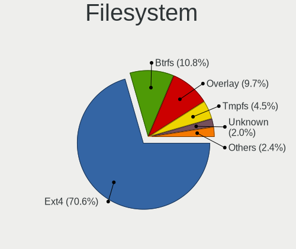

| Type    | Desktops | Percent |
|---------|----------|---------|
| Ext4    | 666      | 75.77%  |
| Overlay | 84       | 9.56%   |
| Btrfs   | 64       | 7.28%   |
| Tmpfs   | 25       | 2.84%   |
| Unknown | 21       | 2.39%   |
| Xfs     | 11       | 1.25%   |
| Zfs     | 2        | 0.23%   |
| F2fs    | 2        | 0.23%   |
| Ext3    | 2        | 0.23%   |
| Ext2    | 2        | 0.23%   |

Part. scheme
------------

Scheme of partitioning

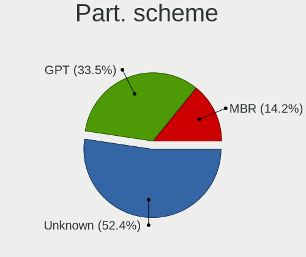

| Type    | Desktops | Percent |
|---------|----------|---------|
| Unknown | 495      | 56.77%  |
| GPT     | 247      | 28.33%  |
| MBR     | 130      | 14.91%  |

Dual Boot with Linux/BSD
------------------------

Hosting more than one Linux/BSD

| Dual boot | Desktops | Percent |
|-----------|----------|---------|
| No        | 703      | 80.71%  |
| Yes       | 168      | 19.29%  |

Dual Boot (Win)
---------------

Hosting Linux and Windows

| Dual boot | Desktops | Percent |
|-----------|----------|---------|
| No        | 551      | 63.26%  |
| Yes       | 320      | 36.74%  |

Board
-----

Vendor
------

Motherboard manufacturer

| Name                | Desktops | Percent |
|---------------------|----------|---------|
| Gigabyte Technology | 248      | 29.21%  |
| ASUSTek Computer    | 236      | 27.8%   |
| MSI                 | 113      | 13.31%  |
| ASRock              | 107      | 12.6%   |
| Intel               | 35       | 4.12%   |
| ECS                 | 21       | 2.47%   |
| Biostar             | 16       | 1.88%   |
| Dell                | 14       | 1.65%   |
| Hewlett-Packard     | 11       | 1.3%    |
| Lenovo              | 10       | 1.18%   |
| Unknown             | 8        | 0.94%   |
| Foxconn             | 6        | 0.71%   |
| Quanta              | 3        | 0.35%   |
| PCChips             | 3        | 0.35%   |
| Exo                 | 3        | 0.35%   |
| BANGHO              | 2        | 0.24%   |
| VS Company          | 1        | 0.12%   |
| Supermicro          | 1        | 0.12%   |
| Sun Microsystems    | 1        | 0.12%   |
| Positivo            | 1        | 0.12%   |
| Pegatron            | 1        | 0.12%   |
| NCR                 | 1        | 0.12%   |
| MACHINIST           | 1        | 0.12%   |
| EPoX Computer       | 1        | 0.12%   |
| CX / Air Computers. | 1        | 0.12%   |
| Colorful Technology | 1        | 0.12%   |
| American Megatrends | 1        | 0.12%   |
| Advantec            | 1        | 0.12%   |
| 16280-BM-32691      | 1        | 0.12%   |

Model
-----

Motherboard model

| Name                         | Desktops | Percent |
|------------------------------|----------|---------|
| MSI MS-7721                  | 25       | 2.94%   |
| ASUS All Series              | 19       | 2.24%   |
| ASUS PRIME A320M-K           | 18       | 2.12%   |
| Gigabyte F2A68HM-H           | 14       | 1.65%   |
| Gigabyte H81M-H              | 12       | 1.41%   |
| ASUS PRIME B450M-A           | 9        | 1.06%   |
| MSI MS-7C52                  | 8        | 0.94%   |
| Gigabyte M68MT-S2            | 8        | 0.94%   |
| Gigabyte H110M-H             | 8        | 0.94%   |
| Gigabyte A320M-S2H           | 8        | 0.94%   |
| ASUS P5KPL-AM SE             | 8        | 0.94%   |
| Unknown                      | 8        | 0.94%   |
| MSI MS-7A15                  | 7        | 0.82%   |
| Gigabyte H61M-S1             | 7        | 0.82%   |
| ASUS H61M-K                  | 7        | 0.82%   |
| Gigabyte F2A55M-HD2          | 6        | 0.71%   |
| Gigabyte A320M-H             | 6        | 0.71%   |
| ASUS ROG STRIX B550-F GAMING | 6        | 0.71%   |
| ASRock N68-VS3 FX            | 6        | 0.71%   |
| ASRock FM2A68M-DG3+          | 6        | 0.71%   |
| MSI MS-7309                  | 5        | 0.59%   |
| Gigabyte A320M-S2H V2        | 5        | 0.59%   |
| ECS H81H3-M4                 | 5        | 0.59%   |
| ASRock G41M-VS3              | 5        | 0.59%   |
| MSI MS-7B84                  | 4        | 0.47%   |
| Intel DN2820FYB H24582-205   | 4        | 0.47%   |
| Gigabyte H510M H             | 4        | 0.47%   |
| Gigabyte G31M-ES2C           | 4        | 0.47%   |
| Gigabyte B75M-D3V            | 4        | 0.47%   |
| Gigabyte B75M-D3H            | 4        | 0.47%   |
| Gigabyte B450M DS3H          | 4        | 0.47%   |
| Gigabyte B365M DS3H          | 4        | 0.47%   |
| ASUS PRIME X570-P            | 4        | 0.47%   |
| ASUS PRIME B550M-K           | 4        | 0.47%   |
| ASUS P5GC-MX/1333            | 4        | 0.47%   |
| ASUS P5G41T-M LX3            | 4        | 0.47%   |
| ASUS M5A97 LE R2.0           | 4        | 0.47%   |
| ASUS M5A78L-M LX             | 4        | 0.47%   |
| ASUS M4N68T-M-LE-V2          | 4        | 0.47%   |
| ASUS M4A88TD-V EVO/USB3      | 4        | 0.47%   |

Model Family
------------

Motherboard model prefix

| Name                 | Desktops | Percent |
|----------------------|----------|---------|
| ASUS PRIME           | 62       | 7.3%    |
| MSI MS-7721          | 25       | 2.94%   |
| ASUS All             | 19       | 2.24%   |
| Gigabyte F2A68HM-H   | 14       | 1.65%   |
| Gigabyte A320M-S2H   | 13       | 1.53%   |
| ASUS ROG             | 13       | 1.53%   |
| Gigabyte H81M-H      | 12       | 1.41%   |
| Dell OptiPlex        | 11       | 1.3%    |
| ASUS M5A78L-M        | 11       | 1.3%    |
| Lenovo ThinkCentre   | 10       | 1.18%   |
| Gigabyte B450M       | 9        | 1.06%   |
| MSI MS-7C52          | 8        | 0.94%   |
| Gigabyte M68MT-S2    | 8        | 0.94%   |
| Gigabyte H110M-H     | 8        | 0.94%   |
| Gigabyte B450        | 8        | 0.94%   |
| ASUS TUF             | 8        | 0.94%   |
| ASUS P5KPL-AM        | 8        | 0.94%   |
| ASRock N68-VS3       | 8        | 0.94%   |
| Unknown              | 8        | 0.94%   |
| MSI MS-7A15          | 7        | 0.82%   |
| HP Compaq            | 7        | 0.82%   |
| Gigabyte H61M-S1     | 7        | 0.82%   |
| ASUS M5A97           | 7        | 0.82%   |
| ASUS H61M-K          | 7        | 0.82%   |
| Gigabyte H510M       | 6        | 0.71%   |
| Gigabyte H410M       | 6        | 0.71%   |
| Gigabyte F2A55M-HD2  | 6        | 0.71%   |
| Gigabyte A320M-H     | 6        | 0.71%   |
| ASRock N68-S         | 6        | 0.71%   |
| ASRock FM2A68M-DG3+  | 6        | 0.71%   |
| ASRock A320M-HDV     | 6        | 0.71%   |
| MSI MS-7309          | 5        | 0.59%   |
| ECS H81H3-M4         | 5        | 0.59%   |
| ASUS P5G41T-M        | 5        | 0.59%   |
| ASUS M2N68-AM        | 5        | 0.59%   |
| ASUS M2N-MX          | 5        | 0.59%   |
| ASRock G41M-VS3      | 5        | 0.59%   |
| MSI MS-7B84          | 4        | 0.47%   |
| Intel DN2820FYB      | 4        | 0.47%   |
| Gigabyte Z97X-Gaming | 4        | 0.47%   |

MFG Year
--------

Motherboard manufacture year

| Year | Desktops | Percent |
|------|----------|---------|
| 2018 | 80       | 9.42%   |
| 2012 | 76       | 8.95%   |
| 2013 | 70       | 8.24%   |
| 2011 | 62       | 7.3%    |
| 2017 | 61       | 7.18%   |
| 2014 | 60       | 7.07%   |
| 2010 | 57       | 6.71%   |
| 2020 | 52       | 6.12%   |
| 2015 | 52       | 6.12%   |
| 2009 | 51       | 6.01%   |
| 2019 | 46       | 5.42%   |
| 2008 | 39       | 4.59%   |
| 2016 | 35       | 4.12%   |
| 2007 | 35       | 4.12%   |
| 2021 | 31       | 3.65%   |
| 2006 | 27       | 3.18%   |
| 2022 | 7        | 0.82%   |
| 2004 | 4        | 0.47%   |
| 2023 | 2        | 0.24%   |
| 2005 | 1        | 0.12%   |
| 2001 | 1        | 0.12%   |

Form Factor
-----------

Physical design of the computer

| Name    | Desktops | Percent |
|---------|----------|---------|
| Desktop | 849      | 100%    |

Secure Boot
-----------

Enabled or disabled

| State    | Desktops | Percent |
|----------|----------|---------|
| Disabled | 835      | 97.89%  |
| Enabled  | 18       | 2.11%   |

Coreboot
--------

Have coreboot on board

| Used | Desktops | Percent |
|------|----------|---------|
| No   | 849      | 100%    |

RAM Size
--------

Total RAM memory

| Size in GB  | Desktops | Percent |
|-------------|----------|---------|
| 8.01-16.0   | 187      | 21.52%  |
| 3.01-4.0    | 171      | 19.68%  |
| 4.01-8.0    | 169      | 19.45%  |
| 16.01-24.0  | 159      | 18.3%   |
| 32.01-64.0  | 64       | 7.36%   |
| 1.01-2.0    | 63       | 7.25%   |
| 2.01-3.0    | 20       | 2.3%    |
| 24.01-32.0  | 17       | 1.96%   |
| 64.01-256.0 | 10       | 1.15%   |
| 0.51-1.0    | 8        | 0.92%   |
| 0.01-0.5    | 1        | 0.12%   |

RAM Used
--------

Used RAM memory

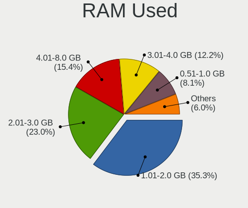

| Used GB    | Desktops | Percent |
|------------|----------|---------|
| 1.01-2.0   | 354      | 37.66%  |
| 2.01-3.0   | 214      | 22.77%  |
| 4.01-8.0   | 132      | 14.04%  |
| 3.01-4.0   | 105      | 11.17%  |
| 0.51-1.0   | 83       | 8.83%   |
| 8.01-16.0  | 27       | 2.87%   |
| 0.01-0.5   | 17       | 1.81%   |
| 16.01-24.0 | 8        | 0.85%   |

Total Drives
------------

Number of drives on board

| Drives | Desktops | Percent |
|--------|----------|---------|
| 1      | 397      | 44.76%  |
| 2      | 268      | 30.21%  |
| 3      | 138      | 15.56%  |
| 4      | 60       | 6.76%   |
| 5      | 13       | 1.47%   |
| 6      | 4        | 0.45%   |
| 7      | 3        | 0.34%   |
| 0      | 2        | 0.23%   |
| 28     | 1        | 0.11%   |
| 20     | 1        | 0.11%   |

Has CD-ROM
----------

Has CD-ROM on board

| Presented | Desktops | Percent |
|-----------|----------|---------|
| No        | 547      | 63.46%  |
| Yes       | 315      | 36.54%  |

Has Ethernet
------------

Has Ethernet on board

| Presented | Desktops | Percent |
|-----------|----------|---------|
| Yes       | 838      | 98.7%   |
| No        | 11       | 1.3%    |

Has WiFi
--------

Has WiFi module

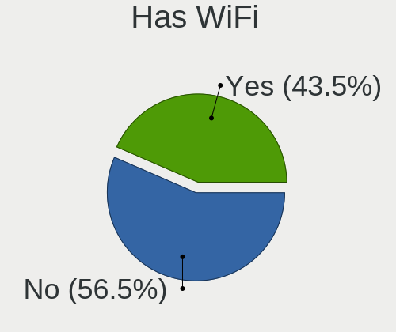

| Presented | Desktops | Percent |
|-----------|----------|---------|
| No        | 503      | 57.88%  |
| Yes       | 366      | 42.12%  |

Has Bluetooth
-------------

Has Bluetooth module

| Presented | Desktops | Percent |
|-----------|----------|---------|
| No        | 706      | 81.81%  |
| Yes       | 157      | 18.19%  |

Location
--------

Country
-------

Geographic location (country)

| Country   | Desktops | Percent |
|-----------|----------|---------|
| Argentina | 849      | 100%    |

City
----

Geographic location (city)

| City                   | Desktops | Percent |
|------------------------|----------|---------|
| Buenos Aires           | 199      | 22.38%  |
| Rosario                | 49       | 5.51%   |
| Crdoba               | 46       | 5.17%   |
| Mar del Plata          | 22       | 2.47%   |
| La Plata               | 21       | 2.36%   |
| Lomas de Zamora        | 15       | 1.69%   |
| Lanus                  | 14       | 1.57%   |
| Avellaneda             | 14       | 1.57%   |
| Quilmes                | 12       | 1.35%   |
| San Miguel de Tucumn | 11       | 1.24%   |
| Corrientes             | 11       | 1.24%   |
| Baha Blanca          | 11       | 1.24%   |
| Villa Ballester        | 9        | 1.01%   |
| Viedma                 | 9        | 1.01%   |
| San Luis               | 8        | 0.9%    |
| Resistencia            | 8        | 0.9%    |
| Ramos Mejia            | 8        | 0.9%    |
| Paran                | 8        | 0.9%    |
| Neuqun               | 8        | 0.9%    |
| Ituzaingo              | 8        | 0.9%    |
| Santa Fe               | 7        | 0.79%   |
| Mendoza                | 7        | 0.79%   |
| Florencio Varela       | 7        | 0.79%   |
| Salta                  | 6        | 0.67%   |
| Pilar                  | 6        | 0.67%   |
| Ciudad Evita           | 6        | 0.67%   |
| Caseros                | 6        | 0.67%   |
| Villa Nueva            | 5        | 0.56%   |
| Tandil                 | 5        | 0.56%   |
| San Telmo              | 5        | 0.56%   |
| San Juan               | 5        | 0.56%   |
| Martinez               | 5        | 0.56%   |
| Concordia              | 5        | 0.56%   |
| Burzaco                | 5        | 0.56%   |
| Berazategui            | 5        | 0.56%   |
| Yerba Buena            | 4        | 0.45%   |
| Tigre                  | 4        | 0.45%   |
| San Salvador de Jujuy  | 4        | 0.45%   |
| San Justo              | 4        | 0.45%   |
| San Antonio de Areco   | 4        | 0.45%   |

Drives
------

Drive Vendor
------------

Hard drive vendors

| Vendor                      | Desktops | Drives | Percent |
|-----------------------------|----------|--------|---------|
| WDC                         | 504      | 839    | 35.95%  |
| Kingston                    | 185      | 242    | 13.2%   |
| Seagate                     | 182      | 257    | 12.98%  |
| Samsung Electronics         | 115      | 175    | 8.2%    |
| Toshiba                     | 76       | 94     | 5.42%   |
| Hitachi                     | 55       | 64     | 3.92%   |
| Gigabyte Technology         | 36       | 53     | 2.57%   |
| Sandisk                     | 32       | 41     | 2.28%   |
| A-DATA Technology           | 31       | 36     | 2.21%   |
| Crucial                     | 22       | 37     | 1.57%   |
| Maxtor                      | 15       | 17     | 1.07%   |
| HGST                        | 14       | 16     | 1%      |
| Hewlett-Packard             | 11       | 16     | 0.78%   |
| Corsair                     | 10       | 10     | 0.71%   |
| Realtek Semiconductor       | 9        | 11     | 0.64%   |
| PNY                         | 8        | 15     | 0.57%   |
| China                       | 6        | 8      | 0.43%   |
| XPG                         | 5        | 6      | 0.36%   |
| Silicon Motion              | 5        | 6      | 0.36%   |
| Phison Electronics          | 5        | 6      | 0.36%   |
| Phison                      | 5        | 6      | 0.36%   |
| Lexar                       | 5        | 6      | 0.36%   |
| Colorful                    | 5        | 6      | 0.36%   |
| ADATA Technology            | 5        | 7      | 0.36%   |
| Patriot                     | 4        | 6      | 0.29%   |
| Micron/Crucial Technology   | 4        | 6      | 0.29%   |
| Team                        | 3        | 3      | 0.21%   |
| MAXIO Technology (Hangzhou) | 3        | 3      | 0.21%   |
| Kingston Technology Company | 3        | 4      | 0.21%   |
| Intel                       | 3        | 4      | 0.21%   |
| HS-SSD-C100                 | 3        | 3      | 0.21%   |
| SK hynix                    | 2        | 2      | 0.14%   |
| OCZ                         | 2        | 2      | 0.14%   |
| Kimtigo                     | 2        | 2      | 0.14%   |
| Hikvision                   | 2        | 2      | 0.14%   |
| Fujitsu                     | 2        | 2      | 0.14%   |
| FORESEE                     | 2        | 2      | 0.14%   |
| WALRAM                      | 1        | 1      | 0.07%   |
| Unknown                     | 1        | 1      | 0.07%   |
| T-FORCE                     | 1        | 1      | 0.07%   |

Drive Model
-----------

Hard drive models

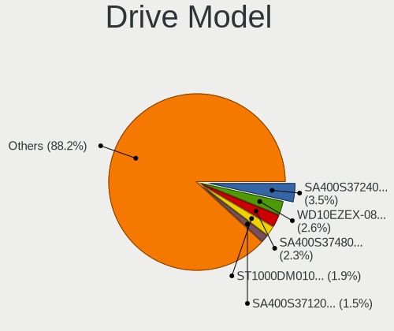

| Model                            | Desktops | Percent |
|----------------------------------|----------|---------|
| Kingston SA400S37240G 240GB SSD  | 51       | 3.12%   |
| WDC WD10EZEX-08WN4A0 1TB         | 45       | 2.75%   |
| Kingston SA400S37480G 480GB SSD  | 36       | 2.2%    |
| Kingston SA400S37120G 120GB SSD  | 28       | 1.71%   |
| Seagate ST1000DM010-2EP102 1TB   | 27       | 1.65%   |
| Seagate ST500DM002-1BD142 500GB  | 25       | 1.53%   |
| WDC WDS240G2G0A-00JH30 240GB SSD | 21       | 1.28%   |
| WDC WD10EZEX-00BN5A0 1TB         | 21       | 1.28%   |
| WDC WD5000AAKX-001CA0 500GB      | 20       | 1.22%   |
| Kingston SV300S37A120G 120GB SSD | 19       | 1.16%   |
| WDC WDS120G2G0A-00JH30 120GB SSD | 18       | 1.1%    |
| WDC WD20EZRZ-00Z5HB0 2TB         | 18       | 1.1%    |
| Toshiba DT01ACA050 500GB         | 16       | 0.98%   |
| Toshiba DT01ACA100 1TB           | 15       | 0.92%   |
| WDC WD5000AAKX-00ERMA0 500GB     | 14       | 0.86%   |
| WDC WD1003FZEX-00MK2A0 1TB       | 14       | 0.86%   |
| Gigabyte GP-GSTFS31120GNTD 120GB | 14       | 0.86%   |
| WDC WD1600AABS-00PRA0 160GB      | 13       | 0.79%   |
| WDC WD10EZEX-21WN4A0 1TB         | 12       | 0.73%   |
| Gigabyte GP-GSTFS31240GNTD 240GB | 12       | 0.73%   |
| WDC WD20EZRX-00D8PB0 2TB         | 11       | 0.67%   |
| WDC WD10EZEX-00WN4A0 1TB         | 10       | 0.61%   |
| WDC WD10EARS-00Y5B1 1TB          | 10       | 0.61%   |
| Samsung HD502HJ 500GB            | 10       | 0.61%   |
| Samsung HD322HJ 320GB            | 9        | 0.55%   |
| Kingston SV300S37A240G 240GB SSD | 8        | 0.49%   |
| Kingston SUV400S37240G 240GB SSD | 8        | 0.49%   |
| Kingston SA400S37960G 960GB SSD  | 8        | 0.49%   |
| Crucial CT240BX500SSD1 240GB     | 8        | 0.49%   |
| WDC WDS480G2G0A-00JH30 480GB SSD | 7        | 0.43%   |
| WDC WD800BD-22MRA1 80GB          | 7        | 0.43%   |
| WDC WD10EZEX-60ZF5A0 1TB         | 7        | 0.43%   |
| WDC WD10EZEX-60WN4A0 1TB         | 7        | 0.43%   |
| Samsung HD322GJ 320GB            | 7        | 0.43%   |
| Samsung HD103SJ 1TB              | 7        | 0.43%   |
| A-DATA SU630 240GB SSD           | 7        | 0.43%   |
| WDC WD3200AAKS-00L9A0 320GB      | 6        | 0.37%   |
| WDC WD3200AAJS-00L7A0 320GB      | 6        | 0.37%   |
| WDC WD1600AABS-00H4A0 160GB      | 6        | 0.37%   |
| WDC WD10EZEX-08M2NA0 1TB         | 6        | 0.37%   |

HDD Vendor
----------

Hard disk drive vendors

| Vendor              | Desktops | Drives | Percent |
|---------------------|----------|--------|---------|
| WDC                 | 455      | 717    | 51.35%  |
| Seagate             | 181      | 256    | 20.43%  |
| Samsung Electronics | 88       | 129    | 9.93%   |
| Toshiba             | 75       | 92     | 8.47%   |
| Hitachi             | 55       | 64     | 6.21%   |
| HGST                | 14       | 16     | 1.58%   |
| Maxtor              | 12       | 12     | 1.35%   |
| Fujitsu             | 2        | 2      | 0.23%   |
| SABRENT             | 1        | 1      | 0.11%   |
| Quantum             | 1        | 1      | 0.11%   |
| ExcelStor           | 1        | 1      | 0.11%   |
| ASMT                | 1        | 2      | 0.11%   |

SSD Vendor
----------

Solid state drive vendors

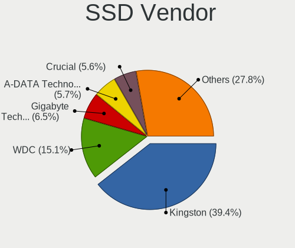

| Vendor              | Desktops | Drives | Percent |
|---------------------|----------|--------|---------|
| Kingston            | 171      | 223    | 40.24%  |
| WDC                 | 72       | 96     | 16.94%  |
| Gigabyte Technology | 32       | 49     | 7.53%   |
| A-DATA Technology   | 27       | 31     | 6.35%   |
| Crucial             | 20       | 35     | 4.71%   |
| Samsung Electronics | 19       | 28     | 4.47%   |
| SanDisk             | 15       | 18     | 3.53%   |
| PNY                 | 8        | 15     | 1.88%   |
| Corsair             | 7        | 7      | 1.65%   |
| Hewlett-Packard     | 6        | 7      | 1.41%   |
| China               | 6        | 8      | 1.41%   |
| Lexar               | 5        | 6      | 1.18%   |
| Colorful            | 5        | 6      | 1.18%   |
| Team                | 3        | 3      | 0.71%   |
| Patriot             | 3        | 5      | 0.71%   |
| Maxtor              | 3        | 5      | 0.71%   |
| SK hynix            | 2        | 2      | 0.47%   |
| OCZ                 | 2        | 2      | 0.47%   |
| Kimtigo             | 2        | 2      | 0.47%   |
| Intel               | 2        | 3      | 0.47%   |
| Hikvision           | 2        | 2      | 0.47%   |
| FORESEE             | 2        | 2      | 0.47%   |
| WALRAM              | 1        | 1      | 0.24%   |
| Super Talent        | 1        | 1      | 0.24%   |
| Seagate             | 1        | 1      | 0.24%   |
| Netac               | 1        | 2      | 0.24%   |
| LITEONIT            | 1        | 1      | 0.24%   |
| Lenovo              | 1        | 1      | 0.24%   |
| KingSpec            | 1        | 1      | 0.24%   |
| KingDian            | 1        | 1      | 0.24%   |
| HS-SSD-C100         | 1        | 1      | 0.24%   |
| Hoodisk             | 1        | 1      | 0.24%   |
| FREEBSD             | 1        | 12     | 0.24%   |

Drive Kind
----------

HDD or SSD

| Kind    | Desktops | Drives | Percent |
|---------|----------|--------|---------|
| HDD     | 702      | 1293   | 58.02%  |
| SSD     | 390      | 578    | 32.23%  |
| NVMe    | 110      | 172    | 9.09%   |
| Unknown | 7        | 7      | 0.58%   |
| MMC     | 1        | 1      | 0.08%   |

Drive Connector
---------------

SATA, SAS, NVMe, etc.

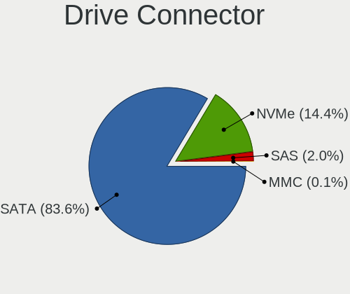

| Type | Desktops | Drives | Percent |
|------|----------|--------|---------|
| SATA | 826      | 1859   | 86.95%  |
| NVMe | 110      | 172    | 11.58%  |
| SAS  | 13       | 19     | 1.37%   |
| MMC  | 1        | 1      | 0.11%   |

Drive Size
----------

Size of hard drive

| Size in TB      | Desktops | Drives | Percent |
|-----------------|----------|--------|---------|
| 0.01-0.5        | 657      | 1142   | 58.82%  |
| 0.51-1.0        | 325      | 515    | 29.1%   |
| 1.01-2.0        | 90       | 130    | 8.06%   |
| 3.01-4.0        | 18       | 28     | 1.61%   |
| 4.01-10.0       | 13       | 21     | 1.16%   |
| 2.01-3.0        | 12       | 15     | 1.07%   |
| More than 100.0 | 1        | 1      | 0.09%   |
| 10.01-20.0      | 1        | 19     | 0.09%   |

Space Total
-----------

Amount of disk space available on the file system

| Size in GB     | Desktops | Percent |
|----------------|----------|---------|
| 101-250        | 239      | 25.7%   |
| 251-500        | 188      | 20.22%  |
| 501-1000       | 142      | 15.27%  |
| 1001-2000      | 106      | 11.4%   |
| 51-100         | 65       | 6.99%   |
| 1-20           | 63       | 6.77%   |
| 2001-3000      | 43       | 4.62%   |
| 21-50          | 39       | 4.19%   |
| More than 3000 | 31       | 3.33%   |
| Unknown        | 14       | 1.51%   |

Space Used
----------

Amount of used disk space

| Used GB        | Desktops | Percent |
|----------------|----------|---------|
| 1-20           | 364      | 38.6%   |
| 21-50          | 132      | 14%     |
| 101-250        | 117      | 12.41%  |
| 51-100         | 99       | 10.5%   |
| 251-500        | 87       | 9.23%   |
| 501-1000       | 70       | 7.42%   |
| 1001-2000      | 43       | 4.56%   |
| Unknown        | 14       | 1.48%   |
| More than 3000 | 9        | 0.95%   |
| 2001-3000      | 8        | 0.85%   |

Malfunc. Drives
---------------

Drive models with a malfunction

| Model                             | Desktops | Drives | Percent |
|-----------------------------------|----------|--------|---------|
| WDC WD5000AAKX-001CA0 500GB       | 7        | 9      | 4.52%   |
| WDC WD10EZEX-00BN5A0 1TB          | 4        | 4      | 2.58%   |
| WDC WD10EARS-00Y5B1 1TB           | 4        | 4      | 2.58%   |
| WDC WD5000AAKX-00ERMA0 500GB      | 3        | 3      | 1.94%   |
| WDC WD10EZEX-08WN4A0 1TB          | 3        | 3      | 1.94%   |
| WDC WD1003FZEX-00MK2A0 1TB        | 3        | 4      | 1.94%   |
| Seagate ST500DM002-1BD142 500GB   | 3        | 4      | 1.94%   |
| Seagate ST1000DM003-1SB10C 1TB    | 3        | 3      | 1.94%   |
| WDC WDS240G2G0A-00JH30 240GB SSD  | 2        | 2      | 1.29%   |
| WDC WD5000AAKX-08ERMA0 500GB      | 2        | 2      | 1.29%   |
| WDC WD3200AAKS-00L9A0 320GB       | 2        | 2      | 1.29%   |
| WDC WD20EZRX-00D8PB0 2TB          | 2        | 2      | 1.29%   |
| WDC WD10EZEX-00RKKA0 1TB          | 2        | 2      | 1.29%   |
| WDC WD1003FZEX-00K3CA0 1TB        | 2        | 2      | 1.29%   |
| WDC WD1002FAEX-00Y9A0 1TB         | 2        | 2      | 1.29%   |
| Toshiba DT01ACA050 500GB          | 2        | 2      | 1.29%   |
| Seagate ST9250315AS 250GB         | 2        | 2      | 1.29%   |
| Seagate ST500LM030-2E717D 500GB   | 2        | 2      | 1.29%   |
| Seagate ST1500DL003-9VT16L 1TB    | 2        | 2      | 1.29%   |
| Seagate ST1000DM003-9YN162 1TB    | 2        | 2      | 1.29%   |
| Seagate ST1000DM003-1CH162 1TB    | 2        | 2      | 1.29%   |
| Samsung Electronics SP0411N 40GB  | 2        | 3      | 1.29%   |
| Samsung Electronics HD322HJ 320GB | 2        | 2      | 1.29%   |
| Samsung Electronics HD103SJ 1TB   | 2        | 2      | 1.29%   |
| Kingston SV300S37A120G 120GB SSD  | 2        | 2      | 1.29%   |
| Kingston SA400S37240G 240GB SSD   | 2        | 2      | 1.29%   |
| XPG SPECTRIX S40G 1TB             | 1        | 1      | 0.65%   |
| WDC WDS480G2G0A-00JH30 480GB SSD  | 1        | 4      | 0.65%   |
| WDC WDS240G2G0B-00EPW0 240GB SSD  | 1        | 1      | 0.65%   |
| WDC WD800JD-00MSA1 80GB           | 1        | 1      | 0.65%   |
| WDC WD800BD-22MRA1 80GB           | 1        | 1      | 0.65%   |
| WDC WD800BB-75JHC0 80GB           | 1        | 1      | 0.65%   |
| WDC WD800BB-00JHC0 80GB           | 1        | 1      | 0.65%   |
| WDC WD6400AAKS-65Z7B0 640GB       | 1        | 1      | 0.65%   |
| WDC WD5003ABYX-01WERA0 500GB      | 1        | 1      | 0.65%   |
| WDC WD5000AAVS-00G9B1 500GB       | 1        | 1      | 0.65%   |
| WDC WD5000AAKS-00V1A0 500GB       | 1        | 1      | 0.65%   |
| WDC WD5000AADS-00L4B1 500GB       | 1        | 1      | 0.65%   |
| WDC WD40EFRX-68WT0N0 4TB          | 1        | 1      | 0.65%   |
| WDC WD400BB-23DEA0 37GB           | 1        | 1      | 0.65%   |

Malfunc. Drive Vendor
---------------------

Vendors of faulty drives

| Vendor              | Desktops | Drives | Percent |
|---------------------|----------|--------|---------|
| WDC                 | 73       | 91     | 50.69%  |
| Seagate             | 26       | 29     | 18.06%  |
| Samsung Electronics | 16       | 18     | 11.11%  |
| Hitachi             | 8        | 8      | 5.56%   |
| Toshiba             | 7        | 8      | 4.86%   |
| Kingston            | 5        | 5      | 3.47%   |
| Maxtor              | 3        | 3      | 2.08%   |
| HGST                | 2        | 2      | 1.39%   |
| A-DATA Technology   | 2        | 2      | 1.39%   |
| XPG                 | 1        | 1      | 0.69%   |
| Quantum             | 1        | 1      | 0.69%   |

Malfunc. HDD Vendor
-------------------

Vendors of faulty HDD drives

| Vendor              | Desktops | Drives | Percent |
|---------------------|----------|--------|---------|
| WDC                 | 68       | 83     | 51.91%  |
| Seagate             | 26       | 29     | 19.85%  |
| Samsung Electronics | 16       | 18     | 12.21%  |
| Hitachi             | 8        | 8      | 6.11%   |
| Toshiba             | 7        | 8      | 5.34%   |
| Maxtor              | 3        | 3      | 2.29%   |
| HGST                | 2        | 2      | 1.53%   |
| Quantum             | 1        | 1      | 0.76%   |

Malfunc. Drive Kind
-------------------

Kinds of faulty drives

| Kind | Desktops | Drives | Percent |
|------|----------|--------|---------|
| HDD  | 120      | 152    | 90.23%  |
| SSD  | 11       | 14     | 8.27%   |
| NVMe | 2        | 2      | 1.5%    |

Failed Drives
-------------

Failed drive models

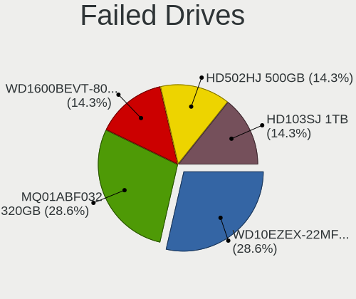

| Model                             | Desktops | Drives | Percent |
|-----------------------------------|----------|--------|---------|
| WDC WD1600BEVT-80A23T0 160GB      | 1        | 1      | 33.33%  |
| Samsung Electronics HD502HJ 500GB | 1        | 1      | 33.33%  |
| Samsung Electronics HD103SJ 1TB   | 1        | 1      | 33.33%  |

Failed Drive Vendor
-------------------

Failed drive vendors

| Vendor              | Desktops | Drives | Percent |
|---------------------|----------|--------|---------|
| Samsung Electronics | 2        | 2      | 66.67%  |
| WDC                 | 1        | 1      | 33.33%  |

Drive Status
------------

Number of failed and malfunc. drives

| Status   | Desktops | Drives | Percent |
|----------|----------|--------|---------|
| Detected | 537      | 1285   | 56.47%  |
| Works    | 281      | 595    | 29.55%  |
| Malfunc  | 130      | 168    | 13.67%  |
| Failed   | 3        | 3      | 0.32%   |

Storage controller
------------------

Storage Vendor
--------------

Storage controller vendors

| Vendor                           | Desktops | Percent |
|----------------------------------|----------|---------|
| Intel                            | 404      | 39.19%  |
| AMD                              | 345      | 33.46%  |
| Nvidia                           | 82       | 7.95%   |
| SanDisk                          | 35       | 3.39%   |
| VIA Technologies                 | 27       | 2.62%   |
| Kingston Technology Company      | 19       | 1.84%   |
| Phison Electronics               | 17       | 1.65%   |
| Realtek Semiconductor            | 15       | 1.45%   |
| ASMedia Technology               | 14       | 1.36%   |
| Samsung Electronics              | 13       | 1.26%   |
| JMicron Technology               | 12       | 1.16%   |
| Marvell Technology Group         | 11       | 1.07%   |
| Silicon Motion                   | 10       | 0.97%   |
| Micron/Crucial Technology        | 6        | 0.58%   |
| ADATA Technology                 | 6        | 0.58%   |
| Silicon Integrated Systems [SiS] | 4        | 0.39%   |
| MAXIO Technology (Hangzhou)      | 4        | 0.39%   |
| Silicon Image                    | 2        | 0.19%   |
| Toshiba America Info Systems     | 1        | 0.1%    |
| Promise Technology               | 1        | 0.1%    |
| KIOXIA                           | 1        | 0.1%    |
| Broadcom / LSI                   | 1        | 0.1%    |
| Adaptec                          | 1        | 0.1%    |

Storage Model
-------------

Storage controller models

| Model                                                                                   | Desktops | Percent |
|-----------------------------------------------------------------------------------------|----------|---------|
| AMD FCH SATA Controller [AHCI mode]                                                     | 195      | 13.37%  |
| Nvidia MCP61 SATA Controller                                                            | 71       | 4.87%   |
| Intel NM10/ICH7 Family SATA Controller [IDE mode]                                       | 65       | 4.46%   |
| Nvidia MCP61 IDE                                                                        | 61       | 4.18%   |
| AMD FCH SATA Controller D                                                               | 59       | 4.05%   |
| AMD SB7x0/SB8x0/SB9x0 IDE Controller                                                    | 58       | 3.98%   |
| Intel 82801G (ICH7 Family) IDE Controller                                               | 54       | 3.7%    |
| Intel 8 Series/C220 Series Chipset Family 6-port SATA Controller 1 [AHCI mode]          | 51       | 3.5%    |
| Intel Q170/Q150/B150/H170/H110/Z170/CM236 Chipset SATA Controller [AHCI Mode]           | 48       | 3.29%   |
| AMD SB7x0/SB8x0/SB9x0 SATA Controller [IDE mode]                                        | 45       | 3.09%   |
| AMD 400 Series Chipset SATA Controller                                                  | 42       | 2.88%   |
| Intel 200 Series PCH SATA controller [AHCI mode]                                        | 37       | 2.54%   |
| AMD FCH SATA Controller [IDE mode]                                                      | 31       | 2.13%   |
| AMD 500 Series Chipset SATA Controller                                                  | 30       | 2.06%   |
| AMD SB7x0/SB8x0/SB9x0 SATA Controller [AHCI mode]                                       | 28       | 1.92%   |
| AMD FCH IDE Controller                                                                  | 28       | 1.92%   |
| Intel 6 Series/C200 Series Chipset Family 6 port Desktop SATA AHCI Controller           | 27       | 1.85%   |
| Intel 6 Series/C200 Series Chipset Family Desktop SATA Controller (IDE mode, ports 4-5) | 25       | 1.71%   |
| Intel 6 Series/C200 Series Chipset Family Desktop SATA Controller (IDE mode, ports 0-3) | 25       | 1.71%   |
| Intel 500 Series Chipset Family SATA AHCI Controller                                    | 20       | 1.37%   |
| VIA VT82C586A/B/VT82C686/A/B/VT823x/A/C PIPC Bus Master IDE                             | 15       | 1.03%   |
| Intel Cannon Lake PCH SATA AHCI Controller                                              | 15       | 1.03%   |
| Intel 7 Series/C210 Series Chipset Family 6-port SATA Controller [AHCI mode]            | 14       | 0.96%   |
| Intel 7 Series/C210 Series Chipset Family 4-port SATA Controller [IDE mode]             | 14       | 0.96%   |
| Intel 7 Series/C210 Series Chipset Family 2-port SATA Controller [IDE mode]             | 14       | 0.96%   |
| AMD 300 Series Chipset SATA Controller                                                  | 14       | 0.96%   |
| ASMedia ASM1062 Serial ATA Controller                                                   | 13       | 0.89%   |
| Intel 9 Series Chipset Family SATA Controller [AHCI Mode]                               | 12       | 0.82%   |
| Samsung NVMe SSD Controller SM981/PM981/PM983                                           | 10       | 0.69%   |
| VIA VT6415 PATA IDE Host Controller                                                     | 9        | 0.62%   |
| SanDisk Ultra 3D / WD Blue SN550 NVMe SSD                                               | 9        | 0.62%   |
| SanDisk Extreme Pro / WD Black SN750 / PC SN730 / Red SN700 NVMe SSD                    | 9        | 0.62%   |
| Realtek RTS5762 NVMe SSD Controller                                                     | 9        | 0.62%   |
| Silicon Motion SM2262/SM2262EN SSD Controller                                           | 8        | 0.55%   |
| Intel SATA Controller [RAID mode]                                                       | 8        | 0.55%   |
| Intel 400 Series Chipset Family SATA AHCI Controller                                    | 8        | 0.55%   |
| VIA VIA VT6420 SATA RAID Controller                                                     | 7        | 0.48%   |
| SanDisk WD Green SN350 240GB (DRAM-less) / SN560E NVMe SSD                              | 7        | 0.48%   |
| Phison E12 NVMe Controller                                                              | 7        | 0.48%   |
| Kingston Company NV1 NVMe SSD SM2263XT                                                  | 6        | 0.41%   |

Storage Kind
------------

Kind of storage controller (IDE, SATA, NVMe, SAS, ...)

| Kind | Desktops | Percent |
|------|----------|---------|
| SATA | 613      | 56.97%  |
| IDE  | 331      | 30.76%  |
| NVMe | 111      | 10.32%  |
| RAID | 20       | 1.86%   |
| SCSI | 1        | 0.09%   |

Processor
---------

CPU Vendor
----------

Processor vendors

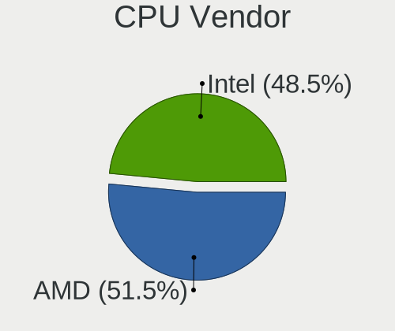

| Vendor | Desktops | Percent |
|--------|----------|---------|
| AMD    | 431      | 50.71%  |
| Intel  | 419      | 49.29%  |

CPU Model
---------

Processor models

| Model                                         | Desktops | Percent |
|-----------------------------------------------|----------|---------|
| AMD Ryzen 5 3400G with Radeon Vega Graphics   | 17       | 2%      |
| AMD Ryzen 5 3600 6-Core Processor             | 13       | 1.53%   |
| AMD Ryzen 3 3200G with Radeon Vega Graphics   | 12       | 1.41%   |
| Intel Core i7-3770 CPU @ 3.40GHz              | 10       | 1.17%   |
| Intel Core i5-4460 CPU @ 3.20GHz              | 10       | 1.17%   |
| Intel Core i5-4440 CPU @ 3.10GHz              | 10       | 1.17%   |
| AMD FX-4100 Quad-Core Processor               | 10       | 1.17%   |
| AMD Athlon II X2 250 Processor                | 10       | 1.17%   |
| AMD A8-9600 RADEON R7, 10 COMPUTE CORES 4C+6G | 10       | 1.17%   |
| AMD A4-4000 APU with Radeon HD Graphics       | 10       | 1.17%   |
| Intel Core i5-7400 CPU @ 3.00GHz              | 9        | 1.06%   |
| AMD Ryzen 5 2600 Six-Core Processor           | 9        | 1.06%   |
| AMD FX-6300 Six-Core Processor                | 9        | 1.06%   |
| Intel Pentium Dual CPU E2180 @ 2.00GHz        | 8        | 0.94%   |
| Intel Core i3-4170 CPU @ 3.70GHz              | 8        | 0.94%   |
| Intel Core 2 Duo CPU E7500 @ 2.93GHz          | 8        | 0.94%   |
| AMD Ryzen 7 5700G with Radeon Graphics        | 8        | 0.94%   |
| AMD Ryzen 7 3700X 8-Core Processor            | 8        | 0.94%   |
| AMD Ryzen 5 5600X 6-Core Processor            | 8        | 0.94%   |
| AMD Ryzen 5 5600G with Radeon Graphics        | 8        | 0.94%   |
| AMD Ryzen 3 2200G with Radeon Vega Graphics   | 8        | 0.94%   |
| Intel Pentium CPU G4560 @ 3.50GHz             | 7        | 0.82%   |
| Intel Core i7-8700 CPU @ 3.20GHz              | 7        | 0.82%   |
| Intel Core i7-7700 CPU @ 3.60GHz              | 7        | 0.82%   |
| Intel Core i5-8400 CPU @ 2.80GHz              | 7        | 0.82%   |
| Intel Core i3-2100 CPU @ 3.10GHz              | 7        | 0.82%   |
| AMD Athlon 3000G with Radeon Vega Graphics    | 7        | 0.82%   |
| AMD A8-7600 Radeon R7, 10 Compute Cores 4C+6G | 7        | 0.82%   |
| AMD A6-7400K Radeon R5, 6 Compute Cores 2C+4G | 7        | 0.82%   |
| AMD A4-6300 APU with Radeon HD Graphics       | 7        | 0.82%   |
| Intel Pentium Dual-Core CPU E5700 @ 3.00GHz   | 6        | 0.7%    |
| Intel Pentium Dual-Core CPU E5400 @ 2.70GHz   | 6        | 0.7%    |
| Intel Pentium Dual-Core CPU E5300 @ 2.60GHz   | 6        | 0.7%    |
| Intel Pentium CPU G3220 @ 3.00GHz             | 6        | 0.7%    |
| Intel Core i5-9400 CPU @ 2.90GHz              | 6        | 0.7%    |
| Intel Core i5-3470 CPU @ 3.20GHz              | 6        | 0.7%    |
| Intel Core 2 Duo CPU E8400 @ 3.00GHz          | 6        | 0.7%    |
| AMD Ryzen 5 2400G with Radeon Vega Graphics   | 6        | 0.7%    |
| AMD Phenom II X4 955 Processor                | 6        | 0.7%    |
| AMD A6-7480 Radeon R5, 8 Compute Cores 2C+6G  | 6        | 0.7%    |

CPU Model Family
----------------

Processor model prefix

| Model                   | Desktops | Percent |
|-------------------------|----------|---------|
| Intel Core i5           | 115      | 13.5%   |
| AMD Ryzen 5             | 74       | 8.69%   |
| Intel Core i7           | 69       | 8.1%    |
| Intel Core i3           | 63       | 7.39%   |
| AMD FX                  | 40       | 4.69%   |
| AMD A8                  | 34       | 3.99%   |
| AMD Ryzen 7             | 30       | 3.52%   |
| Intel Celeron           | 29       | 3.4%    |
| AMD Ryzen 3             | 29       | 3.4%    |
| Intel Pentium Dual-Core | 25       | 2.93%   |
| Intel Pentium           | 25       | 2.93%   |
| AMD Athlon II X2        | 25       | 2.93%   |
| AMD A4                  | 25       | 2.93%   |
| Intel Core 2 Duo        | 22       | 2.58%   |
| AMD Athlon 64 X2        | 21       | 2.46%   |
| AMD A6                  | 21       | 2.46%   |
| AMD A10                 | 20       | 2.35%   |
| AMD Sempron             | 19       | 2.23%   |
| AMD Athlon              | 19       | 2.23%   |
| AMD Phenom II X4        | 18       | 2.11%   |
| Other                   | 17       | 2%      |
| Intel Pentium Dual      | 11       | 1.29%   |
| Intel Pentium 4         | 10       | 1.17%   |
| Intel Pentium D         | 9        | 1.06%   |
| AMD Ryzen 9             | 9        | 1.06%   |
| AMD Phenom II X6        | 9        | 1.06%   |
| AMD Athlon II X4        | 9        | 1.06%   |
| Intel Core 2 Quad       | 7        | 0.82%   |
| Intel Xeon              | 6        | 0.7%    |
| Intel Core 2            | 6        | 0.7%    |
| AMD Athlon II X3        | 5        | 0.59%   |
| Intel Pentium Gold      | 4        | 0.47%   |
| AMD Phenom II X2        | 4        | 0.47%   |
| AMD Phenom              | 4        | 0.47%   |
| AMD E1                  | 4        | 0.47%   |
| Intel Core i9           | 3        | 0.35%   |
| Intel Atom              | 2        | 0.23%   |
| AMD Athlon X2           | 2        | 0.23%   |
| AMD Athlon 64           | 2        | 0.23%   |
| AMD Ryzen 5 PRO         | 1        | 0.12%   |

CPU Cores
---------

Number of processor cores

| Number  | Desktops | Percent |
|---------|----------|---------|
| 2       | 322      | 37.79%  |
| 4       | 269      | 31.57%  |
| 6       | 103      | 12.09%  |
| 1       | 77       | 9.04%   |
| 8       | 45       | 5.28%   |
| 3       | 19       | 2.23%   |
| 16      | 7        | 0.82%   |
| 12      | 5        | 0.59%   |
| 10      | 3        | 0.35%   |
| 24      | 1        | 0.12%   |
| Unknown | 1        | 0.12%   |

CPU Sockets
-----------

Number of sockets

| Number | Desktops | Percent |
|--------|----------|---------|
| 1      | 847      | 99.76%  |
| 2      | 2        | 0.24%   |

CPU Threads
-----------

Threads per core (Hyper-Threading)

| Number  | Desktops | Percent |
|---------|----------|---------|
| 2       | 428      | 50.29%  |
| 1       | 422      | 49.59%  |
| Unknown | 1        | 0.12%   |

CPU Op-Modes
------------

CPU Operation Modes (32-bit, 64-bit)

| Op mode        | Desktops | Percent |
|----------------|----------|---------|
| 32-bit, 64-bit | 829      | 97.41%  |
| Unknown        | 14       | 1.65%   |
| 32-bit         | 5        | 0.59%   |
| 64-bit         | 3        | 0.35%   |

CPU Microcode
-------------

Microcode number

| Number     | Desktops | Percent |
|------------|----------|---------|
| Unknown    | 234      | 26%     |
| 0x306c3    | 51       | 5.67%   |
| 0x010000c8 | 35       | 3.89%   |
| 0x306a9    | 34       | 3.78%   |
| 0x1067a    | 33       | 3.67%   |
| 0x906e9    | 29       | 3.22%   |
| 0x206a7    | 29       | 3.22%   |
| 0x08108109 | 27       | 3%      |
| 0x06001119 | 25       | 2.78%   |
| 0x08701021 | 24       | 2.67%   |
| 0x06003106 | 23       | 2.56%   |
| 0x906ea    | 22       | 2.44%   |
| 0x506e3    | 22       | 2.44%   |
| 0x08101016 | 16       | 1.78%   |
| 0x6fd      | 14       | 1.56%   |
| 0x0600611a | 14       | 1.56%   |
| 0x06000852 | 14       | 1.56%   |
| 0xa0653    | 13       | 1.44%   |
| 0x0800820d | 13       | 1.44%   |
| 0x0600063e | 13       | 1.44%   |
| 0x0a50000c | 9        | 1%      |
| 0x010000c7 | 9        | 1%      |
| 0xa0655    | 8        | 0.89%   |
| 0x0a201016 | 8        | 0.89%   |
| 0x10676    | 7        | 0.78%   |
| 0x06006118 | 7        | 0.78%   |
| 0x010000dc | 7        | 0.78%   |
| 0x010000db | 7        | 0.78%   |
| 0x0a50000d | 6        | 0.67%   |
| 0x03000027 | 6        | 0.67%   |
| 0x01000083 | 6        | 0.67%   |
| 0xf65      | 5        | 0.56%   |
| 0x6f2      | 5        | 0.56%   |
| 0x0a201009 | 5        | 0.56%   |
| 0x0700010f | 5        | 0.56%   |
| 0xf47      | 4        | 0.44%   |
| 0xa0671    | 4        | 0.44%   |
| 0x906ed    | 4        | 0.44%   |
| 0x30678    | 4        | 0.44%   |
| 0x08701013 | 4        | 0.44%   |

CPU Microarch
-------------

Microarchitecture

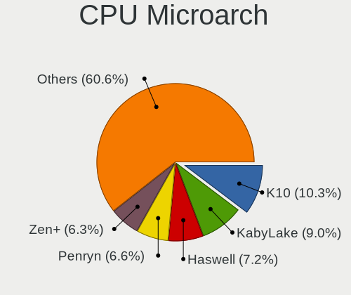

| Name             | Desktops | Percent |
|------------------|----------|---------|
| K10              | 93       | 10.92%  |
| KabyLake         | 80       | 9.39%   |
| Haswell          | 67       | 7.86%   |
| Penryn           | 56       | 6.57%   |
| Piledriver       | 54       | 6.34%   |
| Zen+             | 52       | 6.1%    |
| IvyBridge        | 49       | 5.75%   |
| Zen 3            | 36       | 4.23%   |
| SandyBridge      | 36       | 4.23%   |
| Steamroller      | 34       | 3.99%   |
| Zen 2            | 33       | 3.87%   |
| Zen              | 32       | 3.76%   |
| K8 Hammer        | 31       | 3.64%   |
| CometLake        | 27       | 3.17%   |
| Skylake          | 24       | 2.82%   |
| Core             | 24       | 2.82%   |
| Excavator        | 23       | 2.7%    |
| NetBurst         | 21       | 2.46%   |
| Bulldozer        | 18       | 2.11%   |
| K10 Llano        | 10       | 1.17%   |
| Jaguar           | 10       | 1.17%   |
| Silvermont       | 9        | 1.06%   |
| Unknown          | 8        | 0.94%   |
| Westmere         | 6        | 0.7%    |
| Puma             | 4        | 0.47%   |
| Nehalem          | 3        | 0.35%   |
| Icelake          | 3        | 0.35%   |
| Alderlake Hybrid | 3        | 0.35%   |
| K6               | 2        | 0.23%   |
| Bonnell          | 2        | 0.23%   |
| Goldmont plus    | 1        | 0.12%   |
| Goldmont         | 1        | 0.12%   |

Graphics
--------

GPU Vendor
----------

Vendors of graphics cards

| Vendor                           | Desktops | Percent |
|----------------------------------|----------|---------|
| AMD                              | 355      | 39.53%  |
| Nvidia                           | 270      | 30.07%  |
| Intel                            | 260      | 28.95%  |
| VIA Technologies                 | 9        | 1%      |
| ATI Technologies                 | 3        | 0.33%   |
| Silicon Integrated Systems [SiS] | 1        | 0.11%   |

GPU Model
---------

Graphics card models

| Model                                                                       | Desktops | Percent |
|-----------------------------------------------------------------------------|----------|---------|
| Intel Xeon E3-1200 v3/4th Gen Core Processor Integrated Graphics Controller | 37       | 4.01%   |
| AMD Ellesmere [Radeon RX 470/480/570/570X/580/580X/590]                     | 35       | 3.79%   |
| AMD Picasso/Raven 2 [Radeon Vega Series / Radeon Vega Mobile Series]        | 29       | 3.14%   |
| Nvidia C61 [GeForce 7025 / nForce 630a]                                     | 22       | 2.38%   |
| Intel 2nd Generation Core Processor Family Integrated Graphics Controller   | 22       | 2.38%   |
| AMD Kaveri [Radeon R7 Graphics]                                             | 22       | 2.38%   |
| Nvidia GT218 [GeForce 210]                                                  | 21       | 2.28%   |
| Intel Xeon E3-1200 v2/3rd Gen Core processor Graphics Controller            | 21       | 2.28%   |
| Intel 4 Series Chipset Integrated Graphics Controller                       | 21       | 2.28%   |
| Nvidia GK208B [GeForce GT 710]                                              | 20       | 2.17%   |
| Intel HD Graphics 630                                                       | 20       | 2.17%   |
| AMD Cedar [Radeon HD 5000/6000/7350/8350 Series]                            | 20       | 2.17%   |
| AMD Raven Ridge [Radeon Vega Series / Radeon Vega Mobile Series]            | 19       | 2.06%   |
| Nvidia GP107 [GeForce GTX 1050 Ti]                                          | 18       | 1.95%   |
| AMD Wani [Radeon R5/R6/R7 Graphics]                                         | 18       | 1.95%   |
| Intel CoffeeLake-S GT2 [UHD Graphics 630]                                   | 17       | 1.84%   |
| Intel 82G33/G31 Express Integrated Graphics Controller                      | 17       | 1.84%   |
| Intel CometLake-S GT2 [UHD Graphics 630]                                    | 15       | 1.63%   |
| AMD Cezanne [Radeon Vega Series / Radeon Vega Mobile Series]                | 14       | 1.52%   |
| Intel HD Graphics 530                                                       | 13       | 1.41%   |
| Nvidia C61 [GeForce 6150SE nForce 430]                                      | 12       | 1.3%    |
| AMD Caicos [Radeon HD 6450/7450/8450 / R5 230 OEM]                          | 12       | 1.3%    |
| Intel 82945G/GZ Integrated Graphics Controller                              | 11       | 1.19%   |
| AMD RS780L [Radeon 3000]                                                    | 11       | 1.19%   |
| Intel 4th Generation Core Processor Family Integrated Graphics Controller   | 10       | 1.08%   |
| AMD Trinity 2 [Radeon HD 7480D]                                             | 10       | 1.08%   |
| AMD Lexa PRO [Radeon 540/540X/550/550X / RX 540X/550/550X]                  | 10       | 1.08%   |
| Nvidia GP106 [GeForce GTX 1060 3GB]                                         | 9        | 0.98%   |
| Intel IvyBridge GT2 [HD Graphics 4000]                                      | 9        | 0.98%   |
| AMD Oland XT [Radeon HD 8670 / R5 340X OEM / R7 250/350/350X OEM]           | 9        | 0.98%   |
| Nvidia GP108 [GeForce GT 1030]                                              | 8        | 0.87%   |
| Nvidia GM204 [GeForce GTX 970]                                              | 7        | 0.76%   |
| Nvidia GK208B [GeForce GT 730]                                              | 7        | 0.76%   |
| Nvidia G96C [GeForce 9500 GT]                                               | 7        | 0.76%   |
| AMD Bonaire XTX [Radeon R7 260X/360]                                        | 7        | 0.76%   |
| Nvidia GP107 [GeForce GTX 1050]                                             | 6        | 0.65%   |
| Nvidia GP106 [GeForce GTX 1060 6GB]                                         | 6        | 0.65%   |
| Intel Atom Processor Z36xxx/Z37xxx Series Graphics & Display                | 6        | 0.65%   |
| AMD Turks XT [Radeon HD 6670/7670]                                          | 6        | 0.65%   |
| AMD RS880 [Radeon HD 4250]                                                  | 6        | 0.65%   |

GPU Combo
---------

Combinations of graphics cards

| Name           | Desktops | Percent |
|----------------|----------|---------|
| 1 x AMD        | 333      | 38.72%  |
| 1 x Nvidia     | 242      | 28.14%  |
| 1 x Intel      | 227      | 26.4%   |
| Intel + Nvidia | 16       | 1.86%   |
| 2 x AMD        | 12       | 1.4%    |
| 1 x VIA        | 9        | 1.05%   |
| Intel + AMD    | 9        | 1.05%   |
| AMD + Nvidia   | 8        | 0.93%   |
| 2 x Nvidia     | 2        | 0.23%   |
| 2 x Intel      | 1        | 0.12%   |
| 1 x SiS        | 1        | 0.12%   |

GPU Driver
----------

Free vs proprietary

| Driver      | Desktops | Percent |
|-------------|----------|---------|
| Free        | 679      | 78.95%  |
| Proprietary | 126      | 14.65%  |
| Unknown     | 55       | 6.4%    |

GPU Memory
----------

Total video memory

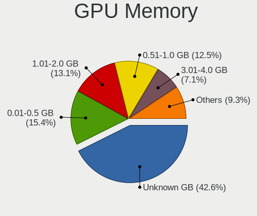

| Size in GB | Desktops | Percent |
|------------|----------|---------|
| Unknown    | 355      | 40.25%  |
| 0.01-0.5   | 147      | 16.67%  |
| 1.01-2.0   | 122      | 13.83%  |
| 0.51-1.0   | 117      | 13.27%  |
| 3.01-4.0   | 69       | 7.82%   |
| 7.01-8.0   | 42       | 4.76%   |
| 5.01-6.0   | 13       | 1.47%   |
| 8.01-16.0  | 9        | 1.02%   |
| 2.01-3.0   | 7        | 0.79%   |
| 16.01-24.0 | 1        | 0.11%   |

Monitor
-------

Monitor Vendor
--------------

Monitor vendors

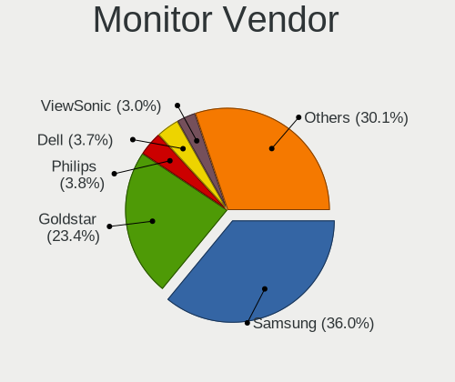

| Vendor               | Desktops | Percent |
|----------------------|----------|---------|
| Samsung Electronics  | 312      | 36.58%  |
| Goldstar             | 201      | 23.56%  |
| Dell                 | 33       | 3.87%   |
| Philips              | 29       | 3.4%    |
| ViewSonic            | 27       | 3.17%   |
| LG Electronics       | 22       | 2.58%   |
| BenQ                 | 21       | 2.46%   |
| Hitachi              | 18       | 2.11%   |
| Hewlett-Packard      | 17       | 1.99%   |
| SKY                  | 15       | 1.76%   |
| Unknown              | 12       | 1.41%   |
| Sony                 | 10       | 1.17%   |
| AOC                  | 10       | 1.17%   |
| SAC                  | 9        | 1.06%   |
| Lenovo               | 7        | 0.82%   |
| ASUSTek Computer     | 6        | 0.7%    |
| Acer                 | 6        | 0.7%    |
| Unknown (XXX)        | 5        | 0.59%   |
| MStar                | 5        | 0.59%   |
| HKC                  | 5        | 0.59%   |
| UTV                  | 4        | 0.47%   |
| SANYO                | 4        | 0.47%   |
| RTK                  | 4        | 0.47%   |
| CDR                  | 4        | 0.47%   |
| ___                  | 3        | 0.35%   |
| KTC                  | 3        | 0.35%   |
| JRY                  | 3        | 0.35%   |
| ITE                  | 3        | 0.35%   |
| Ancor Communications | 3        | 0.35%   |
| AGO                  | 3        | 0.35%   |
| Yuraku               | 2        | 0.23%   |
| STD                  | 2        | 0.23%   |
| Panasonic            | 2        | 0.23%   |
| LLL                  | 2        | 0.23%   |
| Konka                | 2        | 0.23%   |
| HIB                  | 2        | 0.23%   |
| GDH                  | 2        | 0.23%   |
| DTV                  | 2        | 0.23%   |
| Daewoo               | 2        | 0.23%   |
| AU Optronics         | 2        | 0.23%   |

Monitor Model
-------------

Monitor models

| Model                                                                | Desktops | Percent |
|----------------------------------------------------------------------|----------|---------|
| Goldstar FULL HD GSM5B55 1920x1080 480x270mm 21.7-inch               | 18       | 2.02%   |
| Goldstar W1943 GSM4BAD 1360x768 406x229mm 18.4-inch                  | 17       | 1.9%    |
| Goldstar W2243 GSM56FE 1920x1080 477x269mm 21.6-inch                 | 14       | 1.57%   |
| Samsung Electronics S22D300 SAM0B3F 1920x1080 477x268mm 21.5-inch    | 12       | 1.34%   |
| Hitachi HDMI HEC0088 1920x540                                        | 12       | 1.34%   |
| Samsung Electronics C24F390 SAM0D2C 1920x1080 521x293mm 23.5-inch    | 11       | 1.23%   |
| Samsung Electronics S22F350 SAM0D1A 1920x1080 477x268mm 21.5-inch    | 9        | 1.01%   |
| SKY TV-monitor SKY0001 1360x768 890x500mm 40.2-inch                  | 8        | 0.9%    |
| Samsung Electronics SMB2030N SAM0634 1600x900 443x249mm 20.0-inch    | 8        | 0.9%    |
| Samsung Electronics SMB1930N SAM0632 1366x768 410x230mm 18.5-inch    | 8        | 0.9%    |
| Goldstar LG IPS FULLHD GSM5AB8 1920x1080 480x270mm 21.7-inch         | 8        | 0.9%    |
| Goldstar 23EA53 GSM59A9 1920x1080 510x290mm 23.1-inch                | 8        | 0.9%    |
| Samsung Electronics SA300/SA350 SAM0788 1366x768 410x230mm 18.5-inch | 7        | 0.78%   |
| Samsung Electronics S24F350 SAM0D20 1920x1080 521x293mm 23.5-inch    | 7        | 0.78%   |
| Samsung Electronics S19D300 SAM0B36 1366x768 410x230mm 18.5-inch     | 7        | 0.78%   |
| Goldstar W2353 GSM56EE 1920x1080 474x296mm 22.0-inch                 | 7        | 0.78%   |
| Goldstar 19EN33 GSM4C18 1366x768 410x230mm 18.5-inch                 | 7        | 0.78%   |
| Samsung Electronics S19D300 SAM0B35 1366x768 410x230mm 18.5-inch     | 6        | 0.67%   |
| Samsung Electronics LCD Monitor SyncMaster 1680x1050                 | 6        | 0.67%   |
| Samsung Electronics T24C550 SAM0AA1 1920x1080 521x293mm 23.5-inch    | 5        | 0.56%   |
| Samsung Electronics SyncMaster SAM05FC 1920x1080                     | 5        | 0.56%   |
| Samsung Electronics SyncMaster SAM0599 1600x900 443x249mm 20.0-inch  | 5        | 0.56%   |
| Samsung Electronics LF24T35 SAM707D 1920x1080 528x297mm 23.9-inch    | 5        | 0.56%   |
| Samsung Electronics C24F390 SAM0D2D 1920x1080 521x293mm 23.5-inch    | 5        | 0.56%   |
| SAC LED MONITOR SAC952D 1920x1080 443x249mm 20.0-inch                | 5        | 0.56%   |
| Philips PHL 243V5 PHLC0D1 1920x1080 521x293mm 23.5-inch              | 5        | 0.56%   |
| Philips PHL 223V5 PHLC0CF 1920x1080 480x270mm 21.7-inch              | 5        | 0.56%   |
| MStar TV MST0030 1920x1080 708x398mm 32.0-inch                       | 5        | 0.56%   |
| Goldstar W1942 GSM4B6F 1440x900 408x255mm 18.9-inch                  | 5        | 0.56%   |
| Goldstar E2340 GSM57C7 1920x1080 510x290mm 23.1-inch                 | 5        | 0.56%   |
| Goldstar 23MP55 GSM5A23 1920x1080 510x290mm 23.1-inch                | 5        | 0.56%   |
| Goldstar 23EA53 GSM59A8 1920x1080 510x290mm 23.1-inch                | 5        | 0.56%   |
| Unknown (XXX) Union TV XXX2841 1920x1080 1209x680mm 54.6-inch        | 4        | 0.45%   |
| Samsung Electronics SyncMaster SAM059A 1920x1080 477x268mm 21.5-inch | 4        | 0.45%   |
| Samsung Electronics SyncMaster SAM0546 1920x1080 510x287mm 23.0-inch | 4        | 0.45%   |
| Samsung Electronics SyncMaster SAM0286 1280x720 372x209mm 16.8-inch  | 4        | 0.45%   |
| Samsung Electronics SMT24A550 SAM07B5 1920x1080 531x299mm 24.0-inch  | 4        | 0.45%   |
| Samsung Electronics S27F350 SAM0D22 1920x1080 598x336mm 27.0-inch    | 4        | 0.45%   |
| Samsung Electronics S23B350 SAM08D5 1920x1080 510x287mm 23.0-inch    | 4        | 0.45%   |
| Samsung Electronics S22D300 SAM0B3E 1920x1080 477x268mm 21.5-inch    | 4        | 0.45%   |

Monitor Resolution
------------------

Monitor screen resolution

| Resolution         | Desktops | Percent |
|--------------------|----------|---------|
| 1920x1080 (FHD)    | 370      | 44.79%  |
| 1366x768 (WXGA)    | 101      | 12.23%  |
| 1280x1024 (SXGA)   | 55       | 6.66%   |
| 1360x768           | 51       | 6.17%   |
| 3840x2160 (4K)     | 49       | 5.93%   |
| 1680x1050 (WSXGA+) | 40       | 4.84%   |
| 1600x900 (HD+)     | 38       | 4.6%    |
| 1440x900 (WXGA+)   | 33       | 4%      |
| 1920x540           | 16       | 1.94%   |
| Unknown            | 12       | 1.45%   |
| 1024x768 (XGA)     | 11       | 1.33%   |
| 2560x1440 (QHD)    | 9        | 1.09%   |
| 1280x720 (HD)      | 9        | 1.09%   |
| 2560x1080          | 4        | 0.48%   |
| 1152x864           | 4        | 0.48%   |
| 3840x1080          | 3        | 0.36%   |
| 1920x1200 (WUXGA)  | 3        | 0.36%   |
| 3440x1440          | 2        | 0.24%   |
| 2288x1287          | 2        | 0.24%   |
| 2048x1152          | 2        | 0.24%   |
| 1280x960           | 2        | 0.24%   |
| 4093x4093          | 1        | 0.12%   |
| 3600x1200          | 1        | 0.12%   |
| 3286x1080          | 1        | 0.12%   |
| 3280x1080          | 1        | 0.12%   |
| 3046x1050          | 1        | 0.12%   |
| 2646x1024          | 1        | 0.12%   |
| 2048x1536          | 1        | 0.12%   |
| 1920x1440          | 1        | 0.12%   |
| 1792x1344          | 1        | 0.12%   |
| 1600x1200          | 1        | 0.12%   |

Monitor Diagonal
----------------

Diagonal size in inches

| Inches  | Desktops | Percent |
|---------|----------|---------|
| 21      | 139      | 16.16%  |
| 23      | 129      | 15%     |
| 18      | 121      | 14.07%  |
| Unknown | 65       | 7.56%   |
| 24      | 43       | 5%      |
| 19      | 43       | 5%      |
| 20      | 42       | 4.88%   |
| 17      | 34       | 3.95%   |
| 15      | 32       | 3.72%   |
| 27      | 30       | 3.49%   |
| 22      | 22       | 2.56%   |
| 40      | 20       | 2.33%   |
| 48      | 15       | 1.74%   |
| 31      | 15       | 1.74%   |
| 84      | 13       | 1.51%   |
| 32      | 13       | 1.51%   |
| 16      | 12       | 1.4%    |
| 52      | 11       | 1.28%   |
| 54      | 10       | 1.16%   |
| 46      | 7        | 0.81%   |
| 34      | 5        | 0.58%   |
| 14      | 5        | 0.58%   |
| 13      | 5        | 0.58%   |
| 12      | 5        | 0.58%   |
| 72      | 4        | 0.47%   |
| 65      | 3        | 0.35%   |
| 39      | 3        | 0.35%   |
| 142     | 2        | 0.23%   |
| 55      | 2        | 0.23%   |
| 43      | 2        | 0.23%   |
| 30      | 2        | 0.23%   |
| 25      | 2        | 0.23%   |
| 64      | 1        | 0.12%   |
| 58      | 1        | 0.12%   |
| 42      | 1        | 0.12%   |
| 26      | 1        | 0.12%   |

Monitor Width
-------------

Physical width

| Width in mm    | Desktops | Percent |
|----------------|----------|---------|
| 401-500        | 347      | 41.36%  |
| 501-600        | 191      | 22.77%  |
| Unknown        | 65       | 7.75%   |
| 301-350        | 64       | 7.63%   |
| 1001-1500      | 49       | 5.84%   |
| 351-400        | 26       | 3.1%    |
| 801-900        | 23       | 2.74%   |
| 601-700        | 22       | 2.62%   |
| 701-800        | 18       | 2.15%   |
| 1501-2000      | 17       | 2.03%   |
| 201-300        | 12       | 1.43%   |
| 901-1000       | 3        | 0.36%   |
| More than 2000 | 2        | 0.24%   |

Aspect Ratio
------------

Proportional relationship between the width and the height

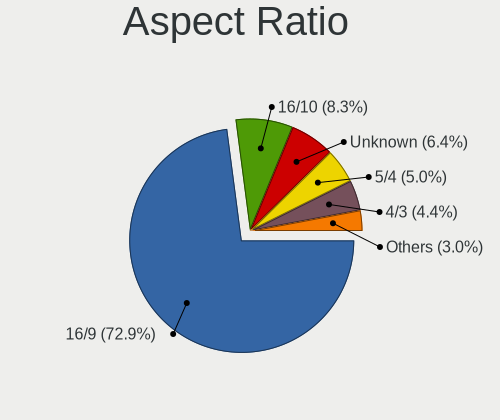

| Ratio   | Desktops | Percent |
|---------|----------|---------|
| 16/9    | 557      | 71.41%  |
| 16/10   | 64       | 8.21%   |
| Unknown | 56       | 7.18%   |
| 5/4     | 39       | 5%      |
| 4/3     | 38       | 4.87%   |
| 1.96    | 12       | 1.54%   |
| 21/9    | 6        | 0.77%   |
| 3/2     | 5        | 0.64%   |
| 1.00    | 2        | 0.26%   |
| 32/9    | 1        | 0.13%   |

Monitor Area
------------

Area in inch

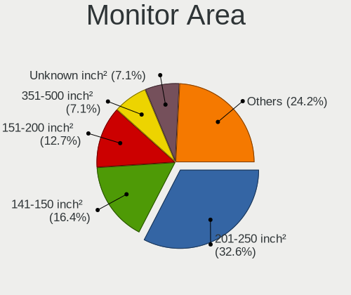

| Area in inch | Desktops | Percent |
|----------------|----------|---------|
| 201-250        | 294      | 35.13%  |
| 141-150        | 142      | 16.97%  |
| 151-200        | 110      | 13.14%  |
| Unknown        | 65       | 7.77%   |
| More than 1000 | 48       | 5.73%   |
| 501-1000       | 44       | 5.26%   |
| 351-500        | 34       | 4.06%   |
| 301-350        | 31       | 3.7%    |
| 111-120        | 19       | 2.27%   |
| 101-110        | 15       | 1.79%   |
| 121-130        | 9        | 1.08%   |
| 251-300        | 8        | 0.96%   |
| 81-90          | 7        | 0.84%   |
| 71-80          | 5        | 0.6%    |
| 131-140        | 4        | 0.48%   |
| 91-100         | 2        | 0.24%   |

Pixel Density
-------------

Pixels per inch

| Density | Desktops | Percent |
|---------|----------|---------|
| 51-100  | 481      | 59.02%  |
| 101-120 | 170      | 20.86%  |
| 1-50    | 78       | 9.57%   |
| Unknown | 65       | 7.98%   |
| 121-160 | 15       | 1.84%   |
| 161-240 | 6        | 0.74%   |

Multiple Monitors
-----------------

Total monitors connected

| Total | Desktops | Percent |
|-------|----------|---------|
| 1     | 703      | 80.9%   |
| 2     | 112      | 12.89%  |
| 0     | 51       | 5.87%   |
| 3     | 3        | 0.35%   |

Network
-------

Net Controller Vendor
---------------------

Controller vendors

| Vendor                                 | Desktops | Percent |
|----------------------------------------|----------|---------|
| Realtek Semiconductor                  | 610      | 51.05%  |
| Intel                                  | 156      | 13.05%  |
| Qualcomm Atheros                       | 107      | 8.95%   |
| Nvidia                                 | 71       | 5.94%   |
| TP-Link                                | 58       | 4.85%   |
| Ralink Technology                      | 31       | 2.59%   |
| Qualcomm Atheros Communications        | 29       | 2.43%   |
| VIA Technologies                       | 18       | 1.51%   |
| Samsung Electronics                    | 11       | 0.92%   |
| Ralink                                 | 10       | 0.84%   |
| Microsoft                              | 10       | 0.84%   |
| Motorola PCS                           | 9        | 0.75%   |
| Broadcom                               | 9        | 0.75%   |
| Marvell Technology Group               | 7        | 0.59%   |
| MediaTek                               | 6        | 0.5%    |
| Silicon Integrated Systems [SiS]       | 4        | 0.33%   |
| NetGear                                | 4        | 0.33%   |
| D-Link System                          | 4        | 0.33%   |
| Broadcom Limited                       | 4        | 0.33%   |
| Xiaomi                                 | 3        | 0.25%   |
| Sundance Technology Inc / IC Plus      | 3        | 0.25%   |
| 3Com                                   | 3        | 0.25%   |
| T & A Mobile Phones                    | 2        | 0.17%   |
| Linksys                                | 2        | 0.17%   |
| LG Electronics                         | 2        | 0.17%   |
| JMicron Technology                     | 2        | 0.17%   |
| Huawei Technologies                    | 2        | 0.17%   |
| Davicom Semiconductor                  | 2        | 0.17%   |
| D-Link                                 | 2        | 0.17%   |
| 802.11g Adapter [Linksys WUSB54GC v3]  | 2        | 0.17%   |
| ZyDAS                                  | 1        | 0.08%   |
| ZTE WCDMA Technologies MSM             | 1        | 0.08%   |
| Unknown                                | 1        | 0.08%   |
| Sony Ericsson Mobile Communications AB | 1        | 0.08%   |
| Smart Link                             | 1        | 0.08%   |
| PCTel                                  | 1        | 0.08%   |
| Ovislink                               | 1        | 0.08%   |
| Motorola                               | 1        | 0.08%   |
| Macronix [MXIC]                        | 1        | 0.08%   |
| ICS Advent                             | 1        | 0.08%   |

Net Controller Model
--------------------

Controller models

| Model                                                             | Desktops | Percent |
|-------------------------------------------------------------------|----------|---------|
| Realtek RTL8111/8168/8411 PCI Express Gigabit Ethernet Controller | 516      | 38.88%  |
| Nvidia MCP61 Ethernet                                             | 64       | 4.82%   |
| Realtek RTL810xE PCI Express Fast Ethernet controller             | 32       | 2.41%   |
| Realtek RTL8188EUS 802.11n Wireless Network Adapter               | 30       | 2.26%   |
| Qualcomm Atheros AR9271 802.11n                                   | 25       | 1.88%   |
| Intel Ethernet Connection (2) I219-V                              | 25       | 1.88%   |
| Qualcomm Atheros AR9485 Wireless Network Adapter                  | 21       | 1.58%   |
| Intel I211 Gigabit Network Connection                             | 21       | 1.58%   |
| TP-Link TL-WN722N v2/v3 [Realtek RTL8188EUS]                      | 18       | 1.36%   |
| Realtek RTL8125 2.5GbE Controller                                 | 18       | 1.36%   |
| Intel Wi-Fi 6 AX200                                               | 16       | 1.21%   |
| Realtek RTL-8100/8101L/8139 PCI Fast Ethernet Adapter             | 15       | 1.13%   |
| Ralink MT7601U Wireless Adapter                                   | 15       | 1.13%   |
| VIA VT6102/VT6103 [Rhine-II]                                      | 14       | 1.06%   |
| Qualcomm Atheros AR9227 Wireless Network Adapter                  | 13       | 0.98%   |
| Intel Ethernet Connection (7) I219-V                              | 12       | 0.9%    |
| Intel Ethernet Controller I225-V                                  | 11       | 0.83%   |
| Realtek RTL8169 PCI Gigabit Ethernet Controller                   | 10       | 0.75%   |
| Ralink RT2870/RT3070 Wireless Adapter                             | 10       | 0.75%   |
| Qualcomm Atheros AR9287 Wireless Network Adapter (PCI-Express)    | 10       | 0.75%   |
| Samsung Galaxy series, misc. (tethering mode)                     | 9        | 0.68%   |
| Realtek RTL8192EE PCIe Wireless Network Adapter                   | 9        | 0.68%   |
| Qualcomm Atheros AR9285 Wireless Network Adapter (PCI-Express)    | 8        | 0.6%    |
| Motorola PCS motorola edge 40                                     | 8        | 0.6%    |
| TP-Link TL-WN823N v2/v3 [Realtek RTL8192EU]                       | 7        | 0.53%   |
| Realtek RTL8188EE Wireless Network Adapter                        | 7        | 0.53%   |
| Realtek RTL-8185 IEEE 802.11a/b/g Wireless LAN Controller         | 7        | 0.53%   |
| Qualcomm Atheros AR93xx Wireless Network Adapter                  | 7        | 0.53%   |
| Qualcomm Atheros AR8152 v2.0 Fast Ethernet                        | 7        | 0.53%   |
| Qualcomm Atheros AR8151 v2.0 Gigabit Ethernet                     | 7        | 0.53%   |
| Microsoft Xbox 360 Wireless Adapter                               | 7        | 0.53%   |
| Intel 82579V Gigabit Network Connection                           | 7        | 0.53%   |
| TP-Link AC600 wireless Realtek RTL8811AU [Archer T2U Nano]        | 6        | 0.45%   |
| TP-Link 802.11n NIC                                               | 6        | 0.45%   |
| Realtek RTL8192CU 802.11n WLAN Adapter                            | 6        | 0.45%   |
| Qualcomm Atheros Attansic L2 Fast Ethernet                        | 6        | 0.45%   |
| Intel Ethernet Connection I217-V                                  | 6        | 0.45%   |
| Intel Ethernet Connection (2) I218-V                              | 6        | 0.45%   |
| Intel Ethernet Connection (14) I219-V                             | 6        | 0.45%   |
| Intel Dual Band Wireless-AC 3168NGW [Stone Peak]                  | 6        | 0.45%   |

Wireless Vendor
---------------

Wireless vendors

| Vendor                                | Desktops | Percent |
|---------------------------------------|----------|---------|
| Realtek Semiconductor                 | 92       | 23.71%  |
| Qualcomm Atheros                      | 77       | 19.85%  |
| Intel                                 | 57       | 14.69%  |
| TP-Link                               | 55       | 14.18%  |
| Ralink Technology                     | 31       | 7.99%   |
| Qualcomm Atheros Communications       | 29       | 7.47%   |
| Ralink                                | 10       | 2.58%   |
| Microsoft                             | 10       | 2.58%   |
| Broadcom                              | 6        | 1.55%   |
| NetGear                               | 4        | 1.03%   |
| D-Link System                         | 4        | 1.03%   |
| MediaTek                              | 2        | 0.52%   |
| Marvell Technology Group              | 2        | 0.52%   |
| Linksys                               | 2        | 0.52%   |
| D-Link                                | 2        | 0.52%   |
| 802.11g Adapter [Linksys WUSB54GC v3] | 2        | 0.52%   |
| ZyDAS                                 | 1        | 0.26%   |
| Samsung Electronics                   | 1        | 0.26%   |
| Ovislink                              | 1        | 0.26%   |

Wireless Model
--------------

Wireless models

| Model                                                                                | Desktops | Percent |
|--------------------------------------------------------------------------------------|----------|---------|
| Realtek RTL8188EUS 802.11n Wireless Network Adapter                                  | 30       | 7.63%   |
| Qualcomm Atheros AR9271 802.11n                                                      | 25       | 6.36%   |
| Qualcomm Atheros AR9485 Wireless Network Adapter                                     | 21       | 5.34%   |
| TP-Link TL-WN722N v2/v3 [Realtek RTL8188EUS]                                         | 18       | 4.58%   |
| Intel Wi-Fi 6 AX200                                                                  | 16       | 4.07%   |
| Ralink MT7601U Wireless Adapter                                                      | 15       | 3.82%   |
| Qualcomm Atheros AR9227 Wireless Network Adapter                                     | 13       | 3.31%   |
| Ralink RT2870/RT3070 Wireless Adapter                                                | 10       | 2.54%   |
| Qualcomm Atheros AR9287 Wireless Network Adapter (PCI-Express)                       | 10       | 2.54%   |
| Realtek RTL8192EE PCIe Wireless Network Adapter                                      | 9        | 2.29%   |
| Qualcomm Atheros AR9285 Wireless Network Adapter (PCI-Express)                       | 8        | 2.04%   |
| TP-Link TL-WN823N v2/v3 [Realtek RTL8192EU]                                          | 7        | 1.78%   |
| Realtek RTL8188EE Wireless Network Adapter                                           | 7        | 1.78%   |
| Realtek RTL-8185 IEEE 802.11a/b/g Wireless LAN Controller                            | 7        | 1.78%   |
| Qualcomm Atheros AR93xx Wireless Network Adapter                                     | 7        | 1.78%   |
| Microsoft Xbox 360 Wireless Adapter                                                  | 7        | 1.78%   |
| TP-Link AC600 wireless Realtek RTL8811AU [Archer T2U Nano]                           | 6        | 1.53%   |
| TP-Link 802.11n NIC                                                                  | 6        | 1.53%   |
| Realtek RTL8192CU 802.11n WLAN Adapter                                               | 6        | 1.53%   |
| Intel Dual Band Wireless-AC 3168NGW [Stone Peak]                                     | 6        | 1.53%   |
| TP-Link Archer T4U ver.3                                                             | 5        | 1.27%   |
| Realtek RTL8812AE 802.11ac PCIe Wireless Network Adapter                             | 5        | 1.27%   |
| Realtek 802.11ac NIC                                                                 | 5        | 1.27%   |
| Qualcomm Atheros AR2417 Wireless Network Adapter [AR5007G 802.11bg]                  | 5        | 1.27%   |
| Intel Wireless 7265                                                                  | 5        | 1.27%   |
| Intel Cannon Lake PCH CNVi WiFi                                                      | 5        | 1.27%   |
| Intel Wi-Fi 6 AX210/AX211/AX411 160MHz                                               | 4        | 1.02%   |
| Intel Centrino Wireless-N 2230                                                       | 4        | 1.02%   |
| Intel Alder Lake-S PCH CNVi WiFi                                                     | 4        | 1.02%   |
| TP-Link 802.11ac WLAN Adapter                                                        | 3        | 0.76%   |
| Realtek RTL8821CE 802.11ac PCIe Wireless Network Adapter                             | 3        | 0.76%   |
| Realtek RTL8812AU 802.11a/b/g/n/ac 2T2R DB WLAN Adapter                              | 3        | 0.76%   |
| Realtek RTL8188FTV 802.11b/g/n 1T1R 2.4G WLAN Adapter                                | 3        | 0.76%   |
| Realtek RTL8187 Wireless Adapter                                                     | 3        | 0.76%   |
| Ralink RT5370 Wireless Adapter                                                       | 3        | 0.76%   |
| Ralink RT5390 Wireless 802.11n 1T/1R PCIe                                            | 3        | 0.76%   |
| Ralink RT3060 Wireless 802.11n 1T/1R                                                 | 3        | 0.76%   |
| Qualcomm Atheros QCA6174 802.11ac Wireless Network Adapter                           | 3        | 0.76%   |
| Qualcomm Atheros TP-Link TL-WN821N v3 / TL-WN822N v2 802.11n [Atheros AR7010+AR9287] | 3        | 0.76%   |
| Qualcomm Atheros AR922X Wireless Network Adapter                                     | 3        | 0.76%   |

Ethernet Vendor
---------------

Ethernet vendors

| Vendor                            | Desktops | Percent |
|-----------------------------------|----------|---------|
| Realtek Semiconductor             | 584      | 64.53%  |
| Intel                             | 127      | 14.03%  |
| Nvidia                            | 71       | 7.85%   |
| Qualcomm Atheros                  | 43       | 4.75%   |
| VIA Technologies                  | 18       | 1.99%   |
| Samsung Electronics               | 9        | 0.99%   |
| Motorola PCS                      | 8        | 0.88%   |
| Marvell Technology Group          | 5        | 0.55%   |
| TP-Link                           | 4        | 0.44%   |
| Silicon Integrated Systems [SiS]  | 4        | 0.44%   |
| MediaTek                          | 4        | 0.44%   |
| Broadcom Limited                  | 4        | 0.44%   |
| Xiaomi                            | 3        | 0.33%   |
| Sundance Technology Inc / IC Plus | 3        | 0.33%   |
| Broadcom                          | 3        | 0.33%   |
| 3Com                              | 3        | 0.33%   |
| T & A Mobile Phones               | 2        | 0.22%   |
| JMicron Technology                | 2        | 0.22%   |
| Davicom Semiconductor             | 2        | 0.22%   |
| ZTE WCDMA Technologies MSM        | 1        | 0.11%   |
| Macronix [MXIC]                   | 1        | 0.11%   |
| LG Electronics                    | 1        | 0.11%   |
| ICS Advent                        | 1        | 0.11%   |
| Huawei Technologies               | 1        | 0.11%   |
| Aquantia                          | 1        | 0.11%   |

Ethernet Model
--------------

Ethernet models

| Model                                                                      | Desktops | Percent |
|----------------------------------------------------------------------------|----------|---------|
| Realtek RTL8111/8168/8411 PCI Express Gigabit Ethernet Controller          | 516      | 56.03%  |
| Nvidia MCP61 Ethernet                                                      | 64       | 6.95%   |
| Realtek RTL810xE PCI Express Fast Ethernet controller                      | 32       | 3.47%   |
| Intel Ethernet Connection (2) I219-V                                       | 25       | 2.71%   |
| Intel I211 Gigabit Network Connection                                      | 21       | 2.28%   |
| Realtek RTL8125 2.5GbE Controller                                          | 18       | 1.95%   |
| Realtek RTL-8100/8101L/8139 PCI Fast Ethernet Adapter                      | 15       | 1.63%   |
| VIA VT6102/VT6103 [Rhine-II]                                               | 14       | 1.52%   |
| Intel Ethernet Connection (7) I219-V                                       | 12       | 1.3%    |
| Intel Ethernet Controller I225-V                                           | 11       | 1.19%   |
| Realtek RTL8169 PCI Gigabit Ethernet Controller                            | 10       | 1.09%   |
| Samsung Galaxy series, misc. (tethering mode)                              | 9        | 0.98%   |
| Motorola PCS motorola edge 40                                              | 8        | 0.87%   |
| Qualcomm Atheros AR8152 v2.0 Fast Ethernet                                 | 7        | 0.76%   |
| Qualcomm Atheros AR8151 v2.0 Gigabit Ethernet                              | 7        | 0.76%   |
| Intel 82579V Gigabit Network Connection                                    | 7        | 0.76%   |
| Qualcomm Atheros Attansic L2 Fast Ethernet                                 | 6        | 0.65%   |
| Intel Ethernet Connection I217-V                                           | 6        | 0.65%   |
| Intel Ethernet Connection (2) I218-V                                       | 6        | 0.65%   |
| Intel Ethernet Connection (14) I219-V                                      | 6        | 0.65%   |
| Intel 82579LM Gigabit Network Connection (Lewisville)                      | 6        | 0.65%   |
| Qualcomm Atheros QCA8171 Gigabit Ethernet                                  | 5        | 0.54%   |
| Qualcomm Atheros Killer E2500 Gigabit Ethernet Controller                  | 5        | 0.54%   |
| Qualcomm Atheros Killer E220x Gigabit Ethernet Controller                  | 5        | 0.54%   |
| Intel 82567LM-3 Gigabit Network Connection                                 | 5        | 0.54%   |
| VIA VT6105/VT6106S [Rhine-III]                                             | 4        | 0.43%   |
| TP-Link UE300 10/100/1000 LAN (ethernet mode) [Realtek RTL8153]            | 4        | 0.43%   |
| Intel 82578DC Gigabit Network Connection                                   | 4        | 0.43%   |
| Xiaomi Mi/Redmi series (RNDIS)                                             | 3        | 0.33%   |
| Sundance Inc / IC Plus IC Plus IP100A Integrated 10/100 Ethernet MAC + PHY | 3        | 0.33%   |
| Nvidia MCP77 Ethernet                                                      | 3        | 0.33%   |
| Marvell Group 88E8057 PCI-E Gigabit Ethernet Controller                    | 3        | 0.33%   |
| Broadcom Limited NetXtreme BCM5755 Gigabit Ethernet PCI Express            | 3        | 0.33%   |
| 3Com 3c905B 100BaseTX [Cyclone]                                            | 3        | 0.33%   |
| Silicon Integrated Systems [SiS] SiS900 PCI Fast Ethernet                  | 2        | 0.22%   |
| Realtek RTL8153 Gigabit Ethernet Adapter                                   | 2        | 0.22%   |
| Qualcomm Atheros Killer E2400 Gigabit Ethernet Controller                  | 2        | 0.22%   |
| Qualcomm Atheros AR8121/AR8113/AR8114 Gigabit or Fast Ethernet             | 2        | 0.22%   |
| Nvidia MCP55 Ethernet                                                      | 2        | 0.22%   |
| MediaTek moto e22                                                          | 2        | 0.22%   |

Net Controller Kind
-------------------

Ethernet, WiFi or modem

| Kind     | Desktops | Percent |
|----------|----------|---------|
| Ethernet | 838      | 68.97%  |
| WiFi     | 365      | 30.04%  |
| Modem    | 9        | 0.74%   |
| Unknown  | 3        | 0.25%   |

Used Controller
---------------

Currently used network controller

| Kind     | Desktops | Percent |
|----------|----------|---------|
| Ethernet | 598      | 68.97%  |
| WiFi     | 268      | 30.91%  |
| Unknown  | 1        | 0.12%   |

NICs
----

Total network controllers on board

| Total | Desktops | Percent |
|-------|----------|---------|
| 1     | 623      | 72.61%  |
| 2     | 203      | 23.66%  |
| 3     | 22       | 2.56%   |
| 0     | 7        | 0.82%   |
| 32    | 1        | 0.12%   |
| 7     | 1        | 0.12%   |
| 4     | 1        | 0.12%   |

IPv6
----

IPv6 vs IPv4

| Used | Desktops | Percent |
|------|----------|---------|
| No   | 730      | 84.69%  |
| Yes  | 132      | 15.31%  |

Bluetooth
---------

Bluetooth Vendor
----------------

Controller vendors

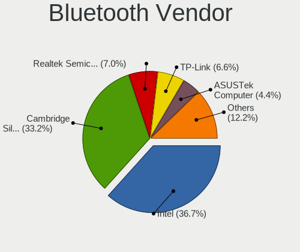

| Vendor                          | Desktops | Percent |
|---------------------------------|----------|---------|
| Cambridge Silicon Radio         | 61       | 37.89%  |
| Intel                           | 56       | 34.78%  |
| Realtek Semiconductor           | 12       | 7.45%   |
| TP-Link                         | 7        | 4.35%   |
| ASUSTek Computer                | 5        | 3.11%   |
| Integrated System Solution      | 4        | 2.48%   |
| Qualcomm Atheros Communications | 3        | 1.86%   |
| Broadcom                        | 3        | 1.86%   |
| IMC Networks                    | 2        | 1.24%   |
| Hewlett-Packard                 | 2        | 1.24%   |
| Roper                           | 1        | 0.62%   |
| MediaTek                        | 1        | 0.62%   |
| Logitech                        | 1        | 0.62%   |
| Edimax Technology               | 1        | 0.62%   |
| Conwise Technology              | 1        | 0.62%   |
| Unknown                         | 1        | 0.62%   |

Bluetooth Model
---------------

Controller models

| Model                                                   | Desktops | Percent |
|---------------------------------------------------------|----------|---------|
| Cambridge Silicon Radio Bluetooth Dongle (HCI mode)     | 61       | 37.89%  |
| Intel AX200 Bluetooth                                   | 17       | 10.56%  |
| Realtek Bluetooth Radio                                 | 12       | 7.45%   |
| Intel Bluetooth wireless interface                      | 12       | 7.45%   |
| TP-Link UB500 Adapter                                   | 7        | 4.35%   |
| Intel Wireless-AC 3168 Bluetooth                        | 6        | 3.73%   |
| Intel Bluetooth Device                                  | 5        | 3.11%   |
| Intel Bluetooth 9460/9560 Jefferson Peak (JfP)          | 5        | 3.11%   |
| Intel AX210 Bluetooth                                   | 5        | 3.11%   |
| Intel Centrino Bluetooth Wireless Transceiver           | 4        | 2.48%   |
| ASUS Bluetooth Radio                                    | 3        | 1.86%   |
| Intel Wireless-AC 9260 Bluetooth Adapter                | 2        | 1.24%   |
| Integrated System Solution KY-BT100 Bluetooth Adapter   | 2        | 1.24%   |
| Integrated System Solution Bluetooth Device             | 2        | 1.24%   |
| HP Bluetooth Adapter                                    | 2        | 1.24%   |
| ASUS Qualcomm Bluetooth 4.1                             | 2        | 1.24%   |
| Roper Class 1 Bluetooth Dongle                          | 1        | 0.62%   |
| Qualcomm Atheros  Bluetooth Device                      | 1        | 0.62%   |
| Qualcomm Atheros QCA61x4 Bluetooth 4.0                  | 1        | 0.62%   |
| Qualcomm Atheros AR3011 Bluetooth                       | 1        | 0.62%   |
| MediaTek Wireless_Device                                | 1        | 0.62%   |
| Logitech BT Mini-Receiver (HCI mode)                    | 1        | 0.62%   |
| IMC Networks Bluetooth Radio                            | 1        | 0.62%   |
| IMC Networks Bluetooth                                  | 1        | 0.62%   |
| Edimax EW-7611ULB 802.11b/g/n and Bluetooth 4.0 Adapter | 1        | 0.62%   |
| Conwise CW6622                                          | 1        | 0.62%   |
| Broadcom HP Portable Bumble Bee                         | 1        | 0.62%   |
| Broadcom HP Bluethunder                                 | 1        | 0.62%   |
| Broadcom BCM20702A0                                     | 1        | 0.62%   |
| Unknown                                                 | 1        | 0.62%   |

Sound
-----

Sound Vendor
------------

Sound card vendors

| Vendor                                          | Desktops | Percent |
|-------------------------------------------------|----------|---------|
| AMD                                             | 421      | 33.9%   |
| Intel                                           | 396      | 31.88%  |
| Nvidia                                          | 247      | 19.89%  |
| C-Media Electronics                             | 28       | 2.25%   |
| Logitech                                        | 26       | 2.09%   |
| VIA Technologies                                | 16       | 1.29%   |
| Kingston Technology                             | 15       | 1.21%   |
| Creative Labs                                   | 9        | 0.72%   |
| Generalplus Technology                          | 8        | 0.64%   |
| Texas Instruments                               | 6        | 0.48%   |
| M-Audio                                         | 5        | 0.4%    |
| Focusrite-Novation                              | 5        | 0.4%    |
| Elite Silicon                                   | 5        | 0.4%    |
| Silicon Integrated Systems [SiS]                | 4        | 0.32%   |
| Plantronics                                     | 3        | 0.24%   |
| Micro Star International                        | 3        | 0.24%   |
| Licensed by Sony Computer Entertainment America | 3        | 0.24%   |
| JMTek                                           | 3        | 0.24%   |
| Fry's Electronics                               | 3        | 0.24%   |
| ATI Technologies                                | 3        | 0.24%   |
| Samson Technologies                             | 2        | 0.16%   |
| Razer USA                                       | 2        | 0.16%   |
| Microsoft                                       | 2        | 0.16%   |
| ESI Audiotechnik                                | 2        | 0.16%   |
| Ensoniq                                         | 2        | 0.16%   |
| Creative Technology                             | 2        | 0.16%   |
| BEHRINGER International                         | 2        | 0.16%   |
| ASUSTek Computer                                | 2        | 0.16%   |
| Astro Gaming                                    | 2        | 0.16%   |
| Yamaha                                          | 1        | 0.08%   |
| TEAC                                            | 1        | 0.08%   |
| Sony                                            | 1        | 0.08%   |
| Realtek Semiconductor                           | 1        | 0.08%   |
| Pro-Ject                                        | 1        | 0.08%   |
| Holtek Semiconductor                            | 1        | 0.08%   |
| Giga-Byte Technology                            | 1        | 0.08%   |
| FDUCE PRO AUDIO MADE                            | 1        | 0.08%   |
| Dell                                            | 1        | 0.08%   |
| Corsair                                         | 1        | 0.08%   |
| Cirrus Logic                                    | 1        | 0.08%   |

Sound Model
-----------

Sound card models

| Model                                                                             | Desktops | Percent |
|-----------------------------------------------------------------------------------|----------|---------|
| AMD FCH Azalia Controller                                                         | 96       | 6.13%   |
| AMD SBx00 Azalia (Intel HDA)                                                      | 77       | 4.92%   |
| AMD Family 17h/19h HD Audio Controller                                            | 70       | 4.47%   |
| Nvidia MCP61 High Definition Audio                                                | 68       | 4.34%   |
| Intel NM10/ICH7 Family High Definition Audio Controller                           | 64       | 4.09%   |
| Intel 6 Series/C200 Series Chipset Family High Definition Audio Controller        | 53       | 3.38%   |
| Intel 8 Series/C220 Series Chipset High Definition Audio Controller               | 50       | 3.19%   |
| AMD Starship/Matisse HD Audio Controller                                          | 50       | 3.19%   |
| AMD Raven/Raven2/Fenghuang HDMI/DP Audio Controller                               | 48       | 3.07%   |
| Intel 100 Series/C230 Series Chipset Family HD Audio Controller                   | 47       | 3%      |
| Intel Xeon E3-1200 v3/4th Gen Core Processor HD Audio Controller                  | 40       | 2.55%   |
| Intel 200 Series PCH HD Audio                                                     | 37       | 2.36%   |
| AMD Ellesmere HDMI Audio [Radeon RX 470/480 / 570/580/590]                        | 35       | 2.23%   |
| AMD Oland/Hainan/Cape Verde/Pitcairn HDMI Audio [Radeon HD 7000 Series]           | 31       | 1.98%   |
| Intel 7 Series/C216 Chipset Family High Definition Audio Controller               | 30       | 1.92%   |
| AMD Kabini HDMI/DP Audio                                                          | 29       | 1.85%   |
| AMD Family 17h (Models 00h-0fh) HD Audio Controller                               | 29       | 1.85%   |
| Nvidia GK208 HDMI/DP Audio Controller                                             | 26       | 1.66%   |
| AMD Trinity HDMI Audio Controller                                                 | 26       | 1.66%   |
| AMD Kaveri HDMI/DP Audio Controller                                               | 26       | 1.66%   |
| Nvidia High Definition Audio Controller                                           | 24       | 1.53%   |
| Nvidia GP107GL High Definition Audio Controller                                   | 24       | 1.53%   |
| AMD Cedar HDMI Audio [Radeon HD 5400/6300/7300 Series]                            | 20       | 1.28%   |
| Intel Cannon Lake PCH cAVS                                                        | 17       | 1.09%   |
| AMD Renoir Radeon High Definition Audio Controller                                | 17       | 1.09%   |
| AMD Baffin HDMI/DP Audio [Radeon RX 550 640SP / RX 560/560X]                      | 17       | 1.09%   |
| Nvidia GP106 High Definition Audio Controller                                     | 15       | 0.96%   |
| AMD Family 15h (Models 60h-6fh) Audio Controller                                  | 15       | 0.96%   |
| Intel Smart Sound Technology (SST) Audio Controller                               | 14       | 0.89%   |
| AMD Caicos HDMI Audio [Radeon HD 6450 / 7450/8450/8490 OEM / R5 230/235/235X OEM] | 14       | 0.89%   |
| Intel 9 Series Chipset Family HD Audio Controller                                 | 13       | 0.83%   |
| C-Media Electronics USB Audio Device                                              | 12       | 0.77%   |
| AMD Tobago HDMI Audio [Radeon R7 360 / R9 360 OEM]                                | 12       | 0.77%   |
| AMD Turks HDMI Audio [Radeon HD 6500/6600 / 6700M Series]                         | 11       | 0.7%    |
| AMD RV710/730 HDMI Audio [Radeon HD 4000 series]                                  | 11       | 0.7%    |
| AMD Navi 21/23 HDMI/DP Audio Controller                                           | 11       | 0.7%    |
| Nvidia GF108 High Definition Audio Controller                                     | 10       | 0.64%   |
| Nvidia GA104 High Definition Audio Controller                                     | 10       | 0.64%   |
| AMD Navi 10 HDMI Audio                                                            | 10       | 0.64%   |
| Nvidia GM206 High Definition Audio Controller                                     | 9        | 0.57%   |

Memory
------

Memory Vendor
-------------

Memory module vendors

| Vendor                       | Desktops | Percent |
|------------------------------|----------|---------|
| Kingston                     | 176      | 38.68%  |
| Unknown                      | 90       | 19.78%  |
| Crucial                      | 39       | 8.57%   |
| Corsair                      | 30       | 6.59%   |
| Samsung Electronics          | 13       | 2.86%   |
| A-DATA Technology            | 13       | 2.86%   |
| Unknown                      | 9        | 1.98%   |
| G.Skill                      | 8        | 1.76%   |
| Patriot                      | 7        | 1.54%   |
| Novatech                     | 6        | 1.32%   |
| Avant                        | 6        | 1.32%   |
| SK hynix                     | 5        | 1.1%    |
| PNY                          | 5        | 1.1%    |
| Hewlett-Packard              | 5        | 1.1%    |
| Goldkey                      | 5        | 1.1%    |
| Team                         | 4        | 0.88%   |
| Magnum Tech                  | 3        | 0.66%   |
| Transcend                    | 2        | 0.44%   |
| Super Talent                 | 2        | 0.44%   |
| Ramos Technology             | 2        | 0.44%   |
| Micron Technology            | 2        | 0.44%   |
| Hikvision                    | 2        | 0.44%   |
| Elpida                       | 2        | 0.44%   |
| CSX                          | 2        | 0.44%   |
| Visipro                      | 1        | 0.22%   |
| Unknown (ABCD)               | 1        | 0.22%   |
| Toshiba                      | 1        | 0.22%   |
| Thermaltake                  | 1        | 0.22%   |
| Saikano                      | 1        | 0.22%   |
| pqi                          | 1        | 0.22%   |
| Patriot Memory (PDP Systems) | 1        | 0.22%   |
| OLOY                         | 1        | 0.22%   |
| Neo Forza                    | 1        | 0.22%   |
| Nanya Technology             | 1        | 0.22%   |
| Mushkin                      | 1        | 0.22%   |
| Kreton                       | 1        | 0.22%   |
| Golden Empire                | 1        | 0.22%   |
| Gold Key                     | 1        | 0.22%   |
| GeIL                         | 1        | 0.22%   |
| AVEXIR                       | 1        | 0.22%   |

Memory Model
------------

Memory module models

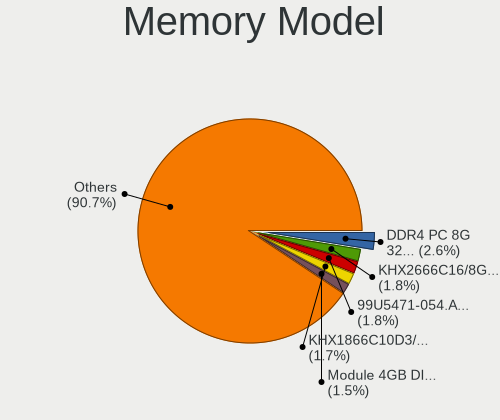

| Model                                                  | Desktops | Percent |
|--------------------------------------------------------|----------|---------|
| Kingston RAM KHX2666C16/8G 8GB DIMM DDR4 3466MT/s      | 11       | 2.15%   |
| Kingston RAM KHX2400C15/8G 8GB DIMM DDR4 3400MT/s      | 9        | 1.76%   |
| Kingston RAM KHX1866C10D3/8G 8GB DIMM DDR3 2133MT/s    | 9        | 1.76%   |
| Kingston RAM 99U5471-054.A00LF 8GB DIMM DDR3 1600MT/s  | 9        | 1.76%   |
| Unknown                                                | 9        | 1.76%   |
| Unknown RAM Module 4GB DIMM 1333MT/s                   | 8        | 1.57%   |
| Kingston RAM KHX1866C10D3/4G 4GB DIMM DDR3 1923MT/s    | 6        | 1.17%   |
| Kingston RAM 99U5584-005.A00LF 4GB DIMM DDR3 1600MT/s  | 6        | 1.17%   |
| Unknown RAM Module 4096MB DIMM 1333MT/s                | 5        | 0.98%   |
| Unknown RAM Module 2GB DIMM 1333MT/s                   | 5        | 0.98%   |
| Unknown RAM Module 2048MB DIMM 1333MT/s                | 5        | 0.98%   |
| Kingston RAM KHX1866C10D3/ 8GB DIMM DDR3 1866MT/s      | 5        | 0.98%   |
| Kingston RAM KHX1600C9D3/4GX 4096MB DIMM DDR3 1600MT/s | 5        | 0.98%   |
| Unknown RAM Module 2GB DIMM DDR2 800MT/s               | 4        | 0.78%   |
| Unknown RAM Module 2GB DIMM DDR2 333MT/s               | 4        | 0.78%   |
| Kingston RAM KHX3200C16D4/16GX 16GB DIMM DDR4 3600MT/s | 4        | 0.78%   |
| Kingston RAM KHX1600C10D3/8G 8GB DIMM DDR3 1648MT/s    | 4        | 0.78%   |
| Kingston RAM KHX1600C10D3/ 4GB DIMM DDR3 1600MT/s      | 4        | 0.78%   |
| Kingston RAM 99U5471-056.A00LF 8GB DIMM DDR3 1600MT/s  | 4        | 0.78%   |
| Crucial RAM BLS8G4D240FSEK.8FBD 8GB DIMM DDR4 2400MT/s | 4        | 0.78%   |
| Unknown RAM Module 8GB DIMM 1600MT/s                   | 3        | 0.59%   |
| Unknown RAM Module 8GB DIMM 1333MT/s                   | 3        | 0.59%   |
| Unknown RAM Module 4GB DIMM SDRAM                      | 3        | 0.59%   |
| Unknown RAM Module 4GB DIMM 1600MT/s                   | 3        | 0.59%   |
| Unknown RAM Module 4096MB DIMM 1066MT/s                | 3        | 0.59%   |
| Unknown RAM Module 2GB DIMM SDRAM                      | 3        | 0.59%   |
| Unknown RAM Module 2GB DIMM DDR2 533MT/s               | 3        | 0.59%   |
| Unknown RAM Module 1GB DIMM SDRAM                      | 3        | 0.59%   |
| Patriot RAM 3200 C16 Series 8GB DIMM DDR4 3600MT/s     | 3        | 0.59%   |
| Novatech RAM N3D04H1600B REV.00 4GB DIMM 1600MT/s      | 3        | 0.59%   |
| Kingston RAM KF3200C16D4/16GX 16GB DIMM DDR4 3200MT/s  | 3        | 0.59%   |
| Kingston RAM 99U5584-003.A00LF 4GB DIMM DDR3 1600MT/s  | 3        | 0.59%   |
| Kingston RAM 99U5474-026.A00LF 4GB DIMM DDR3 1333MT/s  | 3        | 0.59%   |
| Kingston RAM 9905702-204.A00G 8GB DIMM DDR4 2667MT/s   | 3        | 0.59%   |
| Kingston RAM 9905702-119.A00G 8GB DIMM DDR4 2667MT/s   | 3        | 0.59%   |
| Kingston RAM 9905471-001.A01LF 2GB DIMM DDR3 1600MT/s  | 3        | 0.59%   |
| Corsair RAM CMW32GX4M2C3200C16 16GB DIMM DDR4 3400MT/s | 3        | 0.59%   |
| Corsair RAM CMK8GX4M1D3000C16 8GB DIMM DDR4 3200MT/s   | 3        | 0.59%   |
| Corsair RAM CMK16GX4M2B3200C16 8GB DIMM DDR4 3600MT/s  | 3        | 0.59%   |
| A-DATA RAM DDR4 3200 8GB DIMM DDR4 3600MT/s            | 3        | 0.59%   |

Memory Kind
-----------

Memory module kinds

| Kind    | Desktops | Percent |
|---------|----------|---------|
| DDR4    | 176      | 42.82%  |
| DDR3    | 136      | 33.09%  |
| Unknown | 48       | 11.68%  |
| DDR2    | 29       | 7.06%   |
| SDRAM   | 15       | 3.65%   |
| DDR     | 5        | 1.22%   |
| LPDDR4  | 1        | 0.24%   |
| DDR5    | 1        | 0.24%   |

Memory Form Factor
------------------

Physical design of the memory module

| Name   | Desktops | Percent |
|--------|----------|---------|
| DIMM   | 399      | 98.52%  |
| SODIMM | 6        | 1.48%   |

Memory Size
-----------

Memory module size

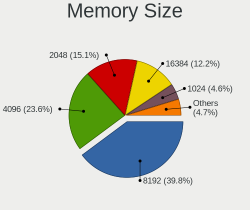

| Size  | Desktops | Percent |
|-------|----------|---------|
| 8192  | 186      | 40.97%  |
| 4096  | 110      | 24.23%  |
| 2048  | 72       | 15.86%  |
| 16384 | 45       | 9.91%   |
| 1024  | 20       | 4.41%   |
| 32768 | 17       | 3.74%   |
| 512   | 3        | 0.66%   |
| 256   | 1        | 0.22%   |

Memory Speed
------------

Memory module speed

| Speed   | Desktops | Percent |
|---------|----------|---------|
| 1600    | 75       | 16.34%  |
| 1333    | 71       | 15.47%  |
| 2400    | 38       | 8.28%   |
| 3200    | 35       | 7.63%   |
| 2667    | 29       | 6.32%   |
| 3600    | 27       | 5.88%   |
| 2133    | 20       | 4.36%   |
| Unknown | 19       | 4.14%   |
| 3400    | 15       | 3.27%   |
| 667     | 13       | 2.83%   |
| 3466    | 12       | 2.61%   |
| 1866    | 11       | 2.4%    |
| 800     | 11       | 2.4%    |
| 2666    | 8        | 1.74%   |
| 533     | 8        | 1.74%   |
| 333     | 8        | 1.74%   |
| 3000    | 6        | 1.31%   |
| 2933    | 5        | 1.09%   |
| 1066    | 5        | 1.09%   |
| 400     | 5        | 1.09%   |
| 2800    | 4        | 0.87%   |
| 1867    | 4        | 0.87%   |
| 3733    | 3        | 0.65%   |
| 1334    | 3        | 0.65%   |
| 3933    | 2        | 0.44%   |
| 3151    | 2        | 0.44%   |
| 3007    | 2        | 0.44%   |
| 1800    | 2        | 0.44%   |
| 52217   | 1        | 0.22%   |
| 8400    | 1        | 0.22%   |
| 4800    | 1        | 0.22%   |
| 3866    | 1        | 0.22%   |
| 3800    | 1        | 0.22%   |
| 3533    | 1        | 0.22%   |
| 3500    | 1        | 0.22%   |
| 3334    | 1        | 0.22%   |
| 3100    | 1        | 0.22%   |
| 2866    | 1        | 0.22%   |
| 2733    | 1        | 0.22%   |
| 2200    | 1        | 0.22%   |

Printers & scanners
-------------------

Printer Vendor
--------------

Printer device vendors

| Vendor              | Desktops | Percent |
|---------------------|----------|---------|
| Hewlett-Packard     | 28       | 52.83%  |
| Brother Industries  | 14       | 26.42%  |
| Seiko Epson         | 4        | 7.55%   |
| Samsung Electronics | 3        | 5.66%   |
| Ricoh               | 1        | 1.89%   |
| Pantum              | 1        | 1.89%   |
| NXP Semiconductors  | 1        | 1.89%   |
| Graphtec America    | 1        | 1.89%   |

Printer Model
-------------

Printer device models

| Model                                         | Desktops | Percent |
|-----------------------------------------------|----------|---------|
| HP LaserJet Professional P1102w               | 5        | 9.43%   |
| HP LaserJet Professional P 1102w              | 3        | 5.66%   |
| Brother HL-1210W series                       | 3        | 5.66%   |
| Brother HL-1200 series                        | 3        | 5.66%   |
| Brother HL-1110 series                        | 3        | 5.66%   |
| Samsung M2020 Series                          | 2        | 3.77%   |
| HP LaserJet P1006                             | 2        | 3.77%   |
| HP LaserJet P1005                             | 2        | 3.77%   |
| HP Ink Tank 110 series                        | 2        | 3.77%   |
| HP DeskJet 2600 series                        | 2        | 3.77%   |
| Brother HL-2130 series                        | 2        | 3.77%   |
| Brother DCP-7055 scanner/printer              | 2        | 3.77%   |
| Seiko Epson XP-240 Series                     | 1        | 1.89%   |
| Seiko Epson ME 340 Series/Stylus NX130 Series | 1        | 1.89%   |
| Seiko Epson L355 Series                       | 1        | 1.89%   |
| Seiko Epson ET-2700 Series                    | 1        | 1.89%   |
| Samsung Xerox Phaser 3117 Laser Printer       | 1        | 1.89%   |
| Ricoh Printing Support                        | 1        | 1.89%   |
| Pantum P2500W series                          | 1        | 1.89%   |
| NXP Semiconductors Printer-80                 | 1        | 1.89%   |
| HP PSC 1400                                   | 1        | 1.89%   |
| HP Officejet 4500 G510a-f                     | 1        | 1.89%   |
| HP Laserjet P1505                             | 1        | 1.89%   |
| HP LaserJet M203-M206                         | 1        | 1.89%   |
| HP LaserJet 3050                              | 1        | 1.89%   |
| HP Ink Tank Wireless 410 series               | 1        | 1.89%   |
| HP DeskJet F4100 Printer series               | 1        | 1.89%   |
| HP DeskJet 810c/812c                          | 1        | 1.89%   |
| HP DeskJet 3630 series                        | 1        | 1.89%   |
| HP Deskjet 3050 J610 series                   | 1        | 1.89%   |
| HP Deskjet 2050 J510                          | 1        | 1.89%   |
| HP Color LaserJet Pro M478f-9f                | 1        | 1.89%   |
| Graphtec America Graphtec Printer             | 1        | 1.89%   |
| Brother DCP-1610NW                            | 1        | 1.89%   |

Scanner Vendor
--------------

Scanner device vendors

| Vendor          | Desktops | Percent |
|-----------------|----------|---------|
| Hewlett-Packard | 1        | 100%    |

Scanner Model
-------------

Scanner device models

| Model            | Desktops | Percent |
|------------------|----------|---------|
| HP ScanJet 2400c | 1        | 100%    |

Camera
------

Camera Vendor
-------------

Camera device vendors

| Vendor                      | Desktops | Percent |
|-----------------------------|----------|---------|
| Logitech                    | 36       | 23.53%  |
| Microdia                    | 16       | 10.46%  |
| Generalplus Technology      | 16       | 10.46%  |
| KYE Systems (Mouse Systems) | 14       | 9.15%   |
| Samsung Electronics         | 12       | 7.84%   |
| Z-Star Microelectronics     | 7        | 4.58%   |
| Chicony Electronics         | 7        | 4.58%   |
| Jieli Technology            | 6        | 3.92%   |
| Microsoft                   | 5        | 3.27%   |
| Apple                       | 5        | 3.27%   |
| Alcor Micro                 | 4        | 2.61%   |
| MacroSilicon                | 3        | 1.96%   |
| Silicon Motion              | 2        | 1.31%   |
| Razer USA                   | 2        | 1.31%   |
| Pixart Imaging              | 2        | 1.31%   |
| OmniVision Technologies     | 2        | 1.31%   |
| Cubeternet                  | 2        | 1.31%   |
| ARC International           | 2        | 1.31%   |
| Sonix Technology            | 1        | 0.65%   |
| Philips (or NXP)            | 1        | 0.65%   |
| IMC Networks                | 1        | 0.65%   |
| Huawei Technologies         | 1        | 0.65%   |
| Genesys Logic               | 1        | 0.65%   |
| Elgato Systems              | 1        | 0.65%   |
| Bison Electronics           | 1        | 0.65%   |
| Aveo Technology             | 1        | 0.65%   |
| Asuscom Network             | 1        | 0.65%   |
| Acer                        | 1        | 0.65%   |

Camera Model
------------

Camera device models

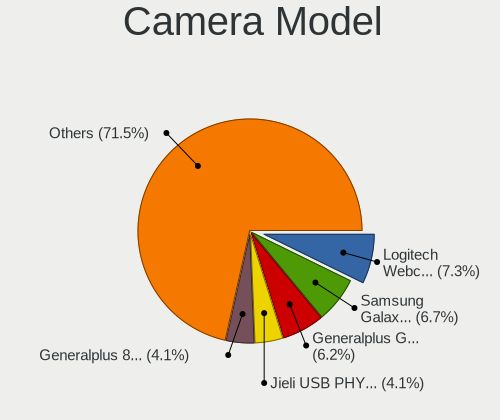

| Model                                              | Desktops | Percent |
|----------------------------------------------------|----------|---------|
| Logitech Webcam C270                               | 13       | 8.5%    |
| Samsung Galaxy series, misc. (MTP mode)            | 11       | 7.19%   |
| Generalplus GENERAL WEBCAM                         | 10       | 6.54%   |
| Microdia USB Camera                                | 6        | 3.92%   |
| Logitech HD Pro Webcam C920                        | 6        | 3.92%   |
| Jieli USB PHY 2.0                                  | 6        | 3.92%   |
| Logitech C922 Pro Stream Webcam                    | 5        | 3.27%   |
| Generalplus 808 Camera #9 (web-cam mode)           | 5        | 3.27%   |
| Apple iPhone 5/5C/5S/6/SE                          | 5        | 3.27%   |
| Microdia Webcam Vitade AF                          | 4        | 2.61%   |
| Microdia Integrated Camera                         | 4        | 2.61%   |
| Alcor Micro USB 2.0 PC Camera                      | 4        | 2.61%   |
| Z-Star Venus USB2.0 Camera                         | 3        | 1.96%   |
| Microsoft LifeCam VX-800                           | 3        | 1.96%   |
| MacroSilicon USB3. 0 capture                       | 3        | 1.96%   |
| KYE Systems (Mouse Systems) Genius Webcam          | 3        | 1.96%   |
| KYE Systems (Mouse Systems) Genius FaceCam 320     | 3        | 1.96%   |
| Chicony HP 0.3MP Webcam                            | 3        | 1.96%   |
| Z-Star A4 TECH USB2.0 PC Camera E                  | 2        | 1.31%   |
| KYE Systems (Mouse Systems) Genius iSlim 2000AF V2 | 2        | 1.31%   |
| KYE Systems (Mouse Systems) FaceCam 1000X          | 2        | 1.31%   |
| Cubeternet WebCam                                  | 2        | 1.31%   |
| Chicony HP High Definition 1MP Webcam              | 2        | 1.31%   |
| ARC International Camera                           | 2        | 1.31%   |
| Z-Star USB 2.0 Web Camera                          | 1        | 0.65%   |
| Z-Star Integrated Camera                           | 1        | 0.65%   |
| Sonix GENERAL WEBCAM                               | 1        | 0.65%   |
| Silicon Motion SM731 Camera                        | 1        | 0.65%   |
| Silicon Motion Endoscope camera                    | 1        | 0.65%   |
| Samsung Galaxy (debugging mode)                    | 1        | 0.65%   |
| Razer USA Razer Ripsaw HD - Game Capture Card      | 1        | 0.65%   |
| Razer USA Gaming Webcam [Kiyo]                     | 1        | 0.65%   |
| Pixart Imaging Webcam Genius iLook 300             | 1        | 0.65%   |
| Pixart Imaging GE 1.3 MP MiniCam Pro               | 1        | 0.65%   |
| Philips (or NXP) Webcam SPC530NC                   | 1        | 0.65%   |
| OmniVision OV511+ Webcam                           | 1        | 0.65%   |
| OmniVision Monitor Webcam                          | 1        | 0.65%   |
| Microsoft LifeCam VX-500 [1357]                    | 1        | 0.65%   |
| Microsoft LifeCam HD-3000                          | 1        | 0.65%   |
| Microdia USB 2.0 Camera                            | 1        | 0.65%   |

Security
--------

Fingerprint Vendor
------------------

Fingerprint sensor vendors

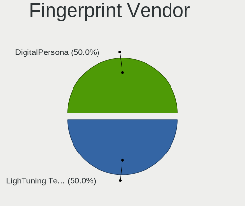

| Vendor         | Desktops | Percent |
|----------------|----------|---------|
| DigitalPersona | 1        | 100%    |

Fingerprint Model
-----------------

Fingerprint sensor models

| Model                             | Desktops | Percent |
|-----------------------------------|----------|---------|
| DigitalPersona Fingerprint Reader | 1        | 100%    |

Chipcard Vendor
---------------

Chipcard module vendors

Zero info for selected period =(

Chipcard Model
--------------

Chipcard module models

Zero info for selected period =(

Unsupported
-----------

Unsupported Devices
-------------------

Total unsupported devices on board

| Total | Desktops | Percent |
|-------|----------|---------|
| 0     | 727      | 84.14%  |
| 1     | 115      | 13.31%  |
| 2     | 17       | 1.97%   |
| 3     | 2        | 0.23%   |
| 6     | 1        | 0.12%   |
| 5     | 1        | 0.12%   |
| 4     | 1        | 0.12%   |

Unsupported Device Types
------------------------

Types of unsupported devices

| Type                     | Desktops | Percent |
|--------------------------|----------|---------|
| Graphics card            | 72       | 45.28%  |
| Net/wireless             | 38       | 23.9%   |
| Communication controller | 9        | 5.66%   |
| Camera                   | 8        | 5.03%   |
| Sound                    | 6        | 3.77%   |
| Net/ethernet             | 6        | 3.77%   |
| Unassigned class         | 3        | 1.89%   |
| Multimedia controller    | 3        | 1.89%   |
| Modem                    | 3        | 1.89%   |
| Bluetooth                | 3        | 1.89%   |
| Storage/ide              | 2        | 1.26%   |
| Network                  | 2        | 1.26%   |
| Firewire controller      | 2        | 1.26%   |
| Fingerprint reader       | 1        | 0.63%   |
| Dvb card                 | 1        | 0.63%   |

