Linux in Argentina - Tested Hardware & Statistics (Desktops)
------------------------------------------------------------

A project to collect tested hardware configurations for Linux in Argentina.

Anyone can contribute to this report by the [hw-probe](https://github.com/linuxhw/hw-probe) tool:

    sudo -E hw-probe -all -upload

Please contribute! Especially if your hardware is rare.

Contents
--------

* [ Test Cases ](#test-cases)

* [ System ](#system)
  - [ OS                       ](#os)
  - [ OS Family                ](#os-family)
  - [ Kernel                   ](#kernel)
  - [ Kernel Family            ](#kernel-family)
  - [ Kernel Major Ver.        ](#kernel-major-ver)
  - [ Arch                     ](#arch)
  - [ DE                       ](#de)
  - [ Display Server           ](#display-server)
  - [ Display Manager          ](#display-manager)
  - [ OS Lang                  ](#os-lang)
  - [ Boot Mode                ](#boot-mode)
  - [ Filesystem               ](#filesystem)
  - [ Part. scheme             ](#part-scheme)
  - [ Dual Boot with Linux/BSD ](#dual-boot-with-linuxbsd)
  - [ Dual Boot (Win)          ](#dual-boot-win)

* [ Board ](#board)
  - [ Vendor                   ](#vendor)
  - [ Model                    ](#model)
  - [ Model Family             ](#model-family)
  - [ MFG Year                 ](#mfg-year)
  - [ Form Factor              ](#form-factor)
  - [ Secure Boot              ](#secure-boot)
  - [ Coreboot                 ](#coreboot)
  - [ RAM Size                 ](#ram-size)
  - [ RAM Used                 ](#ram-used)
  - [ Total Drives             ](#total-drives)
  - [ Has CD-ROM               ](#has-cd-rom)
  - [ Has Ethernet             ](#has-ethernet)
  - [ Has WiFi                 ](#has-wifi)
  - [ Has Bluetooth            ](#has-bluetooth)

* [ Location ](#location)
  - [ Country                  ](#country)
  - [ City                     ](#city)

* [ Drives ](#drives)
  - [ Drive Vendor             ](#drive-vendor)
  - [ Drive Model              ](#drive-model)
  - [ HDD Vendor               ](#hdd-vendor)
  - [ SSD Vendor               ](#ssd-vendor)
  - [ Drive Kind               ](#drive-kind)
  - [ Drive Connector          ](#drive-connector)
  - [ Drive Size               ](#drive-size)
  - [ Space Total              ](#space-total)
  - [ Space Used               ](#space-used)
  - [ Malfunc. Drives          ](#malfunc-drives)
  - [ Malfunc. Drive Vendor    ](#malfunc-drive-vendor)
  - [ Malfunc. HDD Vendor      ](#malfunc-hdd-vendor)
  - [ Malfunc. Drive Kind      ](#malfunc-drive-kind)
  - [ Failed Drives            ](#failed-drives)
  - [ Failed Drive Vendor      ](#failed-drive-vendor)
  - [ Drive Status             ](#drive-status)

* [ Storage controller ](#storage-controller)
  - [ Storage Vendor           ](#storage-vendor)
  - [ Storage Model            ](#storage-model)
  - [ Storage Kind             ](#storage-kind)

* [ Processor ](#processor)
  - [ CPU Vendor               ](#cpu-vendor)
  - [ CPU Model                ](#cpu-model)
  - [ CPU Model Family         ](#cpu-model-family)
  - [ CPU Cores                ](#cpu-cores)
  - [ CPU Sockets              ](#cpu-sockets)
  - [ CPU Threads              ](#cpu-threads)
  - [ CPU Op-Modes             ](#cpu-op-modes)
  - [ CPU Microcode            ](#cpu-microcode)
  - [ CPU Microarch            ](#cpu-microarch)

* [ Graphics ](#graphics)
  - [ GPU Vendor               ](#gpu-vendor)
  - [ GPU Model                ](#gpu-model)
  - [ GPU Combo                ](#gpu-combo)
  - [ GPU Driver               ](#gpu-driver)
  - [ GPU Memory               ](#gpu-memory)

* [ Monitor ](#monitor)
  - [ Monitor Vendor           ](#monitor-vendor)
  - [ Monitor Model            ](#monitor-model)
  - [ Monitor Resolution       ](#monitor-resolution)
  - [ Monitor Diagonal         ](#monitor-diagonal)
  - [ Monitor Width            ](#monitor-width)
  - [ Aspect Ratio             ](#aspect-ratio)
  - [ Monitor Area             ](#monitor-area)
  - [ Pixel Density            ](#pixel-density)
  - [ Multiple Monitors        ](#multiple-monitors)

* [ Network ](#network)
  - [ Net Controller Vendor    ](#net-controller-vendor)
  - [ Net Controller Model     ](#net-controller-model)
  - [ Wireless Vendor          ](#wireless-vendor)
  - [ Wireless Model           ](#wireless-model)
  - [ Ethernet Vendor          ](#ethernet-vendor)
  - [ Ethernet Model           ](#ethernet-model)
  - [ Net Controller Kind      ](#net-controller-kind)
  - [ Used Controller          ](#used-controller)
  - [ NICs                     ](#nics)
  - [ IPv6                     ](#ipv6)

* [ Bluetooth ](#bluetooth)
  - [ Bluetooth Vendor         ](#bluetooth-vendor)
  - [ Bluetooth Model          ](#bluetooth-model)

* [ Sound ](#sound)
  - [ Sound Vendor             ](#sound-vendor)
  - [ Sound Model              ](#sound-model)

* [ Memory ](#memory)
  - [ Memory Vendor            ](#memory-vendor)
  - [ Memory Model             ](#memory-model)
  - [ Memory Kind              ](#memory-kind)
  - [ Memory Form Factor       ](#memory-form-factor)
  - [ Memory Size              ](#memory-size)
  - [ Memory Speed             ](#memory-speed)

* [ Printers & scanners ](#printers--scanners)
  - [ Printer Vendor           ](#printer-vendor)
  - [ Printer Model            ](#printer-model)
  - [ Scanner Vendor           ](#scanner-vendor)
  - [ Scanner Model            ](#scanner-model)

* [ Camera ](#camera)
  - [ Camera Vendor            ](#camera-vendor)
  - [ Camera Model             ](#camera-model)

* [ Security ](#security)
  - [ Fingerprint Vendor       ](#fingerprint-vendor)
  - [ Fingerprint Model        ](#fingerprint-model)
  - [ Chipcard Vendor          ](#chipcard-vendor)
  - [ Chipcard Model           ](#chipcard-model)

* [ Unsupported ](#unsupported)
  - [ Unsupported Devices      ](#unsupported-devices)
  - [ Unsupported Device Types ](#unsupported-device-types)

Test Cases
----------

Total: 947

| Vendor        | Model                       | Probe                                                      | Date         |
|---------------|-----------------------------|------------------------------------------------------------|--------------|
| Gigabyte      | B360 AORUS GAMING 3-CF      | [87a1c21540](https://linux-hardware.org/?probe=87a1c21540) | Oct 01, 2022 |
| Gigabyte      | H510M H                     | [51a7f36a69](https://linux-hardware.org/?probe=51a7f36a69) | Sep 29, 2022 |
| Biostar       | H55 HD                      | [bde8e0a133](https://linux-hardware.org/?probe=bde8e0a133) | Sep 28, 2022 |
| MSI           | A68HM-E33 V2                | [d51c90a7a8](https://linux-hardware.org/?probe=d51c90a7a8) | Sep 27, 2022 |
| ASUSTek       | PRO A320M-R WI-FI           | [e760f06cef](https://linux-hardware.org/?probe=e760f06cef) | Sep 25, 2022 |
| ASUSTek       | ROG CROSSHAIR VIII DARK ... | [9931b35717](https://linux-hardware.org/?probe=9931b35717) | Sep 24, 2022 |
| Lenovo        | 30D9 SDK0J40705 WIN 3425... | [75854836f7](https://linux-hardware.org/?probe=75854836f7) | Sep 20, 2022 |
| Intel         | HURONRIVER                  | [e4e09c23e5](https://linux-hardware.org/?probe=e4e09c23e5) | Sep 19, 2022 |
| Gigabyte      | A320M-S2H-CF                | [7b95813c96](https://linux-hardware.org/?probe=7b95813c96) | Sep 18, 2022 |
| Gigabyte      | B450 I AORUS PRO WIFI-CF    | [b3350b3f69](https://linux-hardware.org/?probe=b3350b3f69) | Sep 17, 2022 |
| Gigabyte      | G31M-S2C                    | [f7f3a2e7c8](https://linux-hardware.org/?probe=f7f3a2e7c8) | Sep 17, 2022 |
| ASUSTek       | ROG STRIX B550-F GAMING     | [d4d8cc3f34](https://linux-hardware.org/?probe=d4d8cc3f34) | Sep 16, 2022 |
| Exo           | H310CH5-M2                  | [9154b5149b](https://linux-hardware.org/?probe=9154b5149b) | Sep 14, 2022 |
| ASRock        | N68-S3 UCC                  | [e59aa2e1d5](https://linux-hardware.org/?probe=e59aa2e1d5) | Sep 13, 2022 |
| ASRock        | N68-S3 UCC                  | [930da2e105](https://linux-hardware.org/?probe=930da2e105) | Sep 13, 2022 |
| Gigabyte      | H61M-DS2                    | [105dae5731](https://linux-hardware.org/?probe=105dae5731) | Sep 11, 2022 |
| ASUSTek       | P8B75-M LX                  | [0533bc0e86](https://linux-hardware.org/?probe=0533bc0e86) | Sep 10, 2022 |
| Gigabyte      | M68MT-S2                    | [86af6e4676](https://linux-hardware.org/?probe=86af6e4676) | Sep 08, 2022 |
| MSI           | A320M PRO-M2 V2             | [c211642362](https://linux-hardware.org/?probe=c211642362) | Sep 06, 2022 |
| ASUSTek       | ROG STRIX B550-F GAMING     | [fc5e3d8261](https://linux-hardware.org/?probe=fc5e3d8261) | Sep 05, 2022 |
| Gigabyte      | H110M-H-CF                  | [86fc2bf58f](https://linux-hardware.org/?probe=86fc2bf58f) | Aug 31, 2022 |
| Gigabyte      | BOLD E3032                  | [115b09b849](https://linux-hardware.org/?probe=115b09b849) | Aug 30, 2022 |
| Gigabyte      | H81M-DS2                    | [373a11a297](https://linux-hardware.org/?probe=373a11a297) | Aug 29, 2022 |
| Gigabyte      | F2A68HM-H                   | [c824203d0a](https://linux-hardware.org/?probe=c824203d0a) | Aug 24, 2022 |
| Gigabyte      | BOLD E3032                  | [4b70fe47a2](https://linux-hardware.org/?probe=4b70fe47a2) | Aug 23, 2022 |
| ASUSTek       | Z97-C                       | [58f88a4494](https://linux-hardware.org/?probe=58f88a4494) | Aug 17, 2022 |
| ASUSTek       | Z97-C                       | [e68b5affa4](https://linux-hardware.org/?probe=e68b5affa4) | Aug 16, 2022 |
| ASRock        | H55M                        | [8d0bd0d2d2](https://linux-hardware.org/?probe=8d0bd0d2d2) | Aug 15, 2022 |
| Gigabyte      | B450M AORUS ELITE           | [c001e6e62b](https://linux-hardware.org/?probe=c001e6e62b) | Aug 12, 2022 |
| ASUSTek       | P5SD2-VM                    | [6b5082a45c](https://linux-hardware.org/?probe=6b5082a45c) | Aug 12, 2022 |
| ASUSTek       | P5SD2-VM                    | [d77caddb55](https://linux-hardware.org/?probe=d77caddb55) | Aug 12, 2022 |
| MSI           | A68HM-E33 V2                | [2f3db9cd91](https://linux-hardware.org/?probe=2f3db9cd91) | Aug 12, 2022 |
| ASRock        | H81M-DGS                    | [31bdc504d4](https://linux-hardware.org/?probe=31bdc504d4) | Aug 10, 2022 |
| Gigabyte      | B450M AORUS ELITE           | [7cca0b0d07](https://linux-hardware.org/?probe=7cca0b0d07) | Aug 09, 2022 |
| ASUSTek       | M5A88-V EVO                 | [b07157a232](https://linux-hardware.org/?probe=b07157a232) | Aug 08, 2022 |
| ASRock        | N68-VGS3 FX                 | [18d8a04343](https://linux-hardware.org/?probe=18d8a04343) | Aug 08, 2022 |
| Intel         | 945GCT-M                    | [0481d5180e](https://linux-hardware.org/?probe=0481d5180e) | Aug 06, 2022 |
| Gigabyte      | B450M AORUS ELITE           | [ab52d0fc52](https://linux-hardware.org/?probe=ab52d0fc52) | Aug 05, 2022 |
| Intel         | DH55HC AAE70933-502         | [a484fb9cc8](https://linux-hardware.org/?probe=a484fb9cc8) | Aug 02, 2022 |
| Gigabyte      | F2A68HM-H                   | [047d3c88ad](https://linux-hardware.org/?probe=047d3c88ad) | Jul 31, 2022 |
| Intel         | DH61BF AAG81311-101         | [5a3ed0cf62](https://linux-hardware.org/?probe=5a3ed0cf62) | Jul 30, 2022 |
| Intel         | DH61BF AAG81311-101         | [719bbf817c](https://linux-hardware.org/?probe=719bbf817c) | Jul 30, 2022 |
| MSI           | B550M-A PRO                 | [14bbcb7e47](https://linux-hardware.org/?probe=14bbcb7e47) | Jul 30, 2022 |
| ASRock        | Z97 Pro4                    | [0db03812df](https://linux-hardware.org/?probe=0db03812df) | Jul 29, 2022 |
| MSI           | Z370 GAMING M5              | [b9ec9e3dd4](https://linux-hardware.org/?probe=b9ec9e3dd4) | Jul 28, 2022 |
| Gigabyte      | H410M H                     | [eb92148078](https://linux-hardware.org/?probe=eb92148078) | Jul 28, 2022 |
| ASUSTek       | PRIME A520M-K               | [cea12b9c9c](https://linux-hardware.org/?probe=cea12b9c9c) | Jul 27, 2022 |
| Gigabyte      | Z87-D3HP-CF                 | [88b45b1956](https://linux-hardware.org/?probe=88b45b1956) | Jul 26, 2022 |
| Biostar       | G31-M7 TE                   | [df98c1834c](https://linux-hardware.org/?probe=df98c1834c) | Jul 23, 2022 |
| Gigabyte      | 970A-UD3P                   | [72a44c6eea](https://linux-hardware.org/?probe=72a44c6eea) | Jul 23, 2022 |
| ASUSTek       | Maximus IX HERO             | [73a12fbe59](https://linux-hardware.org/?probe=73a12fbe59) | Jul 21, 2022 |
| Gigabyte      | B75M-HD3                    | [321d2817a3](https://linux-hardware.org/?probe=321d2817a3) | Jul 21, 2022 |
| Dell          | 0DR845                      | [cf4bcf9de8](https://linux-hardware.org/?probe=cf4bcf9de8) | Jul 19, 2022 |
| ASUSTek       | PRIME A320M-K               | [48d9b9f502](https://linux-hardware.org/?probe=48d9b9f502) | Jul 18, 2022 |
| ASUSTek       | PRIME B460M-A R2.0          | [3e2c54f9f1](https://linux-hardware.org/?probe=3e2c54f9f1) | Jul 17, 2022 |
| ASRock        | A55M-VS                     | [844ac53526](https://linux-hardware.org/?probe=844ac53526) | Jul 14, 2022 |
| ASRock        | A55M-VS                     | [3b8f491017](https://linux-hardware.org/?probe=3b8f491017) | Jul 14, 2022 |
| Gigabyte      | Z270X-Ultra Gaming-CF       | [c90a0cbab7](https://linux-hardware.org/?probe=c90a0cbab7) | Jul 13, 2022 |
| Gigabyte      | Z270X-Ultra Gaming-CF       | [87fa08ea59](https://linux-hardware.org/?probe=87fa08ea59) | Jul 13, 2022 |
| Lenovo        | Annapurna CRB NOK           | [46d0d5dccc](https://linux-hardware.org/?probe=46d0d5dccc) | Jul 12, 2022 |
| ECS           | H110M4-C23                  | [4a4af6d2e9](https://linux-hardware.org/?probe=4a4af6d2e9) | Jul 08, 2022 |
| Intel         | DG35EC AAE29266-205         | [5b90bd12c7](https://linux-hardware.org/?probe=5b90bd12c7) | Jul 07, 2022 |
| Intel         | DG35EC AAE29266-205         | [9c2136e4eb](https://linux-hardware.org/?probe=9c2136e4eb) | Jul 07, 2022 |
| Gigabyte      | Z87-HD3                     | [95e6ec0822](https://linux-hardware.org/?probe=95e6ec0822) | Jul 05, 2022 |
| Intel         | DN2820FYB H24582-205        | [147320c75c](https://linux-hardware.org/?probe=147320c75c) | Jul 04, 2022 |
| Gigabyte      | Z87-HD3                     | [28429fdd32](https://linux-hardware.org/?probe=28429fdd32) | Jul 02, 2022 |
| Intel         | DX58SO AAE29331-703         | [3b22974574](https://linux-hardware.org/?probe=3b22974574) | Jul 01, 2022 |
| Gigabyte      | Z87-HD3                     | [c38c4e9cb9](https://linux-hardware.org/?probe=c38c4e9cb9) | Jun 30, 2022 |
| ASUSTek       | PRIME Z370-A                | [28479b3edf](https://linux-hardware.org/?probe=28479b3edf) | Jun 30, 2022 |
| Gigabyte      | Z87-HD3                     | [8d9a85c7f3](https://linux-hardware.org/?probe=8d9a85c7f3) | Jun 30, 2022 |
| Gigabyte      | Z87-HD3                     | [e1fbeb3d53](https://linux-hardware.org/?probe=e1fbeb3d53) | Jun 29, 2022 |
| Gigabyte      | Z87X-D3H-CF                 | [ff60a3cb61](https://linux-hardware.org/?probe=ff60a3cb61) | Jun 28, 2022 |
| ASUSTek       | PRIME A320M-K               | [af267c59cd](https://linux-hardware.org/?probe=af267c59cd) | Jun 28, 2022 |
| HP            | 8054                        | [82dd44f05f](https://linux-hardware.org/?probe=82dd44f05f) | Jun 26, 2022 |
| MSI           | MAG X570S TOMAHAWK MAX W... | [1e7e58ae1d](https://linux-hardware.org/?probe=1e7e58ae1d) | Jun 23, 2022 |
| Gigabyte      | Z87-HD3                     | [21d2b9f0fb](https://linux-hardware.org/?probe=21d2b9f0fb) | Jun 23, 2022 |
| Gigabyte      | Z270X-Ultra Gaming-CF       | [92944b1e97](https://linux-hardware.org/?probe=92944b1e97) | Jun 22, 2022 |
| HP            | 3646h                       | [d27deccf27](https://linux-hardware.org/?probe=d27deccf27) | Jun 22, 2022 |
| Dell          | 01HYR7 A01                  | [465ffdd126](https://linux-hardware.org/?probe=465ffdd126) | Jun 21, 2022 |
| ASRock        | G41M-GS                     | [9167934132](https://linux-hardware.org/?probe=9167934132) | Jun 18, 2022 |
| HP            | 0A60h                       | [cb42238223](https://linux-hardware.org/?probe=cb42238223) | Jun 17, 2022 |
| Dell          | 01HYR7 A01                  | [4e33fa1a1d](https://linux-hardware.org/?probe=4e33fa1a1d) | Jun 15, 2022 |
| Dell          | 01HYR7 A01                  | [71f9801165](https://linux-hardware.org/?probe=71f9801165) | Jun 15, 2022 |
| MSI           | 3664h                       | [5fbb22c653](https://linux-hardware.org/?probe=5fbb22c653) | Jun 15, 2022 |
| MSI           | B550M PRO-VDH               | [9916ed24a9](https://linux-hardware.org/?probe=9916ed24a9) | Jun 15, 2022 |
| Intel         | DN2820FYB H24582-205        | [c8b26ae553](https://linux-hardware.org/?probe=c8b26ae553) | Jun 13, 2022 |
| Intel         | DN2820FYB H24582-205        | [65bbf05cb0](https://linux-hardware.org/?probe=65bbf05cb0) | Jun 13, 2022 |
| ASRock        | 960GM-VGS3 FX               | [82aa782cce](https://linux-hardware.org/?probe=82aa782cce) | Jun 08, 2022 |
| ASRock        | H55M                        | [058eceb951](https://linux-hardware.org/?probe=058eceb951) | Jun 07, 2022 |
| ASRock        | Z97M Anniversary            | [1855124dd3](https://linux-hardware.org/?probe=1855124dd3) | Jun 07, 2022 |
| ASUSTek       | M5A78L-M LX PLUS            | [b3a7546aa9](https://linux-hardware.org/?probe=b3a7546aa9) | Jun 06, 2022 |
| ASRock        | A520M Pro4                  | [6c408a6fd7](https://linux-hardware.org/?probe=6c408a6fd7) | Jun 05, 2022 |
| Gigabyte      | B75M-D3H                    | [da04a03393](https://linux-hardware.org/?probe=da04a03393) | Jun 04, 2022 |
| MSI           | B550M-A PRO                 | [94a496851b](https://linux-hardware.org/?probe=94a496851b) | Jun 01, 2022 |
| Intel         | DN2820FYB H24582-205        | [45175a7f3b](https://linux-hardware.org/?probe=45175a7f3b) | Jun 01, 2022 |
| ASUSTek       | H81M-A                      | [d24672a3cd](https://linux-hardware.org/?probe=d24672a3cd) | May 31, 2022 |
| Gigabyte      | B75M-D3V                    | [30be732591](https://linux-hardware.org/?probe=30be732591) | May 29, 2022 |
| ASUSTek       | 970 PRO GAMING/AURA         | [7fd1e065eb](https://linux-hardware.org/?probe=7fd1e065eb) | May 29, 2022 |
| MSI           | PRO B660M-A WIFI DDR4       | [8546d9cf10](https://linux-hardware.org/?probe=8546d9cf10) | May 27, 2022 |
| ASUSTek       | M4A88TD-V EVO/USB3          | [bb0591d5c8](https://linux-hardware.org/?probe=bb0591d5c8) | May 26, 2022 |
| American M... | K7S41GX                     | [b311270c22](https://linux-hardware.org/?probe=b311270c22) | May 26, 2022 |
| ASRock        | Z270 Gaming K6              | [fbf8e08024](https://linux-hardware.org/?probe=fbf8e08024) | May 25, 2022 |
| Gigabyte      | B85M-D3H-A                  | [36e5918bc8](https://linux-hardware.org/?probe=36e5918bc8) | May 25, 2022 |
| Gigabyte      | A320M-S2H-CF                | [0754e1c6e6](https://linux-hardware.org/?probe=0754e1c6e6) | May 23, 2022 |
| Dell          | 01HYR7 A01                  | [2cd1f7fd5e](https://linux-hardware.org/?probe=2cd1f7fd5e) | May 23, 2022 |
| Gigabyte      | A320M-S2H-CF                | [900181bbff](https://linux-hardware.org/?probe=900181bbff) | May 22, 2022 |
| Gigabyte      | AX370M-Gaming 3-CF          | [830532746e](https://linux-hardware.org/?probe=830532746e) | May 20, 2022 |
| Gigabyte      | AX370M-Gaming 3-CF          | [27289062cb](https://linux-hardware.org/?probe=27289062cb) | May 19, 2022 |
| Gigabyte      | Z370 AORUS ULTRA GAMING-... | [ea23b1fec2](https://linux-hardware.org/?probe=ea23b1fec2) | May 18, 2022 |
| MSI           | A320M-A PRO MAX             | [13bacdb7b6](https://linux-hardware.org/?probe=13bacdb7b6) | May 18, 2022 |
| MSI           | B550M PRO-VDH               | [fd15b34806](https://linux-hardware.org/?probe=fd15b34806) | May 13, 2022 |
| Intel         | DN2820FYB H24582-205        | [5af3adc742](https://linux-hardware.org/?probe=5af3adc742) | May 13, 2022 |
| Gigabyte      | A520M H                     | [d3088d7665](https://linux-hardware.org/?probe=d3088d7665) | May 11, 2022 |
| Intel         | DN2820FYB H24582-205        | [ba9835cb43](https://linux-hardware.org/?probe=ba9835cb43) | May 10, 2022 |
| Gigabyte      | B75M-D3H                    | [b9437261b7](https://linux-hardware.org/?probe=b9437261b7) | May 10, 2022 |
| Foxconn       | LIMA                        | [fc4662a00e](https://linux-hardware.org/?probe=fc4662a00e) | May 09, 2022 |
| ASUSTek       | 970 PRO GAMING/AURA         | [422c9f9cae](https://linux-hardware.org/?probe=422c9f9cae) | May 09, 2022 |
| ASUSTek       | M5A97 LE R2.0               | [f84e562503](https://linux-hardware.org/?probe=f84e562503) | May 06, 2022 |
| MSI           | MPG Z490 GAMING EDGE WIF... | [76e6cc98aa](https://linux-hardware.org/?probe=76e6cc98aa) | May 05, 2022 |
| MSI           | B550M PRO-VDH               | [40f4bf344a](https://linux-hardware.org/?probe=40f4bf344a) | May 05, 2022 |
| Gigabyte      | H81M-S1                     | [8a7d82f85b](https://linux-hardware.org/?probe=8a7d82f85b) | May 03, 2022 |
| ASUSTek       | PRIME B550M-K               | [92c09fc927](https://linux-hardware.org/?probe=92c09fc927) | Apr 30, 2022 |
| Gigabyte      | X570 AORUS ULTRA            | [d3872db37e](https://linux-hardware.org/?probe=d3872db37e) | Apr 29, 2022 |
| Gigabyte      | Z370 AORUS Gaming 5-CF      | [2cfdf9b28a](https://linux-hardware.org/?probe=2cfdf9b28a) | Apr 29, 2022 |
| Dell          | 01HYR7 A01                  | [d7757bf097](https://linux-hardware.org/?probe=d7757bf097) | Apr 27, 2022 |
| ASRock        | B450 Steel Legend           | [bf0a56358c](https://linux-hardware.org/?probe=bf0a56358c) | Apr 27, 2022 |
| MSI           | 880GMA-E35                  | [6ff68166f7](https://linux-hardware.org/?probe=6ff68166f7) | Apr 26, 2022 |
| Gigabyte      | X570 AORUS ULTRA            | [00728feb75](https://linux-hardware.org/?probe=00728feb75) | Apr 26, 2022 |
| Intel         | DN2820FYB H24582-205        | [fb612cbcd5](https://linux-hardware.org/?probe=fb612cbcd5) | Apr 24, 2022 |
| ASUSTek       | H170M-PLUS                  | [86f45617ad](https://linux-hardware.org/?probe=86f45617ad) | Apr 22, 2022 |
| ASUSTek       | H170M-PLUS                  | [c021555957](https://linux-hardware.org/?probe=c021555957) | Apr 21, 2022 |
| ASUSTek       | P5K Deluxe                  | [e7b66178ce](https://linux-hardware.org/?probe=e7b66178ce) | Apr 17, 2022 |
| ASUSTek       | ROG STRIX X570-E GAMING     | [f28318e17b](https://linux-hardware.org/?probe=f28318e17b) | Apr 14, 2022 |
| ASUSTek       | Maximus IX HERO             | [624c5a033e](https://linux-hardware.org/?probe=624c5a033e) | Apr 14, 2022 |
| ASUSTek       | P8H77-M                     | [a5a366f7e7](https://linux-hardware.org/?probe=a5a366f7e7) | Apr 13, 2022 |
| MSI           | H81M-E33                    | [460099f77f](https://linux-hardware.org/?probe=460099f77f) | Apr 13, 2022 |
| MSI           | H510M-A PRO                 | [d93ab23121](https://linux-hardware.org/?probe=d93ab23121) | Apr 10, 2022 |
| MSI           | A68HM-E33 V2                | [cfa5407b7f](https://linux-hardware.org/?probe=cfa5407b7f) | Apr 10, 2022 |
| Intel         | DN2820FYB H24582-205        | [48e5060f20](https://linux-hardware.org/?probe=48e5060f20) | Apr 10, 2022 |
| Unknown       | P4M800CE-8237               | [4c6b9a3f5e](https://linux-hardware.org/?probe=4c6b9a3f5e) | Apr 06, 2022 |
| Intel         | DN2820FYB H24582-205        | [a19db5a006](https://linux-hardware.org/?probe=a19db5a006) | Apr 05, 2022 |
| CX / Air C... | CX-H87-M1                   | [ddfbf2df5e](https://linux-hardware.org/?probe=ddfbf2df5e) | Apr 01, 2022 |
| CX / Air C... | CX-H87-M1                   | [5a8ee938ce](https://linux-hardware.org/?probe=5a8ee938ce) | Apr 01, 2022 |
| Gigabyte      | H370M DS3H-CF               | [1110b2974c](https://linux-hardware.org/?probe=1110b2974c) | Mar 31, 2022 |
| MSI           | MS-7388                     | [d5eabb8266](https://linux-hardware.org/?probe=d5eabb8266) | Mar 30, 2022 |
| Gigabyte      | Z490 AORUS ELITE            | [f8c03d6697](https://linux-hardware.org/?probe=f8c03d6697) | Mar 28, 2022 |
| Gigabyte      | B450 GAMING X               | [2d57761ba8](https://linux-hardware.org/?probe=2d57761ba8) | Mar 26, 2022 |
| Intel         | DN2820FYB H24582-205        | [87a81b14f0](https://linux-hardware.org/?probe=87a81b14f0) | Mar 25, 2022 |
| ASUSTek       | M5A78L-M LX                 | [b5ee1f293e](https://linux-hardware.org/?probe=b5ee1f293e) | Mar 25, 2022 |
| Gigabyte      | H510M H                     | [d809ca0f7a](https://linux-hardware.org/?probe=d809ca0f7a) | Mar 25, 2022 |
| Gigabyte      | H270-Gaming 3               | [90ce7b8310](https://linux-hardware.org/?probe=90ce7b8310) | Mar 24, 2022 |
| HP            | 8054                        | [38288fadf8](https://linux-hardware.org/?probe=38288fadf8) | Mar 21, 2022 |
| Intel         | DG35EC AAE29266-205         | [0008f2b843](https://linux-hardware.org/?probe=0008f2b843) | Mar 20, 2022 |
| Intel         | DG35EC AAE29266-205         | [34d7600473](https://linux-hardware.org/?probe=34d7600473) | Mar 20, 2022 |
| Gigabyte      | X570 GAMING X               | [555255cb84](https://linux-hardware.org/?probe=555255cb84) | Mar 19, 2022 |
| Gigabyte      | B75M-D3V                    | [116074683a](https://linux-hardware.org/?probe=116074683a) | Mar 19, 2022 |
| ASUSTek       | P7H55D-M EVO                | [2e70de8c8d](https://linux-hardware.org/?probe=2e70de8c8d) | Mar 19, 2022 |
| Gigabyte      | M68MT-S2P                   | [74bdda89c3](https://linux-hardware.org/?probe=74bdda89c3) | Mar 18, 2022 |
| Gigabyte      | B450M DS3H-CF               | [b2ec039a2e](https://linux-hardware.org/?probe=b2ec039a2e) | Mar 17, 2022 |
| ASRock        | FM2A88X Extreme4+           | [7e32829960](https://linux-hardware.org/?probe=7e32829960) | Mar 13, 2022 |
| MSI           | H110M PRO-VH PLUS           | [fc3707d356](https://linux-hardware.org/?probe=fc3707d356) | Mar 09, 2022 |
| Gigabyte      | Z97X-Gaming 3               | [5aa4d54781](https://linux-hardware.org/?probe=5aa4d54781) | Mar 09, 2022 |
| ASUSTek       | P5GC-MX/1333                | [7708a6ffb9](https://linux-hardware.org/?probe=7708a6ffb9) | Mar 07, 2022 |
| ASRock        | G41M-S3                     | [a5d8ab9493](https://linux-hardware.org/?probe=a5d8ab9493) | Mar 07, 2022 |
| ASUSTek       | P5KPL-AM SE                 | [e79a48e141](https://linux-hardware.org/?probe=e79a48e141) | Feb 27, 2022 |
| Gigabyte      | A320M-S2H V2-CF             | [65eae3fe4c](https://linux-hardware.org/?probe=65eae3fe4c) | Feb 25, 2022 |
| ASRock        | G31M-S                      | [1ecf0fe3af](https://linux-hardware.org/?probe=1ecf0fe3af) | Feb 24, 2022 |
| MSI           | B450M PRO-M2 MAX            | [3f99c8072a](https://linux-hardware.org/?probe=3f99c8072a) | Feb 23, 2022 |
| ASUSTek       | PRIME B450M-A II            | [09aca1c435](https://linux-hardware.org/?probe=09aca1c435) | Feb 22, 2022 |
| ASUSTek       | PRIME B450M-A II            | [35c00d5889](https://linux-hardware.org/?probe=35c00d5889) | Feb 22, 2022 |
| ASRock        | K10N78M                     | [f8a578c070](https://linux-hardware.org/?probe=f8a578c070) | Feb 21, 2022 |
| ASUSTek       | PRIME B450M-A II            | [265235f4f4](https://linux-hardware.org/?probe=265235f4f4) | Feb 21, 2022 |
| MSI           | B550M PRO-VDH               | [747899db53](https://linux-hardware.org/?probe=747899db53) | Feb 20, 2022 |
| ASUSTek       | PRIME B450M-A II            | [2a57fc9391](https://linux-hardware.org/?probe=2a57fc9391) | Feb 20, 2022 |
| ECS           | H81H3-M4                    | [d9f8a4991e](https://linux-hardware.org/?probe=d9f8a4991e) | Feb 18, 2022 |
| Advantec      | C15B                        | [708b68ac89](https://linux-hardware.org/?probe=708b68ac89) | Feb 17, 2022 |
| ASUSTek       | PRIME Z270M-PLUS            | [0faabbb741](https://linux-hardware.org/?probe=0faabbb741) | Feb 17, 2022 |
| Dell          | 0RF705                      | [4369e75c27](https://linux-hardware.org/?probe=4369e75c27) | Feb 14, 2022 |
| Gigabyte      | F2A68HM-H                   | [a2a41e039c](https://linux-hardware.org/?probe=a2a41e039c) | Feb 13, 2022 |
| ASRock        | H55M                        | [85a293bc45](https://linux-hardware.org/?probe=85a293bc45) | Feb 13, 2022 |
| Gigabyte      | F2A68HM-H                   | [2f3941c9cb](https://linux-hardware.org/?probe=2f3941c9cb) | Feb 12, 2022 |
| ASUSTek       | PRIME A320M-K               | [196bd41500](https://linux-hardware.org/?probe=196bd41500) | Feb 12, 2022 |
| MSI           | H510M-A PRO                 | [e189ec36c5](https://linux-hardware.org/?probe=e189ec36c5) | Feb 12, 2022 |
| ASRock        | G31M-S                      | [0e52738a23](https://linux-hardware.org/?probe=0e52738a23) | Feb 11, 2022 |
| Gigabyte      | H81M-H                      | [da554d50b7](https://linux-hardware.org/?probe=da554d50b7) | Feb 10, 2022 |
| Gigabyte      | B365M DS3H                  | [fc6c97721c](https://linux-hardware.org/?probe=fc6c97721c) | Feb 09, 2022 |
| Gigabyte      | F2A55M-HD2                  | [c4cba809c4](https://linux-hardware.org/?probe=c4cba809c4) | Feb 08, 2022 |
| ASUSTek       | P8H61-M LX3 R2.0            | [dbfba11836](https://linux-hardware.org/?probe=dbfba11836) | Feb 08, 2022 |
| ASUSTek       | P8H61-M LX3 R2.0            | [b6df9d3243](https://linux-hardware.org/?probe=b6df9d3243) | Feb 08, 2022 |
| Gigabyte      | F2A88XM-D3HP                | [c6783b6b8b](https://linux-hardware.org/?probe=c6783b6b8b) | Feb 07, 2022 |
| HP            | 0A60h                       | [8c9b5ec56f](https://linux-hardware.org/?probe=8c9b5ec56f) | Feb 06, 2022 |
| Unknown       | 865G-M8                     | [ecc67cf3bc](https://linux-hardware.org/?probe=ecc67cf3bc) | Feb 06, 2022 |
| ASUSTek       | H61M-K                      | [0e2c677ddc](https://linux-hardware.org/?probe=0e2c677ddc) | Feb 03, 2022 |
| ASUSTek       | Maximus V GENE              | [749946734b](https://linux-hardware.org/?probe=749946734b) | Feb 03, 2022 |
| Gigabyte      | B75M-D3H                    | [23987146db](https://linux-hardware.org/?probe=23987146db) | Feb 02, 2022 |
| MSI           | A320M-A PRO MAX             | [a5298ee805](https://linux-hardware.org/?probe=a5298ee805) | Feb 02, 2022 |
| MSI           | A320M-A PRO MAX             | [c7af52d518](https://linux-hardware.org/?probe=c7af52d518) | Feb 02, 2022 |
| Gigabyte      | A320M-HD2-CF                | [6ad345c1a5](https://linux-hardware.org/?probe=6ad345c1a5) | Feb 01, 2022 |
| Gigabyte      | MFLP3AP-00\2.x              | [b7441a0e94](https://linux-hardware.org/?probe=b7441a0e94) | Jan 31, 2022 |
| Dell          | 0NX183 A01                  | [54e546f9ae](https://linux-hardware.org/?probe=54e546f9ae) | Jan 31, 2022 |
| Gigabyte      | B450 AORUS M                | [690eba21e0](https://linux-hardware.org/?probe=690eba21e0) | Jan 30, 2022 |
| Unknown       | P4M800CE-8237               | [ff8ade4a5a](https://linux-hardware.org/?probe=ff8ade4a5a) | Jan 28, 2022 |
| ASUSTek       | M4A88TD-V EVO/USB3          | [350f00e69f](https://linux-hardware.org/?probe=350f00e69f) | Jan 27, 2022 |
| MSI           | H110M PRO-VH PLUS           | [62e942ea94](https://linux-hardware.org/?probe=62e942ea94) | Jan 26, 2022 |
| Gigabyte      | H110M-H-CF                  | [f8afc9746e](https://linux-hardware.org/?probe=f8afc9746e) | Jan 24, 2022 |
| ASUSTek       | B85M-G R2.0                 | [a6302c118b](https://linux-hardware.org/?probe=a6302c118b) | Jan 17, 2022 |
| ASUSTek       | B85M-G R2.0                 | [8a0c194baa](https://linux-hardware.org/?probe=8a0c194baa) | Jan 17, 2022 |
| MSI           | MS-7309                     | [b980404ce1](https://linux-hardware.org/?probe=b980404ce1) | Jan 13, 2022 |
| Gigabyte      | H61M-S1                     | [50adc5f773](https://linux-hardware.org/?probe=50adc5f773) | Jan 08, 2022 |
| Gigabyte      | GA-890FXA-UD5               | [1f828632ed](https://linux-hardware.org/?probe=1f828632ed) | Jan 07, 2022 |
| ASRock        | B450M-HDV R4.0              | [20dfc25b62](https://linux-hardware.org/?probe=20dfc25b62) | Jan 05, 2022 |
| MSI           | H110M PRO-VH PLUS           | [35c962a07f](https://linux-hardware.org/?probe=35c962a07f) | Jan 02, 2022 |
| VS Company    | MCP61M                      | [8009a6fbdf](https://linux-hardware.org/?probe=8009a6fbdf) | Jan 02, 2022 |
| HP            | 0A60h                       | [2812050060](https://linux-hardware.org/?probe=2812050060) | Jan 01, 2022 |
| Gigabyte      | H110M-H-CF                  | [4754d83d04](https://linux-hardware.org/?probe=4754d83d04) | Jan 01, 2022 |
| Intel         | DG965WH AAD41692-305        | [970dba93b8](https://linux-hardware.org/?probe=970dba93b8) | Dec 28, 2021 |
| ASUSTek       | H61M-K                      | [d02d1bb775](https://linux-hardware.org/?probe=d02d1bb775) | Dec 27, 2021 |
| Gigabyte      | H110M-H-CF                  | [d8a2a90482](https://linux-hardware.org/?probe=d8a2a90482) | Dec 27, 2021 |
| Gigabyte      | H110M-H-CF                  | [d2e019564f](https://linux-hardware.org/?probe=d2e019564f) | Dec 26, 2021 |
| Gigabyte      | H110M-H-CF                  | [63b3337725](https://linux-hardware.org/?probe=63b3337725) | Dec 26, 2021 |
| ASUSTek       | PRIME B360M-K               | [8df64a7f80](https://linux-hardware.org/?probe=8df64a7f80) | Dec 21, 2021 |
| ASUSTek       | P8Z68-V PRO                 | [ce7e7de4b4](https://linux-hardware.org/?probe=ce7e7de4b4) | Dec 20, 2021 |
| Dell          | 0RF705                      | [b28693bf2b](https://linux-hardware.org/?probe=b28693bf2b) | Dec 19, 2021 |
| Gigabyte      | H110M-H-CF                  | [bc401cc9a6](https://linux-hardware.org/?probe=bc401cc9a6) | Dec 14, 2021 |
| Gigabyte      | H510M H                     | [e66c15a464](https://linux-hardware.org/?probe=e66c15a464) | Dec 13, 2021 |
| Gigabyte      | H510M H                     | [53588115a6](https://linux-hardware.org/?probe=53588115a6) | Dec 13, 2021 |
| Gigabyte      | B250M-D3H-CF                | [903dfc6f62](https://linux-hardware.org/?probe=903dfc6f62) | Dec 13, 2021 |
| Gigabyte      | H310M H x.x                 | [60cdd8ce45](https://linux-hardware.org/?probe=60cdd8ce45) | Dec 11, 2021 |
| Quanta        | 2AC5                        | [0e0fcca430](https://linux-hardware.org/?probe=0e0fcca430) | Dec 10, 2021 |
| Quanta        | 2AC5                        | [d0c9fba2a4](https://linux-hardware.org/?probe=d0c9fba2a4) | Dec 10, 2021 |
| ASRock        | QC6000M                     | [3475206cb1](https://linux-hardware.org/?probe=3475206cb1) | Dec 10, 2021 |
| Gigabyte      | H410M H                     | [a1b80c28f2](https://linux-hardware.org/?probe=a1b80c28f2) | Dec 09, 2021 |
| ASUSTek       | M3A78-EM                    | [b041919f38](https://linux-hardware.org/?probe=b041919f38) | Dec 08, 2021 |
| Gigabyte      | Z87X-D3H-CF                 | [4c79974ae8](https://linux-hardware.org/?probe=4c79974ae8) | Dec 03, 2021 |
| Biostar       | NF61V-M2                    | [0d21d633c9](https://linux-hardware.org/?probe=0d21d633c9) | Dec 02, 2021 |
| Gigabyte      | B75M-D3H                    | [30820af902](https://linux-hardware.org/?probe=30820af902) | Nov 29, 2021 |
| ECS           | H81H3-M4                    | [4215fcadd9](https://linux-hardware.org/?probe=4215fcadd9) | Nov 25, 2021 |
| Intel         | DH67BL AAG10189-208         | [dbf2659c98](https://linux-hardware.org/?probe=dbf2659c98) | Nov 23, 2021 |
| ASRock        | A320M-HDV R4.0              | [6e2d7fbaed](https://linux-hardware.org/?probe=6e2d7fbaed) | Nov 22, 2021 |
| Intel         | DP35DP AAD81073-205         | [be9ba487cd](https://linux-hardware.org/?probe=be9ba487cd) | Nov 21, 2021 |
| Intel         | DP35DP AAD81073-205         | [d8c73031f1](https://linux-hardware.org/?probe=d8c73031f1) | Nov 20, 2021 |
| Gigabyte      | A320M-H-CF                  | [8eeef70a27](https://linux-hardware.org/?probe=8eeef70a27) | Nov 19, 2021 |
| ASRock        | B450M Pro4-F R2.0           | [8dc5c4b2c1](https://linux-hardware.org/?probe=8dc5c4b2c1) | Nov 19, 2021 |
| MSI           | MPG X570 GAMING PLUS        | [5502066af1](https://linux-hardware.org/?probe=5502066af1) | Nov 18, 2021 |
| Gigabyte      | A320M-H-CF                  | [a8e3d44c9e](https://linux-hardware.org/?probe=a8e3d44c9e) | Nov 15, 2021 |
| Gigabyte      | GA-870A-UD3                 | [58809fa055](https://linux-hardware.org/?probe=58809fa055) | Nov 14, 2021 |
| ASRock        | 880GMH/USB3                 | [25aeb2bbf9](https://linux-hardware.org/?probe=25aeb2bbf9) | Nov 14, 2021 |
| ASRock        | 880GMH/USB3                 | [05ce0a8880](https://linux-hardware.org/?probe=05ce0a8880) | Nov 14, 2021 |
| Gigabyte      | H81M-H                      | [a895ed29e0](https://linux-hardware.org/?probe=a895ed29e0) | Nov 14, 2021 |
| ASRock        | A55M-VS                     | [3e40db1efb](https://linux-hardware.org/?probe=3e40db1efb) | Nov 09, 2021 |
| Gigabyte      | F2A68HM-H                   | [77b62d6178](https://linux-hardware.org/?probe=77b62d6178) | Nov 09, 2021 |
| MSI           | 990XA-GD55                  | [461ac78561](https://linux-hardware.org/?probe=461ac78561) | Nov 08, 2021 |
| MSI           | MS-7369                     | [670cc450d8](https://linux-hardware.org/?probe=670cc450d8) | Nov 08, 2021 |
| ASUSTek       | PRIME H310M-R R2.0          | [c4fd612984](https://linux-hardware.org/?probe=c4fd612984) | Nov 07, 2021 |
| ASUSTek       | M5A97 LE R2.0               | [e21897758d](https://linux-hardware.org/?probe=e21897758d) | Nov 07, 2021 |
| ASUSTek       | A68HM-PLUS                  | [384fb31833](https://linux-hardware.org/?probe=384fb31833) | Nov 06, 2021 |
| ASUSTek       | A68HM-PLUS                  | [7b21a0bc71](https://linux-hardware.org/?probe=7b21a0bc71) | Nov 06, 2021 |
| ASUSTek       | ROG STRIX B550-F GAMING     | [03961f687b](https://linux-hardware.org/?probe=03961f687b) | Nov 06, 2021 |
| Gigabyte      | H510M S2H                   | [1a749d9336](https://linux-hardware.org/?probe=1a749d9336) | Nov 05, 2021 |
| ASUSTek       | PRO A320M-R WI-FI           | [a84ed9f4fc](https://linux-hardware.org/?probe=a84ed9f4fc) | Nov 02, 2021 |
| MSI           | 760GM-P34                   | [1161af8368](https://linux-hardware.org/?probe=1161af8368) | Oct 31, 2021 |
| Unknown       | K8M800-8237                 | [91468b399e](https://linux-hardware.org/?probe=91468b399e) | Oct 25, 2021 |
| Gigabyte      | H410M H V3                  | [6a3a81abd6](https://linux-hardware.org/?probe=6a3a81abd6) | Oct 22, 2021 |
| Gigabyte      | H410M H V3                  | [2f0f49590b](https://linux-hardware.org/?probe=2f0f49590b) | Oct 22, 2021 |
| ASUSTek       | H81M-A                      | [c7a2305704](https://linux-hardware.org/?probe=c7a2305704) | Oct 21, 2021 |
| ASUSTek       | H81M-A                      | [8d1ec3a3b6](https://linux-hardware.org/?probe=8d1ec3a3b6) | Oct 21, 2021 |
| Gigabyte      | B450 GAMING X               | [cb03c494cb](https://linux-hardware.org/?probe=cb03c494cb) | Oct 15, 2021 |
| MSI           | MPG X570 GAMING PRO CARB... | [a0c897a604](https://linux-hardware.org/?probe=a0c897a604) | Oct 13, 2021 |
| Gigabyte      | H81M-H                      | [a65d72b574](https://linux-hardware.org/?probe=a65d72b574) | Oct 13, 2021 |
| ASRock        | 960GC-GS FX                 | [437c7ad805](https://linux-hardware.org/?probe=437c7ad805) | Oct 11, 2021 |
| MSI           | B150M PRO-VDH               | [da329b10c9](https://linux-hardware.org/?probe=da329b10c9) | Oct 08, 2021 |
| MSI           | B150M PRO-VDH               | [13f8e82e6a](https://linux-hardware.org/?probe=13f8e82e6a) | Oct 08, 2021 |
| MSI           | B550M PRO-VDH               | [b806a146d2](https://linux-hardware.org/?probe=b806a146d2) | Oct 08, 2021 |
| Gigabyte      | Z370 AORUS Gaming 5-CF      | [1939167a1c](https://linux-hardware.org/?probe=1939167a1c) | Oct 06, 2021 |
| ASUSTek       | A68HM-PLUS                  | [00c624b592](https://linux-hardware.org/?probe=00c624b592) | Oct 03, 2021 |
| ASUSTek       | A68HM-PLUS                  | [09b4e39973](https://linux-hardware.org/?probe=09b4e39973) | Oct 03, 2021 |
| Biostar       | P4M89-M7B Ver:1.0           | [c499580572](https://linux-hardware.org/?probe=c499580572) | Sep 26, 2021 |
| Biostar       | P4M89-M7B Ver:1.0           | [e540393e87](https://linux-hardware.org/?probe=e540393e87) | Sep 25, 2021 |
| ASUSTek       | PRIME B450M-A               | [c4a94c7628](https://linux-hardware.org/?probe=c4a94c7628) | Sep 23, 2021 |
| ASUSTek       | PRIME B450M-A               | [f93c2362ff](https://linux-hardware.org/?probe=f93c2362ff) | Sep 21, 2021 |
| MSI           | MS-7253                     | [4be11be3f6](https://linux-hardware.org/?probe=4be11be3f6) | Sep 19, 2021 |
| Gigabyte      | 970A-D3                     | [8daebb1450](https://linux-hardware.org/?probe=8daebb1450) | Sep 19, 2021 |
| Unknown       | P4M800CE-8237               | [f7a252e496](https://linux-hardware.org/?probe=f7a252e496) | Sep 18, 2021 |
| Unknown       | P4M800CE-8237               | [13e024d15e](https://linux-hardware.org/?probe=13e024d15e) | Sep 18, 2021 |
| HP            | 0A64h                       | [edcb77e9a1](https://linux-hardware.org/?probe=edcb77e9a1) | Sep 15, 2021 |
| ASRock        | FM2A58M-VG3+ R2.0           | [6d95dbecb4](https://linux-hardware.org/?probe=6d95dbecb4) | Sep 13, 2021 |
| MSI           | A68HM-E33 V2                | [1fc1622a64](https://linux-hardware.org/?probe=1fc1622a64) | Sep 12, 2021 |
| Gigabyte      | A320M-S2H V2-CF             | [014c8bb745](https://linux-hardware.org/?probe=014c8bb745) | Sep 07, 2021 |
| ASUSTek       | P5G41T-M LX3                | [2f680da4b8](https://linux-hardware.org/?probe=2f680da4b8) | Sep 07, 2021 |
| Gigabyte      | 970A-D3                     | [e7b06b1276](https://linux-hardware.org/?probe=e7b06b1276) | Sep 06, 2021 |
| Gigabyte      | 970A-D3                     | [df2dd7daca](https://linux-hardware.org/?probe=df2dd7daca) | Sep 06, 2021 |
| Gigabyte      | H61M-S1                     | [d1773b3e3d](https://linux-hardware.org/?probe=d1773b3e3d) | Sep 06, 2021 |
| Gigabyte      | H61M-S1                     | [5d2cc7f4ca](https://linux-hardware.org/?probe=5d2cc7f4ca) | Sep 06, 2021 |
| ASRock        | N68-GS4 FX                  | [b1147fa740](https://linux-hardware.org/?probe=b1147fa740) | Sep 05, 2021 |
| ASRock        | N68-GS4 FX                  | [e33cd98e47](https://linux-hardware.org/?probe=e33cd98e47) | Sep 05, 2021 |
| Intel         | DG31PR AAD97573-302         | [7122e4bd16](https://linux-hardware.org/?probe=7122e4bd16) | Sep 04, 2021 |
| MSI           | MPG X570 GAMING PRO CARB... | [16ef0eab27](https://linux-hardware.org/?probe=16ef0eab27) | Sep 04, 2021 |
| ASUSTek       | P5LD2-SE                    | [99767a5ca2](https://linux-hardware.org/?probe=99767a5ca2) | Sep 02, 2021 |
| Gigabyte      | F2A55M-HD2                  | [e8b8cb1cf7](https://linux-hardware.org/?probe=e8b8cb1cf7) | Sep 01, 2021 |
| Gigabyte      | F2A55M-HD2                  | [0c05ab5b21](https://linux-hardware.org/?probe=0c05ab5b21) | Aug 30, 2021 |
| Gigabyte      | X470 AORUS ULTRA GAMING-... | [038868057d](https://linux-hardware.org/?probe=038868057d) | Aug 30, 2021 |
| Gigabyte      | F2A55M-HD2                  | [d2ce2247c6](https://linux-hardware.org/?probe=d2ce2247c6) | Aug 30, 2021 |
| ASUSTek       | PRIME A520M-A               | [91f168dd88](https://linux-hardware.org/?probe=91f168dd88) | Aug 29, 2021 |
| ASUSTek       | PRIME B450M-A               | [78eb1f5b7f](https://linux-hardware.org/?probe=78eb1f5b7f) | Aug 29, 2021 |
| Gigabyte      | GA-890FXA-UD5               | [f6b7e268fe](https://linux-hardware.org/?probe=f6b7e268fe) | Aug 28, 2021 |
| Gigabyte      | B75M-D3V                    | [7f53bb7787](https://linux-hardware.org/?probe=7f53bb7787) | Aug 28, 2021 |
| Gigabyte      | A520M H                     | [4b126be26e](https://linux-hardware.org/?probe=4b126be26e) | Aug 26, 2021 |
| ASUSTek       | AM1M-A                      | [17f2638893](https://linux-hardware.org/?probe=17f2638893) | Aug 24, 2021 |
| Gigabyte      | Z390 AORUS MASTER-CF        | [f3f58765e6](https://linux-hardware.org/?probe=f3f58765e6) | Aug 24, 2021 |
| Gigabyte      | H510M S2H                   | [c10c8ceffe](https://linux-hardware.org/?probe=c10c8ceffe) | Aug 23, 2021 |
| ASUSTek       | PRIME H310M-E R2.0          | [4118ea79d0](https://linux-hardware.org/?probe=4118ea79d0) | Aug 23, 2021 |
| ECS           | GeForce6100PM-M2            | [8f16ee8e8c](https://linux-hardware.org/?probe=8f16ee8e8c) | Aug 21, 2021 |
| ASUSTek       | TUF Gaming X570-PRO         | [7f83e1b3c8](https://linux-hardware.org/?probe=7f83e1b3c8) | Aug 21, 2021 |
| Gigabyte      | A320M-S2H-CF                | [54369d3959](https://linux-hardware.org/?probe=54369d3959) | Aug 16, 2021 |
| ASRock        | M3A785GMH/128M              | [4ace1ea1ac](https://linux-hardware.org/?probe=4ace1ea1ac) | Aug 15, 2021 |
| Gigabyte      | Z87X-D3H-CF                 | [c2c86f701d](https://linux-hardware.org/?probe=c2c86f701d) | Aug 13, 2021 |
| Gigabyte      | AB350M-Gaming 3-CF          | [b42acf7c50](https://linux-hardware.org/?probe=b42acf7c50) | Aug 12, 2021 |
| Gigabyte      | 970A-D3                     | [d62c66d9bd](https://linux-hardware.org/?probe=d62c66d9bd) | Aug 12, 2021 |
| Gigabyte      | H310M M.2 x.x               | [69e2e83b95](https://linux-hardware.org/?probe=69e2e83b95) | Aug 10, 2021 |
| Gigabyte      | H310M M.2 x.x               | [86d69a15b9](https://linux-hardware.org/?probe=86d69a15b9) | Aug 10, 2021 |
| Gigabyte      | B450 AORUS PRO WIFI-CF      | [4c28c43c28](https://linux-hardware.org/?probe=4c28c43c28) | Aug 10, 2021 |
| Gigabyte      | GA-A55M-DS2                 | [8beee2f359](https://linux-hardware.org/?probe=8beee2f359) | Aug 10, 2021 |
| Gigabyte      | GA-A55M-DS2                 | [d2e35c6ccb](https://linux-hardware.org/?probe=d2e35c6ccb) | Aug 10, 2021 |
| ASUSTek       | P7H55D-M EVO                | [88dcb8813a](https://linux-hardware.org/?probe=88dcb8813a) | Aug 10, 2021 |
| ASUSTek       | P7H55D-M EVO                | [07fad2e81c](https://linux-hardware.org/?probe=07fad2e81c) | Aug 10, 2021 |
| Exo           | Ready J7W                   | [df3a9167c8](https://linux-hardware.org/?probe=df3a9167c8) | Aug 09, 2021 |
| Exo           | Ready J7W                   | [c18b993ce6](https://linux-hardware.org/?probe=c18b993ce6) | Aug 09, 2021 |
| ASUSTek       | M4A78LT-M LX                | [bdd403e11c](https://linux-hardware.org/?probe=bdd403e11c) | Aug 09, 2021 |
| ASUSTek       | M4N68T-M-LE-V2              | [53bb9bce29](https://linux-hardware.org/?probe=53bb9bce29) | Aug 08, 2021 |
| Gigabyte      | H81M-H                      | [a54ce42dd4](https://linux-hardware.org/?probe=a54ce42dd4) | Aug 07, 2021 |
| Gigabyte      | 970A-D3                     | [91825066e0](https://linux-hardware.org/?probe=91825066e0) | Aug 04, 2021 |
| Gigabyte      | Z170X-UD3-CF                | [491856c417](https://linux-hardware.org/?probe=491856c417) | Aug 02, 2021 |
| ASUSTek       | P5KPL-AM SE                 | [a2afaa269d](https://linux-hardware.org/?probe=a2afaa269d) | Jul 31, 2021 |
| ASUSTek       | M2N68-AM Plus               | [0033aa7340](https://linux-hardware.org/?probe=0033aa7340) | Jul 28, 2021 |
| Gigabyte      | B75M-D3V                    | [22361fb7c3](https://linux-hardware.org/?probe=22361fb7c3) | Jul 28, 2021 |
| Intel         | DP55WB AAE64798-206         | [a9e6b7b07f](https://linux-hardware.org/?probe=a9e6b7b07f) | Jul 27, 2021 |
| Intel         | DP55WB AAE64798-206         | [7c880b70f2](https://linux-hardware.org/?probe=7c880b70f2) | Jul 27, 2021 |
| ASUSTek       | M2N68-AM Plus               | [af9bf0e1ff](https://linux-hardware.org/?probe=af9bf0e1ff) | Jul 27, 2021 |
| ASUSTek       | H61M-K                      | [1cf0bdeec4](https://linux-hardware.org/?probe=1cf0bdeec4) | Jul 25, 2021 |
| Gigabyte      | A320M-S2H-CF                | [814e38361b](https://linux-hardware.org/?probe=814e38361b) | Jul 23, 2021 |
| Gigabyte      | A320M-S2H V2-CF             | [c8f7308ee9](https://linux-hardware.org/?probe=c8f7308ee9) | Jul 22, 2021 |
| ASUSTek       | M5A78L-M LX                 | [bf2209afbd](https://linux-hardware.org/?probe=bf2209afbd) | Jul 18, 2021 |
| Gigabyte      | A320M-S2H V2-CF             | [2aeaab8842](https://linux-hardware.org/?probe=2aeaab8842) | Jul 15, 2021 |
| ASUSTek       | M4A88TD-V EVO/USB3          | [be94ca90cb](https://linux-hardware.org/?probe=be94ca90cb) | Jul 15, 2021 |
| Gigabyte      | F2A55M-HD2                  | [6a69f09403](https://linux-hardware.org/?probe=6a69f09403) | Jul 15, 2021 |
| ASUSTek       | H110T                       | [ffad10f62a](https://linux-hardware.org/?probe=ffad10f62a) | Jul 14, 2021 |
| ASUSTek       | H110T                       | [651a111373](https://linux-hardware.org/?probe=651a111373) | Jul 14, 2021 |
| Gigabyte      | B360 AORUS GAMING 3 WIFI... | [14b4d9f2ab](https://linux-hardware.org/?probe=14b4d9f2ab) | Jul 14, 2021 |
| Dell          | 0RY007                      | [c49f9f065b](https://linux-hardware.org/?probe=c49f9f065b) | Jul 11, 2021 |
| Dell          | 0RY007                      | [e075d2058a](https://linux-hardware.org/?probe=e075d2058a) | Jul 11, 2021 |
| ASUSTek       | PRIME H410M-E               | [3758d2a6b8](https://linux-hardware.org/?probe=3758d2a6b8) | Jul 09, 2021 |
| ASUSTek       | M2N-MX SE Plus              | [bb267d3e0f](https://linux-hardware.org/?probe=bb267d3e0f) | Jul 09, 2021 |
| ASUSTek       | M2N-MX SE Plus              | [4b5be18ffe](https://linux-hardware.org/?probe=4b5be18ffe) | Jul 09, 2021 |
| ASUSTek       | PRIME X470-PRO              | [448bcb8814](https://linux-hardware.org/?probe=448bcb8814) | Jul 02, 2021 |
| ASUSTek       | P8H61-M LX3 R2.0            | [dfe0d9fbaf](https://linux-hardware.org/?probe=dfe0d9fbaf) | Jun 29, 2021 |
| ASUSTek       | ROG STRIX B550-F GAMING     | [b8cc7c380d](https://linux-hardware.org/?probe=b8cc7c380d) | Jun 28, 2021 |
| ASUSTek       | ROG STRIX B550-F GAMING     | [2831e5a8cf](https://linux-hardware.org/?probe=2831e5a8cf) | Jun 28, 2021 |
| Dell          | 0G261D A00                  | [5d234cd641](https://linux-hardware.org/?probe=5d234cd641) | Jun 28, 2021 |
| Gigabyte      | H81M-H                      | [0a704c2e3b](https://linux-hardware.org/?probe=0a704c2e3b) | Jun 28, 2021 |
| ASRock        | FM2A78M-HD+                 | [eae811c82c](https://linux-hardware.org/?probe=eae811c82c) | Jun 25, 2021 |
| ECS           | H81H3-M4                    | [838f10c576](https://linux-hardware.org/?probe=838f10c576) | Jun 25, 2021 |
| ECS           | H81H3-M4                    | [bfc9a4d537](https://linux-hardware.org/?probe=bfc9a4d537) | Jun 25, 2021 |
| Gigabyte      | B450 AORUS PRO WIFI-CF      | [95a3ae9f9f](https://linux-hardware.org/?probe=95a3ae9f9f) | Jun 24, 2021 |
| ASUSTek       | M5A97 LE R2.0               | [7fba4b1b78](https://linux-hardware.org/?probe=7fba4b1b78) | Jun 23, 2021 |
| Lenovo        | SHARKBAY SDK0E50510 WIN     | [fa222df71a](https://linux-hardware.org/?probe=fa222df71a) | Jun 21, 2021 |
| Gigabyte      | H510M S2H                   | [c40ed6f57e](https://linux-hardware.org/?probe=c40ed6f57e) | Jun 21, 2021 |
| Gigabyte      | H510M S2H                   | [6c5f517ffe](https://linux-hardware.org/?probe=6c5f517ffe) | Jun 21, 2021 |
| Gigabyte      | Z390 AORUS MASTER-CF        | [b2c32f1c8d](https://linux-hardware.org/?probe=b2c32f1c8d) | Jun 19, 2021 |
| Gigabyte      | Z170X-UD3-CF                | [91f4695a06](https://linux-hardware.org/?probe=91f4695a06) | Jun 19, 2021 |
| ASUSTek       | PRIME Z490-P                | [a6bdb9ad52](https://linux-hardware.org/?probe=a6bdb9ad52) | Jun 15, 2021 |
| Gigabyte      | Z87X-D3H-CF                 | [e49acd5f55](https://linux-hardware.org/?probe=e49acd5f55) | Jun 12, 2021 |
| Gigabyte      | Z370 AORUS Gaming 7         | [88df5f0e94](https://linux-hardware.org/?probe=88df5f0e94) | Jun 12, 2021 |
| ASUSTek       | M5A97 LE R2.0               | [3d47d96665](https://linux-hardware.org/?probe=3d47d96665) | Jun 12, 2021 |
| ASUSTek       | PRIME B450M-A               | [c9bea47caa](https://linux-hardware.org/?probe=c9bea47caa) | Jun 12, 2021 |
| HP            | 0A64h                       | [cd257e99d6](https://linux-hardware.org/?probe=cd257e99d6) | Jun 12, 2021 |
| ASUSTek       | PRIME B450M-A               | [c9c757474a](https://linux-hardware.org/?probe=c9c757474a) | Jun 12, 2021 |
| Gigabyte      | B450M DS3H-CF               | [c0a212ed13](https://linux-hardware.org/?probe=c0a212ed13) | Jun 10, 2021 |
| ASUSTek       | PRIME A320M-K               | [b47a3aad4b](https://linux-hardware.org/?probe=b47a3aad4b) | Jun 10, 2021 |
| ASUSTek       | PRIME A320M-K               | [5e0580b431](https://linux-hardware.org/?probe=5e0580b431) | Jun 08, 2021 |
| Gigabyte      | H81M-H                      | [cfc0aceaf9](https://linux-hardware.org/?probe=cfc0aceaf9) | Jun 08, 2021 |
| ASRock        | A320M-HDV R4.0              | [b9d021b1e4](https://linux-hardware.org/?probe=b9d021b1e4) | Jun 07, 2021 |
| Gigabyte      | F2A55M-HD2                  | [8daf7e0679](https://linux-hardware.org/?probe=8daf7e0679) | Jun 02, 2021 |
| MSI           | H61M-E23                    | [d555f722d4](https://linux-hardware.org/?probe=d555f722d4) | Jun 01, 2021 |
| MSI           | A320M-A PRO MAX             | [f5bfeb4cb0](https://linux-hardware.org/?probe=f5bfeb4cb0) | Jun 01, 2021 |
| Gigabyte      | B450M DS3H-CF               | [3751085a36](https://linux-hardware.org/?probe=3751085a36) | May 31, 2021 |
| Gigabyte      | B450M DS3H-CF               | [d71af3d423](https://linux-hardware.org/?probe=d71af3d423) | May 31, 2021 |
| Gigabyte      | B365M DS3H                  | [f91a20dd51](https://linux-hardware.org/?probe=f91a20dd51) | May 30, 2021 |
| Gigabyte      | F2A55M-HD2                  | [6dde896b4f](https://linux-hardware.org/?probe=6dde896b4f) | May 30, 2021 |
| ASRock        | H81M-HG4                    | [9285d9b036](https://linux-hardware.org/?probe=9285d9b036) | May 29, 2021 |
| ASRock        | H81M-HG4                    | [c7752a5136](https://linux-hardware.org/?probe=c7752a5136) | May 29, 2021 |
| MSI           | A68HM-E33 V2                | [a9971ed939](https://linux-hardware.org/?probe=a9971ed939) | May 29, 2021 |
| ASUSTek       | M4N68T-M-LE-V2              | [2fffb102d8](https://linux-hardware.org/?probe=2fffb102d8) | May 28, 2021 |
| ASUSTek       | M5A97 PRO                   | [a7526aa47d](https://linux-hardware.org/?probe=a7526aa47d) | May 27, 2021 |
| ASUSTek       | M5A88-V EVO                 | [00f250e5c2](https://linux-hardware.org/?probe=00f250e5c2) | May 25, 2021 |
| Gigabyte      | GA-MA74GM-S2                | [a348b29a71](https://linux-hardware.org/?probe=a348b29a71) | May 25, 2021 |
| MSI           | MS-7369                     | [2a0863dd05](https://linux-hardware.org/?probe=2a0863dd05) | May 23, 2021 |
| MSI           | MS-7369                     | [69c762bef9](https://linux-hardware.org/?probe=69c762bef9) | May 22, 2021 |
| MSI           | H110M PRO-VH                | [4f4586d8e4](https://linux-hardware.org/?probe=4f4586d8e4) | May 20, 2021 |
| MSI           | A320M-A PRO MAX             | [9e9bc74757](https://linux-hardware.org/?probe=9e9bc74757) | May 20, 2021 |
| ASUSTek       | PRIME B450M-A               | [98bdee6a07](https://linux-hardware.org/?probe=98bdee6a07) | May 20, 2021 |
| ASUSTek       | M5A88-M                     | [893aa07acd](https://linux-hardware.org/?probe=893aa07acd) | May 19, 2021 |
| Gigabyte      | Z170X-GamingG1              | [361469c7d5](https://linux-hardware.org/?probe=361469c7d5) | May 18, 2021 |
| ASUSTek       | M4A88TD-V EVO/USB3          | [955eb51481](https://linux-hardware.org/?probe=955eb51481) | May 17, 2021 |
| ASUSTek       | PRIME A320M-K               | [14898777ea](https://linux-hardware.org/?probe=14898777ea) | May 16, 2021 |
| ASUSTek       | PRIME A320M-K               | [9d111b276a](https://linux-hardware.org/?probe=9d111b276a) | May 16, 2021 |
| Gigabyte      | F2A55M-HD2                  | [970f02b452](https://linux-hardware.org/?probe=970f02b452) | May 15, 2021 |
| Gigabyte      | F2A55M-HD2                  | [b39ddf3718](https://linux-hardware.org/?probe=b39ddf3718) | May 14, 2021 |
| Gigabyte      | Z97X-UD3H-CF                | [2addb54096](https://linux-hardware.org/?probe=2addb54096) | May 13, 2021 |
| ASRock        | A320M-HDV                   | [f85fceb5f0](https://linux-hardware.org/?probe=f85fceb5f0) | May 11, 2021 |
| ASRock        | H81M-HG4                    | [ed6ba9cf41](https://linux-hardware.org/?probe=ed6ba9cf41) | May 11, 2021 |
| MSI           | H170A GAMING PRO            | [a7c97c0108](https://linux-hardware.org/?probe=a7c97c0108) | May 10, 2021 |
| Gigabyte      | A320M-H-CF                  | [f6defd08d6](https://linux-hardware.org/?probe=f6defd08d6) | May 10, 2021 |
| Dell          | 0P096C A01                  | [36507e909e](https://linux-hardware.org/?probe=36507e909e) | May 10, 2021 |
| Dell          | 0P096C A01                  | [5975fc8fd0](https://linux-hardware.org/?probe=5975fc8fd0) | May 10, 2021 |
| Lenovo        | 312A SDK0K17763 WIN 1801... | [735a791715](https://linux-hardware.org/?probe=735a791715) | May 10, 2021 |
| ASRock        | N68-S                       | [ca240bb5bd](https://linux-hardware.org/?probe=ca240bb5bd) | May 08, 2021 |
| ASRock        | FM2A58M-VG3+ R2.0           | [9b6328f4f9](https://linux-hardware.org/?probe=9b6328f4f9) | May 07, 2021 |
| Gigabyte      | A320M-S2H-CF                | [dc28c67e94](https://linux-hardware.org/?probe=dc28c67e94) | May 05, 2021 |
| MSI           | MAG B460M MORTAR            | [9b72abe5d8](https://linux-hardware.org/?probe=9b72abe5d8) | May 05, 2021 |
| ASUSTek       | TUF Gaming B460M-PLUS       | [70b0ad02d8](https://linux-hardware.org/?probe=70b0ad02d8) | May 03, 2021 |
| Lenovo        | 312A SDK0K17763 WIN 1801... | [5067d1973b](https://linux-hardware.org/?probe=5067d1973b) | May 03, 2021 |
| ASUSTek       | P5GC-MX/1333                | [1a9b2e458a](https://linux-hardware.org/?probe=1a9b2e458a) | Apr 30, 2021 |
| ASRock        | D1800M                      | [ac1f5df594](https://linux-hardware.org/?probe=ac1f5df594) | Apr 30, 2021 |
| MSI           | GF615M-P33                  | [4219571ca8](https://linux-hardware.org/?probe=4219571ca8) | Apr 29, 2021 |
| ASRock        | B450M/ac                    | [735520a94e](https://linux-hardware.org/?probe=735520a94e) | Apr 29, 2021 |
| ASUSTek       | PRIME A320M-K               | [3be3ad06bb](https://linux-hardware.org/?probe=3be3ad06bb) | Apr 26, 2021 |
| ASUSTek       | TUF B350M-PLUS GAMING       | [671daf25c5](https://linux-hardware.org/?probe=671daf25c5) | Apr 21, 2021 |
| ASUSTek       | STRIX B250F GAMING          | [8276e1fb2f](https://linux-hardware.org/?probe=8276e1fb2f) | Apr 20, 2021 |
| ASUSTek       | M4N68T-M-LE-V2              | [6c3e2b45b7](https://linux-hardware.org/?probe=6c3e2b45b7) | Apr 18, 2021 |
| ASUSTek       | PRIME H310M-R R2.0          | [c0d756c373](https://linux-hardware.org/?probe=c0d756c373) | Apr 18, 2021 |
| ASUSTek       | PRIME H310M-R R2.0          | [c21eda77bd](https://linux-hardware.org/?probe=c21eda77bd) | Apr 18, 2021 |
| ASRock        | FM2A68M-DG3+                | [dbc3d7ed6f](https://linux-hardware.org/?probe=dbc3d7ed6f) | Apr 16, 2021 |
| ECS           | H61H2-MV                    | [789990839d](https://linux-hardware.org/?probe=789990839d) | Apr 15, 2021 |
| Lenovo        | SHARKBAY SDK0E50510 WIN     | [b141013d8e](https://linux-hardware.org/?probe=b141013d8e) | Apr 12, 2021 |
| ASUSTek       | M5A78L-M LX3                | [580b3a3082](https://linux-hardware.org/?probe=580b3a3082) | Apr 11, 2021 |
| Sun Micros... | Ultra 24 50                 | [e4b76f9137](https://linux-hardware.org/?probe=e4b76f9137) | Apr 10, 2021 |
| Sun Micros... | Ultra 24 50                 | [15691fbc42](https://linux-hardware.org/?probe=15691fbc42) | Apr 10, 2021 |
| ASRock        | A55M-VS                     | [7899d5959f](https://linux-hardware.org/?probe=7899d5959f) | Apr 08, 2021 |
| ASUSTek       | ROG STRIX B550-F GAMING     | [5527015fb6](https://linux-hardware.org/?probe=5527015fb6) | Apr 08, 2021 |
| ASRock        | H81M-VG4 R2.0               | [8f244b3a14](https://linux-hardware.org/?probe=8f244b3a14) | Apr 07, 2021 |
| ASRock        | A55M-VS                     | [dd5b31deb0](https://linux-hardware.org/?probe=dd5b31deb0) | Apr 06, 2021 |
| Gigabyte      | GA-E6010N                   | [1635d5db86](https://linux-hardware.org/?probe=1635d5db86) | Apr 05, 2021 |
| MSI           | B550M PRO-VDH WIFI          | [3701a4c90b](https://linux-hardware.org/?probe=3701a4c90b) | Apr 04, 2021 |
| Pegatron      | 2ADC                        | [e4bfddb8d9](https://linux-hardware.org/?probe=e4bfddb8d9) | Apr 04, 2021 |
| Gigabyte      | A320M-S2H-CF                | [a1d81fc589](https://linux-hardware.org/?probe=a1d81fc589) | Apr 03, 2021 |
| Gigabyte      | H110M-H-CF                  | [d8ad64a9b4](https://linux-hardware.org/?probe=d8ad64a9b4) | Mar 31, 2021 |
| Gigabyte      | H110M-H-CF                  | [8a1974892c](https://linux-hardware.org/?probe=8a1974892c) | Mar 31, 2021 |
| MSI           | A68HM-E33 V2                | [452b661f11](https://linux-hardware.org/?probe=452b661f11) | Mar 29, 2021 |
| MSI           | A68HM-E33 V2                | [d48e29b011](https://linux-hardware.org/?probe=d48e29b011) | Mar 29, 2021 |
| Dell          | 03NVJ6 A03                  | [e3e24e8b49](https://linux-hardware.org/?probe=e3e24e8b49) | Mar 29, 2021 |
| Dell          | 03NVJ6 A03                  | [eca35ad0e3](https://linux-hardware.org/?probe=eca35ad0e3) | Mar 29, 2021 |
| ASUSTek       | Maximus IX HERO             | [a4bdc70396](https://linux-hardware.org/?probe=a4bdc70396) | Mar 28, 2021 |
| Gigabyte      | A320M-S2H V2-CF             | [b3de0a1ac2](https://linux-hardware.org/?probe=b3de0a1ac2) | Mar 25, 2021 |
| Gigabyte      | A320M-S2H V2-CF             | [b343c27b5a](https://linux-hardware.org/?probe=b343c27b5a) | Mar 25, 2021 |
| MSI           | H81M-E33                    | [0033e285ca](https://linux-hardware.org/?probe=0033e285ca) | Mar 22, 2021 |
| Gigabyte      | B450 AORUS ELITE            | [963860ecf9](https://linux-hardware.org/?probe=963860ecf9) | Mar 19, 2021 |
| Gigabyte      | A320M-S2H V2-CF             | [ffbb04d01b](https://linux-hardware.org/?probe=ffbb04d01b) | Mar 18, 2021 |
| Gigabyte      | B450 AORUS ELITE            | [bf47d7941d](https://linux-hardware.org/?probe=bf47d7941d) | Mar 17, 2021 |
| Gigabyte      | B450 AORUS ELITE            | [c92b218f5c](https://linux-hardware.org/?probe=c92b218f5c) | Mar 17, 2021 |
| Gigabyte      | B365M DS3H                  | [f2a5b012e3](https://linux-hardware.org/?probe=f2a5b012e3) | Mar 16, 2021 |
| Gigabyte      | B365M DS3H                  | [21aa3df83c](https://linux-hardware.org/?probe=21aa3df83c) | Mar 16, 2021 |
| ASRock        | A75M-HVS                    | [fe8e965db2](https://linux-hardware.org/?probe=fe8e965db2) | Mar 14, 2021 |
| MSI           | A68HM-E33 V2                | [d3b5e8a715](https://linux-hardware.org/?probe=d3b5e8a715) | Mar 12, 2021 |
| ASRock        | H61M-VG3                    | [37e1545431](https://linux-hardware.org/?probe=37e1545431) | Mar 07, 2021 |
| Quanta        | 2AC5                        | [07fe8046cf](https://linux-hardware.org/?probe=07fe8046cf) | Mar 05, 2021 |
| ASUSTek       | PRIME Z390-A                | [cfc3688efa](https://linux-hardware.org/?probe=cfc3688efa) | Mar 05, 2021 |
| ASUSTek       | PRIME X570-PRO              | [bc583e9896](https://linux-hardware.org/?probe=bc583e9896) | Mar 04, 2021 |
| Quanta        | 2AC5                        | [7e85d95373](https://linux-hardware.org/?probe=7e85d95373) | Mar 04, 2021 |
| ASRock        | B550 Extreme4               | [3f3849bf50](https://linux-hardware.org/?probe=3f3849bf50) | Mar 03, 2021 |
| ASRock        | B550 Extreme4               | [644ea81680](https://linux-hardware.org/?probe=644ea81680) | Mar 03, 2021 |
| ASRock        | B550 Extreme4               | [8fb4d18a5d](https://linux-hardware.org/?probe=8fb4d18a5d) | Mar 03, 2021 |
| Gigabyte      | Z97X-Gaming 3               | [56edf5fe97](https://linux-hardware.org/?probe=56edf5fe97) | Mar 01, 2021 |
| ASRock        | G41M-VS3                    | [75cb33cf5e](https://linux-hardware.org/?probe=75cb33cf5e) | Feb 25, 2021 |
| ASRock        | G41M-VS3                    | [6a77858cd4](https://linux-hardware.org/?probe=6a77858cd4) | Feb 25, 2021 |
| ASRock        | H61M-S                      | [f4feb004a2](https://linux-hardware.org/?probe=f4feb004a2) | Feb 25, 2021 |
| Gigabyte      | A320M-HD2-CF                | [9070974dd1](https://linux-hardware.org/?probe=9070974dd1) | Feb 22, 2021 |
| ASUSTek       | TUF Gaming B550M-PLUS       | [e84e6da8b3](https://linux-hardware.org/?probe=e84e6da8b3) | Feb 22, 2021 |
| ASRock        | D1800M                      | [a638291757](https://linux-hardware.org/?probe=a638291757) | Feb 22, 2021 |
| MSI           | A68HM-E33 V2                | [82a06b4bea](https://linux-hardware.org/?probe=82a06b4bea) | Feb 21, 2021 |
| ASRock        | FM2A68M-DG3+                | [8e0a2c9417](https://linux-hardware.org/?probe=8e0a2c9417) | Feb 20, 2021 |
| ASUSTek       | PRIME B450M-A               | [aca4e470c3](https://linux-hardware.org/?probe=aca4e470c3) | Feb 19, 2021 |
| Gigabyte      | H81M-H                      | [75358678b8](https://linux-hardware.org/?probe=75358678b8) | Feb 19, 2021 |
| MSI           | H110M PRO-VH PLUS           | [5ec73bb253](https://linux-hardware.org/?probe=5ec73bb253) | Feb 19, 2021 |
| Gigabyte      | H410M H                     | [ee13368ccf](https://linux-hardware.org/?probe=ee13368ccf) | Feb 18, 2021 |
| ECS           | A780GM-A                    | [dc3479d75d](https://linux-hardware.org/?probe=dc3479d75d) | Feb 18, 2021 |
| ASUSTek       | P5KPL-AM SE                 | [3ab509f245](https://linux-hardware.org/?probe=3ab509f245) | Feb 16, 2021 |
| Gigabyte      | A320M-HD2-CF                | [4587ba7aff](https://linux-hardware.org/?probe=4587ba7aff) | Feb 15, 2021 |
| ASUSTek       | Maximus VI GENE             | [045958c66f](https://linux-hardware.org/?probe=045958c66f) | Feb 15, 2021 |
| Gigabyte      | AM1M-S2H                    | [cf87ee00a2](https://linux-hardware.org/?probe=cf87ee00a2) | Feb 15, 2021 |
| ASRock        | D1800M                      | [7aee55a839](https://linux-hardware.org/?probe=7aee55a839) | Feb 14, 2021 |
| Gigabyte      | GA-870A-UD3                 | [392d4d0e90](https://linux-hardware.org/?probe=392d4d0e90) | Feb 14, 2021 |
| MSI           | H55M-E21                    | [384f3ff0af](https://linux-hardware.org/?probe=384f3ff0af) | Feb 12, 2021 |
| MSI           | A68HM-E33 V2                | [d0629b852a](https://linux-hardware.org/?probe=d0629b852a) | Feb 11, 2021 |
| ASUSTek       | F1A55-M LE                  | [64ba6bddae](https://linux-hardware.org/?probe=64ba6bddae) | Feb 11, 2021 |
| ASUSTek       | P8H77-V LE                  | [59efda3efc](https://linux-hardware.org/?probe=59efda3efc) | Feb 08, 2021 |
| Gigabyte      | Z97X-Gaming 3               | [ed00c813b6](https://linux-hardware.org/?probe=ed00c813b6) | Feb 08, 2021 |
| Gigabyte      | AB350-Gaming-CF             | [2f548fff00](https://linux-hardware.org/?probe=2f548fff00) | Feb 05, 2021 |
| ASUSTek       | P8H67-M LE                  | [e2af2071f7](https://linux-hardware.org/?probe=e2af2071f7) | Feb 02, 2021 |
| ASRock        | H110 Pro BTC+               | [7712ee2cf8](https://linux-hardware.org/?probe=7712ee2cf8) | Jan 31, 2021 |
| ASRock        | H110 Pro BTC+               | [50a9d5eb78](https://linux-hardware.org/?probe=50a9d5eb78) | Jan 31, 2021 |
| Gigabyte      | B450M DS3H-CF               | [f5d8ef5c6d](https://linux-hardware.org/?probe=f5d8ef5c6d) | Jan 30, 2021 |
| ASUSTek       | P5VD2-MX SE                 | [e03555e109](https://linux-hardware.org/?probe=e03555e109) | Jan 29, 2021 |
| Gigabyte      | M68MT-S2                    | [c8a65be832](https://linux-hardware.org/?probe=c8a65be832) | Jan 29, 2021 |
| Gigabyte      | M68MT-S2                    | [f602a19d08](https://linux-hardware.org/?probe=f602a19d08) | Jan 28, 2021 |
| Lenovo        | SKYBAY SDK0J40705 WIN 34... | [193f9e8bab](https://linux-hardware.org/?probe=193f9e8bab) | Jan 28, 2021 |
| Lenovo        | SKYBAY SDK0J40705 WIN 34... | [c0dd8179cd](https://linux-hardware.org/?probe=c0dd8179cd) | Jan 28, 2021 |
| ASUSTek       | H97M-PLUS                   | [5d87cbd136](https://linux-hardware.org/?probe=5d87cbd136) | Jan 28, 2021 |
| ASUSTek       | PRIME A320M-K               | [e665efd758](https://linux-hardware.org/?probe=e665efd758) | Jan 25, 2021 |
| MSI           | H110M PRO-VH PLUS           | [3464ee81c9](https://linux-hardware.org/?probe=3464ee81c9) | Jan 21, 2021 |
| Gigabyte      | F2A68HM-H                   | [1b97915adf](https://linux-hardware.org/?probe=1b97915adf) | Jan 18, 2021 |
| ASUSTek       | M2N-MX SE                   | [7eb3673e0d](https://linux-hardware.org/?probe=7eb3673e0d) | Jan 17, 2021 |
| MSI           | A68HM-E33 V2                | [697b2ce15f](https://linux-hardware.org/?probe=697b2ce15f) | Jan 15, 2021 |
| MSI           | A68HM-E33 V2                | [e0fefe5a7b](https://linux-hardware.org/?probe=e0fefe5a7b) | Jan 15, 2021 |
| ASUSTek       | M5A97 EVO                   | [f37167c44c](https://linux-hardware.org/?probe=f37167c44c) | Jan 15, 2021 |
| ASUSTek       | H81M-A                      | [90f0325a31](https://linux-hardware.org/?probe=90f0325a31) | Jan 11, 2021 |
| Gigabyte      | H61M-S2V-B3                 | [d082458493](https://linux-hardware.org/?probe=d082458493) | Jan 09, 2021 |
| Gigabyte      | H61M-USB3-B3                | [f71cd86b02](https://linux-hardware.org/?probe=f71cd86b02) | Jan 09, 2021 |
| ECS           | H81H3-M4                    | [1cc0f1e4dd](https://linux-hardware.org/?probe=1cc0f1e4dd) | Jan 04, 2021 |
| Gigabyte      | B450 AORUS ELITE            | [30d41b3e77](https://linux-hardware.org/?probe=30d41b3e77) | Jan 03, 2021 |
| PCChips       | A33G                        | [ec9962b7f0](https://linux-hardware.org/?probe=ec9962b7f0) | Jan 02, 2021 |
| Gigabyte      | F2A88XM-HD3                 | [3656c88417](https://linux-hardware.org/?probe=3656c88417) | Jan 01, 2021 |
| ASUSTek       | ROG STRIX B550-F GAMING     | [249d6291cb](https://linux-hardware.org/?probe=249d6291cb) | Dec 29, 2020 |
| Gigabyte      | F2A68HM-H                   | [086d18cb83](https://linux-hardware.org/?probe=086d18cb83) | Dec 28, 2020 |
| ASUSTek       | TUF B360-PLUS GAMING        | [d0d7418d46](https://linux-hardware.org/?probe=d0d7418d46) | Dec 28, 2020 |
| Gigabyte      | F2A68HM-H                   | [48bc196d16](https://linux-hardware.org/?probe=48bc196d16) | Dec 27, 2020 |
| Gigabyte      | F2A88XM-HD3                 | [eb82a63318](https://linux-hardware.org/?probe=eb82a63318) | Dec 24, 2020 |
| MSI           | MS-7388                     | [2470f3c112](https://linux-hardware.org/?probe=2470f3c112) | Dec 22, 2020 |
| Biostar       | G41D3C                      | [72b01ff1d4](https://linux-hardware.org/?probe=72b01ff1d4) | Dec 18, 2020 |
| Gigabyte      | H61M-S1                     | [16326f1aff](https://linux-hardware.org/?probe=16326f1aff) | Dec 18, 2020 |
| ASUSTek       | PRIME B450M-A               | [722fa1b4da](https://linux-hardware.org/?probe=722fa1b4da) | Dec 13, 2020 |
| ASUSTek       | PRIME B450M-A               | [7c6d46c476](https://linux-hardware.org/?probe=7c6d46c476) | Dec 13, 2020 |
| ASRock        | G31M-S                      | [36aed84652](https://linux-hardware.org/?probe=36aed84652) | Dec 12, 2020 |
| Gigabyte      | AB350M-Gaming 3-CF          | [90fceed1b5](https://linux-hardware.org/?probe=90fceed1b5) | Dec 11, 2020 |
| Gigabyte      | B450M DS3H-CF               | [6ec3b6b77e](https://linux-hardware.org/?probe=6ec3b6b77e) | Dec 10, 2020 |
| Gigabyte      | 945GCM-S2C                  | [e1d03e259e](https://linux-hardware.org/?probe=e1d03e259e) | Dec 09, 2020 |
| MSI           | MS-7309                     | [ae124f45f6](https://linux-hardware.org/?probe=ae124f45f6) | Dec 08, 2020 |
| Gigabyte      | A320M-S2H V2-CF             | [100b3ce3ee](https://linux-hardware.org/?probe=100b3ce3ee) | Dec 06, 2020 |
| Gigabyte      | 945GCM-S2C                  | [eba95d11b5](https://linux-hardware.org/?probe=eba95d11b5) | Dec 04, 2020 |
| ASUSTek       | H87M-E                      | [98952fe4b6](https://linux-hardware.org/?probe=98952fe4b6) | Dec 04, 2020 |
| Biostar       | G31-M7 TE                   | [174de8e1d6](https://linux-hardware.org/?probe=174de8e1d6) | Nov 29, 2020 |
| Biostar       | G31-M7 TE                   | [7b85d35e4d](https://linux-hardware.org/?probe=7b85d35e4d) | Nov 29, 2020 |
| MSI           | MS-7388                     | [6355d205f0](https://linux-hardware.org/?probe=6355d205f0) | Nov 27, 2020 |
| Gigabyte      | H81M-DS2                    | [29efce32cc](https://linux-hardware.org/?probe=29efce32cc) | Nov 25, 2020 |
| Quanta        | 2AC5                        | [18d1d03193](https://linux-hardware.org/?probe=18d1d03193) | Nov 24, 2020 |
| MSI           | 770-C45                     | [394b5d3eb0](https://linux-hardware.org/?probe=394b5d3eb0) | Nov 21, 2020 |
| MSI           | 770-C45                     | [8e06fe0cf3](https://linux-hardware.org/?probe=8e06fe0cf3) | Nov 21, 2020 |
| Gigabyte      | GA-E6010N                   | [099dc85d9f](https://linux-hardware.org/?probe=099dc85d9f) | Nov 21, 2020 |
| Gigabyte      | A320M-H-CF                  | [9fc31cde8f](https://linux-hardware.org/?probe=9fc31cde8f) | Nov 20, 2020 |
| Gigabyte      | A320M-H-CF                  | [0c209e45b2](https://linux-hardware.org/?probe=0c209e45b2) | Nov 20, 2020 |
| ASUSTek       | PRIME X370-A                | [0dd1de106e](https://linux-hardware.org/?probe=0dd1de106e) | Nov 16, 2020 |
| Gigabyte      | A320M-S2H V2-CF             | [7973f58865](https://linux-hardware.org/?probe=7973f58865) | Nov 16, 2020 |
| ASUSTek       | M4N68T-M-LE-V2              | [f038b64822](https://linux-hardware.org/?probe=f038b64822) | Nov 16, 2020 |
| Gigabyte      | H61M-S2V-B3                 | [5364e41335](https://linux-hardware.org/?probe=5364e41335) | Nov 14, 2020 |
| Gigabyte      | H61M-S2V-B3                 | [38989221fb](https://linux-hardware.org/?probe=38989221fb) | Nov 14, 2020 |
| ECS           | Iris8                       | [1614d7d736](https://linux-hardware.org/?probe=1614d7d736) | Nov 14, 2020 |
| ECS           | Iris8                       | [c2d76cebd4](https://linux-hardware.org/?probe=c2d76cebd4) | Nov 14, 2020 |
| ASUSTek       | Z170-P                      | [0c370f7790](https://linux-hardware.org/?probe=0c370f7790) | Nov 13, 2020 |
| Gigabyte      | H61M-S1                     | [7867789c72](https://linux-hardware.org/?probe=7867789c72) | Nov 13, 2020 |
| BANGHO        | MZBSWAP-00                  | [c0b3c1bae1](https://linux-hardware.org/?probe=c0b3c1bae1) | Nov 13, 2020 |
| ASUSTek       | M5A97 PRO                   | [b8ab15a3a1](https://linux-hardware.org/?probe=b8ab15a3a1) | Nov 12, 2020 |
| ASUSTek       | M5A97 PRO                   | [eef85b80ab](https://linux-hardware.org/?probe=eef85b80ab) | Nov 12, 2020 |
| Gigabyte      | B450M DS3H-CF               | [db983b0664](https://linux-hardware.org/?probe=db983b0664) | Nov 11, 2020 |
| Gigabyte      | B450M DS3H-CF               | [7cba0a8ce2](https://linux-hardware.org/?probe=7cba0a8ce2) | Nov 11, 2020 |
| ASUSTek       | M2A-VM HDMI                 | [dbb66895b3](https://linux-hardware.org/?probe=dbb66895b3) | Nov 11, 2020 |
| MSI           | MS-7388                     | [53d8276c31](https://linux-hardware.org/?probe=53d8276c31) | Nov 11, 2020 |
| ASUSTek       | M2A-VM HDMI                 | [ec1f424331](https://linux-hardware.org/?probe=ec1f424331) | Nov 10, 2020 |
| ASUSTek       | M5A97 PRO                   | [d8ba2c8390](https://linux-hardware.org/?probe=d8ba2c8390) | Nov 08, 2020 |
| ASUSTek       | TUF B360-PLUS GAMING        | [bfd35c3502](https://linux-hardware.org/?probe=bfd35c3502) | Nov 07, 2020 |
| ASUSTek       | Z170-P                      | [4040863fb9](https://linux-hardware.org/?probe=4040863fb9) | Nov 06, 2020 |
| ASRock        | G41M-VS3                    | [1f33e0939d](https://linux-hardware.org/?probe=1f33e0939d) | Nov 05, 2020 |
| ASUSTek       | Z170-P                      | [c176e7d9a4](https://linux-hardware.org/?probe=c176e7d9a4) | Nov 04, 2020 |
| Biostar       | NF61V-M2                    | [56595b1eff](https://linux-hardware.org/?probe=56595b1eff) | Nov 01, 2020 |
| HP            | 2B0B 100                    | [a051170e5f](https://linux-hardware.org/?probe=a051170e5f) | Oct 31, 2020 |
| Gigabyte      | GA-970A-D3                  | [8f5f5aba10](https://linux-hardware.org/?probe=8f5f5aba10) | Oct 31, 2020 |
| Gigabyte      | M68M-S2P                    | [1c0157261d](https://linux-hardware.org/?probe=1c0157261d) | Oct 29, 2020 |
| Intel         | BANGHO AIO 2300 ID 6185 ... | [20189fcc91](https://linux-hardware.org/?probe=20189fcc91) | Oct 29, 2020 |
| Gigabyte      | AX370-Gaming K5-CF          | [6255a1cca1](https://linux-hardware.org/?probe=6255a1cca1) | Oct 29, 2020 |
| Gigabyte      | H61M-S1                     | [8ed7fab224](https://linux-hardware.org/?probe=8ed7fab224) | Oct 27, 2020 |
| MSI           | K9A2 Platinum               | [3a4439c3a2](https://linux-hardware.org/?probe=3a4439c3a2) | Oct 25, 2020 |
| ASUSTek       | M4A88TD-V EVO/USB3          | [9baffd48cb](https://linux-hardware.org/?probe=9baffd48cb) | Oct 24, 2020 |
| ASUSTek       | PRIME H410M-E               | [28dcd2a96a](https://linux-hardware.org/?probe=28dcd2a96a) | Oct 24, 2020 |
| ASRock        | H55M                        | [4813b32bf1](https://linux-hardware.org/?probe=4813b32bf1) | Oct 23, 2020 |
| ASRock        | H81M-VG4 R2.0               | [1719c8fbd1](https://linux-hardware.org/?probe=1719c8fbd1) | Oct 21, 2020 |
| ASUSTek       | PRIME B450M-A               | [3b7096c49d](https://linux-hardware.org/?probe=3b7096c49d) | Oct 20, 2020 |
| Gigabyte      | B365M DS3H                  | [6a7ddf692b](https://linux-hardware.org/?probe=6a7ddf692b) | Oct 19, 2020 |
| Gigabyte      | B365M DS3H                  | [51ee5ecb70](https://linux-hardware.org/?probe=51ee5ecb70) | Oct 19, 2020 |
| Gigabyte      | GA-MA74GM-S2                | [10a2e03972](https://linux-hardware.org/?probe=10a2e03972) | Oct 19, 2020 |
| ASUSTek       | P5V800-MX                   | [a88e3e04a8](https://linux-hardware.org/?probe=a88e3e04a8) | Oct 17, 2020 |
| ASUSTek       | P5V800-MX                   | [1820121750](https://linux-hardware.org/?probe=1820121750) | Oct 17, 2020 |
| Intel         | DH55TC AAE70932-206         | [56d9daaa92](https://linux-hardware.org/?probe=56d9daaa92) | Oct 12, 2020 |
| MSI           | A68HM-E33 V2                | [7b0fccc85d](https://linux-hardware.org/?probe=7b0fccc85d) | Oct 12, 2020 |
| Supermicro    | PDSBM                       | [16b38dedcf](https://linux-hardware.org/?probe=16b38dedcf) | Oct 11, 2020 |
| NCR           | Pocono                      | [2b57409200](https://linux-hardware.org/?probe=2b57409200) | Oct 11, 2020 |
| ASUSTek       | PRIME A320M-K               | [55e4fca971](https://linux-hardware.org/?probe=55e4fca971) | Oct 08, 2020 |
| ASUSTek       | M4A88TD-M                   | [c018cdb985](https://linux-hardware.org/?probe=c018cdb985) | Oct 06, 2020 |
| ASUSTek       | M5A78L-M/USB3               | [189babb8be](https://linux-hardware.org/?probe=189babb8be) | Oct 05, 2020 |
| MSI           | A68HM-E33 V2                | [a88be898c1](https://linux-hardware.org/?probe=a88be898c1) | Oct 05, 2020 |
| Intel         | D945GCNL AAD97184-102       | [4a43e3fa8c](https://linux-hardware.org/?probe=4a43e3fa8c) | Oct 03, 2020 |
| Intel         | D945GCNL AAD97184-102       | [db86d15d03](https://linux-hardware.org/?probe=db86d15d03) | Oct 03, 2020 |
| ASUSTek       | Z170-P                      | [f272e0f348](https://linux-hardware.org/?probe=f272e0f348) | Oct 03, 2020 |
| Gigabyte      | B450M DS3H-CF               | [f982eeeb38](https://linux-hardware.org/?probe=f982eeeb38) | Oct 03, 2020 |
| Gigabyte      | B450M DS3H-CF               | [2bb987e655](https://linux-hardware.org/?probe=2bb987e655) | Sep 30, 2020 |
| Gigabyte      | B450M DS3H-CF               | [dc408f0c96](https://linux-hardware.org/?probe=dc408f0c96) | Sep 30, 2020 |
| ECS           | H81H3-M4                    | [f681cbb66b](https://linux-hardware.org/?probe=f681cbb66b) | Sep 29, 2020 |
| Gigabyte      | GA-970A-UD3                 | [1cdb4a8c33](https://linux-hardware.org/?probe=1cdb4a8c33) | Sep 28, 2020 |
| ASUSTek       | B75M-A                      | [18e075741d](https://linux-hardware.org/?probe=18e075741d) | Sep 28, 2020 |
| ASUSTek       | PRIME B450M-A               | [a36b437918](https://linux-hardware.org/?probe=a36b437918) | Sep 28, 2020 |
| ASUSTek       | M5A78L-M/USB3               | [0cbed8486e](https://linux-hardware.org/?probe=0cbed8486e) | Sep 28, 2020 |
| ASUSTek       | P5G41-M LX                  | [9cf41cc07f](https://linux-hardware.org/?probe=9cf41cc07f) | Sep 27, 2020 |
| ASUSTek       | P5G41-M LX                  | [f5e1491d35](https://linux-hardware.org/?probe=f5e1491d35) | Sep 27, 2020 |
| MSI           | MS-7312                     | [6fe2f03579](https://linux-hardware.org/?probe=6fe2f03579) | Sep 26, 2020 |
| MSI           | MS-7312                     | [af9ead3738](https://linux-hardware.org/?probe=af9ead3738) | Sep 26, 2020 |
| ASUSTek       | PRIME A320M-K               | [bb3bd6c311](https://linux-hardware.org/?probe=bb3bd6c311) | Sep 25, 2020 |
| ASUSTek       | P8H77-V LE                  | [9da3e61e08](https://linux-hardware.org/?probe=9da3e61e08) | Sep 25, 2020 |
| ASUSTek       | PRIME A320M-K               | [eea2ace04f](https://linux-hardware.org/?probe=eea2ace04f) | Sep 23, 2020 |
| Gigabyte      | H81M-H                      | [bab729c6d0](https://linux-hardware.org/?probe=bab729c6d0) | Sep 22, 2020 |
| ASUSTek       | PRIME H410M-E               | [c64e54f364](https://linux-hardware.org/?probe=c64e54f364) | Sep 20, 2020 |
| ASUSTek       | PRIME H410M-E               | [df8fbe9e18](https://linux-hardware.org/?probe=df8fbe9e18) | Sep 20, 2020 |
| ASUSTek       | PRIME A320M-K               | [0ffa833c96](https://linux-hardware.org/?probe=0ffa833c96) | Sep 20, 2020 |
| ASRock        | H81M-VG4 R2.0               | [0df54860d9](https://linux-hardware.org/?probe=0df54860d9) | Sep 20, 2020 |
| ASUSTek       | ROG Maximus XII FORMULA     | [5152450400](https://linux-hardware.org/?probe=5152450400) | Sep 19, 2020 |
| ASUSTek       | A88XM-PLUS                  | [bdae1a68a5](https://linux-hardware.org/?probe=bdae1a68a5) | Sep 18, 2020 |
| Biostar       | G41D3C                      | [3a5ff2c1a4](https://linux-hardware.org/?probe=3a5ff2c1a4) | Sep 18, 2020 |
| Gigabyte      | H67M-D2-B3                  | [20e75231a2](https://linux-hardware.org/?probe=20e75231a2) | Sep 17, 2020 |
| ASRock        | H81M-VG4 R2.0               | [942c368251](https://linux-hardware.org/?probe=942c368251) | Sep 15, 2020 |
| ASRock        | H81M-VG4 R2.0               | [343dbd225d](https://linux-hardware.org/?probe=343dbd225d) | Sep 15, 2020 |
| Gigabyte      | H67M-D2-B3                  | [d376ce1c35](https://linux-hardware.org/?probe=d376ce1c35) | Sep 12, 2020 |
| Gigabyte      | H67M-D2-B3                  | [3b21ebc9c9](https://linux-hardware.org/?probe=3b21ebc9c9) | Sep 11, 2020 |
| Gigabyte      | M68MT-S2P                   | [b23396f446](https://linux-hardware.org/?probe=b23396f446) | Sep 10, 2020 |
| ECS           | Nettle3                     | [5e5fd822c7](https://linux-hardware.org/?probe=5e5fd822c7) | Sep 09, 2020 |
| ASRock        | G31M-S                      | [a409d7a8ca](https://linux-hardware.org/?probe=a409d7a8ca) | Sep 09, 2020 |
| Foxconn       | 8657MF-series               | [de8bc81155](https://linux-hardware.org/?probe=de8bc81155) | Sep 09, 2020 |
| ASUSTek       | P8H61-M LE                  | [4fdffb335a](https://linux-hardware.org/?probe=4fdffb335a) | Sep 08, 2020 |
| ASUSTek       | P8H61-M LE                  | [7c9c74b288](https://linux-hardware.org/?probe=7c9c74b288) | Sep 08, 2020 |
| Gigabyte      | GA-78LMT-S2                 | [50084e0fd3](https://linux-hardware.org/?probe=50084e0fd3) | Sep 08, 2020 |
| ASRock        | ALiveNF6P-VSTA              | [dd876ba784](https://linux-hardware.org/?probe=dd876ba784) | Sep 08, 2020 |
| ASRock        | ALiveNF6P-VSTA              | [42997fd9bd](https://linux-hardware.org/?probe=42997fd9bd) | Sep 08, 2020 |
| ASUSTek       | PRO A320M-R WI-FI           | [5c0268cb52](https://linux-hardware.org/?probe=5c0268cb52) | Sep 06, 2020 |
| ASUSTek       | B150I PRO GAMING/WIFI/AU... | [ad229c7f56](https://linux-hardware.org/?probe=ad229c7f56) | Sep 06, 2020 |
| Gigabyte      | M68MT-S2P                   | [e27a9041fe](https://linux-hardware.org/?probe=e27a9041fe) | Sep 06, 2020 |
| MSI           | A68HM-E33 V2                | [ecc825b433](https://linux-hardware.org/?probe=ecc825b433) | Sep 05, 2020 |
| Gigabyte      | B450 AORUS ELITE            | [e37cdf5cb7](https://linux-hardware.org/?probe=e37cdf5cb7) | Sep 03, 2020 |
| Gigabyte      | GA-890FXA-UD5               | [0f7250a912](https://linux-hardware.org/?probe=0f7250a912) | Sep 03, 2020 |
| MSI           | 785GM-E51                   | [8ba46dbf50](https://linux-hardware.org/?probe=8ba46dbf50) | Sep 02, 2020 |
| ASUSTek       | P8H67-V                     | [9bc61b31d4](https://linux-hardware.org/?probe=9bc61b31d4) | Sep 02, 2020 |
| Gigabyte      | H67MA-USB3-B3               | [fca3922984](https://linux-hardware.org/?probe=fca3922984) | Aug 30, 2020 |
| Gigabyte      | H67MA-USB3-B3               | [de1dc9d501](https://linux-hardware.org/?probe=de1dc9d501) | Aug 30, 2020 |
| MSI           | H310M PRO-VDH PLUS          | [605e926286](https://linux-hardware.org/?probe=605e926286) | Aug 28, 2020 |
| ASUSTek       | M4A88TD-V EVO/USB3          | [0da616aa46](https://linux-hardware.org/?probe=0da616aa46) | Aug 28, 2020 |
| Foxconn       | 8657MF-series               | [23a6324378](https://linux-hardware.org/?probe=23a6324378) | Aug 28, 2020 |
| ASRock        | 980DE3/U3S3                 | [06df79a9b3](https://linux-hardware.org/?probe=06df79a9b3) | Aug 27, 2020 |
| ASUSTek       | H81M-E                      | [a73e097c1b](https://linux-hardware.org/?probe=a73e097c1b) | Aug 27, 2020 |
| ASUSTek       | H81M-E                      | [42f03041d8](https://linux-hardware.org/?probe=42f03041d8) | Aug 27, 2020 |
| ASUSTek       | PRO A320M-R WI-FI           | [06c498cfb4](https://linux-hardware.org/?probe=06c498cfb4) | Aug 27, 2020 |
| Foxconn       | 8657MF-series               | [bf0bb0b5e2](https://linux-hardware.org/?probe=bf0bb0b5e2) | Aug 26, 2020 |
| ECS           | Nettle3                     | [d568550b8f](https://linux-hardware.org/?probe=d568550b8f) | Aug 26, 2020 |
| ECS           | Nettle3                     | [414c2922f1](https://linux-hardware.org/?probe=414c2922f1) | Aug 25, 2020 |
| ASUSTek       | PRIME X370-A                | [8b87bebc57](https://linux-hardware.org/?probe=8b87bebc57) | Aug 25, 2020 |
| ASRock        | 980DE3/U3S3                 | [d61de02369](https://linux-hardware.org/?probe=d61de02369) | Aug 22, 2020 |
| ASUSTek       | PRIME H370M-PLUS            | [b28f9ea079](https://linux-hardware.org/?probe=b28f9ea079) | Aug 22, 2020 |
| ASRock        | 980DE3/U3S3                 | [517fd2ce51](https://linux-hardware.org/?probe=517fd2ce51) | Aug 22, 2020 |
| ECS           | H310H5-M2                   | [54b9e42bda](https://linux-hardware.org/?probe=54b9e42bda) | Aug 22, 2020 |
| Biostar       | P4M900-M7 FE Ver:1.0        | [b3294f30c9](https://linux-hardware.org/?probe=b3294f30c9) | Aug 20, 2020 |
| ASUSTek       | P5LD2-X/1333                | [a54a16f888](https://linux-hardware.org/?probe=a54a16f888) | Aug 20, 2020 |
| Gigabyte      | AB350M-DS3H V2-CF           | [0e03e9c457](https://linux-hardware.org/?probe=0e03e9c457) | Aug 20, 2020 |
| Unknown       | NF-MCP61                    | [3a4c58927d](https://linux-hardware.org/?probe=3a4c58927d) | Aug 17, 2020 |
| ASRock        | B450 Steel Legend           | [ff8b55d6af](https://linux-hardware.org/?probe=ff8b55d6af) | Aug 17, 2020 |
| ASUSTek       | P8Z77-M                     | [140a10487f](https://linux-hardware.org/?probe=140a10487f) | Aug 15, 2020 |
| ASUSTek       | P8Z77-M                     | [865d3592d4](https://linux-hardware.org/?probe=865d3592d4) | Aug 15, 2020 |
| MSI           | 785GM-E51                   | [825e0ed4c7](https://linux-hardware.org/?probe=825e0ed4c7) | Aug 15, 2020 |
| ASRock        | N68-VS3 UCC                 | [8432cad64a](https://linux-hardware.org/?probe=8432cad64a) | Aug 14, 2020 |
| ASRock        | N68-VS3 UCC                 | [ad3f1c3c1a](https://linux-hardware.org/?probe=ad3f1c3c1a) | Aug 14, 2020 |
| ASUSTek       | M5A78L-M LX V2              | [5f4bd85c68](https://linux-hardware.org/?probe=5f4bd85c68) | Aug 14, 2020 |
| ASUSTek       | P5KPL-AM SE                 | [d0f087d90e](https://linux-hardware.org/?probe=d0f087d90e) | Aug 13, 2020 |
| ASRock        | N68-VS3 FX                  | [9ef9d3c2b8](https://linux-hardware.org/?probe=9ef9d3c2b8) | Aug 12, 2020 |
| ASRock        | N68-VS3 FX                  | [98ad628435](https://linux-hardware.org/?probe=98ad628435) | Aug 12, 2020 |
| Gigabyte      | G41MT-S2PT                  | [cdbaae241b](https://linux-hardware.org/?probe=cdbaae241b) | Aug 11, 2020 |
| ASUSTek       | P5GC-MX/1333                | [26d788d76b](https://linux-hardware.org/?probe=26d788d76b) | Aug 10, 2020 |
| ASRock        | N68-VS3 UCC                 | [7e8c46f1c3](https://linux-hardware.org/?probe=7e8c46f1c3) | Aug 09, 2020 |
| ASUSTek       | M2N68-AM Plus               | [a01b1505e9](https://linux-hardware.org/?probe=a01b1505e9) | Aug 07, 2020 |
| ASUSTek       | M4A88TD-V EVO/USB3          | [7efb86308a](https://linux-hardware.org/?probe=7efb86308a) | Aug 07, 2020 |
| ASRock        | A320M-HDV                   | [311f8aaed4](https://linux-hardware.org/?probe=311f8aaed4) | Aug 04, 2020 |
| ASUSTek       | P5KPL-AM SE                 | [9c79ef0e1c](https://linux-hardware.org/?probe=9c79ef0e1c) | Jul 31, 2020 |
| ASUSTek       | P5KPL-AM SE                 | [242b101828](https://linux-hardware.org/?probe=242b101828) | Jul 31, 2020 |
| MSI           | A320M-A PRO MAX             | [491e07a7fa](https://linux-hardware.org/?probe=491e07a7fa) | Jul 30, 2020 |
| MSI           | A320M-A PRO MAX             | [2c15a4821a](https://linux-hardware.org/?probe=2c15a4821a) | Jul 30, 2020 |
| ASRock        | G41M-VS3                    | [bfa97b70c7](https://linux-hardware.org/?probe=bfa97b70c7) | Jul 29, 2020 |
| Gigabyte      | H61M-S2V-B3                 | [bc3cb07c9b](https://linux-hardware.org/?probe=bc3cb07c9b) | Jul 26, 2020 |
| ASUSTek       | M2N68-AM Plus               | [3ff385285a](https://linux-hardware.org/?probe=3ff385285a) | Jul 26, 2020 |
| Biostar       | NF61V-M2                    | [33b2daa41b](https://linux-hardware.org/?probe=33b2daa41b) | Jul 25, 2020 |
| Intel         | D510MO AAE76523-403         | [66d487e419](https://linux-hardware.org/?probe=66d487e419) | Jul 21, 2020 |
| Lenovo        | ThinkCentre M58e 7303A87    | [ca71ce086f](https://linux-hardware.org/?probe=ca71ce086f) | Jul 20, 2020 |
| ASUSTek       | P5G41T-M LX3                | [ce2b0954ee](https://linux-hardware.org/?probe=ce2b0954ee) | Jul 20, 2020 |
| Lenovo        | ThinkCentre M58e 7303A87    | [0f8c6a8994](https://linux-hardware.org/?probe=0f8c6a8994) | Jul 19, 2020 |
| Gigabyte      | B365M DS3H                  | [79c5cea1c1](https://linux-hardware.org/?probe=79c5cea1c1) | Jul 14, 2020 |
| Gigabyte      | B365M DS3H                  | [8baccc57ec](https://linux-hardware.org/?probe=8baccc57ec) | Jul 12, 2020 |
| ASUSTek       | P5G41T-M LX3                | [b7820ff71c](https://linux-hardware.org/?probe=b7820ff71c) | Jul 12, 2020 |
| ASUSTek       | M5A78L-M LX                 | [471645f069](https://linux-hardware.org/?probe=471645f069) | Jul 11, 2020 |
| ASUSTek       | M5A78L-M LX                 | [f357989666](https://linux-hardware.org/?probe=f357989666) | Jul 11, 2020 |
| ASRock        | N68-S                       | [e16c698a18](https://linux-hardware.org/?probe=e16c698a18) | Jul 11, 2020 |
| Gigabyte      | G31M-ES2C                   | [3e10d07bfb](https://linux-hardware.org/?probe=3e10d07bfb) | Jul 10, 2020 |
| HP            | 3647h                       | [d0dd595c74](https://linux-hardware.org/?probe=d0dd595c74) | Jul 10, 2020 |
| ASRock        | H81M-VG4 R2.0               | [bbdc24bff7](https://linux-hardware.org/?probe=bbdc24bff7) | Jul 10, 2020 |
| Gigabyte      | A320M-S2H-CF                | [46ecf6808a](https://linux-hardware.org/?probe=46ecf6808a) | Jul 08, 2020 |
| Gigabyte      | B75M-HD3                    | [761959fe70](https://linux-hardware.org/?probe=761959fe70) | Jul 07, 2020 |
| ASUSTek       | P5G41T-M LX3                | [0a31017fe1](https://linux-hardware.org/?probe=0a31017fe1) | Jul 05, 2020 |
| Biostar       | N68S3B                      | [0c22d256fe](https://linux-hardware.org/?probe=0c22d256fe) | Jul 04, 2020 |
| Foxconn       | A6GMV 0A                    | [cf9a3beaed](https://linux-hardware.org/?probe=cf9a3beaed) | Jul 04, 2020 |
| ASUSTek       | PRIME A320M-K               | [4cceefbe92](https://linux-hardware.org/?probe=4cceefbe92) | Jul 03, 2020 |
| ECS           | H81H3-M4                    | [cd1a1e7310](https://linux-hardware.org/?probe=cd1a1e7310) | Jul 02, 2020 |
| MSI           | MS-6712                     | [afd7ea22ff](https://linux-hardware.org/?probe=afd7ea22ff) | Jun 29, 2020 |
| MSI           | MS-6712                     | [ed6f338500](https://linux-hardware.org/?probe=ed6f338500) | Jun 29, 2020 |
| ECS           | H61H2-MV                    | [3afcdded4a](https://linux-hardware.org/?probe=3afcdded4a) | Jun 27, 2020 |
| MSI           | 990FXA-GD80                 | [99f7066ad4](https://linux-hardware.org/?probe=99f7066ad4) | Jun 24, 2020 |
| MSI           | 990FXA-GD80                 | [a11ffbfcd3](https://linux-hardware.org/?probe=a11ffbfcd3) | Jun 22, 2020 |
| Gigabyte      | F2A68HM-H                   | [ef2a18ef64](https://linux-hardware.org/?probe=ef2a18ef64) | Jun 22, 2020 |
| ASRock        | H81M-VG4 R2.0               | [772452167b](https://linux-hardware.org/?probe=772452167b) | Jun 21, 2020 |
| Foxconn       | 45CMX/45GMX/45CMX-K         | [9ab9da5b9a](https://linux-hardware.org/?probe=9ab9da5b9a) | Jun 20, 2020 |
| Gigabyte      | MZBSWBP-00                  | [02c5eb9954](https://linux-hardware.org/?probe=02c5eb9954) | Jun 18, 2020 |
| Gigabyte      | CROSS B02                   | [e510d6bf4b](https://linux-hardware.org/?probe=e510d6bf4b) | Jun 16, 2020 |
| Foxconn       | A6GMV 0A                    | [8027418bd3](https://linux-hardware.org/?probe=8027418bd3) | Jun 16, 2020 |
| Unknown       | P4M800CE-8237               | [1e85cb931c](https://linux-hardware.org/?probe=1e85cb931c) | Jun 14, 2020 |
| ASUSTek       | P5KPL-AM SE                 | [47ca82d479](https://linux-hardware.org/?probe=47ca82d479) | Jun 13, 2020 |
| ASUSTek       | P5KPL-AM SE                 | [848eb42e54](https://linux-hardware.org/?probe=848eb42e54) | Jun 13, 2020 |
| Gigabyte      | AX370-Gaming 5              | [5695883f3d](https://linux-hardware.org/?probe=5695883f3d) | Jun 12, 2020 |
| Intel         | D946GZIS AAD66165-302       | [96386c95f7](https://linux-hardware.org/?probe=96386c95f7) | Jun 10, 2020 |
| Gigabyte      | F2A68HM-H                   | [e8f424ff31](https://linux-hardware.org/?probe=e8f424ff31) | Jun 09, 2020 |
| Gigabyte      | F2A68HM-H                   | [12857735fa](https://linux-hardware.org/?probe=12857735fa) | Jun 09, 2020 |
| MSI           | A68HM-E33 V2                | [cb4c6053ca](https://linux-hardware.org/?probe=cb4c6053ca) | Jun 06, 2020 |
| ASUSTek       | P8H67-M PRO                 | [c60bd8dd4d](https://linux-hardware.org/?probe=c60bd8dd4d) | Jun 06, 2020 |
| ASRock        | P4VM8                       | [6958ec038e](https://linux-hardware.org/?probe=6958ec038e) | Jun 06, 2020 |
| ASUSTek       | M4N68T-M-LE-V2              | [b333954ba8](https://linux-hardware.org/?probe=b333954ba8) | Jun 06, 2020 |
| ASRock        | P4VM8                       | [c018c0a70c](https://linux-hardware.org/?probe=c018c0a70c) | Jun 05, 2020 |
| Gigabyte      | G31M-ES2C                   | [17054b3b8e](https://linux-hardware.org/?probe=17054b3b8e) | Jun 05, 2020 |
| Biostar       | NF61V-M2                    | [1dffe7859c](https://linux-hardware.org/?probe=1dffe7859c) | Jun 02, 2020 |
| Intel         | DG31PR AAD97573-306         | [f87050e6e1](https://linux-hardware.org/?probe=f87050e6e1) | Jun 02, 2020 |
| ASRock        | A320M-HDV R4.0              | [c5d60d0373](https://linux-hardware.org/?probe=c5d60d0373) | May 31, 2020 |
| ASUSTek       | M3N78-VM                    | [8f2d6c11af](https://linux-hardware.org/?probe=8f2d6c11af) | May 30, 2020 |
| ASUSTek       | SABERTOOTH 990FX R2.0       | [36af19c446](https://linux-hardware.org/?probe=36af19c446) | May 30, 2020 |
| ASUSTek       | PRIME X470-PRO              | [0b43d0512b](https://linux-hardware.org/?probe=0b43d0512b) | May 26, 2020 |
| ASUSTek       | PRIME B350M-A               | [4d27f429f7](https://linux-hardware.org/?probe=4d27f429f7) | May 26, 2020 |
| ASUSTek       | P5G41T-M LX3                | [24d4f4fbc3](https://linux-hardware.org/?probe=24d4f4fbc3) | May 25, 2020 |
| Gigabyte      | F2A68HM-H                   | [ca5470c435](https://linux-hardware.org/?probe=ca5470c435) | May 23, 2020 |
| ASUSTek       | PRIME A320M-K               | [14dfb9eb8c](https://linux-hardware.org/?probe=14dfb9eb8c) | May 22, 2020 |
| ASUSTek       | PRIME A320M-K               | [299eb96cce](https://linux-hardware.org/?probe=299eb96cce) | May 22, 2020 |
| Intel         | SE7525RP2 C96126-401        | [727097891c](https://linux-hardware.org/?probe=727097891c) | May 22, 2020 |
| ASRock        | G31M-S                      | [200fc1596e](https://linux-hardware.org/?probe=200fc1596e) | May 22, 2020 |
| ASRock        | N68-S3 UCC                  | [f0fedacf52](https://linux-hardware.org/?probe=f0fedacf52) | May 22, 2020 |
| Biostar       | G41D3C                      | [2d6caced9f](https://linux-hardware.org/?probe=2d6caced9f) | May 22, 2020 |
| MSI           | 970A-G43                    | [cd78d871ac](https://linux-hardware.org/?probe=cd78d871ac) | May 22, 2020 |
| Intel         | DG31PR AAD97573-306         | [5c19f9adbb](https://linux-hardware.org/?probe=5c19f9adbb) | May 22, 2020 |
| Foxconn       | M61PMV FAB A1               | [040f5183b0](https://linux-hardware.org/?probe=040f5183b0) | May 21, 2020 |
| ASUSTek       | M4N68T-M-LE-V2              | [61282a63e4](https://linux-hardware.org/?probe=61282a63e4) | May 21, 2020 |
| Intel         | SE7525RP2 C96126-401        | [e8ef39c190](https://linux-hardware.org/?probe=e8ef39c190) | May 21, 2020 |
| Intel         | SE7525RP2 C96126-401        | [4822a309f2](https://linux-hardware.org/?probe=4822a309f2) | May 21, 2020 |
| Gigabyte      | M68MT-S2                    | [467964b510](https://linux-hardware.org/?probe=467964b510) | May 18, 2020 |
| ASUSTek       | PRIME X570-PRO              | [964da6438e](https://linux-hardware.org/?probe=964da6438e) | May 17, 2020 |
| ASUSTek       | M5A78L-M/USB3               | [0086bd4a1b](https://linux-hardware.org/?probe=0086bd4a1b) | May 15, 2020 |
| ASUSTek       | M4A87TD/USB3                | [204243c295](https://linux-hardware.org/?probe=204243c295) | May 09, 2020 |
| Gigabyte      | Z97X-Gaming 3               | [8e8643e258](https://linux-hardware.org/?probe=8e8643e258) | May 09, 2020 |
| ASUSTek       | M4A87TD/USB3                | [24306e3a1f](https://linux-hardware.org/?probe=24306e3a1f) | May 08, 2020 |
| ASUSTek       | M4A87TD/USB3                | [af4c24eace](https://linux-hardware.org/?probe=af4c24eace) | May 07, 2020 |
| Exo           | Ready C2 - Style C2         | [aa0bb7e5f4](https://linux-hardware.org/?probe=aa0bb7e5f4) | May 07, 2020 |
| Gigabyte      | B450 I AORUS PRO WIFI-CF    | [3c02d68725](https://linux-hardware.org/?probe=3c02d68725) | May 07, 2020 |
| ASUSTek       | PRIME H310M-E R2.0          | [3617db7eb9](https://linux-hardware.org/?probe=3617db7eb9) | May 05, 2020 |
| Gigabyte      | Z87X-UD5H-CF                | [39798ff3d6](https://linux-hardware.org/?probe=39798ff3d6) | May 05, 2020 |
| ASUSTek       | ROG STRIX Z390-I GAMING     | [683ea6779d](https://linux-hardware.org/?probe=683ea6779d) | May 05, 2020 |
| ASUSTek       | H81M-K                      | [bb1837e43e](https://linux-hardware.org/?probe=bb1837e43e) | May 02, 2020 |
| Intel         | DZ77SL-50K AAG55115-300     | [cee90bb8e9](https://linux-hardware.org/?probe=cee90bb8e9) | May 02, 2020 |
| MSI           | FM2-A55M-E33                | [761dd67d16](https://linux-hardware.org/?probe=761dd67d16) | May 01, 2020 |
| MSI           | FM2-A55M-E33                | [2bdb61ec85](https://linux-hardware.org/?probe=2bdb61ec85) | May 01, 2020 |
| ASRock        | N68-VS3 FX                  | [3d59c603a2](https://linux-hardware.org/?probe=3d59c603a2) | Apr 29, 2020 |
| Gigabyte      | E2500N                      | [a19d990c02](https://linux-hardware.org/?probe=a19d990c02) | Apr 29, 2020 |
| Gigabyte      | G31M-ES2C                   | [513463193d](https://linux-hardware.org/?probe=513463193d) | Apr 28, 2020 |
| ASUSTek       | M5A97 LE R2.0               | [085c5b8ed2](https://linux-hardware.org/?probe=085c5b8ed2) | Apr 27, 2020 |
| ASUSTek       | PRIME A320M-K               | [96c694803d](https://linux-hardware.org/?probe=96c694803d) | Apr 26, 2020 |
| ASUSTek       | PRIME A320M-K               | [d36d25f58a](https://linux-hardware.org/?probe=d36d25f58a) | Apr 26, 2020 |
| ASUSTek       | PRIME A320M-A               | [429e1655be](https://linux-hardware.org/?probe=429e1655be) | Apr 24, 2020 |
| Dell          | 0TTDMJ A00                  | [c2f5ed19be](https://linux-hardware.org/?probe=c2f5ed19be) | Apr 24, 2020 |
| ASUSTek       | B150M-A                     | [36acb6d9ac](https://linux-hardware.org/?probe=36acb6d9ac) | Apr 23, 2020 |
| ASUSTek       | B150M-A                     | [17b23101d0](https://linux-hardware.org/?probe=17b23101d0) | Apr 23, 2020 |
| ASUSTek       | ROG STRIX Z390-I GAMING     | [d2325d6ddf](https://linux-hardware.org/?probe=d2325d6ddf) | Apr 23, 2020 |
| Gigabyte      | AM1M-S2H                    | [70238ca50c](https://linux-hardware.org/?probe=70238ca50c) | Apr 23, 2020 |
| Gigabyte      | AM1M-S2H                    | [fcb68181d7](https://linux-hardware.org/?probe=fcb68181d7) | Apr 23, 2020 |
| MSI           | Z170A GAMING M3             | [85873789d9](https://linux-hardware.org/?probe=85873789d9) | Apr 18, 2020 |
| MSI           | Z170A GAMING M3             | [28e8f05fbe](https://linux-hardware.org/?probe=28e8f05fbe) | Apr 18, 2020 |
| MSI           | MS-7309 10                  | [e9ae798eec](https://linux-hardware.org/?probe=e9ae798eec) | Apr 17, 2020 |
| MSI           | MS-7309 10                  | [87971d36b2](https://linux-hardware.org/?probe=87971d36b2) | Apr 17, 2020 |
| MSI           | A68HM-E33 V2                | [09867c73ec](https://linux-hardware.org/?probe=09867c73ec) | Apr 17, 2020 |
| MSI           | A68HM-E33 V2                | [64e88cc13b](https://linux-hardware.org/?probe=64e88cc13b) | Apr 16, 2020 |
| MSI           | A68HM-E33 V2                | [614c155963](https://linux-hardware.org/?probe=614c155963) | Apr 16, 2020 |
| ASRock        | 960GC-GS FX                 | [4e01237bc7](https://linux-hardware.org/?probe=4e01237bc7) | Apr 14, 2020 |
| MSI           | A68HM GAMING                | [614f005109](https://linux-hardware.org/?probe=614f005109) | Apr 12, 2020 |
| Gigabyte      | 945GCM-S2C                  | [bd2ab9908f](https://linux-hardware.org/?probe=bd2ab9908f) | Apr 12, 2020 |
| Gigabyte      | 945GCM-S2C                  | [bb2022fdd2](https://linux-hardware.org/?probe=bb2022fdd2) | Apr 11, 2020 |
| ASRock        | N68C-S UCC                  | [c6df4257a4](https://linux-hardware.org/?probe=c6df4257a4) | Apr 11, 2020 |
| Gigabyte      | B75N                        | [8f801d19c5](https://linux-hardware.org/?probe=8f801d19c5) | Apr 09, 2020 |
| Gigabyte      | M68MT-S2                    | [f3a49b7907](https://linux-hardware.org/?probe=f3a49b7907) | Apr 09, 2020 |
| ASUSTek       | M2N-MX SE Plus              | [f0d9f1c866](https://linux-hardware.org/?probe=f0d9f1c866) | Apr 08, 2020 |
| Gigabyte      | Z170M-D3H-CF                | [994cb23a71](https://linux-hardware.org/?probe=994cb23a71) | Apr 04, 2020 |
| Gigabyte      | Z170M-D3H-CF                | [0d7e0a5103](https://linux-hardware.org/?probe=0d7e0a5103) | Apr 04, 2020 |
| ASUSTek       | H170M-E D3                  | [12731c1f47](https://linux-hardware.org/?probe=12731c1f47) | Apr 04, 2020 |
| ASUSTek       | H170M-E D3                  | [5744bb99bd](https://linux-hardware.org/?probe=5744bb99bd) | Mar 30, 2020 |
| ASUSTek       | M2N-SLI DELUXE              | [cedd6e411b](https://linux-hardware.org/?probe=cedd6e411b) | Mar 26, 2020 |
| ASRock        | H110M-HDV R3.0              | [ca124879fe](https://linux-hardware.org/?probe=ca124879fe) | Mar 23, 2020 |
| MSI           | A68HM-E33 V2                | [17a2939033](https://linux-hardware.org/?probe=17a2939033) | Mar 20, 2020 |
| ASUSTek       | B150M-C                     | [f55e47a5ef](https://linux-hardware.org/?probe=f55e47a5ef) | Mar 19, 2020 |
| ASUSTek       | F1A75-M LE                  | [e4e783dd0e](https://linux-hardware.org/?probe=e4e783dd0e) | Mar 17, 2020 |
| ASUSTek       | F1A75-M LE                  | [f576b80a67](https://linux-hardware.org/?probe=f576b80a67) | Mar 17, 2020 |
| Biostar       | G41D3C                      | [be9d183299](https://linux-hardware.org/?probe=be9d183299) | Mar 11, 2020 |
| MSI           | A320M PRO-M2 V2             | [51366f30d7](https://linux-hardware.org/?probe=51366f30d7) | Mar 08, 2020 |
| ASUSTek       | P5GC-MX/1333                | [aa62377696](https://linux-hardware.org/?probe=aa62377696) | Mar 07, 2020 |
| ASUSTek       | M4A87TD/USB3                | [3eaddd0dac](https://linux-hardware.org/?probe=3eaddd0dac) | Mar 04, 2020 |
| ASUSTek       | M4A87TD/USB3                | [4a8c4362e9](https://linux-hardware.org/?probe=4a8c4362e9) | Mar 04, 2020 |
| ASRock        | N68C-S UCC                  | [15922b7027](https://linux-hardware.org/?probe=15922b7027) | Mar 03, 2020 |
| Biostar       | G41D3C                      | [72d048019c](https://linux-hardware.org/?probe=72d048019c) | Feb 29, 2020 |
| ASUSTek       | M3A78-EM                    | [bc863f3ddc](https://linux-hardware.org/?probe=bc863f3ddc) | Feb 29, 2020 |
| ASRock        | FM2A68M-DG3+                | [adf712075e](https://linux-hardware.org/?probe=adf712075e) | Feb 25, 2020 |
| Biostar       | NF61V-M2                    | [9fdb3bad8b](https://linux-hardware.org/?probe=9fdb3bad8b) | Feb 23, 2020 |
| Gigabyte      | M68MT-S2                    | [dd8e2753eb](https://linux-hardware.org/?probe=dd8e2753eb) | Feb 22, 2020 |
| ASUSTek       | ROG CROSSHAIR VI HERO       | [85f0d8c596](https://linux-hardware.org/?probe=85f0d8c596) | Feb 20, 2020 |
| ASUSTek       | PRIME X470-PRO              | [95427bc05e](https://linux-hardware.org/?probe=95427bc05e) | Feb 13, 2020 |
| Gigabyte      | H170M-D3H DDR3-CF           | [dc5bc429a8](https://linux-hardware.org/?probe=dc5bc429a8) | Feb 13, 2020 |
| ASUSTek       | H81M-A                      | [4267e74d14](https://linux-hardware.org/?probe=4267e74d14) | Feb 13, 2020 |
| Gigabyte      | G41MT-S2PT                  | [c4f8430eab](https://linux-hardware.org/?probe=c4f8430eab) | Feb 12, 2020 |
| Gigabyte      | G41MT-S2PT                  | [32f58663d3](https://linux-hardware.org/?probe=32f58663d3) | Feb 12, 2020 |
| ASUSTek       | H81M-A                      | [d263970407](https://linux-hardware.org/?probe=d263970407) | Feb 07, 2020 |
| ASUSTek       | Maximus IX HERO             | [e4904effa1](https://linux-hardware.org/?probe=e4904effa1) | Feb 05, 2020 |
| ASUSTek       | Maximus IX HERO             | [91c8a51232](https://linux-hardware.org/?probe=91c8a51232) | Feb 05, 2020 |
| Biostar       | G41D3C                      | [557b25a6aa](https://linux-hardware.org/?probe=557b25a6aa) | Feb 03, 2020 |
| ASRock        | N73V-S                      | [80b08d6e38](https://linux-hardware.org/?probe=80b08d6e38) | Jan 27, 2020 |
| ASRock        | N73V-S                      | [1f67c1102b](https://linux-hardware.org/?probe=1f67c1102b) | Jan 26, 2020 |
| Gigabyte      | Z170X-Gaming 3              | [cf425f706d](https://linux-hardware.org/?probe=cf425f706d) | Jan 16, 2020 |
| Biostar       | NF61V-M2                    | [7f7c5ca1ee](https://linux-hardware.org/?probe=7f7c5ca1ee) | Jan 14, 2020 |
| Biostar       | NF61V-M2                    | [a28808bbd5](https://linux-hardware.org/?probe=a28808bbd5) | Jan 14, 2020 |
| ASRock        | N68-VS3 UCC                 | [1be4dca10e](https://linux-hardware.org/?probe=1be4dca10e) | Dec 31, 2019 |
| ASUSTek       | AM1M-A                      | [c1d6491aeb](https://linux-hardware.org/?probe=c1d6491aeb) | Dec 26, 2019 |
| Intel         | DH55HC AAE70933-501         | [64266b67a2](https://linux-hardware.org/?probe=64266b67a2) | Dec 26, 2019 |
| ASRock        | N68-S                       | [68248270ee](https://linux-hardware.org/?probe=68248270ee) | Dec 23, 2019 |
| ASRock        | N68-S                       | [1879c58976](https://linux-hardware.org/?probe=1879c58976) | Dec 23, 2019 |
| HP            | 1998                        | [93aa57fd71](https://linux-hardware.org/?probe=93aa57fd71) | Dec 03, 2019 |
| MSI           | B350 GAMING PLUS            | [3833787efa](https://linux-hardware.org/?probe=3833787efa) | Nov 28, 2019 |
| ECS           | GeForce 8000 series         | [d9abaf941a](https://linux-hardware.org/?probe=d9abaf941a) | Nov 22, 2019 |
| Gigabyte      | F2A68HM-H                   | [b9efdbd9ea](https://linux-hardware.org/?probe=b9efdbd9ea) | Nov 19, 2019 |
| ASRock        | N68C-GS4 FX                 | [7a029501a0](https://linux-hardware.org/?probe=7a029501a0) | Nov 19, 2019 |
| ASUSTek       | P4S800                      | [9c2f7c51ba](https://linux-hardware.org/?probe=9c2f7c51ba) | Nov 16, 2019 |
| HP            | 0A60h                       | [cb90d2b783](https://linux-hardware.org/?probe=cb90d2b783) | Nov 12, 2019 |
| HP            | 0A60h                       | [3b5309dcee](https://linux-hardware.org/?probe=3b5309dcee) | Nov 11, 2019 |
| ASRock        | N68-S3 UCC                  | [4d8c58a461](https://linux-hardware.org/?probe=4d8c58a461) | Nov 07, 2019 |
| Biostar       | G41D3C                      | [cbb9ad4ce6](https://linux-hardware.org/?probe=cbb9ad4ce6) | Nov 04, 2019 |
| Biostar       | G41D3C                      | [8b86fec777](https://linux-hardware.org/?probe=8b86fec777) | Nov 04, 2019 |
| Biostar       | G41D3C                      | [fa37a129b7](https://linux-hardware.org/?probe=fa37a129b7) | Nov 04, 2019 |
| ASRock        | FM2A88M-HD+ R2.0            | [5a767fdef3](https://linux-hardware.org/?probe=5a767fdef3) | Oct 31, 2019 |
| ASRock        | FM2A88M-HD+ R2.0            | [7272a97208](https://linux-hardware.org/?probe=7272a97208) | Oct 31, 2019 |
| Gigabyte      | 970A-UD3P                   | [9ec37bb569](https://linux-hardware.org/?probe=9ec37bb569) | Oct 24, 2019 |
| MSI           | MS-7309                     | [c137270c84](https://linux-hardware.org/?probe=c137270c84) | Oct 20, 2019 |
| Gigabyte      | GA-MA78GM-US2H              | [2e1913401b](https://linux-hardware.org/?probe=2e1913401b) | Oct 11, 2019 |
| Gigabyte      | A320M-S2H-CF                | [12b9b82e3a](https://linux-hardware.org/?probe=12b9b82e3a) | Oct 04, 2019 |
| Gigabyte      | H61M-S1                     | [dc52bfa103](https://linux-hardware.org/?probe=dc52bfa103) | Oct 04, 2019 |
| ASUSTek       | P5LD2-X/1333                | [198cd7bfca](https://linux-hardware.org/?probe=198cd7bfca) | Sep 26, 2019 |
| Gigabyte      | G31M-S2C                    | [a04efa3977](https://linux-hardware.org/?probe=a04efa3977) | Sep 14, 2019 |
| Gigabyte      | F2A88XM-D3H                 | [e160c46127](https://linux-hardware.org/?probe=e160c46127) | Sep 05, 2019 |
| Intel         | DP67DE AAG10217-304         | [da4007d3c0](https://linux-hardware.org/?probe=da4007d3c0) | Sep 01, 2019 |
| ASUSTek       | PRIME X470-PRO              | [8eefb151a2](https://linux-hardware.org/?probe=8eefb151a2) | Sep 01, 2019 |
| ASRock        | H310M-HDV                   | [cbf4c96a56](https://linux-hardware.org/?probe=cbf4c96a56) | Aug 24, 2019 |
| ASRock        | H310M-HDV                   | [805153a96e](https://linux-hardware.org/?probe=805153a96e) | Aug 24, 2019 |
| Biostar       | G41D3C                      | [bb0f528c46](https://linux-hardware.org/?probe=bb0f528c46) | Aug 22, 2019 |
| Lenovo        | MAHOBAY NO DPK              | [17db309bb5](https://linux-hardware.org/?probe=17db309bb5) | Aug 20, 2019 |
| Biostar       | N61PB-M2S                   | [73e190711f](https://linux-hardware.org/?probe=73e190711f) | Aug 17, 2019 |
| ASRock        | Z77 Pro3                    | [21bbb290c7](https://linux-hardware.org/?probe=21bbb290c7) | Aug 15, 2019 |
| Biostar       | G41D3C                      | [55e1405739](https://linux-hardware.org/?probe=55e1405739) | Aug 14, 2019 |
| Biostar       | G41D3C                      | [cacab2f28b](https://linux-hardware.org/?probe=cacab2f28b) | Aug 06, 2019 |
| ASUSTek       | A88XM-PLUS                  | [af4dda2ab1](https://linux-hardware.org/?probe=af4dda2ab1) | Aug 05, 2019 |
| MSI           | H310M PRO-VH                | [65a25655da](https://linux-hardware.org/?probe=65a25655da) | Jul 29, 2019 |
| Gigabyte      | M61PME-S2P                  | [8b844898f3](https://linux-hardware.org/?probe=8b844898f3) | Jul 29, 2019 |
| Gigabyte      | F2A55M-HD2                  | [32e1c72baa](https://linux-hardware.org/?probe=32e1c72baa) | Jul 27, 2019 |
| ASRock        | AM1B-M                      | [54fb4ae774](https://linux-hardware.org/?probe=54fb4ae774) | Jul 23, 2019 |
| ASRock        | ALiveNF6G-VSTA              | [ff78bfbb07](https://linux-hardware.org/?probe=ff78bfbb07) | Jul 23, 2019 |
| Biostar       | G41D3C                      | [f3698d2f73](https://linux-hardware.org/?probe=f3698d2f73) | Jul 20, 2019 |
| Dell          | 0D28YY A00                  | [5c380fec25](https://linux-hardware.org/?probe=5c380fec25) | Jul 19, 2019 |
| Dell          | 0D28YY A00                  | [7b0bfea310](https://linux-hardware.org/?probe=7b0bfea310) | Jul 19, 2019 |
| ASUSTek       | Z87M-PLUS                   | [9a7b14fc6f](https://linux-hardware.org/?probe=9a7b14fc6f) | Jul 11, 2019 |
| ASUSTek       | P8H61-M LE                  | [4b83e684ca](https://linux-hardware.org/?probe=4b83e684ca) | Jul 08, 2019 |
| Biostar       | G41D3C                      | [c4e5301669](https://linux-hardware.org/?probe=c4e5301669) | Jun 26, 2019 |
| ASUSTek       | P5KPL-AM SE                 | [85261dc7a2](https://linux-hardware.org/?probe=85261dc7a2) | Jun 25, 2019 |
| ASUSTek       | P5KPL-AM SE                 | [dc33037449](https://linux-hardware.org/?probe=dc33037449) | Jun 25, 2019 |
| MSI           | H110M PRO-VH PLUS           | [bd555cc1c4](https://linux-hardware.org/?probe=bd555cc1c4) | Jun 19, 2019 |
| Biostar       | G41D3C                      | [aa57f5b813](https://linux-hardware.org/?probe=aa57f5b813) | Jun 19, 2019 |
| ASUSTek       | P5QPL-VM EPU                | [d5f4bdb1b5](https://linux-hardware.org/?probe=d5f4bdb1b5) | Jun 19, 2019 |
| Biostar       | G41D3C                      | [4ab9c7f396](https://linux-hardware.org/?probe=4ab9c7f396) | Jun 17, 2019 |
| MSI           | H310M PRO-VH                | [673ec6c48f](https://linux-hardware.org/?probe=673ec6c48f) | Jun 07, 2019 |
| Gigabyte      | 970A-UD3P                   | [0533339e4e](https://linux-hardware.org/?probe=0533339e4e) | Jun 05, 2019 |
| ASUSTek       | M2N-MX SE                   | [7a7933f5d5](https://linux-hardware.org/?probe=7a7933f5d5) | Jun 02, 2019 |
| ASUSTek       | M2N-MX SE                   | [bd147041d2](https://linux-hardware.org/?probe=bd147041d2) | May 31, 2019 |
| ASUSTek       | M2N-MX SE                   | [d2433a06e2](https://linux-hardware.org/?probe=d2433a06e2) | May 31, 2019 |
| MSI           | A68HM-E33 V2                | [5d88529d41](https://linux-hardware.org/?probe=5d88529d41) | May 31, 2019 |
| MSI           | FM2-A55M-E33                | [373fa45c3b](https://linux-hardware.org/?probe=373fa45c3b) | May 25, 2019 |
| ASUSTek       | M5A97 PRO                   | [6fb7a2e4d4](https://linux-hardware.org/?probe=6fb7a2e4d4) | May 16, 2019 |
| ASUSTek       | M5A97 PRO                   | [865c2e5830](https://linux-hardware.org/?probe=865c2e5830) | May 15, 2019 |
| Gigabyte      | H61M-S1                     | [b778c1f35d](https://linux-hardware.org/?probe=b778c1f35d) | May 13, 2019 |
| MSI           | FM2-A55M-E33                | [e9d0041bee](https://linux-hardware.org/?probe=e9d0041bee) | May 09, 2019 |
| Intel         | 945GCT-M                    | [413ae4ff4f](https://linux-hardware.org/?probe=413ae4ff4f) | May 07, 2019 |
| Biostar       | G41D3C                      | [3da408f111](https://linux-hardware.org/?probe=3da408f111) | May 06, 2019 |
| Gigabyte      | H61M-S1                     | [56e6743178](https://linux-hardware.org/?probe=56e6743178) | May 06, 2019 |
| Biostar       | NF61V-M2                    | [f62d04edeb](https://linux-hardware.org/?probe=f62d04edeb) | May 01, 2019 |
| ASUSTek       | A88XM-PLUS                  | [61dac138e7](https://linux-hardware.org/?probe=61dac138e7) | May 01, 2019 |
| ASUSTek       | P5KPL-AM SE                 | [03b0dbb48a](https://linux-hardware.org/?probe=03b0dbb48a) | Apr 30, 2019 |
| Biostar       | NF61S-M2B                   | [fefb26c581](https://linux-hardware.org/?probe=fefb26c581) | Apr 29, 2019 |
| Gigabyte      | Z270X-Gaming K5             | [d5e973ef9c](https://linux-hardware.org/?probe=d5e973ef9c) | Apr 29, 2019 |
| Biostar       | GF8100 M2+ TE               | [4c41d80789](https://linux-hardware.org/?probe=4c41d80789) | Apr 22, 2019 |
| ASUSTek       | M2N68-AM SE2                | [da40ffb555](https://linux-hardware.org/?probe=da40ffb555) | Apr 17, 2019 |
| Gigabyte      | F2A68HM-H                   | [0b2b8c9e82](https://linux-hardware.org/?probe=0b2b8c9e82) | Apr 10, 2019 |
| Intel         | DH61WW AAG23116-206         | [3859a12973](https://linux-hardware.org/?probe=3859a12973) | Apr 05, 2019 |
| Gigabyte      | F2A68HM-H                   | [9953055955](https://linux-hardware.org/?probe=9953055955) | Apr 03, 2019 |
| Biostar       | NF61S-M2B                   | [181bcf59f8](https://linux-hardware.org/?probe=181bcf59f8) | Mar 30, 2019 |
| Gigabyte      | Z97X-Gaming 5               | [87b458e743](https://linux-hardware.org/?probe=87b458e743) | Mar 27, 2019 |
| ASUSTek       | 970 PRO GAMING/AURA         | [292785f9ec](https://linux-hardware.org/?probe=292785f9ec) | Mar 26, 2019 |
| ASUSTek       | 970 PRO GAMING/AURA         | [58b602ec64](https://linux-hardware.org/?probe=58b602ec64) | Mar 25, 2019 |
| ASUSTek       | Z170M-E D3                  | [6586aa4510](https://linux-hardware.org/?probe=6586aa4510) | Mar 25, 2019 |
| EPoX Compu... | MCP61S DDR2: AGF6110-M S... | [efd322e0ad](https://linux-hardware.org/?probe=efd322e0ad) | Mar 24, 2019 |
| ASUSTek       | P8H77-M                     | [9794c32027](https://linux-hardware.org/?probe=9794c32027) | Mar 22, 2019 |
| Gigabyte      | H170M-D3H-CF                | [2aa617f166](https://linux-hardware.org/?probe=2aa617f166) | Mar 12, 2019 |
| PCChips       | A15G                        | [3f9f5fb840](https://linux-hardware.org/?probe=3f9f5fb840) | Feb 06, 2019 |
| MSI           | A68HM-E33 V2                | [229d3e983a](https://linux-hardware.org/?probe=229d3e983a) | Feb 02, 2019 |
| ASRock        | N68-VS3 FX                  | [33424146a7](https://linux-hardware.org/?probe=33424146a7) | Jan 07, 2019 |
| ASRock        | N68-VS3 FX                  | [4a220985a6](https://linux-hardware.org/?probe=4a220985a6) | Jan 06, 2019 |
| ASRock        | N68-VS3 FX                  | [7702cc876b](https://linux-hardware.org/?probe=7702cc876b) | Jan 06, 2019 |
| MSI           | Z370-A PRO                  | [4ca529a0c5](https://linux-hardware.org/?probe=4ca529a0c5) | Dec 08, 2018 |
| MSI           | Z370-A PRO                  | [9a73264482](https://linux-hardware.org/?probe=9a73264482) | Dec 06, 2018 |
| Gigabyte      | H110N-CF                    | [1e2174ee6b](https://linux-hardware.org/?probe=1e2174ee6b) | Nov 22, 2018 |
| ASUSTek       | P5GC-MX/1333                | [df08e5122c](https://linux-hardware.org/?probe=df08e5122c) | Nov 19, 2018 |
| ASUSTek       | P5GC-MX/1333                | [62b18b22f1](https://linux-hardware.org/?probe=62b18b22f1) | Nov 19, 2018 |
| Gigabyte      | AX370M-Gaming 3-CF          | [25b5150aeb](https://linux-hardware.org/?probe=25b5150aeb) | Nov 10, 2018 |
| Gigabyte      | AX370M-Gaming 3-CF          | [b0bac0bef5](https://linux-hardware.org/?probe=b0bac0bef5) | Nov 10, 2018 |
| Gigabyte      | AX370M-Gaming 3-CF          | [c1463b52ca](https://linux-hardware.org/?probe=c1463b52ca) | Nov 10, 2018 |
| Gigabyte      | H110M-H-CF                  | [730a46747b](https://linux-hardware.org/?probe=730a46747b) | Nov 07, 2018 |
| ASRock        | G31M-VS                     | [3d1c593d0d](https://linux-hardware.org/?probe=3d1c593d0d) | Nov 07, 2018 |
| ASRock        | G31M-VS                     | [82f4eb6692](https://linux-hardware.org/?probe=82f4eb6692) | Nov 07, 2018 |
| Gigabyte      | H110M-H-CF                  | [0e7a915eb4](https://linux-hardware.org/?probe=0e7a915eb4) | Oct 30, 2018 |
| MSI           | MS-7438 100                 | [6596972d8e](https://linux-hardware.org/?probe=6596972d8e) | Oct 26, 2018 |
| MSI           | MS-7438 100                 | [16c1f310cd](https://linux-hardware.org/?probe=16c1f310cd) | Oct 26, 2018 |
| ASUSTek       | P5KPL-AM SE                 | [2c5e69565f](https://linux-hardware.org/?probe=2c5e69565f) | Aug 28, 2018 |
| ASUSTek       | P5V800-MX                   | [edf7bdef30](https://linux-hardware.org/?probe=edf7bdef30) | Mar 14, 2018 |
| ASUSTek       | P5V800-MX                   | [81ea33a552](https://linux-hardware.org/?probe=81ea33a552) | Mar 13, 2018 |
| ASUSTek       | H61M-K                      | [b1ac5c0e7f](https://linux-hardware.org/?probe=b1ac5c0e7f) | Dec 14, 2017 |
| ASRock        | Z97 Pro4                    | [bde4c0bf7f](https://linux-hardware.org/?probe=bde4c0bf7f) | Apr 24, 2017 |
| ASUSTek       | M5A78L-M LX3                | [b5a4e26211](https://linux-hardware.org/?probe=b5a4e26211) | Nov 05, 2016 |

...

See full list of test cases in the file [Test_Cases.md](</Location/Argentina/Desktop/Test_Cases.md>).

System
------

OS
--

Installed operating systems

| Name               | Desktops | Percent |
|--------------------|----------|---------|
| Ubuntu 20.04       | 111      | 16.47%  |
| Ubuntu 18.04       | 70       | 10.39%  |
| OpenMandriva 4.2   | 30       | 4.45%   |
| OpenMandriva 4.3   | 25       | 3.71%   |
| Ubuntu 22.04       | 17       | 2.52%   |
| Zorin 15           | 15       | 2.23%   |
| Linux Mint 20.2    | 15       | 2.23%   |
| Debian 11          | 15       | 2.23%   |
| KDE neon 20.04     | 14       | 2.08%   |
| Linux Mint 20.3    | 12       | 1.78%   |
| Linux Mint 20.1    | 12       | 1.78%   |
| Linux Mint 20      | 12       | 1.78%   |
| Xubuntu 20.04      | 11       | 1.63%   |
| Manjaro            | 11       | 1.63%   |
| Linux Mint 19.3    | 11       | 1.63%   |
| Kubuntu 20.04      | 11       | 1.63%   |
| Zorin 16           | 10       | 1.48%   |
| Xubuntu 18.04      | 10       | 1.48%   |
| Ubuntu 21.04       | 10       | 1.48%   |
| Ubuntu MATE 20.04  | 9        | 1.34%   |
| Pop!_OS 21.04      | 9        | 1.34%   |
| ArcoLinux Rolling  | 8        | 1.19%   |
| Arch Rolling       | 8        | 1.19%   |
| Ubuntu 21.10       | 7        | 1.04%   |
| Ubuntu 19.10       | 7        | 1.04%   |
| Ubuntu 19.04       | 7        | 1.04%   |
| Fedora 36          | 7        | 1.04%   |
| Pop!_OS 20.04      | 6        | 0.89%   |
| Ubuntu 20.10       | 5        | 0.74%   |
| BlackPanther 18.1  | 5        | 0.74%   |
| Pop!_OS 20.10      | 4        | 0.59%   |
| Linux Mint 19.2    | 4        | 0.59%   |
| Linux Mint 19.1    | 4        | 0.59%   |
| Fedora 34          | 4        | 0.59%   |
| Fedora 33          | 4        | 0.59%   |
| Fedora 32          | 4        | 0.59%   |
| Clear Linux 35000  | 4        | 0.59%   |
| Arch               | 4        | 0.59%   |
| Xubuntu 16.04      | 3        | 0.45%   |
| Ubuntu Unity 16.04 | 3        | 0.45%   |

OS Family
---------

OS without a version

| Name          | Desktops | Percent |
|---------------|----------|---------|
| Ubuntu        | 230      | 35.44%  |
| Linux Mint    | 64       | 9.86%   |
| OpenMandriva  | 59       | 9.09%   |
| Fedora        | 28       | 4.31%   |
| Xubuntu       | 26       | 4.01%   |
| Zorin         | 25       | 3.85%   |
| Debian        | 21       | 3.24%   |
| Pop!_OS       | 20       | 3.08%   |
| Manjaro       | 18       | 2.77%   |
| KDE neon      | 17       | 2.62%   |
| Ubuntu MATE   | 14       | 2.16%   |
| Kubuntu       | 14       | 2.16%   |
| ROSA          | 12       | 1.85%   |
| Arch          | 12       | 1.85%   |
| Clear Linux   | 8        | 1.23%   |
| ArcoLinux     | 8        | 1.23%   |
| Ubuntu Unity  | 6        | 0.92%   |
| Elementary    | 6        | 0.92%   |
| Lubuntu       | 5        | 0.77%   |
| Endless       | 5        | 0.77%   |
| BlackPanther  | 5        | 0.77%   |
| UbuntuDDE     | 3        | 0.46%   |
| Ubuntu Budgie | 3        | 0.46%   |
| openSUSE      | 3        | 0.46%   |
| Nobara        | 3        | 0.46%   |
| LMDE          | 3        | 0.46%   |
| Gentoo        | 3        | 0.46%   |
| EndeavourOS   | 3        | 0.46%   |
| Sparky        | 2        | 0.31%   |
| RHEL          | 2        | 0.31%   |
| Reborn OS     | 2        | 0.31%   |
| Peppermint    | 2        | 0.31%   |
| Devuan        | 2        | 0.31%   |
| Deepin        | 2        | 0.31%   |
| Xero          | 1        | 0.15%   |
| Void Linux    | 1        | 0.15%   |
| Ubuntu Studio | 1        | 0.15%   |
| Q4OS          | 1        | 0.15%   |
| Mageia        | 1        | 0.15%   |
| LinuxFX       | 1        | 0.15%   |

Kernel
------

Version of the Linux kernel

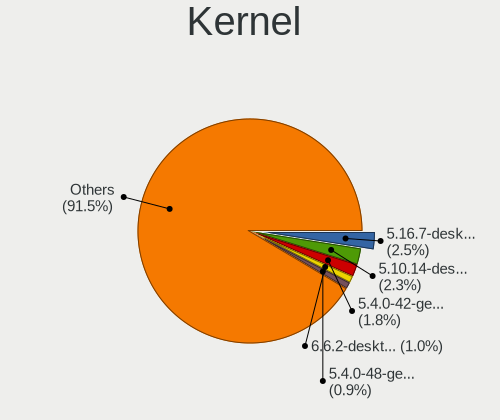

| Version                  | Desktops | Percent |
|--------------------------|----------|---------|
| 5.10.14-desktop-1omv4002 | 29       | 3.97%   |
| 5.16.7-desktop-1omv4003  | 24       | 3.29%   |
| 5.4.0-42-generic         | 23       | 3.15%   |
| 5.4.0-48-generic         | 12       | 1.64%   |
| 5.4.0-26-generic         | 10       | 1.37%   |
| 5.8.0-53-generic         | 9        | 1.23%   |
| 5.4.0-52-generic         | 9        | 1.23%   |
| 5.4.0-74-generic         | 8        | 1.1%    |
| 5.4.0-37-generic         | 8        | 1.1%    |
| 5.3.0-53-generic         | 7        | 0.96%   |
| 5.15.0-41-generic        | 7        | 0.96%   |
| 5.13.0-28-generic        | 7        | 0.96%   |
| 5.4.0-91-generic         | 6        | 0.82%   |
| 5.4.0-80-generic         | 6        | 0.82%   |
| 5.4.0-40-generic         | 6        | 0.82%   |
| 5.3.0-46-generic         | 6        | 0.82%   |
| 5.11.0-25-generic        | 6        | 0.82%   |
| 5.8.0-55-generic         | 5        | 0.68%   |
| 5.4.0-77-generic         | 5        | 0.68%   |
| 5.4.0-72-generic         | 5        | 0.68%   |
| 5.4.0-65-generic         | 5        | 0.68%   |
| 5.4.0-53-generic         | 5        | 0.68%   |
| 5.4.0-47-generic         | 5        | 0.68%   |
| 5.4.0-31-generic         | 5        | 0.68%   |
| 5.3.0-51-generic         | 5        | 0.68%   |
| 5.3.0-40-generic         | 5        | 0.68%   |
| 5.3.0-28-generic         | 5        | 0.68%   |
| 4.18.16-desktop-1bP      | 5        | 0.68%   |
| 5.8.0-59-generic         | 4        | 0.55%   |
| 5.4.0-58-generic         | 4        | 0.55%   |
| 5.4.0-45-generic         | 4        | 0.55%   |
| 5.3.0-62-generic         | 4        | 0.55%   |
| 5.15.0-27-generic        | 4        | 0.55%   |
| 5.13.13-1070.native      | 4        | 0.55%   |
| 5.13.0-37-generic        | 4        | 0.55%   |
| 5.11.0-43-generic        | 4        | 0.55%   |
| 5.10.0-9-amd64           | 4        | 0.55%   |
| 4.15.0-55-generic        | 4        | 0.55%   |
| 5.8.0-7630-generic       | 3        | 0.41%   |
| 5.8.0-43-generic         | 3        | 0.41%   |

Kernel Family
-------------

Linux kernel without a distro release

| Version | Desktops | Percent |
|---------|----------|---------|
| 5.4.0   | 173      | 25.71%  |
| 4.15.0  | 54       | 8.02%   |
| 5.8.0   | 40       | 5.94%   |
| 5.3.0   | 35       | 5.2%    |
| 5.13.0  | 34       | 5.05%   |
| 5.15.0  | 33       | 4.9%    |
| 5.11.0  | 33       | 4.9%    |
| 5.10.14 | 30       | 4.46%   |
| 5.16.7  | 24       | 3.57%   |
| 4.18.0  | 21       | 3.12%   |
| 5.0.0   | 20       | 2.97%   |
| 5.10.0  | 19       | 2.82%   |
| 4.19.0  | 8        | 1.19%   |
| 4.18.16 | 6        | 0.89%   |
| 4.4.0   | 5        | 0.74%   |
| 5.13.13 | 4        | 0.59%   |
| 5.12.4  | 4        | 0.59%   |
| 5.13.12 | 3        | 0.45%   |
| 5.11.12 | 3        | 0.45%   |
| 5.9.16  | 2        | 0.3%    |
| 5.8.18  | 2        | 0.3%    |
| 5.6.16  | 2        | 0.3%    |
| 5.3.11  | 2        | 0.3%    |
| 5.19.10 | 2        | 0.3%    |
| 5.18.7  | 2        | 0.3%    |
| 5.17.5  | 2        | 0.3%    |
| 5.17.1  | 2        | 0.3%    |
| 5.16.16 | 2        | 0.3%    |
| 5.15.5  | 2        | 0.3%    |
| 5.13.19 | 2        | 0.3%    |
| 5.11.15 | 2        | 0.3%    |
| 5.10.78 | 2        | 0.3%    |
| 4.9.76  | 2        | 0.3%    |
| 4.9.60  | 2        | 0.3%    |
| 5.9.11  | 1        | 0.15%   |
| 5.9.1   | 1        | 0.15%   |
| 5.8.6   | 1        | 0.15%   |
| 5.8.5   | 1        | 0.15%   |
| 5.8.3   | 1        | 0.15%   |
| 5.8.2   | 1        | 0.15%   |

Kernel Major Ver.
-----------------

Linux kernel major version

| Version | Desktops | Percent |
|---------|----------|---------|
| 5.4     | 180      | 26.99%  |
| 5.10    | 62       | 9.3%    |
| 4.15    | 54       | 8.1%    |
| 5.8     | 50       | 7.5%    |
| 5.13    | 45       | 6.75%   |
| 5.15    | 43       | 6.45%   |
| 5.11    | 40       | 6%      |
| 5.3     | 37       | 5.55%   |
| 5.16    | 33       | 4.95%   |
| 4.18    | 27       | 4.05%   |
| 5.0     | 22       | 3.3%    |
| 5.18    | 9        | 1.35%   |
| 5.17    | 9        | 1.35%   |
| 4.9     | 8        | 1.2%    |
| 4.19    | 8        | 1.2%    |
| 5.19    | 6        | 0.9%    |
| 5.12    | 6        | 0.9%    |
| 5.7     | 5        | 0.75%   |
| 5.6     | 5        | 0.75%   |
| 4.4     | 5        | 0.75%   |
| 5.9     | 4        | 0.6%    |
| 5.5     | 3        | 0.45%   |
| 4.20    | 2        | 0.3%    |
| 5.2     | 1        | 0.15%   |
| 5.14    | 1        | 0.15%   |
| 5.1     | 1        | 0.15%   |
| 4.1     | 1        | 0.15%   |

Arch
----

OS architecture (x86_64, i586, etc.)

| Name   | Desktops | Percent |
|--------|----------|---------|
| x86_64 | 591      | 94.56%  |
| i686   | 34       | 5.44%   |

DE
--

Desktop Environment

| Name            | Desktops | Percent |
|-----------------|----------|---------|
| GNOME           | 250      | 38.46%  |
| KDE5            | 104      | 16%     |
| Unknown         | 80       | 12.31%  |
| XFCE            | 63       | 9.69%   |
| X-Cinnamon      | 43       | 6.62%   |
| MATE            | 32       | 4.92%   |
| KDE             | 23       | 3.54%   |
| KDE4            | 8        | 1.23%   |
| Unity           | 6        | 0.92%   |
| LXQt            | 6        | 0.92%   |
| Cinnamon        | 6        | 0.92%   |
| Pantheon        | 4        | 0.62%   |
| LXDE            | 4        | 0.62%   |
| Deepin          | 4        | 0.62%   |
| i3              | 3        | 0.46%   |
| Budgie          | 3        | 0.46%   |
| qtile           | 2        | 0.31%   |
| xmonad          | 1        | 0.15%   |
| UKUI            | 1        | 0.15%   |
| trinity         | 1        | 0.15%   |
| icewm           | 1        | 0.15%   |
| i3-with-shmlog  | 1        | 0.15%   |
| GNOME Flashback | 1        | 0.15%   |
| DWM             | 1        | 0.15%   |
| Cutefish        | 1        | 0.15%   |
| bspwm           | 1        | 0.15%   |

Display Server
--------------

X11 or Wayland

| Name    | Desktops | Percent |
|---------|----------|---------|
| X11     | 534      | 83.96%  |
| Wayland | 56       | 8.81%   |
| Unknown | 37       | 5.82%   |
| Tty     | 9        | 1.42%   |

Display Manager
---------------

SDDM, LightDM, etc.

| Name    | Desktops | Percent |
|---------|----------|---------|
| Unknown | 391      | 60.9%   |
| SDDM    | 101      | 15.73%  |
| GDM     | 49       | 7.63%   |
| LightDM | 42       | 6.54%   |
| GDM3    | 29       | 4.52%   |
| TDM     | 17       | 2.65%   |
| KDM     | 8        | 1.25%   |
| SLiM    | 3        | 0.47%   |
| XDM     | 1        | 0.16%   |
| LXDM    | 1        | 0.16%   |

OS Lang
-------

Language

| Lang       | Desktops | Percent |
|------------|----------|---------|
| es_AR      | 389      | 60.59%  |
| en_US      | 116      | 18.07%  |
| Unknown    | 77       | 11.99%  |
| es_ES      | 34       | 5.3%    |
| es_MX      | 11       | 1.71%   |
| C          | 7        | 1.09%   |
| en_GB      | 3        | 0.47%   |
| ru_RU      | 1        | 0.16%   |
| es_CL      | 1        | 0.16%   |
| en_UTF-8   | 1        | 0.16%   |
| en_US.UTF8 | 1        | 0.16%   |
| C.UTF8     | 1        | 0.16%   |

Boot Mode
---------

EFI or BIOS

| Mode | Desktops | Percent |
|------|----------|---------|
| BIOS | 452      | 70.74%  |
| EFI  | 187      | 29.26%  |

Filesystem
----------

Type of filesystem

| Type    | Desktops | Percent |
|---------|----------|---------|
| Ext4    | 518      | 81.45%  |
| Overlay | 57       | 8.96%   |
| Btrfs   | 23       | 3.62%   |
| Unknown | 21       | 3.3%    |
| Xfs     | 9        | 1.42%   |
| Zfs     | 2        | 0.31%   |
| Ext3    | 2        | 0.31%   |
| Ext2    | 2        | 0.31%   |
| Tmpfs   | 1        | 0.16%   |
| F2fs    | 1        | 0.16%   |

Part. scheme
------------

Scheme of partitioning

| Type    | Desktops | Percent |
|---------|----------|---------|
| Unknown | 411      | 65.24%  |
| GPT     | 130      | 20.63%  |
| MBR     | 89       | 14.13%  |

Dual Boot with Linux/BSD
------------------------

Hosting more than one Linux/BSD

| Dual boot | Desktops | Percent |
|-----------|----------|---------|
| No        | 519      | 81.35%  |
| Yes       | 119      | 18.65%  |

Dual Boot (Win)
---------------

Hosting Linux and Windows

| Dual boot | Desktops | Percent |
|-----------|----------|---------|
| No        | 397      | 61.93%  |
| Yes       | 244      | 38.07%  |

Board
-----

Vendor
------

Motherboard manufacturer

| Name                | Desktops | Percent |
|---------------------|----------|---------|
| Gigabyte Technology | 180      | 28.8%   |
| ASUSTek Computer    | 179      | 28.64%  |
| MSI                 | 82       | 13.12%  |
| ASRock              | 79       | 12.64%  |
| Intel               | 27       | 4.32%   |
| ECS                 | 13       | 2.08%   |
| Biostar             | 11       | 1.76%   |
| Dell                | 10       | 1.6%    |
| Hewlett-Packard     | 8        | 1.28%   |
| Lenovo              | 7        | 1.12%   |
| Unknown             | 6        | 0.96%   |
| Foxconn             | 5        | 0.8%    |
| Quanta              | 3        | 0.48%   |
| Exo                 | 3        | 0.48%   |
| PCChips             | 2        | 0.32%   |
| VS Company          | 1        | 0.16%   |
| Supermicro          | 1        | 0.16%   |
| Sun Microsystems    | 1        | 0.16%   |
| Pegatron            | 1        | 0.16%   |
| NCR                 | 1        | 0.16%   |
| EPoX Computer       | 1        | 0.16%   |
| CX / Air Computers. | 1        | 0.16%   |
| BANGHO              | 1        | 0.16%   |
| American Megatrends | 1        | 0.16%   |
| Advantec            | 1        | 0.16%   |

Model
-----

Motherboard model

| Name                         | Desktops | Percent |
|------------------------------|----------|---------|
| MSI MS-7721                  | 20       | 3.2%    |
| ASUS All Series              | 14       | 2.24%   |
| ASUS PRIME A320M-K           | 11       | 1.76%   |
| Gigabyte F2A68HM-H           | 10       | 1.6%    |
| Gigabyte H81M-H              | 8        | 1.28%   |
| Gigabyte A320M-S2H           | 8        | 1.28%   |
| ASUS PRIME B450M-A           | 8        | 1.28%   |
| ASUS P5KPL-AM SE             | 7        | 1.12%   |
| MSI MS-7A15                  | 6        | 0.96%   |
| Gigabyte H61M-S1             | 6        | 0.96%   |
| Unknown                      | 6        | 0.96%   |
| MSI MS-7C52                  | 5        | 0.8%    |
| Gigabyte M68MT-S2            | 5        | 0.8%    |
| Gigabyte H110M-H             | 5        | 0.8%    |
| Gigabyte A320M-S2H V2        | 5        | 0.8%    |
| ASUS ROG STRIX B550-F GAMING | 5        | 0.8%    |
| MSI MS-7309                  | 4        | 0.64%   |
| Intel DN2820FYB H24582-205   | 4        | 0.64%   |
| Gigabyte G31M-ES2C           | 4        | 0.64%   |
| Gigabyte F2A55M-HD2          | 4        | 0.64%   |
| Gigabyte B365M DS3H          | 4        | 0.64%   |
| ECS H81H3-M4                 | 4        | 0.64%   |
| ASUS P5GC-MX/1333            | 4        | 0.64%   |
| ASUS M4N68T-M-LE-V2          | 4        | 0.64%   |
| ASUS H61M-K                  | 4        | 0.64%   |
| ASRock H81M-VG4 R2.0         | 4        | 0.64%   |
| MSI MS-7B84                  | 3        | 0.48%   |
| Gigabyte Z97X-Gaming 3       | 3        | 0.48%   |
| Gigabyte H510M H             | 3        | 0.48%   |
| Gigabyte H410M H             | 3        | 0.48%   |
| Gigabyte B75M-D3V            | 3        | 0.48%   |
| Gigabyte B75M-D3H            | 3        | 0.48%   |
| Gigabyte B450M DS3H          | 3        | 0.48%   |
| Gigabyte A320M-H             | 3        | 0.48%   |
| Gigabyte 970A-UD3P           | 3        | 0.48%   |
| ASUS PRO A320M-R WI-FI       | 3        | 0.48%   |
| ASUS P5G41T-M LX3            | 3        | 0.48%   |
| ASUS M5A97 LE R2.0           | 3        | 0.48%   |
| ASUS M5A78L-M LX             | 3        | 0.48%   |
| ASUS M4A88TD-V EVO/USB3      | 3        | 0.48%   |

Model Family
------------

Motherboard model prefix

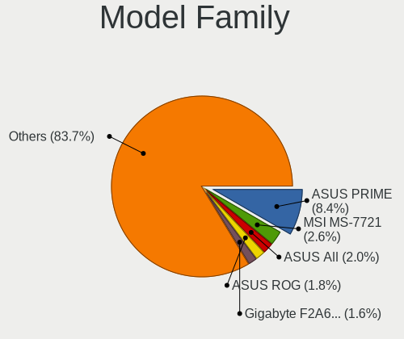

| Name                 | Desktops | Percent |
|----------------------|----------|---------|
| ASUS PRIME           | 39       | 6.24%   |
| MSI MS-7721          | 20       | 3.2%    |
| ASUS All             | 14       | 2.24%   |
| Gigabyte A320M-S2H   | 13       | 2.08%   |
| ASUS ROG             | 11       | 1.76%   |
| Gigabyte F2A68HM-H   | 10       | 1.6%    |
| ASUS M5A78L-M        | 9        | 1.44%   |
| Gigabyte H81M-H      | 8        | 1.28%   |
| Gigabyte B450        | 8        | 1.28%   |
| Lenovo ThinkCentre   | 7        | 1.12%   |
| Dell OptiPlex        | 7        | 1.12%   |
| ASUS P5KPL-AM        | 7        | 1.12%   |
| MSI MS-7A15          | 6        | 0.96%   |
| Gigabyte H61M-S1     | 6        | 0.96%   |
| ASUS M5A97           | 6        | 0.96%   |
| Unknown              | 6        | 0.96%   |
| MSI MS-7C52          | 5        | 0.8%    |
| HP Compaq            | 5        | 0.8%    |
| Gigabyte M68MT-S2    | 5        | 0.8%    |
| Gigabyte H110M-H     | 5        | 0.8%    |
| ASUS TUF             | 5        | 0.8%    |
| ASRock N68-VS3       | 5        | 0.8%    |
| ASRock A320M-HDV     | 5        | 0.8%    |
| MSI MS-7309          | 4        | 0.64%   |
| Intel DN2820FYB      | 4        | 0.64%   |
| Gigabyte Z97X-Gaming | 4        | 0.64%   |
| Gigabyte Z370        | 4        | 0.64%   |
| Gigabyte H510M       | 4        | 0.64%   |
| Gigabyte H410M       | 4        | 0.64%   |
| Gigabyte G31M-ES2C   | 4        | 0.64%   |
| Gigabyte F2A55M-HD2  | 4        | 0.64%   |
| Gigabyte B450M       | 4        | 0.64%   |
| Gigabyte B365M       | 4        | 0.64%   |
| ECS H81H3-M4         | 4        | 0.64%   |
| ASUS P8H61-M         | 4        | 0.64%   |
| ASUS P5GC-MX         | 4        | 0.64%   |
| ASUS M4N68T-M-LE-V2  | 4        | 0.64%   |
| ASUS M2N68-AM        | 4        | 0.64%   |
| ASUS M2N-MX          | 4        | 0.64%   |
| ASUS H61M-K          | 4        | 0.64%   |

MFG Year
--------

Motherboard manufacture year

| Year | Desktops | Percent |
|------|----------|---------|
| 2018 | 62       | 9.92%   |
| 2015 | 55       | 8.8%    |
| 2012 | 53       | 8.48%   |
| 2013 | 52       | 8.32%   |
| 2011 | 49       | 7.84%   |
| 2017 | 46       | 7.36%   |
| 2010 | 42       | 6.72%   |
| 2007 | 37       | 5.92%   |
| 2020 | 36       | 5.76%   |
| 2009 | 36       | 5.76%   |
| 2008 | 35       | 5.6%    |
| 2014 | 31       | 4.96%   |
| 2016 | 27       | 4.32%   |
| 2019 | 25       | 4%      |
| 2006 | 19       | 3.04%   |
| 2021 | 11       | 1.76%   |
| 2022 | 4        | 0.64%   |
| 2004 | 3        | 0.48%   |
| 2005 | 1        | 0.16%   |
| 2001 | 1        | 0.16%   |

Form Factor
-----------

Physical design of the computer

| Name    | Desktops | Percent |
|---------|----------|---------|
| Desktop | 625      | 100%    |

Secure Boot
-----------

Enabled or disabled

| State    | Desktops | Percent |
|----------|----------|---------|
| Disabled | 613      | 97.92%  |
| Enabled  | 13       | 2.08%   |

Coreboot
--------

Have coreboot on board

| Used | Desktops | Percent |
|------|----------|---------|
| No   | 625      | 100%    |

RAM Size
--------

Total RAM memory

| Size in GB  | Desktops | Percent |
|-------------|----------|---------|
| 3.01-4.0    | 136      | 21.52%  |
| 8.01-16.0   | 134      | 21.2%   |
| 4.01-8.0    | 121      | 19.15%  |
| 16.01-24.0  | 110      | 17.41%  |
| 1.01-2.0    | 51       | 8.07%   |
| 32.01-64.0  | 41       | 6.49%   |
| 2.01-3.0    | 16       | 2.53%   |
| 24.01-32.0  | 10       | 1.58%   |
| 0.51-1.0    | 7        | 1.11%   |
| 64.01-256.0 | 5        | 0.79%   |
| 0.01-0.5    | 1        | 0.16%   |

RAM Used
--------

Used RAM memory

| Used GB    | Desktops | Percent |
|------------|----------|---------|
| 1.01-2.0   | 274      | 40.23%  |
| 2.01-3.0   | 138      | 20.26%  |
| 4.01-8.0   | 81       | 11.89%  |
| 3.01-4.0   | 77       | 11.31%  |
| 0.51-1.0   | 70       | 10.28%  |
| 8.01-16.0  | 22       | 3.23%   |
| 0.01-0.5   | 14       | 2.06%   |
| 16.01-24.0 | 5        | 0.73%   |

Total Drives
------------

Number of drives on board

| Drives | Desktops | Percent |
|--------|----------|---------|
| 1      | 296      | 45.68%  |
| 2      | 193      | 29.78%  |
| 3      | 99       | 15.28%  |
| 4      | 41       | 6.33%   |
| 5      | 12       | 1.85%   |
| 6      | 3        | 0.46%   |
| 7      | 2        | 0.31%   |
| 0      | 2        | 0.31%   |

Has CD-ROM
----------

Has CD-ROM on board

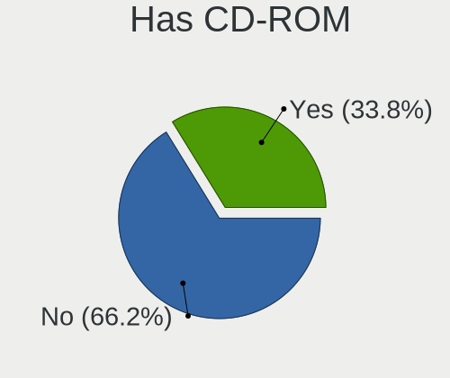

| Presented | Desktops | Percent |
|-----------|----------|---------|
| No        | 374      | 59.37%  |
| Yes       | 256      | 40.63%  |

Has Ethernet
------------

Has Ethernet on board

| Presented | Desktops | Percent |
|-----------|----------|---------|
| Yes       | 616      | 98.56%  |
| No        | 9        | 1.44%   |

Has WiFi
--------

Has WiFi module

| Presented | Desktops | Percent |
|-----------|----------|---------|
| No        | 374      | 58.71%  |
| Yes       | 263      | 41.29%  |

Has Bluetooth
-------------

Has Bluetooth module

| Presented | Desktops | Percent |
|-----------|----------|---------|
| No        | 542      | 85.62%  |
| Yes       | 91       | 14.38%  |

Location
--------

Country
-------

Geographic location (country)

| Country   | Desktops | Percent |
|-----------|----------|---------|
| Argentina | 625      | 100%    |

City
----

Geographic location (city)

| City                        | Desktops | Percent |
|-----------------------------|----------|---------|
| Buenos Aires                | 163      | 25.04%  |
| Rosario                     | 35       | 5.38%   |
| Crdoba                    | 35       | 5.38%   |
| La Plata                    | 18       | 2.76%   |
| Mar del Plata               | 16       | 2.46%   |
| Lomas de Zamora             | 12       | 1.84%   |
| San Miguel de Tucumn      | 9        | 1.38%   |
| Lanus                       | 9        | 1.38%   |
| Avellaneda                  | 9        | 1.38%   |
| Florencio Varela            | 8        | 1.23%   |
| Paran                     | 7        | 1.08%   |
| Viedma                      | 6        | 0.92%   |
| Ramos Mejia                 | 6        | 0.92%   |
| Quilmes                     | 6        | 0.92%   |
| Neuqun                    | 6        | 0.92%   |
| Ciudad Evita                | 6        | 0.92%   |
| Baha Blanca               | 6        | 0.92%   |
| Villa Nueva                 | 5        | 0.77%   |
| Villa Ballester             | 5        | 0.77%   |
| Santa Fe                    | 5        | 0.77%   |
| San Telmo                   | 5        | 0.77%   |
| Martinez                    | 5        | 0.77%   |
| Caseros                     | 5        | 0.77%   |
| Yerba Buena                 | 4        | 0.61%   |
| San Luis                    | 4        | 0.61%   |
| San Juan                    | 4        | 0.61%   |
| Salta                       | 4        | 0.61%   |
| Pilar                       | 4        | 0.61%   |
| Ituzaingo                   | 4        | 0.61%   |
| General San Martin          | 4        | 0.61%   |
| Corrientes                  | 4        | 0.61%   |
| Concordia                   | 4        | 0.61%   |
| Burzaco                     | 4        | 0.61%   |
| Berazategui                 | 4        | 0.61%   |
| Adrogue                     | 4        | 0.61%   |
| Villa Mara                | 3        | 0.46%   |
| Tigre                       | 3        | 0.46%   |
| Tandil                      | 3        | 0.46%   |
| San Salvador de Jujuy       | 3        | 0.46%   |
| San Nicols de los Arroyos | 3        | 0.46%   |

Drives
------

Drive Vendor
------------

Hard drive vendors

| Vendor                    | Desktops | Drives | Percent |
|---------------------------|----------|--------|---------|
| WDC                       | 365      | 589    | 36.54%  |
| Seagate                   | 139      | 182    | 13.91%  |
| Kingston                  | 130      | 174    | 13.01%  |
| Samsung Electronics       | 92       | 135    | 9.21%   |
| Toshiba                   | 53       | 63     | 5.31%   |
| Hitachi                   | 43       | 47     | 4.3%    |
| A-DATA Technology         | 24       | 26     | 2.4%    |
| SanDisk                   | 21       | 24     | 2.1%    |
| Gigabyte Technology       | 21       | 33     | 2.1%    |
| Maxtor                    | 13       | 14     | 1.3%    |
| Crucial                   | 13       | 20     | 1.3%    |
| HGST                      | 9        | 11     | 0.9%    |
| Hewlett-Packard           | 9        | 14     | 0.9%    |
| Corsair                   | 9        | 9      | 0.9%    |
| Realtek Semiconductor     | 6        | 8      | 0.6%    |
| PNY                       | 6        | 11     | 0.6%    |
| Phison                    | 5        | 6      | 0.5%    |
| XPG                       | 4        | 4      | 0.4%    |
| Colorful                  | 4        | 4      | 0.4%    |
| Silicon Motion            | 3        | 4      | 0.3%    |
| Lexar                     | 3        | 4      | 0.3%    |
| Intel                     | 3        | 4      | 0.3%    |
| ADATA Technology          | 3        | 4      | 0.3%    |
| Patriot                   | 2        | 3      | 0.2%    |
| OCZ                       | 2        | 2      | 0.2%    |
| Fujitsu                   | 2        | 2      | 0.2%    |
| China                     | 2        | 2      | 0.2%    |
| Super Talent              | 1        | 1      | 0.1%    |
| Quantum                   | 1        | 1      | 0.1%    |
| Phison Electronics        | 1        | 1      | 0.1%    |
| Netac                     | 1        | 2      | 0.1%    |
| N300                      | 1        | 1      | 0.1%    |
| Micron/Crucial Technology | 1        | 3      | 0.1%    |
| LITEONIT                  | 1        | 1      | 0.1%    |
| KingFast                  | 1        | 1      | 0.1%    |
| KingDian                  | 1        | 1      | 0.1%    |
| Hikvision                 | 1        | 1      | 0.1%    |
| ExcelStor                 | 1        | 1      | 0.1%    |
| Envoy                     | 1        | 1      | 0.1%    |
| ASMT                      | 1        | 2      | 0.1%    |

Drive Model
-----------

Hard drive models

| Model                            | Desktops | Percent |
|----------------------------------|----------|---------|
| Kingston SA400S37240G 240GB SSD  | 36       | 3.08%   |
| WDC WD10EZEX-08WN4A0 1TB         | 30       | 2.57%   |
| Kingston SA400S37480G 480GB SSD  | 25       | 2.14%   |
| Seagate ST500DM002-1BD142 500GB  | 20       | 1.71%   |
| Seagate ST1000DM010-2EP102 1TB   | 20       | 1.71%   |
| WDC WD5000AAKX-001CA0 500GB      | 18       | 1.54%   |
| Kingston SA400S37120G 120GB SSD  | 17       | 1.46%   |
| WDC WD10EZEX-00BN5A0 1TB         | 16       | 1.37%   |
| WDC WDS120G2G0A-00JH30 120GB SSD | 15       | 1.29%   |
| WDC WD20EZRZ-00Z5HB0 2TB         | 15       | 1.29%   |
| WDC WDS240G2G0A-00JH30 240GB SSD | 14       | 1.2%    |
| Toshiba DT01ACA100 1TB           | 13       | 1.11%   |
| Kingston SV300S37A120G 120GB SSD | 13       | 1.11%   |
| WDC WD5000AAKX-00ERMA0 500GB     | 12       | 1.03%   |
| WDC WD1600AABS-00PRA0 160GB      | 10       | 0.86%   |
| Toshiba DT01ACA050 500GB         | 10       | 0.86%   |
| WDC WD10EZEX-21WN4A0 1TB         | 9        | 0.77%   |
| WDC WD1003FZEX-00MK2A0 1TB       | 9        | 0.77%   |
| Samsung HD502HJ 500GB            | 9        | 0.77%   |
| Samsung HD322HJ 320GB            | 9        | 0.77%   |
| WDC WD20EZRX-00D8PB0 2TB         | 8        | 0.69%   |
| WDC WD10EARS-00Y5B1 1TB          | 8        | 0.69%   |
| Kingston SUV400S37240G 240GB SSD | 8        | 0.69%   |
| Gigabyte GP-GSTFS31240GNTD 240GB | 8        | 0.69%   |
| WDC WDS480G2G0A-00JH30 480GB SSD | 7        | 0.6%    |
| WDC WD10EZEX-00WN4A0 1TB         | 7        | 0.6%    |
| Kingston SV300S37A240G 240GB SSD | 7        | 0.6%    |
| Gigabyte GP-GSTFS31120GNTD 120GB | 7        | 0.6%    |
| WDC WD800BD-22MRA1 80GB          | 6        | 0.51%   |
| WDC WD1600AABS-00H4A0 160GB      | 6        | 0.51%   |
| Seagate ST2000DM008-2FR102 2TB   | 6        | 0.51%   |
| Seagate ST2000DM001-1CH164 2TB   | 6        | 0.51%   |
| Samsung HD322GJ 320GB            | 6        | 0.51%   |
| Samsung HD103SJ 1TB              | 6        | 0.51%   |
| Kingston SUV400S37120G 120GB SSD | 6        | 0.51%   |
| Hitachi HDS721010CLA332 1TB      | 6        | 0.51%   |
| WDC WDS500G2B0A-00SM50 500GB SSD | 5        | 0.43%   |
| WDC WD3200AAJS-00L7A0 320GB      | 5        | 0.43%   |
| WDC WD20PURZ-85GU6Y0 2TB         | 5        | 0.43%   |
| WDC WD10EZEX-00KUWA0 1TB         | 5        | 0.43%   |

HDD Vendor
----------

Hard disk drive vendors

| Vendor              | Desktops | Drives | Percent |
|---------------------|----------|--------|---------|
| WDC                 | 330      | 507    | 50.08%  |
| Seagate             | 138      | 181    | 20.94%  |
| Samsung Electronics | 71       | 98     | 10.77%  |
| Toshiba             | 53       | 63     | 8.04%   |
| Hitachi             | 43       | 47     | 6.53%   |
| Maxtor              | 10       | 10     | 1.52%   |
| HGST                | 9        | 11     | 1.37%   |
| Fujitsu             | 2        | 2      | 0.3%    |
| Quantum             | 1        | 1      | 0.15%   |
| ExcelStor           | 1        | 1      | 0.15%   |
| ASMT                | 1        | 2      | 0.15%   |

SSD Vendor
----------

Solid state drive vendors

| Vendor              | Desktops | Drives | Percent |
|---------------------|----------|--------|---------|
| Kingston            | 123      | 164    | 41.28%  |
| WDC                 | 51       | 63     | 17.11%  |
| A-DATA Technology   | 22       | 23     | 7.38%   |
| Gigabyte Technology | 18       | 30     | 6.04%   |
| Samsung Electronics | 16       | 23     | 5.37%   |
| SanDisk             | 13       | 16     | 4.36%   |
| Crucial             | 13       | 20     | 4.36%   |
| Corsair             | 7        | 7      | 2.35%   |
| PNY                 | 6        | 11     | 2.01%   |
| Hewlett-Packard     | 5        | 6      | 1.68%   |
| Colorful            | 4        | 4      | 1.34%   |
| Maxtor              | 3        | 4      | 1.01%   |
| Lexar               | 3        | 4      | 1.01%   |
| Patriot             | 2        | 3      | 0.67%   |
| OCZ                 | 2        | 2      | 0.67%   |
| Intel               | 2        | 3      | 0.67%   |
| China               | 2        | 2      | 0.67%   |
| Super Talent        | 1        | 1      | 0.34%   |
| Seagate             | 1        | 1      | 0.34%   |
| Netac               | 1        | 2      | 0.34%   |
| LITEONIT            | 1        | 1      | 0.34%   |
| KingDian            | 1        | 1      | 0.34%   |
| Hikvision           | 1        | 1      | 0.34%   |

Drive Kind
----------

HDD or SSD

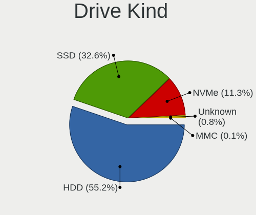

| Kind    | Desktops | Drives | Percent |
|---------|----------|--------|---------|
| HDD     | 527      | 923    | 60.78%  |
| SSD     | 275      | 392    | 31.72%  |
| NVMe    | 62       | 98     | 7.15%   |
| Unknown | 3        | 3      | 0.35%   |

Drive Connector
---------------

SATA, SAS, NVMe, etc.

| Type | Desktops | Drives | Percent |
|------|----------|--------|---------|
| SATA | 610      | 1306   | 89.31%  |
| NVMe | 62       | 98     | 9.08%   |
| SAS  | 11       | 12     | 1.61%   |

Drive Size
----------

Size of hard drive

| Size in TB | Desktops | Drives | Percent |
|------------|----------|--------|---------|
| 0.01-0.5   | 498      | 837    | 60.14%  |
| 0.51-1.0   | 235      | 347    | 28.38%  |
| 1.01-2.0   | 65       | 90     | 7.85%   |
| 2.01-3.0   | 11       | 12     | 1.33%   |
| 3.01-4.0   | 10       | 17     | 1.21%   |
| 4.01-10.0  | 9        | 12     | 1.09%   |

Space Total
-----------

Amount of disk space available on the file system

| Size in GB     | Desktops | Percent |
|----------------|----------|---------|
| 101-250        | 172      | 25.56%  |
| 251-500        | 145      | 21.55%  |
| 501-1000       | 97       | 14.41%  |
| 1001-2000      | 73       | 10.85%  |
| 51-100         | 50       | 7.43%   |
| 1-20           | 39       | 5.79%   |
| 21-50          | 32       | 4.75%   |
| 2001-3000      | 31       | 4.61%   |
| More than 3000 | 20       | 2.97%   |
| Unknown        | 14       | 2.08%   |

Space Used
----------

Amount of used disk space

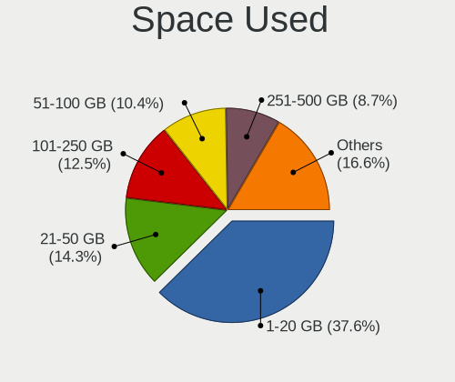

| Used GB        | Desktops | Percent |
|----------------|----------|---------|
| 1-20           | 280      | 40.76%  |
| 21-50          | 88       | 12.81%  |
| 101-250        | 80       | 11.64%  |
| 51-100         | 70       | 10.19%  |
| 251-500        | 63       | 9.17%   |
| 501-1000       | 50       | 7.28%   |
| 1001-2000      | 28       | 4.08%   |
| Unknown        | 14       | 2.04%   |
| More than 3000 | 7        | 1.02%   |
| 2001-3000      | 7        | 1.02%   |

Malfunc. Drives
---------------

Drive models with a malfunction

| Model                             | Desktops | Drives | Percent |
|-----------------------------------|----------|--------|---------|
| WDC WD5000AAKX-001CA0 500GB       | 7        | 9      | 6.48%   |
| WDC WD5000AAKX-00ERMA0 500GB      | 3        | 3      | 2.78%   |
| WDC WD10EZEX-08WN4A0 1TB          | 3        | 3      | 2.78%   |
| WDC WD10EZEX-00BN5A0 1TB          | 3        | 3      | 2.78%   |
| WDC WD10EARS-00Y5B1 1TB           | 3        | 3      | 2.78%   |
| Seagate ST500DM002-1BD142 500GB   | 3        | 3      | 2.78%   |
| WDC WD5000AAKX-08ERMA0 500GB      | 2        | 2      | 1.85%   |
| WDC WD1002FAEX-00Y9A0 1TB         | 2        | 2      | 1.85%   |
| Seagate ST1500DL003-9VT16L 1TB    | 2        | 2      | 1.85%   |
| Seagate ST1000DM003-1CH162 1TB    | 2        | 2      | 1.85%   |
| Samsung Electronics SP0411N 40GB  | 2        | 3      | 1.85%   |
| Samsung Electronics HD322HJ 320GB | 2        | 2      | 1.85%   |
| WDC WDS480G2G0A-00JH30 480GB SSD  | 1        | 2      | 0.93%   |
| WDC WDS240G2G0A-00JH30 240GB SSD  | 1        | 1      | 0.93%   |
| WDC WD800JD-00MSA1 80GB           | 1        | 1      | 0.93%   |
| WDC WD800BD-22MRA1 80GB           | 1        | 1      | 0.93%   |
| WDC WD800BB-75JHC0 80GB           | 1        | 1      | 0.93%   |
| WDC WD800BB-00JHC0 80GB           | 1        | 1      | 0.93%   |
| WDC WD6400AAKS-65Z7B0 640GB       | 1        | 1      | 0.93%   |
| WDC WD5000AAVS-00G9B1 500GB       | 1        | 1      | 0.93%   |
| WDC WD5000AAKS-00V1A0 500GB       | 1        | 1      | 0.93%   |
| WDC WD400BB-23DEA0 37GB           | 1        | 1      | 0.93%   |
| WDC WD3200AAKS-00L9A0 320GB       | 1        | 1      | 0.93%   |
| WDC WD3200AAJS-65M0A0 320GB       | 1        | 1      | 0.93%   |
| WDC WD3200AAJS-56B4A0 320GB       | 1        | 2      | 0.93%   |
| WDC WD3200AAJS-00YZCA0 320GB      | 1        | 1      | 0.93%   |
| WDC WD30EZRX-00SPEB0 3TB          | 1        | 1      | 0.93%   |
| WDC WD2500AAJS-00L7A0 250GB       | 1        | 1      | 0.93%   |
| WDC WD2500AAJS-00B4A0 250GB       | 1        | 1      | 0.93%   |
| WDC WD20PURZ-85GU6Y0 2TB          | 1        | 2      | 0.93%   |
| WDC WD20EZRZ-00Z5HB0 2TB          | 1        | 1      | 0.93%   |
| WDC WD20EZRX-00D8PB0 2TB          | 1        | 1      | 0.93%   |
| WDC WD20EARX-00ZUDB0 2TB          | 1        | 1      | 0.93%   |
| WDC WD20EARS-00MVWB0 2TB          | 1        | 1      | 0.93%   |
| WDC WD1600BEVT-60ZCT1 160GB       | 1        | 1      | 0.93%   |
| WDC WD1600AAJS-00L7A0 160GB       | 1        | 1      | 0.93%   |
| WDC WD1600AABS-00H4A0 160GB       | 1        | 1      | 0.93%   |
| WDC WD15EARS-00S0XB0 1TB          | 1        | 1      | 0.93%   |
| WDC WD10JPVX-60JC3T0 1TB          | 1        | 1      | 0.93%   |
| WDC WD10EZEX-60WN4A1 1TB          | 1        | 1      | 0.93%   |

Malfunc. Drive Vendor
---------------------

Vendors of faulty drives

| Vendor              | Desktops | Drives | Percent |
|---------------------|----------|--------|---------|
| WDC                 | 53       | 67     | 54.08%  |
| Seagate             | 19       | 20     | 19.39%  |
| Samsung Electronics | 10       | 12     | 10.2%   |
| Toshiba             | 4        | 4      | 4.08%   |
| Kingston            | 3        | 3      | 3.06%   |
| Hitachi             | 3        | 3      | 3.06%   |
| Maxtor              | 2        | 2      | 2.04%   |
| HGST                | 2        | 2      | 2.04%   |
| Quantum             | 1        | 1      | 1.02%   |
| A-DATA Technology   | 1        | 1      | 1.02%   |

Malfunc. HDD Vendor
-------------------

Vendors of faulty HDD drives

| Vendor              | Desktops | Drives | Percent |
|---------------------|----------|--------|---------|
| WDC                 | 51       | 64     | 55.43%  |
| Seagate             | 19       | 20     | 20.65%  |
| Samsung Electronics | 10       | 12     | 10.87%  |
| Toshiba             | 4        | 4      | 4.35%   |
| Hitachi             | 3        | 3      | 3.26%   |
| Maxtor              | 2        | 2      | 2.17%   |
| HGST                | 2        | 2      | 2.17%   |
| Quantum             | 1        | 1      | 1.09%   |

Malfunc. Drive Kind
-------------------

Kinds of faulty drives

| Kind | Desktops | Drives | Percent |
|------|----------|--------|---------|
| HDD  | 84       | 108    | 93.33%  |
| SSD  | 6        | 7      | 6.67%   |

Failed Drives
-------------

Failed drive models

| Model                             | Desktops | Drives | Percent |
|-----------------------------------|----------|--------|---------|
| WDC WD1600BEVT-80A23T0 160GB      | 1        | 1      | 33.33%  |
| Samsung Electronics HD502HJ 500GB | 1        | 1      | 33.33%  |
| Samsung Electronics HD103SJ 1TB   | 1        | 1      | 33.33%  |

Failed Drive Vendor
-------------------

Failed drive vendors

| Vendor              | Desktops | Drives | Percent |
|---------------------|----------|--------|---------|
| Samsung Electronics | 2        | 2      | 66.67%  |
| WDC                 | 1        | 1      | 33.33%  |

Drive Status
------------

Number of failed and malfunc. drives

| Status   | Desktops | Drives | Percent |
|----------|----------|--------|---------|
| Detected | 416      | 939    | 60.82%  |
| Works    | 177      | 359    | 25.88%  |
| Malfunc  | 88       | 115    | 12.87%  |
| Failed   | 3        | 3      | 0.44%   |

Storage controller
------------------

Storage Vendor
--------------

Storage controller vendors

| Vendor                           | Desktops | Percent |
|----------------------------------|----------|---------|
| Intel                            | 304      | 41.14%  |
| AMD                              | 241      | 32.61%  |
| Nvidia                           | 63       | 8.53%   |
| VIA Technologies                 | 24       | 3.25%   |
| SanDisk                          | 21       | 2.84%   |
| JMicron Technology               | 12       | 1.62%   |
| Realtek Semiconductor            | 10       | 1.35%   |
| Phison Electronics               | 10       | 1.35%   |
| ASMedia Technology               | 10       | 1.35%   |
| Samsung Electronics              | 9        | 1.22%   |
| Kingston Technology Company      | 9        | 1.22%   |
| Silicon Motion                   | 7        | 0.95%   |
| Marvell Technology Group         | 6        | 0.81%   |
| Silicon Integrated Systems [SiS] | 4        | 0.54%   |
| ADATA Technology                 | 4        | 0.54%   |
| Silicon Image                    | 1        | 0.14%   |
| Promise Technology               | 1        | 0.14%   |
| Micron/Crucial Technology        | 1        | 0.14%   |
| Broadcom / LSI                   | 1        | 0.14%   |
| Adaptec                          | 1        | 0.14%   |

Storage Model
-------------

Storage controller models

| Model                                                                                   | Desktops | Percent |
|-----------------------------------------------------------------------------------------|----------|---------|
| AMD FCH SATA Controller [AHCI mode]                                                     | 137      | 12.91%  |
| Nvidia MCP61 SATA Controller                                                            | 55       | 5.18%   |
| Intel NM10/ICH7 Family SATA Controller [IDE mode]                                       | 50       | 4.71%   |
| Nvidia MCP61 IDE                                                                        | 48       | 4.52%   |
| AMD SB7x0/SB8x0/SB9x0 IDE Controller                                                    | 43       | 4.05%   |
| Intel Q170/Q150/B150/H170/H110/Z170/CM236 Chipset SATA Controller [AHCI Mode]           | 42       | 3.96%   |
| Intel 8 Series/C220 Series Chipset Family 6-port SATA Controller 1 [AHCI mode]          | 42       | 3.96%   |
| AMD FCH SATA Controller D                                                               | 41       | 3.86%   |
| Intel 82801G (ICH7 Family) IDE Controller                                               | 40       | 3.77%   |
| AMD SB7x0/SB8x0/SB9x0 SATA Controller [IDE mode]                                        | 35       | 3.3%    |
| AMD 400 Series Chipset SATA Controller                                                  | 29       | 2.73%   |
| Intel 200 Series PCH SATA controller [AHCI mode]                                        | 27       | 2.54%   |
| Intel 6 Series/C200 Series Chipset Family 6 port Desktop SATA AHCI Controller           | 21       | 1.98%   |
| AMD FCH SATA Controller [IDE mode]                                                      | 21       | 1.98%   |
| AMD FCH IDE Controller                                                                  | 21       | 1.98%   |
| AMD SB7x0/SB8x0/SB9x0 SATA Controller [AHCI mode]                                       | 20       | 1.89%   |
| Intel 6 Series/C200 Series Chipset Family Desktop SATA Controller (IDE mode, ports 4-5) | 18       | 1.7%    |
| Intel 6 Series/C200 Series Chipset Family Desktop SATA Controller (IDE mode, ports 0-3) | 18       | 1.7%    |
| AMD 500 Series Chipset SATA Controller                                                  | 16       | 1.51%   |
| Intel Cannon Lake PCH SATA AHCI Controller                                              | 14       | 1.32%   |
| VIA VT82C586A/B/VT82C686/A/B/VT823x/A/C PIPC Bus Master IDE                             | 13       | 1.23%   |
| AMD 300 Series Chipset SATA Controller                                                  | 12       | 1.13%   |
| Intel 9 Series Chipset Family SATA Controller [AHCI Mode]                               | 10       | 0.94%   |
| Intel 7 Series/C210 Series Chipset Family 6-port SATA Controller [AHCI mode]            | 10       | 0.94%   |
| Intel 7 Series/C210 Series Chipset Family 4-port SATA Controller [IDE mode]             | 10       | 0.94%   |
| Intel 7 Series/C210 Series Chipset Family 2-port SATA Controller [IDE mode]             | 10       | 0.94%   |
| ASMedia ASM1062 Serial ATA Controller                                                   | 10       | 0.94%   |
| SanDisk WD Blue SN550 NVMe SSD                                                          | 9        | 0.85%   |
| VIA VT6415 PATA IDE Host Controller                                                     | 8        | 0.75%   |
| Silicon Motion SM2262/SM2262EN SSD Controller                                           | 7        | 0.66%   |
| Samsung NVMe SSD Controller SM981/PM981/PM983                                           | 7        | 0.66%   |
| Realtek RTS5763DL NVMe SSD Controller                                                   | 7        | 0.66%   |
| Intel 500 Series Chipset Family SATA AHCI Controller                                    | 7        | 0.66%   |
| VIA VIA VT6420 SATA RAID Controller                                                     | 6        | 0.57%   |
| Phison E12 NVMe Controller                                                              | 6        | 0.57%   |
| Intel 82801HR/HO/HH (ICH8R/DO/DH) 2 port SATA Controller [IDE mode]                     | 6        | 0.57%   |
| Intel 82801H (ICH8 Family) 4 port SATA Controller [IDE mode]                            | 6        | 0.57%   |
| Intel 400 Series Chipset Family SATA AHCI Controller                                    | 6        | 0.57%   |
| AMD SB600 Non-Raid-5 SATA                                                               | 6        | 0.57%   |
| AMD SB600 IDE                                                                           | 6        | 0.57%   |

Storage Kind
------------

Kind of storage controller (IDE, SATA, NVMe, SAS, ...)

| Kind | Desktops | Percent |
|------|----------|---------|
| SATA | 441      | 56.83%  |
| IDE  | 259      | 33.38%  |
| NVMe | 63       | 8.12%   |
| RAID | 12       | 1.55%   |
| SCSI | 1        | 0.13%   |

Processor
---------

CPU Vendor
----------

Processor vendors

| Vendor | Desktops | Percent |
|--------|----------|---------|
| Intel  | 316      | 50.56%  |
| AMD    | 309      | 49.44%  |

CPU Model
---------

Processor models

| Model                                         | Desktops | Percent |
|-----------------------------------------------|----------|---------|
| AMD Ryzen 5 3400G with Radeon Vega Graphics   | 13       | 2.08%   |
| Intel Core i5-7400 CPU @ 3.00GHz              | 9        | 1.44%   |
| Intel Core i5-4440 CPU @ 3.10GHz              | 9        | 1.44%   |
| AMD Ryzen 3 3200G with Radeon Vega Graphics   | 9        | 1.44%   |
| AMD A8-9600 RADEON R7, 10 COMPUTE CORES 4C+6G | 9        | 1.44%   |
| Intel Pentium Dual CPU E2180 @ 2.00GHz        | 8        | 1.28%   |
| Intel Core i5-4460 CPU @ 3.20GHz              | 8        | 1.28%   |
| AMD Ryzen 5 2600 Six-Core Processor           | 8        | 1.28%   |
| AMD Athlon II X2 250 Processor                | 8        | 1.28%   |
| Intel Core i7-3770 CPU @ 3.40GHz              | 7        | 1.12%   |
| Intel Core i3-2100 CPU @ 3.10GHz              | 7        | 1.12%   |
| AMD FX-6300 Six-Core Processor                | 7        | 1.12%   |
| Intel Core i7-8700 CPU @ 3.20GHz              | 6        | 0.96%   |
| Intel Core i7-7700 CPU @ 3.60GHz              | 6        | 0.96%   |
| Intel Core i5-8400 CPU @ 2.80GHz              | 6        | 0.96%   |
| Intel Core i3-4170 CPU @ 3.70GHz              | 6        | 0.96%   |
| Intel Core 2 Duo CPU E8400 @ 3.00GHz          | 6        | 0.96%   |
| AMD Ryzen 7 3700X 8-Core Processor            | 6        | 0.96%   |
| AMD Ryzen 5 5600X 6-Core Processor            | 6        | 0.96%   |
| AMD Ryzen 5 3600 6-Core Processor             | 6        | 0.96%   |
| AMD Ryzen 3 2200G with Radeon Vega Graphics   | 6        | 0.96%   |
| AMD A4-4000 APU with Radeon HD Graphics       | 6        | 0.96%   |
| Intel Pentium Dual-Core CPU E5700 @ 3.00GHz   | 5        | 0.8%    |
| Intel Pentium CPU G3220 @ 3.00GHz             | 5        | 0.8%    |
| Intel Core i7-6700 CPU @ 3.40GHz              | 5        | 0.8%    |
| Intel Core i5-9400 CPU @ 2.90GHz              | 5        | 0.8%    |
| Intel Core 2 Duo CPU E7500 @ 2.93GHz          | 5        | 0.8%    |
| AMD Ryzen 7 2700 Eight-Core Processor         | 5        | 0.8%    |
| AMD Ryzen 5 2400G with Radeon Vega Graphics   | 5        | 0.8%    |
| AMD A8-7600 Radeon R7, 10 Compute Cores 4C+6G | 5        | 0.8%    |
| AMD A6-7480 Radeon R5, 8 Compute Cores 2C+6G  | 5        | 0.8%    |
| Intel Pentium Dual-Core CPU E5400 @ 2.70GHz   | 4        | 0.64%   |
| Intel Pentium 4 CPU 3.00GHz                   | 4        | 0.64%   |
| Intel Core i7-4790 CPU @ 3.60GHz              | 4        | 0.64%   |
| Intel Core i7-4770K CPU @ 3.50GHz             | 4        | 0.64%   |
| Intel Core i7-10700 CPU @ 2.90GHz             | 4        | 0.64%   |
| Intel Core i5-6500 CPU @ 3.20GHz              | 4        | 0.64%   |
| Intel Core i5-3470 CPU @ 3.20GHz              | 4        | 0.64%   |
| Intel Core i5-2310 CPU @ 2.90GHz              | 4        | 0.64%   |
| Intel Core i5-10400 CPU @ 2.90GHz             | 4        | 0.64%   |

CPU Model Family
----------------

Processor model prefix

| Model                   | Desktops | Percent |
|-------------------------|----------|---------|
| Intel Core i5           | 97       | 15.52%  |
| Intel Core i7           | 53       | 8.48%   |
| AMD Ryzen 5             | 49       | 7.84%   |
| Intel Core i3           | 48       | 7.68%   |
| AMD FX                  | 28       | 4.48%   |
| AMD A8                  | 28       | 4.48%   |
| Intel Celeron           | 22       | 3.52%   |
| AMD Ryzen 7             | 21       | 3.36%   |
| AMD Athlon II X2        | 20       | 3.2%    |
| AMD Athlon 64 X2        | 20       | 3.2%    |
| AMD Ryzen 3             | 19       | 3.04%   |
| Intel Pentium Dual-Core | 17       | 2.72%   |
| Intel Core 2 Duo        | 17       | 2.72%   |
| AMD Sempron             | 16       | 2.56%   |
| AMD A6                  | 16       | 2.56%   |
| AMD A4                  | 15       | 2.4%    |
| Intel Pentium           | 13       | 2.08%   |
| AMD A10                 | 12       | 1.92%   |
| Intel Pentium Dual      | 11       | 1.76%   |
| AMD Phenom II X4        | 11       | 1.76%   |
| Intel Pentium D         | 9        | 1.44%   |
| AMD Athlon              | 9        | 1.44%   |
| Intel Pentium 4         | 8        | 1.28%   |
| AMD Phenom II X6        | 8        | 1.28%   |
| AMD Athlon II X4        | 7        | 1.12%   |
| Other                   | 6        | 0.96%   |
| Intel Core 2            | 5        | 0.8%    |
| AMD Athlon II X3        | 5        | 0.8%    |
| Intel Core 2 Quad       | 4        | 0.64%   |
| AMD Ryzen 9             | 4        | 0.64%   |
| AMD Phenom              | 4        | 0.64%   |
| Intel Pentium Gold      | 3        | 0.48%   |
| AMD Phenom II X2        | 3        | 0.48%   |
| AMD E1                  | 3        | 0.48%   |
| Intel Xeon              | 2        | 0.32%   |
| Intel Core i9           | 2        | 0.32%   |
| Intel Atom              | 2        | 0.32%   |
| AMD Athlon X2           | 2        | 0.32%   |
| AMD Ryzen 5 PRO         | 1        | 0.16%   |
| AMD Ryzen 3 PRO         | 1        | 0.16%   |

CPU Cores
---------

Number of processor cores

| Number  | Desktops | Percent |
|---------|----------|---------|
| 2       | 240      | 38.4%   |
| 4       | 204      | 32.64%  |
| 6       | 71       | 11.36%  |
| 1       | 59       | 9.44%   |
| 8       | 30       | 4.8%    |
| 3       | 15       | 2.4%    |
| 12      | 3        | 0.48%   |
| 16      | 1        | 0.16%   |
| 10      | 1        | 0.16%   |
| Unknown | 1        | 0.16%   |

CPU Sockets
-----------

Number of sockets

| Number | Desktops | Percent |
|--------|----------|---------|
| 1      | 624      | 99.84%  |
| 2      | 1        | 0.16%   |

CPU Threads
-----------

Threads per core (Hyper-Threading)

| Number  | Desktops | Percent |
|---------|----------|---------|
| 1       | 331      | 52.88%  |
| 2       | 294      | 46.96%  |
| Unknown | 1        | 0.16%   |

CPU Op-Modes
------------

CPU Operation Modes (32-bit, 64-bit)

| Op mode        | Desktops | Percent |
|----------------|----------|---------|
| 32-bit, 64-bit | 607      | 96.81%  |
| Unknown        | 13       | 2.07%   |
| 32-bit         | 4        | 0.64%   |
| 64-bit         | 3        | 0.48%   |

CPU Microcode
-------------

Microcode number

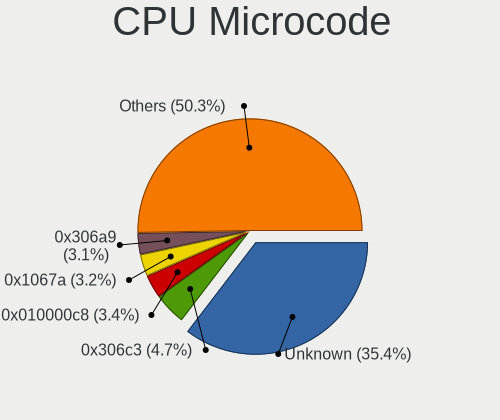

| Number     | Desktops | Percent |
|------------|----------|---------|
| Unknown    | 134      | 20.49%  |
| 0x306c3    | 45       | 6.88%   |
| 0x306a9    | 28       | 4.28%   |
| 0x1067a    | 27       | 4.13%   |
| 0x010000c8 | 27       | 4.13%   |
| 0x206a7    | 25       | 3.82%   |
| 0x906e9    | 24       | 3.67%   |
| 0x08108109 | 22       | 3.36%   |
| 0x506e3    | 20       | 3.06%   |
| 0x906ea    | 19       | 2.91%   |
| 0x06003106 | 18       | 2.75%   |
| 0x06001119 | 16       | 2.45%   |
| 0x6fd      | 14       | 2.14%   |
| 0x0800820d | 13       | 1.99%   |
| 0x06000852 | 13       | 1.99%   |
| 0x08701021 | 12       | 1.83%   |
| 0x0600611a | 12       | 1.83%   |
| 0x08101016 | 10       | 1.53%   |
| 0x0600063e | 10       | 1.53%   |
| 0x010000c7 | 8        | 1.22%   |
| 0xa0653    | 7        | 1.07%   |
| 0x010000db | 7        | 1.07%   |
| 0xa0655    | 6        | 0.92%   |
| 0x10676    | 6        | 0.92%   |
| 0x0a201016 | 6        | 0.92%   |
| 0x06006118 | 6        | 0.92%   |
| 0x010000dc | 6        | 0.92%   |
| 0x01000083 | 6        | 0.92%   |
| 0xf65      | 5        | 0.76%   |
| 0x0a50000c | 5        | 0.76%   |
| 0x0700010f | 5        | 0.76%   |
| 0xf47      | 4        | 0.61%   |
| 0x6f2      | 4        | 0.61%   |
| 0xf43      | 3        | 0.46%   |
| 0x906ed    | 3        | 0.46%   |
| 0x406c3    | 3        | 0.46%   |
| 0x30678    | 3        | 0.46%   |
| 0x20655    | 3        | 0.46%   |
| 0x20652    | 3        | 0.46%   |
| 0x0a201009 | 3        | 0.46%   |

CPU Microarch
-------------

Microarchitecture

| Name             | Desktops | Percent |
|------------------|----------|---------|
| K10              | 72       | 11.52%  |
| KabyLake         | 64       | 10.24%  |
| Haswell          | 53       | 8.48%   |
| Zen+             | 42       | 6.72%   |
| Penryn           | 39       | 6.24%   |
| Piledriver       | 37       | 5.92%   |
| IvyBridge        | 32       | 5.12%   |
| SandyBridge      | 28       | 4.48%   |
| K8 Hammer        | 28       | 4.48%   |
| Steamroller      | 23       | 3.68%   |
| Core             | 22       | 3.52%   |
| Skylake          | 21       | 3.36%   |
| Zen              | 20       | 3.2%    |
| Excavator        | 20       | 3.2%    |
| Zen 2            | 19       | 3.04%   |
| NetBurst         | 19       | 3.04%   |
| Zen 3            | 18       | 2.88%   |
| CometLake        | 16       | 2.56%   |
| Bulldozer        | 11       | 1.76%   |
| Silvermont       | 8        | 1.28%   |
| K10 Llano        | 7        | 1.12%   |
| Jaguar           | 7        | 1.12%   |
| Westmere         | 6        | 0.96%   |
| Puma             | 3        | 0.48%   |
| Nehalem          | 3        | 0.48%   |
| K6               | 2        | 0.32%   |
| Bonnell          | 2        | 0.32%   |
| Icelake          | 1        | 0.16%   |
| Alderlake Hybrid | 1        | 0.16%   |
| Unknown          | 1        | 0.16%   |

Graphics
--------

GPU Vendor
----------

Vendors of graphics cards

| Vendor                           | Desktops | Percent |
|----------------------------------|----------|---------|
| AMD                              | 255      | 38.64%  |
| Intel                            | 197      | 29.85%  |
| Nvidia                           | 196      | 29.7%   |
| VIA Technologies                 | 9        | 1.36%   |
| ATI Technologies                 | 2        | 0.3%    |
| Silicon Integrated Systems [SiS] | 1        | 0.15%   |

GPU Model
---------

Graphics card models

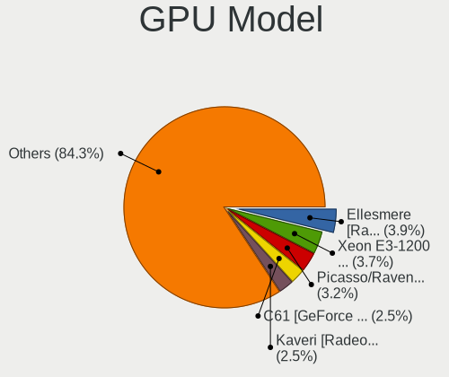

| Model                                                                         | Desktops | Percent |
|-------------------------------------------------------------------------------|----------|---------|
| Intel Xeon E3-1200 v3/4th Gen Core Processor Integrated Graphics Controller   | 29       | 4.29%   |
| AMD Picasso/Raven 2 [Radeon Vega Series / Radeon Vega Mobile Series]          | 23       | 3.4%    |
| AMD Ellesmere [Radeon RX 470/480/570/570X/580/580X/590]                       | 21       | 3.11%   |
| Intel 2nd Generation Core Processor Family Integrated Graphics Controller     | 18       | 2.66%   |
| AMD Kaveri [Radeon R7 Graphics]                                               | 18       | 2.66%   |
| Nvidia C61 [GeForce 7025 / nForce 630a]                                       | 16       | 2.37%   |
| Intel HD Graphics 630                                                         | 16       | 2.37%   |
| AMD Wani [Radeon R5/R6/R7 Graphics]                                           | 16       | 2.37%   |
| AMD Cedar [Radeon HD 5000/6000/7350/8350 Series]                              | 16       | 2.37%   |
| Nvidia GT218 [GeForce 210]                                                    | 15       | 2.22%   |
| Intel Xeon E3-1200 v2/3rd Gen Core processor Graphics Controller              | 14       | 2.07%   |
| Intel CoffeeLake-S GT2 [UHD Graphics 630]                                     | 14       | 2.07%   |
| Intel 4 Series Chipset Integrated Graphics Controller                         | 14       | 2.07%   |
| Nvidia GP107 [GeForce GTX 1050 Ti]                                            | 13       | 1.92%   |
| Intel 82G33/G31 Express Integrated Graphics Controller                        | 13       | 1.92%   |
| AMD Raven Ridge [Radeon Vega Series / Radeon Vega Mobile Series]              | 13       | 1.92%   |
| Nvidia C61 [GeForce 6150SE nForce 430]                                        | 12       | 1.78%   |
| Intel HD Graphics 530                                                         | 12       | 1.78%   |
| Nvidia GK208B [GeForce GT 710]                                                | 11       | 1.63%   |
| Intel 82945G/GZ Integrated Graphics Controller                                | 11       | 1.63%   |
| Intel CometLake-S GT2 [UHD Graphics 630]                                      | 10       | 1.48%   |
| AMD Oland XT [Radeon HD 8670 / R5 340X OEM / R7 250/350/350X OEM]             | 9        | 1.33%   |
| Intel 4th Generation Core Processor Family Integrated Graphics Controller     | 8        | 1.18%   |
| AMD RS780L [Radeon 3000]                                                      | 8        | 1.18%   |
| AMD Lexa PRO [Radeon 540/540X/550/550X / RX 540X/550/550X]                    | 8        | 1.18%   |
| Nvidia GM204 [GeForce GTX 970]                                                | 7        | 1.04%   |
| Nvidia G96C [GeForce 9500 GT]                                                 | 7        | 1.04%   |
| Nvidia GP106 [GeForce GTX 1060 6GB]                                           | 6        | 0.89%   |
| Nvidia GP106 [GeForce GTX 1060 3GB]                                           | 6        | 0.89%   |
| Intel IvyBridge GT2 [HD Graphics 4000]                                        | 6        | 0.89%   |
| AMD Trinity 2 [Radeon HD 7480D]                                               | 6        | 0.89%   |
| Nvidia GM206 [GeForce GTX 950]                                                | 5        | 0.74%   |
| Intel Atom Processor Z36xxx/Z37xxx Series Graphics & Display                  | 5        | 0.74%   |
| AMD Turks XT [Radeon HD 6670/7670]                                            | 5        | 0.74%   |
| AMD Navi 10 [Radeon RX 5600 OEM/5600 XT / 5700/5700 XT]                       | 5        | 0.74%   |
| AMD Cezanne                                                                   | 5        | 0.74%   |
| AMD Caicos [Radeon HD 6450/7450/8450 / R5 230 OEM]                            | 5        | 0.74%   |
| AMD Bonaire XTX [Radeon R7 260X/360]                                          | 5        | 0.74%   |
| VIA Technologies CN700/P4M800 Pro/P4M800 CE/VN800 Graphics [S3 UniChrome Pro] | 4        | 0.59%   |
| Nvidia TU117 [GeForce GTX 1650]                                               | 4        | 0.59%   |

GPU Combo
---------

Combinations of graphics cards

| Name           | Desktops | Percent |
|----------------|----------|---------|
| 1 x AMD        | 237      | 37.68%  |
| 1 x Nvidia     | 175      | 27.82%  |
| 1 x Intel      | 172      | 27.34%  |
| Intel + Nvidia | 11       | 1.75%   |
| 2 x AMD        | 9        | 1.43%   |
| 1 x VIA        | 9        | 1.43%   |
| Intel + AMD    | 8        | 1.27%   |
| AMD + Nvidia   | 5        | 0.79%   |
| 2 x Nvidia     | 2        | 0.32%   |
| 1 x SiS        | 1        | 0.16%   |

GPU Driver
----------

Free vs proprietary

| Driver      | Desktops | Percent |
|-------------|----------|---------|
| Free        | 501      | 79.27%  |
| Proprietary | 85       | 13.45%  |
| Unknown     | 46       | 7.28%   |

GPU Memory
----------

Total video memory

| Size in GB | Desktops | Percent |
|------------|----------|---------|
| Unknown    | 247      | 38.18%  |
| 0.01-0.5   | 116      | 17.93%  |
| 1.01-2.0   | 93       | 14.37%  |
| 0.51-1.0   | 93       | 14.37%  |
| 3.01-4.0   | 51       | 7.88%   |
| 7.01-8.0   | 27       | 4.17%   |
| 5.01-6.0   | 10       | 1.55%   |
| 2.01-3.0   | 5        | 0.77%   |
| 8.01-16.0  | 5        | 0.77%   |

Monitor
-------

Monitor Vendor
--------------

Monitor vendors

| Vendor               | Desktops | Percent |
|----------------------|----------|---------|
| Samsung Electronics  | 229      | 37%     |
| Goldstar             | 148      | 23.91%  |
| Dell                 | 24       | 3.88%   |
| ViewSonic            | 22       | 3.55%   |
| LG Electronics       | 18       | 2.91%   |
| Hitachi              | 16       | 2.58%   |
| BenQ                 | 15       | 2.42%   |
| Philips              | 13       | 2.1%    |
| SKY                  | 12       | 1.94%   |
| Hewlett-Packard      | 10       | 1.62%   |
| SAC                  | 9        | 1.45%   |
| AOC                  | 8        | 1.29%   |
| Unknown              | 7        | 1.13%   |
| Sony                 | 7        | 1.13%   |
| Lenovo               | 5        | 0.81%   |
| ASUSTek Computer     | 5        | 0.81%   |
| MStar                | 4        | 0.65%   |
| CDR                  | 4        | 0.65%   |
| UTV                  | 3        | 0.48%   |
| Unknown (XXX)        | 3        | 0.48%   |
| RTK                  | 3        | 0.48%   |
| JRY                  | 3        | 0.48%   |
| HKC                  | 3        | 0.48%   |
| Ancor Communications | 3        | 0.48%   |
| Acer                 | 3        | 0.48%   |
| STD                  | 2        | 0.32%   |
| SANYO                | 2        | 0.32%   |
| Panasonic            | 2        | 0.32%   |
| LLL                  | 2        | 0.32%   |
| KTC                  | 2        | 0.32%   |
| Konka                | 2        | 0.32%   |
| ITE                  | 2        | 0.32%   |
| HIB                  | 2        | 0.32%   |
| GDH                  | 2        | 0.32%   |
| DTV                  | 2        | 0.32%   |
| Daewoo               | 2        | 0.32%   |
| AGO                  | 2        | 0.32%   |
| ___                  | 1        | 0.16%   |
| Yuraku               | 1        | 0.16%   |
| Targa                | 1        | 0.16%   |

Monitor Model
-------------

Monitor models

| Model                                                                | Desktops | Percent |
|----------------------------------------------------------------------|----------|---------|
| Goldstar FULL HD GSM5B55 1920x1080 480x270mm 21.7-inch               | 15       | 2.31%   |
| Goldstar W1943 GSM4BAD 1360x768 406x229mm 18.4-inch                  | 12       | 1.85%   |
| Hitachi HDMI HEC0088 1920x540                                        | 11       | 1.69%   |
| Goldstar W2243 GSM56FE 1920x1080 477x268mm 21.5-inch                 | 10       | 1.54%   |
| Samsung Electronics S22D300 SAM0B3F 1920x1080 477x268mm 21.5-inch    | 9        | 1.39%   |
| Samsung Electronics C24F390 SAM0D2C 1920x1080 521x293mm 23.5-inch    | 8        | 1.23%   |
| Samsung Electronics SMB1930N SAM0632 1366x768 410x230mm 18.5-inch    | 7        | 1.08%   |
| Samsung Electronics S24F350 SAM0D20 1920x1080 521x293mm 23.5-inch    | 7        | 1.08%   |
| Samsung Electronics S22F350 SAM0D1A 1920x1080 477x268mm 21.5-inch    | 7        | 1.08%   |
| SKY SKYWORTH SKY0001 1920x1080 885x498mm 40.0-inch                   | 6        | 0.92%   |
| Samsung Electronics S19D300 SAM0B35 1366x768 410x230mm 18.5-inch     | 6        | 0.92%   |
| Samsung Electronics LCD Monitor SyncMaster 1680x1050                 | 6        | 0.92%   |
| Goldstar IPS FULLHD GSM5AB8 1920x1080 480x270mm 21.7-inch            | 6        | 0.92%   |
| Goldstar 23EA53 GSM59A9 1920x1080 510x290mm 23.1-inch                | 6        | 0.92%   |
| Samsung Electronics SMB2030N SAM0634 1600x900 443x249mm 20.0-inch    | 5        | 0.77%   |
| Samsung Electronics SA300/SA350 SAM0788 1366x768 410x230mm 18.5-inch | 5        | 0.77%   |
| Samsung Electronics C24F390 SAM0D2D 1920x1080 521x293mm 23.5-inch    | 5        | 0.77%   |
| Philips PHL 223V5 PHLC0CF 1920x1080 477x268mm 21.5-inch              | 5        | 0.77%   |
| Goldstar W2353 GSM56EE 1920x1080 474x296mm 22.0-inch                 | 5        | 0.77%   |
| Goldstar 23EA53 GSM59A8 1920x1080 510x290mm 23.1-inch                | 5        | 0.77%   |
| Samsung Electronics SyncMaster SAM0599 1600x900 443x249mm 20.0-inch  | 4        | 0.62%   |
| Samsung Electronics SyncMaster SAM0546 1920x1080 510x287mm 23.0-inch | 4        | 0.62%   |
| SAC LED MONITOR SAC952D 1920x1080 443x249mm 20.0-inch                | 4        | 0.62%   |
| MStar Demo MST0030 1920x1080 708x398mm 32.0-inch                     | 4        | 0.62%   |
| Goldstar T730SH GSM43CB 1280x960 310x230mm 15.2-inch                 | 4        | 0.62%   |
| Goldstar E2340 GSM57C7 1920x1080 510x290mm 23.1-inch                 | 4        | 0.62%   |
| Goldstar 19EN33 GSM4C18 1366x768 410x230mm 18.5-inch                 | 4        | 0.62%   |
| BenQ GW2480 BNQ78E7 1920x1080 527x296mm 23.8-inch                    | 4        | 0.62%   |
| ViewSonic VA2216w-2 VSC2920 1680x1050 495x291mm 22.6-inch            | 3        | 0.46%   |
| UTV MONITOR UTV0030 1920x1080 580x330mm 26.3-inch                    | 3        | 0.46%   |
| Samsung Electronics SyncMaster SAM05FC 1920x1080                     | 3        | 0.46%   |
| Samsung Electronics SyncMaster SAM05FB 1920x1080 510x287mm 23.0-inch | 3        | 0.46%   |
| Samsung Electronics SyncMaster SAM059A 1920x1080 477x268mm 21.5-inch | 3        | 0.46%   |
| Samsung Electronics SyncMaster SAM03D7 1680x1050 459x296mm 21.5-inch | 3        | 0.46%   |
| Samsung Electronics SyncMaster SAM0326 1440x900 428x255mm 19.6-inch  | 3        | 0.46%   |
| Samsung Electronics SyncMaster SAM0286 1280x720 372x209mm 16.8-inch  | 3        | 0.46%   |
| Samsung Electronics SyncMaster SAM01AB 1280x1024 312x234mm 15.4-inch | 3        | 0.46%   |
| Samsung Electronics SMT24A550 SAM07B5 1920x1080 531x299mm 24.0-inch  | 3        | 0.46%   |
| Samsung Electronics S23B350 SAM08D6 1920x1080 510x287mm 23.0-inch    | 3        | 0.46%   |
| Samsung Electronics S23B350 SAM08D5 1920x1080 510x287mm 23.0-inch    | 3        | 0.46%   |

Monitor Resolution
------------------

Monitor screen resolution

| Resolution         | Desktops | Percent |
|--------------------|----------|---------|
| 1920x1080 (FHD)    | 267      | 44.57%  |
| 1366x768 (WXGA)    | 67       | 11.19%  |
| 1280x1024 (SXGA)   | 43       | 7.18%   |
| 1360x768           | 38       | 6.34%   |
| 3840x2160 (4K)     | 37       | 6.18%   |
| 1680x1050 (WSXGA+) | 35       | 5.84%   |
| 1440x900 (WXGA+)   | 29       | 4.84%   |
| 1600x900 (HD+)     | 22       | 3.67%   |
| 1920x540           | 14       | 2.34%   |
| Unknown            | 7        | 1.17%   |
| 2560x1440 (QHD)    | 6        | 1%      |
| 1280x720 (HD)      | 5        | 0.83%   |
| 1024x768 (XGA)     | 5        | 0.83%   |
| 1152x864           | 4        | 0.67%   |
| 1920x1200 (WUXGA)  | 3        | 0.5%    |
| 3440x1440          | 2        | 0.33%   |
| 2560x1080          | 2        | 0.33%   |
| 2048x1152          | 2        | 0.33%   |
| 1280x960           | 2        | 0.33%   |
| 3840x1080          | 1        | 0.17%   |
| 3286x1080          | 1        | 0.17%   |
| 3280x1080          | 1        | 0.17%   |
| 3046x1050          | 1        | 0.17%   |
| 2646x1024          | 1        | 0.17%   |
| 2288x1287          | 1        | 0.17%   |
| 2048x1536          | 1        | 0.17%   |
| 1792x1344          | 1        | 0.17%   |
| 1600x1200          | 1        | 0.17%   |

Monitor Diagonal
----------------

Diagonal size in inches

| Inches  | Desktops | Percent |
|---------|----------|---------|
| 21      | 105      | 16.69%  |
| 23      | 103      | 16.38%  |
| 18      | 82       | 13.04%  |
| Unknown | 49       | 7.79%   |
| 19      | 33       | 5.25%   |
| 24      | 29       | 4.61%   |
| 20      | 27       | 4.29%   |
| 17      | 25       | 3.97%   |
| 15      | 24       | 3.82%   |
| 27      | 21       | 3.34%   |
| 22      | 18       | 2.86%   |
| 40      | 16       | 2.54%   |
| 48      | 13       | 2.07%   |
| 84      | 12       | 1.91%   |
| 31      | 12       | 1.91%   |
| 52      | 9        | 1.43%   |
| 16      | 9        | 1.43%   |
| 46      | 7        | 1.11%   |
| 32      | 6        | 0.95%   |
| 54      | 5        | 0.79%   |
| 39      | 3        | 0.48%   |
| 34      | 3        | 0.48%   |
| 13      | 3        | 0.48%   |
| 12      | 3        | 0.48%   |
| 72      | 2        | 0.32%   |
| 47      | 2        | 0.32%   |
| 25      | 2        | 0.32%   |
| 142     | 1        | 0.16%   |
| 64      | 1        | 0.16%   |
| 43      | 1        | 0.16%   |
| 30      | 1        | 0.16%   |
| 26      | 1        | 0.16%   |
| 14      | 1        | 0.16%   |

Monitor Width
-------------

Physical width

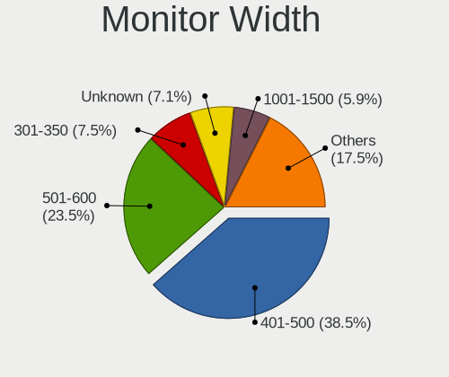

| Width in mm    | Desktops | Percent |
|----------------|----------|---------|
| 401-500        | 251      | 40.95%  |
| 501-600        | 144      | 23.49%  |
| 301-350        | 49       | 7.99%   |
| Unknown        | 49       | 7.99%   |
| 1001-1500      | 37       | 6.04%   |
| 801-900        | 19       | 3.1%    |
| 351-400        | 17       | 2.77%   |
| 601-700        | 16       | 2.61%   |
| 1501-2000      | 14       | 2.28%   |
| 701-800        | 9        | 1.47%   |
| 201-300        | 6        | 0.98%   |
| More than 2000 | 1        | 0.16%   |
| 901-1000       | 1        | 0.16%   |

Aspect Ratio
------------

Proportional relationship between the width and the height

| Ratio   | Desktops | Percent |
|---------|----------|---------|
| 16/9    | 401      | 70.1%   |
| 16/10   | 52       | 9.09%   |
| Unknown | 43       | 7.52%   |
| 5/4     | 29       | 5.07%   |
| 4/3     | 26       | 4.55%   |
| 1.96    | 11       | 1.92%   |
| 3/2     | 4        | 0.7%    |
| 21/9    | 4        | 0.7%    |
| 32/9    | 1        | 0.17%   |
| 1.00    | 1        | 0.17%   |

Monitor Area
------------

Area in inch

| Area in inch | Desktops | Percent |
|----------------|----------|---------|
| 201-250        | 222      | 36.45%  |
| 141-150        | 98       | 16.09%  |
| 151-200        | 79       | 12.97%  |
| Unknown        | 49       | 8.05%   |
| 501-1000       | 39       | 6.4%    |
| More than 1000 | 31       | 5.09%   |
| 301-350        | 22       | 3.61%   |
| 351-500        | 21       | 3.45%   |
| 111-120        | 16       | 2.63%   |
| 101-110        | 9        | 1.48%   |
| 251-300        | 6        | 0.99%   |
| 121-130        | 6        | 0.99%   |
| 81-90          | 4        | 0.66%   |
| 71-80          | 3        | 0.49%   |
| 131-140        | 3        | 0.49%   |
| 91-100         | 1        | 0.16%   |

Pixel Density
-------------

Pixels per inch

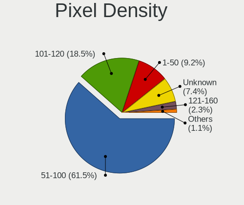

| Density | Desktops | Percent |
|---------|----------|---------|
| 51-100  | 351      | 58.79%  |
| 101-120 | 125      | 20.94%  |
| 1-50    | 59       | 9.88%   |
| Unknown | 49       | 8.21%   |
| 121-160 | 8        | 1.34%   |
| 161-240 | 5        | 0.84%   |

Multiple Monitors
-----------------

Total monitors connected

| Total | Desktops | Percent |
|-------|----------|---------|
| 1     | 518      | 81.19%  |
| 2     | 79       | 12.38%  |
| 0     | 38       | 5.96%   |
| 3     | 3        | 0.47%   |

Network
-------

Net Controller Vendor
---------------------

Controller vendors

| Vendor                                | Desktops | Percent |
|---------------------------------------|----------|---------|
| Realtek Semiconductor                 | 440      | 50.46%  |
| Intel                                 | 116      | 13.3%   |
| Qualcomm Atheros                      | 82       | 9.4%    |
| Nvidia                                | 54       | 6.19%   |
| TP-Link                               | 37       | 4.24%   |
| Ralink Technology                     | 24       | 2.75%   |
| Qualcomm Atheros Communications       | 21       | 2.41%   |
| VIA Technologies                      | 15       | 1.72%   |
| Ralink                                | 8        | 0.92%   |
| Microsoft                             | 8        | 0.92%   |
| Samsung Electronics                   | 7        | 0.8%    |
| Motorola PCS                          | 6        | 0.69%   |
| Broadcom                              | 6        | 0.69%   |
| Silicon Integrated Systems [SiS]      | 4        | 0.46%   |
| NetGear                               | 4        | 0.46%   |
| Marvell Technology Group              | 4        | 0.46%   |
| D-Link System                         | 4        | 0.46%   |
| MediaTek                              | 3        | 0.34%   |
| Broadcom Limited                      | 3        | 0.34%   |
| 3Com                                  | 3        | 0.34%   |
| Linksys                               | 2        | 0.23%   |
| Davicom Semiconductor                 | 2        | 0.23%   |
| D-Link                                | 2        | 0.23%   |
| 802.11g Adapter [Linksys WUSB54GC v3] | 2        | 0.23%   |
| ZTE WCDMA Technologies MSM            | 1        | 0.11%   |
| Xiaomi                                | 1        | 0.11%   |
| Unknown                               | 1        | 0.11%   |
| T & A Mobile Phones                   | 1        | 0.11%   |
| Sundance Technology Inc / IC Plus     | 1        | 0.11%   |
| Smart Link                            | 1        | 0.11%   |
| PCTel                                 | 1        | 0.11%   |
| Ovislink                              | 1        | 0.11%   |
| Motorola                              | 1        | 0.11%   |
| Macronix [MXIC]                       | 1        | 0.11%   |
| LG Electronics                        | 1        | 0.11%   |
| JMicron Technology                    | 1        | 0.11%   |
| Huawei Technologies                   | 1        | 0.11%   |
| Arduino SA                            | 1        | 0.11%   |
| Aquantia                              | 1        | 0.11%   |

Net Controller Model
--------------------

Controller models

| Model                                                             | Desktops | Percent |
|-------------------------------------------------------------------|----------|---------|
| Realtek RTL8111/8168/8411 PCI Express Gigabit Ethernet Controller | 373      | 38.73%  |
| Nvidia MCP61 Ethernet                                             | 50       | 5.19%   |
| Realtek RTL810xE PCI Express Fast Ethernet controller             | 24       | 2.49%   |
| Intel Ethernet Connection (2) I219-V                              | 22       | 2.28%   |
| Realtek RTL8188EUS 802.11n Wireless Network Adapter               | 20       | 2.08%   |
| Qualcomm Atheros AR9271 802.11n                                   | 19       | 1.97%   |
| Qualcomm Atheros AR9485 Wireless Network Adapter                  | 16       | 1.66%   |
| Intel I211 Gigabit Network Connection                             | 16       | 1.66%   |
| Realtek RTL-8100/8101L/8139 PCI Fast Ethernet Adapter             | 14       | 1.45%   |
| VIA VT6102/VT6103 [Rhine-II]                                      | 12       | 1.25%   |
| Ralink MT7601U Wireless Adapter                                   | 12       | 1.25%   |
| TP-Link TL-WN722N v2/v3 [Realtek RTL8188EUS]                      | 11       | 1.14%   |
| Qualcomm Atheros AR9227 Wireless Network Adapter                  | 11       | 1.14%   |
| Intel Ethernet Connection (7) I219-V                              | 10       | 1.04%   |
| Realtek RTL8169 PCI Gigabit Ethernet Controller                   | 9        | 0.93%   |
| Realtek RTL8125 2.5GbE Controller                                 | 9        | 0.93%   |
| Intel Wi-Fi 6 AX200                                               | 9        | 0.93%   |
| Ralink RT2870/RT3070 Wireless Adapter                             | 8        | 0.83%   |
| Intel Ethernet Controller I225-V                                  | 7        | 0.73%   |
| Realtek RTL8188EE Wireless Network Adapter                        | 6        | 0.62%   |
| Realtek RTL-8185 IEEE 802.11a/b/g Wireless LAN Controller         | 6        | 0.62%   |
| Qualcomm Atheros AR9287 Wireless Network Adapter (PCI-Express)    | 6        | 0.62%   |
| Microsoft Xbox 360 Wireless Adapter                               | 6        | 0.62%   |
| Intel Ethernet Connection I217-V                                  | 6        | 0.62%   |
| Intel 82579V Gigabit Network Connection                           | 6        | 0.62%   |
| TP-Link AC600 wireless Realtek RTL8811AU [Archer T2U Nano]        | 5        | 0.52%   |
| Samsung Galaxy series, misc. (tethering mode)                     | 5        | 0.52%   |
| Qualcomm Atheros QCA8171 Gigabit Ethernet                         | 5        | 0.52%   |
| Qualcomm Atheros Killer E2500 Gigabit Ethernet Controller         | 5        | 0.52%   |
| Qualcomm Atheros Attansic L2 Fast Ethernet                        | 5        | 0.52%   |
| Qualcomm Atheros AR93xx Wireless Network Adapter                  | 5        | 0.52%   |
| Qualcomm Atheros AR8152 v2.0 Fast Ethernet                        | 5        | 0.52%   |
| Motorola PCS Moto G (5) Plus                                      | 5        | 0.52%   |
| Intel Dual Band Wireless-AC 3168NGW [Stone Peak]                  | 5        | 0.52%   |
| TP-Link TL-WN823N v2/v3 [Realtek RTL8192EU]                       | 4        | 0.42%   |
| Realtek RTL8192EE PCIe Wireless Network Adapter                   | 4        | 0.42%   |
| Realtek RTL8192CU 802.11n WLAN Adapter                            | 4        | 0.42%   |
| Qualcomm Atheros Killer E220x Gigabit Ethernet Controller         | 4        | 0.42%   |
| Qualcomm Atheros AR9285 Wireless Network Adapter (PCI-Express)    | 4        | 0.42%   |
| Qualcomm Atheros AR8151 v2.0 Gigabit Ethernet                     | 4        | 0.42%   |

Wireless Vendor
---------------

Wireless vendors

| Vendor                                | Desktops | Percent |
|---------------------------------------|----------|---------|
| Realtek Semiconductor                 | 63       | 22.74%  |
| Qualcomm Atheros                      | 58       | 20.94%  |
| Intel                                 | 39       | 14.08%  |
| TP-Link                               | 34       | 12.27%  |
| Ralink Technology                     | 24       | 8.66%   |
| Qualcomm Atheros Communications       | 21       | 7.58%   |
| Ralink                                | 8        | 2.89%   |
| Microsoft                             | 8        | 2.89%   |
| NetGear                               | 4        | 1.44%   |
| D-Link System                         | 4        | 1.44%   |
| Broadcom                              | 4        | 1.44%   |
| Linksys                               | 2        | 0.72%   |
| D-Link                                | 2        | 0.72%   |
| 802.11g Adapter [Linksys WUSB54GC v3] | 2        | 0.72%   |
| Samsung Electronics                   | 1        | 0.36%   |
| Ovislink                              | 1        | 0.36%   |
| MediaTek                              | 1        | 0.36%   |
| Marvell Technology Group              | 1        | 0.36%   |

Wireless Model
--------------

Wireless models

| Model                                                               | Desktops | Percent |
|---------------------------------------------------------------------|----------|---------|
| Realtek RTL8188EUS 802.11n Wireless Network Adapter                 | 20       | 7.12%   |
| Qualcomm Atheros AR9271 802.11n                                     | 19       | 6.76%   |
| Qualcomm Atheros AR9485 Wireless Network Adapter                    | 16       | 5.69%   |
| Ralink MT7601U Wireless Adapter                                     | 12       | 4.27%   |
| TP-Link TL-WN722N v2/v3 [Realtek RTL8188EUS]                        | 11       | 3.91%   |
| Qualcomm Atheros AR9227 Wireless Network Adapter                    | 11       | 3.91%   |
| Intel Wi-Fi 6 AX200                                                 | 9        | 3.2%    |
| Ralink RT2870/RT3070 Wireless Adapter                               | 8        | 2.85%   |
| Realtek RTL8188EE Wireless Network Adapter                          | 6        | 2.14%   |
| Realtek RTL-8185 IEEE 802.11a/b/g Wireless LAN Controller           | 6        | 2.14%   |
| Qualcomm Atheros AR9287 Wireless Network Adapter (PCI-Express)      | 6        | 2.14%   |
| Microsoft Xbox 360 Wireless Adapter                                 | 6        | 2.14%   |
| TP-Link AC600 wireless Realtek RTL8811AU [Archer T2U Nano]          | 5        | 1.78%   |
| Qualcomm Atheros AR93xx Wireless Network Adapter                    | 5        | 1.78%   |
| Intel Dual Band Wireless-AC 3168NGW [Stone Peak]                    | 5        | 1.78%   |
| TP-Link TL-WN823N v2/v3 [Realtek RTL8192EU]                         | 4        | 1.42%   |
| Realtek RTL8192EE PCIe Wireless Network Adapter                     | 4        | 1.42%   |
| Realtek RTL8192CU 802.11n WLAN Adapter                              | 4        | 1.42%   |
| Qualcomm Atheros AR9285 Wireless Network Adapter (PCI-Express)      | 4        | 1.42%   |
| Qualcomm Atheros AR2417 Wireless Network Adapter [AR5007G 802.11bg] | 4        | 1.42%   |
| Intel Centrino Wireless-N 2230                                      | 4        | 1.42%   |
| Intel Cannon Lake PCH CNVi WiFi                                     | 4        | 1.42%   |
| TP-Link Archer T4U ver.3                                            | 3        | 1.07%   |
| Realtek RTL8821CE 802.11ac PCIe Wireless Network Adapter            | 3        | 1.07%   |
| Realtek RTL8812AE 802.11ac PCIe Wireless Network Adapter            | 3        | 1.07%   |
| Ralink RT5390 Wireless 802.11n 1T/1R PCIe                           | 3        | 1.07%   |
| Ralink RT3060 Wireless 802.11n 1T/1R                                | 3        | 1.07%   |
| Qualcomm Atheros QCA6174 802.11ac Wireless Network Adapter          | 3        | 1.07%   |
| Qualcomm Atheros AR922X Wireless Network Adapter                    | 3        | 1.07%   |
| NetGear WN111(v2) RangeMax Next Wireless [Atheros AR9170+AR9101]    | 3        | 1.07%   |
| Intel Wireless 7260                                                 | 3        | 1.07%   |
| Intel Wireless 3160                                                 | 3        | 1.07%   |
| D-Link System DWA-110 Wireless G Adapter(rev.A1) [Ralink RT2571W]   | 3        | 1.07%   |
| TP-Link Archer T3U [Realtek RTL8812BU]                              | 2        | 0.71%   |
| TP-Link 802.11n NIC                                                 | 2        | 0.71%   |
| TP-Link 802.11ac WLAN Adapter                                       | 2        | 0.71%   |
| Realtek RTL8812AU 802.11a/b/g/n/ac 2T2R DB WLAN Adapter             | 2        | 0.71%   |
| Realtek RTL8723BU 802.11b/g/n WLAN Adapter                          | 2        | 0.71%   |
| Realtek RTL8188SU 802.11n WLAN Adapter                              | 2        | 0.71%   |
| Realtek RTL8188FTV 802.11b/g/n 1T1R 2.4G WLAN Adapter               | 2        | 0.71%   |

Ethernet Vendor
---------------

Ethernet vendors

| Vendor                            | Desktops | Percent |
|-----------------------------------|----------|---------|
| Realtek Semiconductor             | 423      | 63.8%   |
| Intel                             | 96       | 14.48%  |
| Nvidia                            | 54       | 8.14%   |
| Qualcomm Atheros                  | 33       | 4.98%   |
| VIA Technologies                  | 15       | 2.26%   |
| Samsung Electronics               | 6        | 0.9%    |
| Motorola PCS                      | 5        | 0.75%   |
| Silicon Integrated Systems [SiS]  | 4        | 0.6%    |
| TP-Link                           | 3        | 0.45%   |
| Marvell Technology Group          | 3        | 0.45%   |
| Broadcom Limited                  | 3        | 0.45%   |
| 3Com                              | 3        | 0.45%   |
| MediaTek                          | 2        | 0.3%    |
| Davicom Semiconductor             | 2        | 0.3%    |
| Broadcom                          | 2        | 0.3%    |
| ZTE WCDMA Technologies MSM        | 1        | 0.15%   |
| Xiaomi                            | 1        | 0.15%   |
| T & A Mobile Phones               | 1        | 0.15%   |
| Sundance Technology Inc / IC Plus | 1        | 0.15%   |
| Macronix [MXIC]                   | 1        | 0.15%   |
| LG Electronics                    | 1        | 0.15%   |
| JMicron Technology                | 1        | 0.15%   |
| Huawei Technologies               | 1        | 0.15%   |
| Aquantia                          | 1        | 0.15%   |

Ethernet Model
--------------

Ethernet models

| Model                                                             | Desktops | Percent |
|-------------------------------------------------------------------|----------|---------|
| Realtek RTL8111/8168/8411 PCI Express Gigabit Ethernet Controller | 373      | 55.42%  |
| Nvidia MCP61 Ethernet                                             | 50       | 7.43%   |
| Realtek RTL810xE PCI Express Fast Ethernet controller             | 24       | 3.57%   |
| Intel Ethernet Connection (2) I219-V                              | 22       | 3.27%   |
| Intel I211 Gigabit Network Connection                             | 16       | 2.38%   |
| Realtek RTL-8100/8101L/8139 PCI Fast Ethernet Adapter             | 14       | 2.08%   |
| VIA VT6102/VT6103 [Rhine-II]                                      | 12       | 1.78%   |
| Intel Ethernet Connection (7) I219-V                              | 10       | 1.49%   |
| Realtek RTL8169 PCI Gigabit Ethernet Controller                   | 9        | 1.34%   |
| Realtek RTL8125 2.5GbE Controller                                 | 9        | 1.34%   |
| Intel Ethernet Controller I225-V                                  | 7        | 1.04%   |
| Intel Ethernet Connection I217-V                                  | 6        | 0.89%   |
| Intel 82579V Gigabit Network Connection                           | 6        | 0.89%   |
| Samsung Galaxy series, misc. (tethering mode)                     | 5        | 0.74%   |
| Qualcomm Atheros QCA8171 Gigabit Ethernet                         | 5        | 0.74%   |
| Qualcomm Atheros Killer E2500 Gigabit Ethernet Controller         | 5        | 0.74%   |
| Qualcomm Atheros Attansic L2 Fast Ethernet                        | 5        | 0.74%   |
| Qualcomm Atheros AR8152 v2.0 Fast Ethernet                        | 5        | 0.74%   |
| Motorola PCS Moto G (5) Plus                                      | 5        | 0.74%   |
| Qualcomm Atheros Killer E220x Gigabit Ethernet Controller         | 4        | 0.59%   |
| Qualcomm Atheros AR8151 v2.0 Gigabit Ethernet                     | 4        | 0.59%   |
| Intel Ethernet Connection (2) I218-V                              | 4        | 0.59%   |
| Intel 82578DC Gigabit Network Connection                          | 4        | 0.59%   |
| Intel 82567LM-3 Gigabit Network Connection                        | 4        | 0.59%   |
| VIA VT6105/VT6106S [Rhine-III]                                    | 3        | 0.45%   |
| TP-Link UE300 10/100/1000 LAN (ethernet mode) [Realtek RTL8153]   | 3        | 0.45%   |
| Intel 82579LM Gigabit Network Connection (Lewisville)             | 3        | 0.45%   |
| Broadcom Limited NetXtreme BCM5755 Gigabit Ethernet PCI Express   | 3        | 0.45%   |
| 3Com 3c905B 100BaseTX [Cyclone]                                   | 3        | 0.45%   |
| Silicon Integrated Systems [SiS] SiS900 PCI Fast Ethernet         | 2        | 0.3%    |
| Qualcomm Atheros Killer E2400 Gigabit Ethernet Controller         | 2        | 0.3%    |
| Nvidia MCP77 Ethernet                                             | 2        | 0.3%    |
| MediaTek Nokia 5.1 Plus                                           | 2        | 0.3%    |
| Intel Ethernet Connection (10) I219-V                             | 2        | 0.3%    |
| Intel 82566DM-2 Gigabit Network Connection                        | 2        | 0.3%    |
| Intel 82566DC Gigabit Network Connection                          | 2        | 0.3%    |
| Davicom DM9102 Fast Ethernet Controller                           | 2        | 0.3%    |
| Broadcom NetXtreme BCM5754 Gigabit Ethernet PCI Express           | 2        | 0.3%    |
| ZTE WCDMA MSM ZTE                                                 | 1        | 0.15%   |
| Xiaomi Mi/Redmi series (RNDIS)                                    | 1        | 0.15%   |

Net Controller Kind
-------------------

Ethernet, WiFi or modem

| Kind     | Desktops | Percent |
|----------|----------|---------|
| Ethernet | 616      | 69.45%  |
| WiFi     | 263      | 29.65%  |
| Modem    | 6        | 0.68%   |
| Unknown  | 2        | 0.23%   |

Used Controller
---------------

Currently used network controller

| Kind     | Desktops | Percent |
|----------|----------|---------|
| Ethernet | 444      | 70.03%  |
| WiFi     | 190      | 29.97%  |

NICs
----

Total network controllers on board

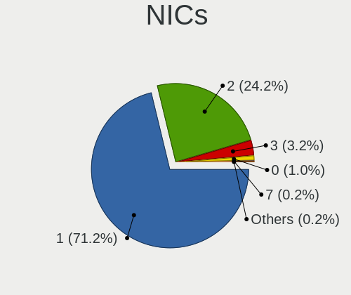

| Total | Desktops | Percent |
|-------|----------|---------|
| 1     | 457      | 72.77%  |
| 2     | 151      | 24.04%  |
| 3     | 14       | 2.23%   |
| 0     | 5        | 0.8%    |
| 32    | 1        | 0.16%   |

IPv6
----

IPv6 vs IPv4

| Used | Desktops | Percent |
|------|----------|---------|
| No   | 562      | 89.21%  |
| Yes  | 68       | 10.79%  |

Bluetooth
---------

Bluetooth Vendor
----------------

Controller vendors

| Vendor                          | Desktops | Percent |
|---------------------------------|----------|---------|
| Intel                           | 37       | 39.36%  |
| Cambridge Silicon Radio         | 33       | 35.11%  |
| Realtek Semiconductor           | 6        | 6.38%   |
| ASUSTek Computer                | 5        | 5.32%   |
| Qualcomm Atheros Communications | 2        | 2.13%   |
| Integrated System Solution      | 2        | 2.13%   |
| IMC Networks                    | 2        | 2.13%   |
| Broadcom                        | 2        | 2.13%   |
| TP-Link                         | 1        | 1.06%   |
| Roper                           | 1        | 1.06%   |
| Logitech                        | 1        | 1.06%   |
| Hewlett-Packard                 | 1        | 1.06%   |
| Conwise Technology              | 1        | 1.06%   |

Bluetooth Model
---------------

Controller models

| Model                                                 | Desktops | Percent |
|-------------------------------------------------------|----------|---------|
| Cambridge Silicon Radio Bluetooth Dongle (HCI mode)   | 33       | 35.11%  |
| Intel AX200 Bluetooth                                 | 10       | 10.64%  |
| Intel Bluetooth wireless interface                    | 8        | 8.51%   |
| Realtek Bluetooth Radio                               | 6        | 6.38%   |
| Intel Wireless-AC 3168 Bluetooth                      | 5        | 5.32%   |
| Intel Centrino Bluetooth Wireless Transceiver         | 4        | 4.26%   |
| Intel Bluetooth 9460/9560 Jefferson Peak (JfP)        | 4        | 4.26%   |
| ASUS Bluetooth Radio                                  | 3        | 3.19%   |
| Intel Wireless-AC 9260 Bluetooth Adapter              | 2        | 2.13%   |
| Intel AX210 Bluetooth                                 | 2        | 2.13%   |
| Intel AX201 Bluetooth                                 | 2        | 2.13%   |
| ASUS Qualcomm Bluetooth 4.1                           | 2        | 2.13%   |
| TP-Link UB500 Adapter                                 | 1        | 1.06%   |
| Roper Class 1 Bluetooth Dongle                        | 1        | 1.06%   |
| Qualcomm Atheros  Bluetooth Device                    | 1        | 1.06%   |
| Qualcomm Atheros QCA61x4 Bluetooth 4.0                | 1        | 1.06%   |
| Logitech BT Mini-Receiver (HCI mode)                  | 1        | 1.06%   |
| Integrated System Solution KY-BT100 Bluetooth Adapter | 1        | 1.06%   |
| Integrated System Solution Bluetooth Device           | 1        | 1.06%   |
| IMC Networks Bluetooth Radio                          | 1        | 1.06%   |
| IMC Networks Bluetooth                                | 1        | 1.06%   |
| HP Bluetooth Adapter                                  | 1        | 1.06%   |
| Conwise CW6622                                        | 1        | 1.06%   |
| Broadcom HP Portable Bumble Bee                       | 1        | 1.06%   |
| Broadcom HP Bluethunder                               | 1        | 1.06%   |

Sound
-----

Sound Vendor
------------

Sound card vendors

| Vendor                                          | Desktops | Percent |
|-------------------------------------------------|----------|---------|
| AMD                                             | 300      | 33.56%  |
| Intel                                           | 296      | 33.11%  |
| Nvidia                                          | 176      | 19.69%  |
| Logitech                                        | 18       | 2.01%   |
| C-Media Electronics                             | 17       | 1.9%    |
| VIA Technologies                                | 14       | 1.57%   |
| Kingston Technology                             | 10       | 1.12%   |
| Creative Labs                                   | 7        | 0.78%   |
| Generalplus Technology                          | 5        | 0.56%   |
| Silicon Integrated Systems [SiS]                | 4        | 0.45%   |
| Focusrite-Novation                              | 4        | 0.45%   |
| M-Audio                                         | 3        | 0.34%   |
| Fry's Electronics                               | 3        | 0.34%   |
| Elite Silicon                                   | 3        | 0.34%   |
| Texas Instruments                               | 2        | 0.22%   |
| Samson Technologies                             | 2        | 0.22%   |
| Razer USA                                       | 2        | 0.22%   |
| Plantronics                                     | 2        | 0.22%   |
| Licensed by Sony Computer Entertainment America | 2        | 0.22%   |
| ESI Audiotechnik                                | 2        | 0.22%   |
| ATI Technologies                                | 2        | 0.22%   |
| Astro Gaming                                    | 2        | 0.22%   |
| Yamaha                                          | 1        | 0.11%   |
| TEAC                                            | 1        | 0.11%   |
| Realtek Semiconductor                           | 1        | 0.11%   |
| Pro-Ject                                        | 1        | 0.11%   |
| Microsoft                                       | 1        | 0.11%   |
| Micro Star International                        | 1        | 0.11%   |
| Holtek Semiconductor                            | 1        | 0.11%   |
| Ensoniq                                         | 1        | 0.11%   |
| Dell                                            | 1        | 0.11%   |
| Creative Technology                             | 1        | 0.11%   |
| Corsair                                         | 1        | 0.11%   |
| Cirrus Logic                                    | 1        | 0.11%   |
| Chicony Electronics                             | 1        | 0.11%   |
| Casio Computer                                  | 1        | 0.11%   |
| BEHRINGER International                         | 1        | 0.11%   |
| Audient                                         | 1        | 0.11%   |
| ASUSTek Computer                                | 1        | 0.11%   |
| Arturia                                         | 1        | 0.11%   |

Sound Model
-----------

Sound card models

| Model                                                                             | Desktops | Percent |
|-----------------------------------------------------------------------------------|----------|---------|
| AMD FCH Azalia Controller                                                         | 67       | 6%      |
| AMD SBx00 Azalia (Intel HDA)                                                      | 61       | 5.47%   |
| Nvidia MCP61 High Definition Audio                                                | 52       | 4.66%   |
| Intel NM10/ICH7 Family High Definition Audio Controller                           | 49       | 4.39%   |
| AMD Family 17h/19h HD Audio Controller                                            | 42       | 3.76%   |
| Intel 8 Series/C220 Series Chipset High Definition Audio Controller               | 41       | 3.67%   |
| Intel 100 Series/C230 Series Chipset Family HD Audio Controller                   | 41       | 3.67%   |
| Intel 6 Series/C200 Series Chipset Family High Definition Audio Controller        | 39       | 3.49%   |
| AMD Raven/Raven2/Fenghuang HDMI/DP Audio Controller                               | 36       | 3.23%   |
| Intel Xeon E3-1200 v3/4th Gen Core Processor HD Audio Controller                  | 32       | 2.87%   |
| AMD Starship/Matisse HD Audio Controller                                          | 30       | 2.69%   |
| Intel 200 Series PCH HD Audio                                                     | 27       | 2.42%   |
| AMD Oland/Hainan/Cape Verde/Pitcairn HDMI Audio [Radeon HD 7000 Series]           | 26       | 2.33%   |
| AMD Kabini HDMI/DP Audio                                                          | 24       | 2.15%   |
| AMD Family 17h (Models 00h-0fh) HD Audio Controller                               | 23       | 2.06%   |
| AMD Kaveri HDMI/DP Audio Controller                                               | 22       | 1.97%   |
| AMD Ellesmere HDMI Audio [Radeon RX 470/480 / 570/580/590]                        | 21       | 1.88%   |
| Intel 7 Series/C216 Chipset Family High Definition Audio Controller               | 20       | 1.79%   |
| Nvidia High Definition Audio Controller                                           | 17       | 1.52%   |
| AMD Trinity HDMI Audio Controller                                                 | 17       | 1.52%   |
| Nvidia GP107GL High Definition Audio Controller                                   | 16       | 1.43%   |
| AMD Cedar HDMI Audio [Radeon HD 5400/6300/7300 Series]                            | 16       | 1.43%   |
| Intel Cannon Lake PCH cAVS                                                        | 15       | 1.34%   |
| Nvidia GK208 HDMI/DP Audio Controller                                             | 14       | 1.25%   |
| AMD Family 15h (Models 60h-6fh) Audio Controller                                  | 13       | 1.16%   |
| Nvidia GP106 High Definition Audio Controller                                     | 12       | 1.08%   |
| AMD Baffin HDMI/DP Audio [Radeon RX 550 640SP / RX 560/560X]                      | 11       | 0.99%   |
| Intel 9 Series Chipset Family HD Audio Controller                                 | 10       | 0.9%    |
| Nvidia GM206 High Definition Audio Controller                                     | 9        | 0.81%   |
| AMD Turks HDMI Audio [Radeon HD 6500/6600 / 6700M Series]                         | 9        | 0.81%   |
| AMD Tobago HDMI Audio [Radeon R7 360 / R9 360 OEM]                                | 9        | 0.81%   |
| AMD Navi 10 HDMI Audio                                                            | 9        | 0.81%   |
| Nvidia GM204 High Definition Audio Controller                                     | 8        | 0.72%   |
| Intel 5 Series/3400 Series Chipset High Definition Audio                          | 8        | 0.72%   |
| VIA Technologies VT8233/A/8235/8237 AC97 Audio Controller                         | 7        | 0.63%   |
| Nvidia GF108 High Definition Audio Controller                                     | 7        | 0.63%   |
| Intel Audio device                                                                | 7        | 0.63%   |
| C-Media Electronics USB Audio Device                                              | 7        | 0.63%   |
| AMD Caicos HDMI Audio [Radeon HD 6450 / 7450/8450/8490 OEM / R5 230/235/235X OEM] | 7        | 0.63%   |
| VIA Technologies VX900/VT8xxx High Definition Audio Controller                    | 6        | 0.54%   |

Memory
------

Memory Vendor
-------------

Memory module vendors

| Vendor              | Desktops | Percent |
|---------------------|----------|---------|
| Kingston            | 127      | 40.71%  |
| Unknown             | 66       | 21.15%  |
| Crucial             | 29       | 9.29%   |
| Corsair             | 20       | 6.41%   |
| A-DATA Technology   | 10       | 3.21%   |
| Samsung Electronics | 8        | 2.56%   |
| G.Skill             | 7        | 2.24%   |
| Patriot             | 5        | 1.6%    |
| Hewlett-Packard     | 4        | 1.28%   |
| Avant               | 4        | 1.28%   |
| SK hynix            | 3        | 0.96%   |
| Novatech            | 3        | 0.96%   |
| Goldkey             | 3        | 0.96%   |
| Transcend           | 2        | 0.64%   |
| Super Talent        | 2        | 0.64%   |
| Ramos Technology    | 2        | 0.64%   |
| Magnum Tech         | 2        | 0.64%   |
| Elpida              | 2        | 0.64%   |
| Unknown             | 2        | 0.64%   |
| Thermaltake         | 1        | 0.32%   |
| Team                | 1        | 0.32%   |
| PNY                 | 1        | 0.32%   |
| OLOY                | 1        | 0.32%   |
| Nanya Technology    | 1        | 0.32%   |
| Mushkin             | 1        | 0.32%   |
| Micron Technology   | 1        | 0.32%   |
| Kreton              | 1        | 0.32%   |
| Hikvision           | 1        | 0.32%   |
| AVEXIR              | 1        | 0.32%   |
| AMD                 | 1        | 0.32%   |

Memory Model
------------

Memory module models

| Model                                                    | Desktops | Percent |
|----------------------------------------------------------|----------|---------|
| Kingston RAM KHX2400C15/8G 8GB DIMM DDR4 2933MT/s        | 9        | 2.56%   |
| Kingston RAM KHX1866C10D3/8G 8GB DIMM DDR3 2133MT/s      | 8        | 2.28%   |
| Kingston RAM KHX2666C16/8G 8GB DIMM DDR4 3466MT/s        | 7        | 1.99%   |
| Kingston RAM 99U5471-054.A00LF 8GB DIMM DDR3 1600MT/s    | 6        | 1.71%   |
| Unknown RAM Module 4096MB DIMM 1333MT/s                  | 5        | 1.42%   |
| Unknown RAM Module 2048MB DIMM 1333MT/s                  | 5        | 1.42%   |
| Kingston RAM 99U5584-005.A00LF 4096MB DIMM DDR3 1600MT/s | 5        | 1.42%   |
| Unknown RAM Module 4GB DIMM 1333MT/s                     | 4        | 1.14%   |
| Kingston RAM KHX1866C10D3/4G 4GB DIMM DDR3 1867MT/s      | 4        | 1.14%   |
| Crucial RAM BLS8G4D240FSEK.8FBD 8GB DIMM DDR4 2400MT/s   | 4        | 1.14%   |
| Unknown RAM Module 8GB DIMM 1600MT/s                     | 3        | 0.85%   |
| Unknown RAM Module 4GB DIMM 1600MT/s                     | 3        | 0.85%   |
| Unknown RAM Module 4096MB DIMM 1066MT/s                  | 3        | 0.85%   |
| Unknown RAM Module 2GB DIMM DDR2 333MT/s                 | 3        | 0.85%   |
| Kingston RAM KHX1866C10D3/ 8GB DIMM DDR3 1866MT/s        | 3        | 0.85%   |
| Kingston RAM KHX1600C9D3/4GX 4GB DIMM DDR3 2400MT/s      | 3        | 0.85%   |
| Kingston RAM KHX1600C10D3/8G 8GB DIMM DDR3 1600MT/s      | 3        | 0.85%   |
| Kingston RAM KHX1600C10D3/ 8GB DIMM DDR3 1600MT/s        | 3        | 0.85%   |
| Kingston RAM 99U5584-003.A00LF 4GB DIMM DDR3 1600MT/s    | 3        | 0.85%   |
| Kingston RAM 9905702-119.A00G 8GB DIMM DDR4 2667MT/s     | 3        | 0.85%   |
| Unknown RAM Module 4GB DIMM SDRAM                        | 2        | 0.57%   |
| Unknown RAM Module 4096MB DIMM DDR3 1333MT/s             | 2        | 0.57%   |
| Unknown RAM Module 4096MB DIMM 400MT/s                   | 2        | 0.57%   |
| Unknown RAM Module 2GB DIMM SDRAM                        | 2        | 0.57%   |
| Unknown RAM Module 2GB DIMM 1333MT/s                     | 2        | 0.57%   |
| Unknown RAM Module 2048MB DIMM SDRAM                     | 2        | 0.57%   |
| Unknown RAM Module 1GB DIMM SDRAM                        | 2        | 0.57%   |
| Unknown RAM Module 1GB DIMM DDR2 333MT/s                 | 2        | 0.57%   |
| Unknown RAM Module 1GB DIMM                              | 2        | 0.57%   |
| Unknown RAM Module 1024MB DIMM                           | 2        | 0.57%   |
| Super Talent RAM SUPERTALENT02 4GB DIMM DDR3 1600MT/s    | 2        | 0.57%   |
| Samsung RAM M378B5673FH0-CH9 2GB DIMM DDR3 1600MT/s      | 2        | 0.57%   |
| Patriot RAM PSD34G13332 4GB DIMM DDR3 1600MT/s           | 2        | 0.57%   |
| Patriot RAM 3200 C16 Series 8GB DIMM DDR4 3200MT/s       | 2        | 0.57%   |
| Novatech RAM N3D04H1600B REV.00 4GB DIMM DDR3 1600MT/s   | 2        | 0.57%   |
| Kingston RAM Module 2GB DIMM DDR2 667MT/s                | 2        | 0.57%   |
| Kingston RAM KHX2400C15D4/4G 4GB DIMM DDR4 3151MT/s      | 2        | 0.57%   |
| Kingston RAM KHX1600C10D3/4G 4GB DIMM DDR3 1866MT/s      | 2        | 0.57%   |
| Kingston RAM 99U5702-094.A00G 8GB DIMM DDR4 2400MT/s     | 2        | 0.57%   |
| Kingston RAM 99U5474-026.A00LF 4GB DIMM DDR3 1333MT/s    | 2        | 0.57%   |

Memory Kind
-----------

Memory module kinds

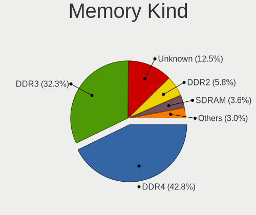

| Kind    | Desktops | Percent |
|---------|----------|---------|
| DDR4    | 115      | 40.93%  |
| DDR3    | 98       | 34.88%  |
| Unknown | 37       | 13.17%  |
| DDR2    | 18       | 6.41%   |
| SDRAM   | 9        | 3.2%    |
| DDR     | 4        | 1.42%   |

Memory Form Factor
------------------

Physical design of the memory module

| Name   | Desktops | Percent |
|--------|----------|---------|
| DIMM   | 275      | 98.92%  |
| SODIMM | 3        | 1.08%   |

Memory Size
-----------

Memory module size

| Size  | Desktops | Percent |
|-------|----------|---------|
| 8192  | 131      | 42.81%  |
| 4096  | 78       | 25.49%  |
| 2048  | 49       | 16.01%  |
| 16384 | 24       | 7.84%   |
| 1024  | 16       | 5.23%   |
| 32768 | 5        | 1.63%   |
| 512   | 3        | 0.98%   |

Memory Speed
------------

Memory module speed

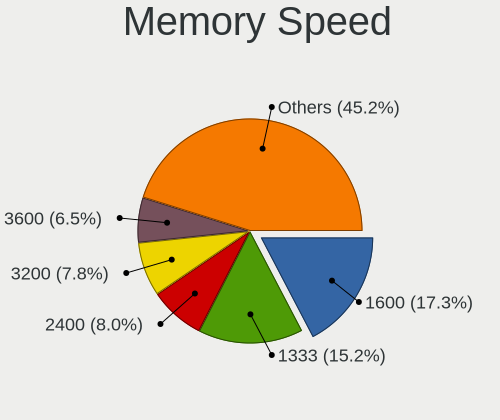

| Speed   | Desktops | Percent |
|---------|----------|---------|
| 1600    | 59       | 18.61%  |
| 1333    | 50       | 15.77%  |
| 2400    | 31       | 9.78%   |
| 3200    | 22       | 6.94%   |
| 2667    | 15       | 4.73%   |
| Unknown | 15       | 4.73%   |
| 2133    | 14       | 4.42%   |
| 2933    | 12       | 3.79%   |
| 3600    | 11       | 3.47%   |
| 2666    | 11       | 3.47%   |
| 667     | 10       | 3.15%   |
| 3466    | 8        | 2.52%   |
| 1866    | 7        | 2.21%   |
| 3000    | 6        | 1.89%   |
| 333     | 6        | 1.89%   |
| 800     | 5        | 1.58%   |
| 533     | 5        | 1.58%   |
| 1066    | 4        | 1.26%   |
| 400     | 4        | 1.26%   |
| 3400    | 3        | 0.95%   |
| 1867    | 3        | 0.95%   |
| 3151    | 2        | 0.63%   |
| 3007    | 2        | 0.63%   |
| 1334    | 2        | 0.63%   |
| 3733    | 1        | 0.32%   |
| 3500    | 1        | 0.32%   |
| 3334    | 1        | 0.32%   |
| 3100    | 1        | 0.32%   |
| 2866    | 1        | 0.32%   |
| 2800    | 1        | 0.32%   |
| 2200    | 1        | 0.32%   |
| 2187    | 1        | 0.32%   |
| 1200    | 1        | 0.32%   |
| 1067    | 1        | 0.32%   |

Printers & scanners
-------------------

Printer Vendor
--------------

Printer device vendors

| Vendor              | Desktops | Percent |
|---------------------|----------|---------|
| Hewlett-Packard     | 19       | 44.19%  |
| Brother Industries  | 13       | 30.23%  |
| Seiko Epson         | 4        | 9.3%    |
| Samsung Electronics | 3        | 6.98%   |
| Ricoh               | 1        | 2.33%   |
| Pantum              | 1        | 2.33%   |
| NXP Semiconductors  | 1        | 2.33%   |
| Graphtec America    | 1        | 2.33%   |

Printer Model
-------------

Printer device models

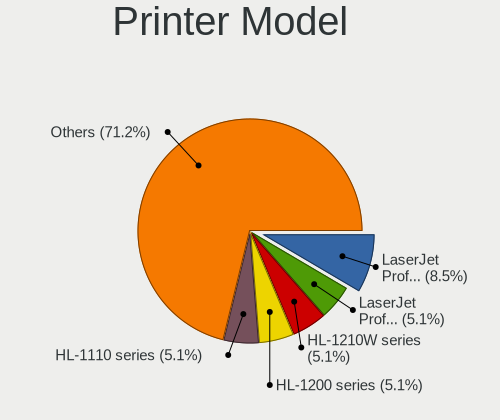

| Model                                         | Desktops | Percent |
|-----------------------------------------------|----------|---------|
| HP LaserJet Professional P 1102w              | 3        | 6.98%   |
| Brother HL-1210W series                       | 3        | 6.98%   |
| Brother HL-1200 series                        | 3        | 6.98%   |
| Brother HL-1110 series                        | 3        | 6.98%   |
| Samsung M2020 Series                          | 2        | 4.65%   |
| HP LaserJet Professional P1102w               | 2        | 4.65%   |
| HP LaserJet P1006                             | 2        | 4.65%   |
| HP LaserJet P1005                             | 2        | 4.65%   |
| HP Ink Tank 110 series                        | 2        | 4.65%   |
| Brother HL-2130 series                        | 2        | 4.65%   |
| Seiko Epson XP-243 245 247 Series             | 1        | 2.33%   |
| Seiko Epson ME 340 Series/Stylus NX130 Series | 1        | 2.33%   |
| Seiko Epson L4150 Series                      | 1        | 2.33%   |
| Seiko Epson L355 Series                       | 1        | 2.33%   |
| Samsung Xerox Phaser 3117 Laser Printer       | 1        | 2.33%   |
| Ricoh Printing Support                        | 1        | 2.33%   |
| Pantum P2500W series                          | 1        | 2.33%   |
| NXP Semiconductors Printer-80                 | 1        | 2.33%   |
| HP PSC 1400                                   | 1        | 2.33%   |
| HP LaserJet 3050                              | 1        | 2.33%   |
| HP DeskJet F4100 Printer series               | 1        | 2.33%   |
| HP DeskJet 3630 series                        | 1        | 2.33%   |
| HP Deskjet 3050 J610 series                   | 1        | 2.33%   |
| HP DeskJet 2620 All-in-One Printer            | 1        | 2.33%   |
| HP Deskjet 2050 J510                          | 1        | 2.33%   |
| HP Color LaserJet Pro M478f-9f                | 1        | 2.33%   |
| Graphtec America Graphtec Printer             | 1        | 2.33%   |
| Brother DCP-7055 scanner/printer              | 1        | 2.33%   |
| Brother DCP-1610NW                            | 1        | 2.33%   |

Scanner Vendor
--------------

Scanner device vendors

| Vendor          | Desktops | Percent |
|-----------------|----------|---------|
| Hewlett-Packard | 1        | 100%    |

Scanner Model
-------------

Scanner device models

| Model            | Desktops | Percent |
|------------------|----------|---------|
| HP ScanJet 2400c | 1        | 100%    |

Camera
------

Camera Vendor
-------------

Camera device vendors

| Vendor                      | Desktops | Percent |
|-----------------------------|----------|---------|
| Logitech                    | 27       | 24.11%  |
| Samsung Electronics         | 10       | 8.93%   |
| Microdia                    | 9        | 8.04%   |
| KYE Systems (Mouse Systems) | 9        | 8.04%   |
| Generalplus Technology      | 8        | 7.14%   |
| Z-Star Microelectronics     | 6        | 5.36%   |
| Jieli Technology            | 6        | 5.36%   |
| Chicony Electronics         | 6        | 5.36%   |
| Microsoft                   | 5        | 4.46%   |
| Alcor Micro                 | 4        | 3.57%   |
| MacroSilicon                | 3        | 2.68%   |
| Apple                       | 3        | 2.68%   |
| Silicon Motion              | 2        | 1.79%   |
| Razer USA                   | 2        | 1.79%   |
| Pixart Imaging              | 2        | 1.79%   |
| Cubeternet                  | 2        | 1.79%   |
| ARC International           | 2        | 1.79%   |
| Philips (or NXP)            | 1        | 0.89%   |
| OmniVision Technologies     | 1        | 0.89%   |
| Huawei Technologies         | 1        | 0.89%   |
| Genesys Logic               | 1        | 0.89%   |
| Aveo Technology             | 1        | 0.89%   |
| Acer                        | 1        | 0.89%   |

Camera Model
------------

Camera device models

| Model                                              | Desktops | Percent |
|----------------------------------------------------|----------|---------|
| Logitech Webcam C270                               | 11       | 9.82%   |
| Samsung Galaxy A5 (MTP)                            | 9        | 8.04%   |
| Jieli USB PHY 2.0                                  | 6        | 5.36%   |
| Generalplus GENERAL WEBCAM                         | 6        | 5.36%   |
| Logitech HD Pro Webcam C920                        | 5        | 4.46%   |
| Alcor Micro USB2.0 Camera                          | 4        | 3.57%   |
| Microsoft LifeCam VX-800                           | 3        | 2.68%   |
| Microdia Webcam Vitade AF                          | 3        | 2.68%   |
| MacroSilicon USB Video                             | 3        | 2.68%   |
| Chicony HP 0.3MP Webcam                            | 3        | 2.68%   |
| Apple iPhone5/5C/5S/6                              | 3        | 2.68%   |
| Z-Star Venus USB2.0 Camera                         | 2        | 1.79%   |
| Z-Star A4 TECH USB2.0 PC Camera E                  | 2        | 1.79%   |
| Microdia Integrated Camera                         | 2        | 1.79%   |
| Logitech C922 Pro Stream Webcam                    | 2        | 1.79%   |
| KYE Systems (Mouse Systems) Genius iSlim 2000AF V2 | 2        | 1.79%   |
| KYE Systems (Mouse Systems) Genius FaceCam 320     | 2        | 1.79%   |
| KYE Systems (Mouse Systems) FaceCam 1000X          | 2        | 1.79%   |
| Generalplus 808 Camera #9 (web-cam mode)           | 2        | 1.79%   |
| Cubeternet WebCam                                  | 2        | 1.79%   |
| Chicony HP High Definition 1MP Webcam              | 2        | 1.79%   |
| ARC International Camera                           | 2        | 1.79%   |
| Z-Star USB 2.0 Web Camera                          | 1        | 0.89%   |
| Z-Star Integrated Camera                           | 1        | 0.89%   |
| Silicon Motion SM731 Camera                        | 1        | 0.89%   |
| Silicon Motion Endoscope camera                    | 1        | 0.89%   |
| Samsung Galaxy (debugging mode)                    | 1        | 0.89%   |
| Razer USA Razer Ripsaw HD - Game Capture Card      | 1        | 0.89%   |
| Razer USA Gaming Webcam [Kiyo]                     | 1        | 0.89%   |
| Pixart Imaging Webcam Genius iLook 300             | 1        | 0.89%   |
| Pixart Imaging GE 1.3 MP MiniCam Pro               | 1        | 0.89%   |
| Philips (or NXP) Webcam SPC530NC                   | 1        | 0.89%   |
| OmniVision Monitor Webcam                          | 1        | 0.89%   |
| Microsoft LifeCam VX-500 [1357]                    | 1        | 0.89%   |
| Microsoft LifeCam HD-3000                          | 1        | 0.89%   |
| Microdia USB camera                                | 1        | 0.89%   |
| Microdia USB 2.0 Camera                            | 1        | 0.89%   |
| Microdia CameraA                                   | 1        | 0.89%   |
| Microdia Camera                                    | 1        | 0.89%   |
| Logitech Webcam C925e                              | 1        | 0.89%   |

Security
--------

Fingerprint Vendor
------------------

Fingerprint sensor vendors

Zero info for selected period =(

Fingerprint Model
-----------------

Fingerprint sensor models

Zero info for selected period =(

Chipcard Vendor
---------------

Chipcard module vendors

Zero info for selected period =(

Chipcard Model
--------------

Chipcard module models

Zero info for selected period =(

Unsupported
-----------

Unsupported Devices
-------------------

Total unsupported devices on board

| Total | Desktops | Percent |
|-------|----------|---------|
| 0     | 529      | 83.31%  |
| 1     | 88       | 13.86%  |
| 2     | 16       | 2.52%   |
| 3     | 2        | 0.31%   |

Unsupported Device Types
------------------------

Types of unsupported devices

| Type                     | Desktops | Percent |
|--------------------------|----------|---------|
| Graphics card            | 56       | 47.46%  |
| Net/wireless             | 28       | 23.73%  |
| Camera                   | 7        | 5.93%   |
| Communication controller | 6        | 5.08%   |
| Net/ethernet             | 4        | 3.39%   |
| Sound                    | 3        | 2.54%   |
| Multimedia controller    | 3        | 2.54%   |
| Modem                    | 3        | 2.54%   |
| Network                  | 2        | 1.69%   |
| Firewire controller      | 2        | 1.69%   |
| Unassigned class         | 1        | 0.85%   |
| Storage/ide              | 1        | 0.85%   |
| Dvb card                 | 1        | 0.85%   |
| Bluetooth                | 1        | 0.85%   |

