Linux in Argentina - Tested Hardware & Statistics (Notebooks)
-------------------------------------------------------------

A project to collect tested hardware configurations for Linux in Argentina.

Anyone can contribute to this report by the [hw-probe](https://github.com/linuxhw/hw-probe) tool:

    sudo -E hw-probe -all -upload

Please contribute! Especially if your hardware is rare.

Contents
--------

* [ Test Cases ](#test-cases)

* [ System ](#system)
  - [ OS                       ](#os)
  - [ OS Family                ](#os-family)
  - [ Kernel                   ](#kernel)
  - [ Kernel Family            ](#kernel-family)
  - [ Kernel Major Ver.        ](#kernel-major-ver)
  - [ Arch                     ](#arch)
  - [ DE                       ](#de)
  - [ Display Server           ](#display-server)
  - [ Display Manager          ](#display-manager)
  - [ OS Lang                  ](#os-lang)
  - [ Boot Mode                ](#boot-mode)
  - [ Filesystem               ](#filesystem)
  - [ Part. scheme             ](#part-scheme)
  - [ Dual Boot with Linux/BSD ](#dual-boot-with-linuxbsd)
  - [ Dual Boot (Win)          ](#dual-boot-win)

* [ Board ](#board)
  - [ Vendor                   ](#vendor)
  - [ Model                    ](#model)
  - [ Model Family             ](#model-family)
  - [ MFG Year                 ](#mfg-year)
  - [ Form Factor              ](#form-factor)
  - [ Secure Boot              ](#secure-boot)
  - [ Coreboot                 ](#coreboot)
  - [ RAM Size                 ](#ram-size)
  - [ RAM Used                 ](#ram-used)
  - [ Total Drives             ](#total-drives)
  - [ Has CD-ROM               ](#has-cd-rom)
  - [ Has Ethernet             ](#has-ethernet)
  - [ Has WiFi                 ](#has-wifi)
  - [ Has Bluetooth            ](#has-bluetooth)

* [ Location ](#location)
  - [ Country                  ](#country)
  - [ City                     ](#city)

* [ Drives ](#drives)
  - [ Drive Vendor             ](#drive-vendor)
  - [ Drive Model              ](#drive-model)
  - [ HDD Vendor               ](#hdd-vendor)
  - [ SSD Vendor               ](#ssd-vendor)
  - [ Drive Kind               ](#drive-kind)
  - [ Drive Connector          ](#drive-connector)
  - [ Drive Size               ](#drive-size)
  - [ Space Total              ](#space-total)
  - [ Space Used               ](#space-used)
  - [ Malfunc. Drives          ](#malfunc-drives)
  - [ Malfunc. Drive Vendor    ](#malfunc-drive-vendor)
  - [ Malfunc. HDD Vendor      ](#malfunc-hdd-vendor)
  - [ Malfunc. Drive Kind      ](#malfunc-drive-kind)
  - [ Failed Drives            ](#failed-drives)
  - [ Failed Drive Vendor      ](#failed-drive-vendor)
  - [ Drive Status             ](#drive-status)

* [ Storage controller ](#storage-controller)
  - [ Storage Vendor           ](#storage-vendor)
  - [ Storage Model            ](#storage-model)
  - [ Storage Kind             ](#storage-kind)

* [ Processor ](#processor)
  - [ CPU Vendor               ](#cpu-vendor)
  - [ CPU Model                ](#cpu-model)
  - [ CPU Model Family         ](#cpu-model-family)
  - [ CPU Cores                ](#cpu-cores)
  - [ CPU Sockets              ](#cpu-sockets)
  - [ CPU Threads              ](#cpu-threads)
  - [ CPU Op-Modes             ](#cpu-op-modes)
  - [ CPU Microcode            ](#cpu-microcode)
  - [ CPU Microarch            ](#cpu-microarch)

* [ Graphics ](#graphics)
  - [ GPU Vendor               ](#gpu-vendor)
  - [ GPU Model                ](#gpu-model)
  - [ GPU Combo                ](#gpu-combo)
  - [ GPU Driver               ](#gpu-driver)
  - [ GPU Memory               ](#gpu-memory)

* [ Monitor ](#monitor)
  - [ Monitor Vendor           ](#monitor-vendor)
  - [ Monitor Model            ](#monitor-model)
  - [ Monitor Resolution       ](#monitor-resolution)
  - [ Monitor Diagonal         ](#monitor-diagonal)
  - [ Monitor Width            ](#monitor-width)
  - [ Aspect Ratio             ](#aspect-ratio)
  - [ Monitor Area             ](#monitor-area)
  - [ Pixel Density            ](#pixel-density)
  - [ Multiple Monitors        ](#multiple-monitors)

* [ Network ](#network)
  - [ Net Controller Vendor    ](#net-controller-vendor)
  - [ Net Controller Model     ](#net-controller-model)
  - [ Wireless Vendor          ](#wireless-vendor)
  - [ Wireless Model           ](#wireless-model)
  - [ Ethernet Vendor          ](#ethernet-vendor)
  - [ Ethernet Model           ](#ethernet-model)
  - [ Net Controller Kind      ](#net-controller-kind)
  - [ Used Controller          ](#used-controller)
  - [ NICs                     ](#nics)
  - [ IPv6                     ](#ipv6)

* [ Bluetooth ](#bluetooth)
  - [ Bluetooth Vendor         ](#bluetooth-vendor)
  - [ Bluetooth Model          ](#bluetooth-model)

* [ Sound ](#sound)
  - [ Sound Vendor             ](#sound-vendor)
  - [ Sound Model              ](#sound-model)

* [ Memory ](#memory)
  - [ Memory Vendor            ](#memory-vendor)
  - [ Memory Model             ](#memory-model)
  - [ Memory Kind              ](#memory-kind)
  - [ Memory Form Factor       ](#memory-form-factor)
  - [ Memory Size              ](#memory-size)
  - [ Memory Speed             ](#memory-speed)

* [ Printers & scanners ](#printers--scanners)
  - [ Printer Vendor           ](#printer-vendor)
  - [ Printer Model            ](#printer-model)
  - [ Scanner Vendor           ](#scanner-vendor)
  - [ Scanner Model            ](#scanner-model)

* [ Camera ](#camera)
  - [ Camera Vendor            ](#camera-vendor)
  - [ Camera Model             ](#camera-model)

* [ Security ](#security)
  - [ Fingerprint Vendor       ](#fingerprint-vendor)
  - [ Fingerprint Model        ](#fingerprint-model)
  - [ Chipcard Vendor          ](#chipcard-vendor)
  - [ Chipcard Model           ](#chipcard-model)

* [ Unsupported ](#unsupported)
  - [ Unsupported Devices      ](#unsupported-devices)
  - [ Unsupported Device Types ](#unsupported-device-types)

Test Cases
----------

Total: 2359

| Vendor        | Model                       | Probe                                                      | Date         |
|---------------|-----------------------------|------------------------------------------------------------|--------------|
| Dell          | Latitude 3420               | [abfeb95a4a](https://linux-hardware.org/?probe=abfeb95a4a) | Jan 01, 2026 |
| JP.ik         | T304                        | [0a7276538c](https://linux-hardware.org/?probe=0a7276538c) | Dec 28, 2025 |
| Dell          | Latitude 5510               | [de6cd49772](https://linux-hardware.org/?probe=de6cd49772) | Dec 26, 2025 |
| HP            | EliteBook 745 G3            | [b027e0a476](https://linux-hardware.org/?probe=b027e0a476) | Dec 26, 2025 |
| Positivo      | AT560                       | [79e8d0130b](https://linux-hardware.org/?probe=79e8d0130b) | Dec 25, 2025 |
| Conectar I... | SF20GM7                     | [0c07676b0e](https://linux-hardware.org/?probe=0c07676b0e) | Dec 25, 2025 |
| ARDOR GAMI... | V15x_V17xRNx                | [8d4a574102](https://linux-hardware.org/?probe=8d4a574102) | Dec 25, 2025 |
| HP            | Laptop 15-bs0xx             | [363dc4cff7](https://linux-hardware.org/?probe=363dc4cff7) | Dec 25, 2025 |
| Dell          | Latitude 3420               | [9e676e8215](https://linux-hardware.org/?probe=9e676e8215) | Dec 23, 2025 |
| Lenovo        | ThinkPad X250 20CLA0U2AR    | [bd2bb746e3](https://linux-hardware.org/?probe=bd2bb746e3) | Dec 20, 2025 |
| ASUSTek       | VivoBook_ASUSLaptop X515... | [397e5839b5](https://linux-hardware.org/?probe=397e5839b5) | Dec 19, 2025 |
| ASUSTek       | VivoBook_ASUSLaptop X515... | [c82686e766](https://linux-hardware.org/?probe=c82686e766) | Dec 19, 2025 |
| HP            | Laptop 14-dk1xxx            | [682f8cec95](https://linux-hardware.org/?probe=682f8cec95) | Dec 15, 2025 |
| Unknown       | Unknown                     | [85d8c48b72](https://linux-hardware.org/?probe=85d8c48b72) | Dec 11, 2025 |
| Novatech      | NE14R510                    | [4edc75711d](https://linux-hardware.org/?probe=4edc75711d) | Dec 10, 2025 |
| Lenovo        | V14 G2 ALC 82KC             | [6c158a49da](https://linux-hardware.org/?probe=6c158a49da) | Dec 08, 2025 |
| Acer          | Nitro AN515-52              | [de8d4849dd](https://linux-hardware.org/?probe=de8d4849dd) | Dec 07, 2025 |
| ASUSTek       | ASUS TUF Gaming F15 FX50... | [3352c7b540](https://linux-hardware.org/?probe=3352c7b540) | Dec 07, 2025 |
| HP            | Laptop 15-bs0xx             | [cea08d1cad](https://linux-hardware.org/?probe=cea08d1cad) | Dec 06, 2025 |
| BANGHO        | GM-15Z11 RTX3050 i5         | [7f5eff99e9](https://linux-hardware.org/?probe=7f5eff99e9) | Dec 03, 2025 |
| Dell          | Latitude 3420               | [8e97ed0edf](https://linux-hardware.org/?probe=8e97ed0edf) | Dec 02, 2025 |
| Lenovo        | IdeaPad Y700-17ISK 80Q0     | [fc79b5954a](https://linux-hardware.org/?probe=fc79b5954a) | Dec 01, 2025 |
| Conectar I... | SF20GM7                     | [c100bfa5fa](https://linux-hardware.org/?probe=c100bfa5fa) | Dec 01, 2025 |
| Lenovo        | IdeaPad 1 14IGL05 81VU      | [4ffe130ec0](https://linux-hardware.org/?probe=4ffe130ec0) | Nov 30, 2025 |
| Lenovo        | IdeaPad 1 14IGL05 81VU      | [8ba2e0dc97](https://linux-hardware.org/?probe=8ba2e0dc97) | Nov 29, 2025 |
| Exo           | HR14                        | [06ddbd9420](https://linux-hardware.org/?probe=06ddbd9420) | Nov 26, 2025 |
| Dell          | Latitude 3420               | [064670fd4a](https://linux-hardware.org/?probe=064670fd4a) | Nov 22, 2025 |
| Acer          | Aspire A315-44P             | [bb12868350](https://linux-hardware.org/?probe=bb12868350) | Nov 21, 2025 |
| Dell          | Inspiron 3505               | [7af3cf1c12](https://linux-hardware.org/?probe=7af3cf1c12) | Nov 20, 2025 |
| HP            | ProBook 4440s               | [3d532c1a34](https://linux-hardware.org/?probe=3d532c1a34) | Nov 18, 2025 |
| HP            | ProBook 4440s               | [67e36a446c](https://linux-hardware.org/?probe=67e36a446c) | Nov 18, 2025 |
| Lenovo        | V15 G4 ABP 82YY             | [68e2d317cd](https://linux-hardware.org/?probe=68e2d317cd) | Nov 15, 2025 |
| JP.ik         | T304                        | [80f43933c1](https://linux-hardware.org/?probe=80f43933c1) | Nov 15, 2025 |
| HP            | Stream Laptop 14-ax0XX      | [b2d8511070](https://linux-hardware.org/?probe=b2d8511070) | Nov 13, 2025 |
| Sony          | VPCEB4M1E                   | [85d85991d2](https://linux-hardware.org/?probe=85d85991d2) | Nov 12, 2025 |
| Sony          | VPCEB4M1E                   | [e4afefa75f](https://linux-hardware.org/?probe=e4afefa75f) | Nov 12, 2025 |
| HP            | 250 G7 Notebook PC          | [3c03a2aa99](https://linux-hardware.org/?probe=3c03a2aa99) | Nov 12, 2025 |
| HP            | Laptop 14-cm0xxx            | [92c62164eb](https://linux-hardware.org/?probe=92c62164eb) | Nov 11, 2025 |
| MSI           | MS-7A39                     | [8c0ff31b59](https://linux-hardware.org/?probe=8c0ff31b59) | Nov 09, 2025 |
| AIR           | CX309XX                     | [cda08c224e](https://linux-hardware.org/?probe=cda08c224e) | Nov 08, 2025 |
| AIR           | CX309XX                     | [8c4f8375a6](https://linux-hardware.org/?probe=8c4f8375a6) | Nov 08, 2025 |
| BANGHO        | MAX G0101                   | [30dd1f77f3](https://linux-hardware.org/?probe=30dd1f77f3) | Nov 06, 2025 |
| Dell          | Latitude E6410              | [fe00cd65f6](https://linux-hardware.org/?probe=fe00cd65f6) | Nov 03, 2025 |
| Dell          | Latitude 3420               | [558e630867](https://linux-hardware.org/?probe=558e630867) | Nov 01, 2025 |
| Dell          | Latitude 3420               | [184dc8e327](https://linux-hardware.org/?probe=184dc8e327) | Oct 31, 2025 |
| Lenovo        | V15 G3 ABA 82TV             | [bf17b81cb9](https://linux-hardware.org/?probe=bf17b81cb9) | Oct 31, 2025 |
| HP            | Laptop 15-dw3xxx            | [a3f68895d8](https://linux-hardware.org/?probe=a3f68895d8) | Oct 30, 2025 |
| HP            | InsydeH2O EFI BIOS          | [271c62ba4b](https://linux-hardware.org/?probe=271c62ba4b) | Oct 28, 2025 |
| Acer          | Aspire 5745                 | [df94862b29](https://linux-hardware.org/?probe=df94862b29) | Oct 26, 2025 |
| Conectar I... | SF20GM7                     | [d3f6132647](https://linux-hardware.org/?probe=d3f6132647) | Oct 24, 2025 |
| Samsung       | 940XGK                      | [486c011099](https://linux-hardware.org/?probe=486c011099) | Oct 21, 2025 |
| HP            | 240 G8 Notebook PC          | [b5c985760a](https://linux-hardware.org/?probe=b5c985760a) | Oct 21, 2025 |
| BANGHO        | MOV                         | [7f41ca5790](https://linux-hardware.org/?probe=7f41ca5790) | Oct 18, 2025 |
| Lenovo        | ThinkPad P51 20HJS0GW0M     | [fd89c20e54](https://linux-hardware.org/?probe=fd89c20e54) | Oct 17, 2025 |
| Lenovo        | IdeaPad 5 14ALC05 82LM      | [c0780c4974](https://linux-hardware.org/?probe=c0780c4974) | Oct 17, 2025 |
| Dell          | Inspiron 3420               | [7861b419e7](https://linux-hardware.org/?probe=7861b419e7) | Oct 16, 2025 |
| Conectar I... | SF20GM7                     | [b61038691b](https://linux-hardware.org/?probe=b61038691b) | Oct 15, 2025 |
| HP            | InsydeH2O EFI BIOS          | [448c8685af](https://linux-hardware.org/?probe=448c8685af) | Oct 12, 2025 |
| Conectar I... | SF20GM7                     | [0e7c007899](https://linux-hardware.org/?probe=0e7c007899) | Oct 12, 2025 |
| HP            | InsydeH2O EFI BIOS          | [72664beac4](https://linux-hardware.org/?probe=72664beac4) | Oct 10, 2025 |
| ASUSTek       | ASUS TUF Gaming F17 FX70... | [09621dc838](https://linux-hardware.org/?probe=09621dc838) | Oct 08, 2025 |
| ASUSTek       | ASUS TUF Gaming F17 FX70... | [02f448b3f6](https://linux-hardware.org/?probe=02f448b3f6) | Oct 08, 2025 |
| Lenovo        | ThinkPad L490 20Q6S0YE1U    | [5341bdbccf](https://linux-hardware.org/?probe=5341bdbccf) | Oct 07, 2025 |
| Toshiba       | Satellite P55-A             | [7d101a5290](https://linux-hardware.org/?probe=7d101a5290) | Oct 07, 2025 |
| Lenovo        | V330-15IKB 81AX             | [2930e71117](https://linux-hardware.org/?probe=2930e71117) | Oct 06, 2025 |
| PCBOX         | Kant                        | [ae71a58f79](https://linux-hardware.org/?probe=ae71a58f79) | Oct 05, 2025 |
| ASUSTek       | VivoBook_ASUSLaptop X509... | [68329254af](https://linux-hardware.org/?probe=68329254af) | Oct 04, 2025 |
| Conectar I... | SF20GM7                     | [b4c157cb9d](https://linux-hardware.org/?probe=b4c157cb9d) | Oct 03, 2025 |
| Sony          | SVF14415CLW                 | [b952b4f37a](https://linux-hardware.org/?probe=b952b4f37a) | Oct 03, 2025 |
| Acer          | Aspire V5-572P              | [86b14dbdcb](https://linux-hardware.org/?probe=86b14dbdcb) | Oct 03, 2025 |
| Acer          | Aspire V5-572P              | [65d158f56b](https://linux-hardware.org/?probe=65d158f56b) | Oct 03, 2025 |
| Dell          | Latitude 3420               | [519567e98e](https://linux-hardware.org/?probe=519567e98e) | Oct 03, 2025 |
| Positivo      | AT300n                      | [946cfe1b9f](https://linux-hardware.org/?probe=946cfe1b9f) | Oct 02, 2025 |
| HP            | Laptop 15-db0xxx            | [e59f218a0a](https://linux-hardware.org/?probe=e59f218a0a) | Oct 02, 2025 |
| Dell          | Latitude 3420               | [e37e688302](https://linux-hardware.org/?probe=e37e688302) | Oct 01, 2025 |
| Exo           | Smart Serie M               | [56957da81c](https://linux-hardware.org/?probe=56957da81c) | Sep 29, 2025 |
| Lenovo        | ThinkPad T430 2349DS5       | [6efa41a4db](https://linux-hardware.org/?probe=6efa41a4db) | Sep 26, 2025 |
| HP            | EliteBook 845 G8 Noteboo... | [032308173d](https://linux-hardware.org/?probe=032308173d) | Sep 23, 2025 |
| Dell          | Inspiron 7558               | [bbb274ae77](https://linux-hardware.org/?probe=bbb274ae77) | Sep 19, 2025 |
| Lenovo        | ThinkPad T14 Gen 1 20UES... | [081027cab8](https://linux-hardware.org/?probe=081027cab8) | Sep 19, 2025 |
| Positivo      | Schoolmate 17 SF20PA2       | [7f2f257d27](https://linux-hardware.org/?probe=7f2f257d27) | Sep 19, 2025 |
| Positivo      | Schoolmate 17 SF20PA2       | [1751841901](https://linux-hardware.org/?probe=1751841901) | Sep 18, 2025 |
| Lenovo        | IdeaPad Slim 3 15AMN8 82... | [56044a6de1](https://linux-hardware.org/?probe=56044a6de1) | Sep 16, 2025 |
| Lenovo        | B590 20208                  | [8d909bb349](https://linux-hardware.org/?probe=8d909bb349) | Sep 12, 2025 |
| Lenovo        | ThinkPad T470s 20HGS4AL0... | [1c6c28583a](https://linux-hardware.org/?probe=1c6c28583a) | Sep 11, 2025 |
| Lenovo        | IdeaPad 330S-15IKB 81F5     | [25c3e20bde](https://linux-hardware.org/?probe=25c3e20bde) | Sep 10, 2025 |
| PCBOX         | PCB-GLW2                    | [0d2fd19d0e](https://linux-hardware.org/?probe=0d2fd19d0e) | Sep 10, 2025 |
| Dell          | Latitude 3420               | [f16c3d061e](https://linux-hardware.org/?probe=f16c3d061e) | Sep 09, 2025 |
| Lenovo        | IdeaPad Slim 3 14AMN8 82... | [811255e096](https://linux-hardware.org/?probe=811255e096) | Sep 09, 2025 |
| ASUSTek       | N76VJ                       | [7f3e45fe0f](https://linux-hardware.org/?probe=7f3e45fe0f) | Sep 08, 2025 |
| ASUSTek       | VivoBook_ASUSLaptop X515... | [b0a2b7a9bf](https://linux-hardware.org/?probe=b0a2b7a9bf) | Sep 07, 2025 |
| ASUSTek       | VivoBook_ASUSLaptop M150... | [e189711869](https://linux-hardware.org/?probe=e189711869) | Sep 07, 2025 |
| Dell          | Latitude 3420               | [5836ba1110](https://linux-hardware.org/?probe=5836ba1110) | Sep 06, 2025 |
| Acer          | Aspire A315-56              | [7ca93517e7](https://linux-hardware.org/?probe=7ca93517e7) | Sep 06, 2025 |
| Positivo      | Schoolmate 17 SF20PA2       | [99dd7b1fea](https://linux-hardware.org/?probe=99dd7b1fea) | Sep 06, 2025 |
| Toshiba       | Satellite C645              | [99c368c5f0](https://linux-hardware.org/?probe=99c368c5f0) | Sep 06, 2025 |
| Acer          | Aspire A515-51              | [428789cb1c](https://linux-hardware.org/?probe=428789cb1c) | Sep 05, 2025 |
| ASUSTek       | VivoBook_ASUSLaptop X515... | [134ecb9d7e](https://linux-hardware.org/?probe=134ecb9d7e) | Sep 04, 2025 |
| Acer          | Aspire V5-572P              | [a3ba90dbc3](https://linux-hardware.org/?probe=a3ba90dbc3) | Sep 03, 2025 |
| Acer          | Swift SF315-41G             | [ebfbbe5716](https://linux-hardware.org/?probe=ebfbbe5716) | Sep 02, 2025 |
| Lenovo        | IdeaPad Slim 3 14AMN8 82... | [892b23d843](https://linux-hardware.org/?probe=892b23d843) | Sep 02, 2025 |
| Dell          | Latitude 3420               | [773cb9b974](https://linux-hardware.org/?probe=773cb9b974) | Sep 01, 2025 |
| Lenovo        | ThinkPad T430 2349DS5       | [bc52c64723](https://linux-hardware.org/?probe=bc52c64723) | Aug 31, 2025 |
| ASUSTek       | VivoBook_ASUSLaptop X515... | [cdec8e7344](https://linux-hardware.org/?probe=cdec8e7344) | Aug 30, 2025 |
| Lenovo        | ThinkBook 14 G6 IRL 21KG    | [665cab915a](https://linux-hardware.org/?probe=665cab915a) | Aug 29, 2025 |
| Lenovo        | ThinkBook 14 G6 IRL 21KG    | [091ebded28](https://linux-hardware.org/?probe=091ebded28) | Aug 29, 2025 |
| ASUSTek       | X540NA                      | [e4974dee02](https://linux-hardware.org/?probe=e4974dee02) | Aug 27, 2025 |
| ASUSTek       | X540NA                      | [b8f786f6f1](https://linux-hardware.org/?probe=b8f786f6f1) | Aug 27, 2025 |
| Acer          | Aspire V5-572P              | [d5c62838df](https://linux-hardware.org/?probe=d5c62838df) | Aug 25, 2025 |
| Acer          | Aspire V5-572P              | [85eef396ae](https://linux-hardware.org/?probe=85eef396ae) | Aug 25, 2025 |
| Novatech      | C141EK3-CI3TX               | [f019008de0](https://linux-hardware.org/?probe=f019008de0) | Aug 23, 2025 |
| Apple         | MacBookPro9,2               | [63bd3c01c1](https://linux-hardware.org/?probe=63bd3c01c1) | Aug 23, 2025 |
| Juana Mans... | SF20GM7                     | [ba00efa86c](https://linux-hardware.org/?probe=ba00efa86c) | Aug 23, 2025 |
| ASUSTek       | VivoBook_ASUSLaptop S540... | [ffc243bd95](https://linux-hardware.org/?probe=ffc243bd95) | Aug 20, 2025 |
| Dell          | Latitude E6410              | [ef62212c8d](https://linux-hardware.org/?probe=ef62212c8d) | Aug 20, 2025 |
| ASUSTek       | Strix 17 GL703GE            | [225099fdae](https://linux-hardware.org/?probe=225099fdae) | Aug 19, 2025 |
| GRTY          | E160E                       | [e28ef17223](https://linux-hardware.org/?probe=e28ef17223) | Aug 18, 2025 |
| GRTY          | E160E                       | [3c7910031a](https://linux-hardware.org/?probe=3c7910031a) | Aug 18, 2025 |
| Acer          | Aspire A315-33              | [1024524e75](https://linux-hardware.org/?probe=1024524e75) | Aug 15, 2025 |
| VIT           | M2420                       | [8b9406ab14](https://linux-hardware.org/?probe=8b9406ab14) | Aug 15, 2025 |
| Lenovo        | IdeaPad 100S-14IBR 80R9     | [f22865b542](https://linux-hardware.org/?probe=f22865b542) | Aug 13, 2025 |
| Lenovo        | Yoga Slim 7 14IMH9 83CV     | [67e301e33e](https://linux-hardware.org/?probe=67e301e33e) | Aug 13, 2025 |
| Lenovo        | ThinkPad E14 Gen 4 21E40... | [5468308083](https://linux-hardware.org/?probe=5468308083) | Aug 10, 2025 |
| Acer          | Swift SF315-41G             | [037b83a9d7](https://linux-hardware.org/?probe=037b83a9d7) | Aug 09, 2025 |
| ASUSTek       | ASUS TUF Gaming F17 FX70... | [2659e44cb8](https://linux-hardware.org/?probe=2659e44cb8) | Aug 09, 2025 |
| Compaq        | Presario 21 VerK            | [3566b50596](https://linux-hardware.org/?probe=3566b50596) | Aug 09, 2025 |
| Dell          | Inspiron N4020              | [360c68885d](https://linux-hardware.org/?probe=360c68885d) | Aug 08, 2025 |
| Positivo      | E900                        | [761ade2b9d](https://linux-hardware.org/?probe=761ade2b9d) | Aug 08, 2025 |
| Conectar I... | SF20GM7                     | [1908838267](https://linux-hardware.org/?probe=1908838267) | Aug 07, 2025 |
| Conectar I... | SF20GM7                     | [9916910acf](https://linux-hardware.org/?probe=9916910acf) | Aug 07, 2025 |
| Lenovo        | ThinkPad T14s Gen 5 21LT... | [13f6cb94e9](https://linux-hardware.org/?probe=13f6cb94e9) | Aug 06, 2025 |
| ASUSTek       | K53E                        | [0e8c9834cd](https://linux-hardware.org/?probe=0e8c9834cd) | Aug 05, 2025 |
| Lenovo        | IdeaPad 1 14IGL05 81VU      | [6097599a43](https://linux-hardware.org/?probe=6097599a43) | Aug 02, 2025 |
| Dell          | Latitude 3420               | [5d6d41ee19](https://linux-hardware.org/?probe=5d6d41ee19) | Aug 01, 2025 |
| Acer          | Aspire one 1-431            | [8c04b9267a](https://linux-hardware.org/?probe=8c04b9267a) | Jul 31, 2025 |
| Intel         | ZERO G0505                  | [724e47cfdd](https://linux-hardware.org/?probe=724e47cfdd) | Jul 31, 2025 |
| Acer          | Aspire A315-54              | [d99e39f515](https://linux-hardware.org/?probe=d99e39f515) | Jul 23, 2025 |
| ASUSTek       | X541NA                      | [c12e68a7a8](https://linux-hardware.org/?probe=c12e68a7a8) | Jul 19, 2025 |
| Apple         | MacBookPro4,1               | [7f673cb476](https://linux-hardware.org/?probe=7f673cb476) | Jul 17, 2025 |
| Apple         | MacBookPro4,1               | [80891f977c](https://linux-hardware.org/?probe=80891f977c) | Jul 16, 2025 |
| ASUSTek       | VivoBook_ASUSLaptop X160... | [04f5fd14e3](https://linux-hardware.org/?probe=04f5fd14e3) | Jul 16, 2025 |
| Samsung       | RV411/RV511/E3511/S3511/... | [03b8a6b9d1](https://linux-hardware.org/?probe=03b8a6b9d1) | Jul 16, 2025 |
| ASUSTek       | Zenbook UM3402YAR_UM3402... | [8e98596231](https://linux-hardware.org/?probe=8e98596231) | Jul 15, 2025 |
| Dell          | Latitude 3420               | [2371211010](https://linux-hardware.org/?probe=2371211010) | Jul 14, 2025 |
| Lenovo        | ThinkPad T450 20BU000TAR    | [c55712940f](https://linux-hardware.org/?probe=c55712940f) | Jul 14, 2025 |
| Toshiba       | Satellite C55t-C            | [d5ab675200](https://linux-hardware.org/?probe=d5ab675200) | Jul 13, 2025 |
| Lenovo        | IdeaPad S145-14AST 81ST     | [9be03e5dd5](https://linux-hardware.org/?probe=9be03e5dd5) | Jul 12, 2025 |
| Lenovo        | ThinkPad T14s Gen 5 21LT... | [bddae11f98](https://linux-hardware.org/?probe=bddae11f98) | Jul 12, 2025 |
| HP            | Victus by Gaming Laptop ... | [31e1efebc3](https://linux-hardware.org/?probe=31e1efebc3) | Jul 10, 2025 |
| Lenovo        | IdeaPad 330-15IKB 81DE      | [78845ab937](https://linux-hardware.org/?probe=78845ab937) | Jul 10, 2025 |
| Dell          | Latitude E6410              | [349abb8bba](https://linux-hardware.org/?probe=349abb8bba) | Jul 10, 2025 |
| NOBLEX        | N14WD21                     | [c1b6ce38b7](https://linux-hardware.org/?probe=c1b6ce38b7) | Jul 09, 2025 |
| Lenovo        | IdeaPad 330-15IKB 81DE      | [1dab526485](https://linux-hardware.org/?probe=1dab526485) | Jul 09, 2025 |
| Samsung       | 750XFG                      | [b73fc77392](https://linux-hardware.org/?probe=b73fc77392) | Jul 07, 2025 |
| Dell          | Latitude E7240              | [5e843f5a84](https://linux-hardware.org/?probe=5e843f5a84) | Jul 06, 2025 |
| Dell          | Inspiron 3542               | [7deff1c284](https://linux-hardware.org/?probe=7deff1c284) | Jul 06, 2025 |
| Dell          | Inspiron 14-3467            | [369badb33e](https://linux-hardware.org/?probe=369badb33e) | Jul 05, 2025 |
| Lenovo        | ThinkPad T14s Gen 5 21LT... | [ad3a518247](https://linux-hardware.org/?probe=ad3a518247) | Jul 05, 2025 |
| Dell          | Latitude 3420               | [b386f08c87](https://linux-hardware.org/?probe=b386f08c87) | Jul 01, 2025 |
| Novatech      | C141EK5-CI5TX               | [c25572c846](https://linux-hardware.org/?probe=c25572c846) | Jun 30, 2025 |
| Dell          | Latitude 3450               | [d525ea0bf5](https://linux-hardware.org/?probe=d525ea0bf5) | Jun 30, 2025 |
| ASUSTek       | VivoBook_ASUSLaptop X509... | [a554752a3d](https://linux-hardware.org/?probe=a554752a3d) | Jun 29, 2025 |
| WINGS         | Nuvobook pro                | [b565045a0e](https://linux-hardware.org/?probe=b565045a0e) | Jun 29, 2025 |
| Lenovo        | IdeaPad 3 14ARE05 81W3      | [d6395c7250](https://linux-hardware.org/?probe=d6395c7250) | Jun 29, 2025 |
| HP            | Pavilion dv6                | [719586fb12](https://linux-hardware.org/?probe=719586fb12) | Jun 29, 2025 |
| Compal        | PCW20                       | [2ed1b40c0a](https://linux-hardware.org/?probe=2ed1b40c0a) | Jun 29, 2025 |
| WINGS         | Nuvobook pro                | [b14dbb5d21](https://linux-hardware.org/?probe=b14dbb5d21) | Jun 28, 2025 |
| Lenovo        | IdeaPad 310S-14AST 80UL     | [4c85cd4870](https://linux-hardware.org/?probe=4c85cd4870) | Jun 28, 2025 |
| Lenovo        | IdeaPad 310S-14AST 80UL     | [0d565fa947](https://linux-hardware.org/?probe=0d565fa947) | Jun 28, 2025 |
| Samsung       | 300E5EV/300E4EV/270E5EV/... | [becbcdf52f](https://linux-hardware.org/?probe=becbcdf52f) | Jun 26, 2025 |
| Lenovo        | IdeaPad Gaming 3 15IMH05... | [8a2abfa932](https://linux-hardware.org/?probe=8a2abfa932) | Jun 26, 2025 |
| Lenovo        | IdeaPad Y700-17ISK 80Q0     | [34fe0a54de](https://linux-hardware.org/?probe=34fe0a54de) | Jun 25, 2025 |
| Novatech      | C141EK5-CI5TX               | [15680745bd](https://linux-hardware.org/?probe=15680745bd) | Jun 24, 2025 |
| HP            | ProBook 650 G1              | [6acec05404](https://linux-hardware.org/?probe=6acec05404) | Jun 22, 2025 |
| ASUSTek       | ZenBook UX434IQ_Q407IQ      | [ac61963cb0](https://linux-hardware.org/?probe=ac61963cb0) | Jun 18, 2025 |
| Exo           | EXOMATE SF22                | [f3018c54a3](https://linux-hardware.org/?probe=f3018c54a3) | Jun 18, 2025 |
| HP            | Pavilion Laptop 15-eh0xx... | [17ccc073dc](https://linux-hardware.org/?probe=17ccc073dc) | Jun 17, 2025 |
| Lenovo        | ThinkPad L450 20DS000XAR    | [b1aa83261c](https://linux-hardware.org/?probe=b1aa83261c) | Jun 15, 2025 |
| Lenovo        | IdeaPad S145-15IWL 81MV     | [bab46c9af6](https://linux-hardware.org/?probe=bab46c9af6) | Jun 15, 2025 |
| Dell          | Inspiron 15-3567            | [67e88e5327](https://linux-hardware.org/?probe=67e88e5327) | Jun 15, 2025 |
| Lenovo        | ThinkPad X270 W10DG 20K5... | [b77cfd26b7](https://linux-hardware.org/?probe=b77cfd26b7) | Jun 13, 2025 |
| Packard Be... | EasyNote TS11SB             | [4367be9467](https://linux-hardware.org/?probe=4367be9467) | Jun 13, 2025 |
| Dell          | Latitude 3420               | [85fc725568](https://linux-hardware.org/?probe=85fc725568) | Jun 12, 2025 |
| Compal        | PCW20                       | [b59bb98ae5](https://linux-hardware.org/?probe=b59bb98ae5) | Jun 10, 2025 |
| Dell          | Inspiron 3501               | [b891081f43](https://linux-hardware.org/?probe=b891081f43) | Jun 10, 2025 |
| Lenovo        | ThinkPad T480 20L6S29E25    | [3339901412](https://linux-hardware.org/?probe=3339901412) | Jun 10, 2025 |
| Acer          | Nitro ANV15-51              | [a747e0dc0e](https://linux-hardware.org/?probe=a747e0dc0e) | Jun 10, 2025 |
| Lenovo        | ThinkPad T14 Gen 3 21AJ0... | [127f3adaf4](https://linux-hardware.org/?probe=127f3adaf4) | Jun 09, 2025 |
| Plan Sarmi... | SH20JL1                     | [dfbf9ab795](https://linux-hardware.org/?probe=dfbf9ab795) | Jun 08, 2025 |
| JP.ik         | T304                        | [21a57d1d88](https://linux-hardware.org/?probe=21a57d1d88) | Jun 05, 2025 |
| Dell          | Inspiron 3501               | [607b9e31e6](https://linux-hardware.org/?probe=607b9e31e6) | Jun 04, 2025 |
| Lenovo        | ThinkPad T14s Gen 5 21LT... | [aaafb1fa23](https://linux-hardware.org/?probe=aaafb1fa23) | Jun 03, 2025 |
| Lenovo        | ThinkPad T14s Gen 5 21LT... | [f50273004e](https://linux-hardware.org/?probe=f50273004e) | Jun 03, 2025 |
| Toshiba       | Satellite Pro L300D         | [83f7434b62](https://linux-hardware.org/?probe=83f7434b62) | Jun 02, 2025 |
| Toshiba       | Satellite Pro L300D         | [76ca7b7a86](https://linux-hardware.org/?probe=76ca7b7a86) | Jun 02, 2025 |
| Dell          | Latitude 3420               | [b0211112b7](https://linux-hardware.org/?probe=b0211112b7) | Jun 01, 2025 |
| Lenovo        | ThinkPad E15 Gen 2 20TES... | [ceda8f0728](https://linux-hardware.org/?probe=ceda8f0728) | May 30, 2025 |
| Toshiba       | Satellite Pro L300D         | [eac78a3cb1](https://linux-hardware.org/?probe=eac78a3cb1) | May 30, 2025 |
| Dell          | Latitude 3420               | [7f9fb05656](https://linux-hardware.org/?probe=7f9fb05656) | May 29, 2025 |
| Samsung       | 960XFG                      | [8d5c145382](https://linux-hardware.org/?probe=8d5c145382) | May 29, 2025 |
| Dell          | XPS 13 9360                 | [428f2bc103](https://linux-hardware.org/?probe=428f2bc103) | May 29, 2025 |
| Lenovo        | ThinkBook 16p Gen 2 20YM    | [a923407bcb](https://linux-hardware.org/?probe=a923407bcb) | May 27, 2025 |
| BANGHO        | MOV                         | [ca1a648a8f](https://linux-hardware.org/?probe=ca1a648a8f) | May 27, 2025 |
| Acer          | Aspire F5-573G              | [0d774f6c93](https://linux-hardware.org/?probe=0d774f6c93) | May 27, 2025 |
| ASUSTek       | N56VB                       | [e6d21eab37](https://linux-hardware.org/?probe=e6d21eab37) | May 26, 2025 |
| BANGHO        | GM-15Z10 GF1650 i5          | [a690aee249](https://linux-hardware.org/?probe=a690aee249) | May 25, 2025 |
| Dell          | Inspiron 5559               | [61b418dce7](https://linux-hardware.org/?probe=61b418dce7) | May 24, 2025 |
| Lenovo        | LOQ 15ARP9 83JC             | [99c91ce97d](https://linux-hardware.org/?probe=99c91ce97d) | May 24, 2025 |
| Lenovo        | IdeaPad 330-15IKB 81DE      | [87519d46dc](https://linux-hardware.org/?probe=87519d46dc) | May 24, 2025 |
| Dell          | G3 3579                     | [ce24a88f4f](https://linux-hardware.org/?probe=ce24a88f4f) | May 24, 2025 |
| Toshiba       | Satellite Pro L300D         | [19b02a7b20](https://linux-hardware.org/?probe=19b02a7b20) | May 24, 2025 |
| Lenovo        | LOQ 15IRH8 82XV             | [9356aa062b](https://linux-hardware.org/?probe=9356aa062b) | May 24, 2025 |
| Lenovo        | IdeaPad Slim 3 15IAN8 82... | [cacec3084c](https://linux-hardware.org/?probe=cacec3084c) | May 23, 2025 |
| HP            | Laptop 14-bs0xx             | [df9eeb5f3e](https://linux-hardware.org/?probe=df9eeb5f3e) | May 22, 2025 |
| Lenovo        | Legion 5 Pro 16ACH6H 82J... | [af243d4710](https://linux-hardware.org/?probe=af243d4710) | May 22, 2025 |
| BANGHO        | MAX G0406                   | [d5c9795c2f](https://linux-hardware.org/?probe=d5c9795c2f) | May 22, 2025 |
| Acer          | Swift SF315-41G             | [9aa5411a68](https://linux-hardware.org/?probe=9aa5411a68) | May 21, 2025 |
| HP            | Compaq 6530b (FG210EC#AC... | [8901c539cc](https://linux-hardware.org/?probe=8901c539cc) | May 20, 2025 |
| HP            | Pavilion dv7                | [029ede92f5](https://linux-hardware.org/?probe=029ede92f5) | May 18, 2025 |
| Acer          | Aspire A315-54K             | [f8aa8ff5e6](https://linux-hardware.org/?probe=f8aa8ff5e6) | May 18, 2025 |
| Acer          | Aspire A315-54K             | [c1229880b1](https://linux-hardware.org/?probe=c1229880b1) | May 18, 2025 |
| Positivo      | SW6H                        | [f6d4f6e6fb](https://linux-hardware.org/?probe=f6d4f6e6fb) | May 15, 2025 |
| HP            | Pavilion dm4                | [00223b4a35](https://linux-hardware.org/?probe=00223b4a35) | May 15, 2025 |
| HP            | 250 G6 Notebook PC          | [3b21551aab](https://linux-hardware.org/?probe=3b21551aab) | May 14, 2025 |
| ASUSTek       | Vivobook Go E1504GA_E150... | [0d110125b9](https://linux-hardware.org/?probe=0d110125b9) | May 14, 2025 |
| HP            | 250 G6 Notebook PC          | [c62acc847a](https://linux-hardware.org/?probe=c62acc847a) | May 14, 2025 |
| Lenovo        | ThinkPad L14 Gen 1 20U6S... | [e32495d294](https://linux-hardware.org/?probe=e32495d294) | May 12, 2025 |
| Toshiba       | Satellite L645              | [76b40554cf](https://linux-hardware.org/?probe=76b40554cf) | May 11, 2025 |
| NOBLEX        | SF20BA                      | [124bd008a7](https://linux-hardware.org/?probe=124bd008a7) | May 09, 2025 |
| ASUSTek       | VivoBook_ASUSLaptop X515... | [f5a6af48e8](https://linux-hardware.org/?probe=f5a6af48e8) | May 09, 2025 |
| Lenovo        | IdeaPad L340-15IRH Gamin... | [6d7c7e541d](https://linux-hardware.org/?probe=6d7c7e541d) | May 07, 2025 |
| Toshiba       | Satellite L645              | [d80cdaf6bd](https://linux-hardware.org/?probe=d80cdaf6bd) | May 06, 2025 |
| ASUSTek       | ROG Strix G16 G614JVR_G6... | [6d8743f60b](https://linux-hardware.org/?probe=6d8743f60b) | May 06, 2025 |
| HP            | 240 G8                      | [4be0aacd70](https://linux-hardware.org/?probe=4be0aacd70) | May 05, 2025 |
| Dell          | Latitude 3420               | [afde9197ee](https://linux-hardware.org/?probe=afde9197ee) | May 04, 2025 |
| AIR           | CX26000W                    | [8ec6fbb5b2](https://linux-hardware.org/?probe=8ec6fbb5b2) | May 04, 2025 |
| Exo           | EXOMATE X5                  | [46b3937111](https://linux-hardware.org/?probe=46b3937111) | May 04, 2025 |
| Juana Mans... | SF20GM7                     | [0401e52f83](https://linux-hardware.org/?probe=0401e52f83) | May 03, 2025 |
| Intel         | powered classmate PC        | [c9014bff7c](https://linux-hardware.org/?probe=c9014bff7c) | May 03, 2025 |
| Juana Mans... | SF20GM7                     | [5823fd7a11](https://linux-hardware.org/?probe=5823fd7a11) | May 03, 2025 |
| PCBOX         | Kant                        | [66e3c4d87b](https://linux-hardware.org/?probe=66e3c4d87b) | May 02, 2025 |
| PCBOX         | Kant                        | [83055c623c](https://linux-hardware.org/?probe=83055c623c) | May 02, 2025 |
| Dell          | Inspiron 7472               | [70b70877bf](https://linux-hardware.org/?probe=70b70877bf) | May 01, 2025 |
| Toshiba       | Satellite C55D-A            | [611c1296da](https://linux-hardware.org/?probe=611c1296da) | May 01, 2025 |
| Dell          | Latitude 3420               | [4fe4b53c80](https://linux-hardware.org/?probe=4fe4b53c80) | May 01, 2025 |
| A-DATA Tec... | XENIAXe15TI7G11GXELX        | [72b9613889](https://linux-hardware.org/?probe=72b9613889) | Apr 30, 2025 |
| Lenovo        | ThinkPad E16 Gen 1 21JNS... | [3e334152e8](https://linux-hardware.org/?probe=3e334152e8) | Apr 28, 2025 |
| Unknown       | Unknown                     | [00e0f25783](https://linux-hardware.org/?probe=00e0f25783) | Apr 28, 2025 |
| Unknown       | Unknown                     | [4f3cf6e3e4](https://linux-hardware.org/?probe=4f3cf6e3e4) | Apr 28, 2025 |
| Lenovo        | ThinkPad T530 2394CG6       | [346499d278](https://linux-hardware.org/?probe=346499d278) | Apr 27, 2025 |
| HDC           | Cloudbook CY-4020-464       | [d6e266d1bc](https://linux-hardware.org/?probe=d6e266d1bc) | Apr 27, 2025 |
| ASUSTek       | X555LAB                     | [82b072a6e8](https://linux-hardware.org/?probe=82b072a6e8) | Apr 26, 2025 |
| Dell          | Latitude 5480               | [6e9c376ef1](https://linux-hardware.org/?probe=6e9c376ef1) | Apr 25, 2025 |
| Lenovo        | IdeaPad 3 15IML05 81WR      | [d939debf0e](https://linux-hardware.org/?probe=d939debf0e) | Apr 25, 2025 |
| ASUSTek       | VivoBook_ASUSLaptop M150... | [df86c8c70e](https://linux-hardware.org/?probe=df86c8c70e) | Apr 23, 2025 |
| Toshiba       | Satellite L645              | [ddc93cf56f](https://linux-hardware.org/?probe=ddc93cf56f) | Apr 22, 2025 |
| Garbarino ... | A24                         | [e0ccfbe5bf](https://linux-hardware.org/?probe=e0ccfbe5bf) | Apr 20, 2025 |
| Dell          | Latitude 3420               | [a2adc43cc9](https://linux-hardware.org/?probe=a2adc43cc9) | Apr 20, 2025 |
| HP            | Notebook                    | [ba6c751f95](https://linux-hardware.org/?probe=ba6c751f95) | Apr 17, 2025 |
| HP            | Notebook                    | [03ffccb319](https://linux-hardware.org/?probe=03ffccb319) | Apr 17, 2025 |
| ASUSTek       | VivoBook_ASUSLaptop X140... | [01ff5f6291](https://linux-hardware.org/?probe=01ff5f6291) | Apr 17, 2025 |
| Dell          | Inspiron 15 3515            | [142f88c0e7](https://linux-hardware.org/?probe=142f88c0e7) | Apr 15, 2025 |
| MSI           | MS-7A78                     | [bc5f88dfb7](https://linux-hardware.org/?probe=bc5f88dfb7) | Apr 13, 2025 |
| Dell          | Inspiron 5520               | [51e2c65d62](https://linux-hardware.org/?probe=51e2c65d62) | Apr 13, 2025 |
| Acer          | Nitro ANV15-51              | [d3ff80a97c](https://linux-hardware.org/?probe=d3ff80a97c) | Apr 11, 2025 |
| ASUSTek       | VivoBook_ASUSLaptop X150... | [7da4b6f9d7](https://linux-hardware.org/?probe=7da4b6f9d7) | Apr 11, 2025 |
| Lenovo        | G550 2958                   | [cb709b9f9e](https://linux-hardware.org/?probe=cb709b9f9e) | Apr 10, 2025 |
| Lenovo        | V15 G3 IAP 82TT             | [b57ce01314](https://linux-hardware.org/?probe=b57ce01314) | Apr 09, 2025 |
| Lenovo        | ThinkPad L490 20Q6S0YE1U    | [b5aa00235b](https://linux-hardware.org/?probe=b5aa00235b) | Apr 08, 2025 |
| HP            | OMEN Laptop 15-ek0xxx       | [bd2f325c6d](https://linux-hardware.org/?probe=bd2f325c6d) | Apr 08, 2025 |
| Kanji         | KJ-NTB1001                  | [04da5ff6d2](https://linux-hardware.org/?probe=04da5ff6d2) | Apr 06, 2025 |
| Positivo      | E900                        | [081f4f065d](https://linux-hardware.org/?probe=081f4f065d) | Apr 06, 2025 |
| HP            | Laptop 15s-fq2xxx           | [2eaeca4807](https://linux-hardware.org/?probe=2eaeca4807) | Apr 02, 2025 |
| BANGHO        | W7x0S                       | [fd183e3437](https://linux-hardware.org/?probe=fd183e3437) | Apr 01, 2025 |
| Dell          | Latitude 3420               | [b949d2a056](https://linux-hardware.org/?probe=b949d2a056) | Apr 01, 2025 |
| Positivo      | W940TU-TV                   | [71bb267a7d](https://linux-hardware.org/?probe=71bb267a7d) | Mar 31, 2025 |
| Lenovo        | IdeaPad S340-15API 81NC     | [2902f8c9a9](https://linux-hardware.org/?probe=2902f8c9a9) | Mar 29, 2025 |
| ASUSTek       | GL553VD                     | [7282b89719](https://linux-hardware.org/?probe=7282b89719) | Mar 28, 2025 |
| Dell          | Latitude 3420               | [d1a5c60aa4](https://linux-hardware.org/?probe=d1a5c60aa4) | Mar 25, 2025 |
| Google        | Crota                       | [3271135af3](https://linux-hardware.org/?probe=3271135af3) | Mar 24, 2025 |
| TPVAOC        | AA183M                      | [adacf935ca](https://linux-hardware.org/?probe=adacf935ca) | Mar 23, 2025 |
| Samsung       | 300E4A/300E5A/300E7A        | [ddeeba5a09](https://linux-hardware.org/?probe=ddeeba5a09) | Mar 21, 2025 |
| Google        | Link                        | [18bff38e0e](https://linux-hardware.org/?probe=18bff38e0e) | Mar 21, 2025 |
| HP            | 255 15.6 inch G10           | [f6fce79160](https://linux-hardware.org/?probe=f6fce79160) | Mar 21, 2025 |
| Dell          | Inspiron 15-7568            | [3c877efc3c](https://linux-hardware.org/?probe=3c877efc3c) | Mar 20, 2025 |
| ASUSTek       | T100TAM                     | [b3969714ba](https://linux-hardware.org/?probe=b3969714ba) | Mar 19, 2025 |
| Acer          | Aspire A315-59              | [f545fa1c5b](https://linux-hardware.org/?probe=f545fa1c5b) | Mar 18, 2025 |
| Lenovo        | B570 1068A8U                | [495320a6a0](https://linux-hardware.org/?probe=495320a6a0) | Mar 17, 2025 |
| Intel         | powered classmate PC        | [8040000d11](https://linux-hardware.org/?probe=8040000d11) | Mar 16, 2025 |
| Dell          | Inspiron N5010              | [a6c14f0b5b](https://linux-hardware.org/?probe=a6c14f0b5b) | Mar 16, 2025 |
| BANGHO        | M7x0K                       | [f7ce12b116](https://linux-hardware.org/?probe=f7ce12b116) | Mar 15, 2025 |
| Lenovo        | ThinkPad X280 20KES2XL00    | [619702c781](https://linux-hardware.org/?probe=619702c781) | Mar 15, 2025 |
| Lenovo        | ThinkPad T480 20L6S0CE1M    | [7a1382ee6b](https://linux-hardware.org/?probe=7a1382ee6b) | Mar 15, 2025 |
| MSI           | Katana GF66 12UD            | [357db5a21e](https://linux-hardware.org/?probe=357db5a21e) | Mar 14, 2025 |
| Dell          | Latitude 3490               | [9a875e1f16](https://linux-hardware.org/?probe=9a875e1f16) | Mar 13, 2025 |
| Juana Mans... | SF20GM7                     | [d0d2226a06](https://linux-hardware.org/?probe=d0d2226a06) | Mar 13, 2025 |
| ASUSTek       | ASUS TUF Gaming F15 FX50... | [0a1e37aaf6](https://linux-hardware.org/?probe=0a1e37aaf6) | Mar 12, 2025 |
| Dell          | Latitude 3420               | [7495ecae6b](https://linux-hardware.org/?probe=7495ecae6b) | Mar 10, 2025 |
| HP            | Notebook                    | [2dda57bd11](https://linux-hardware.org/?probe=2dda57bd11) | Mar 09, 2025 |
| Compal        | PCW20                       | [12670d6de2](https://linux-hardware.org/?probe=12670d6de2) | Mar 09, 2025 |
| Apple         | MacBookPro8,2               | [4768e9b294](https://linux-hardware.org/?probe=4768e9b294) | Mar 09, 2025 |
| Positivo      | C500                        | [564dcf0b89](https://linux-hardware.org/?probe=564dcf0b89) | Mar 08, 2025 |
| Dell          | Latitude 5420               | [0461c4b639](https://linux-hardware.org/?probe=0461c4b639) | Mar 07, 2025 |
| Google        | Crota                       | [44a952f69c](https://linux-hardware.org/?probe=44a952f69c) | Mar 07, 2025 |
| Compal        | PCW20                       | [ab08541b3e](https://linux-hardware.org/?probe=ab08541b3e) | Mar 07, 2025 |
| Lenovo        | B50-80 80EW                 | [cff33f1e8d](https://linux-hardware.org/?probe=cff33f1e8d) | Mar 07, 2025 |
| Gfast         | N-550 SW                    | [3927cca0a2](https://linux-hardware.org/?probe=3927cca0a2) | Mar 05, 2025 |
| Dell          | Inspiron 1525               | [0666647ac2](https://linux-hardware.org/?probe=0666647ac2) | Mar 05, 2025 |
| Lenovo        | IdeaPad 1 15ALC7 82R4       | [1ffca7388d](https://linux-hardware.org/?probe=1ffca7388d) | Mar 04, 2025 |
| Lenovo        | IdeaPad 330-15IKB 81DE      | [a8d45c26d6](https://linux-hardware.org/?probe=a8d45c26d6) | Mar 04, 2025 |
| HP            | OMEN by Laptop 15-ce0xx     | [c4cc932e01](https://linux-hardware.org/?probe=c4cc932e01) | Mar 04, 2025 |
| Lenovo        | ThinkPad L14 Gen 1 20U6S... | [f31ecd3853](https://linux-hardware.org/?probe=f31ecd3853) | Mar 02, 2025 |
| Samsung       | R580/R590                   | [69b58056b0](https://linux-hardware.org/?probe=69b58056b0) | Mar 02, 2025 |
| HP            | Pavilion Notebook           | [5b221c163e](https://linux-hardware.org/?probe=5b221c163e) | Mar 02, 2025 |
| HP            | Pavilion Sleekbook 15       | [fe3920d2c9](https://linux-hardware.org/?probe=fe3920d2c9) | Mar 02, 2025 |
| Lenovo        | ThinkPad X230 2325T55       | [8e9c2cca18](https://linux-hardware.org/?probe=8e9c2cca18) | Mar 01, 2025 |
| HP            | Notebook                    | [62e7f0023f](https://linux-hardware.org/?probe=62e7f0023f) | Feb 27, 2025 |
| HP            | OMEN by Laptop 15-ce0xx     | [5930d39ae7](https://linux-hardware.org/?probe=5930d39ae7) | Feb 26, 2025 |
| Lenovo        | B40-80 80LS                 | [97faccc016](https://linux-hardware.org/?probe=97faccc016) | Feb 26, 2025 |
| Acer          | Aspire A315-31              | [5bb4fce706](https://linux-hardware.org/?probe=5bb4fce706) | Feb 26, 2025 |
| Lenovo        | Yoga Slim 7 14IMH9 83CV     | [d4f686bd7a](https://linux-hardware.org/?probe=d4f686bd7a) | Feb 24, 2025 |
| HP            | Pavilion Sleekbook 15       | [3ef46bae83](https://linux-hardware.org/?probe=3ef46bae83) | Feb 24, 2025 |
| Lenovo        | ThinkPad E16 Gen 2 21M6S... | [f0d6f69071](https://linux-hardware.org/?probe=f0d6f69071) | Feb 24, 2025 |
| Acer          | Aspire 4741                 | [dc42bcbcfe](https://linux-hardware.org/?probe=dc42bcbcfe) | Feb 23, 2025 |
| Lenovo        | ThinkPad E16 Gen 1 21JUS... | [10b1dc559f](https://linux-hardware.org/?probe=10b1dc559f) | Feb 23, 2025 |
| HP            | Laptop 15-ef2xxx            | [0b2ca935ee](https://linux-hardware.org/?probe=0b2ca935ee) | Feb 22, 2025 |
| Lenovo        | IdeaPad 330-14IGM 81D0      | [933a486ebf](https://linux-hardware.org/?probe=933a486ebf) | Feb 21, 2025 |
| Lenovo        | ThinkPad E16 Gen 1 21JUS... | [4226371b11](https://linux-hardware.org/?probe=4226371b11) | Feb 21, 2025 |
| Lenovo        | IdeaPad 330-14IGM 81D0      | [9226357bd6](https://linux-hardware.org/?probe=9226357bd6) | Feb 21, 2025 |
| Acer          | Aspire 4741                 | [0fab7be2d0](https://linux-hardware.org/?probe=0fab7be2d0) | Feb 21, 2025 |
| Dell          | XPS 17 9710                 | [e56c9f18d8](https://linux-hardware.org/?probe=e56c9f18d8) | Feb 20, 2025 |
| Lenovo        | ThinkPad E15 Gen 2 20TES... | [c4903b3ee3](https://linux-hardware.org/?probe=c4903b3ee3) | Feb 20, 2025 |
| Lenovo        | V15 G3 IAP CTO 83C4         | [224629d0c7](https://linux-hardware.org/?probe=224629d0c7) | Feb 18, 2025 |
| Lenovo        | IdeaPad 1 15ALC7 82R4       | [d5873acf2a](https://linux-hardware.org/?probe=d5873acf2a) | Feb 18, 2025 |
| ASUSTek       | ROG Strix G713QM_G713QM     | [08472ed6e2](https://linux-hardware.org/?probe=08472ed6e2) | Feb 17, 2025 |
| Dell          | Latitude 3490               | [2e695d8bb7](https://linux-hardware.org/?probe=2e695d8bb7) | Feb 16, 2025 |
| ASUSTek       | X455LA                      | [655f8f722c](https://linux-hardware.org/?probe=655f8f722c) | Feb 16, 2025 |
| BANGHO        | MAX L4                      | [0a636026cf](https://linux-hardware.org/?probe=0a636026cf) | Feb 14, 2025 |
| Lenovo        | Legion 5 Pro 16ACH6H 82J... | [4bc8401568](https://linux-hardware.org/?probe=4bc8401568) | Feb 13, 2025 |
| Lenovo        | V14 G4 AMN 82YT             | [c49d18464a](https://linux-hardware.org/?probe=c49d18464a) | Feb 13, 2025 |
| Lenovo        | IdeaPad S340-14API 81NB     | [b2bec6b48b](https://linux-hardware.org/?probe=b2bec6b48b) | Feb 11, 2025 |
| Lenovo        | IdeaPad S145-15AST 81N3     | [23fdecf68f](https://linux-hardware.org/?probe=23fdecf68f) | Feb 08, 2025 |
| Dell          | Latitude 5300               | [8973f19bc6](https://linux-hardware.org/?probe=8973f19bc6) | Feb 06, 2025 |
| Dell          | XPS 17 9710                 | [22e8faa0c6](https://linux-hardware.org/?probe=22e8faa0c6) | Feb 04, 2025 |
| HP            | 245 G8                      | [d8a3698e6e](https://linux-hardware.org/?probe=d8a3698e6e) | Feb 03, 2025 |
| GADNIC        | NOT000A3                    | [01d00b4a74](https://linux-hardware.org/?probe=01d00b4a74) | Feb 01, 2025 |
| Lenovo        | IdeaPad S400 VIUS3          | [521e8d8d1e](https://linux-hardware.org/?probe=521e8d8d1e) | Jan 28, 2025 |
| HP            | Notebook                    | [21335c6bc1](https://linux-hardware.org/?probe=21335c6bc1) | Jan 28, 2025 |
| Dell          | Latitude 3420               | [7a5fbdd7ca](https://linux-hardware.org/?probe=7a5fbdd7ca) | Jan 26, 2025 |
| Dell          | Latitude 3420               | [eb0397898e](https://linux-hardware.org/?probe=eb0397898e) | Jan 25, 2025 |
| GFAST         | N150                        | [752956fe22](https://linux-hardware.org/?probe=752956fe22) | Jan 23, 2025 |
| HP            | Pavilion g6                 | [340e1aa1d8](https://linux-hardware.org/?probe=340e1aa1d8) | Jan 21, 2025 |
| BANGHO        | 1025                        | [f08f604815](https://linux-hardware.org/?probe=f08f604815) | Jan 20, 2025 |
| Dell          | Latitude 3420               | [bca5e20147](https://linux-hardware.org/?probe=bca5e20147) | Jan 20, 2025 |
| ASUSTek       | VivoBook_ASUSLaptop M350... | [e0d27d2eb7](https://linux-hardware.org/?probe=e0d27d2eb7) | Jan 18, 2025 |
| ASUSTek       | VivoBook_ASUSLaptop X509... | [23c85acd93](https://linux-hardware.org/?probe=23c85acd93) | Jan 18, 2025 |
| ASUSTek       | VivoBook_ASUSLaptop X140... | [8973356f09](https://linux-hardware.org/?probe=8973356f09) | Jan 18, 2025 |
| BANGHO        | MAX G5                      | [5cd37813d6](https://linux-hardware.org/?probe=5cd37813d6) | Jan 15, 2025 |
| Kelyx Arge... | Kelyx KL3450                | [118a340378](https://linux-hardware.org/?probe=118a340378) | Jan 14, 2025 |
| Toshiba       | Satellite C55-B             | [2ac0bdf303](https://linux-hardware.org/?probe=2ac0bdf303) | Jan 10, 2025 |
| Lenovo        | V15 G2 ITL 82KB             | [76e591e87a](https://linux-hardware.org/?probe=76e591e87a) | Jan 09, 2025 |
| NVN-ED01      | Unknown                     | [f3e890317d](https://linux-hardware.org/?probe=f3e890317d) | Jan 07, 2025 |
| Lenovo        | Legion 7 16ACHg6 82N6       | [1b43936860](https://linux-hardware.org/?probe=1b43936860) | Jan 07, 2025 |
| Lenovo        | Yoga Slim 7 14IMH9 83CV     | [efa06f4775](https://linux-hardware.org/?probe=efa06f4775) | Jan 03, 2025 |
| HP            | EliteBook x360 1040 G5      | [997d557b49](https://linux-hardware.org/?probe=997d557b49) | Jan 02, 2025 |
| HP            | ENVY Laptop 13-ah0xxx       | [2bf35e6afa](https://linux-hardware.org/?probe=2bf35e6afa) | Jan 02, 2025 |
| Lenovo        | G470 20078                  | [9d15c84512](https://linux-hardware.org/?probe=9d15c84512) | Dec 31, 2024 |
| Packard Be... | EasyNote_MX45               | [e696c77b8f](https://linux-hardware.org/?probe=e696c77b8f) | Dec 30, 2024 |
| Toshiba       | Satellite C55-C             | [709c9b508d](https://linux-hardware.org/?probe=709c9b508d) | Dec 30, 2024 |
| Toshiba       | Satellite C55-C             | [dc3315e8ad](https://linux-hardware.org/?probe=dc3315e8ad) | Dec 29, 2024 |
| Packard Be... | EasyNote_MX45               | [8ef7bf6e6d](https://linux-hardware.org/?probe=8ef7bf6e6d) | Dec 29, 2024 |
| Acer          | Aspire A515-57              | [1e6b1c0777](https://linux-hardware.org/?probe=1e6b1c0777) | Dec 23, 2024 |
| HP            | Pavilion dv5                | [b5631c4228](https://linux-hardware.org/?probe=b5631c4228) | Dec 21, 2024 |
| Lenovo        | ThinkPad T430 23499C5       | [04426df402](https://linux-hardware.org/?probe=04426df402) | Dec 20, 2024 |
| Acer          | Aspire A515-51              | [7784c8e1a1](https://linux-hardware.org/?probe=7784c8e1a1) | Dec 20, 2024 |
| Lenovo        | Legion 5 Pro 16ACH6H 82J... | [1db1f1c585](https://linux-hardware.org/?probe=1db1f1c585) | Dec 17, 2024 |
| ASUSTek       | VivoBook_ASUSLaptop X140... | [50315f1b60](https://linux-hardware.org/?probe=50315f1b60) | Dec 17, 2024 |
| Lenovo        | IdeaPad 320-15ABR 80XS      | [2c9b4ffff9](https://linux-hardware.org/?probe=2c9b4ffff9) | Dec 16, 2024 |
| Toshiba       | Satellite P55-A             | [d54a3b360d](https://linux-hardware.org/?probe=d54a3b360d) | Dec 15, 2024 |
| Exo           | Smart E18                   | [5b02114290](https://linux-hardware.org/?probe=5b02114290) | Dec 14, 2024 |
| Kelyx Arge... | Kelyx KL3450                | [b6f256e9a7](https://linux-hardware.org/?probe=b6f256e9a7) | Dec 14, 2024 |
| Dell          | Inspiron 15 3515            | [a073fbc9bc](https://linux-hardware.org/?probe=a073fbc9bc) | Dec 10, 2024 |
| Compal        | PBL2021                     | [666f4c8979](https://linux-hardware.org/?probe=666f4c8979) | Dec 07, 2024 |
| Lenovo        | IdeaPad Gaming 3 15ARH05... | [9d798bd59a](https://linux-hardware.org/?probe=9d798bd59a) | Dec 07, 2024 |
| Dell          | Inspiron 15-3567            | [cbf6bf1b48](https://linux-hardware.org/?probe=cbf6bf1b48) | Dec 06, 2024 |
| ASUSTek       | VivoBook_ASUSLaptop X140... | [bdb95c5d82](https://linux-hardware.org/?probe=bdb95c5d82) | Dec 02, 2024 |
| Dell          | Latitude E6410              | [9e58a81f87](https://linux-hardware.org/?probe=9e58a81f87) | Dec 02, 2024 |
| ASUSTek       | VivoBook_ASUSLaptop X140... | [dce5b2ffb8](https://linux-hardware.org/?probe=dce5b2ffb8) | Dec 01, 2024 |
| Dell          | Latitude E7470              | [ac991cd0b2](https://linux-hardware.org/?probe=ac991cd0b2) | Nov 30, 2024 |
| Acer          | Swift SF315-41G             | [4ceee24a7a](https://linux-hardware.org/?probe=4ceee24a7a) | Nov 29, 2024 |
| Samsung       | 100NZA                      | [6a49e4caae](https://linux-hardware.org/?probe=6a49e4caae) | Nov 28, 2024 |
| Acer          | Swift SF315-41G             | [40cb81624b](https://linux-hardware.org/?probe=40cb81624b) | Nov 27, 2024 |
| Acer          | Nitro AN515-58              | [6220b5b948](https://linux-hardware.org/?probe=6220b5b948) | Nov 26, 2024 |
| Exo           | Smart XL4                   | [b9367af1bd](https://linux-hardware.org/?probe=b9367af1bd) | Nov 23, 2024 |
| Exo           | Smart XL4                   | [264ffc04ec](https://linux-hardware.org/?probe=264ffc04ec) | Nov 23, 2024 |
| Unknown       | Unknown                     | [f3f336f89e](https://linux-hardware.org/?probe=f3f336f89e) | Nov 23, 2024 |
| Sony          | M730                        | [55d7e62f9d](https://linux-hardware.org/?probe=55d7e62f9d) | Nov 23, 2024 |
| Lenovo        | IdeaPad L340-15IRH Gamin... | [e3df5957f6](https://linux-hardware.org/?probe=e3df5957f6) | Nov 21, 2024 |
| Lenovo        | IdeaPad L340-15IRH Gamin... | [9f5168096d](https://linux-hardware.org/?probe=9f5168096d) | Nov 21, 2024 |
| Juana Mans... | SF20GM7                     | [3a223bc471](https://linux-hardware.org/?probe=3a223bc471) | Nov 21, 2024 |
| ASUSTek       | VivoBook_ASUSLaptop M650... | [a0c89e3089](https://linux-hardware.org/?probe=a0c89e3089) | Nov 20, 2024 |
| HP            | 240 G8                      | [ac602e0e2e](https://linux-hardware.org/?probe=ac602e0e2e) | Nov 19, 2024 |
| Samsung       | 750XFG                      | [91b2c85a75](https://linux-hardware.org/?probe=91b2c85a75) | Nov 19, 2024 |
| Conectar I... | SF20GM7                     | [f5669a6587](https://linux-hardware.org/?probe=f5669a6587) | Nov 18, 2024 |
| Dell          | Inspiron 15-3567            | [815225e627](https://linux-hardware.org/?probe=815225e627) | Nov 18, 2024 |
| Acer          | Aspire A315-59              | [47c865efcb](https://linux-hardware.org/?probe=47c865efcb) | Nov 16, 2024 |
| Juana Mans... | SF20GM7                     | [64e6606763](https://linux-hardware.org/?probe=64e6606763) | Nov 16, 2024 |
| HP            | 1000                        | [f3966ff7e5](https://linux-hardware.org/?probe=f3966ff7e5) | Nov 15, 2024 |
| Lenovo        | Legion 5 Pro 16ACH6H 82J... | [b4ec08b540](https://linux-hardware.org/?probe=b4ec08b540) | Nov 15, 2024 |
| Apple         | MacBook5,1                  | [53e7f70e1d](https://linux-hardware.org/?probe=53e7f70e1d) | Nov 14, 2024 |
| Unknown       | Unknown                     | [36f5fbf726](https://linux-hardware.org/?probe=36f5fbf726) | Nov 14, 2024 |
| Coradir       | Coradir/ES10IS5             | [80b81229af](https://linux-hardware.org/?probe=80b81229af) | Nov 09, 2024 |
| Conectar I... | SF20GM7                     | [1c43877e91](https://linux-hardware.org/?probe=1c43877e91) | Nov 06, 2024 |
| Lenovo        | ThinkPad T480 20L6S5VP3F    | [07edecf7e4](https://linux-hardware.org/?probe=07edecf7e4) | Nov 06, 2024 |
| Unknown       | Unknown                     | [f875fcd592](https://linux-hardware.org/?probe=f875fcd592) | Nov 06, 2024 |
| Conectar I... | SF20GM7                     | [95da818f37](https://linux-hardware.org/?probe=95da818f37) | Nov 02, 2024 |
| Intel         | powered classmate PC        | [f3e434817c](https://linux-hardware.org/?probe=f3e434817c) | Nov 01, 2024 |
| Lenovo        | IdeaPad S145-15IWL 81MV     | [f0c16f5194](https://linux-hardware.org/?probe=f0c16f5194) | Nov 01, 2024 |
| Dell          | Vostro 3405                 | [a5283e32a0](https://linux-hardware.org/?probe=a5283e32a0) | Nov 01, 2024 |
| Dell          | Latitude 6430U              | [2fa070b0bb](https://linux-hardware.org/?probe=2fa070b0bb) | Oct 30, 2024 |
| Dell          | Latitude 6430U              | [4abfaa378f](https://linux-hardware.org/?probe=4abfaa378f) | Oct 30, 2024 |
| Samsung       | N150P                       | [ee76fc27fa](https://linux-hardware.org/?probe=ee76fc27fa) | Oct 28, 2024 |
| Sony          | VPCEE43EL                   | [f3fa378514](https://linux-hardware.org/?probe=f3fa378514) | Oct 28, 2024 |
| ASUSTek       | VivoBook_ASUSLaptop X515... | [73518c75af](https://linux-hardware.org/?probe=73518c75af) | Oct 27, 2024 |
| Juana Mans... | SF20GM7                     | [0b2f896cf6](https://linux-hardware.org/?probe=0b2f896cf6) | Oct 27, 2024 |
| ASUSTek       | VivoBook_ASUSLaptop X512... | [a7d6a4d4d0](https://linux-hardware.org/?probe=a7d6a4d4d0) | Oct 23, 2024 |
| Positivo      | Schoolmate SF20GM7          | [4b0b1bae90](https://linux-hardware.org/?probe=4b0b1bae90) | Oct 21, 2024 |
| HP            | 255 15.6 inch G9 Noteboo... | [d2070e6e2d](https://linux-hardware.org/?probe=d2070e6e2d) | Oct 20, 2024 |
| Toshiba       | Satellite E55-A             | [3477416c16](https://linux-hardware.org/?probe=3477416c16) | Oct 20, 2024 |
| HP            | Pavilion Laptop 15-eh0xx... | [a3a538d592](https://linux-hardware.org/?probe=a3a538d592) | Oct 19, 2024 |
| Exo           | Smart Serie L               | [0ca04a37d8](https://linux-hardware.org/?probe=0ca04a37d8) | Oct 19, 2024 |
| Exo           | Smart Serie L               | [c2c7184260](https://linux-hardware.org/?probe=c2c7184260) | Oct 19, 2024 |
| Dell          | Latitude E5530 non-vPro     | [15d2f1b66d](https://linux-hardware.org/?probe=15d2f1b66d) | Oct 18, 2024 |
| Lenovo        | IdeaPad Slim 5 16AHP9 83... | [46abca1cb7](https://linux-hardware.org/?probe=46abca1cb7) | Oct 16, 2024 |
| ASUSTek       | T100TAM                     | [29be05b6a3](https://linux-hardware.org/?probe=29be05b6a3) | Oct 15, 2024 |
| Dell          | Inspiron 15 3520            | [3731e9c89a](https://linux-hardware.org/?probe=3731e9c89a) | Oct 15, 2024 |
| HP            | Pavilion Laptop 14-dv2xx... | [57f14e0b78](https://linux-hardware.org/?probe=57f14e0b78) | Oct 13, 2024 |
| Lenovo        | ThinkPad E15 Gen 2 20T9S... | [c4604e2890](https://linux-hardware.org/?probe=c4604e2890) | Oct 12, 2024 |
| Compaq        | Presario 21                 | [2f4ec418a1](https://linux-hardware.org/?probe=2f4ec418a1) | Oct 12, 2024 |
| Intel         | powered classmate PC        | [43678477ca](https://linux-hardware.org/?probe=43678477ca) | Oct 12, 2024 |
| Juana Mans... | SF20GM7                     | [8038ce30cd](https://linux-hardware.org/?probe=8038ce30cd) | Oct 11, 2024 |
| HP            | Pavilion Laptop 14-dv2xx... | [2a034b4114](https://linux-hardware.org/?probe=2a034b4114) | Oct 11, 2024 |
| HP            | Pavilion Laptop 14-dv2xx... | [b7355dce23](https://linux-hardware.org/?probe=b7355dce23) | Oct 11, 2024 |
| Acer          | Aspire A515-51G             | [020774040e](https://linux-hardware.org/?probe=020774040e) | Oct 10, 2024 |
| HP            | Notebook                    | [727a707ca9](https://linux-hardware.org/?probe=727a707ca9) | Oct 09, 2024 |
| HP            | Notebook                    | [a05da06d5d](https://linux-hardware.org/?probe=a05da06d5d) | Oct 08, 2024 |
| Exo           | EXOMATE X5                  | [0db79727e7](https://linux-hardware.org/?probe=0db79727e7) | Oct 08, 2024 |
| Lenovo        | IdeaPad 320-15IAP 80XR      | [045cd6bfce](https://linux-hardware.org/?probe=045cd6bfce) | Oct 03, 2024 |
| Juana Mans... | SF20GM7                     | [ea96e0cd0f](https://linux-hardware.org/?probe=ea96e0cd0f) | Oct 01, 2024 |
| Lenovo        | ThinkBook 15 G2 ITL 20VE    | [86a9c5b481](https://linux-hardware.org/?probe=86a9c5b481) | Sep 30, 2024 |
| Unknown       | Unknown                     | [b2ac2537df](https://linux-hardware.org/?probe=b2ac2537df) | Sep 29, 2024 |
| ASUSTek       | X751SA                      | [e9d162de21](https://linux-hardware.org/?probe=e9d162de21) | Sep 29, 2024 |
| ASUSTek       | VivoBook_ASUSLaptop X140... | [767a70e7fe](https://linux-hardware.org/?probe=767a70e7fe) | Sep 29, 2024 |
| Dell          | Latitude 5310               | [8b86547f14](https://linux-hardware.org/?probe=8b86547f14) | Sep 27, 2024 |
| ASUSTek       | X751SA                      | [1c6804c584](https://linux-hardware.org/?probe=1c6804c584) | Sep 23, 2024 |
| Lenovo        | IdeaPad 330-15IKB 81DE      | [0ceeb6e2c9](https://linux-hardware.org/?probe=0ceeb6e2c9) | Sep 23, 2024 |
| Lenovo        | 4068A15                     | [bf8b694cc9](https://linux-hardware.org/?probe=bf8b694cc9) | Sep 22, 2024 |
| HP            | Pavilion Gaming Laptop 1... | [7f49175066](https://linux-hardware.org/?probe=7f49175066) | Sep 21, 2024 |
| HP            | Pavilion Gaming Laptop 1... | [7dc0c6d7ef](https://linux-hardware.org/?probe=7dc0c6d7ef) | Sep 21, 2024 |
| Lenovo        | ThinkPad L14 Gen 2a 20X6... | [d6f682358b](https://linux-hardware.org/?probe=d6f682358b) | Sep 20, 2024 |
| Dell          | Latitude 3410               | [9bd77b4fd1](https://linux-hardware.org/?probe=9bd77b4fd1) | Sep 17, 2024 |
| Dell          | Latitude 3410               | [47a1358d9e](https://linux-hardware.org/?probe=47a1358d9e) | Sep 17, 2024 |
| ASUSTek       | N552VW                      | [d6e3386113](https://linux-hardware.org/?probe=d6e3386113) | Sep 17, 2024 |
| ASUSTek       | X555LAB                     | [89b2177889](https://linux-hardware.org/?probe=89b2177889) | Sep 16, 2024 |
| ASUSTek       | ZenBook Pro Duo UX582LR_... | [0f1839e516](https://linux-hardware.org/?probe=0f1839e516) | Sep 16, 2024 |
| HP            | Pavilion dv6700             | [79316bc8bf](https://linux-hardware.org/?probe=79316bc8bf) | Sep 16, 2024 |
| Lenovo        | 4068A15                     | [7b17fc2403](https://linux-hardware.org/?probe=7b17fc2403) | Sep 16, 2024 |
| Acer          | Extensa 215-23              | [4eb675a392](https://linux-hardware.org/?probe=4eb675a392) | Sep 16, 2024 |
| ASUSTek       | ZenBook Pro Duo UX582LR_... | [070de054b5](https://linux-hardware.org/?probe=070de054b5) | Sep 15, 2024 |
| Lenovo        | ThinkPad E14 Gen 2 20TBS... | [4d8958279f](https://linux-hardware.org/?probe=4d8958279f) | Sep 14, 2024 |
| Acer          | Aspire A315-22              | [b2466dce41](https://linux-hardware.org/?probe=b2466dce41) | Sep 13, 2024 |
| Dell          | Latitude 5421               | [5934bb05e1](https://linux-hardware.org/?probe=5934bb05e1) | Sep 12, 2024 |
| Dell          | Latitude E6410              | [8ce3baea7d](https://linux-hardware.org/?probe=8ce3baea7d) | Sep 12, 2024 |
| Dell          | Latitude E6410              | [f4784ee22f](https://linux-hardware.org/?probe=f4784ee22f) | Sep 11, 2024 |
| Novatech      | NE14I310                    | [fbed0a081e](https://linux-hardware.org/?probe=fbed0a081e) | Sep 10, 2024 |
| Lenovo        | ThinkPad X1 Extreme 20MF... | [0d6f0b1194](https://linux-hardware.org/?probe=0d6f0b1194) | Sep 10, 2024 |
| HP            | Laptop 15-da0xxx            | [ab54585a81](https://linux-hardware.org/?probe=ab54585a81) | Sep 10, 2024 |
| Toshiba       | Satellite L845              | [aa428bfbd6](https://linux-hardware.org/?probe=aa428bfbd6) | Sep 07, 2024 |
| Lenovo        | ThinkPad L15 Gen 2 20X4S... | [7ff9eab924](https://linux-hardware.org/?probe=7ff9eab924) | Sep 03, 2024 |
| Dell          | Latitude 5421               | [eb685ab4de](https://linux-hardware.org/?probe=eb685ab4de) | Sep 03, 2024 |
| HP            | Notebook                    | [347326e919](https://linux-hardware.org/?probe=347326e919) | Sep 01, 2024 |
| ASUSTek       | X541SA                      | [9b00b4ca20](https://linux-hardware.org/?probe=9b00b4ca20) | Aug 31, 2024 |
| Compaq        | Presario 21                 | [d3296aeef8](https://linux-hardware.org/?probe=d3296aeef8) | Aug 31, 2024 |
| Dell          | Latitude 3540               | [743cd89273](https://linux-hardware.org/?probe=743cd89273) | Aug 31, 2024 |
| JP.ik         | T304                        | [bf5d965733](https://linux-hardware.org/?probe=bf5d965733) | Aug 30, 2024 |
| NOBLEX        | SF20BA                      | [b296b03019](https://linux-hardware.org/?probe=b296b03019) | Aug 30, 2024 |
| NOBLEX        | SF20BA                      | [0994013255](https://linux-hardware.org/?probe=0994013255) | Aug 27, 2024 |
| Positivo      | AT520LN                     | [ffcb1a1af6](https://linux-hardware.org/?probe=ffcb1a1af6) | Aug 26, 2024 |
| Positivo      | AT520LN                     | [5e1383b821](https://linux-hardware.org/?probe=5e1383b821) | Aug 26, 2024 |
| ASUSTek       | VivoBook_ASUSLaptop M650... | [5962340f2c](https://linux-hardware.org/?probe=5962340f2c) | Aug 26, 2024 |
| BANGHO        | MAX L5                      | [c3e45ad399](https://linux-hardware.org/?probe=c3e45ad399) | Aug 26, 2024 |
| ASUSTek       | VivoBook_ASUSLaptop X540... | [87322caba9](https://linux-hardware.org/?probe=87322caba9) | Aug 25, 2024 |
| Google        | Bobba                       | [2e4550465e](https://linux-hardware.org/?probe=2e4550465e) | Aug 24, 2024 |
| Acer          | Extensa 215-23              | [c1dc0b7db4](https://linux-hardware.org/?probe=c1dc0b7db4) | Aug 23, 2024 |
| Acer          | Aspire A515-51G             | [97cc4dbe9e](https://linux-hardware.org/?probe=97cc4dbe9e) | Aug 21, 2024 |
| NOBLEX        | SF20BA                      | [4e4ca474ff](https://linux-hardware.org/?probe=4e4ca474ff) | Aug 19, 2024 |
| Acer          | Nitro AN17-41               | [da4f23c3b8](https://linux-hardware.org/?probe=da4f23c3b8) | Aug 16, 2024 |
| HP            | 240 G7 Notebook PC          | [0b3772498c](https://linux-hardware.org/?probe=0b3772498c) | Aug 15, 2024 |
| Dell          | Latitude E4200              | [320805a7cd](https://linux-hardware.org/?probe=320805a7cd) | Aug 13, 2024 |
| Dell          | Latitude E4300              | [866852235b](https://linux-hardware.org/?probe=866852235b) | Aug 12, 2024 |
| Acer          | Aspire A315-33              | [e54bb1e3c8](https://linux-hardware.org/?probe=e54bb1e3c8) | Aug 11, 2024 |
| Toshiba       | Unknown                     | [bfddb145c4](https://linux-hardware.org/?probe=bfddb145c4) | Aug 11, 2024 |
| Exo           | C147                        | [9353e8ee75](https://linux-hardware.org/?probe=9353e8ee75) | Aug 11, 2024 |
| ASUSTek       | ZenBook UX482EGR_UX482EG... | [afbd01fc33](https://linux-hardware.org/?probe=afbd01fc33) | Aug 10, 2024 |
| Lenovo        | IdeaPad 320-15ABR 80XS      | [e6a0f283c9](https://linux-hardware.org/?probe=e6a0f283c9) | Aug 10, 2024 |
| Acer          | Aspire A515-52              | [1b5bdd9983](https://linux-hardware.org/?probe=1b5bdd9983) | Aug 09, 2024 |
| Acer          | Aspire A515-52              | [d4c053f140](https://linux-hardware.org/?probe=d4c053f140) | Aug 09, 2024 |
| Lenovo        | IdeaPad Y700-17ISK 80Q0     | [0b6fcf20b7](https://linux-hardware.org/?probe=0b6fcf20b7) | Aug 07, 2024 |
| Lenovo        | IdeaPad S145-14IGM 81MW     | [0188b1f00f](https://linux-hardware.org/?probe=0188b1f00f) | Aug 07, 2024 |
| Dell          | Latitude 3410               | [4709ba4ef7](https://linux-hardware.org/?probe=4709ba4ef7) | Aug 06, 2024 |
| HP            | Pavilion 15                 | [f237100ca6](https://linux-hardware.org/?probe=f237100ca6) | Aug 05, 2024 |
| Compal        | PCW20                       | [12fd6e45c1](https://linux-hardware.org/?probe=12fd6e45c1) | Aug 05, 2024 |
| HP            | Pavilion 15                 | [f1f40fc065](https://linux-hardware.org/?probe=f1f40fc065) | Aug 04, 2024 |
| Dell          | Latitude 3120               | [d64561a050](https://linux-hardware.org/?probe=d64561a050) | Aug 02, 2024 |
| Dell          | Latitude 3120               | [2efc045c60](https://linux-hardware.org/?probe=2efc045c60) | Aug 02, 2024 |
| NSX           | ARGUS                       | [3361cc21ed](https://linux-hardware.org/?probe=3361cc21ed) | Aug 01, 2024 |
| Lenovo        | IdeaPad Y460                | [3addb65842](https://linux-hardware.org/?probe=3addb65842) | Jul 31, 2024 |
| Lenovo        | ThinkPad T440p 20AWA0W9A... | [1f69944e7a](https://linux-hardware.org/?probe=1f69944e7a) | Jul 31, 2024 |
| Lenovo        | Yoga Slim 7 14IMH9 83CV     | [a775b85ef8](https://linux-hardware.org/?probe=a775b85ef8) | Jul 30, 2024 |
| Kelyx Arge... | Kelyx KL3450                | [1e38fffa87](https://linux-hardware.org/?probe=1e38fffa87) | Jul 29, 2024 |
| NOBLEX        | NT1010E                     | [c27368454d](https://linux-hardware.org/?probe=c27368454d) | Jul 25, 2024 |
| Lenovo        | G50-70 20351                | [d301fa3aa9](https://linux-hardware.org/?probe=d301fa3aa9) | Jul 24, 2024 |
| HP            | ENVY TouchSmart Sleekboo... | [627c85bc2a](https://linux-hardware.org/?probe=627c85bc2a) | Jul 24, 2024 |
| GFAST         | N-140                       | [6501785daf](https://linux-hardware.org/?probe=6501785daf) | Jul 22, 2024 |
| Acer          | Aspire A515-57              | [1b89293c1b](https://linux-hardware.org/?probe=1b89293c1b) | Jul 22, 2024 |
| Lenovo        | IdeaPad 5 15ARE05 81YQ      | [aed5591da9](https://linux-hardware.org/?probe=aed5591da9) | Jul 22, 2024 |
| Dell          | Inspiron 1525               | [15d3d2eec8](https://linux-hardware.org/?probe=15d3d2eec8) | Jul 22, 2024 |
| ASUSTek       | X555LB                      | [07092c8b8f](https://linux-hardware.org/?probe=07092c8b8f) | Jul 19, 2024 |
| HP            | Compaq Presario CQ60        | [31ea244748](https://linux-hardware.org/?probe=31ea244748) | Jul 19, 2024 |
| HP            | Compaq Presario CQ60        | [9b87ecb4dc](https://linux-hardware.org/?probe=9b87ecb4dc) | Jul 19, 2024 |
| Apple         | MacBookPro12,1              | [46160b383e](https://linux-hardware.org/?probe=46160b383e) | Jul 19, 2024 |
| Lenovo        | IdeaPad 3 15ITL6 82H8       | [e2350460b2](https://linux-hardware.org/?probe=e2350460b2) | Jul 18, 2024 |
| NOBLEX        | SF20BA                      | [4004760803](https://linux-hardware.org/?probe=4004760803) | Jul 17, 2024 |
| Juana Mans... | SF20GM7                     | [49bee3d058](https://linux-hardware.org/?probe=49bee3d058) | Jul 16, 2024 |
| Juana Mans... | SF20GM7                     | [bbf20bcef9](https://linux-hardware.org/?probe=bbf20bcef9) | Jul 16, 2024 |
| HP            | Pavilion Gaming Laptop 1... | [132cb232ad](https://linux-hardware.org/?probe=132cb232ad) | Jul 16, 2024 |
| ASUSTek       | VivoBook_ASUSLaptop K660... | [1af716d016](https://linux-hardware.org/?probe=1af716d016) | Jul 15, 2024 |
| Lenovo        | V15-ADA 82C7                | [53644a2931](https://linux-hardware.org/?probe=53644a2931) | Jul 14, 2024 |
| Exo           | Smart XL4                   | [976ba80ed0](https://linux-hardware.org/?probe=976ba80ed0) | Jul 14, 2024 |
| Unknown       | Unknown                     | [d05d63f9bd](https://linux-hardware.org/?probe=d05d63f9bd) | Jul 11, 2024 |
| ASUSTek       | VivoBook_ASUSLaptop X150... | [d82aef88f6](https://linux-hardware.org/?probe=d82aef88f6) | Jul 11, 2024 |
| Lenovo        | IdeaPad Y700-17ISK 80Q0     | [fc07f7747d](https://linux-hardware.org/?probe=fc07f7747d) | Jul 10, 2024 |
| HP            | Presario CQ56               | [1de5f0e8b0](https://linux-hardware.org/?probe=1de5f0e8b0) | Jul 07, 2024 |
| Lenovo        | IdeaPad Slim 5 16AHP9 83... | [eed80811d0](https://linux-hardware.org/?probe=eed80811d0) | Jul 07, 2024 |
| Lenovo        | ThinkPad T440p 20AWA1PKA... | [5f96cb15b8](https://linux-hardware.org/?probe=5f96cb15b8) | Jul 07, 2024 |
| Daewoo        | DW-N14GR3001                | [7c52c62816](https://linux-hardware.org/?probe=7c52c62816) | Jul 06, 2024 |
| HP            | Laptop 15-da0xxx            | [89a5bde208](https://linux-hardware.org/?probe=89a5bde208) | Jul 06, 2024 |
| Apple         | MacBookPro11,3              | [1d4a0d0185](https://linux-hardware.org/?probe=1d4a0d0185) | Jul 06, 2024 |
| HP            | Pavilion Gaming Laptop 1... | [1381dc3206](https://linux-hardware.org/?probe=1381dc3206) | Jul 05, 2024 |
| Lenovo        | IdeaPad 3 14ADA05 81W0      | [abc15903ab](https://linux-hardware.org/?probe=abc15903ab) | Jul 04, 2024 |
| Lenovo        | ThinkPad P15 Gen 2i 20YR... | [1f5e51c251](https://linux-hardware.org/?probe=1f5e51c251) | Jul 04, 2024 |
| Acer          | Aspire A315-33              | [9aae97edb5](https://linux-hardware.org/?probe=9aae97edb5) | Jul 04, 2024 |
| HP            | 250 G7 Notebook PC          | [9b9860e0b1](https://linux-hardware.org/?probe=9b9860e0b1) | Jul 03, 2024 |
| Lenovo        | IdeaPad 5 Pro 16ACH6 82L... | [c942fe7cee](https://linux-hardware.org/?probe=c942fe7cee) | Jul 02, 2024 |
| Intel         | Crestline+ICH8M             | [4f503e25fb](https://linux-hardware.org/?probe=4f503e25fb) | Jul 02, 2024 |
| HP            | 240 G7 Notebook PC          | [05df30c8c7](https://linux-hardware.org/?probe=05df30c8c7) | Jul 02, 2024 |
| HP            | Pavilion dv7                | [9b33b8a2a8](https://linux-hardware.org/?probe=9b33b8a2a8) | Jul 02, 2024 |
| ASUSTek       | VivoBook_ASUSLaptop X515... | [4232ba0ac9](https://linux-hardware.org/?probe=4232ba0ac9) | Jul 01, 2024 |
| Dell          | Inspiron 15-3567            | [3eed7f4afe](https://linux-hardware.org/?probe=3eed7f4afe) | Jun 30, 2024 |
| Lenovo        | ThinkPad X270 20HMS1D100    | [70fdf5fee8](https://linux-hardware.org/?probe=70fdf5fee8) | Jun 29, 2024 |
| Lenovo        | IdeaPad Y700-17ISK 80Q0     | [8d9438d6cd](https://linux-hardware.org/?probe=8d9438d6cd) | Jun 28, 2024 |
| GFAST         | N150                        | [1ece1399a0](https://linux-hardware.org/?probe=1ece1399a0) | Jun 28, 2024 |
| GFAST         | N150                        | [38ef7e5d91](https://linux-hardware.org/?probe=38ef7e5d91) | Jun 27, 2024 |
| HP            | Laptop 15-da0xxx            | [f44a6b32d8](https://linux-hardware.org/?probe=f44a6b32d8) | Jun 27, 2024 |
| HP            | 240 G7 Notebook PC          | [97929dfcfa](https://linux-hardware.org/?probe=97929dfcfa) | Jun 27, 2024 |
| HP            | ZBook 15v G5                | [a9c7714b51](https://linux-hardware.org/?probe=a9c7714b51) | Jun 26, 2024 |
| Acer          | Aspire A315-33              | [58d97520dd](https://linux-hardware.org/?probe=58d97520dd) | Jun 25, 2024 |
| ASUSTek       | TUF Gaming B460M-PLUS       | [8a7573431f](https://linux-hardware.org/?probe=8a7573431f) | Jun 22, 2024 |
| Juana Mans... | SF20GM7                     | [7862b3eab6](https://linux-hardware.org/?probe=7862b3eab6) | Jun 21, 2024 |
| Sony          | SVE14126PLB                 | [fc8f4cc14a](https://linux-hardware.org/?probe=fc8f4cc14a) | Jun 21, 2024 |
| NOBLEX        | SF20BA                      | [783e484870](https://linux-hardware.org/?probe=783e484870) | Jun 20, 2024 |
| Dell          | Latitude 5510               | [a6973e7969](https://linux-hardware.org/?probe=a6973e7969) | Jun 18, 2024 |
| Lenovo        | Legion 5 15ACH6H 82JU       | [46c6be774b](https://linux-hardware.org/?probe=46c6be774b) | Jun 18, 2024 |
| Novatech      | C141PP-A3                   | [cffe1742ee](https://linux-hardware.org/?probe=cffe1742ee) | Jun 18, 2024 |
| Lenovo        | Legion 5 Pro 16ACH6H 82J... | [7710275e91](https://linux-hardware.org/?probe=7710275e91) | Jun 17, 2024 |
| HP            | Laptop 15-da0xxx            | [fd080fb6a7](https://linux-hardware.org/?probe=fd080fb6a7) | Jun 17, 2024 |
| Kelyx Arge... | Kelyx KL3450                | [4722dc8d2d](https://linux-hardware.org/?probe=4722dc8d2d) | Jun 17, 2024 |
| Juana Mans... | SF20GM7                     | [98872e3ff5](https://linux-hardware.org/?probe=98872e3ff5) | Jun 17, 2024 |
| Toshiba       | NB100                       | [3ca4d2b945](https://linux-hardware.org/?probe=3ca4d2b945) | Jun 16, 2024 |
| HP            | Pavilion 14                 | [b673e9b54c](https://linux-hardware.org/?probe=b673e9b54c) | Jun 16, 2024 |
| Acer          | Aspire A315-59              | [6d9b678d66](https://linux-hardware.org/?probe=6d9b678d66) | Jun 16, 2024 |
| Lenovo        | ThinkPad T14 Gen 4 21K30... | [c8892d8439](https://linux-hardware.org/?probe=c8892d8439) | Jun 12, 2024 |
| ASUSTek       | X555LJ                      | [e07a39ff25](https://linux-hardware.org/?probe=e07a39ff25) | Jun 12, 2024 |
| ASUSTek       | X751SA                      | [62e2a46f8c](https://linux-hardware.org/?probe=62e2a46f8c) | Jun 10, 2024 |
| Acer          | Aspire A315-59              | [7efe067f73](https://linux-hardware.org/?probe=7efe067f73) | Jun 09, 2024 |
| HP            | Pavilion Laptop 15-cd0xx    | [2c9e7c3e57](https://linux-hardware.org/?probe=2c9e7c3e57) | Jun 08, 2024 |
| BANGHO        | MAX L5                      | [b931bd28c5](https://linux-hardware.org/?probe=b931bd28c5) | Jun 07, 2024 |
| HDC           | Cloudbook CY-T141N464-GR... | [2f78447e94](https://linux-hardware.org/?probe=2f78447e94) | Jun 07, 2024 |
| Dell          | Inspiron 3501               | [7bd7c51885](https://linux-hardware.org/?probe=7bd7c51885) | Jun 07, 2024 |
| ASUSTek       | X551MA                      | [fb590ae5e1](https://linux-hardware.org/?probe=fb590ae5e1) | Jun 05, 2024 |
| Compal        | PCW20                       | [1059ef1348](https://linux-hardware.org/?probe=1059ef1348) | Jun 05, 2024 |
| ASUSTek       | VivoBook_ASUSLaptop X509... | [827ca372c7](https://linux-hardware.org/?probe=827ca372c7) | Jun 05, 2024 |
| BANGHO        | MAX G0101                   | [53888f2f02](https://linux-hardware.org/?probe=53888f2f02) | Jun 04, 2024 |
| BANGHO        | MAX G0406                   | [ca29e81c69](https://linux-hardware.org/?probe=ca29e81c69) | Jun 04, 2024 |
| NOBLEX        | E11IS2                      | [327a12cc82](https://linux-hardware.org/?probe=327a12cc82) | Jun 02, 2024 |
| HP            | Compaq Mini CQ10-400        | [ad9a195e34](https://linux-hardware.org/?probe=ad9a195e34) | Jun 02, 2024 |
| ASUSTek       | X551MA                      | [34b0167e5a](https://linux-hardware.org/?probe=34b0167e5a) | May 31, 2024 |
| ASUSTek       | ASUS TUF Gaming A15 FA50... | [1c0c62a5ba](https://linux-hardware.org/?probe=1c0c62a5ba) | May 31, 2024 |
| Timi          | TM1613                      | [9366c9ccc7](https://linux-hardware.org/?probe=9366c9ccc7) | May 31, 2024 |
| Toshiba       | Satellite L515              | [b1a84edfde](https://linux-hardware.org/?probe=b1a84edfde) | May 28, 2024 |
| Lenovo        | ThinkPad T440 20B7S18Y0Y    | [8552bb69db](https://linux-hardware.org/?probe=8552bb69db) | May 27, 2024 |
| Lenovo        | ThinkPad L15 Gen 1 20U4S... | [3d96a5de0e](https://linux-hardware.org/?probe=3d96a5de0e) | May 26, 2024 |
| HP            | Pavilion dv6700             | [d93df37396](https://linux-hardware.org/?probe=d93df37396) | May 25, 2024 |
| Acer          | Swift SF713-51              | [b0f444cfe8](https://linux-hardware.org/?probe=b0f444cfe8) | May 25, 2024 |
| HP            | Laptop 15-bs0xx             | [667571bbca](https://linux-hardware.org/?probe=667571bbca) | May 22, 2024 |
| Lenovo        | ThinkPad X1 Carbon Gen 1... | [57e9f74acb](https://linux-hardware.org/?probe=57e9f74acb) | May 21, 2024 |
| HP            | Laptop 15-ef2xxx            | [9b83ae4bd5](https://linux-hardware.org/?probe=9b83ae4bd5) | May 21, 2024 |
| Lenovo        | Slim 9 14IAP7 82T1          | [fe64c6d593](https://linux-hardware.org/?probe=fe64c6d593) | May 20, 2024 |
| GFAST         | N-140                       | [4a10cbb9b9](https://linux-hardware.org/?probe=4a10cbb9b9) | May 20, 2024 |
| HP            | Laptop 15-bs0xx             | [38438713ba](https://linux-hardware.org/?probe=38438713ba) | May 20, 2024 |
| Lenovo        | Legion 5 Pro 16ACH6H 82J... | [98bf5d2efc](https://linux-hardware.org/?probe=98bf5d2efc) | May 20, 2024 |
| Lenovo        | ThinkPad T430 23426QU       | [f82693a4a0](https://linux-hardware.org/?probe=f82693a4a0) | May 19, 2024 |
| Lenovo        | Slim 9 14IAP7 82T1          | [becbce9c87](https://linux-hardware.org/?probe=becbce9c87) | May 18, 2024 |
| ASUSTek       | ROG Strix G614JV_G614JV     | [21ebff2dbf](https://linux-hardware.org/?probe=21ebff2dbf) | May 18, 2024 |
| GFAST         | N-140                       | [43195fd09f](https://linux-hardware.org/?probe=43195fd09f) | May 16, 2024 |
| Lenovo        | ThinkPad T450 20BV000BUS    | [dfdf6a3849](https://linux-hardware.org/?probe=dfdf6a3849) | May 16, 2024 |
| ASUSTek       | ROG Strix G614JV_G614JV     | [ab0c6346cc](https://linux-hardware.org/?probe=ab0c6346cc) | May 15, 2024 |
| Samsung       | RV411/RV511/E3511/S3511/... | [c83bce65a7](https://linux-hardware.org/?probe=c83bce65a7) | May 14, 2024 |
| GFAST         | N-140                       | [5f9ab6d37e](https://linux-hardware.org/?probe=5f9ab6d37e) | May 13, 2024 |
| Lenovo        | IdeaPad 3 15ALC6 82KU       | [ccf9b15f46](https://linux-hardware.org/?probe=ccf9b15f46) | May 13, 2024 |
| Samsung       | RV411/RV511/E3511/S3511/... | [9c396f11fd](https://linux-hardware.org/?probe=9c396f11fd) | May 12, 2024 |
| BANGHO        | GM-15Z12 RTX3060 i7         | [219434aa06](https://linux-hardware.org/?probe=219434aa06) | May 09, 2024 |
| Juana Mans... | SF20GM7                     | [ac83f29cd3](https://linux-hardware.org/?probe=ac83f29cd3) | May 09, 2024 |
| Juana Mans... | SF20GM7                     | [327fce663e](https://linux-hardware.org/?probe=327fce663e) | May 09, 2024 |
| Dell          | Latitude 3420               | [f0412b645c](https://linux-hardware.org/?probe=f0412b645c) | May 06, 2024 |
| Dell          | Vostro 3405                 | [85b53deb59](https://linux-hardware.org/?probe=85b53deb59) | May 05, 2024 |
| Dell          | Vostro 3405                 | [ae06ac7700](https://linux-hardware.org/?probe=ae06ac7700) | May 05, 2024 |
| Novatech      | NE14I310                    | [edf97226ed](https://linux-hardware.org/?probe=edf97226ed) | May 05, 2024 |
| HP            | 240 G8                      | [8b7c23e6cb](https://linux-hardware.org/?probe=8b7c23e6cb) | May 05, 2024 |
| Novatech      | NE14I310                    | [f2a49ce1fc](https://linux-hardware.org/?probe=f2a49ce1fc) | May 05, 2024 |
| Acer          | Aspire A315-59              | [7e25c15f34](https://linux-hardware.org/?probe=7e25c15f34) | May 04, 2024 |
| HP            | ProBook 6470b               | [152863481c](https://linux-hardware.org/?probe=152863481c) | May 03, 2024 |
| Dell          | XPS 15 9560                 | [023e102050](https://linux-hardware.org/?probe=023e102050) | May 02, 2024 |
| Intel         | powered classmate PC        | [2f4933a503](https://linux-hardware.org/?probe=2f4933a503) | May 02, 2024 |
| Samsung       | RV411/RV511/E3511/S3511/... | [452d7c03be](https://linux-hardware.org/?probe=452d7c03be) | May 01, 2024 |
| Lenovo        | V15 G3 IAP 82TT             | [8e43832c47](https://linux-hardware.org/?probe=8e43832c47) | May 01, 2024 |
| Lenovo        | IdeaPad Y700-17ISK 80Q0     | [6df35e20b1](https://linux-hardware.org/?probe=6df35e20b1) | May 01, 2024 |
| iQual         | NQ1                         | [8c657ecc80](https://linux-hardware.org/?probe=8c657ecc80) | Apr 29, 2024 |
| HP            | Pavilion dm4                | [30eee9e9d3](https://linux-hardware.org/?probe=30eee9e9d3) | Apr 28, 2024 |
| Lenovo        | ThinkPad E15 Gen 2 20T9S... | [d4c1f97af3](https://linux-hardware.org/?probe=d4c1f97af3) | Apr 28, 2024 |
| Acer          | Aspire A315-33              | [6570c2a483](https://linux-hardware.org/?probe=6570c2a483) | Apr 28, 2024 |
| Intel         | powered classmate PC MP ... | [7b243a5cb5](https://linux-hardware.org/?probe=7b243a5cb5) | Apr 28, 2024 |
| Novatech      | C141SC-N4                   | [bedb8538c8](https://linux-hardware.org/?probe=bedb8538c8) | Apr 27, 2024 |
| Novatech      | C141SC-N4                   | [f1534e7ed2](https://linux-hardware.org/?probe=f1534e7ed2) | Apr 27, 2024 |
| HP            | 240 G8                      | [bf5325bd89](https://linux-hardware.org/?probe=bf5325bd89) | Apr 26, 2024 |
| Lenovo        | Legion S7 16ARHA7 82UG      | [5b493ea8ca](https://linux-hardware.org/?probe=5b493ea8ca) | Apr 24, 2024 |
| Dell          | Inspiron 15-3567            | [e93fe83f01](https://linux-hardware.org/?probe=e93fe83f01) | Apr 24, 2024 |
| Packard Be... | EasyNote_MX45               | [2af5864c3c](https://linux-hardware.org/?probe=2af5864c3c) | Apr 22, 2024 |
| Positivo      | Z100                        | [f445e8595a](https://linux-hardware.org/?probe=f445e8595a) | Apr 22, 2024 |
| Positivo      | Z100                        | [b2af17f7a0](https://linux-hardware.org/?probe=b2af17f7a0) | Apr 22, 2024 |
| Dell          | Inspiron 15-3567            | [bf1e4f8d6a](https://linux-hardware.org/?probe=bf1e4f8d6a) | Apr 20, 2024 |
| ASUSTek       | VivoBook_ASUSLaptop X150... | [6006e10996](https://linux-hardware.org/?probe=6006e10996) | Apr 20, 2024 |
| HP            | 240 G7 Notebook PC          | [831a27e202](https://linux-hardware.org/?probe=831a27e202) | Apr 19, 2024 |
| Lenovo        | IdeaPad Y700-17ISK 80Q0     | [5acad8a956](https://linux-hardware.org/?probe=5acad8a956) | Apr 19, 2024 |
| Dell          | Latitude 3420               | [711edc1751](https://linux-hardware.org/?probe=711edc1751) | Apr 18, 2024 |
| Dell          | Inspiron 15-7568            | [cf77d5e408](https://linux-hardware.org/?probe=cf77d5e408) | Apr 18, 2024 |
| Apple         | MacBookPro9,2               | [5a62c14a1f](https://linux-hardware.org/?probe=5a62c14a1f) | Apr 14, 2024 |
| HP            | Laptop 15-dy2xxx            | [0452d45604](https://linux-hardware.org/?probe=0452d45604) | Apr 14, 2024 |
| Apple         | MacBookPro9,2               | [97f0209510](https://linux-hardware.org/?probe=97f0209510) | Apr 14, 2024 |
| Dell          | Inspiron 15-7568            | [939c6125de](https://linux-hardware.org/?probe=939c6125de) | Apr 12, 2024 |
| Juana Mans... | SF20GM7                     | [2a01eeac36](https://linux-hardware.org/?probe=2a01eeac36) | Apr 12, 2024 |
| Apple         | MacBookPro14,1              | [f6720efacd](https://linux-hardware.org/?probe=f6720efacd) | Apr 11, 2024 |
| Unknown       | M-140BI3                    | [491b1013ab](https://linux-hardware.org/?probe=491b1013ab) | Apr 11, 2024 |
| Jukebox       | KL8350                      | [42dce1ea91](https://linux-hardware.org/?probe=42dce1ea91) | Apr 11, 2024 |
| Gateway       | NV570P                      | [328b47d899](https://linux-hardware.org/?probe=328b47d899) | Apr 09, 2024 |
| HP            | Pavilion dm4                | [5df83aab55](https://linux-hardware.org/?probe=5df83aab55) | Apr 09, 2024 |
| Dell          | Inspiron 5570               | [3247065dc8](https://linux-hardware.org/?probe=3247065dc8) | Apr 08, 2024 |
| Dell          | Latitude 3420               | [b25404125f](https://linux-hardware.org/?probe=b25404125f) | Apr 03, 2024 |
| Juana Mans... | SF20GM7                     | [8571d52a38](https://linux-hardware.org/?probe=8571d52a38) | Apr 02, 2024 |
| Toshiba       | Satellite P55W-C            | [545bd0da64](https://linux-hardware.org/?probe=545bd0da64) | Apr 01, 2024 |
| Dell          | Inspiron 3185               | [80090c69a3](https://linux-hardware.org/?probe=80090c69a3) | Mar 31, 2024 |
| Lenovo        | IdeaPad 3 15IAU7 82RK       | [015f6a28b2](https://linux-hardware.org/?probe=015f6a28b2) | Mar 30, 2024 |
| Positivo      | AT560W                      | [035ac6be27](https://linux-hardware.org/?probe=035ac6be27) | Mar 30, 2024 |
| ASUSTek       | VivoBook_ASUSLaptop X150... | [ea975c743d](https://linux-hardware.org/?probe=ea975c743d) | Mar 27, 2024 |
| Lenovo        | ThinkPad T470 20HES18R20    | [0c5f481d17](https://linux-hardware.org/?probe=0c5f481d17) | Mar 27, 2024 |
| NOBLEX        | N14WCE128                   | [7f6538d554](https://linux-hardware.org/?probe=7f6538d554) | Mar 26, 2024 |
| HP            | 240 G8                      | [7857994d5b](https://linux-hardware.org/?probe=7857994d5b) | Mar 25, 2024 |
| Juana Mans... | SF20GM7                     | [96b7025093](https://linux-hardware.org/?probe=96b7025093) | Mar 25, 2024 |
| Toshiba       | Satellite P55W-C            | [ccfdb0f093](https://linux-hardware.org/?probe=ccfdb0f093) | Mar 22, 2024 |
| Dell          | Inspiron 5570               | [12eb329aea](https://linux-hardware.org/?probe=12eb329aea) | Mar 19, 2024 |
| ASUSTek       | VivoBook_ASUSLaptop X515... | [8fd2ffdd66](https://linux-hardware.org/?probe=8fd2ffdd66) | Mar 18, 2024 |
| ASUSTek       | VivoBook_ASUSLaptop X515... | [f1df9c555f](https://linux-hardware.org/?probe=f1df9c555f) | Mar 18, 2024 |
| Exo           | Smart Serie T               | [5581b96f81](https://linux-hardware.org/?probe=5581b96f81) | Mar 13, 2024 |
| Lenovo        | V15 G2 ITL 82KB             | [cfb2591a20](https://linux-hardware.org/?probe=cfb2591a20) | Mar 12, 2024 |
| Lenovo        | V15 G2 ITL 82KB             | [9160e106f1](https://linux-hardware.org/?probe=9160e106f1) | Mar 12, 2024 |
| Dell          | Inspiron 3505               | [f3a4539b51](https://linux-hardware.org/?probe=f3a4539b51) | Mar 12, 2024 |
| Dell          | System XPS L502X            | [542c2b299e](https://linux-hardware.org/?probe=542c2b299e) | Mar 11, 2024 |
| MSI           | Modern 15 A11MU             | [147c498235](https://linux-hardware.org/?probe=147c498235) | Mar 10, 2024 |
| Samsung       | 300E4A/300E5A/300E7A/343... | [14d4c471e4](https://linux-hardware.org/?probe=14d4c471e4) | Mar 07, 2024 |
| Samsung       | 300E4A/300E5A/300E7A/343... | [ee61065e1a](https://linux-hardware.org/?probe=ee61065e1a) | Mar 07, 2024 |
| HP            | Laptop 14-dq2xxx            | [59efd798b3](https://linux-hardware.org/?probe=59efd798b3) | Mar 07, 2024 |
| HP            | Compaq Presario CQ50        | [a690fc2f4c](https://linux-hardware.org/?probe=a690fc2f4c) | Mar 06, 2024 |
| Alienware     | 17 R4                       | [f3eab6ab63](https://linux-hardware.org/?probe=f3eab6ab63) | Mar 06, 2024 |
| HP            | Pavilion Gaming Laptop 1... | [0189a53925](https://linux-hardware.org/?probe=0189a53925) | Mar 05, 2024 |
| HP            | Pavilion Gaming Laptop 1... | [e56fe68193](https://linux-hardware.org/?probe=e56fe68193) | Mar 01, 2024 |
| Toshiba       | Satellite_C50-A             | [ab705071cf](https://linux-hardware.org/?probe=ab705071cf) | Feb 29, 2024 |
| Toshiba       | Satellite_C50-A             | [ea34b407a5](https://linux-hardware.org/?probe=ea34b407a5) | Feb 29, 2024 |
| Dell          | Inspiron 5570               | [8be61470af](https://linux-hardware.org/?probe=8be61470af) | Feb 29, 2024 |
| Juana Mans... | SF20GM7                     | [5436ace14c](https://linux-hardware.org/?probe=5436ace14c) | Feb 29, 2024 |
| ASUSTek       | ASUS TUF Gaming A15 FA50... | [a599204e74](https://linux-hardware.org/?probe=a599204e74) | Feb 28, 2024 |
| Positivo      | AT560                       | [0f755e1d3c](https://linux-hardware.org/?probe=0f755e1d3c) | Feb 26, 2024 |
| HP            | Compaq Presario CQ50        | [dc0f4d581f](https://linux-hardware.org/?probe=dc0f4d581f) | Feb 23, 2024 |
| Dell          | Inspiron 5535               | [b286d69150](https://linux-hardware.org/?probe=b286d69150) | Feb 22, 2024 |
| FOUNDER Co... | M672+968                    | [0dd60ea26f](https://linux-hardware.org/?probe=0dd60ea26f) | Feb 22, 2024 |
| ASUSTek       | ZenBook UX434FL_UX434FL     | [309bc99f27](https://linux-hardware.org/?probe=309bc99f27) | Feb 22, 2024 |
| Dell          | Latitude 3420               | [fae61757cb](https://linux-hardware.org/?probe=fae61757cb) | Feb 21, 2024 |
| Dell          | Latitude 5410               | [d508379bb9](https://linux-hardware.org/?probe=d508379bb9) | Feb 19, 2024 |
| HP            | Presario M2000 (EE629LA#... | [302398d57c](https://linux-hardware.org/?probe=302398d57c) | Feb 18, 2024 |
| HP            | Presario M2000 (EE629LA#... | [c44f12d85d](https://linux-hardware.org/?probe=c44f12d85d) | Feb 18, 2024 |
| Dell          | Latitude 3490               | [6543669d2f](https://linux-hardware.org/?probe=6543669d2f) | Feb 16, 2024 |
| Dell          | Latitude 3490               | [0def17ed92](https://linux-hardware.org/?probe=0def17ed92) | Feb 16, 2024 |
| Lenovo        | ThinkPad T60 1951BS9        | [ead853576a](https://linux-hardware.org/?probe=ead853576a) | Feb 16, 2024 |
| Dell          | Latitude 3420               | [1014ac877a](https://linux-hardware.org/?probe=1014ac877a) | Feb 15, 2024 |
| Dell          | Latitude E5410              | [530aadfacc](https://linux-hardware.org/?probe=530aadfacc) | Feb 15, 2024 |
| GFAST         | N150                        | [4379401318](https://linux-hardware.org/?probe=4379401318) | Feb 14, 2024 |
| BANGHO        | MAX L5                      | [3ca729d54d](https://linux-hardware.org/?probe=3ca729d54d) | Feb 14, 2024 |
| Sony          | VPCSE25FX                   | [59d9bfad69](https://linux-hardware.org/?probe=59d9bfad69) | Feb 13, 2024 |
| Sony          | VGN-CS240T                  | [2fea8788d0](https://linux-hardware.org/?probe=2fea8788d0) | Feb 11, 2024 |
| HP            | Pavilion Laptop 15-cc5xx    | [6620b7311e](https://linux-hardware.org/?probe=6620b7311e) | Feb 11, 2024 |
| Dell          | Latitude 3420               | [edc46ecc90](https://linux-hardware.org/?probe=edc46ecc90) | Feb 10, 2024 |
| Exo           | Smart T                     | [6691435d42](https://linux-hardware.org/?probe=6691435d42) | Feb 10, 2024 |
| Lenovo        | V15 G2 ITL 82KB             | [e873a8306a](https://linux-hardware.org/?probe=e873a8306a) | Feb 07, 2024 |
| NSX           | Celeron 14                  | [b949e80b9c](https://linux-hardware.org/?probe=b949e80b9c) | Feb 05, 2024 |
| JP.ik         | T304                        | [ee3eed230a](https://linux-hardware.org/?probe=ee3eed230a) | Feb 04, 2024 |
| Positivo      | Schoolmate 17 SF20PA2       | [d779dcc224](https://linux-hardware.org/?probe=d779dcc224) | Feb 04, 2024 |
| Positivo      | Schoolmate 17 SF20PA2       | [4be4aaae01](https://linux-hardware.org/?probe=4be4aaae01) | Feb 04, 2024 |
| Lenovo        | IdeaPad S340-15API 81NC     | [7340c4abd7](https://linux-hardware.org/?probe=7340c4abd7) | Feb 01, 2024 |
| Lenovo        | V310-15ISK 80SY             | [a72292c97b](https://linux-hardware.org/?probe=a72292c97b) | Jan 31, 2024 |
| Dell          | Latitude 3420               | [100cfc0b60](https://linux-hardware.org/?probe=100cfc0b60) | Jan 29, 2024 |
| Positivo      | SF37405                     | [5955478d22](https://linux-hardware.org/?probe=5955478d22) | Jan 28, 2024 |
| Dell          | Latitude 5490               | [02270e4c1f](https://linux-hardware.org/?probe=02270e4c1f) | Jan 28, 2024 |
| Dell          | Latitude 5490               | [6e91f2be02](https://linux-hardware.org/?probe=6e91f2be02) | Jan 28, 2024 |
| NVN-ED01      | Unknown                     | [d97aa8bd00](https://linux-hardware.org/?probe=d97aa8bd00) | Jan 27, 2024 |
| Acer          | Aspire VX5-591G             | [3e5671c66a](https://linux-hardware.org/?probe=3e5671c66a) | Jan 24, 2024 |
| ASUSTek       | VivoBook_ASUSLaptop X509... | [2e2349c377](https://linux-hardware.org/?probe=2e2349c377) | Jan 24, 2024 |
| Novatech      | C141EK3-CI3TX               | [72b4b6b3ff](https://linux-hardware.org/?probe=72b4b6b3ff) | Jan 23, 2024 |
| Apple         | MacBookPro14,1              | [2be86e592f](https://linux-hardware.org/?probe=2be86e592f) | Jan 22, 2024 |
| HP            | Victus by Laptop 16-d0xx... | [11e78ca269](https://linux-hardware.org/?probe=11e78ca269) | Jan 20, 2024 |
| Lenovo        | V330-15IKB 81AX             | [b1151b6885](https://linux-hardware.org/?probe=b1151b6885) | Jan 19, 2024 |
| SPA CONDOR    | WM15-CCLPRO                 | [ad4f96e106](https://linux-hardware.org/?probe=ad4f96e106) | Jan 15, 2024 |
| Dell          | Latitude E5440              | [1af18a83ab](https://linux-hardware.org/?probe=1af18a83ab) | Jan 13, 2024 |
| ASRock        | X570 Steel Legend           | [2dc1dca01f](https://linux-hardware.org/?probe=2dc1dca01f) | Jan 13, 2024 |
| HP            | Laptop 15s-eq2xxx           | [b0705704b0](https://linux-hardware.org/?probe=b0705704b0) | Jan 11, 2024 |
| HP            | Laptop 15-bs0xx             | [c3c89654b8](https://linux-hardware.org/?probe=c3c89654b8) | Jan 10, 2024 |
| Sony          | VGN-CS190N                  | [2ac26516a6](https://linux-hardware.org/?probe=2ac26516a6) | Jan 09, 2024 |
| Samsung       | RV420/RV520/RV720/E3530/... | [565c995910](https://linux-hardware.org/?probe=565c995910) | Jan 08, 2024 |
| PCBOX         | PCB-GLW2                    | [bfc329b172](https://linux-hardware.org/?probe=bfc329b172) | Jan 08, 2024 |
| Samsung       | 940XFG                      | [9f39debbee](https://linux-hardware.org/?probe=9f39debbee) | Jan 07, 2024 |
| Gigabyte      | B660M DS3H DDR4             | [3e8e2de847](https://linux-hardware.org/?probe=3e8e2de847) | Jan 06, 2024 |
| Dell          | G5 5505                     | [fd284cda8a](https://linux-hardware.org/?probe=fd284cda8a) | Jan 04, 2024 |
| HP            | Pavilion dv7                | [dc31f854de](https://linux-hardware.org/?probe=dc31f854de) | Jan 04, 2024 |
| Dell          | Latitude 3420               | [2a844ff0bf](https://linux-hardware.org/?probe=2a844ff0bf) | Jan 03, 2024 |
| Lenovo        | IdeaPad Slim 3 14IAN8 82... | [c9c25e51c8](https://linux-hardware.org/?probe=c9c25e51c8) | Jan 02, 2024 |
| iQual         | NQ4X                        | [5c66dfd710](https://linux-hardware.org/?probe=5c66dfd710) | Jan 02, 2024 |
| HP            | Notebook                    | [f6e5af2da0](https://linux-hardware.org/?probe=f6e5af2da0) | Jan 02, 2024 |
| Dell          | Latitude 3420               | [775325daa6](https://linux-hardware.org/?probe=775325daa6) | Dec 31, 2023 |
| Lenovo        | IdeaPad 110-14ISK 80UC      | [a55f917cf6](https://linux-hardware.org/?probe=a55f917cf6) | Dec 29, 2023 |
| Lenovo        | ThinkPad T410 2537BY8       | [0117a0ab48](https://linux-hardware.org/?probe=0117a0ab48) | Dec 29, 2023 |
| HP            | Pavilion dv7                | [c84d0249b0](https://linux-hardware.org/?probe=c84d0249b0) | Dec 27, 2023 |
| HP            | Pavilion dv7                | [a5fde2f725](https://linux-hardware.org/?probe=a5fde2f725) | Dec 27, 2023 |
| Lenovo        | IdeaPad Y700-17ISK 80Q0     | [925fd30c8a](https://linux-hardware.org/?probe=925fd30c8a) | Dec 27, 2023 |
| Dell          | Latitude 3420               | [d17deb16ca](https://linux-hardware.org/?probe=d17deb16ca) | Dec 26, 2023 |
| Juana Mans... | SF20GM7                     | [697c873386](https://linux-hardware.org/?probe=697c873386) | Dec 26, 2023 |
| Valve         | Jupiter                     | [6117a0c576](https://linux-hardware.org/?probe=6117a0c576) | Dec 25, 2023 |
| ASUSTek       | Zenbook UM3402YAR_UM3402... | [771d35e2bc](https://linux-hardware.org/?probe=771d35e2bc) | Dec 25, 2023 |
| Lenovo        | G450 2949                   | [c8c0737175](https://linux-hardware.org/?probe=c8c0737175) | Dec 20, 2023 |
| Dell          | Latitude 3420               | [35a3241602](https://linux-hardware.org/?probe=35a3241602) | Dec 20, 2023 |
| Clevo         | W240BU                      | [a0d883bb3d](https://linux-hardware.org/?probe=a0d883bb3d) | Dec 20, 2023 |
| Dell          | Inspiron 5570               | [55a83cf2cb](https://linux-hardware.org/?probe=55a83cf2cb) | Dec 19, 2023 |
| System76      | Lemur Pro                   | [85b70f2fdb](https://linux-hardware.org/?probe=85b70f2fdb) | Dec 18, 2023 |
| Dell          | Latitude 3420               | [59784d2788](https://linux-hardware.org/?probe=59784d2788) | Dec 18, 2023 |
| Dell          | Inspiron 7375               | [52f641256c](https://linux-hardware.org/?probe=52f641256c) | Dec 18, 2023 |
| System76      | Lemur Pro                   | [6ec95bc2bc](https://linux-hardware.org/?probe=6ec95bc2bc) | Dec 17, 2023 |
| Lenovo        | ThinkPad T440p 20AWA0W9A... | [e97e362650](https://linux-hardware.org/?probe=e97e362650) | Dec 17, 2023 |
| Notebook      | W94_95_97SU2,SUY,-C,-T      | [3834ee3d70](https://linux-hardware.org/?probe=3834ee3d70) | Dec 15, 2023 |
| Acer          | Aspire A315-22              | [e1deaf47e9](https://linux-hardware.org/?probe=e1deaf47e9) | Dec 14, 2023 |
| Lenovo        | ThinkPad X201 3626W1P       | [bf54dfd215](https://linux-hardware.org/?probe=bf54dfd215) | Dec 13, 2023 |
| Lenovo        | ThinkPad X201 3626W1P       | [695a85cd79](https://linux-hardware.org/?probe=695a85cd79) | Dec 12, 2023 |
| NVN-ED01      | Unknown                     | [3705f36f2b](https://linux-hardware.org/?probe=3705f36f2b) | Dec 11, 2023 |
| HP            | Compaq 515                  | [025d4116ed](https://linux-hardware.org/?probe=025d4116ed) | Dec 09, 2023 |
| Lenovo        | G470 20078                  | [190ba583a3](https://linux-hardware.org/?probe=190ba583a3) | Dec 09, 2023 |
| System76      | Lemur Pro                   | [c8313d9e6f](https://linux-hardware.org/?probe=c8313d9e6f) | Dec 07, 2023 |
| Exo           | Smart XQ7                   | [f1ebc77dfc](https://linux-hardware.org/?probe=f1ebc77dfc) | Dec 05, 2023 |
| Exo           | Smart XQ7                   | [3d56eb720e](https://linux-hardware.org/?probe=3d56eb720e) | Dec 05, 2023 |
| Lenovo        | IdeaPad Yoga 13 20175       | [8d46bb6a3c](https://linux-hardware.org/?probe=8d46bb6a3c) | Dec 05, 2023 |
| ASUSTek       | GL553VD                     | [578cbbda94](https://linux-hardware.org/?probe=578cbbda94) | Dec 05, 2023 |
| Lenovo        | ThinkPad T480 20L6S3ED18    | [03866b12cd](https://linux-hardware.org/?probe=03866b12cd) | Dec 04, 2023 |
| ASUSTek       | VivoBook_ASUSLaptop X512... | [d25f6b4dd3](https://linux-hardware.org/?probe=d25f6b4dd3) | Dec 02, 2023 |
| Kelyx Arge... | Kelyx KL3450                | [0d6ca3bd1a](https://linux-hardware.org/?probe=0d6ca3bd1a) | Nov 30, 2023 |
| Lenovo        | IdeaPad Slim 3 14IAN8 82... | [7eed706de5](https://linux-hardware.org/?probe=7eed706de5) | Nov 26, 2023 |
| Lenovo        | ThinkPad T16 Gen 1 21BV0... | [06170c8841](https://linux-hardware.org/?probe=06170c8841) | Nov 25, 2023 |
| Lenovo        | IdeaPad Y700-17ISK 80Q0     | [be0df0a38d](https://linux-hardware.org/?probe=be0df0a38d) | Nov 25, 2023 |
| System76      | Lemur Pro                   | [45a6298cb5](https://linux-hardware.org/?probe=45a6298cb5) | Nov 22, 2023 |
| Grupo Nucl... | Eurocase MB40               | [aaedd81604](https://linux-hardware.org/?probe=aaedd81604) | Nov 21, 2023 |
| Grupo Nucl... | Eurocase MB40               | [6c601d96d9](https://linux-hardware.org/?probe=6c601d96d9) | Nov 21, 2023 |
| Juana Mans... | SF20GM7                     | [82c49fc608](https://linux-hardware.org/?probe=82c49fc608) | Nov 19, 2023 |
| ASUSTek       | N56VB                       | [3c0851b65b](https://linux-hardware.org/?probe=3c0851b65b) | Nov 17, 2023 |
| Samsung       | R430/R480/R440              | [0c90ddcfcf](https://linux-hardware.org/?probe=0c90ddcfcf) | Nov 15, 2023 |
| BANGHO        | 1025                        | [d1d51fc17a](https://linux-hardware.org/?probe=d1d51fc17a) | Nov 15, 2023 |
| Lenovo        | G550 2958                   | [b158de590e](https://linux-hardware.org/?probe=b158de590e) | Nov 14, 2023 |
| Lenovo        | G550 2958                   | [25455f055b](https://linux-hardware.org/?probe=25455f055b) | Nov 14, 2023 |
| BANGHO        | 1025                        | [97b39ed05d](https://linux-hardware.org/?probe=97b39ed05d) | Nov 13, 2023 |
| Advantec      | CX23500W                    | [30382192a1](https://linux-hardware.org/?probe=30382192a1) | Nov 11, 2023 |
| Lenovo        | IdeaPad 300-15IBR 80M3      | [46e69016d1](https://linux-hardware.org/?probe=46e69016d1) | Nov 11, 2023 |
| ASUSTek       | N56VB                       | [2b545ce55f](https://linux-hardware.org/?probe=2b545ce55f) | Nov 10, 2023 |
| Lenovo        | IdeaPad 300-15IBR 80M3      | [1e2c26c06a](https://linux-hardware.org/?probe=1e2c26c06a) | Nov 09, 2023 |
| Exo           | Intel powered classmate ... | [135b2008b7](https://linux-hardware.org/?probe=135b2008b7) | Nov 09, 2023 |
| Sony          | SVF15N17CXB                 | [e8497bf6f6](https://linux-hardware.org/?probe=e8497bf6f6) | Nov 08, 2023 |
| System76      | Lemur Pro                   | [92d1345459](https://linux-hardware.org/?probe=92d1345459) | Nov 07, 2023 |
| Lenovo        | S145-15IWL 81MV             | [d38fdaf0eb](https://linux-hardware.org/?probe=d38fdaf0eb) | Nov 04, 2023 |
| Lenovo        | G450 2949                   | [3f631dfb6e](https://linux-hardware.org/?probe=3f631dfb6e) | Nov 04, 2023 |
| ASUSTek       | X551MA                      | [43a85c50bf](https://linux-hardware.org/?probe=43a85c50bf) | Nov 02, 2023 |
| Lenovo        | Legion 5 Pro 16ACH6H 82J... | [2d1120d99a](https://linux-hardware.org/?probe=2d1120d99a) | Nov 02, 2023 |
| Lenovo        | IdeaPad Y700-17ISK 80Q0     | [59d963de5b](https://linux-hardware.org/?probe=59d963de5b) | Nov 02, 2023 |
| HP            | Pavilion g6                 | [8c9de8be4f](https://linux-hardware.org/?probe=8c9de8be4f) | Nov 02, 2023 |
| HP            | Pavilion g6                 | [c35f9a55aa](https://linux-hardware.org/?probe=c35f9a55aa) | Nov 02, 2023 |
| Novatech      | C141EK5-CI5TX               | [ee65041e06](https://linux-hardware.org/?probe=ee65041e06) | Nov 01, 2023 |
| Lenovo        | IdeaPad S340-15API 81NC     | [af59fd3af9](https://linux-hardware.org/?probe=af59fd3af9) | Nov 01, 2023 |
| System76      | Lemur Pro                   | [847ae1ea8d](https://linux-hardware.org/?probe=847ae1ea8d) | Nov 01, 2023 |
| ASUSTek       | N56VB                       | [9775caad00](https://linux-hardware.org/?probe=9775caad00) | Oct 31, 2023 |
| ASUSTek       | N56VB                       | [45280b44d0](https://linux-hardware.org/?probe=45280b44d0) | Oct 31, 2023 |
| Lenovo        | ThinkPad X230 2325T55       | [bb4d04c61d](https://linux-hardware.org/?probe=bb4d04c61d) | Oct 31, 2023 |
| Dell          | Precision M6800             | [a5e2100522](https://linux-hardware.org/?probe=a5e2100522) | Oct 29, 2023 |
| System76      | Lemur Pro                   | [e5b2c76907](https://linux-hardware.org/?probe=e5b2c76907) | Oct 27, 2023 |
| Lenovo        | IdeaPad 320-15IKB 80XL      | [acc4051b9c](https://linux-hardware.org/?probe=acc4051b9c) | Oct 26, 2023 |
| Exo           | Smart Serie R               | [d68b300ca7](https://linux-hardware.org/?probe=d68b300ca7) | Oct 26, 2023 |
| Novatech      | C141EK5-CI5TX               | [71f7f1372a](https://linux-hardware.org/?probe=71f7f1372a) | Oct 26, 2023 |
| Lenovo        | IdeaPad Y700-17ISK 80Q0     | [a71b3ca73a](https://linux-hardware.org/?probe=a71b3ca73a) | Oct 24, 2023 |
| Toshiba       | Satellite L635              | [6bc7726e0e](https://linux-hardware.org/?probe=6bc7726e0e) | Oct 22, 2023 |
| Lenovo        | Legion 5 Pro 16ACH6H 82J... | [2fb4202e3f](https://linux-hardware.org/?probe=2fb4202e3f) | Oct 21, 2023 |
| BANGHO        | M7x0K                       | [1f72eb6b91](https://linux-hardware.org/?probe=1f72eb6b91) | Oct 20, 2023 |
| Positivo      | AT300b                      | [a39989b55b](https://linux-hardware.org/?probe=a39989b55b) | Oct 18, 2023 |
| Juana Mans... | SF20GM7                     | [ea7e37eb5d](https://linux-hardware.org/?probe=ea7e37eb5d) | Oct 17, 2023 |
| BANGHO        | MAX G0101                   | [b0adb13b97](https://linux-hardware.org/?probe=b0adb13b97) | Oct 16, 2023 |
| System76      | Lemur Pro                   | [f969d7a459](https://linux-hardware.org/?probe=f969d7a459) | Oct 15, 2023 |
| Valve         | Jupiter                     | [0d088b07f0](https://linux-hardware.org/?probe=0d088b07f0) | Oct 14, 2023 |
| Lenovo        | ThinkBook 15-IIL 20SM       | [a03109d57a](https://linux-hardware.org/?probe=a03109d57a) | Oct 14, 2023 |
| Novatech      | C141EK5-CI5TX               | [798d514e79](https://linux-hardware.org/?probe=798d514e79) | Oct 13, 2023 |
| Compal        | PCW20                       | [94330b69a9](https://linux-hardware.org/?probe=94330b69a9) | Oct 11, 2023 |
| Lenovo        | ThinkBook 15 G2 ITL 20VE    | [801a2a4abf](https://linux-hardware.org/?probe=801a2a4abf) | Oct 09, 2023 |
| HP            | Laptop 15-ef2xxx            | [ad00ca7536](https://linux-hardware.org/?probe=ad00ca7536) | Oct 07, 2023 |
| Lenovo        | 100-14IBY 80R7              | [f6389f0244](https://linux-hardware.org/?probe=f6389f0244) | Oct 06, 2023 |
| Exo           | Smart Serie L               | [812041d985](https://linux-hardware.org/?probe=812041d985) | Oct 05, 2023 |
| Unknown       | Unknown                     | [a6849f7516](https://linux-hardware.org/?probe=a6849f7516) | Oct 03, 2023 |
| HUAWEI        | NBD-WXX9                    | [b978b6c62f](https://linux-hardware.org/?probe=b978b6c62f) | Oct 03, 2023 |
| ASUSTek       | X541UAK                     | [a8875273fb](https://linux-hardware.org/?probe=a8875273fb) | Oct 03, 2023 |
| ASUSTek       | VivoBook_ASUSLaptop M160... | [4462bfcb6d](https://linux-hardware.org/?probe=4462bfcb6d) | Oct 02, 2023 |
| System76      | Lemur Pro                   | [8486fb3080](https://linux-hardware.org/?probe=8486fb3080) | Oct 02, 2023 |
| Juana Mans... | SF20GM7                     | [b2b359c659](https://linux-hardware.org/?probe=b2b359c659) | Sep 30, 2023 |
| ASUSTek       | Z450LA                      | [afa96a084e](https://linux-hardware.org/?probe=afa96a084e) | Sep 30, 2023 |
| Juana Mans... | SF20GM7                     | [b4a58da74c](https://linux-hardware.org/?probe=b4a58da74c) | Sep 30, 2023 |
| Juana Mans... | SF20GM7                     | [ccb9b4e795](https://linux-hardware.org/?probe=ccb9b4e795) | Sep 30, 2023 |
| BANGHO        | MAX G0101                   | [b867aa1824](https://linux-hardware.org/?probe=b867aa1824) | Sep 30, 2023 |
| HP            | Pavilion dv6                | [e2560d6378](https://linux-hardware.org/?probe=e2560d6378) | Sep 30, 2023 |
| ASUSTek       | ZenBook UX425QA_UM425QA     | [306bc123c4](https://linux-hardware.org/?probe=306bc123c4) | Sep 29, 2023 |
| HP            | 240 G8 Notebook PC          | [af9350dd38](https://linux-hardware.org/?probe=af9350dd38) | Sep 28, 2023 |
| HP            | 240 G8 Notebook PC          | [d40624877e](https://linux-hardware.org/?probe=d40624877e) | Sep 28, 2023 |
| System76      | Lemur Pro                   | [6013ab7f8a](https://linux-hardware.org/?probe=6013ab7f8a) | Sep 27, 2023 |
| Lenovo        | ThinkBook 15 G2 ITL 20VE    | [92eb612b66](https://linux-hardware.org/?probe=92eb612b66) | Sep 26, 2023 |
| Lenovo        | IdeaPad Y700-17ISK 80Q0     | [742cfeafb0](https://linux-hardware.org/?probe=742cfeafb0) | Sep 26, 2023 |
| AIR           | CX28000W                    | [b4a65a0403](https://linux-hardware.org/?probe=b4a65a0403) | Sep 26, 2023 |
| Juana Mans... | SF20GM7                     | [355aaa1b07](https://linux-hardware.org/?probe=355aaa1b07) | Sep 26, 2023 |
| Dell          | Inspiron 5459               | [1095c770f0](https://linux-hardware.org/?probe=1095c770f0) | Sep 26, 2023 |
| Lenovo        | IdeaPad 3 15ALC6 82KU       | [a834cee874](https://linux-hardware.org/?probe=a834cee874) | Sep 24, 2023 |
| Dell          | Latitude 5420               | [0e22f551b9](https://linux-hardware.org/?probe=0e22f551b9) | Sep 24, 2023 |
| Dell          | Latitude 3410               | [c5473f5f6c](https://linux-hardware.org/?probe=c5473f5f6c) | Sep 23, 2023 |
| ASUSTek       | VivoBook_ASUSLaptop M350... | [c4b66b8208](https://linux-hardware.org/?probe=c4b66b8208) | Sep 23, 2023 |
| ASUSTek       | VivoBook_ASUSLaptop K650... | [290e0fd96b](https://linux-hardware.org/?probe=290e0fd96b) | Sep 21, 2023 |
| ASUSTek       | X455LD                      | [1e79e3536c](https://linux-hardware.org/?probe=1e79e3536c) | Sep 20, 2023 |
| Apple         | MacBookPro12,1              | [0c71c0240e](https://linux-hardware.org/?probe=0c71c0240e) | Sep 20, 2023 |
| ASUSTek       | N56VB                       | [e4dae2f7c8](https://linux-hardware.org/?probe=e4dae2f7c8) | Sep 19, 2023 |
| ASUSTek       | N56VB                       | [79e8bd0911](https://linux-hardware.org/?probe=79e8bd0911) | Sep 19, 2023 |
| Lenovo        | G50-30 80G0                 | [fa9bd484cd](https://linux-hardware.org/?probe=fa9bd484cd) | Sep 17, 2023 |
| Lenovo        | IdeaPad Y700-17ISK 80Q0     | [2d0ccc33ef](https://linux-hardware.org/?probe=2d0ccc33ef) | Sep 15, 2023 |
| Lenovo        | IdeaPad 5 14IIL05 81YH      | [e793b9e3d9](https://linux-hardware.org/?probe=e793b9e3d9) | Sep 12, 2023 |
| Acer          | Aspire A315-33              | [7c04fe4f52](https://linux-hardware.org/?probe=7c04fe4f52) | Sep 10, 2023 |
| Lenovo        | V330-15IKB 81AX             | [edb578f198](https://linux-hardware.org/?probe=edb578f198) | Sep 09, 2023 |
| Lenovo        | IdeaPad Y700-17ISK 80Q0     | [2385447c50](https://linux-hardware.org/?probe=2385447c50) | Sep 07, 2023 |
| Lenovo        | IdeaPad 330S-15ARR 81FB     | [eb05baece5](https://linux-hardware.org/?probe=eb05baece5) | Sep 05, 2023 |
| System76      | Lemur Pro                   | [9ea11da090](https://linux-hardware.org/?probe=9ea11da090) | Sep 04, 2023 |
| Dell          | Latitude 5285               | [f1f48163f3](https://linux-hardware.org/?probe=f1f48163f3) | Sep 02, 2023 |
| SiS           | M672 Board SI94B-20+SI96... | [4b309ad43c](https://linux-hardware.org/?probe=4b309ad43c) | Sep 02, 2023 |
| Intel         | powered classmate PC        | [f852524db2](https://linux-hardware.org/?probe=f852524db2) | Sep 01, 2023 |
| BGH           | C46G                        | [c56474510e](https://linux-hardware.org/?probe=c56474510e) | Sep 01, 2023 |
| BANGHO        | GM-15Z12 RTX3060 i7         | [4e77460452](https://linux-hardware.org/?probe=4e77460452) | Aug 31, 2023 |
| HP            | 3115m                       | [85325be2ba](https://linux-hardware.org/?probe=85325be2ba) | Aug 31, 2023 |
| Dell          | System Inspiron N7110       | [c222da255e](https://linux-hardware.org/?probe=c222da255e) | Aug 31, 2023 |
| ASUSTek       | ROG Strix G733PZ_G733PZ     | [33b5107930](https://linux-hardware.org/?probe=33b5107930) | Aug 31, 2023 |
| ASUSTek       | VivoBook_ASUSLaptop X512... | [d169572a6b](https://linux-hardware.org/?probe=d169572a6b) | Aug 31, 2023 |
| ASUSTek       | VivoBook_ASUSLaptop X512... | [2bd35d44f1](https://linux-hardware.org/?probe=2bd35d44f1) | Aug 29, 2023 |
| ASUSTek       | X580VD                      | [c8bed4c7e6](https://linux-hardware.org/?probe=c8bed4c7e6) | Aug 29, 2023 |
| NSX           | SB142G                      | [43b576c576](https://linux-hardware.org/?probe=43b576c576) | Aug 27, 2023 |
| Lenovo        | ThinkPad E495 20NES0KM00    | [783db5b84d](https://linux-hardware.org/?probe=783db5b84d) | Aug 23, 2023 |
| Lenovo        | G450 2949                   | [a8ec62d51f](https://linux-hardware.org/?probe=a8ec62d51f) | Aug 21, 2023 |
| Lenovo        | G450 2949                   | [64d2950d7a](https://linux-hardware.org/?probe=64d2950d7a) | Aug 21, 2023 |
| Dell          | Inspiron 5447               | [811b2451ba](https://linux-hardware.org/?probe=811b2451ba) | Aug 20, 2023 |
| Dell          | Vostro 3405                 | [2ba4151315](https://linux-hardware.org/?probe=2ba4151315) | Aug 19, 2023 |
| Lenovo        | IdeaPad 330-15IKB 81DE      | [6249529a81](https://linux-hardware.org/?probe=6249529a81) | Aug 18, 2023 |
| Lenovo        | IdeaPad Y700-17ISK 80Q0     | [0ba07cce6b](https://linux-hardware.org/?probe=0ba07cce6b) | Aug 17, 2023 |
| Lenovo        | IdeaPad Y700-17ISK 80Q0     | [06aebc0204](https://linux-hardware.org/?probe=06aebc0204) | Aug 17, 2023 |
| System76      | Lemur Pro                   | [af3b387574](https://linux-hardware.org/?probe=af3b387574) | Aug 16, 2023 |
| Acer          | Aspire A315-33              | [19221dff96](https://linux-hardware.org/?probe=19221dff96) | Aug 15, 2023 |
| ASUSTek       | VivoBook_ASUSLaptop X515... | [15b52f0cde](https://linux-hardware.org/?probe=15b52f0cde) | Aug 14, 2023 |
| BANGHO        | MOV                         | [db4769bd96](https://linux-hardware.org/?probe=db4769bd96) | Aug 13, 2023 |
| Samsung       | 300E4A/300E5A/300E7A        | [3bb3eaed7b](https://linux-hardware.org/?probe=3bb3eaed7b) | Aug 13, 2023 |
| BANGHO        | BES T5                      | [9631e13d8b](https://linux-hardware.org/?probe=9631e13d8b) | Aug 12, 2023 |
| A-DATA Tec... | XENIA 15                    | [73f0314b31](https://linux-hardware.org/?probe=73f0314b31) | Aug 12, 2023 |
| A-DATA Tec... | XENIA 15                    | [d1a19f992d](https://linux-hardware.org/?probe=d1a19f992d) | Aug 12, 2023 |
| Lenovo        | B50-70 20384                | [607103b8f5](https://linux-hardware.org/?probe=607103b8f5) | Aug 11, 2023 |
| Lenovo        | V310-15ISK 80SY             | [88fcbf292a](https://linux-hardware.org/?probe=88fcbf292a) | Aug 10, 2023 |
| BANGHO        | MAX L5                      | [4661b7a0f7](https://linux-hardware.org/?probe=4661b7a0f7) | Aug 10, 2023 |
| Acer          | Aspire A515-57              | [b95e28ab5d](https://linux-hardware.org/?probe=b95e28ab5d) | Aug 09, 2023 |
| DEXP          | Aquilon C14                 | [08d7c1d923](https://linux-hardware.org/?probe=08d7c1d923) | Aug 09, 2023 |
| BANGHO        | MAX L5                      | [b21781af81](https://linux-hardware.org/?probe=b21781af81) | Aug 08, 2023 |
| Acer          | Aspire 5551                 | [4db1866796](https://linux-hardware.org/?probe=4db1866796) | Aug 06, 2023 |
| Lenovo        | ThinkPad T430 2349DS5       | [763d98ad86](https://linux-hardware.org/?probe=763d98ad86) | Aug 06, 2023 |
| Lenovo        | IdeaPad 1 14IGL05 81VU      | [dbbf788e9d](https://linux-hardware.org/?probe=dbbf788e9d) | Aug 05, 2023 |
| Lenovo        | ThinkPad T15 Gen 2i 20W5... | [e2dee68ce7](https://linux-hardware.org/?probe=e2dee68ce7) | Aug 05, 2023 |
| HP            | Pavilion g6                 | [fafbd706de](https://linux-hardware.org/?probe=fafbd706de) | Aug 05, 2023 |
| Toshiba       | Satellite L505              | [bab52bec2c](https://linux-hardware.org/?probe=bab52bec2c) | Aug 04, 2023 |
| GFAST         | N150                        | [bccc2874df](https://linux-hardware.org/?probe=bccc2874df) | Aug 04, 2023 |
| Lenovo        | Legion 5 Pro 16ACH6H 82J... | [8767df67f4](https://linux-hardware.org/?probe=8767df67f4) | Aug 02, 2023 |
| System76      | Lemur Pro                   | [1ba844bc69](https://linux-hardware.org/?probe=1ba844bc69) | Aug 01, 2023 |
| System76      | Lemur Pro                   | [e019d33faf](https://linux-hardware.org/?probe=e019d33faf) | Aug 01, 2023 |
| Lenovo        | V15 G2 ITL 82KB             | [483fbca861](https://linux-hardware.org/?probe=483fbca861) | Jul 31, 2023 |
| HP            | Pavilion g7                 | [18eb2a894b](https://linux-hardware.org/?probe=18eb2a894b) | Jul 29, 2023 |
| ASUSTek       | VivoBook_ASUSLaptop S540... | [f321614376](https://linux-hardware.org/?probe=f321614376) | Jul 25, 2023 |
| Positivo      | G800                        | [5dd0f188f8](https://linux-hardware.org/?probe=5dd0f188f8) | Jul 25, 2023 |
| Dell          | Latitude E5410              | [e26148754b](https://linux-hardware.org/?probe=e26148754b) | Jul 25, 2023 |
| Lenovo        | Yoga Slim 7 ProX 14ARH7 ... | [fe2ff0c21f](https://linux-hardware.org/?probe=fe2ff0c21f) | Jul 23, 2023 |
| A-DATA Tec... | XENIA 15                    | [21edb88f94](https://linux-hardware.org/?probe=21edb88f94) | Jul 23, 2023 |
| A-DATA Tec... | XENIA 15                    | [9c64742080](https://linux-hardware.org/?probe=9c64742080) | Jul 23, 2023 |
| Lenovo        | IdeaPad Y700-17ISK 80Q0     | [be58f943df](https://linux-hardware.org/?probe=be58f943df) | Jul 22, 2023 |
| Acer          | Aspire A515-52              | [243f0a8cab](https://linux-hardware.org/?probe=243f0a8cab) | Jul 20, 2023 |
| Acer          | Aspire A515-52              | [f310abe0bb](https://linux-hardware.org/?probe=f310abe0bb) | Jul 20, 2023 |
| Dell          | Latitude 3520               | [7037e164fd](https://linux-hardware.org/?probe=7037e164fd) | Jul 20, 2023 |
| ASUSTek       | VivoBook_ASUSLaptop X515... | [a5359c62e0](https://linux-hardware.org/?probe=a5359c62e0) | Jul 20, 2023 |
| Dell          | Latitude 3520               | [e41e794381](https://linux-hardware.org/?probe=e41e794381) | Jul 20, 2023 |
| Dell          | Latitude 3520               | [bd2589c749](https://linux-hardware.org/?probe=bd2589c749) | Jul 20, 2023 |
| Lenovo        | IdeaPad 330-15IKB 81DE      | [2f067394f6](https://linux-hardware.org/?probe=2f067394f6) | Jul 19, 2023 |
| Dell          | XPS L501X                   | [0879ff6b9d](https://linux-hardware.org/?probe=0879ff6b9d) | Jul 18, 2023 |
| Lenovo        | ThinkPad Edge E430 3254T... | [2294cf035b](https://linux-hardware.org/?probe=2294cf035b) | Jul 16, 2023 |
| Lenovo        | ThinkPad Edge E430 3254T... | [b26a172e92](https://linux-hardware.org/?probe=b26a172e92) | Jul 16, 2023 |
| Coradir       | Coradir/ES10IS5             | [571080a9d5](https://linux-hardware.org/?probe=571080a9d5) | Jul 14, 2023 |
| AIR           | CX30500                     | [ee0b27d980](https://linux-hardware.org/?probe=ee0b27d980) | Jul 13, 2023 |
| ASUSTek       | VivoBook_ASUSLaptop X509... | [d16093199e](https://linux-hardware.org/?probe=d16093199e) | Jul 12, 2023 |
| ASUSTek       | VivoBook_ASUSLaptop X515... | [1a0add8887](https://linux-hardware.org/?probe=1a0add8887) | Jul 11, 2023 |
| Lenovo        | IdeaPad Y700-17ISK 80Q0     | [0549d09ceb](https://linux-hardware.org/?probe=0549d09ceb) | Jul 11, 2023 |
| Acer          | SF714-52T                   | [97b079be51](https://linux-hardware.org/?probe=97b079be51) | Jul 10, 2023 |
| Dell          | Latitude 3490               | [67de502259](https://linux-hardware.org/?probe=67de502259) | Jul 10, 2023 |
| Dell          | Latitude E5430 non-vPro     | [978a7ef06f](https://linux-hardware.org/?probe=978a7ef06f) | Jul 08, 2023 |
| Alienware     | 17                          | [b8b8032da9](https://linux-hardware.org/?probe=b8b8032da9) | Jul 08, 2023 |
| Lenovo        | IdeaPad 330-15IKB 81DE      | [7cbaa33271](https://linux-hardware.org/?probe=7cbaa33271) | Jul 07, 2023 |
| Lenovo        | ThinkBook 16 G4+ IAP 21C... | [dcf48c7be4](https://linux-hardware.org/?probe=dcf48c7be4) | Jul 07, 2023 |
| Lenovo        | ThinkPad T15 Gen 2i 20W5... | [ab0a17ec87](https://linux-hardware.org/?probe=ab0a17ec87) | Jul 04, 2023 |
| Lenovo        | IdeaPad 310S-14AST 80UL     | [f897f42089](https://linux-hardware.org/?probe=f897f42089) | Jul 03, 2023 |
| Acer          | Aspire A515-52              | [3861c91dd4](https://linux-hardware.org/?probe=3861c91dd4) | Jul 02, 2023 |
| Acer          | Aspire A515-52              | [ab8898b9f3](https://linux-hardware.org/?probe=ab8898b9f3) | Jul 02, 2023 |
| HP            | Pavilion g6                 | [5d632e53c6](https://linux-hardware.org/?probe=5d632e53c6) | Jun 30, 2023 |
| Acer          | Aspire 5551                 | [0b4df3165f](https://linux-hardware.org/?probe=0b4df3165f) | Jun 30, 2023 |
| BANGHO        | BES G0304                   | [7b9e2a7570](https://linux-hardware.org/?probe=7b9e2a7570) | Jun 30, 2023 |
| Dell          | Latitude E6400              | [a5af3e134e](https://linux-hardware.org/?probe=a5af3e134e) | Jun 30, 2023 |
| Acer          | Aspire 5551                 | [73a0f2fd37](https://linux-hardware.org/?probe=73a0f2fd37) | Jun 30, 2023 |
| Dell          | Latitude E4310              | [725b89a524](https://linux-hardware.org/?probe=725b89a524) | Jun 30, 2023 |
| HP            | Pavilion g6                 | [ef275e1249](https://linux-hardware.org/?probe=ef275e1249) | Jun 29, 2023 |
| Lenovo        | ThinkBook 14s-IML 20RS      | [e3d095fc9f](https://linux-hardware.org/?probe=e3d095fc9f) | Jun 29, 2023 |
| ASUSTek       | K53E                        | [8e1f4ee31f](https://linux-hardware.org/?probe=8e1f4ee31f) | Jun 27, 2023 |
| Coradir       | Coradir/ES10IS5             | [d2d1f5b2a5](https://linux-hardware.org/?probe=d2d1f5b2a5) | Jun 27, 2023 |
| Coradir       | Coradir/ES10IS5             | [d6a1e61945](https://linux-hardware.org/?probe=d6a1e61945) | Jun 26, 2023 |
| Lenovo        | V310-15ISK 80SY             | [824c084cce](https://linux-hardware.org/?probe=824c084cce) | Jun 26, 2023 |
| Dell          | Inspiron N4030              | [a6c7992001](https://linux-hardware.org/?probe=a6c7992001) | Jun 24, 2023 |
| Dell          | Inspiron N4030              | [89116ab6be](https://linux-hardware.org/?probe=89116ab6be) | Jun 24, 2023 |
| Lenovo        | IdeaPad S145-15IWL 81MV     | [798efb2213](https://linux-hardware.org/?probe=798efb2213) | Jun 24, 2023 |
| Acer          | Aspire A315-59              | [bd39971c52](https://linux-hardware.org/?probe=bd39971c52) | Jun 23, 2023 |
| Dell          | Latitude 3520               | [ada304545e](https://linux-hardware.org/?probe=ada304545e) | Jun 22, 2023 |
| Acer          | Aspire A515-52              | [43ee82258d](https://linux-hardware.org/?probe=43ee82258d) | Jun 21, 2023 |
| Acer          | Aspire A515-52              | [b2d464d2bc](https://linux-hardware.org/?probe=b2d464d2bc) | Jun 21, 2023 |
| Toshiba       | Satellite-L845              | [cfe5a81354](https://linux-hardware.org/?probe=cfe5a81354) | Jun 18, 2023 |
| Dell          | Inspiron 5535               | [88a1d18ea0](https://linux-hardware.org/?probe=88a1d18ea0) | Jun 17, 2023 |
| BANGHO        | MAX L5                      | [47f4fd7822](https://linux-hardware.org/?probe=47f4fd7822) | Jun 17, 2023 |
| BANGHO        | MAX L5                      | [5027ce5059](https://linux-hardware.org/?probe=5027ce5059) | Jun 16, 2023 |
| ASUSTek       | VivoBook_ASUSLaptop K650... | [fe65868ffe](https://linux-hardware.org/?probe=fe65868ffe) | Jun 15, 2023 |
| Lenovo        | IdeaPad 3 15IML05 81WB      | [affb2b7e01](https://linux-hardware.org/?probe=affb2b7e01) | Jun 15, 2023 |
| Lenovo        | IdeaPad 3 15IML05 81WB      | [850c71b72c](https://linux-hardware.org/?probe=850c71b72c) | Jun 15, 2023 |
| Lenovo        | G470 20078                  | [cc77cad35d](https://linux-hardware.org/?probe=cc77cad35d) | Jun 14, 2023 |
| Juana Mans... | SF20GM7                     | [7ffe62cc40](https://linux-hardware.org/?probe=7ffe62cc40) | Jun 14, 2023 |
| Lenovo        | IdeaPad 330-15IKB 81DE      | [e676294e36](https://linux-hardware.org/?probe=e676294e36) | Jun 13, 2023 |
| ASUSTek       | VivoBook_ASUSLaptop X513... | [0d07b35562](https://linux-hardware.org/?probe=0d07b35562) | Jun 11, 2023 |
| Exo           | Smart Serie LT              | [bbecad1cea](https://linux-hardware.org/?probe=bbecad1cea) | Jun 10, 2023 |
| HP            | OMEN by Laptop 15-ce0xx     | [fd3b70424a](https://linux-hardware.org/?probe=fd3b70424a) | Jun 09, 2023 |
| HP            | Notebook                    | [e292bb9d5a](https://linux-hardware.org/?probe=e292bb9d5a) | Jun 09, 2023 |
| HP            | Laptop 15-ef1xxx            | [931b9e2b05](https://linux-hardware.org/?probe=931b9e2b05) | Jun 08, 2023 |
| Lenovo        | B570 HuronRiver Platform    | [43cffb0d0f](https://linux-hardware.org/?probe=43cffb0d0f) | Jun 04, 2023 |
| Lenovo        | B570 HuronRiver Platform    | [cef2bf28c9](https://linux-hardware.org/?probe=cef2bf28c9) | Jun 04, 2023 |
| Lenovo        | ThinkPad T430 2349DS5       | [e6492d37d8](https://linux-hardware.org/?probe=e6492d37d8) | Jun 03, 2023 |
| HP            | Split 13 x2 PC              | [5e3ae671cc](https://linux-hardware.org/?probe=5e3ae671cc) | Jun 01, 2023 |
| ASUSTek       | GL553VD                     | [4a2e70149f](https://linux-hardware.org/?probe=4a2e70149f) | Jun 01, 2023 |
| ASUSTek       | GL553VD                     | [b8fb5e55bc](https://linux-hardware.org/?probe=b8fb5e55bc) | Jun 01, 2023 |
| Positivo      | C500                        | [8dba4589fe](https://linux-hardware.org/?probe=8dba4589fe) | Jun 01, 2023 |
| ASUSTek       | VivoBook_ASUSLaptop X515... | [1ea9c869ff](https://linux-hardware.org/?probe=1ea9c869ff) | May 31, 2023 |
| Lenovo        | ThinkPad E15 Gen 2 20T9S... | [b8e68f9227](https://linux-hardware.org/?probe=b8e68f9227) | May 29, 2023 |

...

See full list of test cases in the file [Test_Cases.md](</Location/Argentina/Notebook/Test_Cases.md>).

System
------

OS
--

Installed operating systems

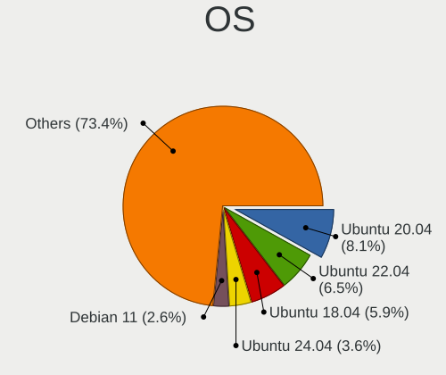

| Name                         | Notebooks | Percent |
|------------------------------|-----------|---------|
| Ubuntu 20.04                 | 139       | 8.08%   |
| Ubuntu 22.04                 | 111       | 6.45%   |
| Ubuntu 18.04                 | 101       | 5.87%   |
| Ubuntu 24.04                 | 62        | 3.6%    |
| Debian 11                    | 44        | 2.56%   |
| Arch Rolling                 | 43        | 2.5%    |
| Debian 12                    | 39        | 2.27%   |
| Zorin 17                     | 35        | 2.03%   |
| Linux Mint 22.1              | 27        | 1.57%   |
| OpenMandriva 4.2             | 26        | 1.51%   |
| Pop!_OS 22.04                | 25        | 1.45%   |
| Manjaro                      | 23        | 1.34%   |
| Zorin 15                     | 21        | 1.22%   |
| OpenMandriva 4.3             | 21        | 1.22%   |
| Fedora 40                    | 21        | 1.22%   |
| Zorin 16                     | 19        | 1.1%    |
| OpenMandriva 23.08           | 19        | 1.1%    |
| Linux Mint 21.3              | 18        | 1.05%   |
| Fedora 39                    | 18        | 1.05%   |
| BlackPanther 18.1            | 18        | 1.05%   |
| ArcoLinux Rolling            | 18        | 1.05%   |
| Linux Mint 20.3              | 17        | 0.99%   |
| Linux Mint 20.2              | 16        | 0.93%   |
| Linux Mint 21.2              | 15        | 0.87%   |
| Linux Mint 21.1              | 15        | 0.87%   |
| Fedora 36                    | 15        | 0.87%   |
| Arch                         | 15        | 0.87%   |
| Linux Mint 20.1              | 14        | 0.81%   |
| Linux Mint 20                | 14        | 0.81%   |
| OpenMandriva 23.03           | 13        | 0.76%   |
| Fedora 38                    | 13        | 0.76%   |
| Fedora 33                    | 13        | 0.76%   |
| Xubuntu 20.04                | 12        | 0.7%    |
| Ubuntu 19.04                 | 12        | 0.7%    |
| Linux Mint 19.3              | 12        | 0.7%    |
| Debian 10                    | 12        | 0.7%    |
| openSUSE Tumbleweed-XXXXXXXX | 11        | 0.64%   |
| OpenMandriva 25.90           | 11        | 0.64%   |
| Fedora 41                    | 11        | 0.64%   |
| EndeavourOS Rolling          | 11        | 0.64%   |

OS Family
---------

OS without a version

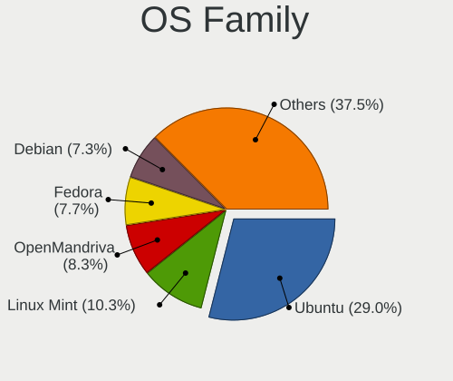

| Name          | Notebooks | Percent |
|---------------|-----------|---------|
| Ubuntu        | 477       | 28.96%  |
| Linux Mint    | 170       | 10.32%  |
| OpenMandriva  | 136       | 8.26%   |
| Fedora        | 126       | 7.65%   |
| Debian        | 121       | 7.35%   |
| Zorin         | 81        | 4.92%   |
| Arch          | 56        | 3.4%    |
| Pop!_OS       | 47        | 2.85%   |
| Manjaro       | 39        | 2.37%   |
| Endless       | 37        | 2.25%   |
| Xubuntu       | 34        | 2.06%   |
| Kubuntu       | 28        | 1.7%    |
| Elementary    | 25        | 1.52%   |
| Lubuntu       | 20        | 1.21%   |
| ArcoLinux     | 19        | 1.15%   |
| KDE neon      | 18        | 1.09%   |
| BlackPanther  | 18        | 1.09%   |
| openSUSE      | 15        | 0.91%   |
| EndeavourOS   | 13        | 0.79%   |
| LMDE          | 11        | 0.67%   |
| Ubuntu Budgie | 10        | 0.61%   |
| ROSA          | 10        | 0.61%   |
| Nobara        | 10        | 0.61%   |
| Ubuntu MATE   | 8         | 0.49%   |
| MX            | 8         | 0.49%   |
| Kali          | 8         | 0.49%   |
| Huayra        | 8         | 0.49%   |
| Peppermint    | 7         | 0.43%   |
| Xero          | 6         | 0.36%   |
| Ubuntu Unity  | 6         | 0.36%   |
| Gentoo        | 6         | 0.36%   |
| Bazzite       | 5         | 0.3%    |
| SteamOS       | 4         | 0.24%   |
| Parrot        | 4         | 0.24%   |
| NixOS         | 4         | 0.24%   |
| Clear Linux   | 4         | 0.24%   |
| Void Linux    | 3         | 0.18%   |
| UbuntuDDE     | 3         | 0.18%   |
| LinuxFX       | 3         | 0.18%   |
| Garuda Linux  | 3         | 0.18%   |

Kernel
------

Version of the Linux kernel

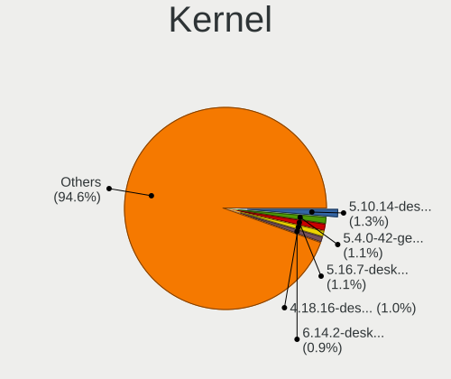

| Version                  | Notebooks | Percent |
|--------------------------|-----------|---------|
| 5.10.14-desktop-1omv4002 | 25        | 1.33%   |
| 5.4.0-42-generic         | 21        | 1.11%   |
| 5.16.7-desktop-1omv4003  | 21        | 1.11%   |
| 4.18.16-desktop-1bP      | 18        | 0.95%   |
| 6.14.2-desktop-3omv2590  | 17        | 0.9%    |
| 5.4.0-26-generic         | 15        | 0.8%    |
| 6.4.11-desktop-1omv2390  | 14        | 0.74%   |
| 6.8.0-51-generic         | 12        | 0.64%   |
| 6.2.6-desktop-1omv2390   | 12        | 0.64%   |
| 5.3.0-40-generic         | 12        | 0.64%   |
| 6.6.2-desktop-1omv2390   | 11        | 0.58%   |
| 5.4.0-52-generic         | 11        | 0.58%   |
| 5.4.0-19-generic         | 10        | 0.53%   |
| 5.15.0-52-generic        | 10        | 0.53%   |
| 6.8.0-60-generic         | 9         | 0.48%   |
| 6.8.0-49-generic         | 9         | 0.48%   |
| 5.8.0-14-generic         | 9         | 0.48%   |
| 5.4.0-29-generic         | 9         | 0.48%   |
| 6.8.0-41-generic         | 8         | 0.42%   |
| 6.8.0-38-generic         | 8         | 0.42%   |
| 6.8.0-31-generic         | 8         | 0.42%   |
| 5.4.0-48-generic         | 8         | 0.42%   |
| 5.4.0-40-generic         | 8         | 0.42%   |
| 5.15.0-76-generic        | 8         | 0.42%   |
| 5.11.0-37-generic        | 8         | 0.42%   |
| 4.18.0-15-generic        | 8         | 0.42%   |
| 6.2.0-26-generic         | 7         | 0.37%   |
| 6.10.0-desktop-1omv2490  | 7         | 0.37%   |
| 6.1.0-37-amd64           | 7         | 0.37%   |
| 5.8.0-43-generic         | 7         | 0.37%   |
| 5.4.0-91-generic         | 7         | 0.37%   |
| 5.4.0-72-generic         | 7         | 0.37%   |
| 5.4.0-58-generic         | 7         | 0.37%   |
| 5.3.0-46-generic         | 7         | 0.37%   |
| 5.3.0-28-generic         | 7         | 0.37%   |
| 5.15.0-46-generic        | 7         | 0.37%   |
| 5.15.0-41-generic        | 7         | 0.37%   |
| 5.15.0-107-generic       | 7         | 0.37%   |
| 5.11.0-27-generic        | 7         | 0.37%   |
| 6.8.0-59-generic         | 6         | 0.32%   |

Kernel Family
-------------

Linux kernel without a distro release

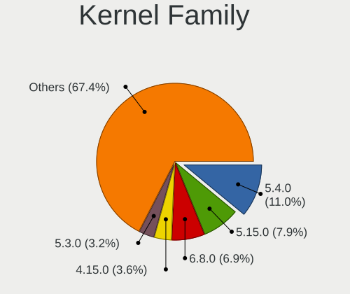

| Version | Notebooks | Percent |
|---------|-----------|---------|
| 5.4.0   | 197       | 10.98%  |
| 5.15.0  | 141       | 7.86%   |
| 6.8.0   | 123       | 6.86%   |
| 4.15.0  | 65        | 3.62%   |
| 5.3.0   | 58        | 3.23%   |
| 5.8.0   | 55        | 3.07%   |
| 6.1.0   | 53        | 2.95%   |
| 5.10.0  | 50        | 2.79%   |
| 6.5.0   | 44        | 2.45%   |
| 5.11.0  | 41        | 2.29%   |
| 6.2.0   | 40        | 2.23%   |
| 6.11.0  | 37        | 2.06%   |
| 5.19.0  | 36        | 2.01%   |
| 5.13.0  | 35        | 1.95%   |
| 5.0.0   | 31        | 1.73%   |
| 4.18.0  | 29        | 1.62%   |
| 6.14.0  | 27        | 1.51%   |
| 5.10.14 | 25        | 1.39%   |
| 4.19.0  | 23        | 1.28%   |
| 5.16.7  | 21        | 1.17%   |
| 6.14.2  | 18        | 1%      |
| 4.18.16 | 18        | 1%      |
| 6.2.6   | 17        | 0.95%   |
| 6.4.11  | 15        | 0.84%   |
| 6.6.2   | 13        | 0.72%   |
| 6.9.3   | 12        | 0.67%   |
| 5.14.0  | 11        | 0.61%   |
| 6.10.0  | 7         | 0.39%   |
| 6.12.9  | 6         | 0.33%   |
| 6.1.1   | 6         | 0.33%   |
| 5.17.5  | 6         | 0.33%   |
| 6.8.4   | 5         | 0.28%   |
| 6.6.8   | 5         | 0.28%   |
| 6.4.8   | 5         | 0.28%   |
| 6.12.48 | 5         | 0.28%   |
| 6.12.1  | 5         | 0.28%   |
| 5.18.16 | 5         | 0.28%   |
| 5.18.0  | 5         | 0.28%   |
| 5.15.5  | 5         | 0.28%   |
| 6.9.7   | 4         | 0.22%   |

Kernel Major Ver.
-----------------

Linux kernel major version

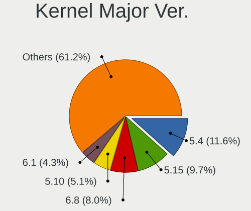

| Version | Notebooks | Percent |
|---------|-----------|---------|
| 5.4     | 205       | 11.65%  |
| 5.15    | 171       | 9.72%   |
| 6.8     | 141       | 8.01%   |
| 5.10    | 90        | 5.11%   |
| 6.1     | 76        | 4.32%   |
| 6.2     | 69        | 3.92%   |
| 5.8     | 68        | 3.86%   |
| 4.15    | 65        | 3.69%   |
| 6.5     | 60        | 3.41%   |
| 5.3     | 58        | 3.3%    |
| 5.11    | 54        | 3.07%   |
| 6.14    | 52        | 2.95%   |
| 5.19    | 51        | 2.9%    |
| 6.11    | 49        | 2.78%   |
| 4.18    | 49        | 2.78%   |
| 6.12    | 45        | 2.56%   |
| 5.13    | 45        | 2.56%   |
| 6.6     | 37        | 2.1%    |
| 6.4     | 34        | 1.93%   |
| 5.16    | 34        | 1.93%   |
| 5.0     | 33        | 1.88%   |
| 6.9     | 27        | 1.53%   |
| 5.18    | 26        | 1.48%   |
| 4.19    | 25        | 1.42%   |
| 5.14    | 21        | 1.19%   |
| 6.10    | 20        | 1.14%   |
| 6.0     | 19        | 1.08%   |
| 6.15    | 15        | 0.85%   |
| 5.17    | 14        | 0.8%    |
| 6.3     | 13        | 0.74%   |
| 5.9     | 12        | 0.68%   |
| 6.16    | 10        | 0.57%   |
| 5.6     | 10        | 0.57%   |
| 6.13    | 9         | 0.51%   |
| 6.7     | 8         | 0.45%   |
| 6.17    | 8         | 0.45%   |
| 4.9     | 8         | 0.45%   |
| 5.7     | 7         | 0.4%    |
| 5.12    | 6         | 0.34%   |
| 5.5     | 3         | 0.17%   |

Arch
----

OS architecture (x86_64, i586, etc.)

| Name   | Notebooks | Percent |
|--------|-----------|---------|
| x86_64 | 1536      | 96.24%  |
| i686   | 60        | 3.76%   |

DE
--

Desktop Environment

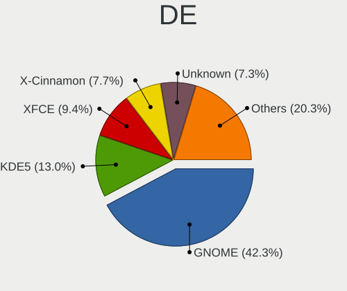

| Name             | Notebooks | Percent |
|------------------|-----------|---------|
| GNOME            | 698       | 42.25%  |
| KDE5             | 214       | 12.95%  |
| XFCE             | 156       | 9.44%   |
| X-Cinnamon       | 127       | 7.69%   |
| Unknown          | 121       | 7.32%   |
| KDE6             | 77        | 4.66%   |
| MATE             | 68        | 4.12%   |
| LXQt             | 27        | 1.63%   |
| Pantheon         | 25        | 1.51%   |
| LXDE             | 22        | 1.33%   |
| KDE              | 21        | 1.27%   |
| Cinnamon         | 13        | 0.79%   |
| Budgie           | 13        | 0.79%   |
| i3               | 12        | 0.73%   |
| KDE4             | 8         | 0.48%   |
| Hyprland         | 8         | 0.48%   |
| Unity            | 6         | 0.36%   |
| Deepin           | 6         | 0.36%   |
| openbox          | 3         | 0.18%   |
| GNOME Flashback  | 3         | 0.18%   |
| GNOME Classic    | 3         | 0.18%   |
| Endless:GNOME    | 3         | 0.18%   |
| xmonad           | 2         | 0.12%   |
| sway             | 2         | 0.12%   |
| qtile            | 2         | 0.12%   |
| Enlightenment    | 2         | 0.12%   |
| bspwm            | 2         | 0.12%   |
| Trinity          | 1         | 0.06%   |
| lightdm-xsession | 1         | 0.06%   |
| icewm            | 1         | 0.06%   |
| i3-with-shmlog   | 1         | 0.06%   |
| dwm              | 1         | 0.06%   |
| Cutefish         | 1         | 0.06%   |
| COSMIC           | 1         | 0.06%   |
| awesome          | 1         | 0.06%   |

Display Server
--------------

X11 or Wayland

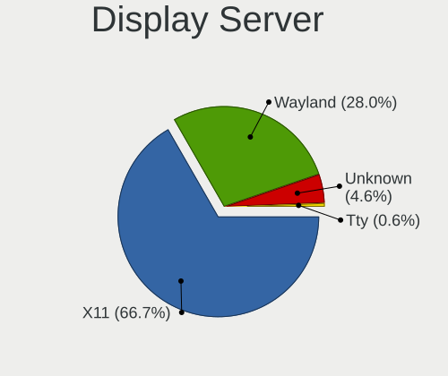

| Name    | Notebooks | Percent |
|---------|-----------|---------|
| X11     | 1094      | 66.71%  |
| Wayland | 460       | 28.05%  |
| Unknown | 76        | 4.63%   |
| Tty     | 10        | 0.61%   |

Display Manager
---------------

SDDM, LightDM, etc.

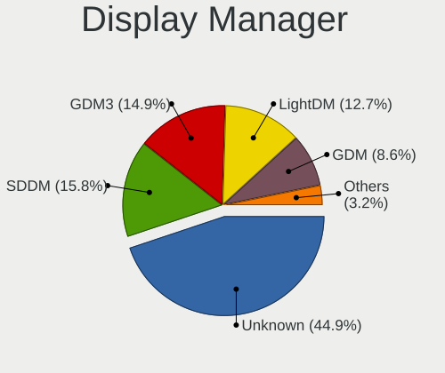

| Name    | Notebooks | Percent |
|---------|-----------|---------|
| Unknown | 737       | 44.86%  |
| SDDM    | 259       | 15.76%  |
| GDM3    | 244       | 14.85%  |
| LightDM | 209       | 12.72%  |
| GDM     | 141       | 8.58%   |
| TDM     | 33        | 2.01%   |
| KDM     | 6         | 0.37%   |
| LXDM    | 5         | 0.3%    |
| GREETD  | 4         | 0.24%   |
| XDM     | 2         | 0.12%   |
| SLIMSKI | 2         | 0.12%   |
| SLiM    | 1         | 0.06%   |

OS Lang
-------

Language

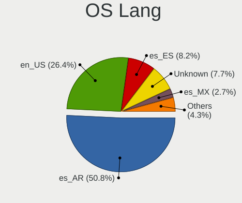

| Lang        | Notebooks | Percent |
|-------------|-----------|---------|
| es_AR       | 833       | 50.76%  |
| en_US       | 434       | 26.45%  |
| es_ES       | 134       | 8.17%   |
| Unknown     | 126       | 7.68%   |
| es_MX       | 44        | 2.68%   |
| C           | 30        | 1.83%   |
| en_GB       | 14        | 0.85%   |
| pt_BR       | 5         | 0.3%    |
| ru_RU       | 3         | 0.18%   |
| es_US       | 3         | 0.18%   |
| POSIX       | 2         | 0.12%   |
| it_IT       | 2         | 0.12%   |
| fr_FR       | 2         | 0.12%   |
| es_CL       | 2         | 0.12%   |
| en_AG       | 2         | 0.12%   |
| es_UY       | 1         | 0.06%   |
| es_AR.UtF-8 | 1         | 0.06%   |
| en_CA       | 1         | 0.06%   |
| en_AU       | 1         | 0.06%   |
| de_DE       | 1         | 0.06%   |

Boot Mode
---------

EFI or BIOS

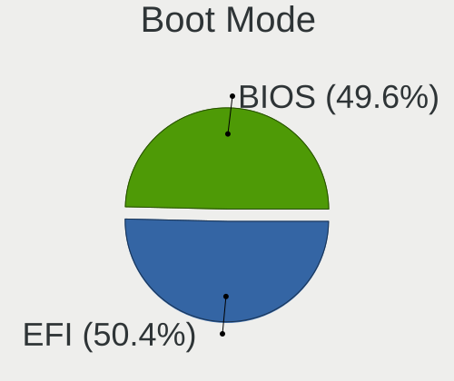

| Mode | Notebooks | Percent |
|------|-----------|---------|
| EFI  | 821       | 50.37%  |
| BIOS | 809       | 49.63%  |

Filesystem
----------

Type of filesystem

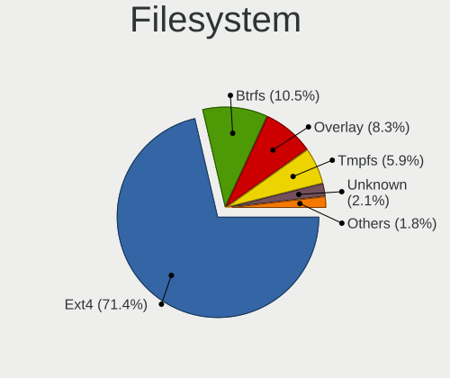

| Type    | Notebooks | Percent |
|---------|-----------|---------|
| Ext4    | 1167      | 71.38%  |
| Btrfs   | 172       | 10.52%  |
| Overlay | 135       | 8.26%   |
| Tmpfs   | 97        | 5.93%   |
| Unknown | 34        | 2.08%   |
| Xfs     | 17        | 1.04%   |
| Zfs     | 5         | 0.31%   |
| Ext3    | 3         | 0.18%   |
| Ext2    | 3         | 0.18%   |
| F2fs    | 1         | 0.06%   |
| Aufs    | 1         | 0.06%   |

Part. scheme
------------

Scheme of partitioning

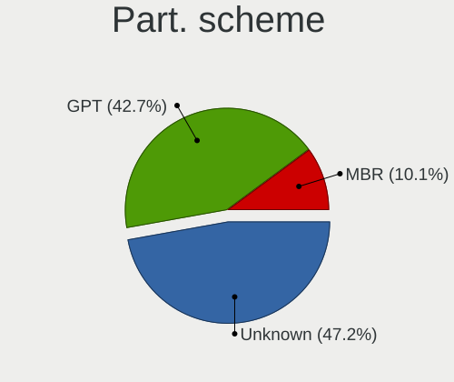

| Type    | Notebooks | Percent |
|---------|-----------|---------|
| Unknown | 770       | 47.18%  |
| GPT     | 697       | 42.71%  |
| MBR     | 165       | 10.11%  |

Dual Boot with Linux/BSD
------------------------

Hosting more than one Linux/BSD

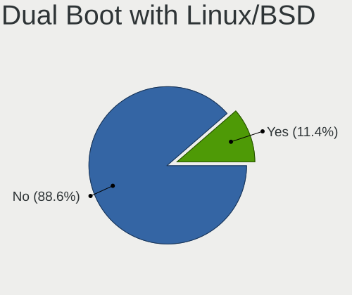

| Dual boot | Notebooks | Percent |
|-----------|-----------|---------|
| No        | 1433      | 88.62%  |
| Yes       | 184       | 11.38%  |

Dual Boot (Win)
---------------

Hosting Linux and Windows

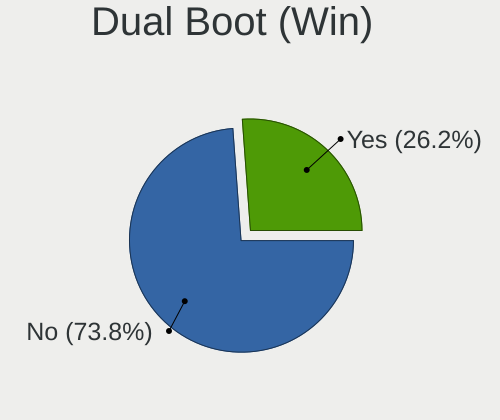

| Dual boot | Notebooks | Percent |
|-----------|-----------|---------|
| No        | 1191      | 73.84%  |
| Yes       | 422       | 26.16%  |

Board
-----

Vendor
------

Motherboard manufacturer

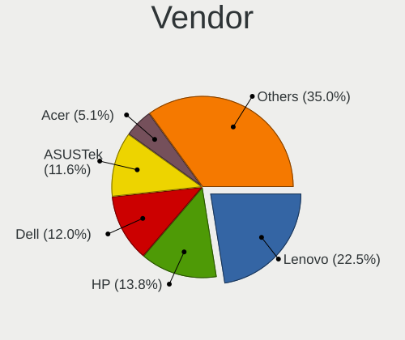

| Name                | Notebooks | Percent |
|---------------------|-----------|---------|
| Lenovo              | 359       | 22.49%  |
| Hewlett-Packard     | 220       | 13.78%  |
| Dell                | 192       | 12.03%  |
| ASUSTek Computer    | 185       | 11.59%  |
| Acer                | 82        | 5.14%   |
| BANGHO              | 58        | 3.63%   |
| Toshiba             | 50        | 3.13%   |
| Exo                 | 43        | 2.69%   |
| Samsung Electronics | 41        | 2.57%   |
| Positivo            | 41        | 2.57%   |
| Sony                | 26        | 1.63%   |
| Juana Manso         | 23        | 1.44%   |
| Apple               | 22        | 1.38%   |
| Intel               | 21        | 1.32%   |
| MSI                 | 17        | 1.07%   |
| Unknown             | 15        | 0.94%   |
| NOBLEX              | 14        | 0.88%   |
| Compal              | 13        | 0.81%   |
| Novatech            | 12        | 0.75%   |
| Coradir             | 8         | 0.5%    |
| Clevo               | 8         | 0.5%    |
| NSX                 | 7         | 0.44%   |
| PCBOX               | 6         | 0.38%   |
| Kelyx Argentina     | 6         | 0.38%   |
| Conectar Igualdad   | 6         | 0.38%   |
| Standard            | 5         | 0.31%   |
| JP.ik               | 5         | 0.31%   |
| HUAWEI              | 5         | 0.31%   |
| Gfast               | 5         | 0.31%   |
| Compaq              | 5         | 0.31%   |
| AIR                 | 5         | 0.31%   |
| Advantec            | 5         | 0.31%   |
| A-DATA Technology   | 5         | 0.31%   |
| System76            | 4         | 0.25%   |
| Packard Bell        | 4         | 0.25%   |
| iQual               | 4         | 0.25%   |
| Gigabyte Technology | 4         | 0.25%   |
| NVN-ED01            | 3         | 0.19%   |
| Google              | 3         | 0.19%   |
| Garbarino SAIC      | 3         | 0.19%   |

Model
-----

Motherboard model

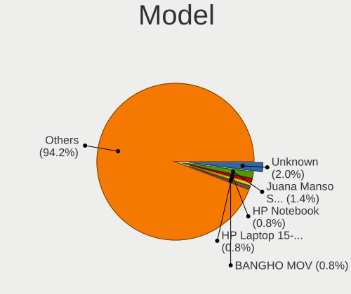

| Name                                     | Notebooks | Percent |
|------------------------------------------|-----------|---------|
| Unknown                                  | 32        | 2.01%   |
| Juana Manso SF20GM7                      | 23        | 1.44%   |
| HP Notebook                              | 13        | 0.81%   |
| HP Laptop 15-bs0xx                       | 12        | 0.75%   |
| BANGHO MOV                               | 12        | 0.75%   |
| Lenovo V330-15IKB 81AX                   | 11        | 0.69%   |
| Intel powered classmate PC               | 10        | 0.63%   |
| BANGHO MAX G0101                         | 9         | 0.56%   |
| ASUS VivoBook_ASUSLaptop X509JA_X509JA   | 9         | 0.56%   |
| NOBLEX SF20BA                            | 8         | 0.5%    |
| Lenovo G470 20078                        | 8         | 0.5%    |
| Coradir Coradir/ES10IS5                  | 8         | 0.5%    |
| Lenovo ThinkPad L15 Gen 2 20X4S27200     | 7         | 0.44%   |
| HP Pavilion dv6                          | 7         | 0.44%   |
| Dell Latitude E6410                      | 7         | 0.44%   |
| Dell Inspiron 1525                       | 7         | 0.44%   |
| ASUS VivoBook_ASUSLaptop X515EA_X515EA   | 7         | 0.44%   |
| Lenovo ThinkPad T430 2349DS5             | 6         | 0.38%   |
| Lenovo IdeaPad 330-15IKB 81DE            | 6         | 0.38%   |
| Lenovo IdeaPad 320-15ABR 80XS            | 6         | 0.38%   |
| Lenovo G550 2958                         | 6         | 0.38%   |
| HP Pavilion dv7                          | 6         | 0.38%   |
| HP OMEN by Laptop 15-ce0xx               | 6         | 0.38%   |
| HP 250 G7 Notebook PC                    | 6         | 0.38%   |
| Dell Inspiron 3505                       | 6         | 0.38%   |
| Conectar Igualdad SF20GM7                | 6         | 0.38%   |
| Compal PCW20                             | 6         | 0.38%   |
| ASUS X555LAB                             | 6         | 0.38%   |
| ASUS VivoBook_ASUSLaptop X515EA          | 6         | 0.38%   |
| ASUS VivoBook_ASUSLaptop X1404ZA_X1404ZA | 6         | 0.38%   |
| Apple MacBookPro9,2                      | 6         | 0.38%   |
| Lenovo V15 G2 ITL 82KB                   | 5         | 0.31%   |
| Lenovo IdeaPad 1 14IGL05 81VU            | 5         | 0.31%   |
| JP.ik T304                               | 5         | 0.31%   |
| HP Pavilion Notebook                     | 5         | 0.31%   |
| HP Laptop 15-ef2xxx                      | 5         | 0.31%   |
| HP 250 G6 Notebook PC                    | 5         | 0.31%   |
| HP 240 G8                                | 5         | 0.31%   |
| Exo CloudbookE15                         | 5         | 0.31%   |
| Dell Latitude 5510                       | 5         | 0.31%   |

Model Family
------------

Motherboard model prefix

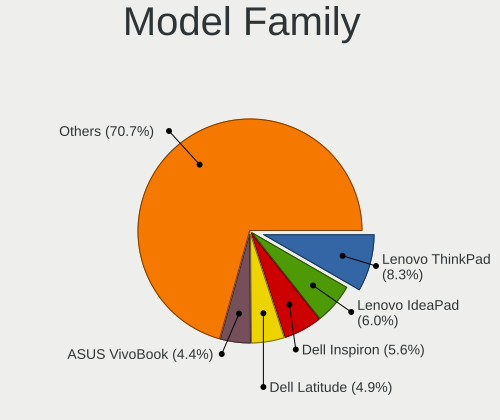

| Name                      | Notebooks | Percent |
|---------------------------|-----------|---------|
| Lenovo ThinkPad           | 133       | 8.33%   |
| Lenovo IdeaPad            | 96        | 6.02%   |
| Dell Inspiron             | 90        | 5.64%   |
| Dell Latitude             | 78        | 4.89%   |
| ASUS VivoBook             | 71        | 4.45%   |
| Acer Aspire               | 65        | 4.07%   |
| HP Pavilion               | 61        | 3.82%   |
| HP Laptop                 | 43        | 2.69%   |
| Toshiba Satellite         | 35        | 2.19%   |
| Unknown                   | 32        | 2.01%   |
| Juana Manso SF20GM7       | 23        | 1.44%   |
| Exo Smart                 | 22        | 1.38%   |
| BANGHO MAX                | 20        | 1.25%   |
| Lenovo ThinkBook          | 17        | 1.07%   |
| HP Compaq                 | 14        | 0.88%   |
| HP 250                    | 14        | 0.88%   |
| ASUS ZenBook              | 14        | 0.88%   |
| HP Notebook               | 13        | 0.81%   |
| BANGHO MOV                | 12        | 0.75%   |
| Lenovo V330-15IKB         | 11        | 0.69%   |
| HP EliteBook              | 11        | 0.69%   |
| HP 240                    | 11        | 0.69%   |
| Lenovo V15                | 10        | 0.63%   |
| Intel powered             | 10        | 0.63%   |
| ASUS ASUS                 | 10        | 0.63%   |
| HP ProBook                | 9         | 0.56%   |
| NOBLEX SF20BA             | 8         | 0.5%    |
| Lenovo Legion             | 8         | 0.5%    |
| Lenovo G470               | 8         | 0.5%    |
| HP OMEN                   | 8         | 0.5%    |
| Coradir Coradir           | 8         | 0.5%    |
| Samsung 300E4A            | 7         | 0.44%   |
| Dell XPS                  | 7         | 0.44%   |
| Samsung R430              | 6         | 0.38%   |
| Lenovo Yoga               | 6         | 0.38%   |
| Lenovo G550               | 6         | 0.38%   |
| HP ENVY                   | 6         | 0.38%   |
| Conectar Igualdad SF20GM7 | 6         | 0.38%   |
| Compal PCW20              | 6         | 0.38%   |
| ASUS X555LAB              | 6         | 0.38%   |

MFG Year
--------

Motherboard manufacture year

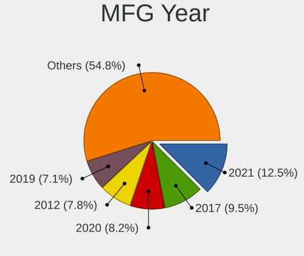

| Year    | Notebooks | Percent |
|---------|-----------|---------|
| 2021    | 199       | 12.47%  |
| 2017    | 152       | 9.52%   |
| 2020    | 131       | 8.21%   |
| 2012    | 125       | 7.83%   |
| 2019    | 114       | 7.14%   |
| 2018    | 96        | 6.02%   |
| 2011    | 96        | 6.02%   |
| 2010    | 90        | 5.64%   |
| 2013    | 89        | 5.58%   |
| 2015    | 83        | 5.2%    |
| 2014    | 78        | 4.89%   |
| 2016    | 67        | 4.2%    |
| 2008    | 64        | 4.01%   |
| 2022    | 63        | 3.95%   |
| 2023    | 52        | 3.26%   |
| 2009    | 37        | 2.32%   |
| 2007    | 21        | 1.32%   |
| 2024    | 16        | 1%      |
| 2006    | 12        | 0.75%   |
| Unknown | 7         | 0.44%   |
| 2005    | 2         | 0.13%   |
| 2025    | 1         | 0.06%   |
| 2004    | 1         | 0.06%   |

Form Factor
-----------

Physical design of the computer

| Name     | Notebooks | Percent |
|----------|-----------|---------|
| Notebook | 1596      | 100%    |

Secure Boot
-----------

Enabled or disabled

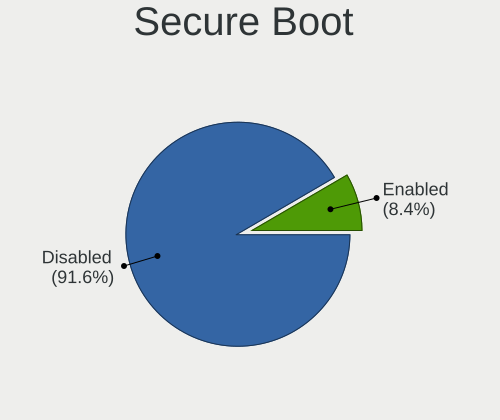

| State    | Notebooks | Percent |
|----------|-----------|---------|
| Disabled | 1472      | 91.6%   |
| Enabled  | 135       | 8.4%    |

Coreboot
--------

Have coreboot on board

| Used | Notebooks | Percent |
|------|-----------|---------|
| No   | 1591      | 99.69%  |
| Yes  | 5         | 0.31%   |

RAM Size
--------

Total RAM memory

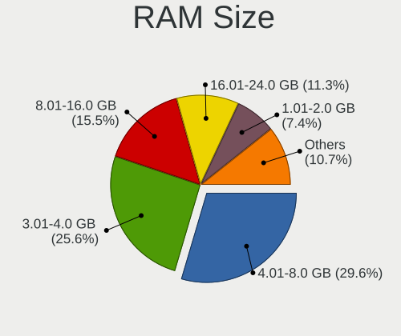

| Size in GB  | Notebooks | Percent |
|-------------|-----------|---------|
| 4.01-8.0    | 478       | 29.56%  |
| 3.01-4.0    | 414       | 25.6%   |
| 8.01-16.0   | 251       | 15.52%  |
| 16.01-24.0  | 182       | 11.26%  |
| 1.01-2.0    | 119       | 7.36%   |
| 32.01-64.0  | 83        | 5.13%   |
| 2.01-3.0    | 33        | 2.04%   |
| 24.01-32.0  | 23        | 1.42%   |
| 0.51-1.0    | 23        | 1.42%   |
| 64.01-256.0 | 11        | 0.68%   |

RAM Used
--------

Used RAM memory

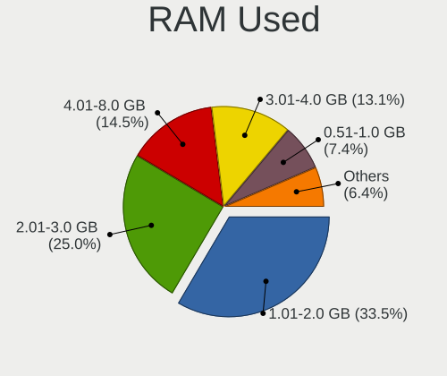

| Used GB    | Notebooks | Percent |
|------------|-----------|---------|
| 1.01-2.0   | 587       | 33.49%  |
| 2.01-3.0   | 439       | 25.04%  |
| 4.01-8.0   | 255       | 14.55%  |
| 3.01-4.0   | 229       | 13.06%  |
| 0.51-1.0   | 130       | 7.42%   |
| 8.01-16.0  | 84        | 4.79%   |
| 16.01-24.0 | 13        | 0.74%   |
| 0.01-0.5   | 13        | 0.74%   |
| 24.01-32.0 | 2         | 0.11%   |
| 32.01-64.0 | 1         | 0.06%   |

Total Drives
------------

Number of drives on board

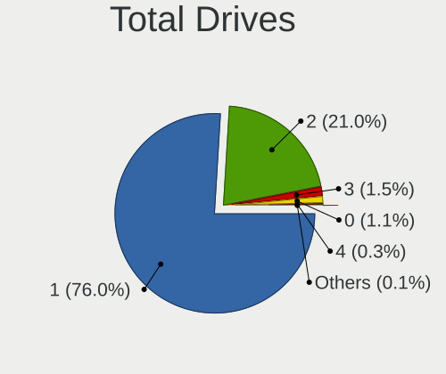

| Drives | Notebooks | Percent |
|--------|-----------|---------|
| 1      | 1229      | 75.96%  |
| 2      | 339       | 20.95%  |
| 3      | 25        | 1.55%   |
| 0      | 18        | 1.11%   |
| 4      | 5         | 0.31%   |
| 5      | 2         | 0.12%   |

Has CD-ROM
----------

Has CD-ROM on board

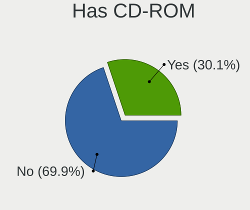

| Presented | Notebooks | Percent |
|-----------|-----------|---------|
| No        | 1122      | 69.86%  |
| Yes       | 484       | 30.14%  |

Has Ethernet
------------

Has Ethernet on board

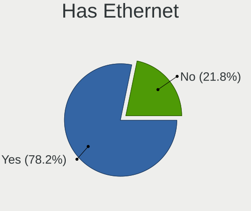

| Presented | Notebooks | Percent |
|-----------|-----------|---------|
| Yes       | 1251      | 78.24%  |
| No        | 348       | 21.76%  |

Has WiFi
--------

Has WiFi module

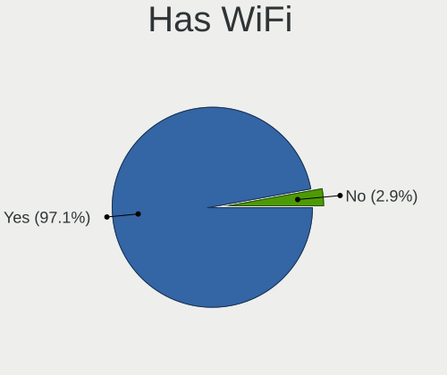

| Presented | Notebooks | Percent |
|-----------|-----------|---------|
| Yes       | 1552      | 97.12%  |
| No        | 46        | 2.88%   |

Has Bluetooth
-------------

Has Bluetooth module

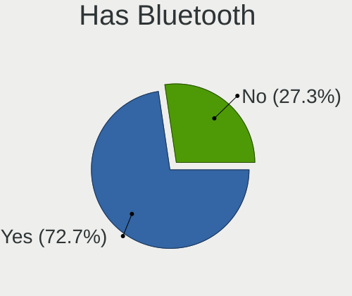

| Presented | Notebooks | Percent |
|-----------|-----------|---------|
| Yes       | 1167      | 72.67%  |
| No        | 439       | 27.33%  |

Location
--------

Country
-------

Geographic location (country)

| Country   | Notebooks | Percent |
|-----------|-----------|---------|
| Argentina | 1596      | 100%    |

City
----

Geographic location (city)

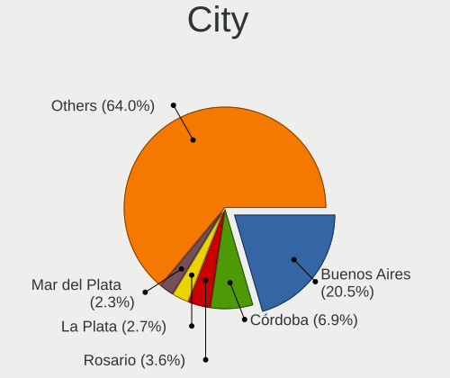

| City                        | Notebooks | Percent |
|-----------------------------|-----------|---------|
| Buenos Aires                | 343       | 20.49%  |
| Córdoba                    | 115       | 6.87%   |
| Rosario                     | 60        | 3.58%   |
| La Plata                    | 46        | 2.75%   |
| Mar del Plata               | 39        | 2.33%   |
| Mendoza                     | 27        | 1.61%   |
| Corrientes                  | 23        | 1.37%   |
| San Miguel de Tucumán      | 20        | 1.19%   |
| Lanus                       | 20        | 1.19%   |
| Santa Fe                    | 19        | 1.14%   |
| Avellaneda                  | 19        | 1.14%   |
| Salta                       | 18        | 1.08%   |
| Bariloche                   | 17        | 1.02%   |
| Resistencia                 | 16        | 0.96%   |
| Quilmes                     | 16        | 0.96%   |
| Villa Ballester             | 15        | 0.9%    |
| Neuquén                    | 15        | 0.9%    |
| Paraná                     | 14        | 0.84%   |
| Bahía Blanca               | 14        | 0.84%   |
| Posadas                     | 13        | 0.78%   |
| Ituzaingo                   | 13        | 0.78%   |
| Isidro Casanova             | 13        | 0.78%   |
| San Juan                    | 11        | 0.66%   |
| Olivos                      | 11        | 0.66%   |
| Lomas de Zamora             | 11        | 0.66%   |
| Godoy Cruz                  | 11        | 0.66%   |
| Burzaco                     | 11        | 0.66%   |
| San Martín de los Andes    | 10        | 0.6%    |
| Tandil                      | 9         | 0.54%   |
| Río Cuarto                 | 9         | 0.54%   |
| Ramos Mejia                 | 9         | 0.54%   |
| Florencio Varela            | 9         | 0.54%   |
| Comodoro Rivadavia          | 9         | 0.54%   |
| Caseros                     | 9         | 0.54%   |
| Vicente Lopez               | 8         | 0.48%   |
| Tigre                       | 8         | 0.48%   |
| Santiago del Estero         | 8         | 0.48%   |
| San Salvador de Jujuy       | 8         | 0.48%   |
| San Nicolás de los Arroyos | 8         | 0.48%   |
| San Fernando                | 8         | 0.48%   |

Drives
------

Drive Vendor
------------

Hard drive vendors

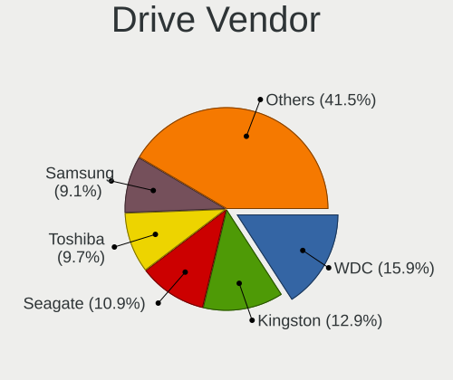

| Vendor                      | Notebooks | Drives | Percent |
|-----------------------------|-----------|--------|---------|
| WDC                         | 302       | 394    | 15.87%  |
| Kingston                    | 245       | 293    | 12.87%  |
| Seagate                     | 208       | 244    | 10.93%  |
| Toshiba                     | 185       | 233    | 9.72%   |
| Samsung Electronics         | 173       | 226    | 9.09%   |
| Unknown                     | 96        | 115    | 5.04%   |
| Sandisk                     | 90        | 130    | 4.73%   |
| HGST                        | 59        | 65     | 3.1%    |
| SK hynix                    | 55        | 72     | 2.89%   |
| Hitachi                     | 42        | 47     | 2.21%   |
| Micron Technology           | 39        | 46     | 2.05%   |
| Crucial                     | 37        | 47     | 1.94%   |
| Intel                       | 29        | 46     | 1.52%   |
| KIOXIA                      | 26        | 26     | 1.37%   |
| A-DATA Technology           | 23        | 24     | 1.21%   |
| Unknown                     | 22        | 23     | 1.16%   |
| Gigabyte Technology         | 21        | 30     | 1.1%    |
| Lexar                       | 19        | 21     | 1%      |
| Kimtigo                     | 12        | 12     | 0.63%   |
| China                       | 12        | 14     | 0.63%   |
| PNY                         | 11        | 16     | 0.58%   |
| Neo                         | 11        | 12     | 0.58%   |
| Kingston Technology Company | 10        | 10     | 0.53%   |
| Hewlett-Packard             | 9         | 12     | 0.47%   |
| Patriot                     | 8         | 9      | 0.42%   |
| MAXIO Technology (Hangzhou) | 7         | 7      | 0.37%   |
| HS-SSD-WAVE(S)              | 7         | 7      | 0.37%   |
| Wodposit                    | 6         | 6      | 0.32%   |
| Phison Electronics          | 6         | 6      | 0.32%   |
| Micron/Crucial Technology   | 6         | 9      | 0.32%   |
| Apple                       | 6         | 9      | 0.32%   |
| LITEONIT                    | 5         | 5      | 0.26%   |
| XPG                         | 4         | 5      | 0.21%   |
| Silicon Motion              | 4         | 5      | 0.21%   |
| Realtek Semiconductor       | 4         | 4      | 0.21%   |
| LITEON                      | 4         | 4      | 0.21%   |
| HS-SSD-C100                 | 4         | 7      | 0.21%   |
| Hikvision                   | 4         | 6      | 0.21%   |
| Fujitsu                     | 4         | 4      | 0.21%   |
| FORESEE                     | 4         | 4      | 0.21%   |

Drive Model
-----------

Hard drive models

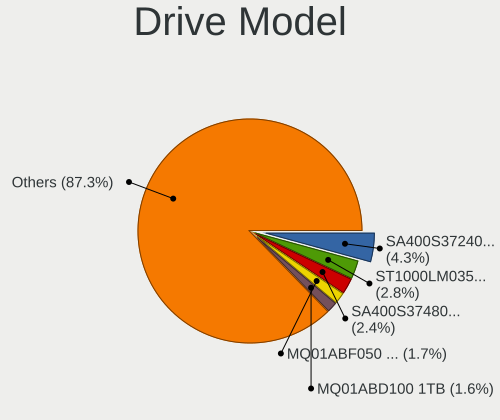

| Model                                 | Notebooks | Percent |
|---------------------------------------|-----------|---------|
| Kingston SA400S37240G 240GB SSD       | 83        | 4.25%   |
| Seagate ST1000LM035-1RK172 1TB        | 54        | 2.77%   |
| Kingston SA400S37480G 480GB SSD       | 46        | 2.36%   |
| Toshiba MQ01ABF050 500GB              | 34        | 1.74%   |
| Toshiba MQ01ABD100 1TB                | 31        | 1.59%   |
| Seagate ST1000LM024 HN-M101MBB 1TB    | 30        | 1.54%   |
| WDC WDS240G2G0A-00JH30 240GB SSD      | 24        | 1.23%   |
| Unknown MMC Card  32GB                | 24        | 1.23%   |
| Toshiba MQ04ABF100 1TB                | 24        | 1.23%   |
| Unknown                               | 22        | 1.13%   |
| Unknown MMC Card  64GB                | 17        | 0.87%   |
| HGST HTS721010A9E630 1TB              | 17        | 0.87%   |
| Seagate ST500LT012-1DG142 500GB       | 13        | 0.67%   |
| Crucial CT240BX500SSD1 240GB          | 13        | 0.67%   |
| WDC WDS240G2G0B-00EPW0 240GB SSD      | 12        | 0.61%   |
| Lexar 240GB SSD                       | 12        | 0.61%   |
| Seagate ST500LM030-2E717D 500GB       | 11        | 0.56%   |
| Kingston SA400S37960G 960GB SSD       | 11        | 0.56%   |
| Unknown MMC Card  128GB               | 10        | 0.51%   |
| Seagate ST9500325AS 500GB             | 10        | 0.51%   |
| Sandisk WD Blue SN550 NVMe SSD 1024GB | 10        | 0.51%   |
| Kingston SNVS500G 500GB               | 10        | 0.51%   |
| Kingston SA400M8240G 240GB SSD        | 10        | 0.51%   |
| WDC WDS500G2B0A-00SM50 500GB          | 9         | 0.46%   |
| WDC WD10JPVX-60JC3T1 1TB              | 9         | 0.46%   |
| Toshiba MQ01ABD032 320GB              | 9         | 0.46%   |
| Samsung MZALQ256HBJD-00BL1 256GB      | 9         | 0.46%   |
| Kingston SA400S37120G 120GB SSD       | 9         | 0.46%   |
| WDC WDS480G2G0A-00JH30 480GB SSD      | 8         | 0.41%   |
| WDC WD10SPZX-24Z10 1TB                | 8         | 0.41%   |
| Kingston SNV2S500G 500GB              | 8         | 0.41%   |
| HGST HTS725050A7E630 500GB            | 8         | 0.41%   |
| Gigabyte GP-GSTFS31240GNTD 240GB SSD  | 8         | 0.41%   |
| A-DATA SU630 240GB SSD                | 8         | 0.41%   |
| WDC WD5000LPCX-22VHAT0 500GB          | 7         | 0.36%   |
| Toshiba MK6475GSX 640GB               | 7         | 0.36%   |
| Seagate ST500LT012-9WS142 500GB       | 7         | 0.36%   |
| Seagate ST320LM001 HN-M320MBB 320GB   | 7         | 0.36%   |
| Seagate ST1000LM048-2E7172 1TB        | 7         | 0.36%   |
| Kingston SV300S37A240G 240GB SSD      | 7         | 0.36%   |

HDD Vendor
----------

Hard disk drive vendors

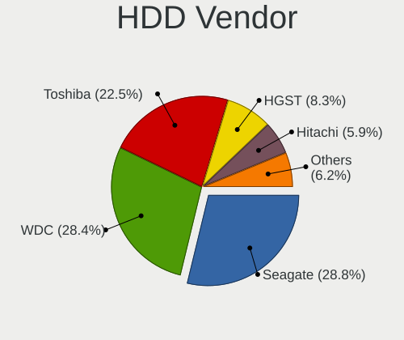

| Vendor              | Notebooks | Drives | Percent |
|---------------------|-----------|--------|---------|
| Seagate             | 205       | 239    | 28.79%  |
| WDC                 | 202       | 244    | 28.37%  |
| Toshiba             | 160       | 204    | 22.47%  |
| HGST                | 59        | 65     | 8.29%   |
| Hitachi             | 42        | 47     | 5.9%    |
| Samsung Electronics | 31        | 36     | 4.35%   |
| Unknown             | 6         | 6      | 0.84%   |
| Fujitsu             | 4         | 4      | 0.56%   |
| USB3.0              | 1         | 1      | 0.14%   |
| JMicron Technology  | 1         | 1      | 0.14%   |
| Inateck             | 1         | 1      | 0.14%   |

SSD Vendor
----------

Solid state drive vendors

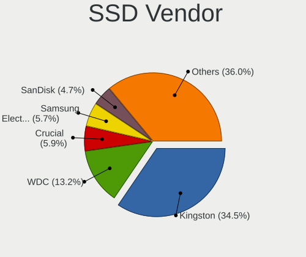

| Vendor              | Notebooks | Drives | Percent |
|---------------------|-----------|--------|---------|
| Kingston            | 206       | 248    | 34.51%  |
| WDC                 | 79        | 96     | 13.23%  |
| Crucial             | 35        | 45     | 5.86%   |
| Samsung Electronics | 34        | 51     | 5.7%    |
| SanDisk             | 28        | 35     | 4.69%   |
| Gigabyte Technology | 19        | 28     | 3.18%   |
| Lexar               | 18        | 20     | 3.02%   |
| A-DATA Technology   | 18        | 18     | 3.02%   |
| Kimtigo             | 12        | 12     | 2.01%   |
| PNY                 | 11        | 16     | 1.84%   |
| SK hynix            | 9         | 10     | 1.51%   |
| Micron Technology   | 9         | 12     | 1.51%   |
| China               | 9         | 11     | 1.51%   |
| Toshiba             | 8         | 8      | 1.34%   |
| Patriot             | 7         | 8      | 1.17%   |
| Intel               | 7         | 7      | 1.17%   |
| Wodposit            | 6         | 6      | 1.01%   |
| Hewlett-Packard     | 6         | 10     | 1.01%   |
| LITEONIT            | 5         | 5      | 0.84%   |
| Neo                 | 4         | 5      | 0.67%   |
| Apple               | 4         | 4      | 0.67%   |
| Unknown             | 4         | 4      | 0.67%   |
| Vi550               | 3         | 4      | 0.5%    |
| MSI                 | 3         | 3      | 0.5%    |
| GLOWAY              | 3         | 4      | 0.5%    |
| Transcend           | 2         | 3      | 0.34%   |
| SPCC                | 2         | 2      | 0.34%   |
| Seagate             | 2         | 4      | 0.34%   |
| Phison              | 2         | 2      | 0.34%   |
| Netac               | 2         | 3      | 0.34%   |
| Mushkin             | 2         | 4      | 0.34%   |
| MMY                 | 2         | 3      | 0.34%   |
| LITEON              | 2         | 2      | 0.34%   |
| HS-SSD-WAVE(S)      | 2         | 2      | 0.34%   |
| HS-SSD-C100         | 2         | 5      | 0.34%   |
| FORESEE             | 2         | 2      | 0.34%   |
| Corsair             | 2         | 2      | 0.34%   |
| Colorful            | 2         | 2      | 0.34%   |
| BHT                 | 2         | 2      | 0.34%   |
| XrayDisk            | 1         | 1      | 0.17%   |

Drive Kind
----------

HDD or SSD

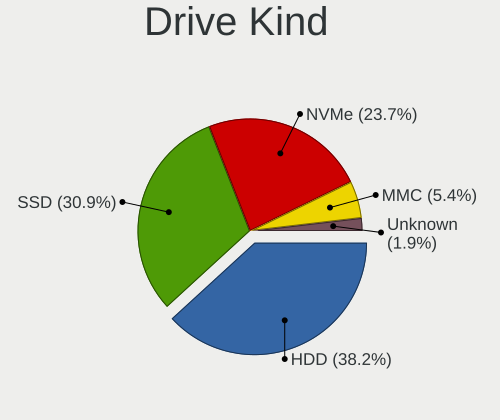

| Kind    | Notebooks | Drives | Percent |
|---------|-----------|--------|---------|
| HDD     | 699       | 848    | 38.2%   |
| SSD     | 565       | 733    | 30.87%  |
| NVMe    | 434       | 611    | 23.72%  |
| MMC     | 98        | 123    | 5.36%   |
| Unknown | 34        | 36     | 1.86%   |

Drive Connector
---------------

SATA, SAS, NVMe, etc.

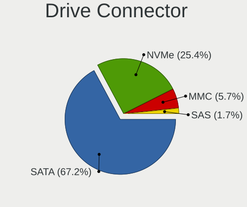

| Type | Notebooks | Drives | Percent |
|------|-----------|--------|---------|
| SATA | 1149      | 1583   | 67.19%  |
| NVMe | 434       | 610    | 25.38%  |
| MMC  | 98        | 123    | 5.73%   |
| SAS  | 29        | 35     | 1.7%    |

Drive Size
----------

Size of hard drive

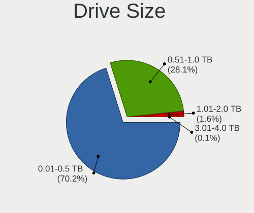

| Size in TB | Notebooks | Drives | Percent |
|------------|-----------|--------|---------|
| 0.01-0.5   | 861       | 1104   | 70.17%  |
| 0.51-1.0   | 345       | 449    | 28.12%  |
| 1.01-2.0   | 20        | 27     | 1.63%   |
| 3.01-4.0   | 1         | 1      | 0.08%   |

Space Total
-----------

Amount of disk space available on the file system

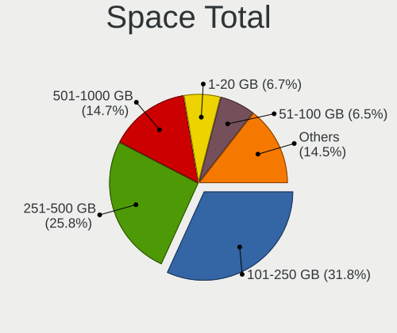

| Size in GB     | Notebooks | Percent |
|----------------|-----------|---------|
| 101-250        | 532       | 31.8%   |
| 251-500        | 432       | 25.82%  |
| 501-1000       | 246       | 14.7%   |
| 1-20           | 112       | 6.69%   |
| 51-100         | 109       | 6.52%   |
| 1001-2000      | 90        | 5.38%   |
| 21-50          | 66        | 3.95%   |
| Unknown        | 51        | 3.05%   |
| More than 3000 | 21        | 1.26%   |
| 2001-3000      | 14        | 0.84%   |

Space Used
----------

Amount of used disk space

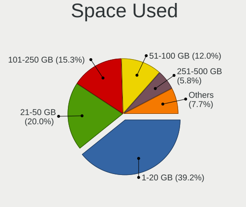

| Used GB        | Notebooks | Percent |
|----------------|-----------|---------|
| 1-20           | 676       | 39.23%  |
| 21-50          | 345       | 20.02%  |
| 101-250        | 263       | 15.26%  |
| 51-100         | 207       | 12.01%  |
| 251-500        | 100       | 5.8%    |
| 501-1000       | 57        | 3.31%   |
| Unknown        | 51        | 2.96%   |
| 1001-2000      | 18        | 1.04%   |
| 2001-3000      | 4         | 0.23%   |
| More than 3000 | 2         | 0.12%   |

Malfunc. Drives
---------------

Drive models with a malfunction

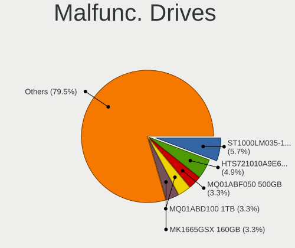

| Model                              | Notebooks | Drives | Percent |
|------------------------------------|-----------|--------|---------|
| Seagate ST1000LM035-1RK172 1TB     | 7         | 7      | 5.74%   |
| HGST HTS721010A9E630 1TB           | 6         | 8      | 4.92%   |
| Toshiba MQ01ABF050 500GB           | 4         | 4      | 3.28%   |
| Toshiba MQ01ABD100 1TB             | 4         | 7      | 3.28%   |
| Toshiba MK1665GSX 160GB            | 4         | 4      | 3.28%   |
| WDC WD5000BPVT-22HXZT3 500GB       | 3         | 3      | 2.46%   |
| WDC WD Green 2.5 240GB             | 3         | 3      | 2.46%   |
| Seagate ST9500325AS 500GB          | 3         | 3      | 2.46%   |
| Seagate ST9320325AS 320GB          | 3         | 3      | 2.46%   |
| Seagate ST500LT012-9WS142 500GB    | 3         | 3      | 2.46%   |
| HGST HTS541010A9E680 1TB           | 3         | 3      | 2.46%   |
| WDC WDS480G2G0A-00JH30 480GB SSD   | 2         | 2      | 1.64%   |
| WDC WDS240G2G0A-00JH30 240GB SSD   | 2         | 2      | 1.64%   |
| Toshiba MQ04ABF100 1TB             | 2         | 2      | 1.64%   |
| Toshiba MQ01ABD050 500GB           | 2         | 2      | 1.64%   |
| Toshiba MK6475GSX 640GB            | 2         | 2      | 1.64%   |
| Seagate ST500LT012-1DG142 500GB    | 2         | 5      | 1.64%   |
| Seagate ST320LT012-1DG14C 320GB    | 2         | 3      | 1.64%   |
| Samsung Electronics HN-M101MBB 1TB | 2         | 2      | 1.64%   |
| Kingston SA400S37480G 480GB SSD    | 2         | 2      | 1.64%   |
| Kingston SA400S37240G 240GB SSD    | 2         | 2      | 1.64%   |
| HGST HTS725050A7E630 500GB         | 2         | 2      | 1.64%   |
| WDC WDS240G2G0B-00EPW0 240GB SSD   | 1         | 1      | 0.82%   |
| WDC WDS120G2G0A-00JH30 120GB SSD   | 1         | 1      | 0.82%   |
| WDC WD5000LPCX-24VHAT0 500GB       | 1         | 1      | 0.82%   |
| WDC WD5000LPCX-22VHAT0 500GB       | 1         | 1      | 0.82%   |
| WDC WD5000BPVT-00HXZT3 500GB       | 1         | 1      | 0.82%   |
| WDC WD5000BEVT-22A0RT0 500GB       | 1         | 1      | 0.82%   |
| WDC WD3200BPVT-00JJ5T0 320GB       | 1         | 1      | 0.82%   |
| WDC WD3200BEKT-60F3T1 320GB        | 1         | 1      | 0.82%   |
| WDC WD2500BEVT-75A23T0 250GB       | 1         | 1      | 0.82%   |
| WDC WD2500BEKT-75PVMT0 250GB       | 1         | 3      | 0.82%   |
| WDC WD1200BEVS-60UST0 120GB        | 1         | 1      | 0.82%   |
| WDC WD10SPZX-24Z10 1TB             | 1         | 1      | 0.82%   |
| WDC WD10JPVX-75JC3T0 1TB           | 1         | 1      | 0.82%   |
| WDC WD10JPVX-22JC3T0 1TB           | 1         | 1      | 0.82%   |
| Toshiba MQ01ABD032 320GB           | 1         | 1      | 0.82%   |
| Toshiba MK7559GSXP 752GB           | 1         | 1      | 0.82%   |
| Toshiba MK6476GSX 640GB            | 1         | 1      | 0.82%   |
| Toshiba MK3265GSXN 320GB           | 1         | 1      | 0.82%   |

Malfunc. Drive Vendor
---------------------

Vendors of faulty drives

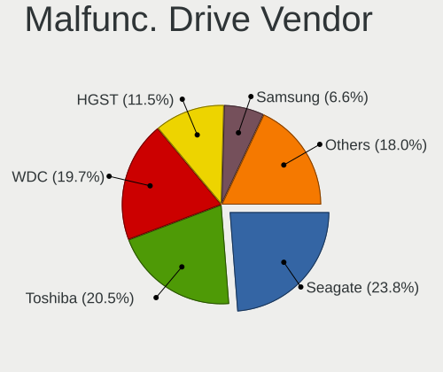

| Vendor              | Notebooks | Drives | Percent |
|---------------------|-----------|--------|---------|
| Seagate             | 29        | 33     | 23.77%  |
| Toshiba             | 25        | 28     | 20.49%  |
| WDC                 | 24        | 26     | 19.67%  |
| HGST                | 14        | 16     | 11.48%  |
| Samsung Electronics | 8         | 9      | 6.56%   |
| Kingston            | 7         | 7      | 5.74%   |
| Hitachi             | 7         | 9      | 5.74%   |
| SanDisk             | 2         | 2      | 1.64%   |
| LITEONIT            | 2         | 2      | 1.64%   |
| SMI                 | 1         | 1      | 0.82%   |
| Patriot             | 1         | 1      | 0.82%   |
| Crucial             | 1         | 1      | 0.82%   |
| A-DATA Technology   | 1         | 1      | 0.82%   |

Malfunc. HDD Vendor
-------------------

Vendors of faulty HDD drives

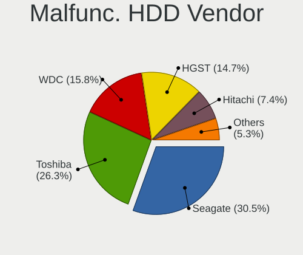

| Vendor              | Notebooks | Drives | Percent |
|---------------------|-----------|--------|---------|
| Seagate             | 29        | 33     | 30.53%  |
| Toshiba             | 25        | 28     | 26.32%  |
| WDC                 | 15        | 17     | 15.79%  |
| HGST                | 14        | 16     | 14.74%  |
| Hitachi             | 7         | 9      | 7.37%   |
| Samsung Electronics | 5         | 6      | 5.26%   |

Malfunc. Drive Kind
-------------------

Kinds of faulty drives

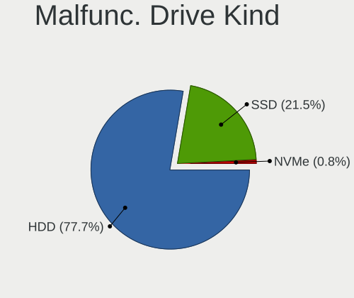

| Kind | Notebooks | Drives | Percent |
|------|-----------|--------|---------|
| HDD  | 94        | 109    | 77.69%  |
| SSD  | 26        | 26     | 21.49%  |
| NVMe | 1         | 1      | 0.83%   |

Failed Drives
-------------

Failed drive models

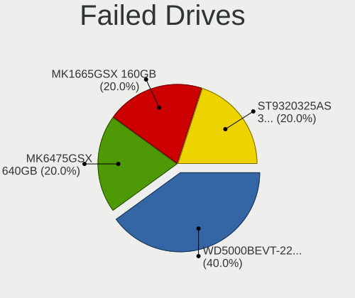

| Model                       | Notebooks | Drives | Percent |
|-----------------------------|-----------|--------|---------|
| WDC WD5000BEVT-22ZAT0 500GB | 2         | 3      | 40%     |
| Toshiba MK6475GSX 640GB     | 1         | 1      | 20%     |
| Toshiba MK1665GSX 160GB     | 1         | 1      | 20%     |
| Seagate ST9320325AS 320GB   | 1         | 1      | 20%     |

Failed Drive Vendor
-------------------

Failed drive vendors

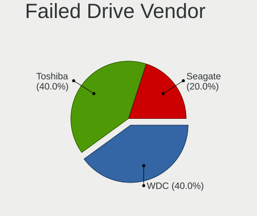

| Vendor  | Notebooks | Drives | Percent |
|---------|-----------|--------|---------|
| WDC     | 2         | 3      | 40%     |
| Toshiba | 2         | 2      | 40%     |
| Seagate | 1         | 1      | 20%     |

Drive Status
------------

Number of failed and malfunc. drives

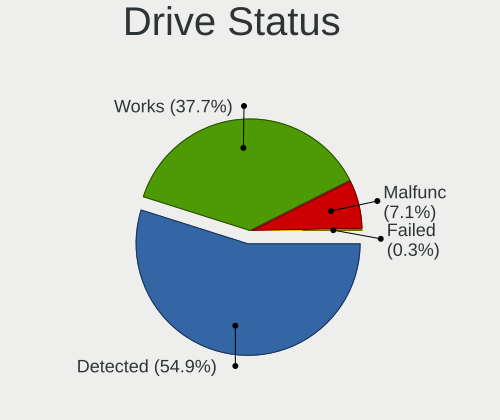

| Status   | Notebooks | Drives | Percent |
|----------|-----------|--------|---------|
| Detected | 911       | 1294   | 54.88%  |
| Works    | 626       | 915    | 37.71%  |
| Malfunc  | 118       | 136    | 7.11%   |
| Failed   | 5         | 6      | 0.3%    |

Storage controller
------------------

Storage Vendor
--------------

Storage controller vendors

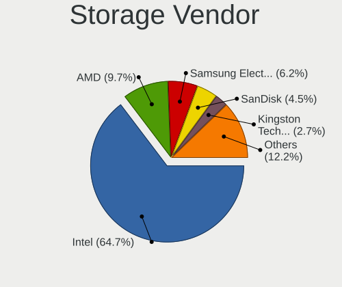

| Vendor                               | Notebooks | Percent |
|--------------------------------------|-----------|---------|
| Intel                                | 1161      | 64.68%  |
| AMD                                  | 174       | 9.69%   |
| Samsung Electronics                  | 112       | 6.24%   |
| SanDisk                              | 80        | 4.46%   |
| Kingston Technology Company          | 49        | 2.73%   |
| SK hynix                             | 45        | 2.51%   |
| Micron Technology                    | 29        | 1.62%   |
| KIOXIA                               | 28        | 1.56%   |
| Toshiba America Info Systems         | 18        | 1%      |
| Silicon Integrated Systems [SiS]     | 14        | 0.78%   |
| MAXIO Technology (Hangzhou)          | 11        | 0.61%   |
| Phison Electronics                   | 10        | 0.56%   |
| Micron/Crucial Technology            | 8         | 0.45%   |
| ADATA Technology                     | 8         | 0.45%   |
| Realtek Semiconductor                | 7         | 0.39%   |
| Silicon Motion                       | 6         | 0.33%   |
| Union Memory (Shenzhen)              | 5         | 0.28%   |
| Solid State Storage Technology       | 5         | 0.28%   |
| Shenzhen Longsys Electronics         | 5         | 0.28%   |
| Nvidia                               | 5         | 0.28%   |
| VIA Technologies                     | 2         | 0.11%   |
| Lite-On Technology                   | 2         | 0.11%   |
| INNOGRIT                             | 2         | 0.11%   |
| Apple                                | 2         | 0.11%   |
| Solidigm                             | 1         | 0.06%   |
| Ramaxel Technology(Shenzhen) Limited | 1         | 0.06%   |
| O2 Micro                             | 1         | 0.06%   |
| Nextorage                            | 1         | 0.06%   |
| Marvell Technology Group             | 1         | 0.06%   |
| Lenovo                               | 1         | 0.06%   |
| Biwin Storage Technology             | 1         | 0.06%   |

Storage Model
-------------

Storage controller models

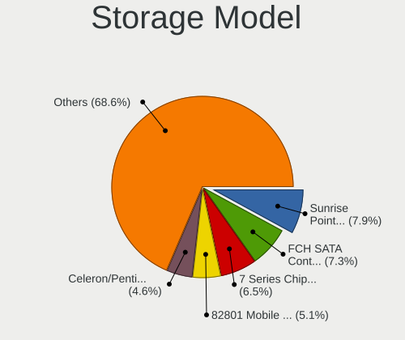

| Model                                                                            | Notebooks | Percent |
|----------------------------------------------------------------------------------|-----------|---------|
| Intel Sunrise Point-LP SATA Controller [AHCI mode]                               | 154       | 7.95%   |
| AMD FCH SATA Controller [AHCI mode]                                              | 141       | 7.28%   |
| Intel 7 Series Chipset Family 6-port SATA Controller [AHCI mode]                 | 126       | 6.5%    |
| Intel 82801 Mobile SATA Controller [RAID mode]                                   | 98        | 5.06%   |
| Intel Celeron/Pentium Silver Processor SATA Controller                           | 90        | 4.64%   |
| Intel 6 Series/C200 Series Chipset Family 6 port Mobile SATA AHCI Controller     | 70        | 3.61%   |
| Intel Volume Management Device NVMe RAID Controller                              | 57        | 2.94%   |
| Intel Tiger Lake-LP SATA Controller                                              | 51        | 2.63%   |
| Samsung NVMe SSD Controller 980 (DRAM-less)                                      | 48        | 2.48%   |
| Intel Wildcat Point-LP SATA Controller [AHCI Mode]                               | 45        | 2.32%   |
| Intel 8 Series SATA Controller 1 [AHCI mode]                                     | 44        | 2.27%   |
| Intel 82801IBM/IEM (ICH9M/ICH9M-E) 4 port SATA Controller [AHCI mode]            | 42        | 2.17%   |
| Intel NM10/ICH7 Family SATA Controller [AHCI mode]                               | 38        | 1.96%   |
| Intel 5 Series/3400 Series Chipset 4 port SATA AHCI Controller                   | 38        | 1.96%   |
| Intel Comet Lake SATA AHCI Controller                                            | 36        | 1.86%   |
| Intel Atom Processor E3800 Series SATA AHCI Controller                           | 34        | 1.75%   |
| Intel Celeron N3350/Pentium N4200/Atom E3900 Series SATA AHCI Controller         | 30        | 1.55%   |
| Samsung NVMe SSD Controller SM981/PM981/PM983                                    | 27        | 1.39%   |
| Intel 8 Series/C220 Series Chipset Family 6-port SATA Controller 1 [AHCI mode]   | 26        | 1.34%   |
| Intel HM170/QM170 Chipset SATA Controller [AHCI Mode]                            | 25        | 1.29%   |
| Intel 82801HM/HEM (ICH8M/ICH8M-E) IDE Controller                                 | 24        | 1.24%   |
| Intel 82801HM/HEM (ICH8M/ICH8M-E) SATA Controller [AHCI mode]                    | 23        | 1.19%   |
| AMD SB7x0/SB8x0/SB9x0 SATA Controller [AHCI mode]                                | 23        | 1.19%   |
| KIOXIA NVMe SSD Controller BG4 (DRAM-less)                                       | 21        | 1.08%   |
| SanDisk Ultra 3D / WD PC SN530, IX SN530, Blue SN550 NVMe SSD (DRAM-less)        | 18        | 0.93%   |
| SK hynix Gold P31/BC711/PC711 NVMe Solid State Drive                             | 17        | 0.88%   |
| Intel Alder Lake-P SATA AHCI Controller                                          | 17        | 0.88%   |
| Intel Atom/Celeron/Pentium Processor x5-E8000/J3xxx/N3xxx Series SATA Controller | 16        | 0.83%   |
| Silicon Integrated Systems [SiS] 5513 IDE Controller                             | 14        | 0.72%   |
| Intel Ice Lake-LP SATA Controller [AHCI mode]                                    | 13        | 0.67%   |
| Silicon Integrated Systems [SiS] SATA Controller / IDE mode                      | 12        | 0.62%   |
| Micron 2450 NVMe SSD [HendrixV] (DRAM-less)                                      | 12        | 0.62%   |
| Kingston Company NV1 NVMe SSD [SM2263XT] (DRAM-less)                             | 12        | 0.62%   |
| Intel Cannon Point-LP SATA Controller [AHCI Mode]                                | 12        | 0.62%   |
| Intel 82801GBM/GHM (ICH7-M Family) SATA Controller [IDE mode]                    | 12        | 0.62%   |
| Toshiba America Info Systems XG6 NVMe SSD Controller                             | 11        | 0.57%   |
| Samsung NVMe SSD Controller PM9A1/PM9A3/980PRO                                   | 11        | 0.57%   |
| Intel 82801G (ICH7 Family) IDE Controller                                        | 11        | 0.57%   |
| Intel 5 Series/3400 Series Chipset 6 port SATA AHCI Controller                   | 11        | 0.57%   |
| SK hynix BC511 NVMe SSD                                                          | 10        | 0.52%   |

Storage Kind
------------

Kind of storage controller (IDE, SATA, NVMe, SAS, ...)

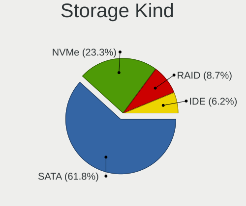

| Kind | Notebooks | Percent |
|------|-----------|---------|
| SATA | 1152      | 61.77%  |
| NVMe | 435       | 23.32%  |
| RAID | 162       | 8.69%   |
| IDE  | 116       | 6.22%   |

Processor
---------

CPU Vendor
----------

Processor vendors

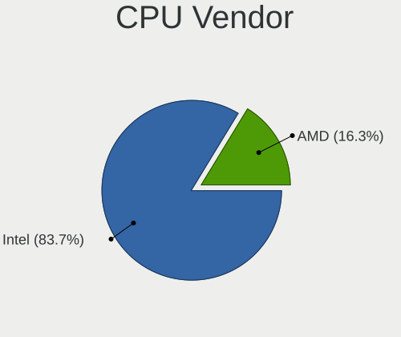

| Vendor | Notebooks | Percent |
|--------|-----------|---------|
| Intel  | 1336      | 83.71%  |
| AMD    | 260       | 16.29%  |

CPU Model
---------

Processor models

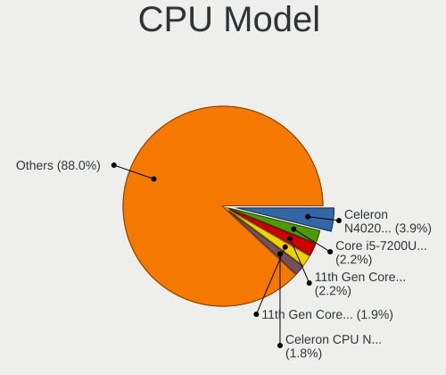

| Model                                         | Notebooks | Percent |
|-----------------------------------------------|-----------|---------|
| Intel Celeron N4020 CPU @ 1.10GHz             | 62        | 3.88%   |
| Intel Core i5-7200U CPU @ 2.50GHz             | 35        | 2.19%   |
| Intel 11th Gen Core i7-1165G7 @ 2.80GHz       | 35        | 2.19%   |
| Intel 11th Gen Core i5-1135G7 @ 2.40GHz       | 31        | 1.94%   |
| Intel Celeron CPU N3350 @ 1.10GHz             | 28        | 1.75%   |
| Intel Core i7-8550U CPU @ 1.80GHz             | 24        | 1.5%    |
| Intel Celeron N4000 CPU @ 1.10GHz             | 24        | 1.5%    |
| Intel Core i7-7500U CPU @ 2.70GHz             | 21        | 1.31%   |
| Intel Core i5-3210M CPU @ 2.50GHz             | 21        | 1.31%   |
| Intel Core i5-10210U CPU @ 1.60GHz            | 20        | 1.25%   |
| Intel Atom CPU N2600 @ 1.60GHz                | 20        | 1.25%   |
| Intel Core i5-3320M CPU @ 2.60GHz             | 19        | 1.19%   |
| Intel Atom x5-Z8350 CPU @ 1.44GHz             | 19        | 1.19%   |
| Intel Core i7-6500U CPU @ 2.50GHz             | 18        | 1.13%   |
| Intel Core i5-6200U CPU @ 2.30GHz             | 18        | 1.13%   |
| Intel Core i5-8250U CPU @ 1.60GHz             | 17        | 1.06%   |
| Intel Core i5-5200U CPU @ 2.20GHz             | 16        | 1%      |
| Intel Core i5-1035G1 CPU @ 1.00GHz            | 16        | 1%      |
| Intel Celeron CPU N3060 @ 1.60GHz             | 16        | 1%      |
| Intel 11th Gen Core i3-1115G4 @ 3.00GHz       | 16        | 1%      |
| Intel Core i3-1005G1 CPU @ 1.20GHz            | 15        | 0.94%   |
| AMD Ryzen 5 3450U with Radeon Vega Mobile Gfx | 15        | 0.94%   |
| Intel Core i7-7700HQ CPU @ 2.80GHz            | 14        | 0.88%   |
| Intel Core i7-5500U CPU @ 2.40GHz             | 13        | 0.81%   |
| Intel Core i7-10510U CPU @ 1.80GHz            | 13        | 0.81%   |
| Intel Core i5-8265U CPU @ 1.60GHz             | 12        | 0.75%   |
| Intel Core i3-2330M CPU @ 2.20GHz             | 12        | 0.75%   |
| AMD Ryzen 5 3500U with Radeon Vega Mobile Gfx | 12        | 0.75%   |
| Intel Core i3-6006U CPU @ 2.00GHz             | 11        | 0.69%   |
| Intel Core i3-4005U CPU @ 1.70GHz             | 11        | 0.69%   |
| Intel Atom CPU N455 @ 1.66GHz                 | 11        | 0.69%   |
| Intel 12th Gen Core i5-1235U                  | 11        | 0.69%   |
| AMD Ryzen 5 5500U with Radeon Graphics        | 11        | 0.69%   |
| Intel Core i7-8565U CPU @ 1.80GHz             | 10        | 0.63%   |
| Intel Core i5-3317U CPU @ 1.70GHz             | 10        | 0.63%   |
| Intel Core i3-2310M CPU @ 2.10GHz             | 10        | 0.63%   |
| Intel Core i3-10110U CPU @ 2.10GHz            | 10        | 0.63%   |
| Intel Core i5-4210U CPU @ 1.70GHz             | 9         | 0.56%   |
| Intel Core i5-2450M CPU @ 2.50GHz             | 9         | 0.56%   |
| Intel Core i5 CPU M 520 @ 2.40GHz             | 9         | 0.56%   |

CPU Model Family
----------------

Processor model prefix

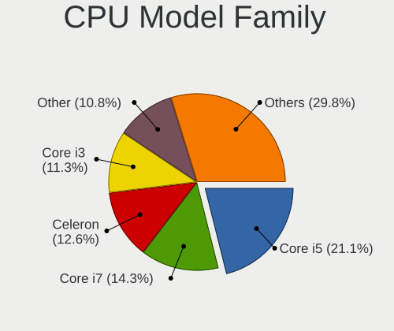

| Model                   | Notebooks | Percent |
|-------------------------|-----------|---------|
| Intel Core i5           | 337       | 21.09%  |
| Intel Core i7           | 229       | 14.33%  |
| Intel Celeron           | 202       | 12.64%  |
| Intel Core i3           | 181       | 11.33%  |
| Other                   | 173       | 10.83%  |
| Intel Atom              | 72        | 4.51%   |
| AMD Ryzen 5             | 68        | 4.26%   |
| AMD Ryzen 7             | 50        | 3.13%   |
| Intel Pentium           | 42        | 2.63%   |
| Intel Core 2 Duo        | 36        | 2.25%   |
| Intel Pentium Dual-Core | 28        | 1.75%   |
| Intel Pentium Dual      | 21        | 1.31%   |
| AMD Ryzen 3             | 16        | 1%      |
| AMD A6                  | 15        | 0.94%   |
| Intel Genuine           | 11        | 0.69%   |
| AMD Ryzen 9             | 10        | 0.63%   |
| AMD A8                  | 10        | 0.63%   |
| AMD A12                 | 10        | 0.63%   |
| AMD A10                 | 9         | 0.56%   |
| AMD A4                  | 8         | 0.5%    |
| AMD Ryzen 7 PRO         | 7         | 0.44%   |
| Intel Core 2            | 6         | 0.38%   |
| AMD Athlon II           | 6         | 0.38%   |
| AMD Athlon              | 5         | 0.31%   |
| Intel Core              | 4         | 0.25%   |
| AMD Turion II           | 3         | 0.19%   |
| AMD Turion 64 X2 Mobile | 3         | 0.19%   |
| AMD E                   | 3         | 0.19%   |
| AMD C-60                | 3         | 0.19%   |
| AMD C-50                | 3         | 0.19%   |
| Intel Pentium Silver    | 2         | 0.13%   |
| Intel Pentium M         | 2         | 0.13%   |
| Intel Core i9           | 2         | 0.13%   |
| Intel Core Duo          | 2         | 0.13%   |
| Intel Celeron M         | 2         | 0.13%   |
| AMD E2                  | 2         | 0.13%   |
| AMD C-70                | 2         | 0.13%   |
| AMD Athlon X2           | 2         | 0.13%   |
| Intel Celeron Dual-Core | 1         | 0.06%   |
| AMD Z                   | 1         | 0.06%   |

CPU Cores
---------

Number of processor cores

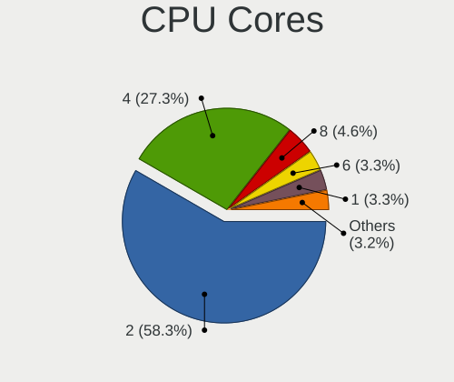

| Number  | Notebooks | Percent |
|---------|-----------|---------|
| 2       | 932       | 58.32%  |
| 4       | 436       | 27.28%  |
| 8       | 74        | 4.63%   |
| 6       | 53        | 3.32%   |
| 1       | 52        | 3.25%   |
| 10      | 24        | 1.5%    |
| 14      | 10        | 0.63%   |
| 12      | 7         | 0.44%   |
| 16      | 4         | 0.25%   |
| 24      | 3         | 0.19%   |
| Unknown | 2         | 0.13%   |
| 3       | 1         | 0.06%   |

CPU Sockets
-----------

Number of sockets

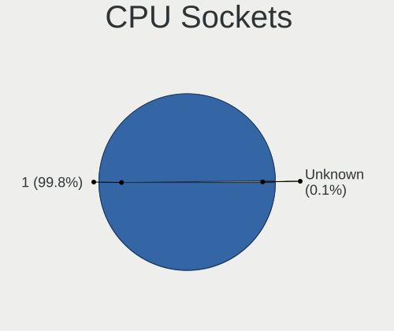

| Number  | Notebooks | Percent |
|---------|-----------|---------|
| 1       | 1593      | 99.81%  |
| 2       | 2         | 0.13%   |
| Unknown | 1         | 0.06%   |

CPU Threads
-----------

Threads per core (Hyper-Threading)

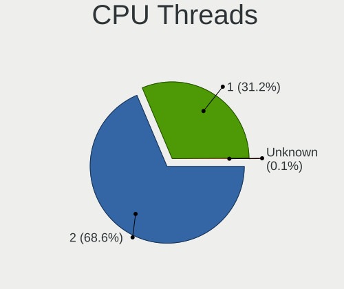

| Number  | Notebooks | Percent |
|---------|-----------|---------|
| 2       | 1098      | 68.63%  |
| 1       | 500       | 31.25%  |
| Unknown | 2         | 0.13%   |

CPU Op-Modes
------------

CPU Operation Modes (32-bit, 64-bit)

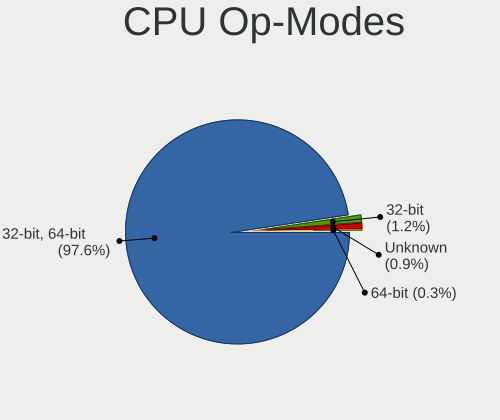

| Op mode        | Notebooks | Percent |
|----------------|-----------|---------|
| 32-bit, 64-bit | 1561      | 97.62%  |
| 32-bit         | 19        | 1.19%   |
| Unknown        | 15        | 0.94%   |
| 64-bit         | 4         | 0.25%   |

CPU Microcode
-------------

Microcode number

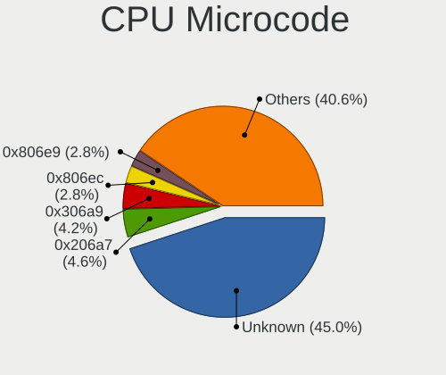

| Number     | Notebooks | Percent |
|------------|-----------|---------|
| Unknown    | 743       | 44.98%  |
| 0x206a7    | 76        | 4.6%    |
| 0x306a9    | 69        | 4.18%   |
| 0x806ec    | 47        | 2.85%   |
| 0x806e9    | 46        | 2.78%   |
| 0x806c1    | 43        | 2.6%    |
| 0x406e3    | 35        | 2.12%   |
| 0x1067a    | 33        | 2%      |
| 0x306d4    | 32        | 1.94%   |
| 0x806ea    | 30        | 1.82%   |
| 0x6fd      | 29        | 1.76%   |
| 0x40651    | 29        | 1.76%   |
| 0x20655    | 27        | 1.63%   |
| 0x406c4    | 24        | 1.45%   |
| 0x706a8    | 22        | 1.33%   |
| 0x30678    | 21        | 1.27%   |
| 0x706e5    | 20        | 1.21%   |
| 0x706a1    | 18        | 1.09%   |
| 0x30661    | 18        | 1.09%   |
| 0x306c3    | 17        | 1.03%   |
| 0x506c9    | 16        | 0.97%   |
| 0x106ca    | 15        | 0.91%   |
| 0x08108109 | 15        | 0.91%   |
| 0x06006705 | 13        | 0.79%   |
| 0x08608103 | 11        | 0.67%   |
| 0x20652    | 9         | 0.54%   |
| 0x0a50000c | 9         | 0.54%   |
| 0xa0652    | 8         | 0.48%   |
| 0x906e9    | 8         | 0.48%   |
| 0x08108102 | 8         | 0.48%   |
| 0x906ea    | 7         | 0.42%   |
| 0x406c3    | 7         | 0.42%   |
| 0x08600104 | 7         | 0.42%   |
| 0x06006118 | 7         | 0.42%   |
| 0x06001119 | 7         | 0.42%   |
| 0x6e8      | 6         | 0.36%   |
| 0x10661    | 6         | 0.36%   |
| 0x0810100b | 6         | 0.36%   |
| 0x906a4    | 5         | 0.3%    |
| 0x806eb    | 5         | 0.3%    |

CPU Microarch
-------------

Microarchitecture

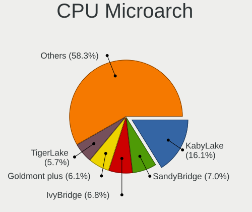

| Name              | Notebooks | Percent |
|-------------------|-----------|---------|
| KabyLake          | 258       | 16.15%  |
| SandyBridge       | 112       | 7.01%   |
| IvyBridge         | 109       | 6.82%   |
| Goldmont plus     | 97        | 6.07%   |
| TigerLake         | 91        | 5.69%   |
| Silvermont        | 87        | 5.44%   |
| Haswell           | 79        | 4.94%   |
| Unknown           | 72        | 4.51%   |
| Skylake           | 66        | 4.13%   |
| Westmere          | 58        | 3.63%   |
| Penryn            | 53        | 3.32%   |
| Core              | 50        | 3.13%   |
| Broadwell         | 50        | 3.13%   |
| Icelake           | 48        | 3%      |
| Bonnell           | 46        | 2.88%   |
| Zen+              | 41        | 2.57%   |
| Excavator         | 36        | 2.25%   |
| Alderlake Hybrid  | 35        | 2.19%   |
| Zen 3             | 30        | 1.88%   |
| Goldmont          | 30        | 1.88%   |
| Zen 2             | 25        | 1.56%   |
| Zen               | 16        | 1%      |
| CometLake         | 16        | 1%      |
| Bobcat            | 13        | 0.81%   |
| P6                | 12        | 0.75%   |
| Piledriver        | 11        | 0.69%   |
| K10               | 11        | 0.69%   |
| K8 Hammer         | 9         | 0.56%   |
| K10 Llano         | 8         | 0.5%    |
| Nehalem           | 6         | 0.38%   |
| Puma              | 5         | 0.31%   |
| Meteorlake Hybrid | 4         | 0.25%   |
| K8 & K10 hybrid   | 4         | 0.25%   |
| Jaguar            | 4         | 0.25%   |
| Steamroller       | 3         | 0.19%   |
| Tremont           | 2         | 0.13%   |
| Gracemont         | 1         | 0.06%   |

Graphics
--------

GPU Vendor
----------

Vendors of graphics cards

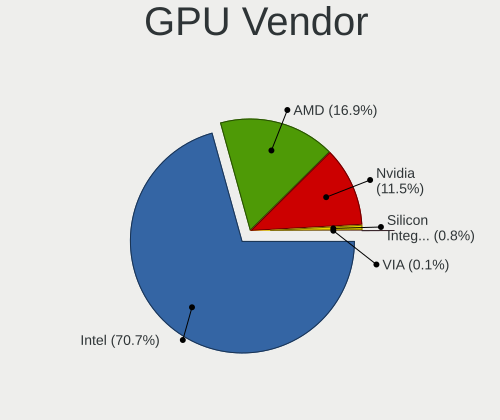

| Vendor                           | Notebooks | Percent |
|----------------------------------|-----------|---------|
| Intel                            | 1281      | 70.7%   |
| AMD                              | 306       | 16.89%  |
| Nvidia                           | 209       | 11.53%  |
| Silicon Integrated Systems [SiS] | 14        | 0.77%   |
| VIA Technologies                 | 2         | 0.11%   |

GPU Model
---------

Graphics card models

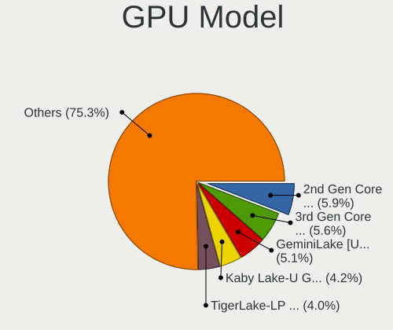

| Model                                                                                    | Notebooks | Percent |
|------------------------------------------------------------------------------------------|-----------|---------|
| Intel 2nd Generation Core Processor Family Integrated Graphics Controller                | 110       | 5.87%   |
| Intel 3rd Gen Core processor Graphics Controller                                         | 105       | 5.6%    |
| Intel GeminiLake [UHD Graphics 600]                                                      | 95        | 5.07%   |
| Intel Kaby Lake-U GT2 [HD Graphics 620]                                                  | 78        | 4.16%   |
| Intel TigerLake-LP GT2 [Iris Xe Graphics]                                                | 75        | 4%      |
| Intel Kaby Lake-R GT2 [UHD Graphics 620]                                                 | 55        | 2.93%   |
| Intel Skylake-U GT2 [HD Graphics 520]                                                    | 54        | 2.88%   |
| Intel Core Processor Integrated Graphics Controller                                      | 53        | 2.83%   |
| Intel CometLake-U GT2 [UHD Graphics]                                                     | 50        | 2.67%   |
| Intel Atom/Celeron/Pentium Processor x5-E8000/J3xxx/N3xxx Integrated Graphics Controller | 50        | 2.67%   |
| Intel Mobile 4 Series Chipset Integrated Graphics Controller                             | 49        | 2.61%   |
| Intel Haswell-ULT Integrated Graphics Controller                                         | 48        | 2.56%   |
| Intel Broadwell-U GT2 [HD Graphics 5500]                                                 | 45        | 2.4%    |
| AMD Picasso/Raven 2 [Radeon Vega Series / Radeon Vega Mobile Series]                     | 42        | 2.24%   |
| Intel Atom Processor Z36xxx/Z37xxx Series Graphics & Display                             | 37        | 1.97%   |
| Intel WhiskeyLake-U GT2 [UHD Graphics 620]                                               | 34        | 1.81%   |
| Intel Iris Plus Graphics G1 (Ice Lake)                                                   | 31        | 1.65%   |
| Intel Apollo Lake GT1 [HD Graphics 500]                                                  | 30        | 1.6%    |
| Intel 4th Gen Core Processor Integrated Graphics Controller                              | 25        | 1.33%   |
| Intel Mobile GM965/GL960 Integrated Graphics Controller (secondary)                      | 24        | 1.28%   |
| Intel Mobile GM965/GL960 Integrated Graphics Controller (primary)                        | 24        | 1.28%   |
| AMD Renoir [Radeon Vega Series / Radeon Vega Mobile Series]                              | 24        | 1.28%   |
| AMD Lucienne                                                                             | 24        | 1.28%   |
| AMD Stoney [Radeon R2/R3/R4/R5 Graphics]                                                 | 23        | 1.23%   |
| Intel Atom Processor D4xx/D5xx/N4xx/N5xx Integrated Graphics Controller                  | 21        | 1.12%   |
| Intel Atom Processor D2xxx/N2xxx Integrated Graphics Controller                          | 20        | 1.07%   |
| AMD Cezanne [Radeon Vega Series / Radeon Vega Mobile Series]                             | 20        | 1.07%   |
| Intel Mobile 945GM/GMS/GME, 943/940GML Express Integrated Graphics Controller            | 19        | 1.01%   |
| Intel Kaby Lake-H GT2 [HD Graphics 630]                                                  | 19        | 1.01%   |
| Nvidia GP107M [GeForce GTX 1050 Mobile]                                                  | 18        | 0.96%   |
| Intel Alder Lake-UP3 GT2 [Iris Xe Graphics]                                              | 18        | 0.96%   |
| Intel Tiger Lake-LP GT2 [UHD Graphics G4]                                                | 16        | 0.85%   |
| AMD Topaz XT [Radeon R7 M260/M265 / M340/M360 / M440/M445 / 530/535 / 620/625 Mobile]    | 16        | 0.85%   |
| Silicon Integrated Systems [SiS] 771/671 PCIE VGA Display Adapter                        | 14        | 0.75%   |
| Intel CometLake-H GT2 [UHD Graphics]                                                     | 14        | 0.75%   |
| Nvidia TU117M [GeForce GTX 1650 Mobile / Max-Q]                                          | 13        | 0.69%   |
| Intel TigerLake-H GT1 [UHD Graphics]                                                     | 13        | 0.69%   |
| Intel Mobile 945GM/GMS, 943/940GML Express Integrated Graphics Controller                | 13        | 0.69%   |
| Intel CoffeeLake-H GT2 [UHD Graphics 630]                                                | 13        | 0.69%   |
| AMD Wani [Radeon R5/R6/R7 Graphics]                                                      | 13        | 0.69%   |

GPU Combo
---------

Combinations of graphics cards

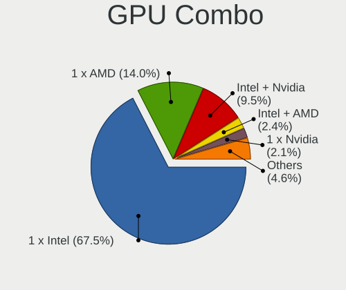

| Name           | Notebooks | Percent |
|----------------|-----------|---------|
| 1 x Intel      | 1078      | 67.46%  |
| 1 x AMD        | 223       | 13.95%  |
| Intel + Nvidia | 152       | 9.51%   |
| Intel + AMD    | 39        | 2.44%   |
| 1 x Nvidia     | 33        | 2.07%   |
| AMD + Nvidia   | 25        | 1.56%   |
| 2 x AMD        | 19        | 1.19%   |
| 1 x SiS        | 14        | 0.88%   |
| 2 x Intel      | 13        | 0.81%   |
| 1 x VIA        | 2         | 0.13%   |

GPU Driver
----------

Free vs proprietary

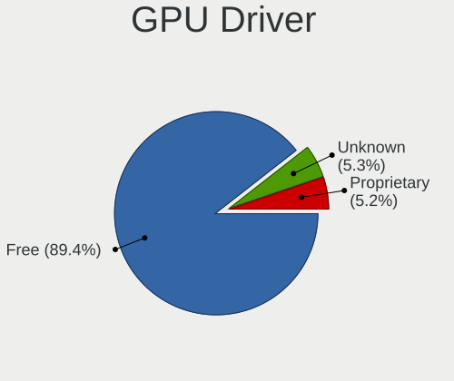

| Driver      | Notebooks | Percent |
|-------------|-----------|---------|
| Free        | 1440      | 89.44%  |
| Unknown     | 86        | 5.34%   |
| Proprietary | 84        | 5.22%   |

GPU Memory
----------

Total video memory

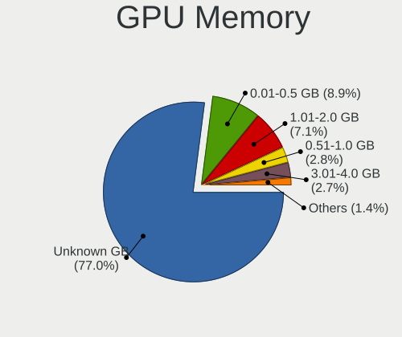

| Size in GB | Notebooks | Percent |
|------------|-----------|---------|
| Unknown    | 1251      | 77.03%  |
| 0.01-0.5   | 144       | 8.87%   |
| 1.01-2.0   | 116       | 7.14%   |
| 0.51-1.0   | 46        | 2.83%   |
| 3.01-4.0   | 44        | 2.71%   |
| 5.01-6.0   | 12        | 0.74%   |
| 7.01-8.0   | 4         | 0.25%   |
| 8.01-16.0  | 4         | 0.25%   |
| 2.01-3.0   | 3         | 0.18%   |

Monitor
-------

Monitor Vendor
--------------

Monitor vendors

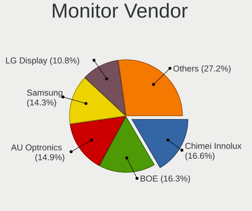

| Vendor                  | Notebooks | Percent |
|-------------------------|-----------|---------|
| Chimei Innolux          | 298       | 16.59%  |
| BOE                     | 292       | 16.26%  |
| AU Optronics            | 267       | 14.87%  |
| Samsung Electronics     | 256       | 14.25%  |
| LG Display              | 194       | 10.8%   |
| Goldstar                | 64        | 3.56%   |
| InfoVision              | 62        | 3.45%   |
| Chi Mei Optoelectronics | 27        | 1.5%    |
| Lenovo                  | 25        | 1.39%   |
| PANDA                   | 24        | 1.34%   |
| Apple                   | 23        | 1.28%   |
| STA                     | 20        | 1.11%   |
| Philips                 | 20        | 1.11%   |
| LG Philips              | 16        | 0.89%   |
| InnoLux Display         | 13        | 0.72%   |
| Dell                    | 13        | 0.72%   |
| Sharp                   | 12        | 0.67%   |
| BenQ                    | 12        | 0.67%   |
| KDB                     | 11        | 0.61%   |
| HannStar                | 11        | 0.61%   |
| ViewSonic               | 10        | 0.56%   |
| Hitachi                 | 10        | 0.56%   |
| KDC                     | 9         | 0.5%    |
| Hewlett-Packard         | 8         | 0.45%   |
| CPT                     | 8         | 0.45%   |
| ASUSTek Computer        | 7         | 0.39%   |
| SKY                     | 6         | 0.33%   |
| SLD                     | 5         | 0.28%   |
| CSOT                    | 5         | 0.28%   |
| Toshiba                 | 4         | 0.22%   |
| Gigabyte Technology     | 4         | 0.22%   |
| CSO                     | 4         | 0.22%   |
| Unknown                 | 3         | 0.17%   |
| Pixio                   | 3         | 0.17%   |
| KGS                     | 3         | 0.17%   |
| iQual                   | 3         | 0.17%   |
| HKC                     | 3         | 0.17%   |
| ZTR                     | 2         | 0.11%   |
| Valve                   | 2         | 0.11%   |
| UTV                     | 2         | 0.11%   |

Monitor Model
-------------

Monitor models

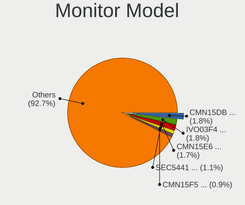

| Model                                                                | Notebooks | Percent |
|----------------------------------------------------------------------|-----------|---------|
| Chimei Innolux LCD Monitor CMN15DB 1366x768 344x193mm 15.5-inch      | 33        | 1.81%   |
| InfoVision LCD Monitor IVO03F4 1920x1080 309x173mm 13.9-inch         | 32        | 1.76%   |
| Chimei Innolux LCD Monitor CMN15E6 1366x768 344x193mm 15.5-inch      | 31        | 1.7%    |
| Samsung Electronics LCD Monitor SEC5441 1280x800 331x207mm 15.4-inch | 20        | 1.1%    |
| Chimei Innolux LCD Monitor CMN15F5 1920x1080 344x193mm 15.5-inch     | 17        | 0.93%   |
| AU Optronics LCD Monitor AUO2E3C 1366x768 309x173mm 13.9-inch        | 17        | 0.93%   |
| LG Display LCD Monitor LGD02E9 1366x768 309x174mm 14.0-inch          | 15        | 0.82%   |
| Chimei Innolux LCD Monitor CMN14D6 1366x768 309x173mm 13.9-inch      | 15        | 0.82%   |
| Chimei Innolux LCD Monitor CMN15E7 1920x1080 344x193mm 15.5-inch     | 14        | 0.77%   |
| BOE LCD Monitor BOE06A4 1366x768 344x194mm 15.5-inch                 | 14        | 0.77%   |
| AU Optronics LCD Monitor AUO71EC 1366x768 344x193mm 15.5-inch        | 14        | 0.77%   |
| Chimei Innolux LCD Monitor CMN14C3 1366x768 309x173mm 13.9-inch      | 12        | 0.66%   |
| Samsung Electronics LCD Monitor SEC4542 1366x768 309x174mm 14.0-inch | 10        | 0.55%   |
| InfoVision M140NWR2 R1 IVO057A 1366x768 309x174mm 14.0-inch          | 10        | 0.55%   |
| Goldstar FULL HD GSM5B55 1920x1080 480x270mm 21.7-inch               | 10        | 0.55%   |
| BOE LCD Monitor BOE06A5 1366x768 344x194mm 15.5-inch                 | 10        | 0.55%   |
| Samsung Electronics C24F390 SAM0D2C 1920x1080 521x293mm 23.5-inch    | 9         | 0.49%   |
| Chimei Innolux LCD Monitor CMN15DC 1366x768 344x193mm 15.5-inch      | 9         | 0.49%   |
| Chimei Innolux LCD Monitor CMN14D4 1920x1080 309x173mm 13.9-inch     | 9         | 0.49%   |
| AU Optronics LCD Monitor AUO183C 1366x768 309x173mm 13.9-inch        | 9         | 0.49%   |
| LG Display LCD Monitor LGD02DC 1366x768 344x194mm 15.5-inch          | 8         | 0.44%   |
| BOE LCD Monitor BOE0812 1920x1080 344x194mm 15.5-inch                | 8         | 0.44%   |
| BOE LCD Monitor BOE0696 1366x768 309x173mm 13.9-inch                 | 8         | 0.44%   |
| AU Optronics LCD Monitor AUO21ED 1920x1080 344x193mm 15.5-inch       | 8         | 0.44%   |
| STA LCD Monitor STA8CA7 1366x768 256x144mm 11.6-inch                 | 7         | 0.38%   |
| LG Display LCD Monitor LGD045C 1366x768 345x194mm 15.6-inch          | 7         | 0.38%   |
| KDB LCD Monitor KDB1130 1366x768 256x144mm 11.6-inch                 | 7         | 0.38%   |
| HannStar LCD Monitor HSD03E9 1024x600 220x129mm 10.0-inch            | 7         | 0.38%   |
| Chimei Innolux LCD Monitor CMN14E5 1920x1080 309x173mm 13.9-inch     | 7         | 0.38%   |
| BOE LCD Monitor BOE08D5 1920x1080 344x194mm 15.5-inch                | 7         | 0.38%   |
| BOE LCD Monitor BOE0697 1366x768 309x173mm 13.9-inch                 | 7         | 0.38%   |
| BOE LCD Monitor BOE0675 1366x768 344x194mm 15.5-inch                 | 7         | 0.38%   |
| AU Optronics LCD Monitor AUO70EC 1366x768 344x193mm 15.5-inch        | 7         | 0.38%   |
| Samsung Electronics LCD Monitor SEC4145 1366x768 309x174mm 14.0-inch | 6         | 0.33%   |
| Samsung Electronics C27F390 SAM0D32 1920x1080 598x336mm 27.0-inch    | 6         | 0.33%   |
| PANDA LCD Monitor NCP004D 1920x1080 344x194mm 15.5-inch              | 6         | 0.33%   |
| PANDA LCD Monitor NCP004A 1920x1080 309x174mm 14.0-inch              | 6         | 0.33%   |
| LG Display LP156WH2-TLAA LGD0230 1366x768 344x194mm 15.5-inch        | 6         | 0.33%   |
| Chimei Innolux LCD Monitor CMN1490 1366x768 309x174mm 14.0-inch      | 6         | 0.33%   |
| Chimei Innolux LCD Monitor CMN142C 1366x768 309x173mm 13.9-inch      | 6         | 0.33%   |

Monitor Resolution
------------------

Monitor screen resolution

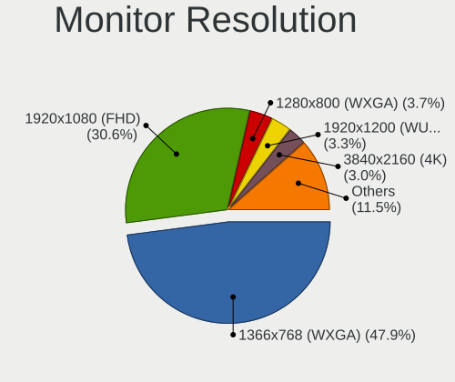

| Resolution         | Notebooks | Percent |
|--------------------|-----------|---------|
| 1366x768 (WXGA)    | 827       | 47.94%  |
| 1920x1080 (FHD)    | 528       | 30.61%  |
| 1280x800 (WXGA)    | 63        | 3.65%   |
| 1920x1200 (WUXGA)  | 57        | 3.3%    |
| 3840x2160 (4K)     | 51        | 2.96%   |
| 1600x900 (HD+)     | 37        | 2.14%   |
| 1440x900 (WXGA+)   | 25        | 1.45%   |
| 1024x600           | 18        | 1.04%   |
| 2560x1600          | 14        | 0.81%   |
| 1360x768           | 13        | 0.75%   |
| 1280x1024 (SXGA)   | 12        | 0.7%    |
| 2880x1800          | 11        | 0.64%   |
| 1680x1050 (WSXGA+) | 9         | 0.52%   |
| 3200x1800 (QHD+)   | 7         | 0.41%   |
| 2560x1440 (QHD)    | 7         | 0.41%   |
| 2560x1080          | 7         | 0.41%   |
| 3840x2400          | 4         | 0.23%   |
| 1600x2560          | 4         | 0.23%   |
| 2880x1620          | 3         | 0.17%   |
| 2288x1287          | 3         | 0.17%   |
| 1920x540           | 3         | 0.17%   |
| 800x1280           | 2         | 0.12%   |
| 3840x1100          | 2         | 0.12%   |
| 2160x1440          | 2         | 0.12%   |
| 1024x768 (XGA)     | 2         | 0.12%   |
| 3840x1080          | 1         | 0.06%   |
| 3456x2160          | 1         | 0.06%   |
| 3440x1440          | 1         | 0.06%   |
| 3072x1920          | 1         | 0.06%   |
| 3000x2000          | 1         | 0.06%   |
| 2944x1840          | 1         | 0.06%   |
| 2880x1920          | 1         | 0.06%   |
| 2560x2880          | 1         | 0.06%   |
| 2560x1700          | 1         | 0.06%   |
| 1920x515           | 1         | 0.06%   |
| 1920x1280          | 1         | 0.06%   |
| 1680x945           | 1         | 0.06%   |
| 1280x768           | 1         | 0.06%   |
| 1280x720 (HD)      | 1         | 0.06%   |

Monitor Diagonal
----------------

Diagonal size in inches

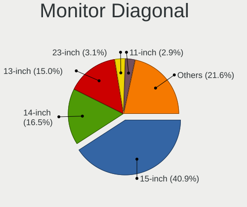

| Inches  | Notebooks | Percent |
|---------|-----------|---------|
| 15      | 739       | 40.85%  |
| 14      | 299       | 16.53%  |
| 13      | 272       | 15.04%  |
| 23      | 56        | 3.1%    |
| 11      | 52        | 2.87%   |
| 17      | 51        | 2.82%   |
| 21      | 40        | 2.21%   |
| 27      | 38        | 2.1%    |
| 18      | 38        | 2.1%    |
| 16      | 28        | 1.55%   |
| 10      | 27        | 1.49%   |
| 12      | 23        | 1.27%   |
| 24      | 22        | 1.22%   |
| 31      | 19        | 1.05%   |
| 40      | 16        | 0.88%   |
| 19      | 14        | 0.77%   |
| 20      | 13        | 0.72%   |
| 84      | 9         | 0.5%    |
| 52      | 7         | 0.39%   |
| 46      | 6         | 0.33%   |
| 34      | 5         | 0.28%   |
| 65      | 4         | 0.22%   |
| 32      | 4         | 0.22%   |
| Unknown | 4         | 0.22%   |
| 142     | 3         | 0.17%   |
| 63      | 3         | 0.17%   |
| 54      | 3         | 0.17%   |
| 48      | 3         | 0.17%   |
| 86      | 2         | 0.11%   |
| 22      | 2         | 0.11%   |
| 7       | 2         | 0.11%   |
| 72      | 1         | 0.06%   |
| 41      | 1         | 0.06%   |
| 39      | 1         | 0.06%   |
| 37      | 1         | 0.06%   |
| 8       | 1         | 0.06%   |

Monitor Width
-------------

Physical width

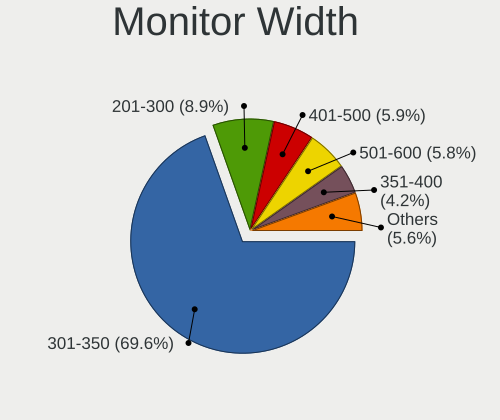

| Width in mm    | Notebooks | Percent |
|----------------|-----------|---------|
| 301-350        | 1249      | 69.58%  |
| 201-300        | 159       | 8.86%   |
| 401-500        | 106       | 5.91%   |
| 501-600        | 105       | 5.85%   |
| 351-400        | 76        | 4.23%   |
| 1001-1500      | 28        | 1.56%   |
| 601-700        | 24        | 1.34%   |
| 801-900        | 18        | 1%      |
| 1501-2000      | 10        | 0.56%   |
| 701-800        | 9         | 0.5%    |
| Unknown        | 4         | 0.22%   |
| More than 2000 | 3         | 0.17%   |
| 1-100          | 2         | 0.11%   |
| 101-200        | 1         | 0.06%   |
| 901-1000       | 1         | 0.06%   |

Aspect Ratio
------------

Proportional relationship between the width and the height

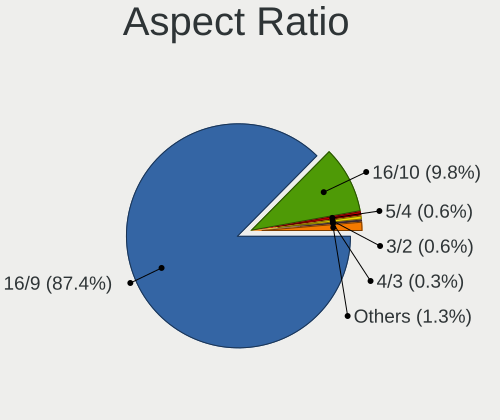

| Ratio   | Notebooks | Percent |
|---------|-----------|---------|
| 16/9    | 1388      | 87.41%  |
| 16/10   | 155       | 9.76%   |
| 5/4     | 10        | 0.63%   |
| 3/2     | 9         | 0.57%   |
| 4/3     | 5         | 0.31%   |
| 21/9    | 5         | 0.31%   |
| 1.00    | 3         | 0.19%   |
| 3.40    | 2         | 0.13%   |
| 1.96    | 2         | 0.13%   |
| 0.67    | 2         | 0.13%   |
| 0.56    | 2         | 0.13%   |
| 6/5     | 1         | 0.06%   |
| 32/9    | 1         | 0.06%   |
| 3.73    | 1         | 0.06%   |
| 0.89    | 1         | 0.06%   |
| Unknown | 1         | 0.06%   |

Monitor Area
------------

Area in inch²

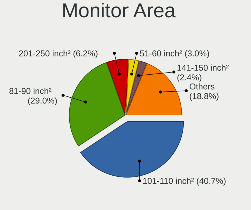

| Area in inch² | Notebooks | Percent |
|----------------|-----------|---------|
| 101-110        | 736       | 40.66%  |
| 81-90          | 524       | 28.95%  |
| 201-250        | 112       | 6.19%   |
| 51-60          | 54        | 2.98%   |
| 141-150        | 43        | 2.38%   |
| 71-80          | 40        | 2.21%   |
| 121-130        | 40        | 2.21%   |
| 301-350        | 37        | 2.04%   |
| 151-200        | 33        | 1.82%   |
| More than 1000 | 32        | 1.77%   |
| 351-500        | 29        | 1.6%    |
| 111-120        | 29        | 1.6%    |
| 501-1000       | 28        | 1.55%   |
| 41-50          | 27        | 1.49%   |
| 61-70          | 22        | 1.22%   |
| 91-100         | 9         | 0.5%    |
| 131-140        | 5         | 0.28%   |
| Unknown        | 4         | 0.22%   |
| 1-40           | 3         | 0.17%   |
| 251-300        | 3         | 0.17%   |

Pixel Density
-------------

Pixels per inch

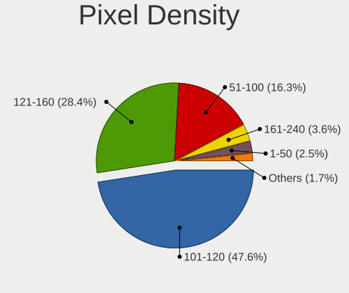

| Density       | Notebooks | Percent |
|---------------|-----------|---------|
| 101-120       | 845       | 47.55%  |
| 121-160       | 504       | 28.36%  |
| 51-100        | 290       | 16.32%  |
| 161-240       | 64        | 3.6%    |
| 1-50          | 44        | 2.48%   |
| More than 240 | 26        | 1.46%   |
| Unknown       | 4         | 0.23%   |

Multiple Monitors
-----------------

Total monitors connected

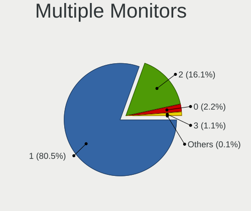

| Total | Notebooks | Percent |
|-------|-----------|---------|
| 1     | 1317      | 80.5%   |
| 2     | 263       | 16.08%  |
| 0     | 36        | 2.2%    |
| 3     | 18        | 1.1%    |
| 5     | 1         | 0.06%   |
| 4     | 1         | 0.06%   |

Network
-------

Net Controller Vendor
---------------------

Controller vendors

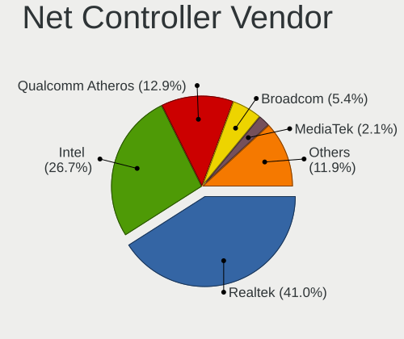

| Vendor                                | Notebooks | Percent |
|---------------------------------------|-----------|---------|
| Realtek Semiconductor                 | 995       | 40.96%  |
| Intel                                 | 649       | 26.72%  |
| Qualcomm Atheros                      | 314       | 12.93%  |
| Broadcom                              | 131       | 5.39%   |
| MediaTek                              | 52        | 2.14%   |
| TP-Link                               | 37        | 1.52%   |
| Marvell Technology Group              | 33        | 1.36%   |
| Broadcom Limited                      | 33        | 1.36%   |
| JMicron Technology                    | 29        | 1.19%   |
| Ralink                                | 24        | 0.99%   |
| Ralink Technology                     | 21        | 0.86%   |
| Samsung Electronics                   | 19        | 0.78%   |
| Silicon Integrated Systems [SiS]      | 14        | 0.58%   |
| Motorola PCS                          | 14        | 0.58%   |
| Qualcomm Atheros Communications       | 10        | 0.41%   |
| ASIX Electronics                      | 9         | 0.37%   |
| Xiaomi                                | 5         | 0.21%   |
| Nvidia                                | 5         | 0.21%   |
| DisplayLink                           | 4         | 0.16%   |
| Ericsson Business Mobile Networks     | 3         | 0.12%   |
| VIA Technologies                      | 2         | 0.08%   |
| Spreadtrum Communications             | 2         | 0.08%   |
| Lenovo                                | 2         | 0.08%   |
| ICS Advent                            | 2         | 0.08%   |
| Encore Electronics                    | 2         | 0.08%   |
| ZTopInc                               | 1         | 0.04%   |
| ZTE WCDMA Technologies MSM            | 1         | 0.04%   |
| T & A Mobile Phones                   | 1         | 0.04%   |
| Sierra Wireless                       | 1         | 0.04%   |
| Shenzhen Goodix Technology            | 1         | 0.04%   |
| Realtek                               | 1         | 0.04%   |
| Qualcomm                              | 1         | 0.04%   |
| QinHeng Electronics                   | 1         | 0.04%   |
| PAX                                   | 1         | 0.04%   |
| Ovislink                              | 1         | 0.04%   |
| Fibocom                               | 1         | 0.04%   |
| Digitech Systems                      | 1         | 0.04%   |
| Dell                                  | 1         | 0.04%   |
| Cisco Aironet Wireless Communications | 1         | 0.04%   |
| Arduino SA                            | 1         | 0.04%   |

Net Controller Model
--------------------

Controller models

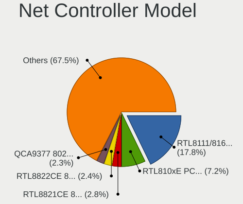

| Model                                                                   | Notebooks | Percent |
|-------------------------------------------------------------------------|-----------|---------|
| Realtek RTL8111/8168/8211/8411 PCI Express Gigabit Ethernet Controller  | 527       | 17.81%  |
| Realtek RTL810xE PCI Express Fast Ethernet controller                   | 213       | 7.2%    |
| Realtek RTL8821CE 802.11ac PCIe Wireless Network Adapter                | 83        | 2.81%   |
| Realtek RTL8822CE 802.11ac PCIe Wireless Network Adapter                | 72        | 2.43%   |
| Qualcomm Atheros QCA9377 802.11ac Wireless Network Adapter              | 67        | 2.26%   |
| Intel Wi-Fi 6 AX201                                                     | 57        | 1.93%   |
| Realtek RTL8723BE PCIe Wireless Network Adapter                         | 56        | 1.89%   |
| Realtek RTL8188CE 802.11b/g/n WiFi Adapter                              | 52        | 1.76%   |
| Qualcomm Atheros AR9485 Wireless Network Adapter                        | 51        | 1.72%   |
| Qualcomm Atheros AR9285 Wireless Network Adapter (PCI-Express)          | 46        | 1.55%   |
| Qualcomm Atheros QCA9565 / AR9565 Wireless Network Adapter              | 43        | 1.45%   |
| Intel Wireless 3160                                                     | 43        | 1.45%   |
| Intel Comet Lake PCH-LP CNVi WiFi                                       | 42        | 1.42%   |
| Broadcom BCM4313 802.11bgn Wireless Network Adapter                     | 38        | 1.28%   |
| Intel Wireless 8265 / 8275                                              | 35        | 1.18%   |
| Intel Wireless 3165                                                     | 35        | 1.18%   |
| Realtek RTL8723DE Wireless Network Adapter                              | 33        | 1.12%   |
| Realtek 802.11n WLAN Adapter                                            | 33        | 1.12%   |
| Intel Wireless 7265                                                     | 30        | 1.01%   |
| Intel Wireless 7260                                                     | 29        | 0.98%   |
| Intel Wi-Fi 6 AX200                                                     | 28        | 0.95%   |
| Intel Gemini Lake PCH CNVi WiFi                                         | 27        | 0.91%   |
| Qualcomm Atheros QCA6174 802.11ac Wireless Network Adapter              | 25        | 0.84%   |
| JMicron JMC250 PCI Express Gigabit Ethernet Controller                  | 24        | 0.81%   |
| Intel Dual Band Wireless-AC 3165 Plus Bluetooth                         | 24        | 0.81%   |
| Intel 82579LM Gigabit Network Connection (Lewisville)                   | 24        | 0.81%   |
| Qualcomm Atheros AR8152 v2.0 Fast Ethernet                              | 23        | 0.78%   |
| Qualcomm Atheros AR8151 v2.0 Gigabit Ethernet                           | 23        | 0.78%   |
| Intel Centrino Advanced-N 6205 [Taylor Peak]                            | 23        | 0.78%   |
| Intel Dual Band Wireless-AC 3168NGW [Stone Peak]                        | 21        | 0.71%   |
| Broadcom BCM43142 802.11b/g/n                                           | 21        | 0.71%   |
| Broadcom BCM4312 802.11b/g LP-PHY                                       | 21        | 0.71%   |
| Realtek RTL8723BU 802.11b/g/n WLAN Adapter                              | 19        | 0.64%   |
| Realtek RTL8191SEvB Wireless LAN Controller                             | 19        | 0.64%   |
| Realtek RTL8188EE Wireless Network Adapter                              | 19        | 0.64%   |
| Marvell Group 88E8040 PCI-E Fast Ethernet Controller                    | 19        | 0.64%   |
| Intel Ethernet Connection (4) I219-LM                                   | 19        | 0.64%   |
| Intel Alder Lake-P PCH CNVi WiFi                                        | 19        | 0.64%   |
| Qualcomm Atheros AR242x / AR542x Wireless Network Adapter (PCI-Express) | 18        | 0.61%   |
| MediaTek MT7921 802.11ax PCIe Wireless Network Adapter [Filogic 330]    | 18        | 0.61%   |

Wireless Vendor
---------------

Wireless vendors

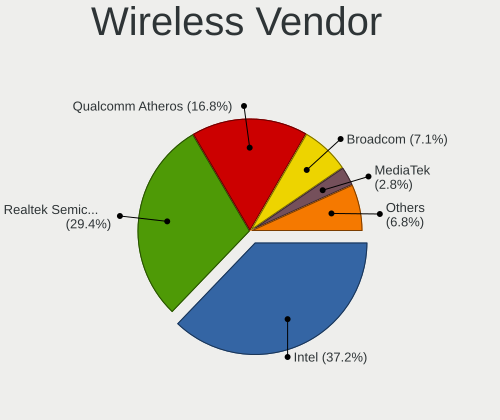

| Vendor                                | Notebooks | Percent |
|---------------------------------------|-----------|---------|
| Intel                                 | 605       | 37.16%  |
| Realtek Semiconductor                 | 478       | 29.36%  |
| Qualcomm Atheros                      | 274       | 16.83%  |
| Broadcom                              | 116       | 7.13%   |
| MediaTek                              | 45        | 2.76%   |
| TP-Link                               | 26        | 1.6%    |
| Ralink                                | 24        | 1.47%   |
| Ralink Technology                     | 21        | 1.29%   |
| Broadcom Limited                      | 19        | 1.17%   |
| Qualcomm Atheros Communications       | 10        | 0.61%   |
| Encore Electronics                    | 2         | 0.12%   |
| ZTopInc                               | 1         | 0.06%   |
| Sierra Wireless                       | 1         | 0.06%   |
| Qualcomm                              | 1         | 0.06%   |
| Ovislink                              | 1         | 0.06%   |
| Fibocom                               | 1         | 0.06%   |
| Dell                                  | 1         | 0.06%   |
| Cisco Aironet Wireless Communications | 1         | 0.06%   |
| 802.11g Adapter [Linksys WUSB54GC v3] | 1         | 0.06%   |

Wireless Model
--------------

Wireless models

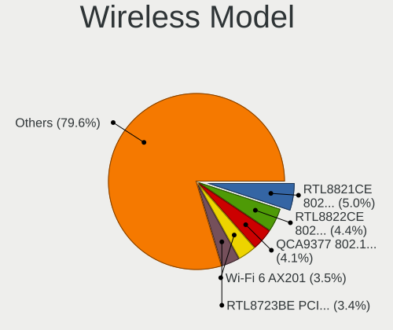

| Model                                                                   | Notebooks | Percent |
|-------------------------------------------------------------------------|-----------|---------|
| Realtek RTL8821CE 802.11ac PCIe Wireless Network Adapter                | 83        | 5.05%   |
| Realtek RTL8822CE 802.11ac PCIe Wireless Network Adapter                | 72        | 4.38%   |
| Qualcomm Atheros QCA9377 802.11ac Wireless Network Adapter              | 67        | 4.08%   |
| Intel Wi-Fi 6 AX201                                                     | 57        | 3.47%   |
| Realtek RTL8723BE PCIe Wireless Network Adapter                         | 56        | 3.41%   |
| Realtek RTL8188CE 802.11b/g/n WiFi Adapter                              | 52        | 3.16%   |
| Qualcomm Atheros AR9485 Wireless Network Adapter                        | 51        | 3.1%    |
| Qualcomm Atheros AR9285 Wireless Network Adapter (PCI-Express)          | 46        | 2.8%    |
| Qualcomm Atheros QCA9565 / AR9565 Wireless Network Adapter              | 43        | 2.62%   |
| Intel Wireless 3160                                                     | 43        | 2.62%   |
| Intel Comet Lake PCH-LP CNVi WiFi                                       | 42        | 2.55%   |
| Broadcom BCM4313 802.11bgn Wireless Network Adapter                     | 38        | 2.31%   |
| Intel Wireless 8265 / 8275                                              | 35        | 2.13%   |
| Intel Wireless 3165                                                     | 35        | 2.13%   |
| Realtek RTL8723DE Wireless Network Adapter                              | 33        | 2.01%   |
| Realtek 802.11n WLAN Adapter                                            | 33        | 2.01%   |
| Intel Wireless 7265                                                     | 30        | 1.82%   |
| Intel Wireless 7260                                                     | 29        | 1.76%   |
| Intel Wi-Fi 6 AX200                                                     | 28        | 1.7%    |
| Intel Gemini Lake PCH CNVi WiFi                                         | 27        | 1.64%   |
| Qualcomm Atheros QCA6174 802.11ac Wireless Network Adapter              | 25        | 1.52%   |
| Intel Dual Band Wireless-AC 3165 Plus Bluetooth                         | 24        | 1.46%   |
| Intel Centrino Advanced-N 6205 [Taylor Peak]                            | 23        | 1.4%    |
| Intel Dual Band Wireless-AC 3168NGW [Stone Peak]                        | 21        | 1.28%   |
| Broadcom BCM43142 802.11b/g/n                                           | 21        | 1.28%   |
| Broadcom BCM4312 802.11b/g LP-PHY                                       | 21        | 1.28%   |
| Realtek RTL8723BU 802.11b/g/n WLAN Adapter                              | 19        | 1.16%   |
| Realtek RTL8191SEvB Wireless LAN Controller                             | 19        | 1.16%   |
| Realtek RTL8188EE Wireless Network Adapter                              | 19        | 1.16%   |
| Qualcomm Atheros AR242x / AR542x Wireless Network Adapter (PCI-Express) | 18        | 1.09%   |
| MediaTek MT7921 802.11ax PCIe Wireless Network Adapter [Filogic 330]    | 18        | 1.09%   |
| MediaTek MT7902 802.11ax PCIe Wireless Network Adapter [Filogic 310]    | 18        | 1.09%   |
| Intel PRO/Wireless 3945ABG [Golan] Network Connection                   | 18        | 1.09%   |
| Intel Ice Lake-LP PCH CNVi WiFi                                         | 18        | 1.09%   |
| Intel Cannon Point-LP CNVi [Wireless-AC]                                | 18        | 1.09%   |
| Realtek RTL8188EUS 802.11n Wireless Network Adapter                     | 14        | 0.85%   |
| Intel Wireless 8260                                                     | 14        | 0.85%   |
| Realtek RTL8852AE 802.11ax PCIe Wireless Network Adapter                | 12        | 0.73%   |
| Intel Tiger Lake PCH CNVi WiFi                                          | 12        | 0.73%   |
| Realtek RTL8822BE 802.11a/b/g/n/ac WiFi adapter                         | 11        | 0.67%   |

Ethernet Vendor
---------------

Ethernet vendors

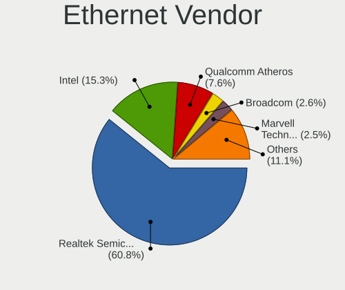

| Vendor                           | Notebooks | Percent |
|----------------------------------|-----------|---------|
| Realtek Semiconductor            | 789       | 60.79%  |
| Intel                            | 199       | 15.33%  |
| Qualcomm Atheros                 | 99        | 7.63%   |
| Broadcom                         | 34        | 2.62%   |
| Marvell Technology Group         | 33        | 2.54%   |
| JMicron Technology               | 29        | 2.23%   |
| Samsung Electronics              | 19        | 1.46%   |
| Silicon Integrated Systems [SiS] | 14        | 1.08%   |
| Broadcom Limited                 | 14        | 1.08%   |
| Motorola PCS                     | 13        | 1%      |
| TP-Link                          | 12        | 0.92%   |
| ASIX Electronics                 | 9         | 0.69%   |
| MediaTek                         | 7         | 0.54%   |
| Xiaomi                           | 5         | 0.39%   |
| Nvidia                           | 5         | 0.39%   |
| DisplayLink                      | 4         | 0.31%   |
| VIA Technologies                 | 2         | 0.15%   |
| Spreadtrum Communications        | 2         | 0.15%   |
| Lenovo                           | 2         | 0.15%   |
| ICS Advent                       | 2         | 0.15%   |
| T & A Mobile Phones              | 1         | 0.08%   |
| Realtek                          | 1         | 0.08%   |
| QinHeng Electronics              | 1         | 0.08%   |
| Digitech Systems                 | 1         | 0.08%   |
| 3DSP                             | 1         | 0.08%   |

Ethernet Model
--------------

Ethernet models

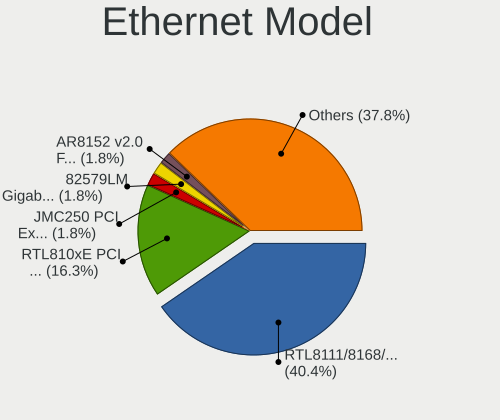

| Model                                                                  | Notebooks | Percent |
|------------------------------------------------------------------------|-----------|---------|
| Realtek RTL8111/8168/8211/8411 PCI Express Gigabit Ethernet Controller | 527       | 40.41%  |
| Realtek RTL810xE PCI Express Fast Ethernet controller                  | 213       | 16.33%  |
| JMicron JMC250 PCI Express Gigabit Ethernet Controller                 | 24        | 1.84%   |
| Intel 82579LM Gigabit Network Connection (Lewisville)                  | 24        | 1.84%   |
| Qualcomm Atheros AR8152 v2.0 Fast Ethernet                             | 23        | 1.76%   |
| Qualcomm Atheros AR8151 v2.0 Gigabit Ethernet                          | 23        | 1.76%   |
| Marvell Group 88E8040 PCI-E Fast Ethernet Controller                   | 19        | 1.46%   |
| Intel Ethernet Connection (4) I219-LM                                  | 19        | 1.46%   |
| Realtek RTL8153 Gigabit Ethernet Adapter                               | 17        | 1.3%    |
| Realtek RTL8152 Fast Ethernet Adapter                                  | 16        | 1.23%   |
| Intel Ethernet Connection (13) I219-V                                  | 16        | 1.23%   |
| Samsung Galaxy series, misc. (tethering mode)                          | 15        | 1.15%   |
| Silicon Integrated Systems [SiS] 191 Gigabit Ethernet Adapter          | 14        | 1.07%   |
| Intel 82577LM Gigabit Network Connection                               | 14        | 1.07%   |
| Motorola PCS motorola one 5G ace                                       | 13        | 1%      |
| Intel Ethernet Connection (10) I219-V                                  | 12        | 0.92%   |
| Realtek RTL-8100/8101L/8139 PCI Fast Ethernet Adapter                  | 11        | 0.84%   |
| Qualcomm Atheros AR8162 Fast Ethernet                                  | 11        | 0.84%   |
| Intel Ethernet Connection I218-LM                                      | 11        | 0.84%   |
| Intel Alder Lake-P PCH CNVi WiFi                                       | 10        | 0.77%   |
| Intel Ethernet Connection I217-LM                                      | 9         | 0.69%   |
| Qualcomm Atheros AR8161 Gigabit Ethernet                               | 8         | 0.61%   |
| Qualcomm Atheros AR8152 v1.1 Fast Ethernet                             | 8         | 0.61%   |
| Intel Ethernet Connection I219-LM                                      | 8         | 0.61%   |
| Broadcom NetXtreme BCM57765 Gigabit Ethernet PCIe                      | 8         | 0.61%   |
| Broadcom NetLink BCM5906M Fast Ethernet PCI Express                    | 8         | 0.61%   |
| TP-Link UE300 10/100/1000 LAN (ethernet mode) [Realtek RTL8153]        | 7         | 0.54%   |
| Intel Ethernet Controller I225-V                                       | 6         | 0.46%   |
| Intel Ethernet Connection (10) I219-LM                                 | 6         | 0.46%   |
| Intel 82567LM Gigabit Network Connection                               | 6         | 0.46%   |
| Broadcom NetLink BCM57780 Gigabit Ethernet PCIe                        | 6         | 0.46%   |
| Xiaomi Mi/Redmi series (RNDIS)                                         | 5         | 0.38%   |
| TP-Link USB 10/100 LAN                                                 | 5         | 0.38%   |
| Realtek RTL8125 2.5GbE Controller                                      | 5         | 0.38%   |
| Qualcomm Atheros AR8132 Fast Ethernet                                  | 5         | 0.38%   |
| Qualcomm Atheros AR8131 Gigabit Ethernet                               | 5         | 0.38%   |
| Marvell Group 88E8039 PCI-E Fast Ethernet Controller                   | 5         | 0.38%   |
| JMicron JMC260 PCI Express Fast Ethernet Controller                    | 5         | 0.38%   |
| Intel Ethernet Connection (6) I219-LM                                  | 5         | 0.38%   |
| Intel Ethernet Connection (3) I218-LM                                  | 5         | 0.38%   |

Net Controller Kind
-------------------

Ethernet, WiFi or modem

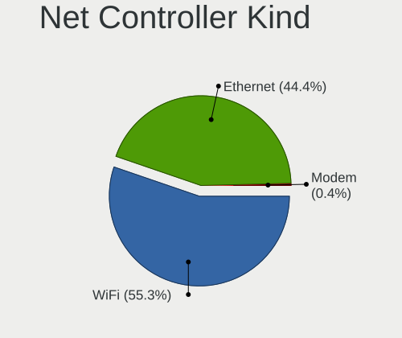

| Kind     | Notebooks | Percent |
|----------|-----------|---------|
| WiFi     | 1552      | 55.25%  |
| Ethernet | 1246      | 44.36%  |
| Modem    | 11        | 0.39%   |

Used Controller
---------------

Currently used network controller

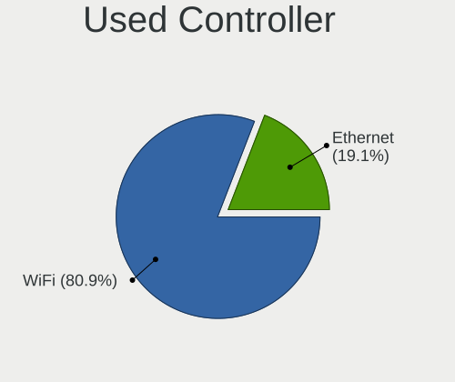

| Kind     | Notebooks | Percent |
|----------|-----------|---------|
| WiFi     | 1319      | 80.87%  |
| Ethernet | 312       | 19.13%  |

NICs
----

Total network controllers on board

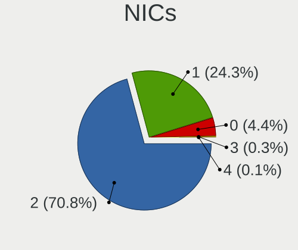

| Total | Notebooks | Percent |
|-------|-----------|---------|
| 2     | 1132      | 70.84%  |
| 1     | 389       | 24.34%  |
| 0     | 71        | 4.44%   |
| 3     | 5         | 0.31%   |
| 4     | 1         | 0.06%   |

IPv6
----

IPv6 vs IPv4

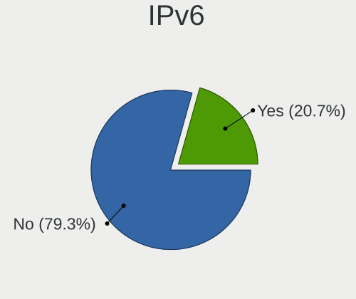

| Used | Notebooks | Percent |
|------|-----------|---------|
| No   | 1287      | 79.35%  |
| Yes  | 335       | 20.65%  |

Bluetooth
---------

Bluetooth Vendor
----------------

Controller vendors

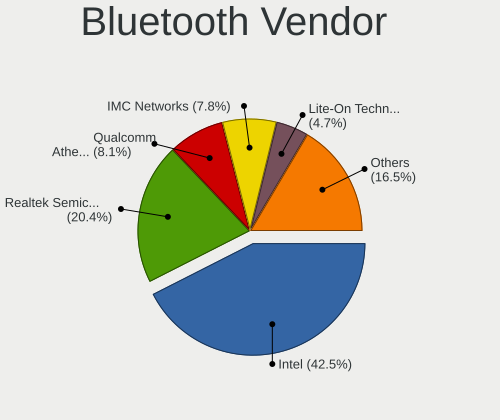

| Vendor                          | Notebooks | Percent |
|---------------------------------|-----------|---------|
| Intel                           | 500       | 42.52%  |
| Realtek Semiconductor           | 240       | 20.41%  |
| Qualcomm Atheros Communications | 95        | 8.08%   |
| IMC Networks                    | 92        | 7.82%   |
| Lite-On Technology              | 55        | 4.68%   |
| Broadcom                        | 55        | 4.68%   |
| Foxconn / Hon Hai               | 36        | 3.06%   |
| Dell                            | 20        | 1.7%    |
| Apple                           | 20        | 1.7%    |
| Cambridge Silicon Radio         | 18        | 1.53%   |
| Toshiba                         | 13        | 1.11%   |
| Ralink                          | 9         | 0.77%   |
| USI                             | 3         | 0.26%   |
| TP-Link                         | 3         | 0.26%   |
| Alps Electric                   | 3         | 0.26%   |
| Qcom                            | 2         | 0.17%   |
| Integrated System Solution      | 2         | 0.17%   |
| Hewlett-Packard                 | 2         | 0.17%   |
| ASUSTek Computer                | 2         | 0.17%   |
| Syntek                          | 1         | 0.09%   |
| Realtek                         | 1         | 0.09%   |
| Ralink Technology               | 1         | 0.09%   |
| MediaTek                        | 1         | 0.09%   |
| Foxconn International           | 1         | 0.09%   |
| Unknown                         | 1         | 0.09%   |

Bluetooth Model
---------------

Controller models

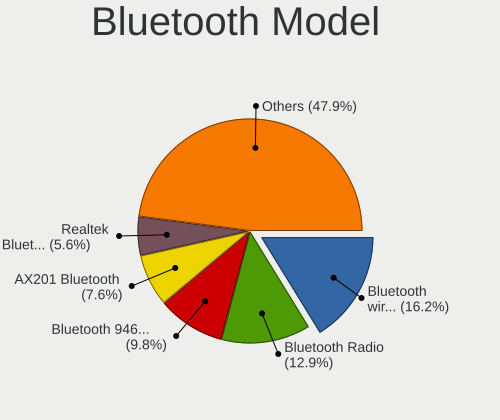

| Model                                               | Notebooks | Percent |
|-----------------------------------------------------|-----------|---------|
| Intel Bluetooth wireless interface                  | 191       | 16.23%  |
| Realtek Bluetooth Radio                             | 152       | 12.91%  |
| Intel Bluetooth 9460/9560 Jefferson Peak (JfP)      | 115       | 9.77%   |
| Intel AX201 Bluetooth                               | 89        | 7.56%   |
| Realtek  Bluetooth 4.2 Adapter                      | 66        | 5.61%   |
| Qualcomm Atheros  Bluetooth Device                  | 57        | 4.84%   |
| IMC Networks Bluetooth Radio                        | 38        | 3.23%   |
| IMC Networks Wireless_Device                        | 28        | 2.38%   |
| Intel AX200 Bluetooth                               | 27        | 2.29%   |
| Intel Wireless-AC 3168 Bluetooth                    | 21        | 1.78%   |
| Lite-On Qualcomm Atheros QCA9377 Bluetooth          | 20        | 1.7%    |
| Intel Bluetooth Device                              | 20        | 1.7%    |
| Qualcomm Atheros AR3012 Bluetooth 4.0               | 18        | 1.53%   |
| Cambridge Silicon Radio Bluetooth Dongle (HCI mode) | 18        | 1.53%   |
| Lite-On Bluetooth Device                            | 16        | 1.36%   |
| Intel Centrino Bluetooth Wireless Transceiver       | 15        | 1.27%   |
| IMC Networks Bluetooth Device                       | 14        | 1.19%   |
| Realtek RTL8723B Bluetooth                          | 11        | 0.93%   |
| Intel Centrino Advanced-N 6230 Bluetooth adapter    | 11        | 0.93%   |
| Broadcom BCM20702 Bluetooth 4.0 [ThinkPad]          | 11        | 0.93%   |
| Ralink RT3290 Bluetooth                             | 9         | 0.76%   |
| Broadcom BCM43142 Bluetooth 4.0                     | 9         | 0.76%   |
| Toshiba Bluetooth USB Host Controller               | 8         | 0.68%   |
| Qualcomm Atheros QCA61x4 Bluetooth 4.0              | 8         | 0.68%   |
| IMC Networks Atheros AR3012 Bluetooth 4.0 Adapter   | 8         | 0.68%   |
| Foxconn / Hon Hai Bluetooth Device                  | 8         | 0.68%   |
| Broadcom BCM2070 Bluetooth 2.1 + EDR                | 8         | 0.68%   |
| Apple Bluetooth USB Host Controller                 | 8         | 0.68%   |
| Realtek RTL8821A Bluetooth                          | 7         | 0.59%   |
| Foxconn / Hon Hai MediaTek Bluetooth Adapter        | 7         | 0.59%   |
| Dell DW375 Bluetooth Module                         | 7         | 0.59%   |
| Qualcomm Atheros AR3011 Bluetooth                   | 6         | 0.51%   |
| Lite-On Broadcom BCM43142A0 Bluetooth Device        | 6         | 0.51%   |
| Intel Wireless-AC 9260 Bluetooth Adapter            | 6         | 0.51%   |
| Intel AX210 Bluetooth                               | 6         | 0.51%   |
| Foxconn / Hon Hai Wireless_Device                   | 6         | 0.51%   |
| Dell Wireless 365 Bluetooth                         | 6         | 0.51%   |
| Broadcom BCM2070 Bluetooth Device                   | 6         | 0.51%   |
| Apple Bluetooth Host Controller                     | 6         | 0.51%   |
| Lite-On Bluetooth Radio                             | 5         | 0.42%   |

Sound
-----

Sound Vendor
------------

Sound card vendors

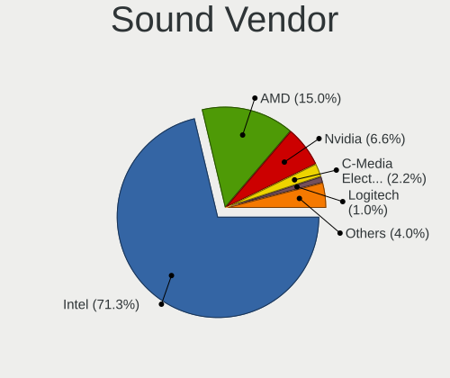

| Vendor                           | Notebooks | Percent |
|----------------------------------|-----------|---------|
| Intel                            | 1292      | 71.3%   |
| AMD                              | 271       | 14.96%  |
| Nvidia                           | 119       | 6.57%   |
| C-Media Electronics              | 39        | 2.15%   |
| Logitech                         | 18        | 0.99%   |
| Silicon Integrated Systems [SiS] | 14        | 0.77%   |
| Texas Instruments                | 6         | 0.33%   |
| Kingston Technology              | 6         | 0.33%   |
| GN Netcom                        | 6         | 0.33%   |
| Generalplus Technology           | 4         | 0.22%   |
| Sony                             | 3         | 0.17%   |
| Plantronics                      | 3         | 0.17%   |
| Focusrite-Novation               | 3         | 0.17%   |
| VIA Technologies                 | 2         | 0.11%   |
| Realtek Semiconductor            | 2         | 0.11%   |
| Lenovo                           | 2         | 0.11%   |
| Hewlett-Packard                  | 2         | 0.11%   |
| BEHRINGER International          | 2         | 0.11%   |
| ATI Technologies                 | 2         | 0.11%   |
| TEAC                             | 1         | 0.06%   |
| Samsung Electronics              | 1         | 0.06%   |
| Samson Technologies              | 1         | 0.06%   |
| QinHeng Electronics              | 1         | 0.06%   |
| Nordic Semiconductor ASA         | 1         | 0.06%   |
| Microsoft                        | 1         | 0.06%   |
| KORG                             | 1         | 0.06%   |
| JMTek                            | 1         | 0.06%   |
| JBL                              | 1         | 0.06%   |
| Huawei Technologies              | 1         | 0.06%   |
| FiiO Electronics Technology      | 1         | 0.06%   |
| ESI Audiotechnik                 | 1         | 0.06%   |
| Creative Technology              | 1         | 0.06%   |
| Corsair                          | 1         | 0.06%   |
| ASUSTek Computer                 | 1         | 0.06%   |
| Astro Gaming                     | 1         | 0.06%   |

Sound Model
-----------

Sound card models

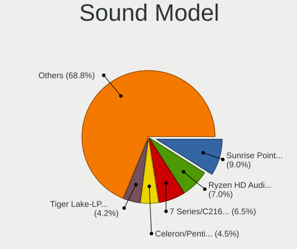

| Model                                                                                             | Notebooks | Percent |
|---------------------------------------------------------------------------------------------------|-----------|---------|
| Intel Sunrise Point-LP HD Audio                                                                   | 195       | 8.99%   |
| AMD Ryzen HD Audio Controller                                                                     | 151       | 6.96%   |
| Intel 7 Series/C216 Chipset Family High Definition Audio Controller                               | 142       | 6.55%   |
| Intel Celeron/Pentium Silver Processor High Definition Audio                                      | 97        | 4.47%   |
| Intel Tiger Lake-LP Smart Sound Technology Audio Controller                                       | 91        | 4.2%    |
| Intel 6 Series/C200 Series Chipset Family High Definition Audio Controller                        | 79        | 3.64%   |
| AMD Renoir/Cezanne HDMI/DP Audio Controller                                                       | 66        | 3.04%   |
| Intel 5 Series/3400 Series Chipset High Definition Audio                                          | 64        | 2.95%   |
| Intel NM10/ICH7 Family High Definition Audio Controller                                           | 61        | 2.81%   |
| AMD Raven/Raven2/Fenghuang HDMI/DP Audio Controller                                               | 54        | 2.49%   |
| Intel 82801I (ICH9 Family) HD Audio Controller                                                    | 53        | 2.44%   |
| Intel Comet Lake PCH-LP cAVS                                                                      | 51        | 2.35%   |
| Intel Broadwell-U Audio Controller                                                                | 50        | 2.31%   |
| Intel Haswell-ULT HD Audio Controller                                                             | 49        | 2.26%   |
| Intel 8 Series HD Audio Controller                                                                | 49        | 2.26%   |
| Intel Wildcat Point-LP High Definition Audio Controller                                           | 46        | 2.12%   |
| Intel Ice Lake-LP Smart Sound Technology Audio Controller                                         | 39        | 1.8%    |
| Intel Alder Lake PCH-P High Definition Audio Controller                                           | 39        | 1.8%    |
| AMD Family 15h (Models 60h-6fh) Audio Controller                                                  | 36        | 1.66%   |
| Intel Cannon Point-LP High Definition Audio Controller                                            | 34        | 1.57%   |
| Intel Atom Processor Z36xxx/Z37xxx Series High Definition Audio Controller                        | 34        | 1.57%   |
| C-Media Electronics USB Advanced Audio Device                                                     | 33        | 1.52%   |
| AMD FCH Azalia Controller                                                                         | 33        | 1.52%   |
| Intel Celeron N3350/Pentium N4200/Atom E3900 Series Audio Cluster                                 | 30        | 1.38%   |
| Intel 8 Series/C220 Series Chipset High Definition Audio Controller                               | 30        | 1.38%   |
| AMD SBx00 Azalia (Intel HDA)                                                                      | 30        | 1.38%   |
| Intel Xeon E3-1200 v3/4th Gen Core Processor HD Audio Controller                                  | 28        | 1.29%   |
| Intel Atom/Celeron/Pentium Processor x5-E8000/J3xxx/N3xxx Series High Definition Audio Controller | 28        | 1.29%   |
| Intel 82801H (ICH8 Family) HD Audio Controller                                                    | 26        | 1.2%    |
| AMD Kabini HDMI/DP Audio                                                                          | 22        | 1.01%   |
| Intel CM238 HD Audio Controller                                                                   | 21        | 0.97%   |
| AMD High Definition Audio Controller                                                              | 21        | 0.97%   |
| AMD Radeon High Definition Audio Controller                                                       | 18        | 0.83%   |
| Nvidia TU107 GeForce GTX 1650 High Definition Audio Controller                                    | 17        | 0.78%   |
| Nvidia GP107GL High Definition Audio Controller                                                   | 15        | 0.69%   |
| Intel Cannon Lake PCH cAVS                                                                        | 15        | 0.69%   |
| Silicon Integrated Systems [SiS] Azalia Audio Controller                                          | 14        | 0.65%   |
| Intel Tiger Lake-H HD Audio Controller                                                            | 14        | 0.65%   |
| Intel Comet Lake PCH cAVS                                                                         | 14        | 0.65%   |
| AMD Wrestler HDMI Audio                                                                           | 12        | 0.55%   |

Memory
------

Memory Vendor
-------------

Memory module vendors

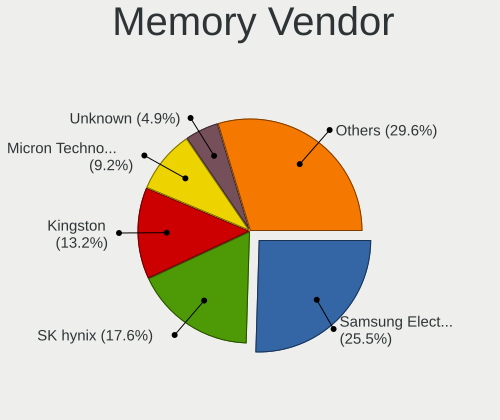

| Vendor                                           | Notebooks | Percent |
|--------------------------------------------------|-----------|---------|
| Samsung Electronics                              | 281       | 25.48%  |
| SK hynix                                         | 194       | 17.59%  |
| Kingston                                         | 146       | 13.24%  |
| Micron Technology                                | 101       | 9.16%   |
| Unknown                                          | 54        | 4.9%    |
| A-DATA Technology                                | 41        | 3.72%   |
| Crucial                                          | 39        | 3.54%   |
| Unknown (ABCD)                                   | 36        | 3.26%   |
| Nanya Technology                                 | 21        | 1.9%    |
| Magnum Tech                                      | 17        | 1.54%   |
| Corsair                                          | 16        | 1.45%   |
| Ramaxel Technology                               | 13        | 1.18%   |
| Elpida                                           | 13        | 1.18%   |
| Unknown                                          | 13        | 1.18%   |
| Neo Forza                                        | 12        | 1.09%   |
| Goldkey                                          | 12        | 1.09%   |
| Novatech                                         | 10        | 0.91%   |
| Hikvision                                        | 7         | 0.63%   |
| Memox                                            | 6         | 0.54%   |
| 48spaces                                         | 6         | 0.54%   |
| Saikano                                          | 5         | 0.45%   |
| Unknown (0x0B45)                                 | 4         | 0.36%   |
| Patriot                                          | 4         | 0.36%   |
| Apacer                                           | 4         | 0.36%   |
| Transcend                                        | 3         | 0.27%   |
| Team                                             | 3         | 0.27%   |
| Super Talent                                     | 3         | 0.27%   |
| Netac                                            | 3         | 0.27%   |
| Kingmax                                          | 3         | 0.27%   |
| G.Skill                                          | 3         | 0.27%   |
| Avant                                            | 3         | 0.27%   |
| Wodposit                                         | 2         | 0.18%   |
| Unknown (07D5)                                   | 2         | 0.18%   |
| Teikon                                           | 2         | 0.18%   |
| PNY                                              | 2         | 0.18%   |
| Lexar                                            | 2         | 0.18%   |
| Kimtigo                                          | 2         | 0.18%   |
| Innodisk                                         | 2         | 0.18%   |
| CSX                                              | 2         | 0.18%   |
| Unknown (0x4E41324D3030314733374455202020202020) | 1         | 0.09%   |

Memory Model
------------

Memory module models

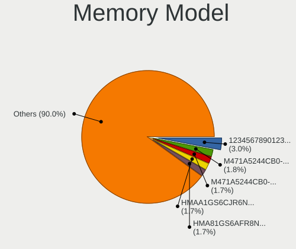

| Model                                                                     | Notebooks | Percent |
|---------------------------------------------------------------------------|-----------|---------|
| Unknown (ABCD) RAM 123456789012345678 2GB SODIMM LPDDR4 2400MT/s          | 35        | 3%      |
| Samsung RAM M471A5244CB0-CTD 4GB SODIMM DDR4 3266MT/s                     | 21        | 1.8%    |
| SK hynix RAM HMAA1GS6CJR6N-XN 8GB SODIMM DDR4 3200MT/s                    | 20        | 1.72%   |
| SK hynix RAM HMA81GS6AFR8N-UH 8GB SODIMM DDR4 2667MT/s                    | 20        | 1.72%   |
| Samsung RAM M471A5244CB0-CRC 4GB SODIMM DDR4 2667MT/s                     | 20        | 1.72%   |
| Samsung RAM M471A1G44AB0-CWE 8GiB SODIMM DDR4 3200MT/s                    | 19        | 1.63%   |
| Magnum Tech RAM MAGNUMTECH 4GB SODIMM DDR3 1600MT/s                       | 17        | 1.46%   |
| SK hynix RAM HMT451S6BFR8A-PB 4GB SODIMM DDR3 1600MT/s                    | 14        | 1.2%    |
| Unknown                                                                   | 13        | 1.12%   |
| Nanya RAM NT2GC64B88B0NS-CG 2048MB SODIMM DDR3 1334MT/s                   | 12        | 1.03%   |
| Samsung RAM M471A5244CB0-CWE 4GB SODIMM DDR4 3200MT/s                     | 11        | 0.94%   |
| Samsung RAM M471B5173EB0-YK0 4GB SODIMM DDR3 1600MT/s                     | 10        | 0.86%   |
| Samsung RAM M471A1K43CB1-CRC 8GB SODIMM DDR4 8400MT/s                     | 10        | 0.86%   |
| Samsung RAM M471B5273DH0-CH9 4GB SODIMM DDR3 1600MT/s                     | 9         | 0.77%   |
| Samsung RAM M471B5273CH0-CH9 4GB SODIMM DDR3 1334MT/s                     | 9         | 0.77%   |
| Samsung RAM M471B5173DB0-YK0 4GB SODIMM DDR3 1600MT/s                     | 9         | 0.77%   |
| Samsung RAM M471B5773CHS-CH9 2GB SODIMM DDR3 4199MT/s                     | 8         | 0.69%   |
| Samsung RAM M471A1K43DB1-CWE 8GB SODIMM DDR4 3200MT/s                     | 8         | 0.69%   |
| Samsung RAM M471A1G44BB0-CWE 8GB SODIMM DDR4 3200MT/s                     | 8         | 0.69%   |
| SK hynix RAM HMT351S6CFR8C-PB 4GB SODIMM DDR3 1600MT/s                    | 7         | 0.6%    |
| Samsung RAM M471A1G44AB0-CWE 8GB Row Of Chips DDR4 3200MT/s               | 7         | 0.6%    |
| Micron RAM 4ATF1G64HZ-3G2F1 8GB SODIMM DDR4 3200MT/s                      | 7         | 0.6%    |
| SK hynix RAM HMA851S6AFR6N-UH 4GB SODIMM DDR4 2667MT/s                    | 6         | 0.52%   |
| Samsung RAM M471B1G73QH0-YK0 8GB SODIMM DDR3 1600MT/s                     | 6         | 0.52%   |
| Neo Forza RAM NMSO440D85-2666E 4GB SODIMM DDR4 2667MT/s                   | 6         | 0.52%   |
| Micron RAM 4ATF51264HZ-2G6E1 4GB SODIMM DDR4 2667MT/s                     | 6         | 0.52%   |
| Kingston RAM 99U5700-027.A00G 8GB SODIMM DDR4 2667MT/s                    | 6         | 0.52%   |
| 48spaces RAM 012345678901234567890123456789012345 2GB SODIMM DDR2 667MT/s | 6         | 0.52%   |
| SK hynix RAM HMT351S6BFR8C-H9 4GB SODIMM DDR3 1333MT/s                    | 5         | 0.43%   |
| SK hynix RAM HMAA1GS6CJR6N-XN 8GB Row Of Chips DDR4 3200MT/s              | 5         | 0.43%   |
| SK hynix RAM HMA851S6AFR6N-UH 4GB SODIMM DDR4 2400MT/s                    | 5         | 0.43%   |
| SK hynix RAM HMA82GS6DJR8N-XN 16GB SODIMM DDR4 3200MT/s                   | 5         | 0.43%   |
| SK hynix RAM HMA81GS6AFR8N-UH 8GB SODIMM DDR4 3200MT/s                    | 5         | 0.43%   |
| Samsung RAM M471B5173QH0-YK0 4GB SODIMM DDR3 1600MT/s                     | 5         | 0.43%   |
| Samsung RAM M471B1G73EB0-YK0 8192MB SODIMM DDR3 1600MT/s                  | 5         | 0.43%   |
| Samsung RAM M471B1G73DB0-YK0 8GB SODIMM DDR3 1600MT/s                     | 5         | 0.43%   |
| Samsung RAM M471A5244CB0-CWE 4GB Row Of Chips DDR4 3200MT/s               | 5         | 0.43%   |
| Samsung RAM M471A1K43EB1-CWE 8GB SODIMM DDR4 3200MT/s                     | 5         | 0.43%   |
| Samsung RAM M471A1K43BB1-CRC 8GB SODIMM DDR4 2667MT/s                     | 5         | 0.43%   |
| Saikano RAM Memory 4GB SODIMM DDR3 1333MT/s                               | 5         | 0.43%   |

Memory Kind
-----------

Memory module kinds

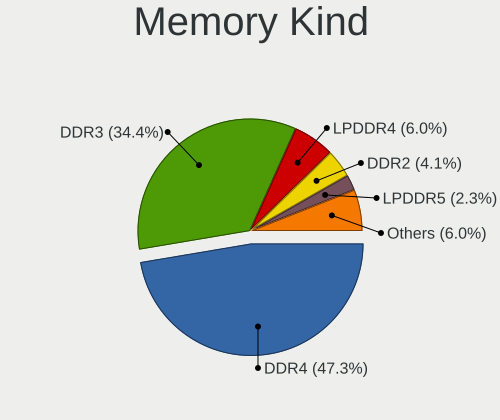

| Kind    | Notebooks | Percent |
|---------|-----------|---------|
| DDR4    | 419       | 47.34%  |
| DDR3    | 304       | 34.35%  |
| LPDDR4  | 53        | 5.99%   |
| DDR2    | 36        | 4.07%   |
| LPDDR5  | 20        | 2.26%   |
| SDRAM   | 17        | 1.92%   |
| LPDDR3  | 13        | 1.47%   |
| DDR5    | 12        | 1.36%   |
| DRAM    | 6         | 0.68%   |
| DDR     | 4         | 0.45%   |
| Unknown | 1         | 0.11%   |

Memory Form Factor
------------------

Physical design of the memory module

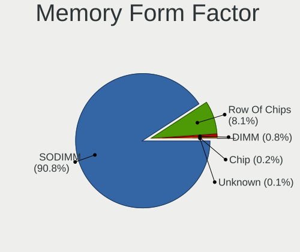

| Name         | Notebooks | Percent |
|--------------|-----------|---------|
| SODIMM       | 812       | 90.83%  |
| Row Of Chips | 72        | 8.05%   |
| DIMM         | 7         | 0.78%   |
| Chip         | 2         | 0.22%   |
| Unknown      | 1         | 0.11%   |

Memory Size
-----------

Memory module size

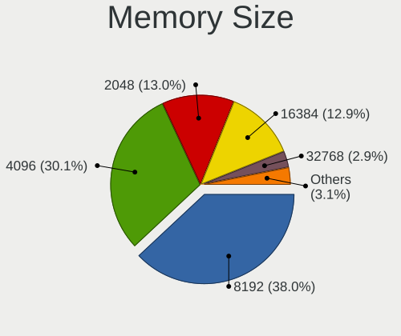

| Size  | Notebooks | Percent |
|-------|-----------|---------|
| 8192  | 387       | 38.02%  |
| 4096  | 306       | 30.06%  |
| 2048  | 132       | 12.97%  |
| 16384 | 131       | 12.87%  |
| 32768 | 30        | 2.95%   |
| 1024  | 27        | 2.65%   |
| 512   | 4         | 0.39%   |
| 6144  | 1         | 0.1%    |

Memory Speed
------------

Memory module speed

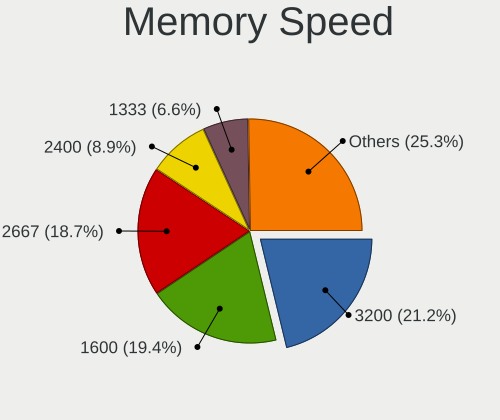

| Speed   | Notebooks | Percent |
|---------|-----------|---------|
| 3200    | 210       | 21.21%  |
| 1600    | 192       | 19.39%  |
| 2667    | 185       | 18.69%  |
| 2400    | 88        | 8.89%   |
| 1333    | 65        | 6.57%   |
| 1334    | 39        | 3.94%   |
| 2133    | 31        | 3.13%   |
| Unknown | 23        | 2.32%   |
| 3266    | 21        | 2.12%   |
| 667     | 21        | 2.12%   |
| 8400    | 13        | 1.31%   |
| 1067    | 12        | 1.21%   |
| 4199    | 11        | 1.11%   |
| 6400    | 10        | 1.01%   |
| 800     | 9         | 0.91%   |
| 4800    | 8         | 0.81%   |
| 7500    | 7         | 0.71%   |
| 533     | 7         | 0.71%   |
| 1066    | 6         | 0.61%   |
| 2048    | 5         | 0.51%   |
| 5600    | 4         | 0.4%    |
| 4267    | 4         | 0.4%    |
| 4266    | 4         | 0.4%    |
| 2933    | 4         | 0.4%    |
| 975     | 4         | 0.4%    |
| 5500    | 2         | 0.2%    |
| 1867    | 2         | 0.2%    |
| 7467    | 1         | 0.1%    |
| 1596    | 1         | 0.1%    |
| 400     | 1         | 0.1%    |

Printers & scanners
-------------------

Printer Vendor
--------------

Printer device vendors

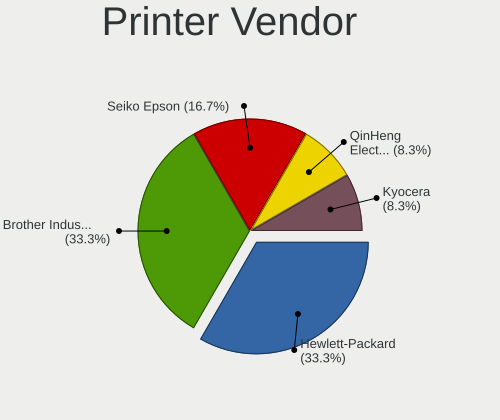

| Vendor              | Notebooks | Percent |
|---------------------|-----------|---------|
| Hewlett-Packard     | 4         | 33.33%  |
| Brother Industries  | 4         | 33.33%  |
| Seiko Epson         | 2         | 16.67%  |
| QinHeng Electronics | 1         | 8.33%   |
| Kyocera             | 1         | 8.33%   |

Printer Model
-------------

Printer device models

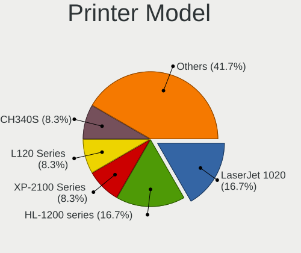

| Model                      | Notebooks | Percent |
|----------------------------|-----------|---------|
| HP LaserJet 1020           | 2         | 16.67%  |
| Brother HL-1200 series     | 2         | 16.67%  |
| Seiko Epson XP-2100 Series | 1         | 8.33%   |
| Seiko Epson L120 Series    | 1         | 8.33%   |
| QinHeng CH340S             | 1         | 8.33%   |
| Kyocera ECOSYS M3550idn    | 1         | 8.33%   |
| HP LaserJet 1022           | 1         | 8.33%   |
| HP DeskJet F300 series     | 1         | 8.33%   |
| Brother HL-1110 series     | 1         | 8.33%   |
| Brother DCP-1600           | 1         | 8.33%   |

Scanner Vendor
--------------

Scanner device vendors

Zero info for selected period =(

Scanner Model
-------------

Scanner device models

Zero info for selected period =(

Camera
------

Camera Vendor
-------------

Camera device vendors

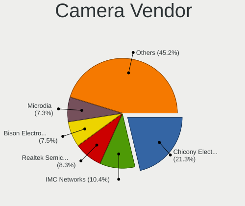

| Vendor                                 | Notebooks | Percent |
|----------------------------------------|-----------|---------|
| Chicony Electronics                    | 308       | 21.27%  |
| IMC Networks                           | 151       | 10.43%  |
| Realtek Semiconductor                  | 120       | 8.29%   |
| Bison Electronics                      | 109       | 7.53%   |
| Microdia                               | 105       | 7.25%   |
| Quanta                                 | 69        | 4.77%   |
| Sunplus Innovation Technology          | 64        | 4.42%   |
| Syntek                                 | 57        | 3.94%   |
| Cheng Uei Precision Industry (Foxlink) | 52        | 3.59%   |
| Suyin                                  | 49        | 3.38%   |
| Alcor Micro                            | 40        | 2.76%   |
| Silicon Motion                         | 36        | 2.49%   |
| Acer                                   | 30        | 2.07%   |
| SunplusIT                              | 28        | 1.93%   |
| Luxvisions Innotech Limited            | 27        | 1.86%   |
| Lite-On Technology                     | 21        | 1.45%   |
| Apple                                  | 19        | 1.31%   |
| Sonix Technology                       | 16        | 1.1%    |
| Ricoh                                  | 16        | 1.1%    |
| Logitech                               | 15        | 1.04%   |
| icSpring                               | 14        | 0.97%   |
| Samsung Electronics                    | 11        | 0.76%   |
| Z-Star Microelectronics                | 9         | 0.62%   |
| Y Media                                | 9         | 0.62%   |
| globaloptics                           | 8         | 0.55%   |
| Importek                               | 7         | 0.48%   |
| OmniVision Technologies                | 6         | 0.41%   |
| ALi                                    | 5         | 0.35%   |
| USB Camera CS                          | 4         | 0.28%   |
| GEMBIRD                                | 4         | 0.28%   |
| Shine-optics                           | 3         | 0.21%   |
| Lenovo                                 | 3         | 0.21%   |
| KYE Systems (Mouse Systems)            | 3         | 0.21%   |
| Intel                                  | 3         | 0.21%   |
| Tripath Technology                     | 2         | 0.14%   |
| ShineTech                              | 2         | 0.14%   |
| OYT Tech                               | 2         | 0.14%   |
| Jieli Technology                       | 2         | 0.14%   |
| Genesys Logic                          | 2         | 0.14%   |
| Cubeternet                             | 2         | 0.14%   |

Camera Model
------------

Camera device models

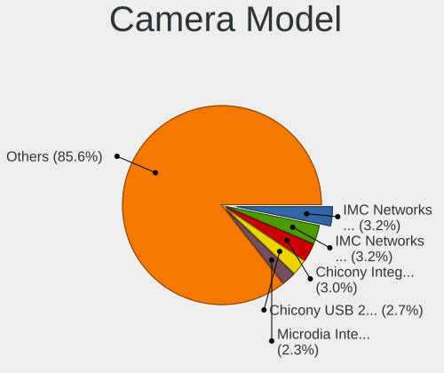

| Model                                                          | Notebooks | Percent |
|----------------------------------------------------------------|-----------|---------|
| IMC Networks Integrated Camera                                 | 47        | 3.23%   |
| IMC Networks USB2.0 VGA UVC WebCam                             | 46        | 3.16%   |
| Chicony Integrated Camera                                      | 44        | 3.03%   |
| Chicony USB 2.0 Camera                                         | 39        | 2.68%   |
| Microdia Integrated_Webcam_HD                                  | 34        | 2.34%   |
| Alcor Micro USB 2.0 Camera                                     | 34        | 2.34%   |
| Bison Integrated Camera                                        | 33        | 2.27%   |
| Realtek Integrated_Webcam_HD                                   | 29        | 1.99%   |
| Syntek Integrated Camera                                       | 28        | 1.93%   |
| Sunplus Integrated_Webcam_HD                                   | 27        | 1.86%   |
| IMC Networks USB2.0 HD UVC WebCam                              | 27        | 1.86%   |
| SunplusIT USB 2M Camera                                        | 25        | 1.72%   |
| Chicony HD WebCam                                              | 20        | 1.38%   |
| Realtek USB Camera                                             | 19        | 1.31%   |
| Cheng Uei Precision Industry (Foxlink) HP TrueVision HD Camera | 19        | 1.31%   |
| Luxvisions Innotech Limited Integrated Camera                  | 18        | 1.24%   |
| Chicony Lenovo EasyCamera                                      | 17        | 1.17%   |
| Chicony TOSHIBA Web Camera - HD                                | 15        | 1.03%   |
| Chicony HP TrueVision HD Camera                                | 15        | 1.03%   |
| Bison Lenovo EasyCamera                                        | 15        | 1.03%   |
| Realtek USB2.0 camera                                          | 14        | 0.96%   |
| Quanta HD Webcam                                               | 14        | 0.96%   |
| icSpring camera                                                | 14        | 0.96%   |
| Chicony EasyCamera                                             | 13        | 0.89%   |
| Lite-On Integrated Camera                                      | 12        | 0.83%   |
| Chicony HD camera                                              | 12        | 0.83%   |
| Acer USB Camera                                                | 12        | 0.83%   |
| Samsung Galaxy series, misc. (MTP mode)                        | 11        | 0.76%   |
| Microdia USB 2.0 Camera                                        | 11        | 0.76%   |
| Syntek EasyCamera                                              | 10        | 0.69%   |
| Silicon Motion WebCam SC-0311139N                              | 10        | 0.69%   |
| Realtek Integrated Webcam                                      | 10        | 0.69%   |
| Quanta HP TrueVision HD Camera                                 | 10        | 0.69%   |
| Microdia Integrated Webcam                                     | 10        | 0.69%   |
| Chicony HP Webcam                                              | 10        | 0.69%   |
| Chicony Chicony USB2.0 Camera                                  | 10        | 0.69%   |
| Y Media USB Camera                                             | 9         | 0.62%   |
| Chicony USB2.0 VGA UVC WebCam                                  | 9         | 0.62%   |
| Chicony USB2.0 Camera                                          | 9         | 0.62%   |
| Chicony Integrated Camera (1280x720@30)                        | 9         | 0.62%   |

Security
--------

Fingerprint Vendor
------------------

Fingerprint sensor vendors

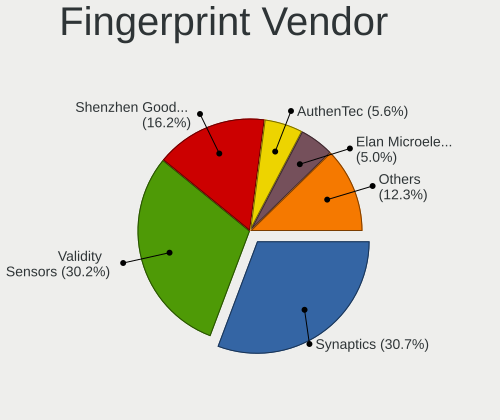

| Vendor                             | Notebooks | Percent |
|------------------------------------|-----------|---------|
| Synaptics                          | 55        | 30.73%  |
| Validity Sensors                   | 54        | 30.17%  |
| Shenzhen Goodix Technology         | 29        | 16.2%   |
| AuthenTec                          | 10        | 5.59%   |
| Elan Microelectronics              | 9         | 5.03%   |
| Upek                               | 8         | 4.47%   |
| LighTuning Technology              | 8         | 4.47%   |
| STMicroelectronics                 | 2         | 1.12%   |
| Realtek USB2.0 Finger Print Bridge | 2         | 1.12%   |
| HOLTEK                             | 1         | 0.56%   |
| Focal-systems.Corp                 | 1         | 0.56%   |

Fingerprint Model
-----------------

Fingerprint sensor models

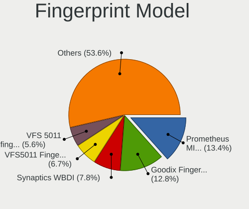

| Model                                                                      | Notebooks | Percent |
|----------------------------------------------------------------------------|-----------|---------|
| Synaptics Prometheus MIS Touch Fingerprint Reader                          | 24        | 13.41%  |
| Shenzhen Goodix  FingerPrint Device                                        | 23        | 12.85%  |
| Synaptics  WBDI                                                            | 14        | 7.82%   |
| Validity Sensors VFS5011 Fingerprint Reader                                | 12        | 6.7%    |
| Validity Sensors VFS 5011 fingerprint sensor                               | 10        | 5.59%   |
| Upek Biometric Touchchip/Touchstrip Fingerprint Sensor                     | 8         | 4.47%   |
| Synaptics Metallica MIS Touch Fingerprint Reader                           | 8         | 4.47%   |
| Validity Sensors Fingerprint scanner                                       | 7         | 3.91%   |
| Validity Sensors VFS495 Fingerprint Reader                                 | 5         | 2.79%   |
| Shenzhen Goodix Fingerprint Reader                                         | 5         | 2.79%   |
| LighTuning ES603 Swipe Fingerprint Sensor                                  | 5         | 2.79%   |
| Elan ELAN:ARM-M4                                                           | 5         | 2.79%   |
| Validity Sensors VFS301 Fingerprint Reader                                 | 4         | 2.23%   |
| Validity Sensors Synaptics WBDI                                            | 4         | 2.23%   |
| Validity Sensors Synaptics VFS7552 Touch Fingerprint Sensor with PurePrint | 4         | 2.23%   |
| Elan ELAN:Fingerprint                                                      | 4         | 2.23%   |
| AuthenTec AES2501 Fingerprint Sensor                                       | 4         | 2.23%   |
| AuthenTec AES2810                                                          | 3         | 1.68%   |
| Validity Sensors VFS491                                                    | 2         | 1.12%   |
| Validity Sensors VFS101 Fingerprint Reader                                 | 2         | 1.12%   |
| Validity Sensors Swipe Fingerprint Sensor                                  | 2         | 1.12%   |
| Synaptics UWP WBDI Device                                                  | 2         | 1.12%   |
| STMicroelectronics Fingerprint Reader                                      | 2         | 1.12%   |
| Realtek USB2.0 Finger Print Bridge FocalTech Fingerprint Device            | 2         | 1.12%   |
| LighTuning EgisTec Touch Fingerprint Sensor                                | 2         | 1.12%   |
| AuthenTec Fingerprint Sensor                                               | 2         | 1.12%   |
| Validity Sensors VFS7552 Touch Fingerprint Sensor                          | 1         | 0.56%   |
| Validity Sensors VFS300 Fingerprint Reader                                 | 1         | 0.56%   |
| Synaptics WBDI Fingerprint Reader USB 086                                  | 1         | 0.56%   |
| Synaptics TouchPad                                                         | 1         | 0.56%   |
| Synaptics  FS7604 Touch Fingerprint Sensor with PurePrint                  | 1         | 0.56%   |
| Synaptics Prometheus Fingerprint Reader                                    | 1         | 0.56%   |
| Synaptics FS7604 Touch Fingerprint Sensor with PurePrint                   | 1         | 0.56%   |
| Synaptics Fingerprint reader [HP G6]                                       | 1         | 0.56%   |
| Shenzhen Goodix FingerPrint                                                | 1         | 0.56%   |
| LighTuning Fingerprint Sensor                                              | 1         | 0.56%   |
| HOLTEK FocalTech Fingerprint Device                                        | 1         | 0.56%   |
| Focal-systems.Corp FT9201Fingerprint.                                      | 1         | 0.56%   |
| AuthenTec AES1660 Fingerprint Sensor                                       | 1         | 0.56%   |
| Unknown                                                                    | 1         | 0.56%   |

Chipcard Vendor
---------------

Chipcard module vendors

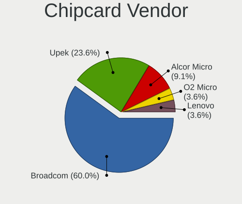

| Vendor      | Notebooks | Percent |
|-------------|-----------|---------|
| Broadcom    | 33        | 60%     |
| Upek        | 13        | 23.64%  |
| Alcor Micro | 5         | 9.09%   |
| O2 Micro    | 2         | 3.64%   |
| Lenovo      | 2         | 3.64%   |

Chipcard Model
--------------

Chipcard module models

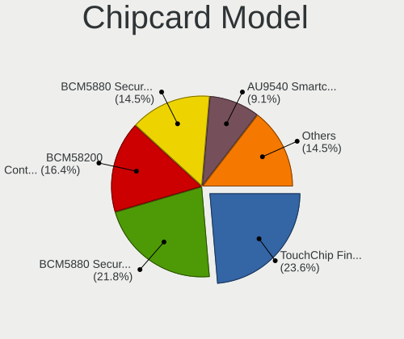

| Model                                                                        | Notebooks | Percent |
|------------------------------------------------------------------------------|-----------|---------|
| Upek TouchChip Fingerprint Coprocessor (WBF advanced mode)                   | 13        | 23.64%  |
| Broadcom BCM5880 Secure Applications Processor                               | 12        | 21.82%  |
| Broadcom BCM58200 ControlVault 3 (FingerPrint sensor + Contacted SmartCard)  | 9         | 16.36%  |
| Broadcom BCM5880 Secure Applications Processor with fingerprint swipe sensor | 8         | 14.55%  |
| Alcor Micro AU9540 Smartcard Reader                                          | 5         | 9.09%   |
| Broadcom 5880                                                                | 3         | 5.45%   |
| O2 Micro OZ776 CCID Smartcard Reader                                         | 2         | 3.64%   |
| Lenovo Integrated Smart Card Reader                                          | 2         | 3.64%   |
| Broadcom 58200                                                               | 1         | 1.82%   |

Unsupported
-----------

Unsupported Devices
-------------------

Total unsupported devices on board

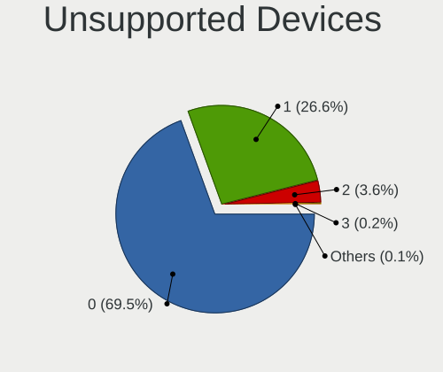

| Total | Notebooks | Percent |
|-------|-----------|---------|
| 0     | 1128      | 69.46%  |
| 1     | 432       | 26.6%   |
| 2     | 59        | 3.63%   |
| 3     | 3         | 0.18%   |
| 8     | 1         | 0.06%   |
| 4     | 1         | 0.06%   |

Unsupported Device Types
------------------------

Types of unsupported devices

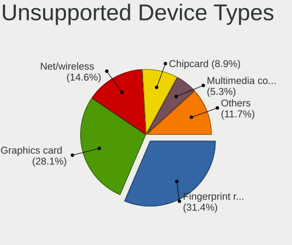

| Type                     | Notebooks | Percent |
|--------------------------|-----------|---------|
| Fingerprint reader       | 177       | 31.44%  |
| Graphics card            | 158       | 28.06%  |
| Net/wireless             | 82        | 14.56%  |
| Chipcard                 | 50        | 8.88%   |
| Multimedia controller    | 30        | 5.33%   |
| Camera                   | 22        | 3.91%   |
| Bluetooth                | 13        | 2.31%   |
| Communication controller | 9         | 1.6%    |
| Sound                    | 6         | 1.07%   |
| Net/ethernet             | 6         | 1.07%   |
| Network                  | 4         | 0.71%   |
| Modem                    | 2         | 0.36%   |
| Flash memory             | 2         | 0.36%   |
| Card reader              | 2         | 0.36%   |

