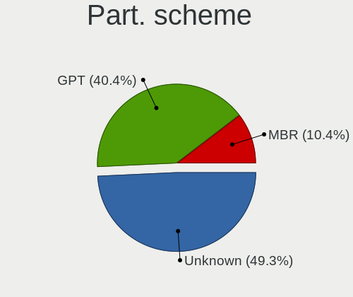
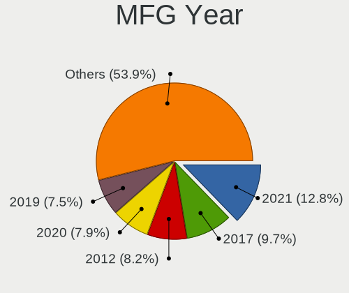
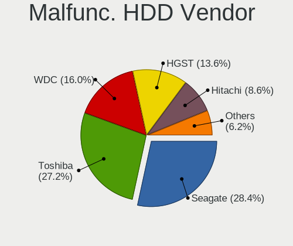
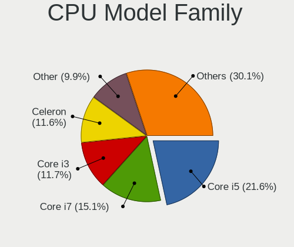
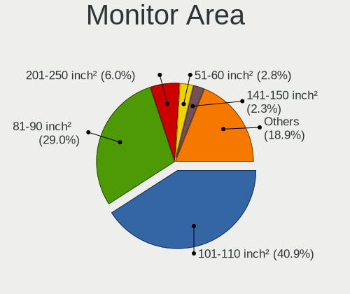
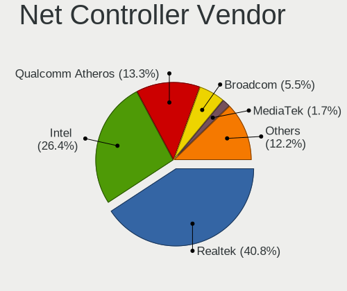
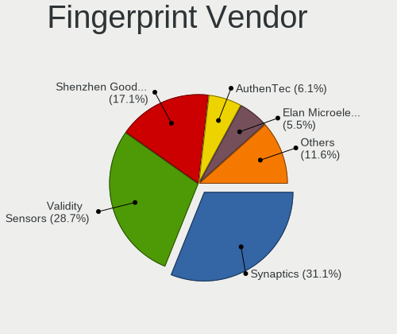

Linux in Argentina - Tested Hardware & Statistics (Notebooks)
-------------------------------------------------------------

A project to collect tested hardware configurations for Linux in Argentina.

Anyone can contribute to this report by the [hw-probe](https://github.com/linuxhw/hw-probe) tool:

    sudo -E hw-probe -all -upload

Please contribute! Especially if your hardware is rare.

Contents
--------

* [ Test Cases ](#test-cases)

* [ System ](#system)
  - [ OS                       ](#os)
  - [ OS Family                ](#os-family)
  - [ Kernel                   ](#kernel)
  - [ Kernel Family            ](#kernel-family)
  - [ Kernel Major Ver.        ](#kernel-major-ver)
  - [ Arch                     ](#arch)
  - [ DE                       ](#de)
  - [ Display Server           ](#display-server)
  - [ Display Manager          ](#display-manager)
  - [ OS Lang                  ](#os-lang)
  - [ Boot Mode                ](#boot-mode)
  - [ Filesystem               ](#filesystem)
  - [ Part. scheme             ](#part-scheme)
  - [ Dual Boot with Linux/BSD ](#dual-boot-with-linuxbsd)
  - [ Dual Boot (Win)          ](#dual-boot-win)

* [ Board ](#board)
  - [ Vendor                   ](#vendor)
  - [ Model                    ](#model)
  - [ Model Family             ](#model-family)
  - [ MFG Year                 ](#mfg-year)
  - [ Form Factor              ](#form-factor)
  - [ Secure Boot              ](#secure-boot)
  - [ Coreboot                 ](#coreboot)
  - [ RAM Size                 ](#ram-size)
  - [ RAM Used                 ](#ram-used)
  - [ Total Drives             ](#total-drives)
  - [ Has CD-ROM               ](#has-cd-rom)
  - [ Has Ethernet             ](#has-ethernet)
  - [ Has WiFi                 ](#has-wifi)
  - [ Has Bluetooth            ](#has-bluetooth)

* [ Location ](#location)
  - [ Country                  ](#country)
  - [ City                     ](#city)

* [ Drives ](#drives)
  - [ Drive Vendor             ](#drive-vendor)
  - [ Drive Model              ](#drive-model)
  - [ HDD Vendor               ](#hdd-vendor)
  - [ SSD Vendor               ](#ssd-vendor)
  - [ Drive Kind               ](#drive-kind)
  - [ Drive Connector          ](#drive-connector)
  - [ Drive Size               ](#drive-size)
  - [ Space Total              ](#space-total)
  - [ Space Used               ](#space-used)
  - [ Malfunc. Drives          ](#malfunc-drives)
  - [ Malfunc. Drive Vendor    ](#malfunc-drive-vendor)
  - [ Malfunc. HDD Vendor      ](#malfunc-hdd-vendor)
  - [ Malfunc. Drive Kind      ](#malfunc-drive-kind)
  - [ Failed Drives            ](#failed-drives)
  - [ Failed Drive Vendor      ](#failed-drive-vendor)
  - [ Drive Status             ](#drive-status)

* [ Storage controller ](#storage-controller)
  - [ Storage Vendor           ](#storage-vendor)
  - [ Storage Model            ](#storage-model)
  - [ Storage Kind             ](#storage-kind)

* [ Processor ](#processor)
  - [ CPU Vendor               ](#cpu-vendor)
  - [ CPU Model                ](#cpu-model)
  - [ CPU Model Family         ](#cpu-model-family)
  - [ CPU Cores                ](#cpu-cores)
  - [ CPU Sockets              ](#cpu-sockets)
  - [ CPU Threads              ](#cpu-threads)
  - [ CPU Op-Modes             ](#cpu-op-modes)
  - [ CPU Microcode            ](#cpu-microcode)
  - [ CPU Microarch            ](#cpu-microarch)

* [ Graphics ](#graphics)
  - [ GPU Vendor               ](#gpu-vendor)
  - [ GPU Model                ](#gpu-model)
  - [ GPU Combo                ](#gpu-combo)
  - [ GPU Driver               ](#gpu-driver)
  - [ GPU Memory               ](#gpu-memory)

* [ Monitor ](#monitor)
  - [ Monitor Vendor           ](#monitor-vendor)
  - [ Monitor Model            ](#monitor-model)
  - [ Monitor Resolution       ](#monitor-resolution)
  - [ Monitor Diagonal         ](#monitor-diagonal)
  - [ Monitor Width            ](#monitor-width)
  - [ Aspect Ratio             ](#aspect-ratio)
  - [ Monitor Area             ](#monitor-area)
  - [ Pixel Density            ](#pixel-density)
  - [ Multiple Monitors        ](#multiple-monitors)

* [ Network ](#network)
  - [ Net Controller Vendor    ](#net-controller-vendor)
  - [ Net Controller Model     ](#net-controller-model)
  - [ Wireless Vendor          ](#wireless-vendor)
  - [ Wireless Model           ](#wireless-model)
  - [ Ethernet Vendor          ](#ethernet-vendor)
  - [ Ethernet Model           ](#ethernet-model)
  - [ Net Controller Kind      ](#net-controller-kind)
  - [ Used Controller          ](#used-controller)
  - [ NICs                     ](#nics)
  - [ IPv6                     ](#ipv6)

* [ Bluetooth ](#bluetooth)
  - [ Bluetooth Vendor         ](#bluetooth-vendor)
  - [ Bluetooth Model          ](#bluetooth-model)

* [ Sound ](#sound)
  - [ Sound Vendor             ](#sound-vendor)
  - [ Sound Model              ](#sound-model)

* [ Memory ](#memory)
  - [ Memory Vendor            ](#memory-vendor)
  - [ Memory Model             ](#memory-model)
  - [ Memory Kind              ](#memory-kind)
  - [ Memory Form Factor       ](#memory-form-factor)
  - [ Memory Size              ](#memory-size)
  - [ Memory Speed             ](#memory-speed)

* [ Printers & scanners ](#printers--scanners)
  - [ Printer Vendor           ](#printer-vendor)
  - [ Printer Model            ](#printer-model)
  - [ Scanner Vendor           ](#scanner-vendor)
  - [ Scanner Model            ](#scanner-model)

* [ Camera ](#camera)
  - [ Camera Vendor            ](#camera-vendor)
  - [ Camera Model             ](#camera-model)

* [ Security ](#security)
  - [ Fingerprint Vendor       ](#fingerprint-vendor)
  - [ Fingerprint Model        ](#fingerprint-model)
  - [ Chipcard Vendor          ](#chipcard-vendor)
  - [ Chipcard Model           ](#chipcard-model)

* [ Unsupported ](#unsupported)
  - [ Unsupported Devices      ](#unsupported-devices)
  - [ Unsupported Device Types ](#unsupported-device-types)

Test Cases
----------

Total: 1119

| Vendor        | Model                       | Probe                                                      | Date         |
|---------------|-----------------------------|------------------------------------------------------------|--------------|
| Intel         | powered classmate PC        | [ed36baccf9](https://linux-hardware.org/?probe=ed36baccf9) | Aug 31, 2022 |
| MSI           | Modern 14 B10MW             | [c107217cf8](https://linux-hardware.org/?probe=c107217cf8) | Aug 28, 2022 |
| BANGHO        | AERO X2 I1002               | [f24ddb9619](https://linux-hardware.org/?probe=f24ddb9619) | Aug 28, 2022 |
| Exo           | Smart Serie L               | [5cbaef571b](https://linux-hardware.org/?probe=5cbaef571b) | Aug 27, 2022 |
| HP            | Notebook                    | [2d11bc2975](https://linux-hardware.org/?probe=2d11bc2975) | Aug 26, 2022 |
| Standard      | AHV                         | [1a4d477350](https://linux-hardware.org/?probe=1a4d477350) | Aug 24, 2022 |
| Lenovo        | V330-15IKB 81AX             | [c3ddddae2c](https://linux-hardware.org/?probe=c3ddddae2c) | Aug 24, 2022 |
| Lenovo        | G580 20150                  | [6c0183592b](https://linux-hardware.org/?probe=6c0183592b) | Aug 23, 2022 |
| Sony          | VGN-NR210FH                 | [8c007bfa55](https://linux-hardware.org/?probe=8c007bfa55) | Aug 23, 2022 |
| ASUSTek       | ZenBook UX534FTC_UX534FT    | [d4a7a111a7](https://linux-hardware.org/?probe=d4a7a111a7) | Aug 21, 2022 |
| Novatech      | C141WP-I5HS                 | [767c02caeb](https://linux-hardware.org/?probe=767c02caeb) | Aug 20, 2022 |
| Compaq        | Presario 21 VerX            | [97aa39b2ca](https://linux-hardware.org/?probe=97aa39b2ca) | Aug 19, 2022 |
| Lenovo        | ThinkPad W510 4391F66       | [a92e3ba61f](https://linux-hardware.org/?probe=a92e3ba61f) | Aug 19, 2022 |
| Lenovo        | ThinkPad E15 Gen 2 20T9S... | [0dbc32a26d](https://linux-hardware.org/?probe=0dbc32a26d) | Aug 17, 2022 |
| HP            | Notebook                    | [784ad31f68](https://linux-hardware.org/?probe=784ad31f68) | Aug 17, 2022 |
| HP            | Pavilion dv9700             | [7c3e324e4f](https://linux-hardware.org/?probe=7c3e324e4f) | Aug 16, 2022 |
| PCBOX         | Kant                        | [1b5c160d93](https://linux-hardware.org/?probe=1b5c160d93) | Aug 16, 2022 |
| Dell          | Latitude E6510              | [2a4c496cce](https://linux-hardware.org/?probe=2a4c496cce) | Aug 15, 2022 |
| ASUSTek       | Zephyrus G GU502DU_GA502... | [d5862f21f5](https://linux-hardware.org/?probe=d5862f21f5) | Aug 14, 2022 |
| Lenovo        | IdeaPad S145-14IIL 81W6     | [d08cbbc3d8](https://linux-hardware.org/?probe=d08cbbc3d8) | Aug 12, 2022 |
| HP            | Pavilion 17                 | [25a07691ec](https://linux-hardware.org/?probe=25a07691ec) | Aug 12, 2022 |
| Acer          | Predator PH315-52           | [fad6aace6a](https://linux-hardware.org/?probe=fad6aace6a) | Aug 11, 2022 |
| Lenovo        | IdeaPad S145-14AST 81ST     | [cac00fb432](https://linux-hardware.org/?probe=cac00fb432) | Aug 11, 2022 |
| ASUSTek       | Zephyrus G GU502DU_GA502... | [15488377fb](https://linux-hardware.org/?probe=15488377fb) | Aug 10, 2022 |
| Lenovo        | ThinkBook 16p Gen 2 20YM    | [5484873fd7](https://linux-hardware.org/?probe=5484873fd7) | Aug 10, 2022 |
| ASUSTek       | X510UNR                     | [a6f68827fb](https://linux-hardware.org/?probe=a6f68827fb) | Aug 09, 2022 |
| NVN-ED01      | Unknown                     | [0a677cad6c](https://linux-hardware.org/?probe=0a677cad6c) | Aug 09, 2022 |
| Lenovo        | ThinkPad L15 Gen 1 20U4S... | [b8ae818291](https://linux-hardware.org/?probe=b8ae818291) | Aug 08, 2022 |
| Toshiba       | Satellite Pro L300D         | [b3ed30ac52](https://linux-hardware.org/?probe=b3ed30ac52) | Aug 07, 2022 |
| MSI           | CR620                       | [517b816cd7](https://linux-hardware.org/?probe=517b816cd7) | Aug 06, 2022 |
| Lenovo        | ThinkPad T450 20BUS0100G    | [0b4eaa2b43](https://linux-hardware.org/?probe=0b4eaa2b43) | Aug 03, 2022 |
| Lenovo        | ThinkPad T450 20BUS0100G    | [beaaaa6f6e](https://linux-hardware.org/?probe=beaaaa6f6e) | Aug 03, 2022 |
| LG Electro... | R480-L.B211P1               | [307f422c53](https://linux-hardware.org/?probe=307f422c53) | Aug 03, 2022 |
| Lenovo        | ThinkPad P1 Gen 3 20TJS2... | [e586e6ee53](https://linux-hardware.org/?probe=e586e6ee53) | Aug 02, 2022 |
| Exo           | Exomate X352                | [3be8045452](https://linux-hardware.org/?probe=3be8045452) | Aug 02, 2022 |
| IFSA          | Positivo BGH                | [ec0aa9bc36](https://linux-hardware.org/?probe=ec0aa9bc36) | Aug 02, 2022 |
| Lenovo        | Legion 5 15ITH6H 82JH       | [0b8452087a](https://linux-hardware.org/?probe=0b8452087a) | Aug 02, 2022 |
| Toshiba       | Satellite-C845              | [6ee9ea90a5](https://linux-hardware.org/?probe=6ee9ea90a5) | Aug 01, 2022 |
| GPU Compan... | GWNR71517                   | [72278643e8](https://linux-hardware.org/?probe=72278643e8) | Aug 01, 2022 |
| Apple         | MacBook4,1                  | [b72463cb79](https://linux-hardware.org/?probe=b72463cb79) | Jul 28, 2022 |
| Lenovo        | ThinkPad T480s 20L8S31T0... | [60449c872b](https://linux-hardware.org/?probe=60449c872b) | Jul 27, 2022 |
| A-DATA Tec... | XENIAXe15TI7G11GXELX        | [a2c2f04e29](https://linux-hardware.org/?probe=a2c2f04e29) | Jul 26, 2022 |
| ASUSTek       | X550ZA                      | [00126a3052](https://linux-hardware.org/?probe=00126a3052) | Jul 25, 2022 |
| Lenovo        | ThinkPad E14 Gen 3 20YDS... | [7ffde486ac](https://linux-hardware.org/?probe=7ffde486ac) | Jul 24, 2022 |
| ASUSTek       | VivoBook_ASUSLaptop X515... | [f84af529bb](https://linux-hardware.org/?probe=f84af529bb) | Jul 24, 2022 |
| Lenovo        | B40-70 80F3                 | [6f5d960fdc](https://linux-hardware.org/?probe=6f5d960fdc) | Jul 21, 2022 |
| Lenovo        | B40-70 80F3                 | [2543aa4d88](https://linux-hardware.org/?probe=2543aa4d88) | Jul 21, 2022 |
| Lenovo        | Yoga Slim 7 14ARE05 82A2    | [dca2e009f0](https://linux-hardware.org/?probe=dca2e009f0) | Jul 20, 2022 |
| ASUSTek       | VivoBook_ASUSLaptop X515... | [1b97d31fb6](https://linux-hardware.org/?probe=1b97d31fb6) | Jul 19, 2022 |
| Acer          | Aspire E3-112               | [475d626fd5](https://linux-hardware.org/?probe=475d626fd5) | Jul 19, 2022 |
| Toshiba       | Satellite C55-B             | [70c17c522d](https://linux-hardware.org/?probe=70c17c522d) | Jul 18, 2022 |
| ASUSTek       | X555LAB                     | [8ae373a79c](https://linux-hardware.org/?probe=8ae373a79c) | Jul 17, 2022 |
| ASUSTek       | VivoBook_ASUSLaptop X515... | [5089cb3d81](https://linux-hardware.org/?probe=5089cb3d81) | Jul 17, 2022 |
| MSI           | CR620                       | [68a2718dd2](https://linux-hardware.org/?probe=68a2718dd2) | Jul 17, 2022 |
| NSX           | SB142G                      | [12329702b6](https://linux-hardware.org/?probe=12329702b6) | Jul 15, 2022 |
| ASUSTek       | X455LJ                      | [0c08648c4d](https://linux-hardware.org/?probe=0c08648c4d) | Jul 15, 2022 |
| Lenovo        | B40-70 80F3                 | [e862c2992c](https://linux-hardware.org/?probe=e862c2992c) | Jul 15, 2022 |
| ASUSTek       | X555LAB                     | [5c5b387f6c](https://linux-hardware.org/?probe=5c5b387f6c) | Jul 14, 2022 |
| Lenovo        | B40-70 80F3                 | [12ed88e5d1](https://linux-hardware.org/?probe=12ed88e5d1) | Jul 13, 2022 |
| Standard      | AHV                         | [2499cab6bd](https://linux-hardware.org/?probe=2499cab6bd) | Jul 12, 2022 |
| Lenovo        | ThinkPad L470 20J5S01L00    | [401e13e2a6](https://linux-hardware.org/?probe=401e13e2a6) | Jul 12, 2022 |
| Dell          | Inspiron 5520               | [67d1588e47](https://linux-hardware.org/?probe=67d1588e47) | Jul 12, 2022 |
| BANGHO        | W240HU/W250HUQ              | [4f064a8dbc](https://linux-hardware.org/?probe=4f064a8dbc) | Jul 10, 2022 |
| Dell          | Latitude 3520               | [8439c98834](https://linux-hardware.org/?probe=8439c98834) | Jul 07, 2022 |
| ASUSTek       | VivoBook_ASUSLaptop X515... | [244b168c32](https://linux-hardware.org/?probe=244b168c32) | Jul 06, 2022 |
| ASUSTek       | ROG Zephyrus Duo 15 SE G... | [a9d516466a](https://linux-hardware.org/?probe=a9d516466a) | Jul 06, 2022 |
| NSX           | SB142G                      | [58158ab261](https://linux-hardware.org/?probe=58158ab261) | Jul 04, 2022 |
| Dell          | Inspiron 5570               | [2a161e0d10](https://linux-hardware.org/?probe=2a161e0d10) | Jul 04, 2022 |
| Novatech      | C141WP-I5HS                 | [c487164618](https://linux-hardware.org/?probe=c487164618) | Jul 04, 2022 |
| Lenovo        | ThinkBook 16p Gen 2 20YM    | [ad993981af](https://linux-hardware.org/?probe=ad993981af) | Jul 02, 2022 |
| MSI           | CR620                       | [0968b18823](https://linux-hardware.org/?probe=0968b18823) | Jun 30, 2022 |
| HUAWEI        | MACH-WX9                    | [329e3a150f](https://linux-hardware.org/?probe=329e3a150f) | Jun 30, 2022 |
| ASUSTek       | UX302LA                     | [6092e85ae8](https://linux-hardware.org/?probe=6092e85ae8) | Jun 29, 2022 |
| Dell          | Latitude 3410               | [050678128c](https://linux-hardware.org/?probe=050678128c) | Jun 29, 2022 |
| Dell          | Latitude 3590               | [b5d4509068](https://linux-hardware.org/?probe=b5d4509068) | Jun 29, 2022 |
| HP            | ProBook 455 G4              | [f54297787f](https://linux-hardware.org/?probe=f54297787f) | Jun 28, 2022 |
| Lenovo        | ThinkPad E14 Gen 3 20YDS... | [ec155fca3f](https://linux-hardware.org/?probe=ec155fca3f) | Jun 28, 2022 |
| Lenovo        | ThinkPad E14 Gen 3 20YDS... | [016ee6ec73](https://linux-hardware.org/?probe=016ee6ec73) | Jun 28, 2022 |
| Lenovo        | ThinkPad E14 Gen 3 20YDS... | [579410b791](https://linux-hardware.org/?probe=579410b791) | Jun 28, 2022 |
| HP            | Laptop 15-ef2xxx            | [3e16709617](https://linux-hardware.org/?probe=3e16709617) | Jun 24, 2022 |
| Positivo      | VJF155F11UAR                | [77c5ca4f1e](https://linux-hardware.org/?probe=77c5ca4f1e) | Jun 22, 2022 |
| HP            | 255 G3                      | [def96ad707](https://linux-hardware.org/?probe=def96ad707) | Jun 21, 2022 |
| Dell          | Latitude 3590               | [fdfd4be1e2](https://linux-hardware.org/?probe=fdfd4be1e2) | Jun 21, 2022 |
| System76      | Lemur Pro                   | [38b04af23d](https://linux-hardware.org/?probe=38b04af23d) | Jun 20, 2022 |
| ASUSTek       | UX410UAK                    | [0d2e384ebf](https://linux-hardware.org/?probe=0d2e384ebf) | Jun 19, 2022 |
| ASUSTek       | TUF Gaming FX504GD_FX80G... | [4e35a154b5](https://linux-hardware.org/?probe=4e35a154b5) | Jun 18, 2022 |
| Toshiba       | Satellite-L845              | [d617282ee0](https://linux-hardware.org/?probe=d617282ee0) | Jun 18, 2022 |
| Lenovo        | ThinkPad E15 Gen 3 20YHS... | [a56ff0b014](https://linux-hardware.org/?probe=a56ff0b014) | Jun 18, 2022 |
| Lenovo        | ThinkPad E15 Gen 3 20YHS... | [9481bad179](https://linux-hardware.org/?probe=9481bad179) | Jun 17, 2022 |
| ASUSTek       | N56VB                       | [a87c22baee](https://linux-hardware.org/?probe=a87c22baee) | Jun 16, 2022 |
| HP            | Laptop 15-dw2xxx            | [7eee6145a1](https://linux-hardware.org/?probe=7eee6145a1) | Jun 16, 2022 |
| Lenovo        | B40-70 80F3                 | [91d92999db](https://linux-hardware.org/?probe=91d92999db) | Jun 16, 2022 |
| Lenovo        | B40-70 80F3                 | [41495c085a](https://linux-hardware.org/?probe=41495c085a) | Jun 16, 2022 |
| Lenovo        | IdeaPad S400 VIUS3          | [a3f29fd594](https://linux-hardware.org/?probe=a3f29fd594) | Jun 14, 2022 |
| HP            | Laptop 15-dw2xxx            | [cdc0b49b72](https://linux-hardware.org/?probe=cdc0b49b72) | Jun 13, 2022 |
| HP            | ProBook 440 G4              | [52efea465c](https://linux-hardware.org/?probe=52efea465c) | Jun 12, 2022 |
| HP            | ProBook 440 G4              | [731e6f4aa8](https://linux-hardware.org/?probe=731e6f4aa8) | Jun 12, 2022 |
| HP            | OMEN Laptop 15-en1xxx       | [cae8181e7d](https://linux-hardware.org/?probe=cae8181e7d) | Jun 11, 2022 |
| Gadnic        | NOT00A1                     | [d63fbf4c2e](https://linux-hardware.org/?probe=d63fbf4c2e) | Jun 10, 2022 |
| Dell          | Inspiron 3505               | [9ae6cc8594](https://linux-hardware.org/?probe=9ae6cc8594) | Jun 07, 2022 |
| Lenovo        | ThinkPad T14 Gen 1 20S1S... | [ea589a3279](https://linux-hardware.org/?probe=ea589a3279) | Jun 07, 2022 |
| ASUSTek       | VivoBook_ASUSLaptop M760... | [09d190612b](https://linux-hardware.org/?probe=09d190612b) | Jun 06, 2022 |
| Lenovo        | ThinkBook 15 G2 ITL 20VE    | [5e57fb2871](https://linux-hardware.org/?probe=5e57fb2871) | Jun 04, 2022 |
| HP            | Pavilion g4                 | [321300f927](https://linux-hardware.org/?probe=321300f927) | Jun 01, 2022 |
| Lenovo        | IdeaPad S400 VIUS3          | [6f33d222cc](https://linux-hardware.org/?probe=6f33d222cc) | Jun 01, 2022 |
| Lenovo        | IdeaPad S400 VIUS3          | [873d9df408](https://linux-hardware.org/?probe=873d9df408) | Jun 01, 2022 |
| Lenovo        | IdeaPad S400 VIUS3          | [474a9da762](https://linux-hardware.org/?probe=474a9da762) | May 31, 2022 |
| Lenovo        | IdeaPad S400 VIUS3          | [ec364402d8](https://linux-hardware.org/?probe=ec364402d8) | May 31, 2022 |
| Lenovo        | ThinkPad T400 6474ES3       | [cf8b67714d](https://linux-hardware.org/?probe=cf8b67714d) | May 27, 2022 |
| Juana Mans... | SF20GM7                     | [2078b0ab3f](https://linux-hardware.org/?probe=2078b0ab3f) | May 26, 2022 |
| Positivo      | AT510                       | [2845c5ebd6](https://linux-hardware.org/?probe=2845c5ebd6) | May 25, 2022 |
| Dell          | Inspiron M5030              | [e59616f367](https://linux-hardware.org/?probe=e59616f367) | May 23, 2022 |
| Toshiba       | Unknown                     | [56ac954440](https://linux-hardware.org/?probe=56ac954440) | May 23, 2022 |
| Dell          | Inspiron 3502               | [0d26fe46da](https://linux-hardware.org/?probe=0d26fe46da) | May 19, 2022 |
| ASUSTek       | X555LD                      | [66a07f5e71](https://linux-hardware.org/?probe=66a07f5e71) | May 18, 2022 |
| ASUSTek       | X555LD                      | [3856a337bb](https://linux-hardware.org/?probe=3856a337bb) | May 18, 2022 |
| HP            | Pavilion Notebook           | [2b8318661b](https://linux-hardware.org/?probe=2b8318661b) | May 17, 2022 |
| Lenovo        | ThinkPad E14 Gen 3 20YDS... | [09c8ff393f](https://linux-hardware.org/?probe=09c8ff393f) | May 16, 2022 |
| Acer          | Swift SF515-51T             | [3e3380c801](https://linux-hardware.org/?probe=3e3380c801) | May 15, 2022 |
| Lenovo        | IdeaPad S400 VIUS3          | [40d9831b29](https://linux-hardware.org/?probe=40d9831b29) | May 12, 2022 |
| Positivo      | AT300b                      | [7f5c5ceed4](https://linux-hardware.org/?probe=7f5c5ceed4) | May 11, 2022 |
| Dell          | Latitude E6430              | [a188e200b3](https://linux-hardware.org/?probe=a188e200b3) | May 10, 2022 |
| HP            | Laptop 15-bs0xx             | [ed1e3083d6](https://linux-hardware.org/?probe=ed1e3083d6) | May 09, 2022 |
| HP            | ProBook 440 G4              | [1f0811673a](https://linux-hardware.org/?probe=1f0811673a) | May 09, 2022 |
| ASUSTek       | VivoBook 15_ASUS Laptop ... | [5a8fc607c4](https://linux-hardware.org/?probe=5a8fc607c4) | May 04, 2022 |
| HP            | Pavilion Gaming Laptop 1... | [3be0a0d66d](https://linux-hardware.org/?probe=3be0a0d66d) | May 03, 2022 |
| Packard Be... | EasyNote ENTG81BA           | [f3791f34b1](https://linux-hardware.org/?probe=f3791f34b1) | May 02, 2022 |
| HP            | ProBook 640 G8 Notebook ... | [dc1b877e42](https://linux-hardware.org/?probe=dc1b877e42) | May 01, 2022 |
| Lenovo        | ThinkPad L15 Gen 2 20X4S... | [48d3759522](https://linux-hardware.org/?probe=48d3759522) | Apr 30, 2022 |
| NSX           | SB1402                      | [c9d79a4fe5](https://linux-hardware.org/?probe=c9d79a4fe5) | Apr 30, 2022 |
| Dell          | XPS 15 9510                 | [b92517268e](https://linux-hardware.org/?probe=b92517268e) | Apr 30, 2022 |
| Dell          | Latitude 5411               | [34c470e595](https://linux-hardware.org/?probe=34c470e595) | Apr 28, 2022 |
| NOBLEX        | N14WD21                     | [a8a7a4e1d5](https://linux-hardware.org/?probe=a8a7a4e1d5) | Apr 27, 2022 |
| HP            | EliteBook 840 G1            | [74c6e22c86](https://linux-hardware.org/?probe=74c6e22c86) | Apr 27, 2022 |
| Lenovo        | ThinkPad E470 20H1A01YAC    | [cd8726de3c](https://linux-hardware.org/?probe=cd8726de3c) | Apr 26, 2022 |
| Dell          | Studio 1558                 | [b31435ef0c](https://linux-hardware.org/?probe=b31435ef0c) | Apr 24, 2022 |
| HP            | Notebook                    | [339f862ddd](https://linux-hardware.org/?probe=339f862ddd) | Apr 24, 2022 |
| ASUSTek       | X556UB                      | [a9d2922649](https://linux-hardware.org/?probe=a9d2922649) | Apr 23, 2022 |
| ASUSTek       | K53E                        | [14e628cbba](https://linux-hardware.org/?probe=14e628cbba) | Apr 22, 2022 |
| MSI           | GE62 6QD                    | [d66e41c50e](https://linux-hardware.org/?probe=d66e41c50e) | Apr 22, 2022 |
| HP            | Pavilion Gaming Laptop 1... | [6454c55f08](https://linux-hardware.org/?probe=6454c55f08) | Apr 16, 2022 |
| HP            | Pavilion Notebook           | [8ea3af9aca](https://linux-hardware.org/?probe=8ea3af9aca) | Apr 14, 2022 |
| HP            | Pavilion Notebook           | [e2a600db96](https://linux-hardware.org/?probe=e2a600db96) | Apr 14, 2022 |
| Dell          | Latitude E7250              | [2d0ac286da](https://linux-hardware.org/?probe=2d0ac286da) | Apr 14, 2022 |
| Dell          | Latitude 3520               | [8003f0258a](https://linux-hardware.org/?probe=8003f0258a) | Apr 14, 2022 |
| Lenovo        | ThinkPad L15 Gen 2 20X4S... | [9bcf0f1e4f](https://linux-hardware.org/?probe=9bcf0f1e4f) | Apr 12, 2022 |
| Lenovo        | ThinkPad L15 Gen 2 20X4S... | [52e0e2e934](https://linux-hardware.org/?probe=52e0e2e934) | Apr 12, 2022 |
| Acer          | Aspire E5-575G              | [de3e230ca3](https://linux-hardware.org/?probe=de3e230ca3) | Apr 10, 2022 |
| Advantec      | CX23500W                    | [a3152e0a0f](https://linux-hardware.org/?probe=a3152e0a0f) | Apr 02, 2022 |
| Advantec      | CX23500W                    | [feb5c20169](https://linux-hardware.org/?probe=feb5c20169) | Apr 02, 2022 |
| Exo           | Smart XQ5c                  | [5653a02bd3](https://linux-hardware.org/?probe=5653a02bd3) | Mar 31, 2022 |
| Lenovo        | ThinkPad E14 Gen 2 20TBS... | [14bd2cc137](https://linux-hardware.org/?probe=14bd2cc137) | Mar 31, 2022 |
| Dell          | Latitude 3410               | [fd37f4137d](https://linux-hardware.org/?probe=fd37f4137d) | Mar 30, 2022 |
| HP            | Pavilion 17                 | [f815e79449](https://linux-hardware.org/?probe=f815e79449) | Mar 30, 2022 |
| Lenovo        | V15-G2-ITL 82KB             | [38700103d3](https://linux-hardware.org/?probe=38700103d3) | Mar 29, 2022 |
| Toshiba       | PORTEGE R935                | [b209a8e000](https://linux-hardware.org/?probe=b209a8e000) | Mar 28, 2022 |
| Coradir       | Coradir/ES10IS5             | [dfc5a02c31](https://linux-hardware.org/?probe=dfc5a02c31) | Mar 28, 2022 |
| ASUSTek       | VivoBook_ASUSLaptop X512... | [92bbba70b0](https://linux-hardware.org/?probe=92bbba70b0) | Mar 28, 2022 |
| ASUSTek       | VivoBook_ASUSLaptop X512... | [981757ce36](https://linux-hardware.org/?probe=981757ce36) | Mar 28, 2022 |
| Positivo      | Z100                        | [5577927db3](https://linux-hardware.org/?probe=5577927db3) | Mar 27, 2022 |
| ASUSTek       | G75VW                       | [2e006b534b](https://linux-hardware.org/?probe=2e006b534b) | Mar 25, 2022 |
| HP            | Pavilion g6                 | [984b59ccb9](https://linux-hardware.org/?probe=984b59ccb9) | Mar 24, 2022 |
| BGH e-Nova    | Unknown                     | [408be10e82](https://linux-hardware.org/?probe=408be10e82) | Mar 22, 2022 |
| Packard Be... | EasyNote_MX45               | [b7444c471c](https://linux-hardware.org/?probe=b7444c471c) | Mar 21, 2022 |
| Packard Be... | EasyNote_MX45               | [1fbe976538](https://linux-hardware.org/?probe=1fbe976538) | Mar 21, 2022 |
| Packard Be... | EasyNote_MX45               | [b664a23750](https://linux-hardware.org/?probe=b664a23750) | Mar 21, 2022 |
| Samsung       | RV420/RV520/RV720/E3530/... | [c845b9c738](https://linux-hardware.org/?probe=c845b9c738) | Mar 21, 2022 |
| BANGHO        | MAX G0101                   | [b40c195d54](https://linux-hardware.org/?probe=b40c195d54) | Mar 20, 2022 |
| HUAWEI        | KPL-W0X                     | [bd7accdfd5](https://linux-hardware.org/?probe=bd7accdfd5) | Mar 20, 2022 |
| NSX           | SB142G                      | [0a13591ca3](https://linux-hardware.org/?probe=0a13591ca3) | Mar 18, 2022 |
| ASUSTek       | X505BP                      | [3dc5b19d13](https://linux-hardware.org/?probe=3dc5b19d13) | Mar 17, 2022 |
| Positivo      | VJF155F11UAR                | [39b60a2ef4](https://linux-hardware.org/?probe=39b60a2ef4) | Mar 17, 2022 |
| ASUSTek       | VivoBook_ASUSLaptop X515... | [25c0bbffe2](https://linux-hardware.org/?probe=25c0bbffe2) | Mar 15, 2022 |
| Lenovo        | Edge 15 80H1                | [bd2b981053](https://linux-hardware.org/?probe=bd2b981053) | Mar 14, 2022 |
| Dell          | Inspiron 5520               | [5d8f77310a](https://linux-hardware.org/?probe=5d8f77310a) | Mar 11, 2022 |
| Dell          | Inspiron 15-5578            | [c31b5d363f](https://linux-hardware.org/?probe=c31b5d363f) | Mar 10, 2022 |
| NOBLEX        | N14WD21                     | [c166ec8175](https://linux-hardware.org/?probe=c166ec8175) | Mar 09, 2022 |
| HP            | Pavilion Gaming Laptop 1... | [96833919d2](https://linux-hardware.org/?probe=96833919d2) | Mar 08, 2022 |
| Lenovo        | ThinkPad T60 6370A55        | [3a01549416](https://linux-hardware.org/?probe=3a01549416) | Mar 06, 2022 |
| Lenovo        | ThinkPad T60 6370A55        | [48d2d5d234](https://linux-hardware.org/?probe=48d2d5d234) | Mar 06, 2022 |
| Dell          | Latitude E5540              | [52a16c13b1](https://linux-hardware.org/?probe=52a16c13b1) | Mar 06, 2022 |
| Dell          | Inspiron 5593               | [eca1413f3f](https://linux-hardware.org/?probe=eca1413f3f) | Mar 04, 2022 |
| HP            | Pavilion 17                 | [d4a3fb2dfc](https://linux-hardware.org/?probe=d4a3fb2dfc) | Feb 26, 2022 |
| Lenovo        | IdeaPad 320-15ABR 80XS      | [bf565614ca](https://linux-hardware.org/?probe=bf565614ca) | Feb 24, 2022 |
| Lenovo        | V15-G2-ITL 82KB             | [6d10cb57e1](https://linux-hardware.org/?probe=6d10cb57e1) | Feb 23, 2022 |
| Samsung       | 500R4K/500R5H/5400RK/501... | [1391579931](https://linux-hardware.org/?probe=1391579931) | Feb 21, 2022 |
| HP            | Compaq Presario C700        | [52cff70be5](https://linux-hardware.org/?probe=52cff70be5) | Feb 21, 2022 |
| ASUSTek       | X55C                        | [ae05784a4a](https://linux-hardware.org/?probe=ae05784a4a) | Feb 19, 2022 |
| Samsung       | SQ35S                       | [7f4f9ad483](https://linux-hardware.org/?probe=7f4f9ad483) | Feb 18, 2022 |
| Lenovo        | ThinkPad E15 Gen 2 20TES... | [da103e44c5](https://linux-hardware.org/?probe=da103e44c5) | Feb 17, 2022 |
| ASUSTek       | X540UA                      | [681b4aca6f](https://linux-hardware.org/?probe=681b4aca6f) | Feb 16, 2022 |
| Radio Vict... | B34 SLIM                    | [8a100feae7](https://linux-hardware.org/?probe=8a100feae7) | Feb 16, 2022 |
| MSI           | Delta 15 A5EFK              | [0937e1da6a](https://linux-hardware.org/?probe=0937e1da6a) | Feb 14, 2022 |
| MSI           | Delta 15 A5EFK              | [581ebd9976](https://linux-hardware.org/?probe=581ebd9976) | Feb 13, 2022 |
| MSI           | GE62 6QD                    | [fc4efd1eff](https://linux-hardware.org/?probe=fc4efd1eff) | Feb 13, 2022 |
| MSI           | GP72 6QE                    | [d4a2d3bb85](https://linux-hardware.org/?probe=d4a2d3bb85) | Feb 12, 2022 |
| MSI           | GP72 6QE                    | [9409e22a95](https://linux-hardware.org/?probe=9409e22a95) | Feb 12, 2022 |
| Dell          | Inspiron N4010              | [b04de36c04](https://linux-hardware.org/?probe=b04de36c04) | Feb 11, 2022 |
| Samsung       | 300E4A/300E5A/300E7A/343... | [0f65488b54](https://linux-hardware.org/?probe=0f65488b54) | Feb 11, 2022 |
| MSI           | GS63VR 6RF                  | [c20c87027e](https://linux-hardware.org/?probe=c20c87027e) | Feb 10, 2022 |
| Sony          | VJFE52A0711H                | [0a29c49c46](https://linux-hardware.org/?probe=0a29c49c46) | Feb 09, 2022 |
| Dell          | Latitude E6410              | [c71db9d118](https://linux-hardware.org/?probe=c71db9d118) | Feb 08, 2022 |
| Dell          | Latitude E6410              | [61aae88463](https://linux-hardware.org/?probe=61aae88463) | Feb 08, 2022 |
| HP            | Pavilion dv6                | [0ba10bc3bb](https://linux-hardware.org/?probe=0ba10bc3bb) | Feb 07, 2022 |
| ASUSTek       | ASUS TUF Dash F15 FX516P... | [c1fe9c81a0](https://linux-hardware.org/?probe=c1fe9c81a0) | Feb 06, 2022 |
| ASUSTek       | ASUS TUF Dash F15 FX516P... | [f92b5e4b44](https://linux-hardware.org/?probe=f92b5e4b44) | Feb 06, 2022 |
| HP            | Laptop 14-bw0xx             | [fa4a95f3a5](https://linux-hardware.org/?probe=fa4a95f3a5) | Feb 03, 2022 |
| Lenovo        | ThinkPad T440s 20ARS06C0... | [88085159bf](https://linux-hardware.org/?probe=88085159bf) | Jan 31, 2022 |
| HP            | Pavilion Gaming Laptop 1... | [c1494af863](https://linux-hardware.org/?probe=c1494af863) | Jan 30, 2022 |
| Dell          | Inspiron 3505               | [343ab23f97](https://linux-hardware.org/?probe=343ab23f97) | Jan 27, 2022 |
| Lenovo        | G40-80 80E4                 | [4c27ace709](https://linux-hardware.org/?probe=4c27ace709) | Jan 26, 2022 |
| Samsung       | N150P/N210P/N220P           | [72a04dc661](https://linux-hardware.org/?probe=72a04dc661) | Jan 22, 2022 |
| Standard      | MB50II                      | [aa719e1665](https://linux-hardware.org/?probe=aa719e1665) | Jan 22, 2022 |
| Dell          | Latitude 5510               | [ab7eee3de9](https://linux-hardware.org/?probe=ab7eee3de9) | Jan 21, 2022 |
| Lenovo        | Yoga Slim 7 14ITL05 82A3    | [0f956f27ad](https://linux-hardware.org/?probe=0f956f27ad) | Jan 20, 2022 |
| Gadnic        | NOT00A1                     | [f1c6b56aa2](https://linux-hardware.org/?probe=f1c6b56aa2) | Jan 18, 2022 |
| HP            | Pavilion Gaming Laptop 1... | [b2ac4f1622](https://linux-hardware.org/?probe=b2ac4f1622) | Jan 13, 2022 |
| BANGHO        | MAX G0101                   | [0e5d4dfabf](https://linux-hardware.org/?probe=0e5d4dfabf) | Jan 13, 2022 |
| Lenovo        | IdeaPad S145-14IGM 81MW     | [b5437027b1](https://linux-hardware.org/?probe=b5437027b1) | Jan 12, 2022 |
| ASUSTek       | ASUS TUF Gaming F15 FX50... | [2b44f3e733](https://linux-hardware.org/?probe=2b44f3e733) | Jan 12, 2022 |
| Lenovo        | IdeaPad Gaming 3 15ARH05... | [137736d936](https://linux-hardware.org/?probe=137736d936) | Jan 11, 2022 |
| HUAWEI        | MACH-WX9                    | [1c3636c882](https://linux-hardware.org/?probe=1c3636c882) | Jan 11, 2022 |
| Samsung       | N150P/N210P/N220P           | [7d5ceb70bb](https://linux-hardware.org/?probe=7d5ceb70bb) | Jan 10, 2022 |
| HUAWEI        | MACH-WX9                    | [2e91b4b88c](https://linux-hardware.org/?probe=2e91b4b88c) | Jan 10, 2022 |
| Apple         | MacBookPro13,3              | [6b1eb1745e](https://linux-hardware.org/?probe=6b1eb1745e) | Jan 10, 2022 |
| Positivo      | VJF155F11UAR                | [9ac42b2131](https://linux-hardware.org/?probe=9ac42b2131) | Jan 04, 2022 |
| Positivo      | VJF155F11UAR                | [e8bc9392ff](https://linux-hardware.org/?probe=e8bc9392ff) | Jan 04, 2022 |
| ASUSTek       | VivoBook 12_ASUS Laptop ... | [b6b0572310](https://linux-hardware.org/?probe=b6b0572310) | Jan 02, 2022 |
| HUAWEI        | MACH-WX9                    | [dfa1412d12](https://linux-hardware.org/?probe=dfa1412d12) | Jan 01, 2022 |
| Dell          | Latitude E5540              | [1a112d75bc](https://linux-hardware.org/?probe=1a112d75bc) | Jan 01, 2022 |
| Exo           | HR14                        | [3a16049e36](https://linux-hardware.org/?probe=3a16049e36) | Dec 31, 2021 |
| Exo           | HR14                        | [8c3bf46eb1](https://linux-hardware.org/?probe=8c3bf46eb1) | Dec 31, 2021 |
| Dell          | Inspiron 3505               | [c05333a0bc](https://linux-hardware.org/?probe=c05333a0bc) | Dec 31, 2021 |
| Intel         | Crestline & ICH8M Chipse... | [286566a874](https://linux-hardware.org/?probe=286566a874) | Dec 31, 2021 |
| HP            | Pavilion Gaming Laptop 1... | [9d60e196d4](https://linux-hardware.org/?probe=9d60e196d4) | Dec 31, 2021 |
| Lenovo        | G40-80 80E4                 | [993fe7cef6](https://linux-hardware.org/?probe=993fe7cef6) | Dec 30, 2021 |
| HP            | 15                          | [e0d79905e2](https://linux-hardware.org/?probe=e0d79905e2) | Dec 29, 2021 |
| Lenovo        | G470 20078                  | [d860437585](https://linux-hardware.org/?probe=d860437585) | Dec 28, 2021 |
| Samsung       | 300E4A/300E5A/300E7A        | [8c9f72d757](https://linux-hardware.org/?probe=8c9f72d757) | Dec 27, 2021 |
| System76      | Lemur Pro                   | [6dbfd95ccb](https://linux-hardware.org/?probe=6dbfd95ccb) | Dec 27, 2021 |
| HP            | Laptop 14-dk1xxx            | [ab7902b875](https://linux-hardware.org/?probe=ab7902b875) | Dec 24, 2021 |
| ASUSTek       | VivoBook_ASUSLaptop X509... | [da08b0d873](https://linux-hardware.org/?probe=da08b0d873) | Dec 22, 2021 |
| Lenovo        | IdeaPad 500-15ISK 80NT      | [64492ac63b](https://linux-hardware.org/?probe=64492ac63b) | Dec 22, 2021 |
| Dell          | Inspiron 3583               | [aaab97a820](https://linux-hardware.org/?probe=aaab97a820) | Dec 19, 2021 |
| System76      | Lemur Pro                   | [aebe0acb39](https://linux-hardware.org/?probe=aebe0acb39) | Dec 18, 2021 |
| Compaq        | Presario 21                 | [86e7a85db3](https://linux-hardware.org/?probe=86e7a85db3) | Dec 16, 2021 |
| Samsung       | 300E4A/300E5A/300E7A        | [915303d28d](https://linux-hardware.org/?probe=915303d28d) | Dec 16, 2021 |
| HP            | Compaq Presario CQ40        | [15d1b4bba5](https://linux-hardware.org/?probe=15d1b4bba5) | Dec 16, 2021 |
| Lenovo        | IdeaPad 320-15ABR 80XS      | [4c02cd3e26](https://linux-hardware.org/?probe=4c02cd3e26) | Dec 15, 2021 |
| Lenovo        | ThinkPad X230 23254UY       | [99dbb19723](https://linux-hardware.org/?probe=99dbb19723) | Dec 15, 2021 |
| HONOR         | HLYL-WXX9                   | [0b6a9394b4](https://linux-hardware.org/?probe=0b6a9394b4) | Dec 15, 2021 |
| Lenovo        | ThinkPad X230 23252CG       | [e2ed9e27c3](https://linux-hardware.org/?probe=e2ed9e27c3) | Dec 14, 2021 |
| ASUSTek       | X541UAK                     | [9c83d97134](https://linux-hardware.org/?probe=9c83d97134) | Dec 12, 2021 |
| Lenovo        | ThinkPad E15 Gen 2 20T9S... | [6df961216e](https://linux-hardware.org/?probe=6df961216e) | Dec 12, 2021 |
| Lenovo        | ThinkPad T450 20BUS0100G    | [481e8486ea](https://linux-hardware.org/?probe=481e8486ea) | Dec 10, 2021 |
| Toshiba       | TE5                         | [fb39721f00](https://linux-hardware.org/?probe=fb39721f00) | Dec 10, 2021 |
| Lenovo        | ThinkPad T450 20BUS0100G    | [44fb1a2d77](https://linux-hardware.org/?probe=44fb1a2d77) | Dec 09, 2021 |
| System76      | Lemur Pro                   | [6e54a15cf2](https://linux-hardware.org/?probe=6e54a15cf2) | Dec 08, 2021 |
| Exo           | C14C                        | [2e0765b245](https://linux-hardware.org/?probe=2e0765b245) | Dec 08, 2021 |
| Exo           | C14C                        | [1d4221ab9e](https://linux-hardware.org/?probe=1d4221ab9e) | Dec 06, 2021 |
| Positivo      | AT300b                      | [20b3635188](https://linux-hardware.org/?probe=20b3635188) | Dec 06, 2021 |
| Acer          | Aspire 5251                 | [30ef0eefda](https://linux-hardware.org/?probe=30ef0eefda) | Dec 04, 2021 |
| HP            | 250 G7 Notebook PC          | [3f21e28b42](https://linux-hardware.org/?probe=3f21e28b42) | Dec 03, 2021 |
| BANGHO        | CLOUD                       | [214c91e455](https://linux-hardware.org/?probe=214c91e455) | Dec 01, 2021 |
| BANGHO        | MOV                         | [3e5867cd6a](https://linux-hardware.org/?probe=3e5867cd6a) | Dec 01, 2021 |
| Exo           | Smart Serie M               | [cbf705cf51](https://linux-hardware.org/?probe=cbf705cf51) | Nov 22, 2021 |
| ASUSTek       | G551JW                      | [5f018a92ee](https://linux-hardware.org/?probe=5f018a92ee) | Nov 21, 2021 |
| Lenovo        | ThinkPad L15 Gen 2 20X4S... | [8dfec492a4](https://linux-hardware.org/?probe=8dfec492a4) | Nov 19, 2021 |
| Lenovo        | ThinkPad L15 Gen 2 20X4S... | [78341a1a16](https://linux-hardware.org/?probe=78341a1a16) | Nov 19, 2021 |
| Acer          | Aspire ES1-572              | [871bd7121a](https://linux-hardware.org/?probe=871bd7121a) | Nov 11, 2021 |
| Lenovo        | IdeaPad 3 14ADA05 81W0      | [c282ff2172](https://linux-hardware.org/?probe=c282ff2172) | Nov 10, 2021 |
| Lenovo        | ThinkPad L15 Gen 2 20X4S... | [eb66540889](https://linux-hardware.org/?probe=eb66540889) | Nov 10, 2021 |
| Lenovo        | 14w 81MQ00AHAR              | [17785cda04](https://linux-hardware.org/?probe=17785cda04) | Nov 09, 2021 |
| Samsung       | 300E4C/300E5C/300E7C        | [fbc9822ad6](https://linux-hardware.org/?probe=fbc9822ad6) | Nov 09, 2021 |
| Quanta        | TW9/SW9                     | [86643edf2a](https://linux-hardware.org/?probe=86643edf2a) | Nov 06, 2021 |
| BANGHO        | MOV                         | [9c2b56129e](https://linux-hardware.org/?probe=9c2b56129e) | Nov 06, 2021 |
| Lenovo        | G40-80 80E4                 | [57b9418a9c](https://linux-hardware.org/?probe=57b9418a9c) | Nov 05, 2021 |
| ASUSTek       | K52JT                       | [1f65cc3bef](https://linux-hardware.org/?probe=1f65cc3bef) | Nov 05, 2021 |
| HP            | 15                          | [0719e191d4](https://linux-hardware.org/?probe=0719e191d4) | Nov 04, 2021 |
| HP            | 630                         | [f01c95d959](https://linux-hardware.org/?probe=f01c95d959) | Nov 03, 2021 |
| Lenovo        | ThinkPad Edge E430 3254T... | [f9fbde199a](https://linux-hardware.org/?probe=f9fbde199a) | Nov 02, 2021 |
| Lenovo        | G40-80 80E4                 | [f89ddc0ebd](https://linux-hardware.org/?probe=f89ddc0ebd) | Nov 02, 2021 |
| Intel         | HURONRIVER                  | [5ded89b4a5](https://linux-hardware.org/?probe=5ded89b4a5) | Nov 02, 2021 |
| Notebook      | W94_95_97SU2,SUY,-C,-T      | [3da20846f5](https://linux-hardware.org/?probe=3da20846f5) | Oct 26, 2021 |
| Notebook      | W94_95_97SU2,SUY,-C,-T      | [2d19155e7f](https://linux-hardware.org/?probe=2d19155e7f) | Oct 26, 2021 |
| HP            | Pavilion dv4                | [f0ae431e2c](https://linux-hardware.org/?probe=f0ae431e2c) | Oct 26, 2021 |
| Apple         | MacBookPro9,2               | [c739ed76e3](https://linux-hardware.org/?probe=c739ed76e3) | Oct 26, 2021 |
| Lenovo        | ThinkPad L15 Gen 2 20X4S... | [7877fc09ba](https://linux-hardware.org/?probe=7877fc09ba) | Oct 22, 2021 |
| Lenovo        | IdeaPad 320-15IKB 80XL      | [3115478a9b](https://linux-hardware.org/?probe=3115478a9b) | Oct 20, 2021 |
| Apple         | MacBookAir4,2               | [f092832b93](https://linux-hardware.org/?probe=f092832b93) | Oct 19, 2021 |
| Lenovo        | ThinkPad L15 Gen 2 20X4S... | [0290c2ca6d](https://linux-hardware.org/?probe=0290c2ca6d) | Oct 19, 2021 |
| Toshiba       | Satellite A505              | [a955d2e293](https://linux-hardware.org/?probe=a955d2e293) | Oct 18, 2021 |
| Dell          | Inspiron 5423               | [f31078afd8](https://linux-hardware.org/?probe=f31078afd8) | Oct 18, 2021 |
| Apple         | MacBook3,1                  | [34fc60e37e](https://linux-hardware.org/?probe=34fc60e37e) | Oct 16, 2021 |
| HP            | Pavilion dv2000 (RD261LA... | [9f722a52d9](https://linux-hardware.org/?probe=9f722a52d9) | Oct 15, 2021 |
| HP            | Mini 110-3000               | [ee2ce4e3b9](https://linux-hardware.org/?probe=ee2ce4e3b9) | Oct 14, 2021 |
| NOBLEX        | E11IS2                      | [463e1f38e8](https://linux-hardware.org/?probe=463e1f38e8) | Oct 14, 2021 |
| Lenovo        | V330-15IKB 81AX             | [000ac750e0](https://linux-hardware.org/?probe=000ac750e0) | Oct 13, 2021 |
| Lenovo        | Z50-70 20354                | [a852927b57](https://linux-hardware.org/?probe=a852927b57) | Oct 13, 2021 |
| Lenovo        | ThinkPad L15 Gen 2 20X4S... | [1bea81fd91](https://linux-hardware.org/?probe=1bea81fd91) | Oct 10, 2021 |
| Lenovo        | ThinkPad L15 Gen 2 20X4S... | [d5ea22ef16](https://linux-hardware.org/?probe=d5ea22ef16) | Oct 09, 2021 |
| Dell          | Latitude 5480               | [3ed90a1781](https://linux-hardware.org/?probe=3ed90a1781) | Oct 07, 2021 |
| Apple         | MacBookAir4,2               | [8163e064d3](https://linux-hardware.org/?probe=8163e064d3) | Oct 07, 2021 |
| Lenovo        | ThinkPad E15 Gen 2 20T9S... | [c111f21064](https://linux-hardware.org/?probe=c111f21064) | Oct 05, 2021 |
| Lenovo        | Z50-70 20354                | [beda62c6f4](https://linux-hardware.org/?probe=beda62c6f4) | Oct 05, 2021 |
| Dell          | G3 3779                     | [0257eadb71](https://linux-hardware.org/?probe=0257eadb71) | Oct 04, 2021 |
| ASUSTek       | ASUS TUF Gaming F15 FX50... | [bea39ba8be](https://linux-hardware.org/?probe=bea39ba8be) | Oct 03, 2021 |
| Dell          | Inspiron 15-3552            | [f1b660b91c](https://linux-hardware.org/?probe=f1b660b91c) | Oct 02, 2021 |
| Acer          | Aspire E5-432               | [2d6ea0cb46](https://linux-hardware.org/?probe=2d6ea0cb46) | Oct 02, 2021 |
| Lenovo        | ThinkPad E495 20NES0RR00    | [016f532a15](https://linux-hardware.org/?probe=016f532a15) | Oct 02, 2021 |
| HP            | EliteBook 840 G6            | [cd2412d37e](https://linux-hardware.org/?probe=cd2412d37e) | Oct 01, 2021 |
| ASUSTek       | K53E                        | [c98e6e26ce](https://linux-hardware.org/?probe=c98e6e26ce) | Oct 01, 2021 |
| Exo           | SmartPro Q6                 | [5986a21d65](https://linux-hardware.org/?probe=5986a21d65) | Sep 30, 2021 |
| Lenovo        | ThinkPad T470 20HES57W00    | [482453f90b](https://linux-hardware.org/?probe=482453f90b) | Sep 30, 2021 |
| Lenovo        | V15-IIL 82C5                | [781b63209d](https://linux-hardware.org/?probe=781b63209d) | Sep 28, 2021 |
| Acer          | Aspire 2930Z                | [95cf81718f](https://linux-hardware.org/?probe=95cf81718f) | Sep 28, 2021 |
| Dell          | Inspiron 3583               | [f936e50be4](https://linux-hardware.org/?probe=f936e50be4) | Sep 26, 2021 |
| Lenovo        | ThinkPad E15 Gen 2 20T9S... | [445b864b6e](https://linux-hardware.org/?probe=445b864b6e) | Sep 25, 2021 |
| HUAWEI        | NBLB-WAX9N                  | [9d25d0c5c7](https://linux-hardware.org/?probe=9d25d0c5c7) | Sep 21, 2021 |
| Acer          | Aspire 2930Z                | [837506804e](https://linux-hardware.org/?probe=837506804e) | Sep 20, 2021 |
| Acer          | Aspire 2930Z                | [720324554e](https://linux-hardware.org/?probe=720324554e) | Sep 20, 2021 |
| Acer          | Aspire 2930Z                | [85e19ff9ba](https://linux-hardware.org/?probe=85e19ff9ba) | Sep 20, 2021 |
| Lenovo        | V330-15IKB 81AX             | [9d10bffde2](https://linux-hardware.org/?probe=9d10bffde2) | Sep 18, 2021 |
| Lenovo        | ThinkPad E460 20EUA00AAC    | [c7d8dc11ca](https://linux-hardware.org/?probe=c7d8dc11ca) | Sep 15, 2021 |
| Lenovo        | G480 20150                  | [d7d8be3a08](https://linux-hardware.org/?probe=d7d8be3a08) | Sep 15, 2021 |
| Lenovo        | V330-15IKB 81AX             | [a062985645](https://linux-hardware.org/?probe=a062985645) | Sep 14, 2021 |
| Toshiba       | QOSMIO X75-A                | [8c87a96580](https://linux-hardware.org/?probe=8c87a96580) | Sep 14, 2021 |
| Toshiba       | QOSMIO X75-A                | [7fbbeca526](https://linux-hardware.org/?probe=7fbbeca526) | Sep 13, 2021 |
| Positivo      | SW6H                        | [2653f4ff4b](https://linux-hardware.org/?probe=2653f4ff4b) | Sep 12, 2021 |
| Dell          | Inspiron 1525               | [c9a8c369e7](https://linux-hardware.org/?probe=c9a8c369e7) | Sep 10, 2021 |
| IBM           | ThinkPad T41 23737JY        | [86cf78a3cf](https://linux-hardware.org/?probe=86cf78a3cf) | Sep 09, 2021 |
| HP            | Laptop 15s-eq0xxx           | [361beeda3d](https://linux-hardware.org/?probe=361beeda3d) | Sep 08, 2021 |
| Lenovo        | ThinkPad T430 2349D10       | [11ab5d413d](https://linux-hardware.org/?probe=11ab5d413d) | Sep 08, 2021 |
| Intel         | Pine Trail - M Revision ... | [147f6959ad](https://linux-hardware.org/?probe=147f6959ad) | Sep 08, 2021 |
| Sony          | Serie VJC14                 | [27828e1dfb](https://linux-hardware.org/?probe=27828e1dfb) | Sep 07, 2021 |
| Sony          | Serie VJC14                 | [4c1200e7cf](https://linux-hardware.org/?probe=4c1200e7cf) | Sep 07, 2021 |
| Lenovo        | ThinkPad X250 20CMCTO1WW    | [409ed1f8a4](https://linux-hardware.org/?probe=409ed1f8a4) | Sep 06, 2021 |
| Lenovo        | V330-15IKB 81AX             | [797db05baf](https://linux-hardware.org/?probe=797db05baf) | Sep 06, 2021 |
| Lenovo        | ThinkPad E15 20RD002RUS     | [2140460960](https://linux-hardware.org/?probe=2140460960) | Sep 03, 2021 |
| ASUSTek       | VivoBook 15_ASUS Laptop ... | [0e9da9320c](https://linux-hardware.org/?probe=0e9da9320c) | Sep 03, 2021 |
| Lenovo        | G470 20078                  | [b480871bf8](https://linux-hardware.org/?probe=b480871bf8) | Sep 02, 2021 |
| BANGHO        | MAX G0101                   | [88ac236a11](https://linux-hardware.org/?probe=88ac236a11) | Aug 29, 2021 |
| Fujitsu Si... | ESPRIMO Mobile V6545        | [f597bdfe1a](https://linux-hardware.org/?probe=f597bdfe1a) | Aug 29, 2021 |
| Lenovo        | IdeaPad Gaming 3 15ARH05... | [97afdfd346](https://linux-hardware.org/?probe=97afdfd346) | Aug 29, 2021 |
| Samsung       | 300E4C/300E5C/300E7C        | [50477e1758](https://linux-hardware.org/?probe=50477e1758) | Aug 27, 2021 |
| Samsung       | 300E4C/300E5C/300E7C        | [d51c8093ec](https://linux-hardware.org/?probe=d51c8093ec) | Aug 27, 2021 |
| BANGHO        | MOV                         | [9bacff92e1](https://linux-hardware.org/?probe=9bacff92e1) | Aug 25, 2021 |
| Positivo      | Unknown                     | [28bac734c5](https://linux-hardware.org/?probe=28bac734c5) | Aug 24, 2021 |
| Lenovo        | ThinkPad E15 Gen 2 20T9S... | [be114a1393](https://linux-hardware.org/?probe=be114a1393) | Aug 23, 2021 |
| Dell          | Latitude 7400               | [61fd9efe24](https://linux-hardware.org/?probe=61fd9efe24) | Aug 21, 2021 |
| Dell          | Inspiron 5559               | [768bf35df4](https://linux-hardware.org/?probe=768bf35df4) | Aug 20, 2021 |
| Lenovo        | IdeaPad 1 14IGL05 81VU      | [6d7fb6d592](https://linux-hardware.org/?probe=6d7fb6d592) | Aug 19, 2021 |
| Dell          | Inspiron N4010              | [c83e0428a8](https://linux-hardware.org/?probe=c83e0428a8) | Aug 17, 2021 |
| Lenovo        | ThinkPad L15 Gen 2 20X4S... | [6e32aa4ffd](https://linux-hardware.org/?probe=6e32aa4ffd) | Aug 17, 2021 |
| Lenovo        | B50-80 80EW                 | [f8af262ae5](https://linux-hardware.org/?probe=f8af262ae5) | Aug 13, 2021 |
| Lenovo        | V330-15IKB 81AX             | [668328ae19](https://linux-hardware.org/?probe=668328ae19) | Aug 12, 2021 |
| Lenovo        | G40-80 80E4                 | [acd155c49f](https://linux-hardware.org/?probe=acd155c49f) | Aug 11, 2021 |
| Lenovo        | ThinkPad X250 20CMCTO1WW    | [c3b36c30d8](https://linux-hardware.org/?probe=c3b36c30d8) | Aug 09, 2021 |
| HP            | Pavilion Gaming Laptop 1... | [76ee9bfbac](https://linux-hardware.org/?probe=76ee9bfbac) | Aug 06, 2021 |
| HP            | Pavilion Gaming Laptop 1... | [8f1124f1fd](https://linux-hardware.org/?probe=8f1124f1fd) | Aug 06, 2021 |
| Lenovo        | IdeaPad Gaming 3 15ARH05... | [a4ba68cc4e](https://linux-hardware.org/?probe=a4ba68cc4e) | Aug 06, 2021 |
| Lenovo        | IdeaPad U310                | [f57c372664](https://linux-hardware.org/?probe=f57c372664) | Aug 02, 2021 |
| HP            | Pavilion Gaming Laptop 1... | [d09a20ffb6](https://linux-hardware.org/?probe=d09a20ffb6) | Aug 02, 2021 |
| Lenovo        | IdeaPad S340-15IWL 81N8     | [9452fd6e14](https://linux-hardware.org/?probe=9452fd6e14) | Aug 02, 2021 |
| Lenovo        | ThinkPad T14 Gen 1 20UD0... | [d1450d6167](https://linux-hardware.org/?probe=d1450d6167) | Jul 30, 2021 |
| Lenovo        | ThinkPad T14 Gen 1 20UD0... | [c5adb7024d](https://linux-hardware.org/?probe=c5adb7024d) | Jul 30, 2021 |
| Lenovo        | G485                        | [1b8322cbee](https://linux-hardware.org/?probe=1b8322cbee) | Jul 29, 2021 |
| Lenovo        | G485                        | [19fb967e90](https://linux-hardware.org/?probe=19fb967e90) | Jul 29, 2021 |
| HP            | Compaq Presario CQ40        | [14b629549c](https://linux-hardware.org/?probe=14b629549c) | Jul 27, 2021 |
| Positivo      | Unknown                     | [f64cbc61eb](https://linux-hardware.org/?probe=f64cbc61eb) | Jul 26, 2021 |
| HP            | Compaq Presario CQ40        | [b82622eb33](https://linux-hardware.org/?probe=b82622eb33) | Jul 25, 2021 |
| Lenovo        | ThinkPad E15 Gen 2 20T9S... | [bd29e505b9](https://linux-hardware.org/?probe=bd29e505b9) | Jul 24, 2021 |
| Lenovo        | G485                        | [0810c75be3](https://linux-hardware.org/?probe=0810c75be3) | Jul 21, 2021 |
| HP            | Pavilion Gaming Laptop 1... | [87370c4ac2](https://linux-hardware.org/?probe=87370c4ac2) | Jul 20, 2021 |
| HP            | Pavilion Gaming Laptop 1... | [b5194fe4e7](https://linux-hardware.org/?probe=b5194fe4e7) | Jul 20, 2021 |
| Lenovo        | G485                        | [aa805dfe8d](https://linux-hardware.org/?probe=aa805dfe8d) | Jul 20, 2021 |
| HP            | ENVY Spectre XT Ultraboo... | [bf877db72a](https://linux-hardware.org/?probe=bf877db72a) | Jul 19, 2021 |
| HP            | Pavilion Gaming Laptop 1... | [03ffd337ec](https://linux-hardware.org/?probe=03ffd337ec) | Jul 16, 2021 |
| Lenovo        | IdeaPad S145-15AST 81N3     | [2d432c99d0](https://linux-hardware.org/?probe=2d432c99d0) | Jul 13, 2021 |
| HP            | 250 G5 Notebook PC          | [f7013f52d0](https://linux-hardware.org/?probe=f7013f52d0) | Jul 12, 2021 |
| ASUSTek       | N53SV                       | [8044015dd8](https://linux-hardware.org/?probe=8044015dd8) | Jul 12, 2021 |
| HP            | ProBook 445 G7              | [4f0ee9421b](https://linux-hardware.org/?probe=4f0ee9421b) | Jul 12, 2021 |
| HP            | Pavilion Gaming Laptop 1... | [8f5ed33e46](https://linux-hardware.org/?probe=8f5ed33e46) | Jul 12, 2021 |
| Dell          | G3 3779                     | [2b3dc1130d](https://linux-hardware.org/?probe=2b3dc1130d) | Jul 09, 2021 |
| Dell          | G3 3779                     | [a7bcade120](https://linux-hardware.org/?probe=a7bcade120) | Jul 09, 2021 |
| Dell          | Latitude 3510               | [c98fdfc9bc](https://linux-hardware.org/?probe=c98fdfc9bc) | Jul 06, 2021 |
| Toshiba       | Unknown                     | [fd862ec37e](https://linux-hardware.org/?probe=fd862ec37e) | Jul 05, 2021 |
| Dell          | Latitude 3510               | [0b97d64290](https://linux-hardware.org/?probe=0b97d64290) | Jul 03, 2021 |
| Dell          | Latitude 7490               | [a57352ca65](https://linux-hardware.org/?probe=a57352ca65) | Jul 02, 2021 |
| System76      | Oryx Pro                    | [7ccf59ae28](https://linux-hardware.org/?probe=7ccf59ae28) | Jun 28, 2021 |
| Dell          | Latitude E6400              | [d638a1b2b6](https://linux-hardware.org/?probe=d638a1b2b6) | Jun 28, 2021 |
| Dell          | Inspiron 7773               | [fb0644646a](https://linux-hardware.org/?probe=fb0644646a) | Jun 28, 2021 |
| ASUSTek       | X455LJ                      | [b8a939ca9c](https://linux-hardware.org/?probe=b8a939ca9c) | Jun 27, 2021 |
| Lenovo        | ThinkPad E15 Gen 2 20T9S... | [795eda0f4c](https://linux-hardware.org/?probe=795eda0f4c) | Jun 27, 2021 |
| HP            | Pavilion dv6                | [13f36adbb0](https://linux-hardware.org/?probe=13f36adbb0) | Jun 27, 2021 |
| Lenovo        | ThinkPad E14 20RBS1RA00     | [d555c56ade](https://linux-hardware.org/?probe=d555c56ade) | Jun 27, 2021 |
| HP            | Pavilion dv7                | [590ba6b3a3](https://linux-hardware.org/?probe=590ba6b3a3) | Jun 23, 2021 |
| Acer          | Aspire E5-573               | [22e59e4d90](https://linux-hardware.org/?probe=22e59e4d90) | Jun 21, 2021 |
| HP            | Pavilion Gaming Laptop 1... | [3489fe1584](https://linux-hardware.org/?probe=3489fe1584) | Jun 18, 2021 |
| BANGHO        | MAX G5 i1                   | [ca05e3a059](https://linux-hardware.org/?probe=ca05e3a059) | Jun 15, 2021 |
| HP            | 250 G5 Notebook PC          | [4699d3c195](https://linux-hardware.org/?probe=4699d3c195) | Jun 10, 2021 |
| Pegatron      | A15                         | [9156525a1e](https://linux-hardware.org/?probe=9156525a1e) | Jun 06, 2021 |
| Acer          | Aspire V3-551               | [ba274d73f0](https://linux-hardware.org/?probe=ba274d73f0) | Jun 04, 2021 |
| HP            | Pavilion Notebook           | [a4feb93464](https://linux-hardware.org/?probe=a4feb93464) | Jun 02, 2021 |
| ASUSTek       | X541NA                      | [daad255c87](https://linux-hardware.org/?probe=daad255c87) | Jun 01, 2021 |
| Sony          | VGN-NR230FE                 | [b97d7a8c66](https://linux-hardware.org/?probe=b97d7a8c66) | Jun 01, 2021 |
| HP            | Compaq tc4400 (GE179UP#A... | [eeaee9f1ad](https://linux-hardware.org/?probe=eeaee9f1ad) | Jun 01, 2021 |
| ADMIRAL       | ADC14                       | [1cd2066013](https://linux-hardware.org/?probe=1cd2066013) | May 29, 2021 |
| ADMIRAL       | ADC14                       | [d3955b8ca9](https://linux-hardware.org/?probe=d3955b8ca9) | May 29, 2021 |
| A-DATA Tec... | XENIA159GENI72060           | [eee4dbbb99](https://linux-hardware.org/?probe=eee4dbbb99) | May 28, 2021 |
| Acer          | Aspire ES1-572              | [2dd5a68280](https://linux-hardware.org/?probe=2dd5a68280) | May 27, 2021 |
| Sony          | VPCEH35FM                   | [f88d733f75](https://linux-hardware.org/?probe=f88d733f75) | May 27, 2021 |
| Sony          | VPCEH35FM                   | [309cc53bcf](https://linux-hardware.org/?probe=309cc53bcf) | May 27, 2021 |
| Lenovo        | G40-30 80FY                 | [a890a2c019](https://linux-hardware.org/?probe=a890a2c019) | May 26, 2021 |
| ASUSTek       | X555UJ                      | [9c148a1665](https://linux-hardware.org/?probe=9c148a1665) | May 25, 2021 |
| A-DATA Tec... | XENIA159GENI72060           | [e4c4563465](https://linux-hardware.org/?probe=e4c4563465) | May 24, 2021 |
| Samsung       | 300E4A/300E5A/300E7A/343... | [f8b9508953](https://linux-hardware.org/?probe=f8b9508953) | May 24, 2021 |
| ASUSTek       | VivoBook 15_ASUS Laptop ... | [170b220f5b](https://linux-hardware.org/?probe=170b220f5b) | May 23, 2021 |
| Samsung       | N150P/N210P/N220P           | [d4548d357f](https://linux-hardware.org/?probe=d4548d357f) | May 22, 2021 |
| Lenovo        | IdeaPad 3 15IIL05 81WE      | [5756ecab4b](https://linux-hardware.org/?probe=5756ecab4b) | May 22, 2021 |
| Lenovo        | IdeaPad 320-15ABR 80XS      | [0f8deb2aeb](https://linux-hardware.org/?probe=0f8deb2aeb) | May 21, 2021 |
| Lenovo        | V15-ADA 82C7                | [a36a726bba](https://linux-hardware.org/?probe=a36a726bba) | May 18, 2021 |
| Dell          | Latitude 7490               | [b3010001a3](https://linux-hardware.org/?probe=b3010001a3) | May 18, 2021 |
| Dell          | Inspiron 1440               | [d0f761fa17](https://linux-hardware.org/?probe=d0f761fa17) | May 17, 2021 |
| HP            | Pavilion Gaming Laptop 1... | [e32d9effa0](https://linux-hardware.org/?probe=e32d9effa0) | May 17, 2021 |
| Coradir       | Coradir/ES10IS5             | [60844ab595](https://linux-hardware.org/?probe=60844ab595) | May 17, 2021 |
| Coradir       | Coradir/ES10IS5             | [acae784622](https://linux-hardware.org/?probe=acae784622) | May 17, 2021 |
| Lenovo        | IdeaPad 320-15IKB 80XL      | [df1bd5c40d](https://linux-hardware.org/?probe=df1bd5c40d) | May 16, 2021 |
| Lenovo        | IdeaPad 320-15IKB 80XL      | [86de26c862](https://linux-hardware.org/?probe=86de26c862) | May 16, 2021 |
| ASUSTek       | VivoBook 15_ASUS Laptop ... | [1ce350fb27](https://linux-hardware.org/?probe=1ce350fb27) | May 16, 2021 |
| Sony          | VPCEG11FX                   | [b17f63c46c](https://linux-hardware.org/?probe=b17f63c46c) | May 16, 2021 |
| ASUSTek       | VivoBook_ASUSLaptop X509... | [d311e9743d](https://linux-hardware.org/?probe=d311e9743d) | May 15, 2021 |
| Dell          | Inspiron 14-3467            | [511f638394](https://linux-hardware.org/?probe=511f638394) | May 14, 2021 |
| Lenovo        | G40-30 80FY                 | [822f3e9a7d](https://linux-hardware.org/?probe=822f3e9a7d) | May 13, 2021 |
| HP            | ENVY Spectre XT Ultraboo... | [b59cb43ed6](https://linux-hardware.org/?probe=b59cb43ed6) | May 13, 2021 |
| Lenovo        | ThinkPad T490s 20NYS04V0... | [18da93a841](https://linux-hardware.org/?probe=18da93a841) | May 12, 2021 |
| ASUSTek       | VivoBook 15_ASUS Laptop ... | [942ece6e49](https://linux-hardware.org/?probe=942ece6e49) | May 12, 2021 |
| HP            | Pavilion Notebook           | [435e18816a](https://linux-hardware.org/?probe=435e18816a) | May 12, 2021 |
| HP            | Pavilion Gaming Laptop 1... | [c9b4ee21fd](https://linux-hardware.org/?probe=c9b4ee21fd) | May 10, 2021 |
| Dell          | Inspiron 14-3467            | [2fd207a33d](https://linux-hardware.org/?probe=2fd207a33d) | May 10, 2021 |
| Dell          | Inspiron 14-3467            | [173baf5fdb](https://linux-hardware.org/?probe=173baf5fdb) | May 09, 2021 |
| Toshiba       | Satellite P55t-B            | [e7f87f2061](https://linux-hardware.org/?probe=e7f87f2061) | May 08, 2021 |
| Samsung       | 300E4A/300E5A/300E7A/343... | [e313b9e956](https://linux-hardware.org/?probe=e313b9e956) | May 06, 2021 |
| Acer          | AOD255E                     | [202573d3f1](https://linux-hardware.org/?probe=202573d3f1) | May 02, 2021 |
| HP            | Pavilion Gaming Laptop 1... | [3401ccaf08](https://linux-hardware.org/?probe=3401ccaf08) | Apr 30, 2021 |
| Acer          | Aspire A315-56              | [ab06ace460](https://linux-hardware.org/?probe=ab06ace460) | Apr 29, 2021 |
| Samsung       | 300E4A/300E5A/300E7A        | [b4ec0e1cfe](https://linux-hardware.org/?probe=b4ec0e1cfe) | Apr 29, 2021 |
| Lenovo        | ThinkPad E14 Gen 2 20TBS... | [c5ed725f00](https://linux-hardware.org/?probe=c5ed725f00) | Apr 29, 2021 |
| HP            | EliteBook 820 G3            | [26c2c579ee](https://linux-hardware.org/?probe=26c2c579ee) | Apr 28, 2021 |
| HP            | Pavilion Gaming Laptop 1... | [90bc32f31e](https://linux-hardware.org/?probe=90bc32f31e) | Apr 27, 2021 |
| Unknown       | Unknown                     | [e45a412c3d](https://linux-hardware.org/?probe=e45a412c3d) | Apr 26, 2021 |
| HP            | Pavilion Gaming Laptop 1... | [323f443cc2](https://linux-hardware.org/?probe=323f443cc2) | Apr 26, 2021 |
| Samsung       | 355V4C/356V4C/3445VC/354... | [5e53a72f7f](https://linux-hardware.org/?probe=5e53a72f7f) | Apr 25, 2021 |
| ASUSTek       | VivoBook 15_ASUS Laptop ... | [32062fd103](https://linux-hardware.org/?probe=32062fd103) | Apr 25, 2021 |
| HP            | Pavilion Gaming Laptop 1... | [fab2c07bc0](https://linux-hardware.org/?probe=fab2c07bc0) | Apr 24, 2021 |
| Dell          | Inspiron 7375               | [94102dff26](https://linux-hardware.org/?probe=94102dff26) | Apr 24, 2021 |
| ASUSTek       | VivoBook 15_ASUS Laptop ... | [d6081e3a7f](https://linux-hardware.org/?probe=d6081e3a7f) | Apr 24, 2021 |
| Samsung       | 355V4C/356V4C/3445VC/354... | [c76e692770](https://linux-hardware.org/?probe=c76e692770) | Apr 23, 2021 |
| HP            | G42                         | [3f45a4f9fb](https://linux-hardware.org/?probe=3f45a4f9fb) | Apr 21, 2021 |
| HP            | G42                         | [053f83f355](https://linux-hardware.org/?probe=053f83f355) | Apr 20, 2021 |
| Coradir       | Coradir/ES10IS5             | [74f5215b3f](https://linux-hardware.org/?probe=74f5215b3f) | Apr 20, 2021 |
| ASUSTek       | VivoBook_ASUSLaptop X509... | [81567e2bff](https://linux-hardware.org/?probe=81567e2bff) | Apr 20, 2021 |
| ASUSTek       | VivoBook_ASUSLaptop X509... | [e813571c48](https://linux-hardware.org/?probe=e813571c48) | Apr 20, 2021 |
| NOBLEX        | SF20BA                      | [565b65be26](https://linux-hardware.org/?probe=565b65be26) | Apr 18, 2021 |
| Lenovo        | V330-14ARR 81B1             | [d79109ba72](https://linux-hardware.org/?probe=d79109ba72) | Apr 16, 2021 |
| ASUSTek       | ASUS TUF Gaming A15 FA50... | [530547c053](https://linux-hardware.org/?probe=530547c053) | Apr 14, 2021 |
| ASHI          | Unknown                     | [68a2b34c2f](https://linux-hardware.org/?probe=68a2b34c2f) | Apr 12, 2021 |
| Lenovo        | IdeaPad 320-15ABR 80XS      | [76b41f73e8](https://linux-hardware.org/?probe=76b41f73e8) | Apr 11, 2021 |
| HP            | Pavilion 17                 | [d2e2723620](https://linux-hardware.org/?probe=d2e2723620) | Apr 09, 2021 |
| HP            | Pavilion dv2000 (RD261LA... | [c3c1aa5184](https://linux-hardware.org/?probe=c3c1aa5184) | Apr 05, 2021 |
| HP            | Pavilion dv2000 (RD261LA... | [8d8f1e3c82](https://linux-hardware.org/?probe=8d8f1e3c82) | Apr 05, 2021 |
| PCBOX         | Kant                        | [b7f72a7573](https://linux-hardware.org/?probe=b7f72a7573) | Apr 02, 2021 |
| Dell          | Latitude 5510               | [a7de662ab0](https://linux-hardware.org/?probe=a7de662ab0) | Mar 29, 2021 |
| Dell          | Latitude 5510               | [90267d4625](https://linux-hardware.org/?probe=90267d4625) | Mar 29, 2021 |
| Compal        | NBLBX                       | [37080a9fbd](https://linux-hardware.org/?probe=37080a9fbd) | Mar 29, 2021 |
| Lenovo        | V330-15IKB 81AX             | [efff6e4c8c](https://linux-hardware.org/?probe=efff6e4c8c) | Mar 28, 2021 |
| Compal        | NBLBX                       | [3dcb5c4719](https://linux-hardware.org/?probe=3dcb5c4719) | Mar 27, 2021 |
| Coradir       | Coradir/ES10IS5             | [da31536305](https://linux-hardware.org/?probe=da31536305) | Mar 26, 2021 |
| Dell          | Inspiron 5558               | [49c7a18f18](https://linux-hardware.org/?probe=49c7a18f18) | Mar 25, 2021 |
| Lenovo        | IdeaPad S340-15API 81NC     | [78d08afb9f](https://linux-hardware.org/?probe=78d08afb9f) | Mar 23, 2021 |
| Lenovo        | ThinkPad X390 20Q1S01J00    | [a67fd9412a](https://linux-hardware.org/?probe=a67fd9412a) | Mar 21, 2021 |
| Lenovo        | V330-15IKB 81AX             | [dde152f842](https://linux-hardware.org/?probe=dde152f842) | Mar 19, 2021 |
| Exo           | Smart Serie C               | [ac4e591b39](https://linux-hardware.org/?probe=ac4e591b39) | Mar 18, 2021 |
| HP            | Compaq Presario CQ50        | [d548875719](https://linux-hardware.org/?probe=d548875719) | Mar 18, 2021 |
| Compal        | QAT10                       | [e0096fed67](https://linux-hardware.org/?probe=e0096fed67) | Mar 17, 2021 |
| Compal        | QAT10                       | [9886710c4a](https://linux-hardware.org/?probe=9886710c4a) | Mar 17, 2021 |
| Sony          | SVF14214CLW                 | [10c62e635e](https://linux-hardware.org/?probe=10c62e635e) | Mar 17, 2021 |
| ASUSTek       | K53E                        | [9f263fff1b](https://linux-hardware.org/?probe=9f263fff1b) | Mar 16, 2021 |
| Clevo         | M7x0S                       | [3a372bea27](https://linux-hardware.org/?probe=3a372bea27) | Mar 15, 2021 |
| Clevo         | M7x0S                       | [7d9fca62d2](https://linux-hardware.org/?probe=7d9fca62d2) | Mar 15, 2021 |
| ASUSTek       | K53E                        | [00b42a225f](https://linux-hardware.org/?probe=00b42a225f) | Mar 14, 2021 |
| Lenovo        | G560 0679                   | [e3e4d139c9](https://linux-hardware.org/?probe=e3e4d139c9) | Mar 14, 2021 |
| ASUSTek       | VivoBook_ASUSLaptop X509... | [1c68dc36aa](https://linux-hardware.org/?probe=1c68dc36aa) | Mar 13, 2021 |
| ASUSTek       | VivoBook_ASUSLaptop X509... | [e3489945bc](https://linux-hardware.org/?probe=e3489945bc) | Mar 13, 2021 |
| Exo           | C14C                        | [21f9a60600](https://linux-hardware.org/?probe=21f9a60600) | Mar 12, 2021 |
| HP            | Pavilion dv7                | [c358c5da72](https://linux-hardware.org/?probe=c358c5da72) | Mar 12, 2021 |
| Lenovo        | V330-15IKB 81AX             | [cd79de8b59](https://linux-hardware.org/?probe=cd79de8b59) | Mar 06, 2021 |
| HP            | 15                          | [5a6c144963](https://linux-hardware.org/?probe=5a6c144963) | Mar 03, 2021 |
| Compal        | PCW20                       | [687204c549](https://linux-hardware.org/?probe=687204c549) | Feb 28, 2021 |
| Dell          | Inspiron 3442               | [93cdabaff0](https://linux-hardware.org/?probe=93cdabaff0) | Feb 27, 2021 |
| Lenovo        | G480 20150                  | [fd423f422e](https://linux-hardware.org/?probe=fd423f422e) | Feb 27, 2021 |
| ASUSTek       | UX303UA                     | [4f9e891679](https://linux-hardware.org/?probe=4f9e891679) | Feb 27, 2021 |
| Acer          | Aspire 7560                 | [4a4a042dd5](https://linux-hardware.org/?probe=4a4a042dd5) | Feb 26, 2021 |
| Dell          | Latitude 7490               | [c72d91886b](https://linux-hardware.org/?probe=c72d91886b) | Feb 25, 2021 |
| HP            | 15                          | [2bccfa19ed](https://linux-hardware.org/?probe=2bccfa19ed) | Feb 25, 2021 |
| HP            | 15                          | [26e1784265](https://linux-hardware.org/?probe=26e1784265) | Feb 24, 2021 |
| Acer          | Aspire V3-471G              | [9679f4b721](https://linux-hardware.org/?probe=9679f4b721) | Feb 23, 2021 |
| Dell          | Latitude 7490               | [54e871ca5d](https://linux-hardware.org/?probe=54e871ca5d) | Feb 23, 2021 |
| Dell          | Latitude 7490               | [c8060ae48c](https://linux-hardware.org/?probe=c8060ae48c) | Feb 23, 2021 |
| Lenovo        | G50-80 Touch 80KR           | [857e2d24ec](https://linux-hardware.org/?probe=857e2d24ec) | Feb 22, 2021 |
| Lenovo        | 3000 N100 0689A31           | [2e87cb3413](https://linux-hardware.org/?probe=2e87cb3413) | Feb 21, 2021 |
| HP            | Pavilion 17                 | [690ee9606a](https://linux-hardware.org/?probe=690ee9606a) | Feb 19, 2021 |
| Compal        | PCW20                       | [59e7060e52](https://linux-hardware.org/?probe=59e7060e52) | Feb 17, 2021 |
| Lenovo        | ThinkPad P52 20MAS2NV00     | [fd1c22df8f](https://linux-hardware.org/?probe=fd1c22df8f) | Feb 16, 2021 |
| Dell          | Inspiron 1525               | [30d9ab855e](https://linux-hardware.org/?probe=30d9ab855e) | Feb 16, 2021 |
| Dell          | Inspiron 1525               | [a37ef6324c](https://linux-hardware.org/?probe=a37ef6324c) | Feb 16, 2021 |
| Sony          | SVF14214CLW                 | [939765811b](https://linux-hardware.org/?probe=939765811b) | Feb 15, 2021 |
| Dell          | Precision M4500             | [4afe123de3](https://linux-hardware.org/?probe=4afe123de3) | Feb 14, 2021 |
| Sony          | SVF14214CLW                 | [ff19a2061a](https://linux-hardware.org/?probe=ff19a2061a) | Feb 14, 2021 |
| HP            | Pavilion dm1                | [89fba540d9](https://linux-hardware.org/?probe=89fba540d9) | Feb 14, 2021 |
| Intel         | powered classmate PC        | [dd8b22c3e5](https://linux-hardware.org/?probe=dd8b22c3e5) | Feb 13, 2021 |
| ASUSTek       | K53E                        | [87f7d00f4b](https://linux-hardware.org/?probe=87f7d00f4b) | Feb 13, 2021 |
| ASUSTek       | VivoBook_ASUSLaptop X509... | [4ee1be31aa](https://linux-hardware.org/?probe=4ee1be31aa) | Feb 12, 2021 |
| Lenovo        | ThinkPad T430 2349DS5       | [11bb3b276a](https://linux-hardware.org/?probe=11bb3b276a) | Feb 11, 2021 |
| Lenovo        | ThinkPad T430 2349DS5       | [9b5e541bad](https://linux-hardware.org/?probe=9b5e541bad) | Feb 11, 2021 |
| Lenovo        | IdeaPad 3 15IIL05 81WE      | [e0e0f96ce4](https://linux-hardware.org/?probe=e0e0f96ce4) | Feb 11, 2021 |
| Lenovo        | IdeaPad 3 14ADA05 81W0      | [8f7b8ab812](https://linux-hardware.org/?probe=8f7b8ab812) | Feb 11, 2021 |
| ASUSTek       | X541NA                      | [e8ed6f17a3](https://linux-hardware.org/?probe=e8ed6f17a3) | Feb 07, 2021 |
| Dell          | Inspiron 3442               | [219cd8abba](https://linux-hardware.org/?probe=219cd8abba) | Feb 04, 2021 |
| Lenovo        | ThinkBook 15-IML 20RW       | [5d33c20e50](https://linux-hardware.org/?probe=5d33c20e50) | Feb 03, 2021 |
| Lenovo        | IdeaPad 3 15IIL05 81WE      | [a6879fb982](https://linux-hardware.org/?probe=a6879fb982) | Feb 02, 2021 |
| ASUSTek       | VivoBook 15_ASUS Laptop ... | [71d08f3561](https://linux-hardware.org/?probe=71d08f3561) | Feb 01, 2021 |
| Acer          | Aspire ES1-572              | [09f8b1e97b](https://linux-hardware.org/?probe=09f8b1e97b) | Jan 31, 2021 |
| HP            | 250 G7 Notebook PC          | [0aeff90461](https://linux-hardware.org/?probe=0aeff90461) | Jan 31, 2021 |
| Lenovo        | G550 2958                   | [bef495cadc](https://linux-hardware.org/?probe=bef495cadc) | Jan 30, 2021 |
| Acer          | Aspire 5733Z                | [b15b48fb21](https://linux-hardware.org/?probe=b15b48fb21) | Jan 29, 2021 |
| Olidata       | U40SI1                      | [60dd97276a](https://linux-hardware.org/?probe=60dd97276a) | Jan 28, 2021 |
| Olidata       | U40SI1                      | [cca9468e85](https://linux-hardware.org/?probe=cca9468e85) | Jan 28, 2021 |
| Dell          | Latitude E6510              | [08ac5e5f3c](https://linux-hardware.org/?probe=08ac5e5f3c) | Jan 27, 2021 |
| Dell          | Latitude E6510              | [b65c6893f4](https://linux-hardware.org/?probe=b65c6893f4) | Jan 27, 2021 |
| BANGHO        | W240HU/W250HUQ              | [d962a9f838](https://linux-hardware.org/?probe=d962a9f838) | Jan 26, 2021 |
| ASUSTek       | N53SM                       | [197a025cca](https://linux-hardware.org/?probe=197a025cca) | Jan 24, 2021 |
| HP            | EliteBook 840 G1            | [e3a3b60c09](https://linux-hardware.org/?probe=e3a3b60c09) | Jan 23, 2021 |
| Dell          | Latitude 7400               | [36a1fc3e55](https://linux-hardware.org/?probe=36a1fc3e55) | Jan 18, 2021 |
| HP            | Pavilion 17                 | [1eaf2b8cd5](https://linux-hardware.org/?probe=1eaf2b8cd5) | Jan 17, 2021 |
| BANGHO        | CLOUD                       | [0c28cb5279](https://linux-hardware.org/?probe=0c28cb5279) | Jan 17, 2021 |
| BANGHO        | CLOUD                       | [be4e793cc7](https://linux-hardware.org/?probe=be4e793cc7) | Jan 15, 2021 |
| Lenovo        | ThinkBook 15-IML 20RW       | [8b6ac084cb](https://linux-hardware.org/?probe=8b6ac084cb) | Jan 12, 2021 |
| Dell          | Inspiron 3421               | [e8894b6d12](https://linux-hardware.org/?probe=e8894b6d12) | Jan 11, 2021 |
| HP            | Pavilion dv6700             | [a0dd739d75](https://linux-hardware.org/?probe=a0dd739d75) | Jan 09, 2021 |
| Samsung       | 300E5EV/300E4EV/270E5EV/... | [2f225d37e0](https://linux-hardware.org/?probe=2f225d37e0) | Jan 04, 2021 |
| HP            | Pavilion Laptop 15-cw1xx... | [e253bc608d](https://linux-hardware.org/?probe=e253bc608d) | Jan 03, 2021 |
| Sony          | VPCYB35AL                   | [f82ea2b0dc](https://linux-hardware.org/?probe=f82ea2b0dc) | Jan 03, 2021 |
| Dell          | Inspiron 5559               | [d5fb3b86bb](https://linux-hardware.org/?probe=d5fb3b86bb) | Jan 02, 2021 |
| Insyde        | CherryTrail                 | [5e23a44a4b](https://linux-hardware.org/?probe=5e23a44a4b) | Jan 02, 2021 |
| Insyde        | CherryTrail                 | [d672afb37f](https://linux-hardware.org/?probe=d672afb37f) | Jan 02, 2021 |
| BGH           | C46G                        | [e61ae53564](https://linux-hardware.org/?probe=e61ae53564) | Dec 29, 2020 |
| ASUSTek       | X541UAK                     | [87ed604a48](https://linux-hardware.org/?probe=87ed604a48) | Dec 29, 2020 |
| Lenovo        | IdeaPad 320-15ABR 80XS      | [ca0a06995e](https://linux-hardware.org/?probe=ca0a06995e) | Dec 28, 2020 |
| ASUSTek       | X541UAK                     | [e77cde62a0](https://linux-hardware.org/?probe=e77cde62a0) | Dec 27, 2020 |
| BGH           | C46G                        | [515be17b75](https://linux-hardware.org/?probe=515be17b75) | Dec 26, 2020 |
| HP            | 250 G7 Notebook PC          | [d0c7e162ef](https://linux-hardware.org/?probe=d0c7e162ef) | Dec 24, 2020 |
| HP            | 250 G7 Notebook PC          | [d20e564de9](https://linux-hardware.org/?probe=d20e564de9) | Dec 24, 2020 |
| Sony          | VPCYB35AL                   | [490e3a1b0a](https://linux-hardware.org/?probe=490e3a1b0a) | Dec 23, 2020 |
| HP            | 250 G7 Notebook PC          | [c282c0612b](https://linux-hardware.org/?probe=c282c0612b) | Dec 22, 2020 |
| HP            | 250 G7 Notebook PC          | [b69724eac9](https://linux-hardware.org/?probe=b69724eac9) | Dec 22, 2020 |
| Apple         | MacBookAir6,1               | [19e45fe217](https://linux-hardware.org/?probe=19e45fe217) | Dec 20, 2020 |
| Exo           | Unknown                     | [a6c445344b](https://linux-hardware.org/?probe=a6c445344b) | Dec 17, 2020 |
| Lenovo        | ThinkPad E470 20H1S0C500    | [84b6435606](https://linux-hardware.org/?probe=84b6435606) | Dec 16, 2020 |
| Lenovo        | ThinkPad E470 20H1S0C500    | [5b00f8ad25](https://linux-hardware.org/?probe=5b00f8ad25) | Dec 16, 2020 |
| Lenovo        | ThinkPad T430 2349DS5       | [806ce0429e](https://linux-hardware.org/?probe=806ce0429e) | Dec 16, 2020 |
| ASUSTek       | X455LJ                      | [54683be664](https://linux-hardware.org/?probe=54683be664) | Dec 15, 2020 |
| ASUSTek       | N56JN                       | [9ef963fbfe](https://linux-hardware.org/?probe=9ef963fbfe) | Dec 14, 2020 |
| Apple         | MacBook3,1                  | [12c6cc3bbb](https://linux-hardware.org/?probe=12c6cc3bbb) | Dec 13, 2020 |
| Apple         | MacBook3,1                  | [7a4425e392](https://linux-hardware.org/?probe=7a4425e392) | Dec 13, 2020 |
| ASUSTek       | X455LJ                      | [9938aa76cf](https://linux-hardware.org/?probe=9938aa76cf) | Dec 10, 2020 |
| Dell          | Latitude 5510               | [0911fc0b09](https://linux-hardware.org/?probe=0911fc0b09) | Dec 10, 2020 |
| Dell          | Inspiron 5567               | [ea61f719d6](https://linux-hardware.org/?probe=ea61f719d6) | Dec 09, 2020 |
| ASUSTek       | VivoBook_ASUSLaptop X512... | [9114238a33](https://linux-hardware.org/?probe=9114238a33) | Dec 08, 2020 |
| Lenovo        | G70-35 80Q5                 | [4f81abcc73](https://linux-hardware.org/?probe=4f81abcc73) | Dec 07, 2020 |
| Samsung       | 300E4A/300E5A/300E7A/343... | [dc0106061d](https://linux-hardware.org/?probe=dc0106061d) | Dec 07, 2020 |
| Samsung       | 300E4A/300E5A/300E7A/343... | [0c33131abc](https://linux-hardware.org/?probe=0c33131abc) | Dec 07, 2020 |
| Lenovo        | IdeaPad Z470                | [f09e882b17](https://linux-hardware.org/?probe=f09e882b17) | Dec 07, 2020 |
| Toshiba       | Unknown                     | [dff44dc3ed](https://linux-hardware.org/?probe=dff44dc3ed) | Dec 05, 2020 |
| Samsung       | 550P5C/550P7C               | [452ab979b9](https://linux-hardware.org/?probe=452ab979b9) | Dec 05, 2020 |
| Dell          | Latitude 3410               | [c7c26cc9e6](https://linux-hardware.org/?probe=c7c26cc9e6) | Dec 03, 2020 |
| BANGHO        | MOV                         | [237e3b0449](https://linux-hardware.org/?probe=237e3b0449) | Dec 03, 2020 |
| Lenovo        | G580 20150                  | [c5a6c5f7b8](https://linux-hardware.org/?probe=c5a6c5f7b8) | Nov 30, 2020 |
| Lenovo        | ThinkPad T14 Gen 1 20UES... | [29f2114ef7](https://linux-hardware.org/?probe=29f2114ef7) | Nov 30, 2020 |
| Lenovo        | ThinkPad T14 Gen 1 20UES... | [16c932a6df](https://linux-hardware.org/?probe=16c932a6df) | Nov 29, 2020 |
| Acer          | Aspire A315-54              | [c50041e542](https://linux-hardware.org/?probe=c50041e542) | Nov 28, 2020 |
| System76      | Galago Pro                  | [00eb3fca1a](https://linux-hardware.org/?probe=00eb3fca1a) | Nov 27, 2020 |
| Dell          | Inspiron 5575               | [269f2e1ac1](https://linux-hardware.org/?probe=269f2e1ac1) | Nov 27, 2020 |
| Lenovo        | IdeaPad L340-15API 81LW     | [7d63976540](https://linux-hardware.org/?probe=7d63976540) | Nov 27, 2020 |
| ASUSTek       | GL553VD                     | [46d4c1f45d](https://linux-hardware.org/?probe=46d4c1f45d) | Nov 26, 2020 |
| Lenovo        | IdeaPad Slim 1-11AST-05 ... | [05988a9297](https://linux-hardware.org/?probe=05988a9297) | Nov 26, 2020 |
| Lenovo        | IdeaPad Slim 1-11AST-05 ... | [4516048552](https://linux-hardware.org/?probe=4516048552) | Nov 26, 2020 |
| Lenovo        | IdeaPad 320-15ABR 80XS      | [cd48e9d406](https://linux-hardware.org/?probe=cd48e9d406) | Nov 25, 2020 |
| Lenovo        | ThinkPad T14 Gen 1 20UES... | [3c69cde3bb](https://linux-hardware.org/?probe=3c69cde3bb) | Nov 24, 2020 |
| BANGHO        | MOV                         | [466365322d](https://linux-hardware.org/?probe=466365322d) | Nov 20, 2020 |
| HP            | Pavilion x2 Detachable      | [742f34e12f](https://linux-hardware.org/?probe=742f34e12f) | Nov 19, 2020 |
| Sony          | SVF14N11CXB                 | [9f41b6e7c9](https://linux-hardware.org/?probe=9f41b6e7c9) | Nov 19, 2020 |
| HP            | Laptop 15-bs0xx             | [1119089279](https://linux-hardware.org/?probe=1119089279) | Nov 19, 2020 |
| Intel         | H81U                        | [1ce903f88c](https://linux-hardware.org/?probe=1ce903f88c) | Nov 18, 2020 |
| Intel         | H81U                        | [b36636a1c9](https://linux-hardware.org/?probe=b36636a1c9) | Nov 18, 2020 |
| HP            | EliteBook 840 G6            | [790941d1cf](https://linux-hardware.org/?probe=790941d1cf) | Nov 18, 2020 |
| Lenovo        | ThinkPad X200 7459H92       | [242193b8bc](https://linux-hardware.org/?probe=242193b8bc) | Nov 17, 2020 |
| HP            | Pavilion x2 Detachable      | [14c5b0631b](https://linux-hardware.org/?probe=14c5b0631b) | Nov 17, 2020 |
| Apple         | MacBookPro9,2               | [b2fdafbfe7](https://linux-hardware.org/?probe=b2fdafbfe7) | Nov 15, 2020 |
| Dell          | Latitude 3410               | [f5b5e90105](https://linux-hardware.org/?probe=f5b5e90105) | Nov 14, 2020 |
| Dell          | Latitude 3410               | [a3c8f5e5e7](https://linux-hardware.org/?probe=a3c8f5e5e7) | Nov 14, 2020 |
| Dell          | Inspiron 1545               | [3a0512d317](https://linux-hardware.org/?probe=3a0512d317) | Nov 13, 2020 |
| Dell          | Inspiron 1545               | [0c78c7bd9e](https://linux-hardware.org/?probe=0c78c7bd9e) | Nov 13, 2020 |
| Samsung       | 300E5EV/300E4EV/270E5EV/... | [83134c6b81](https://linux-hardware.org/?probe=83134c6b81) | Nov 09, 2020 |
| ASUSTek       | X455LJ                      | [d0085b85ad](https://linux-hardware.org/?probe=d0085b85ad) | Nov 09, 2020 |
| Samsung       | 300E5EV/300E4EV/270E5EV/... | [d7328f9c49](https://linux-hardware.org/?probe=d7328f9c49) | Nov 09, 2020 |
| Acer          | Aspire E5-575G              | [a80c58afbd](https://linux-hardware.org/?probe=a80c58afbd) | Nov 08, 2020 |
| HP            | 650                         | [b1b8a15b0c](https://linux-hardware.org/?probe=b1b8a15b0c) | Nov 08, 2020 |
| ASUSTek       | X455LJ                      | [992a71f58b](https://linux-hardware.org/?probe=992a71f58b) | Nov 07, 2020 |
| HP            | Pavilion 17                 | [71e4c06fe1](https://linux-hardware.org/?probe=71e4c06fe1) | Nov 07, 2020 |
| Lenovo        | ThinkPad T470 20HES07C14    | [2892878624](https://linux-hardware.org/?probe=2892878624) | Nov 06, 2020 |
| HP            | Notebook                    | [f62f2870d6](https://linux-hardware.org/?probe=f62f2870d6) | Nov 05, 2020 |
| HP            | Pavilion 17                 | [4749f187d8](https://linux-hardware.org/?probe=4749f187d8) | Nov 05, 2020 |
| Lenovo        | IdeaPad 330-15IKB 81DE      | [84d7d9f750](https://linux-hardware.org/?probe=84d7d9f750) | Nov 05, 2020 |
| Sony          | SVS15125PLB                 | [04e1f4654a](https://linux-hardware.org/?probe=04e1f4654a) | Nov 05, 2020 |
| BANGHO        | MAX G0101                   | [59451b99e9](https://linux-hardware.org/?probe=59451b99e9) | Nov 05, 2020 |
| BANGHO        | MAX G0101                   | [0a30aa6677](https://linux-hardware.org/?probe=0a30aa6677) | Nov 05, 2020 |
| Dell          | Latitude 5400               | [014e9b7e76](https://linux-hardware.org/?probe=014e9b7e76) | Nov 04, 2020 |
| HP            | ENVY Notebook               | [19e6729b93](https://linux-hardware.org/?probe=19e6729b93) | Nov 04, 2020 |
| Apple         | MacBookPro8,1               | [c41ddc2f73](https://linux-hardware.org/?probe=c41ddc2f73) | Nov 03, 2020 |
| Apple         | MacBookPro8,1               | [321bdb49c4](https://linux-hardware.org/?probe=321bdb49c4) | Nov 02, 2020 |
| Apple         | MacBookPro9,2               | [7ac11599ba](https://linux-hardware.org/?probe=7ac11599ba) | Nov 02, 2020 |
| Lenovo        | IdeaPad 520-15IKB 80YL      | [c45660f01d](https://linux-hardware.org/?probe=c45660f01d) | Oct 31, 2020 |
| Lenovo        | IdeaPad 520-15IKB 80YL      | [6ddb0983ac](https://linux-hardware.org/?probe=6ddb0983ac) | Oct 31, 2020 |
| Lenovo        | B50-10 80QR                 | [bd5fbf5911](https://linux-hardware.org/?probe=bd5fbf5911) | Oct 31, 2020 |
| Lenovo        | B50-10 80QR                 | [d40e3d6a1d](https://linux-hardware.org/?probe=d40e3d6a1d) | Oct 31, 2020 |
| ASUSTek       | GL553VD                     | [1ce30fc6e2](https://linux-hardware.org/?probe=1ce30fc6e2) | Oct 31, 2020 |
| Toshiba       | Satellite L305              | [c2a545a417](https://linux-hardware.org/?probe=c2a545a417) | Oct 30, 2020 |
| Toshiba       | Satellite L305              | [b447f4c345](https://linux-hardware.org/?probe=b447f4c345) | Oct 30, 2020 |
| Lenovo        | V330-15ISK 81AW             | [a309a84d85](https://linux-hardware.org/?probe=a309a84d85) | Oct 30, 2020 |
| Dell          | Inspiron 5770               | [6898d75d28](https://linux-hardware.org/?probe=6898d75d28) | Oct 30, 2020 |
| Dell          | Inspiron 5567               | [37ec3d6eb4](https://linux-hardware.org/?probe=37ec3d6eb4) | Oct 27, 2020 |
| Lenovo        | ThinkBook 14s-IWL 20RM      | [cb74da5aa1](https://linux-hardware.org/?probe=cb74da5aa1) | Oct 26, 2020 |
| Lenovo        | IdeaPad 520-15IKB 80YL      | [289e1e78b3](https://linux-hardware.org/?probe=289e1e78b3) | Oct 26, 2020 |
| Toshiba       | Satellite.L845              | [735ee23f18](https://linux-hardware.org/?probe=735ee23f18) | Oct 24, 2020 |
| Lenovo        | ThinkBook 14s-IWL 20RM      | [3fa26de528](https://linux-hardware.org/?probe=3fa26de528) | Oct 24, 2020 |
| Toshiba       | Satellite.L845              | [8d9c29acf6](https://linux-hardware.org/?probe=8d9c29acf6) | Oct 24, 2020 |
| Lenovo        | ThinkPad T14 Gen 1 20UES... | [877e27f004](https://linux-hardware.org/?probe=877e27f004) | Oct 24, 2020 |
| BANGHO        | MOV                         | [00a6b02371](https://linux-hardware.org/?probe=00a6b02371) | Oct 23, 2020 |
| Lenovo        | Legion 5 15ARH05H 82B1      | [b753b95909](https://linux-hardware.org/?probe=b753b95909) | Oct 23, 2020 |
| Toshiba       | Satellite P100              | [60e53b8e68](https://linux-hardware.org/?probe=60e53b8e68) | Oct 22, 2020 |
| BANGHO        | W240HU/W250HUQ              | [ee93aac7ac](https://linux-hardware.org/?probe=ee93aac7ac) | Oct 21, 2020 |
| BANGHO        | W240HU/W250HUQ              | [7e3e5a7eb4](https://linux-hardware.org/?probe=7e3e5a7eb4) | Oct 21, 2020 |
| Dell          | Latitude E6410              | [6b72fe3bc1](https://linux-hardware.org/?probe=6b72fe3bc1) | Oct 21, 2020 |
| Dell          | Latitude E6410              | [1344691841](https://linux-hardware.org/?probe=1344691841) | Oct 21, 2020 |
| HP            | ProBook 440 G6              | [7ea4a003d0](https://linux-hardware.org/?probe=7ea4a003d0) | Oct 21, 2020 |
| HP            | ProBook 440 G6              | [a12e6640f7](https://linux-hardware.org/?probe=a12e6640f7) | Oct 21, 2020 |
| Lenovo        | Legion 5 15ARH05H 82B1      | [dfe846c6a5](https://linux-hardware.org/?probe=dfe846c6a5) | Oct 21, 2020 |
| Dell          | Inspiron 3459               | [95ddf449e4](https://linux-hardware.org/?probe=95ddf449e4) | Oct 21, 2020 |
| Lenovo        | ThinkPad T14 Gen 1 20UES... | [af184296d5](https://linux-hardware.org/?probe=af184296d5) | Oct 19, 2020 |
| Dell          | Inspiron 3493               | [3e4c80a383](https://linux-hardware.org/?probe=3e4c80a383) | Oct 18, 2020 |
| Lenovo        | ThinkBook 14s-IWL 20RM      | [b91f16a7ad](https://linux-hardware.org/?probe=b91f16a7ad) | Oct 13, 2020 |
| Lenovo        | ThinkBook 14s-IWL 20RM      | [825ec694fe](https://linux-hardware.org/?probe=825ec694fe) | Oct 13, 2020 |
| ASUSTek       | X510UQ                      | [f1b1ce2864](https://linux-hardware.org/?probe=f1b1ce2864) | Oct 12, 2020 |
| PEAQ          | PNB series                  | [93deb5d8fd](https://linux-hardware.org/?probe=93deb5d8fd) | Oct 11, 2020 |
| BANGHO        | MOV                         | [f57c9ece74](https://linux-hardware.org/?probe=f57c9ece74) | Oct 11, 2020 |
| Samsung       | 300E4C/300E5C/300E7C        | [f9d1e0f571](https://linux-hardware.org/?probe=f9d1e0f571) | Oct 11, 2020 |
| Apple         | MacBookAir7,1               | [fc081194c7](https://linux-hardware.org/?probe=fc081194c7) | Oct 09, 2020 |
| Apple         | MacBookPro9,2               | [dcf000f443](https://linux-hardware.org/?probe=dcf000f443) | Oct 08, 2020 |
| Apple         | MacBookPro9,2               | [4ab1bbf92b](https://linux-hardware.org/?probe=4ab1bbf92b) | Oct 08, 2020 |
| Lenovo        | V330-14ARR 81B1             | [62310522c0](https://linux-hardware.org/?probe=62310522c0) | Oct 07, 2020 |
| BANGHO        | MOV                         | [7d46d0bdaf](https://linux-hardware.org/?probe=7d46d0bdaf) | Oct 07, 2020 |
| BANGHO        | MAX G5 i1                   | [886582976a](https://linux-hardware.org/?probe=886582976a) | Oct 06, 2020 |
| BANGHO        | MAX G5 i1                   | [86fb9e836c](https://linux-hardware.org/?probe=86fb9e836c) | Oct 06, 2020 |
| Samsung       | 300E5EV/300E4EV/270E5EV/... | [ba00de031e](https://linux-hardware.org/?probe=ba00de031e) | Oct 05, 2020 |
| BANGHO        | MOV                         | [ac64037d70](https://linux-hardware.org/?probe=ac64037d70) | Oct 05, 2020 |
| BANGHO        | MOV                         | [33d4f04681](https://linux-hardware.org/?probe=33d4f04681) | Oct 05, 2020 |
| Acer          | AOD260                      | [df3f6056c4](https://linux-hardware.org/?probe=df3f6056c4) | Oct 05, 2020 |
| HP            | Laptop 15-bs0xx             | [a322f76191](https://linux-hardware.org/?probe=a322f76191) | Oct 02, 2020 |
| HP            | Pavilion dv7                | [98225b6277](https://linux-hardware.org/?probe=98225b6277) | Oct 02, 2020 |
| Dell          | Latitude E7470              | [8482305505](https://linux-hardware.org/?probe=8482305505) | Sep 29, 2020 |
| LG Electro... | 14Z90N-V.AA78B              | [e8a9c24350](https://linux-hardware.org/?probe=e8a9c24350) | Sep 29, 2020 |
| Dell          | Latitude 7400               | [80087e258d](https://linux-hardware.org/?probe=80087e258d) | Sep 29, 2020 |
| Dell          | Inspiron 15-7579            | [7ec4fff3d3](https://linux-hardware.org/?probe=7ec4fff3d3) | Sep 29, 2020 |
| Acer          | Aspire A715-71G             | [36df837973](https://linux-hardware.org/?probe=36df837973) | Sep 29, 2020 |
| Lenovo        | ThinkPad T430 23492D1       | [8129a72ff2](https://linux-hardware.org/?probe=8129a72ff2) | Sep 29, 2020 |
| Dell          | Inspiron 1525               | [618220e59f](https://linux-hardware.org/?probe=618220e59f) | Sep 28, 2020 |
| ASUSTek       | X555LA                      | [f8e9b10222](https://linux-hardware.org/?probe=f8e9b10222) | Sep 28, 2020 |
| Acer          | Aspire A715-71G             | [110b8c7001](https://linux-hardware.org/?probe=110b8c7001) | Sep 28, 2020 |
| BANGHO        | MAX G5                      | [2eddb3aae7](https://linux-hardware.org/?probe=2eddb3aae7) | Sep 23, 2020 |
| LG Electro... | 14Z90N-V.AA78B              | [dbd61d5061](https://linux-hardware.org/?probe=dbd61d5061) | Sep 21, 2020 |
| HP            | Pavilion dv6                | [049f1ad3ee](https://linux-hardware.org/?probe=049f1ad3ee) | Sep 21, 2020 |
| Dell          | Latitude 3340               | [07019fc3f6](https://linux-hardware.org/?probe=07019fc3f6) | Sep 20, 2020 |
| ASUSTek       | VivoBook_ASUSLaptop X509... | [7e1e02aabc](https://linux-hardware.org/?probe=7e1e02aabc) | Sep 19, 2020 |
| HP            | Laptop 14-dq1xxx            | [ce99ff79c5](https://linux-hardware.org/?probe=ce99ff79c5) | Sep 18, 2020 |
| Lenovo        | G470 20078                  | [2a2e9cbf77](https://linux-hardware.org/?probe=2a2e9cbf77) | Sep 17, 2020 |
| Lenovo        | ThinkPad T430 2349SP5       | [8851e71134](https://linux-hardware.org/?probe=8851e71134) | Sep 16, 2020 |
| HP            | G42                         | [9cb42d6f5f](https://linux-hardware.org/?probe=9cb42d6f5f) | Sep 15, 2020 |
| HP            | G42                         | [72d647e1b9](https://linux-hardware.org/?probe=72d647e1b9) | Sep 15, 2020 |
| Dell          | Inspiron 7352               | [64e9531caa](https://linux-hardware.org/?probe=64e9531caa) | Sep 14, 2020 |
| Clevo         | M540SR                      | [00ebcac258](https://linux-hardware.org/?probe=00ebcac258) | Sep 10, 2020 |
| Clevo         | M540SR                      | [de2ce81eef](https://linux-hardware.org/?probe=de2ce81eef) | Sep 10, 2020 |
| ASUSTek       | X541NA                      | [f353530b1f](https://linux-hardware.org/?probe=f353530b1f) | Sep 09, 2020 |
| Dell          | Inspiron 5423               | [d8dc0213bf](https://linux-hardware.org/?probe=d8dc0213bf) | Sep 09, 2020 |
| HP            | Pavilion 11 x360 PC         | [3a3608a6e7](https://linux-hardware.org/?probe=3a3608a6e7) | Sep 08, 2020 |
| Lenovo        | G470 20078                  | [b8114428e2](https://linux-hardware.org/?probe=b8114428e2) | Sep 08, 2020 |
| BANGHO        | MAX G5                      | [698ed67733](https://linux-hardware.org/?probe=698ed67733) | Sep 08, 2020 |
| Lenovo        | G470 20078                  | [519a7da2bb](https://linux-hardware.org/?probe=519a7da2bb) | Sep 08, 2020 |
| Toshiba       | Satellite Pro C650          | [61966b1615](https://linux-hardware.org/?probe=61966b1615) | Sep 07, 2020 |
| ASUSTek       | X541UAK                     | [5324459574](https://linux-hardware.org/?probe=5324459574) | Sep 06, 2020 |
| BANGHO        | MAX G0101                   | [636674d438](https://linux-hardware.org/?probe=636674d438) | Sep 06, 2020 |
| Samsung       | R430/P430                   | [700a16cd90](https://linux-hardware.org/?probe=700a16cd90) | Sep 06, 2020 |
| Samsung       | R430/P430                   | [2bf6a98bc9](https://linux-hardware.org/?probe=2bf6a98bc9) | Sep 06, 2020 |
| Toshiba       | Satellite P55t-A            | [00b5e3e6dc](https://linux-hardware.org/?probe=00b5e3e6dc) | Sep 05, 2020 |
| Lenovo        | V310-15ISK 80SY             | [043d555fa5](https://linux-hardware.org/?probe=043d555fa5) | Sep 05, 2020 |
| CEVEN         | GFAST                       | [4b465becc6](https://linux-hardware.org/?probe=4b465becc6) | Sep 04, 2020 |
| Lenovo        | V330-15IKB 81AX             | [bdc65f00fe](https://linux-hardware.org/?probe=bdc65f00fe) | Sep 02, 2020 |
| HP            | Mini 110-3000               | [455ed6a1b9](https://linux-hardware.org/?probe=455ed6a1b9) | Sep 01, 2020 |
| Lenovo        | IdeaPad S145-15IWL 81MV     | [50e3a11fd5](https://linux-hardware.org/?probe=50e3a11fd5) | Aug 31, 2020 |
| Lenovo        | IdeaPad S145-15IWL 81MV     | [af42b37cfa](https://linux-hardware.org/?probe=af42b37cfa) | Aug 29, 2020 |
| HP            | 250 G5 Notebook PC          | [ee01f69731](https://linux-hardware.org/?probe=ee01f69731) | Aug 29, 2020 |
| HP            | Compaq Presario C700        | [05348acb06](https://linux-hardware.org/?probe=05348acb06) | Aug 28, 2020 |
| HP            | Laptop 17-bs0xx             | [8eb9cd8888](https://linux-hardware.org/?probe=8eb9cd8888) | Aug 27, 2020 |
| Advantec      | CX23200W                    | [b63469e77b](https://linux-hardware.org/?probe=b63469e77b) | Aug 27, 2020 |
| BANGHO        | MOV                         | [1d0422ca92](https://linux-hardware.org/?probe=1d0422ca92) | Aug 26, 2020 |
| BANGHO        | MOV                         | [f1890b9096](https://linux-hardware.org/?probe=f1890b9096) | Aug 26, 2020 |
| HP            | 15 Notebook PC              | [f1588185ac](https://linux-hardware.org/?probe=f1588185ac) | Aug 26, 2020 |
| Sony          | VGN-FE880E                  | [246d89f828](https://linux-hardware.org/?probe=246d89f828) | Aug 26, 2020 |
| ASUSTek       | X541SA                      | [8ff1a33470](https://linux-hardware.org/?probe=8ff1a33470) | Aug 22, 2020 |
| ASUSTek       | X541NA                      | [25c9061efe](https://linux-hardware.org/?probe=25c9061efe) | Aug 21, 2020 |
| Acer          | Aspire ES1-572              | [859a6dbda0](https://linux-hardware.org/?probe=859a6dbda0) | Aug 20, 2020 |
| Sony          | VGN-FE880E                  | [5785026d11](https://linux-hardware.org/?probe=5785026d11) | Aug 20, 2020 |
| Lenovo        | ThinkPad L430 24654A1       | [1f3055baa5](https://linux-hardware.org/?probe=1f3055baa5) | Aug 19, 2020 |
| Acer          | Aspire 4560                 | [1a272e0f1b](https://linux-hardware.org/?probe=1a272e0f1b) | Aug 19, 2020 |
| Acer          | Aspire 4560                 | [f4171207f6](https://linux-hardware.org/?probe=f4171207f6) | Aug 19, 2020 |
| CEVEN         | GFAST                       | [d7feb269d0](https://linux-hardware.org/?probe=d7feb269d0) | Aug 18, 2020 |
| Positivo      | C500                        | [71530651bb](https://linux-hardware.org/?probe=71530651bb) | Aug 18, 2020 |
| CEVEN         | GFAST                       | [bd67618634](https://linux-hardware.org/?probe=bd67618634) | Aug 17, 2020 |
| CEVEN         | GFAST                       | [7a24a74da7](https://linux-hardware.org/?probe=7a24a74da7) | Aug 15, 2020 |
| CEVEN         | GFAST                       | [703bfe50ff](https://linux-hardware.org/?probe=703bfe50ff) | Aug 14, 2020 |
| ASUSTek       | X541SA                      | [2d6beed0c6](https://linux-hardware.org/?probe=2d6beed0c6) | Aug 13, 2020 |
| Lenovo        | G480 20150                  | [4531dd50a5](https://linux-hardware.org/?probe=4531dd50a5) | Aug 11, 2020 |
| Lenovo        | G480 20150                  | [8e51b2cb2d](https://linux-hardware.org/?probe=8e51b2cb2d) | Aug 11, 2020 |
| Lenovo        | ThinkPad E420 1141A25       | [ebc542a80b](https://linux-hardware.org/?probe=ebc542a80b) | Aug 11, 2020 |
| Lenovo        | ThinkPad E420 1141A25       | [b00e33454f](https://linux-hardware.org/?probe=b00e33454f) | Aug 10, 2020 |
| Acer          | Aspire A315-53              | [bd6cda0140](https://linux-hardware.org/?probe=bd6cda0140) | Aug 09, 2020 |
| BANGHO        | MAX G5                      | [f38efc30b3](https://linux-hardware.org/?probe=f38efc30b3) | Aug 07, 2020 |
| Standard      | MT40II                      | [974f5398ca](https://linux-hardware.org/?probe=974f5398ca) | Aug 06, 2020 |
| Acer          | Aspire A315-53              | [c8b94ab639](https://linux-hardware.org/?probe=c8b94ab639) | Aug 05, 2020 |
| Acer          | Aspire A515-54G             | [ae74e61be9](https://linux-hardware.org/?probe=ae74e61be9) | Aug 04, 2020 |
| Lenovo        | QIWG5                       | [a9c15a2880](https://linux-hardware.org/?probe=a9c15a2880) | Aug 04, 2020 |
| Lenovo        | V330-14ARR 81B1             | [e89440dd5a](https://linux-hardware.org/?probe=e89440dd5a) | Aug 01, 2020 |
| Lenovo        | ThinkPad Helix 36986DG      | [393a444d6d](https://linux-hardware.org/?probe=393a444d6d) | Jul 31, 2020 |
| HP            | OMEN by Laptop 15-ce0xx     | [a16817e30b](https://linux-hardware.org/?probe=a16817e30b) | Jul 31, 2020 |
| HP            | OMEN by Laptop 15-ce0xx     | [5e32bd533e](https://linux-hardware.org/?probe=5e32bd533e) | Jul 29, 2020 |
| ASUSTek       | ZenBook UX433FN_UX433FN     | [e890487f0f](https://linux-hardware.org/?probe=e890487f0f) | Jul 28, 2020 |
| BANGHO        | H34                         | [81bf7f9011](https://linux-hardware.org/?probe=81bf7f9011) | Jul 25, 2020 |
| ASUSTek       | X541UA                      | [819a4ae9aa](https://linux-hardware.org/?probe=819a4ae9aa) | Jul 25, 2020 |
| HP            | Pavilion dv7                | [148de9bc85](https://linux-hardware.org/?probe=148de9bc85) | Jul 24, 2020 |
| Dell          | Inspiron 3421               | [f2dbd4b97a](https://linux-hardware.org/?probe=f2dbd4b97a) | Jul 23, 2020 |
| Compal        | QAL50                       | [d3f3124196](https://linux-hardware.org/?probe=d3f3124196) | Jul 21, 2020 |
| ASUSTek       | UX530UX                     | [2a05da203c](https://linux-hardware.org/?probe=2a05da203c) | Jul 21, 2020 |
| ASUSTek       | UX530UX                     | [62332faf6a](https://linux-hardware.org/?probe=62332faf6a) | Jul 21, 2020 |
| Lenovo        | ThinkPad Edge 13 01962BY    | [adc3fbd841](https://linux-hardware.org/?probe=adc3fbd841) | Jul 21, 2020 |
| Lenovo        | ThinkPad Edge 13 01962BY    | [bee144dbad](https://linux-hardware.org/?probe=bee144dbad) | Jul 21, 2020 |
| Lenovo        | ThinkPad Edge 13 01962BY    | [101d94a8b1](https://linux-hardware.org/?probe=101d94a8b1) | Jul 21, 2020 |
| Dell          | XPS M1330                   | [196c29d4f6](https://linux-hardware.org/?probe=196c29d4f6) | Jul 20, 2020 |
| ASUSTek       | N61Jq                       | [9376b50561](https://linux-hardware.org/?probe=9376b50561) | Jul 19, 2020 |
| ASUSTek       | N61Jq                       | [92ac14c653](https://linux-hardware.org/?probe=92ac14c653) | Jul 19, 2020 |
| Dell          | Inspiron 5423               | [13dad3f5c6](https://linux-hardware.org/?probe=13dad3f5c6) | Jul 18, 2020 |
| Toshiba       | Satellite A665              | [de004aea9e](https://linux-hardware.org/?probe=de004aea9e) | Jul 17, 2020 |
| ASUSTek       | VivoBook 15_ASUS Laptop ... | [c975f7ce3e](https://linux-hardware.org/?probe=c975f7ce3e) | Jul 17, 2020 |
| Lenovo        | G580 20150                  | [93c3eac8c9](https://linux-hardware.org/?probe=93c3eac8c9) | Jul 16, 2020 |
| Intel         | Crestline & ICH8M Chipse... | [acc1fde47a](https://linux-hardware.org/?probe=acc1fde47a) | Jul 15, 2020 |
| ASUSTek       | VivoBook 15_ASUS Laptop ... | [dafe61ecd8](https://linux-hardware.org/?probe=dafe61ecd8) | Jul 13, 2020 |
| Lenovo        | QIWG5                       | [cc2853be76](https://linux-hardware.org/?probe=cc2853be76) | Jul 13, 2020 |
| Acer          | Aspire E5-772               | [e653bf36fb](https://linux-hardware.org/?probe=e653bf36fb) | Jul 12, 2020 |
| Dell          | Studio 1537                 | [f31c6c9d6d](https://linux-hardware.org/?probe=f31c6c9d6d) | Jul 12, 2020 |
| Lenovo        | V330-15IKB 81AX             | [89e5c0cca0](https://linux-hardware.org/?probe=89e5c0cca0) | Jul 12, 2020 |
| Lenovo        | BP PV CLASSMATE+            | [0e381612fb](https://linux-hardware.org/?probe=0e381612fb) | Jul 11, 2020 |
| Positivo      | H14BT58                     | [28675e913c](https://linux-hardware.org/?probe=28675e913c) | Jul 11, 2020 |
| HP            | Laptop 14-bp0xx             | [6eb93f1293](https://linux-hardware.org/?probe=6eb93f1293) | Jul 10, 2020 |
| ASUSTek       | N61Jq                       | [60c0d6aa00](https://linux-hardware.org/?probe=60c0d6aa00) | Jul 10, 2020 |
| Lenovo        | QIWG5                       | [15d734feb7](https://linux-hardware.org/?probe=15d734feb7) | Jul 09, 2020 |
| HP            | Pavilion Notebook           | [fdd8fdf7b1](https://linux-hardware.org/?probe=fdd8fdf7b1) | Jul 09, 2020 |
| ASUSTek       | VivoBook_ASUSLaptop X509... | [a4e10489a6](https://linux-hardware.org/?probe=a4e10489a6) | Jul 08, 2020 |
| ASUSTek       | VivoBook_ASUSLaptop X512... | [f5e8a43171](https://linux-hardware.org/?probe=f5e8a43171) | Jul 08, 2020 |
| ASUSTek       | N61Jq                       | [07228a2170](https://linux-hardware.org/?probe=07228a2170) | Jul 07, 2020 |
| BANGHO        | H34                         | [1795304033](https://linux-hardware.org/?probe=1795304033) | Jul 07, 2020 |
| ECS           | G410                        | [38bad5d8cb](https://linux-hardware.org/?probe=38bad5d8cb) | Jul 05, 2020 |
| HP            | 250 G6 Notebook PC          | [bc9d23a74c](https://linux-hardware.org/?probe=bc9d23a74c) | Jul 02, 2020 |
| HP            | 250 G6 Notebook PC          | [b1757b232f](https://linux-hardware.org/?probe=b1757b232f) | Jul 02, 2020 |
| ASUSTek       | VivoBook 15_ASUS Laptop ... | [71bc483322](https://linux-hardware.org/?probe=71bc483322) | Jun 29, 2020 |
| ASUSTek       | VivoBook 15_ASUS Laptop ... | [16807543db](https://linux-hardware.org/?probe=16807543db) | Jun 29, 2020 |
| Intel         | HURONRIVER                  | [e748e1f03d](https://linux-hardware.org/?probe=e748e1f03d) | Jun 28, 2020 |
| Intel         | HURONRIVER                  | [319de108aa](https://linux-hardware.org/?probe=319de108aa) | Jun 28, 2020 |
| Dell          | Inspiron 1720               | [54da7f6e61](https://linux-hardware.org/?probe=54da7f6e61) | Jun 28, 2020 |
| Dell          | Inspiron N4010              | [e6887adc1c](https://linux-hardware.org/?probe=e6887adc1c) | Jun 27, 2020 |
| Lenovo        | VIUS3                       | [eef5e0b25e](https://linux-hardware.org/?probe=eef5e0b25e) | Jun 26, 2020 |
| Toshiba       | Satellite A665              | [07bd67039c](https://linux-hardware.org/?probe=07bd67039c) | Jun 25, 2020 |
| BANGHO        | SUMA                        | [ad6079072f](https://linux-hardware.org/?probe=ad6079072f) | Jun 25, 2020 |
| Lenovo        | G50-45 80E3                 | [6d9836bb74](https://linux-hardware.org/?probe=6d9836bb74) | Jun 24, 2020 |
| HP            | Pavilion dv7                | [7c9a0b5de6](https://linux-hardware.org/?probe=7c9a0b5de6) | Jun 24, 2020 |
| Toshiba       | Satellite A665              | [dbdc234d15](https://linux-hardware.org/?probe=dbdc234d15) | Jun 21, 2020 |
| HP            | Laptop 15-bs0xx             | [c26bbc4ee6](https://linux-hardware.org/?probe=c26bbc4ee6) | Jun 21, 2020 |
| MSI           | MS-N0E1 Ver                 | [ee8124530e](https://linux-hardware.org/?probe=ee8124530e) | Jun 18, 2020 |
| HP            | 245 G6                      | [e3ec1c79c7](https://linux-hardware.org/?probe=e3ec1c79c7) | Jun 17, 2020 |
| ASUSTek       | N56VB                       | [8175e92d80](https://linux-hardware.org/?probe=8175e92d80) | Jun 16, 2020 |
| BANGHO        | SUMA                        | [79985cbe20](https://linux-hardware.org/?probe=79985cbe20) | Jun 15, 2020 |
| HP            | 245 G6                      | [e51a9fc0e0](https://linux-hardware.org/?probe=e51a9fc0e0) | Jun 14, 2020 |
| Standard      | BW Series                   | [1f6cf82ba8](https://linux-hardware.org/?probe=1f6cf82ba8) | Jun 13, 2020 |
| Acer          | Aspire 4741                 | [dc3159a77a](https://linux-hardware.org/?probe=dc3159a77a) | Jun 12, 2020 |
| Samsung       | RV411/RV511/E3511/S3511/... | [e61ac60eb7](https://linux-hardware.org/?probe=e61ac60eb7) | Jun 12, 2020 |
| ASUSTek       | VivoBook 15_ASUS Laptop ... | [2f9e1d63ca](https://linux-hardware.org/?probe=2f9e1d63ca) | Jun 10, 2020 |
| Lenovo        | ThinkPad T460 20FMA0APAR    | [51f3caaace](https://linux-hardware.org/?probe=51f3caaace) | Jun 09, 2020 |
| ASUSTek       | VivoBook 15_ASUS Laptop ... | [11a9544569](https://linux-hardware.org/?probe=11a9544569) | Jun 09, 2020 |
| Lenovo        | IdeaPad G485 QAWGE          | [c0ebbbd818](https://linux-hardware.org/?probe=c0ebbbd818) | Jun 08, 2020 |
| ASUSTek       | VivoBook 15_ASUS Laptop ... | [90f8dc3206](https://linux-hardware.org/?probe=90f8dc3206) | Jun 08, 2020 |
| ASUSTek       | X541SA                      | [508fc56922](https://linux-hardware.org/?probe=508fc56922) | Jun 06, 2020 |
| Lenovo        | IdeaPad Y460                | [232c09b56d](https://linux-hardware.org/?probe=232c09b56d) | Jun 01, 2020 |
| Dell          | Inspiron N5050              | [c1b643a296](https://linux-hardware.org/?probe=c1b643a296) | May 31, 2020 |
| Lenovo        | ThinkPad T430 2349DS5       | [77d17289e7](https://linux-hardware.org/?probe=77d17289e7) | May 31, 2020 |
| HDC High D... | CB14T332                    | [1d7a164cca](https://linux-hardware.org/?probe=1d7a164cca) | May 30, 2020 |
| HP            | Pavilion dv4                | [acc4edabeb](https://linux-hardware.org/?probe=acc4edabeb) | May 29, 2020 |
| HP            | Pavilion dv4                | [9efd9117d9](https://linux-hardware.org/?probe=9efd9117d9) | May 28, 2020 |
| Lenovo        | IdeaPad 330-15IKB 81DE      | [85a6296e82](https://linux-hardware.org/?probe=85a6296e82) | May 27, 2020 |
| Dell          | Inspiron 1440               | [51cbf53227](https://linux-hardware.org/?probe=51cbf53227) | May 26, 2020 |
| Toshiba       | Satellite S55-B             | [35990b670d](https://linux-hardware.org/?probe=35990b670d) | May 25, 2020 |
| Lenovo        | ThinkPad T460 20FMA0APAR    | [609fce4ba1](https://linux-hardware.org/?probe=609fce4ba1) | May 23, 2020 |
| Acer          | Aspire one                  | [610bb91d45](https://linux-hardware.org/?probe=610bb91d45) | May 23, 2020 |
| ASUSTek       | VivoBook 15_ASUS Laptop ... | [e7d85f0707](https://linux-hardware.org/?probe=e7d85f0707) | May 23, 2020 |
| Dell          | Inspiron 3458               | [47147cf457](https://linux-hardware.org/?probe=47147cf457) | May 22, 2020 |
| Toshiba       | Satellite_C50-A             | [c009a1b23e](https://linux-hardware.org/?probe=c009a1b23e) | May 21, 2020 |
| Toshiba       | Satellite_C50-A             | [7194a8f44f](https://linux-hardware.org/?probe=7194a8f44f) | May 21, 2020 |
| ASUSTek       | VivoBook 15_ASUS Laptop ... | [eeb0ec95b4](https://linux-hardware.org/?probe=eeb0ec95b4) | May 21, 2020 |
| ASUSTek       | X541SA                      | [af59d45f16](https://linux-hardware.org/?probe=af59d45f16) | May 19, 2020 |
| Dell          | Inspiron 3583               | [f664e8baa0](https://linux-hardware.org/?probe=f664e8baa0) | May 19, 2020 |
| HP            | Notebook                    | [035439ee14](https://linux-hardware.org/?probe=035439ee14) | May 18, 2020 |
| Lenovo        | IdeaPad 330-15IKB 81DE      | [5ae642ebcc](https://linux-hardware.org/?probe=5ae642ebcc) | May 18, 2020 |
| Advantec      | CX23200W                    | [3c46531687](https://linux-hardware.org/?probe=3c46531687) | May 18, 2020 |
| ASUSTek       | X201E                       | [aa1e3973cf](https://linux-hardware.org/?probe=aa1e3973cf) | May 18, 2020 |
| HP            | 250 G6 Notebook PC          | [2e8b8d3bf5](https://linux-hardware.org/?probe=2e8b8d3bf5) | May 17, 2020 |
| ASUSTek       | X541SA                      | [a5abf5029c](https://linux-hardware.org/?probe=a5abf5029c) | May 16, 2020 |
| HP            | Notebook                    | [17b0d4b1b2](https://linux-hardware.org/?probe=17b0d4b1b2) | May 16, 2020 |
| ASUSTek       | VivoBook 15_ASUS Laptop ... | [fdde6fdb59](https://linux-hardware.org/?probe=fdde6fdb59) | May 16, 2020 |
| NOBLEX        | SF20BA                      | [0169804f91](https://linux-hardware.org/?probe=0169804f91) | May 16, 2020 |
| ASUSTek       | X541SA                      | [ba79d13056](https://linux-hardware.org/?probe=ba79d13056) | May 15, 2020 |
| MSI           | Prestige 15 A10SC           | [b46fb9ee96](https://linux-hardware.org/?probe=b46fb9ee96) | May 15, 2020 |
| Dell          | Inspiron 5558               | [ad0097b9e5](https://linux-hardware.org/?probe=ad0097b9e5) | May 14, 2020 |
| BANGHO        | MOV                         | [b952e965fb](https://linux-hardware.org/?probe=b952e965fb) | May 14, 2020 |
| HP            | Pavilion dv6                | [a6e3c25211](https://linux-hardware.org/?probe=a6e3c25211) | May 14, 2020 |
| MSI           | GT72 2QD                    | [3e5535aff1](https://linux-hardware.org/?probe=3e5535aff1) | May 13, 2020 |
| ASUSTek       | VivoBook 15_ASUS Laptop ... | [36026e8ba9](https://linux-hardware.org/?probe=36026e8ba9) | May 13, 2020 |
| ASUSTek       | VivoBook 15_ASUS Laptop ... | [e34df8aa1b](https://linux-hardware.org/?probe=e34df8aa1b) | May 13, 2020 |
| ASUSTek       | 1005HA                      | [208b634e5e](https://linux-hardware.org/?probe=208b634e5e) | May 12, 2020 |
| ASUSTek       | 1005HA                      | [0157e9e58a](https://linux-hardware.org/?probe=0157e9e58a) | May 11, 2020 |
| Dell          | Inspiron MP061              | [0d62b4970c](https://linux-hardware.org/?probe=0d62b4970c) | May 10, 2020 |
| Dell          | Inspiron 7375               | [9b4bfa1e62](https://linux-hardware.org/?probe=9b4bfa1e62) | May 10, 2020 |
| Acer          | Aspire A315-51              | [226717c68e](https://linux-hardware.org/?probe=226717c68e) | May 09, 2020 |
| Dell          | Inspiron 5559               | [bdeeaa6623](https://linux-hardware.org/?probe=bdeeaa6623) | May 09, 2020 |
| Acer          | Aspire A315-51              | [9f734e2f81](https://linux-hardware.org/?probe=9f734e2f81) | May 08, 2020 |
| Exo           | CloudbookE15                | [b9b02e2bec](https://linux-hardware.org/?probe=b9b02e2bec) | May 06, 2020 |
| HP            | ENVY Spectre XT Ultraboo... | [450ec80c78](https://linux-hardware.org/?probe=450ec80c78) | May 06, 2020 |
| Lenovo        | V330-15IKB 81AX             | [0612c46691](https://linux-hardware.org/?probe=0612c46691) | May 05, 2020 |
| Exo           | CloudbookE15                | [651f6e4a76](https://linux-hardware.org/?probe=651f6e4a76) | May 05, 2020 |
| Exo           | CloudbookE15                | [101bb597a7](https://linux-hardware.org/?probe=101bb597a7) | May 05, 2020 |
| Samsung       | R430/R480/R440              | [9543c80004](https://linux-hardware.org/?probe=9543c80004) | May 04, 2020 |
| Samsung       | 550P5C/550P7C               | [4262f676d3](https://linux-hardware.org/?probe=4262f676d3) | May 04, 2020 |
| ASUSTek       | X55A                        | [4b731fa568](https://linux-hardware.org/?probe=4b731fa568) | May 04, 2020 |
| Exo           | Smart E21                   | [21e1611f08](https://linux-hardware.org/?probe=21e1611f08) | May 03, 2020 |
| Lenovo        | V330-15IKB 81AX             | [80a7558d05](https://linux-hardware.org/?probe=80a7558d05) | May 02, 2020 |
| HP            | Compaq Presario C700        | [efeb3f4f36](https://linux-hardware.org/?probe=efeb3f4f36) | May 02, 2020 |
| Dell          | Inspiron 7375               | [8ee3d49f46](https://linux-hardware.org/?probe=8ee3d49f46) | May 02, 2020 |
| Acer          | Aspire E5-575               | [d3ad9967d5](https://linux-hardware.org/?probe=d3ad9967d5) | May 02, 2020 |
| ASUSTek       | UX430UA                     | [a092e370bd](https://linux-hardware.org/?probe=a092e370bd) | May 01, 2020 |
| HP            | ENVY Spectre XT Ultraboo... | [17855fa480](https://linux-hardware.org/?probe=17855fa480) | May 01, 2020 |
| HP            | ENVY Spectre XT Ultraboo... | [7ef5c45df9](https://linux-hardware.org/?probe=7ef5c45df9) | May 01, 2020 |
| Radio Vict... | A4                          | [5b6ac9e159](https://linux-hardware.org/?probe=5b6ac9e159) | Apr 30, 2020 |
| Acer          | Aspire A315-53              | [e1589876b4](https://linux-hardware.org/?probe=e1589876b4) | Apr 29, 2020 |
| HP            | ENVY Spectre XT Ultraboo... | [090e9b3487](https://linux-hardware.org/?probe=090e9b3487) | Apr 29, 2020 |
| HP            | G42                         | [be1ea8571f](https://linux-hardware.org/?probe=be1ea8571f) | Apr 28, 2020 |
| Acer          | Aspire 4750                 | [0f2642016b](https://linux-hardware.org/?probe=0f2642016b) | Apr 27, 2020 |
| Lenovo        | IdeaPad S145-15AST 81N3     | [0d3ef443aa](https://linux-hardware.org/?probe=0d3ef443aa) | Apr 27, 2020 |
| HP            | G42                         | [8ea8320eac](https://linux-hardware.org/?probe=8ea8320eac) | Apr 27, 2020 |
| Sony          | VPCSA3AFX                   | [61533f80b7](https://linux-hardware.org/?probe=61533f80b7) | Apr 27, 2020 |
| Toshiba       | PORTEGE Z930                | [ab20d5dde2](https://linux-hardware.org/?probe=ab20d5dde2) | Apr 27, 2020 |
| Acer          | Aspire 4750                 | [3af3d71653](https://linux-hardware.org/?probe=3af3d71653) | Apr 27, 2020 |
| Lenovo        | V130-15IGM 81HL             | [642b4cc187](https://linux-hardware.org/?probe=642b4cc187) | Apr 26, 2020 |
| Dell          | Inspiron 5559               | [9a741e6500](https://linux-hardware.org/?probe=9a741e6500) | Apr 26, 2020 |
| Dell          | Inspiron 3421               | [c740071cd2](https://linux-hardware.org/?probe=c740071cd2) | Apr 26, 2020 |
| HUAWEI        | KPL-W0X                     | [5400b2482d](https://linux-hardware.org/?probe=5400b2482d) | Apr 26, 2020 |
| HP            | 250 G6 Notebook PC          | [ab3f99280e](https://linux-hardware.org/?probe=ab3f99280e) | Apr 25, 2020 |
| Compal        | ZAW70                       | [3bcf558940](https://linux-hardware.org/?probe=3bcf558940) | Apr 24, 2020 |
| Dell          | Inspiron 3421               | [c034a695fc](https://linux-hardware.org/?probe=c034a695fc) | Apr 21, 2020 |
| Sony          | VGN-FJ270                   | [88715b924d](https://linux-hardware.org/?probe=88715b924d) | Apr 21, 2020 |
| ASUSTek       | VivoBook 15_ASUS Laptop ... | [e9c4719040](https://linux-hardware.org/?probe=e9c4719040) | Apr 20, 2020 |
| Apple         | MacBookPro9,2               | [f5ba9964b4](https://linux-hardware.org/?probe=f5ba9964b4) | Apr 20, 2020 |
| Clevo         | M7x0S                       | [2dc8a215f6](https://linux-hardware.org/?probe=2dc8a215f6) | Apr 17, 2020 |
| Clevo         | M7x0S                       | [562739a94b](https://linux-hardware.org/?probe=562739a94b) | Apr 17, 2020 |
| Dell          | Inspiron 3421               | [0195354549](https://linux-hardware.org/?probe=0195354549) | Apr 15, 2020 |
| Acer          | Aspire V3-551               | [f76effd4e1](https://linux-hardware.org/?probe=f76effd4e1) | Apr 15, 2020 |
| Acer          | Aspire V3-551               | [9a1d303595](https://linux-hardware.org/?probe=9a1d303595) | Apr 15, 2020 |
| HP            | Laptop 15-bs0xx             | [d0236dec02](https://linux-hardware.org/?probe=d0236dec02) | Apr 13, 2020 |
| HP            | Laptop 15-bs0xx             | [bdba19d5f6](https://linux-hardware.org/?probe=bdba19d5f6) | Apr 13, 2020 |
| Dell          | Inspiron 7375               | [52fe42d7b8](https://linux-hardware.org/?probe=52fe42d7b8) | Apr 11, 2020 |
| ASUSTek       | VivoBook_ASUSLaptop X509... | [0ef5318c61](https://linux-hardware.org/?probe=0ef5318c61) | Apr 10, 2020 |
| Dell          | Latitude E5470              | [5fff3b8e03](https://linux-hardware.org/?probe=5fff3b8e03) | Apr 09, 2020 |
| ASUSTek       | X555LAB                     | [703f6be9f9](https://linux-hardware.org/?probe=703f6be9f9) | Apr 09, 2020 |
| HP            | Stream Laptop 14-ax0XX      | [0d49279899](https://linux-hardware.org/?probe=0d49279899) | Apr 09, 2020 |
| Clevo         | M540SS                      | [874f7c9501](https://linux-hardware.org/?probe=874f7c9501) | Apr 08, 2020 |
| Advantec      | CX Infinito                 | [725e058276](https://linux-hardware.org/?probe=725e058276) | Apr 07, 2020 |
| HP            | Pavilion Laptop 15-cs0xx... | [e954275a3f](https://linux-hardware.org/?probe=e954275a3f) | Apr 07, 2020 |
| HP            | ENVY Spectre XT Ultraboo... | [6f436a6beb](https://linux-hardware.org/?probe=6f436a6beb) | Apr 07, 2020 |
| Kanji         | KJ-HANA                     | [a9135d6bb0](https://linux-hardware.org/?probe=a9135d6bb0) | Apr 07, 2020 |
| Kanji         | KJ-HANA                     | [a207a4c9bc](https://linux-hardware.org/?probe=a207a4c9bc) | Apr 07, 2020 |
| Kanji         | KJ-HANA                     | [e400ea0d44](https://linux-hardware.org/?probe=e400ea0d44) | Apr 07, 2020 |
| Clevo         | M540SS                      | [e240e618e6](https://linux-hardware.org/?probe=e240e618e6) | Apr 06, 2020 |
| Acer          | Aspire M5-481T              | [d84e57fd45](https://linux-hardware.org/?probe=d84e57fd45) | Apr 05, 2020 |
| Garbarino ... | A24                         | [d511923402](https://linux-hardware.org/?probe=d511923402) | Apr 04, 2020 |
| HP            | Laptop 17-bs0xx             | [4d3ea4ac7f](https://linux-hardware.org/?probe=4d3ea4ac7f) | Apr 02, 2020 |
| Lenovo        | G550 2958                   | [aaaecc38c5](https://linux-hardware.org/?probe=aaaecc38c5) | Apr 02, 2020 |
| HP            | ENVY TS 15                  | [5849da2ef2](https://linux-hardware.org/?probe=5849da2ef2) | Mar 30, 2020 |
| HP            | ENVY TS 15                  | [029ee166c9](https://linux-hardware.org/?probe=029ee166c9) | Mar 30, 2020 |
| ASUSTek       | K55A                        | [256e0346d2](https://linux-hardware.org/?probe=256e0346d2) | Mar 28, 2020 |
| HP            | Pavilion dv6                | [8ed8042b01](https://linux-hardware.org/?probe=8ed8042b01) | Mar 28, 2020 |
| HP            | Pavilion dv6                | [3f0e2ec177](https://linux-hardware.org/?probe=3f0e2ec177) | Mar 28, 2020 |
| Dell          | Inspiron M5030              | [337c1cd178](https://linux-hardware.org/?probe=337c1cd178) | Mar 28, 2020 |
| Dell          | Inspiron M5030              | [1f90f010ba](https://linux-hardware.org/?probe=1f90f010ba) | Mar 28, 2020 |
| Dell          | Inspiron 7347               | [5d99eda08d](https://linux-hardware.org/?probe=5d99eda08d) | Mar 26, 2020 |
| BANGHO        | W7x0S Bottom                | [6c5df6e4f9](https://linux-hardware.org/?probe=6c5df6e4f9) | Mar 25, 2020 |
| Acer          | Aspire 5742                 | [fbdbfba4b5](https://linux-hardware.org/?probe=fbdbfba4b5) | Mar 23, 2020 |
| ASUSTek       | UX303UB                     | [34a2568628](https://linux-hardware.org/?probe=34a2568628) | Mar 23, 2020 |
| Lenovo        | IdeaPad U310                | [a9174b0de6](https://linux-hardware.org/?probe=a9174b0de6) | Mar 22, 2020 |
| Acer          | Aspire 5536                 | [0ccba96214](https://linux-hardware.org/?probe=0ccba96214) | Mar 22, 2020 |
| HP            | Pavilion Laptop 14-ce0xx... | [a351ec49d6](https://linux-hardware.org/?probe=a351ec49d6) | Mar 19, 2020 |
| HP            | Pavilion Laptop 14-ce0xx... | [824e8de596](https://linux-hardware.org/?probe=824e8de596) | Mar 19, 2020 |
| ASUSTek       | VivoBook 15_ASUS Laptop ... | [6c3da9907e](https://linux-hardware.org/?probe=6c3da9907e) | Mar 17, 2020 |
| Sony          | VGN-FJ270                   | [0bca381eba](https://linux-hardware.org/?probe=0bca381eba) | Mar 14, 2020 |
| ASUSTek       | VivoBook 15_ASUS Laptop ... | [435bc7ba91](https://linux-hardware.org/?probe=435bc7ba91) | Mar 14, 2020 |
| Standard      | MT40II                      | [f11c251d38](https://linux-hardware.org/?probe=f11c251d38) | Mar 13, 2020 |
| Lenovo        | Edge 15 80K9                | [55c056e413](https://linux-hardware.org/?probe=55c056e413) | Mar 11, 2020 |
| Lenovo        | Edge 15 80K9                | [34ccd49d42](https://linux-hardware.org/?probe=34ccd49d42) | Mar 11, 2020 |
| MSI           | PL62 7RC                    | [863a014929](https://linux-hardware.org/?probe=863a014929) | Mar 07, 2020 |
| MSI           | PL62 7RC                    | [ed7f7c1df9](https://linux-hardware.org/?probe=ed7f7c1df9) | Mar 05, 2020 |
| Samsung       | R430/P430/R480              | [c45f564189](https://linux-hardware.org/?probe=c45f564189) | Mar 05, 2020 |
| MSI           | MS-7A38                     | [330e00de7a](https://linux-hardware.org/?probe=330e00de7a) | Mar 05, 2020 |
| HP            | 245 G7                      | [2c764c1e8e](https://linux-hardware.org/?probe=2c764c1e8e) | Mar 04, 2020 |
| Acer          | Aspire E5-575               | [42c1d97976](https://linux-hardware.org/?probe=42c1d97976) | Mar 04, 2020 |
| Gateway       | M-6823                      | [4dcbbf243d](https://linux-hardware.org/?probe=4dcbbf243d) | Mar 04, 2020 |
| Compal        | PBL2021                     | [7309857357](https://linux-hardware.org/?probe=7309857357) | Mar 02, 2020 |
| Compal        | PBL2021                     | [1845fca59b](https://linux-hardware.org/?probe=1845fca59b) | Mar 02, 2020 |
| Acer          | Prespa M                    | [31b62dbc70](https://linux-hardware.org/?probe=31b62dbc70) | Feb 29, 2020 |
| Exo           | CloudbookE15                | [49fe457d36](https://linux-hardware.org/?probe=49fe457d36) | Feb 20, 2020 |
| ASUSTek       | VivoBook 15_ASUS Laptop ... | [3c11fbee3d](https://linux-hardware.org/?probe=3c11fbee3d) | Feb 20, 2020 |
| Dell          | XPS 15 9560                 | [b6593ee087](https://linux-hardware.org/?probe=b6593ee087) | Feb 17, 2020 |
| BANGHO        | M7x0S                       | [f056d0963d](https://linux-hardware.org/?probe=f056d0963d) | Feb 13, 2020 |
| BANGHO        | M7x0S                       | [b44de4d481](https://linux-hardware.org/?probe=b44de4d481) | Feb 13, 2020 |
| Dell          | Studio 1558                 | [32393e7045](https://linux-hardware.org/?probe=32393e7045) | Feb 11, 2020 |
| Dell          | Studio 1558                 | [a044ba6101](https://linux-hardware.org/?probe=a044ba6101) | Feb 11, 2020 |
| Toshiba       | Satellite C805              | [fb0363f3da](https://linux-hardware.org/?probe=fb0363f3da) | Feb 11, 2020 |
| Dell          | Inspiron 1545               | [d558a45887](https://linux-hardware.org/?probe=d558a45887) | Feb 09, 2020 |
| Dell          | Inspiron 1545               | [b2a0d6b4ee](https://linux-hardware.org/?probe=b2a0d6b4ee) | Feb 09, 2020 |
| Lenovo        | ThinkPad X1 Carbon 7th 2... | [4a1bfddf30](https://linux-hardware.org/?probe=4a1bfddf30) | Feb 06, 2020 |
| Lenovo        | IdeaPad 330S-15ARR 81FB     | [ce93e09397](https://linux-hardware.org/?probe=ce93e09397) | Feb 03, 2020 |
| HP            | 240 G5 Notebook PC          | [bfcf32e6bd](https://linux-hardware.org/?probe=bfcf32e6bd) | Feb 02, 2020 |
| Gigabyte      | GB-BSi7A-6500               | [c7e43fe03a](https://linux-hardware.org/?probe=c7e43fe03a) | Feb 02, 2020 |
| Lenovo        | Z40-75 80DW                 | [9c75318b3d](https://linux-hardware.org/?probe=9c75318b3d) | Jan 30, 2020 |
| HP            | Pavilion Laptop 15-cd0xx    | [5c150495e4](https://linux-hardware.org/?probe=5c150495e4) | Jan 28, 2020 |
| HP            | Pavilion Laptop 15-cd0xx    | [74289cde89](https://linux-hardware.org/?probe=74289cde89) | Jan 28, 2020 |
| HP            | 240 G5 Notebook PC          | [051e7f12fa](https://linux-hardware.org/?probe=051e7f12fa) | Jan 27, 2020 |
| Dell          | Inspiron 7375               | [458ef2c975](https://linux-hardware.org/?probe=458ef2c975) | Jan 17, 2020 |
| Lenovo        | G580 20150                  | [b0d26093fb](https://linux-hardware.org/?probe=b0d26093fb) | Jan 17, 2020 |
| Lenovo        | Yoga 2 Pro 20266            | [912a2fc0df](https://linux-hardware.org/?probe=912a2fc0df) | Jan 16, 2020 |
| Sony          | VPCF22KFX                   | [e471a3b2fa](https://linux-hardware.org/?probe=e471a3b2fa) | Jan 12, 2020 |
| HP            | Laptop 14-bp0xx             | [479611003b](https://linux-hardware.org/?probe=479611003b) | Jan 08, 2020 |
| Lenovo        | ThinkPad X1 Carbon 7th 2... | [32dc7aef50](https://linux-hardware.org/?probe=32dc7aef50) | Jan 03, 2020 |
| Lenovo        | IdeaPad 300-15ISK 80Q7      | [1a2b9c2648](https://linux-hardware.org/?probe=1a2b9c2648) | Jan 03, 2020 |
| HP            | Laptop 17-bs0xx             | [ccd20e9767](https://linux-hardware.org/?probe=ccd20e9767) | Dec 23, 2019 |
| Exo           | CloudbookE15                | [0e39d67535](https://linux-hardware.org/?probe=0e39d67535) | Dec 20, 2019 |
| HP            | Laptop 17-bs0xx             | [7aedd09762](https://linux-hardware.org/?probe=7aedd09762) | Dec 09, 2019 |
| Positivo      | Unknown                     | [f668caa5b9](https://linux-hardware.org/?probe=f668caa5b9) | Dec 07, 2019 |
| ASUSTek       | ZenBook UX433FN_UX433FN     | [67f2124d45](https://linux-hardware.org/?probe=67f2124d45) | Dec 02, 2019 |
| HP            | Laptop 17-bs0xx             | [cc9d4c9e1d](https://linux-hardware.org/?probe=cc9d4c9e1d) | Nov 29, 2019 |
| HP            | 14                          | [1f86f4415b](https://linux-hardware.org/?probe=1f86f4415b) | Nov 29, 2019 |
| HP            | Laptop 17-bs0xx             | [4cf777cd16](https://linux-hardware.org/?probe=4cf777cd16) | Nov 29, 2019 |
| HP            | 14                          | [5b1d780d67](https://linux-hardware.org/?probe=5b1d780d67) | Nov 27, 2019 |
| Lenovo        | ThinkPad T530 2429B51       | [ec672467e4](https://linux-hardware.org/?probe=ec672467e4) | Nov 12, 2019 |
| Lenovo        | ThinkPad T530 2429B51       | [cb054fe768](https://linux-hardware.org/?probe=cb054fe768) | Nov 12, 2019 |
| ASUSTek       | X556UB                      | [61005631b6](https://linux-hardware.org/?probe=61005631b6) | Nov 08, 2019 |
| Toshiba       | Satellite_C50-A             | [de6c2e6b3a](https://linux-hardware.org/?probe=de6c2e6b3a) | Oct 31, 2019 |
| Lenovo        | ThinkPad T460 20FMA0APAR    | [f4f82d41f4](https://linux-hardware.org/?probe=f4f82d41f4) | Oct 29, 2019 |
| Gigabyte      | GB-BSi7A-6500               | [017f404601](https://linux-hardware.org/?probe=017f404601) | Oct 26, 2019 |
| Exo           | Intel powered classmate ... | [cc6b4b6840](https://linux-hardware.org/?probe=cc6b4b6840) | Oct 26, 2019 |
| HP            | Notebook                    | [cec70bf357](https://linux-hardware.org/?probe=cec70bf357) | Oct 18, 2019 |
| Lenovo        | ThinkPad E550 20DF0040US    | [02fdbe29e6](https://linux-hardware.org/?probe=02fdbe29e6) | Sep 27, 2019 |
| Lenovo        | ThinkPad E550 20DF0040US    | [0bd7b7a604](https://linux-hardware.org/?probe=0bd7b7a604) | Sep 26, 2019 |
| Samsung       | 530U3C/530U4C               | [f182396d91](https://linux-hardware.org/?probe=f182396d91) | Sep 20, 2019 |
| HP            | 250 G6 Notebook PC          | [bd2b6bff49](https://linux-hardware.org/?probe=bd2b6bff49) | Sep 17, 2019 |
| NOBLEX        | SF20BA                      | [cc059cb56c](https://linux-hardware.org/?probe=cc059cb56c) | Sep 16, 2019 |
| ASUSTek       | VivoBook 15_ASUS Laptop ... | [4e7e4f497c](https://linux-hardware.org/?probe=4e7e4f497c) | Sep 07, 2019 |
| ASUSTek       | G60JX                       | [a89e10b5b7](https://linux-hardware.org/?probe=a89e10b5b7) | Sep 05, 2019 |
| HP            | Laptop 15-bs0xx             | [72b30ba9f6](https://linux-hardware.org/?probe=72b30ba9f6) | Aug 31, 2019 |
| HP            | 250 G6 Notebook PC          | [fcb487dd8a](https://linux-hardware.org/?probe=fcb487dd8a) | Aug 27, 2019 |
| Clevo         | W7x0S Bottom                | [78ff985cb8](https://linux-hardware.org/?probe=78ff985cb8) | Aug 26, 2019 |
| Exo           | CloudbookE15                | [9a16d4a087](https://linux-hardware.org/?probe=9a16d4a087) | Aug 19, 2019 |
| Lenovo        | G50-70 20351                | [441b3f2fa7](https://linux-hardware.org/?probe=441b3f2fa7) | Aug 16, 2019 |
| HP            | 240 G7 Notebook PC          | [f542251613](https://linux-hardware.org/?probe=f542251613) | Aug 14, 2019 |
| HP            | 240 G7 Notebook PC          | [fdf4c7f5ea](https://linux-hardware.org/?probe=fdf4c7f5ea) | Aug 14, 2019 |
| BANGHO        | ZERO M4                     | [dff4987122](https://linux-hardware.org/?probe=dff4987122) | Aug 12, 2019 |
| BANGHO        | ZERO M4                     | [0b69fdc59f](https://linux-hardware.org/?probe=0b69fdc59f) | Aug 12, 2019 |
| Exo           | CloudbookE15                | [0b99f366be](https://linux-hardware.org/?probe=0b99f366be) | Aug 10, 2019 |
| ASUSTek       | VivoBook_ASUSLaptop X570... | [f64db4ea90](https://linux-hardware.org/?probe=f64db4ea90) | Aug 06, 2019 |
| Samsung       | RV420/RV520/RV720/E3530/... | [c0397bcd43](https://linux-hardware.org/?probe=c0397bcd43) | Aug 05, 2019 |
| Positivo      | Unknown                     | [5599794994](https://linux-hardware.org/?probe=5599794994) | Jul 28, 2019 |
| Positivo      | Unknown                     | [dfe80e0a47](https://linux-hardware.org/?probe=dfe80e0a47) | Jul 28, 2019 |
| Positivo      | Unknown                     | [4422093eae](https://linux-hardware.org/?probe=4422093eae) | Jul 28, 2019 |
| ASUSTek       | X556UB                      | [949fd12104](https://linux-hardware.org/?probe=949fd12104) | Jul 25, 2019 |
| Positivo      | Unknown                     | [5f509f5f86](https://linux-hardware.org/?probe=5f509f5f86) | Jul 20, 2019 |
| Acer          | Aspire ES1-572              | [ae1ce65d11](https://linux-hardware.org/?probe=ae1ce65d11) | Jul 20, 2019 |
| HP            | Compaq Presario C700        | [77770402e0](https://linux-hardware.org/?probe=77770402e0) | Jul 17, 2019 |
| ASUSTek       | N56VJ                       | [566f024b92](https://linux-hardware.org/?probe=566f024b92) | Jul 12, 2019 |
| Unknown       | Unknown                     | [b49cc3bcfb](https://linux-hardware.org/?probe=b49cc3bcfb) | Jul 12, 2019 |
| Unknown       | Unknown                     | [90826ac0e7](https://linux-hardware.org/?probe=90826ac0e7) | Jul 11, 2019 |
| HP            | ProBook 450 G4              | [4fb036ba95](https://linux-hardware.org/?probe=4fb036ba95) | Jul 03, 2019 |
| Compal        | PCW20                       | [558fcaea9e](https://linux-hardware.org/?probe=558fcaea9e) | Jun 30, 2019 |
| Compal        | PCW20                       | [a17a9cddf2](https://linux-hardware.org/?probe=a17a9cddf2) | Jun 30, 2019 |
| ASUSTek       | N56VJ                       | [d83ca64ffa](https://linux-hardware.org/?probe=d83ca64ffa) | Jun 24, 2019 |
| Lenovo        | G470 20078                  | [da5525113b](https://linux-hardware.org/?probe=da5525113b) | Jun 23, 2019 |
| Lenovo        | G470 20078                  | [c07533b379](https://linux-hardware.org/?probe=c07533b379) | Jun 23, 2019 |
| Compal        | VAW70                       | [8533a07584](https://linux-hardware.org/?probe=8533a07584) | Jun 23, 2019 |
| Garbarino ... | A24                         | [6a59b71281](https://linux-hardware.org/?probe=6a59b71281) | Jun 22, 2019 |
| Dell          | Inspiron N4020              | [2d519bfadf](https://linux-hardware.org/?probe=2d519bfadf) | Jun 19, 2019 |
| Positivo      | SW6H                        | [8368dd78dd](https://linux-hardware.org/?probe=8368dd78dd) | Jun 18, 2019 |
| HP            | Laptop 15-bs1xx             | [ae39dc6976](https://linux-hardware.org/?probe=ae39dc6976) | Jun 11, 2019 |
| Positivo      | Z100                        | [0806f6416c](https://linux-hardware.org/?probe=0806f6416c) | Jun 09, 2019 |
| Toshiba       | PORTEGE R830                | [27abe342b6](https://linux-hardware.org/?probe=27abe342b6) | Jun 09, 2019 |
| Toshiba       | Satellite P755              | [1fc56d39f8](https://linux-hardware.org/?probe=1fc56d39f8) | Jun 01, 2019 |
| Acer          | Aspire A314-31              | [a7ef3d5e94](https://linux-hardware.org/?probe=a7ef3d5e94) | May 23, 2019 |
| Positivo      | Unknown                     | [281e70961f](https://linux-hardware.org/?probe=281e70961f) | May 12, 2019 |
| Positivo      | Unknown                     | [4f010c0c3f](https://linux-hardware.org/?probe=4f010c0c3f) | May 07, 2019 |
| Gigabyte      | GB-BNi5HG4-950              | [f972d2d1f1](https://linux-hardware.org/?probe=f972d2d1f1) | May 03, 2019 |
| Gigabyte      | GB-BNi5HG4-950              | [f53e1b8618](https://linux-hardware.org/?probe=f53e1b8618) | May 03, 2019 |
| Gigabyte      | GB-BNi5HG4-950              | [66428abcd8](https://linux-hardware.org/?probe=66428abcd8) | May 03, 2019 |
| Samsung       | R430/P430/R480              | [f22564b136](https://linux-hardware.org/?probe=f22564b136) | Apr 28, 2019 |
| HP            | Laptop 15-bs1xx             | [50bffeef87](https://linux-hardware.org/?probe=50bffeef87) | Apr 23, 2019 |
| Exo           | C14CR - SN: 0857932A0001... | [477a136419](https://linux-hardware.org/?probe=477a136419) | Apr 17, 2019 |
| HP            | Pavilion dv6000 (RP285UA... | [92cd40afad](https://linux-hardware.org/?probe=92cd40afad) | Apr 16, 2019 |
| Samsung       | R430/P430/R480              | [078d57f599](https://linux-hardware.org/?probe=078d57f599) | Apr 16, 2019 |
| Dell          | Inspiron 1525               | [e227839676](https://linux-hardware.org/?probe=e227839676) | Apr 16, 2019 |
| HP            | Laptop 15-bs0xx             | [009a60c959](https://linux-hardware.org/?probe=009a60c959) | Apr 14, 2019 |
| HP            | Laptop 15-bs0xx             | [6e239fa433](https://linux-hardware.org/?probe=6e239fa433) | Apr 14, 2019 |
| Dell          | Latitude E6410              | [683ab8bd94](https://linux-hardware.org/?probe=683ab8bd94) | Apr 13, 2019 |
| ASUSTek       | UX303UB                     | [500913705e](https://linux-hardware.org/?probe=500913705e) | Apr 12, 2019 |
| Sony          | VGN-CR260FE                 | [3bee1ddf68](https://linux-hardware.org/?probe=3bee1ddf68) | Apr 11, 2019 |
| Exo           | Intel powered classmate ... | [94d95acab7](https://linux-hardware.org/?probe=94d95acab7) | Apr 09, 2019 |
| HP            | Pavilion 15                 | [9a3053250c](https://linux-hardware.org/?probe=9a3053250c) | Apr 08, 2019 |
| Samsung       | 300E4A/300E5A/300E7A        | [63f767c5a3](https://linux-hardware.org/?probe=63f767c5a3) | Apr 07, 2019 |
| HP            | Pavilion 15                 | [065ded27e2](https://linux-hardware.org/?probe=065ded27e2) | Apr 06, 2019 |
| HP            | Pavilion 15                 | [ec93defa5a](https://linux-hardware.org/?probe=ec93defa5a) | Apr 06, 2019 |
| Dell          | Inspiron 1525               | [0fd8be530d](https://linux-hardware.org/?probe=0fd8be530d) | Apr 05, 2019 |
| Dell          | Inspiron 1525               | [97f5b3daae](https://linux-hardware.org/?probe=97f5b3daae) | Apr 05, 2019 |
| ASUSTek       | X555LAB                     | [06df03de64](https://linux-hardware.org/?probe=06df03de64) | Apr 04, 2019 |
| Exo           | Smart E13                   | [c6253fe399](https://linux-hardware.org/?probe=c6253fe399) | Apr 04, 2019 |
| Exo           | CloudbookE15                | [abc8f8a1bc](https://linux-hardware.org/?probe=abc8f8a1bc) | Apr 03, 2019 |
| Exo           | CloudbookE15                | [6a94242efa](https://linux-hardware.org/?probe=6a94242efa) | Apr 03, 2019 |
| Dell          | Inspiron 3459               | [0b4b479837](https://linux-hardware.org/?probe=0b4b479837) | Mar 30, 2019 |
| Dell          | Latitude E5510              | [3b87996f54](https://linux-hardware.org/?probe=3b87996f54) | Mar 30, 2019 |
| Olivetti      | U40SI                       | [b92d6e75ba](https://linux-hardware.org/?probe=b92d6e75ba) | Mar 30, 2019 |
| Olivetti      | U40SI                       | [b009ca39da](https://linux-hardware.org/?probe=b009ca39da) | Mar 30, 2019 |
| Intel         | powered classmate PC MP ... | [82cc703cb0](https://linux-hardware.org/?probe=82cc703cb0) | Mar 30, 2019 |
| HP            | Notebook                    | [70e4e79726](https://linux-hardware.org/?probe=70e4e79726) | Mar 30, 2019 |
| HP            | Laptop 14-bs0xx             | [2ef4aa6566](https://linux-hardware.org/?probe=2ef4aa6566) | Mar 27, 2019 |
| Exo           | CloudbookE15                | [9afd6329e7](https://linux-hardware.org/?probe=9afd6329e7) | Mar 27, 2019 |
| Exo           | CloudbookE15                | [e997a6e1ba](https://linux-hardware.org/?probe=e997a6e1ba) | Mar 27, 2019 |
| Clevo         | M540SS Bottom               | [135b9afcb3](https://linux-hardware.org/?probe=135b9afcb3) | Mar 26, 2019 |
| Clevo         | M540SS Bottom               | [5c84c82b4c](https://linux-hardware.org/?probe=5c84c82b4c) | Mar 26, 2019 |
| Quanta        | TW8/SW8/DW8                 | [b2feccb6a9](https://linux-hardware.org/?probe=b2feccb6a9) | Mar 25, 2019 |
| Quanta        | TW8/SW8/DW8                 | [a26971bb87](https://linux-hardware.org/?probe=a26971bb87) | Mar 25, 2019 |
| Samsung       | 530U3C/530U4C               | [71764cdef4](https://linux-hardware.org/?probe=71764cdef4) | Mar 24, 2019 |
| Kelyx Arge... | KL156X5                     | [c961c27b11](https://linux-hardware.org/?probe=c961c27b11) | Mar 17, 2019 |
| HP            | Laptop 15-bs0xx             | [e63875dac9](https://linux-hardware.org/?probe=e63875dac9) | Feb 21, 2019 |
| Toshiba       | Satellite L755D             | [e601efe09a](https://linux-hardware.org/?probe=e601efe09a) | Feb 21, 2019 |
| Dell          | Inspiron 5535               | [4fc984366c](https://linux-hardware.org/?probe=4fc984366c) | Feb 17, 2019 |
| ASUSTek       | UX303UB                     | [7e11d39010](https://linux-hardware.org/?probe=7e11d39010) | Jan 21, 2019 |
| Lenovo        | 3000 C200 8922A57           | [b8e129f8e2](https://linux-hardware.org/?probe=b8e129f8e2) | Jan 16, 2019 |
| Lenovo        | 3000 C200 8922A57           | [bb97b9f94d](https://linux-hardware.org/?probe=bb97b9f94d) | Jan 16, 2019 |
| Sony          | VPCM120AL                   | [20c032ae5b](https://linux-hardware.org/?probe=20c032ae5b) | Jan 13, 2019 |
| Sony          | VPCM120AL                   | [0df90972c9](https://linux-hardware.org/?probe=0df90972c9) | Jan 13, 2019 |
| Lenovo        | ThinkPad T440p 20AW0049A... | [c345304bc6](https://linux-hardware.org/?probe=c345304bc6) | Jan 03, 2019 |
| Dell          | Inspiron 3576               | [5c729e4690](https://linux-hardware.org/?probe=5c729e4690) | Dec 29, 2018 |
| Toshiba       | Satellite L845              | [dc2198b459](https://linux-hardware.org/?probe=dc2198b459) | Dec 27, 2018 |
| Toshiba       | Satellite L845              | [538096e332](https://linux-hardware.org/?probe=538096e332) | Dec 27, 2018 |
| Dell          | Inspiron 3576               | [9a69c53fac](https://linux-hardware.org/?probe=9a69c53fac) | Dec 20, 2018 |
| Lenovo        | G50-80 80E5                 | [0aa56a430a](https://linux-hardware.org/?probe=0aa56a430a) | Dec 16, 2018 |
| Lenovo        | G50-80 80E5                 | [b863959c49](https://linux-hardware.org/?probe=b863959c49) | Dec 16, 2018 |
| ASUSTek       | VivoBook 15_ASUS Laptop ... | [b218951cf6](https://linux-hardware.org/?probe=b218951cf6) | Nov 18, 2018 |
| ASUSTek       | VivoBook 15_ASUS Laptop ... | [07223fc3e5](https://linux-hardware.org/?probe=07223fc3e5) | Nov 18, 2018 |
| Toshiba       | Satellite-L845              | [73e593cc58](https://linux-hardware.org/?probe=73e593cc58) | Nov 16, 2018 |
| Toshiba       | Satellite-L845              | [5bd2c5bdb7](https://linux-hardware.org/?probe=5bd2c5bdb7) | Nov 16, 2018 |
| Intel         | powered classmate PC        | [d30aac7727](https://linux-hardware.org/?probe=d30aac7727) | Nov 06, 2018 |
| Intel         | powered classmate PC        | [605cd41e53](https://linux-hardware.org/?probe=605cd41e53) | Nov 06, 2018 |
| Lenovo        | ThinkPad T530 2429B51       | [b1cddcac7d](https://linux-hardware.org/?probe=b1cddcac7d) | Nov 01, 2018 |
| Lenovo        | BP PV CLASSMATE+            | [6fbea36f98](https://linux-hardware.org/?probe=6fbea36f98) | Oct 22, 2018 |
| Lenovo        | BP PV CLASSMATE+            | [cafb057c19](https://linux-hardware.org/?probe=cafb057c19) | Oct 22, 2018 |
| Positivo      | Unknown                     | [d826611187](https://linux-hardware.org/?probe=d826611187) | Sep 24, 2018 |
| Lenovo        | Flex 3-1480 80R3            | [39115f2454](https://linux-hardware.org/?probe=39115f2454) | Aug 20, 2018 |
| Lenovo        | Flex 3-1480 80R3            | [4f70ec7614](https://linux-hardware.org/?probe=4f70ec7614) | Aug 20, 2018 |
| HP            | Pavilion dv1000 (EE633LA... | [0572e8425c](https://linux-hardware.org/?probe=0572e8425c) | May 28, 2018 |
| Toshiba       | Satellite L645              | [f1d57ca174](https://linux-hardware.org/?probe=f1d57ca174) | Jan 23, 2018 |
| Acer          | Aspire E5-575               | [1da1de1f82](https://linux-hardware.org/?probe=1da1de1f82) | Sep 02, 2017 |
| BANGHO        | W240HU/W250HUQ              | [3c75190e68](https://linux-hardware.org/?probe=3c75190e68) | Jul 26, 2017 |
| Exo           | Exomate X352                | [8aec997442](https://linux-hardware.org/?probe=8aec997442) | Jun 13, 2017 |
| Exo           | Exomate X352                | [f9af6bbe98](https://linux-hardware.org/?probe=f9af6bbe98) | Jun 10, 2017 |
| Positivo      | QL400                       | [9562fcae31](https://linux-hardware.org/?probe=9562fcae31) | May 28, 2017 |
| HP            | Compaq 6530b (FG210EC#AC... | [3c6119daa5](https://linux-hardware.org/?probe=3c6119daa5) | May 11, 2017 |
| Dell          | Inspiron M5030              | [27522e22b3](https://linux-hardware.org/?probe=27522e22b3) | May 01, 2017 |
| Acer          | Aspire E5-575               | [5974a74bfd](https://linux-hardware.org/?probe=5974a74bfd) | Mar 31, 2017 |
| HP            | Compaq 6530b (FG210EC#AC... | [8c3712689f](https://linux-hardware.org/?probe=8c3712689f) | Mar 08, 2017 |
| ASUSTek       | K52Dr                       | [a1bd0d7349](https://linux-hardware.org/?probe=a1bd0d7349) | Nov 13, 2016 |

System
------

OS
--

Installed operating systems

| Name                         | Notebooks | Percent |
|------------------------------|-----------|---------|
| Ubuntu 20.04                 | 121       | 15.3%   |
| Ubuntu 18.04                 | 97        | 12.26%  |
| OpenMandriva 4.2             | 23        | 2.91%   |
| Zorin 15                     | 21        | 2.65%   |
| Ubuntu 22.04                 | 21        | 2.65%   |
| Debian 11                    | 19        | 2.4%    |
| OpenMandriva 4.3             | 16        | 2.02%   |
| BlackPanther 18.1            | 16        | 2.02%   |
| Linux Mint 20.2              | 15        | 1.9%    |
| Linux Mint 20.1              | 14        | 1.77%   |
| Arch                         | 14        | 1.77%   |
| Linux Mint 20                | 13        | 1.64%   |
| Fedora 33                    | 13        | 1.64%   |
| Xubuntu 20.04                | 12        | 1.52%   |
| Linux Mint 19.3              | 12        | 1.52%   |
| Ubuntu 19.04                 | 11        | 1.39%   |
| Ubuntu 18.10                 | 10        | 1.26%   |
| Fedora 36                    | 10        | 1.26%   |
| Fedora 34                    | 10        | 1.26%   |
| Linux Mint 20.3              | 9         | 1.14%   |
| Fedora 32                    | 9         | 1.14%   |
| Debian 10                    | 9         | 1.14%   |
| Ubuntu 19.10                 | 8         | 1.01%   |
| KDE neon 20.04               | 8         | 1.01%   |
| Arch Rolling                 | 8         | 1.01%   |
| Xubuntu 18.04                | 7         | 0.88%   |
| Ubuntu 21.10                 | 7         | 0.88%   |
| Ubuntu 16.04                 | 7         | 0.88%   |
| Pop!_OS 20.04                | 7         | 0.88%   |
| Fedora 35                    | 7         | 0.88%   |
| ArcoLinux Rolling            | 7         | 0.88%   |
| Zorin 16                     | 6         | 0.76%   |
| Ubuntu 20.10                 | 6         | 0.76%   |
| Pop!_OS 22.04                | 6         | 0.76%   |
| Pop!_OS 21.04                | 6         | 0.76%   |
| Pop!_OS 20.10                | 6         | 0.76%   |
| LMDE 4                       | 6         | 0.76%   |
| Ubuntu MATE 20.04            | 5         | 0.63%   |
| Manjaro                      | 5         | 0.63%   |
| Kubuntu 20.04                | 5         | 0.63%   |
| Endless 3.8.0                | 5         | 0.63%   |
| Elementary 6.1               | 5         | 0.63%   |
| Debian 9                     | 5         | 0.63%   |
| Ubuntu 21.04                 | 4         | 0.51%   |
| ROSA R9                      | 4         | 0.51%   |
| Pop!_OS 21.10                | 4         | 0.51%   |
| openSUSE Tumbleweed-XXXXXXXX | 4         | 0.51%   |
| Endless 3.8.4                | 4         | 0.51%   |
| EndeavourOS Rolling          | 4         | 0.51%   |
| Elementary 6                 | 4         | 0.51%   |
| Debian Testing               | 4         | 0.51%   |
| Ubuntu Budgie 21.04          | 3         | 0.38%   |
| ROSA R8.1                    | 3         | 0.38%   |
| Peppermint 10                | 3         | 0.38%   |
| Lubuntu 20.04                | 3         | 0.38%   |
| Lubuntu 18.04                | 3         | 0.38%   |
| Linux Mint 19.2              | 3         | 0.38%   |
| Fedora 31                    | 3         | 0.38%   |
| Endless 3.9.4                | 3         | 0.38%   |
| Endless 3.8.3                | 3         | 0.38%   |

OS Family
---------

OS without a version

| Name              | Notebooks | Percent |
|-------------------|-----------|---------|
| Ubuntu            | 285       | 37.6%   |
| Linux Mint        | 68        | 8.97%   |
| Fedora            | 47        | 6.2%    |
| OpenMandriva      | 40        | 5.28%   |
| Debian            | 37        | 4.88%   |
| Endless           | 31        | 4.09%   |
| Pop!_OS           | 29        | 3.83%   |
| Zorin             | 28        | 3.69%   |
| Xubuntu           | 23        | 3.03%   |
| Arch              | 21        | 2.77%   |
| Manjaro           | 16        | 2.11%   |
| BlackPanther      | 16        | 2.11%   |
| Elementary        | 13        | 1.72%   |
| Ubuntu Budgie     | 9         | 1.19%   |
| ROSA              | 9         | 1.19%   |
| Lubuntu           | 9         | 1.19%   |
| Kubuntu           | 9         | 1.19%   |
| KDE neon          | 9         | 1.19%   |
| ArcoLinux         | 8         | 1.06%   |
| LMDE              | 6         | 0.79%   |
| EndeavourOS       | 6         | 0.79%   |
| Ubuntu MATE       | 5         | 0.66%   |
| openSUSE          | 4         | 0.53%   |
| Peppermint        | 3         | 0.4%    |
| LinuxFX           | 3         | 0.4%    |
| Gentoo            | 3         | 0.4%    |
| Clear Linux       | 3         | 0.4%    |
| UbuntuDDE         | 2         | 0.26%   |
| Kali              | 2         | 0.26%   |
| Huayra            | 2         | 0.26%   |
| CentOS            | 2         | 0.26%   |
| Void Linux        | 1         | 0.13%   |
| Ultramarine Linux | 1         | 0.13%   |
| RHEL              | 1         | 0.13%   |
| Parrot            | 1         | 0.13%   |
| Oracle Linux      | 1         | 0.13%   |
| Hefftor           | 1         | 0.13%   |
| Feren OS          | 1         | 0.13%   |
| Deepin            | 1         | 0.13%   |
| Chrome OS         | 1         | 0.13%   |
| Artix             | 1         | 0.13%   |

Kernel
------

Version of the Linux kernel

| Version                  | Notebooks | Percent |
|--------------------------|-----------|---------|
| 5.10.14-desktop-1omv4002 | 22        | 2.56%   |
| 5.4.0-42-generic         | 21        | 2.44%   |
| 5.16.7-desktop-1omv4003  | 16        | 1.86%   |
| 4.18.16-desktop-1bP      | 16        | 1.86%   |
| 5.4.0-26-generic         | 15        | 1.74%   |
| 5.3.0-40-generic         | 12        | 1.4%    |
| 5.4.0-52-generic         | 11        | 1.28%   |
| 5.4.0-19-generic         | 10        | 1.16%   |
| 5.4.0-29-generic         | 9         | 1.05%   |
| 5.8.0-14-generic         | 8         | 0.93%   |
| 5.4.0-48-generic         | 8         | 0.93%   |
| 5.4.0-40-generic         | 8         | 0.93%   |
| 5.11.0-37-generic        | 8         | 0.93%   |
| 4.18.0-15-generic        | 8         | 0.93%   |
| 5.8.0-43-generic         | 7         | 0.81%   |
| 5.4.0-91-generic         | 7         | 0.81%   |
| 5.4.0-72-generic         | 7         | 0.81%   |
| 5.4.0-58-generic         | 7         | 0.81%   |
| 5.3.0-46-generic         | 7         | 0.81%   |
| 5.3.0-28-generic         | 7         | 0.81%   |
| 5.11.0-27-generic        | 7         | 0.81%   |
| 5.8.0-7630-generic       | 6         | 0.7%    |
| 5.4.0-73-generic         | 6         | 0.7%    |
| 5.4.0-47-generic         | 6         | 0.7%    |
| 5.4.0-45-generic         | 6         | 0.7%    |
| 5.4.0-37-generic         | 6         | 0.7%    |
| 5.3.0-42-generic         | 6         | 0.7%    |
| 5.15.0-41-generic        | 6         | 0.7%    |
| 5.13.0-40-generic        | 6         | 0.7%    |
| 5.13.0-35-generic        | 6         | 0.7%    |
| 4.18.0-17-generic        | 6         | 0.7%    |
| 5.8.0-59-generic         | 5         | 0.58%   |
| 5.4.0-74-generic         | 5         | 0.58%   |
| 5.3.0-53-generic         | 5         | 0.58%   |
| 5.11.0-38-generic        | 5         | 0.58%   |
| 5.10.0-9-amd64           | 5         | 0.58%   |
| 5.0.0-32-generic         | 5         | 0.58%   |
| 5.0.0-23-generic         | 5         | 0.58%   |
| 4.18.0-16-generic        | 5         | 0.58%   |
| 5.8.0-50-generic         | 4         | 0.47%   |
| 5.4.0-80-generic         | 4         | 0.47%   |
| 5.4.0-66-generic         | 4         | 0.47%   |
| 5.4.0-65-generic         | 4         | 0.47%   |
| 5.4.0-33-generic         | 4         | 0.47%   |
| 5.4.0-31-generic         | 4         | 0.47%   |
| 5.3.0-62-generic         | 4         | 0.47%   |
| 5.18.16-200.fc36.x86_64  | 4         | 0.47%   |
| 5.15.0-46-generic        | 4         | 0.47%   |
| 5.0.0-13-generic         | 4         | 0.47%   |
| 4.15.0-96-generic        | 4         | 0.47%   |
| 4.15.0-91-generic        | 4         | 0.47%   |
| 4.15.0-47-generic        | 4         | 0.47%   |
| 4.15.0-43-generic        | 4         | 0.47%   |
| 4.15.0-29-generic        | 4         | 0.47%   |
| 5.8.0-53-generic         | 3         | 0.35%   |
| 5.8.0-44-generic         | 3         | 0.35%   |
| 5.8.0-36-generic         | 3         | 0.35%   |
| 5.4.0-89-generic         | 3         | 0.35%   |
| 5.4.0-7642-generic       | 3         | 0.35%   |
| 5.4.0-56-generic         | 3         | 0.35%   |

Kernel Family
-------------

Linux kernel without a distro release

| Version | Notebooks | Percent |
|---------|-----------|---------|
| 5.4.0   | 188       | 23.12%  |
| 4.15.0  | 61        | 7.5%    |
| 5.3.0   | 58        | 7.13%   |
| 5.8.0   | 54        | 6.64%   |
| 5.11.0  | 38        | 4.67%   |
| 5.13.0  | 33        | 4.06%   |
| 5.0.0   | 30        | 3.69%   |
| 4.18.0  | 28        | 3.44%   |
| 5.15.0  | 27        | 3.32%   |
| 5.10.14 | 22        | 2.71%   |
| 5.10.0  | 19        | 2.34%   |
| 5.16.7  | 16        | 1.97%   |
| 4.19.0  | 16        | 1.97%   |
| 4.18.16 | 16        | 1.97%   |
| 5.18.16 | 5         | 0.62%   |
| 5.17.5  | 5         | 0.62%   |
| 5.15.5  | 5         | 0.62%   |
| 5.14.0  | 5         | 0.62%   |
| 5.9.10  | 4         | 0.49%   |
| 5.18.5  | 4         | 0.49%   |
| 5.18.0  | 4         | 0.49%   |
| 5.15.8  | 4         | 0.49%   |
| 5.11.12 | 4         | 0.49%   |
| 4.9.20  | 4         | 0.49%   |
| 5.8.6   | 3         | 0.37%   |
| 5.8.16  | 3         | 0.37%   |
| 5.16.19 | 3         | 0.37%   |
| 5.9.16  | 2         | 0.25%   |
| 5.9.14  | 2         | 0.25%   |
| 5.9.11  | 2         | 0.25%   |
| 5.8.4   | 2         | 0.25%   |
| 5.8.15  | 2         | 0.25%   |
| 5.7.9   | 2         | 0.25%   |
| 5.7.11  | 2         | 0.25%   |
| 5.5.15  | 2         | 0.25%   |
| 5.18.6  | 2         | 0.25%   |
| 5.18.3  | 2         | 0.25%   |
| 5.18.12 | 2         | 0.25%   |
| 5.17.6  | 2         | 0.25%   |
| 5.16.16 | 2         | 0.25%   |
| 5.16.11 | 2         | 0.25%   |
| 5.16.0  | 2         | 0.25%   |
| 5.15.19 | 2         | 0.25%   |
| 5.15.13 | 2         | 0.25%   |
| 5.15.11 | 2         | 0.25%   |
| 5.14.9  | 2         | 0.25%   |
| 5.14.7  | 2         | 0.25%   |
| 5.13.19 | 2         | 0.25%   |
| 5.13.13 | 2         | 0.25%   |
| 5.11.18 | 2         | 0.25%   |
| 5.11.16 | 2         | 0.25%   |
| 5.11.14 | 2         | 0.25%   |
| 4.9.9   | 2         | 0.25%   |
| 4.9.0   | 2         | 0.25%   |
| 4.13.0  | 2         | 0.25%   |
| 3.10.0  | 2         | 0.25%   |
| 5.9.8   | 1         | 0.12%   |
| 5.9.15  | 1         | 0.12%   |
| 5.9.0   | 1         | 0.12%   |
| 5.8.7   | 1         | 0.12%   |

Kernel Major Ver.
-----------------

Linux kernel major version

| Version | Notebooks | Percent |
|---------|-----------|---------|
| 5.4     | 195       | 24.34%  |
| 5.8     | 67        | 8.36%   |
| 4.15    | 61        | 7.62%   |
| 5.3     | 58        | 7.24%   |
| 5.11    | 51        | 6.37%   |
| 5.10    | 50        | 6.24%   |
| 5.15    | 47        | 5.87%   |
| 4.18    | 46        | 5.74%   |
| 5.13    | 43        | 5.37%   |
| 5.0     | 32        | 4%      |
| 5.16    | 29        | 3.62%   |
| 5.18    | 23        | 2.87%   |
| 4.19    | 18        | 2.25%   |
| 5.9     | 12        | 1.5%    |
| 5.14    | 12        | 1.5%    |
| 5.17    | 11        | 1.37%   |
| 5.6     | 9         | 1.12%   |
| 4.9     | 8         | 1%      |
| 5.7     | 7         | 0.87%   |
| 5.12    | 6         | 0.75%   |
| 5.5     | 3         | 0.37%   |
| 5.19    | 3         | 0.37%   |
| 4.13    | 2         | 0.25%   |
| 4.1     | 2         | 0.25%   |
| 3.10    | 2         | 0.25%   |
| 4.4     | 1         | 0.12%   |
| 4.17    | 1         | 0.12%   |
| 4.10    | 1         | 0.12%   |
| 3.16    | 1         | 0.12%   |

Arch
----

OS architecture (x86_64, i586, etc.)

| Name   | Notebooks | Percent |
|--------|-----------|---------|
| x86_64 | 694       | 93.53%  |
| i686   | 48        | 6.47%   |

DE
--

Desktop Environment

| Name             | Notebooks | Percent |
|------------------|-----------|---------|
| GNOME            | 333       | 43.36%  |
| Unknown          | 105       | 13.67%  |
| KDE5             | 98        | 12.76%  |
| XFCE             | 63        | 8.2%    |
| X-Cinnamon       | 47        | 6.12%   |
| MATE             | 25        | 3.26%   |
| KDE              | 16        | 2.08%   |
| Pantheon         | 12        | 1.56%   |
| LXQt             | 10        | 1.3%    |
| Budgie           | 10        | 1.3%    |
| LXDE             | 9         | 1.17%   |
| Cinnamon         | 8         | 1.04%   |
| KDE4             | 6         | 0.78%   |
| i3               | 6         | 0.78%   |
| Unity            | 5         | 0.65%   |
| Deepin           | 4         | 0.52%   |
| GNOME Flashback  | 2         | 0.26%   |
| xmonad           | 1         | 0.13%   |
| sway             | 1         | 0.13%   |
| qtile            | 1         | 0.13%   |
| openbox          | 1         | 0.13%   |
| lightdm-xsession | 1         | 0.13%   |
| i3-with-shmlog   | 1         | 0.13%   |
| Cutefish         | 1         | 0.13%   |
| bspwm            | 1         | 0.13%   |
| awesome          | 1         | 0.13%   |

Display Server
--------------

X11 or Wayland

| Name    | Notebooks | Percent |
|---------|-----------|---------|
| X11     | 607       | 80.18%  |
| Wayland | 79        | 10.44%  |
| Unknown | 66        | 8.72%   |
| Tty     | 5         | 0.66%   |

Display Manager
---------------

SDDM, LightDM, etc.

| Name    | Notebooks | Percent |
|---------|-----------|---------|
| Unknown | 442       | 58.01%  |
| SDDM    | 95        | 12.47%  |
| GDM     | 88        | 11.55%  |
| LightDM | 48        | 6.3%    |
| GDM3    | 46        | 6.04%   |
| TDM     | 33        | 4.33%   |
| KDM     | 6         | 0.79%   |
| LXDM    | 2         | 0.26%   |
| XDM     | 1         | 0.13%   |
| GREETD  | 1         | 0.13%   |

OS Lang
-------

Language

| Lang        | Notebooks | Percent |
|-------------|-----------|---------|
| es_AR       | 380       | 50.33%  |
| en_US       | 175       | 23.18%  |
| Unknown     | 117       | 15.5%   |
| es_ES       | 46        | 6.09%   |
| es_MX       | 10        | 1.32%   |
| C           | 10        | 1.32%   |
| en_GB       | 7         | 0.93%   |
| pt_BR       | 4         | 0.53%   |
| POSIX       | 1         | 0.13%   |
| fr_FR       | 1         | 0.13%   |
| es_US       | 1         | 0.13%   |
| es_CL       | 1         | 0.13%   |
| es_AR.UtF-8 | 1         | 0.13%   |
| en_CA       | 1         | 0.13%   |

Boot Mode
---------

EFI or BIOS

| Mode | Notebooks | Percent |
|------|-----------|---------|
| BIOS | 392       | 52.06%  |
| EFI  | 361       | 47.94%  |

Filesystem
----------

Type of filesystem

| Type    | Notebooks | Percent |
|---------|-----------|---------|
| Ext4    | 601       | 79.5%   |
| Overlay | 69        | 9.13%   |
| Btrfs   | 44        | 5.82%   |
| Unknown | 31        | 4.1%    |
| Xfs     | 6         | 0.79%   |
| Ext2    | 3         | 0.4%    |
| Zfs     | 1         | 0.13%   |
| Aufs    | 1         | 0.13%   |

Part. scheme
------------

Scheme of partitioning

| Type    | Notebooks | Percent |
|---------|-----------|---------|
| Unknown | 476       | 63.3%   |
| GPT     | 199       | 26.46%  |
| MBR     | 77        | 10.24%  |

Dual Boot with Linux/BSD
------------------------

Hosting more than one Linux/BSD

| Dual boot | Notebooks | Percent |
|-----------|-----------|---------|
| No        | 667       | 88.93%  |
| Yes       | 83        | 11.07%  |

Dual Boot (Win)
---------------

Hosting Linux and Windows

| Dual boot | Notebooks | Percent |
|-----------|-----------|---------|
| No        | 540       | 72.39%  |
| Yes       | 206       | 27.61%  |

Board
-----

Vendor
------

Motherboard manufacturer

| Name                       | Notebooks | Percent |
|----------------------------|-----------|---------|
| Lenovo                     | 155       | 20.89%  |
| Hewlett-Packard            | 108       | 14.56%  |
| Dell                       | 96        | 12.94%  |
| ASUSTek Computer           | 90        | 12.13%  |
| Acer                       | 38        | 5.12%   |
| Toshiba                    | 29        | 3.91%   |
| BANGHO                     | 28        | 3.77%   |
| Samsung Electronics        | 23        | 3.1%    |
| Exo                        | 21        | 2.83%   |
| Positivo                   | 18        | 2.43%   |
| Sony                       | 16        | 2.16%   |
| Apple                      | 12        | 1.62%   |
| MSI                        | 11        | 1.48%   |
| Intel                      | 9         | 1.21%   |
| Compal                     | 8         | 1.08%   |
| Clevo                      | 6         | 0.81%   |
| Standard                   | 5         | 0.67%   |
| NOBLEX                     | 5         | 0.67%   |
| HUAWEI                     | 4         | 0.54%   |
| Coradir                    | 4         | 0.54%   |
| Advantec                   | 4         | 0.54%   |
| System76                   | 3         | 0.4%    |
| NSX                        | 3         | 0.4%    |
| Radio Victoria Fueguina    | 2         | 0.27%   |
| Quanta                     | 2         | 0.27%   |
| PCBOX                      | 2         | 0.27%   |
| Packard Bell               | 2         | 0.27%   |
| Novatech                   | 2         | 0.27%   |
| LG Electronics             | 2         | 0.27%   |
| Gigabyte Technology        | 2         | 0.27%   |
| Garbarino SAIC             | 2         | 0.27%   |
| Compaq                     | 2         | 0.27%   |
| A-DATA Technology          | 2         | 0.27%   |
| Unknown                    | 2         | 0.27%   |
| Pegatron                   | 1         | 0.13%   |
| PEAQ                       | 1         | 0.13%   |
| Olivetti                   | 1         | 0.13%   |
| Olidata                    | 1         | 0.13%   |
| NVN-ED01                   | 1         | 0.13%   |
| Notebook                   | 1         | 0.13%   |
| Kelyx Argentina            | 1         | 0.13%   |
| Kanji                      | 1         | 0.13%   |
| Juana Manso                | 1         | 0.13%   |
| Insyde                     | 1         | 0.13%   |
| IFSA                       | 1         | 0.13%   |
| IBM                        | 1         | 0.13%   |
| HONOR                      | 1         | 0.13%   |
| HDC High Designed Computer | 1         | 0.13%   |
| GPU Company                | 1         | 0.13%   |
| Gateway                    | 1         | 0.13%   |
| Gadnic                     | 1         | 0.13%   |
| Fujitsu Siemens            | 1         | 0.13%   |
| ECS                        | 1         | 0.13%   |
| CEVEN                      | 1         | 0.13%   |
| BGH e-Nova                 | 1         | 0.13%   |
| BGH                        | 1         | 0.13%   |
| ASHI                       | 1         | 0.13%   |
| ADMIRAL                    | 1         | 0.13%   |

Model
-----

Motherboard model

| Name                                              | Notebooks | Percent |
|---------------------------------------------------|-----------|---------|
| Unknown                                           | 15        | 2.02%   |
| Lenovo V330-15IKB 81AX                            | 8         | 1.08%   |
| BANGHO MOV                                        | 8         | 1.08%   |
| HP Notebook                                       | 7         | 0.94%   |
| Lenovo ThinkPad L15 Gen 2 20X4S27200              | 6         | 0.81%   |
| HP Laptop 15-bs0xx                                | 6         | 0.81%   |
| HP Pavilion dv6                                   | 5         | 0.67%   |
| Exo CloudbookE15                                  | 5         | 0.67%   |
| Dell Inspiron 1525                                | 5         | 0.67%   |
| BANGHO MAX G0101                                  | 5         | 0.67%   |
| ASUS VivoBook_ASUSLaptop X509JA_X509JA            | 5         | 0.67%   |
| ASUS VivoBook 15_ASUS Laptop X540UAR              | 5         | 0.67%   |
| Lenovo IdeaPad 320-15ABR 80XS                     | 4         | 0.54%   |
| HP Pavilion Notebook                              | 4         | 0.54%   |
| HP 250 G6 Notebook PC                             | 4         | 0.54%   |
| Dell Latitude 7490                                | 4         | 0.54%   |
| Dell Inspiron 3421                                | 4         | 0.54%   |
| Coradir Coradir/ES10IS5                           | 4         | 0.54%   |
| BANGHO W240HU/W250HUQ                             | 4         | 0.54%   |
| ASUS VivoBook 15_ASUS Laptop X540MA_X543MA        | 4         | 0.54%   |
| ASUS K53E                                         | 4         | 0.54%   |
| Apple MacBookPro9,2                               | 4         | 0.54%   |
| Samsung 300E4C/300E5C/300E7C                      | 3         | 0.4%    |
| Samsung 300E4A/300E5A/300E7A/3430EA/3530EA        | 3         | 0.4%    |
| Samsung 300E4A/300E5A/300E7A                      | 3         | 0.4%    |
| Positivo VJF155F11UAR                             | 3         | 0.4%    |
| NOBLEX SF20BA                                     | 3         | 0.4%    |
| Lenovo ThinkPad T430 2349DS5                      | 3         | 0.4%    |
| Lenovo ThinkBook 14s-IWL 20RM                     | 3         | 0.4%    |
| Lenovo G580 20150                                 | 3         | 0.4%    |
| Lenovo G480 20150                                 | 3         | 0.4%    |
| Lenovo G470 20078                                 | 3         | 0.4%    |
| Intel powered classmate PC                        | 3         | 0.4%    |
| HP G42                                            | 3         | 0.4%    |
| HP Compaq Presario C700                           | 3         | 0.4%    |
| HP 250 G7 Notebook PC                             | 3         | 0.4%    |
| Dell Latitude E6410                               | 3         | 0.4%    |
| Dell Latitude 7400                                | 3         | 0.4%    |
| Dell Latitude 5510                                | 3         | 0.4%    |
| Dell Inspiron M5030                               | 3         | 0.4%    |
| Dell Inspiron 5559                                | 3         | 0.4%    |
| Dell Inspiron 3505                                | 3         | 0.4%    |
| ASUS X555LAB                                      | 3         | 0.4%    |
| ASUS X541UAK                                      | 3         | 0.4%    |
| ASUS X541NA                                       | 3         | 0.4%    |
| ASUS UX303UB                                      | 3         | 0.4%    |
| Acer Aspire 2930Z                                 | 3         | 0.4%    |
| Toshiba Satellite_C50-A                           | 2         | 0.27%   |
| Toshiba Satellite-L845                            | 2         | 0.27%   |
| Standard MT40II                                   | 2         | 0.27%   |
| Samsung RV420/RV520/RV720/E3530/S3530/E3420/E3520 | 2         | 0.27%   |
| Samsung R430/P430/R480                            | 2         | 0.27%   |
| Positivo Z100                                     | 2         | 0.27%   |
| Positivo SW6H                                     | 2         | 0.27%   |
| PCBOX Kant                                        | 2         | 0.27%   |
| NSX SB142G                                        | 2         | 0.27%   |
| Novatech C141WP-I5HS                              | 2         | 0.27%   |
| Lenovo V330-14ARR 81B1                            | 2         | 0.27%   |
| Lenovo ThinkPad E15 Gen 2 20T9S0B500              | 2         | 0.27%   |
| Lenovo ThinkPad E14 Gen 3 20YDS06K00              | 2         | 0.27%   |

Model Family
------------

Motherboard model prefix

| Name                   | Notebooks | Percent |
|------------------------|-----------|---------|
| Lenovo ThinkPad        | 59        | 7.95%   |
| Dell Inspiron          | 57        | 7.68%   |
| Acer Aspire            | 34        | 4.58%   |
| HP Pavilion            | 33        | 4.45%   |
| Lenovo IdeaPad         | 31        | 4.18%   |
| Dell Latitude          | 31        | 4.18%   |
| ASUS VivoBook          | 27        | 3.64%   |
| HP Laptop              | 18        | 2.43%   |
| Toshiba Satellite      | 17        | 2.29%   |
| Unknown                | 15        | 2.02%   |
| HP 250                 | 9         | 1.21%   |
| BANGHO MAX             | 9         | 1.21%   |
| Lenovo V330-15IKB      | 8         | 1.08%   |
| HP Compaq              | 8         | 1.08%   |
| BANGHO MOV             | 8         | 1.08%   |
| Lenovo ThinkBook       | 7         | 0.94%   |
| HP Notebook            | 7         | 0.94%   |
| Samsung 300E4A         | 6         | 0.81%   |
| HP ProBook             | 6         | 0.81%   |
| Exo Smart              | 6         | 0.81%   |
| HP EliteBook           | 5         | 0.67%   |
| Exo CloudbookE15       | 5         | 0.67%   |
| Samsung R430           | 4         | 0.54%   |
| HP ENVY                | 4         | 0.54%   |
| Coradir Coradir        | 4         | 0.54%   |
| BANGHO W240HU          | 4         | 0.54%   |
| ASUS K53E              | 4         | 0.54%   |
| ASUS ASUS              | 4         | 0.54%   |
| Apple MacBookPro9      | 4         | 0.54%   |
| Toshiba PORTEGE        | 3         | 0.4%    |
| Samsung 300E4C         | 3         | 0.4%    |
| Positivo VJF155F11UAR  | 3         | 0.4%    |
| NOBLEX SF20BA          | 3         | 0.4%    |
| Lenovo Yoga            | 3         | 0.4%    |
| Lenovo G580            | 3         | 0.4%    |
| Lenovo G480            | 3         | 0.4%    |
| Lenovo G470            | 3         | 0.4%    |
| Intel powered          | 3         | 0.4%    |
| HP G42                 | 3         | 0.4%    |
| HP 15                  | 3         | 0.4%    |
| Dell XPS               | 3         | 0.4%    |
| Dell Studio            | 3         | 0.4%    |
| ASUS ZenBook           | 3         | 0.4%    |
| ASUS X555LAB           | 3         | 0.4%    |
| ASUS X541UAK           | 3         | 0.4%    |
| ASUS X541NA            | 3         | 0.4%    |
| ASUS UX303UB           | 3         | 0.4%    |
| Toshiba Satellite-L845 | 2         | 0.27%   |
| Standard MT40II        | 2         | 0.27%   |
| Samsung RV420          | 2         | 0.27%   |
| Positivo Z100          | 2         | 0.27%   |
| Positivo SW6H          | 2         | 0.27%   |
| PCBOX Kant             | 2         | 0.27%   |
| Packard Bell EasyNote  | 2         | 0.27%   |
| NSX SB142G             | 2         | 0.27%   |
| Novatech C141WP-I5HS   | 2         | 0.27%   |
| Lenovo V330-14ARR      | 2         | 0.27%   |
| Lenovo Legion          | 2         | 0.27%   |
| Lenovo G550            | 2         | 0.27%   |
| Lenovo G50-80          | 2         | 0.27%   |

MFG Year
--------

Motherboard manufacture year

| Year    | Notebooks | Percent |
|---------|-----------|---------|
| 2017    | 85        | 11.46%  |
| 2012    | 79        | 10.65%  |
| 2019    | 64        | 8.63%   |
| 2011    | 61        | 8.22%   |
| 2014    | 52        | 7.01%   |
| 2020    | 51        | 6.87%   |
| 2010    | 49        | 6.6%    |
| 2018    | 47        | 6.33%   |
| 2016    | 44        | 5.93%   |
| 2021    | 41        | 5.53%   |
| 2013    | 40        | 5.39%   |
| 2015    | 39        | 5.26%   |
| 2008    | 36        | 4.85%   |
| 2009    | 21        | 2.83%   |
| 2007    | 17        | 2.29%   |
| 2006    | 8         | 1.08%   |
| Unknown | 6         | 0.81%   |
| 2005    | 1         | 0.13%   |
| 2004    | 1         | 0.13%   |

Form Factor
-----------

Physical design of the computer

| Name     | Notebooks | Percent |
|----------|-----------|---------|
| Notebook | 742       | 100%    |

Secure Boot
-----------

Enabled or disabled

| State    | Notebooks | Percent |
|----------|-----------|---------|
| Disabled | 674       | 90.47%  |
| Enabled  | 71        | 9.53%   |

Coreboot
--------

Have coreboot on board

| Used | Notebooks | Percent |
|------|-----------|---------|
| No   | 741       | 99.87%  |
| Yes  | 1         | 0.13%   |

RAM Size
--------

Total RAM memory

| Size in GB  | Notebooks | Percent |
|-------------|-----------|---------|
| 3.01-4.0    | 203       | 27.18%  |
| 4.01-8.0    | 202       | 27.04%  |
| 8.01-16.0   | 132       | 17.67%  |
| 1.01-2.0    | 79        | 10.58%  |
| 16.01-24.0  | 66        | 8.84%   |
| 32.01-64.0  | 22        | 2.95%   |
| 2.01-3.0    | 21        | 2.81%   |
| 0.51-1.0    | 15        | 2.01%   |
| 24.01-32.0  | 5         | 0.67%   |
| 64.01-256.0 | 2         | 0.27%   |

RAM Used
--------

Used RAM memory

| Used GB    | Notebooks | Percent |
|------------|-----------|---------|
| 1.01-2.0   | 308       | 38.31%  |
| 2.01-3.0   | 187       | 23.26%  |
| 4.01-8.0   | 94        | 11.69%  |
| 3.01-4.0   | 92        | 11.44%  |
| 0.51-1.0   | 83        | 10.32%  |
| 8.01-16.0  | 28        | 3.48%   |
| 0.01-0.5   | 10        | 1.24%   |
| 16.01-24.0 | 2         | 0.25%   |

Total Drives
------------

Number of drives on board

| Drives | Notebooks | Percent |
|--------|-----------|---------|
| 1      | 569       | 75.56%  |
| 2      | 160       | 21.25%  |
| 3      | 16        | 2.12%   |
| 0      | 8         | 1.06%   |

Has CD-ROM
----------

Has CD-ROM on board

| Presented | Notebooks | Percent |
|-----------|-----------|---------|
| No        | 448       | 59.97%  |
| Yes       | 299       | 40.03%  |

Has Ethernet
------------

Has Ethernet on board

| Presented | Notebooks | Percent |
|-----------|-----------|---------|
| Yes       | 628       | 84.52%  |
| No        | 115       | 15.48%  |

Has WiFi
--------

Has WiFi module

| Presented | Notebooks | Percent |
|-----------|-----------|---------|
| Yes       | 726       | 97.71%  |
| No        | 17        | 2.29%   |

Has Bluetooth
-------------

Has Bluetooth module

| Presented | Notebooks | Percent |
|-----------|-----------|---------|
| Yes       | 500       | 67.2%   |
| No        | 244       | 32.8%   |

Location
--------

Country
-------

Geographic location (country)

| Country   | Notebooks | Percent |
|-----------|-----------|---------|
| Argentina | 742       | 100%    |

City
----

Geographic location (city)

| City                        | Notebooks | Percent |
|-----------------------------|-----------|---------|
| Buenos Aires                | 180       | 23.14%  |
| Crdoba                    | 54        | 6.94%   |
| Rosario                     | 26        | 3.34%   |
| Mar del Plata               | 23        | 2.96%   |
| La Plata                    | 21        | 2.7%    |
| Mendoza                     | 13        | 1.67%   |
| Corrientes                  | 10        | 1.29%   |
| San Martn de los Andes    | 9         | 1.16%   |
| Lanus                       | 9         | 1.16%   |
| Santa Fe                    | 8         | 1.03%   |
| Avellaneda                  | 8         | 1.03%   |
| Villa Ballester             | 7         | 0.9%    |
| Tandil                      | 7         | 0.9%    |
| San Miguel de Tucumn      | 7         | 0.9%    |
| Salta                       | 7         | 0.9%    |
| Resistencia                 | 7         | 0.9%    |
| Ramos Mejia                 | 7         | 0.9%    |
| Olivos                      | 7         | 0.9%    |
| Bariloche                   | 7         | 0.9%    |
| Posadas                     | 6         | 0.77%   |
| Lomas de Zamora             | 6         | 0.77%   |
| Ituzaingo                   | 6         | 0.77%   |
| Florencio Varela            | 6         | 0.77%   |
| Vicente Lopez               | 5         | 0.64%   |
| San Nicols de los Arroyos | 5         | 0.64%   |
| San Juan                    | 5         | 0.64%   |
| San Francisco               | 5         | 0.64%   |
| Rio Tercero                 | 5         | 0.64%   |
| Ro Gallegos               | 5         | 0.64%   |
| Quilmes                     | 5         | 0.64%   |
| Mariano Moreno              | 5         | 0.64%   |
| Baha Blanca               | 5         | 0.64%   |
| Villa Carlos Paz            | 4         | 0.51%   |
| Villa Allende               | 4         | 0.51%   |
| Santa Rosa                  | 4         | 0.51%   |
| San Telmo                   | 4         | 0.51%   |
| San Isidro                  | 4         | 0.51%   |
| Rafaela                     | 4         | 0.51%   |
| Paran                     | 4         | 0.51%   |
| Necochea                    | 4         | 0.51%   |
| Longchamps                  | 4         | 0.51%   |
| Jose C. Paz                 | 4         | 0.51%   |
| Haedo                       | 4         | 0.51%   |
| Godoy Cruz                  | 4         | 0.51%   |
| Yerba Buena                 | 3         | 0.39%   |
| Villa Mara                | 3         | 0.39%   |
| Viedma                      | 3         | 0.39%   |
| Tigre                       | 3         | 0.39%   |
| Santa Lucia                 | 3         | 0.39%   |
| San Luis                    | 3         | 0.39%   |
| Saenz Pena                  | 3         | 0.39%   |
| Neuqun                    | 3         | 0.39%   |
| Lomas del Mirador           | 3         | 0.39%   |
| La Rioja                    | 3         | 0.39%   |
| General San Martin          | 3         | 0.39%   |
| Comodoro Rivadavia          | 3         | 0.39%   |
| Caseros                     | 3         | 0.39%   |
| Burzaco                     | 3         | 0.39%   |
| Berisso                     | 3         | 0.39%   |
| Beccar                      | 3         | 0.39%   |

Drives
------

Drive Vendor
------------

Hard drive vendors

| Vendor                      | Notebooks | Drives | Percent |
|-----------------------------|-----------|--------|---------|
| WDC                         | 174       | 209    | 20.05%  |
| Seagate                     | 126       | 146    | 14.52%  |
| Kingston                    | 113       | 137    | 13.02%  |
| Toshiba                     | 112       | 143    | 12.9%   |
| Samsung Electronics         | 72        | 92     | 8.29%   |
| Unknown                     | 42        | 53     | 4.84%   |
| HGST                        | 34        | 36     | 3.92%   |
| Hitachi                     | 31        | 33     | 3.57%   |
| SK hynix                    | 27        | 29     | 3.11%   |
| SanDisk                     | 22        | 31     | 2.53%   |
| A-DATA Technology           | 13        | 14     | 1.5%    |
| Crucial                     | 12        | 16     | 1.38%   |
| Intel                       | 9         | 23     | 1.04%   |
| Micron Technology           | 8         | 10     | 0.92%   |
| Gigabyte Technology         | 7         | 10     | 0.81%   |
| KIOXIA                      | 6         | 6      | 0.69%   |
| Hewlett-Packard             | 5         | 5      | 0.58%   |
| Unknown                     | 4         | 4      | 0.46%   |
| XPG                         | 3         | 3      | 0.35%   |
| Patriot                     | 3         | 4      | 0.35%   |
| China                       | 3         | 3      | 0.35%   |
| Apple                       | 3         | 3      | 0.35%   |
| Union Memory (Shenzhen)     | 2         | 2      | 0.23%   |
| Union Memory                | 2         | 2      | 0.23%   |
| SPCC                        | 2         | 2      | 0.23%   |
| Realtek Semiconductor       | 2         | 2      | 0.23%   |
| PNY                         | 2         | 5      | 0.23%   |
| Neo                         | 2         | 2      | 0.23%   |
| Kingston Technology Company | 2         | 2      | 0.23%   |
| HS-SSD-C100                 | 2         | 4      | 0.23%   |
| Corsair                     | 2         | 2      | 0.23%   |
| Colorful                    | 2         | 2      | 0.23%   |
| ZTE                         | 1         | 1      | 0.12%   |
| XrayDisk                    | 1         | 1      | 0.12%   |
| WDC WDS2                    | 1         | 1      | 0.12%   |
| USB3.0                      | 1         | 1      | 0.12%   |
| Transcend                   | 1         | 1      | 0.12%   |
| Team                        | 1         | 1      | 0.12%   |
| SMI                         | 1         | 1      | 0.12%   |
| Silicon Motion              | 1         | 1      | 0.12%   |
| OCZ                         | 1         | 1      | 0.12%   |
| NGFF                        | 1         | 2      | 0.12%   |
| Micron/Crucial Technology   | 1         | 1      | 0.12%   |
| MAXIO Technology (Hangzhou) | 1         | 1      | 0.12%   |
| LITEONIT                    | 1         | 1      | 0.12%   |
| LITEON                      | 1         | 1      | 0.12%   |
| Lexar                       | 1         | 1      | 0.12%   |
| Hikvision                   | 1         | 1      | 0.12%   |
| Fujitsu                     | 1         | 1      | 0.12%   |
| FORESEE                     | 1         | 1      | 0.12%   |
| BIWIN                       | 1         | 2      | 0.12%   |

Drive Model
-----------

Hard drive models

| Model                                 | Notebooks | Percent |
|---------------------------------------|-----------|---------|
| Kingston SA400S37240G 240GB SSD       | 42        | 4.71%   |
| Seagate ST1000LM035-1RK172 1TB        | 33        | 3.7%    |
| Toshiba MQ01ABD100 1TB                | 23        | 2.58%   |
| Toshiba MQ01ABF050 500GB              | 22        | 2.47%   |
| Seagate ST1000LM024 HN-M101MBB 1TB    | 22        | 2.47%   |
| Kingston SA400S37480G 480GB SSD       | 20        | 2.24%   |
| WDC WDS240G2G0A-00JH30 240GB SSD      | 15        | 1.68%   |
| Unknown MMC Card  32GB                | 15        | 1.68%   |
| Toshiba MQ04ABF100 1TB                | 10        | 1.12%   |
| WDC WDS240G2G0B-00EPW0 240GB SSD      | 9         | 1.01%   |
| WDC WD10JPVX-60JC3T1 1TB              | 9         | 1.01%   |
| Seagate ST500LT012-1DG142 500GB       | 9         | 1.01%   |
| Kingston SA400S37120G 120GB SSD       | 8         | 0.9%    |
| Toshiba MQ01ABD032 320GB              | 7         | 0.78%   |
| Seagate ST9500325AS 500GB             | 7         | 0.78%   |
| Kingston SV300S37A240G 240GB SSD      | 7         | 0.78%   |
| HGST HTS721010A9E630 1TB              | 7         | 0.78%   |
| Samsung NVMe SSD Drive 512GB          | 6         | 0.67%   |
| Kingston SUV400S37240G 240GB SSD      | 6         | 0.67%   |
| WDC WDS480G2G0A-00JH30 480GB SSD      | 5         | 0.56%   |
| Toshiba MK6475GSX 640GB               | 5         | 0.56%   |
| Seagate ST500LT012-9WS142 500GB       | 5         | 0.56%   |
| Seagate ST500LM030-2E717D 500GB       | 5         | 0.56%   |
| Seagate ST320LM001 HN-M320MBB 320GB   | 5         | 0.56%   |
| Seagate ST1000LM048-2E7172 1TB        | 5         | 0.56%   |
| HGST HTS725050A7E630 500GB            | 5         | 0.56%   |
| HGST HTS545050A7E680 500GB            | 5         | 0.56%   |
| HGST HTS545050A7E380 500GB            | 5         | 0.56%   |
| WDC WDS500G2B0A-00SM50 500GB SSD      | 4         | 0.45%   |
| WDC WD5000LPVX-22V0TT0 500GB          | 4         | 0.45%   |
| WDC WD5000BPVT-22HXZT3 500GB          | 4         | 0.45%   |
| WDC WD2500BEVT-22A23T0 250GB          | 4         | 0.45%   |
| WDC WD1600BEVT-22A23T0 160GB          | 4         | 0.45%   |
| WDC WD10JPVX-75JC3T0 1TB              | 4         | 0.45%   |
| Unknown MMC Card  64GB                | 4         | 0.45%   |
| Toshiba KBG30ZMS128G 128GB NVMe SSD   | 4         | 0.45%   |
| SK hynix NVMe SSD Drive 512GB         | 4         | 0.45%   |
| SK hynix NVMe SSD Drive 256GB         | 4         | 0.45%   |
| Samsung HM250HI 250GB                 | 4         | 0.45%   |
| Hitachi HTS545050B9A300 500GB         | 4         | 0.45%   |
| HGST HTS541010A9E680 1TB              | 4         | 0.45%   |
| A-DATA SU630 240GB SSD                | 4         | 0.45%   |
| Unknown                               | 4         | 0.45%   |
| WDC WDS120G2G0A-00JH30 120GB SSD      | 3         | 0.34%   |
| WDC WD7500BPVT-22HXZT3 752GB          | 3         | 0.34%   |
| WDC WD5000LPCX-22VHAT0 500GB          | 3         | 0.34%   |
| WDC WD10SPZX-60Z10T1 1TB              | 3         | 0.34%   |
| WDC WD10JPVX-60JC3T0 1TB              | 3         | 0.34%   |
| WDC WD10JPVX-22JC3T0 1TB              | 3         | 0.34%   |
| WDC WD10JPCX-24UE4T0 1TB              | 3         | 0.34%   |
| Unknown SD/MMC/MS PRO 128GB           | 3         | 0.34%   |
| Unknown MMC Card  1GB                 | 3         | 0.34%   |
| Toshiba MQ01ABD050 500GB              | 3         | 0.34%   |
| Toshiba MK3275GSX 320GB               | 3         | 0.34%   |
| Toshiba MK1665GSX 160GB               | 3         | 0.34%   |
| SK hynix HFS512G32MND-3210A 512GB SSD | 3         | 0.34%   |
| SK hynix BC711 NVMe 256GB             | 3         | 0.34%   |
| Seagate ST1000LX015-1U7172 1TB        | 3         | 0.34%   |
| Samsung MZALQ256HBJD-00BL1 256GB      | 3         | 0.34%   |
| KIOXIA KBG40ZNS256G NVMe 256GB        | 3         | 0.34%   |

HDD Vendor
----------

Hard disk drive vendors

| Vendor              | Notebooks | Drives | Percent |
|---------------------|-----------|--------|---------|
| WDC                 | 124       | 142    | 28.38%  |
| Seagate             | 124       | 143    | 28.38%  |
| Toshiba             | 98        | 127    | 22.43%  |
| HGST                | 34        | 36     | 7.78%   |
| Hitachi             | 31        | 33     | 7.09%   |
| Samsung Electronics | 21        | 24     | 4.81%   |
| Unknown             | 3         | 3      | 0.69%   |
| USB3.0              | 1         | 1      | 0.23%   |
| Fujitsu             | 1         | 1      | 0.23%   |

SSD Vendor
----------

Solid state drive vendors

| Vendor              | Notebooks | Drives | Percent |
|---------------------|-----------|--------|---------|
| Kingston            | 104       | 126    | 39.69%  |
| WDC                 | 40        | 48     | 15.27%  |
| Samsung Electronics | 21        | 35     | 8.02%   |
| SanDisk             | 13        | 18     | 4.96%   |
| Crucial             | 12        | 16     | 4.58%   |
| A-DATA Technology   | 11        | 11     | 4.2%    |
| SK hynix            | 7         | 8      | 2.67%   |
| Gigabyte Technology | 7         | 10     | 2.67%   |
| Toshiba             | 5         | 5      | 1.91%   |
| Micron Technology   | 4         | 5      | 1.53%   |
| Patriot             | 3         | 4      | 1.15%   |
| Intel               | 3         | 3      | 1.15%   |
| Unknown             | 3         | 3      | 1.15%   |
| SPCC                | 2         | 2      | 0.76%   |
| Seagate             | 2         | 3      | 0.76%   |
| PNY                 | 2         | 5      | 0.76%   |
| Hewlett-Packard     | 2         | 3      | 0.76%   |
| Corsair             | 2         | 2      | 0.76%   |
| Colorful            | 2         | 2      | 0.76%   |
| China               | 2         | 2      | 0.76%   |
| Apple               | 2         | 2      | 0.76%   |
| XrayDisk            | 1         | 1      | 0.38%   |
| WDC WDS2            | 1         | 1      | 0.38%   |
| Transcend           | 1         | 1      | 0.38%   |
| Team                | 1         | 1      | 0.38%   |
| SMI                 | 1         | 1      | 0.38%   |
| OCZ                 | 1         | 1      | 0.38%   |
| NGFF                | 1         | 2      | 0.38%   |
| Neo                 | 1         | 1      | 0.38%   |
| LITEONIT            | 1         | 1      | 0.38%   |
| LITEON              | 1         | 1      | 0.38%   |
| Lexar               | 1         | 1      | 0.38%   |
| HS-SSD-C100         | 1         | 3      | 0.38%   |
| FORESEE             | 1         | 1      | 0.38%   |

Drive Kind
----------

HDD or SSD

| Kind    | Notebooks | Drives | Percent |
|---------|-----------|--------|---------|
| HDD     | 428       | 510    | 50.71%  |
| SSD     | 251       | 329    | 29.74%  |
| NVMe    | 120       | 161    | 14.22%  |
| MMC     | 39        | 51     | 4.62%   |
| Unknown | 6         | 5      | 0.71%   |

Drive Connector
---------------

SATA, SAS, NVMe, etc.

| Type | Notebooks | Drives | Percent |
|------|-----------|--------|---------|
| SATA | 615       | 836    | 78.64%  |
| NVMe | 120       | 161    | 15.35%  |
| MMC  | 39        | 51     | 4.99%   |
| SAS  | 8         | 8      | 1.02%   |

Drive Size
----------

Size of hard drive

| Size in TB | Notebooks | Drives | Percent |
|------------|-----------|--------|---------|
| 0.01-0.5   | 448       | 567    | 68.09%  |
| 0.51-1.0   | 203       | 263    | 30.85%  |
| 1.01-2.0   | 7         | 9      | 1.06%   |

Space Total
-----------

Amount of disk space available on the file system

| Size in GB     | Notebooks | Percent |
|----------------|-----------|---------|
| 101-250        | 243       | 31.48%  |
| 251-500        | 198       | 25.65%  |
| 501-1000       | 126       | 16.32%  |
| 1-20           | 47        | 6.09%   |
| 51-100         | 45        | 5.83%   |
| 21-50          | 41        | 5.31%   |
| 1001-2000      | 40        | 5.18%   |
| Unknown        | 23        | 2.98%   |
| More than 3000 | 5         | 0.65%   |
| 2001-3000      | 4         | 0.52%   |

Space Used
----------

Amount of used disk space

| Used GB   | Notebooks | Percent |
|-----------|-----------|---------|
| 1-20      | 328       | 41.05%  |
| 21-50     | 155       | 19.4%   |
| 101-250   | 107       | 13.39%  |
| 51-100    | 97        | 12.14%  |
| 251-500   | 54        | 6.76%   |
| 501-1000  | 26        | 3.25%   |
| Unknown   | 23        | 2.88%   |
| 1001-2000 | 7         | 0.88%   |
| 2001-3000 | 2         | 0.25%   |

Malfunc. Drives
---------------

Drive models with a malfunction

| Model                                            | Notebooks | Drives | Percent |
|--------------------------------------------------|-----------|--------|---------|
| WDC WD5000BPVT-22HXZT3 500GB                     | 3         | 3      | 5.26%   |
| Toshiba MQ01ABF050 500GB                         | 3         | 3      | 5.26%   |
| Toshiba MQ01ABD100 1TB                           | 3         | 6      | 5.26%   |
| Seagate ST1000LM035-1RK172 1TB                   | 3         | 3      | 5.26%   |
| HGST HTS541010A9E680 1TB                         | 3         | 3      | 5.26%   |
| WDC WDS240G2G0A-00JH30 240GB SSD                 | 2         | 2      | 3.51%   |
| Toshiba MK1665GSX 160GB                          | 2         | 2      | 3.51%   |
| Seagate ST9500325AS 500GB                        | 2         | 2      | 3.51%   |
| Samsung Electronics HN-M101MBB 1TB               | 2         | 2      | 3.51%   |
| Kingston SA400S37240G 240GB SSD                  | 2         | 2      | 3.51%   |
| WDC WDS120G2G0A-00JH30 120GB SSD                 | 1         | 1      | 1.75%   |
| WDC WD3200BPVT-00JJ5T0 320GB                     | 1         | 1      | 1.75%   |
| WDC WD2500BEVT-75A23T0 250GB                     | 1         | 1      | 1.75%   |
| Toshiba MQ04ABF100 1TB                           | 1         | 1      | 1.75%   |
| Toshiba MQ01ABD050 500GB                         | 1         | 1      | 1.75%   |
| Toshiba MQ01ABD032 320GB                         | 1         | 1      | 1.75%   |
| Toshiba MK7559GSXP 752GB                         | 1         | 1      | 1.75%   |
| Toshiba MK3265GSXN 320GB                         | 1         | 1      | 1.75%   |
| Toshiba MK2576GSX 250GB                          | 1         | 1      | 1.75%   |
| SMI SSD DISK 512GB                               | 1         | 1      | 1.75%   |
| Seagate ST960813AS 64GB                          | 1         | 1      | 1.75%   |
| Seagate ST960812A 64GB                           | 1         | 1      | 1.75%   |
| Seagate ST9160314AS 160GB                        | 1         | 1      | 1.75%   |
| Seagate ST500LT012-9WS142 500GB                  | 1         | 1      | 1.75%   |
| Seagate ST500LT012-1DG142 500GB                  | 1         | 3      | 1.75%   |
| Seagate ST250LM004 HN-M250MBB 250GB              | 1         | 1      | 1.75%   |
| Seagate ST1000LM048-2E7172 1TB                   | 1         | 1      | 1.75%   |
| Seagate ST1000LM024 HN-M101MBB 1TB               | 1         | 1      | 1.75%   |
| Samsung Electronics SSD 840 EVO 250GB            | 1         | 1      | 1.75%   |
| Samsung Electronics MZNLH256HAJD-000H1 256GB SSD | 1         | 1      | 1.75%   |
| Samsung Electronics HM160HI 160GB                | 1         | 1      | 1.75%   |
| Kingston SV300S37A240G 240GB SSD                 | 1         | 1      | 1.75%   |
| Kingston SUV400S37240G 240GB SSD                 | 1         | 1      | 1.75%   |
| Hitachi HTS727575A9E364 752GB                    | 1         | 1      | 1.75%   |
| Hitachi HTS547564A9E384 640GB                    | 1         | 1      | 1.75%   |
| Hitachi HTS547550A9E384 500GB                    | 1         | 1      | 1.75%   |
| Hitachi HTS543212L9A300 120GB                    | 1         | 1      | 1.75%   |
| Hitachi HTS542516K9SA00 160GB                    | 1         | 1      | 1.75%   |
| HGST HTS725050A7E630 500GB                       | 1         | 1      | 1.75%   |
| HGST HTS721010A9E630 1TB                         | 1         | 2      | 1.75%   |
| HGST HTS545050A7E380 500GB                       | 1         | 1      | 1.75%   |
| A-DATA Technology XM12 32GB SSD                  | 1         | 1      | 1.75%   |

Malfunc. Drive Vendor
---------------------

Vendors of faulty drives

| Vendor              | Notebooks | Drives | Percent |
|---------------------|-----------|--------|---------|
| Toshiba             | 14        | 17     | 24.56%  |
| Seagate             | 13        | 15     | 22.81%  |
| WDC                 | 8         | 8      | 14.04%  |
| HGST                | 6         | 7      | 10.53%  |
| Samsung Electronics | 5         | 5      | 8.77%   |
| Hitachi             | 5         | 5      | 8.77%   |
| Kingston            | 4         | 4      | 7.02%   |
| SMI                 | 1         | 1      | 1.75%   |
| A-DATA Technology   | 1         | 1      | 1.75%   |

Malfunc. HDD Vendor
-------------------

Vendors of faulty HDD drives

| Vendor              | Notebooks | Drives | Percent |
|---------------------|-----------|--------|---------|
| Toshiba             | 14        | 17     | 30.43%  |
| Seagate             | 13        | 15     | 28.26%  |
| HGST                | 6         | 7      | 13.04%  |
| WDC                 | 5         | 5      | 10.87%  |
| Hitachi             | 5         | 5      | 10.87%  |
| Samsung Electronics | 3         | 3      | 6.52%   |

Malfunc. Drive Kind
-------------------

Kinds of faulty drives

| Kind | Notebooks | Drives | Percent |
|------|-----------|--------|---------|
| HDD  | 45        | 52     | 80.36%  |
| SSD  | 11        | 11     | 19.64%  |

Failed Drives
-------------

Failed drive models

| Model                       | Notebooks | Drives | Percent |
|-----------------------------|-----------|--------|---------|
| WDC WD5000BEVT-22ZAT0 500GB | 2         | 2      | 50%     |
| Toshiba MK6475GSX 640GB     | 1         | 1      | 25%     |
| Toshiba MK1665GSX 160GB     | 1         | 1      | 25%     |

Failed Drive Vendor
-------------------

Failed drive vendors

| Vendor  | Notebooks | Drives | Percent |
|---------|-----------|--------|---------|
| WDC     | 2         | 2      | 50%     |
| Toshiba | 2         | 2      | 50%     |

Drive Status
------------

Number of failed and malfunc. drives

| Status   | Notebooks | Drives | Percent |
|----------|-----------|--------|---------|
| Detected | 478       | 656    | 62%     |
| Works    | 234       | 333    | 30.35%  |
| Malfunc  | 55        | 63     | 7.13%   |
| Failed   | 4         | 4      | 0.52%   |

Storage controller
------------------

Storage Vendor
--------------

Storage controller vendors

| Vendor                           | Notebooks | Percent |
|----------------------------------|-----------|---------|
| Intel                            | 571       | 72.65%  |
| AMD                              | 79        | 10.05%  |
| Samsung Electronics              | 31        | 3.94%   |
| SanDisk                          | 22        | 2.8%    |
| SK hynix                         | 20        | 2.54%   |
| Kingston Technology Company      | 11        | 1.4%    |
| Silicon Integrated Systems [SiS] | 10        | 1.27%   |
| Toshiba America Info Systems     | 9         | 1.15%   |
| KIOXIA                           | 8         | 1.02%   |
| Realtek Semiconductor            | 4         | 0.51%   |
| Micron Technology                | 4         | 0.51%   |
| Union Memory (Shenzhen)          | 3         | 0.38%   |
| Silicon Motion                   | 3         | 0.38%   |
| VIA Technologies                 | 2         | 0.25%   |
| Nvidia                           | 2         | 0.25%   |
| ADATA Technology                 | 2         | 0.25%   |
| Micron/Crucial Technology        | 1         | 0.13%   |
| MAXIO Technology (Hangzhou)      | 1         | 0.13%   |
| Marvell Technology Group         | 1         | 0.13%   |
| Biwin Storage Technology         | 1         | 0.13%   |
| Apple                            | 1         | 0.13%   |

Storage Model
-------------

Storage controller models

| Model                                                                                  | Notebooks | Percent |
|----------------------------------------------------------------------------------------|-----------|---------|
| Intel Sunrise Point-LP SATA Controller [AHCI mode]                                     | 99        | 11.67%  |
| Intel 7 Series Chipset Family 6-port SATA Controller [AHCI mode]                       | 80        | 9.43%   |
| AMD FCH SATA Controller [AHCI mode]                                                    | 63        | 7.43%   |
| Intel 6 Series/C200 Series Chipset Family 6 port Mobile SATA AHCI Controller           | 44        | 5.19%   |
| Intel 82801 Mobile SATA Controller [RAID mode]                                         | 41        | 4.83%   |
| Intel 82801IBM/IEM (ICH9M/ICH9M-E) 4 port SATA Controller [AHCI mode]                  | 27        | 3.18%   |
| Intel NM10/ICH7 Family SATA Controller [AHCI mode]                                     | 23        | 2.71%   |
| Intel 8 Series SATA Controller 1 [AHCI mode]                                           | 23        | 2.71%   |
| Intel Wildcat Point-LP SATA Controller [AHCI Mode]                                     | 22        | 2.59%   |
| Intel 5 Series/3400 Series Chipset 4 port SATA AHCI Controller                         | 21        | 2.48%   |
| Intel Celeron/Pentium Silver Processor SATA Controller                                 | 18        | 2.12%   |
| Intel Atom Processor E3800 Series SATA AHCI Controller                                 | 17        | 2%      |
| Intel 82801HM/HEM (ICH8M/ICH8M-E) IDE Controller                                       | 17        | 2%      |
| Intel 82801HM/HEM (ICH8M/ICH8M-E) SATA Controller [AHCI mode]                          | 16        | 1.89%   |
| Samsung NVMe SSD Controller SM981/PM981/PM983                                          | 15        | 1.77%   |
| Samsung NVMe SSD Controller 980                                                        | 14        | 1.65%   |
| Intel Celeron N3350/Pentium N4200/Atom E3900 Series SATA AHCI Controller               | 13        | 1.53%   |
| AMD SB7x0/SB8x0/SB9x0 SATA Controller [AHCI mode]                                      | 13        | 1.53%   |
| Intel Ice Lake-LP SATA Controller [AHCI mode]                                          | 11        | 1.3%    |
| Intel HM170/QM170 Chipset SATA Controller [AHCI Mode]                                  | 11        | 1.3%    |
| Intel 8 Series/C220 Series Chipset Family 6-port SATA Controller 1 [AHCI mode]         | 11        | 1.3%    |
| Silicon Integrated Systems [SiS] 5513 IDE Controller                                   | 10        | 1.18%   |
| Intel Comet Lake SATA AHCI Controller                                                  | 9         | 1.06%   |
| Intel 82801GBM/GHM (ICH7-M Family) SATA Controller [IDE mode]                          | 9         | 1.06%   |
| Silicon Integrated Systems [SiS] SATA Controller / IDE mode                            | 8         | 0.94%   |
| KIOXIA NVMe SSD Controller BG4                                                         | 8         | 0.94%   |
| Intel Cannon Point-LP SATA Controller [AHCI Mode]                                      | 8         | 0.94%   |
| Toshiba America Info Systems XG6 NVMe SSD Controller                                   | 7         | 0.83%   |
| Intel Tiger Lake-LP SATA Controller                                                    | 7         | 0.83%   |
| Intel Atom/Celeron/Pentium Processor x5-E8000/J3xxx/N3xxx Series SATA Controller       | 7         | 0.83%   |
| Intel 82801G (ICH7 Family) IDE Controller                                              | 7         | 0.83%   |
| Intel 7 Series Chipset Family 4-port SATA Controller [IDE mode]                        | 7         | 0.83%   |
| Intel 7 Series Chipset Family 2-port SATA Controller [IDE mode]                        | 7         | 0.83%   |
| SK hynix Gold P31 SSD                                                                  | 6         | 0.71%   |
| SK hynix BC501 NVMe Solid State Drive                                                  | 6         | 0.71%   |
| SanDisk Non-Volatile memory controller                                                 | 6         | 0.71%   |
| Intel 82801GBM/GHM (ICH7-M Family) SATA Controller [AHCI mode]                         | 6         | 0.71%   |
| SK hynix BC511                                                                         | 5         | 0.59%   |
| SanDisk WD Blue SN550 NVMe SSD                                                         | 5         | 0.59%   |
| SanDisk WD Black SN750 / PC SN730 NVMe SSD                                             | 5         | 0.59%   |
| Kingston Company A2000 NVMe SSD                                                        | 5         | 0.59%   |
| Intel Volume Management Device NVMe RAID Controller                                    | 5         | 0.59%   |
| Intel Cannon Lake Mobile PCH SATA AHCI Controller                                      | 5         | 0.59%   |
| Micron Non-Volatile memory controller                                                  | 4         | 0.47%   |
| Intel 82801IBM/IEM (ICH9M/ICH9M-E) 2 port SATA Controller [IDE mode]                   | 4         | 0.47%   |
| Intel 6 Series/C200 Series Chipset Family Mobile SATA Controller (IDE mode, ports 4-5) | 4         | 0.47%   |
| Intel 6 Series/C200 Series Chipset Family Mobile SATA Controller (IDE mode, ports 0-3) | 4         | 0.47%   |
| Intel 5 Series/3400 Series Chipset 6 port SATA AHCI Controller                         | 4         | 0.47%   |
| Union Memory (Shenzhen) Non-Volatile memory controller                                 | 3         | 0.35%   |
| SK hynix Non-Volatile memory controller                                                | 3         | 0.35%   |
| Intel SSD 660P Series                                                                  | 3         | 0.35%   |
| Intel Non-Volatile memory controller                                                   | 3         | 0.35%   |
| Intel NM10/ICH7 Family SATA Controller [IDE mode]                                      | 3         | 0.35%   |
| Intel 82801HM/HEM (ICH8M/ICH8M-E) SATA Controller [IDE mode]                           | 3         | 0.35%   |
| Intel 5 Series/3400 Series Chipset 4 port SATA IDE Controller                          | 3         | 0.35%   |
| Intel 5 Series/3400 Series Chipset 2 port SATA IDE Controller                          | 3         | 0.35%   |
| Intel 400 Series Chipset Family SATA AHCI Controller                                   | 3         | 0.35%   |
| VIA VT82C586A/B/VT82C686/A/B/VT823x/A/C PIPC Bus Master IDE                            | 2         | 0.24%   |
| VIA VT8237A SATA 2-Port Controller                                                     | 2         | 0.24%   |
| Silicon Motion SM2262/SM2262EN SSD Controller                                          | 2         | 0.24%   |

Storage Kind
------------

Kind of storage controller (IDE, SATA, NVMe, SAS, ...)

| Kind | Notebooks | Percent |
|------|-----------|---------|
| SATA | 568       | 69.95%  |
| NVMe | 121       | 14.9%   |
| IDE  | 76        | 9.36%   |
| RAID | 47        | 5.79%   |

Processor
---------

CPU Vendor
----------

Processor vendors

| Vendor | Notebooks | Percent |
|--------|-----------|---------|
| Intel  | 640       | 86.25%  |
| AMD    | 102       | 13.75%  |

CPU Model
---------

Processor models

| Model                                           | Notebooks | Percent |
|-------------------------------------------------|-----------|---------|
| Intel Core i5-7200U CPU @ 2.50GHz               | 22        | 2.96%   |
| Intel Core i7-6500U CPU @ 2.50GHz               | 15        | 2.02%   |
| Intel Core i7-7500U CPU @ 2.70GHz               | 14        | 1.89%   |
| Intel Core i5-3210M CPU @ 2.50GHz               | 14        | 1.89%   |
| Intel Core i7-8550U CPU @ 1.80GHz               | 13        | 1.75%   |
| Intel Core i5-8250U CPU @ 1.60GHz               | 13        | 1.75%   |
| Intel Core i5-6200U CPU @ 2.30GHz               | 13        | 1.75%   |
| Intel Celeron N4000 CPU @ 1.10GHz               | 13        | 1.75%   |
| Intel 11th Gen Core i7-1165G7 @ 2.80GHz         | 13        | 1.75%   |
| Intel Core i5-1035G1 CPU @ 1.00GHz              | 12        | 1.62%   |
| Intel Celeron CPU N3350 @ 1.10GHz               | 12        | 1.62%   |
| Intel Atom x5-Z8350 CPU @ 1.44GHz               | 12        | 1.62%   |
| Intel Core i5-3320M CPU @ 2.60GHz               | 10        | 1.35%   |
| Intel Atom CPU N2600 @ 1.60GHz                  | 10        | 1.35%   |
| Intel Core i7-8565U CPU @ 1.80GHz               | 8         | 1.08%   |
| Intel Core i7-5500U CPU @ 2.40GHz               | 8         | 1.08%   |
| Intel Core i5-5200U CPU @ 2.20GHz               | 8         | 1.08%   |
| Intel Core i3-2330M CPU @ 2.20GHz               | 8         | 1.08%   |
| Intel Atom CPU N455 @ 1.66GHz                   | 8         | 1.08%   |
| Intel Pentium Dual-Core CPU T4200 @ 2.00GHz     | 7         | 0.94%   |
| Intel Core i5-8265U CPU @ 1.60GHz               | 7         | 0.94%   |
| Intel Core i5-3230M CPU @ 2.60GHz               | 7         | 0.94%   |
| Intel Core i5-10210U CPU @ 1.60GHz              | 7         | 0.94%   |
| Intel Core i3-6006U CPU @ 2.00GHz               | 7         | 0.94%   |
| Intel Core i3-2350M CPU @ 2.30GHz               | 7         | 0.94%   |
| Intel Core i3-2310M CPU @ 2.10GHz               | 7         | 0.94%   |
| Intel Core i3-1005G1 CPU @ 1.20GHz              | 7         | 0.94%   |
| Intel Atom CPU N450 @ 1.66GHz                   | 7         | 0.94%   |
| AMD Ryzen 5 2500U with Radeon Vega Mobile Gfx   | 7         | 0.94%   |
| Intel Core i7-10510U CPU @ 1.80GHz              | 6         | 0.81%   |
| Intel Core i5-4210U CPU @ 1.70GHz               | 6         | 0.81%   |
| Intel Core i5-3317U CPU @ 1.70GHz               | 6         | 0.81%   |
| Intel Core i5-2450M CPU @ 2.50GHz               | 6         | 0.81%   |
| Intel Core i3-7100U CPU @ 2.40GHz               | 6         | 0.81%   |
| Intel Core i3-4005U CPU @ 1.70GHz               | 6         | 0.81%   |
| Intel Core i3-2370M CPU @ 2.40GHz               | 6         | 0.81%   |
| Intel Celeron CPU N3060 @ 1.60GHz               | 6         | 0.81%   |
| AMD Ryzen 5 3500U with Radeon Vega Mobile Gfx   | 6         | 0.81%   |
| Intel Pentium Dual-Core CPU T4400 @ 2.20GHz     | 5         | 0.67%   |
| Intel Pentium Dual CPU T2390 @ 1.86GHz          | 5         | 0.67%   |
| Intel Pentium CPU N3540 @ 2.16GHz               | 5         | 0.67%   |
| Intel Core i7-8665U CPU @ 1.90GHz               | 5         | 0.67%   |
| Intel Core i7-6700HQ CPU @ 2.60GHz              | 5         | 0.67%   |
| Intel Core i7-3632QM CPU @ 2.20GHz              | 5         | 0.67%   |
| Intel Core i3-3217U CPU @ 1.80GHz               | 5         | 0.67%   |
| Intel Core i3-3120M CPU @ 2.50GHz               | 5         | 0.67%   |
| Intel Core i3 CPU M 370 @ 2.40GHz               | 5         | 0.67%   |
| Intel Celeron N4020 CPU @ 1.10GHz               | 5         | 0.67%   |
| Intel 11th Gen Core i5-1135G7 @ 2.40GHz         | 5         | 0.67%   |
| AMD A12-9720P RADEON R7, 12 COMPUTE CORES 4C+8G | 5         | 0.67%   |
| Intel Pentium Dual-Core CPU T4500 @ 2.30GHz     | 4         | 0.54%   |
| Intel Core i5-6300U CPU @ 2.40GHz               | 4         | 0.54%   |
| Intel Core i3 CPU M 380 @ 2.53GHz               | 4         | 0.54%   |
| Intel Core 2 Duo CPU T5800 @ 2.00GHz            | 4         | 0.54%   |
| AMD A6-4400M APU with Radeon HD Graphics        | 4         | 0.54%   |
| Intel Pentium Dual CPU T3200 @ 2.00GHz          | 3         | 0.4%    |
| Intel Pentium CPU B980 @ 2.40GHz                | 3         | 0.4%    |
| Intel Core i7-8750H CPU @ 2.20GHz               | 3         | 0.4%    |
| Intel Core i7-7700HQ CPU @ 2.80GHz              | 3         | 0.4%    |
| Intel Core i7-4720HQ CPU @ 2.60GHz              | 3         | 0.4%    |

CPU Model Family
----------------

Processor model prefix

| Model                   | Notebooks | Percent |
|-------------------------|-----------|---------|
| Intel Core i5           | 181       | 24.39%  |
| Intel Core i7           | 131       | 17.65%  |
| Intel Core i3           | 93        | 12.53%  |
| Intel Celeron           | 68        | 9.16%   |
| Intel Atom              | 45        | 6.06%   |
| Other                   | 28        | 3.77%   |
| Intel Pentium           | 25        | 3.37%   |
| Intel Core 2 Duo        | 23        | 3.1%    |
| AMD Ryzen 5             | 23        | 3.1%    |
| Intel Pentium Dual-Core | 17        | 2.29%   |
| AMD Ryzen 7             | 15        | 2.02%   |
| Intel Pentium Dual      | 13        | 1.75%   |
| AMD A6                  | 10        | 1.35%   |
| Intel Genuine           | 9         | 1.21%   |
| AMD A8                  | 6         | 0.81%   |
| AMD A12                 | 6         | 0.81%   |
| AMD A10                 | 6         | 0.81%   |
| Intel Core 2            | 5         | 0.67%   |
| AMD Athlon II           | 5         | 0.67%   |
| AMD Ryzen 9             | 3         | 0.4%    |
| AMD Ryzen 3             | 3         | 0.4%    |
| AMD A4                  | 3         | 0.4%    |
| Intel Pentium M         | 2         | 0.27%   |
| Intel Celeron M         | 2         | 0.27%   |
| AMD Turion 64 X2 Mobile | 2         | 0.27%   |
| AMD Ryzen 7 PRO         | 2         | 0.27%   |
| AMD E                   | 2         | 0.27%   |
| AMD C-70                | 2         | 0.27%   |
| AMD Athlon              | 2         | 0.27%   |
| Intel Core Duo          | 1         | 0.13%   |
| Intel Celeron Dual-Core | 1         | 0.13%   |
| AMD Z                   | 1         | 0.13%   |
| AMD V120                | 1         | 0.13%   |
| AMD Turion 64 Mobile    | 1         | 0.13%   |
| AMD Phenom II           | 1         | 0.13%   |
| AMD E2                  | 1         | 0.13%   |
| AMD E1                  | 1         | 0.13%   |
| AMD C-60                | 1         | 0.13%   |
| AMD Athlon X2           | 1         | 0.13%   |

CPU Cores
---------

Number of processor cores

| Number  | Notebooks | Percent |
|---------|-----------|---------|
| 2       | 472       | 63.61%  |
| 4       | 196       | 26.42%  |
| 1       | 39        | 5.26%   |
| 8       | 19        | 2.56%   |
| 6       | 13        | 1.75%   |
| Unknown | 2         | 0.27%   |
| 3       | 1         | 0.13%   |

CPU Sockets
-----------

Number of sockets

| Number  | Notebooks | Percent |
|---------|-----------|---------|
| 1       | 741       | 99.87%  |
| Unknown | 1         | 0.13%   |

CPU Threads
-----------

Threads per core (Hyper-Threading)

| Number  | Notebooks | Percent |
|---------|-----------|---------|
| 2       | 507       | 68.33%  |
| 1       | 233       | 31.4%   |
| Unknown | 2         | 0.27%   |

CPU Op-Modes
------------

CPU Operation Modes (32-bit, 64-bit)

| Op mode        | Notebooks | Percent |
|----------------|-----------|---------|
| 32-bit, 64-bit | 712       | 95.57%  |
| Unknown        | 15        | 2.01%   |
| 32-bit         | 14        | 1.88%   |
| 64-bit         | 4         | 0.54%   |

CPU Microcode
-------------

Microcode number

| Number     | Notebooks | Percent |
|------------|-----------|---------|
| Unknown    | 119       | 15.62%  |
| 0x206a7    | 63        | 8.27%   |
| 0x306a9    | 62        | 8.14%   |
| 0x806e9    | 38        | 4.99%   |
| 0x806ec    | 30        | 3.94%   |
| 0x406e3    | 29        | 3.81%   |
| 0x1067a    | 27        | 3.54%   |
| 0x306d4    | 24        | 3.15%   |
| 0x806ea    | 22        | 2.89%   |
| 0x6fd      | 21        | 2.76%   |
| 0x40651    | 20        | 2.62%   |
| 0x20655    | 20        | 2.62%   |
| 0x406c4    | 18        | 2.36%   |
| 0x706e5    | 17        | 2.23%   |
| 0x806c1    | 15        | 1.97%   |
| 0x30678    | 15        | 1.97%   |
| 0x106ca    | 15        | 1.97%   |
| 0x706a1    | 13        | 1.71%   |
| 0x506c9    | 12        | 1.57%   |
| 0x306c3    | 11        | 1.44%   |
| 0x30661    | 10        | 1.31%   |
| 0x08108109 | 8         | 1.05%   |
| 0x06006705 | 8         | 1.05%   |
| 0x906ea    | 6         | 0.79%   |
| 0x6e8      | 6         | 0.79%   |
| 0x20652    | 6         | 0.79%   |
| 0x10661    | 6         | 0.79%   |
| 0x08108102 | 6         | 0.79%   |
| 0x0810100b | 6         | 0.79%   |
| 0x06006118 | 6         | 0.79%   |
| 0xa0652    | 5         | 0.66%   |
| 0x906e9    | 5         | 0.66%   |
| 0x08608103 | 5         | 0.66%   |
| 0x08600104 | 5         | 0.66%   |
| 0x06001119 | 5         | 0.66%   |
| 0x706a8    | 4         | 0.52%   |
| 0x506e3    | 4         | 0.52%   |
| 0x406c3    | 4         | 0.52%   |
| 0x0a50000c | 4         | 0.52%   |
| 0x05000119 | 4         | 0.52%   |
| 0x010000c8 | 4         | 0.52%   |
| 0x806eb    | 3         | 0.39%   |
| 0x6f6      | 3         | 0.39%   |
| 0x106e5    | 3         | 0.39%   |
| 0x106c2    | 3         | 0.39%   |
| 0x10676    | 3         | 0.39%   |
| 0x08600106 | 3         | 0.39%   |
| 0x08101007 | 3         | 0.39%   |
| 0x07030105 | 3         | 0.39%   |
| 0x6ec      | 2         | 0.26%   |
| 0x6d8      | 2         | 0.26%   |
| 0x08600103 | 2         | 0.26%   |
| 0x03000027 | 2         | 0.26%   |
| 0xa0660    | 1         | 0.13%   |
| 0x806d1    | 1         | 0.13%   |
| 0x6fb      | 1         | 0.13%   |
| 0x6fa      | 1         | 0.13%   |
| 0x6f2      | 1         | 0.13%   |
| 0x695      | 1         | 0.13%   |
| 0x306a8    | 1         | 0.13%   |

CPU Microarch
-------------

Microarchitecture

| Name            | Notebooks | Percent |
|-----------------|-----------|---------|
| KabyLake        | 127       | 17.12%  |
| SandyBridge     | 70        | 9.43%   |
| IvyBridge       | 69        | 9.3%    |
| Skylake         | 45        | 6.06%   |
| Silvermont      | 43        | 5.8%    |
| Haswell         | 37        | 4.99%   |
| Core            | 36        | 4.85%   |
| Penryn          | 32        | 4.31%   |
| Bonnell         | 28        | 3.77%   |
| Westmere        | 27        | 3.64%   |
| Broadwell       | 24        | 3.23%   |
| IceLake         | 23        | 3.1%    |
| TigerLake       | 22        | 2.96%   |
| Goldmont plus   | 20        | 2.7%    |
| Excavator       | 17        | 2.29%   |
| Zen+            | 15        | 2.02%   |
| Goldmont        | 13        | 1.75%   |
| Zen 2           | 11        | 1.48%   |
| P6              | 11        | 1.48%   |
| Zen             | 10        | 1.35%   |
| K10             | 7         | 0.94%   |
| Bobcat          | 7         | 0.94%   |
| Unknown         | 7         | 0.94%   |
| Zen 3           | 6         | 0.81%   |
| Piledriver      | 6         | 0.81%   |
| CometLake       | 6         | 0.81%   |
| Nehalem         | 5         | 0.67%   |
| Puma            | 4         | 0.54%   |
| K10 Llano       | 4         | 0.54%   |
| Steamroller     | 3         | 0.4%    |
| K8 Hammer       | 3         | 0.4%    |
| K8 & K10 hybrid | 2         | 0.27%   |
| Jaguar          | 2         | 0.27%   |

Graphics
--------

GPU Vendor
----------

Vendors of graphics cards

| Vendor                           | Notebooks | Percent |
|----------------------------------|-----------|---------|
| Intel                            | 608       | 71.7%   |
| AMD                              | 133       | 15.68%  |
| Nvidia                           | 95        | 11.2%   |
| Silicon Integrated Systems [SiS] | 10        | 1.18%   |
| VIA Technologies                 | 2         | 0.24%   |

GPU Model
---------

Graphics card models

| Model                                                                                    | Notebooks | Percent |
|------------------------------------------------------------------------------------------|-----------|---------|
| Intel 2nd Generation Core Processor Family Integrated Graphics Controller                | 69        | 7.77%   |
| Intel 3rd Gen Core processor Graphics Controller                                         | 66        | 7.43%   |
| Intel HD Graphics 620                                                                    | 45        | 5.07%   |
| Intel Skylake GT2 [HD Graphics 520]                                                      | 38        | 4.28%   |
| Intel Mobile 4 Series Chipset Integrated Graphics Controller                             | 30        | 3.38%   |
| Intel UHD Graphics 620                                                                   | 29        | 3.27%   |
| Intel Core Processor Integrated Graphics Controller                                      | 26        | 2.93%   |
| Intel Haswell-ULT Integrated Graphics Controller                                         | 25        | 2.82%   |
| Intel Atom/Celeron/Pentium Processor x5-E8000/J3xxx/N3xxx Integrated Graphics Controller | 25        | 2.82%   |
| Intel WhiskeyLake-U GT2 [UHD Graphics 620]                                               | 22        | 2.48%   |
| Intel HD Graphics 5500                                                                   | 22        | 2.48%   |
| Intel TigerLake-LP GT2 [Iris Xe Graphics]                                                | 20        | 2.25%   |
| Intel GeminiLake [UHD Graphics 600]                                                      | 20        | 2.25%   |
| Intel Iris Plus Graphics G1 (Ice Lake)                                                   | 19        | 2.14%   |
| Intel Mobile GM965/GL960 Integrated Graphics Controller (secondary)                      | 18        | 2.03%   |
| Intel Mobile GM965/GL960 Integrated Graphics Controller (primary)                        | 18        | 2.03%   |
| Intel Atom Processor Z36xxx/Z37xxx Series Graphics & Display                             | 18        | 2.03%   |
| Intel CometLake-U GT2 [UHD Graphics]                                                     | 17        | 1.91%   |
| Intel Atom Processor D4xx/D5xx/N4xx/N5xx Integrated Graphics Controller                  | 16        | 1.8%    |
| AMD Picasso/Raven 2 [Radeon Vega Series / Radeon Vega Mobile Series]                     | 15        | 1.69%   |
| Intel Mobile 945GM/GMS/GME, 943/940GML Express Integrated Graphics Controller            | 14        | 1.58%   |
| Intel HD Graphics 500                                                                    | 13        | 1.46%   |
| Intel Mobile 945GM/GMS, 943/940GML Express Integrated Graphics Controller                | 11        | 1.24%   |
| Silicon Integrated Systems [SiS] 771/671 PCIE VGA Display Adapter                        | 10        | 1.13%   |
| Intel Atom Processor D2xxx/N2xxx Integrated Graphics Controller                          | 10        | 1.13%   |
| AMD Topaz XT [Radeon R7 M260/M265 / M340/M360 / M440/M445 / 530/535 / 620/625 Mobile]    | 10        | 1.13%   |
| AMD Renoir                                                                               | 10        | 1.13%   |
| Intel 4th Gen Core Processor Integrated Graphics Controller                              | 9         | 1.01%   |
| AMD Stoney [Radeon R2/R3/R4/R5 Graphics]                                                 | 9         | 1.01%   |
| AMD Raven Ridge [Radeon Vega Series / Radeon Vega Mobile Series]                         | 9         | 1.01%   |
| AMD Wani [Radeon R5/R6/R7 Graphics]                                                      | 8         | 0.9%    |
| Nvidia GP108M [GeForce MX150]                                                            | 7         | 0.79%   |
| Nvidia GP107M [GeForce GTX 1050 Mobile]                                                  | 7         | 0.79%   |
| Nvidia GM108M [GeForce 940M]                                                             | 7         | 0.79%   |
| Intel CoffeeLake-H GT2 [UHD Graphics 630]                                                | 7         | 0.79%   |
| Intel HD Graphics 630                                                                    | 6         | 0.68%   |
| AMD RS880M [Mobility Radeon HD 4225/4250]                                                | 6         | 0.68%   |
| AMD Cezanne                                                                              | 6         | 0.68%   |
| Nvidia GM108M [GeForce 940MX]                                                            | 5         | 0.56%   |
| Nvidia GA106M [GeForce RTX 3060 Mobile / Max-Q]                                          | 5         | 0.56%   |
| Intel CometLake-H GT2 [UHD Graphics]                                                     | 5         | 0.56%   |
| AMD Lucienne                                                                             | 5         | 0.56%   |
| Nvidia TU116M [GeForce GTX 1660 Ti Mobile]                                               | 4         | 0.45%   |
| Nvidia GF117M [GeForce 610M/710M/810M/820M / GT 620M/625M/630M/720M]                     | 4         | 0.45%   |
| Intel HD Graphics 530                                                                    | 4         | 0.45%   |
| AMD Trinity 2 [Radeon HD 7520G]                                                          | 4         | 0.45%   |
| AMD Sun XT [Radeon HD 8670A/8670M/8690M / R5 M330 / M430 / Radeon 520 Mobile]            | 4         | 0.45%   |
| AMD Mullins [Radeon R4/R5 Graphics]                                                      | 4         | 0.45%   |
| Nvidia TU117M [GeForce GTX 1650 Ti Mobile]                                               | 3         | 0.34%   |
| Nvidia TU117M [GeForce GTX 1650 Mobile / Max-Q]                                          | 3         | 0.34%   |
| Nvidia GM107M [GeForce GTX 950M]                                                         | 3         | 0.34%   |
| Nvidia GK208BM [GeForce 920M]                                                            | 3         | 0.34%   |
| Intel Mobile 945GSE Express Integrated Graphics Controller                               | 3         | 0.34%   |
| Intel Iris Plus Graphics G7                                                              | 3         | 0.34%   |
| AMD Lexa [Radeon 540X/550X/630 / RX 640 / E9171 MCM]                                     | 3         | 0.34%   |
| VIA Technologies CN896/VN896/P4M900 [Chrome 9 HC]                                        | 2         | 0.23%   |
| Nvidia TU117M                                                                            | 2         | 0.23%   |
| Nvidia GP108M [GeForce MX250]                                                            | 2         | 0.23%   |
| Nvidia GM108M [GeForce 840M]                                                             | 2         | 0.23%   |
| Nvidia GM107M [GeForce GTX 960M]                                                         | 2         | 0.23%   |

GPU Combo
---------

Combinations of graphics cards

| Name           | Notebooks | Percent |
|----------------|-----------|---------|
| 1 x Intel      | 512       | 69%     |
| 1 x AMD        | 89        | 11.99%  |
| Intel + Nvidia | 70        | 9.43%   |
| Intel + AMD    | 26        | 3.5%    |
| 1 x Nvidia     | 15        | 2.02%   |
| 1 x SiS        | 10        | 1.35%   |
| AMD + Nvidia   | 10        | 1.35%   |
| 2 x AMD        | 8         | 1.08%   |
| 1 x VIA        | 2         | 0.27%   |

GPU Driver
----------

Free vs proprietary

| Driver      | Notebooks | Percent |
|-------------|-----------|---------|
| Free        | 674       | 90.59%  |
| Proprietary | 41        | 5.51%   |
| Unknown     | 29        | 3.9%    |

GPU Memory
----------

Total video memory

| Size in GB | Notebooks | Percent |
|------------|-----------|---------|
| Unknown    | 536       | 70.99%  |
| 0.01-0.5   | 77        | 10.2%   |
| 1.01-2.0   | 76        | 10.07%  |
| 0.51-1.0   | 30        | 3.97%   |
| 3.01-4.0   | 27        | 3.58%   |
| 5.01-6.0   | 6         | 0.79%   |
| 2.01-3.0   | 2         | 0.26%   |
| 8.01-16.0  | 1         | 0.13%   |

Monitor
-------

Monitor Vendor
--------------

Monitor vendors

| Vendor                  | Notebooks | Percent |
|-------------------------|-----------|---------|
| AU Optronics            | 148       | 18.14%  |
| Samsung Electronics     | 135       | 16.54%  |
| Chimei Innolux          | 111       | 13.6%   |
| BOE                     | 110       | 13.48%  |
| LG Display              | 99        | 12.13%  |
| Goldstar                | 31        | 3.8%    |
| InfoVision              | 29        | 3.55%   |
| Chi Mei Optoelectronics | 14        | 1.72%   |
| Apple                   | 13        | 1.59%   |
| LG Philips              | 11        | 1.35%   |
| InnoLux Display         | 10        | 1.23%   |
| Lenovo                  | 9         | 1.1%    |
| Philips                 | 8         | 0.98%   |
| ViewSonic               | 7         | 0.86%   |
| PANDA                   | 7         | 0.86%   |
| HannStar                | 7         | 0.86%   |
| Dell                    | 7         | 0.86%   |
| CPT                     | 7         | 0.86%   |
| BenQ                    | 6         | 0.74%   |
| STA                     | 4         | 0.49%   |
| SKY                     | 4         | 0.49%   |
| Sharp                   | 4         | 0.49%   |
| Hitachi                 | 4         | 0.49%   |
| Hewlett-Packard         | 4         | 0.49%   |
| KDC                     | 3         | 0.37%   |
| Unknown                 | 2         | 0.25%   |
| MTD                     | 2         | 0.25%   |
| CSO                     | 2         | 0.25%   |
| ASUSTek Computer        | 2         | 0.25%   |
| Toshiba                 | 1         | 0.12%   |
| SNT                     | 1         | 0.12%   |
| SLD                     | 1         | 0.12%   |
| Quanta Display          | 1         | 0.12%   |
| Pixio                   | 1         | 0.12%   |
| MStar                   | 1         | 0.12%   |
| LPL                     | 1         | 0.12%   |
| JDI                     | 1         | 0.12%   |
| ITE                     | 1         | 0.12%   |
| iQual                   | 1         | 0.12%   |
| HKN                     | 1         | 0.12%   |
| HKC                     | 1         | 0.12%   |
| Gigabyte Technology     | 1         | 0.12%   |
| GDH                     | 1         | 0.12%   |
| Daewoo                  | 1         | 0.12%   |
| AOC                     | 1         | 0.12%   |

Monitor Model
-------------

Monitor models

| Model                                                                    | Notebooks | Percent |
|--------------------------------------------------------------------------|-----------|---------|
| Chimei Innolux LCD Monitor CMN15DB 1366x768 344x193mm 15.5-inch          | 19        | 2.28%   |
| InfoVision LCD Monitor IVO03F4 1024x600 223x125mm 10.1-inch              | 16        | 1.92%   |
| Chimei Innolux LCD Monitor CMN15E6 1366x768 344x193mm 15.5-inch          | 14        | 1.68%   |
| Samsung Electronics LCD Monitor SEC5441 1366x768 344x194mm 15.5-inch     | 9         | 1.08%   |
| BOE LCD Monitor BOE06A5 1366x768 344x194mm 15.5-inch                     | 9         | 1.08%   |
| AU Optronics LCD Monitor AUO71EC 1366x768 344x193mm 15.5-inch            | 9         | 1.08%   |
| Samsung Electronics LCD Monitor SEC4542 1366x768 309x174mm 14.0-inch     | 7         | 0.84%   |
| LG Display LCD Monitor LGD02E9 1366x768 309x174mm 14.0-inch              | 7         | 0.84%   |
| BOE LCD Monitor BOE06A4 1366x768 344x194mm 15.5-inch                     | 7         | 0.84%   |
| Samsung Electronics LCD Monitor SEC4145 1366x768 309x174mm 14.0-inch     | 6         | 0.72%   |
| Samsung Electronics C27F390 SAM0D32 1920x1080 600x340mm 27.2-inch        | 6         | 0.72%   |
| Chimei Innolux LCD Monitor CMN15F5 1920x1080 344x193mm 15.5-inch         | 6         | 0.72%   |
| Chimei Innolux LCD Monitor CMN14C3 1366x768 309x173mm 13.9-inch          | 6         | 0.72%   |
| AU Optronics LCD Monitor AUO70EC 1366x768 344x193mm 15.5-inch            | 6         | 0.72%   |
| AU Optronics LCD Monitor AUO2E3C 1366x768 309x173mm 13.9-inch            | 6         | 0.72%   |
| LG Display LCD Monitor LGD02DC 1366x768 344x194mm 15.5-inch              | 5         | 0.6%    |
| InfoVision M140NWR2 R1 IVO057A 1366x768 309x174mm 14.0-inch              | 5         | 0.6%    |
| BOE LCD Monitor BOE0672 1366x768 344x194mm 15.5-inch                     | 5         | 0.6%    |
| AU Optronics LCD Monitor AUO45EC 1366x768 344x193mm 15.5-inch            | 5         | 0.6%    |
| AU Optronics LCD Monitor AUO183C 1366x768 309x173mm 13.9-inch            | 5         | 0.6%    |
| Samsung Electronics LCD Monitor SDC4E51 1366x768 344x194mm 15.5-inch     | 4         | 0.48%   |
| Samsung Electronics C24F390 SAM0D2C 1920x1080 520x290mm 23.4-inch        | 4         | 0.48%   |
| LG Display LCD Monitor LGD0335 1366x768 310x174mm 14.0-inch              | 4         | 0.48%   |
| InnoLux Display LCD Monitor INL000A 1366x768 344x194mm 15.5-inch         | 4         | 0.48%   |
| HannStar LCD Monitor HSD03E9 1024x600 220x129mm 10.0-inch                | 4         | 0.48%   |
| Chimei Innolux LCD Monitor CMN14D6 1366x768 309x173mm 13.9-inch          | 4         | 0.48%   |
| BOE LCD Monitor BOE0696 1366x768 309x173mm 13.9-inch                     | 4         | 0.48%   |
| BOE LCD Monitor BOE0675 1366x768 344x194mm 15.5-inch                     | 4         | 0.48%   |
| AU Optronics LCD Monitor AUO38ED 1920x1080 344x193mm 15.5-inch           | 4         | 0.48%   |
| AU Optronics LCD Monitor AUO21ED 1920x1080 344x193mm 15.5-inch           | 4         | 0.48%   |
| SKY SKYWORTH SKY0001 1920x1080 885x498mm 40.0-inch                       | 3         | 0.36%   |
| Samsung Electronics S22F350 SAM0D1A 1920x1080 480x270mm 21.7-inch        | 3         | 0.36%   |
| Samsung Electronics S22D300 SAM0B3F 1920x1080 477x268mm 21.5-inch        | 3         | 0.36%   |
| Samsung Electronics LCD Monitor SEC4252 1366x768 344x194mm 15.5-inch     | 3         | 0.36%   |
| Samsung Electronics LCD Monitor SEC4249 1366x768 309x174mm 14.0-inch     | 3         | 0.36%   |
| Samsung Electronics LCD Monitor SEC384A 1366x768 344x194mm 15.5-inch     | 3         | 0.36%   |
| Samsung Electronics LCD Monitor SEC3741 1280x800 331x207mm 15.4-inch     | 3         | 0.36%   |
| Samsung Electronics LCD Monitor SEC324A 1366x768 344x194mm 15.5-inch     | 3         | 0.36%   |
| Samsung Electronics LCD Monitor SDC364A 3200x1800 293x165mm 13.2-inch    | 3         | 0.36%   |
| Samsung Electronics LCD Monitor SAM0992 1920x1080 890x500mm 40.2-inch    | 3         | 0.36%   |
| LG Philips LP154WX4-TLCB LPL3101 1280x800 331x207mm 15.4-inch            | 3         | 0.36%   |
| LG Display LCD Monitor LGD070C 1920x1080 309x174mm 14.0-inch             | 3         | 0.36%   |
| LG Display LCD Monitor LGD045C 1366x768 345x194mm 15.6-inch              | 3         | 0.36%   |
| LG Display LCD Monitor LGD0456 1366x768 344x194mm 15.5-inch              | 3         | 0.36%   |
| InfoVision LCD Monitor IVO0579 1366x768 310x170mm 13.9-inch              | 3         | 0.36%   |
| CPT LCD Monitor CPT14C7 1366x768 344x194mm 15.5-inch                     | 3         | 0.36%   |
| Chimei Innolux LCD Monitor CMN15E8 1920x1080 344x193mm 15.5-inch         | 3         | 0.36%   |
| Chimei Innolux LCD Monitor CMN15DC 1366x768 344x193mm 15.5-inch          | 3         | 0.36%   |
| Chimei Innolux LCD Monitor CMN15CA 1366x768 344x193mm 15.5-inch          | 3         | 0.36%   |
| Chimei Innolux LCD Monitor CMN1490 1366x768 309x173mm 13.9-inch          | 3         | 0.36%   |
| Chimei Innolux LCD Monitor CMN1487 1366x768 309x173mm 13.9-inch          | 3         | 0.36%   |
| Chi Mei Optoelectronics LCD Monitor CMO15A7 1366x768 344x193mm 15.5-inch | 3         | 0.36%   |
| BOE LCD Monitor BOE05C7 1366x768 309x173mm 13.9-inch                     | 3         | 0.36%   |
| BenQ GW2283 BNQ78E9 1920x1080 480x270mm 21.7-inch                        | 3         | 0.36%   |
| AU Optronics LCD Monitor AUOD98A 1366x768 344x194mm 15.5-inch            | 3         | 0.36%   |
| AU Optronics LCD Monitor AUO81EC 1366x768 344x193mm 15.5-inch            | 3         | 0.36%   |
| AU Optronics LCD Monitor AUO5B94 1366x768 344x194mm 15.5-inch            | 3         | 0.36%   |
| AU Optronics LCD Monitor AUO42EC 1366x768 344x193mm 15.5-inch            | 3         | 0.36%   |
| AU Optronics LCD Monitor AUO403D 1920x1080 309x173mm 13.9-inch           | 3         | 0.36%   |
| AU Optronics LCD Monitor AUO3714 1280x800 261x163mm 12.1-inch            | 3         | 0.36%   |

Monitor Resolution
------------------

Monitor screen resolution

| Resolution         | Notebooks | Percent |
|--------------------|-----------|---------|
| 1366x768 (WXGA)    | 423       | 53.34%  |
| 1920x1080 (FHD)    | 211       | 26.61%  |
| 1280x800 (WXGA)    | 44        | 5.55%   |
| 1600x900 (HD+)     | 17        | 2.14%   |
| 1920x1200 (WUXGA)  | 16        | 2.02%   |
| 3840x2160 (4K)     | 14        | 1.77%   |
| 1440x900 (WXGA+)   | 13        | 1.64%   |
| 1024x600           | 10        | 1.26%   |
| 1680x1050 (WSXGA+) | 8         | 1.01%   |
| 1280x1024 (SXGA)   | 8         | 1.01%   |
| 3200x1800 (QHD+)   | 5         | 0.63%   |
| 2560x1080          | 4         | 0.5%    |
| 1360x768           | 4         | 0.5%    |
| 2560x1600          | 2         | 0.25%   |
| 2560x1440 (QHD)    | 2         | 0.25%   |
| 2288x1287          | 2         | 0.25%   |
| 3840x2400          | 1         | 0.13%   |
| 3840x1100          | 1         | 0.13%   |
| 3840x1080          | 1         | 0.13%   |
| 3456x2160          | 1         | 0.13%   |
| 3000x2000          | 1         | 0.13%   |
| 2880x1800          | 1         | 0.13%   |
| 1920x540           | 1         | 0.13%   |
| 1680x945           | 1         | 0.13%   |
| 1280x768           | 1         | 0.13%   |
| 1024x768 (XGA)     | 1         | 0.13%   |

Monitor Diagonal
----------------

Diagonal size in inches

| Inches  | Notebooks | Percent |
|---------|-----------|---------|
| 15      | 358       | 43.29%  |
| 14      | 145       | 17.53%  |
| 13      | 119       | 14.39%  |
| 23      | 25        | 3.02%   |
| 17      | 24        | 2.9%    |
| 21      | 20        | 2.42%   |
| 27      | 17        | 2.06%   |
| 18      | 15        | 1.81%   |
| 10      | 14        | 1.69%   |
| 11      | 12        | 1.45%   |
| 24      | 11        | 1.33%   |
| 12      | 10        | 1.21%   |
| 19      | 9         | 1.09%   |
| 40      | 8         | 0.97%   |
| 20      | 8         | 0.97%   |
| 46      | 5         | 0.6%    |
| 16      | 5         | 0.6%    |
| 52      | 4         | 0.48%   |
| 34      | 4         | 0.48%   |
| 142     | 2         | 0.24%   |
| 84      | 2         | 0.24%   |
| 48      | 2         | 0.24%   |
| 31      | 2         | 0.24%   |
| 22      | 2         | 0.24%   |
| Unknown | 2         | 0.24%   |
| 32      | 1         | 0.12%   |
| 26      | 1         | 0.12%   |

Monitor Width
-------------

Physical width

| Width in mm    | Notebooks | Percent |
|----------------|-----------|---------|
| 301-350        | 585       | 71.25%  |
| 201-300        | 62        | 7.55%   |
| 401-500        | 54        | 6.58%   |
| 501-600        | 51        | 6.21%   |
| 351-400        | 36        | 4.38%   |
| 1001-1500      | 11        | 1.34%   |
| 801-900        | 8         | 0.97%   |
| 701-800        | 5         | 0.61%   |
| 601-700        | 3         | 0.37%   |
| More than 2000 | 2         | 0.24%   |
| 1501-2000      | 2         | 0.24%   |
| Unknown        | 2         | 0.24%   |

Aspect Ratio
------------

Proportional relationship between the width and the height

| Ratio   | Notebooks | Percent |
|---------|-----------|---------|
| 16/9    | 632       | 86.22%  |
| 16/10   | 78        | 10.64%  |
| 5/4     | 5         | 0.68%   |
| 4/3     | 5         | 0.68%   |
| 21/9    | 4         | 0.55%   |
| 3/2     | 3         | 0.41%   |
| 1.00    | 2         | 0.27%   |
| 32/9    | 1         | 0.14%   |
| 3.40    | 1         | 0.14%   |
| 1.96    | 1         | 0.14%   |
| Unknown | 1         | 0.14%   |

Monitor Area
------------

Area in inch

| Area in inch | Notebooks | Percent |
|----------------|-----------|---------|
| 101-110        | 357       | 43.01%  |
| 81-90          | 244       | 29.4%   |
| 201-250        | 56        | 6.75%   |
| 151-200        | 20        | 2.41%   |
| 121-130        | 19        | 2.29%   |
| 71-80          | 18        | 2.17%   |
| 301-350        | 18        | 2.17%   |
| 141-150        | 18        | 2.17%   |
| 501-1000       | 15        | 1.81%   |
| 41-50          | 14        | 1.69%   |
| 51-60          | 13        | 1.57%   |
| 61-70          | 10        | 1.2%    |
| More than 1000 | 8         | 0.96%   |
| 351-500        | 7         | 0.84%   |
| 111-120        | 7         | 0.84%   |
| 131-140        | 2         | 0.24%   |
| 91-100         | 2         | 0.24%   |
| Unknown        | 2         | 0.24%   |

Pixel Density
-------------

Pixels per inch

| Density       | Notebooks | Percent |
|---------------|-----------|---------|
| 101-120       | 453       | 55.72%  |
| 121-160       | 174       | 21.4%   |
| 51-100        | 143       | 17.59%  |
| 1-50          | 17        | 2.09%   |
| More than 240 | 12        | 1.48%   |
| 161-240       | 12        | 1.48%   |
| Unknown       | 2         | 0.25%   |

Multiple Monitors
-----------------

Total monitors connected

| Total | Notebooks | Percent |
|-------|-----------|---------|
| 1     | 604       | 79.47%  |
| 2     | 124       | 16.32%  |
| 0     | 25        | 3.29%   |
| 3     | 7         | 0.92%   |

Network
-------

Net Controller Vendor
---------------------

Controller vendors

| Vendor                                | Notebooks | Percent |
|---------------------------------------|-----------|---------|
| Realtek Semiconductor                 | 469       | 40.4%   |
| Intel                                 | 284       | 24.46%  |
| Qualcomm Atheros                      | 185       | 15.93%  |
| Broadcom                              | 62        | 5.34%   |
| Broadcom Limited                      | 24        | 2.07%   |
| JMicron Technology                    | 19        | 1.64%   |
| Marvell Technology Group              | 18        | 1.55%   |
| TP-Link                               | 15        | 1.29%   |
| Ralink                                | 12        | 1.03%   |
| Ralink Technology                     | 11        | 0.95%   |
| Silicon Integrated Systems [SiS]      | 10        | 0.86%   |
| Samsung Electronics                   | 7         | 0.6%    |
| Motorola PCS                          | 6         | 0.52%   |
| MediaTek                              | 6         | 0.52%   |
| Qualcomm Atheros Communications       | 5         | 0.43%   |
| ASIX Electronics                      | 4         | 0.34%   |
| Ericsson Business Mobile Networks     | 3         | 0.26%   |
| DisplayLink                           | 3         | 0.26%   |
| VIA Technologies                      | 2         | 0.17%   |
| Nvidia                                | 2         | 0.17%   |
| Encore Electronics                    | 2         | 0.17%   |
| ZTE WCDMA Technologies MSM            | 1         | 0.09%   |
| Xiaomi                                | 1         | 0.09%   |
| T & A Mobile Phones                   | 1         | 0.09%   |
| Realtek                               | 1         | 0.09%   |
| Ovislink                              | 1         | 0.09%   |
| Lenovo                                | 1         | 0.09%   |
| ICS Advent                            | 1         | 0.09%   |
| Digitech Systems                      | 1         | 0.09%   |
| Dell                                  | 1         | 0.09%   |
| Cisco Aironet Wireless Communications | 1         | 0.09%   |
| Arduino SA                            | 1         | 0.09%   |
| 802.11g Adapter [Linksys WUSB54GC v3] | 1         | 0.09%   |

Net Controller Model
--------------------

Controller models

| Model                                                                   | Notebooks | Percent |
|-------------------------------------------------------------------------|-----------|---------|
| Realtek RTL8111/8168/8411 PCI Express Gigabit Ethernet Controller       | 253       | 17.8%   |
| Realtek RTL810xE PCI Express Fast Ethernet controller                   | 117       | 8.23%   |
| Realtek RTL8188CE 802.11b/g/n WiFi Adapter                              | 35        | 2.46%   |
| Qualcomm Atheros QCA9377 802.11ac Wireless Network Adapter              | 34        | 2.39%   |
| Qualcomm Atheros AR9485 Wireless Network Adapter                        | 34        | 2.39%   |
| Qualcomm Atheros AR9285 Wireless Network Adapter (PCI-Express)          | 32        | 2.25%   |
| Realtek RTL8723BE PCIe Wireless Network Adapter                         | 29        | 2.04%   |
| Realtek RTL8821CE 802.11ac PCIe Wireless Network Adapter                | 26        | 1.83%   |
| Qualcomm Atheros QCA9565 / AR9565 Wireless Network Adapter              | 26        | 1.83%   |
| Intel Wireless 3160                                                     | 24        | 1.69%   |
| Realtek RTL8723DE Wireless Network Adapter                              | 19        | 1.34%   |
| Intel Wireless 3165                                                     | 19        | 1.34%   |
| Realtek RTL8822CE 802.11ac PCIe Wireless Network Adapter                | 18        | 1.27%   |
| JMicron JMC250 PCI Express Gigabit Ethernet Controller                  | 17        | 1.2%    |
| Qualcomm Atheros AR8152 v2.0 Fast Ethernet                              | 16        | 1.13%   |
| Intel Wireless 8265 / 8275                                              | 16        | 1.13%   |
| Intel Dual Band Wireless-AC 3165 Plus Bluetooth                         | 16        | 1.13%   |
| Qualcomm Atheros AR8151 v2.0 Gigabit Ethernet                           | 15        | 1.06%   |
| Intel PRO/Wireless 3945ABG [Golan] Network Connection                   | 15        | 1.06%   |
| Intel Comet Lake PCH-LP CNVi WiFi                                       | 15        | 1.06%   |
| Intel Cannon Point-LP CNVi [Wireless-AC]                                | 15        | 1.06%   |
| Broadcom BCM4313 802.11bgn Wireless Network Adapter                     | 15        | 1.06%   |
| Intel Wireless 7260                                                     | 14        | 0.99%   |
| Realtek RTL8191SEvB Wireless LAN Controller                             | 13        | 0.91%   |
| Realtek RTL8188EE Wireless Network Adapter                              | 13        | 0.91%   |
| Intel Wi-Fi 6 AX201                                                     | 13        | 0.91%   |
| Marvell Group 88E8040 PCI-E Fast Ethernet Controller                    | 12        | 0.84%   |
| Intel Wi-Fi 6 AX200                                                     | 12        | 0.84%   |
| Qualcomm Atheros AR8162 Fast Ethernet                                   | 11        | 0.77%   |
| Intel Wireless 7265                                                     | 11        | 0.77%   |
| Intel Ice Lake-LP PCH CNVi WiFi                                         | 11        | 0.77%   |
| Intel Dual Band Wireless-AC 3168NGW [Stone Peak]                        | 11        | 0.77%   |
| Intel 82579LM Gigabit Network Connection (Lewisville)                   | 11        | 0.77%   |
| Broadcom BCM43142 802.11b/g/n                                           | 11        | 0.77%   |
| Silicon Integrated Systems [SiS] 191 Gigabit Ethernet Adapter           | 10        | 0.7%    |
| Realtek RTL8187B Wireless 802.11g 54Mbps Network Adapter                | 10        | 0.7%    |
| Qualcomm Atheros AR242x / AR542x Wireless Network Adapter (PCI-Express) | 10        | 0.7%    |
| Intel Centrino Advanced-N 6205 [Taylor Peak]                            | 10        | 0.7%    |
| Broadcom BCM4312 802.11b/g LP-PHY                                       | 10        | 0.7%    |
| Realtek RTL8152 Fast Ethernet Adapter                                   | 9         | 0.63%   |
| Realtek RTL-8100/8101L/8139 PCI Fast Ethernet Adapter                   | 9         | 0.63%   |
| Intel Wireless 8260                                                     | 9         | 0.63%   |
| Samsung Galaxy series, misc. (tethering mode)                           | 7         | 0.49%   |
| Realtek RTL8852AE 802.11ax PCIe Wireless Network Adapter                | 7         | 0.49%   |
| Ralink MT7601U Wireless Adapter                                         | 7         | 0.49%   |
| Qualcomm Atheros QCA6174 802.11ac Wireless Network Adapter              | 7         | 0.49%   |
| Intel Ethernet Connection (4) I219-LM                                   | 7         | 0.49%   |
| Intel Ethernet Connection (13) I219-V                                   | 7         | 0.49%   |
| Intel Centrino Wireless-N 1000 [Condor Peak]                            | 7         | 0.49%   |
| Realtek RTL8723BU 802.11b/g/n WLAN Adapter                              | 6         | 0.42%   |
| Realtek 802.11n WLAN Adapter                                            | 6         | 0.42%   |
| Ralink RT3290 Wireless 802.11n 1T/1R PCIe                               | 6         | 0.42%   |
| Qualcomm Atheros AR9287 Wireless Network Adapter (PCI-Express)          | 6         | 0.42%   |
| Qualcomm Atheros AR8161 Gigabit Ethernet                                | 6         | 0.42%   |
| Intel Centrino Wireless-N 130                                           | 6         | 0.42%   |
| Intel 82577LM Gigabit Network Connection                                | 6         | 0.42%   |
| TP-Link AC600 wireless Realtek RTL8811AU [Archer T2U Nano]              | 5         | 0.35%   |
| Realtek RTL8188EUS 802.11n Wireless Network Adapter                     | 5         | 0.35%   |
| Realtek RTL8153 Gigabit Ethernet Adapter                                | 5         | 0.35%   |
| Qualcomm Atheros AR9271 802.11n                                         | 5         | 0.35%   |

Wireless Vendor
---------------

Wireless vendors

| Vendor                                | Notebooks | Percent |
|---------------------------------------|-----------|---------|
| Intel                                 | 270       | 35.57%  |
| Realtek Semiconductor                 | 207       | 27.27%  |
| Qualcomm Atheros                      | 160       | 21.08%  |
| Broadcom                              | 54        | 7.11%   |
| Broadcom Limited                      | 15        | 1.98%   |
| Ralink                                | 12        | 1.58%   |
| TP-Link                               | 11        | 1.45%   |
| Ralink Technology                     | 11        | 1.45%   |
| MediaTek                              | 6         | 0.79%   |
| Qualcomm Atheros Communications       | 5         | 0.66%   |
| Encore Electronics                    | 2         | 0.26%   |
| Realtek                               | 1         | 0.13%   |
| Ovislink                              | 1         | 0.13%   |
| Ericsson Business Mobile Networks     | 1         | 0.13%   |
| Dell                                  | 1         | 0.13%   |
| Cisco Aironet Wireless Communications | 1         | 0.13%   |
| 802.11g Adapter [Linksys WUSB54GC v3] | 1         | 0.13%   |

Wireless Model
--------------

Wireless models

| Model                                                                   | Notebooks | Percent |
|-------------------------------------------------------------------------|-----------|---------|
| Realtek RTL8188CE 802.11b/g/n WiFi Adapter                              | 35        | 4.57%   |
| Qualcomm Atheros QCA9377 802.11ac Wireless Network Adapter              | 34        | 4.44%   |
| Qualcomm Atheros AR9485 Wireless Network Adapter                        | 34        | 4.44%   |
| Qualcomm Atheros AR9285 Wireless Network Adapter (PCI-Express)          | 32        | 4.18%   |
| Realtek RTL8723BE PCIe Wireless Network Adapter                         | 29        | 3.79%   |
| Realtek RTL8821CE 802.11ac PCIe Wireless Network Adapter                | 26        | 3.39%   |
| Qualcomm Atheros QCA9565 / AR9565 Wireless Network Adapter              | 26        | 3.39%   |
| Intel Wireless 3160                                                     | 24        | 3.13%   |
| Realtek RTL8723DE Wireless Network Adapter                              | 19        | 2.48%   |
| Intel Wireless 3165                                                     | 19        | 2.48%   |
| Realtek RTL8822CE 802.11ac PCIe Wireless Network Adapter                | 18        | 2.35%   |
| Intel Wireless 8265 / 8275                                              | 16        | 2.09%   |
| Intel Dual Band Wireless-AC 3165 Plus Bluetooth                         | 16        | 2.09%   |
| Intel PRO/Wireless 3945ABG [Golan] Network Connection                   | 15        | 1.96%   |
| Intel Comet Lake PCH-LP CNVi WiFi                                       | 15        | 1.96%   |
| Intel Cannon Point-LP CNVi [Wireless-AC]                                | 15        | 1.96%   |
| Broadcom BCM4313 802.11bgn Wireless Network Adapter                     | 15        | 1.96%   |
| Intel Wireless 7260                                                     | 14        | 1.83%   |
| Realtek RTL8191SEvB Wireless LAN Controller                             | 13        | 1.7%    |
| Realtek RTL8188EE Wireless Network Adapter                              | 13        | 1.7%    |
| Intel Wi-Fi 6 AX201                                                     | 13        | 1.7%    |
| Intel Wi-Fi 6 AX200                                                     | 12        | 1.57%   |
| Intel Wireless 7265                                                     | 11        | 1.44%   |
| Intel Ice Lake-LP PCH CNVi WiFi                                         | 11        | 1.44%   |
| Intel Dual Band Wireless-AC 3168NGW [Stone Peak]                        | 11        | 1.44%   |
| Broadcom BCM43142 802.11b/g/n                                           | 11        | 1.44%   |
| Realtek RTL8187B Wireless 802.11g 54Mbps Network Adapter                | 10        | 1.31%   |
| Qualcomm Atheros AR242x / AR542x Wireless Network Adapter (PCI-Express) | 10        | 1.31%   |
| Intel Centrino Advanced-N 6205 [Taylor Peak]                            | 10        | 1.31%   |
| Broadcom BCM4312 802.11b/g LP-PHY                                       | 10        | 1.31%   |
| Intel Wireless 8260                                                     | 9         | 1.17%   |
| Realtek RTL8852AE 802.11ax PCIe Wireless Network Adapter                | 7         | 0.91%   |
| Ralink MT7601U Wireless Adapter                                         | 7         | 0.91%   |
| Qualcomm Atheros QCA6174 802.11ac Wireless Network Adapter              | 7         | 0.91%   |
| Intel Centrino Wireless-N 1000 [Condor Peak]                            | 7         | 0.91%   |
| Realtek RTL8723BU 802.11b/g/n WLAN Adapter                              | 6         | 0.78%   |
| Realtek 802.11n WLAN Adapter                                            | 6         | 0.78%   |
| Ralink RT3290 Wireless 802.11n 1T/1R PCIe                               | 6         | 0.78%   |
| Qualcomm Atheros AR9287 Wireless Network Adapter (PCI-Express)          | 6         | 0.78%   |
| Intel Centrino Wireless-N 130                                           | 6         | 0.78%   |
| TP-Link AC600 wireless Realtek RTL8811AU [Archer T2U Nano]              | 5         | 0.65%   |
| Realtek RTL8188EUS 802.11n Wireless Network Adapter                     | 5         | 0.65%   |
| Qualcomm Atheros AR9271 802.11n                                         | 5         | 0.65%   |
| Qualcomm Atheros AR9462 Wireless Network Adapter                        | 5         | 0.65%   |
| MediaTek MT7921 802.11ax PCI Express Wireless Network Adapter           | 5         | 0.65%   |
| Intel Centrino Wireless-N 6150                                          | 5         | 0.65%   |
| Intel Centrino Wireless-N + WiMAX 6150                                  | 5         | 0.65%   |
| Intel Centrino Advanced-N 6235                                          | 5         | 0.65%   |
| Intel Cannon Lake PCH CNVi WiFi                                         | 5         | 0.65%   |
| Broadcom Limited BCM4312 802.11b/g LP-PHY                               | 5         | 0.65%   |
| Broadcom BCM4331 802.11a/b/g/n                                          | 5         | 0.65%   |
| Realtek RTL8821AE 802.11ac PCIe Wireless Network Adapter                | 4         | 0.52%   |
| Realtek RTL8723AE PCIe Wireless Network Adapter                         | 4         | 0.52%   |
| Qualcomm Atheros AR928X Wireless Network Adapter (PCI-Express)          | 4         | 0.52%   |
| Intel PRO/Wireless 5100 AGN [Shiloh] Network Connection                 | 4         | 0.52%   |
| Intel Centrino Wireless-N 2230                                          | 4         | 0.52%   |
| Broadcom Limited BCM43142 802.11b/g/n                                   | 4         | 0.52%   |
| Realtek RTL8822BE 802.11a/b/g/n/ac WiFi adapter                         | 3         | 0.39%   |
| Realtek 802.11ac NIC                                                    | 3         | 0.39%   |
| Ralink RT2870/RT3070 Wireless Adapter                                   | 3         | 0.39%   |

Ethernet Vendor
---------------

Ethernet vendors

| Vendor                           | Notebooks | Percent |
|----------------------------------|-----------|---------|
| Realtek Semiconductor            | 392       | 60.59%  |
| Intel                            | 80        | 12.36%  |
| Qualcomm Atheros                 | 71        | 10.97%  |
| JMicron Technology               | 19        | 2.94%   |
| Marvell Technology Group         | 18        | 2.78%   |
| Broadcom                         | 16        | 2.47%   |
| Silicon Integrated Systems [SiS] | 10        | 1.55%   |
| Broadcom Limited                 | 9         | 1.39%   |
| Samsung Electronics              | 7         | 1.08%   |
| Motorola PCS                     | 5         | 0.77%   |
| TP-Link                          | 4         | 0.62%   |
| ASIX Electronics                 | 4         | 0.62%   |
| DisplayLink                      | 3         | 0.46%   |
| VIA Technologies                 | 2         | 0.31%   |
| Nvidia                           | 2         | 0.31%   |
| Xiaomi                           | 1         | 0.15%   |
| T & A Mobile Phones              | 1         | 0.15%   |
| Lenovo                           | 1         | 0.15%   |
| ICS Advent                       | 1         | 0.15%   |
| Digitech Systems                 | 1         | 0.15%   |

Ethernet Model
--------------

Ethernet models

| Model                                                             | Notebooks | Percent |
|-------------------------------------------------------------------|-----------|---------|
| Realtek RTL8111/8168/8411 PCI Express Gigabit Ethernet Controller | 253       | 39.04%  |
| Realtek RTL810xE PCI Express Fast Ethernet controller             | 117       | 18.06%  |
| JMicron JMC250 PCI Express Gigabit Ethernet Controller            | 17        | 2.62%   |
| Qualcomm Atheros AR8152 v2.0 Fast Ethernet                        | 16        | 2.47%   |
| Qualcomm Atheros AR8151 v2.0 Gigabit Ethernet                     | 15        | 2.31%   |
| Marvell Group 88E8040 PCI-E Fast Ethernet Controller              | 12        | 1.85%   |
| Qualcomm Atheros AR8162 Fast Ethernet                             | 11        | 1.7%    |
| Intel 82579LM Gigabit Network Connection (Lewisville)             | 11        | 1.7%    |
| Silicon Integrated Systems [SiS] 191 Gigabit Ethernet Adapter     | 10        | 1.54%   |
| Realtek RTL8152 Fast Ethernet Adapter                             | 9         | 1.39%   |
| Realtek RTL-8100/8101L/8139 PCI Fast Ethernet Adapter             | 9         | 1.39%   |
| Samsung Galaxy series, misc. (tethering mode)                     | 7         | 1.08%   |
| Intel Ethernet Connection (4) I219-LM                             | 7         | 1.08%   |
| Intel Ethernet Connection (13) I219-V                             | 7         | 1.08%   |
| Qualcomm Atheros AR8161 Gigabit Ethernet                          | 6         | 0.93%   |
| Intel 82577LM Gigabit Network Connection                          | 6         | 0.93%   |
| Realtek RTL8153 Gigabit Ethernet Adapter                          | 5         | 0.77%   |
| Qualcomm Atheros AR8152 v1.1 Fast Ethernet                        | 5         | 0.77%   |
| Qualcomm Atheros AR8131 Gigabit Ethernet                          | 5         | 0.77%   |
| Motorola PCS Moto E (4) Plus                                      | 5         | 0.77%   |
| Intel Ethernet Connection I219-LM                                 | 5         | 0.77%   |
| Intel Ethernet Connection I218-LM                                 | 5         | 0.77%   |
| Broadcom NetXtreme BCM57765 Gigabit Ethernet PCIe                 | 5         | 0.77%   |
| Qualcomm Atheros AR8132 Fast Ethernet                             | 4         | 0.62%   |
| Intel PRO/100 VE Network Connection                               | 4         | 0.62%   |
| Broadcom NetLink BCM57780 Gigabit Ethernet PCIe                   | 4         | 0.62%   |
| Qualcomm Atheros Killer E2400 Gigabit Ethernet Controller         | 3         | 0.46%   |
| Marvell Group 88E8058 PCI-E Gigabit Ethernet Controller           | 3         | 0.46%   |
| Marvell Group 88E8039 PCI-E Fast Ethernet Controller              | 3         | 0.46%   |
| Intel WiMAX Connection 2400m                                      | 3         | 0.46%   |
| Intel Ethernet Connection (3) I218-LM                             | 3         | 0.46%   |
| Intel Ethernet Connection (10) I219-V                             | 3         | 0.46%   |
| Intel Ethernet Connection (10) I219-LM                            | 3         | 0.46%   |
| Intel 82579V Gigabit Network Connection                           | 3         | 0.46%   |
| Intel 82567LM Gigabit Network Connection                          | 3         | 0.46%   |
| ASIX AX88772B Fast Ethernet Controller                            | 3         | 0.46%   |
| VIA VT6102/VT6103 [Rhine-II]                                      | 2         | 0.31%   |
| TP-Link USB 10/100 LAN                                            | 2         | 0.31%   |
| TP-Link UE300 10/100/1000 LAN (ethernet mode) [Realtek RTL8153]   | 2         | 0.31%   |
| Qualcomm Atheros QCA8172 Fast Ethernet                            | 2         | 0.31%   |
| Qualcomm Atheros QCA8171 Gigabit Ethernet                         | 2         | 0.31%   |
| JMicron JMC260 PCI Express Fast Ethernet Controller               | 2         | 0.31%   |
| Intel Ethernet Connection (6) I219-V                              | 2         | 0.31%   |
| Intel Ethernet Connection (6) I219-LM                             | 2         | 0.31%   |
| Intel Ethernet Connection (4) I219-V                              | 2         | 0.31%   |
| Intel 82573L Gigabit Ethernet Controller                          | 2         | 0.31%   |
| Broadcom NetLink BCM5906M Fast Ethernet PCI Express               | 2         | 0.31%   |
| Broadcom NetLink BCM5784M Gigabit Ethernet PCIe                   | 2         | 0.31%   |
| Broadcom Limited NetLink BCM57780 Gigabit Ethernet PCIe           | 2         | 0.31%   |
| Broadcom Limited BCM4401-B0 100Base-TX                            | 2         | 0.31%   |
| Xiaomi Mi/Redmi series (RNDIS)                                    | 1         | 0.15%   |
| T & A Mobile Phones ALCATEL ONETOUCH PIXI 3 (4)                   | 1         | 0.15%   |
| Qualcomm Atheros Killer E2500 Gigabit Ethernet Controller         | 1         | 0.15%   |
| Qualcomm Atheros Killer E220x Gigabit Ethernet Controller         | 1         | 0.15%   |
| Nvidia MCP77 Ethernet                                             | 1         | 0.15%   |
| Nvidia MCP67 Ethernet                                             | 1         | 0.15%   |
| Lenovo USB-C Dock Ethernet                                        | 1         | 0.15%   |
| Intel Ethernet Controller I225-V                                  | 1         | 0.15%   |
| Intel Ethernet Connection I219-V                                  | 1         | 0.15%   |
| Intel Ethernet Connection I217-LM                                 | 1         | 0.15%   |

Net Controller Kind
-------------------

Ethernet, WiFi or modem

| Kind     | Notebooks | Percent |
|----------|-----------|---------|
| WiFi     | 726       | 53.38%  |
| Ethernet | 627       | 46.1%   |
| Modem    | 7         | 0.51%   |

Used Controller
---------------

Currently used network controller

| Kind     | Notebooks | Percent |
|----------|-----------|---------|
| WiFi     | 616       | 81.27%  |
| Ethernet | 142       | 18.73%  |

NICs
----

Total network controllers on board

| Total | Notebooks | Percent |
|-------|-----------|---------|
| 2     | 576       | 77.52%  |
| 1     | 135       | 18.17%  |
| 0     | 28        | 3.77%   |
| 3     | 3         | 0.4%    |
| 4     | 1         | 0.13%   |

IPv6
----

IPv6 vs IPv4

| Used | Notebooks | Percent |
|------|-----------|---------|
| No   | 673       | 89.85%  |
| Yes  | 76        | 10.15%  |

Bluetooth
---------

Bluetooth Vendor
----------------

Controller vendors

| Vendor                          | Notebooks | Percent |
|---------------------------------|-----------|---------|
| Intel                           | 199       | 39.8%   |
| Realtek Semiconductor           | 94        | 18.8%   |
| Qualcomm Atheros Communications | 48        | 9.6%    |
| IMC Networks                    | 33        | 6.6%    |
| Broadcom                        | 31        | 6.2%    |
| Lite-On Technology              | 25        | 5%      |
| Foxconn / Hon Hai               | 15        | 3%      |
| Dell                            | 12        | 2.4%    |
| Apple                           | 11        | 2.2%    |
| Toshiba                         | 8         | 1.6%    |
| Cambridge Silicon Radio         | 7         | 1.4%    |
| Ralink                          | 6         | 1.2%    |
| Qcom                            | 2         | 0.4%    |
| ASUSTek Computer                | 2         | 0.4%    |
| USI                             | 1         | 0.2%    |
| Syntek                          | 1         | 0.2%    |
| Realtek                         | 1         | 0.2%    |
| Integrated System Solution      | 1         | 0.2%    |
| Hewlett-Packard                 | 1         | 0.2%    |
| Foxconn International           | 1         | 0.2%    |
| Alps Electric                   | 1         | 0.2%    |

Bluetooth Model
---------------

Controller models

| Model                                                                               | Notebooks | Percent |
|-------------------------------------------------------------------------------------|-----------|---------|
| Intel Bluetooth wireless interface                                                  | 96        | 19.2%   |
| Realtek Bluetooth Radio                                                             | 53        | 10.6%   |
| Intel Bluetooth 9460/9560 Jefferson Peak (JfP)                                      | 40        | 8%      |
| Realtek  Bluetooth 4.2 Adapter                                                      | 30        | 6%      |
| Qualcomm Atheros  Bluetooth Device                                                  | 25        | 5%      |
| Intel AX201 Bluetooth                                                               | 22        | 4.4%    |
| Qualcomm Atheros AR3012 Bluetooth 4.0                                               | 12        | 2.4%    |
| Intel AX200 Bluetooth                                                               | 12        | 2.4%    |
| Intel Wireless-AC 3168 Bluetooth                                                    | 11        | 2.2%    |
| IMC Networks Bluetooth Radio                                                        | 11        | 2.2%    |
| Lite-On Qualcomm Atheros QCA9377 Bluetooth                                          | 9         | 1.8%    |
| Intel Centrino Bluetooth Wireless Transceiver                                       | 9         | 1.8%    |
| IMC Networks Bluetooth Device                                                       | 9         | 1.8%    |
| Lite-On Bluetooth Device                                                            | 8         | 1.6%    |
| Intel Centrino Advanced-N 6230 Bluetooth adapter                                    | 7         | 1.4%    |
| Cambridge Silicon Radio Bluetooth Dongle (HCI mode)                                 | 7         | 1.4%    |
| Broadcom BCM43142 Bluetooth 4.0                                                     | 7         | 1.4%    |
| Toshiba Bluetooth USB Host Controller                                               | 6         | 1.2%    |
| Realtek RTL8723B Bluetooth                                                          | 6         | 1.2%    |
| Ralink RT3290 Bluetooth                                                             | 6         | 1.2%    |
| IMC Networks Atheros AR3012 Bluetooth 4.0 Adapter                                   | 6         | 1.2%    |
| Foxconn / Hon Hai Bluetooth Device                                                  | 6         | 1.2%    |
| Broadcom BCM20702 Bluetooth 4.0 [ThinkPad]                                          | 6         | 1.2%    |
| Broadcom BCM2070 Bluetooth 2.1 + EDR                                                | 6         | 1.2%    |
| Apple Bluetooth USB Host Controller                                                 | 6         | 1.2%    |
| Qualcomm Atheros AR3011 Bluetooth                                                   | 5         | 1%      |
| Dell Wireless 365 Bluetooth                                                         | 5         | 1%      |
| Realtek RTL8821A Bluetooth                                                          | 4         | 0.8%    |
| Lite-On Broadcom BCM43142A0 Bluetooth Device                                        | 4         | 0.8%    |
| IMC Networks Wireless_Device                                                        | 4         | 0.8%    |
| Dell DW375 Bluetooth Module                                                         | 4         | 0.8%    |
| Qualcomm Atheros QCA61x4 Bluetooth 4.0                                              | 3         | 0.6%    |
| Lite-On Atheros AR3012 Bluetooth                                                    | 3         | 0.6%    |
| Apple Bluetooth HCI                                                                 | 3         | 0.6%    |
| Toshiba Bluetooth Device                                                            | 2         | 0.4%    |
| Qualcomm Atheros AR9462 Bluetooth                                                   | 2         | 0.4%    |
| Qcom Broadcom Bluetooth USB                                                         | 2         | 0.4%    |
| Foxconn / Hon Hai Foxconn T77H114 BCM2070 [Single-Chip Bluetooth 2.1 + EDR Adapter] | 2         | 0.4%    |
| Foxconn / Hon Hai Broadcom Bluetooth 2.1 Device                                     | 2         | 0.4%    |
| Dell Wireless 355 Bluetooth                                                         | 2         | 0.4%    |
| Broadcom Bluetooth 2.1 Device                                                       | 2         | 0.4%    |
| Broadcom BCM2070 Bluetooth Device                                                   | 2         | 0.4%    |
| Broadcom BCM2045B (BDC-2.1) [Bluetooth Controller]                                  | 2         | 0.4%    |
| USI Bluetooth Module BCM92070                                                       | 1         | 0.2%    |
| Syntek 802.11g + Bluetooth Wireless Adapter                                         | 1         | 0.2%    |
| Realtek RTL8723A Bluetooth                                                          | 1         | 0.2%    |
| Realtek Bluetooth Radio                                                             | 1         | 0.2%    |
| Qualcomm Atheros Bluetooth (AR3011)                                                 | 1         | 0.2%    |
| Lite-On Bluetooth Radio                                                             | 1         | 0.2%    |
| Intel Wireless-AC 9260 Bluetooth Adapter                                            | 1         | 0.2%    |
| Intel AX210 Bluetooth                                                               | 1         | 0.2%    |
| Integrated System Solution KY-BT100 Bluetooth Adapter                               | 1         | 0.2%    |
| IMC Networks Broadcom Bluetooth 2.1                                                 | 1         | 0.2%    |
| IMC Networks Bluetooth                                                              | 1         | 0.2%    |
| IMC Networks Asus Integrated Bluetooth module [AR3011]                              | 1         | 0.2%    |
| HP Bluetooth 2.0 Interface [Broadcom BCM2045]                                       | 1         | 0.2%    |
| Foxconn International BCM43142A0 Bluetooth module                                   | 1         | 0.2%    |
| Foxconn / Hon Hai Wireless_Device                                                   | 1         | 0.2%    |
| Foxconn / Hon Hai BT                                                                | 1         | 0.2%    |
| Foxconn / Hon Hai BCM43142A0                                                        | 1         | 0.2%    |

Sound
-----

Sound Vendor
------------

Sound card vendors

| Vendor                           | Notebooks | Percent |
|----------------------------------|-----------|---------|
| Intel                            | 612       | 75.46%  |
| AMD                              | 108       | 13.32%  |
| Nvidia                           | 43        | 5.3%    |
| Silicon Integrated Systems [SiS] | 10        | 1.23%   |
| Logitech                         | 10        | 1.23%   |
| GN Netcom                        | 4         | 0.49%   |
| C-Media Electronics              | 4         | 0.49%   |
| Kingston Technology              | 3         | 0.37%   |
| VIA Technologies                 | 2         | 0.25%   |
| Plantronics                      | 2         | 0.25%   |
| Focusrite-Novation               | 2         | 0.25%   |
| Texas Instruments                | 1         | 0.12%   |
| Samson Technologies              | 1         | 0.12%   |
| Realtek Semiconductor            | 1         | 0.12%   |
| Microsoft                        | 1         | 0.12%   |
| Lenovo                           | 1         | 0.12%   |
| Generalplus Technology           | 1         | 0.12%   |
| ESI Audiotechnik                 | 1         | 0.12%   |
| Creative Technology              | 1         | 0.12%   |
| BEHRINGER International          | 1         | 0.12%   |
| ASUSTek Computer                 | 1         | 0.12%   |
| Astro Gaming                     | 1         | 0.12%   |

Sound Model
-----------

Sound card models

| Model                                                                                             | Notebooks | Percent |
|---------------------------------------------------------------------------------------------------|-----------|---------|
| Intel Sunrise Point-LP HD Audio                                                                   | 114       | 11.88%  |
| Intel 7 Series/C216 Chipset Family High Definition Audio Controller                               | 90        | 9.38%   |
| Intel 6 Series/C200 Series Chipset Family High Definition Audio Controller                        | 49        | 5.1%    |
| AMD Family 17h/19h HD Audio Controller                                                            | 46        | 4.79%   |
| Intel NM10/ICH7 Family High Definition Audio Controller                                           | 42        | 4.38%   |
| Intel 82801I (ICH9 Family) HD Audio Controller                                                    | 32        | 3.33%   |
| Intel 5 Series/3400 Series Chipset High Definition Audio                                          | 32        | 3.33%   |
| Intel Haswell-ULT HD Audio Controller                                                             | 25        | 2.6%    |
| Intel 8 Series HD Audio Controller                                                                | 25        | 2.6%    |
| Intel Wildcat Point-LP High Definition Audio Controller                                           | 24        | 2.5%    |
| Intel Broadwell-U Audio Controller                                                                | 24        | 2.5%    |
| AMD Raven/Raven2/Fenghuang HDMI/DP Audio Controller                                               | 24        | 2.5%    |
| Intel Tiger Lake-LP Smart Sound Technology Audio Controller                                       | 22        | 2.29%   |
| Intel Ice Lake-LP Smart Sound Technology Audio Controller                                         | 22        | 2.29%   |
| Intel Cannon Point-LP High Definition Audio Controller                                            | 22        | 2.29%   |
| AMD FCH Azalia Controller                                                                         | 21        | 2.19%   |
| Intel Celeron/Pentium Silver Processor High Definition Audio                                      | 20        | 2.08%   |
| Intel 82801H (ICH8 Family) HD Audio Controller                                                    | 19        | 1.98%   |
| Intel Comet Lake PCH-LP cAVS                                                                      | 18        | 1.88%   |
| Intel Atom Processor Z36xxx/Z37xxx Series High Definition Audio Controller                        | 17        | 1.77%   |
| AMD Family 15h (Models 60h-6fh) Audio Controller                                                  | 17        | 1.77%   |
| AMD Renoir Radeon High Definition Audio Controller                                                | 15        | 1.56%   |
| AMD SBx00 Azalia (Intel HDA)                                                                      | 14        | 1.46%   |
| AMD Kabini HDMI/DP Audio                                                                          | 14        | 1.46%   |
| Intel Celeron N3350/Pentium N4200/Atom E3900 Series Audio Cluster                                 | 13        | 1.35%   |
| Intel 8 Series/C220 Series Chipset High Definition Audio Controller                               | 12        | 1.25%   |
| Intel Xeon E3-1200 v3/4th Gen Core Processor HD Audio Controller                                  | 11        | 1.15%   |
| Silicon Integrated Systems [SiS] Azalia Audio Controller                                          | 10        | 1.04%   |
| Intel Atom/Celeron/Pentium Processor x5-E8000/J3xxx/N3xxx Series High Definition Audio Controller | 10        | 1.04%   |
| AMD High Definition Audio Controller                                                              | 9         | 0.94%   |
| Nvidia TU107 GeForce GTX 1650 High Definition Audio Controller                                    | 7         | 0.73%   |
| Intel Cannon Lake PCH cAVS                                                                        | 7         | 0.73%   |
| Intel CM238 HD Audio Controller                                                                   | 6         | 0.63%   |
| Intel 100 Series/C230 Series Chipset Family HD Audio Controller                                   | 6         | 0.63%   |
| AMD Wrestler HDMI Audio                                                                           | 6         | 0.63%   |
| AMD Trinity HDMI Audio Controller                                                                 | 6         | 0.63%   |
| Nvidia GP107GL High Definition Audio Controller                                                   | 5         | 0.52%   |
| Nvidia GA106 High Definition Audio Controller                                                     | 5         | 0.52%   |
| Logitech H390 headset with microphone                                                             | 5         | 0.52%   |
| Intel Comet Lake PCH cAVS                                                                         | 5         | 0.52%   |
| Nvidia TU116 High Definition Audio Controller                                                     | 4         | 0.42%   |
| AMD Cedar HDMI Audio [Radeon HD 5400/6300/7300 Series]                                            | 4         | 0.42%   |
| AMD BeaverCreek HDMI Audio [Radeon HD 6500D and 6400G-6600G series]                               | 4         | 0.42%   |
| Nvidia GK208 HDMI/DP Audio Controller                                                             | 3         | 0.31%   |
| Nvidia GF108 High Definition Audio Controller                                                     | 3         | 0.31%   |
| Logitech Headset H390                                                                             | 3         | 0.31%   |
| AMD Kaveri HDMI/DP Audio Controller                                                               | 3         | 0.31%   |
| VIA Technologies VX900/VT8xxx High Definition Audio Controller                                    | 2         | 0.21%   |
| Nvidia High Definition Audio Controller                                                           | 2         | 0.21%   |
| Nvidia GK107 HDMI Audio Controller                                                                | 2         | 0.21%   |
| Kingston Technology HyperX QuadCast                                                               | 2         | 0.21%   |
| Intel USB PnP Sound Device                                                                        | 2         | 0.21%   |
| Intel Tiger Lake-H HD Audio Controller                                                            | 2         | 0.21%   |
| GN Netcom Jabra EVOLVE 20                                                                         | 2         | 0.21%   |
| C-Media Electronics Audio Adapter (Unitek Y-247A)                                                 | 2         | 0.21%   |
| AMD Turks HDMI Audio [Radeon HD 6500/6600 / 6700M Series]                                         | 2         | 0.21%   |
| AMD RS880 HDMI Audio [Radeon HD 4200 Series]                                                      | 2         | 0.21%   |
| AMD Redwood HDMI Audio [Radeon HD 5000 Series]                                                    | 2         | 0.21%   |
| Texas Instruments PCM2902 Audio Codec                                                             | 1         | 0.1%    |
| Samson Technologies Q2U handheld mic with XLR                                                     | 1         | 0.1%    |

Memory
------

Memory Vendor
-------------

Memory module vendors

| Vendor                                           | Notebooks | Percent |
|--------------------------------------------------|-----------|---------|
| Samsung Electronics                              | 118       | 25.05%  |
| SK hynix                                         | 97        | 20.59%  |
| Kingston                                         | 71        | 15.07%  |
| Micron Technology                                | 36        | 7.64%   |
| Unknown                                          | 29        | 6.16%   |
| A-DATA Technology                                | 17        | 3.61%   |
| Crucial                                          | 15        | 3.18%   |
| Nanya Technology                                 | 10        | 2.12%   |
| Magnum Tech                                      | 10        | 2.12%   |
| Elpida                                           | 7         | 1.49%   |
| Unknown (ABCD)                                   | 6         | 1.27%   |
| Novatech                                         | 6         | 1.27%   |
| Corsair                                          | 5         | 1.06%   |
| Saikano                                          | 4         | 0.85%   |
| Ramaxel Technology                               | 4         | 0.85%   |
| Memox                                            | 4         | 0.85%   |
| Goldkey                                          | 4         | 0.85%   |
| 48spaces                                         | 3         | 0.64%   |
| Transcend                                        | 2         | 0.42%   |
| Teikon                                           | 2         | 0.42%   |
| Super Talent                                     | 2         | 0.42%   |
| Neo Forza                                        | 2         | 0.42%   |
| CSX                                              | 2         | 0.42%   |
| Avant                                            | 2         | 0.42%   |
| Apacer                                           | 2         | 0.42%   |
| Unknown                                          | 2         | 0.42%   |
| Unknown (0x4E41324D3030314733374455202020202020) | 1         | 0.21%   |
| Unknown (0x4D342037305432393533455A332D43453620) | 1         | 0.21%   |
| Unknown (07D5)                                   | 1         | 0.21%   |
| Team                                             | 1         | 0.21%   |
| Qimonda                                          | 1         | 0.21%   |
| Innodisk                                         | 1         | 0.21%   |
| High Bridge                                      | 1         | 0.21%   |
| G.Skill                                          | 1         | 0.21%   |
| Cors                                             | 1         | 0.21%   |

Memory Model
------------

Memory module models

| Model                                                                        | Notebooks | Percent |
|------------------------------------------------------------------------------|-----------|---------|
| Samsung RAM M471A5244CB0-CRC 4GB SODIMM DDR4 2667MT/s                        | 14        | 2.77%   |
| SK hynix RAM HMT451S6BFR8A-PB 4GB SODIMM DDR3 1600MT/s                       | 11        | 2.17%   |
| SK hynix RAM HMA81GS6AFR8N-UH 8GB SODIMM DDR4 2667MT/s                       | 11        | 2.17%   |
| Samsung RAM M471A5244CB0-CTD 4096MB SODIMM DDR4 3266MT/s                     | 11        | 2.17%   |
| Magnum Tech RAM MAGNUMTECH 4GB SODIMM DDR3 1600MT/s                          | 10        | 1.98%   |
| SK hynix RAM HMAA1GS6CJR6N-XN 8GB SODIMM DDR4 3200MT/s                       | 8         | 1.58%   |
| Samsung RAM M471A1K43CB1-CRC 8GB SODIMM DDR4 2667MT/s                        | 7         | 1.38%   |
| Unknown (ABCD) RAM 123456789012345678 2048MB SODIMM LPDDR4 2400MT/s          | 6         | 1.19%   |
| Samsung RAM M471A1G44AB0-CWE 8GB SODIMM DDR4 3200MT/s                        | 6         | 1.19%   |
| Samsung RAM M471B5173EB0-YK0 4GB SODIMM DDR3 1600MT/s                        | 5         | 0.99%   |
| Samsung RAM M471B5173DB0-YK0 4096MB SODIMM DDR3 1600MT/s                     | 5         | 0.99%   |
| Samsung RAM M471B1G73QH0-YK0 8GB SODIMM DDR3 1600MT/s                        | 5         | 0.99%   |
| Samsung RAM M471A1K43DB1-CWE 8GB SODIMM DDR4 3200MT/s                        | 5         | 0.99%   |
| Nanya RAM NT2GC64B88B0NS-CG 2GB SODIMM DDR3 1334MT/s                         | 5         | 0.99%   |
| SK hynix RAM HMT351S6CFR8C-PB 4GB SODIMM DDR3 1600MT/s                       | 4         | 0.79%   |
| Samsung RAM M471B1G73EB0-YK0 8GB SODIMM DDR3 1600MT/s                        | 4         | 0.79%   |
| Saikano RAM Memory 4GB SODIMM DDR3 1333MT/s                                  | 4         | 0.79%   |
| Unknown RAM Module 2GB SODIMM DDR3 1333MT/s                                  | 3         | 0.59%   |
| SK hynix RAM HMT451S6AFR8A-PB 4096MB SODIMM DDR3 1600MT/s                    | 3         | 0.59%   |
| SK hynix RAM HMT41GS6BFR8A-PB 8GB SODIMM DDR3 1600MT/s                       | 3         | 0.59%   |
| SK hynix RAM HMT351S6EFR8C-PB 4GB SODIMM DDR3 1600MT/s                       | 3         | 0.59%   |
| SK hynix RAM HMA851S6AFR6N-UH 4GB SODIMM DDR4 2667MT/s                       | 3         | 0.59%   |
| SK hynix RAM HMA82GS6DJR8N-XN 16GB SODIMM DDR4 3200MT/s                      | 3         | 0.59%   |
| SK hynix RAM 212121212121212121212121212121212121 2048MB SODIMM DDR2 667MT/s | 3         | 0.59%   |
| SK hynix RAM 202020202020202020202020202020202020 2048MB SODIMM DDR2 667MT/s | 3         | 0.59%   |
| Samsung RAM M471B5273DH0-CH9 4096MB SODIMM DDR3 1334MT/s                     | 3         | 0.59%   |
| Samsung RAM M471B5273CH0-CH9 4096MB SODIMM DDR3 1334MT/s                     | 3         | 0.59%   |
| Samsung RAM M471B5173QH0-YK0 4GB SODIMM DDR3 1600MT/s                        | 3         | 0.59%   |
| Samsung RAM M471B2873FHS-CF8 1024MB SODIMM DDR3 1067MT/s                     | 3         | 0.59%   |
| Samsung RAM M471B1G73DB0-YK0 8GB SODIMM DDR3 1600MT/s                        | 3         | 0.59%   |
| Samsung RAM M471A5244CB0-CWE 4GB SODIMM DDR4 3200MT/s                        | 3         | 0.59%   |
| Samsung RAM M471A1K43CB1-CTD 8GB SODIMM DDR4 2667MT/s                        | 3         | 0.59%   |
| Samsung RAM M471A1K43BB1-CRC 8GB SODIMM DDR4 2667MT/s                        | 3         | 0.59%   |
| Micron RAM 4ATF51264HZ-2G6E1 4GB SODIMM DDR4 2667MT/s                        | 3         | 0.59%   |
| Micron RAM 4ATF51264HZ-2G6E! 4GB SODIMM DDR4 2400MT/s                        | 3         | 0.59%   |
| Kingston RAM 99U5700-027.A00G 8GB SODIMM DDR4 2667MT/s                       | 3         | 0.59%   |
| Kingston RAM 99U5469-045.A00LF 4GB SODIMM DDR3 1600MT/s                      | 3         | 0.59%   |
| Kingston RAM 99U5428-040.A01LF 4GB SODIMM DDR3 1334MT/s                      | 3         | 0.59%   |
| Kingston RAM 99U5428-018.A00LF 8GB SODIMM DDR3 1600MT/s                      | 3         | 0.59%   |
| Kingston RAM 9905700-013.A00G 8GB SODIMM DDR4 2667MT/s                       | 3         | 0.59%   |
| 48spaces RAM 012345678901234567890123456789012345 2048MB SODIMM DDR2 667MT/s | 3         | 0.59%   |
| Unknown RAM Module 4GB SODIMM DDR3 1600MT/s                                  | 2         | 0.4%    |
| Unknown RAM Module 4096MB SODIMM DDR3 1333MT/s                               | 2         | 0.4%    |
| Unknown RAM Module 4096MB SODIMM DDR3                                        | 2         | 0.4%    |
| Super Talent RAM SUPERTALENT02 8GB SODIMM DDR3 1600MT/s                      | 2         | 0.4%    |
| SK hynix RAM HYMP125S64CP8-S6 2GB SODIMM DDR2 800MT/s                        | 2         | 0.4%    |
| SK hynix RAM HYMP112S64CP6-S6 1GB SODIMM DDR2 975MT/s                        | 2         | 0.4%    |
| SK hynix RAM HMT351S6BFR8C-H9 4GB SODIMM DDR3 1333MT/s                       | 2         | 0.4%    |
| SK hynix RAM HMT112S6TFR8C-H9 1GB SODIMM DDR3 1333MT/s                       | 2         | 0.4%    |
| SK hynix RAM HMAB2GS6AMR6N-XN 16GB SODIMM DDR4 3200MT/s                      | 2         | 0.4%    |
| SK hynix RAM HMA851S6CJR6N-VK 4GB SODIMM DDR4 2667MT/s                       | 2         | 0.4%    |
| SK hynix RAM HMA82GS6AFR8N-UH 16GB SODIMM DDR4 2667MT/s                      | 2         | 0.4%    |
| SK hynix RAM HMA81GS6MFR8N-TF 8192MB SODIMM DDR4 2133MT/s                    | 2         | 0.4%    |
| SK hynix RAM HMA81GS6DJR8N-XN 8GB SODIMM DDR4 3200MT/s                       | 2         | 0.4%    |
| SK hynix RAM HMA81GS6AFR8N-UH 8GB SODIMM DDR4 2400MT/s                       | 2         | 0.4%    |
| SK hynix RAM HMA41GS6AFR8N-TF 8GB SODIMM DDR4 2667MT/s                       | 2         | 0.4%    |
| Samsung RAM M471B5773CHS-CH9 2GB SODIMM DDR3 4199MT/s                        | 2         | 0.4%    |
| Samsung RAM M471B5673FH0-CF8 2048MB SODIMM DDR3 1067MT/s                     | 2         | 0.4%    |
| Samsung RAM M471B2873FHS-CH9 1GB SODIMM DDR3 1334MT/s                        | 2         | 0.4%    |
| Samsung RAM M471A5244CB0-CTD 4096MB Row Of Chips DDR4 2667MT/s               | 2         | 0.4%    |

Memory Kind
-----------

Memory module kinds

| Kind    | Notebooks | Percent |
|---------|-----------|---------|
| DDR3    | 162       | 43.9%   |
| DDR4    | 154       | 41.73%  |
| DDR2    | 19        | 5.15%   |
| LPDDR4  | 14        | 3.79%   |
| SDRAM   | 7         | 1.9%    |
| LPDDR3  | 5         | 1.36%   |
| DDR     | 4         | 1.08%   |
| DRAM    | 3         | 0.81%   |
| Unknown | 1         | 0.27%   |

Memory Form Factor
------------------

Physical design of the memory module

| Name         | Notebooks | Percent |
|--------------|-----------|---------|
| SODIMM       | 350       | 93.83%  |
| Row Of Chips | 18        | 4.83%   |
| DIMM         | 2         | 0.54%   |
| Chip         | 2         | 0.54%   |
| Unknown      | 1         | 0.27%   |

Memory Size
-----------

Memory module size

| Size  | Notebooks | Percent |
|-------|-----------|---------|
| 4096  | 161       | 37.7%   |
| 8192  | 142       | 33.26%  |
| 2048  | 69        | 16.16%  |
| 16384 | 36        | 8.43%   |
| 1024  | 14        | 3.28%   |
| 32768 | 3         | 0.7%    |
| 6144  | 1         | 0.23%   |
| 512   | 1         | 0.23%   |

Memory Speed
------------

Memory module speed

| Speed   | Notebooks | Percent |
|---------|-----------|---------|
| 1600    | 100       | 23.09%  |
| 2667    | 98        | 22.63%  |
| 3200    | 51        | 11.78%  |
| 1333    | 36        | 8.31%   |
| 2400    | 30        | 6.93%   |
| 1334    | 27        | 6.24%   |
| 2133    | 22        | 5.08%   |
| 667     | 12        | 2.77%   |
| Unknown | 12        | 2.77%   |
| 3266    | 11        | 2.54%   |
| 1067    | 7         | 1.62%   |
| 4199    | 4         | 0.92%   |
| 975     | 4         | 0.92%   |
| 2048    | 3         | 0.69%   |
| 1066    | 3         | 0.69%   |
| 800     | 3         | 0.69%   |
| 533     | 3         | 0.69%   |
| 4267    | 2         | 0.46%   |
| 8400    | 1         | 0.23%   |
| 4266    | 1         | 0.23%   |
| 2933    | 1         | 0.23%   |
| 1867    | 1         | 0.23%   |
| 400     | 1         | 0.23%   |

Printers & scanners
-------------------

Printer Vendor
--------------

Printer device vendors

| Vendor              | Notebooks | Percent |
|---------------------|-----------|---------|
| Brother Industries  | 3         | 50%     |
| Hewlett-Packard     | 2         | 33.33%  |
| QinHeng Electronics | 1         | 16.67%  |

Printer Model
-------------

Printer device models

| Model                  | Notebooks | Percent |
|------------------------|-----------|---------|
| QinHeng CH340S         | 1         | 16.67%  |
| HP LaserJet 1020       | 1         | 16.67%  |
| HP DeskJet F300 series | 1         | 16.67%  |
| Brother HL-1200 series | 1         | 16.67%  |
| Brother HL-1110 series | 1         | 16.67%  |
| Brother DCP-1600       | 1         | 16.67%  |

Scanner Vendor
--------------

Scanner device vendors

Zero info for selected period =(

Scanner Model
-------------

Scanner device models

Zero info for selected period =(

Camera
------

Camera Vendor
-------------

Camera device vendors

| Vendor                                 | Notebooks | Percent |
|----------------------------------------|-----------|---------|
| Chicony Electronics                    | 160       | 24.21%  |
| IMC Networks                           | 69        | 10.44%  |
| Acer                                   | 68        | 10.29%  |
| Realtek Semiconductor                  | 60        | 9.08%   |
| Microdia                               | 47        | 7.11%   |
| Sunplus Innovation Technology          | 34        | 5.14%   |
| Suyin                                  | 24        | 3.63%   |
| Cheng Uei Precision Industry (Foxlink) | 24        | 3.63%   |
| Syntek                                 | 23        | 3.48%   |
| Alcor Micro                            | 23        | 3.48%   |
| Silicon Motion                         | 20        | 3.03%   |
| Quanta                                 | 18        | 2.72%   |
| Apple                                  | 12        | 1.82%   |
| Lite-On Technology                     | 10        | 1.51%   |
| Ricoh                                  | 9         | 1.36%   |
| Luxvisions Innotech Limited            | 9         | 1.36%   |
| Logitech                               | 9         | 1.36%   |
| Z-Star Microelectronics                | 5         | 0.76%   |
| OmniVision Technologies                | 5         | 0.76%   |
| Samsung Electronics                    | 4         | 0.61%   |
| GEMBIRD                                | 4         | 0.61%   |
| ALi                                    | 4         | 0.61%   |
| icSpring                               | 3         | 0.45%   |
| SunplusIT                              | 2         | 0.3%    |
| Sonix Technology                       | 2         | 0.3%    |
| Lenovo                                 | 2         | 0.3%    |
| Intel                                  | 2         | 0.3%    |
| Sunplus Technology                     | 1         | 0.15%   |
| Microsoft                              | 1         | 0.15%   |
| KYE Systems (Mouse Systems)            | 1         | 0.15%   |
| Importek                               | 1         | 0.15%   |
| HRY                                    | 1         | 0.15%   |
| Google                                 | 1         | 0.15%   |
| Genesys Logic                          | 1         | 0.15%   |
| Cubeternet                             | 1         | 0.15%   |
| Allwinner Technology                   | 1         | 0.15%   |

Camera Model
------------

Camera device models

| Model                                                          | Notebooks | Percent |
|----------------------------------------------------------------|-----------|---------|
| IMC Networks USB2.0 VGA UVC WebCam                             | 25        | 3.77%   |
| Chicony USB 2.0 Camera                                         | 22        | 3.32%   |
| Acer Integrated Camera                                         | 21        | 3.17%   |
| Alcor Micro USB 2.0 Camera                                     | 19        | 2.87%   |
| Realtek Integrated_Webcam_HD                                   | 18        | 2.71%   |
| Microdia Integrated_Webcam_HD                                  | 16        | 2.41%   |
| Chicony Integrated Camera                                      | 16        | 2.41%   |
| IMC Networks Integrated Camera                                 | 15        | 2.26%   |
| Chicony Lenovo EasyCamera                                      | 11        | 1.66%   |
| Sunplus Integrated_Webcam_HD                                   | 10        | 1.51%   |
| Chicony USB2.0 Camera                                          | 10        | 1.51%   |
| Chicony TOSHIBA Web Camera - HD                                | 10        | 1.51%   |
| Chicony HD WebCam                                              | 10        | 1.51%   |
| Realtek USB Camera                                             | 9         | 1.36%   |
| Chicony USB2.0 VGA UVC WebCam                                  | 8         | 1.21%   |
| Acer USB Camera                                                | 8         | 1.21%   |
| Acer SunplusIT Integrated Camera                               | 8         | 1.21%   |
| Acer Lenovo EasyCamera                                         | 8         | 1.21%   |
| Luxvisions Innotech Limited Integrated Camera                  | 7         | 1.06%   |
| IMC Networks USB2.0 HD UVC WebCam                              | 7         | 1.06%   |
| Cheng Uei Precision Industry (Foxlink) HP TrueVision HD Camera | 7         | 1.06%   |
| Silicon Motion WebCam SC-0311139N                              | 6         | 0.9%    |
| Microdia Laptop_Integrated_Webcam_HD                           | 6         | 0.9%    |
| Chicony Integrated Camera (1280x720@30)                        | 6         | 0.9%    |
| Chicony HP Wide Vision HD Camera                               | 6         | 0.9%    |
| Acer BisonCam, NB Pro                                          | 6         | 0.9%    |
| Z-Star Webcam                                                  | 5         | 0.75%   |
| Syntek Integrated Camera                                       | 5         | 0.75%   |
| Sunplus ASUS USB2.0 Webcam                                     | 5         | 0.75%   |
| OmniVision OV2640 Webcam                                       | 5         | 0.75%   |
| IMC Networks UVC VGA Webcam                                    | 5         | 0.75%   |
| Chicony HP Webcam                                              | 5         | 0.75%   |
| Chicony HP TrueVision HD Camera                                | 5         | 0.75%   |
| Apple iPhone 5/5C/5S/6/SE                                      | 5         | 0.75%   |
| Apple FaceTime HD Camera                                       | 5         | 0.75%   |
| Acer HD Webcam                                                 | 5         | 0.75%   |
| Syntek USB Video Device                                        | 4         | 0.6%    |
| Syntek Lenovo EasyCamera                                       | 4         | 0.6%    |
| Syntek EasyCamera                                              | 4         | 0.6%    |
| Sunplus HD WebCam                                              | 4         | 0.6%    |
| Samsung Galaxy series, misc. (MTP mode)                        | 4         | 0.6%    |
| Realtek USB2.0 HD UVC WebCam                                   | 4         | 0.6%    |
| Realtek Integrated Webcam HD                                   | 4         | 0.6%    |
| Logitech C922 Pro Stream Webcam                                | 4         | 0.6%    |
| Lite-On Integrated Camera                                      | 4         | 0.6%    |
| GEMBIRD Generic UVC 1.00 camera [AppoTech AX2311]              | 4         | 0.6%    |
| Chicony USB2.0 HD UVC WebCam                                   | 4         | 0.6%    |
| Chicony Integrated Camera [ThinkPad]                           | 4         | 0.6%    |
| Chicony HP TrueVision HD                                       | 4         | 0.6%    |
| Cheng Uei Precision Industry (Foxlink) HP Webcam               | 4         | 0.6%    |
| Acer Lenovo Integrated Webcam                                  | 4         | 0.6%    |
| Syntek USB Camera Device                                       | 3         | 0.45%   |
| Suyin HP TrueVision HD Integrated Webcam                       | 3         | 0.45%   |
| Suyin HD Video WebCam                                          | 3         | 0.45%   |
| Sunplus TOSHIBA Web Camera - HD                                | 3         | 0.45%   |
| Sunplus HP TrueVision HD Camera                                | 3         | 0.45%   |
| Silicon Motion WebCam SC-13HDL11939N                           | 3         | 0.45%   |
| Realtek Lenovo EasyCamera                                      | 3         | 0.45%   |
| Realtek Integrated Webcam                                      | 3         | 0.45%   |
| Realtek HD WebCam                                              | 3         | 0.45%   |

Security
--------

Fingerprint Vendor
------------------

Fingerprint sensor vendors

| Vendor                     | Notebooks | Percent |
|----------------------------|-----------|---------|
| Synaptics                  | 29        | 34.94%  |
| Validity Sensors           | 25        | 30.12%  |
| Shenzhen Goodix Technology | 12        | 14.46%  |
| AuthenTec                  | 6         | 7.23%   |
| Upek                       | 4         | 4.82%   |
| Elan Microelectronics      | 4         | 4.82%   |
| STMicroelectronics         | 1         | 1.2%    |
| LighTuning Technology      | 1         | 1.2%    |
| Focal-systems.Corp         | 1         | 1.2%    |

Fingerprint Model
-----------------

Fingerprint sensor models

| Model                                                                      | Notebooks | Percent |
|----------------------------------------------------------------------------|-----------|---------|
| Synaptics Prometheus MIS Touch Fingerprint Reader                          | 13        | 15.66%  |
| Synaptics  WBDI                                                            | 11        | 13.25%  |
| Shenzhen Goodix  FingerPrint Device                                        | 10        | 12.05%  |
| Validity Sensors VFS5011 Fingerprint Reader                                | 6         | 7.23%   |
| Validity Sensors VFS495 Fingerprint Reader                                 | 4         | 4.82%   |
| Upek Biometric Touchchip/Touchstrip Fingerprint Sensor                     | 4         | 4.82%   |
| Validity Sensors VFS 5011 fingerprint sensor                               | 3         | 3.61%   |
| Validity Sensors Fingerprint scanner                                       | 3         | 3.61%   |
| Elan ELAN:Fingerprint                                                      | 3         | 3.61%   |
| Unknown                                                                    | 3         | 3.61%   |
| Validity Sensors VFS301 Fingerprint Reader                                 | 2         | 2.41%   |
| Validity Sensors VFS101 Fingerprint Reader                                 | 2         | 2.41%   |
| Validity Sensors Swipe Fingerprint Sensor                                  | 2         | 2.41%   |
| Synaptics Metallica MIS Touch Fingerprint Reader                           | 2         | 2.41%   |
| Shenzhen Goodix Fingerprint Reader                                         | 2         | 2.41%   |
| AuthenTec Fingerprint Sensor                                               | 2         | 2.41%   |
| AuthenTec AES2501 Fingerprint Sensor                                       | 2         | 2.41%   |
| Validity Sensors VFS7552 Touch Fingerprint Sensor                          | 1         | 1.2%    |
| Validity Sensors Synaptics WBDI                                            | 1         | 1.2%    |
| Validity Sensors Synaptics VFS7552 Touch Fingerprint Sensor with PurePrint | 1         | 1.2%    |
| STMicroelectronics Fingerprint Reader                                      | 1         | 1.2%    |
| LighTuning EgisTec Touch Fingerprint Sensor                                | 1         | 1.2%    |
| Focal-systems.Corp FT9201Fingerprint.                                      | 1         | 1.2%    |
| Elan ELAN:ARM-M4                                                           | 1         | 1.2%    |
| AuthenTec AES2810                                                          | 1         | 1.2%    |
| AuthenTec AES1660 Fingerprint Sensor                                       | 1         | 1.2%    |

Chipcard Vendor
---------------

Chipcard module vendors

| Vendor   | Notebooks | Percent |
|----------|-----------|---------|
| Broadcom | 16        | 59.26%  |
| Upek     | 8         | 29.63%  |
| Lenovo   | 2         | 7.41%   |
| O2 Micro | 1         | 3.7%    |

Chipcard Model
--------------

Chipcard module models

| Model                                                                        | Notebooks | Percent |
|------------------------------------------------------------------------------|-----------|---------|
| Upek TouchChip Fingerprint Coprocessor (WBF advanced mode)                   | 8         | 29.63%  |
| Broadcom BCM5880 Secure Applications Processor                               | 5         | 18.52%  |
| Broadcom 58200                                                               | 5         | 18.52%  |
| Broadcom BCM5880 Secure Applications Processor with fingerprint swipe sensor | 3         | 11.11%  |
| Broadcom 5880                                                                | 3         | 11.11%  |
| Lenovo Integrated Smart Card Reader                                          | 2         | 7.41%   |
| O2 Micro OZ776 CCID Smartcard Reader                                         | 1         | 3.7%    |

Unsupported
-----------

Unsupported Devices
-------------------

Total unsupported devices on board

| Total | Notebooks | Percent |
|-------|-----------|---------|
| 0     | 538       | 71.07%  |
| 1     | 196       | 25.89%  |
| 2     | 19        | 2.51%   |
| 3     | 3         | 0.4%    |
| 8     | 1         | 0.13%   |

Unsupported Device Types
------------------------

Types of unsupported devices

| Type                     | Notebooks | Percent |
|--------------------------|-----------|---------|
| Fingerprint reader       | 83        | 33.6%   |
| Graphics card            | 52        | 21.05%  |
| Net/wireless             | 39        | 15.79%  |
| Chipcard                 | 25        | 10.12%  |
| Bluetooth                | 11        | 4.45%   |
| Camera                   | 10        | 4.05%   |
| Multimedia controller    | 7         | 2.83%   |
| Communication controller | 5         | 2.02%   |
| Net/ethernet             | 4         | 1.62%   |
| Sound                    | 3         | 1.21%   |
| Network                  | 2         | 0.81%   |
| Modem                    | 2         | 0.81%   |
| Flash memory             | 2         | 0.81%   |
| Card reader              | 2         | 0.81%   |

