Linux in Argentina - Tested Hardware & Statistics (Notebooks)
-------------------------------------------------------------

A project to collect tested hardware configurations for Linux in Argentina.

Anyone can contribute to this report by the [hw-probe](https://github.com/linuxhw/hw-probe) tool:

    sudo -E hw-probe -all -upload

Please contribute! Especially if your hardware is rare.

Contents
--------

* [ Test Cases ](#test-cases)

* [ System ](#system)
  - [ OS                       ](#os)
  - [ OS Family                ](#os-family)
  - [ Kernel                   ](#kernel)
  - [ Kernel Family            ](#kernel-family)
  - [ Kernel Major Ver.        ](#kernel-major-ver)
  - [ Arch                     ](#arch)
  - [ DE                       ](#de)
  - [ Display Server           ](#display-server)
  - [ Display Manager          ](#display-manager)
  - [ OS Lang                  ](#os-lang)
  - [ Boot Mode                ](#boot-mode)
  - [ Filesystem               ](#filesystem)
  - [ Part. scheme             ](#part-scheme)
  - [ Dual Boot with Linux/BSD ](#dual-boot-with-linuxbsd)
  - [ Dual Boot (Win)          ](#dual-boot-win)

* [ Board ](#board)
  - [ Vendor                   ](#vendor)
  - [ Model                    ](#model)
  - [ Model Family             ](#model-family)
  - [ MFG Year                 ](#mfg-year)
  - [ Form Factor              ](#form-factor)
  - [ Secure Boot              ](#secure-boot)
  - [ Coreboot                 ](#coreboot)
  - [ RAM Size                 ](#ram-size)
  - [ RAM Used                 ](#ram-used)
  - [ Total Drives             ](#total-drives)
  - [ Has CD-ROM               ](#has-cd-rom)
  - [ Has Ethernet             ](#has-ethernet)
  - [ Has WiFi                 ](#has-wifi)
  - [ Has Bluetooth            ](#has-bluetooth)

* [ Location ](#location)
  - [ Country                  ](#country)
  - [ City                     ](#city)

* [ Drives ](#drives)
  - [ Drive Vendor             ](#drive-vendor)
  - [ Drive Model              ](#drive-model)
  - [ HDD Vendor               ](#hdd-vendor)
  - [ SSD Vendor               ](#ssd-vendor)
  - [ Drive Kind               ](#drive-kind)
  - [ Drive Connector          ](#drive-connector)
  - [ Drive Size               ](#drive-size)
  - [ Space Total              ](#space-total)
  - [ Space Used               ](#space-used)
  - [ Malfunc. Drives          ](#malfunc-drives)
  - [ Malfunc. Drive Vendor    ](#malfunc-drive-vendor)
  - [ Malfunc. HDD Vendor      ](#malfunc-hdd-vendor)
  - [ Malfunc. Drive Kind      ](#malfunc-drive-kind)
  - [ Failed Drives            ](#failed-drives)
  - [ Failed Drive Vendor      ](#failed-drive-vendor)
  - [ Drive Status             ](#drive-status)

* [ Storage controller ](#storage-controller)
  - [ Storage Vendor           ](#storage-vendor)
  - [ Storage Model            ](#storage-model)
  - [ Storage Kind             ](#storage-kind)

* [ Processor ](#processor)
  - [ CPU Vendor               ](#cpu-vendor)
  - [ CPU Model                ](#cpu-model)
  - [ CPU Model Family         ](#cpu-model-family)
  - [ CPU Cores                ](#cpu-cores)
  - [ CPU Sockets              ](#cpu-sockets)
  - [ CPU Threads              ](#cpu-threads)
  - [ CPU Op-Modes             ](#cpu-op-modes)
  - [ CPU Microcode            ](#cpu-microcode)
  - [ CPU Microarch            ](#cpu-microarch)

* [ Graphics ](#graphics)
  - [ GPU Vendor               ](#gpu-vendor)
  - [ GPU Model                ](#gpu-model)
  - [ GPU Combo                ](#gpu-combo)
  - [ GPU Driver               ](#gpu-driver)
  - [ GPU Memory               ](#gpu-memory)

* [ Monitor ](#monitor)
  - [ Monitor Vendor           ](#monitor-vendor)
  - [ Monitor Model            ](#monitor-model)
  - [ Monitor Resolution       ](#monitor-resolution)
  - [ Monitor Diagonal         ](#monitor-diagonal)
  - [ Monitor Width            ](#monitor-width)
  - [ Aspect Ratio             ](#aspect-ratio)
  - [ Monitor Area             ](#monitor-area)
  - [ Pixel Density            ](#pixel-density)
  - [ Multiple Monitors        ](#multiple-monitors)

* [ Network ](#network)
  - [ Net Controller Vendor    ](#net-controller-vendor)
  - [ Net Controller Model     ](#net-controller-model)
  - [ Wireless Vendor          ](#wireless-vendor)
  - [ Wireless Model           ](#wireless-model)
  - [ Ethernet Vendor          ](#ethernet-vendor)
  - [ Ethernet Model           ](#ethernet-model)
  - [ Net Controller Kind      ](#net-controller-kind)
  - [ Used Controller          ](#used-controller)
  - [ NICs                     ](#nics)
  - [ IPv6                     ](#ipv6)

* [ Bluetooth ](#bluetooth)
  - [ Bluetooth Vendor         ](#bluetooth-vendor)
  - [ Bluetooth Model          ](#bluetooth-model)

* [ Sound ](#sound)
  - [ Sound Vendor             ](#sound-vendor)
  - [ Sound Model              ](#sound-model)

* [ Memory ](#memory)
  - [ Memory Vendor            ](#memory-vendor)
  - [ Memory Model             ](#memory-model)
  - [ Memory Kind              ](#memory-kind)
  - [ Memory Form Factor       ](#memory-form-factor)
  - [ Memory Size              ](#memory-size)
  - [ Memory Speed             ](#memory-speed)

* [ Printers & scanners ](#printers--scanners)
  - [ Printer Vendor           ](#printer-vendor)
  - [ Printer Model            ](#printer-model)
  - [ Scanner Vendor           ](#scanner-vendor)
  - [ Scanner Model            ](#scanner-model)

* [ Camera ](#camera)
  - [ Camera Vendor            ](#camera-vendor)
  - [ Camera Model             ](#camera-model)

* [ Security ](#security)
  - [ Fingerprint Vendor       ](#fingerprint-vendor)
  - [ Fingerprint Model        ](#fingerprint-model)
  - [ Chipcard Vendor          ](#chipcard-vendor)
  - [ Chipcard Model           ](#chipcard-model)

* [ Unsupported ](#unsupported)
  - [ Unsupported Devices      ](#unsupported-devices)
  - [ Unsupported Device Types ](#unsupported-device-types)

Test Cases
----------

Total: 1233

| Vendor        | Model                       | Probe                                                      | Date         |
|---------------|-----------------------------|------------------------------------------------------------|--------------|
| Lenovo        | ThinkPad E15 Gen 3 20YHS... | [5fbe1632b0](https://linux-hardware.org/?probe=5fbe1632b0) | Dec 31, 2022 |
| Lenovo        | ThinkPad E15 Gen 3 20YHS... | [5a479fed95](https://linux-hardware.org/?probe=5a479fed95) | Dec 31, 2022 |
| Dell          | Latitude E6430              | [de9b03cf29](https://linux-hardware.org/?probe=de9b03cf29) | Dec 31, 2022 |
| Lenovo        | IdeaPad 330-15IKB 81DE      | [ed5315b768](https://linux-hardware.org/?probe=ed5315b768) | Dec 29, 2022 |
| Acer          | AO756                       | [d0cf64acd1](https://linux-hardware.org/?probe=d0cf64acd1) | Dec 28, 2022 |
| Lenovo        | IdeaPad 330-14IGM 81D0      | [e12c24fd74](https://linux-hardware.org/?probe=e12c24fd74) | Dec 28, 2022 |
| Lenovo        | G470 20078                  | [8cbb4aa960](https://linux-hardware.org/?probe=8cbb4aa960) | Dec 28, 2022 |
| Lenovo        | G470 20078                  | [d6e7a07be2](https://linux-hardware.org/?probe=d6e7a07be2) | Dec 28, 2022 |
| Lenovo        | ThinkBook 15-IML 20RW       | [2195143f19](https://linux-hardware.org/?probe=2195143f19) | Dec 27, 2022 |
| Lenovo        | ThinkBook 15-IML 20RW       | [73e9da47ae](https://linux-hardware.org/?probe=73e9da47ae) | Dec 27, 2022 |
| Exo           | Smart Serie M               | [942ee3b035](https://linux-hardware.org/?probe=942ee3b035) | Dec 26, 2022 |
| Lenovo        | ThinkBook 16p Gen 2 20YM    | [c7babe827f](https://linux-hardware.org/?probe=c7babe827f) | Dec 26, 2022 |
| ASUSTek       | ZenBook S UX391UA           | [5004189ba4](https://linux-hardware.org/?probe=5004189ba4) | Dec 26, 2022 |
| Dell          | Inspiron 15 7000 Gaming     | [668dac3d4c](https://linux-hardware.org/?probe=668dac3d4c) | Dec 23, 2022 |
| Chuwi         | GemiBook Pro                | [aaaf436994](https://linux-hardware.org/?probe=aaaf436994) | Dec 19, 2022 |
| Chuwi         | GemiBook Pro                | [b34ce3474d](https://linux-hardware.org/?probe=b34ce3474d) | Dec 19, 2022 |
| Samsung       | R430/P430/R480              | [ae3789203b](https://linux-hardware.org/?probe=ae3789203b) | Dec 18, 2022 |
| Lenovo        | IdeaPad S145-14AST 81ST     | [04cc986bf6](https://linux-hardware.org/?probe=04cc986bf6) | Dec 15, 2022 |
| Dell          | Latitude 5520               | [7e5d86eaaf](https://linux-hardware.org/?probe=7e5d86eaaf) | Dec 13, 2022 |
| Exo           | Smart Serie M               | [7fcf3d09bb](https://linux-hardware.org/?probe=7fcf3d09bb) | Dec 13, 2022 |
| Lenovo        | IdeaPad S145-14IGM 81MW     | [9866855d37](https://linux-hardware.org/?probe=9866855d37) | Dec 13, 2022 |
| Clevo         | M740TU/M760TU               | [5f1a4b58fb](https://linux-hardware.org/?probe=5f1a4b58fb) | Dec 13, 2022 |
| Dell          | Latitude E6430              | [f28775142d](https://linux-hardware.org/?probe=f28775142d) | Dec 09, 2022 |
| Dell          | G15 5515                    | [861bd0cabf](https://linux-hardware.org/?probe=861bd0cabf) | Dec 08, 2022 |
| HP            | Notebook                    | [37eead7e86](https://linux-hardware.org/?probe=37eead7e86) | Dec 07, 2022 |
| BANGHO        | BES T5                      | [db1db74a86](https://linux-hardware.org/?probe=db1db74a86) | Dec 06, 2022 |
| Lenovo        | ThinkPad L15 Gen 2 20X4S... | [3b87d266c2](https://linux-hardware.org/?probe=3b87d266c2) | Dec 02, 2022 |
| Dell          | Latitude E5450              | [305bf364f6](https://linux-hardware.org/?probe=305bf364f6) | Dec 01, 2022 |
| Dell          | Latitude E5450              | [2b934a729c](https://linux-hardware.org/?probe=2b934a729c) | Dec 01, 2022 |
| Lenovo        | V330-15IKB 81AX             | [becc2328fd](https://linux-hardware.org/?probe=becc2328fd) | Dec 01, 2022 |
| PCBOX-H       | BayTrail                    | [81eca2f60e](https://linux-hardware.org/?probe=81eca2f60e) | Nov 30, 2022 |
| PCBOX-H       | BayTrail                    | [5841aa11f1](https://linux-hardware.org/?probe=5841aa11f1) | Nov 30, 2022 |
| Positivo      | i500pro                     | [4a79aa2383](https://linux-hardware.org/?probe=4a79aa2383) | Nov 30, 2022 |
| HP            | EliteBook 840 G6            | [3f545fe7c9](https://linux-hardware.org/?probe=3f545fe7c9) | Nov 29, 2022 |
| Lenovo        | ThinkPad T430 2349DS5       | [f52677ec2e](https://linux-hardware.org/?probe=f52677ec2e) | Nov 27, 2022 |
| Lenovo        | ThinkPad E14 20RBS3LE00     | [83203a04f2](https://linux-hardware.org/?probe=83203a04f2) | Nov 25, 2022 |
| Coradir       | Coradir/ES10IS5             | [a1fb1953ad](https://linux-hardware.org/?probe=a1fb1953ad) | Nov 22, 2022 |
| HP            | Notebook                    | [ab824250b9](https://linux-hardware.org/?probe=ab824250b9) | Nov 22, 2022 |
| ASUSTek       | VivoBook_ASUSLaptop X515... | [7ffd8149f4](https://linux-hardware.org/?probe=7ffd8149f4) | Nov 21, 2022 |
| Dell          | Latitude E6510              | [c8b9fa9d0a](https://linux-hardware.org/?probe=c8b9fa9d0a) | Nov 20, 2022 |
| Lenovo        | ThinkPad E14 Gen 3 20YDS... | [ebceee7ddf](https://linux-hardware.org/?probe=ebceee7ddf) | Nov 18, 2022 |
| Lenovo        | IdeaPad S145-15AST 81N3     | [d22a7fff30](https://linux-hardware.org/?probe=d22a7fff30) | Nov 18, 2022 |
| ASUSTek       | K52Jc                       | [375bc280d3](https://linux-hardware.org/?probe=375bc280d3) | Nov 18, 2022 |
| Exo           | Smart XS1                   | [d51bf05ac5](https://linux-hardware.org/?probe=d51bf05ac5) | Nov 17, 2022 |
| HP            | EliteBook 840 G7 Noteboo... | [3964f95a8c](https://linux-hardware.org/?probe=3964f95a8c) | Nov 17, 2022 |
| Dell          | G15 5515                    | [bb76ce58ad](https://linux-hardware.org/?probe=bb76ce58ad) | Nov 17, 2022 |
| Lenovo        | IdeaPad 5 15ALC05 82LN      | [d82617ae65](https://linux-hardware.org/?probe=d82617ae65) | Nov 15, 2022 |
| Lenovo        | IdeaPad 330S-15ARR 81FB     | [c6e254c4ed](https://linux-hardware.org/?probe=c6e254c4ed) | Nov 14, 2022 |
| ASUSTek       | K53Z                        | [7eb8b08a75](https://linux-hardware.org/?probe=7eb8b08a75) | Nov 13, 2022 |
| HP            | 250 G8 Notebook PC          | [7e9c7562d6](https://linux-hardware.org/?probe=7e9c7562d6) | Nov 13, 2022 |
| ASUSTek       | UX410UAK                    | [6653b6c4a5](https://linux-hardware.org/?probe=6653b6c4a5) | Nov 13, 2022 |
| Lenovo        | ThinkPad W541 20EGS0V700    | [d03ec65abc](https://linux-hardware.org/?probe=d03ec65abc) | Nov 08, 2022 |
| HP            | 240 G8                      | [cbeff38360](https://linux-hardware.org/?probe=cbeff38360) | Nov 07, 2022 |
| HP            | 240 G8                      | [0fadcc21ac](https://linux-hardware.org/?probe=0fadcc21ac) | Nov 07, 2022 |
| BANGHO        | W240HU/W250HUQ              | [82bafb1ca4](https://linux-hardware.org/?probe=82bafb1ca4) | Nov 04, 2022 |
| Juana Mans... | SF20GM7                     | [8e8c4f52f4](https://linux-hardware.org/?probe=8e8c4f52f4) | Nov 04, 2022 |
| Lenovo        | ThinkPad E14 Gen 3 20YDS... | [c90b358eb5](https://linux-hardware.org/?probe=c90b358eb5) | Nov 01, 2022 |
| Acer          | Nitro AN515-42              | [3a00ca53c8](https://linux-hardware.org/?probe=3a00ca53c8) | Oct 31, 2022 |
| ASUSTek       | VivoBook_ASUSLaptop X515... | [deac1b706f](https://linux-hardware.org/?probe=deac1b706f) | Oct 31, 2022 |
| Intel         | powered classmate PC        | [5555da7553](https://linux-hardware.org/?probe=5555da7553) | Oct 31, 2022 |
| Lenovo        | ThinkPad T440 20B7S18Y0Y    | [9cf3beb13f](https://linux-hardware.org/?probe=9cf3beb13f) | Oct 30, 2022 |
| Lenovo        | ThinkPad T440 20B7S18Y0Y    | [36b3303b35](https://linux-hardware.org/?probe=36b3303b35) | Oct 30, 2022 |
| Compaq        | Presario 21 VerX            | [97ee92b9d1](https://linux-hardware.org/?probe=97ee92b9d1) | Oct 28, 2022 |
| Dell          | Inspiron 3558               | [3eeb2624bf](https://linux-hardware.org/?probe=3eeb2624bf) | Oct 27, 2022 |
| Lenovo        | G470 20078                  | [c923b6d506](https://linux-hardware.org/?probe=c923b6d506) | Oct 27, 2022 |
| ASUSTek       | X541UAK                     | [87ee863ba2](https://linux-hardware.org/?probe=87ee863ba2) | Oct 26, 2022 |
| Dell          | Latitude E6510              | [1949f78888](https://linux-hardware.org/?probe=1949f78888) | Oct 26, 2022 |
| Dell          | Precision 5560              | [c6cfa3f96d](https://linux-hardware.org/?probe=c6cfa3f96d) | Oct 25, 2022 |
| Dell          | Precision 5560              | [e0dce17c1f](https://linux-hardware.org/?probe=e0dce17c1f) | Oct 25, 2022 |
| HP            | OMEN by Laptop 15-ce0xx     | [0c60239460](https://linux-hardware.org/?probe=0c60239460) | Oct 25, 2022 |
| Lenovo        | Legion 5 15IAH7 82RC        | [8f793706c2](https://linux-hardware.org/?probe=8f793706c2) | Oct 23, 2022 |
| Lenovo        | ThinkPad E14 Gen 2 20T7S... | [4a17b0a89d](https://linux-hardware.org/?probe=4a17b0a89d) | Oct 22, 2022 |
| Intel         | Montevina CRB               | [11cb344c52](https://linux-hardware.org/?probe=11cb344c52) | Oct 22, 2022 |
| A-DATA Tec... | XENIA 14                    | [c8a0b8e94f](https://linux-hardware.org/?probe=c8a0b8e94f) | Oct 20, 2022 |
| MSI           | Modern 15 A11MU             | [2413dd813b](https://linux-hardware.org/?probe=2413dd813b) | Oct 19, 2022 |
| Acer          | Aspire A315-21              | [3b8ac4e243](https://linux-hardware.org/?probe=3b8ac4e243) | Oct 19, 2022 |
| Positivo      | AT300i                      | [02190f570b](https://linux-hardware.org/?probe=02190f570b) | Oct 16, 2022 |
| Dell          | Latitude E5450              | [68e2c17e2f](https://linux-hardware.org/?probe=68e2c17e2f) | Oct 15, 2022 |
| A-DATA Tec... | XENIA 14                    | [85f4236c50](https://linux-hardware.org/?probe=85f4236c50) | Oct 15, 2022 |
| KELYX ARGE... | KL9120                      | [a14b57c22c](https://linux-hardware.org/?probe=a14b57c22c) | Oct 14, 2022 |
| Lenovo        | B51-30 80LK                 | [13e68d4364](https://linux-hardware.org/?probe=13e68d4364) | Oct 12, 2022 |
| Lenovo        | B51-30 80LK                 | [1444f8cc5b](https://linux-hardware.org/?probe=1444f8cc5b) | Oct 12, 2022 |
| ASUSTek       | VivoBook_ASUSLaptop X513... | [e2deb8e15e](https://linux-hardware.org/?probe=e2deb8e15e) | Oct 11, 2022 |
| KELYX ARGE... | KL9120                      | [477851891a](https://linux-hardware.org/?probe=477851891a) | Oct 11, 2022 |
| ASUSTek       | ZenBook UX325EA_UX325EA     | [7dcd7050ae](https://linux-hardware.org/?probe=7dcd7050ae) | Oct 10, 2022 |
| Positivo      | AT300i                      | [62b9d61028](https://linux-hardware.org/?probe=62b9d61028) | Oct 09, 2022 |
| Positivo      | AT300i                      | [8bbd312832](https://linux-hardware.org/?probe=8bbd312832) | Oct 09, 2022 |
| ASUSTek       | X505BP                      | [3ebba89d5e](https://linux-hardware.org/?probe=3ebba89d5e) | Oct 07, 2022 |
| Samsung       | 530U4E/540U4E               | [11ed7b9f37](https://linux-hardware.org/?probe=11ed7b9f37) | Oct 07, 2022 |
| KELYX ARGE... | KL9120                      | [faa5f13391](https://linux-hardware.org/?probe=faa5f13391) | Oct 06, 2022 |
| BANGHO        | GAMER GM-X 15s              | [d3e2d5452a](https://linux-hardware.org/?probe=d3e2d5452a) | Oct 03, 2022 |
| Lenovo        | ThinkPad E15 Gen 2 20T9S... | [0a022a22c6](https://linux-hardware.org/?probe=0a022a22c6) | Oct 01, 2022 |
| HP            | Laptop 15-bs0xx             | [7ed786bee9](https://linux-hardware.org/?probe=7ed786bee9) | Sep 30, 2022 |
| Lenovo        | V330-15IKB 81AX             | [0360123f76](https://linux-hardware.org/?probe=0360123f76) | Sep 29, 2022 |
| Lenovo        | ThinkPad L15 Gen 1 20U4S... | [d5a4d2ae41](https://linux-hardware.org/?probe=d5a4d2ae41) | Sep 28, 2022 |
| Positivo      | SW6H                        | [4cfa6665bb](https://linux-hardware.org/?probe=4cfa6665bb) | Sep 27, 2022 |
| System76      | Lemur Pro                   | [35340e6221](https://linux-hardware.org/?probe=35340e6221) | Sep 26, 2022 |
| NSX           | Celeron 14                  | [b8fdb14beb](https://linux-hardware.org/?probe=b8fdb14beb) | Sep 25, 2022 |
| NSX           | Celeron 14                  | [1d358a2828](https://linux-hardware.org/?probe=1d358a2828) | Sep 25, 2022 |
| HP            | OMEN by Laptop 15-ce0xx     | [850b486cff](https://linux-hardware.org/?probe=850b486cff) | Sep 25, 2022 |
| Lenovo        | Y50-70 Touch 20349          | [f038a5908f](https://linux-hardware.org/?probe=f038a5908f) | Sep 23, 2022 |
| HP            | OMEN by Laptop 15-ce0xx     | [2250b3380d](https://linux-hardware.org/?probe=2250b3380d) | Sep 22, 2022 |
| Lenovo        | IdeaPad 3 14ADA05 81W0      | [628fd0d32d](https://linux-hardware.org/?probe=628fd0d32d) | Sep 21, 2022 |
| Lenovo        | IdeaPad 3 14ADA05 81W0      | [b07937de6a](https://linux-hardware.org/?probe=b07937de6a) | Sep 20, 2022 |
| BANGHO        | BES G1529                   | [ce0db88361](https://linux-hardware.org/?probe=ce0db88361) | Sep 20, 2022 |
| HP            | Laptop 15-ef2xxx            | [c9ab60a094](https://linux-hardware.org/?probe=c9ab60a094) | Sep 19, 2022 |
| Acer          | Swift SF314-42              | [f52b35d82d](https://linux-hardware.org/?probe=f52b35d82d) | Sep 19, 2022 |
| Dell          | Latitude E6510              | [ee09885560](https://linux-hardware.org/?probe=ee09885560) | Sep 16, 2022 |
| Exo           | Smart XL4                   | [96f159b86f](https://linux-hardware.org/?probe=96f159b86f) | Sep 14, 2022 |
| HP            | Pavilion 17                 | [5d9be9b086](https://linux-hardware.org/?probe=5d9be9b086) | Sep 13, 2022 |
| Dell          | Precision 5550              | [82eebd67fd](https://linux-hardware.org/?probe=82eebd67fd) | Sep 13, 2022 |
| Lenovo        | ThinkPad T460 20FMA0APAR    | [89339e48f1](https://linux-hardware.org/?probe=89339e48f1) | Sep 13, 2022 |
| Lenovo        | ThinkPad T460 20FMA0APAR    | [d39dcbc8ed](https://linux-hardware.org/?probe=d39dcbc8ed) | Sep 13, 2022 |
| Toshiba       | Satellite C55-C             | [c9b78bb640](https://linux-hardware.org/?probe=c9b78bb640) | Sep 10, 2022 |
| ASUSTek       | ASUS TUF Gaming A15 FA50... | [1f2be56ed4](https://linux-hardware.org/?probe=1f2be56ed4) | Sep 09, 2022 |
| ASUSTek       | ASUS TUF Gaming A15 FA50... | [31717bdcb1](https://linux-hardware.org/?probe=31717bdcb1) | Sep 09, 2022 |
| ASUSTek       | X555LAB                     | [7d108d27ee](https://linux-hardware.org/?probe=7d108d27ee) | Sep 09, 2022 |
| ASUSTek       | ZenBook UX331FA_UX331FA     | [a877bbf17d](https://linux-hardware.org/?probe=a877bbf17d) | Sep 09, 2022 |
| HP            | 245 G6                      | [054d226709](https://linux-hardware.org/?probe=054d226709) | Sep 07, 2022 |
| Samsung       | 300E4A/300E5A/300E7A        | [35ead5350d](https://linux-hardware.org/?probe=35ead5350d) | Sep 07, 2022 |
| HP            | Pavilion Gaming Laptop 1... | [c905c86c47](https://linux-hardware.org/?probe=c905c86c47) | Sep 07, 2022 |
| Unknown       | Unknown                     | [efb1e9883d](https://linux-hardware.org/?probe=efb1e9883d) | Sep 05, 2022 |
| Unknown       | Unknown                     | [20178af23f](https://linux-hardware.org/?probe=20178af23f) | Sep 05, 2022 |
| Intel         | powered classmate PC        | [ed36baccf9](https://linux-hardware.org/?probe=ed36baccf9) | Aug 31, 2022 |
| MSI           | Modern 14 B10MW             | [c107217cf8](https://linux-hardware.org/?probe=c107217cf8) | Aug 28, 2022 |
| BANGHO        | AERO X2 I1002               | [f24ddb9619](https://linux-hardware.org/?probe=f24ddb9619) | Aug 28, 2022 |
| Exo           | Smart Serie L               | [5cbaef571b](https://linux-hardware.org/?probe=5cbaef571b) | Aug 27, 2022 |
| HP            | Notebook                    | [2d11bc2975](https://linux-hardware.org/?probe=2d11bc2975) | Aug 26, 2022 |
| Standard      | AHV                         | [1a4d477350](https://linux-hardware.org/?probe=1a4d477350) | Aug 24, 2022 |
| Lenovo        | V330-15IKB 81AX             | [c3ddddae2c](https://linux-hardware.org/?probe=c3ddddae2c) | Aug 24, 2022 |
| Lenovo        | G580 20150                  | [6c0183592b](https://linux-hardware.org/?probe=6c0183592b) | Aug 23, 2022 |
| Sony          | VGN-NR210FH                 | [8c007bfa55](https://linux-hardware.org/?probe=8c007bfa55) | Aug 23, 2022 |
| ASUSTek       | ZenBook UX534FTC_UX534FT    | [d4a7a111a7](https://linux-hardware.org/?probe=d4a7a111a7) | Aug 21, 2022 |
| Novatech      | C141WP-I5HS                 | [767c02caeb](https://linux-hardware.org/?probe=767c02caeb) | Aug 20, 2022 |
| Compaq        | Presario 21 VerX            | [97aa39b2ca](https://linux-hardware.org/?probe=97aa39b2ca) | Aug 19, 2022 |
| Lenovo        | ThinkPad W510 4391F66       | [a92e3ba61f](https://linux-hardware.org/?probe=a92e3ba61f) | Aug 19, 2022 |
| Lenovo        | ThinkPad E15 Gen 2 20T9S... | [0dbc32a26d](https://linux-hardware.org/?probe=0dbc32a26d) | Aug 17, 2022 |
| HP            | Notebook                    | [784ad31f68](https://linux-hardware.org/?probe=784ad31f68) | Aug 17, 2022 |
| HP            | Pavilion dv9700             | [7c3e324e4f](https://linux-hardware.org/?probe=7c3e324e4f) | Aug 16, 2022 |
| PCBOX         | Kant                        | [1b5c160d93](https://linux-hardware.org/?probe=1b5c160d93) | Aug 16, 2022 |
| Dell          | Latitude E6510              | [2a4c496cce](https://linux-hardware.org/?probe=2a4c496cce) | Aug 15, 2022 |
| ASUSTek       | Zephyrus G GU502DU_GA502... | [d5862f21f5](https://linux-hardware.org/?probe=d5862f21f5) | Aug 14, 2022 |
| Lenovo        | IdeaPad S145-14IIL 81W6     | [d08cbbc3d8](https://linux-hardware.org/?probe=d08cbbc3d8) | Aug 12, 2022 |
| HP            | Pavilion 17                 | [25a07691ec](https://linux-hardware.org/?probe=25a07691ec) | Aug 12, 2022 |
| Acer          | Predator PH315-52           | [fad6aace6a](https://linux-hardware.org/?probe=fad6aace6a) | Aug 11, 2022 |
| Lenovo        | IdeaPad S145-14AST 81ST     | [cac00fb432](https://linux-hardware.org/?probe=cac00fb432) | Aug 11, 2022 |
| ASUSTek       | Zephyrus G GU502DU_GA502... | [15488377fb](https://linux-hardware.org/?probe=15488377fb) | Aug 10, 2022 |
| Lenovo        | ThinkBook 16p Gen 2 20YM    | [5484873fd7](https://linux-hardware.org/?probe=5484873fd7) | Aug 10, 2022 |
| ASUSTek       | X510UNR                     | [a6f68827fb](https://linux-hardware.org/?probe=a6f68827fb) | Aug 09, 2022 |
| NVN-ED01      | Unknown                     | [0a677cad6c](https://linux-hardware.org/?probe=0a677cad6c) | Aug 09, 2022 |
| Lenovo        | ThinkPad L15 Gen 1 20U4S... | [b8ae818291](https://linux-hardware.org/?probe=b8ae818291) | Aug 08, 2022 |
| Toshiba       | Satellite Pro L300D         | [b3ed30ac52](https://linux-hardware.org/?probe=b3ed30ac52) | Aug 07, 2022 |
| MSI           | CR620                       | [517b816cd7](https://linux-hardware.org/?probe=517b816cd7) | Aug 06, 2022 |
| Lenovo        | ThinkPad T450 20BUS0100G    | [0b4eaa2b43](https://linux-hardware.org/?probe=0b4eaa2b43) | Aug 03, 2022 |
| Lenovo        | ThinkPad T450 20BUS0100G    | [beaaaa6f6e](https://linux-hardware.org/?probe=beaaaa6f6e) | Aug 03, 2022 |
| LG Electro... | R480-L.B211P1               | [307f422c53](https://linux-hardware.org/?probe=307f422c53) | Aug 03, 2022 |
| Lenovo        | ThinkPad P1 Gen 3 20TJS2... | [e586e6ee53](https://linux-hardware.org/?probe=e586e6ee53) | Aug 02, 2022 |
| Exo           | Exomate X352                | [3be8045452](https://linux-hardware.org/?probe=3be8045452) | Aug 02, 2022 |
| IFSA          | Positivo BGH                | [ec0aa9bc36](https://linux-hardware.org/?probe=ec0aa9bc36) | Aug 02, 2022 |
| Lenovo        | Legion 5 15ITH6H 82JH       | [0b8452087a](https://linux-hardware.org/?probe=0b8452087a) | Aug 02, 2022 |
| Toshiba       | Satellite-C845              | [6ee9ea90a5](https://linux-hardware.org/?probe=6ee9ea90a5) | Aug 01, 2022 |
| GPU Compan... | GWNR71517                   | [72278643e8](https://linux-hardware.org/?probe=72278643e8) | Aug 01, 2022 |
| Apple         | MacBook4,1                  | [b72463cb79](https://linux-hardware.org/?probe=b72463cb79) | Jul 28, 2022 |
| Lenovo        | ThinkPad T480s 20L8S31T0... | [60449c872b](https://linux-hardware.org/?probe=60449c872b) | Jul 27, 2022 |
| A-DATA Tec... | XENIAXe15TI7G11GXELX        | [a2c2f04e29](https://linux-hardware.org/?probe=a2c2f04e29) | Jul 26, 2022 |
| ASUSTek       | X550ZA                      | [00126a3052](https://linux-hardware.org/?probe=00126a3052) | Jul 25, 2022 |
| Lenovo        | ThinkPad E14 Gen 3 20YDS... | [7ffde486ac](https://linux-hardware.org/?probe=7ffde486ac) | Jul 24, 2022 |
| ASUSTek       | VivoBook_ASUSLaptop X515... | [f84af529bb](https://linux-hardware.org/?probe=f84af529bb) | Jul 24, 2022 |
| Lenovo        | B40-70 80F3                 | [6f5d960fdc](https://linux-hardware.org/?probe=6f5d960fdc) | Jul 21, 2022 |
| Lenovo        | B40-70 80F3                 | [2543aa4d88](https://linux-hardware.org/?probe=2543aa4d88) | Jul 21, 2022 |
| Lenovo        | Yoga Slim 7 14ARE05 82A2    | [dca2e009f0](https://linux-hardware.org/?probe=dca2e009f0) | Jul 20, 2022 |
| Acer          | Aspire E3-112               | [475d626fd5](https://linux-hardware.org/?probe=475d626fd5) | Jul 19, 2022 |
| Toshiba       | Satellite C55-B             | [70c17c522d](https://linux-hardware.org/?probe=70c17c522d) | Jul 18, 2022 |
| ASUSTek       | X555LAB                     | [8ae373a79c](https://linux-hardware.org/?probe=8ae373a79c) | Jul 17, 2022 |
| ASUSTek       | VivoBook_ASUSLaptop X515... | [5089cb3d81](https://linux-hardware.org/?probe=5089cb3d81) | Jul 17, 2022 |
| NSX           | SB142G                      | [12329702b6](https://linux-hardware.org/?probe=12329702b6) | Jul 15, 2022 |
| ASUSTek       | X455LJ                      | [0c08648c4d](https://linux-hardware.org/?probe=0c08648c4d) | Jul 15, 2022 |
| ASUSTek       | X555LAB                     | [5c5b387f6c](https://linux-hardware.org/?probe=5c5b387f6c) | Jul 14, 2022 |
| Standard      | AHV                         | [2499cab6bd](https://linux-hardware.org/?probe=2499cab6bd) | Jul 12, 2022 |
| Lenovo        | ThinkPad L470 20J5S01L00    | [401e13e2a6](https://linux-hardware.org/?probe=401e13e2a6) | Jul 12, 2022 |
| Dell          | Inspiron 5520               | [67d1588e47](https://linux-hardware.org/?probe=67d1588e47) | Jul 12, 2022 |
| BANGHO        | W240HU/W250HUQ              | [4f064a8dbc](https://linux-hardware.org/?probe=4f064a8dbc) | Jul 10, 2022 |
| Dell          | Latitude 3520               | [8439c98834](https://linux-hardware.org/?probe=8439c98834) | Jul 07, 2022 |
| ASUSTek       | VivoBook_ASUSLaptop X515... | [244b168c32](https://linux-hardware.org/?probe=244b168c32) | Jul 06, 2022 |
| ASUSTek       | ROG Zephyrus Duo 15 SE G... | [a9d516466a](https://linux-hardware.org/?probe=a9d516466a) | Jul 06, 2022 |
| NSX           | SB142G                      | [58158ab261](https://linux-hardware.org/?probe=58158ab261) | Jul 04, 2022 |
| Dell          | Inspiron 5570               | [2a161e0d10](https://linux-hardware.org/?probe=2a161e0d10) | Jul 04, 2022 |
| Novatech      | C141WP-I5HS                 | [c487164618](https://linux-hardware.org/?probe=c487164618) | Jul 04, 2022 |
| Lenovo        | ThinkBook 16p Gen 2 20YM    | [ad993981af](https://linux-hardware.org/?probe=ad993981af) | Jul 02, 2022 |
| MSI           | CR620                       | [0968b18823](https://linux-hardware.org/?probe=0968b18823) | Jun 30, 2022 |
| HUAWEI        | MACH-WX9                    | [329e3a150f](https://linux-hardware.org/?probe=329e3a150f) | Jun 30, 2022 |
| ASUSTek       | UX302LA                     | [6092e85ae8](https://linux-hardware.org/?probe=6092e85ae8) | Jun 29, 2022 |
| Dell          | Latitude 3410               | [050678128c](https://linux-hardware.org/?probe=050678128c) | Jun 29, 2022 |
| Dell          | Latitude 3590               | [b5d4509068](https://linux-hardware.org/?probe=b5d4509068) | Jun 29, 2022 |
| HP            | ProBook 455 G4              | [f54297787f](https://linux-hardware.org/?probe=f54297787f) | Jun 28, 2022 |
| Lenovo        | ThinkPad E14 Gen 3 20YDS... | [ec155fca3f](https://linux-hardware.org/?probe=ec155fca3f) | Jun 28, 2022 |
| Lenovo        | ThinkPad E14 Gen 3 20YDS... | [016ee6ec73](https://linux-hardware.org/?probe=016ee6ec73) | Jun 28, 2022 |
| Lenovo        | ThinkPad E14 Gen 3 20YDS... | [579410b791](https://linux-hardware.org/?probe=579410b791) | Jun 28, 2022 |
| HP            | Laptop 15-ef2xxx            | [3e16709617](https://linux-hardware.org/?probe=3e16709617) | Jun 24, 2022 |
| Positivo      | VJF155F11UAR                | [77c5ca4f1e](https://linux-hardware.org/?probe=77c5ca4f1e) | Jun 22, 2022 |
| HP            | 255 G3                      | [def96ad707](https://linux-hardware.org/?probe=def96ad707) | Jun 21, 2022 |
| Dell          | Latitude 3590               | [fdfd4be1e2](https://linux-hardware.org/?probe=fdfd4be1e2) | Jun 21, 2022 |
| System76      | Lemur Pro                   | [38b04af23d](https://linux-hardware.org/?probe=38b04af23d) | Jun 20, 2022 |
| ASUSTek       | UX410UAK                    | [0d2e384ebf](https://linux-hardware.org/?probe=0d2e384ebf) | Jun 19, 2022 |
| ASUSTek       | TUF Gaming FX504GD_FX80G... | [4e35a154b5](https://linux-hardware.org/?probe=4e35a154b5) | Jun 18, 2022 |
| Toshiba       | Satellite-L845              | [d617282ee0](https://linux-hardware.org/?probe=d617282ee0) | Jun 18, 2022 |
| Lenovo        | ThinkPad E15 Gen 3 20YHS... | [a56ff0b014](https://linux-hardware.org/?probe=a56ff0b014) | Jun 18, 2022 |
| Lenovo        | ThinkPad E15 Gen 3 20YHS... | [9481bad179](https://linux-hardware.org/?probe=9481bad179) | Jun 17, 2022 |
| ASUSTek       | N56VB                       | [a87c22baee](https://linux-hardware.org/?probe=a87c22baee) | Jun 16, 2022 |
| HP            | Laptop 15-dw2xxx            | [7eee6145a1](https://linux-hardware.org/?probe=7eee6145a1) | Jun 16, 2022 |
| Lenovo        | B40-70 80F3                 | [41495c085a](https://linux-hardware.org/?probe=41495c085a) | Jun 16, 2022 |
| Lenovo        | IdeaPad S400 VIUS3          | [a3f29fd594](https://linux-hardware.org/?probe=a3f29fd594) | Jun 14, 2022 |
| HP            | Laptop 15-dw2xxx            | [cdc0b49b72](https://linux-hardware.org/?probe=cdc0b49b72) | Jun 13, 2022 |
| HP            | ProBook 440 G4              | [52efea465c](https://linux-hardware.org/?probe=52efea465c) | Jun 12, 2022 |
| HP            | ProBook 440 G4              | [731e6f4aa8](https://linux-hardware.org/?probe=731e6f4aa8) | Jun 12, 2022 |
| HP            | OMEN Laptop 15-en1xxx       | [cae8181e7d](https://linux-hardware.org/?probe=cae8181e7d) | Jun 11, 2022 |
| Gadnic        | NOT00A1                     | [d63fbf4c2e](https://linux-hardware.org/?probe=d63fbf4c2e) | Jun 10, 2022 |
| Dell          | Inspiron 3505               | [9ae6cc8594](https://linux-hardware.org/?probe=9ae6cc8594) | Jun 07, 2022 |
| Lenovo        | ThinkPad T14 Gen 1 20S1S... | [ea589a3279](https://linux-hardware.org/?probe=ea589a3279) | Jun 07, 2022 |
| ASUSTek       | VivoBook_ASUSLaptop M760... | [09d190612b](https://linux-hardware.org/?probe=09d190612b) | Jun 06, 2022 |
| Lenovo        | ThinkBook 15 G2 ITL 20VE    | [5e57fb2871](https://linux-hardware.org/?probe=5e57fb2871) | Jun 04, 2022 |
| HP            | Pavilion g4                 | [321300f927](https://linux-hardware.org/?probe=321300f927) | Jun 01, 2022 |
| Lenovo        | IdeaPad S400 VIUS3          | [ec364402d8](https://linux-hardware.org/?probe=ec364402d8) | May 31, 2022 |
| Lenovo        | ThinkPad T400 6474ES3       | [cf8b67714d](https://linux-hardware.org/?probe=cf8b67714d) | May 27, 2022 |
| Juana Mans... | SF20GM7                     | [2078b0ab3f](https://linux-hardware.org/?probe=2078b0ab3f) | May 26, 2022 |
| Positivo      | AT510                       | [2845c5ebd6](https://linux-hardware.org/?probe=2845c5ebd6) | May 25, 2022 |
| Dell          | Inspiron M5030              | [e59616f367](https://linux-hardware.org/?probe=e59616f367) | May 23, 2022 |
| Toshiba       | Unknown                     | [56ac954440](https://linux-hardware.org/?probe=56ac954440) | May 23, 2022 |
| Dell          | Inspiron 3502               | [0d26fe46da](https://linux-hardware.org/?probe=0d26fe46da) | May 19, 2022 |
| ASUSTek       | X555LD                      | [66a07f5e71](https://linux-hardware.org/?probe=66a07f5e71) | May 18, 2022 |
| ASUSTek       | X555LD                      | [3856a337bb](https://linux-hardware.org/?probe=3856a337bb) | May 18, 2022 |
| HP            | Pavilion Notebook           | [2b8318661b](https://linux-hardware.org/?probe=2b8318661b) | May 17, 2022 |
| Lenovo        | ThinkPad E14 Gen 3 20YDS... | [09c8ff393f](https://linux-hardware.org/?probe=09c8ff393f) | May 16, 2022 |
| Acer          | Swift SF515-51T             | [3e3380c801](https://linux-hardware.org/?probe=3e3380c801) | May 15, 2022 |
| Lenovo        | IdeaPad S400 VIUS3          | [40d9831b29](https://linux-hardware.org/?probe=40d9831b29) | May 12, 2022 |
| Positivo      | AT300b                      | [7f5c5ceed4](https://linux-hardware.org/?probe=7f5c5ceed4) | May 11, 2022 |
| Dell          | Latitude E6430              | [a188e200b3](https://linux-hardware.org/?probe=a188e200b3) | May 10, 2022 |
| HP            | Laptop 15-bs0xx             | [ed1e3083d6](https://linux-hardware.org/?probe=ed1e3083d6) | May 09, 2022 |
| HP            | ProBook 440 G4              | [1f0811673a](https://linux-hardware.org/?probe=1f0811673a) | May 09, 2022 |
| ASUSTek       | VivoBook 15_ASUS Laptop ... | [5a8fc607c4](https://linux-hardware.org/?probe=5a8fc607c4) | May 04, 2022 |
| HP            | Pavilion Gaming Laptop 1... | [3be0a0d66d](https://linux-hardware.org/?probe=3be0a0d66d) | May 03, 2022 |
| Packard Be... | EasyNote ENTG81BA           | [f3791f34b1](https://linux-hardware.org/?probe=f3791f34b1) | May 02, 2022 |
| HP            | ProBook 640 G8 Notebook ... | [dc1b877e42](https://linux-hardware.org/?probe=dc1b877e42) | May 01, 2022 |
| Lenovo        | ThinkPad L15 Gen 2 20X4S... | [48d3759522](https://linux-hardware.org/?probe=48d3759522) | Apr 30, 2022 |
| NSX           | SB1402                      | [c9d79a4fe5](https://linux-hardware.org/?probe=c9d79a4fe5) | Apr 30, 2022 |
| Dell          | XPS 15 9510                 | [b92517268e](https://linux-hardware.org/?probe=b92517268e) | Apr 30, 2022 |
| Dell          | Latitude 5411               | [34c470e595](https://linux-hardware.org/?probe=34c470e595) | Apr 28, 2022 |
| NOBLEX        | N14WD21                     | [a8a7a4e1d5](https://linux-hardware.org/?probe=a8a7a4e1d5) | Apr 27, 2022 |
| HP            | EliteBook 840 G1            | [74c6e22c86](https://linux-hardware.org/?probe=74c6e22c86) | Apr 27, 2022 |
| Lenovo        | ThinkPad E470 20H1A01YAC    | [cd8726de3c](https://linux-hardware.org/?probe=cd8726de3c) | Apr 26, 2022 |
| Dell          | Studio 1558                 | [b31435ef0c](https://linux-hardware.org/?probe=b31435ef0c) | Apr 24, 2022 |
| HP            | Notebook                    | [339f862ddd](https://linux-hardware.org/?probe=339f862ddd) | Apr 24, 2022 |
| ASUSTek       | X556UB                      | [a9d2922649](https://linux-hardware.org/?probe=a9d2922649) | Apr 23, 2022 |
| ASUSTek       | K53E                        | [14e628cbba](https://linux-hardware.org/?probe=14e628cbba) | Apr 22, 2022 |
| MSI           | GE62 6QD                    | [d66e41c50e](https://linux-hardware.org/?probe=d66e41c50e) | Apr 22, 2022 |
| HP            | Pavilion Gaming Laptop 1... | [6454c55f08](https://linux-hardware.org/?probe=6454c55f08) | Apr 16, 2022 |
| HP            | Pavilion Notebook           | [8ea3af9aca](https://linux-hardware.org/?probe=8ea3af9aca) | Apr 14, 2022 |
| HP            | Pavilion Notebook           | [e2a600db96](https://linux-hardware.org/?probe=e2a600db96) | Apr 14, 2022 |
| Dell          | Latitude E7250              | [2d0ac286da](https://linux-hardware.org/?probe=2d0ac286da) | Apr 14, 2022 |
| Dell          | Latitude 3520               | [8003f0258a](https://linux-hardware.org/?probe=8003f0258a) | Apr 14, 2022 |
| Lenovo        | ThinkPad L15 Gen 2 20X4S... | [9bcf0f1e4f](https://linux-hardware.org/?probe=9bcf0f1e4f) | Apr 12, 2022 |
| Lenovo        | ThinkPad L15 Gen 2 20X4S... | [52e0e2e934](https://linux-hardware.org/?probe=52e0e2e934) | Apr 12, 2022 |
| Acer          | Aspire E5-575G              | [de3e230ca3](https://linux-hardware.org/?probe=de3e230ca3) | Apr 10, 2022 |
| Advantec      | CX23500W                    | [a3152e0a0f](https://linux-hardware.org/?probe=a3152e0a0f) | Apr 02, 2022 |
| Advantec      | CX23500W                    | [feb5c20169](https://linux-hardware.org/?probe=feb5c20169) | Apr 02, 2022 |
| Exo           | Smart XQ5c                  | [5653a02bd3](https://linux-hardware.org/?probe=5653a02bd3) | Mar 31, 2022 |
| Lenovo        | ThinkPad E14 Gen 2 20TBS... | [14bd2cc137](https://linux-hardware.org/?probe=14bd2cc137) | Mar 31, 2022 |
| Dell          | Latitude 3410               | [fd37f4137d](https://linux-hardware.org/?probe=fd37f4137d) | Mar 30, 2022 |
| HP            | Pavilion 17                 | [f815e79449](https://linux-hardware.org/?probe=f815e79449) | Mar 30, 2022 |
| Lenovo        | V15-G2-ITL 82KB             | [38700103d3](https://linux-hardware.org/?probe=38700103d3) | Mar 29, 2022 |
| Toshiba       | PORTEGE R935                | [b209a8e000](https://linux-hardware.org/?probe=b209a8e000) | Mar 28, 2022 |
| Coradir       | Coradir/ES10IS5             | [dfc5a02c31](https://linux-hardware.org/?probe=dfc5a02c31) | Mar 28, 2022 |
| ASUSTek       | VivoBook_ASUSLaptop X512... | [92bbba70b0](https://linux-hardware.org/?probe=92bbba70b0) | Mar 28, 2022 |
| ASUSTek       | VivoBook_ASUSLaptop X512... | [981757ce36](https://linux-hardware.org/?probe=981757ce36) | Mar 28, 2022 |
| Positivo      | Z100                        | [5577927db3](https://linux-hardware.org/?probe=5577927db3) | Mar 27, 2022 |
| ASUSTek       | G75VW                       | [2e006b534b](https://linux-hardware.org/?probe=2e006b534b) | Mar 25, 2022 |
| HP            | Pavilion g6                 | [984b59ccb9](https://linux-hardware.org/?probe=984b59ccb9) | Mar 24, 2022 |
| BGH e-Nova    | Unknown                     | [408be10e82](https://linux-hardware.org/?probe=408be10e82) | Mar 22, 2022 |
| Packard Be... | EasyNote_MX45               | [b7444c471c](https://linux-hardware.org/?probe=b7444c471c) | Mar 21, 2022 |
| Packard Be... | EasyNote_MX45               | [1fbe976538](https://linux-hardware.org/?probe=1fbe976538) | Mar 21, 2022 |
| Packard Be... | EasyNote_MX45               | [b664a23750](https://linux-hardware.org/?probe=b664a23750) | Mar 21, 2022 |
| Samsung       | RV420/RV520/RV720/E3530/... | [c845b9c738](https://linux-hardware.org/?probe=c845b9c738) | Mar 21, 2022 |
| BANGHO        | MAX G0101                   | [b40c195d54](https://linux-hardware.org/?probe=b40c195d54) | Mar 20, 2022 |
| HUAWEI        | KPL-W0X                     | [bd7accdfd5](https://linux-hardware.org/?probe=bd7accdfd5) | Mar 20, 2022 |
| NSX           | SB142G                      | [0a13591ca3](https://linux-hardware.org/?probe=0a13591ca3) | Mar 18, 2022 |
| ASUSTek       | X505BP                      | [3dc5b19d13](https://linux-hardware.org/?probe=3dc5b19d13) | Mar 17, 2022 |
| Positivo      | VJF155F11UAR                | [39b60a2ef4](https://linux-hardware.org/?probe=39b60a2ef4) | Mar 17, 2022 |
| ASUSTek       | VivoBook_ASUSLaptop X515... | [25c0bbffe2](https://linux-hardware.org/?probe=25c0bbffe2) | Mar 15, 2022 |
| Lenovo        | Edge 15 80H1                | [bd2b981053](https://linux-hardware.org/?probe=bd2b981053) | Mar 14, 2022 |
| Dell          | Inspiron 5520               | [5d8f77310a](https://linux-hardware.org/?probe=5d8f77310a) | Mar 11, 2022 |
| Dell          | Inspiron 15-5578            | [c31b5d363f](https://linux-hardware.org/?probe=c31b5d363f) | Mar 10, 2022 |
| NOBLEX        | N14WD21                     | [c166ec8175](https://linux-hardware.org/?probe=c166ec8175) | Mar 09, 2022 |
| HP            | Pavilion Gaming Laptop 1... | [96833919d2](https://linux-hardware.org/?probe=96833919d2) | Mar 08, 2022 |
| Lenovo        | ThinkPad T60 6370A55        | [3a01549416](https://linux-hardware.org/?probe=3a01549416) | Mar 06, 2022 |
| Lenovo        | ThinkPad T60 6370A55        | [48d2d5d234](https://linux-hardware.org/?probe=48d2d5d234) | Mar 06, 2022 |
| Dell          | Latitude E5540              | [52a16c13b1](https://linux-hardware.org/?probe=52a16c13b1) | Mar 06, 2022 |
| Dell          | Inspiron 5593               | [eca1413f3f](https://linux-hardware.org/?probe=eca1413f3f) | Mar 04, 2022 |
| HP            | Pavilion 17                 | [d4a3fb2dfc](https://linux-hardware.org/?probe=d4a3fb2dfc) | Feb 26, 2022 |
| Lenovo        | IdeaPad 320-15ABR 80XS      | [bf565614ca](https://linux-hardware.org/?probe=bf565614ca) | Feb 24, 2022 |
| Lenovo        | V15-G2-ITL 82KB             | [6d10cb57e1](https://linux-hardware.org/?probe=6d10cb57e1) | Feb 23, 2022 |
| Samsung       | 500R4K/500R5H/5400RK/501... | [1391579931](https://linux-hardware.org/?probe=1391579931) | Feb 21, 2022 |
| HP            | Compaq Presario C700        | [52cff70be5](https://linux-hardware.org/?probe=52cff70be5) | Feb 21, 2022 |
| ASUSTek       | X55C                        | [ae05784a4a](https://linux-hardware.org/?probe=ae05784a4a) | Feb 19, 2022 |
| Samsung       | SQ35S                       | [7f4f9ad483](https://linux-hardware.org/?probe=7f4f9ad483) | Feb 18, 2022 |
| Lenovo        | ThinkPad E15 Gen 2 20TES... | [da103e44c5](https://linux-hardware.org/?probe=da103e44c5) | Feb 17, 2022 |
| ASUSTek       | X540UA                      | [681b4aca6f](https://linux-hardware.org/?probe=681b4aca6f) | Feb 16, 2022 |
| Radio Vict... | B34 SLIM                    | [8a100feae7](https://linux-hardware.org/?probe=8a100feae7) | Feb 16, 2022 |
| MSI           | Delta 15 A5EFK              | [0937e1da6a](https://linux-hardware.org/?probe=0937e1da6a) | Feb 14, 2022 |
| MSI           | Delta 15 A5EFK              | [581ebd9976](https://linux-hardware.org/?probe=581ebd9976) | Feb 13, 2022 |
| MSI           | GE62 6QD                    | [fc4efd1eff](https://linux-hardware.org/?probe=fc4efd1eff) | Feb 13, 2022 |
| MSI           | GP72 6QE                    | [d4a2d3bb85](https://linux-hardware.org/?probe=d4a2d3bb85) | Feb 12, 2022 |
| MSI           | GP72 6QE                    | [9409e22a95](https://linux-hardware.org/?probe=9409e22a95) | Feb 12, 2022 |
| Dell          | Inspiron N4010              | [b04de36c04](https://linux-hardware.org/?probe=b04de36c04) | Feb 11, 2022 |
| Samsung       | 300E4A/300E5A/300E7A/343... | [0f65488b54](https://linux-hardware.org/?probe=0f65488b54) | Feb 11, 2022 |
| MSI           | GS63VR 6RF                  | [c20c87027e](https://linux-hardware.org/?probe=c20c87027e) | Feb 10, 2022 |
| Sony          | VJFE52A0711H                | [0a29c49c46](https://linux-hardware.org/?probe=0a29c49c46) | Feb 09, 2022 |
| Dell          | Latitude E6410              | [c71db9d118](https://linux-hardware.org/?probe=c71db9d118) | Feb 08, 2022 |
| Dell          | Latitude E6410              | [61aae88463](https://linux-hardware.org/?probe=61aae88463) | Feb 08, 2022 |
| HP            | Pavilion dv6                | [0ba10bc3bb](https://linux-hardware.org/?probe=0ba10bc3bb) | Feb 07, 2022 |
| ASUSTek       | ASUS TUF Dash F15 FX516P... | [c1fe9c81a0](https://linux-hardware.org/?probe=c1fe9c81a0) | Feb 06, 2022 |
| ASUSTek       | ASUS TUF Dash F15 FX516P... | [f92b5e4b44](https://linux-hardware.org/?probe=f92b5e4b44) | Feb 06, 2022 |
| HP            | Laptop 14-bw0xx             | [fa4a95f3a5](https://linux-hardware.org/?probe=fa4a95f3a5) | Feb 03, 2022 |
| Lenovo        | ThinkPad T440s 20ARS06C0... | [88085159bf](https://linux-hardware.org/?probe=88085159bf) | Jan 31, 2022 |
| HP            | Pavilion Gaming Laptop 1... | [c1494af863](https://linux-hardware.org/?probe=c1494af863) | Jan 30, 2022 |
| Dell          | Inspiron 3505               | [343ab23f97](https://linux-hardware.org/?probe=343ab23f97) | Jan 27, 2022 |
| Lenovo        | G40-80 80E4                 | [4c27ace709](https://linux-hardware.org/?probe=4c27ace709) | Jan 26, 2022 |
| Samsung       | N150P/N210P/N220P           | [72a04dc661](https://linux-hardware.org/?probe=72a04dc661) | Jan 22, 2022 |
| Standard      | MB50II                      | [aa719e1665](https://linux-hardware.org/?probe=aa719e1665) | Jan 22, 2022 |
| Dell          | Latitude 5510               | [ab7eee3de9](https://linux-hardware.org/?probe=ab7eee3de9) | Jan 21, 2022 |
| Lenovo        | Yoga Slim 7 14ITL05 82A3    | [0f956f27ad](https://linux-hardware.org/?probe=0f956f27ad) | Jan 20, 2022 |
| Gadnic        | NOT00A1                     | [f1c6b56aa2](https://linux-hardware.org/?probe=f1c6b56aa2) | Jan 18, 2022 |
| HP            | Pavilion Gaming Laptop 1... | [b2ac4f1622](https://linux-hardware.org/?probe=b2ac4f1622) | Jan 13, 2022 |
| BANGHO        | MAX G0101                   | [0e5d4dfabf](https://linux-hardware.org/?probe=0e5d4dfabf) | Jan 13, 2022 |
| Lenovo        | IdeaPad S145-14IGM 81MW     | [b5437027b1](https://linux-hardware.org/?probe=b5437027b1) | Jan 12, 2022 |
| ASUSTek       | ASUS TUF Gaming F15 FX50... | [2b44f3e733](https://linux-hardware.org/?probe=2b44f3e733) | Jan 12, 2022 |
| Lenovo        | IdeaPad Gaming 3 15ARH05... | [137736d936](https://linux-hardware.org/?probe=137736d936) | Jan 11, 2022 |
| HUAWEI        | MACH-WX9                    | [1c3636c882](https://linux-hardware.org/?probe=1c3636c882) | Jan 11, 2022 |
| Samsung       | N150P/N210P/N220P           | [7d5ceb70bb](https://linux-hardware.org/?probe=7d5ceb70bb) | Jan 10, 2022 |
| HUAWEI        | MACH-WX9                    | [2e91b4b88c](https://linux-hardware.org/?probe=2e91b4b88c) | Jan 10, 2022 |
| Apple         | MacBookPro13,3              | [6b1eb1745e](https://linux-hardware.org/?probe=6b1eb1745e) | Jan 10, 2022 |
| Positivo      | VJF155F11UAR                | [9ac42b2131](https://linux-hardware.org/?probe=9ac42b2131) | Jan 04, 2022 |
| Positivo      | VJF155F11UAR                | [e8bc9392ff](https://linux-hardware.org/?probe=e8bc9392ff) | Jan 04, 2022 |
| ASUSTek       | VivoBook 12_ASUS Laptop ... | [b6b0572310](https://linux-hardware.org/?probe=b6b0572310) | Jan 02, 2022 |
| HUAWEI        | MACH-WX9                    | [dfa1412d12](https://linux-hardware.org/?probe=dfa1412d12) | Jan 01, 2022 |
| Dell          | Latitude E5540              | [1a112d75bc](https://linux-hardware.org/?probe=1a112d75bc) | Jan 01, 2022 |
| Exo           | HR14                        | [3a16049e36](https://linux-hardware.org/?probe=3a16049e36) | Dec 31, 2021 |
| Exo           | HR14                        | [8c3bf46eb1](https://linux-hardware.org/?probe=8c3bf46eb1) | Dec 31, 2021 |
| Dell          | Inspiron 3505               | [c05333a0bc](https://linux-hardware.org/?probe=c05333a0bc) | Dec 31, 2021 |
| Intel         | Crestline & ICH8M Chipse... | [286566a874](https://linux-hardware.org/?probe=286566a874) | Dec 31, 2021 |
| HP            | Pavilion Gaming Laptop 1... | [9d60e196d4](https://linux-hardware.org/?probe=9d60e196d4) | Dec 31, 2021 |
| Lenovo        | G40-80 80E4                 | [993fe7cef6](https://linux-hardware.org/?probe=993fe7cef6) | Dec 30, 2021 |
| HP            | 15                          | [e0d79905e2](https://linux-hardware.org/?probe=e0d79905e2) | Dec 29, 2021 |
| Lenovo        | G470 20078                  | [d860437585](https://linux-hardware.org/?probe=d860437585) | Dec 28, 2021 |
| Samsung       | 300E4A/300E5A/300E7A        | [8c9f72d757](https://linux-hardware.org/?probe=8c9f72d757) | Dec 27, 2021 |
| System76      | Lemur Pro                   | [6dbfd95ccb](https://linux-hardware.org/?probe=6dbfd95ccb) | Dec 27, 2021 |
| HP            | Laptop 14-dk1xxx            | [ab7902b875](https://linux-hardware.org/?probe=ab7902b875) | Dec 24, 2021 |
| ASUSTek       | VivoBook_ASUSLaptop X509... | [da08b0d873](https://linux-hardware.org/?probe=da08b0d873) | Dec 22, 2021 |
| Lenovo        | IdeaPad 500-15ISK 80NT      | [64492ac63b](https://linux-hardware.org/?probe=64492ac63b) | Dec 22, 2021 |
| Dell          | Inspiron 3583               | [aaab97a820](https://linux-hardware.org/?probe=aaab97a820) | Dec 19, 2021 |
| System76      | Lemur Pro                   | [aebe0acb39](https://linux-hardware.org/?probe=aebe0acb39) | Dec 18, 2021 |
| Compaq        | Presario 21                 | [86e7a85db3](https://linux-hardware.org/?probe=86e7a85db3) | Dec 16, 2021 |
| Samsung       | 300E4A/300E5A/300E7A        | [915303d28d](https://linux-hardware.org/?probe=915303d28d) | Dec 16, 2021 |
| HP            | Compaq Presario CQ40        | [15d1b4bba5](https://linux-hardware.org/?probe=15d1b4bba5) | Dec 16, 2021 |
| Lenovo        | IdeaPad 320-15ABR 80XS      | [4c02cd3e26](https://linux-hardware.org/?probe=4c02cd3e26) | Dec 15, 2021 |
| Lenovo        | ThinkPad X230 23254UY       | [99dbb19723](https://linux-hardware.org/?probe=99dbb19723) | Dec 15, 2021 |
| HONOR         | HLYL-WXX9                   | [0b6a9394b4](https://linux-hardware.org/?probe=0b6a9394b4) | Dec 15, 2021 |
| Lenovo        | ThinkPad X230 23252CG       | [e2ed9e27c3](https://linux-hardware.org/?probe=e2ed9e27c3) | Dec 14, 2021 |
| ASUSTek       | X541UAK                     | [9c83d97134](https://linux-hardware.org/?probe=9c83d97134) | Dec 12, 2021 |
| Lenovo        | ThinkPad E15 Gen 2 20T9S... | [6df961216e](https://linux-hardware.org/?probe=6df961216e) | Dec 12, 2021 |
| Toshiba       | TE5                         | [fb39721f00](https://linux-hardware.org/?probe=fb39721f00) | Dec 10, 2021 |
| Lenovo        | ThinkPad T450 20BUS0100G    | [44fb1a2d77](https://linux-hardware.org/?probe=44fb1a2d77) | Dec 09, 2021 |
| System76      | Lemur Pro                   | [6e54a15cf2](https://linux-hardware.org/?probe=6e54a15cf2) | Dec 08, 2021 |
| Exo           | C14C                        | [2e0765b245](https://linux-hardware.org/?probe=2e0765b245) | Dec 08, 2021 |
| Exo           | C14C                        | [1d4221ab9e](https://linux-hardware.org/?probe=1d4221ab9e) | Dec 06, 2021 |
| Positivo      | AT300b                      | [20b3635188](https://linux-hardware.org/?probe=20b3635188) | Dec 06, 2021 |
| Acer          | Aspire 5251                 | [30ef0eefda](https://linux-hardware.org/?probe=30ef0eefda) | Dec 04, 2021 |
| HP            | 250 G7 Notebook PC          | [3f21e28b42](https://linux-hardware.org/?probe=3f21e28b42) | Dec 03, 2021 |
| BANGHO        | CLOUD                       | [214c91e455](https://linux-hardware.org/?probe=214c91e455) | Dec 01, 2021 |
| BANGHO        | MOV                         | [3e5867cd6a](https://linux-hardware.org/?probe=3e5867cd6a) | Dec 01, 2021 |
| Exo           | Smart Serie M               | [cbf705cf51](https://linux-hardware.org/?probe=cbf705cf51) | Nov 22, 2021 |
| ASUSTek       | G551JW                      | [5f018a92ee](https://linux-hardware.org/?probe=5f018a92ee) | Nov 21, 2021 |
| Lenovo        | ThinkPad L15 Gen 2 20X4S... | [8dfec492a4](https://linux-hardware.org/?probe=8dfec492a4) | Nov 19, 2021 |
| Lenovo        | ThinkPad L15 Gen 2 20X4S... | [78341a1a16](https://linux-hardware.org/?probe=78341a1a16) | Nov 19, 2021 |
| Acer          | Aspire ES1-572              | [871bd7121a](https://linux-hardware.org/?probe=871bd7121a) | Nov 11, 2021 |
| Lenovo        | IdeaPad 3 14ADA05 81W0      | [c282ff2172](https://linux-hardware.org/?probe=c282ff2172) | Nov 10, 2021 |
| Lenovo        | ThinkPad L15 Gen 2 20X4S... | [eb66540889](https://linux-hardware.org/?probe=eb66540889) | Nov 10, 2021 |
| Lenovo        | 14w 81MQ00AHAR              | [17785cda04](https://linux-hardware.org/?probe=17785cda04) | Nov 09, 2021 |
| Samsung       | 300E4C/300E5C/300E7C        | [fbc9822ad6](https://linux-hardware.org/?probe=fbc9822ad6) | Nov 09, 2021 |
| Quanta        | TW9/SW9                     | [86643edf2a](https://linux-hardware.org/?probe=86643edf2a) | Nov 06, 2021 |
| BANGHO        | MOV                         | [9c2b56129e](https://linux-hardware.org/?probe=9c2b56129e) | Nov 06, 2021 |
| Lenovo        | G40-80 80E4                 | [57b9418a9c](https://linux-hardware.org/?probe=57b9418a9c) | Nov 05, 2021 |
| ASUSTek       | K52JT                       | [1f65cc3bef](https://linux-hardware.org/?probe=1f65cc3bef) | Nov 05, 2021 |
| HP            | 15                          | [0719e191d4](https://linux-hardware.org/?probe=0719e191d4) | Nov 04, 2021 |
| HP            | 630                         | [f01c95d959](https://linux-hardware.org/?probe=f01c95d959) | Nov 03, 2021 |
| Lenovo        | ThinkPad Edge E430 3254T... | [f9fbde199a](https://linux-hardware.org/?probe=f9fbde199a) | Nov 02, 2021 |
| Lenovo        | G40-80 80E4                 | [f89ddc0ebd](https://linux-hardware.org/?probe=f89ddc0ebd) | Nov 02, 2021 |
| Intel         | HURONRIVER                  | [5ded89b4a5](https://linux-hardware.org/?probe=5ded89b4a5) | Nov 02, 2021 |
| Notebook      | W94_95_97SU2,SUY,-C,-T      | [3da20846f5](https://linux-hardware.org/?probe=3da20846f5) | Oct 26, 2021 |
| Notebook      | W94_95_97SU2,SUY,-C,-T      | [2d19155e7f](https://linux-hardware.org/?probe=2d19155e7f) | Oct 26, 2021 |
| HP            | Pavilion dv4                | [f0ae431e2c](https://linux-hardware.org/?probe=f0ae431e2c) | Oct 26, 2021 |
| Apple         | MacBookPro9,2               | [c739ed76e3](https://linux-hardware.org/?probe=c739ed76e3) | Oct 26, 2021 |
| Lenovo        | ThinkPad L15 Gen 2 20X4S... | [7877fc09ba](https://linux-hardware.org/?probe=7877fc09ba) | Oct 22, 2021 |
| Lenovo        | IdeaPad 320-15IKB 80XL      | [3115478a9b](https://linux-hardware.org/?probe=3115478a9b) | Oct 20, 2021 |
| Apple         | MacBookAir4,2               | [f092832b93](https://linux-hardware.org/?probe=f092832b93) | Oct 19, 2021 |
| Lenovo        | ThinkPad L15 Gen 2 20X4S... | [0290c2ca6d](https://linux-hardware.org/?probe=0290c2ca6d) | Oct 19, 2021 |
| Toshiba       | Satellite A505              | [a955d2e293](https://linux-hardware.org/?probe=a955d2e293) | Oct 18, 2021 |
| Dell          | Inspiron 5423               | [f31078afd8](https://linux-hardware.org/?probe=f31078afd8) | Oct 18, 2021 |
| Apple         | MacBook3,1                  | [34fc60e37e](https://linux-hardware.org/?probe=34fc60e37e) | Oct 16, 2021 |
| HP            | Pavilion dv2000 (RD261LA... | [9f722a52d9](https://linux-hardware.org/?probe=9f722a52d9) | Oct 15, 2021 |
| HP            | Mini 110-3000               | [ee2ce4e3b9](https://linux-hardware.org/?probe=ee2ce4e3b9) | Oct 14, 2021 |
| NOBLEX        | E11IS2                      | [463e1f38e8](https://linux-hardware.org/?probe=463e1f38e8) | Oct 14, 2021 |
| Lenovo        | V330-15IKB 81AX             | [000ac750e0](https://linux-hardware.org/?probe=000ac750e0) | Oct 13, 2021 |
| Lenovo        | Z50-70 20354                | [a852927b57](https://linux-hardware.org/?probe=a852927b57) | Oct 13, 2021 |
| Lenovo        | ThinkPad L15 Gen 2 20X4S... | [1bea81fd91](https://linux-hardware.org/?probe=1bea81fd91) | Oct 10, 2021 |
| Lenovo        | ThinkPad L15 Gen 2 20X4S... | [d5ea22ef16](https://linux-hardware.org/?probe=d5ea22ef16) | Oct 09, 2021 |
| Dell          | Latitude 5480               | [3ed90a1781](https://linux-hardware.org/?probe=3ed90a1781) | Oct 07, 2021 |
| Apple         | MacBookAir4,2               | [8163e064d3](https://linux-hardware.org/?probe=8163e064d3) | Oct 07, 2021 |
| Lenovo        | ThinkPad E15 Gen 2 20T9S... | [c111f21064](https://linux-hardware.org/?probe=c111f21064) | Oct 05, 2021 |
| Lenovo        | Z50-70 20354                | [beda62c6f4](https://linux-hardware.org/?probe=beda62c6f4) | Oct 05, 2021 |
| Dell          | G3 3779                     | [0257eadb71](https://linux-hardware.org/?probe=0257eadb71) | Oct 04, 2021 |
| ASUSTek       | ASUS TUF Gaming F15 FX50... | [bea39ba8be](https://linux-hardware.org/?probe=bea39ba8be) | Oct 03, 2021 |
| Dell          | Inspiron 15-3552            | [f1b660b91c](https://linux-hardware.org/?probe=f1b660b91c) | Oct 02, 2021 |
| Acer          | Aspire E5-432               | [2d6ea0cb46](https://linux-hardware.org/?probe=2d6ea0cb46) | Oct 02, 2021 |
| Lenovo        | ThinkPad E495 20NES0RR00    | [016f532a15](https://linux-hardware.org/?probe=016f532a15) | Oct 02, 2021 |
| HP            | EliteBook 840 G6            | [cd2412d37e](https://linux-hardware.org/?probe=cd2412d37e) | Oct 01, 2021 |
| ASUSTek       | K53E                        | [c98e6e26ce](https://linux-hardware.org/?probe=c98e6e26ce) | Oct 01, 2021 |
| Exo           | SmartPro Q6                 | [5986a21d65](https://linux-hardware.org/?probe=5986a21d65) | Sep 30, 2021 |
| Lenovo        | ThinkPad T470 20HES57W00    | [482453f90b](https://linux-hardware.org/?probe=482453f90b) | Sep 30, 2021 |
| Lenovo        | V15-IIL 82C5                | [781b63209d](https://linux-hardware.org/?probe=781b63209d) | Sep 28, 2021 |
| Acer          | Aspire 2930Z                | [95cf81718f](https://linux-hardware.org/?probe=95cf81718f) | Sep 28, 2021 |
| Dell          | Inspiron 3583               | [f936e50be4](https://linux-hardware.org/?probe=f936e50be4) | Sep 26, 2021 |
| Lenovo        | ThinkPad E15 Gen 2 20T9S... | [445b864b6e](https://linux-hardware.org/?probe=445b864b6e) | Sep 25, 2021 |
| HUAWEI        | NBLB-WAX9N                  | [9d25d0c5c7](https://linux-hardware.org/?probe=9d25d0c5c7) | Sep 21, 2021 |
| Acer          | Aspire 2930Z                | [837506804e](https://linux-hardware.org/?probe=837506804e) | Sep 20, 2021 |
| Acer          | Aspire 2930Z                | [720324554e](https://linux-hardware.org/?probe=720324554e) | Sep 20, 2021 |
| Acer          | Aspire 2930Z                | [85e19ff9ba](https://linux-hardware.org/?probe=85e19ff9ba) | Sep 20, 2021 |
| Lenovo        | V330-15IKB 81AX             | [9d10bffde2](https://linux-hardware.org/?probe=9d10bffde2) | Sep 18, 2021 |
| Lenovo        | ThinkPad E460 20EUA00AAC    | [c7d8dc11ca](https://linux-hardware.org/?probe=c7d8dc11ca) | Sep 15, 2021 |
| Lenovo        | G480 20150                  | [d7d8be3a08](https://linux-hardware.org/?probe=d7d8be3a08) | Sep 15, 2021 |
| Lenovo        | V330-15IKB 81AX             | [a062985645](https://linux-hardware.org/?probe=a062985645) | Sep 14, 2021 |
| Toshiba       | QOSMIO X75-A                | [8c87a96580](https://linux-hardware.org/?probe=8c87a96580) | Sep 14, 2021 |
| Toshiba       | QOSMIO X75-A                | [7fbbeca526](https://linux-hardware.org/?probe=7fbbeca526) | Sep 13, 2021 |
| Positivo      | SW6H                        | [2653f4ff4b](https://linux-hardware.org/?probe=2653f4ff4b) | Sep 12, 2021 |
| Dell          | Inspiron 1525               | [c9a8c369e7](https://linux-hardware.org/?probe=c9a8c369e7) | Sep 10, 2021 |
| IBM           | ThinkPad T41 23737JY        | [86cf78a3cf](https://linux-hardware.org/?probe=86cf78a3cf) | Sep 09, 2021 |
| HP            | Laptop 15s-eq0xxx           | [361beeda3d](https://linux-hardware.org/?probe=361beeda3d) | Sep 08, 2021 |
| Lenovo        | ThinkPad T430 2349D10       | [11ab5d413d](https://linux-hardware.org/?probe=11ab5d413d) | Sep 08, 2021 |
| Intel         | Pine Trail - M Revision ... | [147f6959ad](https://linux-hardware.org/?probe=147f6959ad) | Sep 08, 2021 |
| Sony          | Serie VJC14                 | [27828e1dfb](https://linux-hardware.org/?probe=27828e1dfb) | Sep 07, 2021 |
| Sony          | Serie VJC14                 | [4c1200e7cf](https://linux-hardware.org/?probe=4c1200e7cf) | Sep 07, 2021 |
| Lenovo        | ThinkPad X250 20CMCTO1WW    | [409ed1f8a4](https://linux-hardware.org/?probe=409ed1f8a4) | Sep 06, 2021 |
| Lenovo        | V330-15IKB 81AX             | [797db05baf](https://linux-hardware.org/?probe=797db05baf) | Sep 06, 2021 |
| Lenovo        | ThinkPad E15 20RD002RUS     | [2140460960](https://linux-hardware.org/?probe=2140460960) | Sep 03, 2021 |
| ASUSTek       | VivoBook 15_ASUS Laptop ... | [0e9da9320c](https://linux-hardware.org/?probe=0e9da9320c) | Sep 03, 2021 |
| Lenovo        | G470 20078                  | [b480871bf8](https://linux-hardware.org/?probe=b480871bf8) | Sep 02, 2021 |
| BANGHO        | MAX G0101                   | [88ac236a11](https://linux-hardware.org/?probe=88ac236a11) | Aug 29, 2021 |
| Fujitsu Si... | ESPRIMO Mobile V6545        | [f597bdfe1a](https://linux-hardware.org/?probe=f597bdfe1a) | Aug 29, 2021 |
| Lenovo        | IdeaPad Gaming 3 15ARH05... | [97afdfd346](https://linux-hardware.org/?probe=97afdfd346) | Aug 29, 2021 |
| Samsung       | 300E4C/300E5C/300E7C        | [50477e1758](https://linux-hardware.org/?probe=50477e1758) | Aug 27, 2021 |
| Samsung       | 300E4C/300E5C/300E7C        | [d51c8093ec](https://linux-hardware.org/?probe=d51c8093ec) | Aug 27, 2021 |
| BANGHO        | MOV                         | [9bacff92e1](https://linux-hardware.org/?probe=9bacff92e1) | Aug 25, 2021 |
| Positivo      | Unknown                     | [28bac734c5](https://linux-hardware.org/?probe=28bac734c5) | Aug 24, 2021 |
| Lenovo        | ThinkPad E15 Gen 2 20T9S... | [be114a1393](https://linux-hardware.org/?probe=be114a1393) | Aug 23, 2021 |
| Dell          | Latitude 7400               | [61fd9efe24](https://linux-hardware.org/?probe=61fd9efe24) | Aug 21, 2021 |
| Dell          | Inspiron 5559               | [768bf35df4](https://linux-hardware.org/?probe=768bf35df4) | Aug 20, 2021 |
| Lenovo        | IdeaPad 1 14IGL05 81VU      | [6d7fb6d592](https://linux-hardware.org/?probe=6d7fb6d592) | Aug 19, 2021 |
| Dell          | Inspiron N4010              | [c83e0428a8](https://linux-hardware.org/?probe=c83e0428a8) | Aug 17, 2021 |
| Lenovo        | ThinkPad L15 Gen 2 20X4S... | [6e32aa4ffd](https://linux-hardware.org/?probe=6e32aa4ffd) | Aug 17, 2021 |
| Lenovo        | B50-80 80EW                 | [f8af262ae5](https://linux-hardware.org/?probe=f8af262ae5) | Aug 13, 2021 |
| Lenovo        | V330-15IKB 81AX             | [668328ae19](https://linux-hardware.org/?probe=668328ae19) | Aug 12, 2021 |
| Lenovo        | G40-80 80E4                 | [acd155c49f](https://linux-hardware.org/?probe=acd155c49f) | Aug 11, 2021 |
| Lenovo        | ThinkPad X250 20CMCTO1WW    | [c3b36c30d8](https://linux-hardware.org/?probe=c3b36c30d8) | Aug 09, 2021 |
| HP            | Pavilion Gaming Laptop 1... | [76ee9bfbac](https://linux-hardware.org/?probe=76ee9bfbac) | Aug 06, 2021 |
| HP            | Pavilion Gaming Laptop 1... | [8f1124f1fd](https://linux-hardware.org/?probe=8f1124f1fd) | Aug 06, 2021 |
| Lenovo        | IdeaPad Gaming 3 15ARH05... | [a4ba68cc4e](https://linux-hardware.org/?probe=a4ba68cc4e) | Aug 06, 2021 |
| Lenovo        | IdeaPad U310                | [f57c372664](https://linux-hardware.org/?probe=f57c372664) | Aug 02, 2021 |
| HP            | Pavilion Gaming Laptop 1... | [d09a20ffb6](https://linux-hardware.org/?probe=d09a20ffb6) | Aug 02, 2021 |
| Lenovo        | IdeaPad S340-15IWL 81N8     | [9452fd6e14](https://linux-hardware.org/?probe=9452fd6e14) | Aug 02, 2021 |
| Lenovo        | ThinkPad T14 Gen 1 20UD0... | [d1450d6167](https://linux-hardware.org/?probe=d1450d6167) | Jul 30, 2021 |
| Lenovo        | ThinkPad T14 Gen 1 20UD0... | [c5adb7024d](https://linux-hardware.org/?probe=c5adb7024d) | Jul 30, 2021 |
| Lenovo        | G485                        | [1b8322cbee](https://linux-hardware.org/?probe=1b8322cbee) | Jul 29, 2021 |
| Lenovo        | G485                        | [19fb967e90](https://linux-hardware.org/?probe=19fb967e90) | Jul 29, 2021 |
| HP            | Compaq Presario CQ40        | [14b629549c](https://linux-hardware.org/?probe=14b629549c) | Jul 27, 2021 |
| Positivo      | Unknown                     | [f64cbc61eb](https://linux-hardware.org/?probe=f64cbc61eb) | Jul 26, 2021 |
| HP            | Compaq Presario CQ40        | [b82622eb33](https://linux-hardware.org/?probe=b82622eb33) | Jul 25, 2021 |
| Lenovo        | ThinkPad E15 Gen 2 20T9S... | [bd29e505b9](https://linux-hardware.org/?probe=bd29e505b9) | Jul 24, 2021 |
| Lenovo        | G485                        | [0810c75be3](https://linux-hardware.org/?probe=0810c75be3) | Jul 21, 2021 |
| HP            | Pavilion Gaming Laptop 1... | [87370c4ac2](https://linux-hardware.org/?probe=87370c4ac2) | Jul 20, 2021 |
| HP            | Pavilion Gaming Laptop 1... | [b5194fe4e7](https://linux-hardware.org/?probe=b5194fe4e7) | Jul 20, 2021 |
| Lenovo        | G485                        | [aa805dfe8d](https://linux-hardware.org/?probe=aa805dfe8d) | Jul 20, 2021 |
| HP            | ENVY Spectre XT Ultraboo... | [bf877db72a](https://linux-hardware.org/?probe=bf877db72a) | Jul 19, 2021 |
| HP            | Pavilion Gaming Laptop 1... | [03ffd337ec](https://linux-hardware.org/?probe=03ffd337ec) | Jul 16, 2021 |
| Lenovo        | IdeaPad S145-15AST 81N3     | [2d432c99d0](https://linux-hardware.org/?probe=2d432c99d0) | Jul 13, 2021 |
| HP            | 250 G5 Notebook PC          | [f7013f52d0](https://linux-hardware.org/?probe=f7013f52d0) | Jul 12, 2021 |
| ASUSTek       | N53SV                       | [8044015dd8](https://linux-hardware.org/?probe=8044015dd8) | Jul 12, 2021 |
| HP            | ProBook 445 G7              | [4f0ee9421b](https://linux-hardware.org/?probe=4f0ee9421b) | Jul 12, 2021 |
| HP            | Pavilion Gaming Laptop 1... | [8f5ed33e46](https://linux-hardware.org/?probe=8f5ed33e46) | Jul 12, 2021 |
| Dell          | G3 3779                     | [2b3dc1130d](https://linux-hardware.org/?probe=2b3dc1130d) | Jul 09, 2021 |
| Dell          | G3 3779                     | [a7bcade120](https://linux-hardware.org/?probe=a7bcade120) | Jul 09, 2021 |
| Dell          | Latitude 3510               | [c98fdfc9bc](https://linux-hardware.org/?probe=c98fdfc9bc) | Jul 06, 2021 |
| Toshiba       | Unknown                     | [fd862ec37e](https://linux-hardware.org/?probe=fd862ec37e) | Jul 05, 2021 |
| Dell          | Latitude 3510               | [0b97d64290](https://linux-hardware.org/?probe=0b97d64290) | Jul 03, 2021 |
| Dell          | Latitude 7490               | [a57352ca65](https://linux-hardware.org/?probe=a57352ca65) | Jul 02, 2021 |
| System76      | Oryx Pro                    | [7ccf59ae28](https://linux-hardware.org/?probe=7ccf59ae28) | Jun 28, 2021 |
| Dell          | Latitude E6400              | [d638a1b2b6](https://linux-hardware.org/?probe=d638a1b2b6) | Jun 28, 2021 |
| Dell          | Inspiron 7773               | [fb0644646a](https://linux-hardware.org/?probe=fb0644646a) | Jun 28, 2021 |
| ASUSTek       | X455LJ                      | [b8a939ca9c](https://linux-hardware.org/?probe=b8a939ca9c) | Jun 27, 2021 |
| Lenovo        | ThinkPad E15 Gen 2 20T9S... | [795eda0f4c](https://linux-hardware.org/?probe=795eda0f4c) | Jun 27, 2021 |
| HP            | Pavilion dv6                | [13f36adbb0](https://linux-hardware.org/?probe=13f36adbb0) | Jun 27, 2021 |
| Lenovo        | ThinkPad E14 20RBS1RA00     | [d555c56ade](https://linux-hardware.org/?probe=d555c56ade) | Jun 27, 2021 |
| HP            | Pavilion dv7                | [590ba6b3a3](https://linux-hardware.org/?probe=590ba6b3a3) | Jun 23, 2021 |
| Acer          | Aspire E5-573               | [22e59e4d90](https://linux-hardware.org/?probe=22e59e4d90) | Jun 21, 2021 |
| HP            | Pavilion Gaming Laptop 1... | [3489fe1584](https://linux-hardware.org/?probe=3489fe1584) | Jun 18, 2021 |
| BANGHO        | MAX G5 i1                   | [ca05e3a059](https://linux-hardware.org/?probe=ca05e3a059) | Jun 15, 2021 |
| HP            | 250 G5 Notebook PC          | [4699d3c195](https://linux-hardware.org/?probe=4699d3c195) | Jun 10, 2021 |
| Pegatron      | A15                         | [9156525a1e](https://linux-hardware.org/?probe=9156525a1e) | Jun 06, 2021 |
| Acer          | Aspire V3-551               | [ba274d73f0](https://linux-hardware.org/?probe=ba274d73f0) | Jun 04, 2021 |
| HP            | Pavilion Notebook           | [a4feb93464](https://linux-hardware.org/?probe=a4feb93464) | Jun 02, 2021 |
| ASUSTek       | X541NA                      | [daad255c87](https://linux-hardware.org/?probe=daad255c87) | Jun 01, 2021 |
| Sony          | VGN-NR230FE                 | [b97d7a8c66](https://linux-hardware.org/?probe=b97d7a8c66) | Jun 01, 2021 |
| HP            | Compaq tc4400 (GE179UP#A... | [eeaee9f1ad](https://linux-hardware.org/?probe=eeaee9f1ad) | Jun 01, 2021 |
| ADMIRAL       | ADC14                       | [1cd2066013](https://linux-hardware.org/?probe=1cd2066013) | May 29, 2021 |
| ADMIRAL       | ADC14                       | [d3955b8ca9](https://linux-hardware.org/?probe=d3955b8ca9) | May 29, 2021 |
| A-DATA Tec... | XENIA159GENI72060           | [eee4dbbb99](https://linux-hardware.org/?probe=eee4dbbb99) | May 28, 2021 |
| Acer          | Aspire ES1-572              | [2dd5a68280](https://linux-hardware.org/?probe=2dd5a68280) | May 27, 2021 |
| Sony          | VPCEH35FM                   | [f88d733f75](https://linux-hardware.org/?probe=f88d733f75) | May 27, 2021 |
| Sony          | VPCEH35FM                   | [309cc53bcf](https://linux-hardware.org/?probe=309cc53bcf) | May 27, 2021 |
| Lenovo        | G40-30 80FY                 | [a890a2c019](https://linux-hardware.org/?probe=a890a2c019) | May 26, 2021 |
| ASUSTek       | X555UJ                      | [9c148a1665](https://linux-hardware.org/?probe=9c148a1665) | May 25, 2021 |
| A-DATA Tec... | XENIA159GENI72060           | [e4c4563465](https://linux-hardware.org/?probe=e4c4563465) | May 24, 2021 |
| Samsung       | 300E4A/300E5A/300E7A/343... | [f8b9508953](https://linux-hardware.org/?probe=f8b9508953) | May 24, 2021 |
| ASUSTek       | VivoBook 15_ASUS Laptop ... | [170b220f5b](https://linux-hardware.org/?probe=170b220f5b) | May 23, 2021 |
| Samsung       | N150P/N210P/N220P           | [d4548d357f](https://linux-hardware.org/?probe=d4548d357f) | May 22, 2021 |
| Lenovo        | IdeaPad 3 15IIL05 81WE      | [5756ecab4b](https://linux-hardware.org/?probe=5756ecab4b) | May 22, 2021 |
| Lenovo        | IdeaPad 320-15ABR 80XS      | [0f8deb2aeb](https://linux-hardware.org/?probe=0f8deb2aeb) | May 21, 2021 |
| Lenovo        | V15-ADA 82C7                | [a36a726bba](https://linux-hardware.org/?probe=a36a726bba) | May 18, 2021 |
| Dell          | Latitude 7490               | [b3010001a3](https://linux-hardware.org/?probe=b3010001a3) | May 18, 2021 |
| Dell          | Inspiron 1440               | [d0f761fa17](https://linux-hardware.org/?probe=d0f761fa17) | May 17, 2021 |
| HP            | Pavilion Gaming Laptop 1... | [e32d9effa0](https://linux-hardware.org/?probe=e32d9effa0) | May 17, 2021 |
| Coradir       | Coradir/ES10IS5             | [60844ab595](https://linux-hardware.org/?probe=60844ab595) | May 17, 2021 |
| Coradir       | Coradir/ES10IS5             | [acae784622](https://linux-hardware.org/?probe=acae784622) | May 17, 2021 |
| Lenovo        | IdeaPad 320-15IKB 80XL      | [df1bd5c40d](https://linux-hardware.org/?probe=df1bd5c40d) | May 16, 2021 |
| Lenovo        | IdeaPad 320-15IKB 80XL      | [86de26c862](https://linux-hardware.org/?probe=86de26c862) | May 16, 2021 |
| ASUSTek       | VivoBook 15_ASUS Laptop ... | [1ce350fb27](https://linux-hardware.org/?probe=1ce350fb27) | May 16, 2021 |
| Sony          | VPCEG11FX                   | [b17f63c46c](https://linux-hardware.org/?probe=b17f63c46c) | May 16, 2021 |
| ASUSTek       | VivoBook_ASUSLaptop X509... | [d311e9743d](https://linux-hardware.org/?probe=d311e9743d) | May 15, 2021 |
| Dell          | Inspiron 14-3467            | [511f638394](https://linux-hardware.org/?probe=511f638394) | May 14, 2021 |
| Lenovo        | G40-30 80FY                 | [822f3e9a7d](https://linux-hardware.org/?probe=822f3e9a7d) | May 13, 2021 |
| HP            | ENVY Spectre XT Ultraboo... | [b59cb43ed6](https://linux-hardware.org/?probe=b59cb43ed6) | May 13, 2021 |
| Lenovo        | ThinkPad T490s 20NYS04V0... | [18da93a841](https://linux-hardware.org/?probe=18da93a841) | May 12, 2021 |
| ASUSTek       | VivoBook 15_ASUS Laptop ... | [942ece6e49](https://linux-hardware.org/?probe=942ece6e49) | May 12, 2021 |
| HP            | Pavilion Notebook           | [435e18816a](https://linux-hardware.org/?probe=435e18816a) | May 12, 2021 |
| HP            | Pavilion Gaming Laptop 1... | [c9b4ee21fd](https://linux-hardware.org/?probe=c9b4ee21fd) | May 10, 2021 |
| Dell          | Inspiron 14-3467            | [2fd207a33d](https://linux-hardware.org/?probe=2fd207a33d) | May 10, 2021 |
| Dell          | Inspiron 14-3467            | [173baf5fdb](https://linux-hardware.org/?probe=173baf5fdb) | May 09, 2021 |
| Toshiba       | Satellite P55t-B            | [e7f87f2061](https://linux-hardware.org/?probe=e7f87f2061) | May 08, 2021 |
| Samsung       | 300E4A/300E5A/300E7A/343... | [e313b9e956](https://linux-hardware.org/?probe=e313b9e956) | May 06, 2021 |
| Acer          | AOD255E                     | [202573d3f1](https://linux-hardware.org/?probe=202573d3f1) | May 02, 2021 |
| HP            | Pavilion Gaming Laptop 1... | [3401ccaf08](https://linux-hardware.org/?probe=3401ccaf08) | Apr 30, 2021 |
| Acer          | Aspire A315-56              | [ab06ace460](https://linux-hardware.org/?probe=ab06ace460) | Apr 29, 2021 |
| Samsung       | 300E4A/300E5A/300E7A        | [b4ec0e1cfe](https://linux-hardware.org/?probe=b4ec0e1cfe) | Apr 29, 2021 |
| Lenovo        | ThinkPad E14 Gen 2 20TBS... | [c5ed725f00](https://linux-hardware.org/?probe=c5ed725f00) | Apr 29, 2021 |
| HP            | EliteBook 820 G3            | [26c2c579ee](https://linux-hardware.org/?probe=26c2c579ee) | Apr 28, 2021 |
| HP            | Pavilion Gaming Laptop 1... | [90bc32f31e](https://linux-hardware.org/?probe=90bc32f31e) | Apr 27, 2021 |
| Unknown       | Unknown                     | [e45a412c3d](https://linux-hardware.org/?probe=e45a412c3d) | Apr 26, 2021 |
| HP            | Pavilion Gaming Laptop 1... | [323f443cc2](https://linux-hardware.org/?probe=323f443cc2) | Apr 26, 2021 |
| Samsung       | 355V4C/356V4C/3445VC/354... | [5e53a72f7f](https://linux-hardware.org/?probe=5e53a72f7f) | Apr 25, 2021 |
| ASUSTek       | VivoBook 15_ASUS Laptop ... | [32062fd103](https://linux-hardware.org/?probe=32062fd103) | Apr 25, 2021 |
| HP            | Pavilion Gaming Laptop 1... | [fab2c07bc0](https://linux-hardware.org/?probe=fab2c07bc0) | Apr 24, 2021 |
| Dell          | Inspiron 7375               | [94102dff26](https://linux-hardware.org/?probe=94102dff26) | Apr 24, 2021 |
| ASUSTek       | VivoBook 15_ASUS Laptop ... | [d6081e3a7f](https://linux-hardware.org/?probe=d6081e3a7f) | Apr 24, 2021 |
| Samsung       | 355V4C/356V4C/3445VC/354... | [c76e692770](https://linux-hardware.org/?probe=c76e692770) | Apr 23, 2021 |
| HP            | G42                         | [3f45a4f9fb](https://linux-hardware.org/?probe=3f45a4f9fb) | Apr 21, 2021 |
| HP            | G42                         | [053f83f355](https://linux-hardware.org/?probe=053f83f355) | Apr 20, 2021 |
| Coradir       | Coradir/ES10IS5             | [74f5215b3f](https://linux-hardware.org/?probe=74f5215b3f) | Apr 20, 2021 |
| ASUSTek       | VivoBook_ASUSLaptop X509... | [81567e2bff](https://linux-hardware.org/?probe=81567e2bff) | Apr 20, 2021 |
| ASUSTek       | VivoBook_ASUSLaptop X509... | [e813571c48](https://linux-hardware.org/?probe=e813571c48) | Apr 20, 2021 |
| NOBLEX        | SF20BA                      | [565b65be26](https://linux-hardware.org/?probe=565b65be26) | Apr 18, 2021 |
| Lenovo        | V330-14ARR 81B1             | [d79109ba72](https://linux-hardware.org/?probe=d79109ba72) | Apr 16, 2021 |
| ASUSTek       | ASUS TUF Gaming A15 FA50... | [530547c053](https://linux-hardware.org/?probe=530547c053) | Apr 14, 2021 |
| ASHI          | Unknown                     | [68a2b34c2f](https://linux-hardware.org/?probe=68a2b34c2f) | Apr 12, 2021 |
| Lenovo        | IdeaPad 320-15ABR 80XS      | [76b41f73e8](https://linux-hardware.org/?probe=76b41f73e8) | Apr 11, 2021 |
| HP            | Pavilion 17                 | [d2e2723620](https://linux-hardware.org/?probe=d2e2723620) | Apr 09, 2021 |
| HP            | Pavilion dv2000 (RD261LA... | [c3c1aa5184](https://linux-hardware.org/?probe=c3c1aa5184) | Apr 05, 2021 |
| HP            | Pavilion dv2000 (RD261LA... | [8d8f1e3c82](https://linux-hardware.org/?probe=8d8f1e3c82) | Apr 05, 2021 |
| PCBOX         | Kant                        | [b7f72a7573](https://linux-hardware.org/?probe=b7f72a7573) | Apr 02, 2021 |
| Dell          | Latitude 5510               | [a7de662ab0](https://linux-hardware.org/?probe=a7de662ab0) | Mar 29, 2021 |
| Dell          | Latitude 5510               | [90267d4625](https://linux-hardware.org/?probe=90267d4625) | Mar 29, 2021 |
| Compal        | NBLBX                       | [37080a9fbd](https://linux-hardware.org/?probe=37080a9fbd) | Mar 29, 2021 |
| Lenovo        | V330-15IKB 81AX             | [efff6e4c8c](https://linux-hardware.org/?probe=efff6e4c8c) | Mar 28, 2021 |
| Compal        | NBLBX                       | [3dcb5c4719](https://linux-hardware.org/?probe=3dcb5c4719) | Mar 27, 2021 |
| Coradir       | Coradir/ES10IS5             | [da31536305](https://linux-hardware.org/?probe=da31536305) | Mar 26, 2021 |
| Dell          | Inspiron 5558               | [49c7a18f18](https://linux-hardware.org/?probe=49c7a18f18) | Mar 25, 2021 |
| Lenovo        | IdeaPad S340-15API 81NC     | [78d08afb9f](https://linux-hardware.org/?probe=78d08afb9f) | Mar 23, 2021 |
| Lenovo        | ThinkPad X390 20Q1S01J00    | [a67fd9412a](https://linux-hardware.org/?probe=a67fd9412a) | Mar 21, 2021 |
| Lenovo        | V330-15IKB 81AX             | [dde152f842](https://linux-hardware.org/?probe=dde152f842) | Mar 19, 2021 |
| Exo           | Smart Serie C               | [ac4e591b39](https://linux-hardware.org/?probe=ac4e591b39) | Mar 18, 2021 |
| HP            | Compaq Presario CQ50        | [d548875719](https://linux-hardware.org/?probe=d548875719) | Mar 18, 2021 |
| Compal        | QAT10                       | [e0096fed67](https://linux-hardware.org/?probe=e0096fed67) | Mar 17, 2021 |
| Compal        | QAT10                       | [9886710c4a](https://linux-hardware.org/?probe=9886710c4a) | Mar 17, 2021 |
| Sony          | SVF14214CLW                 | [10c62e635e](https://linux-hardware.org/?probe=10c62e635e) | Mar 17, 2021 |
| ASUSTek       | K53E                        | [9f263fff1b](https://linux-hardware.org/?probe=9f263fff1b) | Mar 16, 2021 |
| Clevo         | M7x0S                       | [3a372bea27](https://linux-hardware.org/?probe=3a372bea27) | Mar 15, 2021 |
| Clevo         | M7x0S                       | [7d9fca62d2](https://linux-hardware.org/?probe=7d9fca62d2) | Mar 15, 2021 |
| ASUSTek       | K53E                        | [00b42a225f](https://linux-hardware.org/?probe=00b42a225f) | Mar 14, 2021 |
| Lenovo        | G560 0679                   | [e3e4d139c9](https://linux-hardware.org/?probe=e3e4d139c9) | Mar 14, 2021 |
| ASUSTek       | VivoBook_ASUSLaptop X509... | [1c68dc36aa](https://linux-hardware.org/?probe=1c68dc36aa) | Mar 13, 2021 |
| ASUSTek       | VivoBook_ASUSLaptop X509... | [e3489945bc](https://linux-hardware.org/?probe=e3489945bc) | Mar 13, 2021 |
| Exo           | C14C                        | [21f9a60600](https://linux-hardware.org/?probe=21f9a60600) | Mar 12, 2021 |
| HP            | Pavilion dv7                | [c358c5da72](https://linux-hardware.org/?probe=c358c5da72) | Mar 12, 2021 |
| Lenovo        | V330-15IKB 81AX             | [cd79de8b59](https://linux-hardware.org/?probe=cd79de8b59) | Mar 06, 2021 |
| HP            | 15                          | [5a6c144963](https://linux-hardware.org/?probe=5a6c144963) | Mar 03, 2021 |
| Compal        | PCW20                       | [687204c549](https://linux-hardware.org/?probe=687204c549) | Feb 28, 2021 |
| Dell          | Inspiron 3442               | [93cdabaff0](https://linux-hardware.org/?probe=93cdabaff0) | Feb 27, 2021 |
| Lenovo        | G480 20150                  | [fd423f422e](https://linux-hardware.org/?probe=fd423f422e) | Feb 27, 2021 |
| ASUSTek       | UX303UA                     | [4f9e891679](https://linux-hardware.org/?probe=4f9e891679) | Feb 27, 2021 |
| Acer          | Aspire 7560                 | [4a4a042dd5](https://linux-hardware.org/?probe=4a4a042dd5) | Feb 26, 2021 |
| Dell          | Latitude 7490               | [c72d91886b](https://linux-hardware.org/?probe=c72d91886b) | Feb 25, 2021 |
| HP            | 15                          | [2bccfa19ed](https://linux-hardware.org/?probe=2bccfa19ed) | Feb 25, 2021 |
| HP            | 15                          | [26e1784265](https://linux-hardware.org/?probe=26e1784265) | Feb 24, 2021 |
| Acer          | Aspire V3-471G              | [9679f4b721](https://linux-hardware.org/?probe=9679f4b721) | Feb 23, 2021 |
| Dell          | Latitude 7490               | [54e871ca5d](https://linux-hardware.org/?probe=54e871ca5d) | Feb 23, 2021 |
| Dell          | Latitude 7490               | [c8060ae48c](https://linux-hardware.org/?probe=c8060ae48c) | Feb 23, 2021 |
| Lenovo        | G50-80 Touch 80KR           | [857e2d24ec](https://linux-hardware.org/?probe=857e2d24ec) | Feb 22, 2021 |
| Lenovo        | 3000 N100 0689A31           | [2e87cb3413](https://linux-hardware.org/?probe=2e87cb3413) | Feb 21, 2021 |
| HP            | Pavilion 17                 | [690ee9606a](https://linux-hardware.org/?probe=690ee9606a) | Feb 19, 2021 |
| Compal        | PCW20                       | [59e7060e52](https://linux-hardware.org/?probe=59e7060e52) | Feb 17, 2021 |
| Lenovo        | ThinkPad P52 20MAS2NV00     | [fd1c22df8f](https://linux-hardware.org/?probe=fd1c22df8f) | Feb 16, 2021 |
| Dell          | Inspiron 1525               | [30d9ab855e](https://linux-hardware.org/?probe=30d9ab855e) | Feb 16, 2021 |
| Dell          | Inspiron 1525               | [a37ef6324c](https://linux-hardware.org/?probe=a37ef6324c) | Feb 16, 2021 |
| Sony          | SVF14214CLW                 | [939765811b](https://linux-hardware.org/?probe=939765811b) | Feb 15, 2021 |
| Dell          | Precision M4500             | [4afe123de3](https://linux-hardware.org/?probe=4afe123de3) | Feb 14, 2021 |
| Sony          | SVF14214CLW                 | [ff19a2061a](https://linux-hardware.org/?probe=ff19a2061a) | Feb 14, 2021 |
| HP            | Pavilion dm1                | [89fba540d9](https://linux-hardware.org/?probe=89fba540d9) | Feb 14, 2021 |
| Intel         | powered classmate PC        | [dd8b22c3e5](https://linux-hardware.org/?probe=dd8b22c3e5) | Feb 13, 2021 |
| ASUSTek       | K53E                        | [87f7d00f4b](https://linux-hardware.org/?probe=87f7d00f4b) | Feb 13, 2021 |
| ASUSTek       | VivoBook_ASUSLaptop X509... | [4ee1be31aa](https://linux-hardware.org/?probe=4ee1be31aa) | Feb 12, 2021 |
| Lenovo        | ThinkPad T430 2349DS5       | [11bb3b276a](https://linux-hardware.org/?probe=11bb3b276a) | Feb 11, 2021 |
| Lenovo        | ThinkPad T430 2349DS5       | [9b5e541bad](https://linux-hardware.org/?probe=9b5e541bad) | Feb 11, 2021 |
| Lenovo        | IdeaPad 3 15IIL05 81WE      | [e0e0f96ce4](https://linux-hardware.org/?probe=e0e0f96ce4) | Feb 11, 2021 |
| Lenovo        | IdeaPad 3 14ADA05 81W0      | [8f7b8ab812](https://linux-hardware.org/?probe=8f7b8ab812) | Feb 11, 2021 |
| ASUSTek       | X541NA                      | [e8ed6f17a3](https://linux-hardware.org/?probe=e8ed6f17a3) | Feb 07, 2021 |
| Dell          | Inspiron 3442               | [219cd8abba](https://linux-hardware.org/?probe=219cd8abba) | Feb 04, 2021 |
| Lenovo        | ThinkBook 15-IML 20RW       | [5d33c20e50](https://linux-hardware.org/?probe=5d33c20e50) | Feb 03, 2021 |
| Lenovo        | IdeaPad 3 15IIL05 81WE      | [a6879fb982](https://linux-hardware.org/?probe=a6879fb982) | Feb 02, 2021 |
| ASUSTek       | VivoBook 15_ASUS Laptop ... | [71d08f3561](https://linux-hardware.org/?probe=71d08f3561) | Feb 01, 2021 |
| Acer          | Aspire ES1-572              | [09f8b1e97b](https://linux-hardware.org/?probe=09f8b1e97b) | Jan 31, 2021 |
| HP            | 250 G7 Notebook PC          | [0aeff90461](https://linux-hardware.org/?probe=0aeff90461) | Jan 31, 2021 |
| Lenovo        | G550 2958                   | [bef495cadc](https://linux-hardware.org/?probe=bef495cadc) | Jan 30, 2021 |
| Acer          | Aspire 5733Z                | [b15b48fb21](https://linux-hardware.org/?probe=b15b48fb21) | Jan 29, 2021 |
| Olidata       | U40SI1                      | [60dd97276a](https://linux-hardware.org/?probe=60dd97276a) | Jan 28, 2021 |
| Olidata       | U40SI1                      | [cca9468e85](https://linux-hardware.org/?probe=cca9468e85) | Jan 28, 2021 |
| Dell          | Latitude E6510              | [08ac5e5f3c](https://linux-hardware.org/?probe=08ac5e5f3c) | Jan 27, 2021 |
| Dell          | Latitude E6510              | [b65c6893f4](https://linux-hardware.org/?probe=b65c6893f4) | Jan 27, 2021 |
| BANGHO        | W240HU/W250HUQ              | [d962a9f838](https://linux-hardware.org/?probe=d962a9f838) | Jan 26, 2021 |
| ASUSTek       | N53SM                       | [197a025cca](https://linux-hardware.org/?probe=197a025cca) | Jan 24, 2021 |
| HP            | EliteBook 840 G1            | [e3a3b60c09](https://linux-hardware.org/?probe=e3a3b60c09) | Jan 23, 2021 |
| Dell          | Latitude 7400               | [36a1fc3e55](https://linux-hardware.org/?probe=36a1fc3e55) | Jan 18, 2021 |
| HP            | Pavilion 17                 | [1eaf2b8cd5](https://linux-hardware.org/?probe=1eaf2b8cd5) | Jan 17, 2021 |
| BANGHO        | CLOUD                       | [0c28cb5279](https://linux-hardware.org/?probe=0c28cb5279) | Jan 17, 2021 |
| BANGHO        | CLOUD                       | [be4e793cc7](https://linux-hardware.org/?probe=be4e793cc7) | Jan 15, 2021 |
| Lenovo        | ThinkBook 15-IML 20RW       | [8b6ac084cb](https://linux-hardware.org/?probe=8b6ac084cb) | Jan 12, 2021 |
| Dell          | Inspiron 3421               | [e8894b6d12](https://linux-hardware.org/?probe=e8894b6d12) | Jan 11, 2021 |
| HP            | Pavilion dv6700             | [a0dd739d75](https://linux-hardware.org/?probe=a0dd739d75) | Jan 09, 2021 |
| Samsung       | 300E5EV/300E4EV/270E5EV/... | [2f225d37e0](https://linux-hardware.org/?probe=2f225d37e0) | Jan 04, 2021 |
| HP            | Pavilion Laptop 15-cw1xx... | [e253bc608d](https://linux-hardware.org/?probe=e253bc608d) | Jan 03, 2021 |
| Sony          | VPCYB35AL                   | [f82ea2b0dc](https://linux-hardware.org/?probe=f82ea2b0dc) | Jan 03, 2021 |
| Dell          | Inspiron 5559               | [d5fb3b86bb](https://linux-hardware.org/?probe=d5fb3b86bb) | Jan 02, 2021 |
| Insyde        | CherryTrail                 | [5e23a44a4b](https://linux-hardware.org/?probe=5e23a44a4b) | Jan 02, 2021 |
| Insyde        | CherryTrail                 | [d672afb37f](https://linux-hardware.org/?probe=d672afb37f) | Jan 02, 2021 |
| BGH           | C46G                        | [e61ae53564](https://linux-hardware.org/?probe=e61ae53564) | Dec 29, 2020 |
| ASUSTek       | X541UAK                     | [87ed604a48](https://linux-hardware.org/?probe=87ed604a48) | Dec 29, 2020 |
| Lenovo        | IdeaPad 320-15ABR 80XS      | [ca0a06995e](https://linux-hardware.org/?probe=ca0a06995e) | Dec 28, 2020 |
| ASUSTek       | X541UAK                     | [e77cde62a0](https://linux-hardware.org/?probe=e77cde62a0) | Dec 27, 2020 |
| BGH           | C46G                        | [515be17b75](https://linux-hardware.org/?probe=515be17b75) | Dec 26, 2020 |
| HP            | 250 G7 Notebook PC          | [d0c7e162ef](https://linux-hardware.org/?probe=d0c7e162ef) | Dec 24, 2020 |
| HP            | 250 G7 Notebook PC          | [d20e564de9](https://linux-hardware.org/?probe=d20e564de9) | Dec 24, 2020 |
| Sony          | VPCYB35AL                   | [490e3a1b0a](https://linux-hardware.org/?probe=490e3a1b0a) | Dec 23, 2020 |
| HP            | 250 G7 Notebook PC          | [c282c0612b](https://linux-hardware.org/?probe=c282c0612b) | Dec 22, 2020 |
| HP            | 250 G7 Notebook PC          | [b69724eac9](https://linux-hardware.org/?probe=b69724eac9) | Dec 22, 2020 |
| Apple         | MacBookAir6,1               | [19e45fe217](https://linux-hardware.org/?probe=19e45fe217) | Dec 20, 2020 |
| Exo           | Unknown                     | [a6c445344b](https://linux-hardware.org/?probe=a6c445344b) | Dec 17, 2020 |
| Lenovo        | ThinkPad E470 20H1S0C500    | [84b6435606](https://linux-hardware.org/?probe=84b6435606) | Dec 16, 2020 |
| Lenovo        | ThinkPad E470 20H1S0C500    | [5b00f8ad25](https://linux-hardware.org/?probe=5b00f8ad25) | Dec 16, 2020 |
| Lenovo        | ThinkPad T430 2349DS5       | [806ce0429e](https://linux-hardware.org/?probe=806ce0429e) | Dec 16, 2020 |
| ASUSTek       | X455LJ                      | [54683be664](https://linux-hardware.org/?probe=54683be664) | Dec 15, 2020 |
| ASUSTek       | N56JN                       | [9ef963fbfe](https://linux-hardware.org/?probe=9ef963fbfe) | Dec 14, 2020 |
| Apple         | MacBook3,1                  | [12c6cc3bbb](https://linux-hardware.org/?probe=12c6cc3bbb) | Dec 13, 2020 |
| Apple         | MacBook3,1                  | [7a4425e392](https://linux-hardware.org/?probe=7a4425e392) | Dec 13, 2020 |
| ASUSTek       | X455LJ                      | [9938aa76cf](https://linux-hardware.org/?probe=9938aa76cf) | Dec 10, 2020 |
| Dell          | Latitude 5510               | [0911fc0b09](https://linux-hardware.org/?probe=0911fc0b09) | Dec 10, 2020 |
| Dell          | Inspiron 5567               | [ea61f719d6](https://linux-hardware.org/?probe=ea61f719d6) | Dec 09, 2020 |
| ASUSTek       | VivoBook_ASUSLaptop X512... | [9114238a33](https://linux-hardware.org/?probe=9114238a33) | Dec 08, 2020 |
| Lenovo        | G70-35 80Q5                 | [4f81abcc73](https://linux-hardware.org/?probe=4f81abcc73) | Dec 07, 2020 |
| Samsung       | 300E4A/300E5A/300E7A/343... | [dc0106061d](https://linux-hardware.org/?probe=dc0106061d) | Dec 07, 2020 |
| Samsung       | 300E4A/300E5A/300E7A/343... | [0c33131abc](https://linux-hardware.org/?probe=0c33131abc) | Dec 07, 2020 |
| Lenovo        | IdeaPad Z470                | [f09e882b17](https://linux-hardware.org/?probe=f09e882b17) | Dec 07, 2020 |
| Toshiba       | Unknown                     | [dff44dc3ed](https://linux-hardware.org/?probe=dff44dc3ed) | Dec 05, 2020 |
| Samsung       | 550P5C/550P7C               | [452ab979b9](https://linux-hardware.org/?probe=452ab979b9) | Dec 05, 2020 |
| Dell          | Latitude 3410               | [c7c26cc9e6](https://linux-hardware.org/?probe=c7c26cc9e6) | Dec 03, 2020 |
| BANGHO        | MOV                         | [237e3b0449](https://linux-hardware.org/?probe=237e3b0449) | Dec 03, 2020 |
| Lenovo        | G580 20150                  | [c5a6c5f7b8](https://linux-hardware.org/?probe=c5a6c5f7b8) | Nov 30, 2020 |
| Lenovo        | ThinkPad T14 Gen 1 20UES... | [29f2114ef7](https://linux-hardware.org/?probe=29f2114ef7) | Nov 30, 2020 |
| Lenovo        | ThinkPad T14 Gen 1 20UES... | [16c932a6df](https://linux-hardware.org/?probe=16c932a6df) | Nov 29, 2020 |
| Acer          | Aspire A315-54              | [c50041e542](https://linux-hardware.org/?probe=c50041e542) | Nov 28, 2020 |
| System76      | Galago Pro                  | [00eb3fca1a](https://linux-hardware.org/?probe=00eb3fca1a) | Nov 27, 2020 |
| Dell          | Inspiron 5575               | [269f2e1ac1](https://linux-hardware.org/?probe=269f2e1ac1) | Nov 27, 2020 |
| Lenovo        | IdeaPad L340-15API 81LW     | [7d63976540](https://linux-hardware.org/?probe=7d63976540) | Nov 27, 2020 |
| ASUSTek       | GL553VD                     | [46d4c1f45d](https://linux-hardware.org/?probe=46d4c1f45d) | Nov 26, 2020 |
| Lenovo        | IdeaPad Slim 1-11AST-05 ... | [05988a9297](https://linux-hardware.org/?probe=05988a9297) | Nov 26, 2020 |
| Lenovo        | IdeaPad Slim 1-11AST-05 ... | [4516048552](https://linux-hardware.org/?probe=4516048552) | Nov 26, 2020 |
| Lenovo        | IdeaPad 320-15ABR 80XS      | [cd48e9d406](https://linux-hardware.org/?probe=cd48e9d406) | Nov 25, 2020 |
| Lenovo        | ThinkPad T14 Gen 1 20UES... | [3c69cde3bb](https://linux-hardware.org/?probe=3c69cde3bb) | Nov 24, 2020 |
| BANGHO        | MOV                         | [466365322d](https://linux-hardware.org/?probe=466365322d) | Nov 20, 2020 |
| HP            | Pavilion x2 Detachable      | [742f34e12f](https://linux-hardware.org/?probe=742f34e12f) | Nov 19, 2020 |
| Sony          | SVF14N11CXB                 | [9f41b6e7c9](https://linux-hardware.org/?probe=9f41b6e7c9) | Nov 19, 2020 |
| HP            | Laptop 15-bs0xx             | [1119089279](https://linux-hardware.org/?probe=1119089279) | Nov 19, 2020 |
| Intel         | H81U                        | [1ce903f88c](https://linux-hardware.org/?probe=1ce903f88c) | Nov 18, 2020 |
| Intel         | H81U                        | [b36636a1c9](https://linux-hardware.org/?probe=b36636a1c9) | Nov 18, 2020 |
| HP            | EliteBook 840 G6            | [790941d1cf](https://linux-hardware.org/?probe=790941d1cf) | Nov 18, 2020 |
| Lenovo        | ThinkPad X200 7459H92       | [242193b8bc](https://linux-hardware.org/?probe=242193b8bc) | Nov 17, 2020 |
| HP            | Pavilion x2 Detachable      | [14c5b0631b](https://linux-hardware.org/?probe=14c5b0631b) | Nov 17, 2020 |
| Apple         | MacBookPro9,2               | [b2fdafbfe7](https://linux-hardware.org/?probe=b2fdafbfe7) | Nov 15, 2020 |
| Dell          | Latitude 3410               | [f5b5e90105](https://linux-hardware.org/?probe=f5b5e90105) | Nov 14, 2020 |
| Dell          | Latitude 3410               | [a3c8f5e5e7](https://linux-hardware.org/?probe=a3c8f5e5e7) | Nov 14, 2020 |
| Dell          | Inspiron 1545               | [3a0512d317](https://linux-hardware.org/?probe=3a0512d317) | Nov 13, 2020 |
| Dell          | Inspiron 1545               | [0c78c7bd9e](https://linux-hardware.org/?probe=0c78c7bd9e) | Nov 13, 2020 |
| Samsung       | 300E5EV/300E4EV/270E5EV/... | [83134c6b81](https://linux-hardware.org/?probe=83134c6b81) | Nov 09, 2020 |
| ASUSTek       | X455LJ                      | [d0085b85ad](https://linux-hardware.org/?probe=d0085b85ad) | Nov 09, 2020 |
| Samsung       | 300E5EV/300E4EV/270E5EV/... | [d7328f9c49](https://linux-hardware.org/?probe=d7328f9c49) | Nov 09, 2020 |
| Acer          | Aspire E5-575G              | [a80c58afbd](https://linux-hardware.org/?probe=a80c58afbd) | Nov 08, 2020 |
| HP            | 650                         | [b1b8a15b0c](https://linux-hardware.org/?probe=b1b8a15b0c) | Nov 08, 2020 |
| ASUSTek       | X455LJ                      | [992a71f58b](https://linux-hardware.org/?probe=992a71f58b) | Nov 07, 2020 |
| HP            | Pavilion 17                 | [71e4c06fe1](https://linux-hardware.org/?probe=71e4c06fe1) | Nov 07, 2020 |
| Lenovo        | ThinkPad T470 20HES07C14    | [2892878624](https://linux-hardware.org/?probe=2892878624) | Nov 06, 2020 |
| HP            | Notebook                    | [f62f2870d6](https://linux-hardware.org/?probe=f62f2870d6) | Nov 05, 2020 |
| HP            | Pavilion 17                 | [4749f187d8](https://linux-hardware.org/?probe=4749f187d8) | Nov 05, 2020 |
| Lenovo        | IdeaPad 330-15IKB 81DE      | [84d7d9f750](https://linux-hardware.org/?probe=84d7d9f750) | Nov 05, 2020 |
| Sony          | SVS15125PLB                 | [04e1f4654a](https://linux-hardware.org/?probe=04e1f4654a) | Nov 05, 2020 |
| BANGHO        | MAX G0101                   | [59451b99e9](https://linux-hardware.org/?probe=59451b99e9) | Nov 05, 2020 |
| BANGHO        | MAX G0101                   | [0a30aa6677](https://linux-hardware.org/?probe=0a30aa6677) | Nov 05, 2020 |
| Dell          | Latitude 5400               | [014e9b7e76](https://linux-hardware.org/?probe=014e9b7e76) | Nov 04, 2020 |
| HP            | ENVY Notebook               | [19e6729b93](https://linux-hardware.org/?probe=19e6729b93) | Nov 04, 2020 |
| Apple         | MacBookPro8,1               | [c41ddc2f73](https://linux-hardware.org/?probe=c41ddc2f73) | Nov 03, 2020 |
| Apple         | MacBookPro8,1               | [321bdb49c4](https://linux-hardware.org/?probe=321bdb49c4) | Nov 02, 2020 |
| Apple         | MacBookPro9,2               | [7ac11599ba](https://linux-hardware.org/?probe=7ac11599ba) | Nov 02, 2020 |
| Lenovo        | IdeaPad 520-15IKB 80YL      | [c45660f01d](https://linux-hardware.org/?probe=c45660f01d) | Oct 31, 2020 |
| Lenovo        | IdeaPad 520-15IKB 80YL      | [6ddb0983ac](https://linux-hardware.org/?probe=6ddb0983ac) | Oct 31, 2020 |
| Lenovo        | B50-10 80QR                 | [bd5fbf5911](https://linux-hardware.org/?probe=bd5fbf5911) | Oct 31, 2020 |
| Lenovo        | B50-10 80QR                 | [d40e3d6a1d](https://linux-hardware.org/?probe=d40e3d6a1d) | Oct 31, 2020 |
| ASUSTek       | GL553VD                     | [1ce30fc6e2](https://linux-hardware.org/?probe=1ce30fc6e2) | Oct 31, 2020 |
| Toshiba       | Satellite L305              | [c2a545a417](https://linux-hardware.org/?probe=c2a545a417) | Oct 30, 2020 |
| Toshiba       | Satellite L305              | [b447f4c345](https://linux-hardware.org/?probe=b447f4c345) | Oct 30, 2020 |
| Lenovo        | V330-15ISK 81AW             | [a309a84d85](https://linux-hardware.org/?probe=a309a84d85) | Oct 30, 2020 |
| Dell          | Inspiron 5770               | [6898d75d28](https://linux-hardware.org/?probe=6898d75d28) | Oct 30, 2020 |
| Dell          | Inspiron 5567               | [37ec3d6eb4](https://linux-hardware.org/?probe=37ec3d6eb4) | Oct 27, 2020 |
| Lenovo        | ThinkBook 14s-IWL 20RM      | [cb74da5aa1](https://linux-hardware.org/?probe=cb74da5aa1) | Oct 26, 2020 |
| Lenovo        | IdeaPad 520-15IKB 80YL      | [289e1e78b3](https://linux-hardware.org/?probe=289e1e78b3) | Oct 26, 2020 |
| Toshiba       | Satellite.L845              | [735ee23f18](https://linux-hardware.org/?probe=735ee23f18) | Oct 24, 2020 |
| Lenovo        | ThinkBook 14s-IWL 20RM      | [3fa26de528](https://linux-hardware.org/?probe=3fa26de528) | Oct 24, 2020 |
| Toshiba       | Satellite.L845              | [8d9c29acf6](https://linux-hardware.org/?probe=8d9c29acf6) | Oct 24, 2020 |
| Lenovo        | ThinkPad T14 Gen 1 20UES... | [877e27f004](https://linux-hardware.org/?probe=877e27f004) | Oct 24, 2020 |
| BANGHO        | MOV                         | [00a6b02371](https://linux-hardware.org/?probe=00a6b02371) | Oct 23, 2020 |
| Lenovo        | Legion 5 15ARH05H 82B1      | [b753b95909](https://linux-hardware.org/?probe=b753b95909) | Oct 23, 2020 |
| Toshiba       | Satellite P100              | [60e53b8e68](https://linux-hardware.org/?probe=60e53b8e68) | Oct 22, 2020 |
| BANGHO        | W240HU/W250HUQ              | [ee93aac7ac](https://linux-hardware.org/?probe=ee93aac7ac) | Oct 21, 2020 |
| BANGHO        | W240HU/W250HUQ              | [7e3e5a7eb4](https://linux-hardware.org/?probe=7e3e5a7eb4) | Oct 21, 2020 |
| Dell          | Latitude E6410              | [6b72fe3bc1](https://linux-hardware.org/?probe=6b72fe3bc1) | Oct 21, 2020 |
| Dell          | Latitude E6410              | [1344691841](https://linux-hardware.org/?probe=1344691841) | Oct 21, 2020 |
| HP            | ProBook 440 G6              | [7ea4a003d0](https://linux-hardware.org/?probe=7ea4a003d0) | Oct 21, 2020 |
| HP            | ProBook 440 G6              | [a12e6640f7](https://linux-hardware.org/?probe=a12e6640f7) | Oct 21, 2020 |
| Lenovo        | Legion 5 15ARH05H 82B1      | [dfe846c6a5](https://linux-hardware.org/?probe=dfe846c6a5) | Oct 21, 2020 |
| Dell          | Inspiron 3459               | [95ddf449e4](https://linux-hardware.org/?probe=95ddf449e4) | Oct 21, 2020 |
| Lenovo        | ThinkPad T14 Gen 1 20UES... | [af184296d5](https://linux-hardware.org/?probe=af184296d5) | Oct 19, 2020 |
| Dell          | Inspiron 3493               | [3e4c80a383](https://linux-hardware.org/?probe=3e4c80a383) | Oct 18, 2020 |
| Lenovo        | ThinkBook 14s-IWL 20RM      | [b91f16a7ad](https://linux-hardware.org/?probe=b91f16a7ad) | Oct 13, 2020 |
| Lenovo        | ThinkBook 14s-IWL 20RM      | [825ec694fe](https://linux-hardware.org/?probe=825ec694fe) | Oct 13, 2020 |
| ASUSTek       | X510UQ                      | [f1b1ce2864](https://linux-hardware.org/?probe=f1b1ce2864) | Oct 12, 2020 |
| PEAQ          | PNB series                  | [93deb5d8fd](https://linux-hardware.org/?probe=93deb5d8fd) | Oct 11, 2020 |
| BANGHO        | MOV                         | [f57c9ece74](https://linux-hardware.org/?probe=f57c9ece74) | Oct 11, 2020 |
| Samsung       | 300E4C/300E5C/300E7C        | [f9d1e0f571](https://linux-hardware.org/?probe=f9d1e0f571) | Oct 11, 2020 |
| Apple         | MacBookAir7,1               | [fc081194c7](https://linux-hardware.org/?probe=fc081194c7) | Oct 09, 2020 |
| Apple         | MacBookPro9,2               | [dcf000f443](https://linux-hardware.org/?probe=dcf000f443) | Oct 08, 2020 |
| Apple         | MacBookPro9,2               | [4ab1bbf92b](https://linux-hardware.org/?probe=4ab1bbf92b) | Oct 08, 2020 |
| Lenovo        | V330-14ARR 81B1             | [62310522c0](https://linux-hardware.org/?probe=62310522c0) | Oct 07, 2020 |
| BANGHO        | MOV                         | [7d46d0bdaf](https://linux-hardware.org/?probe=7d46d0bdaf) | Oct 07, 2020 |
| BANGHO        | MAX G5 i1                   | [886582976a](https://linux-hardware.org/?probe=886582976a) | Oct 06, 2020 |
| BANGHO        | MAX G5 i1                   | [86fb9e836c](https://linux-hardware.org/?probe=86fb9e836c) | Oct 06, 2020 |
| Samsung       | 300E5EV/300E4EV/270E5EV/... | [ba00de031e](https://linux-hardware.org/?probe=ba00de031e) | Oct 05, 2020 |
| BANGHO        | MOV                         | [ac64037d70](https://linux-hardware.org/?probe=ac64037d70) | Oct 05, 2020 |
| BANGHO        | MOV                         | [33d4f04681](https://linux-hardware.org/?probe=33d4f04681) | Oct 05, 2020 |
| Acer          | AOD260                      | [df3f6056c4](https://linux-hardware.org/?probe=df3f6056c4) | Oct 05, 2020 |
| HP            | Laptop 15-bs0xx             | [a322f76191](https://linux-hardware.org/?probe=a322f76191) | Oct 02, 2020 |
| HP            | Pavilion dv7                | [98225b6277](https://linux-hardware.org/?probe=98225b6277) | Oct 02, 2020 |
| Dell          | Latitude E7470              | [8482305505](https://linux-hardware.org/?probe=8482305505) | Sep 29, 2020 |
| LG Electro... | 14Z90N-V.AA78B              | [e8a9c24350](https://linux-hardware.org/?probe=e8a9c24350) | Sep 29, 2020 |
| Dell          | Latitude 7400               | [80087e258d](https://linux-hardware.org/?probe=80087e258d) | Sep 29, 2020 |
| Dell          | Inspiron 15-7579            | [7ec4fff3d3](https://linux-hardware.org/?probe=7ec4fff3d3) | Sep 29, 2020 |
| Acer          | Aspire A715-71G             | [36df837973](https://linux-hardware.org/?probe=36df837973) | Sep 29, 2020 |
| Lenovo        | ThinkPad T430 23492D1       | [8129a72ff2](https://linux-hardware.org/?probe=8129a72ff2) | Sep 29, 2020 |
| Dell          | Inspiron 1525               | [618220e59f](https://linux-hardware.org/?probe=618220e59f) | Sep 28, 2020 |
| ASUSTek       | X555LA                      | [f8e9b10222](https://linux-hardware.org/?probe=f8e9b10222) | Sep 28, 2020 |
| Acer          | Aspire A715-71G             | [110b8c7001](https://linux-hardware.org/?probe=110b8c7001) | Sep 28, 2020 |
| BANGHO        | MAX G5                      | [2eddb3aae7](https://linux-hardware.org/?probe=2eddb3aae7) | Sep 23, 2020 |
| LG Electro... | 14Z90N-V.AA78B              | [dbd61d5061](https://linux-hardware.org/?probe=dbd61d5061) | Sep 21, 2020 |
| HP            | Pavilion dv6                | [049f1ad3ee](https://linux-hardware.org/?probe=049f1ad3ee) | Sep 21, 2020 |
| Dell          | Latitude 3340               | [07019fc3f6](https://linux-hardware.org/?probe=07019fc3f6) | Sep 20, 2020 |
| ASUSTek       | VivoBook_ASUSLaptop X509... | [7e1e02aabc](https://linux-hardware.org/?probe=7e1e02aabc) | Sep 19, 2020 |
| HP            | Laptop 14-dq1xxx            | [ce99ff79c5](https://linux-hardware.org/?probe=ce99ff79c5) | Sep 18, 2020 |
| Lenovo        | G470 20078                  | [2a2e9cbf77](https://linux-hardware.org/?probe=2a2e9cbf77) | Sep 17, 2020 |
| Lenovo        | ThinkPad T430 2349SP5       | [8851e71134](https://linux-hardware.org/?probe=8851e71134) | Sep 16, 2020 |
| HP            | G42                         | [9cb42d6f5f](https://linux-hardware.org/?probe=9cb42d6f5f) | Sep 15, 2020 |
| HP            | G42                         | [72d647e1b9](https://linux-hardware.org/?probe=72d647e1b9) | Sep 15, 2020 |
| Dell          | Inspiron 7352               | [64e9531caa](https://linux-hardware.org/?probe=64e9531caa) | Sep 14, 2020 |
| Clevo         | M540SR                      | [00ebcac258](https://linux-hardware.org/?probe=00ebcac258) | Sep 10, 2020 |
| Clevo         | M540SR                      | [de2ce81eef](https://linux-hardware.org/?probe=de2ce81eef) | Sep 10, 2020 |
| ASUSTek       | X541NA                      | [f353530b1f](https://linux-hardware.org/?probe=f353530b1f) | Sep 09, 2020 |
| Dell          | Inspiron 5423               | [d8dc0213bf](https://linux-hardware.org/?probe=d8dc0213bf) | Sep 09, 2020 |
| HP            | Pavilion 11 x360 PC         | [3a3608a6e7](https://linux-hardware.org/?probe=3a3608a6e7) | Sep 08, 2020 |
| Lenovo        | G470 20078                  | [b8114428e2](https://linux-hardware.org/?probe=b8114428e2) | Sep 08, 2020 |
| BANGHO        | MAX G5                      | [698ed67733](https://linux-hardware.org/?probe=698ed67733) | Sep 08, 2020 |
| Lenovo        | G470 20078                  | [519a7da2bb](https://linux-hardware.org/?probe=519a7da2bb) | Sep 08, 2020 |
| Toshiba       | Satellite Pro C650          | [61966b1615](https://linux-hardware.org/?probe=61966b1615) | Sep 07, 2020 |
| ASUSTek       | X541UAK                     | [5324459574](https://linux-hardware.org/?probe=5324459574) | Sep 06, 2020 |
| BANGHO        | MAX G0101                   | [636674d438](https://linux-hardware.org/?probe=636674d438) | Sep 06, 2020 |
| Samsung       | R430/P430                   | [700a16cd90](https://linux-hardware.org/?probe=700a16cd90) | Sep 06, 2020 |
| Samsung       | R430/P430                   | [2bf6a98bc9](https://linux-hardware.org/?probe=2bf6a98bc9) | Sep 06, 2020 |
| Toshiba       | Satellite P55t-A            | [00b5e3e6dc](https://linux-hardware.org/?probe=00b5e3e6dc) | Sep 05, 2020 |
| Lenovo        | V310-15ISK 80SY             | [043d555fa5](https://linux-hardware.org/?probe=043d555fa5) | Sep 05, 2020 |
| CEVEN         | GFAST                       | [4b465becc6](https://linux-hardware.org/?probe=4b465becc6) | Sep 04, 2020 |
| Lenovo        | V330-15IKB 81AX             | [bdc65f00fe](https://linux-hardware.org/?probe=bdc65f00fe) | Sep 02, 2020 |
| HP            | Mini 110-3000               | [455ed6a1b9](https://linux-hardware.org/?probe=455ed6a1b9) | Sep 01, 2020 |
| Lenovo        | IdeaPad S145-15IWL 81MV     | [50e3a11fd5](https://linux-hardware.org/?probe=50e3a11fd5) | Aug 31, 2020 |
| Lenovo        | IdeaPad S145-15IWL 81MV     | [af42b37cfa](https://linux-hardware.org/?probe=af42b37cfa) | Aug 29, 2020 |
| HP            | 250 G5 Notebook PC          | [ee01f69731](https://linux-hardware.org/?probe=ee01f69731) | Aug 29, 2020 |
| HP            | Compaq Presario C700        | [05348acb06](https://linux-hardware.org/?probe=05348acb06) | Aug 28, 2020 |
| HP            | Laptop 17-bs0xx             | [8eb9cd8888](https://linux-hardware.org/?probe=8eb9cd8888) | Aug 27, 2020 |
| Advantec      | CX23200W                    | [b63469e77b](https://linux-hardware.org/?probe=b63469e77b) | Aug 27, 2020 |
| BANGHO        | MOV                         | [1d0422ca92](https://linux-hardware.org/?probe=1d0422ca92) | Aug 26, 2020 |
| BANGHO        | MOV                         | [f1890b9096](https://linux-hardware.org/?probe=f1890b9096) | Aug 26, 2020 |
| HP            | 15 Notebook PC              | [f1588185ac](https://linux-hardware.org/?probe=f1588185ac) | Aug 26, 2020 |
| Sony          | VGN-FE880E                  | [246d89f828](https://linux-hardware.org/?probe=246d89f828) | Aug 26, 2020 |
| ASUSTek       | X541SA                      | [8ff1a33470](https://linux-hardware.org/?probe=8ff1a33470) | Aug 22, 2020 |
| ASUSTek       | X541NA                      | [25c9061efe](https://linux-hardware.org/?probe=25c9061efe) | Aug 21, 2020 |
| Acer          | Aspire ES1-572              | [859a6dbda0](https://linux-hardware.org/?probe=859a6dbda0) | Aug 20, 2020 |
| Sony          | VGN-FE880E                  | [5785026d11](https://linux-hardware.org/?probe=5785026d11) | Aug 20, 2020 |
| Lenovo        | ThinkPad L430 24654A1       | [1f3055baa5](https://linux-hardware.org/?probe=1f3055baa5) | Aug 19, 2020 |
| Acer          | Aspire 4560                 | [1a272e0f1b](https://linux-hardware.org/?probe=1a272e0f1b) | Aug 19, 2020 |
| Acer          | Aspire 4560                 | [f4171207f6](https://linux-hardware.org/?probe=f4171207f6) | Aug 19, 2020 |
| CEVEN         | GFAST                       | [d7feb269d0](https://linux-hardware.org/?probe=d7feb269d0) | Aug 18, 2020 |
| Positivo      | C500                        | [71530651bb](https://linux-hardware.org/?probe=71530651bb) | Aug 18, 2020 |
| CEVEN         | GFAST                       | [bd67618634](https://linux-hardware.org/?probe=bd67618634) | Aug 17, 2020 |
| CEVEN         | GFAST                       | [7a24a74da7](https://linux-hardware.org/?probe=7a24a74da7) | Aug 15, 2020 |
| CEVEN         | GFAST                       | [703bfe50ff](https://linux-hardware.org/?probe=703bfe50ff) | Aug 14, 2020 |
| ASUSTek       | X541SA                      | [2d6beed0c6](https://linux-hardware.org/?probe=2d6beed0c6) | Aug 13, 2020 |
| Lenovo        | G480 20150                  | [4531dd50a5](https://linux-hardware.org/?probe=4531dd50a5) | Aug 11, 2020 |
| Lenovo        | G480 20150                  | [8e51b2cb2d](https://linux-hardware.org/?probe=8e51b2cb2d) | Aug 11, 2020 |
| Lenovo        | ThinkPad E420 1141A25       | [ebc542a80b](https://linux-hardware.org/?probe=ebc542a80b) | Aug 11, 2020 |
| Lenovo        | ThinkPad E420 1141A25       | [b00e33454f](https://linux-hardware.org/?probe=b00e33454f) | Aug 10, 2020 |
| Acer          | Aspire A315-53              | [bd6cda0140](https://linux-hardware.org/?probe=bd6cda0140) | Aug 09, 2020 |
| BANGHO        | MAX G5                      | [f38efc30b3](https://linux-hardware.org/?probe=f38efc30b3) | Aug 07, 2020 |
| Standard      | MT40II                      | [974f5398ca](https://linux-hardware.org/?probe=974f5398ca) | Aug 06, 2020 |
| Acer          | Aspire A315-53              | [c8b94ab639](https://linux-hardware.org/?probe=c8b94ab639) | Aug 05, 2020 |
| Acer          | Aspire A515-54G             | [ae74e61be9](https://linux-hardware.org/?probe=ae74e61be9) | Aug 04, 2020 |
| Lenovo        | QIWG5                       | [a9c15a2880](https://linux-hardware.org/?probe=a9c15a2880) | Aug 04, 2020 |
| Lenovo        | V330-14ARR 81B1             | [e89440dd5a](https://linux-hardware.org/?probe=e89440dd5a) | Aug 01, 2020 |
| Lenovo        | ThinkPad Helix 36986DG      | [393a444d6d](https://linux-hardware.org/?probe=393a444d6d) | Jul 31, 2020 |
| HP            | OMEN by Laptop 15-ce0xx     | [a16817e30b](https://linux-hardware.org/?probe=a16817e30b) | Jul 31, 2020 |
| HP            | OMEN by Laptop 15-ce0xx     | [5e32bd533e](https://linux-hardware.org/?probe=5e32bd533e) | Jul 29, 2020 |
| ASUSTek       | ZenBook UX433FN_UX433FN     | [e890487f0f](https://linux-hardware.org/?probe=e890487f0f) | Jul 28, 2020 |
| BANGHO        | H34                         | [81bf7f9011](https://linux-hardware.org/?probe=81bf7f9011) | Jul 25, 2020 |
| ASUSTek       | X541UA                      | [819a4ae9aa](https://linux-hardware.org/?probe=819a4ae9aa) | Jul 25, 2020 |
| HP            | Pavilion dv7                | [148de9bc85](https://linux-hardware.org/?probe=148de9bc85) | Jul 24, 2020 |
| Dell          | Inspiron 3421               | [f2dbd4b97a](https://linux-hardware.org/?probe=f2dbd4b97a) | Jul 23, 2020 |
| Compal        | QAL50                       | [d3f3124196](https://linux-hardware.org/?probe=d3f3124196) | Jul 21, 2020 |
| ASUSTek       | UX530UX                     | [2a05da203c](https://linux-hardware.org/?probe=2a05da203c) | Jul 21, 2020 |
| ASUSTek       | UX530UX                     | [62332faf6a](https://linux-hardware.org/?probe=62332faf6a) | Jul 21, 2020 |
| Lenovo        | ThinkPad Edge 13 01962BY    | [adc3fbd841](https://linux-hardware.org/?probe=adc3fbd841) | Jul 21, 2020 |
| Lenovo        | ThinkPad Edge 13 01962BY    | [bee144dbad](https://linux-hardware.org/?probe=bee144dbad) | Jul 21, 2020 |
| Lenovo        | ThinkPad Edge 13 01962BY    | [101d94a8b1](https://linux-hardware.org/?probe=101d94a8b1) | Jul 21, 2020 |
| Dell          | XPS M1330                   | [196c29d4f6](https://linux-hardware.org/?probe=196c29d4f6) | Jul 20, 2020 |
| ASUSTek       | N61Jq                       | [9376b50561](https://linux-hardware.org/?probe=9376b50561) | Jul 19, 2020 |
| ASUSTek       | N61Jq                       | [92ac14c653](https://linux-hardware.org/?probe=92ac14c653) | Jul 19, 2020 |
| Dell          | Inspiron 5423               | [13dad3f5c6](https://linux-hardware.org/?probe=13dad3f5c6) | Jul 18, 2020 |
| Toshiba       | Satellite A665              | [de004aea9e](https://linux-hardware.org/?probe=de004aea9e) | Jul 17, 2020 |
| ASUSTek       | VivoBook 15_ASUS Laptop ... | [c975f7ce3e](https://linux-hardware.org/?probe=c975f7ce3e) | Jul 17, 2020 |
| Lenovo        | G580 20150                  | [93c3eac8c9](https://linux-hardware.org/?probe=93c3eac8c9) | Jul 16, 2020 |
| Intel         | Crestline & ICH8M Chipse... | [acc1fde47a](https://linux-hardware.org/?probe=acc1fde47a) | Jul 15, 2020 |
| ASUSTek       | VivoBook 15_ASUS Laptop ... | [dafe61ecd8](https://linux-hardware.org/?probe=dafe61ecd8) | Jul 13, 2020 |
| Lenovo        | QIWG5                       | [cc2853be76](https://linux-hardware.org/?probe=cc2853be76) | Jul 13, 2020 |
| Acer          | Aspire E5-772               | [e653bf36fb](https://linux-hardware.org/?probe=e653bf36fb) | Jul 12, 2020 |
| Dell          | Studio 1537                 | [f31c6c9d6d](https://linux-hardware.org/?probe=f31c6c9d6d) | Jul 12, 2020 |
| Lenovo        | V330-15IKB 81AX             | [89e5c0cca0](https://linux-hardware.org/?probe=89e5c0cca0) | Jul 12, 2020 |
| Lenovo        | BP PV CLASSMATE+            | [0e381612fb](https://linux-hardware.org/?probe=0e381612fb) | Jul 11, 2020 |
| Positivo      | H14BT58                     | [28675e913c](https://linux-hardware.org/?probe=28675e913c) | Jul 11, 2020 |
| HP            | Laptop 14-bp0xx             | [6eb93f1293](https://linux-hardware.org/?probe=6eb93f1293) | Jul 10, 2020 |
| ASUSTek       | N61Jq                       | [60c0d6aa00](https://linux-hardware.org/?probe=60c0d6aa00) | Jul 10, 2020 |
| Lenovo        | QIWG5                       | [15d734feb7](https://linux-hardware.org/?probe=15d734feb7) | Jul 09, 2020 |
| HP            | Pavilion Notebook           | [fdd8fdf7b1](https://linux-hardware.org/?probe=fdd8fdf7b1) | Jul 09, 2020 |
| ASUSTek       | VivoBook_ASUSLaptop X509... | [a4e10489a6](https://linux-hardware.org/?probe=a4e10489a6) | Jul 08, 2020 |
| ASUSTek       | VivoBook_ASUSLaptop X512... | [f5e8a43171](https://linux-hardware.org/?probe=f5e8a43171) | Jul 08, 2020 |
| ASUSTek       | N61Jq                       | [07228a2170](https://linux-hardware.org/?probe=07228a2170) | Jul 07, 2020 |
| BANGHO        | H34                         | [1795304033](https://linux-hardware.org/?probe=1795304033) | Jul 07, 2020 |
| ECS           | G410                        | [38bad5d8cb](https://linux-hardware.org/?probe=38bad5d8cb) | Jul 05, 2020 |
| HP            | 250 G6 Notebook PC          | [bc9d23a74c](https://linux-hardware.org/?probe=bc9d23a74c) | Jul 02, 2020 |
| HP            | 250 G6 Notebook PC          | [b1757b232f](https://linux-hardware.org/?probe=b1757b232f) | Jul 02, 2020 |
| ASUSTek       | VivoBook 15_ASUS Laptop ... | [71bc483322](https://linux-hardware.org/?probe=71bc483322) | Jun 29, 2020 |
| ASUSTek       | VivoBook 15_ASUS Laptop ... | [16807543db](https://linux-hardware.org/?probe=16807543db) | Jun 29, 2020 |
| Intel         | HURONRIVER                  | [e748e1f03d](https://linux-hardware.org/?probe=e748e1f03d) | Jun 28, 2020 |
| Intel         | HURONRIVER                  | [319de108aa](https://linux-hardware.org/?probe=319de108aa) | Jun 28, 2020 |
| Dell          | Inspiron 1720               | [54da7f6e61](https://linux-hardware.org/?probe=54da7f6e61) | Jun 28, 2020 |
| Dell          | Inspiron N4010              | [e6887adc1c](https://linux-hardware.org/?probe=e6887adc1c) | Jun 27, 2020 |
| Lenovo        | VIUS3                       | [eef5e0b25e](https://linux-hardware.org/?probe=eef5e0b25e) | Jun 26, 2020 |
| Toshiba       | Satellite A665              | [07bd67039c](https://linux-hardware.org/?probe=07bd67039c) | Jun 25, 2020 |
| BANGHO        | SUMA                        | [ad6079072f](https://linux-hardware.org/?probe=ad6079072f) | Jun 25, 2020 |
| Lenovo        | G50-45 80E3                 | [6d9836bb74](https://linux-hardware.org/?probe=6d9836bb74) | Jun 24, 2020 |
| HP            | Pavilion dv7                | [7c9a0b5de6](https://linux-hardware.org/?probe=7c9a0b5de6) | Jun 24, 2020 |
| Toshiba       | Satellite A665              | [dbdc234d15](https://linux-hardware.org/?probe=dbdc234d15) | Jun 21, 2020 |
| HP            | Laptop 15-bs0xx             | [c26bbc4ee6](https://linux-hardware.org/?probe=c26bbc4ee6) | Jun 21, 2020 |
| MSI           | MS-N0E1 Ver                 | [ee8124530e](https://linux-hardware.org/?probe=ee8124530e) | Jun 18, 2020 |
| HP            | 245 G6                      | [e3ec1c79c7](https://linux-hardware.org/?probe=e3ec1c79c7) | Jun 17, 2020 |
| ASUSTek       | N56VB                       | [8175e92d80](https://linux-hardware.org/?probe=8175e92d80) | Jun 16, 2020 |
| BANGHO        | SUMA                        | [79985cbe20](https://linux-hardware.org/?probe=79985cbe20) | Jun 15, 2020 |
| HP            | 245 G6                      | [e51a9fc0e0](https://linux-hardware.org/?probe=e51a9fc0e0) | Jun 14, 2020 |
| Standard      | BW Series                   | [1f6cf82ba8](https://linux-hardware.org/?probe=1f6cf82ba8) | Jun 13, 2020 |
| Acer          | Aspire 4741                 | [dc3159a77a](https://linux-hardware.org/?probe=dc3159a77a) | Jun 12, 2020 |
| Samsung       | RV411/RV511/E3511/S3511/... | [e61ac60eb7](https://linux-hardware.org/?probe=e61ac60eb7) | Jun 12, 2020 |
| ASUSTek       | VivoBook 15_ASUS Laptop ... | [2f9e1d63ca](https://linux-hardware.org/?probe=2f9e1d63ca) | Jun 10, 2020 |
| Lenovo        | ThinkPad T460 20FMA0APAR    | [51f3caaace](https://linux-hardware.org/?probe=51f3caaace) | Jun 09, 2020 |
| ASUSTek       | VivoBook 15_ASUS Laptop ... | [11a9544569](https://linux-hardware.org/?probe=11a9544569) | Jun 09, 2020 |
| Lenovo        | IdeaPad G485 QAWGE          | [c0ebbbd818](https://linux-hardware.org/?probe=c0ebbbd818) | Jun 08, 2020 |
| ASUSTek       | VivoBook 15_ASUS Laptop ... | [90f8dc3206](https://linux-hardware.org/?probe=90f8dc3206) | Jun 08, 2020 |
| ASUSTek       | X541SA                      | [508fc56922](https://linux-hardware.org/?probe=508fc56922) | Jun 06, 2020 |
| Lenovo        | IdeaPad Y460                | [232c09b56d](https://linux-hardware.org/?probe=232c09b56d) | Jun 01, 2020 |
| Dell          | Inspiron N5050              | [c1b643a296](https://linux-hardware.org/?probe=c1b643a296) | May 31, 2020 |
| Lenovo        | ThinkPad T430 2349DS5       | [77d17289e7](https://linux-hardware.org/?probe=77d17289e7) | May 31, 2020 |
| HDC High D... | CB14T332                    | [1d7a164cca](https://linux-hardware.org/?probe=1d7a164cca) | May 30, 2020 |
| HP            | Pavilion dv4                | [acc4edabeb](https://linux-hardware.org/?probe=acc4edabeb) | May 29, 2020 |
| HP            | Pavilion dv4                | [9efd9117d9](https://linux-hardware.org/?probe=9efd9117d9) | May 28, 2020 |
| Lenovo        | IdeaPad 330-15IKB 81DE      | [85a6296e82](https://linux-hardware.org/?probe=85a6296e82) | May 27, 2020 |
| Dell          | Inspiron 1440               | [51cbf53227](https://linux-hardware.org/?probe=51cbf53227) | May 26, 2020 |
| Toshiba       | Satellite S55-B             | [35990b670d](https://linux-hardware.org/?probe=35990b670d) | May 25, 2020 |
| Lenovo        | ThinkPad T460 20FMA0APAR    | [609fce4ba1](https://linux-hardware.org/?probe=609fce4ba1) | May 23, 2020 |
| Acer          | Aspire one                  | [610bb91d45](https://linux-hardware.org/?probe=610bb91d45) | May 23, 2020 |
| ASUSTek       | VivoBook 15_ASUS Laptop ... | [e7d85f0707](https://linux-hardware.org/?probe=e7d85f0707) | May 23, 2020 |
| Dell          | Inspiron 3458               | [47147cf457](https://linux-hardware.org/?probe=47147cf457) | May 22, 2020 |
| Toshiba       | Satellite_C50-A             | [c009a1b23e](https://linux-hardware.org/?probe=c009a1b23e) | May 21, 2020 |
| Toshiba       | Satellite_C50-A             | [7194a8f44f](https://linux-hardware.org/?probe=7194a8f44f) | May 21, 2020 |
| ASUSTek       | VivoBook 15_ASUS Laptop ... | [eeb0ec95b4](https://linux-hardware.org/?probe=eeb0ec95b4) | May 21, 2020 |
| ASUSTek       | X541SA                      | [af59d45f16](https://linux-hardware.org/?probe=af59d45f16) | May 19, 2020 |
| Dell          | Inspiron 3583               | [f664e8baa0](https://linux-hardware.org/?probe=f664e8baa0) | May 19, 2020 |
| HP            | Notebook                    | [035439ee14](https://linux-hardware.org/?probe=035439ee14) | May 18, 2020 |
| Lenovo        | IdeaPad 330-15IKB 81DE      | [5ae642ebcc](https://linux-hardware.org/?probe=5ae642ebcc) | May 18, 2020 |
| Advantec      | CX23200W                    | [3c46531687](https://linux-hardware.org/?probe=3c46531687) | May 18, 2020 |
| ASUSTek       | X201E                       | [aa1e3973cf](https://linux-hardware.org/?probe=aa1e3973cf) | May 18, 2020 |
| HP            | 250 G6 Notebook PC          | [2e8b8d3bf5](https://linux-hardware.org/?probe=2e8b8d3bf5) | May 17, 2020 |
| ASUSTek       | X541SA                      | [a5abf5029c](https://linux-hardware.org/?probe=a5abf5029c) | May 16, 2020 |
| HP            | Notebook                    | [17b0d4b1b2](https://linux-hardware.org/?probe=17b0d4b1b2) | May 16, 2020 |
| ASUSTek       | VivoBook 15_ASUS Laptop ... | [fdde6fdb59](https://linux-hardware.org/?probe=fdde6fdb59) | May 16, 2020 |
| NOBLEX        | SF20BA                      | [0169804f91](https://linux-hardware.org/?probe=0169804f91) | May 16, 2020 |
| ASUSTek       | X541SA                      | [ba79d13056](https://linux-hardware.org/?probe=ba79d13056) | May 15, 2020 |
| MSI           | Prestige 15 A10SC           | [b46fb9ee96](https://linux-hardware.org/?probe=b46fb9ee96) | May 15, 2020 |
| Dell          | Inspiron 5558               | [ad0097b9e5](https://linux-hardware.org/?probe=ad0097b9e5) | May 14, 2020 |
| BANGHO        | MOV                         | [b952e965fb](https://linux-hardware.org/?probe=b952e965fb) | May 14, 2020 |
| HP            | Pavilion dv6                | [a6e3c25211](https://linux-hardware.org/?probe=a6e3c25211) | May 14, 2020 |
| MSI           | GT72 2QD                    | [3e5535aff1](https://linux-hardware.org/?probe=3e5535aff1) | May 13, 2020 |
| ASUSTek       | VivoBook 15_ASUS Laptop ... | [36026e8ba9](https://linux-hardware.org/?probe=36026e8ba9) | May 13, 2020 |
| ASUSTek       | VivoBook 15_ASUS Laptop ... | [e34df8aa1b](https://linux-hardware.org/?probe=e34df8aa1b) | May 13, 2020 |
| ASUSTek       | 1005HA                      | [208b634e5e](https://linux-hardware.org/?probe=208b634e5e) | May 12, 2020 |
| ASUSTek       | 1005HA                      | [0157e9e58a](https://linux-hardware.org/?probe=0157e9e58a) | May 11, 2020 |
| Dell          | Inspiron MP061              | [0d62b4970c](https://linux-hardware.org/?probe=0d62b4970c) | May 10, 2020 |
| Dell          | Inspiron 7375               | [9b4bfa1e62](https://linux-hardware.org/?probe=9b4bfa1e62) | May 10, 2020 |
| Acer          | Aspire A315-51              | [226717c68e](https://linux-hardware.org/?probe=226717c68e) | May 09, 2020 |
| Dell          | Inspiron 5559               | [bdeeaa6623](https://linux-hardware.org/?probe=bdeeaa6623) | May 09, 2020 |
| Acer          | Aspire A315-51              | [9f734e2f81](https://linux-hardware.org/?probe=9f734e2f81) | May 08, 2020 |
| Exo           | CloudbookE15                | [b9b02e2bec](https://linux-hardware.org/?probe=b9b02e2bec) | May 06, 2020 |
| HP            | ENVY Spectre XT Ultraboo... | [450ec80c78](https://linux-hardware.org/?probe=450ec80c78) | May 06, 2020 |
| Lenovo        | V330-15IKB 81AX             | [0612c46691](https://linux-hardware.org/?probe=0612c46691) | May 05, 2020 |
| Exo           | CloudbookE15                | [651f6e4a76](https://linux-hardware.org/?probe=651f6e4a76) | May 05, 2020 |
| Exo           | CloudbookE15                | [101bb597a7](https://linux-hardware.org/?probe=101bb597a7) | May 05, 2020 |
| Samsung       | R430/R480/R440              | [9543c80004](https://linux-hardware.org/?probe=9543c80004) | May 04, 2020 |
| Samsung       | 550P5C/550P7C               | [4262f676d3](https://linux-hardware.org/?probe=4262f676d3) | May 04, 2020 |
| ASUSTek       | X55A                        | [4b731fa568](https://linux-hardware.org/?probe=4b731fa568) | May 04, 2020 |
| Exo           | Smart E21                   | [21e1611f08](https://linux-hardware.org/?probe=21e1611f08) | May 03, 2020 |
| Lenovo        | V330-15IKB 81AX             | [80a7558d05](https://linux-hardware.org/?probe=80a7558d05) | May 02, 2020 |
| HP            | Compaq Presario C700        | [efeb3f4f36](https://linux-hardware.org/?probe=efeb3f4f36) | May 02, 2020 |
| Dell          | Inspiron 7375               | [8ee3d49f46](https://linux-hardware.org/?probe=8ee3d49f46) | May 02, 2020 |
| Acer          | Aspire E5-575               | [d3ad9967d5](https://linux-hardware.org/?probe=d3ad9967d5) | May 02, 2020 |
| ASUSTek       | UX430UA                     | [a092e370bd](https://linux-hardware.org/?probe=a092e370bd) | May 01, 2020 |
| HP            | ENVY Spectre XT Ultraboo... | [17855fa480](https://linux-hardware.org/?probe=17855fa480) | May 01, 2020 |
| HP            | ENVY Spectre XT Ultraboo... | [7ef5c45df9](https://linux-hardware.org/?probe=7ef5c45df9) | May 01, 2020 |
| Radio Vict... | A4                          | [5b6ac9e159](https://linux-hardware.org/?probe=5b6ac9e159) | Apr 30, 2020 |
| Acer          | Aspire A315-53              | [e1589876b4](https://linux-hardware.org/?probe=e1589876b4) | Apr 29, 2020 |
| HP            | ENVY Spectre XT Ultraboo... | [090e9b3487](https://linux-hardware.org/?probe=090e9b3487) | Apr 29, 2020 |
| HP            | G42                         | [be1ea8571f](https://linux-hardware.org/?probe=be1ea8571f) | Apr 28, 2020 |
| Acer          | Aspire 4750                 | [0f2642016b](https://linux-hardware.org/?probe=0f2642016b) | Apr 27, 2020 |
| Lenovo        | IdeaPad S145-15AST 81N3     | [0d3ef443aa](https://linux-hardware.org/?probe=0d3ef443aa) | Apr 27, 2020 |
| HP            | G42                         | [8ea8320eac](https://linux-hardware.org/?probe=8ea8320eac) | Apr 27, 2020 |
| Sony          | VPCSA3AFX                   | [61533f80b7](https://linux-hardware.org/?probe=61533f80b7) | Apr 27, 2020 |
| Toshiba       | PORTEGE Z930                | [ab20d5dde2](https://linux-hardware.org/?probe=ab20d5dde2) | Apr 27, 2020 |
| Acer          | Aspire 4750                 | [3af3d71653](https://linux-hardware.org/?probe=3af3d71653) | Apr 27, 2020 |

...

See full list of test cases in the file [Test_Cases.md](</Location/Argentina/Notebook/Test_Cases.md>).

System
------

OS
--

Installed operating systems

| Name              | Notebooks | Percent |
|-------------------|-----------|---------|
| Ubuntu 20.04      | 121       | 13.73%  |
| Ubuntu 18.04      | 98        | 11.12%  |
| Ubuntu 22.04      | 37        | 4.2%    |
| Debian 11         | 26        | 2.95%   |
| OpenMandriva 4.2  | 24        | 2.72%   |
| Zorin 15          | 21        | 2.38%   |
| OpenMandriva 4.3  | 19        | 2.16%   |
| BlackPanther 18.1 | 16        | 1.82%   |
| Linux Mint 20.2   | 15        | 1.7%    |
| Arch              | 15        | 1.7%    |
| Linux Mint 20.1   | 14        | 1.59%   |
| Linux Mint 20     | 14        | 1.59%   |
| Fedora 36         | 14        | 1.59%   |
| Fedora 33         | 13        | 1.48%   |
| Xubuntu 20.04     | 12        | 1.36%   |
| Ubuntu 19.04      | 12        | 1.36%   |
| Linux Mint 19.3   | 12        | 1.36%   |
| Debian 10         | 12        | 1.36%   |
| Arch Rolling      | 12        | 1.36%   |
| Pop!_OS 22.04     | 11        | 1.25%   |
| Manjaro           | 11        | 1.25%   |
| Ubuntu 18.10      | 10        | 1.14%   |
| Linux Mint 20.3   | 10        | 1.14%   |
| Fedora 34         | 10        | 1.14%   |
| Zorin 16          | 9         | 1.02%   |
| Fedora 32         | 9         | 1.02%   |
| ArcoLinux Rolling | 9         | 1.02%   |
| Ubuntu 19.10      | 8         | 0.91%   |
| KDE neon 20.04    | 8         | 0.91%   |
| Xubuntu 18.04     | 7         | 0.79%   |
| Ubuntu 21.10      | 7         | 0.79%   |
| Pop!_OS 20.04     | 7         | 0.79%   |
| Fedora 37         | 7         | 0.79%   |
| Fedora 35         | 7         | 0.79%   |
| Ubuntu MATE 20.04 | 6         | 0.68%   |
| Ubuntu 20.10      | 6         | 0.68%   |
| Pop!_OS 21.04     | 6         | 0.68%   |
| Pop!_OS 20.10     | 6         | 0.68%   |
| LMDE 4            | 6         | 0.68%   |
| Kubuntu 20.04     | 5         | 0.57%   |

OS Family
---------

OS without a version

| Name              | Notebooks | Percent |
|-------------------|-----------|---------|
| Ubuntu            | 302       | 35.87%  |
| Linux Mint        | 73        | 8.67%   |
| Fedora            | 54        | 6.41%   |
| OpenMandriva      | 47        | 5.58%   |
| Debian            | 46        | 5.46%   |
| Pop!_OS           | 34        | 4.04%   |
| Endless           | 33        | 3.92%   |
| Zorin             | 31        | 3.68%   |
| Xubuntu           | 25        | 2.97%   |
| Arch              | 25        | 2.97%   |
| Manjaro           | 22        | 2.61%   |
| BlackPanther      | 16        | 1.9%    |
| Elementary        | 13        | 1.54%   |
| Kubuntu           | 11        | 1.31%   |
| Lubuntu           | 10        | 1.19%   |
| ArcoLinux         | 10        | 1.19%   |
| Ubuntu Budgie     | 9         | 1.07%   |
| ROSA              | 9         | 1.07%   |
| KDE neon          | 9         | 1.07%   |
| Ubuntu MATE       | 6         | 0.71%   |
| LMDE              | 6         | 0.71%   |
| EndeavourOS       | 6         | 0.71%   |
| Ubuntu Unity      | 4         | 0.48%   |
| openSUSE          | 4         | 0.48%   |
| Peppermint        | 3         | 0.36%   |
| Nobara            | 3         | 0.36%   |
| LinuxFX           | 3         | 0.36%   |
| Kali              | 3         | 0.36%   |
| Gentoo            | 3         | 0.36%   |
| Clear Linux       | 3         | 0.36%   |
| UbuntuDDE         | 2         | 0.24%   |
| Parrot            | 2         | 0.24%   |
| Huayra            | 2         | 0.24%   |
| CentOS            | 2         | 0.24%   |
| Void Linux        | 1         | 0.12%   |
| Ultramarine Linux | 1         | 0.12%   |
| Solus             | 1         | 0.12%   |
| Rocky Linux       | 1         | 0.12%   |
| RHEL              | 1         | 0.12%   |
| Oracle Linux      | 1         | 0.12%   |

Kernel
------

Version of the Linux kernel

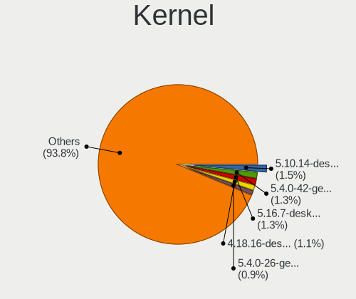

| Version                  | Notebooks | Percent |
|--------------------------|-----------|---------|
| 5.10.14-desktop-1omv4002 | 23        | 2.41%   |
| 5.4.0-42-generic         | 21        | 2.2%    |
| 5.16.7-desktop-1omv4003  | 19        | 1.99%   |
| 4.18.16-desktop-1bP      | 16        | 1.68%   |
| 5.4.0-26-generic         | 15        | 1.57%   |
| 5.3.0-40-generic         | 12        | 1.26%   |
| 5.4.0-52-generic         | 11        | 1.15%   |
| 5.4.0-19-generic         | 10        | 1.05%   |
| 5.4.0-29-generic         | 9         | 0.94%   |
| 5.15.0-52-generic        | 9         | 0.94%   |
| 5.8.0-14-generic         | 8         | 0.84%   |
| 5.4.0-48-generic         | 8         | 0.84%   |
| 5.4.0-40-generic         | 8         | 0.84%   |
| 5.11.0-37-generic        | 8         | 0.84%   |
| 4.18.0-15-generic        | 8         | 0.84%   |
| 5.8.0-43-generic         | 7         | 0.73%   |
| 5.4.0-91-generic         | 7         | 0.73%   |
| 5.4.0-72-generic         | 7         | 0.73%   |
| 5.4.0-58-generic         | 7         | 0.73%   |
| 5.3.0-46-generic         | 7         | 0.73%   |
| 5.3.0-28-generic         | 7         | 0.73%   |
| 5.15.0-46-generic        | 7         | 0.73%   |
| 5.15.0-41-generic        | 7         | 0.73%   |
| 5.11.0-27-generic        | 7         | 0.73%   |
| 5.8.0-7630-generic       | 6         | 0.63%   |
| 5.4.0-73-generic         | 6         | 0.63%   |
| 5.4.0-47-generic         | 6         | 0.63%   |
| 5.4.0-45-generic         | 6         | 0.63%   |
| 5.4.0-37-generic         | 6         | 0.63%   |
| 5.3.0-42-generic         | 6         | 0.63%   |
| 5.15.0-48-generic        | 6         | 0.63%   |
| 5.13.0-40-generic        | 6         | 0.63%   |
| 5.13.0-35-generic        | 6         | 0.63%   |
| 4.18.0-17-generic        | 6         | 0.63%   |
| 5.8.0-59-generic         | 5         | 0.52%   |
| 5.4.0-74-generic         | 5         | 0.52%   |
| 5.3.0-53-generic         | 5         | 0.52%   |
| 5.15.0-47-generic        | 5         | 0.52%   |
| 5.11.0-38-generic        | 5         | 0.52%   |
| 5.10.0-9-amd64           | 5         | 0.52%   |

Kernel Family
-------------

Linux kernel without a distro release

| Version | Notebooks | Percent |
|---------|-----------|---------|
| 5.4.0   | 190       | 21.04%  |
| 4.15.0  | 62        | 6.87%   |
| 5.3.0   | 58        | 6.42%   |
| 5.8.0   | 54        | 5.98%   |
| 5.15.0  | 54        | 5.98%   |
| 5.11.0  | 40        | 4.43%   |
| 5.13.0  | 33        | 3.65%   |
| 5.0.0   | 31        | 3.43%   |
| 4.18.0  | 28        | 3.1%    |
| 5.10.0  | 26        | 2.88%   |
| 5.10.14 | 23        | 2.55%   |
| 5.16.7  | 19        | 2.1%    |
| 4.19.0  | 18        | 1.99%   |
| 4.18.16 | 16        | 1.77%   |
| 5.19.0  | 6         | 0.66%   |
| 5.17.5  | 6         | 0.66%   |
| 5.14.0  | 6         | 0.66%   |
| 5.18.16 | 5         | 0.55%   |
| 5.18.0  | 5         | 0.55%   |
| 5.15.5  | 5         | 0.55%   |
| 5.9.10  | 4         | 0.44%   |
| 5.18.5  | 4         | 0.44%   |
| 5.15.8  | 4         | 0.44%   |
| 5.11.12 | 4         | 0.44%   |
| 4.9.20  | 4         | 0.44%   |
| 6.0.8   | 3         | 0.33%   |
| 6.0.15  | 3         | 0.33%   |
| 5.8.6   | 3         | 0.33%   |
| 5.8.16  | 3         | 0.33%   |
| 5.19.14 | 3         | 0.33%   |
| 5.18.12 | 3         | 0.33%   |
| 5.16.19 | 3         | 0.33%   |
| 6.0.9   | 2         | 0.22%   |
| 6.0.10  | 2         | 0.22%   |
| 5.9.16  | 2         | 0.22%   |
| 5.9.14  | 2         | 0.22%   |
| 5.9.11  | 2         | 0.22%   |
| 5.8.4   | 2         | 0.22%   |
| 5.8.15  | 2         | 0.22%   |
| 5.7.9   | 2         | 0.22%   |

Kernel Major Ver.
-----------------

Linux kernel major version

| Version | Notebooks | Percent |
|---------|-----------|---------|
| 5.4     | 197       | 22.13%  |
| 5.15    | 77        | 8.65%   |
| 5.8     | 67        | 7.53%   |
| 4.15    | 62        | 6.97%   |
| 5.3     | 58        | 6.52%   |
| 5.10    | 58        | 6.52%   |
| 5.11    | 53        | 5.96%   |
| 4.18    | 46        | 5.17%   |
| 5.13    | 43        | 4.83%   |
| 5.0     | 33        | 3.71%   |
| 5.16    | 32        | 3.6%    |
| 5.18    | 26        | 2.92%   |
| 5.19    | 20        | 2.25%   |
| 4.19    | 20        | 2.25%   |
| 6.0     | 14        | 1.57%   |
| 5.14    | 14        | 1.57%   |
| 5.17    | 13        | 1.46%   |
| 5.9     | 12        | 1.35%   |
| 5.6     | 9         | 1.01%   |
| 4.9     | 8         | 0.9%    |
| 5.7     | 7         | 0.79%   |
| 5.12    | 6         | 0.67%   |
| 5.5     | 3         | 0.34%   |
| 6.1     | 2         | 0.22%   |
| 4.13    | 2         | 0.22%   |
| 4.1     | 2         | 0.22%   |
| 3.10    | 2         | 0.22%   |
| 4.4     | 1         | 0.11%   |
| 4.17    | 1         | 0.11%   |
| 4.10    | 1         | 0.11%   |
| 3.16    | 1         | 0.11%   |

Arch
----

OS architecture (x86_64, i586, etc.)

| Name   | Notebooks | Percent |
|--------|-----------|---------|
| x86_64 | 777       | 94.07%  |
| i686   | 49        | 5.93%   |

DE
--

Desktop Environment

| Name             | Notebooks | Percent |
|------------------|-----------|---------|
| GNOME            | 375       | 43.96%  |
| KDE5             | 115       | 13.48%  |
| Unknown          | 108       | 12.66%  |
| XFCE             | 72        | 8.44%   |
| X-Cinnamon       | 52        | 6.1%    |
| MATE             | 32        | 3.75%   |
| KDE              | 16        | 1.88%   |
| Pantheon         | 12        | 1.41%   |
| LXQt             | 11        | 1.29%   |
| Budgie           | 10        | 1.17%   |
| LXDE             | 9         | 1.06%   |
| Cinnamon         | 9         | 1.06%   |
| i3               | 7         | 0.82%   |
| KDE4             | 6         | 0.7%    |
| Unity            | 4         | 0.47%   |
| Deepin           | 4         | 0.47%   |
| GNOME Flashback  | 2         | 0.23%   |
| xmonad           | 1         | 0.12%   |
| sway             | 1         | 0.12%   |
| qtile            | 1         | 0.12%   |
| openbox          | 1         | 0.12%   |
| lightdm-xsession | 1         | 0.12%   |
| i3-with-shmlog   | 1         | 0.12%   |
| Cutefish         | 1         | 0.12%   |
| bspwm            | 1         | 0.12%   |
| awesome          | 1         | 0.12%   |

Display Server
--------------

X11 or Wayland

| Name    | Notebooks | Percent |
|---------|-----------|---------|
| X11     | 661       | 78.6%   |
| Wayland | 105       | 12.49%  |
| Unknown | 69        | 8.2%    |
| Tty     | 6         | 0.71%   |

Display Manager
---------------

SDDM, LightDM, etc.

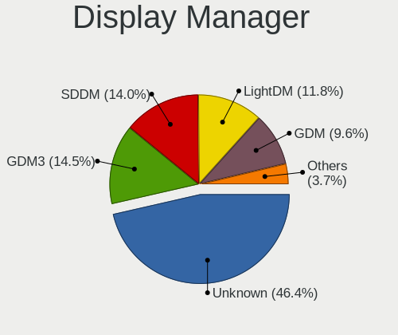

| Name    | Notebooks | Percent |
|---------|-----------|---------|
| Unknown | 478       | 56.37%  |
| SDDM    | 106       | 12.5%   |
| GDM     | 94        | 11.08%  |
| LightDM | 65        | 7.67%   |
| GDM3    | 63        | 7.43%   |
| TDM     | 32        | 3.77%   |
| KDM     | 6         | 0.71%   |
| LXDM    | 2         | 0.24%   |
| XDM     | 1         | 0.12%   |
| GREETD  | 1         | 0.12%   |

OS Lang
-------

Language

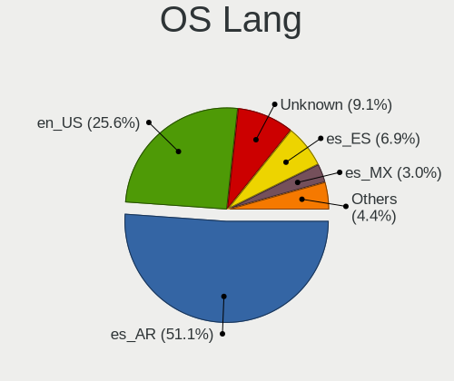

| Lang        | Notebooks | Percent |
|-------------|-----------|---------|
| es_AR       | 427       | 50.89%  |
| en_US       | 200       | 23.84%  |
| Unknown     | 119       | 14.18%  |
| es_ES       | 50        | 5.96%   |
| es_MX       | 14        | 1.67%   |
| C           | 10        | 1.19%   |
| en_GB       | 8         | 0.95%   |
| pt_BR       | 4         | 0.48%   |
| POSIX       | 1         | 0.12%   |
| fr_FR       | 1         | 0.12%   |
| es_US       | 1         | 0.12%   |
| es_CL       | 1         | 0.12%   |
| es_AR.UtF-8 | 1         | 0.12%   |
| en_CA       | 1         | 0.12%   |
| en_AG       | 1         | 0.12%   |

Boot Mode
---------

EFI or BIOS

| Mode | Notebooks | Percent |
|------|-----------|---------|
| BIOS | 437       | 52.02%  |
| EFI  | 403       | 47.98%  |

Filesystem
----------

Type of filesystem

| Type    | Notebooks | Percent |
|---------|-----------|---------|
| Ext4    | 666       | 79.29%  |
| Overlay | 74        | 8.81%   |
| Btrfs   | 55        | 6.55%   |
| Unknown | 31        | 3.69%   |
| Xfs     | 6         | 0.71%   |
| Ext2    | 3         | 0.36%   |
| Zfs     | 2         | 0.24%   |
| Tmpfs   | 1         | 0.12%   |
| Ext3    | 1         | 0.12%   |
| Aufs    | 1         | 0.12%   |

Part. scheme
------------

Scheme of partitioning

| Type    | Notebooks | Percent |
|---------|-----------|---------|
| Unknown | 511       | 60.83%  |
| GPT     | 243       | 28.93%  |
| MBR     | 86        | 10.24%  |

Dual Boot with Linux/BSD
------------------------

Hosting more than one Linux/BSD

| Dual boot | Notebooks | Percent |
|-----------|-----------|---------|
| No        | 741       | 88.85%  |
| Yes       | 93        | 11.15%  |

Dual Boot (Win)
---------------

Hosting Linux and Windows

| Dual boot | Notebooks | Percent |
|-----------|-----------|---------|
| No        | 600       | 72.2%   |
| Yes       | 231       | 27.8%   |

Board
-----

Vendor
------

Motherboard manufacturer

| Name                    | Notebooks | Percent |
|-------------------------|-----------|---------|
| Lenovo                  | 180       | 21.79%  |
| Hewlett-Packard         | 118       | 14.29%  |
| Dell                    | 105       | 12.71%  |
| ASUSTek Computer        | 100       | 12.11%  |
| Acer                    | 42        | 5.08%   |
| BANGHO                  | 32        | 3.87%   |
| Toshiba                 | 30        | 3.63%   |
| Samsung Electronics     | 25        | 3.03%   |
| Exo                     | 24        | 2.91%   |
| Positivo                | 21        | 2.54%   |
| Sony                    | 16        | 1.94%   |
| MSI                     | 12        | 1.45%   |
| Apple                   | 12        | 1.45%   |
| Intel                   | 11        | 1.33%   |
| Compal                  | 8         | 0.97%   |
| Clevo                   | 7         | 0.85%   |
| Standard                | 5         | 0.61%   |
| NOBLEX                  | 5         | 0.61%   |
| Coradir                 | 5         | 0.61%   |
| System76                | 4         | 0.48%   |
| NSX                     | 4         | 0.48%   |
| HUAWEI                  | 4         | 0.48%   |
| Advantec                | 4         | 0.48%   |
| A-DATA Technology       | 3         | 0.36%   |
| Unknown                 | 3         | 0.36%   |
| Radio Victoria Fueguina | 2         | 0.24%   |
| Quanta                  | 2         | 0.24%   |
| PCBOX                   | 2         | 0.24%   |
| Packard Bell            | 2         | 0.24%   |
| Novatech                | 2         | 0.24%   |
| LG Electronics          | 2         | 0.24%   |
| Kelyx Argentina         | 2         | 0.24%   |
| Juana Manso             | 2         | 0.24%   |
| Gigabyte Technology     | 2         | 0.24%   |
| Garbarino SAIC          | 2         | 0.24%   |
| Compaq                  | 2         | 0.24%   |
| Pegatron                | 1         | 0.12%   |
| PEAQ                    | 1         | 0.12%   |
| PCBOX-H                 | 1         | 0.12%   |
| Olivetti                | 1         | 0.12%   |

Model
-----

Motherboard model

| Name                                       | Notebooks | Percent |
|--------------------------------------------|-----------|---------|
| Unknown                                    | 16        | 1.94%   |
| Lenovo V330-15IKB 81AX                     | 9         | 1.09%   |
| BANGHO MOV                                 | 8         | 0.97%   |
| Lenovo ThinkPad L15 Gen 2 20X4S27200       | 7         | 0.85%   |
| HP Notebook                                | 7         | 0.85%   |
| HP Laptop 15-bs0xx                         | 7         | 0.85%   |
| Lenovo G470 20078                          | 5         | 0.61%   |
| HP Pavilion dv6                            | 5         | 0.61%   |
| Exo CloudbookE15                           | 5         | 0.61%   |
| Dell Inspiron 1525                         | 5         | 0.61%   |
| Coradir Coradir/ES10IS5                    | 5         | 0.61%   |
| BANGHO W240HU/W250HUQ                      | 5         | 0.61%   |
| BANGHO MAX G0101                           | 5         | 0.61%   |
| ASUS VivoBook_ASUSLaptop X509JA_X509JA     | 5         | 0.61%   |
| ASUS VivoBook 15_ASUS Laptop X540UAR       | 5         | 0.61%   |
| Lenovo ThinkPad T430 2349DS5               | 4         | 0.48%   |
| Lenovo IdeaPad 320-15ABR 80XS              | 4         | 0.48%   |
| Intel powered classmate PC                 | 4         | 0.48%   |
| HP Pavilion Notebook                       | 4         | 0.48%   |
| HP 250 G6 Notebook PC                      | 4         | 0.48%   |
| Dell Latitude 7490                         | 4         | 0.48%   |
| Dell Inspiron 3421                         | 4         | 0.48%   |
| ASUS X555LAB                               | 4         | 0.48%   |
| ASUS X541UAK                               | 4         | 0.48%   |
| ASUS VivoBook 15_ASUS Laptop X540MA_X543MA | 4         | 0.48%   |
| ASUS K53E                                  | 4         | 0.48%   |
| Apple MacBookPro9,2                        | 4         | 0.48%   |
| Samsung R430/P430/R480                     | 3         | 0.36%   |
| Samsung 300E4C/300E5C/300E7C               | 3         | 0.36%   |
| Samsung 300E4A/300E5A/300E7A/3430EA/3530EA | 3         | 0.36%   |
| Samsung 300E4A/300E5A/300E7A               | 3         | 0.36%   |
| Positivo VJF155F11UAR                      | 3         | 0.36%   |
| Positivo SW6H                              | 3         | 0.36%   |
| NOBLEX SF20BA                              | 3         | 0.36%   |
| Lenovo ThinkPad E14 Gen 3 20YDS06K00       | 3         | 0.36%   |
| Lenovo ThinkBook 14s-IWL 20RM              | 3         | 0.36%   |
| Lenovo IdeaPad S145-15AST 81N3             | 3         | 0.36%   |
| Lenovo IdeaPad 3 14ADA05 81W0              | 3         | 0.36%   |
| Lenovo G580 20150                          | 3         | 0.36%   |
| Lenovo G480 20150                          | 3         | 0.36%   |

Model Family
------------

Motherboard model prefix

| Name                  | Notebooks | Percent |
|-----------------------|-----------|---------|
| Lenovo ThinkPad       | 69        | 8.35%   |
| Dell Inspiron         | 59        | 7.14%   |
| Lenovo IdeaPad        | 39        | 4.72%   |
| Dell Latitude         | 35        | 4.24%   |
| Acer Aspire           | 35        | 4.24%   |
| HP Pavilion           | 34        | 4.12%   |
| ASUS VivoBook         | 28        | 3.39%   |
| HP Laptop             | 20        | 2.42%   |
| Toshiba Satellite     | 18        | 2.18%   |
| Unknown               | 16        | 1.94%   |
| HP 250                | 10        | 1.21%   |
| Lenovo V330-15IKB     | 9         | 1.09%   |
| Exo Smart             | 9         | 1.09%   |
| BANGHO MAX            | 9         | 1.09%   |
| Lenovo ThinkBook      | 8         | 0.97%   |
| HP Compaq             | 8         | 0.97%   |
| BANGHO MOV            | 8         | 0.97%   |
| HP Notebook           | 7         | 0.85%   |
| HP EliteBook          | 7         | 0.85%   |
| Samsung 300E4A        | 6         | 0.73%   |
| HP ProBook            | 6         | 0.73%   |
| ASUS ZenBook          | 6         | 0.73%   |
| Samsung R430          | 5         | 0.61%   |
| Lenovo G470           | 5         | 0.61%   |
| Exo CloudbookE15      | 5         | 0.61%   |
| Coradir Coradir       | 5         | 0.61%   |
| BANGHO W240HU         | 5         | 0.61%   |
| ASUS ASUS             | 5         | 0.61%   |
| Intel powered         | 4         | 0.48%   |
| HP OMEN               | 4         | 0.48%   |
| HP ENVY               | 4         | 0.48%   |
| ASUS X555LAB          | 4         | 0.48%   |
| ASUS X541UAK          | 4         | 0.48%   |
| ASUS K53E             | 4         | 0.48%   |
| Apple MacBookPro9     | 4         | 0.48%   |
| Toshiba PORTEGE       | 3         | 0.36%   |
| Samsung 300E4C        | 3         | 0.36%   |
| Positivo VJF155F11UAR | 3         | 0.36%   |
| Positivo SW6H         | 3         | 0.36%   |
| NOBLEX SF20BA         | 3         | 0.36%   |

MFG Year
--------

Motherboard manufacture year

| Year    | Notebooks | Percent |
|---------|-----------|---------|
| 2017    | 94        | 11.38%  |
| 2012    | 82        | 9.93%   |
| 2019    | 73        | 8.84%   |
| 2011    | 66        | 7.99%   |
| 2020    | 61        | 7.38%   |
| 2021    | 59        | 7.14%   |
| 2014    | 56        | 6.78%   |
| 2018    | 52        | 6.3%    |
| 2010    | 52        | 6.3%    |
| 2016    | 47        | 5.69%   |
| 2015    | 45        | 5.45%   |
| 2013    | 45        | 5.45%   |
| 2008    | 38        | 4.6%    |
| 2009    | 22        | 2.66%   |
| 2007    | 17        | 2.06%   |
| 2006    | 8         | 0.97%   |
| Unknown | 6         | 0.73%   |
| 2022    | 1         | 0.12%   |
| 2005    | 1         | 0.12%   |
| 2004    | 1         | 0.12%   |

Form Factor
-----------

Physical design of the computer

| Name     | Notebooks | Percent |
|----------|-----------|---------|
| Notebook | 826       | 100%    |

Secure Boot
-----------

Enabled or disabled

| State    | Notebooks | Percent |
|----------|-----------|---------|
| Disabled | 755       | 90.85%  |
| Enabled  | 76        | 9.15%   |

Coreboot
--------

Have coreboot on board

| Used | Notebooks | Percent |
|------|-----------|---------|
| No   | 824       | 99.76%  |
| Yes  | 2         | 0.24%   |

RAM Size
--------

Total RAM memory

| Size in GB  | Notebooks | Percent |
|-------------|-----------|---------|
| 4.01-8.0    | 230       | 27.61%  |
| 3.01-4.0    | 225       | 27.01%  |
| 8.01-16.0   | 140       | 16.81%  |
| 16.01-24.0  | 82        | 9.84%   |
| 1.01-2.0    | 81        | 9.72%   |
| 32.01-64.0  | 29        | 3.48%   |
| 2.01-3.0    | 22        | 2.64%   |
| 0.51-1.0    | 16        | 1.92%   |
| 24.01-32.0  | 5         | 0.6%    |
| 64.01-256.0 | 3         | 0.36%   |

RAM Used
--------

Used RAM memory

| Used GB    | Notebooks | Percent |
|------------|-----------|---------|
| 1.01-2.0   | 334       | 37.4%   |
| 2.01-3.0   | 215       | 24.08%  |
| 4.01-8.0   | 107       | 11.98%  |
| 3.01-4.0   | 104       | 11.65%  |
| 0.51-1.0   | 87        | 9.74%   |
| 8.01-16.0  | 33        | 3.7%    |
| 0.01-0.5   | 10        | 1.12%   |
| 16.01-24.0 | 3         | 0.34%   |

Total Drives
------------

Number of drives on board

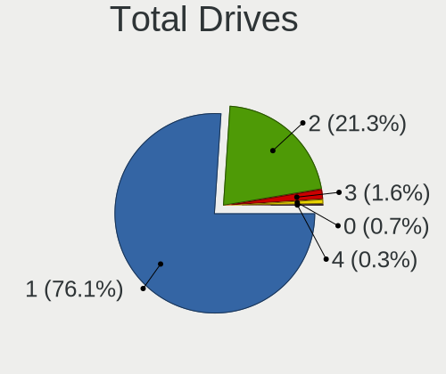

| Drives | Notebooks | Percent |
|--------|-----------|---------|
| 1      | 631       | 75.39%  |
| 2      | 182       | 21.74%  |
| 3      | 16        | 1.91%   |
| 0      | 8         | 0.96%   |

Has CD-ROM
----------

Has CD-ROM on board

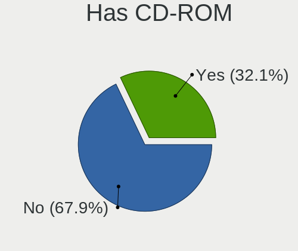

| Presented | Notebooks | Percent |
|-----------|-----------|---------|
| No        | 519       | 62.38%  |
| Yes       | 313       | 37.62%  |

Has Ethernet
------------

Has Ethernet on board

| Presented | Notebooks | Percent |
|-----------|-----------|---------|
| Yes       | 692       | 83.68%  |
| No        | 135       | 16.32%  |

Has WiFi
--------

Has WiFi module

| Presented | Notebooks | Percent |
|-----------|-----------|---------|
| Yes       | 809       | 97.82%  |
| No        | 18        | 2.18%   |

Has Bluetooth
-------------

Has Bluetooth module

| Presented | Notebooks | Percent |
|-----------|-----------|---------|
| Yes       | 564       | 68.03%  |
| No        | 265       | 31.97%  |

Location
--------

Country
-------

Geographic location (country)

| Country   | Notebooks | Percent |
|-----------|-----------|---------|
| Argentina | 826       | 100%    |

City
----

Geographic location (city)

| City                        | Notebooks | Percent |
|-----------------------------|-----------|---------|
| Buenos Aires                | 197       | 22.83%  |
| Crdoba                    | 63        | 7.3%    |
| Rosario                     | 29        | 3.36%   |
| Mar del Plata               | 23        | 2.67%   |
| La Plata                    | 22        | 2.55%   |
| Mendoza                     | 13        | 1.51%   |
| Corrientes                  | 13        | 1.51%   |
| Lanus                       | 11        | 1.27%   |
| Avellaneda                  | 10        | 1.16%   |
| Santa Fe                    | 9         | 1.04%   |
| San Miguel de Tucumn      | 9         | 1.04%   |
| San Martn de los Andes    | 9         | 1.04%   |
| Villa Ballester             | 8         | 0.93%   |
| Tandil                      | 8         | 0.93%   |
| Salta                       | 8         | 0.93%   |
| Resistencia                 | 8         | 0.93%   |
| Ramos Mejia                 | 8         | 0.93%   |
| Posadas                     | 8         | 0.93%   |
| Olivos                      | 8         | 0.93%   |
| Ituzaingo                   | 7         | 0.81%   |
| Florencio Varela            | 7         | 0.81%   |
| Bariloche                   | 7         | 0.81%   |
| Baha Blanca               | 7         | 0.81%   |
| San Nicols de los Arroyos | 6         | 0.7%    |
| San Juan                    | 6         | 0.7%    |
| San Francisco               | 6         | 0.7%    |
| Lomas de Zamora             | 6         | 0.7%    |
| Vicente Lopez               | 5         | 0.58%   |
| Santa Rosa                  | 5         | 0.58%   |
| San Isidro                  | 5         | 0.58%   |
| Rio Tercero                 | 5         | 0.58%   |
| Ro Gallegos               | 5         | 0.58%   |
| Quilmes                     | 5         | 0.58%   |
| Paran                     | 5         | 0.58%   |
| Necochea                    | 5         | 0.58%   |
| Mariano Moreno              | 5         | 0.58%   |
| Villa Carlos Paz            | 4         | 0.46%   |
| Villa Allende               | 4         | 0.46%   |
| Santa Lucia                 | 4         | 0.46%   |
| San Telmo                   | 4         | 0.46%   |

Drives
------

Drive Vendor
------------

Hard drive vendors

| Vendor                      | Notebooks | Drives | Percent |
|-----------------------------|-----------|--------|---------|
| WDC                         | 184       | 225    | 18.95%  |
| Seagate                     | 138       | 160    | 14.21%  |
| Kingston                    | 129       | 154    | 13.29%  |
| Toshiba                     | 116       | 147    | 11.95%  |
| Samsung Electronics         | 85        | 108    | 8.75%   |
| Unknown                     | 48        | 61     | 4.94%   |
| HGST                        | 37        | 39     | 3.81%   |
| Hitachi                     | 33        | 35     | 3.4%    |
| SK hynix                    | 29        | 31     | 2.99%   |
| SanDisk                     | 28        | 41     | 2.88%   |
| Crucial                     | 15        | 19     | 1.54%   |
| A-DATA Technology           | 15        | 16     | 1.54%   |
| Intel                       | 13        | 28     | 1.34%   |
| Micron Technology           | 11        | 14     | 1.13%   |
| Gigabyte Technology         | 9         | 12     | 0.93%   |
| KIOXIA                      | 7         | 7      | 0.72%   |
| Hewlett-Packard             | 6         | 6      | 0.62%   |
| China                       | 6         | 6      | 0.62%   |
| Unknown                     | 5         | 5      | 0.51%   |
| Patriot                     | 4         | 5      | 0.41%   |
| XPG                         | 3         | 3      | 0.31%   |
| Neo                         | 3         | 3      | 0.31%   |
| HS-SSD-C100                 | 3         | 4      | 0.31%   |
| Apple                       | 3         | 3      | 0.31%   |
| Union Memory (Shenzhen)     | 2         | 2      | 0.21%   |
| Union Memory                | 2         | 2      | 0.21%   |
| SPCC                        | 2         | 2      | 0.21%   |
| Realtek Semiconductor       | 2         | 2      | 0.21%   |
| PNY                         | 2         | 5      | 0.21%   |
| LITEON                      | 2         | 2      | 0.21%   |
| Kingston Technology Company | 2         | 2      | 0.21%   |
| FORESEE                     | 2         | 2      | 0.21%   |
| Corsair                     | 2         | 2      | 0.21%   |
| Colorful                    | 2         | 2      | 0.21%   |
| ZTE                         | 1         | 1      | 0.1%    |
| XrayDisk                    | 1         | 1      | 0.1%    |
| WDC WDS2                    | 1         | 1      | 0.1%    |
| USB3.0                      | 1         | 1      | 0.1%    |
| Transcend                   | 1         | 1      | 0.1%    |
| Team                        | 1         | 1      | 0.1%    |

Drive Model
-----------

Hard drive models

| Model                               | Notebooks | Percent |
|-------------------------------------|-----------|---------|
| Kingston SA400S37240G 240GB SSD     | 47        | 4.7%    |
| Seagate ST1000LM035-1RK172 1TB      | 36        | 3.6%    |
| Toshiba MQ01ABD100 1TB              | 24        | 2.4%    |
| Toshiba MQ01ABF050 500GB            | 23        | 2.3%    |
| Seagate ST1000LM024 HN-M101MBB 1TB  | 23        | 2.3%    |
| Kingston SA400S37480G 480GB SSD     | 22        | 2.2%    |
| Unknown MMC Card  32GB              | 16        | 1.6%    |
| WDC WDS240G2G0A-00JH30 240GB SSD    | 15        | 1.5%    |
| Toshiba MQ04ABF100 1TB              | 12        | 1.2%    |
| Seagate ST500LT012-1DG142 500GB     | 10        | 1%      |
| WDC WDS240G2G0B-00EPW0 240GB SSD    | 9         | 0.9%    |
| WDC WD10JPVX-60JC3T1 1TB            | 9         | 0.9%    |
| Seagate ST9500325AS 500GB           | 8         | 0.8%    |
| Kingston SA400S37120G 120GB SSD     | 8         | 0.8%    |
| HGST HTS721010A9E630 1TB            | 8         | 0.8%    |
| Toshiba MQ01ABD032 320GB            | 7         | 0.7%    |
| Kingston SV300S37A240G 240GB SSD    | 7         | 0.7%    |
| WDC WDS480G2G0A-00JH30 480GB SSD    | 6         | 0.6%    |
| Seagate ST500LM030-2E717D 500GB     | 6         | 0.6%    |
| Seagate ST1000LM048-2E7172 1TB      | 6         | 0.6%    |
| Samsung NVMe SSD Drive 512GB        | 6         | 0.6%    |
| Kingston SUV400S37240G 240GB SSD    | 6         | 0.6%    |
| WDC WD5000LPVX-22V0TT0 500GB        | 5         | 0.5%    |
| Unknown MMC Card  64GB              | 5         | 0.5%    |
| Toshiba MK6475GSX 640GB             | 5         | 0.5%    |
| Seagate ST500LT012-9WS142 500GB     | 5         | 0.5%    |
| Seagate ST320LM001 HN-M320MBB 320GB | 5         | 0.5%    |
| HGST HTS725050A7E630 500GB          | 5         | 0.5%    |
| HGST HTS545050A7E680 500GB          | 5         | 0.5%    |
| HGST HTS545050A7E380 500GB          | 5         | 0.5%    |
| A-DATA SU630 240GB SSD              | 5         | 0.5%    |
| Unknown                             | 5         | 0.5%    |
| WDC WDS500G2B0A-00SM50 500GB SSD    | 4         | 0.4%    |
| WDC WD5000BPVT-22HXZT3 500GB        | 4         | 0.4%    |
| WDC WD2500BEVT-22A23T0 250GB        | 4         | 0.4%    |
| WDC WD1600BEVT-22A23T0 160GB        | 4         | 0.4%    |
| WDC WD10JPVX-75JC3T0 1TB            | 4         | 0.4%    |
| WDC WD10JPVX-22JC3T0 1TB            | 4         | 0.4%    |
| Toshiba NVMe SSD Drive 256GB        | 4         | 0.4%    |
| SK hynix NVMe SSD Drive 512GB       | 4         | 0.4%    |

HDD Vendor
----------

Hard disk drive vendors

| Vendor              | Notebooks | Drives | Percent |
|---------------------|-----------|--------|---------|
| Seagate             | 135       | 156    | 28.97%  |
| WDC                 | 132       | 152    | 28.33%  |
| Toshiba             | 102       | 131    | 21.89%  |
| HGST                | 37        | 39     | 7.94%   |
| Hitachi             | 33        | 35     | 7.08%   |
| Samsung Electronics | 22        | 25     | 4.72%   |
| Unknown             | 3         | 3      | 0.64%   |
| USB3.0              | 1         | 1      | 0.21%   |
| Fujitsu             | 1         | 1      | 0.21%   |

SSD Vendor
----------

Solid state drive vendors

| Vendor              | Notebooks | Drives | Percent |
|---------------------|-----------|--------|---------|
| Kingston            | 115       | 138    | 39.52%  |
| WDC                 | 42        | 53     | 14.43%  |
| Samsung Electronics | 22        | 37     | 7.56%   |
| SanDisk             | 17        | 22     | 5.84%   |
| Crucial             | 14        | 18     | 4.81%   |
| A-DATA Technology   | 12        | 12     | 4.12%   |
| Gigabyte Technology | 9         | 12     | 3.09%   |
| SK hynix            | 7         | 8      | 2.41%   |
| Toshiba             | 5         | 5      | 1.72%   |
| Micron Technology   | 4         | 6      | 1.37%   |
| Patriot             | 3         | 4      | 1.03%   |
| Intel               | 3         | 3      | 1.03%   |
| Hewlett-Packard     | 3         | 4      | 1.03%   |
| China               | 3         | 3      | 1.03%   |
| Unknown             | 3         | 3      | 1.03%   |
| SPCC                | 2         | 2      | 0.69%   |
| Seagate             | 2         | 3      | 0.69%   |
| PNY                 | 2         | 5      | 0.69%   |
| HS-SSD-C100         | 2         | 3      | 0.69%   |
| FORESEE             | 2         | 2      | 0.69%   |
| Corsair             | 2         | 2      | 0.69%   |
| Colorful            | 2         | 2      | 0.69%   |
| Apple               | 2         | 2      | 0.69%   |
| XrayDisk            | 1         | 1      | 0.34%   |
| WDC WDS2            | 1         | 1      | 0.34%   |
| Transcend           | 1         | 1      | 0.34%   |
| Team                | 1         | 1      | 0.34%   |
| SMI                 | 1         | 1      | 0.34%   |
| OCZ                 | 1         | 1      | 0.34%   |
| NGFF                | 1         | 2      | 0.34%   |
| Netac               | 1         | 1      | 0.34%   |
| Neo                 | 1         | 1      | 0.34%   |
| LITEONIT            | 1         | 1      | 0.34%   |
| LITEON              | 1         | 1      | 0.34%   |
| Lexar               | 1         | 1      | 0.34%   |
| JMicron Technology  | 1         | 1      | 0.34%   |

Drive Kind
----------

HDD or SSD

| Kind    | Notebooks | Drives | Percent |
|---------|-----------|--------|---------|
| HDD     | 456       | 543    | 48.46%  |
| SSD     | 278       | 363    | 29.54%  |
| NVMe    | 151       | 203    | 16.05%  |
| MMC     | 45        | 59     | 4.78%   |
| Unknown | 11        | 10     | 1.17%   |

Drive Connector
---------------

SATA, SAS, NVMe, etc.

| Type | Notebooks | Drives | Percent |
|------|-----------|--------|---------|
| SATA | 668       | 906    | 76.43%  |
| NVMe | 151       | 203    | 17.28%  |
| MMC  | 45        | 59     | 5.15%   |
| SAS  | 10        | 10     | 1.14%   |

Drive Size
----------

Size of hard drive

| Size in TB | Notebooks | Drives | Percent |
|------------|-----------|--------|---------|
| 0.01-0.5   | 485       | 613    | 68.02%  |
| 0.51-1.0   | 219       | 282    | 30.72%  |
| 1.01-2.0   | 9         | 11     | 1.26%   |

Space Total
-----------

Amount of disk space available on the file system

| Size in GB     | Notebooks | Percent |
|----------------|-----------|---------|
| 101-250        | 269       | 31.35%  |
| 251-500        | 222       | 25.87%  |
| 501-1000       | 142       | 16.55%  |
| 1-20           | 53        | 6.18%   |
| 51-100         | 50        | 5.83%   |
| 1001-2000      | 45        | 5.24%   |
| 21-50          | 43        | 5.01%   |
| Unknown        | 25        | 2.91%   |
| More than 3000 | 5         | 0.58%   |
| 2001-3000      | 4         | 0.47%   |

Space Used
----------

Amount of used disk space

| Used GB   | Notebooks | Percent |
|-----------|-----------|---------|
| 1-20      | 358       | 40.32%  |
| 21-50     | 172       | 19.37%  |
| 101-250   | 126       | 14.19%  |
| 51-100    | 114       | 12.84%  |
| 251-500   | 57        | 6.42%   |
| 501-1000  | 27        | 3.04%   |
| Unknown   | 25        | 2.82%   |
| 1001-2000 | 7         | 0.79%   |
| 2001-3000 | 2         | 0.23%   |

Malfunc. Drives
---------------

Drive models with a malfunction

| Model                                            | Notebooks | Drives | Percent |
|--------------------------------------------------|-----------|--------|---------|
| Seagate ST1000LM035-1RK172 1TB                   | 5         | 5      | 7.69%   |
| WDC WD5000BPVT-22HXZT3 500GB                     | 3         | 3      | 4.62%   |
| Toshiba MQ01ABF050 500GB                         | 3         | 3      | 4.62%   |
| Toshiba MQ01ABD100 1TB                           | 3         | 6      | 4.62%   |
| HGST HTS541010A9E680 1TB                         | 3         | 3      | 4.62%   |
| WDC WDS240G2G0A-00JH30 240GB SSD                 | 2         | 2      | 3.08%   |
| Toshiba MK1665GSX 160GB                          | 2         | 2      | 3.08%   |
| Seagate ST9500325AS 500GB                        | 2         | 2      | 3.08%   |
| Seagate ST500LT012-1DG142 500GB                  | 2         | 4      | 3.08%   |
| Samsung Electronics HN-M101MBB 1TB               | 2         | 2      | 3.08%   |
| Kingston SA400S37240G 240GB SSD                  | 2         | 2      | 3.08%   |
| HGST HTS721010A9E630 1TB                         | 2         | 3      | 3.08%   |
| WDC WDS120G2G0A-00JH30 120GB SSD                 | 1         | 1      | 1.54%   |
| WDC WD3200BPVT-00JJ5T0 320GB                     | 1         | 1      | 1.54%   |
| WDC WD2500BEVT-75A23T0 250GB                     | 1         | 1      | 1.54%   |
| WDC WD10JPVX-22JC3T0 1TB                         | 1         | 1      | 1.54%   |
| Toshiba MQ04ABF100 1TB                           | 1         | 1      | 1.54%   |
| Toshiba MQ01ABD050 500GB                         | 1         | 1      | 1.54%   |
| Toshiba MQ01ABD032 320GB                         | 1         | 1      | 1.54%   |
| Toshiba MK7559GSXP 752GB                         | 1         | 1      | 1.54%   |
| Toshiba MK3265GSXN 320GB                         | 1         | 1      | 1.54%   |
| Toshiba MK2576GSX 250GB                          | 1         | 1      | 1.54%   |
| SMI SSD DISK 512GB                               | 1         | 1      | 1.54%   |
| Seagate ST960813AS 64GB                          | 1         | 1      | 1.54%   |
| Seagate ST960812A 64GB                           | 1         | 1      | 1.54%   |
| Seagate ST9320325AS 320GB                        | 1         | 1      | 1.54%   |
| Seagate ST9160314AS 160GB                        | 1         | 1      | 1.54%   |
| Seagate ST500LT012-9WS142 500GB                  | 1         | 1      | 1.54%   |
| Seagate ST250LM004 HN-M250MBB 250GB              | 1         | 1      | 1.54%   |
| Seagate ST1000LM048-2E7172 1TB                   | 1         | 1      | 1.54%   |
| Seagate ST1000LM024 HN-M101MBB 1TB               | 1         | 1      | 1.54%   |
| Samsung Electronics SSD 840 EVO 250GB            | 1         | 1      | 1.54%   |
| Samsung Electronics MZNLH256HAJD-000H1 256GB SSD | 1         | 1      | 1.54%   |
| Samsung Electronics HM160HI 160GB                | 1         | 1      | 1.54%   |
| Kingston SV300S37A240G 240GB SSD                 | 1         | 1      | 1.54%   |
| Kingston SUV400S37240G 240GB SSD                 | 1         | 1      | 1.54%   |
| Hitachi HTS727575A9E364 752GB                    | 1         | 1      | 1.54%   |
| Hitachi HTS725050A7E630 500GB                    | 1         | 1      | 1.54%   |
| Hitachi HTS547564A9E384 640GB                    | 1         | 1      | 1.54%   |
| Hitachi HTS547550A9E384 500GB                    | 1         | 1      | 1.54%   |

Malfunc. Drive Vendor
---------------------

Vendors of faulty drives

| Vendor              | Notebooks | Drives | Percent |
|---------------------|-----------|--------|---------|
| Seagate             | 17        | 19     | 26.15%  |
| Toshiba             | 14        | 17     | 21.54%  |
| WDC                 | 9         | 9      | 13.85%  |
| HGST                | 8         | 9      | 12.31%  |
| Hitachi             | 6         | 6      | 9.23%   |
| Samsung Electronics | 5         | 5      | 7.69%   |
| Kingston            | 4         | 4      | 6.15%   |
| SMI                 | 1         | 1      | 1.54%   |
| A-DATA Technology   | 1         | 1      | 1.54%   |

Malfunc. HDD Vendor
-------------------

Vendors of faulty HDD drives

| Vendor              | Notebooks | Drives | Percent |
|---------------------|-----------|--------|---------|
| Seagate             | 17        | 19     | 31.48%  |
| Toshiba             | 14        | 17     | 25.93%  |
| HGST                | 8         | 9      | 14.81%  |
| WDC                 | 6         | 6      | 11.11%  |
| Hitachi             | 6         | 6      | 11.11%  |
| Samsung Electronics | 3         | 3      | 5.56%   |

Malfunc. Drive Kind
-------------------

Kinds of faulty drives

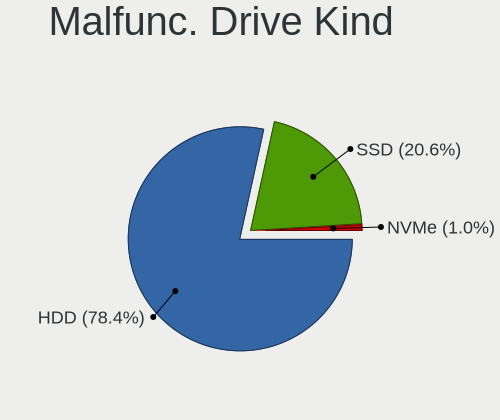

| Kind | Notebooks | Drives | Percent |
|------|-----------|--------|---------|
| HDD  | 53        | 60     | 82.81%  |
| SSD  | 11        | 11     | 17.19%  |

Failed Drives
-------------

Failed drive models

| Model                       | Notebooks | Drives | Percent |
|-----------------------------|-----------|--------|---------|
| WDC WD5000BEVT-22ZAT0 500GB | 2         | 2      | 50%     |
| Toshiba MK6475GSX 640GB     | 1         | 1      | 25%     |
| Toshiba MK1665GSX 160GB     | 1         | 1      | 25%     |

Failed Drive Vendor
-------------------

Failed drive vendors

| Vendor  | Notebooks | Drives | Percent |
|---------|-----------|--------|---------|
| WDC     | 2         | 2      | 50%     |
| Toshiba | 2         | 2      | 50%     |

Drive Status
------------

Number of failed and malfunc. drives

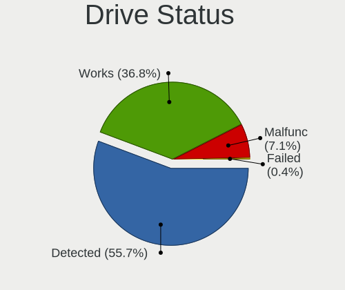

| Status   | Notebooks | Drives | Percent |
|----------|-----------|--------|---------|
| Detected | 526       | 725    | 61.02%  |
| Works    | 269       | 378    | 31.21%  |
| Malfunc  | 63        | 71     | 7.31%   |
| Failed   | 4         | 4      | 0.46%   |

Storage controller
------------------

Storage Vendor
--------------

Storage controller vendors

| Vendor                           | Notebooks | Percent |
|----------------------------------|-----------|---------|
| Intel                            | 622       | 70.6%   |
| AMD                              | 93        | 10.56%  |
| Samsung Electronics              | 42        | 4.77%   |
| SanDisk                          | 24        | 2.72%   |
| SK hynix                         | 22        | 2.5%    |
| Kingston Technology Company      | 16        | 1.82%   |
| Silicon Integrated Systems [SiS] | 11        | 1.25%   |
| Toshiba America Info Systems     | 9         | 1.02%   |
| KIOXIA                           | 9         | 1.02%   |
| Micron Technology                | 6         | 0.68%   |
| Realtek Semiconductor            | 5         | 0.57%   |
| Union Memory (Shenzhen)          | 3         | 0.34%   |
| Silicon Motion                   | 3         | 0.34%   |
| ADATA Technology                 | 3         | 0.34%   |
| VIA Technologies                 | 2         | 0.23%   |
| Phison Electronics               | 2         | 0.23%   |
| Nvidia                           | 2         | 0.23%   |
| Micron/Crucial Technology        | 2         | 0.23%   |
| MAXIO Technology (Hangzhou)      | 1         | 0.11%   |
| Marvell Technology Group         | 1         | 0.11%   |
| Lite-On Technology               | 1         | 0.11%   |
| Biwin Storage Technology         | 1         | 0.11%   |
| Apple                            | 1         | 0.11%   |

Storage Model
-------------

Storage controller models

| Model                                                                            | Notebooks | Percent |
|----------------------------------------------------------------------------------|-----------|---------|
| Intel Sunrise Point-LP SATA Controller [AHCI mode]                               | 104       | 10.94%  |
| Intel 7 Series Chipset Family 6-port SATA Controller [AHCI mode]                 | 85        | 8.94%   |
| AMD FCH SATA Controller [AHCI mode]                                              | 77        | 8.1%    |
| Intel 6 Series/C200 Series Chipset Family 6 port Mobile SATA AHCI Controller     | 47        | 4.94%   |
| Intel 82801 Mobile SATA Controller [RAID mode]                                   | 44        | 4.63%   |
| Intel 82801IBM/IEM (ICH9M/ICH9M-E) 4 port SATA Controller [AHCI mode]            | 29        | 3.05%   |
| Intel Wildcat Point-LP SATA Controller [AHCI Mode]                               | 26        | 2.73%   |
| Intel NM10/ICH7 Family SATA Controller [AHCI mode]                               | 24        | 2.52%   |
| Intel 8 Series SATA Controller 1 [AHCI mode]                                     | 24        | 2.52%   |
| Intel Celeron/Pentium Silver Processor SATA Controller                           | 23        | 2.42%   |
| Intel 5 Series/3400 Series Chipset 4 port SATA AHCI Controller                   | 22        | 2.31%   |
| Samsung NVMe SSD Controller SM981/PM981/PM983                                    | 19        | 2%      |
| Samsung NVMe SSD Controller 980                                                  | 19        | 2%      |
| Intel Atom Processor E3800 Series SATA AHCI Controller                           | 18        | 1.89%   |
| Intel 82801HM/HEM (ICH8M/ICH8M-E) IDE Controller                                 | 17        | 1.79%   |
| Intel 82801HM/HEM (ICH8M/ICH8M-E) SATA Controller [AHCI mode]                    | 16        | 1.68%   |
| Intel HM170/QM170 Chipset SATA Controller [AHCI Mode]                            | 15        | 1.58%   |
| Intel Celeron N3350/Pentium N4200/Atom E3900 Series SATA AHCI Controller         | 14        | 1.47%   |
| Intel 8 Series/C220 Series Chipset Family 6-port SATA Controller 1 [AHCI mode]   | 14        | 1.47%   |
| AMD SB7x0/SB8x0/SB9x0 SATA Controller [AHCI mode]                                | 13        | 1.37%   |
| Intel Comet Lake SATA AHCI Controller                                            | 12        | 1.26%   |
| Silicon Integrated Systems [SiS] 5513 IDE Controller                             | 11        | 1.16%   |
| Intel Ice Lake-LP SATA Controller [AHCI mode]                                    | 11        | 1.16%   |
| Silicon Integrated Systems [SiS] SATA Controller / IDE mode                      | 9         | 0.95%   |
| KIOXIA NVMe SSD Controller BG4                                                   | 9         | 0.95%   |
| Intel Volume Management Device NVMe RAID Controller                              | 9         | 0.95%   |
| Intel Tiger Lake-LP SATA Controller                                              | 9         | 0.95%   |
| Intel 82801GBM/GHM (ICH7-M Family) SATA Controller [IDE mode]                    | 9         | 0.95%   |
| Intel Cannon Point-LP SATA Controller [AHCI Mode]                                | 8         | 0.84%   |
| Intel Atom/Celeron/Pentium Processor x5-E8000/J3xxx/N3xxx Series SATA Controller | 8         | 0.84%   |
| Toshiba America Info Systems XG6 NVMe SSD Controller                             | 7         | 0.74%   |
| SanDisk Non-Volatile memory controller                                           | 7         | 0.74%   |
| Intel 82801G (ICH7 Family) IDE Controller                                        | 7         | 0.74%   |
| Intel 7 Series Chipset Family 4-port SATA Controller [IDE mode]                  | 7         | 0.74%   |
| Intel 7 Series Chipset Family 2-port SATA Controller [IDE mode]                  | 7         | 0.74%   |
| SK hynix Gold P31/PC711 NVMe Solid State Drive                                   | 6         | 0.63%   |
| SK hynix BC511                                                                   | 6         | 0.63%   |
| SK hynix BC501 NVMe Solid State Drive                                            | 6         | 0.63%   |
| SanDisk WD Blue SN550 NVMe SSD                                                   | 6         | 0.63%   |
| Micron Non-Volatile memory controller                                            | 6         | 0.63%   |

Storage Kind
------------

Kind of storage controller (IDE, SATA, NVMe, SAS, ...)

| Kind | Notebooks | Percent |
|------|-----------|---------|
| SATA | 624       | 68.65%  |
| NVMe | 152       | 16.72%  |
| IDE  | 79        | 8.69%   |
| RAID | 54        | 5.94%   |

Processor
---------

CPU Vendor
----------

Processor vendors

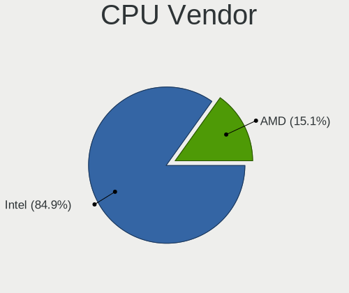

| Vendor | Notebooks | Percent |
|--------|-----------|---------|
| Intel  | 705       | 85.35%  |
| AMD    | 121       | 14.65%  |

CPU Model
---------

Processor models

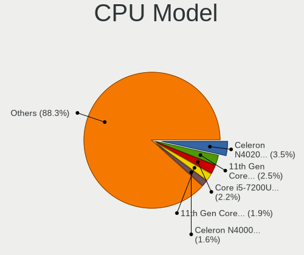

| Model                                         | Notebooks | Percent |
|-----------------------------------------------|-----------|---------|
| Intel Core i5-7200U CPU @ 2.50GHz             | 22        | 2.66%   |
| Intel 11th Gen Core i7-1165G7 @ 2.80GHz       | 18        | 2.18%   |
| Intel Core i7-8550U CPU @ 1.80GHz             | 15        | 1.82%   |
| Intel Core i7-6500U CPU @ 2.50GHz             | 15        | 1.82%   |
| Intel Celeron N4000 CPU @ 1.10GHz             | 15        | 1.82%   |
| Intel Core i7-7500U CPU @ 2.70GHz             | 14        | 1.69%   |
| Intel Core i5-3210M CPU @ 2.50GHz             | 14        | 1.69%   |
| Intel Core i5-8250U CPU @ 1.60GHz             | 13        | 1.57%   |
| Intel Core i5-6200U CPU @ 2.30GHz             | 13        | 1.57%   |
| Intel Core i5-1035G1 CPU @ 1.00GHz            | 13        | 1.57%   |
| Intel Celeron CPU N3350 @ 1.10GHz             | 13        | 1.57%   |
| Intel Atom x5-Z8350 CPU @ 1.44GHz             | 13        | 1.57%   |
| Intel Core i5-3320M CPU @ 2.60GHz             | 12        | 1.45%   |
| Intel Atom CPU N2600 @ 1.60GHz                | 11        | 1.33%   |
| Intel Core i5-5200U CPU @ 2.20GHz             | 10        | 1.21%   |
| Intel Core i7-5500U CPU @ 2.40GHz             | 9         | 1.09%   |
| Intel Core i7-10510U CPU @ 1.80GHz            | 9         | 1.09%   |
| Intel Core i5-10210U CPU @ 1.60GHz            | 9         | 1.09%   |
| Intel Core i3-2330M CPU @ 2.20GHz             | 9         | 1.09%   |
| Intel Core i3-2310M CPU @ 2.10GHz             | 9         | 1.09%   |
| AMD Ryzen 5 2500U with Radeon Vega Mobile Gfx | 9         | 1.09%   |
| Intel Pentium Dual-Core CPU T4200 @ 2.00GHz   | 8         | 0.97%   |
| Intel Core i7-8565U CPU @ 1.80GHz             | 8         | 0.97%   |
| Intel Core i5-8265U CPU @ 1.60GHz             | 8         | 0.97%   |
| Intel Atom CPU N455 @ 1.66GHz                 | 8         | 0.97%   |
| Intel Core i5-3230M CPU @ 2.60GHz             | 7         | 0.85%   |
| Intel Core i5-2450M CPU @ 2.50GHz             | 7         | 0.85%   |
| Intel Core i3-7100U CPU @ 2.40GHz             | 7         | 0.85%   |
| Intel Core i3-6006U CPU @ 2.00GHz             | 7         | 0.85%   |
| Intel Core i3-2350M CPU @ 2.30GHz             | 7         | 0.85%   |
| Intel Core i3-1005G1 CPU @ 1.20GHz            | 7         | 0.85%   |
| Intel Celeron N4020 CPU @ 1.10GHz             | 7         | 0.85%   |
| Intel Celeron CPU N3060 @ 1.60GHz             | 7         | 0.85%   |
| Intel Atom CPU N450 @ 1.66GHz                 | 7         | 0.85%   |
| AMD Ryzen 5 3500U with Radeon Vega Mobile Gfx | 7         | 0.85%   |
| Intel Core i7-7700HQ CPU @ 2.80GHz            | 6         | 0.73%   |
| Intel Core i5-4210U CPU @ 1.70GHz             | 6         | 0.73%   |
| Intel Core i5-3317U CPU @ 1.70GHz             | 6         | 0.73%   |
| Intel Core i3-4005U CPU @ 1.70GHz             | 6         | 0.73%   |
| Intel Core i3-2370M CPU @ 2.40GHz             | 6         | 0.73%   |

CPU Model Family
----------------

Processor model prefix

| Model                   | Notebooks | Percent |
|-------------------------|-----------|---------|
| Intel Core i5           | 197       | 23.85%  |
| Intel Core i7           | 144       | 17.43%  |
| Intel Core i3           | 102       | 12.35%  |
| Intel Celeron           | 77        | 9.32%   |
| Intel Atom              | 48        | 5.81%   |
| Other                   | 41        | 4.96%   |
| AMD Ryzen 5             | 28        | 3.39%   |
| Intel Pentium           | 26        | 3.15%   |
| Intel Core 2 Duo        | 24        | 2.91%   |
| AMD Ryzen 7             | 21        | 2.54%   |
| Intel Pentium Dual-Core | 19        | 2.3%    |
| Intel Pentium Dual      | 14        | 1.69%   |
| AMD A6                  | 13        | 1.57%   |
| Intel Genuine           | 9         | 1.09%   |
| AMD A8                  | 7         | 0.85%   |
| AMD A12                 | 6         | 0.73%   |
| AMD A10                 | 6         | 0.73%   |
| Intel Core 2            | 5         | 0.61%   |
| AMD Athlon II           | 5         | 0.61%   |
| AMD A4                  | 4         | 0.48%   |
| AMD Ryzen 9             | 3         | 0.36%   |
| AMD Ryzen 3             | 3         | 0.36%   |
| Intel Pentium M         | 2         | 0.24%   |
| Intel Celeron M         | 2         | 0.24%   |
| AMD Turion 64 X2 Mobile | 2         | 0.24%   |
| AMD Ryzen 7 PRO         | 2         | 0.24%   |
| AMD E                   | 2         | 0.24%   |
| AMD C-70                | 2         | 0.24%   |
| AMD Athlon              | 2         | 0.24%   |
| Intel Core Duo          | 1         | 0.12%   |
| Intel Celeron Dual-Core | 1         | 0.12%   |
| AMD Z                   | 1         | 0.12%   |
| AMD V120                | 1         | 0.12%   |
| AMD Turion 64 Mobile    | 1         | 0.12%   |
| AMD Phenom II           | 1         | 0.12%   |
| AMD E2                  | 1         | 0.12%   |
| AMD E1                  | 1         | 0.12%   |
| AMD C-60                | 1         | 0.12%   |
| AMD Athlon X2           | 1         | 0.12%   |

CPU Cores
---------

Number of processor cores

| Number  | Notebooks | Percent |
|---------|-----------|---------|
| 2       | 512       | 61.99%  |
| 4       | 229       | 27.72%  |
| 1       | 39        | 4.72%   |
| 8       | 25        | 3.03%   |
| 6       | 17        | 2.06%   |
| Unknown | 2         | 0.24%   |
| 12      | 1         | 0.12%   |
| 3       | 1         | 0.12%   |

CPU Sockets
-----------

Number of sockets

| Number  | Notebooks | Percent |
|---------|-----------|---------|
| 1       | 825       | 99.88%  |
| Unknown | 1         | 0.12%   |

CPU Threads
-----------

Threads per core (Hyper-Threading)

| Number  | Notebooks | Percent |
|---------|-----------|---------|
| 2       | 565       | 68.4%   |
| 1       | 259       | 31.36%  |
| Unknown | 2         | 0.24%   |

CPU Op-Modes
------------

CPU Operation Modes (32-bit, 64-bit)

| Op mode        | Notebooks | Percent |
|----------------|-----------|---------|
| 32-bit, 64-bit | 796       | 96.02%  |
| Unknown        | 15        | 1.81%   |
| 32-bit         | 14        | 1.69%   |
| 64-bit         | 4         | 0.48%   |

CPU Microcode
-------------

Microcode number

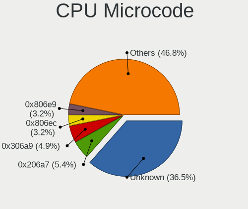

| Number     | Notebooks | Percent |
|------------|-----------|---------|
| Unknown    | 143       | 16.84%  |
| 0x206a7    | 65        | 7.66%   |
| 0x306a9    | 64        | 7.54%   |
| 0x806e9    | 39        | 4.59%   |
| 0x806ec    | 36        | 4.24%   |
| 0x406e3    | 31        | 3.65%   |
| 0x1067a    | 28        | 3.3%    |
| 0x306d4    | 27        | 3.18%   |
| 0x806ea    | 25        | 2.94%   |
| 0x6fd      | 22        | 2.59%   |
| 0x806c1    | 21        | 2.47%   |
| 0x40651    | 21        | 2.47%   |
| 0x406c4    | 20        | 2.36%   |
| 0x20655    | 20        | 2.36%   |
| 0x706e5    | 18        | 2.12%   |
| 0x30678    | 17        | 2%      |
| 0x706a1    | 15        | 1.77%   |
| 0x106ca    | 15        | 1.77%   |
| 0x306c3    | 14        | 1.65%   |
| 0x506c9    | 12        | 1.41%   |
| 0x30661    | 11        | 1.3%    |
| 0x06006705 | 11        | 1.3%    |
| 0x08108109 | 9         | 1.06%   |
| 0x20652    | 8         | 0.94%   |
| 0x906e9    | 7         | 0.82%   |
| 0x08608103 | 7         | 0.82%   |
| 0xa0652    | 6         | 0.71%   |
| 0x906ea    | 6         | 0.71%   |
| 0x6e8      | 6         | 0.71%   |
| 0x10661    | 6         | 0.71%   |
| 0x0a50000c | 6         | 0.71%   |
| 0x08600104 | 6         | 0.71%   |
| 0x08108102 | 6         | 0.71%   |
| 0x0810100b | 6         | 0.71%   |
| 0x06006118 | 6         | 0.71%   |
| 0x06001119 | 6         | 0.71%   |
| 0x706a8    | 5         | 0.59%   |
| 0x406c3    | 5         | 0.59%   |
| 0x806eb    | 4         | 0.47%   |
| 0x506e3    | 4         | 0.47%   |

CPU Microarch
-------------

Microarchitecture

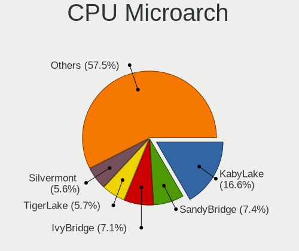

| Name             | Notebooks | Percent |
|------------------|-----------|---------|
| KabyLake         | 142       | 17.19%  |
| SandyBridge      | 76        | 9.2%    |
| IvyBridge        | 72        | 8.72%   |
| Silvermont       | 48        | 5.81%   |
| Skylake          | 47        | 5.69%   |
| Haswell          | 41        | 4.96%   |
| Core             | 37        | 4.48%   |
| Penryn           | 35        | 4.24%   |
| TigerLake        | 30        | 3.63%   |
| Westmere         | 29        | 3.51%   |
| Broadwell        | 29        | 3.51%   |
| Bonnell          | 29        | 3.51%   |
| IceLake          | 25        | 3.03%   |
| Goldmont plus    | 25        | 3.03%   |
| Excavator        | 23        | 2.78%   |
| Zen+             | 16        | 1.94%   |
| Zen 2            | 14        | 1.69%   |
| Goldmont         | 14        | 1.69%   |
| Zen              | 12        | 1.45%   |
| P6               | 11        | 1.33%   |
| Unknown          | 11        | 1.33%   |
| Zen 3            | 7         | 0.85%   |
| Piledriver       | 7         | 0.85%   |
| K10              | 7         | 0.85%   |
| CometLake        | 7         | 0.85%   |
| Bobcat           | 7         | 0.85%   |
| Nehalem          | 5         | 0.61%   |
| K10 Llano        | 5         | 0.61%   |
| Puma             | 4         | 0.48%   |
| Steamroller      | 3         | 0.36%   |
| K8 Hammer        | 3         | 0.36%   |
| K8 & K10 hybrid  | 2         | 0.24%   |
| Jaguar           | 2         | 0.24%   |
| Alderlake Hybrid | 1         | 0.12%   |

Graphics
--------

GPU Vendor
----------

Vendors of graphics cards

| Vendor                           | Notebooks | Percent |
|----------------------------------|-----------|---------|
| Intel                            | 670       | 71.05%  |
| AMD                              | 152       | 16.12%  |
| Nvidia                           | 108       | 11.45%  |
| Silicon Integrated Systems [SiS] | 11        | 1.17%   |
| VIA Technologies                 | 2         | 0.21%   |

GPU Model
---------

Graphics card models

| Model                                                                                    | Notebooks | Percent |
|------------------------------------------------------------------------------------------|-----------|---------|
| Intel 2nd Generation Core Processor Family Integrated Graphics Controller                | 75        | 7.61%   |
| Intel 3rd Gen Core processor Graphics Controller                                         | 69        | 7.01%   |
| Intel HD Graphics 620                                                                    | 48        | 4.87%   |
| Intel Skylake GT2 [HD Graphics 520]                                                      | 40        | 4.06%   |
| Intel Mobile 4 Series Chipset Integrated Graphics Controller                             | 32        | 3.25%   |
| Intel UHD Graphics 620                                                                   | 31        | 3.15%   |
| Intel TigerLake-LP GT2 [Iris Xe Graphics]                                                | 28        | 2.84%   |
| Intel Core Processor Integrated Graphics Controller                                      | 28        | 2.84%   |
| Intel Atom/Celeron/Pentium Processor x5-E8000/J3xxx/N3xxx Integrated Graphics Controller | 28        | 2.84%   |
| Intel HD Graphics 5500                                                                   | 27        | 2.74%   |
| Intel Haswell-ULT Integrated Graphics Controller                                         | 26        | 2.64%   |
| Intel GeminiLake [UHD Graphics 600]                                                      | 25        | 2.54%   |
| Intel WhiskeyLake-U GT2 [UHD Graphics 620]                                               | 24        | 2.44%   |
| Intel CometLake-U GT2 [UHD Graphics]                                                     | 22        | 2.23%   |
| Intel Iris Plus Graphics G1 (Ice Lake)                                                   | 20        | 2.03%   |
| Intel Atom Processor Z36xxx/Z37xxx Series Graphics & Display                             | 20        | 2.03%   |
| Intel Mobile GM965/GL960 Integrated Graphics Controller (secondary)                      | 18        | 1.83%   |
| Intel Mobile GM965/GL960 Integrated Graphics Controller (primary)                        | 18        | 1.83%   |
| Intel Atom Processor D4xx/D5xx/N4xx/N5xx Integrated Graphics Controller                  | 16        | 1.62%   |
| AMD Picasso/Raven 2 [Radeon Vega Series / Radeon Vega Mobile Series]                     | 16        | 1.62%   |
| AMD Stoney [Radeon R2/R3/R4/R5 Graphics]                                                 | 15        | 1.52%   |
| Intel Mobile 945GM/GMS/GME, 943/940GML Express Integrated Graphics Controller            | 14        | 1.42%   |
| Intel HD Graphics 500                                                                    | 14        | 1.42%   |
| AMD Renoir                                                                               | 13        | 1.32%   |
| Intel 4th Gen Core Processor Integrated Graphics Controller                              | 12        | 1.22%   |
| Silicon Integrated Systems [SiS] 771/671 PCIE VGA Display Adapter                        | 11        | 1.12%   |
| Intel Mobile 945GM/GMS, 943/940GML Express Integrated Graphics Controller                | 11        | 1.12%   |
| Intel Atom Processor D2xxx/N2xxx Integrated Graphics Controller                          | 11        | 1.12%   |
| AMD Raven Ridge [Radeon Vega Series / Radeon Vega Mobile Series]                         | 11        | 1.12%   |
| AMD Topaz XT [Radeon R7 M260/M265 / M340/M360 / M440/M445 / 530/535 / 620/625 Mobile]    | 10        | 1.02%   |
| Nvidia GP107M [GeForce GTX 1050 Mobile]                                                  | 9         | 0.91%   |
| Intel HD Graphics 630                                                                    | 9         | 0.91%   |
| AMD Lucienne                                                                             | 9         | 0.91%   |
| AMD Wani [Radeon R5/R6/R7 Graphics]                                                      | 8         | 0.81%   |
| Nvidia GP108M [GeForce MX150]                                                            | 7         | 0.71%   |
| Nvidia GM108M [GeForce 940M]                                                             | 7         | 0.71%   |
| Intel CoffeeLake-H GT2 [UHD Graphics 630]                                                | 7         | 0.71%   |
| AMD Cezanne [Radeon Vega Series / Radeon Vega Mobile Series]                             | 7         | 0.71%   |
| Intel CometLake-H GT2 [UHD Graphics]                                                     | 6         | 0.61%   |
| AMD RS880M [Mobility Radeon HD 4225/4250]                                                | 6         | 0.61%   |

GPU Combo
---------

Combinations of graphics cards

| Name           | Notebooks | Percent |
|----------------|-----------|---------|
| 1 x Intel      | 565       | 68.4%   |
| 1 x AMD        | 104       | 12.59%  |
| Intel + Nvidia | 79        | 9.56%   |
| Intel + AMD    | 26        | 3.15%   |
| 1 x Nvidia     | 17        | 2.06%   |
| AMD + Nvidia   | 12        | 1.45%   |
| 1 x SiS        | 11        | 1.33%   |
| 2 x AMD        | 10        | 1.21%   |
| 1 x VIA        | 2         | 0.24%   |

GPU Driver
----------

Free vs proprietary

| Driver      | Notebooks | Percent |
|-------------|-----------|---------|
| Free        | 750       | 90.47%  |
| Proprietary | 48        | 5.79%   |
| Unknown     | 31        | 3.74%   |

GPU Memory
----------

Total video memory

| Size in GB | Notebooks | Percent |
|------------|-----------|---------|
| Unknown    | 604       | 71.73%  |
| 0.01-0.5   | 85        | 10.1%   |
| 1.01-2.0   | 80        | 9.5%    |
| 0.51-1.0   | 32        | 3.8%    |
| 3.01-4.0   | 31        | 3.68%   |
| 5.01-6.0   | 7         | 0.83%   |
| 2.01-3.0   | 2         | 0.24%   |
| 8.01-16.0  | 1         | 0.12%   |

Monitor
-------

Monitor Vendor
--------------

Monitor vendors

| Vendor                  | Notebooks | Percent |
|-------------------------|-----------|---------|
| AU Optronics            | 165       | 18.15%  |
| Samsung Electronics     | 147       | 16.17%  |
| Chimei Innolux          | 128       | 14.08%  |
| BOE                     | 124       | 13.64%  |
| LG Display              | 111       | 12.21%  |
| Goldstar                | 33        | 3.63%   |
| InfoVision              | 31        | 3.41%   |
| Chi Mei Optoelectronics | 18        | 1.98%   |
| Apple                   | 13        | 1.43%   |
| LG Philips              | 11        | 1.21%   |
| Lenovo                  | 10        | 1.1%    |
| InnoLux Display         | 10        | 1.1%    |
| PANDA                   | 9         | 0.99%   |
| ViewSonic               | 8         | 0.88%   |
| Philips                 | 8         | 0.88%   |
| Dell                    | 8         | 0.88%   |
| HannStar                | 7         | 0.77%   |
| CPT                     | 7         | 0.77%   |
| BenQ                    | 7         | 0.77%   |
| STA                     | 6         | 0.66%   |
| Sharp                   | 6         | 0.66%   |
| SKY                     | 4         | 0.44%   |
| KDC                     | 4         | 0.44%   |
| Hitachi                 | 4         | 0.44%   |
| Hewlett-Packard         | 4         | 0.44%   |
| Unknown                 | 2         | 0.22%   |
| MTD                     | 2         | 0.22%   |
| CSO                     | 2         | 0.22%   |
| ASUSTek Computer        | 2         | 0.22%   |
| AOC                     | 2         | 0.22%   |
| Toshiba                 | 1         | 0.11%   |
| SNT                     | 1         | 0.11%   |
| SLD                     | 1         | 0.11%   |
| Quanta Display          | 1         | 0.11%   |
| Pixio                   | 1         | 0.11%   |
| MStar                   | 1         | 0.11%   |
| LPL                     | 1         | 0.11%   |
| KON                     | 1         | 0.11%   |
| JDI                     | 1         | 0.11%   |
| ITE                     | 1         | 0.11%   |

Monitor Model
-------------

Monitor models

| Model                                                                    | Notebooks | Percent |
|--------------------------------------------------------------------------|-----------|---------|
| Chimei Innolux LCD Monitor CMN15DB 1366x768 344x193mm 15.5-inch          | 20        | 2.16%   |
| InfoVision LCD Monitor IVO03F4 1024x600 223x125mm 10.1-inch              | 17        | 1.83%   |
| Chimei Innolux LCD Monitor CMN15E6 1366x768 344x193mm 15.5-inch          | 15        | 1.62%   |
| Samsung Electronics LCD Monitor SEC5441 1366x768 344x194mm 15.5-inch     | 10        | 1.08%   |
| AU Optronics LCD Monitor AUO71EC 1366x768 344x193mm 15.5-inch            | 10        | 1.08%   |
| LG Display LCD Monitor LGD02E9 1366x768 310x170mm 13.9-inch              | 9         | 0.97%   |
| BOE LCD Monitor BOE06A5 1366x768 344x194mm 15.5-inch                     | 9         | 0.97%   |
| AU Optronics LCD Monitor AUO2E3C 1366x768 309x173mm 13.9-inch            | 9         | 0.97%   |
| Samsung Electronics LCD Monitor SEC4542 1366x768 309x174mm 14.0-inch     | 8         | 0.86%   |
| Samsung Electronics C24F390 SAM0D2C 1920x1080 521x293mm 23.5-inch        | 7         | 0.76%   |
| BOE LCD Monitor BOE06A4 1366x768 344x194mm 15.5-inch                     | 7         | 0.76%   |
| Samsung Electronics LCD Monitor SEC4145 1366x768 310x170mm 13.9-inch     | 6         | 0.65%   |
| Samsung Electronics C27F390 SAM0D32 1920x1080 598x336mm 27.0-inch        | 6         | 0.65%   |
| Chimei Innolux LCD Monitor CMN15F5 1920x1080 344x193mm 15.5-inch         | 6         | 0.65%   |
| Chimei Innolux LCD Monitor CMN14D6 1366x768 309x173mm 13.9-inch          | 6         | 0.65%   |
| Chimei Innolux LCD Monitor CMN14C3 1366x768 309x173mm 13.9-inch          | 6         | 0.65%   |
| BOE LCD Monitor BOE0672 1366x768 344x194mm 15.5-inch                     | 6         | 0.65%   |
| AU Optronics LCD Monitor AUO70EC 1366x768 344x193mm 15.5-inch            | 6         | 0.65%   |
| AU Optronics LCD Monitor AUO183C 1366x768 309x173mm 13.9-inch            | 6         | 0.65%   |
| LG Display LCD Monitor LGD02DC 1366x768 344x194mm 15.5-inch              | 5         | 0.54%   |
| InfoVision M140NWR2 R1 IVO057A 1366x768 309x174mm 14.0-inch              | 5         | 0.54%   |
| Chimei Innolux LCD Monitor CMN15DC 1366x768 344x193mm 15.5-inch          | 5         | 0.54%   |
| AU Optronics LCD Monitor AUO45EC 1366x768 344x193mm 15.5-inch            | 5         | 0.54%   |
| Samsung Electronics LCD Monitor SDC4E51 1366x768 344x194mm 15.5-inch     | 4         | 0.43%   |
| LG Display LCD Monitor LGD070C 1920x1080 309x174mm 14.0-inch             | 4         | 0.43%   |
| LG Display LCD Monitor LGD0456 1366x768 344x194mm 15.5-inch              | 4         | 0.43%   |
| LG Display LCD Monitor LGD0335 1366x768 310x174mm 14.0-inch              | 4         | 0.43%   |
| InnoLux Display LCD Monitor INL000A 1366x768 344x194mm 15.5-inch         | 4         | 0.43%   |
| HannStar HSD101PFW2 HSD03E9 1024x600 222x125mm 10.0-inch                 | 4         | 0.43%   |
| Chi Mei Optoelectronics LCD Monitor CMO15A7 1366x768 344x193mm 15.5-inch | 4         | 0.43%   |
| BOE LCD Monitor BOE0812 1920x1080 344x194mm 15.5-inch                    | 4         | 0.43%   |
| BOE LCD Monitor BOE0696 1366x768 309x173mm 13.9-inch                     | 4         | 0.43%   |
| BOE LCD Monitor BOE0675 1366x768 344x194mm 15.5-inch                     | 4         | 0.43%   |
| AU Optronics LCD Monitor AUOD98A 1366x768 344x194mm 15.5-inch            | 4         | 0.43%   |
| AU Optronics LCD Monitor AUO403D 1920x1080 309x173mm 13.9-inch           | 4         | 0.43%   |
| AU Optronics LCD Monitor AUO38ED 1920x1080 344x193mm 15.5-inch           | 4         | 0.43%   |
| AU Optronics LCD Monitor AUO303E 1600x900 309x174mm 14.0-inch            | 4         | 0.43%   |
| AU Optronics LCD Monitor AUO21ED 1920x1080 344x193mm 15.5-inch           | 4         | 0.43%   |
| AU Optronics LCD Monitor AUO10EC 1366x768 344x193mm 15.5-inch            | 4         | 0.43%   |
| STA XR140EA1T STA0450 1366x768 310x174mm 14.0-inch                       | 3         | 0.32%   |

Monitor Resolution
------------------

Monitor screen resolution

| Resolution         | Notebooks | Percent |
|--------------------|-----------|---------|
| 1366x768 (WXGA)    | 461       | 52.39%  |
| 1920x1080 (FHD)    | 249       | 28.3%   |
| 1280x800 (WXGA)    | 45        | 5.11%   |
| 1920x1200 (WUXGA)  | 19        | 2.16%   |
| 1600x900 (HD+)     | 19        | 2.16%   |
| 3840x2160 (4K)     | 16        | 1.82%   |
| 1440x900 (WXGA+)   | 13        | 1.48%   |
| 1024x600           | 10        | 1.14%   |
| 1280x1024 (SXGA)   | 9         | 1.02%   |
| 1680x1050 (WSXGA+) | 8         | 0.91%   |
| 3200x1800 (QHD+)   | 5         | 0.57%   |
| 2560x1080          | 4         | 0.45%   |
| 1360x768           | 4         | 0.45%   |
| 3840x2400          | 2         | 0.23%   |
| 2560x1600          | 2         | 0.23%   |
| 2560x1440 (QHD)    | 2         | 0.23%   |
| 2288x1287          | 2         | 0.23%   |
| 3840x1100          | 1         | 0.11%   |
| 3840x1080          | 1         | 0.11%   |
| 3456x2160          | 1         | 0.11%   |
| 3000x2000          | 1         | 0.11%   |
| 2880x1800          | 1         | 0.11%   |
| 2160x1440          | 1         | 0.11%   |
| 1920x540           | 1         | 0.11%   |
| 1680x945           | 1         | 0.11%   |
| 1280x768           | 1         | 0.11%   |
| 1024x768 (XGA)     | 1         | 0.11%   |

Monitor Diagonal
----------------

Diagonal size in inches

| Inches  | Notebooks | Percent |
|---------|-----------|---------|
| 15      | 402       | 43.7%   |
| 14      | 161       | 17.5%   |
| 13      | 135       | 14.67%  |
| 23      | 29        | 3.15%   |
| 17      | 26        | 2.83%   |
| 21      | 21        | 2.28%   |
| 27      | 19        | 2.07%   |
| 18      | 16        | 1.74%   |
| 10      | 15        | 1.63%   |
| 11      | 14        | 1.52%   |
| 24      | 13        | 1.41%   |
| 12      | 10        | 1.09%   |
| 40      | 9         | 0.98%   |
| 19      | 9         | 0.98%   |
| 20      | 8         | 0.87%   |
| 46      | 5         | 0.54%   |
| 16      | 5         | 0.54%   |
| 52      | 4         | 0.43%   |
| 34      | 4         | 0.43%   |
| 142     | 2         | 0.22%   |
| 84      | 2         | 0.22%   |
| 48      | 2         | 0.22%   |
| 32      | 2         | 0.22%   |
| 31      | 2         | 0.22%   |
| 22      | 2         | 0.22%   |
| Unknown | 2         | 0.22%   |
| 26      | 1         | 0.11%   |

Monitor Width
-------------

Physical width

| Width in mm    | Notebooks | Percent |
|----------------|-----------|---------|
| 301-350        | 655       | 71.74%  |
| 201-300        | 69        | 7.56%   |
| 501-600        | 59        | 6.46%   |
| 401-500        | 56        | 6.13%   |
| 351-400        | 39        | 4.27%   |
| 1001-1500      | 11        | 1.2%    |
| 801-900        | 9         | 0.99%   |
| 701-800        | 6         | 0.66%   |
| 601-700        | 3         | 0.33%   |
| More than 2000 | 2         | 0.22%   |
| 1501-2000      | 2         | 0.22%   |
| Unknown        | 2         | 0.22%   |

Aspect Ratio
------------

Proportional relationship between the width and the height

| Ratio   | Notebooks | Percent |
|---------|-----------|---------|
| 16/9    | 706       | 86.73%  |
| 16/10   | 83        | 10.2%   |
| 5/4     | 6         | 0.74%   |
| 4/3     | 5         | 0.61%   |
| 3/2     | 4         | 0.49%   |
| 21/9    | 4         | 0.49%   |
| 1.00    | 2         | 0.25%   |
| 32/9    | 1         | 0.12%   |
| 3.40    | 1         | 0.12%   |
| 1.96    | 1         | 0.12%   |
| Unknown | 1         | 0.12%   |

Monitor Area
------------

Area in inch

| Area in inch | Notebooks | Percent |
|----------------|-----------|---------|
| 101-110        | 400       | 43.34%  |
| 81-90          | 273       | 29.58%  |
| 201-250        | 63        | 6.83%   |
| 71-80          | 21        | 2.28%   |
| 301-350        | 20        | 2.17%   |
| 151-200        | 20        | 2.17%   |
| 141-150        | 20        | 2.17%   |
| 121-130        | 20        | 2.17%   |
| 501-1000       | 16        | 1.73%   |
| 51-60          | 15        | 1.63%   |
| 41-50          | 15        | 1.63%   |
| 61-70          | 10        | 1.08%   |
| More than 1000 | 8         | 0.87%   |
| 351-500        | 8         | 0.87%   |
| 111-120        | 8         | 0.87%   |
| 131-140        | 2         | 0.22%   |
| 91-100         | 2         | 0.22%   |
| Unknown        | 2         | 0.22%   |

Pixel Density
-------------

Pixels per inch

| Density       | Notebooks | Percent |
|---------------|-----------|---------|
| 101-120       | 489       | 54.09%  |
| 121-160       | 208       | 23.01%  |
| 51-100        | 158       | 17.48%  |
| 1-50          | 17        | 1.88%   |
| 161-240       | 17        | 1.88%   |
| More than 240 | 13        | 1.44%   |
| Unknown       | 2         | 0.22%   |

Multiple Monitors
-----------------

Total monitors connected

| Total | Notebooks | Percent |
|-------|-----------|---------|
| 1     | 677       | 79.83%  |
| 2     | 137       | 16.16%  |
| 0     | 27        | 3.18%   |
| 3     | 7         | 0.83%   |

Network
-------

Net Controller Vendor
---------------------

Controller vendors

| Vendor                                | Notebooks | Percent |
|---------------------------------------|-----------|---------|
| Realtek Semiconductor                 | 520       | 40.34%  |
| Intel                                 | 324       | 25.14%  |
| Qualcomm Atheros                      | 201       | 15.59%  |
| Broadcom                              | 68        | 5.28%   |
| Broadcom Limited                      | 26        | 2.02%   |
| JMicron Technology                    | 21        | 1.63%   |
| Marvell Technology Group              | 20        | 1.55%   |
| TP-Link                               | 18        | 1.4%    |
| Ralink Technology                     | 14        | 1.09%   |
| Ralink                                | 12        | 0.93%   |
| Silicon Integrated Systems [SiS]      | 11        | 0.85%   |
| Samsung Electronics                   | 8         | 0.62%   |
| Motorola PCS                          | 6         | 0.47%   |
| MediaTek                              | 6         | 0.47%   |
| Qualcomm Atheros Communications       | 5         | 0.39%   |
| ASIX Electronics                      | 5         | 0.39%   |
| Ericsson Business Mobile Networks     | 3         | 0.23%   |
| DisplayLink                           | 3         | 0.23%   |
| VIA Technologies                      | 2         | 0.16%   |
| Nvidia                                | 2         | 0.16%   |
| Encore Electronics                    | 2         | 0.16%   |
| ZTE WCDMA Technologies MSM            | 1         | 0.08%   |
| Xiaomi                                | 1         | 0.08%   |
| T & A Mobile Phones                   | 1         | 0.08%   |
| Sierra Wireless                       | 1         | 0.08%   |
| Ovislink                              | 1         | 0.08%   |
| Lenovo                                | 1         | 0.08%   |
| ICS Advent                            | 1         | 0.08%   |
| Digitech Systems                      | 1         | 0.08%   |
| Dell                                  | 1         | 0.08%   |
| Cisco Aironet Wireless Communications | 1         | 0.08%   |
| Arduino SA                            | 1         | 0.08%   |
| 802.11g Adapter [Linksys WUSB54GC v3] | 1         | 0.08%   |

Net Controller Model
--------------------

Controller models

| Model                                                                   | Notebooks | Percent |
|-------------------------------------------------------------------------|-----------|---------|
| Realtek RTL8111/8168/8411 PCI Express Gigabit Ethernet Controller       | 280       | 17.78%  |
| Realtek RTL810xE PCI Express Fast Ethernet controller                   | 124       | 7.87%   |
| Realtek RTL8188CE 802.11b/g/n WiFi Adapter                              | 37        | 2.35%   |
| Qualcomm Atheros QCA9377 802.11ac Wireless Network Adapter              | 37        | 2.35%   |
| Qualcomm Atheros AR9485 Wireless Network Adapter                        | 37        | 2.35%   |
| Qualcomm Atheros AR9285 Wireless Network Adapter (PCI-Express)          | 34        | 2.16%   |
| Realtek RTL8821CE 802.11ac PCIe Wireless Network Adapter                | 32        | 2.03%   |
| Realtek RTL8723BE PCIe Wireless Network Adapter                         | 30        | 1.9%    |
| Qualcomm Atheros QCA9565 / AR9565 Wireless Network Adapter              | 27        | 1.71%   |
| Intel Wireless 3160                                                     | 27        | 1.71%   |
| Realtek RTL8822CE 802.11ac PCIe Wireless Network Adapter                | 23        | 1.46%   |
| Realtek RTL8723DE Wireless Network Adapter                              | 21        | 1.33%   |
| Intel Wireless 3165                                                     | 20        | 1.27%   |
| JMicron JMC250 PCI Express Gigabit Ethernet Controller                  | 19        | 1.21%   |
| Intel Wireless 8265 / 8275                                              | 19        | 1.21%   |
| Intel Wi-Fi 6 AX201                                                     | 19        | 1.21%   |
| Intel Comet Lake PCH-LP CNVi WiFi                                       | 19        | 1.21%   |
| Qualcomm Atheros AR8152 v2.0 Fast Ethernet                              | 18        | 1.14%   |
| Intel Dual Band Wireless-AC 3165 Plus Bluetooth                         | 18        | 1.14%   |
| Realtek 802.11n WLAN Adapter                                            | 17        | 1.08%   |
| Broadcom BCM4313 802.11bgn Wireless Network Adapter                     | 17        | 1.08%   |
| Qualcomm Atheros AR8151 v2.0 Gigabit Ethernet                           | 16        | 1.02%   |
| Intel Wireless 7260                                                     | 16        | 1.02%   |
| Intel Wi-Fi 6 AX200                                                     | 16        | 1.02%   |
| Intel PRO/Wireless 3945ABG [Golan] Network Connection                   | 15        | 0.95%   |
| Intel Cannon Point-LP CNVi [Wireless-AC]                                | 15        | 0.95%   |
| Realtek RTL8188EE Wireless Network Adapter                              | 14        | 0.89%   |
| Intel 82579LM Gigabit Network Connection (Lewisville)                   | 14        | 0.89%   |
| Realtek RTL8191SEvB Wireless LAN Controller                             | 13        | 0.83%   |
| Marvell Group 88E8040 PCI-E Fast Ethernet Controller                    | 13        | 0.83%   |
| Intel Wireless 7265                                                     | 12        | 0.76%   |
| Intel Dual Band Wireless-AC 3168NGW [Stone Peak]                        | 12        | 0.76%   |
| Intel Centrino Advanced-N 6205 [Taylor Peak]                            | 12        | 0.76%   |
| Broadcom BCM43142 802.11b/g/n                                           | 12        | 0.76%   |
| Silicon Integrated Systems [SiS] 191 Gigabit Ethernet Adapter           | 11        | 0.7%    |
| Realtek RTL8152 Fast Ethernet Adapter                                   | 11        | 0.7%    |
| Qualcomm Atheros AR8162 Fast Ethernet                                   | 11        | 0.7%    |
| Qualcomm Atheros AR242x / AR542x Wireless Network Adapter (PCI-Express) | 11        | 0.7%    |
| Intel Ice Lake-LP PCH CNVi WiFi                                         | 11        | 0.7%    |
| Realtek RTL8187B Wireless 802.11g 54Mbps Network Adapter                | 10        | 0.63%   |

Wireless Vendor
---------------

Wireless vendors

| Vendor                                | Notebooks | Percent |
|---------------------------------------|-----------|---------|
| Intel                                 | 307       | 36.33%  |
| Realtek Semiconductor                 | 233       | 27.57%  |
| Qualcomm Atheros                      | 173       | 20.47%  |
| Broadcom                              | 59        | 6.98%   |
| Broadcom Limited                      | 17        | 2.01%   |
| Ralink Technology                     | 14        | 1.66%   |
| TP-Link                               | 12        | 1.42%   |
| Ralink                                | 12        | 1.42%   |
| MediaTek                              | 6         | 0.71%   |
| Qualcomm Atheros Communications       | 5         | 0.59%   |
| Encore Electronics                    | 2         | 0.24%   |
| Sierra Wireless                       | 1         | 0.12%   |
| Ovislink                              | 1         | 0.12%   |
| Dell                                  | 1         | 0.12%   |
| Cisco Aironet Wireless Communications | 1         | 0.12%   |
| 802.11g Adapter [Linksys WUSB54GC v3] | 1         | 0.12%   |

Wireless Model
--------------

Wireless models

| Model                                                                   | Notebooks | Percent |
|-------------------------------------------------------------------------|-----------|---------|
| Realtek RTL8188CE 802.11b/g/n WiFi Adapter                              | 37        | 4.34%   |
| Qualcomm Atheros QCA9377 802.11ac Wireless Network Adapter              | 37        | 4.34%   |
| Qualcomm Atheros AR9485 Wireless Network Adapter                        | 37        | 4.34%   |
| Qualcomm Atheros AR9285 Wireless Network Adapter (PCI-Express)          | 34        | 3.99%   |
| Realtek RTL8821CE 802.11ac PCIe Wireless Network Adapter                | 32        | 3.76%   |
| Realtek RTL8723BE PCIe Wireless Network Adapter                         | 30        | 3.52%   |
| Qualcomm Atheros QCA9565 / AR9565 Wireless Network Adapter              | 27        | 3.17%   |
| Intel Wireless 3160                                                     | 27        | 3.17%   |
| Realtek RTL8822CE 802.11ac PCIe Wireless Network Adapter                | 23        | 2.7%    |
| Realtek RTL8723DE Wireless Network Adapter                              | 21        | 2.46%   |
| Intel Wireless 3165                                                     | 20        | 2.35%   |
| Intel Wireless 8265 / 8275                                              | 19        | 2.23%   |
| Intel Wi-Fi 6 AX201                                                     | 19        | 2.23%   |
| Intel Comet Lake PCH-LP CNVi WiFi                                       | 19        | 2.23%   |
| Intel Dual Band Wireless-AC 3165 Plus Bluetooth                         | 18        | 2.11%   |
| Realtek 802.11n WLAN Adapter                                            | 17        | 2%      |
| Broadcom BCM4313 802.11bgn Wireless Network Adapter                     | 17        | 2%      |
| Intel Wireless 7260                                                     | 16        | 1.88%   |
| Intel Wi-Fi 6 AX200                                                     | 16        | 1.88%   |
| Intel PRO/Wireless 3945ABG [Golan] Network Connection                   | 15        | 1.76%   |
| Intel Cannon Point-LP CNVi [Wireless-AC]                                | 15        | 1.76%   |
| Realtek RTL8188EE Wireless Network Adapter                              | 14        | 1.64%   |
| Realtek RTL8191SEvB Wireless LAN Controller                             | 13        | 1.53%   |
| Intel Wireless 7265                                                     | 12        | 1.41%   |
| Intel Dual Band Wireless-AC 3168NGW [Stone Peak]                        | 12        | 1.41%   |
| Intel Centrino Advanced-N 6205 [Taylor Peak]                            | 12        | 1.41%   |
| Broadcom BCM43142 802.11b/g/n                                           | 12        | 1.41%   |
| Qualcomm Atheros AR242x / AR542x Wireless Network Adapter (PCI-Express) | 11        | 1.29%   |
| Intel Ice Lake-LP PCH CNVi WiFi                                         | 11        | 1.29%   |
| Realtek RTL8187B Wireless 802.11g 54Mbps Network Adapter                | 10        | 1.17%   |
| Qualcomm Atheros QCA6174 802.11ac Wireless Network Adapter              | 10        | 1.17%   |
| Intel Wireless 8260                                                     | 10        | 1.17%   |
| Broadcom BCM4312 802.11b/g LP-PHY                                       | 10        | 1.17%   |
| Ralink MT7601U Wireless Adapter                                         | 9         | 1.06%   |
| Realtek RTL8852AE 802.11ax PCIe Wireless Network Adapter                | 8         | 0.94%   |
| Intel Centrino Wireless-N 1000 [Condor Peak]                            | 7         | 0.82%   |
| Realtek RTL8188EUS 802.11n Wireless Network Adapter                     | 6         | 0.7%    |
| Ralink RT3290 Wireless 802.11n 1T/1R PCIe                               | 6         | 0.7%    |
| Qualcomm Atheros AR9287 Wireless Network Adapter (PCI-Express)          | 6         | 0.7%    |
| Intel Centrino Wireless-N 130                                           | 6         | 0.7%    |

Ethernet Vendor
---------------

Ethernet vendors

| Vendor                           | Notebooks | Percent |
|----------------------------------|-----------|---------|
| Realtek Semiconductor            | 432       | 60.5%   |
| Intel                            | 94        | 13.17%  |
| Qualcomm Atheros                 | 74        | 10.36%  |
| JMicron Technology               | 21        | 2.94%   |
| Marvell Technology Group         | 20        | 2.8%    |
| Broadcom                         | 17        | 2.38%   |
| Silicon Integrated Systems [SiS] | 11        | 1.54%   |
| Broadcom Limited                 | 9         | 1.26%   |
| Samsung Electronics              | 8         | 1.12%   |
| TP-Link                          | 6         | 0.84%   |
| Motorola PCS                     | 5         | 0.7%    |
| ASIX Electronics                 | 5         | 0.7%    |
| DisplayLink                      | 3         | 0.42%   |
| VIA Technologies                 | 2         | 0.28%   |
| Nvidia                           | 2         | 0.28%   |
| Xiaomi                           | 1         | 0.14%   |
| T & A Mobile Phones              | 1         | 0.14%   |
| Lenovo                           | 1         | 0.14%   |
| ICS Advent                       | 1         | 0.14%   |
| Digitech Systems                 | 1         | 0.14%   |

Ethernet Model
--------------

Ethernet models

| Model                                                             | Notebooks | Percent |
|-------------------------------------------------------------------|-----------|---------|
| Realtek RTL8111/8168/8411 PCI Express Gigabit Ethernet Controller | 280       | 39.16%  |
| Realtek RTL810xE PCI Express Fast Ethernet controller             | 124       | 17.34%  |
| JMicron JMC250 PCI Express Gigabit Ethernet Controller            | 19        | 2.66%   |
| Qualcomm Atheros AR8152 v2.0 Fast Ethernet                        | 18        | 2.52%   |
| Qualcomm Atheros AR8151 v2.0 Gigabit Ethernet                     | 16        | 2.24%   |
| Intel 82579LM Gigabit Network Connection (Lewisville)             | 14        | 1.96%   |
| Marvell Group 88E8040 PCI-E Fast Ethernet Controller              | 13        | 1.82%   |
| Silicon Integrated Systems [SiS] 191 Gigabit Ethernet Adapter     | 11        | 1.54%   |
| Realtek RTL8152 Fast Ethernet Adapter                             | 11        | 1.54%   |
| Qualcomm Atheros AR8162 Fast Ethernet                             | 11        | 1.54%   |
| Realtek RTL-8100/8101L/8139 PCI Fast Ethernet Adapter             | 9         | 1.26%   |
| Samsung Galaxy series, misc. (tethering mode)                     | 8         | 1.12%   |
| Realtek RTL8153 Gigabit Ethernet Adapter                          | 8         | 1.12%   |
| Intel Ethernet Connection (13) I219-V                             | 8         | 1.12%   |
| Intel Ethernet Connection (4) I219-LM                             | 7         | 0.98%   |
| Intel 82577LM Gigabit Network Connection                          | 7         | 0.98%   |
| Qualcomm Atheros AR8161 Gigabit Ethernet                          | 6         | 0.84%   |
| Intel Ethernet Connection I219-LM                                 | 6         | 0.84%   |
| Intel Ethernet Connection I218-LM                                 | 6         | 0.84%   |
| Qualcomm Atheros AR8152 v1.1 Fast Ethernet                        | 5         | 0.7%    |
| Qualcomm Atheros AR8131 Gigabit Ethernet                          | 5         | 0.7%    |
| Motorola PCS moto g(9) play                                       | 5         | 0.7%    |
| Broadcom NetXtreme BCM57765 Gigabit Ethernet PCIe                 | 5         | 0.7%    |
| TP-Link USB 10/100 LAN                                            | 4         | 0.56%   |
| Qualcomm Atheros AR8132 Fast Ethernet                             | 4         | 0.56%   |
| Intel PRO/100 VE Network Connection                               | 4         | 0.56%   |
| Intel Ethernet Connection (3) I218-LM                             | 4         | 0.56%   |
| Intel Ethernet Connection (10) I219-V                             | 4         | 0.56%   |
| Broadcom NetLink BCM57780 Gigabit Ethernet PCIe                   | 4         | 0.56%   |
| Qualcomm Atheros Killer E2400 Gigabit Ethernet Controller         | 3         | 0.42%   |
| Marvell Group 88E8058 PCI-E Gigabit Ethernet Controller           | 3         | 0.42%   |
| Marvell Group 88E8039 PCI-E Fast Ethernet Controller              | 3         | 0.42%   |
| Intel WiMAX Connection 2400m                                      | 3         | 0.42%   |
| Intel Ethernet Connection (6) I219-LM                             | 3         | 0.42%   |
| Intel Ethernet Connection (10) I219-LM                            | 3         | 0.42%   |
| Intel 82579V Gigabit Network Connection                           | 3         | 0.42%   |
| Intel 82567LM Gigabit Network Connection                          | 3         | 0.42%   |
| ASIX AX88772B Fast Ethernet Controller                            | 3         | 0.42%   |
| VIA VT6102/VT6103 [Rhine-II]                                      | 2         | 0.28%   |
| TP-Link UE300 10/100/1000 LAN (ethernet mode) [Realtek RTL8153]   | 2         | 0.28%   |

Net Controller Kind
-------------------

Ethernet, WiFi or modem

| Kind     | Notebooks | Percent |
|----------|-----------|---------|
| WiFi     | 809       | 53.65%  |
| Ethernet | 691       | 45.82%  |
| Modem    | 8         | 0.53%   |

Used Controller
---------------

Currently used network controller

| Kind     | Notebooks | Percent |
|----------|-----------|---------|
| WiFi     | 687       | 81.11%  |
| Ethernet | 160       | 18.89%  |

NICs
----

Total network controllers on board

| Total | Notebooks | Percent |
|-------|-----------|---------|
| 2     | 632       | 76.42%  |
| 1     | 157       | 18.98%  |
| 0     | 34        | 4.11%   |
| 3     | 3         | 0.36%   |
| 4     | 1         | 0.12%   |

IPv6
----

IPv6 vs IPv4

| Used | Notebooks | Percent |
|------|-----------|---------|
| No   | 739       | 88.29%  |
| Yes  | 98        | 11.71%  |

Bluetooth
---------

Bluetooth Vendor
----------------

Controller vendors

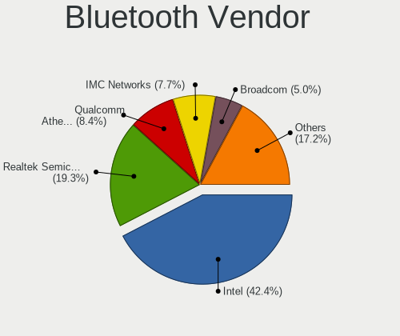

| Vendor                          | Notebooks | Percent |
|---------------------------------|-----------|---------|
| Intel                           | 232       | 41.06%  |
| Realtek Semiconductor           | 109       | 19.29%  |
| Qualcomm Atheros Communications | 53        | 9.38%   |
| IMC Networks                    | 33        | 5.84%   |
| Broadcom                        | 33        | 5.84%   |
| Lite-On Technology              | 30        | 5.31%   |
| Foxconn / Hon Hai               | 16        | 2.83%   |
| Dell                            | 13        | 2.3%    |
| Apple                           | 11        | 1.95%   |
| Toshiba                         | 9         | 1.59%   |
| Cambridge Silicon Radio         | 8         | 1.42%   |
| Ralink                          | 6         | 1.06%   |
| USI                             | 2         | 0.35%   |
| Qcom                            | 2         | 0.35%   |
| ASUSTek Computer                | 2         | 0.35%   |
| Syntek                          | 1         | 0.18%   |
| Realtek                         | 1         | 0.18%   |
| Integrated System Solution      | 1         | 0.18%   |
| Hewlett-Packard                 | 1         | 0.18%   |
| Foxconn International           | 1         | 0.18%   |
| Alps Electric                   | 1         | 0.18%   |

Bluetooth Model
---------------

Controller models

| Model                                               | Notebooks | Percent |
|-----------------------------------------------------|-----------|---------|
| Intel Bluetooth wireless interface                  | 109       | 19.29%  |
| Realtek Bluetooth Radio                             | 62        | 10.97%  |
| Intel Bluetooth 9460/9560 Jefferson Peak (JfP)      | 42        | 7.43%   |
| Realtek  Bluetooth 4.2 Adapter                      | 35        | 6.19%   |
| Intel AX201 Bluetooth                               | 32        | 5.66%   |
| Qualcomm Atheros  Bluetooth Device                  | 27        | 4.78%   |
| Intel AX200 Bluetooth                               | 16        | 2.83%   |
| Qualcomm Atheros AR3012 Bluetooth 4.0               | 13        | 2.3%    |
| Intel Wireless-AC 3168 Bluetooth                    | 12        | 2.12%   |
| Intel Centrino Bluetooth Wireless Transceiver       | 11        | 1.95%   |
| IMC Networks Bluetooth Radio                        | 11        | 1.95%   |
| Lite-On Qualcomm Atheros QCA9377 Bluetooth          | 10        | 1.77%   |
| Lite-On Bluetooth Device                            | 10        | 1.77%   |
| IMC Networks Bluetooth Device                       | 9         | 1.59%   |
| Cambridge Silicon Radio Bluetooth Dongle (HCI mode) | 8         | 1.42%   |
| Realtek RTL8723B Bluetooth                          | 7         | 1.24%   |
| Intel Centrino Advanced-N 6230 Bluetooth adapter    | 7         | 1.24%   |
| Broadcom BCM43142 Bluetooth 4.0                     | 7         | 1.24%   |
| Broadcom BCM20702 Bluetooth 4.0 [ThinkPad]          | 7         | 1.24%   |
| Toshiba Bluetooth USB Host Controller               | 6         | 1.06%   |
| Ralink RT3290 Bluetooth                             | 6         | 1.06%   |
| IMC Networks Atheros AR3012 Bluetooth 4.0 Adapter   | 6         | 1.06%   |
| Foxconn / Hon Hai Bluetooth Device                  | 6         | 1.06%   |
| Broadcom BCM2070 Bluetooth 2.1 + EDR                | 6         | 1.06%   |
| Apple Bluetooth USB Host Controller                 | 6         | 1.06%   |
| Qualcomm Atheros QCA61x4 Bluetooth 4.0              | 5         | 0.88%   |
| Qualcomm Atheros AR3011 Bluetooth                   | 5         | 0.88%   |
| Lite-On Broadcom BCM43142A0 Bluetooth Device        | 5         | 0.88%   |
| Dell Wireless 365 Bluetooth                         | 5         | 0.88%   |
| Realtek RTL8821A Bluetooth                          | 4         | 0.71%   |
| IMC Networks Wireless_Device                        | 4         | 0.71%   |
| Dell DW375 Bluetooth Module                         | 4         | 0.71%   |
| Lite-On Atheros AR3012 Bluetooth                    | 3         | 0.53%   |
| Broadcom Bluetooth 2.1 Device                       | 3         | 0.53%   |
| Apple Bluetooth HCI                                 | 3         | 0.53%   |
| USI Bluetooth Module BCM92070                       | 2         | 0.35%   |
| Toshiba Bluetooth Device                            | 2         | 0.35%   |
| Qualcomm Atheros AR9462 Bluetooth                   | 2         | 0.35%   |
| Qcom Broadcom Bluetooth USB                         | 2         | 0.35%   |
| Lite-On Bluetooth Radio                             | 2         | 0.35%   |

Sound
-----

Sound Vendor
------------

Sound card vendors

| Vendor                           | Notebooks | Percent |
|----------------------------------|-----------|---------|
| Intel                            | 674       | 74.48%  |
| AMD                              | 127       | 14.03%  |
| Nvidia                           | 51        | 5.64%   |
| Silicon Integrated Systems [SiS] | 11        | 1.22%   |
| Logitech                         | 10        | 1.1%    |
| C-Media Electronics              | 7         | 0.77%   |
| GN Netcom                        | 4         | 0.44%   |
| Plantronics                      | 3         | 0.33%   |
| Kingston Technology              | 3         | 0.33%   |
| VIA Technologies                 | 2         | 0.22%   |
| Focusrite-Novation               | 2         | 0.22%   |
| Texas Instruments                | 1         | 0.11%   |
| Samson Technologies              | 1         | 0.11%   |
| Realtek Semiconductor            | 1         | 0.11%   |
| Microsoft                        | 1         | 0.11%   |
| Lenovo                           | 1         | 0.11%   |
| Generalplus Technology           | 1         | 0.11%   |
| ESI Audiotechnik                 | 1         | 0.11%   |
| Creative Technology              | 1         | 0.11%   |
| BEHRINGER International          | 1         | 0.11%   |
| ASUSTek Computer                 | 1         | 0.11%   |
| Astro Gaming                     | 1         | 0.11%   |

Sound Model
-----------

Sound card models

| Model                                                                                             | Notebooks | Percent |
|---------------------------------------------------------------------------------------------------|-----------|---------|
| Intel Sunrise Point-LP HD Audio                                                                   | 120       | 11.1%   |
| Intel 7 Series/C216 Chipset Family High Definition Audio Controller                               | 95        | 8.79%   |
| AMD Family 17h/19h HD Audio Controller                                                            | 57        | 5.27%   |
| Intel 6 Series/C200 Series Chipset Family High Definition Audio Controller                        | 53        | 4.9%    |
| Intel NM10/ICH7 Family High Definition Audio Controller                                           | 43        | 3.98%   |
| Intel 82801I (ICH9 Family) HD Audio Controller                                                    | 35        | 3.24%   |
| Intel 5 Series/3400 Series Chipset High Definition Audio                                          | 34        | 3.15%   |
| Intel Tiger Lake-LP Smart Sound Technology Audio Controller                                       | 30        | 2.78%   |
| Intel Broadwell-U Audio Controller                                                                | 29        | 2.68%   |
| Intel Wildcat Point-LP High Definition Audio Controller                                           | 28        | 2.59%   |
| AMD Raven/Raven2/Fenghuang HDMI/DP Audio Controller                                               | 27        | 2.5%    |
| Intel Haswell-ULT HD Audio Controller                                                             | 26        | 2.41%   |
| Intel 8 Series HD Audio Controller                                                                | 26        | 2.41%   |
| Intel Celeron/Pentium Silver Processor High Definition Audio                                      | 25        | 2.31%   |
| Intel Cannon Point-LP High Definition Audio Controller                                            | 24        | 2.22%   |
| Intel Ice Lake-LP Smart Sound Technology Audio Controller                                         | 23        | 2.13%   |
| Intel Comet Lake PCH-LP cAVS                                                                      | 23        | 2.13%   |
| AMD Renoir Radeon High Definition Audio Controller                                                | 23        | 2.13%   |
| AMD FCH Azalia Controller                                                                         | 23        | 2.13%   |
| AMD Family 15h (Models 60h-6fh) Audio Controller                                                  | 23        | 2.13%   |
| Intel 82801H (ICH8 Family) HD Audio Controller                                                    | 19        | 1.76%   |
| Intel Atom Processor Z36xxx/Z37xxx Series High Definition Audio Controller                        | 18        | 1.67%   |
| Intel 8 Series/C220 Series Chipset High Definition Audio Controller                               | 15        | 1.39%   |
| AMD High Definition Audio Controller                                                              | 15        | 1.39%   |
| Intel Xeon E3-1200 v3/4th Gen Core Processor HD Audio Controller                                  | 14        | 1.3%    |
| Intel Celeron N3350/Pentium N4200/Atom E3900 Series Audio Cluster                                 | 14        | 1.3%    |
| AMD SBx00 Azalia (Intel HDA)                                                                      | 14        | 1.3%    |
| AMD Kabini HDMI/DP Audio                                                                          | 14        | 1.3%    |
| Intel Atom/Celeron/Pentium Processor x5-E8000/J3xxx/N3xxx Series High Definition Audio Controller | 12        | 1.11%   |
| Silicon Integrated Systems [SiS] Azalia Audio Controller                                          | 11        | 1.02%   |
| Intel CM238 HD Audio Controller                                                                   | 10        | 0.93%   |
| Nvidia GP107GL High Definition Audio Controller                                                   | 8         | 0.74%   |
| Nvidia TU107 GeForce GTX 1650 High Definition Audio Controller                                    | 7         | 0.65%   |
| Intel Cannon Lake PCH cAVS                                                                        | 7         | 0.65%   |
| AMD Trinity HDMI Audio Controller                                                                 | 7         | 0.65%   |
| Intel Comet Lake PCH cAVS                                                                         | 6         | 0.56%   |
| Intel 100 Series/C230 Series Chipset Family HD Audio Controller                                   | 6         | 0.56%   |
| AMD Wrestler HDMI Audio                                                                           | 6         | 0.56%   |
| Nvidia TU116 High Definition Audio Controller                                                     | 5         | 0.46%   |
| Nvidia GA106 High Definition Audio Controller                                                     | 5         | 0.46%   |

Memory
------

Memory Vendor
-------------

Memory module vendors

| Vendor                                           | Notebooks | Percent |
|--------------------------------------------------|-----------|---------|
| Samsung Electronics                              | 137       | 25.61%  |
| SK hynix                                         | 107       | 20%     |
| Kingston                                         | 76        | 14.21%  |
| Micron Technology                                | 41        | 7.66%   |
| Unknown                                          | 32        | 5.98%   |
| A-DATA Technology                                | 22        | 4.11%   |
| Crucial                                          | 17        | 3.18%   |
| Nanya Technology                                 | 11        | 2.06%   |
| Magnum Tech                                      | 11        | 2.06%   |
| Unknown (ABCD)                                   | 9         | 1.68%   |
| Elpida                                           | 7         | 1.31%   |
| Novatech                                         | 6         | 1.12%   |
| Corsair                                          | 6         | 1.12%   |
| Ramaxel Technology                               | 5         | 0.93%   |
| Memox                                            | 5         | 0.93%   |
| Goldkey                                          | 5         | 0.93%   |
| Saikano                                          | 4         | 0.75%   |
| Super Talent                                     | 3         | 0.56%   |
| Neo Forza                                        | 3         | 0.56%   |
| Avant                                            | 3         | 0.56%   |
| 48spaces                                         | 3         | 0.56%   |
| Transcend                                        | 2         | 0.37%   |
| Teikon                                           | 2         | 0.37%   |
| G.Skill                                          | 2         | 0.37%   |
| CSX                                              | 2         | 0.37%   |
| Apacer                                           | 2         | 0.37%   |
| Unknown                                          | 2         | 0.37%   |
| Unknown (0x4E41324D3030314733374455202020202020) | 1         | 0.19%   |
| Unknown (0x4D342037305432393533455A332D43453620) | 1         | 0.19%   |
| Unknown (07D5)                                   | 1         | 0.19%   |
| Team                                             | 1         | 0.19%   |
| Qimonda                                          | 1         | 0.19%   |
| Patriot                                          | 1         | 0.19%   |
| Innodisk                                         | 1         | 0.19%   |
| High Bridge                                      | 1         | 0.19%   |
| Hewlett-Packard                                  | 1         | 0.19%   |
| Cors                                             | 1         | 0.19%   |

Memory Model
------------

Memory module models

| Model                                                                        | Notebooks | Percent |
|------------------------------------------------------------------------------|-----------|---------|
| Samsung RAM M471A5244CB0-CRC 4GB SODIMM DDR4 2667MT/s                        | 15        | 2.62%   |
| SK hynix RAM HMA81GS6AFR8N-UH 8GB SODIMM DDR4 2667MT/s                       | 12        | 2.1%    |
| Samsung RAM M471A5244CB0-CTD 4GB SODIMM DDR4 3266MT/s                        | 12        | 2.1%    |
| SK hynix RAM HMT451S6BFR8A-PB 4GB SODIMM DDR3 1600MT/s                       | 11        | 1.92%   |
| Magnum Tech RAM MAGNUMTECH 4GB SODIMM DDR3 1600MT/s                          | 11        | 1.92%   |
| SK hynix RAM HMAA1GS6CJR6N-XN 8GB SODIMM DDR4 3200MT/s                       | 10        | 1.75%   |
| Unknown (ABCD) RAM 123456789012345678 2GB SODIMM LPDDR4 2400MT/s             | 9         | 1.57%   |
| Samsung RAM M471A1K43CB1-CRC 8GB SODIMM DDR4 2667MT/s                        | 7         | 1.22%   |
| Samsung RAM M471A1G44AB0-CWE 8GB SODIMM DDR4 3200MT/s                        | 7         | 1.22%   |
| Samsung RAM M471B5173EB0-YK0 4GB SODIMM DDR3 1600MT/s                        | 6         | 1.05%   |
| Samsung RAM M471B1G73QH0-YK0 8192MB SODIMM DDR3 1600MT/s                     | 6         | 1.05%   |
| Samsung RAM M471A1K43DB1-CWE 8GB SODIMM DDR4 3200MT/s                        | 6         | 1.05%   |
| SK hynix RAM HMT351S6CFR8C-PB 4GB SODIMM DDR3 1600MT/s                       | 5         | 0.87%   |
| Samsung RAM M471B5173DB0-YK0 4GB SODIMM DDR3 1600MT/s                        | 5         | 0.87%   |
| Samsung RAM M471B1G73EB0-YK0 8GB SODIMM DDR3 1600MT/s                        | 5         | 0.87%   |
| Nanya RAM NT2GC64B88B0NS-CG 2GB SODIMM DDR3 1334MT/s                         | 5         | 0.87%   |
| Samsung RAM M471B5273DH0-CH9 4096MB SODIMM DDR3 1334MT/s                     | 4         | 0.7%    |
| Samsung RAM M471B1G73DB0-YK0 8GB SODIMM DDR3 1600MT/s                        | 4         | 0.7%    |
| Samsung RAM M471A5244CB0-CWE 4GB SODIMM DDR4 3200MT/s                        | 4         | 0.7%    |
| Samsung RAM M471A1K43BB1-CRC 8192MB SODIMM DDR4 2667MT/s                     | 4         | 0.7%    |
| Saikano RAM Memory 4GB SODIMM DDR3 1333MT/s                                  | 4         | 0.7%    |
| Micron RAM 4ATF51264HZ-2G6E! 4GB SODIMM DDR4 2400MT/s                        | 4         | 0.7%    |
| Unknown RAM Module 2GB SODIMM DDR3 1333MT/s                                  | 3         | 0.52%   |
| Super Talent RAM SUPERTALENT02 2GB SODIMM DDR 1600MT/s                       | 3         | 0.52%   |
| SK hynix RAM HMT451S6AFR8A-PB 4GB SODIMM DDR3 1600MT/s                       | 3         | 0.52%   |
| SK hynix RAM HMT41GS6BFR8A-PB 8GB SODIMM DDR3 1600MT/s                       | 3         | 0.52%   |
| SK hynix RAM HMT351S6EFR8C-PB 4GB SODIMM DDR3 1600MT/s                       | 3         | 0.52%   |
| SK hynix RAM HMA851S6AFR6N-UH 2GB SODIMM LPDDR4 2667MT/s                     | 3         | 0.52%   |
| SK hynix RAM HMA82GS6DJR8N-XN 16GB SODIMM DDR4 3200MT/s                      | 3         | 0.52%   |
| SK hynix RAM 212121212121212121212121212121212121 2048MB SODIMM DDR2 667MT/s | 3         | 0.52%   |
| SK hynix RAM 202020202020202020202020202020202020 2048MB SODIMM DDR2 667MT/s | 3         | 0.52%   |
| Samsung RAM M471B5273CH0-CH9 4GB SODIMM DDR3 1334MT/s                        | 3         | 0.52%   |
| Samsung RAM M471B5173QH0-YK0 4GB SODIMM DDR3 1600MT/s                        | 3         | 0.52%   |
| Samsung RAM M471B2873FHS-CF8 1GB SODIMM DDR3 1067MT/s                        | 3         | 0.52%   |
| Samsung RAM M471A1K43EB1-CWE 8GB SODIMM DDR4 3200MT/s                        | 3         | 0.52%   |
| Samsung RAM M471A1K43CB1-CTD 8GB SODIMM DDR4 2667MT/s                        | 3         | 0.52%   |
| Micron RAM 4ATF51264HZ-2G6E1 4GB SODIMM DDR4 2667MT/s                        | 3         | 0.52%   |
| Kingston RAM 99U5700-027.A00G 8GB SODIMM DDR4 2667MT/s                       | 3         | 0.52%   |
| Kingston RAM 99U5469-045.A00LF 4GB SODIMM DDR3 1600MT/s                      | 3         | 0.52%   |
| Kingston RAM 99U5428-040.A01LF 4GB SODIMM DDR3 1334MT/s                      | 3         | 0.52%   |

Memory Kind
-----------

Memory module kinds

| Kind    | Notebooks | Percent |
|---------|-----------|---------|
| DDR3    | 180       | 42.76%  |
| DDR4    | 179       | 42.52%  |
| DDR2    | 20        | 4.75%   |
| LPDDR4  | 18        | 4.28%   |
| SDRAM   | 7         | 1.66%   |
| LPDDR3  | 7         | 1.66%   |
| DRAM    | 4         | 0.95%   |
| DDR     | 4         | 0.95%   |
| DDR5    | 1         | 0.24%   |
| Unknown | 1         | 0.24%   |

Memory Form Factor
------------------

Physical design of the memory module

| Name         | Notebooks | Percent |
|--------------|-----------|---------|
| SODIMM       | 398       | 93.43%  |
| Row Of Chips | 23        | 5.4%    |
| DIMM         | 2         | 0.47%   |
| Chip         | 2         | 0.47%   |
| Unknown      | 1         | 0.23%   |

Memory Size
-----------

Memory module size

| Size  | Notebooks | Percent |
|-------|-----------|---------|
| 4096  | 173       | 35.23%  |
| 8192  | 171       | 34.83%  |
| 2048  | 73        | 14.87%  |
| 16384 | 52        | 10.59%  |
| 1024  | 15        | 3.05%   |
| 32768 | 5         | 1.02%   |
| 6144  | 1         | 0.2%    |
| 512   | 1         | 0.2%    |

Memory Speed
------------

Memory module speed

| Speed   | Notebooks | Percent |
|---------|-----------|---------|
| 1600    | 112       | 22.95%  |
| 2667    | 109       | 22.34%  |
| 3200    | 64        | 13.11%  |
| 1333    | 40        | 8.2%    |
| 2400    | 36        | 7.38%   |
| 1334    | 28        | 5.74%   |
| 2133    | 24        | 4.92%   |
| 667     | 13        | 2.66%   |
| Unknown | 13        | 2.66%   |
| 3266    | 12        | 2.46%   |
| 1067    | 7         | 1.43%   |
| 4199    | 4         | 0.82%   |
| 1066    | 4         | 0.82%   |
| 975     | 4         | 0.82%   |
| 4267    | 3         | 0.61%   |
| 2048    | 3         | 0.61%   |
| 800     | 3         | 0.61%   |
| 533     | 3         | 0.61%   |
| 8400    | 1         | 0.2%    |
| 4800    | 1         | 0.2%    |
| 4266    | 1         | 0.2%    |
| 2933    | 1         | 0.2%    |
| 1867    | 1         | 0.2%    |
| 400     | 1         | 0.2%    |

Printers & scanners
-------------------

Printer Vendor
--------------

Printer device vendors

| Vendor              | Notebooks | Percent |
|---------------------|-----------|---------|
| Brother Industries  | 3         | 50%     |
| Hewlett-Packard     | 2         | 33.33%  |
| QinHeng Electronics | 1         | 16.67%  |

Printer Model
-------------

Printer device models

| Model                  | Notebooks | Percent |
|------------------------|-----------|---------|
| QinHeng CH340S         | 1         | 16.67%  |
| HP LaserJet 1020       | 1         | 16.67%  |
| HP DeskJet F300 series | 1         | 16.67%  |
| Brother HL-1200 series | 1         | 16.67%  |
| Brother HL-1110 series | 1         | 16.67%  |
| Brother DCP-1600       | 1         | 16.67%  |

Scanner Vendor
--------------

Scanner device vendors

Zero info for selected period =(

Scanner Model
-------------

Scanner device models

Zero info for selected period =(

Camera
------

Camera Vendor
-------------

Camera device vendors

| Vendor                                 | Notebooks | Percent |
|----------------------------------------|-----------|---------|
| Chicony Electronics                    | 174       | 23.55%  |
| Acer                                   | 83        | 11.23%  |
| IMC Networks                           | 76        | 10.28%  |
| Realtek Semiconductor                  | 66        | 8.93%   |
| Microdia                               | 54        | 7.31%   |
| Sunplus Innovation Technology          | 35        | 4.74%   |
| Syntek                                 | 28        | 3.79%   |
| Suyin                                  | 27        | 3.65%   |
| Cheng Uei Precision Industry (Foxlink) | 26        | 3.52%   |
| Alcor Micro                            | 25        | 3.38%   |
| Quanta                                 | 24        | 3.25%   |
| Silicon Motion                         | 21        | 2.84%   |
| Apple                                  | 12        | 1.62%   |
| Luxvisions Innotech Limited            | 11        | 1.49%   |
| Lite-On Technology                     | 11        | 1.49%   |
| Ricoh                                  | 10        | 1.35%   |
| Logitech                               | 9         | 1.22%   |
| Z-Star Microelectronics                | 6         | 0.81%   |
| Samsung Electronics                    | 5         | 0.68%   |
| OmniVision Technologies                | 5         | 0.68%   |
| USB Camera                             | 4         | 0.54%   |
| GEMBIRD                                | 4         | 0.54%   |
| ALi                                    | 4         | 0.54%   |
| SunplusIT                              | 3         | 0.41%   |
| Sonix Technology                       | 2         | 0.27%   |
| Lenovo                                 | 2         | 0.27%   |
| Intel                                  | 2         | 0.27%   |
| Y Media                                | 1         | 0.14%   |
| Sunplus Technology                     | 1         | 0.14%   |
| Microsoft                              | 1         | 0.14%   |
| KYE Systems (Mouse Systems)            | 1         | 0.14%   |
| Importek                               | 1         | 0.14%   |
| HRY                                    | 1         | 0.14%   |
| Google                                 | 1         | 0.14%   |
| Genesys Logic                          | 1         | 0.14%   |
| Cubeternet                             | 1         | 0.14%   |
| Allwinner Technology                   | 1         | 0.14%   |

Camera Model
------------

Camera device models

| Model                                                          | Notebooks | Percent |
|----------------------------------------------------------------|-----------|---------|
| Acer Integrated Camera                                         | 29        | 3.91%   |
| IMC Networks USB2.0 VGA UVC WebCam                             | 28        | 3.78%   |
| Chicony USB 2.0 Camera                                         | 25        | 3.37%   |
| Microdia Integrated_Webcam_HD                                  | 21        | 2.83%   |
| Alcor Micro USB 2.0 Camera                                     | 21        | 2.83%   |
| Realtek Integrated_Webcam_HD                                   | 19        | 2.56%   |
| IMC Networks Integrated Camera                                 | 16        | 2.16%   |
| Chicony Integrated Camera                                      | 16        | 2.16%   |
| Chicony USB2.0 Camera                                          | 13        | 1.75%   |
| Chicony Lenovo EasyCamera                                      | 13        | 1.75%   |
| Sunplus Integrated_Webcam_HD                                   | 11        | 1.48%   |
| Chicony HD Webcam                                              | 11        | 1.48%   |
| Realtek USB Camera                                             | 10        | 1.35%   |
| Chicony TOSHIBA Web Camera - HD                                | 10        | 1.35%   |
| Luxvisions Innotech Limited Integrated Camera                  | 9         | 1.21%   |
| IMC Networks USB2.0 HD UVC WebCam                              | 9         | 1.21%   |
| Acer USB Camera                                                | 9         | 1.21%   |
| Acer Lenovo EasyCamera                                         | 9         | 1.21%   |
| Chicony USB2.0 VGA UVC WebCam                                  | 8         | 1.08%   |
| Cheng Uei Precision Industry (Foxlink) HP TrueVision HD Camera | 8         | 1.08%   |
| Acer SunplusIT Integrated Camera                               | 8         | 1.08%   |
| Syntek Integrated Camera                                       | 7         | 0.94%   |
| Chicony Integrated Camera (1280x720@30)                        | 7         | 0.94%   |
| Acer BisonCam, NB Pro                                          | 7         | 0.94%   |
| Z-Star Webcam                                                  | 6         | 0.81%   |
| Sunplus Asus Webcam                                            | 6         | 0.81%   |
| Silicon Motion WebCam SC-0311139N                              | 6         | 0.81%   |
| Chicony HP Wide Vision HD Camera                               | 6         | 0.81%   |
| Chicony HP TrueVision HD Camera                                | 6         | 0.81%   |
| Syntek Lenovo EasyCamera                                       | 5         | 0.67%   |
| Syntek EasyCamera                                              | 5         | 0.67%   |
| Samsung Galaxy A5 (MTP)                                        | 5         | 0.67%   |
| OmniVision OV2640 Webcam                                       | 5         | 0.67%   |
| Microdia USB 2.0 Camera                                        | 5         | 0.67%   |
| Lite-On Integrated Camera                                      | 5         | 0.67%   |
| IMC Networks UVC VGA Webcam                                    | 5         | 0.67%   |
| Chicony HP Webcam                                              | 5         | 0.67%   |
| Cheng Uei Precision Industry (Foxlink) HP Webcam               | 5         | 0.67%   |
| Apple iPhone5/5C/5S/6                                          | 5         | 0.67%   |
| Apple FaceTime HD Camera                                       | 5         | 0.67%   |

Security
--------

Fingerprint Vendor
------------------

Fingerprint sensor vendors

| Vendor                     | Notebooks | Percent |
|----------------------------|-----------|---------|
| Synaptics                  | 33        | 34.74%  |
| Validity Sensors           | 27        | 28.42%  |
| Shenzhen Goodix Technology | 17        | 17.89%  |
| AuthenTec                  | 6         | 6.32%   |
| Upek                       | 4         | 4.21%   |
| Elan Microelectronics      | 4         | 4.21%   |
| LighTuning Technology      | 2         | 2.11%   |
| STMicroelectronics         | 1         | 1.05%   |
| Focal-systems.Corp         | 1         | 1.05%   |

Fingerprint Model
-----------------

Fingerprint sensor models

| Model                                                                      | Notebooks | Percent |
|----------------------------------------------------------------------------|-----------|---------|
| Synaptics Prometheus MIS Touch Fingerprint Reader                          | 14        | 14.74%  |
| Synaptics  WBDI                                                            | 12        | 12.63%  |
| Shenzhen Goodix  FingerPrint Device                                        | 12        | 12.63%  |
| Validity Sensors VFS5011 Fingerprint Reader                                | 7         | 7.37%   |
| Validity Sensors VFS495 Fingerprint Reader                                 | 4         | 4.21%   |
| Validity Sensors VFS 5011 fingerprint sensor                               | 4         | 4.21%   |
| Upek Biometric Touchchip/Touchstrip Fingerprint Sensor                     | 4         | 4.21%   |
| Shenzhen Goodix Fingerprint Reader                                         | 4         | 4.21%   |
| Validity Sensors Fingerprint scanner                                       | 3         | 3.16%   |
| Elan ELAN:Fingerprint                                                      | 3         | 3.16%   |
| Unknown                                                                    | 3         | 3.16%   |
| Validity Sensors VFS301 Fingerprint Reader                                 | 2         | 2.11%   |
| Validity Sensors VFS101 Fingerprint Reader                                 | 2         | 2.11%   |
| Validity Sensors Swipe Fingerprint Sensor                                  | 2         | 2.11%   |
| Synaptics Metallica MIS Touch Fingerprint Reader                           | 2         | 2.11%   |
| AuthenTec Fingerprint Sensor                                               | 2         | 2.11%   |
| AuthenTec AES2501 Fingerprint Sensor                                       | 2         | 2.11%   |
| Validity Sensors VFS7552 Touch Fingerprint Sensor                          | 1         | 1.05%   |
| Validity Sensors Synaptics WBDI                                            | 1         | 1.05%   |
| Validity Sensors Synaptics VFS7552 Touch Fingerprint Sensor with PurePrint | 1         | 1.05%   |
| Synaptics  VFS7552 Touch Fingerprint Sensor with PurePrint                 | 1         | 1.05%   |
| Synaptics  FS7604 Touch Fingerprint Sensor with PurePrint                  | 1         | 1.05%   |
| STMicroelectronics Fingerprint Reader                                      | 1         | 1.05%   |
| Shenzhen Goodix FingerPrint                                                | 1         | 1.05%   |
| LighTuning ES603 Swipe Fingerprint Sensor                                  | 1         | 1.05%   |
| LighTuning EgisTec Touch Fingerprint Sensor                                | 1         | 1.05%   |
| Focal-systems.Corp FT9201Fingerprint.                                      | 1         | 1.05%   |
| Elan ELAN:ARM-M4                                                           | 1         | 1.05%   |
| AuthenTec AES2810                                                          | 1         | 1.05%   |
| AuthenTec AES1660 Fingerprint Sensor                                       | 1         | 1.05%   |

Chipcard Vendor
---------------

Chipcard module vendors

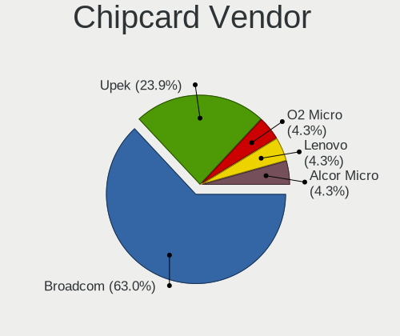

| Vendor      | Notebooks | Percent |
|-------------|-----------|---------|
| Broadcom    | 19        | 59.38%  |
| Upek        | 9         | 28.13%  |
| Lenovo      | 2         | 6.25%   |
| O2 Micro    | 1         | 3.13%   |
| Alcor Micro | 1         | 3.13%   |

Chipcard Model
--------------

Chipcard module models

| Model                                                                        | Notebooks | Percent |
|------------------------------------------------------------------------------|-----------|---------|
| Upek TouchChip Fingerprint Coprocessor (WBF advanced mode)                   | 9         | 28.13%  |
| Broadcom BCM5880 Secure Applications Processor                               | 6         | 18.75%  |
| Broadcom 58200                                                               | 6         | 18.75%  |
| Broadcom BCM5880 Secure Applications Processor with fingerprint swipe sensor | 4         | 12.5%   |
| Broadcom 5880                                                                | 3         | 9.38%   |
| Lenovo Integrated Smart Card Reader                                          | 2         | 6.25%   |
| O2 Micro OZ776 CCID Smartcard Reader                                         | 1         | 3.13%   |
| Alcor Micro AU9540 Smartcard Reader                                          | 1         | 3.13%   |

Unsupported
-----------

Unsupported Devices
-------------------

Total unsupported devices on board

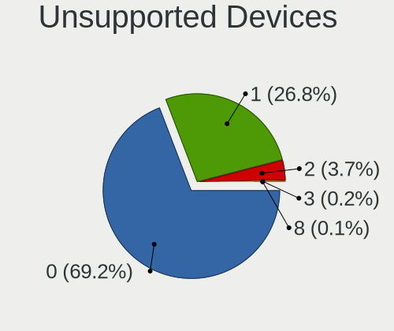

| Total | Notebooks | Percent |
|-------|-----------|---------|
| 0     | 599       | 71.14%  |
| 1     | 217       | 25.77%  |
| 2     | 22        | 2.61%   |
| 3     | 3         | 0.36%   |
| 8     | 1         | 0.12%   |

Unsupported Device Types
------------------------

Types of unsupported devices

| Type                     | Notebooks | Percent |
|--------------------------|-----------|---------|
| Fingerprint reader       | 94        | 34.31%  |
| Graphics card            | 59        | 21.53%  |
| Net/wireless             | 40        | 14.6%   |
| Chipcard                 | 30        | 10.95%  |
| Camera                   | 11        | 4.01%   |
| Bluetooth                | 11        | 4.01%   |
| Multimedia controller    | 9         | 3.28%   |
| Communication controller | 5         | 1.82%   |
| Net/ethernet             | 4         | 1.46%   |
| Sound                    | 3         | 1.09%   |
| Network                  | 2         | 0.73%   |
| Modem                    | 2         | 0.73%   |
| Flash memory             | 2         | 0.73%   |
| Card reader              | 2         | 0.73%   |

