Linux in Argentina - Tested Hardware & Statistics (Notebooks)
-------------------------------------------------------------

A project to collect tested hardware configurations for Linux in Argentina.

Anyone can contribute to this report by the [hw-probe](https://github.com/linuxhw/hw-probe) tool:

    sudo -E hw-probe -all -upload

Please contribute! Especially if your hardware is rare.

Contents
--------

* [ Test Cases ](#test-cases)

* [ System ](#system)
  - [ OS                       ](#os)
  - [ OS Family                ](#os-family)
  - [ Kernel                   ](#kernel)
  - [ Kernel Family            ](#kernel-family)
  - [ Kernel Major Ver.        ](#kernel-major-ver)
  - [ Arch                     ](#arch)
  - [ DE                       ](#de)
  - [ Display Server           ](#display-server)
  - [ Display Manager          ](#display-manager)
  - [ OS Lang                  ](#os-lang)
  - [ Boot Mode                ](#boot-mode)
  - [ Filesystem               ](#filesystem)
  - [ Part. scheme             ](#part-scheme)
  - [ Dual Boot with Linux/BSD ](#dual-boot-with-linuxbsd)
  - [ Dual Boot (Win)          ](#dual-boot-win)

* [ Board ](#board)
  - [ Vendor                   ](#vendor)
  - [ Model                    ](#model)
  - [ Model Family             ](#model-family)
  - [ MFG Year                 ](#mfg-year)
  - [ Form Factor              ](#form-factor)
  - [ Secure Boot              ](#secure-boot)
  - [ Coreboot                 ](#coreboot)
  - [ RAM Size                 ](#ram-size)
  - [ RAM Used                 ](#ram-used)
  - [ Total Drives             ](#total-drives)
  - [ Has CD-ROM               ](#has-cd-rom)
  - [ Has Ethernet             ](#has-ethernet)
  - [ Has WiFi                 ](#has-wifi)
  - [ Has Bluetooth            ](#has-bluetooth)

* [ Location ](#location)
  - [ Country                  ](#country)
  - [ City                     ](#city)

* [ Drives ](#drives)
  - [ Drive Vendor             ](#drive-vendor)
  - [ Drive Model              ](#drive-model)
  - [ HDD Vendor               ](#hdd-vendor)
  - [ SSD Vendor               ](#ssd-vendor)
  - [ Drive Kind               ](#drive-kind)
  - [ Drive Connector          ](#drive-connector)
  - [ Drive Size               ](#drive-size)
  - [ Space Total              ](#space-total)
  - [ Space Used               ](#space-used)
  - [ Malfunc. Drives          ](#malfunc-drives)
  - [ Malfunc. Drive Vendor    ](#malfunc-drive-vendor)
  - [ Malfunc. HDD Vendor      ](#malfunc-hdd-vendor)
  - [ Malfunc. Drive Kind      ](#malfunc-drive-kind)
  - [ Failed Drives            ](#failed-drives)
  - [ Failed Drive Vendor      ](#failed-drive-vendor)
  - [ Drive Status             ](#drive-status)

* [ Storage controller ](#storage-controller)
  - [ Storage Vendor           ](#storage-vendor)
  - [ Storage Model            ](#storage-model)
  - [ Storage Kind             ](#storage-kind)

* [ Processor ](#processor)
  - [ CPU Vendor               ](#cpu-vendor)
  - [ CPU Model                ](#cpu-model)
  - [ CPU Model Family         ](#cpu-model-family)
  - [ CPU Cores                ](#cpu-cores)
  - [ CPU Sockets              ](#cpu-sockets)
  - [ CPU Threads              ](#cpu-threads)
  - [ CPU Op-Modes             ](#cpu-op-modes)
  - [ CPU Microcode            ](#cpu-microcode)
  - [ CPU Microarch            ](#cpu-microarch)

* [ Graphics ](#graphics)
  - [ GPU Vendor               ](#gpu-vendor)
  - [ GPU Model                ](#gpu-model)
  - [ GPU Combo                ](#gpu-combo)
  - [ GPU Driver               ](#gpu-driver)
  - [ GPU Memory               ](#gpu-memory)

* [ Monitor ](#monitor)
  - [ Monitor Vendor           ](#monitor-vendor)
  - [ Monitor Model            ](#monitor-model)
  - [ Monitor Resolution       ](#monitor-resolution)
  - [ Monitor Diagonal         ](#monitor-diagonal)
  - [ Monitor Width            ](#monitor-width)
  - [ Aspect Ratio             ](#aspect-ratio)
  - [ Monitor Area             ](#monitor-area)
  - [ Pixel Density            ](#pixel-density)
  - [ Multiple Monitors        ](#multiple-monitors)

* [ Network ](#network)
  - [ Net Controller Vendor    ](#net-controller-vendor)
  - [ Net Controller Model     ](#net-controller-model)
  - [ Wireless Vendor          ](#wireless-vendor)
  - [ Wireless Model           ](#wireless-model)
  - [ Ethernet Vendor          ](#ethernet-vendor)
  - [ Ethernet Model           ](#ethernet-model)
  - [ Net Controller Kind      ](#net-controller-kind)
  - [ Used Controller          ](#used-controller)
  - [ NICs                     ](#nics)
  - [ IPv6                     ](#ipv6)

* [ Bluetooth ](#bluetooth)
  - [ Bluetooth Vendor         ](#bluetooth-vendor)
  - [ Bluetooth Model          ](#bluetooth-model)

* [ Sound ](#sound)
  - [ Sound Vendor             ](#sound-vendor)
  - [ Sound Model              ](#sound-model)

* [ Memory ](#memory)
  - [ Memory Vendor            ](#memory-vendor)
  - [ Memory Model             ](#memory-model)
  - [ Memory Kind              ](#memory-kind)
  - [ Memory Form Factor       ](#memory-form-factor)
  - [ Memory Size              ](#memory-size)
  - [ Memory Speed             ](#memory-speed)

* [ Printers & scanners ](#printers--scanners)
  - [ Printer Vendor           ](#printer-vendor)
  - [ Printer Model            ](#printer-model)
  - [ Scanner Vendor           ](#scanner-vendor)
  - [ Scanner Model            ](#scanner-model)

* [ Camera ](#camera)
  - [ Camera Vendor            ](#camera-vendor)
  - [ Camera Model             ](#camera-model)

* [ Security ](#security)
  - [ Fingerprint Vendor       ](#fingerprint-vendor)
  - [ Fingerprint Model        ](#fingerprint-model)
  - [ Chipcard Vendor          ](#chipcard-vendor)
  - [ Chipcard Model           ](#chipcard-model)

* [ Unsupported ](#unsupported)
  - [ Unsupported Devices      ](#unsupported-devices)
  - [ Unsupported Device Types ](#unsupported-device-types)

Test Cases
----------

Total: 1997

| Vendor        | Model                       | Probe                                                      | Date         |
|---------------|-----------------------------|------------------------------------------------------------|--------------|
| Lenovo        | Yoga Slim 7 14IMH9 83CV     | [efa06f4775](https://linux-hardware.org/?probe=efa06f4775) | Jan 03, 2025 |
| HP            | EliteBook x360 1040 G5      | [997d557b49](https://linux-hardware.org/?probe=997d557b49) | Jan 02, 2025 |
| HP            | ENVY Laptop 13-ah0xxx       | [2bf35e6afa](https://linux-hardware.org/?probe=2bf35e6afa) | Jan 02, 2025 |
| Lenovo        | G470 20078                  | [9d15c84512](https://linux-hardware.org/?probe=9d15c84512) | Dec 31, 2024 |
| Packard Be... | EasyNote_MX45               | [e696c77b8f](https://linux-hardware.org/?probe=e696c77b8f) | Dec 30, 2024 |
| Toshiba       | Satellite C55-C             | [709c9b508d](https://linux-hardware.org/?probe=709c9b508d) | Dec 30, 2024 |
| Toshiba       | Satellite C55-C             | [dc3315e8ad](https://linux-hardware.org/?probe=dc3315e8ad) | Dec 29, 2024 |
| Packard Be... | EasyNote_MX45               | [8ef7bf6e6d](https://linux-hardware.org/?probe=8ef7bf6e6d) | Dec 29, 2024 |
| Acer          | Aspire A515-57              | [1e6b1c0777](https://linux-hardware.org/?probe=1e6b1c0777) | Dec 23, 2024 |
| HP            | Pavilion dv5                | [b5631c4228](https://linux-hardware.org/?probe=b5631c4228) | Dec 21, 2024 |
| Lenovo        | ThinkPad T430 23499C5       | [04426df402](https://linux-hardware.org/?probe=04426df402) | Dec 20, 2024 |
| Acer          | Aspire A515-51              | [7784c8e1a1](https://linux-hardware.org/?probe=7784c8e1a1) | Dec 20, 2024 |
| Lenovo        | Legion 5 Pro 16ACH6H 82J... | [1db1f1c585](https://linux-hardware.org/?probe=1db1f1c585) | Dec 17, 2024 |
| ASUSTek       | VivoBook_ASUSLaptop X140... | [50315f1b60](https://linux-hardware.org/?probe=50315f1b60) | Dec 17, 2024 |
| Lenovo        | IdeaPad 320-15ABR 80XS      | [2c9b4ffff9](https://linux-hardware.org/?probe=2c9b4ffff9) | Dec 16, 2024 |
| Toshiba       | Satellite P55-A             | [d54a3b360d](https://linux-hardware.org/?probe=d54a3b360d) | Dec 15, 2024 |
| Exo           | Smart E18                   | [5b02114290](https://linux-hardware.org/?probe=5b02114290) | Dec 14, 2024 |
| Kelyx Arge... | Kelyx KL3450                | [b6f256e9a7](https://linux-hardware.org/?probe=b6f256e9a7) | Dec 14, 2024 |
| Dell          | Inspiron 15 3515            | [a073fbc9bc](https://linux-hardware.org/?probe=a073fbc9bc) | Dec 10, 2024 |
| Compal        | PBL2021                     | [666f4c8979](https://linux-hardware.org/?probe=666f4c8979) | Dec 07, 2024 |
| Lenovo        | IdeaPad Gaming 3 15ARH05... | [9d798bd59a](https://linux-hardware.org/?probe=9d798bd59a) | Dec 07, 2024 |
| Dell          | Inspiron 15-3567            | [cbf6bf1b48](https://linux-hardware.org/?probe=cbf6bf1b48) | Dec 06, 2024 |
| ASUSTek       | VivoBook_ASUSLaptop X140... | [bdb95c5d82](https://linux-hardware.org/?probe=bdb95c5d82) | Dec 02, 2024 |
| Dell          | Latitude E6410              | [9e58a81f87](https://linux-hardware.org/?probe=9e58a81f87) | Dec 02, 2024 |
| ASUSTek       | VivoBook_ASUSLaptop X140... | [dce5b2ffb8](https://linux-hardware.org/?probe=dce5b2ffb8) | Dec 01, 2024 |
| Dell          | Latitude E7470              | [ac991cd0b2](https://linux-hardware.org/?probe=ac991cd0b2) | Nov 30, 2024 |
| Acer          | Swift SF315-41G             | [4ceee24a7a](https://linux-hardware.org/?probe=4ceee24a7a) | Nov 29, 2024 |
| Samsung       | 100NZA                      | [6a49e4caae](https://linux-hardware.org/?probe=6a49e4caae) | Nov 28, 2024 |
| Acer          | Swift SF315-41G             | [40cb81624b](https://linux-hardware.org/?probe=40cb81624b) | Nov 27, 2024 |
| Acer          | Nitro AN515-58              | [6220b5b948](https://linux-hardware.org/?probe=6220b5b948) | Nov 26, 2024 |
| Exo           | Smart XL4                   | [b9367af1bd](https://linux-hardware.org/?probe=b9367af1bd) | Nov 23, 2024 |
| Exo           | Smart XL4                   | [264ffc04ec](https://linux-hardware.org/?probe=264ffc04ec) | Nov 23, 2024 |
| Unknown       | Unknown                     | [f3f336f89e](https://linux-hardware.org/?probe=f3f336f89e) | Nov 23, 2024 |
| Sony          | M730                        | [55d7e62f9d](https://linux-hardware.org/?probe=55d7e62f9d) | Nov 23, 2024 |
| Lenovo        | IdeaPad L340-15IRH Gamin... | [e3df5957f6](https://linux-hardware.org/?probe=e3df5957f6) | Nov 21, 2024 |
| Lenovo        | IdeaPad L340-15IRH Gamin... | [9f5168096d](https://linux-hardware.org/?probe=9f5168096d) | Nov 21, 2024 |
| Juana Mans... | SF20GM7                     | [3a223bc471](https://linux-hardware.org/?probe=3a223bc471) | Nov 21, 2024 |
| ASUSTek       | VivoBook_ASUSLaptop M650... | [a0c89e3089](https://linux-hardware.org/?probe=a0c89e3089) | Nov 20, 2024 |
| HP            | 240 G8                      | [ac602e0e2e](https://linux-hardware.org/?probe=ac602e0e2e) | Nov 19, 2024 |
| Samsung       | 750XFG                      | [91b2c85a75](https://linux-hardware.org/?probe=91b2c85a75) | Nov 19, 2024 |
| Conectar I... | SF20GM7                     | [f5669a6587](https://linux-hardware.org/?probe=f5669a6587) | Nov 18, 2024 |
| Dell          | Inspiron 15-3567            | [815225e627](https://linux-hardware.org/?probe=815225e627) | Nov 18, 2024 |
| Acer          | Aspire A315-59              | [47c865efcb](https://linux-hardware.org/?probe=47c865efcb) | Nov 16, 2024 |
| Juana Mans... | SF20GM7                     | [64e6606763](https://linux-hardware.org/?probe=64e6606763) | Nov 16, 2024 |
| HP            | 1000                        | [f3966ff7e5](https://linux-hardware.org/?probe=f3966ff7e5) | Nov 15, 2024 |
| Lenovo        | Legion 5 Pro 16ACH6H 82J... | [b4ec08b540](https://linux-hardware.org/?probe=b4ec08b540) | Nov 15, 2024 |
| Apple         | MacBook5,1                  | [53e7f70e1d](https://linux-hardware.org/?probe=53e7f70e1d) | Nov 14, 2024 |
| Unknown       | Unknown                     | [36f5fbf726](https://linux-hardware.org/?probe=36f5fbf726) | Nov 14, 2024 |
| Coradir       | Coradir/ES10IS5             | [80b81229af](https://linux-hardware.org/?probe=80b81229af) | Nov 09, 2024 |
| Conectar I... | SF20GM7                     | [1c43877e91](https://linux-hardware.org/?probe=1c43877e91) | Nov 06, 2024 |
| Lenovo        | ThinkPad T480 20L6S5VP3F    | [07edecf7e4](https://linux-hardware.org/?probe=07edecf7e4) | Nov 06, 2024 |
| Unknown       | Unknown                     | [f875fcd592](https://linux-hardware.org/?probe=f875fcd592) | Nov 06, 2024 |
| Conectar I... | SF20GM7                     | [95da818f37](https://linux-hardware.org/?probe=95da818f37) | Nov 02, 2024 |
| Intel         | powered classmate PC        | [f3e434817c](https://linux-hardware.org/?probe=f3e434817c) | Nov 01, 2024 |
| Lenovo        | IdeaPad S145-15IWL 81MV     | [f0c16f5194](https://linux-hardware.org/?probe=f0c16f5194) | Nov 01, 2024 |
| Dell          | Vostro 3405                 | [a5283e32a0](https://linux-hardware.org/?probe=a5283e32a0) | Nov 01, 2024 |
| Dell          | Latitude 6430U              | [2fa070b0bb](https://linux-hardware.org/?probe=2fa070b0bb) | Oct 30, 2024 |
| Dell          | Latitude 6430U              | [4abfaa378f](https://linux-hardware.org/?probe=4abfaa378f) | Oct 30, 2024 |
| Samsung       | N150P                       | [ee76fc27fa](https://linux-hardware.org/?probe=ee76fc27fa) | Oct 28, 2024 |
| Sony          | VPCEE43EL                   | [f3fa378514](https://linux-hardware.org/?probe=f3fa378514) | Oct 28, 2024 |
| ASUSTek       | VivoBook_ASUSLaptop X515... | [73518c75af](https://linux-hardware.org/?probe=73518c75af) | Oct 27, 2024 |
| Juana Mans... | SF20GM7                     | [0b2f896cf6](https://linux-hardware.org/?probe=0b2f896cf6) | Oct 27, 2024 |
| ASUSTek       | VivoBook_ASUSLaptop X512... | [a7d6a4d4d0](https://linux-hardware.org/?probe=a7d6a4d4d0) | Oct 23, 2024 |
| Positivo      | Schoolmate SF20GM7          | [4b0b1bae90](https://linux-hardware.org/?probe=4b0b1bae90) | Oct 21, 2024 |
| HP            | 255 15.6 inch G9 Noteboo... | [d2070e6e2d](https://linux-hardware.org/?probe=d2070e6e2d) | Oct 20, 2024 |
| Toshiba       | Satellite E55-A             | [3477416c16](https://linux-hardware.org/?probe=3477416c16) | Oct 20, 2024 |
| HP            | Pavilion Laptop 15-eh0xx... | [a3a538d592](https://linux-hardware.org/?probe=a3a538d592) | Oct 19, 2024 |
| Exo           | Smart Serie L               | [0ca04a37d8](https://linux-hardware.org/?probe=0ca04a37d8) | Oct 19, 2024 |
| Exo           | Smart Serie L               | [c2c7184260](https://linux-hardware.org/?probe=c2c7184260) | Oct 19, 2024 |
| Dell          | Latitude E5530 non-vPro     | [15d2f1b66d](https://linux-hardware.org/?probe=15d2f1b66d) | Oct 18, 2024 |
| Lenovo        | IdeaPad Slim 5 16AHP9 83... | [46abca1cb7](https://linux-hardware.org/?probe=46abca1cb7) | Oct 16, 2024 |
| ASUSTek       | T100TAM                     | [29be05b6a3](https://linux-hardware.org/?probe=29be05b6a3) | Oct 15, 2024 |
| Dell          | Inspiron 15 3520            | [3731e9c89a](https://linux-hardware.org/?probe=3731e9c89a) | Oct 15, 2024 |
| HP            | Pavilion Laptop 14-dv2xx... | [57f14e0b78](https://linux-hardware.org/?probe=57f14e0b78) | Oct 13, 2024 |
| Lenovo        | ThinkPad E15 Gen 2 20T9S... | [c4604e2890](https://linux-hardware.org/?probe=c4604e2890) | Oct 12, 2024 |
| Compaq        | Presario 21                 | [2f4ec418a1](https://linux-hardware.org/?probe=2f4ec418a1) | Oct 12, 2024 |
| Intel         | powered classmate PC        | [43678477ca](https://linux-hardware.org/?probe=43678477ca) | Oct 12, 2024 |
| Juana Mans... | SF20GM7                     | [8038ce30cd](https://linux-hardware.org/?probe=8038ce30cd) | Oct 11, 2024 |
| HP            | Pavilion Laptop 14-dv2xx... | [2a034b4114](https://linux-hardware.org/?probe=2a034b4114) | Oct 11, 2024 |
| HP            | Pavilion Laptop 14-dv2xx... | [b7355dce23](https://linux-hardware.org/?probe=b7355dce23) | Oct 11, 2024 |
| Acer          | Aspire A515-51G             | [020774040e](https://linux-hardware.org/?probe=020774040e) | Oct 10, 2024 |
| HP            | Notebook                    | [727a707ca9](https://linux-hardware.org/?probe=727a707ca9) | Oct 09, 2024 |
| HP            | Notebook                    | [a05da06d5d](https://linux-hardware.org/?probe=a05da06d5d) | Oct 08, 2024 |
| Exo           | EXOMATE X5                  | [0db79727e7](https://linux-hardware.org/?probe=0db79727e7) | Oct 08, 2024 |
| Lenovo        | IdeaPad 320-15IAP 80XR      | [045cd6bfce](https://linux-hardware.org/?probe=045cd6bfce) | Oct 03, 2024 |
| Juana Mans... | SF20GM7                     | [ea96e0cd0f](https://linux-hardware.org/?probe=ea96e0cd0f) | Oct 01, 2024 |
| Lenovo        | ThinkBook 15 G2 ITL 20VE    | [86a9c5b481](https://linux-hardware.org/?probe=86a9c5b481) | Sep 30, 2024 |
| Unknown       | Unknown                     | [b2ac2537df](https://linux-hardware.org/?probe=b2ac2537df) | Sep 29, 2024 |
| ASUSTek       | X751SA                      | [e9d162de21](https://linux-hardware.org/?probe=e9d162de21) | Sep 29, 2024 |
| ASUSTek       | VivoBook_ASUSLaptop X140... | [767a70e7fe](https://linux-hardware.org/?probe=767a70e7fe) | Sep 29, 2024 |
| Dell          | Latitude 5310               | [8b86547f14](https://linux-hardware.org/?probe=8b86547f14) | Sep 27, 2024 |
| ASUSTek       | X751SA                      | [1c6804c584](https://linux-hardware.org/?probe=1c6804c584) | Sep 23, 2024 |
| Lenovo        | IdeaPad 330-15IKB 81DE      | [0ceeb6e2c9](https://linux-hardware.org/?probe=0ceeb6e2c9) | Sep 23, 2024 |
| Lenovo        | 4068A15                     | [bf8b694cc9](https://linux-hardware.org/?probe=bf8b694cc9) | Sep 22, 2024 |
| HP            | Pavilion Gaming Laptop 1... | [7f49175066](https://linux-hardware.org/?probe=7f49175066) | Sep 21, 2024 |
| HP            | Pavilion Gaming Laptop 1... | [7dc0c6d7ef](https://linux-hardware.org/?probe=7dc0c6d7ef) | Sep 21, 2024 |
| Lenovo        | ThinkPad L14 Gen 2a 20X6... | [d6f682358b](https://linux-hardware.org/?probe=d6f682358b) | Sep 20, 2024 |
| Dell          | Latitude 3410               | [9bd77b4fd1](https://linux-hardware.org/?probe=9bd77b4fd1) | Sep 17, 2024 |
| Dell          | Latitude 3410               | [47a1358d9e](https://linux-hardware.org/?probe=47a1358d9e) | Sep 17, 2024 |
| ASUSTek       | N552VW                      | [d6e3386113](https://linux-hardware.org/?probe=d6e3386113) | Sep 17, 2024 |
| ASUSTek       | X555LAB                     | [89b2177889](https://linux-hardware.org/?probe=89b2177889) | Sep 16, 2024 |
| ASUSTek       | ZenBook Pro Duo UX582LR_... | [0f1839e516](https://linux-hardware.org/?probe=0f1839e516) | Sep 16, 2024 |
| HP            | Pavilion dv6700             | [79316bc8bf](https://linux-hardware.org/?probe=79316bc8bf) | Sep 16, 2024 |
| Lenovo        | 4068A15                     | [7b17fc2403](https://linux-hardware.org/?probe=7b17fc2403) | Sep 16, 2024 |
| Acer          | Extensa 215-23              | [4eb675a392](https://linux-hardware.org/?probe=4eb675a392) | Sep 16, 2024 |
| ASUSTek       | ZenBook Pro Duo UX582LR_... | [070de054b5](https://linux-hardware.org/?probe=070de054b5) | Sep 15, 2024 |
| Lenovo        | ThinkPad E14 Gen 2 20TBS... | [4d8958279f](https://linux-hardware.org/?probe=4d8958279f) | Sep 14, 2024 |
| Acer          | Aspire A315-22              | [b2466dce41](https://linux-hardware.org/?probe=b2466dce41) | Sep 13, 2024 |
| Dell          | Latitude 5421               | [5934bb05e1](https://linux-hardware.org/?probe=5934bb05e1) | Sep 12, 2024 |
| Dell          | Latitude E6410              | [8ce3baea7d](https://linux-hardware.org/?probe=8ce3baea7d) | Sep 12, 2024 |
| Dell          | Latitude E6410              | [f4784ee22f](https://linux-hardware.org/?probe=f4784ee22f) | Sep 11, 2024 |
| Novatech      | NE14I310                    | [fbed0a081e](https://linux-hardware.org/?probe=fbed0a081e) | Sep 10, 2024 |
| Lenovo        | ThinkPad X1 Extreme 20MF... | [0d6f0b1194](https://linux-hardware.org/?probe=0d6f0b1194) | Sep 10, 2024 |
| HP            | Laptop 15-da0xxx            | [ab54585a81](https://linux-hardware.org/?probe=ab54585a81) | Sep 10, 2024 |
| Toshiba       | Satellite L845              | [aa428bfbd6](https://linux-hardware.org/?probe=aa428bfbd6) | Sep 07, 2024 |
| Lenovo        | ThinkPad L15 Gen 2 20X4S... | [7ff9eab924](https://linux-hardware.org/?probe=7ff9eab924) | Sep 03, 2024 |
| Dell          | Latitude 5421               | [eb685ab4de](https://linux-hardware.org/?probe=eb685ab4de) | Sep 03, 2024 |
| HP            | Notebook                    | [347326e919](https://linux-hardware.org/?probe=347326e919) | Sep 01, 2024 |
| ASUSTek       | X541SA                      | [9b00b4ca20](https://linux-hardware.org/?probe=9b00b4ca20) | Aug 31, 2024 |
| Compaq        | Presario 21                 | [d3296aeef8](https://linux-hardware.org/?probe=d3296aeef8) | Aug 31, 2024 |
| Dell          | Latitude 3540               | [743cd89273](https://linux-hardware.org/?probe=743cd89273) | Aug 31, 2024 |
| JP.ik         | T304                        | [bf5d965733](https://linux-hardware.org/?probe=bf5d965733) | Aug 30, 2024 |
| NOBLEX        | SF20BA                      | [b296b03019](https://linux-hardware.org/?probe=b296b03019) | Aug 30, 2024 |
| NOBLEX        | SF20BA                      | [0994013255](https://linux-hardware.org/?probe=0994013255) | Aug 27, 2024 |
| Positivo      | AT520LN                     | [ffcb1a1af6](https://linux-hardware.org/?probe=ffcb1a1af6) | Aug 26, 2024 |
| Positivo      | AT520LN                     | [5e1383b821](https://linux-hardware.org/?probe=5e1383b821) | Aug 26, 2024 |
| ASUSTek       | VivoBook_ASUSLaptop M650... | [5962340f2c](https://linux-hardware.org/?probe=5962340f2c) | Aug 26, 2024 |
| BANGHO        | MAX L5                      | [c3e45ad399](https://linux-hardware.org/?probe=c3e45ad399) | Aug 26, 2024 |
| ASUSTek       | VivoBook_ASUSLaptop X540... | [87322caba9](https://linux-hardware.org/?probe=87322caba9) | Aug 25, 2024 |
| Google        | Bobba                       | [2e4550465e](https://linux-hardware.org/?probe=2e4550465e) | Aug 24, 2024 |
| Acer          | Extensa 215-23              | [c1dc0b7db4](https://linux-hardware.org/?probe=c1dc0b7db4) | Aug 23, 2024 |
| Acer          | Aspire A515-51G             | [97cc4dbe9e](https://linux-hardware.org/?probe=97cc4dbe9e) | Aug 21, 2024 |
| NOBLEX        | SF20BA                      | [4e4ca474ff](https://linux-hardware.org/?probe=4e4ca474ff) | Aug 19, 2024 |
| Acer          | Nitro AN17-41               | [da4f23c3b8](https://linux-hardware.org/?probe=da4f23c3b8) | Aug 16, 2024 |
| HP            | 240 G7 Notebook PC          | [0b3772498c](https://linux-hardware.org/?probe=0b3772498c) | Aug 15, 2024 |
| Dell          | Latitude E4200              | [320805a7cd](https://linux-hardware.org/?probe=320805a7cd) | Aug 13, 2024 |
| Dell          | Latitude E4300              | [866852235b](https://linux-hardware.org/?probe=866852235b) | Aug 12, 2024 |
| Acer          | Aspire A315-33              | [e54bb1e3c8](https://linux-hardware.org/?probe=e54bb1e3c8) | Aug 11, 2024 |
| Toshiba       | Unknown                     | [bfddb145c4](https://linux-hardware.org/?probe=bfddb145c4) | Aug 11, 2024 |
| Exo           | C147                        | [9353e8ee75](https://linux-hardware.org/?probe=9353e8ee75) | Aug 11, 2024 |
| ASUSTek       | ZenBook UX482EGR_UX482EG... | [afbd01fc33](https://linux-hardware.org/?probe=afbd01fc33) | Aug 10, 2024 |
| Lenovo        | IdeaPad 320-15ABR 80XS      | [e6a0f283c9](https://linux-hardware.org/?probe=e6a0f283c9) | Aug 10, 2024 |
| Acer          | Aspire A515-52              | [1b5bdd9983](https://linux-hardware.org/?probe=1b5bdd9983) | Aug 09, 2024 |
| Acer          | Aspire A515-52              | [d4c053f140](https://linux-hardware.org/?probe=d4c053f140) | Aug 09, 2024 |
| Lenovo        | IdeaPad Y700-17ISK 80Q0     | [0b6fcf20b7](https://linux-hardware.org/?probe=0b6fcf20b7) | Aug 07, 2024 |
| Lenovo        | IdeaPad S145-14IGM 81MW     | [0188b1f00f](https://linux-hardware.org/?probe=0188b1f00f) | Aug 07, 2024 |
| Dell          | Latitude 3410               | [4709ba4ef7](https://linux-hardware.org/?probe=4709ba4ef7) | Aug 06, 2024 |
| HP            | Pavilion 15                 | [f237100ca6](https://linux-hardware.org/?probe=f237100ca6) | Aug 05, 2024 |
| Compal        | PCW20                       | [12fd6e45c1](https://linux-hardware.org/?probe=12fd6e45c1) | Aug 05, 2024 |
| HP            | Pavilion 15                 | [f1f40fc065](https://linux-hardware.org/?probe=f1f40fc065) | Aug 04, 2024 |
| Dell          | Latitude 3120               | [d64561a050](https://linux-hardware.org/?probe=d64561a050) | Aug 02, 2024 |
| Dell          | Latitude 3120               | [2efc045c60](https://linux-hardware.org/?probe=2efc045c60) | Aug 02, 2024 |
| NSX           | ARGUS                       | [3361cc21ed](https://linux-hardware.org/?probe=3361cc21ed) | Aug 01, 2024 |
| Lenovo        | IdeaPad Y460                | [3addb65842](https://linux-hardware.org/?probe=3addb65842) | Jul 31, 2024 |
| Lenovo        | ThinkPad T440p 20AWA0W9A... | [1f69944e7a](https://linux-hardware.org/?probe=1f69944e7a) | Jul 31, 2024 |
| Lenovo        | Yoga Slim 7 14IMH9 83CV     | [a775b85ef8](https://linux-hardware.org/?probe=a775b85ef8) | Jul 30, 2024 |
| Kelyx Arge... | Kelyx KL3450                | [1e38fffa87](https://linux-hardware.org/?probe=1e38fffa87) | Jul 29, 2024 |
| NOBLEX        | NT1010E                     | [c27368454d](https://linux-hardware.org/?probe=c27368454d) | Jul 25, 2024 |
| Lenovo        | G50-70 20351                | [d301fa3aa9](https://linux-hardware.org/?probe=d301fa3aa9) | Jul 24, 2024 |
| HP            | ENVY TouchSmart Sleekboo... | [627c85bc2a](https://linux-hardware.org/?probe=627c85bc2a) | Jul 24, 2024 |
| GFAST         | N-140                       | [6501785daf](https://linux-hardware.org/?probe=6501785daf) | Jul 22, 2024 |
| Acer          | Aspire A515-57              | [1b89293c1b](https://linux-hardware.org/?probe=1b89293c1b) | Jul 22, 2024 |
| Lenovo        | IdeaPad 5 15ARE05 81YQ      | [aed5591da9](https://linux-hardware.org/?probe=aed5591da9) | Jul 22, 2024 |
| Dell          | Inspiron 1525               | [15d3d2eec8](https://linux-hardware.org/?probe=15d3d2eec8) | Jul 22, 2024 |
| ASUSTek       | X555LB                      | [07092c8b8f](https://linux-hardware.org/?probe=07092c8b8f) | Jul 19, 2024 |
| HP            | Compaq Presario CQ60        | [31ea244748](https://linux-hardware.org/?probe=31ea244748) | Jul 19, 2024 |
| HP            | Compaq Presario CQ60        | [9b87ecb4dc](https://linux-hardware.org/?probe=9b87ecb4dc) | Jul 19, 2024 |
| Apple         | MacBookPro12,1              | [46160b383e](https://linux-hardware.org/?probe=46160b383e) | Jul 19, 2024 |
| Lenovo        | IdeaPad 3 15ITL6 82H8       | [e2350460b2](https://linux-hardware.org/?probe=e2350460b2) | Jul 18, 2024 |
| NOBLEX        | SF20BA                      | [4004760803](https://linux-hardware.org/?probe=4004760803) | Jul 17, 2024 |
| Juana Mans... | SF20GM7                     | [49bee3d058](https://linux-hardware.org/?probe=49bee3d058) | Jul 16, 2024 |
| Juana Mans... | SF20GM7                     | [bbf20bcef9](https://linux-hardware.org/?probe=bbf20bcef9) | Jul 16, 2024 |
| HP            | Pavilion Gaming Laptop 1... | [132cb232ad](https://linux-hardware.org/?probe=132cb232ad) | Jul 16, 2024 |
| ASUSTek       | VivoBook_ASUSLaptop K660... | [1af716d016](https://linux-hardware.org/?probe=1af716d016) | Jul 15, 2024 |
| Lenovo        | V15-ADA 82C7                | [53644a2931](https://linux-hardware.org/?probe=53644a2931) | Jul 14, 2024 |
| Exo           | Smart XL4                   | [976ba80ed0](https://linux-hardware.org/?probe=976ba80ed0) | Jul 14, 2024 |
| Unknown       | Unknown                     | [d05d63f9bd](https://linux-hardware.org/?probe=d05d63f9bd) | Jul 11, 2024 |
| ASUSTek       | VivoBook_ASUSLaptop X150... | [d82aef88f6](https://linux-hardware.org/?probe=d82aef88f6) | Jul 11, 2024 |
| Lenovo        | IdeaPad Y700-17ISK 80Q0     | [fc07f7747d](https://linux-hardware.org/?probe=fc07f7747d) | Jul 10, 2024 |
| HP            | Presario CQ56               | [1de5f0e8b0](https://linux-hardware.org/?probe=1de5f0e8b0) | Jul 07, 2024 |
| Lenovo        | IdeaPad Slim 5 16AHP9 83... | [eed80811d0](https://linux-hardware.org/?probe=eed80811d0) | Jul 07, 2024 |
| Lenovo        | ThinkPad T440p 20AWA1PKA... | [5f96cb15b8](https://linux-hardware.org/?probe=5f96cb15b8) | Jul 07, 2024 |
| Daewoo        | DW-N14GR3001                | [7c52c62816](https://linux-hardware.org/?probe=7c52c62816) | Jul 06, 2024 |
| HP            | Laptop 15-da0xxx            | [89a5bde208](https://linux-hardware.org/?probe=89a5bde208) | Jul 06, 2024 |
| Apple         | MacBookPro11,3              | [1d4a0d0185](https://linux-hardware.org/?probe=1d4a0d0185) | Jul 06, 2024 |
| HP            | Pavilion Gaming Laptop 1... | [1381dc3206](https://linux-hardware.org/?probe=1381dc3206) | Jul 05, 2024 |
| Lenovo        | IdeaPad 3 14ADA05 81W0      | [abc15903ab](https://linux-hardware.org/?probe=abc15903ab) | Jul 04, 2024 |
| Lenovo        | ThinkPad P15 Gen 2i 20YR... | [1f5e51c251](https://linux-hardware.org/?probe=1f5e51c251) | Jul 04, 2024 |
| Acer          | Aspire A315-33              | [9aae97edb5](https://linux-hardware.org/?probe=9aae97edb5) | Jul 04, 2024 |
| HP            | 250 G7 Notebook PC          | [9b9860e0b1](https://linux-hardware.org/?probe=9b9860e0b1) | Jul 03, 2024 |
| Lenovo        | IdeaPad 5 Pro 16ACH6 82L... | [c942fe7cee](https://linux-hardware.org/?probe=c942fe7cee) | Jul 02, 2024 |
| Intel         | Crestline+ICH8M             | [4f503e25fb](https://linux-hardware.org/?probe=4f503e25fb) | Jul 02, 2024 |
| HP            | 240 G7 Notebook PC          | [05df30c8c7](https://linux-hardware.org/?probe=05df30c8c7) | Jul 02, 2024 |
| HP            | Pavilion dv7                | [9b33b8a2a8](https://linux-hardware.org/?probe=9b33b8a2a8) | Jul 02, 2024 |
| ASUSTek       | VivoBook_ASUSLaptop X515... | [4232ba0ac9](https://linux-hardware.org/?probe=4232ba0ac9) | Jul 01, 2024 |
| Dell          | Inspiron 15-3567            | [3eed7f4afe](https://linux-hardware.org/?probe=3eed7f4afe) | Jun 30, 2024 |
| Lenovo        | ThinkPad X270 20HMS1D100    | [70fdf5fee8](https://linux-hardware.org/?probe=70fdf5fee8) | Jun 29, 2024 |
| Lenovo        | IdeaPad Y700-17ISK 80Q0     | [8d9438d6cd](https://linux-hardware.org/?probe=8d9438d6cd) | Jun 28, 2024 |
| GFAST         | N150                        | [1ece1399a0](https://linux-hardware.org/?probe=1ece1399a0) | Jun 28, 2024 |
| GFAST         | N150                        | [38ef7e5d91](https://linux-hardware.org/?probe=38ef7e5d91) | Jun 27, 2024 |
| HP            | Laptop 15-da0xxx            | [f44a6b32d8](https://linux-hardware.org/?probe=f44a6b32d8) | Jun 27, 2024 |
| HP            | 240 G7 Notebook PC          | [97929dfcfa](https://linux-hardware.org/?probe=97929dfcfa) | Jun 27, 2024 |
| HP            | ZBook 15v G5                | [a9c7714b51](https://linux-hardware.org/?probe=a9c7714b51) | Jun 26, 2024 |
| Acer          | Aspire A315-33              | [58d97520dd](https://linux-hardware.org/?probe=58d97520dd) | Jun 25, 2024 |
| ASUSTek       | TUF Gaming B460M-PLUS       | [8a7573431f](https://linux-hardware.org/?probe=8a7573431f) | Jun 22, 2024 |
| Juana Mans... | SF20GM7                     | [7862b3eab6](https://linux-hardware.org/?probe=7862b3eab6) | Jun 21, 2024 |
| Sony          | SVE14126PLB                 | [fc8f4cc14a](https://linux-hardware.org/?probe=fc8f4cc14a) | Jun 21, 2024 |
| NOBLEX        | SF20BA                      | [783e484870](https://linux-hardware.org/?probe=783e484870) | Jun 20, 2024 |
| Dell          | Latitude 5510               | [a6973e7969](https://linux-hardware.org/?probe=a6973e7969) | Jun 18, 2024 |
| Lenovo        | Legion 5 15ACH6H 82JU       | [46c6be774b](https://linux-hardware.org/?probe=46c6be774b) | Jun 18, 2024 |
| Novatech      | C141PP-A3                   | [cffe1742ee](https://linux-hardware.org/?probe=cffe1742ee) | Jun 18, 2024 |
| Lenovo        | Legion 5 Pro 16ACH6H 82J... | [7710275e91](https://linux-hardware.org/?probe=7710275e91) | Jun 17, 2024 |
| HP            | Laptop 15-da0xxx            | [fd080fb6a7](https://linux-hardware.org/?probe=fd080fb6a7) | Jun 17, 2024 |
| Kelyx Arge... | Kelyx KL3450                | [4722dc8d2d](https://linux-hardware.org/?probe=4722dc8d2d) | Jun 17, 2024 |
| Juana Mans... | SF20GM7                     | [98872e3ff5](https://linux-hardware.org/?probe=98872e3ff5) | Jun 17, 2024 |
| Toshiba       | NB100                       | [3ca4d2b945](https://linux-hardware.org/?probe=3ca4d2b945) | Jun 16, 2024 |
| HP            | Pavilion 14                 | [b673e9b54c](https://linux-hardware.org/?probe=b673e9b54c) | Jun 16, 2024 |
| Acer          | Aspire A315-59              | [6d9b678d66](https://linux-hardware.org/?probe=6d9b678d66) | Jun 16, 2024 |
| Lenovo        | ThinkPad T14 Gen 4 21K30... | [c8892d8439](https://linux-hardware.org/?probe=c8892d8439) | Jun 12, 2024 |
| ASUSTek       | X555LJ                      | [e07a39ff25](https://linux-hardware.org/?probe=e07a39ff25) | Jun 12, 2024 |
| ASUSTek       | X751SA                      | [62e2a46f8c](https://linux-hardware.org/?probe=62e2a46f8c) | Jun 10, 2024 |
| Acer          | Aspire A315-59              | [7efe067f73](https://linux-hardware.org/?probe=7efe067f73) | Jun 09, 2024 |
| HP            | Pavilion Laptop 15-cd0xx    | [2c9e7c3e57](https://linux-hardware.org/?probe=2c9e7c3e57) | Jun 08, 2024 |
| BANGHO        | MAX L5                      | [b931bd28c5](https://linux-hardware.org/?probe=b931bd28c5) | Jun 07, 2024 |
| HDC           | Cloudbook CY-T141N464-GR... | [2f78447e94](https://linux-hardware.org/?probe=2f78447e94) | Jun 07, 2024 |
| Dell          | Inspiron 3501               | [7bd7c51885](https://linux-hardware.org/?probe=7bd7c51885) | Jun 07, 2024 |
| ASUSTek       | X551MA                      | [fb590ae5e1](https://linux-hardware.org/?probe=fb590ae5e1) | Jun 05, 2024 |
| Compal        | PCW20                       | [1059ef1348](https://linux-hardware.org/?probe=1059ef1348) | Jun 05, 2024 |
| ASUSTek       | VivoBook_ASUSLaptop X509... | [827ca372c7](https://linux-hardware.org/?probe=827ca372c7) | Jun 05, 2024 |
| BANGHO        | MAX G0101                   | [53888f2f02](https://linux-hardware.org/?probe=53888f2f02) | Jun 04, 2024 |
| BANGHO        | MAX G0406                   | [ca29e81c69](https://linux-hardware.org/?probe=ca29e81c69) | Jun 04, 2024 |
| NOBLEX        | E11IS2                      | [327a12cc82](https://linux-hardware.org/?probe=327a12cc82) | Jun 02, 2024 |
| HP            | Compaq Mini CQ10-400        | [ad9a195e34](https://linux-hardware.org/?probe=ad9a195e34) | Jun 02, 2024 |
| ASUSTek       | X551MA                      | [34b0167e5a](https://linux-hardware.org/?probe=34b0167e5a) | May 31, 2024 |
| ASUSTek       | ASUS TUF Gaming A15 FA50... | [1c0c62a5ba](https://linux-hardware.org/?probe=1c0c62a5ba) | May 31, 2024 |
| Timi          | TM1613                      | [9366c9ccc7](https://linux-hardware.org/?probe=9366c9ccc7) | May 31, 2024 |
| Toshiba       | Satellite L515              | [b1a84edfde](https://linux-hardware.org/?probe=b1a84edfde) | May 28, 2024 |
| Lenovo        | ThinkPad T440 20B7S18Y0Y    | [8552bb69db](https://linux-hardware.org/?probe=8552bb69db) | May 27, 2024 |
| Lenovo        | ThinkPad L15 Gen 1 20U4S... | [3d96a5de0e](https://linux-hardware.org/?probe=3d96a5de0e) | May 26, 2024 |
| HP            | Pavilion dv6700             | [d93df37396](https://linux-hardware.org/?probe=d93df37396) | May 25, 2024 |
| Acer          | Swift SF713-51              | [b0f444cfe8](https://linux-hardware.org/?probe=b0f444cfe8) | May 25, 2024 |
| HP            | Laptop 15-bs0xx             | [667571bbca](https://linux-hardware.org/?probe=667571bbca) | May 22, 2024 |
| Lenovo        | ThinkPad X1 Carbon Gen 1... | [57e9f74acb](https://linux-hardware.org/?probe=57e9f74acb) | May 21, 2024 |
| HP            | Laptop 15-ef2xxx            | [9b83ae4bd5](https://linux-hardware.org/?probe=9b83ae4bd5) | May 21, 2024 |
| Lenovo        | Slim 9 14IAP7 82T1          | [fe64c6d593](https://linux-hardware.org/?probe=fe64c6d593) | May 20, 2024 |
| GFAST         | N-140                       | [4a10cbb9b9](https://linux-hardware.org/?probe=4a10cbb9b9) | May 20, 2024 |
| HP            | Laptop 15-bs0xx             | [38438713ba](https://linux-hardware.org/?probe=38438713ba) | May 20, 2024 |
| Lenovo        | Legion 5 Pro 16ACH6H 82J... | [98bf5d2efc](https://linux-hardware.org/?probe=98bf5d2efc) | May 20, 2024 |
| Lenovo        | ThinkPad T430 23426QU       | [f82693a4a0](https://linux-hardware.org/?probe=f82693a4a0) | May 19, 2024 |
| Lenovo        | Slim 9 14IAP7 82T1          | [becbce9c87](https://linux-hardware.org/?probe=becbce9c87) | May 18, 2024 |
| ASUSTek       | ROG Strix G614JV_G614JV     | [21ebff2dbf](https://linux-hardware.org/?probe=21ebff2dbf) | May 18, 2024 |
| GFAST         | N-140                       | [43195fd09f](https://linux-hardware.org/?probe=43195fd09f) | May 16, 2024 |
| Lenovo        | ThinkPad T450 20BV000BUS    | [dfdf6a3849](https://linux-hardware.org/?probe=dfdf6a3849) | May 16, 2024 |
| ASUSTek       | ROG Strix G614JV_G614JV     | [ab0c6346cc](https://linux-hardware.org/?probe=ab0c6346cc) | May 15, 2024 |
| Samsung       | RV411/RV511/E3511/S3511/... | [c83bce65a7](https://linux-hardware.org/?probe=c83bce65a7) | May 14, 2024 |
| GFAST         | N-140                       | [5f9ab6d37e](https://linux-hardware.org/?probe=5f9ab6d37e) | May 13, 2024 |
| Lenovo        | IdeaPad 3 15ALC6 82KU       | [ccf9b15f46](https://linux-hardware.org/?probe=ccf9b15f46) | May 13, 2024 |
| Samsung       | RV411/RV511/E3511/S3511/... | [9c396f11fd](https://linux-hardware.org/?probe=9c396f11fd) | May 12, 2024 |
| BANGHO        | GM-15Z12 RTX3060 i7         | [219434aa06](https://linux-hardware.org/?probe=219434aa06) | May 09, 2024 |
| Juana Mans... | SF20GM7                     | [ac83f29cd3](https://linux-hardware.org/?probe=ac83f29cd3) | May 09, 2024 |
| Juana Mans... | SF20GM7                     | [327fce663e](https://linux-hardware.org/?probe=327fce663e) | May 09, 2024 |
| Dell          | Latitude 3420               | [f0412b645c](https://linux-hardware.org/?probe=f0412b645c) | May 06, 2024 |
| Dell          | Vostro 3405                 | [85b53deb59](https://linux-hardware.org/?probe=85b53deb59) | May 05, 2024 |
| Dell          | Vostro 3405                 | [ae06ac7700](https://linux-hardware.org/?probe=ae06ac7700) | May 05, 2024 |
| Novatech      | NE14I310                    | [edf97226ed](https://linux-hardware.org/?probe=edf97226ed) | May 05, 2024 |
| HP            | 240 G8                      | [8b7c23e6cb](https://linux-hardware.org/?probe=8b7c23e6cb) | May 05, 2024 |
| Novatech      | NE14I310                    | [f2a49ce1fc](https://linux-hardware.org/?probe=f2a49ce1fc) | May 05, 2024 |
| Acer          | Aspire A315-59              | [7e25c15f34](https://linux-hardware.org/?probe=7e25c15f34) | May 04, 2024 |
| HP            | ProBook 6470b               | [152863481c](https://linux-hardware.org/?probe=152863481c) | May 03, 2024 |
| Dell          | XPS 15 9560                 | [023e102050](https://linux-hardware.org/?probe=023e102050) | May 02, 2024 |
| Intel         | powered classmate PC        | [2f4933a503](https://linux-hardware.org/?probe=2f4933a503) | May 02, 2024 |
| Samsung       | RV411/RV511/E3511/S3511/... | [452d7c03be](https://linux-hardware.org/?probe=452d7c03be) | May 01, 2024 |
| Lenovo        | V15 G3 IAP 82TT             | [8e43832c47](https://linux-hardware.org/?probe=8e43832c47) | May 01, 2024 |
| Lenovo        | IdeaPad Y700-17ISK 80Q0     | [6df35e20b1](https://linux-hardware.org/?probe=6df35e20b1) | May 01, 2024 |
| iQual         | NQ1                         | [8c657ecc80](https://linux-hardware.org/?probe=8c657ecc80) | Apr 29, 2024 |
| HP            | Pavilion dm4                | [30eee9e9d3](https://linux-hardware.org/?probe=30eee9e9d3) | Apr 28, 2024 |
| Lenovo        | ThinkPad E15 Gen 2 20T9S... | [d4c1f97af3](https://linux-hardware.org/?probe=d4c1f97af3) | Apr 28, 2024 |
| Acer          | Aspire A315-33              | [6570c2a483](https://linux-hardware.org/?probe=6570c2a483) | Apr 28, 2024 |
| Intel         | powered classmate PC MP ... | [7b243a5cb5](https://linux-hardware.org/?probe=7b243a5cb5) | Apr 28, 2024 |
| Novatech      | C141SC-N4                   | [bedb8538c8](https://linux-hardware.org/?probe=bedb8538c8) | Apr 27, 2024 |
| Novatech      | C141SC-N4                   | [f1534e7ed2](https://linux-hardware.org/?probe=f1534e7ed2) | Apr 27, 2024 |
| HP            | 240 G8                      | [bf5325bd89](https://linux-hardware.org/?probe=bf5325bd89) | Apr 26, 2024 |
| Lenovo        | Legion S7 16ARHA7 82UG      | [5b493ea8ca](https://linux-hardware.org/?probe=5b493ea8ca) | Apr 24, 2024 |
| Dell          | Inspiron 15-3567            | [e93fe83f01](https://linux-hardware.org/?probe=e93fe83f01) | Apr 24, 2024 |
| Packard Be... | EasyNote_MX45               | [2af5864c3c](https://linux-hardware.org/?probe=2af5864c3c) | Apr 22, 2024 |
| Positivo      | Z100                        | [f445e8595a](https://linux-hardware.org/?probe=f445e8595a) | Apr 22, 2024 |
| Positivo      | Z100                        | [b2af17f7a0](https://linux-hardware.org/?probe=b2af17f7a0) | Apr 22, 2024 |
| Dell          | Inspiron 15-3567            | [bf1e4f8d6a](https://linux-hardware.org/?probe=bf1e4f8d6a) | Apr 20, 2024 |
| ASUSTek       | VivoBook_ASUSLaptop X150... | [6006e10996](https://linux-hardware.org/?probe=6006e10996) | Apr 20, 2024 |
| HP            | 240 G7 Notebook PC          | [831a27e202](https://linux-hardware.org/?probe=831a27e202) | Apr 19, 2024 |
| Lenovo        | IdeaPad Y700-17ISK 80Q0     | [5acad8a956](https://linux-hardware.org/?probe=5acad8a956) | Apr 19, 2024 |
| Dell          | Latitude 3420               | [711edc1751](https://linux-hardware.org/?probe=711edc1751) | Apr 18, 2024 |
| Dell          | Inspiron 15-7568            | [cf77d5e408](https://linux-hardware.org/?probe=cf77d5e408) | Apr 18, 2024 |
| Apple         | MacBookPro9,2               | [5a62c14a1f](https://linux-hardware.org/?probe=5a62c14a1f) | Apr 14, 2024 |
| HP            | Laptop 15-dy2xxx            | [0452d45604](https://linux-hardware.org/?probe=0452d45604) | Apr 14, 2024 |
| Apple         | MacBookPro9,2               | [97f0209510](https://linux-hardware.org/?probe=97f0209510) | Apr 14, 2024 |
| Dell          | Inspiron 15-7568            | [939c6125de](https://linux-hardware.org/?probe=939c6125de) | Apr 12, 2024 |
| Juana Mans... | SF20GM7                     | [2a01eeac36](https://linux-hardware.org/?probe=2a01eeac36) | Apr 12, 2024 |
| Apple         | MacBookPro14,1              | [f6720efacd](https://linux-hardware.org/?probe=f6720efacd) | Apr 11, 2024 |
| Unknown       | M-140BI3                    | [491b1013ab](https://linux-hardware.org/?probe=491b1013ab) | Apr 11, 2024 |
| Jukebox       | KL8350                      | [42dce1ea91](https://linux-hardware.org/?probe=42dce1ea91) | Apr 11, 2024 |
| Gateway       | NV570P                      | [328b47d899](https://linux-hardware.org/?probe=328b47d899) | Apr 09, 2024 |
| HP            | Pavilion dm4                | [5df83aab55](https://linux-hardware.org/?probe=5df83aab55) | Apr 09, 2024 |
| Dell          | Inspiron 5570               | [3247065dc8](https://linux-hardware.org/?probe=3247065dc8) | Apr 08, 2024 |
| Dell          | Latitude 3420               | [b25404125f](https://linux-hardware.org/?probe=b25404125f) | Apr 03, 2024 |
| Juana Mans... | SF20GM7                     | [8571d52a38](https://linux-hardware.org/?probe=8571d52a38) | Apr 02, 2024 |
| Toshiba       | Satellite P55W-C            | [545bd0da64](https://linux-hardware.org/?probe=545bd0da64) | Apr 01, 2024 |
| Dell          | Inspiron 3185               | [80090c69a3](https://linux-hardware.org/?probe=80090c69a3) | Mar 31, 2024 |
| Lenovo        | IdeaPad 3 15IAU7 82RK       | [015f6a28b2](https://linux-hardware.org/?probe=015f6a28b2) | Mar 30, 2024 |
| Positivo      | AT560W                      | [035ac6be27](https://linux-hardware.org/?probe=035ac6be27) | Mar 30, 2024 |
| ASUSTek       | VivoBook_ASUSLaptop X150... | [ea975c743d](https://linux-hardware.org/?probe=ea975c743d) | Mar 27, 2024 |
| Lenovo        | ThinkPad T470 20HES18R20    | [0c5f481d17](https://linux-hardware.org/?probe=0c5f481d17) | Mar 27, 2024 |
| NOBLEX        | N14WCE128                   | [7f6538d554](https://linux-hardware.org/?probe=7f6538d554) | Mar 26, 2024 |
| HP            | 240 G8                      | [7857994d5b](https://linux-hardware.org/?probe=7857994d5b) | Mar 25, 2024 |
| Juana Mans... | SF20GM7                     | [96b7025093](https://linux-hardware.org/?probe=96b7025093) | Mar 25, 2024 |
| Toshiba       | Satellite P55W-C            | [ccfdb0f093](https://linux-hardware.org/?probe=ccfdb0f093) | Mar 22, 2024 |
| Dell          | Inspiron 5570               | [12eb329aea](https://linux-hardware.org/?probe=12eb329aea) | Mar 19, 2024 |
| ASUSTek       | VivoBook_ASUSLaptop X515... | [8fd2ffdd66](https://linux-hardware.org/?probe=8fd2ffdd66) | Mar 18, 2024 |
| ASUSTek       | VivoBook_ASUSLaptop X515... | [f1df9c555f](https://linux-hardware.org/?probe=f1df9c555f) | Mar 18, 2024 |
| Exo           | Smart Serie T               | [5581b96f81](https://linux-hardware.org/?probe=5581b96f81) | Mar 13, 2024 |
| Lenovo        | V15 G2 ITL 82KB             | [cfb2591a20](https://linux-hardware.org/?probe=cfb2591a20) | Mar 12, 2024 |
| Lenovo        | V15 G2 ITL 82KB             | [9160e106f1](https://linux-hardware.org/?probe=9160e106f1) | Mar 12, 2024 |
| Dell          | Inspiron 3505               | [f3a4539b51](https://linux-hardware.org/?probe=f3a4539b51) | Mar 12, 2024 |
| Dell          | System XPS L502X            | [542c2b299e](https://linux-hardware.org/?probe=542c2b299e) | Mar 11, 2024 |
| MSI           | Modern 15 A11MU             | [147c498235](https://linux-hardware.org/?probe=147c498235) | Mar 10, 2024 |
| Samsung       | 300E4A/300E5A/300E7A/343... | [14d4c471e4](https://linux-hardware.org/?probe=14d4c471e4) | Mar 07, 2024 |
| Samsung       | 300E4A/300E5A/300E7A/343... | [ee61065e1a](https://linux-hardware.org/?probe=ee61065e1a) | Mar 07, 2024 |
| HP            | Laptop 14-dq2xxx            | [59efd798b3](https://linux-hardware.org/?probe=59efd798b3) | Mar 07, 2024 |
| HP            | Compaq Presario CQ50        | [a690fc2f4c](https://linux-hardware.org/?probe=a690fc2f4c) | Mar 06, 2024 |
| Alienware     | 17 R4                       | [f3eab6ab63](https://linux-hardware.org/?probe=f3eab6ab63) | Mar 06, 2024 |
| HP            | Pavilion Gaming Laptop 1... | [0189a53925](https://linux-hardware.org/?probe=0189a53925) | Mar 05, 2024 |
| HP            | Pavilion Gaming Laptop 1... | [e56fe68193](https://linux-hardware.org/?probe=e56fe68193) | Mar 01, 2024 |
| Toshiba       | Satellite_C50-A             | [ab705071cf](https://linux-hardware.org/?probe=ab705071cf) | Feb 29, 2024 |
| Toshiba       | Satellite_C50-A             | [ea34b407a5](https://linux-hardware.org/?probe=ea34b407a5) | Feb 29, 2024 |
| Dell          | Inspiron 5570               | [8be61470af](https://linux-hardware.org/?probe=8be61470af) | Feb 29, 2024 |
| Juana Mans... | SF20GM7                     | [5436ace14c](https://linux-hardware.org/?probe=5436ace14c) | Feb 29, 2024 |
| ASUSTek       | ASUS TUF Gaming A15 FA50... | [a599204e74](https://linux-hardware.org/?probe=a599204e74) | Feb 28, 2024 |
| Positivo      | AT560                       | [0f755e1d3c](https://linux-hardware.org/?probe=0f755e1d3c) | Feb 26, 2024 |
| HP            | Compaq Presario CQ50        | [dc0f4d581f](https://linux-hardware.org/?probe=dc0f4d581f) | Feb 23, 2024 |
| Dell          | Inspiron 5535               | [b286d69150](https://linux-hardware.org/?probe=b286d69150) | Feb 22, 2024 |
| FOUNDER Co... | M672+968                    | [0dd60ea26f](https://linux-hardware.org/?probe=0dd60ea26f) | Feb 22, 2024 |
| ASUSTek       | ZenBook UX434FL_UX434FL     | [309bc99f27](https://linux-hardware.org/?probe=309bc99f27) | Feb 22, 2024 |
| Dell          | Latitude 3420               | [fae61757cb](https://linux-hardware.org/?probe=fae61757cb) | Feb 21, 2024 |
| Dell          | Latitude 5410               | [d508379bb9](https://linux-hardware.org/?probe=d508379bb9) | Feb 19, 2024 |
| HP            | Presario M2000 (EE629LA#... | [302398d57c](https://linux-hardware.org/?probe=302398d57c) | Feb 18, 2024 |
| HP            | Presario M2000 (EE629LA#... | [c44f12d85d](https://linux-hardware.org/?probe=c44f12d85d) | Feb 18, 2024 |
| Dell          | Latitude 3490               | [6543669d2f](https://linux-hardware.org/?probe=6543669d2f) | Feb 16, 2024 |
| Dell          | Latitude 3490               | [0def17ed92](https://linux-hardware.org/?probe=0def17ed92) | Feb 16, 2024 |
| Lenovo        | ThinkPad T60 1951BS9        | [ead853576a](https://linux-hardware.org/?probe=ead853576a) | Feb 16, 2024 |
| Dell          | Latitude 3420               | [1014ac877a](https://linux-hardware.org/?probe=1014ac877a) | Feb 15, 2024 |
| Dell          | Latitude E5410              | [530aadfacc](https://linux-hardware.org/?probe=530aadfacc) | Feb 15, 2024 |
| GFAST         | N150                        | [4379401318](https://linux-hardware.org/?probe=4379401318) | Feb 14, 2024 |
| BANGHO        | MAX L5                      | [3ca729d54d](https://linux-hardware.org/?probe=3ca729d54d) | Feb 14, 2024 |
| Sony          | VPCSE25FX                   | [59d9bfad69](https://linux-hardware.org/?probe=59d9bfad69) | Feb 13, 2024 |
| Sony          | VGN-CS240T                  | [2fea8788d0](https://linux-hardware.org/?probe=2fea8788d0) | Feb 11, 2024 |
| HP            | Pavilion Laptop 15-cc5xx    | [6620b7311e](https://linux-hardware.org/?probe=6620b7311e) | Feb 11, 2024 |
| Dell          | Latitude 3420               | [edc46ecc90](https://linux-hardware.org/?probe=edc46ecc90) | Feb 10, 2024 |
| Exo           | Smart T                     | [6691435d42](https://linux-hardware.org/?probe=6691435d42) | Feb 10, 2024 |
| Lenovo        | V15 G2 ITL 82KB             | [e873a8306a](https://linux-hardware.org/?probe=e873a8306a) | Feb 07, 2024 |
| NSX           | Celeron 14                  | [b949e80b9c](https://linux-hardware.org/?probe=b949e80b9c) | Feb 05, 2024 |
| JP.ik         | T304                        | [ee3eed230a](https://linux-hardware.org/?probe=ee3eed230a) | Feb 04, 2024 |
| Positivo      | Schoolmate 17 SF20PA2       | [d779dcc224](https://linux-hardware.org/?probe=d779dcc224) | Feb 04, 2024 |
| Positivo      | Schoolmate 17 SF20PA2       | [4be4aaae01](https://linux-hardware.org/?probe=4be4aaae01) | Feb 04, 2024 |
| Lenovo        | IdeaPad S340-15API 81NC     | [7340c4abd7](https://linux-hardware.org/?probe=7340c4abd7) | Feb 01, 2024 |
| Lenovo        | V310-15ISK 80SY             | [a72292c97b](https://linux-hardware.org/?probe=a72292c97b) | Jan 31, 2024 |
| Dell          | Latitude 3420               | [100cfc0b60](https://linux-hardware.org/?probe=100cfc0b60) | Jan 29, 2024 |
| Positivo      | SF37405                     | [5955478d22](https://linux-hardware.org/?probe=5955478d22) | Jan 28, 2024 |
| Dell          | Latitude 5490               | [02270e4c1f](https://linux-hardware.org/?probe=02270e4c1f) | Jan 28, 2024 |
| Dell          | Latitude 5490               | [6e91f2be02](https://linux-hardware.org/?probe=6e91f2be02) | Jan 28, 2024 |
| NVN-ED01      | Unknown                     | [d97aa8bd00](https://linux-hardware.org/?probe=d97aa8bd00) | Jan 27, 2024 |
| Acer          | Aspire VX5-591G             | [3e5671c66a](https://linux-hardware.org/?probe=3e5671c66a) | Jan 24, 2024 |
| ASUSTek       | VivoBook_ASUSLaptop X509... | [2e2349c377](https://linux-hardware.org/?probe=2e2349c377) | Jan 24, 2024 |
| Novatech      | C141EK3-CI3TX               | [72b4b6b3ff](https://linux-hardware.org/?probe=72b4b6b3ff) | Jan 23, 2024 |
| Apple         | MacBookPro14,1              | [2be86e592f](https://linux-hardware.org/?probe=2be86e592f) | Jan 22, 2024 |
| HP            | Victus by Laptop 16-d0xx... | [11e78ca269](https://linux-hardware.org/?probe=11e78ca269) | Jan 20, 2024 |
| Lenovo        | V330-15IKB 81AX             | [b1151b6885](https://linux-hardware.org/?probe=b1151b6885) | Jan 19, 2024 |
| SPA CONDOR    | WM15-CCLPRO                 | [ad4f96e106](https://linux-hardware.org/?probe=ad4f96e106) | Jan 15, 2024 |
| Dell          | Latitude E5440              | [1af18a83ab](https://linux-hardware.org/?probe=1af18a83ab) | Jan 13, 2024 |
| ASRock        | X570 Steel Legend           | [2dc1dca01f](https://linux-hardware.org/?probe=2dc1dca01f) | Jan 13, 2024 |
| HP            | Laptop 15s-eq2xxx           | [b0705704b0](https://linux-hardware.org/?probe=b0705704b0) | Jan 11, 2024 |
| HP            | Laptop 15-bs0xx             | [c3c89654b8](https://linux-hardware.org/?probe=c3c89654b8) | Jan 10, 2024 |
| Sony          | VGN-CS190N                  | [2ac26516a6](https://linux-hardware.org/?probe=2ac26516a6) | Jan 09, 2024 |
| Samsung       | RV420/RV520/RV720/E3530/... | [565c995910](https://linux-hardware.org/?probe=565c995910) | Jan 08, 2024 |
| PCBOX         | PCB-GLW2                    | [bfc329b172](https://linux-hardware.org/?probe=bfc329b172) | Jan 08, 2024 |
| Samsung       | 940XFG                      | [9f39debbee](https://linux-hardware.org/?probe=9f39debbee) | Jan 07, 2024 |
| Gigabyte      | B660M DS3H DDR4             | [3e8e2de847](https://linux-hardware.org/?probe=3e8e2de847) | Jan 06, 2024 |
| Dell          | G5 5505                     | [fd284cda8a](https://linux-hardware.org/?probe=fd284cda8a) | Jan 04, 2024 |
| HP            | Pavilion dv7                | [dc31f854de](https://linux-hardware.org/?probe=dc31f854de) | Jan 04, 2024 |
| Dell          | Latitude 3420               | [2a844ff0bf](https://linux-hardware.org/?probe=2a844ff0bf) | Jan 03, 2024 |
| Lenovo        | IdeaPad Slim 3 14IAN8 82... | [c9c25e51c8](https://linux-hardware.org/?probe=c9c25e51c8) | Jan 02, 2024 |
| iQual         | NQ4X                        | [5c66dfd710](https://linux-hardware.org/?probe=5c66dfd710) | Jan 02, 2024 |
| HP            | Notebook                    | [f6e5af2da0](https://linux-hardware.org/?probe=f6e5af2da0) | Jan 02, 2024 |
| Dell          | Latitude 3420               | [775325daa6](https://linux-hardware.org/?probe=775325daa6) | Dec 31, 2023 |
| Lenovo        | IdeaPad 110-14ISK 80UC      | [a55f917cf6](https://linux-hardware.org/?probe=a55f917cf6) | Dec 29, 2023 |
| Lenovo        | ThinkPad T410 2537BY8       | [0117a0ab48](https://linux-hardware.org/?probe=0117a0ab48) | Dec 29, 2023 |
| HP            | Pavilion dv7                | [c84d0249b0](https://linux-hardware.org/?probe=c84d0249b0) | Dec 27, 2023 |
| HP            | Pavilion dv7                | [a5fde2f725](https://linux-hardware.org/?probe=a5fde2f725) | Dec 27, 2023 |
| Lenovo        | IdeaPad Y700-17ISK 80Q0     | [925fd30c8a](https://linux-hardware.org/?probe=925fd30c8a) | Dec 27, 2023 |
| Dell          | Latitude 3420               | [d17deb16ca](https://linux-hardware.org/?probe=d17deb16ca) | Dec 26, 2023 |
| Juana Mans... | SF20GM7                     | [697c873386](https://linux-hardware.org/?probe=697c873386) | Dec 26, 2023 |
| Valve         | Jupiter                     | [6117a0c576](https://linux-hardware.org/?probe=6117a0c576) | Dec 25, 2023 |
| ASUSTek       | Zenbook UM3402YAR_UM3402... | [771d35e2bc](https://linux-hardware.org/?probe=771d35e2bc) | Dec 25, 2023 |
| Lenovo        | G450 2949                   | [c8c0737175](https://linux-hardware.org/?probe=c8c0737175) | Dec 20, 2023 |
| Dell          | Latitude 3420               | [35a3241602](https://linux-hardware.org/?probe=35a3241602) | Dec 20, 2023 |
| Clevo         | W240BU                      | [a0d883bb3d](https://linux-hardware.org/?probe=a0d883bb3d) | Dec 20, 2023 |
| Dell          | Inspiron 5570               | [55a83cf2cb](https://linux-hardware.org/?probe=55a83cf2cb) | Dec 19, 2023 |
| System76      | Lemur Pro                   | [85b70f2fdb](https://linux-hardware.org/?probe=85b70f2fdb) | Dec 18, 2023 |
| Dell          | Latitude 3420               | [59784d2788](https://linux-hardware.org/?probe=59784d2788) | Dec 18, 2023 |
| Dell          | Inspiron 7375               | [52f641256c](https://linux-hardware.org/?probe=52f641256c) | Dec 18, 2023 |
| System76      | Lemur Pro                   | [6ec95bc2bc](https://linux-hardware.org/?probe=6ec95bc2bc) | Dec 17, 2023 |
| Lenovo        | ThinkPad T440p 20AWA0W9A... | [e97e362650](https://linux-hardware.org/?probe=e97e362650) | Dec 17, 2023 |
| Notebook      | W94_95_97SU2,SUY,-C,-T      | [3834ee3d70](https://linux-hardware.org/?probe=3834ee3d70) | Dec 15, 2023 |
| Acer          | Aspire A315-22              | [e1deaf47e9](https://linux-hardware.org/?probe=e1deaf47e9) | Dec 14, 2023 |
| Lenovo        | ThinkPad X201 3626W1P       | [bf54dfd215](https://linux-hardware.org/?probe=bf54dfd215) | Dec 13, 2023 |
| Lenovo        | ThinkPad X201 3626W1P       | [695a85cd79](https://linux-hardware.org/?probe=695a85cd79) | Dec 12, 2023 |
| NVN-ED01      | Unknown                     | [3705f36f2b](https://linux-hardware.org/?probe=3705f36f2b) | Dec 11, 2023 |
| HP            | Compaq 515                  | [025d4116ed](https://linux-hardware.org/?probe=025d4116ed) | Dec 09, 2023 |
| Lenovo        | G470 20078                  | [190ba583a3](https://linux-hardware.org/?probe=190ba583a3) | Dec 09, 2023 |
| System76      | Lemur Pro                   | [c8313d9e6f](https://linux-hardware.org/?probe=c8313d9e6f) | Dec 07, 2023 |
| Exo           | Smart XQ7                   | [f1ebc77dfc](https://linux-hardware.org/?probe=f1ebc77dfc) | Dec 05, 2023 |
| Exo           | Smart XQ7                   | [3d56eb720e](https://linux-hardware.org/?probe=3d56eb720e) | Dec 05, 2023 |
| Lenovo        | IdeaPad Yoga 13 20175       | [8d46bb6a3c](https://linux-hardware.org/?probe=8d46bb6a3c) | Dec 05, 2023 |
| ASUSTek       | GL553VD                     | [578cbbda94](https://linux-hardware.org/?probe=578cbbda94) | Dec 05, 2023 |
| Lenovo        | ThinkPad T480 20L6S3ED18    | [03866b12cd](https://linux-hardware.org/?probe=03866b12cd) | Dec 04, 2023 |
| ASUSTek       | VivoBook_ASUSLaptop X512... | [d25f6b4dd3](https://linux-hardware.org/?probe=d25f6b4dd3) | Dec 02, 2023 |
| Kelyx Arge... | Kelyx KL3450                | [0d6ca3bd1a](https://linux-hardware.org/?probe=0d6ca3bd1a) | Nov 30, 2023 |
| Lenovo        | IdeaPad Slim 3 14IAN8 82... | [7eed706de5](https://linux-hardware.org/?probe=7eed706de5) | Nov 26, 2023 |
| Lenovo        | ThinkPad T16 Gen 1 21BV0... | [06170c8841](https://linux-hardware.org/?probe=06170c8841) | Nov 25, 2023 |
| Lenovo        | IdeaPad Y700-17ISK 80Q0     | [be0df0a38d](https://linux-hardware.org/?probe=be0df0a38d) | Nov 25, 2023 |
| System76      | Lemur Pro                   | [45a6298cb5](https://linux-hardware.org/?probe=45a6298cb5) | Nov 22, 2023 |
| Grupo Nucl... | Eurocase MB40               | [aaedd81604](https://linux-hardware.org/?probe=aaedd81604) | Nov 21, 2023 |
| Grupo Nucl... | Eurocase MB40               | [6c601d96d9](https://linux-hardware.org/?probe=6c601d96d9) | Nov 21, 2023 |
| Juana Mans... | SF20GM7                     | [82c49fc608](https://linux-hardware.org/?probe=82c49fc608) | Nov 19, 2023 |
| ASUSTek       | N56VB                       | [3c0851b65b](https://linux-hardware.org/?probe=3c0851b65b) | Nov 17, 2023 |
| Samsung       | R430/R480/R440              | [0c90ddcfcf](https://linux-hardware.org/?probe=0c90ddcfcf) | Nov 15, 2023 |
| BANGHO        | 1025                        | [d1d51fc17a](https://linux-hardware.org/?probe=d1d51fc17a) | Nov 15, 2023 |
| Lenovo        | G550 2958                   | [b158de590e](https://linux-hardware.org/?probe=b158de590e) | Nov 14, 2023 |
| Lenovo        | G550 2958                   | [25455f055b](https://linux-hardware.org/?probe=25455f055b) | Nov 14, 2023 |
| BANGHO        | 1025                        | [97b39ed05d](https://linux-hardware.org/?probe=97b39ed05d) | Nov 13, 2023 |
| Advantec      | CX23500W                    | [30382192a1](https://linux-hardware.org/?probe=30382192a1) | Nov 11, 2023 |
| Lenovo        | IdeaPad 300-15IBR 80M3      | [46e69016d1](https://linux-hardware.org/?probe=46e69016d1) | Nov 11, 2023 |
| ASUSTek       | N56VB                       | [2b545ce55f](https://linux-hardware.org/?probe=2b545ce55f) | Nov 10, 2023 |
| Lenovo        | IdeaPad 300-15IBR 80M3      | [1e2c26c06a](https://linux-hardware.org/?probe=1e2c26c06a) | Nov 09, 2023 |
| Exo           | Intel powered classmate ... | [135b2008b7](https://linux-hardware.org/?probe=135b2008b7) | Nov 09, 2023 |
| Sony          | SVF15N17CXB                 | [e8497bf6f6](https://linux-hardware.org/?probe=e8497bf6f6) | Nov 08, 2023 |
| System76      | Lemur Pro                   | [92d1345459](https://linux-hardware.org/?probe=92d1345459) | Nov 07, 2023 |
| Lenovo        | S145-15IWL 81MV             | [d38fdaf0eb](https://linux-hardware.org/?probe=d38fdaf0eb) | Nov 04, 2023 |
| Lenovo        | G450 2949                   | [3f631dfb6e](https://linux-hardware.org/?probe=3f631dfb6e) | Nov 04, 2023 |
| ASUSTek       | X551MA                      | [43a85c50bf](https://linux-hardware.org/?probe=43a85c50bf) | Nov 02, 2023 |
| Lenovo        | Legion 5 Pro 16ACH6H 82J... | [2d1120d99a](https://linux-hardware.org/?probe=2d1120d99a) | Nov 02, 2023 |
| Lenovo        | IdeaPad Y700-17ISK 80Q0     | [59d963de5b](https://linux-hardware.org/?probe=59d963de5b) | Nov 02, 2023 |
| HP            | Pavilion g6                 | [8c9de8be4f](https://linux-hardware.org/?probe=8c9de8be4f) | Nov 02, 2023 |
| HP            | Pavilion g6                 | [c35f9a55aa](https://linux-hardware.org/?probe=c35f9a55aa) | Nov 02, 2023 |
| Novatech      | C141EK5-CI5TX               | [ee65041e06](https://linux-hardware.org/?probe=ee65041e06) | Nov 01, 2023 |
| Lenovo        | IdeaPad S340-15API 81NC     | [af59fd3af9](https://linux-hardware.org/?probe=af59fd3af9) | Nov 01, 2023 |
| System76      | Lemur Pro                   | [847ae1ea8d](https://linux-hardware.org/?probe=847ae1ea8d) | Nov 01, 2023 |
| ASUSTek       | N56VB                       | [9775caad00](https://linux-hardware.org/?probe=9775caad00) | Oct 31, 2023 |
| ASUSTek       | N56VB                       | [45280b44d0](https://linux-hardware.org/?probe=45280b44d0) | Oct 31, 2023 |
| Lenovo        | ThinkPad X230 2325T55       | [bb4d04c61d](https://linux-hardware.org/?probe=bb4d04c61d) | Oct 31, 2023 |
| Dell          | Precision M6800             | [a5e2100522](https://linux-hardware.org/?probe=a5e2100522) | Oct 29, 2023 |
| System76      | Lemur Pro                   | [e5b2c76907](https://linux-hardware.org/?probe=e5b2c76907) | Oct 27, 2023 |
| Lenovo        | IdeaPad 320-15IKB 80XL      | [acc4051b9c](https://linux-hardware.org/?probe=acc4051b9c) | Oct 26, 2023 |
| Exo           | Smart Serie R               | [d68b300ca7](https://linux-hardware.org/?probe=d68b300ca7) | Oct 26, 2023 |
| Novatech      | C141EK5-CI5TX               | [71f7f1372a](https://linux-hardware.org/?probe=71f7f1372a) | Oct 26, 2023 |
| Lenovo        | IdeaPad Y700-17ISK 80Q0     | [a71b3ca73a](https://linux-hardware.org/?probe=a71b3ca73a) | Oct 24, 2023 |
| Toshiba       | Satellite L635              | [6bc7726e0e](https://linux-hardware.org/?probe=6bc7726e0e) | Oct 22, 2023 |
| Lenovo        | Legion 5 Pro 16ACH6H 82J... | [2fb4202e3f](https://linux-hardware.org/?probe=2fb4202e3f) | Oct 21, 2023 |
| BANGHO        | M7x0K                       | [1f72eb6b91](https://linux-hardware.org/?probe=1f72eb6b91) | Oct 20, 2023 |
| Positivo      | AT300b                      | [a39989b55b](https://linux-hardware.org/?probe=a39989b55b) | Oct 18, 2023 |
| Juana Mans... | SF20GM7                     | [ea7e37eb5d](https://linux-hardware.org/?probe=ea7e37eb5d) | Oct 17, 2023 |
| BANGHO        | MAX G0101                   | [b0adb13b97](https://linux-hardware.org/?probe=b0adb13b97) | Oct 16, 2023 |
| System76      | Lemur Pro                   | [f969d7a459](https://linux-hardware.org/?probe=f969d7a459) | Oct 15, 2023 |
| Valve         | Jupiter                     | [0d088b07f0](https://linux-hardware.org/?probe=0d088b07f0) | Oct 14, 2023 |
| Lenovo        | ThinkBook 15-IIL 20SM       | [a03109d57a](https://linux-hardware.org/?probe=a03109d57a) | Oct 14, 2023 |
| Novatech      | C141EK5-CI5TX               | [798d514e79](https://linux-hardware.org/?probe=798d514e79) | Oct 13, 2023 |
| Compal        | PCW20                       | [94330b69a9](https://linux-hardware.org/?probe=94330b69a9) | Oct 11, 2023 |
| Lenovo        | ThinkBook 15 G2 ITL 20VE    | [801a2a4abf](https://linux-hardware.org/?probe=801a2a4abf) | Oct 09, 2023 |
| HP            | Laptop 15-ef2xxx            | [ad00ca7536](https://linux-hardware.org/?probe=ad00ca7536) | Oct 07, 2023 |
| Lenovo        | 100-14IBY 80R7              | [f6389f0244](https://linux-hardware.org/?probe=f6389f0244) | Oct 06, 2023 |
| Exo           | Smart Serie L               | [812041d985](https://linux-hardware.org/?probe=812041d985) | Oct 05, 2023 |
| Unknown       | Unknown                     | [a6849f7516](https://linux-hardware.org/?probe=a6849f7516) | Oct 03, 2023 |
| HUAWEI        | NBD-WXX9                    | [b978b6c62f](https://linux-hardware.org/?probe=b978b6c62f) | Oct 03, 2023 |
| ASUSTek       | X541UAK                     | [a8875273fb](https://linux-hardware.org/?probe=a8875273fb) | Oct 03, 2023 |
| ASUSTek       | VivoBook_ASUSLaptop M160... | [4462bfcb6d](https://linux-hardware.org/?probe=4462bfcb6d) | Oct 02, 2023 |
| System76      | Lemur Pro                   | [8486fb3080](https://linux-hardware.org/?probe=8486fb3080) | Oct 02, 2023 |
| Juana Mans... | SF20GM7                     | [b2b359c659](https://linux-hardware.org/?probe=b2b359c659) | Sep 30, 2023 |
| ASUSTek       | Z450LA                      | [afa96a084e](https://linux-hardware.org/?probe=afa96a084e) | Sep 30, 2023 |
| Juana Mans... | SF20GM7                     | [b4a58da74c](https://linux-hardware.org/?probe=b4a58da74c) | Sep 30, 2023 |
| Juana Mans... | SF20GM7                     | [ccb9b4e795](https://linux-hardware.org/?probe=ccb9b4e795) | Sep 30, 2023 |
| BANGHO        | MAX G0101                   | [b867aa1824](https://linux-hardware.org/?probe=b867aa1824) | Sep 30, 2023 |
| HP            | Pavilion dv6                | [e2560d6378](https://linux-hardware.org/?probe=e2560d6378) | Sep 30, 2023 |
| ASUSTek       | ZenBook UX425QA_UM425QA     | [306bc123c4](https://linux-hardware.org/?probe=306bc123c4) | Sep 29, 2023 |
| HP            | 240 G8 Notebook PC          | [af9350dd38](https://linux-hardware.org/?probe=af9350dd38) | Sep 28, 2023 |
| HP            | 240 G8 Notebook PC          | [d40624877e](https://linux-hardware.org/?probe=d40624877e) | Sep 28, 2023 |
| System76      | Lemur Pro                   | [6013ab7f8a](https://linux-hardware.org/?probe=6013ab7f8a) | Sep 27, 2023 |
| Lenovo        | ThinkBook 15 G2 ITL 20VE    | [92eb612b66](https://linux-hardware.org/?probe=92eb612b66) | Sep 26, 2023 |
| Lenovo        | IdeaPad Y700-17ISK 80Q0     | [742cfeafb0](https://linux-hardware.org/?probe=742cfeafb0) | Sep 26, 2023 |
| AIR           | CX28000W                    | [b4a65a0403](https://linux-hardware.org/?probe=b4a65a0403) | Sep 26, 2023 |
| Juana Mans... | SF20GM7                     | [355aaa1b07](https://linux-hardware.org/?probe=355aaa1b07) | Sep 26, 2023 |
| Dell          | Inspiron 5459               | [1095c770f0](https://linux-hardware.org/?probe=1095c770f0) | Sep 26, 2023 |
| Lenovo        | IdeaPad 3 15ALC6 82KU       | [a834cee874](https://linux-hardware.org/?probe=a834cee874) | Sep 24, 2023 |
| Dell          | Latitude 5420               | [0e22f551b9](https://linux-hardware.org/?probe=0e22f551b9) | Sep 24, 2023 |
| Dell          | Latitude 3410               | [c5473f5f6c](https://linux-hardware.org/?probe=c5473f5f6c) | Sep 23, 2023 |
| ASUSTek       | VivoBook_ASUSLaptop M350... | [c4b66b8208](https://linux-hardware.org/?probe=c4b66b8208) | Sep 23, 2023 |
| ASUSTek       | VivoBook_ASUSLaptop K650... | [290e0fd96b](https://linux-hardware.org/?probe=290e0fd96b) | Sep 21, 2023 |
| ASUSTek       | X455LD                      | [1e79e3536c](https://linux-hardware.org/?probe=1e79e3536c) | Sep 20, 2023 |
| Apple         | MacBookPro12,1              | [0c71c0240e](https://linux-hardware.org/?probe=0c71c0240e) | Sep 20, 2023 |
| ASUSTek       | N56VB                       | [e4dae2f7c8](https://linux-hardware.org/?probe=e4dae2f7c8) | Sep 19, 2023 |
| ASUSTek       | N56VB                       | [79e8bd0911](https://linux-hardware.org/?probe=79e8bd0911) | Sep 19, 2023 |
| Lenovo        | G50-30 80G0                 | [fa9bd484cd](https://linux-hardware.org/?probe=fa9bd484cd) | Sep 17, 2023 |
| Lenovo        | IdeaPad Y700-17ISK 80Q0     | [2d0ccc33ef](https://linux-hardware.org/?probe=2d0ccc33ef) | Sep 15, 2023 |
| Lenovo        | IdeaPad 5 14IIL05 81YH      | [e793b9e3d9](https://linux-hardware.org/?probe=e793b9e3d9) | Sep 12, 2023 |
| Acer          | Aspire A315-33              | [7c04fe4f52](https://linux-hardware.org/?probe=7c04fe4f52) | Sep 10, 2023 |
| Lenovo        | V330-15IKB 81AX             | [edb578f198](https://linux-hardware.org/?probe=edb578f198) | Sep 09, 2023 |
| Lenovo        | IdeaPad Y700-17ISK 80Q0     | [2385447c50](https://linux-hardware.org/?probe=2385447c50) | Sep 07, 2023 |
| Lenovo        | IdeaPad 330S-15ARR 81FB     | [eb05baece5](https://linux-hardware.org/?probe=eb05baece5) | Sep 05, 2023 |
| System76      | Lemur Pro                   | [9ea11da090](https://linux-hardware.org/?probe=9ea11da090) | Sep 04, 2023 |
| Dell          | Latitude 5285               | [f1f48163f3](https://linux-hardware.org/?probe=f1f48163f3) | Sep 02, 2023 |
| SiS           | M672 Board SI94B-20+SI96... | [4b309ad43c](https://linux-hardware.org/?probe=4b309ad43c) | Sep 02, 2023 |
| Intel         | powered classmate PC        | [f852524db2](https://linux-hardware.org/?probe=f852524db2) | Sep 01, 2023 |
| BGH           | C46G                        | [c56474510e](https://linux-hardware.org/?probe=c56474510e) | Sep 01, 2023 |
| BANGHO        | GM-15Z12 RTX3060 i7         | [4e77460452](https://linux-hardware.org/?probe=4e77460452) | Aug 31, 2023 |
| HP            | 3115m                       | [85325be2ba](https://linux-hardware.org/?probe=85325be2ba) | Aug 31, 2023 |
| Dell          | System Inspiron N7110       | [c222da255e](https://linux-hardware.org/?probe=c222da255e) | Aug 31, 2023 |
| ASUSTek       | ROG Strix G733PZ_G733PZ     | [33b5107930](https://linux-hardware.org/?probe=33b5107930) | Aug 31, 2023 |
| ASUSTek       | VivoBook_ASUSLaptop X512... | [d169572a6b](https://linux-hardware.org/?probe=d169572a6b) | Aug 31, 2023 |
| ASUSTek       | VivoBook_ASUSLaptop X512... | [2bd35d44f1](https://linux-hardware.org/?probe=2bd35d44f1) | Aug 29, 2023 |
| ASUSTek       | X580VD                      | [c8bed4c7e6](https://linux-hardware.org/?probe=c8bed4c7e6) | Aug 29, 2023 |
| NSX           | SB142G                      | [43b576c576](https://linux-hardware.org/?probe=43b576c576) | Aug 27, 2023 |
| Lenovo        | ThinkPad E495 20NES0KM00    | [783db5b84d](https://linux-hardware.org/?probe=783db5b84d) | Aug 23, 2023 |
| Lenovo        | G450 2949                   | [a8ec62d51f](https://linux-hardware.org/?probe=a8ec62d51f) | Aug 21, 2023 |
| Lenovo        | G450 2949                   | [64d2950d7a](https://linux-hardware.org/?probe=64d2950d7a) | Aug 21, 2023 |
| Dell          | Inspiron 5447               | [811b2451ba](https://linux-hardware.org/?probe=811b2451ba) | Aug 20, 2023 |
| Dell          | Vostro 3405                 | [2ba4151315](https://linux-hardware.org/?probe=2ba4151315) | Aug 19, 2023 |
| Lenovo        | IdeaPad 330-15IKB 81DE      | [6249529a81](https://linux-hardware.org/?probe=6249529a81) | Aug 18, 2023 |
| Lenovo        | IdeaPad Y700-17ISK 80Q0     | [0ba07cce6b](https://linux-hardware.org/?probe=0ba07cce6b) | Aug 17, 2023 |
| Lenovo        | IdeaPad Y700-17ISK 80Q0     | [06aebc0204](https://linux-hardware.org/?probe=06aebc0204) | Aug 17, 2023 |
| System76      | Lemur Pro                   | [af3b387574](https://linux-hardware.org/?probe=af3b387574) | Aug 16, 2023 |
| Acer          | Aspire A315-33              | [19221dff96](https://linux-hardware.org/?probe=19221dff96) | Aug 15, 2023 |
| ASUSTek       | VivoBook_ASUSLaptop X515... | [15b52f0cde](https://linux-hardware.org/?probe=15b52f0cde) | Aug 14, 2023 |
| BANGHO        | MOV                         | [db4769bd96](https://linux-hardware.org/?probe=db4769bd96) | Aug 13, 2023 |
| Samsung       | 300E4A/300E5A/300E7A        | [3bb3eaed7b](https://linux-hardware.org/?probe=3bb3eaed7b) | Aug 13, 2023 |
| BANGHO        | BES T5                      | [9631e13d8b](https://linux-hardware.org/?probe=9631e13d8b) | Aug 12, 2023 |
| A-DATA Tec... | XENIA 15                    | [73f0314b31](https://linux-hardware.org/?probe=73f0314b31) | Aug 12, 2023 |
| A-DATA Tec... | XENIA 15                    | [d1a19f992d](https://linux-hardware.org/?probe=d1a19f992d) | Aug 12, 2023 |
| Lenovo        | B50-70 20384                | [607103b8f5](https://linux-hardware.org/?probe=607103b8f5) | Aug 11, 2023 |
| Lenovo        | V310-15ISK 80SY             | [88fcbf292a](https://linux-hardware.org/?probe=88fcbf292a) | Aug 10, 2023 |
| BANGHO        | MAX L5                      | [4661b7a0f7](https://linux-hardware.org/?probe=4661b7a0f7) | Aug 10, 2023 |
| Acer          | Aspire A515-57              | [b95e28ab5d](https://linux-hardware.org/?probe=b95e28ab5d) | Aug 09, 2023 |
| DEXP          | Aquilon C14                 | [08d7c1d923](https://linux-hardware.org/?probe=08d7c1d923) | Aug 09, 2023 |
| BANGHO        | MAX L5                      | [b21781af81](https://linux-hardware.org/?probe=b21781af81) | Aug 08, 2023 |
| Acer          | Aspire 5551                 | [4db1866796](https://linux-hardware.org/?probe=4db1866796) | Aug 06, 2023 |
| Lenovo        | ThinkPad T430 2349DS5       | [763d98ad86](https://linux-hardware.org/?probe=763d98ad86) | Aug 06, 2023 |
| Lenovo        | IdeaPad 1 14IGL05 81VU      | [dbbf788e9d](https://linux-hardware.org/?probe=dbbf788e9d) | Aug 05, 2023 |
| Lenovo        | ThinkPad T15 Gen 2i 20W5... | [e2dee68ce7](https://linux-hardware.org/?probe=e2dee68ce7) | Aug 05, 2023 |
| HP            | Pavilion g6                 | [fafbd706de](https://linux-hardware.org/?probe=fafbd706de) | Aug 05, 2023 |
| Toshiba       | Satellite L505              | [bab52bec2c](https://linux-hardware.org/?probe=bab52bec2c) | Aug 04, 2023 |
| GFAST         | N150                        | [bccc2874df](https://linux-hardware.org/?probe=bccc2874df) | Aug 04, 2023 |
| Lenovo        | Legion 5 Pro 16ACH6H 82J... | [8767df67f4](https://linux-hardware.org/?probe=8767df67f4) | Aug 02, 2023 |
| System76      | Lemur Pro                   | [1ba844bc69](https://linux-hardware.org/?probe=1ba844bc69) | Aug 01, 2023 |
| System76      | Lemur Pro                   | [e019d33faf](https://linux-hardware.org/?probe=e019d33faf) | Aug 01, 2023 |
| Lenovo        | V15 G2 ITL 82KB             | [483fbca861](https://linux-hardware.org/?probe=483fbca861) | Jul 31, 2023 |
| HP            | Pavilion g7                 | [18eb2a894b](https://linux-hardware.org/?probe=18eb2a894b) | Jul 29, 2023 |
| ASUSTek       | VivoBook_ASUSLaptop S540... | [f321614376](https://linux-hardware.org/?probe=f321614376) | Jul 25, 2023 |
| Positivo      | G800                        | [5dd0f188f8](https://linux-hardware.org/?probe=5dd0f188f8) | Jul 25, 2023 |
| Dell          | Latitude E5410              | [e26148754b](https://linux-hardware.org/?probe=e26148754b) | Jul 25, 2023 |
| Lenovo        | Yoga Slim 7 ProX 14ARH7 ... | [fe2ff0c21f](https://linux-hardware.org/?probe=fe2ff0c21f) | Jul 23, 2023 |
| A-DATA Tec... | XENIA 15                    | [21edb88f94](https://linux-hardware.org/?probe=21edb88f94) | Jul 23, 2023 |
| A-DATA Tec... | XENIA 15                    | [9c64742080](https://linux-hardware.org/?probe=9c64742080) | Jul 23, 2023 |
| Lenovo        | IdeaPad Y700-17ISK 80Q0     | [be58f943df](https://linux-hardware.org/?probe=be58f943df) | Jul 22, 2023 |
| Acer          | Aspire A515-52              | [243f0a8cab](https://linux-hardware.org/?probe=243f0a8cab) | Jul 20, 2023 |
| Acer          | Aspire A515-52              | [f310abe0bb](https://linux-hardware.org/?probe=f310abe0bb) | Jul 20, 2023 |
| Dell          | Latitude 3520               | [7037e164fd](https://linux-hardware.org/?probe=7037e164fd) | Jul 20, 2023 |
| ASUSTek       | VivoBook_ASUSLaptop X515... | [a5359c62e0](https://linux-hardware.org/?probe=a5359c62e0) | Jul 20, 2023 |
| Dell          | Latitude 3520               | [e41e794381](https://linux-hardware.org/?probe=e41e794381) | Jul 20, 2023 |
| Dell          | Latitude 3520               | [bd2589c749](https://linux-hardware.org/?probe=bd2589c749) | Jul 20, 2023 |
| Lenovo        | IdeaPad 330-15IKB 81DE      | [2f067394f6](https://linux-hardware.org/?probe=2f067394f6) | Jul 19, 2023 |
| Dell          | XPS L501X                   | [0879ff6b9d](https://linux-hardware.org/?probe=0879ff6b9d) | Jul 18, 2023 |
| Lenovo        | ThinkPad Edge E430 3254T... | [2294cf035b](https://linux-hardware.org/?probe=2294cf035b) | Jul 16, 2023 |
| Lenovo        | ThinkPad Edge E430 3254T... | [b26a172e92](https://linux-hardware.org/?probe=b26a172e92) | Jul 16, 2023 |
| Coradir       | Coradir/ES10IS5             | [571080a9d5](https://linux-hardware.org/?probe=571080a9d5) | Jul 14, 2023 |
| AIR           | CX30500                     | [ee0b27d980](https://linux-hardware.org/?probe=ee0b27d980) | Jul 13, 2023 |
| ASUSTek       | VivoBook_ASUSLaptop X509... | [d16093199e](https://linux-hardware.org/?probe=d16093199e) | Jul 12, 2023 |
| ASUSTek       | VivoBook_ASUSLaptop X515... | [1a0add8887](https://linux-hardware.org/?probe=1a0add8887) | Jul 11, 2023 |
| Lenovo        | IdeaPad Y700-17ISK 80Q0     | [0549d09ceb](https://linux-hardware.org/?probe=0549d09ceb) | Jul 11, 2023 |
| Acer          | SF714-52T                   | [97b079be51](https://linux-hardware.org/?probe=97b079be51) | Jul 10, 2023 |
| Dell          | Latitude 3490               | [67de502259](https://linux-hardware.org/?probe=67de502259) | Jul 10, 2023 |
| Dell          | Latitude E5430 non-vPro     | [978a7ef06f](https://linux-hardware.org/?probe=978a7ef06f) | Jul 08, 2023 |
| Alienware     | 17                          | [b8b8032da9](https://linux-hardware.org/?probe=b8b8032da9) | Jul 08, 2023 |
| Lenovo        | IdeaPad 330-15IKB 81DE      | [7cbaa33271](https://linux-hardware.org/?probe=7cbaa33271) | Jul 07, 2023 |
| Lenovo        | ThinkBook 16 G4+ IAP 21C... | [dcf48c7be4](https://linux-hardware.org/?probe=dcf48c7be4) | Jul 07, 2023 |
| Lenovo        | ThinkPad T15 Gen 2i 20W5... | [ab0a17ec87](https://linux-hardware.org/?probe=ab0a17ec87) | Jul 04, 2023 |
| Lenovo        | IdeaPad 310S-14AST 80UL     | [f897f42089](https://linux-hardware.org/?probe=f897f42089) | Jul 03, 2023 |
| Acer          | Aspire A515-52              | [3861c91dd4](https://linux-hardware.org/?probe=3861c91dd4) | Jul 02, 2023 |
| Acer          | Aspire A515-52              | [ab8898b9f3](https://linux-hardware.org/?probe=ab8898b9f3) | Jul 02, 2023 |
| HP            | Pavilion g6                 | [5d632e53c6](https://linux-hardware.org/?probe=5d632e53c6) | Jun 30, 2023 |
| Acer          | Aspire 5551                 | [0b4df3165f](https://linux-hardware.org/?probe=0b4df3165f) | Jun 30, 2023 |
| BANGHO        | BES G0304                   | [7b9e2a7570](https://linux-hardware.org/?probe=7b9e2a7570) | Jun 30, 2023 |
| Dell          | Latitude E6400              | [a5af3e134e](https://linux-hardware.org/?probe=a5af3e134e) | Jun 30, 2023 |
| Acer          | Aspire 5551                 | [73a0f2fd37](https://linux-hardware.org/?probe=73a0f2fd37) | Jun 30, 2023 |
| Dell          | Latitude E4310              | [725b89a524](https://linux-hardware.org/?probe=725b89a524) | Jun 30, 2023 |
| HP            | Pavilion g6                 | [ef275e1249](https://linux-hardware.org/?probe=ef275e1249) | Jun 29, 2023 |
| Lenovo        | ThinkBook 14s-IML 20RS      | [e3d095fc9f](https://linux-hardware.org/?probe=e3d095fc9f) | Jun 29, 2023 |
| ASUSTek       | K53E                        | [8e1f4ee31f](https://linux-hardware.org/?probe=8e1f4ee31f) | Jun 27, 2023 |
| Coradir       | Coradir/ES10IS5             | [d2d1f5b2a5](https://linux-hardware.org/?probe=d2d1f5b2a5) | Jun 27, 2023 |
| Coradir       | Coradir/ES10IS5             | [d6a1e61945](https://linux-hardware.org/?probe=d6a1e61945) | Jun 26, 2023 |
| Lenovo        | V310-15ISK 80SY             | [824c084cce](https://linux-hardware.org/?probe=824c084cce) | Jun 26, 2023 |
| Dell          | Inspiron N4030              | [a6c7992001](https://linux-hardware.org/?probe=a6c7992001) | Jun 24, 2023 |
| Dell          | Inspiron N4030              | [89116ab6be](https://linux-hardware.org/?probe=89116ab6be) | Jun 24, 2023 |
| Lenovo        | IdeaPad S145-15IWL 81MV     | [798efb2213](https://linux-hardware.org/?probe=798efb2213) | Jun 24, 2023 |
| Acer          | Aspire A315-59              | [bd39971c52](https://linux-hardware.org/?probe=bd39971c52) | Jun 23, 2023 |
| Dell          | Latitude 3520               | [ada304545e](https://linux-hardware.org/?probe=ada304545e) | Jun 22, 2023 |
| Acer          | Aspire A515-52              | [43ee82258d](https://linux-hardware.org/?probe=43ee82258d) | Jun 21, 2023 |
| Acer          | Aspire A515-52              | [b2d464d2bc](https://linux-hardware.org/?probe=b2d464d2bc) | Jun 21, 2023 |
| Toshiba       | Satellite-L845              | [cfe5a81354](https://linux-hardware.org/?probe=cfe5a81354) | Jun 18, 2023 |
| Dell          | Inspiron 5535               | [88a1d18ea0](https://linux-hardware.org/?probe=88a1d18ea0) | Jun 17, 2023 |
| BANGHO        | MAX L5                      | [47f4fd7822](https://linux-hardware.org/?probe=47f4fd7822) | Jun 17, 2023 |
| BANGHO        | MAX L5                      | [5027ce5059](https://linux-hardware.org/?probe=5027ce5059) | Jun 16, 2023 |
| ASUSTek       | VivoBook_ASUSLaptop K650... | [fe65868ffe](https://linux-hardware.org/?probe=fe65868ffe) | Jun 15, 2023 |
| Lenovo        | IdeaPad 3 15IML05 81WB      | [affb2b7e01](https://linux-hardware.org/?probe=affb2b7e01) | Jun 15, 2023 |
| Lenovo        | IdeaPad 3 15IML05 81WB      | [850c71b72c](https://linux-hardware.org/?probe=850c71b72c) | Jun 15, 2023 |
| Lenovo        | G470 20078                  | [cc77cad35d](https://linux-hardware.org/?probe=cc77cad35d) | Jun 14, 2023 |
| Juana Mans... | SF20GM7                     | [7ffe62cc40](https://linux-hardware.org/?probe=7ffe62cc40) | Jun 14, 2023 |
| Lenovo        | IdeaPad 330-15IKB 81DE      | [e676294e36](https://linux-hardware.org/?probe=e676294e36) | Jun 13, 2023 |
| ASUSTek       | VivoBook_ASUSLaptop X513... | [0d07b35562](https://linux-hardware.org/?probe=0d07b35562) | Jun 11, 2023 |
| Exo           | Smart Serie LT              | [bbecad1cea](https://linux-hardware.org/?probe=bbecad1cea) | Jun 10, 2023 |
| HP            | OMEN by Laptop 15-ce0xx     | [fd3b70424a](https://linux-hardware.org/?probe=fd3b70424a) | Jun 09, 2023 |
| HP            | Notebook                    | [e292bb9d5a](https://linux-hardware.org/?probe=e292bb9d5a) | Jun 09, 2023 |
| HP            | Laptop 15-ef1xxx            | [931b9e2b05](https://linux-hardware.org/?probe=931b9e2b05) | Jun 08, 2023 |
| Intel         | HURONRIVER                  | [57035a777c](https://linux-hardware.org/?probe=57035a777c) | Jun 07, 2023 |
| Lenovo        | B570 HuronRiver Platform    | [43cffb0d0f](https://linux-hardware.org/?probe=43cffb0d0f) | Jun 04, 2023 |
| Lenovo        | B570 HuronRiver Platform    | [cef2bf28c9](https://linux-hardware.org/?probe=cef2bf28c9) | Jun 04, 2023 |
| Lenovo        | ThinkPad T430 2349DS5       | [e6492d37d8](https://linux-hardware.org/?probe=e6492d37d8) | Jun 03, 2023 |
| HP            | Split 13 x2 PC              | [5e3ae671cc](https://linux-hardware.org/?probe=5e3ae671cc) | Jun 01, 2023 |
| ASUSTek       | GL553VD                     | [4a2e70149f](https://linux-hardware.org/?probe=4a2e70149f) | Jun 01, 2023 |
| ASUSTek       | GL553VD                     | [b8fb5e55bc](https://linux-hardware.org/?probe=b8fb5e55bc) | Jun 01, 2023 |
| Positivo      | C500                        | [8dba4589fe](https://linux-hardware.org/?probe=8dba4589fe) | Jun 01, 2023 |
| ASUSTek       | VivoBook_ASUSLaptop X515... | [1ea9c869ff](https://linux-hardware.org/?probe=1ea9c869ff) | May 31, 2023 |
| Lenovo        | ThinkPad E15 Gen 2 20T9S... | [b8e68f9227](https://linux-hardware.org/?probe=b8e68f9227) | May 29, 2023 |
| PCBOX         | Kant                        | [1e2f772d05](https://linux-hardware.org/?probe=1e2f772d05) | May 29, 2023 |
| Lenovo        | IdeaPad Y700-17ISK 80Q0     | [184afbb9c3](https://linux-hardware.org/?probe=184afbb9c3) | May 26, 2023 |
| Lenovo        | ThinkPad E495 20NES0RS00    | [6f507e12bc](https://linux-hardware.org/?probe=6f507e12bc) | May 25, 2023 |
| Dell          | Latitude 5420               | [a4690b7476](https://linux-hardware.org/?probe=a4690b7476) | May 25, 2023 |
| Lenovo        | Legion 7 15IMH05 81YT       | [82183f4762](https://linux-hardware.org/?probe=82183f4762) | May 24, 2023 |
| ASUSTek       | VivoBook_ASUSLaptop X515... | [8fb981666f](https://linux-hardware.org/?probe=8fb981666f) | May 24, 2023 |
| Lenovo        | IdeaPad Y700-17ISK 80Q0     | [e250801798](https://linux-hardware.org/?probe=e250801798) | May 23, 2023 |
| Lenovo        | ThinkPad T450 20BUS0100G    | [069d442d0d](https://linux-hardware.org/?probe=069d442d0d) | May 22, 2023 |
| Lenovo        | G550 2958                   | [cb61728cb7](https://linux-hardware.org/?probe=cb61728cb7) | May 22, 2023 |
| HP            | Laptop 14-cf2xxx            | [c2d03bd839](https://linux-hardware.org/?probe=c2d03bd839) | May 22, 2023 |
| Lenovo        | G550 2958                   | [1dda8d01ad](https://linux-hardware.org/?probe=1dda8d01ad) | May 20, 2023 |
| Lenovo        | G550 2958                   | [fe4d0a2ec3](https://linux-hardware.org/?probe=fe4d0a2ec3) | May 20, 2023 |
| ASUSTek       | N56VB                       | [b7655822d2](https://linux-hardware.org/?probe=b7655822d2) | May 19, 2023 |
| Lenovo        | IdeaPad U530 Touch 20289    | [72e254e4ee](https://linux-hardware.org/?probe=72e254e4ee) | May 19, 2023 |
| Philco        | PHN14C                      | [4efea72b8f](https://linux-hardware.org/?probe=4efea72b8f) | May 18, 2023 |
| Lenovo        | IdeaPad 330-15IKB 81DE      | [1713b94d26](https://linux-hardware.org/?probe=1713b94d26) | May 12, 2023 |
| Unknown       | M-140BI3                    | [eb6507c151](https://linux-hardware.org/?probe=eb6507c151) | May 11, 2023 |
| ASUSTek       | N56VB                       | [e914b76fef](https://linux-hardware.org/?probe=e914b76fef) | May 10, 2023 |
| ASUSTek       | Zenbook UM5302TA_UM5302T... | [35750a650a](https://linux-hardware.org/?probe=35750a650a) | May 10, 2023 |
| Lenovo        | ThinkPad E15 Gen 3 20YHS... | [813acd1225](https://linux-hardware.org/?probe=813acd1225) | May 10, 2023 |
| Lenovo        | ThinkPad E14 Gen 3 20YDS... | [8d1f016621](https://linux-hardware.org/?probe=8d1f016621) | May 08, 2023 |
| Toshiba       | Satellite L50-C             | [67b9224d87](https://linux-hardware.org/?probe=67b9224d87) | May 07, 2023 |
| Acer          | Aspire A315-23              | [2e4e7c801d](https://linux-hardware.org/?probe=2e4e7c801d) | May 05, 2023 |
| Lenovo        | ThinkPad E14 Gen 3 20YDS... | [218ba5d6a5](https://linux-hardware.org/?probe=218ba5d6a5) | May 04, 2023 |
| iQual         | NQ4X                        | [256ae92f40](https://linux-hardware.org/?probe=256ae92f40) | May 02, 2023 |
| HP            | Unknown                     | [bba45b8ff0](https://linux-hardware.org/?probe=bba45b8ff0) | Apr 27, 2023 |
| Dell          | Latitude E5410              | [1efb62110c](https://linux-hardware.org/?probe=1efb62110c) | Apr 27, 2023 |
| Dell          | Latitude E5410              | [02be2c8f0b](https://linux-hardware.org/?probe=02be2c8f0b) | Apr 26, 2023 |
| ASUSTek       | VivoBook_ASUSLaptop X515... | [9e926f5c65](https://linux-hardware.org/?probe=9e926f5c65) | Apr 24, 2023 |
| Dell          | Inspiron 5537               | [971055139b](https://linux-hardware.org/?probe=971055139b) | Apr 24, 2023 |
| Lenovo        | G550 2958                   | [7a1a8bb421](https://linux-hardware.org/?probe=7a1a8bb421) | Apr 23, 2023 |
| Samsung       | RV411/RV511/E3511/S3511/... | [c8ec222920](https://linux-hardware.org/?probe=c8ec222920) | Apr 23, 2023 |
| Samsung       | RV411/RV511/E3511/S3511/... | [2a02b4695b](https://linux-hardware.org/?probe=2a02b4695b) | Apr 23, 2023 |
| Unknown       | M-140BI5                    | [32ba023e2a](https://linux-hardware.org/?probe=32ba023e2a) | Apr 22, 2023 |
| ASUSTek       | VivoBook_ASUSLaptop X509... | [5f61e3a174](https://linux-hardware.org/?probe=5f61e3a174) | Apr 21, 2023 |
| MSI           | GE62 6QD                    | [785d4c1655](https://linux-hardware.org/?probe=785d4c1655) | Apr 20, 2023 |
| Dell          | Latitude E6440              | [027d51d72d](https://linux-hardware.org/?probe=027d51d72d) | Apr 19, 2023 |
| HP            | 250 G7 Notebook PC          | [6696ce8fd6](https://linux-hardware.org/?probe=6696ce8fd6) | Apr 17, 2023 |
| iQual         | NQ4X                        | [425ccf4057](https://linux-hardware.org/?probe=425ccf4057) | Apr 16, 2023 |
| Lenovo        | ThinkPad T14 Gen 2i 20W1... | [9b23be6c48](https://linux-hardware.org/?probe=9b23be6c48) | Apr 16, 2023 |
| BANGHO        | MAX G0101                   | [d1ed9e6040](https://linux-hardware.org/?probe=d1ed9e6040) | Apr 14, 2023 |
| HP            | Compaq Presario F700        | [2ae0d7557b](https://linux-hardware.org/?probe=2ae0d7557b) | Apr 13, 2023 |
| Dell          | Latitude 5490               | [38ebdedf58](https://linux-hardware.org/?probe=38ebdedf58) | Apr 12, 2023 |
| Lenovo        | ThinkPad T480 20L6S0CE1M    | [eb794b0dc7](https://linux-hardware.org/?probe=eb794b0dc7) | Apr 10, 2023 |
| Positivo      | A1000BW                     | [02295facdc](https://linux-hardware.org/?probe=02295facdc) | Apr 09, 2023 |
| Apple         | MacBook5,2                  | [916db99ea5](https://linux-hardware.org/?probe=916db99ea5) | Apr 09, 2023 |
| ASUSTek       | VivoBook_ASUSLaptop X515... | [5a900adcdc](https://linux-hardware.org/?probe=5a900adcdc) | Apr 07, 2023 |
| Samsung       | NC110P/NC108P/NC111P        | [91fcea0b0f](https://linux-hardware.org/?probe=91fcea0b0f) | Apr 07, 2023 |
| Gigabyte      | AORUS 15P KD                | [0b53411753](https://linux-hardware.org/?probe=0b53411753) | Apr 07, 2023 |
| Acer          | Aspire ES1-572              | [bb95a52e54](https://linux-hardware.org/?probe=bb95a52e54) | Apr 05, 2023 |
| Lenovo        | ThinkBook 15-IML 20RW       | [58f5904dec](https://linux-hardware.org/?probe=58f5904dec) | Apr 04, 2023 |
| Lenovo        | ThinkPad P14s Gen 2a 21A... | [676156b5df](https://linux-hardware.org/?probe=676156b5df) | Apr 02, 2023 |
| Exo           | Smart XL4                   | [6421142cb6](https://linux-hardware.org/?probe=6421142cb6) | Mar 31, 2023 |
| Lenovo        | ThinkPad T460 20FMA0APAR    | [2ca1607b80](https://linux-hardware.org/?probe=2ca1607b80) | Mar 30, 2023 |
| AIR           | CX30500                     | [2ea4d0ec83](https://linux-hardware.org/?probe=2ea4d0ec83) | Mar 30, 2023 |
| Lenovo        | G470 20078                  | [1e510aad42](https://linux-hardware.org/?probe=1e510aad42) | Mar 30, 2023 |
| Lenovo        | IdeaPad 510S-14ISK 80TK     | [25cc7bfca2](https://linux-hardware.org/?probe=25cc7bfca2) | Mar 28, 2023 |
| Acer          | TravelMate P215-52          | [b6184e813b](https://linux-hardware.org/?probe=b6184e813b) | Mar 28, 2023 |
| ASUSTek       | X541SA                      | [f281edd494](https://linux-hardware.org/?probe=f281edd494) | Mar 28, 2023 |
| Sony          | VJFE52A0711H                | [f2186a4bc4](https://linux-hardware.org/?probe=f2186a4bc4) | Mar 27, 2023 |
| Samsung       | 300E4C/300E5C/300E7C        | [dca4079e12](https://linux-hardware.org/?probe=dca4079e12) | Mar 26, 2023 |
| HP            | G42                         | [f1b5695907](https://linux-hardware.org/?probe=f1b5695907) | Mar 25, 2023 |
| Dell          | Latitude 5480               | [5886784510](https://linux-hardware.org/?probe=5886784510) | Mar 22, 2023 |
| Juana Mans... | SF20GM7                     | [708f22e8d7](https://linux-hardware.org/?probe=708f22e8d7) | Mar 19, 2023 |
| Lenovo        | V15 G2 ITL 82KB             | [eea214ee38](https://linux-hardware.org/?probe=eea214ee38) | Mar 18, 2023 |
| Lenovo        | ThinkPad T430 23492D1       | [34e2b05336](https://linux-hardware.org/?probe=34e2b05336) | Mar 14, 2023 |
| Exo           | Smart XS1                   | [e1e04684eb](https://linux-hardware.org/?probe=e1e04684eb) | Mar 14, 2023 |
| Dell          | Inspiron 15-3567            | [97504eea44](https://linux-hardware.org/?probe=97504eea44) | Mar 13, 2023 |
| MSI           | Alpha 15 A3DDK              | [1815783cfe](https://linux-hardware.org/?probe=1815783cfe) | Mar 09, 2023 |
| Lenovo        | Legion 5 Pro 16ACH6H 82J... | [7236313c80](https://linux-hardware.org/?probe=7236313c80) | Mar 09, 2023 |
| Unknown       | M-140BI5                    | [bb3776e45d](https://linux-hardware.org/?probe=bb3776e45d) | Mar 09, 2023 |
| eMachines     | eME730                      | [0e1683ee34](https://linux-hardware.org/?probe=0e1683ee34) | Mar 08, 2023 |
| eMachines     | eME730                      | [db15f88805](https://linux-hardware.org/?probe=db15f88805) | Mar 08, 2023 |
| Lenovo        | ThinkPad X240 20AMA3PVAR    | [367f53195a](https://linux-hardware.org/?probe=367f53195a) | Mar 07, 2023 |
| Exo           | Smart Serie M               | [99c93d693a](https://linux-hardware.org/?probe=99c93d693a) | Mar 04, 2023 |
| Exo           | Smart Serie M               | [e7b817f5ed](https://linux-hardware.org/?probe=e7b817f5ed) | Mar 04, 2023 |
| ASUSTek       | ASUS TUF Gaming F15 FX50... | [83a611b1ab](https://linux-hardware.org/?probe=83a611b1ab) | Feb 27, 2023 |
| Samsung       | 300E4C/300E5C/300E7C        | [c19b7cd0f5](https://linux-hardware.org/?probe=c19b7cd0f5) | Feb 24, 2023 |
| Acer          | Aspire E5-575G              | [f7d34fdd3a](https://linux-hardware.org/?probe=f7d34fdd3a) | Feb 24, 2023 |
| Dell          | Vostro 3700                 | [a37b20471b](https://linux-hardware.org/?probe=a37b20471b) | Feb 23, 2023 |
| HP            | EliteBook 830 G5            | [a5f65720f5](https://linux-hardware.org/?probe=a5f65720f5) | Feb 22, 2023 |
| Exo           | Smart XL4                   | [6e97a3ff67](https://linux-hardware.org/?probe=6e97a3ff67) | Feb 21, 2023 |
| Dell          | Inspiron 3502               | [224f4edab7](https://linux-hardware.org/?probe=224f4edab7) | Feb 20, 2023 |
| Lenovo        | ThinkPad P14s Gen 2a 21A... | [008d5e19e1](https://linux-hardware.org/?probe=008d5e19e1) | Feb 20, 2023 |
| Acer          | Aspire 5738                 | [48bbbc04c4](https://linux-hardware.org/?probe=48bbbc04c4) | Feb 17, 2023 |
| Acer          | Aspire A315-33              | [38a92c4ace](https://linux-hardware.org/?probe=38a92c4ace) | Feb 15, 2023 |
| Dell          | Inspiron 3505               | [ba53e8885b](https://linux-hardware.org/?probe=ba53e8885b) | Feb 13, 2023 |
| Lenovo        | IdeaPad 5 15ITL05 82FG      | [20a75bea61](https://linux-hardware.org/?probe=20a75bea61) | Feb 11, 2023 |
| BANGHO        | GM-15Z11 GF1650 i5          | [6cdb04950c](https://linux-hardware.org/?probe=6cdb04950c) | Feb 10, 2023 |
| Lenovo        | ThinkPad L15 Gen 2 20X4S... | [a64bb02ece](https://linux-hardware.org/?probe=a64bb02ece) | Feb 10, 2023 |
| Unknown       | M-140BI5                    | [a07b2a4444](https://linux-hardware.org/?probe=a07b2a4444) | Feb 09, 2023 |
| Lenovo        | ThinkBook 15 G2 ITL 20VE    | [f8de6e450a](https://linux-hardware.org/?probe=f8de6e450a) | Feb 08, 2023 |
| Intel         | Calistoga & ICH7M Chipse... | [9f6079baf2](https://linux-hardware.org/?probe=9f6079baf2) | Feb 08, 2023 |
| Intel         | Calistoga & ICH7M Chipse... | [db2f72084a](https://linux-hardware.org/?probe=db2f72084a) | Feb 07, 2023 |
| Lenovo        | G470 20078                  | [eca9b95b61](https://linux-hardware.org/?probe=eca9b95b61) | Feb 07, 2023 |
| Lenovo        | IdeaPad 510S-14ISK 80TK     | [a1f33b7267](https://linux-hardware.org/?probe=a1f33b7267) | Feb 06, 2023 |
| Lenovo        | IdeaPad 510S-14ISK 80TK     | [5ae73f08c5](https://linux-hardware.org/?probe=5ae73f08c5) | Feb 06, 2023 |
| Unknown       | M-140BI5                    | [32f4028033](https://linux-hardware.org/?probe=32f4028033) | Feb 05, 2023 |
| Lenovo        | IdeaPad 510S-14ISK 80TK     | [86667a843f](https://linux-hardware.org/?probe=86667a843f) | Feb 03, 2023 |
| Lenovo        | ThinkBook 15 G2 ITL 20VE    | [03540bd8e5](https://linux-hardware.org/?probe=03540bd8e5) | Feb 02, 2023 |
| Lenovo        | IdeaPad 510S-14ISK 80TK     | [a6584159ac](https://linux-hardware.org/?probe=a6584159ac) | Feb 02, 2023 |
| Dell          | XPS 17 9710                 | [f6d37d568c](https://linux-hardware.org/?probe=f6d37d568c) | Feb 01, 2023 |
| Dell          | XPS 17 9710                 | [9fab32d6a5](https://linux-hardware.org/?probe=9fab32d6a5) | Feb 01, 2023 |
| Samsung       | SQ35S                       | [7ad1c8a94b](https://linux-hardware.org/?probe=7ad1c8a94b) | Feb 01, 2023 |
| Lenovo        | ThinkPad T14 Gen 2i 20W1... | [5122097b1e](https://linux-hardware.org/?probe=5122097b1e) | Jan 29, 2023 |
| Lenovo        | ThinkPad X230 23254UY       | [130aeb9cc4](https://linux-hardware.org/?probe=130aeb9cc4) | Jan 27, 2023 |
| Lenovo        | Legion 5 Pro 16ACH6H 82J... | [055d033d99](https://linux-hardware.org/?probe=055d033d99) | Jan 24, 2023 |
| Sony          | VPCEA30EL                   | [7de250ffe6](https://linux-hardware.org/?probe=7de250ffe6) | Jan 24, 2023 |
| Lenovo        | IdeaPad 330S-15ARR 81FB     | [7ecc4d20c3](https://linux-hardware.org/?probe=7ecc4d20c3) | Jan 19, 2023 |
| ASUSTek       | X556UQK                     | [b0716d3518](https://linux-hardware.org/?probe=b0716d3518) | Jan 19, 2023 |
| BANGHO        | MOV                         | [bc4f98d4ff](https://linux-hardware.org/?probe=bc4f98d4ff) | Jan 17, 2023 |
| Chuwi         | GemiBook Pro                | [b51cc41cb3](https://linux-hardware.org/?probe=b51cc41cb3) | Jan 16, 2023 |
| Lenovo        | ThinkPad P15v Gen 2i 21A... | [ca60f249a9](https://linux-hardware.org/?probe=ca60f249a9) | Jan 13, 2023 |
| HP            | Pavilion Sleekbook 14 PC    | [86a6601ce5](https://linux-hardware.org/?probe=86a6601ce5) | Jan 12, 2023 |
| Lenovo        | ThinkPad T460 20FMA0APAR    | [d4691b9969](https://linux-hardware.org/?probe=d4691b9969) | Jan 12, 2023 |
| HP            | Pavilion Laptop 13-bb0xx... | [790736a10e](https://linux-hardware.org/?probe=790736a10e) | Jan 11, 2023 |
| Lenovo        | IdeaPad 510S-14ISK 80TK     | [ff6c949737](https://linux-hardware.org/?probe=ff6c949737) | Jan 09, 2023 |
| Dell          | Latitude 3490               | [7cf81f6b69](https://linux-hardware.org/?probe=7cf81f6b69) | Jan 08, 2023 |
| Lenovo        | ThinkBook 15 G2 ITL 20VE    | [4334ec8d00](https://linux-hardware.org/?probe=4334ec8d00) | Jan 08, 2023 |
| Lenovo        | ThinkPad E15 Gen 2 20T9S... | [7ce97bb3ec](https://linux-hardware.org/?probe=7ce97bb3ec) | Jan 08, 2023 |
| HP            | 240 G8                      | [efc7e61483](https://linux-hardware.org/?probe=efc7e61483) | Jan 06, 2023 |
| BANGHO        | MAX G0101                   | [290ccc3261](https://linux-hardware.org/?probe=290ccc3261) | Jan 06, 2023 |
| Lenovo        | IdeaPad 330-15IKB 81DE      | [cddb2a7b81](https://linux-hardware.org/?probe=cddb2a7b81) | Jan 06, 2023 |
| HP            | EliteBook 830 G5            | [a4473dafda](https://linux-hardware.org/?probe=a4473dafda) | Jan 03, 2023 |
| Positivo      | Z100                        | [58b7c4d1ff](https://linux-hardware.org/?probe=58b7c4d1ff) | Jan 02, 2023 |
| Lenovo        | ThinkPad E15 Gen 3 20YHS... | [5fbe1632b0](https://linux-hardware.org/?probe=5fbe1632b0) | Dec 31, 2022 |
| Lenovo        | ThinkPad E15 Gen 3 20YHS... | [5a479fed95](https://linux-hardware.org/?probe=5a479fed95) | Dec 31, 2022 |
| Dell          | Latitude E6430              | [de9b03cf29](https://linux-hardware.org/?probe=de9b03cf29) | Dec 31, 2022 |
| Lenovo        | IdeaPad 330-15IKB 81DE      | [ed5315b768](https://linux-hardware.org/?probe=ed5315b768) | Dec 29, 2022 |
| Acer          | AO756                       | [d0cf64acd1](https://linux-hardware.org/?probe=d0cf64acd1) | Dec 28, 2022 |
| Lenovo        | IdeaPad 330-14IGM 81D0      | [e12c24fd74](https://linux-hardware.org/?probe=e12c24fd74) | Dec 28, 2022 |
| Lenovo        | G470 20078                  | [8cbb4aa960](https://linux-hardware.org/?probe=8cbb4aa960) | Dec 28, 2022 |
| Lenovo        | G470 20078                  | [d6e7a07be2](https://linux-hardware.org/?probe=d6e7a07be2) | Dec 28, 2022 |
| Lenovo        | ThinkBook 15-IML 20RW       | [2195143f19](https://linux-hardware.org/?probe=2195143f19) | Dec 27, 2022 |
| Lenovo        | ThinkBook 15-IML 20RW       | [73e9da47ae](https://linux-hardware.org/?probe=73e9da47ae) | Dec 27, 2022 |
| Exo           | Smart Serie M               | [942ee3b035](https://linux-hardware.org/?probe=942ee3b035) | Dec 26, 2022 |
| Lenovo        | ThinkBook 16p Gen 2 20YM    | [c7babe827f](https://linux-hardware.org/?probe=c7babe827f) | Dec 26, 2022 |
| ASUSTek       | ZenBook S UX391UA           | [5004189ba4](https://linux-hardware.org/?probe=5004189ba4) | Dec 26, 2022 |
| Dell          | Inspiron 15 7000 Gaming     | [668dac3d4c](https://linux-hardware.org/?probe=668dac3d4c) | Dec 23, 2022 |
| Chuwi         | GemiBook Pro                | [aaaf436994](https://linux-hardware.org/?probe=aaaf436994) | Dec 19, 2022 |
| Chuwi         | GemiBook Pro                | [b34ce3474d](https://linux-hardware.org/?probe=b34ce3474d) | Dec 19, 2022 |
| Samsung       | R430/P430/R480              | [ae3789203b](https://linux-hardware.org/?probe=ae3789203b) | Dec 18, 2022 |
| Lenovo        | IdeaPad S145-14AST 81ST     | [04cc986bf6](https://linux-hardware.org/?probe=04cc986bf6) | Dec 15, 2022 |
| Dell          | Latitude 5520               | [7e5d86eaaf](https://linux-hardware.org/?probe=7e5d86eaaf) | Dec 13, 2022 |
| Exo           | Smart Serie M               | [7fcf3d09bb](https://linux-hardware.org/?probe=7fcf3d09bb) | Dec 13, 2022 |
| Lenovo        | IdeaPad S145-14IGM 81MW     | [9866855d37](https://linux-hardware.org/?probe=9866855d37) | Dec 13, 2022 |
| Clevo         | M740TU/M760TU               | [5f1a4b58fb](https://linux-hardware.org/?probe=5f1a4b58fb) | Dec 13, 2022 |
| Dell          | Latitude E6430              | [f28775142d](https://linux-hardware.org/?probe=f28775142d) | Dec 09, 2022 |
| Dell          | G15 5515                    | [861bd0cabf](https://linux-hardware.org/?probe=861bd0cabf) | Dec 08, 2022 |
| HP            | Notebook                    | [37eead7e86](https://linux-hardware.org/?probe=37eead7e86) | Dec 07, 2022 |
| BANGHO        | BES T5                      | [db1db74a86](https://linux-hardware.org/?probe=db1db74a86) | Dec 06, 2022 |
| Lenovo        | ThinkPad L15 Gen 2 20X4S... | [3b87d266c2](https://linux-hardware.org/?probe=3b87d266c2) | Dec 02, 2022 |
| Dell          | Latitude E5450              | [305bf364f6](https://linux-hardware.org/?probe=305bf364f6) | Dec 01, 2022 |
| Dell          | Latitude E5450              | [2b934a729c](https://linux-hardware.org/?probe=2b934a729c) | Dec 01, 2022 |
| Lenovo        | V330-15IKB 81AX             | [becc2328fd](https://linux-hardware.org/?probe=becc2328fd) | Dec 01, 2022 |
| PCBOX-H       | BayTrail                    | [81eca2f60e](https://linux-hardware.org/?probe=81eca2f60e) | Nov 30, 2022 |
| PCBOX-H       | BayTrail                    | [5841aa11f1](https://linux-hardware.org/?probe=5841aa11f1) | Nov 30, 2022 |
| Positivo      | i500pro                     | [4a79aa2383](https://linux-hardware.org/?probe=4a79aa2383) | Nov 30, 2022 |
| HP            | EliteBook 840 G6            | [3f545fe7c9](https://linux-hardware.org/?probe=3f545fe7c9) | Nov 29, 2022 |
| Lenovo        | ThinkPad T430 2349DS5       | [f52677ec2e](https://linux-hardware.org/?probe=f52677ec2e) | Nov 27, 2022 |
| Lenovo        | ThinkPad E14 20RBS3LE00     | [83203a04f2](https://linux-hardware.org/?probe=83203a04f2) | Nov 25, 2022 |
| Coradir       | Coradir/ES10IS5             | [a1fb1953ad](https://linux-hardware.org/?probe=a1fb1953ad) | Nov 22, 2022 |
| HP            | Notebook                    | [ab824250b9](https://linux-hardware.org/?probe=ab824250b9) | Nov 22, 2022 |
| ASUSTek       | VivoBook_ASUSLaptop X515... | [7ffd8149f4](https://linux-hardware.org/?probe=7ffd8149f4) | Nov 21, 2022 |
| Dell          | Latitude E6510              | [c8b9fa9d0a](https://linux-hardware.org/?probe=c8b9fa9d0a) | Nov 20, 2022 |
| Lenovo        | ThinkPad E14 Gen 3 20YDS... | [ebceee7ddf](https://linux-hardware.org/?probe=ebceee7ddf) | Nov 18, 2022 |
| Lenovo        | IdeaPad S145-15AST 81N3     | [d22a7fff30](https://linux-hardware.org/?probe=d22a7fff30) | Nov 18, 2022 |
| ASUSTek       | K52Jc                       | [375bc280d3](https://linux-hardware.org/?probe=375bc280d3) | Nov 18, 2022 |
| Exo           | Smart XS1                   | [d51bf05ac5](https://linux-hardware.org/?probe=d51bf05ac5) | Nov 17, 2022 |
| HP            | EliteBook 840 G7 Noteboo... | [3964f95a8c](https://linux-hardware.org/?probe=3964f95a8c) | Nov 17, 2022 |
| Dell          | G15 5515                    | [bb76ce58ad](https://linux-hardware.org/?probe=bb76ce58ad) | Nov 17, 2022 |
| Lenovo        | IdeaPad 5 15ALC05 82LN      | [d82617ae65](https://linux-hardware.org/?probe=d82617ae65) | Nov 15, 2022 |
| Lenovo        | IdeaPad 330S-15ARR 81FB     | [c6e254c4ed](https://linux-hardware.org/?probe=c6e254c4ed) | Nov 14, 2022 |
| ASUSTek       | K53Z                        | [7eb8b08a75](https://linux-hardware.org/?probe=7eb8b08a75) | Nov 13, 2022 |
| HP            | 250 G8 Notebook PC          | [7e9c7562d6](https://linux-hardware.org/?probe=7e9c7562d6) | Nov 13, 2022 |
| ASUSTek       | UX410UAK                    | [6653b6c4a5](https://linux-hardware.org/?probe=6653b6c4a5) | Nov 13, 2022 |
| Lenovo        | ThinkPad W541 20EGS0V700    | [d03ec65abc](https://linux-hardware.org/?probe=d03ec65abc) | Nov 08, 2022 |
| HP            | 240 G8                      | [cbeff38360](https://linux-hardware.org/?probe=cbeff38360) | Nov 07, 2022 |
| HP            | 240 G8                      | [0fadcc21ac](https://linux-hardware.org/?probe=0fadcc21ac) | Nov 07, 2022 |
| BANGHO        | W240HU/W250HUQ              | [82bafb1ca4](https://linux-hardware.org/?probe=82bafb1ca4) | Nov 04, 2022 |
| Juana Mans... | SF20GM7                     | [8e8c4f52f4](https://linux-hardware.org/?probe=8e8c4f52f4) | Nov 04, 2022 |
| Lenovo        | ThinkPad E14 Gen 3 20YDS... | [c90b358eb5](https://linux-hardware.org/?probe=c90b358eb5) | Nov 01, 2022 |
| Acer          | Nitro AN515-42              | [3a00ca53c8](https://linux-hardware.org/?probe=3a00ca53c8) | Oct 31, 2022 |
| ASUSTek       | VivoBook_ASUSLaptop X515... | [deac1b706f](https://linux-hardware.org/?probe=deac1b706f) | Oct 31, 2022 |
| Intel         | powered classmate PC        | [5555da7553](https://linux-hardware.org/?probe=5555da7553) | Oct 31, 2022 |
| Lenovo        | ThinkPad T440 20B7S18Y0Y    | [9cf3beb13f](https://linux-hardware.org/?probe=9cf3beb13f) | Oct 30, 2022 |
| Lenovo        | ThinkPad T440 20B7S18Y0Y    | [36b3303b35](https://linux-hardware.org/?probe=36b3303b35) | Oct 30, 2022 |
| Compaq        | Presario 21 VerX            | [97ee92b9d1](https://linux-hardware.org/?probe=97ee92b9d1) | Oct 28, 2022 |
| Dell          | Inspiron 3558               | [3eeb2624bf](https://linux-hardware.org/?probe=3eeb2624bf) | Oct 27, 2022 |
| Lenovo        | G470 20078                  | [c923b6d506](https://linux-hardware.org/?probe=c923b6d506) | Oct 27, 2022 |
| ASUSTek       | X541UAK                     | [87ee863ba2](https://linux-hardware.org/?probe=87ee863ba2) | Oct 26, 2022 |
| Dell          | Latitude E6510              | [1949f78888](https://linux-hardware.org/?probe=1949f78888) | Oct 26, 2022 |
| Dell          | Precision 5560              | [c6cfa3f96d](https://linux-hardware.org/?probe=c6cfa3f96d) | Oct 25, 2022 |
| Dell          | Precision 5560              | [e0dce17c1f](https://linux-hardware.org/?probe=e0dce17c1f) | Oct 25, 2022 |
| HP            | OMEN by Laptop 15-ce0xx     | [0c60239460](https://linux-hardware.org/?probe=0c60239460) | Oct 25, 2022 |
| Lenovo        | Legion 5 15IAH7 82RC        | [8f793706c2](https://linux-hardware.org/?probe=8f793706c2) | Oct 23, 2022 |
| Lenovo        | ThinkPad E14 Gen 2 20T7S... | [4a17b0a89d](https://linux-hardware.org/?probe=4a17b0a89d) | Oct 22, 2022 |
| Intel         | Montevina CRB               | [11cb344c52](https://linux-hardware.org/?probe=11cb344c52) | Oct 22, 2022 |
| A-DATA Tec... | XENIA 14                    | [c8a0b8e94f](https://linux-hardware.org/?probe=c8a0b8e94f) | Oct 20, 2022 |
| MSI           | Modern 15 A11MU             | [2413dd813b](https://linux-hardware.org/?probe=2413dd813b) | Oct 19, 2022 |
| Acer          | Aspire A315-21              | [3b8ac4e243](https://linux-hardware.org/?probe=3b8ac4e243) | Oct 19, 2022 |
| Positivo      | AT300i                      | [02190f570b](https://linux-hardware.org/?probe=02190f570b) | Oct 16, 2022 |
| Dell          | Latitude E5450              | [68e2c17e2f](https://linux-hardware.org/?probe=68e2c17e2f) | Oct 15, 2022 |
| A-DATA Tec... | XENIA 14                    | [85f4236c50](https://linux-hardware.org/?probe=85f4236c50) | Oct 15, 2022 |
| KELYX ARGE... | KL9120                      | [a14b57c22c](https://linux-hardware.org/?probe=a14b57c22c) | Oct 14, 2022 |
| Lenovo        | B51-30 80LK                 | [13e68d4364](https://linux-hardware.org/?probe=13e68d4364) | Oct 12, 2022 |
| Lenovo        | B51-30 80LK                 | [1444f8cc5b](https://linux-hardware.org/?probe=1444f8cc5b) | Oct 12, 2022 |
| ASUSTek       | VivoBook_ASUSLaptop X513... | [e2deb8e15e](https://linux-hardware.org/?probe=e2deb8e15e) | Oct 11, 2022 |
| KELYX ARGE... | KL9120                      | [477851891a](https://linux-hardware.org/?probe=477851891a) | Oct 11, 2022 |
| ASUSTek       | ZenBook UX325EA_UX325EA     | [7dcd7050ae](https://linux-hardware.org/?probe=7dcd7050ae) | Oct 10, 2022 |
| Positivo      | AT300i                      | [62b9d61028](https://linux-hardware.org/?probe=62b9d61028) | Oct 09, 2022 |
| Positivo      | AT300i                      | [8bbd312832](https://linux-hardware.org/?probe=8bbd312832) | Oct 09, 2022 |
| ASUSTek       | X505BP                      | [3ebba89d5e](https://linux-hardware.org/?probe=3ebba89d5e) | Oct 07, 2022 |
| Samsung       | 530U4E/540U4E               | [11ed7b9f37](https://linux-hardware.org/?probe=11ed7b9f37) | Oct 07, 2022 |
| KELYX ARGE... | KL9120                      | [faa5f13391](https://linux-hardware.org/?probe=faa5f13391) | Oct 06, 2022 |
| BANGHO        | GAMER GM-X 15s              | [d3e2d5452a](https://linux-hardware.org/?probe=d3e2d5452a) | Oct 03, 2022 |
| Lenovo        | ThinkPad E15 Gen 2 20T9S... | [0a022a22c6](https://linux-hardware.org/?probe=0a022a22c6) | Oct 01, 2022 |
| HP            | Laptop 15-bs0xx             | [7ed786bee9](https://linux-hardware.org/?probe=7ed786bee9) | Sep 30, 2022 |
| Lenovo        | V330-15IKB 81AX             | [0360123f76](https://linux-hardware.org/?probe=0360123f76) | Sep 29, 2022 |
| Lenovo        | ThinkPad L15 Gen 1 20U4S... | [d5a4d2ae41](https://linux-hardware.org/?probe=d5a4d2ae41) | Sep 28, 2022 |
| Positivo      | SW6H                        | [4cfa6665bb](https://linux-hardware.org/?probe=4cfa6665bb) | Sep 27, 2022 |
| System76      | Lemur Pro                   | [35340e6221](https://linux-hardware.org/?probe=35340e6221) | Sep 26, 2022 |
| NSX           | Celeron 14                  | [b8fdb14beb](https://linux-hardware.org/?probe=b8fdb14beb) | Sep 25, 2022 |
| NSX           | Celeron 14                  | [1d358a2828](https://linux-hardware.org/?probe=1d358a2828) | Sep 25, 2022 |
| HP            | OMEN by Laptop 15-ce0xx     | [850b486cff](https://linux-hardware.org/?probe=850b486cff) | Sep 25, 2022 |
| Lenovo        | Y50-70 Touch 20349          | [f038a5908f](https://linux-hardware.org/?probe=f038a5908f) | Sep 23, 2022 |
| HP            | OMEN by Laptop 15-ce0xx     | [2250b3380d](https://linux-hardware.org/?probe=2250b3380d) | Sep 22, 2022 |
| Lenovo        | IdeaPad 3 14ADA05 81W0      | [628fd0d32d](https://linux-hardware.org/?probe=628fd0d32d) | Sep 21, 2022 |
| Lenovo        | IdeaPad 3 14ADA05 81W0      | [b07937de6a](https://linux-hardware.org/?probe=b07937de6a) | Sep 20, 2022 |
| BANGHO        | BES G1529                   | [ce0db88361](https://linux-hardware.org/?probe=ce0db88361) | Sep 20, 2022 |
| HP            | Laptop 15-ef2xxx            | [c9ab60a094](https://linux-hardware.org/?probe=c9ab60a094) | Sep 19, 2022 |
| Acer          | Swift SF314-42              | [f52b35d82d](https://linux-hardware.org/?probe=f52b35d82d) | Sep 19, 2022 |
| Dell          | Latitude E6510              | [ee09885560](https://linux-hardware.org/?probe=ee09885560) | Sep 16, 2022 |
| Exo           | Smart XL4                   | [96f159b86f](https://linux-hardware.org/?probe=96f159b86f) | Sep 14, 2022 |
| HP            | Pavilion 17                 | [5d9be9b086](https://linux-hardware.org/?probe=5d9be9b086) | Sep 13, 2022 |
| Dell          | Precision 5550              | [82eebd67fd](https://linux-hardware.org/?probe=82eebd67fd) | Sep 13, 2022 |
| Lenovo        | ThinkPad T460 20FMA0APAR    | [89339e48f1](https://linux-hardware.org/?probe=89339e48f1) | Sep 13, 2022 |
| Lenovo        | ThinkPad T460 20FMA0APAR    | [d39dcbc8ed](https://linux-hardware.org/?probe=d39dcbc8ed) | Sep 13, 2022 |
| Toshiba       | Satellite C55-C             | [c9b78bb640](https://linux-hardware.org/?probe=c9b78bb640) | Sep 10, 2022 |
| ASUSTek       | ASUS TUF Gaming A15 FA50... | [1f2be56ed4](https://linux-hardware.org/?probe=1f2be56ed4) | Sep 09, 2022 |
| ASUSTek       | ASUS TUF Gaming A15 FA50... | [31717bdcb1](https://linux-hardware.org/?probe=31717bdcb1) | Sep 09, 2022 |
| ASUSTek       | X555LAB                     | [7d108d27ee](https://linux-hardware.org/?probe=7d108d27ee) | Sep 09, 2022 |
| ASUSTek       | ZenBook UX331FA_UX331FA     | [a877bbf17d](https://linux-hardware.org/?probe=a877bbf17d) | Sep 09, 2022 |
| HP            | 245 G6                      | [054d226709](https://linux-hardware.org/?probe=054d226709) | Sep 07, 2022 |
| Samsung       | 300E4A/300E5A/300E7A        | [35ead5350d](https://linux-hardware.org/?probe=35ead5350d) | Sep 07, 2022 |
| HP            | Pavilion Gaming Laptop 1... | [c905c86c47](https://linux-hardware.org/?probe=c905c86c47) | Sep 07, 2022 |
| Unknown       | Unknown                     | [efb1e9883d](https://linux-hardware.org/?probe=efb1e9883d) | Sep 05, 2022 |
| Unknown       | Unknown                     | [20178af23f](https://linux-hardware.org/?probe=20178af23f) | Sep 05, 2022 |
| Intel         | powered classmate PC        | [ed36baccf9](https://linux-hardware.org/?probe=ed36baccf9) | Aug 31, 2022 |
| MSI           | Modern 14 B10MW             | [c107217cf8](https://linux-hardware.org/?probe=c107217cf8) | Aug 28, 2022 |
| BANGHO        | AERO X2 I1002               | [f24ddb9619](https://linux-hardware.org/?probe=f24ddb9619) | Aug 28, 2022 |
| Exo           | Smart Serie L               | [5cbaef571b](https://linux-hardware.org/?probe=5cbaef571b) | Aug 27, 2022 |
| HP            | Notebook                    | [2d11bc2975](https://linux-hardware.org/?probe=2d11bc2975) | Aug 26, 2022 |
| Standard      | AHV                         | [1a4d477350](https://linux-hardware.org/?probe=1a4d477350) | Aug 24, 2022 |
| Lenovo        | V330-15IKB 81AX             | [c3ddddae2c](https://linux-hardware.org/?probe=c3ddddae2c) | Aug 24, 2022 |
| Lenovo        | G580 20150                  | [6c0183592b](https://linux-hardware.org/?probe=6c0183592b) | Aug 23, 2022 |
| Sony          | VGN-NR210FH                 | [8c007bfa55](https://linux-hardware.org/?probe=8c007bfa55) | Aug 23, 2022 |
| ASUSTek       | ZenBook UX534FTC_UX534FT    | [d4a7a111a7](https://linux-hardware.org/?probe=d4a7a111a7) | Aug 21, 2022 |
| Novatech      | C141WP-I5HS                 | [767c02caeb](https://linux-hardware.org/?probe=767c02caeb) | Aug 20, 2022 |
| Compaq        | Presario 21 VerX            | [97aa39b2ca](https://linux-hardware.org/?probe=97aa39b2ca) | Aug 19, 2022 |
| Lenovo        | ThinkPad W510 4391F66       | [a92e3ba61f](https://linux-hardware.org/?probe=a92e3ba61f) | Aug 19, 2022 |
| Lenovo        | ThinkPad E15 Gen 2 20T9S... | [0dbc32a26d](https://linux-hardware.org/?probe=0dbc32a26d) | Aug 17, 2022 |
| HP            | Notebook                    | [784ad31f68](https://linux-hardware.org/?probe=784ad31f68) | Aug 17, 2022 |
| HP            | Pavilion dv9700             | [7c3e324e4f](https://linux-hardware.org/?probe=7c3e324e4f) | Aug 16, 2022 |
| PCBOX         | Kant                        | [1b5c160d93](https://linux-hardware.org/?probe=1b5c160d93) | Aug 16, 2022 |
| Dell          | Latitude E6510              | [2a4c496cce](https://linux-hardware.org/?probe=2a4c496cce) | Aug 15, 2022 |
| ASUSTek       | Zephyrus G GU502DU_GA502... | [d5862f21f5](https://linux-hardware.org/?probe=d5862f21f5) | Aug 14, 2022 |
| Lenovo        | IdeaPad S145-14IIL 81W6     | [d08cbbc3d8](https://linux-hardware.org/?probe=d08cbbc3d8) | Aug 12, 2022 |
| HP            | Pavilion 17                 | [25a07691ec](https://linux-hardware.org/?probe=25a07691ec) | Aug 12, 2022 |
| Acer          | Predator PH315-52           | [fad6aace6a](https://linux-hardware.org/?probe=fad6aace6a) | Aug 11, 2022 |
| Lenovo        | IdeaPad S145-14AST 81ST     | [cac00fb432](https://linux-hardware.org/?probe=cac00fb432) | Aug 11, 2022 |
| ASUSTek       | Zephyrus G GU502DU_GA502... | [15488377fb](https://linux-hardware.org/?probe=15488377fb) | Aug 10, 2022 |
| Lenovo        | ThinkBook 16p Gen 2 20YM    | [5484873fd7](https://linux-hardware.org/?probe=5484873fd7) | Aug 10, 2022 |
| ASUSTek       | X510UNR                     | [a6f68827fb](https://linux-hardware.org/?probe=a6f68827fb) | Aug 09, 2022 |
| NVN-ED01      | Unknown                     | [0a677cad6c](https://linux-hardware.org/?probe=0a677cad6c) | Aug 09, 2022 |
| Lenovo        | ThinkPad L15 Gen 1 20U4S... | [b8ae818291](https://linux-hardware.org/?probe=b8ae818291) | Aug 08, 2022 |
| Toshiba       | Satellite Pro L300D         | [b3ed30ac52](https://linux-hardware.org/?probe=b3ed30ac52) | Aug 07, 2022 |
| MSI           | CR620                       | [517b816cd7](https://linux-hardware.org/?probe=517b816cd7) | Aug 06, 2022 |
| Lenovo        | ThinkPad T450 20BUS0100G    | [0b4eaa2b43](https://linux-hardware.org/?probe=0b4eaa2b43) | Aug 03, 2022 |
| Lenovo        | ThinkPad T450 20BUS0100G    | [beaaaa6f6e](https://linux-hardware.org/?probe=beaaaa6f6e) | Aug 03, 2022 |
| LG Electro... | R480-L.B211P1               | [307f422c53](https://linux-hardware.org/?probe=307f422c53) | Aug 03, 2022 |
| Lenovo        | ThinkPad P1 Gen 3 20TJS2... | [e586e6ee53](https://linux-hardware.org/?probe=e586e6ee53) | Aug 02, 2022 |
| Exo           | Exomate X352                | [3be8045452](https://linux-hardware.org/?probe=3be8045452) | Aug 02, 2022 |
| IFSA          | Positivo BGH                | [ec0aa9bc36](https://linux-hardware.org/?probe=ec0aa9bc36) | Aug 02, 2022 |
| Lenovo        | Legion 5 15ITH6H 82JH       | [0b8452087a](https://linux-hardware.org/?probe=0b8452087a) | Aug 02, 2022 |
| Toshiba       | Satellite-C845              | [6ee9ea90a5](https://linux-hardware.org/?probe=6ee9ea90a5) | Aug 01, 2022 |
| GPU Compan... | GWNR71517                   | [72278643e8](https://linux-hardware.org/?probe=72278643e8) | Aug 01, 2022 |
| Apple         | MacBook4,1                  | [b72463cb79](https://linux-hardware.org/?probe=b72463cb79) | Jul 28, 2022 |
| Lenovo        | ThinkPad T480s 20L8S31T0... | [60449c872b](https://linux-hardware.org/?probe=60449c872b) | Jul 27, 2022 |
| A-DATA Tec... | XENIAXe15TI7G11GXELX        | [a2c2f04e29](https://linux-hardware.org/?probe=a2c2f04e29) | Jul 26, 2022 |
| ASUSTek       | X550ZA                      | [00126a3052](https://linux-hardware.org/?probe=00126a3052) | Jul 25, 2022 |
| Lenovo        | ThinkPad E14 Gen 3 20YDS... | [7ffde486ac](https://linux-hardware.org/?probe=7ffde486ac) | Jul 24, 2022 |
| ASUSTek       | VivoBook_ASUSLaptop X515... | [f84af529bb](https://linux-hardware.org/?probe=f84af529bb) | Jul 24, 2022 |
| Lenovo        | B40-70 80F3                 | [6f5d960fdc](https://linux-hardware.org/?probe=6f5d960fdc) | Jul 21, 2022 |
| Lenovo        | B40-70 80F3                 | [2543aa4d88](https://linux-hardware.org/?probe=2543aa4d88) | Jul 21, 2022 |
| Lenovo        | Yoga Slim 7 14ARE05 82A2    | [dca2e009f0](https://linux-hardware.org/?probe=dca2e009f0) | Jul 20, 2022 |
| Acer          | Aspire E3-112               | [475d626fd5](https://linux-hardware.org/?probe=475d626fd5) | Jul 19, 2022 |
| Toshiba       | Satellite C55-B             | [70c17c522d](https://linux-hardware.org/?probe=70c17c522d) | Jul 18, 2022 |
| ASUSTek       | X555LAB                     | [8ae373a79c](https://linux-hardware.org/?probe=8ae373a79c) | Jul 17, 2022 |
| ASUSTek       | VivoBook_ASUSLaptop X515... | [5089cb3d81](https://linux-hardware.org/?probe=5089cb3d81) | Jul 17, 2022 |
| NSX           | SB142G                      | [12329702b6](https://linux-hardware.org/?probe=12329702b6) | Jul 15, 2022 |
| ASUSTek       | X455LJ                      | [0c08648c4d](https://linux-hardware.org/?probe=0c08648c4d) | Jul 15, 2022 |
| ASUSTek       | X555LAB                     | [5c5b387f6c](https://linux-hardware.org/?probe=5c5b387f6c) | Jul 14, 2022 |
| Standard      | AHV                         | [2499cab6bd](https://linux-hardware.org/?probe=2499cab6bd) | Jul 12, 2022 |
| Lenovo        | ThinkPad L470 20J5S01L00    | [401e13e2a6](https://linux-hardware.org/?probe=401e13e2a6) | Jul 12, 2022 |
| Dell          | Inspiron 5520               | [67d1588e47](https://linux-hardware.org/?probe=67d1588e47) | Jul 12, 2022 |
| BANGHO        | W240HU/W250HUQ              | [4f064a8dbc](https://linux-hardware.org/?probe=4f064a8dbc) | Jul 10, 2022 |
| Dell          | Latitude 3520               | [8439c98834](https://linux-hardware.org/?probe=8439c98834) | Jul 07, 2022 |
| ASUSTek       | VivoBook_ASUSLaptop X515... | [244b168c32](https://linux-hardware.org/?probe=244b168c32) | Jul 06, 2022 |
| ASUSTek       | ROG Zephyrus Duo 15 SE G... | [a9d516466a](https://linux-hardware.org/?probe=a9d516466a) | Jul 06, 2022 |
| NSX           | SB142G                      | [58158ab261](https://linux-hardware.org/?probe=58158ab261) | Jul 04, 2022 |
| Dell          | Inspiron 5570               | [2a161e0d10](https://linux-hardware.org/?probe=2a161e0d10) | Jul 04, 2022 |
| Novatech      | C141WP-I5HS                 | [c487164618](https://linux-hardware.org/?probe=c487164618) | Jul 04, 2022 |
| Lenovo        | ThinkBook 16p Gen 2 20YM    | [ad993981af](https://linux-hardware.org/?probe=ad993981af) | Jul 02, 2022 |
| MSI           | CR620                       | [0968b18823](https://linux-hardware.org/?probe=0968b18823) | Jun 30, 2022 |
| HUAWEI        | MACH-WX9                    | [329e3a150f](https://linux-hardware.org/?probe=329e3a150f) | Jun 30, 2022 |
| ASUSTek       | UX302LA                     | [6092e85ae8](https://linux-hardware.org/?probe=6092e85ae8) | Jun 29, 2022 |
| Dell          | Latitude 3410               | [050678128c](https://linux-hardware.org/?probe=050678128c) | Jun 29, 2022 |
| Dell          | Latitude 3590               | [b5d4509068](https://linux-hardware.org/?probe=b5d4509068) | Jun 29, 2022 |
| HP            | ProBook 455 G4              | [f54297787f](https://linux-hardware.org/?probe=f54297787f) | Jun 28, 2022 |
| Lenovo        | ThinkPad E14 Gen 3 20YDS... | [ec155fca3f](https://linux-hardware.org/?probe=ec155fca3f) | Jun 28, 2022 |
| Lenovo        | ThinkPad E14 Gen 3 20YDS... | [016ee6ec73](https://linux-hardware.org/?probe=016ee6ec73) | Jun 28, 2022 |
| Lenovo        | ThinkPad E14 Gen 3 20YDS... | [579410b791](https://linux-hardware.org/?probe=579410b791) | Jun 28, 2022 |
| HP            | Laptop 15-ef2xxx            | [3e16709617](https://linux-hardware.org/?probe=3e16709617) | Jun 24, 2022 |
| Positivo      | VJF155F11UAR                | [77c5ca4f1e](https://linux-hardware.org/?probe=77c5ca4f1e) | Jun 22, 2022 |
| HP            | 255 G3                      | [def96ad707](https://linux-hardware.org/?probe=def96ad707) | Jun 21, 2022 |
| Dell          | Latitude 3590               | [fdfd4be1e2](https://linux-hardware.org/?probe=fdfd4be1e2) | Jun 21, 2022 |
| System76      | Lemur Pro                   | [38b04af23d](https://linux-hardware.org/?probe=38b04af23d) | Jun 20, 2022 |
| ASUSTek       | UX410UAK                    | [0d2e384ebf](https://linux-hardware.org/?probe=0d2e384ebf) | Jun 19, 2022 |
| ASUSTek       | TUF Gaming FX504GD_FX80G... | [4e35a154b5](https://linux-hardware.org/?probe=4e35a154b5) | Jun 18, 2022 |
| Toshiba       | Satellite-L845              | [d617282ee0](https://linux-hardware.org/?probe=d617282ee0) | Jun 18, 2022 |
| Lenovo        | ThinkPad E15 Gen 3 20YHS... | [a56ff0b014](https://linux-hardware.org/?probe=a56ff0b014) | Jun 18, 2022 |
| Lenovo        | ThinkPad E15 Gen 3 20YHS... | [9481bad179](https://linux-hardware.org/?probe=9481bad179) | Jun 17, 2022 |
| ASUSTek       | N56VB                       | [a87c22baee](https://linux-hardware.org/?probe=a87c22baee) | Jun 16, 2022 |
| HP            | Laptop 15-dw2xxx            | [7eee6145a1](https://linux-hardware.org/?probe=7eee6145a1) | Jun 16, 2022 |
| Lenovo        | B40-70 80F3                 | [41495c085a](https://linux-hardware.org/?probe=41495c085a) | Jun 16, 2022 |
| Lenovo        | IdeaPad S400 VIUS3          | [a3f29fd594](https://linux-hardware.org/?probe=a3f29fd594) | Jun 14, 2022 |
| HP            | Laptop 15-dw2xxx            | [cdc0b49b72](https://linux-hardware.org/?probe=cdc0b49b72) | Jun 13, 2022 |
| HP            | ProBook 440 G4              | [52efea465c](https://linux-hardware.org/?probe=52efea465c) | Jun 12, 2022 |
| HP            | ProBook 440 G4              | [731e6f4aa8](https://linux-hardware.org/?probe=731e6f4aa8) | Jun 12, 2022 |
| HP            | OMEN Laptop 15-en1xxx       | [cae8181e7d](https://linux-hardware.org/?probe=cae8181e7d) | Jun 11, 2022 |
| Gadnic        | NOT00A1                     | [d63fbf4c2e](https://linux-hardware.org/?probe=d63fbf4c2e) | Jun 10, 2022 |
| Dell          | Inspiron 3505               | [9ae6cc8594](https://linux-hardware.org/?probe=9ae6cc8594) | Jun 07, 2022 |
| Lenovo        | ThinkPad T14 Gen 1 20S1S... | [ea589a3279](https://linux-hardware.org/?probe=ea589a3279) | Jun 07, 2022 |
| ASUSTek       | VivoBook_ASUSLaptop M760... | [09d190612b](https://linux-hardware.org/?probe=09d190612b) | Jun 06, 2022 |
| Lenovo        | ThinkBook 15 G2 ITL 20VE    | [5e57fb2871](https://linux-hardware.org/?probe=5e57fb2871) | Jun 04, 2022 |
| HP            | Pavilion g4                 | [321300f927](https://linux-hardware.org/?probe=321300f927) | Jun 01, 2022 |
| Lenovo        | IdeaPad S400 VIUS3          | [ec364402d8](https://linux-hardware.org/?probe=ec364402d8) | May 31, 2022 |
| Lenovo        | ThinkPad T400 6474ES3       | [cf8b67714d](https://linux-hardware.org/?probe=cf8b67714d) | May 27, 2022 |
| Juana Mans... | SF20GM7                     | [2078b0ab3f](https://linux-hardware.org/?probe=2078b0ab3f) | May 26, 2022 |
| Positivo      | AT510                       | [2845c5ebd6](https://linux-hardware.org/?probe=2845c5ebd6) | May 25, 2022 |
| Dell          | Inspiron M5030              | [e59616f367](https://linux-hardware.org/?probe=e59616f367) | May 23, 2022 |
| Toshiba       | Unknown                     | [56ac954440](https://linux-hardware.org/?probe=56ac954440) | May 23, 2022 |
| Dell          | Inspiron 3502               | [0d26fe46da](https://linux-hardware.org/?probe=0d26fe46da) | May 19, 2022 |
| ASUSTek       | X555LD                      | [66a07f5e71](https://linux-hardware.org/?probe=66a07f5e71) | May 18, 2022 |
| ASUSTek       | X555LD                      | [3856a337bb](https://linux-hardware.org/?probe=3856a337bb) | May 18, 2022 |
| HP            | Pavilion Notebook           | [2b8318661b](https://linux-hardware.org/?probe=2b8318661b) | May 17, 2022 |
| Lenovo        | ThinkPad E14 Gen 3 20YDS... | [09c8ff393f](https://linux-hardware.org/?probe=09c8ff393f) | May 16, 2022 |
| Acer          | Swift SF515-51T             | [3e3380c801](https://linux-hardware.org/?probe=3e3380c801) | May 15, 2022 |
| Lenovo        | IdeaPad S400 VIUS3          | [40d9831b29](https://linux-hardware.org/?probe=40d9831b29) | May 12, 2022 |
| Positivo      | AT300b                      | [7f5c5ceed4](https://linux-hardware.org/?probe=7f5c5ceed4) | May 11, 2022 |
| Dell          | Latitude E6430              | [a188e200b3](https://linux-hardware.org/?probe=a188e200b3) | May 10, 2022 |

...

See full list of test cases in the file [Test_Cases.md](</Location/Argentina/Notebook/Test_Cases.md>).

System
------

OS
--

Installed operating systems

| Name                         | Notebooks | Percent |
|------------------------------|-----------|---------|
| Ubuntu 20.04                 | 137       | 9.5%    |
| Ubuntu 22.04                 | 106       | 7.35%   |
| Ubuntu 18.04                 | 101       | 7%      |
| Debian 11                    | 45        | 3.12%   |
| Ubuntu 24.04                 | 35        | 2.43%   |
| Arch Rolling                 | 30        | 2.08%   |
| OpenMandriva 4.2             | 25        | 1.73%   |
| Pop!_OS 22.04                | 22        | 1.53%   |
| Zorin 15                     | 21        | 1.46%   |
| OpenMandriva 4.3             | 21        | 1.46%   |
| Debian 12                    | 21        | 1.46%   |
| Zorin 16                     | 19        | 1.32%   |
| Manjaro                      | 19        | 1.32%   |
| Fedora 40                    | 19        | 1.32%   |
| BlackPanther 18.1            | 18        | 1.25%   |
| Zorin 17                     | 17        | 1.18%   |
| OpenMandriva 23.08           | 17        | 1.18%   |
| Linux Mint 20.3              | 17        | 1.18%   |
| Fedora 39                    | 17        | 1.18%   |
| ArcoLinux Rolling            | 17        | 1.18%   |
| Linux Mint 20.2              | 16        | 1.11%   |
| Linux Mint 21.2              | 15        | 1.04%   |
| Linux Mint 21.1              | 15        | 1.04%   |
| Fedora 36                    | 15        | 1.04%   |
| Arch                         | 15        | 1.04%   |
| Linux Mint 21.3              | 14        | 0.97%   |
| Linux Mint 20.1              | 14        | 0.97%   |
| Linux Mint 20                | 14        | 0.97%   |
| OpenMandriva 23.03           | 13        | 0.9%    |
| Fedora 38                    | 13        | 0.9%    |
| Fedora 33                    | 13        | 0.9%    |
| Xubuntu 20.04                | 12        | 0.83%   |
| Ubuntu 19.04                 | 12        | 0.83%   |
| Linux Mint 19.3              | 12        | 0.83%   |
| Debian 10                    | 12        | 0.83%   |
| Ubuntu 18.10                 | 10        | 0.69%   |
| Kubuntu 22.04                | 10        | 0.69%   |
| Fedora 37                    | 10        | 0.69%   |
| Fedora 34                    | 10        | 0.69%   |
| openSUSE Tumbleweed-XXXXXXXX | 9         | 0.62%   |

OS Family
---------

OS without a version

| Name          | Notebooks | Percent |
|---------------|-----------|---------|
| Ubuntu        | 438       | 31.76%  |
| Linux Mint    | 128       | 9.28%   |
| Fedora        | 107       | 7.76%   |
| OpenMandriva  | 97        | 7.03%   |
| Debian        | 94        | 6.82%   |
| Zorin         | 58        | 4.21%   |
| Pop!_OS       | 44        | 3.19%   |
| Arch          | 43        | 3.12%   |
| Endless       | 36        | 2.61%   |
| Manjaro       | 31        | 2.25%   |
| Xubuntu       | 30        | 2.18%   |
| Kubuntu       | 22        | 1.6%    |
| Elementary    | 19        | 1.38%   |
| BlackPanther  | 18        | 1.31%   |
| ArcoLinux     | 18        | 1.31%   |
| Lubuntu       | 17        | 1.23%   |
| KDE neon      | 13        | 0.94%   |
| openSUSE      | 12        | 0.87%   |
| LMDE          | 11        | 0.8%    |
| EndeavourOS   | 11        | 0.8%    |
| Ubuntu Budgie | 10        | 0.73%   |
| ROSA          | 10        | 0.73%   |
| Ubuntu MATE   | 8         | 0.58%   |
| Nobara        | 8         | 0.58%   |
| Kali          | 8         | 0.58%   |
| Huayra        | 8         | 0.58%   |
| Peppermint    | 7         | 0.51%   |
| Xero          | 6         | 0.44%   |
| Ubuntu Unity  | 6         | 0.44%   |
| Gentoo        | 5         | 0.36%   |
| Parrot        | 4         | 0.29%   |
| Clear Linux   | 4         | 0.29%   |
| UbuntuDDE     | 3         | 0.22%   |
| SteamOS       | 3         | 0.22%   |
| MX            | 3         | 0.22%   |
| LinuxFX       | 3         | 0.22%   |
| CentOS        | 3         | 0.22%   |
| Artix         | 3         | 0.22%   |
| Void Linux    | 2         | 0.15%   |
| Rocky Linux   | 2         | 0.15%   |

Kernel
------

Version of the Linux kernel

| Version                  | Notebooks | Percent |
|--------------------------|-----------|---------|
| 5.10.14-desktop-1omv4002 | 24        | 1.52%   |
| 5.4.0-42-generic         | 21        | 1.33%   |
| 5.16.7-desktop-1omv4003  | 21        | 1.33%   |
| 4.18.16-desktop-1bP      | 18        | 1.14%   |
| 5.4.0-26-generic         | 15        | 0.95%   |
| 6.4.11-desktop-1omv2390  | 13        | 0.82%   |
| 6.2.6-desktop-1omv2390   | 12        | 0.76%   |
| 5.3.0-40-generic         | 12        | 0.76%   |
| 5.4.0-52-generic         | 11        | 0.69%   |
| 5.4.0-19-generic         | 10        | 0.63%   |
| 5.15.0-52-generic        | 10        | 0.63%   |
| 5.8.0-14-generic         | 9         | 0.57%   |
| 5.4.0-29-generic         | 9         | 0.57%   |
| 6.8.0-49-generic         | 8         | 0.51%   |
| 6.8.0-41-generic         | 8         | 0.51%   |
| 5.4.0-48-generic         | 8         | 0.51%   |
| 5.4.0-40-generic         | 8         | 0.51%   |
| 5.15.0-76-generic        | 8         | 0.51%   |
| 5.11.0-37-generic        | 8         | 0.51%   |
| 4.18.0-15-generic        | 8         | 0.51%   |
| 6.8.0-31-generic         | 7         | 0.44%   |
| 6.2.0-26-generic         | 7         | 0.44%   |
| 5.8.0-43-generic         | 7         | 0.44%   |
| 5.4.0-91-generic         | 7         | 0.44%   |
| 5.4.0-72-generic         | 7         | 0.44%   |
| 5.4.0-58-generic         | 7         | 0.44%   |
| 5.3.0-46-generic         | 7         | 0.44%   |
| 5.3.0-28-generic         | 7         | 0.44%   |
| 5.15.0-46-generic        | 7         | 0.44%   |
| 5.15.0-41-generic        | 7         | 0.44%   |
| 5.15.0-107-generic       | 7         | 0.44%   |
| 5.11.0-27-generic        | 7         | 0.44%   |
| 6.8.0-47-generic         | 6         | 0.38%   |
| 6.8.0-45-generic         | 6         | 0.38%   |
| 6.6.2-desktop-1omv2390   | 6         | 0.38%   |
| 6.5.0-28-generic         | 6         | 0.38%   |
| 6.5.0-27-generic         | 6         | 0.38%   |
| 6.2.0-39-generic         | 6         | 0.38%   |
| 6.2.0-35-generic         | 6         | 0.38%   |
| 6.10.0-desktop-1omv2490  | 6         | 0.38%   |

Kernel Family
-------------

Linux kernel without a distro release

| Version | Notebooks | Percent |
|---------|-----------|---------|
| 5.4.0   | 197       | 13.12%  |
| 5.15.0  | 134       | 8.92%   |
| 4.15.0  | 65        | 4.33%   |
| 5.3.0   | 58        | 3.86%   |
| 6.8.0   | 56        | 3.73%   |
| 5.8.0   | 55        | 3.66%   |
| 5.10.0  | 51        | 3.4%    |
| 6.5.0   | 44        | 2.93%   |
| 5.11.0  | 41        | 2.73%   |
| 6.2.0   | 40        | 2.66%   |
| 5.19.0  | 36        | 2.4%    |
| 5.13.0  | 35        | 2.33%   |
| 6.1.0   | 32        | 2.13%   |
| 5.0.0   | 31        | 2.06%   |
| 4.18.0  | 29        | 1.93%   |
| 5.10.14 | 24        | 1.6%    |
| 4.19.0  | 23        | 1.53%   |
| 5.16.7  | 21        | 1.4%    |
| 4.18.16 | 18        | 1.2%    |
| 6.2.6   | 17        | 1.13%   |
| 6.4.11  | 14        | 0.93%   |
| 6.9.3   | 12        | 0.8%    |
| 5.14.0  | 11        | 0.73%   |
| 6.6.2   | 8         | 0.53%   |
| 6.10.0  | 6         | 0.4%    |
| 6.1.1   | 6         | 0.4%    |
| 5.17.5  | 6         | 0.4%    |
| 6.8.4   | 5         | 0.33%   |
| 6.6.8   | 5         | 0.33%   |
| 5.18.16 | 5         | 0.33%   |
| 5.18.0  | 5         | 0.33%   |
| 5.15.5  | 5         | 0.33%   |
| 6.9.7   | 4         | 0.27%   |
| 6.9.12  | 4         | 0.27%   |
| 6.8.5   | 4         | 0.27%   |
| 6.5.5   | 4         | 0.27%   |
| 6.4.8   | 4         | 0.27%   |
| 6.11.0  | 4         | 0.27%   |
| 5.9.10  | 4         | 0.27%   |
| 5.18.5  | 4         | 0.27%   |

Kernel Major Ver.
-----------------

Linux kernel major version

| Version | Notebooks | Percent |
|---------|-----------|---------|
| 5.4     | 204       | 13.83%  |
| 5.15    | 163       | 11.05%  |
| 5.10    | 88        | 5.97%   |
| 6.8     | 74        | 5.02%   |
| 6.2     | 69        | 4.68%   |
| 5.8     | 68        | 4.61%   |
| 4.15    | 65        | 4.41%   |
| 6.5     | 60        | 4.07%   |
| 5.3     | 58        | 3.93%   |
| 5.11    | 54        | 3.66%   |
| 6.1     | 53        | 3.59%   |
| 5.19    | 51        | 3.46%   |
| 4.18    | 49        | 3.32%   |
| 5.13    | 45        | 3.05%   |
| 5.16    | 34        | 2.31%   |
| 5.0     | 33        | 2.24%   |
| 6.4     | 32        | 2.17%   |
| 6.6     | 30        | 2.03%   |
| 6.9     | 26        | 1.76%   |
| 5.18    | 26        | 1.76%   |
| 4.19    | 25        | 1.69%   |
| 5.14    | 21        | 1.42%   |
| 6.10    | 19        | 1.29%   |
| 6.0     | 19        | 1.29%   |
| 5.17    | 14        | 0.95%   |
| 6.3     | 13        | 0.88%   |
| 6.11    | 12        | 0.81%   |
| 5.9     | 12        | 0.81%   |
| 5.6     | 10        | 0.68%   |
| 6.7     | 8         | 0.54%   |
| 4.9     | 8         | 0.54%   |
| 5.7     | 7         | 0.47%   |
| 5.12    | 6         | 0.41%   |
| 6.12    | 4         | 0.27%   |
| 5.5     | 3         | 0.2%    |
| 4.4     | 2         | 0.14%   |
| 4.13    | 2         | 0.14%   |
| 4.1     | 2         | 0.14%   |
| 3.10    | 2         | 0.14%   |
| 6.13    | 1         | 0.07%   |

Arch
----

OS architecture (x86_64, i586, etc.)

| Name   | Notebooks | Percent |
|--------|-----------|---------|
| x86_64 | 1282      | 95.6%   |
| i686   | 59        | 4.4%    |

DE
--

Desktop Environment

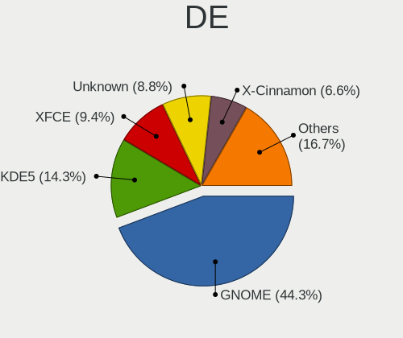

| Name             | Notebooks | Percent |
|------------------|-----------|---------|
| GNOME            | 614       | 44.27%  |
| KDE5             | 198       | 14.28%  |
| XFCE             | 130       | 9.37%   |
| Unknown          | 122       | 8.8%    |
| X-Cinnamon       | 91        | 6.56%   |
| MATE             | 62        | 4.47%   |
| LXQt             | 22        | 1.59%   |
| Pantheon         | 19        | 1.37%   |
| LXDE             | 19        | 1.37%   |
| KDE              | 18        | 1.3%    |
| KDE6             | 16        | 1.15%   |
| Budgie           | 13        | 0.94%   |
| Cinnamon         | 12        | 0.87%   |
| i3               | 10        | 0.72%   |
| Unity            | 6         | 0.43%   |
| KDE4             | 6         | 0.43%   |
| Deepin           | 6         | 0.43%   |
| GNOME Flashback  | 3         | 0.22%   |
| xmonad           | 2         | 0.14%   |
| qtile            | 2         | 0.14%   |
| openbox          | 2         | 0.14%   |
| Hyprland         | 2         | 0.14%   |
| Endless:GNOME    | 2         | 0.14%   |
| bspwm            | 2         | 0.14%   |
| Trinity          | 1         | 0.07%   |
| sway             | 1         | 0.07%   |
| lightdm-xsession | 1         | 0.07%   |
| i3-with-shmlog   | 1         | 0.07%   |
| GNOME Classic    | 1         | 0.07%   |
| Enlightenment    | 1         | 0.07%   |
| Cutefish         | 1         | 0.07%   |
| awesome          | 1         | 0.07%   |

Display Server
--------------

X11 or Wayland

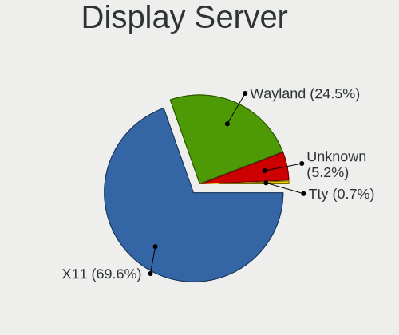

| Name    | Notebooks | Percent |
|---------|-----------|---------|
| X11     | 960       | 69.62%  |
| Wayland | 338       | 24.51%  |
| Unknown | 72        | 5.22%   |
| Tty     | 9         | 0.65%   |

Display Manager
---------------

SDDM, LightDM, etc.

| Name    | Notebooks | Percent |
|---------|-----------|---------|
| Unknown | 639       | 46.44%  |
| GDM3    | 199       | 14.46%  |
| SDDM    | 192       | 13.95%  |
| LightDM | 163       | 11.85%  |
| GDM     | 132       | 9.59%   |
| TDM     | 33        | 2.4%    |
| KDM     | 6         | 0.44%   |
| LXDM    | 5         | 0.36%   |
| GREETD  | 3         | 0.22%   |
| XDM     | 2         | 0.15%   |
| SLIMSKI | 1         | 0.07%   |
| SLiM    | 1         | 0.07%   |

OS Lang
-------

Language

| Lang        | Notebooks | Percent |
|-------------|-----------|---------|
| es_AR       | 705       | 51.12%  |
| en_US       | 353       | 25.6%   |
| Unknown     | 125       | 9.06%   |
| es_ES       | 95        | 6.89%   |
| es_MX       | 41        | 2.97%   |
| C           | 23        | 1.67%   |
| en_GB       | 14        | 1.02%   |
| pt_BR       | 5         | 0.36%   |
| es_US       | 3         | 0.22%   |
| POSIX       | 2         | 0.15%   |
| it_IT       | 2         | 0.15%   |
| fr_FR       | 2         | 0.15%   |
| es_CL       | 2         | 0.15%   |
| en_AG       | 2         | 0.15%   |
| ru_RU       | 1         | 0.07%   |
| es_UY       | 1         | 0.07%   |
| es_AR.UtF-8 | 1         | 0.07%   |
| en_CA       | 1         | 0.07%   |
| de_DE       | 1         | 0.07%   |

Boot Mode
---------

EFI or BIOS

| Mode | Notebooks | Percent |
|------|-----------|---------|
| BIOS | 691       | 50.4%   |
| EFI  | 680       | 49.6%   |

Filesystem
----------

Type of filesystem

| Type    | Notebooks | Percent |
|---------|-----------|---------|
| Ext4    | 1004      | 73.12%  |
| Btrfs   | 134       | 9.76%   |
| Overlay | 107       | 7.79%   |
| Tmpfs   | 72        | 5.24%   |
| Unknown | 33        | 2.4%    |
| Xfs     | 13        | 0.95%   |
| Zfs     | 5         | 0.36%   |
| Ext2    | 3         | 0.22%   |
| Ext3    | 1         | 0.07%   |
| Aufs    | 1         | 0.07%   |

Part. scheme
------------

Scheme of partitioning

| Type    | Notebooks | Percent |
|---------|-----------|---------|
| Unknown | 674       | 49.27%  |
| GPT     | 552       | 40.35%  |
| MBR     | 142       | 10.38%  |

Dual Boot with Linux/BSD
------------------------

Hosting more than one Linux/BSD

| Dual boot | Notebooks | Percent |
|-----------|-----------|---------|
| No        | 1206      | 88.87%  |
| Yes       | 151       | 11.13%  |

Dual Boot (Win)
---------------

Hosting Linux and Windows

| Dual boot | Notebooks | Percent |
|-----------|-----------|---------|
| No        | 988       | 72.86%  |
| Yes       | 368       | 27.14%  |

Board
-----

Vendor
------

Motherboard manufacturer

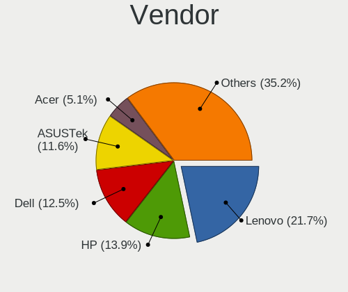

| Name                    | Notebooks | Percent |
|-------------------------|-----------|---------|
| Lenovo                  | 291       | 21.7%   |
| Hewlett-Packard         | 186       | 13.87%  |
| Dell                    | 168       | 12.53%  |
| ASUSTek Computer        | 156       | 11.63%  |
| Acer                    | 68        | 5.07%   |
| BANGHO                  | 48        | 3.58%   |
| Toshiba                 | 43        | 3.21%   |
| Exo                     | 39        | 2.91%   |
| Samsung Electronics     | 36        | 2.68%   |
| Positivo                | 32        | 2.39%   |
| Sony                    | 24        | 1.79%   |
| Juana Manso             | 20        | 1.49%   |
| Intel                   | 19        | 1.42%   |
| Apple                   | 19        | 1.42%   |
| MSI                     | 14        | 1.04%   |
| Unknown                 | 13        | 0.97%   |
| NOBLEX                  | 12        | 0.89%   |
| Compal                  | 12        | 0.89%   |
| Novatech                | 9         | 0.67%   |
| Coradir                 | 8         | 0.6%    |
| Clevo                   | 8         | 0.6%    |
| NSX                     | 7         | 0.52%   |
| Standard                | 5         | 0.37%   |
| Kelyx Argentina         | 5         | 0.37%   |
| HUAWEI                  | 5         | 0.37%   |
| Advantec                | 5         | 0.37%   |
| System76                | 4         | 0.3%    |
| PCBOX                   | 4         | 0.3%    |
| iQual                   | 4         | 0.3%    |
| Gigabyte Technology     | 4         | 0.3%    |
| Compaq                  | 4         | 0.3%    |
| A-DATA Technology       | 4         | 0.3%    |
| Packard Bell            | 3         | 0.22%   |
| GFAST                   | 3         | 0.22%   |
| AIR                     | 3         | 0.22%   |
| Valve                   | 2         | 0.15%   |
| Radio Victoria Fueguina | 2         | 0.15%   |
| Quanta                  | 2         | 0.15%   |
| NVN-ED01                | 2         | 0.15%   |
| LG Electronics          | 2         | 0.15%   |

Model
-----

Motherboard model

| Name                                       | Notebooks | Percent |
|--------------------------------------------|-----------|---------|
| Unknown                                    | 29        | 2.16%   |
| Juana Manso SF20GM7                        | 20        | 1.49%   |
| Lenovo V330-15IKB 81AX                     | 11        | 0.82%   |
| HP Notebook                                | 11        | 0.82%   |
| HP Laptop 15-bs0xx                         | 10        | 0.75%   |
| BANGHO MOV                                 | 10        | 0.75%   |
| Lenovo G470 20078                          | 8         | 0.6%    |
| Intel powered classmate PC                 | 8         | 0.6%    |
| Coradir Coradir/ES10IS5                    | 8         | 0.6%    |
| BANGHO MAX G0101                           | 8         | 0.6%    |
| ASUS VivoBook_ASUSLaptop X509JA_X509JA     | 8         | 0.6%    |
| NOBLEX SF20BA                              | 7         | 0.52%   |
| Lenovo ThinkPad L15 Gen 2 20X4S27200       | 7         | 0.52%   |
| ASUS VivoBook_ASUSLaptop X515EA_X515EA     | 7         | 0.52%   |
| Lenovo IdeaPad 320-15ABR 80XS              | 6         | 0.45%   |
| HP Pavilion dv6                            | 6         | 0.45%   |
| Dell Inspiron 1525                         | 6         | 0.45%   |
| Lenovo G550 2958                           | 5         | 0.37%   |
| HP Pavilion dv7                            | 5         | 0.37%   |
| HP 250 G7 Notebook PC                      | 5         | 0.37%   |
| Exo CloudbookE15                           | 5         | 0.37%   |
| Dell Latitude E6410                        | 5         | 0.37%   |
| Dell Latitude 3520                         | 5         | 0.37%   |
| Dell Latitude 3410                         | 5         | 0.37%   |
| Dell Inspiron 3505                         | 5         | 0.37%   |
| Compal PCW20                               | 5         | 0.37%   |
| BANGHO W240HU/W250HUQ                      | 5         | 0.37%   |
| ASUS X555LAB                               | 5         | 0.37%   |
| ASUS X541UAK                               | 5         | 0.37%   |
| ASUS VivoBook 15_ASUS Laptop X540UAR       | 5         | 0.37%   |
| ASUS K53E                                  | 5         | 0.37%   |
| Apple MacBookPro9,2                        | 5         | 0.37%   |
| Samsung 300E4C/300E5C/300E7C               | 4         | 0.3%    |
| Samsung 300E4A/300E5A/300E7A/3430EA/3530EA | 4         | 0.3%    |
| Positivo Z100                              | 4         | 0.3%    |
| Lenovo V310-15ISK 80SY                     | 4         | 0.3%    |
| Lenovo V15 G2 ITL 82KB                     | 4         | 0.3%    |
| Lenovo ThinkPad T430 2349DS5               | 4         | 0.3%    |
| Lenovo ThinkBook 15 G2 ITL 20VE            | 4         | 0.3%    |
| Lenovo IdeaPad 3 14ADA05 81W0              | 4         | 0.3%    |

Model Family
------------

Motherboard model prefix

| Name                | Notebooks | Percent |
|---------------------|-----------|---------|
| Lenovo ThinkPad     | 108       | 8.05%   |
| Dell Inspiron       | 77        | 5.74%   |
| Lenovo IdeaPad      | 71        | 5.29%   |
| Dell Latitude       | 69        | 5.15%   |
| ASUS VivoBook       | 58        | 4.33%   |
| HP Pavilion         | 55        | 4.1%    |
| Acer Aspire         | 53        | 3.95%   |
| HP Laptop           | 34        | 2.54%   |
| Unknown             | 29        | 2.16%   |
| Toshiba Satellite   | 28        | 2.09%   |
| Exo Smart           | 21        | 1.57%   |
| Juana Manso SF20GM7 | 20        | 1.49%   |
| BANGHO MAX          | 17        | 1.27%   |
| Lenovo ThinkBook    | 15        | 1.12%   |
| HP Compaq           | 13        | 0.97%   |
| HP 250              | 12        | 0.89%   |
| ASUS ZenBook        | 12        | 0.89%   |
| Lenovo V330-15IKB   | 11        | 0.82%   |
| HP Notebook         | 11        | 0.82%   |
| BANGHO MOV          | 10        | 0.75%   |
| HP EliteBook        | 9         | 0.67%   |
| HP 240              | 9         | 0.67%   |
| Lenovo G470         | 8         | 0.6%    |
| Intel powered       | 8         | 0.6%    |
| Coradir Coradir     | 8         | 0.6%    |
| Samsung 300E4A      | 7         | 0.52%   |
| NOBLEX SF20BA       | 7         | 0.52%   |
| Lenovo Legion       | 7         | 0.52%   |
| HP ProBook          | 7         | 0.52%   |
| Samsung R430        | 6         | 0.45%   |
| HP ENVY             | 6         | 0.45%   |
| Dell XPS            | 6         | 0.45%   |
| ASUS ASUS           | 6         | 0.45%   |
| Lenovo Yoga         | 5         | 0.37%   |
| Lenovo V15          | 5         | 0.37%   |
| Lenovo G550         | 5         | 0.37%   |
| HP OMEN             | 5         | 0.37%   |
| Exo CloudbookE15    | 5         | 0.37%   |
| Compal PCW20        | 5         | 0.37%   |
| BANGHO W240HU       | 5         | 0.37%   |

MFG Year
--------

Motherboard manufacture year

| Year    | Notebooks | Percent |
|---------|-----------|---------|
| 2021    | 171       | 12.75%  |
| 2017    | 130       | 9.69%   |
| 2012    | 110       | 8.2%    |
| 2020    | 106       | 7.9%    |
| 2019    | 101       | 7.53%   |
| 2011    | 89        | 6.64%   |
| 2013    | 80        | 5.97%   |
| 2018    | 78        | 5.82%   |
| 2010    | 77        | 5.74%   |
| 2014    | 69        | 5.15%   |
| 2015    | 64        | 4.77%   |
| 2016    | 63        | 4.7%    |
| 2008    | 55        | 4.1%    |
| 2022    | 42        | 3.13%   |
| 2009    | 37        | 2.76%   |
| 2023    | 23        | 1.72%   |
| 2007    | 21        | 1.57%   |
| 2006    | 12        | 0.89%   |
| Unknown | 6         | 0.45%   |
| 2024    | 4         | 0.3%    |
| 2005    | 2         | 0.15%   |
| 2004    | 1         | 0.07%   |

Form Factor
-----------

Physical design of the computer

| Name     | Notebooks | Percent |
|----------|-----------|---------|
| Notebook | 1341      | 100%    |

Secure Boot
-----------

Enabled or disabled

| State    | Notebooks | Percent |
|----------|-----------|---------|
| Disabled | 1231      | 91.12%  |
| Enabled  | 120       | 8.88%   |

Coreboot
--------

Have coreboot on board

| Used | Notebooks | Percent |
|------|-----------|---------|
| No   | 1338      | 99.78%  |
| Yes  | 3         | 0.22%   |

RAM Size
--------

Total RAM memory

| Size in GB  | Notebooks | Percent |
|-------------|-----------|---------|
| 4.01-8.0    | 391       | 28.86%  |
| 3.01-4.0    | 355       | 26.2%   |
| 8.01-16.0   | 212       | 15.65%  |
| 16.01-24.0  | 147       | 10.85%  |
| 1.01-2.0    | 110       | 8.12%   |
| 32.01-64.0  | 62        | 4.58%   |
| 2.01-3.0    | 29        | 2.14%   |
| 0.51-1.0    | 23        | 1.7%    |
| 24.01-32.0  | 19        | 1.4%    |
| 64.01-256.0 | 7         | 0.52%   |

RAM Used
--------

Used RAM memory

| Used GB    | Notebooks | Percent |
|------------|-----------|---------|
| 1.01-2.0   | 515       | 34.94%  |
| 2.01-3.0   | 358       | 24.29%  |
| 4.01-8.0   | 204       | 13.84%  |
| 3.01-4.0   | 182       | 12.35%  |
| 0.51-1.0   | 120       | 8.14%   |
| 8.01-16.0  | 73        | 4.95%   |
| 0.01-0.5   | 13        | 0.88%   |
| 16.01-24.0 | 7         | 0.47%   |
| 24.01-32.0 | 2         | 0.14%   |

Total Drives
------------

Number of drives on board

| Drives | Notebooks | Percent |
|--------|-----------|---------|
| 1      | 1032      | 76.05%  |
| 2      | 289       | 21.3%   |
| 3      | 22        | 1.62%   |
| 0      | 10        | 0.74%   |
| 4      | 4         | 0.29%   |

Has CD-ROM
----------

Has CD-ROM on board

| Presented | Notebooks | Percent |
|-----------|-----------|---------|
| No        | 916       | 67.9%   |
| Yes       | 433       | 32.1%   |

Has Ethernet
------------

Has Ethernet on board

| Presented | Notebooks | Percent |
|-----------|-----------|---------|
| Yes       | 1066      | 79.37%  |
| No        | 277       | 20.63%  |

Has WiFi
--------

Has WiFi module

| Presented | Notebooks | Percent |
|-----------|-----------|---------|
| Yes       | 1309      | 97.47%  |
| No        | 34        | 2.53%   |

Has Bluetooth
-------------

Has Bluetooth module

| Presented | Notebooks | Percent |
|-----------|-----------|---------|
| Yes       | 953       | 70.8%   |
| No        | 393       | 29.2%   |

Location
--------

Country
-------

Geographic location (country)

| Country   | Notebooks | Percent |
|-----------|-----------|---------|
| Argentina | 1341      | 100%    |

City
----

Geographic location (city)

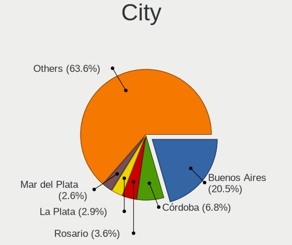

| City                        | Notebooks | Percent |
|-----------------------------|-----------|---------|
| Buenos Aires                | 288       | 20.53%  |
| Crdoba                    | 95        | 6.77%   |
| Rosario                     | 51        | 3.64%   |
| La Plata                    | 40        | 2.85%   |
| Mar del Plata               | 37        | 2.64%   |
| Mendoza                     | 20        | 1.43%   |
| Corrientes                  | 18        | 1.28%   |
| Avellaneda                  | 17        | 1.21%   |
| Santa Fe                    | 16        | 1.14%   |
| San Miguel de Tucumn      | 16        | 1.14%   |
| Bariloche                   | 16        | 1.14%   |
| Salta                       | 15        | 1.07%   |
| Quilmes                     | 15        | 1.07%   |
| Lanus                       | 15        | 1.07%   |
| Paran                     | 13        | 0.93%   |
| Villa Ballester             | 12        | 0.86%   |
| Isidro Casanova             | 12        | 0.86%   |
| Resistencia                 | 11        | 0.78%   |
| Ituzaingo                   | 11        | 0.78%   |
| Baha Blanca               | 11        | 0.78%   |
| San Martn de los Andes    | 10        | 0.71%   |
| San Juan                    | 10        | 0.71%   |
| Posadas                     | 10        | 0.71%   |
| Olivos                      | 10        | 0.71%   |
| Godoy Cruz                  | 10        | 0.71%   |
| Burzaco                     | 10        | 0.71%   |
| Tandil                      | 9         | 0.64%   |
| Ramos Mejia                 | 9         | 0.64%   |
| Neuqun                    | 9         | 0.64%   |
| San Nicols de los Arroyos | 8         | 0.57%   |
| Villa Carlos Paz            | 7         | 0.5%    |
| Vicente Lopez               | 7         | 0.5%    |
| San Isidro                  | 7         | 0.5%    |
| San Francisco               | 7         | 0.5%    |
| Ro Cuarto                 | 7         | 0.5%    |
| Martinez                    | 7         | 0.5%    |
| Lomas de Zamora             | 7         | 0.5%    |
| Florencio Varela            | 7         | 0.5%    |
| Comodoro Rivadavia          | 7         | 0.5%    |
| Caseros                     | 7         | 0.5%    |

Drives
------

Drive Vendor
------------

Hard drive vendors

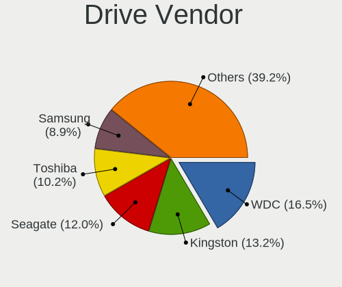

| Vendor                      | Notebooks | Drives | Percent |
|-----------------------------|-----------|--------|---------|
| WDC                         | 264       | 336    | 16.52%  |
| Kingston                    | 211       | 254    | 13.2%   |
| Seagate                     | 192       | 224    | 12.02%  |
| Toshiba                     | 163       | 207    | 10.2%   |
| Samsung Electronics         | 142       | 184    | 8.89%   |
| Unknown                     | 80        | 98     | 5.01%   |
| SanDisk                     | 64        | 100    | 4.01%   |
| HGST                        | 53        | 59     | 3.32%   |
| SK hynix                    | 47        | 61     | 2.94%   |
| Hitachi                     | 41        | 46     | 2.57%   |
| Micron Technology           | 32        | 37     | 2%      |
| Crucial                     | 32        | 41     | 2%      |
| Intel                       | 22        | 38     | 1.38%   |
| KIOXIA                      | 18        | 18     | 1.13%   |
| Gigabyte Technology         | 17        | 26     | 1.06%   |
| A-DATA Technology           | 17        | 18     | 1.06%   |
| Unknown                     | 17        | 18     | 1.06%   |
| Lexar                       | 14        | 15     | 0.88%   |
| China                       | 11        | 13     | 0.69%   |
| Kimtigo                     | 9         | 9      | 0.56%   |
| PNY                         | 8         | 12     | 0.5%    |
| Patriot                     | 8         | 9      | 0.5%    |
| Hewlett-Packard             | 8         | 10     | 0.5%    |
| Neo                         | 7         | 7      | 0.44%   |
| Kingston Technology Company | 7         | 7      | 0.44%   |
| Apple                       | 6         | 9      | 0.38%   |
| Micron/Crucial Technology   | 5         | 8      | 0.31%   |
| XPG                         | 4         | 5      | 0.25%   |
| Wodposit                    | 4         | 4      | 0.25%   |
| Silicon Motion              | 4         | 5      | 0.25%   |
| Phison Electronics          | 4         | 4      | 0.25%   |
| MAXIO Technology (Hangzhou) | 4         | 4      | 0.25%   |
| LITEONIT                    | 4         | 4      | 0.25%   |
| HS-SSD-C100                 | 4         | 7      | 0.25%   |
| ADATA Technology            | 4         | 4      | 0.25%   |
| Union Memory                | 3         | 3      | 0.19%   |
| SSSTC                       | 3         | 3      | 0.19%   |
| Netac                       | 3         | 4      | 0.19%   |
| Hikvision                   | 3         | 4      | 0.19%   |
| GLOWAY                      | 3         | 4      | 0.19%   |

Drive Model
-----------

Hard drive models

| Model                                | Notebooks | Percent |
|--------------------------------------|-----------|---------|
| Kingston SA400S37240G 240GB SSD      | 69        | 4.22%   |
| Seagate ST1000LM035-1RK172 1TB       | 48        | 2.93%   |
| Kingston SA400S37480G 480GB SSD      | 38        | 2.32%   |
| Toshiba MQ01ABF050 500GB             | 31        | 1.89%   |
| Toshiba MQ01ABD100 1TB               | 28        | 1.71%   |
| Seagate ST1000LM024 HN-M101MBB 1TB   | 28        | 1.71%   |
| WDC WDS240G2G0A-00JH30 240GB SSD     | 22        | 1.34%   |
| Unknown MMC Card  32GB               | 21        | 1.28%   |
| Toshiba MQ04ABF100 1TB               | 19        | 1.16%   |
| Unknown                              | 17        | 1.04%   |
| Unknown MMC Card  64GB               | 14        | 0.86%   |
| HGST HTS721010A9E630 1TB             | 14        | 0.86%   |
| Seagate ST500LT012-1DG142 500GB      | 13        | 0.79%   |
| WDC WDS240G2G0B-00EPW0 240GB SSD     | 10        | 0.61%   |
| Seagate ST500LM030-2E717D 500GB      | 10        | 0.61%   |
| Kingston SNVS500G 500GB              | 10        | 0.61%   |
| Kingston SA400S37960G 960GB SSD      | 10        | 0.61%   |
| Crucial CT240BX500SSD1 240GB         | 10        | 0.61%   |
| WDC WD10JPVX-60JC3T1 1TB             | 9         | 0.55%   |
| Seagate ST9500325AS 500GB            | 9         | 0.55%   |
| Lexar 240GB SSD                      | 9         | 0.55%   |
| WDC WDS480G2G0A-00JH30 480GB SSD     | 8         | 0.49%   |
| Toshiba MQ01ABD032 320GB             | 8         | 0.49%   |
| Sandisk WD Blue SN550 NVMe SSD 256GB | 8         | 0.49%   |
| Kingston SNV2S500G 500GB             | 8         | 0.49%   |
| Kingston SA400S37120G 120GB SSD      | 8         | 0.49%   |
| HGST HTS725050A7E630 500GB           | 8         | 0.49%   |
| WDC WDS500G2B0A-00SM50 500GB SSD     | 7         | 0.43%   |
| WDC WD5000LPCX-22VHAT0 500GB         | 7         | 0.43%   |
| Toshiba MK6475GSX 640GB              | 7         | 0.43%   |
| Seagate ST320LM001 HN-M320MBB 320GB  | 7         | 0.43%   |
| Seagate ST1000LM048-2E7172 1TB       | 7         | 0.43%   |
| Samsung MZALQ256HBJD-00BL1 256GB     | 7         | 0.43%   |
| Kingston SV300S37A240G 240GB SSD     | 7         | 0.43%   |
| Kingston SA400M8240G 240GB SSD       | 7         | 0.43%   |
| HGST HTS545050A7E680 500GB           | 7         | 0.43%   |
| HGST HTS545050A7E380 500GB           | 7         | 0.43%   |
| A-DATA SU630 240GB SSD               | 7         | 0.43%   |
| WDC WD5000LPVX-22V0TT0 500GB         | 6         | 0.37%   |
| WDC WD10SPZX-24Z10 1TB               | 6         | 0.37%   |

HDD Vendor
----------

Hard disk drive vendors

| Vendor              | Notebooks | Drives | Percent |
|---------------------|-----------|--------|---------|
| Seagate             | 188       | 218    | 29.28%  |
| WDC                 | 178       | 215    | 27.73%  |
| Toshiba             | 143       | 183    | 22.27%  |
| HGST                | 53        | 59     | 8.26%   |
| Hitachi             | 41        | 46     | 6.39%   |
| Samsung Electronics | 29        | 34     | 4.52%   |
| Unknown             | 6         | 6      | 0.93%   |
| Fujitsu             | 2         | 2      | 0.31%   |
| JMicron Technology  | 1         | 1      | 0.16%   |
| Inateck             | 1         | 1      | 0.16%   |

SSD Vendor
----------

Solid state drive vendors

| Vendor              | Notebooks | Drives | Percent |
|---------------------|-----------|--------|---------|
| Kingston            | 176       | 214    | 35.92%  |
| WDC                 | 63        | 79     | 12.86%  |
| Samsung Electronics | 30        | 45     | 6.12%   |
| Crucial             | 30        | 39     | 6.12%   |
| SanDisk             | 22        | 29     | 4.49%   |
| Gigabyte Technology | 16        | 25     | 3.27%   |
| A-DATA Technology   | 14        | 14     | 2.86%   |
| Lexar               | 13        | 14     | 2.65%   |
| Micron Technology   | 9         | 11     | 1.84%   |
| Kimtigo             | 9         | 9      | 1.84%   |
| SK hynix            | 8         | 9      | 1.63%   |
| PNY                 | 8         | 12     | 1.63%   |
| China               | 8         | 10     | 1.63%   |
| Toshiba             | 7         | 7      | 1.43%   |
| Patriot             | 7         | 8      | 1.43%   |
| Intel               | 6         | 6      | 1.22%   |
| Hewlett-Packard     | 5         | 8      | 1.02%   |
| Wodposit            | 4         | 4      | 0.82%   |
| LITEONIT            | 4         | 4      | 0.82%   |
| Apple               | 4         | 4      | 0.82%   |
| Seagate             | 3         | 5      | 0.61%   |
| GLOWAY              | 3         | 4      | 0.61%   |
| Unknown             | 3         | 3      | 0.61%   |
| SPCC                | 2         | 2      | 0.41%   |
| Netac               | 2         | 3      | 0.41%   |
| HS-SSD-C100         | 2         | 5      | 0.41%   |
| FORESEE             | 2         | 2      | 0.41%   |
| Corsair             | 2         | 2      | 0.41%   |
| Colorful            | 2         | 2      | 0.41%   |
| XrayDisk            | 1         | 1      | 0.2%    |
| WDC WDS2            | 1         | 1      | 0.2%    |
| WDC WDS             | 1         | 1      | 0.2%    |
| WALRAM              | 1         | 1      | 0.2%    |
| USB3.0              | 1         | 1      | 0.2%    |
| Transcend           | 1         | 1      | 0.2%    |
| Team                | 1         | 1      | 0.2%    |
| Super Talent        | 1         | 1      | 0.2%    |
| SMI                 | 1         | 1      | 0.2%    |
| SCY                 | 1         | 2      | 0.2%    |
| Ramaxel Technology  | 1         | 1      | 0.2%    |

Drive Kind
----------

HDD or SSD

| Kind    | Notebooks | Drives | Percent |
|---------|-----------|--------|---------|
| HDD     | 631       | 765    | 41%     |
| SSD     | 464       | 609    | 30.15%  |
| NVMe    | 337       | 477    | 21.9%   |
| MMC     | 80        | 101    | 5.2%    |
| Unknown | 27        | 29     | 1.75%   |

Drive Connector
---------------

SATA, SAS, NVMe, etc.

| Type | Notebooks | Drives | Percent |
|------|-----------|--------|---------|
| SATA | 997       | 1375   | 69.33%  |
| NVMe | 337       | 476    | 23.44%  |
| MMC  | 80        | 101    | 5.56%   |
| SAS  | 24        | 29     | 1.67%   |

Drive Size
----------

Size of hard drive

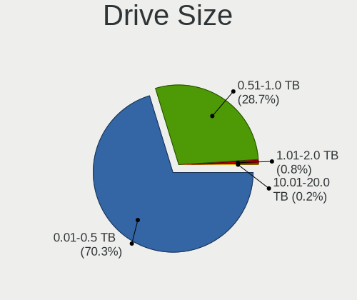

| Size in TB | Notebooks | Drives | Percent |
|------------|-----------|--------|---------|
| 0.01-0.5   | 745       | 961    | 70.28%  |
| 0.51-1.0   | 304       | 399    | 28.68%  |
| 1.01-2.0   | 9         | 12     | 0.85%   |
| 10.01-20.0 | 2         | 2      | 0.19%   |

Space Total
-----------

Amount of disk space available on the file system

| Size in GB     | Notebooks | Percent |
|----------------|-----------|---------|
| 101-250        | 450       | 32.03%  |
| 251-500        | 358       | 25.48%  |
| 501-1000       | 216       | 15.37%  |
| 1-20           | 93        | 6.62%   |
| 51-100         | 90        | 6.41%   |
| 1001-2000      | 76        | 5.41%   |
| 21-50          | 58        | 4.13%   |
| Unknown        | 38        | 2.7%    |
| More than 3000 | 15        | 1.07%   |
| 2001-3000      | 11        | 0.78%   |

Space Used
----------

Amount of used disk space

| Used GB   | Notebooks | Percent |
|-----------|-----------|---------|
| 1-20      | 580       | 40%     |
| 21-50     | 281       | 19.38%  |
| 101-250   | 227       | 15.66%  |
| 51-100    | 174       | 12%     |
| 251-500   | 84        | 5.79%   |
| 501-1000  | 46        | 3.17%   |
| Unknown   | 38        | 2.62%   |
| 1001-2000 | 16        | 1.1%    |
| 2001-3000 | 4         | 0.28%   |

Malfunc. Drives
---------------

Drive models with a malfunction

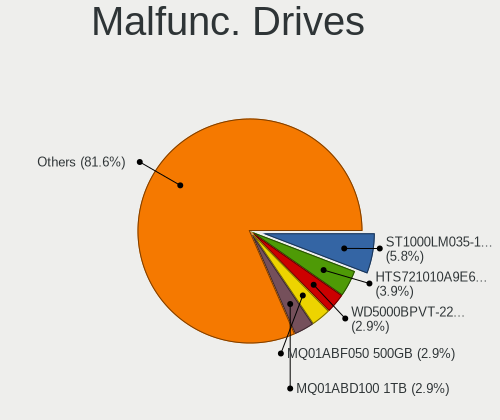

| Model                              | Notebooks | Drives | Percent |
|------------------------------------|-----------|--------|---------|
| Seagate ST1000LM035-1RK172 1TB     | 6         | 6      | 5.83%   |
| HGST HTS721010A9E630 1TB           | 4         | 6      | 3.88%   |
| WDC WD5000BPVT-22HXZT3 500GB       | 3         | 3      | 2.91%   |
| Toshiba MQ01ABF050 500GB           | 3         | 3      | 2.91%   |
| Toshiba MQ01ABD100 1TB             | 3         | 6      | 2.91%   |
| Toshiba MK1665GSX 160GB            | 3         | 3      | 2.91%   |
| Seagate ST9320325AS 320GB          | 3         | 3      | 2.91%   |
| HGST HTS541010A9E680 1TB           | 3         | 3      | 2.91%   |
| WDC WDS480G2G0A-00JH30 480GB SSD   | 2         | 2      | 1.94%   |
| WDC WDS240G2G0A-00JH30 240GB SSD   | 2         | 2      | 1.94%   |
| Toshiba MQ04ABF100 1TB             | 2         | 2      | 1.94%   |
| Toshiba MQ01ABD050 500GB           | 2         | 2      | 1.94%   |
| Toshiba MK7559GSXP 752GB           | 2         | 2      | 1.94%   |
| Toshiba MK6475GSX 640GB            | 2         | 2      | 1.94%   |
| Seagate ST9500325AS 500GB          | 2         | 2      | 1.94%   |
| Seagate ST500LT012-1DG142 500GB    | 2         | 5      | 1.94%   |
| Samsung Electronics HN-M101MBB 1TB | 2         | 2      | 1.94%   |
| Kingston SA400S37240G 240GB SSD    | 2         | 2      | 1.94%   |
| HGST HTS725050A7E630 500GB         | 2         | 2      | 1.94%   |
| WDC WDS120G2G0A-00JH30 120GB SSD   | 1         | 1      | 0.97%   |
| WDC WD5000LPCX-24VHAT0 500GB       | 1         | 1      | 0.97%   |
| WDC WD5000LPCX-22VHAT0 500GB       | 1         | 1      | 0.97%   |
| WDC WD5000BEVT-22A0RT0 500GB       | 1         | 1      | 0.97%   |
| WDC WD3200BPVT-00JJ5T0 320GB       | 1         | 1      | 0.97%   |
| WDC WD3200BEKT-60F3T1 320GB        | 1         | 1      | 0.97%   |
| WDC WD2500BEVT-75A23T0 250GB       | 1         | 1      | 0.97%   |
| WDC WD2500BEKT-75PVMT0 250GB       | 1         | 3      | 0.97%   |
| WDC WD1200BEVS-60UST0 120GB        | 1         | 1      | 0.97%   |
| WDC WD10SPZX-24Z10 1TB             | 1         | 1      | 0.97%   |
| WDC WD10JPVX-22JC3T0 1TB           | 1         | 1      | 0.97%   |
| WDC WD Green 2.5 240GB SSD         | 1         | 1      | 0.97%   |
| Toshiba MQ01ABD032 320GB           | 1         | 1      | 0.97%   |
| Toshiba MK3265GSXN 320GB           | 1         | 1      | 0.97%   |
| Toshiba MK2576GSX 250GB            | 1         | 1      | 0.97%   |
| Toshiba MK2556GSY 250GB            | 1         | 1      | 0.97%   |
| Toshiba MK1252GSX 120GB            | 1         | 1      | 0.97%   |
| SMI SSD DISK 512GB                 | 1         | 1      | 0.97%   |
| Seagate ST960813AS 64GB            | 1         | 1      | 0.97%   |
| Seagate ST960812A 64GB             | 1         | 1      | 0.97%   |
| Seagate ST9160314AS 160GB          | 1         | 1      | 0.97%   |

Malfunc. Drive Vendor
---------------------

Vendors of faulty drives

| Vendor              | Notebooks | Drives | Percent |
|---------------------|-----------|--------|---------|
| Seagate             | 23        | 26     | 22.33%  |
| Toshiba             | 22        | 25     | 21.36%  |
| WDC                 | 19        | 21     | 18.45%  |
| HGST                | 11        | 13     | 10.68%  |
| Samsung Electronics | 8         | 9      | 7.77%   |
| Hitachi             | 7         | 9      | 6.8%    |
| Kingston            | 6         | 6      | 5.83%   |
| LITEONIT            | 2         | 2      | 1.94%   |
| SMI                 | 1         | 1      | 0.97%   |
| SanDisk             | 1         | 1      | 0.97%   |
| Patriot             | 1         | 1      | 0.97%   |
| Crucial             | 1         | 1      | 0.97%   |
| A-DATA Technology   | 1         | 1      | 0.97%   |

Malfunc. HDD Vendor
-------------------

Vendors of faulty HDD drives

| Vendor              | Notebooks | Drives | Percent |
|---------------------|-----------|--------|---------|
| Seagate             | 23        | 26     | 28.4%   |
| Toshiba             | 22        | 25     | 27.16%  |
| WDC                 | 13        | 15     | 16.05%  |
| HGST                | 11        | 13     | 13.58%  |
| Hitachi             | 7         | 9      | 8.64%   |
| Samsung Electronics | 5         | 6      | 6.17%   |

Malfunc. Drive Kind
-------------------

Kinds of faulty drives

| Kind | Notebooks | Drives | Percent |
|------|-----------|--------|---------|
| HDD  | 80        | 94     | 78.43%  |
| SSD  | 21        | 21     | 20.59%  |
| NVMe | 1         | 1      | 0.98%   |

Failed Drives
-------------

Failed drive models

| Model                       | Notebooks | Drives | Percent |
|-----------------------------|-----------|--------|---------|
| WDC WD5000BEVT-22ZAT0 500GB | 2         | 3      | 40%     |
| Toshiba MK6475GSX 640GB     | 1         | 1      | 20%     |
| Toshiba MK1665GSX 160GB     | 1         | 1      | 20%     |
| Seagate ST9320325AS 320GB   | 1         | 1      | 20%     |

Failed Drive Vendor
-------------------

Failed drive vendors

| Vendor  | Notebooks | Drives | Percent |
|---------|-----------|--------|---------|
| WDC     | 2         | 3      | 40%     |
| Toshiba | 2         | 2      | 40%     |
| Seagate | 1         | 1      | 20%     |

Drive Status
------------

Number of failed and malfunc. drives

| Status   | Notebooks | Drives | Percent |
|----------|-----------|--------|---------|
| Detected | 781       | 1116   | 55.71%  |
| Works    | 516       | 743    | 36.8%   |
| Malfunc  | 100       | 116    | 7.13%   |
| Failed   | 5         | 6      | 0.36%   |

Storage controller
------------------

Storage Vendor
--------------

Storage controller vendors

| Vendor                               | Notebooks | Percent |
|--------------------------------------|-----------|---------|
| Intel                                | 993       | 66.47%  |
| AMD                                  | 139       | 9.3%    |
| Samsung Electronics                  | 86        | 5.76%   |
| SanDisk                              | 60        | 4.02%   |
| Kingston Technology Company          | 42        | 2.81%   |
| SK hynix                             | 39        | 2.61%   |
| Micron Technology                    | 22        | 1.47%   |
| KIOXIA                               | 19        | 1.27%   |
| Toshiba America Info Systems         | 15        | 1%      |
| Silicon Integrated Systems [SiS]     | 13        | 0.87%   |
| Micron/Crucial Technology            | 7         | 0.47%   |
| MAXIO Technology (Hangzhou)          | 7         | 0.47%   |
| Silicon Motion                       | 6         | 0.4%    |
| Phison Electronics                   | 6         | 0.4%    |
| ADATA Technology                     | 6         | 0.4%    |
| Union Memory (Shenzhen)              | 5         | 0.33%   |
| Realtek Semiconductor                | 5         | 0.33%   |
| Nvidia                               | 5         | 0.33%   |
| Solid State Storage Technology       | 4         | 0.27%   |
| Shenzhen Longsys Electronics         | 3         | 0.2%    |
| VIA Technologies                     | 2         | 0.13%   |
| Apple                                | 2         | 0.13%   |
| Solidigm                             | 1         | 0.07%   |
| Ramaxel Technology(Shenzhen) Limited | 1         | 0.07%   |
| O2 Micro                             | 1         | 0.07%   |
| Nextorage                            | 1         | 0.07%   |
| Marvell Technology Group             | 1         | 0.07%   |
| Lite-On Technology                   | 1         | 0.07%   |
| INNOGRIT                             | 1         | 0.07%   |
| Biwin Storage Technology             | 1         | 0.07%   |

Storage Model
-------------

Storage controller models

| Model                                                                            | Notebooks | Percent |
|----------------------------------------------------------------------------------|-----------|---------|
| Intel Sunrise Point-LP SATA Controller [AHCI mode]                               | 139       | 8.63%   |
| AMD FCH SATA Controller [AHCI mode]                                              | 110       | 6.83%   |
| Intel 7 Series Chipset Family 6-port SATA Controller [AHCI mode]                 | 109       | 6.77%   |
| Intel 82801 Mobile SATA Controller [RAID mode]                                   | 81        | 5.03%   |
| Intel Celeron/Pentium Silver Processor SATA Controller                           | 70        | 4.35%   |
| Intel 6 Series/C200 Series Chipset Family 6 port Mobile SATA AHCI Controller     | 64        | 3.97%   |
| Intel Volume Management Device NVMe RAID Controller                              | 43        | 2.67%   |
| Intel Tiger Lake-LP SATA Controller                                              | 40        | 2.48%   |
| Intel 82801IBM/IEM (ICH9M/ICH9M-E) 4 port SATA Controller [AHCI mode]            | 39        | 2.42%   |
| Intel 8 Series SATA Controller 1 [AHCI mode]                                     | 39        | 2.42%   |
| Intel NM10/ICH7 Family SATA Controller [AHCI mode]                               | 38        | 2.36%   |
| Samsung NVMe SSD Controller 980 (DRAM-less)                                      | 37        | 2.3%    |
| Intel Wildcat Point-LP SATA Controller [AHCI Mode]                               | 35        | 2.17%   |
| Intel Comet Lake SATA AHCI Controller                                            | 33        | 2.05%   |
| Intel 5 Series/3400 Series Chipset 4 port SATA AHCI Controller                   | 32        | 1.99%   |
| Intel Atom Processor E3800 Series SATA AHCI Controller                           | 27        | 1.68%   |
| Samsung NVMe SSD Controller SM981/PM981/PM983                                    | 24        | 1.49%   |
| Intel 8 Series/C220 Series Chipset Family 6-port SATA Controller 1 [AHCI mode]   | 24        | 1.49%   |
| Intel HM170/QM170 Chipset SATA Controller [AHCI Mode]                            | 22        | 1.37%   |
| Intel 82801HM/HEM (ICH8M/ICH8M-E) IDE Controller                                 | 22        | 1.37%   |
| AMD SB7x0/SB8x0/SB9x0 SATA Controller [AHCI mode]                                | 22        | 1.37%   |
| Intel Celeron N3350/Pentium N4200/Atom E3900 Series SATA AHCI Controller         | 21        | 1.3%    |
| Intel 82801HM/HEM (ICH8M/ICH8M-E) SATA Controller [AHCI mode]                    | 21        | 1.3%    |
| SanDisk Ultra 3D / WD PC SN530, IX SN530, Blue SN550 NVMe SSD (DRAM-less)        | 16        | 0.99%   |
| KIOXIA NVMe SSD Controller BG4 (DRAM-less)                                       | 16        | 0.99%   |
| SK hynix Gold P31/BC711/PC711 NVMe Solid State Drive                             | 15        | 0.93%   |
| Intel Atom/Celeron/Pentium Processor x5-E8000/J3xxx/N3xxx Series SATA Controller | 15        | 0.93%   |
| Silicon Integrated Systems [SiS] 5513 IDE Controller                             | 13        | 0.81%   |
| Kingston Company NV1 NVMe SSD [SM2263XT] (DRAM-less)                             | 12        | 0.74%   |
| Intel Ice Lake-LP SATA Controller [AHCI mode]                                    | 12        | 0.74%   |
| Intel 82801GBM/GHM (ICH7-M Family) SATA Controller [IDE mode]                    | 12        | 0.74%   |
| Toshiba America Info Systems XG6 NVMe SSD Controller                             | 11        | 0.68%   |
| Silicon Integrated Systems [SiS] SATA Controller / IDE mode                      | 11        | 0.68%   |
| Intel Cannon Point-LP SATA Controller [AHCI Mode]                                | 11        | 0.68%   |
| Intel Alder Lake-P SATA AHCI Controller                                          | 11        | 0.68%   |
| Intel 82801G (ICH7 Family) IDE Controller                                        | 11        | 0.68%   |
| SK hynix BC511 NVMe SSD                                                          | 10        | 0.62%   |
| Samsung NVMe SSD Controller PM9A1/PM9A3/980PRO                                   | 10        | 0.62%   |
| Intel 5 Series/3400 Series Chipset 6 port SATA AHCI Controller                   | 10        | 0.62%   |
| SK hynix BC501 NVMe Solid State Drive                                            | 8         | 0.5%    |

Storage Kind
------------

Kind of storage controller (IDE, SATA, NVMe, SAS, ...)

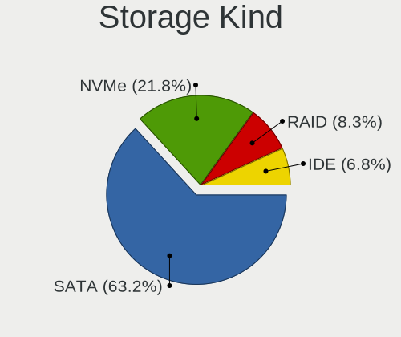

| Kind | Notebooks | Percent |
|------|-----------|---------|
| SATA | 980       | 63.19%  |
| NVMe | 338       | 21.79%  |
| RAID | 128       | 8.25%   |
| IDE  | 105       | 6.77%   |

Processor
---------

CPU Vendor
----------

Processor vendors

| Vendor | Notebooks | Percent |
|--------|-----------|---------|
| Intel  | 1138      | 84.86%  |
| AMD    | 203       | 15.14%  |

CPU Model
---------

Processor models

| Model                                         | Notebooks | Percent |
|-----------------------------------------------|-----------|---------|
| Intel Celeron N4020 CPU @ 1.10GHz             | 47        | 3.5%    |
| Intel 11th Gen Core i7-1165G7 @ 2.80GHz       | 33        | 2.46%   |
| Intel Core i5-7200U CPU @ 2.50GHz             | 30        | 2.24%   |
| Intel 11th Gen Core i5-1135G7 @ 2.40GHz       | 26        | 1.94%   |
| Intel Celeron N4000 CPU @ 1.10GHz             | 21        | 1.56%   |
| Intel Core i7-8550U CPU @ 1.80GHz             | 20        | 1.49%   |
| Intel Celeron CPU N3350 @ 1.10GHz             | 20        | 1.49%   |
| Intel Atom CPU N2600 @ 1.60GHz                | 20        | 1.49%   |
| Intel Core i5-3210M CPU @ 2.50GHz             | 19        | 1.42%   |
| Intel Core i5-10210U CPU @ 1.60GHz            | 19        | 1.42%   |
| Intel Core i7-7500U CPU @ 2.70GHz             | 18        | 1.34%   |
| Intel Core i7-6500U CPU @ 2.50GHz             | 18        | 1.34%   |
| Intel Atom x5-Z8350 CPU @ 1.44GHz             | 18        | 1.34%   |
| Intel Core i5-8250U CPU @ 1.60GHz             | 17        | 1.27%   |
| Intel Core i5-6200U CPU @ 2.30GHz             | 16        | 1.19%   |
| Intel Core i5-3320M CPU @ 2.60GHz             | 16        | 1.19%   |
| Intel Core i5-1035G1 CPU @ 1.00GHz            | 15        | 1.12%   |
| Intel Celeron CPU N3060 @ 1.60GHz             | 14        | 1.04%   |
| Intel Core i7-5500U CPU @ 2.40GHz             | 13        | 0.97%   |
| Intel Core i7-10510U CPU @ 1.80GHz            | 13        | 0.97%   |
| Intel Core i7-7700HQ CPU @ 2.80GHz            | 12        | 0.89%   |
| Intel Core i5-5200U CPU @ 2.20GHz             | 12        | 0.89%   |
| Intel Core i3-2330M CPU @ 2.20GHz             | 12        | 0.89%   |
| Intel Core i3-1005G1 CPU @ 1.20GHz            | 12        | 0.89%   |
| AMD Ryzen 5 3450U with Radeon Vega Mobile Gfx | 12        | 0.89%   |
| Intel Core i3-2310M CPU @ 2.10GHz             | 11        | 0.82%   |
| Intel Atom CPU N455 @ 1.66GHz                 | 11        | 0.82%   |
| Intel Core i7-8565U CPU @ 1.80GHz             | 10        | 0.75%   |
| Intel Core i5-8265U CPU @ 1.60GHz             | 10        | 0.75%   |
| Intel Core i5-3317U CPU @ 1.70GHz             | 10        | 0.75%   |
| Intel Core i3-6006U CPU @ 2.00GHz             | 10        | 0.75%   |
| Intel Core i3-4005U CPU @ 1.70GHz             | 10        | 0.75%   |
| AMD Ryzen 5 3500U with Radeon Vega Mobile Gfx | 10        | 0.75%   |
| Intel Core i5-4210U CPU @ 1.70GHz             | 9         | 0.67%   |
| Intel Core i5-2450M CPU @ 2.50GHz             | 9         | 0.67%   |
| Intel Core i3-2350M CPU @ 2.30GHz             | 9         | 0.67%   |
| Intel Core i3-10110U CPU @ 2.10GHz            | 9         | 0.67%   |
| Intel Atom CPU N450 @ 1.66GHz                 | 9         | 0.67%   |
| Intel 11th Gen Core i3-1115G4 @ 3.00GHz       | 9         | 0.67%   |
| AMD Ryzen 5 5500U with Radeon Graphics        | 9         | 0.67%   |

CPU Model Family
----------------

Processor model prefix

| Model                          | Notebooks | Percent |
|--------------------------------|-----------|---------|
| Intel Core i5                  | 290       | 21.61%  |
| Intel Core i7                  | 202       | 15.05%  |
| Intel Core i3                  | 157       | 11.7%   |
| Intel Celeron                  | 156       | 11.62%  |
| Other                          | 133       | 9.91%   |
| Intel Atom                     | 71        | 5.29%   |
| AMD Ryzen 5                    | 52        | 3.87%   |
| Intel Pentium                  | 38        | 2.83%   |
| AMD Ryzen 7                    | 37        | 2.76%   |
| Intel Core 2 Duo               | 33        | 2.46%   |
| Intel Pentium Dual-Core        | 26        | 1.94%   |
| Intel Pentium Dual             | 21        | 1.56%   |
| AMD A6                         | 14        | 1.04%   |
| Intel Genuine                  | 10        | 0.75%   |
| AMD Ryzen 3                    | 9         | 0.67%   |
| AMD A12                        | 9         | 0.67%   |
| AMD Ryzen 9                    | 8         | 0.6%    |
| AMD A10                        | 8         | 0.6%    |
| AMD A8                         | 7         | 0.52%   |
| Intel Core 2                   | 6         | 0.45%   |
| AMD Athlon II                  | 6         | 0.45%   |
| AMD A4                         | 6         | 0.45%   |
| AMD Ryzen 7 PRO                | 5         | 0.37%   |
| AMD Turion II                  | 3         | 0.22%   |
| AMD E                          | 3         | 0.22%   |
| AMD C-60                       | 3         | 0.22%   |
| AMD Athlon                     | 3         | 0.22%   |
| Intel Pentium M                | 2         | 0.15%   |
| Intel Core Duo                 | 2         | 0.15%   |
| Intel Celeron M                | 2         | 0.15%   |
| AMD Turion 64 X2 Mobile        | 2         | 0.15%   |
| AMD C-70                       | 2         | 0.15%   |
| AMD C-50                       | 2         | 0.15%   |
| AMD Athlon X2                  | 2         | 0.15%   |
| Intel Core i9                  | 1         | 0.07%   |
| Intel Core                     | 1         | 0.07%   |
| Intel Celeron Dual-Core        | 1         | 0.07%   |
| AMD Z                          | 1         | 0.07%   |
| AMD V120                       | 1         | 0.07%   |
| AMD Turion X2 Dual-Core Mobile | 1         | 0.07%   |

CPU Cores
---------

Number of processor cores

| Number  | Notebooks | Percent |
|---------|-----------|---------|
| 2       | 801       | 59.69%  |
| 4       | 367       | 27.35%  |
| 8       | 54        | 4.02%   |
| 1       | 51        | 3.8%    |
| 6       | 40        | 2.98%   |
| 10      | 13        | 0.97%   |
| 12      | 5         | 0.37%   |
| 14      | 4         | 0.3%    |
| 24      | 2         | 0.15%   |
| 16      | 2         | 0.15%   |
| Unknown | 2         | 0.15%   |
| 3       | 1         | 0.07%   |

CPU Sockets
-----------

Number of sockets

| Number  | Notebooks | Percent |
|---------|-----------|---------|
| 1       | 1340      | 99.93%  |
| Unknown | 1         | 0.07%   |

CPU Threads
-----------

Threads per core (Hyper-Threading)

| Number  | Notebooks | Percent |
|---------|-----------|---------|
| 2       | 922       | 68.7%   |
| 1       | 418       | 31.15%  |
| Unknown | 2         | 0.15%   |

CPU Op-Modes
------------

CPU Operation Modes (32-bit, 64-bit)

| Op mode        | Notebooks | Percent |
|----------------|-----------|---------|
| 32-bit, 64-bit | 1306      | 97.17%  |
| 32-bit         | 19        | 1.41%   |
| Unknown        | 15        | 1.12%   |
| 64-bit         | 4         | 0.3%    |

CPU Microcode
-------------

Microcode number

| Number     | Notebooks | Percent |
|------------|-----------|---------|
| Unknown    | 508       | 36.55%  |
| 0x206a7    | 75        | 5.4%    |
| 0x306a9    | 68        | 4.89%   |
| 0x806ec    | 45        | 3.24%   |
| 0x806e9    | 44        | 3.17%   |
| 0x806c1    | 42        | 3.02%   |
| 0x406e3    | 35        | 2.52%   |
| 0x1067a    | 33        | 2.37%   |
| 0x306d4    | 31        | 2.23%   |
| 0x806ea    | 30        | 2.16%   |
| 0x40651    | 29        | 2.09%   |
| 0x6fd      | 28        | 2.01%   |
| 0x20655    | 26        | 1.87%   |
| 0x406c4    | 24        | 1.73%   |
| 0x706e5    | 20        | 1.44%   |
| 0x706a8    | 19        | 1.37%   |
| 0x30678    | 19        | 1.37%   |
| 0x30661    | 18        | 1.29%   |
| 0x706a1    | 17        | 1.22%   |
| 0x306c3    | 17        | 1.22%   |
| 0x506c9    | 16        | 1.15%   |
| 0x106ca    | 15        | 1.08%   |
| 0x08108109 | 15        | 1.08%   |
| 0x06006705 | 13        | 0.94%   |
| 0x08608103 | 11        | 0.79%   |
| 0x20652    | 9         | 0.65%   |
| 0x0a50000c | 9         | 0.65%   |
| 0xa0652    | 8         | 0.58%   |
| 0x906e9    | 8         | 0.58%   |
| 0x08108102 | 8         | 0.58%   |
| 0x08600104 | 7         | 0.5%    |
| 0x06001119 | 7         | 0.5%    |
| 0x906ea    | 6         | 0.43%   |
| 0x6e8      | 6         | 0.43%   |
| 0x406c3    | 6         | 0.43%   |
| 0x10661    | 6         | 0.43%   |
| 0x0810100b | 6         | 0.43%   |
| 0x06006118 | 6         | 0.43%   |
| 0x806eb    | 5         | 0.36%   |
| 0x806d1    | 5         | 0.36%   |

CPU Microarch
-------------

Microarchitecture

| Name              | Notebooks | Percent |
|-------------------|-----------|---------|
| KabyLake          | 223       | 16.6%   |
| SandyBridge       | 100       | 7.45%   |
| IvyBridge         | 96        | 7.15%   |
| TigerLake         | 77        | 5.73%   |
| Silvermont        | 75        | 5.58%   |
| Goldmont plus     | 74        | 5.51%   |
| Haswell           | 71        | 5.29%   |
| Skylake           | 60        | 4.47%   |
| Westmere          | 49        | 3.65%   |
| Penryn            | 49        | 3.65%   |
| Core              | 48        | 3.57%   |
| Unknown           | 47        | 3.5%    |
| Bonnell           | 46        | 3.43%   |
| IceLake           | 41        | 3.05%   |
| Broadwell         | 40        | 2.98%   |
| Zen+              | 34        | 2.53%   |
| Excavator         | 30        | 2.23%   |
| Goldmont          | 21        | 1.56%   |
| Alderlake Hybrid  | 21        | 1.56%   |
| Zen 2             | 19        | 1.41%   |
| Zen 3             | 18        | 1.34%   |
| Zen               | 14        | 1.04%   |
| P6                | 12        | 0.89%   |
| CometLake         | 12        | 0.89%   |
| Bobcat            | 12        | 0.89%   |
| K10               | 11        | 0.82%   |
| Piledriver        | 9         | 0.67%   |
| K8 Hammer         | 6         | 0.45%   |
| K10 Llano         | 6         | 0.45%   |
| Nehalem           | 5         | 0.37%   |
| Puma              | 4         | 0.3%    |
| K8 & K10 hybrid   | 4         | 0.3%    |
| Steamroller       | 3         | 0.22%   |
| Jaguar            | 3         | 0.22%   |
| Tremont           | 1         | 0.07%   |
| Meteorlake Hybrid | 1         | 0.07%   |
| Gracemont         | 1         | 0.07%   |

Graphics
--------

GPU Vendor
----------

Vendors of graphics cards

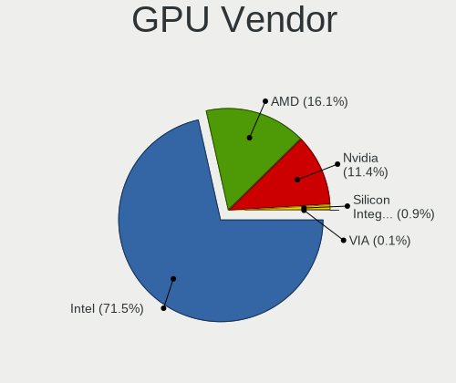

| Vendor                           | Notebooks | Percent |
|----------------------------------|-----------|---------|
| Intel                            | 1092      | 71.51%  |
| AMD                              | 246       | 16.11%  |
| Nvidia                           | 174       | 11.39%  |
| Silicon Integrated Systems [SiS] | 13        | 0.85%   |
| VIA Technologies                 | 2         | 0.13%   |

GPU Model
---------

Graphics card models

| Model                                                                                    | Notebooks | Percent |
|------------------------------------------------------------------------------------------|-----------|---------|
| Intel 2nd Generation Core Processor Family Integrated Graphics Controller                | 99        | 6.25%   |
| Intel 3rd Gen Core processor Graphics Controller                                         | 92        | 5.8%    |
| Intel GeminiLake [UHD Graphics 600]                                                      | 74        | 4.67%   |
| Intel HD Graphics 620                                                                    | 69        | 4.35%   |
| Intel TigerLake-LP GT2 [Iris Xe Graphics]                                                | 68        | 4.29%   |
| Intel Skylake GT2 [HD Graphics 520]                                                      | 49        | 3.09%   |
| Intel Core Processor Integrated Graphics Controller                                      | 47        | 2.97%   |
| Intel CometLake-U GT2 [UHD Graphics]                                                     | 47        | 2.97%   |
| Intel UHD Graphics 620                                                                   | 46        | 2.9%    |
| Intel Mobile 4 Series Chipset Integrated Graphics Controller                             | 46        | 2.9%    |
| Intel Atom/Celeron/Pentium Processor x5-E8000/J3xxx/N3xxx Integrated Graphics Controller | 45        | 2.84%   |
| Intel Haswell-ULT Integrated Graphics Controller                                         | 42        | 2.65%   |
| Intel HD Graphics 5500                                                                   | 36        | 2.27%   |
| AMD Picasso/Raven 2 [Radeon Vega Series / Radeon Vega Mobile Series]                     | 35        | 2.21%   |
| Intel WhiskeyLake-U GT2 [UHD Graphics 620]                                               | 30        | 1.89%   |
| Intel Atom Processor Z36xxx/Z37xxx Series Graphics & Display                             | 30        | 1.89%   |
| Intel Iris Plus Graphics G1 (Ice Lake)                                                   | 27        | 1.7%    |
| Intel Mobile GM965/GL960 Integrated Graphics Controller (secondary)                      | 23        | 1.45%   |
| Intel Mobile GM965/GL960 Integrated Graphics Controller (primary)                        | 23        | 1.45%   |
| Intel 4th Gen Core Processor Integrated Graphics Controller                              | 23        | 1.45%   |
| Intel HD Graphics 500                                                                    | 21        | 1.32%   |
| Intel Atom Processor D4xx/D5xx/N4xx/N5xx Integrated Graphics Controller                  | 21        | 1.32%   |
| Intel Atom Processor D2xxx/N2xxx Integrated Graphics Controller                          | 20        | 1.26%   |
| Intel Mobile 945GM/GMS/GME, 943/940GML Express Integrated Graphics Controller            | 19        | 1.2%    |
| AMD Stoney [Radeon R2/R3/R4/R5 Graphics]                                                 | 19        | 1.2%    |
| AMD Renoir [Radeon Vega Series / Radeon Vega Mobile Series]                              | 18        | 1.14%   |
| AMD Lucienne                                                                             | 17        | 1.07%   |
| Intel HD Graphics 630                                                                    | 15        | 0.95%   |
| AMD Topaz XT [Radeon R7 M260/M265 / M340/M360 / M440/M445 / 530/535 / 620/625 Mobile]    | 15        | 0.95%   |
| Nvidia GP107M [GeForce GTX 1050 Mobile]                                                  | 14        | 0.88%   |
| AMD Cezanne [Radeon Vega Series / Radeon Vega Mobile Series]                             | 14        | 0.88%   |
| Silicon Integrated Systems [SiS] 771/671 PCIE VGA Display Adapter                        | 13        | 0.82%   |
| Intel Mobile 945GM/GMS, 943/940GML Express Integrated Graphics Controller                | 13        | 0.82%   |
| AMD Raven Ridge [Radeon Vega Series / Radeon Vega Mobile Series]                         | 12        | 0.76%   |
| Intel TigerLake-H GT1 [UHD Graphics]                                                     | 11        | 0.69%   |
| Intel Alder Lake-UP3 GT2 [Iris Xe Graphics]                                              | 11        | 0.69%   |
| AMD Wani [Radeon R5/R6/R7 Graphics]                                                      | 11        | 0.69%   |
| Intel CometLake-H GT2 [UHD Graphics]                                                     | 10        | 0.63%   |
| Intel CoffeeLake-H GT2 [UHD Graphics 630]                                                | 10        | 0.63%   |
| AMD RS880M [Mobility Radeon HD 4225/4250]                                                | 10        | 0.63%   |

GPU Combo
---------

Combinations of graphics cards

| Name           | Notebooks | Percent |
|----------------|-----------|---------|
| 1 x Intel      | 916       | 68.21%  |
| 1 x AMD        | 171       | 12.73%  |
| Intel + Nvidia | 127       | 9.46%   |
| Intel + AMD    | 37        | 2.76%   |
| 1 x Nvidia     | 26        | 1.94%   |
| AMD + Nvidia   | 22        | 1.64%   |
| 2 x AMD        | 16        | 1.19%   |
| 2 x Intel      | 13        | 0.97%   |
| 1 x SiS        | 13        | 0.97%   |
| 1 x VIA        | 2         | 0.15%   |

GPU Driver
----------

Free vs proprietary

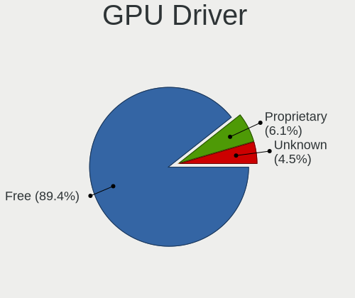

| Driver      | Notebooks | Percent |
|-------------|-----------|---------|
| Free        | 1209      | 89.36%  |
| Proprietary | 83        | 6.13%   |
| Unknown     | 61        | 4.51%   |

GPU Memory
----------

Total video memory

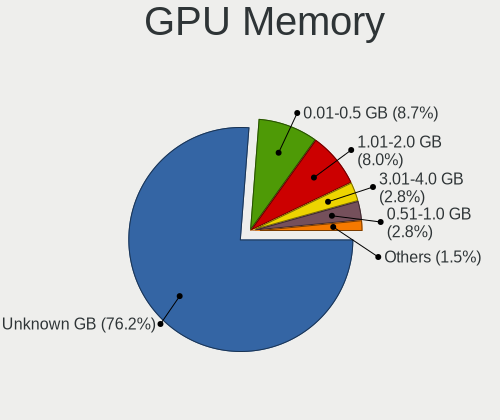

| Size in GB | Notebooks | Percent |
|------------|-----------|---------|
| Unknown    | 1042      | 76.23%  |
| 0.01-0.5   | 119       | 8.71%   |
| 1.01-2.0   | 109       | 7.97%   |
| 3.01-4.0   | 38        | 2.78%   |
| 0.51-1.0   | 38        | 2.78%   |
| 5.01-6.0   | 12        | 0.88%   |
| 7.01-8.0   | 3         | 0.22%   |
| 2.01-3.0   | 3         | 0.22%   |
| 8.01-16.0  | 3         | 0.22%   |

Monitor
-------

Monitor Vendor
--------------

Monitor vendors

| Vendor                  | Notebooks | Percent |
|-------------------------|-----------|---------|
| Chimei Innolux          | 247       | 16.38%  |
| BOE                     | 241       | 15.98%  |
| AU Optronics            | 228       | 15.12%  |
| Samsung Electronics     | 223       | 14.79%  |
| LG Display              | 163       | 10.81%  |
| InfoVision              | 53        | 3.51%   |
| Goldstar                | 53        | 3.51%   |
| Chi Mei Optoelectronics | 24        | 1.59%   |
| Apple                   | 20        | 1.33%   |
| PANDA                   | 19        | 1.26%   |
| Lenovo                  | 17        | 1.13%   |
| STA                     | 16        | 1.06%   |
| Philips                 | 16        | 1.06%   |
| LG Philips              | 15        | 0.99%   |
| InnoLux Display         | 12        | 0.8%    |
| Sharp                   | 11        | 0.73%   |
| Dell                    | 11        | 0.73%   |
| BenQ                    | 11        | 0.73%   |
| HannStar                | 10        | 0.66%   |
| ViewSonic               | 9         | 0.6%    |
| Hitachi                 | 9         | 0.6%    |
| KDC                     | 8         | 0.53%   |
| KDB                     | 8         | 0.53%   |
| CPT                     | 8         | 0.53%   |
| SKY                     | 6         | 0.4%    |
| Hewlett-Packard         | 6         | 0.4%    |
| ASUSTek Computer        | 6         | 0.4%    |
| Toshiba                 | 4         | 0.27%   |
| CSO                     | 4         | 0.27%   |
| SLD                     | 3         | 0.2%    |
| Pixio                   | 3         | 0.2%    |
| HKC                     | 3         | 0.2%    |
| Gigabyte Technology     | 3         | 0.2%    |
| ZTR                     | 2         | 0.13%   |
| Valve                   | 2         | 0.13%   |
| UTV                     | 2         | 0.13%   |
| Unknown                 | 2         | 0.13%   |
| MTD                     | 2         | 0.13%   |
| KIG                     | 2         | 0.13%   |
| KGS                     | 2         | 0.13%   |

Monitor Model
-------------

Monitor models

| Model                                                                | Notebooks | Percent |
|----------------------------------------------------------------------|-----------|---------|
| InfoVision LCD Monitor IVO03F4 1920x1080 309x173mm 13.9-inch         | 30        | 1.96%   |
| Chimei Innolux LCD Monitor CMN15DB 1366x768 344x193mm 15.5-inch      | 30        | 1.96%   |
| Chimei Innolux LCD Monitor CMN15E6 1366x768 344x193mm 15.5-inch      | 26        | 1.7%    |
| Samsung Electronics LCD Monitor SEC5441 1280x800 286x179mm 13.3-inch | 17        | 1.11%   |
| Chimei Innolux LCD Monitor CMN15F5 1920x1080 344x193mm 15.5-inch     | 14        | 0.91%   |
| BOE LCD Monitor BOE06A4 1366x768 344x194mm 15.5-inch                 | 13        | 0.85%   |
| AU Optronics LCD Monitor AUO2E3C 1366x768 309x173mm 13.9-inch        | 13        | 0.85%   |
| LG Display LCD Monitor LGD02E9 1366x768 309x174mm 14.0-inch          | 12        | 0.78%   |
| Chimei Innolux LCD Monitor CMN14D6 1366x768 309x173mm 13.9-inch      | 12        | 0.78%   |
| AU Optronics LCD Monitor AUO71EC 1366x768 344x193mm 15.5-inch        | 11        | 0.72%   |
| Samsung Electronics LCD Monitor SEC4542 1366x768 309x174mm 14.0-inch | 10        | 0.65%   |
| Chimei Innolux LCD Monitor CMN14C3 1366x768 309x173mm 13.9-inch      | 10        | 0.65%   |
| BOE LCD Monitor BOE06A5 1366x768 344x194mm 15.5-inch                 | 10        | 0.65%   |
| InfoVision M140NWR2 R1 IVO057A 1366x768 309x174mm 14.0-inch          | 9         | 0.59%   |
| Samsung Electronics C24F390 SAM0D2C 1920x1080 521x293mm 23.5-inch    | 8         | 0.52%   |
| Goldstar FULL HD GSM5B55 1920x1080 480x270mm 21.7-inch               | 8         | 0.52%   |
| Chimei Innolux LCD Monitor CMN15E7 1920x1080 344x193mm 15.5-inch     | 8         | 0.52%   |
| Chimei Innolux LCD Monitor CMN14D4 1920x1080 309x173mm 13.9-inch     | 8         | 0.52%   |
| BOE LCD Monitor BOE0812 1920x1080 344x194mm 15.5-inch                | 8         | 0.52%   |
| AU Optronics LCD Monitor AUO21ED 1920x1080 344x193mm 15.5-inch       | 8         | 0.52%   |
| AU Optronics LCD Monitor AUO183C 1366x768 309x173mm 13.9-inch        | 8         | 0.52%   |
| KDB LCD Monitor KDB1130 1366x768 256x144mm 11.6-inch                 | 7         | 0.46%   |
| HannStar LCD Monitor HSD03E9 1024x600 220x129mm 10.0-inch            | 7         | 0.46%   |
| Chimei Innolux LCD Monitor CMN15DC 1366x768 344x193mm 15.5-inch      | 7         | 0.46%   |
| BOE LCD Monitor BOE0697 1366x768 309x173mm 13.9-inch                 | 7         | 0.46%   |
| BOE LCD Monitor BOE0675 1366x768 344x194mm 15.5-inch                 | 7         | 0.46%   |
| STA LCD Monitor STA8CA7 1366x768 256x144mm 11.6-inch                 | 6         | 0.39%   |
| Samsung Electronics LCD Monitor SEC4145 1366x768 309x174mm 14.0-inch | 6         | 0.39%   |
| Samsung Electronics C27F390 SAM0D32 1920x1080 600x340mm 27.2-inch    | 6         | 0.39%   |
| PANDA LCD Monitor NCP004A 1920x1080 309x174mm 14.0-inch              | 6         | 0.39%   |
| LG Display LCD Monitor LGD02DC 1366x768 344x194mm 15.5-inch          | 6         | 0.39%   |
| Chimei Innolux LCD Monitor CMN14E5 1920x1080 309x173mm 13.9-inch     | 6         | 0.39%   |
| BOE LCD Monitor BOE0696 1366x768 309x173mm 13.9-inch                 | 6         | 0.39%   |
| BOE LCD Monitor BOE0672 1366x768 344x194mm 15.5-inch                 | 6         | 0.39%   |
| AU Optronics LCD Monitor AUO70EC 1366x768 344x193mm 15.5-inch        | 6         | 0.39%   |
| AU Optronics LCD Monitor AUO38ED 1920x1080 344x193mm 15.5-inch       | 6         | 0.39%   |
| LG Display LP156WH2-TLAA LGD0230 1366x768 344x194mm 15.5-inch        | 5         | 0.33%   |
| LG Display LCD Monitor LGD04E1 1366x768 344x194mm 15.5-inch          | 5         | 0.33%   |
| LG Display LCD Monitor LGD045C 1366x768 345x194mm 15.6-inch          | 5         | 0.33%   |
| LG Display LCD Monitor LGD0456 1366x768 344x194mm 15.5-inch          | 5         | 0.33%   |

Monitor Resolution
------------------

Monitor screen resolution

| Resolution         | Notebooks | Percent |
|--------------------|-----------|---------|
| 1366x768 (WXGA)    | 708       | 48.83%  |
| 1920x1080 (FHD)    | 431       | 29.72%  |
| 1280x800 (WXGA)    | 60        | 4.14%   |
| 3840x2160 (4K)     | 44        | 3.03%   |
| 1920x1200 (WUXGA)  | 43        | 2.97%   |
| 1600x900 (HD+)     | 31        | 2.14%   |
| 1440x900 (WXGA+)   | 20        | 1.38%   |
| 1024x600           | 18        | 1.24%   |
| 1360x768           | 11        | 0.76%   |
| 1280x1024 (SXGA)   | 11        | 0.76%   |
| 2560x1600          | 9         | 0.62%   |
| 1680x1050 (WSXGA+) | 9         | 0.62%   |
| 2880x1800          | 8         | 0.55%   |
| 2560x1080          | 6         | 0.41%   |
| 3200x1800 (QHD+)   | 5         | 0.34%   |
| 3840x2400          | 4         | 0.28%   |
| 2560x1440 (QHD)    | 4         | 0.28%   |
| 2880x1620          | 3         | 0.21%   |
| 1920x540           | 3         | 0.21%   |
| 800x1280           | 2         | 0.14%   |
| 3840x1100          | 2         | 0.14%   |
| 2288x1287          | 2         | 0.14%   |
| 1600x2560          | 2         | 0.14%   |
| 1024x768 (XGA)     | 2         | 0.14%   |
| 3840x1080          | 1         | 0.07%   |
| 3456x2160          | 1         | 0.07%   |
| 3440x1440          | 1         | 0.07%   |
| 3072x1920          | 1         | 0.07%   |
| 3000x2000          | 1         | 0.07%   |
| 2560x2880          | 1         | 0.07%   |
| 2160x1440          | 1         | 0.07%   |
| 1920x515           | 1         | 0.07%   |
| 1920x1280          | 1         | 0.07%   |
| 1680x945           | 1         | 0.07%   |
| 1280x768           | 1         | 0.07%   |
| 1280x720 (HD)      | 1         | 0.07%   |

Monitor Diagonal
----------------

Diagonal size in inches

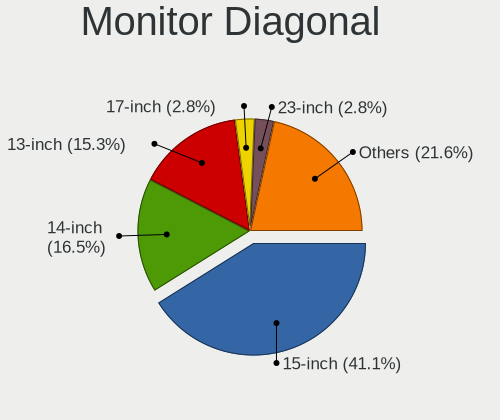

| Inches  | Notebooks | Percent |
|---------|-----------|---------|
| 15      | 625       | 41.09%  |
| 14      | 251       | 16.5%   |
| 13      | 232       | 15.25%  |
| 17      | 43        | 2.83%   |
| 23      | 42        | 2.76%   |
| 11      | 41        | 2.7%    |
| 21      | 37        | 2.43%   |
| 27      | 35        | 2.3%    |
| 18      | 30        | 1.97%   |
| 10      | 24        | 1.58%   |
| 24      | 18        | 1.18%   |
| 16      | 18        | 1.18%   |
| 12      | 17        | 1.12%   |
| 40      | 16        | 1.05%   |
| 19      | 14        | 0.92%   |
| 31      | 13        | 0.85%   |
| 20      | 13        | 0.85%   |
| 84      | 7         | 0.46%   |
| 34      | 7         | 0.46%   |
| 52      | 6         | 0.39%   |
| 46      | 6         | 0.39%   |
| 32      | 4         | 0.26%   |
| 48      | 3         | 0.2%    |
| Unknown | 3         | 0.2%    |
| 142     | 2         | 0.13%   |
| 86      | 2         | 0.13%   |
| 54      | 2         | 0.13%   |
| 22      | 2         | 0.13%   |
| 7       | 2         | 0.13%   |
| 72      | 1         | 0.07%   |
| 65      | 1         | 0.07%   |
| 43      | 1         | 0.07%   |
| 41      | 1         | 0.07%   |
| 37      | 1         | 0.07%   |
| 8       | 1         | 0.07%   |

Monitor Width
-------------

Physical width

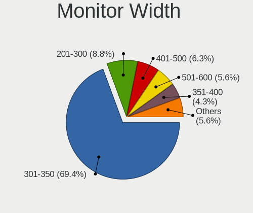

| Width in mm    | Notebooks | Percent |
|----------------|-----------|---------|
| 301-350        | 1046      | 69.36%  |
| 201-300        | 133       | 8.82%   |
| 401-500        | 95        | 6.3%    |
| 501-600        | 85        | 5.64%   |
| 351-400        | 65        | 4.31%   |
| 1001-1500      | 20        | 1.33%   |
| 601-700        | 18        | 1.19%   |
| 801-900        | 17        | 1.13%   |
| 701-800        | 11        | 0.73%   |
| 1501-2000      | 8         | 0.53%   |
| Unknown        | 3         | 0.2%    |
| More than 2000 | 2         | 0.13%   |
| 901-1000       | 2         | 0.13%   |
| 1-100          | 2         | 0.13%   |
| 101-200        | 1         | 0.07%   |

Aspect Ratio
------------

Proportional relationship between the width and the height

| Ratio   | Notebooks | Percent |
|---------|-----------|---------|
| 16/9    | 1160      | 87.02%  |
| 16/10   | 131       | 9.83%   |
| 5/4     | 9         | 0.68%   |
| 21/9    | 7         | 0.53%   |
| 3/2     | 6         | 0.45%   |
| 4/3     | 5         | 0.38%   |
| 3.40    | 2         | 0.15%   |
| 1.96    | 2         | 0.15%   |
| 1.00    | 2         | 0.15%   |
| 0.67    | 2         | 0.15%   |
| 0.56    | 2         | 0.15%   |
| 6/5     | 1         | 0.08%   |
| 32/9    | 1         | 0.08%   |
| 3.73    | 1         | 0.08%   |
| 0.89    | 1         | 0.08%   |
| Unknown | 1         | 0.08%   |

Monitor Area
------------

Area in inch

| Area in inch | Notebooks | Percent |
|----------------|-----------|---------|
| 101-110        | 623       | 40.91%  |
| 81-90          | 442       | 29.02%  |
| 201-250        | 92        | 6.04%   |
| 51-60          | 43        | 2.82%   |
| 71-80          | 35        | 2.3%    |
| 141-150        | 35        | 2.3%    |
| 301-350        | 34        | 2.23%   |
| 121-130        | 34        | 2.23%   |
| 151-200        | 33        | 2.17%   |
| 501-1000       | 28        | 1.84%   |
| 351-500        | 25        | 1.64%   |
| 41-50          | 24        | 1.58%   |
| More than 1000 | 21        | 1.38%   |
| 111-120        | 19        | 1.25%   |
| 61-70          | 17        | 1.12%   |
| 91-100         | 6         | 0.39%   |
| 131-140        | 4         | 0.26%   |
| 1-40           | 3         | 0.2%    |
| Unknown        | 3         | 0.2%    |
| 251-300        | 2         | 0.13%   |

Pixel Density
-------------

Pixels per inch

| Density       | Notebooks | Percent |
|---------------|-----------|---------|
| 101-120       | 736       | 49.36%  |
| 121-160       | 401       | 26.89%  |
| 51-100        | 248       | 16.63%  |
| 161-240       | 45        | 3.02%   |
| 1-50          | 33        | 2.21%   |
| More than 240 | 25        | 1.68%   |
| Unknown       | 3         | 0.2%    |

Multiple Monitors
-----------------

Total monitors connected

| Total | Notebooks | Percent |
|-------|-----------|---------|
| 1     | 1096      | 79.88%  |
| 2     | 225       | 16.4%   |
| 0     | 34        | 2.48%   |
| 3     | 15        | 1.09%   |
| 5     | 1         | 0.07%   |
| 4     | 1         | 0.07%   |

Network
-------

Net Controller Vendor
---------------------

Controller vendors

| Vendor                                | Notebooks | Percent |
|---------------------------------------|-----------|---------|
| Realtek Semiconductor                 | 839       | 40.77%  |
| Intel                                 | 544       | 26.43%  |
| Qualcomm Atheros                      | 274       | 13.31%  |
| Broadcom                              | 113       | 5.49%   |
| MediaTek                              | 36        | 1.75%   |
| Broadcom Limited                      | 30        | 1.46%   |
| TP-Link                               | 29        | 1.41%   |
| Marvell Technology Group              | 29        | 1.41%   |
| JMicron Technology                    | 27        | 1.31%   |
| Ralink                                | 21        | 1.02%   |
| Samsung Electronics                   | 17        | 0.83%   |
| Ralink Technology                     | 17        | 0.83%   |
| Silicon Integrated Systems [SiS]      | 13        | 0.63%   |
| Motorola PCS                          | 12        | 0.58%   |
| Qualcomm Atheros Communications       | 9         | 0.44%   |
| ASIX Electronics                      | 9         | 0.44%   |
| Nvidia                                | 5         | 0.24%   |
| DisplayLink                           | 4         | 0.19%   |
| Xiaomi                                | 3         | 0.15%   |
| Ericsson Business Mobile Networks     | 3         | 0.15%   |
| VIA Technologies                      | 2         | 0.1%    |
| Spreadtrum Communications             | 2         | 0.1%    |
| Lenovo                                | 2         | 0.1%    |
| ICS Advent                            | 2         | 0.1%    |
| Encore Electronics                    | 2         | 0.1%    |
| ZTopInc                               | 1         | 0.05%   |
| ZTE WCDMA Technologies MSM            | 1         | 0.05%   |
| T & A Mobile Phones                   | 1         | 0.05%   |
| Sierra Wireless                       | 1         | 0.05%   |
| Qualcomm                              | 1         | 0.05%   |
| PAX                                   | 1         | 0.05%   |
| Ovislink                              | 1         | 0.05%   |
| Digitech Systems                      | 1         | 0.05%   |
| Dell                                  | 1         | 0.05%   |
| Cisco Aironet Wireless Communications | 1         | 0.05%   |
| Arduino SA                            | 1         | 0.05%   |
| AMD                                   | 1         | 0.05%   |
| 802.11g Adapter [Linksys WUSB54GC v3] | 1         | 0.05%   |
| 3DSP                                  | 1         | 0.05%   |

Net Controller Model
--------------------

Controller models

| Model                                                                   | Notebooks | Percent |
|-------------------------------------------------------------------------|-----------|---------|
| Realtek RTL8111/8168/8211/8411 PCI Express Gigabit Ethernet Controller  | 438       | 17.47%  |
| Realtek RTL810xE PCI Express Fast Ethernet controller                   | 188       | 7.5%    |
| Realtek RTL8821CE 802.11ac PCIe Wireless Network Adapter                | 66        | 2.63%   |
| Qualcomm Atheros QCA9377 802.11ac Wireless Network Adapter              | 56        | 2.23%   |
| Realtek RTL8822CE 802.11ac PCIe Wireless Network Adapter                | 54        | 2.15%   |
| Realtek RTL8188CE 802.11b/g/n WiFi Adapter                              | 49        | 1.95%   |
| Intel Wi-Fi 6 AX201                                                     | 49        | 1.95%   |
| Realtek RTL8723BE PCIe Wireless Network Adapter                         | 46        | 1.83%   |
| Qualcomm Atheros AR9485 Wireless Network Adapter                        | 46        | 1.83%   |
| Qualcomm Atheros AR9285 Wireless Network Adapter (PCI-Express)          | 42        | 1.68%   |
| Qualcomm Atheros QCA9565 / AR9565 Wireless Network Adapter              | 39        | 1.56%   |
| Intel Comet Lake PCH-LP CNVi WiFi                                       | 39        | 1.56%   |
| Intel Wireless 3160                                                     | 37        | 1.48%   |
| Broadcom BCM4313 802.11bgn Wireless Network Adapter                     | 32        | 1.28%   |
| Intel Wireless 3165                                                     | 30        | 1.2%    |
| Realtek RTL8723DE Wireless Network Adapter                              | 29        | 1.16%   |
| Intel Wireless 8265 / 8275                                              | 29        | 1.16%   |
| Realtek 802.11n WLAN Adapter                                            | 27        | 1.08%   |
| Intel Wireless 7260                                                     | 26        | 1.04%   |
| Qualcomm Atheros AR8152 v2.0 Fast Ethernet                              | 23        | 0.92%   |
| JMicron JMC250 PCI Express Gigabit Ethernet Controller                  | 23        | 0.92%   |
| Intel Wi-Fi 6 AX200                                                     | 22        | 0.88%   |
| Qualcomm Atheros QCA6174 802.11ac Wireless Network Adapter              | 21        | 0.84%   |
| Intel Wireless 7265                                                     | 21        | 0.84%   |
| Intel Dual Band Wireless-AC 3165 Plus Bluetooth                         | 21        | 0.84%   |
| Intel Gemini Lake PCH CNVi WiFi                                         | 20        | 0.8%    |
| Intel 82579LM Gigabit Network Connection (Lewisville)                   | 20        | 0.8%    |
| Qualcomm Atheros AR8151 v2.0 Gigabit Ethernet                           | 19        | 0.76%   |
| Intel Centrino Advanced-N 6205 [Taylor Peak]                            | 19        | 0.76%   |
| Broadcom BCM4312 802.11b/g LP-PHY                                       | 19        | 0.76%   |
| Realtek RTL8191SEvB Wireless LAN Controller                             | 18        | 0.72%   |
| Realtek RTL8188EE Wireless Network Adapter                              | 18        | 0.72%   |
| Marvell Group 88E8040 PCI-E Fast Ethernet Controller                    | 18        | 0.72%   |
| Intel PRO/Wireless 3945ABG [Golan] Network Connection                   | 18        | 0.72%   |
| Intel Dual Band Wireless-AC 3168NGW [Stone Peak]                        | 18        | 0.72%   |
| Qualcomm Atheros AR242x / AR542x Wireless Network Adapter (PCI-Express) | 17        | 0.68%   |
| Intel Cannon Point-LP CNVi [Wireless-AC]                                | 17        | 0.68%   |
| Broadcom BCM43142 802.11b/g/n                                           | 17        | 0.68%   |
| Realtek RTL8723BU 802.11b/g/n WLAN Adapter                              | 16        | 0.64%   |
| Realtek RTL8152 Fast Ethernet Adapter                                   | 16        | 0.64%   |

Wireless Vendor
---------------

Wireless vendors

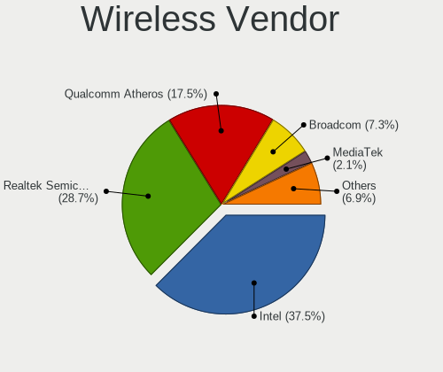

| Vendor                                | Notebooks | Percent |
|---------------------------------------|-----------|---------|
| Intel                                 | 514       | 37.46%  |
| Realtek Semiconductor                 | 394       | 28.72%  |
| Qualcomm Atheros                      | 240       | 17.49%  |
| Broadcom                              | 100       | 7.29%   |
| MediaTek                              | 29        | 2.11%   |
| TP-Link                               | 21        | 1.53%   |
| Ralink                                | 21        | 1.53%   |
| Broadcom Limited                      | 18        | 1.31%   |
| Ralink Technology                     | 17        | 1.24%   |
| Qualcomm Atheros Communications       | 9         | 0.66%   |
| Encore Electronics                    | 2         | 0.15%   |
| ZTopInc                               | 1         | 0.07%   |
| Sierra Wireless                       | 1         | 0.07%   |
| Qualcomm                              | 1         | 0.07%   |
| Ovislink                              | 1         | 0.07%   |
| Dell                                  | 1         | 0.07%   |
| Cisco Aironet Wireless Communications | 1         | 0.07%   |
| 802.11g Adapter [Linksys WUSB54GC v3] | 1         | 0.07%   |

Wireless Model
--------------

Wireless models

| Model                                                                   | Notebooks | Percent |
|-------------------------------------------------------------------------|-----------|---------|
| Realtek RTL8821CE 802.11ac PCIe Wireless Network Adapter                | 66        | 4.76%   |
| Qualcomm Atheros QCA9377 802.11ac Wireless Network Adapter              | 56        | 4.04%   |
| Realtek RTL8822CE 802.11ac PCIe Wireless Network Adapter                | 54        | 3.9%    |
| Realtek RTL8188CE 802.11b/g/n WiFi Adapter                              | 49        | 3.54%   |
| Intel Wi-Fi 6 AX201                                                     | 49        | 3.54%   |
| Realtek RTL8723BE PCIe Wireless Network Adapter                         | 46        | 3.32%   |
| Qualcomm Atheros AR9485 Wireless Network Adapter                        | 46        | 3.32%   |
| Qualcomm Atheros AR9285 Wireless Network Adapter (PCI-Express)          | 42        | 3.03%   |
| Qualcomm Atheros QCA9565 / AR9565 Wireless Network Adapter              | 39        | 2.81%   |
| Intel Comet Lake PCH-LP CNVi WiFi                                       | 39        | 2.81%   |
| Intel Wireless 3160                                                     | 37        | 2.67%   |
| Broadcom BCM4313 802.11bgn Wireless Network Adapter                     | 32        | 2.31%   |
| Intel Wireless 3165                                                     | 30        | 2.16%   |
| Realtek RTL8723DE Wireless Network Adapter                              | 29        | 2.09%   |
| Intel Wireless 8265 / 8275                                              | 29        | 2.09%   |
| Realtek 802.11n WLAN Adapter                                            | 27        | 1.95%   |
| Intel Wireless 7260                                                     | 26        | 1.88%   |
| Intel Wi-Fi 6 AX200                                                     | 22        | 1.59%   |
| Qualcomm Atheros QCA6174 802.11ac Wireless Network Adapter              | 21        | 1.52%   |
| Intel Wireless 7265                                                     | 21        | 1.52%   |
| Intel Dual Band Wireless-AC 3165 Plus Bluetooth                         | 21        | 1.52%   |
| Intel Gemini Lake PCH CNVi WiFi                                         | 20        | 1.44%   |
| Intel Centrino Advanced-N 6205 [Taylor Peak]                            | 19        | 1.37%   |
| Broadcom BCM4312 802.11b/g LP-PHY                                       | 19        | 1.37%   |
| Realtek RTL8191SEvB Wireless LAN Controller                             | 18        | 1.3%    |
| Realtek RTL8188EE Wireless Network Adapter                              | 18        | 1.3%    |
| Intel PRO/Wireless 3945ABG [Golan] Network Connection                   | 18        | 1.3%    |
| Intel Dual Band Wireless-AC 3168NGW [Stone Peak]                        | 18        | 1.3%    |
| Qualcomm Atheros AR242x / AR542x Wireless Network Adapter (PCI-Express) | 17        | 1.23%   |
| Intel Cannon Point-LP CNVi [Wireless-AC]                                | 17        | 1.23%   |
| Broadcom BCM43142 802.11b/g/n                                           | 17        | 1.23%   |
| Realtek RTL8723BU 802.11b/g/n WLAN Adapter                              | 16        | 1.15%   |
| Intel Ice Lake-LP PCH CNVi WiFi                                         | 16        | 1.15%   |
| Intel Wireless 8260                                                     | 13        | 0.94%   |
| Realtek RTL8188EUS 802.11n Wireless Network Adapter                     | 12        | 0.87%   |
| MediaTek Wi-Fi 6E MT7902 Wireless Network Adapter                       | 12        | 0.87%   |
| MediaTek MT7921 802.11ax PCI Express Wireless Network Adapter           | 11        | 0.79%   |
| Intel Centrino Wireless-N 1000 [Condor Peak]                            | 11        | 0.79%   |
| Intel Alder Lake-P PCH CNVi WiFi                                        | 11        | 0.79%   |
| Realtek RTL8852AE 802.11ax PCIe Wireless Network Adapter                | 10        | 0.72%   |

Ethernet Vendor
---------------

Ethernet vendors

| Vendor                           | Notebooks | Percent |
|----------------------------------|-----------|---------|
| Realtek Semiconductor            | 673       | 60.85%  |
| Intel                            | 163       | 14.74%  |
| Qualcomm Atheros                 | 87        | 7.87%   |
| Marvell Technology Group         | 29        | 2.62%   |
| Broadcom                         | 29        | 2.62%   |
| JMicron Technology               | 27        | 2.44%   |
| Samsung Electronics              | 15        | 1.36%   |
| Silicon Integrated Systems [SiS] | 13        | 1.18%   |
| Broadcom Limited                 | 12        | 1.08%   |
| Motorola PCS                     | 11        | 0.99%   |
| ASIX Electronics                 | 9         | 0.81%   |
| TP-Link                          | 8         | 0.72%   |
| MediaTek                         | 7         | 0.63%   |
| Nvidia                           | 5         | 0.45%   |
| DisplayLink                      | 4         | 0.36%   |
| Xiaomi                           | 3         | 0.27%   |
| VIA Technologies                 | 2         | 0.18%   |
| Spreadtrum Communications        | 2         | 0.18%   |
| Lenovo                           | 2         | 0.18%   |
| ICS Advent                       | 2         | 0.18%   |
| T & A Mobile Phones              | 1         | 0.09%   |
| Digitech Systems                 | 1         | 0.09%   |
| 3DSP                             | 1         | 0.09%   |

Ethernet Model
--------------

Ethernet models

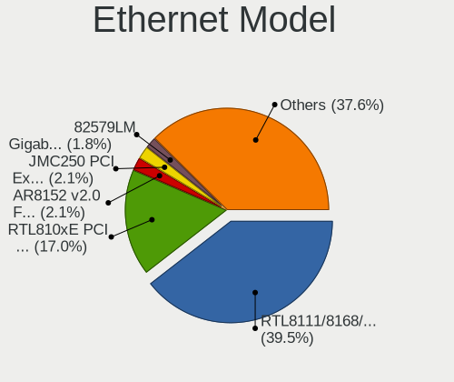

| Model                                                                  | Notebooks | Percent |
|------------------------------------------------------------------------|-----------|---------|
| Realtek RTL8111/8168/8211/8411 PCI Express Gigabit Ethernet Controller | 438       | 39.5%   |
| Realtek RTL810xE PCI Express Fast Ethernet controller                  | 188       | 16.95%  |
| Qualcomm Atheros AR8152 v2.0 Fast Ethernet                             | 23        | 2.07%   |
| JMicron JMC250 PCI Express Gigabit Ethernet Controller                 | 23        | 2.07%   |
| Intel 82579LM Gigabit Network Connection (Lewisville)                  | 20        | 1.8%    |
| Qualcomm Atheros AR8151 v2.0 Gigabit Ethernet                          | 19        | 1.71%   |
| Marvell Group 88E8040 PCI-E Fast Ethernet Controller                   | 18        | 1.62%   |
| Realtek RTL8152 Fast Ethernet Adapter                                  | 16        | 1.44%   |
| Samsung Galaxy series, misc. (tethering mode)                          | 15        | 1.35%   |
| Realtek RTL8153 Gigabit Ethernet Adapter                               | 15        | 1.35%   |
| Intel Ethernet Connection (4) I219-LM                                  | 15        | 1.35%   |
| Intel Ethernet Connection (13) I219-V                                  | 15        | 1.35%   |
| Silicon Integrated Systems [SiS] 191 Gigabit Ethernet Adapter          | 13        | 1.17%   |
| Intel Ethernet Connection (10) I219-V                                  | 12        | 1.08%   |
| Intel 82577LM Gigabit Network Connection                               | 12        | 1.08%   |
| Realtek RTL-8100/8101L/8139 PCI Fast Ethernet Adapter                  | 11        | 0.99%   |
| Qualcomm Atheros AR8162 Fast Ethernet                                  | 11        | 0.99%   |
| Motorola PCS moto g84 5G                                               | 11        | 0.99%   |
| Intel Ethernet Connection I218-LM                                      | 9         | 0.81%   |
| Intel Ethernet Connection I217-LM                                      | 9         | 0.81%   |
| Intel Ethernet Connection I219-LM                                      | 7         | 0.63%   |
| Broadcom NetLink BCM5906M Fast Ethernet PCI Express                    | 7         | 0.63%   |
| Qualcomm Atheros AR8161 Gigabit Ethernet                               | 6         | 0.54%   |
| Qualcomm Atheros AR8152 v1.1 Fast Ethernet                             | 6         | 0.54%   |
| Intel Ethernet Controller I225-V                                       | 6         | 0.54%   |
| Intel 82567LM Gigabit Network Connection                               | 6         | 0.54%   |
| Broadcom NetXtreme BCM57765 Gigabit Ethernet PCIe                      | 6         | 0.54%   |
| Realtek RTL8125 2.5GbE Controller                                      | 5         | 0.45%   |
| Qualcomm Atheros AR8131 Gigabit Ethernet                               | 5         | 0.45%   |
| Marvell Group 88E8039 PCI-E Fast Ethernet Controller                   | 5         | 0.45%   |
| Intel Ethernet Connection (10) I219-LM                                 | 5         | 0.45%   |
| Intel 82579V Gigabit Network Connection                                | 5         | 0.45%   |
| Broadcom NetLink BCM57780 Gigabit Ethernet PCIe                        | 5         | 0.45%   |
| Broadcom Limited NetLink BCM57780 Gigabit Ethernet PCIe                | 5         | 0.45%   |
| TP-Link USB 10/100 LAN                                                 | 4         | 0.36%   |
| TP-Link UE300 10/100/1000 LAN (ethernet mode) [Realtek RTL8153]        | 4         | 0.36%   |
| Qualcomm Atheros AR8132 Fast Ethernet                                  | 4         | 0.36%   |
| MediaTek MT7922 802.11ax PCI Express Wireless Network Adapter          | 4         | 0.36%   |
| JMicron JMC260 PCI Express Fast Ethernet Controller                    | 4         | 0.36%   |
| Intel PRO/100 VE Network Connection                                    | 4         | 0.36%   |

Net Controller Kind
-------------------

Ethernet, WiFi or modem

| Kind     | Notebooks | Percent |
|----------|-----------|---------|
| WiFi     | 1309      | 54.93%  |
| Ethernet | 1062      | 44.57%  |
| Modem    | 12        | 0.5%    |

Used Controller
---------------

Currently used network controller

| Kind     | Notebooks | Percent |
|----------|-----------|---------|
| WiFi     | 1116      | 81.22%  |
| Ethernet | 258       | 18.78%  |

NICs
----

Total network controllers on board

| Total | Notebooks | Percent |
|-------|-----------|---------|
| 2     | 969       | 72.15%  |
| 1     | 307       | 22.86%  |
| 0     | 62        | 4.62%   |
| 3     | 4         | 0.3%    |
| 4     | 1         | 0.07%   |

IPv6
----

IPv6 vs IPv4

| Used | Notebooks | Percent |
|------|-----------|---------|
| No   | 1118      | 82.27%  |
| Yes  | 241       | 17.73%  |

Bluetooth
---------

Bluetooth Vendor
----------------

Controller vendors

| Vendor                          | Notebooks | Percent |
|---------------------------------|-----------|---------|
| Intel                           | 407       | 42.4%   |
| Realtek Semiconductor           | 185       | 19.27%  |
| Qualcomm Atheros Communications | 81        | 8.44%   |
| IMC Networks                    | 74        | 7.71%   |
| Broadcom                        | 48        | 5%      |
| Lite-On Technology              | 46        | 4.79%   |
| Foxconn / Hon Hai               | 31        | 3.23%   |
| Apple                           | 17        | 1.77%   |
| Dell                            | 16        | 1.67%   |
| Cambridge Silicon Radio         | 16        | 1.67%   |
| Toshiba                         | 13        | 1.35%   |
| Ralink                          | 8         | 0.83%   |
| USI                             | 3         | 0.31%   |
| Alps Electric                   | 3         | 0.31%   |
| Qcom                            | 2         | 0.21%   |
| Hewlett-Packard                 | 2         | 0.21%   |
| ASUSTek Computer                | 2         | 0.21%   |
| TP-Link                         | 1         | 0.1%    |
| Syntek                          | 1         | 0.1%    |
| Realtek                         | 1         | 0.1%    |
| Ralink Technology               | 1         | 0.1%    |
| Integrated System Solution      | 1         | 0.1%    |
| Foxconn International           | 1         | 0.1%    |

Bluetooth Model
---------------

Controller models

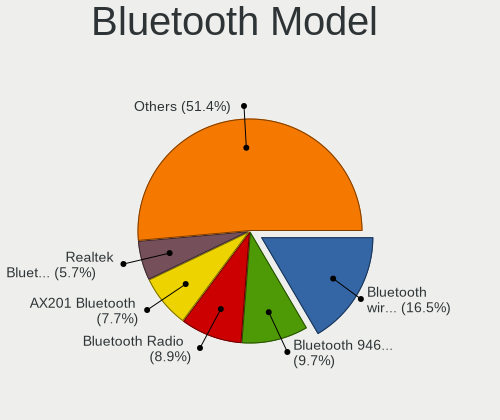

| Model                                               | Notebooks | Percent |
|-----------------------------------------------------|-----------|---------|
| Intel Bluetooth wireless interface                  | 159       | 16.55%  |
| Intel Bluetooth 9460/9560 Jefferson Peak (JfP)      | 93        | 9.68%   |
| Realtek Bluetooth Radio                             | 86        | 8.95%   |
| Intel AX201 Bluetooth                               | 74        | 7.7%    |
| Realtek  Bluetooth 4.2 Adapter                      | 55        | 5.72%   |
| Qualcomm Atheros  Bluetooth Device                  | 47        | 4.89%   |
| IMC Networks Bluetooth Radio                        | 31        | 3.23%   |
| Realtek 802.11ac WLAN Adapter                       | 26        | 2.71%   |
| Intel AX200 Bluetooth                               | 21        | 2.19%   |
| IMC Networks Wireless_Device                        | 19        | 1.98%   |
| Intel Wireless-AC 3168 Bluetooth                    | 18        | 1.87%   |
| Qualcomm Atheros AR3012 Bluetooth 4.0               | 16        | 1.66%   |
| Cambridge Silicon Radio Bluetooth Dongle (HCI mode) | 16        | 1.66%   |
| Lite-On Qualcomm Atheros QCA9377 Bluetooth          | 15        | 1.56%   |
| Lite-On Bluetooth Device                            | 15        | 1.56%   |
| Intel Centrino Bluetooth Wireless Transceiver       | 14        | 1.46%   |
| IMC Networks Bluetooth Device                       | 14        | 1.46%   |
| Intel Centrino Advanced-N 6230 Bluetooth adapter    | 10        | 1.04%   |
| Intel AX211 Bluetooth                               | 10        | 1.04%   |
| Realtek RTL8723B Bluetooth                          | 9         | 0.94%   |
| Broadcom BCM20702 Bluetooth 4.0 [ThinkPad]          | 9         | 0.94%   |
| Toshiba Bluetooth USB Host Controller               | 8         | 0.83%   |
| Ralink RT3290 Bluetooth                             | 8         | 0.83%   |
| Qualcomm Atheros QCA61x4 Bluetooth 4.0              | 8         | 0.83%   |
| Broadcom BCM43142 Bluetooth 4.0                     | 8         | 0.83%   |
| Realtek RTL8821A Bluetooth                          | 7         | 0.73%   |
| Foxconn / Hon Hai Bluetooth Device                  | 7         | 0.73%   |
| Broadcom BCM2070 Bluetooth 2.1 + EDR                | 7         | 0.73%   |
| Apple Bluetooth USB Host Controller                 | 7         | 0.73%   |
| IMC Networks Atheros AR3012 Bluetooth 4.0 Adapter   | 6         | 0.62%   |
| Foxconn / Hon Hai Wireless_Device                   | 6         | 0.62%   |
| Qualcomm Atheros AR3011 Bluetooth                   | 5         | 0.52%   |
| Lite-On Broadcom BCM43142A0 Bluetooth Device        | 5         | 0.52%   |
| Lite-On Bluetooth Radio                             | 5         | 0.52%   |
| Intel AX210 Bluetooth                               | 5         | 0.52%   |
| Foxconn / Hon Hai Broadcom Bluetooth 2.1 Device     | 5         | 0.52%   |
| Dell Wireless 365 Bluetooth                         | 5         | 0.52%   |
| Dell DW375 Bluetooth Module                         | 5         | 0.52%   |
| Broadcom BCM2070 Bluetooth Device                   | 5         | 0.52%   |
| Apple Bluetooth Host Controller                     | 5         | 0.52%   |

Sound
-----

Sound Vendor
------------

Sound card vendors

| Vendor                           | Notebooks | Percent |
|----------------------------------|-----------|---------|
| Intel                            | 1096      | 72.97%  |
| AMD                              | 210       | 13.98%  |
| Nvidia                           | 91        | 6.06%   |
| C-Media Electronics              | 27        | 1.8%    |
| Logitech                         | 14        | 0.93%   |
| Silicon Integrated Systems [SiS] | 13        | 0.87%   |
| Texas Instruments                | 5         | 0.33%   |
| Kingston Technology              | 5         | 0.33%   |
| GN Netcom                        | 5         | 0.33%   |
| Sony                             | 3         | 0.2%    |
| Plantronics                      | 3         | 0.2%    |
| VIA Technologies                 | 2         | 0.13%   |
| Realtek Semiconductor            | 2         | 0.13%   |
| Lenovo                           | 2         | 0.13%   |
| Hewlett-Packard                  | 2         | 0.13%   |
| Generalplus Technology           | 2         | 0.13%   |
| Focusrite-Novation               | 2         | 0.13%   |
| BEHRINGER International          | 2         | 0.13%   |
| TEAC                             | 1         | 0.07%   |
| Samsung Electronics              | 1         | 0.07%   |
| Samson Technologies              | 1         | 0.07%   |
| QinHeng Electronics              | 1         | 0.07%   |
| Nordic Semiconductor ASA         | 1         | 0.07%   |
| Microsoft                        | 1         | 0.07%   |
| KORG                             | 1         | 0.07%   |
| JMTek                            | 1         | 0.07%   |
| JBL                              | 1         | 0.07%   |
| FiiO Electronics Technology      | 1         | 0.07%   |
| ESI Audiotechnik                 | 1         | 0.07%   |
| Creative Technology              | 1         | 0.07%   |
| Corsair                          | 1         | 0.07%   |
| ATI Technologies                 | 1         | 0.07%   |
| ASUSTek Computer                 | 1         | 0.07%   |
| Astro Gaming                     | 1         | 0.07%   |

Sound Model
-----------

Sound card models

| Model                                                                                             | Notebooks | Percent |
|---------------------------------------------------------------------------------------------------|-----------|---------|
| Intel Sunrise Point-LP HD Audio                                                                   | 170       | 9.5%    |
| Intel 7 Series/C216 Chipset Family High Definition Audio Controller                               | 124       | 6.93%   |
| AMD Family 17h/19h/1ah HD Audio Controller                                                        | 111       | 6.2%    |
| Intel Tiger Lake-LP Smart Sound Technology Audio Controller                                       | 77        | 4.3%    |
| Intel Celeron/Pentium Silver Processor High Definition Audio                                      | 74        | 4.13%   |
| Intel 6 Series/C200 Series Chipset Family High Definition Audio Controller                        | 72        | 4.02%   |
| Intel NM10/ICH7 Family High Definition Audio Controller                                           | 61        | 3.41%   |
| Intel 5 Series/3400 Series Chipset High Definition Audio                                          | 54        | 3.02%   |
| Intel 82801I (ICH9 Family) HD Audio Controller                                                    | 50        | 2.79%   |
| Intel Comet Lake PCH-LP cAVS                                                                      | 48        | 2.68%   |
| AMD Raven/Raven2/Fenghuang HDMI/DP Audio Controller                                               | 46        | 2.57%   |
| Intel Haswell-ULT HD Audio Controller                                                             | 43        | 2.4%    |
| Intel 8 Series HD Audio Controller                                                                | 43        | 2.4%    |
| AMD Renoir Radeon High Definition Audio Controller                                                | 43        | 2.4%    |
| Intel Broadwell-U Audio Controller                                                                | 40        | 2.23%   |
| Intel Wildcat Point-LP High Definition Audio Controller                                           | 36        | 2.01%   |
| Intel Ice Lake-LP Smart Sound Technology Audio Controller                                         | 33        | 1.84%   |
| Intel Cannon Point-LP High Definition Audio Controller                                            | 30        | 1.68%   |
| AMD Family 15h (Models 60h-6fh) Audio Controller                                                  | 30        | 1.68%   |
| Intel 8 Series/C220 Series Chipset High Definition Audio Controller                               | 28        | 1.56%   |
| Intel Atom Processor Z36xxx/Z37xxx Series High Definition Audio Controller                        | 27        | 1.51%   |
| AMD FCH Azalia Controller                                                                         | 27        | 1.51%   |
| Intel Xeon E3-1200 v3/4th Gen Core Processor HD Audio Controller                                  | 26        | 1.45%   |
| AMD SBx00 Azalia (Intel HDA)                                                                      | 26        | 1.45%   |
| Intel Atom/Celeron/Pentium Processor x5-E8000/J3xxx/N3xxx Series High Definition Audio Controller | 24        | 1.34%   |
| Intel Alder Lake PCH-P High Definition Audio Controller                                           | 24        | 1.34%   |
| Intel 82801H (ICH8 Family) HD Audio Controller                                                    | 24        | 1.34%   |
| C-Media Electronics USB Advanced Audio Device                                                     | 22        | 1.23%   |
| Intel Celeron N3350/Pentium N4200/Atom E3900 Series Audio Cluster                                 | 21        | 1.17%   |
| AMD Kabini HDMI/DP Audio                                                                          | 18        | 1.01%   |
| AMD High Definition Audio Controller                                                              | 18        | 1.01%   |
| Intel CM238 HD Audio Controller                                                                   | 17        | 0.95%   |
| Silicon Integrated Systems [SiS] Azalia Audio Controller                                          | 13        | 0.73%   |
| Nvidia TU107 GeForce GTX 1650 High Definition Audio Controller                                    | 12        | 0.67%   |
| Intel Tiger Lake-H HD Audio Controller                                                            | 12        | 0.67%   |
| AMD Rembrandt Radeon High Definition Audio Controller                                             | 12        | 0.67%   |
| Nvidia GP107GL High Definition Audio Controller                                                   | 11        | 0.61%   |
| Intel Cannon Lake PCH cAVS                                                                        | 11        | 0.61%   |
| AMD Wrestler HDMI Audio                                                                           | 11        | 0.61%   |
| Intel Comet Lake PCH cAVS                                                                         | 10        | 0.56%   |

Memory
------

Memory Vendor
-------------

Memory module vendors

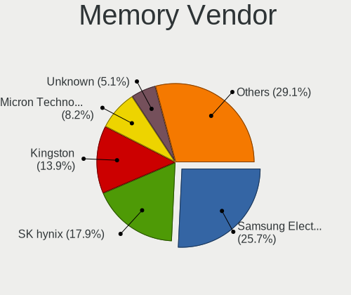

| Vendor                                           | Notebooks | Percent |
|--------------------------------------------------|-----------|---------|
| Samsung Electronics                              | 235       | 25.74%  |
| SK hynix                                         | 163       | 17.85%  |
| Kingston                                         | 127       | 13.91%  |
| Micron Technology                                | 75        | 8.21%   |
| Unknown                                          | 47        | 5.15%   |
| A-DATA Technology                                | 40        | 4.38%   |
| Crucial                                          | 30        | 3.29%   |
| Unknown (ABCD)                                   | 29        | 3.18%   |
| Nanya Technology                                 | 18        | 1.97%   |
| Magnum Tech                                      | 15        | 1.64%   |
| Corsair                                          | 12        | 1.31%   |
| Goldkey                                          | 10        | 1.1%    |
| Unknown                                          | 10        | 1.1%    |
| Elpida                                           | 9         | 0.99%   |
| Ramaxel Technology                               | 8         | 0.88%   |
| Novatech                                         | 8         | 0.88%   |
| Neo Forza                                        | 8         | 0.88%   |
| 48spaces                                         | 6         | 0.66%   |
| Saikano                                          | 5         | 0.55%   |
| Memox                                            | 5         | 0.55%   |
| Unknown (0x0B45)                                 | 3         | 0.33%   |
| Transcend                                        | 3         | 0.33%   |
| Team                                             | 3         | 0.33%   |
| Super Talent                                     | 3         | 0.33%   |
| Patriot                                          | 3         | 0.33%   |
| Kingmax                                          | 3         | 0.33%   |
| Hikvision                                        | 3         | 0.33%   |
| Avant                                            | 3         | 0.33%   |
| Apacer                                           | 3         | 0.33%   |
| Teikon                                           | 2         | 0.22%   |
| PNY                                              | 2         | 0.22%   |
| Netac                                            | 2         | 0.22%   |
| Lexar                                            | 2         | 0.22%   |
| Kimtigo                                          | 2         | 0.22%   |
| Innodisk                                         | 2         | 0.22%   |
| G.Skill                                          | 2         | 0.22%   |
| CSX                                              | 2         | 0.22%   |
| Wodposit                                         | 1         | 0.11%   |
| Unknown (0x4E41324D3030314733374455202020202020) | 1         | 0.11%   |
| Unknown (0x4D342037305432393533455A332D43453620) | 1         | 0.11%   |

Memory Model
------------

Memory module models

| Model                                                                     | Notebooks | Percent |
|---------------------------------------------------------------------------|-----------|---------|
| Unknown (ABCD) RAM 123456789012345678 2GB SODIMM LPDDR3 2400MT/s          | 28        | 2.89%   |
| SK hynix RAM HMAA1GS6CJR6N-XN 8GB SODIMM DDR4 3200MT/s                    | 19        | 1.96%   |
| Samsung RAM M471A5244CB0-CRC 4GB SODIMM DDR4 2667MT/s                     | 19        | 1.96%   |
| SK hynix RAM HMA81GS6AFR8N-UH 8GB SODIMM DDR4 2667MT/s                    | 17        | 1.76%   |
| Samsung RAM M471A1G44AB0-CWE 8GB SODIMM DDR4 3200MT/s                     | 17        | 1.76%   |
| Samsung RAM M471A5244CB0-CTD 4GB SODIMM DDR4 3266MT/s                     | 15        | 1.55%   |
| Magnum Tech RAM MAGNUMTECH 4GB SODIMM DDR3 1600MT/s                       | 15        | 1.55%   |
| Nanya RAM NT2GC64B88B0NS-CG 2GB SODIMM DDR3 1334MT/s                      | 11        | 1.14%   |
| Samsung RAM M471B5173EB0-YK0 4GB SODIMM DDR3 1600MT/s                     | 10        | 1.03%   |
| Samsung RAM M471A1K43CB1-CRC 8GB SODIMM DDR4 2667MT/s                     | 10        | 1.03%   |
| Unknown                                                                   | 10        | 1.03%   |
| Samsung RAM M471A5244CB0-CWE 4096MB SODIMM DDR4 3200MT/s                  | 9         | 0.93%   |
| Samsung RAM M471B5273CH0-CH9 4GB SODIMM DDR3 1334MT/s                     | 8         | 0.83%   |
| Samsung RAM M471B5173DB0-YK0 4GB SODIMM DDR3 1600MT/s                     | 8         | 0.83%   |
| Samsung RAM M471A1K43DB1-CWE 8GB SODIMM DDR4 3200MT/s                     | 8         | 0.83%   |
| SK hynix RAM HMT451S6BFR8A-PB 4096MB SODIMM DDR3 1600MT/s                 | 7         | 0.72%   |
| Samsung RAM M471B5273DH0-CH9 4GB SODIMM DDR3 1334MT/s                     | 7         | 0.72%   |
| SK hynix RAM HMT451S6BFR8A-PB 4GB SODIMM DDR3 1600MT/s                    | 6         | 0.62%   |
| SK hynix RAM HMT351S6CFR8C-PB 4GB SODIMM DDR3 1600MT/s                    | 6         | 0.62%   |
| Samsung RAM M471B5773CHS-CH9 2GB SODIMM DDR3 4199MT/s                     | 6         | 0.62%   |
| Samsung RAM M471B1G73QH0-YK0 8GB SODIMM DDR3 1600MT/s                     | 6         | 0.62%   |
| Samsung RAM M471A1G44AB0-CWE 8GB Row Of Chips DDR4 3200MT/s               | 6         | 0.62%   |
| 48spaces RAM 012345678901234567890123456789012345 2GB SODIMM DDR2 667MT/s | 6         | 0.62%   |
| SK hynix RAM HMA851S6AFR6N-UH 4GB SODIMM DDR4 2667MT/s                    | 5         | 0.52%   |
| SK hynix RAM HMA82GS6DJR8N-XN 16GB SODIMM DDR4 3200MT/s                   | 5         | 0.52%   |
| SK hynix RAM HMA81GS6AFR8N-UH 8GB SODIMM DDR4 2400MT/s                    | 5         | 0.52%   |
| Samsung RAM M471B1G73EB0-YK0 8GB SODIMM DDR3 1600MT/s                     | 5         | 0.52%   |
| Samsung RAM M471B1G73DB0-YK0 8GB SODIMM DDR3 1600MT/s                     | 5         | 0.52%   |
| Samsung RAM M471A1K43EB1-CWE 8GB SODIMM DDR4 3200MT/s                     | 5         | 0.52%   |
| Saikano RAM Memory 4GB SODIMM DDR3 1333MT/s                               | 5         | 0.52%   |
| Micron RAM 4ATF51264HZ-2G6E1 4GB SODIMM DDR4 2667MT/s                     | 5         | 0.52%   |
| Kingston RAM 99U5700-027.A00G 8GB SODIMM DDR4 2667MT/s                    | 5         | 0.52%   |
| A-DATA RAM Module 32GB SODIMM DDR4 3200MT/s                               | 5         | 0.52%   |
| Unknown RAM Module 4GB SODIMM DDR3                                        | 4         | 0.41%   |
| Unknown RAM Module 2GB SODIMM DDR2                                        | 4         | 0.41%   |
| SK hynix RAM HMT351S6BFR8C-H9 4GB SODIMM DDR3 1333MT/s                    | 4         | 0.41%   |
| SK hynix RAM HMAA1GS6CJR6N-XN 8GB Row Of Chips DDR4 3200MT/s              | 4         | 0.41%   |
| SK hynix RAM HMA851S6AFR6N-UH 4GB SODIMM DDR4 2400MT/s                    | 4         | 0.41%   |
| SK hynix RAM HMA81GS6DJR8N-XN 8GB SODIMM DDR4 3200MT/s                    | 4         | 0.41%   |
| Samsung RAM M471B5673FH0-CH9 2GB SODIMM DDR3 1334MT/s                     | 4         | 0.41%   |

Memory Kind
-----------

Memory module kinds

| Kind    | Notebooks | Percent |
|---------|-----------|---------|
| DDR4    | 339       | 46.37%  |
| DDR3    | 259       | 35.43%  |
| LPDDR4  | 44        | 6.02%   |
| DDR2    | 33        | 4.51%   |
| SDRAM   | 14        | 1.92%   |
| LPDDR3  | 13        | 1.78%   |
| LPDDR5  | 12        | 1.64%   |
| DRAM    | 6         | 0.82%   |
| DDR5    | 6         | 0.82%   |
| DDR     | 4         | 0.55%   |
| Unknown | 1         | 0.14%   |

Memory Form Factor
------------------

Physical design of the memory module

| Name         | Notebooks | Percent |
|--------------|-----------|---------|
| SODIMM       | 680       | 92.02%  |
| Row Of Chips | 52        | 7.04%   |
| DIMM         | 4         | 0.54%   |
| Chip         | 2         | 0.27%   |
| Unknown      | 1         | 0.14%   |

Memory Size
-----------

Memory module size

| Size  | Notebooks | Percent |
|-------|-----------|---------|
| 8192  | 316       | 37.44%  |
| 4096  | 258       | 30.57%  |
| 2048  | 118       | 13.98%  |
| 16384 | 105       | 12.44%  |
| 1024  | 23        | 2.73%   |
| 32768 | 19        | 2.25%   |
| 512   | 4         | 0.47%   |
| 6144  | 1         | 0.12%   |

Memory Speed
------------

Memory module speed

| Speed   | Notebooks | Percent |
|---------|-----------|---------|
| 2667    | 166       | 20.12%  |
| 3200    | 160       | 19.39%  |
| 1600    | 157       | 19.03%  |
| 2400    | 78        | 9.45%   |
| 1333    | 57        | 6.91%   |
| 1334    | 43        | 5.21%   |
| 2133    | 27        | 3.27%   |
| Unknown | 23        | 2.79%   |
| 667     | 18        | 2.18%   |
| 3266    | 15        | 1.82%   |
| 1067    | 12        | 1.45%   |
| 4199    | 8         | 0.97%   |
| 800     | 8         | 0.97%   |
| 6400    | 7         | 0.85%   |
| 533     | 7         | 0.85%   |
| 4800    | 6         | 0.73%   |
| 2048    | 5         | 0.61%   |
| 1066    | 5         | 0.61%   |
| 4267    | 4         | 0.48%   |
| 975     | 4         | 0.48%   |
| 4266    | 3         | 0.36%   |
| 8400    | 2         | 0.24%   |
| 7500    | 2         | 0.24%   |
| 5500    | 2         | 0.24%   |
| 2933    | 2         | 0.24%   |
| 1867    | 2         | 0.24%   |
| 7467    | 1         | 0.12%   |
| 400     | 1         | 0.12%   |

Printers & scanners
-------------------

Printer Vendor
--------------

Printer device vendors

| Vendor              | Notebooks | Percent |
|---------------------|-----------|---------|
| Hewlett-Packard     | 3         | 33.33%  |
| Brother Industries  | 3         | 33.33%  |
| Seiko Epson         | 1         | 11.11%  |
| QinHeng Electronics | 1         | 11.11%  |
| Kyocera             | 1         | 11.11%  |

Printer Model
-------------

Printer device models

| Model                   | Notebooks | Percent |
|-------------------------|-----------|---------|
| HP LaserJet 1020        | 2         | 22.22%  |
| Seiko Epson L120 Series | 1         | 11.11%  |
| QinHeng CH340S          | 1         | 11.11%  |
| Kyocera ECOSYS M3550idn | 1         | 11.11%  |
| HP DeskJet F300 series  | 1         | 11.11%  |
| Brother HL-1200 series  | 1         | 11.11%  |
| Brother HL-1110 series  | 1         | 11.11%  |
| Brother DCP-1600        | 1         | 11.11%  |

Scanner Vendor
--------------

Scanner device vendors

Zero info for selected period =(

Scanner Model
-------------

Scanner device models

Zero info for selected period =(

Camera
------

Camera Vendor
-------------

Camera device vendors

| Vendor                                 | Notebooks | Percent |
|----------------------------------------|-----------|---------|
| Chicony Electronics                    | 257       | 21.17%  |
| IMC Networks                           | 131       | 10.79%  |
| Realtek Semiconductor                  | 101       | 8.32%   |
| Microdia                               | 93        | 7.66%   |
| Bison Electronics                      | 89        | 7.33%   |
| Sunplus Innovation Technology          | 52        | 4.28%   |
| Quanta                                 | 52        | 4.28%   |
| Syntek                                 | 48        | 3.95%   |
| Suyin                                  | 47        | 3.87%   |
| Cheng Uei Precision Industry (Foxlink) | 43        | 3.54%   |
| Alcor Micro                            | 35        | 2.88%   |
| Acer                                   | 34        | 2.8%    |
| Silicon Motion                         | 33        | 2.72%   |
| SunplusIT                              | 22        | 1.81%   |
| Luxvisions Innotech Limited            | 19        | 1.57%   |
| Lite-On Technology                     | 16        | 1.32%   |
| Logitech                               | 15        | 1.24%   |
| Apple                                  | 15        | 1.24%   |
| Ricoh                                  | 14        | 1.15%   |
| Sonix Technology                       | 11        | 0.91%   |
| icSpring                               | 10        | 0.82%   |
| Z-Star Microelectronics                | 8         | 0.66%   |
| Y Media                                | 8         | 0.66%   |
| Samsung Electronics                    | 8         | 0.66%   |
| OmniVision Technologies                | 5         | 0.41%   |
| Importek                               | 4         | 0.33%   |
| GEMBIRD                                | 4         | 0.33%   |
| ALi                                    | 4         | 0.33%   |
| USB Camera CS                          | 3         | 0.25%   |
| Lenovo                                 | 3         | 0.25%   |
| globaloptics                           | 3         | 0.25%   |
| OYT Tech                               | 2         | 0.16%   |
| KYE Systems (Mouse Systems)            | 2         | 0.16%   |
| Jieli Technology                       | 2         | 0.16%   |
| Intel                                  | 2         | 0.16%   |
| Cubeternet                             | 2         | 0.16%   |
| Aveo Technology                        | 2         | 0.16%   |
| ANYKA                                  | 2         | 0.16%   |
| Unknown                                | 1         | 0.08%   |
| Tripath Technology                     | 1         | 0.08%   |

Camera Model
------------

Camera device models

| Model                                                          | Notebooks | Percent |
|----------------------------------------------------------------|-----------|---------|
| IMC Networks USB2.0 VGA UVC WebCam                             | 41        | 3.36%   |
| IMC Networks Integrated Camera                                 | 40        | 3.28%   |
| Chicony USB 2.0 Camera                                         | 35        | 2.87%   |
| Microdia Integrated_Webcam_HD                                  | 31        | 2.54%   |
| Chicony Integrated Camera                                      | 29        | 2.38%   |
| Bison Integrated Camera                                        | 29        | 2.38%   |
| Alcor Micro USB 2.0 Camera                                     | 29        | 2.38%   |
| Realtek Integrated_Webcam_HD                                   | 26        | 2.13%   |
| Sunplus Integrated_Webcam_HD                                   | 21        | 1.72%   |
| IMC Networks USB2.0 HD UVC WebCam                              | 21        | 1.72%   |
| Syntek Integrated Camera                                       | 20        | 1.64%   |
| SunplusIT USB 2M Camera                                        | 20        | 1.64%   |
| Chicony Lenovo EasyCamera                                      | 16        | 1.31%   |
| Realtek USB Camera                                             | 15        | 1.23%   |
| Chicony HD WebCam                                              | 15        | 1.23%   |
| Cheng Uei Precision Industry (Foxlink) HP TrueVision HD Camera | 15        | 1.23%   |
| Chicony TOSHIBA Web Camera - HD                                | 14        | 1.15%   |
| Chicony USB2.0 Camera                                          | 13        | 1.07%   |
| Chicony HP TrueVision HD Camera                                | 13        | 1.07%   |
| Realtek USB2.0 camera                                          | 12        | 0.98%   |
| Luxvisions Innotech Limited Integrated Camera                  | 12        | 0.98%   |
| Acer USB Camera                                                | 12        | 0.98%   |
| Silicon Motion WebCam SC-0311139N                              | 10        | 0.82%   |
| Microdia USB 2.0 Camera                                        | 10        | 0.82%   |
| icSpring camera                                                | 10        | 0.82%   |
| Syntek EasyCamera                                              | 9         | 0.74%   |
| Microdia Integrated Webcam                                     | 9         | 0.74%   |
| Lite-On Integrated Camera                                      | 9         | 0.74%   |
| Chicony USB2.0 VGA UVC WebCam                                  | 9         | 0.74%   |
| Bison SunplusIT Integrated Camera                              | 9         | 0.74%   |
| Bison Lenovo EasyCamera                                        | 9         | 0.74%   |
| Z-Star Webcam                                                  | 8         | 0.66%   |
| Y Media USB Camera                                             | 8         | 0.66%   |
| Samsung Galaxy series, misc. (MTP mode)                        | 8         | 0.66%   |
| Quanta ACER HD User Facing                                     | 8         | 0.66%   |
| Chicony Integrated Camera (1280x720@30)                        | 8         | 0.66%   |
| Chicony HP Wide Vision HD Camera                               | 8         | 0.66%   |
| Chicony HD camera                                              | 8         | 0.66%   |
| Chicony EasyCamera                                             | 8         | 0.66%   |
| Cheng Uei Precision Industry (Foxlink) HP Webcam               | 8         | 0.66%   |

Security
--------

Fingerprint Vendor
------------------

Fingerprint sensor vendors

| Vendor                             | Notebooks | Percent |
|------------------------------------|-----------|---------|
| Synaptics                          | 51        | 31.1%   |
| Validity Sensors                   | 47        | 28.66%  |
| Shenzhen Goodix Technology         | 28        | 17.07%  |
| AuthenTec                          | 10        | 6.1%    |
| Elan Microelectronics              | 9         | 5.49%   |
| Upek                               | 8         | 4.88%   |
| LighTuning Technology              | 7         | 4.27%   |
| STMicroelectronics                 | 2         | 1.22%   |
| Realtek USB2.0 Finger Print Bridge | 1         | 0.61%   |
| Focal-systems.Corp                 | 1         | 0.61%   |

Fingerprint Model
-----------------

Fingerprint sensor models

| Model                                                                      | Notebooks | Percent |
|----------------------------------------------------------------------------|-----------|---------|
| Synaptics Prometheus MIS Touch Fingerprint Reader                          | 23        | 14.02%  |
| Shenzhen Goodix  FingerPrint Device                                        | 22        | 13.41%  |
| Synaptics  WBDI                                                            | 14        | 8.54%   |
| Validity Sensors VFS5011 Fingerprint Reader                                | 11        | 6.71%   |
| Validity Sensors VFS 5011 fingerprint sensor                               | 9         | 5.49%   |
| Upek Biometric Touchchip/Touchstrip Fingerprint Sensor                     | 8         | 4.88%   |
| Validity Sensors Fingerprint scanner                                       | 6         | 3.66%   |
| Synaptics Metallica MIS Touch Fingerprint Reader                           | 6         | 3.66%   |
| Shenzhen Goodix Fingerprint Reader                                         | 5         | 3.05%   |
| Elan ELAN:ARM-M4                                                           | 5         | 3.05%   |
| Validity Sensors VFS495 Fingerprint Reader                                 | 4         | 2.44%   |
| Validity Sensors Synaptics VFS7552 Touch Fingerprint Sensor with PurePrint | 4         | 2.44%   |
| LighTuning ES603 Swipe Fingerprint Sensor                                  | 4         | 2.44%   |
| Elan ELAN:Fingerprint                                                      | 4         | 2.44%   |
| AuthenTec AES2501 Fingerprint Sensor                                       | 4         | 2.44%   |
| Validity Sensors VFS301 Fingerprint Reader                                 | 3         | 1.83%   |
| Validity Sensors Synaptics WBDI                                            | 3         | 1.83%   |
| AuthenTec AES2810                                                          | 3         | 1.83%   |
| Validity Sensors VFS101 Fingerprint Reader                                 | 2         | 1.22%   |
| Validity Sensors Swipe Fingerprint Sensor                                  | 2         | 1.22%   |
| Synaptics UWP WBDI Device                                                  | 2         | 1.22%   |
| STMicroelectronics Fingerprint Reader                                      | 2         | 1.22%   |
| LighTuning EgisTec Touch Fingerprint Sensor                                | 2         | 1.22%   |
| AuthenTec Fingerprint Sensor                                               | 2         | 1.22%   |
| Validity Sensors VFS7552 Touch Fingerprint Sensor                          | 1         | 0.61%   |
| Validity Sensors VFS491                                                    | 1         | 0.61%   |
| Validity Sensors VFS300 Fingerprint Reader                                 | 1         | 0.61%   |
| Synaptics WBDI Fingerprint Reader USB 086                                  | 1         | 0.61%   |
| Synaptics TouchPad                                                         | 1         | 0.61%   |
| Synaptics  FS7604 Touch Fingerprint Sensor with PurePrint                  | 1         | 0.61%   |
| Synaptics Prometheus Fingerprint Reader                                    | 1         | 0.61%   |
| Synaptics Fingerprint reader [HP G6]                                       | 1         | 0.61%   |
| Shenzhen Goodix FingerPrint                                                | 1         | 0.61%   |
| Realtek USB2.0 Finger Print Bridge FocalTech Fingerprint Device            | 1         | 0.61%   |
| LighTuning Fingerprint Sensor                                              | 1         | 0.61%   |
| Focal-systems.Corp FT9201Fingerprint.                                  | 1         | 0.61%   |
| AuthenTec AES1660 Fingerprint Sensor                                       | 1         | 0.61%   |
| Unknown                                                                    | 1         | 0.61%   |

Chipcard Vendor
---------------

Chipcard module vendors

| Vendor      | Notebooks | Percent |
|-------------|-----------|---------|
| Broadcom    | 29        | 63.04%  |
| Upek        | 11        | 23.91%  |
| O2 Micro    | 2         | 4.35%   |
| Lenovo      | 2         | 4.35%   |
| Alcor Micro | 2         | 4.35%   |

Chipcard Model
--------------

Chipcard module models

| Model                                                                        | Notebooks | Percent |
|------------------------------------------------------------------------------|-----------|---------|
| Upek TouchChip Fingerprint Coprocessor (WBF advanced mode)                   | 11        | 23.91%  |
| Broadcom BCM5880 Secure Applications Processor                               | 10        | 21.74%  |
| Broadcom BCM5880 Secure Applications Processor with fingerprint swipe sensor | 8         | 17.39%  |
| Broadcom 58200                                                               | 8         | 17.39%  |
| Broadcom 5880                                                                | 3         | 6.52%   |
| O2 Micro OZ776 CCID Smartcard Reader                                         | 2         | 4.35%   |
| Lenovo Integrated Smart Card Reader                                          | 2         | 4.35%   |
| Alcor Micro AU9540 Smartcard Reader                                          | 2         | 4.35%   |

Unsupported
-----------

Unsupported Devices
-------------------

Total unsupported devices on board

| Total | Notebooks | Percent |
|-------|-----------|---------|
| 0     | 945       | 69.18%  |
| 1     | 366       | 26.79%  |
| 2     | 51        | 3.73%   |
| 3     | 3         | 0.22%   |
| 8     | 1         | 0.07%   |

Unsupported Device Types
------------------------

Types of unsupported devices

| Type                     | Notebooks | Percent |
|--------------------------|-----------|---------|
| Fingerprint reader       | 162       | 33.96%  |
| Graphics card            | 126       | 26.42%  |
| Net/wireless             | 66        | 13.84%  |
| Chipcard                 | 42        | 8.81%   |
| Multimedia controller    | 24        | 5.03%   |
| Camera                   | 19        | 3.98%   |
| Bluetooth                | 12        | 2.52%   |
| Communication controller | 7         | 1.47%   |
| Net/ethernet             | 5         | 1.05%   |
| Sound                    | 4         | 0.84%   |
| Network                  | 4         | 0.84%   |
| Modem                    | 2         | 0.42%   |
| Flash memory             | 2         | 0.42%   |
| Card reader              | 2         | 0.42%   |

